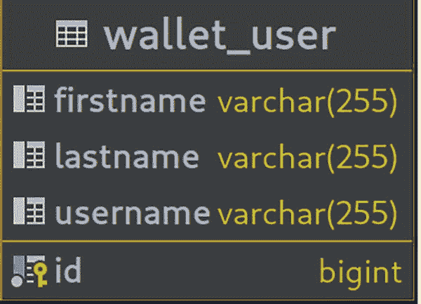
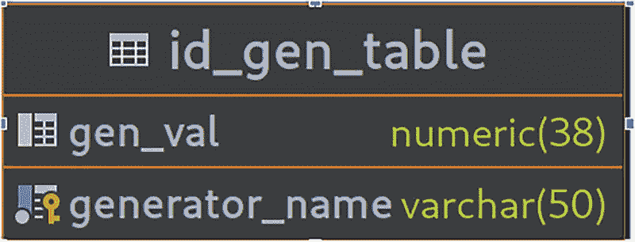
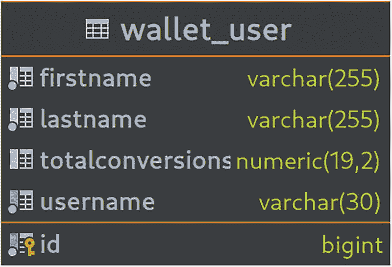
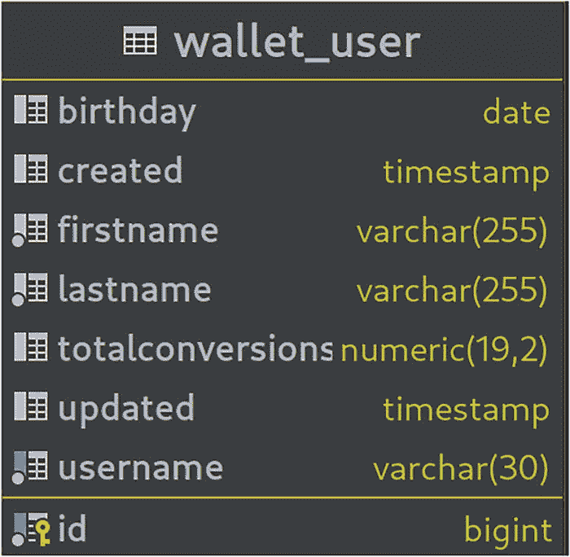
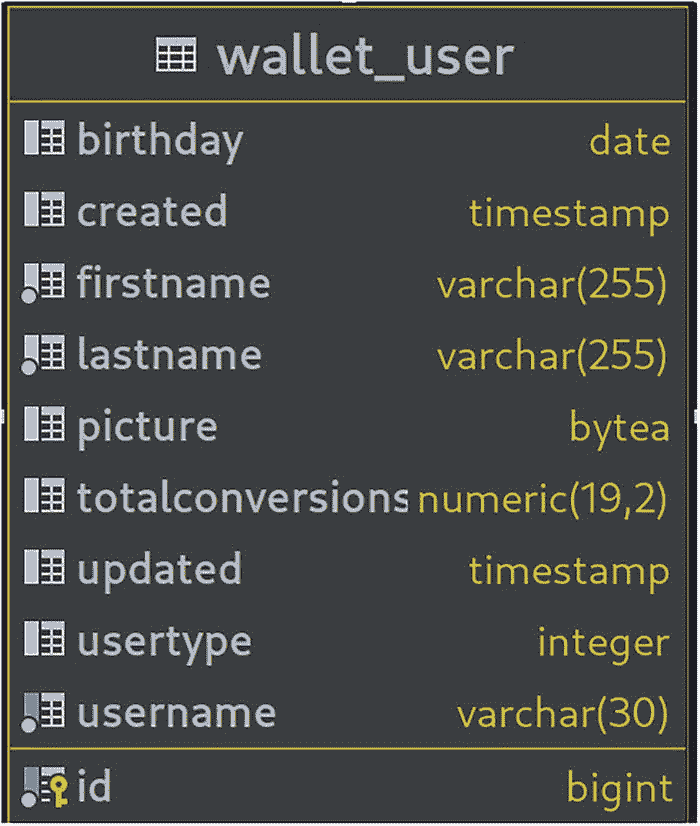
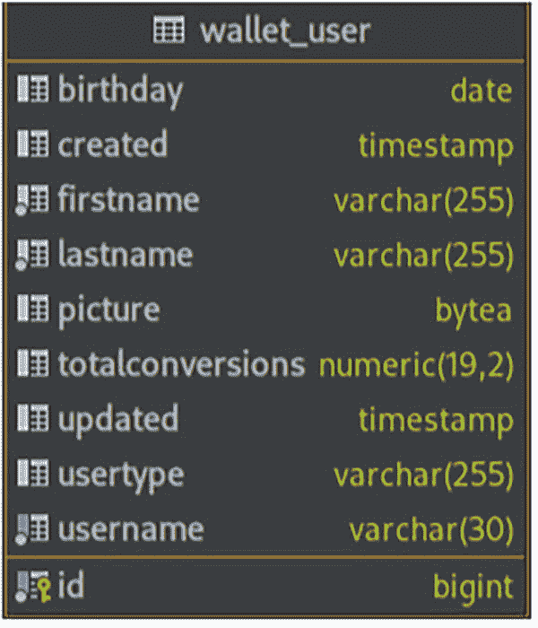
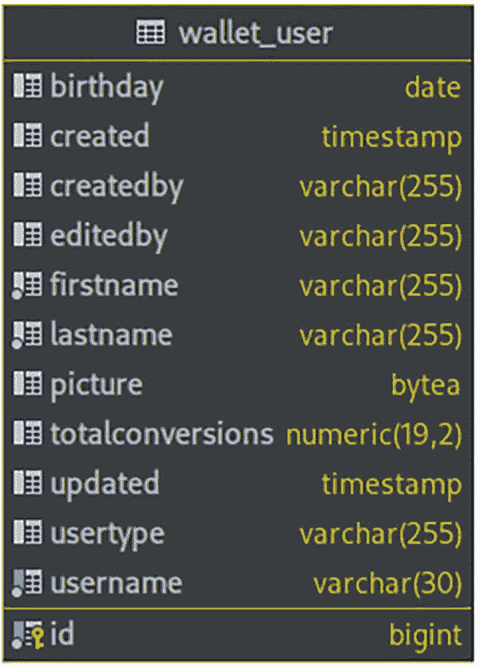
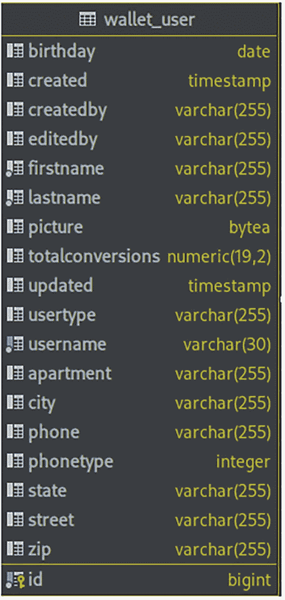
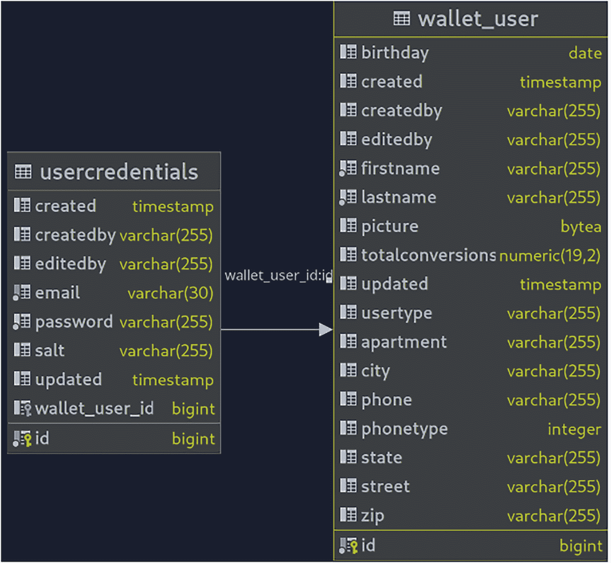

# 5. 使用 Jakarta EE 持久化进行持久化

每个应用程序在执行过程中都需要在某个时刻将数据存储到持久化数据存储中。数据存储可以简单如一个平面文件，也可以复杂如一个完整的数据库管理系统。数据存储充当应用程序的单一事实来源。例如，你在银行的账户余额就存储在某种形式的数据存储中。这个单一数据是银行识别其为你保管了多少钱的唯一事实来源。

无论应用程序使用何种语言和平台编写，将应用程序数据存储到持久化数据存储的过程通常涵盖三大类别，即数据建模、数据持久化和数据检索。在 Java 企业版中，Jakarta 持久化 API 是一个功能完备的规范，允许你通过使用注解和直观的接口来实现这三个广泛的应用程序数据持久化类别。

本章介绍如何使用 Jakarta 持久化 API（JPA）将数据持久化到关系数据库。目标不是教你关于 JPA 的所有知识，而是让你掌握满足非常常见的应用程序数据持久化需求所需的基本知识。如需更全面的 JPA 概述和参考，请查阅规范^(¹⁰⁰)文档。本章分为数据建模、数据持久化和数据检索三个主要部分。

本章中的所有示例都使用 Postgres 数据库作为底层数据库。然而，只要你使用 JPA 构造，相同的原则应适用于所有数据库引擎。学完本章后，你应该能够熟练使用 JPA 规范将应用程序数据持久化到关系数据库。


## JPA 概览

Jakarta Persistence API（通常称为 JPA）是 Jakarta EE 规范，它定义了应用程序如何对关系数据库中的数据进行建模、存储和检索。JPA 大量使用注解，以避免你的 Java 工件必须扩展或实现 API 中的接口。JPA 通过提供将普通 Java 类映射到关系数据库表的构造，帮助你解决对象-关系阻抗不匹配问题。

作为一名 Java 开发者，你对面向对象编程和设计非常熟悉。然而，这种范式在数据库管理方面并不能很好地转换。JPA API 允许你在熟悉的 Java 上下文中对数据进行建模和查询，而无需深入钻研关系数据库管理系统的技术细节。它还抽象了底层数据库，将不同数据库的处理工作留给了运行时。除非在非常高级的情况下，否则作为开发者，你无需过多了解应用程序所使用的数据库。

需要注意的是，JPA 并不能取代 SQL 或数据库系统知识。JPA 所做的是让 Java 开发者能够以更“Java 的方式”对数据进行建模、持久化和查询。尽管如此，要充分利用 JPA API，仍然需要具备一定的 SQL 知识。

### JPA 运行时

在本章中，会多次提到 JPA 运行时。运行时是 Jakarta Persistence 规范的实际实现，它执行你通过各种 API 构造发出的 JPA“指令”。它将高级的 JPA 构造转换为低级的、特定于数据库的 schema 和查询。正如前几章所讨论的，Jakarta EE 由多个独立的规范组成，每个规范都有不同的实现。JPA 规范也有随不同 Jakarta EE 容器一起提供的实现。一些流行的实现包括 Hibernate 和 EclipseLink。

### 数据建模

JPA 的建模方面几乎完全由 `jakarta.persistence` 包中的注解处理。这些注解将 POJO 转换为 JPA 实体，这些实体可以根据它们的相互关系和层次结构进行建模，并随后映射到关系数据库表。例如，一个实体可能继承另一个实体，包含另一个类型的列表，并且自身又被包含在另一个类的集合中。所有这些都可以使用 `jakarta.persistence` 包中的注解映射到关系数据库的实体关系。

### 数据持久化

在 JPA 中，用于持久化、更新和查询数据的核心工件是 `EntityManager` 接口。该接口包含了将数据存入数据库、更新和查询数据所需的所有方法。按照 Jakarta EE 平台的惯例，底层的 JPA 规范实现会在运行时为 `EntityManager` 接口提供实现。

### 查询

查询数据与持久化数据同等重要。JPA 有两个用于查询数据的 API，即 Java 持久化查询语言（Java Persistence Query Language）和 Criteria API。这两种构造允许你编写预先已知的查询，以及运行时出现的、更具动态性的搜索类查询。`EntityManager` 接口提供了使用这两种 API 构造创建查询的方法。

借助 Jakarta Persistence API，你可以创建具有复杂数据层次结构和关系的应用程序，并通过熟悉的 Java 语言将其映射到关系数据库。这使得 JPA API 成为每位 Jakarta EE 开发者工具箱中的关键工具集。本章的其余部分将讨论前面列出的三个要点。

## 使用 JPA 进行数据建模

### 最简单的单元

JPA 工件的最简单单元是普通 Java 对象，即 POJO。清单 5-1 展示了一个将被转换为实体的 User POJO。

```
public class User {
private String firstName;
private String lastName;
private String username;
}
清单 5-1
展示了 User POJO
```

清单 5-1 展示了一个非常基础的 User Java 类。要将此类映射到关系数据库表，使得每个字段都映射到一个表列，我们需要将其转换为 JPA 实体。将 Java 类转换为 JPA 实体的主要注解是 `@Entity` 注解。清单 5-2 展示了现在已转换为 JPA 实体的 User 类。

```
@Entity
public class User {
private String firstName;
private String lastName;
private String username;
}
清单 5-2
展示了 User 实体
```

清单 5-2 展示了 User 实体。至此，User 类现在是一个 JPA 实体，将被映射到一个数据库表。该类将被映射到的数据库表名称默认为实体类的名称，在本例中为 `User`。要自定义表名，可以使用 `@Table` 注解，如清单 5-3 所示。

```
@Entity
@Table(name = "WALLET_USER")
public class User {
private String firstName;
private String lastName;
private String username;
}
清单 5-3
展示了具有自定义表名的 User 实体
```

清单 5-3 展示了使用 `@Table` 注解来自定义该实体将被映射到的关系数据库表名。有了这些注解，User 类现在是一个 JPA 实体，将被映射到关系数据库表 `wallet_user`，其实例将映射到表中的行。

### 主键生成

尽管清单 5-3 中展示的 User 实体将被映射到关系数据库表 `wallet_user`，但它没有主键。在关系数据库中，主键是表中每一行的技术唯一标识符。然而，User 实体尚未声明主键。为了解决这个问题，清单 5-4 展示了带有主键字段的 User 类的更新版本。

```
@Entity
@Table(name = "WALLET_USER")
public class User {
@Id
@GeneratedValue(strategy = GenerationType.AUTO)
protected Long id;
private String firstName;
private String lastName;
private String username;
}
清单 5-4
展示了更新后的 User 实体
```

清单 5-4 展示了 User 实体，现在有一个名为 `id` 的 `Long` 类型字段。该字段使用了 `@Id` 和 `@GeneratedValue(strategy=GenerationType.AUTO)` 注解。`@Id` 注解告诉运行时，User 表的主键应映射到此字段。`@Id` 注解允许的字段类型是 Java 原始类型或其对应的包装类、`String`、`java.util.Date`、`java.sql.Date`、`java.math.BigDecimal` 和 `java.math.BigInteger`。运行时负责将带注解的字段映射到所使用的底层数据库的相应类型。


#### ID 生成

id 字段上的第二个注解是 `@GeneratedValue` 注解。该注解用于通过 `strategy` 参数告知运行时如何生成主键值。`strategy` 参数的类型为 `GenerationType`，默认值为 `AUTO`。`GenerationType` 的可能取值包括 `TABLE`、`SEQUENCE`、`IDENTITY` 和 `AUTO`。由于默认值为 `AUTO`，清单 5-4 中展示的 `User` 实体可以简化为清单 5-5 所示的内容。

```
@Entity
@Table(name = "WALLET_USER")
public class User {
@Id
@GeneratedValue
protected Long id;
private String firstName;
private String lastName;
private String username;
}
清单 5-5
展示了 User 实体的简化 ID 生成
```

清单 5-5 展示了主键生成策略设置为 `AUTO`，即 `@GeneratedValue` 注解的默认值。清单 5-6 展示了图 5-1 中声明的 `User` 实体所对应的数据库模式图。



该模式图描绘了钱包用户表，其中包含名字、姓氏、用户名和 ID。

图 5-1
钱包实体模式

```
create table wallet_user
(
id        bigint not null primary key,
firstname varchar(255),
lastname  varchar(255),
username  varchar(255)
);
清单 5-6
展示了该实体对应的数据定义语言 (DDL)
```

##### AUTO

`AUTO` 主键生成策略将如何生成主键的决策委托给底层运行时。这意味着应用程序要求 JPA 运行时根据字段类型和所使用的底层数据库引擎来选择最佳的主键生成策略。

如果主键仅用作技术性的数据库唯一行标识符，那么 `AUTO` 策略就足够了。它也是开发和快速原型设计的理想选择。当模式生成由运行时完成时（我们将在本章后面讨论模式生成），`AUTO` 也能发挥最佳效果。`AUTO` 仅适用于整型字段类型。

##### TABLE

`TABLE` 生成策略是最灵活且可扩展性最强的生成策略。清单 5-7 展示了使用 `TABLE` 生成策略进行主键生成的 `User` 实体。

```
@Entity
@Table(name = "WALLET_USER")
public class User {
@Id
@GeneratedValue(strategy=GenerationType.TABLE)
protected Long id;
private String firstName;
private String lastName;
private String username;
}
清单 5-7
展示了使用 TABLE 主键生成的 User 实体
```

清单 5-7 展示了采用 `TABLE` 主键生成策略的 `User` 实体。照此配置，运行时将负责创建 ID 表（如果使用了模式生成）。如果运行时未进行模式生成，则声明的 ID 表应在应用程序启动之前存在。

ID 表是一个包含两个字段的表——一个字符串类型和一个整型。第一列是表中所有生成器的主标识符。第二列（整型）存储实际生成的 ID 序列。清单 5-8 展示了一个更详细的 `TABLE` 生成示例，其中我们通过 `@TableGenerator` 注解显式定义了 ID 生成表。

```
@Entity
@Table(name = "WALLET_USER")
public class User {
@Id
@TableGenerator(name = "ID_Gen",
table = "ID_GEN_TABLE",
pkColumnName = "GENERATOR_NAME",
pkColumnValue = "GENERATED_VALUE",
valueColumnName = "GEN_VAL")
@GeneratedValue(strategy = GenerationType.TABLE,
generator = "ID_Gen")
protected Long id;
private String firstName;
private String lastName;
private String username;
}
清单 5-8
展示了具有显式表生成的 User 实体
```

清单 5-8 展示了使用 `@TableGenerator` 注解来显式指定 ID 表生成。该注解的第一个参数指定了生成器的名称。此名称随后被传递给 `@GeneratedValue` 注解的 `generator` 参数。`@TableGenerator` 注解的其他参数如下：

*   `table` – 指定此生成器对应的数据库表名。
*   `pkColumnName` – 指定此表中唯一标识符的列名。
*   `pkColumnValue` – 指定表中 `pkColumnName` 列的实际值。
*   `valueColumnName` – 指定用于存储 ID 序列的列名。

这种 `TABLE` ID 生成将产生如清单 5-9 所示的数据库模式。

```
create table id_gen_table
(
generator_name varchar(50) not null primary key,
gen_val        numeric(38)
);
清单 5-9
展示了 User 实体生成的 ID 表
```

图 5-2 展示了 ID 生成表对应的模式图。



该模式图描绘了一个 ID 生成表，其中包含生成器名称和生成器值。

图 5-2
ID 生成表模式

在应用程序运行时，JPA 提供者（运行时，实现）将为该表分配一个标识符块。默认的分配块大小为 50。运行时将从此块中在内存里分配 ID，直到达到分配大小；当请求 ID 时，会触发另一轮预分配，然后在内存中用于分配 ID，依此类推。分配大小可以通过 `@TableGenerator` 进行自定义。您还可以设置 `gen_val` 列的初始值，对于整型，该值默认为零。

##### SEQUENCE

`SEQUENCE` 标识生成策略与 `TABLE` 策略类似，用于底层数据库支持序列 ID 生成机制的情况。将 `@GeneratedValue` 的策略设置为 `SEQUENCE` 将导致底层运行时为您创建所需的序列生成器。可以使用 `@SequenceGenerator` 显式创建序列生成表，这与我们在 `TABLE` 策略中使用 `@TableGenerator` 讨论的方式非常相似。

##### IDENTITY

`IDENTITY` 序列生成策略用于底层数据库支持自动编号功能的情况。当向数据库插入一行时，引擎会自动为主键列分配一个值。`IDENTITY` 非常依赖于数据库，因此在 JPA 应用程序中并不常用。


### 自定义列

清单 5-5 中展示的 User 实体默认会使用字段名作为数据库列名。不过，你可以使用 `@Column` 注解来自定义这些列。当你正在开发的应用程序需要与现有数据库模式（通常来自遗留应用程序）配合使用时，这一点非常重要。`@Column` 注解还可用于在数据库的列上设置一些约束和属性。清单 5-10 展示了使用 `@Column` 自定义某些字段的 User 实体。

```
@Entity
@Table(name = "WALLET_USER")
public class User {
@Id
@GeneratedValue(strategy = GenerationType.AUTO)
protected Long id;
@Column(nullable = false)
private String firstName;
@Column(nullable = false)
private String lastName;
@Column(unique = true, length = 30, nullable = false)
private String username;
@Column(precision = 19, scale = 2)
private BigDecimal totalConversions;
}
清单 5-10
展示了使用 @Column 注解自定义实体字段
```

清单 5-10 展示了一个更新后的 User 实体，其中包含 `@Column` 自定义设置以及对某些字段的约束。`firstName` 和 `lastName` 被约束为不能为空。这意味着数据库将对每次插入 `wallet_user` 表的操作强制执行非空检查。`username` 列被设置为不可为空且唯一，其长度也被设置为 30 个可变字符。`totalConversions` 字段是一个数字字段，其精度设置为 19，小数位数设置为 2。User 实体的更新后模式图如图 5-3 所示。



该模式图描绘了包含 first name、last name、user name、total conversions 和 ID 的 wallet_user 表。

图 5-3
更新后的 User 模式

来自新 User 实体的相应 DDL 也显示在清单 5-11 中。

```
create table if not exists wallet_user
(
id               bigint       not null primary key,
firstname        varchar(255) not null,
lastname         varchar(255) not null,
totalconversions numeric(19, 2),
username         varchar(30)  not null unique
);
清单 5-11
展示了更新后的 User 实体 DDL
```

### 映射时间类型

使用 Java 8 的 `java.time` 包将日期类型映射到数据库列是一项直接的任务。清单 5-12 展示了包含三个新的 `java.time` 类型的 User 实体。

```
@Entity
@Table(name = "WALLET_USER")
public class User {
@Id
@GeneratedValue(strategy = GenerationType.AUTO)
protected Long id;
@Column(nullable = false)
private String firstName;
@Column(nullable = false)
private String lastName;
@Column(unique = true, length = 30, nullable = false)
private String username;
@Column(precision = 19, scale = 2)
private BigDecimal totalConversions;
private LocalDate birthDay;
private LocalDateTime created;
private LocalDateTime updated;
}
清单 5-12
展示了在 User 实体中使用 java.time 类型进行时间映射
```

清单 5-12 展示了 User 实体中的三个新字段。`birthDay` 字段的类型为 `java.time.LocalDate`，`created` 和 `updated` 字段的类型为 `java.time.LocalDateTime`。`LocalDate` 类型将映射到 SQL 的 `date` 类型，而 `LocalDateTime` 类型将映射到数据库中的 `timestamp` 类型。User 实体的更新后模式图如图 5-4 所示。



更新后的 User 实体模式图描绘了以下字段：Birthday、created、first name、last name、total conversions、updated、user name 和 ID。

图 5-4
更新后的 User 实体模式

更旧的 `java.util.Date` 和 `java.util.Calendar` 类型也可以用于时间类型字段。但是，对于这些类型，需要使用 `@Temporal` 类型注解来选择要将字段映射到哪个 JDBC `java.sql` 类型。也可以使用 `java.sql.Date`、`java.sql.Time` 和 `java.sql.Timestamp`。这些类型会直接映射到相应的底层数据库类型，无需向运行时提供任何提示。

### 映射大对象

通常，应用程序需要将基于字节的对象映射到数据库。这些对象可能很大，具体取决于其类型。大对象（也称为 LOB）需要单独的 JDBC 调用来从数据库加载到 Java 中。因此，当用作字段类型时，我们需要通知运行时使用这些特殊调用。通知运行时关于 LOB 的方式是在大对象字段上使用 `@Lob` 注解。

可以映射到数据库的大对象有两种类型。它们是大型字符对象（CLOB），在 Java 中表示为 `char[]` 或 `Character[]`，长字符串对象会映射到数据库中的 CLOB 列类型。二进制大对象（BLOB），在 Java 中由 `byte[]`、`Byte[]` 和 `Serializable` 类型表示，会映射到数据库的 BLOB 列。清单 5-13 展示了包含一个用于存储账户持有人照片的 BLOB 字段的 User 实体。

```
@Entity
@Table(name = "WALLET_USER")
public class User {
@Id
@GeneratedValue(strategy = GenerationType.AUTO)
protected Long id;
@Column(nullable = false)
private String firstName;
@Column(nullable = false)
private String lastName;
@Column(unique = true, length = 30, nullable = false)
private String username;
@Column(precision = 19, scale = 2)
private BigDecimal totalConversions;
private LocalDate birthDay;
private LocalDateTime created;
private LocalDateTime updated;
@Lob
@Basic(fetch = FetchType.LAZY)
private byte[] picture;
}
清单 5-13
展示了包含 BLOB 字段的 User 实体
```

清单 5-13 展示了使用 `@Lob` 注解的 `byte[]` 类型的 `picture` 字段。该字段将映射到底层数据库的二进制大对象类型。

### 简单字段类型

`picture` 字段上的 `@Basic` 注解明确将该字段标记为基本类型或简单类型。在 JPA 术语中，User 实体中的所有字段都被称为简单类型。简单字段是可以直接映射到单个数据库列的字段。`@Basic` 注解用于表示简单字段类型。但是，除了 `picture` 字段之外，User 实体中的所有字段都可以完全省略该注解。

#### 懒加载

当从 User 实体映射到的表中加载一行数据时，所有映射到简单类型的列都会被加载。默认情况下，当从数据库加载一个实体实例时，该实体中的简单类型会被加载或获取。然而，有时获取简单类型的效率并不高。

以 User 实体为例，我们确实不希望每次加载实例时都获取用户的照片。为了通知运行时默认不获取二进制字段，可以将 `FetchType.LAZY` 类型传递给 `@Basic` 字段的 `fetch` 参数。


### 映射枚举

在实体中添加枚举字段类型即可将其映射到数据库列。默认情况下，枚举类型会映射到数据库中的整数类型列。这是因为 JPA 默认使用枚举的序数（ordinal）进行数据库映射。清单 5-14 展示了包含 UserType 字段的 User 实体。

```
@Entity
@Table(name = "WALLET_USER")
public class User {
@Id
@GeneratedValue(strategy = GenerationType.AUTO)
protected Long id;
@Column(nullable = false)
private String firstName;
@Column(nullable = false)
private String lastName;
@Column(unique = true, length = 30, nullable = false)
private String username;
@Column(precision = 19, scale = 2)
private BigDecimal totalConversions;
private LocalDate birthDay;
private LocalDateTime created;
private LocalDateTime updated;
@Lob
@Basic(fetch = FetchType.LAZY)
private byte[] picture;
private UserType userType;
}
清单 5-14
包含枚举字段的 User 实体
```

图 5-5 展示了包含枚举字段类型的 User 实体的模式图。



该模式图描绘了钱包用户表，包含以下字段：生日、创建时间、名字、姓氏、总转换次数、更新时间、用户类型、用户名和 ID。

图 5-5
枚举序数模式

对于这个特定的底层数据库，userType 被映射为一个整数。这意味着运行时传递给 userType 字段的 UserType 值的序数位置将被持久化。这种方法的问题在于，随着枚举中新增条目，现有的序数很容易发生变化。为了防止因序数变化而导致已持久化的枚举字段被映射到错误的枚举值，可以使用 `@EnumeratedType` 注解将映射的字段类型改为字符串。清单 5-15 展示了将 userType 字段映射为 String 类型。

```
@Entity
@Table(name = "WALLET_USER")
@Getter
@Setter
public class User {
@Id
@GeneratedValue(strategy = GenerationType.AUTO)
protected Long id;
@Column(nullable = false)
private String firstName;
@Column(nullable = false)
private String lastName;
@Column(unique = true, length = 30, nullable = false)
private String username;
@Column(precision = 19, scale = 2)
private BigDecimal totalConversions;
private LocalDate birthDay;
private LocalDateTime created;
private LocalDateTime updated;
@Lob
@Basic(fetch = FetchType.LAZY)
private byte[] picture;
@Enumerated(EnumType.STRING)
private UserType userType;
}
清单 5-15
展示了枚举到 String 的映射
```

`@Enumerated` 注解接受 `EnumType.STRING` 或 `EnumType.ORDINAL`。`ORDINAL` 是默认值，因此当像清单 5-14 那样省略该注解时，字段会被映射为序数。图 5-6 展示了更新后的模式图。



该模式图描绘了钱包用户表，包含以下字段：生日、创建时间、名字、姓氏、图片、总转换次数、更新时间、用户类型、用户名和 ID。

图 5-6
枚举字符串映射

userType 枚举字段现在被映射为 varchar，这代表了我们想要映射到的 String 类型。

### 瞬态字段

实体中的瞬态字段是指不映射到数据库列的字段。为了向运行时表明某个字段不应被持久化，可以在字段类型上使用 `transient` 修饰符或 `@Transient` 注解。被修饰或注解的字段不会映射到数据库列，也无法在数据检索时被查询。例如，清单 5-16 中展示的 User 实体包含一个带有 `transient` 修饰符的 age 字段，该字段在运行时计算得出，不应被持久化。

```
@Entity
@Table(name = "WALLET_USER")
@Getter
@Setter
public class User {
@Id
@GeneratedValue(strategy = GenerationType.AUTO)
protected Long id;
@Column(nullable = false)
private String firstName;
@Column(nullable = false)
private String lastName;
@Column(unique = true, length = 30, nullable = false)
private String username;
@Column(precision = 19, scale = 2)
private BigDecimal totalConversions;
private LocalDate birthDay;
private LocalDateTime created;
private LocalDateTime updated;
@Lob
@Basic(fetch = FetchType.LAZY)
private byte[] picture;
@Enumerated(EnumType.STRING)
private UserType userType;
private transient int age;
}
清单 5-16
展示了 transient 修饰符的使用
```

age 字段同样可以使用 `@Transient` 注解，效果相同。

### 字段访问与属性访问

到目前为止，User 实体中讨论的所有映射，其各自的 JPA 注解都位于字段上。这意味着 JPA 运行时将在运行时直接访问这些字段。这被称为字段访问。另一种访问类型是属性访问，即字段的 getter 方法上带有 JPA 注解。在实际应用中，属性访问的使用频率远不如字段访问。因此，本章以及本书其余部分的所有示例均采用字段访问。


### 通过继承进行组织

到目前为止，我们只研究了 User 这一个实体。然而，一个应用程序很少会只包含单个实体。无论实体数量多少，很多时候都会有一组实体共有的字段。为每个实体重复这些字段是非常繁琐的。无论如何，使用像 JPA 这样的抽象的全部意义，就在于在数据库环境中充分利用 Java 语言的面向对象特性。

因此，可以将公共实体字段抽象到一个公共超类中，所有其他需要这些字段的类型都可以继承自该超类。User 实体的 `id`、`created` 和 `updated` 字段是抽象到超类中的不错候选。这些字段自然也会出现在其他实体中。为了简化领域模型，让我们将这些字段以及其他一些公共字段抽象到一个超类中。清单 5-17 展示了一个包含一些公共字段的 `AbstractEntity` 类。

```
@MappedSuperclass
public abstract class AbstractEntity implements Serializable {
@Id
@GeneratedValue(strategy = GenerationType.AUTO)
protected Long id;
protected LocalDateTime created;
protected LocalDateTime updated;
protected String createdBy;
protected String editedBy;
}
清单 5-17
展示了 AbstractEntity 类
```

清单 5-17 展示了 `AbstractEntity`。这个类是一个带有 `@MappedSuperclass` 注解的抽象类。它是抽象的，因为其唯一目的是被其他类扩展。我们不希望对这个类进行任何具体的实例化。它有五个字段，都带有 `protected` 修饰符，使其子类可以访问它们。`@MappedSuperclass` 注解将此类指定为映射信息应用于扩展它的实体的类。它本身不会有单独的表。

现在，User 实体可以扩展 AbstractEntity，并且在数据库中，`AbstractEntity` 类的所有字段都将映射到 `wallet_user` 表。清单 5-18 展示了更新后的 User 实体。

```
@Entity
@Table(name = "WALLET_USER")
public class User extends AbstractEntity {
@Column(nullable = false)
private String firstName;
@Column(nullable = false)
private String lastName;
@Column(unique = true, length = 30, nullable = false)
private String username;
@Column(precision = 19, scale = 2)
private BigDecimal totalConversions;
private LocalDate birthDay;
@Lob
@Basic(fetch = FetchType.LAZY)
private byte[] picture;
@Enumerated(EnumType.STRING)
private UserType userType;
private transient int age;
}
清单 5-18
展示了扩展 AbstractEntity 的 User 实体
```

现在，User 实体从其扩展的 `AbstractEntity` 中获取公共字段。更新后的 `wallet_user` 表数据库图如图 5-7 所示。



一个模式图描绘了包含以下字段的 wallet_user 表：生日、创建时间、创建者、编辑者、名字、姓氏、图片、总转换次数、更新时间、用户类型、用户名和 ID。

图 5-7
更新后的实体图

`wallet_user` 表的结构仅因新增了 `createdBy` 和 `editedBy` 这两个字段而改变。它看起来仍然与图 5-6 中的完全一样。尽管从数据库角度来看结构保持不变，但从 Java 角度来看，代码组织得更好，更易于阅读和维护。

### 可嵌入类

可嵌入类是一个从封装对象中获取其标识的对象。在 JPA 中，可嵌入类是一个 Java 类，其字段映射到其封装实体的表中。清单 5-19 展示了一个可供其他实体使用的 `Address` 可嵌入类。

```
@Embeddable
public class Address {
protected String apartment;
protected String street;
protected String city;
protected String state;
protected String zip;
private PhoneType phoneType;
protected String phone;
public enum PhoneType {
MOBILE,
FIXED,
VOIP
}
}
清单 5-19
展示了 Address 可嵌入类
```

`Address` 可嵌入类是一个 POJO，除了 `@Embeddable` 注解外，没有特殊的注解或映射。此注解向运行时表明，该类本身没有自己的标识，而是从其嵌入的实体中派生标识。任何嵌入了此 `Address` 对象的实体，其所有字段都将映射到嵌入类的表中。清单 5-20 展示了嵌入了 `Address` 类的 User 实体。

```
@Entity
@Table(name = "WALLET_USER")
public class User extends AbstractEntity {
@Column(nullable = false)
private String firstName;
@Column(nullable = false)
private String lastName;
@Column(unique = true, length = 30, nullable = false)
private String username;
@Column(precision = 19, scale = 2)
private BigDecimal totalConversions;
private LocalDate birthDay;
@Lob
@Basic(fetch = FetchType.LAZY)
private byte[] picture;
@Enumerated(EnumType.STRING)
private UserType userType;
private transient int age;
@Embedded
private Address address;
}
清单 5-20
展示了嵌入 Address 的 User 实体
```

User 实体通过使用 `@Embedded` 注解嵌入了 `Address`。`wallet_user` 表将拥有 `Address` 类的所有字段映射到其中。图 5-8 展示了更新后的 `wallet_user` 表。



一个模式图描绘了包含以下字段的 wallet_user 表：生日、创建者、编辑者、名字、姓氏、用户类型、城市、电话、电话类型、州、街道、邮编和 ID。

图 5-8
更新后的 wallet_user 表

所有 `Address` 字段都映射到了 User 实体表。可嵌入类是另一种组织代码的方式，可以使代码更清晰、更易于阅读和维护，同时利用 SQL 在数据库中拥有大量列的能力。

### 关系

JPA 是一个对象关系映射器。这个名称中的“关系”指的是实体之间能够拥有某种形式的关系。实体之间可以拥有的关系或关联类型通常分为四种，即：

*   多对一
*   一对一
*   一对多
*   多对多

JPA 中有两种广义的实体关系类型，即：单值关系和集合值关系。

#### 单值关系

单值关系或关联是指一个实体与另一个实体实例之间存在关联，其中目标的基数^(¹⁰¹)为一。在 Java 中，这种关联意味着一个实体将目标实体的字段作为其属性之一。在数据库中，目标实体的主键将成为源实体表中的一个外键列。


##### 多对一

多对一关系是指 N 个实体与一个给定的目标实体相关联的关联关系。从发起方实体的角度来看，始终只有一个目标实体。清单 5-21 展示了一个新实体 TransactionHistory，它用于保存用户的交易历史记录。

```
@Entity
public class TransactionHistory extends AbstractEntity {
private String sourceCurrency;
private String targetCurrency;
private String amount;
private LocalDateTime transactionDate;
@ManyToOne
private User accountOwner;
}
清单 5-21
展示了 TransactionHistory 实体
```

TransactionHistory 实体与 User 实体存在关联关系。这是一种多对一关联，因为多个交易可以属于同一个用户。`@ManyToOne` 注解用于表示这种关联关系。从每个 TransactionHistory 实例的角度来看，始终只有一个用户。在数据库中，TransactionHistory 表中会创建一个指向 wallet_user 表的外键列。清单 5-22 展示了 TransactionHistory 实体映射到数据库时生成的 DDL。

```
create table if not exists transactionhistory
(
id              bigint not null primary key,
amount          varchar(255),
created         timestamp,
createdby       varchar(255),
editedby        varchar(255),
sourcecurrency  varchar(255),
targetcurrency  varchar(255),
transactiondate timestamp,
updated         timestamp,
accountowner_id bigint
constraint fk_transactionhistory_accountowner_id
references wallet_user
);
清单 5-22
展示了 TransactionHistory 模式
```

`accountOwner_id` 字段是 TransactionHistory 表中引用 User 实体表的外键列。在 JPA 中，外键列被称为连接列。由于我们没有显式指定连接列的名称，因此默认使用字段名后跟下划线以及主键列的名称（本例中为 id）。可以通过使用 `@JoinColumn` 注解来自定义此列。

在清单 5-21 所示的关联关系中，TransactionHistory 被认为是关系的拥有方，因为其表中包含了外键列。因此，关联关系的拥有方是指将目标实体的主键作为外键列的一方。`@JoinColumn` 注解用于关联关系的拥有方，以自定义外键列。

默认情况下，当加载发起方实体时，单值关系也会被加载。这意味着当从数据库中获取 TransactionHistory 实例时，其 `accountOwner` 字段也会作为其一部分被获取。可以通过向 `@ManyToOne` 注解的 `fetch` 参数传递一个 `FetchType` 值来自定义此行为。

此示例关联关系的方向性是单向的，意味着只有一方知道该关联关系。TransactionHistory 知道它与 User 实体存在关系，但 User 实体对此关联关系一无所知。从 User 实体的角度来看，它是“单一的”。另一种方向性是双向的，即两个实体通过关联关系相互知晓。

##### 一对一

一对一关联是指一个实体与另一个实体存在关联关系。在这种情况下，从关系任意一方的角度来看，都只有一个实体。清单 5-23 展示了一个新实体 UserCredentials，它与 User 实体存在关联关系。

```
@Entity
public class UserCredentials extends AbstractEntity {
@Column(unique = true, length = 30, nullable = false)
private String email;
@Column(nullable = false)
private String password;
private String salt;
@OneToOne
@JoinColumn(name = "wallet_user_id")
private User user;
}
清单 5-23
展示了 UserCredentials
```

UserCredentials 是一个包含用户登录凭据的实体。它与 User 存在一对一关联，由 `@OneToOne` 注解表示。它还带有 `@JoinColumn` 注解，用于设置外键列的自定义名称。这意味着 UserCredentials 是关系的拥有方。清单 5-24 展示了更新后的 User 实体（为简洁起见，仅显示新增部分）。

```
@Entity
@Table(name = "WALLET_USER")
public class User extends AbstractEntity {
@OneToOne(mappedBy = "user")
private UserCredentials userCredentials;
}
清单 5-24
展示了更新后的 User 实体
```

User 实体也声明了与 UserCredentials 实体的关联关系，由 `@OneToOne` 注解表示。此处的注解传递了 `mappedBy` 参数，其值设置为目标实体（本例中为 UserCredentials）中 User 类型字段的名称。这表示 UserCredentials 是关联关系的拥有方。User 和 UserCredentials 之间的这种关联关系是一种双向的一对一映射或关联。图 5-9 展示了 User 和 UserCredentials 类的更新后模式图。



模式图描绘了钱包用户表和用户凭据表。前者包含 18 个字段，后者包含 9 个字段。

图 5-9

User 和 UserCredentials

#### 集合值关系

集合值关系或关联是指源实体引用目标实体的一个或多个实例。与清单 5-23 和 5-24 中源实体针对目标实体的单个实例的关联不同，集合值关系使用集合类型来建模，以表示 N 个目标实体实例。一对多和多对多就是使用集合值字段的关联类型。


##### 一对多

当一个实体将目标实体的集合作为字段时，该实体与目标实体存在一对多关联。清单 5-25 展示了 User 实体声明与交易历史的一对多关联。

```
@Entity
@Table(name = "WALLET_USER")
public class User extends AbstractEntity {
@OneToMany
private List transactionHistory;
}
清单 5-25
具有一对多关系的 User 实体
```

一个 User 可以有一个或多个交易历史。这通过 User 与 TransactionHistory 实体之间的一对多关系来表示。如清单 5-25 所示，该关联通过使用 `@OneToMany` 注解来声明。当前关系状态是双向的，因为 TransactionHistory 也声明了指向 User 实体的反向关联。

在每一个一对多关系中，关联的拥有方始终是多的一方。在 User 和 TransactionHistory 的例子中，后者将是关系的拥有方，因为 User 实体的主键将作为外键列放置在 TransactionHistory 表中。要将关联的多方声明为拥有方，应将 `@OneToMany` 注解的 `mappedBy` 参数设置为 TransactionHistory 实体中字段的名称，如清单 5-26 所示。

```
@Entity
@Table(name = "WALLET_USER")
public class User extends AbstractEntity {
@OneToMany(mappedBy = "accountOwner")
private List transactionHistory;
}
清单 5-26
展示了更新后的 User 实体
```

在 TransactionHistory 表中，一个外键列将包含 TransactionHistory 所关联的目标实体的主键。TransactionHistory 表将保持不变，如图 5-9 所示。

一对多关联也可以从关联的一方视角来看是单向的。在这种情况下，关联一方的集合字段中的目标实体类型对关系是无感知的。在单向一对多关系中，只有一方，它自动成为关联的拥有方。由于关联字段是集合类型，因此使用连接表来映射关系。连接表是一个简单的表，包含两个主键字段——一个指向关联的拥有方或源实体的主键，另一个指向目标实体。

##### 多对多

多对多关联是指关系的源和目标双方都拥有对方的集合。可以使用 `@ManyToMany` 注解来表达这种关联。多对多关系也可以是双向或单向的。正确处理这种类型的关系可能很棘手，因此除非在非常复杂的情况下，否则一对一/多对一关系通常就足够了。

##### 懒加载

集合值关联默认是懒加载或延迟获取的。这意味着当加载 User 实体的实例时，其类型为 TransactionHistory 的集合字段将不会被加载，除非在同一事务中遍历到它。你可以通过将 `@OneToMany` 或 `@ManyToMany` 的 `fetch` 参数设置为 `FetchType.EAGER` 来更改默认加载策略。

#### 简单类型的集合

到目前为止讨论的集合值关联都是在实体之间进行的。JPA 也支持映射简单类型的集合。请记住，简单类型指的是非实体的基本 Java 类型，例如 `String`、`Integer` 和可嵌入类型。清单 5-27 展示了 UserCredentials 实体，其中包含一个 String 集合，用于表示用户的电子邮件历史。

```
@Entity
public class UserCredentials extends AbstractEntity {
@ElementCollection
private Set emailHistory;
}
清单 5-27
展示了具有简单类型集合的 UserCredentials
```

`emailHistory` 字段是一个用 `@ElementCollection` 注解的 String 集合。这是一个没有独立存在的简单类型。因此，在数据库中，将创建一个包含两个字段的表。一个字段是外键列，指向 UserCredentials 表的主键列；另一个字段包含集合中每个元素的值。

默认情况下，该表的名称是声明实体类的名称加下划线再加字段的名称。因此，对于清单 5-27 中所示的字段，生成的表将是 `userCredentials_emailHistory`。元素集合也可以被急切获取。默认情况下，它们是懒加载的。你可以通过将 `FetchType.EAGER` 传递给 `fetch` 参数来将它们设置为急切获取。

#### 映射

JPA 支持通过使用 `java.util.Map` 结构来声明实体关联。映射是一种将键与任意对象类型关联起来的集合。基于键值类型的排列组合，可以使用映射声明任意数量的关联类型组合。映射的值类型决定了正在创建的关联类型。如果映射的值类型是实体，则应使用 `@OneToMany` 或 `@ManyToMany` 关联注解。但是，如果值是简单类型或可嵌入类型，则必须声明 `@ElementCollection`。

如果映射的键是简单类型或可嵌入类型，则可以使用 `@MapKeyColumn` 来自定义数据库中的键列。如果映射的值是实体，并且键要映射到该实体的某个属性，则可以使用 `@MapKey` 注解来告诉运行时键应映射到目标值实体中的哪个字段。

鉴于使用映射建模关联的灵活性非常高，正确使用可能非常困难。大多数情况下，使用 `java.util.Collection` 类型就足够了。除非在非常罕见和极端的情况下你需要映射提供的灵活性，否则我们不推荐使用它。

## 数据持久化

使用 JPA 的三部曲中的第二步涉及持久化数据。这是将你建模的实体实例持久化到各自数据库表中的步骤。负责获取你的实体实例并将其持久化到数据库的核心组件是 `EntityManager`。你应该了解使用 JPA 进行数据持久化的四个组成部分。它们是持久化单元、持久化上下文、事务和 `EntityManager` 接口。


### 持久化单元

持久化单元是一组共享相同配置的实体的逻辑分组。该配置包括数据源和其他持久化属性，例如模式创建。数据源简单来说就是 JPA 可以使用的数据库连接。持久化单元声明了数据源和事务类型，以及属于该持久化单元的一组实体。

在 Jakarta EE 中，数据源是一种受管理的资源，通常作为服务器的一部分进行定义，并通过 JNDI 资源传递给持久化单元。如果启用了模式生成，那么用于创建数据源的数据库用户应具备在数据库中创建表所需的权限。清单 5-28 展示了 jwallet 应用程序账户模块的持久化单元声明。

```

jdbc/jwallet

清单 5-28
展示了一个示例持久化单元
```

该持久化单元名为 jwallet，并将事务类型声明为 JTA。声明的数据源在应用服务器中创建。这是 JPA 的灵活性之一。底层数据库可以位于世界任何地方；只要存在一个有效的、JPA 可以连接的数据源，它就能正常工作。声明的属性告诉运行时在应用程序启动时创建数据库表。

该属性可以配置为不执行任何操作、删除并创建表、创建或删除表。还有一些属性可用于在应用程序启动时加载 SQL 脚本来填充数据库。按原样，持久化单元并未显式添加任何实体。这意味着模块中找到的所有实体都将绑定到此持久化单元。此文件放置在应用程序的 `resource/META-INF` 文件夹中。

### 持久化上下文

持久化上下文类似于持久化单元的一个实例。它是属于给定持久化单元的一组受管理的实体实例。持久化上下文类似于一个巨大的缓存，其中包含了所有绑定到创建该持久化上下文的持久化单元的实体。持久化上下文对于理解 JPA 如何持久化和加载数据至关重要。我们稍后在讨论实体管理器时会对此进行介绍。

### 事务

在 `EntityManager` 上调用的、会改变实体状态或数据库中实体集合的方法需要事务。在 Jakarta EE 中，事务由应用服务器代您管理。您通常无需担心事务边界。容器会自动开启或加入一个事务，并在操作结束时提交它。

### 实体管理器

`EntityManager` 是一个接口，包含用于对 JPA 实体执行创建、读取、更新和删除操作的方法。它是 Jakarta EE 中的一个受管理对象，这意味着您不会显式创建它。相反，您向 JPA 运行时请求一个实例，它会为您注入一个。只要您为其提供了生产者，就可以利用 CDI 运行时来注入 `EntityManager` 对象。此构造在前一章关于 Jakarta 上下文和依赖注入的内容中讨论过。

请求一个 `EntityManager` 实例需要您告诉 JPA 运行时将给定的 `EntityManager` 关联到哪个持久化单元。返回的实例随后绑定到该持久化单元，并从中创建一个持久化上下文。这个持久化上下文就是 `EntityManager` 用来管理绑定到该持久化单元的实体的 CRUD 操作的工具。

### 持久化实体

#### 注入 EntityManager

要持久化一个实体，我们首先需要获取一个 `EntityManager` 实例。清单 5-29 展示了 `BaseRepository` 类注入一个由数据库限定的 `EntityManager`（有关此构造的详细信息，请参阅第 4 章）。

```
public abstract class BaseRepository {
@Inject
@Database(POSTGRES)
EntityManager em;
}
清单 5-29
展示注入的 EntityManager
```

`@Inject` 注解是一个用于请求上下文实例的 CDI 注解。存在一个地方可以“生产”`EntityManager` 实例，如清单 5-30 所示。

```
public class ProducerFactory {
@Produces
@Database(DB.POSTGRES)
@PersistenceContext(unitName = "jwallet")
EntityManager postgres;
}
清单 5-30
展示 EntityManager 的生产过程
```

`@PersistenceContext` 注解是一个用于请求 `EntityManager` 的 JPA 构造。`postgres` 字段将由 JPA 运行时填充一个作用域为该持久化单元的 `EntityManager` 实例。注入是在 Jakarta EE 平台上获取 `EntityManager` 实例的推荐方式。

#### 持久化数据

一旦您拥有了实体管理器实例，就可以调用其方法来持久化数据。`EntityManager#persist` 方法是持久化实体实例的主要方式。它接受一个实体实例并将其持久化到数据库中。清单 5-31 展示了 `BaseRepository` 中用于持久化实体的 `save` 方法。

```
public abstract class BaseRepository {
@Inject
@Database(POSTGRES)
EntityManager em;
public E save(E entity) {
em.persist(entity);
return entity;
}
}
清单 5-31
展示 BaseRepository
```

`BaseRepository` 是一个泛型类，它接受一个实体类型及其对应的主键类型。它包含通用的 CRUD 方法，以避免为所有实体重复相同的代码。`em.persist` 调用将导致实体管理器将传入的实体实例放入持久化上下文。为简单起见，持久化上下文在事务方法启动时创建。请记住，持久化上下文类似于持久化单元的一个实例。`UserRepository` 继承了 `BaseRepository`，如清单 5-32 所示。

```
public class UserRepository extends BaseRepository {
public UserRepository() {
super(User.class);
}
}
清单 5-32
展示 UserRepository
```

然后，`UserRepository` 被注入到 `UserService` 中，用于持久化用户。该类的 `createUser` 方法接受一个 `CreateUserRequest` 并委托给 `userRepository`，如清单 5-33 所示。

```
@Action
public class UserService implements UserFacade {
@Inject
UserRepository userRepository;
@Override
public UserResponse createUser(final CreateUserRequest                 createUserRequest) {
User user = fromUserWrapper(createUserRequest);
user = userRepository.save(user);
UserResponse userResponse = getUser(user.getId());
return userResponse;
}
}
清单 5-33
展示 UserService 持久化用户
```

`UserService` 使用 `@Action` 原型来声明一个请求作用域的事务性 Bean。有关 CDI 的详细讨论，请参阅第 4 章。`@Transactional` 注解是一个 CDI 拦截器，它将导致为在 `UserService` 上调用的每个方法创建一个事务。当在 `userRepository` 上下文对象上调用 `save` 方法时，实体管理器会将传入的实体持久化到方法执行开始时创建的持久化上下文中。

此时，实体实例的主键字段将被设置，但该实例仍然不在数据库中。持久化上下文包含该实例以及所有其他通过实体管理器方法调用对其执行了任何操作的实例。当方法成功返回时，容器将自动提交事务，正是在此时，持久化上下文会被刷新到数据库中。


##### 事务回滚

在实体管理器操作过程中，可能会发生错误。一个典型的例子是约束冲突。我们目前看到的 User 实体没有验证。然而，任何应用程序中的每个实体都会根据业务上下文对其字段设置某种形式的验证约束。在 Jakarta EE 平台上，Jakarta Bean Validation 规范^(¹⁰²)是对构件声明约束的默认方式。清单 5-34 展示了更新后的 User 实体，其字段上带有验证约束。

```
@Entity
@Table(name = "WALLET_USER")
public class User extends AbstractEntity {
@Column(nullable = false)
@NotEmpty
private String firstName;
@Column(nullable = false)
@NotEmpty
private String lastName;
@Column(precision = 19, scale = 2)
private BigDecimal totalConversions;
@NotNull
@Past
private LocalDate birthDay;
@Lob
@Basic(fetch = FetchType.LAZY)
private byte[] picture;
@Enumerated(EnumType.STRING)
private UserType userType;
@Embedded
@Valid
private Address address;
@OneToOne(mappedBy = "user", cascade = CascadeType.ALL)
@Valid
private UserCredentials userCredentials;
@OneToMany(mappedBy = "accountOwner", cascade = CascadeType.ALL)
private List transactionHistory =
new ArrayList();
private transient int age;
}
清单 5-34
展示了带有约束的 User 实体
```

许多验证约束的含义不言自明，例如，`@NotNull` 表示该字段不应为 null。`dateOfBirth` 字段上的 `@Past` 注解要求设置的值必须是过去的时间。`Address` 和 `UserCredentials` 上的 `@Valid` 注解告诉运行时将验证级联到被注解的字段类型。因此，当 User 实体被验证时，验证将级联到这两个带有 `@Valid` 注解的字段，并且如果它们各自的字段带有约束注解，也会被验证。带有约束的 `UserCredentials` 实体如清单 5-35 所示。

```
@Entity
public class UserCredentials extends AbstractEntity {
@Column(unique = true, length = 30, nullable = false)
@NotEmpty
@Email
private String email;
@Column(nullable = false)
@NotEmpty
@Size(min = 8, max = 30)
private String password;
private String salt;
@OneToOne
@JoinColumn(name = "wallet_user_id")
private User user;
@ElementCollection
private Set emailHistory;
}
清单 5-35
展示了带有约束的 UserCredentials 实体
```

`email` 字段上的 `@Email` 注解将对任何传入的电子邮件强制执行有效的电子邮件约束。`@Size` 注解将密码的最小字符长度设置为 8，最大设置为 30。`Address` 实体对其地址字段也有类似的约束。

当在 `EntityManager` 实例上调用 `persist` 方法时（在此例中，是调用 `userRepository` 上下文实例上的 `save` 方法），就在实体被持久化之前，运行时会自动验证这些约束。当在类路径上找到 Bean 验证提供程序时，此验证会自动启用。

如果任何验证约束失败，Bean 验证运行时将抛出 `ConstraintViolationException`，这将导致事务回滚。在这种情况下，事务将不会被提交，而是被回滚。所有这些操作都是默认完成的，无需您进行任何设置。如果没有抛出异常，实体将被合并到持久化上下文中，并且当方法成功退出时，事务将被提交，同时将数据刷新到数据库。

#### 更新和删除数据

持久化实体是通过 `EntityManager` 上的 `persist` 方法完成的。更新同样是通过 `merge` 方法完成的。清单 5-36 展示了 `BaseRepository` 类的 `merge` 方法。

```
public abstract class BaseRepository {
@Inject
@Database(POSTGRES)
EntityManager em;
public E merge(E entity) {
return em.merge(entity);
}
}
清单 5-36
展示了 UserRepository 中的 merge 方法
```

`merge` 方法同样接收一个实体，并将该实体的状态合并到当前活动的持久化上下文中。与持久化类似，会执行验证，如果一切正常，当事务提交时，持久化上下文会被刷新。

删除实体是通过 `EntityManager` 的 `remove` 方法完成的。此方法接收一个实体实例，并首先从持久化上下文中移除该实体。当持久化上下文被合并时，该行数据会被删除。

#### 级联操作

各种关联注解 `@OneToOne`、`@ManyToOne`、`@OneToMany` 和 `@ManyToMany` 都有一个 `cascade` 参数，可以设置为任何 `CascadeType` 枚举类型。清单 5-34 中展示的 User 实体，向 `TransactionHistory` 的 `@OneToMany` 关联传递了 `CascadeType.ALL` 值。这意味着持久化运行时应该将对父实体（此处为 User 实体）的操作级联到子实体（此处为 TransactionHistory）。

因此，当持久化一个 user 实例时，如果列表中包含任何 `TransactionHistory` 实例，这些实例也会被持久化。实际上，对父实体的所有操作都将级联到子实体。很多时候，是否进行级联的决定将取决于业务领域。

例如，一条经验法则是关联可以被遍历的方向。在 User 实体中，从用户遍历到其交易历史是很自然的。从历史记录回溯到其用户确实会很奇怪。因此，将操作从 User 级联到其 TransactionHistory 是合理的。

#### 回调方法

JPA 提供了回调方法，实体可以实现这些方法，以便在检查点操作执行之前执行某些操作。`@PrePersist`、`@PreUpdate`、`@PostLoad` 和 `@PostRemove` 是可以放置在实体内部或实体监听器中的方法上的注解，用于标记为回调。正如这些注解的名称所暗示的，用其中任何一个注解标注方法，都会导致该方法在其监听的事件发生之前被调用。清单 5-37 展示了带有 `@PostLoad` 回调方法的 user 实体，用于计算用户的年龄。

```
@Entity
@Table(name = "WALLET_USER")
public class User extends AbstractEntity {
private transient int age;
@PostLoad
private void computeAge() {
age = (int) ChronoUnit.YEARS
.between(birthDay, LocalDate.now(ZoneOffset.UTC));
}
}
清单 5-37
展示了 @PostLoad 回调
```

`computeAge` 方法使用 `@PostLoad` 注解，其实现简单地计算当前日期与用户生日之间的年数，并将结果赋值给瞬态的 `age` 字段。此方法将在实体从数据库加载后立即被调用。当像我们这样在实体内部创建回调方法时，该方法可以访问实体的字段。实体内部回调方法的签名是返回 void 且不接受参数。在实体内部使用回调方法的一个注意事项是，你不能向其中注入任何依赖项。


##### 实体监听器

在 JPA 中，为实体附加回调的另一种方式是通过使用实体监听器。实体监听器是一个声明了一个或多个回调方法的类。该类可以注册到某个实体上，当该实体发生监听事件时，监听类中的每个回调方法都会被调用。清单 5-38 展示了一个包含两个回调方法的实体监听器。

```
@ApplicationScoped
public class AbstractEntityEntityListener {
@PrePersist
void init(final Object entity) {
final AbstractEntity abstractEntity = (AbstractEntity) entity;
abstractEntity.setCreated(LocalDateTime.now(ZoneOffset.UTC));
abstractEntity.setCreatedBy("Dummy User");
}
@PreUpdate
void update(final Object entity) {
final AbstractEntity abstractEntity = (AbstractEntity) entity;
abstractEntity.setUpdated(LocalDateTime.now(ZoneOffset.UTC));
abstractEntity.setEditedBy("Dummy User");
}
}
清单 5-38 展示了一个实体监听器
```

`AbstractEntityListener` 是一个应用作用域的 CDI Bean，它声明了两个方法，分别使用 `@PrePersist` 和 `@PreUpdate` 注解。实体监听器中的回调方法接受一个类型为 `java.lang.Object` 的单一参数。这是因为在实体内部，实例已知是声明该实体的实例。但监听器是一个独立的类，因此需要一种方式将事件发生的实例传递给方法。这就是该方法接受一个 `Object` 类型参数的原因。

在方法实现中，传入的 `Object` 类型会被转换为 `AbstractEntity` 类型，并对其设置一些字段。如 `@ApplicationScoped` 注解所示，实体监听器也是一个 CDI Bean。这意味着我们可以向其注入依赖，然后对实体执行操作。

一旦像清单 5-38 那样声明了实体监听器，就必须将其注册到实体上。清单 5-39 展示了将 `AbstractEntityEntityListener` 注册到 `Abstract` 实体上的过程。

```
@MappedSuperclass
@EntityListeners({AbstractEntityEntityListener.class})
public abstract class AbstractEntity implements Serializable {
@Id
@GeneratedValue(strategy = GenerationType.AUTO)
protected Long id;
protected LocalDateTime created;
protected LocalDateTime updated;
protected String createdBy;
protected String editedBy;
}
清单 5-39 展示了注册实体监听器
```

通过 `@EntityListeners` 注解可以将实体监听器注册到实体上。如清单 5-39 所示，该注解接受一个实体监听器数组，并在每个已注册的事件发生时调用它们。由于 `AbstractEntity` 只是一个映射的超类，此声明等同于将实体监听器注册到 `AbstractEntity` 的每个子类上。

## 查询数据

在 JPA 中，查询数据主要有两种方式：Jakarta 持久化查询语言（JPQL）和 Criteria API。在这两者之间，`EntityManager` 上还提供了一些重写的 `find` 方法，可用于直接根据主键查找实体。

### 根据主键查找

`EntityManager` 提供了 `find` 方法，用于根据主键查找实体。如果已知主键，这是加载实体实例的最简单方式。清单 5-40 展示了 `BaseRepository` 中 `find` 方法根据 ID 查找实体的实现。

```
public abstract class BaseRepository {
@Inject
@Database(POSTGRES)
EntityManager em;
public E findById(K id) {
return em.find(clazz, id);
}
}
清单 5-40 BaseRepository 的 find 方法
```

`find` 方法如果找到实体则返回其实例，否则返回 `null`。在使用 `find` 方法加载实体时，应牢记这一点。你应该对返回值进行空值检查。

### Jakarta 持久化查询语言（JPQL）

Jakarta 持久化查询语言，也称为 JPQL，是一种基于字符串、类似 SQL 的查询实体的语言。JPQL 与 SQL 非常相似，区别在于它不是查询数据库表和行，而是查询持久化实体和对象。JPA 运行时会负责将 JPQL 转换为底层数据库所需的 SQL 方言。

JPQL 并非 SQL 的替代品。它是一种可以在 SQL 之外使用的查询语言。重要的是不要陷入关于哪种更好的教条主义争论中。JPQL 非常适合 Java 开发者。了解 JPQL 并不意味着不需要了解 SQL。这两种语言相辅相成，帮助你编写非常复杂的应用程序。

#### JPQL 的结构

一个典型的 JPQL 查询至少包含一个 `select` 子句和一个 `from` 子句，以及可选的 `where` 和 `order by` 子句。清单 5-41 展示了查询 `User` 实体的最简单 JPQL 语句。

```
select u from User  u
清单 5-41 最简单的 JPQL
```

此查询与其对应的 SQL 查询的第一个区别在于，JPQL 查询的是实体，而不是数据库表。查询中的 `User` 指的是 `User` 实体。此名称是 `User` 实体的非限定类名。可以通过向 `@Entity` 注解传递 `name` 参数来自定义此名称，尽管在实践中这很少见。然后，实体被别名为变量 `u`。变量 `u` 是任意的，也可以使用 `foo` 或 `bazz`。在 JPQL 中，别名变量是强制性的，而在 SQL 中则是可选的。然后，可以在查询的其余部分使用别名变量 `u` 来引用数据库行中的每个实体实例。

该查询还为 `User` 实体指定了 `select` 子句。这意味着将为 `User` 表的每一行返回完整的用户实体实例。在 SQL 中，你需要枚举要查询的表的列。运行时会负责将此查询转换为底层数据库最合适的 SQL 方言。

##### 使用 Select 进行选择

JPQL 的 `select` 子句不仅可以接受实体，还可以接受路径表达式。最终返回的类型取决于传递给 `select` 子句的类型。在清单 5-41 所示的查询中，查询的返回类型将是 `User` 实例的列表。也可以遍历实体到其某个属性，甚至到另一个实体。清单 5-42 展示了从 `User` 实体遍历到其 `UserCredentials` 实体的过程。

```
select u.userCredentials from User  u
清单 5-42 展示了路径属性遍历
```

即使查询是从 `User` 表开始的，遍历到 `User` 实体的 `UserCredentials` 字段也会导致查询返回的结果列表类型为 `UserCredentials`。也可以遍历实体的简单字段。清单 5-43 展示了遍历简单属性的过程。

```
select u.lastName, u.lastName, u.userCredentials.email from User  u
清单 5-43 展示了遍历简单属性
```

此查询遍历到 `User` 和 `UserCredentials` 实体中的简单类型。此查询的返回类型将是零个或多个对象数组的实例。这是因为对于此类表达式，最终属性可能是任何类型，因此运行时会将所有内容作为对象数组返回。

本质上，这就是 JPQL 的 `select` 子句的工作方式。你可以选择一个实体，或者遍历到该实体的一个属性，甚至遍历到主实体中某个实体的属性。结果的返回类型将取决于传递给 `select` 子句的类型解析为什么。如果解析为单一类型，则返回的结果将是该类型。如果解析为多个类型，则会得到一个对象数组。


##### FROM 子句

FROM 子句定义了查询所涵盖的一个或多个实体。清单 5-41 至 5-43 中展示的查询都使用了 FROM 子句来声明查询域实体，并将其别名为一个变量。然而，FROM 子句也可以通过 JOIN 声明多个要查询的实体。

清单 5-42 中展示的查询将从 User 表到 UserCredentials 表创建一个隐式内连接。该查询可以重写为清单 5-44 所示的形式。

```
select u.userCredentials from User  u join u.userCredentials c
清单 5-44
展示显式连接
```

现在，该查询将 User 表与 UserCredentials 表连接起来，并将后者别名为变量 `c`。这些别名变量随后可以在 where 子句中使用。如上所述，创建的连接类型是内连接。连接类型可以显式声明，但若未声明，则默认为内连接。你可以声明多个 JOIN，并将它们全部别名为变量，这些变量将在查询上下文的其余部分可用。也可以使用 `LEFT JOIN` 语法（而不仅仅是 `JOIN`）来创建外连接。

还可以使用 Fetch 连接来创建连接，但与传统的连接不同，Fetch 连接不会返回被连接的实体。Fetch 连接会指示运行时立即加载被获取的实体，这样当从主实体访问它时，就不会产生额外的数据库调用。清单 5-45 展示了 User 实体及其交易历史的 Fetch 连接查询。

```
select u from User  u join fetch  u.transactionHistory
清单 5-45
带有 Fetch 连接的 User 实体
```

对用户交易历史的 Fetch 连接告诉运行时预取每个用户行的交易历史。`transactionHistory` 被声明为延迟加载。在事务中，由于使用了 `join fetch`，当执行此查询时，运行时将不会对数据库进行第二次调用。Fetch 连接有效地立即加载了被连接的实体。

##### WHERE 子句

JPQL 查询的 WHERE 子句用于将结果过滤为仅匹配 WHERE 条件的那些结果。JPQL 中的 WHERE 子句与 SQL 的 WHERE 子句非常相似。清单 5-46 展示了将结果集限制为仅包含达到特定总转化阈值的用户的 User 查询。

```
select u.userCredentials from User u
where u.totalConversions >= :totalConversions
清单 5-46
展示 User 查询的 WHERE 子句
```

WHERE 子句使用 FROM 子句中的别名变量来设置条件。别名变量是 User 实体的实例，可以使用 `.` 运算符进行遍历。WHERE 子句遍历 `totalConversions` 字段，并使用 `>=` 运算符来限制结果。运算符右侧的变量称为**命名参数**。这是向 JPQL 查询传递变量的推荐方式。出于安全原因，运行时会代表您对值进行转义。

WHERE 子句支持许多 Java 运算符，例如 `>`、`<`、`<=`、`>=`，以及关键字 `LIKE`、`IN`、`IS`、`EMPTY`、`BETWEEN`，以及用于反转任何关键字的 `NOT`。它还支持逻辑 `AND`，您可以使用它来创建逻辑相关的条件。JPA 规范提供了更多关于在查询中使用 WHERE^(¹⁰³) 子句的详细信息。

##### 聚合查询

JPQL 也支持聚合查询。有五种聚合查询可用于创建数据摘要，分别是 `AVG`、`COUNT`、`MAX`、`MIN` 和 `SUM`。清单 5-47 展示了所有总转化次数超过指定值的用户数量。

```
select COUNT(u) from User u
where u.totalConversions >= :totalConversions
清单 5-47
展示 COUNT 聚合查询的使用
```

`COUNT` 聚合函数在 SELECT 子句中使用，用于统计总转化次数超过指定值的用户数量。此查询将返回一个表示总数的整数类型。

#### 执行查询

创建查询后，需要执行它们。执行 JPQL 查询的方式是通过 `EntityManager` 接口。JPQL 有两种类型，即动态查询和命名查询。

##### 动态查询

动态查询是直接在方法中创建的 JPQL 查询。它们被称为即时创建或动态创建，因为每次调用该方法时都会构造它们。清单 5-48 展示了动态执行加载所有用户的查询。

```
public List loadAllUsers() {
return em.createQuery("select u from User  u", User.class)
.getResultList();
}
清单 5-48
展示动态查询执行
```

`createQuery` 方法是实体管理器上的一个重载方法，它接受一个查询，并可选择接受一个结果应转换成的类型，然后返回一个 `TypedQuery<T>`，其中 `T` 是传递给该方法的类型。如果在 `createQuery` 方法中未指定类型，则返回一个 `Query`。在这种情况下，结果将是未类型的。通常，我们不建议使用原始的 `Query` 类型。只要您事先知道类型，就应该传入一个类型。

返回的 `TypedQuery` 接口有许多方法可供调用以获取查询结果。`getResultList`、`getResultStream` 和 `getSingleResult` 方法分别返回查询结果的类型化列表、类型化的 `java.util.stream.Stream` 接口或单个结果。我们建议避免使用 `getSingleResult`，因为它有点古怪。

##### 命名查询

清单 5-48 中展示的示例可以通过将 JPQL 移动到实体类上的一个元素来转换为命名查询，如清单 5-49 所示。

```
@Entity
@Table(name = "WALLET_USER")
@NamedQuery(name = User.LOAD_ALL_USERS, query = "select u from User  u")
public class User extends AbstractEntity {
public static final String LOAD_ALL_USERS = "User.loadAllUsers";
}
清单 5-49
展示一个命名查询
```

创建命名查询需要使用 `@NamedQuery` 注解来注解一个实体类。该注解接受查询的名称和实际的 JPQL。清单 5-49 中展示的示例显示了 `User.loadAllUsers` 查询，该查询从用户实体中选择所有用户。使用命名查询只需将查询的名称传递给 `EntityManager`，如清单 5-50 所示。

```
public List loadAllUsers() {
return em.createNamedQuery(User.LOAD_ALL_USERS, User.class).getResultList();
}
清单 5-50
展示使用 LOAD_ALL_USERS 命名查询
```

`EntityManager` 接口的 `createNamedQuery` 方法接受查询的名称，并可选择接受类型。这实际上是执行命名查询和动态查询之间的唯一区别。关于哪种方式更高效，尚无定论。我们的一般建议是尽可能使用命名查询，因为它们更易于阅读，并且可以在一个中心位置（通常是在被查询的实体上）找到。


##### 传递参数

TypedQuery 接口提供了设置 JPQL 查询参数的方法。清单 5-51 展示了清单 5-46 中查询的执行过程。

```
public List<User> loadUsersByTotalConversion(final BigDecimal totalConversion) {
return em.createNamedQuery(LOAD_USERS_BY_CONVERSIONS, User.class)
.setParameter("totalConversions", totalConversion)
.getResultList();
}
清单 5-51
展示了向查询传递参数
```

返回的 TypedQuery 上的 setParameter 方法接收一个表示命名参数的字符串和对应的值。传递的值将由 JPA 运行时自动转义。

JPQL 是一种强大但简单的查询语言，是对 SQL 在应用程序开发中的补充。关于何时使用 JPQL，我们并没有强烈的倾向性。最终，许多决策都取决于特定领域的技术选择。一个通用的经验法则是尽可能多地使用平台提供的功能，因为这能使你的应用程序在不同提供商之间具有可移植性。

### Criteria API

Criteria API 是 JPA 中另一种用于查询实体的 API。与 JPQL 不同，Criteria API 是类型安全的，但冗长得多。它更适合在应用程序中创建搜索类型的查询。而 JPQL 则更适合创建预先已知的查询。清单 5-52 展示了清单 5-52 中 JPQL 对应的 Criteria API 实现。

```
public List<User> loadAllUsersCriteria() {
CriteriaBuilder criteriaBuilder = em.getCriteriaBuilder();
CriteriaQuery<User> query = criteriaBuilder.createQuery(User.class);
Root<User> from = query.from(User.class);
return em.createQuery(query.select(from)).getResultList();
}
清单 5-52
展示了用于获取用户的 Criteria API
```

Criteria API 从调用 EntityManager 上的 getCriteriaBuilder 方法开始。这会返回一个用于构建查询的 CriteriaBuilder。CriteriaBuilder 通过调用接收一个类的 createQuery 方法来创建一个类型化的 CriteriaQuery。然后，查询使用 from 方法创建一个类型化的 Root<T> 对象，该对象充当查询的根实体。最后，通过将 query.select(from) 传递给 EntityManager 的 createQuery 方法来执行查询。CriteriaQuery.select 方法会返回另一个 CriteriaQuery，该对象被传递给 EntityManager。

如你所见，Criteria API 可能非常冗长。一行 JPQL 翻译成 Criteria API 大约需要三行。它还支持向查询传递参数。清单 5-46 中显示的查询在清单 5-53 中使用 Criteria API 进行了重写。

```
public List<User> loadUsersByConversionCriteria(final BigDecimal totalConversion) {
CriteriaBuilder criteriaBuilder = em.getCriteriaBuilder();
CriteriaQuery<User> query = criteriaBuilder.createQuery(User.class);
Root<User> from = query.from(User.class);
CriteriaQuery<User> where =
query.select(from).where(
criteriaBuilder.greaterThanOrEqualTo(
from.get("totalConversions"),totalConversion));
return em.createQuery(where).getResultList();
}
清单 5-53
使用 Criteria API 传递参数
```

Criteria API 提供了与我们在 JPQL 中看到的所有关键字（如 where 子句）对应的方法。query.select 方法返回一个 CriteriaQuery，在该对象上调用 where 方法来设置查询的谓词。CriteriaBuilder 具有表示 JPQL 中各种运算符的方法，例如前面使用的 greaterThanOrEqualTo。要访问实体的字段，需要在 Root 对象上调用 get() 方法并传入字段名称。

Criteria API 更适合创建搜索类型的查询。清单 5-54 展示了一个基于传入的搜索对象对用户进行简单搜索的示例。

```
public List<User> searchUsers(final UserSearchRequest searchRequest) {
CriteriaBuilder criteriaBuilder = em.getCriteriaBuilder();
CriteriaQuery<User> query = criteriaBuilder.createQuery(User.class);
Root<User> from = query.from(User.class);
final Set<Predicate> predicateSet = new HashSet<>();
if (searchRequest.getFirstName() != null) {
Predicate firstName = criteriaBuilder
.like(from.get("firstName"),
"%" + searchRequest.getFirstName() + "%");
predicateSet.add(firstName);
}
if (searchRequest.getLastName() != null) {
Predicate lastName = criteriaBuilder
.like(from.get("lastName"),
"%" + searchRequest.getLastName() + "%");
predicateSet.add(lastName);
}
if (searchRequest.getTotalConversions() != null) {
Predicate totalConversions = criteriaBuilder
.greaterThanOrEqualTo(from.get("totalConversions"),
searchRequest.getTotalConversions());
predicateSet.add(totalConversions);
}
if (searchRequest.getUserType() != null) {
Predicate userType = criteriaBuilder
.equal(from.get("userType"), searchRequest.getUserType());
predicateSet.add(userType);
}
CriteriaQuery<User> where = query
.select(from).where(predicateSet.toArray(new Predicate[] {}));
return em.createQuery(where).getResultList();
}
清单 5-54
展示了 Criteria API 搜索
```

该方法接收一个包含 User 实体某些字段的 UserSearchRequest 对象。然后遍历每个字段，检查其是否不为 null，并据此创建一个 jakarta.persistence.criteria.Predicate 对象。这些谓词被添加到一个集合中，然后转换为数组并传递给 CriteriaQuery 的 where 方法。这是一个使用 Criteria API 实现的非常简单的搜索示例。由于其动态特性，它非常适合此类用途。Jakarta Persistence 规范在相关章节中提供了关于 Criteria API 的更多详细信息。^(¹⁰⁴)

## 总结

在本章中，我们讨论了 Jakarta Persistence API，^(¹⁰⁵) 这是一种基于标准的对象关系映射 API，用于弥合对象与关系之间的鸿沟。我们探讨了数据处理三大组成部分：建模（涉及创建实体并组织它们之间的相互关系）、数据持久化（实际将数据存入数据库）以及数据查询（涉及从数据库中检索数据）。

Jakarta Persistence API 是一个非常复杂且广泛的规范。本章的目标是向你介绍该 API，希望你能在此基础上更好地独立学习该规范。通过本章所学，继续研究规范应该会变得轻松而直接。

脚注 1   2   3   4   5   6


