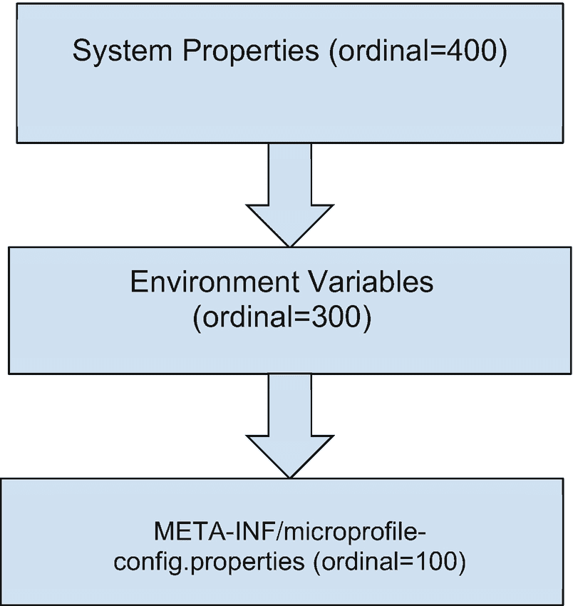

# 7. 管理配置

每个应用程序在投入生产环境的过程中都会经历不同的阶段。从开发到测试，再到预发布，最后到生产，所有这些阶段都会针对各自的环境拥有不同的配置。例如，一个使用外部服务（如欺诈检测 API）的应用，会根据其运行阶段为该服务设置不同的配置。另一个需要在批处理服务中导入数据的应用，也会根据其所在阶段，为导入哪些数据设置不同的配置。

应用程序需要根据提供的某些配置值表现出不同的行为。如果这些配置值与应用程序捆绑在一起，那将非常繁琐，这意味着必须为每个阶段重新打包和部署应用程序。理想的情况是拥有一种机制，让开发者能够为不同的应用阶段定义不同的配置值，而无需重新打包和重新部署应用程序。

这正是 Eclipse MicroProfile Config API 的设计目的。它是一个规范，能让你的应用程序透明地访问不同的配置源，而无需改动应用程序本身。因此，例如在前面提到的欺诈检测示例中，你可以为开发阶段设置一个虚拟 URL，为测试和预发布阶段设置服务提供商提供的测试 URL，最后为生产阶段设置正式使用的 URL。

Config 规范允许你以分层方式定义这些配置值，从而根据阶段自动返回正确的值。本章将介绍 Eclipse MicroProfile Config 规范。学完本章后，你将学会如何将 Config API 集成到你的应用程序中，并使用它来外部化动态的应用程序配置值。

## 什么是 Config 规范？

Eclipse MicroProfile Config 规范定义了一个用于管理应用程序配置的灵活系统。根据引言部分的示例，一个应用程序至少需要为所述阶段提供三种不同的配置。Config 规范提供了以灵活直观的方式实现这一目标的构造。Config 规范包含三个核心部分，即：配置源、转换器和配置值。

## 配置源

配置源就是配置的来源。如果应用程序请求某个配置值，例如 *foo*，Config 运行时将需要加载与属性键 *foo* 关联的值。定义配置键值对的地方就是配置源。配置源可以是任何东西或任何位置：数据库、系统属性、环境变量等。所有这些可能的配置属性来源都被 Config 运行时抽象为一个 `ConfigSource`。

你的应用程序通过 `ConfigSource` 抽象层以透明的方式与这些配置源交互。这样，应用程序就无需关心配置值的实际来源。这带来了灵活性，可以组合各种配置源，以满足即使是最复杂的应用程序需求。

由于可能存在无数个配置源，因此需要一种方法来对源进行排序或确定优先级。例如，如果属性 `foo=someValue` 在多个配置源中都有定义，那么哪个配置源应该优先？

为此，该规范提供了序数（ordinal）的概念。每个配置源都被分配一个序数值，该值决定了其优先级。序数较高的源比序数较低的源具有更高的优先级。因此，在前面的例子中，如果属性 `foo=someValue` 在序数为 100 的配置源 A 中定义，而 `foo=thatValue` 在序数为 300 的配置源 B 中定义，那么调用获取属性 foo 的值将返回 *thatValue*，因为其源具有更高的序数。如果多个 ConfigSource 恰好具有相同的序数，那么它们将按名称排序。

Config 规范定义了三个默认的配置源及其默认序数值，如图 7-1 所示。

图 7-1 展示了默认的配置源。



流程图展示了以下配置源的序数：系统属性；环境变量；以及 `META-INF/microprofile-config.properties`。

图 7-1

配置序数

第一个源映射到调用 `System.getProperties()` 所得到的内容。第二个源是调用 `System.getenv()` 方法所得到的内容。第三个源，即 `microprofile-config.properties` 文件，通常与应用程序捆绑在一起。该文件位于 resources 文件夹下的 `META-INF` 文件夹中。

Config 运行时从序数最高的配置源开始搜索配置属性，一直搜索到序数最低的源。在该搜索顺序中，第一个匹配项胜出。这样，你就可以在不同的配置源中为同一个属性定义不同的值。例如，在随应用程序一起提供的 `microprofile-config.properties` 文件中定义属性 `foo=someValue`，并将同一个属性 `foo=thatValue` 定义为系统属性，那么在运行时调用 foo 属性将返回 *thatValue*。这是因为它在具有更高序数的源中定义。


### 自定义配置源

你的应用程序并不局限于三种默认配置源。例如，你可能正在与一个将应用程序所需的配置值存储在数据库中的遗留系统进行交互。你可以为应用程序定义一个数据库配置源，并将其注册到 Config 运行时。它会像默认配置源一样被扫描和获取。清单 7-1 展示了 jwallet 的一个 DatabaseConfigSource 自定义配置源。

```
public class DatabaseConfigSource implements ConfigSource {
@Override
public Set getPropertyNames() {
return ConfigRepoManager.getPropertyNames();
}
@Override
public String getValue(final String key) {
return ConfigRepoManager.getPropertyValue(key);
}
@Override
public String getName() {
return this.getClass().getSimpleName();
}
@Override
public int getOrdinal() {
return 450;
}
}
清单 7-1
展示了 DatabaseConfigSource
```

清单 7-1 展示了在 DatabaseConfigSource 类中声明的自定义配置源。该类首先实现了 ConfigSource 接口。前三个方法是从该接口总共五个方法中必须实现的方法。另外两个是可选的。DatabaseConfigSource 是一个用于从数据库获取配置值的配置源。这些值可以由任何人或任何系统放入。DatabaseConfigSource 将其抽象为已实现的 ConfigSource 视图。

方法 getPropertyNames 返回在此配置源中找到的属性名称集合。getValue 方法返回与传入键关联的值。例如，传入键 foo 应返回与其关联的值。getName 方法返回此配置源的名称，主要用于日志记录和调试目的。这是从 ConfigSource 接口需要重写的三个方法。

getOrdinal 方法是一个可选方法，返回此配置源的序号。请记住，序号决定了配置源的优先级。如果此方法未被重写，将使用 ConfigSource 接口中定义的默认序号 100。对于 DatabaseConfigSource，我们希望它成为搜索配置时的首选位置。因此，序号设置为 450，使其优先级高于三个默认配置源。

ConfigRepoManager 是一个工具类，它实例化一个 dataSource 并使用 JDBC 查询数据库。对于此示例，我们假设有一个包含两个字段 PROPERTY_KEY 和 PROPERTY_VALUE 的数据库表，分别对应配置键及其值。清单 7-2 展示了 ConfigRepoManager 工具类中的 getPropertyValue 方法。

```
public static String getPropertyValue(final String keyName) {
try {
final PreparedStatement query;
try (final Connection connection = dataSource.getConnection()) {
query = connection.prepareStatement("SELECT PROPERTY_VALUE FROM CUSTOM_CONFIGURATIONS WHERE PROPERTY_KEY = ?");}
query.setString(1, keyName);
final ResultSet propertyValue = query.executeQuery();
if (propertyValue.next()) {
return propertyValue.getString(1);
}
propertyValue.close();
query.close();
} catch (final SQLException e) {
e.printStackTrace();
}
return null;
}
清单 7-2
展示了 getPropertyValue 方法的实现
```

清单 7-2 展示了 ConfigRepoManager 中的 getPropertyValue 方法，该方法使用 JDBC 根据传入的键从数据库中检索配置属性值。根据你目前从本书中学到的知识，你可能会疑惑为什么使用普通的 JDBC 而不是 CDI 和 JPA。答案是 ConfigSource 不是一个 CDI bean。Config 运行时将其视为一个普通的 Java 对象。

这是因为，当某个自定义配置源依赖于一个 bean，而该 bean 又反过来依赖该配置源获取配置时，将 ConfigSource 设为 CDI bean 可能会导致循环启动问题。为了防止此类问题发生的可能性，自定义 ConfigSource 实现被当作 POJO 处理。

实现了 ConfigSource 接口后，我们需要将该实现注册到 MicroProfile Config 运行时。为此，必须将 DatabaseConfigSource 的完全限定类名添加到 `/META-INF/services/org.eclipse.microprofile.config.spi.ConfigSource` 文件中。由于序号为 450，Config 运行时将首先尝试在新注册的自定义配置源中解析属性 foo（因为其序号为 450），然后才会依次检查系统属性、环境变量，最后是 microprofile-config.properties 文件。

## 转换器

Config 三要素中的第二个组件是转换器的概念。默认情况下，MicroProfile Config 运行时将所有配置视为 String/String 键值对。无论给定配置源中指定的值是什么类型，它都将作为 String 加载。例如，配置属性 *rate.minimum=15* 在向 Config 运行时请求属性 *rate.minimum* 时，将被加载为字符串 "15"。

假设上述属性的目标 Java 字段类型是 BigDecimal，那么显然会出现问题，因为运行时将尝试分配不兼容的类型。解决方案是使用转换器。当加载与 *rate.minimum* 关联的属性值时，Config 运行时将查看值将要设置到的目标字段类型，然后调用适当的转换器将加载的值转换为目标字段类型。

因此，当加载 *rate.minimum* 时，将调用一个能够接收 String 并从中返回 BigDecimal 的转换器，并传入加载的字符串 "15"。然后，此转换器将返回一个值为 15 的 BigDecimal。Config 规范提供了一些默认转换器以及创建自定义转换器的机制。默认转换器包括：

*   boolean 和 java.lang.Boolean，true 的值（不区分大小写）为 "true"、"1"、"YES"、"Y"、"ON"。任何其他值都将被解释为 false
*   byte 和 java.lang.Byte
*   short 和 java.lang.Short
*   int 和 java.lang.Integer
*   long 和 java.lang.Long
*   float 和 java.lang.Float，使用点号 "." 分隔小数位
*   double 和 java.lang.Double，使用点号 "." 分隔小数位
*   char 和 java.lang.Character
*   基于 Class.forName 结果的 java.lang.Class

这些转换器具有默认的 jakarta.annotation.Priority 值为 1。优先级用于确定一组转换器的层级。针对同一类型的两个转换器将根据它们的 @Priority 值进行排序。具有较高 @Priority 值的转换器比具有较低 @Priority 值的转换器具有更高的优先级。

### 自动转换器

当给定目标 Java 类型没有默认或自定义转换器时，如果目标 Java 类型满足以下条件之一，Config 运行时将创建一个自动动态转换器：

*   具有一个 public static T of(String) 方法
*   具有一个 public static T valueOf(String) 方法
*   具有一个带有 String 参数的 public 构造方法
*   具有一个 public static T parse(CharSequence) 方法

对于 *rate.minimum* 属性，运行时将代表我们创建一个自动转换器，因为目标 Java 类型 BigDecimal 具有一个 valueOf(String) 方法。


### 自定义转换器

如果你需要通过配置机制传递自定义类型，而现有的转换器都无法满足需求，你可以创建自己的自定义转换器并将其注册到 Config 运行时。清单 7-3 展示了针对 `ConvertCurrencyRequest` 类型的自定义转换器。

```
public class CurrencyRequestConverter implements Converter {
@Override
public ConvertCurrencyRequest convert(final String value) {
if (value == null || value.isBlank()) {
throw new NullPointerException("Value must not be null or empty string");
}
final String[] split = value.split(",");
if (split.length != 3) {
throw new IllegalArgumentException("The resulting array has less than 3 elements.");
}
return  ConvertCurrencyRequest
.builder()
.sourceCurrency(split[0])
.targetCurrency(split[1])
.amount(new BigDecimal(split[2])).build();
}
}
清单 7-3
展示了 ConvertCurrencyRequest 自定义转换器
```

清单 7-3 展示了 `CurrencyRequestConverter`。一个自定义 Config 转换器需要实现参数化的 `org.eclipse.microprofile.config.spi.Converter<T>`，并传入该转换器将要转换的类型。规范要求，如果传入 `null` 值进行转换，自定义转换器的实现必须抛出 `NullPointerException`。这在 `CurrencyRequestConverter` 中的第一个检查中完成。

然后，该实现使用预期的逗号分隔符将传入的字符串分割成一个数组。请记住，配置值是以原始字符串的形式传递的。因此，即使目标类型是自定义类型，传入的配置值也仅仅是目标类型字段值的逗号分隔列表。接着，自定义转换器会检查结果数组的长度是否为三，因为目标类（如清单 7-4 所示）包含三个字段。

```
public class ConvertCurrencyRequest {
private String sourceCurrency;
private String targetCurrency;
private BigDecimal amount;
}
清单 7-4
展示了目标 ConvertCurrencyRequest 类型
```

然后，自定义转换器使用构建器模式构造一个 `ConvertCurrencyRequest`，传入从数组中提取的每个字段。这样，`ConvertCurrencyRequest` 就可以作为配置值传递，并被自动读取以进行货币转换，而无需向应用程序发起 REST 调用。这特别适用于批处理作业以及与遗留应用程序的接口对接。

例如，上述转换器可用于从由遗留 COBOL 应用程序填充的数据库中读取 `ConvertCurrencyRequest` 配置值。由于 jwallet 已经拥有一个自定义数据库配置源（清单 7-2）以及现在的一个自定义转换器，该应用程序可用于与遗留应用程序对接，而无需进行大量重构。遗留应用程序将填充数据库，而 jwallet 将读取并转换货币。

## 配置值

配置三要素中的第三个是实际的配置值。Config 规范的全部意义在于，将所有可能的应用程序配置值来源抽象成一个透明的、统一的视图，即配置源。使用这些配置源，你可以根据每个所需值的键来获取配置值。

对于给定的配置 `*convert_request="USD,GHS,5"*`，有六种不同的方式可以使用 Config API 获取该配置值。此配置应映射到 `ConvertCurrencyRequest` 类型。当给定属性请求没有值时会发生什么，这取决于检索方法。这些检索方法如下所示。

### Config Bean

可以通过注入 `org.eclipse.microprofile.config.Config` bean 来检索配置值。此 bean 通过搜索所有可用的配置源来解析属性值。当同一属性在多个配置源中找到时，配置源的序号决定了返回哪个配置值。清单 7-5 展示了使用 Config bean 检索属性 `*convert_request="USD,GHS,5"*`。

```
@ApplicationScoped
public class RateService {
@Inject
Config config;
public ConvertCurrencyResponse batchConvertWithConfig() {
ConvertCurrencyRequest request = config.getValue("convert_request", ConvertCurrencyRequest.class);
return convert(request);
}
}
清单 7-5
展示了用于检索配置值的 Config bean
```

清单 7-5 展示了使用 Config bean 获取配置值。在 `batchConvertWithConfig` 方法中，对注入的 Config bean 调用了 `getValue` 方法。此方法接受已配置属性的键（本例中为 `convert_request`）和目标类型。因为我们为 `ConvertCurrencyRequest` 创建了自定义转换器，所以只需将其作为第二个参数类型传入即可。该方法返回一个代表已读取和转换后的属性的 `ConvertCurrencyRequest` 实例。如果与传入属性键关联的值解析为空字符串或 `null`，则会抛出 `java.util.NoSuchElementException`。

### 目标类型的直接注入

你可以使用 `@Inject` 和限定符直接注入目标类型，如清单 7-6 所示。

```
@ApplicationScoped
public class RateService {
@Inject
@ConfigProperty(name = "convert_request")
ConvertCurrencyRequest convertCurrencyRequest;
public ConvertCurrencyResponse batchConvertWithSimpleProperty() {
return convert(convertCurrencyRequest);
}
}
清单 7-6
展示了预期配置值的直接注入
```

清单 7-6 展示了使用 `@Inject` 和 `@ConfigProperty` 限定符直接注入 `ConvertCurrencyRequest`。此限定符接受两个参数：`name` 和 `defaultValue`。如果省略 `name` 参数，则运行时将默认使用 `class_name.injection_point_name`，其中 `injection_point_name` 是字段名或参数名，`class_name` 是被注入类的完全限定名。第二个参数是 `defaultValue`。

`defaultValue` 参数充当最低优先级的配置源，因为当没有设置任何值时，它会成为回退值。如果像清单 7-6 中那样省略此参数，并且没有设置任何值，则会抛出部署异常，应用程序将无法部署。

### 可选注入

可以通过注入可选类型来读取配置值。与清单 7-6 中直接注入目标类型不同，目标值可以包装在 `java.util.Optional<T>` 值中，如清单 7-7 所示。

```
@ApplicationScoped
public class RateService {
@Inject
@ConfigProperty(name = "convert_request")
Optional convertRequest;
public ConvertCurrencyResponse batchConvert() {
return convertRequest.map(this::convert).orElseGet(ConvertCurrencyResponse::new);
}
}
清单 7-7
展示了将配置值注入为 Optional 类型
```

清单 7-7 展示了通过注入包装目标值的 `Optional` 类型来检索配置值。与直接注入类似，`Optional` 字段也使用相同的 `@ConfigProperty` 注解进行标注。然而，作为 `Optional` 类型，如果与传入键（本例中为 `convert_request`）关联的值解析为空字符串或 `null`，则会返回一个空的 `Optional`，而不是抛出 `DeploymentException`。也可以将默认值作为第二个参数传递给 `@ConfigProperty` 限定符。


### 提供者注入

配置值可以通过注入 `jakarta.inject.Provider<T>` Bean 来获取。目标类型被包装在 Provider 接口中，并配合注解 `@Inject` 和 `@ConfigProperty` 使用，如清单 7-8 所示。

```
@ApplicationScoped
public class RateService {
@Inject
@ConfigProperty(name = "convert_request")
Provider currencyRequestProvider;
public ConvertCurrencyResponse batchConvertWithProvider() {
return convert(currencyRequestProvider.get());
}
}
清单 7-8
展示了使用 Provider 检索配置值
```

清单 7-8 展示了使用 Provider 检索配置值。与往常一样，字段 `currencyRequestProvider` 使用了 `@Inject` 和 `@ConfigProperty` 注解。这种构造与使用 `Optional<T>` 类似，不同之处在于，与 Optional 不同，在 `batchConvertWithProvider` 方法中调用 `Provider#get` 将始终从底层配置中获取最新值。

你之前看到的三种方式都只读取一次配置值。因此，如果底层配置源中的数据发生变化，通过前三种构造返回的值不会反映这些变化。然而，使用 `Provider<T>` 并像清单 7-8 那样调用其 `get` 方法，将始终解析出底层配置源中的最新值。

如果解析出的值为 `null` 或空字符串，调用 `Provider#get` 方法将抛出 `RuntimeException`。清单 7-8 没有显式传入 `defaultValue`，这意味着期望该值可用，如果不可用，则在 `currencyRequestProvider` 字段上调用 `get` 时会抛出 `RuntimeException`。

### 供应者注入

`java.util.Supplier<T>` 接口也可以用于通过注入读取配置值。清单 7-9 展示了使用 Supplier 接口检索配置值。

```
@ApplicationScoped
public class RateService {
@Inject
@ConfigProperty(name = "convert_request")
Supplier convertCurrencyRequestSupplier;
public ConvertCurrencyResponse batchConvertWithSupplier() {
return convert(convertCurrencyRequestSupplier.get());
}
清单 7-9
展示了 java.util.Supplier 接口的使用
```

清单 7-9 展示了 Supplier 函数式接口的使用。与 `Provider<T>` 接口类似，Supplier 接口也使用 `@Inject` 和 `@ConfigProperty` 限定符进行注入。同样与 `Provider<T>` 接口类似，在 `batchConvertWithSupplier` 方法中调用 `get` 将解析出底层配置源中的最新值。如果没有默认值，则意味着该值必须存在，否则将抛出 `RuntimeException`。

### ConfigValue 元数据

`org.eclipse.microprofile.config.ConfigValue` 接口也可以被注入并用于获取配置值。与之前讨论的其他构造不同，`ConfigValue` 接口提供了获取 ConfigSource 名称、序号、原始配置值、属性名称和值的方法。除非你需要在运行时对配置源进行操作，否则很少会用到 `ConfigValue`。

## 总结

Eclipse MicroProfile Config 规范是一组简单的 API 构造，可帮助你在运行时加载应用程序属性，而无需重新部署应用程序，也无需应用程序了解配置的实际底层来源。本章介绍了构成 Config 规范的三个核心组件，即配置源、转换器和配置值。这三个组件共同为你提供了将应用程序与其属性解耦所需的一切。

