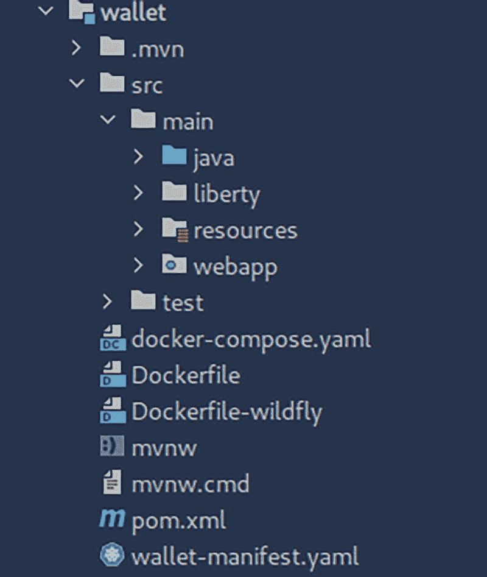

# 14. 面向云原生的 Jakarta EE：从单体到微服务

微服务软件架构正日益成为创建企业级、云原生应用的主流选择。Jakarta EE 平台，辅以 Eclipse MicroProfile 项目，尽管最初是为大型单体应用设计的，但已发展成为一个能够开发微服务应用的强大平台。

本章探讨了将单体应用拆解为一组微服务的一般性指导原则。首先探讨了单体架构的优缺点，然后探讨了是否需要微服务，最后提供了将单体应用迁移到微服务的策略，使其为部署到 Kubernetes 集群做好云就绪准备。

## 单体架构

单体应用是指将所有组成部分打包成一个单一单元的应用。目前存在大量企业级应用都是单体架构。即使在微服务架构流行之前，Jakarta EE（或当时的 Java EE）应用也更多地是模块化单体。模块化单体是一种架构，其中应用的核心部分被拆分为应用内部的子模块。例如，一个典型的 Jakarta EE 应用会有一个 UI 层（可以使用 Jakarta Faces 或任何 JavaScript 框架编写），然后是一个服务层（通常由 CDI Bean 和 EJB 会话 Bean 组合而成，用于管理数据库连接和应用逻辑）。

这样的应用可能不一定包含 REST 组件，因为 UI 层（如果使用 Jakarta Faces）会直接调用服务层。在打包时，这类应用会被打包成一个单一的 WAR 文件。但实际上，它更像是一个模块化单体，便于在需要时轻松迁移到微服务。到目前为止，本书的示例代码介于纯微服务和纯单体架构之间。


### 单体架构的优势

尽管微服务架构近年来兴起，但单体架构仍有其用武之地。因为与技术领域的所有事物一样，在某些情况下，它相对于微服务具有一些独特的优势。以下是单体架构的一些强项。

#### 开发简单

由于单体应用是一个单一单元的应用，因此开发起来通常要容易得多。所有部分都在同一个代码库中，开发、添加功能、重构和扩展应用都相对容易。新开发人员也容易上手项目，因为有一个单一的参考点。

#### 测试更容易

作为一个单一单元，为单体应用编写完整的端到端测试相对容易。由于应用的所有组成部分都在一个包中，编写自动化集成测试更加简单直接。

#### 部署更容易

由于整个应用被打包成一个单一的 WAR 文件，部署只需将此 WAR 文件放入运行时的部署文件夹即可。无论是打包成 Docker 容器还是使用传统的部署方法，部署一个单一的 WAR 文件通常都很直接。

#### 调试更容易

调试单体应用相对容易，因为整个应用都在调试上下文中可用。跟踪执行流程到应用的不同部分以识别错误的源头，既简单又直接。

#### 可复用性

许多通用功能（如横切关注点）被反复开发和复用。由于所有内容都在一个地方，代码重复也更少。

#### 易于添加新开发人员

开发人员总是来来去去。单体架构允许新开发人员相对容易地加入应用开发团队。由于所有内容都在一个地方，熟悉代码库的认知负担较小。

#### 应用演进更容易

凭借统一的代码库和相对容易地引入新开发人员，单体应用通过添加新功能来演进是很容易的。

#### 易于扩展

水平扩展单体应用通常需要在不同的负载均衡器后面部署同一部署工件的多个副本。在这方面，当需要时，扩展既容易又便宜。

### 单体架构的挑战

尽管单体架构拥有这些及其他优势，但它也带来了一些挑战，尤其是在应用复杂性增加时。以下是使用单体架构可能产生的一些挑战。

#### 单点故障

由于整个应用作为一个单一实例运行，一个组件中的问题可能导致整个应用宕机。例如，未关闭的文件读取器导致的内存溢出错误可能导致整个实例崩溃。

#### 采用新技术缓慢

由于整个应用是一个单一单元，采用新版本的库和 API 会慢得多，因为需要对每一个变更的影响评估进行仔细考量。这需要时间，并且可能代价高昂。

#### 全面重新部署

应用中的任何变更，无论大小，通常都需要重新部署整个工件。

#### 复杂性增长

在某个时刻，单体应用可能会变得过于庞大和复杂，以至于任何一个人都无法完全理解。这可能导致变更影响评估受损，从而产生可能未被完全理解的变更。

## 微服务

### 采用或迁移的考量

尽管有其缺点，但单体架构在绝大多数应用中运行良好。与所有其他事物一样，在决定是否使用微服务架构时，始终需要考虑业务领域和上下文。以下是一些有助于确定是否需要使用微服务架构的指南。

#### 应用洞察

考虑微服务时，首要因素是当前运行的应用是否有足够的应用洞察。这可能包括对不同潜在瓶颈区域的详细了解、不同条件下的应用性能、哪些组件在特定时间段内导致了最多的故障，以及其他此类指标。这对于确定是否真的需要将应用拆分为不同的微服务非常重要。这些洞察将有助于了解应用应拆分为哪些组成微服务。它还有助于了解应用的哪个部分（如果有的话）需要独立于其他部分进行扩展。

#### 技术知识的可用性

需要考虑维护一组微服务所需的工程知识是否可用。由于每个微服务都是一个“迷你应用”，因此需要考虑是否有足够的工程知识来保持每个单元的运行。

#### 新开发人员入职

与单体应用不同，微服务应用将由不同的服务组成，每个服务都是一个独立的应用程序。需要考虑如何让新开发人员加入开发团队。如何让新加入者尽可能高效地工作，是一个值得考虑的问题。

#### 部署成本

与单体应用不同，微服务可能需要不同的部署服务器和平台。这需要从工程和财务角度进行考量，以确定相对于单体应用，任何边际部署成本是否值得。

#### 牢记最终目标

应理解微服务是达到目的的一种手段。这个目的可能因组织而异，但最终，它总是涉及使用应用程序为其用户提供某种形式的价值。因此，微服务只是实现这一目标的一种手段，不应成为焦点本身。除非使用微服务架构开发的边际收益超过其带来的好处，否则不应为了采用而采用。

### 迁移单体应用

将单体应用迁移到微服务架构的过程是一个非常依赖领域的实践。然而，以下部分提供了一些通用指南，可以针对不同领域进行调整和定制。

#### 单一职责原则

每个微服务应负责应用的一个核心功能。每个服务的功能应能根据其名称和 REST 接口简单理解。由于每个微服务将通过 REST 端点暴露给其他模块，因此这些端点应能清晰地表明每个服务的功能。

#### 围绕业务领域组织

每个服务应围绕业务领域进行组织。例如，一个餐厅应用应分解为经营餐厅的不同核心方面——订单服务、计费服务、厨房服务等。各个服务的限界上下文应为业务领域。

#### 为通用功能创建库

常用的横切功能应抽象成一个库，打包成 JAR 文件，然后由需要这些功能的服务依赖。应通过抽象来最大限度地减少代码重复。


#### 可部署单元

每个微服务都应是一个独立的可部署单元。因此，每个服务本身应是一个完整的应用程序，并配备其自身的测试套件。每个服务都应拥有自己的流水线和 CI/CD 基础设施。所谓可部署单元，是指每个服务都应拥有自己的构建工具文件（如 `pom.xml`、`build.gradle` 文件），理想情况下，这些文件会继承自一个包含通用库的父文件（如果适用），并且拥有自己的运行时打包文件（如 `Containerfile`、`Dockerfile`、`docker-compose.yaml` 以及 Kubernetes 清单描述文件）。这是因为每个单元都应能够作为容器实例独立部署，并作为集群中的 Pod 进行管理。

#### 通过 REST 进行通信

所有服务都应通过 HTTP REST 端点暴露以供消费。每个应用程序应将 REST 端点的边界与其实际实现分离。每个服务的客户端应仅了解通过该服务 REST 基础设施暴露的服务构件。不应向服务的消费客户端暴露任何实现细节。默认的数据交换格式应主要基于 JSON。每个 REST 资源都应受到保护，理想情况下通过 MicroProfile JWT 运行时实现。

#### 分离安全上下文

每个服务应拥有独立的安全上下文。在 Keycloak 中，每个服务应是应用领域中的一个独立客户端^(¹²¹)。每个服务应拥有自己的一套角色和权限。

### 迁移后的示例应用

结合这些及其他指导原则，让我们来看看本书项目代码中的钱包微服务。该完整应用最初是一个单体应用，允许用户创建不同货币的钱包，获取每个钱包的汇率，并为每个钱包存储每笔交易。

钱包服务负责处理钱包及其交易。汇率服务使用 MicroProfile REST 客户端处理对汇率服务的外部调用。这里配置了两个外部汇率服务，其中一个作为备用服务，当主服务失败时应自动调用该备用服务。

此备用功能通过 MicroProfile Fault Tolerance API 进行配置。账户服务层负责处理用户账户。它有一个用于创建账户的 REST 端点，当用户在 Keycloak 中创建账户时，该端点会通过回调被调用。使用上一节中的指导原则将此应用拆分为微服务，需要至少三个服务：账户服务、汇率服务和钱包服务。

钱包服务将是本次迁移讨论的焦点。然而，关于它所讨论的一切也适用于其他两个服务。根入口点是清单 14-1 中所示的 `pom.xml`。

```
4.0.0

com.example
jwallet
1.0-SNAPSHOT

jwallet.wallet
war

${project.groupId}
jwallet.core
${project.version}

wallet

清单 14-1
钱包服务 pom.xml
```

钱包服务是三个不同的微服务之一，展示了如何将单体应用拆解为各个组成部分。如清单 14-1 所示，钱包服务的根 pom 文件声明了一个父 pom 文件。这个父 pom 文件（清单 14-1 中部分展示）声明了应用中所有微服务的所有公共依赖项。例如，它声明了 Jakarta EE 和 MicroProfile 依赖项。

父 pom 文件被打包成一个 Maven pom 文件，可供其子模块使用或继承。钱包根 pom 利用父 pom 来引入公共依赖项。使用 Maven 构建管理工具的父/子继承特性，使我们能够保持根 pom 文件的简洁。这里只声明了一个依赖项，即对核心模块的依赖。

核心模块允许我们将所有服务共有的构件和功能抽象到一个单一服务中。例如，`AbstractEntity` Jakarta Persistence 父实体类、`AbstractEntityListener` 类以及 CDI `@Action` 原型都在核心模块中声明。上述构件均在其各自的章节中详细讨论。钱包服务被创建为一个单模块的 Maven Web 应用程序。因此，它具有 Maven 项目的所有结构，如图 14-1 所示。



钱包服务结构的截图显示了钱包目录下的两个文件夹：`.mvn` 和 `src`。在 `src` 下，有 `main` 和 `test` 文件夹。`main` 包含 4 个子文件夹。

图 14-1
钱包服务结构

作为一个单模块、可打包的服务，它拥有一个 `Dockerfile`、`docker-compose.yaml` 文件和 Kubernetes 描述文件。`Dockerfile` 允许我们将此服务构建为一个 Docker 镜像，该镜像可以推送到任何 Docker 仓库。清单 14-2 展示了该 `Dockerfile`。

```
FROM icr.io/appcafe/open-liberty:22.0.0.3-full-java11-openj9-ubi
COPY --chown=1001:0 src/main/liberty/config /config
COPY --chown=1001:0 src/main/liberty/*.jar /opt/ol/wlp/usr/shared/resources/
COPY --chown=1001:0 target/*.war /config/apps
EXPOSE 3001
RUN configure.sh
CMD ["/opt/ol/wlp/bin/server", "debug", "defaultServer"]
清单 14-2
钱包服务 Dockerfile
```


Dockerfile 依赖于 OpenLiberty 镜像。OpenLiberty 是用于运行应用程序的 Jakarta EE 运行时。OpenLiberty 配置、数据库驱动文件以及应用程序的 war 文件通过 `COPY` 命令复制到容器中。这基本上就是钱包服务作为 Docker 容器运行所需的全部内容。docker-compose.yaml 文件如代码清单 14-3 所示。

```
version: "3"
services:
postgres:
image: postgres:12.3
#    ports:
#      - "5432:5432"
environment:
POSTGRES_USER: jwallet
POSTGRES_PASSWORD: jwallet
wallet:
image: jwallet/wallet:latest
ports:
- "3001:3001"
build:
context: .
dockerfile: Dockerfile
代码清单 14-3
钱包 docker-compose.yaml 文件
```

docker-compose 文件通过拉取 Postgres 12.3 版本镜像，并利用附带的 Dockerfile 构建钱包镜像，组合出一组完整运行的容器实例。借助这些文件，钱包模块可以被打包并作为云原生、自包含的 Jakarta EE 应用程序运行。钱包服务通过 `WalletResource` 类中的 HTTP REST 资源暴露给客户端，如代码清单 14-4 所示。

```
@RegisterRestClient(baseUri = "http://wallet:3001/wallet/api")
@Consumes(MediaType.APPLICATION_JSON)
@Produces(MediaType.APPLICATION_JSON)
@Path("wallets")
@RolesAllowed("teller")
public interface WalletResource {
@POST
@Traced(operationName = "create-wallet")
@SimplyTimed(name = "create_wallet_timer")
BalanceResponse createWallet(CreateWalletRequest createWalletRequest);
@GET
@Path("{walletId}/balance")
@Traced(operationName = "get-wallet-balance")
@SimplyTimed(name = "get_wallet_balance_timer")
BalanceResponse getBalance(@PathParam("walletId") long walletId);
@GET
@Path("{walletId}/transactions")
@Traced(operationName = "get-wallet-transactions")
@SimplyTimed(name = "get_wallet_transactions_timer")
TransactionsResponse getTransactions(@PathParam("walletId") long walletId);
@POST
@Path("{walletId}/transactions/debit")
@Traced(operationName = "debit-wallet")
@SimplyTimed(name = "debit_wallet_timer")
TransactionResponse debit(@PathParam("walletId") long walletId, TransactionRequest transactionsRequest);
@POST
@Path("{walletId}/transactions/credit")
@Traced(operationName = "credit-wallet")
@SimplyTimed(name = "credit_wallet_timer")
TransactionResponse credit(@PathParam("walletId") long walletId, TransactionRequest transactionsRequest);
}
代码清单 14-4
WalletResource
```

`WalletResource` 是一个 Jakarta REST 资源，也可以作为 MicroProfile REST 客户端使用，通过 `@RegisterRestClient` 注解实现。它消费和生成 JSON 格式数据，并要求执行客户端具有 `teller` 角色。MicroProfile JWT 用于验证和传播客户端传递的 JWT 令牌。它还使用 MicroProfile Metrics API 声明了一些度量指标。该模块也拥有自己的单元测试和集成测试。

这些资源方法的实现可以，并且通常应该，复用单体应用中的现有逻辑。从单体架构迁移到微服务架构，主要围绕应用程序的边界和打包方式展开。应尽可能复用现有的业务逻辑。

从表面上看，这个资源描述了钱包服务的功能。作为一个 HTTP 服务，我们可以将其部署到云集群中，让 Kubernetes 管理其部署、扩展和更新。wallet-manifest.yaml 文件创建了一个 Kubernetes 管理的对象。代码清单 14-5 展示了这个清单文件。

```
apiVersion: networking.k8s.io/v1
kind: Ingress
metadata:
name: wallet
labels:
app: wallet
spec:
rules:
- host: "*.wallet.sslip.io"
http:
paths:
- path: /
pathType: Prefix
backend:
service:
name: wallet
port:
name: wallet-port

apiVersion: v1
kind: Service
metadata:
name: wallet
labels:
app: wallet
spec:
ports:
- name: wallet-port
port: 3001
targetPort: 3001
selector:
app: wallet

apiVersion: apps/v1
kind: Deployment
metadata:
name: wallet
labels:
app: wallet
spec:
replicas: 1
selector:
matchLabels:
app: wallet
template:
metadata:
labels:
app: wallet
spec:
containers:
- name: wallet
image: k3d-registry.localhost:12345/jwallet/wallet:latest
resources:
limits:
memory: "512Mi"
cpu: "500m"
ports:
- containerPort: 9080
env:
- name: JAEGER_AGENT_HOST
value: jaeger
- name: JAEGER_AGENT_PORT
value: "6831"
- name: JAEGER_SAMPLER_TYPE
value: const
- name: JAEGER_SAMPLER_PARAM
value: "1"
livenessProbe:
httpGet:
path: /health/live
port: 3001
initialDelaySeconds: 60
periodSeconds: 60
timeoutSeconds: 10
failureThreshold: 10
readinessProbe:
httpGet:
path: /health/ready
port: 3001
initialDelaySeconds: 60
periodSeconds: 60
timeoutSeconds: 10
failureThreshold: 10
代码清单 14-5
钱包清单文件
```

有了这些文件描述符，我们就将钱包微服务转变成了一个云原生的 Jakarta EE 应用程序。账户服务和交易服务与钱包服务具有类似的结构。利用上一节中的指导原则，我们能够将单体应用分解为业务限界上下文。每个服务都是一个独立的可部署单元，并拥有自己的测试。

示例代码包含一个 shell 脚本，其中包含将应用程序打包并作为 Docker 容器运行，并部署到 Kubernetes 管理集群的命令。Readme 文件包含了运行应用程序或单个微服务所需的所有信息。每个服务可以独立运行，也可以作为一个整体单元一起运行。将应用程序打包为容器并配备必要的描述符后，部署到云提供商只需将生成的镜像推送到 Docker 注册表（大多数云提供商都有自己的注册表），然后选择推送的镜像进行部署即可。Microsoft Azure Kubernetes 服务^(¹²²) (AKS) 是您自行实验的一个良好起点。

## 总结

本章首先探讨了单体架构及其优缺点，接着讨论了在采用或迁移到微服务架构时需要牢记的注意事项。然后，本章深入研究了三个微服务中的一个，以及将应用程序从单体架构迁移到微服务架构时通常需要更改的通用部分。正如本章所述，迁移应用程序是一项依赖于具体领域的工作；然而，我们试图提供广泛的指导原则和注意事项，以帮助阐明迁移的过程和任务。


脚注 1   2  索引 A 抽象实体 AbstractEntity AbstractEntityListener 验收测试 @Action 原型 亚马逊云服务 (AWS) 美国软件测试资格委员会 (ASTQB) 带注解的 Bean 发现模式 @Any 限定符 Apache Derby Apache Maven 依赖解析/构建管理系统 应用指标 应用程序编程接口 (API) @ApplicationScoped 注解 @ApplicationScoped Bean @AroundConstruct 面向切面编程 (AOP) @Asynchronous 注解 AUTO 主键生成策略 Azure Kubernetes 服务 (AKS) B 后端服务 基础指标 BaseRepository @Basic 注解 @Basic 字段 Bean<T> 接口 @BeforeAll 回调方法 beginConversation() 方法 黑莓 @Bulkhead 注解 捆绑的 Keycloak C calculateAmount 方法 call() 方法 CDI API Bean 管理 Bean 代理 内置作用域 容器 上下文实例 装饰器 发现模式 特性 注入点 拦截器 注解 Bean 自定义 日志 原型 Jakarta EE 10 生命周期回调 主配置文件 元数据 无参构造函数 生产者 解析机制 原型 类型 UserService 控制器 WalletService Bean CDI 事件机制 异步事件 事件定义 事件元数据 事件对象 事件观察者 限定符 事务性观察者 CDI 原型 断路器 关闭 定义 半开状态 打开状态 @CircuitBreaker 注解 @CircuitBreaker 方法 Claims cleanUp 方法 云原生应用开发 云服务提供商 容器化 联网设备 API 生态系统 竞争对手 定义 互联网可访问性 第三方托管基础设施 Web 应用 JSEE 弹性应用 可扩展应用 12 要素应用 云原生计算基金会 (CNCF) 云原生微服务 金融应用 云原生微服务范式 集合值关系 @Column 注解 通用对象请求代理架构 (CORBA) 兼容性测试套件 (CTS) @ConcurrentGauge @ConfigProperty 注解 @ConfigProperty 限定符 ConfigRepoManager ConfigValue Bean 元数据 可选注入 提供者注入 供应商注入 目标类型，直接注入 构造函数注入点 @Consumes 注解 上下文与依赖注入 (CDI) Contextual<T> 接口 持续集成/持续部署 (CI/CD) 流水线 Conversation#begin 方法 Conversation#getId() 方法 @ConversationScoped Bean convertCurrencyAsync 方法 convertCurrency 方法 转换器 自动 动态 BigDecimal Config 规范 自定义类型 默认 @Counted 度量注解 create() 和 destroy() 方法 createUser 方法 CurrencyRequestConverter D @Database(DERBY) 限定符 @Database 限定符 数据定义语言 (DDL) 数据持久化 实体 BaseRepository 回调方法 级联操作 EntityManager 回滚事务 更新/删除数据 EntityManager 持久化上下文 持久化单元 @Default 限定符 委托注入点 @DELETE 方法 @Dependent 作用域 Dependent 作用域 Bean Devoxx DockerComposeContainer doFilter() 方法 E Eclipse Enterprise for Java (EE4J) Eclipse 基金会规范流程 (EFSP) Eclipse MicroProfile (EMP) 配置 配置源 配置值 转换器 DatabaseConfigSource 自定义配置源 定义 EMP Rest 客户端 容错 灵活系统 健康检查 Jakarta 注解 JAX-RS JSON-B JSON-P JWT 规范 度量规范 OpenAPI 规范 OpenTracing Eclipse MicroProfile 容错 API Eclipse MicroProfile 项目 @Email 注解 @Embeddable 注解 企业应用归档文件 (EAR) 企业应用 辅助云特性 数据持久化 依赖管理 营利性企业 编排 RESTful Web 服务 典型应用 用户界面 企业 Java Bean 开源软件 (EJB-OSS) 企业 JavaBeans (EJB) 企业软件应用 @Entity 注解 实体监听器 @EntityListeners 注解 EntityManager EntityManager 注入点 EntityManager#persist 方法 @Enumerated 注解 Event#select 方法 表达式语言 (EL) F @Fallback 注解 @Fallback 拦截器 容错 API 应用 异步 舱壁 断路器 配置属性 回退 重试 规范 超时 字段注入点 fireAsync 方法 FROM 子句 功能测试 G @Gauge 度量 @GeneratedValue 注解 @GET 注解 getBalance 方法 getOrdinal 方法 getPropertyValue 方法 getUser 方法 GitHub Gradle Grafana H 健康检查 CDI Bean 云原生应用 HTTP GET 请求 实现 接口 机器对机器 度量 API 限定符 存活 就绪 启动 响应 WalletHealthCheckProducer Bean HealthCheckResponse 直方图度量 HTTP GET 方法 HTTP 方法 Bean 验证 API @DELETE 方法 GET 请求 @BeanParam 默认值 路径参数 用户 POST 消息体读取器 消息体写入器 UserResource 类 PUT 混合云 I @Id 注解 身份与访问管理 (IAM) 框架 IDENTITY 序列生成策略 @Inject 注解 集成测试 @InterceptorBinding 注解 拦截器 联网设备 InvocationContext#proceed() 方法 J Jaeger 服务 Jakarta 上下文与依赖注入 (CDI) Jakarta Core Profile Jakarta EE API 应用开发 定义 EMP Java EE 发布历史 企业 Java 平台 J2EE J2EE 1.4 J2EE 1.5 Java EE 6 Java EE 7 Java 用户组 开放性 可移植性 发布历史 软件开发平台 规范流程 Spring 框架 稳定性 标准化 Jakarta EE 10 API 云原生平台 通用开发目的 发布计划 Jakarta EE 部署 应用维护 选择运行时 云部署 容器化 数据库 生产就绪 WAR 文件 Jakarta EE 规范流程 (JESP) Jakarta 企业 Bean Jakarta Faces Jakarta 拦截器规范 Jakarta JSON 绑定 Jakarta 持久化 API (JPA) 列定制 条件 API 数据 数据持久化 定义 可嵌入 枚举 字段类型 字段访问 实现 继承 大对象，映射 映射日期类型 建模 对象关系阻抗 主键 查询数据 关系/关联 集合值 映射 单值 最简单单元 瞬态字段 用户实体 Jakarta 持久化查询语言 (JPQL) 聚合查询 定义 动态查询 执行 FROM 子句 命名查询 传递参数 主键 select 子句 结构 WHERE 子句 Jakarta RESTful API (JAX-RS) Jakarta RESTful Web 服务 Java 2 企业版 (J2EE) Java 应用 Java 容器授权合约 (JACC) Java 容器授权 SPI (JASPIC) Java 社区流程 (JCP) Java 连接器架构 (JCA) Java 数据库连接 (JDBC) Java EE 平台 API 包迁移至 Jakarta 定义 Eclipse 基金会，迁移流程 TCK Java IDE 账户模块 核心模块 Dockerfile docker hub EMP 依赖 grafana Jakarta EE 全平台依赖 JWallet 模块 OpenLiberty 配置文件 插件 测试编译 钱包微服务 Java 消息服务 (JMS) Java 持久化 API (JPA) Java 规范请求 (JSR) Jitter 参数 @JoinColumn 注解 JUnit JWallet AbstractEntity BaseRepository CreateWalletRequest Java 类型 CreateWallet 资源方法 依赖 端点 Grafana 浏览器 hello 资源 IDE 参见 Java IDE Insomnia Jaeger 追踪 JAX-RS 资源 微服务 项目结构 REST 端点 设置 测试 追踪列表 传统 hello world WalletRepository 类 Wallet 资源 K Keycloak Keycloak IAM 框架 Kubelet L @Liveness 限定符 @Lob 注解 @Logged 拦截器 @LoginConfig 注解 logMethod M 机器对机器机制 @ManyToMany 注解 多对多关联 @ManyToOne 注解 多对一关系 Maven 消息体读取器 消息体写入器 MessageCenter Bean 元数据 @Metered 注解 方法注入点 度量 注解参数 注解 应用 基础 CDI 原型 数据格式 实现 注入 元数据 元数据驱动 API microprofile 规范 注册表 供应商 microprofile-config.properties MicroProfile JWT API，安全 应用开发者 应用安全 声明 客户端认证 声明注入 JsonWebToken 接口 @LoginConfig 微服务集群 公钥/URL 安全上下文 基于令牌的认证 微服务 应用开发生命周期 架构 客户端接口 定义 单体架构 弹性 扩展 软件开发范式 微服务架构 应用洞察 工程知识 迁移应用 核心模块 dockerfile Kubernetes 管理对象 WalletResource 钱包服务 迁移单体 引入开发者 Mockito 现代云原生应用 单体应用 开发架构 单体应用 优势 CDI/EJB Bean 挑战 定义 多用途互联网邮件扩展 (MIME) N @Named 限定符 诺基亚 先驱 非平凡应用 O @Observes 注解 @OneToMany 注解 @OnetoOne 注解 Open Liberty OpenTelemetry OpenTracing API P @Path 注解 路径方法 @PathParam 注解 Payara 性能测试 @PersistenceContext 注解 普通旧式 Java 对象 (POJOs) @POST 注解 @PostConstruct 方法 @PreDestroy 主键生成 AUTO id 身份 序列 表 用户实体 @Priority 值 私有云 生产者 定义 错误 字段 注入点 声明 方法 无参构造函数 限定生产者字段 项目对象模型 Prometheus 公有云 @PUT 方法 Q 限定符 内置 @Default 定义 字段 walletResource WalletResource 注入点 WalletResource 接口 R rate.minimum 属性 RateService 方法 RateService 的 calculate 方法 RateService 的 convertCurrencyAsync 方法 @Readiness 限定符 表述性状态架构 表述性状态转移 (REST) 定义 Eclipse MicroProfile，客户端 Jakarta 客户端 平台无关通信 Web 服务 @RequestScoped 注解 解析机制 @RestClient 注解 @RestClient 限定符 RESTful 架构 RESTful 接口 RESTful Web 服务 REST 资源，Jakarta HTTP 方法 响应对象 根资源 UserResource REST Web 服务 HTTP 资源 用户资源 @Retry 注解 基于角色的访问控制 (RBAC) 机制 @RolesAllowed 注解 S 安全 SecurityManager 控制器 信号量风格舱壁 sendUserSmsAsync 方法 sendUserSms 观察者方法 SEQUENCE 身份生成策略 service()/doFilter() 方法 @SessionScoped 注解 @SimplyTimed 注解 @SimplyTimed 度量 @Singleton 注解 单值关系 @Size 注解 冒烟测试 Spring Boot Spring 框架 @Startup 注解 @Stateless 注解 Sun Microsystems Swagger API T @Table 注解 TABLE 生成策略 @TableGenerator 注解 @Temporal 类型注解 @Test 注解 测试兼容性工具包 (TCK) TestContainers 参见测试 测试 定义 Jakarta EE CDI Bean 定义 集成测试 单元测试 原则 类型 线程池风格舱壁 @Timed 度量 @Timeout 注解 @Transactional 注解 TransactionHistory 实体 @Transient 注解 U 单元测试 用户界面 UserResponse 事件 UserServiceDecorator V @Valid 注解 供应商度量 W, X, Y, Z @Wallet 限定符 WalletRepository WalletService Web 应用归档文件 (WAR) WebSocket WildFly
