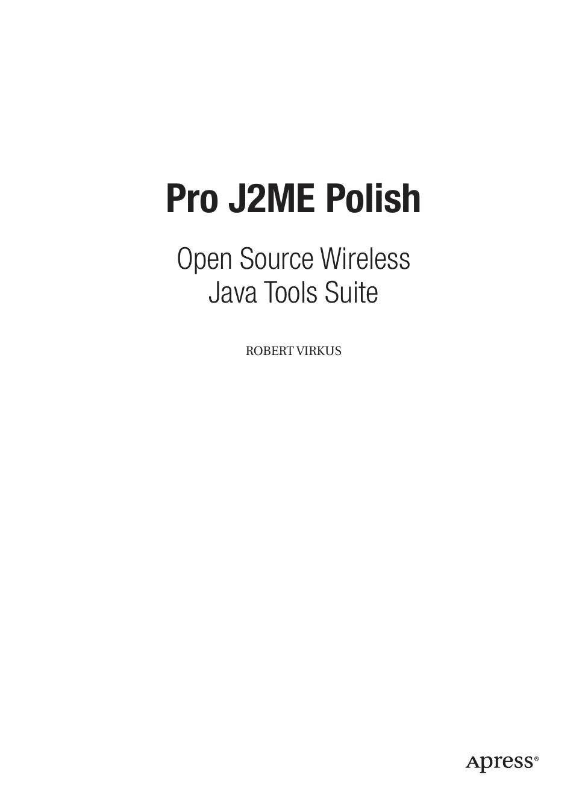

5033FM.qxd 6/20/05 11:23 AM 第 i 页

**Pro J2ME Polish**

开源无线

Java 工具套件

罗伯特·维尔库斯

5033FM.qxd 6/20/05 11:23 AM 第 ii 页

**Pro J2ME Polish: 开源无线 Java 工具套件**

**版权 © 2005 归 Robert Virkus 所有**

首席编辑：Steve Anglin

技术审阅：Thomas Kraft

编辑委员会：Steve Anglin, Dan Appleman, Ewan Buckingham, Gary Cornell, Tony Davis, Jason Gilmore, Jonathan Hassell, Chris Mills, Dominic Shakeshaft, Jim Sumser 副出版人：Grace Wong

项目经理：Beth Christmas

文案编辑经理：Nicole LeClerc

文案编辑：Marilyn Smith, Kim Wimpsett, Nicole LeClerc

助理制作总监：Kari Brooks-Copony

制作编辑：Ellie Fountain

排版：Dina Quan

校对：Linda Seifert

索引编制：John Collin

美术：Kinetic Publishing Services, LLC

封面设计：Kurt Krames

生产经理：Tom Debolski

国会图书馆编目出版数据

Virkus, Robert, 1949-

Pro J2ME Polish : open source wireless Java tools suite / Robert Virkus.

p. cm.

Includes index.

ISBN 1-59059-503-3 (精装 : 无酸纸)

1\. Java (计算机程序语言) 2\. 无线通信系统--程序设计. I. 题名.

QA76.73.J38V57 2005

005.13'3--dc22

版权所有。未经版权所有者及出版人事先书面许可，不得以任何形式或任何方式（电子或机械，包括影印、录制或任何信息存储检索系统）复制或传播本作品的任何部分。

在美国印刷并装订 9 8 7 6 5 4 3 2 1

本书中可能出现商标名称。我们不在每次出现商标名称时都使用商标符号，仅以编辑方式使用这些名称，以利于商标所有者，无意侵犯商标权。

本书在美国由 Springer-Verlag New York, Inc. 发行，地址：233 Spring Street, 6th Floor, New York, NY 10013；在美国以外由 Springer-Verlag GmbH & Co. KG 发行，地址：Tiergartenstr. 17, 69112 Heidelberg, Germany。

在美国：电话 1-800-SPRINGER，传真 201-348-4505，电子邮件 orders@springer-ny.com，或访问 http://www.springer-ny.com。在美国以外：传真 +49 6221 345229，电子邮件 orders@springer.de，或访问 http://www.springer.de。

有关翻译信息，请联系 Apress，地址：2560 Ninth Street, Suite 219, Berkeley, CA 94710。电话 510-549-5930，传真 510-549-5939，电子邮件 info@apress.com，或访问 http://www.apress.com。

本书中的信息按“原样”分发，不提供任何担保。尽管在编写本作品时已采取一切预防措施，但作者和 Apress 均不对因本书所含信息直接或间接引起的任何损失或损害对任何个人或实体承担责任。

本书的源代码可在 http://www.apress.com 的“下载”部分提供给读者。

5033FM.qxd 6/20/05 11:23 AM 第 iii 页

*谨以此书献给那些为反对软件专利、为创造更美好世界而奋斗的人们。*

5033FM.qxd 6/20/05 11:23 AM 第 iv 页

内容概览

前言 . . . . . . . . . . . . . . . . . . . . . . . . . . . . . . . . . . . . . . . . . . . . . . . . . . . . . . . . . . . . . xvi 关于作者 . . . . . . . . . . . . . . . . . . . . . . . . . . . . . . . . . . . . . . . . . . . . . . . . . . . . . . . . xviii 关于技术审阅者 . . . . . . . . . . . . . . . . . . . . . . . . . . . . . . . . . . . . . . . . . . . . . . . . . . . xix 致谢 . . . . . . . . . . . . . . . . . . . . . . . . . . . . . . . . . . . . . . . . . . . . . . . . . . . . . . . . . . . . . xx 引言 . . . . . . . . . . . . . . . . . . . . . . . . . . . . . . . . . . . . . . . . . . . . . . . . . . . . . . . . . . . . xxi 第一部分 ■ ■ ■ 准备工作

■**第 1 章**

快速设置指南 . . . . . . . . . . . . . . . . . . . . . . . . . . . . . . . . . . . . . . . . . . . . . . . . . . . . . 3

■**第 2 章**

安装先决条件 . . . . . . . . . . . . . . . . . . . . . . . . . . . . . . . . . . . . . . . . . . . . . . . . . . . . . 7

■**第 3 章**

安装 J2ME Polish . . . . . . . . . . . . . . . . . . . . . . . . . . . . . . . . . . . . . . . . . . . . . . . . . 11

■**第 4 章**

将 J2ME Polish 集成到 IDE 中 . . . . . . . . . . . . . . . . . . . . . . . . . . . . . . . . . . . . . . 19

第二部分 ■ ■ ■ 使用 J2ME Polish

■**第 5 章**

了解 J2ME Polish . . . . . . . . . . . . . . . . . . . . . . . . . . . . . . . . . . . . . . . . . . . . . . . . . 29

■**第 6 章**

设备数据库 . . . . . . . . . . . . . . . . . . . . . . . . . . . . . . . . . . . . . . . . . . . . . . . . . . . . . . 39

■**第 7 章**

构建应用程序 . . . . . . . . . . . . . . . . . . . . . . . . . . . . . . . . . . . . . . . . . . . . . . . . . . . . . 55

■**第 8 章**

预处理 . . . . . . . . . . . . . . . . . . . . . . . . . . . . . . . . . . . . . . . . . . . . . . . . . . . . . . . . . 101

■**第 9 章**

日志框架 . . . . . . . . . . . . . . . . . . . . . . . . . . . . . . . . . . . . . . . . . . . . . . . . . . . . . . . 123

■**第 10 章** 使用工具类 . . . . . . . . . . . . . . . . . . . . . . . . . . . . . . . . . . . . . . . . . . . . . . . . . . . . . . . . 133

■**第 11 章** 使用 J2ME Polish 进行游戏编程 . . . . . . . . . . . . . . . . . . . . . . . . . . . . . . . . . . . . 145

■**第 12 章** 使用 GUI . . . . . . . . . . . . . . . . . . . . . . . . . . . . . . . . . . . . . . . . . . . . . . . . . . . . . . . . . . . 159

■**第 13 章** 扩展 J2ME Polish . . . . . . . . . . . . . . . . . . . . . . . . . . . . . . . . . . . . . . . . . . . . . . . . . . . 231

**iv**

5033FM.qxd 6/20/05 11:23 AM 第 v 页

■内容概览

**v**

第三部分 ■ ■ ■ 现实世界编程

■**第 14 章** 无线市场概述 . . . . . . . . . . . . . . . . . . . . . . . . . . . . . . . . . . . . . . . . . . . . . . . . . . . . . 273

■**第 15 章** 应对设备限制 . . . . . . . . . . . . . . . . . . . . . . . . . . . . . . . . . . . . . . . . . . . . . . . . . . . . . 283

■**第 16 章** 优化应用程序 . . . . . . . . . . . . . . . . . . . . . . . . . . . . . . . . . . . . . . . . . . . . . . . . . . . . . 325

第四部分 ■ ■ ■ 附录

■**附录** . . . . . . . . . . . . . . . . . . . . . . . . . . . . . . . . . . . . . . . . . . . . . . . . . . . . . . . . . . . . . . . . . . . . . . . . . . . 351

■**索引** . . . . . . . . . . . . . . . . . . . . . . . . . . . . . . . . . . . . . . . . . . . . . . . . . . . . . . . . . . . . . . . . . . . . . . . . . . . 419

5033FM.qxd 6/20/05 11:23 AM 第 vi 页

5033FM.qxd 6/20/05 11:23 AM 第 vii 页

目录

前言 . . . . . . . . . . . . . . . . . . . . . . . . . . . . . . . . . . . . . . . . . . . . . . . . . . . . . . . . . . . . . xvi 关于作者 . . . . . . . . . . . . . . . . . . . . . . . . . . . . . . . . . . . . . . . . . . . . . . . . . . . . . . . . xviii 关于技术审阅者 . . . . . . . . . . . . . . . . . . . . . . . . . . . . . . . . . . . . . . . . . . . . . . . . . . . xix 致谢 . . . . . . . . . . . . . . . . . . . . . . . . . . . . . . . . . . . . . . . . . . . . . . . . . . . . . . . . . . . . . xx 引言 . . . . . . . . . . . . . . . . . . . . . . . . . . . . . . . . . . . . . . . . . . . . . . . . . . . . . . . . . . . . xxi 第一部分 ■ ■ ■ **准备工作**

■**第 1 章**

**快速设置指南** . . . . . . . . . . . . . . . . . . . . . . . . . . . . . . . . . . . . . . . . . . . . . . . . . . . . 3

安装 J2ME Polish . . . . . . . . . . . . . . . . . . . . . . . . . . . . . . . . . . . . . . . . . . . . . . . . . . . . 4

启动示例应用程序 . . . . . . . . . . . . . . . . . . . . . . . . . . . . . . . . . . . . . . . . . . . . . . . . . . . 4

探索示例应用程序 . . . . . . . . . . . . . . . . . . . . . . . . . . . . . . . . . . . . . . . . . . . . . . . . . . . 5

总结 . . . . . . . . . . . . . . . . . . . . . . . . . . . . . . . . . . . . . . . . . . . . . . . . . . . . . . . . . . . . . . . 6

■**第 2 章**

**安装先决条件** . . . . . . . . . . . . . . . . . . . . . . . . . . . . . . . . . . . . . . . . . . . . . . . . . . . . 7

Java 2 SDK . . . . . . . . . . . . . . . . . . . . . . . . . . . . . . . . . . . . . . . . . . . . . . . . . . . . . . . . . 7

无线工具包 . . . . . . . . . . . . . . . . . . . . . . . . . . . . . . . . . . . . . . . . . . . . . . . . . . . . . . . . . 8

WTK 版本 . . . . . . . . . . . . . . . . . . . . . . . . . . . . . . . . . . . . . . . . . . . . . . . . . . . . . . 8

Mac OS X 的 WTK . . . . . . . . . . . . . . . . . . . . . . . . . . . . . . . . . . . . . . . . . . . . . . . 8

IDE . . . . . . . . . . . . . . . . . . . . . . . . . . . . . . . . . . . . . . . . . . . . . . . . . . . . . . . . . . . . . . . . 8

Ant . . . . . . . . . . . . . . . . . . . . . . . . . . . . . . . . . . . . . . . . . . . . . . . . . . . . . . . . . . . . . . . . 9

供应商特定模拟器 . . . . . . . . . . . . . . . . . . . . . . . . . . . . . . . . . . . . . . . . . . . . . . . . . . . 9

总结 . . . . . . . . . . . . . . . . . . . . . . . . . . . . . . . . . . . . . . . . . . . . . . . . . . . . . . . . . . . . . . 10

■**第 3 章**

**安装 J2ME Polish** . . . . . . . . . . . . . . . . . . . . . . . . . . . . . . . . . . . . . . . . . . . . . . . . 11

J2ME Polish 安装指南 . . . . . . . . . . . . . . . . . . . . . . . . . . . . . . . . . . . . . . . . . . . . . . . 11

许可证选择 . . . . . . . . . . . . . . . . . . . . . . . . . . . . . . . . . . . . . . . . . . . . . . . . . . . 11

WTK 目录选择 . . . . . . . . . . . . . . . . . . . . . . . . . . . . . . . . . . . . . . . . . . . . . . . . 12

组件选择 . . . . . . . . . . . . . . . . . . . . . . . . . . . . . . . . . . . . . . . . . . . . . . . . . . . . . 13

安装过程 . . . . . . . . . . . . . . . . . . . . . . . . . . . . . . . . . . . . . . . . . . . . . . . . . . . . . 14

**vii**

5033FM.qxd 6/20/05 11:23 AM 第 viii 页

**viii**

■目录

外部工具 . . . . . . . . . . . . . . . . . . . . . . . . . . . . . . . . . . . . . . . . . . . . . . . . . . . . . . . . . . 15

J2ME Polish 示例应用程序 . . . . . . . . . . . . . . . . . . . . . . . . . . . . . . . . . . . . . . . . . . . 15

测试示例应用程序 . . . . . . . . . . . . . . . . . . . . . . . . . . . . . . . . . . . . . . . . . . . . . 16

示例应用程序错误故障排除 . . . . . . . . . . . . . . . . . . . . . . . . . . . . . . . . . . . . . 17

总结 . . . . . . . . . . . . . . . . . . . . . . . . . . . . . . . . . . . . . . . . . . . . . . . . . . . . . . . . . . . . . . 17

■**第 4 章**

**将 J2ME Polish 集成到 IDE 中** . . . . . . . . . . . . . . . . . . . . . . . . . . . . . . . . . . . . . 19

识别常见集成问题 . . . . . . . . . . . . . . . . . . . . . . . . . . . . . . . . . . . . . . . . . . . . . . . . . . 19

使用 Eclipse . . . . . . . . . . . . . . . . . . . . . . . . . . . . . . . . . . . . . . . . . . . . . . . . . . . . . . . . 20

将 Eclipse 与 Ant 集成 . . . . . . . . . . . . . . . . . . . . . . . . . . . . . . . . . . . . . . . . . . 20

集成问题故障排除 . . . . . . . . . . . . . . . . . . . . . . . . . . . . . . . . . . . . . . . . . . . . . 22

安装 J2ME Polish 插件 . . . . . . . . . . . . . . . . . . . . . . . . . . . . . . . . . . . . . . . . . 22

使用 NetBeans . . . . . . . . . . . . . . . . . . . . . . . . . . . . . . . . . . . . . . . . . . . . . . . . . . . . . . 23

使用 JBuilder . . . . . . . . . . . . . . . . . . . . . . . . . . . . . . . . . . . . . . . . . . . . . . . . . . . . . . . 24

使用 IntelliJ . . . . . . . . . . . . . . . . . . . . . . . . . . . . . . . . . . . . . . . . . . . . . . . . . . . . . . . . 24

总结 . . . . . . . . . . . . . . . . . . . . . . . . . . . . . . . . . . . . . . . . . . . . . . . . . . . . . . . . . . . . . . 26

第二部分 ■ ■ ■ **使用 J2ME Polish**

■**第 5 章**

**了解 J2ME Polish** . . . . . . . . . . . . . . . . . . . . . . . . . . . . . . . . . . . . . . . . . . . . . . . . 29

从 500 英里高空俯瞰 J2ME Polish . . . . . . . . . . . . . . . . . . . . . . . . . . . . . . . . . . . . . 29

使用 J2ME Polish 管理应用程序生命周期 . . . . . . . . . . . . . . . . . . . . . . . . . . . . . . 30

设计架构 . . . . . . . . . . . . . . . . . . . . . . . . . . . . . . . . . . . . . . . . . . . . . . . . . . . . . 31

实现应用程序 . . . . . . . . . . . . . . . . . . . . . . . . . . . . . . . . . . . . . . . . . . . . . . . . . 32

构建应用程序 . . . . . . . . . . . . . . . . . . . . . . . . . . . . . . . . . . . . . . . . . . . . . . . . . 32

测试应用程序 . . . . . . . . . . . . . . . . . . . . . . . . . . . . . . . . . . . . . . . . . . . . . . . . . 32

优化应用程序 . . . . . . . . . . . . . . . . . . . . . . . . . . . . . . . . . . . . . . . . . . . . . . . . . 33

部署应用程序 . . . . . . . . . . . . . . . . . . . . . . . . . . . . . . . . . . . . . . . . . . . . . . . . . 33

更新应用程序 . . . . . . . . . . . . . . . . . . . . . . . . . . . . . . . . . . . . . . . . . . . . . . . . . 36

总结 . . . . . . . . . . . . . . . . . . . . . . . . . . . . . . . . . . . . . . . . . . . . . . . . . . . . . . . . . . . . . . 38

■**第 6 章**

**设备数据库** . . . . . . . . . . . . . . . . . . . . . . . . . . . . . . . . . . . . . . . . . . . . . . . . . . . . . . 39

理解 XML 格式 . . . . . . . . . . . . . . . . . . . . . . . . . . . . . . . . . . . . . . . . . . . . . . . . . . . . . 39

定义设备 . . . . . . . . . . . . . . . . . . . . . . . . . . . . . . . . . . . . . . . . . . . . . . . . . . . . . 40

定义供应商 . . . . . . . . . . . . . . . . . . . . . . . . . . . . . . . . . . . . . . . . . . . . . . . . . . . 44

定义组 . . . . . . . . . . . . . . . . . . . . . . . . . . . . . . . . . . . . . . . . . . . . . . . . . . . . . . . 44

定义库 . . . . . . . . . . . . . . . . . . . . . . . . . . . . . . . . . . . . . . . . . . . . . . . . . . . . . . . 45

5033FM.qxd 6/20/05 11:23 AM 第 ix 页

■目录

**ix**

描述已知问题 . . . . . . . . . . . . . . . . . . . . . . . . . . . . . . . . . . . . . . . . . . . . . . . . 47

定义补充能力和特性 . . . . . . . . . . . . . . . . . . . . . . . . . . . . . . . . . . . . . . . . . . 48

使用设备数据库 . . . . . . . . . . . . . . . . . . . . . . . . . . . . . . . . . . . . . . . . . . . . . . . . . . . . 49

选择目标设备 . . . . . . . . . . . . . . . . . . . . . . . . . . . . . . . . . . . . . . . . . . . . . . . . . 50

为目标设备选择资源 . . . . . . . . . . . . . . . . . . . . . . . . . . . . . . . . . . . . . . . . . . 50

为目标设备优化 . . . . . . . . . . . . . . . . . . . . . . . . . . . . . . . . . . . . . . . . . . . . . . 51

更改和扩展设备数据库 . . . . . . . . . . . . . . . . . . . . . . . . . . . . . . . . . . . . . . . . 52

总结 . . . . . . . . . . . . . . . . . . . . . . . . . . . . . . . . . . . . . . . . . . . . . . . . . . . . . . . . . . . . . . 53

■**第 7 章**

**构建应用程序** . . . . . . . . . . . . . . . . . . . . . . . . . . . . . . . . . . . . . . . . . . . . . . . . . . . . 55

Ant 速成课程 . . . . . . . . . . . . . . . . . . . . . . . . . . . . . . . . . . . . . . . . . . . . . . . . . . . . . . 55

创建“Hello, J2ME Polish World”应用程序 . . . . . . . . . . . . . . . . . . . . . . . . . . . . . . 58

介绍构建阶段 . . . . . . . . . . . . . . . . . . . . . . . . . . . . . . . . . . . . . . . . . . . . . . . . . . . . . . 64

选择目标设备 . . . . . . . . . . . . . . . . . . . . . . . . . . . . . . . . . . . . . . . . . . . . . . . . 65

预处理 . . . . . . . . . . . . . . . . . . . . . . . . . . . . . . . . . . . . . . . . . . . . . . . . . . . . . . 66

编译 . . . . . . . . . . . . . . . . . . . . . . . . . . . . . . . . . . . . . . . . . . . . . . . . . . . . . . . . 66

混淆 . . . . . . . . . . . . . . . . . . . . . . . . . . . . . . . . . . . . . . . . . . . . . . . . . . . . . . . . 67

预验证 . . . . . . . . . . . . . . . . . . . . . . . . . . . . . . . . . . . . . . . . . . . . . . . . . . . . . . 68

打包 . . . . . . . . . . . . . . . . . . . . . . . . . . . . . . . . . . . . . . . . . . . . . . . . . . . . . . . . 68

调用模拟器 . . . . . . . . . . . . . . . . . . . . . . . . . . . . . . . . . . . . . . . . . . . . . . . . . . 68

打包应用程序 . . . . . . . . . . . . . . . . . . . . . . . . . . . . . . . . . . . . . . . . . . . . . . . . . . . . . . 68

资源组装 . . . . . . . . . . . . . . . . . . . . . . . . . . . . . . . . . . . . . . . . . . . . . . . . . . . . 68

管理 JAD 和 Manifest 属性 . . . . . . . . . . . . . . . . . . . . . . . . . . . . . . . . . . . . . 74

签名 MIDlet . . . . . . . . . . . . . . . . . . . . . . . . . . . . . . . . . . . . . . . . . . . . . . . . . . 77

使用第三方打包器 . . . . . . . . . . . . . . . . . . . . . . . . . . . . . . . . . . . . . . . . . . . . 78

为多个设备构建 . . . . . . . . . . . . . . . . . . . . . . . . . . . . . . . . . . . . . . . . . . . . . . . . . . . . 80

选择设备 . . . . . . . . . . . . . . . . . . . . . . . . . . . . . . . . . . . . . . . . . . . . . . . . . . . . 80

最小化目标设备数量 . . . . . . . . . . . . . . . . . . . . . . . . . . . . . . . . . . . . . . . . . . 83

构建本地化应用程序 . . . . . . . . . . . . . . . . . . . . . . . . . . . . . . . . . . . . . . . . . . . . . . . . 84

<localization> 元素和本地化资源组装 . . . . . . . . . . . . . . . . . . . . . . . . . . . . 84

管理翻译 . . . . . . . . . . . . . . . . . . . . . . . . . . . . . . . . . . . . . . . . . . . . . . . . . . . . 85

处理日期和货币 . . . . . . . . . . . . . . . . . . . . . . . . . . . . . . . . . . . . . . . . . . . . . . 88

避免常见错误 . . . . . . . . . . . . . . . . . . . . . . . . . . . . . . . . . . . . . . . . . . . . . . . . 89

本地化 J2ME Polish GUI . . . . . . . . . . . . . . . . . . . . . . . . . . . . . . . . . . . . . . . 90

集成第三方 API . . . . . . . . . . . . . . . . . . . . . . . . . . . . . . . . . . . . . . . . . . . . . . . . . . . . 92

集成源代码第三方 API . . . . . . . . . . . . . . . . . . . . . . . . . . . . . . . . . . . . . . . . 92

集成二进制第三方 API . . . . . . . . . . . . . . . . . . . . . . . . . . . . . . . . . . . . . . . . 93

集成设备 API . . . . . . . . . . . . . . . . . . . . . . . . . . . . . . . . . . . . . . . . . . . . . . . . 94

5033FM.qxd 6/20/05 11:23 AM 第 x 页

**x**

■目录

混淆应用程序 . . . . . . . . . . . . . . . . . . . . . . . . . . . . . . . . . . . . . . . . . . . . . . . . . . . . . . 94

使用默认包 . . . . . . . . . . . . . . . . . . . . . . . . . . . . . . . . . . . . . . . . . . . . . . . . . . 95

组合多个混淆器 . . . . . . . . . . . . . . . . . . . . . . . . . . . . . . . . . . . . . . . . . . . . . . 95

调试应用程序 . . . . . . . . . . . . . . . . . . . . . . . . . . . . . . . . . . . . . . . . . . . . . . . . . . . . . . 96

使用条件 . . . . . . . . . . . . . . . . . . . . . . . . . . . . . . . . . . . . . . . . . . . . . . . . . . . . . 96

将 J2ME Polish 用作编译器 . . . . . . . . . . . . . . . . . . . . . . . . . . . . . . . . . . . . 98

总结 . . . . . . . . . . . . . . . . . . . . . . . . . . . . . . . . . . . . . . . . . . . . . . . . . . . . . . . . . . . . . 100

■**第 8 章**

**预处理** . . . . . . . . . . . . . . . . . . . . . . . . . . . . . . . . . . . . . . . . . . . . . . . . . . . . . . . . . 101

为什么需要预处理？ . . . . . . . . . . . . . . . . . . . . . . . . . . . . . . . . . . . . . . . . . . . . . . . 101

预处理指令 . . . . . . . . . . . . . . . . . . . . . . . . . . . . . . . . . . . . . . . . . . . . . . . . . . . . . . 104

分支代码 . . . . . . . . . . . . . . . . . . . . . . . . . . . . . . . . . . . . . . . . . . . . . . . . . . . 105

定义临时符号和变量 . . . . . . . . . . . . . . . . . . . . . . . . . . . . . . . . . . . . . . . . . 109

在代码中包含变量的值 . . . . . . . . . . . . . . . . . . . . . . . . . . . . . . . . . . . . . . . 110

单独使用多个变量值 . . . . . . . . . . . . . . . . . . . . . . . . . . . . . . . . . . . . . . . . . 111

包含外部代码 . . . . . . . . . . . . . . . . . . . . . . . . . . . . . . . . . . . . . . . . . . . . . . . 112

分析预处理阶段 . . . . . . . . . . . . . . . . . . . . . . . . . . . . . . . . . . . . . . . . . . . . . 112

隐藏语句 . . . . . . . . . . . . . . . . . . . . . . . . . . . . . . . . . . . . . . . . . . . . . . . . . . . 112

日志记录 . . . . . . . . . . . . . . . . . . . . . . . . . . . . . . . . . . . . . . . . . . . . . . . . . . . 113

设置 CSS 样式 . . . . . . . . . . . . . . . . . . . . . . . . . . . . . . . . . . . . . . . . . . . . . . 113

嵌套指令 . . . . . . . . . . . . . . . . . . . . . . . . . . . . . . . . . . . . . . . . . . . . . . . . . . . 114

管理变量和符号 . . . . . . . . . . . . . . . . . . . . . . . . . . . . . . . . . . . . . . . . . . . . . . . . . . . 114

使用标准预处理符号和变量 . . . . . . . . . . . . . . . . . . . . . . . . . . . . . . . . . . . 114

设置符号和变量 . . . . . . . . . . . . . . . . . . . . . . . . . . . . . . . . . . . . . . . . . . . . . 115

使用属性函数转换变量 . . . . . . . . . . . . . . . . . . . . . . . . . . . . . . . . . . . . . . . 117

预处理来救场！ . . . . . . . . . . . . . . . . . . . . . . . . . . . . . . . . . . . . . . . . . . . . . . . . . . . 118

使用可选和特定于设备的库 . . . . . . . . . . . . . . . . . . . . . . . . . . . . . . . . . . . 118

更改类继承 . . . . . . . . . . . . . . . . . . . . . . . . . . . . . . . . . . . . . . . . . . . . . . . . . 119

配置应用程序 . . . . . . . . . . . . . . . . . . . . . . . . . . . . . . . . . . . . . . . . . . . . . . . 119

使用硬编码值 . . . . . . . . . . . . . . . . . . . . . . . . . . . . . . . . . . . . . . . . . . . . . . . 120

规避已知问题 . . . . . . . . . . . . . . . . . . . . . . . . . . . . . . . . . . . . . . . . . . . . . . . 121

总结 . . . . . . . . . . . . . . . . . . . . . . . . . . . . . . . . . . . . . . . . . . . . . . . . . . . . . . . . . . . . . 121

■**第 9 章**

**日志框架** . . . . . . . . . . . . . . . . . . . . . . . . . . . . . . . . . . . . . . . . . . . . . . . . . . . . . . . 123

记录消息 . . . . . . . . . . . . . . . . . . . . . . . . . . . . . . . . . . . . . . . . . . . . . . . . . . . . . . . . . 123

为特定日志级别添加调试代码 . . . . . . . . . . . . . . . . . . . . . . . . . . . . . . . . . . . . . . . 125

控制日志记录 . . . . . . . . . . . . . . . . . . . . . . . . . . . . . . . . . . . . . . . . . . . . . . . . . . . . . 125

在真实设备上查看日志 . . . . . . . . . . . . . . . . . . . . . . . . . . . . . . . . . . . . . . . . . . . . . 128

转发日志消息 . . . . . . . . . . . . . . . . . . . . . . . . . . . . . . . . . . . . . . . . . . . . . . . . . . . . . 130

5033FM.qxd 6/20/05 11:23 AM 第 xi 页

■目录

**xi**

■**第 10 章 使用工具类** . . . . . . . . . . . . . . . . . . . . . . . . . . . . . . . . . . . . . . . . . . . . . . . . . . . . . . . 133

工具类 . . . . . . . . . . . . . . . . . . . . . . . . . . . . . . . . . . . . . . . . . . . . . . . . . . . . . . . . . . . 133

ArrayList 类 . . . . . . . . . . . . . . . . . . . . . . . . . . . . . . . . . . . . . . . . . . . . . . . . . 134

TextUtil 类 . . . . . . . . . . . . . . . . . . . . . . . . . . . . . . . . . . . . . . . . . . . . . . . . . . 135

BitMapFont 类 . . . . . . . . . . . . . . . . . . . . . . . . . . . . . . . . . . . . . . . . . . . . . . . 136

其他工具类 . . . . . . . . . . . . . . . . . . . . . . . . . . . . . . . . . . . . . . . . . . . . . . . . . 138

独立工具 . . . . . . . . . . . . . . . . . . . . . . . . . . . . . . . . . . . . . . . . . . . . . . . . . . . . . . . . . 138

二进制编辑器 . . . . . . . . . . . . . . . . . . . . . . . . . . . . . . . . . . . . . . . . . . . . . . . 139

字体编辑器 . . . . . . . . . . . . . . . . . . . . . . . . . . . . . . . . . . . . . . . . . . . . . . . . . 142

SysInfo MIDlet . . . . . . . . . . . . . . . . . . . . . . . . . . . . . . . . . . . . . . . . . . . . . . . 143

总结 . . . . . . . . . . . . . . . . . . . . . . . . . . . . . . . . . . . . . . . . . . . . . . . . . . . . . . . . . . . . . 143

■**第 11 章 使用 J2ME Polish 进行游戏编程** . . . . . . . . . . . . . . . . . . . . . . . . . . . . . . . . . . . . 145

使用游戏引擎 . . . . . . . . . . . . . . . . . . . . . . . . . . . . . . . . . . . . . . . . . . . . . . . . . . . . . 145

优化游戏引擎 . . . . . . . . . . . . . . . . . . . . . . . . . . . . . . . . . . . . . . . . . . . . . . . . . . . . . 146

在全屏模式下运行游戏 . . . . . . . . . . . . . . . . . . . . . . . . . . . . . . . . . . . . . . . 147

在 TiledLayer 中使用后缓冲 . . . . . . . . . . . . . . . . . . . . . . . . . . . . . . . . . . . 148

将图像分割成单个瓦片 . . . . . . . . . . . . . . . . . . . . . . . . . . . . . . . . . . . . . . . 149

定义 TiledLayer 的网格类型 . . . . . . . . . . . . . . . . . . . . . . . . . . . . . . . . . . . . 149

为 MIDP 2.0 设备使用游戏引擎 . . . . . . . . . . . . . . . . . . . . . . . . . . . . . . . . 150

解决游戏引擎的限制 . . . . . . . . . . . . . . . . . . . . . . . . . . . . . . . . . . . . . . . . . . . . . . . 150

将 MIDP 2.0 游戏移植到 MIDP 1.0 平台 . . . . . . . . . . . . . . . . . . . . . . . . . . . . . . . 152

移植低级图形操作 . . . . . . . . . . . . . . . . . . . . . . . . . . . . . . . . . . . . . . . . . . . 152

移植声音播放 . . . . . . . . . . . . . . . . . . . . . . . . . . . . . . . . . . . . . . . . . . . . . . . 155

控制振动和显示灯 . . . . . . . . . . . . . . . . . . . . . . . . . . . . . . . . . . . . . . . . . . . 156

总结 . . . . . . . . . . . . . . . . . . . . . . . . . . . . . . . . . . . . . . . . . . . . . . . . . . . . . . . . . . . . . 157

■**第 12 章 使用 GUI** . . . . . . . . . . . . . . . . . . . . . . . . . . . . . . . . . . . . . . . . . . . . . . . . . . . . . . . . . . . 159

介绍界面概念 . . . . . . . . . . . . . . . . . . . . . . . . . . . . . . . . . . . . . . . . . . . . . . . . . . . . . 160

控制 GUI . . . . . . . . . . . . . . . . . . . . . . . . . . . . . . . . . . . . . . . . . . . . . . . . . . . . . . . . . . 161

激活 GUI . . . . . . . . . . . . . . . . . . . . . . . . . . . . . . . . . . . . . . . . . . . . . . . . . . . 161

配置 J2ME Polish GUI . . . . . . . . . . . . . . . . . . . . . . . . . . . . . . . . . . . . . . . . . 162

GUI 编程 . . . . . . . . . . . . . . . . . . . . . . . . . . . . . . . . . . . . . . . . . . . . . . . . . . . . . . . . . . 170

使用正确的 import 语句 . . . . . . . . . . . . . . . . . . . . . . . . . . . . . . . . . . . . . . . 170

设置样式 . . . . . . . . . . . . . . . . . . . . . . . . . . . . . . . . . . . . . . . . . . . . . . . . . . . 171

使用动态和预定义样式 . . . . . . . . . . . . . . . . . . . . . . . . . . . . . . . . . . . . . . . 173

将 MIDP 2.0 应用程序移植到 MIDP 1.0 平台 . . . . . . . . . . . . . . . . . . . . . 173

编程特定项和屏幕 . . . . . . . . . . . . . . . . . . . . . . . . . . . . . . . . . . . . . . . . . . . 174

5033FM.qxd 6/20/05 11:23 AM 第 xii 页

**xii**

■目录

设计 GUI . . . . . . . . . . . . . . . . . . . . . . . . . . . . . . . . . . . . . . . . . . . . . . . . . . . . . . . . . . 181

为特定设备和设备组设计 . . . . . . . . . . . . . . . . . . . . . . . . . . . . . . . . . . . . . 182

使用动态、静态和预定义样式 . . . . . . . . . . . . . . . . . . . . . . . . . . . . . . . . . 183

扩展样式 . . . . . . . . . . . . . . . . . . . . . . . . . . . . . . . . . . . . . . . . . . . . . . . . . . . 187

回顾 CSS 语法 . . . . . . . . . . . . . . . . . . . . . . . . . . . . . . . . . . . . . . . . . . . . . . . 187

常见设计属性 . . . . . . . . . . . . . . . . . . . . . . . . . . . . . . . . . . . . . . . . . . . . . . . 189

设计屏幕 . . . . . . . . . . . . . . . . . . . . . . . . . . . . . . . . . . . . . . . . . . . . . . . . . . . 199

设计项 . . . . . . . . . . . . . . . . . . . . . . . . . . . . . . . . . . . . . . . . . . . . . . . . . . . . . 215

使用动画 . . . . . . . . . . . . . . . . . . . . . . . . . . . . . . . . . . . . . . . . . . . . . . . . . . . 228

总结 . . . . . . . . . . . . . . . . . . . . . . . . . . . . . . . . . . . . . . . . . . . . . . . . . . . . . . . . . . . . . 229

■**第 13 章 扩展 J2ME Polish** . . . . . . . . . . . . . . . . . . . . . . . . . . . . . . . . . . . . . . . . . . . . . . . . . . . 231

扩展构建工具 . . . . . . . . . . . . . . . . . . . . . . . . . . . . . . . . . . . . . . . . . . . . . . . . . . . . . 231

理解扩展机制 . . . . . . . . . . . . . . . . . . . . . . . . . . . . . . . . . . . . . . . . . . . . . . . 231

创建自己的预处理器 . . . . . . . . . . . . . . . . . . . . . . . . . . . . . . . . . . . . . . . . . 239

设置编译器 . . . . . . . . . . . . . . . . . . . . . . . . . . . . . . . . . . . . . . . . . . . . . . . . . 243

使用后编译器 . . . . . . . . . . . . . . . . . . . . . . . . . . . . . . . . . . . . . . . . . . . . . . . 244

集成自己的混淆器 . . . . . . . . . . . . . . . . . . . . . . . . . . . . . . . . . . . . . . . . . . . 244

集成预验证器 . . . . . . . . . . . . . . . . . . . . . . . . . . . . . . . . . . . . . . . . . . . . . . . 245

复制和转换资源 . . . . . . . . . . . . . . . . . . . . . . . . . . . . . . . . . . . . . . . . . . . . . 245

使用不同的打包器 . . . . . . . . . . . . . . . . . . . . . . . . . . . . . . . . . . . . . . . . . . . 246

集成终结器 . . . . . . . . . . . . . . . . . . . . . . . . . . . . . . . . . . . . . . . . . . . . . . . . . 247

集成模拟器 . . . . . . . . . . . . . . . . . . . . . . . . . . . . . . . . . . . . . . . . . . . . . . . . . 247

添加属性函数 . . . . . . . . . . . . . . . . . . . . . . . . . . . . . . . . . . . . . . . . . . . . . . . 248

扩展 J2ME Polish GUI . . . . . . . . . . . . . . . . . . . . . . . . . . . . . . . . . . . . . . . . . . . . . . . 248

编写自己的自定义项 . . . . . . . . . . . . . . . . . . . . . . . . . . . . . . . . . . . . . . . . . 248

动态加载图像 . . . . . . . . . . . . . . . . . . . . . . . . . . . . . . . . . . . . . . . . . . . . . . . 261

创建自己的背景 . . . . . . . . . . . . . . . . . . . . . . . . . . . . . . . . . . . . . . . . . . . . . 265

添加自定义边框 . . . . . . . . . . . . . . . . . . . . . . . . . . . . . . . . . . . . . . . . . . . . . 269

扩展日志框架 . . . . . . . . . . . . . . . . . . . . . . . . . . . . . . . . . . . . . . . . . . . . . . . . . . . . . 269

总结 . . . . . . . . . . . . . . . . . . . . . . . . . . . . . . . . . . . . . . . . . . . . . . . . . . . . . . . . . . . . . 270

第三部分 ■ ■ ■ **现实世界编程**

■**第 14 章 无线市场概述** . . . . . . . . . . . . . . . . . . . . . . . . . . . . . . . . . . . . . . . . . . . . . . . . . . . . . 273

介绍设备差异 . . . . . . . . . . . . . . . . . . . . . . . . . . . . . . . . . . . . . . . . . . . . . . . . . . . . . 273

硬件 . . . . . . . . . . . . . . . . . . . . . . . . . . . . . . . . . . . . . . . . . . . . . . . . . . . . . . . 273

配置文件和配置 . . . . . . . . . . . . . . . . . . . . . . . . . . . . . . . . . . . . . . . . . . . . . 274

5033FM.qxd 6/20/05 11:23 AM 第 xiii 页

■目录

**xiii**

可选包 . . . . . . . . . . . . . . . . . . . . . . . . . . . . . . . . . . . . . . . . . . . . . . . . . . . . . 276

JTWI 规范和移动服务架构 . . . . . . . . . . . . . . . . . . . . . . . . . . . . . . . . . . . . 278

支持的格式 . . . . . . . . . . . . . . . . . . . . . . . . . . . . . . . . . . . . . . . . . . . . . . . . . 279

设备修改 . . . . . . . . . . . . . . . . . . . . . . . . . . . . . . . . . . . . . . . . . . . . . . . . . . . 279

设备问题 . . . . . . . . . . . . . . . . . . . . . . . . . . . . . . . . . . . . . . . . . . . . . . . . . . . 280

模拟器陷阱 . . . . . . . . . . . . . . . . . . . . . . . . . . . . . . . . . . . . . . . . . . . . . . . . . 280

审视当前市场 . . . . . . . . . . . . . . . . . . . . . . . . . . . . . . . . . . . . . . . . . . . . . . . . . . . . . 280

电信市场 . . . . . . . . . . . . . . . . . . . . . . . . . . . . . . . . . . . . . . . . . . . . . . . . . . . 280

J2ME 市场 . . . . . . . . . . . . . . . . . . . . . . . . . . . . . . . . . . . . . . . . . . . . . . . . . . 282

总结 . . . . . . . . . . . . . . . . . . . . . . . . . . . . . . . . . . . . . . . . . . . . . . . . . . . . . . . . . . . . . 282

■**第 15 章 应对设备限制** . . . . . . . . . . . . . . . . . . . . . . . . . . . . . . . . . . . . . . . . . . . . . . . . . . . . . 283

识别供应商特性 . . . . . . . . . . . . . . . . . . . . . . . . . . . . . . . . . . . . . . . . . . . . . . . . . . . 283

诺基亚 . . . . . . . . . . . . . . . . . . . . . . . . . . . . . . . . . . . . . . . . . . . . . . . . . . . . . 283

摩托罗拉 . . . . . . . . . . . . . . . . . . . . . . . . . . . . . . . . . . . . . . . . . . . . . . . . . . . 287

三星 . . . . . . . . . . . . . . . . . . . . . . . . . . . . . . . . . . . . . . . . . . . . . . . . . . . . . . . 288

西门子 . . . . . . . . . . . . . . . . . . . . . . . . . . . . . . . . . . . . . . . . . . . . . . . . . . . . . 289

LG 电子 . . . . . . . . . . . . . . . . . . . . . . . . . . . . . . . . . . . . . . . . . . . . . . . . . . . . 290

索尼爱立信 . . . . . . . . . . . . . . . . . . . . . . . . . . . . . . . . . . . . . . . . . . . . . . . . . 290

RIM BlackBerry . . . . . . . . . . . . . . . . . . . . . . . . . . . . . . . . . . . . . . . . . . . . . . 291

其他供应商 . . . . . . . . . . . . . . . . . . . . . . . . . . . . . . . . . . . . . . . . . . . . . . . . . 292

识别运营商 . . . . . . . . . . . . . . . . . . . . . . . . . . . . . . . . . . . . . . . . . . . . . . . . . . . . . . . 292

识别平台 . . . . . . . . . . . . . . . . . . . . . . . . . . . . . . . . . . . . . . . . . . . . . . . . . . . . . . . . . 292

MIDP 平台 . . . . . . . . . . . . . . . . . . . . . . . . . . . . . . . . . . . . . . . . . . . . . . . . . . 293

DoJa 平台 . . . . . . . . . . . . . . . . . . . . . . . . . . . . . . . . . . . . . . . . . . . . . . . . . . 294

WIPI 平台 . . . . . . . . . . . . . . . . . . . . . . . . . . . . . . . . . . . . . . . . . . . . . . . . . . . 294

编写可移植代码 . . . . . . . . . . . . . . . . . . . . . . . . . . . . . . . . . . . . . . . . . . . . . . . . . . . 294

使用最小公分母 . . . . . . . . . . . . . . . . . . . . . . . . . . . . . . . . . . . . . . . . . . . . . 295

使用动态代码 . . . . . . . . . . . . . . . . . . . . . . . . . . . . . . . . . . . . . . . . . . . . . . . 295

使用预处理 . . . . . . . . . . . . . . . . . . . . . . . . . . . . . . . . . . . . . . . . . . . . . . . . . 298

使用不同的源文件 . . . . . . . . . . . . . . . . . . . . . . . . . . . . . . . . . . . . . . . . . . . 300

解决常见问题 . . . . . . . . . . . . . . . . . . . . . . . . . . . . . . . . . . . . . . . . . . . . . . . . . . . . . 303

使用适当的资源 . . . . . . . . . . . . . . . . . . . . . . . . . . . . . . . . . . . . . . . . . . . . . 303

规避已知问题 . . . . . . . . . . . . . . . . . . . . . . . . . . . . . . . . . . . . . . . . . . . . . . . 304

实现用户界面 . . . . . . . . . . . . . . . . . . . . . . . . . . . . . . . . . . . . . . . . . . . . . . . 308

网络 . . . . . . . . . . . . . . . . . . . . . . . . . . . . . . . . . . . . . . . . . . . . . . . . . . . . . . . 310

播放声音 . . . . . . . . . . . . . . . . . . . . . . . . . . . . . . . . . . . . . . . . . . . . . . . . . . . 313

使用浮点运算 . . . . . . . . . . . . . . . . . . . . . . . . . . . . . . . . . . . . . . . . . . . . . . . 314

使用受信任的 MIDlet . . . . . . . . . . . . . . . . . . . . . . . . . . . . . . . . . . . . . . . . . 317

识别设备 . . . . . . . . . . . . . . . . . . . . . . . . . . . . . . . . . . . . . . . . . . . . . . . . . . . 318

5033FM.qxd 6/20/05 11:23 AM 第 xiv 页

**xiv**

■目录

获取帮助 . . . . . . . . . . . . . . . . . . . . . . . . . . . . . . . . . . . . . . . . . . . . . . . . . . . . . . . . . . 321

遵守网络礼仪 . . . . . . . . . . . . . . . . . . . . . . . . . . . . . . . . . . . . . . . . . . . . . . . 321

探索 J2ME Polish 论坛 . . . . . . . . . . . . . . . . . . . . . . . . . . . . . . . . . . . . . . . . 322

探索供应商论坛 . . . . . . . . . . . . . . . . . . . . . . . . . . . . . . . . . . . . . . . . . . . . . 322

探索通用 J2ME 论坛和邮件列表 . . . . . . . . . . . . . . . . . . . . . . . . . . . . . . . 322

总结 . . . . . . . . . . . . . . . . . . . . . . . . . . . . . . . . . . . . . . . . . . . . . . . . . . . . . . . . . . . . . 323

■**第 16 章 优化应用程序** . . . . . . . . . . . . . . . . . . . . . . . . . . . . . . . . . . . . . . . . . . . . . . . . . . . . . 325

优化概述 . . . . . . . . . . . . . . . . . . . . . . . . . . . . . . . . . . . . . . . . . . . . . . . . . . . . . . . . . 325

提高性能 . . . . . . . . . . . . . . . . . . . . . . . . . . . . . . . . . . . . . . . . . . . . . . . . . . . . . . . . . 326

测量性能 . . . . . . . . . . . . . . . . . . . . . . . . . . . . . . . . . . . . . . . . . . . . . . . . . . . 326

性能调优 . . . . . . . . . . . . . . . . . . . . . . . . . . . . . . . . . . . . . . . . . . . . . . . . . . . 329

提高感知性能 . . . . . . . . . . . . . . . . . . . . . . . . . . . . . . . . . . . . . . . . . . . . . . . 338

减少内存消耗 . . . . . . . . . . . . . . . . . . . . . . . . . . . . . . . . . . . . . . . . . . . . . . . . . . . . . 341

测量内存消耗 . . . . . . . . . . . . . . . . . . . . . . . . . . . . . . . . . . . . . . . . . . . . . . . 341

改善内存占用 . . . . . . . . . . . . . . . . . . . . . . . . . . . . . . . . . . . . . . . . . . . . . . . 342

减小 JAR 文件大小 . . . . . . . . . . . . . . . . . . . . . . . . . . . . . . . . . . . . . . . . . . . . . . . . . 344

改善类模型 . . . . . . . . . . . . . . . . . . . . . . . . . . . . . . . . . . . . . . . . . . . . . . . . . 344

处理资源 . . . . . . . . . . . . . . . . . . . . . . . . . . . . . . . . . . . . . . . . . . . . . . . . . . . 349

混淆和打包应用程序 . . . . . . . . . . . . . . . . . . . . . . . . . . . . . . . . . . . . . . . . . 350

总结 . . . . . . . . . . . . . . . . . . . . . . . . . . . . . . . . . . . . . . . . . . . . . . . . . . . . . . . . . . . . . 350

第四部分 ■ ■ ■ **附录**

■**附录** . . . . . . . . . . . . . . . . . . . . . . . . . . . . . . . . . . . . . . . . . . . . . . . . . . . . . . . . . . . . . . . . . . . . . . . . . . . 353

JAD 和 Manifest 属性 . . . . . . . . . . . . . . . . . . . . . . . . . . . . . . . . . . . . . . . . . . . . . . . 353

MIDP 1.0 属性 . . . . . . . . . . . . . . . . . . . . . . . . . . . . . . . . . . . . . . . . . . . . . . . 353

MIDP 2.0 属性 . . . . . . . . . . . . . . . . . . . . . . . . . . . . . . . . . . . . . . . . . . . . . . . 354

供应商特定属性 . . . . . . . . . . . . . . . . . . . . . . . . . . . . . . . . . . . . . . . . . . . . . . 355

运行时属性 . . . . . . . . . . . . . . . . . . . . . . . . . . . . . . . . . . . . . . . . . . . . . . . . . . . . . . . 356

系统属性 . . . . . . . . . . . . . . . . . . . . . . . . . . . . . . . . . . . . . . . . . . . . . . . . . . . 356

蓝牙属性 . . . . . . . . . . . . . . . . . . . . . . . . . . . . . . . . . . . . . . . . . . . . . . . . . . . 358

3D 属性 . . . . . . . . . . . . . . . . . . . . . . . . . . . . . . . . . . . . . . . . . . . . . . . . . . . . . 359

已签名 MIDlet 的权限 . . . . . . . . . . . . . . . . . . . . . . . . . . . . . . . . . . . . . . . . . . . . . . . 360

5033FM.qxd 6/20/05 11:23 AM 第 xv 页

■目录

**xv**

J2ME Polish Ant 设置 . . . . . . . . . . . . . . . . . . . . . . . . . . . . . . . . . . . . . . . . . . . . . . . 363

<info> 部分 . . . . . . . . . . . . . . . . . . . . . . . . . . . . . . . . . . . . . . . . . . . . . . . . . 363

设备要求部分 . . . . . . . . . . . . . . . . . . . . . . . . . . . . . . . . . . . . . . . . . . . . . . . 365

构建部分 . . . . . . . . . . . . . . . . . . . . . . . . . . . . . . . . . . . . . . . . . . . . . . . . . . . 366

模拟器部分 . . . . . . . . . . . . . . . . . . . . . . . . . . . . . . . . . . . . . . . . . . . . . . . . . 388

标准预处理变量和符号 . . . . . . . . . . . . . . . . . . . . . . . . . . . . . . . . . . . . . . . . . . . . . 389

设备特定符号 . . . . . . . . . . . . . . . . . . . . . . . . . . . . . . . . . . . . . . . . . . . . . . . 389

设备特定变量 . . . . . . . . . . . . . . . . . . . . . . . . . . . . . . . . . . . . . . . . . . . . . . . 390

配置变量 . . . . . . . . . . . . . . . . . . . . . . . . . . . . . . . . . . . . . . . . . . . . . . . . . . . 392

用于读取设置的符号和变量 . . . . . . . . . . . . . . . . . . . . . . . . . . . . . . . . . . . 397

预处理指令 . . . . . . . . . . . . . . . . . . . . . . . . . . . . . . . . . . . . . . . . . . . . . . . . . . . . . . . 398

属性函数 . . . . . . . . . . . . . . . . . . . . . . . . . . . . . . . . . . . . . . . . . . . . . . . . . . . . . . . . . . 399

J2ME Polish GUI . . . . . . . . . . . . . . . . . . . . . . . . . . . . . . . . . . . . . . . . . . . . . . . . . . . 400

背景 . . . . . . . . . . . . . . . . . . . . . . . . . . . . . . . . . . . . . . . . . . . . . . . . . . . . . . . 400

边框 . . . . . . . . . . . . . . . . . . . . . . . . . . . . . . . . . . . . . . . . . . . . . . . . . . . . . . . 412

J2ME Polish 许可证 . . . . . . . . . . . . . . . . . . . . . . . . . . . . . . . . . . . . . . . . . . . . . . . . 417

缩写词汇表 . . . . . . . . . . . . . . . . . . . . . . . . . . . . . . . . . . . . . . . . . . . . . . . . . . . . . . . 417

■**索引** . . . . . . . . . . . . . . . . . . . . . . . . . . . . . . . . . . . . . . . . . . . . . . . . . . . . . . . . . . . . . . . . . . . . . . . . . . . 419

5033FM.qxd 6/20/05 11:23 AM 第 xvi 页

前言

**所**以，你是一名开发者，你为移动设备编写应用程序，并且网络运营商要求你让你的应用程序在他们偏好的设备列表上运行，否则他们就不会与你合作。这一切听起来很熟悉，而且最初听起来也很简单——我们正在用 Java 开发应用程序，众所周知，Java 是平台无关的，我们只需“一次编写，到处运行”。

好吧，现在你从地上爬起来，停止了大笑之后，你可能已经意识到编写移动应用程序的一个大问题是，设备之间以及这些设备上的 Java 实现之间存在太多微小的差异，以至于支持众多设备是一项艰巨的任务。

我们如何绕过这些“不一致性”？

我们如何避免为我们编写的每个东西都编写特定于设备的源代码？

这些是移动应用程序开发者面临的*真正*重要的问题。当我开始为移动设备编写应用程序时，我们仍在学习这些不一致性，并且仍在发现让我们想抓狂的东西。

我想建议你，你的第一站应该始终是 API 规范。

你看，这就是它们存在的原因：向你展示*应该*发生什么以及你*应该*如何处理事情——但正如你所知，如果你让一千只猴子坐在打字机前，你肯定不会得到莎士比亚的作品。嗯，这里也是如此。如果你把所有设备制造商都交给应用程序管理软件的规范，你当然不能指望它们以完全相同的方式工作。（现在，我不是说这都是他们的错——我的意思是，硬件并不总是完全相同的，奇迹不会发生。）那么，我们*到底*如何绕过这些不一致性呢？嗯，这就是这本书和 J2ME Polish 的用武之地。我建议直接跳到“现实世界编程”部分，快速阅读一下。然后你应该对当前的问题有更好的理解，并且你会意识到你需要一些帮助来控制你可能需要的大量变通方法。当然，这种帮助以 J2ME Polish 的形式出现，而这本书解释了如何使用它。

**xvi**

5033FM.qxd 6/20/05 11:23 AM 第 xvii 页

■前言

**xvii**

正如我之前提到的，当我开始编写移动设备应用程序时，我们仍在弄清楚问题，并且在某种程度上我们仍然如此。我曾经有我自己的自定义 Ant 脚本，用于为单个设备构建单个应用程序。我刚刚看了一个设备基准测试网站，它已经有超过 400 个设备的结果！我当然不想为一个应用程序拥有 400 个版本的源代码。我第一次遇到 J2ME Polish 是在我寻找更好的方法来实现我的构建系统时，从那时起，我发现它是我整个开发过程中一个非常有用的补充。像这样的工具将使我们能够在合理的时间内为多个设备开发应用程序，这能让网络运营商和发行商满意——而你想让他们满意，因为这个移动应用程序行业是世界上增长最快的行业之一。

所以，如果你想成功，就要保持你的知识更新，保持专注，并享受这个过程。J2ME Polish 让开发者保持快乐，并能够使一切正常工作。

欢迎来到你的世界——让它变得美好！

Kirk Bateman

董事总经理/首席开发者

Synaptic Technologies Limited (英国)

5033FM.qxd 6/20/05 11:23 AM 第 xviii 页

关于作者

■**罗伯特·维尔库斯**是开源项目 J2ME Polish 的架构师和首席程序员。他是国际公认的 J2ME 专家，也是德国不来梅移动解决方案集团的成员。

在德国不来梅和英国谢菲尔德学习法律和计算机科学后，罗伯特于 1999 年开始在移动行业工作。

他从 WAP 和 J2ME 诞生之初就关注它们，并开发了大规模的移动投注应用程序。

2003 年，他创立了 Enough Software，即 J2ME Polish 背后的公司。

在业余时间，罗伯特喜欢与他的女友 Jinny 和他的狗 Benny 在一起。

其他业余爱好包括去听灵魂乐、斯卡和朋克摇滚乐队的音乐会，以及摆弄旧电脑，如 Atari 400、Commodore 8296 和 MCS Alpha 1。

**xviii**

5033FM.qxd 6/20/05 11:23 AM 第 xix 页

关于技术审阅者

■**托马斯·克拉夫特**是 Synyx 的董事总经理，该公司位于德国卡尔斯鲁厄。Synyx 专注于基于开源框架开发业务解决方案。托马斯在开发 Java 应用程序方面拥有多年经验，专注于业务解决方案和 J2ME 应用程序。他也是开源内容管理系统 OpenCms 的专家。托马斯撰写了几篇关于 J2ME 开发的文章，主要涉及 GUI。托马斯居住在美丽的卡尔斯鲁厄市，可以通过电子邮件 *kraft@synyx.de* 联系到他。

**xix**

5033FM.qxd 6/20/05 11:23 AM 第 xx 页

致谢

**写**这本书很辛苦，但也很有趣。感谢所有使之成为可能的人，特别是 Jinny Verdonck、Thomas Kraft、Ricky Nkrumah、Kirk Bateman 以及整个 Apress 团队。还要非常感谢不断扩展和改进 J2ME Polish 的社区！

**xx**

5033FM.qxd 6/20/05 11:23 AM 第 xxi 页

引言

**本**书介绍 J2ME Polish，这是一套用于创建“精良”无线 Java 应用程序的开源工具集合。J2ME Polish 以其构建工具和用户界面而闻名——但稍后会详细介绍。在本书中，你将学习如何利用 J2ME Polish 为你带来优势。你还将了解在无线 Java 编程的现实世界中会遇到的挑战，以及 J2ME Polish 如何帮助你通过规避设备错误、集成最匹配的资源等方式来掌握这些问题。

本书的第一部分帮助你安装 J2ME Polish 并将其集成到你的开发系统中。本书的第二部分涉及 J2ME Polish 中包含的各种工具，包括以下内容：

• 设备数据库（第 6 章）

• 构建工具（第 7 章）

• 预处理器（第 8 章）

• 日志框架（第 9 章）

• 工具类（第 10 章）

• 游戏引擎（第 11 章）

• 用户界面（第 12 章）

你还可以在几乎每个方面扩展 J2ME Polish，我将在第 13 章中讨论这一点。

在本书的第三部分也是最后一部分，你将了解 J2ME 设备之间的差异、已知问题以及现实世界中 J2ME 编程的典型挑战。

在本书中，我假设你已经熟悉 J2ME 开发，因此你应该知道什么是 MIDlet、Mobile Media API 用于什么等等。本书不会教你 J2ME 编程；相反，它侧重于如何充分利用你的编程。

请随时通过 *robert@enough.de* 与我联系。

**xxi**

5033FM.qxd 6/20/05 11:23 AM 第 xxii 页

5033CH01.qxd 6/20/05 10:19 AM 第 1 页

第 1 部分

■ ■ ■

准备工作

**创建移动 Java 应用程序非常有趣。使用本部分学习如何安装 J2ME Polish 以及其他必要或有用的 J2ME 编程工具。如果你已经安装并运行了 J2ME Polish，我建议你快速浏览本部分，以免错过额外的提示和技巧。**

5033CH01.qxd 6/20/05 10:19 AM 第 2 页

5033CH01.qxd 6/20/05 10:19 AM 第 3 页

第 1 章

■ ■ ■

快速设置指南

**本章内容：**

• 下载 J2ME Polish ( *http://www.j2mepolish.org*)。

• 安装 J2ME Polish（双击下载的文件或调用 java -jar j2mepolish-[版本].jar）。

• 查看示例应用程序（如果你已安装 Ant 和无线工具包 (WTK)，请在 *samples/menu* 或 *samples/roadrunner* 目录中调用 ant 或 ant test j2mepolish）。

大约两年前，我正在开发另一个移动应用程序，并经历了 J2ME 开发的痛苦：应用程序在模拟器上运行良好，但在残酷的现实世界中却不行。然后它在一个设备上运行，但在另一个设备上却不行。过了一段时间，我和我的同事设法让它在所有目标设备（五款不同的手机）上运行，但我们不得不将应用程序拆分成针对每个目标设备的不同分支。然后我们需要将任何更改合并到每个分支中。真是令人头疼！我们花了太多时间编写设备调整代码——比花在实际应用程序本身上的时间还要多。作为优秀的程序员，我们当然最终成功了。然后我们展示了我们完成的项目。尽管应用程序本身被认为是好的，但设计却被完全否决了。所以，我们不得不重做代码，再次在每个分支中。

这种情况可能听起来很熟悉。而且，作为一名程序员，你可能像我一样想知道，是否真的必须这样。为什么仅仅为了合并特定于设备的调整，你就要创建另一个应用程序分支？为什么首先要进行这些调整？最后但同样重要的是，为什么作为程序员的你，必须自己设计应用程序的用户界面？这些正是 J2ME Polish 旨在解决的问题。

在本章中，你将快速入门 J2ME Polish。这里，我假设你已经设置好了 Ant 和无线工具包。请参考后续章节以获取详细的分步指南。

**3**

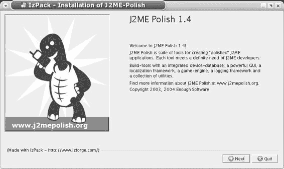

5033CH01.qxd 6/20/05 10:19 AM 第 4 页

**4**

第 1 章 ■ 快速设置指南

**安装 J2ME Polish**

J2ME Polish 的安装分为三个不同的阶段： **1.** 安装 Java 软件开发工具包 (SDK) 1.4 或更高版本、无线工具包 (WTK) 以及 Java 集成开发环境 (IDE) 或 Ant。

**2.** 安装 J2ME Polish。

**3.** 将 J2ME Polish 集成到你最喜欢的 IDE 中。

你可以从 *http://www.j2mepolish.org* 下载 J2ME Polish，并通过双击下载的 *.jar* 文件或从命令行调用 java -jar j2mepolish-[ *版本*].jar 来开始安装。（注意：请将 [ *版本*] 替换为 J2ME Polish 的实际版本号。）现在你应该会看到类似于图 1-1 的屏幕。

**图 1-1.** *安装 J2ME Polish*

**启动示例应用程序**

将 J2ME Polish 安装到任何目录（我将其称为 *${polish.home}*）后，你可以查看示例应用程序，它们位于 *samples* 目录中。更改目录 (cd) 到其中一个目录，例如 *samples/menu*，并从命令行调用 Ant： ant test j2mepolish

当 J2ME Polish 完成应用程序处理后，默认的 WTK 模拟器应该会弹出，如图 1-2 所示。

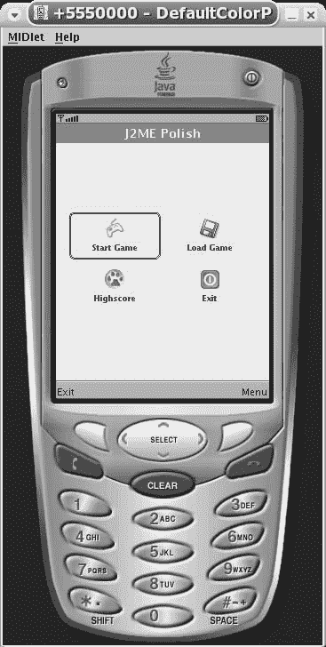

5033CH01.qxd 6/20/05 10:19 AM 第 5 页

第 1 章 ■ 快速设置指南

**5**

**图 1-2.** *WTK 模拟器中的示例菜单应用程序* 如果你看到任何错误消息，很可能是你的 Ant 设置或 WTK 路径不正确。有关帮助，请参阅第 3 章中的“示例应用程序错误故障排除”部分。

你也可以从任何 Java IDE 中启动 J2ME Polish。你需要挂载示例项目，右键单击其中的 *build.xml* 文件，然后选择“运行 Ant”、“执行”或类似的菜单命令来启动 J2ME Polish。如果你想启动模拟器，请确保首先选择了 test 目标，然后选择了 j2mepolish 目标。

**探索示例应用程序**

如果你想知道示例应用程序是如何制作的，可以查看 *samples/menu* 或 *samples/roadrunner* 目录中的 *build.xml* 文件。这个标准的 Ant 文件控制构建过程，并使用 <j2mepolish> 任务来创建应用程序。

5033CH01.qxd 6/20/05 10:19 AM 第 6 页

**6**

第 1 章 ■ 快速设置指南

如果你查看 Menu 应用程序的 *src* 目录中的代码本身，你会发现一个非常简单的应用程序，它使用 javax.microedition.lcdui.List 来显示菜单。打开 *resources/polish.css* 文件，了解这个应用程序是如何设计的。该文件以人类可读的格式包含设计信息。为了获得使用 J2ME Polish 的初步体验，请将顶部 colors 部分中的 fontColor 从 rgb( 30, 85, 86 ) 更改为 red，然后通过调用 ant test j2mepolish 重新启动 J2ME Polish！

恭喜，你现在可以开始行动了！

**总结**

本章以非常简洁的方式解释了安装和使用 J2ME Polish 的必要步骤。以下章节将描述如何安装运行 J2ME Polish 所需的其他工具，详细说明 J2ME Polish 的安装步骤，推荐一些你可能觉得有用的附加工具，并展示如何将 J2ME Polish 紧密集成到你最喜欢的 IDE 中。

5033CH02.qxd 6/17/05 11:43 AM 第 7 页

第 2 章

■ ■ ■

安装先决条件

**本章内容：**

• 安装 Java SDK ( *http://java.sun.com/j2se*)。

• 安装 WTK ( *http://java.sun.com/products/j2mewtoolkit*，或 Mac OS X 版本来自 *http://mpowers.net/midp-osx*)。

• 获取 IDE（例如 Eclipse，*http://www.eclipse.org*），如果你还没有的话。

• 安装 Ant ( *http://ant.apache.org*)。

• 获取设备模拟器（来自供应商，例如 *http://forum.nokia.com*、*http://motocoder.com* 和 *http://developer.samsungmobile.com*）。

J2ME Polish 依赖于几个开源和免费的工具。你需要拥有 Java 2 软件开发工具包 (SDK)、无线工具包 (WTK) 和 Ant——无论是独立使用还是作为集成开发环境 (IDE) 的一部分。你还应该安装来自多个供应商的设备模拟器，用于测试你的应用程序。尽管这些对于开发出色的应用程序并非严格必需，但它们能让你的编程生活轻松得多。本章介绍这些工具的安装。

**Java 2 SDK**

J2ME Polish 是一个用于创建无线 Java 应用程序的解决方案。因此，你自然也需要 Java 本身。Java 有三个版本以满足不同的需求：

• Java 2 标准版 (J2SE) 运行在你的桌面计算机上，J2ME Polish 需要它来生成实际的移动应用程序。

• Java 2 微型版 (J2ME) 运行在手机上，但也运行在电视机顶盒、个人数字助理 (PDA) 和嵌入式设备上。

• Java 2 企业版 (J2EE) 运行在服务器上，用于支持 Web 应用程序或通过无线方式交付移动应用程序。

如果你尚未安装 J2SE，请立即从 *http://java.sun.com/j2se* 下载最新的 1.4. *x* 版本并安装。你也可以使用 Java 5.0 (1.5\. *x*)，但许多移动模拟器需要 J2SE 1.4，因此我建议你现在坚持使用 1.4 分支。

**7**

5033CH02.qxd 6/17/05 11:43 AM 第 8 页

**8**

第 2 章 ■ 安装先决条件

■**提示** 请参阅 *Beginning J2ME: From Novice to Professional, Third Edition*，作者 Jonathan Knudsen (Apress, 2005)，以获取对 J2ME 开发的精彩介绍。

**无线工具包**

无线工具包 (WTK) 不仅提供了一个支持 Java 的手机的通用模拟器，还提供了一个预验证工具，你需要它来使 J2ME 应用程序准备好部署。

从 *http://java.sun.com/* 下载后，安装过程很简单。*products/j2mewtoolkit*。只需将其安装到默认目录，你就可以开始了。

**WTK 版本**

有几个版本的 WTK 可用，特别是用于移动信息设备配置文件 (MIDP) 1.0 手机的旧版 1.0.4 版本和来自 2\. *x* 分支的最新版本。通常，你应该使用最新版本，但如果你愿意，也可以使用 1.0.4 版本。主要区别在于，当你使用较旧的 WTK 时，你需要将代码编译为 Java 1.1，而当 WTK 2\. *x* 可用时，默认使用 Java 1.2。理论上，这不应该有区别，但有时你可能会遇到似乎与重载问题相关的真正令人费解的错误。在这种情况下，javac 目标可能会产生影响，所以请记住，当你使用 WTK 2\. *x* 时可以更改它，但使用 WTK 1.0.4 时则不能。

**Mac OS X 的 WTK**

标准 WTK 不适用于 Mac OS X，但你可以使用 mpowers LLC 在 *http://mpowers.net/midp-osx* 提供的移植版本。为此，你还需要安装 X11，你可以从 *http://www.apple.com/macosx/x11* 获取。

WTK 本身以磁盘映像的形式提供，当你双击它时会自动挂载。只需先将挂载的磁盘映像拖到桌面上，然后将其拖到 *Applications* 文件夹中即可安装。如果你没有管理员权限，你可以将磁盘映像移动到你的主文件夹中的 *Applications* 文件夹（如有必要，请创建该文件夹）。

**IDE**

如果你还没有使用 IDE，我推荐 Eclipse IDE，它可以从 *http://www.eclipse.org* 免费获得。Eclipse 提供了一个基于插件的模块化且强大的环境。J2ME Polish 还附带了一些 Eclipse 插件，可以帮助你编写预处理代码、管理模拟器等。第 3 章将更详细地讨论可能的集成。请参阅 *http://eclipse-tutorial.dev.java.net/* 以了解有关使用 Eclipse 开发 Java 程序的更多信息。

其他流行的 IDE 包括 NetBeans ( *http://www.netbeans.org/*) 和 JBuilder ( *http://*

*www.borland.com/jbuilder/*)。

5033CH02.qxd 6/17/05 11:43 AM 第 9 页

第 2 章 ■ 安装先决条件

**9**

**Ant**

Ant 构成了构建任何 Java 应用程序的公认标准。你可以从命令行或任何重要的 IDE（如 Eclipse、NetBeans、JBuilder 或 IDEA）中使用 Ant。

如果你想从命令行使用 Ant，你应该从 *http://ant.apache.org* 下载二进制发行版并解压。然后你需要调整你的 PATH 环境变量，以便能够找到 *bin* 目录中的 ant 命令。

如果你已将 Ant 安装到 *C:\tools\ant*，请在 Windows 命令行（或你的 shell 脚本）中输入以下命令：

SET PATH=%PATH%;C:\tools\ant\bin

你可以在 Windows 的系统设置中永久更改 PATH 变量（开始 ➤ 设置 ➤ 控制中心 ➤ 系统 ➤ 高级 ➤ 环境变量）。

还要设置 JAVA_HOME 环境变量，它需要指向 Java 2 SDK 的安装目录：

SET JAVA_HOME=C:\j2sdk1.4.2_06

在 Unix/Linux/Mac OS X 下，使用 export 命令代替 SET 命令： export PATH=$PATH:/home/user/tools/ant/bin

export JAVA_HOME=/opt/java

你可以通过编辑主文件夹中的 *.bashrc* 脚本来自动设置任何环境变量。

现在你应该能够通过查询已安装的版本来测试你的 Ant 设置：

> ant -version

Apache Ant version 1.6.2 compiled on September 11 2004

■**注意** 请参阅第 7 章中的“Ant 速成课程”部分，以获取 Ant 入门指南。这并不难！

**供应商特定模拟器**

模拟器让你可以检查应用程序的外观和感觉，有时甚至可以帮助你发现错误。一些模拟器只不过是带有另一个皮肤的标准 WTK，但有些确实能很好地再现设备的实际行为。

■**警告** 当心“但它在模拟器中能工作”的陷阱！永远不要依赖模拟器。尽可能早且尽可能频繁地在真实设备上进行测试。

5033CH02.qxd 6/17/05 11:43 AM 第 10 页

**10**

第 2 章 ■ 安装先决条件

你通常可以直接从供应商的网站下载模拟器，如表 2-1 所列。一些供应商提供额外的服务，例如讨论论坛等。大多数网站要求你在下载任何资源之前先注册。有时，运营商和操作系统开发人员也会提供模拟器。大多数模拟器仅适用于 Windows；有些也适用于 Linux。对于 Mac OS X，你可以使用 mpowerplayer SDK ( *http://mpowerplayer.com*)。

**表 2-1.** *模拟器供应商*

**供应商**

**URL**

**备注**

诺基亚

*http://forum.nokia.com*

查找 Java 工具和 SDK 以获取

多个模拟器。最常见的是

Series 60 和 Series 40

开发工具包。

摩托罗拉

*http://motocoder.com*

摩托罗拉 SDK 包含多个

适用于大多数支持 J2ME 的

设备的模拟器。转到工具 ➤ SDK 下载 SDK。

三星

*http://developer.samsungmobile.com*

三星网站仅支持

Microsoft Internet Explorer 6.0 及

更高版本。KDE 的 Konqueror 也可以工作，但

基于 Mozilla 的浏览器无法使用。

查看“资源”部分以下载

SDK。

索尼爱立信

*http://developer.sonyericsson.com*

你可以从文档和

工具 ➤ Java 下载 SDK。

西门子

*http://communication-market.*

通过选择

*siemens.de/portal/main.aspx?pid=1*

资源 ➤ 工具下载工具包。

Symbian

*http://www.symbian.com/developer*

从 SDK 部分下载模拟器。

**总结**

在本章中，我们研究了使用 J2ME Polish 所需的各种基本工具。在下一章中，你将学习如何安装和设置 J2ME Polish 本身，以便你可以开始开发专业的移动应用程序！

5033CH03.qxd 6/17/05 11:44 AM 第 11 页

第 3 章

■ ■ ■

安装 J2ME Polish

**本章内容：**

• 获取 J2ME Polish 安装程序 ( *http://www.j2mepolish.org*)。

• 调用安装程序（通过调用 java -jar j2mepolish-[ *版本*].jar）。

• 使用提供的示例应用程序。

多亏了图形化安装程序，J2ME Polish 的设置相对简单。本章介绍 J2ME Polish 的安装，以及一些可以与 J2ME Polish 一起使用的第三方工具。

**J2ME Polish 安装指南**

你可以从 *http://www.j2mepolish.org* 下载 J2ME Polish 安装程序。只需从主页选择“下载”。

■**提示** 在 *http://www.j2mepolish.org* 上，你还可以通过选择“讨论”，然后选择“邮件列表”来订阅邮件列表。polish-users 列表提供有关 J2ME Polish 的帮助和一般讨论。polish-announce 列表让你了解新版本的最新信息。

你可以通过双击下载的文件或从命令行调用 java -jar j2mepolish-[ *版本*].jar 来调用安装程序。你需要将 [ *版本*] 部分替换为真实的版本号，例如 j2mepolish-1.4.1.jar。现在安装程序应该启动了。

安装程序是一个简单的向导，在某些步骤需要你的输入。它显示三个关键屏幕：许可证选择、WTK 目录选择和组件选择。

**许可证选择**

许可证选择屏幕，如图 3-1 所示，要求你决定要使用哪个许可证。该许可证将包含在控制实际构建过程的 *build.xml* 文件中。因此，你可以随时通过修改这些文件来更改许可证。

**11**

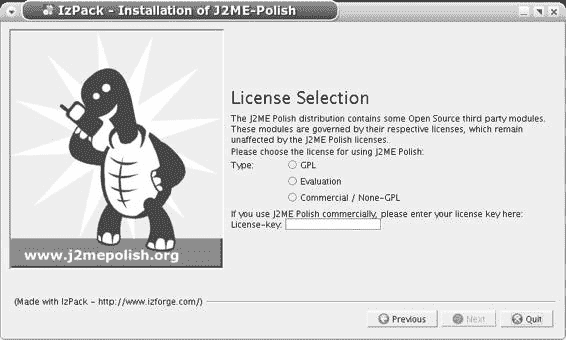

5033CH03.qxd 6/17/05 11:44 AM 第 12 页

**12**

第 3 章 ■ 安装 J2ME Polish

**图 3-1.** *在安装程序中选择许可证* 许可证屏幕提供以下选项：

**GPL：** 如果你想在开源 GNU 通用公共许可证 (GPL) 下发布你的 J2ME 应用程序，你应该选择 GPL 选项。当你将 J2ME Polish 用于闭源产品的商业用途时，你也可以选择 GPL 选项，但在这种情况下，你不允许使用许多模块，如 GUI、调试框架或任何提供的客户端 API。但是，你可以使用 J2ME Polish 的通用构建功能，包括资源组装、多设备构建和强大的预处理工具。

**评估：** 如果你只是想查看 J2ME Polish，请选择“评估”选项。

**商业/非 GPL：** 如果你已经拥有商业许可证密钥，请选择“商业/非 GPL”选项。在这种情况下，你需要在提供的文本框中输入你的许可证密钥。

**WTK 目录选择**

另一个重要的安装程序屏幕要求你选择安装 WTK 的目录，如图 3-2 所示。

在 Windows 上，典型的安装目录是 *C:\WTK22*。在 Mac OS X 上，你需要选择目录（通常称为 *MIDPv1.0.3 for OS X*），然后在文件选择对话框中单击“选择”。

与许可证信息一样，WTK 位置信息包含在提供的 *build.xml* 文件中，因此你可以稍后通过修改这些文件中的 ${wtk.home} 属性来更改它。

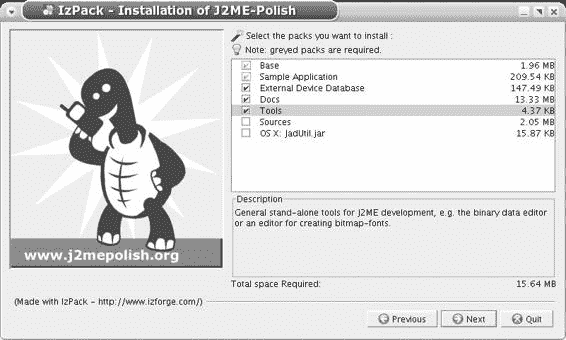

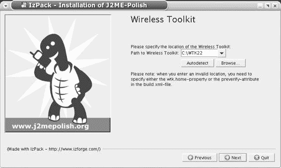

5033CH03.qxd 6/17/05 11:44 AM 第 13 页

第 3 章 ■ 安装 J2ME Polish

**13**

**图 3-2.** *指定 WTK 目录位置* **组件选择**

安装程序的最后一个重要屏幕是选择要安装的组件的屏幕，如图 3-3 所示。

**图 3-3.** *选择要安装的组件*

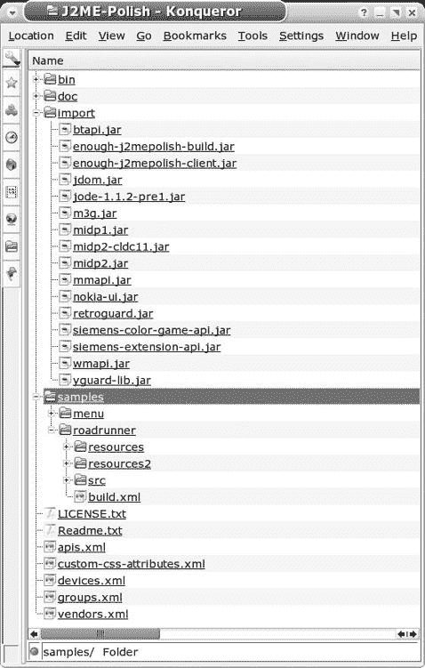

5033CH03.qxd 6/17/05 11:44 AM 第 14 页

**14**

第 3 章 ■ 安装 J2ME Polish

你可以单击组件以获取有关它们的更多信息。如果你想在 Mac OS X 上对 MIDlet 进行数字签名，你应该选择 *JadUtil.jar* 文件，因为该文件在 mpowers LLC 的 WTK 移植版本中不可用（在第 2 章中讨论）。

**安装过程**

在你为 J2ME Polish 本身选择了安装目录后，安装过程就开始了。然后你将在 J2ME Polish 安装目录（我将其称为 *${polish.home}*）中找到如图 3-4 所示的层次结构。

**图 3-4.** *J2ME Polish 安装目录*

5033CH03.qxd 6/17/05 11:44 AM 第 15 页

第 3 章 ■ 安装 J2ME Polish

**15**

J2ME Polish 安装目录包含以下文件夹：

• *bin* 文件夹包含一些独立工具，例如二进制数据文件编辑器和从 True Type 字体创建位图字体的工具。

• *doc* 文件夹包含 HTML 和 PDF 文档。

• *import* 文件夹包含 J2ME Polish 的核心库，以及许多标准 J2ME 库和供应商特定的 API 扩展。这些 API 在构建过程中使用，也可以在你最喜欢的 IDE 中用于 J2ME 项目的类路径。

• *samples* 目录包含示例应用程序。

• 根目录 ( *${polish.home}*) 包含设备数据库，它由文件 *devices.xml*、*vendors.xml*、*groups.xml*、*bugs.xml* 和 *apis.xml* 组成。文件 *custom-css-attributes.xml* 可用于描述你对 J2ME Polish GUI 的自己的扩展。

**外部工具**

在安装模式下，你还应该考虑安装以下第三方工具：

**Jad：** Jad ( *http://www.kpdus.com/jad.html*) 是一个免费的 Java 反编译器。它对于解析模拟器中显示的堆栈跟踪很有用。这样的堆栈跟踪只显示方法内的字节码指令偏移量。当 Jad 位于 PATH 或 *${polish.home}/bin* 文件夹中时，J2ME Polish 可以显示源代码中的实际位置。

**ProGuard：** ProGuard ( *http://proguard.sourceforge.net*) 是最好的开源混淆器，它可以同时保护和缩小你的代码。将 *proguard.jar* 文件复制到 *${polish.home}/import*。

**7-Zip：** J2ME Polish 可以使用 7-Zip ( *http://7-zip.org*，或适用于 Linux 和 Mac OS X 系统的 *http://p7zip.sourceforge.net*) 来打包应用程序，这可能会产生更小的文件大小。将 7-Zip 安装到 *${polish.home}/bin*，以便 J2ME Polish 可以自动找到它。你可以在 *http://p7zip.sourceforge.net* 下载适用于 Linux 和 Mac OS X 的 7-Zip。

**KZIP：** J2ME Polish 也可以使用 KZIP 打包器 ( *http://advsys.net/ken/utils.htm#kzip*)。

当你将 KZIP 安装到 *${polish.home}/bin* 时，J2ME Polish 可以自动找到它。

**Pngcrush、PNGOUT 和 PNGGauntlet：** Pngcrush ( *http://pmt.sourceforge.net/pngcrush*) 和 PNGOUT ( *http://advsys.net/ken/utils.htm#pngout*) 优化 PNG 图像。你必须手动使用这些工具。PNGGauntlet ( *http://numbera.com/software/pnggauntlet.aspx*) 为 PNGOUT 提供了一个 GUI。将这些工具安装到你的系统上的任何位置。

**J2ME Polish 示例应用程序**

你可以在 J2ME Polish 安装目录 *${polish.home}* 的 *samples* 文件夹中找到示例应用程序（参见图 3-4）。你可以将这些示例应用程序用作你自己项目的蓝图。每个示例应用程序包含以下内容：

5033CH03.qxd 6/17/05 11:44 AM 第 16 页

**16**

第 3 章 ■ 安装 J2ME Polish

• *resources* 文件夹存储所有图像、设计设置等。

• *resources2* 文件夹存储应用程序的替代设计。

• *src* 文件夹包含示例应用程序的实际源代码。

• *build.xml* 文件控制 J2ME Polish 应如何构建示例应用程序。

■**注意** 在本节中，我假设你从命令行使用 Ant。当然，你也可以从你的 IDE 中构建示例应用程序。通常，只需创建一个以示例应用程序为根的新项目，右键单击其中的 *build.xml*，然后在 IDE 中选择“运行 ➤ Ant”或类似的菜单命令即可。有关将 J2ME Polish 集成到常见 IDE 的详细信息，请参阅下一章。

**测试示例应用程序**

菜单应用程序仅显示任何 J2ME 游戏的典型菜单。使用以下命令在模拟器中测试此应用程序：

> cd C:\Programs\J2ME-Polish\samples\menu

> ant test j2mepolish

相应地调整路径到你的 J2ME Polish 安装目录。

那么这里发生了什么？当调用 Ant 时，它会在当前目录中查找文件 *build.xml*（因此在此示例中使用 *samples/menu/build.xml*）。参数 test 和 j2mepolish 表示 *build.xml* 中的目标，由 Ant 执行。test 目标将一个 Ant 属性设置为 true，该属性由 j2mepolish 目标评估。当 test 为 true 时，J2ME Polish 将仅为单个设备构建应用程序，并在成功构建后启动相应的模拟器。如果一切顺利，你应该会看到示例应用程序（参见第 1 章中的图 1-2）。

RoadRunner 示例应用程序包含一个完整的游戏，其中需要引导一只青蛙穿过拥挤的街道（听起来很熟悉？）。默认情况下，RoadRunner 游戏在测试模式下为 Nokia/Series60 构建。在构建之前，请确保你已经安装了该模拟器，你可以从 *http://forum.nokia.com* 获取。根据你的设置，你可能需要在 *build.xml* 文件中定义 Ant 属性 ${nokia.home}，例如：

<property name="nokia.home" value="C:\Nokia" /> 此属性的注释版本可以在 *build.xml* 文件的开头找到。

现在犒劳自己一次成功的安装，并玩一局 RoadRunner：

> cd C:\Programs\J2ME-Polish\samples\roadrunner

> ant test j2mepolish

为 cd 命令使用正确的路径。

图 3-5 显示了 RoadRunner 的主菜单。

5033CH03.qxd 6/17/05 11:44 AM 第 17 页

第 3 章 ■ 安装 J2ME Polish

**17**

**图 3-5.** *RoadRunner 游戏的主菜单* **示例应用程序错误故障排除**

如果你在构建示例应用程序时收到错误消息，请检查你的 Ant 设置。以下是常见错误：

**找不到命令：** 要解决此问题，请设置你的 PATH 环境变量，使其包含你的 Ant 设置的 *bin* 目录；例如，SET PATH=%PATH%;C:\ant\bin，或者在 Unix 系统上，export PATH=$PATH:/home/ant/bin。

**找不到 Java 编译器：** 要解决此问题，请确保你已正确设置 JAVA_HOME 环境变量（使用前面的 SET 或 export 命令）。

**${wtk.home} 可能设置不正确：** 如果你在安装期间未正确指定 WTK 的安装目录，J2ME Polish 将报告错误的 ${wtk.home} 属性。在这种情况下，你需要打开 *build.xml* 文件并调整此 Ant 属性；例如，<property name="wtk.home" value="C:\WTK22" />。

当你从命令行调用 ant 而不带任何参数时，只会执行 j2mepolish 目标。由于 test 属性未设置为 true，J2ME Polish 将为多个目标设备创建示例应用程序，并且不会启动模拟器。在这种情况下，你将在新创建的 *dist* 文件夹中找到创建的应用程序。

**总结**

借助本章的帮助，你现在已经安装了 J2ME Polish，甚至可能还安装了一些其他有用的工具。在下一章中，你将学习如何将你的 J2ME Polish 安装集成到你最喜欢的 IDE 中。

5033CH03.qxd 6/17/05 11:44 AM 第 18 页

5033CH04.qxd 6/17/05 11:46 AM 第 19 页

第 4 章

■ ■ ■

将 J2ME Polish

集成到 IDE 中

**本章内容：**

• 了解使用 J2ME Polish 时的常见集成问题。

• 学习如何将 J2ME Polish 集成到 Eclipse、NetBeans、JBuilder 和 IntelliJ 中。

你可以将 J2ME Polish 集成到任何支持 Ant 的集成开发环境 (IDE) 中，这意味着如今你可以将 J2ME Polish 集成到所有专业的 IDE 中。在本章中，我将首先讨论你可以在每个 IDE 中设置的常见选项，然后详细讨论如何集成到 Eclipse、NetBeans 和 JBuilder 中。

**识别常见集成问题**

无论你使用哪种 IDE，都必须注意某些问题。我不会在每个 IDE 的讨论中重复这些问题，而是将它们总结在本节中。

集成 J2ME Polish 的最简单方法是使用一个示例应用程序作为起点（例如，*${polish.home}/samples/menu*）。根据你的 IDE，你可以直接挂载该应用程序文件夹，或者将其复制到你的 IDE 的工作区中。然后，你可以调用 Menu 应用程序中提供的 *build.xml* 文件，使用 J2ME Polish 构建它。如果你想启动模拟器，请在 *build.xml* 中选择 emulator 目标。

如果你想为现有项目使用 J2ME Polish，只需将 *${polish.home}/* 复制到你的项目文件夹中，并至少调整其中的 <midlet> 定义。你可能还想更改 *build.xml* 文件中的 <deviceRequirements> 和 <resources> 设置。

当你在团队中工作并使用版本控制系统（如 CVS ( *http://www.cvshome.org*)、Subversion ( *http://subversion.tigris.org*) 等）时，请确保不要共享临时的 *build* 和 *dist* 文件夹。这些文件夹由 J2ME Polish 在构建阶段创建和使用，因此每次运行都会更改。通常，你可以通过右键单击（在 Mac OS X 上为 Command+单击）*build* 和 *dist* 文件夹，然后选择“添加到 .cvsignore”（或类似选项）来禁用这些文件夹的共享。

**19**

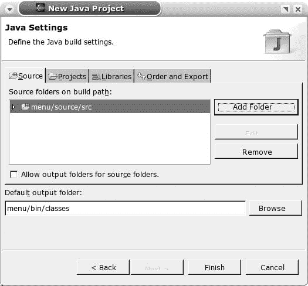

5033CH04.qxd 6/17/05 11:46 AM 第 20 页

**20**

第 4 章 ■ 将 J2ME Polish 集成到 IDE 中

■**注意** 在接下来的讨论中，我将使用术语“右键单击”。这在 Mac OS X 上等同于 Command+单击。

**使用 Eclipse**

Eclipse ( *http://www.eclipse.org*) 是面向代码的 Java 开发者中流行的 IDE。它拥有出色的重构支持，并且由于其插件概念而具有高度可扩展性。如果你不确定使用哪个 IDE，请先测试 Eclipse。

**将 Eclipse 与 Ant 集成**

为了创建你的第一个 J2ME Polish 项目，将完整的 *${polish.home}/samples/menu* 文件夹复制到你的 Eclipse 工作区目录中。然后在 Eclipse 中创建一个名为 Menu 的新项目，并确认每个步骤。如果你已经在命令行上构建了 Menu 应用程序，请确保只选择 *source/src* 文件夹作为你的源目录（参见图 4-1）。Eclipse 会自动集成所有源文件并相应地设置类路径。你现在将在包 de.enough.polish.example 中找到示例应用程序。

**图 4-1.** *在 Eclipse 中确认正确的源文件夹*

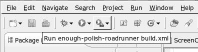

5033CH04.qxd 6/17/05 11:46 AM 第 21 页

第 4 章 ■ 将 J2ME Polish 集成到 IDE 中

**21**

你现在可以通过右键单击 *build.xml* 文件并选择“运行 Ant”来启动 J2ME Polish 并创建 JAR 和 JAD 文件。J2ME Polish 完成构建后，你可以在项目的 *dist* 文件夹中找到 JAR 和 JAD 文件。如果你想从 Eclipse 中访问它们，你可能需要刷新你的项目：右键单击项目，然后选择“刷新”。

要启动模拟器，只需在“运行 Ant”对话框中选择 emulator 目标。启动一次后，你可以使用图 4-2 所示的“外部工具”按钮快速再次运行上一个 Ant 目标。

**图 4-2.** *在 Eclipse 中再次运行上一个 Ant 目标* **使用 ECLIPSE 强制执行命名方案**

Eclipse 不仅是最灵活的 IDE 之一，还包含许多有用的功能，可以帮助你生成更好的代码。

例如，用于区分实例变量和局部变量的许多不同命名方案。有些人以特定字符开头局部变量，其他人以固定字符开头实例变量，而第三组人则以一个字符开头局部变量，以另一个字符开头实例变量。虽然这样的命名方案可能帮助你或一个小型开发者团队，但它们在两个方面存在问题：

• 强制执行命名方案并非易事；你可能需要定期检查所有源代码。

• 新程序员需要首先学习你的特定命名方案。

Java 标准为这种命名方案提供了一个很好的替代方案：使用 this 来限定实例变量。与你自己的命名方案相比，每个 Java 程序员都知道 this.variableName 指的是一个实例变量。此外，当你在“窗口” ➤ “首选项” ➤ “Java” ➤ “编译器” ➤ “对实例字段的非限定访问”下激活相应的编译器警告（或错误，取决于你的需要）时，Eclipse 会自动为你强制执行此方案。检查“编译器”对话框中的其他设置；Eclipse 可以强制执行许多其他代码约定，从批评无效的 JavaDoc 注释到警告从未使用过的变量。

如果这还不够，请查看 *http://eclipse-plugins.info* 上可用的 Eclipse 插件。你将找到几乎满足你开发需求的一切。

5033CH04.qxd 6/17/05 11:46 AM 第 22 页

**22**

第 4 章 ■ 将 J2ME Polish 集成到 IDE 中

**集成问题故障排除**

有时你在将 J2ME Polish 集成到 Eclipse 时可能会遇到困难。

如果源文件没有自动集成，请手动设置项目的源目录：选择“项目” ➤ “属性” ➤ “Java 构建路径” ➤ “源”，并在那里添加源文件夹 *source/src*。

如果 Eclipse 抱怨未知类，则你的项目的类路径设置不正确。请在你的类路径中包含来自 *${polish.home}/import* 文件夹的以下 JAR 文件：*import/midp2.jar*、*import/enough-j2mepolish-client.jar*、*import/mmapi.jar*、*import/nokia-ui.jar*、*import/wmapi.jar*，以及你可能想在应用程序中使用的任何其他文件，例如 *m3g.jar* 或 *pdaapi.jar*。

如果右键单击 *build.xml* 文件时未显示“运行 Ant”命令，请选择 *build.xml* 脚本，打开“运行”菜单，然后选择“外部工具” ➤ “运行为” ➤ “Ant 构建”。

当构建过程因“未找到合适的 Java 编译器”消息而中止时，你需要确保使用有效的 Java SDK（而不是 JRE）进行构建。切换到“运行 Ant”对话框中的 JRE 选项卡，并检查“运行时 JRE”设置。在大多数情况下，你可以在与工作区相同的 JRE 中运行 Ant。如果这不起作用，请通过单击 JRE 选项卡中的“已安装的 JRE”按钮检查 JRE 是否指向 Java SDK。

**安装 J2ME Polish 插件**

J2ME Polish 有一些可选的 Eclipse 插件，用于处理带有预处理指令和 *polish.css* 文件的源代码。从 2005 年 8 月起，计划推出调试器和其他几个工具。

你可以通过选择“帮助” ➤ “软件更新” ➤ “搜索要安装的新功能”来安装 J2ME Polish 插件。在出现的对话框中，创建一个新的远程站点，URL 为 *http://www.j2mepolish.org/eclipse*，选择该站点，然后安装这些功能。

重新启动工作区后，你现在可以通过右键单击 Java 源文件并选择“打开方式” ➤ “J2ME Polish 编辑器”来在 J2ME Polish 编辑器中打开它们。图 4-3 显示了语法高亮和预处理块的标记。例如，当你在 #if 指令中停留几秒钟时，所有对应的 #else 和 #endif 指令都会被标记。其他功能包括自动完成和指令缩进。

■**注意** EclipseME 项目 ( *http://eclipseme.org*) 提供了一个流行的插件，用于使用 Eclipse 创建 J2ME 应用程序。稍加调整，你可以将 J2ME Polish 与 EclipseME 插件一起使用；有关更多信息，请查看附录中 <build> 元素的编译器模式设置。一旦 J2ME Polish 也提供了调试器插件，为了获得最佳兼容性，你应该只使用 J2ME Polish。

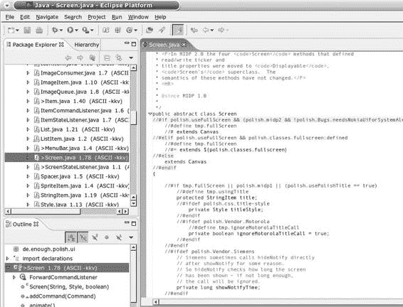

5033CH04.qxd 6/17/05 11:46 AM 第 23 页

第 4 章 ■ 将 J2ME Polish 集成到 IDE 中

**23**

**图 4-3.** *J2ME Polish 编辑器可以标记指令组。*

**使用 NetBeans**

NetBeans ( *http://www.netbeans.org*) 是另一个令人印象深刻的免费开源 Java 开发 IDE。它在 J2ME 开发者中相当受欢迎，因为它通过其 Mobility Pack 与无线工具包很好地集成。

为了将 J2ME Polish 与 NetBeans 4 集成，创建一个新项目，并使用文件管理器将 *${polish.home}/samples/menu* 的内容复制到你的新项目中。右键单击 *build.xml*，然后选择“运行目标” ➤ j2mepolish 来构建应用程序，或选择“运行目标” ➤ emulator 来调用模拟器。

5033CH04.qxd 6/17/05 11:46 AM 第 24 页

**24**

第 4 章 ■ 将 J2ME Polish 集成到 IDE 中

要创建新项目，请选择“文件” ➤ “新建项目”，然后选择“移动” ➤ “移动应用程序”作为你的项目类型。为项目命名，并选择任何文件夹作为项目的主目录。在创建项目之前，取消选中“创建 Hello MIDlet”选项。

现在将 *${polish.home}/samples/menu* 目录中的所有文件复制到你的 NetBeans 项目的文件夹中。覆盖任何现有文件。

返回 NetBeans，在项目视图中右键单击你的新项目，然后选择“刷新文件夹”。你现在可以在 de.enough.polish.example 包中查看示例应用程序。

再次右键单击你的项目，选择“属性” ➤ “构建”，然后选择“库和资源”。单击“添加 Jar/Zip”，并将 *${polish.home}/import/enough-j2mepolish-client.jar* 文件添加到你的项目中。

**使用 JBuilder**

Borland 的商业 JBuilder IDE ( *http://www.borland.com/mobile/jbuilder*) 仍然很强大，并为 J2ME 开发提供了一个专门的 IDE。本节展示如何使用免费提供的通用 Foundation 版本的 JBuilder。

要将 J2ME Polish 集成到 JBuilder 中，将 *${polish.home}/samples/menu* 示例应用程序复制到你的工作区（通常是你主目录中的 *jbproject* 文件夹）。然后启动 JBuilder，并创建一个新的 Menu 项目。

在项目对话框中，选择适当的路径，并将 *source/src* 文件夹设置为主源文件夹。切换到“所需库”选项卡，然后选择“添加” ➤ “新建”。将库命名为“MIDP-Development”或类似名称，并将来自 *${polish.home}/import* 文件夹的文件 *enough-j2mepolish-client.jar*、*midp2.jar*、*mmapi.jar*、*wmapi.jar* 和 *nokia-ui.jar* 添加到库路径中。

在免费的 Foundation 版 JBuilder 中，你需要首先安装和集成 Ant。从 *http://ant.apache.org* 下载二进制 Ant 发行版，并将其解压到你的系统上的任何位置（现在称为 *${ant.home}*）。现在在“项目” ➤ “项目属性” ➤ “Ant” ➤ “构建”中调整 JBuilder Ant 设置。将 Ant 主目录设置为 *${ant.home}*。

现在创建新项目，并集成 *build.xml* 文件：选择“项目” ➤ “添加” ➤ “添加文件/包/类”。在出现的对话框中，从项目根目录选择文件 *build.xml*。现在 *build.xml* 出现在项目视图中。你需要停用 Borland 编译器来构建实际的应用程序：右键单击 *build.xml* 脚本，选择“属性”，然后取消选中“使用 Borland Java 编译器”复选框。

你现在可以通过右键单击 *build.xml* 文件并选择“制作”来构建示例应用程序。在切换到“文件浏览器”视图后，你将在项目的 *dist* 文件夹中找到创建的 J2ME 应用程序文件。

要调用模拟器，请通过单击句柄打开 *build.xml* 文件，右键单击 emulator 目标，然后选择“制作”。

**使用 IntelliJ**

JetBrains 的 IntelliJ ( *http://www.jetbrains.com*) 以作为面向代码的开发者的工作马而闻名。

要集成 J2ME Polish，只需将 Menu 示例应用程序的完整目录从 *${polish.home}/samples/menu* 复制到你的 IntelliJ 项目文件夹，通常是你主文件夹中的 *IdeaProjects*。现在创建一个新的 Menu 项目（“文件” ➤ “新建项目”）。使用任何 JDK 选择单个模块项目以完成项目设置。IntelliJ 足够智能，可以自动检测到 *source/src* 文件夹包含源文件，因此只需确认此设置。

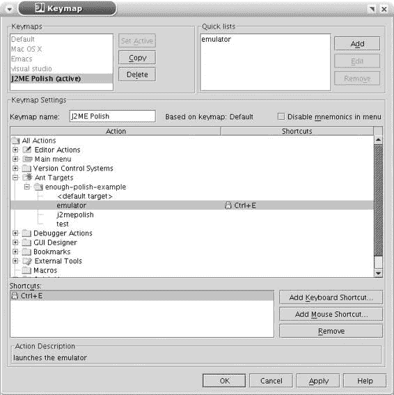

5033CH04.qxd 6/17/05 11:46 AM 第 25 页

第 4 章 ■ 将 J2ME Polish 集成到 IDE 中

**25**

你现在通过打开项目视图，右键单击项目，然后选择“模块设置”来调整项目的类路径。切换到“库（类路径）”选项卡，并通过在“使用的全局库”部分中选择“编辑”来创建一个新的全局库。将其命名为 J2ME，并从 *${polish.home}/import* 中选择所有需要的库（例如，*midp2.jar*、*enough-j2mepolish-client.jar*、*wmapi.jar*、*m3g.jar*、*pdaapi.jar* 和 *nokia-ui.jar*）。

要构建项目，请右键单击项目视图根目录中的 *build.xml* 文件，并选择将此文件添加为 Ant 构建文件。Ant 视图现在将打开，你可以右键单击“j2mepolish”目标并选择“运行目标”来构建应用程序。

在开发过程中，你经常需要启动模拟器。在 IntelliJ 中，很容易为此任务分配一个快捷键。右键单击 Ant 视图中的“emulator”目标，然后选择“分配快捷键”。现在首先复制默认键映射，并通过选择“设置为活动”来激活它。

现在你可以为其分配任何快捷键；图 4-4 显示了如何分配 Ctrl+E。从现在开始，只需同时按下 Ctrl 和 E 键即可调用模拟器。

**图 4-4.** *在 IntelliJ 中为模拟器 Ant 目标分配快捷键*

5033CH04.qxd 6/17/05 11:46 AM 第 26 页

**26**

第 4 章 ■ 将 J2ME Polish 集成到 IDE 中

**总结**

得益于所有优秀 Java IDE 对 Ant 的支持，集成 J2ME Polish 相当容易。除了讨论的 IDE 之外，你还可以使用许多其他 IDE，只要它们能够调用 Ant 脚本。因此，如果你是 Unix 高手，你甚至可以毫无问题地使用 Emacs。

现在你已经准备好开始全面使用 J2ME Polish 了。在下一章中，你将学习如何使用 J2ME Polish 的设备数据库，不仅用于了解你的目标设备，还用于调整你的应用程序、规避设备问题等。

5033CH05.qxd 6/17/05 11:47 AM 第 27 页

第 2 部分

■ ■ ■

使用 J2ME Polish

**J2ME Polish 是一套用于开发无线 Java 应用程序的工具。在本部分中，你将学习如何使用和调整不同的工具，例如构建框架、GUI 和独立工具。**

5033CH05.qxd 6/17/05 11:47 AM 第 28 页

5033CH05.qxd 6/17/05 11:47 AM 第 29 页

第 5 章

■ ■ ■

了解 J2ME Polish

**本章内容：**

• 了解 J2ME Polish 的架构——构建框架、客户端 API、IDE 插件和独立工具层。

• 学习 J2ME Polish 如何在设计、实现、构建、测试、优化和部署每个 J2ME 应用程序的过程中帮助你进行无线 Java 应用程序的开发。

本章为你提供 J2ME Polish 架构的概述。它还展示了 J2ME Polish 如何在 J2ME 应用程序开发的不同阶段帮助你。

**从 500 英里高空俯瞰 J2ME Polish**

J2ME Polish 是用于开发无线 Java 应用程序的组件集合。各种组件可以分为四个不同的层，如图 5-1 所示。

**图 5-1.** *J2ME Polish 的四层架构*

**29**

5033CH05.qxd 6/17/05 11:47 AM 第 30 页

**30**

第 5 章 ■ 了解 J2ME Polish

每一层都有几个组件：

**构建框架：** 你使用构建框架来构建你的 J2ME 应用程序。这个基于 Ant 的框架允许你在源代码编译之前对其进行预处理，并为多个设备和区域设置编译、预验证和打包你的应用程序。可以使用日志模式来跟踪应用程序中的错误。利用设备数据库和预处理来调整你的应用程序以适应各种手机，而不会失去应用程序的可移植性。

**客户端框架：** 客户端框架提供了用于增强你的无线 Java 应用程序的 API。它包括一个替代高级移动信息设备配置文件 (MIDP) 用户界面的方案。J2ME Polish GUI 是在应用程序代码之外使用简单的层叠样式表 (CSS) 文本文件设计的。游戏引擎允许在 MIDP 1.0 设备上使用 MIDP 2.0 游戏 API，因此你可以轻松地将游戏移植到 MIDP 1.0 平台。WMAPI 包装器使你能够使用无线消息 API，即使在仅支持供应商专有方法发送和接收消息的设备上也是如此。最后但同样重要的是，工具类提供了常见功能，例如 TextUtil 或 BitMapFont 类。得益于构建框架，客户端框架会自动调整到目标设备，因此你可以在几乎所有手机上使用全屏模式，例如。

**IDE 插件：** IDE 插件简化了在流行的 Eclipse IDE 中开发 J2ME 应用程序的过程。例如，支持预处理的 Java 编辑器插件为预处理语句提供了语法高亮。由于构建框架基于 Ant，你仍然可以从任何 IDE 甚至命令行使用 J2ME Polish。

**独立工具：** J2ME Polish 还包括几个独立工具。二进制数据编辑器专门用于创建和修改结构化二进制文件，如关卡数据，而字体编辑器则从任何 True Type 字体创建位图字体。

这些层紧密集成。例如，日志框架有一个客户端 API，但它是在构建框架的帮助下控制的。在接下来的章节中，你将深入了解每一层。

■**注意** J2ME Polish 在不断发展，所以请务必查看 *http://www.*

*j2mepolish.org* 网站以了解最新添加的内容。

**使用 J2ME Polish 管理应用程序生命周期**

创建 J2ME 应用程序涉及几个不同的阶段： **设计：** 在设计阶段，你规划应用程序的架构。

**实现：** 在实现阶段，你实现设计并编写源代码。

5033CH05.qxd 6/17/05 11:47 AM 第 31 页

第 5 章 ■ 了解 J2ME Polish

**31**

**构建：** 在构建阶段，你编译源代码并创建应用程序包（JAR 和 JAD 文件）。

**测试：** 在测试阶段，你检查实现。

**优化：** 在优化阶段，你改进应用程序，重点关注性能、内存消耗、应用程序大小和设备调整。

**部署：** 最后，你在部署阶段将应用程序安装到设备上。

在这里，我们将仔细研究应用程序生命周期的每个阶段。你将看到如何在这些阶段中使用 J2ME Polish 实现快速周转，以及每个阶段的一些技巧。

**设计架构**

当你设计应用程序的架构时，你应该力求使其尽可能简单。你可能已经知道，在设计 J2ME 应用程序时，纯面向对象的方法并不总是最好的。每个类都会增加开销，每次抽象都会减慢应用程序的速度。但即便如此，你也应该尝试为你的应用程序创建一个清晰且逻辑的结构，以便以后的更改不会导致意外的副作用。

在设计应用程序时，请牢记以下建议（但不要盲目遵循）：

• 尽量避免抽象类和接口。通常，你会发现预处理在保持应用程序灵活性方面比使用抽象更有效。

• 记住，每个类都会增加应用程序的大小，因此尝试对功能进行分组以最小化类的数量。

• 仅在必要时实现接口。例如，与其在每个屏幕中实现 CommandListener 接口，不如考虑使用一个负责应用程序流程的调度器或控制器类。并且不要创建你自己的抽象事件处理系统。

• 通过定义独立的类或模块来设计可重用性，这些类或模块可以在其他上下文和应用程序中使用。检查你是否可以对它们进行参数化，并且不要害怕使用不同的包。混淆步骤和 J2ME Polish 将负责将所有类放入默认包中，从而最小化应用程序的大小。

• 不要过度优化设计，例如将整个应用程序放在一个类中。将剧烈的优化留到优化阶段，并记住某些设备只接受不超过 16KB 的类。

• 不要重复功能。例如，如果你使用 J2ME Polish GUI，请尝试使用这些类，而不是实现你自己的额外 GUI 类。

• 尝试使用经过验证且稳定的第三方 API，而不是创建你自己的实现，除非所需的功能属于你业务的核心。由于设备的不同行为，为 J2ME 创建稳定的 API 是一项相当具有挑战性和复杂的任务。

5033CH05.qxd 6/17/05 11:47 AM 第 32 页

**32**

第 5 章 ■ 了解 J2ME Polish

因此，总结这些提示，你的目标是设计一个坚实而清晰的架构，但不要通过使用繁重的面向对象方法而过度设计。

**实现应用程序**

你在实现阶段实现你的应用程序。除了源代码本身，你通常还需要创建资源，如图像和服务器端应用程序代码。

对于实际源代码的编程，你可以根据个人喜好使用 IDE 甚至简单的文本编辑器。如果你是 Java 编程新手，请务必查看免费的 Eclipse 和 NetBeans IDE。两者都提供了相当强大的环境，并且非常适合 J2ME 编程。如果你使用 Eclipse，请查看“窗口” ➤ “首选项” ➤ “Java” ➤ “编译器”下的编译器选项。你可以激活许多不同的警告，这将帮助你创建干净的代码。

J2ME Polish 通过提供涵盖用户界面、网络和工具任务的强大 API 来帮助你实现应用程序。IDE 插件简化了预处理代码的编程，并允许在实现阶段实现快速周转。

**构建应用程序**

构建 J2ME 应用程序对于运行它们是必要的，无论是在模拟器上还是在实际设备上。至少，你需要编译源代码、预验证类、将类和资源打包到 JAR 文件中，并创建 Java 应用程序描述符 (JAD) 文件。

通常，你还需要选择合适的资源、翻译你的应用程序、预处理源代码以及混淆你的应用程序。

这听起来像是艰苦的工作吗？是的，但幸运的是，J2ME Polish 完全自动化了这一切。第 7 章详细讨论了构建应用程序的细节。

**测试应用程序**

在实现和构建应用程序之后，你就可以通过在模拟器和真实设备上运行它来进行测试。J2ME Polish 可以自动调用模拟器，这样你就可以通过一次鼠标点击来测试你的应用程序。当你的应用程序遇到异常时，模拟器中给出的堆栈跟踪通常只显示代码的二进制偏移量，例如 at com.company.MyClass.myMethod(+20)。当安装了 Jad 反编译器（在第 3 章中讨论）时，J2ME Polish 会自动解析此类堆栈跟踪。

■**警告** 在真实设备上测试你的应用程序对其成功至关重要。永远不要依赖模拟器。尽可能早且尽可能频繁地在真实设备上进行测试。

J2ME Polish 还提供了一个日志框架，它提供不同的日志级别以及在真实设备上查看日志消息的能力。你可以为包和类指定日志级别，并完全停用日志记录，这样就不会在最终应用程序中浪费宝贵的空间。

你将在第 7 章中了解更多关于调用模拟器的信息，并在第 9 章中了解日志框架的详细信息。

5033CH05.qxd 6/17/05 11:47 AM 第 33 页

第 5 章 ■ 了解 J2ME Polish

**33**

**优化应用程序**

当你实现并测试第一个原型时，你通常会发现需要在优化阶段修复的缺点。典型的缺点包括以下内容： **特定于设备的错误：** 你在某些设备上遇到错误，但在其他设备上没有。你可以通过使用预处理来规避特定于设备的错误来解决这些问题。第 8 章描述了如何使用 J2ME Polish 预处理你的应用程序。在第 15 章中，你将了解在现实世界中可能遇到的问题以及如何解决它们。

**应用程序大小：** 你的应用程序太大。通常，你可以使用自动资源组装来优化资源使用并调整应用程序的架构。第 7 章讨论了资源的自动组装。

**应用程序性能：** 性能不如预期。你可以使用多种技术来提高应用程序的性能。第 16 章专门讨论优化策略。

**部署应用程序**

将你的应用程序部署到真实的手机上是你应用程序生命周期中的关键步骤。你可以使用不同的方法来安装你的应用程序，从数据线到空中下载。

蓝牙、红外线和数据线

安装你的应用程序的最简单方法是使用蓝牙连接，现在大多数设备都提供这种连接。通常，只需将生成的 JAR 文件（其中包含应用程序的类和资源）发送到手机即可。如何操作取决于你的操作系统和设置。通常，你只需右键单击该文件并选择“发送到蓝牙设备”或类似选项。现代设备在收到 JAR 文件后会自动开始安装，但有时你需要查看手机的收件箱文件夹并选择发送的文件来开始安装。

与使用蓝牙非常相似的是使用红外线连接或数据线或 USB 线。请参阅你的设备文档，了解设置此类连接的说明。

空中下载

部署你的 J2ME 应用程序的唯一标准化方式是空中下载 (OTA)。在这种情况下，你需要一个提供应用程序的 JAD 和 JAR 文件的 Web 服务器。

在一个简单的情况下，你可以使用一个简单的无线标记语言 (WML) 页面，如清单 5-1 所示。该页面可以通过设备的无线应用协议 (WAP) 浏览器访问，并且只提供一个指向 JAD 文件的链接。当设备读取 JAD 文件时，它会将控制权转发给应用程序管理系统 (AMS)。然后 AMS 会显示一些详细信息（标题、供应商和应用程序大小），并提示用户下载实际的应用程序文件 (JAR)。

5033CH05.qxd 6/17/05 11:47 AM 第 34 页

**34**

第 5 章 ■ 了解 J2ME Polish

**清单 5-1.** *链接到 JAD 文件的示例 WML 页面*

<?xml version="1.0" encoding="ISO-8859-1"?>

<!DOCTYPE wml PUBLIC "-//WAPFORUM//DTD WML 1.1//EN"

"http://www.wapforum.org/DTD/wml_1.1.xml">

<wml>

<card title="下载" id="main">

<a href="myapplication.jad">下载应用程序</a>

</card>

</wml>

大多数 Web 服务器已经配置为正确处理 JAR 和 JAD 文件。如果你的设备无法识别这些文件，你只需将 *text/vnd.sun.j2me.app-descriptor* MIME 类型添加到 . *jad* 文件，并将 *application/java* 类型添加到 . *jar* 文件的 Web 服务器配置中。

如果你在访问 WML 页面时遇到问题，请检查你设备上的连接设置。某些 WAP 网关不允许使用 80 以外的端口，因此如果遇到困难，也请测试此端口。

在更复杂的情况下，你可以通过评估 USER_AGENT HTTP 头并使用服务器端脚本技术（如 JavaServer Pages (JSP) 或 PHP）为当前设备动态生成 WML 页面。你也可以通过二进制短消息（作为 WAP 链接）或简单的文本消息发送指向 JAD 文件的链接。

此外，还有第三方 OTA 服务器可用。这些通常提供不同的配置技术、设备识别和支付解决方案。

■**注意** 在开发阶段使用 OTA 很痛苦，因为你需要先将应用程序复制到 Web 服务器，然后再次从服务器下载。这需要相当多的时间，而且成本也可能很高。因此，请检查你的设备是否有其他安装选项可用。

多媒体消息配置

某些设备也可以通过使用多媒体消息服务 (MMS) 接收 J2ME 应用程序。用户发现这比处理普通的 OTA 下载方便得多，因为不需要额外的交互（除了在网页上选择应用程序和设备）。你需要一个短消息服务 (SMS) 中心来为你发送这些消息。

跟踪你的安装

如果你在互联网上发布你的应用程序，则不容易知道它被安装了多少次。幸运的是，J2ME 标准允许在每次安装以及删除你的应用程序时进行通知。可选的 JAD 属性 MIDlet-Install-Notify 包含应在应用程序安装后调用的 HTTP 地址。设备

5033CH05.qxd 6/17/05 11:47 AM 第 35 页

第 5 章 ■ 了解 J2ME Polish

**35**

将尝试调用给定的地址，并在其内容中报告状态，例如 900 Success。如果 Web 服务器在安装期间设置了 cookie，则该 cookie 也可能在安装通知中返回，如清单 5-2 所示。

**清单 5-2.** *成功安装的通知* POST http://foo.bar.com/status HTTP/1.1

Host: foo.bar.com

Cookie: Name="abc"; Domain=".foo.bar"; Path="/app-dir"; \ JSESSIONID="123"; VERSION="1"

Content-Length: 13

900 Success

表 5-1 列出了可能的状态代码。

**表 5-1.** *安装通知的状态代码* **状态代码**

**状态消息**

Success

Insufficient Memory

User Cancelled

Loss of Service

JAR Size Mismatch

Attribute Mismatch

Invalid Descriptor

Invalid JAR

Incompatible Configuration or Profile

Application Authentication Failure

Application Authorization Failure

Push Registration Failure

Deletion Notification

你也可以通过设置 JAD 属性 MIDlet-Delete-Notify 来跟踪应用程序的删除。然后设备将尝试在删除时发送一个 POST 请求，说明 912 Deletion Notification。

你可以通过在 J2ME Polish 中定义 <info> 属性 installNotify 和 deleteNotify 来指定 MIDlet-Install-Notify 和 MIDlet-Delete-Notify。你将在第 7 章中了解更多关于设置属性的信息。

■**警告** 不要依赖接收每次安装或删除通知。网络故障和用户交互可能会抑制此机制。

5033CH05.qxd 6/17/05 11:47 AM 第 36 页

**36**

第 5 章 ■ 了解 J2ME Polish

**更新应用程序**

更新对于业务应用程序非常重要，但对于长时间运行的网络游戏也同样可取。更新选项取决于平台。

MIDP 1.0 平台

不幸的是，在 MIDP 1.0 平台上，无法从应用程序内部触发更新。以下是一些需要考虑的更新策略：

• 每当你与服务器端应用程序进行首次握手时，查询当前版本。根据业务需求，你可以随后通知用户有可用更新，或者服务器可以根据你的客户端 J2ME 应用程序的版本提供特定内容。当活跃用户选择更新应用程序时，你可以发送一条包含服务器上最新 JAD 文件链接的 SMS 文本消息。大多数设备现在可以识别 SMS 消息中基于 HTTP 的链接，并直接启动 WAP 浏览器。

• 向用户发送一条包含 WAP 链接的二进制消息。然后用户可以保存并调用该链接。

• 通过 MMS 消息将完整的应用程序发送到用户的手机。这是最用户友好的方式，但并非所有设备都支持通过 MMS 进行部署。

MIDP 2.0 平台

在 MIDP 2.0 平台上，你可以通过发出平台请求直接从应用程序内部启动更新过程。由于真实设备处理平台请求的方式不同，你应该准备好在请求更新后退出应用程序。无论如何，在更新实际实施之前，你的应用程序将被关闭。清单 5-3 显示了一个 MIDlet 的示例，该 MIDlet 将其当前版本持久化在 RecordStore 中，以便它可以检测更新。

**清单 5-3.** *从你的应用程序发出更新请求 (MIDP 2.0)* package com.apress.update;

import javax.microedition.io.ConnectionNotFoundException;

import javax.microedition.midlet.MIDlet;

import javax.microedition.midlet.MIDletStateChangeException; import javax.microedition.rms.RecordStore;

import javax.microedition.rms.RecordStoreException;

public class UpdateMidlet extends MIDlet {

private static final int VERSION = 125; // 1.2.5

5033CH05.qxd 6/17/05 11:47 AM 第 37 页

第 5 章 ■ 了解 J2ME Polish

**37**

public UpdateMidlet() {

super();

}

protected void startApp() throws MIDletStateChangeException {

try {

RecordStore versionStore = RecordStore.openRecordStore( "version", false ); versionStore.closeRecordStore();

byte[] versionData = versionStore.getRecord(

versionStore.getNextRecordID() - 1 );

String versionStr = new String( versionData );

int version = Integer.parseInt( versionStr );

**if ( version != VERSION ) {**

// 应用程序已更新：

showUpdateMessage();

// 删除版本记录存储：

RecordStore.deleteRecordStore("version");

return;

}

} catch (RecordStoreException e) {

// 未请求更新

}

showMainMenu();

}

protected void requestUpdate() {

//#ifdef polish.midp2

try {

// 请求更新：

//#if updateUrl:defined

//#= platformRequest( "${updateUrl}" );

//#else

**platformRequest( "http://www.company.com/app/update.jad" );**

//#endif

// 持久化当前版本：

**RecordStore versionStore = RecordStore.openRecordStore(**

**"version", true );**

byte[] versionData = Integer.toString( VERSION ).getBytes(); versionStore.addRecord( versionData, 0, versionData.length ); versionStore.closeRecordStore();

} catch (ConnectionNotFoundException e) {

//#debug error

System.out.println("无法发出更新请求" + e );

} catch (RecordStoreException e) {

//#debug error

System.out.println("无法持久化当前版本" + e );

5033CH05.qxd 6/17/05 11:47 AM 第 38 页

**38**

第 5 章 ■ 了解 J2ME Polish

}

//#endif

}

protected void showMainMenu() {

// TODO 实现 showMainMenu

}

protected void showUpdateMessage() {

// TODO 实现 showUpdateMessage

}

protected void pauseApp() {

// 忽略

}

protected void destroyApp(boolean unconditional) throws

MIDletStateChangeException {

// 优雅退出

}

}

设备应询问用户是否希望在安装更新时保留数据。在大多数情况下，至少可以保留已存储在记录存储中的数据。根据你的应用程序需求，你还应该考虑在请求更新之前将用户数据存储在服务器上。然后你可以将用户的 ID 添加到用于更新的 JAD 文件中。当你的应用程序启动并且没有用户数据时，你可以检查该 ID 并从服务器下载数据。

显然，这里存在一些安全风险，因为 JAD 文件很容易被更改。因此，你需要确保用户确实是预期的用户（身份验证），并且任何因某种原因最终拥有无效 ID 的有效用户都可以更改该 ID。

**总结**

本章向你介绍了 J2ME Polish 的总体架构。你了解了四个主要层：构建框架、客户端框架、IDE 插件和独立工具。你还了解了无线 Java 应用程序的生命周期以及 J2ME Polish 如何在每个阶段帮助你。

在下一章中，我们将研究设备数据库，它为 J2ME Polish 的几乎所有模块提供了基础。

5033CH06.qxd 6/17/05 11:48 AM 第 39 页

第 6 章

■ ■ ■

设备数据库

**本章内容：**

• 通过 J2ME Polish 设备数据库了解更多关于你的目标设备的信息。

• 了解设备数据库文件 *devices.xml*、*vendors.xml*、*groups.xml*、*apis.xml* 和 *bugs.xml* 的 XML 格式。

• 发现如何使用设备数据库来选择目标设备、组装特定于设备的资源以及优化你的应用程序。

在本章中，你将了解 J2ME Polish 设备数据库。该数据库构成了 J2ME Polish 的基础，对于构建和预处理应用程序至关重要。你可以使用设备的已定义特性和能力在构建过程中选择目标设备，并通过预处理将你的应用程序调整到不同的手机。了解设备数据库的结构和用途对于充分利用 J2ME Polish 至关重要。

**理解 XML 格式**

J2ME 设备数据库由不同的 XML 文件组成，这些文件默认位于 J2ME Polish 的安装文件夹中。设备数据库包含以下文件：

• *devices.xml*：描述许多支持 J2ME 的设备的能力和已知问题。

• *vendors.xml*：列出所有 J2ME 设备的供应商和制造商。

• *groups.xml*：描述设备组。每个设备可以属于任意数量的组。

• *apis.xml*：列出可选的和供应商特定的库，例如移动媒体 API (MMAPI)。

• *bugs.xml*：描述与设备相关的已知问题。

■**注意** 从 J2ME Polish 1.3 开始，*configurations.xml*、*platforms.xml* 和 *capabilities.xml* 文件也包含在设备数据库中。在 *configurations.xml* 文件中，你可以定义配置，如 CLDC 1.0 和 CLDC 1.1。使用 *platforms.xml* 文件来定义配置文件，如 MIDP 1.0、DoJa 4.0 和 WIPI 2.0。

**39**

5033CH06.qxd 6/17/05 11:48 AM 第 40 页

**40**

第 6 章 ■ 设备数据库

设备数据库中的所有文件都使用类似的 XML 格式，并包含常见的元素，如 <features> 和 <capability>。特性和能力可以被继承；有些被覆盖，有些被补充。在这里，我们将了解如何定义设备、供应商、组、库和已知问题。

**定义设备**

*${polish.home}/devices.xml* 文件指定了大多数已知 J2ME 设备以及一些虚拟设备的能力。该数据库包含一些虚拟手机，可用于为尚不为人知的设备准备你的应用程序。清单 6-1 显示了诺基亚 6600 和虚拟 Java 无线技术行业 (JTWI) 手机的定义。该数据库包含一些虚拟手机，可用于为尚不为人知的设备准备你的应用程序。

**清单 6-1.** *在 devices.xml 中定义通用手机和诺基亚 6600 手机*

<devices>

<device supportsPolishGui="true">

<identifier>Generic/jtwi</identifier>

<features>isVirtual</features>

<capability name="JavaPlatform" value="MIDP/2.0" />

<capability name="JavaConfiguration" value="CLDC/1.0" />

<capability name="JavaPackage" value="mmapi,wmapi,jtwi" />

<capability name="SoundFormat" value="midi, amr" />

</device>

<device>

<identifier>Nokia/6600</identifier>

<groups>Series60</groups>

<features>hasCamera</features>

<capability name="JavaPlatform" value="MIDP/2.0" />

<capability name="JavaPackage" value="mmapi, wmapi, btapi, jtwi" />

<capability name="OS" value="Symbian OS 7.0s"/>

<capability name="ScreenSize" value="176x208"/>

<capability name="BitsPerPixel" value="16"/>

<capability name="VideoFormat" value="3gpp, mpeg-4, realvideo" />

<capability name="SoundFormat"

value="midi, midi24, true tones, amr, wb-amr" />

<capability name="HeapSize" value="3mb" />

<capability name="MaxJarSize" value="dynamic" />

<capability name="CameraResolution" value="vga" />

<capability name="CameraZoom" value="2" />

</device>

</devices>

根元素 <devices> 包含所有描述实际设备的 <device> 元素。

5033CH06.qxd 6/17/05 11:48 AM 第 41 页

第 6 章 ■ 设备数据库

**41**

<identifier> 元素通过说明供应商和设备的名称（用单个斜杠分隔）来唯一标识设备。你也可以通过用逗号分隔标识符来一次定义多个设备：

<identifier>Sony-Ericsson/K700, Sony-Ericsson/K700i</identifier> 使用 <features> 元素来描述设备的简单布尔能力：

<features>hasCamera, hasPointerEvents</features> 示例包括存在摄像头 (hasCamera)、支持基于笔的输入方法 (hasPointerEvents) 以及是虚拟设备 (isVirtual)。要定义多个特性，请用逗号分隔它们。特性的行为类似于布尔变量：要么已定义（true），要么未定义（false）。

为了定义更复杂的设备能力，你使用 <capability> 元素，它总是有一个名称和一个值：

<capability name="ScreenSize" value="176x208"/> 像前面的元素一样，<capability> 可以包含多个值，这些值用逗号分隔：

<capability name="JavaPackage" value="mmapi, wmapi, btapi"/> 能力的行为类似于具有值的变量。你可以定义任何类型的能力，但 J2ME 提供了标准化的能力，如表 6-1 所列。

■**注意** 你可以以不同的方式定义能力。最常见的方法是使用 name 和 value 属性的简短表示法。同样有效的表示法是使用嵌套元素 <capability-name> 和 <capability-value>。尽管这种格式冗长得多，并且不易阅读，但它确保了与 J2EE 客户端配置规范的兼容性。你可以在 *http://jcp.org/en/jsr/detail?id=124* 找到此规范。

你可以通过指定 <groups> 元素将设备显式添加到任何组：

<groups>Series60</groups>

同样，你可以通过用逗号分隔来定义多个组。这些组反过来可以定义特性和能力，这样你就不需要在相应的设备中指定这些能力。组也是 J2ME Polish 自动资源组装不可或缺的一部分。除了这些显式定义的组之外，J2ME Polish 还使用*隐式组*。隐式组由特定的能力形成，例如 JavaPlatform、JavaPackage 或 BitsPerColor。隐式组在构建 J2ME 应用程序的资源组装步骤中帮助你。表 6-1 还显示了创建隐式组的能力。

5033CH06.qxd 6/17/05 11:48 AM 第 42 页

**42**

第 6 章 ■ 设备数据库

■**注意** 从 J2ME Polish 1.3 开始，能力是否导致隐式组将在 *capabilities.xml* 文件中定义。

有时，扩展其他设备很有用。例如，考虑一些运营商（如 Vodafone）的设备修改。这些运营商通常会添加一些库，如 Vodafone 服务类库 (VSCL)，并以不同的名称销售该设备。设备数据库中的一个例子是索尼爱立信 K500i，它由 Vodafone 以 F500i 的名称销售。

对于这种情况，你可以使用 <parent> 元素，在其中指定原始设备：

<parent>Sony-Ericsson/K500i</parent>

父设备的所有特性和能力都会自动继承。当你扩展另一个设备时，你需要确保父设备定义在子设备之上；否则，J2ME Polish 将无法正确解析继承关系，并将中止处理。

你可以指定 <device> 元素的 supportsPolishGui 属性，以显式允许对相应设备使用 J2ME Polish GUI。通常，J2ME Polish 会自动检查设备是否具有推荐的能力，例如支持超过 256 种颜色并且堆大小大于 500KB。默认情况下，J2ME Polish GUI 仅用于确实具有推荐能力的设备。supportsPolishGui 属性允许你覆盖 GUI 支持的自动检查。

■**提示** 你可以通过在 *build.xml* 文件中将 usePolishGui 属性设置为 always 而不是 yes 来覆盖 GUI 指示器。然后，无论设备数据库中的设置如何，J2ME Polish GUI 都将用于所有目标设备。

**表 6-1.** *设备数据库的常见能力* **能力**

**说明**

**预处理访问**

**组**

BitsPerPixel

颜色深度：

变量：

例如，8 位每像素，

polish.BitsPerPixel

BitsPerPixel.4+ 和

1 = 单色

符号：

BitsPerPixel.8

4 = 16 色

polish.BitsPerPixel.1,

8 = 256 色

polish.BitsPerPixel.4,

12 = 4096 色

polish.BitsPerPixel.16, 等。

16 = 65,536 色

18 = 262,144 色

24 = 16,777,216 色

ScreenSize

屏幕分辨率的宽度

变量：polish.ScreenSize,

乘以高度（以像素

polish.ScreenWidth,

为单位），例如 176✕208

polish.ScreenHeight

符号（示例）：

polish.ScreenSize.176x208,

polish.ScreenWidth.176,

polish.ScreenHeight.208

5033CH06.qxd 6/17/05 11:48 AM 第 43 页

第 6 章 ■ 设备数据库

**43**

**能力**

**说明**

**预处理访问**

**组**

CanvasSize

MIDP 画布的宽度

类似于 ScreenSize

乘以高度

FullCanvasSize

全屏模式下 MIDP

类似于 ScreenSize

画布的宽度乘以

高度

JavaPlatform

支持的 Java 平台，

变量：polish.JavaPlatform

midp1 或 midp2

例如 MIDP 1.0 或

符号：polish.midp1,

MIDP 2.0

polish.midp2

JavaConfiguration

支持的 Java 配置，

变量：

cldc1.0 或 cldc1.1

例如 CLDC 1.0 或

polish.JavaConfiguration

CLDC 1.1

符号：polish.cldc1.0,

polish.cldc1.1

JavaPackage

支持的 API，例如

变量：polish.api,

分别是支持的 API

诺基亚 UI 和 MMAPI

polish.JavaPackage

的名称，例如

符号：polish.api.nokia-ui,

nokia-ui 或 mmapi

polish.api.mmapi, 等。

（每个支持的 API

一个组）

JavaProtocol

支持的数据交换

变量：polish.JavaProtocol

协议*

符号：

polish.JavaProtocol.serial,

polish.JavaProtocol.https,

等。

HeapSize

最大堆大小，例如

变量：polish.HeapSize

500KB 或 1.2MB

MaxJarSize

MIDlet JAR 包的

变量：polish.MaxJarSize

最大大小，例如

100KB 或 2MB

StorageSize

所有应用程序和

变量：polish.StorageSize

数据的最大大小，

例如 4MB

OS

设备的操作系统，

变量：polish.OS

例如 Symbian OS 6.1

VideoFormat

设备支持的视频

变量：polish.VideoFormat

每个支持的视频

格式，例如 3 GPP

符号：polish.video.3gpp,

格式一个组，例如

或 MPEG-4

polish.video.mpeg-4,

3gpp 和 mpeg-4

polish.VideoFormat.3gpp,

polish.VideoFormat.mpeg-4,

等。

SoundFormat

设备支持的音频

变量：polish.SoundFormat

每个支持的音频

格式，例如 MIDI

符号：polish.audio.midi,

格式一个组，例如

和 WAV

polish.audio.wav,

midi 和 wav

polish.SoundFormat.midi,

polish.SoundFormat.wav, 等。

Bugs

已知错误的简称

变量：polish.Bugs

符号：

polish.Bugs.drawRgbOrigin,

polish.Bugs.ImageIOStream➜

AutoClose, 等。

**所有 MIDP 1.0 设备都支持 HTTP。所有 MIDP 2.0 设备还支持 HTTPS。*

5033CH06.qxd 6/17/05 11:48 AM 第 44 页

**44**

第 6 章 ■ 设备数据库

**定义供应商**

*${polish.home}/vendors.xml* 文件定义了设备的制造商。你需要确保 *devices.xml* 文件中存在的每个设备供应商也列在 *vendors.xml* 文件中。

<vendors> 元素包含所有 <vendor> 定义。其嵌套的 <name> 元素指定了制造商的名称。你还可以定义对该供应商的所有设备都有效的通用能力和特性。清单 6-2 演示了诺基亚和西门子供应商的定义。

**清单 6-2.** *在 vendors.xml 中定义诺基亚和西门子制造商*

<vendors>

<vendor>

<name>Nokia</name>

<features></features>

<capability name="key.ClearKey" value="-8" />

<capability name="key.ChangeInputModeKey" value="35" />

</vendor>

<vendor>

<name>Siemens</name>

<features></features>

<capability name="Emulator.Class" value="SiemensEmulator" />

</vendor>

<vendors>

**定义组**

设备组为你提供了一种方便的方法来一次为许多设备定义特性和能力。例如，考虑诺基亚流行的 Series 40 手机，它们共享许多共同的能力。使用 *devices.xml* 文件中的 <groups> 元素和 *groups.xml* 文件中的相应定义，可以很容易地对设备进行分组。你还可以使用组来为你的应用程序选择合适的资源，例如图像或声音文件。

<groups> 根元素包含所有定义实际组的 <group> 元素。使用 <name> 元素来定义组的名称。你可以像为设备和供应商一样添加特性和能力。属于此组的设备会自动继承这些特性。你还可以使用包含扩展组名称的 <parent> 元素来扩展另一个组。同样，子组将继承扩展组的所有特性和能力。清单 6-3 显示了 Nokia-UI 组和 Series40 组的定义，其中 Series40 组扩展了 Nokia-UI 组。

■**注意** 在 *groups.xml* 中，你只能找到显式组；即设备使用 <groups> 元素引用的组。还有由设备能力 JavaPlatform、JavaConfiguration、JavaPackage、SoundFormat、VideoFormat 和 BitsPerPixel 形成的隐式组，如表 6-1 所列。

5033CH06.qxd 6/17/05 11:48 AM 第 45 页

第 6 章 ■ 设备数据库

**45**

**清单 6-3.** *在 groups.xml 中定义设备组*

<groups>

<group>

<name>Nokia-UI</name>

<features>supportSpriteTransformation, hasCommandKeyEvents</features>

<capability name="classes.fullscreen" value="com.nokia.mid.ui.FullCanvas" />

<capability name="JavaPackage" value="nokia-ui" />

<capability name="key.LeftSoftKey" value="-6" />

<capability name="key.RightSoftKey" value="-7" />

</group>

<group>

<name>Series40</name>

<parent>Nokia-UI</parent>

<capability name="JavaPlatform" value="MIDP/1.0" />

<capability name="ScreenSize" value="128x128" />

<capability name="FullCanvasSize" value="128x128" />

<capability name="JavaConfiguration" value="CLDC/1.0" />

<capability name="Emulator.Class" value="NokiaEmulator" />

<capability name="Emulator.Skin" value="Nokia_S40_DP20_SDK_1_0" />

</group>

</groups>

**定义库**

在 *${polish.home}/apis.xml* 中，你可以指定在哪里可以找到设备库。J2ME Polish 在构建应用程序时会在编译和混淆步骤中自动包含这些库。

你通过设置 *devices.xml*、*groups.xml* 或 *vendors.xml* 中的 JavaPackage 能力来定义设备支持的库：

<capability name="JavaPackage" value="mmapi, wmapi" /> 当 *apis.xml* 文件中未定义支持的库时，J2ME Polish 会在项目的 *import* 文件夹中搜索该库，然后在 *${polish.home}/import* 中使用库名称和扩展名 *.jar* 和 *.zip* 进行搜索。例如，对于无线消息 API (WMAPI)，它将首先搜索 *wmapi.jar* 文件，然后搜索 *wmapi.zip* 文件。

然而，当你在 *apis.xml* 中定义库时，情况就不同了。首先，你可以定义几个可能的文件名以及这些文件的位置。你还可以指定为该 API 设置了哪个预处理符号。<apis> 元素包含所有实际的 <api> 定义。嵌套的 <name> 元素指定了库的名称，例如 Mobile Media API。你还应该使用 <description> 元素来描述该库。<names> 元素列出了该库已知的所有名称，例如 mmapi 和 JSR-135。这确保了你始终引用同一个库，无论 JavaPackage 能力中使用哪个可能的名称。

<symbol> 元素指定了为支持此库的设备定义的预处理符号。（预处理将在第 8 章中介绍。）如果你将符号设置为 mmapi，例如，你可以使用 //#if polish.api.mmapi 结构来检查该库。更一般地说，对于每个名称为 [ *api-name*] 的库，预处理符号

5033CH06.qxd 6/17/05 11:48 AM 第 46 页

**46**

第 6 章 ■ 设备数据库

polish.api.[ *api-name*] 被定义，以便你可以在预处理步骤中使用它。该符号也是设备在支持该库时所属于的隐式组的名称。隐式组可用于为你的应用程序选择合适的资源。

你还可以通过使用 <parent> 元素来扩展其他库。在此元素中，你指定父库的名称之一。当一个库扩展另一个库时，它会继承扩展库的所有符号。清单 6-4 显示了 WMAPI 2.0 如何扩展原始 WMAPI。支持 WMAPI 2.0 的设备现在自动属于 wmapi 和 wmapi2.0 组，并且预处理符号 polish.api.wmapi 和 polish.api.wmapi2.0 被定义。当你扩展另一个库时，你需要确保父库定义在子库之上；否则，J2ME Polish 将无法找到它并中止构建。

你使用 <files> 元素指定库的文件名。你还可以通过使用 <path> 元素来指定库的默认路径。

J2ME Polish 为了方便起见包含了许多空库。这些包括蓝牙 API、MIDP 1.0 API、Mobile 3D Graphics API 等。

**清单 6-4.** *在 apis.xml 中指定库*

<apis>

<api>

<name>Mobile Media API</name>

<description>移动媒体 API 提供

播放和捕获声音及视频的功能。

</description>

<names>mmapi,mm-api, JSR-135, JSR135</names>

<symbol>mmapi</symbol>

<files>j2me-mmapi.jar, mma.zip</files>

<path>import/j2me-mmapi.jar</path>

</api>

<api>

<name>Wireless Messaging API</name>

<description>无线消息 API 提供

发送和接收消息 (SMS) 的功能。

</description>

<names>wmapi, wm-api, JSR-120, JSR120, wma</names>

<symbol>wmapi</symbol>

<files>j2me-wmapi.jar, wma.zip</files>

<path>import/j2me-wmapi.jar</path>

</api>

<api>

<name>Wireless Messaging API 2.0</name>

<description>无线消息 API 2.0 提供发送和接收文本及

多媒体消息 (SMS 和 MMS) 的功能。

</description>

<names>wmapi2.0, wmapi2, JSR-205, JSR205</names>

<symbol>wmapi2.0</symbol>

5033CH06.qxd 6/17/05 11:48 AM 第 47 页

第 6 章 ■ 设备数据库

**47**

<files>j2me-wmapi-2.0.jar, wma_2_0.zip</files>

<path>import/j2me-wmapi-2.0.jar</path>

</api>

</apis>

**描述已知问题**

你可以在设备数据库中找到典型的设备问题。这些问题使用 *devices.xml* 文件中的 Bugs 能力来定义。你可以参考 *${polish.home}/bugs.xml* 来获取关于每个问题的更多信息。

每个问题都使用 <bug> 元素来描述。嵌套元素 <name> 等于 *devices.xml* 中 Bugs 能力给出的值。你不得在名称中使用任何空格，并且应该使用驼峰式命名法使用有意义的名称；例如，drawRgbOrigin。

<description> 元素用清晰的英语解释问题，<area> 元素定义了问题属于哪个领域；例如，ui、multimedia 或 rms。可选的 <solution> 元素描述了如何规避问题（如果可能）。清单 6-5 显示了一个问题数据库的示例。

**清单 6-5.** *在 bugs.xml 中阐明设备错误*

<bugs>

<bug>

<name>drawRgbOrigin</name>

<description>Graphics.drawRGB(..) 方法不使用平移后的原点，而是始终从左上角 0,0 原点开始。

</description>

<area>ui</area>

<solution>

对于有此错误的设备，使用左上角 0,0 原点：

//#ifdef polish.Bugs.drawRgbOrigin

x += g.getTranslateX();

y += g.getTranslateY();

//#endif

g.drawRGB( rgbData, offset, scanlength, x, y, width, height, processAlpha);

</solution>

</bug>

<bug>

<name>ImageIOStreamAutoClose</name>

<description>根据规范，Image.createImage( InputStream in ) 不应关闭给定的输入流。有此错误的设备会关闭输入流。

</description>

<area>io</area>

<solution>将任何应从输入流加载的图像移动到相应流中的最后一个位置。

</solution>

<bug>

</bugs>

5033CH06.qxd 6/17/05 11:48 AM 第 48 页

**48**

第 6 章 ■ 设备数据库

■**注意** 即使 *bugs.xml* 文件中描述了一个问题，这并不意味着它真的是一个错误。有时，不符合预期但根据规范有效的行为也会被记录。因此，*bugs.xml* 这个名称可能有点误导。请参阅第 15 章，了解一些已知问题的真实示例。

**定义补充能力和特性**

你可以在 *vendors.xml*、*groups.xml* 和 *devices.xml* 文件中定义能力和特性。设备会自动继承其供应商以及该设备所属的所有组的特性和能力。这样的层次结构可能变得相当复杂，如图 6-1 所示。

**图 6-1.** *设备可以具有复杂的层次结构。*

任何已定义的特性的都是累加的。这意味着，如果设备的供应商定义了 *x*，设备的组定义了 *y*，并且设备本身定义了 *z*，那么你的设备最终将拥有所有特性：*x*、*y* 和 *z*。

当在多个地方定义能力时，通常会被覆盖。*groups.xml* 中的能力会覆盖 *vendors.xml* 中的相同能力，而 *devices.xml* 中的能力会覆盖在其他地方定义的能力。诺基亚流行的 Series 40 手机通常具有 128✕128 像素的屏幕尺寸，因此你在 *groups.xml* 的 Series40 组中找到相应的定义：

<capability name="ScreenSize" value="128x128" /> 然而，Series 40 中的某些设备确实具有不同的屏幕尺寸。在这种情况下，你可以在 *devices.xml* 中为相应的设备定义具有不同值的 ScreenSize 能力。

然而，某些能力是累积的，就像特性一样。如果你在设备层次结构的多个地方定义了 JavaPackage、JavaProtocol、SoundFormat、VideoFormat 和 Bugs 能力，它们都会累加起来。例如，JavaPackage 能力定义了

5033CH06.qxd 6/17/05 11:48 AM 第 49 页

第 6 章 ■ 设备数据库

**49**

设备支持的库。所有 Series 60 手机都支持诺基亚 UI API，因此 Series60 组定义了这一点：

<capability name="JavaPackage" value="nokia-ui" /> Series60 组实际上是从 Nokia-UI 组继承此设置的。查看 *devices.xml* 文件中属于 Series60 组的任何设备定义，你会发现 nokia-ui 值没有在 JavaPackage 能力中重复，因为该值是自动继承的。

■**注意** 从 J2ME Polish 1.3 开始，你可以在 *capabilities.xml* 文件中定义能力是添加还是替换先前设置的值。

**使用设备数据库**

那么现在你了解了 J2ME Polish 设备数据库的工作原理，但它可以用来做什么呢？以下是你可以使用设备数据库做的一些事情：

• 使用 <deviceRequirements> 元素选择你的目标设备。

• 通过将图像和其他资源文件放入 *resources* 目录及其子文件夹，使用自动资源组装。

• 通过评估和使用从数据库获取的设备特性和能力来优化你的应用程序。

• 根据你自己的需求调整数据库，而不会影响其他项目。

**了解你的目标设备**

当你为特定设备开发应用程序时，你可能会遇到问题甚至设备错误。要获取关于你的目标设备的信息，请查看 *http://www.j2mepolish.org/* 上的设备数据库。*devices-overview.html*。这基本上是 *devices.xml* 文件和相关文件的精美视图，允许你在不同的设备、组、供应商等之间轻松导航。如果你没有在线访问权限，你也可以在 *${polish.home}/doc/html/devices-overview.html* 查看设备。

请务必查看你的目标设备的已知问题。通常，这有助于你更快地解决任何问题。你还可以浏览所有支持你的应用程序所需 API 的设备，这在规划应用程序架构时非常重要。

5033CH06.qxd 6/17/05 11:48 AM 第 50 页

**50**

第 6 章 ■ 设备数据库

**选择目标设备**

使用 J2ME Polish，你可以一次为多个目标设备构建和优化你的应用程序。你可以通过在 *build.xml* 文件中指定目标设备的要求来做到这一点。<deviceRequirements> 元素负责选择你的目标设备。（你将在第 7 章中了解关于为多个设备构建应用程序的所有细节。）你可以使用设备数据库中定义的任何 <capability> 或 <feature> 来选择你的目标设备。为了演示，清单 6-6 显示了如何选择所有支持触控笔*和* MIDP 2.0 平台的设备。

**清单 6-6.** *选择所有支持触控笔和 MIDP 2.0 平台的设备*

<deviceRequirements>

<requirement name="JavaPlatform" value="MIDP/2.0+" />

<requirement name="Feature" value="hasPointerEvents" />

</deviceRequirements>

**为目标设备选择资源**

J2ME Polish 可以自动为你的应用程序选择正确的资源，例如图像和声音文件。你只需将资源放在项目 *resources* 目录的相应子文件夹中。你可以将通用资源直接放入 *resources* 文件夹，将专用资源放入 *resources/[vendor]*、*resources/[group]* 或 *resources/[vendor]/[device]* 文件夹。然后 J2ME Polish 将选择正确版本的资源并将其包含在最终的应用程序包中。此过程的详细信息在第 7 章中描述。

资源组装的关键是设备数据库。每个设备都属于一个供应商，并且可以属于多个隐式和显式组。J2ME Polish 总是选择最专门的资源版本，顺序如下：

**1.** J2ME Polish 添加来自通用 *resources* 文件夹的所有资源。

**2.** 它添加来自 *resources/[vendor-name]* 文件夹的所有资源，例如 *resources/Nokia*。

**3.** 对于设备所属的每个显式和隐式组，它添加来自 *resources/[group]* 文件夹的所有资源。示例包括用于属于 Series 60 的设备的 *resources/Series60*、用于颜色深度至少为 16 位每像素的设备的 *resources/BitsPerPixel.16+*，以及用于支持 MIDI 声音格式的设备的 *resources/midi*。

**4.** 它添加来自 *resources/[vendor]/[device]* 文件夹的所有资源，例如 *resources/Nokia/6600* 或 *resources/Sony-Ericsson/K700*。

在每一步中，更专门的资源会覆盖更通用的资源。例如，假设你在 *resources* 文件夹中有一个名为 *bg.png* 的背景图片，并且在 *resources/Nokia* 和 *resources/Nokia/3230* 目录中也有。如果你为非诺基亚设备构建应用程序，则 *resources* 文件夹中的图像会被添加到 JAR 文件中。诺基亚设备会从 *resources/Nokia* 获取图像，但诺基亚 3230 手机的应用程序会从 *resources/Nokia/3230* 文件夹获取图像 *。*

5033CH06.qxd 6/17/05 11:48 AM 第 51 页

第 6 章 ■ 设备数据库

**51**

■**注意** 显式组是设备在 devices.xml 文件中使用 <groups> 元素引用的组。隐式组由设备能力 JavaPlatform、JavaConfiguration、SoundFormat、VideoFormat 和 BitsPerPixel 产生。你可以在在线设备数据库 *http://www.j2mepolish.org/devices-overview.html* 中查看设备的所有隐式和显式组。这些组按层次结构排序，因此，例如，当设备恰好支持 16 位每颜色时，BitsPerColor.16 组比 BitsPerColor.16+ 组更具体。此顺序也显示在在线数据库中；对于列出的每个组，优先级是递增的，因此最具体的组是最后一个。

**为目标设备优化**

设备数据库的最佳特性之一是，你可以在应用程序的源代码中检测和评估所有特性和能力。这是在预处理步骤中完成的，该步骤在编译之前转换 Java 代码。你使用不同的指令来控制预处理步骤，例如 //#if、//#foreach 或 //#=。本节仅讨论设备数据库在预处理阶段的一般用法。请参阅第 8 章以了解有关预处理细节的更多信息。

设备的所有特性都被转换为以 polish. 开头并以特性名称结尾的预处理符号。例如，当设备具有指针事件时，预处理符号 polish.hasPointerEvents 被定义。可以使用 //#if 或 //#ifdef 指令在代码中检查预处理符号。例如，清单 6-7 显示了如何检查设备是否基于触控笔。

**清单 6-7.** *在应用程序中检查指针事件*

//#ifdef polish.hasPointerEvents

callPointerMethod();

//#else

callPlainMethod();

//#endif

当前目标设备的能力也可以被评估并在你的源代码中使用。每个能力都可以在 polish.[ *capability-name*] 下使用。你可以使用 //#if 指令比较能力；例如，//#if polish.BitsPerPixel >= 16 或 //#if polish.

identifier == Nokia/6600。当定义了一个能力时，你可以检查相应的预处理符号 polish.[ *capability-name*]:defined。当你将能力与 //#= 指令一起使用时，这尤其有用，如清单 6-8 和 6-9 所示。

**清单 6-8.** *在应用程序中更改类继承* public class SplashScreen

//#ifdef polish.classes.fullscreen:defined

//#= extends ${ polish.classes.fullscreen }

//#else

extends Canvas

//#endif

5033CH06.qxd 6/17/05 11:48 AM 第 52 页

**52**

第 6 章 ■ 设备数据库

**清单 6-9.** *使用设备能力确定画布高度*

//#ifdef polish.FullCanvasHeight:defined

//#= int height = ${ polish.FullCanvasHeight };

//#else

int height = getHeight();

//#endif

J2ME Polish 还为每个能力的每个值定义了符号 polish.[ *capability-name*].[value]。例如，当你拥有值为 https、socket 的 JavaProtocol 能力时，符号 polish.JavaProtocol.https 和 polish.JavaProtocol.socket 都被定义，并且可以使用 //#if 和 //#ifdef 指令进行检查。

能力 JavaPlatform、JavaConfiguration、JavaPackage、SoundFormat 和 VideoFormat 也会触发额外的预处理符号。支持 MIDP 1.0 平台的设备具有 polish.midp1 符号，而 polish.midp2 符号为所有 MIDP 2.0 设备定义。类似地，polish.cldc1.0 符号为所有 CLDC 1.0 设备定义，polish.cldc1.1 符号为所有 CLDC 1.1 设备定义。对于每个支持的 JavaPackage，定义了 polish.api.[ *api-name*] 符号；例如，polish.api.mmapi。同样，对于每个支持的 SoundFormat，定义了符号 polish.audio.[ *format*]。当你的设备支持 MIDI 声音时，定义了 polish.audio.midi 符号。所有视频格式也是如此，因此你可以通过检查 polish.video.mpeg-4 来检查当前目标设备是否支持 MPEG-4 视频。

**更改和扩展设备数据库**

得益于设备数据库的 XML 格式，你可以使用任何文本编辑器读取和写入这些文件。你可以通过编辑安装文件夹中的设备数据库 XML 文件（例如 *${polish.home}/custom-devices.xml*）来进行全局更改，但也可以通过将相关文件复制到项目的基目录中，然后进行编辑，从而仅对当前项目进行本地更改。

■**注意** 考虑将你的任何设备数据库更改贡献给 J2ME Polish 社区，以便每个人都能从中受益。如果你不贡献这些更改，你可能需要将自己的版本与官方数据库合并，因为数据库在 J2ME Polish 的每个版本中都会更新。

在对数据库进行更改后，如果你在预处理步骤中使用更改后的定义，则可能需要进行一次干净的构建。只需使用 Ant 调用 *build.xml* 文件的 clean 目标，或者在开始另一个构建之前删除临时的 *build* 文件夹。

■**注意** 在 Windows 上，你需要一个像样的文本编辑器来读取和写入 XML 文件。行尾以 Unix 风格写入，因此在记事本中，你只会看到一行看似无尽的文本。考虑使用 Crimson 编辑器 ( *http://www.crimsoneditor.com*) 或 Java IDE 中的任何编辑器，如 Eclipse ( *http://www.eclipse.org*)。

5033CH06.qxd 6/17/05 11:48 AM 第 53 页

第 6 章 ■ 设备数据库

**53**

**总结**

本章讨论了 J2ME Polish 基于 XML 的设备数据库及其格式。我们快速了解了如何使用该数据库获取信息、为多个设备构建、选择合适的资源以及优化应用程序。在下一章中，你将学习使用 J2ME Polish 构建应用程序的所有知识。

5033CH06.qxd 6/17/05 11:48 AM 第 54 页

5033CH07.qxd 6/17/05 11:50 AM 第 55 页

第 7 章

■ ■ ■

构建应用程序

**本章内容：**

• 了解 J2ME Polish 所基于的 Ant 的基本概念。

• 学习从预处理到打包应用程序的各种构建阶段。

• 学习如何为多个设备构建、创建本地化应用程序、集成第三方库以及混淆和调试你的应用程序。

J2ME Polish 使得使用一个应用程序源代码作为基础，同时针对各种设备变得容易。这通常是必要的，因为设备可能支持 MIDP 1.0 或 MIDP 2.0 标准、支持专有 API（如诺基亚 UI API）、支持不同的声音格式等等。

如今，构建 J2ME 应用程序是一项相当复杂的任务。当然，应用程序需要针对正确的 Java 版本进行编译、预验证和打包，但通常还涉及其他一些步骤，例如预处理或混淆应用程序。

J2ME Polish 的主要重点是构建 J2ME 应用程序，因此它为此提供了一个灵活而强大的框架。在下一节中，我将首先复习你的 Ant 知识；因为 J2ME Polish 基于 Ant，理解基本的 Ant 概念至关重要。

随后我将讨论不同的构建阶段；然后你将学习 J2ME Polish 的各种手柄和开关。此外，在本章中，我将讨论典型的用户场景，例如为多个设备和多个区域设置构建你的应用程序。

**Ant 速成课程**

Apache Ant 相当谦虚地将自己描述为“……一个基于 Java 的构建工具。理论上，它有点像 Make，但没有 Make 的缺点。”1 如果你考虑可用 Ant 任务的数量，这是一个高尚的轻描淡写。Ant 是*构建 Java 应用程序的标准。使用它，你可以构建应用程序、通过 FTP 或任何其他网络协议将它们部署到远程服务器、强制执行代码风格指南等等。

Ant 默认解释并执行当前目录中的文件 *build.xml*。Ant 构建文件的基本元素是一个*项目*，它基本上包含*目标*和*任务*。一个*目标*可以从外部调用，例如从命令行。每个目标通常

**55**

5033CH07.qxd 6/17/05 11:50 AM 第 56 页

**56**

第 7 章 ■ 构建应用程序

包含一个或多个任务，这些任务负责执行实际的操作。清单 7-1 显示了一个完整的示例。

**清单 7-1.** *一个完整的 build.xml 示例*

<project name="example" default="hello">

<target name="hello">

<echo message="hello world!" />

</target>

</project>

恭喜——你已经创建了你的第一个 Ant 脚本！现在让我们仔细看看它。

<project> 标签是 *build.xml* 脚本的顶层元素。属性 default 描述了当命令行上未指定目标时应调用哪个目标。在此示例中，它指向 hello 目标。此目标使用 <echo> 任务在标准输出上打印信息。弄清楚 <echo> 任务在屏幕上打印什么留给读者作为练习。

当你现在从命令行调用 Ant 时，你应该会看到类似于清单 7-2 的输出。

**清单 7-2.** *你的第一个 Ant 脚本的输出*

> ant

Buildfile: build.xml

hello:

[echo] hello world!

BUILD SUCCESSFUL

Total time: 3 seconds

做得好——你已经执行了你的第一个 Ant 脚本！如果你对哪些 Ant 任务已经可用感到好奇，请参考 *http://ant.apache.org/* 上的 Ant 文档。*manual/*。你还会在 *http://ant.apache.org/* 上找到外部任务列表，例如 J2ME Polish。*external.html*。

那么，在 *build.xml* 中还能找到什么呢？你将遇到的最重要的概念是*属性*。你可以在脚本开头的目标外部或目标内部定义属性。属性是一个只能设置一次的常量，如清单 7-3 所示。

**清单 7-3.** *使用 Ant 属性*

<project name="example" default="greetuser">

<target name="robert">

<property name="user" value="Robert" />

</target>

<target name="jinny">

<property name="user" value="Jinny" />

</target>

5033CH07.qxd 6/17/05 11:50 AM 第 57 页

第 7 章 ■ 构建应用程序

**57**

<target name="greetuser">

<echo message="hello ${user}" />

</target>

</project>

清单 7-3 提供了三个目标：robert、jinny 和 greetuser。在 greetuser 目标中，它在 message 属性中使用了属性 ${user}。

■**注意** 使用 J2ME Polish，你可以通过将 <variables> 元素的 includeAntProperties 和 replacePropertiesWithoutDirective 属性设置为 true，在你的源代码中使用所有 Ant 属性。

你可以通过将目标名称作为参数来调用任何目标，例如 ant robert greetuser。在此示例中，将首先调用 robert 目标。它将 ${user} 属性设置为 Robert。然后执行 greetuser 目标，在这种情况下将打印“hello Robert”。很容易想象当你调用 ant jinny greetuser 时会发生什么。

但是当你调用 ant jinny robert hello 时会发生什么？由于 Ant 属性的“只写一次”特性，在这种情况下打印的消息将是“hello Jinny”。

你也可以使用 -D 选项在命令行上定义属性，这对于为脚本提供密码很有用。例如：

ant -Duser=Benny

Ant 属性的这种“只写一次”功能起初可能令人困惑，但对于在团队中开发非常有用，因为有些人可能想要使用不同的设置。你可以使用 <property> 元素的 file 属性加载用户特定的属性，如清单 7-4 所示。

**清单 7-4.** *加载 Ant 属性*

<project name="example" default="showpaths">

**<property file="${user.name}-build.properties" />**

<property name="wtk.home" location="C:\WTK22" />

<property name="polish.home" location="C:\programs\J2ME-Polish" />

<target name="showpaths">

<echo message="wtk.home=${wtk.home}" />

<echo message="polish.home=${polish.home}" />

</target>

</project>

清单 7-4 使用预定义的 Ant 属性 ${user.name} 来确定属性文件的名称。因此，如果你的系统用户名为“kirk”，你可以提供属性文件 *kirk-build.properties* 来定义你自己的设置。属性文件需要具有常见的 Java 属性格式，因此你使用等号分隔属性名称和值：

5033CH07.qxd 6/17/05 11:50 AM 第 58 页

**58**

第 7 章 ■ 构建应用程序

Ant 的另一个重要特性是多个目标之间的依赖关系。例如，在部署应用程序之前，你需要确保它已首先构建。清单 7-5 确保了这种依赖关系。

**清单 7-5.** *Ant 目标之间的依赖关系*

<project name="example" default="build">

<target name="build">

<echo message="building application..." />

</target>

<target name="deploy" depends="build">

<echo message="deploying application..." />

</target>

</project>

当你使用 ant deploy 调用 deploy 目标时，即使你没有在命令行上指定它，build 目标也会首先执行。

■**提示** *build.xml* 脚本——正如你可能注意到的——是一个 XML 文件，因此你可以使用 XML 注释，例如

<!-- invoking J2ME Polish -->。你还需要对特殊字符进行编码。如果你需要在属性或值中指定引号，只需写入 &quot; 即可。如果你需要 & 符号，请使用 &amp;，依此类推。

**创建“Hello, J2ME Polish World”应用程序**

既然你现在知道如何处理 Ant，让我们以 J2ME 的方式说“hello”。清单 7-6 显示了一个带有菜单的简单 MIDlet，其中只有退出按钮有效。

**清单 7-6.** *一个显示菜单的简单 MIDlet*

package com.apress.roadrunner;

import javax.microedition.lcdui.*;

import javax.microedition.midlet.MIDlet;

import javax.microedition.midlet.MIDletStateChangeException; public class Roadrunner extends MIDlet implements CommandListener {

List menuScreen;

Command startGameCmd = new Command( "开始游戏", Command.ITEM, 8 ); Command quitCmd = new Command( "退出", Command.EXIT, 10 ); Display display;

public Roadrunner() {

super();

this.menuScreen = new List( "Hello World", List.IMPLICIT );

5033CH07.qxd 6/17/05 11:50 AM 第 59 页

第 7 章 ■ 构建应用程序

**59**

this.menuScreen.append( "开始游戏", null );

this.menuScreen.append( "设置", null );

this.menuScreen.append( "高分", null );

this.menuScreen.append( "退出", null );

this.menuScreen.addCommand( this.startGameCmd );

this.menuScreen.addCommand( this.quitCmd );

this.menuScreen.setCommandListener( this );

}

protected void startApp() throws MIDletStateChangeException {

this.display = Display.getDisplay( this );

this.display.setCurrent( this.menuScreen );

}

protected void pauseApp() {

// 忽略

}

protected void destroyApp(boolean unconditional)

throws MIDletStateChangeException {

// 直接退出

}

public void commandAction(Command cmd, Displayable screen) {

if ( screen == this.menuScreen ) {

if ( cmd == List.SELECT_COMMAND ) {

int selectedItem =

this.menuScreen.getSelectedIndex();

if ( selectedItem == 3 ) {

notifyDestroyed();

}

} else if ( cmd == this.quitCmd ) {

notifyDestroyed();

}

}

}

}

在构造函数中，MIDlet 被初始化，并且 List menuScreen 被填充。此外，MIDlet 将自己注册为 menuScreen 的 CommandListener。commandAction 方法确定哪个动作已被触发，并调用相应的代码。在本书中，我假设你已经了解 J2ME 编程的基础知识。如果你不了解，请不要绝望——关于这个主题有很多好书；例如，试试 *Beginning J2ME: From* *Novice to Professional, Third Edition*，作者 Jonathan Knudsen 和 Sing Li (Apress, 2005)。

从现在开始，你应该使用你选择的 IDE，因为你开始编码。请创建一个闪亮的新项目，并调整项目的类路径，使其包含 MIDP 2.0 API。例如，你可以在 *${polish.home}/import/midp2.jar* 找到这个 API。在 Eclipse 中，你可以通过右键单击项目，然后选择“属性” ➤ “Java 构建路径” ➤ “库”来做到这一点。现在选择“添加 JAR”，并包含 *midp2.jar* 文件。

请创建类 com.apress.roadrunner.Roadrunner，它扩展了 javax.microedition.midlet.MIDlet，并立即实现清单 7-6 中显示的代码。

5033CH07.qxd 6/17/05 11:50 AM 第 60 页

**60**

第 7 章 ■ 构建应用程序

■**提示** 我建议使用文件夹 *source/src* 存放源文件，使用文件夹 *bin/classes* 存放编译后的类文件。稍后你可以使用 *source/test* 文件夹来实现 JUnit 测试，使用 *bin/test* 文件夹存放编译后的测试类。在 Eclipse 中，你可以通过右键单击项目并选择“Java 构建路径” ➤ “源”来更改此设置。在“窗口” ➤ “首选项” ➤ “Java” ➤ “构建路径”中永久应用这些设置。无论如何，你永远不应该将源代码和类存储在同一个文件夹中。

现在让我们使用 J2ME Polish 构建这个 MIDlet。在项目根目录中创建一个新文件，并将其命名为 *build.xml*。实现清单 7-7 中显示的脚本。或者，你可以直接从示例应用程序中复制并调整一个 *build.xml* 文件，但那样你可能会错过所有繁琐的细节。

**清单 7-7.** *简单菜单 MIDlet 的构建脚本*

<project name="roadrunner" default="j2mepolish">

<!-- 定义 J2ME Polish 的安装文件夹 -->

<property name="polish.home" location="C:\programs\J2ME-Polish" />

<!-- 定义 WTK 的安装文件夹 -->

<property name="wtk.home" location="C:\WTK22" />

<!-- 定义 J2ME Polish 任务，类路径请放在一行 -->

<taskdef name="j2mepolish"

classname="de.enough.polish.ant.PolishTask"

classpath="${polish.home}/import/enough-j2mepolish-build.jar: ${polish.home}/import/jdom.jar"/>

<!-- 使用 J2ME Polish 开始构建 -->

<target name="j2mepolish">

<j2mepolish>

<info

license="GPL"

name="Roadrunner"

vendorName="一位读者。"

version="0.0.1"

jarName="${polish.vendor}-${polish.name}-roadrunner.jar"

/>

<deviceRequirements>

<requirement name="Identifier" value="Generic/midp1" />

</deviceRequirements>

<build

usePolishGui="false"

>

<midlet class="com.apress.roadrunner.Roadrunner" />

</build>

<emulator />

</j2mepolish>

</target>

<target name="clean">

5033CH07.qxd 6/17/05 11:50 AM 第 61 页

第 7 章 ■ 构建应用程序

**61**

<delete dir="build" />

<delete dir="dist" />

</target>

</project>

现在让我们详细看看 *build.xml* 脚本。

属性 ${wtk.home} 和 ${polish.home} 定义了无线工具包和 J2ME Polish 的位置（你*已经*将这些值调整到你的系统了，对吧？）。

■**注意** 尽管 ${wtk.home} 属性没有直接在脚本中使用，但 J2ME Polish 需要它来查找预验证工具。

<taskdef> 元素告诉 Ant 关于 J2ME Polish 任务以及如何找到它。请确保将 classpath 属性放在一行，中间没有任何空格。

真正的 J2ME Polish 任务在 j2mepolish 目标中被调用。该任务包含四个部分：<info>、<deviceRequirements>、<build> 和 <emulator>。

<info> 部分描述了关于 MIDlet 的一般信息，这些信息被写入生成的 JAD 和 Manifest 文件中。最重要的属性是 jarName，它指定了生成的 JAR 文件的名称。清单 7-7 使用了属性 ${polish.vendor}（设备的供应商）和 ${polish.name}（设备的名称），这些属性在任何地方都没有定义。它们由 J2ME Polish 自动定义，并随每个处理的设备而变化。

在 <deviceRequirements> 部分中，选择为其构建应用程序的目标设备。对于每个目标设备，会在项目的 *dist* 文件夹中创建一个由 JAD 和 JAR 文件组成的应用程序包。你可以通过名称选择设备，或者通过定义所需的能力来选择，例如“所有支持蓝牙 API 和移动媒体 API 的设备”。在此示例中，你将为代表典型支持 MIDP 1.0 配置文件的设备的“Generic/midp1”设备构建应用程序。

接下来的 <build> 部分控制实际的构建过程。在此示例中，你仅使用嵌套的 <midlet> 元素通知 J2ME Polish 关于 MIDlet 类的信息。你还通过将 usePolishGui 属性设置为 false 来指定不应使用 J2ME Polish GUI。

<j2mepolish> 任务的最后一部分是 <emulator> 部分。此部分负责为目标设备调用模拟器。

clean 目标用于你想要进行干净重建的情况。它只是删除项目中的 *build* 和 *dist* 文件夹。J2ME Polish 使用 *build* 文件夹作为临时工作文件夹。例如，预处理后的源代码和编译后的类都存储在这里。*dist* 目录包含应用程序的最终 JAR 和 JAD 文件。在某些情况下，例如当你更改了设备定义时，进行干净构建是必要的。原则上，你总是可以进行干净构建，但在那种情况下，J2ME Polish 需要更多时间，因为所有源文件都需要重新编译。

既然你了解了 J2ME Polish 的基础知识，你可以从你的 IDE 或命令行执行 Ant 脚本：在 Eclipse 中，右键单击 *build.xml* 文件，然后选择“运行” ➤ “Ant 构建”。如果未显示“Ant 构建”命令，请单击 *build.xml* 文件，打开

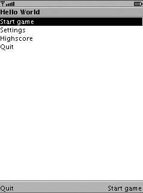

5033CH07.qxd 6/17/05 11:50 AM 第 62 页

**62**

第 7 章 ■ 构建应用程序

Eclipse“运行”菜单，然后选择“外部工具” ➤ “运行为” ➤ “Ant 构建”。在其他 IDE 中，你通常可以右键单击 *build.xml* 文件并选择“执行”或类似选项（有关详细信息，请参阅第 4 章）。从命令行，你只需调用 ant。

现在 J2ME Polish 启动并构建应用程序。当 J2ME Polish 完成构建后，它将调用 WTK 模拟器，如图 7-1 所示。

**图 7-1.** *运行中的 MIDlet*

应用程序运行顺畅，意味着退出按钮按预期工作。但外观并不令人信服，所以让我们稍微改进一下。

通常，你不能更改使用 MIDP 高级 GUI 的应用程序的设计或布局，因为设计留给了设备上的虚拟机。在 MIDP 2.0 手机上，你可以稍微更改设计，但大多数实现并不令人信服，并且因设备而异。然而，当 J2ME Polish GUI 被激活时，它将在应用程序和 JVM 之间“编织”自己的包装器 API，以创建远为优越的设计。

请在 *resources* 文件夹中创建一个名为 *polish.css* 的新文件。如果该目录不存在，J2ME Polish 会自动创建它。你可能需要刷新你的项目才能找到它。*polish.css* 文件用于使用 J2ME Polish 设计应用程序。清单 7-8 显示了一个示例设计。

**清单 7-8.** *设计简单的菜单 MIDlet*

colors {

bgColor: #eef1e5;

highlightedBgColor: #848f60;

fontColor: rgb( 30, 85, 86 );

highlightedFontColor: white;

}

title {

padding-top: 15;

font-color: fontColor;

font-style: bold;

font-size: large;

5033CH07.qxd 6/17/05 11:50 AM 第 63 页

第 7 章 ■ 构建应用程序

**63**

font-face: proportional;

layout: expand | center;

}

.mainMenu {

padding: 10;

background-color: bgColor;

layout: horizontal-center | vertical-center;

}

.mainMenuItem {

font-color: fontColor;

font-style: bold;

font-size: medium;

layout: expand | center;

}

focused {

background-color: highlightedBgColor;

font-style: bold;

font-size: medium;

border-color: highlightedBgColor;

border-width: 2;

font-color: highlightedFontColor;

layout: expand | center;

}

你在 *polish.css* 文件中指定所有设计设置。第一部分定义了你在样式中使用的颜色。这使得在一个地方更改所有颜色变得容易。始终建议给颜色起与它们用途相关的名称，而不是它们所代表的颜色。这样，你以后可以更改颜色而不会失去它们的含义。一个好的颜色名称是，例如，highlightedTextColor，而名称 darkPinkText 则不够灵活。

title 样式负责设计——谁猜到了？——标题。我将分别使用 .mainMenu 和 .mainMenuItem 样式用于此列表和列表项。顺便说一下，它们名称开头的点将它们限定为所谓的自定义或静态样式。相比之下，动态和预定义样式也存在。最后但同样重要的是，focused 样式设计了当前聚焦的项。不要太担心这里应用的设置；我将在第 12 章中解释所有繁琐的细节。

你还需要调整你的 MIDlet 的构造函数，以便 J2ME Polish 知道将哪些样式应用于哪些项。为此，请使用 #style 预处理指令，如清单 7-9 所示。

**清单 7-9.** *在 MIDlet 构造函数中应用 CSS 样式* public Roadrunner() {

super();

**//#style mainMenu**

this.menuScreen = new List( "Hello World", List.IMPLICIT );

**//#style mainMenuItem**

this.menuScreen.append( "开始游戏", null );

**//#style mainMenuItem**

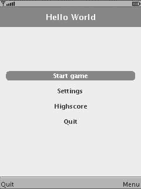

5033CH07.qxd 6/17/05 11:50 AM 第 64 页

**64**

第 7 章 ■ 构建应用程序

this.menuScreen.append( "设置", null );

**//#style mainMenuItem**

this.menuScreen.append( "高分", null );

**//#style mainMenuItem**

this.menuScreen.append( "退出", null );

this.menuScreen.addCommand( this.startGameCmd );

this.menuScreen.addCommand( this.quitCmd );

this.menuScreen.setCommandListener( this );

}

■**注意** 你也可以使用动态样式，如 list 和 listitem，而不是静态样式 .mainMenu 和 .mainMenuItem。在这种情况下，你根本不需要更改源代码。动态样式在运行时应用，而静态样式在编译阶段应用。动态样式的缺点是，对于特定的 Item 或 Screen 类型，你只能使用一种样式。它们也更消耗资源。这就是为什么我在本书中只使用静态和预定义样式。

你还需要更改 *build.xml* 脚本中 <build> 元素的 usePolishGui 属性，以便 *polish.css* 文件中定义的样式应用于你的应用程序。

当你现在重新启动 J2ME Polish 时，你将获得如图 7-2 所示的更漂亮的 GUI。

**图 7-2.** *改进后的 MIDlet*

**介绍构建阶段**

在每次构建中，你将经历图 7-3 所示的阶段。你可以通过修改 *build.xml* 文件来控制每个阶段。以下部分描述了每个阶段以及 J2ME Polish 中的可用选项。

5033CH07.qxd 6/17/05 11:50 AM 第 65 页

第 7 章 ■ 构建应用程序

**65**

**图 7-3.** *使用 J2ME Polish 构建你的应用程序* **选择目标设备**

每次构建都从选择为其构建应用程序的目标设备开始。所有后续阶段都会为每个为其构建应用程序的设备执行。<deviceRequirements> 部分负责选择目标设备。你可以通过列出设备名称或指定其所需的能力（例如对 API、颜色深度等的支持）来选择设备。

清单 7-10 显示了一个简单的设备选择；正在为两个目标设备构建应用程序。

**清单 7-10.** *在 <deviceRequirements> 部分中选择单个设备*

<j2mepolish>

<info

license="GPL"

name="Roadrunner"

vendorName="一位读者。"

version="0.0.1"

jarName="${polish.vendor}-${polish.name}-roadrunner.jar"

/>

**<deviceRequirements>**

**<requirement name="Identifier" value="Generic/midp1, Nokia/Series60" />**

**</deviceRequirements>**

<build

usePolishGui="false"

>

5033CH07.qxd 6/17/05 11:50 AM 第 66 页

**66**

第 7 章 ■ 构建应用程序

<midlet class="com.apress.roadrunner.Roadrunner" />

</build>

<emulator />

</j2mepolish>

■**提示** 如果你想知道可以针对哪些设备，请参考 J2ME Polish 的设备数据库，网址为 *http://www.j2mepolish.org/devices-overview.html*。你也可以通过修改文件 *${polish.home}/custom-devices.xml* 来使用你自己的设备定义，如第 6 章所述。

本章的“为多个设备构建”部分将详细描述设备选择。

**预处理**

在预处理阶段，源代码在编译之前被更改。结合 J2ME Polish 的设备数据库，你可以轻松地将你的应用程序调整到不同的手机，而不会产生不兼容性。你可以利用一整套预处理指令来为不同的环境定制你的应用程序。请参考 *http://*

*www.j2mepolish.org/devices-overview.html* 了解每个设备可用的预处理符号和变量。

清单 7-11 演示了如何使用预处理来区分可能支持音频播放的设备。请注意，每个预处理指令都以字符 //# 开头。这确保了你的 IDE 不会对这些指令感到困惑。第 8 章讨论了预处理的所有选项。

**清单 7-11.** *使用预处理来区分可能支持音频播放的设备*

//#if polish.api.mmapi || polish.midp2

// 好的，MMAPI 可用于音频播放。

//#if polish.audio.midi

// 播放 MIDI 文件...

//#elif polish.audio.wav

// 播放 WAV 文件...

//#endif

//#endif

**编译**

在编译阶段，源代码被转换为二进制字节码。J2ME Polish 会自动包含你的目标设备支持的所有可选 API，例如 MMAPI。它还会根据使用的 WTK 将 javactarget 设置为 1.1 或 1.2；从 WTK 2.0 开始，首选 1.2 javac-target。javac-target 确保

5033CH07.qxd 6/17/05 11:50 AM 第 67 页

第 7 章 ■ 构建应用程序

**67**

编译后的类文件与你的设备兼容。你也可以通过指定 <build> 元素的 javacTarget 属性来直接设置目标。除非使用 <debug> 元素启用了调试模式，否则不会添加调试信息。

你也可以将 J2ME Polish 用作编译器，在这种情况下，只执行预处理、编译以及可选的预验证（请参阅“预验证”部分）步骤。这对于与可用的 J2ME 插件（如 EclipseME 或支持 J2ME 的 IDE（如 NetBeans））进行交互非常有用。通过使用 compilerMode、compilerDestDir 和 compilerModePreverify 属性来激活编译器模式，如清单 7-12 所示。

**清单 7-12.** *将 J2ME Polish 用作编译器*

<j2mepolish>

<info

license="GPL"

name="Roadrunner"

vendorName="一位读者。"

version="0.0.1"

jarName="${polish.vendor}-${polish.name}-roadrunner.jar"

/>

<deviceRequirements>

<requirement name="Identifier" value="Generic/midp1" />

</deviceRequirements>

**<build**

**compilerMode="true"**

**compilerModePreverify="true"**

**compilerDestDir="preverified"**

**>**

<midlet class="com.apress.roadrunner.Roadrunner" />

</build>

<emulator />

</j2mepolish>

如果你需要完全控制编译器设置，你也可以使用 <compiler> 元素，它是 <build> 部分的嵌套元素。例如，这允许你直接启用调试信息的插入。<compiler> 元素接受原始 <javac> 任务的所有属性和嵌套元素；请参阅 *http://ant.apache.org/manual* 以获取更多信息。

**混淆**

混淆你的 J2ME 应用程序有两个好处：它使你的应用程序更难反编译，并且通过删除所有未使用的类、方法和字段并重命名剩余的来减小应用程序的大小。

J2ME Polish 支持许多不同的混淆器，你甚至可以同时使用多个混淆器。本章的“混淆应用程序”部分描述了所有可用的选项及其含义。

5033CH07.qxd 6/17/05 11:50 AM 第 68 页

**68**

第 7 章 ■ 构建应用程序

**预验证**

为了确保应用程序的完整性和安全性，Java 类在加载类时由 Java 虚拟机进行验证。由于此步骤计算密集，J2ME 标准规定所有类需要在*安装到 J2ME 设备上之前*进行验证。

此预验证步骤会更改字节码并插入额外的信息，以确保字节码的有效性和完整性。J2ME Polish 默认使用 WTK 提供的预验证器。

**打包**

在打包步骤中，为每个目标设备创建最终的应用程序包。它们由一个包含应用程序代码的 JAR 文件和一个包含在手持设备上安装所需元数据的 JAD 文件组成。J2ME Polish 专门为每个目标设备和每个区域设置组装资源，并自动创建所需的 JAD 和 Manifest 文件。

你可以使用第三方打包器，如 7-Zip 或 KZIP，以进一步减小 JAR 文件大小。本章的“打包应用程序”部分详细讨论了所有这些可能性。

**调用模拟器**

J2ME Polish 可以调用大多数模拟器来测试应用程序。只需包含一个 <emulator> 元素作为 <j2mepolish> 任务的最后一个元素。请参阅本章的“调试应用程序”部分，以获取有关调用模拟器的更多信息。

**打包应用程序**

在针对每个目标设备的打包阶段，会生成一个 JAD 和一个 JAR 文件。此步骤完成了几项任务，例如选择合适的资源、管理 JAD 或 Manifest 属性以及签署应用程序。

**资源组装**

J2ME Polish 提供了复杂的方法，只为每个目标设备包含所需且合适的资源。资源组装的基础是 *resources* 文件夹，默认情况下所有资源都位于其中。图 7-4 显示了一个示例。

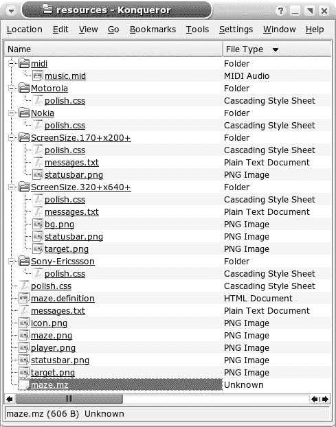

5033CH07.qxd 6/17/05 11:50 AM 第 69 页

第 7 章 ■ 构建应用程序

**69**

**图 7-4.** *在 resources 文件夹中管理你的图像、声音和其他数据文件* 概念

在 *resources* 文件夹中，放置所有通用资源。除非更具体的资源替换它们，否则这些资源会被包含在内。你可以使用 <resources> 元素的 dir 属性指定用于资源的文件夹，如清单 7-13 所示。通过使用不同的资源文件夹，你可以轻松且显著地更改应用程序的外观。

**清单 7-13.** *使用不同的资源文件夹*

<build>

<resources

**dir="resources/modern"**

excludes="readme*, *.definition"

/>

<midlet class="com.apress.roadrunner.Roadrunner" />

</build>

5033CH07.qxd 6/17/05 11:50 AM 第 70 页

**70**

第 7 章 ■ 构建应用程序

使用 excludes 属性来指定任何不应包含在应用程序包中的文件。在清单 7-13 中，所有以 *readme* 开头或以 *.definition* 结尾的文件都被排除在最终的应用程序 JAR 文件之外。默认情况下，一些文件被排除在外：设计设置 ( *polish.css*)、Windows 创建的临时文件 ( *Thumbs.db*)、任何备份文件 ( **.bak* 和 **~*) 以及用于本地化的文件 ( *messages.txt*、*messages_en.txt* 等) 默认被排除。excludes 属性中给出的名称是区分大小写的，即使在 Windows 机器上也是如此。

■**注意** <resources> 元素也负责应用程序的本地化，这将在接下来的“构建本地化应用程序”部分中讨论。

**使用供应商和特定于设备的资源**

你可以将特定供应商的资源放入 *resources/[vendor-name]* 文件夹，例如诺基亚设备的 *resources/Nokia*。将特定设备的资源放入 *resources/*

*[vendor-name]/[device-name]* 目录；例如，对诺基亚 6600 设备使用文件夹 *resources/Nokia/6600*。

**包含组特定资源**

使用组来实现更高的抽象层。例如，使用 *resources/BitsPerColor.16+* 文件夹存放高彩色图像，或将 MIDI 文件放入 *resources/midi* 目录。你可以有效地使用组来仅包含那些实际与特定设备相关的资源。一个设备可以属于任意数量的组，这些组要么由该设备的能力隐式定义，要么通过在 *${polish.home}/devices.xml* 文件中设置 <groups> 元素来显式定义。第 6 章详细讨论了组。表 7-1 列出了用于资源组装的最有用的组。

**表 7-1.** *用于组装资源的有用组* **组**

**类型**

**默认文件夹**

**说明**

midp1

平台

*resources/midp1*

如果设备支持

MIDP 1.0 配置文件，

此设备的资源

可以放在

*resources/*

*midp1* 文件夹中。

midp2

平台

*resources/midp2*

对于支持

MIDP 2.0 配置文件的

设备。

cldc1.0

配置

*resources/cldc1.0*

对于支持

CLDC 1.0 配置的

设备。

5033CH07.qxd 6/17/05 11:50 AM 第 71 页

第 7 章 ■ 构建应用程序

**71**

**组**

**类型**

**默认文件夹**

**说明**

cldc1.1

配置

*resources/cldc1.1*

对于支持

CLDC 1.1

配置的

设备。

mmapi

API

*resources/mmapi*

当设备

支持移动

媒体 API 时，

需要此 API 的资源

可以放在

*resources/mmapi*

文件夹中。

nokia-ui

API

*resources/nokia-ui*

对于支持

诺基亚用户

界面 API 的设备。

midi

音频

*resources/midi*

对于支持

MIDI 声音格式

的设备。

wav

音频

*resources/wav*

对于支持

WAV 声音的设备。

mp3

音频

*resources/mp3*

对于支持

MP3 声音的设备。

amr

音频

*resources/amr*

对于支持

AMR 声音的设备。

mpeg-4

视频

*resources/mpeg-4*

对于支持

MPEG-4 视频格式

的设备。

h.263

视频

*resources/h.263*

对于支持

H.263 视频的设备。

3gpp

视频

*resources/3gpp*

对于支持

3GPP 视频的设备。

ScreenSize

屏幕

*resources/ScreenSize.150+x200+*

对于屏幕

尺寸至少为

150✕200 像素的设备。

ScreenSize

屏幕

*resources/ScreenSize.176x208*

对于屏幕

尺寸恰好为

176✕208 像素的设备。

BitsPerColor.12+

颜色

*resources/BitsPerColor.12+*

对于颜色

深度至少为

12 位每颜色的设备。

BitsPerColor.16

颜色

*resources/BitsPerColor.16*

对于颜色

深度恰好为

16 位每颜色的设备。

5033CH07.qxd 6

