# 一些地点：

var:config.Places = "家", "工作", "学校"

在你的代码中，你可以使用`#=`指令包含这些值：

//#= String[] placesOfInterest = new String[]{ ${config.Places} };

**使用属性函数转换变量**

J2ME Polish 提供了一组用于转换变量值的属性函数，例如，这些函数在比较时非常有用。

每个函数都放在花括号内，变量用普通括号括起来：

//#= private String url = "${ lowercase( config.BaseUrl ) }";

使用属性函数时，你不一定需要变量。你也可以使用常量作为参数。这样做可以提高源代码的可读性：

//#if ${ bytes( polish.HeapSize ) } > ${ bytes(100 kb) }

表 8-7 列出了可用的属性函数。

5033CH08.qxd 6/17/05 12:06 PM 第 118 页

**118**

第 8 章 ■ 预处理

**表 8-7.** *用于转换变量值的函数* **函数**

**用途**

uppercase

将给定值转换为大写。例如，aBc 变为 ABC。

lowercase

将给定值转换为小写。例如，AbC 变为 abc。

classname

检索给定类的完全限定名称。当你激活`<obfuscator>`元素的`useDefaultPackage`选项时，所有源文件将被移动到空的默认包中。在这种情况下，${ classname( com.apress.ImageLoader ) } 返回 ImageLoader。当`useDefaultPackage`选项未激活或混淆器未启用时，该函数返回 com.apress.ImageLoader。

bytes

计算给定内存值的字节数。例如，1 kb 变为 1024。内存值 dynamic 返回 -1。

kilobytes

计算给定内存值的（双精度）千字节数。该值可以包含小数点和小数位。例如，512 bytes 变为 0.5，1024 bytes 变为 1，依此类推。

megabytes

计算给定内存值的（双精度）兆字节数。

gigabytes

计算给定内存值的（双精度）吉字节数。

number

检索变量中独立值的数量。

■**提示** 你可以通过扩展`de.enough.polish.propertyfunctions.PropertyFunction`类并在`${polish.home}/custom-extensions.xml`中注册此类来定义自己的属性函数。详情请查看第 13 章。

**预处理来救场！**

在本节中，你将学习一些常见任务的解决方案：

• 使用设备特定的库。

• 更改类继承。

• 配置你的应用程序。

• 使用硬编码值。

• 通过预处理规避已知问题。

**使用可选的和设备特定的库**

J2ME 应用程序的一个典型挑战是利用并非在所有设备上都可用的可选库。即使你的应用程序可以在没有相关库的设备上使用，但如果这些库能改善产品的功能或可用性，你也应该利用它们。

5033CH08.qxd 6/17/05 12:06 PM 第 119 页

第 8 章 ■ 预处理

**119**

幸运的是，预处理结合设备数据库使这项任务变得相当简单。正如你在第 6 章中学到的，你可以使用`${polish.home}/apis.xml`文件来定义任何可选库。对于每个支持的库，都会定义预处理符号`polish.api.[库名]`，并可以使用`#if`或`#ifdef`指令进行检查：

//#if polish.api.mmapi

清单 8-18 演示了如何使用 MMAPI 播放声音，同时不限制应用程序的可移植性。

**清单 8-18.** *使用 MMAPI 播放声音*

**//#if polish.api.mmapi || polish.midp2**

try {

Player player = Manager.createPlayer(

getClass().getResourceAsStream("/music.mid"), "audio/midi");

player.realize();

player.prefetch();

player.start();

} catch (Exception e) {

//#debug error

System.out.println("无法启动音频播放" + e);

}

**//#endif**

**更改类继承**


你可以使用预处理来改变类的继承关系。一个例子是在启动画面中使用诺基亚的 `FullCanvas` 类。清单 8-19 演示了这种应用，并展示了如何隐藏第一个 `extends` 语句，这样你的集成开发环境就不会报错说类定义无效。

**清单 8-19.** *在可用时扩展诺基亚的 FullCanvas* public class SplashScreen

//#if polish.api.nokia-ui

//# extends com.nokia.mid.ui.FullCanvas

//#else

extends Canvas

//#endif

**配置应用程序**

大多数开发者使用 JAD 文件来存储配置设置，并通过 `MIDlet.getAppProperty ( *String key* )` 来检索这些设置。正如你在第 7 章中学到的，J2ME Polish 支持使用 `<jad>` 元素来设置 JAD 属性。这种方法的优点是你可以稍后轻松更改设置，但它也有几个关键缺点：

5033CH08.qxd 6/17/05 12:06 PM Page 120

**120**

第 8 章 ■ 预处理

• 你需要额外的处理时间和代码来在运行时确定配置。

• 一些设备在安装后会删除 JAD 文件及其所有设置。

• 恶意用户可以轻易拦截和更改 JAD 文件。

作为替代方案，你可以使用预处理来配置你的应用程序。在 `build.xml` 文件中使用 `<variable>` 元素指定你的配置设置：

<variable name="config.BaseUrl" value="http://www.specific.com" /> 现在你可以使用 `#=` 指令来使用这些变量。最佳实践是在未指定设置时使用默认值。如清单 8-20 所示，你可以通过测试 `[ *变量名*]:defined` 预处理符号来检查变量是否已定义，该符号会自动为所有变量定义。

**清单 8-20.** *使用预处理配置应用程序*

//#ifdef config.BaseUrl:defined

**//#= private static final String BASE_URL = "${config.BaseUrl}";**

//#else

private static final String BASE_URL = "http://www.default.com";

//#endif

虽然使用预处理来配置应用程序通常比使用 JAD 属性更智能，但它也有一个缺点：使用动态设置更加困难。动态生成 JAD 文件比按需构建整个应用程序更容易。动态设置的一个例子是包含客户的电话号码以便后续识别。你可以结合使用 J2ME Polish 的两种方法：对常规配置值使用预处理，对频繁更改的设置使用动态 JAD 生成。

**使用硬编码值**

使用设备特定的硬编码值是另一个可以通过预处理变量应对的挑战。为什么要这样做？一个原因是这种方法可以规避某些设备问题。例如，一些诺基亚设备在全屏模式下无法报告正确的画布高度，因此你需要使用正确的硬编码值。另一个原因是硬编码值可以加速你的应用程序。

清单 8-21 演示了当你想要使用可用屏幕宽度的三分之二来显示内容的情况。当你使用硬编码值时，Java 编译器会在编译阶段计算出正确的结果。诚然，这个例子不会显著加速你的应用程序，但它确实演示了原理。请查看设备数据库 *http://www.j2mepolish.org/devices-overview.html*，以了解更多关于目标设备可用变量的信息。

5033CH08.qxd 6/17/05 12:06 PM Page 121

第 8 章 ■ 预处理

**121**

**清单 8-21.** *使用预处理进行硬编码变量*

//#ifdef polish.ScreenWidth:defined

**//#= final int myMessageWidth = ${polish.ScreenWidth} * 2 / 3;**

//#else

final int myMessageWidth = getWidth() * 2 / 3;

//#endif

**规避已知问题**


设备数据库（*http://www.j2mepolish.org/devices/issues.html*）不仅包含大多数 J2ME 设备的功能和特性，还列出了与这些设备相关的已知问题。你可以利用这些数据来规避已知问题。

举个随机示例，某些设备在将 `DateField` 初始化为 `null` 而非 `Date` 实例时会出现问题。具体来说，早期的诺基亚 Series 60 设备（如 7650 和 3650）不允许你在日期被初始化为 `null` 后修改日期。清单 8-22 展示了如何检查此错误，并使用当前日期代替 `null`。

**清单 8-22.** *规避 DateField 未初始化日期的问题* DateField dateField = new DateField("您的生日:", DateField.DATE);

//#ifdef polish.Bugs.dateFieldAcceptsNoNullDate

dateField.setDate( new Date() );

//#endif

**总结**

本章讲解了如何通过预处理充分利用你的应用程序。J2ME Polish 通过提供强大的预处理器和广泛的设备数据库，使设备特定的调整变得非常容易。

下一章将介绍日志框架，该框架同样通过预处理实现。它允许你在真实设备上查看日志消息，并且只需设置一些构建变量即可配置或禁用日志。

5033CH08.qxd 6/17/05 12:06 PM 第 122 页

5033CH09.qxd 6/17/05 12:09 PM 第 123 页

第 9 章

■ ■ ■

日志框架

**本章内容：**

• 使用 `#debug` 预处理指令记录日志消息，并通过 `System.out.println()` 打印消息。

• 在 `#debug` 指令中指定消息的级别（debug、info、warn、error、fatal 或用户自定义）。

• 通过在 `System.out.println()` 调用中添加异常作为最后一个参数，自动打印堆栈跟踪。

• 使用 `build.xml` 文件中的 `<debug>` 元素控制日志框架，包括为特定类或包指定不同的日志级别（使用嵌套的 `<filter>` 元素）。

• 在真实设备上查看记录的日志消息——当记录错误且使用 J2ME Polish GUI 时自动显示，或通过 `de.enough.polish.util.Debug` 类结合 `polish.debugEnabled` 预处理符号手动查看。

• 使用日志处理器将日志消息处理并转发给其他实体。

你使用日志来确定应用程序的内部状态并跟踪错误。然而，在 J2ME 应用程序中记录日志存在一些显著的缺点。日志消息需要空间和运行时资源。因此，日志会降低应用程序速度，并增加不必要的应用程序大小。你可能不希望将日志语句保留在最终构建的应用程序中。此外，你可以使用 `System.out.println()` 语句在模拟器中查看日志消息，但这些消息在真实设备上是隐藏的。本章介绍 J2ME Polish 的日志框架，以及它如何消除这些缺点。

借助日志框架，你可以为特定类和包启用不同的日志级别。当你停用日志框架时，应用程序中不会留下任何痕迹，因此不会浪费资源和空间。最后，你可以在真实设备和模拟器上查看记录的日志消息。

**记录日志消息**

你可以使用 `#debug` 预处理指令，后跟一个普通的 `System.out.println()` 语句，在应用程序中记录日志消息，如清单 9-1 所示。所有记录的日志消息都会添加到内部日志中，并同时打印到 `System.out` 流中。

.

**123**

5033CH09.qxd 6/17/05 12:09 PM 第 124 页

**124**

第 9 章 ■ 日志框架

**清单 9-1.** *在应用程序中记录日志*

public Image getImage( String url ) {

// 尝试从 Hashtable 缓存中获取图像：

Image image = (Image) this.cache.get( url );

if (image == null) {

try {

image = Image.createImage( url );

this.cache.put( url, image );

**//#debug**

**System.out.println("已加载图像 [" + url + "]" );**

} catch (IOException e) {

**//#debug error**

**System.out.println("无法加载图像 [" + url + "]" + e );**

}

}

return image;

}

在此示例中，成功加载图像后，我们发出一个简单的语句，表明图像已加载。你可以在 `#debug` 指令中指定消息的优先级级别。预定义的级别包括 debug、info、warn、error 和 fatal。你也可以定义自己的级别。

清单 9-1 中的第一个 `#debug` 指令未指定日志级别，因此默认使用 debug 级别。catch 分支中的第二个 `#debug` 指令指定了 error 级别。你可以在 `build.xml` 脚本中为类或包激活特定的日志级别，以过滤掉所有优先级较低的日志消息，如本章后面的“控制日志”部分所述。

如果你在 `System.out.println()` 调用中添加异常作为最后一个参数，日志框架将自动打印其堆栈跟踪。在清单 9-1 中，捕获了一个 `IOException`，并将其用作日志消息中的最后一个参数：

System.out.println("无法加载图像 [" + url + "]" + e); 日志框架会识别该参数是一个异常，并在模拟器中随日志消息一起打印异常的堆栈跟踪。

**异常的堆栈跟踪**

异常的堆栈跟踪仅在模拟器中可用。遗憾的是，在真实设备上无法获取堆栈跟踪。你可以改用详细调试模式来跟踪故障。通过将 `<debug>` 元素的 `verbose` 属性设置为 `true` 来激活此模式。

当你将 Jad 反编译器安装到 `${polish.home}/bin` 时，模拟器中的堆栈跟踪会自动解析。通常，模拟器仅指定字节码中的指令偏移量；例如，`at com.company.package.YourClass.doSomething( +20 )`。安装 Jad 反编译器后，J2ME Polish 会显示源代码中的相应位置以及原始堆栈跟踪。你可以从 *http://www.kpdus.com/jad.html* 免费下载 Jad。

5033CH09.qxd 6/17/05 12:09 PM 第 125 页

第 9 章 ■ 日志框架

**125**

**为特定日志级别添加调试代码**

你可以通过在预处理步骤中检查适当的日志级别来包含额外的调试代码。你可以通过检查预处理符号 `polish.debug.[level-name]` 来测试特定的日志级别。与 `#debug` 指令一样，给定的日志级别包含所有更高级别。因此，当为当前类激活 warn 级别时，预处理符号 `polish.debug.warn`、`polish.debug.error`、`polish.debug.fatal` 和 `polish.debug.user-defined` 均处于活动状态。

清单 9-2 演示了当 info 日志级别处于活动状态时，如何向应用程序添加信息。

**清单 9-2.** *仅在 info 日志级别处于活动状态时进行基准测试* public void run() {

**//#if polish.debug.info**

int numberOfFrames = 0;

int framesPerSecond = 0;

long lastFpsTime = System.currentTimeMillis();

**//#endif**

while (gameIsRunning) {

processUserInput();

animateWorld();

renderWorld();

flushGraphics();

**//#if polish.debug.info**

numberOfFrames++;

if (System.currentTimeMillis() - lastFpsTime >= 1000) {

lastFpsTime = System.currentTimeMillis();

framesPerSecond = numberOfFrames;

numberOfFrames = 0;

}

this.graphics.drawString( "fps=" + framesPerSecond, 0, 0, Graphics.TOP | Graphics.LEFT );

**//#endif**

}

}

**控制日志**


你可以通过 *build.xml* 文件中的 `<debug>` 元素来控制日志框架。你可以使用嵌套的 `<filter>` 元素为特定的类或包启用不同的日志级别，或者完全停用日志框架。例如，如果你为相应的类或包激活了错误级别，那么任何调试、信息或警告消息都不会显示。在这种情况下，只有错误、致命级别以及用户自定义级别的消息才会被实际记录。未激活的日志语句将在源代码中被注释掉，这样它们就不会消耗任何资源，因为它们不会被编译。

5033CH09.qxd 6/17/05 12:09 PM 第 126 页

**126**

第 9 章 ■ 日志框架

`<debug>` 元素嵌套在 `<j2mepolish>` 任务的 `<build>` 部分中，如代码清单 9-3 所示。该清单还包含了用于激活和停用日志框架的 `test` 和 `init` 目标，而无需修改 *build.xml* 脚本。

**代码清单 9-3.** *在 build.xml 中使用* `<debug>` *元素控制日志框架*

<project name="roadrunner" default="j2mepolish">

<!-- 定义 J2ME Polish 的安装文件夹 -->

<property name="polish.home" location="C:\programs\J2ME-Polish" />

<!-- 定义 WTK 的安装文件夹 -->

<property name="wtk.home" location="C:\WTK22" />

<!-- 定义 J2ME Polish 任务，classpath 请写在一行内 -->

<taskdef name="j2mepolish"

classname="de.enough.polish.ant.PolishTask"

classpath="${polish.home}/import/enough-j2mepolish-build.jar: ${polish.home}/import/jdom.jar/>

<!-- 启用测试模式 -->

**<target name="test">**

**<property name="test" value="true" />**

**<property name="dir.work" location="build/test" />**

**</target>**

<!-- 指定默认设置 -->

**<target name="init">**

**<property name="test" value="false" />**

**<property name="dir.work" location="build/real" />**

**</target>**

<!-- 使用 J2ME Polish 开始构建 -->

<target name="j2mepolish" depends="init" >

<j2mepolish>

<info

license="GPL"

name="Roadrunner"

vendorName="A reader."

version="0.0.1"

jarName="${polish.vendor}-${polish.name}-roadrunner.jar"

/>

<deviceRequirements>

<requirement name="Identifier" value="Generic/midp1" />

</deviceRequirements>

<build

usePolishGui="true"

**workDir="${dir.work}"**

>

<midlet class="com.apress.roadrunner.Roadrunner" />

**<debug showLogOnError="true"**

**verbose="false"**

**level="error"**

5033CH09.qxd 6/17/05 12:09 PM 第 127 页

第 9 章 ■ 日志框架

**127**

**if="test"**

**>**

**<filter**

**package="com.apress.roadrunner"**

**level="info"**

**/>**

**<filter**

**class="com.apress.roadrunner.Roadrunner"**

**level="debug"**

**/>**

**</debug>**

</build>

<emulator />

</j2mepolish>

</target>

</project>

`<debug>` 元素允许你指定几个选项：showLogOnError：此属性决定 J2ME Polish 在发生错误时是否自动显示日志。此设置仅在使用了 J2ME Polish GUI 并且错误被转发到日志框架时才会生效。你可以通过将异常作为最后一个参数添加到日志消息中，将任何错误传递给日志框架：`System.out.println("Unable to do something" + e );`。

verbose：当你使用 `verbose` 属性激活详细日志记录模式时，J2ME Polish 会在日志语句中添加当前时间（毫秒）、相应源文件的名称以及源文件中的行号。此功能有助于你在真实设备上追踪错误。

level：你可以使用 `level` 属性指定通用日志级别。预定义的级别有 debug、info、warn、error 和 fatal。你也可以定义并使用自己的日志级别。自定义日志级别始终具有最高的可能优先级；也就是说，其优先级高于预定义的 fatal 级别。你只需在 `#debug` 指令和接下来要描述的 `<filter>` 元素中添加自定义级别即可使用它们。

<filter>：你可以通过使用嵌套的 `<filter>` 元素来微调级别设置。在每个


`<filter>` 元素中，你需要指定 `package` 或 `class` 属性以及 `level` 属性。这允许你为特定的类或包分配不同的日志级别。

`if` 和 `unless`：你可以通过使用 `if` 或 `unless` 属性来完全激活或停用日志框架。`if` 属性指定了在日志应被激活时需要为 `true` 或 `yes` 的 Ant 属性。`unless` 属性指定了在日志框架应被激活时需要为 `false` 或 `no` 的 Ant 属性。

当你停用日志时，J2ME Polish 会在应用编译前注释掉所有日志语句，这样你的应用中就不会留下任何日志痕迹。

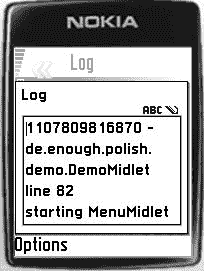

5033CH09.qxd 6/17/05 12:09 PM 第 128 页

**128**

第 9 章 ■ 日志框架

你可以使用 `<debug>` 元素的 `if` 和 `unless` 属性，结合 Ant 属性的“只写一次”特性，在不修改你的 *build.xml* 脚本的情况下激活和停用日志框架。在代码清单 9-3 中，日志框架仅在 Ant 属性 `${test}` 为 `true` 时被激活。你可以通过在命令行中首先调用 test 目标来将此属性设置为 `true`：

ant test j2mepolish

尽管 `j2mepolish` 目标随后会调用 `init` 目标，但 `${test}` 属性不会被改变，因为 Ant 属性只能被设置一次。当 test 目标未被调用时，`${test}` 属性会在 `init` 目标中被设置为 `false`。test 和 init 目标也为 `${dir.work}` 属性设置了不同的值。此属性随后被用于设置 `<build>` 元素的 `workDir` 属性。

■**提示** 为启用了日志框架的构建使用不同的工作目录，这样 J2ME Polish 就不需要在每次构建中预处理和编译所有文件。

**在真实设备上查看日志**

你也可以在真实设备上查看日志。日志包含所有通过 `#debug` 指令添加的消息。这对于追踪真实设备上的错误非常有用。

图 9-1 显示了在诺基亚 Series 60 手机上激活详细模式后的日志。每条日志消息中，首先显示当前的毫秒时间，接着是发出日志消息的类名和源文件中的行号。在这些详细信息之后，显示实际的日志消息。只需向下滚动即可查看更多消息。

**图 9-1.** *诺基亚 Series 60 手机上的日志*

当你将 `<debug>` 元素的 `showLogOnError` 属性设置为 `true`，并且将一个异常作为最后一个参数添加时，日志会自动显示，如代码清单 9-4 所示。但是，J2ME Polish 仅在你使用 J2ME Polish GUI 时才能自动显示日志。

5033CH09.qxd 6/17/05 12:09 PM 第 129 页

第 9 章 ■ 日志框架

**129**

**代码清单 9-4.** *记录异常*

try {

image = Image.createImage( url );

} catch (IOException e) {

**//#debug error**

**System.out.println("无法加载图片 [" + url + "]" + e );**

}

你可以随时通过调用 `de.enough.polish.util.Debug.showLog( Display display )` 方法手动显示日志。该类位于 *${polish.home}/import/enough-j2mepolish-client.jar* 文件中。你应该将此文件添加到 IDE 中项目的类路径中。

你应该仅在日志框架被激活时显示日志。否则，你在日志中看不到多少条目。你可以通过检查代码中的 `polish.debugEnabled` 预处理符号来检测日志框架是否处于活动状态。代码清单 9-5 演示了如何使用命令来触发日志显示。

**代码清单 9-5.** *手动显示日志*

**import de.enough.polish.util.Debug;**

import javax.microedition.lcdui.*;

import javax.microedition.midlet.*;

public class MyMIDlet extends MIDlet

implements CommandListener

{

**//#ifdef polish.debugEnabled**

**private Command logCmd = new Command( "显示日志", Command.SCREEN, 10 );**

**//#endif**


private Screen mainScreen;

private Display display;

public MyMIDlet() {

this.mainScreen = new List( "Hello World", List.IMPLICIT ); this.mainScreen.setCommandListener( this );

**//#ifdef polish.debugEnabled**

**this.mainScreen.addCommand( this.logCmd );**

**//#endif**

}

public void startApp() {

this.display = Display.getDisplay( this );

this.display.setCurrent( this.mainScreen );

}

5033CH09.qxd 6/17/05 12:09 PM Page 130

**130**

第 9 章 ■ 日志框架

public void destroyApp( boolean unconditional ) {

notifyDestroyed();

}

public void pauseApp() {

}

public void commandAction(Command cmd, Displayable screen ) {

**//#ifdef polish.debugEnabled**

**if (cmd == logCmd) {**

**Debug.showLog( this.display );**

**return;**

**}**

**//#endif**

}

}

**转发日志消息**

你可以使用日志处理器来处理日志消息并将其转发给其他实体。在撰写本书时，只有记录管理系统（RMS）处理器可用。因此，目前你可以使用 RMS 日志处理器来存储所有日志条目，然后稍后通过 LogViewerMidlet 查看它们。

你可以通过在 *build.xml* 文件中使用 `<handler>` 元素来激活所需的日志处理器。清单 9-6 为所有西门子设备激活了 RMS 日志处理器。

**清单 9-6.** *为西门子设备激活 RMS 日志处理器*

<debug level="warn" unless="test">

**<handler name="rms" if="polish.Vendor == Siemens" />**

<filter package="com.apress.application" level="debug" />

</debug>

RMS 日志处理器将所有日志条目保存在 RMS 中，以便你可以使用 `de.enough.polish.log.rms.LogViewerMidlet` 查看它们。你可以在 *${polish.home}/*`samples/logviewer` 中找到这个 MIDlet。构建时，请确保在日志查看器的 *${polish.home}/samples/logviewer/build.xml* 脚本的 `<variables>` 部分设置以下预处理变量：

• `polish.log.MIDletSuite`（对应于你的 `<info>` 元素中的 `name` 属性）

• `polish.log.Vendor`（对应于你的 `<info>` 部分中的 `vendorName` 属性）如果没有这些变量，日志查看器将无法找到包含日志消息的共享记录存储。

定义必要的变量后，你就可以构建日志查看器并将其安装到设备上。图 9-2 展示了运行中的日志查看器。你可以通过输入关键字来过滤显示的消息。

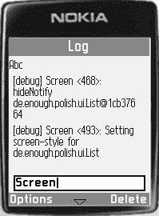

5033CH09.qxd 6/17/05 12:09 PM Page 131

第 9 章 ■ 日志框架

**131**

**图 9-2.** *RMS 日志查看器允许你轻松过滤消息。*

■**提示** 你可以通过扩展 `de.enough.polish.log.LogHandler` 类来轻松创建自己的日志处理器。第 13 章将对此进行详细描述。

**总结**

在本章中，你学习了如何使用 J2ME Polish 和简单的 `System.out.println()` 语句来记录日志消息。日志框架的优势在于，它允许你为不同的类和包分配不同的日志级别。你还可以完全停用日志记录，这样应用程序中就不会留下任何日志痕迹。最后但同样重要的是，你可以使用日志处理器将消息存储到 RMS 中。

在下一章中，你将学习如何使用其他 J2ME Polish 实用工具，例如二进制编辑器和 `TextUtil` 类。

5033CH09.qxd 6/17/05 12:09 PM Page 132

5033CH10.qxd 6/17/05 12:10 PM Page 133

第 10 章

■ ■ ■

使用实用工具

**本章内容：**

• 使用 `ArrayList` 工具类作为缓慢的 `java.lang.Vector` 实现的替代方案。

• 使用 `TextUtil` 类将文本适配到显示区域内。

• 使用 `BitMapFont` 类自定义字体。

• 使用字体编辑器将任何 TrueType 字体转换为位图字体。

• 使用二进制编辑器创建和操作二进制数据文件。

• 使用 `MIDPSysInfo` MIDlet 测试设备的功能。

J2ME Polish 包含几个方便的工具类和独立实用程序。在本章中，我们将探讨如何在开发无线 Java 应用程序时使用它们。

**工具类**


J2ME Polish 的工具类 `de.enough.polish.util.*` 为您提供了 MIDP 标准中所不具备的高级功能。请务必将 *`${polish.home}/import/*`* 目录下的 *`enough-j2mepolish-client.jar`* 添加到类路径中，以便 Java 运行时能够找到这些额外的类。在大多数集成开发环境（IDE）中，您可以在项目的属性中设置辅助库。

接下来，我们将介绍以下工具类：

• `ArrayList` 类，它提供了对速度较慢的 `java.lang.Vector` 实现的替代方案。
• `TextUtil` 类，用于自动换行文本，使其适应您的显示区域。
• `BitMapFont` 类，允许您使用自定义字体来显示消息。

■**注意** 如果您查看项目 *build* 文件夹中的预处理代码，您会发现 J2ME Polish 会将所有工具类都添加到您的项目中，即使您并不想使用它们。对此不必担心——混淆器会移除所有未使用的类，因此不会浪费任何资源。

**133**

5033CH10.qxd 6/17/05 12:10 PM Page 134

**134**

第 10 章 ■ 使用工具类

**ArrayList 类**

`de.enough.polish.util.ArrayList` 类实现了一个使用动态数组来存储其值的列表。与 `java.util.Vector` 相比，`ArrayList` 不使用同步机制，因此速度要快得多。然而，由于 `ArrayList` 不是同步的，当多个线程并发访问 `ArrayList` 时，您需要确保实现自己的同步机制。

您可以使用 `java.util.ArrayList` 的所有方法，该类仅适用于 Java 2 标准版（J2SE）。

清单 10-1 演示了如何使用 `ArrayList` 类来管理通讯录中任意数量的联系人。

**清单 10-1.** *使用 de.enough.polish.util.ArrayList* `package com.apress.adress;`

**import de.enough.polish.util.ArrayList;**

public class AdressBook {

ArrayList contactsList;

public AdressBook() {

super();

}

public void addContact( Contact contact ) {

**this.contactsList.add( contact );**

}

public Contact[] searchContacts( String pattern ) {

**ArrayList matchingContacts = new ArrayList();**

for ( int i = this.contactsList.size(); --i >= 0; ) {

Contact contact = (Contact) this.contactsList.get( i );

if ( contact.pattern.indexOf(pattern) != -1 ) {

**matchingContacts.add( contact );**

}

}

**return (Contact[]) matchingContacts.toArray(**

**new Contact[ matchingContacts.size() ]);**

}

}

package com.apress.adress;

public class Contact {

5033CH10.qxd 6/17/05 12:10 PM Page 135

第 10 章 ■ 使用工具类

**135**

public String firstName;

public String lastName;

public String chatAddress;

public String emailAddress;

public String pattern;

public Contact(String firstName, String lastName,

String chatAddress, String emailAddress)

{

this.firstName = firstName;

this.lastName = lastName;

this.chatAddress = chatAddress;

this.emailAddress = emailAddress;

this.pattern = firstName + lastName + chatAddress + emailAddress;

}

}

**TextUtil 类**

您可以使用 `de.enough.polish.util.TextUtil` 类将文本分割成一个字符串数组。这对于自动换行文本以使其适应手持设备的小屏幕非常有用。某些分割方法会考虑字体规格和首选文本宽度，从而使得在小视图中显示大量文本变得相当简单。清单 10-2 演示了在文本绘制到屏幕之前，如何使用 `TextUtil` 类进行自动换行。

**清单 10-2.** *使用 de.enough.polish.util.TextUtil 类* **import de.enough.polish.util.TextUtil;**

import javax.microedition.lcdui.Graphics;

import javax.microedition.lcdui.Font;

public final class TextViewer {

private final String[] lines;

private final Font font;

private final int color;

public TextViewer( String text ) {

// 仅在换行符处分割文本：

**this.lines = TextUtil.split( text, '\n' );**

this.font = Font.getDefaultFont();

this.color = 0;

}

public TextViewer( String text, Font font, int color,

int firstLineWidth, int lineWidth )

{

5033CH10.qxd 6/17/05 12:10 PM Page 136

**136**

第 10 章 ■ 使用工具类

// 为指定的字体自动换行文本，使其适应屏幕：

**this.lines = TextUtil.split( text, font, firstLineWidth, lineWidth );** this.font = font;

this.color = color;

}

public void paint( int x, int y, Graphics g ) {

g.setColor( this.color );

g.setFont( this.font );

int lineHeight = this.font.getHeight() + 2;

for (int i = 0; i < this.lines.length; i++ ) {

String line = this.lines[i];

g.drawString( line, x, y, Graphics.TOP | Graphics.LEFT );

y += lineHeight;

}

}

}

**BitMapFont 类**

在字体支持方面，J2ME 标准并不令人印象深刻。它仅提供以下内容：

• 三种不同的字体外观（比例字体、等宽字体和系统字体），但通常系统字体和比例字体是相同的。
• 三种不同的字号（小、中、大），实际大小取决于具体实现。您可以使用 `polish.Font.small`、`polish.Font.medium` 和 `polish.Font.large` 预处理变量来检查字号。
• 字体样式包括粗体、斜体、下划线和普通体。

字体在很大程度上是特定于实现的，因此您不能期望它们在不同平台上看起来一样。一些供应商，例如摩托罗拉，只提供一种字号的一种字体类型。

尤其是在游戏中，您通常需要更酷的字体，这就是 J2ME Polish 提供 `de.enough.polish.util.BitMapFont` 类的原因。

您可以在应用程序中使用 `BitMapFont` 类来使用任何 TrueType 字体。或者，更准确地说，您可以使用独立的字体编辑器将任何 TrueType 字体转换为位图字体，然后在应用程序中使用该位图字体。位于 *`${polish.home}/bin`* 文件夹中的字体编辑器将在本章后面详细描述。

如果您想显示消息，您需要从您的 `BitMapFont` 中请求一个 `BitMapFontViewer`。查看器类管理特定的文本，而位图字体仅保存基本的字体信息和字形。通过将这两个功能分离到不同的类中，您可以非常高效地使用自定义字体查看文本。

清单 10-3 展示了如何使用 `BitMapFont` 和 `BitMapFontViewer` 类以自定义字体显示消息。

5033CH10.qxd 6/17/05 12:10 PM Page 137

第 10 章 ■ 使用工具类

**137**

**清单 10-3.** *使用自定义位图字体显示消息* **import de.enough.polish.util.BitMapFont;**

**import de.enough.polish.util.BitMapFontViewer;**

import javax.microedition.lcdui.CustomItem;

import javax.microedition.lcdui.Graphics;

import javax.microedition.lcdui.Font;

public final class BitMapTextViewer {

**private final BitMapFont bitMapFont;**

**private BitMapFontViewer bitMapFontViewer;**

private final int verticalPadding;

private final int firstLineWidth;

private final int lineWidth;

public BitMapTextViewer( String text, int verticalPadding, int firstLineWidth, int lineWidth )

{

**this.bitMapFont = BitMapFont.getInstance("/china.bmf");** this.verticalPadding = verticalPadding;

this.firstLineWidth = firstLineWidth;

this.lineWidth = lineWidth;

setText( text );

}

public void setText( String text ) {

**this.bitMapFontViewer = this.bitMapFont.getViewer( text );** **this.bitMapFontViewer.layout( this.firstLineWidth, this.lineWidth,** **this.verticalPadding, Graphics.LEFT );**

}

public void paint( int x, int y, Graphics g ) {

**this.bitMapFontViewer.paint( x, y, g );**

}

}


BitMapFontViewer 通常从 `paint( int x, int y, Graphics g )` 方法指定的左上角开始，将文本绘制在一行中。不过，你可以使用 `layout( int firstLineWidth, int lineWidth, int horizontalPadding, int graphicsOrientation )` 方法指定不同的布局。在这种情况下，查看器会自动换行，并根据指定的方向（`Graphics.LEFT`、`Graphics.CENTER` 或 `Graphics.RIGHT`）排列各行。在调用 `paint()` 方法时，你需要考虑方向，就像使用 `Font.drawString()` 方法时一样。图 10-1 展示了游戏显示中的一些居中文本。


5033CH10.qxd 6/17/05 12:10 PM Page 138

**138**

第 10 章 ■ 使用工具类

**图 10-1.** *在游戏中使用位图字体*

**其他工具类**

J2ME Polish 还包含一些其他工具类，这些将在其他章节中讨论：

• `de.enough.polish.util.Locale` 类用于检索本地化消息，提供关于区域设置的额外信息，并提供特定于区域设置的方法，例如日期格式化。移动应用程序的本地化将在第 7 章讨论。

• `de.enough.polish.util.Debug` 类允许你记录消息，并由

`//#debug` 预处理指令使用。调试将在第 9 章讨论。

• J2ME Polish 还包含一些可以独立于 J2ME Polish GUI 使用的 `CustomItems`，例如 `de.enough.polish.ui.SpriteItem`。这些将在第 12 章讨论。

■**提示** 未来版本计划添加其他一些类。例如，即将推出的 `de.enough.polish.util.DeviceControl` 类将允许你控制振动和背光设置。请查看 *http://www.j2mepolish.org* 了解最新添加内容。

**独立工具**

除了工具类之外，J2ME Polish 还提供了一些独立工具，可以在服务器端的开发阶段为你提供帮助。

• **二进制编辑器** 允许你创建和操作结构化的二进制数据文件，例如关卡文件。

• **字体编辑器** 将任何 TrueType 字体转换为可由 `de.enough.polish.util.BitMapFont` 类使用的位图字体。

• **MIDPSysInfo MIDlet** 显示你设备的功能。


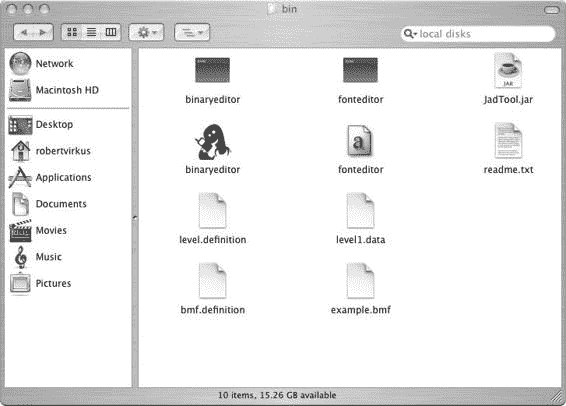

5033CH10.qxd 6/17/05 12:10 PM Page 139

第 10 章 ■ 使用工具类

**139**

这些应用程序位于 *${polish.home}/bin* 文件夹中。图 10-2 展示了该文件夹在 Mac OS X 系统上的外观。

**图 10-2.** *Mac OS X 系统上的 ${polish.home}/bin 文件夹* **二进制编辑器**

你可以使用二进制编辑器来管理关卡文件和其他结构化的二进制数据文件。

通过双击 *${polish.home}/bin* 文件夹中的二进制编辑器可执行文件来启动它。

二进制编辑器将数据设置的信息存储在 *.definition* 文件中。一个定义指定了在实际数据文件中使用哪些数据类型以及它们的顺序。

当你第一次启动编辑器时，你将从一个新的空白定义文件开始。

让我们浏览一下编辑器。通过选择菜单栏中的 **文件 ➤ 打开定义**，将文件拖入已打开的应用程序，或者将定义文件拖放到编辑器的启动脚本上，来打开 *${polish.home}/bin/level.definition* 文件，如图 10-3 所示。

*op*

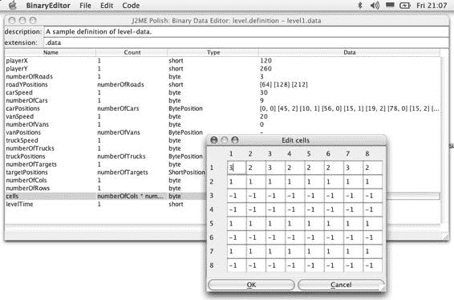

5033CH10.qxd 6/17/05 12:10 PM Page 140

**140**

第 10 章 ■ 使用工具类

现在，编辑器中显示了相应数据文件的结构。对于每个条目，你可以指定该条目重复的次数、条目的类型（byte、short 等）以及实际数据。

要加载一些数据，请使用 *${polish.home}/bin/level1.data*，通过选择菜单栏中的 **文件 ➤ 打开数据**，将文件拖入已打开的应用程序，或者将定义文件拖放到编辑器的启动脚本上。现在你可以在右侧列中看到文件的实际数据。你可以通过点击列来编辑数据。根据数据类型，你可以直接在表格中或对话框中进行编辑，如图 10-4 所示。

**图 10-4.** *使用二进制编辑器编辑数据* 当你指定了 Count 值时，一个条目可以重复多次。你可以通过设置一个静态数字，或者使用一个或多个其他数据条目来定义这个数字。当你使用另一个数据条目来指定次数时，会使用该条目的数值。例如，在图 10-4 中，条目 `roadYPositions` 重复了 `numberOfRoads` 次。由于 `numberOfRoads` 的值为 3，因此 `roadYPosition` 条目重复了三次。

除了数值类型（如 byte 或 short）之外，你还可以使用 String 条目来定义 Count。当你使用 String 条目时，数据字符串的长度用于计算其数值。你还可以使用多个条目，并对它们进行加、乘、减或除运算，以计算当前条目的重复次数。例如，在图 10-4 中，`cells` 条目重复了 `numberOfCols * numberOfRows` 次。由于数据文件是顺序加载的，你只能使用已经已知的条目；这些条目是在你为其指定 Count 值的条目之上定义的任何条目。

5033CH10.qxd 6/17/05 12:10 PM Page 141

第 10 章 ■ 使用工具类

**141**

你可以为你的文件使用几种预定义类型；例如，你可以指定 byte、boolean 或 PNG Image。只需在 Type 列中选择条目即可更改类型。

当类型具有固定长度时，它会在类型后面的括号中显示。可变长度的类型通过在其名称末尾添加“(-1)”来声明。你也可以通过选择 **编辑 ➤ 添加自定义类型** 来定义自己的类型。你可以混合使用任何已知的类型。

例如，你可以使用两个 short 值来创建一个 Position 类型。自定义类型的规范保存在相应的 **.definition* 文件中。表 10-1 描述了默认类型。

**表 10-1.** *二进制编辑器的预定义类型* **类型**

**值**

**说明**

byte

–128..+128

标准 Java byte 值

unsigned byte

0..255

正 8 位值

short

–32768..+32767

标准 Java short 值（占用 2 字节）

unsigned short

0..2³¹–1 (2147483647)

正 16 位值

int

–2³¹..2³¹-1

标准 Java int 值（占用 4 字节）

long

–2⁶³..2⁶³-1

标准 Java long 值（占用 8 字节）

boolean

true, false

一个字节，表示 true (1) 或 false (0)

ASCII-String

Text

由 ASCII 字符组成的字符串，最大长度为 255 个字符；在数据文件中占用 length+1 字节

UTF-String

Text

标准 Java String

PNG-Image

Image

一个 PNG 图像

■**注意** PNG 图像通常应该是定义文件中的最后一个条目，除非你生成自己的代码来加载图像。

二进制编辑器可以生成用于加载相应数据文件的 Java 代码。只需选择 **代码 ➤ 生成 Java 代码** 即可查看生成的代码。你现在可以保存它或将其复制到剪贴板。

你可以将定义文件保存在任何你想要的地方，但通常你会将它们与数据文件一起保存在项目的 *resources* 文件夹中。然后你需要确保 **.definition* 文件不包含在你的应用程序包中。你可以通过在 *build.xml* 文件的 `<resources>` 元素中指定 excludes 属性来实现这一点，如下例所示：

<resources excludes="*.definition, readme.txt" /> 此元素嵌套在 `<build>` 部分中。有关完整示例，请查看 Menu 示例应用程序的 *build.xml* 文件。

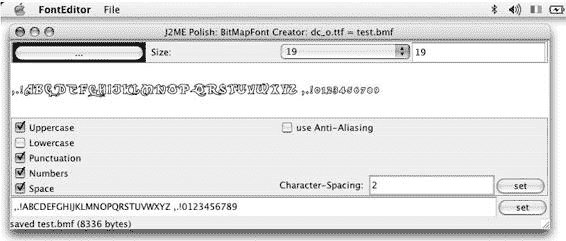

5033CH10.qxd 6/17/05 12:10 PM Page 142

**142**


第 10 章 ■ 使用实用工具

**字体编辑器**

你可以使用字体编辑器从任何 TrueType 字体中创建位图字体。双击 *${polish.home}/bin* 文件夹中的字体编辑器可执行文件即可启动编辑器。

你可以通过以下方式打开任何 TrueType 字体 **.ttf* 文件：在菜单栏中选择“文件 ➤ 打开 TrueType 字体”，将文件拖入已打开的应用程序，或者将字体文件拖放到编辑器的启动脚本上（参见本章前面的图 10-3）。如图 10-5 所示，你现在可以在编辑器中更改字体的大小、颜色和其他属性。

**图 10-5.** *使用字体编辑器创建位图字体* 你可以通过在底部的文本字段中设置字符来指定位图字体支持的字符。由于每个额外的字符都需要额外的空间，因此应尽量减少字符数量；只需保留足够的字符来显示你希望以该位图字体呈现的所有文本。如果你的文本包含相应位图字体中不可用的字符，则该字符将无法显示并从屏幕中省略。

你可以使用字符间距来分隔密集或斜体字体的字符。请记住，每个字符都需要单独访问，因此每个字符周围必须有一个矩形区域，且不能与其他字符重叠。

■**注意** 对位图字体使用抗锯齿功能会使它们看起来更平滑，但也会增加其大小并降低可读性。因此，不建议在低分辨率设备上使用抗锯齿功能。

你可以通过在你喜欢的图像编辑器（如 Photoshop 或 GIMP）中操作基础 PNG 图像来优化位图字体。选择“文件 ➤ 另存为 PNG 图像”来保存字体的相应 PNG 图像。然后通过选择“文件 ➤ 打开 PNG 图像”重新加载它。你也可以通过选择“文件 ➤ 在二进制编辑器中打开”来微调位图字体，或者

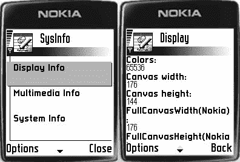

5033CH10.qxd 6/17/05 12:10 PM 第 143 页

第 10 章 ■ 使用实用工具

**143**

在外部启动二进制编辑器，加载 *${polish.home}/bin/bmf.definition*，并将位图字体作为数据打开。使用本章前面描述的 `de.enough.polish.BitMapFont` 类来显示你的位图字体文本。

**SysInfo MIDlet**

J2ME Polish 还包含 MIDPSysInfo MIDlet，它允许你快速检查设备的能力。它位于 *${polish.home}/samples/sysinfo* 文件夹中，需要先构建，可以通过命令行调用 `ant` 或在 IDE 中执行 *build.xml* 脚本来完成。然后你会在 *dist* 文件夹中找到 *MIDPSysInfo.jar* 和 *MIDPSysInfo.jad* 文件。图 10-6 显示了正在运行的 SysInfo 应用程序。

**图 10-6.** *使用 MIDPSysInfo MIDlet 检查设备能力* **总结**

本章讨论了 J2ME Polish 附带的多种实用工具。虽然它们对于开发 J2ME 应用程序并非必不可少，但它们非常有用，并且可能解决你在应用程序开发过程中遇到的挑战。

在下一章中，我们将介绍 J2ME Polish 的游戏引擎，以及它如何帮助你使用单一源代码基础为 MIDP 2.0 和 MIDP 1.0 设备开发游戏。

5033CH10.qxd 6/17/05 12:10 PM 第 144 页

5033CH11.qxd 6/17/05 12:11 PM 第 145 页

第 11 章

■ ■ ■

使用 J2ME Polish 进行

游戏编程

**本章内容：**

• J2ME Polish 游戏引擎在 MIDP 1.0 设备上提供完整的 MIDP 2.0 游戏 API。

• 通过设置各种预处理变量来优化游戏引擎。

• 解决 MIDP 1.0 平台上游戏引擎的限制，包括无法在像素级别检测碰撞以及并非所有 MIDP 1.0 平台都支持精灵变换。

• 通过使用特定于供应商的库进行低级图形操作、声音播放和设备控制，将 MIDP 2 游戏移植到 MIDP 1.0 平台。

游戏产业是 J2ME 市场中最大的参与者。当你编写 J2ME 应用程序时，很可能正在开发游戏。游戏是移动 Java 的巨大成功故事，属于移动领域主要收入的“3G”：游戏（games）、赌博（gambling）和女孩（girls）。游戏市场正在快速增长，据估计 2005 年全球市场规模为 40 亿美元。

业界通过 Java Community Process 网站（*http://jcp.org/en/jsr/* *detail?id=118*）在 MIDP 2.0 标准中引入了游戏编程的重大改进。不幸的是，市面上大多数手机仅支持 MIDP 1.0 标准。这正是 J2ME Polish 游戏引擎的用武之地。正如你将在本章中学到的，你可以使用 J2ME Polish 的游戏引擎快速将 MIDP 2.0 游戏移植到 MIDP 1.0 平台。

**使用游戏引擎**

使用 MIDP 2.0 游戏 API 编程游戏很容易。你有精灵、带视图窗口的图层管理器等等。当你为 MIDP 1.0 平台开发游戏时，会非常怀念这些功能。这就是为什么 J2ME Polish 包含一个包装 API，使你即使在 MIDP 1.0 设备上也能使用 `javax.microedition.lcdui.game.*` API。

游戏引擎允许你在 MIDP 1.0 设备上使用完整的 MIDP 2.0 游戏 API。通常，当你使用正确的 import 语句时，无需更改源代码。然而，存在一些主要限制可能需要调整你的代码，特别是无法使用像素级碰撞检测。此外，并非所有 MIDP 1.0 平台都支持精灵变换。处理这些限制将在本章后面的“解决游戏引擎的限制”部分中讨论。

使用游戏引擎并不困难。当你以 MIDP 1.0 设备为目标时，J2ME Polish 会自动将包装类编织到你的代码中。这仅通过交换 import 语句来完成，因此你必须使用正确的 import 语句，而不是完全限定的类名。清单 11-1 演示了你不应该*做*的事情。

**清单 11-1.** *如何**不**使用游戏引擎* `public class MyGameCanvas`

`**extends javax.microedition.lcdui.game.GameCanvas**`

`implements Runnable`

`{`

`public MyGameCanvas(boolean supress) {`

`super(supress);`

`}`

`public void run() {`

`// 主游戏循环`

`}`

`}`

当你以 MIDP 1.0 设备为目标时，清单 11-1 中的代码将无法工作。清单 11-2 显示了一个工作示例，它正确使用了 import 语句。

**清单 11-2.** *使用 import 语句正确使用游戏引擎* `**import javax.microedition.lcdui.game.GameCanvas;**`

`public class MyGameCanvas`

`**extends GameCanvas**`

`implements Runnable`

`{`

`public MyGameCanvas(boolean supress) {`

`super(supress);`

`}`

`public void run() {`

`// 主游戏循环`

`}`

`}`

**优化游戏引擎**

你可以通过在 *build.xml* 脚本的 `<variables>` 部分定义几个预处理变量来调整游戏引擎。以下优化可用：

5033CH11.qxd 6/17/05 12:11 PM 第 147 页

第 11 章 ■ 使用 J2ME Polish 进行游戏编程

**147**

• 为你的游戏启用全屏模式

• 通过使用后缓冲区和/或单个瓦片图像来优化 TiledLayer 的性能

• 增加可能的瓦片数量

• 为具有错误或缓慢游戏 API 实现的 MIDP 2.0 设备激活游戏引擎

**以全屏模式运行你的游戏**


通常，你会希望为游戏使用全屏模式。要启用此模式，请使用项目 *build.xml* 文件中 `<build>` 元素的 `fullscreen` 属性。可选值为 `true`、`false` 或 `menu`。`menu` 模式允许你设计菜单栏，但仅在使用 J2ME Polish GUI 时可用。

`<build>` 元素的 `fullscreen` 属性可为整个应用程序启用全屏模式。如果你想为实际游戏过程使用不同的设置，可以通过设置 `polish.GameCanvas.useFullScreen` 预处理变量来为 `GameCanvas` 实现定义特定设置。允许的值同样为 `true`、`false` 或 `menu`。清单 11-3 演示了如何为应用程序使用菜单全屏模式，同时为 `GameCanvas` 使用常规全屏模式。

**清单 11-3.** *为 GameCanvas 启用全屏模式*

<j2mepolish>

<info

license="GPL"

name="MazeRace"

vendorName="A reader."

version="0.0.1"

jarName="${polish.vendor}-${polish.name}-${polish.locale}-mazerace.jar"

/>

<deviceRequirements>

<requirement name="Identifier" value="Nokia/Series60" />

</deviceRequirements>

<build

usePolishGui="true"

**fullscreen="menu"**

>

<midlet class="com.apress.mazerace.MazeRace" />

<variables>

**<variable**

**name="polish.GameCanvas.useFullScreen"**

**value="true"**

**/>**

</variables>

</build>

<emulator />

5033CH11.qxd 6/17/05 12:11 PM Page 148

**148**

第 11 章 ■ 使用 J2ME POLISH 进行游戏编程

当你向 `GameCanvas` 添加命令时，需要启用菜单模式。菜单模式需要 J2ME Polish GUI，而后者又要求你不要实现 `paint( Graphics )` 方法，因为该方法由 J2ME Polish GUI 内部使用。

在这种情况下，你应该改用 `flushGraphics()` 方法。如果无法做到这一点，你可以使用一些预处理来实现 `paintScreen( Graphics )` 方法，而不是 `paint( Graphics )` 方法，如清单 11-4 所示。

**清单 11-4.** *在菜单全屏模式下使用 paintScreen() 方法代替 paint() 方法* import javax.microedition.lcdui.game.GameCanvas;

import javax.microedition.lcdui.Graphics;

public class MyGameCanvas

extends GameCanvas

implements Runnable

{

public MyGameCanvas(boolean supress) {

super(supress);

}

public void run() {

// 主游戏循环

}

**//#if polish.usePolishGui && polish.classes.fullscreen:defined && !polish.midp2**

**//# public void paintScreen( Graphics g )**

**//#else**

**public void paint( Graphics g )**

**//#endif**

{

// 实现 paint 方法

}

}

**在 TiledLayer 中使用后缓冲**

`TiledLayer` 在屏幕上绘制多个图块，通常用于渲染游戏背景。后缓冲优化使用一个内部图像缓冲区，仅在图块发生变化时才进行绘制。不是逐个绘制所有图块，而是将整个缓冲区绘制到屏幕上。这可以显著提高游戏速度，尤其是在可见图块仅偶尔变化的情况下。

后缓冲优化的缺点是它会占用更多内存，并且你无法使用任何透明图块。因此，在以下任何情况下，你都不应激活后缓冲优化：

• 内存紧张。

• `TiledLayer` 未用作背景。

• 你同时使用了多个 `TiledLayer`。

5033CH11.qxd 6/17/05 12:11 PM Page 149

第 11 章 ■ 使用 J2ME POLISH 进行游戏编程

**149**

你可以通过将 `polish.TiledLayer.useBackBuffer` 预处理变量设置为 `true` 来激活后缓冲优化。你还可以通过将 `polish.TiledLayer.TransparentTileColor` 变量设置为任何整数颜色值来指定背景颜色，如清单 11-5 所示。此颜色随后将用于之前透明的图块。

**清单 11-5.** *为 TiledLayer 激活后缓冲优化*

<variables>

<variable

name="polish.TiledLayer.useBackBuffer"

value="true"

/>

<variable


name="polish.TiledLayer.TransparentTileColor"

value="0xCFCFCF"

/>

</variables>

**将图像分割为单个图块**

当基础图像被分割为单个图块时，TiledLayer 的绘制速度可以显著提升。

与基本的 TiledLayer 相比，这种优化需要稍多的内存。此外，如果设备不支持诺基亚的 UI API，图块的透明度将丢失。你可以通过将预处理变量 `polish.TiledLayer.splitImage` 设置为 `true` 来激活此优化，如清单 11-6 所示。

**清单 11-6.** *为 TiledLayer 激活分割图像优化*

<variables>

<variable

name="polish.TiledLayer.splitImage"

value="true"

/>

</variables>

**定义 TiledLayer 的网格类型**

每个 TiledLayer 将包含的图块信息存储在一个名为*网格*的内部数组中。默认情况下，J2ME Polish 使用字节网格，这显著减少了内存占用，但将不同图块的数量限制为 128 个。你可以通过定义预处理变量 `polish.TiledLayer.GridType`，将数组类型从默认的字节类型更改为整型或短整型。清单 11-7 展示了如何更改为短整型，这允许你使用多达 32,767 个不同的图块——即使对于最苛刻的手机游戏来说也足够了。

5033CH11.qxd 6/17/05 12:11 PM 第 150 页

**150**

第 11 章 ■ 使用 J2ME POLISH 进行游戏编程

**清单 11-7.** *支持多达 32,767 个不同图块*

<variables>

<variable

name="polish.TiledLayer.GridType"

value="short"

/>

</variables>

**为 MIDP 2.0 设备使用游戏引擎**

你也可以为 MIDP 2.0 设备使用 J2ME Polish 实现。你可能希望这样做，因为某些厂商的实现存在缺陷或性能低下。要在 MIDP 2.0 设备上使用游戏引擎，请将预处理变量 `polish.usePolishGameApi` 设置为 `true`，如清单 11-8 所示。

**清单 11-8.** *为特定 MIDP 2.0 目标设备使用 J2ME Polish 游戏引擎*

<variables>

<variable

name="polish.usePolishGameApi"

value="true"

if="polish.identifier == VendorName/DeviceName"

/>

</variables>

**解决游戏引擎的限制**

你可以在游戏中使用 `javax.microedition.lcdui.game.*` API 的任何类，但需要注意游戏引擎的一些技术限制：

*   **像素级碰撞检测：** 在 MIDP 1.0 平台上，你无法对精灵使用像素级碰撞检测，因此需要设置碰撞矩形——最好是紧密贴合矩形。
*   **用户输入评估：** 当你扩展 `GameCanvas` 类时，在重写 `keyPressed(int)`、`keyReleased(int)` 或 `keyRepeated(int)` 方法之一时，应调用父类的实现，以便游戏引擎也能获知这些事件。我建议在主游戏循环中使用 `getKeyStates()` 方法来评估用户输入。这能保证在 MIDP 2.0 和 MIDP 1.0 平台上都获得最佳性能。

5033CH11.qxd 6/17/05 12:11 PM 第 151 页

第 11 章 ■ 使用 J2ME POLISH 进行游戏编程

**151**

*   **精灵变换：** 在撰写本章时，你只能在支持诺基亚 UI API 的设备上使用精灵变换；否则，变换将被忽略。你可以通过检查预处理符号 `polish.supportSpriteTransformation` 来了解当前目标设备是否支持精灵变换，如清单 11-9 所示。当不支持变换时，你可以向精灵图像中添加已经变换好的额外帧。无需变换精灵，通过设置指向已变换帧的另一个帧序列，也能达到相同效果。

**清单 11-9.** *检查设备是否支持精灵变换*
import javax.microedition.lcdui.game.GameCanvas;

import javax.microedition.lcdui.game.Sprite;

public class MyGameCanvas

extends GameCanvas

implements Runnable

{


**//#if !( polish.midp2 || polish.supportSpriteTransformation )** private static final int MIRROR_SEQUENCE = new int[]{ 2, 3 };

**//#endif**

Sprite player;

public MyGameCanvas(boolean supress) {

super(supress);

}

public void run() {

// 主游戏循环

}

public void mirrorPlayer() {

**//#if polish.midp2 || polish.supportSpriteTransformation** this.player.setTransform( Sprite.TRANS_MIRROR );

**//#else**

// 在精灵中使用额外的镜像帧：

this.player.setFrameSequence( MIRROR_SEQUENCE );

**//#endif**

**}**

}

5033CH11.qxd 6/17/05 12:11 PM Page 152

**152**

第 11 章 ■ 使用 J2ME POLISH 进行游戏编程

**将 MIDP 2.0 游戏移植到**

**MIDP 1.0 平台**

得益于 J2ME Polish 的游戏引擎和 GUI，要让一个 MIDP 2.0 游戏在 MIDP 1.0 平台上运行，你只需手动处理一些特定问题。像往常一样，你可以使用预处理来检测目标设备的能力。

要将你的 MIDP 2.0 游戏移植到 MIDP 1.0 设备，首先需要解决上一节概述的 J2ME Polish 游戏引擎的限制。你可能还需要调整特定于 MIDP 2.0 的代码，以便你的应用程序能在 MIDP 1.0 设备上工作。

通常，你不能在游戏中使用任何仅限 MIDP 2.0 的功能，但此规则有两个重要的例外：

• 你可以使用 `javax.microedition.lcdui.game.*` API 中的所有内容。

• 当你使用 J2ME Polish GUI 时，你可以使用大多数 MIDP 2.0 高级 GUI 功能，例如 `CustomItem`、`POPUP ChoiceGroups` 或 `Display.setCurrentItem()`。

因此，对于游戏来说，通常会出现三个移植问题：使用仅限 MIDP 2.0 的低级图形操作、声音播放以及设备控制（振动和显示灯）。解决方案是使用特定于供应商的库。

■**提示** 你通常需要根据目标设备的能力在游戏中集成特定资源。你可以使用 J2ME Polish 的资源组装功能来确保在 JAR 文件中包含正确的文件，如第 7 章所述。

**移植低级图形操作**

移植低级图形操作是一项具有挑战性的任务。你可以在 `javax.microedition.lcdui.Graphics` 和 `javax.microedition.lcdui.Image` 类中找到低级图形操作。

例如，MIDP 2.0 平台允许你直接使用 `Graphics.drawRGB()` 方法绘制原始 RGB 数据。`Image.createRGBImage()` 方法也处理原始 RGB 数据。你是否能移植这些功能取决于你的实际使用情况以及目标设备。所有诺基亚设备都支持简单而强大的诺基亚 UI API；其他供应商通常提供自己的专有扩展。

表 11-1 列出了可用于移植低级图形操作的专有库。

5033CH11.qxd 6/17/05 12:11 PM Page 153

第 11 章 ■ 使用 J2ME POLISH 进行游戏编程

**153**

**表 11-1.** *用于移植低级图形操作的专有 API* **功能**

**MIDP 2.0**

**诺基亚**

**摩托罗拉**

**西门子**

RGB 数据

Graphics.

com.nokia.mid.ui.

com.motorola.game.

drawRGB()

DirectGraphics.

ImageUtil.setPixels()

drawPixels()

旋转

Graphics.

com.nokia.mid.ui.

com.siemens.mp.ui.

和

drawRegion()

DirectGraphics.

Image.mirrorImage

反射

drawImage()

Horizontally()

com.siemens.mp.ui.

Image.mirrorImage

Vertically()

缩放

de.enough.polish.

com.motorola.

com.siemens.

util.ImageUtil.

game.ImageUtil.

mp.ui.Image.

scale()

getScaleImage()

createImageWith

Scaling()

例如，如果你使用 `Graphics.drawRGB()` 方法来创建半透明背景，当目标设备支持诺基亚的 UI API 时，你可以使用 `com.nokia.mid.ui.DirectUtils` 和 `com.nokia.mid.ui.DirectGraphics` API 来复制该功能。

清单 11-10 展示了如何使用预处理来确定可以使用哪些 API。它还演示了如何针对存在 `drawRgbOrigin` 错误的设备调整 `drawRGB()` 调用，某些设备就存在此问题。


**清单 11-10.** *移植半透明背景*

import javax.microedition.lcdui.Graphics;

import javax.microedition.lcdui.Image;

**//#if polish.api.nokia-ui && !polish.midp2**

import com.nokia.mid.ui.DirectGraphics;

import com.nokia.mid.ui.DirectUtils;

//#endif

import de.enough.polish.ui.Background;

public class TranslucentSimpleBackground extends Background {

private final int argbColor;

**//#ifdef polish.midp2**

// int MIDP/2.0 时始终使用缓冲区：

private int[] buffer;

private int lastWidth;

**//#elif polish.api.nokia-ui**

private Image imageBuffer;

//# private int lastWidth;

private int lastHeight;

**//#endif**

5033CH11.qxd 6/17/05 12:11 PM Page 154

**154**

第 11 章 ■ 使用 J2ME POLISH 进行游戏编程

public TranslucentSimpleBackground( int argbColor ) {

super();

this.argbColor = argbColor;

}

public void paint(int x, int y, int width, int height, Graphics g) {

**//#ifdef polish.midp2**

//#ifdef polish.Bugs.drawRgbOrigin

x += g.getTranslateX();

y += g.getTranslateY();

//#endif

// 检查是否需要创建缓冲区：

if (width != this.lastWidth) {

this.lastWidth = width;

int[] newBuffer = new int[ width ];

for (int i = newBuffer.length - 1; i >= 0 ; i--) {

newBuffer[i] = this.argbColor;

}

this.buffer = newBuffer;

}

if (x < 0) {

width += x;

if (width < 0) {

return;

}

x = 0;

}

if (y < 0) {

height += y;

if (height < 0) {

return;

}

y = 0;

}

g.drawRGB(this.buffer, 0, 0, x, y, width, height, true);

**//#elif polish.api.nokia-ui**

if (width != this.lastWidth || height != this.lastHeight) {

this.lastWidth = width;

this.lastHeight = height;

this.imageBuffer = DirectUtils.createImage( width, height, this.argbColor );

}

DirectGraphics dg = DirectUtils.getDirectGraphics(g);

dg.drawImage(this.imageBuffer, x, y, Graphics.TOP | Graphics.LEFT, 0 );

**//#else**

// 忽略 alpha 值

5033CH11.qxd 6/17/05 12:11 PM Page 155

第 11 章 ■ 使用 J2ME POLISH 进行游戏编程

**155**

g.setColor( this.argbColor );

g.fillRect(x, y, width, height);

**//#endif**

}

}

你也可以模拟其他 RGB 功能，但请注意，诺基亚设备使用特定于设备的 RGB 数据类型。更多详情请查阅 Java 文档。

**移植声音播放**

在 MIDP 2.0 设备上，使用 MMAPI 播放功能播放声音相当容易。

一些 MIDP 1.0 设备也支持 MMAPI，因此你可以直接使用相同的代码。否则，你将需要使用专有的供应商特定 API，并且很可能需要不同的声音格式。表 11-2 列出了用于声音播放的可用专有 API。

**表 11-2.** *用于播放声音的专有 API* **平台**

**API**

MIDP 2.0

javax.microedition.media.Player

诺基亚

com.nokia.mid.sound.Sound

摩托罗拉

com.motorola.game.GameScreen

com.motorola.game.BackgroundMusic

com.motorola.game.SoundEffect

西门子

com.siemens.mp.media.Player

com.siemens.mp.game.Sound

com.siemens.mp.game.Melody

清单 11-11 演示了如何在诺基亚设备上播放 TrueTones 声音而非 MIDI 声音。

**清单 11-11.** *移植声音播放*

**//#if polish.audio.midi && (polish.api.mmapi || polish.midp2)** import javax.microedition.media.Manager;

import javax.microedition.media.Player;

**//#elif polish.api.nokia-ui**

import com.nokia.mid.sound.Sound;

import java.io.ByteArrayOutputStream;

**//#endif**

...

public void playMusic() throws Exception {

**//#if polish.audio.midi && (polish.midp2 || polish.api.mmapi)** Player musicPlayer =

Manager.createPlayer(

getClass().getResourceAsStream("/music.mid"), "audio/midi"); musicPlayer.realize();

musicPlayer.prefetch();

5033CH11.qxd 6/17/05 12:11 PM Page 156

**156**

第 11 章 ■ 使用 J2ME POLISH 进行游戏编程

musicPlayer.start();

**//#elif polish.api.nokia-ui**

InputStream is = getClass().getResourceAsStream("/music.tt"); ByteArrayOutputStream out = new ByteArrayOutputStream();

int read;

byte[] buffer = new byte[ 1024 ];

while( ( read = is.read( buffer, 0, 1024 ) ) != -1 ) {

out.write( buffer, 0, read );

}

Sound sound = new Sound( out.getByteArray(), Sound.FORMAT_TONE ); sound.play( 1 );

**//#endif**

}

**控制振动和显示屏背光**

你可能想要移植的另外两个功能与设备控制相关：控制振动和显示屏背光。使用 MIDP 2.0，你可以通过使用 `javax.microedition.lcdui.Display.vibrate()` 和 `flashBacklight()` 方法来实现此控制。但是，在 MIDP 1.0 设备上，你需要使用可用的专有库，这些库列在表 11-3 中。

**表 11-3.** *用于设备控制的专有 API* **功能**

**MIDP 2.0**

**诺基亚**

**摩托罗拉**

**西门子**

振动

Display.vibrate()

com.nokia.mid.ui.

com.siemens.mp.game.Vibrator.

DeviceControl.

startVibrator()

startVibrate()

com.siemens.mp.game.Vibrator.

com.nokia.mid.ui.

stopVibrator()

DeviceControl.

com.siemens.mp.game.Vibrator.

stopVibrate()

triggerVibrator()

背光

Display.

com.nokia.mid.ui.

com.siemens.mp.game.Light.

flashBacklight()

DeviceControl.

setLightOn()

flashLights()

com.siemens.mp.game.Light.

com.nokia.mid.ui.

setLightOff()

DeviceControl.

setLights()

清单 11-12 展示了当不支持 MIDP 2.0 标准时，如何使用诺基亚的 `DeviceControl` 类来实现设备振动。

**清单 11-12.** *实现设备振动*

**//#if polish.midp2**

import javax.microedition.lcdui.Display;

**//#elif polish.api.nokia-ui**

import com.nokia.mid.ui.DeviceControl;

**//#endif**

...

5033CH11.qxd 6/17/05 12:11 PM Page 157

第 11 章 ■ 使用 J2ME POLISH 进行游戏编程

**157**

//#if polish.midp2

private Display display;

//#endif

...

public void vibrate() {

**//#if polish.midp2**

this.display.vibrate( 500 );

**//#elif polish.api.nokia-ui**

try {

DeviceControl.startVibra( 100, 500 );

} catch (IllegalStateException e) {

//#debug error

System.out.println("设备不支持振动" + e );

}

**//#endif**

}

**本章小结**

在本章中，你了解了 J2ME Polish 的游戏引擎，以及它如何帮助你移植游戏到 MIDP 1.0 平台。当你使用 MIDP 2.0 平台的底层图形、声音播放和设备控制功能时，需要包含一些手动调整，但除此之外，J2ME Polish 会为你处理一切。你可以通过指定各种预处理变量来根据需求调整游戏引擎。

在下一章中，你将学习如何使用 J2ME Polish 增强的 GUI。该 GUI 允许你在 MIDP 1.0 设备上使用 MIDP 2.0 高级 UI。它还能帮助你专业且出色地设计你的应用程序。

5033CH11.qxd 6/17/05 12:11 PM Page 158

5033CH12.qxd 6/20/05 11:31 AM Page 159

第 12 章

■ ■ ■

使用 GUI

**本章内容：**

• 在深入配置和编程之前，首先了解 GUI 的概念。

• 使用与 MIDP 2.0 标准完全兼容的 J2ME Polish GUI 进行配置和编程。

• 即使在 MIDP 1.0 设备上，也能使用 MIDP 2.0 特性，例如 `CustomItem` 或 `POPUP ChoiceGroup`。

• 使用简单的 CSS 文本文件在应用程序代码之外设计用户界面。

图形界面是应用程序最重要的部分；事实上，它对于人们对应用程序的感知至关重要。道理很简单：创建一个美观且响应迅速的用户界面，你的应用程序就会被视为专业且优秀。然而，创建专业的 GUI 并非易事。你可以使用 `javax.microedition.lcdui` 包中所谓的高级 GUI API 来快速且可移植地构建用户界面。


遗憾的是，你几乎无法影响此 GUI 的呈现方式。对于 MIDP 1.0 手机，其设计完全无法更改，而 MIDP 2.0 虽然提供了一些用于修改设计的钩子，但两个版本的实现差异很大。因此，传统上你需要使用低级 GUI API 来创建美观的用户界面。不幸的是，低级 API 的实现带来了许多意外问题，因此若想让界面在所有或大多数 J2ME 设备上运行，就需要进行大量手动移植。

在本章中，你将学习如何为你的应用程序使用 J2ME Polish GUI。

该 GUI 与标准的高级 GUI API 兼容，但允许你设计界面的每一个细节。因此，GUI 的简易编程特性得以保留，而所有限制都被一扫而空！

■**注意** 一句忠告：J2ME Polish 的 GUI 功能强大。非常强大。你可以让项目飞旋、使用脉动背景等等。但请注意，并非所有技术上炫酷的东西都适合你的用户界面。游戏当然可以使用比银行软件更花哨的元素，但始终要将应用程序的可用性牢记在心。

**159**

5033CH12.qxd 6/20/05 11:31 AM 第 160 页

**160**

第 12 章 ■ 使用 GUI **介绍界面概念**

J2ME Polish GUI 提供了一种强大且高效的方式来设计无线 Java 应用程序的用户界面。事实上，J2ME Polish GUI 具有以下几个独特特性：

• **上市时间**：J2ME Polish GUI 与标准 MIDP GUI 兼容，因此你无需学习新的 API，并且可以有选择地开启或关闭 J2ME Polish GUI。

• **自动移植**：J2ME Polish 会将必要的代码“自动地”编织到你的应用程序中，因此你无需修改源代码。该 GUI 会自动规避目标设备的已知问题。

• **创新设计**：该 GUI 使用位于实际应用程序源代码之外的简单文本文件进行设计。设计采用了网页标准 CSS 的扩展版本，因此网页设计师现在可以在没有程序员帮助的情况下设计 J2ME 应用程序，而程序员则可以专注于业务逻辑。

• **可定制**：另一个重要优势是，你只需更换 *polish.css* 文件和其他资源，就能为同一应用程序代码创建截然不同的设计。这意味着你可以轻松地为不同设备、供应商、设备组甚至区域设置调整所有设计，而无需更改源代码。有关示例，请参考某个示例应用程序中的 *resources/polish.css* 文件。

• **灵活**：你可以通过 *build.xml* 文件和 `#style` 预处理指令来控制用户界面。

• **可扩展**：MIDP 2.0 GUI 的所有元素都得到支持——即使在 MIDP 1.0 设备上也是如此。因此，你可以在 MIDP 1.0 手机上使用 MIDP 2.0 特有的项目，例如 POPUP ChoiceGroup 或 CustomItem。当你使用 CustomItem 扩展 J2ME Polish GUI 时，你会在每个目标设备上找到相同的环境，即使原生实现缺少内部遍历等重要功能。

J2ME Polish GUI 的缺点在于应用程序包的大小会增加。根据你使用的 GUI 元素和设计，你需要为 GUI 额外预留最多 30KB 的空间。现代设备，例如基于 Symbian 的设备（参见第 15 章），支持高达数兆字节的应用程序大小，因此额外的体积通常不成问题。然而，在一些较旧的设备上，情况则有所不同，例如诺基亚老旧的基于 MIDP 1.0 的 Series 40 机型，它们只接受大小不超过 64KB 的应用程序。对于此类设备，即使激活了 GUI，默认情况下也不会使用它。

图 12-1 展示了如何使用 J2ME Polish GUI 来创建一个“经过打磨的”应用程序。关于使用 *build.xml* 和 *polish.css* 文件的完整且简单的示例，请参考第 7 章的“创建‘Hello, J2ME Polish World’应用程序”一节。

5033CH12.qxd 6/20/05 11:31 AM 第 161 页

第 12 章 ■ 使用 GUI **161**

**图 12-1.** *通过使用 build.xml 控制流程、使用源代码处理业务逻辑、以及使用 polish.css 文件设计应用程序，来创建“经过打磨的”应用程序*

**控制 GUI**

你可以通过 *build.xml* 文件来控制 J2ME Polish GUI。你还可以针对特定设备有选择地激活 J2ME Polish GUI，并使用多个预处理变量来改变 GUI 的行为。

**激活 GUI**

通过将 *build.xml* 文件中 `<build>` 元素的 `usePolishGui` 属性设置为 `true` 来激活 GUI。然后，J2ME Polish 会自动将必要的代码编织到应用程序中。

`usePolishGui` 属性接受值 `yes/true`、`no/false` 和 `always`。当设置为 `true` 或 `yes` 时，将使用该 GUI，除非目标设备不具备推荐的能力（即最大 JAR 大小大于 100KB 且每个颜色的色深至少为 8 位）。对于此类设备，将改用普通的 MIDP GUI。当该属性设置为 `always` 时，J2ME Polish GUI 将用于所有目标设备，即使它们不具备推荐的能力。

清单 12-1 为大多数设备激活了 GUI。

**清单 12-1.** *在 build.xml 文件中为大多数设备激活 GUI*

<j2mepolish>

<info

license="GPL"

name="Roadrunner"

vendorName="A reader."

version="0.0.1"

jarName="${polish.vendor}-${polish.name}-roadrunner.jar"

/>

<deviceRequirements>

5033CH12.qxd 6/20/05 11:31 AM 第 162 页

**162**

第 12 章 ■ 使用 GUI

<requirement name="Identifier" value="Generic/midp1" />

</deviceRequirements>

<build

**usePolishGui="true"**

>

<midlet class="com.apress.roadrunner.Roadrunner" />

</build>

<emulator />

</j2mepolish>

或者，你可以通过定义预处理变量 `polish.usePolishGui` 来启用 J2ME Polish GUI。当你只想为选定的设备激活 GUI 时，这很有用。清单 12-2 仅为 Series 60 设备激活了 GUI。

**清单 12-2.** *仅为 Series 60 手机激活 GUI*

<j2mepolish>

<info

license="GPL"

name="Roadrunner"

vendorName="A reader."

version="0.0.1"

jarName="${polish.vendor}-${polish.name}-roadrunner.jar"

/>

<deviceRequirements>

<requirement name="Identifier" value="Generic/midp1" />

</deviceRequirements>

<build

**usePolishGui="false"**

>

<midlet class="com.apress.roadrunner.Roadrunner" />

<variables>

<!-- 为 Series 60 设备激活 GUI -->

**<variable**

**name="polish.usePolishGui"**

**value="true"**

**if="polish.group.Series60" />**

</variables>

**</build>**

<emulator />

</j2mepolish>

**配置 J2ME Polish GUI**

你可以通过修改 *build.xml* 文件来配置 GUI 的行为。

5033CH12.qxd 6/20/05 11:31 AM 第 163 页

第 12 章 ■ 使用 GUI **163**

使用全屏模式下的 GUI

J2ME Polish GUI 可以在 MIDP 2.0 设备以及那些提供了专有方法使用全屏模式的 MIDP 1.0 设备上使用整个屏幕。

你可以使用 `<build>` 元素的 `fullscreen` 属性来激活全屏模式，如清单 12-3 所示。该属性可以取值 `yes/true`、`no/false` 或 `menu`。当应用程序使用命令时，你必须使用 `menu` 模式。在这种情况下，菜单栏将由 J2ME Polish 渲染，并且菜单可以使用 CSS 进行设计（例如，通过设置 `menubar-color` 属性或使用 `menu` 样式）。


或者，你可以设置 `polish.FullScreen` 预处理变量，该变量接受与 `fullscreen` 属性相同的值。通过这种机制，你可以针对不同设备微调设置。例如，西门子设备即使在普通全屏模式下也能接受命令，因此无需为此类设备使用菜单模式。清单 12-3 演示了这一点。

**清单 12-3.** *启用全屏模式*

<j2mepolish>

<info

license="GPL"

name="Roadrunner"

vendorName="A reader."

version="0.0.1"

jarName="${polish.vendor}-${polish.name}-roadrunner.jar"

/>

<deviceRequirements>

<requirement name="Identifier" value="Generic/midp1" />

</deviceRequirements>

<build

usePolishGui="true"

**fullscreen="menu"**

>

<midlet class="com.apress.roadrunner.Roadrunner" />

<variables>

<!-- 对西门子设备使用普通全屏模式 -->

**<variable**

**name="polish.FullScreen"**

**value="true"**

**if="polish.vendor == Siemens" />**

</variables>

</build>

<emulator />

</j2mepolish>

某些 MIDP 2.0 设备不支持菜单模式，因为当按下软键时，它们不会转发按键事件。J2ME Polish 通过评估设备数据库来确定设备是否支持菜单模式。当设置了 `hasCommandKeyEvents` 特性时，设备支持纯 MIDP 2.0 菜单模式。此外，你可以设置 `capabilities` 键 `key.LeftSoftKey` 和 `key.RightSoftKey` 来定义软键的键码（这些是报告给 `Canvas` 的 `keyPressed()` 方法的值）。当未定义键时，左软键假定值为 -6，右软键假定值为 -7。清单 12-4 显示了包含这些设置的西门子/CX65 手机的定义。

**清单 12-4.** *全屏模式的支持取决于软键的事件*

<device

supportsPolishGui="true">

<identifier>Siemens/CX65</identifier>

**<features>hasCommandEvents</features>**

<capability name="ScreenSize" value="132x176"/>

**<capability name="key.LeftSoftKey" value="-1" />**

**<capability name="key.RightSoftKey" value="-4" />**

</device>

配置 GUI 的命令、标签和行为

你可以使用预处理变量和符号来更改 J2ME Polish GUI 的外观或逻辑。表 12-1 和 12-2 列出了你可以在 *build.xml* 文件中设置的可用的配置符号和变量。

**表 12-1.** *用于配置 GUI 的可用预处理符号* **预处理符号**

**说明**

polish.skipArgumentCheck

当定义此符号时，将不会检查方法参数。这可以略微提高运行时性能和应用程序的大小。

**表 12-2.** *用于配置 GUI 的可用预处理变量* **预处理变量**

**默认值**

**说明**

polish.animationInterval

定义动画的间隔（以毫秒为单位）。

polish.classes.ImageLoader

通常，J2ME Polish 使用 `Image.createImage( String url )` 方法从 JAR 文件中加载所有图像。这在大多数情况下都适用，但有时图像应从 RMS 或互联网获取。在这种情况下，你可以定义 `polish.classes.ImageLoader` 变量。给定的类（或类的静态字段）需要实现 `javax.microedition.lcdui.Image loadImage( String url ) throws IOException` 方法，该方法负责获取图像。此选项在第 13 章的“动态加载图像”部分有详细讨论。

**预处理变量**

**默认值**

**说明**

polish.ChoiceGroup.suppressMarkCommands

false

默认情况下，多选列表或 ChoiceGroup 会将“标记”和“取消标记”命令添加到菜单中。这些命令的名称可以轻松更改；请参阅第 7 章的“构建本地化应用程序”部分。如果你想完全禁止这些命令，则必须将 `polish.ChoiceGroup.suppressMarkCommands` 变量设置为 `true`。


polish.ChoiceGroup.suppressSelectCommand

false

隐式或弹出式 ChoiceGroup

或 List 通常带有一个 Select

命令，该命令也可以被禁用。

polish.TextField.useDirectInput

false

启用应用程序中所有

TextField 和 TextBox 的直接输入模式。

polish.TextField.suppressClearCommand

false

将此变量设为 true 可仅禁用

TextField 的 Clear 命令。

polish.TextField.suppressDeleteCommand

false

将此变量设为 true 可仅禁用

TextField 的 Clear 命令。

polish.TextField.suppressCommands

false

通过将此变量设为 true，

可以同时禁用 Delete 和

Clear 命令。

polish.TextField.showInputInfo

true

当设为 false 时，在直接输入模式下的

TextField 中不会绘制当前

输入模式的指示器。

polish.TextField.InputTimeout

超时时间（毫秒），超过此时间后

所选字符会自动插入到

文本中。

polish.TextField.charactersKey1

".,!?:/@_-+1"

按下 1 键时可用的

字符。

polish.TextField.charactersKey2

"abc2"

按下 2 键时可用的

字符。在此处添加本地特定的

变音符号可能会很有用。

polish.TextField.charactersKey3

"def3"

按下 3 键时可用的

字符。

polish.TextField.charactersKey3

"ghi4"

按下 4 键时可用的

字符。

polish.TextField.charactersKey5

"jkl5"

按下 5 键时可用的

字符。

polish.TextField.charactersKey6

"mno6"

按下 6 键时可用的

字符。

polish.TextField.charactersKey7

"pqrs7"

按下 7 键时可用的

字符。

polish.TextField.charactersKey8

"tuv8"

按下 8 键时可用的

字符。

polish.TextField.charactersKey9

"wxyz9"

按下 9 键时可用的

字符。

*续表*

5033CH12.qxd 6/20/05 11:31 AM 第 166 页

**166**

第 12 章 ■ 使用 GUI **表 12-2.** *续表*

**预处理变量**

**默认值**

**说明**

polish.TextField.charactersKey0

" 0"

按下 0 键时可用的

字符。在摩托罗拉

设备上，此键用于切换

输入模式。

polish.TextField.charactersKeyStar

".,!?:/@_-+"

按下 * 键时可用的

字符。在摩托罗拉

设备上，此键用于输入

空格（“ ”）。

polish.TextField.charactersKeyPound

按下 # 键时可用的

字符。在索尼爱立信

设备上，此键用于输入

空格（“ ”）。

polish.command.ok

OK

当使用菜单全屏模式时，

用于 OK 命令的标签。

polish.command.cancel

Cancel

Cancel 命令的标签。

polish.command.select

Select

由隐式或独占式 List 或

ChoiceGroup 使用的 Select

命令的标签。

polish.command.mark

Mark

多选 List 或 ChoiceGroup 的

Mark 命令的标签。

polish.command.unmark

Unmark

多选 List 或 ChoiceGroup 的

Unmark 命令项的标签。

polish.command.options

Options

用于打开可用命令列表的

命令的标签。

polish.command.delete

Delete

由 TextField 使用的

Delete 命令的标签。

polish.command.clear

Clear

由 TextField 使用的

Clear 命令的标签。

polish.title.input

Input

通常用于实际文本输入的

原生 TextBox 的标题。仅当

对应的 TextField 项没有

标签时才使用此标题。当

TextField 有标签时，该标签

将用作标题。

polish.usePolishGui

可用于仅为选定的设备激活

Polish GUI。

polish.FullScreen

可用于有选择地激活

全屏模式。可能的值有

true、false 和 menu。

清单 12-5 演示了如何使用其中一些选项。请参考第 7 章的“构建本地化应用程序”部分，以了解有关本地化应用程序选项的更多信息。在第 13 章的“高级主题”部分，您将学习如何借助 `polish.classes.ImageLoader` 变量动态加载图像。

5033CH12.qxd 6/20/05 11:31 AM 第 167 页

第 12 章 ■ 使用 GUI **167**

**清单 12-5.** *使用预处理变量和符号配置 GUI*

<j2mepolish>

<info

license="GPL"

name="Roadrunner"

vendorName="A reader."

version="0.0.1"

jarName="${polish.vendor}-${polish.name}-roadrunner.jar"

/>

<deviceRequirements>

<requirement name="Identifier" value="Generic/midp1" />

</deviceRequirements>

<!-- 符号：不检查方法参数： -->

<build

usePolishGui="true"

fullscreen="menu"

**symbols="polish.skipArgumentCheck"**

>

<midlet class="com.apress.roadrunner.Roadrunner" />

<variables>

**<!-- 抑制 ChoiceGroup 和 List 的 Mark/Unmark 命令： -->**

**<variable**

**name="polish.ChoiceGroup.suppressMarkCommands"**

**value="true" />**

<!-- 抑制 TextBox/TextField 的 Delete/Clear 命令： -->

**<variable**

**name="polish.TextField.suppressCommands"**

**value="true" />**

</variables>

</build>

<emulator />

</j2mepolish>

配置 TextField

J2ME Polish GUI 版本的 TextField 可以像标准的 `javax.microedition.lcdui.TextField` 一样进行编程，但它提供了两种输入模式：您可以在原生输入模式和直接内联输入模式之间进行选择。您还可以激活或停用默认附加到每个 TextField 的 Delete 和 Clear 命令。

**配置输入模式**

默认使用原生输入模式。当用户想要编辑字段时，会在另一个屏幕中打开一个原生 TextField。这种方法的优点是用户可以使用设备的所有输入辅助功能，例如 T9、手写识别等。对于基于触控笔的设备，或者当用户需要编辑长文本时，您应该始终使用原生输入模式。

5033CH12.qxd 6/20/05 11:31 AM 第 168 页

**168**

第 12 章 ■ 使用 GUI 您可以通过 `textfield-direct-input` CSS 属性（详情请参见下一节）或设置 `TextField.useDirectInput` 预处理变量来启用直接输入模式。使用预处理变量可以稍微提高应用程序的性能和大小，但在这种情况下，直接输入模式会为所有 TextField 以及 TextBox 启用。您可以通过在变量定义中使用条件，将直接输入模式的激活限制在没有触控笔的设备上：`<variable name="polish.TextField.useDirectInput" value="true" if="!polish.hasPointerEvents"/>`。

当您使用直接输入模式时，您可能希望根据本地化需求允许额外的字符。您可以为此任务定义变量 `polish.TextField.charactersKey0`、`polish.TextField.charactersKey1` 等：`<variable name="polish.TextField.charactersKey2" value="abc2äåæ" />`。请参考表 12-2 了解这些变量的默认值。

■**提示** 如果您使用直接输入模式，可以通过先创建一个 NUMERIC TextField，然后将约束条件更改为 ANY，从而在将初始输入模式设置为数字的同时允许任何类型的输入：`field = new TextField( "password: ", null, 20, TextField.NUMERIC ); field.setConstraints ( TextField.ANY );`。当您的字段通常接受数字但不限于数字时，这可以极大地提高应用程序的可用性。

**配置 TextField 命令**


每当 TextField 获得焦点时，系统会自动添加“清除”和“删除”这两个附加命令。你可以通过将以下变量之一设置为 `false` 来禁用此功能：`polish.TextField.suppressClearCommand`、`polish.TextField.suppressDeleteCommand` 或 `polish.TextField.suppressCommands`。仅当目标设备具有已知的清除键，或者你不使用直接输入模式时，才应停用“删除”命令；否则，用户将无法删除错误输入。以下示例仅在设备具有清除键时移除“清除”和“删除”命令：<variable name=

"polish.TextField.suppressCommands" value="true" if="polish.key.ClearKey:defined"/>。

为应用程序使用不同的设计

你可以仅通过使用不同的资源文件夹，为应用程序采用完全不同的设计。你可以通过在 `<resources>` 元素中指定文件夹来切换所使用的资源，如清单 12-6 所示。

**清单 12-6.** *使用另一个资源文件夹*

<j2mepolish>

<info

license="GPL"

name="Roadrunner"

vendorName="一位读者。"

version="0.0.1"

jarName="${polish.vendor}-${polish.name}-roadrunner.jar"

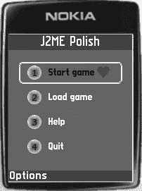

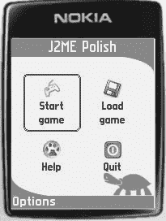

5033CH12.qxd 6/20/05 11:31 AM 第 169 页

第 12 章 ■ 使用 GUI 进行工作 **169**

/>

<deviceRequirements>

<requirement name="Identifier" value="Generic/midp1" />

</deviceRequirements>

<!-- 符号：不检查方法参数： -->

<build

usePolishGui="true"

fullscreen="menu"

>

<midlet class="com.apress.roadrunner.Roadrunner" />

**<resources**

**dir="resources2"**

**/>**

</build>

<emulator />

</j2mepolish>

图 12-2、12-3 和 12-4 展示了具有三种设计的 Menu 示例应用程序。请注意，源代码完全没有改变——所有更改都是通过提供不同的 `polish.css` 文件和不同的图像来实现的。

**图 12-2.** *默认设计下的 Menu 示例应用程序* **图 12-3.** *使用流行设计的同一应用程序*

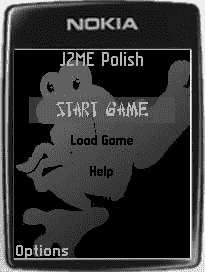

5033CH12.qxd 6/20/05 11:31 AM 第 170 页

**170**

第 12 章 ■ 使用 GUI 进行工作 **图 12-4.** *再次使用深色设计的同一应用程序* 例如，你可以使用此机制为不同的用户群体或不同的企业形象定制应用程序。当你使用本地化功能（请参阅第 7 章中的“构建本地化应用程序”部分）时，你还可以为构建版本使用不同的文本。因此，你可以使用一个应用程序逻辑或游戏引擎，创建许多外观完全不同、但仅在设计风格和文本上有所不同的应用程序。这是一种提高生产力的便捷方法，你不觉得吗？

**对 GUI 进行编程**

实际上，使用 J2ME Polish GUI 非常简单。由于 J2ME Polish GUI 与 MIDP 的 `javax.microedition.lcdui` 类兼容，因此通常既不需要更改导入语句，也不需要更改实际代码。此外，你可以使用 `#style` 指令将 CSS 样式应用于你的项目。J2ME Polish 还包含一些增强功能，例如 `TabbedForm`、`FramedForm` 和 `SpriteItem`。

**使用正确的导入语句**

你需要在应用程序中使用正确的导入语句，并且不要使用完全限定的类名，以便 J2ME Polish 能够将其 GUI API 编织到你的应用程序中。清单 12-7 向你展示了一个无法正常工作的示例。

**清单 12-7.** *如何**不**使用 J2ME Polish GUI* public class MyForm

**extends javax.microedition.lcdui.Form**

{

**private javax.microedition.lcdui.StringItem textItem;**

public MyForm( String title ) {

//#style myForm, default

super( title );

this.textItem =

**new javax.microedition.lcdui.StringItem( null, "Hello World" );**

5033CH12.qxd 6/20/05 11:31 AM 第 171 页

第 12 章 ■ 使用 GUI 进行工作 **171**

append( this.textItem );

}

}

清单 12-7 中的代码无法工作，因为它没有正确使用导入语句。清单 12-8 演示了如何正确使用它们。


**代码清单 12-8.** *当你想使用 J2ME Polish GUI 时，请使用 import 语句* **import javax.microedition.lcdui.Form;**

**import javax.microedition.lcdui.StringItem;**

public class MyForm

**extends Form**

{

**private StringItem textItem;**

public MyForm( String title ) {

//#style myForm, default

super( title );

**this.textItem = new StringItem( null, "Hello World" );** append( this.textItem );

}

}

■**提示** 即使你正在使用 J2ME Polish GUI，你也可以利用 J2ME Polish 的这种导入行为，在应用程序中使用原生的 lcdui 类。TextBox 是一个常见的例子，用于从用户处获取大量文本。在这种情况下，你很可能不想使用 J2ME Polish 实现提供的直接文本输入模式，因为用户无法使用 T9 输入法和其他原生输入辅助工具。

你可以直接在字段声明中使用完全限定类名来使用原生 TextBox，例如：`javax.microedition.lcdui.TextBox nativeTextBox = new javax.microedition.lcdui.TextBox( "Message", null, 500, TextField.ANY );`。

**设置样式**

你应该使用`#style`预处理指令来应用所需的设计样式。该指令包含一个或多个用逗号分隔的样式名称。当指定多个样式名称时，J2ME Polish 将使用第一个可用的样式。J2ME Polish 的预处理器仅选择第一个可用的样式，并将其作为最后一个参数插入到下一行中。例如，代码清单 12-9 使用了`.mainMenu`或`default`样式来设计一个 Form。

**代码清单 12-9.** *为 Form 应用 CSS 样式*

import javax.microedition.lcdui.Form;

public class MainMenu extends Form {

public MainMenu( String title ) {

**//#style mainMenu, default**

5033CH12.qxd 6/20/05 11:31 AM Page 172

**172**

第 12 章 ■ 使用 GUI super( title );

[...]

}

}

你还应该在`resources/polish.css`文件中定义`.mainMenu`样式，如代码清单 12-10 所示。当找不到任何提供的样式定义时，J2ME Polish 会报告此错误并中止处理。`default`样式很特殊，因为它始终被定义，即使你没有在`polish.css`文件中显式指定它。

**代码清单 12-10.** *在 resources/polish.css 文件中定义 CSS 样式*

.mainMenu {

background-image: url( bg.png );

columns: 2;

}

你可以在任何 Item 或 Screen 构造函数之前，以及表 12-3 列出的其他一些方法之前使用`#style`指令。

**表 12-3.** *#style 指令的插入点* **插入点**

**示例**

**说明**

Item 构造函数

//#style cool, frosty, default

`#style`指令可以放置在任何

StringItem url = new StringItem

Item 构造函数之前。

( null, "http://192.168.101.101" );

//#style cool

ImageItem img = new ImageItem

( null, iconImage,

ImageItem.LAYOUT_DEFAULT, null );

Item.setAppearanceMode()

//#style openLink

`#style`指令可以放置在调用

url.setAppearanceMode

Item 的`setAppearanceMode()`

( Item.HYPERLINK );

方法之前。请注意，此方法

仅在 J2ME Polish 中可用。

List.append()

//#style choice

`#style`指令可以放置在添加

list.append( "Start", null );

列表元素之前。

List.insert()

//#style choice

`#style`指令可以放置在插入

list.insert( 2, "Start", null );

列表元素之前。

List.set()

//#style choice

`#style`指令可以放置在设置

list.set( 2, "Start", null );

列表元素之前。

Form.append()

//#style text

`#style`指令可以放置在添加

form.append( textItem );

任何 Form 元素之前。

ChoiceGroup.append()

//#style choice

`#style`指令可以放置在向

group.append( "Choice 1", null );

ChoiceGroup 添加元素之前。

ChoiceGroup.insert()

//#style choice

`#style`指令可以放置在向

group.insert( 2, "Choice 3",

ChoiceGroup 插入元素之前。

null );

5033CH12.qxd 6/20/05 11:31 AM Page 173

第 12 章 ■ 使用 GUI **173**

**插入点**

**示例**

**说明**


ChoiceGroup.set()

//#style choice

`#style` 指令可以放置在

group.set( 2, "Choice 3", null );

设置 ChoiceGroup 的某个元素之前。

Screen 构造器

//#style mainScreen

`#style` 指令可以用于

Form form = new Form( "Menu" );

任何 Screen 构造器之前，或者

// 在 Screen 的子类中：

在子类构造器中调用 super() 之前

//#style mainScreen

使用。

super( "Menu" );

**使用动态样式和预定义样式**

当您使用动态样式时，甚至无需设置 `#style` 指令。在这种情况下，设计取决于类。例如，所有 Form 都可以使用 form 样式进行设计。

使用动态样式可以快速检查现有应用程序的 GUI，但这需要额外的内存和运行时。因此，对于最终应用程序，您应该使用常规的“静态”样式。

某些元素默认使用预定义样式。例如，title 样式负责 Screen 标题的外观。

有关静态、动态和预定义样式的更多信息，请参考以下“设计 GUI”部分中的说明。

**将 MIDP 2.0 应用程序移植到 MIDP 1.0 平台**

当您使用 J2ME Polish GUI 时，您也可以在 MIDP 1.0 设备上毫无限制地使用 MIDP 2.0 小部件，例如 POPUP ChoiceGroup 或 CustomItem。

仅当使用了 MIDP 2.0 独有的功能（这些功能超出了 J2ME Polish GUI 的范围，例如 `Display.flashBacklight( int )`）时，才需要调整源代码。

J2ME Polish GUI 支持在 MIDP 2.0 和 MIDP 1.0 设备上调用 MIDP 2.0 的 `Display.setCurrentItem( Item )`。

当目标设备不支持特定调用时，构建过程将因编译错误而中止。通常，该错误需要用适当的 `#if` 预处理指令包围起来，如清单 12-11 所示。

**清单 12-11.** *通过预处理规避 MIDP 2.0 独有的调用*

//#ifdef polish.midp2

this.display.flashBacklight( 1000 );

//#endif

有关使用 CSS 设计自定义项目的更多信息，请参考第 13 章中的“编写您自己的自定义项目”部分。

5033CH12.qxd 6/20/05 11:31 AM Page 174

**174**

第 12 章 ■ 使用 GUI 工作 **编程特定项目和屏幕**

通常，J2ME Polish GUI 与 MIDP 2.0 UI 标准完全兼容。但是，MIDP 2.0 标准中不提供某些增强功能。以下部分讨论如何对 TabbedForm、FramedForm 和 SpriteItem 进行编程。更多详细信息，请参阅 *${polish.home}/doc/javadoc.html* 中的 JavaDoc 文档。

编程 TabbedForm

`de.enough.polish.ui.TabbedForm` 是一种 Form，它将包含的 GUI 元素排列在多个选项卡上。您也可以在 TabbedForm 中使用任何 Form 方法，例如 `setItemStateListener()`。表 12-4 列出了用于配置 TabbedForm 选项卡的附加方法。

**表 12-4.** *附加的 TabbedForm 方法*

**方法**

**示例**

**说明**

TabbedForm( String title, String[]

//#style myTabbedForm

创建一个新的 TabbedForm。

tabNames, Image[] tabImages )

TabbedForm form = new

TabbedForm( "Hello",

new String[] { "First Tab",

"another tab" }, null );

append( int tabIndex, Item item )

form.append

将项目添加到指定的

( 2, myStringItem );

选项卡。第一个选项卡的索引为 0。

set( int tabIndex, int itemIndex,

form.set( 2, 1,

将项目设置到给定选项卡上的

Item item )

myStringItem );

指定索引处。

delete( int tabIndex, Item item )

form.delete

从指定的选项卡中删除给定的项目。

( 2, myStringItem );

getSelectedTab()

int tabIndex =

检索当前使用的选项卡。

getSelectedTab();

setScreenStateListener

form.setScreenStateListener

设置 `de.enough.polish.

( ScreenStateListener listener )

( this );

ScreenStateListener`，当活动

选项卡更改时会通知该监听器。

例如，使用此功能设置特定于选项卡的标题。

清单 12-12 演示了如何使用 TabbedForm。

**清单 12-12.** *使用 TabbedForm*

package com.apress.ui;


import javax.microedition.lcdui.Choice;

import javax.microedition.lcdui.ChoiceGroup;

import javax.microedition.lcdui.Command;

import javax.microedition.lcdui.CommandListener;

import javax.microedition.lcdui.DateField;

import javax.microedition.lcdui.Display;

5033CH12.qxd 6/20/05 11:31 AM 第 175 页

第 12 章 ■ 使用 GUI **175**

import javax.microedition.lcdui.StringItem;

import javax.microedition.lcdui.TextField;

import javax.microedition.lcdui.Item;

import javax.microedition.lcdui.ItemStateListener;

**import de.enough.polish.ui.TabbedForm;**

public class TabbedFormDemo implements ItemStateListener {

private final TextField nameField;

public TabbedFormDemo( CommandListener commandListener,

Display display, Command returnCmd )

{

String[] tabNames = new String[]{ "输入", "选择",

"连接" };

//#style tabbedScreen

**TabbedForm form = new TabbedForm( "标签页演示", tabNames, null );**

//#style label

StringItem label = new StringItem( null, "姓名：" ); form.append( 0, label );

//#style input

this.nameField = new TextField( null, "罗伯特", 30, TextField.ANY | TextField.INITIAL_CAPS_WORD );

form.append( 0, this.nameField );

//#style label

label = new StringItem( null, "生日：" );

form.append( 0, label );

//#style input

DateField birthdate = new DateField( null, DateField.DATE ); form.append( 0, birthdate );

//#style label

label = new StringItem( null, "你喜欢什么动物：" ); form.append( 1, label );

//#style multipleChoice

ChoiceGroup choice = new ChoiceGroup( null, Choice.MULTIPLE );

//#style choiceItem

choice.append( "狗", null );

//#style choiceItem

choice.append( "猫", null );

//#style choiceItem

choice.append( "鸟", null );

form.append( 1, choice );

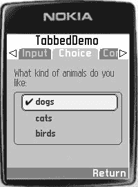

5033CH12.qxd 6/20/05 11:31 AM 第 176 页

**176**

第 12 章 ■ 使用 GUI

//#style label

label = new StringItem( null, "连接方式：" );

form.append( 2, label );

//#style multipleChoice

choice = new ChoiceGroup( null, Choice.MULTIPLE );

//#style choiceItem

choice.append( "ISDN", null );

//#style choiceItem

choice.append( "DSL", null );

//#style choiceItem

choice.append( "有线", null );

form.append( 2, choice );

form.addCommand( returnCmd );

form.setCommandListener( commandListener );

form.setItemStateListener( this );

display.setCurrentItem( choice );

}

public void itemStateChanged( Item item ) {

System.out.println( "项目状态已更改：" + item );

}

}

图 12-5 展示了 TabbedForm 的外观。

**图 12-5.** *运行中的 TabbedForm*

编程 FramedForm

`de.enough.polish.ui.FramedForm`将屏幕分为一个主区域和四个可能的框架，分别位于屏幕的顶部、底部、左侧或右侧。只有主区域可以滚动，而框架保持在其位置。例如，您可以使用框架将按钮固定在特定位置，或包含一个`TextField`来过滤显示的项目。表 12-5 列出了 FramedForm 的附加方法。

5033CH12.qxd 6/20/05 11:31 AM 第 177 页

第 12 章 ■ 使用 GUI **177**

**表 12-5.** *FramedForm 的附加方法*

**方法**

**示例**

**说明**

append( int frameOrientation,

form.append

将项目添加到指定的

Item item )

( Graphics.BOTTOM,

框架中。您可以使用

myTextField );

Graphics.TOP、BOTTOM、LEFT 或

RIGHT。

setScreenStateListener

form.setScreenStateListener

设置`de.enough.polish.

( ScreenStateListener listener )

( this );

ScreenStateListener`，当活动

框架发生变化时，该监听器会

收到通知。

清单 12-13 展示了如何在程序中使用 FramedForm，将不可滚动的`TextField`放置在屏幕底部。

**清单 12-13.** *使用 FramedForm*

package com.apress.ui;

import javax.microedition.lcdui.Choice;

import javax.microedition.lcdui.ChoiceGroup;

import javax.microedition.lcdui.Command;

import javax.microedition.lcdui.CommandListener;

import javax.microedition.lcdui.DateField;

import javax.microedition.lcdui.Display;

import javax.microedition.lcdui.Graphics;

import javax.microedition.lcdui.TextField;


import javax.microedition.lcdui.Item;

import javax.microedition.lcdui.ItemStateListener;

**import de.enough.polish.ui.FramedForm;**

public class FramedFormDemo implements ItemStateListener {

private final TextField inputField;

private final Item[] items;

public FramedFormDemo( CommandListener commandListener,

Display display, Command returnCmd, Item[] items )

{

//#style framedScreen

**FramedForm form = new FramedForm( "TabbedDemo" );**

// 添加所有常规项目：

for ( int i = 0; i < items.length; i ++ ) {

form.append( items[i] );

}

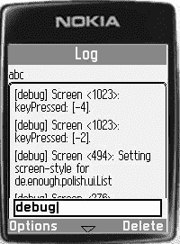

5033CH12.qxd 6/20/05 11:31 AM Page 178

**178**

第 12 章 ■ 使用 GUI

//#style inputFilter

this.inputField = new TextField( "筛选条件: ", "", 30, TextField.ANY ); **form.append( Graphics.BOTTOM, this.inputField );**

form.addCommand( returnCmd );

form.setCommandListener( commandListener );

display.setCurrentItem( this.inputField );

}

public void itemStateChanged( Item item ) {

// 文本框内容已更改，现在根据更改内容

// 对项目进行筛选...

}

}

图 12-6 展示了如何在程序中使用 FramedForm 在屏幕底部创建一个不可滚动的文本框。

**图 12-6.** *运行中的 FramedForm*

编程 SpriteItem

使用 `de.enough.polish.ui.SpriteItem` 在菜单 Form 中包含动画。此项目嵌入了一个普通的 `javax.microedition.lcdui.game.Sprite`，当该项目获得焦点时，精灵会播放动画。例如，想象一本合上的书，当用户聚焦它时，书会打开。

得益于 J2ME Polish 游戏引擎（参见第 11 章），您也可以在 MIDP 1.0 设备上使用 Sprites。表 12-6 列出了创建新 SpriteItem 所需的参数。

根据应用程序的状态，您可以通过调用 Sprite 的 `setFrameSequence( int[] )` 方法来更改 Sprite 的帧序列，从而改变动画。

5033CH12.qxd 6/20/05 11:31 AM Page 179

第 12 章 ■ 使用 GUI **179**

**表 12-6.** *SpriteItem 构造函数的参数* **参数**

**说明**

String label

项目的标签。

Sprite sprite

嵌入的 Sprite。动画期间将显示该 Sprite 的帧序列。

long animationInterval

帧变化间隔，单位为毫秒。除非您在 *build.xml* 脚本中设置了 `polish.animationInterval` 预处理变量，否则此值必须是 100 的倍数。

int defaultFrameIndex

当 SpriteItem 未获得焦点时显示的帧索引。

boolean repeatAnimation

指定动画完成一个循环后是否应重复播放。

清单 12-14 演示了如何在应用程序中使用 SpriteItem。

**清单 12-14.** *编程 SpriteItem*

package com.apress.ui;

import java.io.IOException;

import javax.microedition.lcdui.Command;

import javax.microedition.lcdui.CommandListener;

import javax.microedition.lcdui.Display;

import javax.microedition.lcdui.Displayable;

import javax.microedition.lcdui.Form;

import javax.microedition.lcdui.Image;

import javax.microedition.lcdui.Item;

import javax.microedition.lcdui.ItemCommandListener;

import javax.microedition.lcdui.game.Sprite;

import javax.microedition.midlet.MIDlet;

import javax.microedition.midlet.MIDletStateChangeException; **import de.enough.polish.ui.SpriteItem;**

public class AnimatedMenuMidlet

extends MIDlet

implements ItemCommandListener

{

private Display display;

private Form mainForm;

private final Command startCmd;

private final Command loadCmd;

private final Command aboutCmd;

private final Command exitCmd;

5033CH12.qxd 6/20/05 11:31 AM Page 180

**180**

第 12 章 ■ 使用 GUI public AnimatedMenuMidlet() {

super();

this.startCmd = new Command( "开始游戏", Command.ITEM, 1 ); this.loadCmd = new Command( "加载游戏", Command.ITEM, 1 ); this.aboutCmd = new Command( "关于", Command.ITEM, 1 ); this.exitCmd = new Command( "退出", Command.ITEM, 1 ); try {

this.mainForm = new Form( "主菜单" );

int frameWidth = 30;

int frameHeight = 30;

// 创建开始游戏菜单项：


Image image = Image.createImage( "/player.png"); **Sprite sprite = new Sprite( image, frameWidth, frameHeight );** **sprite.setFrameSequence( new int[]{ 2, 5, 5, 6, 3, 7, 1 } );**

**//#style mainScreenItem**

**SpriteItem spriteItem = new SpriteItem( null, sprite, 200, 0, false );** spriteItem.setDefaultCommand( this.startCmd );

spriteItem.setItemCommandListener( this );

this.mainForm.append( spriteItem );

// 创建“加载游戏”菜单项：

image = Image.createImage( "/load.png");

sprite = new Sprite( image, frameWidth, frameHeight );

// 使用默认帧序列

//#style mainScreenItem

spriteItem = new SpriteItem( null, sprite, 200, 0, false ); spriteItem.setDefaultCommand( this.loadCmd );

spriteItem.setItemCommandListener( this );

this.mainForm.append( spriteItem );

// 创建“关于”菜单项：

image = Image.createImage( "/about.png");

sprite = new Sprite( image, frameWidth, frameHeight );

//#style mainScreenItem

spriteItem = new SpriteItem( null, sprite, 200, 0, false ); spriteItem.setDefaultCommand( this.aboutCmd );

spriteItem.setItemCommandListener( this );

this.mainForm.append( spriteItem );

// 创建“退出”菜单项：

image = Image.createImage( "/exit.png");

sprite = new Sprite( image, frameWidth, frameHeight );

//#style mainScreenItem

spriteItem = new SpriteItem( null, sprite, 200, 0, false ); spriteItem.setDefaultCommand( this.exitCmd );

spriteItem.setItemCommandListener( this );

this.mainForm.append( spriteItem );

5033CH12.qxd 6/20/05 11:31 AM Page 181

第 12 章 ■ 使用 GUI 进行开发 **181**

} catch ( IOException e ) {

//#debug error

System.out.println( "无法创建菜单屏幕" + e ); this.mainForm = null;

}

}

protected void startApp() throws MIDletStateChangeException {

this.display = Display.getDisplay( this );

if ( this.mainForm == null ) {

throw new MIDletStateChangeException();

}

this.display.setCurrent( this.mainForm );

}

protected void pauseApp() {

// 暂停

}

protected void destroyApp( boolean unconditional )

throws MIDletStateChangeException

{

// 退出

}

public void commandAction( Command cmd, Item item ) {

if ( cmd == this.startCmd ) {

// 开始游戏...

} else if ( cmd == this.loadCmd ) {

/// 加载游戏...

} else if ( cmd == this.aboutCmd ) {

// 关于此游戏...

} else if ( cmd == this.exitCmd ) {

notifyDestroyed();

}

}

}

**设计 GUI**

你可以使用 Web 标准层叠样式表（CSS）来设计 J2ME Polish 的 GUI。因此，现在每位网页设计师都可以使用 J2ME Polish 来设计移动应用程序！以下章节将详细解释所有设计可能性；无需具备 CSS 的预备知识。

所有设计设置和文件都存储在项目的 *resources* 目录中，除非在 *build.xml* 文件中指定了其他目录。该目录中最重要的文件是 *polish.css*。你可以在其中找到所有设计定义。这些设计定义按*样式*分组。

5033CH12.qxd 6/20/05 11:31 AM Page 182

**182**

第 12 章 ■ 使用 GUI 进行开发 你可以将样式分配给任何 GUI 项，例如标题、段落或输入字段。

在样式中，通常会定义多个属性及其值，如清单 12-15 所示。

**清单 12-15.** *一个简单的样式定义*

.myStyle {

font-color: white;

font-style: bold;

font-size: large;

font-face: proportional;

background-color: black;

}

在清单 12-15 中，名为 myStyle 的样式定义了一些字体值和背景颜色。任何样式都包含一个选择器以及多个属性及其值，如图 12-7 所示。

**图 12-7.** *CSS 样式的组成部分*

你需要用分号结束每个属性-值对。样式声明需要以右花括号结束。样式的选择器或名称不区分大小写，因此 `.MySTYle` 与 `.myStyle` 相同。

你可以通过在 *resources* 文件夹中使用子文件夹来轻松调整设计以适应不同的手机。此机制使用与第 7 章中描述的资源组装相同的功能。相关技术将在“为特定设备和设备组进行设计”部分中重复说明。

你可以在源代码中使用 `#style` 预处理指令直接为 GUI 项指定样式。或者，你也可以使用 GUI 项的动态名称；例如，你可以对文本项使用 `p`，对超链接使用 `a`，或者对嵌入在 Form 中的所有文本项使用 `form p`。可能的组合以及预定义样式将在“使用动态、静态和预定义样式”部分中讨论。

样式可以使用 `extends` 关键字扩展其他样式，例如 `.myStyle extends baseStyle {}`。“扩展样式”部分描述了此过程。

J2ME Polish 支持带有外边距、内边距和内容的 CSS 盒模型。其他常见的设计设置包括背景、边框和字体设置。“常见设计属性”部分描述了这些广泛使用的设置。随后将讨论设计屏幕和项目的可能性。

**为特定设备和设备组进行设计**

有时你需要针对特定设备、设备组或特定区域调整设计。你可以通过使用 *resources* 文件夹的适当子文件夹（如第 7 章的“资源组装”部分所述）轻松使用特定的图片、样式等。

5033CH12.qxd 6/20/05 11:31 AM Page 183

第 12 章 ■ 使用 GUI 进行开发 **183**

你可以通过将 *polish.css* 文件添加到适当的文件夹（例如 `resources/Series60/polish.css` 或 `resources/ScreenSize.240+x320+/*polish.css`）来调整设计以适应特定供应商、组或设备。你无需重复更基础 CSS 文件中的所有样式和属性，只需标识更具体的设置即可。例如，当你想要更改字体颜色时，只需指定该样式的 `font-color` 属性即可。你无需定义任何其他属性或样式。这就是 J2ME Polish 中层叠样式表的层叠特性。

清单 12-16 和 12-17 说明了 *polish.css* 的层叠特性。在清单 12-16 中，有一个位于 `resources/polish.css` 文件中的基本样式定义。

**清单 12-16.** *resources/polish.css 中的基本样式定义*

.myStyle {

padding: 5;

font-color: white;

font-style: bold;

font-size: large;

font-face: proportional;

background-color: black;

border-color: yellow;

}

清单 12-17 显示了该样式在诺基亚特定文件 `resources/Nokia/polish.css` 中的特化。在这种情况下，仅更改了 `font-color` 属性，并且未使用背景；所有其他设置保持不变。如果你不想使用某个属性，即使该属性已在父样式中定义，在大多数情况下你可以使用 `attribute-name: none` 设置。在清单 12-17 中，通过指定 `background: none`，该样式未使用背景。

**清单 12-17.** *位于 resources/Nokia/polish.css 中的诺基亚特化样式*

.myStyle {

font-color: gray;

background: none;

}

**使用动态、静态和预定义样式**

J2ME Polish 区分动态样式、静态样式和预定义样式：

*   *静态*样式在应用程序的源代码中使用 `#style` 预处理指令定义。
*   *预定义*样式由 J2ME Polish 内部用于某些特定项，例如屏幕标题、菜单栏或 TabbedForm 中的选项卡。
*   *动态*样式根据项的类型用于项。

5033CH12.qxd 6/20/05 11:31 AM Page 184

**184**

第 12 章 ■ 使用 GUI 进行开发 静态样式


静态样式通过在应用程序源代码中使用 `#style` 预处理指令应用于特定的项或屏幕。程序员只需告知设计师样式名称及其用途（即用于何种项或屏幕），而设计师则需要在 *polish.css* 文件中定义这些样式。在 CSS 文件中，静态样式始终以点号开头，例如 `.myStyle`。

静态样式比动态样式速度更快，资源消耗更少。应尽可能坚持使用静态样式和预定义样式。

预定义样式

J2ME Polish GUI 在内部使用预定义样式。与普通的“用户定义”静态样式不同，它们的名称不以点号开头，例如使用 `title` 而非 `.title`。

表 12-7 列出了可用的预定义样式。当您未定义某个预定义样式时，将使用“default”样式作为替代。

**表 12-7.** *支持的预定义样式*

**样式**

**描述**

title

屏幕标题的样式。对于 MIDP 2.0 设备，默认使用原生实现，除非使用了菜单全屏模式，或者预处理变量 `polish.usePolishTitle` 被定义为 true：

`<variable name="polish.usePolishTitle" value="true" unless="polish.Vendor == Nokia" />`。

您也可以通过使用 `title-style` 属性为特定的 Screen 或 ChoiceGroup 使用自定义样式。

focused

当前焦点项的样式。此样式用于 List、Form 以及 ChoiceGroup 等容器。您也可以通过使用 `focused-style` 属性为特定的 Screen 或 ChoiceGroup 使用自定义样式。

menu

此样式用于设计全屏模式下的菜单栏。全屏模式可通过 *build.xml* 中 `<build>` 元素的 `fullScreenMode` 属性触发（设置 `fullScreenMode="menu"`）。在 menu 样式中，您还可以使用 `focused-style` 属性定义当前焦点命令所使用的样式，例如：`focused-style: menuFocused;`。在这种情况下，您还需要定义静态样式 `.menuFocused`。

menuItem

用于屏幕菜单项（命令）的样式。当未定义 `menuItem` 时，将使用 `menu` 样式作为替代。

label

此样式用于任何项的菜单标签。可以通过在相应样式中定义 CSS 属性 `label-style` 来指定另一个标签样式，该属性引用另一个样式。

info

用于在屏幕中显示附加信息的样式。目前，此样式仅用于在 TextField 或 TextBox 的直接输入模式启用时显示当前输入模式。

default

当所需的预定义样式未定义时，J2ME Polish GUI 使用的样式。即使未在 *polish.css* 文件中显式定义，`default` 样式也始终存在。

tabbar

此样式用于设计 TabbedForm 的标签栏。

activetab

用于设计 TabbedForm 中当前活动的标签。

5033CH12.qxd 6/20/05 11:31 AM Page 185

第 12 章 ■ 使用 GUI **185**

**样式**

**描述**

inactivetab

用于设计 TabbedForm 中除当前选中标签外的所有标签。

topframe

用于设计 FramedForm 的上部边框。

bottomframe

用于设计 FramedForm 的下部边框。

leftframe

用于设计 FramedForm 的左侧边框。

rightframe

用于设计 FramedForm 的右侧边框。

frame

当您未使用更具体的样式时，可以使用 `frame` 样式在一个样式中设计 FramedForm 的所有边框。

不允许将预定义样式的名称用于静态样式，因此您不能使用名为 `.title` 等的静态样式。

动态样式

使用动态样式可以在不修改源代码中 `#style` 指令的情况下将样式应用于项。通过动态样式，设计师可以完全独立于程序员工作，并为尚未关联静态样式的 GUI 项尝试新的设计。您还可以在不更改现有应用程序源代码的情况下，探索 J2ME Polish API 的强大功能和可能性。


动态样式比静态和预定义样式需要更多的内存和处理时间。因此，应尽可能使用静态样式。

动态样式不以点号开头，其选择器使用特定项目或屏幕的名称。

文本使用 `p`、`a`、`button` 或 `icon` 选择器。屏幕使用屏幕本身的名称，例如 `form`、`list` 或 `textbox`，如清单 12-18 所示。

**清单 12-18.** *在 resources/polish.css 文件中使用动态样式* p {

font-color: black;

font-size: medium;

background: none;

}

form {

margin: 5;

background-color: gray;

border: none;

font-size: medium;

}

你还可以设计包含在其他项目或屏幕中的项目。样式 `form p` 会选择嵌入在表单中的所有文本项目（属于 `StringItem` 类），如清单 12-19 所示。

5033CH12.qxd 6/20/05 11:31 AM 第 186 页

**186**

第 12 章 ■ 使用 GUI **清单 12-19.** *使用动态样式 form p 选择表单内的文本* form p {

font-color: black;

font-size: medium;

background-color: white;

}

表 12-8 显示了项目和屏幕可用的动态样式。

**表 12-8.** *可用的动态样式*

**类**

**选择器**

**说明**

StringItem

p

StringItem 显示文本。当项目的外观模式为 PLAIN 时，使用 p 选择器。

a

当项目的外观模式为 HYPERLINK 时，使用 a 选择器。

button

当项目的外观模式为 BUTTON 时，使用 button 选择器。

ImageItem

img

显示图像。

Gauge

gauge

显示进度指示器。

Spacer

spacer

用于显示空白区域。不推荐使用 Spacer 项目，因为可以通过 margin 和 padding 属性为所有项目设置间距。

IconItem

icon

显示图像和文本。

TextField

textfield

允许用户输入文本。

DateField

datefield

允许用户输入日期或时间。

ChoiceGroup

choicegroup

包含多个选择项。

ChoiceItem

listitem

显示单个选择项。当此项目包含在隐式列表中时，使用 listitem 选择器。

radiobox

当列表或选择组的类型为 EXCLUSIVE 时，使用 radiobox 选择器。

checkbox

当列表或选择组的类型为 MULTIPLE 时，使用 checkbox 选择器。

popup

当选择组的类型为 POPUP 时，使用 popup 选择器。

SpriteItem

spriteitem

包含动画项目。

List

list

显示多个选择项。

Form

form

包含不同的 GUI 项目。

TextBox

textbox

包含单个文本输入字段。

TabbedForm

tabbedform

带有多个选项卡的表单。

FramedForm

framedform

带有多个框架的表单。

5033CH12.qxd 6/20/05 11:31 AM 第 187 页

第 12 章 ■ 使用 GUI **187**

**扩展样式**

你还可以扩展其他样式。子样式会继承被扩展样式的所有属性。你可以利用这种机制将基本设计保留在一个或少数几个样式定义中，同时通过扩展基本设计来完成实际设计。这可以节省大量编写工作，并让你更轻松地更改设计。在清单 12-20 中，`.highscoreScreen` 样式继承了 `.mainStyle` 的所有属性，但 `font-color` 和 `background-color` 属性被指定为不同的值。

**清单 12-20.** *扩展样式可节省工作量，并允许你在一个地方更改基本设计*

.mainScreen {

margin: 10;

font-color: black;

font-size: medium;

font-style: italic;

background-color: gray;

}

**.highscoreScreen extends mainScreen {**

font-color: white;

background-color: black;

}

**回顾 CSS 语法**

J2ME Polish 的 CSS 语法很简单，但你需要遵守一些规则。

CSS 声明的结构

每个样式都以选择器开头，后跟一个左花括号、若干属性-值对，以及一个右花括号。

选择器可以由多个项目名称组成，并可以包含 `extends` 子句。

每个属性-值对都需要以分号结尾。

命名


样式可以使用任意名称，只要名称仅由字母数字和下划线（_）字符组成即可。名称不区分大小写。静态样式需要以点号开头。静态样式不得使用动态样式或预定义样式的名称。所有 Java 关键字，例如 `class`、`int` 或 `boolean`，均不允许用作样式名称。

属性分组

你可以对属性进行分组以便于处理。清单 12-21 中的 `.mainScreen` 和 `.helpScreen` 样式使用了语义上等效的字体定义。分组不会改变属性的含义，但能使声明对人类来说更具可读性。

5033CH12.qxd 6/20/05 11:31 AM 第 188 页

**188**

第 12 章 ■ 使用 GUI 工作 **清单 12-21.** *分组 CSS 属性*

.mainScreen {

padding: 5;

font-color: black;

font-size: medium;

font-style: italic;

font-face: system;

}

.helpScreen {

margin: 5;

background-color: yellow;

**font {**

**color: black;**

**size: medium;**

**style: italic;**

**face: system;**

**}**

}

引用其他样式

当你引用另一个样式时，无需为静态样式编写点号。例如，在 `extends` 关键字之后，或在诸如 `title-style`、`focused-style` 等属性中，你可以引用其他样式。

注释

你可以在任何位置插入注释，以 `/*` 开头，以 `*/` 结束。这两个标记之间的所有内容都会被忽略，如清单 12-22 所示。

**清单 12-22.** *在 polish.css 文件中使用注释*

/**

* 此样式设计主屏幕：

**/

.mainScreen {

/* 定义字体颜色： */

font-color: black;

/* 尺寸为 small、medium 和 large： */

font-size: medium;

/* 样式为 plain、bold、italic 或 underlined： */

font-style: italic;

/* 字体可以是 system、proportional 或 monospace： */

font-face: system;

}

5033CH12.qxd 6/20/05 11:31 AM 第 189 页

第 12 章 ■ 使用 GUI 工作 **189**

**通用设计属性**

在每个样式中，无论你实际使用该样式设计什么项目或屏幕，都可以使用一些通用属性。在接下来的章节中，你将学习如何使用这些通用属性。

polish.css 文件的结构

*polish.css* 文件可以包含不同的部分：

• **colors 部分**：colors 部分包含颜色的定义。

• **fonts 部分**：fonts 部分包含可在多个样式中引用的字体定义。

• **backgrounds 部分**：backgrounds 部分包含可由多个样式使用的背景定义。

• **borders 部分**：borders 部分包含多个样式的边框定义。

• **其余部分**：*polish.css* 的其余部分包含实际的样式定义。

你可以在实际的样式定义中引用已定义的颜色、字体、背景和边框。这使得修改变得容易，因为你只需要在一个地方更改值。

样式定义的结构

每个样式可以包含多个通用属性组：

• **margin**：项目之间的间距

• **padding**：边框与项目内容之间的间距

• **font**：使用的内容字体及其颜色

• **layout**：项目的布局

• **background**：项目或屏幕背景的定义

• **border**：项目或屏幕边框的定义

• **before 和 after**：应在项目之前或之后插入的元素。

• **min-width 和 max-width**：项目的宽度

• **focused-style**：当项目获得焦点时使用的样式

• **特定属性**：特定 GUI 项目的任何属性
清单 12-23 演示了一个完整的 *polish.css* 文件可能的样子。

5033CH12.qxd 6/20/05 11:31 AM 第 190 页

**190**

第 12 章 ■ 使用 GUI 工作 **清单 12-23.** *一个完整的 polish.css 文件*

colors {

bgColor: rgb( 132,143,96 );

highlightedBgColor: rgb( 238,241,229 );

highlightedFontColor: rgb( 238,241,229 );

fontColor: rgb( 30, 85, 86 );

}

borders {

thinBorder {

type: round-rect;

arc: 8;

color: fontColor;

}

}

backgrounds {

imageBackground {


color: highlightedBgColor;

image: url( bg.png );

}

}

/* 标题的设计 */

title {

padding: 2;

margin-top: 0;

margin-bottom: 5;

margin-left: 0;

margin-right: 0;

font-face: proportional;

font-size: large;

font-style: bold;

font-color: highlightedFontColor;

background-color: bgColor;

border: thinBorder;

layout: horizontal-center | horizontal-expand;

}

/* 当前选中项的设计 */

focused {

padding: 5;

background {

type: round-rect;

arc: 8;

5033CH12.qxd 6/20/05 11:31 AM Page 191

第 12 章 ■ 使用 GUI **191**

color: highlightedBgColor;

border-color: fontColor;

border-width: 2;

}

font {

style: bold;

color: fontColor;

size: small;

}

layout: expand | center;

after: url( checked.png );

}

/* 主菜单屏幕的设计 */

.mainScreen {

padding: 5;

padding-left: 15;

padding-right: 15;

background: imageBackground;

layout: horizontal-expand | horizontal-center | vertical-center; columns: 2;

columns-width: equal;

menubar-color: fontColor;

show-text-in-title: true;

}

CSS 盒模型：外边距和内边距

所有 GUI 项都支持标准的 CSS 盒模型，如图 12-8 所示。

**图 12-8.** *J2ME Polish 的 CSS 盒模型*

5033CH12.qxd 6/20/05 11:31 AM Page 192

**192**

第 12 章 ■ 使用 GUI *外边距*描述了与其他 GUI 项之间的间隙。*内边距*描述了项边框与该项实际内容之间的间隙。

margin 和 padding 属性定义了左、右、上、下元素的默认间隙。任何 margin 的默认值都是 0 像素，任何 padding 的默认值都是 1 像素。除了左、右、上、下内边距之外，J2ME Polish 还支持垂直和水平内边距。这些内边距定义了不同内容部分之间的间隙。项的标签与实际内容之间的间隙由水平内边距定义。

另一个例子是图标，它由图像和文本组成。根据图像的对齐方式，垂直或水平内边距会填充图标图像与图标文本之间的空间。

在清单 12-24 中，上、右、下外边距为 5 像素，左外边距为 10 像素。

**清单 12-24.** *定义简单外边距*

.myStyle {

margin: 5;

margin-left: 10;

font-color: black;

}

你也可以使用百分比值。上、下和垂直属性的百分比值相对于显示屏的高度。左、右和水平属性的百分比值相对于显示屏的宽度。清单 12-25 演示了这一点。

**清单 12-25.** *定义百分比内边距*

.myStyle {

padding-left: 2%;

padding-right: 2%;

padding-vertical: 1%;

margin-left: 10;

font-color: black;

}

当设备宽度为 176 像素时，2% 的内边距结果为 3.52 像素，即实际内边距为 3 像素。在显示屏高度为 208 像素时，1% 的垂直内边距结果为 2.08 像素，即实际内边距为 2 像素。请注意，使用百分比值时，需要定义设备的 ScreenSize 能力。

使用布局对齐项

你可以使用 layout 属性对齐项。layout 属性定义了受影响的项应如何对齐和布局。可能的布局值例如 left、right 和 center。可以使用所有 MIDP 2.0 标准的布局值，如表 12-9 所示。例如，如果你想使用完整的可用宽度并将项水平居中，可以指定 layout: center | expand;。你可以使用多个符号来分隔布局值：使用 ||、|、or 或 and 运算符。

5033CH12.qxd 6/20/05 11:31 AM Page 193

第 12 章 ■ 使用 GUI **193**

**表 12-9.** *可用的布局值*

**布局**

**替代名称**

**说明**

left

受影响的项应左对齐。

right

受影响的项应右对齐。

center

horizontal-center, hcenter

受影响的项应水平居中。

expand

horizontal-expand, hexpand


受影响的项目应使用整个
可用宽度（即应填满
整行）。

shrink
horizontal-shrink, hshrink
受影响的项目应使用
最小可能的宽度。

top
受影响的项目应顶部对齐。

bottom
受影响的项目应底部
对齐。

vcenter
vertical-center
受影响的项目应垂直
居中。

vexpand
vertical-expand
受影响的项目应使用整个
可用高度（即应填满
整列）。

vshrink
vertical-shrink
受影响的项目应使用
最小可能的高度。

newline-after
带有 `newline-after` 布局的项目之后的
项目应放置在下一行。仅在使用
`midp2` 视图类型时相关。

newline-before
受影响的项目应始终从
新的一行开始（当其前面有任何项目时）。
仅在使用 `midp2` 视图类型时相关。

plain
default, none
不应使用特定的布局；
而应使用默认行为。
此类布局无需显式定义，但在扩展
其他样式时，可用于覆盖
基本设置。

颜色

你可以在 `colors` 部分以及每个以 `-color` 结尾的属性（例如 `font-color` 和 `border-color`）中定义颜色。你可以使用预定义颜色、RGB 定义和 ARGB 定义。

**预定义颜色**

你可以直接使用标准的 Windows 颜色，例如 `background-color: yellow;`。表 12-10 列出了所有可用的预定义颜色。

5033CH12.qxd 6/20/05 11:31 AM 第 194 页

**194**

第 12 章 ■ 使用 GUI **表 12-10.** *J2ME Polish 的预定义颜色* **颜色**

**十六进制值**

white
#FFFFFF

black
#000000

red
#FF0000

lime
#00FF00

blue
#0000FF

green
#008000

silver
#C0C0C0

gray
#808080

yellow
#FFFF00

maroon
#800000

purple
#800080

fuchsia
#FF00FF

olive
#808000

navy
#000080

teal
#008080

aqua
#00FFFF

另一个预定义颜色是 `transparent`，它会产生一个透明区域。`transparent` 仅受某些 GUI 元素支持，例如全屏菜单的菜单栏或图像背景。

**colors 部分**

你可以在 `polish.css` 文件的 `colors` 部分定义自己的颜色。然后，你可以在样式定义以及 `fonts`、`border` 和 `background` 部分中引用这些颜色。清单 12-23 已经展示了 `colors` 部分的使用。通过使用 `colors` 部分，你可以在之后的一个位置全局更改颜色。

■**提示** 你应该尽量使用描述其含义而非其颜色的颜色名称。例如，`brightPink` 就是一个不好的名称。如果你在后续阶段将此颜色更改为绿色调，你的 CSS 代码会显得有些别扭，因为它仍然引用着 `brightPink`。一个更好的名称是 `highlightedBackgroundColor`。这允许你更改颜色值，而不会丢失颜色名称的含义。

**如何定义颜色**

你可以通过多种不同的方式定义颜色，如清单 12-26 所示。

5033CH12.qxd 6/20/05 11:31 AM 第 195 页

第 12 章 ■ 使用 GUI **195**

**清单 12-26.** *以不同方式定义颜色*

.myStyle {

/* 颜色的名称 */

font-color: white;

/* 一个 rgb 十六进制值 */

border-color: #80FF80;

/* 一个简短的 rgb 十六进制值 - 这是红色 */

start-color: #F00;

/* 一个 alpha-rgb 十六进制值 */

menu-color: #7F80FF80;

/* 一个 rrr,ggg,bbb 值 */

background-color: rgb( 255, 50, 128 );

/* 一个带百分比的 rgb 值 */

fill-color: rgb( 100%, 30%, 50% );

/* 一个 aaa, rrr, ggg, bbb 值 */

label-color: argb( 128, 255, 50, 128 );

}

颜色名称引用的是预定义颜色之一，或者你在 `colors` 部分定义的颜色：`color: black;` 或 `color: highlightedBackgroundColor;`。

十六进制值使用每种颜色的两位十六进制数字来定义颜色（RRGGBB）。此外，可以添加 alpha 混合分量（AARRGGBB）：`color: #FF0000;` 定义红色。`color: #7FFF0000;` 定义半透明红色。


缩短的十六进制值通过 RGB 值的十六进制表示来定义颜色。每个数字都会加倍以获取完整的十六进制值：`color: #F00;` 等同于 `color: #FF0000;`，`color: #0D2;` 等同于 `color: #00DD22;`，以此类推。

RGB 值以 `rgb(` 开头，然后列出每种颜色从 0 到 255 的十进制值：`color: rgb( 255, 0, 0 );` 定义红色，`color: rgb( 0, 0, 255 );` 定义蓝色，以此类推。或者，你也可以为 RGB 颜色使用百分比值：`color: rgb( 100%, 0%, 0% );` 和 `rgb( 100.00%, 0.00%, 0.00% );` 都定义红色。

你可以使用 `argb()` 结构定义 Alpha-RGB 颜色：`color: argb( 128, 255, 0, 0 );` 定义半透明的红色。对于 `argb()` 结构，也可以使用百分比值。

**Alpha 混合**

你可以使用十六进制或 `argb()` 定义（参见上一节）来定义带有 Alpha 混合的颜色。Alpha 值为 0 会产生完全透明的像素，而值为 FF（或 255 或 100%）则会产生完全不透明的像素。某些设备，如诺基亚手机和大多数 MIDP 2.0 设备，支持介于 0 和 FF 之间的值，从而产生半透明颜色。带有 Alpha 通道的颜色只能由特定的 GUI 项使用。请参考特定设计属性的文档。并非每个组件都支持 Alpha-RGB 值。你可以为简单的背景使用半透明颜色，例如，`focused { background-color: argb( 128, 255, 0, 0 ); }`。

5033CH12.qxd 6/20/05 11:31 AM Page 196

**196**

第 12 章 ■ 使用 GUI 字体

许多 GUI 项都包含文本元素，你可以使用相应样式的字体属性来设计它们。表 12-11 解释了可用的属性。

**表 12-11.** *可用的字体属性*

**属性**

**可能的值**

**描述**

color

颜色引用或颜色的直接声明。

根据设备支持的颜色数量，颜色在实际设备上可能看起来不同。

face

system（默认，normal）

当未设置 `font-face` 或 `label-face` 属性时使用的默认字体。

proportional

比例字体。在某些设备上，这实际上与系统字体相同。

monospace

每个字符具有相同宽度的等宽字体。

size

small

最小的可能字体。

medium（默认，normal）

文本的默认大小。

large（big）

最大的可能字体大小。

style

plain（默认，normal）

默认样式。

bold

粗体样式。

italic（cursive）

斜体样式。

underlined

并非真正的样式，只是带下划线的文本。

bitmap

位图字体的名称。不需要扩展名 `*.bmf`。

使用 `bitmap` 属性，你可以使用位图字体，而不是标准的系统、比例和等宽字体。请注意，位图字体无法更改大小、颜色或样式。有关位图字体的详细讨论，请参见第 10 章。

清单 12-27 展示了如何指定字体设置。在此清单中，你可以省略 `face` 和 `size` 属性，因为它们无论如何都定义了默认行为。

**清单 12-27.** *为当前选中的项设置特定字体* focused {

font-color: white;

font-face: default; /* 等同于 system 或 normal */

font-size: default; /* 等同于 medium 或 normal */

font-style: bold;

background-color: highlightedBackgroundColor;

}

5033CH12.qxd 6/20/05 11:31 AM Page 197

第 12 章 ■ 使用 GUI **197**

位图字体

你可以为任何文本元素（如标题、StringItem 等）使用位图字体，而不是通常的预定义字体。请参考第 10 章以了解有关这些字体以及如何使用 *${polish.home}/bin/fonteditor* 工具创建它们的更多信息。

你可以使用 `font-bitmap` 属性集成位图字体。顺便提一下，你不需要给出 `*.bmf` 扩展名。清单 12-28 为当前聚焦的项使用了 *china.bmf* 字体。

**清单 12-28.** *为当前选中的项使用位图字体* focused {

font-bitmap: china;

background-color: highlightedBackgroundColor;

}

标签

所有 GUI 项都可以有一个使用预定义样式 `label` 设计的标签。你可以通过使用 `label-style` 属性来指定另一种样式，如清单 12-29 所示。这也演示了如何通过在 `label-style` 样式中指定 `newline-after` 布局来确保在聚焦标签后有一个换行。

**清单 12-29.** *使用不同的标签样式*

focused {

**label-style: focusedLabelStyle;**

font-color: highlightedFontColor;

background-color: highlightedBackgroundColor;

border-width: 2;

}

**.focusedLabelStyle {**

font-color: highlightedLabelColor;

background-color: highlightedBackgroundColor;

border-width: 2;

**layout: left | newline-after;**

}

■**提示** 你可以使用 `max-width` CSS 属性来限制宽度或标签，以及实际项，以便两者都能放入一行。使用此功能可以创建简洁的设计，而无需使用表格。

before 和 after 属性

你可以通过使用 `before` 和 `after` 属性在任何 GUI 项之前和之后插入图像。清单 12-30 在当前聚焦项之后添加了一张心形图片。你可以在图 12-9 中查看结果。


5033CH12.qxd 6/20/05 11:31 AM Page 198

**198**

第 12 章 ■ 使用 GUI **清单 12-30.** *在当前聚焦项之后添加图像* focused {

font-color: highlightedFontColor;

background: none;

border-type: round-rect;

border-width: 2;

border-color: highlightedBorderColor;

**after: url( heart.png );**

}

**图 12-9.** *使用 after 属性为当前聚焦项添加心形* 背景和边框

你可以为每个项或屏幕使用背景和边框，只需在相应的样式中定义即可。有许多类型的背景和边框可用，有些甚至是动画的。清单 12-31 为标题使用了简单的红色背景和黑色边框。

**清单 12-31.** *为标题使用简单背景* title {

font-color: highlightedFontColor;

background-color: red;

border-color: black;

border-width: 2;

}

如果你想使用更复杂的类型，你需要显式定义 `background-type` 或 `border-type`，例如：`background-type: pulsating;`。


5033CH12.qxd 6/20/05 11:31 AM Page 199

第 12 章 ■ 使用 GUI **199**

**设计边框**

许多不同的边框类型使用特定的 CSS 属性。当你想使用默认简单边框以外的边框时，你需要指定 `border-type` 属性。当你扩展另一个声明了边框的样式，并且你不希望子样式有任何边框时，请使用 `border: none;` 声明。

请参考附录以了解所有可用边框的详细信息，例如 `round-rect`、`circle` 或 `bottom` 边框。

**设计背景**

你可以从大量不同的背景中选择用于你的设计。当你部署默认简单背景或图像背景以外的背景时，你需要声明 `background-type` 属性。当你扩展另一个样式并希望移除背景设置时，你可以使用 `background: none;` 声明。附录描述了所有可用背景的详细信息。

■**提示** 请务必查看 *http://www.j2mepolish.org/documentation.html* 上的在线文档，以了解任何新可用的背景。

**设计屏幕**

MIDP 用户界面由屏幕（如 List 或 Form）组成，这些屏幕又包含 GUI 项（如 StringItem 或 TextField）。在以下部分中，你将学习充分利用屏幕的所有技巧。

设计屏幕背景


设计屏幕背景很简单：只需选择一种可用的背景，并将其应用到屏幕样式中即可。一种流行的做法是使用图片作为背景。由于背景总是从屏幕的最顶部绘制到最底部（无论是否存在标题或命令菜单），你需要考虑到这一点。

图 12-10 展示了所使用的背景图片，而图 12-11 则展示了该背景在列表屏幕中的实际效果。你甚至可以使用动画背景，例如“脉动圆圈”背景。

**图 12-10.** *用于屏幕的背景图片*

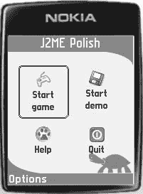

5033CH12.qxd 6/20/05 11:31 AM 第 200 页

**200**

第 12 章 ■ 使用 GUI 进行开发 **图 12-11.** *列表屏幕中的背景* 设计标题

当你为应用程序激活全屏模式后，你需要设计屏幕的标题。在标题中，你可以使用所有常见的设计属性，例如字体和背景设置。如果你愿意，甚至可以为标题使用动画背景。你可以通过设置边距来移动标题；请参考后续的“设计列表”部分，其中有一个将标题移至较低位置的示例。

设计菜单栏和菜单

菜单栏包含屏幕的命令。当你为应用程序激活全屏模式后，你可以同时设计菜单和菜单栏。J2ME Polish 允许你在标准菜单栏和扩展菜单栏之间进行选择。与普通菜单栏相比，扩展菜单栏允许你设计一些额外的细节，但需要占用大约 2KB 更多的 JAR 空间。

**设计菜单**

当有多个命令可用时，它们会被分组到“选项”菜单中。当你按下左软键时，菜单将会打开。

你可以使用菜单样式来设计打开的菜单，而默认情况下，你可以使用菜单项样式来设计菜单中包含的项目——或者，如果你根本没有定义菜单项样式，则使用菜单样式来设计。

你可以使用焦点样式来设计打开菜单中当前聚焦的元素。由于默认情况下，焦点样式用于任何位置的任何聚焦元素，你可能希望使用不同的样式。你可以通过在菜单样式中设置 `focused-style` 属性来实现这一点。

清单 12-32 演示了如何使用所有这些概念。

**清单 12-32.** *设计菜单*

menu {

margin-left: 2;

padding: 2;

background {

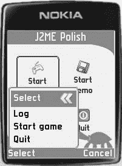

5033CH12.qxd 6/20/05 11:31 AM 第 201 页

第 12 章 ■ 使用 GUI 进行开发 **201**

type: round-rect;

color: highlightedBackgroundColor;

border-width: 2;

border-color: backgroundColor;

}

font-style: bold;

font-color: highlightedFontColor;

**focused-style: .menuFocused;**

menubar-color: backgroundColor;

}

menuItem {

margin-top: 2;

padding: 2;

padding-left: 5;

font {

color: black;

size: medium;

style: bold;

}

layout: left;

}

.menuFocused extends .menuItem {

background-color: backgroundColor;

font-color: highlightedFontColor;

layout: left | horizontal-expand;

after: url( dot.png );

}

图 12-12 展示了应用程序打开的菜单的实际效果。

你还可以更改“选项”、“选择”和“取消”命令的名称，如第 7 章“构建本地化应用程序”部分所述。

**图 12-12.** *打开的菜单的实际效果*

5033CH12.qxd 6/20/05 11:31 AM 第 202 页

**202**

第 12 章 ■ 使用 GUI 进行开发 **设计普通菜单栏**

你可以使用预定义的菜单样式来设计普通菜单栏。此样式中的字体设置用于渲染实际的命令，而 CSS 属性 `menubar-color` 则定义了菜单栏的颜色。该颜色可以设置为任何值，包括透明，这在希望显示相应屏幕的背景而非菜单栏时非常有用。顺便提一下，`menubar-color` 的默认值是白色。当此属性也在屏幕样式中定义时，它将覆盖菜单样式中针对该屏幕的设置。清单 12-33 展示了如何为普通屏幕使用黑色，而为具有 `.mainScreen` 样式的屏幕使用透明菜单栏。

**清单 12-33.** *为菜单栏使用不同颜色* menu {

margin-left: 2;

padding: 2;

background {

type: round-rect;

color: highlightedBackgroundColor;

border-width: 2;

border-color: bgColor;

}

font-style: bold;

focused-style: .menuFocused;

font-color: highlightedFontColor;

**menubar-color: black;**

}

.mainScreen {

background-image: url( bg.png );

/* 对此样式的屏幕使用透明菜单栏，
   以便菜单栏区域也能显示 bg.png 图片： */
**menubar-color: transparent;**

}

图 12-13 展示了左侧主屏幕上的透明菜单栏和右侧另一个屏幕上的默认黑色菜单栏。

**设计扩展菜单栏**

当普通菜单栏的设计可能性无法满足你的需求时，你可以使用扩展菜单栏。与普通菜单栏不同，扩展菜单栏是一个功能完整的项目，因此可以像任何其他项目一样进行设计。使用扩展菜单栏的代价是需要在你的 JAR 中增加一个额外的 2KB 类文件。

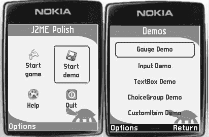

5033CH12.qxd 6/20/05 11:31 AM 第 203 页

第 12 章 ■ 使用 GUI 进行开发 **203**

**图 12-13.** *主屏幕上的透明菜单栏（左）和另一个屏幕上的黑色菜单栏（右）*

要使用扩展菜单栏代替普通菜单栏，你需要在 `build.xml` 文件的 `<variables>` 部分将 `polish.MenuBar.useExtendedMenuBar` 预处理变量设置为 `true`，如清单 12-34 所示。

**清单 12-34.** *激活扩展菜单栏*

<j2mepolish>

<info

license="GPL"

name="Roadrunner"

vendorName="A reader."

version="0.0.1"

jarName="${polish.vendor}-${polish.name}-roadrunner.jar"

/>

<deviceRequirements>

<requirement name="Identifier" value="Generic/midp1" />

</deviceRequirements>

<build

usePolishGui="true"

>

<midlet class="com.apress.roadrunner.Roadrunner" />

<variables>

<!-- 为 Series 60 设备激活 GUI -->

**<variable**

**name="polish.MenuBar.useExtendedMenuBar"**

**value="true" />**

</variables>

</build>

<emulator />

</j2mepolish>

5033CH12.qxd 6/20/05 11:31 AM 第 204 页

**204**

第 12 章 ■ 使用 GUI 进行开发 你可以使用预定义的样式 `menubar`、`leftcommand` 和 `rightcommand` 来设计扩展菜单栏，如表 12-12 所示。表 12-13 列出了 `menubar` 样式支持的额外属性。

**表 12-12.** *扩展菜单栏的预定义样式* **样式**

**描述**

menubar

设计菜单栏本身。

leftcommand

设计左命令（选项、选择以及用户定义的命令）。

接受 `IconItem` 的所有属性。

rightcommand

设计右命令（取消以及用户定义的 `Command.BACK` 或 `CANCEL`

命令）。接受 `IconItem` 的所有属性。

**表 12-13.** *menubar 样式的额外属性* **属性**

**必需？**

**描述**

menubar-options-image

否

定义扩展菜单栏“选项”图片的 URL。

menubar-select-image

否

定义扩展菜单栏“选择”图片的 URL。

menubar-cancel-image

否

定义扩展菜单栏“取消”图片的 URL。

menubar-show-image-and-text

否

确定当为相应操作定义了图片时，菜单栏中是否也显示文本。默认为 `false`。


清单 12-35 展示了扩展菜单栏的设计。

**清单 12-35.** *设计扩展菜单栏*

menubar {

margin-top: -10;

margin-bottom: 0;

margin-left: 2;

margin-right: 2;

padding: 1;

background: none;

menubar-options-image: url( options.png );

menubar-select-image: url( checked.png );

/*

menubar-show-image-and-text: true;

menubar-cancel-image: url( cancel.png );

*/

}

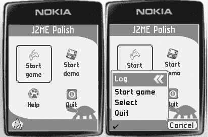

5033CH12.qxd 6/20/05 11:31 AM 第 205 页

第 12 章 ■ 使用 GUI 进行开发 **205**

leftcommand {

padding: 2;

padding-left: 4;

padding-right: 4;

padding-horizontal: 4;

padding-bottom: 0;

font-color: fontColor;

font-style: bold;

background: none;

}

rightcommand {

padding: 2;

padding-left: 4;

padding-right: 4;

padding-horizontal: 4;

padding-bottom: 0;

font-color: fontColor;

font-style: bold;

background {

type: round-rect;

color: highlightedBgColor;

border-color: fontColor;

border-width: 1;

}

}

图 12-14 展示了清单 12-35 的结果。你甚至可以为菜单栏、左命令和右命令使用动画效果。

**图 12-14.** *使用图像代替常规选项和选择命令的扩展菜单栏*

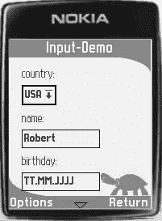

5033CH12.qxd 6/20/05 11:31 AM 第 206 页

**206**

第 12 章 ■ 使用 GUI 进行开发 在屏幕上排列项目

通常，J2ME Polish 会将每个 GUI 项目排列在单独的行上，如图 12-15 所示。你可以通过使用`view-type`属性或使用带有`columns`和`columns-width`属性的表格布局来更改项目的排列方式。

你可以将视图类型应用于任何包含项目的屏幕，例如列表或表单。

有几种可用的视图类型，通常定义在屏幕样式中，例如：

.mainScreen { view-type: dropping; }。你可以使用视图类型的（预定义）名称或该类型的完全限定类名，该类需要继承`de.enough.polish.ui.ContainerView`类。视图类型负责项目的排列，甚至可以为项目添加动画效果。

**图 12-15.** *除非另有指定，否则 J2ME Polish 会将每个项目排列在单独的行上。*

**使用表格**

你可以通过使用屏幕样式中的`columns`属性，将屏幕上的所有项目整齐地排列到单元格中。表 12-14 详细解释了`columns`和`columns-width`属性。

**表 12-14.** *表格排列的属性*

**属性**

**是否必需？**

**描述**

columns

否

列数。可用于将项目布局在表格中。默认为一列。

columns-width

否

可以是`normal`、`equal`，或者以逗号分隔的每列宽度列表（例如，columns-width: 60,60,100;）。默认为`normal`，表示每列使用该列最宽项目所需的空间。`equal`会导致所有列具有相同的宽度。显式的列宽列表将使用这些宽度。

清单 12-36 向你展示了如何应用这些属性的示例，图 12-16 展示了结果。

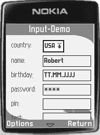

5033CH12.qxd 6/20/05 11:31 AM 第 207 页

第 12 章 ■ 使用 GUI 进行开发 **207**

**清单 12-36.** *将表格排列应用于输入屏幕*

.inputScreen {

columns: 2;

columns-width: 52,110;

}

**图 12-16.** *使用两列表格排列*

■**注意** 你不能将`columns`属性与视图类型一起使用。当你使用视图类型时，它完全负责项目的排列。

当你使用显式表格时，需要将标签和实际项目分别添加到表单中。这会使编程稍微复杂化，并使将现有应用程序移植到 J2ME Polish GUI 变得更加困难。因此，你可以选择使用`min-width`和`max-width`属性来设置标签和项目的精确宽度。清单 12-37 展示了如何通过调整标签和`.inputField`样式（后者用于图 12-16 中显示的输入字段）来实现与图 12-16 相同的设计。


**列表 12-37.** *使用 min-width 和 max-width CSS 属性实现表格排列*

.inputField {

min-width: 110;

max-width: 110;

}

label {

min-width: 52;

max-width: 52;

}

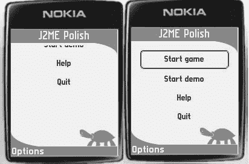

5033CH12.qxd 6/20/05 11:31 AM 第 208 页

**208**

第 12 章 ■ 使用 GUI 工作 **下拉视图**

下拉视图显示物品下落和弹跳的动画。你可以通过将视图类型设置为 `dropping` 来激活它。表 12-15 列出了此视图的所有附加属性。

**表 12-15.** *下拉视图类型的附加属性* **属性**

**是否必需？**

**说明**

droppingview-speed

否

每个动画步骤的速度（像素）。默认速度为 10。

droppingview-repeat-animation

否

定义每次显示屏幕时是否应重复动画。可能值为 `true` 和 `false`。默认为 `false`。

droppingview-maximum

否

最大弹跳高度（像素）。默认为 30。

droppingview-damping

否

每个后续物品的最大高度减少值。通过设置阻尼，顶部物品看起来比底部物品弹跳得更高。默认阻尼为 10。

droppingview-maxperiode

否

允许的最大弹跳次数。默认为 5。

列表 12-38 展示了如何为主屏幕使用下拉视图，图 12-17 展示了其实际效果。

**列表 12-38.** *为主屏幕使用下拉视图*

.mainScreen {

padding-left: 5;

padding-right: 5;

view-type: dropping;

droppingview-speed: 15;

droppingview-damping: 5;

droppingview-maxperiode: 2;

}

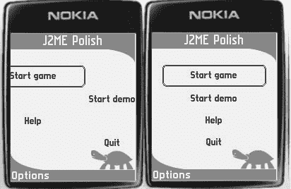

5033CH12.qxd 6/20/05 11:31 AM 第 209 页

第 12 章 ■ 使用 GUI 工作 **209**

**洗牌视图**

洗牌视图通过将物品从左右两侧移动到最终目标位置来为其添加动画效果。通过将 `view-type` 属性设置为 `shuffle` 来激活它。此视图支持表 12-16 中列出的附加属性。

**表 12-16.** *洗牌视图类型的附加属性* **属性**

**是否必需？**

**说明**

shuffleview-speed

否

每个动画步骤的速度（像素）。默认速度为 10。

shuffleview-repeat-animation

否

定义每次显示屏幕时是否应重复动画。可能值为 `true` 和 `false`。默认为 `false`。

列表 12-39 展示了如何使用洗牌视图，图 12-18 让你了解其外观。

**列表 12-39.** *为主屏幕使用洗牌视图类型*

.mainScreen {

padding-left: 5;

padding-right: 5;

view-type: shuffle;

shuffleview-speed: 15;

}

**图 12-18.** *洗牌视图的实际效果*

**midp2 视图**

midp2 视图按照 MIDP 2.0 标准推荐的方式排列物品：所有物品排成一行，直到空间不足或插入带有 `newline-after` 或 `newline-before` 布局的物品为止。由于这通常会导致界面杂乱无章，J2ME Polish 通常将每个物品放在单独的行（或使用列时的单元格）中。然而，MIDP 2.0 的排列方式有一个重要优势：你可以在每个屏幕上看到更多内容。你可以通过指定 `midp2` 视图类型来激活 midp2 视图。

此视图不支持任何附加属性。图 12-19 展示了它在表单上的效果。

**图 12-19.** *midp2 视图的实际效果*

设计滚动指示器

当屏幕上的物品数量超过可显示范围时，滚动指示器会显示在屏幕底部。你可以使用屏幕样式的 `scrollindicator-color` 属性设置指示器的颜色。颜色默认为黑色；示例见图 12-19。

■**提示** 如果你想隐藏特定屏幕的滚动指示器，只需将颜色设置为菜单栏的颜色即可。

设置前景图像

每个屏幕都可以有一个所谓的前景图像，它会绘制在所有其他元素之上。


您可以使用此功能来显示一个看似包含菜单选项的图形，例如。表 12-17 总结了设置前景图像的相关属性。

**表 12-17.** *设置前景图像的附加属性* **属性**

**是否必需？**

**说明**

foreground-image

否

应绘制在屏幕前方的图像的 URL，例如，foreground-image: url( mascot.png );。

foreground-x

否

前景图像距离左边框的 x 轴像素位置。

foreground-y

否

前景图像距离顶部边框的 y 轴像素位置。

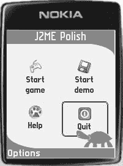

5033CH12.qxd 6/20/05 11:31 AM 第 211 页

第 12 章 ■ 使用图形用户界面 **211**

清单 12-40 将海龟设置到最前方。属性`foreground-x`和`foreground-y`精确地定位了图像。当您将焦点放在右下角的项目上时，海龟会绘制在焦点元素之上，如图 12-20 所示。

**清单 12-40.** *在主屏幕上使用前景图像*

.mainScreen {

padding-left: 5;

padding-right: 5;

**foreground-image: url( turtle.png );**

**foreground-x: 112;**

**foreground-y: 162;**

}

**图 12-20.** *海龟显示在所有其他元素之上，甚至包括焦点项目。*

设计列表

列表包含多个可供选择的项目。每个列表项可以包含一个文本字符串和一个图像。您可以为您的菜单使用隐式列表。独占列表允许您仅选择一个元素，而多选列表允许您选择多个项目。

列表的一个有趣选项是仅显示嵌入项目的图像，并将当前焦点项目的文本用作标题。清单 12-41 和图 12-21 演示了此选项。在这种情况下，列表使用了背景图像，并通过设置适当的边距将实际标题向下移动。您可以使用`icon-image`属性为列表项设置图像。

**清单 12-41.** *将当前焦点项目的文本用作标题* title {

padding: 2;

margin-top: 32;

margin-bottom: 2;

margin-left: 16;

margin-right: 0;

font-face: proportional;


5033CH12.qxd 6/20/05 11:31 AM 第 212 页

**212**

第 12 章 ■ 使用图形用户界面 font-size: large;

font-style: bold;

font-color: highlightedFontColor;

background: none;

border: none;

layout: left | horizontal-expand;

}

.mainScreen {

padding: 5;

padding-left: 15;

padding-right: 15;

background-image: url( bg.png );

**show-text-in-title: true;**

layout: horizontal-expand | horizontal-center | vertical-center; columns: 2;

}

.mainCommand {

padding: 5;

**icon-image: url( %INDEX%.png );**

**icon-image-align: center;**

}

**图 12-21.** *使用当前焦点列表项的文本作为标题* 表 12-18 列出了隐式列表项允许的属性。当您使用多选或独占列表时，还有一些附加属性；请参阅第 13 章中关于 ChoiceItems 的讨论。

5033CH12.qxd 6/20/05 11:31 AM 第 213 页

第 12 章 ■ 使用图形用户界面 **213**

**表 12-18.** *列表项的附加属性* **属性**

**是否必需？**

**说明**

icon-image

否

图像的 URL，例如，icon-image: url(icon.png);。可以使用关键字`%INDEX%`将图标的位置添加到名称中，例如，icon-image: url(icon%INDEX%.png);。第一个图标使用的图像将是*icon0.png*，第二个图标将使用图像*icon1.png*，依此类推。默认为无。

icon-image-align

否

图像相对于文本的位置。可以是`top`、`bottom`、`left`或`right`。默认为`left`，表示图像将绘制在文本的左侧。

scale-factor

否

在 MIDP 2.0 设备上聚焦图标图像时，应缩放的比例百分比；例如，`150`表示将图像放大到其大小的 1.5 倍。

scale-steps

否

用于缩放图标图像的步数，仅在使用`scale-factor`属性时适用。

设计表单

表单可以包含任何类型的项目，甚至包括您可以自行创建的 CustomItem。它们支持所有常见的屏幕属性，例如`foreground-image`、`view-type`等，因此请参考前面关于常见屏幕功能的讨论以了解更多关于这些选项的信息。

设计选项卡表单

TabbedForms 与表单类似，但它们能够将屏幕分割成多个选项卡。您可以像设计普通表单一样设计选项卡表单，但可以使用预定义的样式`tabbar`、`activetab`和`inactivetab`来设计选项卡表单的附加元素。`tabbar`样式负责整个包含选项卡的栏；`activetab`样式设计当前活动的选项卡，而`inactivetab`样式设计所有剩余的选项卡。您可以使用`tabbar-scrolling-indicator-color`属性在`tabbar`样式中设置滚动指示器的颜色，如清单 12-42 所示。您可以在图 12-22 中看到结果。

**清单 12-42.** *设计 TabbedForm*

tabbar {

background-color: white;

layout: expand;

padding-bottom: 0;

**tabbar-scrolling-indicator-color: black;**

}

activetab {

background-type: round-tab;

background-color: silver;

background-arc: 8;

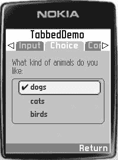

5033CH12.qxd 6/20/05 11:31 AM 第 214 页

**214**

第 12 章 ■ 使用图形用户界面 font-color: white;

padding-left: 10;

padding-right: 8;

}

inactivetab {

padding-left: 6;

padding-right: 4;

margin-left: 2;

margin-right: 2;

background-type: round-tab;

background-color: gray;

background-arc: 8;

font-color: silver;

}

**图 12-22.** *运行中的 TabbedForm*

设计框架表单

FramedForms 具有一个可滚动的内容区域以及不可滚动的顶部、底部、左侧和右侧框架。您可以使用预定义的样式`topframe`、`bottomframe`、`leftframe`和`rightframe`来设计每个框架。或者，您可以使用`frame`样式在一个样式中定义所有框架。右侧和左侧框架是少数实际使用`vertical-expand`和`vertical-center`布局设置的元素之一。清单 12-43 演示了带有底部框架的 FramedForm 的设计。您可以在图 12-23 中看到运行中的 FramedForm。

**清单 12-43.** *在 FramedForm 中设计底部框架* bottomframe {

padding: 3;

background-color: silver;

layout: expand;

padding-bottom: 0;

}


5033CH12.qxd 6/20/05 11:31 AM 第 215 页

第 12 章 ■ 使用图形用户界面 **215**

**图 12-23.** *运行中的 FramedForm*

设计文本框

TextBoxes 用于获取用户的文本输入。它们支持 TextField 的所有附加属性，因此请参考下面关于这些字段的讨论。

**设计项目**

除了常见的设计属性外，一些 GUI 项目还支持额外的 CSS 属性。借助这些高级设置，您可以进一步影响设计。

设计字符串项目

StringItems 使用非常频繁，并且是许多其他项目（如 TextField、DateField 和 IconItem，后者由 J2ME Polish 内部用于列表）的基础。除了已经讨论过的常见属性外，StringItems 不支持其他属性。

最重要的 CSS 属性是字体属性。您甚至可以对 StringItems 使用位图字体；请参考前面的“字体”部分。如果您想更改一个 StringItem 内的行间距，可以使用`padding-vertical`属性。

设计图像项目

您可以使用 ImageItems 在表单中显示图像。ImageItems 不支持额外的 CSS 属性。由于图像也可以通过使用各种背景或使用`before`和`after`属性来添加，因此您通常不需要在应用程序中直接使用 ImageItems。

设计选择组


ChoiceGroup 包含多个选项，用户可以选择其中一个或多个。您可以使用三种类型的 ChoiceGroup：**独占组**（只能选择一个选项）、**多选组**（可以选择多个选项）以及**弹出组**（非激活状态下仅显示当前选中的选项，激活时会“弹出”并显示所有可选选项）。

5033CH12.qxd 6/20/05 11:31 AM Page 216

**216**

第 12 章 ■ 使用 GUI 设计 ChoiceGroup 时，需要区分组本身和其中的实际选项。清单 12-44 演示了如何使用 `#style` 指令和 `append()` 方法为组和实际选项应用不同的样式。

**清单 12-44.** *为 ChoiceGroup 及其内嵌选项应用不同样式* public ChoiceGroup createChoiceGroup( String label, String[] choices ) {

//#style exclusiveChoiceGroup

ChoiceGroup group = new ChoiceGroup( label, Choice.EXCLUSIVE ); for ( int i = 0; i < choices.length; i++ ) {

String choice = choices[i];

//#style exclusiveChoiceItem

group.append( choice, null );

}

return group;

}

您可以使用 `focused-style` 属性设置当前聚焦项的样式。如果未指定，则会使用默认的聚焦样式。清单 12-45 演示了如何设置自定义聚焦样式（请参阅下一节）。您还可以设置 ChoiceGroup 的列数，甚至设置视图类型（view-type），从而允许对组内选项使用动画或其他排列方式。表 12-19 列出了可用的选项。关于 `focused-style`、`view-type` 和 `columns` 属性的讨论，请参考前面的“设计屏幕”部分。

**表 12-19.** *ChoiceGroup 的通用属性* **属性**

**是否必需？**

**说明**

columns

否

列数。可用于将选项布局成表格形式。默认值为一列。

columns-width

否

可选值为 `normal`、`equal`，或是以逗号分隔的每列宽度列表（例如 `columns-width: 60,60,100;`）。默认值为 `normal`，表示每列使用该列最宽选项所需的空间。`equal` 值使所有列具有相同宽度。显式指定列宽列表则会使用这些宽度值。

view-type

否

用于此选择组的视图类型。请参考“设计屏幕”部分中关于视图类型的讨论。

**设计独占 ChoiceGroup**

独占 ChoiceGroup 类似于网页上的单选按钮：一次只能选择一个选项。您可以使用表 12-20 中列出的几个额外属性。

5033CH12.qxd 6/20/05 11:31 AM Page 217

第 12 章 ■ 使用 GUI **217**

**表 12-20.** *独占 ChoiceGroup 中选项的额外属性* **属性**

**是否必需**

**说明**

icon-image

否

图像的 URL，例如 `icon-image: url( icon.png );`。可以使用关键字 `%INDEX%` 将选项的位置添加到名称中，例如 `icon-image: url( icon%INDEX%.png );`。第一个选项使用的图像将是 *icon0.png*，第二个选项使用图像 *icon1.png*，以此类推。

icon-image-align

否

图像相对于文本的位置。可选值为 `top`、`bottom`、`left` 或 `right`。默认值为 `left`，表示图像绘制在文本左侧。

choice-color

否

单选按钮的绘制颜色。默认值为黑色。

radiobox-selected

否

已选中选项的图像 URL。默认是在定义的选项颜色中绘制的一个简单图像。

radiobox-plain

否

未选中选项的图像 URL。默认是在定义的选项颜色中绘制的一个简单图像。当指定为 `none` 时，未选中选项将不绘制任何图像。在这种情况下，仅绘制选中选项的图像。

view-type

否

独占 ChoiceGroup 额外支持 `exclusive` 视图类型，该类型仅显示当前选中的选项，同时允许用户左右滚动。


清单 12-45 展示了一个用于设计独占式 ChoiceGroup 的样式定义，图 12-24 显示了其效果。

**清单 12-45.** *设计独占式 ChoiceGroup*

/* 设计 ChoiceGroup */

.exclusiveChoiceGroup {

**focused-style: choiceGroupFocused;**

}

/* 设计 ChoiceGroup 中包含的项 */

.exclusiveChoiceItem {

margin: 1; /* 补偿焦点样式的边框 */

padding: 3;

padding-horizontal: 5;

font-color: fontColor;

font-style: plain;

**radiobox-selected: url( checked.png );**

**radiobox-plain: none;**

}

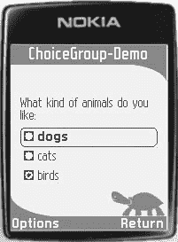

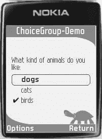

5033CH12.qxd 6/20/05 11:31 AM 第 218 页

**218**

第 12 章 ■ 使用 GUI

/* 设计 ChoiceGroup 中当前聚焦的项 */

.choiceGroupFocused {

padding: 3;

padding-horizontal: 5;

font-color: fontColor;

font-style: bold;

border {

type: round-rect;

color: fontColor;

arc: 8;

}

layout: left | expand;

}

**图 12-24.** *使用自定义“单选按钮选中”图像的独占式 ChoiceGroup 的实际效果* 当你将 radiobox 属性替换为设置`choice-color: fontColor;`时，会得到如图 12-25 所示的设计。

**图 12-25.** *使用标准选择标记的独占式 ChoiceGroup*


5033CH12.qxd 6/20/05 11:31 AM 第 219 页

第 12 章 ■ 使用 GUI **219**

独占式 ChoiceGroup 也支持专门的独占视图类型。当此视图被激活时，仅显示当前选中的项。用户可以通过向左或向右滚动来更改选择。清单 12-46 展示了如何使用`exclusiveview-arrow-color`属性应用和调整此视图类型，图 12-26 显示了其实际效果。

**清单 12-46.** *使用独占视图类型*

.exclusiveChoiceGroup {

padding: 2;

padding-horizontal: 5;

background: none;

font-color: fontColor;

**view-type: exclusive;**

**exclusiveview-arrow-color: fontColor;**

}

**图 12-26.** *使用独占视图类型的独占式 ChoiceGroup* **设计多选 ChoiceGroup**

多选 ChoiceGroup 允许你一次选择多个项。你可以像设计独占式 ChoiceGroup 一样设计多选 ChoiceGroup，区别在于你需要使用复选框属性而非单选按钮属性，如表 12-21 所示。

**表 12-21.** *多选 ChoiceGroup 中项的附加属性* **属性**

**是否必需？**

**说明**

icon-image

否

图像的 URL，例如：icon-image: url( icon.png );。可以使用关键字%INDEX%将项的位置添加到名称中，例如：icon-image: url( icon%INDEX%.png );。第一项使用的图像将是*icon0.png*，第二项将使用图像*icon1.png*，依此类推。

icon-image-align

否

图像相对于文本的位置。可以是 top、bottom、left 或 right。默认为 left，表示图像将绘制在文本左侧。

*续表*

5033CH12.qxd 6/20/05 11:31 AM 第 220 页

**220**

第 12 章 ■ 使用 GUI **表 12-21.** *续表*

**属性**

**是否必需？**

**说明**

choice-color

否

复选框绘制的颜色。默认为黑色。

check box-selected

否

选中项图像的 URL。默认是在定义的 choice-color 中绘制的简单图像。

checkbox-plain

否

未选中项图像的 URL。默认是在定义的 choice-color 中绘制的简单图像。当未指定时，不会为未选中项绘制图像。在这种情况下，仅会绘制选中项的图像。

清单 12-47 演示了如何实现多选功能，图 12-27 显示了其结果。

**清单 12-47.** *设计多选 ChoiceGroup*

/* 设计 ChoiceGroup */

.multipleChoiceGroup {

**focused-style: choiceGroupFocused;**

}

/* 设计 ChoiceGroup 中包含的项 */

.multipleChoiceItem {

margin: 1; /* 补偿焦点样式的边框 */

padding: 3;

padding-horizontal: 5;

font-color: fontColor;

font-style: plain;

**choice-color: fontColor;**

}


/* 设计 ChoiceGroup 当前聚焦项 */

.choiceGroupFocused {

padding: 3;

padding-horizontal: 5;

font-color: fontColor;

font-style: bold;

border {

type: round-rect;

color: fontColor;

arc: 8;

}

layout: left | expand;

}


5033CH12.qxd 6/20/05 11:31 AM 第 221 页

第 12 章 ■ 使用 GUI 进行开发 **221**

**图 12-27.** *带有标准选择标记的多选 ChoiceGroup 的实际效果* **设计弹出式 ChoiceGroup**

弹出式 ChoiceGroup 通常只显示当前选中的项。只有当你通过按下发射按钮或调用“选择”命令激活该组时，才会显示所有可用选项。选择一项后，该组会再次关闭。表 12-22 列出了可用的属性。与多选和单选 ChoiceGroup 不同，这些属性仅适用于实际的 ChoiceGroup 样式，而不适用于 ChoiceGroup 内包含的项的样式。

**表 12-22.** *多选 ChoiceGroup 中项的附加属性* **属性**

**是否必需？**

**说明**

popup-image

否

关闭的弹出组中应显示的图片的 URL。默认情况下，会使用一个简单的下拉图片。

popup-color

否

关闭的弹出组的下拉图片中箭头的颜色。默认为黑色，并且仅在未指定弹出图片时有效。

popup-background-color

否

关闭的弹出组的下拉图片中背景的颜色。默认为白色，并且仅在未指定弹出图片时有效。

清单 12-48 展示了如何设计一个弹出式 ChoiceGroup，图 12-28 展示了其实际效果。

**清单 12-48.** *设计一个弹出式 ChoiceGroup*

/* 设计 ChoiceGroup */

.popupChoiceGroup {

**popup-color: fontColor;**

**popup-background-color: backgroundColor;**

**focused-style: choiceGroupFocused;**

}

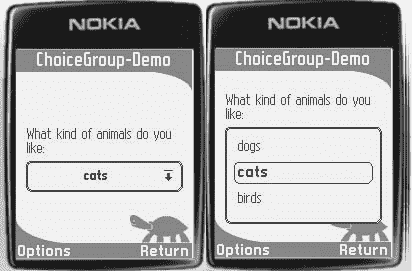

5033CH12.qxd 6/20/05 11:31 AM 第 222 页

**222**

第 12 章 ■ 使用 GUI 进行开发

/* 设计 ChoiceGroup 中包含的项 */

.popupChoiceItem {

margin: 1; /* 补偿聚焦样式的边框 */

padding: 3;

padding-horizontal: 5;

font-color: fontColor;

font-style: plain;

}

/* 设计打开的 ChoiceGroup 中当前聚焦的项 */

.choiceGroupFocused {

padding: 3;

padding-horizontal: 5;

font-color: fontColor;

font-style: bold;

border {

type: round-rect;

color: fontColor;

arc: 8;

}

layout: left | expand;

}

**图 12-28.** *弹出式 ChoiceGroup 的关闭状态（左）和打开模式（右）* 设计 Gauge 项

Gauge 用于显示进度指示器，或可用于输入一个固定范围的数值。它支持相当多的附加属性，列于表 12-23 中。

5033CH12.qxd 6/20/05 11:31 AM 第 223 页

第 12 章 ■ 使用 GUI 进行开发 **223**

**表 12-23.** *Gauge 项的附加属性* **属性**

**是否必需？**

**说明**

gauge-image

否

图片的 URL，例如：gauge-image: url(progress.png);。当未定义 gauge 宽度时，将使用此图片的宽度。

gauge-color

否

进度条的颜色。默认为蓝色。

gauge-width

否

gauge 元素的宽度（以像素为单位）。当未定义宽度时，将使用可用宽度或提供的图片的宽度。

gauge-height

否

gauge 元素的高度（以像素为单位）。默认为 10。当提供了图片时，将使用图片的高度。

gauge-mode

否

值为 chunked 或 continuous。在 continuous 模式下，仅使用 gauge 颜色；而 chunked 模式则将指示器分割成块。当提供了图片时，此设置将被忽略。默认值为 chunked。

gauge-gap-color

否

单个块之间间隙的颜色。仅在 chunked 模式或使用不定范围 gauge 时使用。在后一种情况下，提供的颜色将用于指示空闲状态。默认间隙颜色为白色。

gauge-gap-width

否

单个块之间间隙的宽度（以像素为单位）。


仅在分块仪表模式下使用。默认值为 3。

`gauge-chunk-width`

否

分块仪表模式下单个分块的宽度。

`gauge-show-value`

否

值为 `true` 或 `false`。决定是否显示当前值。对于所有确定的仪表项，此值默认为 `true`。

`gauge-value-align`

否

值为 `left` 或 `right`。定义仪表当前值的显示位置。默认为 `left`，即实际仪表项的左侧。

当仪表项与不确定范围一起使用时，`gauge-gap-color` 表示空闲状态。当进入“连续运行”状态并指定了图像时，图像将从指示器的左侧“飞”到右侧。清单 12-49 展示了如何应用一些支持的属性。图 12-29 显示了结果。

**清单 12-49.** *设计一个仪表项*

.gaugeItem {

margin: 0;

margin-right: 10;

padding-left: 16;

border: thinBorder;

font-size: small;

font-color: fontColor;

layout: left | expand;

gauge-width: 60;

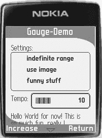

5033CH12.qxd 6/20/05 11:31 AM Page 224

**224**

第 12 章 ■ 使用 GUI gauge-mode: chunked;

gauge-color: rgb( 86, 165, 255 );

gauge-gap-color: rgb( 38, 95, 158 );

gauge-value-align: right;

gauge-show-value: true;

}

**图 12-29.** *运行中的仪表*

设计文本字段

您可以使用 `TextField` 来获取用户输入。您可以选择使用原生输入法还是直接输入模式。当激活原生模式时，会弹出一个新的输入屏幕供用户使用，并且如果设备支持，可以使用 T9 或手写识别等特殊输入模式。当使用直接输入模式时，不会显示额外的屏幕，J2ME Polish 会直接接受输入的字符。表 12-24 列出了 `TextField` 支持的额外 CSS 属性。

**表 12-24.** *TextField 项的额外属性* **属性**

**必需？**

**说明**

`textfield-width`

否

文本字段元素的最小宽度，单位为像素。

`textfield-height`

否

文本字段元素的最小高度，单位为像素。默认为所用字体的高度。

`textfield-direct-input`

否

定义是否激活直接输入模式。可选值为 `false` 或 `true`。默认情况下，直接输入模式是禁用的（`false`）。您可以设置预处理变量 `polish.TextField.useDirectInput` 来为所有 `TextField` 激活直接输入。

5033CH12.qxd 6/20/05 11:31 AM Page 225

第 12 章 ■ 使用 GUI **225**

**属性**

**必需？**

**说明**

`textfield-caret-color`

否

指示编辑位置的光标颜色。默认为所用字体的颜色。

`textfield-caret-char`

否

指示编辑位置的字符。默认为管道符号 `|`。

`textfield-show-length`

否

决定在编辑此字段期间是否显示已输入文本的长度。这仅在直接输入模式下有效。

清单 12-50 展示了如何设计一个 `TextField` 项，图 12-30 显示了清单 12-49 的结果。

**清单 12-50.** *设计一个 TextField 项*

.textInput {

margin: 1;

padding: 4;

padding-left: 2;

padding-right: 2;

padding-horizontal: 4;

textfield-direct-input: true;

font-style: bold;

font-size: small;

font-color: fontColor;

background-color: highlightedBgColor;

border-color: black;

layout: left;

textfield-width: 90;

datefield-width: 90;

textfield-caret-color: red;

textfield-caret-char: >;

textfield-show-length: true;

textfield-direct-input: true;

focused-style: .focusedInput;

}

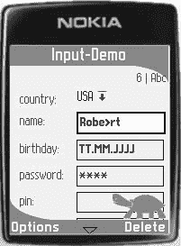

5033CH12.qxd 6/20/05 11:31 AM Page 226

**226**

第 12 章 ■ 使用 GUI **图 12-30.** *使用直接输入的 TextField*

■**提示** 您甚至可以在 `TextField` 中使用位图字体。只需使用 `font-bitmap` 属性来设置字体即可。

设计日期字段


在应用程序中，您可以使用 DateField 来输入日期或时间。目前，输入是通过使用原生函数完成的，以便可以使用特殊的输入模式（例如 T9 或手写识别）。DateField 支持表 12-25 中列出的附加属性。

**表 12-25.** *DateField 项的附加属性* **属性**

**是否必需？**

**说明**

datefield-width

否

日期字段元素的最小宽度，单位为像素。

datefield-height

否

日期字段元素的最小高度，单位为像素。

默认值为所用字体的高度。

清单 12-51 展示了如何设计一个 DateField 项，图 12-31 演示了该设计。

**清单 12-51.** *设计一个 DateField 项*

.dateInput {

margin: 1;

padding: 4;

padding-left: 2;

padding-right: 2;

padding-horizontal: 4;

textfield-direct-input: true;

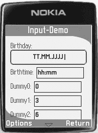

5033CH12.qxd 6/20/05 11:31 AM Page 227

第 12 章 ■ 使用 GUI 进行工作 **227**

font-style: bold;

font-size: small;

font-color: fontColor;

background-color: highlightedBgColor;

border-color: black;

layout: left;

textfield-width: 90;

datefield-width: 90;

textfield-caret-color: red;

textfield-caret-char: >;

textfield-show-length: true;

textfield-direct-input: true;

focused-style: .focusedInput;

}

**图 12-31.** *运行中的 DateField*

设计 Ticker

Ticker 是在屏幕上滚动的动画文本。它们通常用于显示广告，当然，也可以通过 J2ME Polish 进行完全配置。表 12-26 列出了 Ticker 项的属性。

**表 12-26.** *Ticker 项的附加属性* **属性**

**是否必需？**

**说明**

ticker-step

否

每次更新时 Ticker 移动的像素数。默认值为 2 像素。

清单 12-52 展示了如何设计一个 Ticker 项，图 12-32 演示了其运行效果。

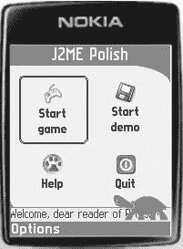

5033CH12.qxd 6/20/05 11:31 AM Page 228

**228**

第 12 章 ■ 使用 GUI 进行工作 **清单 12-52.** *设计一个 Ticker 项*

.tickerStyle {

font-color: fontColor;

font-size: small;

border-color: backgroundColor;

background-color: yellow;

**ticker-step: 4;**

}

**图 12-32.** *运行中的 Ticker。乌龟已通过屏幕样式的* foreground-image *属性被移至前景。*

设计焦点项

您可以使用预定义的焦点样式来设计当前获得焦点的项。但您也可以选择以不同方式高亮显示焦点项。

通常，您会使用不同的背景或边框设置来指示某个项已获得焦点，但您也可以使用其他属性。例如，当您有一个 List 或 ChoiceGroup 时，您可以在普通样式和焦点样式中都设置 icon-image 属性，并在焦点样式中将图像切换为高亮版本。

您还可以使用 after 和 before 属性在当前焦点项之后或之前插入图像。

对于每个 Screen 或 Item，您可以使用 focused-style 属性设置不同的焦点样式，例如，focused-style: .myExtraFocusedStyle;。这种机制允许您使用不同的样式，但请确保不要因为显示项获得焦点的方式过多而使用户感到困惑。例如，使用此机制来区分同一 Form 中的输入字段和按钮。

**使用动画**

您可以在应用程序的多个位置使用动画背景和动画项。最重要的位置是当前获得焦点的项，但您也可以为屏幕使用动画背景，或为屏幕或菜单使用动画视图类型。其他可能的位置包括当前屏幕的标题以及扩展菜单栏。请谨慎使用

5033CH12.qxd 6/20/05 11:31 AM Page 229

第 12 章 ■ 使用 GUI 进行工作 **229**

动画，以免影响应用程序的可用性。根据您的应用程序，您将能够使用不同级别的动画和“疯狂”设计——


无论是开发手机银行软件还是最新游戏，都会影响用户的期望值。实际效果可能因情况而异。

通过在应用中指定 `screen-change-animation` 属性，你可以在切换不同屏幕时加入动画效果。这类动画有助于打造生动活泼的应用。表 12-27 列出了所有可用值及其简要说明。

**表 12-27.** *可能的屏幕切换动画*

**动画**

**说明**

left

将新屏幕从左向右移动。你可以通过 `left-screen-change-animation-speed` 属性指定每个动画阶段的像素移动速度。

right

将屏幕从右向左移动。通过 `right-screen-change-animation-speed` 属性设置每个动画阶段的像素移动速度。

top

将新屏幕从上向下移动。你可以通过 `top-screen-change-animation-speed` 属性指定每个动画阶段的像素移动速度。

bottom

将新屏幕从下向上移动。你可以通过 `bottom-screen-change-animation-speed` 属性指定移动速度。

zoomOut

从放大且近乎透明的屏幕开始，逐渐缩小。

zoomInAndHide

放大之前显示的屏幕，并在每个动画阶段使其变得更加透明。

**总结**

恭喜！你已经掌握了 J2ME Polish 最复杂的部分——用户界面。现在你已学会如何编程、控制和设计 GUI，以创建真正专业的应用程序。再次强调主要要点：GUI 的编程方式与普通的 `javax.microedition.lcdui` API 相同，但需要确保使用正确的导入语句。

在控制 GUI 方面，你可以在项目的 *build.xml* 文件中设置各种预处理变量。最后但同样重要的是，你可以通过 *resources/polish.css* 文件在应用程序代码之外设计用户界面。

在下一章中，你将学习如何扩展该框架，从而完成本书中 J2ME Polish 部分的学习。J2ME Polish 包含多种扩展点，无论你是想添加自己的预处理器还是自定义 GUI 背景，都能轻松实现扩展。

5033CH12.qxd 6/20/05 11:31 AM 第 230 页

5033CH13.qxd 6/17/05 12:13 PM 第 231 页

第 13 章

■ ■ ■

扩展 J2ME Polish

**本章内容：**

• 了解如何为开发周期的每个阶段（预处理、编译、后编译、混淆和打包）集成自己的工具。

• 学习如何通过提供自定义背景、边框、自定义项和图像加载器来扩展 J2ME Polish GUI。

• 学习如何通过提供自定义日志处理器来扩展日志框架。

J2ME Polish 功能强大，但有时你可能会遇到需要特定调整的情况。在本章中，你将学习如何扩展 J2ME Polish，以实现自己的构建解决方案和用户界面扩展。

**扩展构建工具**

在以下小节中，你将学习如何扩展 J2ME Polish 的构建阶段。

通过扩展构建过程，你可以满足公司的特定需求，例如使用特定的编译器、自己的预处理指令或自己的资源组装策略。你还可以利用此机制为其他开发者创建（并销售）J2ME Polish 的扩展。

**理解扩展机制**

所有构建扩展都共享一些特性，例如共同的超类和接受参数的能力。此外，所有类型的构建扩展的注册方式也相同。我将在以下小节中讨论这些共同特性。

回顾构建阶段

在构建过程中，J2ME Polish 会经历多个构建阶段，如第 7 章所述。你可以通过实现自己的扩展，或在 *build.xml* 脚本中提供并调用另一个 Ant 目标来扩展每个阶段。


表 13-1 总结了各个构建阶段及其扩展点。一个不绑定特定构建阶段的扩展是属性函数，它不仅可以在预处理阶段使用，还可以在 *build.xml* 脚本的各个元素中使用。

**231**

5033CH13.qxd 6/17/05 12:13 PM 第 232 页

**232**

第 13 章 ■ 扩展 J2ME POLISH

**表 13-1.** *构建阶段的扩展点*

**阶段**

**元素**

**描述**

预处理

<preprocessor>

根据预处理指令修改应用程序的源代码。

编译

<compiler>

编译预处理后的源代码。

后编译

<postcompiler>

在后编译步骤中，可以处理并修改二进制字节码。

混淆

<obfuscator>

混淆步骤移除不必要的代码并缩减剩余代码。

预验证

<preverifier>

MIDP 应用程序的字节码在安装前需要进行预验证。

打包

<resourcecopier>

资源复制器将所有设备和区域特定的资源复制到临时目录，然后再压缩成 JAR 文件。

打包

<packager>

打包器负责从所有资源和类创建 JAR 文件。

最终化

<finalizer>

可以使用最终化器处理完成的 JAR 和 JAD 文件。

模拟

<emulator>

在此阶段，可以在模拟器中测试应用程序。

属性函数

可以定义并使用自己的属性函数。

使用扩展超类

所有构建扩展都有一个共同的超类；它们继承自 `de.enough.polish.Extension` 类。

`Extension` 类包含对 `org.apache.tools.ant.Project`（代表你的 Ant *build.xml* 脚本）、`de.enough.polish.Environment`（保存当前目标设备的所有设置以及用户定义的变量）的引用，以及对扩展定义和设置的引用，你可以用这些来参数化你的扩展。

所有扩展都需要实现 `public void execute( de.enough.polish.Device, java.util.Locale, de.enough.polish.Environment )` 方法，该方法在构建阶段到达时被调用（例如，在预处理、后编译或混淆阶段）。大多数子类将此调用映射到更专门的调用；例如，`PostCompiler` 将调用转发到 `postCompile( java.io.File classesDir, Device device )` 方法。

每个扩展可以通过重写 `public void initialize( Device, Locale, Environment )` 和 `public void finalize( Device, Locale, Environment )` 方法来影响其他构建阶段。在初始化期间，你可以通过调用 `Environment` 实例的 `setVariable( String, String )`、`setSymbol( String )` 或 `set( Object )` 方法来设置预处理变量和符号。你可以在预处理阶段评估并使用这些设置，或者用它们来影响其他构建阶段。

5033CH13.qxd 6/17/05 12:13 PM 第 233 页

第 13 章 ■ 扩展 J2ME POLISH

**233**

配置构建扩展

你可以在 *build.xml* 脚本中通过设置嵌套的 `<parameter>` 元素来配置大多数扩展。清单 13-1 展示了如何使用参数 `logfile` 和 `enableLogging` 配置一个自定义预处理器。

**清单 13-1.** *配置预处理器扩展*

<preprocessor class="com.apress.preprocess.FullScreenPreprocessor">

<parameter name="logfile" value="fullscreen.log" />

<parameter name="enableLogging" value="true" />

</preprocessor>

`<parameter>` 元素接受属性 `name`、`value`、`file`、`if` 和 `unless`，如表 13-2 所列。

**表 13-2.** *<parameter> 元素的属性*

**<parameter> 属性**

**是否必需？**

**说明**

name

是，除非使用了 file

变量的名称。

value

是，除非使用了 file

变量的值。

file

否

包含多个参数的文件。在该文件中，名称和值参数需要用等号（=）分隔。空行和以井号（#）开头的行将被忽略。

if

否

需要为 true 的 Ant 属性，或者


需要结果为 true 的预处理项，该参数才会被包含。

除非

否

需要结果为 false 的 Ant 属性或
需要结果为 false 的预处理项，该参数才会被包含。

当您希望在扩展中接受参数时，有两种选择：

• 您可以实现 `public void setParameters( de.enough.polish.Variable[] parameters, java.io.File baseDir )` 方法。

• 您可以为每个支持的参数实现 `set[参数名称]` 方法。

此方法可以接受 `String`、`boolean` 或 `File` 作为输入。对于清单 13-1 中的参数，一个好的选择是实现 `setLogfile( File logfile )` 和 `setEnableLogging( boolean enable )` 方法。请注意，方法名称是区分大小写的，因此您需要使用与 `<parameter>` 元素的 `name` 属性相同的大小写。此规则的例外是方法名称中“set”部分之后的第一个字符，它始终需要是大写字符。

5033CH13.qxd 6/17/05 12:13 PM 第 234 页

**234**

第 13 章 ■ 扩展 J2ME POLISH

这两种配置选项之间的区别在于，只有当您实现 `setParameters( Variable[], File )` 方法时，才能使用条件参数（那些使用 `if` 或 `unless` 属性的参数）。您可以通过在该参数上调用 `isConditionFulfilled( Environment )` 来确定参数的条件是否满足。

清单 13-2 演示了如何在预处理扩展中使用条件参数。此示例使用了 `configure( Variable[] )` 便捷方法，该方法会为每个没有条件或条件已满足的参数依次调用 `set[参数名称]` 方法。如果您想使用动态名称的变量，则需要在 `setParameters( Variable[], File )` 方法中实现自己的处理逻辑。

**清单 13-2.** *使用条件参数配置扩展* `package com.apress.preprocess;`

`import java.io.File;`

`import java.io.IOException;`

`import de.enough.polish.Device;`

`import de.enough.polish.preprocess.CustomPreprocessor;`

`import de.enough.polish.Variable;`

`import de.enough.polish.util.FileUtil;`

`import de.enough.polish.util.StringList;`

`public class FullScreenPreprocessor extends CustomPreprocessor {`

`private Variable[] parameters;`

`private File logfile;`

`private boolean enabledLogging;`

`public FullScreenPreprocessor() {`

`super();`

`}`

`public void notifyDevice(Device device, boolean usePolishGui) {`

`super.notifyDevice(device, usePolishGui);`

`// 设置默认值：`
`this.logfile = null;`

`// 配置此扩展：`
`**configure( this.parameters );**`

`}`

`public void processClass( StringList lines, String className ) {`

`// 现在预处理类...`
`System.out.println( "FullScreenPrepocessor: processing class "`
`+ className );`

`}`

5033CH13.qxd 6/17/05 12:13 PM 第 235 页

第 13 章 ■ 扩展 J2ME POLISH

**235**

`**public void setParameters( Variable[] parameters, File baseDir ) {**`

`this.parameters = parameters;`

`}`

`public void setLogfile( File logfile ) {`

`this.logfile = logfile;`

`}`

`public void setEnableLogging( boolean enabledLogging ) {`

`this.enabledLogging = enabledLogging;`

`}`

`}`

使用构建扩展

在使用构建扩展之前，您需要先注册它们。您有两种选择：要么在 *build.xml* 脚本中定义它们，要么在 *${polish.home}/* *custom-extensions.xml* 中注册它们。您也可以有条件地使用扩展。

**直接使用扩展**

您可以通过使用每个扩展都提供的 `class` 和 `classpath` 属性，直接在 *build.xml* 文件中定义您的扩展。清单 13-3 展示了如何使用此机制来定义清单 13-2 中的 `FullScreenPreprocessor`。

**清单 13-3.** *在 build.xml 中定义扩展*

`<j2mepolish>`

`<info`

`license="GPL"`

`name="Roadrunner"`

`vendorName="A reader."`

`version="0.0.1"`

`jarName="${polish.vendor}-${polish.name}-roadrunner.jar"`

`/>`

`<deviceRequirements>`

`<requirement name="Identifier" value="Generic/midp1" />`

`</deviceRequirements>`

`<build`

`usePolishGui="true"`

`>`


<midlet class="com.apress.roadrunner.Roadrunner" />

<preprocessor

**class="com.apress.preprocess.FullScreenPreprocessor"**

**classPath="../apress-preprocessor/bin/classes"**

>

<parameter name="logfile" value="log.txt" />

5033CH13.qxd 6/17/05 12:13 PM Page 236

**236**

第 13 章 ■ 扩展 J2ME POLISH

</preprocessor>

</build>

<emulator />

</j2mepolish>

**为多个项目注册扩展**

当你希望在多个项目中使用扩展时，可以在 *${polish.home}/custom-extensions.xml* 中注册该扩展。清单 13-4 以名称 fullscreen 注册了 FullScreenPreprocessor 扩展。

**清单 13-4.** *在 ${polish.home}/custom-extensions.xml 中注册扩展*

<extension>

<type>preprocessor</type>

<name>fullscreen</name>

<class>com.apress.preprocess.FullScreenPreprocessor</class>

<classpath>../apress-preprocessor/bin/classes:

${polish.home}/import/apress.jar</classpath>

</extension>

<type> 元素取决于扩展的类型；示例包括 preprocessor、propertyfunction、packager 和 finalizer。你还需要提供 <class> 元素，通常还需要提供 <classpath> 元素，除非你的扩展已经位于系统的类路径中。请注意，你可以使用多个类路径，只需用冒号（:）或分号（;）将它们分隔开。在清单 13-4 中，J2ME Polish 会首先尝试从 *../apress-preprocessor/bin/classes* 目录加载 FullScreenPreprocessor 类，然后再使用 *${polish.home}/*

*import/apress.jar* 文件。这样，你始终会使用开发系统上的最新版本，而同事在 *${polish.home}/import* 目录下拥有 *apress.jar* 文件时，也可以使用相同的 *custom-extensions.xml* 文件。最后但同样重要的是，你需要设置一个 <name> 元素，该元素对于该扩展类型必须是唯一的。

清单 13-5 在 *build.xml* 脚本中使用了已注册的扩展。你无需定义 class 和 classpath 属性，只需提供 name 属性即可。

**清单 13-5.** *在 build.xml 中使用已注册的扩展*

**<preprocessor name="fullscreen" >**

<parameter name="logfile" value="log.txt" />

</preprocessor>

**有条件地使用扩展**

你可以通过在 *build.xml* 脚本中使用扩展的 if 和 unless 属性来有条件地实现扩展。你可以在这些属性中使用任何 Ant 属性或预处理术语，如清单 13-6 所示。该代码仅在当前目标设备具有已知的原生全屏类时才使用全屏预处理器。

5033CH13.qxd 6/17/05 12:13 PM Page 237

第 13 章 ■ 扩展 J2ME POLISH

**237**

**清单 13-6.** *有条件地使用扩展*

<preprocessor

name="fullscreen"

**if="polish.classes.fullscreen:defined"**

>

<parameter name="logfile" value="log.txt" />

</preprocessor>

调用 Ant 目标

大多数构建扩展允许你调用 Ant 目标，而无需实现自己的扩展。J2ME Polish 将当前目标设备的所有能力和特性作为 Ant 属性提供，以便你可以在指定的目标中评估和使用它们。要调用 Ant 目标，请将扩展的名称设置为 antcall，并使用 target 属性指定 Ant 目标。清单 13-7 演示了如何使用 yguard Ant 任务来混淆你的应用程序。使用 yguard Ant 任务而不是 J2ME Polish 内置的集成，可以让你进一步调整 yGuard 混淆器，因为该 Ant 任务暴露了一些额外的配置选项。

**清单 13-7.** *从 J2ME Polish 内部调用 Ant 目标*

<project name="roadrunner" default="j2mepolish">

<property name="polish.home" location="C:\programs\J2ME-Polish" />

<property name="wtk.home" location="C:\WTK22" />

<taskdef name="j2mepolish"

classname="de.enough.polish.ant.PolishTask"

classpath="${polish.home}/import/enough-j2mepolish-build.jar: ${polish.home}/import/jdom.jar"/>

<target name="j2mepolish">

<j2mepolish>

<info

license="GPL"

name="Roadrunner"


vendorName="A reader."

version="0.0.1"

jarName="${polish.vendor}-${polish.name}-roadrunner.jar"

/>

<deviceRequirements>

<requirement name="Identifier" value="Generic/midp1" />

</deviceRequirements>

<build

usePolishGui="true"

>

<midlet class="com.apress.roadrunner.Roadrunner" />

**<obfuscator name="antcall" target="yguard" />**

</build>

<emulator />

5033CH13.qxd 6/17/05 12:13 PM Page 238

**238**

第 13 章 ■ 扩展 J2ME POLISH

</j2mepolish>

</target>

**<target name="yguard" >**

<taskdef name="yguard"

classname="com.yworks.yguard.ObfuscatorTask"

classpath="import/yguard.jar"

/>

<echo message="正在为 ${polish.identifier} 进行混淆。" />

<yguard>

<property name="error-checking" value="pedantic"/>

<inoutpair in="${polish.obfuscate.source}" ➥

out="${polish.obfuscate.target}"/>

<externalclasses

path="${polish.obfuscate.bootclasspath}:${polish.obfuscate.classpath}"

/>

<expose>

<class name="com.apress.roadrunner.Roadrunner" />

</expose>

</yguard>

</target>

</project>

如前所述，你可以在 Ant 目标中使用 J2ME Polish 属性。某些扩展（例如 <obfuscator>）还会额外提供特定于扩展的属性。

例如，清单 13-7 使用了属性 ${polish.obfuscate.bootclasspath} 和 ${polish.obfuscate.classpath}，它们指向当前目标设备所支持的库。请参考以下章节，了解扩展是否为 antcall 设置了额外的属性。

■**注意** 当你在 J2ME Polish 任务之外引用 J2ME Polish 属性时，必须仅使用小写字母。J2ME Polish 在内部将所有能力名称存储为小写，并将查询转换为小写，以使预处理术语等不区分大小写。

你也可以通过使用嵌套的 <parameter> 元素来设置自己的属性。与通常只能设置一次的 Ant 属性不同，此类属性可以随每个目标设备而变化。当然，你也可以在 <parameter> 元素内部使用 J2ME Polish 特定的变量和属性函数，如清单 13-8 所示。

**清单 13-8.** *设置你自己的 Ant 属性*

<finalizer name="antcall" target="deploy">

<parameter name="dir.ftp" value="${ nospace( polish.Vendor ) }" />

</finalizer>

5033CH13.qxd 6/17/05 12:13 PM Page 239

第 13 章 ■ 扩展 J2ME POLISH

**239**

**创建你自己的预处理器**

预处理器负责在源代码编译之前对其进行修改。

你可以通过扩展 `de.enough.polish.preprocessor.CustomPreprocessor` 类，并将其集成到 *build.xml* 文件的 <preprocessor> 元素中，来为 J2ME Polish 添加自定义预处理器。

准备工作

在你的 IDE 中创建一个新项目，并设置类路径，使其包含 *enough-j2mepolish-build.jar*，你可以在 *${polish.home}/import* 文件夹中找到该文件。同时，将 Ant 安装目录中的 *ant.jar* 文件也添加到类路径中。

实现预处理器类

创建一个新类，继承 `de.enough.polish.preprocess.CustomPreprocessor`，并将其命名为 `com.apress.preprocess.UserAgentPreprocessor`。你有两种选择来实现实际功能：要么选择简单的方式，注册一个预处理指令；要么自己解析所有源代码。

**注册指令**

现在，我将展示如何实现 `UserAgentPreprocessor`，该预处理器在遇到 `//#useragent` 指令时，会为当前设备和区域设置插入用户代理。当你的应用程序连接到 HTTP 服务器时，这非常有用，如清单 13-9 所示。

**清单 13-9.** *使用 #useragent 预处理指令* public byte[] openHttpConnection( String url )

throws IOException, SecurityException

{

HttpConnection connection = (HttpConnection)

Connector.open( url,Connector.READ_WRITE, true );

connection.setRequestMethod( HttpConnection.GET );

connection.setRequestProperty("Connection", "close");

**//#useragent connection.setRequestProperty( "UserAgent", "${useragent}" );** int responseCode = connection.getResponseCode();


if ( responseCode == HttpConnection.HTTP_OK ) {

InputStream in = connection.openInputStream();

ByteArrayOutputStream out = new ByteArrayOutputStream();

byte[] buffer = new byte[ 5 * 1024 ];

int read;

while ( ( read = in.read( buffer, 0, buffer.length ) ) != -1 ) {

out.write( buffer, 0, read );

}

return out.toByteArray();

} else {

throw new IOException( "Got invalid response code: " + responseCode );

}

5033CH13.qxd 6/17/05 12:13 PM Page 240

**240**

第 13 章 ■ 扩展 J2ME POLISH

`CustomPreprocessor` 类提供了 `registerDirective(String)` 方法，这使得预处理变得非常方便。在本例中，你只想处理以 `//#useragent` 指令开头的行，因此可以通过调用 `registerDirective("//#useragent")` 来注册此指令。对于每个已注册的指令，你需要实现 `process[directive-name]` 方法，因此请按清单 13-10 所示实现 `processUseragent()` 方法。该方法负责实际的预处理，并在本例中将 `${useragent}` 替换为实际的用户代理。请注意，方法名的拼写必须与指令名相同，但方法名中“process”后的第一个字母需要大写。

**清单 13-10.** *在 UserAgentPreprocessor 中注册指令* package com.apress.preprocess;

import org.apache.tools.ant.BuildException;

import de.enough.polish.preprocess.CustomPreprocessor;

import de.enough.polish.util.StringList;

public class UserAgentPreprocessor extends CustomPreprocessor {

public UserAgentPreprocessor() {

super();

**registerDirective( "//#useragent" );**

}

**public void processUseragent( String line, StringList lines, String className ) {**

int directiveStart = line.indexOf( "//#useragent" ); String argument = line.substring( directiveStart

+ "//#useragent".length() ).trim();

int replacePos = argument.indexOf( "${useragent}" ); if ( replacePos == -1 ) {

throw new BuildException( getErrorStart( className, lines )

+ "Unable to process #useragent-directive: "

+ "found no ${useragent} sequence in line ["

+ line + "]." );

}

String userAgent = this.currentDevice.getCapability( "polish.UserAgent" ); if ( userAgent == null ) {

userAgent = this.currentDevice.getIdentifier();

}

if ( this.currentLocale != null ) {

userAgent += "<" + this.currentLocale.toString() + ">";

}

5033CH13.qxd 6/17/05 12:13 PM Page 241

第 13 章 ■ 扩展 J2ME POLISH

**241**

String result = argument.substring( 0, replacePos )

+ userAgent

+ argument.substring( replacePos + "${useragent}".length() ); lines.setCurrent( result );

}

}

你可以在预处理方法中使用各种实例字段：

• `de.enough.polish.Environment environment` 用于查询任何预处理变量或符号。

• `de.enough.polish.BooleanEvaluator booleanEvaluator` 用于评估可在 `#if` 指令中使用的复杂表达式。

• `de.enough.polish.Device currentDevice` 包含设备设置（也可以从预处理器中查询）。

• `java.util.Locale currentLocale` 表示当前本地化设置；这是唯一可能为 `null` 的变量。

该示例使用了设备来获取适用的用户代理。当你使用本地化设置时，你还会将本地化设置添加到用户代理中。例如，如果你使用英语区域设置并以诺基亚 6600 设备为目标，则用户代理将是 `Nokia/6600<en>`。然后，服务器应用程序可以查询此用户代理，进而为该设备和所使用的本地化设置生成特定内容。

预处理完给定行后，你可以通过调用 `lines.setCurrent( line )` 来持久化你的更改。当遇到致命错误时，你可以通过抛出 `org.apache.tools.ant.BuildException` 来中止构建，该异常会说明具体情况。

**完全控制**

对于更复杂的情况，你可以重写 `processClass()` 方法，该方法允许你处理完整的源文件。这需要你自己进行解析，但也为你提供了更大的灵活性。清单 13-11 创建了另一个名为 `FullScreenPreprocessor` 的预处理器。该预处理器仅查找扩展了 `javax.microedition.lcdui.Canvas` 类的类，并修改 `extends` 语句，使这些类扩展当前目标设备的原生全屏类，例如诺基亚的 `com.nokia.mid.FullCanvas`。这使你无需在应用程序中使用额外的预处理指令，即可始终使用任何可用的全屏类。

■**注意** 请记住，全屏类可能不支持所有正常的 `Canvas` 操作。例如，诺基亚的 `com.nokia.mid.FullCanvas` 不支持命令，因此请谨慎使用此预处理器。

5033CH13.qxd 6/17/05 12:13 PM Page 242

**242**

第 13 章 ■ 扩展 J2ME POLISH

**清单 13-11.** *在 FullScreenPreprocessor 中解析完整源代码* package com.apress.preprocess;

import de.enough.polish.Device;

import de.enough.polish.preprocess.CustomPreprocessor;

import de.enough.polish.util.StringList;

public class FullScreenPreprocessor extends CustomPreprocessor {

private boolean doProcessClass;

private String fullScreenClass;

public FullScreenPreprocessor() {

super();

}

public void notifyDevice( Device device, boolean usesPolishGui ) {

super.notifyDevice( device, usesPolishGui );

this.fullScreenClass = device.getCapability( "polish.classes.fullscreen" ); this.doProcessClass = ( this.fullScreenClass != null );

}

public void notifyPolishPackageStart() {

super.notifyPolishPackageStart();

this.doProcessClass = false;

}

**public void processClass( StringList lines, String className ) {**

if ( !this.doProcessClass ) {

return;

}

while ( lines.next() ) {

String line = lines.getCurrent();

int extendsIndex = line.indexOf( "extends Canvas" ); if ( extendsIndex != -1 ) {

line = line.substring( 0, extendsIndex )

+ "extends " + this.fullScreenClass

+ line.substring( extendsIndex + "extends Canvas".length() ); lines.setCurrent( line );

}

}

}

}

在 `FullScreenPreprocessor` 中，你正在搜索完整源代码中的 `extends Canvas` 项。为了提高效率，你仅在当前目标设备定义了全屏类时才启动解析。你在重写的 `notifyDevice()` 方法中检查这一点，每当处理新的目标设备时，J2ME Polish 都会调用该方法。得益于设备数据库，你只需检查当前目标设备是否定义了 `polish.classes.fullscreen` 能力，该能力包含原生全屏类的名称（如果设备有的话）。

另一个重要特性是，你不会更改任何 J2ME Polish 核心类，因为这些类无论如何都遵循 *build.xml* 中的全屏设置。每当处理 J2ME Polish 核心类时，都会自动调用 `notifyPolishPackageStart()` 方法。方便的是，这些核心类总是最后处理，因此你可以等待下一次 `notifyDevice()` 调用以重新开始。

■**注意** 如果你有自己的预处理指令，但选择使用 `processClass()` 方法自行解析完整源代码，你仍然必须注册你的指令，以便 J2ME Polish 知道它们。当你实现 `processClass()` 方法时，你不需要实现 `process[directive-name]` 方法。每当 J2ME Polish 遇到未知的预处理指令时，它将中止构建过程。

**使用你的预处理器**

要使用你的预处理器，请在你的 *build.xml* 中使用 `<build>` 部分的嵌套 `<preprocessor>` 元素。请参考之前关于使用构建扩展的讨论，以了解如何执行此操作。


您也可以通过使用 `antcall` 预处理器，在预处理阶段调用任意 Ant 目标。在这种情况下，您可以使用两个额外的 Ant 属性：`${polish.classname}` 包含当前正在处理的类的名称，`${polish.source}` 指向包含源代码的目录。

**设置编译器**

您可以使用其他编译器，或通过 `<compiler>` 元素配置编译器，如清单 13-12 所示。Ant 支持以下编译器：`classic`、`modern`、`jikes`、`jvc`、`kjc`、`gcj`、`sj` 和 `extJavac`。您可以使用 Ant 的 `<javac>` 任务支持的任何属性和嵌套元素。通常，只有在使用 `<debug>` 元素激活日志框架时才会包含调试信息，但通过清单 13-12 的设置，您将始终包含调试信息。

**清单 13-12.** *使用特定编译器*

<j2mepolish>

<info

license="GPL"

name="Roadrunner"

vendorName="A reader."

version="0.0.1"

jarName="${polish.vendor}-${polish.name}-roadrunner.jar"

5033CH13.qxd 6/17/05 12:13 PM Page 244

**244**

第 13 章 ■ 扩展 J2ME POLISH

/>

<deviceRequirements>

<requirement name="Identifier" value="Generic/midp1" />

</deviceRequirements>

<build

usePolishGui="true"

>

<midlet class="com.apress.roadrunner.Roadrunner" />

**<compiler compiler="gcj" debug="true" debuglevel="lines,vars,source" />**

</build>

<emulator />

</j2mepolish>

**使用后编译器**

后编译器在源代码成功编译后被调用。您可以使用它来修改应用程序的字节码，这是一项乐趣无穷的工作——当然，前提是您恰好喜欢这种幽默。

有多个字节码修改库可用，其中最著名的是 BCEL (http://jakarta.apache.org/bcel) 和 ASM (http://asm.objectweb.org)。当您熟悉字节码层面后，可以获得一些惊人的好处。例如，Enough Software 的 Floater 工具就使用这种机制，允许在 CLDC 1.0 设备上进行浮点运算。

您可以通过扩展 `de.enough.polish.postcompile.PostCompiler` 类并实现 `postcompile( File classesDir, Device device )` 方法来集成您的后编译器。在您的 *build.xml* 脚本中，使用 `<build>` 元素内的 `<postcompiler>` 元素集成您的后编译器。您可以通过使用 `postcompiler` 类型，在 `${polish.home}/custom-extensions.xml` 中注册您的后编译器。

使用 `antcall` 后编译器调用 *build.xml* 脚本中的任意 Ant 目标：`<postcompiler name="antcall" target="mytarget" />`。除了常用的 J2ME Polish 属性外，您还可以使用 `polish.postcompile.dir` 属性，该属性指向包含已编译类文件的目录。

**集成您自己的混淆器**

您可以通过扩展 `de.enough.polish.obfuscate.Obfuscator` 类并实现 `obfuscate( Device device, File sourceFile, File targetFile, String[] preserve, Path bootClassPath )` 方法，轻松集成您自己的或不受支持的第三方混淆器。使用 `<obfuscator>` 元素集成您的混淆器，并在 *custom-extensions.xml* 文件中使用 `obfuscator` 类型进行注册。

大多数混淆器也提供它们自己的 Ant 任务。有时，使用这些专门的任务可以改善混淆效果，因为它们可能提供比 J2ME Polish 更详细的设置。您可以通过使用 `antcall` 混淆器调用任意 Ant 目标：`<obfuscator name="antcall" target="myobfuscator" />`。`antcall` 混淆器提供了表 13-3 中列出的额外属性，您可以在您的 Ant 目标中使用这些属性。由于您提供的是自己的 Ant 目标，您可能不需要 `keep` 属性，而是直接使用 MIDlet 所需的类名。请参考清单 13-7，它调用了 yGuard 混淆器作为一个 Ant 目标。

5033CH13.qxd 6/17/05 12:13 PM Page 245

第 13 章 ■ 扩展 J2ME POLISH

**245**

**表 13-3.** *antcall 混淆器的额外 Ant 属性* **属性**

**描述**


polish.obfuscate.source

包含未混淆类的 JAR 文件

polish.obfuscate.target

应创建的 JAR 文件

polish.obfuscate.bootclasspath

目标设备的引导类路径

polish.obfuscate.classpath

当前目标设备的类路径

polish.obfuscate.keepcount

不应混淆的类数量

polish.obfuscate.keep

所有不应混淆的类，以逗号分隔

polish.obfuscate.keep.0

第一个不应混淆的类

polish.obfuscate.keep.n

第 *n* 个不应混淆的类

**集成预验证器**

MIDP 应用程序需要预验证，以便在资源受限的设备上实现快速验证。你可以通过使用 `<preverifier>` 元素来调用不同的预验证器，该元素嵌套在 *build.xml* 脚本的 `<build>` 元素中。

你可以通过扩展 `de.enough.polish.preverify.Preverifier` 类并实现 `preverify(Device device, File sourceDir, File targetDir, Path bootClassPath, Path classPath)` 方法来实现自己的预验证器。你可以在 *${polish.home}/custom-extensions.xml* 中使用类型 `preverifier` 注册你的实现。

你可以使用 `antcall` 预验证器调用任何 Ant 目标来预验证你的应用程序：

`<preverifier name="antcall" target="mypreverify" />`。除了常用的 J2ME Polish 属性外，你还可以使用 `polish.preverify.source`（指向包含未预验证类的目录）、`polish.preverify.target`（包含应写入预验证类的文件夹）以及 `polish.preverify.bootclasspath` 和 `polish.preverify.classpath`（包含当前目标设备的类路径）。

使用 `none` 预验证器跳过混淆步骤：`<preverifier name="none" />`。

这对于不需要预验证的设备（例如符合韩国 WIPI 标准的手机）非常有用。

如果你希望针对特定设备、供应商或平台始终使用特定的预验证器（或者就此而言，不使用任何预验证器），你可以在设备数据库中定义 `build.Preverifier` 能力。J2ME Polish 在 *${polish.home}/platforms.xml* 中为 WIPI 配置文件定义了 `none` 预验证器，例如 `<capability name="build.Preverifier" value="none" />`。

**复制和转换资源**

使用 `<copier>` 元素将设备和区域设置特定的资源复制到临时目录。在此过程中，你可以重命名资源，甚至合并它们，以节省 JAR 文件中的字节。

`<copier>` 元素嵌套在 `<resources>` 元素内，而 `<resources>` 元素又可以在 *build.xml* 文件的 `<build>` 部分中使用。J2ME Polish 提供了标准的重命名器扩展，可以在复制资源时重命名它们。使用参数 `searchPattern` 和 `replacement` 来配置此过程。在清单 13-13 中，资源名称中被花括号包围的所有部分都会被移除。你可以使用此机制为资源名称添加详细信息，而不会浪费空间。例如，名为 *m0{first icon of main command}.png* 的文件将被重命名为 *m0.png*。

**清单 13-13.** *即时重命名资源*

```xml
<resources
  dir="resources/default"
  defaultexcludes="yes"
  excludes="*.db"
>
  <copier name="renamer">
    <parameter name="searchPattern" value="\{.*\}" />
    <parameter name="replacement" value="" />
  </copier>
  <localization locales="en" />
</resources>
```

你也可以调用任何 Ant 目标来复制资源：`<copier name="antcall" target="copy" />`。使用额外的 Ant 属性 `polish.resources.target`（指向所有资源应被复制到的目录）和 `polish.resources.files`（包含需要复制的资源路径列表，以逗号分隔）。你还可以使用 Ant 属性 `polish.resources.filePaths`，它包含由分号（Windows）或冒号（Unix）分隔的文件路径。


扩展 `de.enough.polish.resources.ResourceCopier` 类，并实现其 `copyResources( Device device, Locale locale, File[] resources, File targetDir )` 方法以进行完全控制。您可以在 *${polish.home}/* 目录下的 *custom-extensions.xml* 文件中使用 `resourcecopier` 类型注册您的扩展。

**使用不同的打包器**

打包器负责从应用程序类和资源创建最终的 JAR 包。您可以通过在 *build.xml* 脚本的 `<build>` 元素内定义 `<packager>` 元素来集成自己的打包器。

如果您使用 `<packager name="antcall" target="package" />` 调用 Ant 目标，则可以使用额外的 Ant 属性 `polish.package.source`（其中包含所有资源、类和清单文件）和 `polish.package.target`（指向应用程序应打包到的文件）。

通过扩展 `de.enough.polish.jar.Packager` 类来创建您自己的打包器。在此类中，您需要提供方法 `createPackage( File sourceDir, File targetFile, Device device, BooleanEvaluator evaluator, Map variables, Project project ) throws IOException, BuildException`。您可以在 *${polish.home}/custom-extensions* 中使用 `packager` 类型注册您的打包器实现。

5033CH13.qxd 6/17/05 12:13 PM 第 247 页

第 13 章 ■ 扩展 J2ME POLISH

**247**

**集成终结器**

在项目经过预处理、编译、后编译、混淆和打包之后，项目将被终结。终结器的示例包括对应用程序包进行签名，或自动转换为 BlackBerry 设备的 COD 文件。

使用 *build.xml* 脚本中 `<build>` 部分内的 `<finalizer>` 元素来调用终结器。您可以在此步骤中使用 `antcall` 终结器调用任何 Ant 目标：`<finalizer name="antcall" target="finalizeme" />`。使用额外的 Ant 属性 `polish.finalize.jad` 和 `polish.finalize.jar` 来访问所创建的 JAD 和 JAR 文件的路径。

您也可以通过扩展 `de.enough.polish.finalize.Finalizer` 类并实现其 `finalize( File jadFile, File jarFile, Device device, Locale locale, Environment env )` 方法来实现自己的终结器。在 *${polish.home}/custom-extensions.xml* 中使用 `finalizer` 类型注册您的终结器。

您可以通过在设备数据库中指定 `build.Finalizer` 能力来自动触发终结器。J2ME Polish 使用此功能自动为所有 BlackBerry 设备调用 COD 转换，例如：`<capability name="build.Finalizer" value="jar2cod" />`。

**集成模拟器**

在成功构建后自动调用模拟器可以加快您的开发速度。如第 7 章所述，J2ME Polish 已经可以自动调用各种模拟器。如果您想扩展这些机制，可以在设备数据库中指定命令行选项。

通过指定 `Emulator.Executable` 和 `Emulator.Arguments` 能力，您可以调用任何可以通过命令行启动的模拟器。清单 13-14 展示了如何通过在 *${polish.home}/devices.xml* 文件中指定这些能力来调用 Motorola 模拟器。

**清单 13-14.** *在 devices.xml 中定义模拟器参数*

<device>

<identifier>Motorola/V550</identifier>

<features>doubleBuffering, hasCamera</features>

<capability name="OS" value="Motorola" />

<capability name="JavaPlatform" value="MIDP/2.0" />

<capability name="JavaConfiguration" value="CLDC/1.0" />

<capability name="JavaPackage" value="mmapi, wmapi, phonebook" />

<capability name="ScreenSize" value="176x220" />

<capability name="ClosedFlipScreenSize" value="96x80" />

<capability name="BitsPerPixel" value="16" />

<capability name="HeapSize" value="800 kb" />

<capability name="MaxJarSize" value="100 kb" />

<capability name="MaxRecordStoreSize" value="64 kb" />

5033CH13.qxd 6/17/05 12:13 PM 第 248 页

**248**

第 13 章 ■ 扩展 J2ME POLISH


<capability name="JavaProtocol" value="udp, http, https, socket, tcp" />

<capability name="SoundFormat" value="midi, wav, amr, mp3" />

**<capability name="Emulator.Executable"**

**value="${motorola.home}/EmulatorA.1/bin/emujava.exe" />**

**<capability name="Emulator.Arguments"**

**value="${polish.jadPath};;-deviceFile;;${motorola.home}/**

**EmulatorA.1/bin/Resources/V550_V545.props" />**

</device>

在 `Emulator.Arguments` 功能中，你可以通过连续使用两个分号来分隔多个命令参数。你也可以使用任何 Ant 属性以及 J2ME Polish 属性。通常需要用到的是指向 JAD 和 JAR 文件的 `polish.jadPath` 和 `polish.jarPath` 变量。

在设备数据库中定义了这样的模拟器之后，你可以在 *build.xml* 脚本的 `<j2mepolish>` 任务中使用 `<emulator>` 部分来自动调用正确的模拟器。

**添加属性函数**

属性函数与构建扩展的其他部分略有不同，因为它们可以在 `<j2mepolish>` 任务的各个元素以及预处理代码中使用。

通过扩展 `de.enough.polish.propertyfunctions.PropertyFunction` 并实现 `public String process( String input, String[] arguments, Environment env )` 方法来创建你自己的属性函数。在 *${polish.home}/custom-extension.xml* 中以 `propertyfunction` 类型注册你的函数后，你就可以像使用任何其他属性函数一样，在注册名称下使用你的函数，例如在 `#=` 指令中：

`//#= private String vendor = "${ nospace( polish.vendor ) }"; .`

**扩展 J2ME Polish GUI**

扩展 J2ME Polish GUI 允许你使用在其他地方找不到的独特设计元素。在接下来的章节中，你将学习如何实现自己的自定义项、背景和边框。你还可以提供自己的图像加载机制，以动态更改应用程序的用户界面。

**编写你自己的自定义项**

你可以使用自定义项来实现自己形式的小部件。你只需要扩展 `javax.microedition.lcdui.CustomItem` 类并实现其 `paint( Graphics g, int width, int height )` 方法。

创建可滚动的列表项

一旦你消化了 MIDP 文档，编写一个 `CustomItem` 并不太难。在本节中，我将展示如何实现 `com.apress.ui.StringListItem` 类，该类包含一个字符串列表。图 13-1 显示了最终版本。

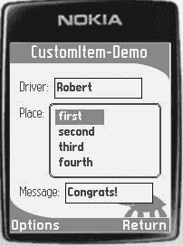

5033CH13.qxd 6/17/05 12:13 PM 第 249 页

第 13 章 ■ 扩展 J2ME POLISH

**249**

**图 13-1.** *运行中的 StringListItem*

闲话少说，请参考清单 13-15，它展示了如何实现 `StringListItem`。别担心——我将在接下来的章节中详细解释。

**清单 13-15.** *实现 StringListItem*

`//#condition polish.midp2 || polish.usePolishGui`

`package com.apress.ui;`

`import javax.microedition.lcdui.Canvas;`

`import javax.microedition.lcdui.CustomItem;`

`import javax.microedition.lcdui.Display;`

`import javax.microedition.lcdui.Font;`

`import javax.microedition.lcdui.Graphics;`

`//#ifdef polish.usePolishGui`

`import de.enough.polish.ui.Style;`

`//#endif`

`public class StringListItem extends CustomItem {`

`    private final Display display;`

`    private final String[] entries;`

`    private final String shortestEntry;`

`    private final String longestEntry;`

`    private final int numberOfVisibleItems;`

`    private Font font;`

`    private int linePadding = 2;`

`    private boolean inTraversal;`

`    private int focusedIndex = -1;`

`    private int topIndex;`

`    private int lineHeight;`

`    private int highlightedBackgroundColor;`

`    private int backgroundColor;`

5033CH13.qxd 6/17/05 12:13 PM 第 250 页

**250**

第 13 章 ■ 扩展 J2ME POLISH

`    private int highlightedForegroundColor;`

`    private int foregroundColor;`

`    private boolean isInitialized;`

`    public StringListItem( String label,`

`        String[] entries, int numberOfVisibleItems,`

`        Display display ) {`

`        //#style customListStyle, default`

`        super( label );`


this.display = display;

this.entries = entries;

this.numberOfVisibleItems = numberOfVisibleItems;

String longest = null;

String shortest = null;

int shortestLength = -1;

int longestLength = -1;

for ( int i = 0; i < entries.length; i++ ) {

String entry = entries[i];

int length = entry.length();

if ( length < shortestLength || shortest == null ) {

shortest = entry;

shortestLength = length;

}

if ( length > longestLength ) {

longest = entry;

longestLength = length;

}

}

this.longestEntry = longest;

this.shortestEntry = shortest;

}

private void init() {

this.isInitialized = true;

if ( this.font == null ) {

this.font = Font.getDefaultFont();

}

this.lineHeight = this.font.getHeight() + this.linePadding; if ( this.backgroundColor == this.highlightedBackgroundColor ) {

// 颜色尚未设置：
//#if polish.midp2

this.highlightedBackgroundColor =

this.display.getColor( Display.COLOR_HIGHLIGHTED_BACKGROUND ); this.backgroundColor =

this.display.getColor( Display.COLOR_BACKGROUND );

this.highlightedForegroundColor =

5033CH13.qxd 6/17/05 12:13 PM Page 251

第 13 章 ■ 扩展 J2ME POLISH

**251**

this.display.getColor( Display.COLOR_HIGHLIGHTED_FOREGROUND ); this.foregroundColor =

this.display.getColor( Display.COLOR_FOREGROUND );

//#else

this.highlightedBackgroundColor = 0;

this.backgroundColor = 0xFFFFFF;

this.highlightedForegroundColor = 0xFFFFFF;

this.foregroundColor = 0;

//#endif

}

}

public int getMinContentHeight() {

if ( !this.isInitialized ) {

init();

}

return this.lineHeight;

}

public int getMinContentWidth() {

if ( !this.isInitialized ) {

init();

}

return this.font.stringWidth( this.shortestEntry );

}

public int getPrefContentHeight( int width ) {

if ( !this.isInitialized ) {

init();

}

return this.lineHeight * this.numberOfVisibleItems;

}

public int getPrefContentWidth( int height ) {

if ( !this.isInitialized ) {

init();

}

return this.font.stringWidth( this.longestEntry );

}

public int getFocusedIndex() {

return this.focusedIndex;

}

private void showFocusedEntry() {

if ( this.focusedIndex < this.topIndex ) {

5033CH13.qxd 6/17/05 12:13 PM Page 252

**252**

第 13 章 ■ 扩展 J2ME POLISH

this.topIndex = this.focusedIndex;

} else if ( this.focusedIndex - this.topIndex + 1

> this.numberOfVisibleItems ) {

this.topIndex = this.focusedIndex - this.numberOfVisibleItems + 1;

}

}

protected void paint( Graphics g, int width, int height ) {

int numberOfLines = height / this.lineHeight;

int lastLineIndex = this.topIndex + numberOfLines;

if ( lastLineIndex > this.entries.length ) {

lastLineIndex = this.entries.length;

}

int y = 0;

g.setFont( this.font );

for ( int i = this.topIndex; i < lastLineIndex; i++ ) {

String entry = this.entries[i];

boolean isSel = ( i == this.focusedIndex );

g.setColor( isSel ?

this.highlightedBackgroundColor : this.backgroundColor );

g.fillRect( 0, y, width, this.lineHeight );

g.setColor( isSel ?

this.highlightedForegroundColor : this.foregroundColor );

g.drawString( entry, 0, y + this.linePadding/2,

Graphics.TOP | Graphics.LEFT );

y += this.lineHeight;

}

if ( y < height ) {

g.setColor( this.backgroundColor );

g.fillRect( 0, y, width, height - y );

}

}

public boolean traverse( int direction, int viewportWidth, int viewportHeight, int[] visRectInOut ) {

if ( !this.inTraversal ) {

// 用户进入了 ListItem
this.inTraversal = true;

if ( this.focusedIndex == -1 ) {

if ( direction == Canvas.UP || direction == Canvas.LEFT ) {

if ( this.topIndex + this.numberOfVisibleItems

< this.entries.length )

{

this.focusedIndex =

this.topIndex + this.numberOfVisibleItems;

} else {

5033CH13.qxd 6/17/05 12:13 PM Page 253

第 13 章 ■ 扩展 J2ME POLISH

**253**

this.focusedIndex = this.entries.length - 1;

}

} else {

this.focusedIndex = 0;

}

showFocusedEntry();

repaint();

notifyStateChanged();

}

visRectInOut[0] = 0;

visRectInOut[1] = 0;

visRectInOut[2] = viewportWidth;

visRectInOut[3] = viewportHeight;

return true;

}

if ( direction == Canvas.DOWN ) {

if ( this.focusedIndex < this.entries.length - 1 ) {

this.focusedIndex++;

} else {

return false;

}

} else if ( direction == Canvas.UP ) {


if ( this.focusedIndex > 0 ) {

this.focusedIndex--;

} else {

return false;

}

} else if ( direction != NONE ) {

return false;

}

showFocusedEntry();

repaint();

visRectInOut[0] = 0;

visRectInOut[1] = ( this.focusedIndex - this.topIndex )

* this.lineHeight;

visRectInOut[2] = viewportWidth;

visRectInOut[3] = this.lineHeight;

notifyStateChanged();

return true;

}

public void traverseOut() {

this.inTraversal = false;

}

5033CH13.qxd 6/17/05 12:13 PM Page 254

**254**

第 13 章 ■ 扩展 J2ME POLISH

//#ifdef polish.hasPointerEvents

protected void pointerPressed( int x, int y ) {

int row = y / this.lineHeight + this.topIndex;

if ( row != this.focusedIndex ) {

this.focusedIndex = row;

showFocusedEntry();

}

}

//#endif

//#ifdef polish.usePolishGui

public void setStyle( Style style ) {

//#if true

// 需要隐藏对父类的调用：

//# super.setStyle( style );

//#endif

this.font = style.font;

//#ifdef polish.css.stringlistitem-foreground-color

Integer foregroundColorInt =

style.getIntProperty( "stringlistitem-foreground-color" ); if ( foregroundColorInt != null ) {

this.foregroundColor = foregroundColorInt.intValue();

}

//#endif

//#ifdef polish.css.stringlistitem-highlighted-foreground-color Integer highlightedForegroundColorInt =

style.getIntProperty( "stringlistitem-highlighted-foreground-color" ); if ( highlightedForegroundColorInt != null ) {

System.out.println( "将高亮前景色设置为 ["

+ Integer.toHexString( highlightedForegroundColorInt.intValue() )

+ "]" );

this.highlightedForegroundColor =

highlightedForegroundColorInt.intValue();

}

//#endif

//#ifdef polish.css.stringlistitem-background-color

Integer backgroundColorInt =

style.getIntProperty( "stringlistitem-background-color" ); if ( backgroundColorInt != null ) {

this.backgroundColor = backgroundColorInt.intValue();

}

//#endif

//#ifdef polish.css.stringlistitem-highlighted-background-color Integer highlightedBackgroundColorInt =

style.getIntProperty( "stringlistitem-highlighted-background-color" ); if ( highlightedBackgroundColorInt != null ) {

this.highlightedBackgroundColor =

5033CH13.qxd 6/17/05 12:13 PM Page 255

第 13 章 ■ 扩展 J2ME POLISH

**255**

highlightedBackgroundColorInt.intValue();

}

//#endif

this.linePadding = style.paddingVertical;

init();

invalidate();

}

//#endif

}

你使用 `#condition` 预处理指令开始实现，以确保 `StringListItem` 仅在当前目标设备支持 MIDP 2.0 平台或目标设备使用 J2ME Polish GUI 时才被包含。

列表实现本身相当基础。`String[] entries` 字段包含列表项，`int focusedIndex` 标记当前选中的条目，`int topIndex` 标记第一个显示的条目。`traverse()` 方法负责在列表中导航，而 `paint()` 方法则在屏幕上显示可见条目。`pointerPressed()` 方法仅在当前目标设备支持指针事件时添加，也可用于在列表中导航。我将在后续章节中解释列表的设计。

理解 J2ME Polish 对自定义项的处理

MIDP 2.0 规范为自定义项实际支持哪些功能留有一定空间。当你使用 J2ME Polish GUI 时，可以确信你的自定义项在每个目标设备上的行为都是一致的，无论其原生实现如何。因此，只有当你使用了在目标设备上实现有误的低级图形操作时，才需要进行移植工作。请参考目标设备在 *http://www.j2mepolish.org/devices-overview.html* 上的已知问题列表。另一个可能的移植问题是，当你希望同时在 MIDP 1.0 手机上使用你的项时，使用了仅限 MIDP 2.0 的功能。

**初始化**

J2ME Polish 首先调用 `getPrefContentWidth( allowedHeight )` 方法，并传入一个未定义的 `allowedHeight` ( -1 )。随后调用 `getPrefContentHeight( allowedWidth )` 方法，该方法会获取实际授予的宽度。当 J2ME Polish 需要调整宽度时，你的自定义项将通过 `setSize(width, height)` 方法再次收到通知。最大可能宽度是设备的屏幕宽度；根据应用程序的设计，你可能拥有更少的空间。

请注意，`Display.getColor( int )` 和 `Font.getFont( int )` 方法仅在 MIDP 2.0 设备上可用。因此，此类调用只能在当前目标设备支持 MIDP 2.0 平台时使用。请参考清单 13-15 中的 `init()` 方法，了解如何使用 `#if` 预处理指令来区分不同情况。

**交互模式**

J2ME Polish 在每个平台上都支持交互模式 `CustomItem.KEY_PRESS`、`CustomItem.TRAVERSE_HORIZONTAL` 和 `CustomItem.TRAVERSE_VERTICAL`。此外，在所有支持指针事件的设备上都支持 `CustomItem.POINTER_PRESS` 模式。

5033CH13.qxd 6/17/05 12:13 PM Page 256

**256**

第 13 章 ■ 扩展 J2ME POLISH

**遍历**

当你的自定义项首次获得焦点时，`traverse()` 方法将以 `CustomItem.NONE` 方向被调用。后续调用将包含方向（`Canvas.UP`、`Canvas.DOWN`、`Canvas.LEFT` 或 `Canvas.RIGHT`）。

**设计 CustomItem**

当你希望使用 CSS 样式来设计你的 `CustomItem` 时，请确保项目类路径中包含 *enough-j2mepolish-client.jar*。你可以在 J2ME Polish 安装目录的 *import* 文件夹中找到它。

**应用样式** 当使用 J2ME Polish GUI 时，预处理符号 `polish.usePolishGui` 会被定义。你只能在 MIDP 2.0 环境中或使用 J2ME Polish GUI 时扩展 `CustomItems`。当你希望同时在 J2ME Polish GUI 和纯 MIDP 2.0 基础的 UI 中使用你的 `CustomItem` 时，请使用 `#if` 预处理指令来区分这些情况。例如，清单 13-15 中的 `StringListItem` 仅在使用了 J2ME Polish GUI 时才实现 `setStyle()` 方法。

你可以通过以下几种方式将 CSS 样式集成到你的 `CustomItem` 中：

• 你可以在调用父类构造函数之前定义一个静态样式。
• 你可以使用 `Form.append()` 方法。
• 你可以创建一个额外的构造函数，该构造函数接受一个 `Style` 作为最后一个参数。
• 你可以使用动态样式。

我现在将解释这些选项。首先，在你的构造函数中定义静态样式很简单——只需使用 `#style` 指令：

//#style stringListItem, default

super( label );

当你使用此构造时，应始终允许默认样式，这样当你的第一个样式未定义时，构建过程不会中止。通过在 `#style` 指令中将其添加为最后一个可能的样式来实现这一点。

其次，使用 `Form.append()` 方法更灵活，因为你可以在应用程序中为你的 `CustomItem` 使用不同的样式。清单 13-16 向你展示了如何为 `StringListItem` 应用 `winnerStringListStyle`。

**清单 13-16.** *使用 Form.append() 方法设置样式*
String[] entries = new String[] { " first ", " second ",

" third ", " fourth ", " fifth ", " sixth ", " seventh " }; StringListItem customListItem = new StringListItem( "Place:", entries, 4, this.display );

**//#style winnerStringListStyle**

**this.inputForm.append( customListItem );**

第三，使用一个额外的构造函数，该构造函数接受一个 `Style` 作为最后一个参数，与使用 `Form.append()` 方法一样灵活，但实现起来更复杂。清单 13-17

5033CH13.qxd 6/17/05 12:13 PM Page 257

第 13 章 ■ 扩展 J2ME POLISH

**257**


演示了如何实现这一策略。由于您的 IDE 不知道 J2ME Polish 的 CustomItem 实现，您需要隐藏包含 Style 参数的父类构造函数的调用。正如您在 `getHighscoreInstance()` 方法中所见，现在只需在创建 `MyCustomItem` 类的新实例之前添加一个 `#style` 指令，即可定义所需的样式。

**清单 13-17.** *使用额外的构造函数设置样式* public class MyCustomItem extends CustomItem {

public MyCustomItem( String label ) {

//#style myCustomItemStyle, default

super( label );

}

//#ifdef polish.usePolishGui

**public MyCustomItem( String label, Style style ) {**

//#if true

**//# super( label, style );**

//#else

super( label );

//#endif

}

//#endif

public static MyCustomItem getDefaultInstance( String label ) {

// 使用 myCustomItemStyle 或默认样式：

return new MyCustomItem( label );

}

public static MyCustomItem getHighscoreInstance( String label ) {

// 使用 highscore 样式：

**//#style highscore**

**return new MyCustomItem( label );**

}

protected int getMinContentWidth() {

return 50;

}

protected int getMinContentHeight() {

return 10;

}

protected int getPrefContentWidth( int allowedWidth ) {

return 100;

5033CH13.qxd 6/17/05 12:13 PM Page 258

**258**

第 13 章 ■ 扩展 J2ME POLISH

protected int getPrefContentHeight( int allowedHeight ) {

return 20;

}

protected void paint( Graphics g, int width, int height ) {

// 绘制项目...

}

}

第四种也是最后一种选择是使用动态样式。在这种情况下，您需要重写 `createCssSelector()` 方法，如清单 13-18 所示。返回的样式名称需要是小写。不过，您可以在 *polish.css* 文件中使用混合大小写表示法。

**清单 13-18.** *使用动态样式*

public class MyCustomItem extends CustomItem {

public MyCustomItem( String label ) {

super( label );

}

//#ifdef polish.useDynamicStyles

**protected String createCssSelector() {**

**return "mycustomitem";**

}

//#endif

protected int getMinContentWidth() {

return 50;

}

protected int getMinContentHeight() {

return 10;

}

protected int getPrefContentWidth( int allowedWidth ) {

return 100;

}

protected int getPrefContentHeight( int allowedHeight ) {

return 20;

}

protected void paint( Graphics g, int width, int height ) {

// 绘制项目...

}

}

5033CH13.qxd 6/17/05 12:13 PM Page 259

第 13 章 ■ 扩展 J2ME POLISH

**259**

为了读取特定的样式设置，您需要实现 `setStyle( Style )` 方法。清单 13-15 中展示的 `StringListItem` 的实现演示了这一点。

同样，您需要通过预处理隐藏 `super.setStyle( Style )` 的调用，以免您的 IDE 混淆。

J2ME Polish 会在请求首选内容宽度和高度之前调用 `setStyle()` 方法，这样您的 CustomItem 在请求尺寸时就拥有了样式。

请注意，变量必须命名为 `style`，或者以 `style` 结尾（小写），以便 J2ME Polish 能正确处理所有样式。这是必需的，因为在预处理步骤中，基于字符串的属性名称会被替换为数值型的短值。

这种方法显著提高了运行时性能，并最大限度地减少了堆内存使用。

您有四种可能的方式从样式中检索属性：

• `style.getProperty( String name )` 返回一个表示该值的字符串，如果属性未定义则返回 null。

• `style.getIntProperty( String name )` 返回一个表示该值的 Integer，如果属性未定义则返回 null。

• `style.getBooleanProperty( String name )` 返回一个表示该值的 Boolean，如果属性未定义则返回 null。

• `style.getObjectProperty( String name )` 返回一个表示该值的 Object，如果属性未定义则返回 null。

请注意，仅当您在文件 *custom-css-attributes.xml* 中注册了相应的属性时，才能使用后三种方法。属性类型分别为 string、integer/color、boolean 和 object/style。如果您未指定类型，该属性将被视为字符串属性。对于每个设置的 CSS 属性，预处理符号 `polish.css.[attribute-name]` 将被定义。您可以使用此机制，仅在属性至少被使用一次时才请求其值。同样，清单 13-15 中 `StringListItem` 的 `setStyle()` 方法演示了如何通过此机制节省一些宝贵的字节。

**注册自定义 CSS 属性** 您可以在 J2ME Polish 的安装目录中找到 *custom-css-attributes.xml* 文件。您可以使用此文件来注册在您的 CustomItems 中使用的 CSS 属性。

仅当您在 CustomItem 的 `setStyle( Style )` 方法中使用了 `style.getIntProperty( String name )`、`style.getBooleanProperty( String name)` 或 `style.getObjectProperty( String name )` 方法时，才需要注册这些属性。尽管如此，仍然建议进行注册，因为未来版本的 J2ME Polish 可能会将此信息用于 Eclipse CSS 插件。

每个属性由一个 `<attribute>` 元素表示，其属性列于表 13-4 中。

5033CH13.qxd 6/17/05 12:13 PM Page 260

**260**

第 13 章 ■ 扩展 J2ME POLISH

**表 13-4.** *自定义属性的定义*

**属性**

**是否必需？**

**说明**

name

是

属性的名称，例如 icon-image。

description

否

此属性的描述。

type

否

属性的类型。可以是 string、integer、color、boolean、object 或 style。默认为 string。当使用 `getIntProperty()` 方法时，类型需要是 integer 或 color。

当使用 `getBooleanProperty()` 方法时，类型需要是 boolean。当使用 `getObjectProperty()` 方法时，类型需要是 object 或 style。

appliesTo

否

一个逗号分隔的类名列表，此属性可应用于这些类。

default

否

此项目的默认值。

values

否

一个逗号分隔的此属性允许的值列表。

清单 13-19 展示了 `StringListItem` 使用的颜色属性的定义。

**清单 13-19.** *在 custom-css-attributes.xml 中定义自定义 CSS 属性*

<attributes>

<attribute

name="stringlistitem-highlighted-foreground-color"

type="color"

appliesTo="StringListItem"

description="当前焦点条目的文本颜色。"

/>

<attribute

name="stringlistitem-foreground-color"

type="color"

appliesTo="StringListItem"

description="普通非焦点条目的文本颜色。"

/>

<attribute

name="stringlistitem-highlighted-background-color"

type="color"

appliesTo="StringListItem"

description="当前焦点条目的背景颜色。"

/>

<attribute

name="stringlistitem-background-color"

type="color"

appliesTo="StringListItem"

description="普通非焦点条目的背景颜色。"

/>

</attributes>

5033CH13.qxd 6/17/05 12:13 PM Page 261

第 13 章 ■ 扩展 J2ME POLISH

**261**

**设计您的自定义项目** 最后，您现在可以在 *resources/polish.css* 文件中设计您的自定义项目。清单 13-20 展示了图 13-1 中已显示的 `StringListItem` 的设计。

**清单 13-20.** *设计 StringListItem*

colors {

bgColor: rgb( 132, 143, 96 );

highlightedBgColor: rgb( 238, 241, 229 );

highlightedFontColor: rgb( 238, 241, 229 );

fontColor: rgb( 30, 85, 86 );

}

.winnerStringListStyle {

font-size: medium;

font-style: bold;

stringlistitem-foreground-color: fontColor;

stringlistitem-highlighted-foreground-color: highlightedFontColor; stringlistitem-background-color: highlightedBgColor;

stringlistitem-highlighted-background-color: bgColor;

}


背景和边框设置将由 J2ME Polish 强制执行，因此您的 CustomItem 只需绘制其内容。仅当不使用 J2ME Polish GUI 时，才需要绘制背景，如清单 13-21 所示。

**清单 13-21.** *仅在未使用 J2ME Polish GUI 时绘制 CustomItem 的背景*

protected void paint( Graphics g, int width, int height ) {

//#ifndef polish.usePolishGui

// 绘制默认背景：

g.setColor( this.backgroundColor );

g.fillRect( 0, 0, this.width, this.height );

//#endif

}

**动态加载图像**

图片在用户界面中经常使用。通常，您只需将所有图像放入 *resources* 文件夹或其子文件夹之一，这样这些图像就会被包含在 JAR 应用程序包中（请参考第 7 章的“资源组装”部分）。然而，在某些情况下，您可能希望从其他来源加载图像。例如，您可以从 Web 服务器加载所有图像，这样您的 JAR 文件就不包含这些文件，因此体积会更小。或者，您可以通过根据应用程序的状态交换图像来动态更改应用程序的外观。

J2ME Polish 通过设置预处理变量 `polish.classes.ImageLoader` 来支持动态图像加载。您需要提供一个类（或类的静态字段），该类实现了 `javax.microedition.lcdui.Image loadImage( String url )` 方法。当未定义图像加载器时，J2ME Polish 会直接调用 `Image.createImage( url )` 来加载图片。

在清单 13-22 中，`com.apress.ui.ImageLoader` 类从 Web 服务器加载图像并将其存储在 RecordStore 中。您还可以通过设置预处理变量 `ImageLoader.server.url` 来影响使用哪个服务器。

■**注意** 请注意，清单 13-22 中的代码需要一些优化：通常您应该一次性加载并存储所有图像，而不是为每个新请求的图像创建一个新的 HTTP 连接。由于图像数据是在请求*之后*才被检索和存储的，因此您需要重新启动应用程序才能看到这些图像。

**清单 13-22.** *实现一个从 Web 服务器获取图像的图像加载器*
package com.apress.ui;

import java.io.ByteArrayOutputStream;

import java.io.IOException;

import java.io.InputStream;

import javax.microedition.io.Connector;

import javax.microedition.io.HttpConnection;

import javax.microedition.lcdui.Image;

import javax.microedition.rms.RecordStore;

import javax.microedition.rms.RecordStoreException;

import javax.microedition.rms.RecordStoreNotFoundException; public final class ImageLoader

implements Runnable {

//#if ImageLoader.server.url:defined

//#= private final static String WEBSERVER_URL = "${ImageLoader.server.url}";

//#else

private final static String WEBSERVER_URL =

"http://www.company.com/servlet/ImageProvider?img=";

//#endif

private final String imageUrl;

private final String recordStoreName;

private ImageLoader( String recordStoreName, String imageUrl ) {

this.imageUrl = imageUrl;

this.recordStoreName = recordStoreName;

}

public static Image loadImage( String url )

throws IOException

{

String recordStoreName = url.substring( 1, url.length() - ".png".length() ); try {

RecordStore store = RecordStore.openRecordStore( recordStoreName, false ); byte[] imageData = store.getRecord( store.getNextRecordID() - 1 ); return Image.createImage( imageData, 0, imageData.length );

} catch ( RecordStoreNotFoundException e ) {

// 在后台加载图像：

Thread thread = new Thread(

new ImageLoader( recordStoreName, url ) );

thread.start();

return null;

} catch ( RecordStoreException e ) {

//#debug error

System.out.println( "无法从记录存储加载图像" + e ); throw new IOException( e.toString() );

}

}

private byte[] loadImageFromHttpServer()

throws IOException

{

try {


```java
HttpConnection connection = (HttpConnection)
Connector.open(
    WEBSERVER_URL + this.imageUrl,
    Connector.READ_WRITE, true );
connection.setRequestMethod( HttpConnection.GET );
connection.setRequestProperty( "Connection", "close" );
int responseCode = connection.getResponseCode();
if ( responseCode == HttpConnection.HTTP_OK ) {
    InputStream in = connection.openInputStream();
    ByteArrayOutputStream out = new ByteArrayOutputStream();
    byte[] buffer = new byte[ 5 * 1024 ];
    int read;
    while ( (read = in.read( buffer, 0, buffer.length ) ) != -1 ) {
        out.write( buffer, 0, read );
    }
    return out.toByteArray();
} else {
    throw new IOException( "Got invalid response code: " + responseCode );
}
} catch ( SecurityException e ) {
    //#debug error
    System.out.println( "Not allowed to open connection" + e );
5033CH13.qxd 6/17/05 12:13 PM Page 264
**264**
第 13 章 ■ 扩展 J2ME POLISH
    throw new IOException( e.toString() );
}
}
private void storeImageInRms( byte[] data ) {
    try {
        RecordStore store = RecordStore.openRecordStore(
            this.recordStoreName, true );
        store.addRecord( data, 0, data.length );
    } catch ( RecordStoreException e ) {
        //#debug error
        System.out.println( "Unable to store image in record-store ["
            + this.recordStoreName + "]" + e );
    }
}
public void run() {
    System.out.println( "running image loader..." );
    try {
        byte[] data = loadImageFromHttpServer();
        storeImageInRms( data );
    } catch ( IOException e ) {
        //#debug error
        System.out.println( "Unable to load image from server ["
            + WEBSERVER_URL + "]" + e );
    }
}
}
清单 13-23 通过在 *build.xml* 脚本中指定 `polish.classes.ImageLoader` 变量，集成了 `com.apress.dynamic.ImageLoader` 类。

**清单 13-23.** *集成你自己的图片加载器*

<j2mepolish>
<info
    license="GPL"
    name="Roadrunner"
    vendorName="A reader."
    version="0.0.1"
    jarName="${polish.vendor}-${polish.name}-roadrunner.jar"
/>
<deviceRequirements>
    <requirement name="Identifier" value="Generic/midp1" />
</deviceRequirements>
<!-- symbol: don't check method-parameters: -->
<build
5033CH13.qxd 6/17/05 12:13 PM Page 265
第 13 章 ■ 扩展 J2ME POLISH
**265**
    usePolishGui="true"
    fullscreen="menu"
>
    <midlet class="com.apress.roadrunner.Roadrunner" />
    <variables>
        **<!-- 使用你自己的图片加载器实现： -->**
        **<variable**
            **name="polish.classes.ImageLoader"**
            **value="com.apress.ui.ImageLoader" />**
        **<variable**
            **name="ImageLoader.server.url"**
            **value="http://www.j2mepolish.org/images" />**
    </variables>
</build>
<emulator />
</j2mepolish>

**创建你自己的背景**

要添加新的背景，请确保你的类路径包含来自 `${polish.home}/import` 文件夹的 `enough-j2mepolish-build.jar`、`enough-j2mepolish-client.jar` 和 `midp2.jar` 文件。

每个背景需要两个实现类：一个客户端类在实际手持设备上绘制背景，另一个服务端类负责在构建阶段创建和配置客户端类。

在接下来的章节中，你将创建并集成一个用于焦点项目的动画背景。当用户更改焦点项目时，它会平滑地跟随当前选择。

创建客户端背景类

你可以通过扩展 `de.enough.polish.ui.Background` 类并实现其 `paint( int x, int y, int width, int height, Graphics g )` 方法来创建客户端背景。为了实现背景动画，你还可以重写 `animate()` 方法。每当用户聚焦另一个项目时，背景会被绘制到不同的位置（如果在焦点样式中使用）。你可以利用这些位置变化来检测焦点变化。然后在 `animate()` 方法中移动背景，直到到达新的目标位置。清单 13-24 演示了这一点。

**清单 13-24.** *实现移动背景*

//#condition polish.usePolishGui
package com.apress.ui;
import javax.microedition.lcdui.Graphics;
import de.enough.polish.ui.Background;
public class MovingBackground extends Background {
    private final int color;


5033CH13.qxd 6/17/05 12:13 PM 第 266 页

**266**

第 13 章 ■ 扩展 J2ME POLISH

private final int speed;

private int nextX;

private int nextY;

private int currentX;

private int currentY;

public MovingBackground( int color, int speed ) {

this.color = color;

this.speed = speed;

}

**public void paint( int x, int y, int width, int height, Graphics g ) {**

if ( x != this.nextX || y != this.nextY ) {

this.nextX = x;

this.nextY = y;

}

g.setColor( this.color );

g.fillRect( this.currentX, this.currentY, width, height );

}

**public boolean animate() {**

if ( this.currentX == this.nextX && this.currentY == this.nextY ) {

return false;

}

if ( this.currentX < this.nextX ) {

this.currentX += this.speed;

if ( this.currentX > this.nextX ) {

this.currentX = this.nextX;

}

} else if ( this.currentX > this.nextX ) {

this.currentX -= this.speed;

if ( this.currentX < this.nextX ) {

this.currentX = this.nextX;

}

}

if ( this.currentY < this.nextY ) {

this.currentY += this.speed;

if ( this.currentY > this.nextY ) {

this.currentY = this.nextY;

}

} else if ( this.currentY > this.nextY ) {

this.currentY -= this.speed;

if ( this.currentY < this.nextY ) {

this.currentY = this.nextY;

}

}

5033CH13.qxd 6/17/05 12:13 PM 第 267 页

第 13 章 ■ 扩展 J2ME POLISH

**267**

return true;

}

}

创建服务端背景类

为了正确地从 *polish.css* 文件转换设计设置，你需要实现一个转换器类，该类继承自 `de.enough.polish.preprocess.BackgroundConverter` 并实现其 `createNewStatement( HashMap background, Style style, StyleSheet styleSheet )` 方法。此方法解析提供的 CSS 设置，并创建必要的源代码，用于生成客户端背景类的新实例。清单 13-25 实现了创建 `MovingBackground` 的转换器。

**清单 13-25.** *实现背景转换器*

//#condition false

package com.apress.ui;

import java.util.HashMap;

import org.apache.tools.ant.BuildException;

import de.enough.polish.preprocess.BackgroundConverter;

import de.enough.polish.preprocess.Style;

import de.enough.polish.preprocess.StyleSheet;

public class MovingBackgroundConverter extends BackgroundConverter {

public MovingBackgroundConverter() {

}

**protected String createNewStatement(**

HashMap background,

Style style,

StyleSheet styleSheet )

throws BuildException

{

String speedStr = (String) background.get( "speed" ); if ( speedStr != null ) {

super.parseInt( "speed", speedStr );

} else {

speedStr = "5";

}

return "new com.apress.ui.MovingBackground( "

+ this.color + ", " + speedStr + " )";

}

}

5033CH13.qxd 6/17/05 12:13 PM 第 268 页

**268**

第 13 章 ■ 扩展 J2ME POLISH

在 `createNewStatement()` 方法中，你可以从提供的 `background` HashMap 中读取设计设置。要解析这些值，你可以使用辅助方法 `parseInt()`、`parseFloat()`、`parseBoolean()`、`parseColor()`、`getUrl()` 和 `parseAnchor()`。每个辅助方法都需要属性名称和值作为参数。

在此示例中，使用了 `color` 和 `speed` 属性。`color` 值已由超类解析，可以通过 `this.color` 访问。如果没有定义颜色，背景颜色默认为白色。当缺少必需的值或值设置不正确时，你可以抛出一个 `BuildException`，详细说明出错的原因。一切正常时，只需返回一个包含用于创建背景新实例的源代码的字符串。

集成自定义背景

为了集成你的自定义背景，你需要将转换器类添加到 `<j2mepolish>` 任务的类路径中，并调整项目的源路径，以便同时包含你的客户端背景类。

首先，通过调整 *build.xml* 文件中的 `<taskdef>` 元素，将你的背景转换器类添加到 `<j2mepolish>` 任务中。将转换器项目 *classes* 目录的路径添加到 `<taskdef>` 元素的 `classpath` 属性中，如清单 13-26 所示。

**清单 13-26.** *调整 J2ME Polish 的类路径*

<taskdef

name="j2mepolish"

classname="de.enough.polish.ant.PolishTask"

classpath="${polish.home}/bin/classes:

${polish.home}/import/jdom.jar:

../apress-j2mepolish/bin/classes"

/>

其次，你需要告知 J2ME Polish 关于额外背景的信息。你可以通过 *build.xml* 中 `<build>` 元素的 `srcDir` 属性来实现。使用冒号分隔多个目录；例如，使用 `srcDir="source/src:../apress-j2mepolish/source/src"`。你也可以使用嵌套的 `<source>` 元素，它还可以通过其 `if` 和 `unless` 属性有条件地包含源代码。

最后，你需要在应用程序的 *resources/polish.css* 文件中使用新的背景。将背景类型指定为服务端转换类，如清单 13-27 所示。

**清单 13-27.** *在 polish.css 文件中使用移动背景* focused {

padding: 5;

background {

type: com.apress.ui.MovingBackgroundConverter;

color: white;

speed: 10;

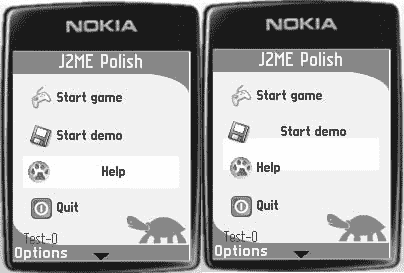

5033CH13.qxd 6/17/05 12:13 PM 第 269 页

第 13 章 ■ 扩展 J2ME POLISH

**269**

}

font {

style: bold;

color: fontColor;

size: small;

}

layout: expand | center;

}

现在构建你的应用程序，并欣赏图 13-2 中所示的背景效果。

**图 13-2.** *你的自定义背景类正在运行。在右侧，它正准备向上移动。*

**添加自定义边框**

添加自定义边框的步骤与创建自定义背景相同。不过，你需要继承 `de.enough.polish.ui.Border` 类，而不是 `Background` 类。对于服务端，你需要继承 `de.enough.polish.preprocess.BorderConverter`。

请参考 JavaDoc 文档和前面的背景描述以获取更多信息。

■**注意** 请注意，边框不支持 `animate()` 方法，因此如果你想使用动画边框，需要使用 `Background` 类来实现。

**扩展日志框架**

你可以通过提供自己的日志处理器来扩展 J2ME Polish 的日志框架。日志处理器继承自 `de.enough.polish.log.LogHandler` 类，并实现 `handleLog( LogEntry entry )` 方法。使用此机制来创建你自己的日志功能，例如将日志消息转发到 HTTP 服务器。

5033CH13.qxd 6/17/05 12:13 PM 第 270 页

**270**

第 13 章 ■ 扩展 J2ME POLISH

实现日志处理器后，你需要注册并集成它。通过将日志处理器添加到 *${polish.home}/custom-extensions.xml* 文件中进行注册，如清单 13-28 所示。

**清单 13-28.** *在 custom-extensions.xml 中注册日志处理器*

<extension>

<type>loghandler</type>

<name>http</name>

<clientClass>com.apress.log.HttpLogHandler</clientClass>

</extension>

注册后，你可以通过向 *build.xml* 文件中的 `<debug>` 元素添加一个 `<handler>` 元素来集成你的日志处理器。在 `<handler>` 元素中，你只需重复注册时使用的名称。当日志处理器位于不同的项目中时，你还需要通过修改 `<source>` 元素或 `<build>` 部分的 `sourceDir` 属性来包含该项目的源目录。清单 13-29 演示了如何包含一个日志处理器。你可以通过提供多个 `<handler>` 元素来包含任意数量的日志处理器。

**清单 13-29.** *包含多个日志处理器*

<debug level="error" showLogOnError="true" verbose="false" >

<handler name="rms">

<parameter name="useBackgroundThread" value="false" />

</handler>

<handler name="http" />

</debug>

**总结**


本章总结了本书中关于 J2ME Polish 的部分。在本章中，我讨论了扩展 J2ME Polish 的各种方法——包括集成你自己的预处理程序和其他构建工具、创建你自己的 GUI 元素以及扩展日志框架。

在接下来的部分中，你将深入了解 J2ME 编程的现实世界。

遗憾的是，理论标准与真实手机上 J2ME 环境的实际实现之间总是存在差异。在下一部分中，你将学习如何在交付一流应用程序的同时，使你的应用程序适应各种现实世界的问题。

5033CH14.qxd 6/17/05 12:15 PM 第 271 页

第 3 部分

■ ■ ■

现实世界中的编程

**J2ME 标准严谨而简洁，但在现实世界中，仍有数量惊人的挑战在等待着你。在本部分中，你将学习如何识别并克服这些障碍。**

5033CH14.qxd 6/17/05 12:15 PM 第 272 页

5033CH14.qxd 6/17/05 12:15 PM 第 273 页

第 14 章

■ ■ ■

无线市场概览

**本章内容包括：**

• 了解 J2ME 设备在硬件和软件等多个方面的差异。

• 思考无线市场及其与你的应用程序的关系，包括你的商业模式和应用程序的技术定位。

本章将向你介绍在现实世界中开发无线应用程序所面临的挑战。你需要应对高度碎片化的设备基础，这些设备从 JAR 大小不超过 30KB 的简单黑白屏手机，到拥有 80MB 存储空间的最先进的 UMTS 设备，不一而足。无线市场正在快速发展，每天都会带来新的机遇。在本章中，你将了解在现实世界中可能遇到的设备差异。你还将了解市场如何演变，以及这对你的商业模式有何影响。

**介绍设备差异**

Sun 的首席软件架构师 Jonathan Schwartz 估计，目前全球市场上正在使用的 J2ME 设备有 5 亿部¹。这很了不起，但你必须记住，许多设备之间存在相当大的差异。在接下来的章节中，我将讨论 J2ME 设备如何以及为何存在差异。

**硬件**

J2ME 设备的硬件差异很大：内存、屏幕分辨率、色彩深度、网络技术、是否包含摄像头……你能想到的方面都有差异。

如果你需要特定的硬件功能，可以使用 J2ME Polish 的设备选择机制。清单 14-1 演示了如何在你的 *build.xml* 文件中选择所有内置摄像头的手机。然后，你的应用程序将仅针对满足你要求的设备进行构建。我在第 7 章的“为多种设备构建”一节中详细讨论了这一点。

*om_3gsm*

**273**

5033CH14.qxd 6/17/05 12:15 PM 第 274 页

**274**

第 14 章 ■ 无线市场概览

**清单 14-1.** *选择所有包含摄像头并支持图像捕捉的设备*

<j2mepolish>

<info

license="GPL"

name="Roadrunner"

vendorName="A reader."

version="0.0.1"

jarName="${polish.vendor}-${polish.name}-roadrunner.jar"

/>

<deviceRequirements>

**<requirement name="Term" value="polish.hasCamera and polish.Capture.image" />**

</deviceRequirements>

<build

usePolishGui="true"

>

<midlet class="com.apress.roadrunner.Roadrunner" />

</build>

<emulator />

</j2mepolish>

此外，在处理不同屏幕尺寸时，你可以使用资源组装机制。当前设备屏幕范围从诺基亚 Series 40 手机的 128✕128 像素到高端设备的 640✕320 像素。为了获得最佳视觉效果，你通常希望使用调整后的图形。你可以使用设备组、供应商设备，甚至全屏模式下的画布尺寸来组装最合适的资源。例如，你可以将通用资源放入 *resources* 文件夹，并将用于大屏设备的图像放入 *resources/ScreenSize.150+x200+* 目录。有关此选项的更多信息，请参阅第 7 章的“资源组装”部分。

**配置文件和配置**

J2ME 设备可以支持不同的配置文件和配置，如图 14-1 所示。连接设备配置（CDC）和有限连接设备配置（CLDC）之间存在明显的界限。CDC 标准基于 Java 2 标准版和 Java 虚拟机构建，因此非常强大。但在过去几年中，对 CDC 标准的支持已显著下降，因此如果你的目标是手机，可以选择忽略此配置及其个人和基础配置文件。另一方面，CLDC 标准仅包含 Java 2 标准版的一些核心类，并包含进一步的限制，例如在 CLDC 1.0 设备上无法进行浮点运算。

在配置方面，允许浮点运算的 CLDC 1.1 配置的重要性正在增加；然而，当今大多数设备仅支持 CLDC 1.0 配置。表 14-1 列出了可用的配置。

同样，你可以使用预处理来区分源代码中的配置。CLDC 1.1 设备定义了 `polish.cldc1.1` 预处理符号，而 CLDC 1.0 设备定义了 `polish.cldc1.0` 符号。

5033CH14.qxd 6/17/05 12:15 PM 第 275 页

第 14 章 ■ 无线市场概览

**275**

**图 14-1.** *J2ME 架构*

**表 14-1.** *J2ME 配置*

**名称**

**JSR**

**说明**

CLDC 1.0

有限连接设备配置

CLDC 1.1

有限连接设备配置，允许浮点运算

CDC 1.0

连接设备配置

大多数 J2ME 设备支持 MIDP 1.0 配置文件，而对 MIDP 2.0 的支持正在迅速增长。MIDP 1.0 标准扩展了 CLDC 1.0 或 1.1 配置，并引入了 MIDlet 的概念、LCDUI 用户界面以及记录存储持久化机制。根据你的时间安排，你甚至可以考虑使用即将推出的 MIDP 3.0 标准（参见 *http://jcp.org/en/jsr/detail?id=271* 的 JSR 271），但该标准需要几年时间才能在广泛的设备基础上被采用。IMP 用于没有用户界面的设备，允许你创建用于机器对机器通信的解决方案。表 14-2 列出了 J2ME 世界中所有可用的配置文件。

5033CH14.qxd 6/17/05 12:15 PM 第 276 页

**276**

第 14 章 ■ 无线市场概览

你可以使用预处理来区分应用程序中的配置文件。检查 `polish.midp1` 和 `polish.midp2` 预处理符号，以使用仅适用于某个配置文件的代码。第 8 章解释了所有细节。

**表 14-2.** *J2ME 配置文件*

**名称**

**JSR**

**说明**

**配置**

MIDP 1.0

移动信息设备配置文件

CLDC

MIDP 2.0

移动信息设备配置文件，包含增强功能

CLDC

如游戏 API、声音播放和安全网络

MIDP 3.0

移动信息设备配置文件，包含进一步

CLDC

扩展和改进的互操作性

IMP 1.0

信息模块配置文件

CLDC

IMP 2.0

信息模块配置文件——下一代

CLDC

FP 1.0

基于 J2SE 1.3 的基础配置文件

CDC

FP 1.1

基于 J2SE 1.4 的基础配置文件

CDC

PBP 1.0

个人基础配置文件

CDC

PP 1.0

个人配置文件

CDC


■**注意** 此外，还存在一些未经 Java 社区流程标准化的 J2ME 兼容平台，例如韩国的 WIPI 和日本的 DoJa 平台。第 15 章将更详细地讨论这些平台。从 J2ME Polish 1.3 开始，您将能够在 *${polish.home}/*

*platforms.xml* 文件中定义额外的平台。

**可选包**

有许多库可用于扩展 MIDP 设备的基本功能。一些库是特定于供应商或运营商的；其他则由 Java 社区流程（JCP）标准化。

大多数 MIDP 1.0 设备仅包含特定于供应商的 API 增强功能，例如诺基亚的 UI API、三星的设备控制类和摩托罗拉的 Phonebook API。一些运营商（如沃达丰）提供了额外的扩展。出于兼容性原因，这些库即使在现代设备中也继续存在，但其使用大多已被弃用，并被 MIDP 2.0 配置文件或可选包所取代。

许多 MIDP 2.0 设备支持标准化的可选 API，例如移动媒体 API 或无线消息 API。您可以使用它们，而无需将自己局限于特定的供应商或运营商。表 14-3 包含了最流行的可选包，您可以在 Java 社区流程主页（*http://www.jcp.org*）上找到它们的规范。如果您想部署一个可选库，请参考 J2ME Polish 的设备数据库（*http://www.*

*j2mepolish.org/devices/apis.html*），以了解您的库被采用的程度。同时，请仔细阅读规范，因为通常某些部分是可选的，例如蓝牙 API 的 OBEX 传输。

5033CH14.qxd 6/17/05 12:15 PM 第 277 页

第 14 章 ■ 无线市场概述

**277**

您可以使用预处理来检测某个库是否可用于当前目标设备。对于每个支持的 API，都会定义符号 `polish.api.[api-name]`（例如 `polish.api.mmapi`）。您还可以使用资源组装来仅为支持特定库的设备包含内容。例如，当您的应用程序包含依赖于移动媒体 API 的内容时，请使用 *resources/mmapi* 文件夹。有关这些选项的详细信息，请参阅第 7 章和第 8 章。

**表 14-3.** *MIDP 设备的可选包*

**名称**

**JSR**

**阶段**

**说明**

MMAPI

可用

移动媒体 API 允许您播放和录制声音、图像和视频。

WMAPI 1.1

可用

无线消息 API 1.1 允许您发送和接收文本消息（SMS）。

WMAPI 2.0

最终

2.0 版本允许您发送和接收多媒体消息（MMS）。

M3GAPI

可用

移动 3D 图形 API 提供 3D 功能。

SIMPLEAPI

早期

这扩展了 JAIN SIP API（JSR 32），以在 J2ME 设备上提供即时消息功能。

PDAPI

可用

PDA 可选包实际上定义了两个独立的 API：个人信息管理（PIM）API 允许您访问地址簿、组织器等；文件连接（FC）API 允许您读取和写入位于应用程序外部的文件（例如，在存储卡上）。在实践中，设备要么同时支持这两个库，要么都不支持。

SIPAPI

最终

J2ME 的会话发起 API 扩展了通用连接框架，以允许安全的多媒体 IP 会话。

LAPI

可用

位置 API 允许您精确定位用户的位置。

WAAPI

可用

Web 服务 API 提供 XML 解析 API，并允许您作为 SOAP 客户端访问 Web 服务。

IMAPI

早期

提供一种与协议无关的方式来发送和接收即时消息。

CHAPI

最终

内容处理器 API 允许应用程序将自己注册为特定 MIME 类型的处理器。

SVGAPI

可用

可缩放 2D 矢量图形 API 允许您以 SVG 格式渲染矢量图像，这是一种类似于 Macromedia 专有 Flash 格式的格式。

PAPI

最终

支付 API 允许您从应用程序内部发起微支付。

DSAPI

早期

数据同步 API 使您能够访问本地数据同步实现。

MIAPI

最终

移动国际化 API 允许您在应用程序中使用本地化内容。

*续*

5033CH14.qxd 6/17/05 12:15 PM 第 278 页

**278**

第 14 章 ■ 无线市场概述

**表 14-3.** *续*

**名称**

**JSR**

**阶段**

**说明**

MTA

早期

移动电话 API 允许您发起和接听语音呼叫、接收网络通知和 ID 等。

MSAPI

早期

移动传感器 API 允许您发现和采样来自传感器的数据，而与底层传输协议无关。

MUICAPI

早期

移动用户界面定制 API 允许您查询设备的用户界面设置。

AHNAPI

早期

自组网 API 简化了点对点应用程序的开发。

UMBAAPI

早期

统一消息框访问 API 允许您读取、写入、复制和移动设备上的任何类型的消息。

MBSAPI

早期

手持终端移动广播服务 API 允许您接收广播媒体并与之交互。

**JTWI 规范与移动服务架构**

JSR 185，即无线行业 Java 技术（JTWI），是多家制造商共同努力的结果，旨在为 Java 应用程序开发者创造一个更可预测的环境。JSR 248，即移动服务架构（MSA），延续了 JTWI 开始的工作，并用新技术增强了定义。

JTWI 基于 MIDP 2.0 配置文件，并要求兼容设备至少支持无线消息 API（WMAPI 1.1），并且在适用但可选的情况下支持移动媒体 API（MMAPI 1.1）。JTWI 还澄清了 CLDC 和 MIDP 规范中一些存在解释空间的部分，包括以下内容：

• 兼容实现至少支持十个并行线程。

• `System.currentTimeMillis()` 的时钟分辨率应为 40 毫秒或更短。

• 支持基本拉丁语和拉丁语-1 字符。

• 可以支持自定义的 GMT 兼容时区。

• JAR 文件至少支持到 64KB，JAD 文件至少可以为 5KB。

• 在兼容 JTWI 的手机的记录管理系统中，MIDlet 至少可以占用 30KB 的数据。

• MIDlet 可用的堆大小至少为 256KB。

• 屏幕尺寸至少为 125✕125 像素，颜色深度至少为每像素 12 位（4,096 种颜色）。

• 支持 JPEG 和 PNG 图像。

• 需要支持 HTTP 1.1 以检索多媒体内容。

5033CH14.qxd 6/17/05 12:15 PM 第 279 页

第 14 章 ■ 无线市场概述

**279**

• 设备需要能够在特定时间执行 MIDlet（使用 `PushRegistry.registerAlarm()` 机制）。

• 手机需要能够在收到传入消息时执行已注册的 MIDlet，这可以通过使用 JAD 属性 `MIDlet-Push-n` 或调用 `PushRegistry.registerConnection()` 来实现。

• 当通过 Java 库提供多媒体功能时，兼容 JTWI 的设备需要通过移动媒体 API 公开该功能。

• 支持 MMAPI 的设备需要能够至少播放 MIDI 和音序文件。当设备包含相应功能时，它们还需要允许捕获 JPEG 图像和 WAV 音频。

移动服务架构规范仍处于早期阶段，但兼容手机的最低要求将是 CLDC 1.1 配置和 MIDP 2.0 配置文件。

您可以通过测试预处理符号 `polish.jtwi` 来检查设备是否符合 JTWI 标准。

**支持的格式**


设备支持多种音频、视频和图像格式，但通常只有少数几种格式被广泛接受。一般来说，你应该坚持使用 MIDI、音序和 AMR 声音以及 PNG 图像。J2ME Polish 的设备数据库包含所支持格式的信息，因此你可以使用资源组装来包含正确的资源，并使用预处理来集成针对该格式的正确代码。第 15 章将更详细地讨论声音的播放。

**设备修改**

由于不同的固件版本和运营商修改，设备的行为和能力可能会发生变化。

固件可能非常有趣。一个相当极端的例子是摩托罗拉 E398，其软键的按键事件会因固件版本不同而改变。新固件可以解决问题，但也可能引入新的错误。不幸的是，你不能指望用户会更新他们的固件，即使最新版本解决了关键任务问题。

一种常见的策略是只支持最广泛采用的固件，即使这通常意味着不支持早期采用者。

一些运营商也会修改设备。例如，沃达丰添加了其沃达丰服务类库，其中包含一些 3D 和其他功能。你需要成为经过认证的沃达丰合作伙伴才能获得这些库的完整信息。更严重的修改是禁用某些功能。运营商可以选择仅向经过认证的合作伙伴开放特定的 API，例如位置 API。此类运营商修改不仅会影响技术可行性，还会影响你项目的商业模式，因此请务必考虑它们。

5033CH14.qxd 6/17/05 12:15 PM 第 280 页

**280**

第 14 章 ■ 无线市场概览

**设备问题**

设备问题是为何为手机创建既引人注目又完美运行的应用程序如此困难的主要原因。第 15 章将详细讨论这些问题，但我在此提及它们是为了完整地说明设备差异。

**模拟器陷阱**

模拟器非常适合在你的开发系统上直接测试应用程序，但不幸的是，你不能信任它们。在邮件列表和讨论板上经常听到的借口是“但在模拟器上能运行！”

许多模拟器基于 Sun 的原始 Wireless Toolkit，而实际的 Java 实现是由不同公司创建的。因此，实际行为通常与 PC 上的模拟不同。常见问题包括颜色和图像的渲染方式、性能以及设备特定问题。通常，模拟器不会重现实际设备存在的问题。然而，更严重的是，模拟器可能包含实际设备上不存在的错误。

底线是，你应该使用模拟器来加速实现阶段，但在尝试解决设备特定问题时，不应信任模拟器。

模拟永远不完美，因此在真实设备上进行测试对于你的应用程序的成功至关重要。

**审视当前市场**

移动市场的增长是传奇性的，手机销量多次超出市场研究人员的预测。在接下来的章节中，我将讨论市场如何演变以及这对你的业务意味着什么。

**电信市场**

全球有 15 亿电信用户，占世界人口的四分之一。

具体来说，根据 Forrester Research 的数据，这些用户中有 78% 使用 GSM，14% 使用 CDMA，6% 使用 TDMA 网络技术。同一项研究得出结论，约 80% 的人口被网络覆盖，因此还有 35 亿潜在用户，但他们中的大多数人没有太多钱可花。3G 网络技术 UMTS 和 WDCMA 的重要性日益增加，但根据 ARC Group 的数据，2004 年只有 4% 的售出手机支持 3G 技术。然而，IDC 估计，在西欧，2005 年售出的手机中有 16% 支持 3G 技术。

2\. 使用美国数字，因此十亿在欧洲大陆是十亿（milliard）。

3\. *http://www.moneyplans.net/frontend1-verify-7139.html* 4. *http://www.itfacts.biz/index.php?id=P2011*

*d=pr2005_03_07_134916*

5033CH14.qxd 6/17/05 12:15 PM 第 281 页

第 14 章 ■ 无线市场概览

**281**

全球范围内，最重要的移动设备制造商是诺基亚，市场份额约为 31%，摩托罗拉为 16%，三星为 13%，西门子和 LG 各约为 7%。6 索尼爱立信紧随其后，预计将在 2005 年再次进入前五名。7 根据 IDC 的数据，在西欧，西门子仍以约 16% 的估计市场份额位居第二。8 表 14-4 总结了全球供应商市场，表 14-5 重点介绍了西欧市场。

**表 14-4.** *2004 年全球手机销量*

**供应商**

**手机数量（百万）**

**份额**

诺基亚

207.6

31.2%

摩托罗拉

104.5

15.7%

三星

86.5

13.0%

西门子

49.4

7.4%

LG 电子

44.4

6.7%

其他

172.0

25.9%

总计

664.5

99.9%

**表 14-5.** *2004 年西欧手机销量*

**供应商**

**手机数量（百万）**

**份额**

诺基亚

50.2

34.8%

西门子

22.5

15.6%

摩托罗拉

17.5

12.1%

索尼爱立信

15.9

11.0%

三星

14.7

10.2%

其他

23.3

16.2%

总计

144.1

99.9%

根据 iSupply 的数据，2004 年售出的所有手机中，68% 配备彩色屏幕，每像素 16 位是标准（65,000 色），平均屏幕尺寸为 128✕160。9

6\. *http://www.theinquirer.net/?article=21668*

7. *http://www.idc.com/getdoc.jsp?containerId=pr2005_01_27_112549*

8. *http://www.idc.com/getdoc.jsp?pid=23571113&containerId=pr2005_03_07_134916*

5033CH14.qxd 6/17/05 12:15 PM 第 282 页

**282**

第 14 章 ■ 无线市场概览

**J2ME 市场**

无线游戏市场在 J2ME 市场中占据主导地位，据估计，2004 年仅在美国就创造了 3.5 亿美元的收入。10 IDC 预计，美国 J2ME 游戏的销量将在 2005 年超过铃声，并持续增长，到 2008 年达到 15 亿美元。11 与竞争对手 BREW 技术相比——根据高通的数据，该技术在 2004 年为应用程序开发者创造了 2 亿美元的全球收入 12——很明显，未来属于 J2ME 标准。

根据 Evans Data Corporation 的数据，约 40% 的无线开发者使用 J2ME，另有 26% 正在评估其使用。13 ARC Group 预计，到 2006 年，约 90% 的发货手机将支持 Java 标准。14 作为主要平台的 Symbian 现在支持所有系列手机的 MIDP 2.0 标准，甚至在较低的 Series 40 细分市场也是如此。

J2ME 有希望的竞争对手将是移动设备上的 Flash，或许还有微软，尽管微软手机迄今为止并未获得良好评价。Flash 有潜力成为移动市场的主要参与者，但这并不需要对 J2ME 市场构成威胁。更有可能的是，Flash 将用于营销游戏和商业应用，而应用本身将继续用 Java 实现。

**总结**

在本章中，你了解了 J2ME 设备之间的差异以及 J2ME 市场是如何演变的。在下一章中，你将了解一些在实践中经常遇到的方面，例如检测中断、建立网络连接和访问原生功能。


10\. *http://msnbc.msn.com/id/7130108/site/newsweek/*

11. *http://www.idc.com/getdoc.jsp?containerId=prUS00043705*

12\. *http://www.itfacts.biz/index.php?id=P1869*

13\. *http://www.3g.co.uk/PR/Sept2004/8356.htm*

，作者 Martin de Jode（John Wiley & Sons，2004 年）。

5033CH15.qxd 6/20/05 9:20 AM 第 283 页

第 15 章

■ ■ ■

在设备限制间

巧妙周旋

**本章内容：**

• 了解当今市场上设备之间的实际差异。

• 学习如何编写可移植的应用程序。

• 通过一些易于遵循的策略解决常见问题。

• 了解遇到困难时可以在哪里获得帮助。

当今市场上设备中使用的 J2ME 实现表现各异。

在上一章中，你了解了由于不同的简表和配置而可能出现的差异；在本章中，你将了解在编写 J2ME 应用程序时将会遇到的实际差异和困难。你还将学习如何避免一些常见问题，以及在遇到困难时在哪里获得帮助。

**识别厂商特性**

在接下来的章节中，你将学习如何处理最流行厂商的设备，包括诺基亚、摩托罗拉、三星等。

■**提示** 某些厂商支持特定的 JAD 属性。请参考附录中的“管理 JAD 和清单属性”部分，以获取关于此类属性的完整讨论。

**诺基亚**

诺基亚是全球手机市场的最大参与者，2004 年市场份额约为 31%。

诺基亚以惊人的速度向市场推出新设备：2004 年诺基亚发布了 30 多款新机型，并宣布 2005 年将发布 40 多款。幸运的是，你可以将诺基亚设备按不同版本划分为不同的系列。从销量角度来看，最重要的系列是针对大众市场的低成本 Series 40 和针对智能手机的 Series 60。

诺基亚生产高质量的设备，并提供了维护最好的开发者网站之一：*http://forum.nokia.com*；该网站设有论坛、提供工具，并包含设备的文档。诺基亚还维护着“已知问题”文档，列出了问题以及如何规避这些问题的方法。表 15-1 列出了可用的系列及其主要特性。

Series 40

Series 40 设备是为大众市场制造的；它们体积小、价格低，但资源限制也比其他诺基亚设备更严格。所有 Series 40 机型都基于诺基亚专有的操作系统。屏幕尺寸通常为 128✕128 像素，可以通过使用诺基亚的 FullCanvas 类或将基于 MIDP 2.0 的设备的 Canvas 设置为全屏模式来完全使用。少数 Series 40 设备拥有 128✕160 像素的屏幕，有些甚至只有 96✕65 像素的屏幕。通常，你可以期望至少 12 位每像素（4096 色）的色深。

Series 40 开发者平台 1.0 包含基于 MIDP 1.0 和 CLDC 1.0 的手机，这些手机接受大小不超过 64KB 的 Java 应用程序，堆大小约为 200KB。你只能使用最多 20KB 的记录存储（RMS）。你需要使用诺基亚 UI API 来播放声音、使用全屏模式、控制设备的振动和背光，以及执行一些高级图像操作，例如旋转图像或操作像素数据。使用诺基亚 UI API 操作图像数据缓冲区的一个主要缺点是设备具有不同的内部格式，因此有时你需要使用 `TYPE_USHORT_4444_ARGB`，而其他时候则需要使用 `TYPE_INT_888_RGB`。旧款 Series 40 手机的主要挑战是将应用程序大小保持在 64KB 以下。中国机型只接受 59KB 的 JAR 文件。开发者平台 1.0 的某些设备也支持无线消息 API。在 Series 40 开发者平台 1.0 手机上，你的 MIDlet 的 `pauseApp()` 方法永远不会被调用，因此你只能通过使用 Canvas 的 `hideNotify()` 方法来检测你的应用程序是否被暂停。不幸的是，当你使用高级 GUI 屏幕（如 Form 或 List）时，这种方法不起作用。当发生未捕获的异常时，应用程序管理系统将通过调用 `destroyApp(false)` 来关闭应用程序。

你可以通过在你的设备需求中使用设备标识符“Nokia/Series40DP1”来为此平台构建应用程序：

<requirement name="Identifier" value="Nokia/Series40DP1" /> Series 40 开发者平台 2.0 使用 MIDP 2.0 简表和 CLDC 1.1 配置作为基础技术。它还支持 JTWI 标准指定的所有附加元素，因此所有 Series 40 开发者平台 2.0 设备上都提供了无线消息 API。移动媒体 API 也得到支持，允许播放 True Tone 和 MIDI 文件。某些设备支持附加 API，例如蓝牙 API 或移动 3D 图形 API。通常，你不应在开发者平台 2.0 设备上使用诺基亚 UI API，因为大多数功能现在已被 MIDP 2.0 平台取代。

开发者平台 2.0 设备支持 JAR 大小最大为 128KB 的应用程序。当应用程序在开发者平台 2.0 上发起平台请求时，用户需要在请求实际启动之前退出应用程序。启动

5033CH15.qxd 6/20/05 9:20 AM 第 285 页

第 15 章 ■ 在设备限制间巧妙周旋

**285**

nal),

nal)

128 (外

200 (内

✕

✕

✕

✕

✕

✕

✕

✕

✕

✕

✕

**屏幕尺寸**

I

I

I

I,

I,

I

I

I

I,

I,

I,

t),

I,

AP

AP

AP

I

I

I

I

I 2.0,

I,

I,

I,

I, M3GAP

I, PDAAP

T

T

T

ity AP

I

I

I, MMAP

I,

WMAP

I, B

I, B

I, B

okia UI

I

okia UI AP

okia UI AP

e suppor

WMAP

WMAP

vices AP

WMAP

vices AP

ecur

WMAP

WMAP

I, MMAP

I, WMAP

I,

AP

I 1.1,

I,

I,

I, Location AP

I,

I

I,

I

I, PDAAP

T

I, M3GAP

I (including OBEX),

er

er

I, S

ush), N

ush), N

ush), N

AP

okia UI AP

okia UI AP

okia UI AP

AP

I, B

AP

AP

GAP

T

okia UI AP

T

T

eb S

okia UI AP

eb S

okia UI AP

okia UI AP

**库**

N

WMAP

N

N

(+captur

B

N

MMAP

MMAP

(+P

AP

MMAP

(+P

B

MMAP

(+P

B

W

MMAP

N

(including OBEX),

W

SIP

SV

MMAP

N

PDAAP

MMAP

N

PDAAP

**配置**

CLDC 1.0

CLDC 1.1

CLDC 1.1

CLDC 1.0

CLDC 1.1

CLDC 1.1

CLDC 1.1

CLDC 1.1

CLDC 1.0 +

CDC

CLDC 1.0

rofile

WI 1.0

WI 1.0

WI 1.0

ersonal P

**简表**

MIDP 1.0

MIDP 2.0,

JT

MIDP 2.0,

JT

MIDP 1.0

MIDP 2.0

MIDP 2.0,

JT

MIDP 2.0

MIDP 2.0

MIDP 2.0 +

P

MIDP 2.0

*evices*

okia OS

okia OS

okia OS

**操作系统**

ymbian OS 6.1

ymbian OS 7.0s

ymbian OS 8.0a

ymbian OS 8.1a

ymbian OS 9.1

ymbian OS 7.0s

ymbian OS 7.0s

N

N

N

S

S

S

S

S

S

S

*okia D*

*es of N*

dition

ack 1

dition

ack 2

dition

ack 3

m 1.0

m 2.0

m 3.0

dition

e P

e P

e P

dition

m 2.0

m 2.0

*eatur*

d E

**版本**

evelopment

latfor

evelopment

latfor

evelopment

latfor

irst E

eveloper

latfor

eveloper

latfor

**V**

econd E

eatur

econd E

eatur

econd E

eatur

D

P

D

P

D

P

F

S

F

S

F

S

F

Thir

D

P

D

P

*ain FM*

ies 40

ies 40

ies 40

ies 60

ies 60

ies 60

ies 60

ies 60

ies 80

ies 90

er

er

er

er

er

er

er

er

er

er

**表 15-1.**

**系列**

S

S

S

S

S

S

S

S

S

S

5033CH15.qxd 6/20/05 9:20 AM 第 286 页

**286**

第 15 章 ■ 在设备限制间巧妙周旋

你可以通过将目标设备设置为“Nokia/Series40DP2”来为此平台构建应用程序。


如果你想通过蓝牙将应用程序部署到 Series 40 设备上，你需要使用诺基亚开发套件。诺基亚蓝牙 API 不支持可选的 OBEX 传输。

Series 60

Series 60 平台不仅为诺基亚的智能手机，也为许多其他厂商（如 Sendo、西门子和松下）的智能手机提供了基础。Series 60 平台基于 Symbian OS 6 及更高版本。屏幕尺寸为 176✕208 像素，色彩深度为每像素 16 位（65,536 色）。你可以在 *http://www.* 找到关于 Series 60 的通用信息。

*series60.com*。Series 60 手机被划分为不同的版本，这些版本反映了底层 Symbian OS 的改进。每个版本还可以包含功能包，以提供增强功能和错误修复。

第一个 Series 60 版本基于 MIDP 1.0 平台，并支持诺基亚 UI API、移动媒体 API 和无线消息 API。一个值得注意的例外是诺基亚 7600 手机，它仅支持诺基亚 UI API。你可以通过定位虚拟的“Nokia/Series60E1”手机来为此版本构建应用：

<requirement name="Identifier" value="Nokia/Series60E1" /> 第二个 Series 60 版本分为功能包 1、2 和 3。

功能包 1 使用 MIDP 2.0 平台以及 CLDC 1.0 配置。此外，还支持移动媒体 API 1.1 和无线消息 API。使用“Nokia/

Series60E2”或“Nokia/Series60E2FP1”手机来为此功能包构建你的应用：

<requirement name="Identifier" value="Nokia/Series60E2FP1" /> 功能包 2 使用支持浮点运算且符合 JTWI 标准的 CLDC 1.1 配置。其他功能包括 PDAAPI（FileConnection 和 PIM

API）、对推送注册表蓝牙连接的支持，以及针对兼容 OpenGL 设备的 Mobile 3D Graphics API。你可以使用“Nokia/Series60E2FP2”设备来为此功能包构建你的应用。

功能包 3 额外支持 Web 服务 API。此外，蓝牙实现提供了用于数据交换的可选 OBEX 部分。使用“Nokia/Series60E2FP3”

设备来定位支持此功能包的设备。

Series 60 的第三版引入了一些令人兴奋的新 Java 技术。它支持安全与信任 API、会话初始化 API、可缩放 2D 矢量图形 API、位置 API 和无线消息 API 2.0。使用虚拟的“Nokia/Series60E3”

设备来为此版本构建你的应用。

Series 60 的难点因不同版本和功能包而异。一些设备在读取蓝牙 InputStream 时存在问题，一些较旧的第二版设备缺少 Java Verified 程序使用的根证书，还有一些存在 UI 问题，例如 setCurrentItem() 方法无法正常工作。大多数 Series 60 设备在显示新 Canvas 时都会闪烁。当显示之前显示过的 Canvas 时，会先显示一个内部缓冲区，然后才会再次调用该 Canvas 的 paint() 方法。如果你没有使用能够自动处理此问题的 J2ME

Polish GUI，你应该考虑只使用一个 Canvas

5033CH15.qxd 6/20/05 9:20 AM 第 287 页

第 15 章 ■ 在设备限制间周旋

**287**

来显示你应用的所有屏幕。请参考 *http://* 上的问题数据库

*www.j2mepolish.org/devices/issues.html* 以获取最新概览。大多数 Series 60 手机在所需空间可用时支持任意大小的应用。可用的堆内存大多为 4MB 或更大。

Series 80

诺基亚的 Series 80 平台由结合了 PDA 和移动电话的设备组成。它们相当成功地瞄准了企业用户。诺基亚 Communicator 手机是这类手机的市场领导者。

典型的 Series 80 设备看起来像普通手机，但打开后会显示一个 640✕200 像素的屏幕和一个 QWERTY 键盘。除了 MIDP 2.0 和 CLDC 1.0 标准外，Series 80 设备还支持 Personal Java 配置文件和 CDC。可选的 API 包括蓝牙 API、无线消息 API、移动媒体 API、PDAAPI 和诺基亚 UI API。

你可以通过定位“Nokia/Series80”设备来为典型的 Series 80 设备构建应用：

<requirement name="Identifier" value="Nokia/Series80" /> Series 90

Series 90 设备针对其 320✕200 屏幕和基于笔的输入方法进行了优化，以显示媒体。截至 2005 年 4 月，诺基亚 7710 是唯一可用的 Series 90 设备。

Series 90 设备支持 MIDP 2.0 配置文件以及 CLDC 1.1 配置。

可选的 API 包括蓝牙 API (JSR 82)、无线消息 API、移动媒体 API、PDAAPI 和诺基亚的 UI API。

使用“Nokia/Series90”设备来定位此系列中的典型设备：

<requirement name="Identifier" value="Nokia/Series90" /> **摩托罗拉**

摩托罗拉是第二大厂商，2004 年全球市场份额约为 16%。摩托罗拉独特之处在于它使用的不是一个、两个或三个不同的操作系统，而是四个：其专有的摩托罗拉操作系统、Symbian OS、Microsoft Smartphone 和 Linux。

摩托罗拉在 *http://motocoder.com* 上提供了优秀的开发者资源。你可以通过选择“知识与支持”，然后选择“错误提交”来查询有些隐藏的已知问题数据库。

摩托罗拉 MIDP 2.0 手机仅支持一种字体大小（20）和一种字体样式（普通）。摩托罗拉建议 J2ME 应用的 JAR 大小为 100KB，但没有硬性限制。在现代设备上，你可以预期堆内存大小为 800KB 或更高。

在较旧的 MIDP 2.0 设备上，你通常一次只能预取一个声音。此规则的例外是 MIDI、iMelody 以及摩托罗拉专用的 mix 和 basetrack 格式，这些格式可以同时预取两个声音。你也可以先预取一个 MIDI，然后再预取一个 WAV 文件。在播放下一个声音之前，你需要停止并释放前一个声音。通常，你可以在摩托罗拉手机上同时使用最多四个 TCP 连接。

你的 MIDlet 图标需要是 15✕15 像素；否则，只会显示一个通用图标。如果你想在 RMS 中使用超过 16KB 的空间，你需要设置 MIDlet-Data-Size

5033CH15.qxd 6/20/05 9:20 AM 第 288 页

**288**

第 15 章 ■ 在设备限制间周旋

JAD 属性，该属性以字节为单位定义所需空间。最大可能值为 524288

（512KB），但当然你只能使用可用的空间。当请求的空间不可用时，设备将中止应用的安装。

摩托罗拉提供了一些额外的库，例如电话簿 API。这些 API 仅对许可方开放。如果你想使用它们，你需要与摩托罗拉建立业务关系。

**三星**

三星是第三大厂商，2004 年全球市场份额约为 13%。三星还在 *http://developer.samsungmobile.com* 维护着一个良好的开发者社区。

出于某种奇怪的原因，你需要使用 Microsoft Internet Explorer 或 KDE Konqueror 才能访问该网站。不支持基于 Mozilla 的浏览器。尽管如此，请务必查看针对这些手机的开发者提示。你可以在该网站的“资源”部分找到它们。


三星手机的典型问题包括 JAD 属性需要按特定顺序排列，并且应精简到绝对必要。你可以在 *build.xml* 文件中使用 `<jadFilter>` 和 `<manifestFilter>` 元素，如清单 15-1 所示。此外，在 `<info>` 元素的 `jarName` 和 `jarUrl` 属性中，应仅使用相对 URL。让三星手机的网络连接正常工作是一个挑战。通常，你需要坚持使用一个连接，并确保使用互联网接入点名称（APN），而不是 WAP 接入点。使用静态 IP 地址代替域名也有帮助。

图标尺寸各不相同，有的完全不支持，有的为 24✕24 像素，最高可达 40✕35 像素。

**清单 15-1.** *在三星设备上过滤 JAD 属性*

<j2mepolish>

<info

license="GPL"

name="Roadrunner"

vendorName="A reader."

version="0.0.1"

jarName="${polish.vendor}-${polish.name}-roadrunner.jar"

/>

<deviceRequirements>

<requirement name="JavaPlatform" value="MIDP/2.0" />

</deviceRequirements>

<build>

<midlet class="com.apress.roadrunner.Roadrunner" />

<jad>

**<jadFilter if="polish.Vendor == Samsung">** MIDlet-1, MIDlet-2?, MIDlet-3?, MIDlet-4?, MIDlet-5?,

MIDlet-JarSize, MIDlet-Jar-URL,

MIDlet-Name, MIDlet-Vendor, MIDlet-Version

**</jadFilter>**

**</jad>**

**<manifestFilter>**

5033CH15.qxd 6/20/05 9:20 AM Page 289

C H A P T E R 1 5 ■ D A N C I N G A R O U N D D E V I C E L I M I TAT I O N S

**289**

Manifest-Version, MIDlet-Name,

MIDlet-1, MIDlet-2?, MIDlet-3?, MIDlet-4?, MIDlet-5?,

MIDlet-Version, MIDlet-Vendor,

MicroEdition-Configuration, MicroEdition-Profile

**</manifestFilter>**

**</build>**

<emulator />

</j2mepolish>

三星以其可通过按下某些组合键（例如在 D500 上按 #*536963# 启用串行 Java 传输）启用的秘密菜单而闻名。只需在网上搜索“三星秘密代码”即可找到许多菜单。

**西门子**

西门子仍然是移动设备市场的第四大厂商，2004 年全球市场份额约为 7%。除基于 Series 60 的 SX1 设备外，所有西门子手机均使用专有的西门子操作系统。西门子品牌现在属于明基。

西门子在 *https://communication-market.siemens.de/portal/main.aspx?pid=1* 提供模拟器和信息。您可以通过选择“基于设备的应用程序”、“社区”，然后选择“论坛”来找到社区。

您可以将西门子设备分为 55、65 和 75 系列。75 系列预计于 2005 年第三季度出货。目前可用的 65 系列支持 MIDP 2.0 规范以及 CLDC 1.1 配置。除了符合 JTWI 标准外，这些设备还支持许多可选 API：无线消息 API、移动媒体 API、蓝牙 API、移动 3D 图形 API 和位置 API。请注意，一些低成本设备仅支持这些 API 中的一部分（如果有的话）。此外，入门型号 A65 仍然只支持以前的 MIDP 1.0 标准搭配 CLDC 1.0。推荐的 JAR 大小现在最高为 350KB，可用堆大小为 1.5MB。表 15-2 列出了西门子系列的主要特性。

**表 15-2.** *西门子设备的主要特性*

**系列**

**操作系统**

**规范**

**配置**

**库**

**屏幕尺寸**

西门子操作系统

MIDP 1.0

CLDC 1.0

西门子彩色游戏 API

101✕64,

101✕80

西门子操作系统

MIDP 2.0,

CLDC 1.1

WMAPI, MMAPI, BTAPI

132✕176

JTWI 1.0

(可选),

M3GAPI (可选),

位置 API (可选),

西门子彩色游戏 API

西门子操作系统

MIDP 2.0,

CLDC 1.1

WMAPI, MMAPI, BTAPI

132✕176–

JTWI 1.0

(可选),

240✕320

M3GAPI (可选),

位置 API (可选)

SX1

Symbian OS

MIDP 1.0

CLDC 1.0

WMAPI, MMAPI, BTAPI,

176✕220

(单一设备)

诺基亚 UI API,

西门子彩色游戏 API

5033CH15.qxd 6/20/05 9:20 AM Page 290

**290**

C H A P T E R 1 5 ■ D A N C I N G A R O U N D D E V I C E L I M I TAT I O N S

您可以通过使用“Siemens/x55”、“Siemens/x65”和“Siemens/x75”虚拟设备来定位某个系列：

<requirement name="Identifier" value="Siemens/x65" /> 西门子手机的典型问题包括 javax.microedition.lcdui.game API，因为这是基于西门子以前的游戏 API，有时其行为与 MIDP 2.0 标准不同。例如，您不能在 LayerManager.setViewWindow() 中设置视图窗口。相反，您需要在代码中调整 paint() 调用：layerManager.paint( g, x - viewX, y - viewY );。当您使用 PushRegistry 设置闹钟时，您的应用程序不会自动启动。相反，会显示一个图标，指示有应用程序正在等待启动。此外，在处理声音时，您应该一次只预取和播放一个声音。

**LG 电子**

韩国制造商 LG 电子（LGE）是第五大厂商，2004 年全球市场份额约为 6%。

LGE 仅通过运营商销售其手机，而运营商又可以更改手机细节，这就是为什么 LGE 似乎认为其无需发布详细的手机信息或提供开发者社区。当您遇到问题时，必须依赖外部论坛。我将在本章末尾的“获取帮助”部分讨论这些论坛。

**索尼爱立信**

索尼爱立信是第六大厂商，2004 年全球市场份额约为 6%。

索尼爱立信在 *http://developer.sonyericsson.com* 维护着一个优秀的开发者社区。选择“技术支持”即可进入论坛。大众市场手机使用专有的索尼爱立信操作系统，而高端智能手机则基于 Symbian UIQ 平台（一种基于笔的用户界面）。表 15-3 列出了索尼爱立信提供的可用系列，称为 *Java 平台*。

您可以通过使用虚拟设备“SonyEricsson/JavaPlatform1”、“SonyEricsson/JavaPlatform2”、“SonyEricsson/JavaPlatform1Symbian”等来定位特定系列：

<requirement name="Identifier" value="SonyEricsson/JavaPlatform5" /> MIDP 1.0 手机的 RMS 限制为 30KB，但您可以在索尼爱立信的 MIDP 2.0 手机上使用完整的可用文件空间。在 MIDP 1.0 手机上，堆内存最多可使用 256KB，在 MIDP 2.0 手机上约为 1.5MB。

5033CH15.qxd 6/20/05 9:20 AM Page 291

C H A P T E R 1 5 ■ D A N C I N G A R O U N D D E V I C E L I M I TAT I O N S

**291**

**表 15-3.** *索尼爱立信设备的主要特性* **Java 平台**

**操作系统**

**规范**

**配置**

**库**

**屏幕尺寸**

SE 操作系统

MIDP 1.0

CLDC 1.0

MMAPI, WMAPI (可选)

128✕160

SE 操作系统

MIDP 2.0,

CLDC 1.1

WMAPI, MMAPI,

176✕220

JTWI 1.0

诺基亚 UI API

SE 操作系统

MIDP 2.0,

CLDC 1.1

WMAPI, MMAPI,

128✕128,

JTWI 1.0

诺基亚 UI API, M3GAPI,

128✕160,

Mascot-Capsule 3.0

176✕220,

240✕320

SE 操作系统

MIDP 2.0,

CLDC 1.1

WMAPI, MMAPI,

176✕220

JTWI 1.0

诺基亚 UI API, M3GAPI,

Mascot-Capsule 3.0,

VSCL (可选)

SE 操作系统

MIDP 2.0,

CLDC 1.1

WMAPI, MMAPI,

176✕220

JTWI 1.0

诺基亚 UI API, M3GAPI,

Mascot-Capsule 3.0,

PDAAPI, BTAPI (可选)

1-Symbian

Symbian

MIDP 1.0

CLDC 1.0

208✕320

UIQ 操作系统

2-Symbian

Symbian

MIDP 2.0

CLDC 1.0

WMAPI, MMAPI, BTAPI

208✕320

UIQ 操作系统


典型问题包括 MIDP 2.0 图形功能，例如变换精灵（有时未考虑参考点）和绘制 RGB 数据（未考虑平移原点）。对 CustomItem 的支持仅限于查看目的，因为按键事件不会转发给该组件。另一个问题区域是 Java 平台 2-Symbian 设备上的全屏模式：第一个使用全屏模式的屏幕需要在 `paint()` 方法中启用它，而不是在构造函数中。一个更难克服的问题是 K700 上的全屏模式。它工作正常，但无法正确显示系统警报，例如，当您正在建立 HTTP 连接时。您可以通过改用 `com.nokia.mid.ui.FullCanvas` 类来规避此问题。大多数用户界面错误，例如前面提到的那个，都由 J2ME Polish GUI 自动解决。索尼爱立信平台的好处在于它们行为一致，因此一旦您的应用程序在一台设备上完美运行，它在所有索尼爱立信设备上正常工作的可能性就相当高。

**RIM BlackBerry**

Research in Motion (RIM) 的 BlackBerry 系列凭借其集成的电子邮件推送功能，在商业解决方案中变得相当流行。您可以在 *http://www.blackberry.com/developers* 找到相当全面的信息。RIM 还在 *http://*

*www.blackberry.com/developers/forum* 维护着一个社区。

5033CH15.qxd 6/20/05 9:20 AM 第 292 页

**292**

第 15 章 ■ 在设备限制间周旋

BlackBerry 通过其专有 API 扩展了 CLDC 和 MIDP 标准，允许您将应用程序紧密集成到手机中。您可以使用提供的 Java 开发环境 (JDE) 在 Windows 下开发 BlackBerry 应用程序。

这不是必需的；您也可以使用任何其他 IDE。BlackBerry 设备不接受 JAR 文件，只接受专有的 COD 文件。当您定义了指向 JDE 位置的 `blackberry.home` Ant 属性时，J2ME Polish 会自动为 BlackBerry 设备转换 JAR 文件。

**其他供应商**

还存在许多其他设备制造商，包括 Sanyo、Sharp 和 Palm。从它们的全球市场份额来看，它们并不扮演重要角色，但您应该根据目标市场考虑支持它们。请参考 J2ME Polish 的设备数据库，网址为 *http://*

*www.j2mepolish.org/devices-overview.html*，以了解此类手机的具体信息。

**识别运营商**

像 Vodafone、Sprint 和 T-Mobile 这样的运营商可以通过包含或停用附加库以及添加或更改根证书来修改设备。

Vodafone ( *http://via.vodafone.com*) 非常活跃，提供了自己的 Vodafone 服务类库 (VSCL)，其中包含 3D 和多媒体功能。在您获得有关这些机会的更多信息之前，您需要签署保密协议并与 Vodafone 建立业务关系。

Sprint ( *http://developer.sprintpcs.com*) 为其手机提供了许多资源和论坛。

Nextel ( *http://developer.nextel.com*) 甚至提供了自己的开源 UI API ( *http://*

*nextel.sourceforge.net*)，但自 2001 年以来就没有更新过。

AT&T Wireless ( *http://developer.cingular.com/developer*) 提供了一个开发者社区和 J2ME 文档。

O2 ( *http://www.sourceo2.com*) 在其开发者网站上发布信息并提供论坛。

当您希望在其门户上营销您的应用程序时，一些运营商期望您的应用程序已通过 Java Verified 计划 ( *http://www.javaverified.com*) 的验证。

**识别平台**

除了 MIDP 平台之外，还有几个类似的移动 Java 平台可用，它们与 J2ME 标准部分兼容。表 15-4 列出了最重要的平台。

■**提示** 从 J2ME Polish 1.3 开始，您可以为这些平台中的任何一个进行构建，甚至可以在 *${polish.home}/custom-platforms.xml* 文件中定义其他平台。

5033CH15.qxd 6/20/05 9:20 AM 第 293 页

第 15 章 ■ 在设备限制间周旋

**293**

**表 15-4.** *重要的移动 Java 平台*

**平台**

**区域**

**特点**

MIDP

全球

创建移动 Java 应用程序的领先标准。

JTWI

全球

附加库和对 MIDP 2.0 标准的澄清。

IMP

全球

创建无用户界面的嵌入式 Java 应用程序的标准。

Personal Java

全球

用于企业应用程序，基于 J2SE。

DoJa

日本

NTT DoCoMo 的 ( *http://www.nttdocomo.co.jp/english*) 移动 Java 平台。与 MIDP 标准相似但不兼容。

WIPI

韩国

WIPI 1.0 与 MIDP 1.0 兼容 90%，WIPI 1.2 与 MIDP 2.0 标准 100% 兼容。两个平台都不需要预验证。

**MIDP 平台**

兼容 MIDP 的平台（基于 JSR 37、118 和 271）构成了绝大多数可用的移动 Java 实现。

Symbian ( *http://www.symbian.com/developer*) 提供了最广泛使用的操作系统以及 MIDP 配置文件。Symbian 的 UIQ 2.*x* 版本还支持 Personal Java 配置文件。当前的 Symbian OS 使用 Sun 的 CLDC HI 1.1 实现，该实现具有动态自适应编译器。这个 DAC 编译器可以按需编译选定的字节码，并在方法中间热交换它。

Aplix 的 JBlend JVM ( *http://www.aplix.co.jp/en/jblend*) 是日本领先的虚拟机实现，并在全球范围内使用。Sharp、Sanyo 和 Motorola 等制造商在多种设备中部署了 JBlend。Vodafone、NTT DoCoMo 和 Sprint 等运营商也使用 JBlend。该平台支持 MIDP 1.0、MIDP 2.0 和 DoJa 配置文件以及 CLDC 1.1 和 CLDC 1.0 配置。支持可选 API，例如移动媒体 API、无线消息 API 和移动 3D 图形 API。此外，JBlend 还支持一些运营商扩展，例如 Vodafone 的服务类库和通用 Java 服务平台。

其他常见的虚拟机包括 IBM 的 WEME 虚拟机（也称为 J9，*http://www-306.ibm.com/software/wireless/weme*），用于 Palm 平台。

Esmertec 的 Jbed 平台 ( *http://www.esmertec.com*) 通常用于 BREW 设备。BREW，即无线二进制运行时环境，是与 J2ME 竞争的北美标准。Tao Group 的 Intent 平台 ( *http://withintent.biz*) 主要针对 Windows 智能手机设备。

AMR 的 Jazelle ( *http://www.*

*arm.com/products/solutions/Jazelle.html*) 与其说是一个平台，不如说是一项有趣的技术。其理念是让硬件直接解释和执行 Java 字节码。AMR 提供包含 Jazelle 技术的处理器设计。由于硬件直接嵌入在主处理器中，Jazelle 提供了高性能。

5033CH15.qxd 6/20/05 9:20 AM 第 294 页

**294**

第 15 章 ■ 在设备限制间周旋

**DoJa 平台**

DoJa（也称为 iAppli，*http://www.doja-developer.net*）是由 NTT DoCoMo 制定的事实上的日本 Java 标准。初始版本允许的 JAR 大小在 DoJa 1.0 中仅为 10KB，在 DoJa 2.5 中为 30KB。当前的 DoJa 4.0 版本支持高达 100KB 的 JAR 大小，并允许高达 400KB 的持久数据。

DoJa 构建于 CLDC 1.0 配置之上，并提供与 MIDP 类似的功能集。主要区别在于持久性机制（DoJa 只能在所谓的暂存区中存储一个大的字节数组）、应用程序生命周期和线程模型（建议在 DoJa 应用程序中仅使用单个线程）以及事件处理（DoJa 提供类似于 MIDP 2.0 GameCanvas 类的函数）。您可以在 *http://www.*

*doja-developer.net* 找到移植说明。


■**注意** J2ME Polish 从 1.3 版本开始将支持构建 DoJa 应用程序。你可以在同一项目中，通过预处理或使用不同的源代码文件夹（在 *build.xml* 中使用 <source> 元素）来分别针对 DoJa 和 MIDP 平台。

**WIPI 平台**

无线互联网互操作平台（WIPI，*http://wipi.or.kr/English*）是韩国移动 Java 应用的标准。此前 BREW 标准在韩国占据主导地位，但现在所有运营商都已采用 WIPI 1.2 标准，而 WIPI 2.0 也即将推出。

Java 应用无需预先验证，因为字节码会先被转码为 C 源代码，随后在 WIPI 平台上编译为本机二进制代码。

除此之外，其部署方式与 MIDP 标准兼容：JAR 文件包含资源和类，JAD 文件包含描述信息。

WIPI 1.2 应用基于 CLDC 1.0，并具有与 MIDP 1.0 配置文件相似的功能集。

WIPI 2.0 则完全兼容 CLDC 1.1 和 MIDP 2.0 标准。

■**注意** 从 J2ME Polish 1.3 版本开始，你可以为 WIPI 平台构建应用程序。

**编写可移植代码**

编写可移植代码是创建无线 Java 应用的主要挑战之一。但编写可移植代码是一件好事，因为你希望支持尽可能多的设备以实现最大收益。基本上，有四种策略可用于编写可移植代码：

5033CH15.qxd 6/20/05 9:20 AM 第 295 页

第 15 章 ■ 在设备限制间游刃有余

**295**

• 使用最低公共标准。

• 使用在运行时自我调整的动态代码。

• 根据目标设备使用不同的源文件。

• 使用预处理。

在接下来的章节中，我将讨论每种方法的优点和注意事项。J2ME Polish GUI 使用预处理来适应不同的环境。

**使用最低公共标准**

使用最低公共标准使事情变得非常简单；你只需坚持使用 MIDP 1.0 配置文件和 CLDC 1.0 配置文件即可。不幸的是，这并非全部真相。

除了需要专业的用户界面和有限的功能之外，你仍然需要以某种方式规避设备缺陷。但由于你只处理可用可能性中的一小部分，或许能侥幸成功。

类似的策略是只针对 MIDP 2.0 设备，这正变得越来越可行，尽管支持 MIDP 1.0 的新设备仍在投放市场。

然而，MIDP 2.0 技术尚不成熟，因此在不同的现有设备上表现差异很大且难以预料。设备问题不可避免。

使用公共标准的优势在于你只有一个应用包，因此部署应用要容易得多。但这种策略并不能减轻你的测试负担，因为你仍然需要在每个目标设备上测试你的应用。当你声称你的应用能在某款特定手机上运行，而实际上却不能时，商业关系可能会受到严重损害。

■**警告** 使用最低公共标准是一种有效的方法，但你也应考虑此决策的商业方面。用户可能会对“老旧”或“差劲”的应用感到失望，从而下次选择其他供应商。此外，除非你提出了革命性的新概念，否则你将很难找到营销合作伙伴。

**使用动态代码**

动态编码是 Java 平台的主要优势之一。由于 CLDC/MIDP 平台上没有真正的反射支持，你只能使用 Class.forName()、参数和灵活的函数来实现此方法。

使用动态类加载的一个例子是强制性的启动画面。清单 15-2


演示了当存在诺基亚 UI API 时，如何使用诺基亚的 `FullCanvas` 实现，以及当 MIDP 2.0 API 可用时，如何调用 `setFullScreenMode()` 方法。

5033CH15.qxd 6/20/05 9:20 AM 第 296 页

**296**

第 15 章 ■ 在设备限制间周旋

**清单 15-2.** *动态实现全屏* package com.apress.dynamic;

import javax.microedition.lcdui.*;

import javax.microedition.midlet.*;

public class GameMidlet extends MIDlet {

private Display display;

public GameMidlet() {

}

public void startApp() {

this.display = Display.getDisplay( this );

Canvas splash;

// 检查此设备是否支持 MIDP 2.0 标准：

try {

Class.forName("javax.microedition.io.PushRegistry");

// 好的，支持 MIDP 2.0 标准：

splash = (Canvas) Class.forName

("com.apress.dynamic.Midp2Splash").newInstance();

} catch (Exception e) {

// 不支持 MIDP 2.0 标准

// 检查此设备是否支持诺基亚 UI API：

try {

Class.forName("com.nokia.mid.ui.FullCanvas");

splash = (Canvas) Class.forName

("com.apress.dynamic.NokiaUiSplash").newInstance();

} catch (Exception e2) {

// 好的，既不支持 MIDP 2.0 也不支持诺基亚 UI API：

splash = new Midp1Splash();

}

}

// 显示启动画面：

this.display.setCurrent( splash );

}

public void destroyApp( boolean unconditional ) {

}

public void pauseApp() {

}

}

// 普通的 MIDP 1.0 启动画面：

package com.apress.dynamic;

import javax.microedition.lcdui.*;

public class Midp1Splash extends Canvas {

public void paint( Graphics g ) {

g.drawString("正在启动！", getWidth()/2, getHeight()/2, Graphics.HCENTER | Graphics.BASELINE );

5033CH15.qxd 6/20/05 9:20 AM 第 297 页

第 15 章 ■ 在设备限制间周旋

**297**

}

}

// MIDP 2.0 启动画面：

package com.apress.dynamic;

import javax.microedition.lcdui.*;

public class Midp2Splash extends Canvas {

public void paint( Graphics g ) {

setFullScreenMode( true );

g.drawString("正在启动！", getWidth()/2, getHeight()/2, Graphics.HCENTER | Graphics.BASELINE );

}

}

// 诺基亚 UI API 启动画面：

package com.apress.dynamic;

import javax.microedition.lcdui.*;

import com.nokia.mid.ui.FullCanvas;

public class NokiaSplash extends FullCanvas {

public void paint( Graphics g ) {

g.drawString("正在启动！", getWidth()/2, getHeight()/2, Graphics.HCENTER | Graphics.BASELINE );

}

}

清单 15-2 的动态代码只有一个问题：诺基亚的 `FullCanvas` 实现在 `getHeight()` 方法中通常不会报告正确的高度。这其实不算大问题，唯一的影响是“正在启动”字符串无法真正垂直居中。然而，当你同时绘制背景时，情况就不同了。在这种情况下，当你调用 `g.fillRect( 0, 0, getWidth(), getHeight() )` 或类似方法时，会留下一块空白区域。

不过，前面的代码已经规避了索尼爱立信 P910 手机的一个问题。只要你在 `paint()` 方法之外的其他地方启用 MIDP 2.0 全屏模式（至少对于首次显示的屏幕而言），这款手机就会反应异常。当然，当你希望针对 MIDP 之外的其他平台时，整个方法也会失效。

另一个可能的问题是使用动态代码时伴随的代码膨胀。在现代设备上，这很可能不是真正的问题，但使用动态编程的全部意义在于为所有设备提供一套应用程序代码。事实上，性能可能会受到严重影响。在清单 15-2 中，当设备上既不存在 MIDP 2.0 配置文件也不存在诺基亚 UI API 时，将会抛出两个异常。就应用程序性能而言，异常的开销非常大，因此你在这里会损失相当大的潜力。

不过，动态编程也可以非常强大；例如，你甚至可以使用 `Canvas.getKeyName()` 方法动态检查非标准化按键（如软键）的键码。总的来说，你需要为任何可能的组合提供一种解决方案。因此，这使得动态编程变得相当困难。


你还需要通过在 *build.xml* 文件的 `<obfuscator>` 元素内指定相应的 `<keep>` 元素，来通知 J2ME Polish 每个动态加载的类，例如：`<obfuscator name="ProGuard"> <keep name="com.apress.dynamic.Midp2Splash" /> </obfuscator>`。

5033CH15.qxd 6/20/05 9:20 AM 第 298 页

**298**

第 15 章 ■ 在设备限制间起舞

再次强调，动态编程并不能减轻你的测试负担：你仍然需要在每个想要支持的目标设备上测试你的应用程序。

其好处在于只有一个 JAR 文件，这简化了应用程序的部署。

■**提示** 在部署动态代码时，你应该考虑根据模型-视图-控制模式来分离代码，以便更容易地交换视图。在无线 Java 平台上的常见做法是将控制器和模型合并，以最小化类的使用（从而节省 JAR 空间）。

**使用预处理**

预处理会在源代码实际编译之前对其进行修改。这种方法提供了无与伦比的灵活性。清单 15-3 展示了如何用更少的代码实现与清单 15-2 中动态代码示例相同的功能。在更复杂的场景中，使用预处理将带来更大的收益。

**清单 15-3.** *使用预处理实现全屏*
package com.apress.preprocessing;

import javax.microedition.lcdui.*;

import javax.microedition.midlet.*;

public class GameMidlet extends MIDlet {

private Display display;

public GameMidlet() {

}

public void startApp() {

this.display = Display.getDisplay( this );

Splash splash = new Splash();

this.display.setCurrent( splash );

}

public void destroyApp( boolean unconditional ) {

}

public void pauseApp() {

}

}

// 启动画面：

package com.apress.preprocessing;

import javax.microedition.lcdui.*;

public class Splash

5033CH15.qxd 6/20/05 9:20 AM 第 299 页

第 15 章 ■ 在设备限制间起舞

**299**

//#if polish.midp2

extends Canvas

//#elif polish.classes.fullscreen:defined

//#= extends ${polish.classes.fullscreen}

//#else

// 对 IDE 隐藏 extends 子句：

//# extends Canvas

//#endif

{

public void paint( Graphics g ) {

//#if polish.midp2

setFullScreenMode( true );

//#endif

//#if polish.FullCanvasSize:defined

//#= g.drawString("Starting!",

//#= ${polish.FullCanvasWidth}/2,

//#= ${polish.FullCanvasHeight}/2,

//#= Graphics.HCENTER | Graphics.BASELINE );

//#else

g.drawString("Starting!", getWidth()/2, getHeight()/2, Graphics.HCENTER | Graphics.BASELINE );

//#endif

}

}

这个简单的预处理代码比动态代码少了两个类，减少了 50%！它还解决了诺基亚设备在全屏模式下 `getHeight()` 方法的问题，因为它使用了硬编码的值。

预处理的另一个好处是，你可以通过测试 `polish.Bugs` 能力来检查已知问题，例如 `//#if polish.Bugs.drawRgbOrigin`。这使你可以规避大多数错误；更多详情请参考已知问题数据库 *http://www.j2mepolish.org/devices/issues.html* 以及第 8 章。

■**提示** J2ME Polish 客户端 API（如用户界面）大量使用了预处理，以便它们能够适应目标设备。这是一种全自动调整，因为你无需再进行额外的手动干预。由于你可以在用户界面类中发现大多数错误，因此可以节省大量精力和汗水。

预处理的一个缺点是常见的 IDE 对其支持很少或根本不支持。这就是为什么 J2ME Polish 从 1.3 版本开始为 Eclipse IDE 包含了一个支持预处理的 Java 编辑器，如图 15-1 所示。

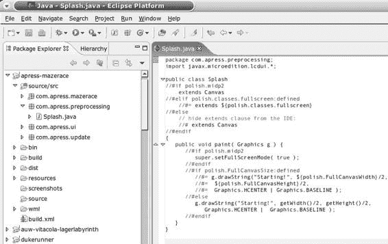

5033CH15.qxd 6/20/05 9:20 AM 第 300 页

**300**

第 15 章 ■ 在设备限制间起舞

**图 15-1.** *运行中的支持预处理的 Eclipse 编辑器*

■**注意** 面向方面编程提供了与预处理类似的灵活性。然而，它相当难以管理。现有的解决方案也依赖于反射，并添加了它们自己的调度核心，这需要额外的约 40KB 的 JAR 空间。

**使用不同的源文件**

一种与预处理类似的方法是使用不同的源文件夹。通过在 *build.xml* 文件中实现条件性的 `<source>` 元素，你可以使用不同的源文件和文件夹。清单 15-4 展示了如何根据当前目标设备使用不同的源文件。

**清单 15-4.** *使用 `<source>` 元素实现不同源文件*

<j2mepolish>

<info

license="GPL"

name="Roadrunner"

vendorName="一位读者。"

version="0.0.1"

jarName="${polish.vendor}-${polish.name}-roadrunner.jar"

/>

5033CH15.qxd 6/20/05 9:20 AM 第 301 页

第 15 章 ■ 在设备限制间起舞

**301**

<deviceRequirements>

<requirement name="Identifier"

value="Nokia/Series60, Siemens/x75" />

</deviceRequirements>

<build

usePolishGui="true"

>

<midlet class="com.apress.roadrunner.Roadrunner" />

**<sources>**

**<source dir="source/src" />**

**<source dir="source/midp2"**

**if="polish.midp2" />**

**<source dir="source/nokiaui"**

**if="polish.api.nokia-ui and not polish.midp2" />**

**<source dir="source/midp1"**

**if="not (polish.api.nokia-ui or polish.midp2)" />**

**</sources>**

</build>

<emulator />

</j2mepolish>

如清单 15-5 所示，这段代码实际上与动态 Java 源代码非常相似。然而，主要区别在于，你不会因为将未使用的类包含在应用程序中而浪费 JAR 和内存空间。此外，对于不了解 J2ME Polish 的开发者来说，代码本身也更容易理解。

**清单 15-5.** *通过使用不同的源文件夹实现全屏启动画面*
package com.apress.folders;

import javax.microedition.lcdui.*;

import javax.microedition.midlet.*;

public class GameMidlet extends MIDlet {

private Display display;

public GameMidlet() {

}

public void startApp() {

this.display = Display.getDisplay( this );

Splash splash = new Splash();

this.display.setCurrent( splash );

}

public void destroyApp( boolean unconditional ) {

}

public void pauseApp() {

}

}

5033CH15.qxd 6/20/05 9:20 AM 第 302 页

**302**

第 15 章 ■ 在设备限制间起舞

// 普通的 MIDP 1.0 启动画面，

// 此类位于 source/midp1：

package com.apress.folders;

import javax.microedition.lcdui.*;

public class Splash extends Canvas {

public void paint( Graphics g ) {

g.drawString("Starting!", getWidth()/2, getHeight()/2, Graphics.HCENTER | Graphics.BASELINE );

}

}

// MIDP 2.0 启动画面，

// 此类位于 source/midp2：

package com.apress.folders;

import javax.microedition.lcdui.*;

public class Splash extends Canvas {

public void paint( Graphics g ) {

setFullScreenMode( true );

g.drawString("Starting!", getWidth()/2, getHeight()/2, Graphics.HCENTER | Graphics.BASELINE );

}

}

// Nokia UI API 启动画面，

// 此类位于 source/nokiaui：

package com.apress.folders;

import javax.microedition.lcdui.*;

import com.nokia.mid.ui.FullCanvas;

public class Splash extends FullCanvas {

public void paint( Graphics g ) {

g.drawString("Starting!", getWidth()/2, getHeight()/2, Graphics.HCENTER | Graphics.BASELINE );

}

}


每个严肃的 Java IDE 都支持为一个项目设置多个源文件夹。在 Eclipse 中，你可以通过右键单击项目，选择“属性”，然后选择“Java 构建路径”来添加源文件夹，如图 15-2 所示。在“源”选项卡上，单击“添加文件夹”以添加另一个源文件夹。但是，当你想要多次实现相同的类时，不应这样做。在这种情况下，你的 IDE 会（正确地）抱怨存在重复的类定义。只需使用一个主源文件夹（例如 *source/src*），然后将其他源文件夹添加到父目录中，例如 *source/midp2*、*source/nokiaui* 等。另一种策略是在你的 IDE 中使用包含不同源代码的不同项目。

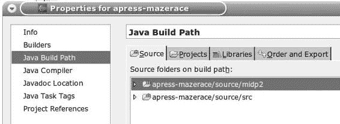

5033CH15.qxd 6/20/05 9:20 AM 第 303 页

第 15 章 ■ 在设备限制间周旋

**303**

**图 15-2.** *向 Eclipse 项目添加新的源文件夹* 使用不同源文件的主要缺点是每次更改都需要额外的工作。根据业务需求，你可能需要创建大量不同的 Java 源文件。当你现在需要包含一个额外的功能或错误修复时，你需要在每个受影响的源文件中实现更改。

**解决常见问题**

通常，你会在项目中遇到类似的问题。在接下来的章节中，我将讨论如何解决常见的困难。

**使用适当的资源**

不同设备之间的主要区别在于屏幕尺寸，因此你通常需要调整图像以获得最佳效果。此外，你通常需要不同的多媒体资源，例如不同类型的音频文件。

使用 J2ME Polish 的自动资源组装功能，这项任务很容易完成。

只需将所有公共资源放入项目的 *resources* 文件夹，并为特定资源使用子文件夹，例如 *resources/Nokia* 用于诺基亚资源，*resources/mmapi* 用于支持移动媒体 API 的设备，以及 *resources/Motorola/A1000* 用于摩托罗拉 A1000 手机。

另一个不错的功能是，你也可以使用灵活的文件夹：例如，来自 *resources/BitsPerPixel.12+* 文件夹的资源将用于所有每颜色位深度至少为 12 位（4096 色）的设备。另一个例子是 *resources/ScreenSize.*

*150+x200+* 文件夹。当设备的屏幕宽度至少为 150 像素且高度至少为 200 像素时，将使用此文件夹中的资源。当你使用多个这样的灵活资源文件夹时，将使用最匹配的那个。

你还可以在 *build.xml* 脚本中使用 <resources> 元素及其嵌套的 <fileset> 元素来指定资源的条件。

请参阅第 7 章中的“打包你的应用程序”部分，以了解使用 J2ME Polish 进行资源组装选项的完整细节。

5033CH15.qxd 6/20/05 9:20 AM 第 304 页

**304**

第 15 章 ■ 在设备限制间周旋

**规避已知问题**

你可以在 *http://www.j2mepolish.org/devices/issues.html* 查看许多已知问题。你可以通过防御性编程来规避一些问题；其他问题则需要调整你的代码。

防御性编程

你可以通过防御性编程规避的一个问题是 Symbian 和 Motorola 设备上 InputStream.available() 实现的行为。在这些设备上，当你从 JAR 文件中读取资源时，available() 方法返回 0。请注意，CLDC 规范完全允许这种行为，该规范指出默认的 available() 实现总是返回 0，但子类*应该*重写此方法。这只是有点出乎意料。

清单 15-6 展示了一个读取资源并将其内容作为字节数组返回的实现。除了 available() 调用之外，该代码中还存在另一个问题：你可能只是假设当你调用 InputStream.read( byte[] ) 时，整个缓冲区会被一次性读取完毕。

但事实并非如此，正如 CLDC 的 JavaDoc 所提到的。read() 方法返回的是读取的字节数，而不是完全填满缓冲区。当你确切知道输入的大小时，应该改用 DataInputStream.readFully( byte[] ) 方法。

第三个问题是，当 read() 方法抛出异常时，你没有关闭输入流。这可能会导致应用程序中出现内存泄漏。

**清单 15-6.** *错误地读取资源*

public byte[] readResource( String url )

throws IOException

{

InputStream in = getClass().getResourceAsStream( url );

// 以下代码在 Symbian 和 Motorola 上总是返回 0：**int available = in.available();**

byte[] buffer = new byte[ available ];

// 这也不能保证正常工作：

**in.read( buffer );**

// 不能保证输入流被关闭，

// 因为 in.read() 可能抛出异常。

**in.close();**

return buffer;

}

清单 15-7 展示了同一方法的防御性实现，该方法同样适用于 Motorola 和 Symbian 设备。只要 read() 方法通过返回 -1 来指示流结束，你就持续读取资源。你还使用 ByteArrayOutputStream 来缓冲读取的字节。最后但同样重要的是，你将实际的资源读取操作包围在 try

{...} finally 块中。即使包围的代码中发生异常，finally 块也会执行。生成的应用程序比原始版本复杂得多，但是，嘿，它能工作！

5033CH15.qxd 6/20/05 9:20 AM 第 305 页

第 15 章 ■ 在设备限制间周旋

**305**

**清单 15-7.** *使用一些防御性技术正确读取资源* public byte[] readResource( String url )

throws IOException

{

InputStream in = getClass().getResourceAsStream( url );

byte[] buffer;

// 以下代码在 Symbian 和 Motorola 上总是返回 0：int available = in.available();

**if ( available == 0 ) {**

available = 4 * 1024; // 4 kb

}

buffer = new byte[ available ];

ByteArrayOutputStream out = new ByteArrayOutputStream( available ); int read;

try {

while ( (read = in.read( buffer ) ) != -1 ) {

out.write( buffer, 0, read );

}

} finally {

in.close();

}

return out.toByteArray();

}

■**提示** 始终仔细阅读文档。每当文档中说*可能*、*也许*或*应该*时，你不能假设所有设备上的行为都相同。但是，当文档声明某个功能*必须*存在时，你很可能处于安全的一边。

代码调整

通常，防御性编程本身不足以规避问题。在这种情况下，你需要在源代码级别或字节码级别调整代码。

**使用预处理**

你可以使用预处理来规避源代码中的已知问题。

一个需要代码更改的问题示例是索尼爱立信 K700 设备上全屏模式的实现。当通过调用 Canvas.setFullScreenMode( true ) 激活 MIDP 2.0 全屏模式时，系统警报将不再显示。

每当你访问受限资源时，例如，当你想要启动 HTTP 连接时，会显示系统警报。一种可能的解决方法是使用同样存在于 K700 设备上的诺基亚 UI API 的 com.nokia.mid.ui.

FullCanvas 类。请注意，FullCanvas 类不允许你添加任何命令。当此问题存在时，J2ME Polish 会设置

5033CH15.qxd 6/20/05 9:20 AM 第 306 页

**306**

第 15 章 ■ 在设备限制间周旋

预处理符号 polish.Bugs.needsNokiaUiForSystemAlerts。


好的，作为一名高级文档工程师和翻译员，我将严格遵循您提供的注意事项和示例，将给定的英文文本翻译成中文。


使用 `polish.Bugs.[name]` 符号可以将代码与特定设备抽象开来，这样您以后就可以为任何存在相应问题的设备使用相同的解决方案。您可以通过在 *devices.xml*、*custom-devices.xml*、*groups.xml* 等文件中设置 Bugs 能力来向设备数据库添加问题：`<capability name="Bugs" value="issueName1, issueName2" />`。

清单 15-8 展示了如何检查当前目标设备上是否存在此问题。当存在此问题且 Nokia UI API 可用时，您将扩展 `FullCanvas` 类，而不是普通的 `Canvas` 类。在这种情况下，您可以使用 `polish.classes.fullscreen` 预处理变量，对于支持 Nokia UI API 的设备，该变量的值为 `com.nokia.mid.ui.FullCanvas`。与直接扩展 `FullCanvas` 相比，这更加灵活。当存在此错误或目标设备不支持 MIDP 2.0 配置文件时，您不应调用 `setFullScreenMode()`。

**清单 15-8.** *当存在 needsNokiaUiForSystemAlerts 错误时使用 FullCanvas* package com.apress.preprocessing;

import javax.microedition.lcdui.*;

public class Splash

**//#if polish.midp2 && !polish.Bugs.needsNokiaUiForSystemAlerts** **extends Canvas**

**//#elif polish.classes.fullscreen:defined**

**//#= extends ${polish.classes.fullscreen}**

**//#else**

**// 对 IDE 隐藏 extends 子句：**

**//# extends Canvas**

**//#endif**

{

public void paint( Graphics g ) {

**//#if polish.midp2 && !polish.Bugs.needsNokiaUiForSystemAlerts** **setFullScreenMode( true );**

**//#endif**

g.drawString( "Starting!", getWidth() / 2, getHeight() / 2, Graphics.HCENTER | Graphics.BASELINE );

}

}

`Graphics.drawRGB()` 实现在许多 MIDP 2.0 设备上存在问题，例如诺基亚 Series 60 和索尼爱立信 K700。您可以使用 `drawRGB()` 方法来绘制包含 RGB 格式像素信息的整数数组。这个方法的一个很酷的地方是，您也可以使用半透明数据，这样您的背景就能透出来。在 K700 设备上，`drawRGB()` 实现没有考虑平移原点——相反，它始终使用 (0, 0) 原点。因此，当您通过调用 `Graphics.translate( x, y )` 平移 Graphics 的原点时，如果存在此错误，绘制的 RGB 数据将会错位。一个可能的解决方案是完全不使用 `translate()`，但在某些设备上，原生实现无论如何都会调用它，例如在绘制标题时。当您使用一点预处理时，您就安全了。清单 15-9 展示了如何通过在调用 `drawRGB()` 之前调整 x 和 y 值来规避此错误。

5033CH15.qxd 6/20/05 9:20 AM 第 307 页

第 15 章 ■ 绕开设备限制

**307**

**清单 15-9.** *规避 drawRgbOrigin 问题* public void paintArgbColor( int argbColor, int x, int y,

int width, int height, Graphics g )

{

// 当存在 drawRgbOrigin 问题时规避它：

**//#ifdef polish.Bugs.drawRgbOrigin**

**x += g.getTranslateX();**

**y += g.getTranslateY();**

**//#endif**

// 实际上您需要缓冲这个：

int[] rgbBuffer = new int[ width ];

for ( int i = rgbBuffer.length - 1; i >= 0 ; i-- ) {

rgbBuffer[ i ] = argbColor;

}

// 防御性编程：某些实现不接受负坐标：

if ( x < 0 ) {

width += x;

if ( width < 0 ) {

return;

}

x = 0;

}

if ( y < 0 ) {

height += y;

if ( height < 0 ) {

return;

}

y = 0;

}

// 现在绘制 RGB 数据：

**g.drawRGB( rgbBuffer, 0, 0, x, y, width, height, true );**

}

使用预处理来规避错误有时是繁琐的工作，但通常没有其他选择。所有 J2ME Polish 库都使用预处理来适应目标设备，因此您可以直接使用这些库，而无需过多担心设备问题。但是，当您的应用程序针对已知问题的特定目标设备构建时，您应该这样做。当您使用诸如“Generic/midp2”之类的通用目标设备时，J2ME Polish 无法规避特定于设备的错误。

**操作字节码**

规避错误的另一个选择是在字节码级别修改应用程序。这种方法有几个优点，因为程序员在应用程序开发阶段不需要自己规避问题。此外，程序的某些方面在字节码级别比在源代码级别更容易跟踪，例如浮点计算的使用。第三个优点是，您只需重新构建现有应用程序即可规避新发现的已知问题。当然，缺点是字节码操作的复杂性。如果您愿意承担这项任务，您可以创建一个扩展 `de.enough.polish.postcompile.PostCompiler` 类的后编译器。您可以使用 *build.xml* 文件中的 `<postcompiler>` 元素将其集成到处理链中。后编译器在编译阶段之后被调用，并且可以更改很多事情。一个例子是 Enough Software 的 Floater 工具，它允许您在 CLDC 1.0 设备上使用原始类型 `float` 和 `double` 实现浮点计算。有关此选项的更多详细信息，请参阅第 13 章的“使用后编译器”部分。

■**提示** 有关操作字节码，请参考 ASM ( *http://asm.objectweb.org*) 和 BCEL ( *http://jakarta.apache.org/bcel*) 库。

**实现用户界面**

当您针对不同设备时，用户界面通常是最容易出现问题的领域。为了在 MIDP 设备上实现用户界面，您可以在所谓的高级 GUI（提供 Form、List 等）和低级 GUI（允许您绘制自己的控件）之间进行选择。

事件处理是常见的错误来源。您绝不能阻塞事件处理线程，例如，在 `CommandListener` 的 `commandAction()` 方法中或 `Canvas` 的 `keyPressed()` 方法中。当您有长时间运行的计算、网络连接等时，您需要在单独的 `Thread` 中执行此操作。

使用高级 GUI

使用高级 GUI 有几个优点：

• 您的应用程序更小，因为您不需要那么多代码来创建用户界面。

• 您的应用程序可以更容易地移植，因为许多低级 GUI 实现都包含问题。

• 开发更容易，因为低级 GUI 相当复杂。

主要的缺点是应用程序的外观和感觉取决于供应商的实现。一些实现具有令人愉悦的外观，但其他实现则提供了看起来有些笨拙的用户界面。MIDP 2.0 配置文件提供了一些很棒的新功能，例如 `CustomItem`、通过调用 `Display.setCurrentItem()` 聚焦项目的能力以及弹出式 `ChoiceGroups`。

使用 J2ME Polish GUI，您可以在应用程序代码中使用高级 GUI，同时通过使用 CSS 文本文件在应用程序代码之外指定设计来完全控制。J2ME Polish GUI 还支持 MIDP 1.0 设备上的新 MIDP 2.0 高级 GUI 功能。J2ME Polish GUI 内部使用预处理来适应各种手机。您可以根据条件激活和停用 J2ME Polish GUI 的使用。有关这些可能性的详细讨论，请参阅第 12 章。

5033CH15.qxd 6/20/05 9:20 AM 第 309 页


第 15 章 ■ 在设备限制中灵活应对

**309**

使用低级图形用户界面

低级 GUI API 允许你控制用户界面的每一个细节，但也带来了必须自行管理所有细节的负担，包括滚动、事件处理，以及最重要的——绘制用户界面。

**自定义项**

在 MIDP 2.0 设备上，你还可以通过`javax.microedition.lcdui.CustomItem`类混合使用低级和高级 GUI API。根据目标设备的不同，你甚至可以接收按键事件，以实现与`CustomItem`的复杂交互。然而，唯一强制要求的功能是显示`CustomItem`的内容，因此你不能依赖任何高级交互模式。不过，当你使用 J2ME Polish GUI 时，则不受此限制，它支持相同的交互模式，并在所有目标设备上转发按键和指针按下事件。

**软键**

软键并未标准化，因此不同厂商的按键代码会有所不同。设备数据库包含了大多数设备的按键代码；清单 15-10 演示了如何通过一些预处理来使用这些信息。当`polish.key.LeftSoftKey`未定义时，假设其按键代码为-6。右软键的默认按键代码为-7。在`keyPressed()`方法中，你首先检查是否有软键被按下，然后再获取游戏动作。这是一种防御性编程技术，因为某些设备在将软键值传递给`getGameAction()`方法时会抛出`IllegalArgumentException`异常。

**清单 15-10.** *为软键使用正确的按键代码*
```java
package com.apress.preprocessing;

import javax.microedition.lcdui.*;

public class MyCanvas extends Canvas {

//#ifdef polish.key.LeftSoftKey:defined
//#= private static final int LEFT_SOFT_KEY = ${polish.key.LeftSoftKey};
//#else
private static final int LEFT_SOFT_KEY = -6;
//#endif

//#ifdef polish.key.RightSoftKey:defined
//#= private static final int RIGHT_SOFT_KEY = ${polish.key.RightSoftKey};
//#else
private static final int RIGHT_SOFT_KEY = -7;
//#endif

public void keyPressed( int keyCode ) {
if ( keyCode == LEFT_SOFT_KEY ) {
// 处理左软键
} else if ( keyCode == RIGHT_SOFT_KEY ) {
// 处理右软键
5033CH15.qxd 6/20/05 9:20 AM Page 310

**310**
第 15 章 ■ 在设备限制中灵活应对

} else {
int gameAction = getGameAction( keyCode );
// 处理按键按下事件...
}
}

protected void paint( javax.microedition.lcdui.Graphics graphics ) {
}
}
```

某些设备在按下软键时不会产生任何按键事件。在这种情况下，你有时可以添加空的、因此不可见的命令，通常是一个`Command.BACK`类型和一个`Command.SCREEN`类型，这样两个键就都有了关联的命令。然后你可以在`CommandListener`的`commandAction()`方法中处理这些命令。

**网络连接**

网络连接允许你与外部世界交互。在 MIDP 平台上，你有多种可能的技术，例如短信（SMS）、蓝牙和 HTTP。

短消息服务

短消息服务（SMS）允许你从移动设备发送长度不超过 160 个字符的文本消息。你可以使用无线消息 API（WMAPI，JSR 120）来发送和接收文本消息。WMAPI 2.0（JSR 205）还支持多媒体消息（MMS）。

无线消息的一个潜在问题是运行时间，它可能变化很大。此外，你无法保证消息一定会被送达。不过总的来说，SMS 是一种简单且可靠的通信协议。

蓝牙

蓝牙允许你直接连接其他支持蓝牙的设备。这种连接非常适合临时交换信息。使用所谓的微微网，你还可以同时连接到多个其他设备。并非所有支持蓝牙连接的设备都通过可选的蓝牙 API（JSR 82）使其可用，但支持度正在不断增长。

蓝牙的一个常见问题是，只有少数设备实现了蓝牙 API 中可选的 OBEX 部分。你可以创建自己的协议，或使用 Avetana OBEX 库（*http://sourceforge.net/projects/avetanaobex*）来交换数据。

出于安全原因，大多数蓝牙设备会隐藏其 ID，除非用户明确请求“可见”。当你已经知道通信伙伴时，这不是问题，但当你的应用程序依赖于发现新设备时，这可能会产生严重影响。此类应用程序的一个例子是约会服务，每当它发现另一个也运行此服务的设备时，就会匹配兴趣。

5033CH15.qxd 6/20/05 9:20 AM Page 311

第 15 章 ■ 在设备限制中灵活应对

**311**

最后，另一个问题是建立连接的延迟。当你只有很短的时间来建立连接时——例如，当用户彼此擦肩而过时——你可能无法发现设备并建立连接。

HTTP 网络连接

超文本传输协议（HTTP）是在所有设备上进行连接的唯一有保证的方式。MIDP 2.0 设备还需要支持 HTTPS 连接以实现安全通信。

HTTP 是一种与网络无关的协议，因此原则上你的应用程序无需关心设备使用的是 WAP、TCP、GSM、GPRS、UMTS 还是其他网络技术。

当你在某设备上建立连接遇到问题时，应首先检查你使用的是互联网接入点还是通过运营商的 WAP 网关进行连接。当你尝试连接到非标准端口时，通过 WAP 网关连接常常会导致问题。因此，你应该尝试为你的服务器应用程序使用端口 80、8080 或 443。如果仍然遇到问题，请确保在你的设备上使用互联网接入点。解析域名会减慢网络连接速度，也可能导致问题，因此请尝试在你的 J2ME 应用程序中使用静态 IP 地址。你可以通过将服务器 IP 地址作为 JAD 属性或预处理变量来配置你的应用程序。

网络连接的延迟相当高，通常需要几秒钟。这排除了复杂的实时应用程序，例如多人动作游戏。同样，你可以通过使用 IP 地址而不是域名来稍微加快延迟。但是，当你的服务器应用程序将来迁移时，这可能会导致问题。

由于连接需要付费，设备在即将建立 HTTP 连接时被要求询问用户权限。当用户不允许连接时，会抛出`SecurityException`异常。当你对应用程序进行签名时，可以使用`MIDlet-Permissions` JAD 属性来声明你的应用程序需要 HTTP 连接才能运行。在这种情况下，仅在安装过程中询问用户一次。当用户拒绝所需资源时，应用程序根本不会安装。在 J2ME Polish 中，你可以使用`<info>`元素的`permissions`属性来设置此 JAD 属性：`<info permissions="javax.microedition.io.Connector.http" [...] />`。

**数据协议**


在与服务器交换数据之前，你应该三思是否使用 XML 或 SOAP。XML 是一种语法冗长的协议，与实际数据相比，它带来了大量开销。你还需要在 J2ME 应用程序中解析和构建 XML 消息，这在性能和堆内存使用方面可能代价高昂。通常，使用你自己的专有二进制协议会更好。你可以使用 `DataInputStream` 和 `DataOutputStream` 来方便地读写二进制数据。

无论如何，如果你无法抗拒使用 XML 协议进行通信，你可以使用 kXML（*http://kxml.sourceforge.net*）来解析数据。

5033CH15.qxd 6/20/05 9:20 AM Page 312

**312**

第 15 章 ■ 在设备限制间周旋

**身份验证**

当 J2ME 应用程序需要验证用户身份时，你可以使用几种方法来安全地传输数据。在 MIDP 2.0 设备上，你可以直接使用 HTTPS 连接。

在 MIDP 1.0 设备上，你可以计算密码的哈希值，并通过 HTTP 发送该值。你还应该为每个身份验证请求添加一个时间戳，并在哈希函数中也使用这个时间戳，以防止重放攻击。在重放攻击中，恶意入侵者会拦截通信，复制身份验证请求，并在之后重新发送。你可以使用 Bouncy Castle 加密 API 来计算哈希值（*http://www.bouncycastle.org*）。

**会话和 Cookie**

你可以使用会话来维护跨多个请求的 HTTP 连接状态。这在处理用户数据时非常有用，否则 J2ME 应用程序需要在每个请求中发送身份验证数据。你可以使用 URL 重写或 Cookie 来跟踪所使用的会话。你可以通过遍历连接的所有标头来检索 Cookie。当你开始一个新请求时，需要将 Cookie 设置为请求属性。

清单 15-11 展示了此问题的一个可能解决方案。

**清单 15-11.** *接收和设置 Cookie*

```java
import javax.microedition.io.HttpConnection;

import java.io.IOException;

public class CookieStore {

private String cookie;

public void readCookie( HttpConnection con ) throws IOException {

this.cookie = con.getHeaderField( "Set-Cookie" ); if ( this.cookie == null ) {

this.cookie = con.getHeaderField( "Set-Cookie2" );

}

}

public void setCookie( HttpConnection con )

throws IOException {

if ( this.cookie != null ) {

con.setRequestProperty( "Cookie", this.cookie );

}

}

}
```

5033CH15.qxd 6/20/05 9:20 AM Page 313

第 15 章 ■ 在设备限制间周旋

**313**

**播放声音**

得益于移动媒体 API（MMAPI，JSR 135），如今播放声音和音乐已经变得相当容易。但在实践中，你需要注意一些限制。

具体来说，当你想要同时播放多个声音时需要小心。在许多设备上，这是不可能的。当设备可以同时播放多个声音时，`supports.mixing` 系统属性为 `true`：

```java
if ( "true".equals( System.getProperty( "supports.mixing" ) ) { ...
```

同样，你可以在源代码中检查预处理变量 `polish.Property.supports.mixing`：

```java
//#if polish.Property.supports.mixing == true
```

最安全的方法是每次只使用一个播放器，并在处理完一个声音后释放所有资源。同时预取多个声音也并非总是可行的。

清单 15-12 展示了如何反复播放一个声音，至少在 `playMusic` 字段为 `true` 时如此。另请注意，`PlayerListener` 使用 `equals()` 方法来比较传入的事件。这在所有设备上都有效，而使用 MMAPI 的 JavaDoc 文档中使用的 `==` 比较器则并非在所有设备上都有效。

**清单 15-12.** *使用 MMAPI 播放背景音乐*

```java
//#condition polish.api.mmapi || polish.midp2

package com.apress.multimedia;

import java.io.IOException;

import javax.microedition.media.*;

public class MusicPlayer
```


implements PlayerListener {

public boolean playMusic = true;

private Player player;

public void playMusic( String url, String contentType )

throws MediaException, IOException {

boolean registerListener = ( this.player == null );

if ( !registerListener ) {

this.player.stop();

this.player.deallocate();

}

this.player = Manager.createPlayer(

getClass().getResourceAsStream( url ), contentType );

if ( registerListener ) {

player.addPlayerListener( this );

}

player.realize();

player.prefetch();

player.start();

}

5033CH15.qxd 6/20/05 9:20 AM Page 314

**314**

第 15 章 ■ 在设备限制间周旋

public void playerUpdate( Player p, String event, Object data ) throws MediaException {

if ( this.playMusic && event.equals( END_OF_MEDIA ) ) {

p.start();

}

}

}

**使用浮点运算**

Java 在 `java.lang.Math` 类中提供了 `float` 和 `double` 基本类型以及高级数学函数。遗憾的是，你只能在 CLDC 1.1 平台上使用浮点计算。大多数 J2ME 设备仍然基于 CLDC 1.0 配置，对此存在几种解决方案：你可以改用整数计算、使用浮点模拟库，或者使用 Floater 程序（*http://www.enough.de/floater*）来自动转换浮点计算。

**使用整数代替浮点计算**

通常，浮点计算并非真正必要。在这种情况下，你可以使用 `int` 和 `long` 基本类型自行模拟浮点计算。

你可以通过将每个数字乘以一个固定因子（例如 100 或 1000）来使用自己的定点计算。要获得真实值，你只需将结果除以你选择的因子即可。例如，考虑清单 15-13 中所示的简单分数计算。

你可以使用 `Mover` 类来计算一个物体移动的距离。每次调用 `moveForward()` 都会返回移动的距离。例如，你可以在动画中使用这种计算。

**清单 15-13.** *一个简单的浮点计算* public class Mover {

private int step;

private final int steps;

private final float distancePerStep;

public Mover( int distance, int steps ) {

this.steps = steps;

this.distancePerStep = (float) distance / (float) steps;

}

public int moveForward() {

this.step++;

if ( step > this.steps ) {

this.step = 0;

5033CH15.qxd 6/20/05 9:20 AM Page 315

第 15 章 ■ 在设备限制间周旋

**315**

}

return (int) ( this.step * this.distancePerStep );

}

}

当不需要高精度时，你可以使用 `int` 变量代替 `float` 变量。对于更高精度，则使用 `long` 变量代替 `double` 变量。清单 15-14 展示了一个 `Mover` 实现，它通过将 `distancePerStep` 变量乘以 100 来模拟两位小数。

**清单 15-14.** *一个仅使用整数进行简单浮点计算的解决方案* public class Mover {

private int step;

private final int steps;

private final int distancePerStep;

public Mover( int distance, int steps ) {

this.steps = steps;

this.distancePerStep = ( distance * 100 ) / steps;

}

public int moveForward() {

this.step++;

if ( step > this.steps ) {

this.step = 0;

}

return ( this.step * this.distancePerStep ) / 100;

}

}

**使用浮点模拟库**

浮点模拟库允许你实现涉及三角函数等的复杂计算。流行的库有用于快速计算的 MathFP 和用于高精度计算的 MicroFloat 库。表 15-5 列出了一些可用于 CLDC 1.0 配置的浮点库。

**表 15-5.** *浮点模拟库*

**名称**

**许可证**

**主页**

MathFP

宽松源代码许可证

*http://home.rochester.rr.com/ohommes/MathFP*

MicroFloat

GPL

*http://www.dclausen.net/projects/microfloat*

JMFP

LGPL

*http://sourceforge.net/projects/jmfp*

FPLib

Artistic 许可证

*http://bearlib.sourceforge.net*

5033CH15.qxd 6/20/05 9:20 AM Page 316

**316**

第 15 章 ■ 在设备限制间周旋

**MathFP**

Onno Hommes 开发的 MathFP 库提供快速计算，并根据宽松源代码许可证授权。你可以从 *http://home.rochester.rr.com/ohommes/MathFP* 下载它。

你可以在长模式（使用 `net.jscience.math.MathFP` 类）下使用 MathFP 库以获得更高精度，或者在资源占用较少的 int 模式（使用 `net.jscience.math.kvm.MathFP` 类）下使用。你需要先将字符串转换为内部的 MathFP 格式，而不是直接使用 `float` 或 `double` 值。转换后，你将获得一个表示该值的内部整数。你也可以将内部的 MathFP 整数值转换回对应的 `int` 或 `long` 值（不含小数部分）。清单 15-15 向你展示了如何使用 MathFP 计算圆的面积。

**清单 15-15.** *使用 MathFP 计算圆所占空间*

public int calculateCircleSpace( String radiusStr ) {

int radius = MathFP.toFP( radiusStr );

int exponent = MathFP.toFP( 2 );

int result = MathFP.mul( MathFP.PI,

MathFP.pow( radius, exponent ) );

return MathFP.toInt( result );

}

**MicroFloat**

Dave Clausen 开发的 MicroFloat 库以其高精度而闻名。使用 MicroFloat 进行计算会产生与原生 Java 浮点计算相似的结果，因为 MicroFloat 遵循国际 IEEE 754 标准（*http://grouper.ieee.org/groups/754*）。你可以在 *http://www.dclausen.net/projects/microfloat* 下载 MicroFloat。

MicroFloat 的用法与 MathFP 类似。你可以使用 `net.dclausen.microfloat.MicroFloat` 类来模拟 `float`，或使用 `net.dclausen.microfloat.MicroDouble` 类来模拟 `double` 值。清单 15-16 向你展示了如何使用 MicroFloat 计算圆所占的空间。

**清单 15-16.** *使用 MicroFloat 计算圆所占空间* public int calculateCircleSpace( String radiusStr ) {

int radius = MicroFloat.parseFloat( radiusStr );

int result = MicroFloat.mul( MicroFloat.PI,

MicroFloat.mul( radius, radius ) );

return MicroFloat.intValue( result );

}

**自动转换**

你也可以使用 Enough Software 的 Floater 工具来自动转换任何浮点计算。J2ME Polish 包含此转换器的评估版本。你可以在 *http://www.enough.de/floater* 找到关于 Floater 的更多信息。

5033CH15.qxd 6/20/05 9:20 AM Page 317

第 15 章 ■ 在设备限制间周旋

**317**

使用 Floater，你可以正常使用 `float` 和 `double`，以及 CLDC 1.1 的 `java.lang.Math` 实现的所有功能。Floater 通过在编译阶段后处理字节码来实现这一点。J2ME Polish 集成会自动为所有 CLDC 1.0 目标设备处理字节码。另一个好处是，Floater 不需要使用字符串将浮点值转换为内部格式，因此与在源代码级别进行手动转换相比，由 Floater 处理的应用程序更精简、速度更快。此外，你无需区分任何内部格式和真正的整数变量，因为 Floater 会透明地处理这一切。

**使用受信任的 MIDlet**

签署 J2ME 应用程序的可能性在开发者社区中引起了许多困惑和挫折，因为大多数设备不识别流行的 VeriSign 和 Thawte 代码签名证书。

MIDP 2.0 规范引入了受信任 MIDlet 的概念。当满足以下条件时，MIDlet 被视为受信任：

• MIDlet 已被签名。

• 签名已被设备认证。

• 已签名 MIDlet 的完整性已由设备验证。

权限


当您的应用程序需要访问安全敏感资源（如互联网连接）时，需要对 MIDlet 进行签名。您可以在 MIDlet-Permissions JAD 属性中声明所需的权限。在 J2ME Polish 中，您可以使用 `<info>` 元素的 `permissions` 属性来定义必要的权限，例如 `<info permissions="javax.microedition.io.Connector.http" [...] />`。同样，您也可以使用 `optionalPermissions` 属性来定义可选权限。

权限的可能取值包括 `javax.microedition.ui.Connector.http`、`javax.microedition.ui.Connector.socket` 和 `javax.microedition.io.PushRegistry`。

请查阅附录以了解所有可能的权限。

当您想要访问所谓的封闭资源（如底层网络 API（数据报、套接字、串行））时，通常需要有效的签名；否则，会立即抛出 `SecurityException`。

**签名 MIDlet**

当应用程序被签名后，JAR 文件的 SHA1 哈希值会被计算并添加到 JAD 文件中。用于计算的证书也会被添加到 JAD 文件中。JAR 文件本身不会改变，且之后不得修改。用户会被询问一次是否授予已签名的 MIDlet 所请求的权限。当必需的权限被拒绝时，安装会中止。当用户拒绝可选权限时，安装会继续进行。在这种情况下，应用程序运行期间会再次询问用户，就像未签名的 MIDlet 一样。

5033CH15.qxd 6/20/05 9:20 AM 第 318 页

**318**

第 15 章 ■ 在设备限制间周旋

■**注意** 请参阅第 7 章的“签名 MIDlet”部分，了解如何使用 J2ME Polish 自动签名您的应用程序。

**根证书与 Java Verified**

您需要一个证书来签名您的应用程序。设备也需要识别并信任所使用的证书；否则，安装会中止。所有设备都为此目的包含了所谓的根证书。

根证书分为三类：

- **供应商证书**用于签名预装的 J2ME 应用程序。此类应用程序享有最高级别的信任，可以访问所有内容。显然，您需要与供应商建立业务关系，才能使用供应商证书进行签名。
- **运营商**也可以将自己的根证书添加到其手机中。同样，您需要与相应的供应商建立业务关系，才能使用运营商证书签名您的应用程序。
- **Java Verified/GEO Trust 证书**也存在于大多数符合 MIDP 2.0 规范的设备上。

Java Verified（*http://www.javaverified.com*）是一项提供测试和签名服务的倡议。当您的应用程序通过测试并支付了必要费用后，Java Verified 会使用 GEO Trust 证书（*http://www.geotrust.com*）对您的应用程序进行签名，然后通过电子邮件返回给您。因此，通常您无法自行签名您的 MIDlet。如果您因访问封闭资源（如底层网络 API）而依赖有效签名，这会尤其令人烦恼。某些设备可能支持导入新证书，在这种情况下，您可以在开发阶段创建并使用自己的证书。

一种减少所需验证次数的可行策略是将应用程序拆分为应用程序本身及其操作的数据。在这种场景下，应用程序本身保持不变，并在首次运行时下载其操作所需的数据。然而，在现实中，很少有应用程序能够保持不变。

当您的应用程序需要签名时，您应尽量限制目标设备的数量，因为您需要为每个经过测试和签名的应用程序版本付费。您可以使用诸如“Nokia/Series40DP2”或“Generic/midp2”之类的虚拟设备。它们对其各自设备类的功能进行了分组。

**识别设备**

每台设备都有一个全球唯一的识别号码，称为国际移动设备识别码（IMEI）。类似的识别码是国际移动用户识别码（IMSI），它与用户的用户识别模块（SIM）卡绑定。在某些设备上，您可以通过查询系统属性从 J2ME 应用程序中访问这些值；在其他设备上，您需要运行自己的识别程序。

您可以通过请求 IMSI 系统属性在摩托罗拉设备上访问 IMSI。西门子通过系统属性 `com.siemens.mp.imei` 提供 IMEI。在索尼

5033CH15.qxd 6/20/05 9:20 AM 第 319 页

第 15 章 ■ 在设备限制间周旋

**319**

爱立信设备上，您需要使用 `com.sonyericsson.imei` 或 `com.sonyericsson.IMEI`。RIM 黑莓设备通过调用 `GPRSInfo.getIMEI()` 使 IMEI 可访问。J2ME Polish 设备数据库在 `polish.Property.imei` 和 `polish.Property.imsi` 变量中包含了访问这些标识所需的键。

在诺基亚设备上，您无法从 J2ME 应用程序中访问 IMSI 或 IMEI。在这种情况下，您需要创建自己的识别解决方案。

通常，用户的手机号码（MSISDN）被用于识别目的。当用户通过您的空中下载（OTA）服务器请求应用程序时，MSISDN 可以动态添加到应用程序包中。当用户通过 WAP 访问您的 OTA 服务器时，如果运营商添加了此信息，您可以从 WAP 请求的 HTTP 标头中提取 MSISDN。通常，只有当您与该运营商有业务关系时，运营商才会添加 MSISDN 标头或类似的识别标头。当然，您也可以要求用户提供其手机号码。一旦您获得了 MSISDN，就可以将其插入用于安装的 JAD 文件中。然后，您可以在应用程序中通过调用 `MIDlet.getAppProperty( String attributeName )` 来访问该 JAD 属性。JAD 文件可以轻松更改；一个更安全的选项是按需重建应用程序，并将 MSISDN 作为预处理变量提供。

在支持蓝牙 API 的设备上，您还可以通过调用 `LocalDevice.getLocalDevice().getBluetoothAddress()` 将设备的蓝牙地址用作全局唯一标识。

清单 15-17 演示了如何在一个方法中使用不同的识别选项。当预处理变量 `user.msisdn` 被定义时，返回相应的值。然后检查是否可以检索到 IMEI 或 IMSI。如果这也无法实现，则在支持蓝牙 API 的设备上返回蓝牙地址。最后但同样重要的是，当所有其他方法都失败时，从 MIDlet 中检索应用程序属性 `user.msisdn`。为了允许您区分识别方法，每个返回的 ID 都以一个标头开头，例如 `msisdn:+4916012345678`。

**清单 15-17.** *检索全局唯一标识 ID*

```java
public String getIdentification( MIDlet midlet ) {
    //#if user.msisdn:defined
    //#= return "msisdn:${user.msisdn}";
    //#elif polish.Property.imei:defined
    //#= return "imei:" + System.getProperty( "${polish.Property.imei}" );
    //#elif polish.Property.imsi:defined
    //#= return "imsi:" + System.getProperty( "${polish.Property.imsi}" );
    //#elif polish.api.btapi
    return "bluetooth:" + LocalDevice.getLocalDevice().getBluetoothAddress();
    //#else
    String msisdn = midlet.getAppProperty( "user.msisdn" );
    if ( msisdn != null ) {
        return "misdn:" + msisdn;
    } else {
        return null;
    }
    //#endif
}
```

5033CH15.qxd 6/20/05 9:20 AM 第 320 页

**320**

第 15 章 ■ 在设备限制间周旋

**访问原生功能**


得益于可选 API，应用程序现在可以访问许多此前仅原生应用才能使用的手机功能。然而，J2ME 应用仍无法访问某些领域。当你的应用需要原生功能时，你有两种选择：开发原生应用，或在 J2ME 应用内部访问原生功能。

创建原生应用超出了本书的讨论范围，但你应该意识到，存在多种操作系统且其版本部分不兼容。因此，若想覆盖广泛的用户群体，应尽可能坚持使用纯 Java。

当目标设备支持 Personal Java 配置文件时，你可以直接使用 Java 原生接口（JNI）技术来访问原生功能。JNI 提供了一种便捷且标准化的方式来调用函数并接收其返回值。在这种情况下，只有当你想支持新平台时才需要移植原生函数，因为 Java 代码可以保持不变。需要注意的是，只有少数 J2ME 设备支持 Personal Java 配置文件，例如诺基亚 Communicator 系列或索尼爱立信的 UIQ 设备（如 P910）。

部分 KVM 也支持 JNI 或类似技术。例如，JBlend 平台就提供了这种可能性（*http://www.aplix.co.jp/en/jblend/jblend/practical04.html*）。通常，你需要与相应的供应商或运营商建立商业关系，才能获准使用 JNI。

第三种可能性是实现一个原生应用，它通过监听特定端口（如 4242）建立服务器连接并等待传入请求。在此场景下，你可以打开一个套接字连接并访问本地服务器，例如：`SocketConnection mySocket = (SocketConnection) Connector.open( "socket://127.0.0.1:4242" );`。

最后，理论上可以使用 `MIDlet.platformRequest()` 机制来启动原生应用。通常，当请求以 `tel:<号码>` 方案开头时，你可以初始化电话呼叫；使用 `http:<网址>` 方案时，则可以启动浏览器。

制造商未来可以添加自己的请求方案。

检测中断

MIDlet 随时可能被来电或类似事件中断。在这种情况下，应用程序管理系统（AMS）应调用 `MIDlet.pauseApp()`，但在某些设备上并不会发生。通过一些防御性编程技术，你可以在所有手机上检测到中断。

一个典型场景是游戏，它应在被中断时暂停。为了获得最佳可移植性，你应该从三个不同角度解决这个问题：使用 `MIDlet.pauseApp()`、使用 `Canvas.hideNotify()`，以及检测异常时间间隔。

使用 `MIDlet.pauseApp()` 机制很简单。你可以在调用 `pauseApp()` 后进入 **PAUSED** 状态，并在再次调用 `MIDlet.startApp()` 时恢复应用。

某些设备（最典型的是诺基亚 Series 40）从不调用 `pauseApp()`。相反，当当前（低级 GUI）屏幕不再显示时，你会收到通知。你可以在游戏中重写 `Canvas.hideNotify()` 方法来暂停游戏，并重写 `Canvas.showNotify()` 方法来恢复游戏。

最后，某些设备在发生中断时似乎会停止整个 Java 虚拟机，而不调用任何通知方法。此时你唯一能做的就是记录应用程序线程上次执行的时间，并在下次运行时与当前时间进行比较。当你发现两次运行之间存在异常长的时间间隔时，可以假设发生了中断。使用 `System.currentTimeMillis()` 方法获取当前时间。

■**注意** 当设备同时支持 `MIDlet.pauseApp()`/`startApp()` 和 `Canvas.hideNotify()`/


`showNotify()` 的调用顺序可能出乎意料。一种实现可能会依次调用 `hideNotify()`、`pauseApp()`、<中断>、`showNotify()` 和 `startApp()`，而另一种实现则可能调用 `pauseApp()`、<中断>、`startApp()`、`hideNotify()` 和 `showNotify()`。请在你的应用程序中为不同的调用顺序做好准备。

**获取帮助**

在接下来的章节中，你将了解可以在哪些论坛和邮件列表中提出你的问题。

**遵守网络礼仪**

当你发布任何问题或声明时，应遵守一定的规则。这些规则能让每个人的交流更顺畅，因此请尽可能遵守网络礼仪。网络礼仪实际上只是常识，但你可能惊讶于有多少人对此毫不在意。

在提问之前，你应该先搜索答案。首先使用普通的搜索引擎，如 Google，然后查看专门的论坛和门户网站。大多数论坛都提供搜索功能，并会整理一份常见问题列表，你应该优先查阅。

当你找不到问题的答案时，请将问题发布到合适的论坛，并尽可能详细地描述你的问题。请明确指出产生错误的手机或模拟器型号，说明你正在使用的任何第三方软件及其版本，尽可能具体地描述问题，并在适用时提供堆栈跟踪信息或异常名称。你还应附上源代码的相关部分，以便其他用户能够追踪到编码错误。在许多论坛上，你可以用 `[code]..[/code]` 将源代码括起来，以便正确格式化。不要忘记描述你想要实现的目标；有时存在解决问题的替代方法。最后，你应该说明同样的程序是否能在其他设备或模拟器上正常运行而不出现问题。

当你因某个问题感到沮丧时，很容易失去耐心，所以请确保以礼貌的方式提问。如果你咒骂或以任何方式咄咄逼人地要求，就别指望能得到有用的回答。

最后但同样重要的是，在论坛上宣传你的产品时要谨慎。一些论坛为此设有专门的版块。一般来说，只有当你的产品新闻对 J2ME 开发者真正有意义时，才应发布。

5033CH15.qxd 6/20/05 9:20 AM 第 322 页

**322**

第 15 章 ■ 在设备限制间周旋

**探索 J2ME Polish 论坛**

存在用于讨论 J2ME Polish 相关问题的英文和德文论坛。你也可以加入 J2ME Polish 用户邮件列表。在 *http://www.j2mepolish.org* 上，选择“讨论”以访问论坛。或者通过加入 *irc://irc.synyx.de#j2mepolish* 互联网中继聊天，直接与其他 J2ME Polish 用户联系。

**探索厂商论坛**

许多厂商也提供用于讨论其 J2ME 设备的论坛。表 15-6 总结了最重要的厂商特定论坛。

**表 15-6.** *厂商特定论坛*

**厂商**

**网址**

诺基亚

*http://discussion.forum.nokia.com/forum/forumdisplay.php?forumid=3*

西门子

*http://agathonisi.erlm.siemens.de:8080/jive3*

三星

*http://developer.samsungmobile.com*

索尼爱立信

*http://developer.sonyericsson.com/show_forums.do*

DoJa

*http://www.doja-developer.net/forums*

黑莓

*http://www.blackberry.com/developers/forum/index.jsp*

**探索通用 J2ME 论坛和邮件列表**

有许多独立的 J2ME 论坛和邮件列表可用。表 15-7 列出了一些最好的论坛。

**表 15-7.** *通用 J2ME 论坛*

**名称**

**网址**

J2me.org

*http://www.j2me.org/yabbse*

Java 论坛：CLCD 和 MIDP

*http://forum.java.sun.com/forum.jspa?forumID=76*

JavaRanch

*http://saloon.javaranch.com/cgi-bin/ubb/*

*ultimatebb.cgi?ubb=forum&f=41*

移动游戏开发者

*http://www.mobilegd.com/modules.php?name=Forums*

J2MeForum (德文)

*http://www.j2meforum.com*

KVM-INTEREST 邮件列表

*http://archives.java.sun.com/cgi-bin/*

*wa?SUBED1=kvm-interest&A=1*

KEITAI-L 邮件列表

*http://www.appelsiini.net/keitai-l*


5033CH15.qxd 6/20/05 9:20 AM Page 323

第 15 章 ■ 在设备限制中起舞

**323**

**总结**

现实世界中的编程与理论有所不同。遗憾的是，Java“一次编写，到处运行”的承诺尚未完全实现。在本章中，你了解了在现实世界中会遇到的困难，以及如何克服最常见的困境。此外，你现在也知道了在无法解决特定问题时该向何处寻求帮助。

在下一章中，你将学习如何优化应用程序的性能、大小和内存使用。

5033CH15.qxd 6/20/05 9:20 AM Page 324

5033CH16.qxd 6/17/05 12:16 PM Page 325

第 16 章

■ ■ ■

优化应用程序

**本章内容：**

• 理解优化是为资源受限的 J2ME 世界创建成功应用程序的最后一步。

• 学习在以下三个方面进行优化：性能、内存消耗和 JAR 大小。

• 发现某些优化能改善所有方面，而另一些则构成权衡。

• 在架构阶段规划可能的高级优化，但将低级优化推迟到应用程序正确运行之后。

由于 J2ME 设备资源受限，你需要针对执行速度、内存消耗和 JAR 文件大小优化应用程序。在本章中，你将学习如何最大限度地发挥应用程序性能的技巧和诀窍。

**优化概述**

优化应用程序并非一项简单的任务。如本节所述，你需要考虑意外的副作用、不同级别的优化以及如何组织你的工作。

优化时一个意外的副作用是，在优化性能时堆内存使用量会增加。例如，使用 `Graphics.setClip()` 方法绘制图像的不同部分，与将图像分割成不同部分并直接绘制每个部分相比，速度相当慢。但分割过程需要额外的堆内存——至少是原始图像所需内存的两倍。

此外，低级优化通常会降低源代码的可读性和可维护性。当参数是 2 的幂时，可以使用 `&` 运算符实现取模运算；例如，`int round = i % 8;` 可以重写为 `int round = i & 7;`。

虽然第一个表达式易于理解，但第二个表达式则不那么明显。你还可以将第一个表达式中的参数 8 更改为任何数字，而不会改变程序的逻辑。相比之下，在第二个表达式中，你只能使用比 2 的幂小 1 的数字（x² – 1）。

关于优化的一条通用建议是，在进入优化阶段之前，首先要确保应用程序的正确性。然而，这在 J2ME 世界中并不完全正确。你需要在**325**

5033CH16.qxd 6/17/05 12:16 PM Page 326

**326**

第 16 章 ■ 优化应用程序

架构阶段，甚至可能在构思阶段，就将目标设备的限制考虑在内。一些高级架构决策，例如类模型或使用的协议，会直接影响应用程序的运行时行为。因此，在 J2ME 世界中，推迟优化的建议仅适用于低级优化。

你可以通过两种不同的方式优化应用程序。

一种方法是，想出一些关于应用程序为何运行缓慢的想法，然后更改所有可以以某种方式改进的代码片段，丢弃可能运行缓慢但能正常工作的部分，并在此过程中引入新功能。

另一种更理性的方法是，在实际目标设备上测量性能。这有助于你识别应用程序中的瓶颈。设定现实的目标，例如“部件 X 在 80% 的情况下应在两秒内完成”。然后假设特定部件为何过慢。通过一次实施一项更改、重复测量来证明你的假设，然后问自己：“这项特定更改是否改善了情况？”始终优先消除最简单的瓶颈，因为移除一个瓶颈可能会改变整个应用程序的测量结果。

**提升性能**

为了提升应用程序的性能，你首先需要知道应用程序的哪些部分需要改进。你可以首先通过在模拟器和实际设备上测量性能来识别应用程序中的瓶颈。然后，你可以通过高级架构策略和低级优化来调整性能。

你还可以提升应用程序的感知性能。在接下来的章节中，你将探讨性能调整的所有四个方面。

**测量性能**

测量应用程序的性能之所以重要，有两个原因。首先，大多数应用程序 80% 的时间都花在了 20% 的代码上，因此找出那 20% 中发生了什么至关重要。否则，你最终会将时间和精力浪费在对性能毫无影响的应用程序部分上。其次，你需要测量性能，以确定你的更改是否真的改善了情况。

在本节中，你将学习如何在 WTK 模拟器和目标设备上测量应用程序的性能。

在 WTK 模拟器中测量性能

你可以通过将 `<emulator>` 元素的 `enableProfiler` 属性设置为 `true`，在符合 WTK 标准的模拟器中测量应用程序的性能，如清单 16-1 所示。分析器会在应用程序运行期间收集信息，并在你关闭模拟器后显示这些信息。图 16-1 显示了典型的分析器输出。

**清单 16-1.** *启用 WTK 分析器*

<j2mepolish>

<info

license="GPL"

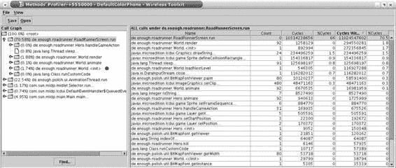

5033CH16.qxd 6/17/05 12:16 PM Page 327

第 16 章 ■ 优化应用程序

**327**

vendorName="A reader."

version="0.0.1"

jarName="${polish.vendor}-${polish.name}-roadrunner.jar"

/>

<deviceRequirements>

<requirement name="Identifier"

value="Generic/midp2" />

</deviceRequirements>

<build

usePolishGui="true"

>

<midlet class="com.apress.roadrunner.Roadrunner" />

</build>

**<emulator enableProfiler="true" />**

</j2mepolish>

**图 16-1.** *使用 WTK 分析器测量性能*

■**注意** 分析器包含在从 1.0.4 版本开始的 WTK 中，但只有从 2.2 版本开始，你才能从 J2ME Polish 等外部程序成功调用它。请确保你使用的是较新版本的 WTK。

在实际目标设备上测量性能

WTK 分析器非常适合查找应用程序中的瓶颈，但不幸的是，它可能会提供误导性信息。在你的 3GHz 机器（配备 1GB 内存）上测量性能，不一定能得出与在 200MHz 手机（配备 600KB 堆内存）上相同的结果。典型的反例是网络操作和在记录存储中持久化数据。这些操作在你的开发机器上快得惊人，但在真实设备上，

5033CH16.qxd 6/17/05 12:16 PM Page 328

**328**

第 16 章 ■ 优化应用程序

你可能会遇到截然不同的处理时间。你可以在某些模拟器上配置一些与性能相关的设置，但这并不能替代在实际设备上测量性能。更糟糕的是，设备本身的性能也差异巨大。一个好的策略是确保你的应用程序在目标设备中的低端机型上也能正常运行。

为了在真实设备上测量性能，你可以使用 J2ME 的日志框架。


与 `System.currentTimeMillis()` 方法配合使用。日志框架并非必需，但它允许你在不修改代码的情况下开启或关闭基准测试。或者，你也可以使用常规的预处理来激活或停用基准测试，但那样的话，你还需要提供自己的方式来显示测量值。

在对代码进行基准测试时，请尝试测试典型的真实场景。此外，你应该重复测量足够多次，以排除单次运行之间的差异。请记住，`System.currentTimeMillis()` 方法在不同设备上的精度可能不同。在符合 JTWI (JSR 185) 规范的设备上，时钟精度为 40 毫秒或更低，因此如果可能，你的测试应该运行几秒钟。

清单 16-2 中的代码测量了一个典型游戏循环的性能。当基准测试激活时，`animateWorld()` 和 `renderWorld()` 会被重复执行 100 次。这可以抵消任何异常运行的影响，并确保即使在时钟精度较低的情况下也能获得准确的计时。

**清单 16-2.** *测量典型游戏循环的性能* public void run() {

while ( this.gameIsRunning ) {

evaluateUserInput();

//#if polish.debug.benchmark

long startTime = System.currentTimeMillis();

for ( int i = 0; i < 100; i++ ) {

//#endif

animateWorld();

//#if polish.debug.benchmark

}

long timeAnimate = System.currentTimeMillis() - startTime;

//#endif

//#if polish.debug.benchmark

startTime = System.currentTimeMillis();

for ( int i = 0; i < 100; i++ ) {

//#endif

renderWorld();

//#if polish.debug.benchmark

}

5033CH16.qxd 6/17/05 12:16 PM Page 329

第 16 章 ■ 优化应用程序

**329**

long timeRender = System.currentTimeMillis() - startTime;

//#debug benchmark

System.out.println( "animateWorld: " + timeAnimate

+ "renderWorld: " + timeRender );

//#endif

}

}

清单 16-2 中使用的基准测试日志级别是用户自定义级别，但你可以像在 *build.xml* 脚本的 `<debug>` 元素中启用任何其他日志级别一样启用它，如清单 16-3 所示。所有用户自定义级别都具有最高可能的优先级，因此你也可以选择激活一个较低的级别，例如 error 或 info。

**清单 16-3.** *启用基准测试日志级别*

<j2mepolish>

<info

license="GPL"

name="Roadrunner"

vendorName="A reader."

version="0.0.1"

jarName="${polish.vendor}-${polish.name}-roadrunner.jar"

/>

<deviceRequirements>

<requirement name="Identifier"

value="Nokia/Series60, Siemens/x75" />

</deviceRequirements>

<build

usePolishGui="true"

>

<midlet class="com.apress.roadrunner.Roadrunner" />

**<debug level="benchmark" />**

</build>

</j2mepolish>

**性能调优**

你可以通过多种方式提高应用程序的性能，本节将对此进行讨论。高层优化涉及应用程序的架构和使用的协议，而底层优化则涉及使用的算法或数据结构。你应该将此类底层更改作为最后一步，当无法再进行高层优化时再进行。

高层性能调优

许多性能问题可以通过更改架构、使用的协议或使用的算法来解决。通常，高层更改可以极大地提高（或降低）应用程序的性能。

5033CH16.qxd 6/17/05 12:16 PM Page 330

**330**

第 16 章 ■ 优化应用程序

**调整架构**

架构为你的应用程序提供了基础，并允许你在设计阶段就对应用程序进行调优。你应该致力于减少抽象并加强功能的分组。

**减少抽象** 抽象有利于在不同环境中重用组件。但每个抽象层不仅会增加应用程序的大小，还会降低执行速度，因为虚拟机需要在运行时解析继承结构。调用仅由一个具体类实现的方法，比调用由一个抽象类实现并由一个具体类重写的接口方法要快得多。

通过使用一点预处理，你可以同时避免和使用接口。清单 16-4 演示了如何仅在具体实现未知的情况下使用接口。

**清单 16-4.** *通过预处理同时使用和避免接口* public interface SelectionListener {

public void selectionChanged( StringListItem item );

}

public class StringListItem extends CustomItem {

**//#if SelectionListenerImplementation:defined**

//#= ${classname( SelectionListenerImplementation )} selectionListener;

//#else

SelectionListener selectionListener;

//#endif

**//#if SelectionListenerImplementation:defined**

//#= public void setSelectionListener(

//#= ${classname( SelectionListenerImplementation )} selectionListener

//#= ) {

//#else

public void setSelectionListener(

SelectionListener selectionListener

) {

//#endif

this.selectionListener = selectionListener;

}

[...]

}

public class Controller

**//#if SelectionListenerImplementation:defined**

//# implements CommandListener

//#else

implements CommandListener, SelectionListener

5033CH16.qxd 6/17/05 12:16 PM Page 331

第 16 章 ■ 优化应用程序

**331**

//#endif

{

public void selectionChanged( StringListItem item ) {

//#debug info

System.out.println( "selection changed: " + item );

}

[...]

}

你可以通过在 *build.xml* 脚本中设置预处理变量来“发布”一个具体的实现。当定义了变量 `SelectionListenerImplementation` 时，清单 16-4 不使用接口：

<variable name="SelectionListenerImplementation" value="Controller" /> 在代码中，当所有类都被 J2ME Polish 移入默认包时（这由 *build.xml* 文件中 `<obfuscator>` 元素的 `useDefaultPackage` 属性启用），你还需要额外使用 `classname` 属性函数。`classname` 函数在未使用默认包时返回完全限定名，例如 `com.apress.performance.Controller`，但在使用默认包时仅返回类名本身——在本例中为 `Controller`。这是必要的，因为 `useDefaultPackage` 选项会在编译前将所有源文件移入默认包。

■**注意** 消除仅由一个类实现的接口是自动优化的一个潜在目标。Enough Software 目前正在开发 Juicer 优化器 ( *http://www.enough.de/juicer*)，它将实现这一点，并在字节码级别进行其他几项改进。

**线程** 线程是昂贵的资源，应在应用程序中谨慎使用。尝试设计你的架构，使其尽可能多地包含单线程区域。这也会减少对同步方法的需求，因为同步方法会拖慢你的应用程序。

**重用和缓存对象** 创建对象可能代价高昂，尽管在当前 HotSpot 虚拟机上创建对象的成本远低于第一代 KVM。设计你的架构，使其能够重用对象。

重用对象有时涉及缓存对象。在许多情况下，缓存会使使用复杂化，并增加所需的堆内存，因此你可能最好不要重用这些对象。当数据检索成本高昂、数据被频繁访问，并且数据本身足够小可以放入堆中时，缓存是有用的。你还需要考虑如何维护缓存和数据源之间的一致性。如果你有大型数据集，你可能能够识别出最常需要的部分，这样就不需要缓存所有内容。

**协议和网络操作**


选择用于存储和传输数据的协议会影响应用程序的内存消耗和性能表现。

5033CH16.qxd 6/17/05 12:16 PM 第 332 页

**332**

第 16 章 ■ 优化应用程序

使用基于 XML 的协议传输数据虽然很流行，但解析数据需要额外的资源，同时也会传输大量冗余数据。使用 SOAP 或 Web 服务时也是如此。当您的应用程序仅需与自有服务器通信时，采用二进制协议通常是更好的选择。您可以使用`DataInputStream`和`DataOutputStream`类来实现此类协议。不过，当您拥有多通道服务器应用程序或需要访问不同公司的服务器时，使用 Web 服务往往是更优方案。

为提高网络吞吐量，您还可以考虑仅传输已更改的数据，尤其是在结合数据缓存的情况下。请注意，这会增加数据解析的复杂性。另一种类似方案是压缩数据。遗憾的是，MIDP 标准并未提供读写 ZIP 流的方法。作为替代，您可以使用 TinyLine 项目（*http://www.tinyline.com*）的`GZIPInputStream`实现。

为提升性能，您还可以尽量减少加密的使用，例如仅在每个会话中认证一次。但对于安全性敏感的应用程序，您必须谨慎行事，不能放弃所有可用的数据安全手段。有关如何在保持高安全性的同时提升应用可用性的思路，请参阅“提升感知性能”部分。

网络操作的速度远低于其他几乎所有操作。除了减少传输数据量和用 IP 地址替代服务器名称外，您能做的加速网络操作的事情并不多。数据缓存可能会有所帮助，您甚至可以考虑将接收到的数据存储在记录存储中，这样在重启应用程序时至少能拥有部分（可能已过时的）数据。

**记录存储**

记录存储用于持久化数据。您通过调用`RecordStore.enumerateRecords()`方法来读取它们，该方法允许您为枚举指定比较器和过滤器。

`RecordFilter`和`RecordComparator`接口的问题在于，它们只能获取单个记录集的`byte[]`数据。通常您需要恢复原始对象来比较各个记录集，因此当同时使用过滤器和比较器时，每个记录集对象至少需要创建和销毁四次：比较器中两次，过滤器中一次，应用程序中一次。这不仅会降低性能，还会大幅增加应用程序的内存占用。清单 16-5 演示了这些元素的使用。

**清单 16-5.** *通过过滤和排序记录存储创建大量临时对象*
```java
import javax.microedition.rms.*;
import de.enough.polish.util.ArrayList;

public class RecordStoreReader
    implements RecordFilter, RecordComparator
{
    private final ArrayList list;
    private final Object condition;

5033CH16.qxd 6/17/05 12:16 PM 第 333 页

第 16 章 ■ 优化应用程序

**333**

    public RecordStoreReader( Object condition )
        throws RecordStoreException
    {
        this.condition = condition;
        this.list = new ArrayList();
        // 打开记录存储：
        RecordStore store = RecordStore.openRecordStore( "store", false );
        // 枚举记录集：
        RecordEnumeration enumeration =
            store.enumerateRecords( this, this, false );
        while ( enumeration.hasNextElement() ) {
            **MyRecordData data = new MyRecordData( ennumeration.nextRecord() );**
            this.list.add( data );
        }
        store.closeRecordStore();
    }

    public ArrayList getRecords() {
        return this.list;
    }

    public int compare( byte[] rec1, byte[] rec2 ) {
        **MyRecordData data1 = new MyRecordData( rec1 );**
        **MyRecordData data2 = new MyRecordData( rec2 );**
        return data1.compare( data2 );
    }

    public boolean matches( byte[] candidate ) {
        **MyRecordData data = new MyRecordData( candidate );**
        return data.conditionFulfilled( this.condition );
    }
}
```

一种可行的解决方案是巧妙地存储排序和过滤所需的数据，以便使用单个字节，而不是从记录集中创建临时对象。另一种方法是不使用`RecordFilter`和`RecordComparator`，而是在读取枚举时使用自己的过滤和排序机制。清单 16-6 一次性完成了条目的过滤和排序。它还使用了本地`ArrayList`来略微加快数据访问速度。与之前的示例相比，每个记录集对象只创建一次。

**清单 16-6.** *同时过滤和排序记录存储*
```java
import javax.microedition.rms.*;
import de.enough.polish.util.ArrayList;

public class RecordStoreReader {
    private final ArrayList list;

5033CH16.qxd 6/17/05 12:16 PM 第 334 页

**334**

第 16 章 ■ 优化应用程序

    public RecordStoreReader( Object condition )
        throws RecordStoreException
    {
        // 打开记录存储：
        RecordStore store = RecordStore.openRecordStore( "store", false );
        // 以最快方式枚举记录集：
        RecordEnumeration enumeration =
            store.enumerateRecords( null, null, false );
        ArrayList recordList = new ArrayList( enumeration.numRecords() );
        while ( enumeration.hasNextElement() ) {
            **MyRecordData data = new MyRecordData( enumeration.nextRecord() );**
            if ( !data.conditionFulfilled( condition ) ) {
                continue;
            }
            boolean notInserted = true;
            for ( int i = recordList.size(); --i >= 0; ) {
                MyRecordData compare = (MyRecordData) recordList.get( i );
                if ( data.compare( compare ) != RecordComparator.PRECEDES ) {
                    recordList.add( i + 1, data );
                    notInserted = false;
                    break;
                }
            }
            if ( notInserted ) {
                recordList.add( 0, data );
            }
        }
        store.closeRecordStore();
        this.list = recordList;
    }

    public ArrayList getRecords() {
        return this.list;
    }
}
```

当您需要定期对记录存储中的大量数据进行排序和过滤时，可以考虑使用包含指向实际数据指针的索引记录集。要检索特定记录集，您先在索引集中查找其位置，然后直接加载。这种技术可以极大地改善数据读取性能，但会使持久化新条目变得更加复杂。具体效果可能因情况而异。

**选择算法**

如果您的应用程序需要执行大量计算和数据处理，请仔细考虑所使用的算法。由于算法高度依赖于具体应用，讨论不同算法的优缺点超出了本书的范围。

5033CH16.qxd 6/17/05 12:16 PM 第 335 页

第 16 章 ■ 优化应用程序

**335**

底层性能调优

在完成高层优化之后，您可以进入激动人心的底层调优领域。在介绍这些优化之前，有必要先提醒一句：底层优化很容易引入新错误，通常会降低应用程序的可读性和可维护性，并且可能仅在特定目标设备上提升性能。

**改进图形操作**

在屏幕上渲染图形或文本相当复杂，因此需要一定时间才能完成。您能做的最好是避免完全重绘，例如仅在数据发生变化后才进行渲染，或者使用并评估裁剪区域。此外，您可以为不常变化的复杂背景使用图像缓冲区。例如，在需要绘制动画时，将图像分割成单个图块也能大幅提升性能。

**使用合适的容器**


容器用于容纳多个元素。MIDP 平台为此提供了 `Vector`、`Hashtable` 和 `Stack` 实现。或者，你也可以实现自己的解决方案、使用简单数组，或部署 J2ME Polish 的 `de.enough.polish.util.ArrayList`。

标准 MIDP 容器的主要缺点是它们已同步，因此速度较慢。

J2ME Polish 提供的 `ArrayList` 未同步，因此与标准容器相比速度更快。

如果你知道或能猜到容器所需的容量，应在构造函数中设置它（例如，`new Vector( 20 )`）。

然而，存储多个元素最快的方式是使用数组而非容器。

其缺点是你需要负责确保容量充足。当需要增加数组大小时，请使用 `System.arrayCopy()` 方法来复制元素。使用一维数组比二维数组更快，因为 JVM 需要两次检查请求的元素是否在二维数组的允许边界内。

通常，你可以通过一些计算来模拟多维数组。

与其访问二维数组元素 `data[ row ][ column ]`，不如使用一维数组元素 `data[ row * numberOfColumns + column ]`。

当你需要频繁访问数组或容器中的特定元素时，应考虑添加一个实例字段来保存该元素。这样，你可以省去重复的数组边界检查。

■**注意** 将配置值（如关卡数据）存储在数组中可能会增加应用程序的大小，因为 Java 字节码无法直接存储此类数据。请参阅本章的“减小 JAR 文件大小”部分，以了解更多替代方案。

5033CH16.qxd 6/17/05 12:16 PM Page 336

**336**

第 16 章 ■ 优化应用程序

**预计算数据**

当进行性能密集型计算时，应尽可能只计算一次。典型的例子包括使用 `Random.nextInt()` 计算随机数据，或调用三角函数如 `Math.sin()`。仅涉及常量的简单计算已由编译器解析，因此你不应使用额外的字段（如 `defaultAnchor = Graphics.TOP | Graphics.LEFT`）来浪费空间。

**使用优化的算术运算**

对于特定的算术运算，你可以使用快得多的位移运算符。尽可能使用乘法代替除法。最后但同样重要的是，整数运算比浮点运算更快。

除以 2 的幂次方可以使用右移运算符 `>>` 更快地完成。与其将数字 x 除以 2y，不如直接使用 `x >> y`，因此 `x >> 3` 的结果与 `x / 8` 相同。

当取模参数是 2 的幂次方时，可以使用位运算符进行取模运算。与其计算 `int round = i % 8;`，不如使用更快的位运算 `int round = i & 7;`。

**使用 switch 语句**

与其使用多个 `if` 块，不如使用 `switch` 语句。当使用连续的值范围时，无论匹配哪个 `case`，`switch` 语句的处理时间都是恒定的。因此，添加虚拟 `case` 以创建连续的测试范围可能是值得的。清单 16-7 演示了 `switch` 语句的慢速和快速用法。

**清单 16-7.** *加速 switch 语句* 
public char slowSwitch( int keyEvent ) {
    switch ( keyEvent ) {
        case Canvas.KEY_NUM6: return '6';
        case Canvas.KEY_NUM3: return '3';
        case Canvas.KEY_NUM8: return '8';
        case Canvas.KEY_NUM9: return '9';
        case Canvas.KEY_NUM2: return '2';
        case Canvas.KEY_NUM1: return '1';
        case Canvas.KEY_NUM5: return '5';
    }
}

public char fastSwitch( int keyEvent ) {
    switch ( keyEvent ) {
        case Canvas.KEY_NUM1: return '1';
        case Canvas.KEY_NUM2: return '2';
        case Canvas.KEY_NUM3: return '3';
        case Canvas.KEY_NUM4: return '4';
        case Canvas.KEY_NUM5: return '5';
        case Canvas.KEY_NUM6: return '6';


case Canvas.KEY_NUM7: return '7';

5033CH16.qxd 6/17/05 12:16 PM Page 337

第 16 章 ■ 优化应用程序

**337**

case Canvas.KEY_NUM8: return '8';

case Canvas.KEY_NUM9: return '9';

}

}

**加速循环**

可以通过多种方式改进循环。你可以将方法调用和计算移到循环外部，使用更好的终止条件，以及展开循环。

典型的循环头是 `for ( int i = 0; i < list.size(); i++ )`。一个简单而有效的改进是改为从列表顶部向下遍历：`for ( int i = list.size(); --i >= 0; )`。在这种情况下，`list.size()` 调用仅在循环开始时执行一次。你还通过检查值 0 改进了终止条件，这比将变量与不同数字进行比较要稍快一些。

如果你在循环内部执行任何计算，请检查是否也可以将它们移到循环外部。临时对象的创建也是如此，这不仅会减少可用内存，还会导致更频繁的垃圾回收。

一种非常底层的优化是展开循环。要成功展开循环，你需要预先知道可能的调用次数。例如，当你的循环总是执行四的倍数次时，你可以将循环体重复四次，从而将所需的跳转和终止检查次数减少四倍。清单 16-8 展示了一个示例，其中包含四个元素或四的倍数个元素的数组被填充为整数值。`slowFill()` 方法使用传统循环，而 `fastFill()` 方法则展开了循环。

**清单 16-8.** *通过展开加速循环*

public void slowFill( int[] numbers ) {

for ( int i = numbers.length; --i >= 0; ) {

numbers[ i ] = i;

}

}

public void fastFill( int[] numbers ) {

// 警告：如果 numbers.length != x * 4，此方法将崩溃

for ( int i = numbers.length; --i >= 0; ) {

numbers[ i ] = i;

numbers[ --i ] = i;

numbers[ --i ] = i;

numbers[ --i ] = i;

}

}

**设置实例字段的默认值**

所有实例字段都有默认值，你无需再次设置。诸如 `int`、`long` 和 `float` 等基本数字类型默认值为 0；`boolean` 字段默认值为 `false`；对象默认值为 `null`。这是一个你应该始终应用的底层优化的罕见例子。更准确地说，

.

5033CH16.qxd 6/17/05 12:16 PM Page 338

**338**

第 16 章 ■ 优化应用程序

**使用访问修饰符**

方法和字段可以有不同的修饰符，这些修饰符可能会影响性能。对于 J2ME 应用程序，你可以选择以下一个或多个修饰符：`synchronized`、`private`、`protected`、`public`、`static` 和 `final`。

使用 `synchronized` 方法可以确保一次只有一个线程能运行这些方法。这代价高昂，因为需要为该方法获取锁，并且一次只能有一个线程运行它。当你拥有无状态对象或仅读取数据时，不需要同步。当你写入数据时，有时可以通过使用同步块而不是同步整个方法来最小化影响。还要记住，访问实例字段是原子性的，因此在某些情况下你可能根本不需要同步。

一个流行的误解是，使用 `static` 字段和方法可以大大提高性能。`static` 修饰符允许在无需实例化相应类的情况下进行访问。然而，关于 `static` 访问性能的真相是，它取决于你的目标平台。早期的虚拟机确实会惩罚普通实例字段的使用，而现代 HotSpot JVM 访问实例字段和方法甚至比访问静态字段和方法更快。与往常一样，你应该在目标设备上测量性能。过度使用 `static` 修饰符肯定会降低应用程序的架构质量，并使后续更改更加困难。


`final`修饰符可以防止子类重写方法，并允许你仅对变量赋值一次。这简化了继承结构的解析和优化，并为编译器和虚拟机简化了字段值的访问，从而提升性能。

一个特殊的问题是静态 final 常量。这些常量会被编译器直接嵌入。

诸如 `Graphics.TOP | Graphics.LEFT` 之类的简单计算也会在编译阶段完成，因此使用常量是一件好事。

局部变量的速度远快于静态字段和实例字段。局部变量存储在虚拟机的栈上，而其他变量则存储在堆内存中。

JVM 是一个基于栈的机器，因此从栈中访问数据比从堆中读写数据更快。

当你对字段使用 `public` 访问修饰符时，可以直接从其他类中访问它们，而无需使用 getter 和 setter 方法。这仅在旧版 KVM 设备上更快，而在 HotSpot 机器上差异可以忽略不计。同时请记住，直接访问字段会使后续调整变得复杂。以设置日期字段为例，当你使用 setter 方法时，可以轻松地在 `setDate()` 方法中包含到该日期剩余时间的计算；而直接修改字段则无法做到这一点。

**提升感知性能**

在许多情况下，你无法进一步改善应用程序的实际性能。此时，你应该专注于提升*感知*性能。具体做法是向用户反馈当前进程的进度，并确保应用程序的响应性，如下文所述。

客观地提升感知性能通常会延长完成任务所需的时间，但对用户而言，你的应用程序会感觉响应更快，而用户的印象才是关键。

5033CH16.qxd 6/17/05 12:16 PM Page 339

第 16 章 ■ 优化应用程序

**339**

提供进度反馈

让用户了解应用程序的进度是一项值得的投资，因为它能显著提高用户的耐心。

在应用程序启动时，通常需要执行一些初始化工作，例如从记录存储中读取数据。标准的解决方案是提供一个启动画面，并在后台线程中执行必要的初始化。J2ME Polish 为此任务提供了 `de.enough.polish.ui.splash.InitializerSplashScreen`。该启动画面会显示一张图片以及一条可选消息，并在后台线程中初始化实际应用程序。

如清单 16-9 所示，你需要实现 `de.enough.polish.ui.splash.ApplicationInitializer` 接口的 `initApp()` 方法以进行实际初始化。`InitializerSplashScreen` 还可以有不同的视图；更多信息请参考 JavaDoc 文档。

**清单 16-9.** *显示启动画面并在后台线程中执行初始化*
```java
import de.enough.polish.ui.splash.InitializerSplashScreen;
import de.enough.polish.ui.splash.ApplicationInitializer;

import javax.microedition.lcdui.*;
import javax.microedition.midlet.*;

public class QuickStartupMidlet extends MIDlet
    //#if ! polish.clases.ApplicationInitializer:defined
    implements ApplicationInitializer
    //#endif
{
    private Screen mainScreen;
    private Display display;

    public QuickStartupMidlet() {
        // 在 initApp() 方法中执行初始化
    }

    public void startApp()
        throws MIDletStateChangeException
    {
        this.display = Display.getDisplay( this );
        if ( this.mainScreen != null ) {
            // MIDlet 已被暂停：
            this.display.setCurrent( this.mainScreen );
        } else {
            // MIDlet 首次启动：
            try {
                Image image = Image.createImage( "/splash.png" );
                int backgroundColor = 0xFFFFFF;
                String readyMessage = "按任意键继续...";
```


// 将 readyMessage 设为 null 以跳转到下一个

// 一旦可用即可显示。

5033CH16.qxd 6/17/05 12:16 PM Page 340

**340**

第 16 章 ■ 优化应用程序

int messageColor = 0xFF0000;

**InitializerSplashScreen splashScreen = new InitializerSplashScreen (**

this.display, image, backgroundColor, readyMessage,

messageColor, this );

this.display.setCurrent( splashScreen );

} catch ( IOException e ) {

throw new MIDletStateChangeException(

"无法加载启动画面图像" );

}

}

}

**public Displayable initApp() {**

// 初始化应用程序，

// 例如，从记录存储中读取数据等。

[...]

// 现在创建主菜单屏幕：

// 例如：this.mainScreen = new Form( "主菜单" );

[...]

return this.mainScreen;

}

public void pauseApp() {}

public void destroyApp( boolean unconditional ) {}

}

对于长时间的操作，例如通过网络加载数据或在记录存储中搜索数据，你应该考虑如何衡量和可视化进度。

最好的情况是，你事先知道操作持续多长时间以及涉及多少步骤。在这种情况下，你可以显示一个从 0% 开始到 100% 结束的进度条，例如，通过使用一个具有明确范围的 `Gauge`。请尽量使进度均匀分布，因为当进度条快速跳到 90% 然后缓慢爬完剩余部分到 100% 时，会相当令人恼火。在网络操作中，你可以传输数据的长度。在搜索记录存储时，你可以预先查询记录集的数量。

有时，即使你不知道所需步骤的确切数量，也可以将操作拆分为几个步骤。在这种情况下，你可以使用一个增量更新的 `Gauge` 来显示进度。

当你无法确定所需时间，也无法将操作拆分为单个步骤时，你至少应该向用户提供一些操作正在进行的反馈。为此，可以使用一个持续运行的 `Gauge` 或动画。

**确保响应性**

当你收到关于事件（例如按键按下或命令调用）的通知时，你需要尽快将控制权返回给系统线程。例如，当你通过调用 `Display.setCurrent()` 设置当前屏幕时，屏幕要等到你的方法返回后才会显示。因此，对于持续进行的操作（如网络访问或在记录存储中存储大量数据），你需要使用后台线程。当你执行 CPU 密集型任务时，你应该在不同步骤之间暂停后台线程，以便操作系统线程有机会将事件传递给你的应用程序。

**减少内存消耗**

根据你的目标设备，你的应用程序可用的堆大小可能在 200KB 到几兆字节之间。但是，当你的应用程序出现内存泄漏时，即使是几兆字节也可能不够用。此外，减少内存占用可能会提高应用程序的性能，因为垃圾回收不需要那么频繁地触发。

在本节中，你将首先学习如何测量应用程序的内存消耗，然后你将研究如何通过减少对象数量、使用递归以及避免内存泄漏来改善内存占用。

**测量内存消耗**

你可以通过在 WTK 模拟器中启用 `<emulator>` 元素的 `enableMemoryMonitor` 选项来测量应用程序的内存占用，如清单 16-10 所示。

图 16-2 显示了运行中的内存监视器。

**清单 16-10.** *在 WTK 模拟器中启用内存监视器*

<j2mepolish>

<info

license="GPL"

name="Roadrunner"

vendorName="一位读者。"

version="0.0.1"

jarName="${polish.vendor}-${polish.name}-roadrunner.jar"

/>

<deviceRequirements>

<requirement name="Identifier"

value="Generic/midp2" />

</deviceRequirements>

<build

usePolishGui="true"

>


<midlet class="com.apress.roadrunner.Roadrunner" />

</build>

**<emulator enableMemoryMonitor="true" />**

</j2mepolish>

再次提醒，开发机器上的内存消耗可能与实际设备上的不同。对于某些操作系统，你可以使用原生应用程序来控制 MIDlet 运行时的内存。在 Symbian 设备上，你可以使用 TaskSpy（*http://*）

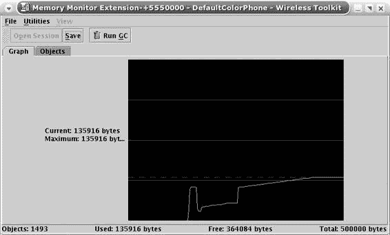

5033CH16.qxd 6/17/05 12:17 PM 第 342 页

**342**

第 16 章 ■ 优化应用程序

**图 16-2.** *使用 WTK 模拟器测量内存占用* 你也可以在应用程序中使用 `Runtime.freeMemory()` 和 `Runtime.totalMemory()`，但这些值取决于虚拟机的内存策略。使用返回值之间的差值来检测近似使用的内存：`long usedMemory = runtime.totalMemory() - runtime.freeMemory()`。

**改善内存占用**

你可以通过几种方式改善内存占用：减少对象数量和使用递归。同时，还应采取预防措施，防止意外产生内存泄漏。

减少对象数量

每个创建的对象都会减少可用内存，因此你应该致力于减少应用程序中所需对象的数量。这难道不简单吗？

一种策略是重用现有对象。然而，重用对象可能会引入新问题，例如即使缓存的对象不再需要，它们仍会保留在内存中。因此，在广泛采用此策略之前，请仔细考虑其影响。

另一种策略涉及减少临时对象的数量。这些对象通常在循环中创建；字符串操作就是一个典型的例子。字符串是不可变的，因此每次更改都需要实例化一个新的字符串。例如，考虑创建一个包含连续数字范围（如 01234）的字符串。当你需要连接多个字符串时，通常最好使用 `StringBuffer` 而不是 `+` 运算符。清单 16-11 展示了创建包含此类数字的字符串的一个糟糕示例和一个良好示例。

5033CH16.qxd 6/17/05 12:17 PM 第 343 页

第 16 章 ■ 优化应用程序

**343**

**清单 16-11.** *通过使用 StringBuffer 代替 String 来减少临时对象数量* `public String getSlowNumberString( int top ) {

String number = "";

for ( int i = 0; i <= top; i++ ) {

number += i;

}

return number;

}

public String getFastNumberString( int top ) {

// 我们假设 top 小于 10：

StringBuffer number = new StringBuffer( top );

for ( int i = 0; i <= top; i++ ) {

number.append( i );

}

return number.toString();

}`

另一个容易创建不必要字符串的地方是 `Graphics.drawString()` 方法。当你在 `paint()` 方法中调用 `g.drawString( "Points: " + this.points, x, y, Graphics.TOP | Graphics.LEFT )` 时，每次调用该方法都会创建一个新的临时字符串对象。更好的做法是仅在分数实际发生变化时才创建包含分数的字符串。

在某些情况下，将对象的创建推迟到真正需要时是值得的。这种所谓的**延迟初始化**有助于减少内存使用，但也会使应用程序逻辑复杂化，因此请谨慎使用此策略。

使用递归

使用递归方法可以产生美观且易于理解的算法，但不幸的是，它会带来内存和性能开销。这是因为每次调用方法时，参数和状态都需要被压入虚拟机的栈中。在大多数情况下，你可以使用等效的迭代算法来代替。

避免内存泄漏

在 Java 中，如果不取消对未使用对象的引用，可能会产生不希望的内存泄漏。当使用诸如 `Vector` 或 `Hashtable` 之类的容器来存储对象时，尤其容易发生这种情况。

为避免产生泄漏，在使用容器时，应始终尝试猜测并设置合适的大小，这样内部数组就不需要扩容。扩容内部数组通常涉及将所有元素从旧数组复制到新数组，因此不仅耗时，还会增加内存使用。当不再需要容器中的元素时，不要忘记将其移除。你还应该考虑尽早通过显式地将变量设置为 `null` 来取消引用。这有助于垃圾回收器判断哪些对象不再被使用且不可达。

5033CH16.qxd 6/17/05 12:17 PM 第 344 页

**344**

第 16 章 ■ 优化应用程序

有时设备具有不同类型的内存。例如，旧的索尼爱立信设备（如 T610）区分了普通的 Java 堆、原生 UI 堆和视频 RAM。图像被加载到视频 RAM 中，后者提供更快的访问速度，但与 Java 堆相比也更为有限。从视频 RAM 中回收图像垃圾与从普通 Java 堆内存中回收不同，因此你应该首先尝试加载那些始终会被使用的图像。

当你频繁调用 `toString()` 时，使用大型 `StringBuffer` 也可能带来问题。检索到的字符串会使用 `StringBuffer` 的完整内部数组，因此当你稍后更改缓冲区时，可能需要将内部数组复制到一个新的数组中。在这些情况下，最终你会拥有与在 `StringBuffer` 上调用 `toString()` 次数一样多的完整内部数组。

许多可选 API 使用原生调用来完成其工作。由于设备缺陷，这可能会很困难，因此在使用蓝牙连接、播放音乐或查看三维图形时要格外小心。请务必研究目标设备在内存处理方面的已知问题。

**减小 JAR 文件的大小**

最小化 JAR 文件的大小不仅可以改善下载时间，而且通常是满足目标设备限制所必需的。例如，诺基亚 Series 40 基于 MIDP 1.0 的设备只接受最大 64KB 的 JAR 文件。

在本节中，你将学习如何通过简化类模型、减小资源大小、完全移除资源以及使用第三方打包器和混淆器来减小 JAR 包的大小。

**改进类模型**

你可以通过最小化应用程序中类和接口的数量来改进类模型。你可以通过将相似功能分组以及移除不必要的类来实现这一点，如下面各节所述。

功能分组

每个类都会给 JAR 文件增加开销，因为它需要在 JAR 文件中增加一个条目以及一些 Java 特定的数据（如类常量）。功能分组允许你将所需类的数量最小化。

一个很好的例子是仅在一个类中实现 `CommandListener`。通常，提供能够自主处理其命令和事件的专用屏幕似乎更容易。然而，这破坏了模型-视图-控制原则，因为视图（屏幕）也提供了控制（`CommandListener`）。当你仅在一个控制器类（如主 MIDlet）中处理事件时，你会同时获得几个优势：

• 你将控制与视图解耦。

• 你只实现一次 `CommandListener` 接口，从而节省宝贵的空间。

• 通常，你可以完全移除专用类，因为在许多情况下，使用和填充标准表单、列表等就足够了。

5033CH16.qxd 6/17/05 12:17 PM 第 345 页

第 16 章 ■ 优化应用程序

**345**

注意寻找一对一类关系，即那些仅被另一个类使用的类。通常，你可以合并这些类的功能，而不会危及你的架构。

■**注意** 过多的分组会严重降低应用程序的可维护性和可扩展性。


此外，某些设备对类的大小有强制限制。例如，在西门子设备上，一个类的大小不得超过 16KB。

**移除不必要的类和方法**

有时你可以直接移除整个类或方法。冗余的抽象层和某些辅助类通常属于这种情况。

例如，许多开发者倾向于在 MIDlet 中抽象事件处理。

虽然对 J2SE 和 J2EE 应用程序来说，抽象事件处理可能是个好主意，但对于 J2ME 应用程序而言，这通常是多余的。最终，这类事件处理抽象会以某种方式镜像`javax.microedition.lcdui.CommandListener`接口的行为。请避免提供与 MIDP 标准功能相似的抽象。

辅助类对于简化复杂交互非常有用，但随着时间的推移，它们往往会变得臃肿，并镜像底层功能的相同实现。

一个典型的例子是用于 MMAPI 音频播放的辅助类。起初，辅助类比复杂的 MMAPI 本身更容易处理。但随着时间的推移，你会遇到需要特殊处理的情况，于是你不断为辅助类添加功能。需要反馈系统？添加一个新的事件处理接口。需要处理不同的音频源？添加额外的构造函数。最终，你会在辅助类中重新实现 MMAPI 的大部分功能。这对你自己来说可能更容易处理，但当其他程序员需要修改你的代码时会发生什么？请务必批判性地评估辅助类的必要性。

如果你的辅助类仅仅是为了降低其他 API 的复杂性，请尝试移除它们。

此外，不必要的辅助方法在实际代码中也屡见不鲜。例如，一个`Form`提供了向其中添加特殊项的方法，比如`public void addChoiceGroup( String label, String[] elements )`。这看起来比创建一个新的`ChoiceGroup`再添加到`Form`中更简单。但迟早你会发现，自己又添加了`addMultipleChoiceGroup()`和`addPopupChoiceGroup()`等辅助方法。在大多数情况下，这种努力并不值得。如果任何代码看起来像是重复实现，请尝试移除它。

**存储数组数据**

类文件内部的长数组定义会占用大量空间，因为 Java 的字节码无法直接存储数组数据。相反，每个数组元素会先被压入栈，然后存储到正确的数组位置，如清单 16-12 所示。首先，虚拟机通过`newarray`指令分配一个新数组。然后，对于每个元素，数组索引被压入栈，例如，第一个元素使用`iconst_0`（压入整数常量 0），第七个元素使用`bipush 6`（压入 1 字节有符号整数）。

5033CH16.qxd 6/17/05 12:17 PM 第 346 页

**346**

第 16 章 ■ 优化应用程序

接着，数组元素的实际值通过`bipush`（1 字节整数值）、`sipush`（2 字节整数值）或`ldc`（从常量池加载值）压入栈。

最后，通过`iastore`将元素存储到已分配的数组中。

**清单 16-12.** *存储简单整数数组的字节码指令*

// Java 源代码指令：

int[] values = new int[]{ 23, 57, 23453, 2342, 232, 213, 345, 56, 6767 };

// 生成的字节码指令：

bipush 9

newarray int[]

dup

iconst_0

bipush 23

iastore

dup

iconst_1

bipush 57

iastore

dup

iconst_2

sipush 23453

iastore

dup

iconst_3

sipush 2342

iastore

dup

iconst_4

sipush 232

iastore

dup

iconst_5

sipush 213

iastore

dup

bipush 6

sipush 345

iastore

dup

bipush 7

bipush 56

iastore

dup

bipush 8

sipush 6767

iastore

5033CH16.qxd 6/17/05 12:17 PM 第 347 页

第 16 章 ■ 优化应用程序

**347**

数组常用于存储配置值，例如游戏关卡的设置。

与其使用需要长串字节码指令的数组，你可以改用其他变量，或者将数据存储在类的外部。


当你将数据存储在 `String` 中而非 `int[]` 数组中时，即使需要解包并解析单个值，也可能节省空间。清单 16-13 利用了 J2ME Polish 的 `de.enough.polish.util.TextUtil` 辅助类来拆分包含这些值的字符串。如果你的应用无论如何都会用到这个辅助类，那么通过这种方式可以最小化 JAR 文件的大小。解包并解析这个整数数组只需要 22 条指令，而直接指定包含 9 个元素的 `int[]` 数组示例则需要 38 条指令。

**清单 16-13.** *通过将数组数据存储在字符串中来节省空间*

// Java 源代码指令：

String value = "23,57,23453,2342,232,213,345,56,6767"; String[] valueChunks = TextUtil.split( value, ',' );

int[] values = new int[ valueChunks.length ];

for ( int i = 0; i < values.length; i++ ) {

values[ i ] = Integer.parseInt( valueChunks[ i ] );

}

// 生成的 Java 字节码指令：

ldc1 #75 <String "23,57,23453,2342,232,213,345,56,6767"> astore 4

aload 4

bipush 44

invokestatic #81 <Method String[] TextUtil.split( String, char )> astore 5

aload 5

arraylength

newarray int[]

astore 6

iconst_0

istore 7

goto 208

aload 6

iload 7

aload 5

iload 7

aaload

invokestatic #87 <Method int Integer.parseInt( String )> iastore

iinc 7 1

另一种既能节省空间又能获得灵活性的选择是将数据存储在实际类之外，并使用 `DataInputStream` 加载。你可以使用位于 `${polish.home}/bin` 目录下的**二进制编辑器**来方便地管理此类数据文件（参见第 10 章）。清单 16-14 展示了如何从资源文件中加载一个整数数组。在此示例中，假设文件中的第一个 `short` 值包含了后续整数数组的长度。通过这种方式，加载整数数组只需要 22 条指令，而直接在类中定义示例 `int[]` 数组则需要 38 条指令。当然，每个资源文件都需要额外的空间，因此将每个中等长度的数组存储在外部文件中可能弊大于利。但是，一旦数据变得复杂，你几乎肯定会从这种方法中受益。

**清单 16-14.** *从资源文件加载数组数据*

// Java 源代码指令：

InputStream is = getClass().getResourceAsStream( "/l1.data" ); DataInputStream in = new DataInputStream( is );

short arrayLength = in.readShort();

int[] values = new int[ arrayLength ];

for ( int i = 0; i < values.length; i++ ) {

values[ i ] = in.readInt();

}

// 生成的 Java 字节码指令：

aload_0

invokevirtual #97 <Method Class Object.getClass()> ldc1 #99 <String "/l1.data">

invokevirtual #105 <Method java.io.InputStream Class.getResourceAsStream(String)> astore 7

new #107 <Class DataInputStream>

dup

aload 7

invokespecial #110 <Method void DataInputStream(java.io.InputStream)> astore 8

aload 8

invokevirtual #114 <Method short DataInputStream.readShort()> istore 9

iload 9

newarray int[]

astore 10

iconst_0

istore 11

goto 310

aload 10

iload 11

aload 8

invokevirtual #118 <Method int DataInputStream.readInt()> iastore

iinc 11 1

5033CH16.qxd 6/17/05 12:17 PM Page 349

第 16 章 ■ 优化应用程序

**349**

**处理资源**

诸如图片或声音文件之类的资源通常占据了 JAR 文件的最大部分。在本节中，你将了解如何通过仅包含合适的资源、减小资源大小、减少资源数量以及完全移除资源来处理资源。

使用合适的资源

你可以通过仅包含合适的资源来减小 JAR 文件的大小。为此，请使用 J2ME Polish 的自动资源组装功能。

你可以通过使用合适的调色板来减小图片的大小。这还可以提高在支持颜色数少于原始图片的设备上的图片质量，因为抖动算法在不同设备上的表现不同。你可以为不同的手机包含不同版本的图片；例如，仅为支持相应颜色深度的设备包含高彩色图片。有用的资源文件夹包括 `resources/BitsPerColor.12`、`resources/BitsPerColor.16+`、`resources/ScreenSize.128x128` 和 `resources/ScreenSize.170+x200+`。

你还可以基于多个标准来包含资源，例如 `<fileset dir="resources/sounds" includes="*.mid" if="polish.api.mmapi and polish.sound.midi" />`。

关于使用 J2ME Polish 进行资源选择的完整讨论，请参考第 7 章的“组装资源”部分。

减小资源的大小

资源通常包含播放或显示它们所不需要的信息，例如版权声明或注释。

你可以使用工具 Pngcrush ( *http://pmt.sourceforge.net/pngcrush* )、PNGOUT ( *http://advsys.net/ken/utils.htm#pngout* ) 和 PNGGauntlet ( *http://numbera.com/software/pnggauntlet.aspx* ) 来优化 PNG 图片。这些工具会移除冗余信息，并可以将图片大小减少几个百分点。

MIDI 文件中也可能存在冗余信息。一些编辑器允许你编辑存储的头部信息。此外，某些 MIDI 事件，例如音色库切换，并非所有 J2ME 设备都支持，因此你可以从文件中移除这些事件。

■**注意** 有时移除冗余数据会*增加* JAR 文件的大小，因为 ZIP 算法无法像以前那样高效地压缩数据。任何增加可能只有几个字节，但当你的目标大小非常接近时，你可能需要注意这种影响。

减少资源的数量

你可以通过将多个资源合并到一个文件中来减少资源的数量。当资源共享共同特性时，例如多个 PNG 文件使用相似的调色板，这可以有效地减小大小。在这种情况下，你可以创建一个包含先前所有图片的大图片。在你的应用程序中使用 `Graphics.setClip()` 机制来逐个绘制这些图片。

5033CH16.qxd 6/17/05 12:17 PM Page 350

第 16 章 ■ 优化应用程序

**350**

当你将多个独立的资源存储到一个文件中时，每个资源的头部信息会重复出现，这将在你的 JAR 文件中节省一些空间。当头部信息在一个文件中重复出现时，ZIP 算法可以更有效地压缩它们，并且存储在 JAR 文件中的每个文件都需要在 JAR 文件的内容头部中有一个条目；条目越少，文件大小就越小。

移除资源

有时完全移除某些资源是可行的。你只需在 JAR 文件中保留最基本的资源，并在需要时下载其余部分。一个例子是只包含游戏一个关卡的资源，然后在用户完成第一关后下载后续关卡的资源。

**混淆和打包你的应用程序**

最后但同样重要的是，你可以通过使用混淆器和专门的打包器来节省一些空间。混淆器通过重命名类并移除应用程序中未使用的代码来缩小类文件。这是一种轻松节省大量空间的方法。额外的好处是，对于任何有兴趣反编译你应用程序的恶意或好奇用户来说，你的代码将更难理解。正如你在第 7 章的“混淆应用程序”部分所学到的，你可以在 J2ME Polish 中部署不同的混淆器——甚至可以同时使用多个混淆器。当预算紧张时，可以选择免费的 ProGuard 混淆器，但请记住，一些商业混淆器/优化器可以产生更小的 JAR 文件。


并非所有混淆器都能将所有类移动到默认包中。使用默认包可以带来一些额外的节省，因为完全限定的类名存储在每个类内部。你可以只为所有类使用默认包，但这会损害你的架构。J2ME Polish 可以在预处理步骤中将应用程序的所有类移动到默认包中。通过在 *build.xml* 脚本中将 `<obfuscator>` 元素的 `useDefaultPackage` 属性设置为 `true` 来启用此选项。请记住，这种方法要求你为所有 Java 源文件使用唯一的类名。

在打包步骤中，所有类文件和资源都被打包到一个 JAR 文件中。J2ME Polish 使用默认的 Java ZIP 算法来打包文件。根据你的应用程序和目标设备，你可能希望使用不同的打包器。请参阅第 7 章的“打包应用程序”部分，以了解更多关于你的选项的信息。请记住，使用优化的 ZIP 兼容算法可能会导致安装过程中出现问题，因此仅将其作为最后的手段实施。

**总结**

优化你的应用程序是创建一个小巧、快速、可运行的应用程序的最后一步。

你可以针对速度、减少内存占用和更小的 JAR 文件大小进行优化。

某些优化对所有方面都有益，而另一些则相互矛盾。你应该从一开始就考虑可能的高级优化，并将低级优化推迟到最后。

在本书的附录中，你将找到关于 J2ME Polish 和 J2ME 设置的详细信息，以简洁的格式呈现。

5033INDEX.qxd 6/20/05 9:35 AM 第 419 页

索引

■**符号**

AMS (应用程序管理软件), 417

! 运算符

检测中断, 320

*参见* not (!) 运算符

anchor 属性

# *xyz* 预处理指令

图像背景, 403

*参见* 预处理指令

and (&&) 运算符, 73, 107

&& 运算符

和嵌套元素

*参见* and (&&) 运算符

deviceRequirements 元素, 365

= 指令

animate 方法

*参见* equals (#=) 指令

使用 Border 类, 269

^ (xor) 运算符, 107

创建客户端 Background 类, 265

|| (or) 运算符, 107

animationInterval 变量, 164, 392

SpriteItem 构造函数参数, 179

■**数字**

动画

3D 图形 API, 359–360

设计 Tickers, 227–228

3GPP (第三代合作伙伴计划), 417

编程 SpriteItem, 178

3gpp 组

repeat-animation 属性, 208, 209

组装资源, 71

screen-change-animation 属性, 229

55/65/75 组

使用, 228–229

西门子设备, 289

Ant, 9, 55–58

7-Zip 打包器, 15, 79

build.xml 元素, 363–389

参数, 385

构建部分, 366–369

使用, 79

compiler 元素, 373–375

compilerargs 元素, 375, 376

■**A**

copier 元素, 383–384

a 选择器, StringItem, 186

debug 元素, 371–372

缩写词汇表, 417

deviceRequirements 部分, 365

abort 指令, 398

emulator 元素, 388

抽象类

fileset 元素, 382

设计阶段, 31

filter 元素, 371–372

抽象化

finalizer 元素, 387

高级性能调优, 330

handler 元素, 372

访问修饰符

info 部分, 363–364

低级性能调优, 338

jad 元素, 385–386

首字母缩略词词汇表, 417

jadFilter 元素, 386

activetab 样式

keep 元素, 377–378

设计 TabbedForms, 213

localization 元素, 382–383

预定义样式, 184

manifestFilter 元素, 386

地址簿

midlet 元素, 369–370

midlets 元素, 369–370

管理联系人, 134

obfuscator 元素, 377

after 属性

packager 元素, 384–385

通用设计属性, CSS, 197–198

parameter 元素, emulator, 389

样式定义结构, 189

parameter 元素, obfuscator, 378

AHNAPI (自组网 API)

postcompiler 元素, 376–377

MIDP 设备的可选包, 278

preprocessor 元素, 372–373

算法

preverifier 元素, 380–381

高级性能调优, 334

resources 元素, 381–382

allowCycling 变量, Container, 394

sign 元素, 387

alpha 混合

source 元素, 369

颜色, 195

sources 元素, 369

amr 组

variable 元素, 370–371

组装资源, 71

variables 元素, 370–371

AMR 的 Jazelle

MIDP 平台, 293

**419**

5033INDEX.qxd 6/20/05 9:35 AM 第 420 页

**420**

■索引

build.xml 文件, 55

应用程序生命周期, 30

属性, 56

构建阶段, 31–32, 64–68

创建 “Hello World” 应用程序, 58–64

部署阶段, 31, 33

确定属性文件名, 57

设计阶段, 30–31

与 Eclipse IDE 集成, 20–21

实现阶段, 30, 32

J2ME Polish Ant 设置, 363–389

优化阶段, 31, 33

在线文档, 56

测试阶段, 31–32

外部任务在线列表, 56

更新应用程序, 36

属性, 56

ApplicationInitializer 变量, 393

激活/停用日志框架,

应用程序

构建本地化应用程序, 84

加载, 57

配置应用程序, 74

设置 Ant 属性, 238

调试应用程序, 96–99

一次性写入能力, 57

混淆应用程序, 94–96

目标依赖关系, 58

优化应用程序

目标, 55

*参见* 优化应用程序

复制资源, 246

扩展构建阶段, 237

appliesTo 属性

使用自定义打包器, 246

注册自定义 CSS 属性, 260

任务, 55

arc 属性

antcall

opening-round-rect 背景, 409

混淆器的附加 Ant 属性, 245

round-rect 背景, 401

实现自定义预验证器, 245

round-rect 边框, 413

集成 finalizer, 247

round-tab 背景, 410

集成不支持的混淆器, 96

arc-height 属性

postcompiler, 244

opening-round-rect 背景, 409

使用自定义预处理器, 243

round-rect 背景, 401

抗锯齿

round-rect 边框, 413

用于位图字体, 142

round-tab 背景, 411

Apache Ant

arc-width 属性

*参见* Ant

opening-round-rect 背景, 409

api 元素, apis.xml, 45

round-rect 背景, 401

apiDir 属性, build 元素, 366

round-rect 边框, 413

API

round-tab 背景, 411


控制振动与显示灯光，156

架构

设计阶段，31

设计阶段，31

设备控制，156

高级性能调优，330–331

设备特定预处理符号，390

优化阶段，33

集成二进制第三方 API，93

area 元素，bugs.xml，47

集成设备 API，94

参数

集成源代码第三方 API，92

skipArgumentCheck 符号，164

集成第三方 API，92–94

arguments 属性，packager 元素，384

MIDP 设备的可选包，276–278

使用第三方打包器，78

移植底层图形操作，152

算术运算

移植声音播放，155

底层性能调优，336

Series 80 诺基亚设备，287

数组数据

apis 属性，build 元素，366

存储整型数组的字节码指令，346

apis 元素，apis.xml，45

从资源文件加载数组数据，348

apis.xml，45–47

将数组数据存储在字符串中，347

设备数据库文件，39

存储以改进类模型，345–348

在其中指定库，46

arrayCopy 方法，System 类

Aplix 的 JBlend JVM

底层性能调优，335

MIDP 平台，293

ArrayList 类，134–135

append 方法，Form 类

底层性能调优，335

额外的 FramedForm 方法，177

同步，134

额外的 TabbedForm 方法，174

数组

设计 ChoiceGroup，216

将文本分割为 String 数组，135

将 CSS 集成到自定义项中，256

ASCII-String 数据类型

应用程序包

Binary Editor，141

指定不包含在其中的文件，70

5033INDEX.qxd 6/20/05 9:35 AM 第 421 页

■索引

**421**

面向切面编程

脉动背景，404–405

多设备上的 J2ME 应用，102

脉动圆形背景，406

预处理，300

脉动圆圈背景，407–408

星号

圆角矩形背景，401–402

以星号结尾的属性名，76

圆角标签背景，410–411

AT&T Wireless

简单背景，400–401

运营商定制，292

半透明背景

属性-值对

当前聚焦项，401

CSS 声明，187

移植底层图形，153

属性

背景部分，polish.css 文件，189

设计属性，189–199

Backlight 功能

分组，CSS，187

设备控制，156

以星号结尾的属性名，76

backward 变量，ScreenChangeAnimation，395

before 属性，189，197–198

以问号结尾的属性名，76

可选属性，76

行为，配置 GUI，164–167

覆盖属性值，74

注册自定义 CSS 属性，259

基准测试，328，329

bin 文件夹，15

选择所有剩余项，76

Mac OS X 系统，139

选择多个项，76

二进制数据文件

指定，74

创建/操作，138

音频

管理关卡文件，139

设备特定预处理符号，390

Binary Editor，139–141

audio.*xyz*属性

使用其编辑数据，140

系统属性，357

预定义类型，141

认证

binaryLibrary 属性，build 元素，366

高级性能调优，332

bitmap 属性，196

HTTP 网络，312

自动资源组装

通用设计属性，CSS，197

设备数据库，49

BitMapFont 类，136–138

available 方法，InputStream

自定义字体，133

防御性编程，304

BitMapFontViewer 类

显示消息，136

■**B**

layout 方法，137

回缓冲优化

paint 方法，137

优化游戏引擎，148–149

BitsPerColor 组

back-and-forth 属性

组装资源，71

脉动背景，405

BitsPerPixel 391

background 属性

设备数据库，42

样式定义的结构，189

预处理符号和变量，115

Background 类

选择构建目标设备，82

客户端，265–267

BlackBerry

服务器端，267–268

*参见* RIM BlackBerry

background-color 属性

blocksplit 参数

弹出式 ChoiceGroup，221

KZIP 打包器，80，385

background-type 属性，199

蓝牙 API

背景

部署阶段，33

背景转换器，267

设备识别，319

圆形背景，403–404

创建 Background 类

网络问题，310

客户端，265–267

已签名 MIDlet 的权限，361

服务器端，267–268

属性，358–359

创建自定义背景，265–269

Series 40/60 诺基亚设备，286


布尔数据类型

自定义背景，第 268–269 页

二进制编辑器，第 141 页

设计屏幕背景，第 199 页

布尔运算符

设计，CSS，第 199 页

评估项，第 107 页

图像背景，第 402–403 页

`bootclasspath` 属性

移动背景，第 265 页

编译器元素，第 373 页

在 `polish.css` 文件中使用，第 268 页

`bootclasspathref` 属性

非必需，第 198 页

编译器元素，第 373 页

打开背景，第 408–409 页

`border` 属性，第 189 页

打开圆角矩形背景，第 409–410 页

`Border` 类，第 269 页

5033INDEX.qxd 6/20/05 9:35 AM 第 422 页

**422**

■索引

`border-color` 属性，第 409 页

条件性地使用扩展，第 236 页

`border-type` 属性，第 199 页

在 `build.xml` 文件中使用，第 235–236 页

`border-width` 属性，第 409 页

构建框架，第 30 页

边框

构建阶段，第 64–68 页

添加自定义边框，第 269 页

应用程序生命周期，第 31–32 页

圆形边框，第 416 页

为多设备构建，第 80–84 页

设计，CSS，第 199 页

构建本地化应用程序，第 84–91 页

非必需，第 198 页

编译阶段，第 66–67 页

圆角矩形边框，第 413 页

扩展

阴影边框，第 414 页

*参见* 构建扩展

简单边框，第 412 页

扩展点，第 232 页

上、下、左、右边框，第 415 页

调用模拟器，第 68 页

边框部分，`polish.css` 文件，第 189 页

最小化目标设备数量，第 83–84 页

底部动画，第 229 页

混淆阶段，第 67 页

底部边框，第 415 页

打包阶段，第 68–80 页

底部布局，第 193 页

管理 JAD 和 Manifest 属性，

底部框架样式，第 185 页

第 74–77 页

盒模型

资源组装，第 68–73 页

CSS 盒模型，第 191–192 页

签名 MIDlet，第 77–78 页

分支代码

使用第三方打包工具，第 78–80 页

`if` 指令，第 105 页

预处理阶段，第 66 页

BREW（无线二进制运行时环境），

预验证阶段，第 68 页

选择要构建的设备，第 80–83 页

`bug` 元素，`bugs.xml`，第 47 页

选择目标设备，第 65–66 页

错误

总结，第 231–232 页

优化阶段，第 33 页

构建部分，`build.xml`，第 366–369 页

预处理符号和变量，第 115 页

构建工具

Bugs 能力

Ant，第 55–58 页

设备数据库，第 43 页

扩展构建阶段

`bugs` 元素，`bugs.xml`，第 47 页

*参见* 构建扩展

`bugs.xml`，第 47–48 页

Make，第 55 页

在其中澄清设备错误，第 47 页

`build.xml` 文件，第 16 页

设备数据库文件，第 39 页

构建元素，`build.xml`

激活特定日志级别，第 124 页

属性表，第 366、368 页

激活 GUI，第 161–162 页

使用 J2ME Polish 构建 MIDlet，第 61 页

激活/停用日志框架，第 128 页

Ant，第 55 页

构建扩展，第 231–248 页

Ant 属性，第 56 页

接受参数，第 233 页

构建 MIDlet，第 60 页

Ant 目标，调用，第 237–238 页

配置构建扩展，第 233–235 页

构建阶段总结，第 231–232 页

配置 GUI，第 162–170 页

编译器，更改/配置，第 243–244 页

控制日志框架，第 125 页

配置，第 233–235 页

控制 GUI，第 161–170 页

使用条件参数配置扩展，第 234 页

创建“抛光”应用程序，第 161 页

创建自定义预处理器，第 239–243 页

调试应用程序，第 96 页

模拟器，集成，第 247–248 页

定义符号和变量，第 116 页

扩展机制，第 231–238 页

设备特定预处理符号，第 389–390 页

`Extension` 超类，第 232 页

设备特定预处理变量，

终结器，集成，第 247 页

第 390–392 页

混淆器，集成自定义/第三方，

`deviceRequirements` 元素，第 50 页

第 244–245 页

元素和属性，第 363–389 页

打包工具，使用自定义，第 246 页

全屏模式，在 GUI 中使用，第 163–164 页

参数元素，第 233 页

将 J2ME Polish 集成到 IDE 中，第 19 页

后编译器，使用，第 244 页

优化游戏引擎，第 146 页

`Preprocessor` 类，实现，第 239–243 页

项目标签，第 56 页

预验证器，集成，第 245 页

设置符号和变量，第 115 页

属性函数，创建，第 248 页

测试示例应用程序，第 16 页

注册扩展，第 235、236 页

在构建文件中使用扩展，第 235–236 页

资源，复制和转换，第 245–246 页

在构建文件中使用已注册的扩展，第 236 页

按钮外观模式，第 186 页

使用扩展，第 237 页

按钮选择器，`StringItem`，第 186 页

5033INDEX.qxd 6/20/05 9:35 AM 第 423 页

■索引

**423**

字节数据类型

支持的字符

二进制编辑器，第 141 页

JTWI 规范，第 278 页

字节码修改，第 244 页

`charactersKey` 变量，`TextField`，第 165–166 页，

避免已知问题，第 307–308 页

第 395–396 页

存储整数数组，第 346 页

配置 `TextField`，第 168 页

`bytes` 属性函数，第 118、399 页

`charactersKeyPound` 变量，第 166、396 页

`charactersKeyStar` 变量，第 166、396 页

■**C**


复选框选中属性（checkbox-selected attribute），ChoiceGroups，220

缓存（caching）

复选框（checkbox）

高级性能调优，331

可用动态样式，186

计算（calculations）

ChoiceGroups，219

低级性能调优，336

复选框纯文本属性（checkbox-plain attribute），ChoiceGroups，220

取消命令变量（Cancel command variable），166

选择颜色属性（choice-color attribute），ChoiceGroups，217，220

取消命令的标签，393

ChoiceGroups

本地化 J2ME Polish GUI，90

属性，216

取消图像属性（cancel-image attribute），菜单栏，204

可用动态样式，186

CanvasHeight 变量，391

设计，215–222

CanvasSize，391

设计独占式，216–219

设备数据库，43

设计多选式，219–221

预处理符号和变量，115

设计弹出式，221–222

选择构建目标设备，82

样式指令的插入点，172

CanvasWidth 变量，391

预处理变量，165

能力（capabilities），41

类型，215

累积效应，48

ChoiceItem 类，186

定义支持的库，45

块宽度属性（chunk-width attribute），Gauge 类，223

用其确定画布高度，52

圆形背景，403–404

设备数据库，42

圆形边框，416

if 指令，51

圆圈数量属性（circles-number attribute）

继承，49

脉冲圆圈背景，407

XML 文件间的优先级，48

类属性（class attribute）

预处理，51–52

copier 元素，384

选择构建目标设备，82

filter 元素，127，372

capabilities.xml

finalizer 元素，387

设备数据库文件，39

keep 元素，378

隐式分组，42

midlet 元素，370

capability 元素

obfuscator 元素，377

devices.xml，41

packager 元素，384

groups.xml，44

postcompiler 元素，376

vendors.xml，44

preprocessor 元素，372

捕获属性（capture property），MMAPI，357

preverifier 元素，380

插入符字符属性（caret-char attribute），TextFields，225

在 build.xml 文件中使用扩展，235

插入符颜色属性（caret-color attribute），TextFields，225

改进类模型

运营商定制

功能分组，344–345

设备间的差异，279

最小化 JAR 文件大小，344–348

运营商

移除类和方法，345

运营商特定属性，355

存储数组数据，345–348

CBS（小区广播服务），417

类

已签名 MIDlet 的权限，361

更改类继承，51，119

CDC（连接设备配置），417

设计阶段，31

J2ME 配置，275

包含/排除指令，109

居中对齐布局

ImageLoader 预处理变量，164

使用 layout 属性对齐项目，193

混淆器移除未使用的类，133

证书

移除以改进类模型，345

根证书，318

在多种设备上工作，101

签名 MIDlet，77

classname 属性函数，399

供应商证书，318

用其转换变量，118

ChangeInputModeKey 变量，391

使用/避免接口，331

ChangeNumericalAlphaInputModeKey 变量，

classPath 属性

compiler 元素，373

CHAPI（内容处理 API）

copier 元素，384

MIDP 设备的可选包，277

finalizer 元素，387

5033INDEX.qxd 6/20/05 9:35 AM 第 424 页

**424**

■索引

集成自定义背景，268

定义，194

obfuscator 元素，377

定义颜色，CSS，193–195

packager 元素，385

设计普通菜单栏，202

postcompiler 元素，376

命名约定，194

preprocessor 元素，372

预定义颜色，193

preverifier 元素，381

Series 40 诺基亚设备，284

在 build.xml 文件中使用扩展，235

Series 60 诺基亚设备，286

classpath 元素

colors 部分，polish.css 文件，189，194

注册项目扩展，236

columns 属性

classpathref 属性

在屏幕上排列项目，206

compiler 元素，373

ChoiceGroups，216

CLDC（有限连接设备配置），

与视图类型一起使用，207

274，417

columns-width 属性

设备特定预处理符号，390

在屏幕上排列项目，206

J2ME 配置，275

ChoiceGroups，216

CLDC 1.0 配置文件

“未找到命令”

编写可移植代码，295

示例应用程序错误消息，17

cldc 分组

commandAction 方法

组装资源，70

显示菜单的 MIDlet，59

clean 构建

CommandListener 接口

构建 MIDlet，61

最小化 JAR 文件中的类，344

清除命令变量（Clear command variable），166

命令

清除命令的标签，394

取消命令变量，166

本地化 J2ME Polish GUI，91


清除命令变量，166

suppressClearCommand 变量，165，168

命令预处理变量，166

ClearKey 变量，392

配置 TextField 命令，168

客户端框架，30

配置，J2ME Polish GUI，164–167

clientClass 属性

删除命令变量，166

handler 元素，372

hasCommandKeyEvents，163，390

时钟分辨率

keytool 命令，77

JTWI 规范，278

leftcommand 样式，204

代码

标记命令变量，166

调整，避免已知问题，305–308

确定命令变量，166

操作字节码，307–308

选项命令变量，166

使用预处理，305–307

rightcommand 样式，204

编写可移植代码，294–303

选择命令变量，166

使用不同的源文件，300–303

suppressClearCommand 变量，165

使用动态代码，295–298

suppressCommands 变量，165，168

使用最低公共分母，295

使用预处理，298–300

suppressDeleteCommand 变量，165

颜色属性

suppressMarkCommands 变量，165

可用的字体属性，196

suppressSelectCommands 变量，165

圆形背景，404

取消标记命令变量，166

圆形边框，416

注释字符

Gauge 项，223

预处理指令，104–105

注释

图像背景，402

层叠样式表，188

打开背景，408

商业/非 GPL 许可证，12

打开圆角矩形背景，409

比较运算符，108

弹出式 ChoiceGroup，221

编译

脉动圆形背景，406

*参见* 构建阶段

圆角矩形背景，401

编译阶段，66–67

圆角矩形边框，413

构建阶段扩展，232

圆角标签背景，410

使用 J2ME Polish 作为编译器，67

阴影边框，414

compiler 属性

简单背景，400

compiler 元素，373

简单边框，412

compilerargs 元素，376

上、下、左、右边框，415

compiler 元素，373–375

颜色

属性表，373–374

Alpha 混合，195

调试应用程序，99

构建 MIDlet，63

扩展构建阶段，243

caret-color 属性，TextField，225

5033INDEX.qxd 6/20/05 9:35 AM 第 425 页

■索引

**425**

compilerargs 元素，375，376

国家

compilerDestDir 属性

ISO 国家代码，89

build 元素，366

本地化国家名称，89

compilerMode 属性

createNewStatement 方法

build 元素，366

背景转换器，268

compilerModePreverify 属性

CSS（层叠样式表）

build 元素，367

*另请参阅* polish.css 文件

组件

使用 layout 属性对齐项，192–193

构建框架，30

背景和边框，198–199

客户端框架，30

before 和 after 属性，197–198

IDE 插件，30

位图字体，197

安装，13

简要描述，417

组件层次，29

注释，188

独立工具，30

通用设计属性，189–199

压缩参数

创建服务器端 Background 类，267

7-Zip 打包器，79，385

CSS 盒模型，191–192

condition 指令，398

CSS 声明，187

描述，105

CSS 语法，187–188

实现 StringListItem 类，255

定义颜色，193–195

包含/排除类/接口，109

设计 GUI，181–229

条件参数

使用字体属性进行设计，196

使用扩展进行配置，234

不同 polish.css 文件的效果，169

有条件地使用扩展，236

分组属性，187

条件

标签，197

使用条件调试应用程序，96–98

命名约定，187

configuration 属性，info 部分，363

注册自定义 CSS 属性，259

configuration 属性，MIDP，357

polish.css 文件的结构，189

配置变量，392–397

样式定义的结构，189–191

配置

CSS 样式

连接设备配置，274

*另请参阅* 样式

连接有限设备配置，274

在 MIDlet 构造函数中应用，63

设备间的差异，274–275

应用于表单，171

J2ME 配置，275

组件，182

诺基亚设备，285

在 resources/polish.css 文件中定义，172

西门子设备，289

处理自定义项，256

索尼爱立信设备，291

集成到自定义项中，256

configurations.xml，39

引用其他样式，188

configure 方法，234

连接设备配置

设置，113

货币

*参见* CDC

连接有限设备配置


用于货币的代码，89

*参见* CLDC

本地化，88

连接

翻译货币的符号，89

*另请参阅* 网络

当前设置

电信市场，280

用于读取当前设置的符号，397

ConstantPoolTag 参数

当前聚焦项

DashO Pro 混淆器，380

为其使用底部边框，415

构造函数

为其使用圆形背景，404

将 CSS 集成到自定义项中，256

为其使用圆形边框，416

设置样式，257

为其使用图像背景，403

容器

为其使用开场背景，408

低级性能调优，335

为其使用开场圆角矩形背景，410

contents 属性，MMAPI，357

为其使用脉动背景，405

cookies

为其使用脉动圆形背景，406

HTTP 网络，312

为其使用脉动圆圈背景，407

跟踪安装次数，34

为其使用圆角矩形背景，402

copier 元素，资源，383–384

为其使用圆角矩形边框，413

属性表，384

为其使用阴影边框，414

扩展构建阶段，245

为其使用简单边框，412

copyright 属性，信息部分，363

使用列表项文本作为标题，211–212

Count 定义，140

为其使用半透明背景，401

5033INDEX.qxd 6/20/05 9:35 AM 第 426 页

**426**

■索引

currentTimeMilis 方法，System 类，328

Debug 类，138

自定义项

debug 指令，398

*参见* 自定义

描述，105

自定义日志级别，127

日志框架，113

custom-css-attributes.xml 文件，259

日志消息，123

custom-extensions.xml 文件，270

消息优先级，124

customApis 属性，build 元素，367

debug 元素，build.xml，371–372

customDevices 属性，build 元素，367

属性，127，371

customGroups 属性，build 元素，367

控制日志框架，125–126

CustomItem 类

调试应用程序，96

编写自定义项，248

debugging applications using conditions，98

CustomItems

启用基准日志级别，329

排查索尼爱立信设备问题，291

debugEnabled 预处理符号

自定义

检测日志框架是否激活，129

背景，265

调试，96–99

边框，269

为日志级别添加调试代码，125

自定义项，设计，256，261

编译阶段，67

自定义项，处理，255–261

控制日志框架，125

自定义项，编写，248–261

用于读取当前设置的符号，397

扩展构建工具

在真实设备上跟踪错误，127

*参见* 构建扩展

使用条件，96–98

finalizer，集成，247

使用 J2ME Polish 作为编译器，98–99

日志框架，扩展，269–270

debuglevel 属性，compiler 元素，374

混淆器，集成，244

default 属性

打包器，使用自定义，246

localization 元素，383

预处理器，239–243

project 元素，56

预验证器，集成，245

注册自定义 CSS 属性，260

实现低级 GUI 的问题，309

默认包

属性函数，248

混淆应用程序，95

注册自定义 CSS 属性，259

默认样式，184

可滚动列表项，248

defaultexcludes 属性，resources 元素，382

customVendors 属性，build 元素，367

defaultFrameIndex

SpriteItem 构造函数的参数，179

■**D**

防御性编程，304–305

damping 属性，下拉视图，208

define 指令，105，398

DashO Pro 混淆器，379

定义/移除符号/变量，109

组合多个混淆器，95

定义文件，139

参数，380

Count 定义，140

DashoHome 参数，380

保存定义文件，141

数据

Delete 命令变量，166

使用二进制编辑器编辑数据，140

Delete 命令的标签，394

数据文件

本地化 J2ME Polish GUI，90

创建/操作二进制数据文件，138

suppressDeleteCommand 变量，165，168

数据协议

delete 方法

HTTP 网络，311

额外的 TabbedForm 方法，174

数据类型

deleteConfirm 属性，info 部分，363

二进制编辑器，141

deleteNotify 属性，info 部分，363

dataSize 属性，info 部分，363

depend 属性，compiler 元素，374

DateField 类

依赖关系

可用的动态样式，186

Ant 目标，58

DateFields

部署阶段

附加属性，226

应用程序生命周期，31，33


设计 DateFields，226–227

deprecation 属性，compiler 元素，374

DateFormat 变量，394

description 属性，info 部分，363

DateFormatEmptyText 变量，394

注册自定义 CSS 属性，260

DateFormatSeparator 变量，394

description 元素

日期

apis.xml，45

日期格式化，138

bugs.xml，47

formatDate 函数，88

设计阶段

本地化，88

应用程序生命周期，30–31

debug 属性，compiler 元素，373

5033INDEX.qxd 6/20/05 9:35 AM 第 427 页

■索引

**427**

设计

DeviceControl 类，138

应用所需的设计样式，171

允许设备振动，156

设计定义，181

deviceRequirements 元素，build.xml，50，365

深色设计中的示例应用程序，170

属性表，365

默认设计中的示例应用程序，169

使用 J2ME Polish 构建 MIDlet，61

流行设计中的示例应用程序，169

使用条件调试应用程序，98

存储设计设置和文件，181

嵌套元素表，365

为应用程序使用不同的设计，168

选择要构建的设备，80–83

destDir 属性

为构建阶段选择目标设备，65

build 元素，367

设备

compiler 元素，374

*另请参阅* 目标设备

Development Platform 2.0

为其激活 GUI，161

Series 40 Nokia 设备，284

为特定设备应用过滤器，76

设备数据库，39–53

为多个设备构建，80–84

自动资源组装，49

运营商修改，292

避免问题，121

控制 GUI，161

更改和扩展，52

控制振动和显示灯，156

通用功能，42

为设备设计 GUI，182–183

定义功能和特性，48–49

设备间的差异，273–280

定义设备，40–43

运营商修改，279

定义组，44–45

配置，274–275

定义问题，47–48

模拟器，280

定义库，45–47

固件版本，279

定义供应商，44

格式，279

通过设备功能确定画布高度，52

硬件，273–274

优化目标设备，51

配置文件，275–276

特定设备的目录，70

预处理，51

区分设备，66

资源组装，50

集成设备 API，94

选择要构建的设备，82

JAR 大小差异，273

为目标设备选择资源，50

JTWI 规范，278–279

选择目标设备，49–50

设备制造商，281

使用设备，49–52

MIDP 设备包，276–278

单独使用多个变量值，111

移动服务架构，278–279

描述的 XML 文件，39

预处理符号和变量，114

XML 格式，39–49

设备特定符号，389–390

device 元素，devices.xml，40

设备特定变量，390–392

supportsPolishGui 属性，42

真实设备，127–130

设备组

选择要构建的设备，80–83

在 groups.xml 中定义，45

为设备设置变量，117

为其设计 GUI，182–183

测试设备功能，143

设备标识

使用硬编码值，120

访问原生功能，320

使用可选/设备特定库，118

MSISDN，319

供应商特性，283–292

检索全局唯一 ID，319

解决常见问题，318

LG 电子，290

设备库

摩托罗拉，287–288

诺基亚，283–287

RIM BlackBerry，291

诺基亚设备，285

三星，288–289

MIDP 设备的可选包，276–278

西门子，289–290

移植低级图形操作，152

索尼爱立信，290–291

西门子设备，289

在多个设备上工作，101

索尼爱立信设备，291

devices 属性，build 元素，366

指定设备的默认路径，46

devices 元素，devices.xml，40

指定设备的文件名，46

devices.xml，40–43

指定支持的库，45

定义功能和特性，48

在 devices.xml 中定义模拟器参数，247

在 devices.xml 中定义通用手机，40

指定库在 apis.xml 中，45–46

在 devices.xml 中定义诺基亚 6600 手机，40

指定名称，45

定义支持的库，45

apis.xml 中未定义的受支持库，45

使用浮点仿真库，315

使用可选/设备特定库，118

设备数据库文件，39

5033INDEX.qxd 6/20/05 9:35 AM 第 428 页

**428**

■索引

diameter 属性

elif 指令，105，398

圆形背景，404

*另请参阅* if 指令

dir 属性


检查多个预处理符号，

fileset 元素，382

resources 元素，69，382

elifdef/elifndef 指令，104，398

source 元素，369

*另请参阅* if 指令

direct input 属性，TextField，224

检查单个预处理符号，106

direct input 模式，168

else 指令，104，398

direct-input CSS 属性，168

*另请参阅* if 指令

指令

检查多个预处理符号，

*请参阅* 预处理指令

display area，133

检查单个预处理符号，106

dist 目录

模拟阶段

构建 MIDlet，61

构建阶段扩展，232

分发

emulator 元素，build.xml，388

*另请参阅* 供应商

属性表，388

最小化目标设备，83

使用 J2ME Polish 构建 MIDlet，61

doc 文件夹，15

使用条件进行调试应用程序，98

DoJa 平台，294

模拟器

供应商论坛，322

在 devices.xml 中定义模拟器参数，

下载

Ant，9

设备间的差异，280

Eclipse IDE，8

下载，10

J2ME Polish 安装程序，11

扩展构建阶段，247

J2SE，7

浮点模拟库，315

JBuilder，8

调用，68

NetBeans，8

在目标设备上测量性能，328

供应商专用模拟器，10

西门子设备，289

Wireless Toolkit，8

测试阶段，32

drawRGB 方法，Graphics 类

WTK 模拟器，326

使用预处理避免已知问题，

enableFlowObfuscation 参数

306–307

DashO Pro 混淆器，380

drawRgbOrigin 错误

KlassMaster 混淆器，379

移植低级图形操作，153

enableMemoryMonitor 属性

dropping 视图，208

emulator 元素，388

DSAPI（数据同步 API）

enableNetworkMonitor 属性

MIDP 设备的可选包，277

emulator 元素，388

enableOptimization 参数

dynamic 属性，localization 元素，383

DashO Pro 混淆器，380

dynamic 类

enableProfiler 属性，emulator 元素，388

从混淆中排除，377

在 WTK 模拟器中测量性能，326

dynamic 编码

enableRenaming 参数

编写可移植代码，295–298

DashO Pro 混淆器，380

dynamic 图像加载，261–265

enableStringEncription 参数

dynamic 样式

DashO Pro 混淆器，380

可用的动态样式，186

encoding 属性

设计 GUI，183，185–186

build 元素，367

将 CSS 集成到自定义项中，258

compiler 元素，374

命名约定，185

encoding 属性，MIDP，357

编程 GUI，173

encoding 属性，MMAPI，357–358

与静态样式比较，64

end-color 属性

■

脉动背景，405

**E**

endif 指令，104，399

Eclipse IDE，8

*另请参阅* if 指令

实现阶段，32

安装 J2ME Polish 插件，22

将 J2ME Polish 集成到其中，20–22

检查多个预处理符号，

与 Ant 集成，20–21

环境变量

检查单个预处理符号，106

设置，9

使用不同的源文件，302–303

equals (#=) 指令，105，398

命名约定，21

使用预处理编写可移植代码，299

在代码中包含变量值，110

5033INDEX.qxd 6/20/05 9:35 AM 第 429 页

■索引

**429**

equals (==) 比较运算符，108

FC（文件连接）API

错误消息

MIDP 设备的可选包，277

日志框架，113

功能包 1、2 和 3

示例应用程序，17

Series 60 诺基亚设备，286

错误

功能需求

跟踪错误，123

选择要构建的目标设备，83

转义

features 元素

在翻译中转义特殊字符，89

devices.xml，41

评估许可证，12

groups.xml，44

事件处理

vendors.xml，44

设计阶段，31

用户反馈

DoJa 平台，294

改善感知性能，339–340

最小化 JAR 文件中的类数量，345

file 属性

实现用户界面时的问题，308

compilerargs 元素，376

异常

jad 元素，386

记录异常，129

parameter 元素，233

日志框架，124

variable 元素，370

将错误传递给日志框架，127

file XML 属性，75

异常堆栈跟踪，124

FileConnection API

详细调试模式，124

已签名 MIDlet 的权限，362

excludes 属性

文件

compiler 元素，374

创建/操作二进制数据文件，138


resources 元素，382

定义文件，139

不应包含在应用程序包中的文件，70

管理关卡文件，139

保存定义文件，141

files 元素，apis.xml，46

excludesfile 属性，compiler 元素，374

fileset 元素，resources，382

互斥 ChoiceGroups

属性表，382

其中项目的附加属性，217

资源组装，72，73

设计，216–219

filter 元素，debug，127，371–372

单选按钮与，216

属性表，372

使用标准选择标记，218

类/包的日志级别，125

互斥列表，211

final 修饰符

互斥视图类型

使用访问修饰符，338

设计互斥 ChoiceGroups，217，219

finalize 阶段

executable 属性

构建阶段扩展，232

compiler 元素，374

finalizer 元素，build.xml，387

packager 元素，384

属性表，387

使用第三方打包器，78

扩展构建阶段，247

expand 布局

固件版本

使用 layout 属性对齐项目，193

设备间的差异，279

显式组，51，72

first-color 属性

groups.xml，44

脉动圆圈背景，407

extdirs 属性，compiler 元素，374

移动设备 Flash

扩展构建阶段

J2ME 竞争对手，282

*参见* 构建扩展

灵活文件夹

扩展 J2ME Polish，248–269

解决常见问题，303

扩展日志框架，269–270

Floater 工具，316

extends 关键字

浮点运算

扩展样式，182

字节码修改，244

Extension 类

扩展构建阶段，232

浮点运算，314

外部工具

浮点模拟库，315

安装，15

Series 60 诺基亚设备，286

解决常见问题，314

使用整数替代，314

■**F**

仅使用整数，315

face 属性

flushGraphics 方法

可用字体属性，196

在全屏模式下运行游戏，148

failonerror 属性，compiler 元素，374

Focused 项目

fastbytes 参数

设计，228

7-Zip 打包器，79，385

5033INDEX.qxd 6/20/05 9:35 AM 第 430 页

**430**

■索引

focused 样式/focused-style 属性

设计下边框，214

设计 ChoiceGroups，216

编程，176–178

设计菜单，200

使用，177，215

预定义样式，184

FramedForms

样式定义结构，189

设计，214

文件夹

full-screen 属性，build 元素，367

灵活文件夹，303

全屏模式

字体属性

激活，394

使用 CSS 设计，196

启用，163

样式定义结构，189

软键事件，164

Font Editor，142–143

优化游戏引擎，147–148

将 TrueType 转换为位图，142

排查索尼爱立信设备问题，291

使用 Font 变量创建位图字体，142

使用预处理避免已知问题，

Font 变量，391

font-bitmap 属性，197

使用不同源文件，301

字体

使用动态编码，296

位图字体，197

在全屏模式下使用 GUI，163–164

BitMapFont 类，136

使用预处理，298

将 TrueType 转换为位图，136，142

full-screen 变量，391

显示消息的自定义字体，133

FullCanvas 类

自定义，133

needsNokiaUiForSystemAlerts 错误，305–306

字体属性，196

FullCanvasHeight 变量，391

字体外观，136

FullCanvasSize，391

字体大小，136

设备数据库，43

字体样式，136

预处理符号和变量，115

J2ME 字体支持，136

选择构建目标设备，82

摩托罗拉设备，287

FullCanvasWidth 变量，391

指定字体设置，196

fullscreen 属性，build 元素

fonts 部分，polish.css 文件，189

在全屏模式下运行游戏，147

foreach 指令，105，399

在全屏模式下使用 GUI，163

结束 #foreach 块，111

FullScreen 变量，166

单独使用变量值，111

在全屏模式下使用 GUI，163

前景图像，210，211

FullScreenPreprocessor 扩展

fork 属性，compiler 元素，374

注册扩展，236

Form 类

在 build.xml 文件中使用，235

append 方法，256

功能分组

可用动态样式，186

改进类模型，344–345

Form 元素

样式指令的插入点，172

■

**G**

formatDate 函数，88

游戏引擎

格式

定义 TiledLayer 的网格类型，149

设备间的差异，279

如何不使用，146

表单


优化，第 146–150 页

将 CSS 样式应用于，第 171 页

将 MIDP 2.0 游戏移植到 MIDP 1.0 设备，

设计，第 213 页

第 152–157 页

设计 FramedForms，第 214 页

控制振动和显示灯，

设计 TabbedForms，第 213 页

第 156–157 页

编程 FramedForm，第 176 页

移植低级图形操作，

编程 SpriteItem，第 178 页

第 152–155 页

编程 TabbedForm，第 174 页

移植声音播放，第 155–156 页

使用动态样式，第 173 页

在全屏模式下运行游戏，第 147–148 页

论坛，第 321、322 页

将图像分割为单个图块，第 149 页

forward 变量，ScreenChangeAnimation，第 395 页

使用，第 145–146 页

FP（基础框架）设备

在 TiledLayer 中使用后备缓冲区，第 148–149 页

J2ME 配置文件，第 276 页

用于 MIDP 2.0 设备，第 150 页

FPLib 库，第 315 页

解决其限制，第 150–151 页

帧样式，第 185 页

游戏编程，第 145–157 页

FramedForm 类

测量典型游戏循环的性能，

附加方法，第 177 页

可用的动态样式，第 186 页

GameCanvas

在全屏模式下运行游戏，第 147–148 页

5033INDEX.qxd 6/20/05 9:35 AM 第 431 页

■索引

**431**

gap-color 属性，Gauge 类，第 223 页

■**H**

gap-width 属性，Gauge 类，第 223 页

h.263 组

Gauge 类/项目

组装资源，第 71 页

附加属性，第 223 页

handler 元素，调试，第 372 页

可用的动态样式，第 186 页

激活日志处理器，第 130 页

设计 Gauge 项目，第 222–224 页

属性表，第 372 页

提高感知性能，第 340 页

硬编码值，第 120 页

GCF（通用连接框架），第 417 页

硬件

通用公共许可证

设备间的差异，第 273–274 页

*参见* GPL

hasCommandKeyEvents 特性

getBooleanProperty 方法，第 259 页

设备特定的预处理符号，第 390 页

getColor 方法，第 255 页

MIDP 2.0 设备支持菜单模式，第 163 页

getFont 方法，第 255 页

堆大小

getHeight 方法，第 297、299 页

摩托罗拉设备，第 287 页

getIntProperty 方法，第 259 页

优化应用程序，第 325 页

getKeyStates 方法，第 150 页

Series 40 诺基亚设备，第 284 页

getObjectProperty 方法，第 259 页

堆

getPrefContentHeight 方法，第 251、255 页

JTWI 规范，第 278 页

getPrefContentWidth 方法，第 251、255 页

HeapSize，第 391 页

getProperty 方法，第 259 页

getSelectedTab 方法，第 174 页

千兆字节属性函数，第 400 页

设备数据库，第 43 页

用其转换变量，第 118 页

预处理符号和变量，第 115 页

选择构建目标设备，第 83 页

词汇表

height 属性

缩写/首字母缩略词词汇表，第 417 页

DateFields，第 226 页

GPL（通用公共许可证），第 12、417 页

Gauge 项目，第 223 页

图形

TextField，第 224 页

低级性能调优，第 335 页

帮助

移植低级图形，第 152 页

获取帮助，第 321 页

Graphics 类

辅助类

移植低级图形，第 152 页

最小化 JAR 文件中的类，第 345 页

大于（>）比较运算符，第 108 页

十六进制值

GridType 变量，TiledLayer，第 396 页

定义颜色，第 195 页

定义 TiledLayer 的网格类型，第 149 页

hideNotify 方法，Canvas

group 元素，groups.xml，第 44 页

检测中断，第 320 页

分组功能

pauseApp 方法，第 321 页

改进类模型，第 344–345 页

Series 40 诺基亚设备，第 284 页

组

隐藏语句，第 112 页

设备特定的预处理符号，第 390 页

高级 GUI

显式组，第 51、72 页

实现问题，第 308 页

用于组装资源的组，第 70 页

高级性能调优，第 329–334 页

层次排序，第 72 页

算法，第 334 页

隐式组，第 41、51、72 页

架构，第 330–331 页

groups 属性，build 元素，第 367 页

网络，第 332 页

groups 元素

协议，第 331–332 页

devices.xml，第 41 页

记录存储，第 332–334 页

groups.xml，第 44 页

减少抽象，第 330 页

groups.xml，第 44–45 页

重用和缓存对象，第 331 页

定义能力和特性，第 48 页

线程，第 331 页

定义设备组，第 45 页

HTTP 网络

定义支持的库，第 45 页

网络问题，第 311 页

设备数据库文件，第 39 页

认证，第 312 页

显式组，第 44 页

Cookie，第 312 页

GUI（图形用户界面），第 417 页

数据协议，第 311 页

*参见* J2ME Polish GUI

会话，第 312 页

GUI 项目

签名 MIDlet 的权限，第 360 页

*参见* 项目

超链接外观模式，第 186 页

5033INDEX.qxd 6/20/05 9:35 AM 第 432 页

**432**

■索引

■**I**

比较变量，第 106 页

iAppli 平台，第 294 页

比较变量和常量，第 107 页

IBM 的 WEME 虚拟机，第 293 页

嵌套指令，第 114 页

icon 属性，midlet 元素，第 370 页

ifdef 指令，第 104、399 页

icon-image 属性


检查单个预处理符号，106

独占选择组，217

在 ifdef 块中注释语句，105

列表项，213

ifndef 指令，104，399

多个选择组，219

检查单个预处理符号，106

图标-图像-对齐属性

图像属性

独占选择组，217

前景图像，210

列表项，211，213

仪表项，223

多个选择组，219

图像背景，402

IconItem 类

弹出式选择组，221

可用动态样式，186

图像背景，402–403

图标

Image 类，152

摩托罗拉设备，287

ImageFormat 变量，391

三星设备，288

ImageItem 类，186

IDE 插件，30

ImageItems

标识符元素，devices.xml，41

设计，215

标识符要求

ImageLoader 类

构建目标设备，83

从 Web 服务器获取图像，262

标识符变量，391

集成自定义，264

IDE，8

动态加载图像，262

Eclipse，20–22

ImageLoader 预处理变量，164，393

将 J2ME Polish 集成到其中，19–26

imageLoadStrategy 属性，build 元素，368

IntelliJ，24–25

图像

JBuilder，24

可用动态样式，186

NetBeans，23–24

设备特定预处理符号，390

if 属性

JTWI 规范，278

为当前目标设备添加属性，75

动态加载图像，261–265

为特定设备应用过滤器，76

使用适当资源最小化大小，

compiler 元素，374

copier 元素，resources，384

设置前景图像，210

debug 元素，127–128，371

解决常见问题，303

deviceRequirements 元素，365

IMAPI（即时消息 API）

emulator 元素，388

MIDP 设备的可选包，277

fileset 元素，resources，382

IMEI（国际移动设备识别码），

finalizer 元素，387

jad 元素，386

设备识别，318

localization 元素，resources，383

IMP（信息模块配置文件），275，417

midlet 元素，370

J2ME 配置文件，276

implementation 阶段，30，32

obfuscator 元素，377

隐式组，41，51，72

packager 元素，385

导入文件夹，15

parameter 元素，233

import 语句

parameter 元素，emulator，389

使用完全限定类名代替，95

postcompiler 元素，376

使用正确的，170–171

preprocessor 元素，373

使用游戏引擎，146

preverifier 元素，381

IMSI（国际移动用户识别码），

选择构建设备，81

source 元素，sources，369

设备识别，318

sources 元素，369

inactivetab 样式

variable 元素，371

设计 TabbedForms，213

if 指令，105，399

预定义样式，185

分支代码，105

include 指令，105，399

能力，51

包含外部代码，112

检查多个预处理符号，

includeAntRuntime 属性，compiler 元素，

检查多个符号，106

includeJavaRuntime 属性，compiler 元素，

检查单个预处理符号，105

在 if 块中注释语句，105

5033INDEX.qxd 6/20/05 9:35 AM 第 433 页

■索引

**433**

includes 属性

中断

compiler 元素，374

检测，320

fileset 元素，resources，382

间隔

includesfile 属性，compiler 元素，374

animationInterval 符号，164

info 元素，build.xml，363–364

问题

属性表，363–364

*参见* 故障排除

构建 MIDlet，61

Item 构造函数

指定属性，74

样式指令的插入点，172

info 样式，184

项目

infoUrl 属性，info 部分，363

在屏幕上排列项目，206

继承

自定义项目，处理，255–261

能力，49

设计，215–228

更改类继承，51，119

设计 ChoiceGroups，215–222

设备，48

设计 DateFields，226–227

父库，46

设计 Focused 项目，228

init 目标，126

设计 Gauge 项目，222–224

初始化

设计 ImageItems，215

处理自定义项目，255

设计 StringItems，215

输入

设计 TextFields，224–226

直接输入属性，TextFields，224

设计 Tickers，227–228

InputTimeout 变量，165

静态样式，184

showInputInfo 变量，165

useDirectInput 符号，165

■**J**

输入模式

J2EE（Java 2 企业版），7，417

配置 TextField，167

J2ME（Java 2 微型版），7，418


输入标题变量，166

竞争者，282

本地化 J2ME Polish GUI，91

J2ME 应用程序

TextBox 的标题，397

为其构建框架，30

InputStreams，蓝牙

J2ME 市场，282

Series 60 诺基亚设备，286

J2ME Polish

InputTimeout 变量，TextField，165，395

应用程序生命周期，30

插入点

下载，4

样式指令，172

论坛，321，322

安装目录文件夹，15

安装目录文件夹，15

安装

安装，4，11–15

J2ME Polish，4，11–15

安装组件，13

J2SE，7

许可，11，417

状态码，35

运行，4

第三方工具，15

示例应用程序，15–17

跟踪安装次数，34

错误消息，17

Wireless Toolkit，8

测试，16

installNotify 属性，info 部分，363

J2ME Polish GUI

实例变量

激活，161–162

底层性能调优，337

背景，400–411

this 关键字，21

圆形背景，403–404

int 数据类型，二进制编辑器，141

图像背景，402–403

集成

打开背景，408–409

将 J2ME Polish 集成到 IDE 中，19

打开圆角矩形背景，409–410

IntelliJ

脉动背景，404–405

将 J2ME Polish 集成到其中，24–25

脉动圆形背景，406

交互模式

脉动圆圈背景，407–408

处理自定义项，255

圆角矩形背景，401–402

接口

圆角标签背景，410–411

设计阶段，31

简单背景，400–401

设计用户界面，160

背景，创建自定义，265–269

指令包含/排除，109

客户端 Background 类，265–267

GUI

集成，268–269

*参见* J2ME Polish GUI

服务器端 Background 类，267–268

界面概念，160

边框，412–416

减少抽象，330

圆形边框，416

创建自定义，269

5033INDEX.qxd 6/20/05 9:35 AM 第 434 页

**434**

■索引

圆角矩形边框，413

使用 jadFilter 元素排序，386

阴影边框，414

指定目标 XML 属性，75

简单边框，412

故障排除三星设备，288

上、下、左、右边框，415

供应商和运营商特定属性，355–356

更改外观/逻辑，164

Jad 反编译器，15

配置，162–170

模拟器中的堆栈跟踪，124

命令、标签和行为，164–167

jad 元素，build 部分，385–386

应用程序的不同设计，168–170

属性表，386

全屏模式，163–164

指定属性，74

TextField，167–168

JAD 文件

使用预处理变量和符号，

配置应用程序，119

JTWI 规范，278

控制，161–170

Web 服务器配置，34

创建专业的 GUI，159

jadFilter 元素，386

自定义项，248–261

排序和过滤 JAD 属性，75–76

应用样式，256

默认 JAD 过滤器，77

设计，256–261

JAM（Java 应用程序管理器），418

设计自定义项，261

JAR（Java 归档）文件，418

初始化，255

JTWI 规范，278

交互模式，255

最小化其大小，78，344–350

注册自定义 CSS 属性，259

处理资源，349–350

设计，181–229

改进类模型，344–348

通用设计属性，189–199

最小化类的数量，344

扩展样式，187

混淆和打包应用程序，350

针对设备和设备组，182–183

使用适当的资源，349

项，215–228

Web 服务器配置，34

回顾 CSS 语法，187–188

JAR 打包器，78

屏幕，199–215

JAR 大小

使用动画，228–229

DoJa 平台，294

使用动态、静态和预定义样式，

摩托罗拉设备，287

183–186

设备间的差异，273

缺点，160

jarName 属性，info 部分，364

扩展，248–269

调整 JAR 名称，89

图像，动态加载，261–265

本地化，85

介绍与警告，159

jarName 变量，394

实现问题，308

jarUrl 属性，info 部分，364

使用高级 GUI，308

Java 2 SDK（软件开发工具包）

使用低级 GUI，309

版本，7

编程，170–181

“找不到 Java 编译器”

FramedForm，176–178

示例应用程序错误消息，17

将 MIDP 2.0 应用程序移植到 MIDP 1.0 平台，173

Java 行注释字符，104

设置样式，171–173

Java 平台

索尼爱立信设备，290

SpriteItem，178–181


Java Verified 倡议，318

TabbedForm（标签式表单），174–176

运营商修改，292

使用正确的导入语句，170–171

使用动态样式，173

最小化目标设备，84

使用预定义样式，173

权限，77

创建可滚动的列表项，248–255

javac-target

usePolishGui 预处理变量，166

编译阶段，66

J2ME Polish 安装程序，11

JavaConfiguration，391

J2SE（Java 2 标准版），7，418

标准预处理符号和变量，

安装，7

JAD（Java 应用程序描述符）

设备数据库，43

缩写词汇表，418

选择要构建的目标设备，82

JAD 和 Manifest 属性，353–356

javacTarget 属性，构建元素，368

在 messages.txt 文件中定义，88

编译阶段，67

设备识别，319

JavaPackage，391

管理，打包阶段，74–77

设备数据库，43

MIDP 1.0 属性，353–354

预处理符号和变量，115

MIDP 2.0 属性，354–355

选择要构建的目标设备，82

排序和过滤属性，75–77

5033INDEX.qxd 6/20/05 9:35 AM 第 435 页

■索引

**435**

JavaPlatform，391

语言

设备数据库，43

ISO 语言代码，88

预处理符号和变量，115

本地化语言名称，89

选择要构建的目标设备，82

LAPI（位置 API）

JavaProtocol，391

MIDP 设备的可选包，277

设备数据库，43

layout 属性

预处理符号和变量，115

使用其对齐项目，192–193

选择要构建的目标设备，82

可用的布局值，193

JavaRanch 论坛，322

样式定义的结构，189

javax.microedition.lcdui 包，159

layout 方法

配置 TextField，167

BitMapFontViewer 类，137

JAVA_HOME 变量，9

lcdui 类

Jazelle，293

使用正确的导入语句，171

Jbed 平台，Esmertec 公司，293

左侧动画

JBlend JVM，293

屏幕切换动画，229

访问原生功能，320

左边框，415

JBuilder IDE

左布局

下载，8

使用 layout 属性对齐项目，193

将 J2ME Polish 集成到其中，24

leftcommand 样式，204

JCP（Java 社区进程），418

leftframe 样式，185

JMFP 库，315

LeftSoftKey，163，392

JNI（Java 原生接口）

长度

访问原生功能，320

show-length 属性，TextField，225

JSR（Java 规范请求），418

小于 (<) 比较运算符，108

JTWI（无线行业 Java 技术），

level 属性

debug 元素，127，371

设备特定的预处理符号，390

filter 元素，debug，372

设备间的差异，278–279

level 文件

Juicer 优化器，331

管理 level 文件，139

JVM（Java 虚拟机），418

LG 电子

供应商特性，290

■**K**

供应商特定属性，355

keep 元素，混淆器，377–378

库

KEITAI-L 邮件列表，322

*参见* 设备库

libraries 元素，构建部分

键

集成第三方二进制 API，93

charactersKey 变量，165–166

license 属性，info 部分，364

charactersKeyPound 变量，166

许可

charactersKeyStar 变量，166

J2ME Polish，11，417

生成临时密钥，77

line 属性，compilerargs 元素，376

无效的 Locale 调用，89

List 类

软键，164

可用的动态样式，186

keystore 属性，sign 元素，387

列表元素

keytool 命令

样式指令的插入点，172

生成临时密钥，77

列表项

kilobytes 属性函数，400

创建可滚动的列表项，248

使用其转换变量，118

List 屏幕

KlassMaster 混淆器，379

设计屏幕背景，200

已知问题

listfiles 属性，compiler 元素，374

*参见* 故障排除

列表

KVM（千字节虚拟机），418

列表项的附加属性，213

KVM-INTEREST 邮件列表，322

设计，211

KZIP 打包器，15，79–80

独占列表，211

参数，385

多列表，211

使用当前聚焦列表项的文本作为标题，

■**L**

211–212

局部变量

低级性能调优，338

label 样式，184

label-style 属性，197

标签

SpriteItem 构造函数的参数，179

Locale 类，138

locale 属性，MIDP，357

通用设计属性，CSS，197


5033INDEX.qxd 6/20/05 9:35 AM Page 436

**436**

■索引

locales（区域设置）

添加例外，124

定义区域设置，85

优势，131

无效的 Locale 调用，89

控制，125–128

区域设置特定方法，138

停用，125–128

本地化应用程序，86

检测是否激活，129

资源文件夹，85

扩展，269–270

支持多个区域设置，84

转发日志消息，130

locales 属性

记录消息，123–124

localization 元素，资源，383

在目标设备上测量性能，328

resources 元素，382

打印堆栈跟踪，124

localization（本地化）

异常的堆栈跟踪，124

调整 JAR 名称，89

在真实设备上查看日志，128–130

避免常见错误，89–90

构建本地化应用程序，84

调试预处理指令，123

使用区域设置进行，86

缺点，123

货币，88

查看记录的消息，123

日期，88

LogHandler 类

在翻译中转义特殊字符，89

创建日志处理器，131

无效的 Locale 调用，89

LogViewerMidlet

本地化 J2ME Polish GUI，90–91

查看日志条目，130

管理翻译，85–88

long 数据类型

控制 resources 元素，381

二进制编辑器，141

设置本地化变量，88

循环

使用区域设置特定资源，72

低级性能调优，337

使用本地化属性，88

游戏循环的性能，328

localization 元素，资源，382–383

展开，337

属性表，383

低级 GUI

构建本地化应用程序，84–85

实现问题，309

使用条件调试应用程序，98

低级优化，325

支持多个区域设置，84

低级性能调优，335–338

Location API

加速循环，337

已签名 MIDlet 的权限，362

访问修饰符，338

日志处理器

容器，335

激活，130

图形，335

创建，131

实例字段，337

扩展日志框架，269–270

循环，337

RMS 日志处理器，130

优化的算术运算，336

日志级别

预计算数据，336

为其添加调试代码，125

switch 语句，336–337

自定义日志级别，127

lowercase 属性函数，400

启用基准测试日志级别，329

使用其转换变量，118

为类/包启用不同级别，125

■**M**

预定义级别，127

M3GAPI（移动 3D 图形 API）

测试特定日志级别，125

MIDP 设备的可选包，277

设置级别时哪些级别适用，125

Mac OS X

日志查看器

bin 文件夹，139

构建和安装，130

用于的无线工具包，8

过滤消息，131

邮件列表，322

查找共享记录存储，130

Make

日志记录

构建工具，55

异常，129

Manifest 属性

自动显示日志，128

*参见* JAD 和 Manifest 属性

出错时自动显示日志，127

manifestFilter 元素，386

手动显示日志，129

用于读取当前设置的符号，397

Manifest-Version 作为第一个元素，76

测试阶段，32

排序和过滤 Manifest 属性，75–76

日志框架，113，123–131

制造商

激活，126–128

*参见* 供应商

为日志级别添加调试代码，125

5033INDEX.qxd 6/20/05 9:35 AM Page 437

■索引

**437**

margin 属性

菜单样式

CSS 盒模型，192

设计菜单，200

定义简单边距，192

预定义样式，184

样式定义结构，189

menubar 样式，204

Mark 命令变量，166

附加属性，204

Mark 命令的标签，393

menubar-color

本地化 J2ME Polish GUI，90

设计菜单栏，202

market（市场）

menuItem 样式

J2ME 市场，282

设计菜单，200

电信市场，280–281

预定义样式，184

MathFP 库，315–316

menus（菜单）

max-diameter 属性

设计，200

脉动圆背景，406

message 指令，105，399

脉动圆背景，407

分析预处理阶段，112

max-width 属性

messages（消息）

使用其实现表格排列，207

在 resources/messages.txt 中定义翻译，

max-width CSS 属性，197

样式定义结构，189

显示，136

maximum 属性，下拉视图，208

转发日志消息，130–131

MaxJarSize，392

日志记录，138

设备数据库，43

检索本地化的，138

预处理符号和变量，115

指定优先级，124


maxLights 属性

使用自定义字体进行显示，133

Mobile 3D Graphics API，359

查看已记录，123

maxperiode 属性，丢弃视图，208

messages 属性，本地化元素，383

MaxRecordStoreSize 变量，392

messages.txt 文件

maxSpriteCropDimension 属性

定义默认翻译，87

Mobile 3D Graphics API，359

在其中定义 JAD 和清单属性，88

maxTextureDimension 属性

在其中定义翻译，86

Mobile 3D Graphics API，359

在其中定义变量，117

maxTransformsPerVertex 属性

本地化 J2ME Polish GUI，91

Mobile 3D Graphics API，359

设置本地化变量，88

maxViewportDimension 属性

方法

Mobile 3D Graphics API，359

移除以改进类模型，345

MBSAPI（移动广播服务 API）

MIAPI（移动国际化 API）

MIDP 设备的可选包，278

MIDP 设备的可选包，277

megabytes 属性函数，400

MicroEdition- *Xyz* 属性

使用其转换变量，118

MIDP 1.0 平台，353

内存消耗

microedition. *xyz* 属性

测量，341–342

系统属性，357–358

减少，341–344

MicroFloat 库，315–316

减少对象数量，342

midi 组

使用递归，343

组装资源，71

内存泄漏，343

midlet 元素，build.xml，369–370

memoryInitialSize 属性，compiler 元素，

属性表，370

midlet- *n* 变量，类，398

memoryMaximumSize 属性，compiler

MIDlet- *Xyz* 属性

元素，375

MIDP 1.0 平台，353

菜单栏

MIDP 2.0 平台，354

设计，202

供应商特定属性，356

扩展菜单栏

MIDlet.getAppProperty

激活，203

配置应用程序，119

设计，202，204

MIDlet，418

预定义样式，204

在 MIDlet 构造函数中应用 CSS 样式，63

menubar 样式，204

使用 J2ME Polish 构建，60

菜单模式

证书，77

支持该模式的 MIDP 2.0 设备，163

创建“Hello World”应用程序，58–64

在全屏模式下运行游戏，147–148

检测中断，320

在全屏模式下使用 GUI，163

执行，279

5033INDEX.qxd 6/20/05 9:35 AM 第 438 页

**438**

■索引

JTWI 规范，278

移动游戏开发者论坛，322

LogViewerMidlet，130

mode 属性，Gauge 类，223

MIDP 1.0 属性，353

修饰符

MIDP 2.0 属性，354

低级性能调优，338

已签名 MIDlet 的权限，360–362

模块

设计阶段，31

显示菜单，58

模运算

签名 MIDlet，77–78，317

优化应用程序，325

SysInfo MIDlet，143

Mot- *Xyz* 属性

受信任的 MIDlet，317

供应商特定属性，355

midlets 元素，build.xml，369–370

摩托罗拉

MIDletX- *Xyz* 属性

设备识别，318

供应商特定属性，355

MIDP（移动信息设备描述），275，

已知设备问题

可用方法，InputStream，304

设备特定预处理符号，390

供应商特性，287–288

J2ME 描述，276

供应商特定属性，355

可选包，276–278

供应商特定模拟器，10

MIDP 1.0 设备

mp3 组

将 MIDP 2.0 游戏移植到，152–157

组装资源，71

使用游戏引擎，145

mpeg-4 组

MIDP 1.0 平台

组装资源，71

属性，353–354

MSA（移动服务架构）

MIDP 平台，293

设备间差异，278–279

将 MIDP 2.0 应用程序移植到，173

MSAPI（移动传感器 API）

更新应用程序，36

MIDP 设备的可选包，278

编写可移植代码，295

MSISDN（移动用户 ISDN 号码）

MIDP 2.0 设备

设备识别，319

将游戏移植到 MIDP 1.0 设备，152–157

MTA（移动电话 API）

使用游戏引擎，150

MIDP 设备的可选包，278

MIDP 2.0 平台

MUICAPI（移动用户界面定制 API）

属性，354–355

MIDP 设备的可选包，278

MIDP 平台，293

多媒体

移植到 MIDP 1.0 平台，173

JTWI 规范，278–279

安全权限，360，362

多媒体消息服务（MMS）

更新应用程序，36

部署阶段，34

编写可移植代码，295

多个 ChoiceGroup

midp 组

项目中项目的附加属性，219–220

组装资源，70

复选框和，219

midp2 视图

设计，219–221


在屏幕上排列项目，209

多个设备

MIDPSysInfo MIDlet，143

MIDxlet- *Xyz* 属性

为……构建，80–84

多个列表，211

供应商特定属性，356

最小直径属性

■**N**

脉动圆形背景，406

名称属性

脉动圆形背景，407

最小宽度属性

复印机元素，资源，384

使用其实现表格排列，207

终结器元素，387

样式定义结构，189

处理器元素，调试，372

混合属性，MMAPI，357

信息部分，364

MMAPI（移动媒体 API）

jad 元素，386

MIDP 设备的可选包，276–277

midlet 元素，370

使用其播放背景音乐，313

混淆器元素，377

mmapi 组

打包器元素，384

组装资源，71

参数元素，模拟器，389

MMAPI 支持

参数元素，混淆器，378

JTWI 规范，279

参数元素，预处理器，233

MMS（多媒体消息服务），418

后编译器元素，376

已签名 MIDlet 的权限，361

预处理器元素，372

Mobile 3D Graphics API

预验证器元素，380

属性，359–360

注册自定义 CSS 属性，260

5033INDEX.qxd 6/20/05 9:35 AM 第 439 页

■索引

**439**

需求元素，365

midlet 元素的编号属性，370

在……中使用已注册的扩展，236

数字属性函数，400

变量元素，370

使用其转换变量，118

名称元素

numTextureUnits 属性

apis.xml，45

Mobile 3D Graphics API，359

bugs.xml，47

groups.xml，44

■**O**

为多个项目注册扩展，236

O2

vendors.xml，44

运营商修改，292

名称变量，392

ObfuscateFlowLevel 参数

命名约定

KlassMaster 混淆器，379

层叠样式表，187

混淆，94–96

颜色，194

antcall 混淆器的附加 Ant 属性，

特定设备的目录，70

动态样式，185

组合多个混淆器，95，378

Eclipse IDE，21

配置混淆器，378

预定义样式，184

从混淆中排除动态类，377

引用 J2ME Polish 属性，238

扩展构建阶段，244

原生函数

集成不支持的混淆器，96

访问原生功能，320

最小化 JAR 文件大小，350

needsNokiaUiForSystemAlerts 错误，306

混淆器，378–379

嵌套预处理指令，114

特定混淆器设置，378–380

NetBeans IDE

useDefaultPackage 选项，95

下载地址，8

使用默认包，95

实现阶段，32

将 J2ME Polish 集成到……中，23–24

混淆阶段，67

网络礼仪，321

构建阶段扩展，232

网络

混淆器元素，build.xml，377

高级性能调优，332

antcall 混淆器，244

网络问题，310

使用条件调试应用程序，98

蓝牙，310

混淆器

HTTP 网络，311

DashO Pro 混淆器，379

短消息服务 (SMS)，310

KlassMaster 混淆器，379

newline-after 布局

ProGuard 混淆器，378

与布局属性对齐，193

RetroGuard 混淆器，379

newline-before 布局

yGuard 混淆器，379

与布局属性对齐，193

面向对象方法

next 指令，105，399

设计阶段，31

Nextel

偏移属性

运营商修改，292

阴影边框，414

诺基亚

确定命令变量，166

设备识别，319

确定命令的标签，393

诺基亚设备的主要特性，285

本地化 J2ME Polish GUI，90

Series 40 设备，284

打开背景，408–409

Series 60 设备，286

打开圆角矩形背景，409–410

Series 80 设备，287

操作系统

Series 90 设备，287

摩托罗拉设备，287

供应商特性，283–287

诺基亚设备，285

供应商论坛，322

西门子设备，289

供应商特定属性，356

索尼爱立信设备，290

nokia-ui 组

优化阶段，31，33

组装资源，71

编译器元素的优化属性，375

nospace 属性函数，400

优化应用程序，325–350

非 (!) 运算符

游戏引擎，146

用于评估条件的布尔运算符，107

堆大小，325

XML 编码，73

JAR 文件大小，344–350

不等于 (!=) 比较运算符，108

低级优化，325

非嵌套元素

内存消耗，341–344


deviceRequirements 元素，第 365 页

overview，第 325–326 页

nowarn 属性，compiler 元素，第 375 页

5033INDEX.qxd 6/20/05 9:35 AM Page 440

**440**

■索引

性能改进，第 326–341 页

parameter 元素

测量性能，第 326–329 页

emulator，第 389 页

感知性能，第 338–341 页

obfuscator，第 378 页

性能调优，第 329–338 页

packager，第 385 页

目标设备约束，第 325 页

preprocessor，第 233 页

optionalPermissions 属性，info 部分，第 364 页

preverifier，第 381 页

options 命令变量，第 166 页

参数

Options 命令的标签，第 393 页

无效的 Locale 调用，第 90 页

本地化 J2ME Polish GUI，第 90 页

parent 元素

options-image 属性，menubar，第 204 页

apis.xml，第 46 页

or (||) 运算符

devices.xml，第 42 页

用于评估条件的布尔运算符，第 107 页

groups.xml，第 44 页

or 嵌套元素

passes 参数，7-Zip packager，第 79, 385 页

deviceRequirements 元素，第 365 页

password 属性，sign 元素，第 387 页

OS（操作系统）

path 属性，compilerargs 元素，第 376 页

预处理符号和变量，第 115 页

path 元素，apis.xml，第 46 页

OS 变量，第 392 页

PATH 变量，设置，第 9 页

OTA（空中下载）配置，第 418 页

pauseApp 方法

OTA 下载，部署阶段，第 33 页

检测中断，第 320 页

支持 hideNotify 方法，第 321 页

■**P**

Series 40 Nokia 设备，第 284 页

p 选择器

PBP（个人基础配置文件）设备

动态表单 p 样式，第 186 页

J2ME 配置文件，第 276 页

StringItem 类，第 186 页

PDAPI

package 属性

MIDP 设备的可选包，第 277 页

filter 元素，debug，第 127, 372 页

性能

packager 元素，第 384–385 页

改进，第 326–341 页

属性表，第 384 页

测量性能，第 326–329 页

扩展构建阶段，第 246 页

在目标设备上，第 327–329 页

使用第三方打包器，第 78 页

典型游戏循环，第 328 页

打包器

WTK 模拟器，第 326–327 页

7-Zip 打包器，第 79 页

优化阶段，第 33 页

自定义打包器，第 246 页

感知性能，改进，第 338–341 页

KZIP 打包器，第 79 页

确保响应性，第 340 页

第三方打包器，第 78 页

向用户提供反馈，第 339–340 页

包

启动画面，第 339 页

MIDP 设备的可选包，第 276–278 页

性能调优，第 329–338 页

打包阶段，第 68–80 页

高级，第 329–334 页

构建阶段扩展，第 232 页

低级，第 335–338 页

管理 JAD 和 Manifest 属性，第 74–77 页

权限

排序和过滤属性，第 75–77 页

Java Verified 计划，第 77 页

最小化 JAR 文件大小，第 350 页

MIDP 2.0 安全性，第 360, 362 页

资源组装，第 68–73 页

已签名的 MIDlet，第 360–362 页

精细调优，第 72–73 页

受信任的 MIDlet，第 317 页

包含特定于组的资源，第 70–71 页

permissions 属性，info 部分，第 364 页

选择和加载资源，第 72 页

Personal Java 配置文件

使用特定于语言环境的资源，第 72 页

访问原生功能，第 320 页

使用特定于供应商/设备的资源，第 70 页

PIM（个人信息管理）API，第 418 页

签名 MIDlet，第 77–78 页

MIDP 设备的可选包，第 277 页

第三方打包器，第 78–80 页

已签名 MIDlet 的权限，第 362 页

padding 属性

像素级碰撞检测

CSS 盒模型，第 192 页

解决游戏引擎的限制，第 150 页

定义百分比内边距，第 192 页

plain 外观模式，第 186 页

样式定义的结构，第 189 页

plain 布局

paint 方法

使用 layout 属性对齐项目，第 193 页

BitMapFontViewer 类，第 137 页

platform 属性，MIDP，第 357 页

StringListItem 类，第 255 页

平台

paintScreen 方法

DoJa 平台，第 294 页

全屏模式下的游戏，第 148 页

MIDP 平台，第 293 页

PAPI（支付 API）

移动 Java 平台，第 292–294 页

MIDP 设备的可选包，第 277 页

WIPI，第 294 页

5033INDEX.qxd 6/20/05 9:35 AM Page 441

■索引

**441**

platforms.xml

预定义样式

设备数据库文件，第 39 页

设计 GUI，第 183, 184–185 页

插件

命名约定，第 184 页

Eclipse 插件，第 22 页

编程 GUI，第 173 页

加号

支持的预定义样式，第 184 页

选择要构建的目标设备，第 82 页

preferences 属性，emulator 元素，第 388 页

PNG（便携式网络图形），第 418 页

预处理，第 101–121 页

PNG-Image 数据类型

为日志级别添加调试代码，第 125 页

二进制编辑器，第 141 页

避免问题，第 121, 305–307 页

Pngcrush，第 15, 349 页

能力，第 51–52 页

PNGGauntlet，第 15, 349 页

更改类继承，第 119 页

PNGOUT，第 15, 349 页

配置应用程序，第 74, 119 页

指针事件

配置预处理器扩展，第 233 页

检查，第 51 页

使用自定义预处理器，第 243 页

pointerPressed 方法


自定义预处理器，创建，239–243

StringListItem 类，255

定义符号和变量，114

polish.css 文件

之后的嵌入式翻译，87

*另请参阅* CSS（层叠样式表）

使用硬编码值，120

背景部分，189

J2ME 应用在多个设备上，102

使用移动背景，268

库

边框部分，189

使用可选/特定于设备的库，118

构建 MIDlet，62

父库，46

其级联特性，183

使用原因，101–104

颜色部分，189，194

减少抽象，330

注释，188

目标设备，优化，51

完整的 polish.css 文件，189

使用属性函数转换变量，

自定义项，设计，261

在 resources/polish.css 文件中定义 CSS 样式，

使用和避免与接口一起使用，330

编写可移植代码，298–300

设计定义，181

预处理指令，104–114，398–399

设备和设备组，为其设计，183

用于评估项的布尔运算符，107

动态样式，185

隐藏语句，112

字体部分，189

包含/排除类/接口，109

结构，189

包含外部代码，112

样式定义，结构，189，191

Java 行注释字符，104

resources 中的基本样式定义，183

日志框架，113

polish.*xyz* 配置变量，392–397

嵌套指令，114

polish.*xyz* 预处理符号，390

设置 CSS 样式，113

polish.*xyz* 预处理变量，391–392

预处理阶段，66

polish.*xyz* 用于读取当前设置的符号，397

分析预处理阶段，112

polishDir 属性，build 元素，368

构建阶段扩展，232

弹出窗口

预处理符号

可用的动态样式，186

检查多个，106

弹出式 ChoiceGroups

检查单个，105

其中项的其他属性，221

配置 GUI，164

设计，221–222

移植

定义/移除，109

DoJa 平台，294

接口概念，160

symbol 元素，apis.xml，45

表格列表，389–390

MIDP 2.0 到 MIDP 1.0，152–157，173

使用，114

预处理变量

使用高级 GUI，308

比较变量，106，108

编写可移植代码，294–303

后编译阶段

比较变量和常量，107

构建阶段扩展，232，244

配置变量，392–397

postcompiler 元素，build.xml，376–377

配置 GUI，164，166

属性表格，376

控制 GUI，161

PP（个人配置文件）设备

定义/移除，109

J2ME 配置文件，276

特定于设备的，390–392

预定义颜色，193

在代码中包含变量值，110

透明，194

优化游戏引擎，146

覆盖属性值，74，353

5033INDEX.qxd 6/20/05 9:35 AM 第 442 页

**442**

■索引

为设备设置变量，117

PushRegistry

指定属性，74

已签名 MIDlet 的权限，361

使用，114

排查西门子设备问题，290

单独使用多个变量值，111

Preprocessor 类

■**Q**

实现，239–243

问号

preprocessor 元素，build.xml，372–373

以问号结尾的属性名称，76

属性表格，372

引号

预验证阶段，68

在翻译中转义特殊字符，89

构建阶段扩展，232，245

实现自定义预验证器，245

■**R**

跳过混淆步骤，245

单选按钮

WIPI 平台，294

独占 ChoiceGroups，216

preverifier 元素，build.xml，380–381

radiobox

属性表格，380

可用的动态样式，186

println 语句

radiobox-plain 属性，ChoiceGroups，217

查看记录的消息，123

radiobox-selected 属性，ChoiceGroups，217

优先级，消息，124

真实设备

问题

在真实设备上追踪错误，127

*参见* 故障排除

在真实设备上追踪错误，128

profile 属性，info 部分，364

在真实设备上查看日志，128–130

性能分析器

Record Management System

启用 WTK 性能分析器，326

*参见* RMS

配置文件

记录存储

设备间的差异，275–276

过滤和排序，332–333

通过其创建临时对象，332

高级性能调优，332–334

J2ME 配置文件，276

诺基亚设备，285

高优先级性能调优，332–334

recording 属性，MMAPI，357

西门子设备，289

递归

索尼爱立信设备，291

内存消耗，343

profiles 属性，MIDP，357

反射


编程

动态编码，295

游戏编程，145–157

repeat 属性

进度指示器

图像背景，403

*参见* Gauge 类/项目

脉动背景，405

ProGuard 混淆器，15, 378

repeat-animation 属性

组合多个混淆器，95

下拉视图，208

混淆应用程序，94

随机排列视图，209

project 标签，build.xml，56

repeatAnimation

项目

SpriteItem 构造函数，179

为多个项目注册扩展，236

replacePropertiesWithoutDirective 属性

属性

build 元素，368

蓝牙 API 属性，358–359

requirement 元素，deviceRequirements，365

Mobile 3D Graphics API，359–360

requirement 元素

命名约定，238

检查能力，83

从样式中检索，259

选择要构建的设备，81

运行时属性，356–360

选择要构建的目标设备，82

系统属性，356–358

资源组装，打包阶段，68–73

属性函数

自动，303

构建阶段扩展，232

设备数据库，50

创建自定义，118, 248

区分格式，72–73

扩展构建阶段，248

微调，72–73

表格列表，399–400

fileset 元素，73

使用其转换变量，117

包含组特定资源，70–71

协议

控制资源的元素，381

高级性能调优，331–332

屏幕尺寸，274

public 访问修饰符

选择和加载资源，72

低级性能调优，338

解决常见问题，303

脉动背景，404–405

使用特定语言环境的资源，72

脉动圆形背景，406

使用供应商/设备特定资源，70

脉动圆圈背景，407–408

5033INDEX.qxd 6/20/05 9:35 AM Page 443

■索引

**443**

resourcecopier 元素

RIM BlackBerry

构建阶段扩展，232

设备识别，319

资源

供应商特性，291

减小大小，349

供应商论坛，322

从资源文件加载数组数据，348

RMS（记录管理系统），418

最小化 JAR 文件大小，349–350

RMS 日志处理器，130

读取不正确，304

RMS 日志查看器

使用防御性技术读取，305

过滤消息，131

减少，349–350

根证书，318

移除，350

根目录，15

移除冗余信息，349

旋转和反射功能

重命名，383

移植低级图形操作，153

Series 40 Nokia 设备，284

圆角矩形背景，401–402

解决常见问题，303

圆角矩形边框，413

圆角标签背景，410–411

使用适当的资源，349

运行时属性，356–360

resources 目录

蓝牙 API 属性，358–359

特定设备的目录，70

Mobile 3D Graphics API，359–360

组特定资源，70

系统属性，356–358

用于组装资源的组，70

资源的分层排序，72

为目标设备选择资源，50

■**S**

示例应用程序，15

resources 元素

错误消息，17

复制和转换资源，245

测试，16

重命名资源，246

samples 目录，15

resources 元素，build.xml，381–382

Samsung

属性表，382

供应商特性，288–289

resources 文件夹，16

供应商论坛，322

动态加载图像，261

供应商特定模拟器，10

语言环境，85

scale-factor 属性，列表项，213

管理其中的数据文件，69

scale-steps 属性，列表项，213

资源组装，68

缩放功能

保存定义文件，141

移植低级图形，153

指定哪个文件夹用作，69

Screen 构造函数

子目录，72

样式指令插入点，173

切换使用的资源，168

屏幕尺寸

resources.txt 文件

Nokia 设备，285

在其中定义变量，117

Series 40，284

resources2 文件夹，16

Series 60，286

响应性

Series 80，287

提高感知性能，340

Series 90，287

RetroGuard 混淆器，379

Siemens 设备，289

return 语句

解决常见问题，303

隐藏语句，预处理，112

Sony Ericsson 设备，290

重用对象

screen-change-animation 属性，229

高级性能调优，331

Series 90 Nokia 设备，287

逆向工程

ScreenChangeAnimation，395

混淆，67, 94

ScreenHeight，392

RGB 数据


选择构建目标设备，82

移植底层图形操作，152，153

屏幕

索尼爱立信设备故障排除，291

在屏幕上排列项目，206

RGB 值

下拉视图，208

定义颜色，195

midp2 视图，209–210

右侧动画

随机播放视图，209

屏幕切换动画，229

使用表格，206–207

右边框，415

设计，199–215

右侧布局

焦点项目，228

使用布局属性对齐项目，193

表单，213

右侧命令样式，204

框架表单，214

右侧框架样式，185

列表，211

RightSoftKey 变量，163，392

菜单，200

5033INDEX.qxd 6/20/05 9:35 AM 第 444 页

**444**

■索引

菜单栏，200，202

setFullScreenMode 方法，Canvas 类

屏幕背景，199

使用预处理避免已知问题，

滚动指示器，210

305–306

TabbedForms，213

setParameters 方法

文本框，215

在构建扩展中接受参数，233

标题，200

使用条件参数配置扩展，234

前景图像，设置，210

setScreenStateListener 方法

FullScreen 预处理变量，166

额外的 FramedForm 方法，177

JTWI 规范，278

编程 FramedForm，176

额外的 TabbedForm 方法，174

资源组装，274

setStyle 方法

使用的屏幕，281

将 CSS 集成到自定义项目中，259

setScreenStateListener 方法

阴影边框，414

FramedForm，177

共享记录存储

TabbedForm，174

日志查看器查找，130

静态样式，184

短数据类型

在全屏模式下使用 GUI，163–164

二进制编辑器，141

ScreenSize，392

短消息服务（SMS）

设备数据库，42

网络问题，310

用于组装资源的组，71

show-image-and-text 属性，菜单栏，204

预处理符号和变量，115

show-length 属性，文本字段，225

选择构建目标设备，82

show-value 属性，Gauge 类，223

ScreenWidth，392

showDecompiledStackTrace 属性

选择构建目标设备，82

模拟器元素，388

ScriptFile 参数

showInputInfo 变量，165，395

DashO Pro 混淆器，380

showLog 方法，129

KlassMaster 混淆器，379

showLogOnError 属性，调试元素，127，

滚动指示器，210

设置滚动指示器颜色，213

自动显示日志，128

可滚动列表项，248

收缩布局

second-color 属性

使用布局属性对齐项目，193

脉动圆圈背景，407

随机播放视图，209

西门子

*参见* 权限

55/65/75 组，289

securityDomain 属性，模拟器元素，388

设备识别，318

Select 命令变量，166

SX1，289

Select 命令的标签，393

供应商特性，289–290

本地化 J2ME Polish GUI，90

供应商论坛，322

select-image 属性，菜单栏，204

供应商特定模拟器，10

SelectionListenerImplementation

sign 元素，build.xml，387

使用和避免接口与

属性表，387

预处理，331

签名 MIDlet，77

选择器

已签名 MIDlet

CSS 声明，187

权限，360–362

串行连接

已签名 MIDlet 的权限，361

签名

最小化目标设备数量，84，318

Series 40 诺基亚设备，284，285

签名 MIDlet，317

开发平台 2.0，284

SIM（用户身份模块），418

Series 60 诺基亚设备，285，286

SIM 卡，设备识别，318

激活 GUI，162

简单背景，400–401

功能包 1、2 和 3，286

简单边框，412

Series 80 诺基亚设备，285，287

SIMPLEAPI

Series 90 诺基亚设备，285，287

MIDP 设备的可选包，277

会话

SIPAPI（会话发起 API）

HTTP 网络，312

MIDP 设备的可选包，277

set 方法

size 属性

在构建扩展中接受参数，233

可用字体属性，196

额外的 TabbedForm 方法，174

skipArgumentCheck 变量，164，394

setFrameSequence 方法

SMS（短消息服务），418

SpriteItem，178

已签名 MIDlet 的权限，361

smsc 属性，WMAPI，358

5033INDEX.qxd 6/20/05 9:35 AM 第 445 页

■索引

**445**

SOAP

srcdir 属性

网络问题，311

编译器元素，375

软键，164

构建元素，268

动态编码，297

SSL 连接

实现底层 GUI，309

已签名 MIDlet 的权限，361

使用正确的键码，309

堆栈跟踪


solution 元素，bugs.xml，47

日志框架打印，123–124

索尼爱立信

堆栈跟踪

使用预处理避免已知问题，305

在模拟器中，124

设备识别，318

异常处理，124

供应商特性，290–291

start-color 属性

供应商论坛，322

脉动背景，405

供应商专用模拟器，10

start-height 属性

SoundFormat，392

开场背景，408

设备数据库，43

开场圆角矩形背景，409

预处理符号和变量，115

状态

选择构建目标设备，83

确定内部应用状态，123

声音

语句

使用 MMAPI 播放背景音乐，313

隐藏，112

解决常见问题，313

静态 final 变量

source 属性，compiler 元素，375

J2ME 应用在多个设备上，102

源代码

static 修饰符

实现 Preprocessor 类，241–243

使用访问修饰符，338

翻译成二进制字节码，66

静态样式

源文件

设计 GUI，183–184

编写可移植代码，300–303

与动态样式比较，64

source 元素，sources，369

将 CSS 集成到自定义项中，256

属性表，369

状态码

使用不同的源文件，300

安装，35

sourceDir 属性，build 元素，368

step 属性

集成第三方 API 的源代码，92

脉动圆圈背景，407

sourceDir 变量，398

Tickers，227

sourcepath 属性，compiler 元素，375

steps 属性

sourcepathref 属性，compiler 元素，375

开场背景，408

sources 元素，build.xml，369

开场圆角矩形背景，409

属性表，369

脉动背景，405

Spacer 类

StorageSize，392

可用的动态样式，186

设备数据库，43

空格

预处理符号和变量，115

可用的动态样式，186

可流式传输的 *xyz* 属性

speed 属性

系统属性，357

下拉视图，208

String 条目字段

随机播放视图，209

实现 StringListItem 类，255

启动画面

StringBuffers

提升感知性能，339

内存消耗，344

splitImage 变量，TiledLayer，396

StringItem 类

Sprint

可用的动态样式，186

运营商修改，292

StringItems

Sprite 变换

设计 StringItems，215

解决游戏引擎限制，151

StringListItem 类

SpriteItem 类

创建可滚动的列表项，248

SpriteItem 构造函数的参数，179

设计自定义项，261

可用的动态样式，186

字符串

编程 SpriteItem，178–181

创建不必要的对象，343

setFrameSequence 方法，178

StringBuffer 减少临时对象，343

精灵

在其中存储数组数据，347

SpriteItem 构造函数的参数，179

stroke-style 属性

设备特定的预处理符号，390

圆形边框，416

排查索尼爱立信设备问题，291

style 属性

src 文件夹，16

可用的字体属性，196

5033INDEX.qxd 6/20/05 9:35 AM 第 446 页

**446**

■索引

样式定义

符号

设计独占的 ChoiceGroups，217

定义，114

结构，189–191

预处理符号

style 指令，105，399

检查多个，106

应用所需的设计样式，171

检查单个，105

设计 ChoiceGroups，216

设备特定的，389–390

动态样式，185

使用标准，114

插入点，172

设置，115

设置 CSS 样式，113

用于读取当前设置的符号，397

直接为 GUI 项指定样式，182

symbols 属性，build 元素，368

静态样式，184

定义符号，115

使用动态样式，173

同步

样式

ArrayList 类，134

*另请参阅* CSS 样式

使用访问修饰符，338

应用所需的设计样式，171

SysInfo MIDlet，143

resources/polish.css 中的基本样式定义，

测试设备能力，143

系统属性，356–358

设计定义，181

假定已定义，357

设计 GUI

System.out 流

动态、静态和预定义样式，

查看记录的消息，123

183–186

■**T**

扩展样式，182，187

处理自定义项，256

T-Mobile

预定义样式，184

运营商修改，292

编程 GUI

tabbar 样式

设置样式，171–173

设计 TabbedForms，213

动态和预定义样式，173

预定义样式，184


从样式中检索属性，第 259 页

TabbedForm 类

简单样式定义，第 182 页

附加方法，第 174 页

直接为 GUI 项指定样式，第 182 页

可用的动态样式，第 186 页

静态样式，第 184 页

图示，第 176 页

supportAntialiasing 属性，M3GAPI，第 359 页

编程 TabbedForm，第 174–176 页

supportDithering 属性，M3GAPI，第 359 页

使用，第 174 页，第 214 页

supportLocalCameraLighting 属性，M3GAPI，

TabbedForms

设计，第 213 页

supportMipmapping 属性，M3GAPI，第 360 页

表格

supportPerspectiveCorrection 属性，M3GAPI，

在屏幕上排列项目，第 206–207 页

表格排列的属性，第 206 页

supports.*xyz* 属性

target 属性

系统属性，第 357 页

compiler 元素，第 375 页

supportsPolishGui 属性

copier 元素，resources，第 384 页

device 元素，第 42 页

finalizer 元素，第 387 页

supportTrueColor 属性，M3GAPI，第 360 页

jad 元素，第 386 页

suppressClearCommand 变量，第 165 页，第 395 页

packager 元素，第 385 页

suppressCommands 变量，第 165 页，第 395 页

postcompiler 元素，第 376 页

suppressDeleteCommand 变量，第 165 页，第 395 页

preprocessor 元素，第 372 页

suppressMarkCommands 变量，第 165 页，第 392 页

preverifier 元素，第 381 页

suppressSelectCommands 变量，第 165 页，第 393 页

target 依赖项，Ant，第 58 页

SVGAPI（可缩放 2D 矢量图形 API）

target 设备

MIDP 设备的可选包，第 277 页

*另请参阅* 设备

switch 语句

为当前设备添加属性，第 75 页

低级性能调优，第 336–337 页

调整 J2ME 应用以在多个设备上运行，第 101 页

SX1

检查设备能力，第 103 页

西门子设备，第 289 页

设备特定的预处理符号，第 390 页

Symbian

关于特定设备的信息，第 49 页

供应商特定的模拟器，第 10 页

测量性能，第 327–329 页

已知设备问题

最小化设备数量，第 83–84 页

可用方法，InputStream，第 304 页

最小化 JAR 文件大小，第 344–350 页

Symbian 操作系统

优化，第 51 页

MIDP 平台，第 293 页

优化应用，第 325 页

symbol 元素，apis.xml，第 45 页

5033INDEX.qxd 6/20/05 9:35 AM 第 447 页

■索引

**447**

选择设备，第 49–50 页

this 关键字

命名约定，第 21 页

选择要为其构建的设备，第 80–83 页

线程

选择构建阶段，第 65–66 页

DoJa 平台，第 294 页

选择资源，第 50 页

高级性能调优，第 331 页

可定位设备，第 66 页

带集成摄像头的设备，第 273 页

target XML 属性

JTWI 规范，第 278 页

同步 ArrayList 类，第 134 页

指定属性，第 75 页

Tickers

targets

附加属性，第 227 页

Ant，第 55 页

设计 Tickers，第 227–228 页

build.xml 文件，第 56 页

TiledLayer

调用，第 57 页

后台缓冲区优化，第 148–149 页

taskdef 元素，build.xml

定义 TiledLayer 的网格类型，第 149 页

构建 MIDlet，第 61 页

将图像分割为单个图块，第 149 页

集成自定义背景，第 268 页

时区

任务

JTWI 规范，第 278 页

Ant，第 55 页

超时

build.xml 文件，第 56 页

InputTimeout 预处理符号，第 165 页

TCP 连接

TinyLine

已签名 MIDlet 的权限，第 361 页

集成二进制第三方 API，第 93 页

电信市场，第 280–281 页

title 样式，第 184 页

移动电话销售（欧洲和全球），第 281 页

标题

tempdir 属性，compiler 元素，第 375 页

设计标题，第 200 页

临时对象

输入预处理变量，第 166 页

通过过滤/排序记录存储创建，第 332 页

使用当前焦点列表项的文本作为，第 211–212 页

减少对象数量，第 342–343 页

Term 要求

TLS 连接

选择要构建的目标设备，第 83 页

已签名 MIDlet 的权限，第 361 页

test 目标

todo 指令，第 105 页，第 399 页

激活/停用日志框架，第 126 页

分析预处理阶段，第 112 页

测试

工具

测试设备能力，第 143 页

安装，第 15 页

测试阶段

独立工具，第 30 页

应用生命周期，第 31–32 页

顶部动画

文本

屏幕切换动画，第 229 页

在显示区域内适配文本，第 133 页

顶部边框，第 415 页

绘制文本，第 137 页

顶部布局

将文本分割为字符串数组，第 135 页

使用布局属性对齐项目，第 193 页

自动换行以适配显示区域，第 133 页

topframe 样式，第 185 页

trace 属性，emulator 元素，第 388 页

TextBox 类

翻译

可用的动态样式，第 186 页

定义翻译，第 87–88 页

TextBoxes

在 resources/messages.txt 中，第 86 页

设计，第 215 页

预处理后嵌入，第 87 页

使用正确的导入语句，第 171 页

转义特殊字符，第 89 页

TextField 类

可用的动态样式，第 186 页


在应用程序中插入，86–87

配置，167–168

本地化 J2ME Polish GUI，91

配置 TextField 命令，168

管理，85–88

配置 GUI，167–168

设置本地化变量，88

预处理变量，165–166

使用本地化属性，88

TextField

半透明背景

附加属性，224

移植底层图形操作，153

设计，224–226

用于当前聚焦项，401

文本

透明颜色

动态表单 p 样式，186

Alpha 混合，195

TextUtil 类，135–136

设计普通菜单栏，202

在显示区域内适配文本，133

预定义颜色，194

文本换行以适配显示区域，133

TransparentTileColor 变量，396

第三方 API，92–94

激活后台缓冲区优化，149

第三方打包工具，78–80

5033INDEX.qxd 6/20/05 9:35 AM 第 448 页

**448**

■索引

traverse 方法

unless 属性

处理自定义项，256

为当前目标设备添加属性，75

实现 StringListItem 类，255

为特定设备应用过滤器，76

故障排除

compiler 元素，375

避免已知问题，304–308

copier 元素，资源，384

避免问题，121

debug 元素，127–128，371

常见问题，303–321

deviceRequirements 元素，365

防御性编程，304–305

emulator 元素，388

设备识别，318–321

fileset 元素，资源，382

浮点运算，314–317

finalizer 元素，387

获取帮助，321–322

jad 元素，386

LG 电子设备，290

localization 元素，资源，383

摩托罗拉设备，287

midlet 元素，370

网络连接，310–312

obfuscator 元素，377

诺基亚设备，284，286

packager 元素，385

三星设备，288

parameter 元素，233

西门子设备，290

parameter 元素，模拟器，389

索尼爱立信设备，291

postcompiler 元素，376

声音，313–314

preprocessor 元素，373

受信任的 MIDlet，317–318

preverifier 元素，381

用户界面，308–310

选择要构建的目标设备，81

使用适当的资源，303

sign 元素，387

True Type 字体

source 元素，源文件，369

转换为位图字体，142

sources 元素，369

TrueTones 声音

variable 元素，371

移植声音播放，155

Unmark 命令变量，166

受信任的应用程序，77

unmark 命令的标签，393

受信任的 MIDlet

本地化 J2ME Polish GUI，90

权限，317

unsigned byte 数据类型

签名 MIDlet，317

二进制编辑器，141

解决常见问题，317

unsigned short 数据类型

type 属性

二进制编辑器，141

圆形背景，404

不受信任的应用程序，77

圆形边框，416

UDP 数据报

image 背景，402

已签名 MIDlet 的权限，360

opening 背景，408

更新应用程序，36

opening-round-rect 背景，409

uppercase 属性函数，400

pulsating-circle 背景，406

使用该函数转换变量，118

pulsating-circles 背景，407

useBackBuffer 变量，396

注册自定义 CSS 属性，260

useDefaultPackage 属性

round-rect 背景，401

混淆应用程序，95，377

round-rect 边框，413

useDirectInput 变量，165，395

round-tab 背景，410

配置 TextField，168

shadow 边框，414

useExtendedMenuBar 变量，394

simple 背景，400

设计扩展菜单栏，203

顶部、底部、左侧和右侧边框，415

useFull-screen 变量，GameCanvas，394

type 属性，requirement 元素，365

usePolishGameApi 变量，397

检查能力，83

为 MIDP 2.0 设备使用游戏引擎，150

pulsating 背景，405

usePolishGui 属性，build 元素，42，368

type 元素

激活 GUI，161–162

为多个项目注册扩展，236

usePolishGui 变量，166，397

usePolishTitle 变量，397

■**U**

用户输入，评估

UMBAAPI（统一消息框访问 API）

游戏引擎的限制，150

用户界面

MIDP 设备的可选包，278

UMTS（通用移动通信系统），418

*另请参阅* 接口；J2ME Polish GUI

undefine 指令，105，399

实现用户界面时的问题，308

定义/移除符号/变量，109

用户自定义属性

配置应用程序，74

5033INDEX.qxd 6/20/05 9:35 AM 第 449 页

■索引

**449**

用户自定义日志级别，127


供应商特定模拟器，9

UTF-字符串数据类型

供应商变量，392

二进制编辑器，141

vendorName 属性，信息部分，364

实用程序，138–143

供应商

二进制编辑器，139–141

特定供应商的目录，70

字体编辑器，142–143

移动设备制造商，281

SysInfo MIDlet，143

供应商特定属性，355

实用工具类，133–138

vendors 属性，构建元素，369

ArrayList 类，134–135

vendors 元素，vendors.xml，44

BitMapFont 类，136–138

vendors.xml，44

BitMapFontViewer 类，136

定义功能和特性，48

Debug 类，138

在文件中定义诺基亚和西门子，44

DeviceControl 类，138

定义支持的库，45

Locale 类，138

设备数据库文件，39

混淆器移除未使用的类，133

verbose 属性

TextUtil 类，135–136

compiler 元素，375

debug 元素，127，371

■**V**

详细调试模式

value 属性

异常，124

compilerargs 元素，376

验证

jad 元素，386

Java Verified 倡议，318

parameter 元素，233

version 属性，信息部分，364

parameter 元素，模拟器，389

版本控制系统

parameter 元素，混淆器，378

将 J2ME Polish 集成到 IDE 中，19

requirement 元素，365

Version 参数

variable 元素，370

DashO Pro 混淆器，380

value-align 属性，Gauge 类，223

version 属性

值

JTWI，357

使用硬编码值，120

Location API，357

values 属性

M3G，357

注册自定义 CSS 属性，260

MMAPI，357

variable 元素，build.xml，370–371

PDAAPI，358

属性表，370

Sensor API，358

定义符号和变量，116

vexpand 布局

变量

使用 layout 属性对齐项目，193

比较，108

振动功能

配置变量，392–397

设备控制，156

定义，114

视频

设备特定预处理变量，

设备特定预处理符号，390

390–392

video.*xyz* 属性，358

VideoFormat，392

转换变量值的函数，399–400

设备数据库，43

在代码中包含预处理变量的值，110

预处理符号和变量，115

检索其中的独立值数量，

选择要构建的目标设备，83

视图类型

在屏幕上排列项目，206

设置，115

与 columns 属性一起使用，207

使用属性函数进行转换，117

视图窗口

单独使用多个变量值，111

西门子设备，290

使用标准预处理变量，114

view-type 属性，ChoiceGroups，216，217

用于读取当前设置的变量，398

在屏幕上排列项目，206

variables 元素，build.xml，370–371

查看器类

定义变量，115

BitMapFontViewer 类，136

本地化 J2ME Polish GUI，91

沃达丰

vcenter 布局

运营商修改，292

使用 layout 属性对齐项目，193

供应商特定属性，356

Vector 类，133

vshrink 布局

供应商证书，318

使用 layout 属性对齐项目，193

vendor 元素，vendors.xml，44

供应商要求

选择要构建的目标设备，83

5033INDEX.qxd 6/20/05 9:35 AM 第 450 页

**450**

■索引

■**W**

■**X**

WAAPI（Web 服务 API）

x 属性，前景图像，210

MIDP 设备的可选包，277

XML 格式

wait 属性，emulator 元素，388

build.xml 文件，58

WAP（无线应用协议），418

设备数据库，39–49

WAP 网关

更改和扩展，52

网络问题，311

XML 协议

wav 组

网络问题，311

组装资源，71

xor (^) 运算符

Web 服务器

用于评估术语的布尔运算符，107

ImageLoader 从该处获取图像，262

xor 嵌套元素

WEME（WebSphere Everyplace Micro

deviceRequirements 元素，365

Environment）虚拟机，293

width 属性

■**Y**

圆形边框，416

y 属性，前景图像，210

DateFields，226

yguard Ant 任务

Gauge 项目，223

混淆应用程序，237

圆角矩形边框，413

yGuard 混淆器，379

阴影边框，414

简单边框，412

■**Z**

TextFields，224

zoomInAndHide/zoomOut 动画

顶部、底部、左侧和右侧边框，415

屏幕切换动画，229

WIPI（无线互联网平台

互操作性），294

无线游戏市场，282

无线标记语言（WML）

部署阶段，33

无线工具包

*参见* WTK

wireless.*xyz* 属性，358

WMAPI（无线消息 API）

MIDP 设备的可选包，276–277

WML（无线标记语言），418

workDir 属性，构建元素，369

设置，128

包装器类

使用游戏引擎，146

文本换行

将文本拆分为字符串数组，135

TextUtil 类，133

一次性写入能力

Ant 属性，57

WTK（无线工具包）

适用于 Mac OS X，8

安装，8

选择安装目录，12

版本，8

WTK 模拟器

测量内存消耗，341

测量性能，326–327

运行 J2ME Polish，4

# 文档大纲

*   Pro J2ME Polish：开源无线 Java 工具套件
    *   目录
    *   第 1 部分 准备工作
        *   第 1 章 快速设置指南
        *   第 2 章 安装先决条件
        *   第 3 章 安装 J2ME Polish
        *   第 4 章 将 J2ME Polish 集成到 IDE 中
    *   第 2 部分 使用 J2ME Polish
        *   第 5 章 了解 J2ME Polish
        *   第 6 章 设备数据库
        *   第 7 章 构建应用程序
        *   第 8 章 预处理
        *   第 9 章 日志框架
        *   第 10 章 使用实用程序
        *   第 11 章 使用 J2ME Polish 进行游戏编程
        *   第 12 章 使用 GUI
        *   第 13 章 扩展 J2ME Polish
    *   第 3 部分 实际环境中的编程
        *   第 14 章 无线市场概述
        *   第 15 章 应对设备限制
        *   第 16 章 优化应用程序
    *   索引
