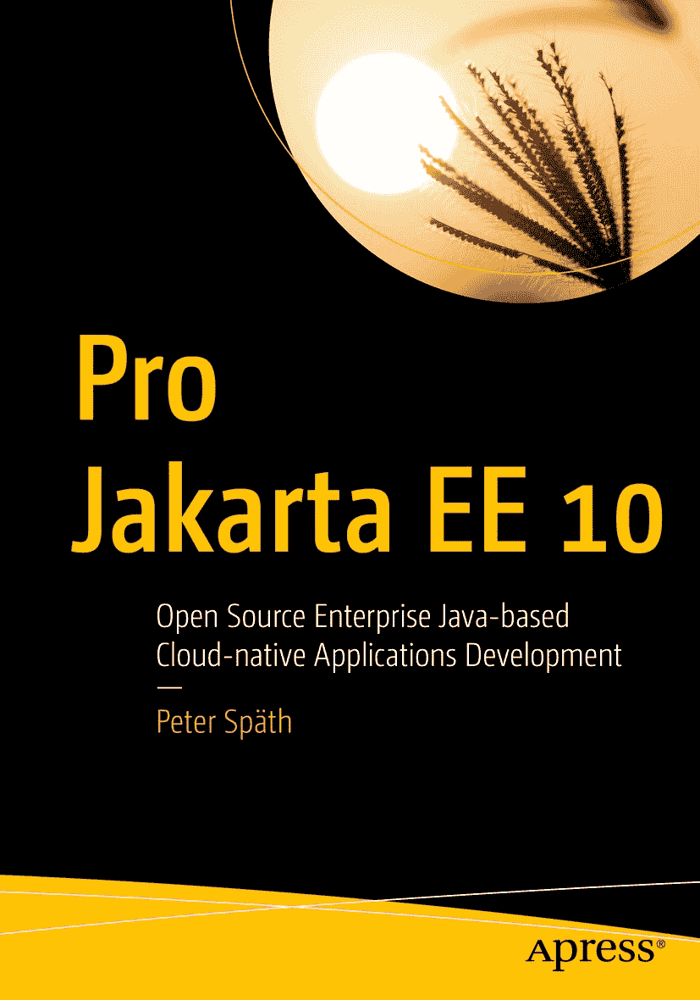

ISBN 978-1-4842-8213-7e-ISBN 978-1-4842-8214-4 [`doi.org/10.1007/978-1-4842-8214-4`](https://doi.org/10.1007/978-1-4842-8214-4) © Peter Späth 2023 本作品受版权保护。出版商保留所有权利，涉及材料的全部或部分，特别是翻译、重印、重用插图、朗诵、广播、以缩微胶片或任何其他物理方式复制，以及电子改编、计算机软件或目前已知或以后开发的类似或不同方法的传输或信息存储与检索。本出版物中使用通用描述性名称、注册商标、商标、服务标志等，即使没有明确声明，也不意味着这些名称不受相关保护法律和法规的约束，因此可自由用于一般用途。出版商、作者和编辑假定本书中的建议和信息在出版之日是真实和准确的。出版商、作者或编辑均不对本文所含材料或可能存在的任何错误或遗漏提供明示或暗示的保证。出版商在已出版地图和机构归属方面的管辖权主张中保持中立。

本 Apress 印记由注册公司 APress Media, LLC（Springer Nature 的一部分）出版。

注册公司地址为：1 New York Plaza, New York, NY 10004, U.S.A.

*献给妮可.*

引言

Java 不仅仅是一种编程语言，它还是一个用于托管软件的平台。就企业环境而言，Java 企业版 Jakarta EE（原 JEE）拥有广泛的 API 集合，特别适用于解决企业 IT 需求。

本书涵盖了 Jakarta EE 开发的高级主题。这包括专业级 Web 层开发、架构相关问题、高级 XML 和 JSON 处理、应用客户端和脚本语言、资源处理、高级安全增强以及高级监控和日志记录技术。

Jakarta EE 的目标版本是版本 10。除非另有说明，服务器脚本已在 Ubuntu 22.04 上测试。切换到 Debian、Fedora 或 OpenSUSE Leap 应该不会带来任何问题。

本书面向具有 Java 标准版 8 或更高版本知识以及 Jakarta EE（或 JEE）开发经验的高级企业软件开发人员。阅读同一作者和出版商出版的《Beginning Jakarta EE》（ISBN：978-1-4842-5078-5）一书肯定会有所帮助，但这并非严格的前提条件。我将对入门书籍的引用保持在最低限度。我还假设您可以使用在线 API 参考，因此本书并非完整参考，并非列出所有 API 类和方法。相反，本书包含的技术和技巧将帮助专业的 Java 企业级开发人员处理主题并解决企业环境中出现的问题。

本书使用 Linux 操作系统作为开发平台，尽管代码可以在其他平台上运行而无需进行复杂的更改。服务器安装（如版本控制、持续集成系统和操作说明）均针对 Linux 操作系统。本书也不涉及硬件问题，除非在某些情况下硬件性能对软件有显著影响。

完成本书后，您将能够开发和运行中等至高等复杂度的 Jakarta EE 10 程序。

## 如何阅读本书

您可以从头到尾按顺序阅读本书，或者如果您的工作需要特别关注某个主题，也可以临时阅读相关章节。

## 源代码

本书中的所有源代码都可以在 `github.com/Apress/pro-jakarta-ee10` 找到。

关于作者 关于技术审阅者

