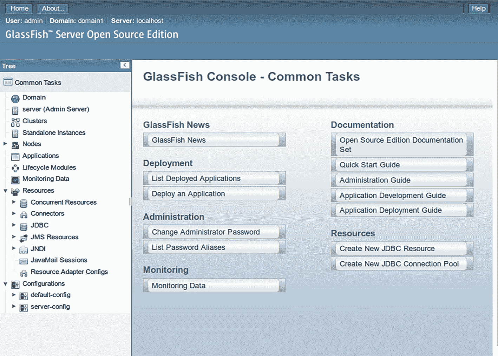

# 1. 安装开发服务器

本书使用 GlassFish 7.0.1 版本作为 Jakarta EE 服务器，尽管我尽量避免供应商锁定，因此除非另有说明，您可以在不同的 Jakarta EE 服务器上测试所有示例。

对于 Eclipse IDE，有一个名为 GlassFish Tools 的 GlassFish 插件，如果您愿意，可以使用它。我在本书中不使用它，原因有几个。首先，该插件可能与您的 Eclipse 安装存在问题。其次，如果您不使用该插件，而是使用终端启动和停止服务器，然后使用像 Gradle 这样的构建工具来安装和卸载企业应用程序，那么您已经接近集成测试和生产设置所需的条件。第三，更容易在不同的 Jakarta EE 服务器和不同的 IDE 之间切换。第四，您不必学习如何使用该插件，包括可能出现的任何特殊情况。

因此，现在只需从此位置下载并安装 GlassFish 服务器 7.0.1 版本：

```
https://glassfish.org/download.html
```

选择完整平台变体。

注意

GlassFish 7.0.1 运行在 JDK 11 到 19 上。您可以尝试为 GlassFish 7.0.1 使用更高的 JDK 版本，但它们可能无法正常工作。

## 在 Linux 下安装和运行

如果您有一个 Linux 开发环境，请将 GlassFish 发行版解压到任何适合您需要的文件夹中。在本章中，我将此文件夹称为 `GLASSFISH-INST`。

GlassFish 默认使用系统上安装的默认 Java。如果您不希望这样，请打开 `GLASSFISH-INST/glassfish/config/asenv.conf` 文件并添加以下内容：

```
AS_JAVA=/path/to/your/sdk
```

在文件末尾，将 `/path/to/your/sdk` 替换为您的 JDK 安装目录。

此外，请确保 `JAVA_HOME` 环境变量指向 JDK 安装目录：

```
# 在任何用于 Glassfish 操作的终端中，首先运行
export JAVA_HOME=/path/to/your/sdk
```

您可以将此行输入到 `GLASSFISH-INST/bin/asadmin` 文件的顶部，位于 `#!/bin/sh` 序言之后。这样，您就不必在每次启动新终端时都输入它。

即使没有安装任何 Jakarta EE 服务器应用程序，也应该可以从控制台启动服务器。输入以下命令：

```
cd GLASSFISH-INST
bin/asadmin start-domain
```

您应该会看到以下命令输出：

```
Admin Port: 4848
Command start-domain executed successfully.
```

如果您在浏览器中打开 `http://localhost:4848`，您可以看到 Web 管理员前端（管理控制台）；参见图 1-1。



用于常见任务的 GlassFish 控制台窗口。它包括 GlassFish 新闻、文档、部署、管理、资源和监控。

图 1-1

GlassFish 服务器正在运行

如果您想使用不同的端口，可以在管理控制台中通过选择配置 ➤ 服务器配置 ➤ HTTP 服务 ➤ HTTP 监听器 ➤ 管理监听器来更改。您也可以通过终端进行此更改：

```
bin/asadmin set server-config.network-config.
network-listeners.network-listener.admin-listener.
port=4444
```

（在服务器运行时，将其输入为一行。）然后重新启动 GlassFish，并在 `asadmin` 调用中添加 `-p 4444` 选项。


## 在 Windows 下安装与运行

GlassFish 在 Windows 上的安装说明与 Linux 类似。解压 GlassFish 发行版后，将以下内容

```
set AS_JAVA=C:\path\to\your\sdk
```

添加到 `GLASSFISH-INST/glassfish/config/asenv.bat` 路径的末尾。如果你不想使用系统的默认 Java 版本，请相应设置 `JAVA_HOME` 环境变量。然后在控制台中运行：

```
chdir GLASSFISH-INST
bin\asadmin start-domain
```

服务器应启动，控制台输出应类似于：

```
...
Admin Port: 4848
Command start-domain executed successfully.
```

要访问 Web 管理员前端，请在浏览器中打开 `http://localhost:4848`（或你配置的任何端口）；参见图 1-1。

## GlassFish 应用程序调试

为了在 GlassFish 中启用 Jakarta EE 应用程序的调试，一种方法是使用 `--debug` 标志启动服务器：

```
cd GLASSFISH-INST
bin\asadmin --debug start-domain
```

GlassFish 的默认调试端口是 `9009`。

你也可以使用位于 `htp://localhost:4848` 的 Web 管理员控制台。依次选择 Configurations ➤ Server-config ➤ JVM Settings ➤ General 选项卡。然后勾选 Debug 复选框。在 Debug Options 字段中，你可以更改调试选项，例如端口等。更改任何调试设置后，必须重新启动服务器。

启用调试后，你可以使用 Eclipse IDE 中内置的调试器来设置断点并逐步检查程序流程。

## 详细的 GlassFish 操作说明

你可以在在线文档 [`https://glassfish.org/documentation`](https://glassfish.org/documentation) 以及同一作者和出版社出版的 *Beginning Jakarta EE* 一书（ISBN：978-1-4842-5078-5）中找到关于 `asadmin` 命令和其他操作流程的详细信息。

