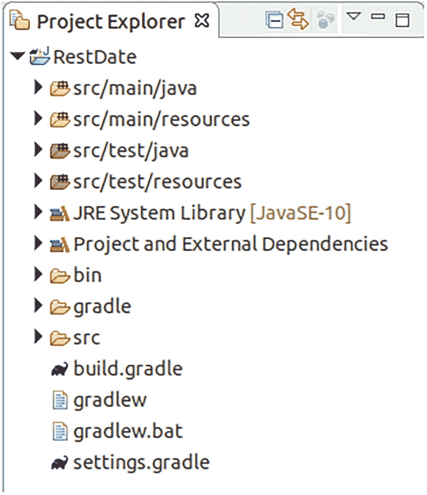
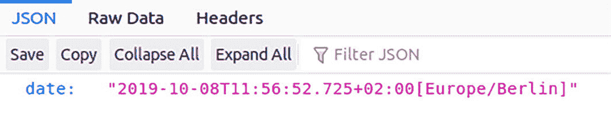

# 2. 使用 Eclipse 创建和构建项目

Eclipse 是一个 IDE（集成开发环境），拥有大量功能，可帮助你开发 Java 企业项目。它是免费提供的，你可以免费将其用于商业和非商业项目。

Eclipse 可以通过插件进行扩展，其中许多插件由社区开发且免费使用。然而，插件也可能来自供应商，你可能需要购买许可证才能使用它们。本书使用免费插件。如果你倾向于尝试专有插件（在某些情况下可能会提升你的开发效率），请访问 Eclipse 市场：

```
https://marketplace.eclipse.org
```

请查阅每个插件的文档以了解有关此类扩展的更多信息。

## 安装 Eclipse

Eclipse 有多个变体。要下载其中任何一个，请访问：

```
https://www.eclipse.org/downloads/
```

本书使用 Eclipse IDE for Enterprise Java Developers 变体。

注意

如果你选择下载安装程序，稍后系统会要求你选择变体。要一开始就选择企业版变体，请点击 Download Packages 链接，并在下一页选择企业版。

本书使用 Eclipse 2022-09 版本，但你可以使用更高版本。请记住，如果你遇到没有明显解决方案的问题，降级到 Eclipse 2022-09 是一个选择。

使用任何适合你需求的安装文件夹。插件安装和版本升级都会进入该文件夹，因此请确保你拥有适当的文件访问权限。在我的 Linux 机器上，我通常将 Eclipse 放在一个名为：

```
/opt/eclipse-2022-09
```

的文件夹中（或你拥有的任何版本）。我使其对我的 Linux 用户可写，如下所示：

```
cd /opt
USER=...  # 在此处输入用户名
GROUP=... # 在此处输入组名
chown -R $USER.$GROUP eclipse-2022-09
```

这会更改 Eclipse 安装的所有文件的所有权，这对于单用户工作站来说是合理的。如果你有多个 Eclipse 用户，你可以创建一个名为 `eclipse` 的新组，并允许对该组进行写访问：

```
cd /opt
groupadd eclipse
chgrp -R eclipse eclipse-2022-09
chmod -R g+w eclipse-2022-09
USER=...  # 在此处输入你的用户名
usermod -a -G eclipse $USER
```

`chgrp ...` 命令更改组所有权，`chmod ...` 命令允许所有组成员进行写访问。`usermod ...` 命令将特定用户添加到新组。

注意

你需要以 `root` 身份执行这些命令。另请注意，`usermod` 命令不会影响 PC 上当前活动的窗口管理器会话。这意味着你必须重新启动系统，或者根据你的发行版，注销并重新登录才能使该命令生效。

作为最后一步，你可以为 Eclipse 安装文件夹提供一个符号链接：

```
cd /opt
ln -s eclipse-2022-09 eclipse
```

这使得在你的系统上切换不同的 Eclipse 版本更加容易。

在 Windows 系统上，安装程序会为你设置访问权限，通常任何普通用户都可以安装插件。然而，这取决于 Windows 版本和你的系统配置。在企业环境中，你可以使用 Windows 自身的访问权限管理来配置更细粒度的访问权限。这可能包括不允许普通用户安装插件或升级，以及为管理目的创建超级用户。

## 配置 Eclipse

启动时，Eclipse 使用系统上安装的默认 Java 版本。如果找不到 Java，或者你安装了多个 Java 版本，你可以明确告诉 Eclipse 选择哪个 Java。为此，打开 `ECLIPSE-INST/eclipse.ini` 文件并添加以下行：

```
-vm
/path/to/your/jdk/bin/java
```

将此行直接添加到 `-vmargs` 行上方：

```
...
openFile
--launcher.appendVmargs
-vm
/path/to/your/jdk/bin/java
-vmargs
...
```

`eclipse.ini` 文件的格式取决于你的 Eclipse 版本。请访问 [`https://wiki.eclipse.org/Eclipse.ini`](https://wiki.eclipse.org/Eclipse.ini) 获取正确的语法。在该网站上，你还会找到指定 Java 可执行文件路径的精确说明。我在此处展示的语法适用于 Eclipse 2022-09。

在 Windows PC 上，你按照 Windows 系统使用的路径来指定：

```
...
-vm
C:\path\to\your\jdk\bin\javaw
...
```

不要使用转义的反斜杠（例如 `C:\\path\\to\\...`），尽管你可能期望 Java 相关文件会这样使用！

## 添加 Java 运行时

Eclipse 本身是一个 Java 应用程序，在前面的部分中，你学习了如何告诉 Eclipse 为其自身选择哪个 Java。对于开发，你必须告诉 Eclipse 使用哪个 Java 来编译和运行应用程序。

为此，记下你想要用于 Eclipse 开发的所有 JDK 安装的路径。然后，在 Eclipse 内部，选择 Window ➤ Preferences ➤ Java ➤ Installed JREs。Eclipse 通常足够智能，会自动提供其用于自身启动的 JRE。如果这对你来说足够了，你无需执行任何操作。否则，单击 Add 按钮以注册更多 JRE。在随后的向导对话框中，选择 Standard VM 作为 JRE 类型。

选中复选框以标记你的主 JRE，并且不要忘记单击 Apply 或 Apply and Close 按钮以注册你的更改。


## 添加插件

Eclipse 可以通过许多有用的插件进行扩展。其中一些插件是开发所必需的，另一些则有助于改善你的开发工作流程。本书不会使用太多额外的插件，并且在需要时会提供插件安装说明。

作为特例，你现在将学习如何安装一个用于 Groovy 语言支持的插件。在本书中，你将把 Groovy 作为脚本语言用于多种目的。在你的浏览器中，导航到

```
https://marketplace.eclipse.org/content/
groovy-development-tools
```

（忽略换行符），找到“安装”徽章，并将其拖放到 Eclipse 窗口上（见图 2-1）。


一个文本框带有安装符号，并写着“安装”。

图 2-1

安装徽章插件

与 Eclipse 插件的通常情况一样，你需要接受许可条款并选择功能。对于功能，你可以接受默认选择。

在早期版本的 Eclipse 中，要使用 Gradle 作为构建工具，你需要一个 Gradle 插件。但是，在 Eclipse 2022-09 中，此插件已包含在内，因此这里无需额外操作。

注意

在 Jakarta EE 开发的入门书籍中，我使用了 Maven 作为构建工具。现在切换到 Gradle 并不矛盾。Maven 和 Gradle 使用相似的概念，Gradle 甚至知道如何导入 Maven 项目。此外，熟悉这两种构建框架也是一个好主意。

## 使用 Eclipse 管理 Jakarta EE 服务器

即使不使用像 GlassFish Tools 这样的 Jakarta EE 服务器插件，当然也希望能够从 Eclipse 内部将应用程序部署到正在运行的服务器上。

在本节中，你将创建一个基本的 RESTful 服务，该服务仅输出日期，以了解如何实现此目的。为此，在 Eclipse 中，选择“文件” ➤ “新建” ➤ “其他”，然后选择“Gradle” ➤ “Gradle 项目”。输入 `RestDate` 作为项目名称。在“选项”窗格中，保持“使用工作区设置”生效，并完成向导。

然后项目将生成，如图 2-2 所示。



一个项目资源管理器窗口，其中可见 RestDate 项目文件，并带有选项列表，其中 s r c 文件被展开，列出了 Gradle 项目。

图 2-2

初始 Gradle 项目

在 `src/main/java` 源代码部分中创建一个名为 `book.jakartapro.restdate` 的新包，并创建一个名为 `RestDate` 的类。输入以下代码：

```
package book.jakartapro.restdate;
import java.time.ZonedDateTime;
import jakarta.ws.rs.GET;
import jakarta.ws.rs.Path;
import jakarta.ws.rs.Produces;
**
* REST Web 服务
*/
@Path("/d")
public class RestDate {
@GET
@Produces("application/json")
public String stdDate() {
return "{\"date\":\"" +
ZonedDateTime.now().toString() +
"\"}";
}
}
```

Eclipse 会报错提示导入的类，因为你尚未告诉它在哪里找到它们。作为补救措施，打开 `build.gradle` 文件，并在 `dependencies { }` 部分中添加以下内容：

```
implementation 'jakarta.platform:' +
'jakarta.platform:jakarta.jakartaee-api:10.0.0'
```

保存文件，然后从项目的上下文菜单中选择“Gradle” ➤ “刷新 Gradle 项目”。Eclipse 中的错误标记现在应该消失了。

你可以明确告诉 Gradle 使用 Java 编译器版本 1.17。为此，打开 `build.gradle` 并在 `plugins { }` 部分下方添加以下内容：

```
plugins {
...
}
sourceCompatibility = 1.17
targetCompatibility = 1.17
```

在项目的上下文菜单中选择“Gradle” ➤ “刷新 Gradle 项目”。

如果你查看项目结构，可以看到还生成了一个名为 `src/test/java` 的单元测试部分。对于像这样的简单 REST 控制器，你也可以从一开始就创建一个单元测试来验证其是否正确工作。在 `src/test/java` 部分中创建一个名为 `book.jakartapro.restdate.TestRestDate` 的测试类，内容如下：

```
package book.jakartapro.restdate;
import org.junit.Test;
import static org.junit.Assert.*;
public class TestRestDate {
@Test public void testStdDate() {
assertTrue("意外的日期格式",
new RestDate().stdDate().matches(
"\\{\"date\":\" +
"\\d{4}-\\d{2}-\\d{2}T" +
"\\d{2}:\\d{2}:\\d{2}\\..*"));
}
}
```

对于任何构建任务，单元测试默认都会被执行。Gradle 无需进一步配置就知道如何执行此操作，仅仅因为你将测试类放在了 `src/test/java` 文件夹中。

现在你需要让你的 RESTful 应用程序生成一个 WAR 文件，为此，你需要添加一个部署描述符。你可以通过添加更多注解来避免这样做，但我个人喜欢有一个中央配置文件，这样 Web 应用程序的配置就不会分散在源代码中。创建一个名为 `src/main/webapp/WEB-INF` 的文件夹，并向该文件夹添加一个名为 `web.xml` 的文件：

```

RestDate

jakarta.ws.rs.core.Application

jakarta.ws.rs.core.Application

/webapi/*

```

在同一个 `WEB-INF` 文件夹中，添加一个 `beans.xml` 文件。这对于配置 CDI（上下文和依赖注入）是必需的：

你还需要一个特定于服务器产品的部署描述符。对于 GlassFish，你需要一个名为 `glassfish-web.xml` 的文件，内容如下：

注意

如果你不是部署到 GlassFish，而是使用不同的 Jakarta EE 服务器，请查阅该服务器的文档，了解需要哪些特定于服务器的部署描述符。


故事的有趣部分现在开始。你需要告诉 Gradle 如何从中构建一个 WAR 文件，以及如何将其部署到服务器上。首先需要添加一个 WAR 插件。打开 `build.gradle` 文件，在 `plugins { }` 部分内输入 `id 'war'`：

```
plugins {
id 'war'
}
```

从项目的上下文菜单中选择 Gradle ➤ Refresh Gradle Project。

要构建 WAR 文件，请打开 Gradle Tasks 视图（如果找不到，请选择 Window ➤ Show View ➤ Other... 打开它）。然后右键单击 Build ➤ Build 并选择 Run Gradle Tasks。构建任务会执行单元测试并创建 WAR 文件。你可以在 `build/libs` 文件夹中找到结果。

注意

Eclipse 默认安装了一个过滤器，用于在 Project Explorer 中隐藏 Gradle 构建文件夹。要移除该过滤器，请点击 Project Explorer 标题区域中的灰色三角形工具，选择 Filters and Customization...，然后取消勾选 Gradle Build Folder 条目。

要将 WAR 文件部署到服务器上，你必须首先定义一些属性。在项目根目录下创建 `gradle.properties` 文件，并添加以下内容，将服务器路径替换为你自己的路径：

```
glassfish.inst.dir = /PATH/TO/YOUR/GLASSFISH/SERVER
glassfish.user = admin
glassfish.passwd =
```

同时根据你的需要替换 `user` 和 `passwd`——将 `user` 改为 `admin`，并使用空密码（这属于默认安装配置）。如果你使用 Windows，请确保路径中使用双反斜杠 `\\` 而不是单反斜杠（因为这是一个 Java 属性文件）。

接下来，将自定义的 `deploy` 和 `undeploy` 任务添加到 `build.gradle` 文件中。打开该文件并添加以下内容：

```
task deployWar(dependsOn: war,
description:">>> RESTDATE deploy task") {
doLast {
def FS = File.separator
def glassfish =
project.properties['glassfish.inst.dir']
def user = project.properties['glassfish.user']
def passwd = project.properties['glassfish.passwd']
File temp = File.createTempFile("asadmin-passwd",
".tmp")
temp  ${sout}"
if(serr.toString()) System.err.println(serr)
temp.delete()
}
}
task undeployWar(
description:">>> RESTDATE undeploy task") {
doLast {
def FS = File.separator
def glassfish =
project.properties['glassfish.inst.dir']
def user = project.properties['glassfish.user']
def passwd = project.properties['glassfish.passwd']
File temp = File.createTempFile("asadmin-passwd",
".tmp")
temp  ${sout}"
if(serr.toString()) System.err.println(serr)
temp.delete()
}
}
```

两个任务都指定了一个 `doLast { }` 块，这是任务实际在任务执行阶段执行的必要条件。如果你没有使用这样的块，相应的代码将在配置阶段内执行，无论该任务是否实际被执行。正如你可能猜到的，也可以使用 `doFirst { }` 块。就此处目的而言，你可以使用其中任何一个。

代码基于 Linux 作为开发环境。要在 Windows 下运行相同的任务，所需的改动实际上非常小。你只需要在 `def proc = """...` 字符串的开头添加一个 `cmd /c`：

```
// 这是 Windows 系统！
def proc = """cmd /c ${glassfish}${FS} ...
```

如果你想使用 Windows，请对这两个新任务都进行相同的修改！

代码本身使用了 Groovy 语言作为惯用语法。`project.properties` 用于访问在 `gradle.properties` 文件中定义的属性。其余部分是 Groovy 代码，其中 `.execute` 用于执行系统 shell 命令。之所以需要临时文件，是因为对于 `asadmin` 命令，只能通过指定一个特制的密码文件来传递密码。`<<` 操作符将内容写入该文件，生成 `asadmin` 规范所要求的必要语法。

在 Gradle Tasks 视图中，转到菜单（位于视图的工具栏内）并勾选 Show All Tasks。现在你可以从该视图运行 deploy 和 undeploy 任务。导航到 Other 并双击任一新的自定义任务。标准输出和错误输出将打印到控制台视图。在部署或取消部署应用程序之前，请确保服务器正在运行。

注意

对于任何其他 Jakarta EE 服务器，从构建脚本来看，部署过程将非常相似。由于 Groovy 运行在 Java 之上，你可以在部署和取消部署期间执行许多其他有趣的操作。此外，一个任务可以轻松调用任何其他任务，并且借助 Gradle 插件，这里可以实现许多额外的功能。

要查看这个小应用程序的运行情况，请将浏览器指向 `http://localhost:8080/RestDate/webapi/d`。输出将如图 2-3 所示。



一个 RESTful 日期应用程序的窗口，其中选择了 JSON，给出了日期输出。有保存、复制、全部折叠和全部展开的选项。

图 2-3

RESTful 日期应用程序

注意

为了简化开发并节省部署应用程序的时间，你也可以从 shell 终端使用 Gradle 包装器。进入项目目录，然后调用 `./gradlew deployWar` 来执行构建并随后进行部署。

## Eclipse 日常使用

Eclipse 提供了许多功能，你可以通过打开内置帮助来了解它们。以下是一些提示列表，将帮助你充分利用 Eclipse：

*   将光标放在标识符上并按 F3 键，可以跳转到该标识符的定义。这适用于变量（跳转到其声明）和类/接口（跳转到其定义）。你甚至可以以这种方式检查引用的类和 Java 标准库类。Eclipse 可能会下载源代码并显示代码。这是通过深入查看代码来学习库的好方法。

*   要快速查找资源（例如文件、类或接口），请按 CTRL+SHIFT+R。

*   开始输入代码，然后按 CTRL+SPACE。Eclipse 将显示完成输入的建议。例如，输入 `new SimpleDa`，然后按 CTRL+SPACE。提供的列表将包含 `SimpleDateFormat` 类的所有构造函数。更好的是，你可以通过输入 `new SiDF` 并按 CTRL+SPACE 来快捷操作，因为 Eclipse 会猜测缺失的小写字母。另一个好处是，你无需为以这种方式引入的类和接口编写 `import` 语句——Eclipse 会为你完成 `import`。

*   按 SHIFT+CTRL+O 让 Eclipse 为所有尚未解析的类完成 `import`（将 O 视为“组织导入”）。

*   按 CTRL+ALT+F 格式化你的代码。这也适用于 XML 和其他文件类型。

*   在类型指示符上按 F4 键，让 Eclipse 显示其超类型和子类型。

*   如果从 Eclipse 外部添加或删除了文件，请使用 F5 更新 Project Explorer 视图。

*   对于新的 Eclipse 安装，请从 Window ➤ Show View ➤ Other... ➤ General ➤ Problems 打开 Problems 视图。它会立即指出 Eclipse 检测到的任何问题（编译器问题、配置问题等）。

*   从 Window ➤ Show View ➤ Other... ➤ General ➤ Tasks 打开 Tasks 视图，以获取你在代码注释中输入的所有 `TODO` 的列表。

*   如果 `TODO` 对你来说粒度不够细，你可以通过右键单击代码编辑器左侧垂直栏上的任意位置来添加书签。书签会列在 Bookmarks 视图中。


## 更改项目布局

到目前为止，你将所有文件工件放置到了以下位置：

```
Java 源码 -> src/main/java
测试源码 -> src/test/java
Web 文件 -> src/main/resources
```

你无需在 `build.gradle` 文件中指定这些路径，因为它们是 Gradle 默认使用的位置。顺便提一下，Maven 构建框架也使用相同的位置。不过，有充分的理由可以偏离这种布局。最主要的原因是你有一个预设的布局，因为版本控制系统的检出操作规定了它。在这种情况下，告诉 Gradle 在哪里查找文件并不困难。在 `build.gradle` 文件中，只需添加以下内容：

```
sourceSets {
main {
java {
srcDirs = ['path/to/folder']
}
resources {
srcDirs = ['path/to/folder']
}
}
test {
java {
srcDirs = ['path/to/folder']
}
resources {
srcDirs = ['path/to/folder']
}
}
}
```

将 `path/to/folder` 替换为你自定义的项目布局文件夹。`[ ... ]` 是 Groovy 语言的列表，因此你也可以在其中放置一个逗号分隔的列表来指定多个文件夹，这些文件夹将被合并。

