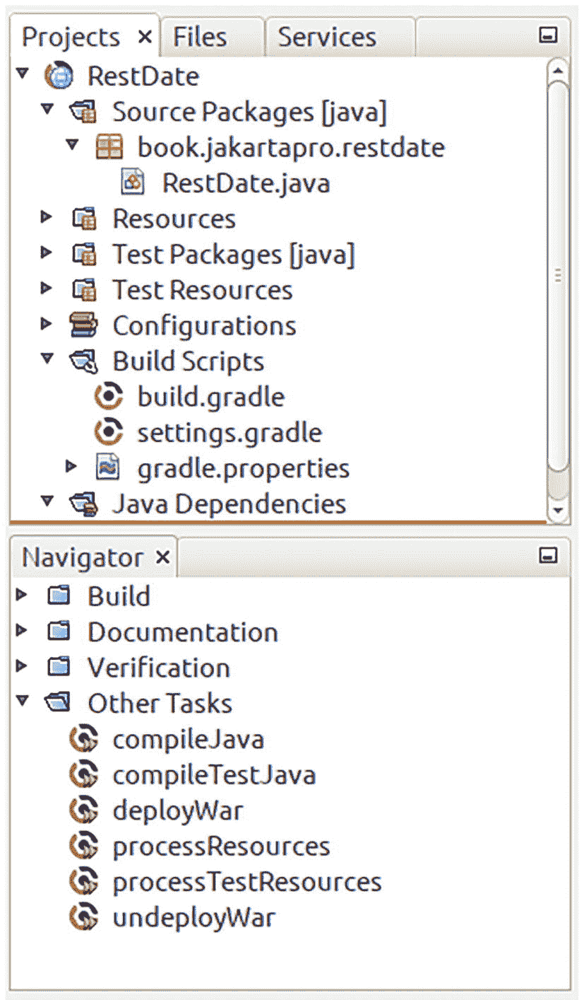

# 3. 使用 NetBeans 作为 IDE 进行开发

大多数现代 IDE 都能满足你的开发需求，包括支持 Groovy 和 Gradle、版本控制、编译和运行 Java 等。我可以加入更多“使用 *XXX* 作为 IDE”的章节，填满半本书，但大多数 IDE 遵循相似的概念，具有帮助功能，并提供教程和示例。开发工作流程的路径通常遵循以下步骤：

1.  学习如何创建项目、文件和文件夹。
2.  学习如何编辑文件：Java、XML、资源、脚本文件等。
3.  学习如何连接项目和 JRE。
4.  学习如何向项目添加 Gradle 功能。
5.  学习如何添加版本控制。
6.  学习使用更多次要但有用的工具。

你已经学会了如何使用 Eclipse，它提供了开发和部署 Jakarta EE 项目所需的一切。作为可用于开发的第二个 IDE 示例，本章简要探讨了另一个由 Apache 维护的免费 IDE，名为 NetBeans。

## 安装 NetBeans

访问 [`https://netbeans.apache.org/`](https://netbeans.apache.org/) 并下载 NetBeans。选择适合你操作系统的安装程序之一。你也可以安装二进制版本，例如 `netbeans-16-bin.zip`，但随后你必须手动设置一些安装程序本应为你完成的配置。

下载页面上描述了更多安装选项。

注意

与 Eclipse 不同，NetBeans IDE 将一些设置存储在 `USER_HOME/.netbeans` 文件夹中。如果你想卸载 NetBeans 或从头重新安装，请记住这一点。

## 启动 NetBeans 项目

选择文件 ➤ 新建项目... 来生成一个新项目。然后选择其中一个带有 Gradle 的 Java 项目模板：

*   **Java 应用程序**

    生成一个基本的 Java 应用程序模板。如果你使用 Gradle 作为构建和依赖解析工具，你可以从这里开始，稍后添加功能。

*   **Java 类库**

    使用此选项创建一个可供其他项目使用的库 JAR。

*   **Web 应用程序**

    这是一个 Java 应用程序加上一个关联的服务器。由于本书中你将继续从 Gradle 脚本控制服务器，因此不解释此选项。当然，你可以自行尝试并将其用于你自己的目的。

*   **多项目构建**

    此构建会创建一个包含一个或多个子项目的项目。这是通过在 `settings.gradle` 中使用 `include` 指令实现的。你可以在安装根项目时指定子项目，NetBeans 将为每个子项目创建一个新的项目视图。

*   **Java 前端应用程序**

    这会创建一个 Java 前端应用程序蓝图。要使此安装选项生效，NetBeans 必须在 Java 11 或更高版本下运行（你可以在 `NETBEANS-INST/netbeans/etc/netbeans.conf` 中更改此选项）。

*   **Micronaut 项目**

    生成一个基于 Micronaut 平台（非 Jakarta EE）的项目。

由于这足以满足本书的目的，下一节将使用 Java 应用程序类型。

## 多 IDE 项目

第 2 章使用了 Gradle 项目风格。由于你将在 NetBeans 中采用相同的方式，因此将项目从 Eclipse 迁移到 NetBeans 或反之亦然极其容易。还记得你在第 2 章为 Eclipse 创建的简单 `RestDate` 项目吗？要将该项目迁移到 NetBeans，你只需将 `build.gradle`、`gradle.properties` 和 `settings.gradle` 文件从 `ECLIPSE-PROJ`（项目文件夹）复制到 `NETBEANS-PROJ`，然后对所有 `src` 文件执行相同操作。参见表 3-1。

表 3-1

迁移 Gradle 项目

| Eclipse |   | NetBeans |
| --- | --- | --- |
| `ECLIPSE-PROJ/` | → | `NETBEANS-PROJ/` |
| `build.gradle` | → | `build.gradle` |
| `settings.gradle` | → | `settings.gradle` |
| `gradle.properties` | → | `gradle.properties` |
| `src/*` | → | `src/*` |

首先，在 NetBeans 中选择 Gradle ➤ Java 应用程序来创建一个 Java 项目。勾选“初始化 Gradle Wrapper”复选框，以便向导还会在项目中生成一组非 IDE（shell）脚本。然后执行表 3-1 中所示的复制操作。

注意

NetBeans 会检测文件更改并自动下载新的依赖项。这需要一分钟左右的时间，因此请给 NetBeans 一些时间来恢复项目设置。在完成所有下载和重新配置之前，错误标记不会消失。

NetBeans 中的新项目视图现在将类似于图 3-1。启动服务器后，你可以双击 `deployWar` 任务来构建和部署项目。

一个窗口截图列出了不同的项目，如 Rest Date、资源和构建脚本，下方另一个窗口截图列出了不同的导航器，如文档和验证。

图 3-1

迁移到 NetBeans 的 RestDate

在本书的其余部分，你将使用 Eclipse，但在本章中你已经看到，迁移到并使用不同的 IDE 是很容易的。

