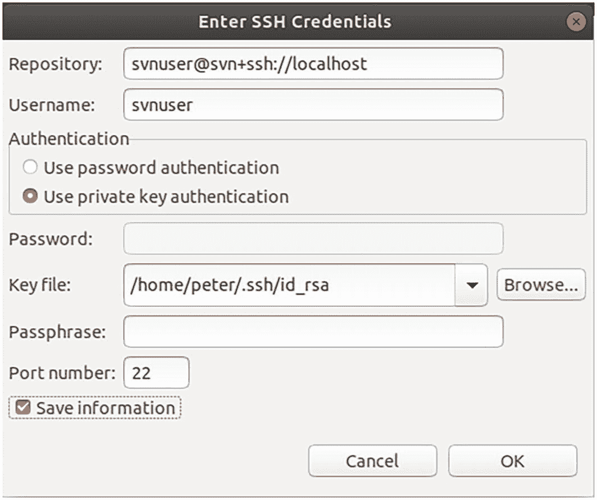
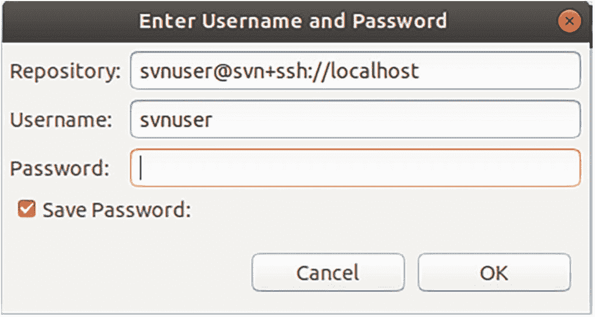
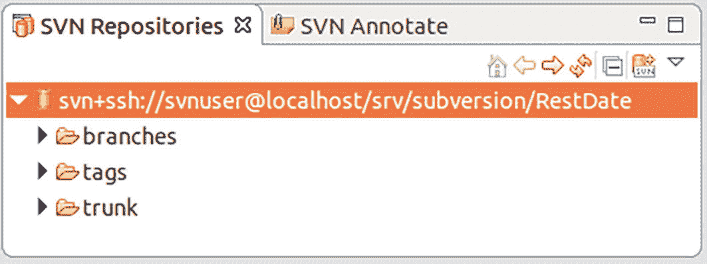
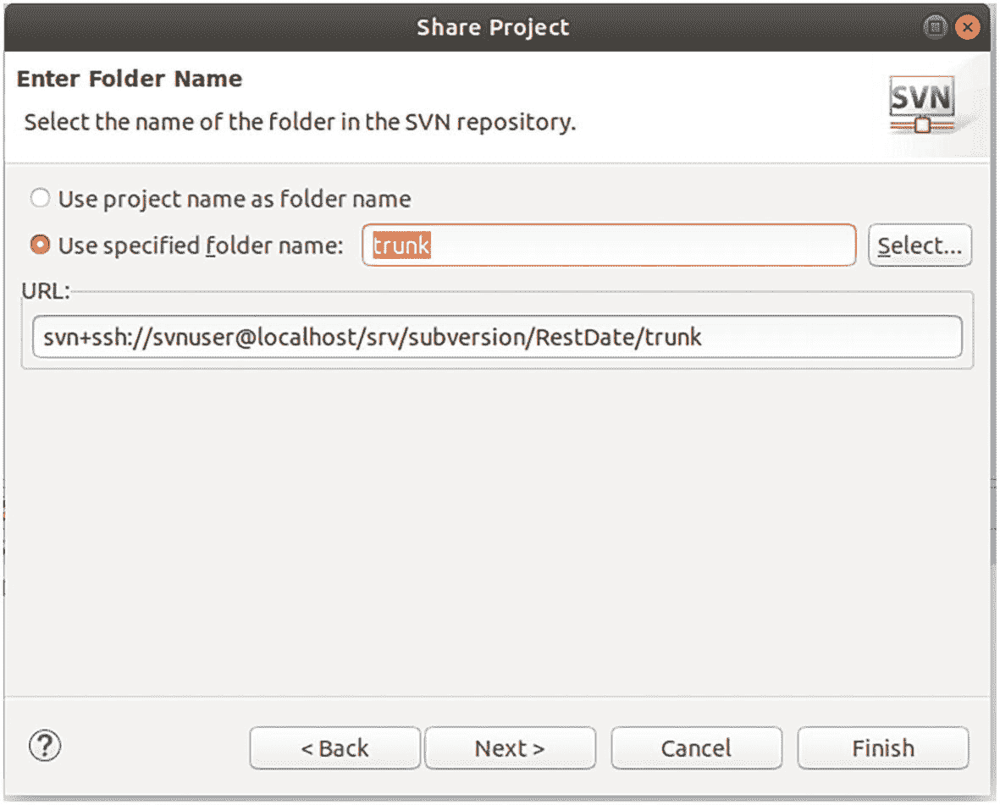
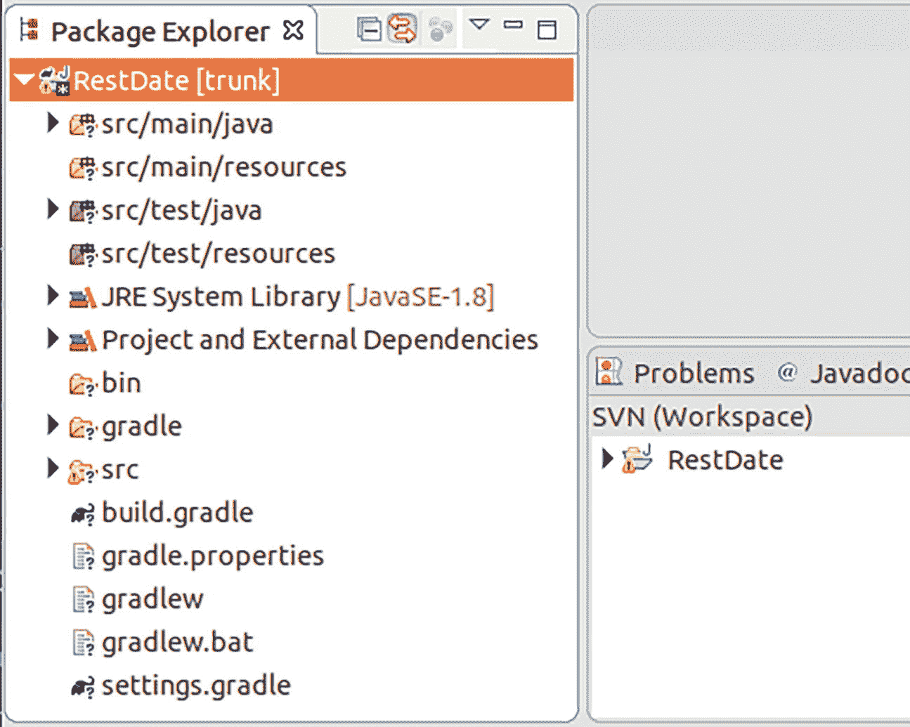
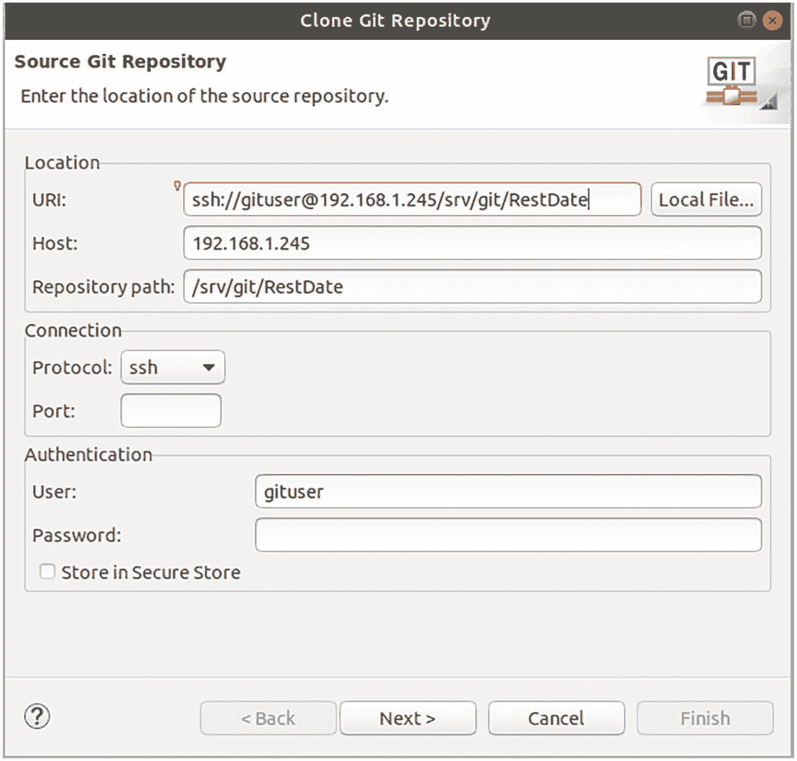
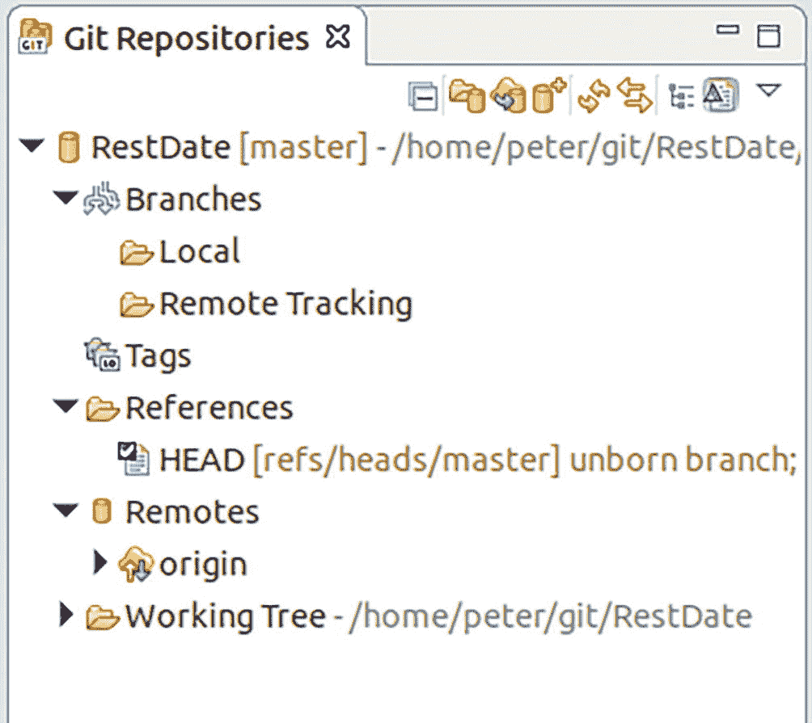

# 4. Git 和 Subversion

版本控制系统有多个用途。首先，它们是一种备份系统。一旦文件被提交（或在 Git 的情况下被推送），它就会在某个服务器上持久化一份副本，因此如果开发者的机器崩溃，文件不会丢失。其次，版本控制系统会保留文件版本的历史记录，因此编辑操作不会导致以前的版本丢失。第三，持续集成（CI）系统可能连接到版本控制系统仓库，这意味着开发工件可以自动发布到集成系统进行测试，然后稍后发布到某个生产（或预生产）系统。

本章涵盖 Subversion 和 Git 版本控制系统。还存在其他版本控制系统，但 Git 和 Subversion 是最常用的产品。

注意

如果仅用于客户端使用，请跳至“Subversion 客户端”和“Git 客户端”部分。使用 Git 和 Subversion 客户端在手册和教程中有详细记录。本章的其余部分是关于安装企业级 Subversion 或 Git 服务器，如果你不想将源代码托管在公司外部，这将很有意义。


## Subversion 版本控制系统

Subversion 是一个相对较老的版本控制系统，但至今仍在积极维护。它是一个集中式版本控制系统，意味着所有版本都存储在一个中央位置。Eclipse 以及我所知的所有其他 IDE 都提供了与 Subversion 通信的内置功能，或者允许你为此安装插件。

Subversion 可以方便地安装在 Linux 服务器上。要安装它，请以 `root` 身份运行以下代码：

```
# Ubuntu 或 Debian
apt-get install subversion
# Fedora 或 RHEL
yum install subversion
# SuSE
zypper install subversion
```

除非安装过程自动创建了 `subversion` 用户和组，否则你可以通过运行 `cat /etc/group | grep subversion` 和 `cat /etc/passwd | grep subversion` 来检查。然后，通过输入以下命令创建 `subversion` 用户和组：

```
# 我们是 "root"
# Ubuntu, Debian, Fedora, RHEL
mkdir -p /srv/subversion
adduser --home /srv/subversion subversion
chown -R subversion.subversion /srv/subversion
# OpenSUSE Leap
mkdir -p /srv/subversion
useradd -r -U --home-dir /srv/subversion subversion
chown -R subversion.subversion /srv/subversion
```

例如，你可以为第 2 章的 `RestDate` 项目创建一个仓库：

```
# 创建一个空仓库
# 我们是 "root"
su -l subversion
svnadmin create /srv/subversion/RestDate
# 创建标准的 Subversion 目录结构
cd # 回到主目录
mkdir tmp
cd tmp
svn co file:///srv/subversion/RestDate
cd RestDate
mkdir trunk tags branches
svn add *
svn commit -m "Init"
# 在 Debian 和 OpenSUSE Leap 上：
chmod -R g+w /srv/subversion/RestDate
# 清理，我们将以普通用户身份工作
cd ..
rm -rf RestDate
exit
```

这将创建一个标准的 Subversion 仓库目录结构。`trunk` 是主开发分支，`branches` 包含所有分支，`tags` 用于标签。这是通常的约定，但你不必强制遵守。不过，遵循此约定有助于他人更好地理解你的版本控制流程。

Subversion 提供了多种客户端连接仓库的方法。以下列表总结了这些方法：

*   `file:///`

仅限本地访问。这并非一个真正的选项，因为公司服务器不应同时作为开发者的工作站。

*   `http://`

通过中介 Apache HTTP 服务器进行间接访问。

*   `https://`

与 `http://` 相同，但增加了 SSL 加密。

*   `svn://`

Subversion 自身的网络协议。

*   `svn+ssh://`

通过 SSH 登录进行中介访问。

出于多种原因，我强烈推荐使用 `svn+ssh://` 协议。首先，它直接且简单。无需在服务器上运行任何其他软件，也无需花费时间创建坚不可摧的 Apache 安装（这对于 `http://` 或 `https://` 是必需的，包括后续维护）。而且，你也不必使用不安全的 `svn://` 协议访问。安全性被委托给了非常安全的 SSH 访问方法。通常反对使用 SSH 的论点并不令人信服——你只需要一个 SSH 用户来进行 Subversion 工作，并且不会浪费磁盘空间。此外，你可以使用 `rbash` 来限制该用户的 shell 访问。由于 SSH 的重要性，社区有很高的积极性来立即修复任何出现的 SSH 漏洞。

当然，决定权在你手中，你可以在文档和互联网上找到安装说明。本章的其余部分将使用 `svn+ssh://` 协议，因为它非常简单。

你首先需要确保，使用 `rbash` 作为 shell 且属于 `subversion` 组的用户，在登录时只能执行非常有限的命令集。为此，你需要根据你使用的发行版，完成一些准备步骤：

```
# Fedora ************************************************
ln -s /bin/bash /bin/rbash
# OpenSUSE Leap *****************************************
# 此处 PATH=/usr/lib/restricted/bin 是 rbash 可执行命令的默认路径。
# 它无法更改。你可以在此处做的是，基于组和所有权策略，
# 进一步限制对 /usr/lib/restricted/bin 的访问。例如：
#     groupadd rbashusers
#     chgrp rbashusers /usr/lib/restricted/bin/*
#     chmod o-x /usr/lib/restricted/bin/*
# 并且不要将用户 "svnuser" 添加到组 "rbashusers" 中
# （见下文）。为此，该文件夹中的链接必须是硬链接
# （在 \ci{ln} 中不使用 -s 选项）
```

接下来，在 `/etc/profile.d/` 目录中添加 `svnuser.sh` 文件：

```
# Ubuntu, Debian 或 Fedora
if [ "$SHELL" = "/bin/rbash" -a \
$(groups | grep -c \\bsubversion\\b) = 1  ]; then
export PATH=.
fi
# 在 OpenSUSE Leap 上不要编写此文件。请参见上一个列表中的注释
```

这样，使用 `rbash` shell 且属于 `subversion` 组的用户，通过 SSH 登录后，只能使用有限的命令集。实际上，任何试图通过 `ssh` 登录到你服务器的 Subversion 用户，都会很快意识到这种直接登录毫无意义，因为使用所提供的 shell 什么也做不了。

要创建一个用于 Subversion 访问的 SSH 用户，请使用相应的操作系统功能，并将 `home` 目录限制为 SSH 所需的最小限度：

```
# 我们是 "root"
# Ubuntu 或 Debian **************************************
adduser --system --ingroup subversion \
--shell /bin/rbash --disabled-password svnuser
ln -s /usr/bin/groups ~svnuser
ln -s /bin/grep ~svnuser
su svnuser --shell /bin/bash \
-c "ssh-keygen -q -N '' -f /home/svnuser/.ssh/id_rsa"
# Fedora ************************************************
adduser -r -N -G subversion -s "/bin/rbash" \
-d /home/svnuser svnuser
mkdir /home/svnuser
chown svnuser.subversion /home/svnuser
echo "export PATH=." > /home/svnuser/.bashrc
ln -s /bin/svnserve /home/svnuser
su svnuser --shell /bin/bash \
-c "ssh-keygen -q -N '' -f /home/svnuser/.ssh/id_rsa"
# OpenSUSE Leap *****************************************
useradd -r -G subversion -m -U -s /usr/bin/rbash svnuser
ln /usr/bin/svnserve /usr/lib/restricted/bin/svnserve
su svnuser --shell /bin/bash \
-c "ssh-keygen -q -N '' -f /home/svnuser/.ssh/id_rsa"
```

`adduser` 命令创建用户，将 `subversion` 组分配给该用户，并且由于使用了 `–shell /bin/rbash` 或 `-s` 参数，应用了访问限制。`ssh-keygen` 命令生成 SSH 密钥，并且，对你而言更重要的是，它创建了一个空间，你可以在其中放置用于从外部连接的公钥。

对于 Ubuntu、Debian 和 Fedora，我在主目录中添加了一些命令链接，因为它们是 Subversion 在这些系统上正常运行所必需的。对于 OpenSUSE Leap，`svnserve` 命令是必需的，但我改为将该 `svnserve` 命令的*硬*链接添加到了 `/usr/lib/restricted/bin` 文件夹中。


## Subversion 客户端

作为客户端，你需要使用 `Subclipse` Eclipse 插件。在浏览器中，导航到

```
https://marketplace.eclipse.org/content/subclipse
```

并将安装徽章拖拽到你的 Eclipse 窗口中。选择所有功能并完成安装。选择 **窗口** ➤ **首选项** ➤ **团队** ➤ **SVN**，忽略关于缺少 JavaHL 安装的错误消息。从 **SVN 接口** 选项中，选择 **SVNKit** 作为客户端。这将使错误消息消失。点击 **应用并关闭**。

现在，你需要为每个 Subversion 用户在其工作站上生成一个公钥/私钥 SSH 密钥对。如果你已经有一个，或者你有一台 Linux 机器，`ssh-keygen` 命令将创建这样一个公钥/私钥对。在 Windows 上，你可以安装 Cygwin 并使用相同的命令，或者使用 PuTTY（在这种情况下，你必须将密钥转换为 OpenSSH 格式）。也可以在 PowerShell 中安装密钥生成器。使用 `Install-Module -Force OpenSSHUtils` 并输入 `ssh-keygen`。

密钥的公钥部分需要放到服务器上。在那里，将其内容添加到你要连接的 `svnuser` 用户的 `.ssh/` 目录下的 `authorized_keys` 文件中。确保该文件仅对该用户可见：

```
# 我们是 "root"
cat thePublicKey.file >>
/home/svnuser/.ssh/authorized_keys
chown svnuser.subversion \
/home/svnuser/.ssh/authorized_keys
chmod 600 \
/home/svnuser/.ssh/authorized_keys
```

将用户的公钥放在服务器上后，现在就可以从 Eclipse 访问仓库了。为此，通过选择 **窗口** ➤ **透视图** ➤ **打开透视图** ➤ **其他...** 来打开 **SVN 仓库浏览** 透视图。在左侧的 **SVN 仓库** 选项卡中，右键单击并选择 **新建** → **仓库位置...**。对于 URL，输入以下内容：

```
svn+ssh://svnuser@THE.SERVER.ADDR/srv/subversion/RestDate
```

除非 Eclipse 已经知道你的 SSH 密钥或可以猜测到它，否则系统会提示你输入凭据，并可以将 Eclipse 指向该密钥；参见图 4-1。



一个窗口显示凭据。凭据包括仓库、用户名、选中的使用私钥认证选项、密码、密钥文件、密码短语和端口号（22），点击保存信息复选框，然后点击确定按钮。

**图 4-1**
SSH 凭据输入

**注意**

如果在生成密钥时没有添加密码短语，Eclipse 会显示另一个输入对话框来输入该空密码短语。在密码字段中输入一个 `x` 以启用确定按钮。然后勾选 **保存密码** 复选框，清空密码字段，并点击 **确定**。参见图 4-2。



一个用于输入用户名和密码的窗口。它包含仓库、用户名和密码，点击保存密码复选框，并带有取消和确定按钮。

**图 4-2**
额外密码输入

现在，新仓库在 Eclipse 的 **SVN 仓库** 视图中可用，包括所有分支和标签；参见图 4-3。



一个 SVN 仓库窗口在 Eclipse SVN 仓库视图中显示了一个新仓库，其中包含 branches、tags 和 trunk 文件夹。

**图 4-3**
仓库视图

要将 `RestDate` 项目连接到 Subversion，右键单击该项目，然后选择 **团队** ➤ **共享项目...**。在向导对话框中，选择 **SVN** 作为仓库类型，然后勾选 **使用现有仓库位置** 选项，并选择你刚刚注册的仓库。在下一个向导对话框中，勾选 **使用指定的文件夹名称** 选项，并输入 `trunk`。参见图 4-4。点击 **下一步**，然后点击 **完成** 以完成此过程。



一个共享项目窗口，用于输入文件夹名称。选择 trunk 作为使用指定的文件夹名称，并点击完成按钮。它有一个带有 URL 的框。

**图 4-4**
将项目连接到 SVN

该项目现在已与 Subversion 共享。你可以通过查找添加到 **包资源管理器** 视图中的 `[trunk]` 来看到它。参见图 4-5。



一个包资源管理器窗口，其中 trunk 的 RestDate 在 SVN 工作区中可见，并带有其他项目，如 bin、gradle 和 src。

**图 4-5**
受 Subversion 控制的项目

现在，你需要将所有文件和文件夹（`bin` 文件夹除外）添加到 Subversion 仓库。右键单击 `bin` 文件夹，选择 **团队** ➤ **添加到 svn:ignore...**。然后通过右键单击项目并选择 **团队** ➤ **提交...** 来选择项目。然后将所有其他文件和文件夹置于版本控制之下。


## Git 版本控制系统

Git 是一个现代化的分布式版本控制系统。分布式意味着你*可能*有一个中央仓库，但同一项目的任意数量的完全独立的仓库可以存在于不同的机器上，包括开发者的电脑。

这意味着位于不同地点、拥有不同网络访问策略的项目团队不必与网络差异作斗争，即使没有网络访问，开发和版本控制系统操作也是可行的。在像 Git 这样的分布式版本控制系统中，运行`local`仓库更容易，这些仓库的数据之后才被移动到中央仓库。

要在 Linux 服务器上安装 Git、一个 `git` 用户、一个 `git` 组以及一个仓库的基础目录，请输入以下内容：

```
# Ubuntu 或 Debian
apt-get install git
mkdir -p /srv/git
adduser --home /srv/git git
chown -R git.git /srv/git
# Fedora 或 RHEL
yum install git
mkdir -p /srv/git
adduser --home /srv/git git
chown -R git.git /srv/git
# OpenSUSE Leap
zypper install git
mkdir -p /srv/git
useradd -U --home /srv/git git
chown -R git.git /srv/git
```

接下来，你将创建一个示例仓库。为了演示目的，你可以使用第 2 章的 `RestDate` 项目：

```
# 创建一个空仓库
# 我们是 "root"
su -l git
cd /srv/git
mkdir RestDate
cd RestDate
git init
exit
```

Git 支持多种连接协议：`file://...` 用于本地访问（连接到同一台机器上的仓库），`http://...` 和 `https://` 用于通过 Web 服务器连接，`git://...` 用于使用专为 Git 定制的协议和端口，以及 `ssh://...` 用于通过 SSH 账户进行访问。虽然 `git` 和 `http` 方法传输未加密数据，因此不在考虑范围内，但 `file` 方法不适合远程访问。这意味着对于商业项目，你只能使用 `https` 和 `ssh`。

`https` 方法需要一个特殊配置的（Apache）HTTP 服务器，并会导致大量的额外工作和成本。它通常用于社区驱动的项目。在企业环境中，通过 SSH 使用 Git 是更好的选择。它对入侵具有很强的免疫力，并且你可以配置一个对系统资源访问受限的专用 Git 用户：

```
# 我们是 "root"
# Ubuntu 或 Debian **************************************
adduser --system --ingroup git \
--shell /bin/rbash --disabled-password gituser
ln -s /usr/bin/groups ~gituser
ln -s /bin/grep ~gituser
su gituser --shell /bin/bash \
-c "ssh-keygen -q -N ' ' -f /home/gituser/.ssh/id_rsa"
# Fedora ************************************************
ln -s /bin/bash /bin/rbash
adduser -r -N -G git -s "/bin/rbash" \
-d /home/gituser gituser
mkdir /home/gituser
chown gituser.git /home/gituser
echo "export PATH=." > /home/gituser/.bashrc
ln -s /usr/bin/git-upload-pack /home/svnuser
ln -s /usr/bin/groups /home/svnuser
ln -s /usr/bin/grep /home/svnuser
su gituser --shell /bin/bash \
-c "ssh-keygen -q -N ' ' -f /home/gituser/.ssh/id_rsa"
# OpenSUSE Leap *****************************************
useradd -r -G git -m -U -s /usr/bin/rbash gituser
ln /usr/bin/git-upload-pack \
/usr/lib/restricted/bin/git-upload-pack
su gituser --shell /bin/bash \
-c "ssh-keygen -q -N '' -f /home/gituser/.ssh/id_rsa"
```

这将 `gituser` 账户链接到 `rbash` shell，这意味着通过 SSH shell 从终端登录的 `gituser` 使用系统资源的能力有限。你可以通过重新定义 `PATH` 变量来进一步缩小这个限制。为此，在 `/etc/profile.d` 内创建一个名为 `gituser.sh` 的文件：

```
# Ubuntu, Debian 或 Fedora
if [ "$SHELL" = "/bin/rbash" -a \
$(groups | grep -c \\bgit\\b) = 1  ]; then
export PATH=.
fi
# 在 OpenSUSE Leap 上不要写这个文件。
# PATH=/usr/lib/restricted/bin 是该系统上 rbash 可执行命令的默认路径。
# 它无法更改。你可以在这里做的是根据组和所有权策略进一步限制对 /usr/lib/restricted/bin 的访问。例如
#     groupadd rbashusers
#     chgrp rbashusers /usr/lib/restricted/bin/*
#     chmod o-x /usr/lib/restricted/bin/*
# 并且不要将组 "rbashusers" 添加到用户 "gituser"
# 为了使此功能生效，该文件夹中的链接必须是硬链接（\ci{ln} 中不带 -s 选项）
```

通过 SSH 登录的用户无法使用 `/bin`、`/usr/bin` 或其他存放二进制文件和脚本的常用位置的命令，这使得 SSH shell 实际上无法使用。

## Git 客户端

Eclipse IDE 用于与 Git 仓库通信的 Git 插件已包含在发行版中，因此如果你使用 Eclipse，从一开始就可以使用 Git。

要连接到服务器上的 Git 仓库，每个 Git 用户需要在其工作站上拥有一个公钥/私钥 SSH 密钥对。如果你已经有一个，或者你有一台 Linux 机器，`ssh-keygen` 将创建这样一个公钥/私钥对。在 Windows 上，你可以通过安装 Cygwin 并使用相同的命令来获取一个，或者使用 PuTTY（在这种情况下，你必须将密钥转换为 OpenSSH 格式）。还有一个用于 PowerShell 的模块。输入 `Install-Module -Force OpenSSHUtils` 然后输入 `ssh-keygen`。

密钥的公钥部分需要放到服务器上。在那里，将其内容添加到你要连接的 `gituser` 用户的 `.ssh/` 目录下的 `authorized_keys` 文件中。确保该文件仅对该用户可见：

```
# 我们是 "root"
cat thePublicKey.file >>
/home/gituser/.ssh/authorized_keys
chown gituser.git \
/home/gituser/.ssh/authorized_keys
chmod 600 \
/home/gituser/.ssh/authorized_keys
```

现在，你创建一个本地 Git 仓库作为服务器仓库的克隆。由于 Git 的分布式特性，与服务器仓库的关系比 Subversion 等集中式版本控制系统要松散得多。你甚至可以从一个完全不知道服务器仓库的本地仓库开始，稍后再建立连接。但是，有了服务器仓库，你可以从克隆过程开始。

为此，通过选择 Window ➤ Perspective ➤ Open Perspective ➤ Other... 打开 Git 透视图。在左侧的 Git Repositories 选项卡中，选择 Clone a Git Repository 链接。在出现的向导对话框中，输入以下 URI：

```
ssh://gituser@the.serv.er.addr/srv/git/RestDate
```

将 `the.serv.er.addr` 替换为 Git 服务器的地址。在身份验证区域，将用户保留为 `gituser`，不要输入密码。由于你使用 SSH 密钥，因此不需要密码。参见图 4-6。



克隆 Git 仓库的窗口。它包括 URL、主机、名称、协议、端口、用户和密码。然后点击下一步按钮。

图 4-6

Git 仓库输入

点击 Next >，忽略仓库为空的警告，然后再次点击 Next >。在最后一个向导对话框中，选择一个你将存储本地 Git 仓库的目录。通常的约定是*不要*选择 Eclipse 工作空间内的目录，以避免 Git 元信息文件弄乱工作空间。点击 Finish。

新仓库现在显示在仓库视图中。参见图 4-7。



Git 仓库窗口，其中可见新仓库 RestDate，包含分支、标签、引用、远程仓库和工作树。

图 4-7

Git 仓库已注册

要将 `RestDate` 项目连接到 Git，右键单击项目，然后选择 Team ➤ Share Project... 在向导对话框中，选择 Git 作为仓库类型，然后从下拉框中选择本地仓库。然后点击 Finish。

该项目现在由本地仓库备份，你可以通过右键单击（项目）并选择 Team 来操作 Git。


