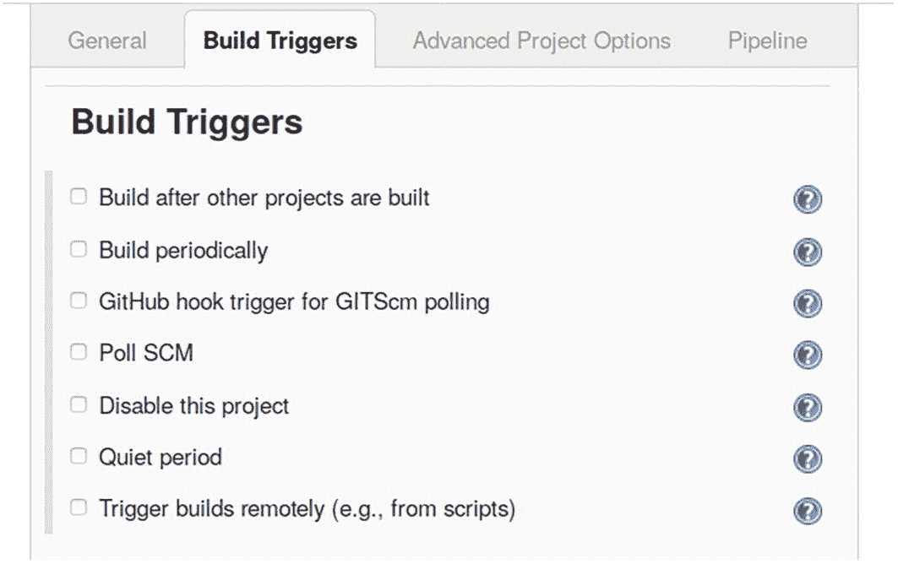
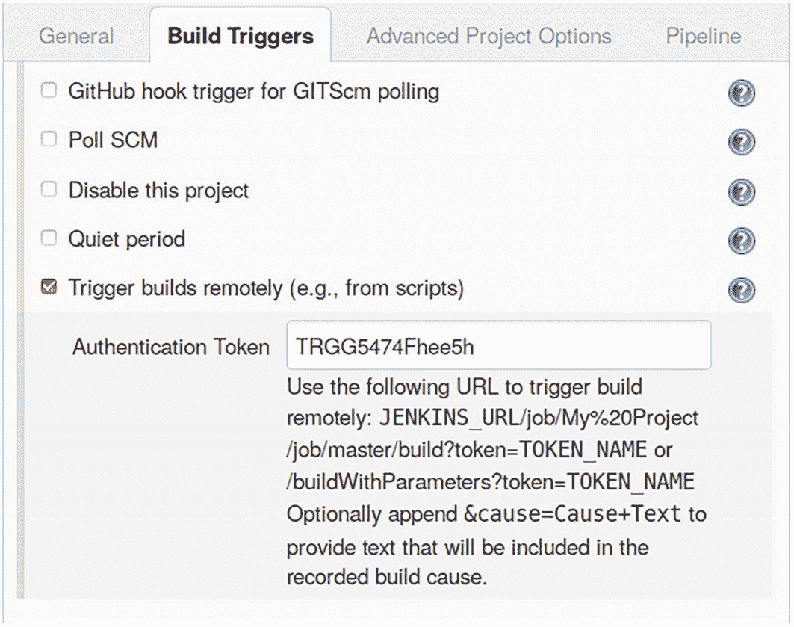
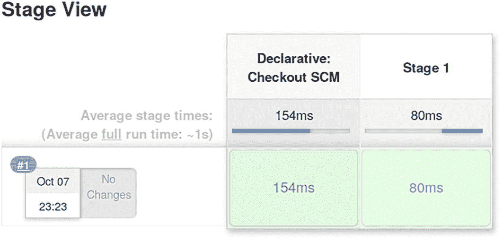
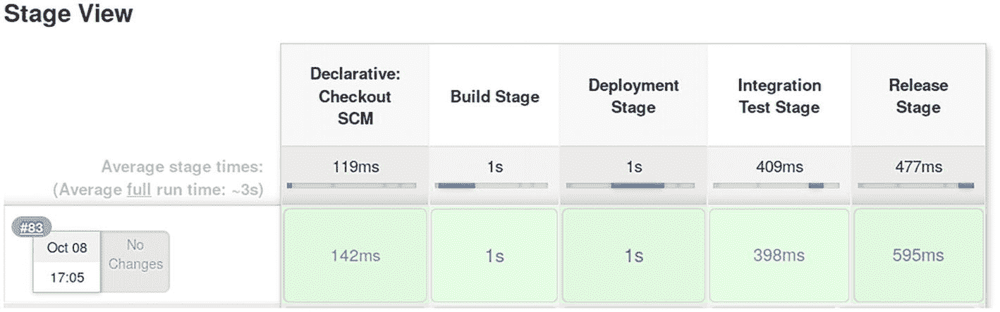

# 5. 持续集成

持续集成（CI）涉及将应用程序持续交付到集成服务器。该服务器上的 CI 产品随后会即时或至少定期部署或重新部署此类应用程序，用于测试和演示目的。

本书不会过多讨论 CI 服务器，因为 CI 并非 Jakarta EE 规范的一部分。然而，大多数 CI 产品会与版本仓库的提交操作挂钩；因此，从开发者的角度来看，一旦开发者向 Subversion 或 Git 提交代码，CI 就会自动执行。企业策略通常会决定工件（artifacts）需要如何检入，更确切地说，需要检入到哪个分支，以及如何标记提交，以便 CI 能够触发。

## Jenkins CI 服务器

在不深入细节的情况下，我将提供一个 Jenkins 安装的工作示例。Jenkins 是一个免费、开源的 CI 服务器。你可以从以下地址获取程序及用户手册：

```
https://jenkins.io/download/
https://jenkins.io/doc/book/
```

本章其余部分假设你正在运行一个 Jenkins 服务器。手册的“安装 Jenkins”章节会提供更多信息。

警告

Jenkins 默认运行在端口 `8080` 上。由于此端口也常被其他程序使用，你可以配置一个不同的端口。打开 `/etc/default/jenkins` 文件，将 `HTTP_PORT=8080` 处的端口修改为更适合你的端口。运行 `systemctl restart jenkins` 以应用更改。如果 Jenkins 因端口 `8080` 被其他程序占用而无法启动，请修改配置，然后执行 `systemctl start jenkins` 命令。

要检查 Jenkins 是否已正确启动，你可以查看其位于 `/var/log/jenkins/jenkins.log` 的日志文件。在浏览器中，打开 `http://localhost:8080` 并按照指示操作。

注意

如果你看到空白页面，请运行 `systemctl restart jenkins` 一次以清理问题。

你将看到 Jenkins 网站的本地化版本。为了尽可能贴近以下段落中的描述，你可以将浏览器语言设置更改为英语。例如，在 Firefox 中，在地址栏输入 `about:config`，然后更改 `intl:accept_languages` 设置。将 `en` 放在逗号分隔列表的前面。

## 启动一个 Jenkins 项目

进入 Jenkins Web 管理界面后，使用“新建任务”菜单项创建一个新项目。这对应一个 Jenkins 项目。给它任意你喜欢的名称，并选择类型为“流水线”。所有其他类型也可用于 CI 项目，但流水线类型在易用性和灵活性之间取得了良好的平衡。关于其他类型，请查阅文档。

注意

如果你使用 Jenkins WAR 文件安装类型，可能需要先添加插件才能继续。本章假设你使用的是 CLI 版本。

作为示例，你可以使用你在第 2 章创建的 `RestDate` 项目，并直接在 Jenkins 服务器上创建一个对应的 Git 仓库：

```
sudo su        # 切换到 root 用户
mkdir /srv     # 仅当目录不存在时执行
mkdir /srv/git # 仅当目录不存在时执行
mkdir /srv/git/RestDate
cd /srv/git
adduser git  # 如果用户缺失则添加
chown git.git RestDate
cd RestDate
su git         # 现在我们以 git 用户身份操作
git init --bare
mkdir tmp      # 临时目录
cd tmp
git clone file:///srv/git/RestDate
cd RestDate
```

此脚本创建文件夹，在操作系统中注册一个新的 `git` 用户，并初始化 Git 仓库。这假设 `adduser` 也会创建一个同名的组。Ubuntu 系统会这样做。否则，使用 `addgroup git` 来创建该组。在 `tmp` 文件夹中，创建仓库的本地克隆。现在，将 `RestDate` 项目中的 `gradle.properties`、`build.gradle`、`settings.gradle`、`gradlew`、`src` 和 `gradle` 文件及文件夹复制到 `tmp/RestDate` 文件夹。

注意

`gradlew` 文件和 `gradle` 文件夹仅在你允许 Eclipse 构建 Gradle 包装器（Gradle wrapper）时才存在。确保在创建 Eclipse 项目时没有取消选中相应的复选框。

在同一文件夹中添加另一个名为 `Jenkinsfile`（无后缀）的文件，内容如下：

```
pipeline {
agent any
stages {
stage('Stage 1') {
steps {
echo 'Hello world!'
}
}
}
}
```

此文件描述了一个 Jenkins 流水线。在终端中，继续执行以下操作：

```
git add *
git commit -m "Initial"
git push origin
```

这将把所有项目文件注册到版本控制系统中（准确地说，是在 `master` 分支中）。

回到 Jenkins Web 管理界面的流水线配置部分，将定义更改为 `Pipeline script from SCM`，并指定以下内容：

```
SCM:                GIT
Repository URL:     file:///srv/git/RestDate
Credentials:        -none-
Branches to build:  */master
Repository browser: (Auto)
Script path:        Jenkinsfile
```

显然，如果你没有在同一台机器上创建 Git 仓库，你可以指定一个合适的 Git URL，例如 `ssh://...`，并配合相应的身份验证机制，例如用户名加密码或证书。


## 构建触发器

那么 Jenkins 如何知道何时执行下一次构建和部署呢？这就是“构建触发器”配置部分的作用，如图 5-1 所示。



一张截图。包含 4 个选项卡：1. 常规，2. 构建触发器，3. 高级项目选项，4. 流水线。在构建触发器选项卡下，提供了 7 个带复选框的选项。每个选项右侧都有一个问号符号。

图 5-1

构建触发器部分

一个优雅的触发器选项是使用“远程触发构建”方法。一旦勾选它，你就会知道选择哪个 URL 来触发。对于此项目和分支，URL 如下：

```
http://my.jenkins.server:8080/job/My%20Project/build?token=TRGG5474Fhee5h
```

其中 `TRGG5474Fhee5h` 是添加到配置端的令牌。见图 5-2。



一张截图包含 4 个选项卡：1. 常规，2. 构建触发器，3. 高级项目选项，4. 流水线。在构建触发器选项卡下，提供了 5 个选项。每个选项右侧都有一个问号符号。“远程触发构建”选项已被勾选。身份验证令牌是 T R G G 5 4 7 4 F h e e 5 h。

图 5-2

远程构建触发器

点击“保存”按钮，项目将设置好以执行其工作，尽管由于非常简单的“Hello World”风格的 `Jenkinsfile`，构建不会执行任何真正有趣的操作。不过，你可以点击左侧菜单上的“立即构建”链接来查看会发生什么。你配置的构建将被执行，“阶段视图”或“完整阶段视图”对话框将显示一个包含该构建的图形时间线。见图 5-3。



一张标题为“阶段视图”的截图。平均阶段时间显示平均完整运行时间约为 1 秒。下方文字显示编号 1，10 月 7 日，23:23。阶段 1 的声明式检出 SCM 运行时间为 154 毫秒和 80 毫秒。

图 5-3

构建时间线

此构建包含两部分——检出 SCM 部分和阶段 1 部分。第一部分属于从版本控制系统检出数据；第二部分是在 `Jenkinsfile` 文件中配置的。如果将鼠标悬停在表示构建部分的框的较低绿色部分上，会出现一个链接，指向此部分的日志。源代码检出的日志可能如下所示：

```
未指定凭据
正在克隆远程 Git 仓库
正在克隆仓库 file:///srv/git/RestDate
> git init /var/lib/jenkins/workspace/My Project
正在从 file:///srv/git/RestDate 获取上游更改
> git --version
> git fetch --tags --progress --
file:///srv/git/RestDate
+refs/heads/*:refs/remotes/origin/*
> git config remote.origin.url file:///srv/git/RestDate
> git config --add remote.origin.fetch
+refs/heads/*:refs/remotes/origin/*
> git config remote.origin.url file:///srv/git/RestDate
正在从 file:///srv/git/RestDate 获取上游更改
> git fetch --tags --progress --
file:///srv/git/RestDate
+refs/heads/*:refs/remotes/origin/*
> git rev-parse refs/remotes/origin/master^{commit}
> git rev-parse refs/remotes/origin/origin/master^{commit}
正在检出修订版 c71e0... (refs/remotes/origin/master)
> git config core.sparsecheckout
> git checkout -f c71e0...
提交消息："X"
首次构建。跳过变更日志。
```

你可以看到 Jenkins 从 Git 仓库获取了源代码，并将源文件保存在 `/var/lib/jenkins` 目录层级中。另一部分（阶段 1）的日志如下所示：

```
Hello world!
```

这些日志完全对应于 `Jenkinsfile` 中的 `echo 'Hello world!'`。

## 创建真实世界的构建

在本节中，你将回到 `Jenkinsfile`，并为构建添加一个真实世界的场景：

*   一个构建阶段，包括单元测试
*   一个部署阶段
*   一个集成测试阶段
*   一个发布阶段

为此，请将以下内容添加到 `/srv/git/RestDate/tmp/RestDateJenkinsfile` 文件中。（请记住，Git 检出被放置在 `/srv/git/RestDate/tmp/RestDate`。）

```
pipeline {
agent any
stages {
stage('构建阶段') {
steps {
echo '构建阶段'
}
}
stage('部署阶段') {
steps {
echo '部署阶段'
}
}
stage('集成测试阶段') {
steps {
echo '集成测试阶段'
}
}
stage('发布阶段') {
steps {
echo '发布阶段'
}
}
}
}
```

首先实现构建阶段。`Jenkinsfile` 允许使用 `sh '...'` 指令来执行任何 shell 脚本。你只需添加 `gradle WAR build` 并编写以下内容：

```
...
stage('构建阶段') {
steps {
echo '构建阶段'
sh './gradlew war'
}
}
...
```

部署阶段假设你在 `/srv/glassfish7` 中安装了 GlassFish。它还假设 GlassFish 服务器正在运行，并且管理员用户没有密码。然后你可以编写以下内容：

```
...
stage('部署阶段') {
steps {
echo '部署阶段'
sh '/srv/glassfish6/bin/asadmin \
undeploy RestDate || exit 0'
sh '/srv/glassfish6/bin/asadmin \
deploy build/libs/RestDate.war'
}
}
...
```

`... || exit 0` 代码确保对未部署的 `RestDate` 执行取消部署操作不会导致阶段失败。

注意

仅当允许 `jenkins` 用户（Jenkins 在此用户下运行）操作 `asadmin` 命令时，部署才会成功。

对于集成测试，调用 REST 接口并检查其输出是否为有效的日期和时间字符串：

```
...
stage('集成测试阶段') {
steps {
echo '集成测试阶段 X'
script {
def result = sh(script: 'curl -X GET \
"http://localhost:8080/RestDate/webapi/d"',
returnStdout: true)
def p = /\d{4}-\d{2}-\d{2}T\d{2}:\d{2}:\d{2}/
assert result.trim() ==~
/\{"date":"/ + p + /.*"\}/
}
}
}
...
```

这假设你的系统上安装了 cURL。如果缺少，请在 Ubuntu 或 Debian 上以 root 身份运行：`apt-get install curl`（在 Fedora 或 RHEL 上运行 `yum install curl`，在 SuSE 上运行 `yast -i curl`）。`script { ... }` 内部的所有内容都是 Groovy 脚本。`sh ( ... )` 执行一个 shell 脚本。`returnStdout: true` 确保从 `sh` 调用返回的是输出，而不是状态。`assert` 是 Groovy 语言结构；它将使用正则表达式来检查输出是否为日期/时间字符串。

警告

Jenkins 附带的 Groovy 并非功能完整的 Groovy；存在一些安全限制。因此，你不能直接使用 Groovy 执行网络访问。相反，你需要转而调用 shell 函数（`sh( ... )`）。

最后一个阶段，称为发布阶段，执行将 WAR 移动到发布服务器所需的任何操作。例如，如果你想使用 `scp` 将 WAR 文件安装到服务器上，定义将如下所示：

```
...
stage('发布阶段') {
steps {
echo '发布阶段'
sh 'scp build/libs/RestDate.war \
user@the.server.addr:/path/to/RestDate.war'
}
}
...
```

你必须将 `user@the.server.addr` 替换为你要将文件复制到的用户名和服务器。同样，`/path/to/RestDate.war` 是目标服务器上的位置。为此，你必须允许用户无需输入密码即可使用 `scp`；例如，通过将 `jenkins` 用户的 SSH 密钥移动到目标服务器：

```
su jenkins
cd
ssh-keygen
# 复制 .ssh/id_rsa.pub 的内容并将其粘贴
# 到目标服务器上 .ssh/authorized_keys 文件的末尾
```

警告

`.ssh/authorized_keys` 文件必须限制为仅所有者可访问；否则，标准 SSH 将不会使用它。输入 `chmod 600 authorized_keys` 来执行此操作。

对 `Jenkinsfile` 文件进行所有这些更改后，通过以下方式提交并将文件推送到 Git：


```
git add Jenkinsfile
git commit -m "New Jenkinsfile"
git push origin
```

回到 Jenkins Web 管理界面，在项目视图中点击 **Build Now** 菜单链接。在 **Stage View** 区域，你现在应该能看到类似图 5-4 的内容。



一张标题为“阶段视图”的截图。平均阶段时间显示，完整运行的平均时间约为 3 秒。下方的文字显示“编号 83，10 月 8 日，17:05”。表格列出了 5 列数据，包含 2 行以秒和毫秒为单位的时间记录。

图 5-4
一次成功的完整构建

从这里，你还可以查看所有阶段的所有日志。将鼠标悬停在绿色方框上，然后选择 **Logs** 链接。

## 从 Git 触发构建

在本章前面的“构建触发器”部分，你学习了如何配置一个 URL 端点，以便从外部触发 Jenkins 构建。一种可能性是，每当有新版本推送到中央 Git 仓库时，就告诉 Git 调用此触发器。为此，请打开以下文件：

```
/srv/git/RestDate/hooks/post-receive
```

如果该文件不存在，请创建它并使其可执行：`chmod a+x post-receive`。对于其内容，请写入以下内容：

```
#!/bin/bash
USERPW=USER:PASSWD
SERVER=localhost
PORT=8712
TOKEN=TRGG5474Fhee5h
PROJECT=My%20Project
date >> jenkins-triggers.log
curl -X GET -u ${USERPW} -s -S \
http://${SERVER}:${PORT}/job/${PROJECT}/build?
token=${TOKEN} >> jenkins-triggers.log 2>&1
echo "Hook post-receive performed (informed CI)"
```

（删除 `build?` 后的换行和空格。）对于 `USER` 和 `PASSWD`，你必须填写一个有效的 Jenkins 用户。对于 `SERVER` 和 `PORT`，填写 Jenkins 服务器和端口（你在 Jenkins Web 管理界面中使用的那些）。对于 `TOKEN`，包含你在 Jenkins 项目（同样在 Web 管理界面中）的“构建触发器”部分的 `Authentication` 处输入的字符串。对于 `PROJECT`，输入 Jenkins 项目的名称（你必须像这里显示的那样，将空格转义为 `%20`）。`-s -S` 禁用了 cURL 的进度表，但允许写入错误消息。`echo` 消息会发送到 Git 客户端，因此提交者在向中央仓库推送内容后可以看到它。

触发器现已准备就绪。尝试一下，向 Git 仓库推送任何更改。触发器将触发 Jenkins 项目，Web 管理界面将自动显示被触发的新构建过程。确保你打开了项目视图，以便立即看到这些活动。

在 Git 中，你还可以使用更多钩子来做一些有趣的事情。例如，你可以在实际推送发生之前调用一些测试，通过邮件向提交者发送更多信息，等等。这里的可能性是无限的。

## 从 Subversion 触发构建

一旦为 Jenkins 项目激活了远程触发器，你就可以像对 Git 所做的那样，让 Subversion 触发 Jenkins 构建。请转到此路径：

```
/path/to/svn/repo/hooks
```

将 `/path/to/svn/repo` 替换为 Subversion 仓库的位置。创建一个名为 `post-commit` 的新文件，并写入以下内容：

```
#!/bin/bash
USERPW=USER:PASSWD
SERVER=localhost
PORT=8712
TOKEN=TRGG5474Fhee5h
PROJECT=My%20Project
WHEREAMI=/path/to/the/repo
export PATH=/usr/local/sbin:/usr/local/bin
export PATH=${PATH}:/usr/sbin:/usr/bin:/sbin:/bin
cd $WHEREAMI
date >> jenkins-triggers.log
curl -X GET -u ${USERPW} -s -S \
http://${SERVER}:${PORT}/job/${PROJECT}/build?
token=${TOKEN} >> jenkins-triggers.log 2>&1
echo "Hook post-receive performed (informed CI)" \
>> jenkins-triggers.log
```

（删除 `build?` 后的换行和空格。）对于 `USER` 和 `PASSWD`，你必须填写一个有效的 Jenkins 用户。对于 `SERVER` 和 `PORT`，提供 Jenkins 服务器和端口（你在 Jenkins Web 管理界面中使用的那些）。对于 `TOKEN`，包含你在 Jenkins 项目（同样在 Web 管理界面中）的“构建触发器”部分的 `Authentication` 处输入的字符串。对于 `PROJECT`，包含 Jenkins 项目的名称（你必须像这里一样，将空格转义为 `%20`）。对于 `WHEREAMI`，提供脚本的位置。`-s -S` 禁用了 cURL 的进度表，但允许写入错误消息。

不要忘记通过输入 `chmod a+x post-commit` 使此文件可执行。必须设置当前目录和 `PATH` 环境变量，因为 Subversion 不会向脚本提供这些信息。

在 Jenkins Web 管理界面中，更新项目配置，并在 **Pipeline** 部分，将 `Jenkinsfile`（流水线）定义源更改为 **Pipeline Script from SCM**，并将 **SCM** 更改为 **Subversion**。作为仓库 URL，输入 `svn+ssh://USER@SERVER//path/to/repo/RestDate/trunk` 字符串，其中 `USER` 需要替换为能够通过 SSH 连接的用户名，`SERVER` 是服务器地址，`/path/to/repo` 是仓库路径。与前面关于 Git 的部分一样，`RestDate/trunk` 应包含完整的 Gradle 项目，包括一个 `Jenkinsfile` 文件。

在 **Credentials** 字段中，添加用于 SSH 的登录信息。可能性包括用户名加密码，或者用户名（可能是 `Jenkins`）加私有 SSH 密钥（你必须显式提供密钥——从 `jenkins/.ssh/id_rsa` 获取）。对于后一种情况，你必须将 `jenkins/.ssh/id_rsa.pub` 的内容添加到 Subversion 仓库所在服务器上的 `.ssh/authorized_keys` 文件中。

注意

`.ssh/authorized_keys` 文件必须限制为仅所有者可访问；否则，标准 SSH 将不会使用它。输入 `chmod 600 authorized_keys` 来执行此操作。

触发器现已完成。尝试提交任意更改。Jenkins 应该会启动项目的构建流水线。


## 通过 REST 分析 Jenkins 构建

你不必使用 Web 管理员界面来监控 Jenkins 构建。相反，你可以使用 Jenkins 提供的 REST API。这对于需要脚本化访问 Jenkins 的企业级应用来说非常强大。

要尝试此功能，请在 Eclipse 中创建一个 Groovy 项目，向项目添加一个名为 `scripts` 的文件夹，然后右键单击项目并选择 Groovy Compiler，将该 `scripts` 文件夹告知 Eclipse。勾选“启用项目特定设置”。然后点击“添加”，输入 `scripts/**`，并点击“应用”。

创建一个 `scripts/builds.groovy` 文件，并输入以下脚本：

```
@Grapes(
@Grab(group='org.codehaus.groovy',
module='groovy-all', version='2.5.8', type='pom')
)
import groovy.json.*
SERVER="localhost"
PORT=8080
USER="TheUser"
PASSWD="ThePassword"
PROJECT="My%20Project"
/**
* 执行 GET 请求，给定某个 URL。如果参数
* 不以 "http://" 开头，则会自动添加
* "http://server:port/" 前缀。
* 请求的内容类型为 'application/json'
*/
def fetch(def url) {
def enc64 = { s ->
new String(Base64.encoder.encode(s.bytes)) }
def c = ( !url.startsWith("http://")?
new URL("http://${SERVER}:${PORT}/${url}"):
new URL(url) ).openConnection()
c.with {
setRequestProperty('User-Agent','groovy')
setRequestProperty('Accept','application/json')
setRequestProperty('Authorization',
"Basic " + enc64("${USER}:${PASSWD}"))
}
[output:c.inputStream.text, respCode:c.responseCode]
}
def d = fetch "job/${PROJECT}/api/json"
def json = new JsonSlurper().parseText(d.output)
// 'json' 是 REST 调用的结果，已解析为
// Groovy 对象。请参阅 Groovy 文档中的 JsonParser 文档
def lastTen = json.builds.sort{-it.number}.take(10)
//println lastTen
lastTen.each { b ->
def url = b.url
def build = new JsonSlurper().parseText(
fetch(url + "api/json").output)
//println build
def author = build.changeSets ?
build.changeSets[0]?.items[0]?.author?.fullName :
""
println("" + build.number +
" - " + new Date(build.timestamp) +
" - " + build.result +
" - " + author)
}
```

替换文件顶部的连接信息。此脚本使用 `job/${PROJECT}/api/json` API 调用获取最近十次构建，然后针对每次构建，再发起一次 API 调用（URL 从第一次调用的结果中派生）。它会获取构建编号、构建日期、构建结果，如果构建来自变更的源代码，还会获取（第一个）变更作者。

注意

脚本顶部的 `GRAPE` 库获取是必需的，因为 Eclipse 中的 Groovy 插件对应的是 Groovy 的“Indy”变体，缺少某些 API。请确保此处指定的版本与插件的 Groovy 版本匹配（在首选项中查看）。

Jenkins 的 REST API 比你在本节中使用的要庞大得多。如果你点击 Web 管理员界面大多数页面底部的 REST API 链接，可以获取更多信息。你的脚本输出可能如下所示：

```
90 - Wed Oct 09 13:38:12 CEST 2019 - SUCCESS - Mark
89 - Wed Oct 09 13:09:02 CEST 2019 - SUCCESS - 
88 - Wed Oct 09 13:06:52 CEST 2019 - FAILURE - 
87 - Wed Oct 09 13:05:17 CEST 2019 - FAILURE - 
86 - Wed Oct 09 10:06:12 CEST 2019 - SUCCESS - 
85 - Wed Oct 09 09:52:02 CEST 2019 - SUCCESS - Pete
84 - Wed Oct 09 09:49:42 CEST 2019 - SUCCESS - Mark
83 - Tue Oct 08 17:05:04 CEST 2019 - SUCCESS - 
82 - Tue Oct 08 17:01:58 CEST 2019 - FAILURE - Mark
81 - Tue Oct 08 16:02:42 CEST 2019 - SUCCESS - Mark
```

不过，你并不一定需要使用像 Groovy 这样功能完备的脚本引擎来访问 REST API。要访问该 API，你也可以在 bash shell 中使用 cURL。你可以从以下示例请求开始：

```
curl -X GET \
-H "Accept: application/json" \
-u USERNAME:PASSWORD \
http://SERVER:PORT/job/PROJECT/api/json
```

其中，你必须将 `SERVER`、`PORT`、`PROJECT`、`USERNAME` 和 `PASSWORD` 替换为适当的值（不要忘记将项目名称中的空格替换为 `%20` 转义序列）。

