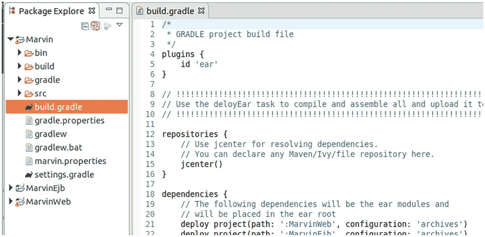

# 6. 企业 Maven 仓库

Maven 为项目提供了一个仓库和依赖解析构建系统。你将其用于 Java 和构建相关的配置文件，并且由于 Gradle 使用 Maven 仓库，因此有必要对其进行一些了解，以进一步简化你的 Java 企业开发流程。

在 `build.gradle` 文件的 `dependencies { ... }` 部分，此脚本确定了项目测试、构建和运行所需的库：

```
...
dependencies {
// 此依赖项会导出给消费者，
// 即会在他们的编译类路径中找到。
api 'org.apache.commons:commons-math3:3.6.1'
// 此依赖项在内部使用，不会
// 暴露给消费者自己的编译类路径。
implementation 'com.codepoetics:protonpack:1.16'
// 此依赖项仅在编译时需要。
// 它不会被打包到像 WAR 文件这样的程序集中。
// 发布时也不会作为依赖项转发。
compileOnly 'jakarta.jakartaee-api:10.0.0'
// 使用 JUnit 测试框架
testImplementation 'junit:junit:4.13.2'
}
...
```

此外，在同一文件的 `repositories { ... }` 部分，你可以看到从哪里加载依赖项：

```
...
repositories {
jcenter()
}
...
```

你也可以在此处声明 `mavenCentral()` 或 `google`。按照惯例，它们解析为以下地址：

```
mavenCentral -> https://repo.maven.apache.org/maven2/
jcenter      -> https://jcenter.bintray.com/
google       -> https://maven.google.com/
```

本章标题是“企业 Maven 仓库”，这意味着 Maven 拥有仅能从企业内部网络访问的仓库。这有什么好处呢？首先，如果你正在为太空火箭或核电站开发软件，你可能不希望允许直接访问公共仓库。其次，如果你的公司构建了自己的库，并且这些库不应公开可用，那么你也不希望使用公共仓库。因此，你至少需要考虑使用企业 Maven 仓库。

如果你的公司决定安装一个企业 Maven 仓库，你可以使用为此目的提供的产品之一。对吧？也许不一定。从客户端角度来看，仓库只是一个提供静态内容（JAR 文件和一些元信息）的 Web 服务器。可以使用 Web 前端为公司自有的库 JAR 文件提供上传功能，但 Maven 所需的文件是通过脚本和/或一个精简的 Web 应用程序构建的。

安装 Maven 服务器的成本相对较低，但你能获得极大的灵活性。仅考虑维护成本这一项就值得这么做。本章将介绍这样一个服务器，以及一些脚本。你是否更喜欢使用标准产品，这取决于你，但我认为你应该拥有选择权。


## Maven 仓库布局

如果你查看一个公共 Maven 仓库，例如 [`https://repo.maven.apache.org/maven2/`](https://repo.maven.apache.org/maven2/)，你会立即看到如下层级结构：

```
..
org
-> apache
-> commons
-> commons-math3
-> 3.5
-> 3.6
-> [artifacts]
-> ...
```

这直接对应以下 Maven 坐标：

```
org.apache.commons:commons-math3:3.6
```

这意味着，每当 Gradle 决定查看 Maven 仓库以解析 `org.apache.commons:commons-math3:3.6` 时，它会导航到

```
https://repo.maven.apache.org/maven2/org/apache/commons/
commons-math3/3.6/
```

例如，为了编译，它会在该 URL 中查找以下文件：

```
.../commons-math3-3.6.jar
.../commons-math3-3.6.jar.asc
.../commons-math3-3.6.jar.md5
.../commons-math3-3.6.jar.sha1
.../commons-math3-3.6.pom
.../commons-math3-3.6.pom.asc
.../commons-math3-3.6.pom.md5
.../commons-math3-3.6.pom.sha1
```

其中所有 `.md5` 和 `.sha1` 文件只是哈希值，客户端可能会也可能不会检查这些哈希值以验证 POM 和 JAR 文件是否包含正确的字节序列。`.pom` 文件定义了传递依赖项以及其他解析策略和验证相关的设置。`.asc` 文件是可选的，仅适用于已签名的库。`.jar` 文件包含库本身。

重要的是要知道仓库不提供语义功能。由依赖解析客户端（Gradle、Maven、Ivy 等）决定需要下载哪些文件。因此，对于企业 Maven 仓库，省略任何签名，你只需要 `.jar` 文件以及附带的 `.jar.md5` 和 `.jar.sha1` 文件。

注意

你在公共仓库中看到的所有那些 `*metadata.xml` 文件用于列表和搜索功能，不影响解析策略。

对于企业 Maven 仓库，本章提供库的策略如下：

1.  检查是否可以从本地（镜像）仓库提供请求服务。如果可以，则使用本地版本。

2.  否则，决定是否允许联系公共仓库。这是可选的。在仓库软件中，答案始终是肯定的，但这是你可以介入以遵守公司政策的地方。

3.  如果确认，则从公共仓库获取库和 POM 文件。

4.  执行一些检查（甚至由安全指定人员手动进行）。这是可选的。

5.  如果确认，则将库保存在本地（镜像）仓库中，并将库和 POM 提供给请求者。

在这个例子中，我将其命名为 `Marvin`。我跳过了所有可选步骤，但你可以自由地将它们作为扩展工作添加。

## 一个提供 Maven 化制品的简单服务器

你需要创建一个为 Maven 仓库客户端提供服务的 REST Web 服务器。这包括一个根 EAR Gradle 项目、一个 WAR Gradle 子项目和一个 EJB Gradle 子项目。

### Marvin EAR 根项目

首先，在 Eclipse 中创建一个 Gradle 项目并将其命名为 `Marvin`。在 `settings.gradle` 文件中，添加以下内容：

```
include 'MarvinWeb', 'MarvinEjb'
```

这是为了告知 Gradle 你有两个子项目——`MarvinWeb` 和 `MarvinEjb`。将 `build.gradle` 文件的内容替换为以下内容：

```
/*
* GRADLE project build file
*/
plugins {
id 'ear'
}
// !!!!!!!!!!!!!!!!!!!!!!!!!!!!!!!!!!!!!!!!!!!!!!!!!!!!!!!
// Use the deloyEar task to compile and assemble all and
// upload it to Glassfish
// !!!!!!!!!!!!!!!!!!!!!!!!!!!!!!!!!!!!!!!!!!!!!!!!!!!!!!!
repositories {
jcenter()
}
dependencies {
// The following dependencies will be the ear modules
// and will be placed in the ear root
deploy project(path: ':MarvinWeb',
configuration: 'archives')
deploy project(path: ':MarvinEjb',
configuration: 'archives')
// The following dependencies will become ear libs and
// will be placed in a dir configured via the
// libDirName property (default: 'lib')
earlib 'org.apache.commons:commons-configuration2:2.6'
earlib 'commons-io:commons-io:2.6'
earlib 'commons-beanutils:commons-beanutils:1.9.4'
}
ear {
// Possibly tweak the "ear" task. See the "ear" plugin
// documentation
}
// This is a custom task to deploy the EAR on a local
// Glassfish instance
task deployEar(dependsOn: ear,
description:">>> MARVIN deploy task") {
doLast {
def FS = File.separator
def glassfish =
project.properties['glassfish.inst.dir']
def user = project.properties['glassfish.user']
def passwd = project.properties['glassfish.passwd']
File temp = File.createTempFile("asadmin-passwd",
".tmp")
temp  ${sout}"
if(serr.toString()) System.err.println(serr)
temp.delete()
new File(glassfish + FS +
"glassfish${FS}domains${FS}domain1${FS}lib" +
"${FS}classes" + FS + "marvin.properties").bytes =
new File(project.rootDir.absolutePath + FS +
"marvin.properties").bytes
}
}
// This is a custom task for undeploying the application
// from a local Glassfish server
task undeployEar(
description:">>> MARVIN undeploy task") {
doLast {
def FS = File.separator
def glassfish =
project.properties['glassfish.inst.dir']
def user = project.properties['glassfish.user']
def passwd = project.properties['glassfish.passwd']
File temp = File.createTempFile("asadmin-passwd",
".tmp")
temp  ${sout}"
if(serr.toString()) System.err.println(serr)
temp.delete()
}
}
```

以下特征描述了此文件：

*   `plugins { id 'ear' }` 加载并启用 Gradle 的 EAR 插件。此插件描述了 `.ear` 文件的构建过程。

*   `repositories { }` 描述了为获取必要库而需要联系的仓库。

*   `dependencies { }` 部分定义了需要放入 EAR 文件的内容。`deploy` 项指示需要包含哪些 WAR 和 EJB；`earlib` 项列出了要包含在 EAR 的 `lib` 文件夹中的库 JAR。这些依赖类型由 EAR 插件定义。你在其他地方找不到它们。

*   两个自定义任务用于创建 Groovy 脚本，并描述如何在 GlassFish 服务器上安装和卸载 EAR。它们不包含在构建阶段中，因此必须显式调用。显然，这些脚本必须针对其他服务器产品进行重写。

*   在部署脚本的末尾，应用程序配置文件被复制到应用程序可以使用类路径解析读取它的位置。此过程也取决于所使用的服务器产品。

*   操作系统命令在两个自定义脚本内部执行。对于 Windows，只需在命令字符串前加上 `cmd /c`。

在项目根目录中，添加一个名为 `gradle.properties` 的文件。在这里，你将看到如何连接到本地 GlassFish 实例：

```
glassfish.inst.dir = /path/to/glassfish7
glassfish.user = admin
glassfish.passwd =
```

将 `marvin.properties` 文件添加到项目根目录。此文件包含 Marvin 的运行时配置：

```
repoDir = /path/to/mirror
externalRepos = http://repo.maven.apache.org/maven2
```

`repoDir` 指定了你的镜像仓库的路径。`externalRepos` 是一个逗号分隔的外部（/公共）仓库列表，当本地镜像仓库缺少任何文件时，将联系这些仓库。


### Marvin Web 项目

对于 WAR 子项目，在 EAR 项目内创建一个名为 `MarvinWeb` 的新顶级文件夹，并将根项目中的 `gradlew`、`gradlew.bat` 和 `gradle` 文件及文件夹复制到其中。这样，也可以从终端在 Web 子项目内执行 Gradle。此处我不展示具体操作，但你可能需要用到它，所以放在这里也无妨。

在 `MarvinWeb` 文件夹内，创建一个 `build.gradle` 文件并添加以下内容：

```
/*
* GRADLE 项目构建文件
*/
plugins {
id 'war'
}
sourceCompatibility = 1.17
targetCompatibility = 1.17
ext {
referencedEjbProjects = ['MarvinEjb']
}
repositories {
jcenter()
}
dependencies {
testImplementation 'junit:junit:4.13.2'
implementation 'jakarta.platform:' +
'jakarta.jakartaee-api:10.0.0'
implementation 'org.apache.commons:' +
'commons-configuration2:2.6'
// 此处不添加 EJB 项目依赖，因为那样会引入 EJB 实现。
// 我们只需要接口
referencedEjbProjects.each { ejb ->
implementation files("${rootDir}/${ejb}/build/libs/" +
"ejb-interfaces.jar")
}
}
```

此构建文件确保你使用了 WAR 插件，并指定使用 Java 17 进行编译。`referencedEjbProjects` 列出了你所依赖的 EJB 项目，本例中只有一个名为 `MarvinEjb` 的项目。如果有更多项目，可以写成 `['MarvinEjb', 'OtherEjb', ...]`。在依赖项中，将 Jakarta EE API 添加为 `compileOnly` 依赖，这意味着它不会被添加到 WAR 文件中。同时，你还需要添加 EJB 接口，这些接口由 EJB 项目生成。我稍后会讨论这一点。

在添加 Web 应用程序代码之前，先声明 EJB 项目。这样，在编写每个子项目的代码之前，你可以先让 Eclipse 重新布局其项目结构。

### Marvin EJB 项目

对于 EJB 子项目，创建一个名为 `MarvinEjb` 的新顶级文件夹，并将根项目中的 `gradlew`、`gradlew.bat` 和 `gradle` 文件及文件夹复制到其中。这同样允许在终端中运行 EJB 项目的 Gradle。

在 `MarvinEjb` 内，创建一个名为 `build.gradle` 的新构建文件，并插入以下文本：

```
/*
* GRADLE 项目构建文件
*/
plugins {
id 'java'
}
sourceCompatibility = 1.17
targetCompatibility = 1.17
repositories {
jcenter()
}
dependencies {
testImplementation 'junit:junit:4.13.2'
implementation 'jakarta.platform:' +
'jakarta.jakartaee-api:10.0.0'
// 这些需要添加到根项目的 'earlib' 依赖中：
compileOnly 'org.apache.commons:commons-' +
'configuration2:2.6'
compileOnly 'commons-io:commons-io:2.6'
compileOnly 'commons-beanutils:commons-' +
'beanutils:1.9.4'
}
// 构建一个仅包含 EJB 接口的 JAR 包，供客户端使用
task('EjbInterfaces', type: Jar, dependsOn: 'classes') {
//在此处将 jar 内容描述为 CopySpec
archiveFileName = "ejb-interfaces.jar"
destinationDirectory = file("$buildDir/libs")
from("$buildDir/classes/java/main") {
include "**/ejb/interfaces/**/*.*"
}
}
// 确保它成为装配路径的一部分
jar.dependsOn EjbInterfaces
```

此构建脚本的关键部分是添加了一个自定义任务，用于构建一个包含 EJB 接口的额外 JAR 包。这一点很重要，因为客户端（例如 Web 应用程序）应该使用并打包 EJB 接口，*而不是*实现。这个额外的 JAR 包在 Web 应用程序的 `build.gradle` 文件的特殊 `dependencies { }` 结构中被引用。

### 重新布局项目

在根（EAR）项目的上下文菜单中选择 Gradle ➤ 刷新 Gradle 项目。Eclipse 将显示一个展开视图，其中两个子项目显示在顶级层次结构中，如图 6-1 所示。



包资源管理器窗口的截图。左侧面板包含 3 个主菜单及其子菜单。右侧是名为 build dot gradle 的 Gradle 项目构建文件，包含代码和注释。

图 6-1

项目重新布局

注意

在此阶段，Web 子项目会显示一些错误。这是预期的，因为 EJB 接口尚不可用。你将在后续章节中学习如何构建它们。

### Web 项目代码

在子项目内创建一个名为 `src/main/webapp/WEB-INF` 的文件夹，并添加 `beans.xml` 文件：

再加上一个内容如下的 `web.xml` 文件：

```

Marvin

jakarta.ws.rs.core.Application

jakarta.ws.rs.core.Application

/*

```

以及另一个名为 `glassfish-web.xml` 的文件，内容如下：

再创建另一个名为 `src/main/java/book/jakartapro/marvin/war` 的文件夹，并通过右键单击（项目）➤ 属性 ➤ Java 构建路径 ➤ 源，将 `src/main/java` 添加为源文件夹。实现类名为 `Marvin`：

```
package book.jakartapro.marvin.war;
import java.util.HashMap;
import java.util.Map;
import jakarta.ejb.EJB;
import jakarta.servlet.http.HttpServletRequest;
import jakarta.ws.rs.GET;
import jakarta.ws.rs.Path;
import jakarta.ws.rs.PathParam;
import jakarta.ws.rs.core.Context;
import jakarta.ws.rs.core.Response;
import jakarta.ws.rs.core.Response.ResponseBuilder;
import book.jakartapro.marvin.ejb.interfaces.
LocalMirrorLocal;
/**
* REST Web 服务
*/
@Path("/")
public class Marvin {
static Map CM = new HashMap();
static {
CM.put(".jar", "application/java-archive");
CM.put(".pom", "text/xml");
}
@EJB LocalMirrorLocal localMirror;
@GET
@Path("repo/{p : .*}")
public Response fetch(@PathParam("p") String path,
@Context HttpServletRequest requ) {
return getFromRepo(Response.status(200).
entity(path), path).build();
}
private ResponseBuilder getFromRepo(ResponseBuilder rb,
String path) {
String suffix = path.substring(path.lastIndexOf("."));
String outType = CM.getOrDefault(suffix, "text/plain");
rb.type(outType);
rb.entity(localMirror.fetchBytes(path, rb));
return rb;
}
}
```


好的，作为一名高级文档工程师和翻译员，我将严格遵循您提供的注意事项和示例格式，将给定的英文文本翻译成中文。


### EJB 项目代码

在 `MarvinEjb` 子项目中，添加一个名为 `src/main/java/book/jakartapro/marvin/ejb` 的文件夹，然后通过右键单击（项目）➤ 属性 ➤ Java 构建路径 ➤ 源，将 `src/main/java` 添加为源文件夹。向 `book/jakartapro/marvin/ejb` 包中添加一个配置辅助类，如下所示：

```
package book.jakartapro.marvin.ejb;
import java.io.File;
import java.io.FileOutputStream;
import java.io.IOException;
import java.io.InputStream;
import org.apache.commons.configuration2.Configuration;
import org.apache.commons.configuration2.builder.fluent.
Configurations;
import org.apache.commons.configuration2.ex.
ConfigurationException;
import org.apache.commons.io.IOUtils;
public class Conf {
private static Conf INSTANCE = null;
public static Conf getInstance() {
if(INSTANCE == null) INSTANCE = new Conf();
return INSTANCE;
}
private Configuration c;
private Conf() {
try {
Configurations configs = new Configurations();
// From Class, the path is relative to the package
// of the class unless you include a leading slash,
// so if you don't want to use the current package,
// include a slash like this:
InputStream ins = this.getClass().
getResourceAsStream("/marvin.properties");
File f = File.createTempFile("marvin-x48", null);
IOUtils.copy(ins, new FileOutputStream(f));
c = configs.properties(f);
f.delete();
} catch (ConfigurationException | IOException e) {
e.printStackTrace(System.err);
}
}
public String string(String key) {
return c.getString(key);
}
}
```

此类的唯一目的是简化配置访问。EJB 实现类名为 `LocalMirror`。其内容如下：

```
package book.jakartapro.marvin.ejb;
import java.io.File;
import java.io.FileInputStream;
import java.io.InputStream;
import java.net.HttpURLConnection;
import java.net.URL;
import jakarta.ejb.Local;
import jakarta.ejb.Stateless;
import jakarta.ws.rs.core.Response.ResponseBuilder;
import org.apache.commons.io.FileUtils;
import org.apache.commons.io.IOUtils;
import book.jakartapro.marvin.ejb.interfaces.
LocalMirrorLocal;
@Stateless
@Local(LocalMirrorLocal.class)
public class LocalMirror {
static Conf conf = Conf.getInstance();
public byte[] fetchBytes(String path,
ResponseBuilder rb) {
String repoDir = conf.string("repoDir");
File f = new File(repoDir + "/" + path);
// If the file does not exist in our local (mirror)
// repository, we contact the external (public)
// Maven repository. This is the place where you
// could add filters
if (!f.exists())
loadExternal(path, f, rb);
// If it still does not exist, the public repo doesn't
// have it either (and it was not copied into our
// mirror repo), and we output an error message.
// Otherwise read the bytes
if (!f.exists()) {
rb.type("text/plain");
return ("Cannot load '" + path + "'\n").getBytes();
} else {
try {
return IOUtils.toByteArray(
new FileInputStream(f));
} catch (Exception e) {
}
return null;
}
}
////////////////////////////////////////////////////////
////////////////////////////////////////////////////////
private void loadExternal(String path, File tgtFile,
ResponseBuilder rb) {
try {
// Contact the external (public) repositories until
// we find the file requested
InputStream ins = null;
String[] urls = conf.string("externalRepos").
split(",");
for (String r : urls) {
HttpURLConnection c = (HttpURLConnection)
new URL(r + "/" + path).openConnection();
c.setRequestProperty("User-Agent", "Marvin");
int respCode = c.getResponseCode();
rb.status(respCode);
if (respCode != 200)
continue; // not yet found
ins = c.getInputStream();
break;
}
if (ins != null)
writeToMirror(ins, tgtFile);
} catch (Exception e) {
e.printStackTrace(System.err);
}
}
// Mirror the file in our local repo
private void writeToMirror(InputStream ins,
File tgtFile) throws Exception {
tgtFile.getParentFile().mkdirs();
FileUtils.copyInputStreamToFile(ins, tgtFile);
}
}
```

在 `book/jakartapro/marvin/ejbinterfaces` 包中添加 EJB 接口 `LocalMirrorLocal.class`：

```
package book.jakartapro.marvin.ejb.interfaces;
import jakarta.ws.rs.core.Response.ResponseBuilder;
public interface LocalMirrorLocal {
byte[] fetchBytes(String path, ResponseBuilder rb);
}
```

客户端将需要此接口来使用 EJB。

### 构建和部署 EAR

要构建 EAR，请在 Gradle Tasks 视图中双击 Marvin ➤ Build ➤ EAR。生成的 EAR 文件将放置在 `build/libs` 项目中。

注意

Eclipse 会从 Package Explorer 视图中过滤掉 `build` 文件夹。要查看该文件夹，请打开菜单（在任务栏中找到菜单按钮）并导航到 Filters。然后取消选中 Gradle Build Folder 条目。在该文件夹上按 F5 键，让 Eclipse 重新读取其内容。

要在本地服务器上部署 EAR 文件，请选择 Marvin ➤ Other ➤ deployEar。此任务依赖于 EAR 任务，因此仅执行部署任务就足以完成构建*和*部署。显然，服务器必须正在运行才能正常工作。

注意

您必须在 Gradle Task 菜单中选中 Show All Tasks 才能看到此自定义任务。

### 使用公司仓库

要在您的 `build.gradle` 构建文件中使用该公司的 Maven 仓库，请输入以下内容：

```
repositories {
maven {
url 'http://serv.er.addr:8080/MarvinWeb/repo
}
}
```

替换仓库的服务器地址。端口是 GlassFish HTTP 连接器的标准端口。如果您更改了此端口，则必须相应地更改端口号。

注意

要在浏览器中快速检查，请输入以下示例：

[`http://serv.er.addr:8080/MarvinWeb/repo/junit/junit/4.13.2/junit-4.13.2.pom`](http://serv.er.addr:8080/MarvinWeb/repo/junit/junit/4.13.2/junit-4.13.2.pom)

### 一个示例 Java 库

作为示例，您可以编写一个简单的 Gradle 库项目，其中包含一个 Java 类，用于计算任意文本中的词频。启动一个新的 Gradle 项目，并将 `build.gradle` 文件的内容替换为以下内容：

```
plugins {
id 'java-library'
}
sourceCompatibility = 1.17
targetCompatibility = 1.17
repositories {
jcenter()
}
dependencies {
api 'org.apache.commons:commons-math3:3.6.1'
implementation 'com.google.guava:guava:28.0-jre'
testImplementation 'junit:junit:4.13.2'
}
```

该类内容如下：

```
package book.jakartapro.textutils;
import java.util.Comparator;
import java.util.List;
import java.util.stream.Collectors;
import com.google.common.base.CharMatcher;
import com.google.common.base.Splitter;
import com.google.common.collect.HashMultiset;
import com.google.common.collect.Multiset;
public class TextUtils {
public static class Pair {
public S s;
public T t;
public Pair(S s, T t) {
this.s = s;
this.t = t;
}
public S first() { return s;}
public T second() { return t; }
@Override public String toString() {
return "(" + s + "," + t + ")"; };
}
public static List>
wordFrequenciesSorted(String text) {
Multiset mus = Splitter.
onPattern("[^\\p{L}\\p{Nd}]+").
trimResults(CharMatcher.anyOf(
".,;:-'\"!?=()[]{}*/")).
omitEmptyStrings().
splitToList(text).stream().collect(
() -> { return HashMultiset.create(); },
(ms,str) -> { ms.add(str.toLowerCase()); },
(ms1,ms2) -> { ms1.addAll(ms2); });
return mus.entrySet().stream().
sorted(Comparator.comparing((e) -> {
return String.format("%09d-%s",
10000000-e.getCount(),
e.getElement());
})).
map((Multiset.Entrye) -> {
return new Pair(e.getElement(),
e.getCount()); }).
collect(Collectors.toList());
}
}
```

您可以看到此示例使用了 `java-library` 插件，而不是 `java`。区别在于前者引入了两种依赖类型——`implementation` 和 `api`——后者描述了一种依赖关系，该依赖关系会传递性地转发给引用该库的客户端项目。相比之下，`implementation` 仅库内部需要。

然后，您可以将所有文件推送到 Git 仓库，之后可以调用我将在下一节中介绍的 `toRepo.sh` 脚本，将该库复制到 Maven 仓库。


## 构建并上传公司库

既然你已经知道，要将库上传到公司的 Maven 仓库，需要以下内容：

*   库的 JAR 文件本身
*   描述库及其依赖关系的 `.pom` 文件
*   上述所有文件的 MD5 和 SHA1 哈希值

你需要找到一种方法来生成 POM 文件和哈希值。下面是一个尽可能自动化此过程的脚本：

1.  从仓库中检出项目。
2.  构建项目（即创建库的 JAR 文件）。
3.  通过适配后的 `build.gradle` 文件生成 POM 文件。
4.  从同一个构建文件中添加 MD5 和 SHA1 哈希值。
5.  将所有内容上传到公司的 Maven 仓库。

你要做的第一件事是创建一个脚本文件，该文件通过包含的 Groovy 脚本创建一个适配后的 Gradle 构建文件。这个脚本文件可以是一个 bash 脚本，但这会相当复杂，因为你需要进行一些替换操作，而在 bash 中这并不容易实现。因此，你改用 Groovy 脚本。由于你手头有 Gradle，而 Gradle 内部包含完整的 Groovy，你可以将脚本打包到 Gradle 构建文件中。为此，创建一个空目录，并添加一个包含以下内容的 `buildRepoGradle.gradle` 文件：

```
task a { doLast {
def FS = File.separator
def buildFile = new File("build.gradle")
def newBuild = buildFile.readLines().
grep { ln -> !( ln ==~ /\s*archivesBaseName\s*=.*/ ) }.
grep { ln -> !( ln ==~ /\s*group\s*=.*/ ) }.
grep { ln -> !( ln ==~ /\s*version\s*=.*/ ) }.
grep { ln -> !( ln ==~ /\s*id\s+('|")maven("|')\s*/) }.
join("\n")
// 添加 maven 插件。该插件能够生成 POM 文件
newBuild = newBuild.replaceFirst(
/(?s)plugins\s*\{([^}]*)\}/) { all, p ->
"plugins {" + p + "  id 'maven'\n" + "}"
}
// 添加 Maven 坐标
newBuild = newBuild.replaceFirst(
/(?s)plugins\s*\{[^}]*\}/) { all ->
all +
"\ngroup = '" +
project.properties.GROUP_ID + "'" +
"\narchivesBaseName = '" +
project.properties.ARTIFACT_ID + "'" +
"\nversion = '" +
project.properties.VERSION + "'" +
"\n"
}
// 添加 POM 生成任务
newBuild += """\n
task writePomAndHashes() {
doLast {
def FS = File.separator
def jarName = '""" + project.properties.ARTIFACT_ID +
"-" + project.properties.VERSION + ".jar" + """'
def pomName = '""" + project.properties.ARTIFACT_ID +
"-" + project.properties.VERSION + ".pom" + """'
pom {
project {
inceptionYear '2019'
licenses {
license {
name 'Property of the company'
}
}
}
}.writeTo(buildDir.absolutePath + FS +
"poms" + FS + pomName)
// 添加哈希值
def jarFile = buildDir.absolutePath + FS +
'libs' + FS + jarName
def pomFile = buildDir.absolutePath + FS +
'poms' + FS + pomName
def md5 = java.security.MessageDigest.
getInstance("MD5")
def sha1 = java.security.MessageDigest.
getInstance("SHA-1")
new File(jarFile+".md5").bytes =
md5.digest(jarFile.bytes)
new File(jarFile+".sha1").bytes =
sha1.digest(jarFile.bytes)
new File(pomFile+".MS5").bytes =
md5.digest(pomFile.bytes)
new File(pomFile+".sha1").bytes =
sha1.digest(pomFile.bytes)
// 写入信息文件
def infoFile = new File(buildDir.absolutePath + FS +
"repoFiles.txt")
infoFile.delete()
infoFile << jarFile + "\\n" +
jarFile + ".md5\\n" +
jarFile + ".sha1\\n" +
pomFile + "\\n" +
pomFile + ".md5\\n" +
pomFile +".sha1\\n"
}
}"""
new File("build2.gradle").text = newBuild
} }
```

该脚本获取原始的 `build.gradle` 文件，首先移除一些将由你自己完成的声明，例如设置 Maven 工件 ID、Maven 组 ID 和 Maven 版本。然后确保加载了 Maven 插件，因为该插件可以生成你所需的 POM 文件。接着设置 Maven 项目坐标，并编写 POM 生成器任务，其中包括计算哈希值。该任务最后做的一件事是创建一个信息文件，列出生成的工件。

接下来是一个 bash 脚本 `toRepo.sh`。它检出库项目，调用这个 Gradle 生成器脚本，然后将生成的工件复制到 Maven 仓库：

```
#!/bin/bash
GROUP_ID=book.jakartapro
ARTIFACT_ID=textutils
VERSION=1.0
REPO_BASE=`pwd`/REPO
GIT_URL=/the/path/to/GITREPO/TextUtils
# 从 GIT 检出
rm -rf checkout && mkdir checkout
cd checkout
git clone $GIT_URL .
cp ../buildRepoGradle.gradle .
# ---------------------------------------------------
# 创建一个修改后的 build.gradle 文件：build2.gradle
./gradlew -b buildRepoGradle.gradle -q \
-PGROUP_ID=${GROUP_ID} \
-PARTIFACT_ID=${ARTIFACT_ID} \
-PVERSION=${VERSION} \
a
# ---------------------------------------------------
./gradlew -b build2.gradle build
./gradlew -b build2.gradle writePomAndHashes
cd ..
# 将所有内容复制到仓库中
pathInRepo=\
${GROUP_ID//\./\/}/${ARTIFACT_ID//\./\/}/${VERSION}
mkdir -p $REPO_BASE/$pathInRepo
while read p; do
cp $p $REPO_BASE/$pathInRepo
done < checkout/build/repoFiles.txt
rm -rf checkout
```

调整文件顶部的变量，然后调用脚本：`./toRepo.sh`。首先确保文件是可执行的（`chmod a+x toRepo.sh`）。Git URL 当然也可以是网络 URL，例如 `http://...` 或 `ssh://...`，但如果你在同一台机器上，也可以直接输入路径。Git 知道你的意思是 `file://...` 协议。

