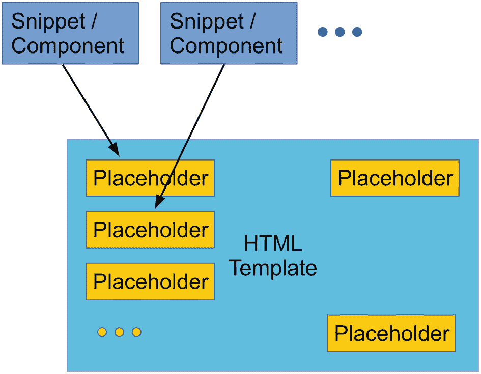
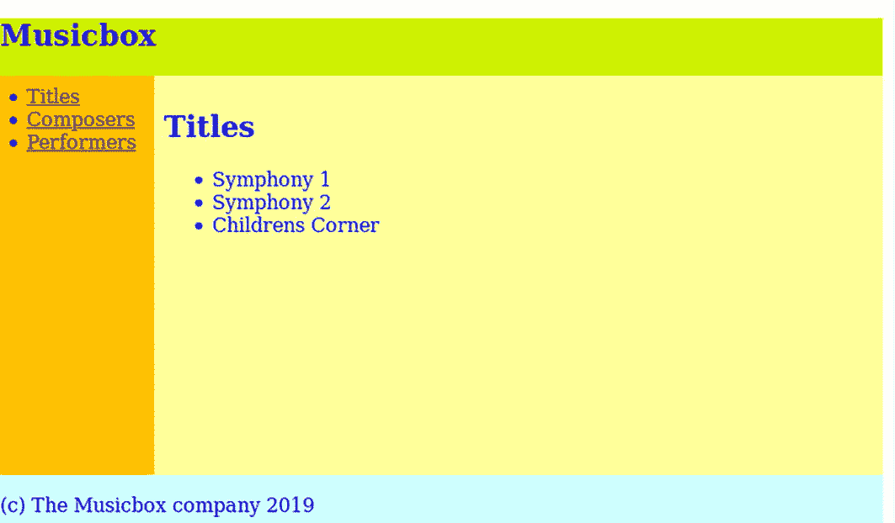
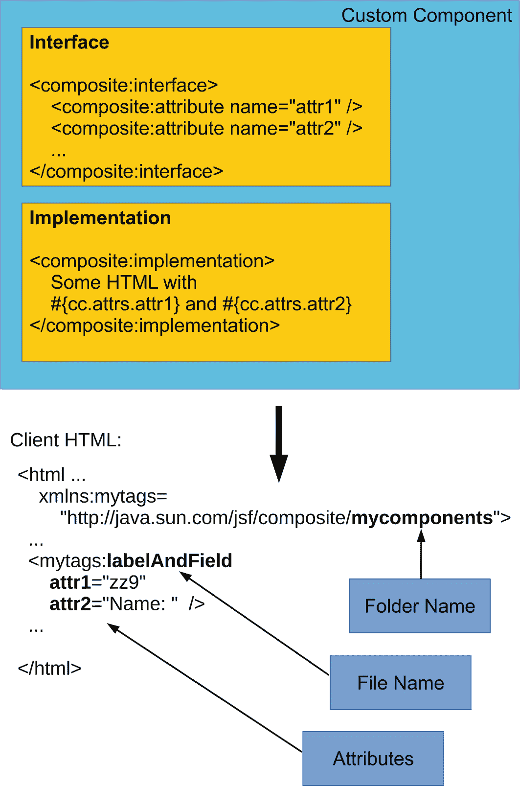
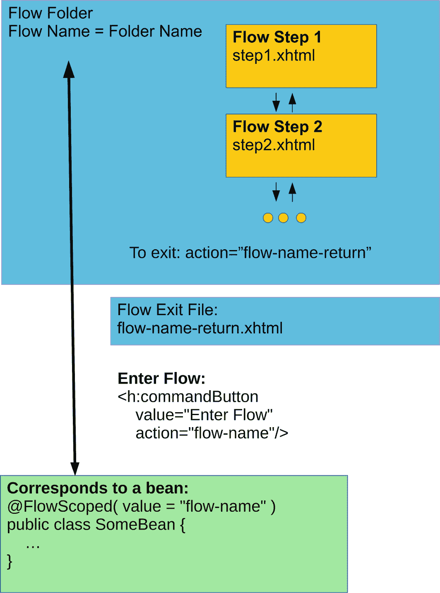
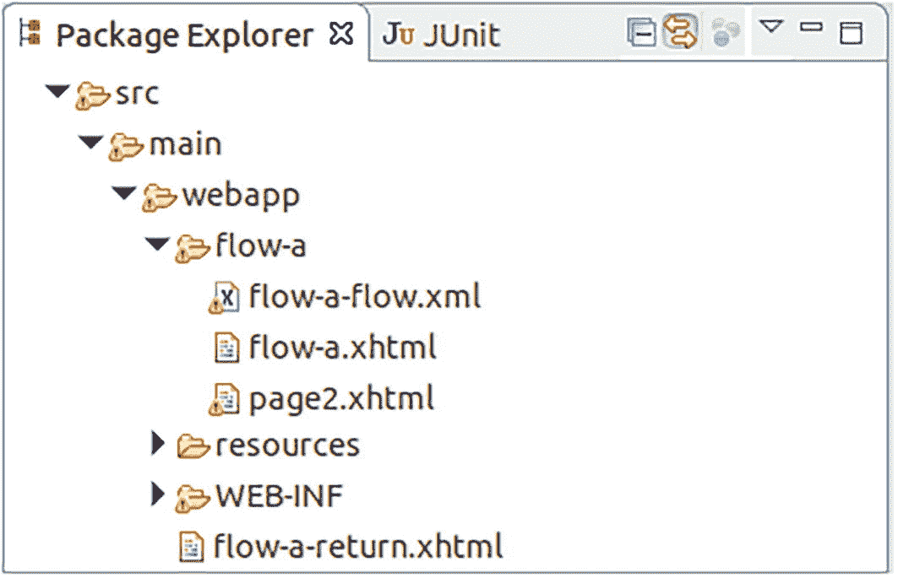
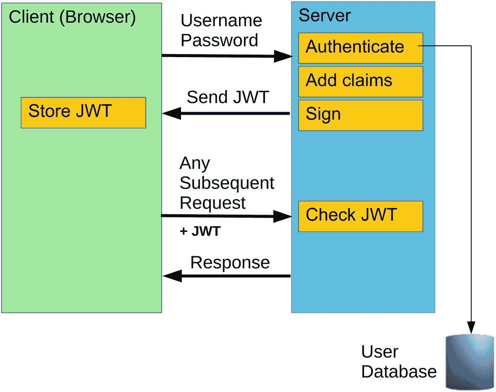

# 7. Facelets

本章介绍如何使用 Faces 4.0 内置的模板引擎，即 *Facelets*。与使用纯 Faces 相比，你可以使用 Facelets 进一步模块化前端代码，并提高代码质量、复用性和可维护性。

注意

Faces 的旧名称 *JSF* 已不再使用。

## 通过 Facelets 进行 Faces 模板化

虽然你可以通过使用各种完全定义的 Faces（XHTML）页面以及来自以下组件命名空间的标签来创建一个完整的页面流 Web 应用程序，但依赖这三个标签库可能不是最明智的方式：

```
h="jakarta.faces.html"
f="jakarta.faces.core"
pt="jakarta.faces.passthrough"
```

（最后一个是一个伪组件命名空间，用于*不*由 Faces 处理的属性。）如果你的页面具有通用结构，例如包含页眉、菜单、页脚和内容区域，那么所有 Faces 页面都必须重复应用程序不同部分共有的所有页面元素。这违反了 DRY（不要重复自己）原则。相反，如果你能使用模板机制来组合页面，利用模式、(*X*)HTML 片段和占位符，那会更好。

Faces 包含了这样一种模板技术，称为 *Facelets*。Facelets 允许你引入参数化的模板 HTML 页面、要包含在页面中的 HTML 片段（组件）、此类片段的占位符，以及用于诸如详细列表视图等内容的装饰器和重复结构。在接下来的章节中，你将了解配置问题和 Facelets 标签。在本章的最后一节，你将开发一个示例应用程序来入门。

这个示例应用程序模拟了一个在线音乐盒的功能。它包含一个页眉、一个页脚和一个菜单，无论用户当前使用哪个功能，该菜单都会出现在 Web 应用程序的每个页面上。Facelets 在让你分解出公共页面部分方面做得很好，这样你只需编写一次代码。参见图 7-1。



一个 HTML 模板的图示。它包含 5 个框，分别带有文本、占位符和 3 个点。名为 snippet 或 component 的框指向占位符。

图 7-1

使用 Facelets 进行模板化

## 安装 Facelets

Facelets 已经是 Faces 和 Jakarta EE 的一部分，因此无需安装。但在你可以在 Faces 页面中使用它之前，你必须声明一个额外的命名空间，如下面的 `ui` 所示：

```

...

```

## Facelets 标签概述

Facelets 包含以下标签，你可以将它们包含在 XHTML 文件中，以应用或混合模板、包含 XHTML 片段或传递参数：


### `<ui:include>` 标签

包含另一个 XHTML 文件，如下所示：

```
如果文件包含 `<ui:composition>` 或 `<ui:component>`，
则只会包含 `<ui:composition>`
或 `<ui:component>` 的内部内容。
这允许设计者独立于服务器后续的拼接来设计包含的文件样式。

<ui:composition> 标签的第一种变体

如果此标签 *不* 带 `template="..."` 使用，如下所示：

```
...

```

它定义了一个 HTML 元素的子树（集合）。其背后的思想是，如果你使用 `<ui:include>`，
并且被包含的文件包含 `<ui:composition> ... </ui:composition>`，
则只会包含 `<ui:composition> ... </ui:composition>` 的内部内容。
标签本身及其周围的任何内容都将被忽略。因此，你可以让页面设计者创建
一个完全有效的 XHTML 文件，将 `<ui:composition> ... </ui:composition>` 放在感兴趣的部分周围，
并在任何其他 Faces 页面中编写 `<ui:include>` 来精确提取这些部分。

<ui:composition> 标签的第二种变体

如果此标签 *带* `template="..."` 使用，如下所示：

```
...

```

它定义了一个 XHTML 片段集合，这些片段将被传递到模板文件内的占位符中（对应于 `template = "..."`
属性）。

与不带 `template="..."` 的 `<ui:composition>` 相比，
这是一个完全不同的使用场景。在
模板文件中，你有一个或多个元素，例如 `<ui:insert name="name1" />`，
而在带有 `<ui:composition template="...">` 的文件中，你在 `<ui:composition template="..."> ... </ui:composition>` *内部* 使用 `<ui:define>`
标签，如下所示：

```
... 
... 
...

```

这定义了
要用于 `<ui:insert>` 标签的内容。
`<ui:composition>` 标签周围的任何内容将再次被忽略，因此你可以让设计者
使用非 Faces 感知的 HTML 编辑器创建片段，并仅在稍后使用 `<ui:define name = "someName"> ... </ui:define>` 提取感兴趣的部分，用于
实现模板文件。

<ui:insert> 标签

使用此标签在模板文件内定义占位符。
在模板文件中使用此标签意味着任何引用此模板的文件都可以为这些占位符定义内容：

```
此定义必须发生在 `<ui:composition>`、
`<ui:component>`、
`<ui:decorate>`、
或 `<ui:fragment>` 内部。

通常你不会在此标签中提供内容。但是，如果你添加了内容，例如：

```
Hello

```

如果占位符未被其他方式定义，则此内容将作为默认值。

<ui:define> 标签

此标签声明
将在插入点插入的内容：

```
Contents...

```

由于插入点只能存在于模板文件中，因此 `<ui:define>` 标签
只能出现在通过 `<ui:composition template = "...">` 引用模板文件的文件中。

<ui:param> 标签

指定一个参数，该参数被传递给
`<ui:include>` 包含的文件，或传递给 `<ui:composition template = "..."> ...` 中指定的模板。只需将其添加为子元素，例如：

在被引用的文件中，使用 `#{paramName}` 来使用
该参数：

```

<ui:component> 标签

这与 `<ui:composition>` 的第一种变体相同，
即不指定模板。它向
Faces 组件树添加一个元素。它支持以下
属性：

*   `id` 用于
    组件树中元素的 ID。它不是必需的，如果你不指定，Faces
    会自动生成一个 ID。可以是 EL（表达式语言）字符串值。

*   `binding`
    用于将组件绑定到 Java 类（必须继承自 `jakarta.faces.component.UIComponent`）。
    非必需。可以是 EL 字符串值（类名）。

*   `rendered`
    用于确定是否渲染该组件。非必需。
    可以是 EL 布尔值。

通常的做法是使用 `<ui:param>` 向
组件传递参数。例如，你可以告诉组件使用特定的 ID。调用者：

被调用者（`comp1.xhtml`）：

```
...

```

<ui:decorate> 标签

类似于 `<ui:composition>`，
但它 *不会* 忽略其周围的 XHTML 代码：

```
...
我会被写入输出！

我被传递给 "templ.xhtml"，你可以通过
在 "templ.xhtml" 中引用我

...
```

与 `<ui:composition>` 相反，
包含 `<ui:decorate>` 的文件将包含完全有效的 XHTML 代码，包括 `html`、`head` 和 `body`，并且
模板文件将被插入到 `<ui:decorate>` 出现的位置。因此，它不能包含 `html`、`head` 或 `body`。这或多或少是一种扩展的“包含”，其中传递的数据不是由属性给出，而是在 `body` 标签中给出。
你通常应用 `<ui:decorate>` 标签来进一步
细化代码片段。你可以将它们包裹在更多的 `<div>` 中以应用
更多样式，添加标签或标题等。

<ui:fragment> 标签

类似于 `<ui:decorate>`，
但此标签
在 Faces 组件树中创建一个元素。它具有以下
属性：

*   `id` 用于
    组件树中元素的 ID。这不是必需的，如果你不指定，Faces
    会自动生成一个 ID。可以是 EL（表达式语言）字符串值。

*   `binding`
    用于将组件绑定到 Java 类（必须继承自 `jakarta.faces.component.UIComponent`）。
    非必需。可以是 EL 字符串值（类名）。

*   `rendered`
    用于指示是否渲染该组件。非必需。
    可以是 EL 布尔值。

你可以使用此标签提取现有代码片段，并将它们部分转换为组件。例如，考虑以下代码：

```
...

...

[某个表格|

...

```

如果你现在将表格提取到另一个名为 `table1_frag.xhtml` 的文件中：

```

...

...

...

我是表格标题

[某个表格|

```

你引入了 XHTML（标题）和一个新组件（表格）。

<ui:repeat> 标签

这不一定是一个与模板相关的标签，但它用于
遍历集合或数组。其属性为：

*   `begin`。
    非必需。如果指定，它是列表或数组中迭代的第一个索引。可以是 `int` 类型的值
    表达式。

*   `end`**。**
    非必需。如果指定，它是列表或数组中迭代的最后一个索引
    （包含）。可以是 `int` 类型的值
    表达式。

*   `step`。
    非必需。如果指定，它是列表或数组内的步进值。可以是 `int` 类型的值
    表达式。

*   `offset`。
    非必需。如果指定，它是一个偏移量，将添加到
    迭代的值上。可以是 `int` 类型的值
    表达式。

*   `size`。
    非必需。如果指定，它是要从集合或数组中读取的最大元素数量。
    不得大于集合的数组大小。

*   `value`。
    要迭代的列表或数组。一个 `Object` 类型的
    表达式。必需。

*   `var`。一个
    表达式语言变量的名称，该变量保存迭代的当前项。
    可以是 `String` 类型的值
    表达式。

*   `varStatus`**。**
    非必需。一个变量的名称，该变量保存
    迭代状态。一个具有只读值的 POJO：`begin` (int)、`end` (int)、`index` (int)、`step` (int)、`even` (boolean)、`odd` (boolean)、`first` (boolean) 和
    `last` (boolean)。

*   `rendered`。是否
    渲染该组件。非必需。可以是 EL 布尔值。

注意

JSTL（Java 标准标签库）集合
提供了一个 `<c:forEach>` 标签
用于循环。由于概念上的差异，Faces 和 JSTL 不能很好地协同工作。在教程和博客中，你会找到很多
使用 JSTL 进行 `for` 循环的例子。然而，最好使用 `<ui:repeat>` 来
避免问题。


<ui:debug> 标签
在项目的开发阶段，将此标签添加到页面中。使用热键，该标签将显示 Faces 组件树以及其他信息。使用 `hotkey="x"` 属性可以更改热键。按下 Shift+Ctrl+X 即可显示组件（默认的 *d* 键在 Firefox 浏览器中无效！）。第二个可选属性是 `rendered="true|false"`（你也可以使用 EL 布尔表达式），用于开启或关闭此组件。

注意

此标签仅在开发项目阶段有效。在 `web.xml` 中，你可以添加以下内容

```
jakarta.faces.PROJECT_STAGE
Development

```

来指定项目阶段（Development（默认）、UnitTest、SystemTest 或 Production）。

一个 Facelets 项目示例

在本节中，你将学习如何构建一个示例 Facelets 项目，该项目包含一个音乐盒数据库，为标题、作曲家和表演者显示设计相似的页面。在 Eclipse 中启动一个新的 Gradle 项目，并将其命名为 `MusicBox`。获取 `build.gradle` 文件，并将其内容替换为以下内容：

```
plugins {
id 'war'
}
sourceCompatibility = 1.17
targetCompatibility = 1.17
repositories {
jcenter()
}
dependencies {
compileOnly 'jakarta.platform:jakarta.jakartaee-api:10.0.0'
implementation 'com.google.guava:guava:31.1-jre'
testImplementation 'junit:junit:4.13.2'
}
task deployWar(dependsOn: war,
description:">>> MUSICBOX deploy task") {
doLast {
def FS = File.separator
def pp = { a -> project.properties[a] }
def glassfish = pp 'glassfish.inst.dir'
def user = pp 'glassfish.user'
def passwd = pp 'glassfish.passwd'
File temp = File.createTempFile("asadmin-passwd",
".tmp")
temp  ${sout}"
if(serr.toString()) System.err.println(serr)
temp.delete()
}
}
task undeployWar(
description:">>> MUSICBOX undeploy task") {
doLast {
def FS = File.separator
def pp = { a -> project.properties[a] }
def glassfish = pp 'glassfish.inst.dir'
def user = pp 'glassfish.user'
def passwd = pp 'glassfish.passwd'
File temp = File.createTempFile("asadmin-passwd",
".tmp")
temp  ${sout}"
if(serr.toString()) System.err.println(serr)
temp.delete()
}
}
```

除了依赖项管理，此构建文件还引入了两个自定义任务，用于在本地服务器上部署和取消部署 `MusicBox` Web 应用程序。

要连接到 `asadmin` 工具，请在项目根目录下创建另一个名为 `gradle.properties` 的文件：

```
glassfish.inst.dir = /path/to/glassfish7
glassfish.user = admin
glassfish.passwd =
```

在此文件中，你需要输入自己的 GlassFish 服务器安装路径。空的 `admin` 密码是 GlassFish 的默认设置。如果你更改了此默认设置，则必须在此文件中输入密码。

对于音乐盒数据，你将创建三个 Java 类。为简单起见，它们返回静态信息。在实际应用中，你会连接到数据库以获取数据。创建一个名为 `book.jakartapro.musicbox` 的包，并添加以下内容：

```
// Composers.java:
package book.jakartapro.musicbox;
import java.io.Serializable;
import java.util.List;
import jakarta.enterprise.context.SessionScoped;
import jakarta.inject.Named;
import com.google.common.collect.Lists;
@SessionScoped
@Named
public class Composers implements Serializable {
private static final long serialVersionUID =
-5244686848723761341L;
public List getComposers() {
return Lists.newArrayList("Brahms, Johannes",
"Debussy, Claude");
}
}
// Titles.java:
package book.jakartapro.musicbox;
import java.io.Serializable;
import java.util.List;
import jakarta.enterprise.context.SessionScoped;
import jakarta.inject.Named;
import com.google.common.collect.Lists;
@SessionScoped
@Named
public class Titles implements Serializable {
private static final long serialVersionUID =
-1034755008236485058L;
public List getTitles() {
return Lists.newArrayList("Symphony 1",
"Symphony 2", "Childrens Corner");
}
}
// Performers.java:
package book.jakartapro.musicbox;
import java.io.Serializable;
import java.util.List;
import jakarta.enterprise.context.SessionScoped;
import jakarta.inject.Named;
import com.google.common.collect.Lists;
@SessionScoped
@Named
public class Performers implements Serializable {
private static final long serialVersionUID =
6941511768526140932L;
public List getPerformers() {
return Lists.newArrayList(
"Gewandhausorchester Leipzig",
"Boston Pops");
}
}
```

虽然为了简洁起见，你不会对本示例应用程序进行国际化处理，但你确实准备了国际化，并在 `src/main/resources/book/jakartapro/musicbox/web` 内创建了一个空的 `WebMessages.properties` 文件。

为了使 Faces 正常工作，你需要创建一个 `src/main/webapp/WEB-INF/beans.xml` 文件：

另一个名为 `src/main/webapp/WEB-INF/web.xml` 的文件内容必须如下所示：

```

MusicBox

start.xhtml

Faces Servlet

jakarta.faces.webapp.FacesServlet

Faces Servlet
*.xhtml

```

再添加一个名为 `src/main/webapp/WEB-INF/glassfish-web.xml` 的文件。它应包含以下内容：

最后一个配置文件名为 `src/main/webapp/WEB-INF/faces-config.xml`，它定义了语言文件：

```

book.jakartapro.musicbox.web.WebMessages

bundle

en
es -->

```

在开始编码之前，请参见图 7-2 以了解你实际想要实现的效果。要应用 Facelets 功能，你需要添加一个名为 `src/main/webapp/frame.xhtml` 的模板文件：

```

Musicbox

Top Section

Menu1Menu2

Contents

Footer

```

此模板文件定义了一个通用的页面结构，并通过 `<ui:insert>` 标签声明了几个占位符。CSS 文件名为 `style.css`，位于 `src/main/webapp/resources/css/style.css`：

```
body { color: blue; }
.header-line { height: 3em; background-color: #CCF000; }
.bottom-line { clear: both; height: 1.5em; }
.menu-column { float: left; width: 8em;
background-color: #FFC000; height: calc(100vh - 7em); }
.menu-column ul { margin:0.5em; padding: 0;
list-style-position: inside; }
.contents-column { float: left; padding: 0.5em;
background-color: #FFFF99;
width: calc(100% - 9em); height: calc(100vh - 8em); }
.bottom-line { padding-top: 1em;
background-color: #CCFFFF; }
```

对于通用的页面元素，你在 `src/main/webapp/common` 文件夹内定义了几个 XHTML 文件：

```

Musicbox

Titles
Composers
Performers

(c) The Musicbox company 2019

```

`src/main/webapp` 文件夹内的三个页面文件——`titles.xhtml`、`composers.xhtml` 和 `performers.xhtml`——引用了模板文件和通用页面元素：

```

Titles

Composers

Performers

```

请注意，`<ui:composition>` 标签应用了页面模板。

通过运行名为 `deployWar` 的 Gradle 任务来构建和部署应用程序。然后将浏览器指向以下 URL 以查看正在运行的应用程序：

```
http://localhost:8080/MusicBox
```

参见图 7-2。




一张标题为“音乐盒”的截图。左侧面板有 3 个带项目符号的可点击选项：1. 标题，2. 作曲家，3. 演奏者。右侧面板有 3 个带项目符号的标题选项：a. 交响曲 1，b. 交响曲 2，c. 儿童乐园。

图 7-2
Musicbox Facelets 应用程序

8.  Faces 自定义组件

自定义组件允许开发者设计自己的 Faces 组件。关键在于可用性——自定义组件可以轻松移植到其他项目，甚至可以考虑构建一个公司级的自定义组件库。

定义自定义组件主要有三种方式。首先，你可以定义标签文件，然后在 `web.xml` 中将其注册为你自己的自定义命名空间。其次，你可以使用 Faces 的*复合组件*功能。在这里，你只需使用 XHTML 文件来定义组件的接口和实现。第三，你可以使用自定义 Java 类来定义组件。以下各节将分别介绍这三种方法。

自定义标签库

在这里，你为 XHTML 页面定义自己的 XML 命名空间，本示例使用在特殊 XHTML 文件中定义的组件。创建自定义标签库的步骤如下：

1.  创建一个名为 `mycomponent.xhtml` 的组件定义文件，并将其放置在 `src/main/webapp/WEB-INF/tags` 文件夹中（如果该文件夹不存在，请创建）。文件名可以自由命名，但请记下它，因为配置文件会用到。

2.  创建一个名为 `mytaglib.taglib.xml` 的标签库描述符文件。文件名同样可以自由命名，但它也会被用于配置文件中。你需要在此文件中描述新组件。

3.  使用 `web.xml` 注册新的标签库描述符。

例如，你将创建一个简单的日期输入组件。该示例不会添加弹出日历等图形化功能，但你以后可以扩展它来实现此类功能。这里，你只需处理以 YYYY-MM-DD 格式输入的正确用户输入。

在 `src/main/webapp/WEB-INF/tags` 目录下创建一个名为 `fancyDateInput.xhtml` 的文件，内容如下：

请记住，`<ui:composition>` 标签周围的代码将被忽略，因此你需要添加 `<html>` 来声明命名空间，使其成为一个格式良好的 XHTML 文档。`#{idParam}` 和 `#{valueParam}` 标签是组件参数。

接下来，在 `src/main/webapp/WEB-INF` 目录下创建一个名为 `mytaglib.taglib.xml` 的文件。其内容如下：

```

http://book.jakartapro.mytaglib

fancyDate
tags/fancyDateInput.xhtml

```

（删除 `jakartaee/.` 之后的换行和空格。）命名空间可以是任何内容，但必须唯一，并且最好指向你的公司。

现在，你必须注册新的标签库。为此，请在 `src/main/webapp/WEB-INF/web.xml` 文件中添加以下内容：

```

...

javax.faces.FACELETS_LIBRARIES
/WEB-INF/mytaglib.taglib.xml

...

```

要在任何 XHTML 页面中使用这个新组件，你首先必须声明新的自定义命名空间。之后，你就可以像使用其他任何组件一样使用它：

```

...

...

```

你可以看到，属性名称引用了 `fancyDateInput.xhtml` 文件中使用的 `#-` 参数。

复合组件

与自定义标签库相比，复合组件更轻量级。虽然它们隐式地定义了一个新的非公共命名空间，但你无需定义和注册标签库即可使用它们。定义复合组件的步骤如下：



一张插图。它在自定义组件部分包含两个块，分别带有用于接口和实现的 HTML 代码。它向下指向客户端 HTML 代码，并包含文件夹名称、文件名和属性。

图 8-1
自定义组件

1.  拟定一个组件集合名称。可以是任何名称。本示例使用 `mycomponents`。

2.  创建一个名为 `myComponent.xhtml` 的文件。你可以在此处使用任何名称，但必须记下文件名（不带 `.xhtml` 扩展名），因为它将成为组件的名称。将该文件保存在 `src/main/webapp/resources/mycomponents` 目录下。

3.  使用 `<composite:interface>` 和 `<composite:implementation>` 为新组件定义接口和实现。参见图 8-1。

然后，任何 Faces 文件都可以通过使用 [`http://java.su.com/Faces/composite/mycomponents`](http://java.su.com/Faces/composite/mycomponents) 命名空间并添加接口中定义的名称的属性来使用新组件。

例如，考虑 `labelAndField` 组件，它结合了一个标签和一个文本输入字段。创建一个名为 `labelAndField.xhtml` 的文件，并将其放入 `src/main/webapp/resources/mycomponents` 文件夹：

请注意名为 `jakarta.faces.composite` 的新命名空间声明。在实现中，你通过 `#{cc.attrs.ATTRNAME}` 引用参数。这是一个约定；你*必须*使用 `cc.attrs.` 作为前缀。

要使用新组件，请声明添加了 `mycomponents` 的复合命名空间：

```

...

...

```

Java 中的自定义组件
尽管这是一个高度复杂的操作，但可以使用 Java 类定义你自己的组件。如果仅使用 XHTML 文件进行组件编程不能满足你的需求，则可能需要这样做。

要创建这样一个类，请添加适当的注解，并让该类扩展 `UIComponent`，如下所示：

```
package this.package;
import jakarta.faces.component.FacesComponent;
import jakarta.faces.component.UIComponent;
@FacesComponent(createTag = true,
namespace = "https://mycompany.com/mynamespace",
tagName = "custom-component",
value = "this.package.CustomComponent")
public class CustomInput extends UIComponent {
...
}
```

如果这样做，你必须实现 `UIComponent` 中的许多抽象方法。如果从 `UIInput` 或 `UIOutput` 扩展，或者至少从 `UIComponentBase` 扩展，可能会稍微容易一些。最重要的重写方法是 `decode...()` 和 `encode...()` 方法，因为它们定义了组件的渲染和用户输入值提取过程。
`UIComponent` 及其派生类的 API 文档为你提供了有关此类 Faces Java 组件的更多信息。查看 Faces 中包含的标准组件的实现也很有帮助。

一旦你正确实现了这样一个组件，使用起来就很容易了。只需在任何 Faces 页面中编写以下内容：

```

...

...

...

```

9.  流

Faces 流是一种页面内聚概念，于 2013 年随 JEE 7 版本进入 JEE 世界。其主要思想是，若干页面被认为属于一个“流”。与这些流关联并存储在服务器上的数据可以被限制在*流作用域*内，这意味着流中的所有页面都可以访问相同的公共流作用域数据池，并且一旦退出流，相关的内存就可以被释放。因此，流变量作用域介于*请求作用域*（变量仅在一次请求中存活）和*会话作用域*（数据在用户会话持续期间存活）之间。
流的主要使用场景是向导，其中页面属于一系列相互关联的、类似对话框的输入页面，并服务于一个精确的用例，例如支付流程、投票、注册工作流等。

流处理过程

要定义一个流，你通常在一个专用文件夹内创建若干 XHTML 页面，该文件夹名为 `src/main/webapp/flow-name`。你可以使用任何合适的名称代替 `flow-name`。然后，要进入该流，你可以在 Web 应用程序中使用一个按钮，如下所示：

```

要退出流，你需要在流文件夹*之外*提供一个名为 `flow-name-return.xhtml` 的文件，并在流 XHTML 页面中的任何位置编写：

```


将 `flow-name` 替换为你为流程实际选择的名称。对于流程页面之间传递的数据，你需要提供一个使用 `@FlowScoped( value = "flow-name" )` 注解的 bean，同样在属性值中使用你的流程名称。请参见图 9-1。



一张插图。图中包含一个方框内的两个块，位于顶部的流程文件夹中，包含流程步骤 1 和步骤 2，分别命名为 step 1 和 step 2 dot x h t m l；一个流程出口文件框，命名为 flow name return dot x h t m l；一个进入流程的命令；以及一个带有代码的框，标题为“对应一个 bean”。

图 9-1
流程过程

基本流程设置

流程遵循“约定优于配置”的范式。因此，你不需要为基本流程进行配置。约定如下：

1.  在 `src/main/webapp` 目录下创建一个名为 `flow-name` 的文件夹。你可以选择任何你喜欢的文件夹名称，但按照约定，文件夹名称也将作为流程名称。

2.  在 `src/main/webapp/flow-name` 目录下创建一个名为 `flow-name-flow.xml` 的空文件。文件名的第一部分 `flow-name` *必须*与流程名称匹配。因此，如果你的流程名为 `flow-a`，则必须有一个名为 `src/main/webapp/flow-a` 的文件夹，并且这个空文件必须命名为 `flow-a-flow.xml`。由于此文件存在，Faces 就知道该文件夹属于一个流程。如果你以后需要配置该流程，配置将放入此文件中。

3.  在 `src/main/webapp/flow-name` 目录下创建一个名为 `flow-name.xhtml` 的流程起始页面。不带后缀的文件名 `flow-name` *必须*与流程名称匹配。这是一个标准的 Faces XHTML 页面。

4.  在 `src/main/webapp/flow-name` 目录下创建任意数量的后续流程页面。对使用的名称没有限制。

5.  为了在流程中保存数据（用户输入）并处理导航情况，创建一个带有 `@Named`（导入 `"jakarta.inject"`）和 `@FlowScoped(value = "flow-name")` 注解的 bean 类。这个 bean 还必须实现 `java.io.Serializable`。这是一个普通的支持 bean，但它仅对流程内的 XHTML 页面可用。`value` 属性*必须*与流程名称匹配。

6.  在 `src/main/webapp/flow-name` 文件夹*外部*创建一个名为 `flow-name-return.xhtml` 的文件。文件名的第一部分，即 `-return.xhtml` 之前的所有内容，*必须*与流程名称匹配。这是流程的出口点。它是一个标准的 Faces XHTML 页面，但你无法在此处使用 `@FlowScoped` bean——在页面被调用之前，该 bean 已被销毁。

请参见图 9-2（在此图中，流程名为 `flow-a`）。



一张标题为“包资源管理器”的截图。它包含一个带有下拉子菜单的侧边菜单栏。右上角有 6 个图标。

图 9-2
一个基本流程设置

要进入流程，你使用文件夹名称，如下所示：

```
...

...

```

要退出最后一个流程页面，使用不带路径或后缀的出口页面名称，如下所示：

```
...

...

```

如果你更改了名称，请将 `flow-name-return` 替换为实际的流程名称加上 `-return`。

一个带有必要注解和示例字段的基本流程作用域 bean 如下所示：

```
package the.package.name;
import java.io.Serializable;
import jakarta.faces.flow.FlowScoped;
import jakarta.inject.Named;
@Named
@FlowScoped(value = "flow-name")
public class FlowScopeBean implements Serializable{
private static final long serialVersionUID =
-3877099938046102267L;
private String value;
public String getValue() {
return value;
}
public void setValue(String value) {
this.value = value;
}
}
```

覆盖约定

如果你不想使用刚刚了解到的约定，你必须为 Faces 提供合适的配置。一种可能性是在此文件中添加配置条目：


```
src/main/webapp/flow-name/flow-name-flow.xml
```

其中两处的 `flow-name` 均代表流程名称，因此如果你的流程使用了不同的名称，则必须同时替换这两处。

该文件的内容如下所示：

```

...

```

（删除 `jakartaee/` 后的换行符和空格）。`id` 属性必须与流程所使用的文件夹名称一致。

指定不同的流程起始页面

若要指定不同的流程起始页面，请在 `<flow-definition>` 元素内编写以下内容：

```
...

/flow-name/page1.xhtml

flow-a-start

```

对于 `<view>` 内的 ID 属性，你可以随意选择，但它必须与 `<start-node>` 元素的内容一致。

指定不同的返回页面

如果你想为流程使用不同的返回页面，请在 `<flow-definition>` 元素内编写以下内容：

```
...

#{someBean.returnValue}  -->
/start

```

对于 `<flow-return>` 内的 ID 属性，请使用与流程最后一个页面中的完成命令按钮相同的值：

```
...

...

```

`<from-outcome> /start </from-outcome>` 将跳转到 `start.xhtml`。如果你改用方法表达式，例如 `<from-outcome> #{someBean.aboutToExit} </from-outcome>`，则会调用此方法来确定跳转目标：

```
public String aboutToExit() {
return "start"; // -> start.xhtml
}
```

程序化配置

流程也可以使用 Java 类进行程序化配置。为了让 Faces 识别流程配置，该类的名称必须与流程名称匹配。因此，例如，如果你有一个名为 `checkout` 的流程文件夹，则此配置类的名称必须为 `CheckoutFlow`（首字母必须大写，并附加 `Flow`）。

要指定自定义的流程起始页面和流程返回页面，该类的内容如下：

```
package the.package;
import java.io.Serializable;
import jakarta.enterprise.inject.Produces;
import jakarta.faces.flow.Flow;
import jakarta.faces.flow.builder.FlowBuilder;
import jakarta.faces.flow.builder.FlowBuilderParameter;
import jakarta.faces.flow.builder.FlowDefinition;
// 名称表明流程文件位于
// 文件夹 "flow-a" 内
public class FlowAFlow implements Serializable {
private static final long serialVersionUID = 1586568679L;
@Produces
@FlowDefinition
public Flow defineFlow(@FlowBuilderParameter FlowBuilder
flowBuilder) {
// 指定流程起始页面
String flowId = "flow-a";
flowBuilder.id("", flowId);
flowBuilder.viewNode(flowId, "/" + flowId +
"/flow-a-start.xhtml").markAsStartNode();
// 指定流程返回页面
flowBuilder.returnNode("returnFromFlow").
fromOutcome("/start");
return flowBuilder.getFlow();
}
}
```

在 `.fromOutcome()` 中，你也可以指定一个方法表达式：

```
...
.fromOutcome("#{someBean.aboutToExit}");
```

注意

请注意，在 Java 类中使用 EL 构造会引入类依赖的双重结构：Java 类关系和 EL 关系。

处理流程结果

在返回到名为 `flow-name-return.xhtml` 的退出页面之前，你可以在 `@FlowScope` 作用域的后备 bean 中调用最后一个导航案例。例如，你可以评估用户在流程期间输入的所有数据，并执行流程的实际目的。为此，你可以按如下方式编写一个“完成”按钮：

```
...

...

...
```

然后，在 bean 中添加一个方法来执行任何收尾操作：

```
public String aboutToExit() {
// 在这里，我们可以使用流程期间输入的数据执行操作...
return "flow-name-return"; // 流程名称 + "-return"
}
```

在流程之间传递数据

流程可以调用其他流程。但是，这不能简单地通过在 `<h:commandButton>` 组件中使用第二个流程的名称来实现。相反，你必须在第一个流程的配置中显式声明该流程转换。

如果你想在 XML 配置中执行此操作，请将以下内容添加到 `flow-name/flow-nameflow.xml` 文件中：

```
...

....

flow-b

```

其中 `<flow-call>` 中的 `call-flow-b` ID 对应于调用流程中某处的命令按钮操作：

```
`<flow-reference><flow-id>...</flow-id></flow-reference>`
对应于被调用的第二个流程。

你不能使用流程作用域的变量在流程之间传递数据。相反，你需要在调用流程的配置中添加一个*出站*参数规范：

```

flow-b

param1FromCallingFlow
the value

```

其中，除了 `the value`，你也可以使用 EL 值表达式。

然后，在被调用流程的配置中，添加一个*入站*参数规范：

```

param1FromCallingFlow
#{someFlowBean.value}

```

其中 `someFlow` bean 是一个在*被调用*流程内具有流程作用域的后备 bean。

警告

同样，由于模式定义文件中的一个错误，这些配置条目将被标记为错误。然而，此处显示的配置已在 GlassFish 7 上测试通过，运行正常。

使用 Java 类而非 XML 文件实现相同配置的方法如下：

```
// 在调用流程内部：
flowBuilder.flowCallNode("call-flow-b").
flowReference("", "flow-b").
outboundParameter("param1FromCallingFlow",
"the value");
// 在被调用流程内部：
flowBuilder.inboundParameter("param1FromCallingFlow",
"#{someFlowBean.value}");
```

10. WebSocket

HTTP 本质上是一种单向、无状态的协议。这意味着通信的一方（例如 Web 浏览器这样的客户端）向服务器发送单个请求并等待返回数据，最终在检索完该单个请求的所有数据后关闭连接。从协议的角度来看，任何后续请求都不知道之前的请求，这就是为什么 HTTP 被称为无状态协议。
然而，一旦需要将多个 HTTP 请求分配给操作应用程序的特定用户，服务器上的应用程序就需要维护会话上下文。通过将会话信息附加为 `GET` 参数或使用 cookie，这成为了可能。因此 HTTP 保持无状态，而添加状态并不违背 HTTP 的本质。
HTTP 概念上的单向性则是另一回事。虽然在互联网初期，数据流只能由客户端发起是完全可接受的，但随着现代 Web 应用程序的发展，数据流也能由服务器触发变得越来越必要。想象一个聊天应用程序，服务器需要通知用户 B，用户 A 已经发送了一些消息。从那时起，人们使用了多种技术来克服 HTTP 的这一概念性缺陷，但没有一种技术易于理解和/或维护。
作为补救措施，*WebSocket* 被发明出来，它允许服务器和客户端之间进行双向通信。自 JEE 7 版本起，Java 企业服务器就包含了 WebSocket。Jakarta EE 10 当然也包含了 WebSocket 实现。本章将讨论如何在 Jakarta EE 中使用 WebSocket。

服务器端的 WebSocket

WebSocket 由 JSR 356 涵盖。你可以在以下地址查看规范：

```
https://www.jcp.org/en/jsr/detail?id=356
```

有几种环境可以运行服务器端 WebSocket。由于本书讨论的是 Jakarta EE，本章将考虑在由 WAR 打包的 Web 应用程序中运行 WebSocket，这是运行它们的主要场所。

你可以像启动本书中描述的任何其他 WAR 项目一样启动一个 WebSocket 项目。要添加一个 WebSocket，你所要做的就是引入一个带有适当注解的 Java 类。选择任意名称和包，并编写以下内容：


```
package book.jakartapro.websocket.server;
import jakarta.enterprise.context.ApplicationScoped;
import jakarta.inject.Inject;
import jakarta.json.Json;
import jakarta.json.JsonObject;
import jakarta.json.JsonReader;
import jakarta.websocket.OnClose;
import jakarta.websocket.OnError;
import jakarta.websocket.OnMessage;
import jakarta.websocket.OnOpen;
import jakarta.websocket.Session;
import jakarta.websocket.server.ServerEndpoint;
@ApplicationScoped
@ServerEndpoint("/actions")
public class WebSocketServer {
@OnOpen
public void open(Session session) {
// 以某种方式处理已打开的会话。例如
// 将 session 对象保存在某个
// 会话注册器类的实例中...
}
@OnClose
public void close(Session session) {
// 以某种方式处理已关闭的会话
}
@OnError
public void onError(Throwable error) {
// 以某种方式处理 websocket 错误
}
@OnMessage
public void handleMessage(String message,
Session session) {
// 接收字符串消息。不要求
// 使用 JSON 作为消息格式，但在许多情况下这是一个
// 不错的选择，并且它简化了
// JavaScript websocket 客户端的编程
try (JsonReader reader = Json.createReader(
new StringReader(message))) {
JsonObject jsonMessage = reader.readObject();
// 处理传入的消息...
}
}
}
```

可以看到，你将服务器对象添加到了
应用作用域中。通常的会话作用域在这里不起作用，因为
websocket 并不对应传统 HTTP
意义上的用户会话。

为了向客户端发送消息，
你需要获取一个 `jakarta.websocket.Session`
对象，然后按如下方式发送消息：

```
// 构建一个数据对象：
JsonProvider provider = JsonProvider.provider();
JsonObject msg = provider.createObjectBuilder()
.add("someField", "someValue")
.add("someOtherField", 42)
...
.build();
// 将其发送给客户端：
try {
session.getBasicRemote().sendText(msg.toString());
} catch (IOException ex) {
// 处理错误。同时可能从会话存储中移除该会话：
// sessions.remove(session);
}
```

如果 WAR 文件
在 `WebSock-Server-War`
上下文下运行，本地 GlassFish 上的 websocket URI 如下所示：

```
http://localhost:8080/WebSock-Server-War/actions
```

你需要知道这一点，以便客户端 Web 应用程序
（JavaScript）能够连接到 websocket。

顺便提一下，为了更改 EAR 插件的上下文（如果 Web
应用程序是 EAR 的一部分），你必须在 `build.gradle` 中调整 EAR 插件
配置：

```
...
ear {
deploymentDescriptor {
webModule("WebSock-Server-War.war",
"sock-context")
}
}
```

其中 `WebSock-Server-War.war`
是生成的 WAR 模块的部署构件，而 `sock-context`
是新的上下文：

```
http://localhost:8080/sock-context/
```

如果你改为将 Web 应用程序部署为 WAR 文件，则由
服务器决定上下文的外观。对于 GlassFish 7，
你可以在部署期间指定上下文根：

```
./asadmin \
--user THE_USER \
deploy --contextroot sock-context theWar.war
```

客户端上的 WebSocket

在客户端
，你需要将以下 JavaScript 代码添加到你的 Web
应用程序中：

```

var server = "localhost:8080/WebSock-Server-War";
var socket = new WebSocket("ws://" + server +
"/actions");
socket.onmessage = onMessage;
function onMessage(event) {
// 处理来自服务器的消息...
// 我们假设消息是 JSON 格式
var msg = JSON.parse(event.data);
...
}
...
// 向服务器发送消息。你可以从
// JavaScript 代码的某个位置或
// 事件处理程序（如按钮按下）中执行此操作
var msg = {
id: 42,
txt: "Hello World"
};
sendToServer(msg);
...
function sendToServer(msg) {
// 我们将消息转换为 JSON 字符串，因此
// 'msg' 可以是任何对象
socket.send(JSON.stringify(msg));
}

...

```

socket URL 中的 `/actions`
部分应与 Java 服务器类中的 `@ServerEndpoint`
注解匹配。

11. 前端技术

随着 Web 应用程序位于用户和
应用程序功能之间的接口上，并且需要在各种类型的设备上呈现设计良好且
高度可用的前端，前端技术
在开发者社区中获得了大量关注。

使用 Jakarta EE 专用技术
Faces 或 REST 构建 Web 前端是可以接受的，但由于前端需要满足的众多不同甚至有时相互矛盾的
需求，存在许多
不同的 Web 前端技术。很难决定
你是否需要第三方 Web 前端技术，如果需要，
又该选择哪一种。以下基本问题可以帮助你做出决定：

*   它是收费的，还是开源或免费的？

*   文档质量如何？

*   产生良好设计的预期工作量是多少？

*   将图形设计师的想法融入 Web
    应用程序有多容易？

*   确保 Web 应用程序具有良好的
    可用性有多容易？

*   将前端包含在 Jakarta
    EE 中有多困难？

*   适配不同的前端设备（浏览器
    和智能手机）有多容易？

*   出现问题时获得帮助有多容易？

*   升级到新版本有多容易？

*   使用该前端技术需要哪些编程技能？

*   该技术在五年后仍然存在的可能性有多大？

从问题和可能答案的数量来看，你可能会猜到
很容易列出十种、二十种甚至更多的前端技术，
它们各有优缺点。在一本书中不可能对所有这些技术进行
全面的介绍，但以下各节将概述几种技术并介绍一些优缺点。

注意

由于此类比较的性质，某个或另一个框架的
拥护者可能会不同意我的评估。但请注意，
这仅仅是功能的粗略比较。你可以
使用每个产品的 Web 文档来得出自己的结论。

浏览列表时，你可能会觉得我不是
Node.js 的粉丝。我不得不承认事实确实如此。我
不认同通常的论点，即 Web 开发者知道如何使用 JavaScript，因此使用
JavaScript 作为服务器端语言和构建环境是一个
好主意。相反，我认为 Java 生态系统已经拥有
构建良好且优雅代码所需的一切，并且
在浏览器中运行的前端逻辑和后端逻辑应该保持分离，
因为两者在架构方面和开发者编程技能方面有不同的要求。话虽如此，当然由你决定。
你可以尽情使用 Node.js。
我个人认为，在项目过程中混合使用 Jakarta EE 和 Node.js
会引入不必要的概念复杂性。

无第三方前端技术
如前所述，Jakarta EE 中包含的 Faces 和 REST 技术足以构建任何类型的 Web 应用程序。如果包含 `jQuery` JavaScript
库，你可以简化开发，因为它可以消除一些浏览器差异，并帮助你编写
更短、更优雅的 JavaScript 代码。

优点：

*   Faces 和 REST 已包含在 Jakarta EE 中

*   高度标准化且稳定

*   非常好的文档

缺点：

*   需要高级开发技能才能实现
    良好的图形设计和高度可用性

*   未明确处理不同的前端设备

Play 2

Play（版本 2）
是一种全栈 Web 应用程序技术。它使用 Java 或 Scala
作为编程语言，并允许你使用函数式模式。它
遵循 MVC（模型-视图-控制器）范式。一个包含运行中 Web 服务器的基本开发项目
可在五分钟内设置完成。

```
https://www.playframework.com/
```

优点：

*   基于 HTTP，无状态。

*   明确支持移动设备。

*   异步请求，非阻塞 I/O。

*   快速开发生命周期。

缺点：


*   对 Scala 而非 Java 作为编程语言存在一定偏好。

*   虽然 Play 同时支持 SBT 和 Gradle 作为构建工具，但其介绍基本依赖于 SBT，这意味着你需要学习 SBT 才能熟悉 Play。

*   Play 引入了一种全栈 Web 应用技术。因此，它是 Jakarta EE 的竞争对手，将两者混合使用颇具挑战性。

React

React 是一个
基于组件的 Web 开发框架。你使用一种名为 JSX 的增强型 JavaScript 语言，将编程逻辑与 HTML 标记混合在一起。例如：

```
class ShoppingList extends React.Component {
render() {
return (

Shopping List for {this.props.name}

Bananas
Apples
Peanuts

);
}
}
```

在开发过程中，一个即时编译器会将 JSX 转换为 JavaScript；而在生产环境中，则可以使用预编译器。

```
https://reactjs.org/
```

优点：

*   将 JavaScript 和 HTML 编码（JSX 页面）混合在一起，在一定程度上简化了开发。

*   与其他技术无缝集成，因此你可以逐步将 React 功能引入 Jakarta EE 应用程序。

*   开发过程中对 JSX 页面进行即时编译，使得开发速度很快。

缺点：

*   React 由 Facebook 维护，这取决于公司政策。你可能不希望为你的软件接受这些偏好。此外，其许可证包含一些感觉像是供应商锁定的部分。

*   生产代码的构建过程严重依赖 Node.js，这引入了一种基于 JavaScript 作为服务器端代码语言的新范式。使用 React 意味着你必须维护两个生态系统：Java 和 JavaScript。此外，Node.js 还引入了另一种供应商锁定：为 Node.js 模块构建和维护私有及公司拥有的软件仓库并不容易。

*   标记（HTML）和逻辑没有分离，这与广泛接受的 MVC 范式相矛盾。

Angular 2

Angular 是一个
模板化 Web 开发框架。你使用特殊语法创建包含 Angular 组件占位符的 HTML 页面。部署 Angular 应用程序通过 Node.js（一个服务器端 JavaScript 框架）进行。

```
https://angular.io/
```

优点：

*   明确针对移动设备。

*   Angular 将*依赖注入*引入到 Web 层（JavaScript/TypeScript 代码）。

缺点：

*   Angular 依赖 TypeScript，而 TypeScript 需要先转换为 JavaScript 才能在浏览器上运行。

*   Angular 严重依赖 Node.js，这引入了一种基于 JavaScript 作为服务器端代码语言的新范式。将 Angular 与 Jakarta EE 结合使用意味着你必须维护两个生态系统：Java 和 JavaScript。此外，Node.js 还引入了另一种供应商锁定：为 Node.js 模块构建和维护私有及公司拥有的软件仓库并不容易。

*   Angular 引入了一种全栈 Web 应用技术。因此，它是 Jakarta EE 的竞争对手，将两者稳定地混合使用颇具挑战性。

Spring Boot

Spring Boot
利用 Spring 平台，使你能够快速开发 Web 应用程序。

```
https://spring.io/projects/spring-boot
```

优点：

*   在独立的、近乎生产就绪的环境中快速搭建 Web 应用程序（和微服务）。

*   Spring Boot 会自动打开监控端口，用于发现指标和技术应用程序状态。

*   严重依赖*约定优于配置*模式，简化了配置并加快了开发速度。

缺点：

*   Spring 可能被视为 Jakarta EE 的竞争对手，尽管 Spring 和 Jakarta 在版本升级过程中会相互采纳对方的功能。将两者混合使用是可能的，但这会给应用程序开发带来新的复杂性。

*   Spring Boot 是一个“让别人替你干活”的框架。你会在某种程度上失去对应用程序内部功能的控制。这可能是你不希望发生的事情。


*   Spring Boot 倾向于分布式微服务。如果这与您的应用程序架构相悖，那么 Spring Boot 可能不是您的最佳选择。

Vue

Vue 是一个模板框架，与 Angular 类似，但复杂性更低，且采用更模块化的方法。

```
https://vuejs.org
```

优点：

*   使用 JavaScript 作为前端逻辑语言，因此无需像许多其他框架那样学习 TypeScript。

*   Vue 可以增量采用，这意味着您可以逐步在 Web 应用程序中引入 Vue。

*   允许快速开发，因为所有模板都由页面的 JavaScript 代码即时生成。

*   虽然是可选的，但可以在服务器端渲染 HTML 页面，从而加快页面加载速度（当然，代价是增加服务器负载）。

缺点：

*   虽然可以通过在 Web 应用程序的 HTML 页面中使用 `<script>` 标签来引入 Vue，但文档建议使用 Node.js 作为构建环境。这引入了一种基于 JavaScript 作为脚本语言的新范式。

Spring MVC

Spring MVC 是 Spring Boot 中“约定优于配置”程度较低的兄弟框架。之前关于 Spring Boot 的阅读内容同样适用于 Spring MVC，不同之处在于 Spring MVC 需要更多的配置工作。这反过来使得 Spring MVC 与 Spring Boot 相比具有更高的通用性，代价是需要做更多的工作才能使其正常运行。

```
https://spring.io/guides/gs/serving-web-content/
```

优点：

*   与 Spring 架构保持一致，通过注入构建组件层次结构。

*   文档完善。

缺点：

*   复杂度高。

*   Spring 可能被视为 Jakarta EE 的竞争对手，尽管 Spring 和 Jakarta 在版本升级过程中会相互采用对方的功能。两者可以混合使用，但这会给应用程序开发带来新的复杂性。

*   Spring 是一个“让别人替你干活”的框架。通过使用 Spring 的子技术或 Spring 模块，您会在某种程度上失去对应用程序内部功能的控制。这可能是您不希望做的事情。

Ember

Ember 是另一个基于模板的 Web 应用程序框架，它依赖 Node.js 作为构建和执行框架。

```
https://emberjs.com/
```

优点：

*   高度基于*约定优于配置*，允许编写精简代码。

缺点：

*   尽管基于*约定优于配置*，但与其他框架相比，Ember 的学习曲线似乎更陡峭。

*   Ember 依赖 Node.js，这引入了一种基于 JavaScript 作为服务器端代码语言的新范式。将 Ember 与 Jakarta EE 一起使用意味着您需要维护两个生态系统——Java 和 JavaScript。此外，Node.js 还引入了另一个供应商锁定：为 Node.js 模块构建和维护私有及公司拥有的软件仓库并不容易。

*   Ember 引入了一种全栈 Web 应用程序技术。因此，它是 Jakarta EE 的竞争对手，并且以稳定的方式将两者混合使用具有挑战性。

Act.Framework

```
http://actframework.org/
```

优点：

*   使用依赖注入，允许编写精简代码。

*   通过依赖 REST 进行前后端通信，展现出清晰且高性能的架构。

*   使用 Maven 进行构建，因此能更好地与 Jakarta EE 构建流程集成。

*   允许您在不同的渲染（模板）引擎之间进行选择。

缺点：

*   模板由第三方库完成，这导致偏离了 Jakarta EE 规范。虽然代码可能比使用 Faces 更少，但使用 `Act.Framework` 会因需要同时监控后端（Jakarta EE）和前端（`Act.Framework`）规范的开发而引入额外的项目复杂性。

Apache Struts 2

Apache Struts 是一种历史悠久的、遵循 MVC（模型-视图-控制器）范式的前端技术。

```
https://struts.apache.org
```

优点：

*   按照设计，Apache Struts 试图不隐藏 HTTP 协议的无状态特性。因此，Struts 可以被认为是一种“纯粹”的 Web 开发方法。

*   Struts 是一个成熟的 Web 开发框架，表现出高度的稳定性，并且预计在未来也能持续适用。

缺点：

*   学习曲线陡峭，需要具备一定的理解 HTTP 请求-响应周期的能力。

*   虽然 Struts 2 支持多种前端模板引擎，甚至可以通过使用 REST 来避免复杂的模板，但 Struts 仍然倾向于使用“老式”的 JSP 技术。

GWT

Google 公司的 GWT 基本上是一个编译引擎，它将 Java 类转换为 JavaScript，然后可以在浏览器中执行。

```
http://www.gwtproject.org/
```

优点：

*   消除了开发任何 JavaScript 代码的需要。一切都只是 Java。

*   可以逐步从普通的 Web 应用程序迁移到 GWT。

*   与 Eclipse 等 IDE 集成良好。

*   调试支持良好。

缺点：

*   您在某种程度上受限于按照 Google 人员设想的方式来构建 Web 应用程序。

*   Java 本身并不擅长定义 HTML 标记。从 Java 到 JavaScript 和 HTML 的转换，虽然由 GWT 自动化，但远非一个简单、清晰的过程。

*   没有简单的方法来做事。与其他 Web 应用程序框架相比，第一个可运行的 Web 应用程序版本会晚很多才出现。

*   编写优秀的 GWT 应用程序需要大量的 Java 开发技能。

Vaadin

Vaadin 是一个基于 Java 的 Web 开发框架。其发行版区分了具有基本功能的免费版本和具有更复杂模块的付费版本。

```
https://vaadin.com/
```

优点：

*   明确支持 PC 浏览器和手持设备。

*   包含用于网格数据、图表和对话框的复杂组件。

*   默认提供专业外观的 UI 设计。

*   明确支持 Java EE (/Jakarta EE)。

*   支持 Maven 和 Gradle 构建工具。

*   整个 Web 应用程序只需要 Java。

缺点：

*   分为免费的 basic 功能和付费的 pro 功能。这始终存在一种风险，即有一天您可能被迫为您曾经认为是 basic 的功能付费。

*   UI 逻辑和状态存储在服务器上。这会导致高负载的公开可用应用程序出现性能问题。

*   细粒度的前端定制，例如动画，很难实现。

DataTables

这是一个 `jQuery` 插件。虽然它不是一种多用途的前端技术，但 `DataTables` 使您能够以非常灵活的方式在浏览器中显示和编辑表格数据。在企业内部应用中，列出表格数据和编辑数据是常见任务，而 `DataTables` 可以帮助您快速实现此类应用，并在后台运行 Jakarta EE。

```
https://www.datatables.net/
```

优点：

*   易于集成。作为一个 jQuery 插件，`DataTables` 对所使用的后端技术没有任何限制。

*   高度灵活。

*   强大的搜索功能。

*   文档完善。

缺点：

*   不是一种多用途的前端技术。

D3js

D3js 是一个强大的可视化库。它可以帮助您可视化科学和/或业务相关数据。

```
https://d3js.org/
```

优点：

*   非常灵活的可视化库。

*   高度专业的外观设计。

*   通过 HTML `<script>` 标签即可简单引入。

缺点：

*   不是一种多用途的前端技术。

*   需要一些时间来了解所有功能的全貌。

*   使用它需要良好的 JavaScript 技能。

12. 基于表单的身份验证


安全 Web 应用程序通常使用 HTTPS（SSL/TLS）通信协议而非 HTTP，并要求用户通过登录对话框进行身份验证。采用*基本身份验证*流程时，浏览器会提供一个标准化的用户凭证输入表单。虽然基本身份验证易于实现和配置，但它无法让你控制登录对话框的呈现方式和行为。专业 Web 应用程序会改用*基于表单的身份验证*，这种方式允许它们实现符合公司策略和设计准则的自定义登录对话框。

注意

JSR-375 曾试图标准化 Jakarta EE 安全技术。然而，除了相关公告之外，你在互联网上找不到有用的教程和示例，因此其实现状态似乎存疑。因此，本书将介绍一种略显过时但运行可靠且文档完善的原始 Jakarta EE 安全增强技术。

在服务器上启用安全功能
在服务器上启用和配置安全功能，以及添加用户和组，取决于 Jakarta EE 服务器产品、其配置以及你使用的安全方法。虽然这意味着你需要查阅服务器文档以了解具体细节，但以下段落描述了 GlassFish 7 的基本步骤，以便让你有个基本概念。

注意

我们这里不涉及存储在专用 SQL 用户数据库中的用户。要包含数据库访问，请创建一个类型为 `com.sun.enterprise.security.auth.realm.jdbc.JDBCRealm` 的新域。使用终端，你可以在一行内输入以下内容：

```
asadmin create-auth-realm
--classname com.sun.enterprise.security.auth.realm.jdbc.JDBCRealm
--property jaas-context=jdbcRealm
:datasource-jndi="jdbc/auth"
:user-table=users
:user-name-column=email
:password-column=password
:group-table=users_groups
:group-name-column=groupname
:digest-algorithm=SHA-512
userMgmtJdbcRealm
```

如果你想使用 Web 管理控制台，则必须在创建域时逐个添加这些属性。

首先，你需要在服务器范围的配置设置中启用安全功能。为此，请在 Web 管理控制台 `http://localhost:4848` 中，选择 Configurations ➤ Server-config ➤ Security。然后勾选 Security Manager 复选框。

接下来，你需要向服务器的用户数据库添加一个名为 `AdminUser` 的示例用户。该用户必须被分配到 `ApplAdmin` 组。同样在 `http://localhost:4848` 中，导航到 Configurations ➤ Server-config ➤ Security ➤ Realms ➤ File。点击 Manage Users 按钮。在出现的页面上，点击 New，然后输入以下内容：

```
User ID:    AdminUser
Group List: ApplAdmin
Password:   pW41834
```

点击 OK。这个新用户被存储在服务器文件树结构内的一个文件中。这就是 `file` 域名称的由来。

Faces 的基于表单的身份验证

要开始为你的 Faces 页面开发基于表单的身份验证，请创建一个新的 Gradle 项目，并像往常一样添加一个包含四个文件的 `src/main/webapp/WEB-INF` 文件夹。一个名为 `beans.xml` 的文件：

以及另外三个文件，分别名为 `faces-config.xml`、`glassfish-web.xml` 和 `web.xml`。
对于 `faces-config.xml` 的内容，请编写以下内容：

```

book.jakartapro.formbasedauth.web.WebMessages

bundle

en
es -->

```

（`javaee/` 后面不应有换行符或空格。）这个文件没有什么特别之处；只需确保将 `book.jakartapro.formbasedauth.web` 替换为 `src/main/resources` 中存放语言资源的文件夹即可。对于这个示例项目，你可以保留原样。

对于 `glassfish-web.xml` 文件，目前只需编写以下内容：

重要的配置部分将写入 `web.xml`。在这里，你需要定义一个安全约束和一个登录配置，如下所示：

```

index.xhtml

Faces Servlet

jakarta.faces.webapp.FacesServlet

Faces Servlet
*.xhtml

Admin Constraint

members

/admin/*

admin

CONFIDENTIAL

FORM
file


/login/login.xhtml
/login/error.xhtml

admin

```

由于 `<security-constraint>` 内部的设置，
服务器会拦截对某些资源的访问，具体如下：

*   `<url-pattern>` 内部的模式
    决定了要监控哪些资源。此处，你指明 `admin/` 下的所有
    资源都必须置于安全监管之下。

*   传输协议被强制使用 SSL/TLS。这是因为
    `<transport-guarantee>` 内部的 `CONFIDENTIAL` 标记。
    如有必要，从 HTTP 到 HTTPS 的切换会自动进行。

*   用户已通过身份验证并拥有 `admin` 角色。这是
    因为 `<role-name>` 标签。

`<login-config>`
元素表明
你想要使用基于表单的身份验证，并指定了登录
表单文件。稍后将讨论这些文件。在 `<login-config>` 内部，
`<auth-method> FORM </auth-method>`（`FORM` 是一个
预定义常量）规定了一个用于身份验证的自定义表单。
`<realm-name> file </realm-name>` 指明了授权数据
的位置。这是服务器特定的——这里的 `file`（不是
Jakarta EE 规范中看到的预定义常量）是用于
GlassFish 的，它指定了服务器上用于存储用户和密码的本地文件。
`<security-role>`
元素列出了
所有影响应用程序的角色（除了未授权访问）。
虽然你可以有多个角色，但本例中只有一个。

安全角色映射

服务器将
角色（在 `web.xml` 中定义）映射到
用户组（在服务器产品中定义）。此映射在
`WEB-INF / *-web.xml` 文件中指定。对于 GlassFish，你需要重写
`WEB-INF` 文件夹内的 `glassfish-web.xml`
文件，并使其内容如下：

```

admin
ApplAdmin

```

`admin`
角色被映射到 `ApplAdmin` 用户组，
因为你在前面的章节中使用了 `ApplAdmin` 作为用户的组。

基于表单的身份验证 XHTML 代码

Web 用户进入受保护应用程序部分所需的步骤
取决于你的应用程序，更准确地说，取决于 `web.xml`
文件中 `<security-constraint>` 内部的 `<url-pattern>`
标签。例如，如果你需要一个按钮或链接来进入
安全区域，你可以这样写：

```
...

...

...或...

...

```

注意

为简洁起见，本示例对 XHTML 文本使用了字面值。对于
生产代码，你应该改用语言资源文件。

如果在 `<security-constraint>`
内部的 `<url-pattern>`
标签中，你编写了以下内容：

```
/admin/*
```

服务器就知道它需要要求提供凭证才能进入
按钮或链接中给出的安全区域。

对于基于表单的身份验证代码，`login.xhtml` 由
`web.xml` 文件中的 `<login-config>`
引用。你可以编写一个如下所示的登录表单：

```

登录表单

请登录：

```

你可以编写任何你喜欢的内容，添加公司指南定义的图片和样式，
以及添加“忘记密码”链接、信息页面
链接、地址、电话号码等。重要的部分是：

*不要*在此处使用 `<h:form>`。
而是使用此处所示的纯 HTML `<form>` 标签。你必须
为 action 使用 `j_security_check`，并为
字段 ID 使用 `j_username` 和 `j_password`。

对于错误
页面（`login/error.xhtml`），
当输入无效的用户/密码组合时将显示该页面，
你可以使用以下内容：

```

登录错误

无效的用户名或密码。
请输入有权访问受保护部分的用户名或密码。
对于此应用程序，这意味着
一个已在文件领域中创建并已分配给
ApplAdmin 组的用户。

```

注意

本示例在链接的值前添加了 `#{request.contextPath}`，
因为错误页面不能使用相对 URL。
这是因为它由登录模块处理，该模块会丢弃
应用程序的 URL 上下文。

应用程序现在可以运行了。你可以部署它，并将浏览器指向
以下 URL 进行测试：

```
https://localhost:8181/FormBasedAuth/
```

13. 客户端证书

在服务器端使用 SSL/TLS 来确保隐私和数据完整性
是当今非常常见的任务。随着 TLS 的出现，SSL 已被弃用，
你可以确信你的通信是加密的，并且属于服务器的
一方的身份也是安全的。服务器向客户端出示
证书以证明其身份。然而，客户端一侧的身份
是通过将对话框输入中的密码与数据库中的密码进行比较来检查的。
如果这对你来说还不够，你可以要求你的
Web 应用程序的用户也通过证书进行身份验证。
为了实现这一点，你使用*客户端*证书。这样，
你获得了更高的安全性，因为用户不能像有时密码那样
将证书钉在显示器上，并且将证书借给
他人与将密码交给他人也是不同的情况。本章讨论
这些客户端证书。

准备脚本
在安装客户端证书之前，你需要知道如何
生成它们。本书涵盖专业的 Web 应用程序，因此你
可能拥有不止少数几个客户端证书。因此，
如果你能使用脚本进行批量生产，那就太好了。我向你展示
这样一个脚本，并且由于此示例使用 Groovy 作为脚本语言，你可以
从 Linux 和 Windows 机器上管理客户端证书。

注意

不要忘记添加 Groovy 插件，如本书开头所述。

首先，在 Eclipse 中创建一个新的 Gradle 和 Groovy 项目：选择 文件
➤ 新建 ➤ 其他... ➤ Gradle 项目，并输入 `ClientCertificates` 作为
项目名称。项目创建后，右键单击该项目
并选择 配置 ➤ 转换为 Groovy 项目，以添加显式的 Groovy
脚本功能。
向项目添加一个新的 `scripts` 文件夹，
然后再次右键单击该项目并选择 属性 ➤
Groovy 编译器。勾选“启用项目特定设置”复选框。
对“启用脚本文件夹支持”执行相同操作，并添加 `scripts` 文件夹（在
对话框中输入 `scripts/*`）。

注意

为了更严格地遵守标准，你可以使用 `src/main/scripts` 作为
脚本文件夹。我在这里仅将 Gradle 用于依赖项解析，因此
使用 `scripts`
顶级文件夹，虽然不太像 Gradle 风格，但在项目资源管理器中更容易找到。
但如果你愿意，也可以使用标准位置。

在 `build.gradle` 文件中，
为名为 `Bouncycastle` 的证书管理库添加依赖项，如下所示：

```
dependencies {
...
implementation 'org.bouncycastle:bcprov-jdk15on:1.64'
}
```

在同一文件中，确保你使用的是 Java 1.17：

```
plugins {
...
}
sourceCompatibility = 1.17
targetCompatibility = 1.17
```

然后右键单击该项目并选择 Gradle ➤ 刷新 Gradle 项目。

生成客户端证书

要生成一个或多个客户端证书，请添加
名为 `scripts/generate.groovy` 的脚本文件，如下所示：


```
import java.security.spec.RSAPrivateKeySpec
import java.security.spec.RSAPublicKeySpec
import java.security.*
import java.security.cert.*
import java.time.Instant
import java.time.temporal.ChronoUnit
import org.bouncycastle.jce.provider.BouncyCastleProvider
import org.bouncycastle.cert.jcajce.*
import org.bouncycastle.operator.*
import org.bouncycastle.asn1.x500.X500Name
import org.bouncycastle.operator.jcajce.*
import org.bouncycastle.openssl.*
import org.bouncycastle.openssl.jcajce.JcaPEMWriter
KEYSTORE_PASSWORD = "changeit"
RSA_KEYSIZE = 2048
RSA_SIGN_ALGORITHM = 'SHA256WithRSA'
VALIDITY_DAYS = 3650
USERS = [["MarkHamilton","pw173"], ["LindaGreen","pw518"]]
new File("OUTPUT").deleteDir(); new File("OUTPUT").mkdir()
USERS.each { user0 ->
def user = user0[0]
def pw = user0[1]
def certFull = makeCert(user)
def cert = certFull.cert
//println(cert.getClass())
//println(cert)
FileWriter fileWriter = new FileWriter(
new File("OUTPUT" + File.separator +
"clientCert." + user + ".pem"))
JcaPEMWriter pemWriter = new JcaPEMWriter(fileWriter)
pemWriter.writeObject(cert)
pemWriter.flush()
X509Certificate[] serverChain = new X509Certificate[1]
serverChain[0] =  cert
def keyStore = KeyStore.getInstance("PKCS12")
keyStore.load(null, pw.toCharArray())
keyStore.setEntry(user,
new KeyStore.PrivateKeyEntry(certFull.priv,
serverChain),
new KeyStore.PasswordProtection(pw.toCharArray())
)
def fos = new java.io.FileOutputStream("OUTPUT" +
File.separator + "clientCert." + user + ".p12")
keyStore.store(fos, pw.toCharArray())
}
def makeCert(def commonName) {
def bcProvider = BouncyCastleProvider.PROVIDER_NAME
Security.addProvider(
new org.bouncycastle.jce.provider.
BouncyCastleProvider())
def keyPairGenerator =
KeyPairGenerator.getInstance("RSA", bcProvider)
keyPairGenerator.initialize(RSA_KEYSIZE)
def keyPair = keyPairGenerator.generateKeyPair()
def contentSigner =
new JcaContentSignerBuilder(RSA_SIGN_ALGORITHM).
build(keyPair.private)
def dnName = new X500Name("CN=" + commonName)
def certSerialNumber = BigInteger.valueOf(
System.currentTimeMillis())
def startDate = Instant.now()
def endDate = startDate.plus(VALIDITY_DAYS,
ChronoUnit.DAYS)
def certBuilder = new JcaX509v3CertificateBuilder(
dnName,
certSerialNumber,
Date.from(startDate),
Date.from(endDate),
dnName,
keyPair.public)
X509Certificate certificate =
new JcaX509CertificateConverter().
setProvider(bcProvider).
getCertificate(certBuilder.build(contentSigner))
["priv":keyPair.private,
"pub":keyPair.public,
"cert":certificate]
}
```

如有必要，请修改文件顶部的全大写变量，特别是 `USERS` 列表中的用户名和密码。然后通过右键单击并选择“运行方式 ➤ Groovy 脚本”来运行该脚本。按 F5 刷新包资源管理器，您将在 `OUTPUT` 文件夹中看到证书。`PKCS12` 文件用于在浏览器上安装证书，而 `PEM` 文件则是对应的、将在服务器上注册的证书。

**在浏览器中存储客户端证书**

要在浏览器上安装 PKCS12 文件，您必须将它们与安装手册一起分发给您的用户。或者，作为一种替代方案，您可以使用一些配置管理软件来完成此任务。安装过程取决于您使用的浏览器。

如果您选择手动安装并使用 Firefox，请打开首选项并进入“隐私与安全”部分。在“证书”部分，单击“查看证书”，然后在“您的证书”选项卡上，单击“导入”。选择 PKCS12 文件。系统将提示您输入密码。该密码已在生成器脚本的 users 列表中指定。

对于 Windows 上的 Internet Explorer，只需双击该文件即可启动导入过程。您需要输入的密码是在生成器脚本的 users 列表中指定的密码。

**在服务器上存储客户端证书**

要将客户端证书存储在服务器上，请使用您在前面的部分中生成的 `.pem` 文件。可以使用 shell 脚本执行此任务，但由于您手头已有 Groovy 项目，因此也可以使用 Groovy 脚本来简化此工作并提高灵活性（过滤、重命名等）。

对于 GlassFish 服务器，您需要备份现有的 `cacerts.jks` 密钥库文件，从构建目录 `OUTPUT` 中读取所有 `.pem` 文件，将它们传入密钥库的内存表示中，最后用更新后的版本覆盖 `cacerts.jks` 文件：

```
import java.security.*
import java.security.cert.*
import java.time.Instant
import java.time.LocalDateTime
import java.time.format.DateTimeFormatter
import java.time.temporal.ChronoUnit
import javax.security.auth.x500.X500Principal
import org.bouncycastle.asn1.x500.X500Name
import org.bouncycastle.cert.jcajce.*
import org.bouncycastle.jce.provider.BouncyCastleProvider
import org.bouncycastle.openssl.PEMParser
import org.bouncycastle.openssl.jcajce.JcaPEMWriter
import org.bouncycastle.operator.jcajce.*
KEYSTORE_PASSWORD = "changeit"
KEYSTORE_ALIAS_PREFIX = ""
IMPORT_FOLDER = "OUTPUT"
GLASSFISH_INST = "/my/local/glassfish/glassfish7"
GLASSFISH_DOMAIN = "domain1"
Security.addProvider(new org.bouncycastle.jce.provider.
BouncyCastleProvider())
// 备份旧的 cacerts.jks
def FS = File.separator
def cacerts = GLASSFISH_INST + FS + "glassfish" + FS +
"domains" + FS +
GLASSFISH_DOMAIN + FS + "config" + FS + "cacerts.jks"
def bak = cacerts + "." + LocalDateTime.now().format(
DateTimeFormatter.ISO_LOCAL_DATE_TIME).
replaceAll(/[^\d]/, "_")
new File(bak).bytes = new File(cacerts).bytes
// 加载当前密钥库
KeyStore ks = KeyStore.getInstance("JKS")
char[] password = KEYSTORE_PASSWORD.toCharArray()
FileInputStream fis  = new FileInputStream(cacerts)
ks.load(fis, password)
fis.close()
// 获取并注册所有新密钥
new File("OUTPUT").listFiles().
grep{ f -> f.name.endsWith(".pem") }.each { f ->
println(f)
addPemToStore(f, ks)
}
// 覆盖 cacerts.jks 文件
ks.store(new FileOutputStream(new File(cacerts)),
password)
def addPemToStore(def f, def keyStore) {
def p = new PEMParser(new FileReader(f))
def o = p.readObject()
X509Certificate x509 =
new JcaX509CertificateConverter().
setProvider("BC").getCertificate(o)
println(x509)
X500Principal princ = x509.subjectX500Principal
def name = princ.name.replaceAll(/CN\s*=\s*/,"")
println(name)
keyStore.deleteEntry(KEYSTORE_ALIAS_PREFIX + name)
keyStore.setCertificateEntry(
KEYSTORE_ALIAS_PREFIX + name, x509)
keyStore.aliases().each {
alias -> println("A: " + alias) }
}
```

保存此文件（例如，保存为 `scripts/importToServer.groovy`）。像往常一样，根据您的需要修改此文件开头的全大写变量。

> **注意**
>
> Jakarta EE 服务器产品决定了证书的存储位置，因此对于 GlassFish 以外的服务器，需要采用其他步骤。请阅读服务器手册以了解如何安装证书。

**客户端证书 Web 应用程序**

用于需要使用客户端证书的 Web 应用程序的 `WEB-INF/web.xml` Web 部署描述符内容如下：

```
...

...

...

安全区域

成员

/admin/*

admin

CONFIDENTIAL

CLIENT-CERT
certificate

admin

...
```

请注意以下特征：

*   `<web-resource-collection>` 内部的 `<url-pattern>` 标签描述了您想要保护的 Web 应用程序部分。

*   `<role-name>` 标签指定了用户为了获得对受保护部分的访问权限而需要获取的角色名称。稍后，在特定于服务器的部署描述符（对于 GlassFish 是 `glassfish-web.xml`）中，您将看到如何描述从角色到用户组的映射。

*   `<transport-guarantee> CONFIDENTIAL </transport-guarantee>` 代码确保您将为受保护区域切换到 HTTPS（SSL/TLS）。


*   `<auth-method>CLIENT-CERT</auth-method>` 代码是最关键的部分。在此示例中，你声明要使用客户端证书登录安全区域。随后的 `<realm-name> certificate </realm-name>` 标签告知服务器登录凭据（即证书）在服务器上的存储位置。后者是服务器特定的设置——对于 GlassFish 而言，`certificate` 域指示 GlassFish 使用已注册的客户端证书。

角色到用户组的映射发生在服务器特定的部署描述符中。对于 GlassFish，该文件是 `WEB-INF/glassfish-web.xml`。此文件的内容可能如下所示：

```

admin
authorized

```

此示例表示将角色 `admin` 映射到用户组 `authorized`。对于其他服务器，你需要查阅其手册以了解如何将角色映射到用户组。

**额外的 GlassFish 配置**
为了让 GlassFish 使用客户端证书，你需要启用此功能。打开 Web 管理控制台 `http://localhost:4848`，然后依次选择“配置” ➤ “服务器配置” ➤ “HTTP 服务” ➤ “HTTP 监听器” ➤ “http-listener-2”。在 SSL 选项卡上，勾选“客户端身份验证”复选框。

请注意，用户组与证书之间没有直接关系。这是一个特定于服务器产品的设置。对于 GlassFish，你需要编辑此文件：

```
GLASSFISH_INST/glassfish/domains/domain1/config/domain.xml
```

滚动到

```

并将该条目修改为

进行此更改后，你必须重新启动服务器。

**注意**

GlassFish 7 中存在一个错误，导致你无法通过 Web 管理控制台管理此条目。幸运的是，对于 `certificate` 域，你只需编辑此文件一次，无论对该域进行何种客户端证书管理活动。

**客户端证书示例**

作为示例，创建一个 Web 应用程序，并在 `src/main/webapp/WEB-INF` 目录下包含以下文件：

```
beans.xml:

faces-config.xml:

book.jakartapro.clientcertauth.web.WebMessages

bundle

en
es -->

glassfish-web.xml:

admin
authorized

web.xml:

index.xhtml

Faces Servlet

jakarta.faces.webapp.FacesServlet

Faces Servlet
*.xhtml

Admin Constraint

members

/admin/*

admin

CONFIDENTIAL

CLIENT-CERT
certificate

admin

```

同时，在 `src/main/webapp` 目录下创建以下 XHTML 文件：

```
index.xhtml:

Client Cert Authentication

This is the company website

admin/secured.xhtml:

Client Cert Authentication

Secured area

```

你可以通过导航到安全区域来验证客户端证书是否正常工作。此外，还可以查看浏览器中的页面属性。在 Firefox 中，点击标题栏中 URL 地址旁边的安全徽章，然后选择“连接不安全” → “更多信息”。

**注意**

除非你更改了 GlassFish 中的 HTTPS 监听器配置（并且项目名称为 `ClientCertAuth`），否则请访问 `https://localhost:8181/ClientCertAuth`。

**14. REST 安全性**

对于 SPA（单页 Web 应用程序），无法可靠地使用 `WEB-INF/web.xml` 中定义的安全约束来强制执行安全性。原因是这些安全约束是专门为 Web 页面的 HTTP 请求和响应量身定制的，而非 JSON 片段。此外，尽管存在用于将 REST 类和方法标记为需进行安全检查的注解，但 REST 实现并非必须实际执行这些检查。用于 RESTful 服务的 JAX-RS 规范根本不处理安全性问题。
作为补救措施，一些额外的规范明确处理了 REST 安全性：JWT（JSON Web 令牌）、JWS（JSON Web 签名）、JWE（JSON Web 加密）、JWK（JSON Web 密钥）和 JWA（JSON Web 算法）。这一系列规范处理了安全令牌以及 JSON 数据的签名和加密。

**注意**

JSR-375 曾试图标准化 Jakarta EE 安全技术。然而，其实现似乎处于不确定状态，并且你在互联网上找不到有用的教程和示例。因此，我决定使用上述技术。


本章介绍如何使用 JJWT（Java JSON Web Token）库来保护 REST 端点。内容聚焦于浏览器与服务器之间的通信，因此仅涵盖 JWT 和 JWS。所有其他 REST 安全规范或许能提升安全性，但它们不易适用于浏览器与服务器之间的通信。如果你也考虑使用这些规范，请查阅相关规范以及 [`https://github.com/jwtk/jjwt`](https://github.com/jwtk/jjwt) 上的 JJWT 文档。

REST URL 的安全约束

假设你有一个单页应用（SPA），其中包含一个名为 `index.html` 的 HTML 页面和两类 REST 数据查询，如下所示：

```
/data/unsecured/*
/data/secured/*
```

以下章节将向你展示如何开发一种方法，将 JWT 安全应用于 `/data/secured/*` 这类 REST URL。

关于 JSON Web Token
JSON Web Token（JWT）是客户端-服务器通信中断言一系列声明（claims）的数据片段。它们在 RESTful 应用中尤其有用，此类声明可以是用户名、角色分配等信息。

生成和校验 JWT 以确保用户通过身份验证的主要思路如下：

1.  用户启动登录流程，将凭据（用户名和密码）发送至服务器。这通常通过 AJAX 调用完成，典型方式为 `POST` 或 `PUT` 请求。
2.  服务器尝试对用户进行身份验证。
3.  如果身份验证失败，则构建一个*不含* JWT 的响应，服务器从该调用返回。
4.  否则，服务器生成一个新的 JWT。
5.  使用密钥对 JWT 进行签名，该密钥与用户名和签名密钥一起存储在某个数据库中。JWT 在响应头中返回。
6.  浏览器客户端接收 JWT 并将其存储在浏览器会话中。
7.  在随后的每次 AJAX 请求中，客户端（浏览器）都会在请求头中发送该 JWT。服务器决定是否检查传输的 JWT，并相应地返回成功或失败的响应。

参见图 14-1。



JWT 流程的框图。客户端请求用户名和密码，这些信息被发送到服务器。服务器对用户名、声明进行身份验证并签名，然后将响应发送回客户端。客户端将任何后续请求发送到服务器以检查 JWT 流程，并发送响应。

图 14-1
JWT 流程

注意

与通常的安全敏感型应用一样，协议应强制使用 TLS。在 GlassFish 中，你可以禁用不安全的 HTTP 监听器；对于其他服务器产品，请查阅相关文档。

由于使用了秘密（私有）密钥，服务器可以确保 JWT 未被篡改。从客户端（浏览器）的角度来看，JWT 是一段可能包含用户组等声明的数据。如果客户端对这些声明不感兴趣，JWT 会在请求和响应头中传递，而忽略其任何结构或内容。

准备 GlassFish

由于本章使用的代码需要 Java 运行时权限，而这些权限并非 GlassFish 自动授予的，因此你需要对服务器策略进行一些调整。打开以下文件：

```
GLASSFISH-INST/glassfish/domains/domain1/
config/server.policy
```

并向其中添加以下行：

```
// 使 Jackson 序列化工作
grant {
permission java.lang.reflect.ReflectPermission
"suppressAccessChecks";
};
// 允许编程式登录
grant {
permission javax.security.auth.AuthPermission
"createLoginContext.fileRealm";
permission javax.security.auth.AuthPermission
"doAsPrivileged";
};
```

JWT 登录流程，客户端代码

对于登录流程，假设你有用于输入用户名和密码的输入字段，以及“登录”和“注销”按钮。此外，你还有两个用于测试访问安全和非安全数据的按钮，以及一个用于诊断输出的区域：

```

REST 安全

用户：
密码： 
登录
注销

访问非安全数据
访问安全数据

```

这是主 HTML 文件的一部分。该文件以及其余的客户端代码位于 `webapp` 源文件夹内：

```
src
main
webapp
static
index.html
js
script.js
jquery-3.3.1.min.js
css
styles.css
WEB-INF
web.xml
glassfish-web.xml
beans.xml
```

在 `script.js` JavaScript 文件中，你添加一个用于存储 JWT 的变量，以及执行登录和注销活动并对测试按钮做出响应的代码：

```
var jwt = '';
$(function() {
$('#loginButton').click(function(){
var url = "../jwtlogin/login";
var loginObj = {
user: $('#user').val(),
passwd: $('#passwd').val()
};
$.ajax({
method: "PUT",
dataType: "json",
contentType: "application/json",
url: url,
data: JSON.stringify(loginObj),
})
.done(function(data, status, jqXHR) {
$('#errOutput').html("");
$('#output').html("已登录");
jwt = jqXHR.getResponseHeader("Authorization");
})
.fail(function(jqXHR, textStatus, errorThrown) {
$('#errOutput').html("AJAX 错误: " + errorThrown);
$('#output').html("");
jwt = "";
});
});
$('#logoutButton').click(function(){
var url = "../jwtlogin/logout";
$.ajax({
method: "PUT",
dataType: "json",
contentType: "application/json",
url: url
})
.done(function(data, status, jqXHR) {
$('#errOutput').html("");
$('#output').html("已注销");
jwt = jqXHR.getResponseHeader("Authorization");
})
.fail(function(jqXHR, textStatus, errorThrown) {
$('#errOutput').html("AJAX 错误: " + errorThrown);
$('#output').html("");
jwt = "";
});
jwt = "";
});
$('#accessUnsecuredButton').click(function(){
var url = "../unsecured/hello";
$.ajax({
method: "GET",
headers: {Authorization : jwt},
dataType: "json",
contentType: "application/json",
url: url
})
.done(function(data, status, jqXHR) {
$('#output').html(data.msg);
$('#errOutput').html("");
})
.fail(function(jqXHR, textStatus, errorThrown) {
$('#output').html("");
$('#errOutput').html("AJAX 错误: " + errorThrown);
});
});
$('#accessSecuredButton').click(function(){
var url = "../secured/hello";
$.ajax({
method: "GET",
headers: {Authorization : jwt},
dataType: "json",
contentType: "application/json",
url: url
})
.done(function(data, status, jqXHR) {
$('#output').html(data.msg);
$('#errOutput').html("");
})
.fail(function(jqXHR, textStatus, errorThrown) {
$('#output').html("");
$('#errOutput').html("AJAX 错误: " + errorThrown);
});
});
});
```

按钮的 `onclick` 处理程序构造 AJAX `PUT` 请求并将其发送到服务器。来自服务器的结果和错误消息会输出到诊断输出字段。成功登录后，服务器发送的 JWT 会存储在全局 `jwt` 变量中。

`styles.css` CSS 文件目前仅包含一些基本的样式指令：

```
body { color: #000044; }
div.clearfloat { clear: both; }
.err { color: red; };
```

`WEB-INF/web.xml` 文件声明了 REST Servlet。由于你正在添加编程式安全，因此无需在此处添加与安全相关的配置条目：

```

Rest 安全

jakarta.ws.rs.core.Application

jakarta.ws.rs.core.Application

/*

```

`beans.xml` 文件将 `all` 指定为发现模式：

服务器特定的部署描述符 `glassfish-web.xml` 可以具有以下基本形式：

服务器代码

服务器端类位于 `book.jakartapro.restsecurity` 包中：

```
src
main
java
book
jakartapro
restsecurity
StaticContent.java
NonSecured.java
Secured.java
jwt
JWTLogin.java
JWTTokenNeeded.java
JWTTokenNeededFilter.java
KeyGenerator.java
JWTKeyGeneratorImpl.java
```

当然，你可以根据自己的需要调整这些内容。

`StaticContent` 类是一个简单的控制器，用于提供 Web 应用 `static/` 部分中的静态内容。


```
package book.jakartapro.restsecurity;
import java.io.InputStream;
import jakarta.ejb.Stateless;
import jakarta.inject.Inject;
import jakarta.servlet.ServletContext;
import jakarta.ws.rs.GET;
import jakarta.ws.rs.Path;
import jakarta.ws.rs.PathParam;
import jakarta.ws.rs.core.Response;
// http://localhost:8080/RestSecurity/static/index.html
@Path("/static")
@Stateless
public class StaticContent {
@Inject ServletContext context;
@GET
@Path("/{path : .*}")
public Response staticResources(
@PathParam("path") final String path) {
final InputStream resource = context.
getResourceAsStream(String.format(
"/static/%s", path));
return null == resource ?
Response.status(Response.Status.NOT_FOUND).build()
: Response.ok().entity(resource).build();
}
}
```

JWT 登录流程，服务端代码

对于登录流程，你需要实现一个名为 `JWTLogin` 的类。该类负责处理 `jwtlogin/login` 和 `jwtlogin/logout` 这两个 REST URL，并与容器提供的认证机制进行交互：

```
package book.jakartapro.restsecurity.jwt;
import static jakarta.ws.rs.core.HttpHeaders.AUTHORIZATION;
import static jakarta.ws.rs.core.MediaType.
APPLICATION_JSON;
import static jakarta.ws.rs.core.Response.Status.*;
import java.security.Key;
import java.security.Principal;
import java.time.LocalDateTime;
import java.time.ZoneId;
import java.util.Date;
import jakarta.inject.Inject;
import jakarta.servlet.ServletException;
import jakarta.servlet.http.HttpServletRequest;
import jakarta.transaction.Transactional;
import jakarta.ws.rs.Consumes;
import jakarta.ws.rs.PUT;
import jakarta.ws.rs.Path;
import jakarta.ws.rs.Produces;
import jakarta.ws.rs.core.Context;
import jakarta.ws.rs.core.Response;
import jakarta.ws.rs.core.UriInfo;
import io.jsonwebtoken.Jwts;
import io.jsonwebtoken.SignatureAlgorithm;
@Path("/jwtlogin")
@Produces(APPLICATION_JSON)
@Consumes(APPLICATION_JSON)
@Transactional
public class JWTLogin {
public static class Credentials {
public String user;
public String passwd;
public String getUser() {
return user;
}
public void setUser(String user) {
this.user = user;
}
public String getPasswd() {
return passwd;
}
public void setPasswd(String passwd) {
this.passwd = passwd;
}
}
@Context
private UriInfo uriInfo;
@Inject
private KeyGenerator keyGenerator;
@PUT
@Path("login")
public Response authenticateUser(Credentials creds,
@Context HttpServletRequest req) {
try {
// 使用提供的凭据对用户进行身份验证
authenticate(creds.user, creds.passwd, req);
// 为用户签发令牌
String token = issueToken(creds.user);
// TODO: 可能将令牌保存到某个数据库中
// 在响应中返回令牌
return Response.ok().header(AUTHORIZATION,
"Bearer " + token).entity("{}").build();
} catch (Exception e) {
e.printStackTrace(System.err);
return Response.status(UNAUTHORIZED).build();
}
}
@PUT
@Path("logout")
public Response unauthenticateUser(
@Context HttpServletRequest req) {
try {
// TODO: 可能从数据库中移除令牌
// 取消身份验证
unauthenticate(req);
// 返回空响应
return Response.ok().entity("{}").build();
} catch (Exception e) {
e.printStackTrace(System.err);
return Response.status(INTERNAL_SERVER_ERROR).
build();
}
}
////////////////////////////////////////////////////////
////////////////////////////////////////////////////////
private void authenticate(String login, String password,
HttpServletRequest req) throws Exception {
// 使用容器进行身份验证。作为替代方案，你也可以实现
// 自己的身份验证流程。
boolean authenticated = false;
Principal p = req.getUserPrincipal();
if(p != null && p.getName().equals(login))
authenticated = true;
try {
if(!authenticated)
req.login(login, password);
} catch(ServletException ex) {
throw new SecurityException("无效的用户名/密码");
}
}
private void unauthenticate(HttpServletRequest req)
throws Exception {
// 使用容器取消身份验证。作为替代方案，你也可以实现
// 自己的取消身份验证流程。
boolean authenticated = false;
Principal p = req.getUserPrincipal();
if(p != null)
authenticated = true;
if(authenticated)
req.logout();
}
private String issueToken(String login) {
Key key = keyGenerator.generateKey();
String jwtToken = Jwts.builder()
.setSubject(login)
.setIssuer(uriInfo.getAbsolutePath().toString())
.setIssuedAt(new Date())
.setExpiration(toDate(
LocalDateTime.now().plusMinutes(15L)))
.signWith(key, SignatureAlgorithm.HS512)
.compact();
return jwtToken;
}
private Date toDate(LocalDateTime localDateTime) {
return Date.from(
localDateTime.atZone(ZoneId.systemDefault()).
toInstant());
}
}
```

该类的特性如下：


*   该类响应针对
    [`https://server.addr:8181/RestSecurity/jwtlogin/login`](https://server.addr:8181/RestSecurity/jwtlogin/login)
    和 [`https://server.addr:8181/RestSecurity/jwtlogin/logout`](https://server.addr:8181/RestSecurity/jwtlogin/logout)
    URL 的 `PUT` 请求。除非另行配置，`RestSecurity`
    对应 WAR 文件的名称，`8181` 是
    TLS 安全 HTTP 监听器的端口。

*   名为 `Credentials` 的内部类用于保存
    凭据。它是支持 REST 的 `authenticateUser()`
    方法所必需的，这样 JAX-RS 就能自动将 JSON 输入转换为
    单个方法参数。

*   `KeyGenerator` 用于
    构建密钥或对 JWT 进行签名。它永远不会发送给
    客户端。

*   在生产环境中，已登录用户、其 JWT 以及
    签名密钥都应保存在数据库中。为简洁起见，代码中仅包含
    相应的 `TODO` 标记。

*   `authenticate()` 和
    `unauthenticate()`
    方法连接到容器的基础设施，用于用户的登录
    和注销。

*   `issueToken()` 方法使用 JJWT
    库来构建 JWT。

将 JWT 发送回服务器

一旦在客户端 JavaScript 代码中接收到 JWT，它就会被存储在一个局部
变量中。随后所有的 AJAX 请求都应在 `Authorization` HTTP
标头中传输此 JWT。

```
$.ajax({
method: "GET",
headers: {Authorization : jwt}, // <===
dataType: "json",
contentType: "application/json",
url: url
})
.done(function(data, status, jqXHR) {
// 成功，访问被允许或 JWT 被忽略...
})
.fail(function(jqXHR, textStatus, errorThrown) {
// 失败，JWT 过期或不匹配...
});
```

你应该将此标头添加到*所有* AJAX 调用中，因为对于
传输 JWT 而言，服务器是否会检查
JWT 并不重要。如果服务器不检查它，该标头值将
被忽略。如果服务器检查它，并且 JWT 不
匹配或已过期，服务器将在 AJAX
响应中发送一个错误代码。

在 REST 端点中处理 JWT

`Secured` 和
`NonSecured`
类是简单的 REST 端点类，用于
演示安全和非安全的 REST 访问：

```
package book.jakartapro.restsecurity;
import jakarta.ws.rs.GET;
import jakarta.ws.rs.Path;
import jakarta.ws.rs.PathParam;
import jakarta.ws.rs.Produces;
import jakarta.ws.rs.core.Response;
import book.jakartapro.restsecurity.jwt.JWTTokenNeeded;
@Path("/secured")
@JWTTokenNeeded
public class Secured {
@GET
@Path("/{path : .*}")
@Produces("application/json")
public Response hello(@PathParam("path") String path) {
return Response.ok().entity(
"{\"msg\":\"" + "安全内容" + "\"}"
).build();
}
}
==--
package book.jakartapro.restsecurity;
import jakarta.ws.rs.GET;
import jakarta.ws.rs.Path;
import jakarta.ws.rs.PathParam;
import jakarta.ws.rs.Produces;
import jakarta.ws.rs.core.Response;
@Path("/unsecured")
public class NonSecured {
@GET
@Path("/{path : .*}")
@Produces("application/json")
public Response hello(@PathParam("path") String path) {
return Response.ok().entity(
"{\"msg\":\"" + "非安全内容" + "\"}"
).build();
}
}
```

重要的区别在于，安全端点类使用了
`@JWTTokenNeeded` 注解。此注解也
可以在方法级别使用。

该注解本身使用了 JAX-WS 自动绑定魔法。其代码如下：

```
package book.jakartapro.restsecurity.jwt;
import java.lang.annotation.Retention;
import static java.lang.annotation.RetentionPolicy.*;
import java.lang.annotation.Target;
import static java.lang.annotation.ElementType.*;
import jakarta.ws.rs.NameBinding;
@NameBinding
@Retention(RUNTIME)
@Target({TYPE, METHOD})
public @interface JWTTokenNeeded {
}
```

由于 `NameBinding` 元注解的存在，JAX-WS
会查找该注解的实现，该实现随后作为 REST 方法的过滤器。此实现并非基于 Java 语言层面。相反，过滤器本身使用了 `@JWTTokenNeeded` 注解：

```
package book.jakartapro.restsecurity.jwt;
import java.io.IOException;
import java.security.Key;
import jakarta.annotation.Priority;
import jakarta.inject.Inject;
import jakarta.ws.rs.Priorities;
import jakarta.ws.rs.container.ContainerRequestContext;
import jakarta.ws.rs.container.ContainerRequestFilter;
import jakarta.ws.rs.core.HttpHeaders;
import jakarta.ws.rs.core.Response;
import jakarta.ws.rs.ext.Provider;
import io.jsonwebtoken.Jwts;
@Provider
@JWTTokenNeeded
@Priority(Priorities.AUTHENTICATION)
public class JWTTokenNeededFilter
implements ContainerRequestFilter {
@Inject
private KeyGenerator keyGenerator;
@Override
public void filter(ContainerRequestContext
requestContext) throws IOException {
// 从请求中获取 HTTP Authorization 标头
String authorizationHeader = requestContext.
getHeaderString(HttpHeaders.AUTHORIZATION);
if(authorizationHeader == null)
authorizationHeader = "";
if(authorizationHeader.equals("")) {
requestContext.abortWith(Response.status(
Response.Status.UNAUTHORIZED).build());
} else {
// 从 HTTP Authorization 标头中提取令牌
String token = authorizationHeader.
replaceAll("^Bearer ","");
try {
// 验证令牌
Key key = keyGenerator.generateKey();
Jwts.parser().setSigningKey(key).
parseClaimsJws(token);
} catch (Exception e) {
//e.printStackTrace(System.err);
requestContext.abortWith(Response.status(
Response.Status.UNAUTHORIZED).build());
}
}
}
}
```

该类提取 `Authorization` HTTP
标头并检查它是否包含有效且未过期的 JWT。如果
一切正常，它就直接返回。否则，`abortWith(...)`
语句会导致 AJAX 请求返回一个 `UNAUTHORIZED` 错误
代码。

在代码中，`keyGenerator.generateKey()`
方法始终返回相同的（秘密）签名密钥。在生产环境中，你
应该从数据库中获取密钥。你可以通过使用
以下代码来获取用于访问此类数据库实体的“用户”密钥：

```
String dd = new String(Base64.getDecoder().
decode(token.split("\\.")[1]));
JsonReader reader = Json.createReader(
new StringReader(dd));
JsonObject jsonObject = reader.readObject();
String user = jsonObject.getString("sub");
```

尽管这绕过了 JWT 签名，但如果你仅将此 `user` 字符串用于
从数据库中获取 JWT 签名，则不会带来
安全风险，因为
此签名不可能被篡改。

15. JAVA MVC

Java MVC 是
模型-视图-控制器模式的一种符合 Jakarta EE 规范的实例化。
它是基于组件的 Faces 技术的替代方案。Java MVC 的
规范由 JSR-371 管理，并且作为
Java MVC 的一种实现，它使用了 Eclipse Krazo 项目。

关于 MVC
MVC（模型-视图-控制器）是一种相当古老的
架构模式，起源于 1979 年。它包含将应用程序
分离为用于数据的模型层、用于前端展示的视图层，
以及用于前端转换（页面流）和模型与视图之间数据协调的控制器层。
Jakarta EE 的专用 Web 架构技术是 Faces，
它不一定与 MVC 相矛盾，但偏向于
分层组件结构，为每个请求引入生命周期，
并让组件决定页面流。为了回归本源，让开发者专注于 MVC 并避免
组件树的特殊性，Java MVC 项目应运而生。相应的
JSR-371 版本号为 1.0，可用于
商业产品。Eclipse Krazo 项目（版本 2.0.0）提供了
一种实现。

该规范可在以下地址获取：

```
https://jcp.org/en/jsr/detail?id=371
```


安装 Java MVC

要安装 Java MVC，你需要在 Gradle 构建文件中添加以下依赖：

```
implementation 'jakarta.mvc:jakarta.mvc-api:2.0.0'
implementation 'org.eclipse.krazo:krazo-jersey:3.0.1'
implementation 'jstl:jstl:1.2'
```

最后一个依赖实际上并非 MVC 所必需，但由于你没有使用 Faces 页面，因此必须回归到使用 JSP 页面，并添加 JSTL 以支持网页模板中的条件语句和循环等增强功能。更准确地说，整个 `build.gradle` 文件内容如下：

```
plugins {
id 'war'
}
sourceCompatibility = 1.17
targetCompatibility = 1.17
repositories {
jcenter()
}
dependencies {
testImplementation 'junit:junit:4.13.2'
implementation 'jakarta.platform:jakarta.jakartaee-api:10.0.0'
implementation 'jakarta.mvc:jakarta.mvc-api:2.0.0'
implementation 'org.eclipse.krazo:krazo-jersey:3.0.1'
implementation 'org.glassfish.jersey.core:jersey-server:3.0.0'
implementation 'jstl:jstl:1.2'
implementation 'org.webjars:bootstrap:4.3.1'
}
task deployWar(dependsOn: war,
description:">>> JavaMVC 部署任务") {
doLast {
def FS = File.separator
def glassfish =
project.properties['glassfish.inst.dir']
def user = project.properties['glassfish.user']
def passwd = project.properties['glassfish.passwd']
File temp = File.createTempFile("asadmin-passwd",
".tmp")
temp  ${sout}"
if(serr.toString()) System.err.println(serr)
temp.delete()
}
}
task undeployWar(
description:">>> JavaMVC 取消部署任务") {
doLast {
def FS = File.separator
def glassfish =
project.properties['glassfish.inst.dir']
def user = project.properties['glassfish.user']
def passwd = project.properties['glassfish.passwd']
File temp = File.createTempFile("asadmin-passwd",
".tmp")
temp  ${sout}"
if(serr.toString()) System.err.println(serr)
temp.delete()
}
}
```

这段代码添加了用于本地部署和取消部署的常规任务。要使其生效，请在 Gradle 项目的根文件夹中的 `gradle.properties` 文件中添加以下内容：

```
glassfish.inst.dir = /path/to/your/glassfish7
glassfish.user = admin
glassfish.passwd =
```

在本章的剩余部分，你将学习如何开发一个宠物商店 Web 应用程序作为示例项目。该项目名为 `JavaMvc`。

配置文件

在 `src/main/webapp/WEB-INF` 目录下，创建两个文件——一个名为 `beans.xml`：

以及一个名为 `glassfish-web.xml` 的文件：

Java MVC 基于 JAX-RS，并使用注解来控制 REST API。因此，不需要 `web.xml` 文件。同样，出于相同原因，你也不需要传统的 `index.*`（`index.jsp` 或其他）文件。

在主包（名为 `book.jakartapro.javamvc`）中，创建一个包含以下内容的 `App` 类：

```
package book.jakartapro.javamvc;
import jakarta.ws.rs.ApplicationPath;
import jakarta.ws.rs.core.Application;
@ApplicationPath("/mvc")
public class App extends Application {
}
```

这会在上下文根路径上添加一个额外的 `/mvc`。在同一包中，添加一个名为 `RootRedirector` 的 Web 过滤器：

```
package book.jakartapro.javamvc;
import jakarta.servlet.FilterChain;
import jakarta.servlet.annotation.WebFilter;
import jakarta.servlet.http.HttpFilter;
import jakarta.servlet.http.HttpServletRequest;
import jakarta.servlet.http.HttpServletResponse;
import java.io.IOException;
/**
* 重定向 http://localhost:8080/JavaMvc/
* 这样我们就不需要在 web.xml 中定义 <welcome-file-list>
*/
@WebFilter(urlPatterns = "/")
public class RootRedirector extends HttpFilter {
private static final long serialVersionUID =
7332909156163673868L;
@Override
protected void doFilter(final HttpServletRequest req,
final HttpServletResponse res,
final FilterChain chain) throws IOException {
res.sendRedirect("mvc/pets");
}
}
```

这添加了一个重定向器，以便在浏览器地址栏中使用基础 URL 时直接跳转到宠物列表。

从 Jersey 2.0 版本开始，你需要添加一个桥接器，用于连接 HTML 表单和非 HTML 的 REST 动词，例如 `DELETE` 和 `PUT`。在不使用 AJAX 的 HTML 中，无法发出 `DELETE` 和 `PUT` 请求。另一方面，由于在服务器端你希望保持代码整洁，并使用基于 JAX-RS 构建的适当应用程序设计，因此你需要一种方法来使用 HTML 表单模拟 `DELETE` 和 `PUT` 请求。为此，你可以安装一个 `ContainerRequestFilter` 并在 HTML 表单中使用特殊标记。该类名为 `HttpMethodOverride`，内容如下：

```
package book.jakartapro.javamvc;
import java.io.ByteArrayInputStream;
import java.io.ByteArrayOutputStream;
import java.io.IOException;
import java.io.InputStream;
import java.lang.annotation.Annotation;
import org.glassfish.jersey.message.internal.MediaTypes;
import jakarta.ws.rs.container.ContainerRequestContext;
import jakarta.ws.rs.container.ContainerRequestFilter;
import jakarta.ws.rs.container.PreMatching;
import jakarta.ws.rs.core.Context;
import jakarta.ws.rs.core.Form;
import jakarta.ws.rs.core.MediaType;
import jakarta.ws.rs.ext.Provider;
import jakarta.ws.rs.ext.Providers;
@Provider
@PreMatching
public class HttpMethodOverride
implements ContainerRequestFilter {
@Context
private Providers providers;
@Override
public void filter(
ContainerRequestContext requestContext)
throws IOException {
if (isForm(requestContext)) {
Form form = getForm(requestContext);
String pseudoMethod = (String) form.asMap().
getFirst("_method");
if(pseudoMethod != null) {
requestContext.setMethod(pseudoMethod);
}
}
String methodFromHeader = requestContext.
getHeaderString("X-HTTP-Method-Override");
if(methodFromHeader != null) {
requestContext.setMethod(methodFromHeader);
}
}
//////////////////////////////////////////////////
//////////////////////////////////////////////////
private boolean isForm(
ContainerRequestContext requestContext) {
return requestContext.hasEntity()
&& MediaTypes.typeEqual(
MediaType.APPLICATION_FORM_URLENCODED_TYPE,
requestContext.getMediaType());
}
private Form getForm(
ContainerRequestContext requestContext)
throws IOException {
ByteArrayInputStream bis = toResettableStream(
requestContext.getEntityStream());
Form form = providers.getMessageBodyReader(
Form.class, Form.class, new Annotation[0],
MediaType.APPLICATION_FORM_URLENCODED_TYPE).
readFrom(
Form.class,
Form.class,
new Annotation[0],
MediaType.APPLICATION_FORM_URLENCODED_TYPE,
null,
bis);
bis.reset();
requestContext.setEntityStream(bis);
return form;
}
private ByteArrayInputStream toResettableStream(
InputStream entityStream) throws IOException {
ByteArrayOutputStream baos = new ByteArrayOutputStream();
byte[] buffer = new byte[1024];
int len;
while ((len = entityStream.read(buffer)) > -1) {
baos.write(buffer, 0, len);
}
baos.flush();
return new ByteArrayInputStream(baos.toByteArray());
}
}
```

该过滤器会查找名为 `_method` 的表单参数，如果存在，则使用其值来覆盖 REST 方法。`getForm()` 和 `toResettableStream()` 方法用于提取表单主体，并确保后续的过滤器和 REST 方法处理器能够获取到尚未被消费的数据流。

静态文件

你需要一个非常简短的样式文件用于宠物商店应用程序。该应用程序通过 `implementation 'org.webjars:bootstrap:4.3.1'` 依赖包含了 Bootstrap 样式。你将在视图文件中看到如何使用它们。你需要添加的一个小文件名为 `styles.css`，它位于 `src/main/webapp/staticcss` 文件夹中。其内容如下：

```
.table td {
vertical-align: middle;
}
```

在你自己的开发过程中，可以将同一个 `static` 文件夹用于应用程序所需的任何静态文件。

模型类

模型类放在一个 `model` 包中。对于示例应用程序，该包名为 `book.jakartapro.javamvc.model`，然后你添加一个 `Pet` 类：


```
package book.jakartapro.javamvc.model;
import java.util.Objects;
import java.util.UUID;
public final class Pet {
private UUID petNumber;
private String name;
private Status status;
public Pet() {
//满足 Java Bean 标准所必需
}
public Pet(final String name, Status status) {
this(UUID.randomUUID(), name, status);
}
public Pet(final String name) {
this(name, Status.ACTIVE);
}
public Pet(final UUID petNumber,
final String name, final Status status) {
this.petNumber = petNumber;
this.name = name;
this.status = status;
}
public UUID getPetNumber() {
return petNumber;
}
public void setPetNumber(final UUID petNumber) {
this.petNumber = petNumber;
}
public String getName() {
return name;
}
public void setName(final String name) {
this.name = name;
}
public Status getStatus() {
return status;
}
public void setStatus(final Status status) {
this.status = status;
}
public void reserve() {
this.status = Status.RESERVED;
}
public boolean isReserved() {
return this.status == Status.RESERVED;
}
@Override
public boolean equals(final Object o) {
if (this == o) {
return true;
}
if (o == null || getClass() != o.getClass()) {
return false;
}
final Pet pet = (Pet) o;
return Objects.equals(petNumber, pet.petNumber) &&
Objects.equals(name, pet.name);
}
@Override
public int hashCode() {
return Objects.hash(petNumber, name);
}
@Override
public String toString() {
return "Pet{" +
"petNumber=" + petNumber +
", name='" + name + '\'' +
'}';
}
public enum Status {
ACTIVE,
RESERVED
}
}
```

控制器类

控制器类的职责有两方面：它必须定义 REST 入口点，使应用程序具备 Web 应用特性；同时，它还必须充当模型层与视图层之间的中介。在本示例应用中，控制器类名为`PetshopController`。将其移至`controller`子包中，如下所示：

```
package book.jakartapro.javamvc.controller;
import java.util.ArrayList;
import java.util.List;
import java.util.Optional;
import java.util.UUID;
import jakarta.inject.Inject;
import jakarta.mvc.Controller;
import jakarta.mvc.Models;
import jakarta.mvc.binding.BindingResult;
import jakarta.mvc.binding.MvcBinding;
import jakarta.validation.constraints.NotBlank;
import jakarta.validation.constraints.Size;
import jakarta.ws.rs.DELETE;
import jakarta.ws.rs.PUT;
import jakarta.ws.rs.FormParam;
import jakarta.ws.rs.GET;
import jakarta.ws.rs.POST;
import jakarta.ws.rs.Path;
import jakarta.ws.rs.PathParam;
import jakarta.ws.rs.core.Response;
import jakarta.ws.rs.core.Response.Status;
import book.jakartapro.javamvc.model.Pet;
import book.jakartapro.javamvc.service.PetService;
// http://localhost:8080/JavaMvc2/mvc/pets
@Path("/pets")
@Controller
public class PetshopController {
@Inject
private Models models;
@Inject
private BindingResult bindingResult;
@Inject
private PetService petService;
@GET
public String showIndex() {
final List pets = petService.getAllPets();
models.put("pets", pets);
return "index.jsp";
}
@GET
@Path("/{petNumber}")
public Response showDetailsOfPet(
@PathParam("petNumber") final UUID petNumber) {
final Optional pet = petService.
findPetForPetNumber(petNumber);
if (pet.isPresent()) {
models.put("pet", pet.get());
return Response.ok("details.jsp")
.build();
} else {
models.put("petNumber", petNumber);
return Response.status(Status.NOT_FOUND)
.entity("404.jsp")
.build();
}
}
@GET
@Path("/new")
public String showNewPetForm() {
return "form.jsp";
}
@POST
public String createNewPet(
@FormParam("name") @MvcBinding @NotBlank
@Size(min = 1, max = 255) final String name) {
if (bindingResult.isFailed()) {
models.put("errors", new ArrayList(
bindingResult.getAllErrors()));
return "form.jsp";
}
final Pet pet = petService.createNewPet(name);
return "redirect:/pets/" + pet.getPetNumber();
}
@DELETE
@Path("/{petNumber}")
public String deletePet(
@PathParam("petNumber") final UUID petNumber) {
petService.deletePet(petNumber);
return "redirect:/pets";
}
@PUT
@Path("/{petNumber}")
public String changePet(
@PathParam("petNumber") final UUID petNumber,
@FormParam("reserve") @MvcBinding
final String reserve) {
if("reserve".equals(reserve)) {
petService.reservePet(petNumber);
return "redirect:/pets";
}
return "redirect:/pets";
}
}
```

来自`jakarta.ws.rs`的类遵循 JAX-RS 的预期行为，但有一个重大区别：字符串返回值不再作为 API 调用的结果，而是映射到决定 HTTP 响应的视图。注入的`Models`对象充当模型值的容器，而`BindingResult`则包含从视图传递到控制器的模型值的诊断信息。

作为模型值容器的辅助类（在生产环境中，这很可能是一个数据库），添加以下类：

```
package book.jakartapro.javamvc.repository;
import java.util.ArrayList;
import java.util.Comparator;
import java.util.HashMap;
import java.util.List;
import java.util.Map;
import java.util.Optional;
import java.util.UUID;
import jakarta.annotation.PostConstruct;
import jakarta.ejb.Stateless;
import book.jakartapro.javamvc.model.Pet;
@Stateless
public class PetRepository {
private final Map petStore =
new HashMap();
@PostConstruct
public void init() {
add(new Pet("Cat"));
add(new Pet("Dog"));
add(new Pet("Crocodile", Pet.Status.RESERVED));
add(new Pet("Snake", Pet.Status.RESERVED));
}
public List getAll() {
final List pets =
new ArrayList(petStore.values());
pets.sort(Comparator.comparing(Pet::getName));
return pets;
}
public Optional getByPetNumber(
final UUID petNumber) {
return Optional.ofNullable(
petStore.get(petNumber));
}
public void add(final Pet pet) {
petStore.put(pet.getPetNumber(), pet);
}
public boolean update(final Pet pet) {
return petStore.replace(pet.getPetNumber(), pet)
!= null;
}
public void delete(final Pet pet) {
petStore.remove(pet.getPetNumber());
}
}
```


`service` 类在仓库和控制器之间起中介作用：

```
package book.jakartapro.javamvc.service;
import java.util.List;
import java.util.Optional;
import java.util.UUID;
import jakarta.ejb.Stateless;
import jakarta.inject.Inject;
import book.jakartapro.javamvc.model.Pet;
import book.jakartapro.javamvc.repository.PetRepository;
@Stateless
public class PetService {
@Inject
private PetRepository petRepository;
public List getAllPets() {
return petRepository.getAll();
}
public Optional findPetForPetNumber(
final UUID petNumber) {
return petRepository.getByPetNumber(petNumber);
}
public Pet createNewPet(final String name) {
final Pet pet = new Pet(name);
petRepository.add(pet);
return pet;
}
public void reservePet(final UUID petNumber) {
final Optional optPet = petRepository.
getByPetNumber(petNumber);
if (optPet.isPresent()) {
final Pet pet = optPet.get();
pet.reserve();
petRepository.update(pet);
}
}
public void deletePet(UUID petNumber) {
final Optional optPet = petRepository.
getByPetNumber(petNumber);
if (optPet.isPresent()) {
final Pet pet = optPet.get();
petRepository.delete(pet);
}
}
public void setPetRepository(
final PetRepository petRepository) {
this.petRepository = petRepository;
}
}
```

消息

与任何其他基于 Jakarta EE 的 Web 应用程序一样，你可以使用 CDI 来注入文本消息。这不是 Java MVC 特有的。对于 Pet Shop 应用程序，使用一个简单的类来访问属性文件：

```
package book.jakartapro.javamvc.messages;
import java.util.ResourceBundle;
import jakarta.enterprise.context.RequestScoped;
import jakarta.inject.Inject;
import jakarta.inject.Named;
import jakarta.mvc.MvcContext;
@RequestScoped
@Named("msg")
public class Messages {
private static final String BASE_NAME = "messages";
@Inject
private MvcContext mvcContext;
public final String get(final String key) {
final ResourceBundle bundle = ResourceBundle.
getBundle(BASE_NAME, mvcContext.getLocale());
return bundle.containsKey(key) ?
bundle.getString(key) : formatUnknownKey(key);
}
private static String formatUnknownKey(
final String key) {
return String.format("???%s???", key);
}
}
```

消息存放在 `src/main/resources/messages.properties` 中：

```

