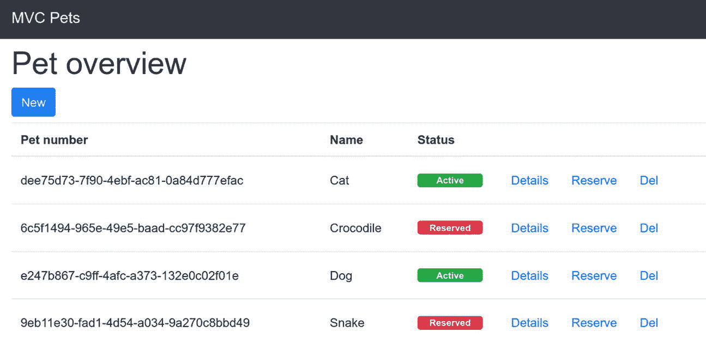
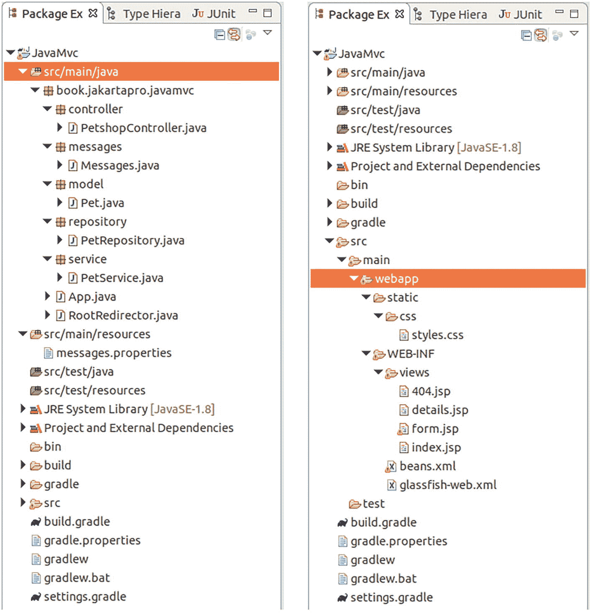

# Petshop application
page.title=MVC Pets
#Header
header.brand=MVC Pets
#Index Page
index.title=宠物概览
index.btn.new=新建
index.col.petNumber=宠物编号
index.col.name=名称
index.col.status=状态
index.badge.active=活跃
index.badge.reserved=已预约
index.btn.details=详情
index.btn.reserve=预约
index.btn.delets=删除
#Form
form.title=新建宠物
form.label.name=名称
form.label.name.placeholder=宠物名称
form.btn.save=保存
#Details
details.title=宠物详情
details.petNumber=宠物编号
details.name=名称
details.status=状态
#404
404.title=找不到宠物
```

视图页面

视图页面可能是 Java MVC 中最具挑战性的部分。原因如下：

*   你需要知道如何与控制器通信以进行导航。
*   你需要知道如何读取和写入模型数据。
*   你需要知道如何遍历集合以及如何做出决策。
*   你需要知道如何应用样式。

对于 Java MVC，你将 JSP 页面作为视图元素放置在 `src/main/webapp/WEB-INF/views` 文件夹中。这是一种约定。也可以使用 Facelets 和 XHTML 模板文件来实现此目的。但是，由于这里不应用基于组件的架构，并且某些 Facelet 结构（如表单和重复）如果在 Java MVC 上下文中使用会导致问题，因此使用 JSP 和 JSTL 是更自然的选择。

对于 Pet Shop 应用程序，你需要提供一个 `404.jsp` 文件来处理任何错误消息：

```

[ ... 见下文 ...]

${msg.get("header.brand")}

${msg.get("404.title")}
${petNumber}

```

此外，你需要一个 `index.jsp` 文件来显示宠物列表：

```

${msg.get("page.title")}

${msg.get("header.brand")}

${msg.get("index.title")}

${msg.get("index.btn.new")}

${msg.get("index.col.petNumber")}

${msg.get("index.col.name")}

${msg.get("index.col.status")}

${pet.petNumber}
${pet.name}

${msg.get("index.badge.active")}

${msg.get("index.badge.reserved")}

${msg.get("index.btn.details")}

${msg.get("index.btn.reserve")}

${msg.get("index.btn.delete")}

暂无条目

```

`details.jsp` 文件内容如下：

```

[ ... 见下文 ...]

${msg.get("header.brand")}

${msg.get("details.title")}

${msg.get("details.petNumber")}

${msg.get("details.name")}

${msg.get("details.status")}

```

最后一个文件 `form.jsp` 内容如下：

```

[ ... 见下文 ...]

${msg.get("header.brand")}

新建宠物

${msg.get("form.label.name")}

${error.getParamName()}: ${error.getMessage()}

${msg.get("form.btn.save")}

```

所有视图文件都放在 `src/main/webapp/WEB-INF/views` 目录下，并且它们都有相同的 `<head>` 部分：

```

${msg.get("page.title")}

```

（请务必删除以 `/` 结尾的行后的换行符和空格）。

视图文件有几个特点值得一提：

*   像 `${petNumber}` 这样的字符串直接引用模型值。例如，参见 `404.jsp` 文件的末尾。此模型参数通过 `models.put( "petNumber", petNumber );` 在控制器中设置。
*   像 `${msg.get("header.brand")}` 这样的字符串引用 `Messages` 类。这是因为它的 `@Named("msg")` 注解。
*   像 `${mvc.uri(’PetshopController#showIndex’)}` 这样的字符串表示导航到由调用控制器的 `showIndex()` 方法的结果所指定的页面。这在 JSR-371 规范中有描述。
*   `<head></head>` 中的 `/webjars` URL 部分来自 bootstrap 库。这不是 Java MVC 特有的，其细节由 bootstrap 文档描述。

运行 Pet Shop 应用程序
当所有文件就位（参见图 15-1）并且本地 GlassFish 服务器正在运行时，你可以通过调用 `deployWar` Gradle 任务来构建和部署项目。（在 Eclipse 中，请确保右键单击项目一次。然后选择 Gradle ➤ 刷新 Gradle 项目，任务栏-刷新任务 和 检查菜单 ➤ 在 Gradle 任务视图中显示所有任务。）


部署应用后，您可以在浏览器中访问 `http://localhost:8080/JavaMvc` 查看宠物列表。您可以查看详情、将宠物状态更改为“已预订”，以及创建新宠物。请参见图 15-2。



宠物概览窗口列出了宠物编号、名称、状态以及查看详情、预订和删除的选项。

图 15-2
宠物商店
应用



两个包资源管理器窗口显示了 Java M V C 项目，其中左侧选中了 `src/main/java`，右侧选中了 Web 应用文件。

图 15-1
宠物商店源码

第三部分 高级架构相关主题

16. 微配置文件

微服务
描述了一种架构模式，其中小型处理单元协同工作以执行应用任务。每个单元仅负责单一服务，所有单元松散耦合，并使用与计算机语言无关的协议相互通信。在 Java 世界中，微服务的规范集由 MicroProfile 规范定义，您可以通过以下链接访问：

```
https://microprofile.io/
```

广义上讲，符合 MicroProfile 5.0 规范的微服务必须能够处理：

*   **JAX-RS 3.0：** 用于 RESTful 服务
*   **Rest Client 3.0：** 用于 REST 消费者
*   **JSON-P 2.0：** 用于处理 JSON 数据
*   **JSON-B 2.0：** 用于将 JSON 绑定到 Java 对象
*   **CDI 3.0：** 用于上下文和依赖注入
*   **Jakarta Annotations 2.0：** 用于注解处理
*   **Config 3.0：** 用于配置微服务
*   **OpenAPI 3.0：** 用于以机器和人类可读格式描述服务的 REST 服务元数据
*   **Fault Tolerance 4.0：** 用于提高微服务稳定性
*   **Metrics 4.0：** 用于让微服务报告性能指标
*   **Health 4.0：** 用于让微服务报告其健康状态
*   **JWT Authentication 2.0：** 用于 JWT 认证
*   **Open Tracing 3.0：** 用于发现微服务之间的关系和通信路由

注意

最新的 MicroProfile 版本是 6.0。本书使用 5.0 版本，因为这是我们的 MicroProfile 服务器所遵循的版本。

乍一看，微服务似乎与 Jakarta EE 相矛盾，后者是一种单体架构，拥有一个承载依赖模块的中央服务器进程。问题是，当您谈论微服务时，是否意味着您正在谈论 Jakarta EE 的竞争对手？为什么我要在一本 Jakarta EE 的书中提及微服务？答案出奇地简单：您实际上可以使用内存和资源占用精简的应用服务器产品来托管单个微服务，从而构建基于 Jakarta EE 的微服务架构！一个 Jakarta EE 微服务环境由一组独立的小型服务器进程组成，每个服务器上运行的应用数量非常少。
不过，有一个重要的区别：Jakarta EE 规范集（EJB、JPA、CDI 等版本）与 MicroProfile 规范具有不同的结构。尽管您可以让 Jakarta EE 服务器遵循 MicroProfile 规范，但 Jakarta EE 并不严格符合 MicroProfile 规范。尽管如此，得益于协调这两个领域的持续努力，MicroProfile 5.0 与 Jakarta EE 9 保持一致，使得在这两种技术之间切换变得容易。
如果您想使用专为遵循 MicroProfile 规范而定制的软件，有几种服务器产品支持这两种方法，包括 Open Liberty®、Dropwizard®、Thorntail®、Kumuluz®、Payara® 和 TomEE® 等。
本章的其余部分将讨论 TomEE 的一些方面，因为它拥有商业友好的许可证（Apache 许可证），并且源自 Tomcat，而 Tomcat 是一个非常成熟的 Servlet 容器，至今已在许多项目中使用超过 20 年。TomEE 当前版本为 9.0.0，并遵循 MicroProfile 5.0。

启动一个 MicroProfile 示例项目

首先，您将使用第 2 章的 `RestDate` 项目，并为其添加 MicroProfile 功能。复制此项目并将其命名为 `RestDateMP`，或者按照该章的说明，将 `RestDate` 替换为 `RestDateMP`。项目结构应如下所示：

```
build.gradle
gradle
|__ wrapper
|__ gradle-wrapper.jar
|__ gradle-wrapper.properties
gradlew
gradlew.bat
src
|__ main
|__ java
|   |__ book
|       |__ jakartapro
|           |__ restdatemp
|               |__ RestDate.java
|__ resources
|__ webapp
|__ WEB-INF
|__ beans.xml
|__ glassfish-web.xml
|__ web.xml
```

从 Jakarta EE 中 Web 应用的标准 `build.gradle` 文件开始：

```
plugins {
id 'war'
}
sourceCompatibility = 1.17
targetCompatibility = 1.17
repositories {
jcenter()
}
dependencies {
providedCompile
'jakarta.platform:jakarta.jakartaee-api:10.0.0'
// 使用 JUnit 测试框架
testImplementation 'junit:junit:4.13.2'
}
```

对于位于 `src/main/webapp/WEB-INF` 内的部署描述符 `web.xml`，您可以编写以下内容：

```

RestDateMP

jakarta.ws.rs.core.Application

jakarta.ws.rs.core.Application

/webapi/*

```

安装 MicroProfile 服务器
从 [`http://tomee.apache.org/`](http://tomee.apache.org/) 的下载部分下载 TomEE MicroProfile 变体，即 TomEE 服务器的 9.0.0 版本。然后将归档文件解压到合适的位置。

将应用更改为微服务

为了利用 MicroProfile 提供的增强功能，您首先需要将 MicroProfile 依赖项添加到 `build.gradle` 中：

```
...
dependencies {
compileOnly 'org.apache.tomee:jakartaee-api:10.0.0'
providedCompile
'org.eclipse.microprofile:microprofile:5.0'
providedCompile
'org.eclipse.microprofile.openapi:' +
'microprofile-openapi-api:3.0'
// 使用 JUnit 测试框架
testImplementation 'junit:junit:4.13.2'
...
}
...
```

您现在可以向应用添加 MicroProfile 功能。首先，添加一些 OpenAPI 信息发射器。创建一个名为 `openapi.yaml` 的新文件，并将其添加到 `src/main/webapp/META-INF`（请确保先创建该文件夹）：


```
openapi: "3.1.0"
paths:
/d:
get:
description: 获取日期
info:
title: RestDate
description: 日期操作
license:
name: Eclipse Public License - v 1.0
url: https://www.eclipse.org/legal/epl-v10.html
version: 1.0.0
servers:
- url: http://localhost:8080/webapi
```

根据你的需求调整内容。此外，你可以向 REST 类 `RestDate.java` 添加一个 OpenAPI 注解：

```
@Path("/d")
public class RestDate {
...
@GET
@Produces("application/json")
// OpenAPI
@Operation(summary = "输出日期",
description = "此方法输出日期")
public String stdDate() {
return "{\"date\":\"" +
ZonedDateTime.now().toString() + "\"}";
}
...
}
```

OpenAPI 的功能远不止于此。详情请参阅 OpenAPI 规范。

接下来，让应用程序报告一些性能指标。这正是 Metrics 4.0 规范的内容。要使用它，请向 REST 方法添加几个注解，如下所示：

```
...
@GET
@Produces("application/json")
// MicroProfile Metrics
@Timed(name = "stdDate.timer",
absolute = true,
displayName = "stdDate 计时器",
description = "stdDate 方法耗时。")
@Counted(name = "stdDate",
absolute = true,
displayName = "stdDate 调用次数",
description = "调用 stdDate 的次数")
@Metered(name = "stdDateMeter",
displayName = "stdDate 调用频率",
description = "stdDate 的吞吐率。")
// OpenAPI
@Operation(summary = "输出日期",
description = "此方法输出日期")
public String stdDate() {
return "{\"date\":\"" +
ZonedDateTime.now().toString() + "\"}";
}
...
```

调用此方法会使服务器进程收集调用次数、耗时和吞吐量。

最后需要做的是添加健康检查。为此，你需要实现一个类，用于检查格式是否正确以及 REST 方法调用是否会导致异常。将该类命名为 `RestDateHealth`，内容如下：

```
import org.eclipse.microprofile.health.*;
@Readiness
public class RestDateHealth implements HealthCheck {
@Override
public HealthCheckResponse call() {
HealthCheckResponseBuilder bldr = HealthCheckResponse.
builder().name("RestDateHealth");
try {
String dateStr = new RestDate().stdDate();
String dayRegex = "\\d{4}-\\d{2}-\\d{2}";
String tmRegex = "\\d{2}:\\d{2}:\\d{2}\\..*";
boolean fmtOk = dateStr.matches("\\{\"date\":\"" +
dayRegex + "T" + tmRegex + "\\}");
if (fmtOk) {
return bldr.up().build();
} else {
return bldr.down().build();
}
} catch (Exception e) {
return bldr.down().withData(
"Exception", e.getMessage()).build();
}
}
}
```

由于使用了 `@Readiness` 注解，容器知道这是一个标准的健康检查。该约定还意味着该类必须实现 `HealthCheck` 接口。

要构建 Web 应用程序 WAR 归档文件，请调用 Gradle 的 `war` 任务：

```
./gradlew build war

