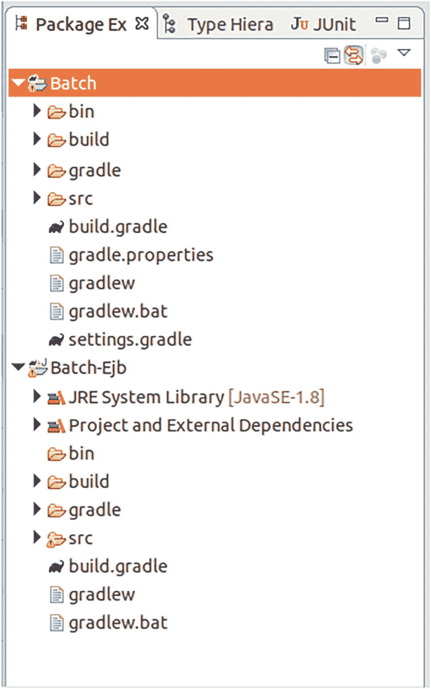

# 检查健康状态 ->
http://localhost:8080//webapi/health
```


# OpenAPI 访问 ->
http://localhost:8080//openapi
```

`<APP_NAME>`
通常是 WAR 文件的基本名称（不含后缀）。

例如，如果你想获取健康状态，请输入以下内容：

```
curl -X GET http://localhost:8080/RestDateMP/webapi/health
```

这表示你的系统上已安装 cURL。输出可能如下所示：

```
{"status":"UP","checks":[
{"name":"RestDateHealth","status":"UP"},
{"name":"started-Apache TomEE Server","status":"UP"}
]}
```

为了获取指标，请输入以下内容：

```
curl -X GET -H "Accept:application/json" \
http://localhost:8080/RestDateMP/metrics
```

输出可能如下所示：

```
{
"base":{
"gc.total;name=G1 Young Generation1":11,
"gc.total;name=G1 Old Generation1":0,
"cpu.systemLoadAverage":0.16162109375,
"thread.count":23,
"classloader.loadedClasses.count":10898,
"gc.time;name=G1 Old Generation1":0,
"gc.time;name=G1 Young Generation1":73,
"classloader.unloadedClasses.total":1,
"jvm.uptime":517914,
"thread.max.count":24,
"memory.committedHeap":201326592,
"classloader.loadedClasses.total":10899,
"cpu.availableProcessors":8,
"thread.daemon.count":20,
"memory.maxHeap":3116367872,
"memory.usedHeap":100169072
},
"vendor":{
"memoryPool.CodeHeap 'profiled nmethods'.
usage":12471168,
"memoryPool.G1 Old Gen.usage.max":28028416,
"memoryPool.CodeHeap 'profiled nmethods'.
usage.max":12473344,
"memoryPool.CodeHeap 'non-profiled nmethods'.
usage":3360256,
"memoryPool.Metaspace.usage.max":56424096,
"BufferPool_used_memory_mapped":0,
"memoryPool.CodeHeap 'non-nmethods'.usage.max":1349760,
"memoryPool.Compressed Class Space.usage":6693424,
"memoryPool.G1 Eden Space.usage.max":117440512,
"memoryPool.G1 Old Gen.usage":28028416,
"memoryPool.Compressed Class Space.usage.max":6693424,
"BufferPool_used_memory_mapped -
'non-volatile memory'":0,
"memoryPool.G1 Survivor Space.usage":5031792,
"BufferPool_used_memory_direct":90112,
"memoryPool.CodeHeap 'non-nmethods'.usage":1292800,
"memoryPool.Metaspace.usage":56425592,
"memoryPool.CodeHeap 'non-profiled nmethods'.
usage.max":3360256,
"memoryPool.G1 Survivor Space.usage.max":8515800,
"memoryPool.G1 Eden Space.usage":67108864
},
"application":{
"stdDate":4,
"stdDate.timer":{
"p99":1328098.0,
"min":127278.0,
"max":1328098.0,
"mean":423930.5193750406,
"p50":143888.0,
"p999":1328098.0,
"stddev":502888.22249255574,
"p95":1328098.0,
"p98":1328098.0,
"p75":162595.0,
"fiveMinRate":0.013113559807197639,
"fifteenMinRate":0.004419844282431078,
"meanRate":0.007779616975224711,
"count":4,
"oneMinRate":0.06140731004375435,
"elapsedTime":1761859.0
},
"book.jakartapro.restdatemp.RestDate.stdDateMeter":{
"fiveMinRate":0.013113559807197639,
"fifteenMinRate":0.004419844282431078,
"meanRate":0.007779591604845184,
"count":4,
"oneMinRate":0.06140731004375435
}
}
```

为了获取 OpenAPI 数据，请输入以下内容：

```
curl -X GET -H "Accept:application/json" \
http://localhost:8080/RestDateMP/openapi
```

这将产生类似如下的输出：

```
{
"openapi" : "3.1.0",
"info" : {
"title" : "RestDate",
"description" : "日期操作",
"license" : {
"name" : "Eclipse Public License - v 1.0",
"url" : "https://www.eclipse.org/legal/epl-v10.html"
},
"version" : "1.0.0"
},
"servers" : [ {
"url" : "http://localhost:8080/webapi"
} ],
"paths" : {
"/d" : {
"get" : {
"summary" : "输出日期",
"description" : "此方法输出日期",
"responses" : {
"200" : {
"description" : "OK",
"content" : {
"application/json" : {
"schema" : {
"type" : "string"
}
}
}
}
}
}
}
}
```

更多信息，请阅读 [`https://download.eclipse.org/microprofile/`](https://download.eclipse.org/microprofile/) 上的规范。

17. 自定义 CDI

CDI（上下文和依赖注入）可用于获取会话或请求上下文、为 EL（表达式语言）使用注入 bean、在 JPA 上下文中检索实体管理器等。它们这样做是为了让类能够无缝地与 Jakarta EE 提供的容器进行交互。
然而，CDI 还有另一个经常被介绍、教程和博客文章忽略的方面：你可以让 CDI 构建应用程序内部的对象图，甚至使用你自己的上下文、生产者、拦截器、装饰器、原型和 CDI 风格的事件。

CDI 规范

Jakarta EE 10 包含 CDI 技术，版本 4.0。规范文档位于

```
https://jakarta.ee/specifications/cdi/4.0
```

本章讨论 CDI 在应用程序内部使用的一些有趣方面。更多信息和在线资源，如参考实现的文档，Weld 可以为你提供帮助。请访问：

```
http://weld.cdi-spec.org/documentation/
```

构建对象图

使用普通的 Java SE，构建对象图的*编程模型*包括显式的关联和类的实例化：

```
public class Address {
private String country;
private String state;
private String city;
private String street;
private String number;
private String zip;
// getters and setters...
}
public class Person {
private String firstName;
private String lastName;
private char gender;
private String ssn;
private LocalDate birthday;
private Address address;
// getters and setters...
}
public class Invoice {
private Person buyer;
private LocalDateTime time;
private List entries = new ArrayList();
// getters and setters...
}
...
Person buyer = new Buyer();
buyer.setFirstName("Peter");
// Set other Buyer fields...
Invoice inv = new Invoice();
inv.setBuyer(buyer);
inv.setTime(LocalDateTime.now());
// Set other Invoice fields...
```

此代码片段最后几行显示的实例化和装配工作会进入你代码中的某个合适方法。

注意

这些类都需要有自己的 Java 文件。为简单起见，本章其余部分将省略此说明。

使用 CDI，你仍然声明关联，但让 CDI 引擎实例化对象并将它们分配给字段：

```
public class Address {
private String country;
private String state;
private String city;
private String street;
private String number;
private String zip;
// getters and setters...
}
public class Person {
private String firstName;
private String lastName;
private char gender;
private String ssn;
private LocalDate birthday;
@Inject private Address address;
// getters and setters...
}
public class Invoice {
@Inject private Person buyer;
private LocalDateTime time;
private List entries = new ArrayList();
// getters and setters...
}
...
// Somewhere, as a class member:
@Inject Invoice inv;
```

由于 `@Inject`，你知道由 CDI 创建的 `Invoice` 对象*确实*在 `buyer` 字段中有一个 `Person` 实例（不要使用 `new`！），并且 `buyer`*确实*在 `address` 字段中有一个 `Address` 实例（同样，你不需要手动使用 `new` 来实例化 `Address` 实例）。

非 CDI 代码和 CDI 代码之间最显著的概念性区别是对象图的引导方式。使用非 CDI，你在某个合适的方法内完成所有操作，但在使用 CDI 时，你可以*在本身受 CDI 管理的类内部*直接使用注入的字段 `@Inject Invoice inv;`。这在 Faces bean 类、REST 端点类或 EJB 中很容易实现：

```
// Faces: -------------------------------------
@ManagedBean
@SessionScoped
public class SomeJsfBean {
@Inject Invoice inv;
...
}
// REST endpoint: -----------------------------
@Path("/invoice")
public class RestInvoice {
@Inject Invoice inv;
@GET
@Path("show")
@Produces("application/json")
public String show() {
return "{ ... }";
}
}
// EJB: ---------------------------------------
@Stateful
public class InvoiceBean {
@Inject Invoice inv;
...
}
```

顺便说一下，也可以将实例注入到构造函数和 setter 中：

```
public class SomeClass {
@Inject
public SomeClass(Invoice inv) {
...
}
...
}
public class SomeClass {
...
@Inject
public setInvoice(Invoice inv) {
...
}
...
}
```

重要的是要理解，在你的代码中，即使使用了构造函数或 setter 注入，你仍然不会显式地使用这些构造函数或 setter！

如果你需要以编程方式获取 CDI bean 类的实例，可以编写以下代码：

```
import jakarta.enterprise.inject.se.SeContainer;
import jakarta.enterprise.inject.se.SeContainerInitializer;
...
SeContainerInitializer containerInit =
SeContainerInitializer.newInstance();
SeContainer container = containerInit.initialize();
Invoice proc = container.select(Invoice.class).get();
...
// Just for debugging / inspection, list all CDI beans
container.getBeanManager().getBeans(Object.class).
forEach(b -> {
System.out.println(b);
});
...
container.close();
```

这也是你在非 Jakarta EE 环境或精心设计的单元测试中使用 CDI 的方式。

限定符

CDI 也可用于自动获取接口的实现。考虑以下示例：

```
public interface Audit {
...
}
public class BasicAudit implements Audit {
...
}
public class SomeBean {
@Inject Audit audit;
}
```

CDI 看到 `BasicAudit` 是 `Audit` 接口的唯一实现，并将 `BasicAudit` 的实例注入到该字段中。

但是，如果你有两个实现，例如以下设置：

```
public interface Audit {
...
}
public class BasicAudit implements Audit {
...
}
public class ComplexAudit implements Audit {
...
}
public class SomeBean {
@Inject Audit audit;
}
```

CDI 现在将抛出一个异常，指出它无法解析歧义依赖关系。

解决此问题的一种方法是使用限定符标记不同的实现：

```
public interface Audit {
...
}
// ------------------------------------------------
import java.lang.annotation.Retention;
import java.lang.annotation.Target;
import static java.lang.annotation.RetentionPolicy.*;
import static java.lang.annotation.ElementType.*;
import jakarta.inject.Qualifier;
@Qualifier
@Retention(RUNTIME)
@Target({TYPE, METHOD, FIELD, PARAMETER})
public @interface Basic {}
// ------------------------------------------------
import java.lang.annotation.Retention;
import java.lang.annotation.Target;
import static java.lang.annotation.RetentionPolicy.*;
import static java.lang.annotation.ElementType.*;
import jakarta.inject.Qualifier;
@Qualifier
@Retention(RUNTIME)
@Target({TYPE, METHOD, FIELD, PARAMETER})
public @interface Complex {}
// ------------------------------------------------
@Basic
public class BasicAudit implements Audit {
...
}
// ------------------------------------------------
@Complex
public class ComplexAudit implements Audit {
...
}
// ------------------------------------------------
public class SomeBean {
@Inject @Complex Audit audit;
// or: @Inject @Basic Audit audit;
}
```

这样的注解被称为*限定符注解*。由于 `@Inject` 旁边的 `@Complex`（或 `@Basic`），CDI 现在知道要采用哪个实现。

注意

如果你没有显式声明限定符，CDI 会自动将 `@Default` 限定符应用于注入。你可以通过指定 `@Any` 来抑制此自动分配，`@Any` 表示“无限定符”。

备选方案

为了避免歧义依赖关系，你也可以将所有实现（除了一个）标记为 `@Alternative`：

```
public interface Audit {
...
}
// ------------------------------------------------
@Default
public class BasicAudit implements Audit {
...
}
// ------------------------------------------------
@Alternative
public class ComplexAudit implements Audit {
...
}
// ------------------------------------------------
public class SomeBean {
@Inject Audit audit;
}
```

仅当你在 `WEB-INF/beans.xml`（如果在 Jakarta EE 之外，则为 `META-INF/beans.xml`）中指定时，CDI 才会选择备选实现：

```

book.jakartapro.cdi.audit.ComplexAudit

```

或者，你可以避免向 `beans.xml` 写入内容，而是向备选实现添加 `@Priority`：

```
public interface Audit {
...
}
// ------------------------------------------------
@Priority(100) @Alternative
public class BasicAudit implements Audit {
...
}
// ------------------------------------------------
@Priority(101) @Alternative
public class ComplexAudit implements Audit {
...
}
// ------------------------------------------------
public class SomeBean {
@Inject Audit audit;
}
```

具有最高 `@Priority` 值的实现获胜。你可以看到，当使用 `@Priority` 消歧时，示例移除了 `@Default` 限定符，因为默认值不对应于可计算的优先级。

生产者

如果你需要对 CDI 实例化类的方式进行更多控制，或者需要以编程方式决定为注入目的需要哪个接口的实现，你可以提供一个*生产者方法*来创建 CDI bean：

```
public interface Audit {
...
}
// ------------------------------------------------
@Vetoed
public class BasicAudit implements Audit {
...
}
// ------------------------------------------------
@Vetoed
public class ComplexAudit implements Audit {
...
}
// ------------------------------------------------
@ApplicationScoped
public class AuditProducer {
@Produces
public Audit produce() {
Audit res = null;
if(...) { // make a decision
res = new BasicAudit();
} else {
res = new ComplexAudit();
}
return res;
}
}
// ------------------------------------------------
public class SomeBean {
@Inject Audit audit;
}
```

这个例子必须向实现添加 `@Vetoed`，否则 CDI 看到的实现会在依赖关系解析过程中与生产者竞争，产生歧义异常。此外，生产者类可以有任意名称，但由于它本身是一个 CDI bean 并由 CDI 实例化，你需要向该类添加 `@ApplicationScope`，这意味着整个应用程序最多只能获得该类的一个实例。作用域将在下一节中详细讨论。

生产者方法可以具有注入的参数，这可能有助于生产者方法正确地完成其工作：

```
@Produces
public Audit produce(SomeBean b1,
SomeOtherBean b2, ...) {
...
}
```

生产者方法可以像实现一样分配限定符：

```
@ApplicationScoped
public class AuditProducer {
@Produces @SomeQualifier
public Audit produce() {
...
}
@Produces @SomeOtherQualifier
public Audit produce() {
...
}
}
// ------------------------------------------------
public class SomeBean {
@Inject @SomeQualifier Audit audit1;
@Inject @SomeOtherQualifier Audit audit2;
}
```

限定符注解的声明方式必须与实现限定符所述的方式完全相同。

作用域

作用域决定了 CDI 创建的 bean 的生命周期。在 Jakarta EE 环境中，你了解了几种作用域：

*   `@ApplicationScoped`：
    该作用域中的任何 bean 在应用程序的生命周期内仅实例化一次。同一应用程序的所有注入 bean 都引用同一个实例。

*   `@SessionScoped`：
    该作用域中的任何 bean 在用户会话处于活动状态时仅实例化一次。同一用户会话中发生的任何注入都引用同一个实例。

*   `@RequestScoped`：
    同一类型的所有请求作用域 bean 在请求期间引用同一个实例。

*   `@ConversationScoped`：
    与会话作用域类似，但绑定到会话内的用户活动，并由 Web 应用程序显式控制。

如果 bean 没有显式声明作用域，它们将自动在 `@Dependent` 作用域内运行，这意味着它们的生命周期绑定到它们被注入的对象。`Dependent` 作用域被称为*伪作用域*，因为它是派生的。存在第二个名为 `Singleton` 的伪作用域，它确保在 JVM 基础上只存在一个 bean 实例。

你需要在类型级别或生产者方法级别添加作用域声明：

```
@ApplicationScope
public class SomeBean {
...
}
// ------------------------------------------------
public class SomeBean {
@Produces @ApplicationScoped
public SomeOtherBean produce() {
...
}
}
```

如果你只使用应用程序内部 CDI，或者在 Jakarta EE 应用程序之外运行，则只有 `@ApplicationScope`、`@Dependent` 和 `Singleton` 作用域起作用。

如果你需要挂钩到 CDI bean 的构造或销毁，或用于调试目的，你可以使用 `@PostConstruct` 和 `@PreDestroy` 注解：

```
public class SomeBean {
...
@PostConstruct
public void postContruct() {
System.out.println("POST-CONSTRUCT");
}
@PreDestroy
public void preDestroy() {
System.out.println("PRE-DESTROY");
}
}
```

拦截器
拦截器用于向 CDI bean 的方法调用添加横切关注点。这意味着你可以使用它们向 bean 类添加日志记录、审计、性能测量和其他非功能性代码。
CDI 拦截器将在本书后面的第 18 章中介绍。

装饰器
装饰器与拦截器类似，因为它们都以某种方式扩展现有代码。但与拦截器相反，它们实际上会改变类的功能，因此你可以将它们用于热修复或临时功能更改之类的事情。

CDI bean 类可被装饰的唯一要求是它必须有一个接口。例如，考虑 `Processor` 接口和 `ProcessorImpl` 实现：

```
public interface Processor {
void process(Invoice inv);
}
// --------------------------------------------
public class ProcessorImpl implements Processor {
public void process(Invoice inv) {
// some code...
}
}
```

要装饰处理器，你所要做的就是编写一个装饰器类，如下所示：

```
@Decorator
public class ProcessorImplNew implements Processor {
@Inject @Delegate private ProcessorImpl old;
public void process(Invoice inv) {
// some other code...
}
}
```

然后在 `WEB-INF/beans.xml`（如果你在 Jakarta EE 之外，则为 `META-INF/beans.xml`）中声明装饰器：

```
...

book.jakartapro.cdi.decorate.ProcessorImplNew

```

在装饰器类中，你可以添加一个用 `@Inject @Delegate` 注解的字段。这意味着你可以访问原始实现，因此你可以将其用于装饰器代码。

18. 拦截器

拦截器是挂钩到方法调用或生命周期事件的方法或类。你通常会将它们用于横切关注点，例如日志记录、审计、性能测量或应用程序的任何其他非功能性方面。非功能性意味着应用程序的程序和数据流不会受到干扰，因此无论是否使用拦截器，软件功能都保持不变。
拦截目标——即被拦截的类——可以是会话 bean、消息驱动 bean 和 CDI 管理的 bean。此外，拦截目标也可以是 JPA 生命周期监听器、Servlet 和 Faces 阶段监听器。后者通常不被称为拦截器，而更常被称为监听器，但这并不妨碍它们可以像拦截器一样使用。
对于 Jakarta EE 10，拦截器（不是 JPA、Servlet 和 Faces 生命周期监听器）由 Interceptors 2.1 规范描述。

CDI 拦截器
CDI 拦截器用于向 CDI bean 的方法调用添加横切关注点。你可以将 CDI 拦截器应用于 CDI 管理范围内的*任何*类。这包括会话 EJB、消息驱动 bean 以及用于 Faces 和 Servlet 的 bean。

要开始拦截，你首先声明一个新的注解，如下面的代码片段所示：

```
import java.lang.annotation.Retention;
import java.lang.annotation.Target;
import static java.lang.annotation.RetentionPolicy.*;
import static java.lang.annotation.ElementType.*;
import jakarta.interceptor.InterceptorBinding;
@InterceptorBinding
@Retention(RUNTIME)
@Target({TYPE, METHOD, FIELD})
public @interface TracingInterceptor { }
```

名称由你决定。这个例子暗示你想以某种方式跟踪程序流程。

拦截器实现只需要添加 `@Interceptor` 注解和你刚刚定义的新注解：

```
import jakarta.interceptor.*;
import jakarta.annotation.PostConstruct;
import jakarta.annotation.PreDestroy;
@Interceptor
@TracingInterceptor
public class TracingInterceptorSys {
@AroundInvoke
public Object logMethodEntry(InvocationContext ctx)
throws Exception {
System.out.println("Before entering method: " +
ctx.getMethod().getName());
// We call the next interceptor in the
// interceptor chain.
return ctx.proceed();
}
@AroundConstruct
public void aroundConstruct(InvocationContext ctx) {
...
ctx.proceed();
}
/*or*/
@AroundConstruct
public Object aroundConstruct(InvocationContext ctx)
throws Exception {
...
return ctx.proceed();
}
@AroundTimeout
public Object aroundTimeout(InvocationContext ctx)
throws Exception {
...
return ctx.proceed();
}
@PostConstruct
public void postConstruct(InvocationContext ctx) {
...
ctx.proceed();
}
@PreDestroy
public void preDestroy(InvocationContext ctx) {
...
ctx.proceed();
}
}
```

这些注解可以自由混合。你不必全部使用它们。

为了激活拦截器，需要将其添加到 `WEB-INF/beans.xml` 文件（如果在 Jakarta EE 之外，则为 `META-INF/beans.xml`）：

```
...

book.jakartapro.cdi.intercept.TracingInterceptorSys

```

要将拦截器应用于 CDI bean，你必须将拦截器注解添加到类或方法调用级别：

```
@TracingInterceptor
public class SomeBean {
...
}
// --------------------------------------------
public class SomeBean {
...
@TracingInterceptor
public void someMethod() {
...
}
}
```

注意

这是 CDI 拦截的缺点之一。客户端（要被拦截的类）必须显式地进行注解，这在某种程度上违背了 CDI 拦截的非功能性本质。类代码的读者会想知道这个注解是关于什么的，并且可能会觉得有必要研究非功能性代码。此外，在开发阶段之后的项目中，不可能在不触及代码的情况下添加拦截器。为了避免这种情况，你必须使用其他技术，例如 AOP（面向方面编程）中的运行时织入。

可以避免创建自定义拦截器注解。尽管像前面代码中的 `@TracingInterceptor` 这样的自定义注解提高了代码的灵活性和表现力，从而提高了可读性，但你可以省略该注解并直接编写以下内容：

```
import jakarta.interceptor.AroundInvoke;
import jakarta.interceptor.Interceptor;
import jakarta.interceptor.InvocationContext;
@Interceptor
public class TracingInterceptorSys {
@AroundInvoke
public Object logMethodEntry(InvocationContext ctx)
throws Exception {
System.out.println("Before entering method: " +
ctx.getMethod().getName());
return ctx.proceed();
}
}
// --------------------------------------------
@Interceptors({TracingInterceptorSys.class})
public class SomeBean {
...
}
```

JPA 生命周期监听器
你有几个选项来拦截 JPA 生命周期活动。
你可以做的第一件事是向 JPA 实体类（用 `@Entity` 标记）添加用 `@PrePersist`、`@PostPersist`、`@PostLoad`、`@PreUpdate`、`@PostUpdate`、`@PreRemove` 和 `@PostRemove` 注解的方法。这些方法可以有任意名称，但它们必须具有零大小的参数列表，并且必须返回 `void`。

其次，你可以创建一个特殊的监听器类，并使用特殊的注解将其分配给 JPA：

```
public class MyListener {
@PrePersist void onPrePersist(Object o) { ... }
@PostPersist void onPostPersist(Object o) { ... }
@PostLoad void onPostLoad(Object o) { ... }
@PreUpdate void onPreUpdate(Object o) { ... }
@PostUpdate void onPostUpdate(Object o) { ... }
@PreRemove void onPreRemove(Object o) { ... }
@PostRemove void onPostRemove(Object o) { ... }
}
...
@Entity @EntityListeners({MyListener.class})
public class TheJpa { ... }
```

作为参数传递的对象是 JPA 实体类实例。此外，你可以将这样的监听器类添加到*所有* JPA 实体 bean。为此，打开或创建一个 `src/main/resources/META-INF/orm.xml` 文件并添加以下内容：

这样的监听器通常被称为*默认实体监听器*。

Servlet 监听器

为了监听 Servlet 生命周期事件，你创建一个类如下：

```
@WebListener()
public class SimpleServletListener implements ... {
... implementation ...
}
```

并扩展以下一个或多个接口

```
jakarta.servlet.ServletContextListener
jakarta.servlet.ServletContextAttributeListener
jakarta.servlet.ServletRequestListener
jakarta.servlet.ServletRequestAttributeListener
jakarta.servlet.http.HttpSessionListener
jakarta.servlet.http.HttpSessionAttributeListener
```

这些监听器在 Servlet 的生命周期内监听以下事件：

*   `HttpSessionListener`：
    监听 HTTP 会话（用户会话）被初始化或销毁。这是一个很好的审计挂钩。

*   `ServletContextListener`：
    监听 Servlet 上下文被初始化或销毁。你可以使用它来响应刚刚启动的 Web 应用程序。

*   `ServletRequestListener`：
    告知请求被初始化或销毁。

*   `HttpSessionAttributeListener`：
    监听会话属性被添加、移除或更改。

*   `ServletContextAttributeListener`：
    监听上下文属性被添加、移除或更改。

*   `ServletRequestAttributeListener`：
    监听请求属性被添加、移除或更改。

Faces 阶段监听器

要添加一个阶段监听器来监控各种 Faces 阶段，你需要向 `src/main/webapp/WEB-INF/faces-config.xml` 添加一个监听器类声明：

```

the.pac.kage.MyPhaseListener

... more phase listeners ...

...

```

（确保 `jakartaee/` 之后没有换行符或空格。）

然后，实现指示它感兴趣的阶段，并呈现在该阶段之前和之后执行的方法：

```
package the.pac.kage;
...
public class MyPhaseListener implements PhaseListener {
private static final long serialVersionUID =
-7607159318721947672L;
// The phase where the listener is going to be called
private PhaseId phaseId = PhaseId.RENDER_RESPONSE;
public void beforePhase(PhaseEvent event) {
...
}
public void afterPhase(PhaseEvent event) {
...
}
public PhaseId getPhaseId() {
return phaseId;
}
}
```

允许的 `PhaseId` 值包括以下内容：

1.  `ANY_PHASE`
    用于所有阶段。

2.  `RESTORE_VIEW`
    用于*恢复视图*阶段。这是第一阶段，在此阶段构建内存中的视图表示。

3.  `APPLY_REQUEST_VALUES`
    用于*应用请求值*阶段。这是第二阶段，在此阶段读取输入字段值。

4.  `PROCESS_VALIDATIONS`
    用于验证处理阶段。

5.  `UPDATE_MODEL_VALUES`
    用于第四阶段，在此阶段更新模型。

6.  `INVOKE_APPLICATION`
    用于第五阶段，在此阶段调用应用程序，例如，找出接下来要加载哪个页面。

7.  `RENDER_RESPONSE` 用于最后一个阶段，在此阶段创建响应。

19. Bean 验证

如果在像这样的 JPA 实体 bean 中

```
@Entity
public class Customer {
private String name;
public String getName () {
return name;
}
public void setName (String name) {
this.name = name;
}
...
}
```

你添加一个非空检查，如下所示

```
...
public void setName (String name) {
if(name == null)
throw new IllegalArgumentException(
"Name must not be null);
this.name = name;
}
...
```

你可能会想用一种标准的、更短的方式来声明这样的约束。
*Bean 验证*，由 JSR 380 管理，正是解决这个问题的答案。使用 bean 验证，你可以简单地这样写

```
...
@NotNull
private String name;
public String getName () {
return name;
}
public void setName (String name) {
this.name = name;
}
...
```

Jakarta EE 10 中的 bean 验证版本是 3.0，你可以在以下位置查看其规范

```
https://jakarta.ee/specifications/bean-validation/3.0/
jakarta-bean-validation-spec-3.0.html
```

还有更多的 bean 验证约束。本章只讨论它们的一些使用场景。

在哪里使用 Bean 验证

Bean 验证发生在 Jakarta EE 10 中的合适位置。仅仅向你的类添加一个约束注解并不足以使 bean 验证生效。框架还必须拥有该类的管理权，以便检查约束。更准确地说，bean 验证在以下位置生效：

*   实体 bean (JPA)

*   CDI bean

*   Faces（在 EL 构造中使用的 bean，例如在用户输入获取期间）

*   JAX-RS（RESTful 服务）

如何添加约束

约束可以按如下方式添加到字段：

```
class Person {
@NotNull @Size(max=30)
private String name;
}
```

它们可以按如下方式添加到构造函数和方法参数：

```
class Person {
public Person(@NotNull @Size(max=30) String name) {
...
}
...
public void setEmail(@Email email) {
...
}
}
```

并且它们可以按如下方式添加到方法返回值：

```
class Person {
...
@NotNull @Size(max=30)
public String getCountry() {
...
}
}
```

内置约束

所有内置约束都位于 `jakarta.validation.constraints` 包中。列表如下：

*   `@NotNull`：被注解的元素不能为 `null`。

*   `@Null`：
    被注解的元素必须为 `null`。

*   `@AssertTrue`：
    被注解的元素必须为布尔值 `true`。

*   `@AssertFalse`：
    被注解的元素必须为布尔值 `false`。

*   `@Min`：
    被注解的元素必须是一个大于或等于某个值的数值。由于可能存在舍入误差，不支持 `float` 和 `double` 类型。示例：`@Min(37)`

*   `@DecimalMin`：
    被注解的元素必须是一个大于或等于由字符串指定的某个值的数值。由于可能存在舍入误差，不支持 `float` 和 `double` 类型。可选的 `inclusive` 参数指定指定的值是否包含在内（默认为 `true`）。`null` 值被认为是有效的，因此你必须添加 `NotNull` 来禁止 `null`。示例：
    `@DecimalMin("37.4")`、
    `@DecimalMin(value="37.4", inclusive=false)`

*   `@Max`：
    被注解的元素必须是一个小于或等于某个值的数值。由于可能存在舍入误差，不支持 `float` 和 `double` 类型。示例：`@Max(42)`

*   `@DecimalMax`：
    被注解的元素必须是一个小于或等于由字符串指定的某个值的数值。由于可能存在舍入误差，不支持 `float` 和 `double` 类型。可选的 `inclusive` 参数指定指定的值是否包含在内（默认为 `true`）。`null` 值被认为是有效的，因此你必须添加 `NotNull` 来禁止 `null`。示例：
    `@DecimalMax("42.0")`、
    `@DecimalMax(value="42.0", inclusive=false)`

*   `@Negative`：与 `@Max(0)` 相同，但不包含等于，并且允许 `float` 和 `double`。

*   `@Positive`：与 `@Min(0)` 相同，但不包含等于，并且允许 `float` 和 `double`。

*   `@NegativeOrZero`：与 `Negative` 相同，但包含 `0.0`。

*   `@PositiveOrZero`：与 `Positive` 相同，但包含 `0.0`。

*   `@Size`：
    字符串、集合、映射或数组的大小必须在指定的参数之间。可选参数包括 `min`（默认为 `0`）和 `max`（默认为 `Integer.MAX_VALUE`）。
    示例：`@Size( min = 5 )`，`@Size( min = 10, max = 15 )`

*   `@NotEmpty`：与 `@Size(min=1)` 相同。

*   `@NotBlank`：与 `@Size(min=1)` 相同，仅适用于字符串。

*   `@Digits`：
    限制整数和小数位数。参数包括 `integer`（最大整数位数）和 `fraction`（最大小数位数）。

*   `@Email`：
    检查字符串是否表示有效的电子邮件地址。可选的附加参数包括 `regexp` 和 `flags`；参见 `@Pattern`。

*   `@Pattern`：被注解的元素必须匹配指定的模式。参数是 `regexp`（正则表达式）和 `flags`（`Pattern.Flag` 值的数组，用于正则表达式标志）。示例：`@Pattern(regexp = "\\d6")`（六位数字），`@Pattern(regexp = "[ABCD]5", flags = Pattern.Flag.CASE_INSENSITIVE )`（五个来自 A 到 D，不区分大小写）。

*   `@Past`：
    被注解的元素必须表示过去的日期和时间。支持的类型是 `Date`、`Calendar` 等（参见规范）。

*   `@PastOrPresent`：与 `@Past` 相同，但包含现在。

*   `@Future`：
    被注解的元素必须表示未来的日期和时间。支持的类型是 `Date`、`Calendar` 等（参见规范）。

*   `@FutureOrPresent`：
    与 `@Future` 相同，但包含现在。

根据经验，如果你想禁止 `null` 值，请始终添加 `@NotNull`，因为大多数约束都将 `null` 视为肯定有效的值。

自定义约束
内置约束涵盖了广泛的验证场景。
如果你仍然想创建自己的约束，你必须声明相应的注解并提供实现。
例如，你可以创建一个名为 `PZN8` 的约束，它表示德国药品的条形码。它由一个 `-` 符号、加上七到八位数字以及末尾的一位校验位组成。出于技术原因，此字符串由两个星号 (`*`) 包围。你需要将校验位包含在验证过程中，因此这是一个必须使用自定义验证器的情况。

验证注解代码如下：

```
package book.jakartapro.restdate;
import static java.lang.annotation.ElementType.*;
import static java.lang.annotation.RetentionPolicy.RUNTIME;
import java.lang.annotation.*;
import jakarta.validation.Constraint;
import jakarta.validation.Payload;
@Target({ METHOD, FIELD, ANNOTATION_TYPE,
CONSTRUCTOR, PARAMETER, TYPE_USE })
@Retention(RUNTIME)
@Documented
@Constraint(validatedBy = { Pzn8Validator.class })
public @interface PZN8 {
String message() default "Not a PZN-8";
Class[] groups() default { };
Class[] payload() default { };
boolean includeDelimiters() default false;
}
```

对于名为 `Pzn8Validator` 的实现类，你必须实现 `ConstraintValidator` 接口。在其 `isValid()` 方法中，你获取输入字符串，可能检查并去除周围的星号，检查长度，检查并去除前导的 `-`，检查所有数字是否都是数字，然后执行校验位测试：

```
import jakarta.validation.ConstraintValidator;
import jakarta.validation.ConstraintValidatorContext;
public class Pzn8Validator implements
ConstraintValidator {
protected boolean delimitersIncluded;
@Override
public void initialize(PZN8 pzn8) {
this.delimitersIncluded = pzn8.includeDelimiters();
}
@Override
public boolean isValid(String str,
ConstraintValidatorContext ctx) {
// null values are valid
if ( str == null )
return true;
String str2 = str;
if(delimitersIncluded) {
if(str.length()  9)
return false;
if(str2.charAt(0) != '-') return false;
str2 = str2.substring(1);
char checkDigit = str2.charAt(str2.length() - 1);
str2 = str2.substring(0, str2.length() - 1);
if(!str2.matches("\\d*")) return false;
// the check digit algorithm for PZNs
int p = 2;
int s = 0;
for(int i=0;i<str2.length();i++) {
s += p * (str2.charAt(i) - '0');
p++;
}
int x = s % 11;
return (checkDigit - '0') == x;
}
}
```

你现在可以将自定义 bean 验证器添加到任何方法、构造函数、字段或方法参数。例如，在 REST 控制器内部，你可以编写如下内容：

```
@Path("registerPzn/{pzn}")
@POST
@Produces("application/json")
public Response registerPzn(
@PathParam("pzn")
@PZN8 @NotNull String pzn
)
{
... maybe save in database ...
return Response.status(200)...; // some OK message
}
```

Bean 验证异常
当验证失败时，Bean 验证会发出 `jakarta.validation.ValidationException` 或其子类之一。Bean 验证规范不包含任何信息，因为处理此消息是客户端代码的事务。

在使用 Jax-RS 的 RESTful 应用程序中，例如，你可以添加一个 `ExceptionMapper`（位于 `jakarta.ws.rs.ext` 包中）：

```
import java.util.HashMap;
import java.util.Map;
import jakarta.validation.ConstraintViolation;
import jakarta.validation.ConstraintViolationException;
import jakarta.ws.rs.core.Response;
import jakarta.ws.rs.core.Response.Status;
import jakarta.ws.rs.ext.ExceptionMapper;
import jakarta.ws.rs.ext.Provider;
@Provider
public class ValidationExceptionMapper
implements
ExceptionMapper {
@Override
public Response toResponse(
ConstraintViolationException ex) {
Map errors =
new HashMap();
for(ConstraintViolation viol :
ex.getConstraintViolations()) {
errors.put(viol.getMessage(),
viol.getInvalidValue().toString());
}
return Response.status(
Status.PRECONDITION_FAILED).
entity(errors).build();
}
}
```

请注意，`ConstraintViolationException` 是 `jakarta.validation.ValidationException` 的子类。

20. Jakarta EE 并发

Java 企业应用程序中的并发不能像在 Java SE 中那样实现，在 Java SE 中，你可以使用 `java.util.concurrent` 包中的类以及 `Thread` 类及其附属类。这种差异的原因在于，容器上下文数据不会自动传播到手动创建的线程，这经常导致容器提供的资源出现问题。在 Jakarta EE 的前身 JEE 中，使用线程在版本 8 之前已被弃用，开发人员曾经滥用 JMS 进行多线程处理，这导致了并发管理的大量开销和糟糕的可扩展性。
幸运的是，从 JEE 7 版本以及当然 Jakarta EE 8 及更高版本开始，情况发生了变化，并添加了专门的企业并发 API。本章介绍使用此 API 的 Jakarta EE 并发。

准备 Jakarta EE 服务器
Jakarta EE 中的并发服务是由服务器提供和管理的服务，因此需要使用服务器管理工具进行配置。对于你的服务器产品，你必须查阅手册以了解如何执行此操作。

对于 GlassFish，
请进入 Web 管理控制台 `http://localhost:4848`，然后选择资源 ➤ 并发资源。你将看到以下对象：

*   **ContextService**：此服务负责将上下文传播到由其他服务创建的线程。你通常不必更改此服务或创建更多此类型的服务。在大多数情况下，预配置的默认上下文服务就足够了。此服务类型的实例属于 `jakarta.enterprise.concurrent.ContextService` 类。

*   **Managed Executor Services：** 当你在 Jakarta EE 中需要并发时，最常使用此服务类型。预配置的默认托管执行器服务称为 `defaultManagedExecutorService`，可以作为一个起点，根据情况，你的应用程序可能对此感到满意。你需要在你的应用程序中使用它的*逻辑 JNDI 名称*（`java:comp/DefaultManagedExecutorService`）。此服务类型的实例属于 `jakarta.enterprise.concurrent.ManagedExecutorService` 类。

*   **Managed Scheduled Executor Services：** 与上述相同，但用于计划任务执行。*逻辑 JNDI 名称*是 `java:comp/DefaultManagedScheduledExecutorService`，类名是 `jakarta.enterprise.concurrent.ManagedScheduledExecutorService`。

*   **Managed Thread Factory：** 此服务类型用于创建具有传播的容器上下文的线程。与其他服务相比，这更底层。如果你想在应用程序中使用 Java SE 并发工具，则需要它。GlassFish 提供了一个预配置的托管线程工厂，其逻辑 JNDI 名称为 `java:comp/DefaultManagedThreadFactory`。

使用 ManagedExecutorService

如果你需要在 Jakarta EE 应用程序中使用高级并发，托管执行器服务将是你的入口点。有两种方法可以获取此服务。更简洁的方法是通过以下方式注入它

```
@Resource(name="java:comp/DefaultManagedExecutorService")
private ManagedExecutorService execService;
```

其中资源 JNDI 名称取决于服务器产品；显示的名称对应于 GlassFish 的默认和预配置服务。

获取托管执行器服务的第二种方法包括 JNDI 查找：

```
ManagedExecutorService execService =
InitialContext.
doLookup("java:comp/DefaultManagedExecutorService");
```

从这里，你可以注册要在后台执行的 `Runnable` 或 `Callable` 任务：

```
Future f1 = execService.submit( () -> {
// not returning anything, corresponds
// to a Runnable
...
}
);
Future f2 = execService.submit( () -> {
// not returning anything, corresponds
// to a Runnable
...
}, 42 /* calculated outside the task */
);
Future f3 = execService.submit( () -> {
// returning something, corresponds
// to a Callable
...
return 42;
}
);
```

甚至可以创建它们的列表：

```
List> retrieverTasks =
new ArrayList>();
... fill the list ...
List> taskResults = execService.
invokeAll(retrieverTasks);
```

然后，你可以使用从调用中获得的 `Future` 对象来等待后台任务或任务的终止：

```
...
// waits until background task finishes
f1.get();
...
...
// waits until background task finishes
Integer backgroundRes = f2.get();
...
// waits until all background tasks finish
for (Future taskResult : taskResults) {
try {
Integer ii = taskResult.get();
// do something with the res...
} catch (ExecutionException e) {
e.printStackTrace(System.err);
}
}
```

有关 `ManagedExecutorService` 的更多详细信息以及更多方法，请查阅 API 文档。`Future` 也是如此，它在 Java SE API 文档中有记录。

使用 ManagedScheduledExecutorService

托管计划执行器服务类似于托管执行器服务，不同之处在于你可以将其用于延迟或重复执行。你可以通过注入或 JNDI 查找来获取服务实例：

```
@Resource(name=
"java:comp/DefaultManagedScheduledExecutorService")
private ManagedScheduledExecutorService
schedExecService;
...or...
ManagedScheduledExecutorService schedExecService =
InitialContext.
doLookup(
"java:comp/DefaultManagedScheduledExecutorService"
);
```

其中 JNDI 名称是 `server`，并且依赖于服务器配置。此处显示的名称来自 GlassFish 上预配置的默认服务。

要安排一个延迟执行的任务，你现在可以编写以下内容：

```
ScheduledFuture sf1 = schedExecService.
schedule( () -> {
...
return 42;
}, 5L, TimeUnit.SECONDS);
// or, if you don't need a result:
ScheduledFuture sf2 = schedExecService.
schedule( () ->
...
}, 5L, TimeUnit.SECONDS);
```

返回的 `ScheduledFuture` 对象继承自 `Future`，因此你可以使用它来取消执行或检索结果：

```
// In case we want to cancel the execution:
sf1.cancel(true);
...
// Wait for the termination. The sf2 object comes from
// a Runnable, so it can return only 'null' and we don't
// care for the result object.
int res1 = sf1.get();
sf2.get();
```

你还可以查询剩余的超时值：

```
...
if(!sf1.isDone()) {
int remainingMillis = sf1.getDelay(
TimeUnit.MILLISECONDS);
...
}
...
```

对于重复执行，你可以指定以固定速率重复，或者指定一次执行结束与下一次执行开始之间的固定延迟：

```
int firstDelay = 5;
int betweenDelay = 2;
ScheduledFuture f1 =
schedExecService.scheduleAtFixedRate(() -> {
...
}, firstDelay, betweenDelay, TimeUnit.SECONDS);
...
ScheduledFuture f2 =
schedExecService.scheduleWithFixedDelay(() -> {
...
}, firstDelay, betweenDelay, TimeUnit.SECONDS);
```

注意

请谨慎使用 `scheduleAtFixedRate()`。如果后续任务执行时间超过指定的延迟，线程可能会堆积，最终导致服务器崩溃。

对从重复执行调度返回的 `ScheduledFuture` 对象调用 `get()` 将抛出异常。从重复执行中检索结果是没有意义的。但是，你可以使用它通过调用 `cancel()` 方法来取消重复。

使用 ManagedThreadFactory

如果你需要更深入一层，直接在 Jakarta EE 应用程序内部创建 `Thread` 实例，你可以获取一个 `jakarta.enterprise.concurrent.ManagedThreadFactory`

```
@Resource(name = "java:comp/DefaultManagedThreadFactory")
private ManagedThreadFactory threadFactory;
...or...
ManagedThreadFactory threadFactory =
InitialContext.
doLookup(
"java:comp/DefaultManagedThreadFactory"
);
```

JNDI 名称是 `server`，并且依赖于服务器配置。此处显示的名称来自 GlassFish 上预配置的默认服务。

你现在可以通过调用该服务的相应方法来获取一个线程：

```
// Thread thr = new Thread(); // NO, NOT IN JAKARTA EE!
Thread thr = threadFactory.newThread( () -> {
...
}
);
thr.start();
```

也可以在需要 `ThreadFactory` 的地方使用 `ManagedThreadFactory`。例如

```
ThreadPoolExecutor exec = new ThreadPoolExecutor(
5, 10, 5, TimeUnit.SECONDS,
new ArrayBlockingQueue(10),
threadFactory);
```

这将为你提供一个 `ExecutorService`，然后你可以按照 Java SE API 文档的描述将其用于并发。

企业并发和事务
由 JTA 定义的事务性不会从父级传播到并发任务。确保这种自动机制正确工作实在太复杂了。

但是，你可以做的是让后台任务在 `UserTransaction` 中运行，如下所示：

```
@Resource(name="java:comp/DefaultManagedExecutorService")
private ManagedExecutorService execService;
@Resource
private UserTransaction ut;
...
public void someMethod() {
Future f1 = execService.submit( new Runnable() {
public void run() {
ut.begin();
try{
...
ut.commit();
}catch(Exception e){
ut.rollback();
}
}});
...
}
```

21. 批处理

如果你需要定期自动执行重复性任务，无需用户交互，但基于由外部进程馈送到数据库或文件中的数据，这称为*批处理*。例如，考虑一个软件，它每天午夜收集员工工作时间或汇总考勤系统数据，并更新人力资源数据库中的员工记录。虽然第一个程序由 Web 应用程序或基于卡、徽章或类似物品的考勤检测形式的用户界面组成，但聚合软件是批处理的典型候选者。
Jakarta EE 10 包含由 JSR 352 描述的批处理技术。它*不*包含作业调度或触发。为此，你可以使用定时器、EJB 或在 `@Singleton @Startup` 注解的 bean 类中配置的自定义进程。相反，JSR 352 批处理是一种批处理编程模型、一种作业规范语言和一种批处理运行时进程。Jakarta EE 10 的批处理版本是 2.1。

本章介绍 Jakarta EE 批处理概念，但不介绍 JSR 352 描述的每个功能。有关更多详细信息，请查看以下位置的规范

```
https://www.jcp.org/en/jsr/detail?id=352
```

此外，[`https://docs.oracle.com/javaee/7/tutorial/batch-processing.htm#GKJIQ6`](https://docs.oracle.com/javaee/7/tutorial/batch-processing.htm%2523GKJIQ6) 上的 JEE 7 批处理教程包含有关批处理的有价值信息，当然你也可以在互联网上找到更多教程。

批处理概念
批处理描述了许多*批处理作业*的执行。每个作业最初在单独的线程上运行。一个作业由一个或多个步骤组成，默认情况下，这些步骤在作业的单个线程上连续运行。一个步骤可以被*分区*，这意味着它的工作负载将在单独的线程上运行。如果输入数据中的项目可以彼此独立处理，则可以使用分区过程。
*块*步骤类型（处理输入项目）和*任务*步骤类型（不查看单个数据项目，而是用于初始化、日志记录、清理或聚合目的）之间存在区别。
*流程*是作为一个单元运行的一系列步骤。无法从流程内部的单个步骤执行到流程外部的另一个步骤的步骤转换。只有在每个流程完成其工作后才能进行转换。如果你想并行运行多个流程，这称为*拆分*执行。流程是可选的，因此如果你不需要它们，则不必使用它们。
一个作业可能包含*决策*元素，这意味着逐步工作流可以由决策元素控制。

为批处理准备服务器
要了解你的 Jakarta EE 服务器是否需要为批处理做准备，以及如何执行此操作，请查阅你的服务器手册。

对于 GlassFish 服务器，你需要配置一个 JDBC 资源。这是必要的，因为服务器需要一个数据库来存储作业维护数据。你可以使用 `asadmin` 命令为 GlassFish（版本 7）管理此资源：

```
./asadmin create-jdbc-connection-pool \
--datasourceclassname \
org.apache.derby.jdbc.EmbeddedXADataSource \
--restype javax.sql.XADataSource \
--property portNumber=1527:password=APP:user=APP:
serverName=localhost:
databaseName=\$\{com.sun.aas.instanceRoot\}/lib/
databases/batchprocessing:
connectionAttributes=\;create\\=true \
MyBatchPool
```

（确保所有属性都在一行中，并且删除了空格。）这将安装一个嵌入式 Derby 数据库。Derby 包含在 GlassFish 7 中，因此你无需安装它。由于它是嵌入式的，你也不需要启动它。为了检查连接池，实际探测数据库，请输入以下内容：

```
./asadmin ping-connection-pool MyBatchPool
```

如果你需要删除它，请按以下步骤操作：

```
./asadmin delete-jdbc-connection-pool MyBatchPool
```

接下来，你需要配置一个 JNDI 资源，以便能够寻址新的 JDBC 池。请输入以下内容：

```
./asadmin create-jdbc-resource \
--connectionpoolid MyBatchPool jdbc/MyBatchPool
```

如果你需要删除它，请编写以下内容：

```
./asadmin delete-jdbc-resource jdbc/MyBatchPool
```

为了确保批处理引擎使用新的 JDBC 连接，请在终端中输入以下内容：

```
./asadmin set-batch-runtime-configuration \
--datasourcelookupname jdbc/MyBatchPool \
--executorservicelookupname \
concurrent/__defaultManagedExecutorService
```

一个员工考勤示例批处理

作为批处理的一个示例，考虑一个收集员工考勤数据的文件，如下所示：

```
162836945,1459763400000,1459774320000
162836945,1459837380000,1459851300000
618456945,1459756800000,1459783380000
...
```

第一列包含社会安全号码，然后是考勤的开始和结束时间（自 1970-01-01 00:00:00 UTC 以来的毫秒数）。

你需要编写一个 Jakarta EE 企业应用程序，形式为 EAR 文件，批处理从 EJB 内部运行，如下所示：

*   在块步骤中，使用*读取器*从输入文件中读取行。

*   仍在块步骤中，处理项目并过滤掉缺少 SSN（社会安全号码）的条目。

*   仍在块步骤中，收集考勤时间并为每个员工汇总。

*   在随后的任务步骤中，执行任何清理活动。输入文件获得一个 `.bak` 后缀，并且可能删除空的输出文件夹。

为简单起见，此示例不使用数据库，也不将所有内容写入文件系统文件夹（每个 SSN 一个文件）。在生产设置中，你可能会增强此功能并将所有内容写入数据库。此外，输入也可以来自数据库而不是文件。

GlassFish 中的文件访问受到全局权限的限制。为了使此批处理应用程序正常工作，请编辑 `GLASSFISH_INST/glassfish/domains/domain1/config/server.policy` 文件并在末尾添加以下内容：

```
grant {
permission java.io.FilePermission
">", "write,read,delete";
};
```

启动批处理 EAR 项目

在 Eclipse 中，创建一个新的 Gradle 项目。将 `build.gradle` 的内容替换为以下内容：

```
plugins {
id 'ear'
}
// !!!!!!!!!!!!!!!!!!!!!!!!!!!!!!!!!!!!!!!!!!!!!!!!!!!!!!
// Use the deloyEar task to compile and assemble all and
// upload it to GlassFish
// !!!!!!!!!!!!!!!!!!!!!!!!!!!!!!!!!!!!!!!!!!!!!!!!!!!!!!
repositories {
jcenter()
}
dependencies {
deploy project(path: ':Batch-Ejb',
configuration: 'archives')
// The following dependencies will become EAR libs and
// will be placed in a dir configured via the libDirName
// property
// earlib group: 'log4j', name: 'log4j',
//     version: '1.2.15', ext: 'jar'
// earlib 'org.apache.commons:commons-configuration2:2.6'
}
ear {
//  EAR plugin configuration, if necessary
}
task deployEar(dependsOn: ear,
description:">>> BATCH deploy task") {
doLast {
def FS = File.separator
def glassfish =
project.properties['glassfish.inst.dir']
def user = project.properties['glassfish.user']
def passwd = project.properties['glassfish.passwd']
File temp = File.createTempFile("asadmin-passwd",
".tmp")
temp  ${sout}"
if(serr.toString()) System.err.println(serr)
temp.delete()
}
}
task undeployEar(
description:">>> BATCH undeploy task") {
doLast {
def FS = File.separator
def glassfish =
project.properties['glassfish.inst.dir']
def user = project.properties['glassfish.user']
def passwd = project.properties['glassfish.passwd']
File temp = File.createTempFile("asadmin-passwd",
".tmp")
temp  ${sout}"
if(serr.toString()) System.err.println(serr)
temp.delete()
}
}
```

在 `settings.gradle` 文件中，为 EJB 子项目添加一行：

```
include 'Batch-Ejb'
```

要连接到本地 GlassFish 服务器，请在项目根目录中添加 `gradle.properties` 文件，并使其内容如下：

```
glassfish.inst.dir = /glassfish/inst/dir
glassfish.user = admin
glassfish.passwd =
```

其中 `user` 和空密码对应于一个原始的 GlassFish 安装。
当然，你必须提供你自己的本地 GlassFish 安装文件夹作为第一个属性的值。

对于子项目，创建一个名为 `Batch-Ejb` 的文件夹，作为主项目文件夹的子文件夹。将 `gradlew` 和 `gradlew.bat` 以及完整的 `gradle` 文件夹复制到 `Batch-Ejb` 中。这允许你使用 Gradle 包装器脚本从终端内部构建 EJB JAR。同样在 `Batch-Ejb` 内部，创建一个名为 `build.gradle` 的文件，并使其内容如下：

```
plugins {
id 'java'
}
sourceCompatibility = 1.17
targetCompatibility = 1.17
repositories {
jcenter()
}
dependencies {
testImplementation 'junit:junit:4.13.2'
compileOnly 'jakarta.platform:jakarta.jakartaee-api:10.0.0'
}
```

你现在可以右键单击（根项目），然后选择 Gradle → 刷新 Gradle 项目。Eclipse 随后将在包资源管理器视图中显示两个项目，如图 21-1 所示。最后，在 `Batch-Ejb` 子项目中添加以下文件夹：

```
src/main/java
src/main/resources/META-INF
```

确保 Eclipse 将第一个文件夹识别为源文件夹（为此使用项目属性）。



一个包资源管理器窗口显示批处理项目，例如 bin、build 和 s r c、batch E j b 以及不同的子项目。

图 21-1
批处理项目和子项目

注意

尽管在 Eclipse 中显示为两个独立的项目，但主项目和子项目（在子文件夹中）的分离仍然有效。

示例数据准备
你可以使用文件系统上的任何合适文件夹作为员工考勤批处理应用程序的示例数据。以下部分将此文件夹称为 `DATA_FOLDER`。

创建一个名为 `DATA_FOLDER/attendance.csv` 的输入文件，并使其内容如下：

```
162836945,1459763400000,1459774320000
162836945,1459837380000,1459851300000
618456945,1459756800000,1459783380000
```

列分别是社会安全号码、工作开始时间、工作结束时间（自 1970-01-01 00:00:00 UTC 以来的毫秒数）。

作业定义文件

作业定义文件是批处理应用程序的主要配置文件。它被称为 `myJobName.xml`，位于 `Batch-Ejb` 子项目的以下文件夹中：

```
src/main/resources/META-INF/batch-jobs
```

你可以为作业定义文件使用不同的名称来代替 `myJobName`，但不能更改 `.xml` 后缀。

创建该文件并使其内容如下：

你可以看到，此示例为输入文件和输出文件定义了两个属性。你以后可以在编码中使用这些属性。一个块类型步骤用于读取、处理和写入处理后的数据，另一个任务步骤用于清理。
*检查点*定义了处理中的点，这些点可以在计划内或计划外的处理中断后重新启动。如果发生某些情况，最多允许重新读取十个块项目。
各种 `ref` 属性引用 CDI `@Named` 类。

批处理调度

你可以使用定时器 EJB 来调度批处理。在 `Batch-Ejb` 项目中创建任何类，并使其内容如下：

```
package book.jakartapro.batch;
import java.util.Properties;
import jakarta.batch.operations.JobOperator;
import jakarta.batch.runtime.BatchRuntime;
import jakarta.ejb.Schedule;
import jakarta.ejb.Stateless;
@Stateless
public class BatchEjb {
@Schedule(
// for development and testing, we start the
// job each 10 seconds
hour = "*",
minute = "*",
second = "*/10",
persistent = false)
public void timeout() {
try {
JobOperator jobOperator =
BatchRuntime.getJobOperator();
// Just in case we want to programmatically add
// a property
Properties props = new Properties();
props.setProperty("parameter1", "value1");
// The "job1" corresponds to the name of
// the job definition file (without the .xml)
// inside META-INF/batch-jobs
long execID = jobOperator.start("job1", props);
} catch (Exception e) {
e.printStackTrace(System.err);
...
}
}
}
```

类名和位置（包）由你决定。Jakarta 仅通过 `@Schedule` 注解就知道这是一个定时器 EJB。

批处理 Java 工件

作业定义文件中的各种 `ref` 属性对应于以下类。首先，定义一个保存输入项目的类：

```
package book.jakartapro.batch;
import java.io.Serializable;
public class AttendanceItem implements Serializable {
private static final long serialVersionUID =
2413741734728319063L;
private String ssn; // + getters/setters
private int workMillis; // + getters/setters
public AttendanceItem(String ssn, int workMillis) {
this.ssn = ssn;
this.workMillis = workMillis;
}
}
```

接下来，实现块步骤中的读取器：

```
package book.jakartapro.batch;
import java.io.*;
import java.util.Properties;
import jakarta.batch.api.chunk.ItemReader;
import jakarta.batch.runtime.context.JobContext;
import jakarta.enterprise.context.Dependent;
import jakarta.inject.Inject;
import jakarta.inject.Named;
@Dependent
@Named("AttendanceReader")
public class AttendanceReader implements ItemReader {
private Integer lineNumber = 0;
private String fileName;
private InputStream ins;
private BufferedReader breader;
@Inject
private JobContext jobCtx;
public AttendanceReader() {
}
@Override
public void open(Serializable checkpoint)
throws Exception {
Properties props = jobCtx.getProperties();
fileName = props.getProperty("input_file");
System.out.println("open file " + fileName);
if (new File(fileName).exists()) {
ins = new FileInputStream(fileName);
breader = new BufferedReader(
new InputStreamReader(ins));
if (checkpoint != null) {
lineNumber = (Integer) checkpoint;
for (int i = 0; i  0) {
String ssn = fields[0].trim();
long tm = Long.parseLong(fields[2]) -
Long.parseLong(fields[1]);
AttendanceItem itemObj =
new AttendanceItem(ssn, (int) tm);
result = itemObj;
}
lineNumber++;
}
return result;
}
@Override
public Serializable checkpointInfo() throws Exception {
return lineNumber;
}
}
```

由于 `@Named("AttendanceReader")`，批处理引擎知道当作业定义文件中引用名称 `AttendanceReader` 时，指的是这个类。注入 `JobContext` 允许你寻址该文件中定义的属性。在 `open()` 方法内部，你打开输入文件。如果其 `checkpoint` 参数不为 `null`，则将输入文件定位到类末尾的检查点信息方法定义的最后一行。在 `readItem()` 内部，构建并返回一个 `AttendanceItem` 对象。后续的处理器步骤将精确地获得这个对象。

作为这样一个处理器，定义一个过滤掉缺少 SSN 的项目的类：

```
package book.jakartapro.batch;
import jakarta.batch.api.chunk.ItemProcessor;
import jakarta.enterprise.context.Dependent;
import jakarta.inject.Named;
@Dependent
@Named("AttendanceProcessor")
public class AttendanceProcessor implements ItemProcessor {
@Override
public Object processItem(Object item) throws Exception {
// Use this to convert an object, or return null to
// exclude objects
AttendanceItem itm = (AttendanceItem) item;
if(itm.getSsn() == null ||
itm.getSsn().trim().isEmpty()) return null;
return item;
}
}
```

一个写入器类实现 `jakarta.batch.api.chunk.ItemWriter`，并在其 `writeItems()` 方法中获取传递的项目列表。你可以使用它来创建或更新每个员工的文件，汇总每个员工的工作量：

```
package book.jakartapro.batch;
import java.io.File;
import java.io.FileWriter;
import java.io.Serializable;
import java.util.List;
import java.util.Properties;
import java.util.Scanner;
import jakarta.batch.api.chunk.ItemWriter;
import jakarta.batch.runtime.context.JobContext;
import jakarta.enterprise.context.Dependent;
import jakarta.inject.Inject;
import jakarta.inject.Named;
@Dependent
@Named("AttendanceWriter")
public class AttendanceWriter implements ItemWriter {
private String outputDir;
@Inject
private JobContext jobCtx;
@Override
public void open(Serializable checkpoint)
throws Exception {
Properties props = jobCtx.getProperties();
outputDir = props.getProperty("output_folder") +
File.separator + jobCtx.getExecutionId();
if(checkpoint == null) {
// first start
new File(outputDir).mkdirs();
} else {
// restart
}
}
@Override
public void close() throws Exception {
}
@Override
public void writeItems(List items)
throws Exception {
for(Object o : items) {
AttendanceItem itm = (AttendanceItem) o;
String ssn = itm.getSsn().trim();
long millis = itm.getWorkMillis();
File f = new File(outputDir + File.separator + ssn);
long tm = 0L;
if(f.exists()) {
// The following line is just a simple trick
// to read in the contents of a file.
try(Scanner s = new Scanner(f).
useDelimiter("\\Z")) {
tm = Long.parseLong(s.next().trim());
}
}
tm += millis;
f.delete();
FileWriter fw = new FileWriter(f);
fw.append(tm + "\n");
fw.flush();
fw.close();
}
}
@Override
public Serializable checkpointInfo() throws Exception {
return null;
}
}
```

传递给 `writeItems()` 的项目数量对应于用于定义检查点之间项目范围的 `item-count` 属性。

最后一步是任务类型步骤。它备份输入文件并删除空的输出文件夹：

```
package book.jakartapro.batch;
import java.io.File;
import java.util.Properties;
import jakarta.batch.api.AbstractBatchlet;
import jakarta.batch.runtime.context.JobContext;
import jakarta.enterprise.context.Dependent;
import jakarta.inject.Inject;
import jakarta.inject.Named;
@Dependent
@Named("Cleanup")
public class Cleanup extends AbstractBatchlet {
@Inject
private JobContext jobCtx;
@Override
public String process() throws Exception {
backupInput();
removeEmptyOutputDirs();
return "COMPLETED"; // "FAILED"
}
private void removeEmptyOutputDirs() {
Properties props = jobCtx.getProperties();
String outputDir = props.getProperty("output_folder") +
File.separator + jobCtx.getExecutionId();
if(new File(outputDir).list().length == 0)
new File(outputDir).delete();
}
private void backupInput() {
Properties props = jobCtx.getProperties();
String fileName = props.getProperty("input_file");
String bakName = fileName + ".bak" +
System.currentTimeMillis();
new File(fileName).renameTo(new File(bakName));
}
}
```

构建和部署应用程序

为了构建和部署示例应用程序，请调用 Gradle `deployEar` 任务。你可以在 Eclipse 的 Gradle 任务视图中执行此操作（确保在视图的菜单中选中了“显示所有任务”），或者在终端中使用 Gradle 包装器，键入以下内容：

```
cd path/to/root/project
./gradlew deployEar
```

第四部分有用的支持技术

22. XML 绑定

Java 中的 XML 绑定涉及 Java 对象树（一组通过类成员关系连接的 Java 对象）与 XML 文档之间的转换。XML 绑定背后的技术称为 JAXB（Java XML Binding），对于 Jakarta EE 10，JAXB 规范的版本号为 4.0。

注意

直到 Java 11 版本，JAXB 技术都是 Java SE 的一部分。从 Java 11 开始，必须显式添加 JAXB 库才能使 JAXB 正常工作。由于 JAXB 是任何 Jakarta EE 服务器的一部分，因此你无需自己执行此操作。

为什么 JAXB 如此复杂

乍一看，将 XML 文档转换为 Java 对象树以及反向转换应该很容易。例如，考虑一个音乐唱片库作为 XML 文档：

```

wav
classics
J.S. Bach
Mass in B-flat Minor
H. Masters

mp3
rock
G. Jung
Butterflies
B. Hoyden

```

以下是 Java 类：

```
public class Catalog {
private List records;
// Getters and setters...
}
public class Record {
private long id;
private String typ;
private int make;
private String fileType;
private String genre;
private String composer;
private String title;
private String performer;
// Getters and setters...
}
```

转换引擎面临的挑战如下：

*   如果你从 Java 转换到 XML，你必须决定哪些值作为元素，哪些值作为属性。这必须指定。

*   从 Java 的角度来看，可以向记录添加一个指向父级的字段，尽管可能不建议这样做：`public class Record { ... private Catalog catalog; ... }`。在这种情况下，天真的 XML 转换会引入无限回归：一条记录指向目录，目录指向所有记录，每条记录再次指向父目录，依此类推，永无止境。必须有一种方法来避免这种情况。

*   在 XML 中，你会编写 `<record ... make = "unknown" >`。当转换为相应的整数字段时，这会导致错误。必须有一种方法来确保类型安全或对 XML 值施加其他模式约束。

*   尽管在此简单示例中未使用，但必须就如何转换更复杂的基本类型（如日期和字节数组）达成共识。

*   如果名称不匹配，你必须在转换期间能够翻译名称。该示例在 XML 中使用 `type`，在 Java 中为相应字段使用 `typ`。

将 Java 对象树编写为 XML
此过程通常称为*编组*，由带有注解的 Java 类和你从 `jakarta.xml.bind` 包中的工厂获得的 JAXB 处理引擎处理。

你可以用于 XML 绑定的注解很多。如果你查看 `jakarta.xml.bind.annotation` 包，可以看到完整的列表和所有详细描述：

```
https://docs.oracle.com/javase/8/docs/api/
javax/xml/bind/annotation/package-frame.html
```

对于这个简单的音乐目录，请使用以下注解：

*   `@XmlRootElement`：将此作为注解添加到构建对象树根的类。你还可以为生成的 XML 元素（包括子层次结构）定义命名空间。

*   `@XmlAccessorType`：
    此注解允许你指定类如何定义其数据成员。对于简单情况，你可以指示应考虑字段进行转换。

*   `@XmlTransient`：使用此注解标记必须在转换中跳过的字段。

*   `@XmlElement`：如果你没有将字段访问指定为 `@XmlAccessorType`，或者你需要显式指定 XML 元素名称，则可以使用此注解来标记和配置要转换的字段。

*   `@XmlAttribute`：如果你希望字段最终成为属性而不是 XML 元素，请在字段级别使用此注解。

*   `@XmlElementWrapper`：
    对于集合，使用此注解指定相应的 XML 容器元素。通常，你还会添加一个 `@XmlElement` 注解来指定子元素的命名方式。

对于这个音乐目录示例，将 `Catalog` 类型更改为以下内容：

```
package book.jakartapro.xmlbinding;
import java.util.List;
import jakarta.xml.bind.annotation.*;
@XmlRootElement(namespace = "http://book.jakartapro.catalog")
@XmlAccessorType(XmlAccessType.FIELD)
public class Catalog {
@XmlElementWrapper(name = "recordList")
@XmlElement(name = "record")
private List records;
// Getters and setters...
}
```

你可以看到，所有字段（这里只是 `records`）都将转换为 XML 元素。目录被标记为根元素，集合被称为 `recordList`，其元素被称为 `record`。

相应调整后的 `Record` 类如下所示：

```
package book.jakartapro.xmlbinding;
import jakarta.xml.bind.annotation.*;
@XmlAccessorType(XmlAccessType.FIELD)
public class Record {
@XmlAttribute private long id;
@XmlAttribute(name = "type") private String typ;
@XmlAttribute private int make;
private String fileType;
private String genre;
private String composer;
private String title;
private String performer;
// Getters and setters...
}
```

此示例使用 `@XmlAttribute` 来标记你想要作为属性而不是元素的字段。所有其他字段都通过 `@XmlAccessorType` 注解自动转换为 XML 元素。

对于转换本身，你使用 `JAXBContext.newInstance()` 调用，然后创建一个编组器（省略异常处理）：

```
List records = new ArrayList();
Record r1 = new Record();
r1.setId(173658);
r1.setTyp("cd");
r1.setMake(1733);
r1.setFileType("wav");
r1.setGenre("classics");
r1.setComposer("J.S. Bach");
r1.setTitle("Mass in B-flat Minor");
r1.setPerformer("H. Masters");
Record r2 = new Record();
r2.setId(1734536);
r2.setTyp("usb");
r2.setMake(2001);
r2.setFileType("mp3");
r2.setGenre("rock");
r2.setComposer("G. Jung");
r2.setTitle("Butterflies");
r2.setPerformer("B. Hoyden");
records.add(r1);
records.add(r2);
Catalog cat = new Catalog();
cat.setRecords(records);
JAXBContext context = JAXBContext.newInstance(
Catalog.class);
Marshaller m = context.createMarshaller();
m.setProperty(Marshaller.JAXB_FORMATTED_OUTPUT,
Boolean.TRUE);
// Write to System.out
m.marshal(cat, System.out);
// Write to File
//m.marshal(cat, new File("catalog.xml"));
```

由于 `JAXB_FORMATTED_OUTPUT` 属性，你将获得格式良好的输出，而 `marshal()` 方法调用实际执行转换。此示例程序的输出如下所示：

```

wav
classics
J.S. Bach
Mass in B-flat Minor
H. Masters

mp3
rock
G. Jung
Butterflies
B. Hoyden

```

添加模式
在前面的部分中，你获取的 XML 文档没有关联模式。此处不详细介绍 XML 模式，但我至少想给你一些关于如何包含它们的提示。

要在生成的 XML 中包含对模式的引用，请向编组器添加以下内容之一：

```
m.setProperty(
Marshaller.JAXB_SCHEMA_LOCATION,
"http://some.server/catalog.xsd");
// or, if the schema does not specify a namespace
m.setProperty(
Marshaller.JAXB_NO_NAMESPACE_SCHEMA_LOCATION,
"http://some.server/catalog.xsd");
```

为了根据 XSD 模式文件验证生成的 XML，你必须首先生成一个模式文件，然后将其添加到编组器。

模式文件可以使用 XML 模式规范手动生成，也可以使用工具。Eclipse 和其他 IDE 提供模式生成器。Eclipse 的模式生成器可以通过文件 ➤新建 ➤其他... ➤JAXB ➤ 从 JAXB 类生成模式来访问。或者，你可以为此目的使用名为 XMLBeans 的 Apache 工具。对于此目录，模式文件如下所示：

要向代码添加验证，请将代码更改为以下内容：

```
... [same as above]
records.add(r1);
records.add(r2);
SchemaFactory sf = SchemaFactory.newInstance(
"http://www.w3.org/2001/XMLSchema");
Schema schem = sf.newSchema(new File("Catalog.xsd"));
Catalog cat = new Catalog();
cat.setRecords(records);
JAXBContext context =
JAXBContext.newInstance(Catalog.class);
Marshaller m = context.createMarshaller();
m.setSchema(schem);  // <==== NEW! ====
... [same as above]
```

当然，`... new File() ...` 必须更改为指向你的模式文件。如果你启动应用程序，生成的 XML 将根据你提供的模式文件进行验证。

注意

为了在非 Jakarta EE 环境中工作，必须将 JAXP 实现添加到类路径中。一个候选者是 Xerces 库，例如，通过 Maven 依赖项 `= "xercesImpl", group = "xerces", version = "2.12.1"` 添加。

从 XML 转换到 Java

对于相反的操作，将 XML 转换为 Java 对象树，过程非常相似。你使用 `JAXBContext` 并从中创建一个反编组器。对于音乐记录示例，此过程如下所示：

```
String xml = """

wav
classics
J.S. Bach
Mass in B-flat Minor
H. Masters

mp3
rock
G. Jung
Butterflies
B. Hoyden

""";
JAXBContext context = JAXBContext.
newInstance(Catalog.class);
Unmarshaller um = context.createUnmarshaller();
ByteArrayInputStream bis =
new ByteArrayInputStream(xml.getBytes());
Object o = um.unmarshal(bis);
System.out.println(o.getClass());
Catalog c = (Catalog) o;
System.out.println(c.getRecords().size());
System.out.println(c.getRecords().get(0).getComposer());
```

为了添加模式验证，你所要做的就是编写以下内容：

```
SchemaFactory sf = SchemaFactory
.newInstance("http://www.w3.org/2001/XMLSchema");
Schema schem = sf.newSchema(new File("NewXMLSchema2.xsd"));
...
JAXBContext context = JAXBContext.
newInstance(Catalog.class);
Unmarshaller um = context.createUnmarshaller();
um.setSchema(schem);
...
```

同样，使用适合你需求的 `.newSchema()` 版本。

从模式生成 Java 类
如果你在给定 XSD 文件的情况下开始开发，并且希望自动生成 Java 类，则可以使用 IDE 功能。在 Eclipse 中，选择文件 ➤ 新建 ➤ 其他... ➤ JAXB ➤ 从 JAXB 类生成模式。或者，你可以使用命令行实用程序，例如 Apache XMLBeans 项目中的 `scomp`。

Eclipse XML/XSD 工具似乎在某些 JRE 版本上存在问题。因此，请仔细查看 Apache XMLBeans 工具集。从 [`https://xmlbeans.apache.org`](https://xmlbeans.apache.org) 下载 XMLBeans。然后在 shell 中运行以下命令：

```

```


