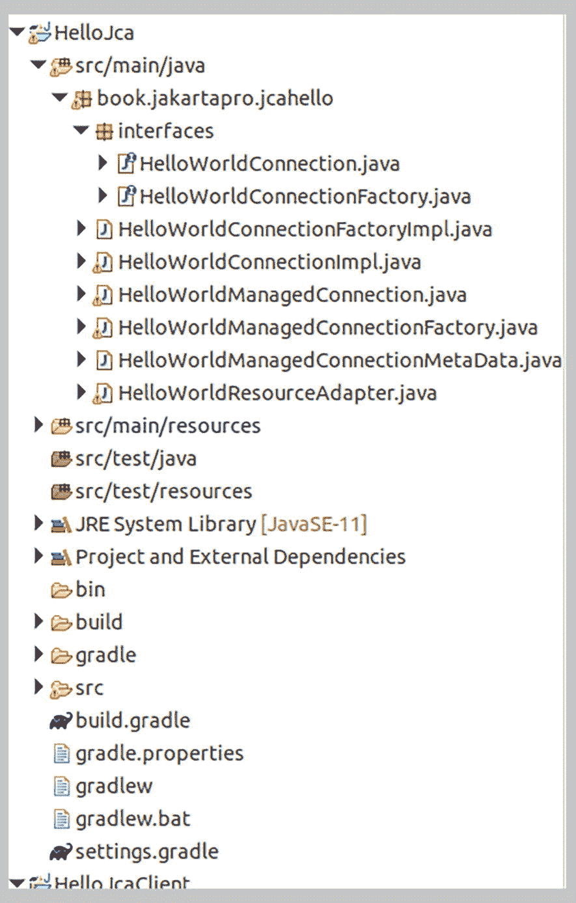

# 在此处提供您自己的路径：
export GROOVY_HOME=/opt/groovy-4
export JAVA_HOME=/opt/jdk17
addClasspath="ejb-interfaces.jar"
for i in glassfish/modules/*.jar; do
addClasspath=${addClasspath}:$i
done
export GROOVY_TURN_OFF_JAVA_WARNINGS=true
$GROOVY_HOME/bin/groovyConsole -cp $addClasspath
```

遗憾的是，某些版本的 Groovy 发行版启动脚本中存在一个错误。请检查 `GROOVY/bin/startGroovy` 文件中的这一行：

```
if [ "$(expr "$JAVA_VERSION" \> "1.8.0")" ]; then
```

如果存在，请将其替换为：

```
if [ "$(expr true)" ]; then
```

显然，`1.17.x` 并不大于 `1.8.0`，因此原始条件是错误的。

启动脚本后，会弹出一个 GroovyConsole 窗口。要从该窗口访问 EJB，可以使用如下代码：

```
import javax.naming.*
def ctx = getContext()
// 这是 GlassFish 的 JNDI 命名模式
def NAMING_SCHEMA = "java:global"
// 应用程序的名称。对于 GlassFish，即 .ear 文件的名称（不含后缀）
def APPL_NAME = "AppClientServer"
// EAR 文件内的 EJB 模块名称
def EJB_MODULE_NAME = "AppClientEjb"
// EJB 的类名
def EJB_NAME = "TheDate"
// EJB 远程接口的完全限定名
def EJB_REMOTE_CLASS =
"book.jakartapro.appclient.ejb.interfaces.TheDateRemote"
def look = "${NAMING_SCHEMA}/" +
"${APPL_NAME}/${EJB_MODULE_NAME}/" +
"${EJB_NAME}!${EJB_REMOTE_CLASS}"
def ejb = ctx.lookup(look)
def date = ejb.fetchDate() // 调用 EJB
println date
def getContext() {
Properties props = new Properties().with(true){
setProperty(Context.INITIAL_CONTEXT_FACTORY,
"com.sun.enterprise.naming.SerialInitContextFactory")
setProperty("org.omg.CORBA.ORBInitialHost",
"localhost") // 应用服务器
setProperty("org.omg.CORBA.ORBInitialPort",
"3700") // GlassFish 的 JNDI 端口
}
new InitialContext(props)
}
```

26. 添加脚本语言

Java 语言并非实现业务功能和算法的最佳选择。该语言新特性的实现速度较慢，这可以是一个优势，因为当编码结构不频繁变化时，维护旧代码会更容易。而且 Java 是静态类型语言，这意味着你必须在语言层面处理对象类型。这会导致更多的编码工作，因为需要频繁输入类型说明符以确保类型一致性正确工作。与此相反，像 Groovy 和 Python 这样的脚本语言通常包含更简洁编写代码的特性，并且通常是动态类型语言。这意味着类型检查不会在编译期间进行，并且代码中包含更少的样板结构来确保赋值中的变量类型一致性。幸运的是，Java 允许你通过 JSR 223 将 Java 语言代码和脚本语言混合使用。Java 代码在生成任何可部署（和可运行）的工件（如类文件和类文件归档）之前被编译，而脚本则在运行时编译。这为脚本开辟了另一种使用场景：由于可以在不反复编译应用程序的情况下更改脚本，因此即使在应用程序进入生产阶段后，也可以更轻松地更改脚本。例如，脚本可以以文本形式保存在数据库中，或者保存在独立于部署工件（如 JAR、WAR 和 EAR）的资源文件中。本章介绍如何在 Jakarta EE 应用程序中包含 Groovy 和 Python 脚本。

安装脚本引擎

为了使用 JSR 223 脚本，你必须将以下依赖项添加到项目中：

```
// 对于 Python，在 Gradle build.gradle 文件中
implementation 'org.python:jython-standalone:2.7.2'

org.python
jython-standalone
2.7.2

// 对于 Groovy，在 Gradle build.gradle 文件中
implementation 'org.apache.groovy:groovy-jsr223:4.0.8'

org.apache.groovy
groovy-jsr223
4.0.8

```

在 Java 中使用脚本

为了在代码中的任何位置使用脚本，请编写以下代码（Python 版本）：

```
import javax.script.ScriptEngine;
import javax.script.ScriptEngineManager;
import javax.script.ScriptException;
...
ScriptEngine engine = new ScriptEngineManager().
getEngineByName("python");
// 读取 Python 代码
StringReader f = new StringReader(
"class Multiplier:\n"
+ "\n"
+ "  def multiply(self, x, y):\n"
+ "    return x * y\n"
+ "\n"
+ "x = Multiplier().multiply(par1, par2)\n"
);
//  40
...
```

相同脚本的 Groovy 变体如下所示：

```
import javax.script.ScriptEngine;
import javax.script.ScriptEngineManager;
import javax.script.ScriptException;
...
ScriptEngine engine = new ScriptEngineManager().
getEngineByName("groovy");
// 读取 Groovy 代码
StringReader f = new StringReader(
"class Multiplier {\n"
+ "  def multiply(def x, def y) {\n"
+ "    x * y\n"
+ "  }\n"
+ "}\n"
+ "x = new Multiplier().multiply(par1, par2)\n"
);
//  40
```

第五部分 高级资源相关主题

27. 使用 Hibernate 作为 ORM

GlassFish Jakarta EE 应用服务器内置了 EclipseLink 作为 JPA 提供者，而其他应用服务器对于使用哪个 JPA 提供者有自己的想法。毕竟，应用程序开发人员无需担心使用哪个 JPA 提供者，这是 JPA 的优势之一。如果你确实出于某种原因想要指定 JPA 提供者，可以这样做，而无需更改应用服务器安装。
本章介绍如何配置应用程序以使用 Hibernate 作为 JPA 提供者。使用其他提供者时的过程类似。

注意

前往 [`https://hibernate.org/`](https://hibernate.org/)
了解 Hibernate 能做什么。

安装 Hibernate

要将 Hibernate 安装为 JPA 提供者，请将以下代码分别添加到你的 `build.gradle` 或 `pom.xml` 文件中（适用于 Gradle 或 Maven）：

```
...
dependencies {
...
implementation 'org.hibernate:' +
'hibernate-core-jakarta:5.6.3.Final'
}
...

...

org.hibernate
hibernate-core-jakarta
5.6.3.Final

...
```

调整持久化配置

你需要告诉 JPA 配置使用 Hibernate 作为 JPA 提供者。为此，请打开 `META_INF` 文件夹内的 `persistence.xml` 文件并添加以下内容：

```

org.hibernate.jpa.HibernatePersistenceProvider

...

...

-->

```

Hibernate 文档会告诉你更多关于可以在此文件中放置的 Hibernate 设置的信息。

获取 Hibernate Session

为了在注入实体管理器的情况下直接使用 Hibernate JPA，API 文档建议使用以下代码：

```
...
import org.hibernate.Session;
...
@PersistenceContext(unitName = "my-persistence-unit")
private EntityManager entityManager;
...
Session session = entityManager.unwrap(Session.class);
// 直接使用 Hibernate session：
// ...
```

警告

遗憾的是，由于类加载问题，这目前不适用于 GlassFish 7。

28. 连接器

Jakarta EE 应用程序可能无法使用标准通信协议之一与遗留 EIS（企业信息系统）无缝通信。在企业环境中尤其如此。为了实现这一点，你必须创建一个符合 Jakarta 连接器架构的资源适配器。
Jakarta 连接器技术（版本号 2.1）是 Jakarta EE 10 技术栈的一部分。JCA 项目的主页位于 [`https://projects.eclipse.org/projects/ee4j.jca/releases/2.1.0`](https://projects.eclipse.org/projects/ee4j.jca/releases/2.1.0)，规范请参见 [`https://www.jcp.org/en/jsr/detail?id=322`](https://www.jcp.org/en/jsr/detail%253Fid%253D322)。
为大型或重要的 EIS 创建连接器可能是一项非常具有挑战性的任务。规范文档有 500 多页，因此本书仅涵盖连接器架构的少数特性。本章将完成一个简单的 JCA 项目，尽管如此，它应该能为你的项目提供一个起点。

编码资源适配器

对于一个资源适配器，你至少需要以下工件：

*   一个接口，描述资源适配器所有可从客户端访问的业务方法。通常称为*连接*。在此示例中，它被称为 `HelloWorldConnection`。

*   另一个接口，描述连接工厂。其唯一目的是提供获取连接的工厂方法。它必须扩展 `jakarta.resource.Referenceable` 和 `java.io.Serializable`。在此示例中，它被称为 `HelloWorldConnectionFactory`。

*   一个实现连接接口的类。在此示例中，它被称为 `HelloWorldConnectionImpl`。

*   一个实现连接工厂接口的类。在此示例中，它被称为 `HelloWorldConnectionFactoryImpl`。

*   一个扩展 `jakarta.resource.spi.ManagedConnection` 的类。这表示到底层 EIS 的物理连接。在此示例中，它被称为 `HelloWorldManagedConnection`。

*   一个用于 `ManagedConnection` 的工厂类。它必须实现 `jakarta.resource.spi.ManagedConnectionFactory` 和 `jakarta.resource.spi.ResourceAdapterAssociation`。在此示例中，它被称为 `HelloWorldManagedConnectionFactory`。

*   一个实现 `jakarta.resource.spi.ManagedConnectionMetaData` 的类，用于元数据。在此示例中，它被称为 `HelloWorldManagedConnectionMetaData`。

*   一个实现 `jakarta.resource.spi.ResourceAdapter` 的类。在此示例中，它被称为 `HelloWorldResourceAdapter`。

有关类关系以及每个类功能的更多详细信息，请查阅 API 文档和 JCA 规范。

为了简化打包，此示例将所有接口放入一个 `interfaces` 子包中。图 28-1 显示了此示例项目的项目布局。



JCA 示例窗口显示文件列表，其中一些文件已展开，例如 interfaces、src/main/resources、bin、build 和 gradle。

图 28-1
JCA 示例项目布局

两个接口的编码如下：

```
// ---------- 文件 HelloWorldConnection.java
package book.jakartapro.jcahello.interfaces;
public interface HelloWorldConnection {
public String helloWorld();
public String helloWorld(String name);
public void close();
}
// ---------- 文件 HelloWorldConnection.java
package book.jakartapro.jcahello.interfaces;
import java.io.Serializable;
import jakarta.resource.Referenceable;
import jakarta.resource.ResourceException;
public interface HelloWorldConnectionFactory extends
Serializable, Referenceable {
public HelloWorldConnection getConnection()
throws ResourceException;
}
```

接下来是实现这些接口的两个类。请注意 `helloWorld()` 方法如何访问资源适配器属性。

```
// ---------- 文件 HelloWorldConnectionImpl.java
package book.jakartapro.jcahello;
import java.util.logging.Logger;
import book.jakartapro.jcahello.interfaces.
HelloWorldConnection;
public class HelloWorldConnectionImpl
implements HelloWorldConnection {
private HelloWorldManagedConnection mc;
private HelloWorldManagedConnectionFactory mcf;
public HelloWorldConnectionImpl(
HelloWorldManagedConnection mc,
HelloWorldManagedConnectionFactory mcf) {
this.mc = mc;
this.mcf = mcf;
}
public String helloWorld() {
return helloWorld(
((HelloWorldResourceAdapter) mcf.
getResourceAdapter()).getName());
}
public String helloWorld(String name) {
return mc.helloWorld(name);
}
public void close() {
mc.closeHandle(this);
}
}
// ---------- 文件 HelloWorldConnectionFactoryImpl.java
package book.jakartapro.jcahello;
import javax.naming.NamingException;
import javax.naming.Reference;
import book.jakartapro.jcahello.interfaces.
HelloWorldConnection;
import book.jakartapro.jcahello.interfaces.
HelloWorldConnectionFactory;
import jakarta.resource.ResourceException;
import jakarta.resource.spi.ConnectionManager;
public class HelloWorldConnectionFactoryImpl
implements HelloWorldConnectionFactory {
private Reference reference;
private HelloWorldManagedConnectionFactory mcf;
private ConnectionManager connectionManager;
public HelloWorldConnectionFactoryImpl(
HelloWorldManagedConnectionFactory mcf,
ConnectionManager cxManager) {
this.mcf = mcf;
this.connectionManager = cxManager;
}
@Override
public HelloWorldConnection getConnection()
throws ResourceException {
return (HelloWorldConnection) connectionManager.
allocateConnection(mcf, null);
}
@Override
public Reference getReference()
throws NamingException {
return reference;
}
@Override
public void setReference(Reference reference) {
this.reference = reference;
}
}
```

受管连接类及其工厂类表示到 EIS 的物理连接。代码如下：

```
// ---------- 文件 HelloWorldManagedConnection.java
package book.jakartapro.jcahello;
import java.io.PrintWriter;
import java.util.ArrayList;
import java.util.List;
import java.util.logging.Logger;
import jakarta.resource.NotSupportedException;
import jakarta.resource.ResourceException;
import jakarta.resource.spi.ConnectionEvent;
import jakarta.resource.spi.ConnectionEventListener;
import jakarta.resource.spi.ConnectionRequestInfo;
import jakarta.resource.spi.LocalTransaction;
import jakarta.resource.spi.ManagedConnection;
import jakarta.resource.spi.ManagedConnectionMetaData;
import javax.security.auth.Subject;
import javax.transaction.xa.XAResource;
import book.jakartapro.jcahello.interfaces.
HelloWorldConnection;
public class HelloWorldManagedConnection
implements ManagedConnection {
private HelloWorldManagedConnectionFactory mcf;
private List listeners;
private Object connection;
private PrintWriter logWriter;
public HelloWorldManagedConnection(
HelloWorldManagedConnectionFactory mcf) {
this.mcf = mcf;
this.logWriter = null;
this.listeners =
new ArrayList(1);
this.connection = null;
}
/**
* 为 ManagedConnection 实例表示的底层
* 物理连接创建一个新的连接句柄。
*/
public Object getConnection(
Subject subject,
ConnectionRequestInfo cxRequestInfo)
throws ResourceException {
connection = new HelloWorldConnectionImpl(this, mcf);
return connection;
}
/**
* 容器使用此方法来更改应用程序级连接句柄与
* ManagedConnection 实例的关联。
*/
public void associateConnection(Object connection)
throws ResourceException {
this.connection = connection;
}
/**
* 应用服务器调用此方法来强制对 ManagedConnection 实例进行
* 任何清理。
*/
public void cleanup() throws ResourceException {
}
/**
* 销毁到底层资源管理器的物理连接。
*/
public void destroy() throws ResourceException {
this.connection = null;
}
public void addConnectionEventListener(
ConnectionEventListener listener) {
listeners.add(listener);
}
public void removeConnectionEventListener(
ConnectionEventListener listener) {
listeners.remove(listener);
}
public PrintWriter getLogWriter()
throws ResourceException {
return logWriter;
}
public void setLogWriter(PrintWriter out)
throws ResourceException {
this.logWriter = out;
}
public LocalTransaction getLocalTransaction()
throws ResourceException {
throw new NotSupportedException(
"LocalTransaction not supported");
}
public XAResource getXAResource()
throws ResourceException {
throw new NotSupportedException(
"GetXAResource not supported");
}
public ManagedConnectionMetaData getMetaData()
throws ResourceException {
return new HelloWorldManagedConnectionMetaData();
}
String helloWorld(String name) {
return "Hello World, " + name + " !";
}
void closeHandle(HelloWorldConnection handle) {
ConnectionEvent event =
new ConnectionEvent(this,
ConnectionEvent.CONNECTION_CLOSED);
event.setConnectionHandle(handle);
for (ConnectionEventListener cel : listeners) {
cel.connectionClosed(event);
}
}
}
// ---------- 文件 HelloWorldManagedConnectionFactory.java
package book.jakartapro.jcahello;
import java.util.Objects;
import java.io.PrintWriter;
import java.util.Iterator;
import java.util.Set;
import java.util.logging.Logger;
import jakarta.resource.ResourceException;
import jakarta.resource.spi.ConnectionDefinition;
import jakarta.resource.spi.ConnectionManager;
import jakarta.resource.spi.ConnectionRequestInfo;
import jakarta.resource.spi.ManagedConnection;
import jakarta.resource.spi.ManagedConnectionFactory;
import jakarta.resource.spi.ResourceAdapter;
import jakarta.resource.spi.ResourceAdapterAssociation;
import javax.security.auth.Subject;
import book.jakartapro.jcahello.interfaces.
HelloWorldConnection;
import book.jakartapro.jcahello.interfaces.
HelloWorldConnectionFactory;
@ConnectionDefinition(
connectionFactory =
HelloWorldConnectionFactory.class,
connectionFactoryImpl =
HelloWorldConnectionFactoryImpl.class,
connection =
HelloWorldConnection.class,
connectionImpl =
HelloWorldConnectionImpl.class)
public class HelloWorldManagedConnectionFactory
implements ManagedConnectionFactory,
ResourceAdapterAssociation {
private ResourceAdapter ra;
private PrintWriter logwriter;
public HelloWorldManagedConnectionFactory() {
this.ra = null;
this.logwriter = null;
}
public Object createConnectionFactory()
throws ResourceException {
throw new ResourceException(
"This resource adapter doesn't " +
"support non-managed environments");
}
public Object createConnectionFactory(
ConnectionManager cxManager)
throws ResourceException {
return new HelloWorldConnectionFactoryImpl(this,
cxManager);
}
public ManagedConnection createManagedConnection(
Subject subject,
ConnectionRequestInfo cxRequestInfo)
throws ResourceException {
return new HelloWorldManagedConnection(this);
}
public ManagedConnection matchManagedConnections(
Set connectionSet, Subject subject,
ConnectionRequestInfo cxRequestInfo)
throws ResourceException {
ManagedConnection result = null;
Iterator it = connectionSet.iterator();
while (result == null && it.hasNext()) {
ManagedConnection mc =
(ManagedConnection) it.next();
if (mc instanceof
HelloWorldManagedConnection) {
HelloWorldManagedConnection hwmc =
(HelloWorldManagedConnection) mc;
result = hwmc;
}
}
return result;
}
public PrintWriter getLogWriter()
throws ResourceException {
return logwriter;
}
public void setLogWriter(PrintWriter out)
throws ResourceException {
logwriter = out;
}
public ResourceAdapter getResourceAdapter() {
return ra;
}
public void setResourceAdapter(ResourceAdapter ra) {
this.ra = ra;
}
@Override
public int hashCode() {
return Objects.hash(17);
}
@Override
public boolean equals(Object other) {
if (other == null) return false;
if (other == this) return true;
if (!(other instanceof
HelloWorldManagedConnectionFactory))
return false;
return true;
}
}
```

元数据对象从技术角度描述资源适配器。其内容如下：

```
// ---------- 文件 HelloWorldManagedConnectionMetaData.java
package book.jakartapro.jcahello;
import jakarta.resource.ResourceException;
import jakarta.resource.spi.ManagedConnectionMetaData;
public class HelloWorldManagedConnectionMetaData
implements ManagedConnectionMetaData {
@Override
public String getEISProductName()
throws ResourceException {
return "HelloWorld Resource Adapter";
}
@Override
public String getEISProductVersion()
throws ResourceException {
return "1.0";
}
@Override
public int getMaxConnections()
throws ResourceException {
return 0;
}
@Override
public String getUserName()
throws ResourceException {
return null;
}
}
```

最后，示例的资源适配器类如下所示：

```
// ---------- 文件 HelloWorldResourceAdapter.java
package book.jakartapro.jcahello;
import java.util.logging.Logger;
import java.util.Objects;
import jakarta.resource.ResourceException;
import jakarta.resource.spi.ActivationSpec;
import jakarta.resource.spi.BootstrapContext;
import jakarta.resource.spi.ConfigProperty;
import jakarta.resource.spi.Connector;
import jakarta.resource.spi.ResourceAdapter;
import jakarta.resource.spi.
ResourceAdapterInternalException;
import jakarta.resource.spi.TransactionSupport;
import jakarta.resource.spi.endpoint.
MessageEndpointFactory;
import javax.transaction.xa.XAResource;
@Connector(
reauthenticationSupport = false,
transactionSupport =
TransactionSupport.TransactionSupportLevel.
NoTransaction)
public class HelloWorldResourceAdapter
implements ResourceAdapter {
/** 名称属性 */
@ConfigProperty(defaultValue = "Some Name",
supportsDynamicUpdates = true)
private String name;
public void setName(String name) {
this.name = name;
}
public String getName() {
return name;
}
/**
* 在消息端点激活期间调用此方法。
*/
public void endpointActivation(
MessageEndpointFactory endpointFactory,
ActivationSpec spec)
throws ResourceException {
}
/**
* 当消息端点被停用时调用此方法。
*/
public void endpointDeactivation(
MessageEndpointFactory endpointFactory,
ActivationSpec spec) {
}
/**
* 当资源适配器实例被引导时调用此方法。
*/
public void start(BootstrapContext ctx)
throws ResourceAdapterInternalException {
}
/**
* 当资源适配器实例被取消部署或在应用服务器关闭期间调用此方法。
*/
public void stop() {
}
/**
* 应用服务器在崩溃恢复期间调用此方法。
*/
public XAResource[] getXAResources(
ActivationSpec[] specs)
throws ResourceException {
return null;
}
@Override
public int hashCode() {
return Objects.hash(name);
}
@Override
public boolean equals(Object other) {
return Objects.equal(this, other);
if (other == null) return false;
if (other == this) return true;
if (!(other instanceof
HelloWorldResourceAdapter))
return false;
HelloWorldResourceAdapter obj =
(HelloWorldResourceAdapter) other;
return Objects.equals(name, other.getName);
}
}
```

打包和部署资源适配器

资源适配器的打包方式类似于 JAR 文件，但与标准 JAR 文件不同，它必须使用以 `.rar` 结尾的文件名。一个简单 RAR 归档的结构如下：

```
some/package/ClassA.class
some/other/package/ClassB.class
... 更多类 ...
META-INF/MANIFEST.MF
```

`MANIFEST.MF` 文件是一个简单的文本文件，内容如下：

```
Manifest-Version: 1.0
```

对于 `HelloJca` 示例资源适配器，归档文件结构如下：

```
META-INF/
MANIFEST.MF
book/
jakartapro/
jcahello/
HelloWorldManagedConnection.class
HelloWorldManagedConnectionFactory.class
HelloWorldResourceAdapter.class
HelloWorldConnectionFactoryImpl.class
HelloWorldConnectionImpl.class
HelloWorldManagedConnectionMetaData.class
interfaces/
HelloWorldConnectionFactory.class
HelloWorldConnection.class
```

因为客户端需要接口来访问资源适配器，所以还需要设置一个构建工作流，将接口打包到标准 Java 库 JAR 文件中。对于 `HelloJca` 示例，这可以是一个名为 `jca-interfaces.jar` 的文件，包含：

```
META-INF/
MANIFEST.MF
book/
jakartapro/
jcahello/
interfaces/
HelloWorldConnectionFactory.class
HelloWorldConnection.class
```

对于需要额外库的更复杂资源适配器，你可以将这些库添加到 RAR 文件内的 `lib/` 文件夹中：

```
some/package/ClassA.class
some/other/package/ClassB.class
... 更多类 ...
META-INF/MANIFEST.MF
lib/someLibrary1.jar
lib/someLibrary2.jar
... 更多库 ...
```

然后需要在 `MANIFEST.MF` 文件中提及这些额外的库：

```
Manifest-Version: 1.0
Class-Path: lib/someLibrary1.jar lib/someLibrary2.jar
```

（这应该在一行上，使用单个空格作为分隔符。）

警告

确保 `MANIFEST.MF` 文件以行终止符（换行或回车）结尾。

如果你使用 Gradle 作为构建工具，将归档文件扩展名更改为 `.rar` 并添加一个步骤来生成 `jca-interfaces.jar` 文件很容易。你只需将以下行添加到你的 `build.gradle` 文件中：

```
plugins {
id 'java'
}
...
archivesBaseName = 'HelloJca'
jar { archiveExtension = 'rar' }
repositories {
...
}
dependencies {
...
}
// 构建一个仅包含 JCA 接口的 JAR，供客户端使用
task('JcaInterfaces', type: Jar, dependsOn: 'classes') {
//在此处将 jar 内容描述为 CopySpec
archiveFileName = "jca-interfaces.jar"
destinationDirectory = file("$buildDir/libs")
from("$buildDir/classes/java/main") {
include "**/interfaces/**/*.*"
}
}
// 确保它是组装路径的一部分
jar.dependsOn JcaInterfaces
```

如果你现在执行 `jar` 任务，你将在 `build/libs` 文件夹中找到 RAR 文件和 `jca-interfaces.jar` 文件。

部署描述符
在旧版本的 JCA 中，需要在 `META-INF` 文件夹内提供一个 `ra.xml` 部署描述符文件。由于你可以向资源适配器文件（本例中的 `HelloWorldResourceAdapter` 类）和受管连接工厂（本例中的 `HelloWorldManagedConnectionFactory` 类）添加注解，因此不再需要此文件。但是，根据你使用的 Jakarta EE 服务器，可能需要将特定于服务器的部署描述符添加到 `META-INF` 文件夹。它通常具有名称 `[SERVER]-ra.xml`，其中 `[SERVER]` 标识服务器产品。例如，对于 Weblogic，此文件必须命名为 `weblogic-ra.xml`。有关此文件命名和内容的详细信息，请查阅你的服务器文档。
对于 GlassFish，不需要此特定于服务器的部署描述符——一切都可以使用 Web 管理员或 `asadmin` 控制台工具进行配置。请参阅本章后面的“在服务器上定义资源适配器”部分。

资源适配器部署
要部署 RAR 文件，通常遵循与部署 WAR 或 EAR 文件相同的过程。有关详细信息，请查阅你的服务器文档。

在服务器上定义资源适配器
在服务器上部署资源适配器并不自动意味着客户端可以立即引用它。最终，你希望能够使用 `@Resource` 注解注入资源适配器，但这需要大量的配置工作。更糟糕的是，配置过程没有标准化，因此你必须查阅服务器文档以了解如何执行此操作。

例如，对于 GlassFish，你必须创建一个线程池、一个适配器配置、一个连接池和一个连接器资源。你可以使用位于 `http://localhost:4848` 的 Web 管理员来实现此目的，但使用 `asadmin` 工具的 shell 脚本也能提供相同的功能。对于 `HelloJca` 示例，这样的脚本可以如下所示：

```

```


# 创建一个名为 "HelloJcaThreadPool" 的新线程池
bin/asadmin create-threadpool HelloJcaThreadPool

# 创建资源适配器配置。属性

# "name" 对应资源适配器类（继承自

# jakarta.resource.spi.ResourceAdapter 的类）中的一个字段。

# 线程池 ID 必须与上面使用的线程池名称

# 匹配。"HelloJca" 将是资源适配器的名称。

bin/asadmin create-resource-adapter-config \
--property name="Gandalf" \
--threadpoolid HelloJcaThreadPool \
HelloJca

# 创建连接池。raname 对应上面使用的

# 资源适配器的名称。

# connectiondefinition 对应连接工厂类

# （继承自

# jakarta.resource.spi.ManagedConnectionFactory 的类）。

# "eis/HelloJcaConnectionPool" 将是连接池的

# JNDI 名称。
bin/asadmin create-connector-connection-pool \
--raname HelloJca \
--connectiondefinition \
book.jakartapro.jcahello.interfaces.
HelloWorldConnectionFactory \
eis/HelloJcaConnectionPool

# 创建连接器资源。poolname 对应

# 上面使用的连接池的 JNDI 名称。

# "eis/HelloWorld" 将是用 @Resource 注解的

# 可注入字段中使用的名称：

#   @Resource(name = "eis/HelloWorld")

#   private HelloWorldConnectionFactory connectionFactory;

# 当然，如果你使用


# 不同的连接工厂类
bin/asadmin create-connector-resource \
--poolname eis/HelloJcaConnectionPool \
eis/HelloWorld
```

（`interfaces` 后面不应有换行和空格。）有关详细信息和更多选项，请参阅 GlassFish 服务器文档。

## 资源适配器客户端

部署并正确配置资源适配器后，你需要通过 `@Resource` 注解（位于 `jakarta.annotation` 包中）注入连接工厂，以便客户端能够访问资源适配器的功能。例如，对于 REST 控制器，代码如下所示：

```
@Path("/")
public class HelloJca {
@Resource(name = "eis/HelloWorld")
private HelloWorldConnectionFactory connectionFactory;
// 更多字段...
@GET
public Response fetch() {
try {
HelloWorldConnection conn = connectionFactory.
getConnection();
String s = conn.helloWorld();
conn.close();
return Response.status(200).
entity("done: " + s).build();
} catch (ResourceException e) {
return Response.status(500).entity("error").
build();
}
}
...
}
```

注解的 `name` 参数必须与资源适配器的 JNDI 名称匹配。

