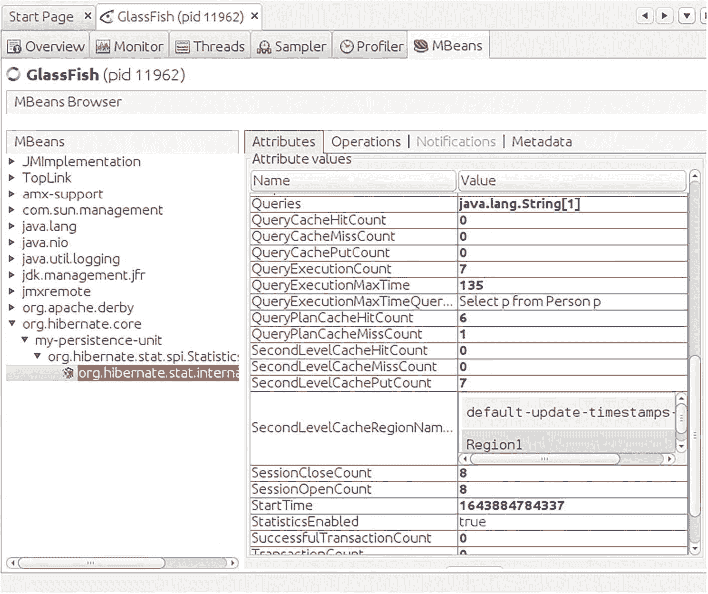

# 29. 缓存

从大型数据库访问数据或使用复杂的 `select` 子句可能非常耗时。此外，应用程序经常多次使用相同的数据库访问语句，这可能会让你思考是否有办法缩短此类数据库查询。这种捷径能否帮助应用程序更快地响应用户查询，并避免数据库服务器负载过高？这正是*缓存*的作用所在。它位于执行数据库查询的客户端代码和数据库访问本身之间，当之前执行过相同的查询时，它会代表数据库来响应数据库查询。
本章介绍如何将 Ehcache 用于 Hibernate 持久化提供程序。

## 安装 Ehcache

要安装 Ehcache，请将以下依赖项添加到你的构建文件中：

```
// 对于 Gradle：
...
dependencies {
...
// 假设你使用以下 Hibernate 版本
implementation 'org.hibernate:' +
'hibernate-core-jakarta:5.6.15.Final'
// ... 你必须添加：
implementation 'org.hibernate:' +
'hibernate-ehcache:5.6.15.Final'
}

...

...

org.hibernate
hibernate-ehcache
5.6.15.Final

```

## 为 Ehcache 配置 Hibernate

在真正启用缓存之前，你需要告诉 Hibernate 你想要使用 Ehcache。Jakarta EE 的 Hibernate 配置在 `persistence.xml` 文件中进行，这也是你向 Hibernate 声明 Ehcache 的地方：

```

org.hibernate.jpa.HibernatePersistenceProvider

...

...

```

（确保删除 `"..."` 内的换行和空格。）这里有必要对属性做一些说明；有关详细信息，请查阅 [`https://www.ehcache.org`](https://www.ehcache.org) 上的文档。

*   `hibernate.cache.use_second_level_cache`

    如果你想启用二级缓存，请将其设置为 `true`。二级缓存以会话无关的方式按 ID 存储实体，这意味着它跨所有会话工作。默认值为 `false`。

*   `hibernate.cache.use_query_cache`

    如果你想启用查询缓存，请将其设置为 `true`。查询缓存用于存储代码中显式 HQL 查询的结果，但前提是在构建 `Criteria` 对象时添加了 `.setCacheable(true)`。默认值为 `false`。

*   `hibernate.cache.region.factory_class`

    定义用于缓存的区域工厂类。另一个可能的值是 `org.hibernate.cache.ehcache.EhCacheRegionFactory`。

*   `hibernate.cache.ehcache.missing_cache_strategy`

    如果你没有在类的 `Cache` 注解（`region` 参数）中显式定义区域，则此属性的 `create` 值会告诉 Hibernate 基于类名创建一个区域。否则，你会在日志中收到警告。

*   `hibernate.generate_statistics`

    如果你希望 Hibernate 生成统计数据（包括缓存使用情况），请将其设置为 `true`。默认值为 `false`。

*   `hibernate.jmx.enabled`

    如果你希望 Hibernate 通过 JMX 公布统计数据，请将其设置为 `true`。默认值为 `false`。

*   `hibernate.jmx.usePlatformServer`

    如果你希望 Hibernate 使用平台 MBean 服务器进行 JMX，请将其设置为 `true`。默认值为 `false`。

此外，你还需要一个 `META-INF/ehcache.xml` 文件，该文件用于定义缓存参数。示例如下：

Ehcache 文档会详细告诉你可以在该文件中设置的所有定义和参数。

## 在代码中定义缓存对象

Hibernate 最终会发送 SQL 语句，但由于它是一个 ORM（对象关系映射器），代码中引用的是缓存的 Java 对象。然而，Hibernate 默认不会缓存所有对象。相反，你需要将 `org.hibernate.annotations.Cache` 注解添加到 JPA 实体类中：

```
package ...;
import org.hibernate.annotations.Cache;
import org.hibernate.annotations.CacheConcurrencyStrategy;
import jakarta.persistence.Entity;
import jakarta.persistence.Table;
@Entity
@Table(name = "person")
@Cache(usage=CacheConcurrencyStrategy.READ_ONLY,
region="Region1")
public class Person {
.... 某个 JPA 类
}
```

`@Cache` 注解的 `region` 参数对应于 `ehcache.xml` 文件中定义的区域。`usage` 参数指定了并发策略。你可以使用以下值之一：

*   `CacheConcurrencyStrategy.NONE`

    无并发策略。Hibernate 不关心哪个应用程序更新或读取数据。如果存在缓存对象，无论是否有其他方访问同一张表，都会使用它们。

*   `CacheConcurrencyStrategy.READ_ONLY`

    使用此值表示你的应用程序只从该表读取数据，从不写入。

*   `CacheConcurrencyStrategy.READ_WRITE`

    使用此值表示你的应用程序会读取和写入该表。

*   `CacheConcurrencyStrategy.NONSTRICT_READ_WRITE`

    使用此值表示你的应用程序读取该表，并且偶尔也会写入。

*   `CacheConcurrencyStrategy.TRANSACTIONAL`

    使用此值表示缓存管理器允许事务。本书不探讨事务性缓存；有关详细信息，请参阅 Ehcache 文档中的“Ehcache 中的事务”部分。

## 监控缓存活动

由于你在前面的部分中启用了统计数据收集和 JMX 访问，因此可以使用 JMX 浏览器来调查缓存性能。你可以为此目的使用 [`https://visualvm.github.io/`](https://visualvm.github.io/) 上的 VisualVM 程序。安装它并添加 MBeans 插件后，导航到 Hibernate 的统计页面，如图 29-1 所示。



VisualVM 窗口显示 JMX 访问缓存活动。它展示了 MBeans 浏览器和 MBeans 插件。它导航到 Hibernate 统计页面，该页面包含带有缓存报告的属性值。

图 29-1
*VisualVM JMX 访问*

