# 31. 安全的 JMX

JMX（Java 管理扩展）是一种非常强大且在很大程度上被低估的监控和控制 Jakarta EE 应用服务器或其内部运行的应用程序的方法。我在此不介绍 JMX，因为你可以在互联网上找到大量相关资料，包括 Oracle 在 [`https://docs.oracle.com/javase/tutorial/jmx/overview/index.html`](https://docs.oracle.com/javase/tutorial/jmx/overview/index.html) 上的文档。本章我要做的是解释如何使用 SSL 保护远程 JMX 连接，因为这可能会在企业环境中出现。

## 为远程 JMX 连接使用 SSL

为了对 JMX 连接使用 SSL，你需要在服务器端（Jakarta EE 服务器）和客户端（用于调查或监控 JMX 的远程工具）都拥有密钥库和信任库。客户端密钥的公钥部分被输入到服务器的信任库中，反之亦然，这样客户端和服务器就可以在通信伙伴处进行身份验证。
以下部分介绍如何生成密钥和信任库，以及如何相应地配置客户端和服务器。

### 生成 SSL 密钥

对于密钥和证书存储管理，你必须使用 `keytool` CLI 工具，该工具是每个 JDK 安装的一部分。以下 bash 脚本完成了所有工作：

```
#!/bin/bash
PASSWORD=dhdgdfd534
DNAME="cn=JMX, ou=Java, o=Glassfish"


# #########################################################

# JMX 服务端

# #########################################################
DAYS=3650
SERVERCACERTS="/path/to/server/conf/cacerts.jks"
rm -rf jmxserver.keystore jmxserver.truststore
#生成密钥
keytool -genkey -alias serverjmx -keyalg RSA \
-validity ${DAYS} \
-keystore jmxserver.keystore -storepass ${PASSWORD} \
-keypass ${PASSWORD} -dname "${DNAME}"
#创建信任库的副本
cp ${SERVERCACERTS} jmxserver.truststore
#转换为新格式 (Glassfish)
keytool -importkeystore \
-srckeystore jmxserver.truststore \
-srcstorepass changeit \
-destkeystore jmxserver.truststore \
-deststorepass changeit \
-deststoretype pkcs12
rm -rf jmxserver.truststore.old
keytool -storepasswd -keystore jmxserver.truststore \
-storepass changeit -new ${PASSWORD}
#在信任库中生成新密钥
keytool -genkey -alias serverjmx -keyalg RSA \
-validity ${DAYS} -keystore jmxserver.truststore \
-storepass ${PASSWORD} \
-dname "${DNAME}"

# #########################################################

# JMX 客户端

# #########################################################
DAYS=3650

# 创建空信任库
keytool -genkeypair -alias boguscert \
-storepass ${PASSWORD} -keystore emptyStore.keystore \
-dname "CN=Developer, OU=Department, O=Company, \
L=City, ST=State, C=CA"
keytool -delete -alias boguscert -storepass ${PASSWORD} \
-keystore emptyStore.keystore
mv emptyStore.keystore "${CLIENTCACERTS}"
rm -rf jmxclient.keystore jmxclient.truststore
#生成密钥
keytool -genkey -alias clientjmx -keyalg RSA \
-validity ${DAYS} -keystore jmxclient.keystore \
-storepass ${PASSWORD} \
-keypass ${PASSWORD} \
-dname "${DNAME}"
#在信任库中生成新密钥
keytool -genkey -alias jmxclient -keyalg RSA \
-validity ${DAYS} -keystore "${CLIENTCACERTS}" \
-storepass ${PASSWORD} -dname "${DNAME}"
##########################################################
#从密钥库中导出公钥证书：
##########################################################
rm -rf jmxserver.cer jmxclient.cer
keytool -export -alias serverjmx \
-keystore jmxserver.keystore -file jmxserver.cer \
-storepass ${PASSWORD}
keytool -export -alias clientjmx \
-keystore jmxclient.keystore -file jmxclient.cer \
-storepass ${PASSWORD}
##########################################################
#最后，将证书导入彼此的信任库。
#这样服务端就能信任客户端，反之亦然：
##########################################################
keytool -import -alias jmxclient -file jmxclient.cer \
-keystore jmxserver.truststore \
-storepass ${PASSWORD} -noprompt
keytool -import -alias jmxserver -file jmxserver.cer \
-keystore jmxclient.truststore \
-storepass ${PASSWORD} -noprompt
##########################################################
#删除所有剩余的 CER 证书文件
##########################################################
rm -f jmxserver.cer jmxclient.cer
```

在脚本顶部，你必须为所有密钥库和信任库定义一个密码。当然，你应该使用自己的密码。`DNAME` 是一个用于所有密钥的可分辨名称——你可以根据需要自行调整。然后，你构建一个服务端密钥库和信任库，以及一个客户端密钥库和信任库。从密钥库中提取每个密钥的公钥部分后，你将客户端的公钥证书注册到服务端的信任库中，并将服务端的公钥证书注册到客户端的信任库中。整个过程完成后，你将得到以下文件：

*   `jmxserver.keystore`

包含服务端用于标识自身的密钥。此外，其公钥部分已注册到客户端的信任库中。

*   `jmxserver.truststore`

包含所有希望向服务端进行身份验证的客户端的公钥。这包括 JMX 客户端的公钥。

*   `jmxclient.keystore`

包含客户端用于标识自身的密钥。此外，其公钥部分已注册到服务端的信任库中。

*   `jmxclient.truststore`

包含所有希望向客户端进行身份验证的服务端的公钥。这通常是服务端的公钥。

配置服务端

在 Jakarta EE 服务端上配置 JMX 没有标准方法，因此你需要查阅服务端手册。通常，会有一个启动配置文件可用于设置系统属性。如果你的情况如此，配置服务端以支持 JMX 的基本步骤是：首先将 `jmxserver.keystore` 和 `jmxserver.truststore` 文件复制或移动到服务端安装的合适位置。然后，确保设置以下系统属性：

```
javax.net.ssl.keyStore=
/path/to/keystores/jmxserver.keystore
javax.net.ssl.trustStore=
/path/to/keystores/jmxserver.truststore
com.sun.management.jmxremote=
true
com.sun.management.jmxremote.port=

com.sun.management.jmxremote.authenticate=
false
com.sun.management.jmxremote.ssl=
true
javax.net.ssl.keyStorePassword=
dhdgdfd534
javax.net.ssl.trustStorePassword=
dhdgdfd534
com.sun.management.jmxremote.ssl.need.client.auth=
true
```


请根据您的需求修改密码和路径。修改后，通常需要重启服务器。

配置客户端

如果您想用来监控或调查 JMX 指标的 JMX 客户端是一个 Java 程序，那么访问 SSL 保护的 JMX 的步骤与服务器端非常相似。同样，不同客户端的配置也各不相同，因此您仍需查阅相关文档以了解详细信息。无论您使用何种客户端软件，首先请将 `jmxclient.keystore` 和 `jmxclient.truststore` 文件移动或复制到客户端安装目录下的合适位置。对于配置本身，在许多情况下，会有一个脚本或配置文件，您可以在其中设置以下属性：

```
javax.net.ssl.keyStore=
/path/to/keystores/jmxclient.keystore
javax.net.ssl.keyStorePassword=
dhdgdfd534
javax.net.ssl.trustStore=
/path/to/keystores/jmxclient.truststore
javax.net.ssl.trustStorePassword=
dhdgdfd534
```

例如，对于 VisualVM，在安装 MBeans 插件后，找到 `etc/visualvm.conf` 文件，并在 `-J-Xmx768m` 字符串之后立即添加以下内容：

```
-J-Djavax.net.ssl.keyStore=
/path/to/keystores/jmxclient.keystore
-J-Djavax.net.ssl.keyStorePassword=
dhdgdfd534
-J-Djavax.net.ssl.trustStore=
/path/to/keystores/jmxclient.truststore
-J-Djavax.net.ssl.trustStorePassword=
dhdgdfd534
```

（请确保 `=` 等号后面没有换行或空格。）

配置完成后，您需要一个 JMX URL 来连接到服务器。此 URL 因 Jakarta EE 服务器而异，但对于 GlassFish，以及其他服务器的起点，请使用以下 URL：

```
service:jmx:rmi:///jndi/rmi://localhost:9010/jmxrmi
```

其中，`localhost` 可能需要替换为 JMX 服务器的网络地址，`9010` 对应于服务器配置中声明的端口。

禁用随机 JMX 端口

在服务器配置中，此示例按如下方式声明了一个 JMX 端口：

```
com.sun.management.jmxremote.port=9010
```

然而，实际情况更为复杂。事实是，指定的端口用于建立 JMX 连接，它实际上并不与 MBeans 通信。这个工作端口通常被称为 `RMI-Port`。如果没有进一步配置，`RMI-Port` 是一个随机分配的数字。这发生在底层，因此从开发或配置的角度来看，无需关心这个随机端口。然而，在企业环境中，随机分配的端口经常会引起问题，因为防火墙可能会阻止 RMI 通信。

因此，您可以使用另一个设置来为 JMX-RMI 通信分配一个静态端口。您甚至可以使用同一个端口来建立连接并使用它。以下代码中的第二行

```
...
com.sun.management.jmxremote.port=9010
com.sun.management.jmxremote.rmi.port=9010
...
```

声明了一个系统属性，用于设置静态的 JMX-RMI 端口。

32. 带加密的 Java Web 令牌

第 14 章介绍了 JWT（Java Web 令牌），它通过添加与安全相关的声明来增强 RESTful 客户端-服务器通信。同一章还介绍了签名过程，以确保令牌内容未被篡改。为此，您将 JJWT 库添加到了 Web 应用程序中。使用 JJWT，您可以编写如下代码作为令牌生成方法：

```
import io.jsonwebtoken.Jwts;
...
Key key = keyGenerator.generateKey();
String jwtToken = Jwts.builder()
.setSubject(login)
.setIssuer(uriInfo.getAbsolutePath().toString())
.setIssuedAt(new Date())
.setExpiration(toDate(
LocalDateTime.now().plusMinutes(15L)))
.signWith(key, SignatureAlgorithm.HS512)
.compact();
...
```

然而，如果安全要求更进一步，需要添加加密功能，那么您必须寻找一个实现了 JWE（带加密的 Java Web 令牌）规范的库。JJWT 提供签名功能，但不提供加密功能，不过有几个项目是针对 JWE 的。其中一个叫做 *Jose4j*，您可以从 [`https://bitbucket.org/b_c/jose4j/wiki/Home`](https://bitbucket.org/b_c/jose4j/wiki/Home) 下载它并获取其文档。本章简要概述了 JWE 和 Jose4j。更多详细信息，请参阅项目主页和位于 [`https://datatracker.ietf.org/doc/rfc7516/ballot/`](https://datatracker.ietf.org/doc/rfc7516/ballot/) 的 JWE 规范。

注意

JWT、JWS 和 JWE 不属于 Jakarta EE 规范。我添加这部分内容是因为如今通过 JWT 进行通信受到了广泛关注。

安装 Jose4j

为了安装 Jose4j，请将以下依赖项添加到您的 Gradle（`build.gradle`）或 Maven（`pom.xml`）构建文件中：

```
// Gradle:
...
dependencies {
...
implementation 'org.bitbucket.b_c:jose4j:0.7.10'
}

...

org.bitbucket.b_c
jose4j
0.7.10

```

加密声明

声明代表关于一个实体（通常是一个人）的陈述，这些陈述需要被断言。因此，要发布一个 JWT 或加密的 JWT，您首先需要收集声明：

```
import org.jose4j.jwt.JwtClaims;
...
JwtClaims claims = new JwtClaims();
claims.setIssuer("Issuer");
// <- 令牌创建者
claims.setIssuedAtToNow();
// <- 令牌现在创建
claims.setAudience("Audience");
// <- 预期的令牌接收者
claims.setExpirationTimeMinutesInTheFuture(10);
// <- 过期时间
...
```

有关更多与声明相关的选项，请查阅 API 文档。

下一步，您需要一个用于加密 JWT 的密钥。自然，创建密钥有很多选择。您可以使用对称或非对称加密，并且手头有多种合适的加密算法。此示例使用一个简单但足够强大的对称密钥，其形式为八位字节流（字符串密码）：

```
import org.jose4j.jwk.JsonWebKey;
...
String jwkJson = "{" +
"\"kty\":\"oct\"," +
"\"k\":" +
"\"ffdbdh4grh5tffnkkj5tvrfcddehjihhhfddeesdfff\"" +
"}";
JsonWebKey jwk = JsonWebKey.Factory.newJwk(jwkJson);
```

同样，对于替代方案和更多选项，Jose4j 文档可以随时为您提供帮助。

接下来，创建一个 `JsonWebEncryption` 对象，将声明添加到其中，设置一些参数，并注册密钥。

```
import org.jose4j.jwa.AlgorithmConstraints;
import org.jose4j.jwa.AlgorithmConstraints.ConstraintType;
import org.jose4j.jwe.
ContentEncryptionAlgorithmIdentifiers;
import org.jose4j.jwe.JsonWebEncryption;
...
JsonWebEncryption jwe = new JsonWebEncryption();
// JWE 令牌的有效载荷
jwe.setPayload(claims.toJson());
// "alg" 头部指示此 JWE 的密钥管理模式。
// 更多选项，请参阅 API 文档
jwe.setAlgorithmHeaderValue(
KeyManagementAlgorithmIdentifiers.DIRECT);
// "enc" 头部指示要使用的内容加密算法。
// 更多选项，请参阅 API 文档
jwe.setEncryptionMethodHeaderParameter(
ContentEncryptionAlgorithmIdentifiers.
AES_128_CBC_HMAC_SHA_256);
// 在 JWE 上设置密钥。
jwe.setKey(jwk.getKey());
```

完成所有这些设置后，您现在就可以构建 JWE 令牌了：

```
// 生成 JWE 紧凑序列化。此处执行实际的加密。
// 详情请参阅 JWE 规范
String theJweToken = jwe.getCompactSerialization();
```

生成的字符串可能如下所示（全部在一行内）：

```
eyJhbGciOiJkaXIiLCJlbmMiOiJBMTI4Q0JDLUhTMjU2In0..
EfAfbcwEl-K1hvz-J8sleg.ijrS45pJLeX_pNdfHyRGD54Iml
3Sr-kvYL4RDJJD_4MwlADQspSeUxJm8skSyKtJCK_R_Lyim6B
rxt_3LbUHPsAQRmEb_dIw1NitjBw2aVM.-OELtMngH-n9WLGf
kOlPeQ
```

一个 JWE 令牌由多个 Base64 编码的部分组成，由分隔符 `"."`（句点）分隔。如果您对每个部分进行 Base64 解码，您将得到以下内容：

```
{"alg":"dir","enc":"A128CBC-HS256"}

```


可以看到，除了算法相关信息外，JWE 令牌中仅包含加密数据。

解密声明

在接收方，你必须解密 JWE 消息才能检查其内容。首先，你需要构建与加密时使用的相同的密钥。这是该过程的特征，因为你使用的是对称加密。然后，构造一个 `JsonWebEncryption` 对象，在其上设置一些参数，然后注册 JWE 消息和密钥。

```
import org.jose4j.jwa.AlgorithmConstraints;
import org.jose4j.jwa.AlgorithmConstraints.ConstraintType;
import org.jose4j.jwe.
ContentEncryptionAlgorithmIdentifiers;
import org.jose4j.jwe.JsonWebEncryption;
import org.jose4j.jwe.KeyManagementAlgorithmIdentifiers;
import org.jose4j.jwk.JsonWebKey;
import org.jose4j.jwt.JwtClaims;
import org.jose4j.lang.JoseException;
...
String incommingJwe = ...;
String jwkJson = "{" +
"\"kty\":\"oct\"," +
"\"k\":" +
"\"ffdbdh4grh5tffnkkj5tvrfcddehjihhhfddeesdfff\"" +
"}";
JsonWebKey jwk = JsonWebKey.Factory.newJwk(jwkJson);
JsonWebEncryption jwe = new JsonWebEncryption();
// 设置算法约束。
// 有关说明，请参阅 API 文档
AlgorithmConstraints algConstraints =
new AlgorithmConstraints(ConstraintType.PERMIT,
KeyManagementAlgorithmIdentifiers.DIRECT);
jwe.setAlgorithmConstraints(
algConstraints);
AlgorithmConstraints encConstraints =
new AlgorithmConstraints(ConstraintType.PERMIT,
ContentEncryptionAlgorithmIdentifiers.
AES_128_CBC_HMAC_SHA_256);
jwe.setContentEncryptionAlgorithmConstraints(
encConstraints);
// 注册 JWE 令牌
jwe.setCompactSerialization(incommingJwe);
// 设置密钥
receiverJwe.setKey(jwk.getKey());
```

现在，执行解密并检查令牌声明就很容易了：

```
// 解密消息。
String plaintext = jwe.getPlaintextString();
System.out.println("plaintext: " + plaintext);
```

结果显示你在发送方输入的声明：

```
plaintext:
{
"iss":"Issuer",
"iat":1645887062,
"aud":"Audience",
"exp":1645887662
}
```

延伸阅读

本章仅展示了关于 JWE 和 Jose4j 库的一个简单示例。关于 JWE 及其使用场景，还有很多内容可以探讨。进一步研究该主题的一个良好起点是规范文档 [`https://datatracker.ietf.org/doc/rfc7516/ballot/`](https://datatracker.ietf.org/doc/rfc7516/ballot/)。
如需更实践性的方法，Jose4j 网站 [`https://bitbucket.org/b_c/jose4j/wiki/Home`](https://bitbucket.org/b_c/jose4j/wiki/Home) 包含有价值的信息，并提供了许多涵盖 JWE 多个方面的全面示例。

33. Java 企业安全

借助 Java 企业安全 API（Jakarta EE 10 的 3.0 版本），你拥有一个用于实现授权机制的标准特性。本章将简要介绍这项技术。更多详情，请参阅规范 [`https://download.oracle.com/otn-pub/jcp/java_ee_security-1_0-final-eval-spec/jsr375-spec-1.0-final.pdf`](https://download.oracle.com/otn-pub/jcp/java_ee_security-1_0-final-eval-spec/jsr375-spec-1.0-final.pdf)。

基于表单的身份验证

你已经了解到，你必须在 `web.xml` 文件中输入身份验证信息，例如：

```
FORM
file

/login/login.xhtml

/login/error.xhtml

```

然而，无论采用何种身份验证方法，问题在于容器如何获取凭据，即它可以询问哪个组件来获取登录名和密码，以检查用户输入是否正确。通过使用 Security API，你可以直接挂钩到身份验证和用户数据存储检索过程。

Security API
从 1.0 版本开始，Security API 扩展并简化了 Java 容器认证服务提供者接口（JASPIC/JSR-196）。后者例如允许独立于容器的可定制身份验证。
由 JSR-375 管理的 Security API 是 Jakarta EE 10 的一部分，因此无需额外的安装步骤。
以下各节将简要介绍该标准定义的新注解、类和接口。除了能够轻松实现自定义身份验证过程外，还可以支持“记住我”和“登录以继续”功能。

身份验证数据：IdentityStore

```
public interface IdentityStore {
CredentialValidationResult
validate(Credential credential);
Set
getCallerGroups(CredentialValidationResult result);
int priority();
Set validationTypes();
enum ValidationType { VALIDATE, PROVIDE_GROUPS }
}
```

`IdentityStore` 接口定义了身份验证数据的来源。通过实现 `validationTypes()` 方法，你可以指定身份存储的职责。可以使其处理登录数据、角色分配，或两者兼而有之。返回集合中元素可能的值由 `ValidationType` 枚举描述：

*   `VALIDATE`

`IdentityStore` 用于验证登录数据。

*   `PROVIDE_GROUPS`

`IdentityStore` 允许分配用户组（在某种意义上，即角色）。

`IdentityStore` 接口的 API 文档描述了其他方法。
注册 `IdentityStore` 是通过将它们放置在 `CLASSPATH` 中自动完成的。从开发的角度来看，你只需实现 `IdentityStore` 接口即可。使用 JSR-375 管理的身份验证方法时，会查询所有已注册的身份存储，直到其中一个返回肯定的验证结果。之后，会再次查询身份存储以获取组分配信息。
处理多个身份存储由 `IdentityStoreHandler` 接口的实现控制。通常你不需要提供此接口的自定义实现，但如果你愿意，*可以*这样做。

当你使用 LDAP 服务器或 SQL 数据库作为身份数据的存储时，你无需提供完整的 `IdentityStore` 实现。相反，你可以使用 JSR-375 标准提供的两个注解之一：

```
@LdapIdentityStoreDefinition(
url = "ldap://localhost:4321",
bindDn = "ldap@thecompany",
bindDnPassword = "password"
)
@DatabaseIdentityStoreDefinition(
dataSourceLookup = "java:comp/env/ExampleDS",
callerQuery = "SELECT password from USERS where name = ?"
)
```

只需将它们作为注解添加到 CDI 可见的类型上，如下所示：

```
@DatabaseIdentityStoreDefinition(
dataSourceLookup = "java:comp/env/ExampleDS",
callerQuery = "SELECT password from USERS where name = ?"
)
@ApplicationScoped
public class ApplConfig {
}
```

身份验证方法：HttpAuthenticationMechanism

对于身份验证过程本身，实现 `HttpAuthenticationMechanism` 接口允许你控制 HTTP 数据流，以确保只有经过身份验证的用户才能访问受保护的内容。

```
public interface HttpAuthenticationMechanism {
AuthenticationStatus validateRequest(
HttpServletRequest request,
HttpServletResponse response,
HttpMessageContext httpMessageContext)
throws AuthenticationException;
AuthenticationStatus secureResponse(
HttpServletRequest request,
HttpServletResponse response,
HttpMessageContext httpMessageContext)
throws AuthenticationException;
void cleanSubject(
HttpServletRequest request,
HttpServletResponse response,
HttpMessageContext httpMessageContext)
throws AuthenticationException;
}
```

在身份验证过程中，会调用 `validateRequest()` 方法。这就是验证登录信息（用户名/密码）的地方，通常借助注入的 `IdentityStoreHandler` 来完成：


```java
public class MyAuth
implements HttpAuthenticationMechanism {
@Inject IdentityStoreHandler ish;
AuthenticationStatus validateRequest(
HttpServletRequest request,
HttpServletResponse response,
HttpMessageContext httpMessageContext)
throws AuthenticationException {
// 使用 ish 验证请求
...
CredentialValidationResult vr = ...;
// 我们需要将验证结果告知容器
AuthenticationStatus res =
httpMessageContext.notifyContainerAboutLogin(vr);
return res;
}
}
```

`secureResponse()` 和 `cleanSubject()` 方法分别用于对请求执行后处理活动和注销活动。两者都有默认实现，因此除非需要在注销过程中对请求执行额外操作，否则无需实现它们。

`HttpMessageContext` 参数用作容器控制的安全基础设施的接口。其 `notifyContainerAboutLogin()` 方法表示登录成功，但也可以通过 `doNothing()` 跳过非安全路径的认证过程。或者，可以调用 `responseUnauthorized()` 或 `responseNotFound()` 来分别强制返回 401 或 404 HTTP 响应状态。

与 `IdentityStore` 的情况类似，您无需注册 `HttpAuthenticationMechanism` 实现。只需将它们放入 `CLASSPATH` 即可。

为了简化认证流程的编程，RFC-375 标准为认证机制声明了几种变体。它们以注解的形式出现：

```java
@BasicAuthenticationMechanismDefinition
@CustomFormAuthenticationMechanismDefinition(
loginToContinue = @LoginToContinue())
@FormAuthenticationMechanismDefinition(
loginToContinue = @LoginToContinue())
```

例如，您可以使用 `@FormAuthenticationMechanismDefinition` 注解来告知认证控制器用于生成登录表单页面和错误页面的 URL，如下所示：

```java
@FormAuthenticationMechanismDefinition(
loginToContinue = @LoginToContinue(
loginPage="/login/login.xhtml",
errorPage="/login/error.xhtml"
)
)
@WebServlet("/secured")
@DeclareRoles({ "user", "authorized" })
@ServletSecurity(
@HttpConstraint(rolesAllowed = "authorized"))
public class SecuredContentServlet extends HttpServlet {
...
}
```

要了解更多关于这些注解的信息，请查阅 API 文档。

第七部分 高级监控与日志记录

34. 监控工作流

监控是任何企业级应用的关键组成部分。您需要能够监控技术方面（如内存使用率、CPU 负载和线程数）、性能指标（如耗时和吞吐量）以及功能方面（如销售额、订单数量和运营成本）。

本章涵盖监控工作流的流程，包括数据供应、数据聚合以及监控指标的呈现。

使用 JMX 作为监控技术

当然，可以通过日志记录、EJB、Web 服务（通过 SOAP 的 XML 或通过 REST 的 JSON）和 Servlet 来提供监控数据。然而，从 1.6 版本开始，Java 包含了一种能够以更直接的方式进行监控的技术：JMX（Java 管理扩展）。通过使用 JMX，可以声明称为 MBean 的特殊类，将其属性和方法设置为可从 JVM 内部和外部访问或调用。这样，应用程序可以更容易地提供可监控的数据。此外，JVM 本身也通过 JMX 提供有关其状态的有价值信息。

MBean 有多种类型：

*   标准 MBean
*   动态 MBean
*   开放 MBean
*   模型 MBean
*   MXBean

它们在已发布属性或方法在 MBean 编码中的反映方式、注册方式以及客户端与服务器之间允许通信的类型上有所不同。

在您可选的类型中，MXBean 对于监控目的特别有用。这是因为通信类型仅限于标准 Java 类型，从而简化了客户端访问，并且对于每个可监控的特性，您只需在 MBean 类代码中提供一个 getter 方法。例如，考虑预订工作流中的耗时。您只需要一个接口和一个 MBean 类：

```java
package book.jakartapro.jmxmonitoring;
public interface MonitoringBeanMXBean {
double getElapse();
void setElapse(double elapse);
}
package book.jakartapro.jmxmonitoring;
public class MonitoringBean
implements MonitoringBeanMXBean {
private double elapse;
public double getElapse() {
return elapse;
}
public void setElapse(double elapse) {
this.elapse = elapse;
}
}
```

在应用程序初始化方法中，您必须将 MBean 注册到 MBean 服务器。为简单起见，此示例使用平台 MBean 服务器，该服务器已配置好并为每个 JVM 自动启动。

```java
import java.lang.management.ManagementFactory;
import javax.management.ObjectName;
...
final String OBJECT_NAME =
"book.jakartapro.mxbeans:type=MonitoringBean";
...
MonitoringBean m = ...;
...
try {
ManagementFactory.getPlatformMBeanServer().
registerMBean(m,
new ObjectName(OBJECT_NAME));
} catch (Exception e) {
e.printStackTrace(System.err);
}
```

启用远程 JMX

为了使客户端能够通过网络访问 MBean，您需要向服务器添加一些 JVM 启动属性：

```
-Dcom.sun.management.jmxremote=true
-Dcom.sun.management.jmxremote.port=9010
-Dcom.sun.management.jmxremote.ssl=false
-Dcom.sun.management.jmxremote.authenticate=true
-Dcom.sun.management.jmxremote.password.file=
/path/to/jmxremote.password
```

在最简单的形式中，`jmxremote.password` 文件只是一行内容：

```
monitorRole pASSWurd
```

当然，您应该选择自己的密码。在 `JDK-INST-DIR/conf/management` 文件夹中，您可以找到一个名为 `jmxremote.password.template` 的模板文件，其中详细描述了密码文件的所有选项。

注意

要启用 SSL，预计需要额外的大量工作。您必须将证书添加到服务器的信任库和密钥库，并相应地配置您的 JMX 客户端。

请查阅您的 Jakarta EE 服务器文档，了解如何添加 JVM 启动属性。

对于 GlassFish，您必须向 `server.policy` 文件（位于 `glassfish/domains/domain1/config` 内）添加安全设置，如下所示：

```
grant {
permission javax.management.MBeanPermission
"*", "getMBeanInfo";
permission javax.management.MBeanPermission
"*", "getAttribute";
};
```

Jakarta EE 应用程序中的 MBean

由于每个 Jakarta EE 应用程序都在容器控制的环境中运行，您可以简化 MBean 的注册，以进一步简化 JMX 监控。假设您可以为整个应用程序（EJB 或 Web 应用程序）使用单个 MBean 实例，您可以添加 `@ApplicationScoped` 注解以确保容器负责构造 MBean，并添加一个带有 `@PostConstruct` 注解的后构造方法来注册 MBean：

```java
package book.jakartapro.jmxmonitoring;
import java.lang.management.ManagementFactory;
import javax.management.ObjectName;
import jakarta.annotation.PostConstruct;
import jakarta.enterprise.context.ApplicationScoped;
@ApplicationScoped
public class MonitoringBean
implements MonitoringBeanMXBean {
private static final String OBJECT_NAME =
"book.jakartapro.mxbeans:type=MonitoringBean";
private double elapse;
public double getElapse() {
return elapse;
}
public void setElapse(double elapse) {
this.elapse = elapse;
}
@PostConstruct
public void start() {
try {
ManagementFactory.getPlatformMBeanServer().
registerMBean(this,
new ObjectName(OBJECT_NAME));
} catch (Exception e) {
e.printStackTrace(System.err);
}
}
}
```

为了设置可监控值而访问 MBean 就变得很简单了——您只需使用 CDI 注入 MBean，如下所示：


```
package book.jakartapro.jmxmonitoring;
import jakarta.inject.Inject;
import jakarta.ws.rs.GET;
import jakarta.ws.rs.Path;
import jakarta.ws.rs.Produces;
/**
* REST Web Service
*/
@Path("/pi")
public class Jmx {
@Inject MonitoringBean jmxBean;
@Produces("application/json")
public String pi() {
long t1 = System.currentTimeMillis();
double pi = calcPi(100_000_001);
long ela = System.currentTimeMillis() - t1;
jmxBean.setElapse(ela);
return "{\"pi\":\"" + pi + "\"}";
}
private double calcPi(int n) {
// This is a stupid way of calculating PI.
// It is just an example of a time-consuming
// operation.
double pi = 0.0;
for (int i = 1; i < n; i++) {
if (i % 2 == 1) {
pi = pi + (4/((i*2.0)-1));
} else {
pi = pi - (4/((i*2.0)-1));
}
}
return pi;
}
}
```

这样一来，在 Jakarta EE 应用程序中，一个 MBean 所需的全部内容就是一个 MBean 接口和一个添加了启动方法的 MBean 类。

**聚合值**

监控并随后显示一个可监控变量的每一个值并不总是可取的。在某些情况下，不同数值的数量过于庞大，持续关注它们会变成一项繁琐且容易出错的任务。你更希望做的是应用某种聚合，
这是一个过程，例如，取 N 个数值并应用一个公式，从中计算出一个或至少一组更小的数值。

对监控特别有用的聚合公式如下：

*   **移动平均**

取最近 *N* 个值的算术平均值。为了计算它，你使用一个大小为 *N* 的环形缓冲区来收集输入值，将所有值求和，然后将总和除以 *N*。环形缓冲区确保最近 *N* 个值保存在内存中。

*   **指数移动平均**

给定一个当前值为 *A* 的可监控特性，一个参数 *β* ∈ [0; 1]，以及一个新传入的值 *a*，下一个可监控值的计算公式为
*A* = *β* · *A* + (1 − *β*) · *a*。
这应用了平滑处理，使得较新的值比较旧的值具有更大的权重。*β* 的常见值为 0.7 ... 0.999。

*   **标准差**

基于与移动平均相同的缓冲区，使用统计学中已知的公式计算*标准差*。虽然不常用，但展示例如经过时间的标准差，可能会为流程的稳定性提供有价值的见解。

对于前面章节中的经过时间示例，包含移动平均的变体如下所示：

```
public interface MonitoringBeanMXBean {
double getElapse();
void addElapse(double elapse);
}
public class MonitoringBean
implements MonitoringBeanMXBean {
private static final int ELAPSE_LEN = 1000;
private double[] elapse = new double[ELAPSE_LEN];
private int elapseInd = 0;
@Override
synchronized
public double getElapse() {
double x = 0.0;
for(int i = 0; i < ELAPSE_LEN; i++) {
x += elapse[i];
}
return x / ELAPSE_LEN;
}
@Override
synchronized
public void addElapse(double elapse) {
this.elapse[elapseInd++] = elapse;
if(elapseInd >= ELAPSE_LEN) elapseInd = 0;
}
}
```

这个例子为环形缓冲区使用了一个固定大小的数组，以确保代码运行速度非常快。`synchronized` 语句有助于防止来自多个线程的并发访问，这可能会破坏数组内容或数组索引指针值。

对于计算指数移动平均的变体，你不需要数组，因此 MBean 代码甚至更简单：

```
public interface MonitoringBeanMXBean {
double getElapse();
void addElapse(double elapse);
}
public class MonitoringBean
implements MonitoringBeanMXBean {
private static final double ELAPSE_EMA_PARAM = 0.95;
private double elapseEMA = 0.0;
@Override
synchronized
public double getElapse() {
return elapseEMA;
}
@Override
synchronized
public void addElapse(double elapse) {
this.elapseEMA =
ELAPSE_EMA_PARAM * this.elapseEMA +
(1.0-ELAPSE_EMA_PARAM) * elapse;
}
}
```

因为指数移动平均值从 0.0 开始，该算法需要一个预热期才能显示有效数据。

**JMX 客户端**

有三种类型的 JMX 客户端可以访问远程 JMX 服务器：

*   JMX GUI 客户端

*   带有 JMX 模块的监控框架

*   使用 JVM 的 Java 应用程序或脚本环境

GUI 客户端
是显示本地运行或远程 JMX 服务器的 JMX 信息的程序。它们适用于开发目的、故障排除和临时监控需求。通常你不会将它们用于企业级运营监控。此类应用程序的示例包括 JConsole、VisualVM（带有 MBeans 插件）以及一些 IDE 插件。本节不进一步描述此类应用程序，但你可以通过查阅相应的用户手册轻松获取更多信息。
监控框架是具有更复杂功能来收集、过滤、存储和显示监控数据的程序。后续章节将更详细地介绍此类软件。
当然，你也可以以 Java JMX 客户端应用程序的形式编写 JMX 客户端代码。或者，更好的是，你可以使用 Java 脚本引擎编写更简洁的代码来访问 MBeans。例如，Groovy 使您能够编写优雅的 JMX 客户端代码。

注意

Groovy JMX API 作为一个附加模块提供。为了启用它，你必须将 `groovy-jmx-x.x.x.jar` 添加到 `CLASSPATH` 或 `MODULEPATH`。

用于访问前面章节中经过时间的 Groovy 代码如下所示：

```
import groovy.jmx.GroovyMBean
import javax.management.ObjectName
import javax.management.remote.JMXConnectorFactory
as JmxFactory
import javax.management.remote.JMXServiceURL
as JmxUrl
import javax.management.remote.JMXConnector
def credentials = ["monitorRole","pASSWurd"] as String[]
def env = [
(JMXConnector.CREDENTIALS): credentials
]
def serverUrl =
'service:jmx:rmi:///jndi/rmi://localhost:9010/jmxrmi'
def server = JmxFactory.connect(
new JmxUrl(serverUrl), env).MBeanServerConnection
def mbean = new GroovyMBean(server,
'book.jakartapro.mxbeans:type=MonitoringBean')
println("Elapse: " + mbean.Elapse)
```

注意 `mbean.Elapse` 中首字母大写的 `E`。该字段是首字母小写的 `elapse`，但 `GroovyMBean` 将其转换为首字母大写的 `.Elapse` 访问器。
Groovy JMX 客户端的强大功能怎么强调都不为过。你可以做很多花哨的事情，比如过滤、进一步聚合、添加告警阈值、将监控数据写入文件或通过电子邮件发送、通过 Swing 或 JavaFX 呈现图表等。

**监控框架**

企业级监控的目标是网络和服务器的可用性、稳定性和性能；衡量描述服务的技术指标；并监控应用程序特性。功能完善的监控平台通常通过 Web 应用程序展示其活动，其中显示图表和告警。
存在多种监控平台产品。Nagios 可能是其中最常被提及的，尽管在企业环境中使用它会产生可观的许可费用。^(¹) 另一个具有友好许可协议并带有 JMX 数据适配器的产品叫做 Zabbix。
你可以从 [`https://www.zabbix.com/`](https://www.zabbix.com/) 下载该软件，包括文档。
进一步介绍 Zabbix 超出了本书的范围，但你可以从 Zabbix 主页获取更多信息。

**脚注**

35. 使用 Fluentd 的日志管道

从开发角度来看，日志记录通常意味着包含一个日志库，如 Slf4j、Log4j 或 Logback，并在代码中添加日志语句。然后，日志记录器将日志信息追加到文件中，报告应用程序运行时发生的功能或技术事件。日志信息可用于排查问题或进行审计。

注意


根据所使用的库不同，日志记录器也可以配置为将日志数据发送到其他目标，例如数据库或消息队列。然而，如果你考虑可靠性，让日志记录器写入文件是最稳定的选择。毕竟，文件系统的访问由操作系统提供，无需网络运行或在服务器上启动额外进程即可进行日志记录。因此，将日志写入文件是迄今为止最常用的方法。

超越单个应用服务器，从更广泛的企业视角来看，收集日志数据的需求随之产生。这简化了服务器维护，并帮助运维人员高效完成工作。为此，可以使用日志数据收集器。它们作为一种架构组件，能够从多个来源收集和聚合日志信息。经过一些可选的过滤和转换操作后，日志数据可以被转发到不同的目标，例如文件、数据库、监控应用、消息系统等。收集和聚合日志数据并非 Jakarta EE 规范的一部分。尽管如此，该主题被认为足够重要，因此本章将讨论 Fluentd 日志数据收集器。还有类似的产品，例如 Logstash、Logagent、Filebeat、Rsyslog 等，但我喜欢 Fluentd 配置日志管道的声明式方式。此外，Fluentd 在其内部处理中使用 JSON 作为消息格式，并将其作为专用输出格式。这使得在消费日志信息的企业中心组件中进一步处理日志数据变得容易。

安装 Fluentd

Fluentd 可以安装在 Linux、Windows 和 macOS 上。在实际安装 Fluentd 之前，手册建议执行一些预安装步骤：

1.  设置 NTP 守护进程以获得准确的时间戳。
2.  将最大文件描述符数量增加到 65535（Linux）。
3.  优化网络内核参数（Linux）。

详情请参阅 [`https://docs.fluentd.org/`](https://docs.fluentd.org/) 上的文档。

注意

出于测试目的，你无需执行任何这些准备步骤。

安装选项如下：

*   对于 Windows，有 MSI 安装程序。
*   对于 Mac，有 DMG 包。
*   对于 Linux，有 RPM（Red Hat）或 DEB（Debian/Ubuntu）包。
*   如果你的系统上安装了 Ruby，可以使用 `gem` 安装 Fluentd。
*   你可以从源代码编译 Fluentd。

[`https://docs.fluentd.org/installation`](https://docs.fluentd.org/installation) 上的页面提供了更多详细信息。
Fluentd 进程可以作为命令或操作系统服务运行。为简单起见，本章其余部分假设使用 `fluentd` 命令启动 Fluentd。

运行 Fluentd

为了确定 Fluentd 是否正常运行，你必须首先在某处创建一个空文件夹，并让 Fluentd 在其中创建基本配置：

```

# 终端 1
mkdir fluentd
fluentd --setup ./fluent
```

注意

此操作适用于 Linux。对于 Windows 或 macOS，请使用相应的命令语法。

在另一个终端中，启动 Fluentd 并让其作为前台进程运行：

```


# 终端 2
cd fluentd
fluentd -c fluent.conf -v
```

回到终端 1，向 Fluentd 进程发送输入并检查其输出：

```
echo '{"json":"message"}' | fluent-cat debug.test
```

在终端 2 中，你现在应该看到类似这样的内容：

```
2022-03-27 10:10:22.741302646 +0200 debug.test:
{"json":"message"}
```

在 `fluentd -c fluent.conf` 中，你告诉 Fluentd 使用 `fluent.conf` 作为配置文件。这里定义了日志消息的内部路由和转换规则。如果你更改了配置，必须重启进程（按 Ctrl+C，然后再次输入 `fluentd -c fluent.conf -v`）。当然，对于你自己的实验，你可以使用自己的配置文件。如果你希望减少调试输出的详细程度，可以省略 `-v` 标志。

使用日志文件作为输入

在 Fluentd 中，输入由*输入插件*处理。你在配置文件的以下部分指定它们：

```
...

```

输入插件有很多种类型，但就本文而言，最重要的插件是 Tail 插件，它监视添加到文件中的行。以下是一个使用日志文件作为输入的工作示例配置：

```
@type tail
path /path/to/server.log
pos_file server.log.pos
tag serv.log

@type regexp
expression \
/^\[(?[^\]]*)\] \
(?[^ ]*) \
(?[^ ]*) (?.*)$/
time_key logtime
time_format %Y-%m-%d %H:%M:%S %z

@type stdout
@id stdout_output

```

（删除末尾的 `\` 字符，包括换行符和紧随其后的空白字符。）由于 `<parse> ... </parse>` 内部的格式规范，Tail 插件可以处理如下输入行：

```
[2022-02-28 12:00:00 +0900] error
book.jakartapro.TheClass Invalid integer 42
```

`<match> ... </match>` 标签指定了一个输出插件。目前，它只是将日志记录打印到 `STDOUT`。你可以将此配置保存为 `conf1.conf` 文件，通过 Ctrl+C 终止 Fluentd 进程，然后通过 `fluentd -c conf1.conf -v` 重新启动它。

为了进行简单测试，将 `path ...` 行替换为 `path server.log`，重启 Fluentd，并向当前目录下的 `server.log` 文件发送几行测试数据：

```
date=`date +%F' '%T' '%z`
echo "[${date}] error book.jakartapro.TheClass " \
"Invalid integer 42" >> server.log
echo "[${date}] warn book.jakartapro.TheClass " \
"String length > 64" >> server.log
```

输出应该显示类似这样的内容：

```
2022-03-28 10:55:29.000000000 +0200 serv.log:
{"level":"error","name":"book.jakartapro.TheClass",
"title":"Invalid integer 42"}
2022-03-28 10:55:29.000000000 +0200 serv.log:
{"level":"warn","name":"book.jakartapro.TheClass",
"title":"String length > 64"}
```

为了更好地理解此设置的工作原理，让我们逐步研究 `<source> ... </source>` 内部的所有指令：

*   `@type tail`

    指向 *Tail* 插件。

*   `path /path/to/server.log`

    指定被监视日志文件的路径。可以包含通配符，这允许你监视包含滚动日志文件的文件夹。

*   `pos_file server.log.pos`

    Tail 插件需要此文件来保存其当前状态。你可以给它任意喜欢的名称。

*   `tag serv.log`

    Fluentd 会向消息记录添加一个标签。此行指示 Fluentd 使用 `serv.log` 标记来自 Tail 插件的消息。标签很重要，因为它们被用作过滤器和转换器的区分符，并决定使用哪个输出插件。

*   `@type regexp`

    （在 `<parse>...<parse>` 内部。）使用正则表达式将每个日志行拆分为多个部分。其他类型在插件的文档中有描述。

*   `expression ...`

    （在 `<parse>...<parse>` 内部。）指定正则表达式。

*   **time_key logtime**

    （在 `<parse>...<parse>` 内部。）指定使用日志行的哪一部分来确定日志记录的时间戳。与正则表达式中的 `<logtime>` 标识符匹配。

*   **time_format ...**

    （在 `<parse>...<parse>` 内部。）时间字符串的格式。

过滤

过滤插件可用于根据条件过滤掉日志事件。或者，你也可以使用它们来丰富和转换消息。例如，你可以修改上一节的配置，添加一个过滤器，将 Fluentd 消息限制为“error”日志级别。为此，请在配置中添加以下内容：

```
...

@type grep

key level
pattern /error/

...

```

此声明表示：仅允许（通过 `@type grep`）在 `level` 字段中包含“error”的事件（通过 `<regexp>`）。这样，就可以在原始日志文件中保留完整的日志记录，同时将所有错误发送到特殊目的地，例如监控平台。

使用多条路由

Fluentd 中的消息路由可以通过名为 `rewrite_tag_filter` 的输出插件实现。其背后的思想是根据条件将消息发送到不同的输出插件。该插件是输出插件的原因源于 Fluentd 的架构。

注意

你必须运行 `fluent-gem install fluent-plugin-rewrite-tag-filter` 来安装此插件。

以下配置让重写/路由插件接收标记为 `serv.log` 的消息，提取 `level` 字段，并根据 `level` 字段的内容，使用扩展标签（如 `error.serv.log` 或 `warn.serv.log`）重写消息：

```
tag serv.log

# ... 必须构建包含 "level" 字段的记录

# 重写消息

@type rewrite_tag_filter

key level       # 使用 "level" 字段
pattern /(\w+)/ # 获取整个字段
tag $1.${tag}   # 新的标签值
#

# 获取 level="error" 的重写标签

@type file
path serv.error.log

timekey 1d
timekey_use_utc true
timekey_wait 10s


# 获取带有 level="warn" 的改写标签

@type file
path serv.warn.log

timekey 1d
timekey_use_utc true
timekey_wait 10s

```

此示例将其输出写入不同的文件。当然，你也可以从其他输出插件中进行选择。

Fluentd 输出
在输入、消息解析、过滤和路由之后，Fluentd 会将消息发送到其输出层。消息传输到外部世界的方式由输出插件决定。在本章前面的部分中，你使用了 `stdout` 插件将消息发送到控制台，而 `file` 插件则将消息记录写入本地文件。

还有更多的输出插件。下面是一个几乎完整的列表：

*   `null`

    丢弃消息。

*   `stdout`

    将消息写入附加到 Fluentd 进程的控制台。你主要在开发和调试目的时使用此插件。

*   `forward`

    将消息发送到其他 Fluentd 节点。该插件非常复杂，并且有许多选项可以控制消息流。

*   `file`

    写入本地文件系统。根据可自由配置的时间段写入滚动文件。

*   `exec`

    将消息发送到操作系统命令。这个插件实际上非常强大，因为你可以对日志记录执行任何操作。即使启动操作系统进程比内置输出插件慢，你仍然可以在高负载环境中高效地使用 `exec` 插件，因为你可以使用缓冲区在内存中收集消息记录，然后批量将消息发送到操作系统进程。

*   `http`

    将消息发送到 HTTP 服务器。这可以是一个接收 JSON 格式数据的 REST 接口。

*   `mongo`
    和 `mongo_replset`

    将消息发送到 MongoDB 数据库或 MongoDB 副本集。

*   `s3`

    将数据转发到 Amazon S3 云存储实例。

*   `webhdfs`

    将消息发送到 Hadoop 实例。

*   `kafka`

    将消息发送到 Apache Kafka 以进行进一步的消息路由。

*   `elasticsearch`

    将消息发送到 ElasticSearch。

*   `opensearch`

    将消息发送到 OpenSearch。

另外五个输出插件——`copy`、`roundrobin`、`exec_filter`、`relabel` 和 `rewrite_tag_filter`——实际上并不输出数据，而是控制 Fluentd 中的数据路由。你可以在 Fluentd 的文档中阅读更多关于这些插件的信息。

延伸阅读
本章仅涵盖了 Fluentd 功能的一个子集。了解更多关于 Fluentd 的最佳地点是官方文档 [`https://docs.fluentd.org/`](https://docs.fluentd.org/)。

36. 性能故障排除

在许多 IT 项目中，应用程序性能在项目时间线的后期才被监控。有时应用程序性能被完全忽视，这常常导致客户不满意，并且在应用程序运行于生产阶段时需要进行昂贵的软件修复。因此，建议在项目早期（例如在开发期间，或至少在测试阶段）就包含性能测试和性能优化。本章探讨了优化应用程序性能的技术和最佳实践。

注意

本章提出的想法不仅限于 Jakarta EE 应用程序。你也可以将它们用于其他服务器技术。

负载和性能测试
为了在应用程序投入生产之前了解其在真实场景中的表现，你必须在项目计划中添加一个测试阶段。测试本身是一门科学，但单元测试、集成测试、功能测试和非功能性需求（NFR）测试之间存在区别。单元测试涵盖开发人员编写的组件，功能测试侧重于应用程序的行为方面，集成测试则试图确定应用程序的各个组件在 IT 环境中是否能良好协作。最后，NFR 测试检查应用程序或应用程序组件的性能，并检查应用程序在负载下（即有许多并发操作的模拟用户在工作）的稳定性。

例如，考虑一个预订服务的网页。在相应的测试中，你应该检查以下内容：

*   当数据被输入并提交后，后续的业务流程（如发货、分配业务资源和计费）是否被触发？加载的下一个页面是否显示预期结果？数据库是否正确更新？这涉及功能测试和集成测试。

*   从提交数据到加载下一个页面（如确认页面）之间经过的时间是多少？这涉及性能测试。为了获得更真实的结果，你应该在应用程序处于负载下时运行这些测试。这意味着你要模拟许多并发操作的用户。

*   当应用程序处于负载下时，它是否仍然正常工作？是否有足够的计算资源可用？这涉及负载测试。

*   当 NFR 测试运行时，内存消耗情况如何？从操作系统的角度看，进程负载如何？这些辅助数据可以提高 NFR 测试的价值，如果 NFR 测试工具能够添加这些数据就更好了。

性能和负载测试不仅限于通过 HTTP 与 Web 组件交互的网页。你也可以直接寻址 Web 服务（SOAP）或 REST 接口。你甚至可以通过编写通过 SMTP 通信的 NFR 测试来测试邮件服务器，或者编写针对 JMS 端点的测试。这种灵活性允许进行细粒度的测试设置，与粗粒度的测试相比，这简化了瓶颈的识别。

NFR 测试方法论

一个 NFR 测试概念包含以下元素：

*   识别具有 Web、Web 服务（SOAP）或 REST 接口的关键应用程序组件。其他接口也是可能的，但这三种是最重要的。

*   开发测试用例。测试用例是一系列具有以下特征的测试步骤：

    *   测试用例模拟一个业务活动，如下订单或用户注册。

    *   测试步骤是一个原子操作，例如向 Web 应用程序或 REST 接口发送 `GET` 或 `POST` 请求。

    *   测试用例可能包含准备步骤。必须能够自动化这些准备步骤。例如，如果测试用例描述从用户数据库中删除用户，那么添加用户就是一个准备步骤。

    *   测试用例可能包含清理步骤。必须能够自动化这些清理步骤。例如，如果测试用例描述在用户数据库中注册用户，那么之后删除用户就是一个清理步骤。

    *   测试用例必须是可重复的。

    *   测试用例必须是可并行化的。这意味着多个线程必须能够同时执行同一个测试用例，而不会相互干扰。

*   描述一个能够运行测试用例的工具。本章为此目的使用 JMeter。

*   如果测试用例模拟 Web 应用程序工作流，请决定是否包含前端（Web 浏览器）活动。如果是这种情况，请使用 Selenium 作为测试工具，因为 JMeter 无法模拟浏览器。

*   决定是否需要添加可监控的数据。例如，这可以是 JVM 或操作系统看到的内存消耗。

*   描述 NFR 测试结果数据的分析。

*   提出改进建议以提高性能或稳定性。

一组按顺序或并行执行的测试用例有时被称为*测试计划*。JMeter 使用这个术语。

在哪里运行 NFR 测试

测试计划可以在用户工作站上开发。在许多情况下，也可以在开发人员机器上运行 NFR 测试。为此目的使用专用服务器也是一种选择。经验表明这两种方法都有效，但以下清单应有助于你做出决定：

*   如果用户工作站连接到应用服务器时遇到高网络延迟，那么专用 NFR 测试服务器是更好的选择。

*   NFR 测试可能运行数小时。如果用户工作站的网络连接不是 100% 可靠，那么专用 NFR 测试服务器是更好的选择。

*   开发人员机器通常有足够的性能来模拟 30 甚至 100 个并发用户。如果不是这种情况，或者你需要 PC 同时运行其他需要大量 CPU 资源的应用程序，那么专用 NFR 测试服务器是更好的选择。

*   与专用 NFR 测试服务器相比，使用用户工作站进行 NFR 测试有时更真实。毕竟，应用程序客户端通常是用户工作站。如果这是你的情况，那么在开发人员机器上运行 NFR 测试是更好的选择。

*   使用专用 NFR 服务器意味着在启动测试之前，你必须将 JMeter 测试计划从开发人员 PC 传输到测试服务器。这并非高深莫测，但每次都需要几分钟时间。

*   如果你需要在 NFR 测试中包含 Selenium，那么使用专用 NFR 测试服务器通常不是一个选项。

*   使用开发人员 PC 进行短期测试，使用专用 NFR 测试服务器进行较长时间运行的测试也是一种选择。这种设置为你提供了最大的灵活性。

警告

切勿在与应用程序相同的服务器上运行 NFR 测试。由于反向耦合，这种设置会产生奇怪的效果。

NFR 测试持续时间
虽然你可能倾向于将 NFR 测试安排在一小时左右，但经验表明，建议在你的项目计划中包含更长时间的测试。让 NFR 测试通宵运行六到十小时可以提供具有更好统计显著性的性能数据。此外，内存和类加载器泄漏等缺陷通常只在几个小时后才会显现。
建议的做法是将运行一两个小时（也许在营业时间内）的测试与通宵运行六到十小时的测试混合进行。

使用 JMeter 进行 NFR 测试
JMeter 是一个用于创建和运行 NFR 测试计划的极其通用的工具。它有一个用于构建任何复杂程度测试的 GUI。当你添加越来越多的测试元素时，你可以从 GUI 运行测试，并使用实时图表或自动更新的表格来调查测试结果。稍后，当测试计划完成后，你可以在开发机器上的终端中运行它，或者将测试计划复制到专用 NFR 测试服务器后运行。
由于 JMeter 是一个 Java 工具，你可以自由选择要使用的操作系统。例如，你可以在 Windows PC 上开发测试计划，稍后在 Linux 服务器上运行它们。
作为一个非常有用的功能，JMeter 为 Web 应用程序提供了一个记录器。你可以将浏览器配置为通过 JMeter 提供的代理发送其请求。然后，所有请求（包括重定向）都会作为测试元素出现在生成的测试计划中。这极大地简化并加速了复杂 Web 应用程序工作流的测试计划开发。

注意

本章不详细介绍此记录功能，因为它超出了本书的范围。请访问 [`https://jmeter.apache.org/usermanual/component_reference.html#HTTP(S)_Test_Script_Recorder`](https://jmeter.apache.org/usermanual/component_reference.html%2523HTTP%2528S%2529_Test_Script_Recorder) 了解更多信息。

你可以从 [`https://jmeter.apache.org/`](https://jmeter.apache.org/) 下载 JMeter。这也是你获取信息的主要场所。

为了简化启动 JMeter 的过程，请将 `start.sh` 文件添加到安装文件夹，内容如下：

```
#!/bin/bash


# 在此处添加您自己的 JDK 路径
export JAVA_HOME=/opt/openjdk-17.0.1

# 将 GUI 语言设置为英语，并添加模块

# JDK >= 9 的设置
export JVM_ARGS="-Duser.language=en
--add-opens java.desktop/sun.awt.X11=ALL-UNNAMED"

# 启动 JMeter
bin/jmeter.sh
```

对于 Windows 系统，您需要添加一个对应的文件，名为 `start.bat`：

```
set JAVA_HOME=C:\java\openjdk-17.0.1
set "JVM_ARGS=-Duser.language=en ^
--add-opens java.desktop/sun.awt.X11=ALL-UNNAMED"
bin\jmeter.bat
```

首先，您将了解如何开发一个简单的测试计划，用于加载 Web 应用程序的首页。图 36-1 展示了 JMeter 的启动窗口（选择“选项 ➤ 外观与感觉”，然后选择您喜欢的配色方案）。

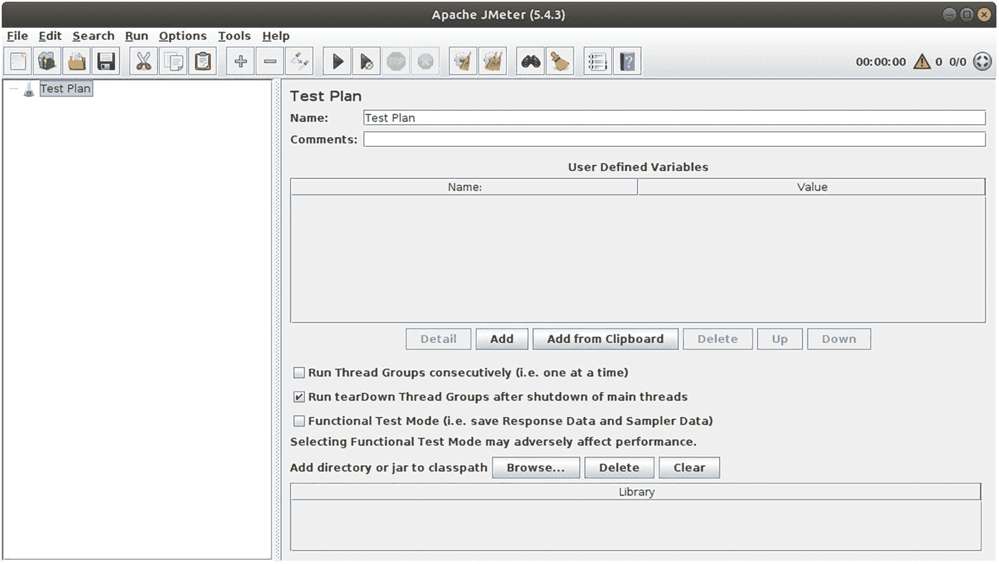

Apache JMeter 的一个窗口，其中测试计划显示了名称、注释和用户定义的变量。它选择了在主线程关闭后运行拆卸线程组的选项。

图 36-1
*JMeter* 的*启动窗口*

在左侧树形视图面板中右键单击“测试计划”，然后选择“添加 ➤ 线程（用户） ➤ 线程组”。这是一个主控制器，您可以在其中指定并行度（模拟的并发用户数）和测试生命周期。在线程组的设置视图中，进行以下更改：

```
线程数（用户）：  50
启动时间（秒）：   30
循环次数：[x] 永远
[x] 指定线程生命周期
持续时间（秒）：         300
```

其他设置保留默认值。这定义了一个运行五分钟的测试，模拟 50 个用户，启动时间为 30 秒。最后一个选项表示用户不会同时开始工作，这不符合实际情况。相反，用户的启动时间会均匀分布在最初的 30 秒内。
在线程组内部，添加一个简单控制器（选择“添加 ➤ 逻辑控制器 ➤ 简单控制器”）。这只是一个用于容纳其他测试元素的容器；它有助于您组织测试计划。

注意

每个测试元素，包括容器元素，都有一个 `name` 属性，您可以根据需要自由更改。这样，您可以构建高度全面的测试计划。

在简单控制器内部，添加一个流程控制操作（选择“添加 ➤ 取样器 ➤ 流程控制操作”）。在流程控制操作内部，添加一个常数吞吐量定时器（选择“添加 ➤ 定时器 ➤ 常数吞吐量定时器”）。流程控制操作只是一个虚拟的测试元素——您需要它来确保定时器在每次迭代中只作用一次。定时器本身会在测试运行中增加暂停，并尝试建立一定的吞吐量（每分钟调用次数）。否则，您模拟的用户将在页面加载之间不间断地操作，这不符合实际情况。对于设置，在流程控制操作内部，将所有内容保留为默认值（零毫秒暂停，基本上意味着什么都不做）。在常数吞吐量定时器中，按如下方式更改设置：

```
目标吞吐量（每分钟）： 6.0
基于计算：             仅此线程
```

这将模拟每个用户每十秒点击一次“重新加载”按钮。

作为基本的测试计划元素，向简单控制器添加一个 HTTP 请求（作为流程控制操作的兄弟元素）。您可以通过选择“添加 ➤ 取样器 ➤ HTTP 请求”找到它。在其设置页面中，更改以下内容：

```
服务器名称或 IP： www.someserver.com
端口号：       80
路径：              /index.html
```

在此处使用任何您选择的正在运行的 Web 服务器。但是，不要使用本地运行的服务器——响应时间太慢了。

您仍然需要一种保存或显示测试结果数据的方法。这由*监听器*负责。您将向测试计划添加三个监听器：

*   **汇总报告**以表格形式显示性能数据，并在测试运行时实时更新。

*   **图形结果**监听器显示一个包含性能数据的快速图表。此图表也会实时更新。

*   **简单数据写入器**将性能数据写入 CSV 文件。

对于所有三个监听器，只需要为简单数据写入器输入一个文件名。您可以随意尝试其他设置。我将这些监听器放置为线程组的兄弟元素。


现在的测试计划
如图 36-2 所示。你可以从 JMeter 图形界面启动测试。选择“图形结果”监听器，以便查看性能指标的变化趋势。

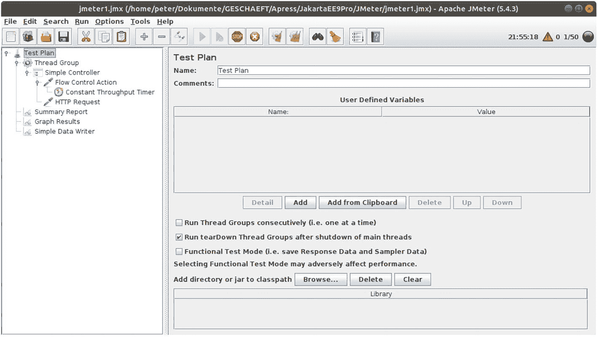

一个 JMeter 测试计划窗口，左侧的测试计划已被选中。它显示了名称、注释和用户定义的变量。它选中了“在主线程关闭后运行拆卸线程组”的选项。

图 36-2
*JMeter* *测试计划*

使用 Selenium 进行前端测试
Selenium 是一个浏览器
自动化工具。与 JMeter 不同，Selenium 模拟真实的浏览器活动，包括 JavaScript 代码。Selenium 有两种操作模式：要么使用可通过 Java API 编写脚本的 Web 驱动程序（也支持其他语言），要么使用 Selenium IDE，这是一个具有 GUI 风格脚本功能的浏览器插件。
虽然技术上可行，但通常你不会使用 Selenium 来对 Web 应用服务器产生显著负载。并行运行大量 Selenium 实例需要分配大量的 CPU 资源。而且你并不需要这样做——归根结底，服务器应用程序并非由客户端应用程序触发，而是由客户端发送给服务器的协议数据触发。如果你真的认为 Selenium 能帮助你实现项目目标，那么更合理的做法是通过 JMeter 生成负载，然后只让*一个* Selenium 实例并行运行。
你可以从 [`https://www.selenium.dev`](https://www.selenium.dev) 下载 Selenium。
你也可以在这里找到其他文档。

分析性能指标

运行测试后，整个工作流或其中某部分的耗时是最令人关注的结果。JMeter 的“简单数据写入器”监听器的输出可能如下所示：

```
timeStamp,elapsed,label,responseCode,responseMessage,...
1649233423985,743,HTTP Request,200,OK,...
1649233424077,651,HTTP Request-1,200,OK,...
1649233424484,481,HTTP Request,200,OK,...
1649233424525,440,HTTP Request-1,200,OK,...
...
```

为简化起见，我移除表头并将数据集缩减为仅包含时间戳和耗时：

```
1649233423985,743
1649233424077,651
1649233424484,481
1649233424525,440
...
```

执行此转换的 Linux 命令如下：

```
cat testout.csv | tail -n+2 | cut -d',' -f1,2 \
> testout2.csv
```

缩减文件大小

长时间测试后，测试结果文件可能包含
100,000 行或更多。在电子表格程序中处理如此大的文件（例如绘制图表）是一项非常耗时且繁琐的任务。因此，你可以缩减文件。只保留每隔 N 行的一行并丢弃所有其他行很容易。只需在终端中输入以下命令，即可保留每隔一行、两行或三行：

```
cat testout2.csv | awk '(NR+1)%2==0' > testout3.csv
- 或 -
cat testout2.csv | awk '(NR+1)%3==0' > testout3.csv
- 或 -
cat testout2.csv | awk '(NR+1)%4==0' > testout3.csv
...
```

绘制性能图表

现在，你可以将数据导入电子表格程序，例如 LibreOffice Calc。导入后，时间戳位于 A 列，耗时位于 B 列。作为第一步优化，你可以添加一列用于测试时间线。为此，在第一列旁边插入一个新列，并在单元格 B1 中输入此公式：

```
=(A1-A$1)/1000
```

使用单元格 B1 的填充柄将此公式填充到整列；参见图 36-3。

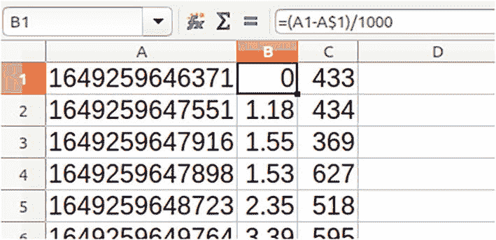

一个测试时间线表格有 6 行和 A、B、C 三列。单元格 B1 有一个公式，即等于左括号 A1 减去 A 美元符号 1 右括号除以 1000。

图 36-3
已添加测试时间线

注意

按住 Ctrl 键并左键双击填充柄，可一次性填充整列。

如果现在根据原始数据创建图表，你将得到一个类似图 36-4 所示的散点图。

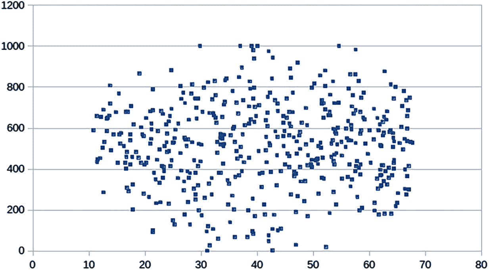

一个耗时图表的散点图，显示了 x 轴上 10 到 70 之间、y 轴上 0 到 1000 之间的原始散点数据。

图 36-4
耗时图表

这个图表表现力不强——你无法可靠地判断平均耗时是多少，也无法判断耗时在测试期间如何变化。因此，你可以添加另一列并计算移动平均值。在单元格 D20 中添加此公式：

```
=SUM(C1:C20)/20
```

使用单元格 D20 的填充柄填充 D20 下方的所有单元格。图 36-5 显示了结果。这将生成一个使用 20 个数据项作为窗口长度的移动平均值。如果改用 10 个数据项（修改公式！），生成的线条会更不平滑——窗口越大，平滑效果越好。

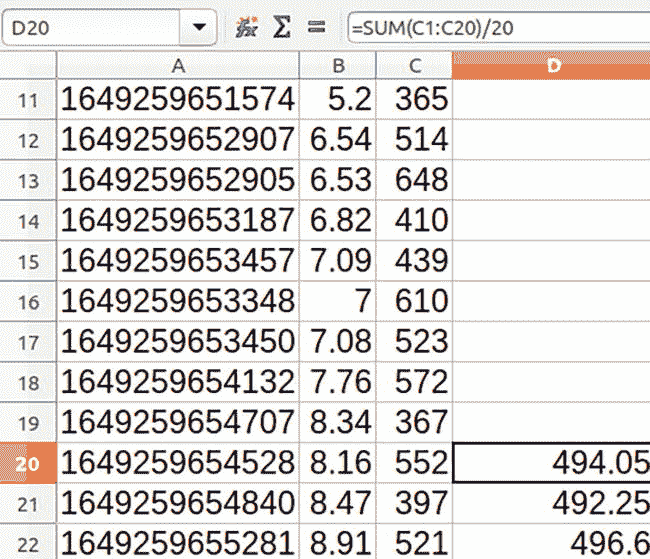

一个测试时间线表格有 12 行和 A、B、C、D 四列。单元格 D20 有一个公式，即等于 SUM 左括号 C 1 冒号 C 20 右括号除以 20。

图 36-5
已添加移动平均值列

另一个有趣的指标是标准差。它表示耗时与其平均值的差异程度。标准差的计算公式如下：


要将其添加到电子表格中，首先使用一列来计算耗时与其移动平均值的平方距离。在单元格 E20 中，写入以下内容：

```
=(D20-C20)*(D20-C20)
```

使用单元格 E20 的填充柄填充 E20 下方的所有单元格。现在，在单元格 F30 中，你可以添加标准差的公式：

```
=SQRT(SUM(E21:E30)/9)
```

再次使用填充柄将此公式复制到 F30 下方的所有单元格。

现在，你可以根据 B、C、D 和 F 列绘制图表。它将类似于图 36-6。

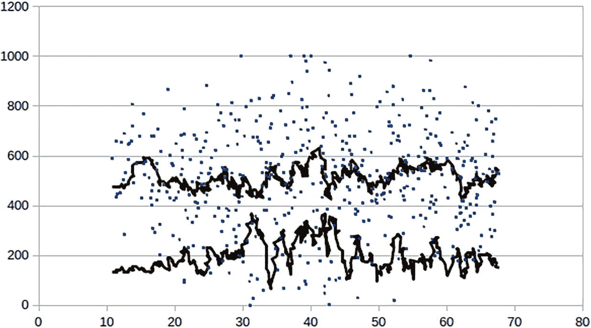

一个散点图，代表了已添加移动平均值列的性能图表。两条波动线分别从 (10, 150) 和 (10, 480) 开始，周围散布着散点。数值为近似值。

图 36-6
*已添加移动平均值列*

请勿使用最小值或最大值
通常我们会关注时间序列中的最小值和最大值。然而，这些数值背后的信息价值微乎其微。例如，考虑一个耗时时间序列，其中有 999 个值接近 500ms，一个值为 3.0s。最大值显然是 3.0s。如果你取第二个时间序列，其中有 500 个值接近 500ms，500 个值在 2.5s 到 3.0s 之间，最大值仍然是 3.0s。但这两个时间序列完全不同！说明存在一个 3.0 秒的最大值毫无价值。
关于值分布更好的信息由*百分位数*提供。计算方法如下：给定 *N* 个值 *y*[*i*]（*i* = 1, …, *N*），M-百分位数（M 介于 0 和 100 之间）恰好是 *y*[*j*]，其中 *M*% 的所有其他 *y*[*i*] 都小于 *y*[*j*]。在计算上，将 *y*[*i*] 按升序排序，然后取出索引为 *N* · *M*/100 的行。
例如，如果你有 *N* = 1000 个值 *y*[*i*]，首先将 *y*[*i*] 按升序排序。对于第 95 百分位数，你查找行号为 950 的值（来自 1,000 · 95/100）。例如，如果这个值是 650ms，你可以说：“该序列的第 95 百分位数是 650ms”，这等价于“95% 的值都低于 650ms”。
常见的百分位数有第 90 百分位数、第 95 百分位数、第 98 百分位数和第 99 百分位数。由于百分位数易于计算，一份性能测试报告可能会包含所有这些百分位数。


使用 VisualVM 进行代码级监控
VisualVM 是一款监控与管理工具，可处理运行中 JVM 的各个方面。它内置了一个名为 Sampler 的插件，该插件会定期查询 JVM 状态，包括方法调用的耗时。通过这种方式，无需编写一行代码或更改服务器配置，即可发现性能瓶颈。

注意

你可以从 [`https://visualvm.github.io/index.html`](https://visualvm.github.io/index.html) 下载 VisualVM。

VisualVM 可以使用与应用服务器不同的 Java 版本运行。VisualVM 与 OpenJDK 16 或 17 存在一个小问题——工具提示文本无法可靠显示，这给操作带来了一点不便。使用 OpenJDK 15 则没有问题。

例如，你可以向一个 REST 控制器添加一个耗时的操作。下面的方法展示了一种计算 `pi` 常量的不太聪明的方式：

```
@Path("/pi")
@GET
@Produces("application/json")
public String pi() {
return "{\"pi\":" + calcPi() + "}";
}
private double calcPi() {
int d = 1;
double sum = 0;
for(int i=0;i<100_000_000;i++) {
if(i % 2 == 0) sum += 4.0/d; else sum -= 4.0/d;
d += 2;
}
return sum;
}
```

你可以编写一个包含 `pi()` 方法的新 Web 应用程序，或者将其临时添加到一个现有的控制器中——这取决于你。
在 JMeter 测试计划中，你可以模拟许多并发用户调用 `pi()` 方法。为简单起见，你可以为此使用一个无限循环。

启动 VisualVM 后，将其连接到 GlassFish 应用程序，打开 Sampler 插件，然后点击 CPU 按钮开始获取性能数据。点击 Hot Spots 视图按钮。几秒钟后，你将看到一个表格，其中显示了最耗时的那些方法。参见图 36-7。

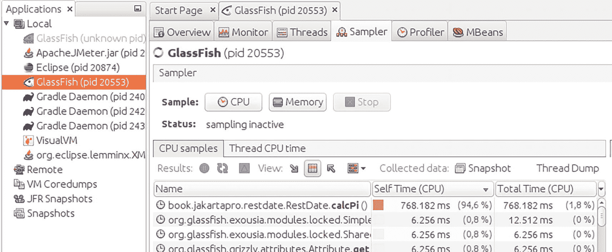

VisualVM 窗口在本地选项下选择 GlassFish，打开 Sampler 插件，并点击 CPU 按钮开始获取性能数据。它呈现出一个包含名称、自身时间和总时间的表格。

图 36-7
工作中的 VisualVM

正如预期的那样，`calcPi()` 显示在此列表的顶部。

代码优化

导致性能瓶颈的可能原因有很多。不可能构建一个类似检查清单的东西来避免所有这些问题。尽管如此，以下列表为你提供了一些避免此类缺陷的提示：

*   根据具体情况，函数式构造可能优于过程式设置。但是，你必须留意中间终止操作。在函数式表达式中构建大型集合（如列表、集合或映射）是一项耗时的操作。

*   避免在大型循环中构造过多对象。

*   尽管通常被认为过时，但使用数组代替集合可以显著加快应用程序的速度。

*   对于数据库操作，请考虑使用缓存。

*   除非绝对必要，否则避免使用反射。与直接的、语言级别的访问相比，对 Java 对象的反射访问要耗时得多。

*   使用 JMS 传输数据通常能带来清晰稳定的架构。但是，要注意陷阱——与更直接地寻址远程对象（例如通过 REST 接口或 RMI）相比，消息传递更耗时。另一方面，由于其异步性，JMS 消息传递可能会提升性能。详细分析有助于避免缺陷。

*   避免将 JMS 用于并发构造。当前版本的 Jakarta EE 处理并发的效率远高于旧版本，在旧版本中 JMS 被滥用于同一目的。

*   在可能的情况下，优先使用 JSON 而非 XML。JSON 比 XML 更精简，处理大型 JSON 结构比处理等效的 XML 数据耗时更少。

*   尽可能避免文件操作。将数据写入内存而非文件要快得多。

*   避免过度广泛的日志记录。

*   配置不当的垃圾回收程序可能导致性能问题。第 37 章将讨论垃圾回收。

37. 垃圾回收

垃圾回收是 Java 用来清除未使用对象、释放相关堆内存的清理过程。随着时间的推移，Java 垃圾回收器经历了许多变化，垃圾回收器的发展历史实际上相当有趣。然而，详细描述古老的垃圾回收器超出了本书的范围，因此本章将其描述限制在最常用的三种垃圾回收器——G1 垃圾回收器、Shenandoah GC 和零垃圾回收器。有兴趣的读者可以在网上找到关于其他垃圾回收器的信息。

垃圾回收器的重要性

垃圾回收发生在后台，而应用服务器正在运行。从应用程序开发人员的角度来看，垃圾回收器在不干扰应用程序的情况下完成其工作——垃圾回收器不可能在功能上做一些有趣的事情。尽管如此，垃圾回收器 (GC) 可以通过以下一种或多种方式影响应用程序的运行：

*   如果 GC 配置错误，它可能无法正常完成其工作。未释放的内存可能会堆积，最终导致内存不足错误和应用程序崩溃。

*   GC 需要一个或多个线程来完成其工作。这需要应用程序无法使用的计算能力。

*   由于 GC 的工作方式，GC 必须时不时地停止应用程序线程。显然，这种 STW（停止世界）周期应减少到最低限度。STW 周期长度通常被称为*延迟*。

*   应用程序中的错误可能会阻止 GC 释放未使用的对象。这可能导致应用程序崩溃。此类错误被称为*内存泄漏*。

由于这些原因，GC 指标应包含在性能/稳定性测试中。幸运的是，这并不复杂。所有 GC 都通过 JMX 发布自己的性能指标。例如，在 JMeter 中，你可以添加 Groovy 脚本，将通过 JMX 查询的数字写入其他测试结果文件中。
没有规则可以确定哪种 GC 最适合你的应用程序，以及选择哪些配置选项以获得最大的 GC 性能和稳定性。因此，你必须遵循启发式方法，并使用各种 GC 选项运行性能和负载测试，以查看哪种 GC 设置最适合你。

G1 垃圾回收器
G1 垃圾回收器，也称为 *Garbage First*，是为大堆内存和多处理器机器而设计的。自 JDK 9 版本起，它是默认的 GC。
在你常用的搜索引擎中输入 `java g1 options` 以了解有关 G1 选项的更多信息。

Shenandoah GC

与 G1 相比，Shenandoah GC 旨在实现更低的延迟，尤其是对于更大的堆。它可选地包含在 JDK 11 中，但需要在构建时选择加入。它在 JDK 12 到 16 版本中被移除，但在 JDK 17 中完全回归。你可以通过以下标志启用此垃圾回收器：

```
-XX:+UseShenandoahGC
```

在你常用的搜索引擎中输入 `java shenandoah options` 以了解有关 Shenandoah GC 选项的更多信息。

零垃圾回收器
Z 垃圾回收器是一种低延迟垃圾回收器，其 STW（停止世界，即暂停应用程序）周期保证小于十毫秒。它还声称可以处理 TB 级别的堆内存而不会显著降级。对于可能有 1000 个或更多用户的高流量应用程序，零垃圾回收器可能是你的最佳选择。

要启用零垃圾回收器，请将以下内容添加到 `java` 命令中：

```
-XX:+UseZGC
```


此功能在 JDK 15 或更高版本中可用。对于 JDK 11 至 14，零垃圾回收器（Zero Garbage Collector）是一个实验性功能，你需要额外添加：

```

# 仅适用于 jdks < 15
-XX:+UnlockExperimentalVMOptions
```

在你常用的搜索引擎中输入 `java zero garbage collector options` 以了解更多关于 ZGC 选项的信息。

垃圾回收器日志
对于所有垃圾回收器，你都可以启用日志输出。垃圾回收器随后会将其活动信息写入一个专用的日志文件中。分析此类文件本身就是一门科学，但除了编写脚本来从 GC 日志文件中提取有价值的信息外，也有一些 GUI 应用程序可以为你提供帮助。例如，来自 [`https://sourceforge.net/projects/gcviewer/`](https://sourceforge.net/projects/gcviewer/) 的小工具 GCViewer 可以帮助你快速分析 GC 活动。

注意

关于垃圾回收器的日志记录选项，请在文档中查找 JVM `-Xlog:*` 或 `-Xlog:gc:*` 标志（`*` 是通配符）。

38. 内存故障排查

Java 程序的一个核心特性是在应用程序运行时动态创建对象。在编写良好的代码中，垃圾回收器能够以平衡的方式自动移除未使用的对象。也就是说，在某个时刻，被移除的对象数量等于新创建的对象数量。不幸的是，尤其是在企业环境中的复杂应用程序中，软件缺陷可能导致功能上不再使用的对象在内存中徘徊，并且*不被*垃圾回收清除。如果此类对象随着时间的推移而堆积，就称为*内存泄漏*。
内存泄漏
不可避免地会导致应用程序崩溃。因此，在测试阶段识别内存泄漏、找出其原因并修复代码至关重要。

识别内存泄漏

考虑以下代码片段：

```
static class A {
int x = 7;
}
static List list = new ArrayList();
public String memLeak() {
Runnable r = new Runnable() {
public void run() {
while (true) {
for (int i = 0; i < 500; i++) {
A a = new A();
if (Math.random() < 0.5)
list.add(a);
}
try {
Thread.sleep(0, 100);
} catch (InterruptedException e) {
}
}
}
};
new Thread(r).start();
return "{\"result\":\"" + "OK" + "\"}";
}
```

例如，你可以将其添加到一个 Web 应用程序的 REST 控制器中：

```
@Path("/")
public class MemLeak {
static class A {  int x = 7;  }
static List list = new ArrayList();
@Path("/memleak")
@GET
@Produces("application/json")
public String memLeak() {
...
}
}
```

一旦你调用该方法，它就会产生一个新线程。在该线程内部，程序进入一个无限循环，用于创建类 `A` 的实例。每个对象被添加到列表的概率约为 50%。垃圾回收器稍后会移除未添加到列表中的对象。列表中的对象永远无法被释放，它们会在堆内存中持续堆积。因此，你实际上在这里制造了一个人为的内存泄漏。

如果你将该方法添加到一个 REST 控制器中，应用程序恰好被命名为 `MemLeak`，并且 Servlet 过滤器处理 `webapi/*` URL（在 `web.xml` 中配置）。你可以通过以下方式启动泄漏方法：

```
curl -X GET http://localhost:8080/MemLeak/webapi/memleak
```

注意

这适用于本地运行的 GlassFish——对于其他应用服务器，你可能需要更改此 URL。

在连接到服务器进程的 VisualVM 实例中，你可以从“监视”选项卡观察堆内存使用情况。随着泄漏方法的运行，你将看到如图 38-1 所示的发展趋势。

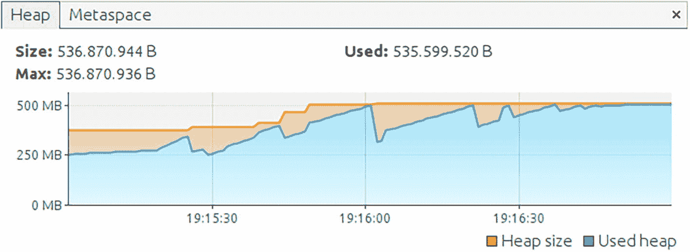

一个 VisualVM 界面显示了内存泄漏。图中绘制了堆大小和已用堆。已用堆内存为 535 MB，最大值为 536 MB，大小为 536 MB。

图 38-1
内存泄漏

你可以看到“已用堆”数值多次触及最大允许堆空间（本例中为 512 MB）。垃圾回收器活动（可通过斜率为负的区域识别）释放的内存越来越少。最终，“已用堆”曲线接近最大堆值，垃圾回收器无法释放任何显著数量的内存。此时，应用服务器最终崩溃。

不幸的是，绘制“已用堆”曲线并不总能指向泄漏的应用程序。考虑图 38-2 中所示的另一个示例。

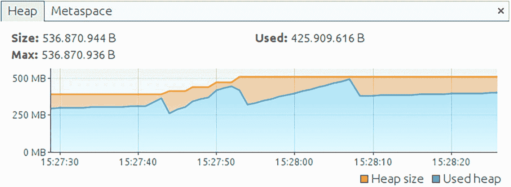

一个 VisualVM 界面显示了其他内存泄漏。图中绘制了堆大小和已用堆。已用堆内存为 425 MB，最大值为 536 MB，大小为 536 MB。

图 38-2
另一种内存泄漏

在这里，“已用堆”数值仅触及最大值一次，因此垃圾回收器执行了一次清理，应用服务器继续工作，但“已用堆”数值的斜率变得平缓。泄漏的线程终止了，而不是整个应用程序。

查看这两个示例，应该清楚你需要另一个信息来源来可靠地检测内存泄漏。这就是为什么你还需要查看日志。无论整个服务器崩溃还是仅仅一个应用程序线程崩溃，对于内存泄漏，你总会找到类似这样的条目：

```
[2022-04-14T17:06:40.873+0200] [glassfish 6.2]
[SEVERE] [] [] [tid: _ThreadID=305 _ThreadName=Thread-8]
[timeMillis: 1649948800873] [levelValue: 1000] [[
java.lang.OutOfMemoryError: Java heap space
at ...
at book.jakartapro.memleak.MemLeak$1.run(
MemLeak.java:32)
at java.base/java.lang.Thread.run(Thread.java:834)
]]
```

建议的流程是首先查看日志，然后可视化“已用堆”曲线，以加强内存泄漏正在发生的证据。

更多证据：堆转储
为了进一步确定应用程序的哪个部分导致了内存泄漏，你可以使用*堆转储*。堆转储代表了 Java 应用程序（或应用服务器）在获取堆转储时的精确内存状态。堆转储将其数据存储在一个文件中，该文件通常位于应用程序运行的同一台机器上。
有多种获取堆转储的方法。其中一些方法需要知道你想要获取堆转储的 Java 程序的进程 ID。

注意

对于此处介绍的所有 shell 命令，你必须将 JDK 安装目录中的 `bin` 目录添加到 `PATH` 环境变量中，或者必须为命令添加完整路径。

为了获取进程 ID，请使用 `jps` 命令：

```
jps -l
输出示例：
8384 jdk.jcmd/sun.tools.jps.Jps
8209 org.eclipse.lemminx.XMLServerLauncher
7796 /opt/eclipse/[...]equinox.launcher[...].jar
7416 com.sun.enterprise.glassfish.bootstrap.ASMain
8072 org.gradle.launcher.daemon.bootstrap.GradleDaemon
```

在显示的输出中，`ASMain` 指向一个正在运行的 GlassFish 实例——在本例中，`7416` 是进程 ID。

回到堆转储工具——`jmap` 命令是一个选项：

```
jmap -dump:live,format=b,file=dump1.hprof 7416
```

`live` 标志是可选的。如果省略它，那些将被垃圾回收的孤立对象也会被添加到转储中。`format=b` 标志确保转储文件采用 `HPROF` 二进制格式。`7416` 是进程 ID；请在此处替换为你自己的进程 ID。命令执行后，你可以在当前目录中找到转储文件。

`jmap` 命令有一种操作模式，仅对 Java 对象实例进行计数，而不写入转储文件。输入以下命令：

```
jmap -histo:live 7416 | less
```

可以看到类似如下的输出（已稍作精简）：

```
num #instances #bytes    class name (module)


1:  7909999   126559984  book.jakartapro.memleak.MemLeak$A
2:   179397    45847984  Ljava.lang.Object; (java.base@11)
3:   403798    42437568  [B (java.base@11)
4:   128053    11268664  java.l.r.Method (java.base@11)
5:   388874     9332976  java.l.String (java.base@11)
6:    12250     5787624  [I (java.base@11)
...
```

这有助于查找内存泄漏的原因。在此示例中，正如预期的那样，你可以看到`MemLeak$A`类的实例数量异常多。不过，可能仍然需要进一步调查完整的堆转储。只有完整的堆转储才能用于调查对象关系。

另一个堆转储工具叫做`jcmd`。使用方法如下：

```
jcmd 7416 GC.heap_dump dump1.hprof
```

第一个参数是应用服务器的进程 ID。转储文件*不会*创建在当前目录中。相反，你需要在应用服务器的工作目录中查找它。对于 GlassFish，该目录是
`GLASSFISH_INST_DIR/glassfish/domains/domain1/config`。

也可以从 VisualVM 工具内部获取堆转储。将 VisualVM 连接到应用服务器实例后，你可以在“监视器”选项卡上找到一个“堆转储”按钮。获取堆转储后，VisualVM 会打开一个额外的选项卡，其中包含有用的信息，如图 [38-3 所示。

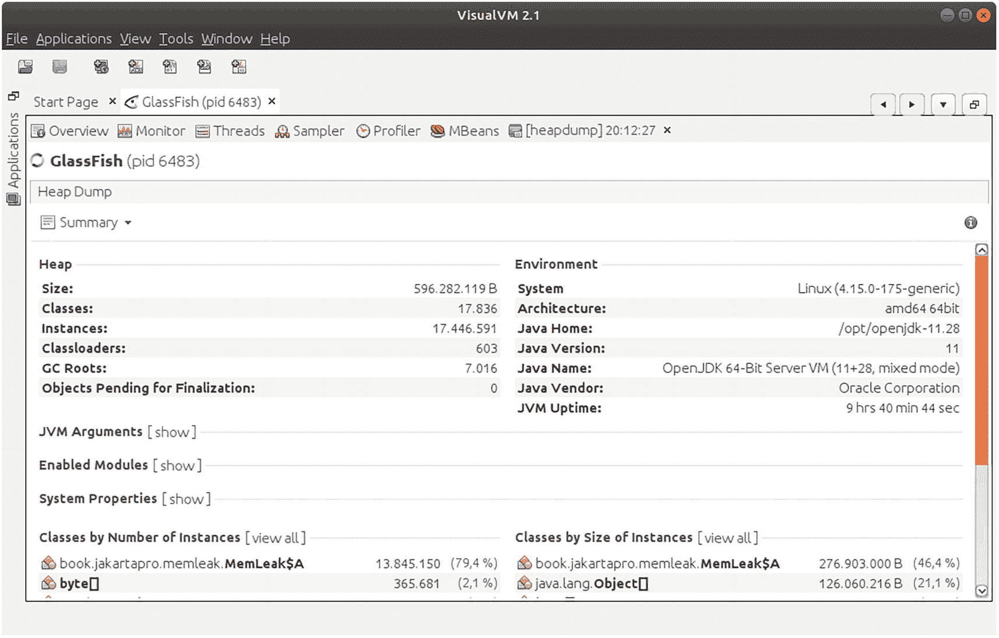

一个 VisualVM 界面显示了堆转储内存。它列出了堆，包括大小、类、实例、类加载器等，以及环境信息，包括系统、Java 主目录、Java 供应商等。

图 38-3
VisualVM 堆转储

VisualVM 将堆保存在临时位置。要将堆转储保存到文件中以供后续分析，请在窗口左侧的树状视图中右键单击堆转储，然后从菜单中选择“另存为”。
JDK 包含一个名为`jconsole`的 GUI 工具，你也可以使用它来触发堆转储。启动后，一个连接对话框允许你选择服务器进程。导航到“MBeans”选项卡，选择`com.sun.management.HotSpotDiagnostic` MBean。在其“操作”视图中，有一个`dumpHeap`方法，你可以通过点击相应名称的按钮来调用它。使用文件名作为参数，例如`heap.hprof`，并使用`true`来启动垃圾回收。触发堆转储创建后，你可以在应用服务器的工作目录中找到它。对于 GlassFish，该目录是
`GLASSFISH_INST_DIR/glassfish/domains/domain1/config`。

最后一种选择是，你可以添加一个 JVM 启动选项，指示进程在抛出`OutOfMemoryError`之前自动生成堆转储。为此，请在启动脚本中添加以下标志：

```
-XX:+HeapDumpOnOutOfMemoryError
-XX:HeapDumpPath=
```

堆转储的文件名类似于`java_7416.hprof`，其中`7416`同样是进程 ID。如果省略`HeapDumpPath`选项，堆转储将在服务器的工作目录中创建（对于 GlassFish 是`GLASSFISH_INST_DIR/glassfish/domains/domain1/config`）。

分析堆转储
堆转储使用名为`HPROF`的二进制格式来存储类和对象关系信息。此外，对于 Jakarta EE 服务器，你通常有数千个类在运行。因此，你可以想象，分析一个堆，或者比较在不同时间获取的两个堆，是一项非常具有挑战性的任务。幸运的是，这里有一些工具可以帮助你——Eclipse Memory Analyzer 和 VisualVM。两者都可以免费使用。

你已经了解了如何从 VisualVM 内部获取堆。但该程序在帮助你查找内存泄漏方面还能做更多。在堆转储视图中，如果你从“摘要”视图类型切换到“对象”视图类型，你将进入一个工具子集，该子集能够告诉你实例统计信息和对象关系。参见图 38-4。

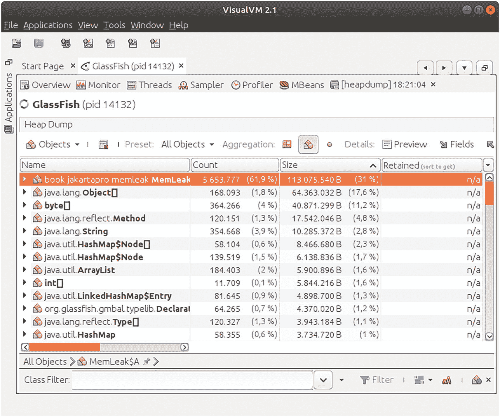

一个 VisualVM 界面显示了对象视图的堆转储内存。它包括文件的名称、计数、大小和保留信息。

图 38-4
VisualVM 对象视图

在标记为“预设”的复选框中，你可以选择你感兴趣的对象关系。可能的值如下：

*   **所有对象**

查看所有对象，无论它们与其他对象的关系如何。在此预设中，你可以确定`MemLeak$A`类的实例数量过多。但是，你无法找出对象存储在哪里，或者为什么对象没有被垃圾回收。因此，此预设仅能提示你哪个类是内存泄漏的源头。

*   **支配者**

*支配者*关系表达了哪些对象负责阻止其他对象被垃圾回收。支配者视图是一个树状视图，因为你可以按树层次结构排列支配者。它允许你计算*保留*大小，即如果打破支配关系可以释放的字节数。因此，支配者预设对于内存泄漏相关的故障排除非常重要。

*   **GC 根**

查看 GC 根，它们是 JVM 的主要类，所有关系都基于它们构建。垃圾回收算法从 GC 根开始。因为从应用程序的角度来看，GC 根具有更多的技术性外观，所以你通常不会通过查看 GC 根来分析内存泄漏。

“聚合”类型允许你选择应用于对象的聚合模式，在“详细信息”中，你可以对列表中的选定项触发各种计算。

如果你使用“支配者”预设，请选择“实例聚合”并按“保留大小”排序（单击列标题）。然后你可以看到，单个`MemLeak$A`实例保留了堆的很大一部分，并且被`list`静态字段所支配。瞧——内存泄漏就在这里！参见图 38-5。

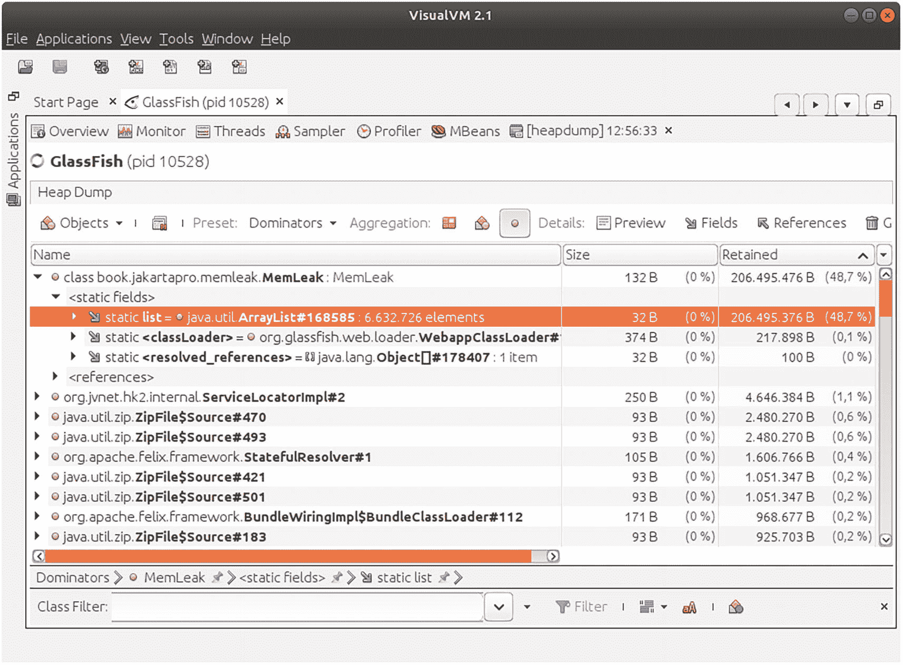

一个 VisualVM 支配者分析内存泄漏的窗口。支配者是 Mem Leak，后跟静态字段和静态列表。它包括名称、大小和保留详细信息。

图 38-5
VisualVM 支配者分析

注意

预计会需要一些试错工作。对于其他类型的内存泄漏，你可能需要使用其他设置才能找到有意义的信息。

也可以比较两个堆。预设标签左侧的按钮允许你选择另一个堆转储进行比较。这是一种高级分析技术，如果查看单个堆转储无法得出重要结论，它可以帮助你。

Eclipse Memory Analyzer (EMA) 是另一个可用于堆转储分析的相当通用的工具。它是一个 Eclipse 插件，如果你搜索“Memory Analyzer”，可以在 Eclipse Marketplace 中找到它。安装后，会出现一个名为“内存分析”的新透视图（选择“窗口”➤“透视图”）。使用工具栏，你可以导入堆转储。在向导对话框中，勾选“泄漏嫌疑报告”。然后，你将看到一个指向可疑类的报告，如图 38-6 所示。

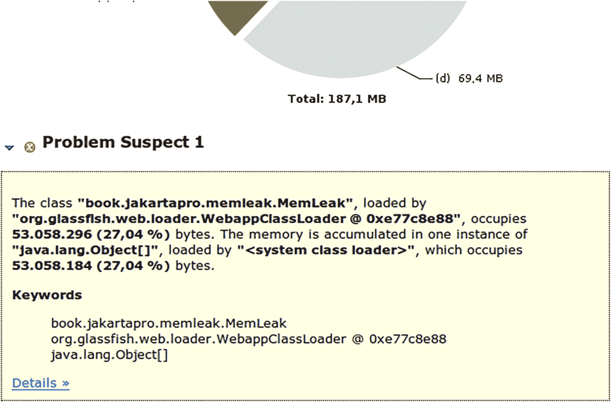

一个 Eclipse 内存分析器报告的插图。它呈现了一份关于问题嫌疑 1 的报告，并附有关键词。一个图表表示总计为 1871 MB。

图 38-6
Eclipse 内存分析器报告

该报告正确地将`MemLeak`类列为嫌疑对象。为了进一步调查，请从转储的工具栏中选择“为整个堆打开支配者树”。呈现的列表如图 38-7 所示。

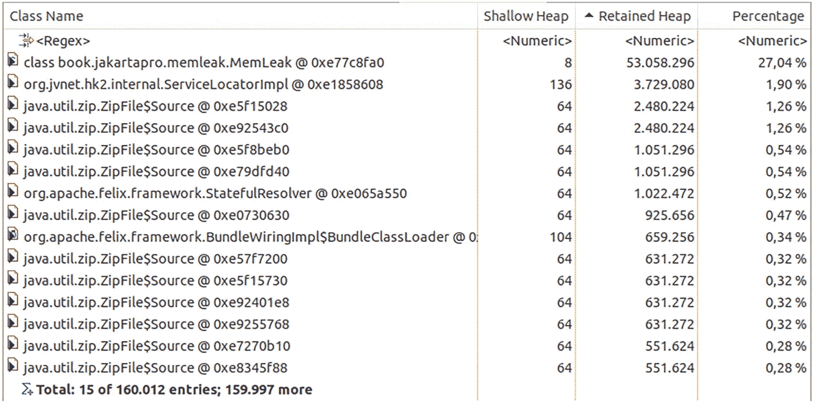

一个整个堆的支配者树表格，包括类名、浅堆大小、保留堆大小和百分比。

图 38-7
EMA 支配者树


与 VisualVM 分析的情况类似，请务必留意*保留*堆大小。你可以通过单击、双击或右键点击相关类，并执行各种计算和选择来继续此分析。这里几乎不可能描述所有功能，但插件附带的帮助文档应该能为你提供一个起点。

针对本章中人为制造的内存泄漏，例如，你可以右键点击 `MemLeak` 类，然后选择“泄漏识别 ➤ 组件报告”。通过点击“保留集”标签，你会看到有大量的 `MemLeak$A` 对象与该类静态关联。

39. 自定义 Log4j Appender

Log4j appender 负责将日志事件写出或发送给某个外部消费者。有许多内置的 appender 可供使用，因此如果你有特殊需求，应首先检查 Log4j 是否能满足你的要求。表 39-1 列出了 Log4j 附带的所有 appender。

注意

Log4j 从 1.x 版本到 2.x 版本发生了重大变化。这就是为什么 2.x 版本通常被称为 Log4j2。尽管 Log4j 1.x 仍在使用，但本章中提及 Log4j 时，我指的是 Log4j2。

表 39-1
Log4j Appender

名称 |
 描述 |

| --- | --- | --- | --- | --- |

Async |
 包装另一个 appender，并在新线程中异步发送日志事件。 |

Cassandra |
 将日志事件发送到 Apache Cassandra 数据库。 |

Console |
 将日志事件发送到控制台。请注意，大多数 Jakarta EE 服务器会重定向控制台，并将控制台消息写入服务器日志文件。 |

Failover |
 包装一个 appender 列表，并按顺序发送日志事件，直到其中一个成功。 |

File |
 将日志事件发送到文件。 |

Flume |
 将日志事件发送到 Apache Flume（一个用于路由和聚合大量日志数据的系统）。 |

JDBC |
 将日志事件发送到可通过 JDBC 访问的数据库。 |

JMS |
 将日志事件发送到可通过 JMS 访问的消息系统。 |

JPA |
 通过持久化 API (JPA 2.1) 将日志事件发送到数据库。 |

HTTP |
 通过 HTTP 发送日志事件。 |

Kafka |
 将日志事件发送到 Apache Kafka 实例（一个分布式事件流平台）。 |

Memory Mapped File |
 将日志事件发送到内存映射文件。操作系统负责将数据写入内存区域，稍后再将数据同步到真实文件。 |

NoSQL |
 通过轻量级 API 将数据发送到 NoSQL 数据库。提供了针对 MongoDB 和 CouchDB 的实现。 |

NoSQL for MongoDB 3 |
 将日志事件发送到 MongoDB v3。 |

NoSQL for MongoDB 4 |
 将日志事件发送到 MongoDB v4。 |

NoSQL for CouchDB |
 将日志事件发送到 CouchDB。 |

Random Access File |
 与文件 appender 相同，但始终使用缓冲。 |

Rewrite |
 允许在日志事件发送到另一个 appender 之前对其进行操作。 |

Rolling File |
 与文件 appender 相同，但允许滚动文件策略。 |

Rolling Random Access File |
 与随机访问文件 appender 相同，但允许滚动文件策略。 |

Routing |
 允许将事件路由到下级 appender。 |

SMTP |
 允许将日志事件作为电子邮件发送。 |

ScriptAppenderSelector |
 根据脚本结果选择 appender。 |

Socket |
 将日志事件写入 TCP 或 UDP 套接字。 |

Syslog |
 与套接字 appender 相同，但使用 BSD Syslog 或 RFC 5424 格式。 |

ZeroMQ/JeroMQ |
 将日志事件发送到 ZeroMQ 网络系统。 |

更多详情，请参阅文档：[`https://logging.apache.org/log4j/2.x/manual/appenders.html`](https://logging.apache.org/log4j/2.x/manual/appenders.html)。
如果没有内置的 appender 能满足你的需求，构建一个自定义 appender 也并不复杂。以下各节将向你展示如何操作。

包含 Log4j

为了使用 Log4j 并编写自定义 appender，请添加以下依赖：

```
// Gradle
implementation 'org.apache.logging.log4j:log4j-core:2.17.2'

org.apache.logging.log4j
log4j-core
2.17.2

```

一个统计 Appender


考虑一个追加器，它提供关于每日传入日志事件的统计数据。你只会将其用作辅助追加器，这没问题，因为你可以为一个日志记录器关联多个追加器。统计数据会在每天午夜过后、第一条新消息到达时写出。该追加器类编写如下：

```
package book.jakartapro.restdate.log4j;
import java.time.LocalDate;
import java.util.HashMap;
import java.util.Map;
import org.apache.logging.log4j.core.Appender;
import org.apache.logging.log4j.core.Core;
import org.apache.logging.log4j.core.Filter;
import org.apache.logging.log4j.core.LogEvent;
import org.apache.logging.log4j.core.appender.
AbstractAppender;
import org.apache.logging.log4j.core.config.Property;
import org.apache.logging.log4j.core.config.plugins.*:
import org.apache.logging.log4j.spi.StandardLevel;
@Plugin(name = "StatisticsAppender",
category = Core.CATEGORY_NAME,
elementType = Appender.ELEMENT_TYPE)
public class StatisticsAppender extends AbstractAppender {
public static class Stat {
public int traceCnt = 0;
public int debugCnt = 0;
public int infoCnt = 0;
public int warnCnt = 0;
public int errorCnt = 0;
public int allCnt() {
return traceCnt + debugCnt + infoCnt +
warnCnt + errorCnt;
}
}
private Map hist = new HashMap();
protected StatisticsAppender(String name,
Filter filter) {
super(name, filter, null, true,
Property.EMPTY_ARRAY);
}
@PluginFactory
public static StatisticsAppender createAppender(
@PluginAttribute("name") String name,
@PluginElement("Filter") Filter filter) {
return new StatisticsAppender(name, filter);
}
@Override
public void append(LogEvent event) {
updateStat(event);
maybeWriteOut();
}
private void maybeWriteOut() {
// If we have just one entry for today, it means
// the last day just closed and can be written out
LocalDate tm = LocalDate.now();
// For testing and debugging, comment out the
// following if()
if(hist.get(tm).allCnt() == 1) {
LocalDate tmx = tm.minusDays(1);
// tmx = tm; // DEBUGGING ONLY
if(hist.containsKey(tmx)) {
Stat s = hist.get(tmx);
System.out.println("STATISTICS - " +
tmx.toString() + "\n" +
"all: " + s.allCnt() + "\n" +
"trace: " + s.traceCnt + "\n" +
"debug: " + s.debugCnt + "\n" +
"info: " + s.infoCnt + "\n" +
"warn: " + s.warnCnt + "\n" +
"error: " + s.errorCnt + "\n");
}
// Add some cleanup code here, removing old
// entries from hist...
}
}
private void updateStat(LogEvent event) {
LocalDate tm = LocalDate.now();
Stat stat = hist.computeIfAbsent(tm,
tm1 -> new Stat());
int l = event.getLevel().intLevel();
if(l == StandardLevel.TRACE.intLevel())
stat.traceCnt++;
else if(l == StandardLevel.DEBUG.intLevel())
stat.debugCnt++;
else if(l == StandardLevel.INFO.intLevel())
stat.infoCnt++;
else if(l == StandardLevel.WARN.intLevel())
stat.warnCnt++;
else if(l == StandardLevel.ERROR.intLevel())
stat.errorCnt++;
else if(l == StandardLevel.FATAL.intLevel())
stat.errorCnt++;
}
}
```

`@Plugin` 注解是核心配置元素。它将类限定为用作追加器。此示例使用了抽象类 `AbstractAppender`，这有助于避免编写样板代码。最重要的方法是 `append()`——新的日志事件在此处到达。像往常一样，你可以在 API 文档中找到关于注解和基类的更多信息。

一个使用 XML 格式的基本 Log4j2 配置文件如下所示：

将其命名为 `log4j2.xml`，对于通过 Maven 或 Gradle 构建的 Web 应用程序，将其保存在 `src.main.resources.` 文件夹中。最后，向任何应用程序添加 Log4j 日志记录指令以测试该追加器。

索引

A

Act.Framework

Angular 2

Apache Struts 2

应用程序客户端

企业应用程序

生成与运行

Groovy 脚本

应用程序性能

应用程序服务器

面向切面编程（AOP）

认证数据

认证方法

cleanSubject() 方法

@FormAuthenticationMechanismDefinition

HttpAuthenticationMechanism

HttpMessageContext 参数

IdentityStores

secureResponse() 方法


validateRequest() 方法

变体

辅助追加器

B

基本认证

批处理

应用程序、构建与部署

概念

数据准备

EAR 项目

Batch-Ejb

build.gradle

EJB 子项目

GlassFish 安装

gradle.properties 文件

包资源管理器视图

员工考勤

Gradle 项目

Java 构件

AttendanceReader

类

item-count 属性

读取器

SSNs

任务类型

writeItems() 方法

JEE 7

作业定义文件

JSR 352

调度

服务器

Bean 校验

约束

添加

内置约束

声明

自定义约束

注解代码

自定义 Bean 校验器

isValid() 方法

PZN8 约束

Pzn8Validator 类

异常

版本

工作场所

build.gradle 文件

构建触发器

配置部分

优雅的触发选项

Git

Jenkins

部件

远程

保存按钮

Subversion

时间线

C

缓存

活动

对象

客户端证书

浏览器

生成

GlassFish 配置

HTTPS 监听器配置

脚本

服务器

Web 应用程序

admin/secured.xhtml

beans.xml

faces-config.xml

glassfish-web.xml

index.xhtml

web.xml

代码优化

复合组件

复合命名空间

定义

jakarta.faces.composite

labelAndField

命名空间

并发

ContextService

GlassFish

Jakarta EE 服务器

ManagedExecutortServices

Future 对象

JNDI 查找

JNDI 名称

列表

方法

任务

用途

ManagedScheduledExecutortServices

注入/JNDI 查找

JNDI 名称

方法

重复

ScheduledFuture 对象

任务

超时值

ManagedThreadFactory

事务

连接器

参见资源适配器

上下文与依赖注入 (CDI)

替代方案

Bean 类

装饰器

拦截器

*与* 非 CDI 对比

对象图

类、关联/实例化

EJB 类

Faces Bean 类

字段

@Inject

实例

REST 端点类

生产者

限定符

作用域

规范

用途

持续集成 (CI)

约定

配置条目

流程

返回页面

起始页面

流程名称

CouchDB

辅助函数

请求

自定义组件

自定义标签库

创建

自定义命名空间

日期输入组件

fancyDateInput.xhtml

<html>

mytaglib.taglib.xml

src/main/webapp/WEB-INF/web.xml

D

D3js

数据库管理系统

DataTables

部署描述符文件

E

EAR

Eclipse

配置

安装

Jakarta EE 服务器

beans.xml

块

book.jakartapro.restdate

book.jakartapro.restdate.TestRestDate

dependencies { } 部分

部署描述符

部署流程

部署/取消部署任务

GlassFish 工具

glassfish-web.xml

Gradle 项目

Gradle 任务视图

Gradle 包装器

Groovy 代码

导入的类

plugins { } 部分

RestDate

RESTful 日期应用程序

RESTful 服务

src/test/java

用户名/密码

WAR 文件

WAR 插件

web.xml

Windows

Java 运行时

市场

插件

项目布局

用途

Eclipse 内存分析器 (EMA)

Ehcache

文档

Hibernate 配置

META-INF/ehcache.xml

persistence.xml

属性

安装

Ember

指数移动平均线

F

Facelets

Faces 模板

安装

<ui:component> 标签

<ui:composition> 标签

<ui:debug> 标签

<ui:decorate> 标签

<ui:define> 标签

<ui:fragment> 标签

<ui:include> 标签

<ui:insert> 标签

<ui:param> 标签

<ui:repeat> 标签

Facelets 项目

asadmin 工具

composers.xhtml

deployWar

GlassFish

Java 类

<ui:composition> 标签

MusicBox

performers.xhtml

src/main/webapp/frame.xhtml

src/main/webapp/WEB-INF/beans.xml

src/main/webapp/WEB-INF/faces-config.xml

src/main/webapp/WEB-INF/glassfish-web.xml

src/main/webapp/WEB-INF/web.xml

style.css

titles.xhtml

WebMessages.properties

XHTML 文件

Faces 流程

Faces 阶段监听器

流程

数据

结果

过程

编程式配置

设置

流程作用域

Fluentd

文档

过滤

安装

JSON

日志文件

conf1.conf 文件

指令

输入插件

<match> ... </match>

<parse> ... </parse>

<source> ... </source>

输出

Tail 插件

测试

多条路由

输出

运行

基于表单的身份验证

Faces 页面

beans.xml

faces-config.xml

文件

glassfish-web.xml

<login-config>

<security-role>

资源

安全约束/登录配置

安全角色映射

服务器，启用/配置安全

XHTML 代码

按钮/链接

错误页面

忘记密码链接

HTML <form> 标签

<login-config>

测试

<url-pattern> 标签

前端技术

功能测试

G

垃圾回收

垃圾回收器 (GCs)

G1

重要性

Java

日志

Shenandoah

Zero

G1 垃圾回收器

Git 客户端

克隆过程

Git 仓库

gituser


公钥

仓库视图

RestDate 项目

Git 版本控制系统

配置

连接协议

企业环境

分布式

gituser

gituser.sh

HTTPS 方法

安装

项目团队

仓库

GlassFish

调试

Linux

操作说明

工具

Windows

Gradle

Gradle 项目布局

Groovy 语言

GWT

H

HelloWorldConnection

HelloWorldConnectionFactory

HelloWorldConnectionFactoryImpl

HelloWorldConnectionImpl

HelloWorldManagedConnection

HelloWorldManagedConnectionFactory

HelloWorldManagedConnectionMetaData

HelloWorldResourceAdapter

Hibernate

配置

抓取

安装

HTTP

HttpAuthenticationMechanism

I

IdentityStore

集成开发环境 (IDE)

集成测试

拦截器

CDI

注解

Bean

客户端

@Interceptor

@TracingInterceptor

WEB-INF/beans.xml

定义

目标

接口

J, K

Jakarta EE 技术

Jakarta Mail

安装

发送

Java 类

Java 自定义组件

Java 企业安全

Java JSON Web Token (JJWT)

Java 库

Java 管理扩展 (JMX)

客户端

Groovy 代码

GUI

JMX

监控框架

类型

连接，SSL

监控

应用初始化方法

已用时间

MBeans

端口

服务器

SSL 密钥

Java MVC

配置文件

App 类

beans.xml

DELETE/PUT 请求

glassfish-web.xml

HTML 表单

HttpMethodOverride 类

方法

RootRedirector

web.xml

控制器类

辅助类

jakarta.ws.rs

Models 对象

PetshopController

服务类

安装

build.gradle 文件

依赖

gradle.properties 文件

JSP 页面

消息

模型类

宠物商店应用

静态文件

视图页面

特性

details.jsp

form.jsp

<head> 部分

index.jsp

宠物商店应用

Java 程序

JavaScript

JavaScript 对象表示法 (JSON)

文档

生成

Java 对象

注解

类

颜色

转换过程

转换器类

JSON 字符串

成员

模式

Shape 类

类型适配器

解析

REST 服务

Java 标准标签库 (JSTL)

Java Web 令牌 (JWTs)

Base64 编码部分

声明

解密

加密

文档

Jose4j

安全需求

令牌生成方法

用途

Java XML 绑定 (JAXB)

jca-interfaces.jar 文件

Jenkins 构建，REST

API

连接信息

GRAPE 库

Groovy 项目

示例请求

脚本输出

scripts/builds.groovy

替换

Jenkins 项目

Jenkins 服务器

Jenkins Web 管理员

JMeter

恒定吞吐量定时器

下载

流控制动作

GUI

HTTP 请求

监听器

操作系统

录制器

简单控制器

start.bat 文件

start.sh 文件

启动窗口

测试计划

测试运行时间

线程组

Web 服务器

作业定义文件

Jose4j

JPA 实体 Bean

JPA 生命周期监听器

JSON 绑定 (JSON-B)

JSON 处理 (JSON-P)

JSON Web 算法 (JWA)

JSON Web 加密 (JWE)

JSON Web 密钥 (JWK)

JSON Web 签名 (JWS)

JSON Web 令牌 (JWTs)

JWT 登录过程

客户端代码

beans.xml

按钮

glassfish-web.xml

HTML 文件

onclick 处理程序

script.js

styles.css

用户名/密码

WEB-INF/web.xml

服务器

服务器代码

L

Log4j

附加器

依赖

文档

日志记录器

日志记录

日志数据收集器

M

mail.smtps.ssl.trust 属性

MANIFEST.MF 文件

编组

Marvin EAR 根项目

Marvin EJB 项目

Marvin EJB 项目代码

Marvin Web 项目

Marvin Web 项目代码

Maven

Maven 仓库

客户端视角

公司库

buildRepoGradle.gradle 文件

声明

Gradle 构建文件

信息文件

Maven 插件

POM 文件/哈希值

要求

toRepo.sh

URL

企业内网

企业仓库

声明

dependencies { ... } 部分

Gradle

布局

Web 前端

Maven 服务器

MBeans

@ApplicationScoped 注解

风格

JMX

可监控值

后构造方法

内存泄漏

堆转储

聚合类型

比较

支配者

dumpHeap 方法

EMA

GlassFish

HPROF

jcmd 工具

jconsole

jmap 命令

jps 命令

JVM 启动选项

live 标志

MemLeak 类

命名

输出

可能的值

进程 ID

工具

VisualVM

识别

代码片段

GC

泄漏方法

日志

对象

REST 控制器

已用堆行

已用堆数值

VisualVM

消息传输代理 (MTA)

MicroProfile 5.0

MicroProfiles

应用微服务化

能力

依赖

@Readiness 注解

RestDateHealth 类

RestDate.java 类

REST 方法

gradle war 任务

安装

*与* Jakarta EE 对比

RestDateMP 项目

规范

web.xml

微服务

<APP_NAME>

cURL

健康状态

Jakarta EE

指标

OpenAPI 数据

TomEE 服务器

URL

WAR 文件

模型-视图-控制器 (MVC)

MongoDB

地址/端口

数据库/集合

依赖

pom.xml

监控

聚合值

代码级别

框架

JMX

MBeans

移动平均

N

Nagios

NetBeans

复制操作

创建项目

deployWar 任务

检测

Gradle 项目

安装

Java 项目

非 IDE 脚本

Node.js

非功能性需求 (NFR) 测试

持续时间

元素

JMeter

参见 JMeter

运行

无第三方前端技术

非关系型数据库 (NoSQL)

O

对象关系映射器 (ORM)

P, Q

性能与负载测试

前端测试

测试阶段

网页

性能数据

文件大小

JMeter

Linux 命令

最小值/最大值

性能图表

时间戳/已用时间

物理连接

Play (版本 2)

R

React

实际构建

构建阶段

内容

cURL

部署阶段

Groovy

集成测试

Jenkinsfile

发布阶段

.ssh/authorized_keys

SSH 密钥

Stage View

user@the.server.addr

请求作用域

资源适配器

build.gradle 文件

类

客户端

部署

MANIFEST.MF 文件

打包

RAR 文件

服务器

技术要点

REST 端点

类

@JWTTokenNeeded 注解

keyGenerator.generateKey() 方法

NameBinding 元注解

REST 安全

浏览器到服务器通信

GlassFish

安全约束

服务器代码

S

脚本语言

安装

Java

安全 API

Selenium

Servlet 监听器

会话作用域

Shenandoah GC

单页 Web 应用 (SPAs)

Spring Boot

Spring MVC

SQL 数据库

标准差

无状态协议

统计附加器

附加器类

append() 方法

log4j2.xml

@Plugin 注解

Subversion 客户端

额外密码输入

文件/文件夹

私钥

项目

Subversion 控制

SVN

公钥

仓库视图

RestDate 项目

SSH 凭据输入

Subclipse

SVN 仓库标签页

Subversion 版本控制系统

adduser

安装

方法，仓库

OpenSUSE Leap

rbash

仓库布局

安全

SSH

svn+ssh:// 协议

svnuser.sh 文件

用户和组

T

测试

测试计划

U

单元测试

V

Vaadin

validationTypes() 方法

版本控制系统

VisualVM

Vue

W

Web 应用

WebSocket

客户端

服务端

上下文根

EAR 插件

环境

JSR 356

消息

项目

服务器对象

sock-context

WAR 文件

X, Y

XML 绑定

Java 对象树

注解

Catalog 类型

JAXB_FORMATTED_OUTPUT 属性

编组器

输出

Record 类

recordList

@XmlAttribute

模式

XML 到 Java

XML 文档

Z

零 GC
