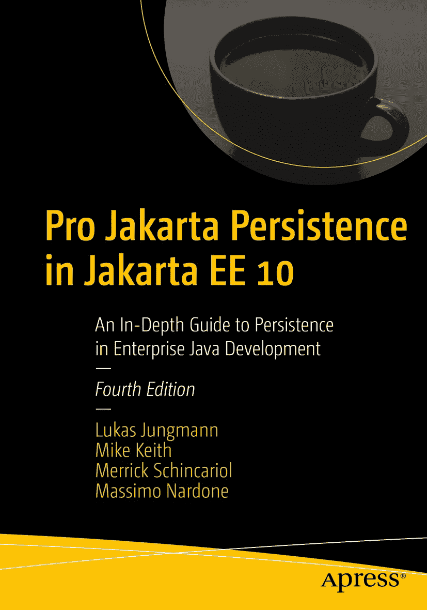

ISBN 978-1-4842-7442-2 e-ISBN 978-1-4842-7443-9 [`doi.org/10.1007/978-1-4842-7443-9`](https://doi.org/10.1007/978-1-4842-7443-9) © Lukas Jungmann, Mike Keith, Merrick Schincariol, Massimo Nardone 2022 本作品受版权保护。所有权利均由出版商独家许可，涉及材料的全部或部分内容，特别是翻译、重印、重用插图、朗诵、广播、以缩微胶片或任何其他物理方式复制、传输或信息存储与检索、电子改编、计算机软件，或目前已知或未来开发的类似或不同方法的使用权。本出版物中通用描述性名称、注册商标、商标、服务标志等的使用，即使未作明确声明，也不意味着这些名称不受相关保护性法律和法规的约束，因此可自由使用。出版商、作者和编辑假定本书中的建议和信息在出版之日是真实准确的。出版商、作者或编辑均不对本材料中包含的内容或可能存在的任何错误或遗漏提供明示或暗示的保证。出版商对已出版地图中的管辖权主张和机构归属保持中立。

本 Apress 印记由注册公司 APress Media, LLC（Springer Nature 的一部分）出版。

注册公司地址为：1 New York Plaza, New York, NY 10004, U.S.A.

*献给 Bára、Tobiáš、Sofie 和 Mikuláš。我爱你们。*

*——Lukáš*

致谢

衷心感谢我出色且挚爱的家人——我的妻子 Barbora，以及我的孩子们 Tobiáš、Sofie 和 Mikuláš——在我撰写本书期间给予的无限耐心和支持。

我还要感谢 Steve Anglin 给我机会参与本书这一版本的编写工作。特别感谢 Mark Powers 在编辑过程中给予我的支持。

最后，我要感谢本书的技术审阅者 Jan Beernink，他帮助我使本书更加完善。

> ——Lukas Jungmann

关于作者 关于技术审阅者

