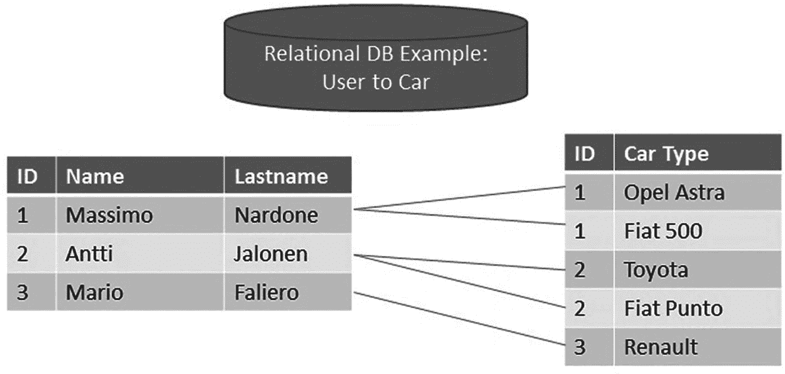
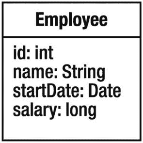
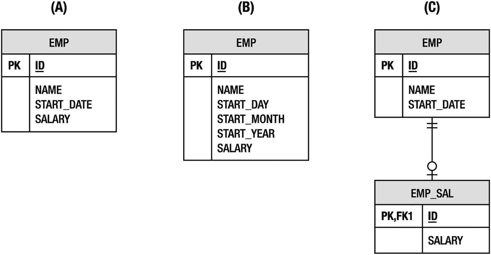
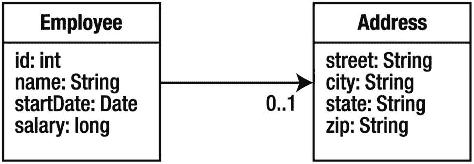
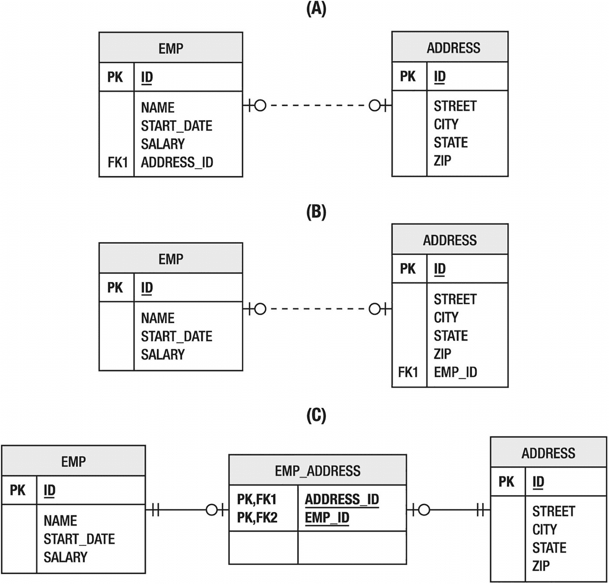
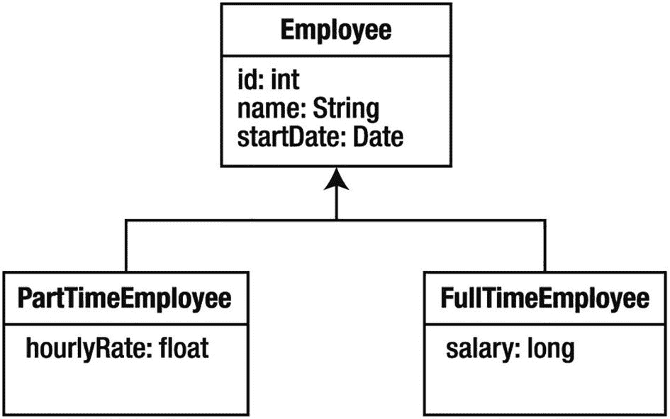
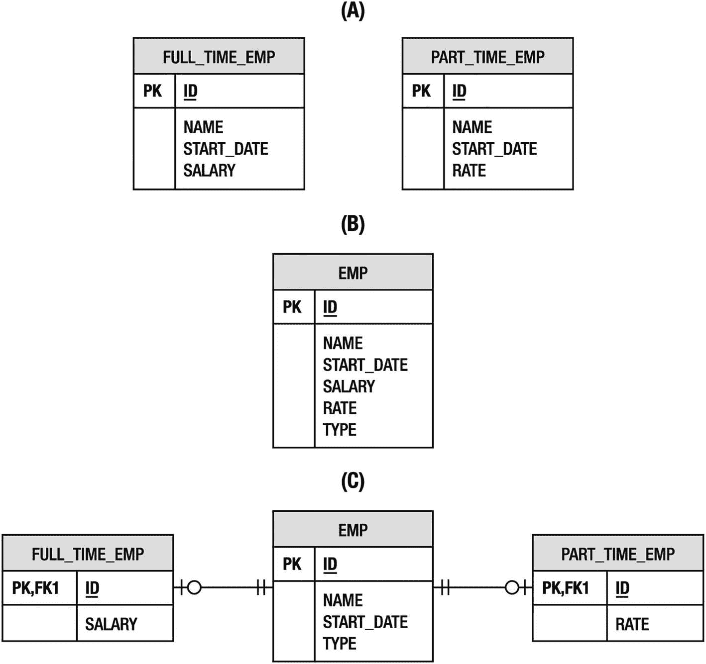
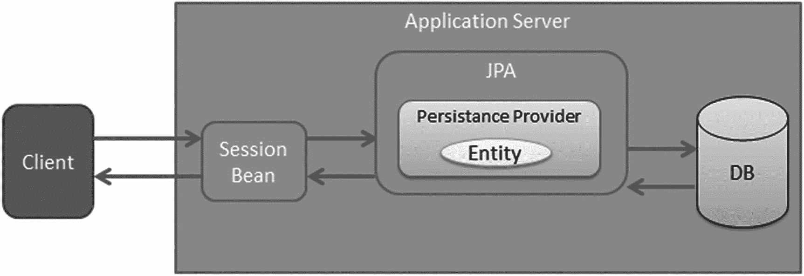

# 1. 引言

企业应用程序的定义在于它们需要收集、处理、转换和报告海量信息。当然，这些信息必须存储在某个地方。数据的存储和检索是一个价值数十亿美元的产业，数据库市场的增长以及基于云的存储服务的出现部分证明了这一点。尽管有各种可用的数据管理技术，应用程序设计者仍然花费大量时间试图高效地将数据移入和移出存储。

尽管 Java 平台在数据库系统方面取得了成功，但长期以来它一直受到困扰其他面向对象编程语言的相同问题的影响。在数据库系统和 Java 应用程序的对象模型之间来回移动数据比实际需要的要困难得多。Java 开发人员要么编写大量代码将行和列数据转换为对象，要么发现自己受限于试图向开发人员隐藏数据库的专有框架。幸运的是，一个标准解决方案——Jakarta Persistence API——被引入到该平台中，以弥合面向对象领域模型与关系数据库系统之间的鸿沟。

本书介绍了作为 Jakarta EE 10 一部分的 Jakarta Persistence API 3.1 版本，并探讨了它为开发人员提供的所有功能。

其优势之一在于它可以被插入到应用程序所需的任何层、层级或框架中。无论您是在构建客户端-服务器应用程序以在 Swing 应用程序中收集表单数据，还是使用最新的应用程序框架构建网站，Jakarta Persistence 都可以帮助您更有效地实现持久化。

为了为 Jakarta Persistence 奠定基础，本章首先回顾一下我们走过的历程以及我们试图解决的问题。然后，我们将了解该规范的历史，并为您提供其功能的高级概述。

## 关系数据库

多年来，许多数据持久化的方法来了又去，但没有哪个概念比关系数据库更具持久力。即使在云时代，“大数据”和“NoSQL”经常占据头条新闻，关系数据库服务仍然持续受到需求，以支持当今在云中运行的企业应用程序。虽然键值型和文档型 NoSQL 存储有其用武之地，但关系型存储仍然是现存最流行的通用数据库，世界上绝大多数企业数据都存储在其中。它们是每个企业应用程序的起点，并且其生命周期往往在应用程序消亡后仍会持续很长时间。

理解关系数据是企业成功开发的关键。开发能够与数据库系统良好配合的应用程序是软件开发中公认的难题。Java 的成功在很大程度上可以归因于它在构建企业数据库系统方面的广泛采用。从消费者网站到自动化网关，Java 应用程序处于企业应用程序开发的核心。图 1-1 展示了一个用户与汽车的关系数据库示例。



图 1-1

用户与汽车关系数据库


## 对象-关系映射

“领域模型中有一个类，数据库中有一张表。它们看起来非常相似，应该可以简单地将一个自动转换为另一个。”这可能是我们在编写又一个数据访问对象（DAO）将 Java 数据库连接（JDBC）结果集转换为面向对象结构时，都曾有过的一个想法。领域模型与数据库的关系模型看起来足够相似，以至于它似乎在呼唤一种让这两个模型相互沟通的方式。

弥合对象模型与关系模型之间差距的技术被称为对象-关系映射，通常简称为 O-R 映射或 ORM。这个术语源于这样一种理念：我们以某种方式将一个模型中的概念映射到另一个模型上，目标是引入一个中介来管理两者之间的自动转换。

在深入探讨对象-关系映射的具体细节之前，让我们先简要阐述一下理想解决方案应具备的纲领：

*   **对象，而非表**：应用程序应围绕领域模型来编写，而不是受限于关系模型。必须能够对领域模型进行操作和查询，而无需用表、列和外键等关系语言来表达。
*   **便利，而非无知**：映射工具只应由熟悉关系技术的人使用。O-R 映射并非旨在让开发者免于理解映射问题，或完全隐藏这些问题。它是为那些理解这些问题、知道自己需要什么，但又不想为解决一个已被解决的问题而编写数千行代码的人准备的。
*   **非侵入，而非透明**：期望持久化是透明的是不合理的，因为应用程序始终需要控制其正在持久化的对象，并了解实体的生命周期。然而，持久化解决方案不应侵入领域模型，领域类也不应为了可持久化而必须扩展类或实现接口。
*   **遗留数据，新对象**：应用程序更有可能针对现有的关系数据库模式，而不是创建一个新的模式。对遗留模式的支持将是出现的最相关的用例之一，而且这些数据库很可能比我们所有人都活得久。
*   **足够，而非过多**：企业开发者有需要解决的问题，他们需要足够的功能来解决这些问题。他们不喜欢的是被迫采用一个重量级的持久化模型，该模型会引入巨大的开销，因为它解决的是许多人甚至不认为*是*问题的问题。
*   **本地，但可移动**：数据的持久化表示不需要被建模为一个功能完备的远程对象。分布式是应用程序的一部分，而不是持久化层的一部分。然而，包含持久化状态的实体必须能够移动到任何需要它们的层，这样如果应用程序是分布式的，实体就能支持而非阻碍特定的架构。
*   **标准 API，可插拔实现**：拥有大型应用程序的大公司不希望冒险与特定于产品的库和接口耦合。通过仅依赖定义好的标准接口，应用程序与专有 API 解耦，并且如果另一个实现更合适，可以切换实现。

这看起来是一组有些苛刻的要求，但它源于实践经验与必要性。企业应用程序有非常特定的持久化需求，这份需求清单相当具体地代表了企业社区的经验。

### 阻抗不匹配

对象-关系映射的倡导者经常将对象模型与关系模型之间的差异描述为两者之间的阻抗不匹配。这是一个恰当的描述，因为将两者相互映射的挑战不在于它们之间的相似性，而在于每个模型中那些在另一个模型中没有逻辑等价物的概念。

在接下来的部分中，我们将展示一些基本的面向对象领域模型，以及用于持久化同一组数据的各种关系模型。正如你将看到的，对象-关系映射的挑战与其说是单个映射的复杂性，不如说是存在如此多可能的映射。目标不是解释如何从一个点到达另一个点，而是理解为了到达预期目的地可能需要走哪些路。

#### 类的表示

让我们从一个简单的类开始讨论。图 1-2 展示了一个`Employee`类，它有四个属性：员工 ID、员工姓名、开始日期和当前薪资。



图 1-2

Employee 类

现在考虑图 1-3 中所示的关系模型。该类在数据库中的理想表示对应于场景(A)。类中的每个字段直接映射到表中的一列。员工 ID 成为主键。除了一些细微的命名差异外，这是一个直接的映射。



图 1-3

存储员工数据的三种场景

在场景(B)中，我们看到员工的开始日期实际上存储为三个单独的列，分别对应日、月、年。回想一下，该类使用了一个`Date`对象来表示这个值。由于数据库模式更难更改，该类是否应该被迫采用相同的存储策略以保持与关系模型一致？还要考虑问题的反面，即类使用了三个字段，而表使用了一个单一的日期列。当数据库和对象模型的表示方式不同时，即使是单个字段也会变得复杂而难以映射。

薪资信息被视为商业敏感信息，因此将薪资值直接放在可能用于多种目的的`EMP`表中可能是不明智的。在场景(C)中，`EMP`表已被拆分，薪资信息存储在一个单独的`EMP_SAL`表中。这允许数据库管理员将对薪资信息的`SELECT`访问权限限制在真正需要它的用户。通过这样的映射，即使是`Employee`类的单个存储操作，现在也需要对两个不同的表进行插入或更新。

显然，即使是将单个类的数据存储在数据库中也可能是一项具有挑战性的工作。我们关注这些场景，是因为生产系统中真实的数据库模式在设计时从未考虑过对象模型。在企业应用程序中，经验法则是数据库的需求优先于应用程序的期望。事实上，通常有许多应用程序（有些是面向对象的，有些基于结构化查询语言（SQL））从单个数据库中检索和存储数据。多个应用程序对同一个数据库的依赖意味着更改数据库会影响每一个应用程序，这显然是一个不受欢迎且可能代价高昂的选择。对象模型需要适应并找到与数据库模式协同工作的方法，同时不让物理设计压倒逻辑应用程序模型。


#### 关系

对象很少孤立存在。就像数据库中的关系一样，领域类也依赖并关联其他领域类。考虑图 1-2 中引入的 `Employee` 类。有许多领域概念可以与员工关联，但现在我们先引入 `Address` 领域类，一个 `Employee` 最多可以拥有一个 `Address` 实例。在这种情况下，我们说 `Employee` 与 `Address` 具有一对一关系，在统一建模语言（UML）模型中用 `0..1` 表示法表示。图 1-4 展示了这种关系。



图 1-4

员工与地址的关系

我们在上一节讨论了表示 `Employee` 状态的不同场景，同样，在数据库模式中表示关系也有几种方法。图 1-5 展示了员工与地址之间一对一关系的三种不同场景。



图 1-5

关联员工与地址数据的三种场景

数据库中关系的基本构建块是外键。每种场景都涉及不同表之间的外键关系，但要存在外键关系，目标表必须有一个主键。因此，在我们开始关联员工和地址之前，就遇到了一个问题。领域类 `Address` 没有标识符，但如果它要成为关系的一部分，存储它的表就必须有一个标识符。我们可以用 `ADDRESS` 表中的所有列来构建一个主键，但这被认为是不良实践。因此，引入了 `ID` 列，对象-关系映射将不得不以某种方式进行适配。

图 1-5 中的场景（A）展示了这种关系的理想映射。`EMP` 表有一个指向 `ADDRESS` 表的外键，存储在 `ADDRESS_ID` 列中。如果 `Employee` 类持有一个 `Address` 类的实例，那么在写入 `EMPLOYEE` 行时，可以在存储操作期间设置地址的主键值。

然而，考虑场景（B），它只有细微差别，却突然变得复杂得多。在领域模型中，`Address` 实例并不持有拥有它的 `Employee` 实例，但员工主键必须存储在 `ADDRESS` 表中。要么对象-关系映射必须处理领域类与表之间的这种不匹配，要么必须为每个地址添加一个对员工的回引。

更糟糕的是，场景（C）引入了一个连接表来关联 `EMP` 和 `ADDRESS` 表。连接表不将外键直接存储在其中一个领域表中，而是持有一对键。现在，涉及这两个表的每个数据库操作都必须遍历连接表并保持其一致性。我们可以引入一个 `EmployeeAddress` 关联类到领域模型中进行补偿，但这违背了我们试图实现的逻辑表示。

关系在任何对象-关系映射解决方案中都带来了挑战。这里只介绍了一对一关系，但我们已经面临了对象模型中不存在主键的需求，以及可能不得不向模型引入额外关系甚至关联类来补偿数据库模式的问题。

#### 继承

面向对象领域模型的一个定义性元素是能够在相似类之间引入泛化关系。继承是表达这些关系的自然方式，并允许在应用程序中实现多态。让我们重新审视图 1-2 中所示的 `Employee` 类，并设想一家公司需要区分全职和兼职员工。兼职员工按小时计酬，而全职员工则领取固定薪水。这是应用继承的好机会，将工资信息移至 `PartTimeEmployee` 和 `FullTimeEmployee` 子类。图 1-6 展示了这种安排。



图 1-6

全职与兼职员工之间的继承关系

继承给对象-关系映射带来了一个真正的问题。我们不再处理类到表之间存在自然映射的情况。考虑图 1-7 中所示的关系模型。这里再次展示了持久化同一组数据的三种不同策略。



图 1-7

关系模型中的继承策略

对于将继承结构映射到数据库的人来说，最简单的解决方案可能是将每个类（包括父类）所需的所有数据放入单独的表中。图 1-7 中的场景（A）展示了这种策略。注意，这些表之间没有关系（即每个表独立于其他表）。这意味着，如果用户需要在一个步骤中同时对全职和兼职员工进行操作，针对这些表的查询现在会复杂得多。

一种高效但非规范化的替代方案是将模型中每个类所需的所有数据放入一个表中。这使得查询非常容易，但请注意图 1-7 中场景（B）所示的表结构。有一个新列 `TYPE`，它在领域模型的任何部分都不存在。`TYPE` 列指示员工是兼职还是全职。现在，对象-关系映射解决方案必须解释这些信息，以知道为表中的任何给定行实例化哪种领域类。

场景（C）更进一步，这次将数据规范化为全职和兼职员工的单独表。然而，与场景（A）不同，这些表通过一个公共的 `EMP` 表关联，该表存储了两种员工类型共有的所有数据。对于单列额外数据来说，这似乎有些过度，但一个包含许多特定于每种员工类型的列的真实模式很可能会使用这种表结构。它以逻辑形式呈现数据，并通过允许表连接在一起简化了查询。不幸的是，对数据库有效的方法不一定对映射到这种模式的对象模型有效。即使没有与其他类的关联，领域类的对象-关系映射现在也必须考虑多个表之间的连接。当你开始考虑非持久化的抽象超类或父类时，继承在对象-关系映射中迅速成为一个复杂问题。不仅类数据的存储存在挑战，复杂的表关系也难以高效查询。


## Java 对持久化的支持

从 Java 平台诞生之初，就存在编程接口来提供通往数据库的网关，并抽象掉业务应用程序中许多特定领域的持久化需求。接下来的几节将讨论当前和过去的 Java 持久化解决方案及其在企业应用程序中的作用。

Jakarta 持久化 API 包含四个领域：

*   Jakarta 持久化 API

*   Jakarta 持久化 Criteria API

*   Jakarta 持久化查询语言

*   对象关系映射元数据

### 专有解决方案

了解到对象关系映射解决方案已经存在了很长时间，甚至比 Java 语言本身还要久，可能会让人感到惊讶。诸如 Oracle TopLink 之类的产品在转向 Java 之前，最初是在 Smalltalk 世界中起步的。Java 持久化解决方案历史上一个巨大的讽刺是，实体 Bean 的首次实现之一实际上是通过在 TopLink 映射的对象之上添加一个额外的实体 Bean 层来演示的。

最流行的两个专有持久化 API 是商业领域的 TopLink 和开源社区的 Hibernate。像 TopLink 这样的商业产品在 Java 早期就已出现并取得了成功，但这些技术从未为 Java 平台标准化。后来，当像 Hibernate 这样的新兴开源对象关系映射解决方案变得流行时，Java 平台中围绕持久化的变革才得以发生，最终导致对象关系映射成为首选解决方案。

这两个产品以及其他产品可以与所有主要应用服务器集成，并为应用程序提供所需的所有持久化功能。应用程序开发人员对于使用第三方产品来满足其持久化需求是可以接受的，特别是考虑到当时没有通用且等效的标准。

#### 数据映射器

解决对象关系问题的一种部分方法是使用数据映射器。^(¹) 数据映射器模式介于纯 JDBC（参见“JDBC”部分）和完整的对象关系映射解决方案之间，因为应用程序开发人员负责创建原始的 SQL 字符串来将对象映射到数据库表，但通常使用自定义或现成的框架来从数据映射器方法中调用 SQL。该框架还有助于处理其他事情，例如结果集映射和 SQL 语句参数。最流行的数据映射器框架是 Apache iBATIS（现在名为 MyBatis，托管在 GitHub 上）。它拥有相当大的社区，并且仍然在许多应用程序中使用。

使用像 MyBatis 这样的数据映射策略的最大优点是应用程序可以完全控制发送到数据库的 SQL。存储过程和驱动程序可用的所有 SQL 功能都是公平的，并且框架增加的开销比使用成熟的 ORM 框架时要小。然而，能够编写自定义 SQL 的主要缺点是必须对其进行维护。对对象模型所做的任何更改都可能对数据模型产生影响，并可能在开发过程中导致大量的 SQL 变更。一个极简主义的框架也为开发人员随着应用程序需求的增长而创建新功能打开了大门，最终导致重新发明 ORM 轮子。如果某些应用程序确信其需求不会超出简单映射的范围，或者需要无法生成的非常明确的 SQL，那么数据映射器可能仍会在这些应用程序中占有一席之地。

### JDBC

Java 平台的第二个版本，即 1997 年发布的 Java 开发工具包 (JDK) 1.1，引入了 JDBC 对数据库持久化的第一个主要支持。它是作为其更通用的前身——对象数据库连接 (ODBC) 规范（一种从任何语言或平台访问任何关系数据库的标准）的 Java 特定版本而创建的。JDBC 提供了数据库供应商提供的专有客户端编程接口的简单且可移植的抽象，允许 Java 程序与数据库完全交互。这种交互严重依赖于 SQL，为开发人员提供了用数据库语言编写查询和数据操作语句的机会，但使用简单的 Java 编程模型执行和处理。

JDBC 的讽刺之处在于，尽管编程接口是可移植的，但 SQL 语言却不是。尽管多次尝试对其进行标准化，但编写任何复杂程度的 SQL 并使其在两个主要数据库平台上不变地运行仍然很少见。即使 SQL 方言相似，每个数据库的性能也取决于查询的结构，因此在大多数情况下需要进行特定于供应商的调优。

还存在 Java 源代码与 SQL 文本之间紧密耦合的问题。开发人员不断受到现成 SQL 查询的诱惑，这些查询要么在运行时动态构建，要么简单地存储在变量或字段中。这是一种非常有吸引力的编程模型，直到有一天你意识到应用程序必须支持一个新的数据库供应商，而该供应商不支持你一直在使用的 SQL 方言。

即使将 SQL 文本降级到属性文件或其他应用程序元数据中，使用 JDBC 不仅会感觉不对劲，而且会变成一项繁琐的工作，需要处理表格的行和列数据，并不断地将其来回转换为对象。应用程序有一个对象模型——为什么与数据库一起使用就这么难呢？


### 企业级 JavaBeans

Java 2 企业版（J2EE）平台的首次发布引入了一种新的 Java 持久化解决方案，即实体 Bean，它是企业级 JavaBean（EJB）组件家族的一部分。该方案旨在让开发者完全不必直接处理持久化问题，它采用了一种基于接口的方法，客户端代码从不直接使用具体的 Bean 类。相反，一个专门的 Bean 编译器会生成 Bean 接口的实现，以处理持久化、安全性和事务管理等事宜，并将业务逻辑委托给实体 Bean 的实现。实体 Bean 通过结合使用标准 XML 部署描述符和供应商特定的 XML 部署描述符进行配置，这些描述符因其复杂性和冗长性而臭名昭著。

可以说，实体 Bean 对于它们试图解决的问题而言，设计得过于复杂了，但讽刺的是，该技术的首个版本却缺乏实现实际业务应用程序所需的许多特性。实体之间的关系必须由应用程序来管理，这就要求在 Bean 类上存储和管理外键字段。实体 Bean 到数据库的实际映射完全使用供应商特定的配置来完成，查找器（实体 Bean 中用于查询的术语）的定义也是如此。最后，实体 Bean 被建模为使用 RMI 和 CORBA 的远程对象，这引入了网络开销和限制，而这些从一开始就不应该被添加到持久化对象上。实体 Bean 实际上是从解决分布式持久化组件问题开始的，这是一个“无病呻吟”的解决方案，却忽略了本地访问轻量级持久化对象的常见情况。

EJB 2.0 规范解决了早期版本中发现的许多问题。引入了容器管理实体 Bean 的概念，其中 Bean 类变为抽象类，服务器负责生成子类来管理持久化数据。引入了本地接口和容器管理的关系，允许在实体 Bean 之间定义关联，并由服务器自动保持一致性。该版本还引入了企业级 JavaBeans 查询语言（EJB QL），这是一种专为实体设计的查询语言，可以可移植地编译成任何 SQL 方言。

尽管 EJB 2.0 带来了诸多改进，但一个主要问题依然存在：过度的复杂性。该规范假设开发工具能够使开发者免于配置和管理每个 Bean 所需的众多构件的挑战。不幸的是，这些工具花了太长时间才出现，因此，即使 EJB 应用程序的规模和范围不断扩大，负担也完全落在了开发者的肩上。开发者们感觉自己被遗弃在复杂的海洋中，而承诺的基础设施却未能让他们浮出水面。

### Java 数据对象

部分由于 EJB 持久化模型的一些失败，以及缺乏令人满意的标准化持久化 API 所带来的挫败感，人们尝试了另一种持久化规范。Java 数据对象（JDO）主要受到面向对象数据库（OODB）供应商的启发和支持，但从未真正被主流编程社区所采纳。它要求供应商增强领域对象的字节码，以生成在所有供应商之间二进制兼容的类文件，并且每个合规供应商的产品都必须能够生成和使用这些文件。JDO 还拥有一种本质上明确面向对象的查询语言，这并不受占绝大多数的关系型数据库用户的欢迎。

JDO 达到了成为 JDK 扩展的地位，但从未成为企业 Java 平台的组成部分。它有许多优秀特性，并被一小群忠实的用户所采用，他们坚持使用并极力推广它。不幸的是，主要的商业供应商对于如何实现持久化框架持有不同看法。很少有供应商支持该规范，因此 JDO 虽被谈论，却很少被使用。

有些人可能会争辩说，它超前于时代，并且它对字节码增强的依赖导致其受到了不公正的污名化。这很可能是事实，如果它晚三年推出，可能会被开发者社区更好地接受，因为现在的开发者社区对于使用大量依赖字节码增强的框架已经习以为常。然而，一旦 EJB 3.0 持久化运动启动，并且主要供应商都签约成为新的企业持久化标准的一部分，JDO 的命运就已注定。人们很快向 Sun 抱怨说，他们现在有了两个持久化规范：一个是其企业平台的一部分，也适用于 Java SE；另一个则仅针对 Java SE 进行标准化。不久之后，Sun 宣布 JDO 将降级为规范维护模式，而 Java 持久化将从 JDO 和持久化供应商中汲取经验，成为未来唯一受支持的标准。


## 为何需要另一个标准？

软件开发人员清楚自己的需求，但许多人在现有标准中找不到答案，于是决定另寻出路。他们发现了一系列专有的持久化框架，既有商业产品也有开源项目。许多实现这些技术的产品采用了一种不侵入领域对象的持久化模型。对于这些产品而言，持久化对业务对象是非侵入式的——与实体 Bean 不同，业务对象无需感知正在持久化它们的技术。它们无需实现任何类型的接口或继承特殊类。开发人员只需将持久化对象视为普通 Java 对象，然后将其映射到持久化存储，并使用持久化 API 进行持久化。由于这些对象是常规的 Java 对象，这种持久化模型逐渐被称为**普通 Java 对象（POJO）持久化**。

随着 Hibernate、TopLink 及其他持久化 API 在应用程序中站稳脚跟并完美满足需求，人们常常会问：“何必费心更新 EJB 标准来匹配这些产品已有的功能？为什么不继续使用这些已经运行多年的产品，甚至干脆将像 Hibernate 这样的开源产品标准化？”实际上，有很多理由表明这样做行不通——即便可行，也是个糟糕的主意。

标准比产品要深远得多，单个产品（即便是像 Hibernate 或 TopLink 这样成功的产品）无法体现规范的全部内涵，尽管它可以实现规范。规范的核心意图在于，它应由不同供应商实现，并提供标准接口和语义，使应用程序无需与任何特定产品耦合即可使用。

将标准绑定到像 Hibernate 这样的开源项目上，对标准本身而言问题重重，对 Hibernate 项目来说可能更糟。想象一下，一个基于开源项目特定版本或代码库检查点的规范会多么令人困惑。再想象一下，一个开源软件（OSS）项目无法自由变更，或只能每两年由特殊委员会控制的离散版本中变更，而非由项目自身决定变更。Hibernate 乃至任何开源项目，很可能都会因此窒息。

虽然标准化对顾问或五人规模的软件公司来说可能价值不大，但对大型企业而言却至关重要。对大多数企业 IT 部门来说，软件技术是一项重大投资，涉及大笔资金时必须衡量风险。使用标准技术能大幅降低风险，并允许企业在初始选择无法满足需求时更换供应商。

除了可移植性，技术标准化的价值还体现在其他诸多领域。教育、设计模式和行业交流，只是标准带来的众多好处中的一部分。

## Jakarta Persistence API

Jakarta Persistence API 是一个轻量级、基于 POJO 的 Java 持久化框架。虽然对象关系映射是该 API 的主要组成部分，但它也为将持久化集成到可扩展企业应用中的架构挑战提供了解决方案。以下章节将探讨该规范的演变历程，并概述这项技术的主要方面。

Jakarta Persistence 并非产品，而是一个规范，本身无法执行持久化操作。当然，Jakarta Persistence 需要一个数据库来进行持久化。

### 规范的历史

Jakarta Persistence API 之所以引人注目，不仅在于它为开发者提供的功能，还在于它的诞生方式。以下章节概述了对象关系持久化解决方案的前史以及 Jakarta Persistence 的起源。

#### EJB 3.0 与 Java Persistence API 1.0

在多年对使用 Java 构建企业应用复杂性的抱怨之后，“简化开发”成为 Java EE 5 平台发布的主题。EJB 3.0 引领了这一潮流，并找到了让 Enterprise JavaBeans 更易用、更高效的方法。

对于会话 Bean 和消息驱动 Bean，解决可用性问题的方法很简单：移除一些繁琐的实现要求，让组件看起来更像普通 Java 对象。

然而，对于实体 Bean，存在一个更严重的问题。如果“易用性”的定义是将实现接口和描述符排除在应用程序代码之外，并拥抱 Java 语言的自然对象模型，那么如何让粗粒度、接口驱动、容器管理的实体 Bean 看起来和用起来像领域模型呢？

答案是推倒重来，放弃实体 Bean，转而引入一种新的持久化模型。Java Persistence API 的诞生，源于对实践者需求以及他们用来解决问题的现有专有解决方案的认可。忽视这些经验将是愚蠢的。

于是，领先的对象关系映射解决方案供应商们携手合作，将其产品所代表的最佳实践标准化。Hibernate 和 TopLink 率先与 EJB 供应商签约，随后 JDO 供应商也加入其中。

多年的行业经验，加上简化开发的使命，共同催生了第一个真正拥抱 Java SE 5 平台提供的新编程模型的规范。特别是注解的使用，带来了一种前所未有的在应用程序中使用持久化的新方式。

最终于 2006 年发布的 EJB 3.0 规范被分成了三个独立部分，并分散在三份独立文档中。第一份文档包含了所有遗留的 EJB 组件模型内容，第二份描述了新的简化 POJO 组件模型。第三份是 Java Persistence API，一份独立的规范，描述了 Java SE 和 Java EE 环境中的持久化模型。

图 1-8 展示了 Java EE 环境中的 Java Persistence。



图 1-8

Java EE 环境中的 Java Persistence

#### Java Persistence API 2.0

在 Java Persistence 第一个版本启动时，ORM 持久化已经发展了十年。不幸的是，在规范开发周期中，创建初始规范的时间相对较短（大约两年），因此并非所有可能遇到的功能都能包含在第一个版本中。尽管如此，规范中还是包含了数量可观的功能，其余部分留待后续版本发布，同时供应商在此期间以专有方式提供支持。

下一个版本，Java Persistence 2.0，于 2009 年最终定稿，并包含了第一个版本中缺失的许多功能，特别是用户最常要求的功能。这些新功能包括额外的映射能力、确定提供者访问实体状态的灵活方式，以及对 Java Persistence 查询语言（JP QL）的扩展。其中最重要的功能可能是 Java Criteria API，这是一种以编程方式创建动态查询的方法。这主要使框架能够利用 Java Persistence 以编程方式构建代码来访问数据。


#### Java Persistence 2.1

2013 年发布的 Java Persistence 2.1 使得几乎所有基于 Java Persistence 的应用程序都能通过标准中包含的功能得到满足，而无需依赖供应商的扩展。然而，无论规定了多少功能，总会有一些应用程序需要额外的能力来处理特殊情况。Java Persistence 2.1 规范增加了一些较为特殊的功能，例如映射转换器、存储过程支持，以及用于改进会话操作的非同步持久化上下文。它还增加了创建实体图并将其传递给查询的能力，这相当于对返回的对象集施加了通常所说的**抓取组约束**。

#### Java Persistence 2.2 与 EJB 3.2

Java Persistence 2.2 维护版本由 Oracle 于 2017 年 6 月发布。总的来说，变更日志文件中列出的 Java Persistence 2.2 的更改包括：

*   支持流式处理查询执行结果
*   所有相关注解支持`@Repeatable`
*   支持基本的 Java 8 日期和时间类型
*   允许`AttributeConverters`支持 CDI 注入
*   更新持久化提供者发现机制
*   允许所有 Java Persistence 注解用于元注解

Jakarta Persistence 2.2 的变更日志文件可在此处找到：

```
https://jcp.org/aboutJava/communityprocess/maintenance/jsr338/ChangeLog-Jakarta Persistence-2.2-MR.txt
```

自 2013 年起，EJB 3.2 的最终版本也作为 Java EE 7 的一部分被开发出来。

Enterprise JavaBeans 3.2 版本（EJB 3.2）的新特性包括 JNDI 和 EJB Lite。

#### Jakarta Persistence 与 Enterprise Beans

2017 年晚些时候，Oracle 宣布他们与 IBM 和 Red Hat 一起将 Java EE 迁移到 Eclipse 基金会。该基金会向更广泛的社区征集 Java EE 的新名称建议，将建议名称列表缩减为两个候选名称——**Jakarta EE**和**Enterprise Profile**——并进行了社区投票。近三分之二的投票支持 Jakarta EE，该名称赢得了投票。请注意，Jakarta 最初是 Apache 软件基金会（ASF）一个于 2011 年退役的项目的名称，此次使用已获得 ASF 的许可。

2019 年发布的 Jakarta Persistence 规范初始版本旨在反映这一迁移，并验证捐赠的代码是否完整、功能正常且与 Java EE 完全兼容。这是 Eclipse 基金会根据新制定的 Eclipse 基金会规范流程^(²)管理的第一个版本。此版本与原始规范相比唯一的更改是名称——**Java Persistence**改为了**Jakarta Persistence**。除此之外，它与原始版本相同。因此，使用 Java Persistence 2.2 的应用程序可以平滑地迁移到兼容 Jakarta EE 8 的运行时上运行。

Enterprise JavaBeans（EJB）也是如此。从其初始版本 3.2 开始，该规范的名称就是 Jakarta Enterprise Beans（Enterprise Beans）。

这两个规范都是作为 Jakarta EE 初始版本 Jakarta EE 8 的一部分开发的。

#### Jakarta Persistence 3.0 与 Enterprise Beans 4.0

Jakarta Persistence 下一个版本 3.0 于 2020 年发布，其重点是迁移到`jakarta`包命名空间。此版本将现有 API 从现有的`javax.persistence`包迁移到`jakarta.persistence`包。另一个更改是更新了持久化单元配置文件和对象关系映射 XML 文件的模式命名空间。

Jakarta Enterprise Beans 4.0 版本的更改还包括：

*   `javax.ejb`包已重命名为`jakarta.ejb`
*   `@Schedule`注解支持`@Repeatable`
*   移除了对分布式互操作性的支持
*   移除了依赖 Jakarta XML RPC 的方法
*   移除了依赖`java.security.Identity`的方法
*   移除了已弃用的`EJBContext.getEnvironment()`方法
*   将 Enterprise Beans 2.x API 组标记为可选

这些版本的规范是作为 Jakarta EE 9 的一部分开发的。

#### Jakarta Persistence 3.1

Java Persistence 3.1 版本由 Eclipse 基金会于 2021 年 12 月发布。总的来说，Jakarta Persistence 3.1 的更改包括：

*   在 Jakarta Persistence 查询语言中标准化了`EXTRACT`函数
*   标准化了主键的`UUID GenerationType`
*   为 Java 平台模块系统定义了 Jakarta Persistence API 的`jakarta.persistence`模块名称
*   让`EntityManagerFactory`和`EntityManager`接口扩展`java.lang.AutoCloseable`接口
*   规范中的编辑性更新和澄清

有关更改的完整列表，请参阅规范文档的修订历史部分，该文档可在[`https://jakarta.ee/specifications/persistence/3.1/jakarta-persistence-spec-3.1.html`](https://jakarta.ee/specifications/persistence/3.1/jakarta-persistence-spec-3.1.html)获取。

#### Jakarta Persistence 与您

最后，可能仍然有一些您或其他 Jakarta Persistence 用户希望在标准中找到但尚未包含的功能。如果有足够多的用户请求该功能，那么它最终很可能会成为标准的一部分，但这在一定程度上取决于开发者。如果您认为某个功能应该被标准化，您应该大声说出来，并向您的 Jakarta Persistence 提供商提出请求；您还应该联系下一个 Jakarta Persistence 版本的开发者。社区有助于塑造和推动标准，而正是您，作为社区的一员，必须让您的需求为人所知。

但请注意，总会有一些很少使用的功能子集可能永远不会被纳入标准，仅仅是因为它们不够主流，不值得被包含在内。必须考虑众所周知的“多数人的需求”胜过“少数人的需求”的哲学（别假装你不知道这句哲学首次被表达的具体剧集），因为每个新功能都会给规范增加一些非零的复杂性，使其变得更大、更难理解、使用和实现。教训是，尽管我们征求您的意见，但并非所有意见都能被纳入规范。

### 概述

Jakarta Persistence 的模型简单而优雅，强大而灵活。它使用自然，易于学习，特别是如果您曾经使用过当今市场上该 API 所基于的任何现有持久化产品。应用程序将接触到的主要操作 API 包含在少数几个类中。

#### POJO 持久化

Jakarta Persistence 最重要的方面或许是对象是 POJO 这一事实，这意味着任何被持久化的对象都没有什么特别之处。实际上，几乎所有具有默认构造函数的现有非 final 应用程序对象都可以被持久化，而无需更改一行代码。使用 Jakarta Persistence 进行对象关系映射完全是元数据驱动的。可以通过向代码添加注解或使用外部定义的 XML 来完成。被持久化的对象仅与其定义或映射的数据一样重。


#### 非侵入性

持久化 API 作为独立于持久化对象的一个单独层存在。应用程序的业务逻辑调用持久化 API，向其传递持久化对象，并指示 API 对这些对象进行操作。因此，即使应用程序必须了解持久化 API（因为它需要调用它），持久化对象本身却无需知晓。由于该 API 不会侵入持久化对象类的代码，因此被称为非侵入式持久化。

有些人误以为非侵入式持久化意味着对象会神奇地自动持久化，就像过去的事务提交时对象数据库所做的那样。这有时被称为透明持久化，是一种错误观念，当你考虑到查询时，这种观念甚至更加不合理。你需要某种方式从数据存储中检索对象。这需要一个单独的 API 对象，事实上，一些对象数据库要求用户调用特殊的`Extent`对象来发出查询。应用程序绝对需要以非常明确的方式管理其持久化对象，并且需要一个指定的 API 来完成这项工作。

#### 对象查询

一个强大的查询框架提供了跨实体及其关系进行查询的能力，而无需使用具体的外键或数据库列。查询可以用 Jakarta 持久化查询语言（一种查询语言，其设计模仿了 SQL 以保持熟悉度，但不依赖于数据库模式）来表达，或者使用条件 API 来定义。查询使用基于实体模型的模式抽象，而不是基于存储实体的列。Java 实体及其属性被用作查询模式，因此不需要了解数据库映射信息。查询最终将由 Jakarta 持久化实现转换为适用于目标数据库的 SQL，并在数据库上执行。

通常，实体是一个轻量级的持久化领域对象。

在实践中，实体是关系数据库中的一个表，每个实体实例对应于该表中的某一行。

查询可以在元数据中静态定义，也可以在构建时通过传递查询条件动态创建。如果存在特殊查询需求，而持久化框架生成的 SQL 无法满足，也可以转而使用 SQL。这些查询可以以实体、特定实体属性的投影、甚至聚合函数值等形式返回结果。Jakarta 持久化查询是有价值的抽象，它使得能够跨 Java 领域模型进行查询，而不是跨具体的数据库表。

#### 移动实体

客户端-服务器和 Web 应用程序以及其他分布式架构显然是互联世界中最流行的应用程序类型。承认这一事实意味着承认持久化实体必须在网络中移动。对象必须能够从一个 Java 虚拟机（JVM）移动到另一个，然后再返回，并且仍然可以被应用程序使用。

离开持久化层的对象被称为分离对象。持久化模型的一个关键特性是能够更改分离的实体，然后在它们返回原始 JVM 时重新附加它们。分离模型提供了一种方法，用于协调正在重新附加的实体的状态与其分离之前的状态。这允许在离线状态下进行实体更改，同时在并发情况下仍能保持实体一致性。

#### 简单配置

规范提供了大量的持久化特性，我们将在本书的章节中逐一解释。所有特性都可以通过使用注解、XML 或两者的组合进行配置。注解提供了 Java 元数据历史上无与伦比的易用性。它们编写方便，阅读轻松，使初学者能够快速轻松地启动应用程序。对于那些喜欢 XML 或希望将元数据从代码中外部化的人来说，也可以在 XML 中进行配置。

比元数据语言更重要的是，Jakarta 持久化大量使用了默认值。这意味着无论选择哪种方法，仅为了启动运行所需的最少元数据量是绝对最小的。在某些情况下，如果默认值足够好，几乎不需要任何元数据。

#### 集成与可测试性

托管在应用服务器上的多层应用程序已成为应用程序架构的事实标准。在应用服务器上进行测试是一项很少有人喜欢的挑战。它可能带来痛苦和困难，并且常常阻碍进行单元测试和白盒测试。

通过将 API 定义为既能在应用服务器外部也能在内部工作，解决了这个问题。虽然不常见，但运行在两层架构（应用程序直接与数据库层通信）上的应用程序可以在完全没有应用服务器的情况下使用持久化 API。更常见的场景是，单元测试和自动化测试框架可以在 Java SE 环境中轻松便捷地运行。

使用 Jakarta 持久化 API，现在可以编写服务器集成的持久化代码，并能够在服务器外部重用它进行测试。当在服务器容器内运行时，可以享受容器支持和卓越易用性的所有好处，但只需进行少量更改并借助一些测试框架支持，同一个应用程序也可以配置为在容器外运行。

## 总结

本章介绍了 Jakarta 持久化 API。我们首先介绍了开发人员试图将面向对象的领域模型与关系数据库结合使用时面临的主要问题：阻抗不匹配。为了演示弥合这一差距的复杂性，我们提出了三个小型对象模型和九种表示相同信息的不同方式。我们对每种方式都进行了一些探讨，并讨论了将对象映射到不同表配置如何导致差异，不仅体现在数据在数据库中的演变方式上，还体现在由此产生的数据库操作的成本以及应用程序的性能上。

然后，我们概述了一些专有解决方案和当前的持久化标准，考察了 JDBC、EJB 和 JDO。在每种情况下，我们都审视了标准的演变及其不足之处。您对在此过程中学到的持久化问题的特定方面有了一些总体认识。

在本章的最后，我们简要介绍了 Jakarta 持久化。我们回顾了该规范的历史以及共同创建它的供应商。然后，我们探讨了它在企业应用程序开发中所扮演的角色，并介绍了该规范提供的一些特性。

在下一章中，您将通过一次旋风式的基础知识之旅，并在此过程中构建一个简单的 Jakarta 企业应用程序，从而初步体验 Jakarta 持久化。

脚注 1   2


