# 2. 入门指南

Jakarta Persistence 的主要目标之一是易于使用和理解。尽管其问题领域无法被简化或弱化，但使开发者能够处理该问题的技术却可以做到直接且直观。本章将展示开发和实体究竟可以多么轻松。

我们首先描述实体的基本特征，并回顾实体类必须遵循的要求。我们将定义什么是实体，以及如何创建、读取、更新和删除实体。我们还将介绍实体管理器，以及如何获取和使用它们。然后，我们将快速了解查询，并介绍如何使用 `EntityManager` 和 `Query` 对象来指定和执行查询。本章最后将展示一个在标准 Java SE 环境中运行的简单工作应用程序，并演示所有示例代码的实际运行情况。

## 实体概述

实体在数据管理中并非新鲜事物。事实上，实体的存在时间比许多编程语言都要长，当然也比 Java 长。

通常，实体是数据库表的 Java 表示形式，具有持久性、标识性、事务性和粒度性等特征。

它们由 Peter Chen 在其关于实体-关系建模的开创性论文中引入。^(³) 他将实体描述为具有属性和关系的事物。其预期是这些属性和关系将被持久化到关系数据库中。

即使在今天，这个定义仍然成立。实体本质上是一个名词，或一组作为单个单元关联在一起的状态。它可以以多种标准方式与任意数量的其他实体建立关系。在面向对象范式中，我们为其添加行为，并将其称为对象。在 Jakarta Persistence 中，任何应用程序定义的对象都可以成为实体，因此一个重要的问题可能是：一个被转化为实体的对象具有哪些特征？

### 持久性

实体的第一个也是最基本的特征是它们是可持久化的。这通常仅意味着它们可以被持久化。更具体地说，意味着它们的状态可以在数据存储中表示，并且可以在稍后的时间（可能远在创建它的进程结束之后）被访问。

你可以称它们为持久化对象，很多人也这么做，但这在技术上并不准确。严格来说，一个持久化对象在内存中被实例化的那一刻就变得持久化了。如果一个持久化对象存在，那么根据定义，它已经是持久化的了。

实体是可持久化的，因为它可以被保存在持久化存储中。区别在于它不会自动被持久化，并且为了使其具有持久的表示形式，应用程序必须主动调用 API 方法来启动该过程。这是一个重要的区别，因为它将持久化的控制权牢牢掌握在应用程序手中。应用程序可以灵活地操作数据并在实体上执行业务逻辑，只有在应用程序认为时机合适时才使其持久化。关键在于，实体可以在不必然被持久化的情况下进行操作，而是否持久化由应用程序决定。

### 标识性

与其他任何 Java 对象一样，实体具有对象标识，但当它存在于数据库中时，它还具有持久化标识。对象标识仅仅是区分占用内存的对象。持久化标识（或标识符）是唯一标识一个实体实例并将其与同一实体类型的所有其他实例区分开来的键。当实体在数据存储中存在其表示形式（即数据库表中的一行）时，它就具有持久化标识。如果它不在数据库中，那么即使内存中的实体可能在某个字段中设置了其标识，它也不具有持久化标识。因此，实体标识符等同于存储实体状态的数据库表中的主键。

### 事务性

实体可能被称为准事务性的。尽管它们可以在任何上下文中被创建、更新和删除，但这些操作通常是在事务上下文中进行的^(⁴)，因为需要事务才能将更改提交到数据库。对数据库所做的更改要么全部成功，要么全部失败（原子性），因此实体的持久化视图确实应该是事务性的。

在内存中，情况略有不同，因为实体可能会被更改，而这些更改从未被持久化。即使参与了一个事务，在回滚或事务失败的情况下，它们也可能处于未定义或不一致的状态。内存中的实体是简单的 Java 对象，它们遵守 Java 虚拟机（JVM）应用于其他 Java 对象的所有规则和约束。

### 粒度性

最后，展示实体是什么的一个好方法是描述它们不是什么。它们不是原始类型、原始类型的包装类或具有单一维度状态的内置对象。这些不过是标量，对应用程序没有任何固有的语义含义。例如，字符串是一个粒度太细的对象，不适合作为实体，因为它没有任何特定领域的含义。相反，字符串非常适合并且经常被用作实体属性的类型，并根据其类型化的实体属性被赋予含义。

实体被设计为细粒度对象，具有一组通常存储在单个位置（例如表中的一行）的聚合状态，并且通常与其他实体存在关系。在最一般的意义上，它们是业务领域对象，对访问它们的应用程序具有特定含义。

虽然确实可以以夸张的方式定义实体，使其粒度细到只存储单个字符串，或粗到包含 500 列的数据，但 Jakarta Persistence 实体明确旨在处于粒度谱系的较小端。理想情况下，实体应该被设计和定义为相当轻量级的对象，其大小与普通 Java 对象相当。

## 实体元数据

除了其持久化状态之外，每个 Jakarta Persistence 实体都有一些相关的元数据（即使数量很少）来描述它。这些元数据可以作为已保存类文件的一部分存在，也可以存储在类外部，但不会持久化到数据库中。它使持久化层能够从实体被加载到运行时调用期间识别、解释并正确管理实体。

每个实体实际所需的元数据是最少的，这使得实体易于定义和使用。然而，就像任何拥有各种开关、杠杆和按钮的复杂技术一样，也有可能指定比所需多得多的元数据。根据应用程序的需求，元数据量可能很大，并可用于自定义实体配置或状态映射的每个细节。

实体元数据可以通过两种方式指定：注解和 XML。两者同样有效，但使用哪一种取决于你的开发偏好或流程。


### 注解

注解元数据是 Java SE 5 引入的一项语言特性，允许将结构化和类型化的元数据附加到源代码上。虽然 Jakarta Persistence 并不强制要求使用注解，但它们是学习和使用该 API 的便捷方式。由于注解将元数据与程序构件放在一起，因此无需为了指定元数据而转向额外的文件或特殊语言（XML）。

本书的示例和随附说明中均使用了注解。本书展示和描述的所有 Jakarta Persistence 注解（除第 3 章讨论的 Jakarta EE 注解外）都定义在 `jakarta.persistence` 包中。可以假定代码片段隐式包含了 `import jakarta.persistence.*;` 形式的导入。

正如我们在第 1 章中所说，Jakarta Persistence 的特性之一是使注解成为 `@Repeatable`（可重复的）。此特性允许开发者对某个类或属性多次使用同一注解，而无需使用容器注解。这有助于使你的 Java 代码更易于阅读。

实际上，你可以用多个 `@NamedQuery` 注解来标注任意实体类，而无需将它们包装在 `@NamedQueries` 注解中。

以下是使用 Jakarta Persistence 时可重复的注解：

*   `AssociationOverride`
*   `AttributeOverride`
*   `Convert`
*   `JoinColumn`
*   `MapKeyJoinColumn`
*   `NamedEntityGraph`
*   `NamedNativeQuery`
*   `NamedQuery`
*   `NamedStoredProcedureQuery`
*   `PersistenceContext`
*   `PersistenceUnit`
*   `PrimaryKeyJoinColumn`
*   `SecondaryTable`
*   `SqlResultSetMapping`

让我们从列表中取一个，例如 `AssociationOverride` 注解，它用于覆盖实体关系的映射。

以下是 `AssociationOverride` 注解的工作原理。注意 `@Repeatable(AssociationOverrides.class)`：

```
@Target({TYPE, METHOD, FIELD}) @Retention(RUNTIME)
@Repeatable(AssociationOverrides.class)
public @interface AssociationOverride {
String name();
JoinColumn[] joinColumns() default {};
ForeignKey foreignKey() default @ForeignKey(PROVIDER_DEFAULT);
JoinTable joinTable() default @JoinTable;
}
```

### XML

对于那些偏好使用传统 XML 的用户，此选项仍然可用。在学习和理解注解之后，切换到使用 XML 描述符应该相当直接，因为 XML 在很大程度上是模仿注解设计的。第 12 章描述了如何使用 XML 来指定或覆盖实体映射元数据。

### 异常配置

异常配置的概念意味着持久化引擎定义了适用于大多数应用程序的默认值，用户仅当需要覆盖默认值时，才需要提供值。换句话说，必须提供配置值是一种例外情况，而非硬性要求。

异常配置深深植根于 Jakarta Persistence，并极大地增强了其易用性。大多数配置值都有默认值，这使得必须指定的元数据更加相关和简洁。

然而，广泛使用默认值及其带来的配置便利性也是有代价的。当默认值嵌入到 API 中且无需指定时，它们对用户来说可能不可见或不明显。这可能导致用户意识不到开发持久化应用程序的复杂性，从而在需要时更难调试或更改行为。

默认值并非旨在使用户免受持久化相关复杂问题的困扰。它们旨在让开发者能够轻松快速地启动一个可运行的项目，然后随着应用程序复杂性的增加，迭代改进并实现额外的功能。尽管默认值可能大部分时间都符合你的需求，但开发者熟悉正在应用的默认值仍然很重要。例如，如果采用了表名默认值，那么了解运行时期望的表名是什么，或者如果使用了模式生成，将会生成什么表，这一点至关重要。

对于每个注解，我们也会讨论其默认值，以便明确如果未指定注解将应用什么值。我们建议你在学习这些默认值时记住它们。毕竟，默认值仍然是应用程序配置的一部分；只是配置起来非常容易而已！


## 创建实体

普通的 Java 类只需通过添加注解即可轻松转换为实体。实际上，只需添加几个注解，几乎任何带有无参构造函数的类都可以成为实体。

实体的主要编程产物是实体类。

以下是实体类必须遵循的要求：

*   必须使用 `jakarta.persistence.Entity` 注解进行标注。
*   必须有一个 public 或 protected 的无参构造函数（也可以有其他构造函数）。
*   不能声明为 final（因此，方法和持久化实例变量都不能声明为 final）。
*   必须实现 `Serializable` 接口（以防实体实例作为分离对象通过会话 Bean 的远程业务接口按值传递）。
*   可以继承实体类和非实体类，非实体类也可以继承实体类。
*   持久化实例变量必须声明为 private、protected 或包级私有（只能由实体类的方法直接访问）。

让我们先为员工创建一个普通的 Java 类。清单 2-1 展示了一个简单的 `Employee` 类。

```
public class Employee {
private int id;
private String name;
private long salary;
public Employee() {}
public Employee(int id) { this.id = id; }
public int getId() { return id; }
public void setId(int id) { this.id = id; }
public String getName() { return name; }
public void setName(String name) { this.name = name; }
public long getSalary() { return salary; }
public void setSalary (long salary) { this.salary = salary; }
}
清单 2-1
Employee 类
```

你可能注意到，这个类类似于一个 JavaBean 风格的类，包含三个属性：`id`、`name` 和 `salary`。每个属性都由一对用于获取和设置属性的访问器方法表示，并由一个成员字段支持。属性或成员字段是实体中可被持久化的状态单元。

要将 `Employee` 转变为实体，我们首先使用 `@Entity` 注解该类。这主要是一个标记注解，用于向持久化引擎指示该类是一个实体。

我们需要添加的第二个注解是 `@Id`。该注解用于标注保存实体持久化标识（主键）的特定字段或属性，这样持久化提供者就能知道使用哪个字段或属性作为表中的唯一标识键。

将这两个注解添加到 `Employee` 类后，我们最终得到的类与之前几乎相同，只是现在它成了一个实体。清单 2-2 展示了这个实体类。

```
@Entity
public class Employee {
@Id private int id;
private String name;
private long salary;
public Employee() {}
public Employee(int id) { this.id = id; }
public int getId() { return id; }
public void setId(int id) { this.id = id; }
public String getName() { return name; }
public void setName(String name) { this.name = name; }
public long getSalary() { return salary; }
public void setSalary (long salary) { this.salary = salary; }
}
清单 2-2
Employee 实体

当我们说 `@Id` 注解放在字段或属性上时，意思是用户可以选择注解声明的字段，也可以选择 JavaBean 风格属性的 getter 方法^(⁵)。根据实体开发者的需求和偏好，字段策略或属性策略都是允许的。在这个例子中，我们选择注解字段，因为它更简单；通常，这将是最简单、最直接的方法。我们将在后续章节中详细讨论使用字段或属性访问来注解持久化状态的细节。

实体中的字段因其存在于实体中而自动成为可持久化的。默认的映射和加载配置值适用于这些字段，使得它们在对象被持久化时能够被持久化。鉴于上一章提出的问题，人们可能会问：“这些字段是如何映射的，它们又被持久化到哪里？”

要找到答案，我们首先必须快速绕道深入 `@Entity` 注解内部，查看一个名为 `name` 的元素，该元素唯一标识实体。对于任何实体，都可以通过在注解中使用这个 `name` 元素来显式指定实体名称，例如 `@Entity(name="Emp")`。在实践中，这很少被指定，因为它默认会被设置为实体类的非限定名称。这几乎总是既合理又充分的。

现在我们可以回到数据存储位置的问题上。事实证明，用于存储任何特定实体类型的给定实体的默认表名就是实体名称。如果我们指定了实体名称，它就会成为默认的表名；如果没有指定，则会使用实体名称的默认值。我们刚刚提到，默认的实体名称是实体类的非限定名称，所以这实际上就是关于使用哪个表这个问题的答案。在 Employee 示例中，实体名称将默认为 "Employee"，所有 `Employee` 类型的实体都将存储在一个名为 `EMPLOYEE` 的表中。

每个字段或属性都包含各自的状态，并且需要指向表中的特定列。我们知道要使用 `EMPLOYEE` 表，但给定的字段或属性应该使用哪一列呢？当没有显式指定列时，字段或属性会使用默认列，该列的名称就是字段或属性本身的名称。因此，员工 ID 将存储在 `ID` 列中，姓名存储在 `NAME` 列中，薪水存储在 `EMPLOYEE` 表的 `SALARY` 列中。

当然，所有这些值都可以被覆盖以匹配现有的模式。我们将在第 4 章讨论映射的更多细节时，讨论如何覆盖它们。


## 实体管理器

在“实体概述”一节中曾提到，在实体实际持久化到数据库之前，需要调用特定的 API。实际上，对实体执行的许多操作都需要调用独立的 API。该 API 由实体管理器实现，并几乎完全封装在一个名为 `jakarta.persistence.EntityManager` 的接口中。归根结底，持久化的实际工作都委托给了实体管理器。在实体管理器被用于实际创建、读取或写入实体之前，该实体仅仅是一个普通的（非持久化）Java 对象。

当实体管理器获取到某个实体的引用时（无论是通过将其作为参数显式传递给方法调用，还是因为从数据库中读取了该实体），该对象就被称为由该实体管理器管理。在任意给定时刻，实体管理器内被管理的实体实例集合被称为其**持久化上下文**。在同一持久化上下文中，任何时候都只能存在一个具有相同持久化标识的 Java 实例。例如，如果一个持久化标识（或 ID）为 158 的 `Employee` 存在于持久化上下文中，那么在该持久化上下文中就不能再存在另一个 ID 为 158 的 `Employee` 对象。

实体管理器经过配置，能够持久化或管理特定类型的对象，对指定数据库进行读写操作，并由特定的持久化提供者（简称提供者）实现。正是这个提供者，为整个 Jakarta Persistence API 提供了底层的实现引擎，范围从 `EntityManager` 到查询类及 SQL 生成的实现。

所有实体管理器都源自类型为 `jakarta.persistence.EntityManagerFactory` 的工厂。实体管理器的配置模板来源于创建它的实体管理器工厂，但它是作为一个独立的**持久化单元**来定义的。持久化单元隐式或显式地规定了设置和实体类，这些设置和实体类被所有从绑定到该持久化单元的唯一 `EntityManagerFactory` 实例获取的实体管理器所使用。因此，持久化单元与其具体的 `EntityManagerFactory` 实例之间存在着一一对应的关系。

持久化单元通过命名来区分不同的实体管理器工厂。这使得应用程序能够控制使用哪个配置或持久化单元来操作特定的实体。

图 2-1 展示了每个持久化单元对应一个实体管理器工厂，并且可以从单个实体管理器工厂创建多个实体管理器。可能令人惊讶的部分是，多个实体管理器可以指向同一个持久化上下文。我们之前只讨论了实体管理器及其持久化上下文，但稍后您会看到，实际上可能存在多个指向不同实体管理器的引用，它们都指向同一组被管理的实体。这将使得控制流能够遍历容器组件，同时继续访问同一个持久化上下文。

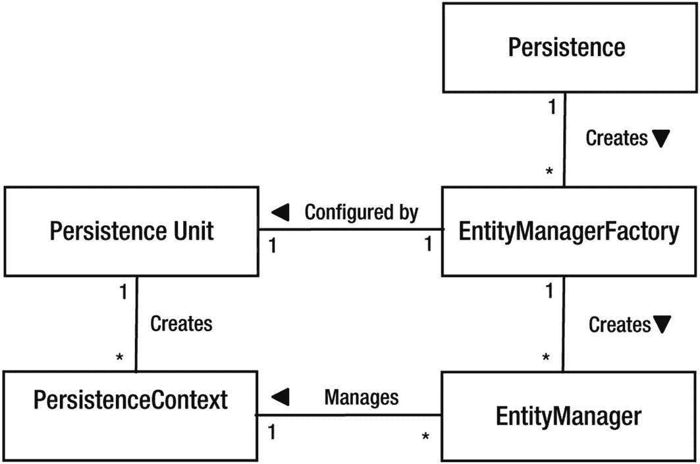

图 2-1

Jakarta Persistence 概念之间的关系

表 2-1 总结了之前提到或讨论过的概念和 API 对象。请注意，虽然有些是实际的 API 对象，但其他的只是有助于解释 API 工作原理的抽象概念。

表 2-1

API 对象与概念总结

| 对象 | API 对象 | 描述 |
| --- | --- | --- |
| Persistence | Persistence | 用于获取实体管理器工厂的引导类 |
| 实体管理器工厂 | EntityManagerFactory | 用于获取实体管理器的已配置工厂对象 |
| 持久化单元 | -- | 声明实体类和数据存储信息的命名配置 |
| 实体管理器 | EntityManager | 用于对实体执行操作和查询的主要 API 对象 |
| 持久化上下文 | -- | 由特定实体管理器管理的所有实体实例的集合 |

### 获取实体管理器

实体管理器总是从 `EntityManagerFactory` 获取。获取它的工厂决定了控制其操作的配置参数。虽然在 Jakarta EE 应用服务器环境中运行时，存在一些对用户隐藏工厂的快捷方式，但在 Java SE 环境中，我们可以使用一个名为 `Persistence` 的简单引导类。`Persistence` 类中的静态方法 `createEntityManagerFactory()` 会为指定的持久化单元名称返回 `EntityManagerFactory`。以下示例演示了为名为 `EmployeeService` 的持久化单元创建 `EntityManagerFactory`：

```
EntityManagerFactory emf =
Persistence.createEntityManagerFactory("EmployeeService");
```

传递给 `createEntityManagerFactory()` 方法的指定持久化单元名称 `EmployeeService` 标识了给定的持久化单元配置，该配置决定了诸如从此工厂生成的实体管理器在连接数据库时将使用的连接参数等内容。

现在我们有了工厂，就可以轻松地从中获取实体管理器。以下示例演示了从上一个示例中获取的工厂创建一个实体管理器：

```
EntityManager em = emf.createEntityManager();
```

有了这个实体管理器，我们就可以开始处理持久化实体了。

### 持久化实体

持久化实体是指将一个瞬态实体（即数据库中尚无任何持久化表示的实体）的状态存储起来，以便日后可以检索的操作。这实际上是持久化的基础——创建一个可能比创建它的进程存活更久的状态。我们首先使用实体管理器来持久化一个 `Employee` 实例。以下是一个实现此功能的代码示例：

```
Employee emp = new Employee(158);
em.persist(emp);
```

这段代码的第一行只是创建了一个我们想要持久化的 `Employee` 实例。如果我们忽略雇佣了一个无名氏且不支付任何薪水（我们只设置了 ID，没有设置姓名或薪水）这一可悲事实，那么实例化的 `Employee` 只是一个普通的 Java 对象。

下一行使用实体管理器来持久化该实体。调用 `persist()` 就是启动将其持久化到数据库所需的全部操作。如果实体管理器在执行此操作时遇到问题，它将抛出一个非检查型异常 `PersistenceException`。当 `persist()` 调用完成时，`emp` 将成为实体管理器持久化上下文中的一个被管理实体。

清单 2-3 展示了如何将其整合到一个简单的方法中，该方法创建一个新员工并将其持久化到数据库。

```
public Employee createEmployee(int id, String name, long salary) {
Employee emp = new Employee(id);
emp.setName(name);
emp.setSalary(salary);
em.persist(emp);
return emp;
}
清单 2-3
创建员工的方法
```

此方法假设实例的 `em` 字段中存在一个实体管理器，并使用它来持久化 `Employee`。请注意，在此示例中我们无需担心失败的情况。如果失败，将会抛出一个运行时 `PersistenceException`，该异常会向上传播给调用者。


### 查找实体

一旦实体被存入数据库，接下来通常要做的事情就是再次找到它。在本节中，你将了解如何使用实体管理器查找实体。实际上，只有一行代码是关键的：

```
Employee emp = em.find(Employee.class, 158);
```

我们传入了正在查找的实体的类（在此示例中，我们正在查找 `Employee` 的一个实例）以及标识该特定实体的 ID 或主键（在此案例中，我们想要查找刚刚创建的实体）。这就是实体管理器在数据库中查找该实例所需的全部信息。当调用完成时，返回的 employee 将是一个受管实体，这意味着它将存在于与实体管理器关联的当前持久化上下文中。将类作为参数传入，还使得 `find` 方法能够参数化，并返回与传入类型相同的对象，从而为调用者省去一次额外的类型转换。

如果对象已被删除，或者你不小心提供了错误的 ID，会发生什么？如果未找到对象，那么 `find()` 调用将简单地返回 `null`。你需要确保在下次使用 `emp` 变量之前执行了空值检查。

一个用于查找并返回具有给定 ID 的 `Employee` 的方法的代码现在很简单，如清单 2-4 所示。

```
public Employee findEmployee(int id) {
return em.find(Employee.class, id);
}
清单 2-4
查找 Employee 的方法
```

如果传入的 ID 没有对应的 employee 存在，该方法将返回 `null`，因为这就是 `find()` 会返回的结果。

### 删除实体

从数据库中删除实体并不像你想象的那么常见。许多应用程序从不删除对象，或者即使删除，也只是将数据标记为过期或不再有效，然后使其对客户端不可见。我们这里讨论的不是那种甚至不会从数据库中移除数据的应用层逻辑删除。我们讨论的是会导致跨一个或多个表执行 `DELETE` 语句的操作。

为了删除一个实体，该实体本身必须是受管的，这意味着它存在于持久化上下文中。这意味着调用应用程序应该已经加载或访问了该实体，并且现在正在发出命令来删除它。这通常不是问题，因为在大多数情况下，应用程序在确定这是它想要删除的对象的过程中，已经使其成为受管状态。

一个删除 employee 的简单示例如下：

```
Employee emp = em.find(Employee.class, 158);
em.remove(emp);
```

在这个例子中，我们首先使用 `find()` 调用查找实体，该调用返回一个 `Employee` 的受管实例，然后使用实体管理器上的 `remove()` 调用删除该实体。当然，你在上一节中了解到，如果未找到实体，那么 `find()` 方法将返回 `null`。如果你因为忘记在调用 `remove()` 之前进行空值检查而将 `null` 传入了 `remove()` 调用，那么你将得到一个 `java.lang.IllegalArgumentException`。

在用于删除 employee 的应用程序方法中，可以通过在发出 `remove()` 调用之前检查 employee 是否存在来解决此问题，如清单 2-5 所示。

```
public void removeEmployee(int id) {
Employee emp = em.find(Employee.class, id);
if (emp != null) {
em.remove(emp);
}
}
清单 2-5
删除 Employee 的方法
```

此方法将确保具有给定 ID（假设 ID 不为 null）的 employee 从数据库中被删除。无论该 employee 是否存在，它都会成功返回。

### 更新实体

更新实体有几种不同的方式，但现在我们将说明最简单、最常见的情况。即我们有一个受管实体并希望对其进行更改。如果我们没有对受管实体的引用，那么我们必须首先使用 `find()` 获取一个引用，然后对受管实体执行修改操作。以下代码为 ID 为 158 的 employee 的工资增加了 1000 美元：

```
Employee emp = em.find(Employee.class, 158);
emp.setSalary(emp.getSalary() + 1000);
```

请注意此操作与其他操作之间的区别。在这种情况下，我们不是调用实体管理器来修改对象，而是直接调用对象本身。因此，实体必须是受管实例这一点很重要；否则，持久化提供程序将无法检测到更改，并且不会对 employee 的持久化表示进行任何更改。

用于提高给定 employee 工资的方法将接受 ID 和加薪金额，查找该 employee，并将工资更改为调整后的值。清单 2-6 演示了这种方法。

```
public Employee raiseEmployeeSalary(int id, long raise) {
Employee emp = em.find(Employee.class, id);
if (emp != null) {
emp.setSalary(emp.getSalary() + raise);
}
return emp;
}
清单 2-6
更新 Employee 的方法
```

如果我们找不到该 employee，则返回 `null`，以便调用者知道无法进行更改。我们通过返回更新后的 employee 来表示成功。

### 事务

你可能会觉得到目前为止的代码与我们之前关于处理实体时事务性的说法不一致。前面的所有示例中都没有事务，尽管我们说过对实体的更改必须使用事务才能持久化。

在所有示例中，除了仅调用 `find()` 的那个示例外，我们都假设每个方法都包含在一个事务中。`find()` 调用不是修改操作，因此它可以随时调用，无论是否有事务。

再次强调，关键在于代码执行的环境。在 Jakarta EE 容器环境内运行的典型情况是使用标准的 Jakarta 事务 API。在容器中运行时的事务模型是假设应用程序将确保在需要时存在事务上下文。如果事务不存在，那么要么修改操作会抛出异常，要么更改将永远不会持久化到数据存储中。我们将在第 3 章中更详细地讨论 Jakarta EE 环境中的事务。

不过，在本章的示例中，我们并不是在 Jakarta EE 中运行。它是在 Java SE 环境中，而在 Java SE 中应该使用的事务服务是 `jakarta.persistence.EntityTransaction` 服务。在 Java SE 中执行时，我们需要在操作方法中开始并提交事务，或者需要在调用操作方法之前和之后开始并提交事务。无论哪种情况，都是通过调用实体管理器上的 `getTransaction()` 来获取 `EntityTransaction`，然后对其调用 `begin()` 来启动事务。同样，要提交事务，则对从实体管理器获取的 `EntityTransaction` 对象调用 `commit()`。例如，在方法调用前后开始和提交事务，会产生如清单 2-7 所示创建 employee 的代码。

```
em.getTransaction().begin();
createEmployee(158, "John Doe", 45000);
em.getTransaction().commit();
清单 2-7
开始和提交 EntityTransaction

```

关于资源级事务和 `EntityTransaction` API 的更多详细信息，请参见第 6 章。


### 查询

通常，鉴于大多数开发者在职业生涯中都或多或少使用过关系型数据库，我们大多数人基本都知道什么是数据库查询。在 Jakarta Persistence 中，查询与数据库查询类似，区别在于我们不是使用结构化查询语言（SQL）来指定查询条件，而是对实体进行查询，并使用一种称为 Jakarta Persistence 查询语言（Jakarta Persistence QL）的语言。

查询在代码中实现为 `Query` 或 `TypedQuery<X>` 对象。它使用 `EntityManager` 作为工厂来构建。`EntityManager` 接口包含多种 API 调用，这些调用会返回一个新的 `Query` 或 `TypedQuery<X>` 对象。作为一等对象，查询本身可以根据应用程序的需求进行定制。

查询可以静态定义，也可以动态定义。静态查询通常定义在注解或 XML 元数据中，并且必须包含查询条件以及用户指定的名称。这种查询也称为命名查询，在执行时通过其名称进行查找。

动态查询可以在运行时通过提供 Jakarta Persistence QL 查询条件或条件对象来发出。它们的执行成本可能稍高，因为持久化提供程序无法事先进行任何查询准备，但 Jakarta Persistence QL 查询仍然非常易于使用，并且可以根据程序逻辑甚至用户逻辑来发出。

以下示例展示了如何创建动态查询，然后执行它以获取数据库中的所有员工。当然，如果数据库很大且包含数十万名员工，这可能不是一个很好的查询，但它仍然是一个合法的示例。简单的查询如下所示：

```
使用 getResultList 的示例：
TypedQuery query = em.createQuery("SELECT e FROM Employee e",
Employee.class);
List emps = query.getResultList();
```

```
使用 getResultStream 的示例：
TypedQuery query = em.createQuery("SELECT e FROM Employee e",                                                                    Employee.class);
Stream employee = query.getResultStream();
```

我们通过在 `EntityManager` 上调用 `createQuery()` 方法，并传入指定查询条件的 Jakarta Persistence QL 字符串以及查询应参数化的类，来创建一个 `TypedQuery<Employee>` 对象。Jakarta Persistence QL 字符串引用的不是 `EMPLOYEE` 数据库表，而是 `Employee` 实体，因此此查询会选择所有 `Employee` 对象，而不进行任何进一步的过滤。你将在第 7 章深入探讨查询，在第 7 章和第 8 章学习 Jakarta Persistence QL，并在第 9 章学习条件查询。你将看到，对于要返回哪些对象，你可以有更大的自主权。

要执行查询，我们只需在其上调用 `getResultList()` 方法或 `getResultStream()` 方法。`getResultList()` 方法返回一个包含与查询条件匹配的 `Employee` 对象的 `List<Employee>`。请注意，`List` 是由 `Employee` 参数化的，因为参数化类型是从传递给 `createQuery()` 方法的初始类参数传播而来的。我们可以轻松创建一个返回所有员工的方法，如清单 2-8 所示。`getResultStream()` 方法返回查询结果的流，因此在这种情况下，它返回 `Employee` 查询结果的流。默认情况下，它委托给 `getResultList().stream()`。`getResultStream()` 方法提供了一种更好的方式来遍历查询结果集，因为对于大数据集，它允许避免在应用程序使用之前将整个“结果集”读入内存。

```
public List findAllEmployees() {
TypedQuery query = em.createQuery("SELECT e FROM Employee e",
Employee.class);
return query.getResultList();
}
清单 2-8
用于发出查询的方法
```

此示例展示了创建、执行和处理查询是多么简单，但它并未展示查询的强大功能。在第 7 章中，你将看到许多其他在应用程序中定义和使用查询的极其有用且有趣的方法。

## 综合运用

现在，我们可以将创建的所有方法组合到一个类中。该类充当服务类，我们称之为 `EmployeeService`，它允许我们对员工执行操作。到现在为止，代码应该相当熟悉了。清单 2-9 显示了完整的实现。

```
import jakarta.persistence.*;
import java.util.List;
public class EmployeeService {
protected EntityManager em;
public EmployeeService(EntityManager em) {
this.em = em;
}
public Employee createEmployee(int id, String name, long salary) {
Employee emp = new Employee(id);
emp.setName(name);
emp.setSalary(salary);
em.persist(emp);
return emp;
}
public void removeEmployee(int id) {
Employee emp = findEmployee(id);
if (emp != null) {
em.remove(emp);
}
}
public Employee raiseEmployeeSalary(int id, long raise) {
Employee emp = em.find(Employee.class, id);
if (emp != null) {
emp.setSalary(emp.getSalary() + raise);
}
return emp;
}
public Employee findEmployee(int id) {
return em.find(Employee.class, id);
}
public List findAllEmployees() {
TypedQuery query = em.createQuery(
"SELECT e FROM Employee e", Employee.class);
return query.getResultList();
}
}
清单 2-9
用于操作 Employee 实体的服务类
```

这是一个简单但功能完整的类，可用于对 `Employee` 实体执行典型的创建、读取、更新和删除（CRUD）操作。此类要求调用者创建实体管理器并将其传入，并且要求调用者开始并提交任何必需的事务。起初可能看起来有些奇怪，但将事务逻辑与操作逻辑解耦使得此类更易于移植到 Jakarta EE 环境。我们将在下一章（重点介绍 Jakarta EE 应用程序）中重新讨论此示例。

一个使用此服务并执行所有必需的实体管理器创建和事务管理的简单主程序如清单 2-10 所示。

```
import jakarta.persistence.*;
import java.util.List;
public class EmployeeTest {
public static void main(String[] args) {
EntityManagerFactory emf =
Persistence.createEntityManagerFactory("EmployeeService");
EntityManager em = emf.createEntityManager();
EmployeeService service = new EmployeeService(em);
//  创建并持久化一个员工
em.getTransaction().begin();
Employee emp = service.createEmployee(158, "John Doe", 45000);
em.getTransaction().commit();
System.out.println("已持久化 " + emp);
//  查找特定员工
emp = service.findEmployee(158);
System.out.println("已找到 " + emp);
//  查找所有员工
List emps = service.findAllEmployees();
for (Employee e : emps)
System.out.println("找到员工: " + e);
//  更新员工
em.getTransaction().begin();
emp = service.raiseEmployeeSalary(158, 1000);
em.getTransaction().commit();
System.out.println("已更新 " + emp);
//  删除员工
em.getTransaction().begin();
service.removeEmployee(158);
em.getTransaction().commit();
System.out.println("已删除员工 158");
//  完成后关闭 EM 和 EMF
em.close();
emf.close();
}
}
清单 2-10
使用 EmployeeService
```

请注意，在程序结束时，我们使用 `close()` 方法来清理实体管理器以及用于创建它的工厂。这确保了它们可能分配的所有资源都被正确释放。


## 打包成应用

现在你已经了解了 Jakarta Persistence 的基本构建模块，可以着手将这些模块组织成一个能在 Java SE 中运行的应用程序了。剩下唯一需要讨论的就是如何将它们组合起来使其能够运行。

### 持久化单元

描述持久化单元的配置定义在一个名为 `persistence.xml` 的 XML 文件中。每个持久化单元都有名称，因此当引用应用程序想要为某个实体指定配置时，只需引用定义该配置的持久化单元名称即可。单个 `persistence.xml` 文件可以包含一个或多个命名的持久化单元配置，但每个持久化单元都是相互独立且不同的，从逻辑上可以认为它们位于不同的 `persistence.xml` 文件中。

`persistence.xml` 文件中的许多持久化单元元素适用于部署在 Jakarta EE 容器内的持久化单元。对于本例，我们只需要指定 `name`、`transaction-type`、`class` 和 `properties` 这几个元素。`persistence.xml` 文件的持久化单元配置中还可以指定许多其他元素，但这些内容将在第 13 章中详细讨论。清单 2-11 展示了本例中 `persistence.xml` 文件的相关部分。

```
examples.model.Employee

清单 2-11
persistence.xml 文件中的元素
```

`persistence-unit` 元素的 `name` 属性表示持久化单元的名称，也就是我们在创建 `EntityManagerFactory` 时指定的字符串。我们使用了 `EmployeeService` 作为名称。`transaction-type` 属性表示该持久化单元使用资源级别的 `EntityTransaction`，而不是 Jakarta Transactions 事务。`class` 元素列出了属于该持久化单元的实体。当存在多个实体时，可以指定多个 `class` 元素。在 Jakarta EE 容器中部署时通常不需要这些元素，因为容器会在部署过程中自动扫描带有 `@Entity` 注解的实体类，但在 Java SE 中运行时，为了实现可移植性，它们是必需的。我们这里只有一个 `Employee` 实体。

最后一部分只是一系列属性，可以是标准属性，也可以是供应商特定的属性。在 Java SE 环境中运行时，必须指定 JDBC 数据库登录参数，以告知提供程序要连接哪个资源。其他提供程序属性（如日志选项）是供应商特定的，也可能很有用。

### 持久化归档

持久化工件被打包成我们粗略称为持久化归档的文件。这实际上只是一个 JAR 格式的文件，其中 `METAINF` 目录下包含 `persistence.xml` 文件，并且通常还包含实体类文件。

由于应用程序是作为简单的 Java SE 应用程序运行的，我们只需在程序执行时将持久化归档、使用实体的应用程序类以及持久化提供程序的 JAR 包放在类路径上即可。

## 总结

本章讨论了 Jakarta Persistence API 的基础知识，足以让你在 Java SE 运行时环境中开发和运行一个简单的应用程序。

我们从讨论实体开始，介绍了如何定义实体，以及如何将现有的 Java 类转变为实体。我们讨论了实体管理器，以及如何在 Java SE 环境中获取和构建它们。

下一步是实例化一个实体实例，并使用实体管理器将其持久化到数据库中。在插入新实体后，我们可以再次检索它，然后将其删除。我们还进行了一些更新，并确保更改被写回数据库。

我们讨论了资源本地事务 API 及其使用方法。然后，我们介绍了几种不同类型的查询，以及如何定义和执行它们。最后，我们将所有这些技术整合起来，组合成一个可以在企业环境之外独立运行的简单应用程序。

在下一章中，我们将探讨在使用 Jakarta Persistence API 开发企业应用程序时，Jakarta EE 环境所带来的影响。

脚注 1   2   3

# 3. 企业应用程序

没有哪种技术是孤立存在的，Jakarta Persistence 在这方面也不例外。尽管上一章演示的胖客户端风格的应用程序是 Jakarta Persistence 的一种可行用法，但大多数企业级 Java 应用程序都部署在应用服务器上，通常使用 Jakarta EE Web 技术，也可能使用其他技术。因此，理解构成已部署应用程序的组件以及 Jakarta Persistence 在此环境中的作用至关重要。

本书讨论的是 Jakarta EE 10 中的 Jakarta Persistence，其主要新特性包括进一步与 CDI 对齐、引入 CDI-Lite 以及新的核心配置文件（Core Profile），该配置文件包含一组 Jakarta EE 规范，针对适用于微服务和提前编译的较小运行时环境。

我们首先概述与持久化相关的主要 Jakarta EE 技术。作为概述的一部分，我们描述了 Jakarta Enterprise Beans 组件模型，并演示了某些不同类型 Enterprise Beans 的基本语法。

然后，我们简要介绍标准依赖注入（DI）机制，主要使用 Jakarta EE 上下文与依赖注入（CDI）方法。本章并非旨在对 Jakarta EE 或组件框架进行完整或详细的探讨，我们也不可能深入介绍 DI 领域中的所有 DI 框架，甚至 CDI 提供的所有功能。然而，CDI 和 Enterprise Beans 的示例在 DI 中相当典型，应该能让读者大致了解 Jakarta Persistence 如何与支持 DI 的组件一起使用，无论这些组件是 Jakarta EE 类型的，还是其他 DI 容器组件（如 Spring 或 Guice）。

接着，我们讨论事务，这是另一种对使用 Jakarta Persistence 的应用程序产生重大影响的应用服务器技术。事务是任何需要确保数据完整性的企业应用程序的基本要素。

最后，我们解释如何在本章所述技术的背景下使用这些技术，重点说明持久化如何集成到每种组件技术中。我们还将重新审视上一章中的 Java SE 应用程序，并将其重新定位到企业平台上。


## 应用组件模型

“组件”一词在软件开发中已具有多种含义，因此我们首先给出定义。组件是一个自包含、可复用的软件单元，可以集成到应用程序中。客户端通过明确定义的契约与组件交互。在 Java 中，最简单的软件组件形式是 JavaBean，通常简称为 bean。Bean 是基于单个类实现的组件，其契约由该类中方法的命名模式定义。如今 JavaBean 命名模式已非常普遍，以至于人们很容易忘记它们最初是为了给用户界面构建器提供一种处理第三方组件的标准方式。

在企业级领域，组件更侧重于实现业务服务，其契约由该组件可执行的业务操作来定义。Jakarta EE 的传统组件模型一直是企业 Bean 模型，该模型定义了打包、部署和与自包含业务服务交互的方式。随后，CDI 的出现带来了更强大、更灵活的管理 Bean 组件模型，其中 CDI Bean 可以是企业 Bean 或非企业 Bean 的 Java 类。

在应用程序中是否使用组件模型很大程度上取决于个人偏好，但通常这是一个良好的设计选择。使用组件需要将应用程序组织成层次结构，业务服务位于组件模型中，而表示服务则位于其上层。

从历史上看，在 Jakarta EE 中采用组件的一个挑战是实现它们的复杂性。随着这个问题基本得到解决，我们得以获得明确定义的业务服务集为应用程序带来的以下好处：

*   **松散耦合**：使用组件实现服务有助于应用程序各层之间的松散耦合。组件的实现可以更改，而不会对依赖它的客户端或其他组件产生任何影响。

*   **依赖管理**：组件的依赖关系可以在元数据中声明，并由容器自动解析。

*   **生命周期管理**：组件的生命周期由应用服务器明确定义和管理。组件实现可以参与生命周期操作以获取和释放资源，或执行其他初始化和关闭行为。

*   **声明式容器服务**：应用服务器会拦截组件的业务方法，以应用并发、事务管理、安全性和远程访问等服务。

*   **可移植性**：符合 Jakarta EE 标准并部署到基于标准的服务器上的组件，可以更轻松地从一个兼容服务器移植到另一个兼容服务器。

*   **可伸缩性和可靠性**：应用服务器旨在确保组件得到高效管理，并兼顾可伸缩性。根据组件类型和服务器配置，使用组件实现的业务操作可以重试失败的方法调用，甚至故障转移到集群中的另一台服务器。

在阅读本书时，您会注意到，在某些情况下，示例会使用一个组件来容纳业务逻辑并调用 Jakarta Persistence API。在许多情况下，它会是一个会话 Bean，在其他情况下，它会是一个非企业 Bean 的 CDI Bean，还有一些情况，它会是一个 CDI 管理的会话 Bean（具有作用域的会话 Bean）。会话 Bean 是首选的组件，因为它们编写和配置最简单，并且与 Jakarta Persistence 交互非常自然。我们实际使用的组件类型并不那么重要（只要组件由支持 Jakarta Persistence 和事务的容器管理，组件类型在很大程度上是可替换的），重要的是说明组件如何融入 Jakarta Persistence 并调用它。

图 3-1 展示了 Java 应用程序组件模型。

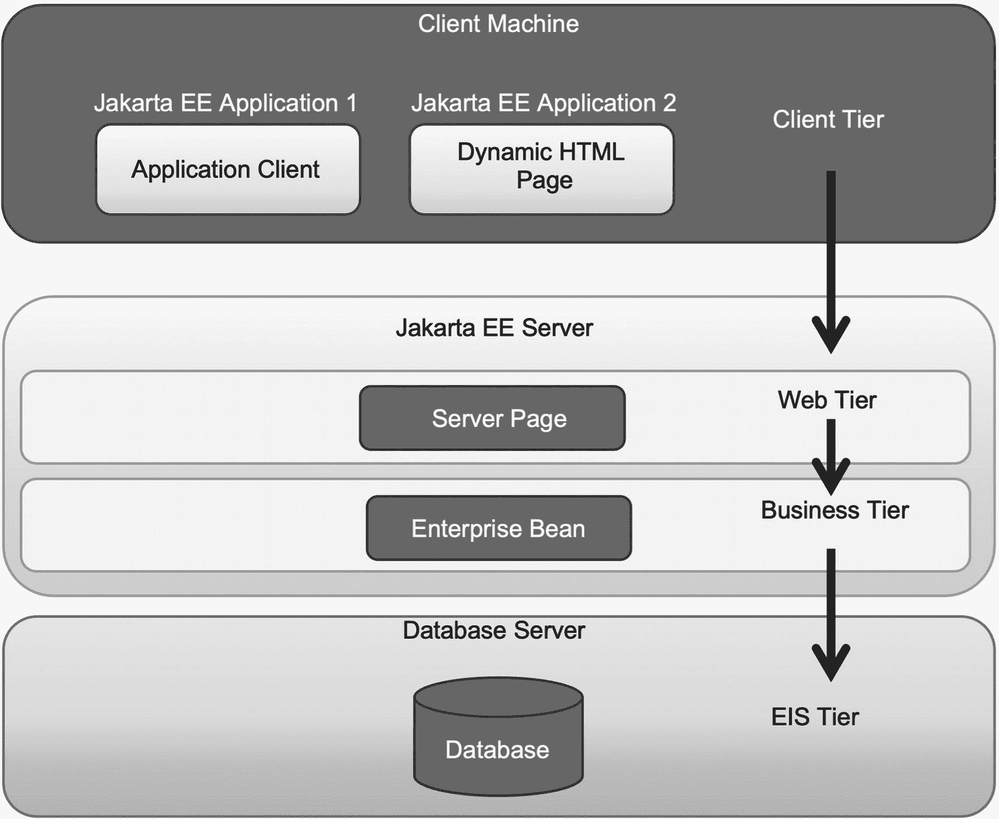

图 3-1

Java 应用程序组件模型

## 会话 Bean

会话 Bean 是一种旨在封装业务服务的组件技术。服务支持的客户端可访问操作可以使用 Java 接口定义，或者在没有接口的情况下，仅使用 Bean 实现类上的公共方法集来定义。Bean 类几乎就是一个普通的 Java 类，然而，由于它是企业 Bean 组件模型的一部分，该 Bean 可以访问广泛的容器服务。“会话 Bean”这个名称的意义与客户端访问和与之交互的方式有关。一旦客户端从服务器获取到会话 Bean 的引用，它就会与该 Bean 建立一个会话，并可以对其调用业务操作。

会话 Bean 有三种类型：无状态、有状态和单例。与**无状态**会话 Bean 的交互始于业务方法调用的开始，并在方法调用完成时结束。业务操作之间不会保留任何状态。与**有状态**会话 Bean 的交互更像是一次对话，从客户端获取会话 Bean 的引用开始，到客户端显式将其释放回服务器时结束。对有状态会话 Bean 的业务操作可以在跨调用时在 Bean 实例上维护状态。在描述每种类型的会话 Bean 时，我们将提供关于这种交互风格差异的实现考虑的更多细节。

**单例**会话 Bean 可以被视为无状态和有状态会话 Bean 的混合体。所有客户端共享同一个单例 Bean 实例，因此可以在方法调用之间共享状态，但单例会话 Bean 缺乏有状态会话 Bean 的对话契约和移动性。单例会话 Bean 上的状态也会引发并发问题，在决定是否使用这种风格的会话 Bean 时需要加以考虑。

与大多数组件容器一样，企业 Bean 容器中的客户端不直接与会话 Bean 实例交互。客户端引用并调用由服务器提供的业务接口或 Bean 类的实现。这个实现类充当底层 Bean 实现的代理。这种客户端与 Bean 的解耦允许服务器拦截方法调用，以便提供 Bean 所需的服务，例如事务管理。它还允许服务器根据需要优化和重用会话 Bean 类的实例。

在以下各节中，我们将讨论使用同步业务方法调用的会话 Bean。异步业务方法提供了一种涉及 Future 的替代调用模式，但这超出了本书的范围。

### 无状态会话 Bean

如前所述，无状态会话 Bean 旨在单个方法的生命周期内完成一个操作。无状态 Bean 可以实现许多业务操作，但每个方法不能假设在其之前调用了任何其他方法。

这听起来像是无状态 Bean 的一个限制，但它却是迄今为止最常见的业务服务实现形式。与有状态会话 Bean（适用于在对话期间累积状态，例如零售应用程序的购物车）不同，无状态会话 Bean 旨在非常高效地执行独立操作。无状态会话 Bean 可以扩展到大量客户端，而对整体服务器资源的影响最小。


#### 定义无状态会话 Bean

会话 Bean 由两部分定义：

*   零个或多个业务接口，用于定义客户端可在 Bean 上调用的方法。当未定义接口时，Bean 实现类中的公共方法集将构成一个逻辑客户端接口。
*   一个实现这些接口的类，称为 Bean 类，并使用 `@Stateless` 注解进行标记。

是否希望为会话 Bean 提供一个实际的接口，这取决于个人偏好。我们展示了两种方式的示例，但在后续示例中通常不使用接口。

让我们首先看一个带接口的无状态会话 Bean 版本。清单 3-1 展示了该会话 Bean 支持的业务接口。在此示例中，服务包含一个名为 `sayHello()` 的单一方法，该方法接受一个对应人名的 `String` 参数，并返回一个 `String` 响应。没有任何注解或父接口表明这是一个业务接口。当由会话 Bean 实现时，它将被自动视为本地业务接口，这意味着它仅对同一应用服务器内的客户端可访问。另一种用于远程客户端的业务接口类型也是可能的，但不常用。

```
public interface HelloService {
public String sayHello(String name);
}
清单 3-1
会话 Bean 的业务接口
```

现在让我们来看实现，如清单 3-2 所示。这是一个实现了 `HelloService` 业务接口的常规 Java 类。该类唯一特别之处在于 `@Stateless` 注解^(⁶)，它将该类标记为无状态会话 Bean。业务方法的实现没有任何特殊约束或要求。这是一个恰好成为企业 Bean 的常规类。

```
@Stateless
public class HelloServiceBean implements HelloService {
public String sayHello(String name) {
return "Hello, "  + name;
}
}
清单 3-2
实现 HelloService 接口的 Bean 类
```

就 API 设计而言，使用接口可能是暴露会话 Bean 操作的最佳方式，因为它将接口与实现分离开来。然而，当前的规范是将组件实现为包含业务逻辑的简单类，而不使用接口。使用这种方法，会话 Bean 将简单地如清单 3-3 所示。

```
@Stateless
public class HelloService {
public String sayHello(String name) {
return “Hello, “ + name;
}
}
清单 3-3
无接口的会话 Bean
```

会话 Bean 的逻辑接口由其公共方法组成，在本例中为 `sayHello()` 方法。客户端将 `HelloServiceBean` 类当作接口来使用，并且必须忽略任何非公共方法或实现细节。在底层，客户端将与一个代理进行交互，该代理扩展了 Bean 类并重写了业务方法，以提供标准的容器服务。

#### 生命周期回调

与应用代码中使用的常规 Java 类不同，服务器管理着无状态会话 Bean 的生命周期。服务器决定何时创建和移除 Bean 实例，并且必须在 Bean 实例构造之后、业务逻辑被调用之前，为其初始化服务。同样，Bean 可能需要在业务方法可用之前获取资源，例如 JDBC 数据源。然而，为了让 Bean 获取资源，服务器必须首先完成对其服务的初始化。这限制了类构造函数的实用性，因为在服务器初始化完成之前，Bean 无法访问任何资源。

为了允许服务器和 Bean 都能满足其初始化需求，企业 Bean 支持生命周期回调方法，这些方法由服务器在 Bean 生命周期的各个点调用。对于无状态会话 Bean，有两个生命周期回调：`PostConstruct` 和 `PreDestroy`。一旦服务器完成为 Bean 初始化所有容器服务，它将立即调用 `PostConstruct` 回调。实际上，这取代了构造函数作为初始化逻辑的位置，因为只有在这里才能保证容器服务可用。服务器在释放 Bean 实例以供垃圾回收之前，会立即调用 `PreDestroy` 回调。在 `PostConstruct` 期间获取的任何需要显式关闭的资源，都应在 `PreDestroy` 期间释放。

清单 3-4 展示了一个无状态会话 Bean，它在 `PostConstruct` 回调期间获取了对 `java.util.logging.Logger` 实例的引用，该回调由 `@PostConstruct` 标记注解标识。同样，`PreDestroy` 回调由 `@PreDestroy` 注解标识。

```
@Stateless
public class LoggerBean {
private Logger logger;
@PostConstruct
void init() {
logger = Logger.getLogger("notification");
}
public void logMessage(String message) {
logger.info(message);
}
}
清单 3-4
使用 PostConstruct 回调获取 Logger
```

### 有状态会话 Bean

在会话 Bean 的介绍中，我们描述了无状态 Bean 和有状态 Bean 之间的区别，其基础是客户端与服务器之间的交互方式。对于无状态会话 Bean，交互始于并止于单个方法调用。有时客户端需要发出多个请求，并且每个请求都能够访问或考虑先前请求的结果。有状态会话 Bean 旨在通过为客户端提供专用服务来处理这种情况，该服务在客户端获得对 Bean 的引用时开始，并且仅在客户端选择结束对话时结束。

有状态会话 Bean 的典型示例是电子商务应用程序中的购物车。客户端获得对购物车的引用，从而开始对话。在用户会话期间，客户端向购物车添加或移除商品，购物车维护着特定于客户端的状态。然后，当会话完成时，客户端完成购买，导致购物车被移除。

这与在应用程序代码中使用非受管 Java 对象并无不同。您创建一个实例，调用对象上累积状态的操作，然后在不再需要时处置该对象。有状态会话 Bean 的唯一区别在于，服务器管理实际的对象实例，而客户端通过代理对象间接与该实例交互。

有状态会话 Bean 提供了无状态会话 Bean 可用功能的超集。我们为无状态会话 Bean 介绍的功能同样适用于有状态会话 Bean。


#### 定义有状态会话 Bean

在明确了有状态会话 Bean 的用例之后，我们来看看如何定义一个。与无状态会话 Bean 类似，有状态会话 Bean 可以有一个由单个 Bean 类实现的接口，也可以没有。清单 3-5 展示了 `ShoppingCart` 有状态会话 Bean 的 Bean 类。该 Bean 类已使用 `@Stateful` 注解进行标记，以向服务器表明该类是一个有状态会话 Bean。

```
@Stateful
public class ShoppingCart {
private HashMap items = new HashMap();
public void addItem(String item, int quantity) {
Integer orderQuantity = items.get(item);
if (orderQuantity == null) {
orderQuantity = 0;
}
orderQuantity += quantity;
items.put(item, orderQuantity);
}
public void removeItem(String item, int quantity) {
// ...
}
public Map getItems() {
// ...
}
// ...
@Remove
public void checkout(int paymentId) {
// store items to database
// ...
}
@Remove
public void cancel() {
}
}
清单 3-5
使用有状态会话 Bean 实现购物车
```

与迄今为止我们处理的无状态会话 Bean 相比，这个 Bean 有两个不同之处。

第一个不同之处在于，该 Bean 类拥有状态字段，这些字段会被 Bean 的业务方法修改。这是允许的，因为使用该 Bean 的客户端实际上可以访问该会话 Bean 的一个私有实例，并对其进行修改。

第二个不同之处在于，存在一些使用 `@Remove` 注解标记的方法。客户端将使用这些方法来结束与 Bean 的对话。在调用这些方法之一后，服务器将销毁该 Bean 实例，如果客户端再尝试调用任何业务方法，其引用将抛出异常。每个有状态会话 Bean 都必须定义至少一个使用 `@Remove` 注解标记的方法，即使该方法除了作为对话结束标志外不做任何其他事情。在清单 3-5 中，如果用户完成购物交易，则会调用 `checkout()` 方法；而如果用户决定不继续，则会调用 `cancel()` 方法。无论哪种情况，该会话 Bean 都会被移除。

#### 生命周期回调

与无状态会话 Bean 类似，有状态会话 Bean 也支持生命周期回调，以便于 Bean 的初始化和清理。它还支持两个额外的回调，允许 Bean 优雅地处理其实例的钝化和激活。*钝化* 是指服务器序列化 Bean 实例的过程，以便将其离线存储以释放资源，或复制到集群中的另一台服务器。*激活* 是指反序列化已钝化的会话 Bean 实例，并使其在服务器中再次变为活跃状态的过程。由于有状态会话 Bean 代表客户端持有状态，并且在客户端调用 Bean 上的某个移除方法之前不会被移除，因此服务器无法通过销毁 Bean 实例来释放资源。钝化允许服务器在保留会话状态的同时临时回收资源。

在 Bean 被钝化之前，服务器将调用 `PrePassivate` 回调。Bean 使用此回调为序列化做准备，通常是通过关闭与其它服务器资源的任何实时连接。`PrePassivate` 方法通过 `@PrePassivate` 标记注解来标识。在 Bean 被激活之后，服务器将调用 `PostActivate` 回调。在序列化实例恢复后，Bean 必须重新获取 Bean 的业务方法可能依赖的与其他资源的任何连接。`PostActivate` 方法通过 `@PostActivate` 标记注解来标识。

清单 3-6 展示了一个使用生命周期回调来维护 JDBC 连接的会话 Bean。请注意，只有 JDBC `Connection` 是显式管理的。作为资源连接工厂，服务器会在钝化和激活期间自动保存和恢复数据源。

```
@Stateful
public class OrderBrowser {
DataSource ds;
Connection conn;
@PostConstruct
void init() {
// acquire the data source
// ...
acquireConnection();
}
@PrePassivate
void passivate() { releaseConnection(); }
@PostActivate
void activate() { acquireConnection(); }
@PreDestroy
void shutdown() { releaseConnection(); }
private void acquireConnection() {
try {
conn = ds.getConnection();
} catch (SQLException e) {
throw new EJBException(e);
}
}
private void releaseConnection() {
try {
conn.close();
} catch (SQLException e) {
// log database access error
} finally {
conn = null;
}
}
public Collection listOrders() {
// ...
}
@Remove
public void remove() {}
}
清单 3-6
在有状态会话 Bean 上使用生命周期回调
```

### 单例会话 Bean

对无状态会话 Bean 最常见的两个批评是：Bean 池化带来的感知开销，以及无法通过静态字段共享状态。单例会话 Bean 试图通过提供一个单一的共享 Bean 实例来解决这两个问题，该实例既可以并发访问，也可以用作共享状态的机制。单例会话 Bean 与无状态会话 Bean 共享相同的生命周期回调，并且服务器管理的资源（如持久化上下文）的行为与它们在无状态会话 Bean 中时相同。但相似之处仅此而已，因为单例会话 Bean 拥有与无状态会话 Bean 不同的整体生命周期，并且增加了由开发者控制锁以实现同步的复杂性。

与其他会话 Bean 不同，单例 Bean 可以被声明为在应用程序初始化期间急切创建，并一直存在直到应用程序关闭。一旦创建，它将持续存在直到容器将其移除，无论业务方法执行期间发生任何异常。这是与其他类型会话 Bean 的一个关键区别，因为该 Bean 实例在发生系统异常时永远不会被重新创建。对于有状态或无状态会话 Bean，异常会导致容器丢弃该 Bean 实例。

单例会话 Bean 的长生命周期和共享实例使其成为存储通用应用程序状态的理想场所，无论是只读还是读写状态。为了保护对此状态的访问，单例会话 Bean 根据应用程序开发者的需求提供了多种并发选项。方法可以是完全非同步的以提高性能，也可以由容器自动锁定和管理。


#### 定义单例会话 Bean

遵循无状态和有状态会话 Bean 的模式，单例会话 Bean 使用 `@Singleton` 注解进行定义。单例会话 Bean 可以包含一个接口，也可以使用无接口视图。清单 3-7 展示了一个简单的单例会话 Bean，它使用无接口视图来跟踪网站的访问次数。

```
@Singleton
public class HitCounter {
int count;
public void increment() { ++count; }
public void getCount() { return count; }
public void reset() { count = 0; }
}
清单 3-7
实现一个单例会话 Bean
```

如果你将清单 3-7 中的 `HitCounter` Bean 与之前定义的无状态和有状态会话 Bean 进行比较，你会发现两个明显的区别。与无状态会话 Bean 不同，它通过一个 `count` 字段来保存状态，用于记录访问次数。但与有状态会话 Bean 不同，它没有使用 `@Remove` 注解来标识将结束会话的业务方法。

默认情况下，容器会管理业务方法的同步，以确保不会发生数据损坏。在这个例子中，这意味着对 Bean 的所有访问都是串行化的，因此在任何时刻，只有一个客户端在调用该实例上的业务方法。

单例会话 Bean 的生命周期与整个应用程序的生命周期绑定在一起。容器决定单例实例何时被创建，除非 Bean 类使用了 `@Startup` 注解，以强制在应用程序启动时进行即时初始化。容器可以延迟创建那些未指定即时初始化的单例，但这取决于具体供应商的实现，不能一概而论。

#### 生命周期回调

单例会话 Bean 的生命周期回调与无状态会话 Bean 相同：`PostConstruct` 和 `PreDestroy`。容器会在服务器初始化 Bean 实例后调用 `PostConstruct` 回调，同样，在销毁 Bean 实例之前会调用 `PreDestroy` 回调。与无状态会话 Bean 相比，这里的关键区别在于，`PreDestroy` 仅在应用程序整体关闭时才会被调用。因此，它只会被调用一次，而无状态会话 Bean 的生命周期回调则会随着 Bean 实例的创建和销毁而被频繁调用。

## Servlet

Servlet 是一种组件技术，旨在满足 Web 开发人员的需求，他们需要响应 HTTP 请求并生成动态内容作为回报。Servlet 是 Jakarta EE 平台中最古老、最流行的技术。它们是 Jakarta Server Pages 等技术的基础，也是 Jakarta Server Faces（Jakarta Faces）等 Web 框架的支柱。

尽管你可能对 Servlet 有一些经验，但仍有必要描述一下 Web 应用模型对企业应用开发的影响。由于依赖 HTTP 协议，Web 本质上是一种无状态媒介。与前面描述的无状态会话 Bean 非常相似，客户端发出请求，服务器触发 Servlet 中相应的服务方法，生成内容并返回给客户端。每个请求都与上一个请求完全独立。

这带来了一个挑战，因为许多 Web 应用都涉及客户端和服务器之间的某种对话，在这种对话中，用户之前的操作会影响后续页面返回的结果。为了维护这种会话状态，许多早期应用尝试将上下文信息动态嵌入到 URL 中。不幸的是，这种技术不仅扩展性不佳，而且还需要所有内容生成都包含动态元素，这使得非开发人员很难为 Web 应用编写内容。

Servlet 通过会话解决了会话状态的问题。不要与会话 Bean 混淆，HTTP 会话是一个与会话 ID 关联的数据映射。当应用请求创建一个会话时，服务器会生成一个新的 ID，并返回一个 `HTTPSession` 对象，应用可以使用该对象来存储键值对数据。然后，它使用浏览器 Cookie 等技术将会话 ID 与客户端关联起来，将两者绑定到一个对话中。对于 Web 应用来说，客户端在很大程度上并不知道服务器跟踪的会话状态。

有效使用 HTTP 会话是 Servlet 开发的一个重要环节。清单 3-8 演示了请求会话并在其中存储会话数据所需的步骤。在这个例子中，假设用户已登录，Servlet 将用户 ID 存储在会话中，使其可用于同一客户端的所有后续请求。对 `HttpServletRequest` 对象调用 `getSession()` 方法将返回活动会话，如果不存在，则创建一个新会话。一旦获得，会话就像一个映射，可以使用 `setAttribute()` 和 `getAttribute()` 方法分别设置和检索键值对。正如你将在本章后面看到的，存储非结构化数据的 Servlet 会话，有时会与有状态会话 Bean 配对使用，以便利用定义良好的业务接口来管理会话信息。

```
public class LoginServlet extends HttpServlet {
protected void doPost(HttpServletRequest request, HttpServletResponse response)
throws ServletException, IOException {
String userId = request.getParameter("user");
HttpSession session = request.getSession();
session.setAttribute("user", userId);
// ...
}
}
清单 3-8
使用 Servlet 维护会话状态
```

面向 Web 的应用框架的兴起也改变了我们开发 Web 应用的方式。用 Servlet 编写的应用代码正迅速被使用 Jakarta Faces 等框架从基础模型中进一步抽象出来的应用代码所取代。在诸如此类的环境中工作时，基本的应用持久性问题，例如在哪里获取和存储实体管理器，以及如何快速有效地使用事务，就变得至关重要。

尽管我们探讨了其中一些问题，但在 Jakarta Faces 等框架的上下文中进行持久化操作超出了本书的范围。作为通用解决方案，我们建议采用一个组件模型来集中进行持久化操作。例如，会话 Bean 可以从 Jakarta EE 应用中的任何位置轻松访问，这使它们成为业务服务的理想中立地带。在会话 Bean 模型内外交换实体的能力意味着，持久化操作的结果可以直接在 Web 框架中使用，而无需将你的表示代码与持久化 API 紧密耦合。


## 依赖管理与 CDI

Jakarta EE 组件的业务逻辑通常并非完全自包含。实现往往依赖于其他资源，这可能包括服务器资源（如 JDBC 数据源）或应用定义的资源（如另一个组件或特定持久化单元的实体管理器）。核心 Jakarta EE 平台对将依赖注入到有限数量的预定义服务器资源（如数据源、托管事务等）提供了相当有限的支持。然而，CDI 标准远不止简单的依赖注入（DI），它提供了一个广泛的框架来支持从简单到特殊的所有需求。我们首先描述 CDI 出现之前平台中包含的基本概念和支持，然后转向 CDI 及其上下文相关的 DI 模型。

Jakarta EE 组件支持资源引用的概念。引用是一个指向资源的命名链接，可以在运行时从应用程序代码中动态解析，或者在创建组件实例时由容器自动解析。我们稍后将介绍这些场景。

引用由两部分组成：名称和目标。应用程序代码使用名称来动态解析引用，而服务器使用目标信息来查找应用程序正在寻找的资源。要定位的资源类型决定了匹配目标所需的信息类型。每个资源引用都需要一组特定于其所引用的资源类型的信息。

引用通过以下资源引用注解之一声明：`@Resource`、`@EJB`、`@PersistenceContext` 或 `@PersistenceUnit`。这些注解可以放在类、字段或 setter 方法上。位置的选择决定了引用的默认名称，以及服务器是否自动解析该引用。

### 依赖查找

我们讨论的第一种在应用程序代码中解析依赖的策略称为*依赖查找*。这是 Jakarta EE 中传统的依赖管理形式，其中应用程序代码负责使用 Java 命名和目录接口（JNDI）查找命名引用。

所有资源注解都支持一个名为 `name` 的属性，该属性定义了引用的 JNDI 名称。当资源注解放在类定义上时，此属性是必需的。如果资源注解放在字段或 setter 方法上，服务器将生成一个默认名称。使用依赖查找时，注解通常放在类级别，并显式指定名称。将资源引用放在字段或 setter 方法上，除了生成默认名称之外，还有其他效果，我们将在下一节中讨论。

名称的作用是为客户端提供一种动态解析引用的方式。每个 Jakarta EE 应用服务器都支持 JNDI，尽管自依赖注入出现以来，应用程序使用它的频率较低，并且每个 Jakarta EE 组件都有自己的本地作用域 JNDI 命名上下文，称为环境命名上下文。引用的名称被绑定到环境命名上下文中，当使用 JNDI API 查找时，服务器会解析该引用并返回引用的目标。

考虑清单 3-9 中所示的 `DeptService` 会话 Bean。它使用 `@EJB` 注解声明了对一个会话 Bean 的依赖，并为其指定了名称 `deptAudit`。`@EJB` 注解的 `beanInterface` 元素引用了会话 Bean 类。在 `PostConstruct` 回调中，审计 Bean 被查找并存储在 `audit` 字段中。`Context` 和 `InitialContext` 接口均由 JNDI API 定义。`Context` 接口的 `lookup()` 方法是从 JNDI 上下文中检索对象的传统方式。为了找到名为 `deptAudit` 的引用，应用程序查找名称 `java:comp/env/deptAudit` 并将结果转换为 `AuditService`。添加到引用名称前面的前缀 `java:comp/env/` 向服务器指示应搜索环境命名上下文以找到该引用。如果名称指定不正确，查找将失败。

```
@Stateless
@EJB(name="deptAudit", beanInterface=AuditService.class)
public class DeptService {
private AuditService audit;
@PostConstruct
void init() {
try {
Context ctx = new InitialContext();
audit = (AuditService) ctx.lookup("java:comp/env/deptAudit");
} catch (NamingException e) {
throw new EJBException(e);
}
}
// ...
}
清单 3-9
查找企业 Bean 依赖
```

所有 Jakarta EE 组件都支持使用 JNDI API 从环境命名上下文中查找资源引用。然而，由于 JNDI 的异常处理要求，这是一种相当繁琐的查找资源的方法。企业 Bean 还支持使用 `EJBContext` 接口的 `lookup()` 方法的替代语法。`EJBContext` 接口（以及诸如 `SessionContext` 之类的子接口）可用于任何企业 Bean，并为 Bean 提供对运行时服务（如定时器服务）的访问。清单 3-10 显示了与清单 3-9 相同的示例，但使用了 `lookup()` 方法。此示例中的 `SessionContext` 实例通过由容器调用的 setter 方法提供。我们将在后面“引用服务器资源”一节中重新讨论此示例，以了解它是如何被调用的。

```
@Stateless
@EJB(name="deptAudit", beanInterface=AuditService.class)
public class DeptService  {
SessionContext context;
AuditService audit;
public void setSessionContext(SessionContext context) {
this.context = context;
}
@PostConstruct
public void init() {
audit = (AuditService) context.lookup("deptAudit");
}
// ...
}
清单 3-10
使用 EJBContext lookup() 方法
```

`EJBContext lookup()` 方法相对于 JNDI API 有两个优点。首先，该方法的参数就是资源引用中指定的确切名称。其次，`lookup()` 方法仅抛出运行时异常，因此可以避免 JNDI API 的受检异常处理。在幕后，清单 3-9 中完全相同的 JNDI API 调用序列正在执行，但 JNDI 异常被自动处理了。


### 依赖注入

当资源注解放置在字段或 setter 方法上时，会发生两件事。首先，声明一个资源引用，就像它被放置在 bean 类上一样（类似于清单 3-9 示例中 `@EJB` 注解的工作方式），并且当组件创建时，该资源的名称将被绑定到环境命名上下文中。其次，服务器会自动为你执行查找，并将结果设置到实例化的类中。

自动查找资源并将其设置到类中的过程称为*依赖注入*，因为据说服务器将解析后的依赖项注入到类中。这种技术是通常被称为控制反转的几种技术之一，它消除了从 JNDI 环境上下文中手动查找资源的负担。

依赖注入被认为是应用程序开发的最佳实践，不仅因为它减少了 JNDI 查找的需求，还因为它简化了测试。在依赖于应用程序服务器运行时环境的类中没有任何 JNDI API 代码，因此 bean 类可以在单元测试中直接实例化。然后，开发人员可以手动提供所需的依赖项并测试相关类的功能，而无需担心如何处理 JNDI 查找。

#### 字段注入

依赖注入的第一种形式称为*字段注入*。将依赖项注入到字段中意味着，服务器在环境命名上下文中查找依赖项后，会将结果直接赋值给类中被注解的字段。清单 3-11 重新审视了清单 3-9 中的示例，并演示了 `@EJB` 注解的更简单用法，这次是将结果注入到 `audit` 字段中。之前使用的目录接口代码已消失，bean 的业务方法可以假定 `audit` 字段持有对 `AuditService` bean 的引用。

```
@Stateless
public class DeptService {
@EJB AuditService audit;
// ...
}
清单 3-11
使用字段注入
```

字段注入无疑是最容易实现的，本书中的示例总是选择使用这种形式，而不是动态查找形式。使用字段注入唯一需要考虑的是，如果你计划进行单元测试，则需要添加一个 setter 方法，或者使该字段对你的单元测试可访问，以便手动满足依赖关系。私有字段虽然合法，但如果没有可访问的方式来设置其值，则需要使用令人不快的技巧。如果你想在不添加 setter 的情况下进行单元测试，请考虑为字段注入使用包作用域。

我们在上一节中提到，当资源注解放置在字段或 setter 方法上时，会自动为引用生成一个名称。为了完整性，我们描述了这个名称的格式，但你不太可能找到很多使用它的机会。生成的名称是完全限定的类名，后跟一个正斜杠，然后是字段或属性的名称。这意味着，如果 `DeptService` bean 位于 `persistence.session` 包中，则清单 3-9 中引用的注入的企业 Bean 将在环境命名上下文中以名称 `persistence.session.DeptService/audit` 访问。为资源注解指定 `name` 元素将覆盖此默认值。

#### Setter 注入

依赖注入的第二种形式称为*setter 注入*，涉及对 setter 方法而不是类字段进行注解。当服务器解析引用时，它将使用查找结果调用被注解的 setter 方法。清单 3-12 再次重新审视清单 3-9，以演示使用 setter 注入。

```
@Stateless
public class DeptService {
private AuditService audit;
@EJB
public void setAuditService(AuditService audit) {
this.audit = audit;
}
// ...
}
清单 3-12
使用 Setter 注入
```

这种注入风格允许使用私有字段，同时也非常适合单元测试。每个测试可以简单地实例化 bean 类，并通过调用 setter 方法手动执行依赖注入，通常是通过提供针对测试定制的所需资源的实现。

### 声明依赖项

以下各节描述了 Jakarta EE 规范中描述的一些资源注解。每个注解都有一个 `name` 属性，用于可选地指定依赖项的引用名称。注解上的其他属性特定于需要获取的资源类型。

#### 引用持久化上下文

在上一章中，我们演示了如何使用从 `Persistence` 类返回的 `EntityManagerFactory` 为持久化上下文创建实体管理器。在 Jakarta EE 环境中，可以使用 `@PersistenceContext` 注解来声明对持久化上下文的依赖，并自动获取该持久化上下文的实体管理器。

清单 3-13 演示了如何使用 `@PersistenceContext` 注解，通过依赖注入到无状态会话 bean 中来获取实体管理器。`unitName` 元素指定了持久化上下文所基于的持久化单元的名称。

提示

如果省略了 `unitName` 元素，则如何确定持久化上下文的单元名称是特定于供应商的。如果应用程序只有一个持久化单元，某些供应商可以提供默认值，而其他供应商可能要求在特定于供应商的配置文件中指定单元名称。

```
@Stateless
public class EmployeeService {
@PersistenceContext(unitName="EmployeeService")
EntityManager em;
// ...
}
清单 3-13
注入 EntityManager 实例
```

你可能想知道为什么无状态会话 bean 中存在状态字段；毕竟，实体管理器必须维护自己的状态才能管理特定的持久化上下文。好消息是，规范在设计时就考虑到了容器集成，因此清单 3-13 中实际注入的并不是像我们在上一章中使用的那种实体管理器实例。注入到 bean 中的值是一个容器管理的代理，它代表应用程序代码获取和释放持久化上下文。这是 Jakarta EE 中 Jakarta Persistence API 的一个强大特性，将在第 6 章中详细讨论。

目前，可以安全地假设注入的值会“做正确的事情”。它不需要被处理，并且会自动与应用程序服务器的事务管理协同工作。其他支持 Jakarta Persistence 的容器，例如 Spring，将提供类似的功能，但它们通常需要一些额外的配置才能使其工作。


#### 引用持久化单元

可以使用 `@PersistenceUnit` 注解来引用某个持久化单元的 `EntityManagerFactory`。与 `@PersistenceContext` 注解类似，`unitName` 元素用于标识我们想要访问的 `EntityManagerFactory` 实例所对应的持久化单元。如果注解中未指定持久化单元名称，则名称的确定方式由具体供应商决定。

清单 3-14 演示了如何将 `EntityManagerFactory` 实例注入到一个有状态会话 Bean 中。该 Bean 随后在 `PostConstruct` 生命周期回调期间，通过工厂创建一个 `EntityManager` 实例。注入的 `EntityManagerFactory` 实例可以安全地存储在任何组件实例上。它是线程安全的，并且在 Bean 实例被移除时无需进行销毁处理。

```
@Stateful
public class EmployeeService {
@PersistenceUnit(unitName="EmployeeService")
private EntityManagerFactory emf;
private EntityManager em;
@PostConstruct
public void init() {
em = emf.createEntityManager();
}
// ...
}
清单 3-14
注入 EntityManagerFactory 实例
```

在 Jakarta EE 环境中，持久化单元的 `EntityManagerFactory` 并不常用，因为注入的实体管理器更容易获取和使用。正如你将在第 6 章中看到的，从工厂返回的实体管理器与服务器响应 `@PersistenceContext` 注解而提供的实体管理器之间存在重要差异。

#### 引用服务器资源

`@Resource` 注解是一个通用的引用注解，用于那些没有专用注解的 Jakarta EE 资源类型。它用于定义对资源工厂、数据源和其他服务器资源的引用。`@Resource` 注解也是最简单的定义方式，因为其唯一的附加元素是 `resourceType`，当服务器无法自动确定资源类型时，你可以使用它来指定资源类型。例如，如果你注入的字段类型是 `Object`，那么服务器就无法知道你实际想要的是一个数据源。此时，可以将 `resourceType` 元素设置为 `javax.sql.DataSource` 来明确需求。

`@Resource` 注解的一个特性是，它可用于获取特定于组件类型的逻辑资源。这包括 `EJBContext` 实现以及诸如企业 Bean 定时器服务之类的服务。在清单 3-10 中，我们未将其定义为注解，而是使用了 Setter 注入来获取 `EJBContext` 实例。为了使该示例更完整，本可以将 `@Resource` 注解放在 `setSessionContext()` 方法上。清单 3-15 重新审视了清单 3-10 中的示例，这次演示了使用 `@Resource` 进行字段注入以获取 `SessionContext` 实例。

```
@Stateless
@EJB(name="audit", beanInterface=AuditService.class)
public class DeptService {
@Resource
SessionContext context;
AuditService audit;
@PostConstruct
public void init() {
audit = (AuditService) context.lookup("audit");
}
// ...
}
清单 3-15
注入 SessionContext 实例
```

## CDI 与上下文注入

虽然基本的平台注入工具很有用，但它们在可注入的内容以及对注入过程的控制程度上都存在明显的局限性。CDI 提供了一个更强大的注入标准，它首先扩展了受管 Bean 和平台资源注入的概念，然后进一步为 CDI 管理的 Bean 定义了一组额外的注入服务。当然，上下文注入的关键特性在于能够根据当前活动的上下文来注入给定的对象实例。

CDI 的功能广泛而强大，显然远远超出了这本关于 Jakarta Persistence 的书籍的讨论范围。就本书而言，我们仅浅尝辄止，展示如何创建和使用带有限定符的简单 CDI Bean。我们建议感兴趣的读者参考众多关于 CDI 的书籍，以了解更多关于拦截器、装饰器、事件以及 CDI 容器中可用的其他众多特性。

### CDI Bean

企业 Bean 的优势之一在于它们提供了从安全性到自动事务管理和并发控制等所有可能需要的服务。然而，如果你不使用或不想要某些服务，这种完整的服务模型可能被视为一个缺点，因为人们认为使用这些服务至少会带来一些成本。受管 Bean 及其 CDI 扩展则提供了一种更偏向“按需付费”的模型。你只会获得你指定的服务。但是，不要误以为 CDI Bean 比现代的企业 Bean 更轻量。在实现层面，这两种类型的对象都以几乎相同的方式被容器代理，并且服务钩子会根据需要被添加和触发。

那么，究竟什么是 CDI Bean？*CDI Bean* 是任何符合 CDI 注入服务条件的类，其主要要求仅仅是它必须是一个具体类。^(⁷) 即使是会话 Bean 也可以是 CDI Bean，从而符合 CDI 注入服务的条件，尽管它们的生命周期上下文存在一些注意事项。

### 注入与解析

如果一个 Bean 的字段或属性被 `@jakarta.inject.Inject` 注解标记，那么它们就可以成为注入的目标。CDI 定义了一个复杂的算法来解析要注入的正确对象类型，但在一般情况下，如果你声明了一个类型为 X 的字段，那么一个 X 的实例将被注入到该字段中。我们可以重写清单 3-10 中的示例，使用简单的受管 CDI Bean 来代替企业 Bean。清单 3-16 展示了在字段上使用注入注解的情况。`AuditService` 实例将在 `DeptService` 实例化后被注入。

```
public class DeptService {
@Inject AuditService audit;
// ...
}
清单 3-16
使用字段注入的 CDI Bean
```

类似地，该注解也可以放在属性方法上以实现 Setter 注入。实现相同结果的另一种方法是使用第三种注入方式，称为*构造器注入*。顾名思义，构造器注入涉及容器调用构造方法并注入参数。清单 3-17 展示了如何配置构造器注入。构造器注入特别适合在容器外部进行测试，因为测试框架只需简单地调用构造器即可轻松完成必要的注入，而无需对对象进行代理。

```
public class DeptService {
private AuditService audit;
@Inject DeptService(AuditService audit) {
this.audit = audit;
}
// ...
}
清单 3-17
使用构造器注入的 CDI Bean
```


### 作用域与上下文

作用域定义了一对时间分界点：起点和终点。例如，请求作用域会在请求开始时启动，并在回复发送回客户端时结束。类似地，其他作用域会根据客户端操作和条件来定义持续时间。共有五个预定义的作用域，其中三个（请求、会话和应用）由 Servlet 规范定义，一个（对话）由 CDI 添加，另一个由 Jakarta Transactions 规范添加：

*   *请求*：由特定的客户端方法请求界定。
*   *会话*：从 HTTP 客户端发起时开始，到 HTTP 会话终止时结束。同一 HTTP 会话中的所有请求共享该作用域。
*   *应用*：在整个应用处于活动状态期间，全局有效。
*   *对话*：跨越一系列连续的 Jakarta Faces 请求。
*   *事务*：映射到活动 Jakarta Transactions 事务的生命周期。

通过使用预期的作用域注解来注解 Bean 类，可以将 Bean 类型与某个作用域关联起来。该 Bean 的受管实例将具有与声明的作用域相似的生命周期。

每个活动的作用域都会有一个与之关联的当前上下文。例如，当请求到达时，会为该请求作用域创建一个请求上下文。每个请求都会有自己的当前请求上下文，但对于来自同一 HTTP 会话的所有请求，将只有一个会话作用域的上下文。上下文只是作用域实例在该作用域持续期间所在的位置。在每个上下文中，每种 Bean 类型只能有一个实例。

在清单 3-16 和 3-17 中，被注入到 `DeptService` Bean 中的应用作用域 `AuditService` Bean 看起来如下所示：

```
@ApplicationScoped
public class AuditService { ... }
```

由于它是应用作用域的，CDI 只会创建一个实例，并驻留在应用作用域的上下文中。请注意，这类似于单例企业 Bean，即整个应用只会创建并使用一个实例。

还存在一个额外的作用域，即*依赖*作用域，但它实际上表示没有作用域。如果未指定作用域，则默认为依赖作用域，这意味着该 Bean 的任何实例都不会放入任何上下文中，并且每次注入该 Bean 类型时都会创建一个新实例。`@Dependent` 注解可用于显式地将 Bean 标记为依赖作用域。作用域注解定义在 `jakarta.enterprise.context` 包中。

提示

在 CDI 中，Bean 可以使用 Bean 定义注解（即作用域注解）进行注解，从而避免需要 `beans.xml` 描述符。在使用 CDI 的示例中，我们使用作用域注解来避免指定 `beans.xml` 文件。

### 限定注入

限定符是一种注解，用于约束或区分具有相同继承或实现接口类型的 Bean 类型。限定符可以帮助容器解析要注入哪个 Bean 类型。

限定符注解类通常由应用程序定义，然后用于注解一个或多个 Bean 类。限定符注解定义应使用 `@Qualifier` 元注解进行注解，该元注解定义在 `jakarta.inject` 包中。清单 3-18 展示了一个定义限定符注解的示例。

```
@Qualifier
@Target({METHOD, FIELD, PARAMETER, TYPE})
@Retention(RUNTIME)
public @interface Secure { }
清单 3-18
限定符注解定义
```

现在，此注解可用于 Bean 类，例如清单 3-19 中所示的新 `SecureDeptService` Bean。该限定符表明此 Bean 是 `DeptService` 的安全版本，而不是常规（非安全？）版本。

```
@Secure
public class SecureDeptService extends DeptService { ... }
清单 3-19
限定 Bean 类
```

当要将 `DeptService` 注入到另一个组件时，可以将限定符放置在注入点上，CDI 将激活其解析算法以确定要创建哪个实例。它将匹配限定符，从而使用 `SecureDeptService` 而不是 `DeptService`。清单 3-20 展示了例如一个 Servlet 如何注入安全的 `DeptService`，甚至无需知道子类的名称。

```
public class LoginServlet extends HttpServlet {
@Inject @Secure DeptService deptService;
// ...
}
清单 3-20
限定注入
```

### 生产者方法与字段

当容器需要注入 Bean 类型的实例时，它首先会在当前上下文中查找是否已存在该实例。如果未找到，则必须获取或创建一个新实例。CDI 提供了一种方式，让应用程序通过使用生产者方法或字段来控制为给定类型“创建”的实例。

生产者方法是 CDI 容器将调用以获取新 Bean 实例的方法。该实例可以由生产者方法实例化，或者生产者可以通过其他方式获取它；如何生成实例完全取决于生产者方法的实现。生产者方法甚至可以根据运行时条件决定返回不同的 Bean 子类。

生产者方法可以使用限定符进行注解。然后，当注入点具有类似的限定时，容器将调用相应限定的生产者方法来获取实例。

在清单 3-21 中，我们展示了一个生产者方法，它返回 `DeptService` 的新安全实例。例如，如果我们无法像在清单 3-19 中那样修改 `SecureDeptService` 类以使用 `@Secure` 注解进行注解，那么这可能会很有用。我们可以改为声明一个返回 `SecureDeptService` 实例的生产者方法，这些实例将被注入到使用 `@Secure` 限定的字段中（例如清单 3-20 中所示的字段）。请注意，生产者方法可以位于任何受管 Bean 上。它可以是静态方法或实例方法，但必须使用 `@Produces` 进行注解。我们创建了一个名为 `ProducerMethods` 的 Bean 类来容纳生产者方法，并将其与应用程序的其余逻辑分开。

```
public class ProducerMethods {
@Produces @Secure
DeptService secureDeptServiceProducer() {
return new SecureDeptService();
}
}
清单 3-21
生产者方法
```

生产者字段的工作方式与生产者方法相同，不同之处在于容器访问该字段以获取实例，而不是调用方法。应用程序需要确保在容器需要时该字段包含一个实例。您将在下一节中看到使用生产者字段的示例。


### 将生产者方法与 Jakarta Persistence 资源结合使用

既然你已经了解了 CDI 的一些基础知识，是时候学习如何使用 CDI 来帮助管理 Jakarta Persistence 持久化单元和上下文了。你可以将 Jakarta EE 资源注入与 CDI 生产者字段和限定符结合使用，以注入并维护你的持久化上下文。

假设我们有两个持久化单元，一个名为 `Employee`，另一个名为 `Audit`。我们希望使用 CDI Bean 和上下文注入。我们创建一个名为 `EmProducers` 的类，并使用生产者字段和 Jakarta EE 资源注入来获取实体管理器。生产者代码和限定符注解定义见清单 3-22。

```
@RequestScoped
public class EmProducers {
@Produces @EmployeeEM
@PersistenceContext(unitName="Employee")
private EntityManager em1;
@Produces @AuditEM
@PersistenceContext(unitName="Audit")
private EntityManager em2;
}
@Qualifier
@Target({METHOD, FIELD, PARAMETER, TYPE})
@Retention(RUNTIME)
public @interface EmployeeEM { }
@Qualifier
@Target({METHOD, FIELD, PARAMETER, TYPE})
@Retention(RUNTIME)
public @interface AuditEM { }
清单 3-22
生产者类和限定符注解定义
```

Jakarta EE 的 `@PersistenceContext` 注解将导致 Jakarta EE 容器为给定的持久化单元注入带有实体管理器的生产者字段。然后，CDI 将使用这些生产者字段，通过匹配注入点的限定符来获取实体管理器。由于生产者类是请求作用域的，每个请求都会使用新的实体管理器。具体的作用域显然取决于应用程序的架构。剩下的唯一事情就是创建一个注入这些实体管理器的 Bean。清单 3-23 展示了一个引用这些实体管理器的相应 `DeptService` Bean。类似的方法也可以轻松地用于通过 `@PersistenceUnit` 资源注解注入实体管理器工厂。

```
public class DeptService {
@Inject @EmployeeEM
private EntityManager empEM;
@Inject @AuditEM
private EntityManager auditEM;
// ...
}
清单 3-23
注入 EntityManager 字段的 DeptService Bean
```

在我们的大多数示例中，我们简单地使用 `@PersistenceContext` 注解，因为它不涉及任何额外的生产者代码。它也被 Spring 和其他类型的 Jakarta Persistence 容器所支持，因此 Bean 将更具通用性。

## 事务管理

与任何其他类型的企业应用程序相比，使用持久化的应用程序需要更加关注事务管理的问题。事务何时开始、何时结束，以及实体管理器如何参与容器管理的事务，都是使用 Jakarta Persistence 的开发人员必须掌握的基本主题。以下部分为 Jakarta EE 中的事务奠定了基础；我们将在第 6 章中再次详细讨论这个主题，届时我们将探讨实体管理器及其如何参与事务。高级事务主题超出了本书的范围。我们推荐 *Mastering Java EE 8 Application Development*^(⁸) 以深入了解应用程序开发。

### 事务回顾

*事务*是一种抽象概念，用于将一系列操作组合在一起。一旦组合，这组操作就被视为一个单一单元，并且所有操作必须全部成功，否则全部失败。只有部分操作成功的结果是产生不一致的数据视图，这对应用程序是有害或不可取的。用于描述操作是全部成功还是全部失败的术语称为*原子性*，它可以说是用于描述事务行为的四个基本属性中最重要的一个。理解这四个属性是理解事务的基础。以下列表总结了这些属性：

*   *原子性*：事务中的所有操作要么全部成功，要么全部失败。每个单独操作的成功都与整个组的成功紧密相连。

*   *一致性*：事务结束时的结果状态遵循一组定义数据可接受性的规则。系统中的所有数据相对于系统中的其他数据都是合法或有效的。

*   *隔离性*：事务内所做的更改仅对进行更改的事务本身可见。一旦事务提交更改，这些更改就会原子性地对其他事务可见。

*   *持久性*：事务内所做的更改在事务完成后仍然持续存在。

满足所有这些要求的事务被称为 ACID 事务（熟悉的 ACID 术语是通过组合这四个属性每个属性的首字母得到的）。

并非所有事务都是 ACID 事务，而那些是 ACID 的事务在满足 ACID 属性方面通常也提供一定的灵活性。例如，隔离级别是一个常见的设置，可以配置为提供比前面描述的更宽松或更严格的隔离程度。这样做通常是为了提高性能，或者从另一个角度来看，如果应用程序有更严格的数据一致性要求。我们在 Jakarta EE 上下文中讨论的事务通常是 ACID 类型的。

### Java 中的企业事务

事务实际上存在于企业应用服务器内的不同级别。最低级、最基本的事务是资源级别的事务，在我们的讨论中，它被假定为通过 `DataSource` 接口访问的关系数据库。这被称为资源本地事务，等同于数据库事务。这类事务通过直接与从应用服务器获取的 JDBC `DataSource` 交互来操作。在服务器中，资源本地事务的使用频率低于容器事务。

更广泛的容器事务使用 Jakarta Transactions API，该 API 在每个符合规范的 Jakarta EE 应用服务器和大多数基于 Java 的 Web 服务器中都是可用的。这是企业应用程序使用的典型事务，它可以涉及或征用多个资源，包括数据源以及其他类型的事务性资源。使用 Jakarta Connectors 组件定义的资源也可以被征用到容器事务中。

容器通常会在 JDBC `DataSource` 之上添加自己的层，以执行连接管理和池化等功能，从而更有效地利用资源，并与事务管理系统提供无缝集成。这也是必要的，因为当容器事务完成时，容器有责任对数据源执行提交或回滚操作。

由于容器事务使用 Jakarta Transactions，并且它们可以跨越多个资源，因此它们也被称为 Jakarta Transactions 事务或全局事务。容器事务是 Java 服务器内编程的一个核心方面。


#### 事务划分

每个事务都有开始和结束。开始一个事务后，后续操作将成为同一事务的一部分，直到该事务完成。事务可以通过两种方式完成：提交（commit），使所有更改持久化到数据存储中；或回滚（rollback），表示应丢弃这些更改。导致事务开始或完成的行为称为事务划分。这是编写企业应用程序的关键部分，因为事务划分不正确是导致性能下降的最常见原因之一。

资源本地事务始终由应用程序显式划分，而容器事务可以由容器自动划分，或通过支持应用程序控制划分的 Jakarta Transactions 接口进行划分。第一种情况，即容器接管事务划分职责时，称为容器管理事务（CMT）管理；而当应用程序负责划分时，则称为 Bean 管理事务（BMT）管理。

企业 Bean 可以使用容器管理事务或 Bean 管理事务。Servlet 则局限于名称略显不当的 Bean 管理事务。企业 Bean 组件的默认事务管理方式是容器管理。要明确配置企业 Bean 以某种方式划分其事务，应在企业 Bean 类上指定 `@TransactionManagement` 注解。`TransactionManagementType` 枚举类型定义了 `BEAN`（用于 Bean 管理事务）和 `CONTAINER`（用于容器管理事务）。清单 3-24 演示了如何使用此方法启用 Bean 管理事务。

```
@Stateless
@TransactionManagement(TransactionManagementType.BEAN)
public class ProjectService {
// 此类中的方法手动控制事务划分
}
清单 3-24
更改企业 Bean 的事务管理类型
```

注意

由于企业 Bean 的默认事务管理是容器管理，因此仅当需要 Bean 管理事务时才需要指定 `@TransactionManagement` 注解。

#### 容器管理事务

划分事务最常见的方式是使用 CMT，这免去了应用程序显式开始和提交事务的工作和代码。

事务需求由元数据确定，并且可以在类甚至方法的粒度上进行配置。例如，会话 Bean 可以声明：每当调用该 Bean 上的任何特定方法时，容器必须确保在方法开始之前启动一个事务。容器还负责在方法完成后提交事务。

一个 Bean 从其一个或多个方法中调用另一个 Bean 的情况非常常见。在这种情况下，由调用方法启动的事务不会提交，因为调用方法要等到其对第二个 Bean 的调用完成后才会完成。这就是为什么我们需要设置来定义当方法在特定事务上下文中被调用时容器应如何行为。

例如，如果在调用方法时事务已在进行中，容器可能被期望直接使用该事务；而如果没有活动事务，则可能被指示启动一个新事务。这些设置称为事务属性，它们决定了容器管理的事务行为。

定义的事务属性选项如下：

*   `MANDATORY`：如果为某个方法指定了此属性，则期望在调用该方法时事务已经启动并处于活动状态。如果没有活动事务，则抛出异常。此属性很少使用，但在预期事务应已启动时，可作为开发工具来捕获事务划分错误。

*   `REQUIRED`：此属性是最常见的情况，即期望方法在事务中执行。容器保证该方法有一个活动事务。如果已有活动事务，则使用该事务；如果不存在，则为方法执行创建一个新事务。

*   `REQUIRES_NEW`：当方法始终需要在其自己的事务中执行时使用此属性；也就是说，该方法应独立于调用栈中更上层的方法进行提交或回滚。应谨慎使用，因为它可能导致过多的事务开销。

*   `SUPPORTS`：标记为 supports 的方法不依赖于事务，但如果存在事务，则允许在其中运行。这表示该方法中未访问任何事务性资源。

*   `NOT_SUPPORTED`：标记为不支持事务的方法将导致容器在调用该方法时，如果存在活动事务则挂起当前事务。这意味着该方法不执行事务性操作，但可能以其他方式失败，从而对事务结果产生不良影响。这不是一个常用的属性。

*   `NEVER`：标记为从不支持事务的方法将导致容器在调用该方法时，如果存在活动事务则抛出异常。此属性非常少用，但在预期事务应已完成时，可作为开发工具来捕获事务划分错误。

每当容器为某个方法启动事务时，假定容器也会在方法结束时尝试提交该事务。每当必须挂起当前事务时，容器负责在方法结束时恢复被挂起的事务。

实际上有两种不同的方式来指定容器管理事务：一种用于企业 Bean，另一种用于 CDI Bean、Servlet、Jakarta REST 资源类以及所有其他类型的 Jakarta EE 管理组件。企业 Bean 是第一个提供容器管理事务功能的组件类型，并为此定义了特定的元数据。CDI Bean 和其他类型的 Jakarta EE 组件（如 Servlet 或 Jakarta REST 资源类）则使用事务拦截器。


##### 企业 Bean 容器管理事务

企业 Bean 的事务属性可以通过在 Enterprise Bean 类或其可选业务接口的某个方法上添加 `@TransactionAttribute` 注解来指定。该注解需要一个枚举类型 `TransactionAttributeType` 的单一参数，其取值已在上述列表中定义。在 Bean 类上添加注解会使事务属性应用于该类中的所有业务方法，而在方法上添加注解则仅将该属性应用于该方法。如果同时存在类级别和方法级别的注解，则方法级别的注解优先。当没有类级别或方法级别的 `@TransactionAttribute` 注解时，将应用默认属性 `REQUIRED`。

清单 3-25 展示了如何为清单 3-5 中购物车 Bean 的 `addItem()` 方法设置事务属性。由于未提供事务管理设置，因此将使用容器管理事务。类上未指定任何属性，因此默认行为 `REQUIRED` 将应用于该类的所有方法。唯一的例外是 `addItem()` 方法声明了 `SUPPORTS` 事务属性，这会覆盖 `REQUIRED` 设置。每当调用添加商品的方法时，该商品将被添加到购物车中，但如果当前没有活动事务，则无需启动新事务。

```
@Stateful
public class ShoppingCart {
@TransactionAttribute(TransactionAttributeType.SUPPORTS)
public void addItem(String item, Integer quantity) {
verifyItem(item, quantity);
// ...
}
// ...
}
清单 3-25
指定企业 Bean 事务属性
```

此外，在 `addItem()` 方法将商品添加到购物车之前，它会在一个名为 `verifyItem()` 的私有方法中进行一些验证（该示例中未显示）。当此方法从 `addItem()` 中被调用时，它将在 `addItem()` 被调用时的任何事务上下文中运行。

任何希望导致容器管理事务回滚的 Bean，都可以通过调用 `EJBContext` 对象上的 `setRollbackOnly()` 方法来实现。虽然这不会立即导致事务回滚，但它向容器指示：当事务完成时，该事务应被回滚。请注意，当实体管理器调用期间或事务完成时抛出异常，实体管理器也会导致当前事务被设置为回滚。

##### 事务拦截器

拦截器为将容器管理事务功能从企业 Bean 解耦，并将其提供给任何支持拦截的组件提供了可能性。`@jakarta.transaction.Transactional` 注解允许指定将事务拦截器应用于目标组件。其机制与企业 Bean 容器管理事务类似，即以声明方式应用于类或方法，并且类语义可以被基于方法的语义覆盖。主要区别在于，这里使用的是 `@Transactional` 注解而非 `@TransactionAttribute`，并且枚举值的类型是一个名为 `Transactional.TxType` 的嵌套枚举，而不是企业 Bean 中使用的 `TransactionAttributeType`。这些枚举常量在 `Transactional.TxType` 中的命名完全相同，并具有相同的语义。

基于事务拦截器的组件与企业 Bean CMT 之间最相关的区别可能在于：使用事务拦截器的组件不会自动获得 CMT，而必须通过使用 `@Transactional` 注解来选择加入。企业 Bean 默认获得 CMT，如果它们更倾向于使用 BMT，则必须选择退出。

现在我们可以重写清单 3-25，使用 CDI Bean 代替有状态会话 Bean。清单 3-26 中的 `ShoppingCart` Bean 是会话作用域的，以便其状态在整个会话期间得以保持。空的 `@Transactional` 注解会导致该类中所有方法的默认事务性设置为 `REQUIRED`，但 `addItem()` 方法被显式覆盖为 `SUPPORTS` 除外。

```
@Transactional
@SessionScoped
public class ShoppingCart {
@Transactional(TxType.SUPPORTS)
public void addItem(String item, Integer quantity) {
verifyItem(item, quantity);
// ...
}
// ...
}
清单 3-26
CDI Bean 中的事务拦截器
```

提示

`@Transactional` 可用于受管 Bean 或 CDI Bean，但不能用于企业 Bean。反之，`@TransactionAttribute` 只能用于企业 Bean。

#### Bean 管理事务

另一种划分事务的方法是使用 BMT。这仅意味着应用程序需要通过进行 API 调用来显式地启动和停止事务。除企业 Bean 外，所有受管组件默认使用 Bean 管理事务，并且如果它们未指定 `@Transactional` 拦截器，则需要自行进行事务划分。只有企业 Bean 默认提供容器管理事务。

声明企业 Bean 使用 Bean 管理事务意味着 Bean 类承担了在其认为必要时启动和提交事务的责任。然而，伴随这一责任而来的是期望 Bean 类能够正确处理事务。使用 BMT 的企业 Bean 必须确保：每当启动一个事务时，也必须在启动该事务的方法返回之前完成该事务。未能做到这一点将导致容器自动回滚事务并抛出异常。

由企业 Bean 而非容器管理事务的一个缺点是，事务不会传播到另一个 BMT 企业 Bean 上调用的方法。例如，如果企业 Bean A 启动了一个事务，然后调用了使用 Bean 管理事务的企业 Bean B，则该事务不会传播到企业 Bean B 中的方法。每当调用 BMT 企业 Bean 方法时存在活动事务，该活动事务将被挂起，直到控制权返回给调用方法。对于非企业 Bean 组件，情况并非如此。

通常不建议在企业 Bean 中使用 BMT，因为它增加了应用程序的复杂性，并要求应用程序执行服务器本已能为其完成的工作。虽然其他类型的组件可以选择使用事务拦截器，但它们没有企业 Bean 那样的 BMT 限制，因此它们更常采用应用程序控制的 BMT 方法。它们传统上也使用 BMT，因为过去实际上没有其他选择。


##### UserTransaction

为了使组件能够手动启动和提交容器事务，应用程序必须拥有支持此功能的接口。`jakarta.transaction.UserTransaction` 接口是 Jakarta Transactions 中指定的对象，应用程序组件可以持有并调用它来管理事务边界。`UserTransaction` 的实例实际上并不是当前的事务实例；它是一种代理，提供事务 API 并代表当前事务。`UserTransaction` 实例可以通过使用 Jakarta EE 的 `@Resource` 注解或 CDI 的 `@Inject` 注解注入到组件中。`UserTransaction` 也存在于环境命名上下文中，其保留名称为 `java:comp/UserTransaction`。`UserTransaction` 接口如清单 3-27 所示。

```
public interface UserTransaction {
public abstract void begin();
public abstract void commit();
public abstract int getStatus();
public abstract void rollback();
public abstract void setRollbackOnly();
public abstract void setTransactionTimeout(int seconds);
}
清单 3-27
UserTransaction 接口
```

每个 Jakarta Transactions 事务都与一个执行线程相关联，因此，在任何给定时间，最多只能有一个事务处于活动状态。所以，如果一个事务处于活动状态，用户不能在同一个线程中启动另一个事务，直到第一个事务提交或回滚。或者，事务可能会超时，从而导致事务回滚。

我们之前讨论过，在某些 CMT 条件下，容器会挂起当前事务。从之前的 API 中，你可以看到没有用于挂起事务的 `UserTransaction` 方法。只有容器可以使用内部的事务管理 API 来执行此操作。通过这种方式，多个事务可以与单个线程关联，尽管任何时候只能有一个事务处于活动状态。

回滚可能发生在几种不同的场景中。`setRollbackOnly()` 方法指示当前事务无法提交，使得回滚成为唯一可能的结果。可以通过调用 `rollback()` 方法立即回滚事务。或者，可以使用 `setTransactionTimeout()` 方法为事务设置时间限制，当达到该限制时，事务将回滚。事务超时的唯一注意事项是，时间限制必须在事务开始之前设置，并且一旦事务正在进行中，就不能更改。

在 Jakarta Transactions 中，每个线程都有一个事务状态，可以通过 `getStatus()` 调用访问。此方法的返回值是 `jakarta.transaction.Status` 接口上定义的常量之一。例如，如果没有活动事务，那么 `getStatus()` 返回的值将是 `STATUS_NO_TRANSACTION`。同样，如果对当前事务调用了 `setRollbackOnly()`，那么状态将是 `STATUS_MARKED_ROLLBACK`，直到事务开始回滚。

清单 3-28 展示了一个使用 `ProjectService` bean 的 servlet 片段，演示了如何使用 `UserTransaction` 在单个事务中调用多个 Enterprise Beans 方法。`doPost()` 方法使用通过 `@Resource` 注解注入的 `UserTransaction` 实例来启动和提交事务。请注意事务操作周围所需的 `try … catch` 块，以确保在发生故障时正确清理事务。我们捕获异常，然后在执行回滚后将其作为运行时异常重新抛出。

```
public class ProjectServlet extends HttpServlet {
@Resource UserTransaction tx;
@EJB ProjectService bean;
protected void doPost(HttpServletRequest request, HttpServletResponse response)
throws ServletException, IOException {
// ...
try {
tx.begin();
bean.assignEmployeeToProject(projectId, empId);
bean.updateProjectStatistics();
tx.commit();
} catch (Exception e) {
// 尝试回滚（如果异常来自 begin() 或 commit() 可能会失败，但这没关系）
try { tx.rollback(); } catch (Exception e2) {}
throw new MyRuntimeException(e);
}
// ...
}
}
清单 3-28
使用 UserTransaction 接口
```

## 整合所有内容

现在我们已经讨论了作为 Jakarta EE 应用服务器一部分的应用程序组件模型和可用服务，我们可以重新审视上一章中的 `EmployeeService` 示例，并将其引入 Jakarta EE 环境。在此过程中，我们提供示例代码来展示组件如何组合在一起，以及它们如何与 Java SE 示例相关联。

### 定义组件

首先，让我们考虑清单 2-9 中 `EmployeeService` 类的定义。该类的目标是提供与员工数据维护相关的业务操作。这样做时，它封装了所有持久化操作。要将此类引入 Jakarta EE 环境，我们必须首先决定它应该如何表示。该类展示的服务模式表明它是一个会话 bean 或类似的组件。由于 bean 的业务方法彼此之间没有依赖关系，我们可以进一步确定任何无状态 bean（例如无状态会话 bean）都是合适的。实际上，这个 bean 展示了一种非常典型的设计模式，称为*会话外观*，^(⁹)，其中使用无状态会话 bean 来保护客户端免于处理特定的持久化 API。要将 `EmployeeService` 类转换为无状态会话 bean，我们只需要使用 `@Stateless` 对其进行注解。

在 Java SE 示例中，`EmployeeService` 类必须创建并维护自己的实体管理器实例。我们可以用依赖注入替换此逻辑，以自动获取实体管理器。在决定使用无状态会话 bean 和依赖注入后，转换后的无状态会话 bean 如清单 3-29 所示。除了获取实体管理器的方式之外，类的其余部分完全相同。这是 Jakarta Persistence API 的一个重要特性，因为相同的 `EntityManager` 接口既可以在应用服务器内部使用，也可以在外部使用。

```
@Stateless
public class EmployeeService {
@PersistenceContext(unitName="EmployeeService")
protected EntityManager em;
EntityManager getEntityManager() {
return em;
}
public Employee createEmployee(int id, String name, long salary) {
Employee emp = new Employee(id);
emp.setName(name);
emp.setSalary(salary);
getEntityManager().persist(emp);
return emp;
}
public void removeEmployee(int id) {
Employee emp = findEmployee(id);
if (emp != null) {
getEntityManager().remove(emp);
}
}
public Employee changeEmployeeSalary(int id, long newSalary) {
Employee emp = findEmployee(id);
if (emp != null) {
emp.setSalary(newSalary);
}
return emp;
}
public Employee findEmployee(int id) {
return getEntityManager().find(Employee.class, id);
}
public List findAllEmployees() {
TypedQuery query = getEntityManager()                .createQuery("SELECT e FROM Employee e", Employee.class);
return query.getResultList();
}
}
清单 3-29
EmployeeService 会话 Bean
```


### 定义用户界面

接下来要考虑的问题是如何访问 Bean。Web 界面是企业应用程序常见的呈现方式。为了演示 Servlet 如何使用这个无状态会话 Bean，请参考清单 3-30。请求参数被解析以确定操作，然后通过调用注入的 `EmployeeService` Bean 上的方法来执行该操作。虽然只描述了第一个操作，但你可以看到如何轻松地扩展它以处理 `EmployeeService` 上定义的每个操作。

```
public class EmployeeServlet extends HttpServlet {
@EJB EmployeeService bean;
protected void doPost(HttpServletRequest request,
HttpServletResponse response) {
String action = request.getParameter("action");
if (action.equals("create")) {
String id = request.getParameter("id");
String name = request.getParameter("name");
String salary = request.getParameter("salary");
bean.createEmployee(Integer.parseInt(id), name,
Long.parseLong(salary));
}
// ...
}
}
清单 3-30
从 Servlet 使用 EmployeeService 会话 Bean
```

### 打包

在 Jakarta EE 环境中，Java SE 的 `persistence.xml` 文件中所需的许多属性都可以省略。在清单 3-31 中，你将看到清单 2-11 中的 `persistence.xml` 文件已转换为 Jakarta EE 应用程序的一部分进行部署。我们不再声明用于创建连接的 JDBC 属性，而是声明实体管理器应使用数据源名称 `jdbc/EmployeeDS`。如果数据源被定义为在应用程序命名空间中可用，而不是在本地组件命名上下文中，我们可能会改用数据源名称 `java:app/jdbc/EmployeeDS`。`transaction-type` 属性也已被移除，以允许持久化单元默认使用 Jakarta 事务。应用服务器会自动查找实体类，因此甚至类列表也被移除了。此示例代表了理想的 Jakarta EE 最小配置。

由于使用此持久化单元的业务逻辑是在无状态会话 Bean 中实现的，因此 `persistence.xml` 文件通常位于相应企业 Bean JAR 的 `META-INF` 目录中，或 WAR 的 `WEB-INF/classes/META-INF` 目录中。我们将在第 14 章中全面描述 `persistence.xml` 文件及其在 Jakarta EE 应用程序中的位置。

```

jdbc/EmployeeDS

清单 3-31
在 Jakarta EE 中定义持久化单元
```

## 总结

在一章中提供 Jakarta EE 平台所有功能的详细信息是不可能的。然而，如果不解释使用 Jakarta 持久化技术的应用服务器环境，我们就无法将其置于上下文中。为此，我们介绍了与企业应用程序中使用持久化技术的开发者最相关的技术。

我们首先介绍了企业软件组件，并引入了企业 Bean 组件模型。我们认为，组件的使用比以往任何时候都更加重要，并指出了利用它们带来的一些好处。我们介绍了无状态、有状态和单例会话 Bean 的基础知识，展示了声明它们的语法以及它们之间交互方式的差异。

接下来，我们研究了 Jakarta EE 应用服务器中的依赖管理。我们讨论了引用注解类型以及如何声明它们。我们还研究了依赖查找和依赖注入之间的区别。在注入方面，我们研究了字段注入和 Setter 注入之间的区别。然后，我们探讨了每种资源类型，演示了如何获取和注入服务器及 Jakarta 持久化资源。

在 Jakarta EE 资源注入的基础上，我们继续介绍了 CDI 模型及其对托管 Bean 的广义概念。我们列出了预定义的作用域，并解释了 CDI 用于缓存其注入的上下文实例的上下文。我们展示了限定符如何为注入解析过程增加额外的约束，以及如何定义生产者以返回 CDI 容器用于注入的实例。然后，我们演示了一种使用生产者注入限定持久化资源的方法。

在事务管理部分，我们研究了 Jakarta 事务及其在构建以数据为中心的应用程序中的作用。然后，我们研究了企业 Bean 和非企业 Bean 的 Bean 管理事务与容器管理事务之间的区别。我们记录了 CMT Bean 的不同类型的事务属性，并展示了如何手动控制 Bean 管理的事务。

我们通过探索如何将 Jakarta EE 组件与 Jakarta 持久化技术结合使用来结束本章，将上一章中介绍的示例应用程序从命令行 Java SE 应用程序转换为在应用服务器上运行的基于 Web 的应用程序。

现在，我们已经在 Java SE 和 Jakarta EE 环境中介绍了 Jakarta 持久化技术，是时候深入探讨规范细节了。在下一章中，我们将以 Jakarta 持久化技术的核心：对象-关系映射为起点，开始这段旅程。

脚注 1   2   3   4

# 4. 对象-关系映射

将对象持久化到关系数据库的 API 中，最大的一部分最终是对象-关系映射（ORM）组件。ORM 的主题通常包括从对象状态如何映射到数据库列，到如何跨对象发出查询的所有内容。本章主要关注如何定义实体状态并将其映射到数据库，强调其可以完成的简单方式。

本章介绍了将字段映射到数据库列的基础知识，然后继续展示如何映射和自动生成实体标识符。我们详细讨论了不同类型的关系，并说明了它们如何从领域模型映射到数据模型。

最重要的 ORM 特性包括：

*   *惯用持久化*：通过允许使用面向对象的类编写持久化类
*   *高性能*：通过启用获取和锁定技术
*   *可靠性*：通过为 Jakarta 持久化程序员提供稳定性

图 4-1 展示了 Jakarta 持久化 ORM 架构。

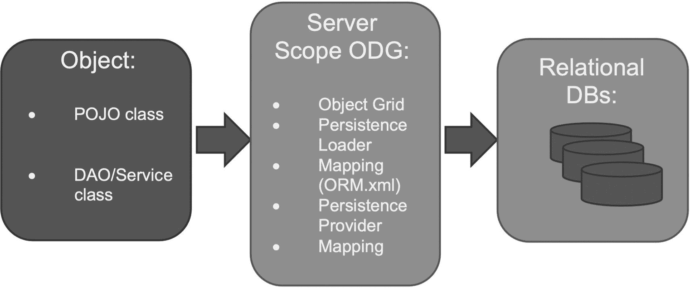

图 4-1

Jakarta 持久化 ORM 架构


## 持久化注解

在前面的章节中，我们已经展示了注解在企业 Beans 和 Jakarta 持久化规范中的广泛使用。我们将详细讨论持久化和映射元数据，由于我们使用注解来解释这些概念，因此在开始之前，有必要回顾一下关于注解的一些要点。

持久化注解可以应用于三个不同的层级：类、方法和字段。要对这些层级中的任何一个进行注解，必须将注解放在被注解的代码定义之前。在某些情况下，我们将它们放在与类、方法或字段同一行的前面；在其他情况下，我们将它们放在上一行。选择完全取决于应用注解者的偏好，我们认为在某些情况下做一种选择，在其他情况下做另一种选择是合理的。这取决于注解的长度以及哪种格式最具可读性。

Jakarta 持久化注解的设计目标是可读性强、易于指定，并且足够灵活以允许不同的元数据组合。大多数注解被指定为同级关系，而不是相互嵌套，这意味着多个注解可以注解同一个类、字段或属性，而不是将注解嵌入到其他注解中。然而，与所有权衡一样，有得必有失，灵活性的代价是许多顶层元数据的可能排列在语法上是正确的，但在语义上是无效的。编译器对此无能为力，但提供者运行时通常会进行一些基本的检查，以发现不正确的注解分组。然而，注解的本质是，当它们不被期望出现时，往往根本不会被注意到。在尝试理解可能与你在注解中指定的内容不符的行为时，这一点值得牢记。可能是一个或多个注解被忽略了。

映射注解可以分为两类：逻辑注解和物理注解。逻辑组中的注解是从对象建模角度描述实体模型的注解。它们与领域模型紧密绑定，是那种你可能希望在 UML 或任何其他对象建模语言或框架中指定的元数据。物理注解则与数据库中的具体数据模型相关。它们处理表、列、约束以及其他对象模型可能永远不会意识到的数据库层级构件。

我们在示例中同时使用了这两种类型的注解来演示映射元数据。理解并能够区分这两个层级的元数据将帮助你决定在哪里声明元数据，以及在哪里使用注解和 XML。正如你将在第 13 章中看到的，本章描述的所有映射注解都有对应的 XML 形式，这让你可以自由选择最适合你开发需求的方法。

## 访问实体状态

实体的映射状态必须在运行时对提供者可访问，这样当需要写出数据时，可以从实体实例中获取并存储到数据库中。类似地，当从数据库加载状态时，提供者运行时必须能够将其插入到新的实体实例中。访问实体状态的方式称为*访问模式*。

在第 2 章中，你了解到有两种不同的方式来指定持久化实体状态：你可以注解字段，也可以注解 JavaBean 风格的属性。你用来指定持久化状态的机制与提供者用来访问该状态的访问模式相同。如果你注解字段，提供者将使用反射来获取和设置实体的字段。如果注解设置在属性的 getter 方法上，提供者将调用这些 getter 和 setter 方法来访问和设置状态。

### 字段访问

注解实体的字段将导致提供者使用字段访问来获取和设置实体的状态。Getter 和 setter 方法可能存在也可能不存在，但如果存在，提供者会忽略它们。所有字段必须声明为 `protected`、`package` 或 `private`。不允许使用公共字段，因为这会使得状态字段可以被虚拟机中任何未受保护的类访问。这样做不仅是一种明显的糟糕实践，还可能破坏提供者的实现。当然，其他限定符并不能阻止同一包或继承层次结构中的类做同样的事情，但在应该约束什么和应该推荐什么之间存在明显的权衡。其他类必须使用实体的方法来访问其持久化状态，即使是实体类本身也通常只应在初始化期间直接操作字段。

清单 4-1 中的示例展示了使用字段访问映射的 `Employee` 实体。`@Id` 注解不仅表明 `id` 字段是实体的持久化标识符或主键，还表明应假定使用字段访问。然后，`name` 和 `salary` 字段默认成为持久化字段，并映射到同名的列。

```
@Entity
public class Employee {
@Id private long id;
private String name;
private long salary;
public long getId() { return id; }
public void setId(long id) { this.id = id; }
public String getName() { return name; }
public void setName(String name) { this.name = name; }
public long getSalary() { return salary; }
public void setSalary(long salary) { this.salary = salary; }
}
清单 4-1
使用字段访问
```

### 属性访问

当使用属性访问模式时，适用与 JavaBeans 相同的约定，并且持久化属性必须有 getter 和 setter 方法。属性的类型由 getter 方法的返回类型决定，并且必须与传递给 setter 方法的单个参数的类型相同。这两个方法必须具有 `public` 或 `protected` 可见性。属性的映射注解必须放在 getter 方法上。

在清单 4-2 中，`Employee` 类在 `getId()` getter 方法上有一个 `@Id` 注解，因此提供者将使用属性访问来获取和设置实体的状态。`name` 和 `salary` 属性将因其存在的 getter 和 setter 方法而成为持久化属性，并分别映射到 `NAME` 和 `SALARY` 列。请注意，`salary` 属性由 `wage` 字段支持，而这两个名称并不相同。提供者不会注意到这一点，因为通过指定属性访问，我们告诉提供者忽略实体字段，仅使用 getter 和 setter 方法进行命名。

```
@Entity
public class Employee {
private long id;
private String name;
private long wage;
@Id public long getId() { return id; }
public void setId(long id) { this.id = id; }
public String getName() { return name; }
public void setName(String name) { this.name = name; }
public long getSalary() { return wage; }
public void setSalary(long salary) { this.wage = salary; }
}
清单 4-2
使用属性访问
```


### 混合访问

在同一实体层次结构内，甚至在同一实体中，将字段访问与属性访问结合起来也是可能的。这种情况并不常见，但在某些场景下会很有用，例如，当向一个使用不同访问类型的现有层次结构中添加一个实体子类时。在子类实体上添加一个指定了访问模式的 `@Access` 注解，将导致该实体子类的默认访问类型被覆盖。

当你需要在从数据库读取或向数据库写入数据时对数据执行简单的转换时，`@Access` 注解也很有用。通常你会希望通过字段访问来访问数据，但在这种情况下，你需要定义一个 getter/setter 方法对来执行转换，并对该属性使用属性访问。一般来说，要添加一个持久化字段或属性，使其以不同于该实体默认访问模式的方式进行访问，需要三个基本步骤。

考虑一个 `Employee` 实体，其默认访问模式为 `FIELD`，但数据库列将区号作为电话号码的一部分存储，而我们只想在实体 `phoneNum` 字段中存储非本地号码的区号。我们可以添加一个持久化属性，在读取和写入时相应地对其进行转换。

首先要做的是通过使用 `@Access` 注解并指明访问类型，来显式标记该类的默认访问模式。如果不这样做，当字段和属性都被注解时，其行为将是未定义的。我们将把 `Employee` 实体标记为具有 `FIELD` 访问类型：

```
@Entity
@Access(AccessType.FIELD)
public class Employee { ... }
```

下一步是使用 `@Access` 注解来注解额外的字段或属性，但这次要指定与类级别指定的访问类型相反的访问类型。例如，在持久化属性上指定 `AccessType.PROPERTY` 访问类型可能看起来有点多余，因为一看就知道它是一个属性，但这样做表明你所做的并非疏忽，而是对默认情况的有意例外：

```
@Access(AccessType.PROPERTY) @Column(name="PHONE")
protected String getPhoneNumberForDb() { ... }
```

最后要记住的一点是，与正在被持久化的属性相对应的字段或属性必须标记为 `transient`，这样默认的访问规则就不会导致同一状态被持久化两次。例如，因为我们要向一个默认访问类型为字段的实体添加一个持久化属性，所以实体中存储该持久化属性状态的字段必须使用 `@Transient` 注解：

```
@Transient private String phoneNum;
```

清单 4-3 展示了完整的 `Employee` 实体类，该类被注解为仅对一个属性使用属性访问。

```
@Entity
@Access(AccessType.FIELD)
public class Employee {
public static final String LOCAL_AREA_CODE = "613";
@Id private long id;
@Transient private String phoneNum;
...
public long getId() { return id; }
public void setId(long id) { this.id = id; }
public String getPhoneNumber() { return phoneNum; }
public void setPhoneNumber(String num) { this.phoneNum = num; }
@Access(AccessType.PROPERTY) @Column(name="PHONE")
protected String getPhoneNumberForDb() {
if (phoneNum.length() == 10)
return phoneNum;
else
return LOCAL_AREA_CODE + phoneNum;
}
protected void setPhoneNumberForDb(String num) {
if (num.startsWith(LOCAL_AREA_CODE))
phoneNum = num.substring(3);
else
phoneNum = num;
}
...
}
清单 4-3
使用混合访问
```

## 映射到表

你在第 2 章中看到，在最简单的情况下，将实体映射到表根本不需要任何映射注解。只需要指定 `@Entity` 和 `@Id` 注解即可创建实体并将其映射到数据库表。

在这些情况下，默认的表名（即实体类的非限定名称）是完全合适的。如果默认的表名不是你喜欢的名称，或者你的数据库中已经存在一个包含该状态的合适表但名称不同，那么你必须指定表的名称。你可以通过使用 `@Table` 注解来注解实体类，并使用 `name` 元素包含表的名称来实现这一点。许多数据库的表名都很简洁。清单 4-4 展示了一个映射到名称与其类名不同的表的实体。

```
@Entity
@Table(name="EMP")
public class Employee { ... }
清单 4-4
覆盖默认表名
```

提示

默认名称不指定是大写还是小写。大多数数据库不区分大小写，因此供应商是使用实体名称的大小写还是将其转换为大写通常无关紧要。在第 10 章中，我们将讨论当数据库设置为区分大小写时如何分隔数据库标识符。

`@Table` 注解不仅能够命名存储实体状态的表，还能够命名数据库模式或目录。模式名称通常用于区分一组表与另一组表，并通过使用 `schema` 元素来指示。清单 4-5 展示了一个 `Employee` 实体，它被映射到 `HR` 模式中的 `EMP` 表。

```
@Entity
@Table(name="EMP", schema="HR")
public class Employee { ... }
清单 4-5
设置模式
```

当指定了模式名称时，当持久化提供程序访问数据库中的表时，该模式名称将作为表名的前缀。在这种情况下，每次访问 `EMP` 表时，`HR` 模式都会作为其前缀。

提示

某些供应商可能允许将模式包含在表的 `name` 元素中，而无需指定 `schema` 元素，例如 `@Table(name="HR.EMP")`。将模式名称与表名称内联的支持是非标准的。

某些数据库支持目录的概念。对于这些数据库，可以指定 `@Table` 注解的 `catalog` 元素。清单 4-6 展示了为 `EMP` 表显式设置目录。

```
@Entity
@Table(name="EMP", catalog="HR")
public class Employee { ... }
清单 4-6
设置目录
```


## 映射简单类型

简单 Java 类型作为实体在其字段或属性中的即时状态的一部分进行映射。可持久化类型的列表相当长，几乎包含了你想要持久化的所有内置类型。它们包括以下内容：

*   *原始 Java 类型*：`byte`、`int`、`short`、`long`、`boolean`、`char`、`float` 和 `double`

*   *原始 Java 类型的包装类*：`Byte`、`Integer`、`Short`、`Long`、`Boolean`、`Character`、`Float` 和 `Double`

*   *字节和字符数组类型*：`byte[]`、`Byte[]`、`char[]` 和 `Character[]`

*   *大数值类型*：`java.math.BigInteger` 和 `java.math.BigDecimal`

*   *字符串*：`java.lang.String`

*   *Java 时间类型*：`java.util.Date` 和 `java.util.Calendar`

*   *JDBC 时间类型*：`java.sql.Date`、`java.sql.Time` 和 `java.sql.Timestamp`

*   *枚举类型*：任何系统或用户定义的枚举类型

*   *可序列化对象*：任何系统或用户定义的可序列化类型

有时，要映射到的数据库列的类型与 Java 类型并不完全相同。在几乎所有情况下，提供程序运行时都可以将 JDBC 返回的类型转换为属性的正确 Java 类型。如果来自 JDBC 层的类型无法转换为字段或属性的 Java 类型，通常会抛出异常，尽管这并不保证。

提示

当持久化类型与 JDBC 类型不匹配时，某些提供程序可能会选择采取专有操作或进行最佳猜测以在两者之间进行转换。在其他情况下，JDBC 驱动程序可能会自行执行转换。

当持久化字段或属性时，提供程序会检查其类型，并确保它是前面列出的可持久化类型之一。如果它在列表中，提供程序将使用适当的 JDBC 类型持久化它，并将其传递给 JDBC 驱动程序。此时，如果字段或属性不可序列化，则结果未指定。提供程序可能会选择抛出异常，或者只是尝试将对象传递给 JDBC。你将在第 10 章中了解如何使用转换器来扩展可在 Jakarta Persistence 中持久化的类型列表。

可以在字段或属性上放置一个可选的 `@Basic` 注解，以明确将其标记为持久化。此注解主要用于文档目的，并非字段或属性持久化所必需。如果不存在该注解，则在没有任何其他映射注解的情况下，会隐式假定其为持久化。由于此注解的存在，简单类型的映射被称为基本映射，无论 `@Basic` 注解是实际存在还是仅被假定存在。

注意

现在你已经了解了如何持久化字段或属性，以及它们在持久化方面实际上是等效的，我们将它们统称为属性。属性是类的字段或属性，从现在开始我们将使用术语“属性”，以避免不断提及具体的字段或属性。

### 列映射

`@Basic` 注解（或在其不存在时假定的基本映射）可以被视为一个逻辑指示，表明给定属性是持久化的。与基本映射相伴的物理注解是 `@Column` 注解。在属性上指定 `@Column` 表示物理数据库列的特定特征，而对象模型对此不太关心。实际上，对象模型甚至可能永远不需要知道它映射到哪一列，列名和物理映射元数据可以位于单独的 XML 文件中。

作为 `@Column` 的一部分，可以指定许多注解元素，但其中大多数仅适用于模式生成，并将在本书后面介绍。唯一重要的元素是 `name` 元素，它只是一个字符串，指定了属性映射到的列的名称。当默认列名不合适或不适用于所使用的模式时，会使用此元素。你可以将 `@Column` 注解的 `name` 元素视为覆盖本来会应用的默认列名的一种手段。清单 4-7 中的示例展示了如何覆盖属性的默认列名。

```
@Entity
public class Employee {
@Id
@Column(name="EMP_ID")
private long id;
private String name;
@Column(name="SAL")
private long salary;
@Column(name="COMM")
private String comments;
// ...
}
清单 4-7
将属性映射到列
```

为了将这些注解置于上下文中，让我们看一下此实体表示的完整表映射。首先要注意的是，该类上没有 `@Table` 注解，因此将对其应用默认表名 `EMPLOYEE`。

接下来，请注意 `@Column` 既可以与 `@Id` 映射一起使用，也可以与基本映射一起使用。`id` 字段被覆盖，映射到 `EMP_ID` 列，而不是默认的 `ID` 列。`name` 字段没有使用 `@Column` 注解，因此将使用默认列名 `NAME` 来存储和检索员工姓名。然而，`salary` 和 `comments` 字段被注解为分别映射到 `SAL` 和 `COMM` 列。因此，`Employee` 实体映射到图 4-2 所示的表。

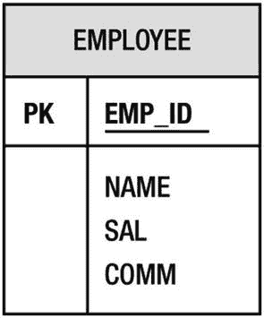

图 4-2

EMPLOYEE 实体表


### 惰性加载

有时，我们会预先知道实体的某些部分很少被访问。在这种情况下，你可以通过仅获取预期会频繁访问的数据来优化检索实体时的性能；其余数据则仅在需要时获取。这种特性有多种名称，包括惰性加载、延迟加载、懒加载、按需加载、即时读取、间接引用等。它们的意思基本相同，即某些数据在首次从数据库读取对象时可能不会被加载，而只有在被引用或访问时才会被获取。

可以通过在相应的 `@Basic` 注解中指定 `fetch` 元素，将基本映射的获取类型配置为惰性加载或立即加载。`FetchType` 枚举类型定义了该元素的值，可以是 `EAGER` 或 `LAZY`。将基本映射的获取类型设置为 `LAZY` 意味着提供者可能会推迟加载该属性的状态，直到它被引用。默认情况下，所有基本映射都是立即加载的。清单 4-8 展示了一个将基本映射覆盖为惰性加载的示例。

```
@Entity
public class Employee {
// ...
@Basic(fetch=FetchType.LAZY)
@Column(name="COMM")
private String comments;
// ...
}
清单 4-8
惰性字段加载
```

在此示例中，我们假设应用程序很少访问员工记录中的备注信息，因此将其标记为惰性加载。请注意，在这种情况下，`@Basic` 注解不仅用于文档说明，而且也是指定该字段获取类型所必需的。将 `comments` 字段配置为惰性加载，将允许从查询返回的 `Employee` 实例的 `comments` 字段为空。然而，应用程序无需执行任何特殊操作即可获取它。只需访问 `comments` 字段，如果该字段尚未加载，提供者就会透明地读取并填充它。

在使用此功能之前，您应该了解关于惰性属性加载的几个要点。首先也是最重要的，惰性加载属性的指令仅旨在作为对持久化提供者的一个提示，以帮助应用程序获得更好的性能。提供者不必遵循该请求，因为即使提供者继续加载该属性，实体的行为也不会受到影响。但反之则不成立，因为指定一个属性为立即加载，对于在实体从持久化上下文中分离后能够访问其状态可能至关重要。我们将在第 6 章中更详细地讨论分离，并探讨惰性加载与分离之间的联系。

其次，表面上这似乎对于实体的某些属性是个好主意，但在实践中，对简单类型进行惰性加载几乎从来都不是一个好主意。除非你确定该状态之后不会被访问，否则仅返回数据库行的部分数据几乎没有什么好处。只有在表中有许多列（例如，几十或几百列）或列很大（例如，非常大的字符串或字节串）时，才应考虑对基本映射进行惰性加载。加载这些数据可能会消耗大量资源，而不加载则可以节省相当多的精力、时间和资源。除非这两种情况之一成立，否则在大多数情况下，惰性加载对象属性的子集最终会比立即加载它们更昂贵。

不过，惰性加载在关系映射中非常相关，因此我们将在本章后面讨论这个主题。

### 大对象

在数据库中，对于可以非常大（可达千兆字节范围）的基于字符或字节的对象，一个常见的术语是大对象，简称 LOB。能够存储这些类型大对象的数据库列需要特殊的 JDBC 调用才能从 Java 访问。为了向提供者发出信号，指示其在向 JDBC 驱动程序传递和检索此数据时应使用 LOB 方法，必须在基本映射上添加一个额外的注解。`@Lob` 注解作为实现此目的的标记注解，可以与 `@Basic` 注解一起出现，也可以在 `@Basic` 注解不存在时出现，此时默认该映射上存在 `@Basic`。

由于 `@Lob` 注解实际上只是限定了基本映射，因此当需要覆盖 LOB 列的默认名称时，它也可以与 `@Column` 注解一起使用。

数据库中的 LOB 有两种类型：字符大对象，称为 CLOB；以及二进制大对象，称为 BLOB。顾名思义，CLOB 列保存大的字符序列，而 BLOB 列可以存储大的字节序列。映射到 BLOB 列的 Java 类型是 `byte[]`、`Byte[]` 和 `Serializable` 类型，而 `char[]`、`Character[]` 和 `String` 对象则映射到 CLOB 列。提供者负责根据被映射属性的类型进行区分。

清单 4-9 展示了一个将图像映射到 BLOB 列的示例。这里，`PIC` 列被假定为一个 BLOB 列，用于存储 `picture` 字段中的员工照片。我们还将此字段标记为惰性加载，这是对不常被引用的 LOB 的一种常见做法。

```
@Entity
public class Employee {
@Id
private long id;
@Basic(fetch=FetchType.LAZY)
@Lob @Column(name="PIC")
private byte[] picture;
// ...
}
清单 4-9
映射 BLOB 列
```


### 枚举类型

另一种可能需要特殊处理的简单类型是枚举类型。枚举类型的值是常量，可以根据应用需求以不同方式处理。

与其他语言中的枚举类型一样，Java 中枚举类型的值具有隐式的序数分配，该分配由声明时的顺序决定。此序数在运行时无法修改，可用于在数据库中表示和存储枚举类型的值。将值解释为序数是提供者将枚举类型映射到数据库的默认方式，并且提供者会假定数据库列是整数类型。

考虑以下枚举类型：

```
public enum EmployeeType {
FULL_TIME_EMPLOYEE,
PART_TIME_EMPLOYEE,
CONTRACT_EMPLOYEE
}
```

在编译时分配给此枚举类型值的序数将是：`FULL_TIME_EMPLOYEE` 为 0，`PART_TIME_EMPLOYEE` 为 1，`CONTRACT_EMPLOYEE` 为 2。在清单 4-10 中，我们定义了一个此类型的持久化字段。

```
@Entity
public class Employee {
@Id private long id;
private EmployeeType type;
// ...
}
清单 4-10
使用序数映射枚举类型
```

你可以看到，映射 `EmployeeType` 非常简单，以至于你实际上无需做任何事情。应用了默认设置，一切都会正常工作。`type` 字段将被映射到一个整数类型的 `TYPE` 列，所有全职员工的序数都将被分配为 0。类似地，其他员工的类型也会相应地存储在 `TYPE` 列中。

然而，如果枚举类型发生更改，我们就会遇到问题。数据库中持久化的序数数据将不再适用于正确的值。在此示例中，如果公司福利政策发生变化，我们开始为每周工作超过 20 小时的兼职员工提供额外福利，那么我们就需要区分这两种类型的兼职员工。通过在 `PART_TIME_EMPLOYEE` 之后添加一个 `PART_TIME_BENEFITS_EMPLOYEE` 值，我们将导致新的序数分配发生，新值将被分配序数 2，而 `CONTRACT_EMPLOYEE` 将获得序数 3。这将导致所有记录在案的合同工突然变成享有福利的兼职员工，这显然不是我们希望的结果。

我们可以遍历数据库并调整所有 `Employee` 实体以使其具有正确的类型，但如果员工类型在其他地方也被使用，那么我们需要确保它们也都得到修复。这不是一个良好的维护状况。

更好的解决方案是将值的名称存储为字符串，而不是存储序数。这将使我们与声明中的任何更改隔离开来，并允许我们添加新类型而无需担心现有数据。我们可以通过在属性上添加 `@Enumerated` 注解并指定值为 `STRING` 来实现这一点。

`@Enumerated` 注解实际上允许指定一个 `EnumType`，而 `EnumType` 本身就是一个枚举类型，它定义了 `ORDINAL` 和 `STRING` 值。虽然使用枚举类型来指示提供者应如何表示枚举类型有点讽刺，但这完全合适。因为 `@Enumerated` 的默认值是 `ORDINAL`，所以指定 `@Enumerated(ORDINAL)` 仅在你想明确此映射时才有用。

在清单 4-11 中，我们为枚举值存储字符串。现在 `TYPE` 列必须是基于字符串的类型，所有全职员工对应的 `TYPE` 列中将存储字符串 `FULL_TIME_EMPLOYEE`。

```
@Entity
public class Employee {
@Id
private long id;
@Enumerated(EnumType.STRING)
private EmployeeType type;
// ...
}
清单 4-11
使用字符串映射枚举类型
```

请注意，使用字符串可以解决在枚举类型中间插入额外值的问题，但这会使数据容易受到值名称更改的影响。例如，如果我们想将 `PART_TIME_EMPLOYEE` 更改为 `PT_EMPLOYEE`，那么我们就会遇到麻烦。不过，这是一个不太可能发生的问题，因为更改枚举类型的名称会导致所有使用该枚举类型的代码也必须更改。这比重置数据库列中的值更麻烦。

通常，只要在中间插入额外值的可能性不高，存储序数就是存储枚举类型的最佳且最高效的方式。新值仍然可以添加到类型的末尾，而不会产生任何负面影响。

关于枚举类型的最后一点是，它们在 Java 中定义得非常灵活。事实上，甚至可能包含具有状态的值。Jakarta Persistence 目前不支持映射枚举值中包含的状态。也不支持在 `STRING` 和 `ORDINAL` 之间采取折中方案，即显式地将每个枚举值映射到一个与其编译器分配的序数值不同的专用数值。更广泛的枚举支持正在考虑用于未来的版本。

### 时间类型

时间类型是一组基于时间的类型，可用于持久化状态映射。支持的时间类型列表包括三种 `java.sql` 类型——`java.sql.Date`、`java.sql.Time` 和 `java.sql.Timestamp`——以及两种 `java.util` 类型：`java.util.Date` 和 `java.util.Calendar`。

`java.sql` 类型完全无需操心。它们就像任何其他简单映射类型一样，不需要任何特殊考虑。然而，这两种 `java.util` 类型需要额外的元数据，以指示在与 JDBC 驱动程序通信时应使用哪个 JDBC `java.sql` 类型。这是通过使用 `@Temporal` 注解并指定 JDBC 类型作为 `TemporalType` 枚举类型的值来完成的。有三个枚举值 `DATE`、`TIME` 和 `TIMESTAMP`，分别代表每种 `java.sql` 类型。

清单 4-12 展示了如何将 `java.util.Date` 和 `java.util.Calendar` 映射到数据库中的日期列。

```
@Entity
public class Employee {
@Id
private long id;
@Temporal(TemporalType.DATE)
private Calendar dob;
@Temporal(TemporalType.DATE)
@Column(name="S_DATE")
private Date startDate;
// ...
}
清单 4-12
映射时间类型
```

与其他基本映射类型一样，可以使用 `@Column` 注解来覆盖默认的列名。


### 瞬态状态

作为持久化实体的一部分但无意持久化的属性，可以在 Java 中使用 `transient` 修饰符进行修改，或者使用 `@Transient` 注解进行标注。如果指定了其中任意一种，提供者运行时将不会对其所指定的属性应用默认的映射规则。

瞬态字段的使用有多种原因。一种可能是本章前面提到的情况，即我们混合了访问模式，不希望将同一状态持久化两次。另一种情况是，当你想要缓存某些内存中的状态，而不想重新计算、重新发现或重新初始化它们时。例如，在清单 4-13 中，我们使用了一个瞬态字段来保存针对特定语言环境的 `Employee` 的正确词汇，以便在任何显示位置都能正确打印。我们使用了 `transient` 修饰符而不是 `@Transient` 注解，这样如果 `Employee` 从一个虚拟机序列化到另一个虚拟机，翻译后的名称将被重新初始化，以对应新虚拟机的语言环境。在需要跨序列化保留非持久化值的情况下，应使用注解而不是修饰符。

```
@Entity
public class Employee {
@Id private long id;
private String name;
private long salary;
transient private String translatedName;
// ...
public String toString() {
if (translatedName == null) {
translatedName =
ResourceBundle.getBundle("EmpResources").getString("Employee");
}
return translatedName + ": " + id + " " + name;
}
}
清单 4-13
使用瞬态字段
```

## 映射主键

每个映射到关系数据库的实体都必须映射到表中的主键。你已经了解了 `@Id` 注解如何指示实体标识符的基础知识。在本节中，你将更深入地探讨简单标识符和主键，并学习如何让持久化提供者生成唯一的标识符值。

注意

当实体标识符仅由单个属性组成时，称为简单标识符。

### 覆盖主键列

与基本映射一样，相同的默认规则也适用于 ID 映射，即列名假定与属性名相同。与基本映射一样，可以使用 `@Column` 注解来覆盖 ID 属性所映射到的列名。

主键假定为可插入的，但不可为空或可更新。在覆盖主键列时，不应覆盖 `nullable` 和 `updatable` 元素。只有在将同一列映射到多个字段/关系（如第 10 章所述）这种非常特殊的情况下，才应将 `insertable` 元素设置为 `false`。

### 主键类型

除了在指定映射到主键列方面具有特殊意义外，ID 映射与基本映射几乎相同。另一个主要区别是，ID 映射通常仅限于以下类型：

*   *Java 原始类型*：`byte`、`int`、`short`、`long` 和 `char`
*   *Java 原始类型的包装类*：`Byte`、`Integer`、`Short`、`Long` 和 `Character`
*   *字符串*：`java.lang.String`
*   *大数值类型*：`java.math.BigInteger`
*   *时间类型*：`java.util.Date` 和 `java.sql.Date`

浮点类型如 `float` 和 `double` 也是允许的，以及 `Float` 和 `Double` 包装类和 `java.math.BigDecimal`，但由于舍入误差的性质以及 `equals()` 运算符应用于它们时的不可靠性，不鼓励使用它们。使用浮点类型作为主键是一项有风险的工作，绝对不推荐。

### 标识符生成

有时，应用程序不想费心在其领域模型的某些方面定义和确保唯一性，而是满足于让标识符值自动生成。这称为 ID 生成，由 `@GeneratedValue` 注解指定。

当启用 ID 生成时，持久化提供者将为该实体类型的每个实例生成一个标识符值。一旦获得标识符值，提供者会将其插入到新持久化的实体中；但是，根据生成方式的不同，在实体被插入数据库之前，该值可能实际上并不存在于对象中。换句话说，应用程序在发生刷新或事务完成之前，不能依赖能够访问该标识符。

应用程序可以通过在 `strategy` 元素中指定策略，从四种不同的 ID 生成策略中选择一种。该值可以是 `GenerationType` 枚举类型的 `AUTO`、`TABLE`、`SEQUENCE` 或 `IDENTITY` 枚举值中的任意一个。

表和序列生成器可以专门定义，然后由多个实体类重用。这些生成器是命名的，并且对持久化单元中的所有实体全局可访问。

#### 自动 ID 生成

如果应用程序不关心提供者使用哪种生成方式，但希望进行生成，则可以指定 `AUTO` 策略。这意味着提供者将使用它想要的任何策略来生成标识符。清单 4-14 展示了使用自动 ID 生成的示例。这将导致提供者创建一个标识符值，并将其插入到每个被持久化的 `Employee` 实体的 `id` 字段中。

提示

并不明确要求实体标识符字段必须是整数类型，但这通常是 `AUTO` 唯一会创建的类型。我们建议使用 `long` 来容纳生成的标识符域的完整范围。

```
@Entity
public class Employee {
@Id @GeneratedValue(strategy=GenerationType.AUTO)
private long id;
// ...
}
清单 4-14
使用自动 ID 生成
```

不过，使用 `AUTO` 有一个陷阱。提供者可以选择自己的策略来存储标识符，但它需要某种持久化资源才能做到这一点。例如，如果它选择基于表的策略，则需要创建一个表；如果它选择基于序列的策略，则需要创建一个序列。提供者不能总是依赖从服务器获取的数据库连接拥有在数据库中创建表的权限。这通常是一种特权操作，通常仅限于数据库管理员。在 `AUTO` 策略能够运行之前，需要某种创建阶段或模式生成来创建该资源。

`AUTO` 模式实际上是一种用于开发或原型设计的生成策略。当数据库模式正在生成时，它作为一种让你更快启动和运行的方式效果很好。在任何其他情况下，最好使用后面章节讨论的其他生成策略之一。


#### 使用表生成 ID

生成标识符最灵活且可移植的方法是使用数据库表。它不仅能够移植到不同的数据库，还允许在同一张表中为不同实体存储多个不同的标识符序列。

ID 生成表应包含两列。第一列是字符串类型，用于标识特定的生成器序列，它是表中所有生成器的主键。第二列是整数类型，用于存储正在生成的实际 ID 序列。该列中存储的值是序列中最后分配的标识符。每个定义的生成器都对应表中的一行。

使用表生成标识符最简单的方法是在`strategy`元素中简单地将生成策略指定为`TABLE`：

```
@Id @GeneratedValue(strategy=GenerationType.TABLE)
private long id;
```

由于只指定了生成策略而未指定生成器，提供者将自行选择一张表。如果使用了模式生成，则会创建该表；否则，必须知道提供者默认使用的表，并且该表必须存在于数据库中。

更明确的做法是实际指定用于 ID 存储的表。这通过定义一个表生成器来实现，与名称可能暗示的不同，它实际上并不生成表，而是一个使用表来存储标识符值的标识符生成器。我们可以使用`@TableGenerator`注解来定义一个生成器，然后在`@GeneratedValue`注解中通过名称引用它：

```
@TableGenerator(name="Emp_Gen")
@Id @GeneratedValue(generator="Emp_Gen")
private long id;
```

虽然我们展示了将`@TableGenerator`注解在标识符属性上，但它实际上可以定义在任何属性或类上。无论定义在何处，它都将对整个持久化单元可用。一个好的实践是：如果只有一个类使用它，则将其局部定义在 ID 属性上；但如果它将被多个类使用，则应在 XML 中定义，如第 13 章所述。

`name`元素全局命名生成器，允许我们在`@GeneratedValue`注解的`generator`元素中引用它。这在功能上等同于之前的示例，即我们仅表示要使用表生成但未指定生成器。现在我们指定了生成器的名称，但未提供任何生成器细节，这些细节将由提供者使用默认值。

进一步限定性的方法是指定表的详细信息，如下所示：

```
@TableGenerator(name="Emp_Gen",
table="ID_GEN",
pkColumnName="GEN_NAME",
valueColumnName="GEN_VAL")
```

我们在生成器名称之后包含了一些额外的元素。名称之后是三个元素——`table`、`pkColumnName`和`valueColumnName`——它们定义了实际存储`Emp_Gen`标识符的表。

`table`元素仅指示表的名称。`pkColumnName`元素是表中唯一标识生成器的主键列的名称，而`valueColumnName`元素是存储正在生成的实际 ID 序列值的列的名称。在此例中，表名为`ID_GEN`，主键列（存储生成器名称的列）名为`GEN_NAME`，存储 ID 序列值的列名为`GEN_VAL`。

生成器的名称成为该行存储在`pkColumnName`列中的值，提供者使用它来查找生成器以获取其最后分配的值。

在我们的示例中，我们将生成器命名为`Emp_Gen`，因此我们的表将类似于图 4-3 所示。

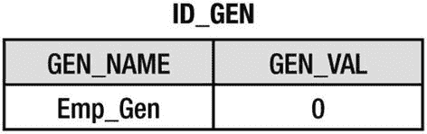

图 4-3

用于标识符生成的表

请注意，最后分配的`Employee`标识符为 0，这告诉我们尚未生成任何标识符。可以在生成器定义中指定一个表示最后分配标识符的`initialValue`元素，但在几乎所有情况下，默认设置 0 就足够了。此设置仅在创建表的模式生成期间使用。在后续执行中，提供者将读取值列的内容以确定下一个要分配的标识符。

为了避免为每个请求的标识符都更新行，使用了分配大小。这将导致提供者预分配一个标识符块，然后根据请求从内存中分配标识符，直到该块用完。一旦该块用完，下一个标识符请求将触发预分配另一个标识符块，并且标识符值将按分配大小递增。默认情况下，分配大小设置为 50。在定义生成器时，可以通过使用`allocationSize`元素将此值覆盖为更大或更小。

提示

提供者可能会在与被持久化实体相同的事务中或在一个单独的事务中分配标识符。这一点未明确规定，但您应检查提供者文档，了解它如何避免在并发线程创建实体和锁定资源时出现死锁风险。

清单 4-15 展示了一个为`Address`实体定义第二个生成器的示例，但该生成器使用相同的`ID_GEN`表来存储标识符序列。在此例中，我们通过指定`pkColumnvalue`元素，实际显式规定了存储在标识符表主键列中的值。该元素允许生成器的名称与列值不同，尽管很少需要这样做。该示例展示了一个名为`Address_Gen`的`Address` ID 生成器，但随后将为`Address` ID 生成存储在表中的值定义为`Addr_Gen`。该生成器还将初始值设置为 10000，分配大小设置为 100。

```
@TableGenerator(name="Address_Gen",
table="ID_GEN",
pkColumnName="GEN_NAME",
valueColumnName="GEN_VAL",
pkColumnValue="Addr_Gen",
initialValue=10000,
allocationSize=100)
@Id @GeneratedValue(generator="Address_Gen")
private long id;
清单 4-15
使用表 ID 生成
```

如果同时定义了`Emp_Gen`和`Address_Gen`生成器，那么在应用程序启动时，`ID_GEN`表应如图 4-4 所示。随着应用程序分配标识符，存储在`GEN_VAL`列中的值将增加。

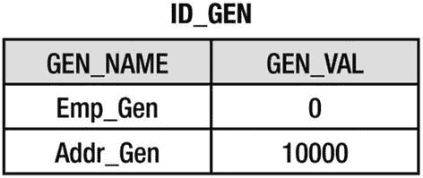

图 4-4

用于生成地址和员工标识符的表

如果您没有使用自动模式生成功能（在第 14 章中讨论），则该表必须已经存在，或通过其他方式在数据库中创建，并配置为在应用程序首次启动时处于此状态。可以应用以下 SQL 来创建并初始化此表：

```
CREATE TABLE id_gen (
gen_name VARCHAR(80),
gen_val INTEGER,
CONSTRAINT pk_id_gen
PRIMARY KEY (gen_name)
);
INSERT INTO id_gen (gen_name, gen_val) VALUES ('Emp_Gen', 0);
INSERT INTO id_gen (gen_name, gen_val) VALUES ('Addr_Gen', 10000);
```


#### 使用数据库序列生成 ID

许多数据库支持一种称为*序列*的内部 ID 生成机制。当底层数据库支持时，可以使用数据库序列来生成标识符。

正如你在表生成器中看到的，如果已知应使用数据库序列来生成标识符，并且你不关心它是否是特定序列，那么仅指定生成器类型就足够了：

```
@Id @GeneratedValue(strategy=GenerationType.SEQUENCE)
private long id;
```

在这种情况下，没有指定生成器名称，因此提供者将使用其自行选择的默认序列对象。请注意，如果定义了多个序列生成器但未命名，则未指定它们是使用相同的默认序列还是不同的序列。为多个实体类型使用一个序列与为每个实体使用一个序列之间的唯一区别在于序列号的排序以及序列上可能存在的争用。更安全的做法是定义一个命名的序列生成器，并在 `@GeneratedValue` 注解中引用它：

```
@SequenceGenerator(name="Emp_Gen", sequenceName="Emp_Seq")
@Id @GeneratedValue(generator="Emp_Gen")
private long getId;
```

除非启用了模式生成，否则需要该序列已被定义且已存在。创建此类序列的 SQL 如下所示：

```
CREATE SEQUENCE Emp_Seq
MINVALUE 1
START WITH 1
INCREMENT BY 50
```

初始值和分配大小也可以在序列生成器中使用，并且需要在创建序列的 SQL 中体现出来。请注意，默认分配大小为 50，与表生成器相同。如果未使用模式生成，并且序列是手动创建的，则需要配置 `INCREMENT BY` 子句，使其与相应 `@SequenceGenerator` 注解的 `allocationSize` 元素或默认分配大小匹配。

#### 使用数据库标识列生成 ID

某些数据库支持主键标识列，有时也称为自动编号列。每当向表中插入一行时，标识列都会获得一个分配给它的唯一标识符。它可用于生成对象的标识符，但同样仅在底层数据库支持时才可用。当数据库不支持数据库序列，或者由于遗留模式已定义表使用标识列时，通常会使用标识列。对于对象关系标识符生成来说，它们通常效率较低，因为它们无法以块的形式分配，并且标识符在提交时间之后才可用。

为了指示应进行 `IDENTITY` 生成，`@GeneratedValue` 注解应指定生成策略为 `IDENTITY`。这将向提供者指示，它必须在插入发生后重新读取表中已插入的行。这将使其能够从数据库获取新生成的标识符，并将其放入刚刚持久化的内存实体中：

```
@Id @GeneratedValue(strategy=GenerationType.IDENTITY)
private long id;
```

`IDENTITY` 没有生成器注解，因为它必须作为实体主键列的数据库模式定义的一部分来定义。由于每个实体主键列都定义了自己的标识特性，因此 `IDENTITY` 生成不能在多个实体类型之间共享。

前面提到过，使用 `IDENTITY` 与其他 ID 生成策略的另一个区别是，标识符在插入发生之前将无法访问。尽管没有保证在事务完成之前标识符的可访问性，但至少对于其他类型的生成来说，有可能提前分配标识符。但是，当使用标识列时，是插入操作导致了标识符的生成。在实体插入数据库之前，标识符不可能可用，并且由于实体的插入通常推迟到提交时间，因此标识符在事务提交之后才可用。

提示

如果你使用 `IDENTITY`，请确保你了解持久化提供者的行为，并且它符合你的要求。某些提供者会立即插入（在调用 persist 方法时）配置为使用 `IDENTITY` ID 生成的实体，而不是等到提交时间。这将使 ID 立即可用，但代价是过早锁定和降低并发性。某些提供者甚至有一个选项，允许你配置使用哪种方法。

## 关系

如果实体只包含简单的持久化状态，那么对象关系映射的工作实际上就变得微不足道了。大多数实体需要能够引用其他实体，或与其他实体建立关系。这就是产生业务应用程序中常见的领域模型图的原因。

在接下来的章节中，我们将探讨可能存在的不同类型的关系，并展示如何使用 Jakarta Persistence 映射元数据来定义和映射它们。

### 关系概念

在我们开始映射关系之前，让我们快速浏览一些基本的关系概念和术语。牢固掌握这些概念将使理解关系映射部分的其余内容变得更加容易。

#### 角色

有句老话说，每个故事都有三个方面：你的、我的和事实的。关系在某种程度上也是如此，存在三种不同的视角。第一种是关系一方的视角，第二种是另一方的视角，第三种是了解双方的全局视角。“方面”被称为角色。在每个关系中，都有两个相互关联的实体，每个实体都在关系中扮演一个角色。

关系无处不在，因此例子并不难找。员工与他或她工作的部门有关系。`Employee` 实体扮演在部门中工作的角色，而 `Department` 实体扮演有员工在其中工作的角色。

当然，给定实体扮演的角色因关系而异，并且一个实体可能参与与许多不同实体的许多不同关系。因此，我们可以得出结论，任何实体在任何给定的模型中都可能扮演许多不同的角色。如果我们考虑一个 `Employee` 实体，我们意识到它实际上在其他关系中也扮演着其他角色，例如在与另一个 `Employee` 实体的关系中扮演为经理工作的角色，在与 `Project` 实体的关系中扮演在项目上工作的角色，等等。尽管没有元数据要求声明实体正在扮演的角色，但角色作为理解关系性质和结构的一种手段仍然是有帮助的。


#### 方向性

要使关系得以存在，就必须有创建、移除和维护它们的方法。基本做法是让一个实体拥有一个关系属性，该属性以标识其扮演关系另一角色的方式引用其关联实体。通常情况下，另一个实体也会有一个指向原始实体的属性。当每个实体都指向对方时，这种关系就是双向的。如果只有一个实体持有指向另一个实体的指针，则称这种关系为单向的。

从`Employee`到其参与的`Project`的关系是双向的。`Employee`应该知道其`Project`，而`Project`也应该指向参与其工作的`Employee`。图 4-5 展示了这种关系的 UML 模型。双向箭头表示关系的双向性。


图 4-5

Employee 与 Project 之间的双向关系

`Employee`与其`Address`很可能被建模为单向关系，因为`Address`通常不需要知道其居住者。当然，如果需要，它就必须变成双向关系。图 4-6 展示了这种关系。由于是单向关系，箭头从`Employee`指向`Address`。


图 4-6

Employee 与 Address 之间的单向关系

正如你将在本章后面看到的，尽管对象模型和数据模型共享相同的方向性概念，但由于范式差异，它们对方向性的理解略有不同。在某些情况下，对象模型中的单向关系可能会在数据库模型中引发问题。

我们可以利用关系的方向性来帮助描述和解释模型，但在具体讨论时，将每个双向关系视为一对单向关系是合理的。与其说存在一个`Employee`参与`Project`的单一双向关系，不如说存在一个单向的“项目”关系（`Employee`指向其参与的`Project`）和另一个单向的“工作者”关系（`Project`指向参与其工作的`Employee`）。每个关系都有一个作为源端或引用角色的实体，以及一个作为目标端或被引用角色的实体。这样做的好处是，无论我们讨论哪个关系，也无论关系中涉及什么角色，我们都可以使用相同的术语。图 4-7 展示了这两个关系如何拥有源实体和目标实体，以及从每个关系的角度来看，源实体和目标实体是如何不同的。

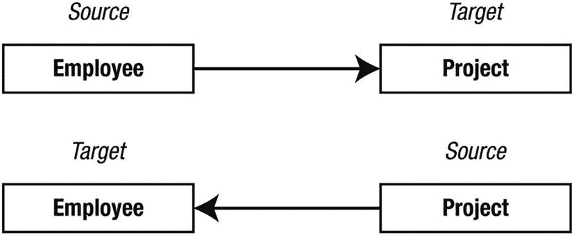

图 4-7

Employee 与 Project 之间的单向关系

#### 基数

一个项目通常不会只有一名员工参与。我们希望能够捕捉到同一关系实例两侧各有多少实体这一方面。这被称为关系的基数。关系中的每个角色都有自己的基数，它指示该角色可以有一个还是多个实体实例。

在我们的`Employee`和`Department`示例中，我们可能会首先说一名员工在一个部门工作，因此两侧的基数都是 1。但很可能一个部门有多名员工，因此我们会让关系在`Employee`或源端具有多基数，这意味着多个`Employee`实例可以指向同一个`Department`。目标端或`Department`端则保持基数为 1。图 4-8 展示了这种多对一关系。“多”端用星号（*）标记。


图 4-8

单向多对一关系

在我们的`Employee`和`Project`示例中，我们有一个双向关系，或者说两个关系方向。如果一名员工可以参与多个项目，并且一个项目可以有多个员工参与，那么两个方向的源端和目标端最终都会具有“多”基数。图 4-9 展示了这种关系的 UML 图。


图 4-9

双向多对多关系

俗话说，一图胜千言，用文字描述这些关系比展示图片要困难得多。不过，用文字来说，这张图表明了以下几点：

*   每位员工可以参与多个项目。
*   多名员工可以参与同一个项目。
*   每个项目可以有多个员工参与。
*   多个项目可以有同一位员工参与。

该模型隐含的事实是，`Employee`和`Project`实例可以在多个关系实例之间共享。

#### 序数性

通过确定某个角色是否可能存在，可以进一步指定该角色。这被称为*序数性*，它用于指示在创建源实体时是否需要指定目标实体。由于序数性实际上只是一个布尔值，因此它也被称为关系的可选性。

在基数术语中，序数性可以通过将基数表示为一个范围（而非简单值）来体现，该范围根据序数性以 0 或 1 开头。不过，更简单的方法是直接说明关系是可选的还是强制的。如果是可选的，则目标可能不存在；如果是强制的，那么一个没有引用其关联目标实体的源实体就处于无效状态。

### 映射概述

既然你已经掌握了足够的理论知识，并具备了讨论关系的概念背景，我们可以继续解释和使用关系映射了。

每种映射都以源角色和目标角色的基数命名。如前几节所述，双向关系可以看作一对单向映射。每个映射实际上都是一个单向关系映射，如果我们取关系的源端和目标端的基数，按顺序组合它们，并用“一”和“多”这两个可能的值进行排列，就会得到以下映射名称：

*   多对一
*   一对一
*   一对多
*   多对多

这些映射名称也是用于指示正在映射的属性上关系类型的注解名称。它们是逻辑关系注解的基础，并有助于实体的对象建模方面。与基本映射一样，关系映射可以应用于实体的字段或属性。

### 单值关联

从一个实体实例到另一个实体实例（其中目标端的基数为“一”）的关联称为单值关联。多对一和一对一关系映射属于此类，因为源实体最多引用一个目标实体。我们首先讨论这些关系及其一些变体。


#### 多对一映射

在我们讨论`Employee`与`Department`关系的基数时（如图 4-8 所示），起初我们认为一名员工在一个部门工作，因此假设这是一对一关系。然而，当我们意识到同一部门有多名员工时，便将其改为多对一关系映射。事实证明，多对一是最常见的映射，也是在创建与实体的关联时通常使用的映射方式。

图 4-10 展示了`Employee`与`Department`之间的多对一关系。`Employee`是“多”方，也是关系的源端；`Department`是“一”方，也是目标端。同样，由于箭头仅指向一个方向（从`Employee`指向`Department`），因此该关系是单向的。请注意，在 UML 中，如果源类可以导航到目标类，则源类会隐式包含一个目标类类型的属性。例如，`Employee`有一个名为`department`的属性，该属性将包含对单个`Department`实例的引用。该实际属性并未在`Employee`类中显式显示，但通过关系箭头的存在隐含了这一点。

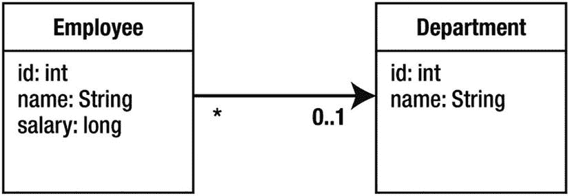

图 4-10

从 Employee 到 Department 的多对一关系

多对一映射通过在源实体中引用目标实体的属性上添加`@ManyToOne`注解来定义。清单 4-16 展示了如何使用`@ManyToOne`注解来映射此关系。`Employee`中的`department`字段是被注解的源属性。

```
@Entity
public class Employee {
// ...
@ManyToOne
private Department department;
// ...
}
清单 4-16
从 Employee 到 Department 的多对一关系
```

我们只包含了与讨论相关的类片段，但从上述示例可以看出，代码实际上相当平淡无奇。映射该关系只需要一个注解，结果确实显得很乏味。当然，在配置方面，乏味即意味着优美。

之前针对基本映射描述的属性灵活性和修饰符要求同样适用于关系映射。根据实体所使用的策略，注解可以放在字段或属性上。

#### 使用连接列

在数据库中，关系映射意味着一个表引用了另一个表。在数据库中，引用另一个表中键（通常是主键）的列称为*外键列*。在 Jakarta Persistence 中，它们被称为连接列，而`@JoinColumn`注解是用于配置此类列的主要注解。

注意

本章稍后会讨论存在于其他表（称为连接表）中的连接列。在第 10 章中，我们将介绍使用连接表处理单值关联的更高级情况。

考虑图 4-11 中显示的`EMPLOYEE`和`DEPARTMENT`表，它们分别对应`Employee`和`Department`实体。`EMPLOYEE`表有一个名为`DEPT_ID`的外键列，该列引用了`DEPARTMENT`表。从实体关系的角度来看，`DEPT_ID`是关联`Employee`和`Department`实体的连接列。

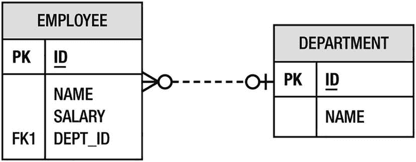

图 4-11

EMPLOYEE 和 DEPARTMENT 表

在几乎所有关系中，无论源端和目标端如何，其中一方的表中都会包含连接列。该方称为关系的拥有方或所有者。不包含连接列的一方称为非拥有方或反向方。

拥有权对于映射至关重要，因为定义数据库列映射的物理注解（例如`@JoinColumn`）始终定义在关系的拥有方。如果未定义这些注解，则会根据拥有方属性的默认值进行设置。

注意

虽然我们描述拥有方是由数据模式决定的，但对象模型必须通过使用关系映射注解来指明拥有方。映射注解中缺少`mappedBy`元素意味着拥有该关系，而存在`mappedBy`元素则意味着实体位于关系的反向方。`mappedBy`元素将在后续章节中描述。

多对一映射始终位于关系的拥有方，因此如果关系中存在`@JoinColumn`且包含多对一方，则该注解将位于此处。要指定连接列的名称，可使用`name`元素。例如，`@JoinColumn(name="DEPT_ID")`注解表示源实体表中的`DEPT_ID`列是目标实体表的外键，无论该关系的目标实体是什么。

如果多对一映射没有附带`@JoinColumn`注解，则会采用默认列名。默认名称由源实体和目标实体的组合构成：源实体中关系属性的名称（本例中为`department`），加上下划线字符（`_`），再加上目标实体主键列的名称。因此，如果`Department`实体映射到的表的主键列名为`ID`，则`EMPLOYEE`表中的连接列将被假定命名为`DEPARTMENT_ID`。如果实际列名并非如此，则必须定义`@JoinColumn`注解来覆盖默认值。

回到图 4-11，外键列名为`DEPT_ID`，而不是默认的`DEPARTMENT_ID`。清单 4-17 展示了如何使用`@JoinColumn`注解将连接列名覆盖为`DEPT_ID`。

```
@Entity
public class Employee {
@Id private long id;
@ManyToOne
@JoinColumn(name="DEPT_ID")
private Department department;
// ...
}
清单 4-17
覆盖连接列的多对一关系
```

注解允许我们将`@JoinColumn`放在与`@ManyToOne`同一行，或单独放在其上方或下方。按照惯例，逻辑映射应放在前面，物理映射放在后面。这使对象模型更清晰，因为物理部分对对象模型的重要性较低。


#### 一对一映射

如果只有一个员工能在一个部门工作，那我们就又回到了**一对一**关联。然而，一个更现实的一对一关联例子是，一个员工拥有一个停车位。假设每个员工都被分配了其专属的停车位，那么我们就需要创建一个从 `Employee` 到 `ParkingSpace` 的一对一关系。图 4-12 展示了这种关系。

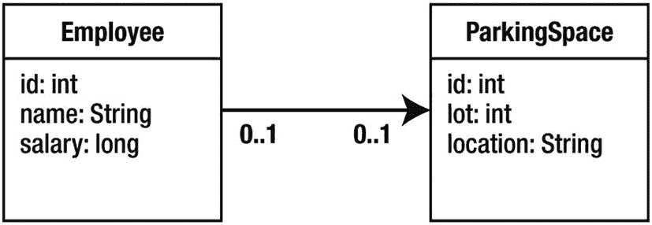

图 4-12

从 Employee 到 ParkingSpace 的一对一关系

我们定义映射的方式与定义多对一映射的方式类似，区别在于我们在 `parkingSpace` 属性上使用了 `@OneToOne` 注解，而不是 `@ManyToOne` 注解。与多对一映射一样，一对一映射在数据库中有一个连接列，并且当默认名称不适用时，需要在 `@JoinColumn` 注解中覆盖该列的名称。默认名称的构成方式与多对一映射相同，使用源属性的名称和目标主键列的名称。

图 4-13 展示了由 `Employee` 和 `ParkingSpace` 实体映射的表。`EMPLOYEE` 表中的外键列名为 `PSPACE_ID`，它引用了 `PARKING_SPACE` 表。

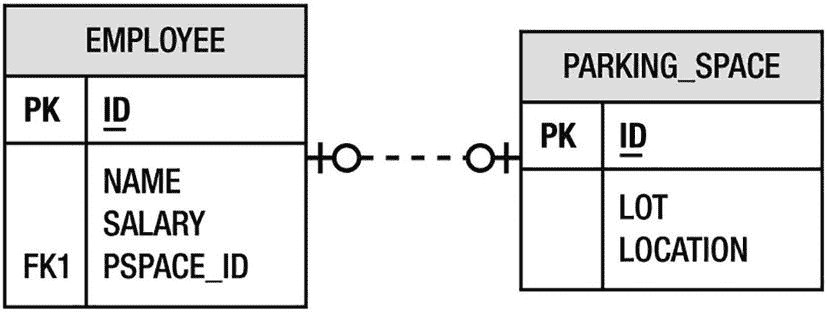

图 4-13

EMPLOYEE 和 PARKING_SPACE 表

事实证明，一对一映射与多对一映射几乎相同，区别仅在于源实体的一个实例只能引用同一个目标实体实例。换句话说，目标实体实例不会在源实体实例之间共享。在数据库中，这等同于对源外键列（即源实体表中的外键列）施加了唯一性约束。如果存在多个相同的外键值，就违反了“不能有多个源实体实例引用同一个目标实体实例”的规则。

清单 4-18 展示了这种关系的映射。这里使用了 `@JoinColumn` 注解，将默认的连接列名 `PARKINGSPACE_ID` 覆盖为 `PSPACE_ID`。

```
@Entity
public class Employee {
@Id private long id;
private String name;
@OneToOne
@JoinColumn(name="PSPACE_ID")
private ParkingSpace parkingSpace;
// ...
}
清单 4-18
从 Employee 到 ParkingSpace 的一对一关系
```

#### 双向一对一映射

一对一的目标实体通常有一个指向源实体的反向关系；例如，`ParkingSpace` 有一个指向使用它的 `Employee` 的反向引用。当出现这种情况时，就称为**双向一对一关系**。正如你之前所见，我们实际上有两个独立的一对一映射，每个方向各一个，但两者的组合被称为双向一对一关系。为了使我们现有的一对一员工和停车位示例变成双向的，我们只需要修改 `ParkingSpace`，使其指向 `Employee`。图 4-14 展示了这种双向关系。

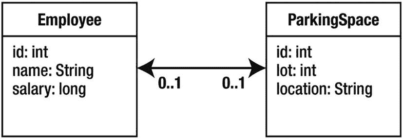

图 4-14

Employee 和 ParkingSpace 之间的一对一关系

你已经了解到，包含连接列的实体表决定了哪个实体是关系的拥有方。在双向一对一关系中，两个映射都是一对一映射，任何一方都可以是拥有方，因此连接列可能最终位于其中一方。这通常是一个数据建模决策，而非 Java 编程决策，并且很可能基于最频繁的遍历方向来决定。

考虑清单 4-19 中展示的 `ParkingSpace` 实体类。这个示例假设了图 4-13 中所示的表映射，并假设 `Employee` 是关系的拥有方。我们现在必须添加一个从 `ParkingSpace` 指向 `Employee` 的反向引用。这可以通过在 `employee` 字段上添加 `@OneToOne` 关系注解来实现。作为注解的一部分，我们必须添加一个 `mappedBy` 元素，以指示拥有方是 `Employee`，而不是 `ParkingSpace`。因为 `ParkingSpace` 是关系的反向方，所以它不需要提供连接列信息。

```
@Entity
public class ParkingSpace {
@Id private long id;
private int lot;
private String location;
@OneToOne(mappedBy="parkingSpace")
private Employee employee;
// ...
}
清单 4-19
双向一对一关系的反向方
```

`ParkingSpace` 的 `employee` 属性的一对一映射中需要 `mappedBy` 元素，以引用 `Employee` 类中的 `parkingSpace` 属性。`mappedBy` 的值是拥有方实体中指向反向方实体的属性名称。

因此，双向一对一关联的两条规则如下：

*   `@JoinColumn` 注解应放在映射到包含连接列的表的实体（即关系的拥有方）的映射上。这可能在关联的任一侧。

*   `mappedBy` 元素应在未定义连接列的实体（即关系的反向方）的 `@OneToOne` 注解中指定。

在双向关联中，两侧都设置 `mappedBy` 是不合法的，同样，两侧都不设置也是不正确的。区别在于，如果关系的两侧都缺少 `mappedBy`，提供者会将每一侧都视为独立的单向关系。这本身没问题，但会假定每一侧都是拥有方，并且每一侧都有一个连接列。

双向多对一关系将在后面作为多值双向关联讨论的一部分进行解释。

### 集合值关联

当源实体引用一个或多个目标实体实例时，会使用多值关联或关联集合。一对多和多对多映射都符合拥有多个目标实体的标准。尽管一对多关联是最常用的，但当两个方向都存在共享时，多对多映射也很有用。


#### 一对多映射

当一个实体与另一个实体的`Collection`关联时，最常见的形式就是一对多映射。例如，一个部门通常会有多名员工。图 4-15 展示了我们之前在“多对一映射”一节中展示过的`Employee`和`Department`关系，只不过这次该关系本质上是双向的。

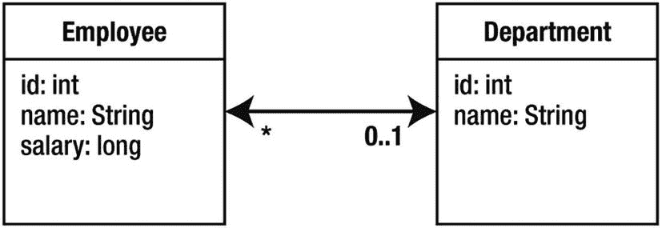

图 4-15

双向的 Employee 与 Department 关系

如前所述，当关系是双向时，实际上存在两个映射，每个方向各一个。双向的一对多关系总是意味着存在一个指向源的多对一映射，因此在我们的`Employee`和`Department`示例中，存在从`Department`到`Employee`的一对多映射，以及从`Employee`回到`Department`的多对一映射。如果我们从`Employee`的角度来看，也可以说这是一个双向的多对一关系。两者是等价的，因为双向的多对一关系意味着存在一个从目标指向源的一对多映射，反之亦然。

当源实体的集合中存储了任意数量的目标实体时，并没有一种可扩展的方式将这些引用存储在其映射的数据库表中。它如何在一行中存储任意数量的外键呢？相反，它必须让集合中实体的表拥有指向源实体表的外键。这就是为什么一对多关联几乎总是双向的，并且“一”方通常不是拥有方。

此外，如果目标实体表拥有指向源实体表的外键，那么目标实体应该拥有指向源实体对象的多对一关联。在表中存在外键，但对应的实体对象模型中却没有相应的关联，这并不符合数据模型。不过，这仍然是可以配置的。

让我们基于图 4-15 所示的`Employee`和`Department`示例，来看一个一对多映射的具体例子。该关系对应的表与图 4-11 中展示的多对一关系表完全相同。多对一示例与本示例的唯一区别在于，我们现在实现的是关系的反向方。由于`Employee`拥有连接列并且是关系的拥有者，因此`Employee`类与清单 4-16 中的相同。

在关系的`Department`方，我们需要使用`@OneToMany`注解将`Employee`实体的`employees`集合映射为一对多关联。清单 4-20 展示了使用此注解的`Department`类。请注意，由于这是关系的反向方，我们需要包含`mappedBy`元素，就像我们在双向一对一关系示例中所做的那样。

```
@Entity
public class Department {
@Id private long id;
private String name;
@OneToMany(mappedBy="department")
private Collection employees;
// ...
}
清单 4-20
一对多关系
```

关于这个类，有几点值得注意。首先，这里使用了泛型类型参数化的`Collection`来存储`Employee`实体。这提供了严格的类型检查，确保`Collection`中只会存在`Employee`类型的对象。这非常有用，因为它不仅提供了代码的编译时检查，还使我们免于在从集合中检索`Employee`实例时执行强制类型转换操作。

Jakarta Persistence 假定泛型是可用的；然而，使用非类型参数化的`Collection`也完全是可以接受的。我们也可以像在 Java SE 5 之前的标准 Java 版本中那样（除了 JDK 1.0 或 1.1，那时`java.util.Collection`甚至还没有标准化！），不使用泛型，只定义一个简单的`Collection`类型来定义`Department`类。如果这样做，我们需要指定持久化提供者所需的、将存储在`Collection`中的实体类型。代码如清单 4-21 所示，看起来几乎相同，只是多了指示实体类型的`targetEntity`元素。

```
@Entity
public class Department {
@Id private long id;
private String name;
@OneToMany(targetEntity=Employee.class, mappedBy="department")
private Collection employees;
// ...
}
清单 4-21
使用 targetEntity
```

在定义双向一对多（或多对一）关系时，有两点需要牢记：

*   多对一方应为拥有方，因此连接列应定义在该方。
*   一对多映射应为反向方，因此应使用`mappedBy`元素。

如果在`@OneToMany`注解中未能指定`mappedBy`元素，将导致提供者将其视为使用连接表（稍后描述）定义的单向一对多关系。这是一个容易犯的错误，如果你看到缺少表的错误，且表名由两个实体名称拼接而成，这应该是你首先检查的地方。


#### 多对多映射

当一个或多个实体与另一个实体的`Collection`关联，且这些实体与相同的目标实体存在重叠关联时，我们必须将其建模为多对多关系。关系两侧的每个实体都将拥有一个集合值关联，其中包含目标类型的实体。图 4-16 展示了`Employee`和`Project`之间的多对多关系。每个员工可以参与多个项目，每个项目也可以由多个员工参与。

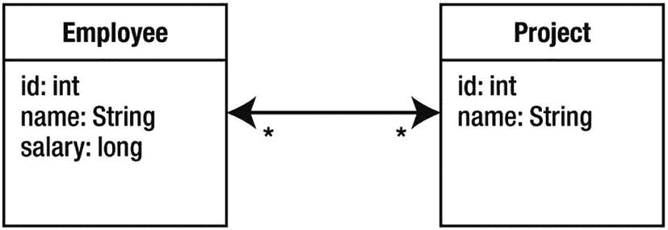

图 4-16

双向多对多关系

多对多映射通过在源实体和目标实体的集合属性上添加`@ManyToMany`注解来表达。例如，在清单 4-22 中，`Employee`有一个`projects`属性，该属性已使用`@ManyToMany`注解。同样，`Project`实体有一个`employees`属性，也使用了`@ManyToMany`注解。

```
@Entity
public class Employee {
@Id private long id;
private String name;
@ManyToMany
private Collection projects;
// ...
}
@Entity
public class Project {
@Id private long id;
private String name;
@ManyToMany(mappedBy="projects")
private Collection employees;
// ...
}
清单 4-22
Employee 和 Project 之间的多对多关系
```

这种多对多关系与之前讨论的一对多关系存在一些重要区别。首先是数学上的必然性：当多对多关系是双向时，关系的两侧都是多对多映射。

第二个区别是关系两侧都没有连接列。你将在下一节看到，实现多对多关系的唯一方法是使用一个独立的连接表。由于两个实体表中都没有连接列，因此无法确定哪一侧是关系的拥有方。由于每个双向关系都必须有一个拥有方和一个反向方，我们必须选择其中一个实体作为拥有方。在此示例中，我们选择`Employee`作为关系的拥有方，但也可以同样轻松地选择`Project`。与其他所有双向关系一样，反向方必须使用`mappedBy`元素来标识拥有属性。

请注意，无论哪一侧被指定为拥有方，另一侧都应包含`mappedBy`元素；否则，持久化提供程序会认为两侧都是拥有方，并且映射是独立的单向关系。

#### 使用连接表

由于多对多关系两侧的重数都是复数，因此两个实体表中的任何一个都无法在单个实体行中存储无限数量的外键值。我们必须使用第三个表来关联这两个实体类型。这个关联表称为连接表，每个多对多关系都必须有一个连接表。连接表也可能用于其他关系类型，但并非必需，因此不太常见。

连接表仅由两个外键或连接列组成，用于引用关系中的两个实体类型。实体的集合随后被映射为表中的多行，每一行将一个实体与另一个实体关联起来。在源外键列中包含给定实体标识符的行集，表示与该给定实体相关的实体集合。

图 4-17 展示了`Employee`和`Project`实体对应的`EMPLOYEE`和`PROJECT`表，以及关联它们的`EMP_PROJ`连接表。`EMP_PROJ`表仅包含构成其复合主键的外键列。`EMP_ID`列引用`EMPLOYEE`主键，而`PROJ_ID`列引用`PROJECT`主键。

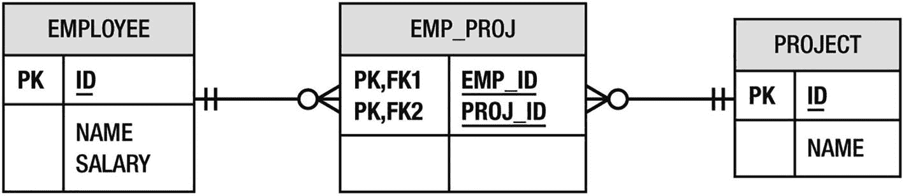

图 4-17

多对多关系的连接表

为了映射图 4-17 中描述的表，我们需要向已指定为关系拥有方的`Employee`类添加一些元数据。清单 4-23 展示了带有相应连接表注解的多对多关系。

```
@Entity
public class Employee {
@Id private long id;
private String name;
@ManyToMany
@JoinTable(name="EMP_PROJ",
joinColumns=@JoinColumn(name="EMP_ID"),
inverseJoinColumns=@JoinColumn(name="PROJ_ID"))
private Collection projects;
// ...
}
清单 4-23
使用连接表
```

`@JoinTable`注解用于配置关系的连接表。连接表中的两个连接列通过拥有方和反向方来区分。指向拥有方的连接列在`joinColumns`元素中描述，而指向反向方的连接列由`inverseJoinColumns`元素指定。从清单 4-23 中可以看出，这些元素的值实际上是嵌入在`@JoinTable`注解中的`@JoinColumn`注解。这提供了在定义连接表的表内声明所有连接列信息的能力。这些名称使用复数形式，适用于每个外键可能有多个列的情况（即拥有实体或反向实体具有多部分主键）。这种更复杂的情况将在第 10 章讨论。

在我们的示例中，我们完整指定了连接表及其列的名称，因为这是最常见的情况。但如果我们是从实体生成数据库模式，实际上并不需要指定这些信息。我们可以依赖持久化提供程序为我们生成表时假定并使用的默认值。当拥有方没有`@JoinTable`注解时，会假定一个默认的连接表名称`<拥有方>_<反向方>`，其中`<拥有方>`是拥有实体的名称，`<反向方>`是反向或非拥有实体的名称。当然，拥有方基本上是由开发人员随意选择的，因此这些默认值将根据关系的映射方式以及被指定为拥有方的实体来应用。

连接列将根据之前“使用连接列”一节中描述的连接列默认规则进行默认设置。指向拥有实体的连接列的默认名称是反向实体中指向拥有实体的属性名称，后跟下划线和拥有实体表的主键列名称。因此，在我们的示例中，`Employee`是拥有实体，`Project`有一个`employees`属性，其中包含`Employee`实例的集合。`Employee`实体映射到`EMPLOYEE`表，主键列为`ID`，因此指向拥有实体的连接列的默认名称将是`EMPLOYEES_ID`。反向连接列同样会默认设置为`PROJECTS_ID`。

很明显，连接表及其内部连接列的默认名称不太可能与现有表匹配。这就是为什么我们提到，默认值只有在映射到的数据库模式是由提供程序生成时才真正有用。


#### 单向集合映射

当一个实体与目标实体存在一对多映射，但 `@OneToMany` 注解未包含 `mappedBy` 元素时，则假定该实体与目标实体为单向关系。这意味着目标实体没有指向源实体的多对一映射。图 4-18 展示了 `Employee` 与 `Phone` 之间的单向一对多关联。

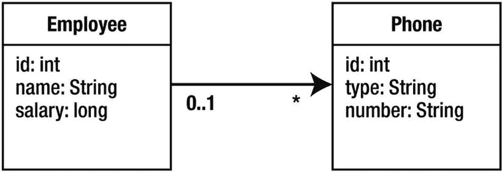

图 4-18

单向一对多关系

请考虑图 4-19 中的数据模型。其中没有用于存储从 `Phone` 到 `Employee` 反向关联的连接列。因此，我们使用了一个连接表来关联 `Phone` 实体与 `Employee` 实体。

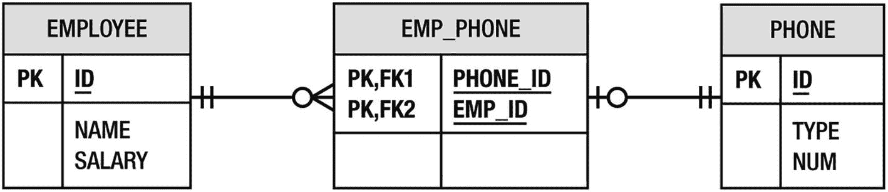

图 4-19

用于单向一对多关系的连接表

类似地，当多对多关系中的一方没有指向另一方的映射时，这也是一种单向关系。此时仍必须使用连接表；唯一的区别在于，两个实体类型中只有一个实际使用该表来加载其关联实体，或通过更新该表来存储额外的实体关联。

在这两种单向集合值的情况下，源代码与之前的示例类似，但目标实体中没有引用源实体的属性，并且源实体的 `@OneToMany` 注解中不会出现 `mappedBy` 元素。现在必须将连接表指定为映射的一部分。清单 4-24 展示了 `Employee` 通过连接表与 `Phone` 建立的一对多关系。

```
@Entity
public class Employee {
@Id private long id;
private String name;
@OneToMany
@JoinTable(name="EMP_PHONE",
joinColumns=@JoinColumn(name="EMP_ID"),
inverseJoinColumns=@JoinColumn(name="PHONE_ID"))
private Collection phones;
// ...
}
清单 4-24
单向一对多关系
```

请注意，在生成模式时，由于没有反向属性，单向情况下连接列的默认命名略有不同。连接表的名称默认为 `EMPLOYEE_PHONE`，其连接列将根据 `Employee` 实体名称及其主键列命名为 `EMPLOYEE_ID`。反向连接列将命名为 `PHONES_ID`，这是 `Employee` 实体中 `phones` 属性与 `PHONE` 表的 `ID` 主键列的拼接结果。

### 延迟关系

前面的章节展示了如何配置一个属性，使其在访问时才被加载，而非在此之前加载。你已经了解到，在属性级别进行延迟加载通常并不十分有益。

然而，在关系级别，延迟加载可以极大地提升性能。它可以减少执行的 SQL 语句数量，并显著加快查询和对象加载速度。

获取模式可以在四种关系映射类型中的任意一种上指定。当单值关系未指定获取模式时，相关对象保证会被立即加载。集合值关系默认采用延迟加载，但由于延迟加载仅是对提供者的一个提示，如果提供者决定立即加载，它们也可以被立即加载。

在双向关系的情况下，获取模式可能在一侧是延迟的，而在另一侧是立即的。这种配置实际上相当常见，因为根据导航方向的不同，关系通常以不同的方式被访问。

一个覆盖默认获取模式的示例是：我们不想在每次加载 `Employee` 时都加载其 `ParkingSpace`。清单 4-25 展示了将 `parkingSpace` 属性配置为使用延迟加载。

```
@Entity
public class Employee {
@Id private long id;
@OneToOne(fetch=FetchType.LAZY)
private ParkingSpace parkingSpace;
// ...
}
清单 4-25
更改关系的获取模式
```

提示

被指定或默认采用延迟加载的关系，在使用 getter 方法访问对象时，可能会也可能不会导致相关对象被加载。该对象可能是一个代理，因此实际上可能需要调用其上的某个方法才能触发其加载。


## 嵌入对象

嵌入对象是指其身份依赖于某个实体（Entity）的对象。它本身没有独立的身份，仅仅是实体状态的一部分，这部分状态被剥离出来，存储在一个依附于实体的独立 Java 对象中。在 Java 中，嵌入对象在表现形式上与关联关系类似：它们被实体引用，并且在 Java 语义上表现为关联的目标。然而，在数据库中，嵌入对象的状态与实体的其余状态一起存储在数据库行中，Java 实体中的状态与其嵌入对象中的状态之间没有区别。

提示

尽管嵌入对象被其所属的实体引用，但我们不认为它们与实体之间存在关联关系。“关联关系”这一术语仅适用于双方都是实体的情况。

如果数据库行已经包含了实体及其嵌入对象的所有数据，那为什么还要使用这样的对象呢？为什么不直接在实体中定义所有字段来引用其全部持久化状态，而是将其拆分成一个或多个子对象，这些子对象作为依赖实体而存在的二级持久化对象呢？

这让我们回到了第一章 1 中讨论过的对象-关系阻抗失配问题。由于数据库记录包含不止一种逻辑类型，因此在应用程序的对象模型中明确地进行这种分离是有意义的，即使物理表示形式不同。你几乎可以说，嵌入对象比实体上简单的属性集合更能自然地表示领域概念。此外，一旦你识别出构成嵌入对象的实体状态分组，就可以将相同的嵌入对象类型共享给其他具有相同内部表示形式的实体。^(¹⁰)

这种复用的一个例子是地址信息。图 4-20 展示了一个 `EMPLOYEE` 表，其中混合了基本的员工信息以及对应于员工家庭地址的列。

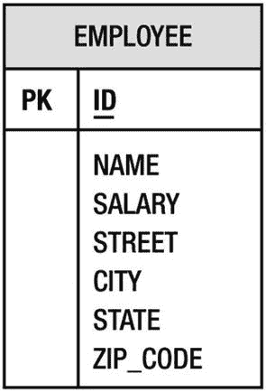

图 4-20

包含嵌入地址信息的 EMPLOYEE 表

`STREET`、`CITY`、`STATE` 和 `ZIP_CODE` 列在逻辑上组合起来形成了地址。在对象模型中，这是一个极好的候选，可以将其抽象为一个独立的 `Address` 嵌入类型，而不是在实体类中列出每个属性。然后，实体类只需拥有一个指向 `Address` 类型嵌入对象的 `address` 属性。图 4-21 展示了 `Employee` 和 `Address` 之间的关系。使用 UML 组合关联来表示 `Employee` 完全拥有 `Address`，并且 `Address` 的实例不能被除其所属 `Employee` 实例之外的任何其他对象共享。

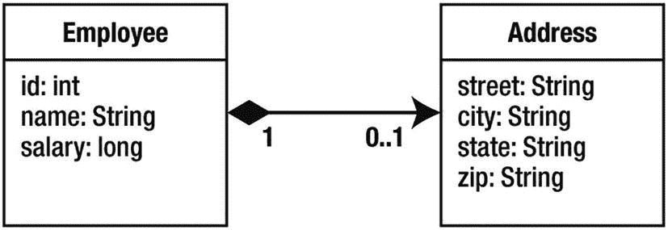

图 4-21

Employee 和嵌入的 Address

通过这种表示，地址信息不仅被整洁地封装在一个对象中，而且如果另一个实体（如 `Company`）也有地址信息，它也可以拥有一个指向其自身嵌入的 `Address` 对象的属性。我们将在下一节描述这种场景。

通过在类定义中添加 `@Embeddable` 注解来将嵌入类型标记为嵌入类。此注解用于将该类与其他常规 Java 类型区分开来。一旦一个类被指定为可嵌入的，它的字段和属性就可以作为实体的一部分进行持久化。我们可能还需要定义可嵌入对象的访问类型，以便无论它嵌入在哪个实体中，都能以相同的方式访问。代码清单 4-26 展示了 `Address` 嵌入类型的定义。

```
@Embeddable @Access(AccessType.FIELD)
public class Address {
private String street;
private String city;
private String state;
@Column(name="ZIP_CODE")
private String zip;
// ...
}
代码清单 4-26
可嵌入的 Address 类型
```

要在实体中使用此类，实体只需要拥有一个该嵌入类型的属性。该属性可以选择性地使用 `@Embedded` 注解进行标注，以表明它是一个嵌入映射。代码清单 4-27 展示了使用嵌入的 `Address` 对象的 `Employee` 类。

```
@Entity
public class Employee {
@Id private long id;
private String name;
private long salary;
@Embedded private Address address;
// ...
}
代码清单 4-27
使用嵌入对象
```

当持久化提供者持久化一个 `Employee` 实例时，它会访问 `Address` 对象的属性，就像它们直接存在于实体实例上一样。`Address` 类型上的列映射实际上指向 `EMPLOYEE` 表中的列，即使它们是在不同的类型中列出的。

决定使用嵌入对象还是实体，取决于你是否认为将来需要创建与它们或从它们出发的关联关系。嵌入对象并非设计为实体，一旦你开始将它们视为实体，如果数据模型允许，你可能应该将它们提升为一等实体，而不是嵌入对象。

提示

将嵌入对象定义为继承层次结构的一部分是不可移植的。一旦它们开始相互扩展，嵌入它们的复杂性就会增加，而性价比则会降低。

在我们进入示例之前，我们提到 `Address` 类可以在 `Employee` 和 `Company` 实体中复用。理想情况下，我们希望得到图 4-22 所示的表示。尽管 `Employee` 和 `Company` 类都包含了 `Address` 类，但这并不是问题，因为每个 `Address` 实例只会被一个 `Employee` 或 `Company` 实例使用。

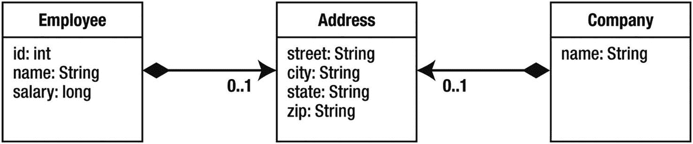

图 4-22

被两个实体共享的 Address

鉴于 `Address` 嵌入类型的列映射适用于包含它的实体的列，你可能会想，如果两个实体表对相同字段使用了不同的列名，共享如何可能实现？图 4-23 展示了这个问题。`COMPANY` 表与之前定义的 `Address` 类型的默认映射属性相匹配，但此示例中的 `EMPLOYEE` 表已被修改，以匹配居住在加拿大的人的地址要求。我们需要一种方法，让实体能够根据自身实体表的需求来映射嵌入对象，而 `@AttributeOverride` 注解提供了这种方法。

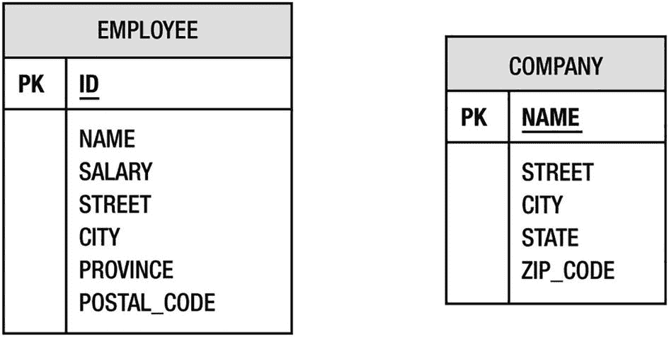

图 4-23

EMPLOYEE 和 COMPANY 表


我们对嵌入对象中每个希望在实体中覆盖的属性使用 `@AttributeOverride` 注解。我们在实体中标注嵌入的字段或属性，并在 `name` 元素中指定我们正在覆盖的嵌入对象中的字段或属性。`column` 元素允许我们指定该属性在实体表中映射到的列。我们通过嵌套的 `@Column` 注解形式来指明这一点。如果我们要覆盖多个字段或属性，可以使用复数形式的 `@AttributeOverrides` 注解，并在其中嵌套多个 `@AttributeOverride` 注解。请注意，由于 `@AttributeOverride` 注解是 `@Repeatable` 的，因此 `@AttributeOverrides` 注解并非强制使用。

清单 4-28 展示了在 `Employee` 和 `Company` 中使用 `Address` 的示例。`Company` 实体直接使用 `Address` 类型，但 `Employee` 实体指定了两个属性覆盖，将 `Address` 的 `state` 和 `zip` 属性分别映射到 `EMPLOYEE` 表的 `PROVINCE` 和 `POSTAL_CODE` 列。

```
@Entity
public class Employee {
@Id private long id;
private String name;
private long salary;
@Embedded
@AttributeOverride(name="state", column=@Column(name="PROVINCE")),
@AttributeOverride(name="zip", column=@Column(name="POSTAL_CODE"))
private Address address;
// ...
}
@Entity
public class Company {
@Id private String name;
@Embedded
private Address address;
// ...
}
清单 4-28
在多个实体中重用嵌入对象
```

## 总结

将对象映射到关系数据库对于持久化应用程序至关重要。处理阻抗不匹配问题需要一套复杂的元数据。Jakarta Persistence 不仅提供了这些元数据，还促进了简单便捷的开发。

在本章中，我们经历了映射实体状态的过程，其中包括简单的 Java 类型、大对象、枚举类型和时态类型。我们还使用元数据进行了“中间相遇”映射，以指定特定的表名和列名。

我们解释了标识符是如何生成的，并描述了四种不同的生成策略。您看到了不同策略的实际应用，并学会了如何区分它们。

然后，我们回顾了一些关系概念，并将其应用于对象-关系映射元数据。我们使用连接列和连接表来映射单值关联和集合值关联，并给出了一些示例。我们还讨论了一种特殊类型的对象，称为可嵌入对象，它们被映射但没有标识符，并且只能存在于持久化实体中。

下一章将讨论映射集合值关系的更多复杂性，以及如何映射非实体对象的集合。我们将深入研究不同的 `Collection` 类型，以及这些类型的使用和映射方式，并了解它们如何影响所映射的数据库表。

脚注 1

# 5. 集合映射

有时，`collection` 就像牛奶箱一样被使用：它只是一个简单的容器，没有明显的顺序或预期的组织方式。其他情况则需要某种排序和排列系统，以便从集合中检索对象的方式具有意义。无论集合属于第一种类型还是第二种类型，对象集合的映射都比单个对象需要更多的精力，尽管作为补偿，它们提供了更大的灵活性。

在上一章中，我们开始了映射集合值关系的旅程，只介绍了将实体集合映射到数据库的基础知识。本章将更详细地介绍如何映射更复杂的集合类型，例如持久化排序的 `lists`，以及具有各种对象类型的键和值的 `maps`。我们甚至将探讨如何映射非实体对象的集合。

## 关系与元素集合

当我们谈论映射集合时，实际上有三种类型的对象可以存储在映射的集合中。我们可以映射实体、可嵌入对象或基本类型的集合，每种类型都需要一定程度的理解才能正确映射和高效使用。

我们应该澄清一下这些类型的对象存储在集合中时可能产生的一个混淆点。在上一章中，我们介绍了从一种实体类型到另一种实体类型的关系概念，并且您了解到，当源实体拥有一个包含目标实体类型实例的集合时，这被称为多值关系。然而，可嵌入对象和基本类型的集合不是关系；它们只是元素的集合，因此被称为*元素集合*。关系定义了独立实体之间的关联，而元素集合包含依赖于引用实体的对象，并且只能通过包含它们的实体来检索。

关系与元素集合之间的一个实际区别是用于表示它们的注解。关系至少需要关系注解，即 `@OneToMany` 或 `@ManyToMany`，而元素集合则由 `@ElementCollection` 注解指示。假设清单 5-1 中的 `VacationEntry` 可嵌入类，清单 5-2 展示了 `vacationBookings` 属性中的可嵌入对象元素集合，以及 `nickNames` 属性中的基本类型（`String`）元素集合的示例。

```
@Entity
public class Employee {
@Id private int id;
private String name;
private long salary;
// ...
@ElementCollection(targetClass=VacationEntry.class)
private Collection vacationBookings;
@ElementCollection
private Set nickNames;
// ...
}
清单 5-2
可嵌入对象和基本类型的元素集合
```

```
@Embeddable
public class VacationEntry {
@Temporal(TemporalType.DATE)
private Calendar startDate;
@Column(name="DAYS")
private int daysTaken;
// ...
}
清单 5-1
VacationEntry 可嵌入对象
```

从清单 5-2 中可以看出，与关系注解类似，`@ElementCollection` 注解包含一个 `targetClass` 元素，当 `Collection` 未定义其中包含的元素类型时，该元素用于指定类。它还包含一个 `fetch` 元素，用于指示是否应延迟加载该集合。

清单 5-2 中映射的一个更有趣的方面是缺少任何额外的元数据。回想一下，存储在集合中的元素不是实体，因此它们没有任何映射表。可嵌入对象本应存储在与引用它们的实体相同的表中，但如果存在可嵌入对象的集合，怎么可能在一行中存储多个具有相同映射的对象呢？对于基本类型也是如此，我们无法将每个昵称 `String` 映射到 `EMPLOYEE` 表中的一个列，并期望在一行中存储多个字符串。因此，元素集合需要一个单独的表，称为*集合表*。每个集合表必须有一个引用包含实体表的连接列。集合表中的其他列用于映射可嵌入元素的属性，或者如果元素是基本类型，则映射基本元素的状态。


我们可以使用 `@CollectionTable` 注解来指定集合表，该注解允许我们指定表名以及连接列。如果未指定该注解或注解中的特定元素，则将应用默认值。表名默认为引用实体的名称，后跟下划线和包含元素集合的实体属性名称。连接列的默认值类似，为引用实体的名称，后跟下划线和实体表主键列的名称。由于在清单 5-2 中定义的 `Employee` 实体的 `vacationBookings` 和 `nickNames` 属性中的元素集合均未指定集合表，因此它们默认分别使用名为 `EMPLOYEE_VACATIONBOOKINGS` 和 `EMPLOYEE_NICKNAMES` 的集合表。每个集合表中的连接列将是 `EMPLOYEE_ID`，它只是实体名称与映射的 `Employee` 主键列的组合。

我们将可嵌入类型的字段或属性映射到集合表中的列，而不是实体的主表，并应用通常的列名默认规则。当元素集合包含基本类型时，这些值也存储在集合表的一列中，默认列名为实体属性的名称。应用此规则，昵称将存储在 `NICKNAMES` 列中。应用所有默认值后，映射的表将如图 5-1 所示。

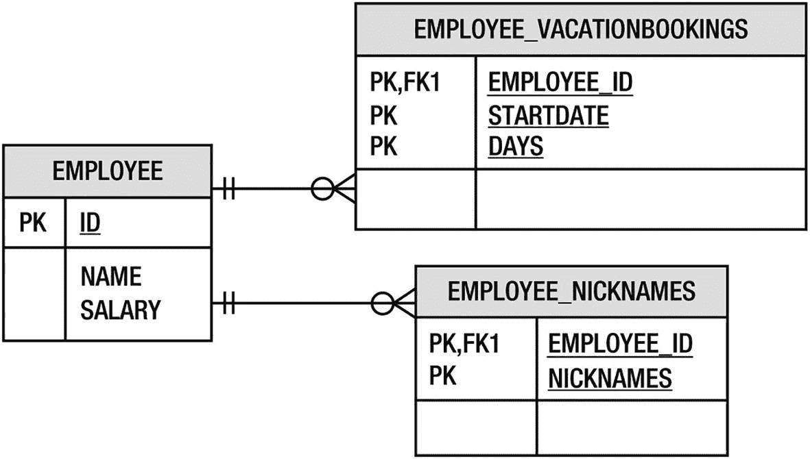

图 5-1

EMPLOYEE 实体表和映射的集合表

当我们首次讨论可嵌入对象时，您看到了属性如何在可嵌入对象内进行映射，但在嵌入到其他实体或可嵌入对象中时可以被覆盖。我们使用 `@AttributeOverride` 注解来覆盖列名。相同的注解也可用于覆盖元素集合中元素的嵌入属性。在清单 5-3 中，`daysTaken` 属性正在使用 `@AttributeOverride` 重新映射，从存储在 `DAYS` 列改为存储在 `DAYS_ABS` 列。在简单嵌入映射上使用 `@AttributeOverride` 与在元素集合中覆盖可嵌入对象的列之间有一个重要区别：在后一种情况下，`@AttributeOverride` 指定的列实际上应用于集合表，而不是实体表。

```
@Entity
public class Employee {
@Id private int id;
private String name;
private long salary;
// ...
@ElementCollection(targetClass=VacationEntry.class)
@CollectionTable(
name="VACATION", joinColumns=@JoinColumn(name="EMP_ID"))
@AttributeOverride(name="daysTaken", column=@Column(name="DAYS_ABS"))
private Collection vacationBookings;
@ElementCollection
@Column(name="NICKNAME")
private Set nickNames;
// ...
}
清单 5-3
覆盖集合表列
```

为了覆盖存储昵称的列名，我们可以使用 `@Column` 注解，再次记住该名称指定的是集合表中的列，而不是实体表。图 5-2 显示了映射的表，包括由 `vacationBookings` 集合映射的、已被覆盖的 `VACATION` 集合表。

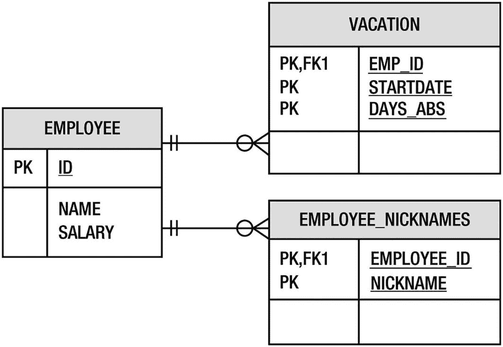

图 5-2

EMPLOYEE 实体表和带有覆盖的映射集合表

## 使用不同的集合类型

我们可以使用不同类型的集合来存储多值实体关联和对象集合。根据应用程序的需求，`Collection`、`Set`、`List` 和 `Map` 中的任何一种都可能适用。然而，每种集合类型都有相应的规则来指导其使用，因此在使用特定集合类型之前，您应该熟悉管理该类型如何映射和操作的规则。

第一步是将集合定义为前面提到的任何接口类型。然后，使用具体的实现类初始化该属性。这可以在实体类的构造函数或初始化方法中完成，并允许您将对象放入新实体或未持久化实体的实现集合中。

一旦实体变为受管理的状态，或通过 `EntityManager.persist()` 调用被持久化，无论集合是从数据库读取的还是已从实体管理器分离，操作集合时必须始终使用接口。这是因为在实体变为受管理的那一刻，持久化提供程序可以用其自身的 `Collection` 实现类的替代实例来替换初始的具体实例。

### 集合（Sets）或集合（Collections）

关联中最常用的集合类型是标准的 `Collection` 超接口。当底层使用哪种实现无关紧要，并且只需要通用的 `Collection` 方法来访问其中存储的实体时，就会使用此接口。

`Set` 将防止插入重复元素，并且可能是一种更简单、更简洁的集合模型，而普通的 `Collection` 接口则是最通用的。这两个接口除了原始的映射注解外，都不需要额外的注解来进一步指定它们。它们的使用方式与持有非持久化对象时相同。在清单 5-3 中有一个示例，展示了如何为一个元素集合使用 `Set` 接口，为另一个元素集合使用 `Collection` 接口。

### 列表（Lists）

另一种常见的集合类型是 `List`。当需要按某种用户定义的顺序检索实体或元素时，通常会使用 `List`。由于数据库中行顺序的概念通常没有定义，因此确定顺序的任务必须由应用程序承担。

有两种方法可以确定 `List` 的顺序。第一种是映射它，使其根据 `List` 中每个实体或元素中存在的状态进行排序。这是最简单的方法，并且对数据模型的侵入性较小。第二种方法涉及在额外的数据库列中维护 `List` 的顺序。它更符合 Java 的习惯，因为它支持 Java `List` 的传统排序语义，但性能可能差得多，您将在以下部分中看到这一点。


#### 按实体或元素属性排序

在`List`中对实体或元素进行排序，最常用的方法是基于对实体或元素特定属性的比较来指定排序规则。如果`List`表示一个关系，那么该属性通常是目标实体的主键。

我们在`@OrderBy`注解中指明用于排序的属性。该注解的值是一个字符串，包含一个或多个以逗号分隔的字段或属性，这些字段或属性属于被排序的对象。每个属性后面可以可选地跟上`ASC`或`DESC`关键字，以定义该属性应按升序还是降序排序。如果未指定排序方向，则该属性将按升序排序。

如果`List`表示一个关系并引用了实体，那么指定不带任何字段或属性的`@OrderBy`，或者完全不指定它，将导致`List`按其中实体的主键排序。对于基本类型的元素集合，`List`将按元素的值排序。而对于可嵌入类型的元素集合，`List`将默认采用某种未定义的顺序，通常是在没有任何`ORDER BY`子句时由数据库返回的顺序。

上一章清单 4-20 中的示例展示了一个从`Department`到`Employee`的一对多关系。如果我们希望员工按特定顺序排列，可以使用`List`代替`Collection`。通过在映射上添加`@OrderBy`注解，我们可以指明希望员工按姓名的字母升序排列。清单 5-4 展示了更新后的示例。

```
@Entity
public class Department {
// ...
@OneToMany(mappedBy="department")
@OrderBy("name ASC")
private List employees;
// ...
}
清单 5-4
使用 List 的一对多关系
```

我们其实不必在`@OrderBy`注解中包含`ASC`，因为默认就是升序，但包含它是个好习惯。

我们也可以轻松地按`Employee`的某个嵌入字段对员工`List`进行排序。例如，如果`name`被嵌入在`Employee`的一个名为`info`的嵌入字段中（该字段类型为可嵌入类型`EmployeeInfo`），那么我们可以将注解写为`@OrderBy("info.name ASC")`。

我们还可能希望使用多个属性进行子排序。可以通过在注解中指定以逗号分隔的`<属性名 ASC/DESC>`对来实现。例如，如果`Employee`有一个`status`属性，我们可以先按状态排序，再按姓名排序，使用`@OrderBy`注解为`@OrderBy("status DESC, name ASC")`。当然，在`@OrderBy`注解中使用某个属性的前提是，该属性类型必须是可比较的，即它支持比较运算符。

如果你只是简单地交换`List`中两个员工的顺序，看起来他们似乎占据了`List`中的新位置。然而，如果在一个新的持久化上下文中重新读取该部门并访问其员工，`List`会恢复到操作之前的顺序^(¹¹)。这是因为`List`的顺序基于`@OrderBy`注解所规定的排序规则。仅仅在内存中改变`List`中项目的顺序，并不会在提交时将该顺序存储到数据库中。实际上，`@OrderBy`中指定的顺序仅在将`List`读回内存时使用。作为经验法则，`List`的顺序应始终在内存中保持与`@OrderBy`排序规则一致。

#### 持久化有序列表

另一个需要`List`提供顺序的示例是打印队列，它维护着任意时刻排队等待的打印作业列表。`PrintQueue`本质上是一个先进先出（FIFO）队列，当打印机可用时，它会从队列前端取出下一个`PrintJob`并发送给打印机进行打印。假设`PrintQueue`和`PrintJob`都是实体，那么从`PrintQueue`到`PrintJob`将是一对多关系，反之则是多对一关系。

既然你知道如何映射关系，并且刚刚学习了如何使用`@OrderBy`映射有序列表，那么使用`List`来映射这个关系似乎相当直接。清单 5-5 中的`PrintJob`实体展示了其双向映射中的多对一这一端。

```
@Entity
public class PrintJob {
@Id private int id;
// ...
@ManyToOne
private PrintQueue queue;
// ...
}
清单 5-5
PrintJob 实体
```

问题出现在我们发现`PrintJob`实体没有一个可用于`@OrderBy`的属性时。由于作业的顺序实际上并不影响被服务的实际`PrintJob`，因此决定不在`PrintJob`实体中存储给定作业的顺序。特定`PrintJob`在队列中的位置仅由其在该作业`List`中的位置决定。

Java `List`中的`PrintJob`实体无法保持其顺序，除非创建了一个专门的数据库列来存储它。我们将这个列称为顺序列，它提供了比`@OrderBy`更强的持久化排序能力。正是在这个顺序列中，对象的顺序被存储，并在同一`List`内从一个位置移动到另一个位置时进行更新。这对用户是透明的，用户无需操作它，甚至不必知道它的存在，就能使用`List`。不过，它需要被知晓并作为映射过程的一部分加以考虑，并通过`@OrderColumn`注解来声明。

使用`@OrderColumn`注解会排除`@OrderBy`的使用，反之亦然。清单 5-6 展示了如何在`PrintQueue`的一对多关系映射中使用`@OrderColumn`。表映射如图 5-3 所示。

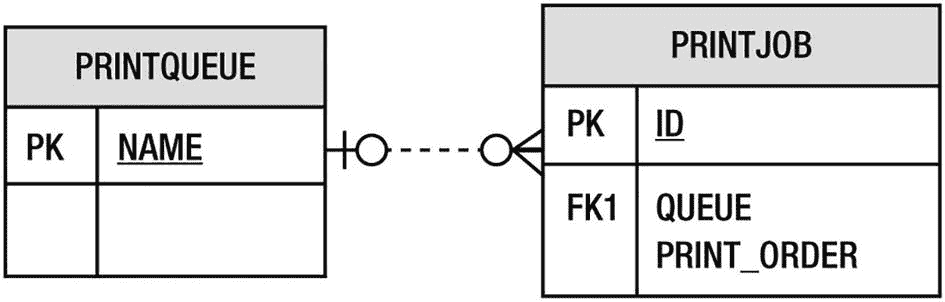

图 5-3

包含顺序列的 PRINTQUEUE 表和目标 PRINTJOB 表

```
@Entity
public class PrintQueue {
@Id private String name;
// ...
@OneToMany(mappedBy="queue")
@OrderColumn(name="PRINT_ORDER")
private List jobs;
// ...
}
清单 5-6
从 PrintQueue 到 PrintJob 的一对多 List
```

你可能注意到了在关系的一对多这一端声明顺序列时的一些不同之处。在上一章中，我们解释了在拥有方映射物理列的做法，因为拥有方拥有这些列所应用的表。当关系是双向时，顺序列是这个规则的一个例外，因为该列总是定义在它所排序的`List`旁边，即使它位于由拥有方的多对一实体所映射的表中。因此，在清单 5-6 中，`@OrderColumn`注解位于关系的`PrintQueue`这一端，但名为`PRINT_ORDER`的列指的是`PrintJob`实体所映射到的任何表。


尽管必须使用 `@OrderColumn` 注解才能在数据库列中存储实体的有序位置，但该注解的元素是可选的。`name` 属性默认会取实体属性的名称，并附加 `_ORDER` 字符串。因此，如果在清单 5-6 中没有将其覆盖为 `PRINT_ORDER`，那么它本应默认为 `JOBS_ORDER`。

存储排序列的表取决于 `@OrderColumn` 所应用的映射类型。它通常位于存储实体或元素的表中。如前所述，在清单 5-6 的双向一对多关系中，被存储的实体是 `PrintJob`，排序列将存储在 `PRINTJOB` 表中。如果映射是一个元素集合，排序列则会存储在集合表中。在多对多关系中，排序列位于连接表中。

关于使用 `@OrderColumn` 还需要补充一些说明，因为它是一个容易被误用的特性。我们说过，排序列对列表的使用者是透明的，但事实证明，这种透明性可能会给粗心的用户带来意想不到的后果。

设想一家繁忙的公司，有许多员工提交并打印大量打印任务。当一个任务排到第一位时，它就会从队列中移除并发送给打印机。与此同时，另一个任务继承了“待命”位置。每次一个任务被处理，队列中剩余的每个 `PrintJob` 都会向前移动一个位置，离被打印更近一步。换句话说，每打印一个任务，其他每个 `PrintJob` 的顺序都会改变，并且必须重新保存到数据库中。在我们的例子中，排序列存储在 `PrintJob` 实体所在的表中：即 `PRINTJOB` 表。

毋庸置疑，我们面临的是潜在的高昂成本，而且随着队列变长，成本会进一步增加。对于添加到大小为 `n` 的队列中的每个任务，在它到达打印机之前，数据库将额外执行 `n` 次 SQL 更新来更改该任务的顺序。这可能会给数据库管理员敲响警钟，尤其是那些警惕性高、喜欢仔细检查 SQL 审计的管理员。

关于 `List` 使用的最后一点说明：Jakarta Persistence 查询提供了特殊支持，允许访问并返回 `List` 的有序子集或单个元素。你可以在第 8 章中了解如何实现这一点。

### 映射（Maps）

`Map` 是一种非常常见的集合，几乎在每个应用程序中都会用到，它能够将键对象与任意值对象关联起来。各种底层实现预计会使用快速哈希技术来优化对键的直接访问。

在 Jakarta Persistence 中，`Map` 类型具有很大的灵活性，因为键和值可以是实体、基本类型和可嵌入类型的任意组合。将三种类型排列在键和值两个位置上，会产生九种不同的 `Map` 类型。在接下来的章节中，我们将详细解释最常见的组合。

#### 键与值

尽管基本类型、可嵌入类型或实体类型都可以作为 `Map` 的键，但请记住，如果它们扮演键的角色，就必须遵循键的基本规则。它们必须是可比较的，并能正确响应 `hashCode()` 方法，以及在必要时正确响应 `equals()` 方法^(¹²)。它们还应该是唯一的，至少在特定集合实例的范围内如此，这样值就不会在内存中丢失或被覆盖。键不应被更改，或者更具体地说，当对象在 `Map` 中充当键时，`hashCode()` 和 `equals()` 方法中使用的键对象部分不得更改。

通常，要持久化一个键/值为基本 Java 类型的 `java.util.Map`，可以使用 `@ElementCollection` 注解，并将其放置在实体类中的映射引用上。请注意，`@ElementCollection` 的用法与 `java.util.Collection` 映射非常相似。

当键是基本类型或可嵌入类型时，它们直接存储在引用的表中。根据映射类型的不同，可以是目标实体表、连接表或集合表。然而，当键是实体时，只有外键存储在表中，因为实体存储在自己的表中，并且必须保留它们在数据库中的标识。

始终是 `Map` 中值对象的类型决定了必须使用哪种映射。如果值是实体，则 `Map` 必须映射为一对多或多对多关系；而如果 `Map` 的值是可嵌入类型或基本类型，则 `Map` 映射为元素集合。

尽管 `Map` 的键不影响映射类型，但它们除了需要关系或元素集合注解外，还需要额外的注解来指示它们存储的列。这些注解将在后续章节的不同用例中介绍。


#### 按基本类型键控

我们在前几节中提到，基本类型的元素集合存储在集合表中，而基本键则存储在映射所引用的表中。如果映射是一个以基本类型为键的元素集合，那么这些键将与 `Map` 值存储在同一个集合表中。同样，如果是**一对多**关系，且外键位于目标实体表中，那么键将存储在目标实体表中。如果关系映射使用了连接表，那么键将存储在连接表中。

为了展示集合表的情况，我们来看一个元素集合示例，该示例映射了 `Employee` 的电话号码。如果使用 `Map`，我们可以以电话号码类型为键，并将电话号码作为值存储。因此，每个 `Map` 条目的键可以是 `Home`、`Work` 或 `Mobile` 中的任意一个（作为 `String`），而值则是关联的电话号码 `String`。清单 5-7 展示了元素集合映射代码。

```
@Entity
public class Employee {
@Id private int id;
private String name;
private long salary;
@ElementCollection
@CollectionTable(name="EMP_PHONE")
@MapKeyColumn(name="PHONE_TYPE")
@Column(name="PHONE_NUM")
private Map phoneNumbers;
// ...
}
清单 5-7
使用字符串键的字符串元素集合
```

`@ElementCollection` 和 `@CollectionTable` 注解并非新内容，清单 5-3 展示了我们可以使用 `@Column` 注解来覆盖存储 `Collection` 中值的列名。这里我们做了同样的事情，只不过我们覆盖的是存储 `Map` 值的列，而不是通用 `Collection` 中的条目。

唯一的新注解是 `@MapKeyColumn`，它用于指示集合表中存储基本键的列。当未指定该注解时，键将存储在以映射集合属性命名并附加 `_KEY` 后缀的列中。在清单 5-7 中，如果我们没有指定 `@MapKeyColumn`，默认规则会导致键映射到 `EMP_PHONE` 集合表中的 `PHONENUMBERS_KEY` 列。

注意

默认情况下，映射使用 Jakarta Persistence 特定的命名约定，我们可以通过在映射字段/属性上使用 `@MapKeyColumn`、`@CollectionTable` 和 `@Column` 注解来自定义它。

电话号码值可以在集合表中重复（例如，多个员工住在同一个家庭并拥有相同的电话号码），因此 `PHONE_NUM` 列在表中显然不会是唯一的。电话号码类型仅在给定的 `Map` 或 `Employee` 实例内必须是唯一的，因此 `PHONE_TYPE` 列也不会是主键。实际上，由于基本类型没有标识，并且在某些情况下，相同的键值条目可能在多个源实体中重复，因此键值列本身不能作为主键列。集合表中的唯一元组必须是键列和引用源实体实例的外键列的组合。图 5-4 显示了生成的集合表及其引用的源 `EMPLOYEE` 实体表。您可以看到 `EMPLOYEE_ID` 和 `PHONE_TYPE` 列上的主键约束。

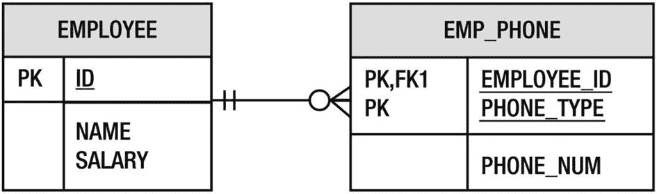

图 5-4

EMPLOYEE 实体表和 EMP_PHONE 集合表

不过，我们确实应该改进模型，因为使用 `String` 键来存储仅限于三个值（`Home`、`Mobile` 或 `Work`）的内容并不是一种好的风格。一个合适的改进是使用枚举类型而不是 `String`。我们可以如下定义枚举类型：

```
public enum PhoneType { Home, Mobile, Work }
```

现在，我们将有效选项作为枚举常量，并且不会出现拼写错误或无效电话号码类型的情况。然而，还有一个进一步的增强需要考虑。如果我们希望保护自己免受未来枚举类型值更改的影响（无论是重新排序现有值还是插入新值），我们应该覆盖值在数据库中的存储方式。我们不依赖存储枚举元素序数值的默认方法，而是希望存储 `String` 值，这样我们就能两全其美。该列将包含以人类可读方式对应电话号码类型设置的值，而 Java `Map` 将拥有强类型键。

覆盖枚举类型存储策略的常用方法是使用 `@Enumerated` 注解。但是，如果我们将 `@Enumerated` 放在 `Map` 属性上，它将应用于元素集合的值，而不是键。这就是为什么有一个特殊的 `@MapKeyEnumerated` 注解（参见清单 5-8）。还有一个等效的 `@MapKeyTemporal`，用于在键的类型为 `java.util.Date` 时指定时间类型。`@MapKeyEnumerated` 和 `@MapKeyTemporal` 都适用于基本类型的键，无论它是元素集合还是关系。

```
@Entity
public class Employee {
@Id private int id;
private String name;
private long salary;
@ElementCollection
@CollectionTable(name="EMP_PHONE")
@MapKeyEnumerated(EnumType.STRING)
@MapKeyColumn(name="PHONE_TYPE")
@Column(name="PHONE_NUM")
private Map phoneNumbers;
// ...
}
清单 5-8
使用枚举类型键的字符串元素集合
```

清单 5-4 有一个一对多关系，它使用 `List` 来保存给定部门中的所有员工。假设我们将其改为使用 `Map`，并跟踪哪个员工在哪个办公室或隔间工作。通过以隔间编号（也可以包含字母，因此我们将其表示为 `String`）为键，我们可以轻松找到哪个 `Employee` 在该隔间工作。由于这是一个双向的一对多关系，它将映射为 `EMPLOYEE` 表中指向 `DEPARTMENT` 的外键。隔间编号键将存储在 `EMPLOYEE` 表中的一个附加列中，每个键存储在与该隔间关联的 `Employee` 对应的行中。清单 5-9 展示了一对多映射。

```
@Entity
public class Department {
@Id private int id;
@OneToMany(mappedBy="department")
@MapKeyColumn(name="CUB_ID")
private Map employeesByCubicle;
// ...
}
清单 5-9
使用字符串键的 Map 的一对多关系
```

如果员工可以在多个部门之间分配时间怎么办？我们必须将模型改为多对多关系，并使用连接表。`@MapKeyColumn` 将存储在引用两个实体的连接表中。该关系在清单 5-10 中映射。

```
@Entity
public class Department {
@Id private int id;
private String name;
@ManyToMany
@JoinTable(name="DEPT_EMP",
joinColumns=@JoinColumn(name="DEPT_ID"),
inverseJoinColumns=@JoinColumn(name="EMP_ID"))
@MapKeyColumn(name="CUB_ID")
private Map employeesByCubicle;
// ...
}
清单 5-10
使用字符串键的 Map 的多对多关系
```

如果我们没有使用 `@MapKeyColumn` 覆盖键列，它将默认为集合属性名称后跟 `_KEY` 后缀。这将在连接表中产生一个看起来糟糕的 `EMPLOYEESBYCUBICLE_KEY` 列，不仅阅读起来不美观，而且实际上并未指示键的真正含义。图 5-5 显示了生成的表。


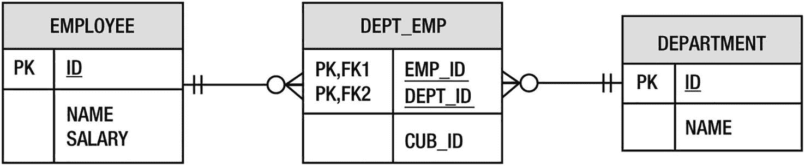

图 5-5

EMPLOYEE 和 DEPARTMENT 实体表以及 DEPT_EMP 连接表

注意

在多对多关系中，你只能在其中一侧使用 `Map`；使用哪一侧没有区别。

#### 按实体属性键控

当实体的集合表示为一对多或多对多关系时，通常按目标实体类型的某个属性进行键控。按实体属性键控实际上是按基本类型键控的一种特殊情况，其中映射是一个关系，键的基本类型是目标实体中（我们正在键控的）属性的类型。当出现这种常见情况时，可以使用 `@MapKey` 注解来指定正在被键控的目标实体的属性。

如果每个部门都跟踪其内的员工，就像我们之前在清单 5-4 中的示例那样，我们可以使用 `Map` 并按 `Employee id` 进行键控，以便快速查找 `Employee`。更新后的 `Department` 映射如清单 5-11 所示。

```
@Entity
public class Department {
// ...
@OneToMany(mappedBy="department")
@MapKey(name="id")
private Map employees;
// ...
}
清单 5-11
按实体属性键控的一对多关系
```

`Employee` 的 `id` 属性也是标识符或主键属性，事实证明，按标识符键控是所有情况中最常见的。这种情况非常普遍，以至于当未指定名称时，实体默认会按其标识符属性进行键控^(¹³)。当标识符属性是默认的且未显式列出时，我们确实需要知道标识符类型，以便在使用参数化 `Map` 时能够正确指定 `Map` 的第一个类型参数。

使用标识符属性作为键的原因之一是因为它很好地符合键的标准。它响应必要的比较方法 `hashCode()` 和 `equals()`，并且保证是唯一的。

如果使用其他属性作为键，该属性也应该是唯一的，尽管并不绝对要求它在整个实体类型域中唯一。它实际上只需要在关系范围内唯一即可。例如，只要确保员工姓名在任何部门内都是唯一的，我们就可以按员工姓名进行键控。

在上一节中，我们提到基本键存储在映射所引用的表中。按实体属性键控的特殊情况是该规则的一个例外，因为不需要额外的列来存储键。它已经作为实体的一部分存储了。这就是为什么在按实体属性键控时从不使用 `@MapKeyColumn` 注解。提供者可以通过加载与源实体关联的实体，并从每个加载的实体中提取被键控的属性，轻松构建一对多关系 `Map` 的内容。无需读取额外的列或执行额外的连接。

#### 按可嵌入类型键控

使用可嵌入类型作为键并不是你应该经常遇到的情况。事实上，如果你正在考虑这样做，在继续之前可能应该三思。仅仅因为可能，并不意味着这是一个好主意。

可嵌入类型的问题在于它们不是完整的实体。它们不可查询，即除了作为其所属实体的聚合部分外，无法被发现或返回。尽管这在最初看起来似乎不是一个非常严重的限制，但在开发周期的后期，它往往会成为一个问题。

可嵌入类型的标识通常未定义，但当它们用作 `Map` 中的键时，必须定义某种唯一性概念，至少适用于给定的 `Map`。这意味着唯一性约束（至少在逻辑上）是建立在嵌入属性与指向源实体的外键列的组合之上的。

可嵌入键类型与基本键类型类似，它们也存储在映射所引用的表中，但对于可嵌入类型，需要存储多个属性，而不仅仅是一个值。这导致多个列构成主键。

##### 与值共享可嵌入键映射

清单 5-11 中的代码示例展示了一个从 `Department` 到 `Employee` 的双向一对多关系，该关系按 `Employee` 的 `id` 属性进行键控。如果我们想按 `Employee` 的多个属性进行键控呢？例如，假设在给定部门内名称是唯一的，那么按名称在 `Map` 中查找员工可能是可取的。如果名称被拆分为两个属性，一个用于名，一个用于姓，如清单 5-12 所示，那么我们需要一个单独的对象来组合它们，并作为 `Map` 中的键对象。可嵌入类型（例如清单 5-13 中的 `EmployeeName`）可用于此目的。拥有一个 `EmployeeName` 可嵌入类型还提供了一个有用的类，用于在系统中传递封装的完整名称。

```
@Embeddable
public class EmployeeName {
@Column(name="F_NAME", insertable=false, updatable=false)
private String first_Name;
@Column(name="L_NAME", insertable=false, updatable=false)
private String last_Name;
// ...
}
清单 5-13
具有只读映射的 EmployeeName 可嵌入类型
```

```
@Entity
public class Employee {
@Id private int id;
@Column(name="F_NAME")
private String firstName;
@Column(name="L_NAME")
private String lastName;
private long salary;
// ...
}
清单 5-12
Employee 实体
```

因为从 `Department` 到 `Employee` 的双向一对多关系存储在目标实体表中，所以可嵌入对象键也必须存储在那里。但是，将两个名称组件在每一行中存储两次是冗余的：一次用于 `Employee` 的 `firstName` 和 `lastName` 属性，一次用于 `EmployeeName` 键对象的 `first_Name` 和 `last_Name` 属性。通过一些巧妙的映射，我们可以重用映射到 `Employee` 属性的两个列，并在键中将其映射为只读（将 insertable 和 updatable 设置为 `false`）。这就是为什么在清单 5-13 中，我们将 `first_Name` 和 `last_Name` 属性映射到与 `Employee` 的 `firstName` 和 `lastName` 属性相同的列。从 `Department` 的角度来看，清单 5-14 中的关系与清单 5-11 相比变化不大，只是 `Map` 是按 `EmployeeName` 而不是按 `Integer` 键控的，并且没有使用 `@MapKey`，因为键是一个可嵌入类型，而不是 `Employee` 的一个属性。

```
@Entity
public class Department {
// ...
@OneToMany(mappedBy="department")
private Map employees;
// ...
}
清单 5-14
按可嵌入类型键控的一对多关系
```


##### 覆盖可嵌入属性

另一种建模选项是将 `Employee` 实体中的两个名称列合并，并定义一个 `EmployeeName` 类型的嵌入属性，如清单 5-15 所示。

```
@Entity
public class Employee {
@Id private int id;
@Embedded
private EmployeeName name;
private long salary;
// ...
}
清单 5-15
包含嵌入属性的 Employee 实体
```

这次我们不再共享列，因此必须确保 `EmployeeName` 中的映射不再是只读的，否则名称将永远不会写入数据库。更新后的 `EmployeeName` 可嵌入类见清单 5-16。

```
@Embeddable
public class EmployeeName {
@Column(name="F_NAME")
private String first_Name;
@Column(name="L_NAME")
private String last_Name;
// ...
}
清单 5-16
EmployeeName 可嵌入类
```

为了便于说明，让我们回到清单 5-10 中描述的多对多模型，不同之处在于我们将使用 `EmployeeName` 可嵌入类作为键，而不是使用办公隔间的 `id`。尽管对于每个 `Employee`，`EmployeeName` 属性都存储在 `EMPLOYEE` 表中，但 `Map` 的键仍必须存储在 `DEPT_EMP` 连接表中。这是因为键是可嵌入类型。如果使用实体的单个属性或基本类型作为键，则可以缓解这种非规范化数据的情况。

默认情况下，键属性将映射到 `EmployeeName` 中定义的映射的列名，但如果连接表已存在且其中的列没有这些名称，则必须覆盖这些名称。清单 5-17 展示了如何覆盖 `Map` 键的可嵌入属性映射，使其不同于可嵌入类中定义的映射。

```
@Entity
public class Department {
@Id private int id;
@ManyToMany
@JoinTable(name="DEPT_EMP",
joinColumns=@JoinColumn(name="DEPT_ID"),
inverseJoinColumns=@JoinColumn(name="EMP_ID"))
@AttributeOverrides({
@AttributeOverride(
name="first_Name",
column=@Column(name="EMP_FNAME")),
@AttributeOverride(
name="last_Name",
column=@Column(name="EMP_LNAME"))
})
private Map employees;
// ...
}
清单 5-17
以可嵌入类型为键并带有覆盖的多对多 Map
```

该映射的表如图 5-6 所示，其中可嵌入属性映射到连接表（用于键状态）和 `EMPLOYEE` 表（用于 `Employee` 状态）。如果该映射是一个元素集合，则这些可嵌入属性将存储在集合表中，而不是连接表中。

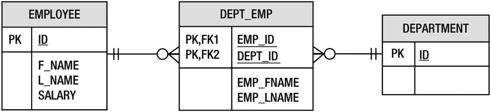

图 5-6

DEPARTMENT 和 EMPLOYEE 实体表以及 DEPT_EMP 连接表

从清单 5-17 可以看出，通过使用 `@AttributeOverride` 覆盖了键的默认映射。如果我们有一个 `Map` 中某个可嵌入类型的 `@ElementCollection`，而不是多对多关系，那么我们必须区分键和值。为此，我们需要根据要覆盖的可嵌入类型，在属性名称前加上 `key.` 或 `value.` 前缀。一个包含嵌入的 `EmployeeInfo` 类型的元素集合，并且具有与清单 5-17 中关系相同的键覆盖，将使用以下键前缀：

```
@ElementCollection
@AttributeOverrides({
@AttributeOverride(name="key.first_Name",
column=@Column(name="EMP_FNAME")),
@AttributeOverride(name="key.last_Name",
column=@Column(name="EMP_LNAME"))
})
private Map empInfos;
```

#### 以实体为键

您可能不愿意使用实体作为键，因为直觉上可能会认为这是一种资源密集型选项，具有更高的加载和管理成本。虽然在某些情况下确实如此，但并非总是如此。通常，您考虑用作键的实体可能已经在内存中，或者无论如何都需要用到，而将其用作键要么只是访问一个缓存的实例，要么导致该实例被加载以供后续使用。

以实体类型为键的一个优点是实体实例是全局唯一的（在持久化单元内），因此不会在不同关系或集合之间出现任何标识问题。实体基本标识属性的一个推论是，只需要在映射表中存储一个外键，从而产生更规范化的设计和数据存储模式。

与其他类型的 `Map` 键一样，键（在本例中是指向被用作键的实体的外键）将存储在映射所引用的表中。

回想一下，Jakarta Persistence 用来表示外键列的术语是连接列，我们在多对一和一对一关系以及集合值关系的连接表中都使用连接列。现在我们遇到了类似的情况，不同之处在于，我们的连接列不是指向关系的目标，而是指向 `Map` 条目中的实体键。为了区分指向映射键的连接列和关系中使用的连接列，创建了一个单独的 `@MapKeyJoinColumn` 注解。此注解用于覆盖实体键的连接列默认值。当未指定时，连接列将具有与基本键相同的默认列名（关系或元素集合属性的名称，后跟字符串 `_KEY`）。

为了说明实体用作键的情况，我们可以添加一个概念，即 `Employee` 在给定 `Department` 中的资历。我们希望 `Employee` 与其资历之间存在松散关联，并且该资历必须局限于某个 `Department`。通过在 `Department` 中定义一个元素集合 `Map`，以资历作为值，`Employee` 实体作为键，就可以使用 `Employee` 实例作为键来查找任何 `Employee` 在给定 `Department` 中的资历。资历存储在集合表中，如果某个 `Employee` 更换了部门，则其他 `Employee` 对象无需更改。集合表的间接性，以及 `Department`、`Employee` 和资历值之间的连接都通过 `Map` 来维护，这提供了恰到好处的耦合度。只需要更新集合表中的条目即可。

清单 5-18 展示了元素集合映射，其中连接列使用 `@MapKeyJoinColumn` 注解进行覆盖，`Map` 值列使用标准的 `@Column` 注解进行覆盖。

```
@Entity
public class Department {
@Id private int id;
private String name;
// ...
@ElementCollection
@CollectionTable(name="EMP_SENIORITY")
@MapKeyJoinColumn(name="EMP_ID")
@Column(name="SENIORITY")
private Map seniorities;
// ...
}
清单 5-18
以实体类型为键的元素集合 Map
```

图 5-7 显示，集合表不过是 `Map` 的值（资历），以及一个指向 `Department` 源实体表的外键和另一个指向 `Employee` 实体键表的外键。

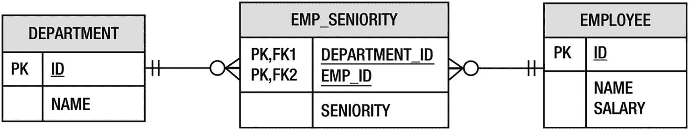

图 5-7

DEPARTMENT 和 EMPLOYEE 实体表以及 EMP_SENIORITY 集合表


#### 无类型映射

如果我们不想（或无法）使用 `Map<KeyType, ValueType>` 的类型化参数版本，则可以使用清单 5-19 中所示的非参数化风格的 `Map` 来定义它。

```
@Entity
public class Department {
// ...
@OneToMany(targetEntity=Employee.class, mappedBy="department")
@MapKey
private Map employees;
// ...
}
清单 5-19
使用非参数化 Map 的一对多关系
```

`targetEntity` 元素仅指示 `Map` 值的类型。当然，如果 `Map` 持有的是元素集合而非关系，则使用 `@ElementCollection` 的 `targetClass` 元素来指示 `Map` 的值类型。

在清单 5-19 中，`Map` 键的类型可以轻松推断，因为该映射是一个实体关系。`@MapKey` 默认使用类型为 `int` 或 `Integer` 的标识符属性 `id`。如果指定了 `@MapKey` 并要求键是一个非标识符属性，则类型仍然可以推断，因为实体属性都已映射为已知类型。但是，如果键不是目标实体的属性，则可以使用 `@MapKeyClass` 代替 `@MapKey`。当 `Map` 未使用泛型以类型化方式定义时，它指示键类的类型。当 `Map` 引用的是元素集合而非关系时，也会使用它，因为基本类型或可嵌入类型没有标识符属性，而基本类型甚至没有属性。

为了说明如何使用 `@MapKeyClass`，我们以清单 5-7 中的元素集合为例，并假设它没有在 `Map` 上定义类型参数。通过使用 `@MapKeyClass` 注解和 `@ElementCollection` 中的 `targetClass` 元素来填充类型，如清单 5-20 所示。

```
@Entity
public class Employee {
@Id private int id;
private String name;
private long salary;
@ElementCollection(targetClass=String.class)
@CollectionTable(name="EMP_PHONE")
@MapKeyColumn(name="PHONE_TYPE")
@MapKeyClass(String.class)
@Column(name="PHONE_NUM")
private Map phoneNumbers;
// ...
}
清单 5-20
具有字符串键的无类型字符串元素集合
```

每当无法从属性定义或其他映射元数据中推断出键类时，都应使用 `@MapKeyClass` 注解。

#### Map 的规则

鉴于你可以从三种不同类型的键和三种不同类型的值中进行选择，了解各种 `Map` 变体可能会变得有些混乱。以下是使用 `Map` 的一些基本规则：

*   当使用无类型 `Map` 时，使用关系映射和元素集合映射中的 `@MapKeyClass` 和 `targetEntity`/`targetClass` 元素来指定类。

*   对于以目标实体的属性为键的一对多或多对多关系 `Map`，使用 `@MapKey`。

*   使用 `@MapKeyJoinColumn` 覆盖实体键的连接列。

*   使用 `@Column` 覆盖存储基本类型元素集合值的列。

*   当以基本类型为键时，使用 `@MapKeyColumn` 覆盖存储键的列。

*   如果需要进一步限定作为时态或枚举类型的基本键，请使用 `@MapKeyTemporal` 和 `@MapKeyEnumerated`。

*   使用带有 `key.` 或 `value.` 前缀的 `@AttributeOverride`，分别覆盖作为 `Map` 键或值的可嵌入属性类型的列。

表 5-1 总结了使用 `Map` 的一些不同方面。

表 5-1

映射 Map 的总结

| Map | 映射 | 键注解 | 值注解 |
| --- | --- | --- | --- |
| `Map<Basic,Basic>` | `@ElementCollection` | `@MapKeyColumn,``@MayKeyEnumerated,``@MapKeyTemporal` | `@Column` |
| `Map<Basic,Embeddable>` | `@ElementCollection` | `@MapKeyColumn,``@MayKeyEnumerated,``@MapKeyTemporal` | 由可嵌入类型映射，`@AttributeOverride,``@AssociationOverride` |
| `Map<Basic,Entity>` | `@OneToMany, @ManyToMany` | `@MapKey,``@MapKeyColumn,``@MayKeyEnumerated,``@MapKeyTemporal` | 由实体映射 |
| `Map<Embeddable,Basic>` | `@ElementCollection` | 由可嵌入类型映射，`@AttributeOverride` | `@Column` |
| `Map<Embeddable,Embeddable>` | `@ElementCollection` | 由可嵌入类型映射，`@AttributeOverride` | 由可嵌入类型映射，`@AttributeOverride,``@AssociationOverride` |
| `Map<Embeddable,Entity>` | `@OneToMany, @ManyToMany` | 由可嵌入类型映射，`@AttributeOverride` | 由实体映射 |
| `Map<Entity,Basic>` | `@ElementCollection` | `@MapKeyJoinColumn` | `@Column` |
| `Map<Entity,Embeddable>` | `@ElementCollection` | `@MapKeyJoinColumn` | 由可嵌入类型映射，`@AttributeOverride,``@AssociationOverride` |
| `Map<Entity,Entity>` | `@OneToMany, @ManyToMany` | `@MapKeyJoinColumn` | 由实体映射 |


### 重复项

在讨论 `Set` 接口时，我们提到它非常适合防止重复。我们的意思是 Java 中的 `Set` 数据类型不允许重复。我们并没有真正讨论数据库中的重复项。事实上，Jakarta Persistence 规范并未说明集合中是否允许重复项，无论是在数据库中还是在内存中，并且在大多数情况下，它们都不被支持。为了理解为什么支持重复项很困难，让我们深入数据模型，揭示一些令人头疼的细节。如果你对重复项不感兴趣，可以跳过本节。然而，如果你遇到外部应用程序可能在背后插入重复记录的情况，请继续阅读。

注意

请记住，为目标表设置唯一外键意味着我们的集合（例如 `List`）不能包含重复项。

`Collection` 接口非常通用，允许存在多种 `Collection` 子接口和实现类。因此，它在是否允许重复项方面的规范非常宽松，而是让子接口或实现类自行决定哪种行为最适合该 `Collection` 类型。

对于确实允许重复项的 `Collection`，集合值关系映射要么使用目标实体表中的外键，要么使用连接表。第一种情况始终是一对多映射，在这种情况下，目标实体只有一行，并且该行中只有一列包含指向源实体的外键。这无法捕获目标实体在集合中出现多次的事实。

在连接表的情况下，每一行存储一个指向源实体的连接列和一个指向目标实体的连接列，并且连接表的主键由这两列组合而成。只有该模型中的重复行才能将目标实体的多个实例链接到同一个源，而关系数据库中的重复行是非常不受欢迎的。

元素集合的情况类似，不同之处在于，集合表中不是存储指向目标实体的外键，而是存储一个或多个列来保存基本类型或可嵌入类型的值。这些列与指向源实体的外键结合构成主键，并且再次需要重复行才能在集合中包含重复值。

然而，持久化有序的 `List` 略有不同，因为它增加了一个排序列。如果将排序列作为主键的一部分，那么 `List` 中可以存在多个关系条目——每个条目对应的行可能具有相同的元素值数据和外键引用，但仅排序列的值不同。因此，行的唯一性不仅由源对象和目标对象标识，还由其在该 `List` 中的位置标识。

对于目标表中的外键情况，将排序列包含在实体表的主键中确实是一种不好的做法，因此我们甚至不会将其作为一种选项来探讨。然而，当使用连接表或集合表时，这样做是完全合理的，允许在持久化有序的 `List` 中插入重复值。不过，这只有在提供者将排序列包含在表的主键中，或者允许你以这种方式配置时才有可能。

在你为提供者可能允许存储重复项而高兴之前，请注意这是有代价的。这可以在交换 `List` 中两个元素顺序的例子中看到。如果排序列只是一个普通列，提供者可以通过简单地用正确的值更新两条记录的排序列来优化数据库操作，这并不难实现。然而，如果排序列是主键的一部分，那么你实际上是在说，`List` 中包含对象的顺序是包含对象与被包含对象之间关系的一个组成部分。为被包含对象分配一个新顺序并不是修改关系的一个方面，而是有效地销毁旧关系并创建一个具有不同顺序的新关系。这意味着删除两个旧行并创建两个新行。

`Map` 的键必须是唯一的，因此重复键显然没有意义。然而，就值而言，它类似于 `List`，因为它有一个可以作为主键一部分的键列。再次强调，目标表中的外键情况不允许多个键指向同一个实体，因此以这种方式映射的一对多关系根本不允许同一个实体映射到同一个 `Map` 中的多个键。

对于连接表和集合表，只有当 `Map` 的键不是实体或可嵌入对象的属性，并且键列包含在主键中时，才可能允许重复值。`Map` 的情况与我们在 `List` 中讨论的情况类似，不同之处在于，允许 `Map` 中存在重复值的代价是在你想将现有键重新分配给不同值时付出的。

### 空值

在集合中插入空值可能比出现重复项更不常见。这也是 Jakarta Persistence 规范对于在集合中插入空值时会发生什么没有特别明确说明的原因之一。与重复项一样，情况有些复杂，需要单独考虑。

`Set`、`List` 和 `Map` 接口与 `Collection` 接口一样，在指定插入空值时会发生什么方面都足够通用，以至于模棱两可。它们只是将决定权委托给实现，因此实现类可能会选择支持插入空值，或者抛出异常。Jakarta Persistence 也没有做得更好；最终取决于特定供应商的代理实现，要么允许空值，要么在添加空值时抛出 `NullPointerException`。请注意，你不能仅仅通过使用允许空值的实现实例（例如 `HashSet`）来初始化集合，就使你的集合接口允许空值。当下次对象变为受管状态时，提供者将用其自己的实现类替换该实例，而新的实现类可能允许也可能不允许空值。

为了使空值能够存在于数据库中，值列必须可为空。这是显而易见的部分，但推论可能不那么明显，尽管有点重复。它再次声称，只有使用连接表或集合表的关系和元素集合才能在集合中包含空值。证明留给你自己解决，但（作为提示）尝试创建一个所有值（包括标识符）都为空且没有标识符生成的实体。

对于可嵌入对象的元素集合，空值还有进一步的限制。连接表中的实体引用或集合表中的基本类型元素集合是单列值或引用。可嵌入对象情况下的问题是，如果映射到可嵌入对象的一组列全部为空，提供者无法知道这表示一个空值还是一个充满空值的空可嵌入对象。提供者可能会假设它是一个空的嵌入对象，或者它们可能有一个可控制的选项来决定空值是否被以一种或另一种方式处理。

`Map` 对于是否允许空键同样不置可否，但这确实与键列作为主键字段的模型不太吻合。大多数数据库不允许主键字段之一可为空，即使对于少数允许的数据库，我们也不推荐这样做。


## 最佳实践

鉴于已经涌现出众多选项和可能性，如果我们不为孤独的集合旅行者提供至少一些指导，那确实是一种失职。当然，之所以有这么多选项，是因为有太多不同的场景需要解决，因此制定硬性且快速的规则并不合适。不过，一些通用指南有望帮助你为特定的应用场景选择正确的映射策略：

*   使用`List`时，如果你没有实际指定任何排序，不要假设它会自动有序。`List`的顺序可能受数据库结果影响，而数据库结果在排序方式上仅具有部分确定性。无法保证这种排序在多次执行中保持一致。

*   通常可以通过对象自身的某个属性来对其进行排序。与必须通过更新特定排序列来维护内部元素顺序的持久化`List`相比，使用`@OrderBy`注解始终是最佳方法。仅在别无他法时才使用排序列。

*   `Map`类型非常有用，但正确配置它们可能相对复杂。然而，一旦你掌握了这一阶段，它们所提供的建模能力以及可加以利用的松散关联支持，使其成为各种关系和元素集合的理想选择。

*   与`List`类似，使用`Map`的首选且最高效的方式是利用目标对象的某个属性作为键，这使得以基本属性类型为键的实体`Map`成为最常见且最有用的形式。它通常能解决你遇到的大部分问题。基本键和值的`Map`可以成为将一个基本对象与另一个基本对象关联起来的有用配置。

*   避免在`Map`中使用嵌入对象，尤其是作为键，因为它们的标识通常未定义。一般来说，应谨慎对待可嵌入对象，并仅在绝对必要时使用。

*   不保证集合支持重复值或空值，即使可能也不推荐使用。它们会导致对集合类型的某些操作变慢且更消耗数据库资源，有时甚至相当于记录删除和插入的组合，而非简单的更新。

## 总结

在本章中，我们更深入地探讨了将集合映射到数据库的各种方法。我们研究了集合的内容如何决定其映射方式，并指出在各类集合中存储不同类型对象有许多灵活的选项。

我们说明了关系与元素集合之间的区别在于其中存储的是实体还是基本/可嵌入类型。接着，我们考察了不同类型的集合，以及如何将`Collection`和`Set`用于简单的容器目的，而`List`可用于维护有序集合。我们展示了使用`List`的两种不同方法，并指出维护持久化`List`是可行的，但通常并非最佳策略。

然后，我们详细阐述了所有`Map`类型，解释了如何将基本类型、可嵌入类型和实体类型的组合用作键和值。我们尝试并展示了使用多种不同键值类型组合的示例，说明了每种组合如何改变集合的映射方式。接着，我们以列表形式概述了使用`Map`类型的基本规则。

最后，我们通过探讨向集合中添加重复值和空值这些边界情况来结束集合部分，并概述了可能提供支持的情况。随后给出了一些使用集合的最佳实践和实用指南。

下一章将讨论以比之前更高级的方式使用实体管理器和持久化上下文，深入探讨在 Jakarta EE 和 Java SE 环境中注入和使用它们的实践与细微差别。

脚注 1   2   3

# 6. 实体管理器

实体在创建时并不会自行持久化，也不会在垃圾回收时从数据库中自行移除。必须由应用程序的逻辑来操作实体，以管理其持久化生命周期。为此，Jakarta Persistence 提供了`EntityManager`接口，让应用程序能够管理关系数据库中的实体并进行搜索。

起初，这看起来像是 Jakarta Persistence 的一个限制。如果持久化运行时知道哪些对象是持久的，为什么应用程序还要参与这个过程？请放心，这种设计是经过深思熟虑的，并且对应用程序而言，比任何透明持久化解决方案都更有益。持久化是应用程序与持久化提供者之间的协作。Jakarta Persistence 带来了控制力和灵活性，如果没有应用程序的积极参与，这是无法实现的。

在第 2 章中，我们介绍了`EntityManager`接口，并描述了它为操作实体提供的一些基本操作。我们在第 3 章中扩展了该讨论，概述了 Jakarta EE 环境以及影响持久化应用程序的服务类型。最后，在第 4 章和第 5 章中，我们描述了对象-关系映射，这是从对象构建实体的关键。有了这些基础，我们准备重新审视实体管理器、持久化上下文和持久化单元，并开始更深入地讨论这些概念。

## 持久化上下文

让我们首先重新介绍 Jakarta Persistence 的核心术语。*持久化单元*是实体类的命名配置。持久化上下文是一组受管理的实体实例。每个持久化上下文都与一个持久化单元相关联，将受管理实例的类限制在持久化单元定义的集合内。说一个实体实例是*受管理的*，意味着它包含在持久化上下文中，并且可以由实体管理器进行操作。正因如此，我们说实体管理器管理着一个持久化上下文。

理解持久化上下文是理解实体管理器的关键。实体是否包含在持久化上下文中，将决定对其执行的任何持久化操作的结果。如果持久化上下文参与事务，受管理实体的内存状态将与数据库同步。然而，尽管持久化上下文扮演着重要角色，但它实际上对应用程序是不可见的。我们总是通过实体管理器间接访问它，并在需要时假定它存在。

到目前为止一切顺利，但持久化上下文是如何创建的，又是在何时发生的？实体管理器在其中的作用是什么？这正是事情开始变得有趣的地方。

## 实体管理器

到目前为止，我们仅在 Java SE 和 Jakarta EE 环境中演示了基本的实体管理器操作。然而，我们现在已经达到了可以最终揭示实体管理器全部配置的阶段。Jakarta Persistence 定义了至少三种不同类型的实体管理器，每种都有不同的持久化上下文管理方法，以适应不同的应用程序需求。正如你将看到的，持久化上下文只是整个谜题的一部分。


### 容器管理实体管理器

在 Jakarta EE 环境中，获取实体管理器最常见的方式是使用 `@PersistenceContext` 注解注入一个。通过这种方式获得的实体管理器被称为*容器管理*的，因为容器负责管理实体管理器的生命周期，通常是通过代理从持久化提供者那里获取的实体管理器。应用程序无需创建或关闭它。这正是我们在第 3 章中演示的实体管理器风格。

容器管理的实体管理器有两种类型。容器管理实体管理器的风格决定了它如何处理持久化上下文。第一种也是最常见的风格称为*事务范围*。这意味着实体管理器管理的持久化上下文的作用域由活动的 Jakarta Transactions 事务界定，并在事务完成时结束。第二种风格称为*扩展*。扩展实体管理器与单个持久化上下文协同工作，该持久化上下文与有状态会话 Bean 的生命周期绑定，其作用域限定于该有状态会话 Bean 的生命周期，可能跨越多个事务。

请注意，默认情况下，与 Jakarta Transactions 实体管理器关联且在活动事务范围内创建的应用程序管理持久化上下文，将自动加入该事务。

#### 事务范围

到目前为止，我们在 Jakarta EE 环境中展示的所有实体管理器示例都是事务范围的实体管理器。每当解析由 `@PersistenceContext` 注解创建的引用时，都会返回一个事务范围的实体管理器。正如我们在第 3 章中提到的，事务范围的实体管理器是无状态的，这意味着它可以安全地存储在任何 Jakarta EE 组件上。由于容器为我们管理它，因此它基本上也是免维护的。

让我们再次介绍一个使用事务范围实体管理器的无状态会话 Bean。清单 6-1 展示了一个管理项目信息的会话 Bean 的 Bean 类。实体管理器通过 `@PersistenceContext` 注解注入到 `em` 字段中，然后在 Bean 的业务方法中使用。

```
@Stateless
public class ProjectService {
@PersistenceContext(unitName="EmployeeService")
EntityManager em;
public void assignEmployeeToProject(int empId, int projectId) {
Project project = em.find(Project.class, projectId);
Employee employee = em.find(Employee.class, empId);
project.getEmployees().add(employee);
employee.getProjects().add(project);
}
// ...
}
清单 6-1
ProjectService 会话 Bean
```

我们将事务范围的实体管理器描述为无状态的。如果是这样，它如何与持久化上下文协同工作呢？答案在于 Jakarta Transactions 事务。所有容器管理的实体管理器都依赖于 Jakarta Transactions 事务，因为它们可以将事务用作跟踪持久化上下文的一种方式。每次在实体管理器上调用操作时，该实体管理器的容器代理都会检查是否有持久化上下文与容器的 Jakarta Transactions 事务关联。如果找到，实体管理器将使用此持久化上下文。如果没有找到，它会创建一个新的持久化上下文并将其与事务关联。当事务结束时，持久化上下文也随之消失。

让我们通过一个示例来了解。考虑清单 6-1 中的 `assignEmployeeToProject()` 方法。该方法首先使用 `find()` 操作搜索 `Employee` 和 `Project` 实例。当第一个 `find()` 方法被调用时，容器会检查事务。默认情况下，容器会确保在会话 Bean 方法启动时有一个活动事务，因此此示例中的实体管理器会找到一个准备好的事务。然后它检查持久化上下文。这是第一次进行实体管理器调用，因此还没有持久化上下文。实体管理器创建一个新的持久化上下文，并使用它来查找项目。

当实体管理器用于搜索员工时，它会再次检查事务，这次找到了它在搜索项目时创建的那个事务。然后它重用此持久化上下文来搜索员工。此时，`employee` 和 `project` 都是受管理的实体实例。然后将员工添加到项目中，同时更新 `employee` 和 `project` 实体。当方法调用结束时，事务被提交。由于 `employee` 和 `project` 实例是受管理的，持久化上下文可以检测到它们中的任何状态变化，并在提交期间更新数据库。当事务结束时，持久化上下文也随之消失。

每次在一个事务内调用一个或多个实体管理器操作时，都会重复此过程。


#### 扩展

为了描述扩展实体管理器，我们首先需要简单谈谈有状态会话 Bean。正如你在第 3 章所学到的，有状态会话 Bean 被设计用来保存会话状态。一旦被客户端获取，同一个 Bean 实例将在整个会话生命周期内被使用，直到客户端调用 Bean 上标记了 `@Remove` 的方法之一。当会话处于活动状态时，客户端的业务方法可以使用 Bean 的字段来存储和访问信息。

让我们尝试使用一个有状态会话 Bean 来帮助管理一个部门。我们的目标是为 `Department` 实体创建一个业务对象，该对象提供与该实体相关的业务操作。清单 6-2 展示了我们的首次尝试。客户端调用业务方法 `init()` 来初始化部门 ID。然后我们将这个部门 ID 存储在 Bean 实例上，`addEmployee()` 方法使用它来查找部门并进行必要的更改。从客户端的角度来看，他们只需设置一次部门 ID，后续操作就始终引用同一个部门。

```
@Stateful
public class DepartmentManager {
@PersistenceContext(unitName="EmployeeService")
EntityManager em;
int deptId;
public void init(int deptId) {
this.deptId = deptId;
}
public void setName(String name) {
Department dept = em.find(Department.class, deptId);
dept.setName(name);
}
public void addEmployee(int empId) {
Department dept = em.find(Department.class, deptId);
Employee emp = em.find(Employee.class, empId);
dept.getEmployees().add(emp);
emp.setDepartment(dept);
}
// ...
@Remove
public void finished() {
}
}
清单 6-2
部门管理器 Bean 的首次尝试
```

查看这个 Bean 时，首先应该注意到的一点是，每次都要查找部门似乎没有必要。毕竟，我们已经有了部门 ID，为什么不直接存储 `Department` 实体实例呢？清单 6-3 修改了我们的首次尝试，在 `init()` 方法中只查找一次部门，然后在每个业务方法中重用该实体实例。

```
@Stateful
public class DepartmentManager {
@PersistenceContext(unitName="EmployeeService")
EntityManager em;
Department dept;
public void init(int deptId) {
dept = em.find(Department.class, deptId);
}
public void setName(String name) {
dept.setName(name);
}
public void addEmployee(int empId) {
Employee emp = em.find(Employee.class, empId);
dept.getEmployees().add(emp);
emp.setDepartment(dept);
}
// ...
@Remove
public void finished() {
}
}
清单 6-3
部门管理器 Bean 的第二次尝试
```

这个版本看起来更适合有状态会话 Bean 的能力。重用 `Department` 实体实例而不是每次都查找它，当然更加自然。但这里有一个问题。清单 6-3 中的实体管理器是事务范围的。假设客户端没有活动事务，Bean 上的每个方法都将启动并提交一个新事务，因为每个方法的默认事务属性是 `REQUIRED`。由于每个方法都有一个新事务，实体管理器每次都会使用不同的持久化上下文。

即使 `Department` 实例仍然存在，当与 `init()` 调用关联的事务结束时，之前用于管理它的持久化上下文也就消失了。在这种情况下，我们将 `Department` 实体称为从持久化上下文中*分离*。该实例仍然存在并且可以使用，但对其状态的任何更改都将被忽略。例如，调用 `setName()` 会更改实体实例中的名称，但这些更改永远不会反映到数据库中。

这正是扩展实体管理器设计要解决的情况。它专门为有状态会话 Bean 设计，防止实体在事务结束时变为分离状态。在我们深入探讨之前，先介绍部门管理器 Bean 的第三次也是最后一次尝试。清单 6-4 展示了我们之前的示例更新为使用扩展持久化上下文。

```
@Stateful
public class DepartmentManager {
@PersistenceContext(unitName="EmployeeService",
type=PersistenceContextType.EXTENDED)
EntityManager em;
Department dept;
public void init(int deptId) {
dept = em.find(Department.class, deptId);
}
public void setName(String name) {
dept.setName(name);
}
public void addEmployee(int empId) {
Employee emp = em.find(Employee.class, empId);
dept.getEmployees().add(emp);
emp.setDepartment(dept);
}
// ...
@Remove
public void finished() {
}
}
清单 6-4
使用扩展实体管理器
```

如你所见，我们只更改了一行。我们在第 3 章中介绍的 `@PersistenceContext` 注解有一个特殊的 `type` 属性，可以设置为 `TRANSACTION` 或 `EXTENDED`。这些常量由 `PersistenceContextType` 枚举类型定义。`TRANSACTION` 是默认值，对应于我们到目前为止一直在使用的事务范围实体管理器。`EXTENDED` 意味着应该使用扩展实体管理器。

做了这个更改后，部门管理器 Bean 现在按预期工作了。扩展实体管理器在有状态会话 Bean 实例创建时创建一个持久化上下文，该上下文一直持续到 Bean 被移除。与事务范围实体管理器的持久化上下文（从事务开始到事务结束）不同，扩展实体管理器的持久化上下文将持续整个会话的时长。由于 `Department` 实体仍然由同一个持久化上下文管理，因此只要在事务中使用它，任何更改都会自动写入数据库。

扩展持久化上下文允许以更适合其能力的方式编写有状态会话 Bean。稍后我们将讨论扩展实体管理器在事务管理方面的特殊限制，但总的来说，它们非常适合我们在此展示的这类示例。


### 应用程序管理的实体管理器

在第 2 章中，我们通过一个使用 Java SE 编写的示例介绍了 Jakarta Persistence。该示例中的实体管理器，以及任何通过 `EntityManagerFactory` 实例的 `createEntityManager()` 调用创建的实体管理器，就是我们所说的*应用程序管理*的实体管理器。这个名称源于应用程序（而非容器）管理实体管理器的生命周期这一事实。请注意，所有打开的实体管理器，无论是容器管理的还是应用程序管理的，都与一个 `EntityManagerFactory` 实例相关联。用于创建实体管理器的工厂可以通过 `EntityManager` 接口上的 `getEntityManagerFactory()` 调用来获取。

尽管我们预计大多数应用程序将使用容器管理的实体管理器来编写，但应用程序管理的实体管理器仍然有其作用。它们是 Java SE 中唯一可用的实体管理器类型，并且正如您将看到的，它们也可以在 Jakarta EE 中使用。

创建一个应用程序管理的实体管理器非常简单。您只需要一个 `EntityManagerFactory` 来创建实例。对于应用程序管理的实体管理器，Java SE 和 Jakarta EE 的区别不在于如何创建实体管理器，而在于如何获取工厂。清单 6-5 演示了如何使用 `Persistence` 类来引导一个 `EntityManagerFactory` 实例，然后使用该实例创建实体管理器。

```
public class EmployeeClient {
public static void main(String[] args) {
EntityManagerFactory emf =
Persistence.createEntityManagerFactory("EmployeeService");
EntityManager em = emf.createEntityManager();
List emps = em.createQuery("SELECT e FROM Employee e")
.getResultList();
for (Employee e : emps) {
System.out.println(e.getId() + ", " + e.getName());
}
em.close();
emf.close();
}
}
清单 6-5
Java SE 中的应用程序管理的实体管理器
```

`Persistence` 类提供了同一个 `createEntityManager()` 方法的两种变体，可用于为给定的持久化单元名称创建 `EntityManagerFactory` 实例。第一种，仅指定持久化单元名称，返回使用 `persistence.xml` 文件中定义的默认属性创建的工厂。第二种方法调用形式允许传入一个属性映射，以添加或覆盖 `persistence.xml` 中指定的属性。当所需的 JDBC 属性可能在应用程序启动时（例如通过命令行参数提供的信息）才可知时，这种形式非常有用。实体管理器的活动属性集可以通过 `EntityManager` 接口上的 `getProperties()` 方法来确定。我们将在第 14 章中讨论持久化单元属性。

在 Jakarta EE 中创建应用程序管理的实体管理器的最佳方法是使用 `@PersistenceUnit` 注解来声明对持久化单元的 `EntityManagerFactory` 的引用。一旦获取到工厂，就可以用它来创建实体管理器，其使用方式与在 Java SE 中相同。清单 6-6 演示了将 `EntityManagerFactory` 注入到 Servlet 中，并使用它创建一个短生命周期的实体管理器来验证用户 ID。

```
public class LoginServlet extends HttpServlet {
@PersistenceUnit(unitName="EmployeeService")
EntityManagerFactory emf;
protected void doPost(HttpServletRequest request,
HttpServletResponse response) {
String userId = request.getParameter("user");
// 检查有效用户
EntityManager em = emf.createEntityManager();
try {
User user = em.find(User.class, userId);
if (user == null) {
// 返回错误页面
// ...
}
} finally {
em.close();
}
// ...
}
}
清单 6-6
Jakarta EE 中的应用程序管理的实体管理器
```

这两个示例的一个共同点是，当不再需要实体管理器时，会通过 `close()` 调用显式地关闭它。这是实体管理器的生命周期要求之一，在应用程序管理的实体管理器的情况下必须手动执行；而容器管理的实体管理器通常会自动处理。同样，`EntityManagerFactory` 实例也必须关闭，但仅限于 Java SE 应用程序中。在 Jakarta EE 中，容器会自动关闭工厂，因此不需要额外的步骤。

在 Jakarta EE 10 中，`EntityManager` 和 `EntityManagerFactory` 都已经扩展了 `AutoCloseable` 接口，允许它们在 `try-with-resources` 语句中使用。虽然总是使用此语句而不是通常更冗长的普通 `try` 语句可能很诱人，但理解这两种语句在处理异常以及可能的 `catch` 和 `finally` 块执行顺序方面的差异非常重要。在普通的 `try` 语句中，`catch` 和 `finally` 块按照它们在代码中声明的顺序运行。这允许在关闭 `EntityManager` 或 `EntityManagerFactory` 之前执行额外的步骤，例如，在关闭 `EntityManager` 之前执行事务回滚。在 `try-with-resources` 语句中，当执行到达 `catch` 或 `finally` 块时，资源已经关闭。

就持久化上下文而言，应用程序管理的实体管理器类似于扩展的容器管理的实体管理器。当创建应用程序管理的实体管理器时，它会创建自己的私有持久化上下文，该上下文一直持续到实体管理器关闭。这意味着实体管理器管理的任何实体都将保持这种状态，独立于任何事务。

应用程序管理的实体管理器在 Jakarta EE 中的作用有些特殊。如果某个操作需要资源本地事务，那么应用程序管理的实体管理器是唯一可以在服务器内配置为该事务类型的实体管理器。正如我们在下一节中所述，扩展实体管理器的事务要求可能使它们在某些情况下难以处理。应用程序管理的实体管理器可以安全地用于有状态会话 Bean，以实现类似的目标。


## 事务管理

开发持久化应用不仅涉及对象关系映射，同样也离不开事务管理。事务定义了何时将新建、修改或删除的实体同步到数据库。理解持久化上下文如何与事务交互，是使用 Jakarta Persistence 的基础。

请注意，我们说的是持久化上下文，而非实体管理器。实体管理器有多种不同类型，但它们在内部都使用一个持久化上下文。实体管理器的类型决定了持久化上下文的生命周期，但当所有持久化上下文与事务关联时，其行为方式是一致的。

Jakarta Persistence 支持两种事务管理类型。第一种是资源本地事务，即持久化单元所引用的 JDBC 驱动程序的本地事务。第二种事务管理类型是 Jakarta 事务，即 Jakarta EE 服务器的事务，它支持多个参与资源、事务生命周期管理以及分布式 XA 事务。

容器管理的实体管理器始终使用 Jakarta 事务，而应用程序管理的实体管理器则可以使用其中任意一种类型。由于 Jakarta 事务在 Java SE 应用程序中通常不可用，因此提供者在该环境中只需支持资源本地事务。对于 Jakarta EE 应用程序，默认且首选的事务类型是 Jakarta 事务。正如我们在下一节中所述，将持久化上下文与 Jakarta 事务一起传播是企业持久化应用程序的一大优势。

事务类型是为持久化单元定义的，并通过 `persistence.xml` 文件进行配置。我们将在第 14 章讨论此设置及其应用方法。

### Jakarta 事务管理

要讨论 Jakarta 事务，我们首先必须区分事务同步、事务关联和事务传播这三个概念。*事务同步* 是指将持久化上下文注册到事务的过程，以便当事务提交时能够通知持久化上下文。提供者利用此通知来确保给定的持久化上下文被正确地刷新到数据库。*事务关联* 是将持久化上下文绑定到事务的行为。你也可以将其视为该事务范围内的*活动*持久化上下文。*事务传播* 是指在单个事务中，在多个容器管理的实体管理器之间共享持久化上下文的过程。

在一个 Jakarta 事务中，只能有一个持久化上下文与之关联并进行传播。同一事务中的所有容器管理实体管理器必须共享同一个传播的持久化上下文。

#### 事务范围的持久化上下文

顾名思义，事务范围的持久化上下文与事务的生命周期绑定。它由容器在事务期间创建，并在事务完成时关闭。事务范围的实体管理器负责在需要时自动创建事务范围的持久化上下文。我们之所以说“仅在需要时”，是因为事务范围持久化上下文的创建是*惰性的*。只有当实体管理器上调用了一个方法，并且当前没有可用的持久化上下文时，实体管理器才会创建一个持久化上下文。

当事务范围的实体管理器上调用一个方法时，它必须首先检查是否存在一个已传播的持久化上下文。如果存在，实体管理器将使用此持久化上下文来执行操作。如果不存在，实体管理器会向持久化提供者请求一个新的持久化上下文，然后在执行方法调用之前，将此新的持久化上下文标记为该事务的传播持久化上下文。此后，在此组件或任何其他组件中，所有后续的事务范围实体管理器操作都将使用这个新创建的持久化上下文。无论使用的是容器管理还是 Bean 管理的事务划分，此行为都独立生效。

持久化上下文的传播简化了企业应用程序的构建。当事务内的某个组件更新了一个实体时，后续对该同一实体的任何引用都将始终对应正确的实例，无论哪个组件获取了该实体引用。传播持久化上下文使开发者能够自由构建松耦合的应用程序，因为他们知道即使不共享同一个实体管理器实例，也总能获得正确的数据。

为了演示事务范围持久化上下文的传播，我们引入一个审计服务 Bean，它存储有关成功完成的事务的信息。清单 6-7 展示了完整的 Bean 实现。`logTransaction()` 方法通过尝试使用实体管理器查找员工来确保员工 ID 有效。

```
@Stateless
public class AuditService {
@PersistenceContext(unitName="EmployeeService")
EntityManager em;
public void logTransaction(int empId, String action) {
// 验证员工编号是否有效
if (em.find(Employee.class, empId) == null) {
throw new IllegalArgumentException("未知的员工 ID");
}
LogRecord lr = new LogRecord(empId, action);
em.persist(lr);
}
}
清单 6-7
AuditService 会话 Bean
```

现在考虑清单 6-8 中所示的 `EmployeeService` 会话 Bean 示例片段。在创建员工后，会调用 `AuditService` 会话 Bean 的 `logTransaction()` 方法来记录“已创建员工”事件。

```
@Stateless
public class EmployeeService {
@PersistenceContext(unitName="EmployeeService")
EntityManager em;
@EJB AuditService audit;
public void createEmployee(Employee emp) {
em.persist(emp);
audit.logTransaction(emp.getId(), "已创建员工");
}
// ...
}
清单 6-8
记录 EmployeeService 事务
```


尽管新创建的 `Employee` 尚未存入数据库，但审计 Bean 仍能找到该实体并验证其存在。这是因为这两个 Bean 实际上共享着同一个持久化上下文。`createEmployee()` 方法的默认事务属性为 `REQUIRED`，因为未显式设置任何属性。容器会保证在方法调用前启动一个事务。当对实体管理器调用 `persist()` 时，容器会检查是否已有持久化上下文与该事务关联。假设在此情况下，这是事务中的第一个实体管理器操作，因此容器会创建一个新的持久化上下文，并将其标记为传播的上下文。

当 `logTransaction()` 方法启动时，它会通过 `AuditService` 对实体管理器发起 `find()` 调用。由于事务属性同样为 `REQUIRED`，且容器已将 `createEmployee()` 中的容器管理事务扩展至该方法，因此我们保证处于事务中。当调用 `find()` 方法时，容器再次检查是否存在活跃的持久化上下文。它找到了在 `createEmployee()` 方法中创建的持久化上下文，并使用该持久化上下文搜索实体。由于新创建的 `Employee` 实例由该持久化上下文管理，因此成功返回。

现在考虑 `logTransaction()` 被声明为 `REQUIRES_NEW` 事务属性（而非默认的 `REQUIRED`）的情况。在 `logTransaction()` 方法调用开始前，容器会挂起从 `createEmployee()` 继承的事务，并启动一个新事务。当对实体管理器调用 `find()` 方法时，它会检查当前事务是否存在活跃的持久化上下文，结果发现不存在。从 `find()` 调用开始，将创建一个新的持久化上下文，并且该持久化上下文将成为 `logTransaction()` 调用剩余部分的活跃持久化上下文。由于 `createEmployee()` 中启动的事务尚未提交，新创建的 `Employee` 实例不在数据库中，因此对该新持久化上下文不可见。`find()` 方法将返回 `null`，从而导致 `logTransaction()` 方法抛出异常。

持久化上下文传播的经验法则是：持久化上下文随 Jakarta Transactions 事务的传播而传播。因此，理解事务何时开始和结束固然重要，但理解业务方法何时期望从另一个方法继承事务上下文，以及何时这样做是不正确的，同样至关重要。在应用程序中制定清晰的事务管理计划，是充分利用持久化上下文传播的关键。

#### 扩展持久化上下文

扩展持久化上下文的生命周期与其绑定的有状态会话 Bean 相关联。与每个事务都创建新持久化上下文的事务范围实体管理器不同，有状态会话 Bean 的扩展实体管理器始终使用同一个持久化上下文。有状态会话 Bean 与单个扩展持久化上下文关联，该上下文在 Bean 实例创建时创建，在 Bean 实例移除时关闭。这对扩展持久化上下文的关联和传播特性都有影响。

扩展持久化上下文的事务关联是*急切*的。在容器管理事务的情况下，一旦 Bean 上的方法调用开始，容器会自动将持久化上下文与事务关联。同样，在 Bean 管理事务的情况下，一旦在 Bean 方法内调用 `UserTransaction.begin()`，容器会拦截该调用并执行相同的关联。

由于事务范围实体管理器在创建新的持久化上下文之前，会优先使用与事务关联的现有持久化上下文，因此可以将扩展持久化上下文与其他事务范围实体管理器共享。只要在访问任何事务范围实体管理器之前传播了扩展持久化上下文，所有组件将共享同一个扩展持久化上下文。

与清单 6-8 中演示的审计 `EmployeeService` Bean 类似，考虑对 `DepartmentManager` 有状态会话 Bean 进行相同的修改，以在员工被添加到部门时进行审计。清单 6-9 展示了此示例。

```
@Stateful
public class DepartmentManager {
@PersistenceContext(unitName="EmployeeService",
type=PersistenceContextType.EXTENDED)
EntityManager em;
Department dept;
@EJB AuditService audit;
public void init(int deptId) {
dept = em.find(Department.class, deptId);
}
public void addEmployee(int empId) {
Employee emp = em.find(Employee.class, empId);
dept.getEmployees().add(emp);
emp.setDepartment(dept);
audit.logTransaction(emp.getId(),
"added to department " + dept.getName());
}
// ...
}
清单 6-9
记录部门变更
```

`addEmployee()` 方法的默认事务属性为 `REQUIRED`。由于容器会急切地关联扩展持久化上下文，当方法调用开始时，存储在会话 Bean 上的扩展持久化上下文会立即与事务关联。这将导致在事务提交时，受管理的 `Department` 和 `Employee` 实体之间的关系被持久化到数据库。这也意味着，该扩展持久化上下文现在将被 `addEmployee()` 调用的方法中使用的其他事务范围持久化上下文共享。

此示例中的 `logTransaction()` 方法将从 `addEmployee()` 继承事务上下文，因为其事务属性为默认的 `REQUIRED`，并且在调用 `addEmployee()` 期间事务处于活跃状态。当调用 `find()` 方法时，事务范围实体管理器会检查是否存在活跃的持久化上下文，并会找到来自 `DepartmentManager` 的扩展持久化上下文。然后它将使用此持久化上下文执行操作。扩展持久化上下文中的所有受管理实体对事务范围实体管理器变为可见。


##### 持久化上下文冲突

我们之前提到，一个 Jakarta Transactions 事务只能传播一个持久化上下文。同时，扩展持久化上下文总是会试图使自己成为活动持久化上下文。这可能导致两个持久化上下文相互冲突的情况。例如，考虑一个使用事务范围实体管理器的无状态会话 Bean 创建了一个新的持久化上下文，然后调用了一个使用扩展持久化上下文的有状态会话 Bean 的方法。在扩展持久化上下文急切关联的过程中，容器会检查是否已存在一个活动持久化上下文。如果存在，它必须与正在尝试关联的扩展持久化上下文相同，否则将抛出异常。在这个例子中，有状态会话 Bean 会发现由无状态会话 Bean 创建的事务范围持久化上下文，因此对有状态会话 Bean 方法的调用将失败。一个事务只能有一个活动持久化上下文。图 6-1 说明了这种情况。

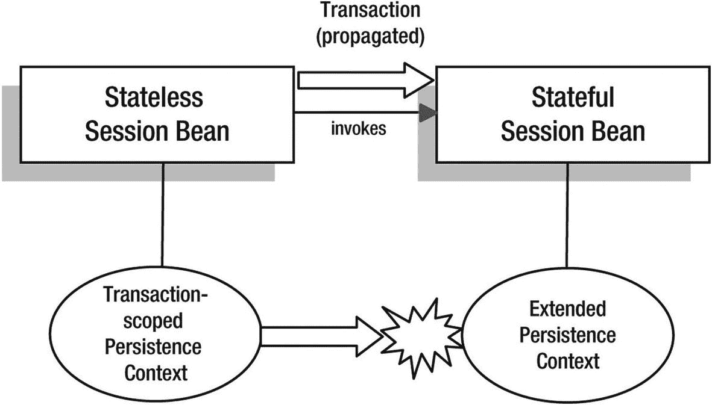

图 6-1

持久化上下文冲突

虽然当带有扩展持久化上下文的有状态会话 Bean 是调用链中第一个被调用的企业 Bean 时，扩展持久化上下文的传播很有用，但它限制了其他组件在也使用实体管理器的情况下调用该有状态会话 Bean 的场景。这种情况是否常见取决于你的应用程序架构，但在规划组件之间的依赖关系时需要牢记这一点。

解决此问题的一种方法是更改使用扩展持久化上下文的有状态会话 Bean 的默认事务属性。如果默认事务属性是 `REQUIRES_NEW`，任何活动事务将在有状态会话 Bean 方法启动前被挂起，从而允许其将扩展持久化上下文与新事务关联。如果该有状态会话 Bean 需要调用其他无状态会话 Bean 并传播持久化上下文，这是一个很好的策略。请注意，过度使用 `REQUIRES_NEW` 事务属性可能导致应用程序性能问题，因为会创建比正常情况下多得多的新事务，并且活动事务会被挂起和恢复。

如果该有状态会话 Bean 在很大程度上是自包含的，即它不调用其他会话 Bean，也不需要传播其持久化上下文，那么可以考虑使用默认事务属性类型 `NOT_SUPPORTED`。在这种情况下，任何活动事务将在有状态会话 Bean 方法启动前被挂起，但不会启动新事务。如果某些方法需要将数据写入数据库，可以覆盖这些方法以使用 `REQUIRES_NEW` 事务属性。

清单 6-10 重复展示了 `DepartmentManager` Bean，这次添加了一些 getter 方法和自定义事务属性。我们将默认事务属性设置为 `REQUIRES_NEW`，以便在调用业务方法时默认强制启动一个新事务。对于 `getName()` 方法，我们不需要新事务，因为没有进行任何更改，因此将其设置为 `NOT_SUPPORTED`。这将挂起当前事务，但不会导致创建新事务。通过这些更改，`DepartmentManager` Bean 可以在任何情况下被访问，即使已经存在一个活动持久化上下文。

```
@Stateful
@TransactionAttribute(TransactionAttributeType.REQUIRES_NEW)
public class DepartmentManager {
@PersistenceContext(unitName="EmployeeService",
type=PersistenceContextType.EXTENDED)
EntityManager em;
Department dept;
@EJB AuditService audit;
public void init(int deptId) {
dept = em.find(Department.class, deptId);
}
@TransactionAttribute(TransactionAttributeType.NOT_SUPPORTED)
public String getName() { return dept.getName(); }
public void setName(String name) { dept.setName(name); }
public void addEmployee(int empId) {
Employee emp = em.find(empId, Employee.class);
dept.getEmployees().add(emp);
emp.setDepartment(dept);
audit.logTransaction(emp.getId(),
"added to department " + dept.getName());
}
// ...
}
清单 6-10
自定义事务属性以避免冲突
```

最后，还有一个可选方案是使用应用程序管理的实体管理器，而不是扩展实体管理器。如果不需要传播持久化上下文，那么扩展实体管理器相对于应用程序管理的实体管理器并没有增加太多价值。有状态会话 Bean 可以安全地创建一个应用程序管理的实体管理器，将其存储在 Bean 实例上，并用于持久化操作，而无需担心活动事务是否已经有一个传播的持久化上下文。此技术的示例将在后面的“应用程序管理的持久化上下文”部分演示。

##### 持久化上下文继承

限制只有一个带有扩展持久化上下文的有状态会话 Bean 能够参与 Jakarta Transactions 事务，在某些情况下可能会造成困难。例如，我们在本章前面为扩展持久化上下文采用的模式是将实体的行为封装在有状态会话外观后面。在我们的示例中，客户端与 `DepartmentManager` 会话 Bean 交互，而不是与实际的 `Department` 实体实例交互。由于部门有一个经理，因此将此外观扩展到 `Employee` 实体也是合理的。

清单 6-11 显示了对 `DepartmentManager` Bean 的更改，使其 `getManager()` 方法返回一个 `EmployeeManager` Bean，以表示部门的经理。`EmployeeManager` Bean 被注入，并在调用 `init()` 方法期间进行初始化。

```
@Stateful
public class DepartmentManager {
@PersistenceContext(unitName="EmployeeService",
type=PersistenceContextType.EXTENDED)
EntityManager em;
Department dept;
@EJB EmployeeManager manager;
public void init(int deptId) {
dept = em.find(Department.class, deptId);
manager.init();
}
public EmployeeManager getManager() {
return manager;
}
// ...
}
清单 6-11
创建并返回一个有状态会话 Bean
```

`init()` 方法应该成功还是失败？根据我们目前所描述的内容，它看起来应该会失败。当在 `DepartmentManager` Bean 上调用 `init()` 时，其扩展持久化上下文将与事务一起传播。在随后对 `EmployeeManager` Bean 的 `init()` 调用中，它将尝试将其自身的扩展持久化上下文与事务关联，从而导致两者之间的冲突。

也许令人惊讶的是，这个例子实际上可以工作。当一个带有扩展持久化上下文的有状态会话 Bean 创建另一个也使用扩展持久化上下文的有状态会话 Bean 时，子 Bean 将继承父 Bean 的持久化上下文。当 `EmployeeManager` Bean 被注入到 `DepartmentManager` 实例中时，它继承了 `DepartmentManager` Bean 的持久化上下文。现在，这两个 Bean 可以在同一个事务中一起使用。


#### 应用程序管理的持久化上下文

与容器管理的持久化上下文类似，应用程序管理的持久化上下文可以与 Jakarta Transactions 事务同步。将持久化上下文与事务同步意味着，当事务提交时会发生刷新，但该持久化上下文不会被任何容器管理的实体管理器视为已关联。可以与一个事务同步的应用程序管理持久化上下文数量没有限制，但只会有一个容器管理的持久化上下文与之关联。这是应用程序管理与容器管理实体管理器之间最重要的区别之一。

应用程序管理的实体管理器通过以下两种方式之一参与 Jakarta Transactions 事务。如果持久化上下文是在事务内部创建的，持久化提供程序会自动将持久化上下文与事务同步。如果持久化上下文是更早创建的（在事务外部或在一个已结束的事务中），则可以通过调用 `EntityManager` 接口上的 `joinTransaction()` 方法手动将持久化上下文与事务同步。一旦同步，当事务提交时，持久化上下文将自动刷新。

清单 6-12 展示了清单 6-11 中 `DepartmentManager` 的一个变体，它使用了应用程序管理的实体管理器，而不是扩展的实体管理器。

```
@Stateful
public class DepartmentManager {
@PersistenceUnit(unitName="EmployeeService")
EntityManagerFactory emf;
EntityManager em;
Department dept;
public void init(int deptId) {
em = emf.createEntityManager();
dept = em.find(Department.class, deptId);
}
public String getName() {
return dept.getName();
}
public void addEmployee(int empId) {
em.joinTransaction();
Employee emp = em.find(Employee.class, empId);
dept.getEmployees().add(emp);
emp.setDepartment(dept);
}
// ...
@Remove
public void finished() {
em.close();
}
}
清单 6-12
在 Jakarta Transactions 中使用应用程序管理的实体管理器
```

我们没有注入实体管理器，而是注入了实体管理器工厂。在查找实体之前，我们使用工厂手动创建一个新的应用程序管理实体管理器。由于容器不管理其生命周期，我们必须在之后，当 bean 在调用 `finished()` 期间被移除时，将其关闭。与容器管理的扩展持久化上下文类似，`Department` 实体在调用 `init()` 之后仍保持受管状态。当调用 `addEmployee()` 时，多了一个额外的步骤，即调用 `joinTransaction()` 来通知持久化上下文，它应该与当前的 Jakarta Transactions 事务同步。如果没有这个调用，对部门的更改将不会在事务提交时刷新到数据库。

由于应用程序管理的实体管理器不会传播，与其他组件共享受管实体的唯一方法是共享 `EntityManager` 实例。这可以通过将实体管理器作为参数传递给本地方法，或者将实体管理器存储在公共位置（例如 HTTP 会话或单例 bean）中来实现。清单 6-13 演示了一个 servlet 创建应用程序管理的实体管理器，并使用它来实例化我们在第 2 章中定义的 `EmployeeService` 类。在这些情况下，必须注意确保以线程安全的方式访问实体管理器。虽然 `EntityManagerFactory` 实例是线程安全的，但 `EntityManager` 实例不是。此外，应用程序代码不得在多个并发事务中对同一个实体管理器调用 `joinTransaction()`。

```
public class EmployeeServlet extends HttpServlet {
@PersistenceUnit(unitName="EmployeeService")
EntityManagerFactory emf;
@Resource UserTransaction tx;
protected void doPost(HttpServletRequest request,
HttpServletResponse response)
throws ServletException, IOException {
// ...
int id = Integer.parseInt(request.getParameter("id"));
String name = request.getParameter("name");
long salary = Long.parseLong(request.getParameter("salary"));
tx.begin();
EntityManager em = emf.createEntityManager();
try {
EmployeeService service = new EmployeeService(em);
service.createEmployee(id, name, salary);
} finally {
em.close();
}
tx.commit();
// ...
}
}
清单 6-13
共享应用程序管理的实体管理器
```

清单 6-13 展示了在存在事务的情况下应用程序管理实体管理器的另一个特性。如果持久化上下文与事务同步，即使实体管理器已关闭，当事务提交时，更改仍会被写入数据库。这允许在创建实体管理器时就将其关闭，从而无需担心在事务结束后关闭它们。请注意，关闭应用程序管理的实体管理器仍然会阻止对该实体管理器的任何进一步使用。只有持久化上下文会持续存在，直到事务完成。

在同一个 Jakarta Transactions 事务中混合多个持久化上下文存在风险。当多个应用程序管理的持久化上下文与事务同步，或者应用程序管理的持久化上下文与容器管理的持久化上下文混合时，就会发生这种情况。当事务提交时，每个持久化上下文都会收到来自事务管理器的通知，告知应将更改写入数据库。这将导致每个持久化上下文都被刷新。

如果具有相同主键的实体在多个持久化上下文中被使用，会发生什么？实体的哪个版本会被存储？不幸的是，答案是无法确定。容器在通知持久化上下文事务完成时，不保证任何顺序。因此，*为了数据完整性，实体绝不能在同一事务中被多个持久化上下文使用，这一点至关重要。在设计应用程序时，我们建议选择一种* ***单一的持久化上下文策略*** *（容器管理或应用程序管理），并始终如一地坚持该策略。*


#### 非同步持久化上下文

通常情况下，Jakarta Transactions 实体管理器会与 Jakarta Transactions 事务同步，其管理的实体变更会在事务提交时保存。然而，清单 6-12 展示了一个例外情况：当在先前事务中创建的应用程序管理实体管理器需要显式地通过 `joinTransaction()` 调用加入后续事务，才能使其管理的实体变更被事务性地提交。事实证明，还存在另一种具有类似行为的持久化上下文选项。实体管理器可以被显式指定为拥有非同步持久化上下文，这要求它手动加入任何它想要参与的 Jakarta Transactions 事务。

在描述如何配置和使用这种机制之前，我们首先应该说明其存在的一些动机。为什么在种类繁多的实体管理器及其伴随的持久化上下文中，还需要另一种参数化维度？答案在于众所周知的“对话式”用例，其特点如下场景所示。

应用程序可能希望在一段可能较长的时间内执行多个持久化操作，但又不希望在此期间维持单个事务。这组操作可以称为一次对话，因为它涉及客户端与服务器之间的多次交互。由于容器管理的事务划分，在对话过程中可能已启动并完成了多个事务，但这些持久化操作不应被纳入事务中，因为在对话状态确定之前，它们不应被持久化。在某个时刻，对话结束，应用程序希望将所有操作作为一个整体进行提交或回滚。此时，持久化上下文中包含的所有变更都需要被事务性地写入数据存储，或者被丢弃。

除了两点之外，应用程序管理的 Jakarta Transactions 实体管理器几乎可以满足此场景。第一点是，如果应用程序管理的实体管理器在事务活动时创建，它会自动与事务同步。虽然可以通过确保实体管理器总是在事务范围之外创建来规避此问题，但出现一个表面上同步的 Jakarta Transactions 实体管理器（由于技术细节而恰好未同步）并不是对话用例的非常干净的解决方案。再加上第二点，如果实体管理器可以被注入到组件中，换句话说，成为一个容器管理的实体管理器，那对编程模型来说将非常理想。最合适的解决方案就是允许实体管理器选择拥有一个仅在被显式加入时才与事务同步的持久化上下文。

要获取一个具有非同步持久化上下文的容器管理实体管理器，可以在 `@PersistenceContext` 注解的 `synchronization` 元素中提供 `UNSYNCHRONIZED` 值（一个 `SynchronizationType` 枚举常量）：

```
@PersistenceContext(unitName="EmployeeService",
synchronization=UNSYNCHRONIZED)
EntityManager em;
```

可以通过将相同的 `UNSYNCHRONIZED` 值传递给重载的 `EntityManagerFactory createEntityManager()` 方法，以编程方式创建一个具有非同步持久化上下文的应用程序管理实体管理器：

```
@PersistenceUnit(unitName="EmployeeService")
EntityManagerFactory emf;
...
EntityManager em = emf.createEntityManager(UNSYNCHRONIZED);
```

除非使用 `joinTransaction()` 显式加入，否则这些持久化上下文都不会与 Jakarta Transactions 事务同步。一旦加入事务，它们将保持加入状态直到该事务完成，但加入一个事务并不意味着会自动加入后续事务。非同步持久化上下文必须显式加入它想要参与的每一个事务。

考虑到对话用例以及过程中可能发生多个事务的情况，显然非同步持久化上下文与扩展实体管理器一起使用是最合理的。然后，`persist`、`remove` 和 `refresh` 操作可以在事务上下文内部或外部执行，从而更容易在最终加入事务以将变更写入之前，将持久化上下文的变更排队。

注意

当非同步持久化上下文尚未加入事务时，不得发生任何对数据库的写入操作，例如由用户发起的 `flush()` 调用所导致的写入。尝试这样做将导致抛出异常。

关于非同步持久化上下文的一个简单示例，请回顾购物车示例（参见清单 3-25 和 3-26）。我们将 `ShoppingCart` bean 的 `addItems()` 方法的事务属性设置为可选，因为添加商品不需要事务。对于一个相当简单的示例来说，这没问题。我们不需要在用户交互过程中实际持久化任何内容或将任何受管实体保存到持久化上下文。将该示例扩展为使用持久化来创建/修改/删除独立实体，我们可以使用非同步扩展持久化上下文。更新后的代码及一些额外方法如清单 6-14 所示。

```
@Stateful
public class ShoppingCart {
@PersistenceContext(unitName="productInventory",
type=EXTENDED,
synchronization=UNSYNCHRONIZED)
EntityManager em;
CustomerOrder order;
public void addItem(String itemName, Integer quantity) {
if (order == null) {
order = new CustomerOrder();
em.persist(order);
}
OrderItem item = order.getItem(itemName);
if (item == null) {
item = new OrderItem(itemName);
item.setOrder(order);
order.addItem(item);
em.persist(item);
}
item.setQuantity(item.getQuantity() + quantity);;
}
@Remove
public void process() {
// 处理订单。加入事务，然后我们就完成了。
em.joinTransaction();
}
@Remove
public void cancel() {
em.clear();
}
// ...
}
清单 6-14
使用非同步持久化上下文
```

清单 6-14 中有几个值得强调的有趣点。第一点是 `process()` 操作非常简单。它所做的只是调用 `joinTransaction()`，以便活动中的容器管理事务会在方法结束时将持久化上下文中的变更写入。第二点是 `cancel()` 方法清除了持久化上下文。虽然在本例中并非必要（因为此时 bean 无论如何都会被移除），但如果我们决定将 bean 使用更长时间并移除 `@Remove` 注解，我们已有所准备。

在本章前面部分，我们讨论了持久化上下文的传播以及它们如何随 Jakarta Transactions 事务传播。同样的规则也适用于非同步持久化上下文。无论持久化上下文是否已加入事务，当 Jakarta Transactions 事务传播时，非同步持久化上下文也会被传播。然而，对于非同步持久化上下文，此规则有一个例外。非同步持久化上下文，无论是否已加入，都永远不会被传播到同步的持久化上下文中。


### 资源本地事务

资源本地事务由应用程序显式控制。应用服务器（如果存在）不参与事务管理。应用程序通过从实体管理器获取 `jakarta.persistence.EntityTransaction` 接口的实现来与资源本地事务交互。为此，需要使用 `EntityManager` 接口的 `getTransaction()` 方法。

`EntityTransaction` 接口旨在模仿 Jakarta 事务定义的 `UserTransaction` 接口，两者的行为非常相似。主要区别在于，`EntityTransaction` 操作是基于 JDBC `Connection` 接口上的事务方法实现的。清单 6-15 展示了完整的 `EntityTransaction` 接口。

```
public interface EntityTransaction {
public void begin();
public void commit();
public void rollback();
public void setRollbackOnly();
public boolean getRollbackOnly();
public boolean isActive();
}
清单 6-15
EntityTransaction 接口
```

`EntityTransaction` 接口只有六个方法。`begin()` 方法启动一个新的资源事务。如果事务处于活动状态，`isActive()` 将返回 `true`。在事务活动时尝试启动新事务将导致抛出 `IllegalStateException`。一旦事务处于活动状态，可以通过调用 `commit()` 提交事务，或通过调用 `rollback()` 回滚事务。如果没有活动事务，这两个操作都将失败并抛出 `IllegalStateException`。如果在回滚期间发生错误，将抛出 `PersistenceException`；而 `RollbackException`（`PersistenceException` 的子类）将被抛出，以指示事务因提交失败而回滚。

如果在 `EntityTransaction` 处于活动状态时持久化操作失败，提供者会将其标记为回滚。应用程序有责任通过调用 `rollback()` 确保实际执行回滚。如果事务被标记为回滚，并且尝试提交，则会抛出 `RollbackException`。为避免此异常，可以调用 `getRollbackOnly()` 方法来确定事务是否处于失败状态。在事务回滚之前，它仍然处于活动状态，并将导致任何后续的提交或开始操作失败。

清单 6-16 展示了一个 Java SE 应用程序，它使用 `EntityTransaction` API 为那些在密码过期前未能更新密码的用户执行密码更改。

```
public class ExpirePasswords {
public static void main(String[] args) {
int maxAge = Integer.parseInt(args[0]);
String defaultPassword = args[1];
try (EntityManagerFactory emf = Persistence.createEntityManagerFactory("admin")) {
EntityManager em = emf.createEntityManager();
Calendar cal = Calendar.getInstance();
cal.add(Calendar.DAY_OF_YEAR, -maxAge);
em.getTransaction().begin();
Collection expired =
em.createQuery("SELECT u FROM User u" +"WHERE u.lastChange <= ?1")
.setParameter(1, cal)
.getResultList();
for (Iterator i = expired.iterator(); i.hasNext();) {
User u = (User) i.next();
System.out.println("Expiring password for " + u.getName());
u.setPassword(defaultPassword);
}
em.getTransaction().commit();
em.close();
}
}
}
清单 6-16
使用 EntityTransaction 接口
```

在应用服务器内部，Jakarta 事务管理是默认的，并且大多数应用程序都应使用它。在 Jakarta EE 环境中，资源本地事务的一个示例用途可能是日志记录。如果您的应用程序需要一个存储在数据库中的审计日志，并且无论任何 Jakarta 事务的结果如何都必须写入该日志，则可以使用资源本地实体管理器在当前事务之外持久化数据。在 Jakarta 事务内部，可以自由地多次启动和提交资源事务，而不会影响 Jakarta 事务的状态。

清单 6-17 展示了一个无状态会话 Bean 的示例，它提供了审计日志记录功能，即使活动的 Jakarta 事务失败，该日志记录也能成功。

```
@Stateless
public class LogService {
@PersistenceUnit(unitName="logging")
EntityManagerFactory emf;
public void logAccess(int userId, String action) {
EntityManager em = emf.createEntityManager();
try {
LogRecord lr = new LogRecord(userId, action);
em.getTransaction().begin();
em.persist(lr);
em.getTransaction().commit();
} finally {
em.close();
}
}
}
清单 6-17
在 Jakarta EE 环境中使用资源本地事务
```

当然，您可能会争辩说，对于一个简单的日志记录 Bean 来说，这有些过度设计了。直接使用 JDBC 可能同样简单，但这些相同的日志记录在应用程序的其他地方也可能有用。这需要在配置（定义一个完全独立的持久化单元以启用资源本地事务）与拥有日志记录的面向对象表示所带来的便利性之间进行权衡。


### 事务回滚与实体状态

当数据库事务回滚时，事务期间所做的所有更改都将被放弃。数据库会恢复到事务开始前的状态。但正如第 2 章所述，Java 内存模型并非事务性的。无法获取对象状态的快照，并在出现问题时恢复到该状态。使用对象关系映射解决方案的难点之一在于，虽然你可以在应用程序中使用事务语义来控制数据是否提交到数据库，但无法真正将相同的技术应用于管理实体实例的内存持久化上下文。

任何时候，当你处理必须在特定时间点持久化到数据库的更改时，你实际上是在处理一个与事务同步的持久化上下文。在事务生命周期的某个时刻（通常是在提交之前），你所需的更改将被转换为相应的 SQL 语句并发送到数据库。无论你使用的是 Jakarta Transactions 事务还是资源本地事务，这一点都无关紧要。你拥有一个参与事务的持久化上下文，其中包含需要进行的更改。

如果该事务回滚，会发生两件事。第一件事是数据库事务将被回滚。接下来发生的是持久化上下文被清除，从而分离所有受管理的实体实例。如果持久化上下文是事务范围的，它将被移除。

由于 Java 内存模型不是事务性的，你基本上会得到一堆已分离的实体实例。更重要的是，这些已分离的实例精确反映了回滚发生时的实体状态。面对已回滚的事务和已分离的实体，你可能会想启动一个新事务，将这些实体合并到新的持久化上下文中，然后重新开始。在这种情况下，需要考虑以下问题：

*   如果有一个使用自动主键生成的新实体，则可能已为已分离的实体分配了一个主键值。如果此主键是从数据库序列或表生成的，则生成该编号的操作可能已随事务一起回滚。这意味着相同的序列号可能会再次分配给另一个不同的对象。在尝试再次持久化该实体之前，请清除主键，并且不要依赖已分离实体中的主键值。

*   如果你的实体使用由持久化提供者自动维护的版本字段进行锁定，则它可能被设置为不正确的值。实体中的值将与数据库中存储的正确值不匹配。我们将在第 12 章中介绍锁定和版本控制。

如果你需要重新应用一些失败且当前位于已分离实体中的更改，请考虑选择性地将更改后的数据复制到新的受管理实体中。这可以保证合并操作不会因已分离实体中残留的过时数据而受损。为了将失败的实体合并到新的持久化上下文中，某些提供者可能提供额外的选项来避免部分或全部这些问题。安全可靠的方法是确保事务边界定义得足够清晰，以便在发生故障时可以重试事务，包括检索所有受管理状态并重新应用事务操作。

最后值得提及的一点是，回滚对未与回滚事务同步的持久化上下文没有直接影响。对未同步持久化上下文所做的更改不是事务性的，因此基本上不受事务故障的影响。我们说“基本上不受影响”，是因为有一种情况（如下一段所述）可能会受到影响。

如果持久化单元配置为访问事务性数据源（例如，通过在 `persistence.xml` 中设置 `jta-data-source` 元素），那么即使对于具有未同步持久化上下文的实体管理器，该数据源也将用于从数据库读取实体。如果某个事务处于活动状态，并且对实体的更改已由另一个具有同步持久化上下文的独立实体管理器写出，那么这些实体更改将通过来自事务性数据源的连接对未同步的持久化上下文可见，并可能被读入其中。如果随后事务回滚，未提交的实体更改将留在未同步的持久化上下文中。

我们刚才描述的情况是一个相当不太可能发生的边界情况。但是，如果你认为这种边界情况可能适用于你，那么有一种补救措施。你可以在服务器中定义一个非事务性数据源，并在持久化单元中（通过在 `persistence.xml` 中将 `non-jta-data-source` 元素设置为该非事务性数据源）除了事务性数据源之外，还引用它，如下所示：

```

jdbc/EmployeeJtaDS
jdbc/EmployeeNonJtaDS

```

然后，未同步的持久化上下文将通过来自非事务性数据源的连接发出查询，从而与其他人所做的任何并发事务性更改隔离开来。只有当持久化上下文与事务同步时，它才会继续使用事务性数据源。

## 选择实体管理器

面对所有不同类型的实体管理器，每种都有不同的生命周期以及关于事务关联和传播的不同规则，这可能会让人有点不知所措。哪种风格适合你的应用程序？应用程序管理还是容器管理？事务范围还是扩展范围？同步还是未同步？

总的来说，我们认为对于许多应用程序而言，容器管理的事务范围实体管理器将是一个非常方便且合适的模型。这是最初启发 Jakarta Persistence 的设计，也是商业持久化提供者多年来一直使用的模型。选择这种风格作为 Jakarta EE 应用程序的默认风格并非偶然。它提供了灵活的事务传播与易于理解的语义的最佳组合。

容器管理的扩展持久化上下文提供了一种不同的编程模型，实体在提交后仍保持受管理状态，但它们与 Jakarta EE 组件（在本例中为有状态会话 Bean）的生命周期绑定。使用扩展持久化上下文可以实现一些有趣的新技术（我们将在本章后面描述其中一些），但它们可能不适用于所有应用程序。

在某些企业应用程序中，如果非受管类需要访问实体管理器，则应用程序管理的实体管理器可能会派上用场。缺乏传播意味着它们必须作为方法参数传递或存储在共享对象中，以便共享持久化上下文。根据你预期的事务需求以及应用程序的规模和复杂性来评估应用程序管理的实体管理器。

最重要的是，我们建议你尽量保持选择和应用实体管理器的一致性。在应用程序中混合使用不同类型的实体管理器将使应用程序维护者难以理解和跟进，并且由于不同类型的实体管理器可能以意想不到的方式交叉，调试起来可能会令人沮丧。


## 实体管理器操作

掌握了不同实体管理器类型及其与持久化上下文协作方式的信息后，我们现在可以重新审视第 2 章中介绍的基本实体管理器操作，并揭示更多细节。以下各节将针对不同的实体管理器和持久化上下文类型，描述实体管理器的操作。第 12 章将讨论锁定模式以及以下操作的锁定变体。

### 持久化实体

`EntityManager` 接口的 `persist()` 方法接受一个新的实体实例，并使其成为受管状态。如果要持久化的实体已被持久化上下文管理，则该方法会被忽略。可以使用 `contains()` 操作来检查实体是否已被管理，但这种情况极少需要。应用程序应该清楚哪些实体是受管的，哪些不是，这不应成为意外。应用程序的设计决定了实体何时变为受管状态。

实体被管理并不意味着它会立即被持久化到数据库。实际的 SQL 语句（用于创建必要的关系数据）只有在持久化上下文与数据库同步时才会生成，通常仅在事务提交时。然而，一旦新实体被管理，对该实体的任何更改都会被持久化上下文跟踪。事务提交时实体所处的状态，就是将被写入数据库的状态。

当在事务外部调用 `persist()` 时，其行为取决于实体管理器的类型。事务范围的实体管理器会抛出 `TransactionRequiredException`，因为没有可用的持久化上下文来使实体变为受管状态。应用程序管理的实体管理器和扩展的实体管理器会接受持久化请求，使实体变为受管状态，但在新事务开始且持久化上下文与事务同步之前，不会采取任何即时操作。实际上，这会将更改排队，留待稍后执行。只有当事务提交时，更改才会被写入数据库。

`persist()` 操作适用于数据库中尚不存在的新实体。如果提供者立即确定该实体已存在，则会抛出 `EntityExistsException`。如果提供者未做出此判断（因为它将存在性检查和插入操作推迟到刷新或提交时），并且主键实际上是重复的，则在持久化上下文与数据库同步时会抛出异常。

到目前为止，我们只讨论了没有关系的实体持久化。但是，正如我们在第 4 章中所了解的，Jakarta Persistence 支持多种关系类型。在实践中，大多数实体至少与另一个实体存在关系。考虑以下操作序列：

```
Department dept = em.find(Department.class, 30);
Employee emp = new Employee();
emp.setId(53);
emp.setName("Peter");
emp.setDepartment(dept);
dept.getEmployees().add(emp);
em.persist(emp);
```

尽管这个例子很简短，但我们涵盖了与持久化关系相关的许多要点。我们首先检索一个已存在的 `Department` 实例。然后创建一个新的 `Employee` 实例，提供主键和关于 `Employee` 的基本信息。接着，我们通过将 `Employee` 的 `department` 属性设置为指向我们之前检索到的 `Department` 实例，将员工分配到该部门。由于关系是双向的，我们随后将新的 `Employee` 实例添加到 `Department` 实例的 `employees` 集合中。最后，通过调用 `persist()` 持久化新的 `Employee` 实例。假设随后事务提交，并且持久化上下文与之同步，新实体将被存储到数据库中。

这个例子的一个有趣之处在于，尽管 `Employee` 实例被添加到了 `Department` 的集合中，但 `Department` 是一个被动参与者。`Employee` 实体是关系的拥有方，因为它与 `Department` 是多对一关系。正如我们在第 4 章中提到的，在这种类型的关系中，关系的源端是拥有方，而目标端是反向方。当 `Employee` 被持久化时，指向 `Department` 的外键会被写入 `Employee` 映射的表中，而 `Department` 实体的物理表示不会发生实际更改。如果我们只将员工添加到集合中，而没有更新关系的另一端，那么数据库中就不会持久化任何内容。


### 查找实体

无处不在的 `find()` 方法是实体管理器的主力。每当需要根据主键定位实体时，`find()` 通常是最佳选择。它不仅语义简单，而且大多数持久化提供者还会优化此操作，使用内存缓存来最大限度地减少对数据库的访问。

`find()` 操作在所有情况下都会返回一个受管实体实例，除非在事务作用域的实体管理器上，在事务外部调用它。在这种情况下，实体实例会以分离状态返回，不与任何持久化上下文关联。

存在一个特殊版本的 `find()`，可用于一种特定情况。这种情况是在两个实体之间创建一对一或多对一关系时，目标实体已存在且其主键已知。因为我们只是在创建关系，所以可能不需要完全加载目标实体来创建对其的外键引用，只需要其主键即可。`getReference()` 操作可用于此目的。请参考以下示例：

```
Department dept = em.getReference(Department.class, 30);
Employee emp = new Employee();
emp.setId(53);
emp.setName("Peter");
emp.setDepartment(dept);
dept.getEmployees().add(emp);
em.persist(emp);
```

此操作序列与我们之前演示的序列之间的唯一区别在于，`find()` 调用已被替换为对 `getReference()` 的调用。当调用 `getReference()` 时，提供者可以返回一个 `Department` 实体的代理，而无需实际从数据库中检索它。只要只访问其主键，就不需要获取 `Department` 数据。相反，当 `Employee` 被持久化时，主键值将用于创建指向相应 `Department` 条目的外键。`getReference()` 调用实际上是一种性能优化，消除了检索目标实体实例的需要。

使用 `getReference()` 有一些必须了解的缺点。首先，如果使用了代理，并且在访问主键以外的属性时无法找到真实的实体实例，则可能会抛出 `EntityNotFoundException` 异常。`getReference()` 的前提是您确信具有正确主键的实体存在。如果由于某种原因访问了主键以外的属性，而实体不存在，则会抛出异常。由此得出的推论是，如果从 `getReference()` 返回的对象不再受管，则可能不安全使用。如果提供者返回代理，它将依赖于存在一个活动的持久化上下文来加载实体状态。

鉴于 `getReference()` 可使用的特定情况非常有限，实际上在所有情况下都应使用 `find()`。一个好的持久化提供者的内存缓存足够有效，以至于通过主键访问实体的性能开销通常不会被注意到。以 EclipseLink 为例，它拥有一个完全集成的共享对象缓存，因此不仅本地持久化上下文管理高效，而且同一服务器上的所有线程都可以从缓存的共享内容中受益。`getReference()` 调用是一种性能优化，只有在有证据表明它确实会对应用程序有益时才应使用。

### 删除实体

删除实体并非复杂任务，但根据要删除实体中关系的数量，可能需要几个步骤。在最基本的情况下，删除实体只需将受管实体实例传递给实体管理器的 `remove()` 方法即可。一旦关联的持久化上下文与事务同步并提交，该实体即被删除。至少这是我们希望发生的情况。正如我们即将展示的，删除实体需要关注其关系，否则数据库的完整性可能会在此过程中受到损害。

让我们看一个简单的例子。考虑我们在第 4 章中演示的 `Employee` 和 `ParkingSpace` 关系。`Employee` 与 `ParkingSpace` 实体具有单向的一对一关系。现在想象我们在一个事务中执行以下代码，其中 `empId` 对应一个 `Employee` 主键：

```
Employee emp = em.find(Employee.class, empId);
em.remove(emp.getParkingSpace());
```

当事务提交时，我们看到生成了针对 `PARKING_SPACE` 表的 `DELETE` 语句，但随后我们得到一个包含数据库错误的异常，表明我们违反了外键约束。事实证明，`EMPLOYEE` 表和 `PARKING_SPACE` 表之间存在引用完整性约束。该行已从 `PARKING_SPACE` 表中删除，但 `EMPLOYEE` 表中相应的外键并未设置为 `NULL`。要纠正此问题，我们必须在事务提交之前显式地将 `Employee` 实体的 `parkingSpace` 属性设置为 `null`：

```
Employee emp = em.find(Employee.class, empId);
ParkingSpace ps = emp.getParkingSpace();
emp.setParkingSpace(null);
em.remove(ps);
```

关系维护是应用程序的责任。我们在本书中反复强调这一点，但再怎么强调也不为过。几乎所有与删除实体相关的问题最终都归结于此。如果要删除的实体是其他表中外键的目标，则必须清除这些外键才能使删除成功。删除操作要么像这里一样失败，要么在不存在引用完整性的情况下，导致外键列中留下指向已删除实体的过时数据。

只有实体受持久化上下文管理时才能被删除。这意味着，只有在存在活动事务的情况下，才能使用事务作用域的实体管理器删除实体。在没有事务的情况下尝试调用 `remove()` 将导致 `TransactionRequiredException` 异常。与前面描述的 `persist()` 操作类似，应用程序管理的实体管理器和扩展的实体管理器可以在事务外部删除实体，但直到持久化上下文与之同步的事务提交后，更改才会在数据库中生效。

事务提交后，在该事务中删除的所有实体将保持删除前的状态。已删除的实体实例可以使用 `persist()` 操作再次持久化，但我们在“事务回滚与实体状态”部分讨论的关于生成状态的相同问题在此同样适用。


### 级联操作

默认情况下，每个实体管理器操作仅适用于作为参数提供给该操作的实体。该操作不会级联到与正在操作的实体存在关联的其他实体。对于某些操作（例如 `remove()`），这通常是期望的行为。我们不希望实体管理器错误地假设哪些实体实例应作为其他操作的副作用而被移除。但对于 `persist()` 等操作，情况则不同。如果我们有一个新实体，并且它与另一个新实体存在关联，那么这两个实体很可能需要一起持久化。

考虑清单 6-18 中所需的一系列操作：创建一个新的 `Employee` 实体及其关联的 `Address` 实体，并使两者持久化。第二次调用 `persist()` 来管理 `Address` 实体显得有些繁琐。`Address` 实体与持有它的 `Employee` 实体是耦合的。每当创建一个新的 `Employee` 时，如果存在关联的 `Address` 实体，将 `persist()` 操作级联到该 `Address` 实体是合理的。在清单 6-18 中，我们通过显式调用关联 `Address` 上的 `persist()` 来手动实现级联。

```
Employee emp = new Employee();
emp.setId(2);
emp.setName("Rob");
Address addr = new Address();
addr.setStreet("645 Stanton Way");
addr.setCity("Manhattan");
addr.setState("NY");
emp.setAddress(addr);
em.persist(addr);
em.persist(emp);
清单 6-18
持久化 Employee 和 Address 实体
```

幸运的是，Jakarta Persistence 提供了一种机制，用于定义何时应跨关联自动级联 `persist()` 等操作。在所有逻辑关系注解（`@OneToOne`、`@OneToMany`、`@ManyToOne` 和 `@ManyToMany`）中，`cascade` 属性定义了要级联的实体管理器操作列表。

当作为 `cascade` 属性的一部分列出时，实体管理器操作使用 `CascadeType` 枚举类型进行标识。`PERSIST`、`REFRESH`、`REMOVE`、`MERGE` 和 `DETACH` 常量对应于同名的实体管理器操作。常量 `ALL` 是声明所有五个操作都应级联的简写形式。默认情况下，关联的级联集为空。

以下各节将定义 `persist()` 和 `remove()` 操作的级联行为。我们将在本章后面的“合并分离实体”一节中介绍 `detach()` 和 `merge()` 操作及其级联行为。同样，我们将在第 12 章中介绍 `refresh()` 操作及其级联行为。

#### 级联持久化

首先，让我们考虑使 `persist()` 操作从 `Employee` 级联到 `Address` 所需的更改。在 `Employee` 类的定义中，`address` 关系上定义了一个 `@ManyToOne` 注解。要启用级联，我们必须将 `PERSIST` 操作添加到此关系的级联操作列表中。清单 6-19 显示了 `Employee` 实体的一个片段，演示了此更改。

```
@Entity
public class Employee {
// ...
@ManyToOne(cascade=CascadeType.PERSIST)
Address address;
// ...
}
清单 6-19
启用级联持久化
```

要利用此更改，我们只需确保在对其调用 `persist()` 之前，已在 `Employee` 实例上设置了 `Address` 实体。当实体管理器遇到 `Employee` 实例并将其添加到持久化上下文时，它将遍历 `address` 关系，以查找也要管理的新 `Address` 实体。与清单 6-18 中的方法相比，此更改使我们无需单独持久化 `Address`。

级联设置是单向的。这意味着，如果希望在两种情况下都具有相同的行为，则必须在关系的两侧显式设置它们。例如，在清单 6-19 中，我们仅将级联设置添加到了 `Employee` 实体中的 `address` 关系。如果清单 6-18 更改为仅持久化 `Address` 实体，而不持久化 `Employee` 实体，则 `Employee` 实体将不会被管理，因为实体管理器未被指示从 `Address` 实体上定义的任何关系向外导航。

尽管这样做是合法的，但我们仍然不太可能将级联操作从 `Address` 实体添加到 `Employee` 实体，因为它是 `Employee` 实体的子实体。虽然将持久化 `Address` 实例的副作用导致 `Employee` 实例被管理是无害的，但应用程序代码不会期望 `remove()` 操作也具有相同的行为。因此，我们必须谨慎应用级联，因为关系中存在所有权预期，这会影响开发人员在与这些实体交互时的期望。

在“持久化实体”一节中，我们提到如果实体实例已被持久化，则会被忽略。这是正确的，但实体管理器在这种情况下仍会遵守 `PERSIST` 级联。例如，再次考虑我们的 `Employee` 实体。如果 `Employee` 实例已被管理，并且其中设置了一个新的 `Address` 实例，则再次对 `Employee` 实例调用 `persist()` 将导致 `Address` 实例被管理。由于 `Employee` 实例已被管理，因此不会对其做出任何更改。

由于为关系添加 `PERSIST` 级联是一种非常常见且可取的行为，因此可以将其设置为持久化单元中所有关系的默认级联设置。我们将在第 10 章中讨论此技术。


#### 级联删除

乍一看，让实体管理器自动级联 `remove()` 操作可能颇具吸引力。根据关系的基数，这或许能省去显式删除多个实体实例的麻烦。然而，尽管我们可以在许多情况下级联此操作，但它只应适用于特定场景。实际上，只有两种情况下级联 `remove()` 操作才有意义：一对一关系和一对多关系，且这些关系中存在清晰的父子关系。它不能盲目应用于所有一对一和一对多关系，因为目标实体可能还参与了其他关系，或者作为独立实体存在也合情合理。在使用 `REMOVE` 级联选项时必须格外小心。

有了这个警告，我们来看一个级联 `remove()` 操作有意义的场景。如果一个 `Employee` 实体被删除（希望这种情况不常见！），那么将 `remove()` 操作级联到与该 `Employee` 相关的 `ParkingSpace` 和 `Phone` 实体可能是有意义的。在这两种情况下，`Employee` 都是目标实体的父实体，这意味着这些目标实体不会被系统中的其他实体引用。清单 6-20 演示了对 `Employee` 实体类所做的更改，以启用此行为。请注意，我们在现有的 `PERSIST` 选项之外添加了 `REMOVE` 级联。很可能，如果一个拥有方关系可以安全地使用 `REMOVE`，那么它也可以安全地使用 `PERSIST`。

```
@Entity
public class Employee {
// ...
@OneToOne(cascade={CascadeType.PERSIST, CascadeType.REMOVE})
ParkingSpace parkingSpace;
@OneToMany(mappedBy="employee",
cascade={CascadeType.PERSIST, CascadeType.REMOVE})
Collection phones;
// ...
}
清单 6-20
启用级联删除
```

现在让我们退一步，看看级联 `remove()` 操作意味着什么。在处理 `Employee` 实例时，实体管理器将遍历 `parkingSpace` 和 `phones` 关系，并对这些实体实例也调用 `remove()`。与对单个实体执行 `remove()` 操作一样，这是一个数据库操作，对对象实例之间的内存链接没有任何影响。当 `Employee` 实例变为游离态时，其 `phones` 集合仍将包含 `remove()` 操作之前存在的所有 `Phone` 实例。这些 `Phone` 实例也因被删除而变为游离态，但两个实例之间的链接仍然存在。

由于 `remove()` 操作只能安全地从父实体级联到子实体，因此它无法解决之前在“删除实体”部分遇到的情况。没有任何设置可以应用于从一个实体到另一个实体的关系，使得该子实体在不删除父实体的情况下从父实体中被移除。例如，当尝试删除 `ParkingSpace` 实体时，除非将 `Employee` 实体中的 `parkingSpace` 字段设置为 `null`，否则我们会遇到数据库的完整性约束冲突。在 `ParkingSpace` 实体的 `@OneToOne` 注解上设置 `REMOVE` 级联选项不会导致它从 `Employee` 中被移除；相反，它会导致 `Employee` 实例本身被删除。显然，这不是我们想要的行为。关系维护没有捷径可走。

### 清除持久化上下文

有时，可能需要清除持久化上下文中的受管实体。这通常仅适用于生命周期较长且已变得过大的应用程序管理型持久化上下文和扩展型持久化上下文。例如，考虑一个应用程序管理型实体管理器，它执行一个查询并返回数百个实体实例。在对其中少数实例进行更改并提交事务后，内存中会留下数百个你无意再更改的对象。如果你不想关闭持久化上下文，就需要能够清除这些受管实体，否则持久化上下文会随着时间的推移不断增长。

`EntityManager` 接口的 `clear()` 方法可用于清除持久化上下文。在许多方面，这在语义上等同于事务回滚。由持久化上下文管理的所有实体实例都将变为游离态，其状态保持与调用 `clear()` 操作时完全一致。如果此时启动一个事务然后提交，由于持久化上下文为空，不会有任何内容写入数据库。`clear()` 操作是全有或全无的。在持久化上下文仍然打开的情况下，有选择地取消对任何特定实体实例的管理是通过 `detach()` 操作实现的。我们将在后面的“分离与合并”部分讨论这一点。

尽管技术上可行，但在存在未提交更改时清除持久化上下文是一种危险的操作。持久化上下文是一种内存结构，清除它只会将受管实体分离。如果你正处于一个事务中，并且更改已经写入数据库，那么当持久化上下文被清除时，这些更改不会回滚。由清除持久化上下文产生的分离实体也会遭受事务回滚带来的所有负面影响，即使事务仍然处于活动状态。例如，对于因使用 `clear()` 操作而分离的任何实体，其标识符生成和版本控制都应被视为不可靠。


## 与数据库同步

每当持久化提供程序生成 SQL 并通过 JDBC 连接将其写入数据库时，我们就说持久化上下文已被刷新。所有待处理的更改（这些更改需要 SQL 语句才能成为数据库中事务性更改的一部分）都已被写出，并将在数据库事务提交时永久生效。这也意味着，刷新后发生的任何后续 SQL 操作都将包含这些更改。这对于在同时更改实体数据的事务中执行的 SQL 查询尤其重要。

如果同步的持久化上下文中存在具有待处理更改的受管实体，则在两种情况下保证会发生刷新。第一种情况是事务提交时。在数据库事务完成之前，将刷新所有必需的更改。唯一保证会发生刷新的另一种情况是调用实体管理器的 `flush()` 方法时。此方法允许开发人员手动触发实体管理器内部用于刷新持久化上下文的相同过程。

也就是说，如果持久化提供程序认为有必要，持久化上下文的刷新可能随时发生。一个例子是，当即将执行一个查询，并且该查询依赖于持久化上下文中的新实体或已更改实体时。某些提供程序会刷新持久化上下文，以确保查询包含所有待处理的更改。如果提供程序对实体更新采用积极写入方法，它也可能频繁刷新持久化上下文。出于性能原因，大多数持久化提供程序会将 SQL 生成推迟到最后一刻，但这并非保证。

既然我们已经介绍了可能发生刷新的情况，接下来让我们看看刷新持久化上下文的确切含义。刷新基本上由三个部分组成：需要持久化的新实体、需要更新的已更改实体以及需要从数据库中删除的已移除实体。所有这些信息都由持久化上下文管理。它维护着对所有将被创建或更改的受管实体的链接，以及需要移除的实体列表。

当发生刷新时，实体管理器首先遍历受管实体，并查找已添加到启用了级联持久化的关系中的新实体。这在逻辑上等同于在刷新发生前对每个受管实体再次调用 `persist()`。实体管理器还会检查以确保所有关系的完整性。如果一个实体指向另一个未受管或已被移除的实体，则可能抛出异常。

确定在存在未受管实体时刷新是否失败的规则可能很复杂。让我们通过一个示例来演示最常见的问题。图 6-2 显示了一个 `Employee` 实例及其关联的一些对象的对象图。`emp` 和 `ps` 实体对象由持久化上下文管理。`addr` 对象是来自先前事务的游离实体，而 `Phone` 对象是新的对象，到目前为止尚未参与任何持久化操作。

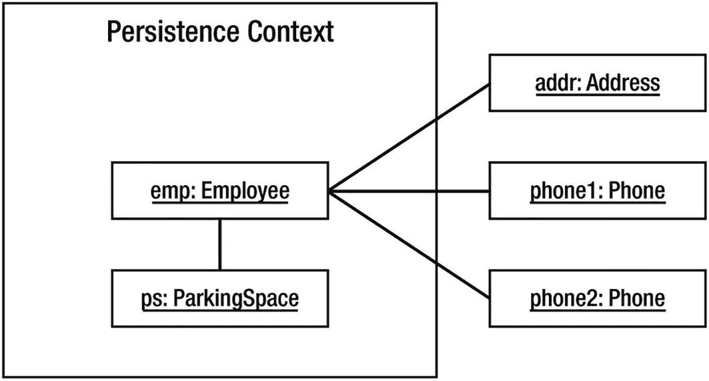

图 6-2

来自持久化上下文的指向未受管实体的链接

要确定在图 6-2 所示的安排下刷新持久化上下文的结果，我们必须首先查看 `Employee` 实体的级联设置。清单 6-21 显示了在 `Employee` 实体中实现的关系。只有 `phones` 关系设置了 `PERSIST` 级联选项。其他关系都是默认的，因此它们不会级联。

```
@Entity
public class Employee {
// ...
@OneToOne
ParkingSpace parkingSpace;
@OneToMany(mappedBy="employee", cascade=CascadeType.PERSIST)
Collection phones;
@ManyToOne
Address address;
// ...
}
清单 6-21
Employee 的关系级联设置
```

从 `emp` 对象开始，让我们像持久化提供程序一样逐步执行刷新过程。`emp` 对象是受管的，并且链接到其他四个对象。此过程中的第一步是导航来自此实体的关系，就像我们对其调用 `persist()` 一样。我们在此过程中遇到的第一个对象是通过 `parkingSpace` 关系连接的 `ps` 对象。因为 `ps` 也是受管的，所以我们无需执行任何进一步操作。

接下来，我们通过 `phones` 关系导航到两个 `Phone` 对象。这些实体是新的，这通常会导致异常，但由于设置了 `PERSIST` 级联选项，我们执行了相当于对每个 `Phone` 对象调用 `persist()` 的操作。这使得这些对象变为受管状态，从而使它们成为持久化上下文的一部分。`Phone` 对象没有进一步的关系来级联持久化操作，因此我们在此处也完成了处理。

接下来，我们通过 `address` 关系到达 `addr` 对象。由于此对象是游离的，我们通常会抛出异常，但此特定关系是刷新算法中的一个特例。每当遇到作为一对一或多对一关系目标（且源实体是拥有方）的游离对象时，刷新仍将继续，因为持久化拥有实体的操作不依赖于目标实体。拥有实体拥有外键列，并且只需要存储目标实体的主键值。

这样就完成了 `emp` 对象的刷新。然后，算法移动到 `ps` 对象并再次启动该过程。由于 `ps` 对象没有指向任何其他对象的关系，因此刷新过程完成。因此，在此示例中，即使 `emp` 对象指向的三个对象未受管，但由于级联设置和刷新算法的规则，整个刷新过程仍成功完成。

理想情况下，在刷新期间，受管实体指向的所有对象本身也应是受管实体。如果不是这种情况，接下来我们需要了解的是 `PERSIST` 级联设置。如果关系具有此设置，则关系中的目标对象也将被持久化，从而使它们在刷新完成之前变为受管状态。如果未设置 `PERSIST` 级联选项，则每当关系目标未受管时，都会抛出 `IllegalStateException` 异常，但之前描述的与一对一和多对一关系相关的特殊情况除外。

鉴于刷新操作的工作方式，在执行 `remove()` 操作之前，更新指向将被移除实体的关系总是更安全的。刷新可能随时发生，因此，如果提供程序在您有机会更新关系之前决定刷新持久化上下文，那么在不清除指向已移除实体的任何关系的情况下对实体调用 `remove()` 可能会导致意外的 `IllegalStateException` 异常。

在第 7 章中，我们还将讨论配置查询数据完整性要求的技术，以便持久化提供程序能够更好地确定何时真正需要刷新持久化上下文。


## 分离与合并

简单来说，*分离实体*是指不再与持久化上下文关联的实体。它曾一度被管理，但持久化上下文可能已结束，或者实体可能已被转换，从而失去了与曾经管理它的持久化上下文的关联。持久化上下文（如果仍然存在）不再跟踪该实体。对实体所做的任何更改都不会持久化到数据库，但实体在分离时存在的所有状态仍可被应用程序使用。分离实体不能用于任何需要托管实例的实体管理器操作。

与分离相反的是合并。合并是实体管理器将分离的实体状态整合到持久化上下文中的过程。对分离实体所做的任何实体状态更改都会覆盖持久化上下文中的当前值。当事务提交时，这些更改将被持久化。合并允许实体“离线”更改，然后稍后将这些更改合并进来。

以下章节将描述分离以及如何将分离的实体合并回持久化上下文。

### 分离

关于分离有两种观点。一方面，它是一个强大的工具，应用程序可以利用它来与远程应用程序协作，或者在事务结束后长时间支持对实体数据的访问。另一方面，当领域模型包含大量延迟加载属性，并且使用分离实体的客户端需要访问这些信息时，它可能成为一个令人沮丧的问题。

实体可以通过多种方式变为分离状态。以下每种情况都会导致实体分离：

*   当事务范围的持久化上下文所关联的事务提交时，该持久化上下文管理的所有实体都会变为分离状态。
*   如果应用程序管理的持久化上下文被关闭，其所有托管实体都会变为分离状态。
*   如果具有扩展持久化上下文的有状态会话 Bean 被移除，其所有托管实体都会变为分离状态。
*   如果使用了实体管理器的 `clear()` 方法，它会分离该实体管理器管理的持久化上下文中的所有实体。
*   如果使用了实体管理器的 `detach()` 方法，它会从该实体管理器管理的持久化上下文中分离单个实体实例。
*   当发生事务回滚时，会导致与该事务关联的所有持久化上下文中的所有实体变为分离状态。
*   当实体被序列化时，实体的序列化形式会与其持久化上下文分离。

其中一些情况可能是有意为之且计划好的，例如事务结束后的分离或序列化。其他情况可能是意外的，例如因回滚导致的分离。

实体的显式分离是通过 `detach()` 操作实现的。与之前讨论的 `clear()` 操作不同，如果将一个实体实例作为参数传递，`detach()` 操作将仅限于该单个实体及其关系。与其他级联操作一样，`detach()` 操作也会遍历设置了 `DETACH` 或 `ALL` 级联选项的关系，并适当地分离其他实体。请注意，将新实体或已移除实体传递给 `detach()` 的行为与普通托管实体不同。该操作不会分离新实体或已移除实体，但当配置为级联时，它仍会尝试遍历已移除实体上的关系，并分离作为这些关系目标的任何托管实体。

在第 4 章中，我们介绍了可应用于任何基本映射或关系的 `LAZY` 获取类型。其作用是向提供者提示，基本属性或关系属性的加载应延迟到首次访问时。虽然不常用于基本映射，但将关系映射标记为延迟加载是性能调优的重要组成部分。

然而，我们需要考虑分离对延迟加载的影响。考虑清单 6-22 中所示的 `Employee` 实体。`address` 关系将立即加载，因为多对一关系默认立即加载。对于 `parkingSpace` 属性（通常也会立即加载），我们已明确将其标记为延迟加载。`phones` 关系作为一对多关系，默认也会延迟加载。

```
@Entity
public class Employee {
// ...
@ManyToOne
private Address address;
@OneToOne(fetch=FetchType.LAZY)
private ParkingSpace parkingSpace;
@OneToMany(mappedBy="employee")
private Collection phones;
// ...
}
清单 6-22
具有延迟加载映射的 Employee
```

只要 `Employee` 实体处于托管状态，一切都会按预期工作。当从数据库检索实体时，只有关联的 `Address` 实体会被立即加载。提供者将在首次访问 `parkingSpace` 和 `phones` 关系时获取必要的实体。

如果此实体变为分离状态，访问 `parkingSpace` 和 `phones` 关系的结果突然变成一个更复杂的问题。如果在实体仍处于托管状态时访问了这些关系，那么在 `Employee` 实体分离后，也可以安全地访问目标实体。如果在实体托管时未访问这些关系，我们就会遇到问题。

当实体分离时，访问未加载属性的行为是未定义的。某些供应商可能会尝试解析该关系，而其他供应商可能只是抛出异常或使属性保持未初始化状态。如果实体因序列化而分离，则几乎无法解析该关系。对于未加载的属性，唯一可移植的做法是不去管它们。当然，这意味着你需要知道哪些属性已被加载，而这取决于实体所在的位置，并不总是容易或实用的（参见第 12 章“实用工具类”部分中的 `isLoaded()` 方法）。

在实体没有延迟加载属性的情况下，分离不是什么大问题。托管版本中存在的所有实体状态在实体的分离版本中仍然可用且可供使用。当存在延迟加载属性时，必须小心确保你需要离线访问的所有信息都是可用的。尽可能尝试定义离线组件可以访问的分离实体属性集。实体的提供者应将此集合视为契约，并在实体仍处于托管状态时触发这些属性来履行该契约。在本章后面，我们将演示多种规划和操作分离实体的策略，包括如何促使未加载的属性被加载。


### 合并游离实体

`merge()`操作用于将游离实体的状态合并到持久化上下文中。该方法使用起来很直接，只需将游离实体实例作为参数传入即可。但使用`merge()`时有一些细微之处，使其与其他实体管理器方法有所不同。考虑以下示例，它展示了一个会话 Bean 方法，该方法接受一个游离的`Employee`参数，并将其合并到当前持久化上下文中：

```
public void updateEmployee(Employee emp) {
em.merge(emp);
emp.setLastAccessTime(new Date());
}
```

假设事务在此方法调用时开始并结束，那么当`Employee`实例处于游离状态时对其所做的任何更改都将写入数据库。然而，对最后访问时间的更改却不会被写入。`merge()`的参数并不会因为合并操作而变为受管状态。另一个受管实体（可以是新实例，也可以是持久化上下文中已有的受管版本）会被更新以匹配该参数，然后`merge()`方法会返回这个实例。因此，要捕获此更改，我们需要使用`merge()`的返回值，因为它才是受管实体。以下示例展示了正确的实现：

```
public void updateEmployee(Employee emp) {
Employee managedEmp = em.merge(emp);
managedEmp.setLastAccessTime(new Date());
}
```

返回一个不同于原始实体的受管实例是合并过程的关键部分。如果持久化上下文中已存在具有相同标识符的实体实例，提供者会用正在合并的实体的状态覆盖其状态，但必须将已存在的受管版本返回给客户端以供使用。如果提供者没有更新持久化上下文中的`Employee`实例，那么对该实例的任何引用都将与正在合并的新状态不一致。

当对一个新的实体调用`merge()`时，其行为类似于`persist()`操作。它会将该实体添加到持久化上下文中，但并非添加原始实体实例，而是创建一个新的副本并管理该副本。由`merge()`操作创建的副本会被持久化，就像对其调用了`persist()`方法一样。

在存在关联关系的情况下，`merge()`操作会尝试更新受管实体，使其指向游离实体所引用实体的受管版本。如果该实体与一个没有持久化标识的对象存在关联关系，则合并操作的结果是未定义的。某些提供者可能允许受管副本指向非持久化对象，而其他提供者则可能立即抛出异常。在这些情况下，可以选择级联`merge()`操作以防止异常发生。我们将在本节后面介绍`merge()`操作的级联。如果正在合并的实体指向一个已移除的实体，则会抛出`IllegalArgumentException`异常。

懒加载关联关系是合并操作中的一个特殊情况。如果实体在变为游离状态之前未触发懒加载关联关系，那么在合并该实体时，该关联关系将被忽略。如果该关联关系在受管状态下被触发，然后在实体游离时被设置为`null`，那么在合并期间，该实体的受管版本也会相应地清除该关联关系。

为了说明`merge()`在关联关系下的行为，请考虑图 6-3 所示的对象图。游离的`emp`对象与另外三个对象存在关联关系。`addr`和`dept`对象是来自先前事务的游离实体，而`phone1`实体是最近创建并使用`persist()`操作持久化的，因此现在是受管状态。在持久化上下文内部，当前有一个`Employee`实例与另一个受管的`Address`存在关联关系。现有的受管`Employee`实例与新的受管`Phone`实例没有关联关系。

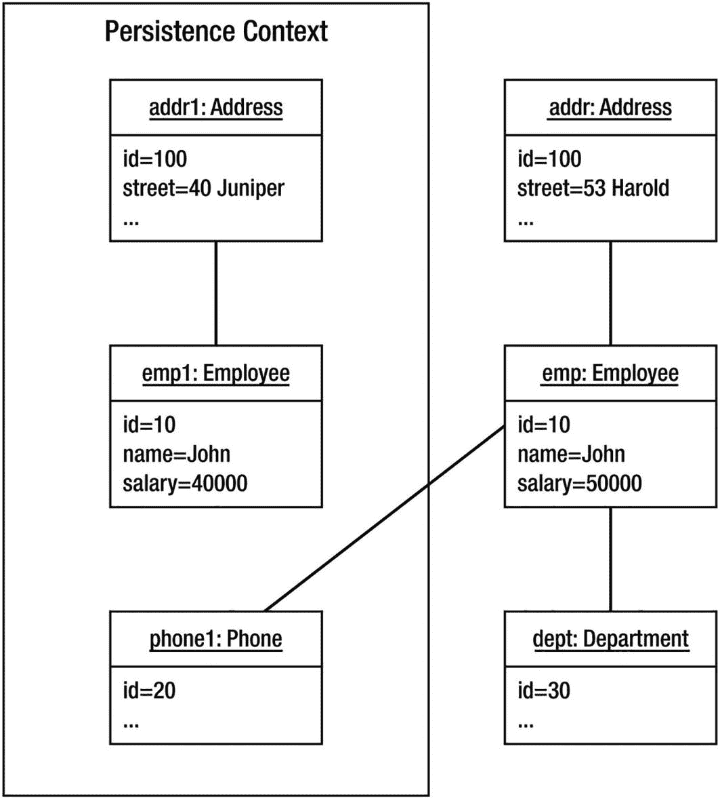

图 6-3

合并前的实体状态

现在考虑对`emp`对象调用`merge()`的效果。首先发生的是，提供者会检查持久化上下文中是否存在具有相同标识符的预先存在的实体实例。在此示例中，持久化上下文中的`emp1`对象与我们尝试合并的`emp`对象的标识符匹配。因此，`emp`对象的基本状态会覆盖持久化上下文中`emp1`对象的状态，并且`merge()`操作将返回`emp1`对象。

接下来，提供者会考虑`emp`所指向的`Phone`和`Department`实体。`phone1`对象已经是受管状态，因此提供者可以安全地更新`emp1`以指向该实例。对于`dept`对象，提供者会检查是否已存在具有相同标识符的持久化`Department`实体。在这种情况下，它在数据库中找到该实体并将其加载到持久化上下文中。然后更新`emp1`对象以指向这个`Department`实体的版本。游离的`dept`对象不会再次变为受管状态。

最后，提供者检查`emp`引用的`addr`对象。在这种情况下，它发现了一个具有相同标识符的预先存在的受管对象`addr1`。由于`emp1`对象已经指向`addr1`对象，因此无需进一步更改。此时，让我们看看合并后对象模型的状态。图 6-4 展示了这些变化。

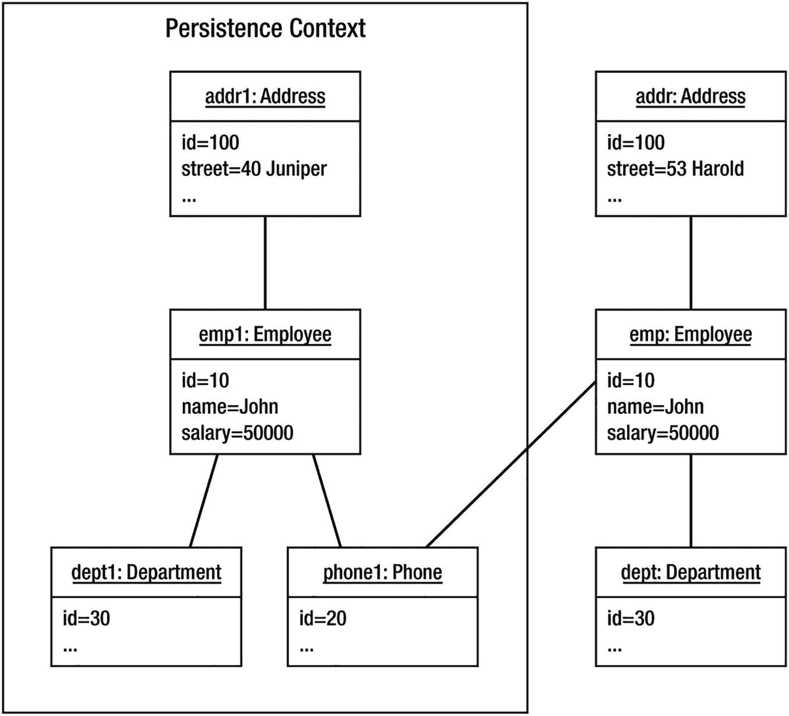

图 6-4

合并后的实体状态

在图 6-4 中，我们看到`emp1`对象已更新，以反映来自`emp`的状态变化。`dept1`对象是从数据库加载后新加入持久化上下文的。`emp1`对象现在同时指向`phone1`对象和`dept1`对象，以匹配`emp`对象的关联关系。`addr1`对象完全没有变化。`addr1`对象没有变化这一点可能令人惊讶。毕竟，`addr`对象有未决的更改，并且它被正在合并的`emp`对象所引用。

要理解原因，我们必须回到实体管理器操作级联的问题上。默认情况下，当对实体实例应用实体管理器操作时，不会级联任何操作。`merge()`操作在这方面也不例外。为了使合并能够从`Employee`跨关联关系进行级联，必须在关联关系映射上设置`MERGE`级联设置。否则，我们将不得不对每个相关对象调用`merge()`。


回顾我们的示例，更新后的 `Address` 实体的问题在于 `Employee` 实体没有将 `merge()` 操作级联到它。这导致了一个不良的副作用：我们之前对 `Address` 实体所做的更改被丢弃，转而使用了持久化上下文中已有的版本。为了获得我们预期的行为，我们必须要么在 `addr` 对象上显式调用 `merge()`，要么更改 `Employee` 实体的关系映射，使其包含 `MERGE` 级联选项。清单 6-23 展示了修改后的 `Employee` 类。

```
@Entity
public class Employee {
@Id private int id;
private String name;
private long salary;
@ManyToOne(cascade=CascadeType.MERGE)
private Address address;
@ManyToOne
private Department department;
@OneToMany(mappedBy="employee", cascade=CascadeType.MERGE)
private Collection phones;
// ...
}
清单 6-23
具有合并级联设置的 Employee 实体
```

通过这种方式修改 `Employee` 实体后，合并操作将级联到任何 `Employee` 实例所指向的 `Address` 和 `Phone` 实体。这相当于在每个实例上单独调用 `merge()`。请注意，我们没有将合并操作级联到 `Department` 实体。我们通常只将操作从父级向下级联到子级，而不是从子级向上级联到父级。这样做虽然无害，但会要求持久化提供者付出更多努力来查找更改。如果 `Department` 实体也发生了更改，更好的做法是将合并操作从 `Department` 级联到其关联的 `Employee` 实例，然后只合并一个 `Department` 实例，而不是合并多个 `Employee` 实例。

合并具有关系的分离实体可能是一项棘手的操作。理想情况下，我们希望合并对象图的根节点，并在此过程中合并所有相关实体。这可以做到，但前提是 `MERGE` 级联设置已应用于图中的所有关系。如果没有，则必须逐个合并每个非级联关系所指向的实例。

在结束合并主题之前，我们必须提到，在这些情况下，锁定和版本控制对于确保数据完整性起着至关重要的作用。我们将在第 12 章探讨此主题。

### 处理分离实体

让我们从一个在现代 Web 应用中非常常见的场景开始。一个 Servlet 调用一个会话 Bean 来执行查询，并收到一个实体集合作为返回。然后，Servlet 将这些实体放入请求映射中，并将请求转发给 JSP 进行展示。这种模式称为页面控制器^(¹⁴)，它是前端控制器^(¹⁵)模式的一种变体，其中每个视图都有一个单独的控制器，而不是所有视图共用一个中央控制器。在熟悉的模型-视图-控制器（MVC）架构中，会话 Bean 提供模型，JSP 页面是视图，而 Servlet 是控制器。

首先考虑受管理的 CDI Bean，它将生成将由 JSP 页面渲染的结果。清单 6-24 展示了该 Bean 的实现。在此示例中，我们只关注 `findAll()` 方法，它返回数据库中存储的所有 `Employee` 实例。

```
@Dependent
public class EmployeeService {
@PersistenceContext(unitName="EmployeeService")
private EntityManager em;
public List findAll() {
return em.createQuery("SELECT e FROM Employee e")
.getResultList();
}
// ...
}
清单 6-24
EmployeeService Bean
```

清单 6-25 展示了一个简单 Servlet 的源代码，它调用 `EmployeeService` Bean 的 `findAll()` 方法来获取数据库中所有的 `Employee` 实体。然后，它将结果放入请求映射中，并委托给 `listEmployees.jsp` JSP 页面来渲染结果。

```
public class EmployeeServlet extends HttpServlet {
@Inject EmployeeService bean;
protected void doGet(HttpServletRequest request, HttpServletResponse response)
throws ServletException, IOException {
List emps = bean.findAll();
request.setAttribute("employees", emps);
getServletContext().getRequestDispatcher("/listEmployees.jsp")
.forward(request, response);
}
}
清单 6-25
查看员工 Servlet
```

最后，清单 6-26 展示了我们 MVC 架构的最后一部分，即用于渲染结果的 JSP 页面。它使用 JavaServer Pages 标准标签库（JSTL）来遍历 `Employee` 实例的集合，并显示每个员工的姓名以及该员工所属部门的名称。`<c:forEach/>` 标签访问的 `employees` 变量是 Servlet 放入请求映射中的 `Employee` 实例列表。

```

所有员工

姓名
部门

清单 6-26
用于显示员工信息的 JSP 页面
```

`EmployeeService` Bean 的 `findAll()` 方法没有事务。由于调用该方法的 Servlet 没有启动事务，`findAll()` 在没有事务上下文的情况下被调用；因此，查询结果在返回给 Servlet 之前就变成了分离状态。

这导致了一个问题。在此示例中，`Employee` 类的 `department` 关系被配置为使用延迟加载。正如你在前面关于分离的章节中学到的，唯一可移植的做法就是不去管它们。然而，在此示例中，我们不想不管它们。为了显示员工的部门名称，JSP 表达式从 `Employee` 实体导航到 `Department` 实体。由于这是一种延迟加载关系，结果是不可预测的。它可能有效，但也可能无效。

这个场景构成了我们挑战的基础。在接下来的章节中，我们将研究多种策略，要么准备 JSP 页面在分离时所需的实体，要么完全避免分离。

#### 为分离做准备

知道 `findAll()` 方法的结果将用于显示员工信息，并且在此过程中需要部门名称，我们需要确保在实体变为分离状态之前，`Employee` 实体的 `department` 关系已被解析。有几种策略可用于解析延迟加载的关联，以便为分离做准备。我们在此讨论其中两种，重点是如何构建应用程序代码来为分离做准备。第三种策略，即称为抓取连接的 Jakarta Persistence QL 查询，将在第 8 章讨论；第四种策略，即使用实体图，将在第 11 章解释。


##### 触发懒加载

解决懒加载关联的第一种策略是直接通过访问字段或关系来触发懒加载行为。这在代码中看起来有些奇怪，因为 getter 方法的返回值被丢弃了，但这确实能达到预期效果。清单 6-27 展示了 `EmployeeService` 会话 Bean 中 `findAll()` 方法的另一种实现。在此例中，我们遍历 `Employee` 实体，在从方法返回原始列表之前触发 `department` 关系。由于 `findAll()` 在事务内执行，`getDepartment()` 调用成功完成，并且当 `Employee` 实例被分离时，`Department` 实体实例保证可用。

```
@Stateless
public class EmployeeService {
@PersistenceContext(unitName="EmployeeService")
private EntityManager em;
public List findAll() {
List emps = (List)
em.createQuery("SELECT e FROM Employee e")
.getResultList();
for (Employee emp : emps) {
Department dept = emp.getDepartment();
if (dept != null) {
dept.getName();
}
}
return emps;
}
// ...
}
清单 6-27
触发懒加载关系
```

清单 6-27 中可能看起来奇怪的一点是，我们不仅调用了 `Employee` 实例的 `getDepartment()`，还调用了 `Department` 实例的 `getName()`。如果你还记得第 4 章的内容，从懒加载关系返回的实体实际上可能是一个代理，它会等到代理上调用方法时才将实体加载进来。我们必须调用实体上的一个方法，以确保它确实从数据库中检索出来。如果这是一个集合值关系，通常会使用 `Collection` 的 `size()` 方法来强制立即加载。

如果在 `Employee` 或 `Department` 实体上使用了懒加载的基本映射，那么这些属性在分离后也无法保证存在。这也是不推荐将基本映射配置为懒加载的另一个原因。开发者通常期望关系不会被立即加载，但如果 `Employee` 实例的 `name` 属性等基本状态字段缺失，可能会让人措手不及。

##### 配置立即加载

当关联在分离场景中持续被触发时，有时值得重新审视该关联是否一开始就应该被懒加载。谨慎地将某些关系切换为立即加载，可以避免代码中许多试图触发懒加载的特殊情况。

在此示例中，`Employee` 与 `Department` 具有多对一关系。多对一关系的默认获取类型是立即加载，但该类通过显式使用懒加载进行了建模。通过从 `department` 关系中移除 `LAZY` 获取类型，或显式指定 `EAGER` 获取类型，我们确保 `Department` 实例始终对 `Employee` 实例可用。

集合值关系默认是懒加载的，因此如果需要立即加载，必须显式地将 `EAGER` 获取类型应用于这些映射。不过，在配置集合值关系为立即加载时要谨慎，因为在不需要分离的情况下，这可能会导致过多的数据库访问。

#### 避免分离

对于任何分离场景，唯一的完整解决方案就是根本不进行分离。如果你的代码有条不紊地触发每个懒加载关系，或者为了应对分离而将实体上的每个关联都标记为立即加载，这很可能表明需要采用替代方法。

避免分离归结为两种方法。要么不在 JSP 页面中使用实体，要么必须在 JSP 渲染过程中保持持久化上下文打开，以便能够解析懒加载关系。

不使用实体意味着将实体数据复制到不具有相同懒加载行为的不同数据结构中。一种方法是使用传输对象^(¹⁶)模式，但考虑到实体的 POJO 特性，这显得高度冗余。更好的方法（我们将在第 7 章和第 8 章中讨论）是使用投影查询仅检索将在 JSP 页面上显示的实体状态，而不是检索完整的实体实例。

保持持久化上下文打开需要额外的规划，但允许 JSP 页面使用实体类的 JavaBean 属性来处理实体数据。实际上，保持持久化上下文打开意味着要么对于从事务范围持久化上下文中获取的实体存在活动事务，要么正在使用应用程序管理或扩展的持久化上下文。当实体必须序列化到单独的层或远程客户端时，这显然不是一个选项，但它适用于前面描述的 Web 应用程序场景。我们将在下面介绍每种策略。


##### 事务视图

由事务范围实体管理器创建的持久化上下文，仅在其所属事务结束前保持开启。因此，若要使用事务范围实体管理器执行查询，并在解析延迟加载关系时能够呈现查询结果，这两个操作必须属于同一事务。当在 Web 层启动事务，并在提交前同时包含会话 Bean 调用和 JSP 页面渲染时，我们称这种模式为**事务视图**。

此方法的好处在于，视图渲染过程中遇到的任何延迟加载关系都能被解析，因为实体仍由持久化上下文管理。要在示例场景中实现此模式，我们在调用`findAll()`方法前启动一个 Bean 管理的事务，并在 JSP 页面渲染结果后提交事务。清单 6-28 演示了此方法。请注意，为节省篇幅，我们省略了`UserTransaction`操作所抛出受检异常的处理。仅`commit()`方法就会抛出不少于六个受检异常。

```
public class EmployeeServlet extends HttpServlet {
@Resource UserTransaction tx;
@EJB EmployeeService bean;
protected void doGet(HttpServletRequest request, HttpServletResponse response)
throws ServletException, IOException {
// ...
try {
tx.begin();
List emps = bean.findAll();
request.setAttribute("employees", emps);
getServletContext().getRequestDispatcher("/listEmployees.jsp")
.forward(request, response);
} finally {
tx.commit
}
// ...
}
}
清单 6-28
在单个事务中组合会话 Bean 方法与 JSP
```

采用此方案后，`Employee`实体的延迟加载关系无需在 JSP 页面渲染结果前急切解析。此方法的唯一缺点是，Servlet 现在必须管理事务并从事务故障中恢复。此外，所有需要此行为的 Servlet 控制器之间还必须重复大量逻辑。

解决重复问题的一种方法是，为使用事务视图模式的 Servlet 引入一个公共超类，用于封装事务行为。然而，如果使用前端控制器模式，且控制器动作通过命令^((17))模式实现，管理起来可能会更加困难，尤其是在页面流复杂且多个控制器协作构建复合视图的情况下。此时，不仅每个控制器需要启动事务，还需要感知渲染序列中先前启动的任何事务。

另一种可能的解决方案（尽管不可移植）是将事务逻辑移至 Servlet 过滤器。它允许我们在访问第一个控制器 Servlet 之前拦截 HTTP 请求，并将整个请求包装在一个事务中。然而，这种粗粒度的事务使用需要谨慎管理。如果平等地应用于所有 HTTP 请求，也可能给涉及数据库更新的请求带来麻烦。假设这些操作作为会话 Bean 实现，则可能需要使用`REQUIRES_NEW`事务属性来隔离实体更新并处理事务故障，而不影响覆盖的全局事务。

##### 每次请求的实体管理器

对于未将查询操作封装在会话 Bean 门面后的应用程序，事务视图模式的替代方案是创建一个新的应用程序管理实体管理器来执行报告查询，仅在 JSP 页面渲染完成后才关闭它。由于从应用程序管理实体管理器查询返回的实体将保持受管状态，直到实体管理器关闭，因此它提供了与事务视图模式相同的优势，且无需活动事务。

清单 6-29 再次审视了我们的`EmployeeServlet` Servlet，这次创建了一个应用程序管理实体管理器来执行查询。结果像之前一样放入映射中，并在 JSP 页面完成渲染后关闭实体管理器。

```
public class EmployeeServlet extends HttpServlet {
@PersistenceUnit(unitName="EmployeeService")
EntityManagerFactory emf;
protected void doGet(HttpServletRequest request,
HttpServletResponse response)
throws ServletException, IOException {
EntityManager em = emf.createEntityManager();
try {
List emps = em.createQuery("SELECT e FROM Employee e")
.getResultList();
request.setAttribute("employees", emps);
getServletContext().getRequestDispatcher("/listEmployees.jsp")
.forward(request, response);
} finally {
em.close();
}
}
}
清单 6-29
使用应用程序管理实体管理器进行报告
```

不幸的是，我们现在将查询逻辑嵌入到了 Servlet 实现中。该查询也不再像作为无状态会话 Bean 一部分时那样可重用。我们可以探索其他几种解决方案。与其直接执行查询，不如创建一个 POJO 服务类，使用 Servlet 创建的应用程序管理实体管理器来执行查询。这类似于我们在第 2 章创建的第一个示例。我们获得了将查询行为封装在业务方法内部的好处，同时与特定类型的实体管理器解耦。

或者，我们可以将查询方法放在使用扩展实体管理器的有状态会话 Bean 上。当有状态会话 Bean 使用扩展实体管理器时，其持久化上下文将持续整个会话 Bean 的生命周期，该生命周期仅在用户调用 Bean 上的移除方法时结束。如果针对有状态会话 Bean 的扩展持久化上下文执行查询，只要该 Bean 仍然可用，查询结果就可以继续解析延迟加载关系。

让我们探讨这个选项，看看它如何替代我们在清单 6-29 中展示的应用程序管理实体管理器。清单 6-30 引入了一个有状态会话 Bean，等同于我们一直使用的`EmployeeService`无状态会话 Bean。除了使用扩展实体管理器外，我们还设置了默认事务类型为`NOT_SUPPORTED`。由于查询结果永远不会被修改，仅用于显示，因此无需事务。

```
@Stateful
@TransactionAttribute(TransactionAttributeType.NOT_SUPPORTED)
public class EmployeeQuery {
@PersistenceContext(type=PersistenceContextType.EXTENDED,
unitName="EmployeeService")
EntityManager em;
public List findAll() {
return em.createQuery("SELECT e FROM Employee e", Employee.class)
.getResultList();
}
// ...
@Remove
public void finished() {
}
}
清单 6-30
带有查询方法的有状态会话 Bean
```

使用此 Bean 与使用应用程序管理实体管理器非常相似。我们创建一个 Bean 实例，执行查询，然后在 JSP 页面完成渲染后移除该 Bean。清单 6-31 展示了此方法。


```
@EJB(name="queryBean", beanInterface=EmployeeQuery.class)
public class EmployeeServlet extends HttpServlet
protected void doGet(HttpServletRequest request, HttpServletResponse response)
throws ServletException, IOException {
EmployeeQuery bean = createQueryBean();
try {
List emps = bean.findAll();
request.setAttribute("employees", emps);
getServletContext().getRequestDispatcher("/listEmployees.jsp")
.forward(request, response);
} finally {
bean.finished();
}
}
private EmployeeQuery createQueryBean() throws ServletException {
// 查找 queryBean
// ...
}
}
清单 6-31
使用扩展实体管理器进行报表生成
```

乍一看，这似乎是一个过度设计的解决方案。我们获得了将查询与 Servlet 解耦的好处，但为了实现这一目标，却引入了一个新的会话 Bean。此外，我们还在使用生命周期非常短的有状态会话 Bean。这难道不是与有状态会话 Bean 的公认使用惯例相悖吗？

在某种程度上，确实如此，但扩展持久化上下文促使我们尝试新的方法。在实践中，有状态会话 Bean 并不会给操作增加显著的开销，即使是在短时间使用的情况下也是如此。正如你稍后在“编辑会话”一节中看到的，将有状态会话 Bean 移至 HTTP 会话中，而不是将其限制在单个请求内，也为 Web 应用程序设计开辟了新的可能性。

#### 合并策略

创建或更新信息是大多数企业应用程序的常规部分。用户通常通过 Web 与应用程序交互，使用表单根据需要创建或更改数据。在使用 Jakarta Persistence 的 Jakarta EE 应用程序中，处理这些更改的最常见策略是将更改结果放入分离的实体实例中，并将待处理的更改合并到持久化上下文中，以便它们能够被写入数据库。

让我们再次回顾一下简单的 Web 应用程序场景。这次，用户不仅可以查看`Employee`信息，还可以选择一个`Employee`并更新该员工的基本信息。实体在一个请求中被查询出来用于在表单中展示，然后在第二个请求中，当用户提交带有更改内容的表单时进行更新。

使用会话外观模式，此操作非常简单。更改后的实体被更新并交给无状态会话 Bean 进行合并。唯一涉及的复杂性是确保关系能够正确合并，这需要识别出哪些情况需要设置`MERGE`级联。

与是否可以避免分离实体以补偿延迟加载问题类似，应用程序管理和扩展持久化上下文的长期存在特性表明，可能也有一种方法可以将类似的技术应用于这种情况。我们不想在一个 HTTP 请求中查询实体，然后在视图渲染后丢弃实体实例，而是希望将这些实体保持在托管状态，以便它们可以在后续的 HTTP 请求中被更新，并且仅通过启动和提交一个新事务来持久化。

在接下来的章节中，我们将重新审视传统的用于合并的会话外观方法，然后探讨使用扩展实体管理器实现的新技术，该技术将在用户编辑会话的生命周期内保持实体的托管状态。

##### 会话外观

为了使用会话外观模式来捕获对实体的更改，我们提供了一个业务方法，该方法将合并对分离实体实例所做的更改。在我们的示例场景中，这意味着接收一个`Employee`实例并将其合并到事务范围的持久化上下文中。清单 6-32 展示了在`EmployeeService`会话 Bean 中实现此技术的方法。

```
@Stateless
public class EmployeeService {
@PersistenceContext(unitName="EmployeeService")
private EntityManager em;
public void updateEmployee(Employee emp) {
if (em.find(Employee.class, emp.getId()) == null) {
throw new IllegalArgumentException("未知的员工 ID: " +
emp.getId());
}
em.merge(emp);
}
// ...
}
清单 6-32
更新员工信息的业务方法
```

清单 6-32 中的`updateEmployee()`方法非常简单。给定分离的`Employee`实例，它首先尝试检查匹配的标识符是否已存在。如果未找到匹配的`Employee`，则抛出异常，因为我们不希望允许创建新的`Employee`记录。然后，我们使用`merge()`操作将更改复制到持久化上下文中，当事务提交时，这些更改将被保存。

从 Servlet 中使用外观是一个两步方法。在开始编辑会话的初始 HTTP 请求期间，查询`Employee`实例（通常使用同一外观上的单独方法），并用它来创建一个 Web 表单，用户可以在该表单上进行所需的更改。然后，分离的实例被存储在 HTTP 会话中，以便在用户从浏览器提交表单时进行更新。我们需要保留分离的实例，以保留任何关系或其他在编辑过程中保持不变的状态。创建一个新的`Employee`实例并仅提供部分值，在合并该实例时可能会产生许多负面影响。

清单 6-33 展示了一个`EmployeeUpdateServlet` Servlet，它从请求参数中收集 ID、姓名和薪水信息，并调用会话 Bean 方法来执行更新。之前分离的`Employee`实例从 HTTP 会话中检索出来，然后根据请求参数指示的更改进行设置。为了节省篇幅，我们省略了对请求参数的验证，但理想情况下，这应该在调用会话 Bean 上的业务方法之前进行。

```
public class EmployeeUpdateServlet extends HttpServlet {
@EJB EmployeeService bean;
protected void doPost(HttpServletRequest request,
HttpServletResponse response)
throws ServletException, IOException {
int id = Integer.parseInt(request.getParameter("id"));
String name = request.getParameter("name");
long salary = Long.parseLong(request.getParameter("salary"));
HttpSession session = request.getSession();
Employee emp = (Employee) session.getAttribute("employee.edit");
emp.setId(id);
emp.setName(name);
emp.setSalary(salary);
bean.updateEmployee(emp);
// ...
}
}
清单 6-33
使用会话 Bean 执行实体更新
```

如果更新的信息量非常小，我们可以完全避免使用分离对象和`merge()`操作，而是通过定位托管版本并手动将更改复制到其中。考虑以下示例：

```
public void updateEmployee(int id, String name, long salary) {
Employee emp = em.find(Employee.class, id);
if (emp == null) {
throw new IllegalArgumentException("未知的员工 ID: " + id);
}
emp.setEmpName(name);
emp.setSalary(salary);
}
```

这种方法的美妙之处在于其简单性，但这同时也是其主要局限性。如今的典型 Web 应用程序能够在单个操作中更新大量信息。为了用这种模式适应这些情况，要么必须有接受大量参数的业务方法，要么必须按顺序调用许多业务方法才能完全更新所有必要的信息。当然，一旦涉及多个方法，可能就需要在所有更新方法之间维护一个事务，以便将更改作为一个整体单元提交。

因此，尽管有这种方法可用，Web 层通常仍然会将更改收集到分离的实体或传输对象中，并将更改后的状态传回给会话 Bean 进行合并并写入数据库。


##### 编辑会话

通过引入扩展实体管理器，我们可以采用不同的方法来构建更新实体的 Web 应用程序。正如本章所讨论的，只要持有扩展实体管理器的有状态会话 Bean 未被移除，与该扩展实体管理器关联的实体就会保持托管状态。通过将有状态会话 Bean 放置在 HTTP 会话等中心位置，我们可以直接操作由扩展实体管理器管理的实体，而无需通过合并来持久化更改。我们将此称为编辑会话模式，以反映该模式的主要目标是使用有状态会话 Bean 封装编辑用例。

清单 6-34 介绍了一个代表员工编辑会话的有状态会话 Bean。与包含多个可重用业务方法的`EmployeeService`会话 Bean 不同，这种风格的有状态会话 Bean 针对单个应用程序用例。除了使用扩展实体管理器外，我们还将默认事务类型设置为`NOT_SUPPORTED`，但`save()`方法除外。仅访问`Employee`实例的方法不需要事务，因为这些方法仅在内存中操作。只有当我们希望将更改持久化到数据库时，才需要事务，而这仅在`save()`方法中发生。

```
@Stateful
@TransactionAttribute(TransactionAttributeType.NOT_SUPPORTED)
public class EmployeeEdit {
@PersistenceContext(type=PersistenceContextType.EXTENDED,
unitName="EmployeeService")
EntityManager em;
Employee emp;
public void begin(int id) {
emp = em.find(Employee.class, id);
if (emp == null) {
throw new IllegalArgumentException("未知员工 ID:" + id);
}
}
public Employee getEmployee() {
return emp;
}
@Remove
@TransactionAttribute(TransactionAttributeType.REQUIRES_NEW)
public void save() {}
@Remove
public void cancel() {}
}
清单 6-34
用于管理员工编辑会话的有状态会话 Bean
```

让我们开始将`EmployeeEdit` Bean 的操作置于上下文中。当 HTTP 请求到达并启动编辑会话时，我们创建一个新的`EmployeeEdit`有状态会话 Bean，并使用将要编辑的`Employee`实例的 ID 调用`begin()`。然后，该会话 Bean 加载`Employee`实例并将其缓存在 Bean 上。随后，该 Bean 被绑定到 HTTP 会话，以便在用户更改`Employee`信息后的后续请求中再次访问它。清单 6-35 显示了处理 HTTP 请求以开始新编辑会话的`EmployeeEditServlet` Servlet。

```
@EJB(name="EmployeeEdit", beanInterface=EmployeeEdit.class)
public class EmployeeEditServlet extends HttpServlet {
protected void doPost(HttpServletRequest request, HttpServletResponse response)
throws ServletException, IOException {
int id = Integer.parseInt(request.getParameter("id"));
EmployeeEdit bean = getBean();
bean.begin(id);
HttpSession session = request.getSession();
session.setAttribute("employee.edit", bean);
request.setAttribute("employee", bean.getEmployee());
getServletContext().getRequestDispatcher("/editEmployee.jsp")
.forward(request, response);
}
public EmployeeEdit getBean() throws ServletException {
// 查找 EmployeeEdit Bean
// ...
}
}
清单 6-35
开始一个员工编辑会话
```

现在让我们看看编辑会话的另一半，即我们希望提交更改的部分。当用户提交包含必要`Employee`更改的表单时，将调用`EmployeeUpdateServlet`。它首先从 HTTP 会话中检索`EmployeeEdit` Bean。然后，将包含更改值的请求参数复制到通过调用`EmployeeEdit` Bean 上的`getEmployee()`获得的`Employee`实例中。如果一切正常，则调用`save()`方法将更改写入数据库。清单 6-36 显示了`EmployeeUpdateServlet`的实现。请注意，一旦编辑会话完成，我们需要从 HTTP 会话中移除该 Bean。

```
public class EmployeeUpdateServlet extends HttpServlet {
protected void doPost(HttpServletRequest request, HttpServletResponse response)
throws ServletException, IOException {
String name = request.getParameter("name");
long salary = Long.parseLong(request.getParameter("salary"));
HttpSession session = request.getSession();
EmployeeEdit bean = (EmployeeEdit)         session.getAttribute("employee.edit");
session.removeAttribute("employee.edit");
Employee emp = bean.getEmployee();
emp.setName(name);
emp.setSalary(salary);
bean.save();
// ...
}
}
清单 6-36
完成一个员工编辑会话
```

在 Web 层使用有状态会话 Bean 和扩展实体管理器的模式如下：

1.  对于每个修改实体数据的应用程序用例，我们创建一个具有扩展持久化上下文的有状态会话 Bean。该 Bean 将持有进行所需更改所必需的所有实体实例。

2.  启动编辑用例的 HTTP 请求会创建有状态会话 Bean 的一个实例，并将其绑定到 HTTP 会话。此时检索实体，并用于填充用于编辑的 Web 表单。

3.  完成编辑用例的 HTTP 请求获取先前绑定的有状态会话 Bean 实例，并将来自 Web 表单的更改数据写入存储在 Bean 上的实体中。然后，在 Bean 上调用一个方法以将更改提交到数据库。

在我们简单的编辑场景中，这似乎有些过度，但它可以扩展以适应任何复杂程度的编辑会话。`Department`、`Project`和其他信息都可以在一个甚至多个会话中进行编辑，结果累积在有状态会话 Bean 上，直到应用程序准备好持久化这些结果。

另一个好处是，Jakarta Faces 等 Web 应用程序框架可以直接从 JSP 页面访问绑定在 HTTP 会话中的 Bean。可以访问实体以显示编辑表单，也可以在用户提交结果时作为表单的目标。在此场景中，开发人员只需确保在应用程序页面流程的正确点调用必要的保存和取消方法。

关于这种方法，还有几点需要提及。一旦绑定到 HTTP 会话，会话 Bean 将一直保留在那里，直到被显式移除或 HTTP 会话过期。因此，无论更改是保存还是放弃，确保编辑会话完成后移除该 Bean 非常重要。应用程序可以使用`HttpSessionBindingListener`回调接口来跟踪 HTTP 会话何时被销毁，并相应地清理相应的会话 Bean。

HTTP 会话不是线程安全的，有状态会话 Bean 引用也不是。在某些情况下，来自同一用户的多个 HTTP 请求可能同时访问 HTTP 会话。当请求处理时间较长，且不耐烦的用户刷新页面或放弃其编辑会话转而访问 Web 应用程序的其他部分时，这主要是一个问题。在这些情况下，Web 应用程序要么必须处理因多个线程访问有状态会话 Bean 而可能发生的异常，要么使用同步包装器代理有状态会话 Bean。


##### 对话

最后一种策略是对编辑会话方法的一种扩展/改进，但它涉及本章前面描述的未同步持久化上下文。CDI 也可用于在会话作用域内管理 Bean 实例。

正如我们在第 1 章中所说，Jakarta Persistence 版本允许属性转换器支持将 CDI 注入到 `AttributeConverter` 类中。借助此功能，持久化提供程序可以在其他存在 `BeanManager` 的环境中支持将 CDI 注入到属性转换器中。

持久化提供程序负责：

*   使用 CDI SPI 创建属性转换器类的实例
*   对这些实例执行注入，以调用其 `PostConstruct` 和 `PreDestroy` 方法
*   销毁属性转换器实例

请注意，持久化提供程序仅需在 Jakarta EE 容器环境中支持将 CDI 注入到属性转换器中。如果 CDI 未启用，则持久化提供程序不得调用依赖于 CDI 注入的属性转换器。

注意

CDI 和 Jakarta Faces 为专用的对话作用域提供支持，该作用域允许在多个视图和客户端页面之间导航。我们建议读者参考专门介绍 CDI 和 Jakarta Faces 的书籍，以了解更多关于对话作用域以及 Jakarta Faces 和 CDI 在使用此作用域时如何相互交互的信息。

对话模式不仅在你想要编辑多个对象甚至多种对象类型时有用，而且在你不希望会话 Bean 必须缓存或跟踪对话期间所有已编辑内容时也很有用。任何已被客户端编辑的实体都由 Jakarta Persistence 持久化上下文直接管理。

在清单 6-37 中，有状态会话 Bean 为 Servlet 提供了一个加载方法，用于加载一名员工并让用户有机会对该员工进行更改。然后，用户可以保存更改或取消对该员工的个别更改。此过程可以重复任意次数，直到用户决定接受对所有员工的更改或放弃这些更改。如果接受更改，则这些更改会加入到作为 `processAllChanges()` 方法一部分启动的事务中，并在该方法及事务完成时提交。

```
@Stateful
@SessionScoped
public class EmployeeService {
@PersistenceContext(type=PersistenceContextType.EXTENDED,
synchronization=SynchronizationType.UNSYNCHRONIZED,
unitName="EmployeeService")
EntityManager em;
Employee currentEmployee;
public Employee getCurrentEmployee() { return currentEmployee; }
public Employee loadEmployee(int id) {
Employee emp = em.find(Employee.class, id);
currentEmployee = emp;
return emp;
}
public void saveChangesToEmployee() {}
public void cancel() {
em.detach(currentEmployee);
}
public void processAllChanges() {
em.joinTransaction();
}
public void abandonAllChanges() {
em.clear();
}
}
清单 6-37
具有未同步持久化上下文的有状态会话 Bean
```

查看 `saveChangesToEmployee()` 方法，你可能会认为缺少一些代码，因为该方法似乎什么也没做。该方法中没有代码的原因在于它实际上不需要做任何事情。`loadEmployee()` 方法从持久化上下文中返回受管理的员工，因此在表示层被修改的员工已经被持久化提供程序跟踪。相比之下，如果用户要取消更改，我们只需将该对象从持久化上下文中分离，以确保这些更改不会被提交。

当用户决定通过接受所有更改来结束对话时，`processAllChanges()` 方法会进行事务加入。如果用户决定通过放弃所有更改来结束对话，则 `abandonAllChanges()` 方法会清除持久化上下文中的所有对象，然后对话可以重新开始。

在结束这个示例之前，我们对我们使用的会话作用域做最后一点说明。我们使用了 CDI 并将 `EmployeeService` Bean 的作用域限定为会话，以便它可以供请求的会话作用域线程使用。因此，当对话被提交时，持久化上下文中会遗留一些实体，因为上下文仅在更改被放弃时才会被清除。只要会话不会过度持续，这是可以接受的。如果会话运行时间非常长，或者不同对话中的实体从不重叠，则可能应该清除持久化上下文。但是，如果你试图简单地在 `processAllChanges()` 方法中的 `joinTransaction()` 调用之后添加一个 `em.clear()` 调用，那么你将会遇到一个令人不快的意外。如果在 `processAllChanges()` 方法完成之前清除了更改，那么当容器管理的事务在该方法结束时提交时，持久化上下文中将没有任何更改可以提交！一个正确的解决方案是在下一个对话开始时清除持久化上下文。

## 总结

在本章中，我们深入探讨了实体管理器及其与实体、持久化上下文和事务的交互。正如你所见，实体管理器可以通过多种不同方式使用，以满足各种应用程序需求。

我们首先重新介绍了 Jakarta Persistence 的核心术语，并探讨了持久化上下文。然后，我们介绍了不同类型的实体管理器：事务作用域型、扩展型和应用程序管理型。我们研究了如何获取和使用每种类型，以及它们旨在解决的问题类型。

在事务管理部分，我们研究了每种实体管理器类型，以及它们与容器管理的 Jakarta Transactions 事务和 JDBC 驱动程序的资源本地事务之间的关系。我们阐述了为什么事务在使用 Jakarta Persistence 进行企业应用程序开发的各个方面都扮演着重要角色。我们展示了一种特殊的持久化上下文，它在以编程方式加入之前一直与 Jakarta Transactions 事务保持未同步状态，以及它如何为更长时间运行的交互序列带来灵活性。

接下来，我们重新审视了实体管理器的基本操作，这次我们充分理解了不同的实体管理器类型和事务管理策略。我们引入了级联的概念，并探讨了关系对持久化的影响。

在我们关于分离的讨论中，我们介绍了这个问题，并从移动实体到远程层的角度以及将离线实体更改合并回持久化上下文的挑战两个方面进行了探讨。我们提出了几种策略，通过采用特定于 Jakarta Persistence 的设计模式，来最小化分离和合并对应用程序设计的影响。

在下一章中，我们将把注意力转向 Jakarta Persistence 的查询功能，展示如何创建、执行查询操作以及处理其结果。

脚注 1   2   3   4


# 7. 使用查询

对于大多数企业级应用而言，从数据库中获取数据至少与向数据库中存入新数据同等重要。从搜索、排序到分析及商业智能，高效地将数据从数据库传输到应用程序并呈现给用户，是企业开发中的常规环节。要做到这一点，需要能够对数据库执行批量查询，并为应用程序解读查询结果。尽管高级语言和表达式框架在许多情况下试图让开发者免于在 SQL 层面处理数据库查询，但公平地说，大多数企业开发者在其职业生涯中都曾接触过至少一种 SQL 方言。

对象关系映射为这项任务增加了另一层复杂性。大多数时候，开发者希望将查询结果转换为实体，以便应用程序逻辑可以直接使用这些结果。同样，如果领域模型已通过对象关系映射从物理模型中抽象出来，那么将查询也从 SQL 中抽象出来也是合理的，因为 SQL 不仅与物理模型紧密绑定，而且在不同供应商之间难以移植。幸运的是，正如你将看到的，Jakarta Persistence 能够处理各种不同的查询需求。

Jakarta Persistence 支持两种方法来表达查询，以从数据库中检索实体及其他持久化数据：查询语言和 Criteria API。主要的查询语言是 Jakarta Persistence 查询语言（Jakarta Persistence QL），这是一种独立于数据库的查询语言，它作用于逻辑实体模型而非物理数据模型。查询也可以用 SQL 来表达，以利用底层数据库的特性。我们将在第 11 章中探讨如何在 Jakarta Persistence 中使用 SQL 查询。Criteria API 提供了一种基于 Java 对象而非查询字符串来构建查询的替代方法。第 9 章将详细介绍 Criteria API。

我们首先介绍 Jakarta Persistence QL 来开启关于查询的讨论，随后探讨由 `EntityManager` 和 `Query` 接口提供的查询功能。

## Jakarta Persistence 查询语言

在讨论 Jakarta Persistence QL 之前，我们应先追溯其根源。Enterprise JavaBeans 查询语言（EJB QL）是在 EJB 2.0 规范中引入的，旨在让开发者能够为容器管理的实体 Bean 编写可移植的查找和选择方法。它基于 SQL 的一个小子集，引入了一种在实体关系间导航的方法，既可以用于选择数据，也可以用于过滤结果。不幸的是，它对查询结构施加了严格的限制，将结果限制为单个实体或实体的一个持久化字段。实体之间的内连接是可能的，但使用了奇怪的符号。最初的版本甚至不支持排序。

EJB 2.1 规范对 EJB QL 进行了一些调整，增加了对排序的支持，并引入了基本的聚合函数；但同样，单一结果类型的限制阻碍了聚合函数的使用。你可以过滤数据，但没有与 SQL 中 `GROUP BY` 和 `HAVING` 表达式等价的功能。

Jakarta Persistence QL 显著扩展了 EJB QL，在保持向后兼容性的同时，消除了先前版本的许多弱点。以下列表描述了它超越 EJB QL 的一些可用特性：

*   单值和多值结果类型
*   聚合函数，支持排序和分组子句
*   更自然的连接语法，同时支持内连接和外连接
*   涉及子查询的条件表达式
*   用于批量数据更改的更新和删除查询
*   将结果投影到非持久化类中

接下来的几节将为熟悉 SQL 或 EJB QL 的读者快速介绍 Jakarta Persistence QL。关于 Jakarta Persistence QL 的完整教程和参考，请参见第 8 章。

### 入门

最简单的 Jakarta Persistence QL 查询会选择单个实体类型的所有实例。考虑以下查询：

```
SELECT e
FROM Employee e
```

如果这看起来与 SQL 相似，那很正常。Jakarta Persistence QL 在可能的情况下使用 SQL 语法，以便让有 SQL 经验的开发者能够快速上手编写查询。对于此查询，SQL 和 Jakarta Persistence QL 之间的关键区别在于，它指定的是来自应用领域模型的实体，而不是从表中选择。查询的 `SELECT` 子句也略有不同，只列出了 `Employee` 的别名 `e`。这表明查询的结果类型是 `Employee` 实体，因此执行此语句将得到一个包含零个或多个 `Employee` 实例的列表。

从别名开始，我们可以使用点（`.`）运算符在实体关系之间导航。例如，如果我们只想要员工的姓名，以下查询就足够了：

```
SELECT e.name
FROM Employee e
```

表达式的每个部分都对应于实体的一个持久化字段，该字段可以是简单类型或可嵌入类型，也可以是关联到另一个实体或实体集合的关联。由于 `Employee` 实体有一个名为 `name` 的 `String` 类型持久化字段，此查询将得到一个包含零个或多个 `String` 对象的列表。

我们甚至可以选择一个在 `FROM` 子句中未列出的实体。考虑以下示例：

```
SELECT e.department
FROM Employee e
```

一个员工与其部门之间存在多对一关系，该关系名为 `department`，因此此查询的结果类型是 `Department` 实体。

### 过滤结果

与 SQL 一样，Jakarta Persistence QL 支持使用 `WHERE` 子句来设置返回数据的条件。SQL 中常用的大多数运算符在 Jakarta Persistence QL 中也可用，包括基本的比较运算符；`IN`、`LIKE` 和 `BETWEEN` 表达式；众多函数表达式（例如 `SUBSTRING` 和 `LENGTH`）；以及子查询。Jakarta Persistence QL 的关键区别在于，它使用的是实体表达式而非列引用。以下是在 `WHERE` 子句中使用实体表达式进行过滤的示例：

```
SELECT e
FROM Employee e
WHERE e.department.name = 'NA42' AND
e.address.state IN ('NY','CA')
```

### 投影结果

对于需要生成报告的应用程序，一种常见场景是选择大量实体实例，但只使用其中一部分数据。根据实体映射到数据库的方式，如果大部分实体数据被丢弃，这可能是一项开销很大的操作。只返回实体属性的一个子集将非常有用。以下查询演示了如何仅选择每个 `Employee` 实例的姓名和薪资：

```
SELECT e.name, e.salary
FROM Employee e
```


### 实体间的连接

选择查询的结果类型不能是集合；它必须是单一值对象，例如实体实例或持久化字段类型。像 `e.phones` 这样的表达式在 `SELECT` 子句中是非法的，因为它们会产生 `Collection` 实例（每次出现的 `e.phones` 都是一个集合，而不是一个实例）。因此，与 SQL 和表类似，如果我们想沿着集合关联进行导航并返回该集合的元素，就必须将两个实体连接在一起。在以下代码中，为了检索特定部门的所有手机号码，隐式地应用了 `Employee` 和 `Phone` 实体之间的连接：

```
SELECT p.number
FROM Employee e, Phone p
WHERE e = p.employee AND
e.department.name = 'NA42' AND
p.type = 'Cell'
```

在 Jakarta Persistence QL 中，连接也可以使用 `JOIN` 操作符在 `FROM` 子句中表达。此操作符的优势在于，连接可以基于关联本身来表达，并且查询引擎在生成 SQL 时会自动提供必要的连接条件。之前的查询可以重写为使用 `JOIN` 操作符。和之前一样，别名 `p` 的类型是 `Phone`，只是这次它引用的是 `e.phones` 集合中的每个电话：

```
SELECT p.number
FROM Employee e JOIN e.phones p
WHERE e.department.name = 'NA42' AND
p.type = 'Cell'
```

Jakarta Persistence QL 支持多种连接类型，包括内连接和外连接，以及一种称为*抓取连接*的技术，用于急切加载与查询结果类型关联但未直接返回的数据。更多信息请参见第 8 章的“连接”部分。

### 聚合查询

Jakarta Persistence QL 中聚合查询的语法与 SQL 非常相似。它支持五种聚合函数（`AVG`、`COUNT`、`MIN`、`MAX` 和 `SUM`），结果可以在 `GROUP BY` 子句中分组，并使用 `HAVING` 子句进行过滤。同样，区别在于指定要聚合的数据时使用了实体表达式。一个聚合的 Jakarta Persistence QL 查询可以在同一个查询中使用多个聚合函数：

```
SELECT d, COUNT(e), MAX(e.salary), AVG(e.salary)
FROM Department d JOIN d.employees e
GROUP BY d
HAVING COUNT(e) >= 5
```

### 查询参数

Jakarta Persistence QL 支持两种类型的参数绑定语法。第一种是位置绑定，其中参数在查询字符串中由问号后跟参数编号表示。执行查询时，开发人员指定应替换的参数编号。位置参数语法类似于 JDBC 当前支持的语法：

```
SELECT e
FROM Employee e
WHERE e.department = ?1 AND
e.salary > ?2
```

也可以使用命名参数，它们在查询字符串中由冒号后跟参数名称表示。执行查询时，开发人员指定应替换的参数名称。这种类型的参数允许使用更具描述性的参数说明符，如下所示：

```
SELECT e
FROM Employee e
WHERE e.department = :dept AND
e.salary > :base
```

## 定义查询

Jakarta Persistence 提供了 `Query` 和 `TypedQuery` 接口来配置和执行查询。当结果类型是 `Object` 或在动态查询中结果类型可能无法预先知道时，使用 `Query` 接口。`TypedQuery` 接口是首选接口，只要结果类型已知就可以使用。由于 `TypedQuery` 扩展了 `Query`，强类型查询始终可以被视为未类型化版本，但反之则不然。给定查询的适当接口实现是通过 `EntityManager` 接口中的工厂方法之一获得的。工厂方法的选择取决于查询的类型（Jakarta Persistence QL、SQL 或条件对象）、查询是否已预定义以及是否需要强类型结果。目前，我们将讨论限制在 Jakarta Persistence QL 查询上。SQL 查询定义在第 11 章中讨论，条件查询在第 9 章中讨论。

定义 Jakarta Persistence QL 查询有三种方法。查询可以在运行时动态指定，在持久化单元元数据（注解或 XML）中配置并通过名称引用，或者动态指定并保存以便稍后通过名称引用。动态 Jakarta Persistence QL 查询不过是字符串，因此可以根据需要即时定义。另一方面，命名查询是静态且不可更改的，但执行效率更高，因为持久化提供程序可以在应用程序启动时将 Jakarta Persistence QL 字符串转换为 SQL，而不是每次执行查询时都进行转换。动态定义查询然后为其命名，允许动态查询在应用程序的整个生命周期中多次重用，但仅承担一次动态处理的开销。

以下各节比较了这些方法，并讨论了何时应使用其中一种方法而不是其他方法。


### 动态查询定义

通过将 Jakarta Persistence QL 查询字符串和预期的结果类型传递给 `EntityManager` 接口的 `createQuery()` 方法，可以动态定义查询。可以省略结果类型以创建无类型查询。我们将在“处理查询结果”一节中讨论这种方法。查询定义没有任何限制。所有 Jakarta Persistence QL 查询类型以及参数的使用都受支持。在运行时构建字符串并将其用于查询定义的能力非常有用，特别是对于用户可能指定复杂条件且无法提前预知查询确切形态的应用程序。如前所述，除了动态字符串查询之外，Jakarta Persistence 还支持使用 Java 对象创建动态查询的 Criteria API。我们将在第 9 章中讨论这种方法。

然而，字符串动态查询需要考虑的一个问题是，将 Jakarta Persistence QL 字符串转换为 SQL 以执行的成本。典型的查询引擎必须将 Jakarta Persistence QL 字符串解析为语法树，获取每个表达式中每个实体的对象-关系映射元数据，然后生成等效的 SQL。对于发出许多查询的应用程序，动态查询处理的性能成本可能会成为一个问题。

许多查询引擎会缓存转换后的 SQL 以供后续使用，但如果应用程序不使用参数绑定，而是将参数值直接拼接到查询字符串中，则很容易破坏这种缓存。这会导致每次构建需要参数的查询时，都会生成一个新的、唯一的查询。

考虑清单 7-1 中所示的 bean^(¹⁸) 方法，该方法根据给定的部门名称和员工姓名搜索薪资信息。此示例存在两个问题，一个与性能相关，另一个与安全性相关。由于名称被拼接到字符串中而不是使用参数绑定，因此每次都会有效地创建一个新的、唯一的查询。对该方法的一百次调用可能会生成一百个不同的查询字符串。这不仅需要过度解析 Jakarta Persistence QL，而且如果持久化提供程序试图构建转换后查询的缓存，几乎肯定会使这一过程变得困难。

```
public class QueryService {
@PersistenceContext(unitName="DynamicQueries")
EntityManager em;
public long queryEmpSalary(String deptName, String empName) {
String query = "SELECT e.salary " +
"FROM Employee e " +
"WHERE e.department.name = '" + deptName +
"' AND " +
"      e.name = '" + empName + "'";
return em.createQuery(query, Long.class).getSingleResult();
}
}
清单 7-1
动态定义查询
```

此示例的第二个问题是它容易受到注入攻击，恶意用户可能会传入一个值，从而将查询修改为对其有利的形式。考虑这样一种情况：部门参数由应用程序固定，但用户可以指定员工姓名（例如，部门经理正在查询其下属的薪资）。如果姓名参数实际上是文本 `'_UNKNOWN' OR e.name = 'Roberts'`，那么查询引擎解析的实际查询将如下所示：

```
SELECT e.salary
FROM Employee e
WHERE e.department.name = 'NA65' AND
e.name = '_UNKNOWN' OR
e.name = 'Roberts'
```

通过引入 `OR` 条件，用户实际上使自己能够访问公司中任何员工的薪资值，因为原始的 `AND` 条件优先级高于 `OR`，并且虚假的员工姓名不太可能属于该部门的真实员工。

这类问题听起来可能不太可能，但在实践中，许多 Web 应用程序会接受通过 `GET` 或 `POST` 请求提交的文本，并盲目地构建此类查询，而不考虑副作用。只要有一两次尝试导致解析器堆栈跟踪显示在网页上，攻击者就能了解到他需要知道的一切，从而将查询修改为对其有利。

清单 7-2 显示了与清单 7-1 相同的方法，不同之处在于它使用了命名参数。这不仅减少了查询引擎解析的唯一查询数量，而且还消除了查询被篡改的可能性。

```
public class QueryService {
private static final String QUERY =
"SELECT e.salary " +
"FROM Employee e " +
"WHERE e.department.name = :deptName AND " +
"      e.name = :empName ";
@PersistenceContext(unitName="QueriesUnit")
EntityManager em;
public long queryEmpSalary(String deptName, String empName) {
return em.createQuery(QUERY, Long.class)
.setParameter("deptName", deptName)
.setParameter("empName", empName)
.getSingleResult();
}
}
清单 7-2
在动态查询中使用参数
```

清单 7-2 中所示的参数绑定方法消除了前面描述的安全威胁，因为原始查询字符串从未被更改。参数通过 JDBC API 进行编组，并由数据库直接处理。参数字符串的文本实际上被数据库引用了，因此恶意攻击最终会产生以下查询：

```
SELECT e.salary
FROM Employee e
WHERE e.department.name = 'NA65' AND
e.name = '_UNKNOWN'' OR e.name = ''Roberts'
```

这里查询参数中使用的单引号已通过在其前面添加一个额外的单引号进行了转义。这消除了它们的任何特殊含义，并且整个序列被视为一个单一的字符串值。

我们通常建议使用静态定义的命名查询，特别是对于频繁执行的查询。如果必须使用动态查询，请注意使用参数绑定，而不是将参数值拼接到查询字符串中，以尽量减少查询引擎解析的不同查询字符串的数量。


### 命名查询定义

命名查询是组织查询定义和提高应用程序性能的强大工具。命名查询通过 `@NamedQuery` 注解定义，该注解可以放在任何实体类的定义上。该注解定义了查询的名称以及查询文本。清单 7-3 展示了如何将清单 7-2 中使用的查询字符串声明为命名查询。

```
@NamedQuery(name="findSalaryForNameAndDepartment",
query="SELECT e.salary " +
"FROM Employee e " +
"WHERE e.department.name = :deptName AND " +
"      e.name = :empName")
清单 7-3
定义命名查询
```

命名查询通常放在与查询结果最直接对应的实体类上，因此 `Employee` 实体是放置此命名查询的好位置。请注意注解定义中字符串拼接的使用。以可视化方式格式化查询有助于提高查询定义的可读性。通常与重复字符串拼接相关的性能开销在这里不适用，因为注解只在启动时处理一次，并在运行时以查询形式执行。

查询名称的作用域是整个持久化单元，并且在该作用域内必须唯一。这是一个需要牢记的重要限制，因为像 `"findAll"` 这样常用的查询名称必须为每个实体进行限定。常见的做法是在查询名称前加上实体名称作为前缀。例如，`Employee` 实体的 `"findAll"` 查询将被命名为 `"Employee.findAll"`。如果同一持久化单元中的两个查询具有相同的名称，会发生什么情况是未定义的，但很可能会导致应用程序部署失败，或者一个查询覆盖另一个查询，从而导致运行时出现不可预测的结果。

如果要在类上定义多个命名查询，可以将它们放在 `@NamedQueries` 注解内部（但非必须），该注解接受一个或多个 `@NamedQuery` 注解的数组。清单 7-4 展示了在不使用 `@NamedQueries` 注解的情况下，定义与 `Employee` 实体相关的多个查询。查询也可以使用 XML 进行定义（或重新定义）。此技术在第 13 章中讨论。

```
@NamedQuery(name="Employee.findAll",
query="SELECT e FROM Employee e")
@NamedQuery(name="Employee.findByPrimaryKey",
query="SELECT e FROM Employee e WHERE e.id = :id")
@NamedQuery(name="Employee.findByName",
query="SELECT e FROM Employee e WHERE e.name = :name")
清单 7-4
实体的多个命名查询
```

由于查询字符串是在注解中定义的，因此应用程序在运行时无法更改它。这有助于提高应用程序的性能，并有助于防止上一节讨论的那种安全问题。由于查询字符串的静态性质，查询所需的任何附加条件都必须使用查询参数来指定。清单 7-5 演示了如何使用 `EntityManager` 接口上的 `createNamedQuery()` 调用来创建和执行需要查询参数的命名查询。

```
public class EmployeeService {
@PersistenceContext(unitName="EmployeeService")
EntityManager em;
public Employee findEmployeeByName(String name) {
return em.createNamedQuery("Employee.findByName",
Employee.class)
.setParameter("name", name)
.getSingleResult();
}
// ...
}
清单 7-5
执行命名查询
```

对于命名查询来说，命名参数是最实用的选择，因为它们能有效地为调用查询的应用程序代码提供自文档功能。不过，位置参数仍然受支持，也可以使用。

### 动态命名查询

一种混合方法是动态创建查询，然后将其作为命名查询保存到实体管理器工厂中。此时，它就像任何其他可能在元数据中静态声明的命名查询一样。虽然这看起来像是一个不错的折中方案，但实际上只在少数特定情况下有用。它提供的主要优势是，如果有些查询直到运行时才知道，但随后会被重复执行。一旦动态查询成为命名查询，它将只承担一次处理的开销。该开销是在查询注册为命名查询时支付，还是延迟到首次执行时支付，这取决于具体实现。

通过使用 `EntityManagerFactory` 的 `addNamedQuery()` 方法，可以将动态查询转换为命名查询。清单 7-6 展示了如何实现这一点。

```
public class QueryService {
private static final String QUERY =
"SELECT e.salary " +
"FROM Employee e " +
"WHERE e.department.name = :deptName AND " +
"      e.name = :empName ";
@PersistenceContext(unitName="QueriesUnit")
EntityManager em;
@PersistenceUnit(unitName="QueriesUnit")
EntityManagerFactory emf;
@PostConstruct
public void init() {
TypeQuery q = em.createQuery(QUERY, Long.class);
emf.addNamedQuery("findSalaryForNameAndDepartment", q);
}
public long queryEmpSalary(String deptName, String empName) {
return em.createNamedQuery("findSalaryForNameAndDepartment", Long.class)
.setParameter("deptName", deptName)
.setParameter("empName", empName)
.getSingleResult();
}
// ...
}
清单 7-6
动态添加命名查询
```

使用 `@PostConstruct` 注解的 Bean 初始化方法会创建动态查询，并将其添加到命名查询集合中。如前所述，命名查询的作用域是整个持久化单元，因此在实体管理器工厂级别添加它们是合理的。在选择名称时也需要谨慎，因为添加一个与现有查询同名的查询只会导致现有查询被覆盖。由于我们在两个方法中都需要实体管理器工厂，因此我们使用 `@PersistenceUnit` 将其注入到 Bean 实例中。我们也可以轻松地通过实体管理器的 `getEntityManagerFactory()` 方法来访问它。

注意

如果你觉得这个例子没什么用，那你开始明白为什么这种混合方法不太常用。如果你可以在开发时将查询描述放在静态字符串中，那么更合适的做法是直接使用注解来定义静态命名查询。在某些情况下，将动态查询制作成命名查询可能是有利的，如下所示：

*   应用程序在运行时获取到某些条件，这些条件有助于构建一个预先确定会被频繁执行的查询。
*   已经定义了一个命名查询，但由于运行时环境的某些方面，你想在不使用额外 XML 描述符的情况下，用另一个不同的查询覆盖该命名查询。
*   倾向于在启动时通过代码定义所有查询。

提示

当动态查询作为命名查询添加时，添加时查询上的所有设置^(¹⁹) 都将与其一起保存。每次执行命名查询时，除非在执行时覆盖这些设置，否则将应用已保存的设置。但是，与所有其他命名查询一样，在执行时对命名查询（即从 `createNamedQuery()` 返回的查询）所做的任何设置都将是临时的，并且仅适用于该次单独执行。


## 参数类型

如前所述，Jakarta Persistence 支持在 Jakarta Persistence QL 查询中使用命名参数和位置参数。实体管理器的查询工厂方法会返回一个 `Query` 接口的实现。然后，通过 `Query` 接口的 `setParameter()` 方法在该对象上设置参数值。

对于命名参数和位置参数，该方法有三种变体。第一个参数始终是参数名称或编号。第二个参数是要绑定到命名参数的对象。`Date` 和 `Calendar` 参数还需要第三个参数，用于指定传递给 JDBC 的类型是 `java.sql.Date`、`java.sql.Time` 还是 `java.sql.TimeStamp` 值。

考虑以下需要两个命名参数的命名查询定义：

```
@NamedQuery(name="findEmployeesAboveSal",
query="SELECT e " +
"FROM Employee e " +
"WHERE e.department = :dept AND " +
"      e.salary > :sal")
```

此查询突显了 Jakarta Persistence QL 的一个优秀特性，即实体类型可以用作参数。当查询被转换为 SQL 时，必要的主键列将被插入到条件表达式中，并与参数中的主键值配对。编写查询时无需了解主键是如何映射的。为此查询绑定参数只需传入所需的 `Department` 实体实例以及一个表示查询最低工资值的 `long` 类型即可。清单 7-7 演示了如何绑定此查询所需的实体和原始类型参数。

```
public List findEmployeesAboveSal(Department dept, long minSal) {
return em.createNamedQuery("findEmployeesAboveSal", Employee.class)
.setParameter("dept", dept)
.setParameter("sal", minSal)
.getResultList();
}
清单 7-7
绑定命名参数
```

`Date` 和 `Calendar` 参数是一种特殊情况，因为它们同时表示日期和时间。在第 4 章中，我们讨论了如何使用 `@Temporal` 注解和 `TemporalType` 枚举来映射时间类型。此枚举指示持久化字段是日期、时间还是时间戳。当查询使用 `Date` 或 `Calendar` 参数时，必须为该参数选择适当的时间类型。清单 7-8 演示了当值应被视为日期时如何绑定参数。

```
public List findEmployeesHiredDuringPeriod(Date start, Date end) {
return em.createQuery("SELECT e " +
"FROM Employee e " +
"WHERE e.startDate BETWEEN ?1
AND ?2",
Employee.class)
.setParameter(1, start, TemporalType.DATE)
.setParameter(2, end, TemporalType.DATE)
.getResultList();
}
清单 7-8
绑定日期参数
```

关于查询参数，需要记住的一点是，同一个参数可以在查询字符串中多次使用，但只需使用 `setParameter()` 方法绑定一次。例如，考虑以下命名查询定义，其中 `"dept"` 参数在 `WHERE` 子句中使用了两次：

```
@NamedQuery(name="findHighestPaidByDepartment",
query="SELECT e " +
"FROM Employee e " +
"WHERE e.department = :dept AND " +
"      e.salary = (SELECT MAX(e.salary) " +
"                  FROM Employee e " +
"                  WHERE e.department = :dept)")
```

要执行此查询，只需像以下示例一样，使用 `setParameter()` 设置一次 `"dept"` 参数：

```
public Employee findHighestPaidByDepartment(Department dept) {
return em.createNamedQuery("findHighestPaidByDepartment",
Employee.class)
.setParameter("dept", dept)
.getSingleResult();
}
```

## 执行查询

`Query` 和 `TypedQuery` 接口各自提供了三种不同的查询执行方式，具体取决于查询是否返回结果以及预期返回多少结果。对于返回值的查询，如果预期查询返回单个结果，开发者可以选择调用 `getSingleResult()`；如果可能返回多个结果，则调用 `getResultList()`。`executeUpdate()` 方法用于调用批量更新和删除查询。我们将在后面的“批量更新和删除”部分讨论此方法。请注意，这两个查询接口定义了相同的方法集，仅返回类型不同。我们将在下一节讨论这个问题。

最简单的查询执行形式是通过 `getResultList()` 方法。它返回一个包含查询结果的集合。如果查询未返回任何数据，则该集合为空。返回类型指定为 `List` 而不是 `Collection`，以便支持指定排序顺序的查询。如果查询使用 `ORDER BY` 子句指定了排序顺序，结果将按相同顺序放入结果列表中。清单 7-9 演示了如何使用查询为命令行应用程序生成菜单，该菜单显示每个参与项目的员工姓名以及该员工所属部门的名称。结果按员工姓名排序。默认情况下，查询是无序的。

```
public void displayProjectEmployees(String projectName) {
List result = em.createQuery(
"SELECT e " +
"FROM Project p JOIN p.employees e "+
"WHERE p.name = ?1 " +
"ORDER BY e.name",
Employee.class)
.setParameter(1, projectName)
.getResultList();
int count = 0;
for (Employee e : result) {
System.out.println(++count + ": " + e.getName() + ", " +
e.getDepartment().getName());
}
}
清单 7-9
遍历排序结果
```

`getSingleResult()` 方法是为仅返回单个值的查询提供的便捷方法。它直接返回对象，而无需遍历集合中的第一个结果。然而，需要注意的是，`getSingleResult()` 在处理意外结果时的行为与 `getResultList()` 不同。`getResultList()` 在没有结果时返回一个空集合，而 `getSingleResult()` 会抛出 `NoResultException` 异常。因此，如果可能找不到所需结果，则需要处理此异常。

如果在执行查询后得到多个结果而不是预期的单个结果，`getSingleResult()` 将抛出 `NonUniqueResultException` 异常。同样，如果查询条件在某些情况下可能导致返回多行，这对应用程序代码来说可能是个问题。虽然 `getSingleResult()` 使用起来很方便，但请确保充分理解查询及其可能的结果；否则，应用程序代码可能不得不处理意外的运行时异常。与实体管理器操作抛出的其他异常不同，这些异常不会导致提供程序回滚当前事务（如果存在的话）。

任何通过 `getResultList()` 和 `getSingleResult()` 方法返回数据的 `SELECT` 查询，也可以为查询影响的数据库行指定锁定约束。此功能通过查询接口的 `setLockMode()` 方法暴露出来。我们将推迟到第 12 章全面讨论锁定时再讨论查询的锁定语义。

只要用于创建查询的持久化上下文仍然处于活动状态，`Query` 和 `TypedQuery` 对象就可以根据需要重复使用。对于事务范围的实体管理器，这将 `Query` 或 `TypedQuery` 对象的生命周期限制为事务的生命周期。其他类型的实体管理器可以重复使用它们，直到实体管理器被关闭或移除。


清单 7-10 演示了在使用了扩展持久化上下文的有状态会话 Bean 的 Bean 类上缓存一个 `TypedQuery` 对象实例。每当该 Bean 需要查找当前未分配给任何项目的员工列表时，它会复用同一个在 `PostConstruct` 期间初始化的 `unassignedQuery` 对象。

```
@Stateful
public class ProjectManagerBean implements ProjectManager {
@PersistenceContext(unitName="EmployeeService",
type=PersistenceContextType.EXTENDED)
EntityManager em;
TypedQuery unassignedQuery;
@PostConstruct
public void init() {
unassignedQuery =
em.createQuery("SELECT e " +
"FROM Employee e " +
"WHERE e.projects IS EMPTY",
Employee.class);
}
public List findEmployeesWithoutProjects() {
return unassignedQuery.getResultList();
}
// ...
}
清单 7-10
复用查询对象
```

### 处理查询结果

查询的结果类型由查询的 `SELECT` 子句中列出的表达式决定。如果查询的结果类型是 `Employee` 实体，那么执行 `getResultList()` 将得到一个包含零个或多个 `Employee` 实体实例的集合。根据查询的构成，可能产生多种多样的结果。以下只是 Jakarta Persistence QL 查询可能产生的部分类型：

*   基本类型，例如 `String`、基本数据类型以及 JDBC 类型
*   实体类型
*   `Object` 数组
*   通过构造函数表达式创建的用户自定义类型

对于习惯使用 JDBC 的开发者来说，使用 `Query` 和 `TypedQuery` 接口时需要记住的最重要一点是：结果并不封装在 JDBC 的 `ResultSet` 中。集合或单个结果直接对应于查询的结果类型。

每当返回一个实体实例时，它就会被活动的持久化上下文管理。如果该实体实例被修改，并且持久化上下文是事务的一部分，那么这些更改将被持久化到数据库中。此规则的唯一例外是在事务外部使用事务范围的实体管理器。在这种情况下执行的任何查询都会返回分离的实体实例，而不是受管理的实体实例。要对这些分离的实体进行更改，必须先将它们合并到持久化上下文中，然后才能与数据库同步。

使用应用程序管理型和扩展型持久化上下文对实体进行长期管理的一个后果是：执行大型查询会导致持久化上下文增长，因为它会存储所有返回的受管理实体实例。如果许多这样的持久化上下文长时间持有大量受管理实体，那么内存使用可能会成为一个问题。可以使用 `EntityManager` 接口的 `clear()` 方法来清除应用程序管理型和扩展型持久化上下文，从而移除不必要的受管理实体。

### 流式查询结果

Jakarta Persistence 还提供了将查询执行结果进行流式处理的能力。

以下是在创建类以流式结果形式获取薪资信息时，`Query` 和 `TypedQuery` 接口中的 `getResultStream()` 方法的样子。在清单 7-11 中，我们想演示如何使用 `getResultStream()` 方法以流式格式获取薪资值。

```
public void displayProjectEmployees(String projectName) {
final AtomicInteger salary = 0;
List result = em.createQuery(
"SELECT e " +
"FROM Project p JOIN p.employees e "+
"WHERE p.name = ?1 " +
"ORDER BY e.name",
Employee.class)
.setParameter(1, projectName)
Stream empStream = result.getResultStream();
empStream.forEach( e -> salary.set(salary.get() + e.getSalary()));
return salary.get();
}
清单 7-11
使用 getResultStream() 方法遍历排序后的结果
```

请注意，当我们需要处理一个巨大的结果集时，这非常有用，但请记住，许多操作（例如排序、过滤和排序）由数据库直接执行时性能更好，因为数据库针对此类操作进行了高度优化，甚至优于经过高度优化的 Java 代码。

#### 无类型结果

到目前为止，本章一直在演示强类型的查询创建方法。我们提供了预期的结果类型，因此收到了一个绑定到预期类型的 `TypedQuery` 实例。通过这种方式限定结果类型，`getResultList()` 和 `getSingleResult()` 方法无需强制类型转换即可返回正确的类型。

如果结果类型是 `Object`，或者 Jakarta Persistence QL 查询选择了多个对象，则可以使用无类型的查询创建方法。省略结果类型会产生一个 `Query` 实例而不是 `TypedQuery` 实例，该实例定义 `getResultList()` 返回一个未绑定的 `List`，而 `getSingleResult()` 返回 `Object`。有关使用无类型结果的示例，请参阅“特殊结果类型”部分中的代码清单。

#### 优化只读查询

当查询结果不会被修改时，在事务外部使用事务范围实体管理器执行的查询，在结果类型为实体的情况下，可能比在事务内部执行的查询更高效。当在事务内部准备查询结果时，持久化提供程序必须采取措施将结果转换为受管理实体。这通常需要为每个实体获取数据的快照，以便在提交事务时有一个基准进行比较。如果受管理实体从未被修改，那么将结果转换为受管理实体的工作就白费了。

在事务外部，某些情况下持久化提供程序可能能够优化结果将立即被分离的场景。因此，它可以避免创建受管理版本的开销。请注意，此技术不适用于应用程序管理型或扩展型实体管理器，因为它们的持久化上下文生命周期超过事务。即使没有事务，来自此类持久化上下文的任何查询结果也可能被修改，以便稍后与数据库同步。

当将查询操作封装在具有容器管理事务的 Bean 后面时，执行非事务性查询的最简单方法是为会话 Bean 方法使用 `NOT_SUPPORTED` 事务属性。这将导致任何活动事务被挂起，强制查询结果被分离，并启用此优化。清单 7-12 展示了使用无状态会话 Bean 实现此技术的一个示例。

```
@Stateless
public class QueryService {
@PersistenceContext(unitName="EmployeeService")
EntityManager em;
@TransactionAttribute(TransactionAttributeType.NOT_SUPPORTED)
public List findAllDepartmentsDetached() {
return em.createQuery("SELECT d FROM Department d",
Department.class)
.getResultList();
}
// ...
}
清单 7-12
在事务外部执行查询
```

注意

此优化完全取决于具体的提供程序。某些提供程序可能会选择为查询创建一个临时持久化上下文，并在从中提取结果后将其丢弃，这使得建议的优化变得多余。在做出编码决策之前，请检查您的提供程序。


#### 特殊结果类型

当查询的 `SELECT` 子句中包含多个表达式时，查询结果将是一个由 `Object` 数组组成的 `List`。常见的例子包括实体字段的投影查询，以及使用分组表达式或多个函数的聚合查询。清单 7-13 重新审视了清单 7-9 中的菜单生成器，这次使用了投影查询，而不是返回完整的 `Employee` 实体实例。`List` 中的每个元素都被转换为 `Object` 数组，然后从中提取员工和部门名称信息。我们使用无类型查询，因为结果中包含多个元素。

```
public void displayProjectEmployees(String projectName) {
List result = em.createQuery(
"SELECT e.name, e.department.name " +
"FROM Project p JOIN p.employees e " +
"WHERE p.name = ?1 " +
"ORDER BY e.name")
.setParameter(1, projectName)
.getResultList();
int count = 0;
for (Iterator i = result.iterator(); i.hasNext();) {
Object[] values = (Object[]) i.next();
System.out.println(++count + ": " +
values[0] + ", " + values[1]);
}
}
清单 7-13
处理多种结果类型
```

构造函数表达式为开发者提供了一种将 `Object` 数组结果类型映射到自定义对象的方法。通常，这用于将结果转换为 JavaBean 风格的类，这些类为不同的返回值提供 getter 方法。这使得结果更易于处理，并且可以直接在 Jakarta Server Faces 等环境中使用，而无需额外的转换。

在 Jakarta Persistence QL 中，构造函数表达式通过在 `SELECT` 子句中使用 `NEW` 运算符来定义。`NEW` 运算符的参数是类的完全限定名，该类将被实例化以保存返回的每一行数据的结果。对此类的唯一要求是它必须有一个构造函数，其参数的类型和顺序与查询中指定的完全一致。清单 7-14 展示了定义在 `example` 包中的一个 `EmpMenu` 类，它可以用来保存清单 7-13 中执行的查询结果。

```
package example;
public class EmpMenu {
private String employeeName;
private String departmentName;
public EmpMenu(String employeeName, String departmentName) {
this.employeeName = employeeName;
this.departmentName = departmentName;
}
public String getEmployeeName() { return employeeName; }
public String getDepartmentName() { return departmentName; }
}
清单 7-14
定义用于构造函数表达式的类
```

清单 7-15 展示了与清单 7-13 相同的示例，但使用了完全限定的 `EmpMenu` 类名作为构造函数表达式。现在，每个结果都是 `EmpMenu` 类的实例，可以像普通 Java 对象一样使用，而无需处理数组索引。由于 `SELECT` 子句中只有一个表达式，我们也可以再次使用类型化查询。

```
public void displayProjectEmployees(String projectName) {
List result =
em.createQuery("SELECT NEW example.EmpMenu(" +
"e.name, e.department.name) " +
"FROM Project p JOIN p.employees e " +
"WHERE p.name = ?1 " +
"ORDER BY e.name",
EmpMenu.class)
.setParameter(1, projectName)
.getResultList();
int count = 0;
for (EmpMenu menu : result) {
System.out.println(++count + ": " +
menu.getEmployeeName() + ", " +
menu.getDepartmentName());
}
}
清单 7-15
使用构造函数表达式
```

### 查询分页

查询返回的大量结果集常常给许多应用程序带来问题。当显示整个结果集过于庞大，或者应用程序的媒介（尤其是 Web 应用程序）使得显示多行数据效率低下时，应用程序必须能够显示结果集的某个范围，并为用户提供控制其查看数据范围的能力。这种技术最常见的形式是向用户呈现一个固定大小的表格，该表格充当结果集上的滑动窗口。每次递增显示的结果称为一页，而浏览结果的过程称为分页。

高效地对结果集进行分页长期以来一直是应用程序开发人员和数据库供应商面临的挑战。在数据库层面提供支持之前，一种常见的技术是先检索结果集的所有主键，然后使用主键值的范围分别发出查询以获取完整结果。后来，数据库供应商为查询结果引入了逻辑行号的概念，只要结果是有序的，就可以依赖行号来检索结果集的部分内容。最近，JDBC 规范通过可滚动结果集的概念进一步推进了这一点，可以根据需要向前和向后导航。

`Query` 和 `TypedQuery` 接口通过 `setFirstResult()` 和 `setMaxResults()` 方法提供对分页的支持。这些方法指定要接收的第一个结果（从零开始编号）以及相对于该点返回的最大结果数。为这些方法设置的值同样可以通过 `getFirstResult()` 和 `getMaxResults()` 方法检索。持久化提供者可以选择多种不同的方式来实现此功能，因为并非所有数据库都受益于同一种方法。最好熟悉您的供应商处理分页的方式，以及目标数据库平台为您的应用程序提供了何种程度的支持。

注意

`setFirstResult()` 和 `setMaxResults()` 方法不应用于跨集合关系（一对多和多对多）进行连接的查询，因为这些查询可能返回重复值。结果集中的重复值使得无法使用逻辑结果位置。

为了更好地说明分页支持，请考虑清单 7-16 中所示的有状态 Bean。创建后，它会使用一个用于统计总结果数的查询名称和一个用于生成报告的查询名称进行初始化。当请求结果时，它会使用页面大小和当前页码来计算 `setFirstResult()` 和 `setMaxResults()` 方法的正确参数。可能的总结果数通过执行计数查询来计算。通过使用 `next()`、`previous()` 和 `getCurrentResults()` 方法，表示层代码可以根据需要分页浏览结果。如果此 Bean 绑定到 HTTP 会话，则 Jakarta Server Pages 或 Jakarta Server Faces 页面可以直接使用它，在数据表中呈现结果。清单 7-16 中的类是一个通用模板，用于保存应用程序查询的中间状态，其结果按段处理。这里使用了有状态会话 Bean。


```
@Stateful
public class ResultPager {
@PersistenceContext(unitName="QueryPaging")
private EntityManager em;
private String reportQueryName;
private long currentPage;
private long maxResults;
private long pageSize;
public long getPageSize() {
return pageSize;
}
public long getMaxPages() {
return maxResults / pageSize;
}
public void init(long pageSize, String countQueryName,
String reportQueryName) {
this.pageSize = pageSize;
this.reportQueryName = reportQueryName;
maxResults = em.createNamedQuery(countQueryName, Long.class)
.getSingleResult();
currentPage = 0;
}
public List getCurrentResults() {
return em.createNamedQuery(reportQueryName)
.setFirstResult(currentPage * pageSize)
.setMaxResults(pageSize)
.getResultList();
}
public void next() {
currentPage++;
}
public void previous() {
currentPage--;
if (currentPage < 0) {
currentPage = 0;
}
}
public long getCurrentPage() {
return currentPage;
}
public void setCurrentPage(long currentPage) {
currentPage = currentPage;
}
@Remove
public void finished() {}
}
清单 7-16
有状态报表分页器
```

### 查询与未提交的更改

针对事务中已创建或已更改的实体执行查询，是一个需要特别考虑的话题。正如我们在第 6 章中讨论的，持久化提供程序会尽量最小化事务中持久化上下文必须被刷新的次数。理想情况下，这只会发生一次，即在事务提交时。当事务保持打开状态且正在做出更改时，提供程序依赖其自身的内部缓存同步，以确保在实体管理器操作中使用每个实体的正确版本。提供程序最多可能需要从数据库中读取新数据以满足请求。除查询之外的所有实体操作，都可以在不将持久化上下文刷新到数据库的情况下完成。

查询是一个特例，因为它们会直接作为 SQL 语句对数据库执行。由于执行查询的是数据库而非持久化提供程序，因此查询通常无法咨询活动的持久化上下文。结果，如果持久化上下文尚未刷新，并且数据库查询会受到持久化上下文中待定更改的影响，那么查询很可能会检索到不正确的数据。另一方面，实体管理器的 `find()` 方法会通过给定的主键查询单个实体。它始终可以在访问数据库之前检查持久化上下文，因此无需担心数据不正确。

好消息是，默认情况下，持久化提供程序会确保查询能够将事务中待定的更改纳入查询结果。它可能通过将持久化上下文刷新到数据库来实现这一点，也可能利用自身的运行时信息来确保结果的正确性。

然而，有时持久化提供程序确保查询完整性并不一定是您需要的行为。问题在于，提供程序并不总是容易确定最佳策略来满足查询的完整性需求。提供程序无法以细粒度的方式逻辑判断哪些对象已更改，因此需要被纳入查询结果中。如果提供程序确保查询完整性的解决方案是将持久化上下文刷新到数据库，那么如果这种情况频繁发生，您可能会遇到性能问题。

为了更具体地说明这个问题，考虑一个留言板应用程序，它将讨论主题建模为 `Conversation` 实体。每个 `Conversation` 实体引用一个或多个由 `Message` 实体表示的消息。当添加到对话中的最后一条消息超过 30 天时，对话会被定期归档。这是通过将 `Conversation` 实体的状态从 `ACTIVE` 更改为 `INACTIVE` 来实现的。获取活动对话列表以及给定对话的最后消息日期的两个查询如清单 7-17 所示。

```
@NamedQueries({
@NamedQuery(name="findActiveConversations",
query="SELECT c " +
"FROM Conversation c " +
"WHERE c.status = 'ACTIVE'"),
@NamedQuery(name="findLastMessageDate",
query="SELECT MAX(m.postingDate) " +
"FROM Conversation c JOIN c.messages m " +
"WHERE c = :conversation")
})
清单 7-17
对话查询
```


清单 7-18 展示了执行此维护操作的方法，该方法接受一个 `Date` 参数，用于指定消息被视为活跃对话的最低时限。在此示例中，执行了两个查询。`"findActiveConversations"` 查询收集所有活跃对话，而 `"findLastMessageDate"` 查询则返回消息最后添加到 `Conversation` 实体的日期。当代码遍历 `Conversation` 实体时，它会为每个实体调用 `"findLastMessageDate"` 查询。由于这两个查询相互关联，持久化提供程序有理由认为 `"findLastMessageDate"` 查询的结果将取决于对 `Conversation` 实体所做的更改。如果提供程序通过刷新持久化上下文来确保 `"findLastMessageDate"` 查询的完整性，那么在检查数百个活跃对话时，这可能会成为一项非常昂贵的操作。

```
public void archiveConversations(Date minAge) {
List active =
em.createNamedQuery("findActiveConversations",
Conversation.class)
.getResultList();
TypedQuery maxAge =
em.createNamedQuery("findLastMessageDate", Date.class);
for (Conversation c : active) {
maxAge.setParameter("conversation", c);
Date lastMessageDate = maxAge.getSingleResult();
if (lastMessageDate.before(minAge)) {
c.setStatus("INACTIVE");
}
}
}
清单 7-18
归档对话实体
```

为了对查询的完整性要求提供更多控制，`EntityManager` 和 `Query` 接口支持使用 `setFlushMode()` 方法来设置刷新模式，该模式向提供程序指示应如何处理待处理的更改和查询。有两种可能的刷新模式设置：`AUTO` 和 `COMMIT`，它们由 `FlushModeType` 枚举类型定义。默认设置为 `AUTO`，这意味着提供程序应确保待处理的事务性更改包含在查询结果中。如果查询可能与持久化上下文中已更改的数据重叠，此设置将确保结果正确。可以通过 `getFlushMode()` 方法检索当前的刷新模式设置。

`COMMIT` 刷新模式告诉提供程序，查询与持久化上下文中的已更改数据不重叠，因此无需执行任何操作即可获得正确结果。根据提供程序实现其查询完整性支持的方式，这可能意味着它不必在执行查询前刷新持久化上下文，因为您已指明内存中没有会影响数据库查询结果的已更改数据。

尽管刷新模式是在实体管理器上设置的，但刷新模式实际上是持久化上下文的一个属性。对于事务范围的实体管理器，这意味着必须在每个事务中更改刷新模式。扩展实体管理器和应用程序管理的实体管理器将在事务之间保留其刷新模式设置。刷新模式完全不适用于未与事务同步的持久化上下文。

在实体管理器上设置刷新模式适用于所有查询，而在查询上设置刷新模式则将该设置限制在该查询范围内。正如您所期望的，在查询上设置刷新模式会覆盖实体管理器的设置。如果实体管理器设置为 `AUTO`，而某个查询设置为 `COMMIT`，则提供程序将保证除设置为 `COMMIT` 的查询之外的所有查询的完整性。同样，如果实体管理器设置为 `COMMIT`，而某个查询设置为 `AUTO`，则仅保证设置为 `AUTO` 的查询会合并持久化上下文中的待处理更改。

一般来说，如果要在数据发生更改的事务中执行查询，`AUTO` 是正确的选择。如果您担心确保查询完整性对性能的影响，请考虑在逐个查询的基础上将刷新模式更改为 `COMMIT`。更改实体管理器上的值虽然方便，但如果稍后向应用程序添加更多查询，并且这些查询需要 `AUTO` 语义，则可能会导致问题。

回到本节开头的示例，我们可以将 `"findLastMessageDate"` 查询的 `TypedQuery` 对象的刷新模式设置为 `COMMIT`，因为它不需要查看对 `Conversation` 实体所做的更改。以下片段展示了如何为清单 7-18 中所示的 `archiveConversations()` 方法实现此操作：

```
public void archiveConversations(Date minAge) {
// ...
TypedQuery maxAge = em.createNamedQuery(
"findLastMessageDate", Date.class);
maxAge.setFlushMode(FlushModeType.COMMIT);
// ...
}
```

### 查询超时

一般来说，当查询执行时，它会阻塞，直到数据库查询返回。除了对失控查询和应用程序响应能力的明显担忧之外，如果查询参与事务并且已在 Jakarta Transactions 事务或数据库上设置了超时，这也可能是一个问题。事务或数据库上的超时可能会导致查询提前中止，但也会导致事务回滚，从而阻止在同一事务中执行任何进一步的工作。

如果应用程序需要在不使用事务或导致事务回滚的情况下设置查询响应时间的限制，则可以在查询上或作为持久化单元的一部分设置 `jakarta.persistence.query.timeout` 属性。此属性定义了查询在被中止之前允许运行的毫秒数。清单 7-19 演示了如何为给定查询设置超时值。此示例使用了查询提示机制，我们将在后面的“查询提示”部分中更详细地讨论该机制。在持久化单元上设置属性将在第 13 章中介绍。

```
public Date getLastUserActivity() {
TypedQuery lastActive =
em.createNamedQuery("findLastUserActivity", Date.class);
lastActive.setHint("jakarta.persistence.query.timeout", 5000);
try {
return lastActive.getSingleResult();
} catch (QueryTimeoutException e) {
return null;
}
}
清单 7-19
设置查询超时
```

不幸的是，设置查询超时并非可移植行为。并非所有数据库平台都支持它，也不是所有持久化提供程序都必须支持它。因此，想要启用查询超时的应用程序必须为三种情况做好准备。第一种是属性被静默忽略且不起作用。第二种是属性已启用，任何运行时间超过指定超时值的 select、update 或 delete 操作都将被中止，并抛出 `QueryTimeoutException`。可以处理此异常，并且不会导致任何活动事务被标记为回滚。清单 7-19 演示了处理此异常的一种方法。第三种情况是属性已启用，但这样做会导致数据库在超时超出时强制事务回滚。在这种情况下，将抛出 `PersistenceException`，并且事务被标记为回滚。通常，如果启用，应用程序应编写为处理 `QueryTimeoutException`，但如果超时超出且未抛出异常，则不应失败。


## 批量更新与删除

与 SQL 中的对应操作类似，Jakarta Persistence QL 的批量 `UPDATE` 和 `DELETE` 语句旨在通过单个操作对大量实体进行更改，而无需使用实体管理器逐个检索和修改实体。与操作表的 SQL 不同，Jakarta Persistence QL 的 `UPDATE` 和 `DELETE` 语句必须考虑实体的全部映射范围。这些操作对于供应商来说正确实现颇具挑战性，因此，对这些操作的使用存在限制，开发人员必须充分理解这些限制。

`UPDATE` 和 `DELETE` 语句的完整语法在第 8 章中描述。以下各节将介绍如何有效使用这些操作，以及使用不当可能引发的问题。

### 使用批量更新与删除

实体的批量更新通过 `UPDATE` 语句完成。该语句针对单一实体类型，并根据 `WHERE` 子句中的条件，设置该实体的一个或多个单值属性（可以是状态字段或单值关联）。它也可以用于实体引用的一个或多个可嵌入对象中的嵌入状态。在语法方面，除了使用实体表达式代替表和列之外，它与 SQL 版本几乎相同。清单 7-20 演示了如何使用批量 `UPDATE` 语句。请注意，使用 `REQUIRES_NEW` 事务属性类型具有重要意义，将在示例之后进行讨论。

```
@Stateless
public class EmployeeService {
@PersistenceContext(unitName="BulkQueries")
EntityManager em;
@TransactionAttribute(TransactionAttributeType.REQUIRES_NEW)
public void assignManager(Department dept, Employee manager) {
em.createQuery("UPDATE Employee e " +
"SET e.manager = ?1 " +
"WHERE e.department = ?2")
.setParameter(1, manager)
.setParameter(2, dept)
.executeUpdate();
}
}
清单 7-20
实体的批量更新
```

实体的批量删除通过 `DELETE` 语句完成。同样，其语法与 SQL 版本相同，只是 `FROM` 子句中的目标是实体而非表，并且 `WHERE` 子句由实体表达式而非列表达式组成。清单 7-21 演示了实体的批量删除。

```
@Stateless
public class ProjectService {
@PersistenceContext(unitName="BulkQueries")
EntityManager em;
@TransactionAttribute(TransactionAttributeType.REQUIRES_NEW)
public void removeEmptyProjects() {
em.createQuery("DELETE FROM Project p " +
"WHERE p.employees IS EMPTY")
.executeUpdate();
}
}
清单 7-21
实体的批量删除
```

使用这些语句时需要考虑的第一个问题是，持久化上下文不会更新以反映操作的结果。批量操作是作为 SQL 直接针对数据库发出的，绕过了持久化上下文的内存结构。因此，更新所有员工的薪水不会改变作为持久化上下文一部分在内存中管理的任何实体的当前值。开发人员只能依赖批量操作完成后检索到的实体。

当使用事务范围的持久化上下文时，批量操作应要么在单独的事务中执行，要么作为事务中的第一个操作执行。在自身的事务中运行批量操作是首选方法，因为它最大限度地减少了在批量更改发生之前意外获取数据的可能性。先执行批量操作，然后在操作完成后处理实体也是安全的，因为任何 `find()` 操作或查询都会访问数据库以获取最新结果。清单 7-20 和清单 7-21 中的示例使用了 `REQUIRES_NEW` 事务属性，以确保批量操作在其自身的事务内发生。

对于处理批量操作的持久化提供者来说，一个典型的策略是使与目标实体相关的任何内存中数据缓存失效。这会强制在下次需要数据时从数据库获取。有多少缓存数据被失效取决于持久化提供者的复杂程度。如果提供者能够检测到更新仅影响一小部分实体，则可能仅使这些特定实体失效，而保留其他缓存数据。然而，这种优化是有限的，如果提供者无法确定更改的范围，则必须使整个缓存失效。如果批量更改频繁发生，这可能会对应用程序的性能产生影响。

注意

不应在由实体映射的表上执行原生 SQL `UPDATE` 和 `DELETE` 操作。Jakarta Persistence QL 操作会告知提供者必须使哪些缓存的实体状态失效，以保持与数据库的一致性。原生 SQL 操作绕过了此类检查，并可能迅速导致内存缓存相对于数据库过时的情况。

批量操作存在的危险以及它们必须在事务中首先执行的原因是，任何由持久化上下文主动管理的实体都将保持该状态，而对数据库级别发生的实际更改一无所知。活动的持久化上下文与提供者可能用于优化的任何数据缓存是分离且不同的。考虑以下操作序列：

1.  一个新事务开始。
2.  通过调用 `persist()` 创建实体 A，使其成为受管实体。
3.  通过 `find()` 操作检索实体 B 并对其进行修改。
4.  批量删除操作删除了实体 A。
5.  批量更新操作更改了实体 B 上在步骤 3 中修改过的相同属性。
6.  事务提交。

在此序列中，实体 A 和 B 应该发生什么？（在回答之前，请回想一下，批量操作会直接转换为 SQL 并绕过持久化上下文！）对于实体 A，提供者必须假设持久化上下文是正确的，因此即使它本应被删除，仍会尝试插入新实体。对于实体 B，同样，提供者必须假设受管版本是正确的版本，并将尝试更新数据库中的版本，从而撤销批量更新的更改。

这就引出了扩展持久化上下文的问题。批量操作和扩展持久化上下文是一种特别危险的组合，因为持久化上下文会跨越事务边界而存在，但提供者永远不会刷新持久化上下文以反映批量操作完成后数据库的已更改状态。当扩展持久化上下文下次与事务关联时，它将尝试将其当前状态与数据库同步。由于持久化上下文中的受管实体现在相对于数据库已过时，自批量操作以来所做的任何更改都可能导致存储错误的结果。在这种情况下，唯一的选项是刷新实体状态，或确保数据以能够检测到错误更改的方式进行版本控制。锁定策略和实体状态刷新将在第 12 章中讨论。


### 批量删除与关系

在上一章讨论 `remove()` 操作时，我们强调过，关系的维护始终是开发者的责任。只有当为某个关系设置了 `REMOVE` 级联选项时，才会发生级联删除。即便如此，持久化提供者也不会自动更新任何引用了被删除实体的受管实体状态。你即将看到，在使用 `DELETE` 语句时，同样需要遵循这一要求。

Jakarta Persistence QL 中的 `DELETE` 语句与 SQL 中的 `DELETE` 语句大致对应。使用 Jakarta Persistence QL 编写语句的好处在于，你可以操作实体而非表，但其语义完全相同。这对应用程序如何编写 `DELETE` 语句以确保其正确执行并使数据库保持一致性状态具有重要影响。

`DELETE` 语句应用于数据库中的一组实体，而 `remove()` 则应用于持久化上下文中的单个实体。这导致的一个后果是，`DELETE` 语句不会级联到相关实体。即使为某个关系设置了 `REMOVE` 级联选项，它也不会被遵循。确保关系根据已删除的实体进行正确更新是你的责任。持久化提供者也无法控制数据库中的约束。如果你试图删除另一个表中作为外键关系目标的数据，可能会遇到参照完整性约束违规。

让我们看一个例子，将这些问题的背景具体化。假设一家公司希望重组其部门结构。它想删除一些部门，然后将员工分配到新部门。第一步是删除旧部门，因此需要执行以下语句：

```
DELETE FROM Department d
WHERE d.name IN ('CA13', 'CA19', 'NY30')
```

这是一个直接的操作。我们想使用 `DELETE` 语句删除与给定名称列表匹配的部门实体，而不是先查询实体再使用 `remove()` 操作来处置它们。但是，当执行此查询时，会抛出一个 `PersistenceException` 异常，报告违反了外键完整性约束。另一个表有一个外键引用了我们试图删除的某一行。检查数据库，我们发现由 `Employee` 实体映射的表对由 `Department` 实体映射的表有一个外键约束。因为 `Employee` 表中的外键值不是 `NULL`，所以无法删除 `Department` 表中的父键。

我们首先需要更新相关的 `Employee` 实体，确保它们不指向我们试图删除的部门：

```
UPDATE Employee e
SET e.department = null
WHERE e.department.name IN ('CA13', 'CA19', 'NY30')
```

经过此更改，原始的 `DELETE` 语句将按预期工作。现在考虑一下，如果数据库中不存在完整性约束会发生什么情况。`DELETE` 操作会成功完成，但外键值仍会留在 `Employee` 表中。下次持久化提供者尝试加载带有悬空外键的 `Employee` 实体时，它将无法解析目标实体。此操作的结果是特定于供应商的，但可能会导致抛出 `PersistenceException` 异常，抱怨关系无效。

## 查询提示

查询提示是 Jakarta Persistence 中用于查询功能的扩展点。一个提示只是一个字符串名称和对象值。提示允许在不引入新 API 的情况下向 Jakarta Persistence 添加功能。这包括标准功能（例如前面演示的查询超时）以及特定于供应商的功能。请注意，当 Jakarta Persistence 规范未明确涵盖时，不能假设提示在不同供应商之间具有可移植性，即使名称相同也是如此。每个查询都可以关联任意数量的提示，这些提示可以在持久化单元元数据中作为 `@NamedQuery` 注解的一部分设置，也可以在 `Query` 或 `TypedQuery` 接口上使用 `setHint()` 方法设置。可以使用 `getHints()` 方法检索为查询启用的当前提示集，该方法返回一个名称-值对映射。

为了简化不同供应商之间的可移植性，持久化提供者需要忽略它们不理解的提示。清单 7-22 演示了 EclipseLink 支持的 `"eclipselink.cache-usage"` 提示，EclipseLink 是 Jakarta Persistence 规范的几个兼容实现之一，该提示指示在从数据库读取 `Employee` 时不应检查缓存。与 `EntityManager` 接口的 `refresh()` 方法不同，此提示不会导致查询结果覆盖当前缓存的值。

```
public Employee findEmployeeNoCache(int empId) {
TypedQuery q = em.createQuery(
"SELECT e FROM Employee e WHERE e.id = :empId", Employee.class);
// 强制从数据库读取
q.setHint("eclipselink.cache-usage", "DoNotCheckCache");
q.setParameter("empId", empId);
try {
return q.getSingleResult();
} catch (NoResultException e) {
return null;
}
}
清单 7-22
使用查询提示
```

如果此查询频繁执行，使用命名查询会更高效。以下命名查询定义包含了前面使用的缓存提示：

```
@NamedQuery(name="findEmployeeNoCache",
query="SELECT e FROM Employee e WHERE e.id = :empId",
hints={@QueryHint(name="eclipselink.cache-usage",
value="DoNotCheckCache")})
```

`hints` 元素接受一个 `@QueryHint` 注解数组，允许为查询设置任意数量的提示。然而，使用注解定义命名查询的一个限制是，提示的值仅限于字符串，而使用 `Query.setHint()` 方法时，任何类型的对象都可以作为提示值传入。这在使用专有供应商提示时可能尤其相关。这也代表了另一个可以添加到“动态命名查询”部分列表中的用例。

## 查询最佳实践

使用 Jakarta Persistence 的典型应用程序会定义许多查询。企业应用的本质就是不断从数据库中查询信息，从复杂的报表到用户界面中的下拉列表，无所不包。因此，高效地使用查询会对应用程序的整体性能和响应能力产生重大影响。在执行查询的性能测试时，我们建议你考虑以下各节中的一些讨论要点。


### 命名查询

首先且最重要的是，我们建议尽可能使用命名查询。持久化提供者通常会在应用的部署或初始化阶段采取措施，将 Jakarta Persistence QL 命名查询预编译为 SQL。这避免了持续解析 Jakarta Persistence QL 和生成 SQL 的开销。即使有转换后的查询缓存，动态查询定义的效率也始终低于使用命名查询。

命名查询还强制推行了使用查询参数的最佳实践。查询参数有助于将数据库解析的不同 SQL 字符串数量保持在最低限度。由于数据库通常会为频繁访问的查询保留一个 SQL 语句缓存，因此这是确保数据库达到最佳性能的关键部分。

正如我们在“动态查询定义”一节中讨论的，查询参数还有助于避免因将值拼接到查询字符串中而引发的安全问题。对于暴露在 Web 上的应用，安全性必须在应用的每一层都得到关注。你可以花费大量精力尝试验证输入参数，也可以使用查询参数，让数据库为你完成这项工作。

在命名查询时，应在应用开发周期的早期就确定命名策略，并理解查询命名空间对于每个持久化单元是全局的。如果没有既定的命名模式，查询名称之间的冲突很可能会成为常见的挫败感来源。我们发现，并建议将查询名称以所返回实体的名称作为前缀，并用点号分隔，这是一种便捷的做法。

使用命名查询允许用 SQL 查询，甚至用供应商特定的语言和表达式框架来覆盖 Jakarta Persistence QL 查询。对于从现有对象关系映射解决方案迁移的应用，供应商很可能会提供一些支持，以便使用 Jakarta Persistence 中的命名查询工具来调用其现有的查询解决方案。我们将在第 11 章讨论 SQL 命名查询。

如果前面描述的任何情况适用于你，或者你碰巧有其他用例使得动态创建相关，那么在代码中动态创建命名查询的能力可能会很有用。不过，总的来说，如果能够静态地声明所有命名查询，那将是更可取且更安全的做法。

### 报表查询

如果你正在执行用于报表目的、返回实体的查询，并且无意修改结果，请考虑使用事务范围的实体管理器但在事务外部执行查询。持久化提供者可能能够检测到缺少事务，并优化结果以便分离，通常是通过跳过创建实体结果的临时托管版本所需的一些步骤。

同样，如果由于急切的关联关系或复杂的表映射而导致构造实体成本高昂，请考虑使用投影查询选择单个实体属性，而不是检索完整的实体结果。如果你只需要 500 名员工的姓名和办公室电话号码，那么只选择这两个字段可能比完整构造 1000 个实体实例要高效得多。

### 供应商提示

供应商很可能会用各种提示来吸引你，以便为查询启用不同的性能优化。查询提示很可能是满足你性能期望的重要工具。如果源代码在多个供应商之间的可移植性很重要，你应该抵制将供应商查询提示嵌入应用代码的冲动。查询提示的理想位置是在 XML 映射文件（我们将在第 13 章中描述）中，或者至少作为命名查询定义的一部分。提示通常高度依赖于目标平台，并且随着应用的不同方面影响整体性能平衡，很可能需要随着时间的推移而更改。如果可能的话，请保持提示与你的代码解耦。

### 无状态 Bean

我们尝试在无状态 Bean 的上下文中演示许多示例，因为我们相信这是在 Jakarta EE 应用中组织查询的最佳方式。使用任何类型的无状态 Bean，无论是无状态会话 Bean、依赖作用域的 CDI Bean 还是原型作用域的 Spring Bean，都比简单地将查询嵌入到应用代码的各个地方有许多好处：

*   客户端可以通过调用适当命名的业务方法来执行查询，而不是依赖晦涩的查询名称或同一查询字符串的多个副本。
*   Bean 方法可以根据结果是需要托管还是分离来优化其事务使用。
*   使用事务范围的持久化上下文可确保大量实体实例在不再需要后不会长时间保持托管状态。

这并不是说其他组件不适合作为发出查询的位置，但在 Jakarta EE 环境中，无状态 Bean 是承载查询的公认最佳实践。

### 批量更新与删除

如果必须使用批量更新和删除操作，请确保它们仅在隔离的事务中执行，且该事务中没有进行其他更改。这些查询有多种方式可能对活动的持久化上下文产生负面影响。将这些查询与其他非批量操作交织在一起需要应用进行仔细管理。

当使用批量更新操作时，实体版本控制和锁定需要特别考虑。批量删除操作可能产生广泛的影响，具体取决于持久化提供者能够多好地响应并调整实体缓存。因此，我们认为批量更新和删除操作是高度专业化的，应谨慎使用。

### 提供者差异

花时间熟悉你的持久化提供者为不同 Jakarta Persistence QL 查询生成的 SQL。虽然理解 SQL 对于编写 Jakarta Persistence QL 查询并非必需，但了解针对各种 Jakarta Persistence QL 操作会发生什么是性能调优的关键部分。Jakarta Persistence QL 中的连接并不总是显式的，你可能会惊讶地发现，对于一个看似简单的 Jakarta Persistence QL 查询，竟然生成了复杂的 SQL。

诸如查询分页等功能的优势也取决于你的持久化提供者所使用的方法。有多种不同的技术可用于实现分页，其中许多都存在性能和可扩展性问题。由于 Jakarta Persistence 无法规定一种在所有情况下都表现良好的特定方法，因此请熟悉你的提供者所使用的方法，以及它是否可配置。

最后，在考虑诸如更改刷新模式等优化之前，有必要了解提供者在何时以及以何种频率刷新持久化上下文的策略。根据提供者使用的缓存架构和查询优化，更改刷新模式可能会对你的应用产生影响，也可能不会。


## 摘要

本章首先介绍了 Jakarta Persistence QL，这是由 Jakarta Persistence 定义的查询语言。我们简要讨论了 Jakarta Persistence QL 的起源及其在编写与实体交互的查询中所扮演的角色。同时，我们也为已经熟悉 SQL 或 EJB QL 的开发者概述了 Jakarta Persistence QL 的主要特性。

在关于执行查询的讨论中，我们介绍了两种定义查询的方法：一种是在运行时动态定义，另一种是作为持久化单元元数据的一部分进行静态定义。我们探讨了 `Query` 和 `TypedQuery` 接口，以及使用 Jakarta Persistence QL 可能获得的查询结果类型。此外，我们还涉及了参数绑定、处理大型结果集的策略，以及如何确保在包含已修改数据的事务中，查询能够成功完成。

在批量更新和删除部分，我们解释了如何执行这类查询，以及如何确保应用程序安全地使用它们。我们详细说明了持久化提供者如何处理批量操作，以及这些操作对活动持久化上下文所产生的影响。

我们以查询提示作为查询特性讨论的结尾。我们展示了如何指定提示，并提供了一个使用 Jakarta Persistence 兼容实现所支持的提示的示例。

最后，我们总结了关于查询最佳实践的观点，涵盖了命名查询、针对不同查询类型的各种策略，以及针对不同持久化提供者需要理解的具体实现细节。

在下一章中，我们将通过详细研究 Jakarta Persistence QL 来继续关注查询。

脚注 1   2

# 8. 查询语言

Jakarta Persistence API 提供了两种查询实体的方法：Jakarta Persistence 查询语言（Jakarta Persistence QL）和 Criteria API。

Jakarta Persistence QL 是 Jakarta Persistence 基于字符串的标准查询语言。它是一种可移植的查询语言，旨在将 SQL 的语法和简单查询语义与面向对象表达式语言的表现力相结合。使用这种语言编写的查询可以可移植地编译为所有主流数据库服务器上的 SQL。

Criteria API 用于在查询实体及其关系时，使用 Java 编程语言 API 创建类型安全的查询。

在上一章中，我们探讨了如何使用查询接口进行编程，并为已经熟悉 SQL 的用户简要介绍了 Jakarta Persistence QL。本章将详细探讨该查询语言，通过示例逐部分剖析该语言，以展示其特性。

## 介绍 Jakarta Persistence QL

为了描述 Jakarta Persistence QL 是什么，有必要先明确它不是什么。Jakarta Persistence QL 不是 SQL。尽管这两种语言在关键字和整体结构上存在相似之处，但它们有着非常重要的区别。试图将 Jakarta Persistence QL 当作 SQL 来编写，是使用该语言时最容易感到挫败的方式。这两种语言之间的相似性是有意为之（让开发者了解 Jakarta Persistence QL 能实现什么），但 Jakarta Persistence QL 的面向对象特性需要一种不同的思维方式。

如果 Jakarta Persistence QL 不是 SQL，那它是什么？简单来说，Jakarta Persistence QL 是一种用于查询实体的语言。该语言的核心不是表和行，而是实体和对象。它为我们提供了一种根据实体及其关系来表达查询的方式，其操作基于对象模型中定义的实体持久化状态，而非物理数据库模型。

如果 Jakarta Persistence 支持 SQL 查询，为什么还要引入一种新的查询语言？考虑使用 Jakarta Persistence QL 而非 SQL 有几个重要原因。首先是可移植性。Jakarta Persistence QL 可以被翻译成所有主流数据库供应商的 SQL 方言。其次，查询是针对持久化实体的领域模型编写的，无需确切知道这些实体是如何映射到数据库的。

让我们稍微比较一下 Jakarta Persistence QL 和 Criteria API。

Jakarta Persistence QL 查询通常比 Criteria 查询更简洁、更易读。对于有 SQL 基础的程序员来说，Jakarta Persistence QL 很容易学习。

Jakarta Persistence QL 查询不是类型安全的，这意味着在从实体管理器检索查询结果时需要进行强制类型转换。因此，类型转换错误可能无法在编译时被捕获。此外，Jakarta Persistence QL 查询不支持开放式参数。

Criteria API 查询是类型安全的，因此不需要强制类型转换。

在比较 Jakarta Persistence QL 和 Criteria API 的性能时，Criteria API 查询提供了更好的性能，因为 Jakarta Persistence QL 动态查询每次被调用时都必须被解析。

Criteria API 查询的一个常见缺点是，它们通常比 Jakarta Persistence QL 查询更冗长。这意味着在将 Criteria API 查询提交给实体管理器之前，程序员需要创建许多对象并对这些对象执行操作。

本章中的示例展示了即使是最简单的 Jakarta Persistence QL 表达式所蕴含的强大功能。

采用 Jakarta Persistence QL 并不意味着放弃所有你已习惯使用的 SQL 特性。它直接支持广泛的 SQL 特性，包括子查询、聚合查询、`UPDATE` 和 `DELETE` 语句、众多 SQL 函数等等。


### 术语

查询可分为四类：选择查询、聚合查询、更新查询和删除查询。选择查询用于从一个或多个实体中检索持久化状态，并根据需要过滤结果。聚合查询是选择查询的变体，用于对结果进行分组并生成汇总数据。选择查询和聚合查询有时统称为报表查询，因为它们主要用于生成报表数据。更新查询和删除查询用于有条件地修改或移除整个实体集合。本章将分节详细介绍每种查询类型。

查询操作基于持久化单元定义的实体和可嵌入对象集合。这个实体和可嵌入对象集合被称为抽象持久化模式，该模式定义了可检索结果的整体领域。

注意

为使本章能够作为 Jakarta Persistence API 规范中查询语言章节的配套参考，术语尽可能保持一致。

在查询表达式中，实体通过名称引用。如果实体未显式命名（例如，使用 `@Entity` 注解的 `name` 属性），则默认使用非限定类名。在查询上下文中，此名称即为实体的抽象模式名称。

实体由一个或多个持久化属性组成，这些属性以字段或 JavaBean 属性的形式实现。实体上持久化属性的抽象模式类型指的是实现该属性的类或原始类型。例如，如果 `Employee` 实体有一个类型为 `String` 的 `name` 属性，那么该属性在查询表达式中的抽象模式类型也是 `String`。没有关系映射的简单持久化属性构成实体的持久化状态，称为状态字段。同时也是关系的持久化属性称为关联字段。

如上一章所述，查询可以动态定义，也可以静态定义。本章中的示例查询既可用于动态查询，也可用于静态查询，具体取决于应用程序的需求。

最后，需要特别注意的是，查询不区分大小写，但有两种情况除外：实体名称和属性名称必须完全按照其命名方式指定。

### 示例数据模型

图 8-1 展示了本章查询所使用的领域模型。延续本书一直使用的示例，该模型展示了多种不同的关系类型，包括单向、双向和自引用关系。我们在图中添加了角色名称，以使关系属性名称更加明确。

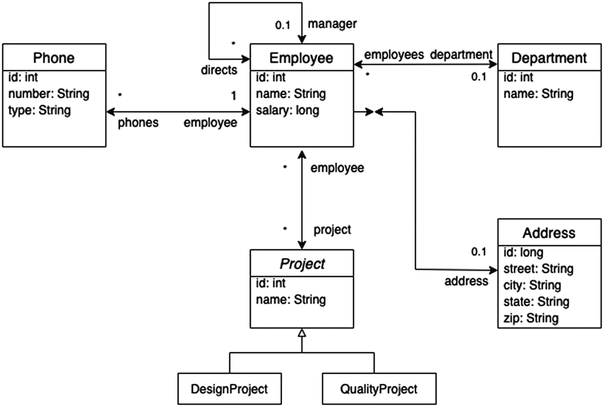

图 8-1

示例应用程序领域模型

本章不包含该模型的对象-关系映射，除非在描述特定查询的 SQL 等价形式时才会提及。编写查询时无需了解对象如何映射，因为查询语言完全基于对象模型和实体之间的逻辑关系。查询翻译器的工作是接收面向对象的查询表达式，解释映射元数据，从而生成在数据库上执行查询所需的 SQL。

### 示例应用程序

学习一门新语言可能是一项具有挑战性的经历。阅读一页又一页描述语言特性的文本是一回事，而将这些特性付诸实践则完全是另一回事。为了熟悉编写查询，可以考虑使用类似清单 8-1 所示的应用程序。这个简单的应用程序从控制台读取查询，并针对特定持久化单元中的实体执行查询。

```
package persistence;
import java.util.*;
import jakarta.persistence.*;
import org.apache.commons.lang3.builder.*;
public class QueryTester {
public static void main(String[] args) {
String unitName = args[0];
EntityManagerFactory emf =
Persistence.createEntityManagerFactory(unitName);
EntityManager em = emf.createEntityManager();
Scanner scanner = new Scanner(System.in);
for (;;) {
System.out.print("Jakarta Persistence QL> ");
String query = scanner.nextLine();
while (!query.endsWith(";")) {
query += " " + scanner.nextLine();
}
if (query.equals("quit")) {
break;
}
if (query.length() == 0) {
continue;
}
try {
if ("select".equalsIgnoreCase(query.trim().substring(0, 6))) {
List result = em.createQuery(query).getResultList();
if (result.size() > 0) {
int count = 0;
for (Object o : result) {
System.out.print(++count + " ");
printResult(o);
}
} else {
System.out.println("0 results returned");
}
} else {
int i = em.createQuery(query).executeUpdate();
System.out.println(i + " items altered");
}
} catch (Exception e) {
e.printStackTrace();
}
}
}
private static void printResult(Object result) {
if (result == null) {
System.out.print("NULL");
} else if (result instanceof Object[]) {
Object[] row = (Object[]) result;
System.out.print("[");
for (int i = 0; i < row.length; i++) {
printResult(row[i]);
}
System.out.print("]");
} else if (result instanceof Long ||
result instanceof Double ||
result instanceof String) {
System.out.print(result.getClass().getName() + ": " + result);
} else {
System.out.print(ReflectionToStringBuilder.toString(result,
ToStringStyle.SHORT_PREFIX_STYLE));
}
System.out.println();
}
}
清单 8-1
用于测试查询的应用程序
```

使用此应用程序的唯一要求是提供一个持久化单元的名称，该单元包含要查询的实体。应用程序将从命令行读取持久化单元名称，并尝试为该名称创建 `EntityManagerFactory`。如果初始化成功，则可以在 `Jakarta Persistence QL>` 提示符下输入查询。每个查询必须以分号结尾。查询将被执行，并打印出结果。每个结果的格式是类名后跟该类的每个属性。此示例使用 Apache Commons-Lang3 库生成对象摘要。清单 8-2 演示了该应用程序的一个示例会话。

```
Jakarta Persistence QL> SELECT p FROM Phone p WHERE p.type NOT IN ('office', 'home');
1 Phone[id=5,number=516-555-1234,type=cell,employee=Employee@13c0b53]
2 Phone[id=9,number=650-555-1234,type=cell,employee=Employee@193f6e2]
3 Phone[id=12,number=650-555-1234,type=cell,employee=Employee@36527f]
4 Phone[id=18,number=585-555-1234,type=cell,employee=Employee@bd6a5f]
5 Phone[id=21,number=650-555-1234,type=cell,employee=Employee@979e8b]
Jakarta Persistence QL> SELECT d.name, AVG(e.salary) FROM Department d JOIN d.employees e
GROUP BY d.name;
1 [java.lang.String: QA
java.lang.Double: 52500.0
]
2 [java.lang.String: Engineering
java.lang.Double: 56833.333333333336
]
Jakarta Persistence QL> quit;
清单 8-2
与 QueryTester 的示例会话
```


## 选择查询

选择查询是最重要的查询类型，用于从数据库中批量检索数据。毫不意外，选择查询也是应用程序中最常用的查询形式。选择查询的整体形式如下：

```
SELECT 
FROM 
[WHERE ]
[ORDER BY ]
```

选择查询的最简形式由两个必需部分组成：`SELECT` 子句和 `FROM` 子句。`SELECT` 子句定义查询结果的格式，而 `FROM` 子句定义获取结果的一个或多个实体。考虑以下检索公司所有员工的完整查询：

```
SELECT e
FROM Employee e
```

该查询的结构与 SQL 查询非常相似，但有几个重要区别。第一个区别是，`FROM` 子句中定义的查询域不是表，而是实体，在本例中为 `Employee` 实体。与 SQL 一样，它被别名为标识符 `e`。这个别名值被称为**标识变量**，是在 select 语句其余部分引用该实体的关键。与 SQL 查询中表别名可选不同，在 Jakarta Persistence QL 中，标识变量的使用是强制性的。

第二个区别是，此示例中的 `SELECT` 子句没有枚举表的字段，也没有使用通配符选择所有字段。相反，仅列出了标识变量，以指示查询的结果类型是 `Employee` 实体，而不是一组表格形式的行。

当查询处理器遍历从数据库返回的结果集时，它会将表格形式的行和列数据转换为一组实体实例。`Query` 接口的 `getResultList()` 方法在评估查询后将返回一个包含零个或多个 `Employee` 对象的集合。尽管结构和语法存在差异，但每个查询都可以转换为 SQL。

为了执行查询，查询引擎首先为 Jakarta Persistence QL 查询构建一个最优的 SQL 表示。生成的 SQL 查询才是实际在数据库上执行的查询。在这个简单的示例中，根据 `Employee` 实体的映射元数据，SQL 可能如下所示：

```
SELECT id, name, salary, manager_id, dept_id, address_id
FROM emp
```

SQL 语句必须读取创建实体实例所需的所有映射列，包括外键列。即使实体已缓存在内存中，查询引擎通常仍会读取所有必需的数据，以确保缓存版本是最新的。请注意，如果 `Employee` 与 `Department` 或 `Address` 实体之间的关系需要**急加载**，则要么扩展 SQL 语句以检索额外数据，要么将多个语句批量处理在一起，以便完全构建 `Employee` 实体。每个供应商都会提供一些方法来显示其通过翻译 Jakarta Persistence QL 生成的 SQL。特别是对于性能调优，了解供应商如何处理 SQL 生成有助于编写更高效的查询。

现在我们已经看了一个简单的查询并介绍了基本术语，接下来的部分将逐一介绍 select 查询的每个子句，解释其语法和可用特性。

注意

正如我们在第 2 章中所示，Jakarta Persistence 中包含的查询流式功能将帮助我们避免获取过多数据并导致错误。然而，仍然建议使用 `Result Set` 分页方法，并且它更高效。

### SELECT 子句

查询的 `SELECT` 子句可以有多种形式，包括简单和复杂的路径表达式、标量表达式、构造函数表达式、聚合函数以及这些表达式类型的序列。以下部分介绍路径表达式，并讨论不同风格的 `SELECT` 子句以及它们如何确定查询的结果类型。我们将标量表达式的讨论推迟到探索 `WHERE` 子句中的条件表达式时进行。它们在“标量表达式”一节中有完整描述。聚合函数将在本章后面的“聚合查询”一节中详细介绍。

#### 路径表达式

路径表达式是查询的构建块。它们用于从实体导航出去，要么跨越关系到另一个实体（或实体集合），要么到实体的某个持久化属性。导航到实体的某个持久化状态字段（无论是字段还是属性）称为**状态字段路径**。导航到单个实体称为**单值关联路径**，而导航到实体集合则称为**集合值关联路径**。

点运算符 (`.`) 表示表达式中的路径导航。例如，如果 `Employee` 实体已映射到标识变量 `e`，则 `e.name` 是一个解析为员工姓名的状态字段路径表达式。同样，路径表达式 `e.department` 是从员工到其所属部门的单值关联。最后，`e.directs` 是一个集合值关联，解析为向同时也是经理的员工汇报的员工集合。

路径表达式之所以如此强大，是因为它们不限于单次导航。相反，只要路径从左到右穿过单值关联，导航表达式就可以链接在一起，遍历复杂的实体图。路径不能从状态字段或集合值关联继续。使用这种技术，我们可以构造诸如 `e.department.name` 之类的路径表达式，即员工所属部门的名称。请注意，路径表达式可以导航到嵌入式对象以及普通实体中，也可以穿过它们。路径表达式中对嵌入式对象的唯一限制是路径表达式的根必须以实体开头。

路径表达式用于 select 查询的每个子句，决定从查询的结果类型到应过滤结果的条件等一切。掌握路径表达式是编写高效查询的关键。


#### 实体与对象

`SELECT` 子句第一种也是最简单的形式是单个标识变量。这种查询风格的结果类型是与该标识变量关联的实体。例如，以下查询返回公司中的所有部门：

```
SELECT d
FROM Department d
```

关键字 `OBJECT` 可用于指示查询的结果类型是绑定到标识变量的实体。它对查询没有影响，但可以作为视觉提示：

```
SELECT OBJECT(d)
FROM Department d
```

使用 `OBJECT` 的唯一问题是，尽管路径表达式可以解析为实体类型，但 `OBJECT` 关键字的语法仅限于标识变量。表达式 `OBJECT(e.department)` 是非法的，即使 `Department` 是实体类型。因此，我们不推荐使用 `OBJECT` 语法。它主要是为了与之前版本的语言兼容而存在，之前的版本要求使用 `OBJECT` 关键字，并假设 SQL 的未来修订版将包含相同的术语。

解析为状态字段或单值关联的路径表达式也可以在 `SELECT` 子句中使用。在这种情况下，查询的结果类型变为路径表达式的类型，即状态字段类型或单值关联的实体类型。以下查询返回所有员工的姓名：

```
SELECT e.name
FROM Employee e
```

`SELECT` 子句中路径表达式的结果类型是 `String`，因此使用 `getResultList()` 执行此查询将生成一个包含零个或多个 `String` 对象的集合。解析为状态字段的路径表达式也可以用作标量表达式的一部分，从而允许在查询结果中转换状态字段。我们将在后面“标量表达式”一节中讨论此技术。

从路径表达式到达的实体也可以被返回。以下查询演示了通过路径导航返回不同的实体：

```
SELECT e.department
FROM Employee e
```

此查询的结果类型是 `Department` 实体，因为这是从 `Employee` 遍历 `department` 关系到 `Department` 的结果。因此，执行该查询将生成一个包含零个或多个 `Department` 对象的集合，其中包含重复项。

要移除重复项，必须使用 `DISTINCT` 运算符：

```
SELECT DISTINCT e.department
FROM Employee e
```

`DISTINCT` 运算符在功能上等同于同名的 SQL 运算符。收集结果集后，重复值（如果查询结果类型是实体，则使用实体标识）将被移除，以便仅返回唯一结果。

选择查询的结果类型对应于执行查询所产生的结果集中每一行的类型。这可以包括实体、原始类型和其他持久化属性类型，但绝不能是集合类型。以下查询是非法的：

```
SELECT d.employees
FROM Department d
```

路径表达式 `d.employees` 是一个集合值路径，会产生集合类型。以这种方式限制查询可以防止提供者必须将数据库中的连续行合并到单个结果对象中。

可以选择在路径表达式中导航到的可嵌入对象。以下查询仅返回所有员工的 `ContactInfo` 可嵌入对象：

```
SELECT e.contactInfo
FROM Employee e
```

关于选择可嵌入对象需要记住的是，返回的对象将不受管理。如果您发出查询以返回员工（`select e FROM Employee e`），然后从结果导航到其 `ContactInfo` 嵌入对象，您将获得受管理的可嵌入对象。对这些对象中任何一个的更改都将在事务提交时保存。然而，直接更改从选择 `ContactInfo` 的查询返回的任何 `ContactInfo` 对象结果，都不会产生持久化效果。

#### 组合表达式

可以通过用逗号分隔在同一个 `SELECT` 子句中指定多个表达式。在这种情况下，查询的结果类型是 `Object` 类型的数组，其中数组的元素是按照它们在查询中出现的顺序解析表达式的结果。

考虑以下仅返回员工姓名和薪水的查询：

```
SELECT e.name, e.salary
FROM Employee e
```

执行此查询时，将返回一个包含零个或多个 `Object` 类型数组实例的集合。此示例中的每个数组都有两个元素，第一个是包含员工姓名的 `String`，第二个是包含员工薪水的 `Double`。仅报告实体状态字段子集的做法称为投影，因为实体数据从实体中投影到表格形式。

投影对于 Web 应用程序是一种有用的技术，在这些应用程序中，仅从大量实体实例中显示少量信息。根据实体的映射方式，可能需要复杂的 SQL 查询才能完全检索实体状态。如果只需要两个字段，那么构建实体实例所花费的额外精力可能就浪费了。在这些情况下，仅返回最少数据量的投影查询更为有用。

#### 构造函数表达式

`SELECT` 子句中一种更强大的涉及多个表达式的形式是构造函数表达式，它指定查询的结果将使用用户指定的对象类型进行存储。考虑以下查询：

```
SELECT NEW example.EmployeeDetails(e.name, e.salary, e.department.name)
FROM Employee e
```

此查询的结果类型是 `example.EmployeeDetails` Java 类。当查询处理器遍历查询结果时，它会使用与查询中列出的表达式类型匹配的构造函数来实例化 `EmployeeDetails` 的新实例。在这种情况下，表达式类型是 `String`、`Double` 和 `String`，因此查询引擎将搜索一个以这些类类型作为参数的构造函数。因此，结果查询集合中的每一行都是一个 `EmployeeDetails` 实例，其中包含员工姓名、薪水和部门名称。

结果对象类型必须使用对象的完全限定名称来引用。但是，该类不必以任何方式映射到数据库。任何具有与 `SELECT` 子句中列出的表达式兼容的构造函数的类都可以在构造函数表达式中使用。

构造函数表达式是用于构建粗粒度数据传输对象或视图对象以在其他应用程序层中使用的强大工具。无需手动构造这些对象，可以使用单个查询来收集准备好在网页上呈现的视图对象。

### FROM 子句

`FROM` 子句用于声明一个或多个标识变量，这些变量可选地派生自连接关系，它们构成了查询应从中提取结果的域。`FROM` 子句的语法由一个或多个标识变量和连接子句声明组成。


#### 标识变量

标识变量是所有查询表达式的起点。每个查询必须在 `FROM` 子句中定义至少一个标识变量，且该变量必须对应一个实体类型。当标识变量声明未使用路径表达式（即仅使用单个实体名称）时，称为范围变量声明。该术语源于集合论，因为该变量被认为是对实体进行范围限定。

范围变量声明的语法为 `<实体名称> [AS] <标识符>`。我们在之前的所有示例中都使用了此语法，但省略了可选的 `AS` 关键字。标识符必须遵循标准 Java 命名规则，并且在整个查询中不区分大小写地引用。多个声明可以通过逗号分隔来指定。

在连接和子查询的情况下，路径表达式也可以被别名为标识变量。这些情况下标识变量声明的语法将在接下来的两节中介绍。

#### 连接

连接是一种将多个实体的结果组合在一起的查询。Jakarta Persistence QL 查询中的连接在逻辑上等同于 SQL 连接。最终，一旦查询被转换为 SQL，实体之间的连接很可能会在实体映射到的表之间产生类似的连接。因此，理解何时发生连接对于编写高效的查询至关重要。

在 `SELECT` 查询中，满足以下任一条件时会发生连接：

*   `FROM` 子句中列出了两个或多个范围变量声明，并且这些声明出现在 `SELECT` 子句中。
*   使用 `JOIN` 运算符通过路径表达式扩展标识变量。
*   查询中任何位置的路径表达式通过关联字段导航到相同或不同的实体。
*   一个或多个 `WHERE` 条件比较不同标识变量的属性。

实体之间连接的语义与表之间的 SQL 连接相同。大多数查询包含一系列连接条件，这些条件是定义将一个实体与另一个实体匹配的规则的表达式。连接条件可以显式指定，例如在查询的 `FROM` 子句中使用 `JOIN` 运算符，也可以作为路径导航的结果隐式指定。

两个实体之间的内连接返回满足所有连接条件的两个实体类型的对象。从一个实体到另一个实体的路径导航是内连接的一种形式。两个实体的外连接是满足连接条件的两个实体类型的对象集，加上一个实体类型（指定为左实体）中在另一个实体中没有匹配连接条件的对象集。

在两个实体之间没有连接条件的情况下，查询将产生笛卡尔积。第一个实体类型的每个对象与第二个实体类型的每个对象配对，从而使结果数量呈平方增长^(²⁰)。鉴于该语言的导航能力，笛卡尔积在 Jakarta Persistence QL 查询中很少见，但如果 `FROM` 子句中指定了两个范围变量声明，而 `WHERE` 子句中未指定额外条件，则可能发生。

以下各节将提供每种连接风格的进一步讨论和示例。

##### 内连接

到目前为止，所有示例查询都使用了最简单的 `FROM` 子句形式，即单个实体类型别名为标识变量。然而，作为一种关系型语言，Jakarta Persistence QL 支持利用多个实体及其之间关系的查询。

两个实体之间的内连接可以通过前面列出的方式之一来指定。第一种也是首选的形式是使用 `FROM` 子句中的 `JOIN` 运算符，因为它明确且清晰地表明正在发生连接。另一种形式需要在 `FROM` 子句中使用多个范围变量声明，并通过 `WHERE` 子句条件提供连接条件。

###### JOIN 运算符与集合关联字段

使用 `JOIN` 运算符的内连接语法为 `[INNER] JOIN <路径表达式> [AS] <标识符>`。考虑以下查询：

```
SELECT p
FROM Employee e JOIN e.phones p
```

此查询使用 `JOIN` 运算符通过 `phones` 关系将 `Employee` 实体连接到 `Phone` 实体。此查询中的连接条件由 `phones` 关系的对象-关系映射定义。无需指定额外条件来链接这两个实体。通过将两个实体连接在一起，此查询返回与公司员工关联的所有 `Phone` 实体实例。

连接的语法类似于 ANSI SQL 支持的 `JOIN` 表达式。对于可能不熟悉此语法的读者，请考虑使用传统连接形式编写的上述查询的等效 SQL 形式：

```
SELECT p.id, p.phone_num, p.type, p.emp_id
FROM emp e, phone p
WHERE e.id = p.emp_id
```

`Phone` 实体的表映射替换了表达式 `e.phones`。`WHERE` 子句还包含了通过 `phones` 映射定义的连接列将两个表连接在一起所需的条件。

请注意，`phones` 关系已被映射到标识变量 `p`。即使 `Phone` 实体没有直接出现在查询中，`phones` 关系的目标也是 `Phone` 实体，这决定了标识变量的类型。这种对标识变量类型的隐式确定可能需要一些时间来适应。熟悉对象模型中关系的定义方式对于理解编写的查询是必要的。

`FROM` 子句之外的每个 `p` 现在都指向员工拥有的单个电话。即使在 `JOIN` 子句中指定了集合关联字段，标识变量实际上指向的是通过该关联访问到的实体，而不是集合本身。现在可以像直接在 `FROM` 子句中列出 `Phone` 实体一样使用该变量。例如，可以不返回 `Phone` 实体实例，而是返回电话号码：

```
SELECT p.number
FROM Employee e JOIN e.phones p
```

在之前路径表达式的定义中，我们注意到路径不能从状态字段或集合关联字段继续。为了解决这种情况，必须在 `FROM` 子句中连接集合关联字段，以便为路径创建一个新的标识变量，使其成为新路径表达式的根。

IN 与 JOIN

EJB 规范定义的 EJB QL 在 `FROM` 子句中使用了一个特殊的运算符 `IN` 来将集合关联映射到标识变量。对该运算符的支持被延续到了 Jakarta Persistence QL 中。本节前面使用的查询的等效形式可以指定为：

```
SELECT DISTINCT p
FROM Employee e, IN(e.phones) p
```

`IN` 运算符旨在表示变量 `p` 是 `phones` 集合的枚举。`JOIN` 运算符是一种更强大、更具表现力的声明关系的方式，是推荐的查询运算符。


###### JOIN 运算符与单值关联字段

`JOIN` 运算符既可用于集合值关联路径表达式，也可用于单值关联路径表达式。请参考以下示例：

```
SELECT d
FROM Employee e JOIN e.department d
```

此查询定义了一个从 `Employee` 到 `Department` 的跨 `department` 关系的连接。这在语义上等同于在 `SELECT` 子句中使用路径表达式来获取员工所属的部门。例如，以下查询生成的 SQL 表示（涉及 `Employee` 和 `Department` 实体之间的连接）应与上述查询相似，甚至完全相同：

```
SELECT e.department
FROM Employee e
```

在 `FROM` 子句中使用单值关联路径表达式（而非仅在 `SELECT` 子句中使用路径表达式）的主要场景是外连接。路径导航等价于对路径表达式中遍历的所有关联实体进行内连接。

由路径表达式可能产生的隐式内连接是需要留意的问题。请参考以下示例，该示例返回参与 `Release1` 项目且位于加利福尼亚州的独立部门：

```
SELECT DISTINCT e.department
FROM Project p JOIN p.employees e
WHERE p.name = 'Release1' AND
e.address.state = 'CA'
```

这里实际上存在四个逻辑连接，而非两个。转换器会将此查询视为在各个实体之间显式编写了连接。我们将在后面的“多重连接”部分介绍多重连接的语法，但暂时请考虑以下查询，它与前一个查询等价，从左到右读取连接条件：

```
SELECT DISTINCT d
FROM Project p JOIN p.employees e JOIN e.department d JOIN e.address a
WHERE p.name = 'Release1' AND
a.state = 'CA'
```

我们之所以说四个逻辑连接，是因为实际的物理映射可能涉及更多表。在此例中，`Employee` 和 `Project` 实体通过一个连接表以多对多关联的方式相关联。因此，此类查询的实际 SQL 使用了五个表，而非四个：

```
SELECT DISTINCT d.id, d.name
FROM project p, emp_projects ep, emp e, dept d, address a
WHERE p.id = ep.project_id AND
ep.emp_id = e.id AND
e.dept_id = d.id AND
e.address_id = a.id AND
p.name = 'Release1' AND
a.state = 'CA'
```

第一种查询形式显然更易于阅读和理解。然而，在进行性能调优时，了解看似简单的路径表达式可能产生多少个连接，会很有帮助。

###### WHERE 子句中的连接条件

传统上，SQL 查询通过在 `FROM` 子句中列出要连接的表，并在查询的 `WHERE` 子句中提供条件来确定连接条件，从而将表连接起来。要在不使用关系的情况下连接两个实体，请在 `FROM` 子句中为每个实体声明一个范围变量。

前面 `Employee` 和 `Department` 实体之间的连接示例也可以这样编写：

```
SELECT DISTINCT d
FROM Department d, Employee e
WHERE d = e.department
```

这种查询风格通常用于弥补领域模型中两个实体之间缺乏显式关系的情况。例如，`Department` 实体与作为部门经理的 `Employee` 之间没有关联。

我们可以使用 `WHERE` 子句中的连接条件来实现这一点：

```
SELECT d, m
FROM Department d, Employee m
WHERE d = m.department AND
m.directs IS NOT EMPTY
```

在此示例中，我们使用了特殊的集合表达式 `IS NOT EMPTY` 来检查该员工的直属下属集合是否非空。任何拥有非空直属下属集合的员工，按定义即为经理。

###### 多重连接

如有必要，可以级联多个连接。例如，以下查询返回属于某个部门的员工所拥有的独立项目集合：

```
SELECT DISTINCT p
FROM Department d JOIN d.employees e JOIN e.projects p
```

查询处理器从左到右解释 `FROM` 子句。一旦声明了一个变量，它就可以被后续的 `JOIN` 表达式引用。在此例中，一旦声明了员工变量，就可以导航 `Employee` 实体的 `projects` 关系。

##### 映射连接

导航通过实现为 `Map` 的集合值关联的路径表达式是一种特殊情况。与普通集合不同，映射中的每个项对应两条信息：键和值。在使用 Jakarta Persistence QL 时，务必注意，基于映射的标识变量默认引用的是值。例如，考虑 `Employee` 实体的 `phones` 关系被建模为映射的情况，其中键是号码类型（工作、手机、家庭等），值是电话号码。以下查询枚举了所有员工的电话号码：

```
SELECT e.name, p
FROM Employee e JOIN e.phones p
```

这种行为可以通过使用 `VALUE` 关键字来显式强调。例如，上述查询在功能上与以下查询相同：

```
SELECT e.name, VALUE(p)
FROM Employee e JOIN e.phones p
```

要访问给定映射项的键而非值，我们可以使用 `KEY` 关键字来覆盖默认行为，并返回给定映射项的键值。以下示例演示了将电话类型添加到前一个查询中：

```
SELECT e.name, KEY(p), VALUE(p)
FROM Employee e JOIN e.phones p
WHERE KEY(p) IN ('Work', 'Cell')
```

最后，如果我们希望键和值以 `java.util.Map.Entry` 对象的形式一起返回，我们可以以相同的方式指定 `ENTRY` 关键字。请注意，`ENTRY` 关键字只能在 `SELECT` 子句中使用。`KEY` 和 `VALUE` 关键字也可以用作查询的 `WHERE` 和 `HAVING` 子句中条件表达式的一部分。

请注意，在每个映射连接示例中，我们将一个实体与其某个 Map 属性进行连接，并得到了一个键、值或键值对（条目）。然而，从表的角度来看，连接始终只在源实体主键和 Map 中的值这一层面进行。目前 Jakarta Persistence 中还没有提供将源实体与 Map 的键进行连接的功能。


##### 外连接

两个实体之间的外连接会生成一个域，其中仅要求关系的一侧是完整的。换句话说，`Employee` 与 `Department` 之间通过员工 `department` 关系进行的外连接会返回所有员工及其所属部门，但部门信息仅在存在时才返回。这与内连接形成对比，内连接仅返回那些已分配到部门的员工。

外连接使用以下语法指定：`LEFT [OUTER] JOIN <路径表达式> [AS] <标识符>`。以下查询演示了两个实体之间的外连接：

```
SELECT e, d
FROM Employee e LEFT JOIN e.department d
```

如果员工尚未分配到任何部门，则部门对象（`Object` 数组的第二个元素）将为 null。

在典型的提供者 SQL 生成中，您会发现上述查询等同于以下内容：

```
SELECT e.id, e.name, e.salary, e.manager_id, e.dept_id, e.address_id,
d.id, d.name
FROM employee e LEFT OUTER JOIN department d
ON (d.id = e.department_id)
```

生成的 SQL 表明，当从 Jakarta Persistence QL 生成外连接时，它始终会在映射所连接关系的连接列与其引用的主键之间指定一个等值 `ON` 条件。

可以添加额外的 `ON` 表达式来为从连接右侧返回的对象增加约束。例如，我们可以修改之前的 Jakarta Persistence QL 查询，添加一个额外的 `ON` 条件，以将返回的部门限制为仅那些名称以 `'QA'` 开头的部门：

```
SELECT e, d
FROM Employee e LEFT JOIN e.department d
ON d.name LIKE 'QA%'
```

此查询仍会返回所有员工，但结果将不包含任何不满足所添加 `ON` 条件的部门。生成的 SQL 如下所示：

```
SELECT e.id, e.name, e.salary, e.department_id, e.manager_id, e.address_id,
d.id, d.name
FROM employee e left outer join department d
ON ((d.id = e.department_id) and (d.name like 'QA%'))
```

请注意，此查询与使用 `WHERE` 表达式的查询有很大不同：

```
SELECT e, d
FROM Employee e LEFT JOIN e.department d
WHERE d.name LIKE 'QA%'
```

`WHERE` 子句会导致 `Employee` 和 `Department` 之间产生内连接语义，因此此查询仅会返回那些所在部门名称以 `'QA'` 开头的员工。

##### 抓取连接

抓取连接旨在帮助应用程序设计者优化其数据库访问，并为查询结果的分离做准备。它们允许查询指定一个或多个应由查询引擎导航并预抓取的关系，以便在运行时不会延迟加载这些关系。

例如，如果我们有一个 `Employee` 实体，其与地址之间存在延迟加载关系，则可以使用以下查询来指示该关系应在查询执行期间被立即解析：

```
SELECT e
FROM Employee e JOIN FETCH e.address
```

请注意，没有为 `e.address` 路径表达式设置标识变量。这是因为，尽管为了解析关系而连接了 `Address` 实体，但它并不是查询结果类型的一部分。执行查询的结果仍然是一个 `Employee` 实体实例的集合，不同之处在于，访问每个实体上的 `address` 关系时不会导致对数据库的二次访问。如果 `Employee` 实体变为分离状态，这也允许安全地访问 `address` 关系。通过在 `JOIN` 操作符中添加 `FETCH` 关键字，可以将抓取连接与常规连接区分开来。

为了实现抓取连接，提供者需要将抓取的关联转换为适当类型的常规连接：默认是内连接，如果指定了 `LEFT` 关键字则为外连接。查询的 `SELECT` 表达式也需要扩展以包含被连接的关系。用 Jakarta Persistence QL 表示，上述抓取连接示例的等效提供者解释如下所示：

```
SELECT e, a
FROM Employee e JOIN e.address a
```

唯一的区别在于，提供者实际上不会将 `Address` 实体返回给调用者。由于结果是从此查询处理的，查询引擎会在内存中创建 `Address` 实体并将其分配给 `Employee` 实体，然后将其从为客户端构建的结果集合中丢弃。这会立即加载 `address` 关系，之后可以通过从 `Employee` 实体导航来访问该关系。

以这种方式实现抓取连接的一个后果是，抓取集合关联会导致重复的结果。例如，考虑一个部门查询，其中 `Department` 实体的 `employees` 关系被立即抓取。这次使用外连接以确保检索到没有员工的部门的抓取连接查询，可以编写如下：

```
SELECT d
FROM Department d LEFT JOIN FETCH d.employees
```

用 Jakarta Persistence QL 表示，提供者的解释会将抓取替换为跨越 `employees` 关系的外连接：

```
SELECT d, e
FROM Department d LEFT JOIN d.employees e
```

再次强调，在处理结果时，`Employee` 实体在内存中被构建，但会从结果集合中丢弃。每个 `Department` 实体现在都有一个完全解析的 `employees` 集合，但客户端会为每个员工收到每个部门的一个引用。例如，如果检索了四个部门，每个部门有五名员工，结果将是一个包含 20 个 `Department` 实例的集合，每个部门重复五次。实际的实体实例都指向相同的托管版本，但结果至少可以说是有些奇怪的。

为了消除重复值，必须使用 `DISTINCT` 操作符，或者将结果放入诸如 `Set` 之类的数据结构中。由于无法编写一个在保留抓取连接语义的同时使用 `DISTINCT` 操作符的 SQL 查询，提供者将不得不在获取结果后在内存中消除重复项。这对于大型结果集可能会产生性能影响。

考虑到从对集合的抓取连接生成的有些奇特的结果，它在所有情况下可能都不是立即加载相关实体的最合适方式。如果某个集合需要定期进行立即抓取，请考虑默认将该关系设置为立即加载。一些持久化提供者还提供批量读取作为抓取连接的替代方案，它在单个批次中发出多个查询，然后关联结果以立即加载关系。另一种替代方案是使用实体图来动态确定查询要加载的关系属性。实体图在第 11 章中有详细描述。

### WHERE 子句

查询的 `WHERE` 子句用于指定过滤条件以减少结果集。在本节中，我们将探讨 `WHERE` 子句的特性以及可用于过滤查询结果的各种表达式类型。

`WHERE` 子句的定义看似简单。它仅仅是关键字 `WHERE`，后跟一个条件表达式。然而，正如以下各节所示，Jakarta Persistence QL 支持一套强大的条件表达式，用于过滤最复杂的查询。


#### 输入参数

查询的输入参数可以使用位置标记或命名标记来指定。位置标记通过在变量编号前添加问号来定义。考虑以下查询：

```
SELECT e
FROM Employee e
WHERE e.salary > ?1
```

使用 `Query` 接口，任何双精度值，或与 `salary` 属性类型兼容的值，都可以绑定到第一个参数中，以指示此查询中员工薪资的下限。同一个位置参数可以在查询中出现多次。绑定到参数的值将替换其每次出现的位置。

命名参数使用冒号后跟标识符来指定。以下是相同的查询，这次使用了命名参数：

```
SELECT e
FROM Employee e
WHERE e.salary > :sal
```

输入参数在第 7 章中有详细说明。

#### 基本表达式形式

Jakarta Persistence QL 中的条件表达式支持大部分直接借鉴自 SQL。这是有意为之，有助于减轻已熟悉 SQL 的开发者的学习过渡难度。Jakarta Persistence QL 与 SQL 中条件表达式的关键区别在于，Jakarta Persistence QL 表达式可以在表达式求值期间利用标识变量和路径表达式来导航关系。

条件表达式的构建方式与 SQL 条件表达式相同，使用逻辑运算符、比较表达式、字段上的基本操作和函数操作等的组合。尽管稍后会提供运算符的总结，但此处不再重复条件表达式的语法。Jakarta Persistence 规范包含了巴科斯-诺尔范式（BNF）的语法，是查找关于使用基本表达式的确切规则的地方。不过，以下各节确实解释了更高级的运算符和表达式，特别是 Jakarta Persistence QL 独有的那些，并为每个都提供了示例。

字面量语法也与 SQL 类似（参见“字面量”部分）。

运算符优先级如下：

1.  导航运算符 (.)

2.  一元 +/–

3.  乘法 (*) 和除法 (/)

4.  加法 (+) 和减法 (–)

5.  比较运算符 =, >, >=, <, <=, <>, [NOT] BETWEEN, [NOT] LIKE, [NOT] IN, IS [NOT] NULL, IS [NOT] EMPTY, [NOT] MEMBER [OF]

6.  逻辑运算符 (AND, OR, NOT)

#### BETWEEN 表达式

`BETWEEN` 运算符可用于条件表达式中，以确定表达式的结果是否落在某个包含边界值的范围内。数值、字符串和日期表达式都可以通过这种方式求值。考虑以下示例：

```
SELECT e
FROM Employee e
WHERE e.salary BETWEEN 40000 AND 45000
```

任何薪资在 40,000 美元到 45,000 美元（含）之间的员工都会被包含在结果中。这与以下使用基本比较运算符的查询相同：

```
SELECT e
FROM Employee e
WHERE e.salary >= 40000 AND e.salary <= 45000
```

`BETWEEN` 运算符也可以与 `NOT` 运算符一起使用来表示否定。

#### LIKE 表达式

Jakarta Persistence QL 支持 SQL 的 `LIKE` 条件，以提供一种有限形式的字符串模式匹配。每个 `LIKE` 表达式由一个待搜索的字符串表达式、一个模式字符串以及一个可选的转义序列组成，该转义序列定义了匹配条件。模式字符串使用的通配符是下划线（`_`）用于匹配单个字符，百分号（`%`）用于匹配多个字符：

```
SELECT d
FROM Department d
WHERE d.name LIKE '__Eng%'
```

我们使用两个下划线字符作为前缀，来通配字符串候选者的前两个字符，因此匹配此查询的示例部门名称可能是 `CAEngOtt` 或 `USEngCal`，但不会是 `CADocOtt`。请注意，模式匹配是区分大小写的。

如果模式字符串包含需要按字面意义匹配的下划线或百分号，则可以使用 `ESCAPE` 子句来指定一个转义字符，当该字符作为通配符的前缀时，表示该通配符应按字面意义处理：

```
SELECT d
FROM Department d
WHERE d.name LIKE 'QA\_%' ESCAPE '\'
```

转义下划线使其成为表达式的强制组成部分。例如，`QA_East` 会匹配，但 `QANorth` 不会匹配。


#### 子查询

子查询可用于查询的 `WHERE` 和 `HAVING` 子句中。子查询是一个完整的 select 查询，它位于一对括号内，并嵌入在条件表达式中。执行子查询的结果（可以是标量结果或值的集合）随后会在条件表达式的上下文中进行评估。子查询是解决最复杂查询场景的强大技术。

考虑以下查询：

```
SELECT e
FROM Employee e
WHERE e.salary = (SELECT MAX(emp.salary)
FROM Employee emp)
```

此查询返回所有员工中薪资最高的员工。一个由聚合查询（本章稍后介绍）组成的子查询用于返回最高薪资值，然后此结果被用作键来按薪资筛选员工列表。子查询可用于大多数条件表达式，并且可以出现在表达式的左侧或右侧。

标识符变量的作用域始于其定义的查询，并向下扩展到任何子查询中。主查询中的标识符可以被子查询引用，而子查询引入的标识符可以被其创建的任何子查询引用。如果子查询声明了同名的标识符变量，它将覆盖父级声明，并阻止子查询引用父级变量。

注意

并非所有提供商都保证支持在子查询中覆盖标识变量名。应使用唯一名称以确保可移植性。

在子查询中引用主查询变量的能力使得两个查询可以关联起来。考虑以下示例：

```
SELECT e
FROM Employee e
WHERE EXISTS (SELECT 1
FROM Phone p
WHERE p.employee = e AND p.type = 'Cell')
```

此查询返回所有拥有手机号码的员工。这也是一个返回值集合的子查询示例。此示例中的 `EXISTS` 表达式在子查询返回任何结果时返回 true。从子查询返回字面量 `1` 是 `EXISTS` 表达式的标准做法，因为子查询选择的实际结果并不重要；只有结果的数量是相关的。请注意，子查询的 `WHERE` 子句引用了主查询中的标识符变量 `e`，并用它来筛选子查询结果。从概念上讲，可以认为子查询为每个员工执行一次。在实践中，许多数据库服务器会将这些类型的查询优化为连接或内联视图，以最大化性能。

此查询也可以使用 `Employee` 和 `Phone` 实体之间的连接来编写，并使用 `DISTINCT` 运算符来筛选结果。使用关联子查询的优势在于，主查询无需承担与其他实体的连接负担。通常，如果连接仅用于筛选结果，则存在等效的子查询条件，可以替代使用，以消除主查询连接子句上的约束，甚至提高查询性能。

子查询的 `FROM` 子句也可以使用主查询中的标识符变量，通过路径表达式创建新的标识变量。例如，前面的查询也可以写成如下形式：

```
SELECT e
FROM Employee e
WHERE EXISTS (SELECT 1
FROM e.phones p
WHERE p.type = 'Cell')
```

在此版本的查询中，子查询在子查询中使用了来自 `Employee` 标识变量 `e` 的集合关联路径 `phones`。然后，这被映射到一个本地标识变量 `p`，用于按电话类型筛选结果。每次出现的 `p` 都指代与该员工关联的一部电话。

为了更好地说明转换器如何处理此查询，请考虑用 SQL 编写的等效查询：

```
SELECT e.id, e.name, e.salary, e.manager_id, e.dept_id, e.address_id
FROM emp e
WHERE EXISTS (SELECT 1
FROM phone p
WHERE p.emp_id = e.id AND
p.type = 'Cell')
```

表达式 `e.phones` 被转换为由 `Phone` 实体映射的表。然后，子查询的 `WHERE` 子句添加必要的连接条件，以将子查询与主查询关联起来，在此例中为表达式 `p.emp_id = e.id`。应用于 `PHONE` 表的连接条件会得到相关员工拥有的所有电话。

#### IN 表达式

`IN` 表达式可用于检查单值路径表达式是否是集合的成员。该集合可以内联定义为字面量值的集合，也可以从子查询派生。以下查询通过选择所有居住在纽约或加利福尼亚州的员工来演示字面量表示法：

```
SELECT e
FROM Employee e
WHERE e.address.state IN ('NY', 'CA')
```

表达式的子查询形式类似，只是将字面量列表替换为嵌套查询。以下查询返回在那些为以 `QA` 前缀开头的项目做出贡献的部门中工作的员工：

```
SELECT e
FROM Employee e
WHERE e.department IN (SELECT DISTINCT d
FROM Department d JOIN d.employees de JOIN de.projects p
WHERE p.name LIKE 'QA%')
```

`IN` 表达式也可以使用 `NOT` 运算符进行否定。例如，以下查询返回所有代表非办公室或家庭电话号码的 `Phone` 实体：

```
SELECT p
FROM Phone p
WHERE p.type NOT IN ('Office', 'Home')
```

#### 集合表达式

`IS EMPTY` 运算符在逻辑上等同于 `IS NULL`，但用于集合。查询可以使用 `IS EMPTY` 运算符或其否定形式 `IS NOT EMPTY` 来检查集合关联路径是否解析为空集合或至少有一个值。例如，以下查询通过拥有至少一名直接下属来返回所有作为经理的员工：

```
SELECT e
FROM Employee e
WHERE e.directs IS NOT EMPTY
```

请注意，`IS EMPTY` 表达式在 SQL 中被转换为子查询表达式。查询 `转换器` 可以使用聚合子查询或使用 SQL `EXISTS` 表达式。因此，以下查询与上一个查询等效：

```
SELECT m
FROM Employee m
WHERE (SELECT COUNT(e)
FROM Employee e
WHERE e.manager = m) > 0
```

`MEMBER OF` 运算符及其否定形式 `NOT MEMBER OF` 是检查实体是否是集合关联路径成员的简写方式。以下查询返回所有错误地将自己报告为下属的经理：

```
SELECT e
FROM Employee e
WHERE e MEMBER OF e.directs
```

`MEMBER OF` 运算符更典型的用法是与输入参数结合使用。例如，以下查询选择所有被分配到指定项目的员工：

```
SELECT e
FROM Employee e
WHERE :project MEMBER OF e.projects
```

与 `IS EMPTY` 表达式一样，`MEMBER OF` 表达式将被转换为 SQL，使用 `EXISTS` 表达式或 `IN` 表达式的子查询形式。前面的示例等效于以下查询：

```
SELECT e
FROM Employee e
WHERE :project IN (SELECT p
FROM e.projects p)
```

#### EXISTS 表达式

如果子查询返回任何行，则 `EXISTS` 条件返回 `true`。`EXISTS` 的示例在前面介绍子查询时已经展示过。`EXISTS` 运算符也可以使用 `NOT` 运算符进行否定。以下查询选择所有没有手机的员工：

```
SELECT e
FROM Employee e
WHERE NOT EXISTS (SELECT p
FROM e.phones p
WHERE p.type = 'Cell')
```


#### ANY、ALL 和 SOME 表达式

`ANY`、`ALL` 和 `SOME` 运算符可用于将表达式与子查询的结果进行比较。请参考以下示例：

```
SELECT e
FROM Employee e
WHERE e.directs IS NOT EMPTY AND
e.salary < ALL (SELECT d.salary
FROM e.directs d)
```

此查询返回薪资低于其所有下属员工的经理。子查询被求值，然后子查询的每个值都与左侧表达式（此处为经理薪资）进行比较。使用 `ALL` 运算符时，等式左侧与所有子查询结果的比较都必须为真，整个条件才为真。

`ANY` 运算符的行为类似，但只要表达式与子查询结果之间至少有一个比较为真，整个条件即为真。例如，如果在前一个示例中将 `ALL` 替换为 `ANY`，则查询结果将是所有薪资低于至少一名下属员工的经理。`SOME` 运算符是 `ANY` 运算符的别名。

`IN` 表达式与 `ANY` 运算符之间存在对称性。请考虑之前使用的项目部门示例的以下变体，仅稍作修改以使用 `ANY` 代替 `IN`：

```
SELECT e
FROM Employee e
WHERE e.department = ANY (SELECT DISTINCT d
FROM Department d JOIN d.employees de JOIN de.projects p
WHERE p.name LIKE 'QA%')
```

### 继承与多态

Jakarta Persistence 支持实体间的继承。因此，查询语言支持多态结果，即同一查询可以返回实体的多个子类。

在示例模型中，`Project` 是 `QualityProject` 和 `DesignProject` 的基类。如果从 `Project` 实体形成标识变量，查询结果将包含 `Project`、`QualityProject` 和 `DesignProject` 对象的混合，调用者可以根据需要将结果转换为子类。以下查询检索所有至少有一名员工的项目：

```
SELECT p
FROM Project p
WHERE p.employees IS NOT EMPTY
```

#### 子类区分

如果我们希望将查询结果限制到特定子类，可以在 `FROM` 子句中使用该特定子类，而不是根类。但是，如果我们希望将查询结果限制到多个子类（而非全部子类），则可以在 `WHERE` 子句中使用类型表达式来过滤结果。类型表达式由关键字 `TYPE` 后跟括号内解析为实体的表达式组成。类型表达式的结果是实体名称，然后可用于类型比较。类型表达式的优点在于，我们无需依赖领域模型本身的区分机制即可区分类型。

以下示例演示了如何使用 `TYPE` 表达式仅返回设计和质量项目：

```
SELECT p
FROM Project p
WHERE TYPE(p) = DesignProject OR TYPE(p) = QualityProject
```

请注意，`DesignProject` 和 `QualityProject` 标识符周围没有引号。它们在 Jakarta Persistence QL 中被视为实体名称，而非字符串。尽管存在这种区别，但输入参数可以替代查询字符串中的硬编码名称。创建返回给定子类类型实例的参数化查询非常简单，如下查询所示：

```
SELECT p
FROM Project p
WHERE TYPE(p) = :projectType
```

#### 向下转型

在大多数情况下，至少有一个子类包含一些额外的状态，例如 `QualityProject` 中的 `qaRating` 属性。如果查询仅范围限定于子类实体，则可以直接访问子类属性；但当查询范围限定于超类时，必须使用向下转型。向下转型是一种使引用超类的表达式应用于特定子类的技术。它通过使用 `TREAT` 运算符来实现。

`TREAT` 可以在 `WHERE` 子句中用于根据实例的子类型状态过滤结果。以下查询返回所有设计项目以及所有质量评级大于 4 的质量项目：

```
SELECT p
FROM Project p
WHERE TREAT(p AS QualityProject).qaRating > 4
OR TYPE(p) = DesignProject
```

该表达式的语法以 `TREAT` 关键字开头，后跟其括号内的参数。参数是一个路径表达式，后跟 `AS` 关键字，然后是目标子类型的实体名称。路径表达式必须解析为目标类型的超类。生成的向下转型表达式解析为目标子类型，因此任何子类型特定的属性都可以添加到生成的路径表达式中，就像示例中的 `qaRating` 一样。

`WHERE` 子句中可以包含多个 `TREAT` 表达式，每个表达式向下转型为相同或不同的实体类型。

通常，当执行连接时，它会包含所连接关系中的目标实体类型的所有子类。为了将连接限制为仅考虑特定的子类层次结构，可以在 `FROM` 子句中使用 `TREAT` 表达式。为其分配标识符的额外好处是，该标识符可以在 `WHERE` 子句和 `SELECT` 子句中引用。以下查询返回所有在质量评级大于 4 的质量项目上工作的员工，以及他们工作的项目名称及其质量评级：

```
SELECT e, q.name, q.qaRating
FROM Employee e JOIN TREAT(e.projects AS QualityProject) q
WHERE q.qaRating > 4
```

`TREAT` 表达式也可以类似的方式用于其他类型的连接，例如外连接和抓取连接。

实体间继承对生成的 SQL 的影响对于理解性能至关重要，这将在第 10 章中描述。

### 标量表达式

标量表达式是解析为单个标量值的字面值、算术序列、函数表达式、类型表达式或 case 表达式。它可以在 `SELECT` 子句中用于格式化报表查询中的投影字段，或作为查询 `WHERE` 或 `HAVING` 子句中条件表达式的一部分。解析为标量值的子查询也被视为标量表达式，但只能在组合查询 `WHERE` 子句中的条件时使用。子查询绝不能用在 `SELECT` 子句中。


#### 字面量

Jakarta Persistence QL 中可使用多种不同类型的字面量，包括字符串、数值、布尔值、枚举、实体类型和时态类型。

在本章中，我们展示了许多字符串、整数和布尔字面量的示例。单引号用于界定字符串字面量，在字符串内部通过再添加一个单引号来转义。精确数值和近似数值可根据 Java 编程语言的约定或使用标准 SQL-92 语法来定义。布尔值由字面量 `TRUE` 和 `FALSE` 表示。

查询可以通过指定枚举类的完全限定名称来引用 Java 枚举类型。以下示例演示了在条件表达式中使用枚举，使用了清单 5-8 中演示的 `PhoneType` 枚举：

```
SELECT e
FROM Employee e JOIN e.phoneNumbers p
WHERE KEY(p) = com.acme.PhoneType.Home
```

实体类型就是某个已定义实体的实体名称，并且仅在与 `TYPE` 运算符一起使用时才有效。不使用引号。有关何时使用实体类型字面量的示例，请参阅“继承与多态”部分。

时态字面量使用 JDBC 转义语法指定，该语法规定用花括号括起字面量。序列中的第一个字符是“d”或“t”，分别表示该字面量是日期或时间。如果字面量表示时间戳，则使用“ts”代替。类型指示符之后是一个空格分隔符，然后是实际用单引号括起来的日期、时间或时间戳信息。三种时态字面量类型的一般形式及相应示例如下：

```
{d 'yyyy-mm-dd'}               例如 {d '2009-11-05'}
{t 'hh-mm-ss'}                 例如 {t '12-45-52'}
{ts 'yyyy-mm-dd hh-mm-ss.f'}   例如 {ts '2009-11-05 12-45-52.325'}
```

单引号内的所有时态信息均以数字表示。时间戳的小数部分（“.f”部分）可以是多位数字，并且是可选的。

使用这些时态字面量时，请记住它们仅由支持 JDBC 转义语法的驱动程序解释。提供者通常不会尝试翻译或预处理时态字面量。

#### 函数表达式

标量表达式可以利用函数来转换查询结果。表 8-1 总结了每种受支持函数表达式的语法。

表 8-1

受支持的函数表达式

| 函数 | 描述 |
| --- | --- |
| `ABS(number)` | 返回数字参数的无符号版本。结果类型与参数类型相同（整数、浮点数或双精度浮点数）。 |
| `CONCAT(string1, string2)` | 返回一个新字符串，该字符串是其参数 `string1` 和 `string2` 的连接结果。 |
| `CURRENT_DATE` | 返回数据库服务器定义的当前日期。 |
| `CURRENT_TIME` | 返回数据库服务器定义的当前时间。 |
| `CURRENT_TIMESTAMP` | 返回数据库服务器定义的当前时间戳。 |
| `INDEX(identification variable)` | 返回实体在有序列表中的位置。 |
| `EXTRACT(datetime_field FROM datetime_expression)` | 返回日期时间中相应字段或部分的值。 |
| `LENGTH(string)` | 返回字符串参数中的字符数。 |
| `LOCATE(string1, string2 [, start])` | 返回 `string1` 在 `string2` 中的位置，可选择从 `start` 指示的位置开始。如果找不到该字符串，则结果为零。 |
| `LOWER(string)` | 返回字符串参数的小写形式。 |
| `MOD(number1, number2)` | 返回数值参数 `number1` 和 `number2` 的模数，结果为整数。 |
| `SIZE(collection)` | 返回集合中的元素数量，如果集合为空则返回零。 |
| `SQRT(number)` | 返回数字参数的双精度浮点数平方根。 |
| `SUBSTRING(string, start, end)` | 返回输入字符串的一部分，从 `start` 指示的索引开始，长度为字符数。字符串索引从 1 开始计数。 |
| `UPPER(string)` | 返回字符串参数的大写形式。 |
| `TRIM([[LEADING&#124;TRAILING&#124;BOTH] [char] FROM] string)` | 从字符串中移除前导和/或尾随字符。如果未使用可选的 `LEADING`、`TRAILING` 或 `BOTH` 关键字，则同时移除前导和尾随字符。默认的修剪字符是空格字符。 |

`SIZE` 函数需要特别注意，因为它是聚合子查询的简写形式。例如，考虑以下返回所有只有两名员工的部门的查询：

```
SELECT d
FROM Department d
WHERE SIZE(d.employees) = 2
```

与集合表达式 `IS EMPTY` 和 `MEMBER OF` 一样，`SIZE` 函数将使用子查询转换为 SQL。上一个示例使用子查询的等效形式如下：

```
SELECT d
FROM Department d
WHERE (SELECT COUNT(e)
FROM d.employees e) = 2
```

`INDEX` 函数的用例可能一开始并不明显。使用有序集合时，集合中的每个元素实际上包含两条信息：集合中存储的值及其在集合中的数值位置。查询可以使用 `INDEX` 函数来确定集合中元素的数值位置，然后使用该数字进行报告或过滤。例如，如果员工的电话号码按优先级顺序存储，以下查询将返回每个员工的第一个（也是最重要的）号码：

```
SELECT e.name, p.number
FROM Employee e JOIN e.phones p
WHERE INDEX(p) = 0
```

#### 原生数据库函数

Jakarta Persistence QL 的优点之一是它将应用程序与底层数据库解耦。然而，有时需要使用数据库原生或由系统管理员定义的函数。虽然使用这些函数可能会将查询绑定到目标数据库，但仍有理由使用 Jakarta Persistence QL 的实体映射独立性。

在 Jakarta Persistence QL 查询中，可以通过使用 `FUNCTION` 表达式来访问数据库函数。`FUNCTION` 关键字后跟函数名称和函数参数，必须解析为算术、布尔、字符串或时态类型（如日期、时间或时间戳）的标量值。`FUNCTION` 表达式可用于表达式中任何适合标量类型的位置，并且结果类型必须与表达式其余部分期望的类型匹配。参数必须是字面量、解析为标量的表达式或输入参数。

以下查询调用一个名为 `shouldGetBonus` 的数据库函数。员工所在部门的 ID 和他参与的项目作为参数传递，函数返回类型为布尔值。结果创建了一个条件，使查询返回所有获得奖金的员工集合：

```
SELECT DISTINCT e
FROM Employee e JOIN e.projects p
WHERE  FUNCTION('shouldGetBonus', e.dept.id, p.id)
```


#### Case 表达式

Jakarta Persistence QL 的 case 表达式是对 ANSI SQL-92 Case 表达式的改编，同时考虑了 Jakarta Persistence QL 语言的能力。Case 表达式是将条件逻辑引入查询的强大工具，其优势在于 case 表达式的结果可以在任何标量表达式有效的位置使用。

根据查询所需的灵活性，Case 表达式有四种形式。第一种也是最灵活的形式是通用 case 表达式。所有其他类型的 case 表达式都可以由通用 case 表达式组合而成。其形式如下：

```
CASE {WHEN <条件表达式> THEN <标量表达式>}+ ELSE <标量表达式> END
```

case 表达式的核心是 `WHEN` 子句，其中至少必须有一个。查询处理器按顺序解析每个 `WHEN` 子句的条件表达式，直到找到成功的一个。然后，它计算该 `WHEN` 子句的标量表达式，并将其作为 case 表达式的结果返回。如果所有 `WHEN` 子句的条件表达式都没有产生真值，则计算并返回 `ELSE` 子句的标量表达式。以下示例演示了通用 case 表达式，列举了每个分配了员工的项目名称和类型：

```
SELECT p.name,
CASE WHEN TYPE(p) = DesignProject THEN 'Development'
WHEN TYPE(p) = QualityProject THEN 'QA'
ELSE 'Non-Development'
END
FROM Project p
WHERE p.employees IS NOT EMPTY
```

请注意 case 表达式作为 select 子句一部分的用法。Case 表达式是在报表查询中转换实体数据的强大工具。

通用 case 表达式的一个微小变体是简单 case 表达式。它不是在每个 `WHEN` 子句中检查条件表达式，而是标识一个值并解析每个 `WHEN` 子句中的一个标量表达式。第一个匹配该值的 `WHEN` 子句会触发第二个标量表达式，该表达式成为 case 表达式的值。其形式如下：

```
CASE <值表达式> {WHEN <标量表达式> THEN <标量表达式>}+
ELSE <标量表达式> END
```

这种形式表达式中的 `<值表达式>` 要么是导向状态字段的路径表达式，要么是用于多态比较的类型表达式。我们可以通过将上一个示例转换为简单 case 表达式来简化它：

```
SELECT p.name,
CASE TYPE(p)
WHEN DesignProject THEN 'Development'
WHEN QualityProject THEN 'QA'
ELSE 'Non-Development'
END
FROM Project p
WHERE p.employees IS NOT EMPTY
```

第三种形式的 case 表达式是 coalesce 表达式。这种形式的 case 表达式接受一个或多个标量表达式的序列。其形式如下：

```
COALESCE(<标量表达式> {, <标量表达式>}+)
```

`COALESCE` 表达式中的标量表达式按顺序解析。第一个返回非空值的表达式成为该表达式的结果。以下示例演示了此用法，返回每个部门的描述性名称，或者如果未定义名称则返回部门标识符：

```
SELECT COALESCE(d.name, d.id)
FROM Department d
```

第四种也是最后一种形式的 case 表达式有些特殊。它接受两个标量表达式并解析它们。如果两个表达式的结果相等，则表达式的结果为空。否则，它返回第一个标量表达式的结果。这种形式的 case 表达式由 `NULLIF` 关键字标识：

```
NULLIF(<标量表达式>, <标量表达式>)
```

`NULLIF` 的一个有用技巧是从聚合函数中排除结果。例如，以下查询返回所有部门的计数以及所有名称不为 `'QA'` 的部门的计数：

```
SELECT COUNT(*), COUNT(NULLIF(d.name, 'QA'))
FROM Department d
```

如果部门名称是 `'QA'`，`NULLIF` 将返回 `NULL`，然后 `COUNT` 函数会忽略该值。聚合函数会忽略 `NULL` 值，这将在后面的“聚合查询”部分中描述。

### ORDER BY 子句

查询可以选择使用 `ORDER BY` 以及一个或多个表达式进行排序，这些表达式由标识变量、结果变量、解析为单个实体的路径表达式或解析为持久状态字段的路径表达式组成。表达式后的可选关键字 `ASC` 和 `DESC` 分别用于指示升序或降序排序。默认排序顺序为升序。

以下示例演示了按单个字段排序：

```
SELECT e
FROM Employee e
ORDER BY e.name DESC
```

也可以使用多个表达式来细化排序顺序：

```
SELECT e, d
FROM Employee e JOIN e.department d
ORDER BY d.name, e.name DESC
```

可以在 `SELECT` 子句中声明一个结果变量，以指定要排序的项。结果变量实际上是其指定选择项的别名。它使 `ORDER BY` 子句无需重复 `SELECT` 子句中的路径表达式，并允许引用计算出的选择项和使用聚合函数的项。以下查询在 `SELECT` 子句中定义了两个结果变量，然后在 `ORDER BY` 子句中使用它们对结果进行排序：

```
SELECT e.name, e.salary * 0.05 AS bonus, d.name AS deptName
FROM Employee e JOIN e.department d
ORDER BY deptName, bonus DESC
```

如果查询的 `SELECT` 子句使用了状态字段路径表达式，则 `ORDER BY` 子句仅限于 `SELECT` 子句中使用的相同路径表达式。例如，以下查询是不合法的：

```
SELECT e.name
FROM Employee e
ORDER BY e.salary DESC
```

因为查询的结果类型是员工姓名（类型为 `String`），所以 `Employee` 的其余状态字段不再可用于排序。


## 聚合查询

聚合查询是普通选择查询的一种变体。聚合查询会对结果进行分组，并应用聚合函数来获取关于查询结果的摘要信息。如果一个查询使用了聚合函数，或者包含 `GROUP BY` 子句和/或 `HAVING` 子句，则该查询被视为聚合查询。聚合查询最典型的形式是在 `SELECT` 子句中使用一个或多个分组表达式和聚合函数，并与 `GROUP BY` 子句中的分组表达式配对使用。聚合查询的语法如下：

```
SELECT 
FROM 
[WHERE ]
[GROUP BY ]
[HAVING ]
[ORDER BY ]
```

`SELECT`、`FROM` 和 `WHERE` 子句的行为与之前在选择查询中描述的基本相同，但 `SELECT` 子句的构成方式有一些限制。

聚合查询的强大之处在于对分组数据使用聚合函数。考虑以下简单的聚合示例：

```
SELECT AVG(e.salary)
FROM Employee e
```

此查询返回公司所有员工的平均工资。`AVG` 是一个聚合函数，它接受一个数值状态字段路径表达式作为参数，并计算该组内的平均值。由于没有指定 `GROUP BY` 子句，此处的组是整个员工集合。

现在考虑这个变体，其结果已按部门名称分组：

```
SELECT d.name, AVG(e.salary)
FROM Department d JOIN d.employees e
GROUP BY d.name
```

此查询返回每个部门的名称以及该部门员工的平均工资。`Department` 实体通过 `employees` 关系与 `Employee` 实体连接，然后形成一个由部门名称定义的组。然后，`AVG` 函数根据此组中的员工数据计算结果。

可以进一步扩展以过滤数据，从而不包含经理的工资：

```
SELECT d.name, AVG(e.salary)
FROM Department d JOIN d.employees e
WHERE e.directs IS EMPTY
GROUP BY d.name
```

最后，我们可以再次扩展，只返回平均工资大于 50,000 美元的部门。考虑上一个查询的以下版本：

```
SELECT d.name, AVG(e.salary)
FROM Department d JOIN d.employees e
WHERE e.directs IS EMPTY
GROUP BY d.name
HAVING AVG(e.salary) > 50000
```

为了更好地理解此查询，让我们逐步了解执行它所经历的逻辑步骤。数据库使用许多技术来优化这些类型的查询，但从概念上讲，遵循的是相同的过程。

首先，执行以下非分组查询：

```
SELECT d.name, e.salary
FROM Department d JOIN d.employees e
WHERE e.directs IS EMPTY
```

这将产生一个结果集，其中包含所有部门名称和工资值对。然后，查询引擎启动一个新的结果集，并对数据进行第二次遍历，收集每个部门名称的所有工资值，并将它们传递给 `AVG` 函数。此函数返回组平均值，然后根据 `HAVING` 子句中的条件进行检查。如果平均值大于 50,000 美元，查询引擎将生成一个结果行，其中包含部门名称和平均工资值。

以下各节描述了可在聚合查询中使用的聚合函数，以及 `GROUP BY` 和 `HAVING` 子句的使用。

### 聚合函数

可以在查询的选择子句中放置五个聚合函数：`AVG`、`COUNT`、`MAX`、`MIN` 和 `SUM`。

#### AVG

`AVG` 函数接受一个状态字段路径表达式作为参数，并计算该组内该状态字段的平均值。状态字段类型必须为数值型，结果以 `Double` 类型返回。

#### COUNT

`COUNT` 函数接受一个标识变量或路径表达式作为其参数。此路径表达式可以解析为状态字段或单值关联字段。该函数的结果是一个 `Long` 值，表示组中的值的数量。`COUNT` 函数的参数前面可以选择性地加上关键字 `DISTINCT`，在这种情况下，计数前会消除重复值。

以下查询统计与每个员工关联的电话数量，以及不同号码类型（手机、办公、家庭等）的数量：

```
SELECT e, COUNT(p), COUNT(DISTINCT p.type)
FROM Employee e JOIN e.phones p
GROUP BY e
```

#### MAX

`MAX` 函数接受一个状态字段表达式作为参数，并返回该组中该状态字段的最大值。

#### MIN

`MIN` 函数接受一个状态字段表达式作为参数，并返回该组中该状态字段的最小值。

#### SUM

`SUM` 函数接受一个状态字段表达式作为参数，并计算该组内该状态字段值的总和。状态字段类型必须为数值型，结果类型必须与字段类型对应。例如，如果对 `Double` 字段求和，结果将以 `Double` 类型返回。如果对 `Long` 字段求和，结果将以 `Long` 类型返回。

### GROUP BY 子句

`GROUP BY` 子句定义了将对结果进行聚合的分组表达式。分组表达式必须是单值路径表达式（状态字段、指向状态字段的可嵌入字段或单值关联字段）或标识变量。如果使用标识变量，则实体不得包含任何序列化状态或大对象字段。

以下查询统计每个部门的员工人数：

```
SELECT d.name, COUNT(e)
FROM Department d JOIN d.employees e
GROUP BY d.name
```

请注意，`SELECT` 子句中使用的相同字段表达式在 `GROUP BY` 子句中重复出现。所有非聚合表达式都必须以这种方式列出。

可以应用多个聚合函数：

```
SELECT d.name, COUNT(e), AVG(e.salary)
FROM Department d JOIN d.employees e
GROUP BY d.name
```

此查询的变体除了统计部门中的员工人数外，还计算每个部门所有员工的平均工资。

也可以使用多个分组表达式来进一步细分结果：

```
SELECT d.name, e.salary, COUNT(p)
FROM Department d JOIN d.employees e JOIN e.projects p
GROUP BY d.name, e.salary
```

两个分组表达式（部门名称和员工工资）都必须同时列在 `SELECT` 子句和 `GROUP BY` 子句中。对于每个部门，此查询根据员工的工资统计分配给他们的项目数量。

如果没有 `GROUP BY` 子句，聚合函数将应用于整个结果集作为一个单独的组。例如，以下查询返回整个公司的员工人数及其平均工资：

```
SELECT COUNT(e), AVG(e.salary)
FROM Employee e
```

### HAVING 子句

`HAVING` 子句定义了在查询结果分组后应用的过滤器。它实际上是一个次要的 `WHERE` 子句，其定义相同：关键字 `HAVING` 后跟一个条件表达式。`HAVING` 子句的关键区别在于，其条件表达式主要限于组中包含的状态字段或单值关联字段。

`HAVING` 子句中的条件表达式也可以对用于分组的元素使用聚合函数，或者使用出现在 `SELECT` 子句中的聚合函数。在许多方面，`HAVING` 子句的主要用途是根据聚合结果值来限制结果。以下查询使用此技术检索所有分配到两个或更多项目的员工：

```
SELECT e, COUNT(p)
FROM Employee e JOIN e.projects p
GROUP BY e
HAVING COUNT(p) >= 2
```


## 更新查询

更新查询提供了与 SQL `UPDATE` 语句等效的功能，但使用的是 Jakarta Persistence QL 条件表达式。更新查询的格式如下：

```
UPDATE [[AS] ]
SET {, }*
[WHERE ]
```

每个 `UPDATE` 语句由一个单值路径表达式、赋值运算符（`=`）和一个表达式组成。与常规条件表达式相比，赋值语句的表达式选择范围略有受限。赋值的右侧必须解析为字面量、解析为基本类型的简单表达式、函数表达式、标识变量或输入参数。该表达式的结果类型必须与赋值左侧的简单关联路径或持久状态字段兼容。

以下简单示例演示了更新查询，将年薪 55,000 美元的员工加薪至 60,000 美元：

```
UPDATE Employee e
SET e.salary = 60000
WHERE e.salary = 55000
```

`UPDATE` 语句的 `WHERE` 子句功能与 `SELECT` 语句相同，可以在表达式中使用 `UPDATE` 子句中定义的标识变量。一个稍微复杂但更实际的更新查询示例是，为参与特定项目的员工加薪 5,000 美元：

```
UPDATE Employee e
SET e.salary = e.salary + 5000
WHERE EXISTS (SELECT p
FROM e.projects p
WHERE p.name = 'Release2')
```

可以通过单个 `UPDATE` 语句修改目标实体的多个属性。例如，以下查询更新渥太华市员工的电话交换码，并将电话类型术语从 `Office` 更改为 `Business`：

```
UPDATE Phone p
SET p.number = CONCAT('288', SUBSTRING(p.number, LOCATE('-', p.number), 4)),
p.type = 'Business'
WHERE p.employee.address.city = 'Ottawa' AND
p.type = 'Office'
```

## 删除查询

删除查询提供了与 SQL `DELETE` 语句相同的功能，但使用的是 Jakarta Persistence QL 条件表达式。删除查询的格式如下：

```
DELETE FROM [[AS] ]
[WHERE ]
```

以下示例删除所有未分配到部门的员工：

```
DELETE FROM Employee e
WHERE e.department IS NULL
```

`DELETE` 语句的 `WHERE` 子句功能与 `SELECT` 语句相同。所有条件表达式都可用于筛选要删除的实体集。如果未提供 `WHERE` 子句，则会删除指定类型的所有实体。

删除查询是多态的。任何符合删除查询条件的实体子类实例也将被删除。但是，删除查询不遵循级联规则。即使实体与其他实体存在启用了级联删除的关系，也只会删除查询中引用的类型及其子类，而不会删除其他实体。

## 总结

在本章中，我们完整地介绍了 Java 持久化查询语言，探讨了多种查询类型及其语法。我们涵盖了该语言的历史，从它在 EJB 规范中的根源，到 Jakarta Persistence 引入的重大增强。

在关于选择查询的部分，我们探讨了每个查询子句，并在描述完整语法时逐步构建了更复杂的查询。我们讨论了标识变量和路径表达式，它们用于在查询表达式中导航领域模型。我们介绍了连接以及触发内连接和外连接的不同方式。我们深入探讨了子查询及其如何融入查询语言，以及如何跨实体的继承树进行查询。我们还研究了该语言支持的各种条件表达式和标量表达式。

在关于聚合查询的讨论中，我们介绍了扩展选择查询的额外分组和过滤子句。我们还演示了各种聚合函数。

在关于更新和删除查询的部分，我们描述了批量更新和删除语句的完整语法，其运行时行为已在上一章中描述。

在下一章中，我们将继续探索 Jakarta Persistence 查询工具，深入探讨 Criteria API，这是一个用于构建查询的运行时 API。

脚注 1

# 9. Criteria API

在上一章中，我们详细研究了 Jakarta Persistence QL 查询语言以及构成 Jakarta Persistence 查询模型基础的概念。在本章中，我们将探讨另一种构建查询的方法，该方法使用 Java 编程语言 API，而不是 Jakarta Persistence QL 或原生 SQL。

我们首先概述 Jakarta Persistence Criteria API，并探讨一个涉及在企业应用程序中构建动态查询的常见用例。随后，我们将深入探讨 Criteria API 及其与 Jakarta Persistence QL 的关系。

Criteria API 的一个相关特性是 Jakarta Persistence 元模型 API。在本章的最后，我们将概述元模型 API，并探讨如何使用它通过 Criteria API 创建强类型查询。

请注意，本章假设您已阅读第 8 章，并熟悉其中介绍的所有概念和术语。在可能的情况下，我们将使用大写的 Jakarta Persistence QL 关键字来突出 Jakarta Persistence 查询模型的不同元素，并演示它们在 Criteria API 中的等效行为。

## 概述

在 Jakarta Persistence QL 等语言成为标准之前，许多持久化提供程序中构建查询的最常见方法是通过编程 API。例如，EclipseLink 中的查询框架是真正释放其查询引擎全部功能的最有效方式。而且，即使 Jakarta Persistence QL 出现后，编程 API 仍然被用于访问标准查询语言尚不支持的功能。

Jakarta Persistence 引入了一个用于构建查询的 Criteria API，该 API 标准化了专有持久化产品中存在的许多编程特性。它不仅仅是 Jakarta Persistence QL 到编程接口的字面翻译，还采用了专有模型的最佳编程实践，例如方法链，并充分利用了 Java 编程语言的特性。

以下各节提供了 Criteria API 的高级视图，讨论了如何以及何时适合使用它。我们还将通过一个更重要的示例，探讨许多企业环境中常见的用例。


### Criteria API

让我们从一个简单的示例开始，演示 Criteria API 的语法和用法。以下 Jakarta Persistence QL 查询返回公司中所有名为“John Smith”的员工：

```
SELECT e
FROM Employee e
WHERE e.name = 'John Smith'
```

以下是使用 Criteria API 构建的等效查询：

```
CriteriaBuilder cb = em.getCriteriaBuilder();
CriteriaQuery c = cb.createQuery(Employee.class);
Root emp = c.from(Employee.class);
c.select(emp)
.where(cb.equal(emp.get("name"), "John Smith"));
```

这个示例中，短短几行代码包含了很多内容，但您应该能立即看出 Jakarta Persistence QL 版本与基于 Criteria 的版本之间的相似之处。Jakarta Persistence QL 的关键字 `SELECT`、`FROM`、`WHERE` 和 `LIKE` 在方法形式上分别对应 `select()`、`from()`、`where()` 和 `like()`。`Employee` 实体类在调用 `from()` 时取代了实体名称，并且仍然访问 `Employee` 的 `name` 属性，但这里不再使用 Jakarta Persistence QL 的点运算符，而是使用 `get()` 方法。

随着本章内容的深入，我们将详细探讨这些方法，但首先让我们从宏观角度审视。首先，有一个 `CriteriaBuilder` 接口，通过 `EntityManager` 接口的 `getCriteriaBuilder()` 方法获得。`CriteriaBuilder` 接口是进入 Criteria API 的主要入口，它充当工厂，用于创建各种对象，这些对象共同构成查询定义。在本章的示例中，变量 `cb` 用于表示 `CriteriaBuilder` 对象。

在此示例中，`CriteriaBuilder` 接口的第一个用途是创建 `CriteriaQuery` 的实例。`CriteriaQuery` 对象构成了查询定义的框架，通常包含与 Jakarta Persistence QL 查询子句对应的方法。`CriteriaBuilder` 接口的第二个用途是构建 `WHERE` 子句中的条件表达式。Jakarta Persistence QL 中的所有条件表达式关键字、运算符和函数都以某种方式在 `CriteriaBuilder` 接口中得以体现。

基于以上背景，很容易理解查询是如何组合起来的。第一步是通过调用 `from()` 来建立查询的根，从而获得一个 `Root` 对象。这相当于在 Jakarta Persistence QL 示例中声明标识变量 `e`，并且 `Root` 对象将构成查询其余部分中路径表达式的基础。下一步是通过将根对象传递给 `select()` 方法来建立查询的 `SELECT` 子句。最后一步是构建 `WHERE` 子句，将代表 Jakarta Persistence QL 条件表达式的、由 `CriteriaBuilder` 方法组成的表达式传递给 `where()` 方法。当需要路径表达式时（例如本例中访问 `name` 属性），则使用 `Root` 对象上的 `get()` 方法来创建路径。

### 参数化类型

前面的示例演示了 Criteria API 中 Java 泛型的使用。该 API 广泛使用参数化类型：几乎每个接口和方法声明都以某种形式使用了 Java 泛型。泛型允许编译器检测许多类型不兼容的情况，并且与 Java 集合 API 一样，在大多数情况下无需进行类型转换。

任何使用 Java 泛型的 API 也可以在不使用类型参数的情况下使用，但编译时代码会发出编译器警告。例如，使用简单的无类型（“原始”）`List` 类型的代码会生成一个警告，大意是泛型类型的引用应该被参数化。下面这行代码将生成两个这样的警告，一个针对使用 `List`，另一个针对使用 `ArrayList`：

```
List list = new ArrayList();
```

类似地，Criteria API 也可以在不将条件对象绑定到特定类型的情况下使用，尽管这显然放弃了类型化的好处。前面的示例可以重写为：

```
CriteriaBuilder cb = em.getCriteriaBuilder();
CriteriaQuery c = cb.createQuery(Employee.class);
Root emp = c.from(Employee.class);
c.select(emp)
.where(cb.equal(emp.get("name"), "John Smith"));
```

这段代码在功能上与原始示例完全相同，只是在开发过程中更容易出错。尽管如此，有些人可能愿意牺牲一些开发时的类型安全性，以换取在没有“类型杂乱”的情况下更高的代码可读性。考虑到大多数人在发布查询代码之前至少会对查询进行最低限度的测试，这一点尤其可以理解。一旦您确认查询可以工作，那么您就已经达到了与编译时类型检查相同的效果。

如果您属于那种宁愿代码更易于阅读和开发，而愿意牺牲一些编译时安全性的开发者，那么根据您对编译器警告的容忍度，您可能希望禁用它们。这可以通过在您的类上添加 `@SuppressWarnings("unchecked")` 注解来实现。但是，请注意（无意双关！），这将导致所有类型检查警告都被抑制，而不仅仅是与使用 Criteria API 相关的警告。


### 动态查询

为了展示条件 API 的一个良好潜在用途，我们将探讨许多企业应用中的一个常见用例：构建动态查询，即查询条件的结构在运行时才能确定。

在第 7 章中，我们讨论了如何创建动态的 Jakarta Persistence QL 查询。你需要在运行时构建查询字符串，然后将其传递给 `EntityManager` 接口的 `createQuery()` 方法。查询引擎会解析该查询字符串，并返回一个可用于获取结果的 `Query` 对象。当查询的输出或条件因最终用户的选择而变化时，就需要创建动态查询。

假设有一个用于搜索员工联系信息的 Web 应用。这是许多大型组织中的常见功能，允许用户按姓名、部门、电话号码甚至地点进行搜索，可以单独搜索，也可以组合查询条件。清单 9-1 展示了一个会话 Bean 的示例实现，它接收一组条件，然后根据已设置的条件参数构建并执行一个 Jakarta Persistence QL 查询。该示例未使用条件 API。本章中的此示例及其他示例均使用图 8-1 中描述的数据模型。

```
@Stateless
public class SearchService {
@PersistenceContext(unitName="EmployeeHR")
EntityManager em;
public List findEmployees(String name, String deptName,
String projectName, String city) {
StringBuffer query = new StringBuffer();
query.append("SELECT DISTINCT e");
query.append("FROM Employee e LEFT JOIN e.projects p");
query.append("WHERE");
List criteria = new ArrayList();
if (name != null) { criteria.add("e.name = :name"); }
if (deptName != null) { criteria.add("e.dept.name = :dept"); }
if (projectName != null) { criteria.add("p.name = :project"); }
if (city != null) { criteria.add("e.address.city = :city"); }
if (criteria.size() == 0) {
throw new RuntimeException("no criteria");
}
for (int i = 0; i  0) { query.append("AND"); }
query.append(criteria.get(i));
}
Query q = em.createQuery(query.toString());
if (name != null) { q.setParameter("name", name); }
if (deptName != null) { q.setParameter("dept", deptName); }
if (projectName != null) { q.setParameter("project", projectName); }
if (city != null) { q.setParameter("city", city); }
return (List)q.getResultList();
}
}
清单 9-1
使用动态 Jakarta Persistence QL 查询的员工搜索
```

清单 9-1 中的 `findEmployees()` 方法每次被调用时都必须执行多项任务。它必须使用一组可变的条件构建查询字符串、创建查询、绑定参数，然后执行查询。这是一个相当直接的实现，能够完成工作，但每次创建查询字符串时，提供者都必须解析 Jakarta Persistence QL，并在绑定参数和生成 SQL 之前构建查询的内部表示。如果我们能避免解析开销，并使用 Java API 而非字符串来构建各种条件选项，那将非常理想。请参考清单 9-2。

```
@Stateless
public class SearchService {
@PersistenceContext(unitName="EmployeeHR")
EntityManager em;
public List findEmployees(String name, String deptName,
String projectName, String city) {
CriteriaBuilder cb = em.getCriteriaBuilder();
CriteriaQuery c = cb.createQuery(Employee.class);
Root emp = c.from(Employee.class);
c.select(emp);
c.distinct(true);
Join project =
emp.join("projects", JoinType.LEFT);
List criteria = new ArrayList();
if (name != null) {
ParameterExpression p =
cb.parameter(String.class, "name");
criteria.add(cb.equal(emp.get("name"), p));
}
if (deptName != null) {
ParameterExpression p =
cb.parameter(String.class, "dept");
criteria.add(cb.equal(emp.get("department").get("name"), p));
}
if (projectName != null) {
ParameterExpression p =
cb.parameter(String.class, "project");
criteria.add(cb.equal(project.get("name"), p));
}
if (city != null) {
ParameterExpression p =
cb.parameter(String.class, "city");
criteria.add(cb.equal(emp.get("address").get("city"), p));
}
if (criteria.size() == 0) {
throw new RuntimeException("no criteria");
} else if (criteria.size() == 1) {
c.where(criteria.get(0));
} else {
c.where(cb.and(criteria.toArray(new Predicate[0])));
}
TypedQuery q = em.createQuery(c);
if (name != null) { q.setParameter("name", name); }
if (deptName != null) { q.setParameter("dept", deptName); }
if (project != null) { q.setParameter("project", projectName); }
if (city != null) { q.setParameter("city", city); }
return q.getResultList();
}
}
清单 9-2
使用条件 API 的员工搜索
```

清单 9-2 展示了与清单 9-1 相同的 `EmployeeSearch` 服务，但使用条件 API 重新实现。这个示例比我们最初对条件 API 的初步了解要复杂得多，但同样可以看到其构建的一般模式。`CriteriaBuilder` 和 `CriteriaQuery` 接口的基本查询构建和子句方法与之前相同，但此查询中有几个我们可以探讨的新元素。第一个是 `Employee` 和 `Project` 之间的连接，这里通过 `Root` 对象上的 `join()` 方法构建。返回的 `Join` 对象也可以像 `Root` 对象一样用于构建路径表达式。在此示例中，我们还可以看到一个涉及多个关系的路径表达式，从 `Employee` 到 `Address` 再到 `city` 属性。

此查询中的第二个新元素是参数的使用。与 Jakarta Persistence QL 中参数只是别名不同，在条件 API 中，参数是强类型的，并通过 `parameter()` 调用创建。返回的 `ParameterExpression` 对象随后可用于查询的其他部分，例如 `WHERE` 或 `SELECT` 子句。在表达式方面，此示例还包含了 `CriteriaBuilder` 的 `equal()` 和 `and()` 方法，它们等同于 Jakarta Persistence QL 中的谓词 `=` 和 `AND`。请注意 `and()` 方法略显奇怪的调用方式。与许多其他条件 API 方法一样，`and()` 接受可变数量的参数，这些参数可以表示为相应参数类型的数组。不幸的是，`Collection.toArray()` 方法的设计者决定，为了避免对返回类型进行强制转换，应该将要填充的数组也作为参数传入，或者在我们希望集合为我们创建数组的情况下传入一个空数组。示例中的语法是以下代码的简写形式：

```
Predicate[] p = new Predicate[criteria.size()];
p = criteria.toArray(p);
c.where(cb.and(p));
```

此查询中我们之前未展示的最后一个特性是查询本身的执行。正如我们在第 7 章中演示的，`TypedQuery` 接口用于获取强类型的查询结果。使用条件 API 创建的查询定义，其结果类型通过 Java 泛型进行绑定，因此始终会从 `EntityManager` 接口的 `createQuery()` 方法返回一个 `TypedQuery` 对象。

## 构建条件 API 查询

在对条件 API 示例进行高层级概述之后，接下来的章节将详细探讨创建查询定义的各个方面。我们将尽可能突出 Jakarta Persistence QL 与条件 API 在概念和术语上的相似性。


### 创建查询定义

正如我们在前几节中演示的，Criteria API 的核心是 `CriteriaBuilder` 接口，该接口通过调用 `EntityManager` 接口的 `getCriteriaBuilder()` 方法获得。`CriteriaBuilder` 接口非常庞大，在 Criteria API 中承担多种用途。它是一个工厂，我们用它来创建查询定义本身（即 `CriteriaQuery` 接口的实例），以及查询定义的许多其他组件，例如条件表达式。

`CriteriaBuilder` 接口提供了三种创建新选择查询定义的方法，具体取决于查询所需的结果类型。第一种也是最常用的方法是 `createQuery(Class<T>)` 方法，它传入与查询结果对应的类。这就是我们在清单 9-2 中使用的方法。第二种方法是 `createQuery()`，不带任何参数，对应于结果类型为 `Object` 的查询。第三种方法 `createTupleQuery()` 用于投影或报表查询，当查询的 `SELECT` 子句包含多个表达式，并且你希望以更强类型的方式处理结果时使用。它实际上只是一个便捷方法，等同于调用 `createQuery(Tuple.class)`。请注意，`Tuple` 是一个接口，它包含一组对象或数据，并对聚合部分应用类型。只要返回多个项目并且你想将它们组合成一个单一的类型化对象时，就可以使用它。

值得注意的是，尽管名称如此，`CriteriaQuery` 实例并不是一个可以调用以从数据库获取结果的 `Query` 对象。它是一个查询定义，可以传递给 `EntityManager` 接口的 `createQuery()` 方法，以替代 Jakarta Persistence QL 字符串。Criteria 查询定义与 Jakarta Persistence QL 字符串之间唯一真正的区别在于构建查询定义的方式（编程 API 与文本），并且这些 Criteria 查询通常是类型化的，因此在 `EntityManager` 上调用 `createQuery()` 以获取 `TypedQuery` 实例时，不必指定结果类型。你也可以将完全定义的 `CriteriaQuery` 实例视为类似于持久化提供程序在解析 Jakarta Persistence QL 字符串后可能使用的 Jakarta Persistence QL 查询的内部表示形式。

Criteria API 由许多协同工作的接口组成，用于对 Jakarta Persistence 查询的结构进行建模。在阅读本章的过程中，你可能会发现参考图 9-1 中所示的接口关系会很有帮助。

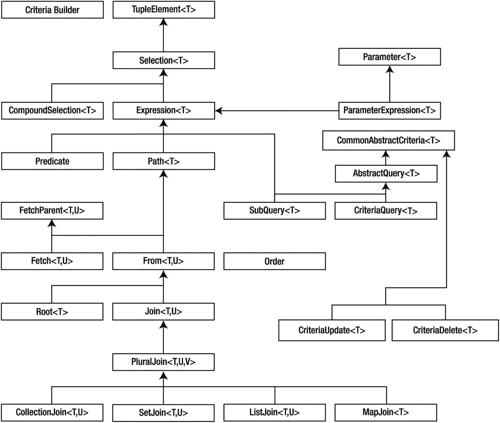

图 9-1

Criteria API 接口

### 基本结构

在第 8 章关于 Jakarta Persistence QL 的讨论中，你了解到选择查询中可能使用六个子句：`SELECT`、`FROM`、`WHERE`、`ORDER BY`、`GROUP BY` 和 `HAVING`。这些 Jakarta Persistence QL 子句中的每一个在 Criteria API 查询定义接口上都有一个等效的方法。表 9-1 总结了这些方法。

表 9-1

Criteria API 选择查询子句方法

| Jakarta Persistence QL 子句 | Criteria API 接口 | 方法 |
| --- | --- | --- |
| `SELECT` | CriteriaQuery | `select()` |
|   | Subquery | `select()` |
| `FROM` | AbstractQuery | `from()` |
| `WHERE` | AbstractQuery | `where()` |
| `ORDER BY` | CriteriaQuery | `orderBy()` |
| `GROUP BY` | AbstractQuery | `groupBy()` |
| `HAVING` | AbstractQuery | `having()` |

正如我们所演示的，Jakarta Persistence QL 语言与 Criteria API 方法之间存在很强的对称性。只要可能，就使用了相同的名称，这使得即使你以前没有使用过 Criteria API 方法，也很容易预测其名称。在接下来的几节中，我们将详细研究这些子句方法中的每一个，以及如何使用 Criteria API 形成表达式。

### Criteria 对象与可变性

Criteria API 的典型用法会导致创建许多不同的对象。除了主要的 `CriteriaBuilder` 和 `CriteriaQuery` 对象之外，每个表达式的每个组件都由一个或另一个对象表示。然而，并非所有对象都是平等的，有效使用 Criteria API 需要熟悉其设计中假定的编码模式。

我们需要考虑的第一个问题是可变性。通过 Criteria API 创建的大多数对象实际上都是不可变的。这些接口上没有 setter 方法或修改方法。几乎所有从 `CriteriaBuilder` 接口的方法创建的对象都属于这一类。

使用不可变对象意味着传递给 `CriteriaBuilder` 方法的参数细节丰富。必须传入所有相关信息，以便对象在创建时就能完整。这种方法的优点是有利于方法的链式调用。由于无需对从用于构建表达式的方法返回的对象调用任何修改方法，因此可以立即继续处理表达式中的下一个组件。

只有创建查询定义对象的 `CriteriaBuilder` 方法才会产生真正可变的結果。`CriteriaQuery` 和 `Subquery` 对象旨在通过调用诸如 `select()`、`from()` 和 `where()` 之类的方法进行多次修改。但即使在这里也必须小心，因为两次调用同一个方法可能会产生两种不同的效果之一。在大多数情况下，两次调用同一个方法会用提供的参数替换对象内的内容。例如，使用两个不同的参数两次调用 `select()` 会导致只有第二次调用的参数实际保留为查询定义的一部分。

然而，在某些情况下，两次调用同一个方法实际上是添加操作。使用不同的参数两次调用 `from()` 会导致将多个查询根添加到查询定义中。虽然我们在描述这些情况的章节中会提及它们，但你应该熟悉 Criteria API 上的 Javadoc 注释，因为它们也指出了这种行为。

第二个问题是 Criteria API 对象上存在 getter 方法。这些方法的行为符合预期，返回每个对象所代表的查询组件的相关信息。但值得注意的是，这些方法主要对希望以真正通用方式处理查询定义的工具开发者感兴趣。在绝大多数情况下，以及我们在本章中演示的那些情况中，你在构建 Criteria 查询时不必使用 getter 方法。

### 查询根与路径表达式

新创建的 `CriteriaQuery` 对象基本上是一个空壳。除了定义查询的结果类型之外，尚未添加任何其他内容来填充查询。与 Jakarta Persistence QL 查询一样，开发者负责定义从数据库获取所需数据所必需的查询的各种子句。从语义上讲，Jakarta Persistence QL 和 Criteria API 查询定义之间没有区别。两者都有 `SELECT`、`FROM`、`WHERE`、`GROUP BY`、`HAVING` 和 `ORDER` 子句；只是定义它们的方式不同。在我们可以填充查询定义的各种子句之前，让我们首先重新审视第 8 章中定义的两个关键概念，并查看这些概念的等效 Criteria API 语法。


#### 查询根

首先需要重温的基本概念是，在 Jakarta Persistence QL 查询的 `FROM` 子句中用于为实体、可嵌入及其他抽象模式类型的声明起别名的标识变量。在 Jakarta Persistence QL 中，标识变量具有核心重要性，因为它是将查询的不同子句联系在一起的纽带。但在 Criteria API 中，我们用对象来表示查询组件，因此很少需要关注别名。不过，为了定义 `FROM` 子句，我们仍需要一种方式来表达我们想要查询哪些抽象模式类型。

`AbstractQuery` 接口（`CriteriaQuery` 的父接口）提供了 `from()` 方法，用于定义构成查询基础的抽象模式类型。该方法接受一个实体类型作为参数，并向查询添加一个新的*根*。Criteria 查询中的根对应于 Jakarta Persistence QL 中的标识变量，而标识变量又对应于范围变量声明或连接表达式。在清单 9-2 中，我们使用以下代码获取查询根：

```
CriteriaQuery c = cb.createQuery(Employee.class);
Root emp = c.from(Employee.class);
```

`from()` 方法返回一个与实体类型对应的 `Root` 实例。`Root` 接口本身继承自 `From` 接口，后者暴露了用于连接的功能。`From` 接口继承自 `Path`，而 `Path` 又继承自 `Expression`，进而继承自 `Selection`，这使得根可以在查询定义的其他部分中使用。这些接口各自的作用将在后续章节中描述。对 `from()` 方法的调用是可叠加的。每次调用都会向查询添加另一个根，如果定义了多个根且未在 `WHERE` 子句中施加进一步约束，则会产生笛卡尔积。以下来自第 8 章的示例演示了多个查询根，用更传统的 SQL 方法替代了常规连接：

```
SELECT DISTINCT d
FROM Department d, Employee e
WHERE d = e.department
```

要将此查询转换为 Criteria API，我们需要调用两次 `from()`，将 `Department` 和 `Employee` 实体都添加为查询根。以下示例演示了这种方法：

```
CriteriaQuery c = cb.createQuery(Department.class);
Root dept = c.from(Department.class);
Root emp = c.from(Employee.class);
c.select(dept)
.distinct(true)
.where(cb.equal(dept, emp.get("department")));
```

#### 路径表达式

第二个需要重温的基本概念是路径表达式。路径表达式是 Jakarta Persistence QL 语言强大性和灵活性的关键，同样也是 Criteria API 的核心组成部分。我们在第 8 章中详细讨论了路径表达式，因此如果你觉得需要复习，建议返回去回顾那一节。

我们在上一节中介绍了查询根，而根实际上只是路径表达式的一种特殊类型。掌握了查询根之后，我们现在可以看看如何获取和扩展路径表达式。考虑以下基本的 Jakarta Persistence QL 查询，它返回所有居住在纽约市的员工：

```
SELECT e
FROM Employee e
WHERE e.address.city = 'New York'
```

从 Criteria API 的角度来看，该表达式的查询根是 `Employee` 实体。此查询在 `WHERE` 子句中还包含一个路径表达式。要使用 Criteria API 表示这个路径表达式，我们会使用以下表达式：

```
emp.get("address").get("city")
```

此示例中的 `emp` 对象对应于 `Employee` 的查询根。`get()` 方法派生自 `Root` 接口所扩展的 `Path` 接口，相当于 Jakarta Persistence QL 路径表达式中用于沿路径导航的点运算符。由于 `get()` 方法返回一个 `Path` 对象，因此方法调用可以链式连接，从而避免声明不必要的中间局部变量。`get()` 的参数是我们感兴趣的属性名称。由于构建路径表达式的结果是一个 `Expression` 对象，我们可以用它来构建条件表达式，因此我们可以将完整查询表示如下：

```
CriteriaQuery c = cb.createQuery(Employee.class);
Root emp = c.from(Employee.class);
c.select(emp)
.where(cb.equal(emp.get("address").get("city"), "New York"));
```

与 Jakarta Persistence QL 非常相似，路径表达式可以在查询定义的不同子句中使用。使用 Criteria API 时，必须将根对象保存在局部变量中，并在需要时用它来形成路径表达式。再次值得强调的是，对于每个所需的根，`AbstractQuery` 的 `from()` 方法绝不应被调用超过一次。多次调用会导致创建额外的根，如果不小心，还会产生笛卡尔积。始终将根对象存储在局部变量中，并在必要时引用它们。

### SELECT 子句

查询的 `SELECT` 子句可以有多种形式。最简单的形式涉及单个表达式，而其他形式则涉及多个表达式或使用构造函数表达式来创建新的对象实例。在 Criteria API 中，每种形式都有不同的表达方式。


#### 选择单个表达式

`CriteriaQuery` 接口的 `select()` 方法用于在 Criteria API 查询定义中构成 `SELECT` 子句。`SELECT` 子句的所有形式都可以通过 `select()` 方法表示，尽管也存在一些便捷方法来简化编码。`select()` 方法需要一个类型为 `Selection` 的参数，该接口由 `Expression` 扩展，同时也由 `CompoundSelection` 扩展，用于处理查询结果类型为 `Tuple` 或结果数组的情况。

注意

某些供应商可能允许在查询只有一个根且该根与声明的查询结果类型匹配时省略对 `select()` 的调用。这是不可移植的行为。

到目前为止，我们一直向 `select()` 方法传递一个查询根，因此表明我们希望实体成为查询的结果。我们也可以提供一个单值表达式，例如从实体中选择一个属性或任何兼容的标量表达式。以下示例通过选择 `Employee` 实体的 name 属性来演示这种方法：

```
CriteriaQuery c = cb.createQuery(String.class);
Root emp = c.from(Employee.class);
c.select(emp.get("name"));
```

此查询将返回所有员工姓名，包括任何重复项。可以通过从 `AbstractQuery` 接口调用 `distinct(true)` 来移除查询中的重复结果。其行为与 Jakarta Persistence QL 查询中的 `DISTINCT` 关键字相同。

另请注意我们用于声明 “name” 属性为 String 类型的特殊语法。提供给 `select()` 方法的表达式类型必须与用于创建 `CriteriaQuery` 对象的结果类型兼容。例如，如果 `CriteriaQuery` 对象是通过在 `CriteriaBuilder` 接口上调用 `createQuery(Project.class)` 创建的，那么尝试使用 `select()` 方法设置一个解析为 `Employee` 实体的表达式将是错误的。当像 `select()` 这样的方法调用使用泛型类型来强制实施兼容性约束时，在类型无法通过类型推断^(²¹)自动确定的情况下，可以将类型前缀添加到方法名称前以对其进行限定。在这种情况下我们需要使用这种方法，因为 `select()` 方法声明如下：

```
CriteriaQuery select(Selection selection);
```

`select()` 的参数必须是与查询定义的结果类型兼容的类型。`get()` 方法返回一个 `Path` 对象，但该 `Path` 对象始终是 `Path<Object>` 类型，因为编译器无法基于属性名称推断出正确的类型。为了声明该属性实际上是 `String` 类型，我们需要相应地限定方法调用。每当 `Path` 作为参数传递给参数已被强类型化的方法时（例如 `select()` 方法的参数和某些 `CriteriaBuilder` 表达式方法），都必须使用此语法。到目前为止，在我们的示例中我们不必使用它们，因为我们一直在像 `equal()` 这样的方法中使用它们，这些方法的参数被声明为 `Expression<?>` 类型。由于类型是通配符，因此传递 `Path<Object>` 类型的参数是有效的。在本章后面，我们将介绍消除了此要求的 Criteria API 方法的强类型版本。

#### 选择多个表达式

当定义涉及多个表达式的 `SELECT` 子句时，所需的 Criteria API 方法取决于查询定义是如何创建的。如果结果类型是 `Tuple`，则必须将 `CompoundSelection<Tuple>` 对象传递给 `select()`。如果结果类型是使用构造函数表达式创建的非持久化类，则参数必须是 `CompoundSelection<[T]>` 对象，其中 `[T]` 是非持久化类的类类型。最后，如果结果类型是对象数组，则必须提供 `CompoundSelection<Object[]>` 对象。这些对象分别使用 `CriteriaBuilder` 接口的 `tuple()`、`construct()` 和 `array()` 方法创建。以下示例演示了如何为 `Tuple` 查询提供多个表达式：

```
CriteriaQuery c= cb.createTupleQuery();
Root emp = c.from(Employee.class);
c.select(cb.tuple(emp.get("id"), emp.get("name")));
```

为了方便起见，也可以使用 `CriteriaQuery` 接口的 `multiselect()` 方法来设置 `SELECT` 子句。`multiselect()` 方法将根据查询的结果类型创建适当的参数类型。根据查询定义创建方式的不同，这可以采取三种形式。

第一种形式适用于结果类型为 `Object` 或 `Object[]` 的查询。构成每个结果的表达式列表直接传递给 `multiselect()` 方法：

```
CriteriaQuery c = cb.createQuery(Object[].class);
Root emp = c.from(Employee.class);
c.multiselect(emp.get("id"), emp.get("name"));
```

请注意，如果查询结果类型声明为 `Object` 而不是 `Object[]`，则此形式下 `multiselect()` 的行为会略有变化。结果始终是 `Object` 的实例，但如果将多个参数传递给 `multiselect()`，则必须将结果转换为 `Object[]` 才能访问任何特定值。如果只将单个参数传递给 `multiselect()`，则不会创建数组，并且结果可以直接从 `Object` 转换为所需类型。通常，明确指定查询结果类型会更方便。如果您想使用结果数组，则将查询结果类型声明为 `Object[]` 可以避免后续的类型转换，并且如果查询与创建它的代码分开调用，则可以使结果的形式更加明确。

第二种形式与第一种形式密切相关，但适用于结果类型为 `Tuple` 的查询。同样，表达式列表被传递给 `multiselect()` 调用：

```
CriteriaQuery c = cb.createTupleQuery();
Root emp = c.from(Employee.class);
c.multiselect(emp.get("id"), emp.get("name"));
```

第三种也是最后一种形式适用于使用构造函数表达式产生非持久化类型的查询。再次使用表达式列表调用 `multiselect()` 方法，但它利用查询的类型来推断并自动创建适当的构造函数表达式，在本例中是一个类型为 `EmployeeInfo` 的数据传输对象：

```
CriteriaQuery c = cb.createQuery(EmployeeInfo.class);
Root emp = c.from(Employee.class);
c.multiselect(emp.get("id"), emp.get("name"));
```

这等价于以下代码：

```
CriteriaQuery c = cb.createQuery(EmployeeInfo.class);
Root emp = c.from(Employee.class);
c.select(cb.construct(EmployeeInfo.class,
emp.get("id"),
emp.get("name")));
```

尽管 `multiselect()` 方法对于构造函数表达式很方便，但在某些情况下您仍然需要使用 `CriteriaBuilder` 接口的 `construct()` 方法。例如，如果查询的结果类型是 `Object[]`，并且它仅对部分结果包含构造函数表达式，则需要执行以下操作：

```
CriteriaQuery c = cb.createQuery(Object[].class);
Root emp = c.from(Employee.class);
c.multiselect(emp.get("id"),
cb.construct(EmployeeInfo.class,
emp.get("id"),
emp.get("name")));
```


#### 使用别名

与 Jakarta Persistence QL 一样，别名也可以设置在 `SELECT` 子句的表达式中，这些别名随后会包含在生成的 SQL 语句中。从编程角度来看，它们用处不大，因为我们是通过用于构建 `SELECT` 子句的 `Selection` 对象来构建 `ORDER BY` 子句的。

当查询的结果类型为 `Tuple` 时，别名就很有用了。这些别名可以通过生成的 `Tuple` 对象来获取。要设置别名，必须调用 `Selection` 接口（`Expression` 的父接口）的 `alias()` 方法。以下示例演示了这种方法：

```
CriteriaQuery c= cb.createTupleQuery();
Root emp = c.from(Employee.class);
c.multiselect(emp.get("id").alias("id"), emp.get("name").alias("fullName"));
```

这个示例实际上展示了 `alias()` 方法的两个方面。第一，它返回自身，因此可以作为调用 `select()` 或 `multiselect()` 的一部分来调用。第二，它再次返回自身，因此会改变一个本应不可变的对象。`alias()` 方法是一个例外，打破了只有查询定义接口（`CriteriaQuery` 和 `Subquery`）才包含可变操作这一规则。调用 `alias()` 会改变原始的 `Selection` 对象，并将其从方法调用中返回。多次设置 `Selection` 对象的别名是无效的。

在遍历查询结果时使用别名，只需按名称请求表达式即可。执行前面的查询后，可以按如下方式处理结果：

```
TypedQuery q = em.createQuery(c);
for (Tuple t : q.getResultList()) {
String id = t.get("id", String.class);
String fullName = t.get("fullName", String.class);
// ...
}
```

### FROM 子句

在“查询根”部分，我们介绍了 `AbstractQuery` 接口的 `from()` 方法以及查询根在形成查询定义中的作用。现在我们对此进行详细讨论，并探讨如何使用 Criteria API 表达连接。

#### 内连接与外连接

连接表达式是使用 `From` 接口的 `join()` 方法创建的。`Root`（我们之前介绍过）和 `Join`（创建连接表达式时返回的对象类型）都扩展了 `From` 接口。这意味着任何查询根都可以进行连接，并且连接可以相互链接。`join()` 方法需要一个路径表达式参数，并且可以选择一个参数来指定连接类型，即 `JoinType.INNER`（内连接）或 `JoinType.LEFT`（左外连接）。

提示

`JoinType.RIGHT` 枚举值指定应应用右外连接。规范不要求支持此选项，因此使用它的应用程序将不可移植。

当跨集合类型进行连接时（`Map` 除外，我们将在本章后面讨论），连接将具有两个参数化类型：源类型和目标类型。这保持了连接两侧的类型安全，并明确了正在连接的类型。

`join()` 方法是累加性的，因此每次调用都会创建一个新的连接；因此，应将调用该方法返回的 `Join` 实例保留在局部变量中，以便稍后形成路径表达式。由于 `Join` 也扩展了 `Path`，因此在定义路径时，它的行为类似于 `Root` 对象。

在清单 9-2 中，我们演示了从 `Employee` 到 `Project` 的外连接：

```
Join project = emp.join("projects", JoinType.LEFT);
```

如果省略了 `JoinType.LEFT` 参数，连接类型将默认为内连接。与 Jakarta Persistence QL 一样，多个连接可以与同一个 `From` 实例关联。例如，要导航 `Employee` 的 `directs` 关系，然后导航到 `Department` 和 `Project` 实体，需要以下代码，这里假设使用内连接：

```
Join directs = emp.join("directs");
Join projects = directs.join("projects");
Join dept = directs.join("department");
```

连接也可以在一个语句中级联。生成的连接将由语句中最后一个连接的源和目标进行类型化：

```
Join project = dept.join("employees").join("projects");
```

使用 `Map` 的集合关系上的连接是一个特例。Jakarta Persistence QL 使用 `KEY` 和 `VALUE` 关键字来提取 `Map` 元素的键或值，以便在查询的其他部分使用。在 Criteria API 中，这些运算符由 `MapJoin` 接口的 `key()` 和 `value()` 方法处理。考虑以下示例，假设跨 `Employee` 实体的 `phones` 关系进行 `Map` 连接：

```
SELECT e.name, KEY(p), VALUE(p)
FROM Employee e JOIN e.phones p
```

要使用 Criteria API 创建此查询，我们需要将连接的结果捕获为 `MapJoin`，在这种情况下使用 `joinMap()` 方法。`MapJoin` 对象具有三个类型参数：源类型、键类型和值类型。它看起来可能有点令人生畏，但明确了涉及的类型：

```
CriteriaQuery c = cb.createQuery();
Root emp = c.from(Employee.class);
MapJoin phone = emp.joinMap("phones");
c.multiselect(emp.get("name"), phone.key(), phone.value());
```

在这种情况下，我们需要使用 `joinMap()` 方法，因为当我们只传入属性名称时，无法重载 `join()` 方法来返回 `Join` 对象或 `MapJoin` 对象。对于必须使用特定连接接口的情况，`Collection`、`Set` 和 `List` 关系也分别通过 `joinCollection()`、`joinSet()` 和 `joinList()` 方法处理。我们稍后将演示的强类型版本的 `join()` 方法，能够通过单个 `join()` 调用处理所有连接类型。

#### 抓取连接

与 Jakarta Persistence QL 一样，Criteria API 支持抓取连接，这是一种查询结构，允许将数据预取到持久化上下文中，作为返回不同但相关实体的查询的副作用。Criteria API 通过使用 `FetchParent` 接口上的 `fetch()` 方法来构建抓取连接。在需要抓取语义的情况下，它用于替代 `join()`，并接受相同的参数类型。

考虑我们在上一章中用于演示单值关系抓取连接的以下示例：

```
SELECT e
FROM Employee e JOIN FETCH e.address
```

要使用 Criteria API 重新创建此查询，我们使用 `fetch()` 方法：

```
CriteriaQuery c = cb.createQuery(Employee.class);
Root emp = c.from(Employee.class);
emp.fetch("address");
c.select(emp);
```

请注意，使用 `fetch()` 方法时，返回类型是 `Fetch`，而不是 `Join`。`Fetch` 对象不是路径，不能在查询中的任何其他地方进行扩展或引用。

还支持集合值抓取连接，并使用类似的语法。在以下示例中，我们演示了如何获取与每个 `Employee` 关联的 `Phone` 实体，使用外连接来防止在 `Employee` 实体没有关联的 `Phone` 实体时被跳过。我们使用 `distinct()` 设置来删除任何重复项：

```
CriteriaQuery c = cb.createQuery(Employee.class);
Root emp = c.from(Employee.class);
emp.fetch("phones", JoinType.LEFT);
c.select(emp)
.distinct(true);
```

### WHERE 子句

正如你在表 9-1 和几个示例中看到的，Criteria API 中查询的 `WHERE` 子句是通过 `AbstractQuery` 接口的 `where()` 方法设置的。`where()` 方法接受零个或多个 `Predicate` 对象，或者一个 `Expression<Boolean>` 参数。每次调用 `where()` 都会导致之前设置的任何 `WHERE` 表达式被丢弃，并替换为新传入的表达式。

以下是 `WHERE` 子句的定义方式：

```
where_clause ::= WHERE conditional_expression
```


### 构建表达式

使用 Criteria API 构建表达式的关键在于 `CriteriaBuilder` 接口。该接口包含了 Jakarta Persistence QL 语言支持的所有谓词、表达式和函数的方法，以及 Criteria API 特有的其他功能。表 9-2、9-3、9-4 和 9-5 总结了 Jakarta Persistence QL 运算符、表达式和函数与 `CriteriaBuilder` 接口上对应方法之间的映射关系。请注意，在某些情况下，没有直接对应的方法，需要组合使用多个 `CriteriaBuilder` 方法才能获得相同的结果。在其他情况下，等效的 Criteria 方法实际上位于 `CriteriaBuilder` 之外的类上。

表 9-5

Jakarta Persistence QL 到 CriteriaBuilder 聚合函数映射

| Jakarta Persistence QL 聚合函数 | CriteriaBuilder 方法 |
| --- | --- |
| `AVG` | `avg()` |
| `SUM` | `sum()`、`sumAsLong()`、`sumAsDouble()` |
| `MIN` | `min()`、`least()` |
| `MAX` | `max()`、`greatest()` |
| `COUNT` | `count()` |
| `COUNT DISTINCT` | `countDistinct()` |

表 9-4

Jakarta Persistence QL 到 CriteriaBuilder 函数映射

| Jakarta Persistence QL 函数 | CriteriaBuilder 方法 |
| --- | --- |
| `ABS` | `abs()` |
| `CONCAT` | `concat()` |
| `CURRENT_DATE` | `currentDate()` |
| `CURRENT_TIME` | `currentTime()` |
| `CURRENT_TIMESTAMP` | `currentTimestamp()` |
| `LENGTH` | `length()` |
| `LOCATE` | `locate()` |
| `LOWER` | `lower()` |
| `MOD` | `mod()` |
| `SIZE` | `size()` |
| `SQRT` | `sqrt()` |
| `SUBSTRING` | `substring()` |
| `UPPER` | `upper()` |
| `TRIM` | `trim()` |

表 9-3

Jakarta Persistence QL 到 CriteriaBuilder 标量表达式映射

| Jakarta Persistence QL 表达式 | CriteriaBuilder 方法 |
| --- | --- |
| `ALL` | `all()` |
| `ANY` | `any()` |
| `SOME` | `some()` |
| `-` | `neg()`、`diff()` |
| `+` | `sum()` |
| `*` | `prod()` |
| `/` | `quot()` |
| `COALESCE` | `coalesce()` |
| `NULLIF` | `nullif()` |
| `CASE` | `selectCase()` |

表 9-2

Jakarta Persistence QL 到 CriteriaBuilder 谓词映射

| Jakarta Persistence QL 运算符 | CriteriaBuilder 方法 |
| --- | --- |
| `AND` | `and()` |
| `OR` | `or()` |
| `NOT` | `not()` |
| `=` | `equal()` |
| `<>` | `notEqual()` |
| `>` | `greaterThan()`、`gt()` |
| `>=` | `greaterThanOrEqualTo()`、`ge()` |
| `<` | `lessThan()`、`lt()` |
| `<=` | `lessThanOrEqualTo()`、`le()` |
| `BETWEEN` | `between()` |
| `IS NULL` | `isNull()` |
| `IS NOT NULL` | `isNotNull()` |
| `EXISTS` | `exists()` |
| `NOT EXISTS` | `not(exists())` |
| `IS EMPTY` | `isEmpty()` |
| `IS NOT EMPTY` | `isNotEmpty()` |
| `MEMBER OF` | `isMember()` |
| `NOT MEMBER OF` | `isNotMember()` |
| `LIKE` | `like()` |
| `NOT LIKE` | `notLike()` |
| `IN` | `in()` |
| `NOT IN` | `not(in())` |

除了直接翻译 Jakarta Persistence QL 运算符、表达式和函数之外，在开发表达式时还需要考虑一些 Criteria API 特有的技术。以下各节将详细讨论这些技术，并探讨 Criteria API 中那些在 Jakarta Persistence QL 中没有对应项的部分。

#### 谓词

在清单 9-2 中，我们将一个 `Predicate` 对象数组传递给了 `and()` 方法。这会将所有表达式与 AND 运算符组合在一起。`OR` 运算符的等效行为通过 `or()` 方法实现。对于 `AND` 运算符，有一个快捷方式是将所有表达式作为参数传递给 `where()` 方法。向 `where()` 传递多个参数会隐式地使用 `AND` 运算符语义组合这些表达式。

对于那些希望以增量方式而不是列表形式构建内容的人来说，Criteria API 还提供了一种不同的构建 `AND` 和 `OR` 表达式的方式。`CriteriaBuilder` 接口的 `conjunction()` 和 `disjunction()` 方法会创建分别始终解析为 `true` 和 `false` 的 `Predicate` 对象。一旦获得，这些基本谓词就可以与其他谓词组合，以树状方式构建嵌套的条件表达式。清单 9-3 使用 `conjunction()` 方法重写了清单 9-2 示例中的谓词构建部分。请注意每个条件语句是如何通过 `and()` 调用与其前一个语句组合的。

```
Predicate criteria = cb.conjunction();
if (name != null) {
ParameterExpression p =
cb.parameter(String.class, "name");
criteria = cb.and(criteria, cb.equal(emp.get("name"), p));
}
if (deptName != null) {
ParameterExpression p =
cb.parameter(String.class, "dept");
criteria = cb.and(criteria,
cb.equal(emp.get("department").get("name"), p));
}
if (projectName != null) {
ParameterExpression p =
cb.parameter(String.class, "project");
criteria = cb.and(criteria, cb.equal(project.get("name"), p));
}
if (city != null) {
ParameterExpression p =
cb.parameter(String.class, "city");
criteria = cb.and(criteria,
cb.equal(emp.get("address").get("city"), p));
}
if (criteria.getExpressions().size() == 0) {
throw new RuntimeException("no criteria");
}
清单 9-3
使用 Conjunction 构建谓词
```

关于其他谓词问题，在表 9-2 中应注意，有两组方法可用于相对比较。例如，有 `greaterThan()` 和 `gt()`。这两个字母的形式特定于数值，并且是强类型的，适用于数字类型。在所有其他情况下，必须使用长格式。

#### 字面量

使用 Criteria API 表达字面量值时可能需要特殊处理。在迄今为止遇到的所有情况下，方法都被重载以同时处理 `Expression` 对象和 Java 字面量。但是，在某些情况下，可能只接受 `Expression` 对象（例如，当假设您永远不会传入字面量值，或者当多种类型中的任何一种都可以接受时）。如果您遇到这种情况，那么为了将这些表达式与 Java 字面量一起使用，必须使用 `literal()` 方法包装字面量。`NULL` 字面量由 `nullLiteral()` 方法创建，该方法接受一个类参数，并生成一个与传入类匹配的类型化 `NULL` 版本。这对于将 API 的强类型扩展到 `NULL` 值是必要的。


#### 参数

Criteria API 查询的参数处理方式与 Jakarta Persistence QL 不同。Jakarta Persistence QL 字符串只需在字符串名称前加上冒号来表示参数别名，但这种技术在 Criteria API 中行不通。相反，我们必须显式创建一个正确类型的 `ParameterExpression`，以便在条件表达式中使用。这可以通过 `CriteriaBuilder` 接口的 `parameter()` 方法实现。该方法需要一个类类型（用于设置 `ParameterExpression` 对象的类型）和一个可选的名称，用于命名参数。清单 9-4 演示了此方法。

```
CriteriaQuery c = cb.createQuery(Employee.class);
Root emp = c.from(Employee.class);
c.select(emp);
ParameterExpression deptName =
cb.parameter(String.class, "deptName");
c.where(cb.equal(emp.get("department").get("name"), deptName));
清单 9-4
创建参数表达式
```

如果该参数不会在查询的其他部分重复使用，则可以直接将其嵌入到谓词表达式中，以使整个查询定义更加简洁。以下代码修改了清单 9-4，使用了此技术：

```
CriteriaQuery c = cb.createQuery(Employee.class);
Root emp = c.from(Employee.class);
c.select(emp)
.where(cb.equal(emp.get("department").get("name"),
cb.parameter(String.class, "deptName")));
```

#### 子查询

`AbstractQuery` 接口提供了 `subquery()` 方法用于创建子查询。子查询可以是关联的（意味着它们引用了父查询中的根、路径或连接），也可以是非关联的。Criteria API 同时支持关联和非关联子查询，同样使用查询根来将各种子句和表达式联系在一起。`subquery()` 的参数是一个类实例，代表子查询的结果类型。返回值是 `Subquery` 的一个实例，它本身是 `AbstractQuery` 的扩展。除了用于构建子句的受限方法外，`Subquery` 实例与 `CriteriaQuery` 一样，是一个完整的查询定义，可用于创建简单和复杂的查询。

为了演示子查询的用法，让我们看一个更重要的例子，修改清单 9-2，使用子查询代替 `distinct()` 方法来消除重复项。根据图 8-1 所示的数据模型，`Employee` 实体与其他四个实体存在关系：与 `Department` 和 `Address` 的单值关系，以及与 `Phone` 和 `Project` 的集合值关系。每当我们跨集合值关系进行连接时，都有可能返回重复的行；因此，我们需要更改 `Project` 的条件表达式以使用子查询。清单 9-5 显示了进行此更改所需的代码片段。

```
@Stateless
public class SearchService {
@PersistenceContext(unitName="EmployeeHR")
EntityManager em;
public List findEmployees(String name, String deptName,
String projectName, String city) {
CriteriaBuilder cb = em.getCriteriaBuilder();
CriteriaQuery c = cb.createQuery(Employee.class);
Root emp = c.from(Employee.class);
c.select(emp);
// ...
if (projectName != null) {
Subquery sq = c.subquery(Employee.class);
Root project = sq.from(Project.class);
Join sqEmp = project.join("employees");
sq.select(sqEmp)
.where(cb.equal(project.get("name"),
cb.parameter(String.class, "project")));
criteria.add(cb.in(emp).value(sq));
}
// ...
}
清单 9-5
使用子查询修改后的员工搜索
```

清单 9-5 对最初在清单 9-2 中给出的示例进行了几项重大更改。首先，`distinct()` 方法调用以及到 `Project` 实体的连接已被移除。我们还引入了一个针对 `Project` 的新非关联子查询。因为清单 9-5 中的子查询声明了自己的根，并且没有引用父查询中的任何内容，所以它是独立运行的，因此是非关联的。仅包含 `Project` 条件的等效 Jakarta Persistence QL 查询将是：

```
SELECT e
FROM Employee e
WHERE e IN (SELECT emp
FROM Project p JOIN p.employees emp
WHERE p.name = :project)
```

每当我们编写使用子查询的查询时，通常有多种方法可以实现特定结果。例如，我们可以重写前面的示例，使用 `EXISTS` 代替 `IN`，并将条件表达式移到子查询的 `WHERE` 子句中：

```
if (projectName != null) {
Subquery sq = c.subquery(Project.class);
Root project = sq.from(Project.class);
Join sqEmp = project.join("employees");
sq.select(project)
.where(cb.equal(sqEmp, emp),
cb.equal(project.get("name"),
cb.parameter(String.class,"project")));
criteria.add(cb.exists(sq));
}
```

通过在子查询的 `WHERE` 子句中引用父查询中的 `Employee` 根，我们现在有了一个关联子查询。这次查询在 Jakarta Persistence QL 中采用以下形式：

```
SELECT e
FROM Employee e
WHERE EXISTS (SELECT p
FROM Project p JOIN p.employees emp
WHERE emp = e AND p.name = :name)
```

我们还可以进一步扩展此示例，通过将对 `Employee` 根的引用移动到子查询的 `FROM` 子句，并直接连接到该员工特定的项目列表，来减少子查询的搜索空间。在 Jakarta Persistence QL 中，我们将这样编写：

```
SELECT e
FROM Employee e
WHERE EXISTS (SELECT p
FROM e.projects p
WHERE p.name = :name)
```

为了使用 Criteria API 重新创建此查询，我们面临一个难题。我们需要基于父查询中的 `Root` 对象来构建查询，但 `from()` 方法只接受持久化类类型。解决方案是使用 `Subquery` 接口的 `correlate()` 方法。它执行与 `AbstractQuery` 接口的 `from()` 方法类似的功能，但使用的是父查询中的 `Root` 和 `Join` 对象。以下示例演示了如何在这种情况下使用 `correlate()`：

```
if (projectName != null) {
Subquery sq = c.subquery(Project.class);
Root sqEmp = sq.correlate(emp);
Join project = sqEmp.join("projects");
sq.select(project)
.where(cb.equal(project.get("name"),
cb.parameter(String.class,"project")));
criteria.add(cb.exists(sq));
}
```

在结束 Criteria API 中子查询的讨论之前，还有一个关于关联子查询的边缘情况需要探讨：在子查询的 `FROM` 子句中引用父查询中的连接表达式。考虑以下示例，该示例返回包含有直接下属且平均工资高于用户定义阈值的经理的项目：

```
SELECT p
FROM Project p JOIN p.employees e
WHERE TYPE(p) = DesignProject AND
e.directs IS NOT EMPTY AND
(SELECT AVG(d.salary)
FROM e.directs d) >= :value
```

为此查询创建 Criteria API 查询定义时，我们必须关联 `Project` 的 `employees` 属性，然后将其连接到直接下属以计算平均工资。此示例还演示了使用 `Path` 接口的 `type()` 方法进行类型的多态比较：

```
CriteriaQuery c = cb.createQuery(Project.class);
Root project = c.from(Project.class);
Join emp = project.join("employees");
Subquery sq = c.subquery(Double.class);
Join sqEmp = sq.correlate(emp);
Join directs = sqEmp.join("directs");
c.select(project)
.where(cb.equal(project.type(), DesignProject.class),
cb.isNotEmpty(emp.get("directs")),
cb.ge(sq.select(cb.avg(directs.get("salary"))),
cb.parameter(Number.class, "value")));
```


#### IN 表达式

与其他运算符不同，`IN` 运算符在 Criteria API 中需要一些特殊处理。`CriteriaBuilder` 接口的 `in()` 方法只接受一个参数，即要与 `IN` 表达式中的值进行测试的单值表达式。为了设置 `IN` 表达式的值，我们必须使用从 `in()` 方法返回的 `CriteriaBuilder.In` 对象。考虑以下 Jakarta Persistence QL 查询：

```
SELECT e
FROM Employee e
WHERE e.address.state IN ('NY', 'CA')
```

要将此查询转换为 Criteria API，我们必须调用 `CriteriaBuilder.In` 接口的 `value()` 方法来设置我们感兴趣的查询状态标识符，如下所示：

```
CriteriaQuery c = cb.createQuery(Employee.class);
Root emp = c.from(Employee.class);
c.select(emp)
.where(cb.in(emp.get("address")
.get("state")).value("NY").value("CA"));
```

请注意，为了向 `IN` 表达式设置多个值，我们链式调用了 `value()` 方法。`in()` 的参数是要根据通过 `value()` 方法提供的值列表进行搜索的表达式。

当需要链式调用大量类型相同的 `value()` 方法时，`Expression` 接口提供了一种创建 IN 表达式的快捷方式。该接口的 `in()` 方法允许在一次调用中设置一个或多个值：

```
CriteriaQuery c = cb.createQuery(Employee.class);
Root emp = c.from(Employee.class);
c.select(emp)
.where(emp.get("address")
.get("state").in("NY","CA"));
```

在这种情况下，对 `in()` 的调用是后缀在表达式之后的，而不是像前一个示例那样前缀。请注意 `CriteriaBuilder` 和 `Expression` 接口版本的 `in()` 在参数类型上的区别。`Expression` 版本的 `in()` 接受要搜索的值，而不是要搜索的表达式。`CriteriaBuilder` 接口的 `in()` 方法允许更多的类型选项，但在大多数情况下，决定使用哪种方法很大程度上取决于个人偏好。

使用子查询的 `IN` 表达式采用类似的方法编写。举一个更复杂的例子，在上一章中，我们演示了一个使用 `IN` 表达式的 Jakarta Persistence QL 查询，其中员工的部门与子查询生成的列表进行匹配。该示例如下所示：

```
SELECT e
FROM Employee e
WHERE e.department IN
(SELECT DISTINCT d
FROM Department d JOIN d.employees de JOIN de.project p
WHERE p.name LIKE 'QA%')
```

我们可以将此示例转换为 Criteria API，如清单 9-6 所示。

```
CriteriaQuery c = cb.createQuery(Employee.class);
Root emp = c.from(Employee.class);
Subquery sq = c.subquery(Integer.class);
Root dept = sq.from(Department.class);
Join project =
dept.join("employees").join("projects");
sq.select(dept.get("id"))
.distinct(true)
.where(cb.like(project.get("name"), "QA%"));
c.select(emp)
.where(cb.in(emp.get("department").get("id")).value(sq));
清单 9-6
使用子查询的 IN 表达式
```

子查询被单独创建，然后作为要搜索 `Department` 实体的表达式传递给 `value()` 方法。此示例还演示了在搜索列表中使用属性表达式作为值。

#### CASE 表达式

与 `IN` 表达式类似，使用 Criteria API 构建 `CASE` 表达式需要使用辅助接口。在此示例中，我们将第 8 章中使用的示例转换为 Criteria API，演示了通用和简单的 case 表达式，以及 `COALESCE`。

提示

虽然 Jakarta Persistence 提供者要求支持 `CASE` 语句，但并非所有数据库都支持。在不支持 `CASE` 表达式的数据库平台上使用 `CASE` 语句的行为是未定义的。

我们从 `CASE` 表达式的通用形式开始，它功能最强大但也最复杂：

```
SELECT p.name,
CASE WHEN TYPE(p) = DesignProject THEN 'Development'
WHEN TYPE(p) = QualityProject THEN 'QA'
ELSE 'Non-Development'
END
FROM Project p
WHERE p.employees IS NOT EMPTY
```

`CriteriaBuilder` 接口的 `selectCase()` 方法用于创建 `CASE` 表达式。对于通用形式，它不接受参数，并返回一个 `CriteriaBuilder.Case` 对象，我们可以使用该对象向 `CASE` 语句添加条件表达式。以下示例演示了这种方法：

```
CriteriaQuery c = cb.createQuery(Object[].class);
Root project = c.from(Project.class);
c.multiselect(project.get("name"),
cb.selectCase()
.when(cb.equal(project.type(), DesignProject.class),
"Development")
.when(cb.equal(project.type(), QualityProject.class),
"QA")
.otherwise("Non-Development"))
.where(cb.isNotEmpty(project.>get("employees")));
```

`when()` 和 `otherwise()` 方法对应于 Jakarta Persistence QL 中的 `WHEN` 和 `ELSE` 关键字。不幸的是，“else” 已经是 Java 中的关键字，因此必须使用 “otherwise” 作为替代。

下一个示例将上一个示例简化为 `CASE` 语句的简单形式：

```
SELECT p.name,
CASE TYPE(p)
WHEN DesignProject THEN 'Development'
WHEN QualityProject THEN 'QA'
ELSE 'Non-Development'
END
FROM Project p
WHERE p.employees IS NOT EMPTY
```

在这种情况下，我们将要测试的主要表达式传递给 `selectCase()` 方法，并使用 `CriteriaBuilder.SimpleCase` 接口的 `when()` 和 `otherwise()` 方法。这些方法现在接受单值表达式，而不是谓词或布尔表达式，这些表达式将与 `CASE` 语句的基础表达式进行比较：

```
CriteriaQuery c = cb.createQuery(Object[].class);
Root project = c.from(Project.class);
c.multiselect(project.get("name"),
cb.selectCase(project.type())
.when(DesignProject.class, "Development")
.when(QualityProject.class, "QA")
.otherwise("Non-Development"))
.where(cb.isNotEmpty(project.>get("employees")));
```

我们在本节中介绍的最后一个示例涉及 Jakarta Persistence QL 的 `COALESCE` 表达式：

```
SELECT COALESCE(d.name, d.id)
FROM Department d
```

与本节中我们看到的其他示例一样，使用 Criteria API 构建 `COALESCE` 表达式需要一个辅助接口，但其形式更接近于 `IN` 表达式而不是 `CASE` 表达式。这里我们调用无参数的 `coalesce()` 方法来获取一个 `CriteriaBuilder.Coalesce` 对象，然后使用其 `value()` 方法向 `COALESCE` 表达式添加值。以下示例演示了这种方法：

```
CriteriaQuery c = cb.createQuery();
Root dept = c.from(Department.class);
c.select(cb.coalesce()
.value(dept.get("name"))
.value(dept.get("id")));
```

对于仅比较两个表达式的情况，也存在 `coalesce()` 方法的便捷版本：

```
CriteriaQuery c = cb.createQuery();
Root dept = c.from(Department.class);
c.select(cb.coalesce(dept.get("name"),
dept.get("id")));
```

关于 case 表达式的最后一点是，它们是 `CriteriaBuilder` 方法不可变规则的另一个例外。每个 `when()` 方法都会向 case 表达式增量添加一个条件表达式，每个 `value()` 方法都会向 coalesce 列表添加一个额外的值。


#### 函数表达式

请注意不要与 Jakarta Persistence QL 的内置函数混淆，条件函数表达式是 Criteria API 中与 Jakarta Persistence QL 的 `FUNCTION` 关键字等效的功能。它们允许将原生 SQL 存储函数与其他 Criteria API 表达式混合使用。其设计初衷是用于那些需要少量原生 SQL 来满足特定需求，但又不希望将整个查询转换为 SQL 的场景。

函数表达式通过 `CriteriaBuilder` 接口的 `function()` 方法创建。该方法需要传入数据库函数名称、预期的返回类型，以及一个可变的参数列表（如果函数需要参数的话）。返回类型是 `Expression`，因此它可以在查询中的许多其他地方使用。以下示例调用了一个数据库函数，将部门名称中每个单词的首字母大写：

```
CriteriaQuery c = cb.createQuery(String.class);
Root dept = c.from(Department.class);
c.select(cb.function("initcap", String.class, dept.get("name")));
```

一如既往，希望最大化应用程序可移植性的开发人员在使用函数表达式时应谨慎。与明确标记的原生 SQL 查询不同，函数表达式只是看似普通的可移植 Jakarta Persistence 查询中的一小部分，但实际上却与特定数据库的行为绑定在一起。

#### 向下转型

当在实体继承层次结构上进行查询时，Jakarta Persistence 支持通过 Jakarta Persistence QL 中的 `TREAT` 操作进行类型向下转型。在 Criteria API 中，此操作通过 `CriteriaBuilder` 接口的 `treat()` 方法暴露。它可以在构建连接时用于将结果限制为特定的子类，也可以作为通用条件表达式的一部分，用于访问特定子类的状态字段。

注意

如果目标类型不是第一个参数的静态类型的子类型，则查询将无效。

`treat()` 方法已被重载，根据参数类型的不同，返回 `Join` 或 `Path` 对象。回顾第 8 章中的示例，该示例演示了如何使用 `treat()` 将 `Employee` 查询限制为仅那些正在从事 `QualityProject` 且质量评级大于五的员工：

```
SELECT e FROM Employee a JOIN TREAT(e.projects AS QualityProject) qp
WHERE qp.qaRating > 5
```

此查询的 Criteria 等效写法如下：

```
CriteriaQuery q = cb.createQuery(Employee.class);
Root emp = q.from(Employee.class);
Join project = cb.treat(
emp.join("projects"), QualityProject.class);
q.select(emp)
.where(cb.gt(project.get("qaRating"), 5));
```

在此示例中，`treat()` 接受一个 `Join` 对象并返回一个 `Join` 对象，由于它被保存在一个变量中，因此可以在 `WHERE` 子句中引用。当直接在条件表达式中使用时（例如在 `WHERE` 子句中），它接受一个 `Path` 或 `Root` 对象，并返回一个对应于所请求子类的 `Path`。例如，我们可以在跨项目的查询中使用 `treat()` 方法来访问质量评级或设计阶段。通常，`TREAT` 运算符还可以起到按指定类型进行过滤以及执行向下转型的作用：

```
CriteriaQuery q = cb.createQuery(Project.class);
Root project = q.from(Project.class);
q.select(project).where(
cb.or(
cb.gt(cb.treat(project, QualityProject.class).get("qaRating"),             5),
cb.gt(cb.treat(project, DesignProject.class).get("designPhase"),       3))
);
```

#### 外连接条件

在本章前面，我们演示了如何使用 Criteria API 在实体之间构建连接。我们还演示了如何使用 `AbstractQuery` 接口的 `where()` 方法和 Criteria API 的表达式框架来构建将限制结果集的过滤条件。这对于内连接来说效果很好，但正如我们在上一章中讨论的，外连接需要额外的支持来建立过滤条件，同时仍保持被连接实体的可选性。与 `AbstractQuery` 接口的 `where()` 方法类似，`Join` 接口支持 `on()` 方法，用于指定在创建结果集时必须评估的外连接条件。这相当于 Jakarta Persistence QL 中 `JOIN` 表达式的 `ON` 条件。我们在第 8 章中看到了以下示例，该示例演示了在 Jakarta Persistence QL 中使用 ON 关键字：

```
SELECT e FROM Employee e JOIN e.projects p ON p.name = 'Zooby'
```

`on()` 方法接受一个谓词对象来表示连接条件。此 Jakarta Persistence QL 查询的 Criteria 等效写法如下：

```
CriteriaQuery q = cb.createQuery(Employee.class);
Root emp = q.from(Employee.class);
Join project = emp.join("projects", JoinType.LEFT);
project.on(cb.equal(project.get("name"), "Zooby"));
q.select(emp);
```

### ORDER BY 子句

`CriteriaQuery` 接口的 `orderBy()` 方法用于设置查询定义的排序。此方法接受一个或多个 `Order` 对象，这些对象由 `CriteriaBuilder` 接口的 `asc()` 和 `desc()` 方法创建，分别用于升序和降序排序。以下示例演示了 `orderBy()` 方法：

```
CriteriaQuery c = cb.createQuery(Tuple.class);
Root emp = c.from(Employee.class);
Join dept = emp.join("department");
c.multiselect(dept.get("name"), emp.get("name"));
c.orderBy(cb.desc(dept.get("name")),
cb.asc(emp.get("name")));
```

通过 Criteria API 进行查询排序仍然受与 Jakarta Persistence QL 相同的约束。`asc()` 和 `desc()` 的参数必须是单值表达式，通常由实体的状态字段构成。参数传递给 `orderBy()` 方法的顺序决定了 SQL 的生成方式。上一个示例中显示的查询的等效 Jakarta Persistence QL 如下：

```
SELECT d.name, e.name
FROM Employee e JOIN e.dept d
ORDER BY d.name DESC, e.name
```

### GROUP BY 和 HAVING 子句

`AbstractQuery` 接口的 `groupBy()` 和 `having()` 方法分别是 Jakarta Persistence QL 中 `GROUP BY` 和 `HAVING` 子句在 Criteria API 中的等效实现。这两个参数都接受一个或多个用于分组和过滤数据的表达式。

以下是 `GROUP BY` 子句的定义方式：

```
groupby_clause ::= GROUP BY groupby_item {, groupby_item}*
groupby_item ::= single_valued_path_expression | identification_variable
```

以下是 `HAVING` 子句的定义方式：

```
having_clause ::= HAVING conditional_expression
```

到了本章的这个阶段，这些方法的使用模式对你来说应该更直观了。考虑上一章中的以下示例：

```
SELECT e, COUNT(p)
FROM Employee e JOIN e.projects p
GROUP BY e
HAVING COUNT(p) >= 2
```

要使用 Criteria API 重新创建此示例，我们需要同时使用聚合函数和分组方法。以下示例演示了这种转换：

```
CriteriaQuery c = cb.createQuery(Object[].class);
Root emp = c.from(Employee.class);
Join project = emp.join("projects");
c.multiselect(emp, cb.count(project))
.groupBy(emp)
.having(cb.ge(cb.count(project),2));
```


## 批量更新与删除

`CriteriaBuilder` 接口不仅限于报表查询。也可以分别使用 `createCriteriaUpdate()` 和 `createCriteriaDelete()` 方法来创建批量更新和删除查询。

批量更新查询是通过创建和修改 `jakarta.persistence.criteria.CriteriaUpdate` 对象来构建的。

与报表查询类似，批量更新和删除查询的 `CriteriaBuilder` 版本使用相同的方法来生成查询的 `FROM` 和 `WHERE` 子句。特定于批量更新和删除操作的方法封装在 `CriteraUpdate` 和 `CriteriaDelete` 接口中。

Jakarta Persistence QL 中的批量更新查询使用 `SET` 表达式来更改实体的状态。与此功能相对应，`CriteriaUpdate` 查询的 `set()` 方法允许开发者分配使用 Criteria API 构建的表达式，以修改指定的实体状态字段。

通过使用 `CriteriaBuilder` 接口的 `createCriteriaUpdate` 方法之一来创建 `CriteriaUpdate` 对象。

一个 `CriteriaUpdate` 对象

*   根据作为更新目标的实体类型进行类型化

*   具有单个根，即正在被更新的实体

在第 8 章中，我们演示了以下查询，用于为与特定项目关联的员工加薪：

```
UPDATE Employee e
SET e.salary = e.salary + 5000
WHERE EXISTS (SELECT p
FROM e.projects p
WHERE p.name = 'Release2')
```

使用 Criteria API，相同的查询将按如下方式构建：

```
CriteriaUpdate q = cb.createCriteriaUpdate(Employee.class); Root emp = q.from(Employee.class);
Subquery sq = q.subquery(Project.class);
Root sqEmp = sq.correlate(emp);
Join project = sqEmp.join("projects");
sq.select(project) .where(cb.equal(project.get("name"), "Release2"));
q.set(emp.get("salary"), cb.sum(emp.get("salary"), 5000l))
.where(cb.exists(sq));
```

对于同一个查询，`set()` 方法可以被多次调用。它还支持与 Criteria API 中其他查询方法相同的调用链能力。

使用 Criteria API 进行批量删除操作非常直接。以下示例将第 8 章中的 Jakarta Persistence QL `DELETE` 查询示例转换为使用 Criteria API：

```
CriteriaDelete q = cb.createCriteriaDelete(Employee.class);
Root emp = q.from(Employee.class);
q.where(cb.isNull(emp.get("department")));
```

如果执行此示例，将删除所有未分配到任何部门的员工。

## 强类型查询定义

在本章中，我们一直在演示使用字符串名称来引用路径表达式中的属性来构建 Criteria API 查询定义。Criteria API 的这一子集被称为基于字符串的 API。然而，我们曾多次提到，还存在另一种构建路径表达式的替代方法，该方法提供了更强的类型化方式。在接下来的章节中，我们将围绕支撑强类型方法的元模型建立一些理论基础，然后演示其在 Criteria API 中的使用。

### 元模型 API

在我们查看强类型查询定义之前，我们必须先简短地讨论一下 Jakarta Persistence 应用程序中持久化单元的元模型，为我们的讨论奠定基础。持久化单元的*元模型*是对实体、可嵌入类和托管类的持久化类型、状态和关系的描述。借助它，我们可以查询持久化提供者运行时，以获取关于持久化单元中类的信息。从名称到类型再到关系，各种各样的信息都由持久化提供者存储，并通过元模型 API 进行访问。

元模型 API 通过 `EntityManager` 接口的 `getMetamodel()` 方法暴露。此方法返回一个实现 `Metamodel` 接口的对象，然后我们可以使用它来开始导航元模型。`Metamodel` 接口可用于列出持久化单元中的持久化类，或检索关于特定持久化类型的信息。

例如，要获取关于本章中一直演示的 `Employee` 类的信息，我们将使用 `entity()` 方法：

```
Metamodel mm = em.getMetamodel();
EntityType emp_ = mm.entity(Employee.class);
```

对于可嵌入类和托管类的等效方法分别是 `embeddable()` 和 `managedType()`。需要注意的是，此示例中对 `entity()` 的调用并非创建 `EntityType` 接口的实例。相反，它是在检索一个元模型对象，该对象是持久化提供者在创建持久化单元的 `EntityManagerFactory` 时初始化的。如果传递给 `entity()` 的类参数不是预先存在的持久化类型，则会抛出 `IllegalArgumentException`。

`EntityType` 接口是元模型 API 中包含持久化类型和属性信息的众多接口之一。图 9-2 展示了构成元模型 API 的接口之间的关系。

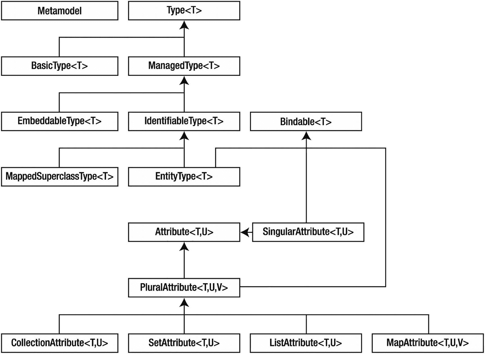

图 9-2

元模型接口

为了进一步扩展此示例，考虑一个检查持久化单元并将摘要信息打印到控制台的工具。要枚举所有属性及其类型，我们可以使用以下代码：

```
public  void listAttributes(EntityType type) {
for (Attribute attr : type.getAttributes()) {
System.out.println(attr.getName() + " " +
attr.getJavaType().getName() + " " +
attr.getPersistentAttributeType());
}
}
```

对于 `Employee` 实体，这将产生以下输出：

```
id int BASIC
name java.lang.String BASIC
salary float BASIC
dept com.acme.Department MANY_TO_ONE
address com.acme.Address MANY_TO_ONE
directs com.acme.Employee ONE_TO_MANY
phones com.acme.Phone ONE_TO_MANY
projects com.acme.Project ONE_TO_MANY
```

仅通过几次方法调用，我们就发现了关于 `Employee` 实体的许多信息。我们列出了所有属性，并且对于每个属性，我们现在都知道其属性名称、类类型和持久化类型。集合已被展开以揭示底层属性类型，并且各种关系类型也被清晰地标记出来。

从 Criteria API 和提供强类型查询的角度来看，我们最感兴趣的是元模型 API 接口暴露的类型信息。在下一节中，我们将演示如何在此上下文中使用它。

持久化单元的元模型将 Jakarta Persistence 提供者在运行时内部使用的结构直接暴露给开发者。直接使用元模型类有些特殊，但对于需要以完全通用的方式处理持久化单元的工具开发者或应用程序来说，元模型是关于持久化类型信息的有用来源。


### 强类型 API 概述

Criteria API 中基于字符串的 API 主要围绕构建路径表达式展开：`join()`、`fetch()` 和 `get()` 都接受字符串参数。Criteria API 中的强类型 API 通过扩展相同的方法也支持路径表达式，并且还存在于 `CriteriaBuilder` 接口的各个方面，从而简化了类型声明并尽可能强制实施类型安全。

强类型 API 从我们在上一节介绍的元模型 API 类中获取其类型信息。例如，`join()` 方法被重载以接受 `SingularAttribute`、`CollectionAttribute`、`SetAttribute``、ListAttribute` 和 `MapAttribute` 类型的参数。每个重载版本都使用与属性接口关联的类型信息来创建适当的返回类型，例如对于 `MapAttribute` 类型的参数返回 `MapJoin`。

为了演示这种行为，我们重新回顾本章前面一个示例，在该示例中，我们不得不使用基于字符串的 API 中的 `joinMap()` 来访问 `MapJoin` 对象。这次我们使用元模型 API 来获取实体和属性类型信息，并将其传递给 Criteria API 方法：

```
CriteriaQuery c = cb.createQuery();
Root emp = c.from(Employee.class);
EntityType emp_ = emp.getModel();
MapJoin phone =
emp.join(emp_.getMap("phones", String.class, Phone.class));
c.multiselect(emp.get(emp_.getSingularAttribute("name", String.class)),
phone.key(), phone.value());
```

关于此示例，有几点需要注意。首先是 `getModel()` 的使用。此方法存在于许多 Criteria API 接口中，作为访问底层元模型对象的快捷方式。我们将其赋值给变量 `emp_`，并按照惯例添加下划线以帮助将其标识为元模型类型。其次是对 `EntityType` 接口中两个方法的调用。`getMap()` 调用返回 `phones` 属性的 `MapAttribute` 对象，而 `getSingularAttribute()` 调用返回 `name` 属性的 `SingularAttribute` 对象。同样，我们必须为属性提供类型信息，部分是为了满足方法调用的泛型类型要求，同时也作为一种类型检查机制。如果任何参数不正确，将会抛出异常。还要注意，`join()` 方法不再限定集合类型，但返回了正确的 `MapJoin` 实例。`join()` 方法被重载，以便在存在来自元模型 API 的不同集合属性接口时能够正确运行。

使用元模型对象时可能出错的可能性，实际上正是使其成为强类型的核心。通过强制要求类型信息可用，Criteria API 不仅可以确保将适当的对象作为方法参数传递，还可以确保在各种表达式构建方法中使用兼容的类型。

然而，毫无疑问，这是一种构建查询的更为冗长的方式。幸运的是，Jakarta Persistence 规范还定义了持久化单元元模型的另一种表现形式，旨在使强类型编程更容易。我们将在下一节讨论此模型。

### 规范元模型

到目前为止，我们对元模型 API 的使用为强类型检查打开了大门，但代价是牺牲了可读性并增加了复杂性。元模型 API 并不复杂，但它们很冗长。为了简化其使用，Jakarta Persistence 还为持久化单元提供了*规范元模型*。

规范元模型由专门的类组成，通常每个持久化类生成一个，这些类包含与该持久化类关联的元模型对象的静态声明。这允许您访问通过元模型 API 公开的相同信息，但以一种直接应用于您的持久化类的形式。清单 9-7 展示了一个规范元模型类的示例。

```
@StaticMetamodel(Employee.class)
public class Employee_ {
public static volatile SingularAttribute id;
public static volatile SingularAttribute name;
public static volatile SingularAttribute salary;
public static volatile SingularAttribute dept;
public static volatile SingularAttribute address;
public static volatile CollectionAttribute project;
public static volatile MapAttribute phones;
}
清单 9-7
Employee 的规范元模型类
```

每个规范元模型类包含一系列静态字段，每个字段对应持久化类中的一个属性。规范元模型类中的每个字段都是元模型类型，该类型对应于持久化类中同名字段或属性的类型。如果实体中的持久化字段或属性是原始类型或单值关系，则规范元模型类中的同名字段将是 `SingularAttribute` 类型。类似地，如果持久化字段或属性是集合值，则规范元模型类中的字段将是 `ListAttribute`、`SetAttribute`、`MapAttribute` 或 `CollectionAttribute` 类型，具体取决于集合的类型。此外，每个规范元模型类都使用 `@StaticMetamodel` 进行注解，该注解标识了它正在建模的持久化类。

规范元模型类生成在其关联的持久化类所在的同一个包中，并且具有相同的名称，但带有一个额外的下划线后缀。如果有需要，非规范元模型类可以生成在其他包中并使用不同的名称。一些生成工具可能提供此类选项。`@StaticMetamodel` 注解提供了元模型类与实体之间的绑定，而不是通过名称或包，因此没有标准的方法来读取此类元模型。如果提供者工具能够以某种非规范形式生成具体的元模型类，那么运行时可能需要能够识别或检测它们。


#### 使用规范元模型

我们现在已经能够在不实际使用元模型 API 的情况下利用元模型。例如，我们可以将上一节的示例转换为使用静态生成的规范类：

```
CriteriaQuery c = cb.createQuery();
Root emp = c.from(Employee.class);
MapJoin phone = emp.join(Employee_.phones);
c.multiselect(emp.get(Employee_.name), phone.key(), phone.value());
```

与我们之前讨论的接口相比，这是一种更简洁的使用元模型对象的方法，同时提供了完全相同的好处。结合具有良好代码补全功能的开发环境，你可能会发现使用规范元模型比使用基于字符串的 API 开发起来更方便。

我们可以转换一个更复杂的示例来说明如何使用规范元模型。清单 9-8 将清单 9-6 中的示例（展示了一个使用子查询的 `IN` 表达式）从使用基于字符串的属性名称转换为使用强类型方法。

```
CriteriaQuery c = cb.createQuery(Employee.class);
Root emp = c.from(Employee.class);
Subquery sq = c.subquery(Integer.class);
Root dept = sq.from(Department.class);
Join project =
dept.join(Department_.employees).join(Employee_.projects);
sq.select(dept.get(Department_.id))
.distinct(true)
.where(cb.like(project.get(Project_.name), "QA%"));
c.select(emp)
.where(cb.in(emp.get(Employee_.dept).get(Department_.id)).value(sq));
清单 9-8
强类型查询
```

请注意，此示例与清单 9-6 之间有两个主要区别。首先，使用类型化的元模型静态字段来指示实体属性有助于避免属性字符串中的拼写错误。其次，不再需要内联类型转换来将从 `get()` 方法返回的 `Path<Object>` 转换为更窄的类型。更强的类型为我们解决了这个问题。

本章中的所有示例都可以通过简单地将基于字符串的属性更改为生成的元模型类中相应的静态字段，轻松转换为使用规范元模型类。例如，`emp.get("name")` 可以替换为 `emp.get(Employee_.name)`，依此类推。

#### 生成规范元模型

如果你选择在查询中使用生成的元模型，你应该了解开发过程中的一些细节，以防出现不一致或配置问题。当开发过程中实体发生某些更改时，需要更新或重新生成规范元模型类。例如，更改字段或属性的名称，或更改其结构，都需要为该实体更新规范元模型类。

提供商提供的生成工具在功能或操作上可能差异很大。生成过程可能涉及读取 `persistence.xml` 文件，以及访问实体上的注解和 XML 映射文件，以确定元模型类应该是什么样子。由于规范甚至不要求存在此类工具，提供商可能选择完全不支持它，期望如果开发者想使用规范元模型类，他们会手动编写。不过，大多数提供商确实提供了某种生成工具；问题只在于了解该特定于供应商的工具如何工作。它可能作为单独的命令行工具静态运行，也可能使用 JDK（从 Java SE 6 开始）中提供的编译器钩子在编译时查看实体并生成类。例如，要运行 EclipseLink 附带的工具的命令行模式，你可以设置 `javac -processor` 和 `-proc:only` 选项。这两个选项指示编译器调用的 EclipseLink 代码/注解 `处理器`^(²²)，并指示编译器仅调用处理器而不进行任何实际编译：

```
javac -processor org.eclipse.persistence.internal.jpa.modelgen.CanonicalModelProcessor
-proc:only
-classpath lib/*.jar;punit
*.java
```

这些选项放在单独的行中以便于查看。假设 `lib` 目录包含必要的 EclipseLink JAR 和 Jakarta Persistence 接口 JAR，并且 `META-INF/persistence.xml` 位于 `punit` 目录中。

元模型生成工具通常也会在 IDE 中运行，并且可能需要特定于 IDE 的配置来指导增量编译器使用该工具的注解处理器。在某些 IDE 中，必须配置一个额外的代码/注解处理器 JAR。生成的元模型类需要放在特定目录中，并位于构建类路径上，以便引用它们的条件查询能够编译。请查阅 IDE 帮助文件以了解注解处理器或 APT 的支持方式，以及提供商文档以了解在给定 IDE 中启用生成所需配置的内容。

### 选择正确的查询类型

既然你已经熟悉了条件查询，那么你已经掌握了三种不同查询语言中的两种：Jakarta Persistence QL、原生 SQL 和 Criteria API。我们已经证明 Criteria API 相对容易理解和使用，但何时应该使用它？答案取决于开发者自身的偏好以及不同查询方法的能力。

原生 SQL 查询很容易选择：要么你需要访问特定于供应商的功能，要么不需要。如果需要，并且你无法绕过该依赖关系，那么只有一个选项可用。你在本章中发现 Jakarta Persistence QL 和 Criteria API 在功能上几乎完全等价。何时应该使用基于文本的查询定义而不是基于编程 API 创建的查询？

编程 API 从应用程序中流畅地流出。它可以强类型化以减少出错的机会，并且借助大多数现代开发环境的代码补全功能，可以相对快速地组合起来。它也非常适合查询定义无法完全根据用户输入构建的情况。

另一方面，Jakarta Persistence QL 更简洁，并且对于任何有 SQL 经验的人来说都很熟悉。它还可以嵌入到应用程序注解或 XML 描述符中，并独立于常规编程过程进行维护。一些开发环境还为 Jakarta Persistence QL 查询提供了可视化构建器，使其成为开发过程中无缝的一部分。

在 Jakarta Persistence QL 和 Criteria API 之间进行选择时，没有正确答案。它们可以在应用程序中根据你的需要混合搭配使用。然而，总的来说，我们仍然鼓励开发者尽可能多地使用命名查询，为此，Jakarta Persistence QL 是理想的选择。


## 摘要

本章我们概述了 Criteria API。首先通过一个概述和示例，重点介绍了动态查询的创建。

在研究 Criteria API 时，我们从 Jakarta Persistence QL 的概念入手，试图在查询语言与 Criteria API 之间建立联系。我们探讨了如何使用 Criteria API 构建查询的每个子句，并解决了一些开发者常遇到的复杂问题。

我们引入了元模型 API，并展示了如何利用它通过 Criteria API 创建强类型查询。我们探讨了如何使用运行时接口以及通过规范元模型实现生成的类来使用元模型 API 进行编程。

最后，我们讨论了使用 Jakarta Persistence QL、原生 SQL 和 Criteria API 构建查询的不同方法的优势。我们强调了这些查询语言的一些优点，并就何时选择哪种方法更有利提出了一些建议。我们重申，最适合你的查询语言主要取决于风格和个人偏好。

在本章中，我们试图证明，尽管 Criteria API 的形式与 Jakarta Persistence QL 查询语言截然不同，但其底层语义几乎相同，一旦掌握了 API 的编码模式，在两者之间切换就相对容易。

在下一章中，我们将回到对象关系映射，并讨论高级概念，例如继承、复合主键和关联，以及多表映射。

脚注 1   2

# 10. 高级对象关系映射

每个应用程序都各不相同，虽然大多数应用程序都包含一些复杂元素，但一个应用程序中的难点往往与其他类型的应用程序不同。无论你何时在开发哪个应用程序，很可能都需要使用至少一个 API 的高级特性。本章将介绍并解释其中一些更高级的 ORM 特性。

本章中的许多特性针对的是需要协调现有数据模型与对象模型之间差异的应用程序。例如，当实体表中的数据在对象模型中更适合分解为一个实体和一个由该实体引用的依赖对象时，映射基础设施应能支持这一点。同样，当实体数据分布在多个表中时，映射层应允许指定此类配置。

本书中不乏关于 Jakarta Persistence 中的实体只是普通 Java 类，而不是需要扩展特定子类或实现特殊方法的特殊对象的讨论。实体作为普通 Java 类的好处之一是，它们可以遵循面向对象系统中已有的既定概念和实践。传统的面向对象创新之一就是使用继承并创建层次结构中的对象，以继承状态和行为。

本章讨论了一些更高级的映射特性，并深入探讨了 API 和映射层提供的多种可能性。我们还将了解继承如何在 Jakarta Persistence API 框架内工作，以及它如何影响模型。

## 表名和列名

在前面的章节中，我们将表和列的名称显示为大写标识符。我们这样做，首先是因为这有助于将它们与 Java 标识符区分开来，其次是因为 SQL 标准规定未分隔的数据库标识符不区分大小写，并且大多数倾向于以大写形式显示它们。

无论在哪里指定或默认使用表名或列名，标识符字符串都会原样传递给 JDBC 驱动程序。例如，当没有为 `Employee` 实体指定表名时，提供者假定并使用的表名将是 `Employee`，根据 SQL 定义，这与 `EMPLOYEE` 没有区别。提供者既不需要也不期望在将标识符传递给数据库驱动程序之前对其进行任何调整。

因此，以下注解在符合 SQL 标准的数据库中应视为等效，因为它们引用的是同一个表：

```
@Table(name="employee")
@Table(name="Employee")
@Table(name="EMPLOYEE")
```

某些数据库名称旨在区分大小写，并且必须显式分隔。例如，一个表可能名为 `EmployeeSales`，但如果不区分大小写，就会变成 `EMPLOYEESALES`，显然可读性更差，也更难理解其含义。虽然这既不常见，也不是好的做法，但理论上数据库可以同时拥有 `EMPLOYEE` 表和 `Employee` 表。为了区分这两者，需要对它们进行分隔。分隔的方法是使用第二组双引号（必须转义）将标识符括起来。转义机制是反斜杠（`\` 字符），这将导致以下注解引用不同的表：

```
@Table(name="\"Employee\"")
@Table(name="\"EMPLOYEE\"")
```

请注意，外层的双引号只是注解元素中字符串的常用分隔符，但内层的双引号前面有反斜杠以进行转义，表明它们是字符串的一部分，而不是字符串终止符。

当使用 XML 映射文件时，标识符也通过在标识符名称中包含引号来进行分隔。例如，以下两个元素代表不同的列：

XML 的转义方法与 Java 中使用的不同。XML 不使用反斜杠，而是使用与号（`&`）字符，后跟一个描述要转义的具体内容的单词（在本例中为 `"quot"`），最后是一个分号（`;`）字符。

提示

某些供应商支持规范化在提供者和 JDBC 驱动程序之间存储和传递的标识符的大小写。这可以解决某些 JDBC 驱动程序的问题，例如，这些驱动程序在原生 SQL 查询 `SELECT` 语句中接受大写标识符，但将它们映射为小写标识符传回。

有时数据库设置为使用区分大小写的标识符，那么在每个表和列名称上都加上额外的引号会变得相当繁琐（而且看起来非常丑陋）。如果你遇到这种情况，XML 映射文件中有一个便捷设置会对你有用。

通常，对象关系映射 XML 文件将包含其中列出的类的映射信息。XML 映射文件将在第 13 章中讨论。

通过在 XML 映射文件中包含空的 `delimited-identifiers` 元素，持久化单元中的所有标识符都将被视为已分隔，并且在传递给驱动程序时会自动添加引号。唯一的缺点是，无法覆盖此设置。一旦启用了 `delimited-identifiers` 标志，所有标识符都必须与数据库中的完全一致。此外，如果你决定启用 `delimited-identifiers` 选项，请确保删除标识符名称中任何已转义的引号，否则你会发现这些引号也会被包含在名称中。在已启用分隔标识符选项的情况下再使用转义，会将转义的引号再用引号包裹起来，从而使转义的引号成为标识符的一部分。


## 转换实体状态

在第 4 章中，我们展示了特定类型数据（如枚举类型、时间类型和大对象）在数据库中的几种存储方式。然而，为每一种非原始类型的数据定义针对性的支持是不切实际的，特别是因为总会有某些应用程序希望以新的、不同的方式存储数据，或者因遗留数据库而被迫这样做。此外，应用程序可能会定义规范显然无法预测的自身类型集合。因此，一种更灵活且可扩展的解决方案是设计一种方式，使应用程序能够为其认为需要转换的任何类型定义自己的转换策略。通过使用转换器，这一点得以实现。

### 创建转换器

转换器是一个应用程序指定的类，它实现了`AttributeConverter<X,Y>`接口。它可以声明式地应用于任何实体、映射超类或可嵌入类中的持久化属性，以控制该属性的状态如何存储在数据库中。同样，它也定义了如何将状态从数据库转换回对象。这两个转换操作构成了`AttributeConverter<X,Y>`接口的两个方法，如代码清单 10-1 所示。

```
public interface AttributeConverter {
public Y convertToDatabaseColumn (X attribute);
public X convertToEntityAttribute (Y dbData);
}
代码清单 10-1
AttributeConverter 接口
```

请注意，该接口应使用两个类型参数定义。第一个类型参数表示实体属性的类型，而第二个类型参数表示在数据库列中存储数据时要使用的 JDBC 类型。一个示例转换器实现类如代码清单 10-2 所示。它展示了一个简单的转换器，用于将布尔实体属性作为整数存储在数据库中。

注意

目前仅支持将实体属性转换为数据库中的单个列。将其跨多个列存储的能力可能会在未来的版本中标准化。

```
@Converter
public class BooleanToIntegerConverter  implements AttributeConverter {
public Integer convertToDatabaseColumn (Boolean attrib) {
return (attrib ? 1 : 0);
}
public Boolean convertToEntityAttribute (Integer dbData) {
return (dbData > 0);
}
}
代码清单 10-2
布尔到整数转换器
```

转换器类带有注解，以便容器能够检测并验证它。在这种情况下，转换方法很简单，因为转换过程非常简单，但如果需要，转换逻辑可以更复杂。

转换器可用于基本状态的显式或自动转换，如下面的章节所述。

注意

转换器是*托管类*；因此，在 Java SE 中运行时，每个转换器类都应包含在`persistence.xml`描述符的`class`元素中。

### 声明式属性转换

通过使用`@Convert`注解属性并将`converter`元素设置为转换器类，可以显式地使用转换器来转换实体属性。例如，如果我们的`Employee`实体中有一个名为“bonded”的`Boolean`属性，那么如果我们用`@Convert`注解该属性并指定上一节中声明的转换器类，它就可以转换为映射数据库列中的`Integer`：

```
@Convert(converter=BooleanToIntegerConverter.class)
private Boolean bonded;
```

被转换的属性应为正确的类型。由于转换器的第一个参数化类型是`Boolean`，我们正在转换的属性应为`Boolean`类型。然而，包装类型和原始类型在转换过程中会自动装箱，因此该属性也可以是`boolean`类型。

#### 转换嵌入属性

如果要转换的属性是嵌入类型的一部分，并且我们从引用实体中进行转换，那么我们需要使用`attributeName`元素来指定要转换的属性。例如，如果`bonded`属性包含在`SecurityInfo`可嵌入对象中，并且`Employee`实体有一个`securityInfo`属性，那么我们可以像代码清单 10-3 所示那样进行转换。

```
@Entity
public class Employee {
// ...
@Convert(converter=BooleanToIntegerConverter.class, attributeName="bonded")
private SecurityInfo securityInfo;
// ...
}
@Embeddable
public class SecurityInfo {
private Boolean bonded;
// ...
}
代码清单 10-3
转换嵌入属性
```

在本章后面的“复杂嵌入对象”部分，我们将描述嵌入对象的更高级用法；特别是，点符号被展示为一种覆盖嵌套嵌入对象的方法。同样的符号也可以在`@Convert`注解的`attributeName`中使用，以引用嵌套的嵌入属性。

#### 转换集合

在第 5 章中，我们展示了如果值是基本类型或嵌入类型，集合可以映射为元素集合；如果值是实体类型，则可以映射为一对多或多对多关系。转换器可以应用于元素集合，但由于转换器不转换实体实例，因此通常不能应用于关系映射^(²³)。

基本类型的元素集合很容易转换。它们的注解方式与非集合的基本属性相同。因此，如果我们有一个类型为`List<Boolean>`的属性，我们可以像处理`bonded`属性一样对其进行注解，并且集合中的所有布尔值都将被转换：

```
@ElementCollection
@Convert(converter=BooleanToIntegerConverter.class)
private List securityClearances;
```

如果元素集合是一个`Map`，其值为基本类型，那么`Map`的值将被转换。要对键执行转换，应使用`attributeName`元素，并赋予特殊值“key”，以指示要转换的是`Map`的键而不是值。

回顾第 5 章中的“覆盖嵌入属性”部分，如果我们有一个元素集合是`Map`，并且它包含嵌入对象，那么我们在`@AttributeOverride`的`name`元素前加上“key.”或“value.”。这是为了区分我们是在覆盖`Map`的嵌入键还是值的列。类似地，如果我们想要转换`Map`中的嵌入属性，那么我们需要在`attributeName`元素前加上“key.”或“value.”，后跟要转换的嵌入属性的名称。作为一种特殊情况，我们可以在一对多或多对多集合关系上使用“key”或“key.”前缀，以分别映射键（如果它们是基本类型或嵌入类型）。使用代码清单 5-17 中的领域模型，如果我们想要将员工姓氏转换为大写字符存储（假设我们已经定义了相应的转换器类），我们将像代码清单 10-4 所示那样注解该属性。

```
@Entity
public class Department {
// ...
@ManyToMany
@MapKey(name="empName")
@Convert(converter=UpperCaseConverter.class, attributeName="key.lastName")
private Map employees;
// ...
}
代码清单 10-4
在关系映射中转换嵌入属性键
```


#### 限制

转换器存在一些使用限制，主要是为了防止用户执行可能导致问题的操作。例如，转换器不能用于标识属性、版本属性或关系属性（除非你正在转换关系`Map`的键部分，如清单 10-4 所示）。希望这不会让你感到意外，因为在大多数情况下，转换这些类型的属性可以说是一个非常糟糕的主意。这些属性被提供者大量用于管理实体；改变它们的形态甚至值都可能导致不一致或错误的结果。

转换器也不能用于标注了`@Enumerated`或`@Temporal`的属性，但这并不意味着你不能转换枚举类型或时间类型。它只是意味着，如果你使用标准的`@Enumerated`或`@Temporal`注解来映射这些类型，那么你就不能同时使用自定义转换器。如果你正在使用自定义转换器类，那么你就接管了存储值的控制权，并且无需使用任何这些注解来让 Jakarta Persistence 提供者为你进行转换。简而言之，如果你正在对枚举类型或时间类型使用转换器进行自定义转换，只需去掉`@Enumerated`或`@Temporal`注解即可。

### 自动转换

当我们定义一个转换器将布尔值转换为整数时，我们很可能希望它只在非常特定的位置使用，即一个或可能几个属性上。你通常不希望将领域中的每个布尔属性都转换为整数。然而，如果你经常使用语义更丰富的数据类型，例如`URL`类，那么你可能希望该类型的每个属性都被转换。你可以通过设置`@Converter`注解上的`autoApply`选项来实现这一点。在清单 10-5 中，声明了一个启用了`autoApply`选项的`URL`转换器。这将导致持久化单元中每个`URL`类型的持久化属性，在包含它的实体被写入数据库时，都被转换为字符串。

注意

如果两个转换器被声明为自动应用于同一属性类型，则行为是未定义的。

```
@Converter(autoApply=true)
public class URLConverter implements AttributeConverter {
public String convertToDatabaseColumn (URL attrib) {
return attrib.toString();
}
public URL convertToEntityAttribute (String dbData) {
try {
return new URL(dbData);
} catch (MalformedURLException ex) {
throw new IllegalArgumentException(
"DB data: " + dbData + " is not a legal URL");
}
}
}
清单 10-5
URL 到字符串的转换器
```

我们可以基于每个属性覆盖转换。如果对于某个给定属性，我们想使用一个不同的转换器而不是自动应用的转换器，那么我们可以用`@Convert`注解标注该属性，并指定要使用的转换器类。或者，如果我们想完全禁用转换，让提供者回退到对 URL 进行序列化，那么我们可以使用`disableConversion`属性：

```
@Convert(disableConversion=true)
URL homePage;
```

### 转换器与查询

定义转换器并配置哪些属性需要转换，基本上就是让转换工作起来所需做的全部事情。但在查询时，还有几个与转换相关的额外要点你应该了解。

首先，查询处理器会将转换器应用于目标转换的属性以及查询中与之比较的字面量。然而，操作符不会被修改。这意味着一旦查询被转换，只有某些比较操作符才能正常工作。为了说明这一点，请考虑以下查询：

```
SELECT e FROM Employee e WHERE e.bonded = true
```

如果`bonded`被设置为从布尔值转换为整数，这个查询将正常工作。生成的 SQL 会通过调用`convertToDatabaseColumn()`方法，将`bonded`属性和字面量`true`都转换为相应的整数，并且等于操作符在整数上的工作方式与在布尔值上一样好。

然而，我们可能想要查询所有未绑定的员工：

```
SELECT e FROM Employee e WHERE NOT e.bonded
```

如果我们尝试执行这个查询，解析器不会有任何问题，但当执行时，生成的 SQL 将包含一个`NOT`，而`e.bonded`的值已经被转换为整数。这通常会导致数据库异常，因为`NOT`操作不能应用于整数。

如果你对转换后的属性进行大量查询，你很可能会遇到一两个问题。虽然你通常可以依赖比较中使用的字面量和输入参数的转换，但如果它们包含在函数中，例如`UPPER()`或`MOD()`，它们可能不会被转换。甚至一些更高级的比较操作，如`LIKE`，也可能不会对字面量操作数应用转换。教训是尽量不在查询中使用转换后的属性，如果必须使用，请进行一些测试以确保你的查询按预期工作。

## 复杂嵌入对象

在第 4 章中，我们研究了在实体中嵌入对象，以及嵌入对象如何成为嵌入它的实体的一部分并依赖于它。现在我们将解释如何使用嵌入对象做更多事情，以及它们如何包含不仅仅是基本映射的内容。


### 高级嵌入式映射

嵌入式对象可以嵌入其他对象，拥有基本类型或可嵌入类型的元素集合，并与实体建立关系。这一切都基于一个假设：嵌入在其他嵌入式对象中的对象仍然依赖于嵌入实体。同样，当嵌入式对象中存在双向关系时，这些关系被视为存在于拥有实体中，目标实体指向的是拥有实体，而非嵌入式对象。

举个例子，让我们重新引入第 4 章中的 `Employee` 和嵌入式 `Address` 对象，并对模型稍作更新。在每个员工中插入一个 `ContactInfo` 对象，其中包含地址和电话信息。我们的 `Employee` 实体将不再拥有 `address` 属性，而是拥有一个名为 `contactInfo` 的属性，其类型为 `ContactInfo`，并使用 `@Embedded` 注解。模型如图 10-1 所示。

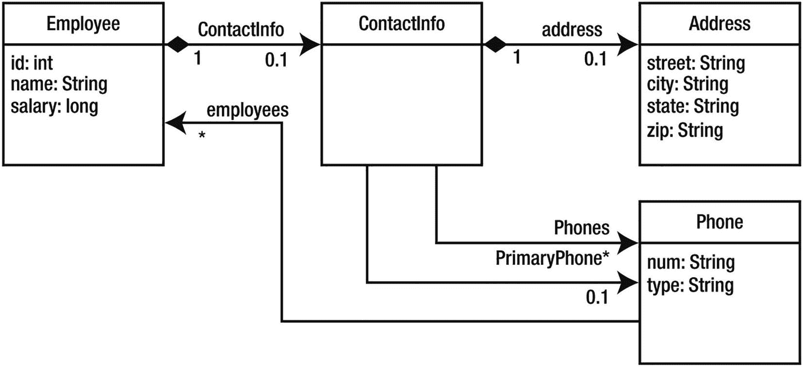

图 10-1

包含关系的嵌套可嵌入对象

`ContactInfo` 类包含一个嵌入式对象以及一些关系，其注解方式如清单 10-6 所示。

```
@Embeddable @Access(AccessType.FIELD)
public class ContactInfo {
@Embedded
private Address residence;
@ManyToOne
@JoinColumn(name="PRI_NUM")
private Phone primaryPhone;
@ManyToMany @MapKey(name="type")
@JoinTable(name="EMP_PHONES")
private Map phones;
// ...
}
清单 10-6
可嵌入的 ContactInfo 类
```

`Address` 类与清单 4-26 中保持一致，但我们为联系信息增加了更多层次。在 `ContactInfo` 可嵌入对象中，我们将地址作为嵌套的嵌入式对象，同时还增加了一个指向电话号码的单向关系，该号码作为主要联系电话。指向员工电话号码的双向多对多关系将有一个默认的连接表，名为 `EMPLOYEE_PHONE`。在 `Phone` 端，关系属性将引用一个 `Employee` 实例列表，其 `mappedBy` 元素是嵌入式关系属性的限定名称。所谓限定，是指它必须首先包含 `Employee` 中持有该可嵌入对象的属性，然后是一个点分隔符（`.`），最后是可嵌入对象中的关系属性。清单 10-7 展示了 `Phone` 类及其指向 `Employee` 实体的映射。

```
@Entity
public class Phone {
@Id private String num;
@ManyToMany(mappedBy="contactInfo.phones")
private List employees;
private String type;
// ...
}
清单 10-7
引用嵌入式属性的 Phone 类

关于可嵌入类型有一个限制：如果嵌入式对象是元素集合的一部分，那么该集合中的嵌入式对象只能包含外键存储在源表中的映射。它可以包含拥有的关系，例如一对一和一对多，但不能包含外键位于目标表或连接表中的一对多或多对多关系。同样，它也不能包含其他基于集合表的映射，例如元素集合。

### 覆盖嵌入式关系

当我们首次在第 4 章介绍可嵌入对象时，我们展示了如何通过将可嵌入类型嵌入到多个实体类中来实现重用。尽管状态是在可嵌入对象内部映射的，但嵌入实体可以通过使用 `@AttributeOverride` 来覆盖这些映射，从而重新定义嵌入式状态在该特定实体表中的映射方式。现在我们在可嵌入对象中使用了关系，`@AttributeOverride` 就不够用了。要覆盖关系的映射方式，我们需要使用 `@AssociationOverride`，它使我们能够覆盖关系的连接列和连接表。

在查看覆盖包含关系的可嵌入对象的示例之前，让我们先思考一下此类对象的可重用性。如果从实体 A 到实体 B 的关系是在类型为 E 的可嵌入对象中定义的，那么该关系要么由 A 拥有，且外键位于 A 对应的表中（或 A 拥有的连接表中），要么由 B 拥有，且外键将位于 B 的表中（或 B 拥有的连接表中）。如果它由 B 拥有，那么外键将指向 A 的表，并且无法在任何其他实体中使用 E，因为外键会指向错误的表。同样，如果关系是双向的，那么 B 中的属性将是 A 类型（或 A 的集合），并且不能引用其他类型的对象。因此可以理解，只有那些由源实体 A 拥有且是单向关系的可嵌入对象，才能在其他实体中重用。

假设 `ContactInfo` 中的多对多关系是单向的，并且 `Phone` 没有反向引用嵌入了 `ContactInfo` 的 `Employee`。我们可能还想将 `ContactInfo` 的实例嵌入到 `Customer` 实体中。然而，`CUSTOMER` 表可能有一个 `PRI_CONTACT` 外键列，而不是 `PRI_NUM`，并且我们当然无法为 `Employee` 和 `Customer` 与 `Phone` 的关系共享同一个连接表。最终的 `Customer` 类如清单 10-8 所示。

```
@Entity
public class Customer {
@Id int id;
@Embedded
@AttributeOverride(name="address.zip", column=@Column(name="ZIP"))
@AssociationOverrides({
@AssociationOverride(name="primaryPhone",
joinColumns=@JoinColumn(name="EMERG_PHONE")),
@AssociationOverride(name="phones",
joinTable=@JoinTable(name="CUST_PHONE"))})
private ContactInfo contactInfo;
// ...
}
清单 10-8
嵌入 ContactInfo 的 Customer 类
```

我们可以通过使用 `@AttributeOverride` 并导航到嵌套嵌入式 `Address` 对象中的属性，来覆盖 `contactInfo` 中嵌入的地址的 `zip` 属性。

由于我们要覆盖两个关联，因此可以使用 `@AssociationOverrides` 的复数形式。请注意，如果没有为 `phones` 属性显式指定连接表，那么默认的连接表名称将根据哪个实体嵌入了 `ContactInfo` 而有所不同。由于默认名称部分由拥有实体的名称组成，因此连接 `Employee` 实体和 `Phone` 实体的表默认会命名为 `EMPLOYEE_PHONE`，而在 `Customer` 中，连接表默认会命名为 `CUSTOMER_PHONE`。

提示

目前还没有办法覆盖可嵌入对象中元素集合的集合表。


## 复合主键

在某些情况下，实体需要由多个字段组成的主键或标识符，或者从数据库角度来看，其表中的主键由多个列构成。这在遗留数据库中较为常见，当主键由关系（本章稍后讨论的主题）构成时也会出现这种情况。

根据实体类的结构不同，实体中实现复合主键有两种可选方案。这两种方案都需要使用一个包含主键字段的独立类，称为主键类；两者的区别取决于实体类所包含的内容。

主键类必须包含 `equals()` 和 `hashCode()` 方法定义，以便持久化提供程序能够存储和基于主键进行键控操作，并且其字段或属性必须属于前一章列出的有效标识符类型集合。此外，它们必须是公共的，实现 `Serializable` 接口，并拥有一个无参构造函数。

作为复合主键的示例，我们再次查看 `Employee` 实体，不过这次员工编号是特定于其工作所在国家的。不同国家的两名员工可以拥有相同的员工编号，但在任何特定国家内只能使用一个编号。图 10-2 展示了采用复合主键结构的 `EMPLOYEE` 表，以满足这一需求。根据此表定义，我们现在将探讨如何使用两种不同风格的主键类来映射 `Employee` 实体。

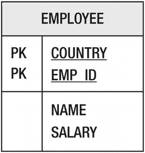

图 10-2

具有复合主键的 EMPLOYEE 表

### ID 类

第一种也是最基本的主键类是 ID 类。构成主键的实体的每个字段都使用 `@Id` 注解进行标记。主键类被单独定义，并通过在实体类定义上使用 `@IdClass` 注解与实体关联。清单 10-9 演示了一个使用 ID 类的复合主键实体。附带的 ID 类如清单 10-5 所示。

```
@Entity
@IdClass(EmployeeId.class)
public class Employee {
@Id private String country;
@Id
@Column(name="EMP_ID")
private int id;
private String name;
private long salary;
// ...
}
清单 10-9
使用 ID 类
```

主键类必须包含与实体中主键属性在名称和类型上都匹配的字段或属性。清单 10-10 展示了 `EmployeeId` 主键类。它有两个字段，一个表示国家，一个表示员工编号。我们还提供了 `equals()` 和 `hashCode()` 方法，以便该类可用于排序和哈希操作。

```
public class EmployeeId implements Serializable {
private String country;
private int id;
public EmployeeId() {}
public EmployeeId(String country, int id) {
this.country = country;
this.id = id;
}
public String getCountry() { return country; }
public int getId() { return id; }
public boolean equals(Object o) {
return ((o instanceof EmployeeId) &&
country.equals(((EmployeeId)o).getCountry()) &&
id == ((EmployeeId)o).getId());
}
public int hashCode() {
return country.hashCode() + id;
}
}
清单 10-10
EmployeeId ID 类
```

请注意，`EmployeeId` 类上没有 setter 方法。一旦使用主键值构造完成，它就不能再被更改。我们这样做是为了强制执行主键值不可更改的概念，即使它由多个字段组成。由于 `@Id` 注解被放置在实体的字段上，提供程序在需要处理主键类时也将使用字段访问。

ID 类作为一个封装了所有主键信息的结构化对象非常有用。例如，当执行基于主键的查询（如 `EntityManager` 接口的 `find()` 方法）时，可以使用 ID 类的实例作为参数，而不是使用非结构化且无序的主键数据集合。清单 10-11 展示了一段代码片段，该片段根据给定的国家名称和员工编号搜索 `Employee`。使用方法参数构造 `EmployeeId` 类的新实例，然后将其用作 `find()` 方法的参数。

```
EmployeeId id = new EmployeeId(country, id);
Employee emp = em.find(Employee.class, id);
清单 10-11
对具有 ID 类的实体调用主键查询
```

提示

由于 `find()` 的参数类型是 `Object`，供应商可以支持传入简单数组或主键信息的集合。传入非主键类的参数是不可移植的。


### 嵌入式 ID 类

如果一个实体包含一个与主键类类型相同的单一字段，则称其使用了嵌入式 ID 类。嵌入式 ID 类本质上是一个恰好由主键组件组成的嵌入式对象。我们使用 `@EmbeddedId` 注解来表明它不仅仅是一个普通的嵌入式对象，同时也是一个主键类。采用这种方法时，类上既没有 `@Id` 注解，也没有使用 `@IdClass` 注解。你可以将 `@EmbeddedId` 视为在字段上同时放置 `@Id` 和 `@Embedded` 的逻辑等价物。

与其他嵌入式对象类似，嵌入式 ID 类必须使用 `@Embeddable` 进行注解，但其访问类型可能与使用它的实体不同。清单 10-12 再次展示了 `EmployeeId` 类，这次它作为一个可嵌入的主键类。其 getter 方法、`equals()` 和 `hashCode()` 的实现与之前清单 10-10 中的版本相同。

```
@Embeddable
public class EmployeeId {
private String country;
@Column(name="EMP_ID")
private int id;
public EmployeeId() {}
public EmployeeId(String country, int id) {
this.country = country;
this.id = id;
}
// ...
}
清单 10-12
可嵌入的主键类
```

使用嵌入式主键类与使用常规嵌入式类型并无不同，唯一的区别在于属性上使用的注解是 `@EmbeddedId` 而非 `@Embedded`。清单 10-13 展示了调整后的 `Employee` 实体，它使用了 `EmployeeId` 类的嵌入式版本。请注意，由于列映射已存在于嵌入式类型中，我们无需像 ID 类那样为 `EMP_ID` 指定映射。如果嵌入式主键类被多个实体使用，则可以使用 `@AttributeOverride` 注解来自定义映射，就像对常规嵌入式类型所做的那样。要从 getter 方法返回主键的 `country` 和 `id` 属性，我们必须委托给嵌入式 ID 对象来获取这些值。

```
@Entity
public class Employee {
@EmbeddedId private EmployeeId id;
private String name;
private long salary;
public Employee() {}
public Employee(String country, int id) {
this.id = new EmployeeId(country, id);
}
public String getCountry() { return id.getCountry(); }
public int getId() { return id.getId(); }
// ...
}
清单 10-13
使用嵌入式 ID 类
```

我们可以像在 ID 类示例中那样，创建一个 `EmployeeId` 实例并将其传递给 `find()` 方法。但是，如果我们想使用 Jakarta Persistence QL 创建相同的查询并引用主键，则必须显式地遍历嵌入式 ID 类。清单 10-14 展示了这种技术。尽管 `id` 不是一个关系，我们仍然使用点符号来遍历它，以便访问嵌入式类的成员。

```
public Employee findEmployee(String country, int id) {
return (Employee)
em.createQuery("SELECT e " +
"FROM Employee e " +
"WHERE e.id.country = ?1 AND e.id.id = ?2")
.setParameter(1, country)
.setParameter(2, id)
.getSingleResult();
}
清单 10-14
在查询中引用嵌入式 ID 类
```

决定使用单个嵌入式标识符属性，还是使用一组各自在实体类中单独映射的标识符属性，主要取决于个人偏好。有些人喜欢将标识符组件封装到嵌入式标识符类类型的单个实体属性中。其代价是，在代码或 Jakarta Persistence QL 中解引用标识符的一部分会稍长一些，尽管像清单 10-13 中的辅助方法可以提供帮助。

如果你单独访问或设置标识符的各个部分，那么为每个组成标识符的部分创建单独的实体属性可能更有意义。这为各个标识符组件提供了一个更具代表性的模型和接口。然而，如果大多数时候你都将整个标识符作为一个对象来引用和传递，那么使用嵌入式标识符（创建并存储复合标识符的单个实例）可能更合适。

## 派生标识符

当一个实体中的标识符包含指向另一个实体的外键时，这被称为派生标识符。由于包含派生标识符的实体依赖于另一个实体来获得其身份，因此前者被称为依赖实体。它所依赖的实体是依赖实体中多对一或一对一关系的目标，被称为父实体。图 10-3 展示了这两种实体的数据模型示例，其中 `DEPARTMENT` 表代表父实体，`PROJECT` 表代表依赖实体。请注意，在此示例中，`PROJECT` 表中还有一个额外的 `name` 主键列，这意味着对应的 `Project` 实体有一个不属于其与 `Department` 关系的标识符属性。

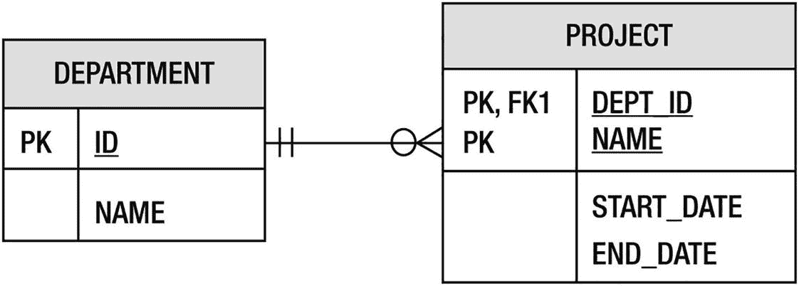

图 10-3

依赖实体和父实体表

依赖对象不能没有主键，并且由于该主键由指向父实体的外键组成，因此很明显，在未建立与父实体的关系之前，无法持久化新的依赖实体。修改现有实体的主键是未定义的行为；因此，作为派生标识符一部分的一对一或多对一关系同样是不可变的，并且在依赖实体已被持久化或已存在后，不得将其重新分配给新实体。

我们在前几节讨论了不同类型的标识符，你可能会回顾所学内容，并意识到有许多不同的参数可能会影响派生标识符的配置方式。例如，任一实体中的标识符可能由一个或多个属性组成。从依赖实体到父实体的关系可能构成整个派生标识符，或者，如图 10-3 所示，依赖实体中可能还有其他状态对其有贡献。其中一个实体可能具有简单或复合主键，并且在复合主键的情况下可能具有 ID 类或嵌入式 ID 类。所有这些因素结合在一起，产生了多种场景，每种场景都需要略有不同的配置。派生标识符的基本规则首先概述如下，后续章节将提供更详细的描述。


### 派生标识符的基本规则

派生标识符的大部分规则可以用几条通用陈述来概括，尽管同时应用这些规则可能并不那么容易。我们稍后会通过一些案例来详细解释，甚至展示一两个例外情况以保持趣味性，但为了给这些用例奠定基础，规则可以归纳如下：

*   一个依赖实体可能有多个父实体（即，派生标识符可能包含多个外键）。
*   依赖实体必须先设置好与所有父实体的关系，然后才能被持久化。
*   如果一个实体类有多个 ID 属性，那么它不仅必须使用一个 ID 类，而且该 ID 类中必须为实体中的每个 ID 属性都包含一个同名的对应属性。
*   实体中的 ID 属性可以是简单类型，也可以是作为多对一或一对一关系目标的实体类型。
*   如果实体中的 ID 属性是简单类型，那么 ID 类中匹配属性的类型必须也是相同的简单类型。
*   如果实体中的 ID 属性是一个关系，那么 ID 类中匹配属性的类型必须与该关系中目标实体的主键类型相同（无论主键类型是简单类型、ID 类还是嵌入式 ID 类）。
*   如果依赖实体的派生标识符采用嵌入式 ID 类的形式，那么该 ID 类中每个表示关系的属性都应在对应的关系属性上通过 `@MapsId` 注解来引用。

以下各节将描述如何应用这些规则。

### 共享主键

一个简单但不太常见的案例是，派生标识符由单个属性组成，该属性就是关系外键。例如，假设 `Employee` 和 `EmployeeHistory` 实体之间存在双向的一对一关系。由于每个 `Employee` 只有一个 `EmployeeHistory`，我们可能决定共享主键。在清单 10-15 中，如果 `EmployeeHistory` 是依赖实体，那么我们通过使用 `@Id` 注解该关系来表明该关系外键就是标识符。

```
@Entity
public class EmployeeHistory {
// ...
@Id
@OneToOne
@JoinColumn(name="EMP_ID")
private Employee employee;
// ...
}
清单 10-15
具有单个属性的派生标识符
```

`EmployeeHistory` 的主键类型将与 `Employee` 的主键类型相同，因此如果 `Employee` 有一个简单的整数标识符，那么 `EmployeeHistory` 的标识符也将是一个整数。如果 `Employee` 有一个复合主键（无论是使用 ID 类还是嵌入式 ID 类），那么 `EmployeeHistory` 将共享相同的 ID 类（并且也应使用 `@IdClass` 注解进行标注）。问题在于，这违反了 ID 类规则，即实体中应为 ID 类中的每个属性都有一个匹配的属性。这是一个例外情况，正是因为 ID 类在父实体和依赖实体之间是共享的。

有时，有人可能希望实体既包含主键属性又包含关系属性，并且这两个属性都映射到表中的同一个外键列。尽管实体中并不需要主键属性，但有些人可能希望单独定义它以方便访问。尽管这两个属性映射到同一个外键列（同时也是主键列），但映射不必在两个地方重复。`@Id` 注解放在标识符属性上，而 `@MapsId` 注解关系属性，以表明它也映射了 ID 属性。如清单 10-16 所示。请注意，不应在 `empId` 属性上指定物理映射注解（例如 `@Column`），因为 `@MapsId` 表明关系属性才是映射发生的地方。

```
@Entity
public class EmployeeHistory {
// ...
@Id
int empId;
@MapsId
@OneToOne
@JoinColumn(name="EMP_ID")
private Employee employee;
// ...
}
清单 10-16
具有共享映射的派生标识符
```

在我们继续讨论具有多个映射属性的派生标识符之前，还有几点关于 `@MapsId` 值得一提。

第一点实际上是逻辑上的延续，即使用 `@MapsId` 注解的关系也定义了标识符属性的映射。如果关系属性上没有覆盖性的 `@JoinColumn` 注解，那么连接列将根据通常的默认规则进行默认设置。如果是这种情况，那么标识符属性也将映射到相同的默认列。例如，如果从清单 10-16 中移除 `@JoinColumn` 注解，那么 `employee` 和 `empId` 属性都将映射到默认的 `EMPLOYEE_ID` 外键列（假设 `EMPLOYEE` 表中的主键列是 `ID`）。

其次，尽管标识符属性共享了在关系属性上定义的数据库映射，但从标识符属性的角度来看，它实际上是一个只读映射。对数据库外键列的更新或插入只会通过关系属性进行。这就是为什么在尝试持久化依赖实体之前，必须始终记住设置父关系的原因之一。

注意

不要试图仅设置标识符属性（而不设置关系属性）作为快捷方式持久化依赖实体。某些提供商可能对此有特殊支持，但这并不能可移植地导致外键被写入数据库。

当从数据库读取实体实例，或者刷新/提交时，标识符属性将由提供商自动填充。但是，在首次对实例调用 `persist()` 时，不能假定该属性已存在，除非用户显式设置了它。


### 多重映射属性

更常见的情况可能是，依赖实体拥有的标识符不仅包含关系，还包含其自身的某些状态。我们使用图 10-3 所示的示例，其中 `Project` 拥有一个复合标识符，该标识符由名称和指向管理它的部门的外键组成。由于唯一标识符是名称和部门的组合，因此任何部门都不允许创建多个同名项目。然而，两个不同的部门可以为各自的项目选择相同的名称。清单 10-17 展示了在 `name` 和 `dept` 属性上使用 `@Id` 对 `Project` 标识符进行简单映射。

```
@Entity
@IdClass(ProjectId.class)
public class Project {
@Id private String name;
@Id
@ManyToOne
@JoinColumn(name="DEPT_NUM",
referencedColumnName="NUM")
@JoinColumn(name="DEPT_CTY",
referencedColumnName="COUNTRY")
private Department dept;
// ...
}
清单 10-17
具有依赖标识符的 Project
```

复合标识符意味着我们还必须使用 `@IdClass` 注解来指定主键类。回顾我们的规则：主键类必须为实体上的每个 ID 属性都有一个匹配的命名属性，并且通常这些属性的类型也必须相同。然而，此规则仅适用于属性为简单类型的情况，而不适用于实体类型。如果 `@Id` 注解的是关系，那么该关系属性的类型将是某个目标实体类型，规则的扩展是：主键类属性的类型必须与目标实体的主键类型相同。这意味着在清单 10-17 中指定为 `Project` 的 ID 类的 `ProjectId` 类，必须有一个名为 `name`、类型为 `String` 的属性，以及另一个名为 `dept`、其类型与 `Department` 的主键类型相同的属性。如果 `Department` 有一个简单的整数主键，那么 `ProjectId` 中的 `dept` 属性将是 `int` 类型；但如果 `Department` 有一个带有自身主键类（例如 `DeptId`）的复合主键，那么 `ProjectId` 中的 `dept` 属性将是 `DeptId` 类型，如清单 10-18 所示。

```
public class ProjectId implements Serializable {
private String name;
private DeptId dept;
public ProjectId() {}
public ProjectId(DeptId deptId, String name) {
this.dept = deptId;
this.name = name;
}
// ...
}
public class DeptId implements Serializable {
private int number;
private String country;
public DeptId() {}
public DeptId (int number, String country) {
this.number = number;
this.country = country;
}
// ...
}
清单 10-18
ProjectId 和 DeptId ID 类
```

### 使用 EmbeddedId

当其中一个（或两个）实体使用 `@EmbeddedId` 时，也可以拥有派生标识符。当 ID 类被嵌入时，非关系的标识符属性照常映射在可嵌入的 ID 类中，但嵌入的 ID 类中对应于关系的属性则由实体中的关系属性进行映射。清单 10-19 展示了当使用嵌入的 ID 类时，派生标识符如何在 `Project` 类中进行映射。我们使用 `@MapsId("dept")` 注解关系属性，表明它也在指定嵌入 ID 类中 `dept` 属性的映射。`ProjectId` 的 `dept` 属性与清单 10-20 中 `Department` 的主键类型相同。

请注意，我们在 `department` 关系上使用了多个连接列，因为 `Department` 有一个复合主键。多部分标识符的映射将在本章后面的“复合连接列”部分中更详细地解释。

```
@Entity
public class Project {
@EmbeddedId private ProjectId id;
@MapsId("dept")
@ManyToOne
@JoinColumn(name="DEPT_NUM", referencedColumnName="NUM")
@JoinColumn(name="DEPT_CTRY", referencedColumnName="CTRY")
private Department department;
// ...
}
@Embeddable
public class ProjectId implements Serializable {
@Column(name="P_NAME")
private String name;
@Embedded
private DeptId dept;
// ...
}
清单 10-19
Project 和嵌入的 ProjectId 类
```

`Department` 实体有一个嵌入的标识符，但它不是派生标识符，因为 `DeptId` ID 类没有任何对应于 `Department` 中关系属性的属性。`DeptId` 类中的 `@Column` 注解映射了 `Department` 实体中的标识符字段，但当 `DeptId` 嵌入到 `ProjectId` 中时，这些列映射不再适用。一旦 `dept` 属性由 `Project` 中的 `department` 关系映射，该关系上的 `@JoinColumn` 注解将被用作 `PROJECT` 表的列映射。

```
@Entity
public class Department {
@EmbeddedId private DeptId id;
@OneToMany(mappedBy="department")
private List projects;
// ...
}
@Embeddable
public class DeptId implements Serializable {
@Column(name="NUM")
private int number;
@Column(name="CTRY")
private String country;
// ...
}
清单 10-20
Department 和嵌入的 DeptId 类
```

如果 `Department` 类有一个简单的主键，例如一个 `long` 类型而不是 ID 类，那么 `ProjectId` 中的 `dept` 属性将只是 `Department` 的简单主键类型（`long` 类型），并且 `Project` 中的多对一 `department` 属性上只会有一个连接列。

### 派生标识符的替代方案

`@MapsId` 注解以及将 `@Id` 应用于关系属性的能力是在 Jakarta Persistence 中引入的，以改善 Java Persistence 1.0 中存在的情况。当时，只有一对一共享主键场景是使用 `@PrimaryKeyJoinColumn` 注解指定的（使用 `@Id` 注解是未来推荐的首选方法）。

尽管没有指定解决在标识符中包含外键这一普遍情况的方法，但通常通过向依赖实体添加一个或多个额外的（冗余）字段来支持。每个添加的字段将持有一个指向相关实体的外键，并且由于添加的字段和关系都映射到相同的连接列，因此两者中的一个需要被标记为只读（参见“只读映射”部分），或者不可更新或不可插入。以下示例展示了如何使用 Java Persistence 1.0 实现清单 10-17。ID 类将是相同的。由于 `deptNumber` 和 `deptCountry` 属性是标识符属性，并且不能在数据库中更改，因此无需将其可更新性设置为 `false`：

```
@Entity
@IdClass(ProjectId.class)
public class Project {
@Id private String name;
@Id
@Column(name="DEPT_NUM", insertable=false)
private int deptNumber;
@Id
@Column(name="DEPT_CTRY", insertable=false)
private String deptCountry;
@ManyToOne
@JoinColumns({
@JoinColumn(name="DEPT_NUM", referencedColumnName="NUM"),
@JoinColumn(name="DEPT_CTRY", referencedColumnName="CTRY")})
private Department department;
// ...
}
```

## 高级映射元素

可以在 `@Column` 和 `@JoinColumn` 注解（以及它们的 `@MapKeyColumn`、`@MapKeyJoinColumn` 和 `@OrderColumn` 相关注解）上指定其他元素，其中一些元素适用于第 14 章讨论的模式生成。其他部分我们可以在以下各节中分别描述为应用于列和连接列。


### 只读映射

Jakarta Persistence 并未真正定义任何形式的只读实体，尽管这很可能会在未来的版本中出现。不过，该 API 确实定义了相关选项，可以通过 `@Column` 和 `@JoinColumn` 注解中的 `insertable` 和 `updatable` 元素将单个映射设置为只读。这两个设置默认值为 `true`，但如果我们希望确保提供程序不会因实体实例的更改而插入或更新表中的信息，则可以将其设置为 `false`。如果映射表中的数据已经存在，并且我们希望确保其在运行时不会被修改，那么可以将 `insertable` 和 `updatable` 元素设置为 `false`，从而有效地阻止提供程序执行除从数据库读取实体之外的任何操作。清单 10-21 演示了具有只读映射的 `Employee` 实体。

```
@Entity
public class Employee {
@Id
@Column(insertable=false)
private int id;
@Column(insertable=false, updatable=false)
private String name;
@Column(insertable=false, updatable=false)
private long salary;
@ManyToOne
@JoinColumn(name="DEPT_ID", insertable=false, updatable=false)
private Department department;
// ...
}
清单 10-21
使实体成为只读
```

我们无需担心标识符映射被修改，因为修改标识符是非法的。不过，其他映射都被标记为无法插入或更新，因此我们假设数据库中已存在可供读取和使用的实体。不会持久化任何新实体，现有实体也永远不会被更新。

请注意，这并不能保证实体状态在内存中不会改变。`Employee` 实例仍然可能在事务内部或外部被更改，但在事务提交时或实体被刷新到数据库时，此状态将不会被保存，并且提供程序很可能不会抛出异常来指示这一点。但是，在内存中修改只读映射时要小心，因为更改实体可能导致它们与数据库中的状态不一致，并可能对特定于供应商的缓存造成严重破坏。

尽管所有这些映射都不可更新，但整个实体仍然可以被删除。一个合适的只读特性将在未来的版本中一劳永逸地解决这个问题，但与此同时，一些供应商支持只读实体的概念，并且可以在其缓存和持久化上下文实现中优化对它们的处理。

### 可选性

正如你将在第 14 章讨论模式生成时看到的那样，存在一些元数据，它们要么允许数据库列为空，要么要求它们必须有值。虽然此设置会影响物理数据库模式，但某些逻辑映射上也有一些设置，允许基本映射或单值关联映射在对象模型中留空或要求必须指定。要求或允许此类行为的元素是 `@Basic`、`@ManyToOne` 和 `@OneToOne` 注解中的 `optional` 元素。

当 `optional` 元素指定为 `false` 时，它向提供程序指示该字段或属性映射不能为 null。API 实际上并未定义当值为 null 时的具体行为，但提供程序可以选择抛出异常或简单地执行其他操作。对于基本映射，它只是一个提示，可以完全忽略。提供程序在执行模式生成时也可能使用 `optional` 元素，因为如果 `optional` 设置为 `true`，那么数据库中的列也必须是可为空的。

由于 API 没有详细说明对象模型的可选性，因此使用它存在一定程度的不可移植性。清单 10-22 展示了一个将 manager 设置为必需属性的示例。`optional` 的默认值为 `true`，因此仅当需要 `false` 值时才需要指定它。

```
@Entity
public class Employee {
// ...
@ManyToOne(optional=false)
@JoinColumn(name="DEPT_ID", insertable=false, updatable=false)
private Department department;
// ...
}
清单 10-22
使用可选映射
```

## 高级关系

如果你有幸从 Java 应用程序开始并创建数据库模式，那么你可以完全控制模式的外观以及如何将类映射到数据库。在这种情况下，你可能不需要使用 API 提供的许多高级关系特性。能够定义数据模型的灵活性通常使得映射配置不那么苛刻。但是，如果你不幸需要将 Java 模型映射到现有数据库，那么为了处理数据模式，你可能需要访问比我们目前讨论的更多的映射。以下各节中描述的映射主要用于映射到遗留数据库，并且最常被使用，因为它们通常是唯一的选择。一个值得注意的例外是孤儿删除特性，它用于建模父子关系。

### 使用连接表

我们已经看到了一些使用连接表的映射，例如多对多和单向一对多映射。有时，数据库模式使用连接表来关联两个实体类型，即使关系中目标实体的基数为 1。一对一或多对一关系通常不需要连接表，因为目标始终是单个实体，并且外键可以存储在源实体表中。但是，如果连接表已经存在于多对一关系中，那么我们必须使用该连接表来映射关系。为此，我们只需将 `@JoinTable` 注解添加到关系映射中即可。

无论关系是单向还是双向，`@JoinTable` 注解都是一个物理注解，必须定义在关系的拥有方，这与所有其他映射一样。但是，由于连接表不是非多对多或非单向一对多映射的默认配置，因此当我们希望使用连接表时，确实需要指定该注解。`@JoinTable` 注解的元素仍然可以用于覆盖各种模式名称。

在清单 10-23 中，我们看到一个连接表被用于 `Employee` 到 `Department` 的多对一关系。该关系可以是单向的，也可以是双向的，并包含从 `Department` 回到 `Employee` 的一对多关系，但无论哪种情况，“多”方必须始终是拥有方。原因在于，即使它是双向的，`@ManyToOne` 侧也不能成为拥有方，因为 `@ManyToOne` 属性无法引用拥有方的 `@OneToMany` 属性侧。`@ManyToOne` 注解定义中没有 `mappedBy` 元素。

与大多数其他映射一样，双向关系的非拥有方不会根据关系是否使用连接表映射而改变。它只是引用拥有方关系，并让其相应地映射到物理表/列。

```
@Entity
public class Employee {
@Id private int id;
private String name;
private long salary;
@ManyToOne
@JoinTable(name="EMP_DEPT")
private Department department;
// ...
}
清单 10-23
使用连接表的多对一映射
```


### 避免使用连接表

到目前为止，我们讨论的都是基于使用连接表的单向一对多映射，但也可以在不使用连接表的情况下实现单向映射。这要求外键位于目标表（即关系的“多”方）中，即使目标对象没有对“一”方的任何引用。这被称为**单向一对多目标外键映射**，因为外键位于目标表中，而不是连接表中。

要使用这种映射，我们首先通过在注解中不指定任何 `mappedBy` 元素，来表明该一对多关系是单向的。然后，我们在表示一对多关系的属性上指定一个 `@JoinColumn` 注解，以指明外键列。关键在于，我们指定的这个连接列应用于目标对象的表，而不是出现该注解的源对象。

```
@Entity
public class Department {
@Id private int id;
@OneToMany
@JoinColumn(name="DEPT_ID")
private Collection employees;
// ...
}
清单 10-24
使用目标外键的单向一对多映射
```

清单 10-24 中的示例展示了使用目标外键映射单向一对多关系是多么简单。`DEPT_ID` 列引用的是 `Employee` 映射的表，并且是 `DEPARTMENT` 表的外键，尽管 `Employee` 实体没有任何指向 `Department` 的关系属性。

在使用这种映射之前，你应该理解这样做的影响，因为无论从建模角度还是性能角度来看，其影响都可能是相当负面的。`EMPLOYEE` 表中的每一行都对应一个 `Employee` 实例，每一列对应实例中的某种状态或关系。当行发生变化时，通常假设对应的 `Employee` 发生了某种变化，但在这种情况下，这种假设并不一定成立。`Employee` 可能刚刚被更改到了另一个 `Department`，并且由于 `Employee` 中没有对 `Department` 的引用，因此 `Employee` 本身并未发生任何变化。

从性能角度来看，考虑这样一种情况：`Employee` 的状态发生了改变，同时它所属的 `Department` 也发生了改变。在写入 `Employee` 状态时，指向 `Department` 的外键是未知的，因为 `Employee` 实体没有任何对它的引用。在这种情况下，`Employee` 可能需要被写入两次：一次是为了更新 `Employee` 的已更改状态，另一次是在写入 `Department` 实体的更改时，必须更新从 `Employee` 指向 `Department` 的外键，使其指向引用它的那个 `Department`。

### 复合连接列

既然我们已经讨论了如何创建具有复合主键的实体，那么不难想到，一旦我们与具有复合标识符的实体建立关系，就需要某种方式来扩展我们当前引用它的方法。

到目前为止，我们仅将物理关系映射处理为单个连接列，但是，如果我们要引用的主键由多个字段组成，那么我们就需要多个连接列。这就是为什么我们有复数形式的 `@JoinColumns` 注解，它可以容纳我们需要的任意数量的连接列。

当我们有多个连接列时，连接列名称没有默认值。最简单的答案是要求用户为其赋值，因此，当使用多个连接列时，必须同时指定 `name` 元素和 `referencedColumnName` 元素（后者指示目标表中主键列的名称）。

现在我们开始涉及更复杂的场景，让我们在混合关系中添加一个更有趣的关系。假设员工有经理，每个经理手下有一定数量的员工。你可能觉得这没什么特别，直到你意识到经理本身也是员工，因此这些连接列实际上是自引用的，即引用它们自身所在的表。图 10-4 展示了具有这种关系的 `EMPLOYEE` 表。

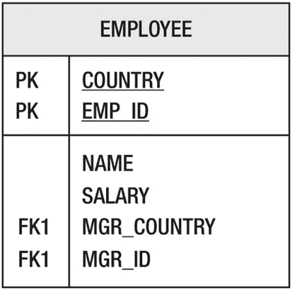

图 10-4

具有自引用复合外键的 EMPLOYEE 表

清单 10-25 展示了一个 `Employee` 实体的版本，它包含一个 `manager` 关系（从每个被管理的员工到经理的多对一关系），以及一个 `directs` 关系（从经理到其管理员工的一对多关系）。

```
@Entity
@IdClass(EmployeeId.class)
public class Employee {
@Id private String country;
@Id
@Column(name="EMP_ID")
private int id;
@ManyToOne
@JoinColumns({
@JoinColumn(name="MGR_COUNTRY", referencedColumnName="COUNTRY"),
@JoinColumn(name="MGR_ID", referencedColumnName="EMP_ID")
})
private Employee manager;
@OneToMany(mappedBy="manager")
private Collection directs;
// ...
}
清单 10-25
自引用复合关系
```

可以指定任意数量的连接列，尽管在实践中很少超过两个。复数形式的 `@JoinColumns` 或多个 `@JoinColumn` 可以用于多对一或一对一关系，或者更一般地，在单个 `@JoinColumn` 注解有效的情况下使用。

另一个需要考虑的例子是多对多关系中的连接表。我们可以重新审视第 4 章中描述的 `Employee` 和 `Project` 关系，以考虑 `Employee` 中的复合主键。这种关系的新表结构如图 10-5 所示。

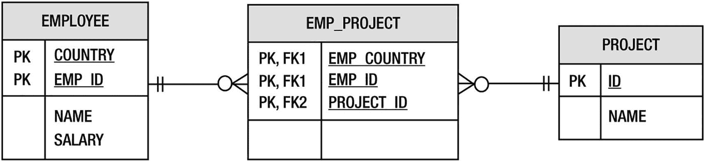

图 10-5

具有复合主键的连接表

如果我们保持 `Employee` 实体作为关系拥有方（即定义连接表的一方），那么这种关系的映射将如清单 10-26 所示。

```
@Entity
@IdClass(EmployeeId.class)
public class Employee {
@Id private String country;
@Id
@Column(name="EMP_ID")
private int id;
@ManyToMany
@JoinTable(
name="EMP_PROJECT",
joinColumns={
@JoinColumn(name="EMP_COUNTRY", referencedColumnName="COUNTRY"),
@JoinColumn(name="EMP_ID", referencedColumnName="EMP_ID")},
inverseJoinColumns=@JoinColumn(name="PROJECT_ID"))
private Collection projects;
// ...
}
清单 10-26
具有复合连接列的连接表
```


### 孤儿删除

`orphanRemoval` 元素提供了一种便捷的方式来建模父子关系，更具体地说是私有拥有关系。我们区分这两者，是因为私有拥有是父子关系的一种特殊形式，其中子实体只能是一个父实体的子实体，并且永远不能属于另一个不同的父实体。虽然某些父子关系允许子实体从一个父实体迁移到另一个父实体，但在私有拥有映射中，被拥有的实体是为属于父实体而创建的，并且永远不能迁移。一旦它从父实体中被移除，它就被视为孤儿，并由提供者删除。

只有源端具有单一基数的关系才能启用孤儿删除，这就是为什么 `orphanRemoval` 选项定义在 `@OneToOne` 和 `@OneToMany` 关系注解上，而不是 `@ManyToOne` 或 `@ManyToMany` 注解上。

当指定时，`orphanRemoval` 元素会导致在父实体与子实体之间的关系被打破时删除子实体。这可以通过将持有相关实体的属性设置为 null 来实现，或者在一对多的情况下，通过从集合中移除子实体来实现。然后，提供者负责在刷新或提交时（以先到者为准）删除孤儿子实体。

在父子关系中，子实体依赖于父实体的存在。如果父实体被移除，那么根据定义，子实体就变成了孤儿，也必须被移除。孤儿删除行为的这第二个特性，完全等同于我们在第 6 章中介绍的一个称为*级联*的特性，在该特性中，可以跨关系级联定义的操作集中的任何子集。在关系上设置孤儿删除会自动导致该关系在其级联列表中添加 `REMOVE` 操作选项，因此无需显式添加它。这样做只是多余的。无法关闭标记为孤儿删除的关系的级联 `REMOVE`，因为其定义本身就要求存在这种行为。

在清单 10-27 中，`Employee` 类定义了一个与其年度评估列表的一对多关系。无论该关系是单向的还是双向的，其配置和语义都是相同的，因此我们无需展示关系的另一端。

```
@Entity
public class Employee {
@Id private int id;
@OneToMany(orphanRemoval=true)
private List evals;
// ...
}
清单 10-27
具有评估实体孤儿删除功能的 Employee 类
```

假设一名员工收到来自经理的不公平评估。员工可能会去找经理更正信息，评估可能会被修改，或者员工可能不得不对评估提出申诉，如果申诉成功，该评估可能会简单地从员工记录中移除。这也会导致它从数据库中被删除。如果员工决定离开公司，那么当该员工从系统中被移除时，他的评估将随他一起被自动移除。

如果关系中的集合是一个 `Map`，并且键由不同的实体类型组成，那么孤儿删除仅适用于 `Map` 中的实体值，而不适用于键。这意味着实体键永远不会被私有拥有。

最后，如果孤儿对象当前在持久化上下文中未被管理，无论是由于它在内存中创建但尚未持久化，还是因为它只是从持久化上下文中分离出来，孤儿删除都不会被应用。类似地，如果它已经在当前持久化上下文中被移除，孤儿删除也不会被应用。

### 映射关系状态

有时，关系实际上具有与之关联的状态。例如，假设我们想要维护员工被分配到项目工作的日期。将状态存储在员工上是可能的，但不太有用，因为该日期实际上与员工与特定项目的关系（多对多关联中的单个条目）耦合在一起。将员工从项目中移除应该只会导致分配日期消失，因此将其作为员工的一部分存储意味着我们必须确保两者彼此一致，这可能很麻烦。在 UML 中，我们会使用关联类来展示这种关系。图 10-6 展示了这种技术的一个示例。

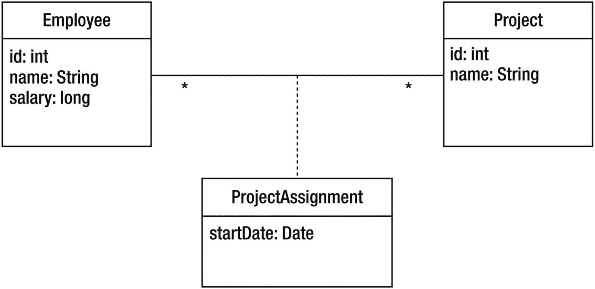

图 10-6

使用关联类在关系上建模状态

在数据库中，一切都很顺利，因为我们只需向连接表添加一列即可。数据模型为关系状态提供了天然的支持。图 10-7 展示了 `EMPLOYEE` 和 `PROJECT` 之间的多对多关系，并带有一个扩展的连接表。

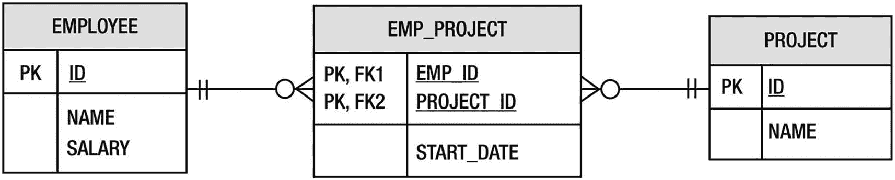

图 10-7

具有附加状态的连接表

然而，当我们进入对象模型时，问题就变得严重得多了。问题在于 Java 本身不支持关系状态。关系只是对象引用或指针；因此，关系上永远不能存在状态。状态只存在于对象上，而关系不是一等对象。

Java 的解决方案是将该关系转变为一个包含所需状态的实体，并将这个新实体映射到之前的连接表。新实体将与每个现有实体类型具有多对一关系，而每个实体类型将具有一对多关系返回到代表该关系的新实体。新实体的主键将是与两个实体类型的两个关系的组合。清单 10-28 展示了 `Employee` 和 `Project` 关系中的所有参与者。

```
@Entity
public class Employee {
@Id private int id;
// ...
@OneToMany(mappedBy="employee")
private Collection assignments;
// ...
}
@Entity
public class Project {
@Id private int id;
// ...
@OneToMany(mappedBy="project")
private Collection assignments;
// ...
}
@Entity
@Table(name="EMP_PROJECT")
@IdClass(ProjectAssignmentId.class)
public class ProjectAssignment {
@Id
@ManyToOne
@JoinColumn(name="EMP_ID")
private Employee employee;
@Id
@ManyToOne
@JoinColumn(name="PROJECT_ID")
private Project project;
@Temporal(TemporalType.DATE)
@Column(name="START_DATE", updatable=false)
private Date startDate;
// ...
}
public class ProjectAssignmentId implements Serializable {
private int employee;
private int project;
// ...
}
清单 10-28
使用中间实体映射关系状态
```

这里，主键完全由关系组成，两个外键列构成了 `EMP_PROJECT` 连接表中的主键。分配创建的日期可以在创建分配时手动设置，也可以与一个触发器关联，该触发器在数据库中创建分配时设置该日期。请注意，如果使用了触发器，则需要从数据库中刷新实体，以便在 Java 对象中填充分配日期字段。


## 多表映射

最常见的映射场景属于所谓的“双向奔赴”类型。这意味着数据模型和对象模型都已存在，或者，如果其中一个不存在，则独立于另一个模型创建。这一点很重要，因为 Jakarta Persistence API 中有许多特性试图解决这种情况下出现的问题。

到目前为止，我们一直假设一个实体映射到单个表，并且该表中的单行代表一个实体。在现有或遗留的数据模型中，将数据（即使是紧密耦合的数据）分散到多个表中实际上非常常见。这样做是出于不同的管理以及性能原因，其中之一是为了在访问或修改特定数据子集时减少表争用。

为了解决这个问题，实体可以通过使用 `@SecondaryTable` 注解及其复数形式 `@SecondaryTables` 来跨多个表进行映射。默认表或由 `@Table` 注解定义的表称为主表，任何其他表称为从表。然后，我们可以通过简单地在实体上定义从表作为注解，然后指定每个字段或属性映射到哪个表的列，从而将实体中的数据分布到主表和从表的行中。我们通过在 `@Column` 或 `@JoinColumn` 的 `table` 元素中指定表名来实现这一点。我们之前不需要使用这个元素，因为 `table` 的默认值是主表的名称。

剩下的唯一一点是指定如何将一个或多个从表连接到主表。我们在第 4 章中看到，主键连接列是连接列的一种特殊情况，其中连接列就是主键列（如果是复合主键，则是多个列）。将从表连接到主表的支持仅限于主键连接列，并作为 `@SecondaryTable` 注解的一部分，通过 `@PrimaryKeyJoinColumn` 注解来指定。

为了演示从表的使用，请考虑图 10-8 中所示的数据模型。`EMP` 表和 `EMP_ADDRESS` 表之间存在主键关系。`EMP` 表存储主要的员工信息，而地址信息已移至 `EMP_ADDRESS` 表。

要将此表结构映射到 `Employee` 实体，我们必须将 `EMP_ADDRESS` 声明为从表，并为存储在该表中的每个属性使用 `@Column` 注解的 table 元素。清单 10-29 显示了映射后的实体。`EMP_ADDRESS` 表的主键位于 `EMP_ID` 列。如果它被命名为 `ID`，那么我们就不需要在 `@PrimaryKeyJoinColumn` 注解中使用 name 元素。它默认为主表中主键列的名称。

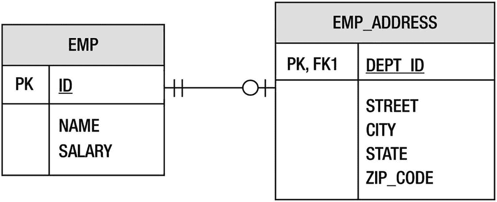

图 10-8

EMP 和 EMP_ADDRESS 表

```
@Entity
@Table(name="EMP")
@SecondaryTable(name="EMP_ADDRESS",
pkJoinColumns=@PrimaryKeyJoinColumn(name="EMP_ID"))
public class Employee {
@Id private int id;
private String name;
private long salary;
@Column(table="EMP_ADDRESS")
private String street;
@Column(table="EMP_ADDRESS")
private String city;
@Column(table="EMP_ADDRESS")
private String state;
@Column(name="ZIP_CODE", table="EMP_ADDRESS")
private String zip;
// ...
}
清单 10-29
跨两个表映射实体
```

在第 4 章中，我们学习了如何使用 `@Table` 中的 `schema` 或 `catalog` 元素来限定主表位于特定的数据库模式或目录中。这在 `@SecondaryTable` 注解中同样有效。

之前，在讨论嵌入对象时，我们将 `Employee` 实体的地址字段映射到 `Address` 嵌入类型中。当地址数据位于从表中时，仍然可以通过在 `@AttributeOverride` 注解中指定映射的表名作为列信息的一部分来实现这一点。清单 10-30 演示了这种方法。请注意，即使列名可能与正确的默认值匹配，我们也必须枚举嵌入类型中的所有字段。

```
@Entity
@Table(name="EMP")
@SecondaryTable(name="EMP_ADDRESS",
pkJoinColumns=@PrimaryKeyJoinColumn(name="EMP_ID"))
public class Employee {
@Id private int id;
private String name;
private long salary;
@Embedded
@AttributeOverride(name="street", column=@Column(table="EMP_ADDRESS"))
@AttributeOverride(name="city", column=@Column(table="EMP_ADDRESS"))
@AttributeOverride(name="state", column=@Column(table="EMP_ADDRESS"))
@AttributeOverride(name="zip",
column=@Column(name="ZIP_CODE",                        table="EMP_ADDRESS"))
private Address address;
// ...
}
清单 10-30
将嵌入类型映射到从表
```

让我们考虑一个更复杂的示例，涉及多个表和复合主键。图 10-9 显示了我们希望映射的表结构。除了 `EMPLOYEE` 表之外，还有两个从表：`ORG_STRUCTURE` 和 `EMP_LOB`。`ORG_STRUCTURE` 表存储员工和经理的汇报关系信息。`EMP_LOB` 表存储在正常查询选项中不常获取的大对象。将大对象移动到从表是许多数据库模式中常见的设计技术。

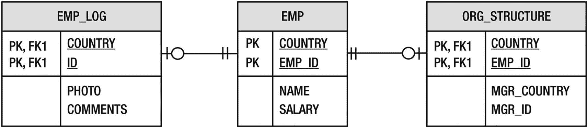

图 10-9

具有复合主键关系的从表

清单 10-31 显示了映射到此表结构的 `Employee` 实体。此示例中复用了清单 10-10 中的 `EmployeeId` ID 类。

```
@Entity
@IdClass(EmployeeId.class)
@SecondaryTable(name="ORG_STRUCTURE", pkJoinColumns={
@PrimaryKeyJoinColumn(name="COUNTRY", referencedColumnName="COUNTRY"),
@PrimaryKeyJoinColumn(name="EMP_ID", referencedColumnName="EMP_ID")})
@SecondaryTable(name="EMP_LOB", pkJoinColumns={
@PrimaryKeyJoinColumn(name="COUNTRY", referencedColumnName="COUNTRY"),
@PrimaryKeyJoinColumn(name="ID", referencedColumnName="EMP_ID")})
public class Employee {
@Id private String country;
@Id
@Column(name="EMP_ID")
private int id;
@Basic(fetch=FetchType.LAZY)
@Lob
@Column(table="EMP_LOB")
private byte[] photo;
@Basic(fetch=FetchType.LAZY)
@Lob
@Column(table="EMP_LOB")
private char[] comments;
@ManyToOne
@JoinColumn(name="MGR_COUNTRY", referencedColumnName="COUNTRY",
table="ORG_STRUCTURE"),
@JoinColumn(name="MGR_ID", referencedColumnName="EMP_ID",
table="ORG_STRUCTURE")
private Employee manager;
// ...
}
清单 10-31
使用多个从表映射实体
```

我们在这个示例中引入了一些曲折之处，使其更有趣。首先，我们定义了 `Employee` 具有复合主键。这需要为 `EMP_LOB` 表提供额外的信息，因为它的主键名称与主表不同。下一个不同之处是，我们在 `ORG_STRUCTURE` 从表中存储了一个关系。`MGR_COUNTRY` 和 `MGR_ID` 列组合起来引用了该员工的经理的 ID。由于员工具有复合主键，因此 `manager` 关系也必须指定一组连接列，而不仅仅是一个，并且这些连接列中的 `referencedColumnName` 元素引用了实体自身主表 `EMPLOYEE` 中的主键列 `COUNTRY` 和 `EMP_ID`。


## 继承

面向对象开发新手常犯的一个错误是，他们接受了复用的原则，但却将其过度使用。人们很容易陷入对复用的追求中，仅仅为了共享几个方法就创建出复杂的继承层次结构。这种多层级的继承结构往往会在后续开发中带来痛苦和麻烦，因为应用程序会变得难以调试和维护。

大多数应用程序在对象模型中至少会受益于某种程度的继承。然而，与大多数事物一样，应当适度使用，尤其是在将类映射到关系数据库时。庞大的继承层次结构常常会导致性能显著下降，而且代码复用的成本可能比你愿意付出的代价更高。

在接下来的章节中，我们将解释 API 中用于映射继承层次结构的支持，并概述一些相关影响。

### 类层次结构

由于这是一本关于 Jakarta Persistence API 的书，讨论继承最直接、最明显的起点就是 Java 对象模型。毕竟，实体是对象，应该能够从其他实体继承状态和行为。这不仅是预期的，而且对于面向对象应用程序的开发也是至关重要的。

当一个实体从其实体超类继承状态时，这意味着什么？这在数据模型中可能意味着不同的事情，但在 Java 模型中，它仅仅意味着当子类实体被实例化时，它拥有自己版本或副本的本地定义状态和继承状态，所有这些状态都是持久的。虽然这个基本前提并不令人惊讶，但它引出了一个不那么明显的问题：当一个实体从非实体的类继承时会发生什么？实体允许扩展哪些类，以及当它这样做时会发生什么？

考虑图 10-10 中所示的类层次结构。正如我们在第 1 章中看到的，类继承在数据库中有多种表示方式。在对象模型中，甚至可能有多种不同的方式来实现层次结构，其中一些可能包括非实体类。在接下来的章节中，我们将使用这个示例来探索持久化继承层次结构的方法。

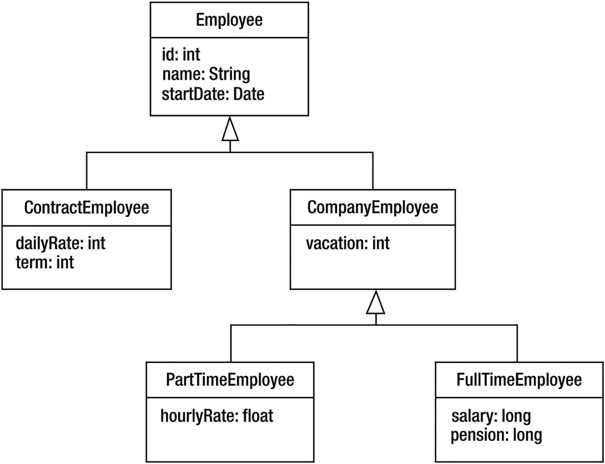

图 10-10

继承类层次结构

我们区分了通用类层次结构和实体层次结构。通用类层次结构是一组以树形结构相互扩展的各种类型的 Java 类；而实体层次结构则是由持久化实体类与非实体类交错组成的树。实体层次结构的根节点是层次结构中的第一个实体类。

#### 映射超类

Jakarta Persistence API 定义了一种特殊类型的类，称为映射超类，它作为实体的超类非常有用。映射超类提供了一个方便的类，用于存储实体可以继承的共享状态和行为，但它本身不是一个持久化类，也不能充当实体的角色。它不能被查询，也不能成为关系的目标。诸如 `@Table` 之类的注解不允许用于映射超类，因为其中定义的状态仅适用于其实体子类。

映射超类与实体的关系，某种程度上可以类比抽象类与具体类的关系；它们可以包含状态和行为，但不能被实例化为持久化实体。抽象类仅在其具体子类中才有用，而映射超类仅作为被扩展它的实体子类继承的状态和行为才有用。在实体继承层次结构中，除了向继承它们的实体提供状态和行为之外，它们不扮演其他角色。

映射超类可以在其类定义中定义为抽象类，也可以不定义，但最佳实践是将其设为实际的抽象 Java 类。我们不知道有任何好的用例，可以在无法持久化它们的情况下创建具体的 Java 实例；而且，如果你碰巧找到了这样的用例，很可能你希望这个映射超类是一个实体。

所有适用于实体的默认映射规则也适用于映射超类中的基本状态和关系状态。使用映射超类的最大优势在于，能够定义部分共享状态，这些状态不能在没有其实体子类添加的额外状态的情况下单独访问。如果你不确定是将一个类设为实体还是映射超类，那么你只需要问自己：你是否需要查询或访问仅作为该映射类实例暴露的实例？这也包括关系，因为映射超类不能用作关系的目标。如果你对这个问题的任何变体回答“是”，那么你可能应该将其设为一等实体。

回顾图 10-10，我们可以合理地认为将 `CompanyEmployee` 类视为映射超类而不是实体。它定义了共享状态，但也许我们没有理由对其进行查询。

通过使用 `@MappedSuperclass` 注解标注一个类，可以将其指示为映射超类。清单 10-32 中的类片段展示了如何将层次结构映射为以 `CompanyEmployee` 作为映射超类。

```
@Entity
public class Employee {
@Id private int id;
private String name;
@Temporal(TemporalType.DATE)
@Column(name="S_DATE")
private Date startDate;
// ...
}
@Entity
public class ContractEmployee extends Employee {
@Column(name="D_RATE")
private int dailyRate;
private int term;
// ...
}
@MappedSuperclass
public abstract class CompanyEmployee extends Employee {
private int vacation;
// ...
}
@Entity
public class FullTimeEmployee extends CompanyEmployee {
private long salary;
private long pension;
// ...
}
@Entity
public class PartTimeEmployee extends CompanyEmployee {
@Column(name="H_RATE")
private float hourlyRate;
// ...
}
清单 10-32
从映射超类继承的实体
```


#### 层次结构中的瞬态类

实体层次结构中既非实体也非映射超类的类，被称为瞬态类。实体可以通过映射超类直接或间接地继承瞬态类。当实体继承自瞬态类时，瞬态类中定义的状态仍会被实体继承，但该状态不会持久化。换句话说，根据常规的 Java 规则，实体将为继承的状态分配空间，但该状态不会由持久化提供者管理。在实体的生命周期中，该状态实际上会被忽略。实体可以通过使用生命周期回调方法（我们将在第 12 章中描述）或其他方法手动管理该状态，但该状态不会作为提供者管理的实体生命周期的一部分被持久化。

可以设想这样一种层次结构：一个实体拥有一个瞬态子类，而该子类又拥有一个或多个实体子类。虽然这种情况并不常见，但仍然是可能的，并且可以在需要共享瞬态状态或通用行为的罕见场景中实现。不过，通常情况下，在实体超类中声明瞬态状态或行为比创建一个中间瞬态类更为方便。清单 10-33 展示了一个实体继承自一个超类，该超类定义了实体在内存中创建时间的瞬态状态。

```
public abstract class CachedEntity {
private long createTime;
public CachedEntity() { createTime = System.currentTimeMillis(); }
public long getCacheAge() {     return System.currentTimeMillis() - createTime;
}
}
@Entity
public class Employee extends CachedEntity {
public Employee() { super(); }
// ...
}
清单 10-33
继承自瞬态超类的实体
```

在这个例子中，我们将瞬态状态从实体类移到了瞬态超类中，但最终结果实际上是一样的。如果没有额外的类，前面的例子可能会更简洁一些，但这个例子允许我们在任意数量的实体之间共享瞬态状态和行为，这些实体只需继承 `CachedEntity` 即可。

#### 抽象类与具体类

我们在映射超类的上下文中提到了抽象类与具体类的概念，但没有进一步详细讨论实体类和瞬态类。大多数人，根据其理念，可能会期望对象层次结构中的所有非叶子类都应该是抽象的，或者至少其中一部分是抽象的。如果规定实体必须始终是具体类，那将很容易打乱这种设计，幸运的是，情况并非如此。实体、映射超类或瞬态类在继承树的任何层级上都可以是抽象类或具体类，这完全是可以接受的。与映射超类类似，在层次结构中将瞬态类设为具体类实际上没有任何意义，作为一般规则，应避免这样做，以防止意外的开发错误和误用。

我们尚未讨论的一种情况是实体作为抽象类。抽象类实体与具体类实体之间的唯一区别在于 Java 规则禁止实例化抽象类。它们仍然可以定义持久化状态和行为，这些状态和行为将由它们下面的具体实体子类继承。它们可以被查询，查询结果将由具体实体子类的实例组成。它们还可以承载层次结构的继承映射元数据。

图 10-10 中的层次结构有一个 `Employee` 类，它是一个具体类。我们不希望用户意外地实例化这个类，然后尝试持久化一个部分定义的员工。我们可以通过将其定义为抽象类来防止这种情况。这样，我们最终将使所有非叶子类成为抽象类，而叶子类成为持久化类。

### 继承模型

Jakarta Persistence 提供了对三种不同数据表示形式的支持。其中两种使用较为广泛，而第三种则不太常见，并且不要求必须支持，尽管它仍然被完整定义，目的是未来可能要求提供者支持它。

当存在实体层次结构时，它总是以实体类为根。回想一下，映射超类不计入层次结构的层级，因为它们仅对其下方的实体有贡献。根实体类必须通过使用 `@Inheritance` 注解来标识继承层次结构。该注解指示了应使用的映射策略，并且必须是以下各节中描述的三种策略之一。

层次结构中的每个实体必须定义或继承其标识符，这意味着标识符必须在根实体中或在其上方的映射超类中定义。映射超类在类层次结构中的位置可能高于标识符定义的位置。


#### 单表策略

存储多个类状态的最常见且性能最佳的方式是定义一个单一表，用于包含任何实体类中所有可能状态的超集。这种方法被称为单表策略，这并不令人意外。其结果是，对于代表某个具体类实例的任何给定表行，可能存在某些列没有值，因为它们仅适用于层次结构中的兄弟类。

从图 10-10 中我们可以看到，`id` 位于根 `Employee` 实体类中，并由其余持久化类共享。继承树中的所有持久化实体必须使用相同类型的标识符。我们无需思考太久就能明白为什么这在两个层面都有意义。在对象层，如果没有一个可以传入的通用标识符类型，就不可能对超类执行多态的 `find()` 操作。类似地，在表层面，我们需要多个主键列，但在插入仅使用其中一个列的实例时，却无法将它们全部填充。

该表必须包含足够的列来存储所有类中的所有状态。每一行存储一个具体实体类型的实体实例的状态，这通常意味着每一行中都会有一些列未被填充。当然，这会导致一个结论：映射到具体子类状态的列应该可为空，这通常不是大问题，但对某些数据库管理员来说可能是个问题。

总的来说，单表方法往往更浪费数据库表空间，但它确实为多态查询和写操作提供了最佳性能。执行这些操作所需的 SQL 简单、经过优化，且无需连接。

要为继承层次结构指定单表策略，根实体类需要使用 `@Inheritance` 注解，并将其策略设置为 `SINGLE_TABLE`。在我们之前的模型中，这意味着需要如下注解 `Employee` 类：

```
@Entity
@Inheritance(strategy=InheritanceType.SINGLE_TABLE)
public abstract class Employee { ... }
```

然而，事实证明单表策略是默认策略，因此我们严格来说甚至不需要包含 `strategy` 元素。一个空的 `@Inheritance` 注解同样能达到效果。

在图 10-11 中，我们看到了 `Employee` 层次结构模型的单表表示。就单表策略的表结构和模式架构而言，`CompanyEmployee` 是映射超类还是实体并无区别。

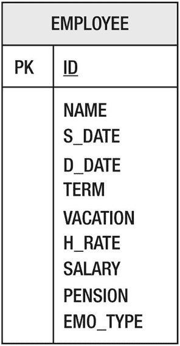

图 10-11

单表继承数据模型

##### 鉴别器列

你可能已经注意到图 10-11 中有一个名为 `EMP_TYPE` 的额外列，它并未映射到图 10-10 中任何类的任何字段。该字段有特殊用途，并且在使用单表建模继承时是必需的。它被称为鉴别器列，通过使用 `@DiscriminatorColumn` 注解与我们已了解的 `@Inheritance` 注解配合进行映射。该注解的 `name` 元素指定了用作鉴别器列的列名，如果未指定，则默认为名为 `DTYPE` 的列。

`discriminatorType` 元素规定了鉴别器列的类型。有些应用程序倾向于使用字符串来区分实体类型，而另一些则喜欢使用整数值来指示类。鉴别器列的类型可以是三种预定义鉴别器列类型之一：`INTEGER`、`STRING` 或 `CHAR`。如果未指定 `discriminatorType` 元素，则默认采用 `STRING` 类型。

##### 鉴别器值

表中的每一行在鉴别器列中都会有一个值，称为鉴别器值或类指示符，用于指示该行存储的实体类型。因此，继承层次结构中的每个具体实体都需要一个特定于该实体类型的鉴别器值，以便提供程序在加载和存储行时能够处理或分配正确的实体类型。实现方式是在每个具体实体类上使用 `@DiscriminatorValue` 注解。注解中的字符串值指定了该类的实例在插入数据库时将获得的鉴别器值。这将允许提供程序在发出查询时识别该类的实例。该值的类型应与 `@DiscriminatorColumn` 注解中指定或默认的 `discriminatorType` 元素类型相同。

如果未指定 `@DiscriminatorValue` 注解，则提供程序将使用特定于提供程序的方式来获取该值。如果 `discriminatorType` 是 `STRING`，则提供程序将直接使用实体名称作为类指示符字符串。如果 `discriminatorType` 是 `INTEGER`，则我们必须要么为每个实体类指定鉴别器值，要么都不指定。如果我们只为部分类指定，则无法保证提供程序生成的值不会与我们指定的值重叠。

清单 10-34 展示了我们的 `Employee` 层次结构如何映射到单表策略。

```
@Entity
@Table(name="EMP")
@Inheritance
@DiscriminatorColumn(name="EMP_TYPE")
public abstract class Employee { ... }
@Entity
public class ContractEmployee extends Employee { ... }
@MappedSuperclass
public abstract class CompanyEmployee extends Employee { ... }
@Entity
@DiscriminatorValue("FTEmp")
public class FullTimeEmployee extends CompanyEmployee { ... }
@Entity(name="PTEmp")
public class PartTimeEmployee extends CompanyEmployee { ... }
清单 10-34
使用单表策略映射的实体层次结构
```

`Employee` 类是根类，因此它确立了继承策略和鉴别器列。我们假设采用默认的 `SINGLE_TABLE` 策略和 `STRING` 类型的鉴别器。

`Employee` 和 `CompanyEmployee` 类都没有鉴别器值，因为不应为抽象实体类、映射超类、瞬态类或任何抽象类指定鉴别器值。只有具体实体类使用鉴别器值，因为它们是唯一实际从数据库存储和检索的类。

`ContractEmployee` 实体没有使用 `@DiscriminatorValue` 注解，因为默认字符串 `"ContractEmployee"`（即赋予该类的默认实体名称）正是我们想要的。`FullTimeEmployee` 类明确将其鉴别器值列为 `"FTEmp"`，因此对于 `FullTimeEmployee` 的实例，每一行中存储的就是这个值。同时，`PartTimeEmployee` 类将获得 `"PTEmp"` 作为其鉴别器值，因为它将其实体名称设置为 `"PTEmp"`，并且在未指定鉴别器值时，实体名称会被用作鉴别器值。

在图 10-12 中，我们可以看到根据上述模型和设置可能找到的一些数据样本。从 `EMP_TYPE` 鉴别器列中，我们可以看到有三种不同类型的具体实体。我们还看到在不适用于某个实体实例的列中存在空值。

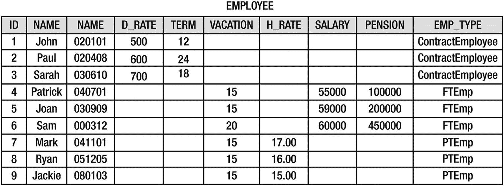

图 10-12

单表继承数据样本


#### 连接策略

从 Java 开发者的角度来看，将每个实体映射到其自身表的数据模型非常有意义。每个实体，无论是抽象的还是具体的，其状态都会被映射到不同的表中。与我们之前的描述一致，映射超类不会被映射到自己的表，而是作为其实体子类的一部分进行映射。

按每个实体映射一张表提供了`规范化`^(²⁴)数据模式所提供的数据复用，并且是在层次结构中存储多个子类共享数据的最有效方式。问题在于，当需要重新组装任何子类的实例时，必须将子类的表与超类的表连接在一起。这很清楚地说明了为什么这种策略被称为连接策略。插入一个实体实例的成本也稍高一些，因为必须在其每个超类表中都插入一行。

回顾单表策略，层次结构中每个类的标识符必须是相同类型。在连接方法中，每个表中都将具有相同类型的主键，并且子类表的主键也充当连接到其超类表的外键。这应该能让你联想到本章前面多表连接的情况，我们使用表的主键将表连接在一起，并使用`@PrimaryKeyJoinColumn`注解来指示这一点。在连接继承的情况下，我们使用相同的注解，因为我们有多个表，每个表都包含相同的主键类型，并且每个表都可能有一行数据构成最终的组合实体状态。

虽然连接继承在数据存储方面既直观又高效，但当层次结构较深或较宽时，它所要求的连接操作会使其使用成本较高。层次结构越深，组装底部具体实体实例所需的连接就越多。层次结构越宽，跨实体超类进行查询所需的连接就越多。

在图 10-13 中，我们看到我们的`Employee`示例被映射到连接表架构。实体子类的数据分布在各个表中，就像它分布在类层次结构中一样。当使用连接架构时，决定`CompanyEmployee`是映射超类还是实体会产生影响，因为映射超类不会被映射到表。而实体，即使是抽象类，也总是会被映射到表。图 10-13 将其显示为映射超类，但如果它是一个实体，那么将存在一个额外的`COMPANY_EMP`表，其中包含`ID`和`VACATION`列，而`FT_EMP`和`PT_EMP`表中的`VACATION`列将不存在。

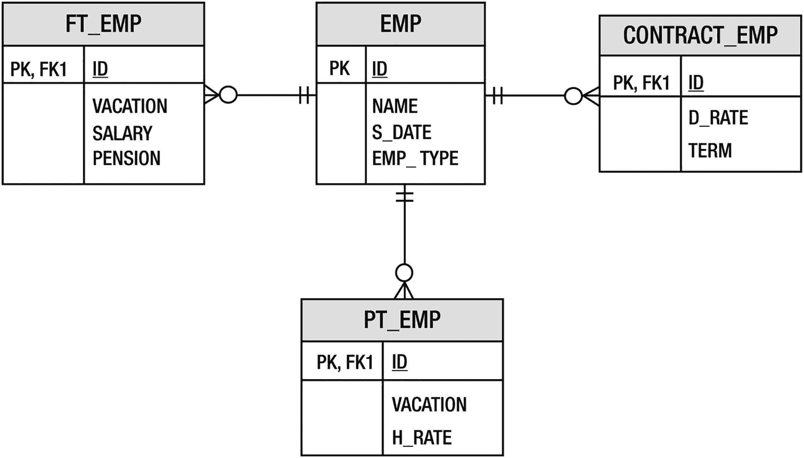

图 10-13

连接继承数据模型

要将实体层次结构映射到连接模型，`@Inheritance`注解只需将`JOINED`指定为策略即可。与单表示例一样，子类将采用根实体超类中指定的相同策略。

尽管有多个表来建模层次结构，但鉴别器列仅定义在根表上，因此`@DiscriminatorColumn`注解与`@Inheritance`注解放在同一个类上。

提示

一些供应商提供了不使用鉴别器列的连接继承实现。如果需要提供程序可移植性，则应使用鉴别器列。

我们的`Employee`层次结构示例可以使用清单 10-35 中所示的连接方法进行映射。在此示例中，我们使用了整数鉴别器列，而不是默认的字符串类型。

```
@Entity
@Table(name="EMP")
@Inheritance(strategy=InheritanceType.JOINED)
@DiscriminatorColumn(name="EMP_TYPE", discriminatorType=DiscriminatorType.INTEGER)
public abstract class Employee { ... }
@Entity
@Table(name="CONTRACT_EMP")
@DiscriminatorValue("1")
public class ContractEmployee extends Employee { ... }
@MappedSuperclass
public abstract class CompanyEmployee extends Employee { ... }
@Entity
@Table(name="FT_EMP")
@DiscriminatorValue("2")
public class FullTimeEmployee extends CompanyEmployee { ... }
@Entity
@Table(name="PT_EMP")
@DiscriminatorValue("3")
public class PartTimeEmployee extends CompanyEmployee { ... }
清单 10-35
使用连接策略映射的实体层次结构
```


#### 每个具体类一张表策略

映射实体层次结构的第三种方法是采用为每个具体类定义一张表的策略。这种数据架构与实体数据的非规范化方向相反，它将每个具体实体类及其所有继承状态映射到单独的表。这会导致所有共享状态在继承它的所有具体实体的表中被重新定义。提供商不必支持此策略，但将其包含在内是因为预计在 API 的未来版本中会需要它。我们简要描述它以保持完整性。

使用此策略的缺点在于，它使得跨类层次结构的多态查询比其他策略成本更高。问题在于，它必须要么针对每个子类表发出多个单独的查询，要么使用 `UNION` 操作跨所有表进行查询，而后者在处理大量数据时通常被认为成本高昂。如果存在非叶子具体类，那么每个类都会有自己的表。具体类的子类必须将继承的字段以及自身定义的字段存储在自己的表中。

与连接层次结构相比，每个具体类一张表层次结构的优点体现在查询单个具体实体实例的场景中。在连接的情况下，即使查询单个具体实体类，每个查询也需要进行连接。而在每个具体类一张表的情况下，它类似于单表层次结构，因为查询仅限于单个表。另一个优点是区分器列消失了。每个具体实体都有自己的单独表，没有模式的混合或共享，因此永远不需要类指示符。

将我们的示例映射到此类型层次结构，需要将策略指定为 `TABLE_PER_CLASS`，并确保每个具体类都有一个对应的表。如果使用的是遗留数据库，那么继承的列在每个具体表中可能具有不同的名称，此时 `@AttributeOverride` 注解就会派上用场。在此例中，`CONTRACT_EMP` 表没有 `NAME` 和 `S_DATE` 列，而是为 `Employee` 中定义的 `name` 和 `startDate` 字段分别使用了 `FULLNAME` 和 `SDATE`。

如果要覆盖的属性是关联而不是简单状态映射，我们仍然可以覆盖映射，但需要使用 `@AssociationOverride` 注解而不是 `@AttributeOverride`。`@AssociationOverride` 注解允许我们覆盖用于引用映射超类中定义的多对一或一对一关联的目标实体的连接列。为了说明这一点，我们需要向 `CompanyEmployee` 映射超类添加一个 `manager` 属性。默认情况下，`CompanyEmployee` 类中的连接列映射到两个子类表 `FT_EMP` 和 `PT_EMP` 中的 `MANAGER` 列，但在 `PT_EMP` 中，连接列的名称实际上是 `MGR`。我们通过向 `PartTimeEmployee` 实体类添加 `@AssociationOverride` 注解，并指定要覆盖的属性名称以及要覆盖到的连接列来覆盖该连接列。清单 10-36 展示了实体映射的完整示例，包括覆盖部分。

```
@Entity
@Inheritance(strategy=InheritanceType.TABLE_PER_CLASS)
public abstract class Employee {
@Id private int id;
private String name;
@Temporal(TemporalType.DATE)
@Column(name="S_DATE")
private Date startDate;
// ...
}
@Entity
@Table(name="CONTRACT_EMP")
@AttributeOverride(name="name", column=@Column(name="FULLNAME"))
@AttributeOverride(name="startDate", column=@Column(name="SDATE"))
public class ContractEmployee extends Employee {
@Column(name="D_RATE")
private int dailyRate;
private int term;
// ...
}
@MappedSuperclass
public abstract class CompanyEmployee extends Employee {
private int vacation;
@ManyToOne
private Employee manager;
// ...
}
@Entity @Table(name="FT_EMP")
public class FullTimeEmployee extends CompanyEmployee {
private long salary;
@Column(name="PENSION")
private long pensionContribution;
// ...
}
@Entity
@Table(name="PT_EMP")
@AssociationOverride(name="manager",
joinColumns=@JoinColumn(name="MGR"))
public class PartTimeEmployee extends CompanyEmployee {
@Column(name="H_RATE")
private float hourlyRate;
// ...
}
清单 10-36
使用每个具体类一张表策略映射的实体层次结构
```

表结构展示了这些列如何映射到具体表。请参见图 10-14 以清晰了解表的外观以及不同类型员工实例的存储方式。

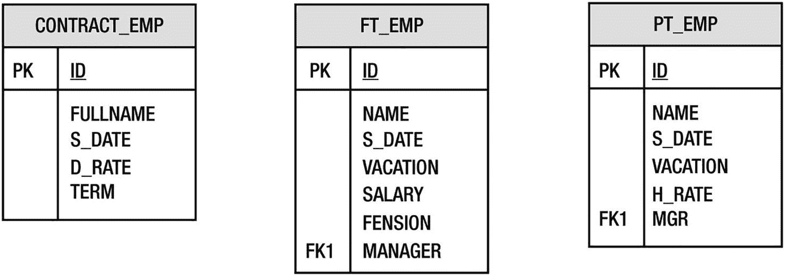

图 10-14

每个具体类一张表数据模型


### 混合继承

在开始本节之前，我们首先要说明，在单个继承层次结构中混合使用继承类型的做法目前不在规范范围内。我们将其纳入是因为它既实用又有趣，但需要提醒您，即使您的供应商支持此行为，依赖它也可能不具备可移植性。

此外，真正有意义的混合方式仅限于单表继承和连接继承类型。我们展示了一个混合这两种类型的示例，但请注意，对它们的支持是供应商特定的。我们的意图是，在规范的未来版本中，更实用的案例将被标准化，并要求符合规范的实现必须支持。

混合继承类型的前提是，数据模型完全有可能在单个实体层次结构中包含单表设计和连接表设计的组合。这可以通过我们图 10-13 中的连接示例来说明，将 `FullTimeEmployee` 和 `PartTimeEmployee` 实例存储在一个表中。这将产生一个如图 10-15 所示的模型。

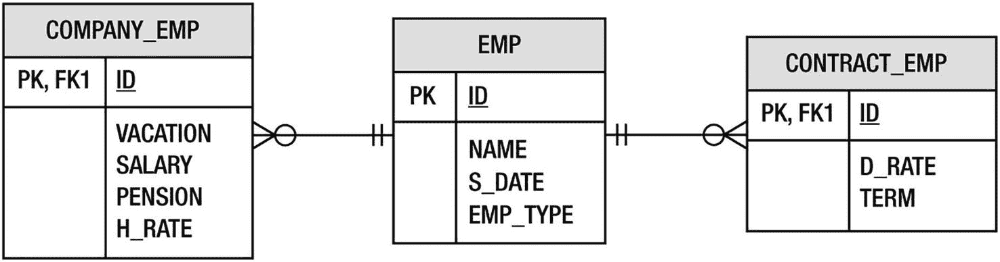

图 10-15

混合继承数据模型

在此示例中，`Employee` 和 `ContractEmployee` 类使用了连接策略，而 `CompanyEmployee`、`FullTimeEmployee` 和 `PartTimeEmployee` 类则回归到单表模型。为了在 `CompanyEmployee` 级别切换此继承策略，我们需要对层次结构进行简单更改。我们需要将 `CompanyEmployee` 转变为抽象实体而不是映射超类，以便它能够承载新的继承元数据。请注意，这仅仅是注解的更改，并未对领域模型进行任何修改。

继承策略可以像清单 10-37 所示进行映射。请注意，我们不需要为单表子层次结构设置鉴别器列，因为我们在超类 `EMP` 表中已经有一个了。

```
@Entity
@Table(name="EMP")
@Inheritance(strategy=InheritanceType.JOINED)
@DiscriminatorColumn(name="EMP_TYPE")
public abstract class Employee {
@Id private int id;
private String name;
@Temporal(TemporalType.DATE)
@Column(name="S_DATE")
private Date startDate;
// ...
}
@Entity
@Table(name="CONTRACT_EMP")
public class ContractEmployee extends Employee {
@Column(name="D_RATE") private int dailyRate;
private int term;
// ...
}
@Entity
@Table(name="COMPANY_EMP")
@Inheritance(strategy=InheritanceType.SINGLE_TABLE)
public abstract class CompanyEmployee extends Employee {
private int vacation;
// ...
}
@Entity
public class FullTimeEmployee extends CompanyEmployee {
private long salary;
@Column(name="PENSION")
private long pensionContribution;
// ...
}
@Entity
public class PartTimeEmployee extends CompanyEmployee {
@Column(name="H_RATE")
private float hourlyRate;
// ...
}
清单 10-37
使用混合策略映射的实体层次结构
```

#### 支持 Java 日期和时间 API

Jakarta Persistence 支持映射以下 `java.time` 类型：

```
java.time.LocalDate
java.time.LocalTime
java.time.LocalDateTime
java.time.OffsetTime
java.time.OffsetDateTime
```

对于 Jakarta Persistence 不直接支持的 Java 日期和时间 API 中的其他类型，例如 `java.time.Instant`，我们需要使用 `AttributeConverter`。

从之前的示例开始，日期和时间 API 的示例如清单 10-38 所示。

```
@Entity
@Table(name="EMP")
@Inheritance(strategy=InheritanceType.JOINED)
@DiscriminatorColumn(name="EMP_TYPE")
public abstract class Employee {
@Id private int id;
private String name;
@Column
private LocalDate date;
@Column
private LocalDateTime dateTime;
// ...
}
清单 10-38
日期和时间 API
```

注意

您可以在以下链接找到有关 Java SE 日期和时间 API 的更多信息：[`http://www.oracle.com/technetwork/articles/java/jf14-date-time-2125367.html`](http://www.oracle.com/technetwork/articles/java/jf14-date-time-2125367.html)

## 总结

实体映射需求通常远远超出将字段或关系映射到命名列的简单映射。在本章中，我们讨论了 Jakarta Persistence API 支持的一些更多样化和多样化的映射实践。

我们讨论了如何逐案或在持久化单元的所有映射中分隔数据库标识符。我们说明了分隔标识符如何允许包含特殊字符，并在目标数据库需要时提供大小写敏感性。

展示了一种对基本属性状态进行细粒度转换的方法，这是一种适配数据的强大技术。通过创建转换器，我们还能够以高度可定制的方式持久化现有和新定义的数据类型。转换可以在灵活的逐属性或全局基础上声明式地控制。

我们展示了可嵌入对象如何拥有状态、元素集合、进一步嵌套的可嵌入对象，甚至关系。我们给出了通过覆盖嵌入实体中的关系映射来重用包含关系的可嵌入对象的示例。

标识符可能由多个列组成。我们揭示了定义和使用复合主键的两种方法，并演示了何时可以使用它们。我们确定了其他实体如何对具有复合标识符的实体进行外键引用，并解释了在单个连接列适用的任何上下文中如何使用多个连接列。我们还展示了一些映射标识符（称为派生标识符）的示例，这些标识符将关系作为其标识的一部分。

我们解释了一些高级关系特性，例如只读映射和可选性，并展示了它们如何对某些模型有益。然后，我们继续描述一些更高级的映射场景，包括使用连接表或有时避免使用连接表。还涉及并阐明了孤儿删除的主题。

我们接着展示了如何将实体状态分布到多个表中，以及如何将辅助表与关系一起使用。我们甚至看到了可嵌入对象如何映射到实体的辅助表。

最后，我们详细介绍了三种不同的继承策略，这些策略可用于将继承层次结构映射到表。我们解释了映射超类以及如何使用它们来定义共享状态和行为。我们回顾了区分各种方法的数据模型，并展示了如何在每种情况下将实体层次结构映射到表。最后，我们通过说明如何在单个层次结构中混合继承类型来结束本章。

在下一章中，我们将继续讨论高级主题，但将注意力转向查询以及原生 SQL 和存储过程的使用。我们还将解释如何创建实体图以及如何使用它们来创建查询获取计划。

脚注 1   2


