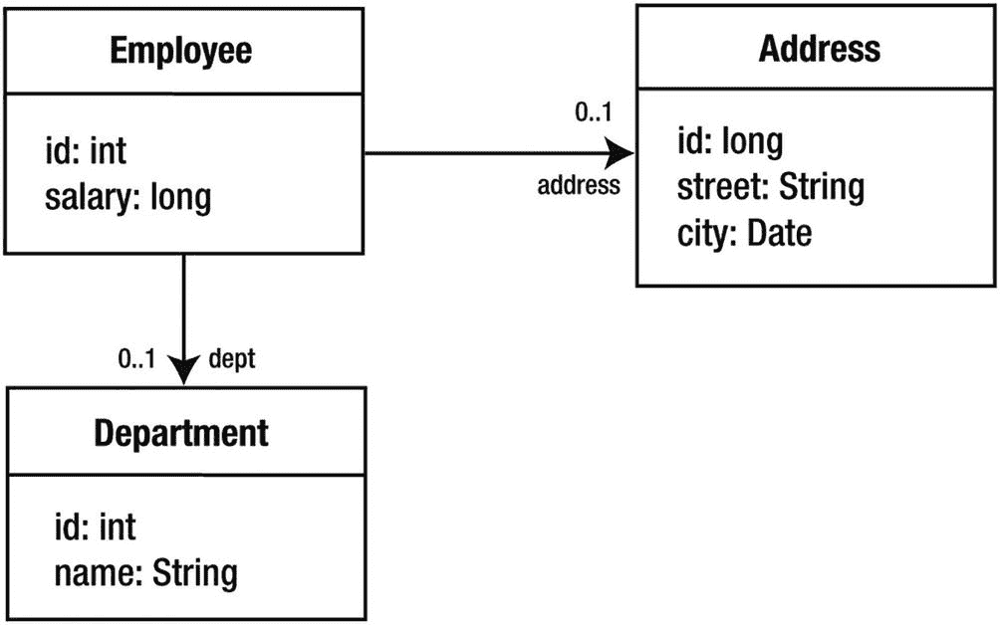
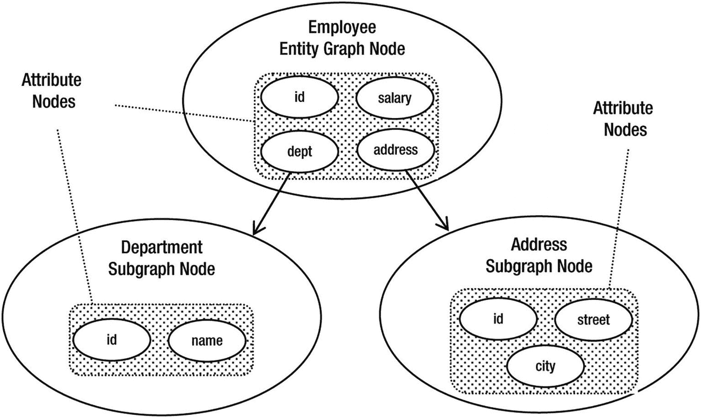
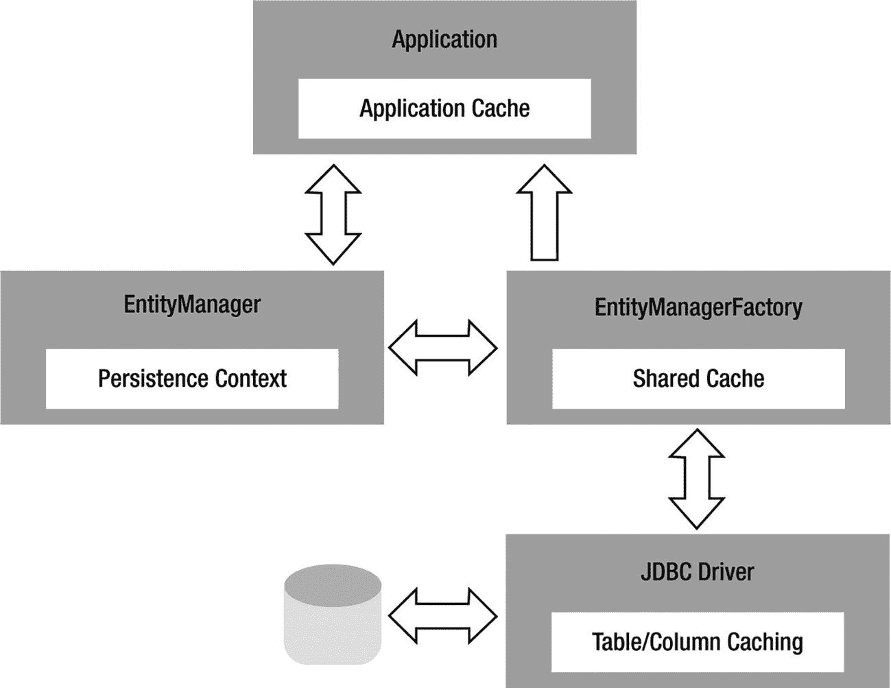
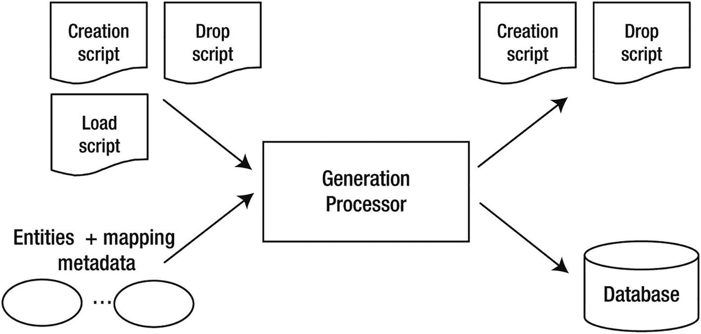

# 11. 高级查询

至此，你们中的大多数人从已学内容中已经掌握了足够多的查询知识，很可能不再需要本章的任何内容。事实上，本章大约有一半的内容涉及使用会将应用程序与目标数据库耦合的查询，因此无论如何，在使用这些查询时都应进行一定程度的规划和谨慎。

我们首先介绍 Jakarta Persistence 对原生 SQL 查询的支持，并展示如何将结果映射到实体、非实体或简单的数据投影结果。然后，我们将继续讨论存储过程查询，并解释如何从 Jakarta Persistence 应用程序内部调用存储过程，以及结果如何返回。

本章的后半部分讨论实体图，以及如何在查询期间使用它们来覆盖映射的获取类型。当作为获取图或加载图传递时，它们在运行时提供了极大的灵活性，用于控制应加载哪些状态以及何时加载。

## SQL 查询

尽管在抽象物理数据模型方面付出了诸多努力，无论是在对象关系映射还是 Jakarta Persistence QL 方面，了解到 SQL 在 Jakarta Persistence 中仍然活跃且运行良好，可能会令人惊讶。虽然 Jakarta Persistence QL 是对实体进行查询的首选方法，但 SQL 作为许多企业应用程序中的必要元素，不可忽视。主要数据库供应商支持的 SQL 功能规模庞大且范围广泛，这意味着像 Jakarta Persistence QL 这样的可移植语言永远无法完全涵盖其所有功能。

注意

SQL 查询也称为原生查询。与 SQL 查询相关的 `EntityManager` 方法和查询注解也使用此术语。虽然这允许将来支持其他查询语言，但在原生查询操作中的任何查询字符串都被假定为 SQL。

在讨论 SQL 查询的机制之前，让我们首先考虑一下，使用 Jakarta Persistence QL 的开发人员可能希望将 SQL 查询集成到其应用程序中的一些原因。

首先，尽管多年来进行了增强，Jakarta Persistence QL 仍然只包含许多数据库供应商支持的功能的子集。内联视图（FROM 子句中的子查询）、分层查询以及用于操作日期和时间值的附加函数表达式，只是 Jakarta Persistence QL 不支持的部分功能。

其次，虽然供应商可能提供提示来帮助优化 Jakarta Persistence QL 表达式，但在某些情况下，实现应用程序所需性能的唯一方法是用手动优化的 SQL 版本替换 Jakarta Persistence QL 查询。这可能是对持久化提供程序正在生成的查询进行简单的重构，也可能是利用特定于特定数据库的查询提示和功能的供应商特定版本。

当然，仅仅因为你可以使用 SQL，并不意味着你应该使用。持久化提供程序在生成高性能查询方面已经变得非常熟练，并且 Jakarta Persistence QL 的许多限制通常可以在应用程序代码中解决。我们建议，如果可能，最初避免使用 SQL，仅在必要时才引入它。这将使你的查询在数据库之间更具可移植性，并且随着映射的变化更易于维护。

以下各节讨论如何使用 Jakarta Persistence 定义 SQL 查询，以及如何将其结果集映射回实体。SQL 查询支持的主要好处之一是它使用了与 Jakarta Persistence QL 查询相同的 `Query` 接口。除了稍后将描述的一些小例外，前面章节中讨论的所有 `Query` 接口操作同样适用于 Jakarta Persistence QL 和 SQL 查询。

### 原生查询与 JDBC

对于任何研究 Jakarta Persistence 中 SQL 支持的人来说，一个完全合理的问题是，它是否真的需要。JDBC 已经使用多年，提供了广泛的功能集，并且运行良好。引入一个对实体进行操作的持久化 API 是一回事，但引入一个用于发出 SQL 查询的新 API 则完全是另一回事。

在 Jakarta Persistence 中使用 SQL 查询（而不是仅仅发出 JDBC 查询）的主要原因，是当查询的结果将被转换回实体时。例如，让我们考虑一个使用 Jakarta Persistence 的应用程序中 SQL 的典型用例。给定一个经理的员工 ID，应用程序需要确定所有直接或间接向该经理汇报的员工。例如，如果查询是针对高级经理的，结果将包括所有向该高级经理汇报的经理，以及向这些经理汇报的员工。这种类型的查询无法使用 Jakarta Persistence QL 实现，但像 Oracle 这样的数据库原生支持分层查询，正是为此目的。清单 11-1 演示了执行此查询并将结果转换为实体以供应用程序使用的典型 JDBC 调用序列。

```
@Stateless
public class OrgStructureBean implements OrgStructure {
private static final String ORG_QUERY =
"SELECT emp_id, name, salary " +
"FROM emp " +
"START WITH manager_id = ? " +
"CONNECT BY PRIOR emp_id = manager_id";
@Resource
DataSource hrDs;
public List findEmployeesReportingTo(int managerId) {
Connection conn = null;
PreparedStatement sth = null;
try {
conn = hrDs.getConnection();
sth = conn.prepareStatement(ORG_QUERY);
sth.setLong(1, managerId);
ResultSet rs = sth.executeQuery();
ArrayList result = new ArrayList();
while (rs.next()) {
Employee emp = new Employee();
emp.setId(rs.getInt(1));
emp.setName(rs.getString(2));
emp.setSalary(rs.getLong(3));
result.add(emp);
}
return result;
} catch (SQLException e) {
throw new EJBException(e);
}
}
}
清单 11-1
使用 SQL 和 JDBC 查询实体
```

现在考虑 Jakarta Persistence 支持的替代语法，如清单 11-2 所示。通过简单地指示查询的结果是 `Employee` 实体，查询引擎使用实体的对象关系映射来确定哪些结果列映射到实体属性，并相应地构建结果集。

```
@Stateless
public class OrgStructureBean implements OrgStructure {
private static final String ORG_QUERY =
"SELECT emp_id, name, salary, manager_id, dept_id, address_id " +
"FROM emp " +
"START WITH manager_id = ? " +
"CONNECT BY PRIOR emp_id = manager_id";
@PersistenceContext(unitName="EmployeeService")
EntityManager em;
public List findEmployeesReportingTo(int managerId) {
return em.createNativeQuery(ORG_QUERY, Employee.class)
.setParameter(1, managerId)
.getResultList();
}
}
清单 11-2
使用 SQL 和查询接口查询实体
```

代码不仅更易于阅读，而且使用了与 Jakarta Persistence QL 查询相同的 `Query` 接口。这有助于保持应用程序代码的一致性，因为它只需要关注 `EntityManager` 和 `Query` 接口。

持久化 API 逐步演进的一个不幸结果是，当添加 `TypedQuery` 接口时，接受 SQL 字符串和结果类并返回未类型化 `Query` 接口的 `createNativeQuery()` 方法已经定义。现在，没有向后兼容的方法来返回 `TypedQuery` 而不是 `Query`。令人遗憾的后果是，当使用结果类参数调用 `createNativeQuery()` 方法时，人们可能会错误地认为它会生成一个 `TypedQuery`，就像传入结果类时 `createQuery()` 和 `createNamedQuery()` 所做的那样。


### 定义与执行 SQL 查询

SQL 查询可以在运行时动态定义，也可以在持久化单元元数据中命名，这与第 7 章讨论的 Jakarta Persistence QL 查询定义类似。定义 Jakarta Persistence QL 查询与 SQL 查询的关键区别在于，查询引擎不应解析和解释特定于供应商的 SQL。为了执行 SQL 查询并返回实体实例，需要关于查询结果的额外映射信息。

动态定义返回实体结果的 SQL 查询的第一种也是最简单的方式，是使用 `EntityManager` 接口的 `createNativeQuery()` 方法，传入查询字符串和将要返回的实体类型。上一节的清单 11-2 演示了这种方法，将 Oracle 层次查询的结果映射到 `Employee` 实体。查询引擎使用实体的对象-关系映射来确定哪些结果列别名映射到哪些实体属性。在处理每一行时，查询引擎会实例化一个新的实体实例，并将可用数据设置到其中。

如果查询的列别名与实体的对象-关系映射不完全匹配，或者结果同时包含实体和非实体结果，则需要 SQL 结果集映射元数据。SQL 结果集映射被定义为持久化单元元数据，并通过名称引用。当使用 SQL 查询字符串和结果集映射名称调用 `createNativeQuery()` 方法时，查询引擎会使用此映射来构建结果集。SQL 结果集映射将在下一节讨论。

命名 SQL 查询使用 `@NamedNativeQuery` 注解定义。此注解可以放在任何实体上，并定义查询的名称以及查询文本。与 Jakarta Persistence QL 命名查询一样，查询名称在持久化单元内必须是唯一的。如果结果类型是实体，则可以使用 `resultClass` 元素来指示实体类。如果结果需要 SQL 映射，则可以使用 `resultSetMapping` 元素来指定映射名称。清单 11-3 展示了如何将之前演示的层次查询定义为命名查询。

```
@NamedNativeQuery(
name="orgStructureReportingTo",
query="SELECT emp_id, name, salary, manager_id, dept_id, address_id " +
"FROM emp " +
"START WITH manager_id = ? " +
"CONNECT BY PRIOR emp_id = manager_id",
resultClass=Employee.class
)
清单 11-3
使用注解定义命名原生查询
```

使用命名 SQL 查询的一个优点是，应用程序可以使用 `EntityManager` 接口上的 `createNamedQuery()` 方法来创建和执行查询。对于调用者来说，命名查询是使用 SQL 还是 Jakarta Persistence QL 定义的并不重要。另一个好处是，`createNamedQuery()` 可以返回一个 `TypedQuery`，而 `createNativeQuery()` 方法返回的是未类型化的 `Query`。

清单 11-4 再次演示了报告结构 Bean，这次使用了命名查询。使用命名查询而非动态查询的另一个优点是，它们可以使用 XML 映射文件进行覆盖。最初用 Jakarta Persistence QL 指定的查询可以被 SQL 版本覆盖，反之亦然。这种技术在第 13 章中有所描述。

```
@Stateless
public class OrgStructureBean implements OrgStructure {
@PersistenceContext(unitName="EmployeeService")
EntityManager em;
public List findEmployeesReportingTo(int managerId) {
return em.createNamedQuery("orgStructureReportingTo",
Employee.class)
.setParameter(1, managerId)
.getResultList();
}
}
清单 11-4
执行命名 SQL 查询
```

对于返回实体的 SQL 查询，需要注意的一点是，生成的实体实例会像 Jakarta Persistence QL 查询的结果一样，被持久化上下文管理。如果你修改了返回的某个实体，当持久化上下文与事务关联时，该修改将被写入数据库。这通常是期望的行为，但这要求任何时候选择与现有实体实例对应的数据时，必须确保查询中包含完整构建实体所需的所有必要数据。如果你从查询中遗漏了一个字段，或者将其默认设置为某个值，然后修改了生成的实体，就有可能覆盖数据库中已存储的正确版本。这是因为实体中缺失的状态将为 null（或根据类型的某个默认值）。当事务提交时，持久化上下文不知道状态未从查询中正确读取，可能会尝试写出 null 或默认值。

从 SQL 查询中获取受管理的实体有两个好处。首先，SQL 查询可以替换现有的 Jakarta Persistence QL 查询，并且应用程序代码无需更改即可继续工作。其次，它允许开发者使用 SQL 查询作为一种从可能没有任何对象-关系映射的表中构建新实体实例的方法。例如，在许多数据库架构中，有一个暂存区用于保存尚未验证或需要某种转换才能移动到最终位置的数据。使用 Jakarta Persistence，开发者可以启动一个事务，查询暂存数据以构建实体，执行任何所需的更改，然后提交。新创建的实体将被写入实体映射的表，而不是 SQL 查询中使用的暂存表。这比另一种方法更具吸引力，即拥有第二组将相同实体（甚至更糟，第二组并行的实体）映射到暂存表的映射，然后编写一些读取、复制和重写实体的代码。

为了方便起见，也支持 SQL 数据操作语句（`INSERT`、`UPDATE` 和 `DELETE`），这样就不必在原本仅限于 Jakarta Persistence 的应用程序中引入 JDBC 调用。要定义这样的查询，请使用 `createNativeQuery()` 方法，但不带任何映射信息。清单 11-5 以会话 Bean 的形式演示了这些类型的查询，该 Bean 将消息记录到表中。请注意，Bean 方法在 `REQUIRES_NEW` 事务上下文中运行，以确保即使活动事务回滚，消息也能被记录。

```
@Stateless
@TransactionAttribute(TransactionAttributeType.REQUIRES_NEW)
public class LoggerBean implements Logger {
private static final String INSERT_SQL =
"INSERT INTO message_log (id, message, log_dttm) " +
"VALUES(id_seq.nextval, ?, SYSDATE)";
private static final String DELETE_SQL =
"DELETE FROM message_log";
@PersistenceContext(unitName="Logger")
EntityManager em;
public void logMessage(String message) {
em.createNativeQuery(INSERT_SQL)
.setParameter(1, message)
.executeUpdate();
}
public void clearMessageLog() {
em.createNativeQuery(DELETE_SQL)
.executeUpdate();
}
}
清单 11-5
使用 SQL INSERT 和 DELETE 语句
```

通常不鼓励执行对实体映射表中的数据进行更改的 SQL 语句。这样做可能会导致缓存的实体与数据库不一致，因为提供者无法跟踪通过数据操作语句修改的实体状态所做的更改。


### SQL 结果集映射

在迄今为止展示的 SQL 查询示例中，结果映射都很直接。SQL 字符串中的列别名与单个实体的对象关系列映射直接匹配。但名称并不总是匹配，返回的也并非总是单一实体类型。Jakarta Persistence 提供了 SQL 结果集映射来处理这些场景。

SQL 结果集映射使用 `@SqlResultSetMapping` 注解定义。它可以放在实体类上，包含一个名称（在持久化单元内唯一）以及一个或多个实体和列映射。`createNativeQuery()` 方法上的实体结果类参数实际上是定义简单 SQL 结果集映射的快捷方式。以下映射等同于在调用 `createNativeQuery()` 时指定 `Employee.class`：

```
@SqlResultSetMapping(
name="EmployeeResult",
entities=@EntityResult(entityClass=Employee.class)
)
```

这里我们定义了一个名为 `EmployeeResult` 的 SQL 结果集映射，任何返回 `Employee` 实体实例的查询都可以引用它。该映射包含一个由 `@EntityResult` 注解指定的单一实体结果，该注解引用了 `Employee` 实体类。查询必须提供实体映射的所有列的值，包括外键。实体是部分构造还是因缺少任何必需的实体状态而报错，这取决于具体供应商。

#### 映射外键

外键不需要显式地作为 SQL 结果集映射的一部分进行映射。当查询引擎尝试将查询结果映射到实体时，它也会考虑单值关联的外键列。让我们再看一下组织结构 SQL 查询：

```
SELECT emp_id, name, salary, manager_id, dept_id, address_id
FROM emp
START WITH manager_id IS NULL
CONNECT BY PRIOR emp_id = manager_id
```

`MANAGER_ID`、`DEPT_ID` 和 `ADDRESS_ID` 列都映射到 `Employee` 实体上关联的连接列。从此查询返回的 `Employee` 实例可以使用 `getManager()`、`getDepartment()` 和 `getAddress()` 方法，结果将符合预期。持久化提供程序将根据从查询中读取的外键值检索关联的实体。无法通过 SQL 查询填充集合关联。从此示例构造的实体实例实际上与从 Jakarta Persistence QL 查询返回的实例相同。

#### 多重结果映射

一个查询可以同时返回多个实体。如果两个实体之间存在一对一关系，这通常非常有用；否则，查询将导致重复的实体实例。考虑以下查询：

```
SELECT emp_id, name, salary, manager_id, dept_id, address_id,
id, street, city, state, zip
FROM emp, address
WHERE address_id = id
```

用于从此查询中同时返回 `Employee` 和 `Address` 实体的 SQL 结果集映射定义在清单 11-6 中。每个实体都列在一个 `@EntityResult` 注解中，这些注解的数组被赋值给 `entities` 元素。实体列出的顺序并不重要。查询引擎使用查询的列名来匹配实体映射数据，而不是列位置。

```
@SqlResultSetMapping(
name="EmployeeWithAddress",
entities={@EntityResult(entityClass=Employee.class),
@EntityResult(entityClass=Address.class)}
)
清单 11-6
映射返回两种实体类型的 SQL 查询
```

#### 映射列别名

如果 SQL 语句中的列别名与实体列映射中指定的名称不直接匹配，则需要字段结果映射，以便查询引擎进行正确的关联。例如，假设前面示例中列出的 `EMP` 和 `ADDRESS` 表都使用列 `ID` 作为主键。查询必须修改为给 `ID` 列起别名，使其唯一：

```
SELECT emp.id AS emp_id, name, salary, manager_id, dept_id, address_id,
address.id, street, city, state, zip
FROM emp, address
WHERE address_id = address.id
```

在查询中的名称与列映射中使用的名称不同的情况下，`@FieldResult` 注解用于将列别名映射到实体属性。清单 11-7 显示了将 `EMP_ID` 别名转换为实体 `id` 属性所需的映射。可以指定多个 `@FieldResult`，但只需指定那些不同的映射。这可以是实体属性的部分列表。

```
@SqlResultSetMapping(
name="EmployeeWithAddress",
entities={@EntityResult(entityClass=Employee.class,
fields=@FieldResult(
name="id",
column="EMP_ID")),
@EntityResult(entityClass=Address.class)}
)
清单 11-7
映射包含未知列别名的 SQL 查询
```


#### 映射标量结果列

SQL 查询并不局限于仅返回实体结果，尽管这预计将是主要用例。请考虑以下查询：

```
SELECT e.name AS emp_name, m.name AS manager_name
FROM emp e,
emp m
WHERE e.manager_id = m.emp_id (+)
START WITH e.manager_id IS NULL
CONNECT BY PRIOR e.emp_id = e.manager_id
```

非实体结果类型（称为标量结果类型）使用 `@ColumnResult` 注解进行映射。一个或多个列映射可以分配给映射注解的 `columns` 属性。列映射唯一可用的属性是列名。清单 11-8 展示了员工与经理层级查询的 SQL 映射。

```
@SqlResultSetMapping(
name="EmployeeAndManager",
columns={@ColumnResult(name="EMP_NAME"),
@ColumnResult(name="MANAGER_NAME")}
)
Listing 11-8
标量列映射
```

标量结果也可以与实体混合使用。在这种情况下，标量结果通常提供关于实体的附加信息。

让我们看一个更复杂的例子来说明这种情况。应用程序的一份报告需要查看每个部门的信息，显示经理、员工人数和平均薪资。以下 Jakarta Persistence QL 查询生成了正确的报告：

```
SELECT d, m, COUNT(e), AVG(e.salary)
FROM Department d LEFT JOIN d.employees e
LEFT JOIN d.employees m
WHERE m IS NULL OR m IN (SELECT de.manager
FROM Employee de
WHERE de.department = d)
GROUP BY d, m
```

这个查询特别具有挑战性，因为从 `Department` 到作为部门经理的 `Employee` 之间没有直接关系。因此，`employees` 关系必须被连接两次：一次用于分配给部门的员工，另一次用于该组中同时也是经理的员工。这是可行的，因为子查询将 `employees` 关系的第二次连接缩减为单个结果。我们还需要考虑到部门当前可能没有分配任何员工，并且部门可能没有指定经理。这意味着每个连接都必须是外连接，并且我们必须在 `WHERE` 子句中进一步使用 `OR` 条件来允许经理缺失的情况。

投入生产后，发现提供者生成的 SQL 查询性能不佳，因此 DBA 提出了一个替代查询，该查询利用了 Oracle 数据库支持的内联视图。实现此结果的查询如清单 11-9 所示。

```
SELECT d.id, d.name AS dept_name,
e.emp_id, e.name, e.salary, e.manager_id, e.dept_id,
e.address_id,
s.tot_emp, s.avg_sal
FROM dept d,
(SELECT *
FROM emp e
WHERE EXISTS(SELECT 1 FROM emp WHERE manager_id = e.emp_id)) e,
(SELECT d.id, COUNT(*) AS tot_emp, AVG(e.salary) AS avg_sal
FROM dept d, emp e
WHERE d.id = e.dept_id (+)
GROUP BY d.id) s
WHERE d.id = e.dept_id (+) AND
d.id = s.id
Listing 11-9
部门汇总查询
```

幸运的是，映射这个查询比阅读它要容易得多。查询结果包含一个 `Department` 实体、一个 `Employee` 实体以及两个标量结果：员工人数和平均薪资。清单 11-10 展示了此查询的映射。

```
@SqlResultSetMapping(
name="DepartmentSummary",
entities={
@EntityResult(entityClass=Department.class,
fields=@FieldResult(name="name", column="DEPT_NAME")),
@EntityResult(entityClass=Employee.class)
},
columns={@ColumnResult(name="TOT_EMP"),
@ColumnResult(name="AVG_SAL")}
)
Listing 11-10
部门查询的映射
```

#### 映射复合键

当主键或外键由多个列组成，并且这些列已被别名为未映射的名称时，必须在 `@FieldResult` 注解中使用特殊表示法来标识键的每个部分。考虑清单 11-11 中所示的查询，该查询同时返回员工及其经理。此示例中的表与我们在图 10-4 中演示的表相同。由于每个列重复了两次，因此经理状态的列已被别名为新名称。

```
SELECT e.country, e.emp_id, e.name, e.salary,
e.manager_country, e.manager_id, m.country AS mgr_country,
m.emp_id AS mgr_id, m.name AS mgr_name, m.salary AS mgr_salary,
m.manager_country AS mgr_mgr_country, m.manager_id AS mgr_mgr_id
FROM   emp e,
emp m
WHERE  e.manager_country = m.country AND
e.manager_id = m.emp_id
Listing 11-11
返回员工和经理的 SQL 查询
```

此查询的结果集映射取决于目标实体使用的主键类类型。清单 11-12 展示了使用 id 类时的映射。对于主键，每个属性都作为单独的字段结果列出。对于外键，目标实体（本例中再次为 `Employee` 实体）的每个主键属性都附加到关系属性的名称之后。

```
@SqlResultSetMapping(
name="EmployeeAndManager",
entities={
@EntityResult(entityClass=Employee.class),
@EntityResult(
entityClass=Employee.class,
fields={
@FieldResult(name="country", column="MGR_COUNTRY"),
@FieldResult(name="id", column="MGR_ID"),
@FieldResult(name="name", column="MGR_NAME"),
@FieldResult(name="salary", column="MGR_SALARY"),
@FieldResult(name="manager.country",
column="MGR_MGR_COUNTRY"),
@FieldResult(name="manager.id", column="MGR_MGR_ID")
}
)
}
)
Listing 11-12
使用 id 类的员工查询映射
```

如果 `Employee` 使用嵌入式 id 类而不是 id 类，则表示法略有不同。我们必须包含主键属性名称以及嵌入式类型中的各个属性。清单 11-13 展示了使用此表示法的结果集映射。

```
@SqlResultSetMapping(
name="EmployeeAndManager",
entities={
@EntityResult(entityClass=Employee.class),
@EntityResult(
entityClass=Employee.class,
fields={
@FieldResult(name="id.country", column="MGR_COUNTRY"),
@FieldResult(name="id.id", column="MGR_ID"),
@FieldResult(name="name", column="MGR_NAME"),
@FieldResult(name="salary", column="MGR_SALARY"),
@FieldResult(name="manager.id.country",
column="MGR_MGR_COUNTRY"),
@FieldResult(name="manager.id.id", column="MGR_MGR_ID")
}
)
}
)
Listing 11-13
使用嵌入式 id 类的员工查询映射
```


#### 映射继承

在许多方面，SQL 中的多态查询与返回单一实体类型的常规查询并无不同。所有列都必须被考虑在内，包括外键以及用于单表继承和 joined 继承策略的鉴别器列。需要记住的关键点是，如果结果包含多种实体类型，那么查询中必须包含所有可能的实体类型的每一列。前面演示的字段结果映射技术可用于自定义使用未知别名的列。这些列可以位于继承树的任何层级。在用于继承的 `@EntityResult` 注解中，唯一的特殊元素是 `discriminatorColumn` 元素。该元素允许在鉴别器列与映射版本不同的罕见情况下指定其名称。

假设 `Employee` 实体已被映射到图 10-11 所示的表。为了理解鉴别器列的别名设置，请考虑以下查询，该查询从另一个采用单表继承结构的 `EMPLOYEE_STAGE` 表返回数据：

```
SELECT id, name, start_date, daily_rate, term, vacation,
hourly_rate, salary, pension, type
FROM employee_stage
```

为了将此查询返回的数据转换为 `Employee` 实体，将使用以下结果集映射：

```
@SqlResultSetMapping(
name="EmployeeStageMapping",
entities=
@EntityResult(
entityClass=Employee.class,
discriminatorColumn="TYPE",
fields={
@FieldResult(name="startDate", column="START_DATE"),
@FieldResult(name="dailyRate", column="DAILY_RATE"),
@FieldResult(name="hourlyRate", column="HOURLY_RATE")
}
)
)
```

#### 映射到非实体类型

原生查询中的构造函数表达式，与 Jakarta Persistence QL 中的构造函数表达式非常相似，通过使用底层结果集的行数据来调用构造函数，从而实例化用户指定的类型。构造对象所需的所有数据都必须作为构造函数的参数提供。

考虑我们在第 8 章中介绍的构造函数表达式示例，该示例通过从 `Employee` 实体中选择特定字段来创建 `EmployeeDetails` 数据类型的实例：

```
SELECT NEW example.EmployeeDetails(e.name, e.salary, e.department.name)
FROM Employee e
```

为了用等效的原生查询替换此查询并获得相同的结果，我们必须同时定义替换的原生查询和一个 `SqlResultSetMapping`，该映射定义了查询结果如何映射到用户指定的类型。让我们从定义替换 Jakarta Persistence QL 的 SQL 原生查询开始：

```
SELECT e.name, e.salary, d.name AS deptName
FROM emp e, dept d
WHERE e.dept_id = d.id
```

此查询的映射比等效的 Jakarta Persistence QL 更冗长。与 Jakarta Persistence QL 中列根据其位置隐式映射到构造函数不同，原生查询必须在映射注解中完整定义将映射到构造函数的数据集。以下示例演示了此查询的映射：

```
@SqlResultSetMapping(
name="EmployeeDetailMapping",
classes={
@ConstructorResult(
targetClass=example.EmployeeDetails.class,
columns={
@ColumnResult(name="name"),
@ColumnResult(name="salary", type=Long.class),
@ColumnResult(name="deptName")
}
)
}
)
```

与使用 `ColumnResult` 的其他示例一样，`name` 字段指的是 SQL 语句中定义的列别名。列结果按照列结果映射定义的顺序应用于用户指定类型的构造函数。在存在多个构造函数且仅凭位置可能产生歧义的情况下，也可以指定列结果类型以确保正确匹配。

值得注意的是，如果实体类型被指定为 `ConstructorResult` 映射的目标类，那么任何生成的实体实例都将被视为不受当前持久化上下文管理。当作为使用构造函数表达式的原生查询的一部分进行处理时，用户指定类型上的实体映射将被忽略。

### 参数绑定

SQL 查询传统上只支持位置参数绑定。JDBC 规范本身仅在 `CallableStatement` 对象上支持命名参数，而不支持 `PreparedStatement`，并且并非所有数据库供应商都支持此语法。因此，Jakarta Persistence 仅保证 SQL 查询使用位置参数绑定。请咨询您的供应商以了解 `Query` 接口的命名参数方法是否受支持，但请注意，使用它们可能会使您的应用程序在持久化提供程序之间不可移植。

SQL 查询参数支持的另一个限制是不能使用实体参数。规范没有定义应如何处理这些参数类型。在将命名的 Jakarta Persistence QL 查询转换或覆盖为原生 SQL 查询时，请务必小心，确保参数值仍能被正确解释。

### 存储过程

Jakarta Persistence 提供了从数据库映射和调用存储过程的能力。Jakarta Persistence 在 `EntityManager` 上对存储过程查询提供了一流支持，并定义了一种查询类型 `StoredProcedureQuery`，它扩展了 `Query` 并更好地处理了在应用程序中利用存储过程的开发人员可用的各种选项。

以下部分描述了如何使用 Jakarta Persistence 映射和调用存储过程查询。请注意，存储过程的实现高度依赖于数据库，因此超出了本书的范围。与 Jakarta Persistence QL 和其他类型的原生查询不同，存储过程的主体永远不会在 Jakarta Persistence 中定义，而只能在应用程序中通过名称引用。

#### 定义和执行存储过程查询

与其他类型的 Jakarta Persistence 查询一样，存储过程查询可以通过 `EntityManager` 接口以编程方式创建，也可以使用注解元数据定义，然后通过名称引用。为了定义存储过程映射，必须提供存储过程的名称以及该存储过程所有参数的名称和类型。

Jakarta Persistence 存储过程定义支持为 JDBC 存储过程定义的主要参数类型：`IN`、`OUT`、`INOUT` 和 `REF_CURSOR`。顾名思义，`IN` 和 `OUT` 参数类型分别将数据传递给存储过程或将数据返回给调用者。`INOUT` 参数类型将 `IN` 和 `OUT` 的行为组合成一种单一类型，既可以接受值，也可以向调用者返回值。`REF_CURSOR` 参数类型用于向调用者返回结果集。这些类型中的每一种在 `ParameterMode` 类型上都有一个对应的枚举值。

存储过程假定所有值都通过参数返回，除非数据库支持从存储过程返回结果集（或多个结果集）。支持这种返回结果集方法的数据库通常将其作为使用 `REF_CURSOR` 参数类型的替代方案。不幸的是，存储过程的行为非常依赖于供应商，这是一个在应用程序代码中不可避免地要针对特定数据库特性进行编写的例子。


##### 标量参数类型

首先，我们来考虑一个名为 `"hello"` 的简单存储过程，它接受一个名为 `"name"` 的字符串参数，并通过同一参数向调用者返回友好的问候。以下示例演示了如何定义和执行此类存储过程：

```
StoredProcedureQuery q = em.createStoredProcedureQuery("hello");
q.registerStoredProcedureParameter("name", String.class, ParameterMode.INOUT);
q.setParameter("name", "massimo");
q.execute();
String value = (String) q.getOutputParameterValue("name");
```

通过 `execute()` 方法执行查询后，可以使用 `getOutputParameterValue()` 方法之一（指定参数名称或位置）来访问返回给调用者的任何 `IN` 或 `INOUT` 参数值。与原生的查询一样，参数位置从 1 开始编号。因此，如果某个 `OUT` 参数在查询中注册在第二个位置，那么即使第一个参数是 `IN` 类型且不返回任何值，也应使用数字 2 来访问该值。

请注意，如果存储过程仅通过参数返回标量值，则调用继承自 `Query` 接口的 `getSingleResult()`、`getResultList()` 或 `getResultStream()` 方法将导致异常。

##### 结果集参数类型

现在，我们来看一个更复杂的示例：有一个名为 `fetch_emp` 的存储过程，它检索员工数据并通过 `REF_CURSOR` 参数将其返回给调用者。在这种情况下，我们使用 `createStoredProcedureQuery()` 的重载形式来指明结果集由 `Employee` 实体组成。以下示例演示了这种方法：

```
StoredProcedureQuery q = em.createStoredProcedureQuery("fetch_emp");
q.registerStoredProcedureParameter("empList", void.class, ParameterMode.REF_CURSOR);
if (q.execute()) {
List emp = (List) q.getOutputParameterValue("empList");
// ...
}
```

关于此示例，首先要注意的是，我们没有为 `empList` 参数指定参数类类型。每当将 `REF_CURSOR` 指定为参数类型时，`registerStoredProcedureParameter()` 的类类型参数将被忽略。其次要注意的是，我们正在检查 `execute()` 的返回值，以查看查询执行期间是否返回了任何结果集。如果没有返回结果集（或者查询仅返回标量值），`execute()` 将返回 `false`。如果没有返回任何记录，并且我们没有检查 `execute()` 的结果，那么参数值将为 null。

之前提到过，某些数据库允许存储过程返回结果集，而无需指定 `REF_CURSOR` 参数。在这种情况下，我们可以通过使用查询接口的 `getResultList()` 方法直接访问结果来简化示例：

```
StoredProcedureQuery q = em.createStoredProcedureQuery("fetch_emp");
List emp = (List) q.getResultList();
// ...
```

作为执行查询的快捷方式，`getResultList()` 和 `getSingleResult()` 都会隐式调用 `execute()`。如果存储过程返回多个结果集，则每次调用 `getResultList()` 都会返回序列中的下一个结果集。

#### 存储过程映射

可以使用 `@NamedStoredProcedureQuery` 注解声明存储过程查询，然后通过 `EntityManager` 上的 `createNamedStoredProcedureQuery()` 方法按名称引用它。这简化了调用查询所需的代码，并允许进行比使用 `StoredProcedureQuery` 接口更复杂的映射。与其他 Jakarta Persistence 查询类型一样，存储过程查询的名称在持久化单元范围内必须是唯一的。

我们首先使用注解声明简单的 `"hello"` 示例，然后逐步过渡到更复杂的示例。`"hello"` 存储过程的映射如下：

```
@NamedStoredProcedureQuery(
name="hello",
procedureName="hello",
parameters={
@StoredProcedureParameter(name="name", type=String.class,
mode=ParameterMode.INOUT)
}
)
```

在这里，我们可以看到，除了存储过程查询的名称之外，还必须指定原生过程的名称。它不像使用 `createStoredProcedureQuery()` 方法时那样具有默认值。与编程示例一样，所有参数都必须使用与 `registerStoredProcedureParameter()` 相同的参数来指定。

`"fetch_emp"` 查询的映射类似，但在此示例中，我们还必须为结果集类型指定映射：

```
@NamedStoredProcedureQuery(
name="fetch_emp",
procedureName="fetch_emp",
parameters={
@StoredProcedureParameter(name="empList", type=void.class,
mode=ParameterMode.REF_CURSOR)
},
resultClasses=Employee.class)
```

提供给 `resultClasses` 字段的类列表是实体类型的列表。在此示例的版本中，如果不使用 `REF_CURSOR` 并且结果直接从存储过程返回，则只需省略 `empList` 参数。`resultClasses` 字段就足够了。需要注意的是，`resultClasses` 中引用的实体必须与为存储过程声明结果集参数的顺序相匹配。例如，如果有两个 `REF_CURSOR` 参数——`empList` 和 `deptList`——那么 `resultClasses` 字段必须按顺序包含 `Employee` 和 `Department`。

对于查询返回的结果集无法原生映射到实体类型的情况，也可以使用 `resultSetMappings` 字段在 `NamedStoredProcedureQuery` 注解中包含 SQL 结果集映射。例如，一个执行清单 11-11 中定义的员工和经理查询（并在清单 11-12 中映射）的存储过程，其映射如下：

```
@NamedStoredProcedureQuery(
name="queryEmployeeAndManager",
procedureName="fetch_emp_and_mgr",
resultSetMappings = "EmployeeAndManager"
)
```

与 `resultClasses` 一样，如果存储过程返回多个结果集，也可以指定多个结果集映射。但需要注意的是，组合使用 `resultClasses` 和 `resultSetMappings` 是未定义的。`NamedStoredProcedureQuery` 注解中对结果集映射的支持确保了即使是最复杂的存储过程定义也可能由 Jakarta Persistence 进行映射，从而简化了访问并以可管理的方式集中管理元数据。


## 实体图

与名称所暗示的不同，实体图实际上并非实体的图形，而是一个用于指定实体和可嵌入属性的模板。它作为一种模式，可以传递给查找方法或查询，以指定查询结果中应获取哪些实体和可嵌入属性。更具体地说，实体图用于在运行时覆盖属性映射的获取设置。例如，如果一个属性被映射为立即获取（设置为 `FetchType.EAGER`），则可以在单次执行查询时将其设置为延迟获取。此功能类似于某些人所指的设置获取计划、加载计划或获取组的能力。

注意

尽管实体图目前用于覆盖查询中的属性获取状态，但它们仅仅是定义属性包含关系的结构。其中并未存储任何固有的语义。它们同样可以轻松地作为任何可能受益于实体属性模板的操作的输入，并且在未来也可能与其他操作一起使用。然而，我们专注于现有功能，并在定义获取计划的上下文中讨论实体图。

实体图的结构相当简单，实际上只包含三种类型的对象：

*   *实体图节点*：每个实体图恰好有一个实体图节点。它是实体图的根节点，代表根实体类型。它包含该类型的所有属性节点，以及与根实体类型关联的类型的所有子图节点^(²⁵)。

*   *属性节点*：每个属性节点代表实体或可嵌入类型中的一个属性。如果是基本属性，则不会有与之关联的子图；但如果是关系属性、可嵌入属性或可嵌入元素的集合，则它可能引用一个命名的子图。

*   *子图节点*：子图节点等同于实体图节点，因为它包含属性节点和子图节点，但它代表的是非根类型的实体或可嵌入类型的属性图^(²⁶)。

为了帮助说明该结构，假设我们拥有图 8-1 中描述的领域模型，并希望得到一个实体图表示，该表示指定了这些属性和实体的一个子集，如图 11-1 所示。

图 11-1 中的状态显然是图 8-1 中状态的一个子集，而用于存储此状态的代表性获取计划的实体图结构可能如图 11-2 所示。



图 11-1

领域模型子集

实体图可以通过注解形式静态定义，也可以通过 API 动态定义。使用注解形式创建实体图与使用 API 创建实体图时，其组成略有不同；然而，图 11-2 展示了基本结构。



图 11-2

实体图状态

需要提及的一个关键点是，标识符和版本属性（关于版本属性的完整描述，请参见第 12 章）将始终包含在实体图节点和每个子图节点中。在创建实体图时，无需显式包含它们，但如果包含了其中任何一个，也不会报错，只是冗余。

每个实体和可嵌入类都有一个*默认获取图*，它由所有显式定义为立即获取或默认设置为立即获取的属性的传递闭包组成。传递闭包部分意味着该规则是递归应用的，因此实体的默认获取图不仅包括其上定义的所有立即获取属性，还包括与其关联的实体的所有立即获取属性，依此类推，直到关系图被穷举。在需要定义更广泛的实体图时，默认获取图将为我们节省大量精力。

### 实体图注解

当您预先知道某个属性访问获取模式需要与映射中配置的不同时，在注解中静态定义实体图非常有用。您可以为同一个实体定义任意数量的实体图，每个实体图描述不同的属性获取计划。

定义实体图的父注解是 `@NamedEntityGraph`。它必须定义在实体图的根实体上。其所有组件都嵌套在此注解中，这意味着两件事。首先，如果您正在定义一个庞大且复杂的实体图，那么您的注解也将同样庞大且复杂（并且很可能不太美观）。其次，如果您定义了多个实体图，则无法在它们之间共享任何一个组成子图部分^(²⁷)。它们完全封装在封闭的命名实体图中。

您可能已经注意到，注解以 `Named` 前缀开头。这清楚地表明实体图是命名的，并且与 Jakarta Persistence 中其他类型的命名对象一样，这些名称在持久化单元范围内必须是唯一的。如果未指定，实体图的名称将默认为实体名称（您将在第 2 章中回忆到，这是实体类的非限定名称）。稍后我们将看到，在从实体管理器获取给定实体图时，如何使用名称来引用它。

请注意，实体图中的子图也是命名的，但这些名称仅在实体图范围内有效，并且正如您将在下一节中看到的，它们用于连接子图。

#### 基本属性图

让我们以图 8-1 中的领域模型为起点。在该模型中，有一个包含一些基本属性的 `Address` 实体。我们可以通过注解 `Address` 实体来创建一个简单的命名实体图，如清单 11-14 所示。

```
@Entity
@NamedEntityGraph(
attributeNodes={
@NamedAttributeNode("street"),
@NamedAttributeNode("city"),
@NamedAttributeNode("state"),
@NamedAttributeNode("zip")}
)
public class Address {
@Id private long id;
private String street;
private String city;
private String state;
private String zip;
// ...
}
清单 11-14
包含基本属性的命名实体图
```

该实体图被分配了默认名称 `Address`，并且所有属性都显式包含在 `attributeNodes` 元素中，这意味着它们应该被获取。实际上，对于这种情况，可以通过 `@NamedEntityGraph` 注解中的一个特殊 `includeAllAttributes` 元素来使用快捷方式：

```
@Entity
@NamedEntityGraph(includeAllAttributes=true)
public class Address { ... }
```

由于 `Address` 实体无论如何只包含立即获取属性（所有基本属性默认都是立即获取），我们可以使其更简短：

```
@Entity
@NamedEntityGraph
public class Address { ... }
```

不列出任何属性而注解该类，是定义一个由该实体的默认获取图组成的命名实体图的简写形式。在类上放置此注解会导致创建命名实体图，并可以在查询中通过名称引用它。


#### 使用子图

不过，`Address` 实体是一个相当简单的实体，甚至没有任何关系。`Employee` 实体则更为复杂，需要我们添加一些子图，如清单 11-15 所示。

```
@Entity
@NamedEntityGraph(name="Employee.graph1",
attributeNodes={
@NamedAttributeNode("name"),
@NamedAttributeNode("salary"),
@NamedAttributeNode(value="address"),
@NamedAttributeNode(value="phones", subgraph="phone"),
@NamedAttributeNode(value="department", subgraph="dept")},
subgraphs={
@NamedSubgraph(name="phone",
attributeNodes={
@NamedAttributeNode("number"),
@NamedAttributeNode("type")}),
@NamedSubgraph(name="dept",
attributeNodes={
@NamedAttributeNode("name")})
})
public class Employee {
@Id
private int id;
private String name;
private long salary;
@Temporal(TemporalType.DATE)
private Date startDate;
@OneToOne
private Address address;
@OneToMany(mappedBy="employee")
private Collection phones = new ArrayList();
@ManyToOne
private Department department;
@ManyToOne
private Employee manager;
@OneToMany(mappedBy="manager")
private Collection directs = new ArrayList();
@ManyToMany(mappedBy="employees")
private Collection projects = new ArrayList();
// ...
}
清单 11-15
包含子图的命名实体图
```

对于每个我们希望获取的 `Employee` 属性，都有一个 `@NamedAttributeNode` 列出该属性的名称。不过，`address` 属性是一个关系，因此列出它意味着地址会被获取，但 `Address` 实例中会获取哪些状态呢？这就是默认获取组发挥作用的地方。当图中列出了一个关系属性，但没有附带任何子图时，将采用相关类的默认获取组。实际上，一般规则是：对于任何指定要获取，但没有为其定义子图的嵌入类型或实体类型，将使用该类的默认获取图。这正如你所期望的那样，因为默认获取图指定了完全不使用实体图时的行为，所以不指定子图应该等同于使用默认行为。以我们的地址示例来说，你已经看到 `Address` 的默认获取图包含了它的所有（基本）属性。

对于其他关系属性，`@NamedAttributeNode` 还额外包含一个 `subgraph` 元素，该元素引用了一个 `@NamedSubgraph` 的名称。这个命名子图定义了该相关实体类型的属性列表，因此我们命名为 `dept` 的子图定义了通过 `Employee` 的 `department` 属性关联的 `Department` 实体的属性。

所有命名子图都在 `@NamedEntityGraph` 的 `subgraphs` 元素中定义，无论它们在类型图中处于什么位置。这意味着，如果子图类型包含一个关系属性，那么它的命名属性节点将包含对另一个子图的引用，该子图也会列在 `@NamedEntityGraph` 的 `subgraphs` 元素中。我们甚至可以定义一个子图，当根实体图类通过相关实体加载时，为其定义一种替代的获取方案。事实上，有时我们确实需要这样做。让我们看看清单 11-16 中的示例。

```
@Entity
@NamedEntityGraph(name="Employee.graph2",
attributeNodes={
@NamedAttributeNode("name"),
@NamedAttributeNode("salary"),
@NamedAttributeNode(value="address"),
@NamedAttributeNode(value="phones", subgraph="phone"),
@NamedAttributeNode(value="manager", subgraph="namedEmp"),
@NamedAttributeNode(value="department", subgraph="dept")},
subgraphs={
@NamedSubgraph(name="phone",
attributeNodes={
@NamedAttributeNode("number"),
@NamedAttributeNode("type"),
@NamedAttributeNode(value="employee", subgraph="namedEmp")}),
@NamedSubgraph(name="namedEmp",
attributeNodes={
@NamedAttributeNode("name")}),
@NamedSubgraph(name="dept",
attributeNodes={
@NamedAttributeNode("name")})
})
public class Employee { ... }
清单 11-16
包含多种类型定义的命名实体图
```

这个命名实体图与上一个相比有两个主要变化。第一个变化是，我们添加了要获取的 `manager` 属性。由于 manager 是一个 `Employee` 实体，你可能会惊讶于指定了 `namedEmp` 子图，认为 manager 这个 `Employee` 会按照我们正在定义的命名实体图所描述的获取计划来加载（毕竟它是一个 `Employee` 实体图）。然而，规则并非如此。规则是：除非为某个关系属性类型指定了子图，否则该类型的默认获取图将作为获取计划。对于 `Employee` 来说，这意味着 manager 会加载其所有急加载关系，以及其相关实体的所有急加载关系，依此类推。这可能导致加载的数据量远超预期。解决方案如清单 11-16 所示，为 manager 这个 `Employee` 指定一个最小的子图。

这个实体图的第二个变化是，`phone` 子图包含了 `employee` 属性。同样，我们引用了 `namedEmp` 子图，以指定该 employee 不按照默认获取图加载。首先要注意的是，我们可以在实体图的多个位置重复使用同一个命名子图。其次，你应该注意到，`employee` 属性实际上是一个指向命名实体图结果集中某个 employee 的反向指针。我们只是想确保从 phone 引用它时，不会导致获取超出 employee 命名实体图本身已定义的内容。


#### 带继承的实体图

到目前为止，我们一直避开实体模型中的继承方面，但我们将不再忽视它。一个精简后的实体图（仅包含员工姓名和项目）如清单 11-17 所示。

```
@Entity
@NamedEntityGraph(name="Employee.graph3",
attributeNodes={
@NamedAttributeNode("name"),
@NamedAttributeNode(value="projects", subgraph="project")},
subgraphs={
@NamedSubgraph(name="project", type=Project.class,
attributeNodes={
@NamedAttributeNode("name")}),
@NamedSubgraph(name="project", type=QualityProject.class,
attributeNodes={
@NamedAttributeNode("qaRating")})
})
public class Employee { ... }
清单 11-17
带继承的命名实体图
```

`projects` 属性的属性获取状态在名为 `project` 的子图中定义，但如你所见，这里有两个名为 `project` 的子图。该关系中可能出现的每个类/子类都有一个名为 `project` 的子图，其中包含应被获取的已定义状态，以及一个用于标识其所属子类的 `type` 元素。然而，由于 `DesignProject` 没有引入任何新状态，我们无需为该类包含一个名为 `project` 的子图。

这种继承情况未涵盖的是根实体类本身即为超类的情形。针对这种特殊情况，有一个 `subclassSubgraphs` 元素用于列出根实体的子类。例如，如果存在一个 `Employee` 的子类 `ContractEmployee`，它有一个额外的 `hourlyRate` 属性需要被获取，那么我们可以使用清单 11-18 所示的实体图。

```
@Entity
@NamedEntityGraph(name="Employee.graph4",
attributeNodes={
@NamedAttributeNode("name"),
@NamedAttributeNode("address"),
@NamedAttributeNode(value="department", subgraph="dept")},
subgraphs={
@NamedSubgraph(name="dept",
attributeNodes={
@NamedAttributeNode("name")})},
subclassSubgraphs={
@NamedSubgraph(name="notUsed", type=ContractEmployee.class,
attributeNodes={
@NamedAttributeNode("hourlyRate")})
})
public class Employee { ... }
清单 11-18
带根继承的命名实体图
```

提示

注解定义中的一个次要问题是，`subclassSubgraphs` 元素的类型为 `NamedSubgraph[]`，这意味着即使在此处未使用该名称，也必须指定一个名称。我们将其标记为 `notUsed` 以表明它是多余的。

#### Map 键子图

最后一个特殊情况是为我们的老朋友 `Map` 保留的。当关系属性的类型为 `Map` 时，会涉及到 `Map` 的额外键部分。如果键是可嵌入类型或实体类型，则可能需要指定一个额外的子图（否则将应用默认的获取图规则）。为了处理这些情况，`NamedAttributeNode` 中有一个 `keySubgraph` 元素。为了说明如何让 `Map` 包含一个可嵌入键子图，我们使用一个类似于清单 5-13 的 `EmployeeName` 可嵌入类，并将我们的 `Department` 实体稍作修改，使其类似于清单 5-14。我们在清单 11-19 中列出了类型定义，并添加了一个命名实体图。

```
@Embeddable
public class EmployeeName {
private String firstName;
private String lastName;
// ...
}
@Entity
@NamedEntityGraph(name="Department.graph1",
attributeNodes={
@NamedAttributeNode("name"),
@NamedAttributeNode(value="employees",
subgraph="emp",
keySubgraph="empName")},
subgraphs={
@NamedSubgraph(name="emp",
attributeNodes={
@NamedAttributeNode(value="name",
subgraph="empName"),
@NamedAttributeNode("salary")}),
@NamedSubgraph(name="empName",
attributeNodes={
@NamedAttributeNode("firstName"),
@NamedAttributeNode("lastName")})
})
public class Department {
@Id private int id;
@Embedded
private EmployeeName name;
@OneToMany(mappedBy="department")
@MapKey(name="name")
private Map employees;
// ...
}
清单 11-19
带 Map 键子图的命名实体图

至此，你对命名实体图的掌握程度几乎与任何开发者不相上下。在看完所有这些注解示例后，你可能已经注意到它们实际上比必要的更复杂。在许多情况下，它们列出的属性本可以通过使用默认的获取图规则轻松地设为默认值。这样做是为了尽可能保持模型简单，同时仍然正确且能够演示相关概念。既然你已经理清了这些规则，你应该回过头去，逐一审视每个命名实体图，并作为练习，思考如何利用默认的获取图规则来简化它们。


### 实体图 API

该 API 可用于在代码中动态创建、修改和添加实体图。实体图可用于根据程序参数、用户输入，或者在某些情况下甚至根据静态数据（当首选程序化创建时）生成获取计划。在本节中，我们将描述该 API 的类及其大部分方法。我们将通过示例展示如何创建与上一节注解部分中命名实体图等效的动态实体图。

虽然通过注解生成的实体图与使用 API 创建的实体图相同，但它们各自采用的模型之间存在一些细微差异。这主要是因为注解和代码 API 之间存在固有差异，但也在一定程度上是风格选择的结果。

开始构建新实体图的方法是使用 `EntityManager` 上的 `createEntityGraph()` 工厂方法。它接受根实体类作为参数，并返回一个类型化为该实体类的新 `EntityGraph` 实例：

```
EntityGraph graph = em.createEntityGraph(Address.class);
```

下一步是向实体图添加属性节点。添加方法旨在为您完成创建节点结构的大部分工作。我们可以使用可变参数 `addAttributeNodes()` 方法来添加那些不会关联子图的属性：

```
graph.addAttributeNodes("street","city", "state", "zip");
```

这将为每个命名的属性参数创建一个 `AttributeNode` 对象，并将其添加到实体图中。不幸的是，没有与 `@NamedEntityGraph` 注解中的 `includeAllAttributes` 元素等效的方法。

也存在与那些接受基于字符串的属性名称的方法等效的强类型方法。类型化版本使用元模型，因此您需要确保已为您的领域模型生成了元模型（参见第 9 章）。强类型 `addAttributeNodes()` 方法的示例调用如下：

```
graph.addAttributeNodes(Address_.street, Address_.city,
Address_.state, Address_.zip);
```

当添加一个您还打算为其添加子图的属性时，不应使用 `addAttributeNodes()` 方法。相反，应该使用一些 `addSubgraph()` 方法变体。每个 `addSubgraph()` 方法都会首先为传入的属性创建一个 `AttributeNode` 实例，然后创建一个 `Subgraph` 实例，接着将子图链接到该属性节点，最后返回该 `Subgraph` 实例。基于字符串的版本可用于复制我们在清单 11-15 中的命名实体图。生成的实体图如清单 11-20 所示。

```
EntityGraph graph = em.createEntityGraph(Employee.class);
graph.addAttributeNodes("name", "salary", "address");
Subgraph phone = graph.addSubgraph("phones");
phone.addAttributeNodes("number", "type");
Subgraph dept = graph.addSubgraph("department");
dept.addAttributeNodes("name");
清单 11-20
带子图的动态实体图
```

基于 API 的实体图显然比基于注解的实体图更短、更简洁。这是方法不仅比注解更具表现力，而且更易于阅读的案例之一。当然，可变参数方法也功不可没。

清单 11-16 中的示例说明了一个实体图包含根实体类的第二个定义，以及一个子图引用另一个子图的情况。清单 11-21 显示，在这种情况下，API 实际上存在不足，因为它不允许在同一个实体图内共享子图。由于没有 API 可以传入现有的 `Subgraph` 实例，我们需要构造两个相同的命名员工子图。

```
EntityGraph graph = em.createEntityGraph(Employee.class);
graph.addAttributeNodes("name","salary", "address");
Subgraph phone = graph.addSubgraph("phones");
phone.addAttributeNodes("number", "type");
Subgraph namedEmp = phone.addSubgraph("employee");
namedEmp.addAttributeNodes("name");
Subgraph dept = graph.addSubgraph("department");
dept.addAttributeNodes("name");
Subgraph mgrNamedEmp = graph.addSubgraph("manager");
mgrNamedEmp.addAttributeNodes("name");
清单 11-21
具有多个类型定义的动态实体图
```

清单 11-17 中的继承示例可以转换为基于 API 的版本。当一个相关类实际上是一个类层次结构时，每次调用 `addSubgraph()` 都可以将类作为参数，以区分不同的子类，如清单 11-22 所示。

```
EntityGraph graph = em.createEntityGraph(Employee.class);
graph.addAttributeNodes("name", "salary", "address");
Subgraph project = graph.addSubgraph("projects", Project.class);
project.addAttributeNodes("name");
Subgraph qaProject = graph.addSubgraph("projects", QualityProject.class);
qaProject.addAttributeNodes("qaRating");
清单 11-22
带继承的动态实体图
```

当根实体类存在继承时，应使用 `addSubclassSubgraph()` 方法。类是其唯一必需的参数。清单 11-18 中注解的 API 版本如清单 11-23 所示。

```
EntityGraph graph = em.createEntityGraph(Employee.class);
graph.addAttributeNodes("name","address");
graph.addSubgraph("department").addAttributeNodes("name");
graph.addSubclassSubgraph(ContractEmployee.class).addAttributeNodes("hourlyRate");
清单 11-23
带根继承的动态实体图
```

请注意，在清单 11-23 中，我们利用了以下事实：没有进一步的子图被添加到连接到实体图节点的子图中，因此创建的子图都没有保存在栈变量中。相反，`addAttributeNodes()` 方法直接在 `addSubgraph()` 和 `addSubclassSubgraph()` 方法返回的每个 `Subgraph` 结果上调用。

我们要转换的最后一个示例是清单 11-19 中的 `Map` 示例。等效的 API 如清单 11-24 所示。根实体是 `Department` 实体，`Map` 的键是 `EmployeeName` 可嵌入类。

```
EntityGraph graph = em.createEntityGraph(Department.class);
graph.addAttributeNodes("name");
graph.addSubgraph("employees").addAttributeNodes("salary");
graph.addKeySubgraph("employees").addAttributeNodes("firstName", "lastName");
清单 11-24
带 Map 键子图的动态实体图
```

在此示例中，`addKeySubgraph()` 方法是在根实体图节点上调用的，但同样的方法也存在于 `Subgraph` 上，因此可以在任何出现 `Map` 的层级添加键子图。

### 管理实体图

前面的部分教您如何创建命名实体图和动态实体图，因此下一个合乎逻辑的步骤是了解如何管理它们。就本节而言，管理实体图意味着访问、保存、更改它们，以及以现有实体图为起点创建新的实体图。


#### 访问命名实体图

访问动态实体图很容易，因为你可以在创建实体图的过程中，将其存储在同一变量中。不过，当你定义了一个命名实体图后，必须通过实体管理器来访问它，然后才能使用。这可以通过将实体图的名称传递给 `getEntityGraph()` 方法来实现。该方法将返回一个 `EntityGraph` 对象。我们可以通过以下语句访问在清单 11-16 中定义的实体图：

```
EntityGraph empGraph2 = em.getEntityGraph("Employee.graph2");
```

请注意，类型参数使用了通配符，因为实体管理器不知道实体图的具体类型。稍后，当我们展示使用实体图的方法时，你会看到，为了使用它，并不需要对其进行强类型化。

如果单个类上定义了多个实体图，并且我们有理由按顺序遍历它们，我们可以使用基于类的访问器方法来实现。以下代码会查看每个 `Employee` 实体图的根实体类的属性名称：

```
List<EntityGraph<? super Employee>> egList =
em.getEntityGraphs(Employee.class);
for (EntityGraph<?> graph : egList) {
System.out.println("EntityGraph: " + graph.getName());
List<AttributeNode<?>> attribs = graph.getAttributeNodes();
for (AttributeNode<?> attr : attribs) {
System.out.println("  Attribute: " + attr.getAttributeName());
}
}
```

在这种情况下，`EntityGraph` 的类型参数下限被限定为 `Employee`，但也可能是 `Employee` 的某个超类。例如，如果 `Person` 是 `Employee` 的超类实体，那么输出中也会包含 `Person` 的实体图。

#### 添加命名实体图

实体图 API 允许动态创建实体图，但你甚至可以更进一步，将这些实体图保存为命名实体图。一旦它们被命名，就可以像使用注解中静态定义的命名实体图一样使用它们。

我们可以通过使用实体管理器工厂上的 `addNamedEntityGraph()` 方法，将我们在清单 11-20 到 11-24 中创建的任何实体图添加为命名实体图：

```
em.getEntityManagerFactory().addNamedEntityGraph("Employee.graphX", graph);
```

请注意，我们为实体图选择的名称由我们自己决定，就像我们在注解形式中定义它时一样，只不过在这种情况下没有默认名称。我们必须提供一个名称作为参数。

如果命名实体图命名空间中已经存在一个同名的命名实体图，它将被我们在 `addNamedEntityGraph()` 调用中提供的实体图覆盖，因为在持久化单元中，给定名称的实体图只能有一个。

#### 从现有命名实体图创建新实体图

在某些情况下，你可能会发现你有一个现有的实体图，但想要创建一个与现有实体图非常相似，但仅在某些小方面有所不同的新实体图。由于子图不能在实体图之间共享，这一点尤其可能成立。最好的方法是使用 `createEntityGraph()` 方法。通过使用现有图，你可以只修改你想要更改的部分，然后将修改后的图以不同的名称重新保存。

在清单 11-16 中，我们为 `Employee` 定义了一个实体图，其中包含了他们的电话和部门，但没有包含他们的项目。在清单 11-25 中，我们访问该实体图并将其修改为也包含他们的项目。添加一个表示关系的属性节点，但不为其添加子图，将导致对该实体类型应用默认的获取图。然后，我们可以选择将实体图以相同的名称保存（实际上会覆盖之前的图），或者以不同的名称保存，这样我们就可以从两个实体图中进行选择。清单 11-25 采用了后一种方式。

```
EntityGraph<?> graph = em.createEntityGraph("Employee.graph2");
graph.addAttributeNodes("projects");
em.getEntityManagerFactory().addNamedEntityGraph("Employee.newGraph", graph);
清单 11-25
从现有图创建实体图
```

我们在清单 11-25 中对实体图所做的更改实际上是相当简单的，因为事实证明，在对现有实体图进行更改时，你能做的事情可能有些受限。原因是实体图 API 的 Javadoc 没有指定你是否可以修改集合访问器。例如，`EntityGraph` 有一个 `getAttributeNodes()` 方法，但该方法没有指定它返回的 `List<AttributeNode<?>>` 是否是 `EntityGraph` 实例所引用的实际 `List`。如果它是一个副本，那么即使修改了它，也不会对获取它的 `EntityGraph` 实例产生影响。这将使得无法从图中移除属性，因为除了添加属性之外，没有其他 API 可以修改这些集合。

### 使用实体图

实体图最困难的部分是创建正确的实体图，并产生你期望的结果。一旦你创建了正确的实体图，使用它们就相当简单了。它们作为两个标准属性之一的值进行传递。这些属性可以传递给 `find()` 方法，或者作为查询提示设置在任何命名查询或动态查询上。根据使用的属性不同，实体图将扮演获取图或加载图的角色。以下部分将解释这两种图的语义，并展示一些如何使用以及何时使用它们的示例。


#### 获取图（Fetch Graphs）

当实体图作为`jakarta.persistence.fetchgraph`属性的值传入`find()`方法或查询时，该实体图将被视为获取图。获取图的语义是：图中包含的所有属性都将被视为具有`EAGER`的获取类型，如同映射中指定了`fetch=FetchType.EAGER`一样，无论静态映射实际指定了什么。图中未包含的属性将被视为`LAZY`。如前所述，所有标识符或版本属性都将被视为`EAGER`并加载，无论它们是否包含在图中。此外，正如我们所解释的，如果图中包含了一个关系或嵌入属性，但未为其指定子图，则将使用该类型的默认获取图。

获取图的主要用途在于，能够使那些在映射中被配置或默认设置为急切加载的属性实现延迟加载。需要记住的是，`LAZY`的语义与第 4 章中描述的相同。也就是说，当一个属性被标记为`LAZY`时，并不能保证该属性在首次访问之前一直保持未加载状态。如果一个属性是`LAZY`的，这仅意味着提供者可以进行优化，在访问该属性之前不获取其状态。提供者始终有权在需要时急切地加载`LAZY`属性。

让我们看一个使用获取图的示例。在清单 11-16 中，我们为`Employee`实体定义了一个实体图。由于它被定义为一个命名的实体图，我们可以使用`getEntityGraph()`方法访问它，并将其用作`jakarta.persistence.fetchgraph`属性的值：

```
Map props = new HashMap();
props.put("jakarta.persistence.fetchgraph",
em.getEntityGraph("Employee.graph2"));
Employee emp = em.find(Employee.class, empId, props);
```

我们同样可以轻松地传入在清单 11-21 中创建的动态版本。如果动态图是在`graph`变量中创建的，那么我们可以简单地将其传入`find()`方法，或作为查询提示：

```
EntityGraph graph = em.createEntityGraph(Employee.class);
// ... (按清单 11-21 组合图)
TypedQuery query = em.createQuery(
"SELECT e FROM Employee e WHERE e.salary > 50000", Employee.class);
query.setHint("jakarta.persistence.fetchgraph",graph);
List results = query.getResultList();
```

#### 加载图（Load Graphs）

加载图是作为`jakarta.persistence.loadgraph`属性值提供的实体图。获取图和加载图的主要区别在于如何处理缺失的属性。在获取图中，被排除的属性被视为`LAZY`；而在加载图中，所有缺失的属性都按照它们在映射中的定义来处理。用我们在前几节讨论的默认获取图来表达，一个不包含任何属性的空加载图等同于该类型的默认获取图。使用加载图的价值在于，它能够使一个或多个属性被视为`EAGER`，即使它们在静态定义中被指定为`LAZY`。

在第 6 章中，我们展示了一些确保员工部门被加载的示例，即使它被指定为`LAZY`。这正是使用加载图的完美场景。在清单 11-26 中，我们展示了清单 6-27 的一个替代版本。

```
@Stateless
public class EmployeeService {
@PersistenceContext(unitName="EmployeeService")
private EntityManager em;
public List findAll() {
EntityGraph graph = em.createEntityGraph(Employee.class);
graph.addAttributeNodes("department");
TypedQuery query = em.createQuery(
"SELECT e FROM Employee e", Employee.class);
query.setHint("jakarta.persistence.loadgraph", graph);
return query.getResultList();
}
// ...
}
清单 11-26
触发延迟关系
```

如您所见，图的创建非常简单，因为我们只添加了一个属性，没有子图。`department`属性是一个关系，我们没有为其包含子图，因此将使用`Department`的默认获取图。

#### 缺失属性的情况

使用获取图的难点在于，它是对该类型的完整规范。要使单个属性变为延迟加载，您需要指定所有急切加载的属性。换句话说，您不能仅仅覆盖单个属性的获取模式；当您为实体或可嵌入类型创建获取图时，您实际上是在覆盖该类型的所有属性，要么将它们包含在获取图中，要么将它们排除在外。规范真正需要的其实是一个额外的属性`jakarta.persistence.lazygraph`，该属性将指定图中包含的所有属性都是延迟加载的，而所有被排除的属性则恢复为它们在映射中定义的状态。这将允许有选择地包含延迟加载的属性。

#### 获取图和加载图的最佳实践

何时以及如何使用获取图或加载图，当您尝试使用其中一种时就会变得显而易见；您很快就会发现哪一种适合您的属性加载需求。不过，我们提供一些提示来帮助您入门，或许还能在开始时为您节省一些时间。

了解您的目标提供者在延迟加载方面支持什么。如果您的提供者急切地加载每个延迟属性，并且您计划为查询创建一系列获取图来使属性变为延迟加载，那么可能根本不值得费这个劲。您可以在访问延迟属性之前，使用`PersistenceUnitUtil.isLoaded()`方法来测试提供者的加载行为。针对您计划设置为`LAZY`的不同属性类型进行尝试。

如果您的实体图没有按照您认为的方式运行，那么请查找那些没有子图的属性。请记住，当未指定子图时，将使用默认获取图。这对于所有双向关系（记住要为返回到原始对象类型的关系设置子图）都很重要，尤其是那些导航回根实体类型的关系。您的直觉可能会告诉您将使用根实体图规范，但实际上会使用默认获取图。

如果您最终使用获取图或加载图来更改属性的获取类型的情况多于不更改的情况，您可能需要考虑更改映射中获取类型的定义方式。映射应定义最常用的获取模式，而在特殊情况下，则使用获取图或加载图来覆盖它。

使用命名的实体图可以提高实体图的可重用性，并且是为一次性修改创建略有不同的图的便捷方式。虽然在代码中声明实体图是一种更整洁且更受青睐的定义方式，但您应该继续将它们注册为命名的实体图以实现可重用性。您还需要在确保会在任何使用这些图的查询执行之前执行的代码中定义它们。


## 总结

本章首先探讨了 SQL 查询。我们了解了 SQL 在同样使用 Jakarta Persistence QL 的应用程序中的作用，以及那些只能使用 SQL 的特殊情况。为了弥合原生 SQL 与实体之间的鸿沟，我们详细描述了结果集映射过程，展示了多种查询及其如何转换回应用程序领域模型。

接着，我们展示了如何通过 Jakarta Persistence 查询调用存储过程，以及如何通过输出参数、引用游标和结果集获取结果。存储过程通常具有特定于数据库的特性，因此使用时必须格外小心。

最后，我们讨论了实体图的概念、用途及其构建方式。我们展示了如何以注解形式定义命名实体图，并进一步描述了在代码中创建动态实体图的 API。我们讨论了用于获取命名或可修改实体图的实体管理器方法，并举例说明了如何获取一个现有的命名实体图，对其进行修改，然后将修改后的图作为单独的命名实体图添加。最后，我们展示了如何使用实体图。您了解了当实体图作为属性值传递给 `find()` 方法或查询时，它们如何体现为获取图或加载图的语义。

在下一章中，我们将探讨更高级的主题，主要集中在生命周期回调、实体监听器、验证、并发、锁定和缓存等方面。

脚注 1   2   3

# 12. 其他高级主题

当章节标题包含“高级主题”时，总存在一种风险，即内容可能不符合所有读者对“高级”的定义。“高级”一词充其量是主观的，它取决于开发者的背景和经验，以及所开发应用程序的复杂性。

我们可以说的是，在很大程度上，本章中的主题是那些（在规范制定期间）被设计为具有更高级性质或供更高级开发者使用的主题。不过，这条规则也有少数例外。例如，我们将乐观锁包含在本章中，尽管大多数应用程序确实需要了解并使用乐观锁。然而，实际的锁定调用很少使用，将所有的锁定模式放在一起讨论是合理的。总的来说，我们认为大多数应用程序不会使用本章描述的特性中的超过几个。考虑到这一点，让我们探索 Jakarta Persistence API 的其他一些特性。

## 生命周期回调

每个实体都有可能经历一个或多个已定义的生命周期事件。根据对实体调用的操作，这些事件可能发生也可能不发生，但至少存在发生的可能性。为了响应任何一个或多个事件，实体类或其任何超类可以声明一个或多个方法，当事件被触发时，提供者将调用这些方法。这些方法被称为*回调方法*。

### 生命周期事件

构成生命周期的四种事件类型是：持久化、更新、移除和加载。这些实际上是数据级别的事件，对应于数据库的插入、更新、删除和读取操作；除了加载之外，每个事件都有一个 `Pre` 事件和一个 `Post` 事件。在加载类别中，只有 `PostLoad` 事件，因为对于尚未构建的实体来说，存在 `PreLoad` 事件是没有意义的。因此，可能发生的完整生命周期事件集由 `PrePersist`、`PostPersist`、`PreUpdate`、`PostUpdate`、`PreRemove`、`PostRemove` 和 `PostLoad` 组成。

#### PrePersist 和 PostPersist

当 `EntityManager.persist()` 在实体上成功调用时，`PrePersist` 事件会通知该实体。当新实体被合并到持久化上下文中时，`merge()` 调用也可能触发 `PrePersist` 事件。如果正在被持久化的对象的某个关系上设置了 `PERSIST` 级联选项，并且目标对象也是一个新对象，则会在目标对象上触发 `PrePersist` 事件。如果在同一操作中级联了多个实体，则 `PrePersist` 回调发生的顺序是不可靠的。

`PostPersist` 事件在实体被插入时发生，这通常发生在事务完成阶段。`PostPersist` 事件的触发并不表示实体已成功提交到数据库，因为持久化该实体的事务可能在 `PostPersist` 事件之后、事务成功提交之前被回滚。

#### PreRemove 和 PostRemove

当在实体上调用 `EntityManager.remove()` 时，会触发 `PreRemove` 回调。此回调意味着该实体正在被排队等待删除，并且任何通过配置了 `REMOVE` 级联选项的关系关联的实体也将收到 `PreRemove` 通知。当用于删除实体的 SQL 最终被发送到数据库时，将触发 `PostRemove` 事件。与 `PostPersist` 生命周期事件一样，`PostRemove` 事件不保证成功。包含该事件的事务仍可能被回滚。

#### PreUpdate 和 PostUpdate

对受管实体的更新可能随时发生，无论是在事务内部，还是在（对于扩展持久化上下文的情况）事务外部。由于 `EntityManager` 上没有显式的方法，因此保证 `PreUpdate` 回调仅在数据库更新之前的某个时刻被调用。某些实现可能会动态跟踪更改，并在每次更改时调用回调，而其他实现可能会等到事务结束时才调用一次回调。

实现之间的另一个区别是，`PreUpdate` 事件是否会在一个事务中被持久化、然后在同一事务中提交前被修改的实体上触发。这将是一个相当不幸的选择，因为除非在每个实体调用时都急切地执行写入，否则不会有对称的 `PostUpdate` 调用，因为在通常的延迟写入情况下，当事务结束时，只会对数据库执行一次持久化操作。`PostUpdate` 回调在数据库更新之后立即发生。与 `PostPersist` 和 `PostRemove` 一样，`PostUpdate` 回调之后也存在回滚的可能性。

#### PostLoad

`PostLoad` 回调在实体的数据从数据库读取并且实体实例被构建之后发生。任何导致实体被加载的操作都可能触发此回调，通常是通过查询或遍历惰性关系。它也可能由实体管理器上的 `refresh()` 调用引起。当某个关系设置为级联 `REFRESH` 时，被级联到的实体也会被加载。在单个操作（无论是查询还是刷新）中调用实体的顺序无法保证，因此我们不应依赖任何实现中观察到的任何顺序。

提示

其他生命周期方法可能由特定的提供者定义，例如当实体被合并或复制/克隆时。


### 回调方法

回调方法可以通过几种不同的方式定义，其中最基本的方式是在实体类上直接定义一个方法。将方法指定为回调方法涉及两个步骤：根据给定的签名定义方法，并使用适当的生命周期事件注解对该方法进行标注。

所需的签名定义非常简单。回调方法可以具有任意名称，但签名必须不包含参数，且返回类型为 `void`。例如，`public void foo() {}` 就是一个有效的方法。然而，`final` 或 `static` 方法不能作为有效的回调方法。

回调方法中不能抛出受检异常，因为回调方法的定义不允许包含 `throws` 子句。不过，可以抛出运行时异常，如果在事务中抛出此类异常，将导致提供者不仅放弃调用该事务中后续的生命周期事件方法，还会将该事务标记为回滚。

通过使用生命周期事件注解来标注方法，即可将该方法指定为回调方法。相关的注解与前面列出的事件名称相对应：`@PrePersist`、`@PostPersist`、`@PreUpdate`、`@PostUpdate`、`@PreRemove`、`@PostRemove` 和 `@PostLoad`。一个方法可以被多个生命周期事件注解标注，但在一个实体类中，同一类型的生命周期注解只能出现一次。

某些类型的操作不能在回调方法中可移植地执行。例如，不支持调用实体管理器的方法以及执行从实体管理器获取的查询，也不支持访问除生命周期事件所涉及实体之外的其他实体。允许在 JNDI 中查找资源以及使用 JDBC 和 JMS 资源，因此查找和调用企业 Bean 会话 Bean 是允许的。

现在你已经了解了所有可以处理的不同类型的生命周期事件，让我们来看一个使用它们的示例。生命周期事件的一个常见用途是在持久化实体内部维护非持久化状态。如果我们希望实体记录其缓存年龄或上次与数据库同步的时间，我们可以直接在实体内部使用回调方法轻松实现这一点。请注意，每次从数据库读取或写入数据库时，实体都被视为与数据库同步。该实体如列表 12-1 所示。此 `Employee` 实体的用户可以检查该对象的缓存年龄，以判断其是否满足新鲜度要求。

```
@Entity
public class Employee {
@Id private int id;
private String name;
@Transient private long syncTime;
// ...
@PostPersist
@PostUpdate
@PostLoad
private void resetSyncTime() {
syncTime = System.currentTimeMillis();
}
public long getCachedAge() {
return System.currentTimeMillis() - syncTime;
}
// ...
}
列表 12-1
在实体上使用回调方法
```

#### 企业上下文

当回调方法被调用时，提供者不会采取任何特定操作来挂起或建立任何不同类型的命名、事务或安全上下文（在 Jakarta EE 环境中）。回调方法会在其被调用时处于活动状态的任何上下文中执行。

记住这一点很重要，因为通常是一个具有容器管理事务的 Bean 来调用实体管理器上的方法，并且当调用 `Pre` 回调时，生效的将是该 Bean 的上下文。根据事务的启动和提交位置，`Post` 回调很可能在事务结束时被调用，并且实际上可能处于与 `Pre` 方法完全不同的上下文中。在扩展持久化上下文的情况下尤其如此，其中实体在事务外部被管理和持久化，但下一个事务提交将导致被持久化的实体被写出。

### 实体监听器

如果你不介意将事件回调逻辑包含在实体中，那么实体中的回调方法是不错的选择。但是，如果你想将事件处理行为从实体类中提取到另一个类中，该怎么办呢？为此，你可以使用实体监听器。实体监听器不是一个实体；它是一个类，你可以在该类上定义一个或多个生命周期回调方法，以便为实体的生命周期事件调用这些方法。然而，与实体上的回调方法类似，每个监听器类中每个事件类型只能有一个方法被注解。不过，一个实体可以应用多个事件监听器。

当在监听器上调用回调时，监听器通常需要访问实体状态。例如，如果我们要实现前面关于实体实例缓存年龄的示例，那么我们希望获得传递过来的实体实例。因此，实体监听器上回调方法所需的签名与实体上所需的签名略有不同。在实体监听器上，回调方法必须具有与实体类似的签名，但不同之处在于它还必须有一个与实体类型兼容的单一定义参数，该参数类型可以是实体类、超类（包括 `Object`）或实体实现的接口。签名如 `public void foo(Object o) {}` 的方法就是实体监听器上有效回调方法的一个示例。然后，该方法必须使用必要的事件注解进行标注。

实体监听器类必须是无状态的^(²⁸)，这意味着它们不应声明任何字段。单个实例可以在多个实体实例之间共享，甚至可能同时为多个实体实例调用。为了使提供者能够创建实体监听器的实例，每个实体监听器类都必须有一个公共的无参构造函数。

#### 作为 CDI Bean 的实体监听器

如果在容器中启用了 CDI，那么实体监听器也可以是 CDI Bean。如果实体监听器是一个 CDI Bean，那么它不仅可以是注入目标，还具有组件生命周期，并且可以包含第 3 章讨论的 `PostConstruct` 和 `PreDestroy` 生命周期方法。然而，与大多数其他类型的 CDI Bean 不同，实体监听器不是上下文相关的，因此其实例不会存储在特定上下文中以供后续注入到其他对象。

注意

实体监听器是唯一可以作为 CDI Bean 的 Jakarta Persistence 对象。

显然，如果实体监听器是一个 CDI Bean，那么它就不是无状态的，并且***可以***拥有状态字段。否则，将其设为 CDI Bean 就没有意义了。但由于从生命周期回调中使用实体管理器是不合法的，因此注入实体管理器也没有意义。更有用的是注入实体监听器使用的其他类型的资源，例如 CDI 上下文 Bean、消息队列或其他一些容器资源。


#### 为实体附加实体监听器

实体通过使用 `@EntityListeners` 注解来指定应接收其生命周期事件通知的实体监听器。该注解中可以列出一个或多个实体监听器。当生命周期事件发生时，提供程序将按照监听器列出的顺序依次遍历每个实体监听器，并实例化一个实体监听器类，该类中应包含一个使用给定事件注解标注的方法。提供程序会在监听器上调用该回调方法，并将事件所适用的实体作为参数传入。在为所有列出的实体监听器执行完此操作后，如果实体本身存在回调方法，提供程序将调用该实体上的回调方法。如果任何一个监听器抛出异常，回调过程将中止，导致剩余的监听器以及实体上的回调方法都不会被调用。

现在，让我们看看缓存实体年龄的示例，并在其中添加一些实体监听器。由于我们现在能够在多个监听器中执行多个任务，因此我们可以添加一个监听器来执行一些名称验证，以及对员工记录变更执行一些额外操作。清单 12-2 展示了添加了监听器后的实体。

```
@Entity
@EntityListeners({EmployeeDebugListener.class, NameValidator.class})
public class Employee implements NamedEntity {
@Id private int id;
private String name;
@Transient private long syncTime;
public String getName() { return name; }
@PostPersist
@PostUpdate
@PostLoad
private void resetSyncTime() {
syncTime = System.currentTimeMillis();
}
public long getCachedAge() {
return System.currentTimeMillis() - syncTime;
}
// ...
}
public interface NamedEntity {
public String getName();
}
public class NameValidator {
static final int MAX_NAME_LEN = 40;
@PrePersist
public void validate(NamedEntity obj) {
if (obj.getName().length()) > MAX_NAME_LEN)
throw new ValidationException("Identifier out of range");
}
}
public class EmployeeDebugListener {
@PrePersist
public void prePersist(Employee emp) {
System.out.println("Persist on employee id: " + emp.getId());
}
@PreUpdate
public void preUpdate(Employee emp) { ... }
@PreRemove
public void preRemove(Employee emp) { ... }
@PostLoad
public void postLoad(Employee emp) { ... }
}
清单 12-2
使用多个实体监听器
```

如您所见，不同的监听器回调方法接受不同类型的参数。`EmployeeDebugListener` 类中的回调方法将 `Employee` 作为参数，因为它们仅应用于 `Employee` 实体。在 `NameValidator` 类中，`validate()` 方法的参数类型是 `NamedEntity`。`Employee` 实体以及任何其他具有名称的实体都可以实现此接口。可能需要验证逻辑，因为系统的某个特定方面可能有当前的名称长度限制，但将来可能会改变。如果存在继承层次结构的可能性，最好将此逻辑集中在一个类中，而不是在每个类的 setter 方法中重复验证逻辑。

尽管实体监听器很方便，但我们决定将缓存年龄逻辑保留在实体中，因为它实际上是在修改实体的状态，并且将其放在单独的类中需要放宽对私有 `resetSyncTime()` 方法的访问权限。通常，当回调方法访问的状态超出了应公开访问的范围时，最好将其放在实体中，而不是实体监听器中。

#### 默认实体监听器

一个监听器可以通过被列在多个实体的 `@EntityListeners` 注解中来附加到多种类型的实体上。这在监听器提供更通用的功能或广泛适用的运行时逻辑时非常有用。

为了在持久化单元中的所有实体中更广泛地使用实体监听器，可以声明一个或多个默认实体监听器。目前没有用于持久化单元范围元数据的标准注解目标，因此这种元数据只能在 XML 映射文件中声明。有关如何声明默认实体监听器的详细信息，请参见第 13 章。

当声明了一组默认实体监听器时，将按照它们在声明中列出的顺序进行遍历，并且每个具有为当前事件注解或声明的方法的监听器都将被调用。默认实体监听器总是在给定实体的 `@EntityListeners` 注解中列出的任何实体监听器之前被调用。

任何实体都可以通过使用 `@ExcludeDefaultListeners` 注解来选择不应用默认实体监听器。当一个实体使用此注解进行标注时，对于该实体类型的实例的生命周期事件，所有声明的默认监听器都不会被调用。

### 继承与生命周期事件

类层次结构中事件的存在要求我们更深入地探讨生命周期事件的主题。当多个实体各自定义了回调方法或实体监听器（或两者都定义）时，会发生什么？它们是否都会在子类实体上被调用，还是只有子类实体上定义的那些会被调用？

由于继承层次结构增加了复杂性，这些以及许多其他问题随之而来。因此，必须制定规则，以便在可能复杂的层次结构中（生命周期事件方法分散在整个层次结构中）定义可预测的行为。

#### 继承回调方法

回调方法可以出现在任何实体或映射的超类上，无论是抽象的还是具体的。规则相当简单：对于给定事件类型，每个回调方法将根据其在层次结构中的位置按顺序被调用，最通用的类优先。因此，如果在图 10-10 中的 `Employee` 层次结构中，`Employee` 类包含一个名为 `checkName()` 的 `PrePersist` 回调方法，而 `FullTimeEmployee` 也包含一个名为 `verifyPension()` 的 `PrePersist` 回调方法，那么当 `PrePersist` 事件发生时，`checkName()` 方法将首先被调用，然后是 `verifyPension()` 方法。

我们也可以在 `CompanyEmployee` 映射超类上有一个方法，希望它应用于所有继承它的子类实体。如果我们添加一个名为 `checkVacation()` 的 `PrePersist` 方法，用于验证假期结转是否少于一定数量，它将在 `checkName()` 之后、`verifyPension()` 之前执行。

如果在 `PartTimeEmployee` 类上定义 `checkVacation()` 方法，情况会变得更有趣，因为兼职员工的假期较少。使用 `PrePersist` 注解覆盖的方法将导致调用 `PartTimeEmployee.checkVacation()` 方法，而不是 `CompanyEmployee` 中的那个。

#### 继承实体监听器

与实体中的回调方法类似，`@EntityListeners` 注解在层次结构中的实体或映射超类上也是有效的，无论它们是具体的还是抽象的。同样类似于回调方法，实体超类注解中列出的监听器会在子类实体中的监听器之前被调用。换句话说，在实体上定义 `@EntityListeners` 注解是累加性的，因为它只添加监听器；它不会重新定义它们或其调用顺序。

为了重新定义哪些实体监听器被调用及其调用顺序，实体或映射超类应使用 `@ExcludeSuperclassListeners` 进行注解。这将导致所有超类中定义的监听器不会为被注解的实体子类的任何生命周期事件被调用。如果我们希望仍然调用一部分监听器，则必须在覆盖实体上的 `@EntityListeners` 注解中列出它们，并按适当的顺序排列。


#### 生命周期事件调用顺序

生命周期事件的调用规则现在稍微复杂了一些，因此有必要更仔细地阐述。或许最好的描述方式是概述提供者必须遵循的、用于调用事件方法的过程。如果实体 A 发生了某个给定的生命周期事件 X，提供者将执行以下步骤：

1.  检查是否存在任何默认的实体监听器（参见第 13 章）。如果存在，则按照它们定义的顺序进行迭代，查找带有生命周期事件 X 注解的方法。如果找到方法，则在监听器上调用该生命周期方法。

2.  检查层级结构中最高层的映射超类或实体，查找带有 `@EntityListeners` 注解的类。迭代该注解中列出的实体监听器类，查找带有生命周期事件 X 注解的方法。如果找到方法，则在监听器上调用该生命周期方法。

3.  重复步骤 2，沿着层级结构向下遍历实体和映射超类，直到到达实体 A，然后对实体 A 重复此步骤。

4.  检查层级结构中最高层的映射超类或实体，查找带有生命周期事件 X 注解的方法。如果找到方法，并且该方法在实体 A 中没有被带有生命周期事件 X 注解的方法所定义，则在实体上调用该回调方法。

5.  重复步骤 2，沿着层级结构向下遍历实体和映射超类，直到到达实体 A。

6.  调用在 A 上定义的、带有生命周期事件 X 注解的任何方法。

如果你能看到包含这些情况的代码，并且我们按照它们执行的顺序进行讲解，这个过程可能会更容易理解。清单 12-3 展示了一个包含多个监听器和回调方法的实体层级结构。

```
@Entity
@Inheritance(strategy=InheritanceType.JOINED)
@EntityListeners(NameValidator.class)
public class Employee implements NamedEntity {
@Id private int id;
private String name;
@Transient private long syncTime;
public String getName() { return name; }
@PostPersist
@PostUpdate
@PostLoad
private void resetSyncTime() { syncTime = System.currentTimeMillis(); }
// ...
}
public interface NamedEntity {
public String getName();
}
@Entity
@ExcludeSuperclassListeners
@EntityListeners(LongNameValidator.class)
public class ContractEmployee extends Employee {
private int dailyRate;
private int term;
@PrePersist
public void verifyTerm() { ... }
// ...
}
@MappedSuperclass
@EntityListeners(EmployeeAudit.class)
public abstract class CompanyEmployee extends Employee {
protected int vacation;
// ...
@PrePersist
@PreUpdate
public void verifyVacation() { ... }
}
@Entity
public class FullTimeEmployee extends CompanyEmployee {
private long salary;
private long pension;
// ...
}
@Entity
@EntityListeners({})
public class PartTimeEmployee extends CompanyEmployee {
private float hourlyRate;
// ...
@PrePersist
@PreUpdate
public void verifyVacation() { ... }
}
public class EmployeeAudit {
@PostPersist
public void auditNewHire(CompanyEmployee emp) { ... }
}
public class NameValidator {
@PrePersist
public void validateName(NamedEntity obj) { ... }
}
public class LongNameValidator {
@PrePersist
public void validateLongName(NamedEntity obj) { ... }
}
public class EmployeeDebugListener {
@PrePersist
public void prePersist(Employee emp) {
System.out.println("Persist called on: " + emp);
}
@PreUpdate
public void preUpdate(Employee emp) { ... }
@PreRemove
public void preRemove(Employee emp) { ... }
@PostLoad
public void postLoad(Employee emp) { ... }
}
清单 12-3
在层级结构中使用实体监听器和回调方法
```

这是一个相当复杂的示例，研究它的最简单方法是说明当特定实体发生给定事件时会发生什么。我们假设 `EmployeeDebugListener` 类已在 XML 映射文件中被设置为所有实体的默认实体监听器。

让我们看看当我们创建一个新的 `PartTimeEmployee` 实例并将其传递给 `em.persist()` 时会发生什么。因为第一步总是调用默认监听器，而我们的默认监听器确实有一个 `PrePersist` 方法，所以 `EmployeeDebugListener.prePersist()` 方法将首先被调用。

下一步是沿着层级结构向下遍历，寻找实体监听器。我们找到的第一个类是 `Employee` 类，它定义了一个 `NameValidator` 实体监听器。`NameValidator` 类确实定义了一个 `PrePersist` 方法，因此下一个被执行的方法是 `NameValidator.validateName()`。沿着层级结构向下，我们遇到的下一类是 `CompanyEmployee` 类。这个类定义了一个 `EmployeeAudit` 监听器，但该监听器恰好没有 `PrePersist` 方法，所以我们跳过它。

接下来，我们到达了 `PartTimeEmployee` 类，它有一个 `@EntityListeners` 注解，但没有定义任何监听器。这基本上是一个虚惊一场，实际上并没有覆盖任何东西，只是在添加监听器方面是一个空操作（可能是曾经存在但后来被移除的监听器的遗留物）。

该过程的下一阶段是开始在实体和映射超类上寻找回调方法。我们再次从层级结构的顶部开始，查看 `Employee` 类，看是否存在 `PrePersist` 方法，但并没有。我们有 `PostPersist` 和其他方法，但没有 `PrePersist`。我们继续向下到 `CompanyEmployee`，看到一个名为 `verifyVacation()` 的 `PrePersist` 方法，但向下查看 `PartTimeEmployee` 实体时，我们发现该方法已被一个同样带有 `@PrePersist` 注解的 `verifyVacation()` 方法覆盖。这是一个覆盖回调方法的情况，结果将是调用 `PartTimeEmployee.verifyVacation()` 方法，而不是 `CompanyEmployee.verifyVacation()` 方法。我们终于完成了，实体将被持久化。

下一个事件可能是在提交时对同一实体触发的 `PostPersist` 事件。这将绕过默认监听器，因为 `EmployeeDebugListener` 中没有 `PostPersist` 方法，也会绕过 `NameValidator`，因为那里也没有 `PostPersist` 事件方法。它尝试的下一个监听器是 `EmployeeAudit` 监听器类，该类确实包含一个名为 `auditNewHire()` 的 `PostPersist` 方法，该方法随后将被调用。没有更多监听器需要检查了，因此我们继续处理回调方法，并在 `Employee` 中找到 `resetSyncTime()` 方法。这个方法被调用，并且由于我们在层级结构中找不到更多的 `PostPersist` 回调方法，过程结束。

接下来我们可以尝试持久化一个 `ContractEmployee`。这是一个简单的持久化结构，其中只包含 `Employee` 和 `ContractEmployee` 实体。当我们创建一个 `ContractEmployee` 并且 `PrePersist` 事件被触发时，我们首先获得默认的 `EmployeeDebugListener.prePersist()` 回调，然后继续处理实体监听器。这里有个转折点：`ContractEmployee` 上存在 `@ExcludeSuperclassListeners` 注解，因此原本会被调用的 `NameValidator.validateName()` 方法将不会被考虑。我们直接转到 `ContractEmployee` 类上的 `@EntityListeners` 注解，发现需要查看 `LongNameValidator`。当我们查看时，发现它有一个 `validateLongName()` 方法，我们执行该方法，然后继续执行回调方法。层级结构中的两个类都有回调方法，`Employee.resetSyncTime()` 方法首先被调用，接着是 `ContractEmployee.verifyTerm()` 方法。


## 验证

清单 12-2 展示了一个实体监听器的示例，在该示例中，我们在实体持久化到数据库之前，验证了名称长度未超出预期。该约束可能由数据库模式定义或应用程序中的业务规则所施加。Jakarta Bean 验证是应用程序的一个独立方面。它也被设计为能够在独立的 Java SE 环境中运行。我们将概述验证及其使用方法，但更详细的信息，请参考在 Eclipse 基金会规范流程中制定的 Jakarta Bean 验证规范^(²⁹)。

验证拥有一个注解模型和一个动态 API，可以从任何层调用，并且几乎可以应用于任何 bean。约束注解被放置在待验证对象的字段或属性上，甚至可以直接放在对象类本身上，随后当验证器运行时，这些约束将被检查。验证规范提供了一些预定义的约束注解，任何 bean 开发者都可以使用，但更重要的是，它包含了一个用于创建特定于应用程序逻辑或模式的用户自定义约束的模型。

### 使用约束

为对象添加约束可以简单到只需注解该类、其字段或其 JavaBean 风格的属性。例如，使用内置的 `@Size` 约束，我们可以验证清单 12-2 中的 `Employee` 实体，从而省去编写实体监听器的麻烦。清单 12-4 展示了一个包含约束的 `Employee` 对象类。

```
public class Employee {
@NotNull
Integer Id;
private Integer id;
@NotNull(message="必须指定员工姓名")
@Size(max=40)
private String name;
@Past
private Date startDate;
// ...
}
清单 12-4
使用预定义约束
```

`@Size` 约束确保名称在 40 个字符范围内，这与我们的实体监听器验证器功能相同。我们还添加了一个 `@NotNull` 约束，以验证始终指定了名称。如果在我们之前的 `Employee` 实体中未满足此约束，我们的监听器将会因为 `NullPointerException` 而崩溃，因为它在验证长度之前没有检查 null。使用验证，这些关注点被分离，并且可以独立施加。`@Past` 注解将验证开始日期是一个有效的过去日期。请注意，在这种情况下，null 是一个有效值。如果我们想确保日期存在，我们还需要用 `@NotNull` 注解它。

在第二个 `@NotNull` 约束中，我们还包含了一条消息，如果约束检查失败，该消息将被包含在异常中。每个内置约束注解都有一个 `message` 元素，可以指定该元素来覆盖将生成的默认消息^(³⁰)。

可用于验证的完整内置约束集如表 12-1 所示。这些定义在 `jakarta.validation.constraints` 包中。

表 12-1

内置验证约束

| 约束 | 属性^(³¹) | 描述 |
| --- | --- | --- |
| `@Null` |   | 元素必须为 null。 |
| `@NotNull` |   | 元素不能为 null。 |
| `@NotEmpty` |   | 元素不能为 null 且不能为空。 |
| `@NotBlank` |   | 元素不能为 null，并且必须包含至少一个非空白字符。 |
| `@AssertTrue` |   | 元素必须为 `true`。 |
| `@AssertFalse` |   | 元素必须为 `false`。 |
| `@Min` | `long value()` | 元素的值必须大于或等于最小值。 |
| `@Max` | `long value()` | 元素的值必须小于或等于最大值。 |
| `@DecimalMin` | `String value()` | 元素的值必须大于或等于最小值。 |
| `@DecimalMax` | `String value()` | 元素的值必须小于或等于最大值。 |
| `@Negative` |   | 元素必须是一个严格意义上的负数。 |
| `@NegativeOrZero` |   | 元素必须是一个负数或 0。 |
| `@PositiveOrZero` |   | 元素必须是一个正数或 0。 |
| `@Positive` |   | 元素必须是一个严格意义上的正数。 |
| `@Size` | `int min()` | 元素的长度必须在指定范围内。 |
|   | `int max()` |   |
| `@Digits` | `int integer()` | 元素必须是一个在指定范围内的数字。 |
|   | `int fraction()` |   |
| `@Past` |   | 元素必须是过去的某个时刻、日期或时间。 |
| `@PastOrPresent` |   | 元素必须是过去或现在的某个时刻、日期或时间。 |
| `@FutureOrPresent` |   | 元素必须是现在或未来的某个时刻、日期或时间。 |
| `@Future` |   | 元素必须是未来的某个时刻、日期或时间。 |
| `@Email` |   | 字符串必须是一个格式正确的电子邮件地址。 |
| `@Pattern` | `String regexpr()` | 元素必须匹配指定的正则表达式。 |
|   | `Flag[] flags` | （标志提供正则表达式设置。） |

### 调用验证

用于在对象上调用验证的主要 API 类是 `jakarta.validation.Validator` 类。一旦获得 `Validator` 实例，就可以对其调用 `validate()`^(³²) 方法，并将待验证的对象作为参数传入。

验证在许多方面的设计类似于 Jakarta Persistence。它被分为一组 API 和一个验证实现（或验证提供者），而提供者通过使用相同的服务提供者模型来宣传自己。提供者包含 `META-INF/services` 文件，这些文件指示了要调用的 SPI 类。

与 Jakarta Persistence 类似，验证的使用方式略有不同，具体取决于它是在容器模式还是 Java SE 模式下使用。在容器中，`Validator` 实例可以被注入到任何支持注入的 Jakarta EE 组件中。清单 12-5 中无状态会话 bean 的示例定义显示，可以使用常规的 Jakarta EE `@Resource` 注入注解。

```
@Resource
Validator validator;
public void newEmployee(Employee emp) {
Set> violations = validator.validate(emp);
//...
}
清单 12-5
注入 Validator
```

在非容器环境中，`Validator` 实例从 `jakarta.validation.ValidatorFactory` 获取，而该工厂又可以从引导类 `jakarta.validation.Validation` 获得，如下所示：

```
ValidatorFactory factory =
Validation.buildDefaultValidatorFactory();
Validator validator = factory.getValidator();
```

一旦获得验证器，我们就可以像清单 12-5 中那样对其调用 `validate()` 方法。

当 validate 方法失败且未满足约束时，会抛出一个 `ValidationException`，并附带一条消息字符串，该消息字符串由未满足的约束的定义决定，具体由其 `message` 注解元素的值决定，该元素已在上一节中描述。


### 验证组

有时，同一个对象需要在不同时间针对多个不同的约束集合进行验证。为此，我们可以创建独立的验证组，并指定某个约束属于哪个或哪些组。当在验证过程中将一个组作为参数传入时，属于该组的所有约束都会被检查是否有效。当约束或 `validate()` 方法的参数未指定组时，则默认使用 `Default` 组。

组通过类来定义和引用，因此定义组的一些示例如下：

```
public interface FullTime extends Default {}
public interface PartTime extends Default {}
```

组类本身除了类名之外没有任何有价值的内容，因此它们被定义为简单的接口。尽管这两个接口都继承了 `jakarta.validation.groups.Default` 组接口（由规范定义的接口），但这并非强制要求。但由于子类组会包含其继承的所有组，因此让它们继承 `Default` 组会很方便。

清单 12-6 展示了一个使用这些组的对象类，以确保根据员工是全职还是兼职来设置正确的工资字段。

```
public class Employee {
@NotNull
private Integer id;
@NotNull
@Size(max=40)
private String name;
@NotNull(groups=FullTime.class)
@Null(groups=PartTime.class)
private Long salary;
@NotNull(groups=PartTime.class)
@Null(groups=FullTime.class)
private Double hourlyWage;
// ...
}
清单 12-6
使用约束组 Integer, Long, Byte, Double, Float, Short
```

由于 `id` 和 `name` 字段上的约束没有分配组，因此它们默认属于 `Default` 组，并且只要向 `validate()` 方法传递了 `Default` 组或未传递任何组，它们就会被检查。然而，由于我们的两个新组继承了 `Default`，因此当传入 `FullTime` 或 `PartTime` 组时，这两个字段也会被验证。如果我们没有在两个组定义中继承 `Default`，那么如果我们希望在 `validate()` 方法中指定这两个组时检查 `id` 和 `name` 字段，就必须在它们的约束中包含这两个组，如清单 12-7 所示。

```
public class Employee {
@NotNull(groups={FullTime.class, PartTime.class})
private Integer id;
@NotNull(groups={FullTime.class, PartTime.class})
@Size(groups={FullTime.class, PartTime.class}, max=40)
private String name;
// ...
}
清单 12-7
指定多个组
```

### 创建新约束

验证最有价值的方面之一，是能够为特定应用程序添加新约束，甚至可以在多个应用程序之间共享约束。约束可以实现为特定于应用程序并与特定业务逻辑绑定，也可以通用化并打包到约束库中以供重用。我们不会在此深入探讨，但希望你能通过几个简单的示例了解其思路。如果你想进行更广泛的验证编程，可以进一步研究规范。不幸的是，截至撰写本文时，除了之前引用的实际规范外，仍然没有可用的参考资料。

每个新约束由两部分组成：注解定义和实现或验证类。到目前为止，我们在示例中展示了内置注解的用法，因此你知道如何使用它们。然而，你还没有看到这些内置注解的配套实现类，因为它们被认为是由验证提供者实现的。当你编写自己的约束时，需要为可能被新约束注解标注的每种不同类型的对象提供一个实现类。然后，在验证过程中，验证器将为正在验证的对象类型调用相应的实现类。

#### 约束注解

定义一个新的约束注解并非难事，但在定义时需要考虑几个必需的要素。清单 12-8 中的简单约束注解定义包含了这些要素，该注解用于标记一个数字是否为偶数。请注意，在约束定义中记录它可以注解的类型是一种良好的实践。

```
/**
* 表示一个数字应为偶数。
* 可应用于 Integer 类型的字段或属性。
*/
@Constraint(validatedBy={EvenNumberValidator.class})
@Target({METHOD, FIELD})
@Retention(RUNTIME)
public @interface Even {
String message() default "数字必须为偶数";
Class[] groups() default {};
Class[] payload() default {};
boolean includeZero() default true;
}
清单 12-8
定义约束注解
```

如示例所示，`@Retention` 策略必须设置为 `RUNTIME`，并且 `@Target` 必须至少包含 `TYPE`、`FIELD`、`METHOD` 或 `ANNOTATION_TYPE` 中的一个或多个。也可以包含其他目标类型，但只有这些是验证提供者必须发现的。该定义还必须使用 `@Constraint` 元注解进行标注，该注解指明了与该注解配套的实现类，其中包含验证代码。我们将在下一节讨论如何创建实现类。

每个约束注解中都有三个强制元素。我们已经讨论过第一个元素 `message`，以及如何在约束不满足时使用它来设置默认的异常消息。我们在上一节讨论了组，因此你也知道 `groups` 元素用于指定约束验证应作为一组相关约束检查的一部分进行。第三个元素是 `payload` 元素，它只是一个用于将上下文特定的元数据传递给验证类的地方。传递给此元素的类由约束创建者定义，并且必须扩展规范定义的 `jakarta.validation.PayLoad` 类型。也可以添加任意数量的其他约束特定元素。在此示例中，我们添加了一个选项，用于决定是否将零包含为偶数。

尽管每个必需元素都有其用途，但遗憾的是它们都是必需的。仅仅因为它们可能对某些应用程序有用就要求它们，这多少让人想起早期 Enterprise Beans 的时代，当时应用程序被迫插入额外的代码（它们既不想包含也不想使用），仅仅因为规范要求如此。希望这能在验证规范的未来版本中得到修复。


#### 约束实现类

对于每个约束注解，必须有一个或多个约束实现类。每个类都必须实现 `jakarta.validation.ConstraintValidator` 接口，并提供验证被检查值的逻辑。清单 12-9 是伴随我们的 `@Even` 约束注解的实现类。

```
public class EvenNumberValidator
implements ConstraintValidator {
boolean includesZero;
public void initialize(Even constraint) {
includesZero = constraint.includeZero();
}
public boolean isValid(Integer value,
ConstraintValidatorContext ctx) {
if (value == null)
return true;
if (value == 0)
return includesZero;
return value % 2 == 0;
}
}
清单 12-9
定义约束实现类
```

验证类实现了带有两个类型参数的 `jakarta.validation.ConstraintValidator` 接口。第一个类型是约束注解类型，第二个是实现类预期要验证的值的类型。在我们的例子中，我们验证的是整数类型，这意味着 `@Even` 约束注解可以应用于 `Integer` 类型或其任何子类型（本例中没有子类型）的字段或 getter 方法。与包装类型对应的原始 `int` 类型也是一个候选类型。

必须实现的两个方法是 `initialize()` 和 `isValid()`。`initialize()` 方法首先被调用，并传入最初导致验证类被调用的注解实例。我们从该实例中获取任何状态并用它来初始化验证类，这样当调用 `isValid()` 方法时，我们就可以根据注解它的约束参数来验证传递给我们的值。额外的 `ConstraintValidatorContext` 参数可用于更高级的错误生成，但它有些晦涩，超出了我们验证概述的范围。

### Jakarta Persistence 中的验证

现在你已经掌握了一些基本的验证知识，我们准备将其置于 Jakarta Persistence 的上下文中。在验证 Jakarta Persistence 实体时，需要与 Jakarta Persistence 提供程序进行特定的集成。这种集成有几个原因。

首先也是最重要的，实体可能具有延迟加载的属性，并且由于验证器不依赖于 Jakarta Persistence 或对其没有了解，因此它不知道某个属性何时尚未加载。验证过程可能会无意中导致整个对象图被加载到内存中！另一种情况是，如果在客户端对 Jakarta Persistence 实体进行验证，并且未加载的属性甚至无法加载。在这种情况下，验证会产生异常，虽然没有加载整个对象图那么糟糕，但显然也是不可取的。

进行 Jakarta Persistence 集成最实际的原因是，我们通常希望在特定的生命周期阶段自动调用验证。回想一下，在清单 12-2 的示例中，我们在 `PrePersist` 阶段进行了验证，以确保我们不会持久化处于无效状态的实体。事实证明，触发验证最方便的生命周期事件是 `PrePersist`、`PreUpdate` 和 `PreRemove`，因此如果启用了验证，这些事件将促使验证器执行其工作。清单 12-10 展示了一个实体和一个带有验证约束的可嵌入类型。

```
@Entity
public class Employee {
@Id @NotNull
private int id;
@NotNull
@Size(max=40)
private String name;
@Past
@Temporal(TemporalType.DATE)
private Date startDate;
@Embedded
@Valid
private EmployeeInfo info;
@ManyToOne
private Address address;
// ...
}
@Embeddable
public class EmployeeInfo {
@Past
@Temporal(TemporalType.DATE)
private Date dob;
@Embedded
private PersonInfo spouse;
}
清单 12-10
验证实体
```

当验证一个实体时，每个字段或属性，甚至类型本身，都会根据常规验证规则进行验证。然而，验证规范规定，当字段或属性上存在 `@Valid` 注解时，验证过程会继续到存储在该字段或属性中的对象。可嵌入类型可以选择性地使用 `@Valid` 进行注解，以便在验证期间进行遍历，但关系则不能。换句话说，当验证 `Employee` 时，`info` 字段中的 `EmployeeInfo` 对象将被验证，但配偶不会被验证，并且相关的实体（例如 `Address`）也不会被验证，除非它们本身已被持久化、更新或删除。

### 启用验证

当 Jakarta Persistence 配置级别没有覆盖设置时，如果类路径上存在验证提供程序，则默认启用验证。要显式控制验证是启用还是禁用，有两种可能的设置：

*   `persistence.xml` 文件中的 `validation-mode` 元素。此元素可以设置为以下三个可能值之一：
    *   `AUTO`：当类路径上存在验证提供程序时启用验证（默认值）。

    *   `CALLBACK`：启用验证，如果没有可用的验证提供程序则抛出错误。

    *   `NONE`：关闭验证。

*   `jakarta.persistence.validation.mode` 持久化属性。此属性可以在传递给 `createEntityManagerFactory()` 方法的 `Map` 中指定，如果存在，则会覆盖 `validation-mode` 设置。可能的值是 `validation-mode` 值的字符串等效项（`AUTO`、`CALLBACK` 和 `NONE`），并且其含义与对应的 `validation-mode` 值完全相同。


### 设置生命周期验证组

默认情况下，`PrePersist` 和 `PreUpdate` 生命周期事件会在事件回调之后立即使用 `Default` 验证组对受影响的实体触发验证。默认情况下，在 `PreRemove` 阶段不会验证任何组。要更改在三种不同生命周期事件类型中验证的组，可以指定以下任一属性，这些属性既可以作为 `persistence.xml` 文件中 `properties` 部分的属性，也可以作为传递给 `createEntityManagerFactory()` 的 `Map` 中的属性：

*   *jakarta.persistence.validation.group.pre-persist*：设置在 `PrePersist` 时验证的组
*   *jakarta.persistence.validation.group.pre-update*：设置在 `PreUpdate` 时验证的组
*   *jakarta.persistence.validation.group.pre-remove*：设置在 `PreRemove` 时验证的组

通过将这些属性设置为一个或多个特定的组，您可以隔离在不同生命周期事件中对实体执行的验证类型。例如，您可以创建名为 `Create`、`Update` 和 `Remove` 的组，然后当您希望在这些事件中的一个或多个上发生某种验证时，只需在相关约束上设置要检查的组即可。实际上，更常见的情况是在创建和更新时进行验证，并且在这两个阶段执行相同的验证，因此 `Default` 组通常足以满足这两者的需求。但是，您可能希望为 `PreRemove` 指定一个单独的组，如清单 12-11 所示。

```
@Entity
public class Employee {
@Id @NotNull
private int id;
@NotNull
@Size(max=40)
private String name;
@Past
@Temporal(TemporalType.DATE)
private Date startDate;
@Min(groups=Remove.class, value=0)
@Max(groups=Remove.class, value=0)
private long vacationDays;
// ...
}
清单 12-11
根据生命周期事件进行不同的验证
```

清单 12-11 中的验证确保没有员工在欠休假时间或被欠休假时间的情况下从系统中移除。其余约束在 `PrePersist` 和 `PreUpdate` 事件期间进行验证。这假设 `Remove` 组已定义，并且 `persistence.xml` 文件中存在以下属性：

```

提示

在 Jakarta Persistence 中，目前无法按实体设置组，尽管某些提供程序可能提供此类功能。支持此功能的提供程序通常允许实体名称作为属性名称的附加后缀（例如，`jakarta.persistence.validation.group.pre-remove.Employee`）。

并发性
实体访问和实体操作的并发性没有详细规定，但有一些规则决定了我们可以期望什么以及不能期望什么。我们将介绍这些规则，其余部分留给供应商在其各自实现的文档中进行说明。

实体操作
受管实体属于单个持久化上下文，并且不应在任何时候被多个持久化上下文管理。然而，这是应用程序的责任，持久化提供程序不一定强制执行。将同一个实体合并到两个不同的开放持久化上下文中可能会产生未定义的结果。
实体管理器及其管理的持久化上下文不应被多个并发执行的线程访问。应用程序不能期望它是同步的，并有责任确保它保持在获取它的线程内。

实体访问
当实体被持久化上下文管理时，应用程序不得从多个线程直接访问该实体。但是，应用程序可以选择允许在实体分离时对其进行并发访问。如果选择这样做，则必须通过实体上编码的方法来控制同步。但是，不建议并发访问实体状态，因为实体模型本身并不适合并发模式。更好的做法是简单地复制实体，将复制的实体传递给其他线程进行访问，然后在需要持久化时将任何更改合并回持久化上下文。

刷新实体状态
当我们知道或怀疑数据库中存在受管实体中不存在的更改时，`EntityManager` 接口的 `refresh()` 方法会很有用。刷新操作仅在实体受管时适用，因为当实体分离时，我们通常只需要发出查询以从数据库获取实体的更新版本。
包含实体的持久化上下文持续时间越长，刷新就越有意义。当使用扩展的或应用程序管理的持久化上下文时，刷新尤其相关，因为它延长了实体在持久化上下文中与数据库隔离有效缓存的时间间隔。

要刷新受管实体，我们只需在实体管理器上调用 `refresh()`。如果我们尝试刷新的实体不受管，则会抛出 `IllegalArgumentException` 异常。为了澄清围绕刷新操作的一些问题，我们使用清单 12-12 中显示的示例 bean。

```
@Stateful
@TransactionAttribute(TransactionAttributeType.NOT_SUPPORTED)
public class EmployeeService {
public static final long REFRESH_THRESHOLD = 300000;
@PersistenceContext(unitName="EmployeeService",
type=PersistenceContextType.EXTENDED)
EntityManager em;
Employee emp;
long loadTime;
public void loadEmployee (int id) {
emp = em.find(Employee.class, id);
if (emp == null)
throw new IllegalArgumentException(
"Unknown employee id: " + id);
loadTime = System.currentTimeMillis();
}
public void deductEmployeeVacation(int days) {
refreshEmployeeIfNeeded();
emp.setVacationDays(emp.getVacationDays() - days);
}
public void adjustEmployeeSalary(long salary) {
refreshEmployeeIfNeeded();
emp.setSalary(salary);
}
@Remove
@TransactionAttribute(TransactionAttributeType.REQUIRED)
public void finished() {}
private void refreshEmployeeIfNeeded() {
if ((System.currentTimeMillis() - loadTime) > REFRESH_THRESHOLD) {
em.refresh(emp);
loadTime = System.currentTimeMillis();
}
}
// ...
}
清单 12-12
受管实体的定期刷新
```


清单 12-12 中的 Bean 使用了**扩展持久化上下文**，以便在通过会话 Bean 的业务方法对`Employee`实例应用各种操作时，使其保持受管状态。它可能允许在提交更改之前对该实例执行多次修改操作，但在此示例中我们只需包含少量操作。

让我们详细分析这个 Bean。首先要注意的是，默认事务属性已从`REQUIRED`更改为`NOT_SUPPORTED`。这意味着当`Employee`实例被 Bean 的各种业务方法修改时，这些更改不会写入数据库。只有当调用`finished()`方法时才会写入数据库，该方法的事务属性为`REQUIRED`。这是 Bean 上唯一会将扩展持久化上下文与事务关联并使其与数据库同步的方法。

关于这个 Bean 的第二个有趣之处在于，它存储了`Employee`实例最后一次从数据库访问的时间。由于 Bean 实例可能长期存在，业务方法使用`refreshEmployeeIfNeeded()`方法来检查自上次刷新`Employee`实例以来是否已经过了太长时间。如果达到了刷新阈值，则使用`refresh()`方法从数据库更新`Employee`状态。

不幸的是，刷新操作的行为并不符合会话 Bean 作者的预期。当调用 refresh 时，它会用数据库中的状态覆盖受管实体，导致对实体所做的任何更改丢失。例如，如果调整了薪资，五分钟后又调整了假期，`Employee`实例将被刷新，导致之前对薪资的更改丢失。因此，尽管清单 12-12 中的示例确实对受管实体进行了定期刷新，但结果不仅是不恰当地使用了`refresh()`，而且对应用程序产生了不利影响。

那么，对于正在修改的对象，何时刷新才是有效的呢？答案并不像你想象的那么频繁。一个主要用例是“撤销”或放弃当前事务中所做的更改，将其恢复为原始值。它也可以用于长期存在的持久化上下文中，其中缓存了只读的受管实体。在这些场景中，`refresh()`操作可以安全地将实体恢复到数据库中当前记录的状态。这将产生拾取自实体上次加载到持久化上下文以来数据库中所做更改的效果。前提是实体应为只读或不包含任何更改。

回顾清单 6-34 中的编辑会话。使用`refresh()`，我们可以添加在用户决定取消对`Employee`编辑会话的更改时恢复实体的功能。清单 12-13 展示了带有额外`revertEmployee()`方法的 Bean。

```
@Stateful
@TransactionAttribute(TransactionAttributeType.NOT_SUPPORTED)
public class EmployeeEdit {
@PersistenceContext(unitName="EmployeeService",
type=PersistenceContextType.EXTENDED)
EntityManager em;
Employee emp;
public void begin(int id) {
emp = em.find(Employee.class, id);
if (emp == null) {
throw new IllegalArgumentException("Unknown employee id: " + id);
}
}
public Employee getEmployee() { return emp; }
public Employee revertEmployee() {
em.refresh(emp);
return emp;
}
@Remove
@TransactionAttribute(TransactionAttributeType.REQUIRES_NEW)
public void save() {}
@Remove
public void cancel() {}
}
清单 12-13
带恢复功能的员工编辑会话
```

刷新操作也可以跨关联关系级联。这是通过在关系注解上设置`cascade`元素以包含`REFRESH`值来实现的。如果`cascade`元素中不存在`REFRESH`值，则刷新将在源实体处停止。清单 12-14 演示了如何为多对一关系设置`REFRESH`级联操作。

```
@Entity
public class Employee {
@Id private int id;
private String name;
@ManyToOne(cascade={CascadeType.REFRESH})
private Employee manager;
// ...
}
清单 12-14
级联 REFRESH 操作
```

锁定
锁定出现在许多不同层面，是 Jakarta Persistence 的内在特性。它在 API 和规范的各个点被使用和假定。无论你的应用程序是简单还是复杂，你都可能在某个地方用到锁定。

虽然我们讨论了 Jakarta Persistence 中定义和使用的所有锁定，但我们主要关注乐观锁定，因为它不仅最普遍，而且是扩展应用程序最有效的方式。

乐观锁定
当我们谈论锁定时，我们通常指的是*乐观*锁定。乐观锁定模型基于这样一个前提：对实体进行更改的事务很可能是在该时间段内实际更改该实体的唯一事务。这转化为一个决策：在更改实际写入数据库之前（通常是在事务结束时），不对实体获取锁。

当数据实际被发送到数据库进行更新（在刷新时或事务结束时）时，会获取实体锁，并对数据库中的数据进行检查。刷新事务必须查看自该事务读取并更改实体以来，是否有其他事务提交了对该实体的更改。如果发生了更改，则意味着刷新事务拥有的数据不包含这些更改，并且不应将自己的更改写入数据库，以免覆盖中间事务的更改。在此阶段，它必须回滚事务并抛出一个名为`OptimisticLockException`的特殊异常。清单 12-15 中的示例展示了这种情况可能如何发生。

```
@Stateless
public class EmployeeService {
@PersistenceContext(unitName="EmployeeService")
EntityManager em;
public void deductEmployeeVacation(int id, int days) {
Employee emp = em.find(Employee.class, id);
int currentDays = emp.getVacationDays();
// Do some other stuff like notify HR system, etc.
// ...
emp.setVacationDays(currentDays - days);
}
}
清单 12-15
调整假期余额的方法
```


虽然这种方法看似无害，但实际上它就像一颗定时炸弹，随时可能引发问题。问题如下：假设两位 HR 数据录入员，弗兰克和贝蒂，负责将积压的假期调整数据录入系统，而他们恰好同时为 ID 为 42 的员工录入调整信息。弗兰克需要从员工 42 的假期中扣除 1 天，而贝蒂则要扣除 12 天。弗兰克的终端首先调用了`deductEmployeeVacation()`，该方法立即从数据库中读取员工 42 的信息，发现该员工有 20 天假期，随后进入 HR 通知步骤。与此同时，贝蒂也在她的终端上开始录入数据，同样调用了`deductEmployeeVacation()`。她也从数据库中读取了员工 42 的信息，发现该员工有 20 天假期，但贝蒂恰好拥有更快的 HR 系统连接速度。结果，贝蒂在弗兰克之前通过了 HR 通知，并在提交事务并处理下一项之前，将假期天数设置为 8 天。弗兰克最终通过了 HR 系统通知，从 20 天中扣除了 1 天，然后提交了他的事务。如果弗兰克提交成功，他将覆盖贝蒂的扣除结果，员工 42 将额外获得 12 天假期。

然而，如果采用乐观锁定策略，在弗兰克准备提交时，系统会发现假期计数已被其他人更改。当弗兰克尝试提交事务时，会抛出一个`OptimisticLockException`异常，他的事务将被回滚。这样一来，弗兰克必须重新输入他的更改并再次尝试，这远比得到员工 42 的错误结果要好得多。

## 版本控制

你可能一直想问的问题是：持久化提供者如何知道在提交事务读取实体之后，是否有人在此期间做出了更改？答案是：提供者为实体维护了一个版本控制系统。为此，实体中必须声明一个专用的持久化字段或属性，用于存储在事务中获取的实体版本号。该版本号也必须存储在数据库中。当返回数据库更新实体时，提供者可以检查数据库中实体的版本号，看是否与之前获取的版本号一致。如果数据库中的版本号相同，则可以应用更改，一切顺利进行。如果版本号更大，则说明自事务获取实体后，其他人已更改了该实体，此时应抛出异常。每当对实体的更新被发送到数据库时，版本字段都会在实体和数据库中得到更新。

版本字段并非必需，但我们建议在每个可能被多个进程并发修改的实体中都包含版本字段。每当实体作为分离实体被修改，然后重新合并到持久化上下文中时，版本列是绝对必要的。实体在内存中停留的时间越长，被其他进程在数据库中更改的可能性就越大，从而导致内存中的副本失效。版本字段是乐观锁定的核心，为不频繁的并发实体修改提供了最佳且最高效的保护。

版本字段的定义很简单，只需在实体的字段或属性上添加`@Version`注解即可。清单 12-16 展示了一个带有版本字段注解的`Employee`实体。

```
@Entity
public class Employee {
@Id private int id;
@Version private int version;
// ...
}
清单 12-16
使用版本字段
```

在实体上定义的版本锁定字段可以是`int`、`short`、`long`类型，对应的包装类型，以及`java.sql.Timestamp`。最常见的做法是使用`int`或其他数值类型，但一些遗留数据库会使用时间戳。与标识符类似，一旦实体被创建，应用程序不应设置或更改版本字段。不过，如果出于某些应用程序相关的原因需要使用版本号，应用程序可以访问它。

**提示**

某些提供者不要求版本字段必须在实体中定义和存储。存储方式的变体包括：将其存储在供应商特定的缓存中，或者根本不存储任何内容，而是采用字段比较的方式。例如，一种流行的做法是将数据库中实体状态的某些应用程序指定的组合，与正在写入的实体状态进行比较，然后根据结果判断状态是否已被更改。

关于版本字段，有几点警告需要说明。首先，在批量更新操作中，无论是托管实体还是数据库中的版本字段，都不能保证会被更新。某些供应商支持在批量更新期间自动更新版本字段，但这不能保证可移植性。对于那些不支持自动版本更新的供应商，可以在`UPDATE`语句中手动更新实体版本，如下查询所示：

```
UPDATE Employee e
SET e.salary = e.salary + 1000, e.version = e.version + 1
WHERE EXISTS (SELECT p
FROM e.projects p
WHERE p.name = 'Release2')
```

第二点值得记住的是，只有当非关系字段或拥有外键的关系字段（例如，多对一和一对一源端外键关系）被修改时，版本字段才会自动更新。如果你希望非拥有的、集合值的关系也能触发实体版本的更新，则可能需要使用后续锁定章节中描述的某种锁定策略。

## 高级乐观锁定模式

默认情况下，Jakarta Persistence 采用 ANSI/ISO SQL 规范中定义、在事务隔离术语中称为“已提交读”的隔离级别。这个标准隔离级别仅保证事务内部所做的任何更改，在更改事务提交之前，不会对其他事务可见。使用版本锁定的正常执行与“已提交读”隔离级别配合使用，可在存在交错写入的情况下提供额外的数据一致性检查。要满足比此锁定提供的更严格的锁定约束，需要使用额外的锁定策略。为了可移植性，这些策略只能用于带有版本字段的实体。

锁定选项可以通过多种不同的调用来指定：

*   *`EntityManager.lock()`*：对已存在于持久化上下文中的对象进行显式锁定的方法。
*   *`EntityManager.refresh()`*：允许传入锁定模式，并应用于持久化上下文中正在刷新的对象。
*   *`EntityManager.find()`*：允许传入锁定模式，并应用于返回的对象。
*   *`Query.setLockMode()`*：设置查询执行期间生效的锁定模式。

每个`EntityManager`方法都必须在事务内调用。虽然`Query.setLockMode()`方法可以在任何时候调用，但设置了锁定模式的查询必须在事务上下文中执行。`lock()`和`refresh()`方法是在已存在于持久化上下文中的对象上调用的，因此，根据具体实现，除了简单地将对象标记为已锁定之外，可能不会采取任何其他操作。


乐观读锁定
下一级事务隔离级别称为可重复读（Repeatable Read），它防止了所谓的不可重复读异常。这种异常可以通过几种不同的方式来描述，但最简单的说法或许是：当一个事务在同一事务中两次查询相同数据时，第二次查询返回的数据版本与第一次不同，因为在此期间另一个事务修改了该数据。换句话说，可重复读隔离级别意味着，一旦一个事务访问了数据，而另一个事务修改了该数据，则必须阻止至少其中一个事务提交。Jakarta Persistence 中的乐观读锁定提供了这种隔离级别。

要对一个实体进行乐观读锁定，可以将锁定模式 `LockModeType.OPTIMISTIC` 传递给某个锁定方法。由此产生的锁将保证，获取实体读锁的事务和任何其他试图更改该实体实例的事务不会同时成功。至少会有一个失败，但与数据库隔离级别类似，哪个失败取决于具体实现。

提示

尽管 `LockModeType.READ` 仍然是一个有效的选项，但所有新的应用程序都应使用 `LockModeType.OPTIMISTIC`。

读锁定的实现方式完全由提供者决定。尽管它被称为乐观读锁，但提供者可能会选择采用强硬手段，在实体上获取一个急切的写锁，在这种情况下，任何其他试图更改该实体的事务都将失败或阻塞，直到锁定事务完成。然而，提供者通常会对对象进行乐观读锁定，这意味着当调用锁定方法时，提供者实际上并不会去数据库获取锁。相反，它会一直等到事务结束时，在提交时重新读取该实体，以检查该实体自上次在事务中被读取以来是否已被更改。如果未更改，则读锁被遵守；但如果实体已被更改，则赌局失败，事务将被回滚。

这种乐观形式的读锁定实现的一个推论是，在事务期间何时实际调用锁定方法并不重要。它可以在提交前一刻被调用，并且会产生完全相同的结果。该方法所做的只是在提交时标记该实体以进行重新读取。在事务期间，实体何时被添加到这个列表中并不重要，因为实际的读取操作要到事务结束时才会发生。你可以将 `lock()` 或锁定 `refresh()` 调用视为追溯至实体最初被读入事务的那个时间点，因为正是在那个时间点，版本被读取并记录在受管实体中。

使用这种锁的典型情况是，当一个实体为了保持一致性而内在依赖于一个或多个其他实体时。这些实体之间通常存在关系，但并非总是如此。为了演示这一点，考虑一个拥有员工的 `Department`；我们想要为给定的部门集合生成一份薪资报告，并且报告要显示每个部门的薪资支出。我们有一个名为 `generateDepartmentsSalaryReport()` 的方法，它会遍历部门集合，并使用一个内部方法来计算每个部门的总薪资。该方法默认具有 `REQUIRED` 的事务属性，因此它将在事务的上下文中完全执行。代码见清单 12-17。

```
@Stateless
public class EmployeeService {
@PersistenceContext(unitName="EmployeeService")
EntityManager em;
// ...
public SalaryReport generateDepartmentsSalaryReport(
List deptIds) {
SalaryReport report = new SalaryReport();
long total = 0;
for (Integer deptId : deptIds) {
long deptTotal = totalSalaryInDepartment(deptId);
report.addDeptSalaryLine(deptId, deptTotal);
total += deptTotal;
}
report.addSummarySalaryLine(total);
return report;
}
protected long totalSalaryInDepartment(int deptId) {
long total = 0;
Department dept = em.find(Department.class, deptId);
for (Employee emp : dept.getEmployees())
total += emp.getSalary();
return total;
}
public void changeEmployeeDepartment(int deptId, int empId) {
Employee emp = em.find(Employee.class, empId);
emp.getDepartment().removeEmployee(emp);
Department dept = em.find(Department.class, deptId);
dept.addEmployee(emp);
emp.setDepartment(dept);
}
// ...
}
清单 12-17
部门薪资报告
```

生成报告很容易，但结果正确吗？如果在我们计算总薪资期间，一名员工从一个部门调到了另一个部门，会发生什么？例如，假设我们请求一份关于部门 10、11 和 12 的报告。请求开始为部门 10 生成报告。它完成部门 10 后，继续处理部门 11。当它遍历部门 11 的所有员工时，部门 10 中 ID 为 50 的员工被更改为属于部门 12。某个地方的管理员调用了 `changeEmployeeDepartment()` 方法，事务提交，员工 50 被更改到部门 12。与此同时，报告生成器已完成部门 11，现在开始为部门 12 生成薪资总额。当它遍历员工时，它会找到员工 50，尽管它已经在部门 10 中统计过该员工，因此员工 50 将被重复计算两次。我们所有操作都在事务中完成，但仍然得到了不一致的员工数据视图。为什么？

问题在于，在我们的操作过程中，我们没有锁定任何员工对象以防止其被修改。我们发出了多个查询，并且容易看到同一对象的不同状态，这就是不可重复读现象。我们可以通过多种方式修复它，其中一种是将数据库隔离级别设置为可重复读。由于我们正在解释 `lock()` 方法，我们将使用它来锁定每个员工，以便在我们的事务活动期间它们无法被更改，或者如果有一个被更改了，我们的事务就会失败。清单 12-18 展示了执行锁定的更新后方法。

```
protected long totalSalaryInDepartment(int deptId) {
long total = 0;
Department dept = em.find(Department.class, deptId);
for (Employee emp : dept.getEmployees()) {
em.lock(emp, LockModeType.OPTIMISTIC);
total += emp.getSalary();
}
return total;
}
清单 12-18
使用乐观读锁
```

我们提到过，实现可以允许急切锁定，或者将锁的获取推迟到事务结束时。大多数主流实现将锁定推迟到提交时，这样做可以在不牺牲任何语义的情况下提供远为优越的性能和可扩展性。


乐观写锁定
高级乐观锁定的第二个级别被称为乐观写锁定，顾名思义，它正确地暗示了我们实际上正在锁定对象以进行写入。写锁定保证了乐观读锁定的所有功能，但还承诺无论用户是否更新了实体，都会在事务中递增版本字段。这提供了一个保证：如果另一个事务在此事务提交之前也尝试修改同一实体，则会发生乐观锁定失败。这相当于对实体进行强制更新以触发版本号增加，因此该选项被称为 `OPTIMISTIC_FORCE_INCREMENT`。显而易见的结论是，如果实体正在被应用程序更新或删除，则永远不需要显式地对其进行写锁定；而无论如何对其进行写锁定，充其量是多余的，最坏的情况下，根据实现方式，可能会导致额外的更新。

提示

尽管 `LockModeType.WRITE` 仍然是一个有效的选项，但在所有新的应用程序中，应使用 `LockModeType.OPTIMISTIC_FORCE_INCREMENT`。

回想一下，当对非拥有的关系进行更改时，版本列的更新通常不会发生。因此，使用 `OPTIMISTIC_FORCE_INCREMENT` 的常见情况是：在对象模型中实体关系指针发生变化，但在数据模型中，实体表中的列没有变化时，保证跨实体关系更改（通常是具有目标外键的一对多关系）的一致性。
例如，假设一名员工拥有一套分配给他的制服，而他所在的公司有一家廉价的清洁服务公司，通过工资扣除自动向他收费。因此，`Employee` 与 `Uniform` 存在一对多关系，并且 `Employee` 有一个 `cleaningCost` 字段，其中包含月底将从其工资中扣除的金额。如果有两个不同的有状态会话 Bean，它们具有扩展的持久化上下文，一个用于管理员工（`EmployeeManagement`），另一个用于管理公司的清洁费用（`CleaningFeeManagement`），那么如果 `Employee` 同时存在于这两个持久化上下文中，则存在不一致的可能性。
两个 `Employee` 实体的副本开始时是相同的，但假设操作员记录该员工已收到一件额外的新制服。这意味着创建一个新的 `Uniform` 实体并将其添加到 `Employee` 的一对多集合中。事务提交，一切正常，只是现在 `EmployeeManagement` 持久化上下文中的 `Employee` 版本与 `CleaningFeeManagement` 持久化上下文中的版本不同。操作员完成了第一个维护任务，现在开始为客户计算清洁费用。`CleaningFeeManagement` 会话根据其所知道的一对多关系（不包括额外的制服）计算清洁费用，并基于少一件制服的情况写出一个带有员工清洁费用的新版本 `Employee`。即使第一个事务已经提交，并且对制服关系的更改已经提交到数据库，第二个事务也成功提交。现在，制服数量与清洁成本之间存在不一致，而 `CleaningFeeManagement` 持久化上下文可能会继续使用其过时的 `Employee` 副本，甚至不知道新制服的存在，并且永远不会发生锁定冲突。
第二个操作没有看到更改且没有发生锁定异常的原因在于，在第一个操作中，实际上没有对 `Employee` 进行写入，因此版本列没有更新。对 `Employee` 的唯一更改是其关系，并且由于该关系由 `Uniform` 方拥有，因此没有理由对 `Employee` 进行任何更新。对公司来说不幸的是（但对员工来说并非如此），这意味着他们将损失一件制服的清洁费。

解决方案是使用 `OPTIMISTIC_FORCE_INCREMENT` 选项，如清单 12-19 所示，并在第一个操作中关系发生变化时强制更新 `Employee`。这将导致任何其他持久化上下文中的更新，如果它们在不知道关系更新的情况下进行更改，则会失败。

```
@Stateful
public class EmployeeManagement {
@PersistenceContext(unitName="EmployeeService",
type=PersistenceContextType.EXTENDED)
EntityManager em;
public void addUniform(int id, Uniform uniform) {
Employee emp = em.find(Employee.class, id);
em.lock(emp, LockModeType.OPTIMISTIC_FORCE_INCREMENT);
emp.addUniform(uniform);
uniform.setEmployee(emp);
}
// ...
}
@Stateful
public class CleaningFeeManagement {
static final Float UNIFORM_COST = 4.7f;
@PersistenceContext(unitName="EmployeeService",
type=PersistenceContextType.EXTENDED)
EntityManager em;
public void calculateCleaningCost(int id) {
Employee emp = em.find(Employee.class, id);
Float cost = emp.getUniforms().size() * UNIFORM_COST;
emp.setCost(emp.getCost() + cost);
}
// ...
}
清单 12-19
使用乐观写锁定
```

从乐观失败中恢复
乐观失败意味着一个或多个被修改的实体的新鲜度不足以允许记录其更改。被修改的实体版本已过时，并且该实体随后在数据库中被更改；因此，抛出了 `OptimisticLockException`。恢复并不总是有简单的解决方案，并且取决于应用程序架构，甚至可能根本不可能恢复，但如果合适的话，一种解决方案可能是获取实体的新副本，然后重新应用更改。在其他情况下，可能只能向客户端（例如 Web 浏览器）指示更改与另一个事务冲突，必须重新输入。严酷的现实是，在大多数情况下，除了在方便的事务边界点简单地重试操作之外，处理乐观锁定问题既不实际也不可行。

当抛出 `OptimisticLockException` 时，你可能遇到的第一个问题可能是你从未见过的问题。根据你的设置，例如，调用 Bean 是容器管理还是 Bean 管理，以及接口是远程还是本地，你可能只会得到一个由容器发起的 `EJBException`。这个异常甚至不一定包装 `OptimisticLockException`，因为容器正式要求的只是在抛出异常之前记录它。

清单 12-20 展示了在调用启动新事务的会话 Bean 上的方法时，这种情况是如何发生的。

```
@Stateless
@TransactionManagement(TransactionManagementType.BEAN)
public class EmpServiceClient {
@EJB EmployeeService empService;
public void adjustVacation(int id, int days) {
try {
empService.deductEmployeeVacation(id, days);
} catch (EJBException ejbEx) {
System.out.println(
"出了点问题，但我完全不知道是什么！");
} catch (OptimisticLockException olEx) {
System.out.println(
"这个异常会很不错，但我可能永远也得不到它！");
}
}
}
清单 12-20
BMT 会话 Bean 客户端
```


问题在于，当持久化层深处发生乐观异常时，该异常会被传递回 `EmployeeService` 会话 Bean，并根据容器对运行时异常的处理规则进行处理。由于 `EmpServiceClient` 使用 Bean 管理的事务且未启动事务，而 `EmployeeService` 默认使用带有 `REQUIRED` 属性的容器管理事务，因此在调用 `deductVacationBalance()` 时会启动一个事务。

一旦方法执行完毕并完成更改，容器将尝试提交事务。在此过程中，持久化提供者会从事务管理器收到事务同步通知，以将其持久化上下文刷新到数据库。当提供者尝试写入时，它会在版本号检查中发现，自当前进程读取以来，其中一个对象已被另一个进程修改，因此它会抛出 `OptimisticLockException`。

问题在于，容器会像处理任何其他运行时异常一样处理此异常。该异常仅被记录，然后容器抛出 `EJBException`。

此问题的解决方案是，在容器管理的事务内部，在我们准备完成方法的那一刻之前执行 `flush()` 操作。这会强制写入数据库，并仅在方法结束时锁定资源，从而将对并发的影响降至最低。它还允许我们在可控的情况下处理乐观失败，而无需容器干预并可能吞没异常。如果我们确实从 `flush()` 调用中收到异常，我们可以抛出一个调用者能够识别的应用程序异常。如清单 12-21 所示。

```
@Stateless
public class EmployeeService {
@PersistenceContext(unitName="EmployeeService")
EntityManager em;
public void deductEmployeeVacation(int id, int days) {
Employee emp = em.find(Employee.class, id);
emp.setVacationDays(emp.getVacationDays() - days);
// ...
flushChanges();
}
public void adjustEmployeeSalary(int id, long salary) {
Employee emp = em.find(Employee.class, id);
emp.setSalary(salary);
// ...
flushChanges();
}
protected void flushChanges() {
try {
em.flush();
} catch (OptimisticLockException optLockEx) {
throw new ChangeCollisionException();
}
}
// ...
}
@ApplicationException
public class ChangeCollisionException extends RuntimeException {
public ChangeCollisionException() { super(); }
}
清单 12-21
捕获并转换 OptimisticLockException
```

`OptimisticLockException` 可能包含导致异常的对象，但这并不保证。在清单 12-21 中，事务中只有一个对象（`Employee`），因此我们知道它是导致失败的对象。如果事务中有多个对象，我们可以对捕获的异常调用 `getEntity()` 来查看是否包含了有问题的对象。

我们将刷新操作从其余处理代码中分离出来，因为每个方法都必须刷新并捕获异常，然后重新抛出一个特定于领域的应用程序异常。`ChangeCollisionException` 类使用 `@ApplicationException` 注解，这是 `jakarta.ejb` 包中的一个企业 Bean 容器注解，用于向容器指示该异常实际上不是系统级异常，而应原样抛回给客户端。通常，定义应用程序异常会导致容器不回滚事务，但这是企业 Bean 容器的概念。抛出 `OptimisticLockException` 的持久化提供者并不了解指定应用程序异常的特殊语义，并且看到运行时异常后，会继续将事务标记为回滚。

您之前看到的客户端代码现在可以接收并处理应用程序异常，并可能对此采取一些措施。至少，它能够意识到失败是由数据冲突引起的，而不是其他更严重的错误。客户端 Bean 如清单 12-22 所示。

```
@Stateless
@TransactionManagement(TransactionManagementType.BEAN)
public class EmpServiceClient {
@EJB EmployeeService empService;
public void adjustVacation(int id, int days) {
try {
empService.deductEmployeeVacation(id, days);
} catch (ChangeCollisionException ccEx) {
System.out.println(
"与其他更改发生冲突 - 正在重试...");
empService.deductEmployeeVacation(id, days);
}
}
}
清单 12-22
处理 OptimisticLockException
```

当在此上下文中发生 `OptimisticLockException` 时，简单的答案是重试。这确实是一个非常琐碎的情况，因此重试的决定并不难做出。然而，如果我们处于扩展的持久化上下文中，任务可能会困难得多，因为当事务回滚时，扩展持久化上下文中的所有实体都会变为分离状态。本质上，我们需要在重新读取所有对象后重新登记它们，然后重放我们在先前失败的事务中应用的所有更改。在大多数情况下，这并非易事。

总的来说，为乐观异常情况编写代码相当困难。在服务器环境中运行时，任何 `OptimisticLockException` 很可能会被组件级异常或服务器异常包装。最佳方法是简单地将所有事务失败同等对待，并从开始重试事务，或者向浏览器客户端指示他们必须重新启动并重试。

悲观锁定
悲观锁定意味着立即获取一个或多个对象上的锁，而不是乐观地等待直到提交阶段并希望自上次读取以来数据库中的数据没有发生变化。悲观锁定是同步的，因为当锁定调用返回时，可以保证在当前事务完成并释放其锁之前，锁定的对象不会被另一个事务修改。这不会为因并发更改而导致事务失败留下窗口，而使用简单的乐观锁定时，这种可能性是非常真实的。

从前面的部分可能很明显，处理乐观锁定异常并不总是一件简单的事情。这可能是许多开发人员倾向于使用悲观锁定的原因之一，因为当您预先知道更新是否会成功时，编写应用程序逻辑总是更容易。

但实际上，它们常常限制了应用程序的可扩展性，因为不必要的锁定序列化了许多本可以轻松并行发生的操作。现实情况是，很少有应用程序真正需要悲观锁定，而那些需要的也仅针对有限的查询子集。规则是：如果您认为需要悲观锁定，请三思。如果您处于对同一对象具有非常高写入并发性且乐观失败发生频率很高的情况，那么您可能需要悲观锁定，因为重试的成本可能变得高得令人望而却步，以至于您最好使用悲观锁定。如果您绝对无法重试事务，并愿意为此牺牲一定程度的可扩展性，这也可能导致您使用悲观锁定。


悲观锁模式

假设你的应用确实属于需要获取悲观锁的那一小部分应用，你可以使用“高级乐观锁模式”一节中描述的相同 API 方法来悲观地锁定实体。与乐观锁模式类似，悲观锁模式也保证可重复读隔离，只是它们是以悲观的方式实现的。同样，必须有一个活动的事务才能获取悲观锁。

有三种支持的悲观锁模式，但到目前为止，最常见的是悲观写锁，因此我们将首先讨论它。

悲观写锁

当开发者决定使用悲观锁时，他通常想到的是 `PESSIMISTIC_WRITE` 模式所提供的锁定类型。大多数提供商会将此模式转换为数据库中的 SQL `SELECT FOR UPDATE` 语句，从而在实体上获取写锁，这样其他应用就无法修改它。清单 12-23 展示了一个使用 `lock()` 方法和 `PESSIMISTIC_WRITE` 模式的示例。它展示了一个每天运行并为每位员工累积假期天数的流程。

```
@Stateless
public class VacationAccrualService {
@PersistenceContext(unitName="Employee")
EntityManager em;
public void accrueEmployeeVacation(int id) {
Employee emp = em.find(Employee.class, id);
// 根据工会规则和员工状态查找应计天数
EmployeeStatus status = emp.getStatus();
double accruedDays = calculateAccrual(status);
if (accruedDays > 0) {
em.lock(emp, LockModeType.PESSIMISTIC_WRITE);
emp.setVacationDays(emp.getVacationDays() + accruedDays);
}
}
}
清单 12-23
悲观写锁
```

该会话 Bean 使用容器管理的事务；因此，当调用 `accrueEmployeeVacation()` 方法时，会启动一个新事务。悲观锁位于容器事务内部，并且仅在需要添加内容时才会发生，因此我们似乎没有不必要地获取锁。表面上看起来，这似乎既巧妙又正确。然而，事实并非如此，它存在一些缺陷，必须在任何调用此代码的流程启动之前加以修正。

忽略员工可能不存在（并且 `find()` 方法可能返回 `null`）的可能性，最严重的问题是代码假设悲观锁可以追溯回读取员工数据的那一刻。为了最小化排他锁的持有时间而在最后一刻加锁是正确的想法，但在数据库中被锁定的员工数据实际上可能与我们正在查看的状态不同。问题的根源在于，我们在方法开始时读取了员工数据，但很久之后才锁定它，这为其他进程修改员工数据留下了时间窗口。与此同时，我们正在使用最初读取的员工状态并对其进行修改。如果我们没有在 `Employee` 实体上设置版本字段，那么即使我们使用了悲观锁，其他进程所做的更改也会被我们的过期副本覆盖。

如果我们确实有版本字段，那么即使在使用悲观锁时也始终会进行的乐观锁检查将捕获过期的版本，并且我们会收到一个 `OptimisticLockException`。这个异常会让清单 12-23 中的代码措手不及，因为没有进行任何异常处理。此外，我们使用悲观锁的原因可能正是因为我们不想在提交时感到意外，并不得不在事务后期处理问题。

解决方案要么是在 `find()` 方法中预先获取员工上的锁（并承担可伸缩性方面的风险），要么执行一个带锁的 `refresh()`。清单 12-24 展示了改进后的 `accrueEmployeeVacation()` 方法的刷新版本。

```
public void accrueEmployeeVacation(int id) {
Employee emp = em.find(Employee.class, id);
// 根据工会规则和员工状态查找应计天数
EmployeeStatus status = emp.getStatus();
double accruedDays = calculateAccrual(status);
if (accruedDays > 0) {
em.refresh(emp, LockModeType.PESSIMISTIC_WRITE);
if (status != emp.getStatus())
accruedDays = calculateAccrual(emp.getStatus());
if (accruedDays > 0)
emp.setVacationDays(emp.getVacationDays() + accruedDays);
}
}
清单 12-24
带刷新的悲观锁
```

当我们执行刷新时，我们的计算最初所依赖的员工状态有可能已经发生了变化。为了确保最终不会得到一个不一致的员工对象，我们对员工状态进行了最后一次检查。如果状态已更改，我们使用新状态重新计算，最后进行更新。

悲观读锁

某些数据库支持在不获取写锁的情况下实现可重复读隔离的锁定机制。当预期不会对实体进行写入时，可以使用 `PESSIMISTIC_READ` 模式以悲观方式实现可重复读语义。由于这种情况不太常见，再加上允许提供商使用悲观写锁来实现它，因此我们认为这种模式不容易被选用和普遍使用。

当一个使用悲观读锁锁定的实体最终被修改时，该锁将升级为悲观写锁。然而，这种升级可能直到实体被刷新时才会发生，因此其效果甚微，因为直到事务提交时才会抛出锁获取失败的异常，这使得该锁等同于乐观锁。

悲观强制递增锁

另一种针对获取悲观锁情况的模式是 `PESSIMISTIC_FORCE_INCREMENT` 模式，即使实体仅被读取也是如此。与 `OPTIMISTIC_FORCE_INCREMENT` 类似，无论是否对锁定实体进行了更改，此模式都会递增其版本字段。它与悲观读锁和乐观写锁存在一定程度的重叠，例如，当实体中存在非拥有的集合值关系并且这些关系已被修改时。强制递增版本字段可以在关系之间保持一定程度的版本一致性。

悲观锁范围

“版本控制”部分提到，对任何拥有的关系的更改都会导致拥有实体的版本字段被更新。例如，如果单向的一对多关系发生变化，即使实体表本身没有发生任何更改，版本也会被更新。

在悲观锁方面，获取其他实体表中的实体的排他锁会增加发生死锁的可能性。为了避免这种情况，悲观锁查询的默认行为是不获取未映射到该实体的表上的锁。存在一个额外的属性，可以在需要作为悲观查询的一部分获取锁时启用此行为。可以在查询上设置 `jakarta.persistence.lock.scope` 属性作为属性，其值设置为 `PessimisticLockScope.EXTENDED`。设置后，单向关系的目标表、元素集合表以及拥有的多对多关系连接表都将对其相应的行进行悲观锁定。

通常应避免使用此属性，除非绝对有必要锁定那些无法通过其他方式方便锁定的表（例如连接表）。严格的排序以及对映射和操作顺序的透彻理解，应该是启用此属性的先决条件，以确保不会导致死锁。

悲观锁超时


到目前为止，我们尚未提及超时设置，也未说明如何指定锁的等待时长。尽管 Jakarta Persistence 并未规范性地描述提供者必须如何支持悲观锁获取的超时模式，但它确实定义了一个可供提供者使用的提示。虽然非强制，但 `jakarta.persistence.lock.timeout` 提示很可能得到主流 Jakarta Persistence 提供者的支持；不过，在针对此提示进行编码之前，请务必确认您的提供者支持它。其值可以是 0，表示不阻塞等待锁，也可以是某个整数，表示等待锁的毫秒数。它可以被传入任何同时接受锁模式和属性或提示的 `Map` 的 `EntityManager` API 方法中：

```
Map props = new HashMap();
props.put("jakarta.persistence.lock.timeout", 5000);
em.find(Employee.class, 42, LockModeType.PESSIMISTIC_WRITE, props);
```

它也可以作为提示设置在查询上：

```
TypedQuery q = em.createQuery(
"SELECT e FROM EMPLOYEE e WHERE e.id = 42",
Employee.class);
q.setLockMode(LockModeType.PESSIMISTIC_WRITE);
q.setHint("jakarta.persistence.lock.timeout", 5000);
```

遗憾的是，当未指定超时提示时，没有默认行为。在提供者和数据库之间，它可能是阻塞的，可能是“不等待”，也可能有一个默认的超时时间。

从悲观锁失败中恢复
关于悲观锁的最后一个讨论主题是当无法获取锁时会发生什么。我们在示例中没有放置任何异常处理代码，但悲观锁调用显然可能因多种原因失败。
当在查询期间因无法获取锁而失败，或因数据库认为对事务非致命的任何原因而失败时，将抛出 `LockTimeoutException`，调用者可以捕获它，并在需要时简单地重试调用。然而，如果失败严重到足以导致事务失败，则会抛出 `PessimisticLockException`，并且事务将被标记为回滚。当发生此异常时，“从乐观锁失败中恢复”部分中的一些想法可能会有所帮助，因为事务注定会失败，我们似乎处于同一条船上。不过，关键区别在于，`PessimisticLockException` 是由于方法调用而发生的，而不是在提交阶段发生的延迟失败。我们有更多的控制权，可以捕获该异常，并在将其抛回给事务边界发起者之前，将其转换为更有意义的异常。

缓存
缓存是一个相当宽泛的术语，通常意味着将某些内容保存在内存中以便以后更快地访问。即使在 Jakarta Persistence 上下文中，根据视角不同，缓存对不同的人也可能意味着截然不同的事情。在本节中，我们讨论的是缓存实体或构成实体的状态。

梳理各层

如果说我们软件人员喜欢做一件事，那就是将事物分解成不同的层。我们这样做是因为将复杂系统划分为多个内聚的部分有助于我们更容易地理解和沟通系统的各个方面。由于这种方法效果不错，而且我们也不是会忽视好东西的人，因此我们将类似地划分 Jakarta Persistence 架构为多个层，以说明不同的缓存机会。图 12-1 给出了可能存在的不同缓存层的图示。



图 12-1
Jakarta Persistence 中的缓存层

我们遇到的第一个层实际上是在应用程序层。任何应用程序都可以通过持有对实体的引用来缓存任意数量的实体。这样做时应该意识到，这些实体很可能在某个时刻会变为游离状态，并且它们在应用程序空间中停留的时间越长，它们变得过时的可能性就越大。应用程序缓存有其用武之地，但通常不鼓励使用，因为缓存的实体实例永远不会包含在任何未来的 Jakarta Persistence 查询结果或持久化上下文中。
接下来，由实体管理器引用的持久化上下文可以被视为一个缓存，因为它保存了对所有受管实体的引用。如果像硬件架构中那样，我们将不同缓存层分类为不同级别，那么我们会将持久化上下文称为 Jakarta Persistence 缓存的第一个真正级别，因为它是持久化提供者可以从中检索内存中实体的第一个地方。当在事务范围的实体管理器中运行时，其持久化上下文由事务边界界定，持久化上下文可以被称为事务性缓存，因为它仅存在于事务持续期间。当实体管理器是扩展类型时，其持久化上下文缓存的生命周期更长，并且仅当实体管理器被清除或关闭时才会消失。
执行 `find()` 或查询方法可以被视为将一个或多个实体加载到缓存中，而对实体调用 `detach()` 在某种程度上可以被视为从持久化上下文缓存中驱逐该实体。区别在于，如果该实体中存在待定的状态更改，除非在实体被分离之前执行了刷新操作，否则这些更改将会丢失。
实体管理器工厂中的缓存被一些人称为二级缓存，但当然，这个名称只有在它和持久化上下文之间没有缓存层时才有意义，而并非所有提供者都是这种情况。在所有提供者中相当普遍的一点是，此缓存中的实体数据在包含该缓存的工厂所产生的所有实体管理器之间共享，因此一个更好的名称是共享缓存。此缓存有一个与之关联的特定 API，将在其自己的部分中进行讨论。
可以为 Jakarta Persistence 提供实体状态的最后一个缓存是 JDBC 驱动程序缓存。大多数驱动程序会缓存连接和语句。一些缓存还会跟踪表或列的状态，这些状态对 Jakarta Persistence 提供者基本上是透明的，但尽管如此，它们可以在不必每次调用都去数据库获取数据方面节省一些开销。通常，只有在已知数据是只读的或者驱动程序独占数据库访问权限的情况下，这才在驱动程序中可行。

注意

一些提供者，例如 EclipseLink 和 Jakarta Persistence 兼容实现，提供了更复杂和独特的缓存层和特性，例如用于虚拟私有数据库（VPD）支持的隔离缓存、用于确定自动实体驱逐策略的细粒度选项，以及分布式缓存协调机制。许多还提供与豪华且高度专业化的分布式缓存产品的集成。

为了了解在典型操作过程中如何访问系统中的各个缓存级别，让我们追踪一个对 ID 为 100 的 `Employee` 的 `find()` 请求：

```
Employee emp = em.find(Employee.class, 100);
```


首先，客户端会在其本地缓存中查找员工，发现没有 ID 为 100 的 `Employee` 实例。然后，它会在实体管理器上调用 `find()` 方法。实体管理器通常会关联一个持久化上下文，因此它会检查其持久化上下文中是否存在类型为 `Employee`、ID 为 100 的实体。如果该实体存在于持久化上下文中，则返回受管实例。如果它不存在，或者尚未有持久化上下文与实体管理器关联，实体管理器会前往工厂，检查共享缓存中是否有该实体实例。如果有，则会根据共享实例创建一个新的 ID 为 100 的 `Employee` 实例，并将其插入到持久化上下文中，然后将新的受管实例返回给调用者。如果共享缓存中没有，则会生成一条 SQL 查询语句，从数据库中选择该实体。JDBC 驱动程序可能缓存了一些数据，因此它可能会短路 select 子句，并至少返回所需数据的一部分。然后，查询结果数据会被组合成一个对象并传回。该对象会被插入到共享的实体管理器工厂缓存中，并创建其一个新的实例副本，插入到持久化上下文中进行管理。最后，如果客户端愿意，该实体实例会被返回给客户端应用程序进行缓存。

共享缓存
在 Java 持久化 API 的早期，当人们要求在实体管理器工厂层标准化共享缓存时，我们普遍认为这不值得，因为每个提供商似乎都以不同的方式进行缓存。一些提供商缓存原始的 JDBC 数据，另一些缓存整个对象，还有一些则倾向于折中方案，缓存未构建关系的部分对象，而其他提供商则根本不缓存。最终，在实体级别操作是与缓存交互的最佳方式，也是 API 使用起来最自然、最方便的粒度。

在 Jakarta Persistence 中，共享缓存通过一个精简的 `jakarta.persistence.Cache` 接口进行操作。可以通过调用 `EntityManagerFactory.getCache()` 从实体管理器工厂获取一个实现了 `Cache` 接口的对象。即使提供商不支持缓存，也会返回一个 `Cache` 对象，区别在于其操作将不会产生任何效果。

该接口目前仅支持一个 `contains()` 方法和几个驱逐方法变体。虽然它不是一个非常完整的 API，但应用程序实际上不应该在应用代码中使用缓存接口，因此不需要太多的 API。通常，缓存操作主要用于测试和调试，应用程序不应在运行时动态修改缓存。使用缓存最便捷的方式就是在测试用例之间简单地清除它，以确保适当的清理并隔离测试行为。清单 12-25 展示了一个简单的 JUnit 4 测试用例模板，确保每次测试执行后都清除共享缓存。

```
public class SimpleTest {
static EntityManagerFactory emf;
EntityManager em;
@BeforeClass
public static void classSetUp() {
emf = Persistence.createEntityManagerFactory("HR");
}
@AfterClass
public static void classCleanUp() {
emf.close();
}
@Before
public void setUp() {
em = emf.createEntityManager();
}
@After
public void cleanUp() {
em.close();
emf.getCache().evictAll();
}
@Test
public void testMethod() {
// 测试代码 ...
}
}
清单 12-25
使用缓存接口
```

如果我们在测试中只访问了主键为 42 的单个 `Employee` 实体，并且希望更精确地操作缓存，我们可以通过调用 `evict(Employee.class, 42)` 仅驱逐该实体。或者，我们可以通过调用 `evict(Employee.class)` 来驱逐 `Employee` 类的所有实例。移除特定实体或实体类的问题在于，如果缓存是基于对象的，这可能会导致缓存处于不一致状态，存在指向未缓存对象的悬空引用。例如，如果我们的 ID 为 42 的 `Employee` 与一个 `Office` 实体存在双向关系，并且我们使用基于类或基于实例的驱逐方法驱逐了 `Employee` 实体，那么我们将使缓存的 `Office` 实体指向一个未缓存的 `Employee`。下次查询 ID 为 42 的 `Employee` 并将其带入缓存时，它对相关 `Office` 的引用将被正确设置为指向缓存的 `Office` 实体。问题在于，从 `Office` 指向 `Employee` 的反向指针不会被修正，我们将处于 `Office` 实体指向的 `Employee` 实例与指向它的 `Employee` 实例不一致的状态。教训是，随意驱逐与其他缓存实体存在关系或被其引用的对象类显然不是一个好主意。我们更倾向于使用 `evictAll` 这个大锤，它能清除缓存中的所有内容，确保其完全干净且一致。

在调试方面，我们可以通过调用 `contains(Employee.class, 42)` 来检查特定实体是否被缓存。不进行任何共享缓存的提供商将简单地在每次调用时返回 `false`。

缓存的静态配置
Jakarta Persistence 缓存抽象提供的最大价值在于其可配置性。缓存可以在全局持久化单元级别或基于每个类进行配置。这是通过持久化单元设置和类设置的组合来实现的。

持久化单元缓存设置由 `persistence.xml` 文件中的 `shared-cache-mode` 元素或在创建实体管理器工厂时可以传入的等效 `jakarta.persistence.sharedCache.mode` 属性控制。它有五个选项，其中一个是默认的 `NOT_SPECIFIED`。这意味着当共享缓存设置未在 `persistence.xml` 文件中或通过 `jakarta.persistence.sharedCache.mode` 属性显式指定时，由提供商根据其自身的默认值和倾向来决定是否进行缓存。虽然这对开发者来说可能有点奇怪，但这确实是合适的默认值，因为不同的提供商有不同的实现，它们对缓存的依赖程度也不同。

另外两个选项 `ALL` 和 `NONE` 的含义和语义更明显，分别导致完全启用或禁用共享缓存。

注意

维护由多个客户端更改的易变实体的开发者通常认为应该禁用共享缓存以保证一致性。这通常不是正确的方法。将缓存模式设置为 `NONE` 不仅可能导致应用程序严重变慢，还可能潜在地破坏提供商为优化缓存而设计的机制。使用本章前面描述的锁定、并发和刷新措施是推荐的首选方法。


当一个实体类具有高度易变性和高并发性时，偶尔禁用仅针对该类实例的缓存是有利的。这可以通过将共享缓存设置为 `DISABLE_SELECTIVE`，然后用 `@Cacheable(false)` 注解需要保持未缓存状态的特定实体类来实现。
`DISABLE_SELECTIVE` 选项将使默认行为缓存持久化单元中的每个实体。每次用 `@Cacheable(false)` 注解一个实体类时，你实际上是在覆盖默认设置，并禁用该实体类型实例的缓存。你可以对任意多个实体类执行此操作。当应用于一个实体类时，其子类的可缓存性也会受到该实体上 `@Cacheable` 注解的影响。不过，如果需要，可以在子类级别覆盖它。
如果你到了需要注解的类比不需要注解的类还多的地步，你可以走相反的路，将共享缓存设置为 `ENABLE_SELECTIVE`，这意味着默认情况下禁用所有实体的缓存，除了那些用 `@Cacheable(true)`（或仅用 `@Cacheable`，因为 `@Cacheable` 的默认值是 `true`）注解的实体。简而言之，当两个 `*_SELECTIVE` 选项中的任何一个生效时，`@Cacheable` 注解就很有用，并且根据哪个选项处于激活状态，持久化单元中所有 `@Cacheable` 注解中的布尔值应该全部为 `true` 或全部为 `false`。

动态缓存管理
也可以在运行时覆盖是否在查询执行期间从缓存中读取实体，或者当从数据库获取实体时是否将其放入缓存。不过，要使这些覆盖生效，必须已经为相关的实体类启用了缓存。这可能是由于使用了上一节描述的静态设置，或者因为提供者默认启用了缓存，又或者因为提供者特定的缓存选项启用了缓存。
我们将从缓存读取或写入缓存的两种可能性作为单独的选项提及，因为尽管它们相关，但彼此不同，并且可以独立选择。每个选项都有自己的属性名称，可以作为属性传递给实体管理器，为该实体管理器设置默认的缓存行为。它也可以传递给 `find()` 方法，或作为提示传递给查询。属性名称是 `jakarta.persistence.cache.retrieveMode` 和 `jakarta.persistence.cache.storeMode`，其值分别是 `CacheRetrieveMode` 和 `CacheStoreMode` 枚举类型的成员。
检索模式有两个简单的选项：`CacheRetrieveMode.USE` 用于从数据库读取实体时使用缓存，以及 `CacheRetrieveMode.BYPASS` 用于绕过缓存。`USE` 选项是默认值，因为无论如何都必须启用缓存才能使用该属性。当 `BYPASS` 激活时，不应在共享缓存中查找实体。请注意，`USE` 存在的唯一原因是允许将检索模式重置回使用缓存，当实体管理器设置为 `BYPASS` 时。

注意

在正常情况下，如果实体已经存在于持久化上下文中，检索模式将没有实际效果。检索模式仅决定是否在共享缓存中执行查找。如果查询的实体存在于活动的持久化上下文中，将始终返回这些实例。

存储模式支持默认的 `CacheStoreMode.USE` 选项，该选项在从数据库获取或提交到数据库时将对象放入缓存。`CacheStoreMode.BYPASS` 选项可用于使实例不被插入到共享缓存中。第三种存储模式选项 `CacheStoreMode.REFRESH` 在对象可能在共享缓存领域之外发生变化时很有用。例如，如果一个实体可以被使用同一数据库的不同应用程序更改，甚至被不同的实体管理器工厂（可能在集群中的不同 JVM 中）更改，那么共享缓存中的实例可能会变得过时。将存储模式设置为 `REFRESH` 将导致缓存中的实体实例在下次从数据库读取时被刷新。

警告

如果应用程序数据有可能在 Jakarta Persistence 应用程序外部被更改，则应始终开启 `REFRESH` 选项。

考虑清单 12-26 中的示例，该示例返回所有价格高于某个金额的股票。检索和存储缓存模式类型都被用来确保结果尽可能新鲜，并且缓存会使用这些结果进行刷新。

```
public List findExpensiveStocks(double threshold) {
TypedQuery q = em.createQuery(
"SELECT s FROM Stock s WHERE s.price > :amount",
Stock.class);
q.setHint("jakarta.persistence.cache.retrieveMode",
CacheRetrieveMode.BYPASS);
q.setHint("jakarta.persistence.cache.storeMode",
CacheStoreMode.REFRESH);
q.setParameter("amount", threshold);
return q.getResultList();
}
清单 12-26
使用缓存模式属性
```

起初，在检索模式下绕过缓存，却在存储模式下刷新缓存，这看起来可能有点奇怪。这是假设并非每个查询都会绕过缓存，因此刷新将使后续的缓存命中能够访问到新鲜的数据。
请注意，当事务中的实体刚刚被更新时，`REFRESH` 选项并非必需。在提交期间，默认的 `USE` 存储模式选项将导致共享缓存条目使用事务中的更改进行更新。`REFRESH` 的附加价值仅适用于数据库读取。这就是为什么在数据库基本上专用于 Jakarta Persistence 应用程序的情况下，`REFRESH` 不是必需的。如果所有对数据库的更新都通过 Jakarta Persistence 应用程序进行，其共享的实体管理器工厂缓存将始终拥有最新的数据，并且永远没有理由刷新缓存。

存储模式选项可以传递给一个检索模式不适用的方法。实体管理器 `refresh()` 方法的语义是使用数据库中的状态刷新持久化上下文中的实体实例。传入 `USE` 的检索模式其价值存在争议，因为刷新的目的是获取最新数据，而只有在数据库中才能找到这些数据。然而，`refresh()` 方法的语义不包括使用最新的数据库状态更新共享缓存。要实现这一点，你还需要将存储模式 `REFRESH` 选项作为属性参数传递给该方法：

```
Map props = new HashMap();
props.put("jakarta.persistence.cache.storeMode",
CacheStoreMode.REFRESH);
em.refresh(emp, props);
```

提示

对于需要将 `REFRESH` 作为默认设置的应用程序，许多供应商支持在持久化单元级别将其设置为持久化单元属性。由于某些特定实体类可能比其他实体类更需要刷新，`REFRESH` 选项也可能在实体类级别得到支持，这意味着当从数据库读取时，给定类型的所有实体都会在缓存中自动刷新。


使用动态缓存选项比简单地全局或按类禁用缓存更可取。它能让你对性能和一致性进行精细控制，同时仍为提供者提供了在适当优化时进行优化的机会。

工具类
在 `jakarta.persistence` 包中的两个工具接口 `PersistenceUnitUtil` 和 `PersistenceUtil` 上，提供了一些方法。应用程序在运行时通常不会频繁使用这些方法，但它们主要对工具提供商或应用程序框架非常有用。

PersistenceUtil

在 Java SE 和 Jakarta EE 环境中，`PersistenceUtil` 的实例都是从 `Persistence` 类中获取的。在托管环境中，托管或基于容器的应用程序通常只会使用 `Persistence` 类上的静态 `getPersistenceUtil()` 方法。它只公开了两个方法，这两个方法都是用于判断状态是否已加载的变体。`isLoaded(Object)` 方法将返回传入的实体是否已加载其所有非延迟状态。例如，以下代码可能返回 `false`：

```
Persistence.getPersistenceUtil().isLoaded(
em.getReference(Employee.class, 42));
```

我们说“可能”是因为提供者可以自由地加载返回的 `Employee` 实例的部分或全部字段或属性；它只是没有义务这样做。

第二个变体 `isLoaded(Object, String)` 接受一个额外的 `String` 参数，该参数描述实体的一个命名属性，并返回该属性是否已在传入的实体实例中加载。如果 `isLoaded(Object)` 返回 `false`，或者该属性被标记为延迟加载且尚未加载，它将返回 `false`。假设定义了一个 `Employee` 实体，该实体有一个标记为延迟加载的 `phoneNumbers` 关系属性，那么以下代码很可能返回 `false`：

```
Persistence.getPersistenceUtil().isLoaded(
em.find(Employee.class, 42), "phoneNumbers");
```

`PersistenceUtil` 类仅在客户端使用，或者在与持久化层不同的应用层中使用，此时与实体关联的实体管理器或工厂是未知的。每个方法在调用正确提供者上的相应方法之前，都会进入一个提供者解析阶段。这可能会增加一些开销，具体取决于实现、提供者的缓存以及调用频率。在服务器端，您可能知道要为实体使用哪个实体管理器或工厂，在这种情况下，应改用更高效的 `PersistenceUnitUtil` 类，下一节将对此进行描述。

PersistenceUnitUtil
可以通过实体管理器工厂的 `getPersistenceUnitUtil()` 方法获取 `PersistenceUnitUtil` 实例。它作为持久化单元的工具类，虽然目前包含的方法不多，但未来会添加更多实用功能。
`PersistenceUnitUtil` 类上定义了与 `PersistenceUtil` 类相同的两个 `isLoaded()` 方法。区别在于，在此类上调用它们不需要进行提供者解析。`PersistenceUnitUtil` 接口由提供者实现，因此用户已经在调用一个被认为对领域模型映射和支持的 Jakarta Persistence 实现有深入了解的提供者类。

另一个名为 `getIdentifier()` 的方法，如果实体具有简单或嵌入式标识符，则返回标识符属性的值。如果实体有多个标识符属性，则将返回标识符类的一个实例。此方法使一个层能够动态获取给定实体的标识符，而无需了解实体映射，甚至无需知道其类型。这对于框架来说是一种相当典型的情况。清单 12-27 中的方法收集给定 `List` 实体的所有标识符。

```
public List getEntityIdentifiers(List entities) {
PersistenceUnitUtil util = emf.getPersistenceUnitUtil();
List result = new ArrayList();
for (T entity : entities) {
result.add(util.getIdentifier(entity));
}
return result;
}
清单 12-27
收集实体标识符
```

总结
本章涵盖了从事件到缓存的多个不同主题。我们描述的所有内容并非都能立即用于新应用程序，但某些功能，例如乐观锁定，很可能在许多企业应用程序中扮演重要角色。
生命周期回调部分介绍了实体的生命周期，并展示了应用程序可以监控实体在其生命周期不同阶段触发的事件的时间点。我们研究了实现回调方法的两种不同方法：在实体类上以及作为独立监听器类的一部分。
我们介绍了验证，并概述了它是什么、如何使用以及如何扩展以提供特定于应用程序的验证约束。我们展示了它如何帮助我们避免为错误条件和边界检查编写显式代码。我们通过解释验证如何与 Jakarta Persistence 集成以及如何配置集成点以满足应用程序需求，为验证提供了更多背景信息。
在关于锁定和版本控制的讨论中，我们介绍了乐观锁定，并描述了它在许多应用程序（尤其是那些使用分离实体的应用程序）中发挥的关键作用。我们还研究了不同类型的附加锁定选项以及它们何时可以有效地应用。我们解释了它们与数据库中隔离级别的对应关系以及应该依赖它们的程度。我们描述了从锁定失败中恢复的困难，以及何时适合刷新托管实体的状态。接着我们讨论了悲观锁定及其对可伸缩性的影响。我们描述了主要的悲观模式以及另外两种不太常见的模式。我们展示了如何配置超时，并强调了抛出和处理两种不同类型的悲观异常的条件。
我们研究了缓存，并花了一些时间回顾了如何使用全局缓存设置和本地缓存模式属性来管理和控制共享缓存。我们讨论了缓存模式属性如何影响查询，并就使用哪些模式以及何时使用它们提供了建议。最后，我们介绍了一些 Jakarta Persistence 工具类，它们提供了额外的功能，例如能够确定 Jakarta Persistence 实体是否已完全加载以及获取任何实体实例的标识符。
在下一章中，我们将介绍 XML 映射文件，展示如何将 XML 与注解一起使用或替代注解，以及如何覆盖注解元数据。

脚注

13. XML 映射文件


早在 Java SE 5 发布后的初期，关于注解是否优于 XML 的争论就一直存在，有时甚至相当激烈。注解的支持者极力宣称注解更加简单，能够提供与所描述代码位于同一位置的**内联元数据**。他们声称，这避免了复制元数据应用处源代码上下文中固有信息的需要。而 XML 的支持者则反驳说，注解不必要地将元数据与代码耦合在一起，对元数据的修改不应要求修改源代码。

事实上，双方都有道理，在某些情况下适合使用注解元数据，而在另一些情况下则适合使用 XML。当元数据确实与代码耦合时，使用注解是合理的，因为元数据只是程序的另一个方面。例如，实体的标识符字段的规范，不仅是对提供者而言的相关信息，也是引用应用程序代码所知晓和假设的必要细节。其他类型的元数据，例如字段映射到哪一列，可以在无需修改代码的情况下安全地更改。这种元数据类似于配置元数据，或许更适合用 XML 来表达，这样可以根据使用模式或执行环境进行配置。

这些争论也往往不公平地将问题简单化了，因为实际上，问题远比简单地决定何时使用一种或另一种元数据更复杂。在 Java Persistence 1.0 规范发布之前的许多演讲和论坛中，我们询问人们是否计划使用注解或 XML，我们始终看到意见存在分歧。原因在于，还有其他与哪种更好无关的因素，例如现有的开发流程、源代码控制系统、开发人员经验等等。

如今，开发人员已经积累了几年的注解使用经验，他们对在代码中嵌入注解的犹豫已远不如从前。事实上，大多数人对注解非常满意，这使得注解的接受几乎成为既定事实。尽管如此，仍然存在使用 XML 的用例，因此我们继续描述和说明如何允许以任何一种格式指定映射元数据。实际上，XML 映射用法的定义允许先使用注解，然后由 XML 覆盖。这提供了对某些内容使用注解、对其他内容使用 XML 的能力，或者对预期的配置使用注解，然后提供覆盖性的 XML 文件以适应特定的执行环境。XML 文件可能很精简，只提供被覆盖的信息。你将在本章后面看到，可以指定这种元数据的粒度，提供了相当大的对象关系映射灵活性。

Jakarta Persistence 规范指出：
一个名为 `orm.xml` 的对象/关系映射 XML 文件可以指定在持久化单元根目录的 `META-INF` 目录中，或者在任何被 `persistence.xml` 引用的 JAR 文件的 `META-INF` 目录中。
或者，除此之外，一个或多个映射文件可以被持久化单元元素的 mapping-file 元素引用。这些映射文件可以存在于类路径上的任何位置。
请注意，我们可以添加更多可能存在于类路径上任何位置的映射文件，并且 `ClassLoader` 可以将它们作为资源加载。

*   `persistence.xml` 文件定义了一个持久化单元，位于持久化单元根目录的 `META-INF` 目录中。

*   `orm.xml` 文件，包含在持久化单元根目录的 `META-INF` 目录中，包含了用于以注解形式呈现对象关系映射信息的受管持久化类。`orm.xml` 映射文件或其他映射文件将由持久化提供者作为资源加载。

注意

Jakarta Persistence 要求 XML 文件映射，例如 `persistence.xml` 和 `orm.xml`，位于 Java 类路径中。

在本章中，我们将描述映射文件的结构和内容，以及它如何与元数据注解相关联。我们还将讨论 XML 映射元数据如何与注解元数据结合并覆盖它。我们试图以一种既可作为信息来源又可作为映射文件格式参考的结构来组织本章。

元数据难题
XML 和注解的使用及覆盖规则，至少可以说有点令人困惑，尤其是考虑到注解与 XML 混合使用的排列组合空间。理解语义并能够按照你希望的方式正确指定元数据的关键，在于理解元数据收集过程。一旦你对元数据处理器的工作有了扎实的理解，你就会很好地理解需要做什么才能达到特定的结果。

提供者可以选择以任何方式执行元数据收集过程，但结果必须是它必须遵守规范的要求。开发人员理解算法，因此我们决定，如果我们以算法的形式呈现逻辑功能，会更容易理解，即使实现可能并非如此。以下算法可以被视为获取持久化单元元数据的简化逻辑：

1.  *处理注解*：通过查找 `@Entity`、`@MappedSuperclass` 和 `@Embeddable` 注解来发现实体、映射超类和可嵌入对象（我们称此集合为 E）的集合。处理集合 E 中所有类的类和方法注解，并将生成的元数据存储在集合 C 中。任何未在注解中显式指定的缺失元数据将保持为空。

2.  *添加 XML 中定义的类*：查找映射文件中定义的所有实体、映射超类和可嵌入对象，并将它们添加到 E 中。如果我们发现某个类已存在于 E 中，则应用我们在映射文件中找到的类级元数据的覆盖规则。根据覆盖规则在 C 中添加或调整类级元数据。

3.  *添加 XML 中定义的属性映射*：对于 E 中的每个类，查看映射文件中的字段或属性，并尝试将方法元数据添加到 C 中。如果该字段或属性已存在，则应用属性级映射元数据的覆盖规则。

4.  *应用默认值*：根据作用域规则以及可能定义默认值的位置（有关默认规则的描述，请参见下文），确定所有默认值。尚未填充的类、属性映射和其他设置将被分配值并放入 C 中。


以下某些情况可能会导致此算法略有修改，但通常当提供者需要获取映射元数据时，逻辑上会发生以下情况。

您已经在映射章节中了解到，注解可能并不详尽，并且不对持久化属性进行注解通常会导致其默认被映射为基本映射。其他映射默认值也已解释过，您也看到了它们如何使实体配置和映射变得更加容易。您会注意到，在我们的算法中，默认值是在最后应用的，因此，当使用映射文件时，您之前看到的用于注解的相同默认值也会被应用。对于 XML 用户来说，映射文件可以像注解一样稀疏指定，这应该会带来一些安慰。它们对于需要指定的内容也有相同的要求；例如，必须指定标识符，关系映射必须至少指定其基数，等等。

**映射文件**

至此，您已经很清楚，如果您不想使用 XML 进行映射，则无需使用 XML。事实上，正如您将在第 14 章中看到的，持久化单元中可以包含任意数量的映射文件，也可以不包含任何映射文件。但是，如果您确实使用了一个映射文件，那么提供的每个映射文件都必须符合并有效于*XSD（XML Schema Definition）*模式文件。

> **注意**
>
> 使用 Jakarta Persistence 3.0 实现时，模式文件为`orm_3_0.xsd`，位于[`https://jakarta.ee/xml/ns/persistence/orm/orm_3_0.xsd`](https://jakarta.ee/xml/ns/persistence/orm/orm_3_0.xsd)。

此模式定义了一个名为[`https://jakarta.ee/xml/ns/persistence/orm`](https://jakarta.ee/xml/ns/persistence/orm)的命名空间，其中包含可在映射文件中使用的所有 ORM 元素。清单 13-1 显示了一个典型的映射文件 XML 头部。您会注意到，它指出 XML 模式文件在持久化归档中可能被命名为`META-INF/orm.xml`，或者可能被命名为其他名称，该名称将用于在类路径上作为资源定位该文件。

```
...

清单 13-1
映射文件的 XML 头部
```

映射文件的根元素称为`entity-mappings`。所有对象关系 XML 元数据都包含在此元素内，并且如示例所示，头部信息也作为此元素的属性指定。`entity-mappings`的子元素可以分为四个主要的作用域和功能组：持久化单元默认值、映射文件默认值、查询和生成器，以及托管类和映射。还有一个特殊设置，用于确定是否应在持久化单元的元数据中考虑注解。这些组将在以下各节中讨论。为简洁起见，我们在这些节的 XML 示例中将不包含头部信息。

**禁用注解**

对于那些完全满意 XML 并且觉得不需要注解的人来说，有几种方法可以跳过注解处理阶段（前述算法中的步骤 1）。`xml-mapping-metadata-complete`元素和`metadata-complete`属性提供了一种便捷的方式来减少发现和处理持久化单元中类上所有注解所需的开销。这也是一种有效禁用任何现有注解的方法。这些选项将导致处理器完全忽略它们，就好像它们根本不存在一样。

**xml-mapping-metadata-complete**

当指定了`xml-mapping-metadata-complete`元素时，整个持久化单元中的所有注解都将被忽略，并且仅将持久化单元中的映射文件视为提供的元数据的完整集合。只有那些在映射文件中有条目的实体、映射超类和可嵌入对象才会被添加到持久化单元中。

如果持久化单元中有多个映射文件，则`xml-mapping-metadata-complete`元素只需要出现在其中一个映射文件中。它被指定为`persistence-unit-metadata`元素的一个空子元素，而`persistence-unit-metadata`是`entity-mappings`的第一个^(³³)子元素。使用此设置的示例如清单 13-2 所示。

```
...

清单 13-2
为持久化单元禁用注解元数据
```

如果启用，则无法以可移植的方式覆盖此设置。它将全局应用于持久化单元，无论实体中的任何`metadata-complete`属性是否设置为`false`。

**metadata-complete**

`metadata-complete`属性是`entity`、`mapped-superclass`和`embeddable`元素上的一个属性。如果指定，则指定类以及该类中任何字段或属性上的所有注解都将被忽略，并且仅将映射文件中的元数据视为该类的元数据集。

> **警告**
>
> 如果定义查询、生成器或结果集映射的注解定义在 XML 映射文件中标记为`metadata-complete`的类上，则这些注解将被忽略。

当启用`metadata-complete`时，我们应用于注解实体的相同规则仍将适用于使用 XML 映射的实体。例如，必须映射标识符，并且所有关系都必须在`entity`元素内指定其对应的基数映射。

使用`metadata-complete`属性的示例如清单 13-3 所示。注解类中的实体映射被`metadata-complete`属性禁用，并且由于字段未在映射文件中映射，因此将使用默认映射值。`name`和`salary`字段将分别映射到`NAME`和`SALARY`列。

```
@Entity
public class Employee {
@Id private int id;
@Column(name="EMP_NAME")
private String name;
@Column(name="SAL")
private long salary;
// ...
}
清单 13-3
为托管类禁用注解
```

以下是一个`orm.xml`片段：

```
...

...
</entity-mappings>
```


持久化单元默认值
使用注解元数据的条件之一是我们需要有可注解的对象。如果我们想为持久化单元定义元数据，就会陷入没有东西可注解的尴尬境地，因为持久化单元本质上只是 Java 类的一个逻辑分组，基本上就是一种配置。这让我们回到了之前的讨论：如果元数据不与代码耦合，或许它本就不该存在于代码中。这就是持久化单元元数据只能在 XML 映射文件中指定的原因。

通常，持久化单元默认值意味着：当在更局部的范围内未指定该设置的某个值时，将应用持久化单元默认值。这是一种便捷的方式，可以为整个持久化单元中的所有实体、映射超类和可嵌入对象设置默认值，无论它们位于哪个映射文件或注解类中。如果在持久化单元以下的任何层级存在某个值，则默认值将不会生效。该值可以表现为映射文件默认值、实体元素中的某个值，或者某个受管类、持久化字段或属性上的注解。

包含所有持久化单元级别默认值的元素被恰当地命名为 `persistence-unit-defaults` 元素。它是 `persistence-unit-metadata` 元素（位于 `xml-mapping-metadata-complete` 之后）的另一个子元素。如果一个持久化单元中存在多个映射文件，则只有一个文件应包含这些元素。

有六种设置可以配置为持久化单元的默认值。它们通过 `schema`、`catalog`、`delimited-identifiers`、`access`、`cascade-persist` 和 `entity-listeners` 元素来指定。

schema

如果你不想在每个 `@Table`、`@SecondaryTable`、`@JoinTable`、`@CollectionTable` 或 `@TableGenerator` 注解，或者持久化单元中的 `table`、`secondary-table`、`join-table`、`collection-table` 或 `table-generator` XML 元素中指定模式，那么 `schema` 元素会很有用。在此处设置后，它将应用于持久化单元中的所有表，无论这些表是实际定义的还是由提供者默认生成的。此元素的值可以被以下任意一项覆盖：

*   映射文件默认值中定义的 `schema` 元素（参见“映射文件默认值”部分）
*   映射文件中任何 `table`、`secondary-table`、`join-table`、`collection-table`、`sequence-generator` 或 `table-generator` 元素上的 `schema` 属性
*   `@Table`、`@SecondaryTable`、`@JoinTable`、`@CollectionTable`、`@SequenceGenerator` 或 `@TableGenerator` 注解中定义的 `schema`（除非设置了 `xml-mapping-metadata-complete`）

清单 13-4 展示了一个如何为持久化单元中尚未设置模式的所有表设置模式的示例。

```

HR

...

清单 13-4
设置默认持久化单元模式
```

catalog
`catalog` 元素与 `schema` 元素完全类似，但它是针对支持目录的数据库的。无论是否指定了 `schema`，它都可以独立使用，具有与 `schema` 相同的行为，并且以完全相同的方式被覆盖。与前述 schema 部分中描述的相同规则也适用于 `catalog` 映射文件默认值。

delimited-identifiers
`delimited-identifiers` 元素会导致持久化单元中使用的、以注解形式、XML 形式定义或默认生成的数据库表、模式和列标识符，在发送到数据库时被分隔（有关分隔标识符的更多信息，请参阅第 10 章）。此选项无法在局部禁用，因此在启用之前充分理解其后果非常重要。如果某个注解或 XML 元素在局部使用了引号进行分隔，这些引号将被视为标识符名称的一部分。
`delimited-identifiers` 元素中不包含任何值或文本。只需在 `persistence-unit-defaults` 元素内指定空元素即可启用持久化单元标识符分隔。

access
在 `persistence-unit-defaults` 部分中定义的 `access` 元素用于设置持久化单元中所有具有 XML 条目但未注解的受管类的访问类型。其值可以是 `FIELD` 或 `PROPERTY`，指示提供者应如何访问持久化状态。
访问设置是一种微妙的默认值，它不会影响任何具有注解字段或属性的受管类。这是使用 XML 时的一种便利，无需为所有 XML 映射文件中列出的所有实体指定访问方式。
此元素仅影响映射文件中定义的受管类，因为具有注解字段或属性的类被认为已通过在其字段或属性上放置注解而覆盖了访问模式。如果启用了 `xml-mapping-metadata-complete` 元素，则持久化单元访问默认值将应用于这些在 XML 中有条目的注解类。换句话说，原本会覆盖访问模式的注解将不再被考虑，而将应用 XML 默认值，包括默认访问模式。

此元素的值可以被以下一项或多项覆盖：

*   映射文件默认值中定义的 `access` 元素（参见“映射文件默认值”部分）
*   映射文件中任何 `entity`、`mapped-superclass` 或 `embeddable` 元素上的 `access` 属性
*   映射文件中任何 `basic`、`id`、`embedded-id`、`embedded`、`many-to-one`、`one-to-one`、`one-to-many`、`many-to-many`、`element-collection` 或 `version` 元素上的 `access` 属性
*   任何实体、映射超类或可嵌入类上的 `@Access` 注解
*   实体、映射超类或可嵌入对象中任何字段或属性上的 `@Access` 注解
*   实体、映射超类或可嵌入对象中的注解字段或属性

清单 13-5 展示了一个为持久化单元中所有没有注解字段的受管类将访问模式设置为 `PROPERTY` 的示例。

```

PROPERTY

...

清单 13-5
为持久化单元设置默认访问模式
```


cascade-persist
`cascade-persist`
元素  的独特之处在于另一个方面。当指定空的 `cascade-persist`
元素时，它相当于为持久化单元中的所有关系添加了 `PERSIST` 级联
选项。关于关系中级联
选项的讨论，请参考第 6 章。
术语“可达性持久化”通常用于表示：
当一个对象被持久化时，所有从该对象可达的对象也会自动被持久化。`cascade-persist`
元素提供了某些人所习惯的“可达性持久化”语义。此设置目前无法被覆盖，
其假设是，当某人习惯于
“可达性持久化”语义时，他们通常不希望
关闭它。如果需要对持久化操作的级联进行更细粒度的控制，则不应指定此元素，
而应在本地为关系指定 `PERSIST` 级联
选项。

使用 `cascade-persist`
元素的示例如清单 13-6 所示。

```

...

清单 13-6
为可达性持久化语义进行配置
```

entity-listeners
这是唯一可以指定默认实体监听器列表的地方。默认实体监听器是
将应用于持久化单元中每个实体的监听器。
它们将按照在此元素中列出的顺序被调用，
并且会在实体上的任何其他监听器或回调方法被调用之前执行。
这在逻辑上等同于将这些监听器添加到
根超类的 `@EntityListeners` 列表
的前面。我们在上一章讨论了实体监听器，因此如果需要回顾调用顺序，请参考第 12 章。关于如何指定实体监听器的描述
在该章的“实体监听器”部分给出。

`entity-listeners`
元素由零个或多个 `entity-listener`
元素组成，每个元素定义一个实体监听器。它们可以通过以下两种方式之一被覆盖或禁用：

*   在 `entity` 或 `mapped-superclass`
    映射文件元素中的 `exclude-default-listeners`
    元素

*   实体或映射超类上的 `@ExcludeDefaultListeners`
    注解（除非设置了 `xml-mapping-metadata-complete`）

映射文件默认值
在定义了整个持久化单元的默认值之后，下一级默认值
是那些仅适用于特定映射文件中包含的实体、映射超类和可嵌入对象的默认值。通常，如果为同一设置定义了持久化单元默认值，则此值
将覆盖映射文件中受管理类的持久化单元默认值。与持久化单元默认值不同，映射文件
默认值不会影响那些带有注解但未在映射文件中定义的受管理类。根据我们的算法，本节中的默认值适用于所有在映射文件中有条目的 C 类。
映射文件默认值由 `entity-mappings`
元素的四个可选子元素组成。它们是 `package`、`schema`、`catalog` 和 `access`；它们位于
`persistence-unit-metadata`
元素之后。

package

`package`
元素  旨在供那些不想在所有映射文件元数据中重复完全限定类名的开发人员使用。在映射文件中，可以通过在期望类名的任何元素或属性中使用完全限定的类名来覆盖它。这些元素或属性如下：

*   `id-class`、`entity-listener`、
    `entity`、`mapped-superclass` 或
    `embeddable`
    元素的 `class`
    属性

*   `many-to-one`、`one-to-one`、`one-to-many` 和
    `many-to-many`
    元素的 `target-entity`
    属性

*   `element-collection`
    元素的 `target-class`
    属性

*   `named-native-query`
    元素的 `result-class`
    属性

*   `entity-result`
    元素的 `entity-class`
    属性

使用此元素的示例如清单 13-7 所示。我们将整个映射文件的默认映射文件包名设置为 `examples.model`，并且可以在整个文件中直接使用非限定的 `Employee` 和 `EmployeePK` 类名。但是，包名不会应用于 `OtherClass`，因为它已经是完全限定的。

```
examples.model
...

...

...

...

清单 13-7
使用 Package 元素
```

schema
`schema`
元素  将为映射文件中定义或默认的每个表、辅助表、连接表或表生成器设置一个默认模式。此元素可以通过在映射文件中的任何 `table`、
`secondary-table`、
`join-table`、
`collection-table`、
`sequence-generator`
或 `table-generator`
元素上指定 `schema` 属性来覆盖。

清单 13-8 显示了
映射文件模式默认值设置为 `HR`，因此 `Employee` 映射到的 `EMP` 表
被认为位于 `HR` 模式中。

```
examples.model
HR
...

...

...

清单 13-8
使用 Schema 元素
```

映射文件模式默认值也会影响在映射文件中有条目的类上的 `@Table`、`@SecondaryTable`、
`@JoinTable`、
`@CollectionTable`、
`@SequenceGenerator`
和 `@TableGenerator`
注解。例如，因为 `Employee` 在
映射文件中列出，它成为默认值适用的类集合的一部分。如果 `Employee` 上有一个 `@TableGenerator(name="EmpGen", table="IDGEN")` 注解，则映射文件默认值将应用于它，并且 `IDGEN` 表将被认为位于 `HR` 模式中。

catalog
`catalog`
元素  再次与 `schema` 元素完全类似，但它是针对支持目录的数据库的。无论是否指定了 `schema`，它都可以独立使用，在映射文件默认级别具有与 `schema` 相同的行为，并且以完全相同的方式被覆盖。正如我们在持久化单元部分提到的，`schema` 映射文件默认部分中描述的完全相同的规则可以应用于 `catalog` 映射文件默认值。

access

将特定的访问模式设置为映射文件默认值仅影响在映射文件中定义的受管理类。默认的映射文件访问模式可以通过以下一种或多种方式覆盖：

*   映射文件中任何 `entity`、`mapped-superclass` 或
    `embeddable`
    元素上的 `access`
    属性

*   映射文件中任何 `basic`、`id`、`embedded-id`、`embedded`、`many-to-one`、`one-to-one`、`one-to-many`、`many-to-many`、`element-collection`
    或 `version`
    元素上的 `access`
    属性

*   任何实体、映射超类或可嵌入类上的 `@Access`
    注解

*   实体、映射超类或可嵌入对象中任何字段或属性上的 `@Access`
    注解

*   实体、映射超类或可嵌入对象中带注解的字段或属性


查询与生成器
某些持久化制品（例如 ID 生成器和查询）被定义为类上的注解，尽管它们实际上在作用域上属于整个持久化单元，这是因为它们是注解，而除了类之外没有其他地方可以放置它们。之前，我们指出了将持久化单元元数据作为注解放在随机类上的不恰当之处，但生成器和查询会创建具体的内容，而不仅仅是设置。尽管如此，这仍然不理想，而在 XML 中，这些与全局查询相关的元数据无需随意放置在类中，而是可以在 `entity-mappings` 元素的子元素级别进行定义。

全局查询元数据元素由生成器和查询元素组成，包括 `sequence-generator`、`table-generator`、`named-query`、`named-native-query` 和 `sql-result-set-mapping`。由于历史原因，这些元素可能出现在不同的上下文中，但它们的作用域仍然限定在持久化单元内。存在三个不同的持久化单元命名空间：一个用于查询，一个用于生成器，一个用于原生查询的结果集映射。当我们在映射文件中定义上述任何元素时，它们所定义的制品将被添加到它们所适用的持久化单元命名空间中。

这些命名空间将已经包含所有可能已在注解或其他映射文件中定义的现有持久化单元制品。由于这些制品共享相同的全局持久化单元命名空间类型，当 XML 中定义的某个制品与同一类型命名空间中已存在的制品同名时，它将被视为覆盖。XML 中定义的制品会覆盖由注解定义的制品。在同一映射文件或不同映射文件中，不存在覆盖查询、生成器或结果集映射的概念。如果一个或多个映射文件包含多个同名对象，则其行为是未定义的，因为处理顺序未指定，无法确定哪个会覆盖另一个。^(³⁴)

sequence-generator
`sequence-generator` 元素用于定义一个使用数据库序列生成标识符的生成器。它对应于 `@SequenceGenerator` 注解（参见第 4 章），可用于定义一个新的生成器，或覆盖持久化单元中任何类通过 `@SequenceGenerator` 注解定义的同名生成器。它可以在全局级别作为 `entity-mappings` 的子元素指定，在实体级别作为 `entity` 的子元素指定，或在字段或属性级别作为 `id` 映射元素的子元素指定。

`sequence-generator` 的属性与 `@SequenceGenerator` 注解中的元素完全对应。清单 13-9 展示了一个定义序列生成器的示例。

```
...

...

清单 13-9
定义序列生成器
```

table-generator
`table-generator` 元素定义了一个使用表生成标识符的生成器。其对应的注解是 `@TableGenerator` 注解（参见第 4 章）。此元素可以定义一个新的生成器，也可以覆盖由 `@TableGenerator` 注解定义的生成器。与 `sequence-generator` 元素类似，它可以在 `entity-mappings`、`entity` 或 `id` 元素中定义。

`table-generator` 的属性也与 `@TableGenerator` 注解元素匹配。清单 13-10 展示了一个示例，该示例以注解形式定义了一个序列生成器，但在 XML 中将其覆盖为表生成器。

```
@Entity
public class Employee {
@SequenceGenerator(name="empGen")
@Id @GeneratedValue(generator="empGen")
private int id;
// ...
}
清单 13-10
使用表生成器覆盖序列生成器
```

以下是一个 `orm.xml` 片段：

```
...

...

```

named-query
静态查询或命名查询既可以使用 `@NamedQuery` 注解（参见第 7 章）定义，也可以在映射文件中使用 `named-query` 元素定义。映射文件中的 `named-query` 元素也可以覆盖已作为注解定义的现有同名查询。当然，在覆盖查询时，只使用具有相同结果类型（无论是实体、数据还是数据投影）的查询来覆盖是有意义的。否则，所有执行查询并处理结果的代码很可能会出错。

`named-query` 元素可以作为 `entity-mappings` 的子元素出现，也可以作为 `entity` 的子元素出现。无论它在何处定义，它都将以其名称在持久化单元查询命名空间中作为键值存在。

查询的名称被指定为 `named-query` 元素的一个属性，而查询字符串则放在其内部的 `query` 子元素中。可以包含任何枚举的 `LockModeType` 常量。也可以提供任意数量的查询提示，作为 `hint` 子元素。

清单 13-11 展示了一个包含两个命名查询的示例，其中一个使用了绕过缓存的提示。

```
...

SELECT e FROM Employee e WHERE e.name LIKE :empName

:salary
]]>

...

清单 13-11
映射文件中的命名查询
```

查询字符串也可以在 `query` 元素内以 CDATA 形式表示。从清单 13-11 中可以看出，当查询包含诸如 `>` 等 XML 字符（否则需要转义）时，这种方式很有帮助。

named-native-query
原生 SQL 也可以通过定义 `@NamedNativeQuery` 注解（参见第 11 章）或在映射文件中指定 `named-native-query` 元素来用于命名查询。命名查询和原生查询在持久化单元中共享同一个查询命名空间，因此使用 `named-query` 或 `named-native-query` 元素都会导致该查询覆盖任何以注解形式定义的同名查询。

原生查询与命名查询类似，`named-native-query` 元素可以作为 `entity-mappings` 的子元素出现，也可以作为 `entity` 的子元素出现。名称使用 `name` 属性指定，查询字符串使用 `query` 子元素。提示也以相同方式指定。唯一的区别是，`named-native-query` 增加了两个额外属性，用于提供结果类或结果集映射。

覆盖查询的一个用例是，当 DBA 要求你的查询在特定数据库上以特定方式运行时。你可以将查询保留为通用的 Jakarta Persistence QL 以用于其他数据库，但例如，Oracle 数据库可以使用原生语法非常高效地完成这一特定操作。通过将此查询放入特定于数据库的 XML 文件中，将来管理起来会容易得多。清单 13-12 展示了一个示例，其中 Jakarta Persistence QL 中的一个普通命名查询被原生 SQL 查询覆盖。

```
@NamedQuery(name="findAllManagers",
query="SELECT e FROM Employee e WHERE e.directs IS NOT EMPTY")
@Entity
public class Employee { ... }
清单 13-12
使用 SQL 覆盖 Jakarta Persistence QL 查询
```

以下是一个 `orm.xml` 片段：

```
...

SELECT /*+ FULL(m) */ e.id, e.name, e.salary,
e.manager_id, e.dept_id, e.address_id
FROM   emp e,
(SELECT DISTINCT manager_id AS id FROM emp) m
WHERE  e.id = m.id

...

```


named-stored-procedure-query
存储过程可以通过定义 `@NamedStoredProcedureQuery` 注解（参见第 11 章）或在映射文件中指定 `named-stored-procedure-query` 元素，以命名查询的形式表示。与其他命名查询类似，命名存储过程查询可以指定为 `entity-mappings` 或 `entity` 的子元素。虽然它们可能与所有其他命名查询共享同一个持久化单元查询命名空间，但命名存储过程查询的 API 创建方法返回的是 `StoredProcedureQuery` 的实例。这意味着在实践中，它们是不同类型的命名查询，例如，您将无法使用存储过程查询覆盖 Jakarta Persistence QL 命名查询。但是，您可以使用 `named-stored-procedure-query` 元素定义的存储过程查询来覆盖以注解形式定义的存储过程查询。

与其他命名查询类似，查询的名称使用 `name` 属性指定，并且可以使用任意数量的 `hint` 子元素来提供查询提示。然而，由于存储过程查询可能返回多个结果集，因此与 `named-native-query` 上存在的 `result-class` 和 `result-set-mapping` 属性不同，可以在 `named-stored-procedure-query` 元素下指定多个 `result-class` 和 `result-set-mapping` 子元素。尽管模式并未禁止，但不允许在同一查询中为不同的结果集同时使用 `result-class` 和 `result-set-mapping` 子元素。

存储过程查询的独特之处在于，它使用额外的 `procedure-name` 属性来指定数据库中存储过程的名称，并使用 `parameter` 子元素来定义参数名称和类型。每个参数子元素都有 `name`、`class` 和 `mode` 属性，用于指示参数名称、JDBC 类以及该参数是 `IN`、`OUT`、`INOUT` 还是 `REF_CURSOR` 参数。参数必须按照它们在实际存储过程定义中出现的顺序进行定义。

清单 13-13 展示了一个使用 `named-stored-procedure-query` 元素添加第 11 章中存储过程查询的示例。

```
@NamedStoredProcedureQuery(
name="fetch_emp",
procedureName="fetch_emp",
parameters={
@StoredProcedureParameter(name="empList", type=void.class,
mode=ParameterMode.REF_CURSOR)
},
resultClasses=Employee.class
)
清单 13-13
定义命名存储过程查询
```

以下是一个 `orm.xml` 片段：

```
...

Employee

...

```

sql-result-set-mapping
结果集映射由原生查询或存储过程查询使用，用于指示持久化提供程序如何映射结果。`sql-result-set-mapping` 元素对应于 `@SqlResultSetMapping` 注解。结果集映射的名称在 `sql-result-set-mapping` 元素的 `name` 属性中指定。结果可以映射为一个或多个实体类型、非实体 Java 类型、投影数据，或这些的组合。正如 `@SqlResultSetMapping` 包含 `@EntityResult`、`@ConstructorResult` 和 `@ColumnResult` 的数组一样，`sql-result-set-mapping` 元素也可以包含多个 `entity-result`、`constructor-result` 和 `column-result` 元素。类似地，由于每个 `@EntityResult` 包含一个 `@FieldResult` 数组，因此 `entity-result` 元素可以包含多个 `field-result` 元素。`@EntityResult` 注解的其他 `entityClass` 和 `discriminatorColumn` 元素直接映射到 `entity-result` 元素的 `entity-class` 和 `discriminator-column` 属性。同样，`@ConstructorResult` 包含一个 `@ColumnResult` 数组，因此 `constructor-result` 子元素包含任意数量的 `column` 子元素，以及一个用于指定要构造的非实体类名称的 `target-class` 属性。

每个 `sql-result-set-mapping` 可以定义一个新的映射，或者覆盖一个由注解定义的、同名的现有映射。无法仅覆盖结果集映射的一部分。如果要覆盖注解，整个注解将被覆盖，并且将应用由 `sql-result-set-mapping` 元素定义的结果集映射的组件。

关于覆盖说了这么多，实际上覆盖 `@SqlResultSetMapping` 并没有太多用处，因为它们用于构建来自静态原生查询或存储过程查询的结果格式。正如我们之前提到的，查询在执行时通常对返回的结果有特定的预期。结果集映射通常在映射文件中定义，因为通常定义结果的查询也在此处定义。

清单 13-14 展示了我们在第 11 章中定义的 `DepartmentSummary` 结果集映射及其等效的 XML 映射文件形式。

```
@SqlResultSetMapping(
name="DepartmentSummary",
entities={
@EntityResult(entityClass=Department.class,
fields=@FieldResult(name="name", column="DEPT_NAME")),
@EntityResult(entityClass=Employee.class)
},
columns={@ColumnResult(name="TOT_EMP"),
@ColumnResult(name="AVG_SAL")}
)
清单 13-14
指定结果集映射
```

以下是一个 `orm.xml` 片段：

```
...

...

```

托管类与映射
每个映射文件的主要部分通常是持久化单元中的托管类，即 `entity`、`mapped-superclass` 和 `embeddable` 元素及其状态和关系映射。每个元素都将其类指定为元素的 `class` 属性，并将其访问类型指定在 `access` 属性中。仅当托管类上没有注解，或者为该类指定了 `metadata-complete`（或 `xml-mapping-metadata-complete`）时，才需要 `access` 属性。如果这两个条件都不适用，并且类上确实存在注解，则 `access` 属性设置应与注解使用的访问类型匹配。

对于实体，还可以将可选的 `cacheable` 属性设置为布尔值。此属性对应于 `@Cacheable` 注解，并且在指定时将覆盖注解的值。与注解一样，它指示是否对 `entity class` 的实例使用共享缓存，并且仅在 `shared-cache-mode`（参见第 14 章）设置为选择性模式之一时适用。`cacheable` 属性会被子类继承，并且可以通过子类上的 `@Cacheable` 注解或子类元素中的 `cacheable` 属性进行覆盖。

查询和生成器可以在 `entity` 元素内指定。生成器也可以在实体或映射超类的 `id` 元素内定义。这些内容已在前面“查询与生成器”部分中描述过。


属性
不幸的是，“属性”这个词被严重滥用了。它可以是类中字段或属性的通用术语，可以是 XML 元素中可内联在元素标签内的特定部分，也可以是泛指某种特征的通用术语。在这些章节中，我们通常指的是第二种含义，因为我们一直在大量讨论 XML 元素。然而，在本节中，它指的是第一种定义，即作为字段或属性形式的状态属性。

`attributes` 元素是 `entity`、`mapped-superclass` 和 `embeddable` 元素的子元素。它是一个封闭元素，用于对托管类的字段或属性的所有映射子元素进行分组。因为它只是一个分组元素，所以没有对应的注解。它规定了每种托管类类型允许哪些映射。

在 `entity` 和 `mapped-superclass` 元素中，可以指定许多映射子元素。对于标识符，可以包含多个 `id` 子元素或单个 `embedded-id` 子元素。还可以指定简单的 `basic`、`version` 和 `transient` 映射子元素，以及 `many-to-one`、`one-to-one`、`one-to-many` 和 `many-to-many` 关联子元素。映射组合还包括 `embedded` 和 `element-collection` 子元素。`embeddable` 元素不允许包含 `id`、`embedded-id` 或 `version` 映射子元素。这些元素将在后面的章节中分别讨论，但它们都有一个共同点。每个元素都有一个 `name` 属性（从 XML 属性意义上讲），该属性是必需的，用于指示其所映射的属性（在这里，我们指的是字段或属性）的名称。

关于覆盖属性映射的一般说明是，使用 XML 覆盖注解是在属性（字段或属性）名称级别进行的。我们的算法将应用于这些映射，因为它们以属性名称为键，并且 XML 覆盖将仅通过属性名称应用。一旦在 XML 中为该属性名称定义了映射元素，该属性的所有注解映射信息都将被覆盖。

没有任何机制可以阻止在注解形式中定义的属性映射类型在 XML 中被覆盖为不同的映射类型。提供者仅负责实现覆盖规则，并且很可能不会阻止这种行为。这引出了我们关于覆盖的第二点说明，即当覆盖注解时，应使用正确且兼容的 XML 映射。在某些情况下，在 XML 中以不同方式映射属性可能是有效的，但这些情况非常罕见，主要用于特殊类型的测试或调试。

例如，可以想象将注解形式中映射为基本映射的字段，在 XML 中覆盖为瞬态映射。这完全合法，但不一定是个好主意。在某个时候，实体的客户端可能实际上试图访问该状态，如果它没有被持久化，客户端可能会感到困惑，并以难以调试的奇怪方式失败。一个映射为多对一映射的地址关联属性，理论上可以被覆盖为以序列化 blob 形式存储，但这不仅可能破坏客户端访问，还可能波及并破坏其他领域，例如遍历地址的 Jakarta Persistence QL 查询。

经验法则是，覆盖映射的主要目的是更改数据级别的映射信息。例如，当应用程序在一个数据库上开发但部署到另一个数据库，或者必须在生产环境中部署到多个不同的数据库时，通常需要这样做。在这些情况下，XML 映射很可能无论如何都是 `xml-mapping-metadata-complete`，并且将完整使用 XML 元数据，而不是拼凑注解片段和 XML 片段，并试图在多个数据库 XML 映射配置中保持所有内容一致。

表
在 XML 中指定表的方式与在注解形式中基本相同。两者都应用相同的默认值。有两个元素用于指定托管类的表信息：`table` 和 `secondary-table`。

table
`table` 元素可以作为 `entity` 的子元素出现，描述实体所映射到的表。它对应于 `@Table` 注解（参考第 4 章），并具有 `name`、`catalog` 和 `schema` 属性。如果在模式生成期间要在表中创建唯一列约束，则可以包含一个或多个 `unique-constraint` 子元素。

如果实体上存在 `@Table` 注解，则 `table` 元素将覆盖由该注解定义的表。覆盖表通常还伴随着将持久状态的映射覆盖到被覆盖的表。清单 13-15 展示了如何将实体映射到与注解所映射的表不同的表。

```
@Entity
@Table(name="EMP", schema="HR")
public class Employee { ... }
清单 13-15
覆盖表
```

以下是一个 `orm.xml` 片段：

```

...

```

secondary-table
可以通过向 `entity` 元素添加一个或多个 `secondary-table` 子元素来向实体添加任意数量的辅助表。此元素对应于 `@SecondaryTable` 注解（参考第 10 章），如果它出现在 `entity` 元素中，它将覆盖在实体类注解中定义的任何及所有辅助表。`name` 属性是必需的，就像注解中名称是必需的一样。可以包含 `schema` 和 `catalog` 属性以及 `unique-constraint` 子元素，就像 `table` 元素一样。每个辅助表都需要通过主键连接列连接到主表（参考第 10 章）。`primary-key-join-column` 元素是 `secondary-table` 元素的子元素，对应于 `@PrimaryKeyJoinColumn` 注解。与注解一样，仅当辅助表的主键列与主表的主键列不同时才需要此元素。如果主键恰好是复合主键，则可以指定多个 `primary-key-join-column` 元素。

清单 13-16 比较了注解形式和 XML 形式中辅助表的指定。

```
@Entity
@Table(name="EMP")
@SecondaryTables({
@SecondaryTable(name="EMP_INFO"),
@SecondaryTable(name="EMP_HIST",
pkJoinColumns=@PrimaryKeyJoinColumn(name="EMP_ID"))
})
public class Employee {
@Id private int id;
// ...
}
清单 13-16
指定辅助表
```

以下是一个 `orm.xml` 片段：

```

...

```

标识符映射
三种不同类型的标识符映射也可以在 XML 中指定。覆盖适用于给定标识符类型内的配置信息，但托管类的标识符类型几乎不应更改。


id
`id` 元素是用于指示实体标识符的最常用方法。它对应于 `@Id` 注解，但也封装了与标识符相关的元数据。这包括许多子元素，其中第一个是 `column` 子元素。它对应于 `@Column` 注解，该注解可能伴随字段或属性上的 `@Id` 注解。当未指定时，即使字段或属性上存在 `@Column` 注解，也会采用默认的列名。正如我们在“属性”部分讨论的那样，这是因为属性的 XML 映射会覆盖字段或属性上的整组映射元数据。
一个对应于 `@GeneratedValue` 注解的 `generated-value` 元素也可以包含在 `id` 元素中。它用于指示标识符的值将由提供者自动生成（请参阅第 4 章）。此 `generated-value` 元素具有与注解上匹配的 `strategy` 和 `generator` 属性。命名的生成器可以在持久化单元中的任何位置定义。序列和表生成器也可以在 `id` 元素内定义。这些在“查询和生成器”部分中讨论过。

覆盖 `id` 映射的一个示例是为给定的数据库更改生成器（请参阅清单 13-17）。

```
@Entity
public class Employee {
@Id @GeneratedValue(strategy=GenerationType.TABLE, generator="empTab")
@TableGenerator(name="empTab", table="ID_GEN")
private long id;
// ...
}
清单 13-17
覆盖 ID 生成器
```

以下是一个 `orm.xml` 片段：

```
...

...

```

embedded-id

当使用复合主键类作为标识符时，会使用 `embedded-id` 元素（请参阅第 10 章）。它对应于 `@EmbeddedId` 注解，实际上只是将一个嵌入类映射为标识符。所有状态实际上都在嵌入对象内映射，因此 `embedded-id` 元素内只有属性覆盖可用。正如我们在“嵌入对象映射”部分讨论的那样，属性覆盖允许在多个实体中映射相同的嵌入对象。实体属性或字段映射中的零个或多个 `attribute-override` 元素提供了应用于实体表的本地覆盖。清单 13-18 展示了如何在注解和 XML 形式中指定嵌入标识符。

```
@Entity
public class Employee {
@EmbeddedId private EmployeePK id;
// ...
}
清单 13-18
指定嵌入 ID
```

以下是一个 `orm.xml` 片段：

```
...

...

```

id-class
ID 类 是可用于复合主键的一种策略（请参阅第 10 章）。`entity` 或 `mapped-superclass` 元素的 `id-class` 子元素对应于 `@IdClass` 注解，当在 XML 中指定时，它将覆盖类上的任何 `@IdClass` 注解。在实践中通常不应覆盖 ID 类，因为使用实体的代码通常会假定一个特定的标识符类。

类的名称被指定为 `id-class` 元素的 `class` 属性的值，如清单 13-19 所示。

```
@Entity
@IdClass(EmployeePK.class)
public class Employee { ... }
清单 13-19
指定 ID 类
```

以下是一个 `orm.xml` 片段：

```
...

...

```

简单映射
简单映射将一个属性映射到表中的单个列。由实体映射的大部分持久化状态将由简单映射组成。在本节中，我们讨论基本映射，并涵盖用于版本控制和瞬态属性的元数据。

basic
基本映射 在本书的前面部分已详细讨论过；它们将简单的状态字段或属性映射到表中的列。`basic` 元素在 XML 中提供了相同的能力，并对应于 `@Basic` 注解。与很少使用的 `@Basic` 注解（在第 4 章中描述）不同，当将持久化状态映射到特定列时，需要 `basic` 元素。就像使用注解一样，当字段或属性未被映射时，它将被假定为基本映射并采用默认值。如果字段或属性没有注解，或者在 `attributes` 元素中没有命名的子元素条目，就会发生这种情况。
除了名称之外，`basic` 元素还具有 `fetch` 和 `optional` 属性，可用于延迟加载和可选性。它们在字段或属性级别不是必需的，也不是很有用。`basic` 元素唯一其他的属性是 `access` 属性。当指定时，它将导致使用规定模式访问状态。
`basic` 最重要和最有用的子元素是 `column` 元素。四个其他子元素之一可以选择性地包含在 `basic` 元素内部。它们主要用于指示与 JDBC 驱动程序通信时要使用的类型。第一个是空的 `lob` 元素，对应于 `@Lob` 注解。当目标列是大对象类型时使用它。它是字符对象还是二进制对象取决于字段或属性的类型。
第二个是 `temporal` 元素，其内容包含 `DATE`、`TIME` 或 `TIMESTAMP` 之一。它对应于 `@Temporal` 注解，用于 `java.util.Date` 或 `java.util.Calendar` 类型的字段。
第三个用于字段或属性是枚举类型，并且枚举值要使用字符串而不是序数进行映射的情况。在这种情况下，应使用 `enumerated` 元素。它对应于 `@Enumerated` 注解，其内容包含 `ORDINAL` 或 `STRING`。
最后，如果要使用转换器转换属性，则可以添加 `convert` 注解。`convert` 元素将在后面的“转换器”部分讨论。

清单 13-20 展示了一些基本映射的示例。通过不在 `name` 字段的 `basic` 元素映射中指定列，该列从使用带注解的 `EMP_NAME` 列被覆盖为默认的 `NAME`。然而，`comments` 字段从使用默认值被覆盖为映射到 `COMM` 列。由于存在 `lob` 元素并且该字段是 `String` 类型，它也被存储在字符大对象 (CLOB) 列中。`type` 字段被覆盖为映射到 `STR_TYPE` 列，并且指定了枚举类型 `STRING` 以指示值应存储为字符串。`salary` 字段在注解或 XML 形式中都没有任何元数据，并继续映射到默认列名 `SALARY`。

```
@Entity
public class Employee {
// ...
@Column(name="EMP_NAME")
private String name;
private String comments;
private EmployeeType type;
private long salary;
// ...
}
清单 13-20
覆盖基本映射
```

以下是一个 `orm.xml` 片段：

```
...

...

STRING

...

```

transient

`transient` 元素 将字段或属性标记为非持久化的。它等同于 `@Transient` 注解或在字段或属性上使用 `transient` 限定符。清单 13-21 展示了如何将字段设置为瞬态的示例。

```

...

清单 13-21
在映射文件中设置瞬态字段
```

version


`version` 元素用于映射实体中的版本号字段。它对应于 `@Version` 注解，通常映射到一个整型字段，供持久化提供程序在对实体进行持久化更改时递增（参见第 12 章）。`column` 子元素指定存储版本数据的列。每个实体只能有一个版本字段。清单 13-22 展示了如何在注解和 XML 中指定版本字段。

```
@Entity
public class Employee {
// ...
@Version
private int version;
// ...
}
清单 13-22
指定版本
```

以下是一个 `orm.xml` 片段：

```

...

...

...

```

关系与集合映射
与对应的注解类似，XML 中的关系和集合元素用于映射关联和元素集合。
我们现在再次面临术语过载的问题。在本章中，我们一直使用“元素”一词来表示 XML 标记（即带有尖括号的东西）。但在第 5 章中，我们引入了元素集合的概念，这是一种映射，表示一个由简单对象或可嵌入对象组成的集合。以下各节将讨论 XML 中存在的每种关系和元素集合映射类型。

多对一
要为字段或属性创建多对一映射，可以指定 `many-to-one` 元素。该元素对应于 `@ManyToOne` 注解，并且与基本映射一样，具有 `fetch`、`optional` 和 `access` 属性。
通常，提供程序可以知道目标实体，因为该字段或属性几乎总是目标实体类型，但如果不是，则还应指定 `target-entity` 属性。当多对一外键构成实体标识符的一部分，并且适用第 10 章中描述的 `@MapsId` 注解时，将使用 `maps-id` 属性。如果需要，该值是一个可嵌入属性（属于嵌入式 ID 类）的名称，该属性映射外键关系。另一方面，如果该关系是标识符的一部分，但简单的 `@Id` 将应用于关系字段或属性，则应指定 `many-to-one` 元素的布尔类型 `id` 属性并将其设置为 `true`。
当列名与默认名称不同时，可以将 `join-column` 元素指定为 `many-to-one` 元素的子元素。如果关联指向一个具有复合主键的实体，则需要多个 `join-column` 元素。使用 `many-to-one` 元素映射属性会导致该属性上可能存在的映射注解被忽略。该关系的所有映射信息，包括连接列信息，都必须在 `many-to-one` XML 元素中指定或采用默认值。
除了使用连接列，还可以使用连接表来实现多对一或一对多关系。针对这种情况，可以将 `join-table` 元素指定为 `many-to-one` 元素的子元素。`join-table` 元素对应于 `@JoinTable` 注解，并包含一组 `join-column` 元素，这些元素连接到拥有方实体（通常是多对一方）。第二组连接列将连接表连接到关系的反向方。它们被称为 `inverse-join-column` 元素。如果缺少其中一组或两组，则将应用默认值。
关系独有的特性是能够跨关系进行级联操作。关系的级联设置决定了哪些操作会级联到多对一映射的目标实体。要指定级联方式，应将 `cascade` 元素作为 `many-to-one` 元素的子元素包含在内。在 `cascade` 元素内部，我们可以选择包含空的 `cascade-all`、`cascade-persist`、`cascade-merge`、`cascade-remove`、`cascade-refresh` 或 `cascade-detach` 子元素，这些子元素指示应级联给定的操作。当然，在指定了 `cascade-all` 元素之外再指定其他级联元素只是多余的。

现在我们遇到了之前规则的一个例外，该规则曾指出映射的覆盖通常用于物理数据覆盖。当涉及到关系时，有时您会想要测试某个操作的性能，并希望能够将某些关系设置为立即加载或延迟加载。然而，您可能不希望反复修改代码来更改这些设置。更实际的做法是将要调整的映射放在 XML 中，并在需要时直接更改它们。^(³⁵) 清单 13-23 展示了如何覆盖两个多对一关系以使其延迟加载。

```
@Entity
public class Employee {
// ...
@ManyToOne
private Address address;
@ManyToOne
@JoinColumn(name="MGR")
private Employee manager;
// ...
}
清单 13-23
覆盖获取模式
```

以下是一个 `orm.xml` 片段：

```

...

...

...

```


一对多
通过使用 `one-to-many` 元素可以创建一对多映射。该元素对应于 `@OneToMany` 注解，并具有与多对一映射中描述的相同的可选属性 `target-entity`、`fetch` 和 `access`。它还包含一个名为 `mapped-by` 的额外属性，用于指示拥有方实体的字段或属性（请参阅第 4 章），以及一个 `orphan-removal` 属性，用于指定应自动删除孤立实体（请参阅第 10 章）。一对多映射是一种集合值关联，集合可以是 `List`、`Map`、`Set` 或 `Collection`。如果是 `List`，可以通过指定 `order-by` 子元素按特定顺序填充元素。该元素对应于 `@OrderBy` 注解，并将导致列表内容按元素内容中指定的特定字段或属性名称排序。或者，`List` 可以使用 `order-column` 子元素来持久化其顺序，该子元素提供了其 `@OrderColumn` 注解对应物的所有功能。

如果集合是 `Map`，则根据键类型有多种不同选项。如果键类型是目标实体的字段或属性，则可以指定可选的 `map-key` 子元素来指示用作键的字段或属性名称。该元素对应于 `@MapKey` 注解，当未指定时，将默认为主键字段或属性。如果键类型是实体，则可以使用 `map-key-join-column`；而如果键是基本类型，则 `map-key-column` 子元素指示存储键的列。此外，对于基本键，如果基本类型是枚举类型或时间类型，则可以分别使用 `map-key-enumerated` 或 `map-key-temporal`。如果键类型是可嵌入类型，则可以指定 `map-key-attribute-override` 来覆盖可嵌入类型的嵌入字段或属性的映射位置。当 `Map` 未使用泛型类型化，且键不是目标实体的字段或属性时，包含 `map-key-class` 子元素以指示键的类型。如果键是基本类型并且要使用转换器进行转换，则可以使用 `map-key-convert` 元素。`map-key-convert` 元素包含与“转换器”部分中描述的 `convert` 元素相同的属性。

默认情况下，使用连接表来映射不在目标实体中存储连接列的单向一对多关联。要使用这种映射，需省略 `mapped-by` 属性，并包含 `join-table` 元素。如果映射是目标表中包含外键的单向一对多映射，则使用一个或多个 `join-column` 子元素代替 `join-table`。不过，`join-column` 元素应用于目标实体表，而不是源实体表（请参阅第 10 章）。

最后，通过可选的 `cascade` 元素指定跨关系的级联操作。清单 13-24 展示了双向一对多映射，包括注解和 XML 两种形式。

```
@Entity
public class Employee {
// ...
@OneToMany(mappedBy="manager")
@OrderBy
private List directs;
@ManyToOne
private Employee manager;
// ...
}
清单 13-24
指定一对多映射
```

以下是一个 `orm.xml` 片段：

```
...

...

...

```

一对一
要映射一对一关联，必须使用 `one-to-one` 元素。该元素对应于第 4 章中描述的 `@OneToOne` 注解，并具有与 `many-to-one` 元素相同的 `target-entity`、`fetch`、`optional`、`access`、`maps-id` 和 `id` 属性。它还具有一对多映射中的 `mapped-by` 和 `orphan-removal` 属性，用于引用拥有方实体并导致自动删除孤立的目标实体。

如果 `one-to-one` 元素是关系的拥有方，则可能包含一个 `join-column` 元素；如果关联指向具有复合主键的实体，则可能包含多个 `join-column` 元素。在某些遗留系统中，它使用连接表进行映射，因此在这种情况下应使用 `join-table` 元素。

当一对一关联使用两个实体表的主键进行连接时，除了使用 `maps-id` 或 `id` 属性外，`one-to-one` 元素可能包含一个 `primary-key-join-column` 元素。当具有复合主键时，将存在多个 `primary-key-join-column` 元素。`primary-key-join-column` 或 `join-column` 元素可以存在其中之一，但不能同时存在。

注意

在 Jakarta Persistence 中，对于一对一主键关联，使用 `id` 和 `maps-id` 的选项是优于使用主键连接列的首选方法。

使用主键关联的一对一映射的注解类和 XML 映射文件等效项如清单 13-25 所示。

```
@Entity
public class Employee {
// ...
@OneToOne(mappedBy="employee")
private ParkingSpace parkingSpace;
// ...
}
@Entity
public class ParkingSpace {
@Id
private int id;
// ...
@OneToOne @MapsId
private Employee employee;
// ...
}
清单 13-25
一对一主键关联
```

以下是一个 `orm.xml` 片段：

```

...

...

...

...

```

多对多
创建多对多关联是通过使用 `many-to-many` 元素完成的。该元素对应于 `@ManyToMany` 注解（请参阅第 4 章），并具有与一对多映射中描述的相同的可选属性 `target-entity`、`fetch`、`access` 和 `mapped-by`。

此外，与一对多映射一样，它也是一种集合值关联，因此支持与一对多映射相同的子元素：`order-by`、`order-column`、`map-key`、`map-key-class`、`map-key-column`、`map-key-join-column`、`map-key-enumerated`、`map-key-temporal`、`map-key-attribute-override`、`map-key-convert`、`join-table` 和 `cascade`。清单 13-26 展示了一个实体类示例及其等效的 XML，并带有一个示例多对多关系。

```
@Entity
public class Employee {
// ...
@ManyToMany
@MapKey(name="name")
@JoinTable(name="EMP_PROJ",
joinColumns=@JoinColumn(name="EMP_ID"),
inverseJoinColumns=@JoinColumn(name="PROJ_ID"))
private Map projects;
// ...
}
@Entity
public class Project {
// ...
private String name;
@ManyToMany(mappedBy="projects")    private Collection employees;
// ...
}
清单 13-26
多对多映射注解和 XML
```

以下是一个 `orm.xml` 片段：

```

...

...

...

...

```


element-collection
基本或可嵌入对象的集合使用 `element-collection` 元素进行映射，该元素对应于 `@ElementCollection` 注解（参见第 5 章），并具有与一对多和多对多映射章节中描述的相同的可选 `target-entity`、`fetch` 和 `access` 属性。
如果集合是 `List`，则可以指定 `order-by` 或 `order-column` 作为子元素。如果集合是 `Map` 且包含可嵌入对象作为值，则可以使用 `map-key` 元素来指示可嵌入值中的某个字段或属性将用作映射键。或者，可以按照一对多章节中的描述使用各种 `map-key-column`、`map-key-join-column`、`map-key-enumerated`、`map-key-temporal`、`map-key-attribute-override`、`map-key-convert` 和 `map-key-class`。
可嵌入对象可以包含基本映射以及关系，因此为了覆盖可嵌入对象映射到的列和连接列，使用了 `attribute-override` 和 `association-override` 子元素。
如果值是基本类型，则可以包含 `column` 子元素——并可能附带 `temporal`、`lob`、`enumerated` 或 `convert` 子元素之一。所有这些都引用集合中的基本值，而 `column` 元素引用集合表中存储这些值的列。

最后，元素集合存储在一个集合表中，因此 `collection-table` 子元素显然是一个常见元素。它对应于 `@CollectionTable` 注解，并引用存储集合中基本或可嵌入对象以及（如果集合是 `Map`）索引它们的键的表。`Map` 元素集合的一个示例是存储针对特定项目名称工作小时数的集合，如清单 13-27 所示。

```
@Entity
public class Employee {
// ...
@ElementCollection(targetClass=java.lang.Integer)
@MapKeyClass(name="java.lang.String")
@MapKeyColumn(name="PROJ_NAME")
@Column(name="HOURS_WORKED")
@CollectionTable(name="PROJ_TIME")
private Map projectHours;
// ...
}
清单 13-27 包含字符串键的整数元素集合
```

以下是一个 `orm.xml` 片段：

```

...

```

嵌入式对象映射
嵌入式对象是一个依赖其父实体来标识自身的类。在 XML 中使用 `embedded` 元素指定嵌入式对象，并使用 `attribute-override` 元素进行自定义。

embedded
`embedded` 元素用于映射包含在字段或属性中的嵌入式对象（参见第 4 章）。它对应于 `@Embedded` 注解，并允许指定 `access` 属性来决定是使用字段还是属性来访问状态。由于持久化状态是在嵌入式对象内部映射的，因此 `embedded` 元素内只允许使用 `attribute-override`、`association-override` 和 `convert` 子元素。
映射文件中必须有一个 `embeddable` 类条目用于嵌入式对象，或者必须将其注解为 `@Embeddable`。覆盖嵌入式 `Address` 的示例如清单 13-28 所示。

```
@Entity
public class Employee {
// ...
@Embedded
private Address address;
// ...
}
@Embeddable
public class Address {
private String street;
private String city;
private String state;
private String zip;
// ...
}
清单 13-28 注解和 XML 中的嵌入式映射
```

以下是一个 `orm.xml` 片段：

```

...

...

```

`convert` 子元素用于对嵌入式对象中的特定字段或属性应用或覆盖转换。有关如何使用 `convert` 元素覆盖转换的详细信息，请参阅“转换器”部分。

attribute-override
当嵌入式对象被多个实体类型使用时，该嵌入式对象中的某些基本映射很可能需要被一个或多个实体重新映射（参见第 4 章）。可以将 `attribute-override` 元素指定为 `embedded`、`embedded-id` 和 `element-collection` 元素的子元素以适应这种情况。
与 `attribute-override` 元素对应的注解是 `@AttributeOverride` 注解。此注解可以放在实体类上，也可以放在存储嵌入式对象、嵌入式对象集合或嵌入式 ID 的字段或属性上。当实体中存在 `@AttributeOverride` 注解时，它只会被实体映射文件条目中指定相同命名字段或属性的 `attribute-override` 元素覆盖。如果我们认为属性覆盖以其覆盖的字段或属性的名称为键，那么我们之前的算法仍然成立。将收集实体的所有注解覆盖，然后将该类的所有 XML 覆盖应用于注解覆盖之上。如果 XML 中存在对相同命名字段或属性的覆盖，它将覆盖注解的覆盖。来自注解和 XML 的其余非重叠覆盖也将被应用。

`attribute-override` 元素在其 `name` 属性中存储字段或属性的名称，并将该字段或属性映射到的列作为 `column` 子元素存储。清单 13-29 重新审视了清单 13-28，并覆盖了嵌入式地址的 `state` 和 `zip` 字段。

```
@Entity
public class Employee {
// ...
@Embedded
@AttributeOverrides({
@AttributeOverride(name="state", column=@Column(name="PROV")),
@AttributeOverride(name="zip", column=@Column(name="PCODE"))})
private Address address;
// ...
}
清单 13-29 使用属性覆盖
```

以下是一个 `orm.xml` 片段：

```

...

...

```

association-override
可嵌入对象也支持关系映射，尽管这是一个不太常见的要求。当可嵌入对象中存在多对一或一对一关系时，连接列由嵌入式对象中的关联显式或默认映射。在另一个 `entity class` 中重用可嵌入类型意味着可能需要重新映射连接列。`association-override` 元素对应于 `@AssociationOverride` 注解（参见第 10 章），可以作为 `embedded`、`embedded-id` 和 `element-collection` 元素的子元素包含进来以适应这种情况。
`association-override` 元素在其 `name` 属性中映射字段或属性的名称，并将该字段或属性映射到的连接列作为一个或多个 `join-column` 子元素。如果被覆盖的映射使用了连接表，则使用 `join-table` 子元素代替 `join-column`。适用于属性覆盖的相同 XML 覆盖注解规则也适用于此。

清单 13-30 再次审视了我们的嵌入式示例，但这次覆盖了嵌入式地址中的 `city` 关联。

```
@Entity
public class Employee {
// ...
@Embedded
@AssociationOverride(name="city", joinColumns=@JoinColumn(name="CITY_ID"))
private Address address;
// ...
}
@Embeddable
public class Address {
private String street;
@ManyToOne
@JoinColumn(name="CITY")
private City city;
// ...
}
清单 13-30 使用关联覆盖
```

以下是一个 `orm.xml` 片段：

```

...

...

```

继承映射
实体继承层次结构使用 `inheritance`、`discriminator-column` 和 `discriminator-value` 元素进行映射。如果更改了继承策略，则必须为整个实体层次结构覆盖它。


继承
`inheritance`
元素用于指定继承层次结构的根。它对应于 `@Inheritance`
注解，并指示要使用的继承映射策略。当它包含在 `entity` 元素中时，它将覆盖实体类上 `@Inheritance`
注解中定义或默认的任何继承策略。

更改继承策略可能会对其他领域产生影响。例如，将策略从单表更改为连接表，可能需要为其下的每个实体添加一个表。清单 13-31 中的示例将实体层次结构从使用单表覆盖为使用连接策略。

```
@Entity
@Table(name="EMP")
@Inheritance
@DiscriminatorColumn(name="TYPE")
public abstract class Employee { ... }
@Entity
@DiscriminatorValue("FT")
public class FullTimeEmployee { ... }
@Entity
@DiscriminatorValue("PT")
public class PartTimeEmployee { ... }
清单 13-31
覆盖继承策略
```

以下是一个 `orm.xml` 片段：

```

...

...

...

```

discriminator-column
鉴别器列
存储用于区分继承层次结构中具体实体子类的值（请参阅第 10 章）。`discriminator-column`
元素是 `entity` 或 `entity-result`
元素的子元素，用于定义或覆盖鉴别器列。它对应于并覆盖 `@DiscriminatorColumn`
注解，并具有包含 `name`、`discriminator-type`、
`columnDefinition` 和
`length` 的属性。它是一个没有子元素的空元素。

`discriminator-column`
元素通常不单独用于覆盖列，而是与其他继承和表覆盖结合使用。清单 13-32 演示了如何指定鉴别器列。

```
@Entity
@Inheritance
@DiscriminatorColumn(name="TYPE")
public abstract class Employee { ... }
清单 13-32
指定鉴别器列
```

以下是一个 `orm.xml` 片段：

```

...

```

discriminator-value
`discriminator-value`
元素用于声明标识存储在数据库行中的具体实体子类的值（请参阅第 10 章）。它仅作为 `entity`
元素的子元素存在。鉴别器值由元素的内容指示。它没有属性或子元素。

`discriminator-value`
元素对应于 `@DiscriminatorValue`
注解，并在其存在于实体类上时覆盖它。与其他继承覆盖一样，它很少用作覆盖。即使将层次结构重新映射到不同的数据库或表集，通常也不需要覆盖该值。清单 13-33 展示了如何在注解和 XML 形式中指定鉴别器值。

```
@Entity
@DiscriminatorValue("FT")
public class FullTimeEmployee extends Employee { ... }
清单 13-33
指定鉴别器列
```

以下是一个 `orm.xml` 片段：

```
FT
...

```

attribute-override 和 association-override
可以通过使用属性覆盖和关联覆盖来覆盖简单映射和关联，但仅限于作为映射超类子类的实体。从实体超类继承的简单持久状态或关联状态不能以可移植的方式被覆盖。

清单 13-34 展示了一个覆盖两个简单持久字段映射 `name` 和 `salary`，以及一个具有复合主键的 `manager` 关联的示例。

```
@MappedSuperclass
@IdClass(EmployeePK.class)
public abstract class Employee {
@Id private String name;
@Id private java.sql.Date dob;
private long salary;
@ManyToOne
private Employee manager;
// ...
}
@Entity
@Table(name="PT_EMP")
@AttributeOverrides({
@AttributeOverride(name="name", column=@Column(name="EMP_NAME")),
@AttributeOverride(name="salary", column=@Column(name="SAL"))})
@AssociationOverride(name="manager",
joinColumns={
@JoinColumn(name="MGR_NAME", referencedName="EMP_NAME"),
@JoinColumn(name="MGR_DOB", referencedName="DOB")})
public class PartTimeEmployee extends Employee { ... }
清单 13-34
在继承中使用属性覆盖和关联覆盖
```

以下是一个 `orm.xml` 片段：

```
...

...

```

生命周期事件
所有可以与实体监听器中的方法关联的生命周期事件
也可以直接与实体或映射超类中的方法关联（请参阅第 12 章）。`pre-persist`、`post-persist`、`pre-update`、`post-update`、`pre-remove`、`post-remove` 和
`post-load`
方法都是 `entity` 或 `mapped-superclass`
元素的有效子元素。每个方法在每个类中只能出现一次。每个生命周期事件元素将覆盖实体类中可能被注解的相同事件类型的任何实体回调方法。

在任何人开始使用 XML 覆盖来覆盖他们所有带注解的回调方法之前，我们应该提到，执行此类操作的用例几乎不存在，甚至完全不存在。清单 13-35 展示了在注解和 XML 中指定实体回调方法的示例。

```
@Entity
public class Employee {
// ...
@PrePersist
@PostLoad
public void initTransientState() { ... }
// ...
}
清单 13-35
指定生命周期回调方法
```

以下是一个 `orm.xml` 片段：

```
...

...

```

实体监听器
在实体类之外的类上定义的生命周期回调方法称为实体监听器。以下部分描述了如何使用 `entity-listeners`
元素在 XML 中配置实体监听器，以及如何排除继承的监听器和默认监听器。


entity-listeners
可以在实体或映射超类上的 `@EntityListeners` 注解中定义一个或多个有序的实体监听器类（请参考第 12 章）。当生命周期事件触发时，拥有该事件方法的监听器将按照它们列出的顺序被调用。`entity-listeners` 元素可以作为 `entity` 或 `mapped-superclass` 元素的子元素来指定，以达到完全相同的目的。它还会用 `entity-listeners` 元素中定义的实体监听器覆盖 `@EntityListeners` 注解中定义的实体监听器。
一个 `entity-listeners` 元素包含一个有序的 `entity-listener` 子元素列表，每个子元素通过其 `class` 属性定义一个 `entity-listener` 类。对于每个监听器，必须将对应于生命周期事件的方法指示为子元素事件。这些事件可以是 `pre-persist`、`post-persist`、`pre-update`、`post-update`、`pre-remove`、`post-remove` 和 `post-load` 中的一个或多个，它们分别对应于 `@PrePersist`、`@PostPersist`、`@PreUpdate`、`@PostUpdate`、`@PreRemove`、`@PostRemove` 和 `@PostLoad` 注解。每个事件子元素都有一个 `method-name` 属性，用于命名在其生命周期事件被触发时要调用的方法。同一个方法可以用于多个事件，但在单个监听器类上不能指定多个相同类型的事件。
`entity-listeners` 元素可用于禁用类上定义的所有实体监听器，或仅添加一个额外的监听器。当然，不建议禁用监听器，因为类上定义的监听器往往与该类本身紧密耦合，禁用它们可能会在类或整个系统中引入错误。

清单 13-36 展示了 XML 映射文件正在覆盖 `Employee` 类上的实体监听器。它保留了现有的监听器，但在顺序的末尾又添加了一个监听器，以便在员工离职时通知 IT 部门删除该员工的用户账户。

```
@Entity
@EntityListeners({ EmployeeAuditListener.class, NameValidator.class })
public class Employee { ... }
public class EmployeeAuditListener {
@PostPersist
public void employeeCreated(Employee emp) { ... }
@PostUpdate
public void employeeUpdated(Employee emp) { ... }
@PostRemove
public void employeeRemoved(Employee emp) { ... }
}
public class NameValidator {
@PrePersist
public void validateName(Employee emp) { ... }
}
public class EmployeeExitListener {
public void notifyIT(Employee emp) { ... }
}
清单 13-36
覆盖实体监听器
```

以下是一个 `orm.xml` 片段：

```
...

...

```

请注意，我们在 XML 中完整地指定了每个实体回调监听器。某些供应商会在 `EmployeeAuditListener` 和 `NameValidator` 实体监听器类上找到生命周期事件注解，但这不是必需的行为。为了可移植性，应在每个 `entity-listener` 元素中指定生命周期事件方法。

exclude-default-listeners
适用于所有实体的默认实体监听器集合是在 `persistence-unit-defaults` 元素的 `entity-listeners` 子元素中定义的（请参阅 `entity-listeners` 部分）。通过在 `entity` 或 `mapped-superclass` 元素内指定一个空的 `exclude-default-listeners` 元素，可以为特定实体或实体层次结构关闭或禁用这些监听器。这等同于 `@ExcludeDefaultListeners` 注解，如果为某个类指定了其中任何一个，则该类的默认监听器将被禁用。请注意，`exclude-default-listeners` 是一个空元素，而不是一个 `Boolean` 值。如果通过 `@ExcludeDefaultListeners` 注解禁用了某个类的默认实体监听器，则目前无法通过 XML 重新启用它们。

exclude-superclass-listeners
在实体超类上定义的实体监听器通常会在 `entity class` 本身上定义的实体监听器之前被触发（请参考第 12 章）。要禁用在实体超类或映射超类上定义的监听器，可以在 `entity` 或 `mapped-superclass` 元素内提供一个空的 `exclude-superclass-listeners` 元素。这将为受管类及其所有子类禁用超类监听器。
`exclude-superclass-listeners` 元素对应于 `@ExcludeSuperclassListeners` 注解，并且与 `exclude-default-listeners`/`@ExcludeDefaultListeners` 这对类似，可以指定其中任何一个来禁用实体或映射超类及其子类的超类监听器。

命名实体图
命名实体图作为对象查询的获取计划，可以覆盖实体和可嵌入类型的字段或属性映射的获取模式（参见第 11 章）。`named-entity-graph` 元素等同于 `@NamedEntityGraph` 注解（参见第 11 章），并且只能作为 `entity` 元素的子元素出现。在 XML 中定义的任何命名实体图都将添加到以注解形式定义的命名实体图中。如果 XML 命名的实体图与注解定义的实体图同名，则 XML 版本将取代注解定义。

一个 `named-entity-graph` 有两个可选属性：一个 `name` 属性用于显式声明其名称，以及一个 `includeAllAttributes` 布尔属性，作为包含实体的每个字段或属性的简写形式。在 `named-entity-graph` 内可以多次出现三个子元素：

*   为每个要获取的命名字段或属性添加一个 `named-attribute-node` 子元素，其结构类似于 `@NamedAttributeNode` 注解。它有一个必需的 `name` 属性，以及可选的 `subgraph` 和 `key-subgraph` 字符串属性，用于引用 `subgraph` 元素。

*   `named-entity-graph` 的 `subgraph` 子元素类似于 `@NamedSubgraph` 注解，用于为实体或可嵌入类型指定类型模板。它有一个必需的 `name` 属性，以及一个 `class` 属性，该属性仅在子图用于继承层次结构中的类时使用。必须为要包含在子图中的每个字段或属性指定一个 `named-attribute-node` 子元素。

*   `named-entity-graph` 的 `subclass-subgraph` 子元素可以与 `subgraph` 元素相同的方式指定，具有 `name` 和 `class` 属性，以及为每个要获取的字段或属性指定的 `named-attribute-node` 子元素。`subclass-subgraph` 元素仅用于指定作为命名实体图根的实体的子类的子图。

通过一个示例可以更容易地看出 XML 与注解的比较。清单 13-37 首先展示了第 11 章中的一个注解，该注解定义了一个具有多个子图类型定义的命名实体图。随后是使用多个 `named-attribute-node` 和 `subgraph` 子元素的等效 XML。


```
@NamedEntityGraph(
attributeNodes={
@NamedAttributeNode("name"),
@NamedAttributeNode("salary"),
@NamedAttributeNode(value="address"),
@NamedAttributeNode(value="phones", subgraph="phone"),
@NamedAttributeNode(value="manager", subgraph="namedEmp"),
@NamedAttributeNode(value="department", subgraph="dept")},
subgraphs={
@NamedSubgraph(name="phone",
attributeNodes={
@NamedAttributeNode("number"),
@NamedAttributeNode("type"),
@NamedAttributeNode(value="employee", subgraph="namedEmp")}),
@NamedSubgraph(name="namedEmp",
attributeNodes={
@NamedAttributeNode("name")}),
@NamedSubgraph(name="dept",
attributeNodes={
@NamedAttributeNode("name")})
})
清单 13-37
包含多个子图的命名实体图
```

以下是一个 `orm.xml` 片段：

转换器
转换器是一种在基本映射字段或属性中的数据保存到数据库之前，以编程方式将其转换为另一种形式，然后在从数据库读取数据回实体时再逆转转换的方法。
转换分为两部分：首先，定义转换器；其次，将其应用于实体字段或属性。本节将讨论如何在 XML 中完成这两项操作。

converter
转换器是一个托管类，可以使用 `@Converter` 注解声明，也可以在映射文件中使用 `entity-mappings` 的 `converter` 子元素声明。`converter` 元素可以与 `entity`、`embeddable` 或 `mapped-superclass` 元素处于同一层级。它只有两个属性：`class` 和 `auto-apply`。`class` 属性指向实现 `jakarta.persistence.AttributeConverter<X,Y>` 接口的类，而 `auto-apply` 布尔选项则规定该转换器是否自动应用于整个持久化单元中类型为 X 的实体字段或属性。有关如何使用 auto-apply 功能的更多详细信息，请参见第 10 章。

注意

Jakarta Persistence 支持将 CDI 注入到 `AttributeConverter` 类中，这主要允许我们将可重用的转换实现注入到 `AttributeConverter` 中。

如果使用 `@Converter` 注解声明了多个转换器类并自动应用于同一目标字段或属性类型，则其行为是未定义的^(³⁶)。但是，可以通过使用 `converter` 元素声明一个不同的（未注解的）转换器类自动应用于同一目标类型，来覆盖已注解的转换器。例如，如果我们有一个实现了 `AttributeConverter<URL,String>` 的 `SecureURLConverter` 类，那么我们可以通过在一个 converter 元素中声明它，来用安全版本覆盖清单 13-5 中定义的已注解的 `URLConverter`，如清单 13-38 所示。

```
...

...

清单 13-38
声明一个自动应用的转换器
```

convert
如果转换器不是自动应用的，那么必须将其显式应用于字段或属性才能生效。可以通过使用 `@Convert` 注解，或者向映射该字段或属性的 `basic` 或 `element-collection` 元素添加 `convert` 子元素，来将转换器应用于字段或属性。

`convert` 元素包含三个属性。第一个属性 `converter` 用于指示要应用的转换器类的名称。当显式地将转换应用于字段或属性时，会使用它。清单 13-39 展示了如何使用 `convert` 元素将转换器应用于实体属性。

```
...

...

...

清单 13-39
将转换应用于实体属性
```

另外两个属性用于覆盖或向嵌入或继承的字段或属性添加转换。一个是 `attribute-name` 属性，它包含要覆盖或应用转换器的实体字段或属性的名称。下一个属性是一个布尔值属性，名为 `disable-conversion`，用于覆盖转换以使其不发生。

当在 `entity` 或 `embedded` 元素中使用 `convert` 元素时，可以将字段或属性标记为进行转换，或覆盖为不进行转换。清单 13-40 展示了 `FTEmployee`（一个 `Employee` 子类）如何覆盖在清单 13-39 中应用于 `homePage` 的转换器。

```
...

...

...

清单 13-40
在继承的实体属性中覆盖转换器

```

总结
掌握了所有 XML 映射信息后，您现在应该能够使用注解、XML 或两者的组合来映射实体。在本章中，我们介绍了映射文件中的所有元素，并将它们与对应的注解进行了比较。我们讨论了每个元素的用法、它们覆盖了什么以及如何被覆盖。我们还在一些简短的示例中使用了它们。
可以在映射文件的不同级别指定默认值，从全局持久化单元级别到映射文件级别。我们介绍了每个默认作用域是什么以及它们是如何应用的。
下一章将展示如何打包和部署使用 Jakarta Persistence 的应用程序。我们还将了解 XML 映射文件如何作为持久化单元配置的一部分被引用。

脚注

14. 打包与部署

配置持久化应用程序涉及指定代码之外的一些信息位，执行环境或持久化平台可能需要这些信息才能使代码作为运行时应用程序运行。打包意味着将所有部分以合理的方式组合在一起，以便在应用程序部署到应用服务器或在独立的 JVM 中运行时，基础设施能够正确解释和使用它们。部署是将应用程序放入执行环境并运行的过程。
可以将映射元数据视为应用程序整体配置的一部分，但我们不会在本章中讨论这一点，因为它已经在之前的章节中讨论过了。在本章中，我们将讨论主要的运行时持久化配置文件 `persistence.xml`，它定义了持久化单元。我们将详细介绍如何指定此文件的不同元素、何时需要它们以及值应该是什么。
一旦配置了持久化单元，我们将把持久化单元与一些更常见的部署单元打包在一起，例如 Jakarta EE 服务器中的企业 Bean 归档、Web 归档和应用程序归档。生成的包将可以部署到兼容的应用服务器中。我们还将逐步介绍 Java SE 应用程序的打包和部署规则。
模式生成是生成实体所映射到的模式表的过程。我们将列出激活模式生成的属性，并描述它可以采用的不同形式，例如在数据库中创建表或在脚本文件中生成 DDL。然后，我们将概述所有在生成过程中起作用的注解。


配置持久化单元
持久化单元是运行时配置的主要单元。它定义了提供者在程序执行期间管理持久化类所需了解的各种信息，并在 `persistence.xml` 文件中进行配置。
一个应用程序中可能有一个或多个 `persistence.xml` 文件，每个 `persistence.xml` 文件可以定义多个持久化单元。不过，通常只有一个。由于每个持久化单元对应一个 `EntityManagerFactory`，你可以将持久化单元的配置视为该单元工厂的配置。

一个通用的配置文件对于标准化运行时配置大有裨益，而 `persistence.xml` 文件正好提供了这一点。虽然某些提供者可能仍然需要一个额外的、特定于提供者的配置文件，但大多数提供者也支持在 `persistence.xml` 文件的属性部分（在“添加供应商属性”部分中描述）中指定其属性。

`persistence.xml` 文件是配置持久化单元的第一步。持久化单元所需的所有信息都应在 `persistence.xml` 文件中指定。一旦选择了打包策略，`persistence.xml` 文件应放置在所选归档文件的 `META-INF` 目录中。

每个持久化单元由 `persistence.xml` 文件中的一个 `persistence-unit` 元素定义。该持久化单元的所有信息都包含在该元素内。以下各节描述了在部署到 Jakarta EE 服务器时，持久化单元可能定义的元数据。

持久化单元名称
每个持久化单元都必须有一个在其打包范围内唯一标识它的名称。我们稍后将讨论不同的打包选项，但一般来说，如果一个持久化单元是在 Jakarta EE 模块内定义的，那么该模块中不得有任何其他同名的持久化单元。例如，如果一个名为 `EmployeeService` 的持久化单元定义在名为 `emp_ejb.jar` 的企业 Bean JAR 中，那么 `emp_ejb.jar` 中就不应再有其他名为 `EmployeeService` 的持久化单元。
不过，在 Web 模块中，甚至在应用程序内的另一个企业 Bean 模块中，可能存在名为 `EmployeeService` 的持久化单元。

注意

在处理 Jakarta Persistence 打包时，我们建议将持久化单元打包到单独的 JAR 文件中，以便于访问和重用。

我们在前几章的一些示例中看到，持久化单元的名称只是 `persistence-unit` 元素的一个属性，如下所示：

```
<persistence-unit name="EmployeeService">
</persistence-unit>
```

这个空的 `persistence-unit` 元素是最小的持久化单元定义。如果服务器默认了其余信息，这可能就是所需的全部内容，但并非所有服务器都会这样做。有些服务器可能需要存在其他持久化单元元数据，例如要访问的数据源。

事务类型
用于为给定持久化单元创建实体管理器的工厂将生成特定事务类型的实体管理器。我们在第 6 章中详细介绍了不同类型的实体管理器，我们了解到的一点是，每个实体管理器必须使用 Jakarta 事务或资源本地事务。通常，在托管服务器环境中运行时，会使用 Jakarta 事务事务机制。当持久化单元未指定事务类型时，这是服务器默认采用的事务类型，并且通常是大多数应用程序唯一需要的事务类型，因此在实际操作中，通常不需要指定事务类型。
如果服务器需要数据源（通常如此），则应提供一个启用了 Jakarta 事务的数据源（请参阅“数据源”部分）。在某些情况下，指定一个未启用 Jakarta 事务的数据源可能确实有效，但数据库操作将不会参与全局 Jakarta 事务事务，也不一定相对于该事务是原子的。

在诸如第 6 章所述的情况下，当您希望使用资源本地事务而不是 Jakarta 事务时，可以使用 `persistence-unit` 元素的 `transaction-type` 属性来显式声明事务类型为 `RESOURCE_LOCAL` 或 `JTA`，如下例所示：

```
<persistence-unit name="EmployeeService" transaction-type="RESOURCE_LOCAL">
</persistence-unit>
```

这里我们覆盖了默认的 Jakarta 事务事务类型，将其设置为资源本地，因此在 `EmployeeService` 持久化单元中创建的所有实体管理器都必须使用 `EntityTransaction` 接口来控制事务。

持久化提供者
Jakarta Persistence API 具有可插拔的服务提供者接口 (SPI)，允许任何兼容的 Jakarta EE 服务器与任何兼容的 Jakarta Persistence 持久化提供者实现进行通信。不过，服务器通常有一个默认的提供者，该提供者是服务器原生的，意味着它由同一供应商实现或随服务器一起提供。在大多数情况下，服务器将使用此默认提供者，无需显式指定特殊的元数据。

为了切换到不同的提供者，必须在 `provider` 元素中列出实现 `jakarta.persistence.spi.PersistenceProvider` 接口的提供者类。清单 14-1 显示了一个简单的持久化单元，它显式定义了 EclipseLink 提供者类。唯一的要求是提供者的 JAR 文件位于服务器或应用程序的类路径上，并且在部署时可供正在运行的应用程序访问。完整的 `persistence` 头部元素也包含在清单 14-1 中，但不会包含在后续的 XML 示例中。

```
<persistence xmlns="https://jakarta.ee/xml/ns/persistence"
             xmlns:xsi="http://www.w3.org/2001/XMLSchema-instance"
             xsi:schemaLocation="https://jakarta.ee/xml/ns/persistence
             https://jakarta.ee/xml/ns/persistence/persistence_3_0.xsd"
             version="3.0">
    <persistence-unit name="EmployeeService">
        <provider>org.eclipse.persistence.jpa.PersistenceProvider</provider>
    </persistence-unit>
</persistence>
```

清单 14-1
指定持久化提供者

数据源
持久化单元元数据的一个基本部分是描述提供者应从何处获取数据库连接以读取和写入实体数据。目标数据库通过服务器 Java 命名和目录接口 (JNDI) 空间中 JDBC 数据源的名称来指定。此数据源必须全局可访问，因为提供者在部署持久化应用程序时会访问它。
典型的情况是使用 Jakarta 事务事务，因此应在 `jta-data-source` 元素中指定 Jakarta 事务数据源的名称。类似地，如果持久化单元的事务类型是资源本地，则应使用 `non-jta-data-source` 元素。


尽管 Jakarta Persistence 定义了指定数据源名称的标准元素，但它并未规定其格式。过去，数据源是通过在特定于服务器的配置文件或管理控制台中进行配置，从而在 JNDI 中可用的。该名称并非官方可移植，但在实践中，它们通常采用 `jdbc/SomeDataSource` 的形式。
清单 14-2 展示了如何使用应用程序范围的 JNDI 名称来指定数据源。此示例假定使用默认提供程序。

```
java:app/jdbc/EmployeeDS

清单 14-2
指定 Jakarta Transactions 数据源
```

Jakarta EE 命名空间

许多应用程序使用旧式命名方法，该方法假定使用组件范围的名称（例如 `jdbc/SomeDataSource`），但还存在另外三个命名空间，允许名称引用全局、应用程序或模块范围。通过使用相应的标准命名空间前缀 `java:global`、`java:app` 或 `java:module`，资源可以在比单个组件更广的范围内供其他组件使用，并且该名称可以在不同容器实现之间移植。
在我们的示例中，我们将使用应用程序命名空间，因为我们认为应用程序范围是使数据源可用的最有用和最合理的范围。

注意

Jakarta EE 规范定义了六个默认资源，产品在其默认配置中提供这些资源。我们可以通过将默认资源的 JNDI 名称绑定到已配置资源的 JNDI 名称来配置 Jakarta EE 默认资源提供程序。

在 Jakarta EE 容器中，提供了一个默认数据源（可在 JNDI 名称 `java:comp/DefaultDataSource` 下获取），如果提供程序是服务器的原生实现，则可以使用此默认数据源。在其他情况下，则需要指定数据源。

表 14-1 显示了 Jakarta EE 默认资源。

表 14-1
Jakarta EE 默认资源

资源类 | Jakarta EE JNDI 名称 |

| --- | --- | --- | --- | --- |

`javax.sql.DataSource` | `java:comp/DefaultDataSource` |

`jakarta.enterprise.concurrent.ContextService` | `java:comp/DefaultContextService` |

`jakarta.enterprise.concurrent.ManagedExecutorService` | `java:comp/DefaultManagedExecutorService` |

`jakarta.enterprise.concurrent.ManagedScheduledExecutorService` | `java:comp/DefaultManagedScheduledExecutorService` |

`jakarta.enterprise.concurrent.ManagedThreadFactory` | `java:comp/DefaultManagedThreadFactory` |

`jakarta.jms.ConnectionFactory` | `java:comp/DefaultJMSConnectionFactory` |

以下链接包含 Jakarta EE 模式的 XML Schema 组件：
[`https://jakarta.ee/xml/ns/jakartaee/`](https://jakarta.ee/xml/ns/jakartaee/)
请注意，Jakarta EE 平台所需的许多 API 都包含在 Java 平台标准版中，因此 Jakarta EE 应用程序也可以使用它们。
在 Jakarta EE 中，JNDI API 提供命名和目录功能。它将使应用程序能够访问多个命名和目录服务，例如 LDAP、DNS 和 NIS。
JNDI API 为应用程序提供了执行标准目录操作的方法，例如将属性与对象关联以及使用对象的属性搜索对象。
Jakarta EE 组件也能够通过使用 JNDI 接口来定位其环境命名上下文。

一个组件可以

*   创建一个 `javax.naming.InitialContext` 对象。

*   在 `InitialContext` 中，以名称 `java:comp/env` 查找环境命名上下文。

组件的命名环境直接存储在该环境命名上下文中，或存储在其任何直接或间接子上下文中。

某些提供程序通过未与当前 Jakarta Transactions 事务关联的数据库连接提供高性能读取。然后返回查询结果，并使其与持久化上下文的内容保持一致。这提高了应用程序的可伸缩性，因为数据库连接直到绝对需要时（通常在提交时）才会被纳入 Jakarta Transactions 事务。为了启用这些类型的可伸缩读取，除了 `jta-data-source` 元素之外，还需要提供 `non-jta-data-source` 元素值。指定这两个元素的示例如清单 14-3 所示。

```
    java:app/jdbc/EmployeeDS
    java:app/jdbc/NonTxEmployeeDS

清单 14-3
指定 Jakarta Transactions 和非 Jakarta Transactions 数据源
```

请注意，`EmployeeDS` 是一个常规配置的数据源，用于访问员工数据库，但 `NonTxEmployeeDS` 是一个单独配置的数据源，用于访问同一个员工数据库，但不会被纳入 Jakarta Transactions 事务。

映射文件
在第 13 章中，我们使用 XML 映射文件来提供映射元数据。持久化单元的部分或全部映射元数据可以在映射文件中指定。所有映射文件（以及在缺少 `xml-mapping-metadata-complete` 时的注解）的并集将是应用于该持久化单元的元数据。
您可能会想，为什么多个映射文件会有用。实际上，在单个持久化单元中使用多个映射文件有很多情况，但这实际上归结于偏好和流程。例如，您可能希望在一个文件中定义所有持久化单元级别的工件，而在另一个文件中定义所有实体元数据。在另一种情况下，将所有的查询分组到一个单独的文件中，使其与其余的物理数据库映射隔离开来，可能是有意义的。
也许，为每个实体都准备一个文件，无论是为了将它们彼此解耦，还是为了减少版本控制和配置管理系统引起的冲突，都适合开发流程。对于在同一个持久化单元中处理不同实体的团队来说，这可能是一个受欢迎的选择。每个成员可能都想更改特定实体的映射，而不会妨碍正在修改其他实体的其他团队成员。当然，当实体之间确实存在依赖关系（如关系或嵌入对象）时，必须谨慎协商。
当实体之间的关系不是静态的，或者对象模型可能发生变化时，将实体元数据分组在一起是有意义的。作为一般规则，如果对象模型中存在强耦合，则应在映射配置模型中考虑这种耦合。
有些人可能更倾向于使用一个包含所有元数据的单一映射文件。这无疑是一种更简单的部署模型，并且使打包更容易。对于那些满足于将元数据限制在单个文件中并愿意将其命名为 `orm.xml` 的人来说，有内置的支持可用。例如，如果类路径上的 `META-INF` 目录中存在一个名为 `orm.xml` 的映射文件（位于 `persistence.xml` 文件旁边），则无需显式列出它。提供程序将自动搜索此类文件，如果存在，则使用它。名称不同或位于不同位置的映射文件必须在 `persistence.xml` 文件的 `mapping-file` 元素中列出。


`mapping-file` 元素中列出的映射文件
会作为 Java 资源（例如，使用 `ClassLoader.getResource()` 等方法）
从类路径加载，因此它们的指定方式应与
任何其他旨在以这种方式加载的 Java 资源相同。映射文件
的目录位置部分及其文件名将使其在部署
时被找到、加载并处理。例如，如果我们将所有持久化单元元数据放在 `META-INF/orm.xml` 中，
将所有查询放在 `META-INF/employee_service_queries.xml` 中，
并将所有实体放在 `META-INF/employee_service_entities.xml` 中，
那么最终得到的持久化单元级别定义
应如清单 14-4 所示。请记住，我们
无需指定 `META-INF/orm.xml` 文件，
因为它会被默认找到并处理。其他映射文件
可以放在任何目录中，不一定要放在 `META-INF` 目录下。
我们将它们放在 `META-INF` 中只是为了
与 `orm.xml` 文件放在一起。

```
java:app/jdbc/EmployeeDS
META-INF/employee_service_queries.xml
META-INF/employee_service_entities.xml

清单 14-4
指定映射文件
```

托管类
托管类是指在一个持久化单元中必须被处理并考虑的所有类，包括实体、映射超类、可嵌入类和转换器类。典型的部署
会将所有实体和其他托管类放在一个 JAR 中，
`persistence.xml` 文件位于
`META-INF` 目录下，并且在使用 XML 映射时，
还会加入一个或多个映射文件。部署过程针对这类
部署场景进行了优化，以最大限度地减少部署者需要指定的元数据量。

特定持久化单元中将被管理的实体、映射超类、嵌入对象和
转换器类的集合，由提供者在处理该持久化单元时确定。在
部署时，它可以从四个来源中的任何一个获取托管类。
如果某个托管类属于以下类别之一，则会被包含在内：

*   *本地类*：在其 `persistence.xml` 文件
    被打包的部署单元中的注解类

*   *映射文件中的类*：在 XML 映射文件中具有映射条目的类

*   *显式列出的类*：在 `persistence.xml`
    文件中作为 `class` 元素列出的类

*   *托管类的附加 JAR*：在 `persistence.xml`
    文件的 `jar-file` 元素中列出的命名 `JAR` 中的注解类

作为部署者，您可以选择使用这些机制中的任何一种或组合，
以使您的托管类被包含在持久化单元中。我们将逐一讨论每种机制。

本地类
第一类被包含的类
是最简单且可能最常用的。我们称这些类为本地类，因为它们
是部署单元本地的。当一个 JAR 部署时，其
`META-INF` 目录下包含 `persistence.xml` 文件，
该 JAR 将被搜索所有使用 `@Entity`、`@MappedSuperclass`、
`@Embeddable` 或 `@Converter` 注解的类。
这对于我们将在本章后面更详细描述的各种类型的部署单元都适用。
这种方法显然是将类包含进来的最简单方式，因为
所要做的就是将注解类放入一个 JAR 中，并将 `persistence.xml` 文件
添加到该 JAR 的 `META-INF` 目录下。提供者将负责
遍历这些类并找到实体。其他类也可以与实体一起放在
JAR 中，除了可能因存在大量此类类而减慢查找过程外，
它们对查找过程没有影响。

映射文件中的类
任何在映射文件中有条目的类
也将被视为持久化单元中的托管类。它只需在某个映射文件的
`entity`、`mapped-superclass`、
`embeddable` 或 `converter` 元素中被命名即可。
来自所有列出的映射文件（包括隐式处理的 `orm.xml` 文件）的所有类的集合
将被添加到持久化单元的托管类集合中。除了确保映射文件中命名的类
位于正在部署的单元的类路径上之外，无需执行任何特殊操作。如果它们
位于已部署的组件归档中，它们很可能已经在类路径上。如果不在，
则必须像显式列出的类一样（请参阅下面的“显式列出的类”部分），
将它们显式地包含在类路径中。

显式列出的类
当持久化单元很小或
实体数量不多时，我们可能希望在 `persistence.xml`
文件的 `class` 元素中显式列出类。
这将导致列出的类被添加到持久化单元中。
由于部署单元本地的类已经被包含，我们不需要在 `class` 元素中列出它。
显式列出类在三种主要情况下非常有用。
第一种情况是存在不属于部署单元 JAR 本地的附加类。
例如，有一个位于不同 JAR 中的嵌入对象类，我们希望在持久化单元的实体中使用它。
我们将在 `persistence.xml` 文件的 `class` 元素中列出该类的完全限定名。
我们还需要确保包含该类的 JAR 或目录位于已部署组件的类路径上，
例如，通过将其添加到部署 JAR 的清单类路径中。
第二种情况是，我们希望排除一个或多个可能被注解为实体的类。
即使该类可能使用了 `@Entity` 注解，
我们也不希望它在特定的部署上下文中被当作实体处理。
例如，它可能被用作传输对象，并且需要成为部署单元的一部分。
在这种情况下，我们需要在 `persistence.xml` 文件中使用一个名为 `exclude-unlisted-classes` 的特殊元素，
该元素会禁止将本地类添加到持久化单元中。
当使用 `exclude-unlisted-classes` 时，
前面描述的本地类类别中的任何类都不会被包含。
第三种情况是，我们期望在 Java SE 环境中运行应用程序，
并且我们显式列出类，因为这是在 Java SE 中实现可移植性的唯一方式。
我们将在本章后面解释如何部署到非服务器的 Java SE 环境。

托管类的附加 JAR
将托管类包含到持久化单元中的最后一种方法是将它们添加到另一个 JAR 中，
并在 `persistence.xml` 文件的 `jar-file` 元素中指定该 JAR 的名称。
`jar-file` 元素用于向提供者指示一个可能包含注解类的 JAR。
然后，提供者将像处理部署 JAR 一样处理这个命名的 JAR，
查找所有注解类并将它们添加到持久化单元中。它甚至会在该 JAR 的
`META-INF` 目录中查找 `orm.xml` 文件，
并像处理额外列出的映射文件一样处理它。
任何在 `jar-file` 条目中列出的 JAR 都必须位于部署单元的类路径上。
不过，我们必须手动完成此操作，
因为服务器不会自动为我们完成。同样，这可以通过将 JAR 放入 EAR 的
`lib` 目录（如果部署的是 WAR，则放入 WAR 的 `lib` 目录）、
将 JAR 添加到部署单元的清单类路径，或通过其他特定于供应商的方式来完成。


在 `jar-file` 元素中列出 JAR 时，必须相对于包含 `META-INF/persistence.xml` 文件的 JAR 文件的父目录进行列出。这与我们在清单文件的类路径条目中放置的内容一致。例如，假设企业应用归档文件（EAR）的结构如清单 14-5 所示，我们将其称为 `emp.ear`。

```
emp.ear
emp-ejb.jar
META-INF/persistence.xml
lib/emp-classes.jar
examples/model/Employee.class
清单 14-5
外部 JAR 中的实体
```

`persistence.xml` 文件的内容应如清单 14-6 所示，其中 `jar-file` 元素包含 `lib/emp-classes.jar`，以引用 EAR 文件中 `lib` 目录下的 `emp-classes.jar`。这将导致持久化提供程序将其在 `emp-classes.jar` 中找到的带注解的类（`Employee.class`）添加到持久化单元中；并且由于该 JAR 位于 EAR 的 `lib` 目录中，它将自动位于应用程序类路径上。

```
java:app/jdbc/EmployeeDS
lib/emp-classes.jar

清单 14-6
persistence.xml 的内容
```

共享缓存模式
在第 12 章的末尾，我们详细讨论了缓存以及由同一实体管理器工厂获取的所有实体管理器所共享的缓存。在该章的“缓存的静态配置”部分，我们描述了设置共享缓存模式的选项，但这里我们将总结 `shared-cache-mode` 元素在 `persistence.xml` 文件中的工作方式。

`shared-cache-mode` 元素是可选的，但若指定，则可设置为表 14-2 中列出的五个选项之一。

表 14-2
shared-cache-mode 元素的选项

| 值 | 描述 |
| --- | --- |
| `UNSPECIFIED` | 提供程序选择对其最合适的任何选项。 |
| `ALL` | 缓存持久化单元中的所有实体。 |
| `NONE` | 不缓存持久化单元中的任何实体。 |
| `DISABLE_SELECTED` | 缓存除使用 `@Cacheable(false)` 注解的实体之外的所有实体。 |
| `ENABLE_SELECTED` | 仅缓存使用 `@Cacheable(true)` 注解的实体。 |

显式指定 `UNSPECIFIED` 选项意义不大，因为它完全等同于不指定该值，并且不提供任何实际信息。当未设置时，该元素将由提供程序默认设置为其他四个选项中对它最合理的那个。
接下来的两个选项 `ALL` 和 `NONE` 是“全面性”选项，意味着它们毫无例外地影响持久化单元中的所有实体。当设置这两个选项中的任何一个时，任何 `@Cacheable` 注解都将被忽略。
`DISABLE_SELECTED` 和 `ENABLE_SELECTED` 选项是“自由裁量”选项，它们与 `@Cacheable` 注解结合使用，以确定哪些实体被缓存，哪些不被缓存。如果您的提供程序的默认值是自由裁量选项之一，并且您最终使用 `@Cacheable` 注解来影响哪些实体被缓存，那么您可能希望显式地将此元素设置为所需/预期的模式，而不是依赖提供程序的默认行为。这将避免因切换提供程序而获得一个不考虑 `@Cacheable` 注解的不同默认值所可能导致的混淆。

验证模式
`persistence.xml` 文件中的 `validation-mode` 元素决定是否启用验证（请参阅第 12 章的“启用验证”部分）。它可以设置为 `AUTO`，这意味着在容器环境中，验证是启用的，但不在容器中运行时，仅当存在验证提供程序时才启用验证。将其设置为 `CALLBACK` 将启用验证，并假定类路径上存在一个验证提供程序。
默认值是 `AUTO`，它会启用验证，因此如果您不打算使用验证，我们建议您通过将 `validation-mode` 元素设置为 `NONE` 来显式禁用它。这将绕过验证提供程序的检查，并防止您在稍后某个时间点类路径上恰好出现提供程序时产生任何验证开销。

添加属性
`persistence.xml` 文件的最后一部分是属性部分。`properties` 元素为部署人员提供了为持久化单元提供标准和特定于提供程序的设置的机会。为了保证运行时兼容性，提供程序必须忽略它不理解的属性。虽然能够在不同提供程序之间使用相同的 `persistence.xml` 文件很有帮助，但这也容易导致错误地输入属性，从而被无意且静默地忽略。清单 14-7 展示了一个添加一些供应商属性的示例。

```
...

清单 14-7
使用提供程序属性
```

构建与部署
标准持久化 API 带来的一个巨大优势不仅是可移植的运行时 API，还包括一种通用的方式来组合、装配和配置使用持久化的应用程序。在本节中，我们将描述一些用于部署支持持久化的应用程序的流行且实用的选择。

部署类路径
在前面的某些部分中，我们提到一个类或 JAR 必须位于部署类路径上。当我们这样说时，意味着该 JAR 必须能够被企业 Beans JAR、Web 归档文件（WAR）或企业应用归档文件（EAR）访问。这可以通过几种方式实现。

第一种方法是将 JAR 放入企业 Beans JAR 或 WAR 的清单类路径中。这是通过向 JAR 或 WAR 中的 `META-INF/MANIFEST.MF` 文件添加一个类路径条目来完成的。可以指定一个或多个目录或 JAR，只要它们用空格分隔即可。例如，以下清单文件类路径条目会将 `employee/emp-classes.jar` 和 `employee/classes` 目录添加到包含该清单文件的 JAR 的类路径中：

```
Class-Path: employee/emp-classes.jar employee/classes
```

将 JAR 放入部署单元类路径的更好方法是将 JAR 放置在 EAR 的库目录中。当 JAR 位于库目录中时，它将自动位于应用程序类路径上，并且可以被 EAR 内部署的所有模块访问。默认情况下，库目录是 EAR 中的 `lib` 目录，尽管可以使用 `application.xml` 部署描述符中的 `library-directory` 元素将其配置为任何目录。`application.xml` 文件看起来类似于清单 14-8 中所示的框架文件。

```
...
myDir/jars

清单 14-8
设置应用程序库目录
```

当您部署 WAR 并希望将额外的实体 JAR 放在类路径上时，可以将该 JAR 放在 WAR 的 `WEB-INF/lib` 目录中。这会使该 JAR 位于类路径上，并且其中的类可以被 WAR 中的所有类访问。
供应商通常会提供自己特定于供应商的方式，供部署人员将类或 JAR 添加到部署类路径中。这通常在应用程序级别提供，而不是在 JAR 或 WAR 级别提供；然而，有些供应商可能两者都提供。


打包选项
Jakarta Persistence API 的一个主要关注点是与 Jakarta EE 平台的集成。它不仅以细粒度的方式进行了集成，例如允许将实体管理器注入到 Jakarta EE 组件中，而且在 Jakarta EE 应用程序打包中也具有特殊地位。Jakarta EE 允许在多种提供灵活性和选择性的打包配置中支持持久化。我们将根据应用程序可能部署到的不同模块类型来划分它们：企业 Bean 模块、Web 模块和持久化归档。

企业 Bean JAR
传统上，模块化的业务逻辑最终会进入会话 Bean 组件，这就是为什么会话 Bean 在设计上与 Jakarta Persistence 一起成为持久化的主要 Jakarta EE 组件客户端。会话 Bean 传统上部署在企业 Bean JAR 中，尽管它们也可以与 Web 组件一起部署在 WAR 中。关于在 WAR 中部署的讨论，请参见下一节。
我们假设读者熟悉在企业 Bean JAR 中打包和部署企业 Bean 组件，但如果不熟悉，有许多书籍和资源可供学习。
我们不需要拥有 `ejb-jar.xml` 部署描述符，但如果我们选择使用一个，它必须位于 `META-INF` 目录中。在企业 Bean JAR 中定义持久化单元时，`persistence.xml` 文件不是可选的。必须创建它并将其放置在 JAR 的 `META-INF` 目录中，与 `ejb-jar.xml` 部署描述符（如果存在）放在一起。虽然 `persistence.xml` 的存在是必需的，但其内容可能非常精简，在某些情况下仅包含持久化单元的名称。

定义持久化单元唯一真正的工作是决定我们希望实体和管理类驻留在哪里。我们有许多可用的选项。最简单的方法是将我们的管理类与企业 Bean 组件一起直接放入企业 Bean JAR 中。正如我们在本章前面的“本地类”部分所述，只要管理类被正确注解，它们将在部署时被提供者自动发现并添加到持久化单元中。清单 14-9 展示了一个执行此操作的示例企业应用程序归档文件。

```
emp.ear
emp-ejb.jar
META-INF/persistence.xml
META-INF/orm.xml
examples/ejb/EmployeeService.class
examples/model/Employee.class
examples/model/Phone.class
examples/model/Address.class
examples/model/Department.class
examples/model/Project.class
清单 14-9
在企业 Bean JAR 中打包实体
```

在这种情况下，`orm.xml` 文件包含我们可能在持久化单元级别拥有的任何映射信息，例如为持久化单元设置模式。在 `persistence.xml` 文件中，我们只需要指定持久化单元的名称和数据源。清单 14-10 显示了相应的 `persistence.xml` 文件（不含命名空间头）。

```

java:app/jdbc/EmployeeDS

清单 14-10
打包在企业 Bean JAR 中的实体的 Persistence.xml 文件
```

如果我们想将实体与企业 Bean 组件分开，我们可以将它们放在一个不同的 JAR 中，并在 `persistence.xml` 文件的 `jar-file` 条目中引用该 JAR。我们在“管理类的附加 JAR”部分展示了一个简单的示例，但这里我们再次展示一个包含附加 `orm.xml` 文件和 `emp-mappings.xml` 映射文件的示例。清单 14-11 展示了 EAR 的结构和内容。

```
emp.ear
emp-ejb.jar
META-INF/persistence.xml
examples/ejb/EmployeeService.class
lib/emp-classes.jar
META-INF/orm.xml
META-INF/emp-mappings.xml
examples/model/Employee.class
examples/model/Phone.class
examples/model/Address.class
examples/model/Department.class
examples/model/Project.class
清单 14-11
在单独的 JAR 中打包实体
```

包含实体的 `emp-classes.jar` 文件将位于类路径上，因为它位于 EAR 的库目录中，如“部署类路径”部分所述。除了处理在 `emp-classes.jar` 文件中找到的实体之外，`META-INF` 目录中的 `orm.xml` 文件也会被自动检测和处理。但是，我们需要在 `mapping-file` 元素中显式列出附加的 `emp_mappings.xml` 映射文件，以便提供者将其作为资源找到。`persistence.xml` 文件的持久化单元部分如清单 14-12 所示。

```
java:app/jdbc/EmployeeDS
META-INF/emp-mappings.xml
lib/emp-classes.jar

清单 14-12
打包在单独 JAR 中的实体的 Persistence.xml 文件
```

Web 归档
Web 归档已成为应用程序最流行的部署载体，因为典型 Web 应用程序所需的一切几乎都可以容纳在其中。Web 工件和框架；业务组件，如企业 Bean、CDI Bean 和 Spring Bean；以及持久化实体都可以部署在 Web 归档内，而无需单独的部署模块。通过使用 WAR 作为所有三个代码层的部署载体，企业 Bean JAR 和 EAR 单元变得不再必要，WAR 成为新的 EAR 等价物。
缺点是 WAR 比企业 Bean JAR 稍微复杂一些，学习在 Web 归档中打包持久化单元需要理解 `persistence.xml` 文件位置的相关性。`persistence.xml` 文件的位置决定了持久化单元的根。持久化单元的根被定义为包含 `META-INF` 目录的 JAR 或目录，而 `persistence.xml` 文件就位于该目录中。例如，在企业 Bean JAR 中，`persistence.xml` 文件位于 JAR 根目录的 `META-INF` 目录中，因此持久化单元的根始终是企业 Bean JAR 文件本身的根。在 WAR 中，持久化单元的根取决于持久化单元在 WAR 中的位置。显而易见的选择是使用 `WEB-INF/classes` 目录作为根，这将导致我们将 `persistence.xml` 文件放置在 `WEB-INF/classes/META-INF` 目录中。任何根植于 `WEB-INF/classes` 目录的带注解的管理类都将被检测到并添加到持久化单元中。类似地，如果 `orm.xml` 文件位于 `WEB-INF/classes/META-INF` 中，它将被处理。

Web 组件和 Bean 组件也放置在 `classes` 目录中。清单 14-13 展示了一个在 `WEB-INF/classes` 目录中打包持久化单元以及附带的其他应用程序类的示例。我们包含了 `web.xml` 文件，但如果使用了 Servlet 上的注解，则不再需要它。

```
emp.war
WEB-INF/web.xml
WEB-INF/classes/META-INF/persistence.xml
WEB-INF/classes/META-INF/orm.xml
WEB-INF/classes/examples/web/EmployeeServlet.class
WEB-INF/classes/examples/ejb/EmployeeService.class
WEB-INF/classes/examples/model/Employee.class
WEB-INF/classes/examples/model/Phone.class
WEB-INF/classes/examples/model/Address.class
WEB-INF/classes/examples/model/Department.class
WEB-INF/classes/examples/model/Project.class
清单 14-13
在 WEB-INF/classes 目录中打包实体
```


`persistence.xml` 文件的指定方式与清单 14-10 中所示完全相同。如果我们需要添加另一个映射文件，可以将其放在部署单元类路径中的任意位置。我们只需在 `persistence.xml` 文件中添加一个 `mapping-file` 元素即可。

例如，如果将 `emp-mapping.xml` 放在 `WEB-INF/classes/mapping` 目录下，则需要在 `persistence.xml` 文件中添加以下元素：

```
mapping/emp-mapping.xml
```

由于 `WEB-INF/classes` 目录自动位于 WAR 的类路径中，因此映射文件是相对于该目录指定的。

**持久化归档**

如果我们希望持久化单元能够被多个组件共享或访问，无论这些组件位于不同的 Jakarta EE 模块中还是同一个 WAR 中，都应该使用持久化归档。它还能通过将持久化类集中在一起来促进良好的设计原则。我们在第 2 章初次入门时，就看到了一个简单的持久化归档，并观察了它如何容纳 `persistence.xml` 文件以及作为其内部定义的持久化单元一部分的受管类。通过将持久化归档放置在 EAR 的 `lib` 目录或 WAR 的 `WEB-INF/lib` 目录中，我们可以使其对任何需要操作其包含的持久化单元所定义实体的封闭组件可用。

持久化归档创建简单且易于部署。它只是一个 JAR，在其 `META-INF` 目录中包含一个 `persistence.xml` 文件，以及由该 `persistence.xml` 文件定义的持久化单元的受管类。

清单 14-14 展示了我们在清单 14-13 中展示的 WAR 的内容，但在此例中，它使用了一个简单的持久化归档 `emp-persistence.jar` 来定义我们在前面示例中一直使用的持久化单元。这次，我们只需将持久化归档放入 `WEB-INF/lib` 目录，它就会同时出现在类路径中并被检测为一个持久化单元。

```
emp.war
WEB-INF/web.xml
WEB-INF/classes/examples/web/EmployeeServlet.class
WEB-INF/classes/examples/ejb/EmployeeService.class
WEB-INF/lib/emp-persistence.jar
META-INF/persistence.xml
META-INF/orm.xml
examples/model/Employee.class
examples/model/Phone.class
examples/model/Address.class
examples/model/Department.class
examples/model/Project.class
清单 14-14
在持久化归档中打包实体
```

如果清单 14-14 中的 `emp-persistence.jar` JAR 部分看起来很眼熟，那是因为它实际上与我们在清单 14-9 中展示的企业 Beans JAR 结构相同，只不过它是一个持久化归档 JAR 而不是企业 Beans JAR。我们只是更改了 JAR 的名称并移除了会话 Bean 类。`persistence.xml` 文件的内容可以与清单 14-10 中所示完全相同。与其他归档类型一样，`META-INF` 目录中的 `orm.xml` 文件将被自动检测和处理，其他 XML 映射文件可以放置在 JAR 内部，并由 `persistence.xml` 文件作为 `mapping-file` 条目引用。

受管类也可以存储在持久化归档外部的独立 JAR 中，就像在其他打包归档配置中一样。外部 JAR 将由 `persistence.xml` 文件作为 `jar-file` 条目引用，其规范规则与其他情况中描述的相同。不过，这既不推荐也不实用，因为持久化归档本身已经与其他组件类分离。很少有理由再创建另一个 JAR 来存储受管类，但可能存在其他 JAR 已预先存在的情况，并且由于无法或不想将 `persistence.xml` 文件放入该预先存在的 JAR 中，因此需要引用它。

持久化归档实际上是一种非常整洁的打包持久化单元的方式。通过保持其自包含性（如果它们不引用使用 `jar-file` 条目的外部类 JAR），它们不依赖于应用程序的任何其他组件，而是可以作为这些组件之下的一个层供它们使用。

**持久化单元作用域**

为简单起见，我们一直以单数形式讨论持久化单元。事实上，可以在同一个 `persistence.xml` 文件中定义任意数量的持久化单元，并在其定义的作用域内使用它们。在前面的章节中，当我们讨论受管类如何被包含到持久化单元中时，您已经看到，同一归档中的本地类默认会被处理。如果在同一个 `persistence.xml` 文件中定义了多个持久化单元，并且两者都没有使用 `exclude-unlisted-classes`，那么相同的类将被添加到所有已定义的持久化单元中。这可能是一种便捷的方式，用于从一个数据源导入和转换数据到另一个数据源：只需通过一个持久化单元读取实体，对其执行转换，然后通过另一个持久化单元将其写出。

现在我们已经定义并打包了持久化单元，接下来应该概述使用它们的规则和方法。规则不多，但了解它们很重要：

*   第一条规则是，持久化单元只能在其定义的作用域内访问。我们之前已经顺便提到过几次，并在“持久化归档”部分再次暗示过。我们说过，在 EAR 级别的持久化归档中定义的持久化单元，可供 EAR 中的所有组件访问；而在 WAR 的持久化归档中定义的持久化单元，只能由该 WAR 内定义的组件访问。实际上，一般来说，从企业 Beans JAR 定义的持久化单元只能被该企业 Beans JAR 定义的企业 Beans 组件看到，而在 WAR 中定义的持久化单元只能被该 WAR 内定义的组件看到。位于 EAR 中的持久化归档内定义的持久化单元，则会被应用程序中的所有组件看到。


*   接下来要说明的是，持久化单元的名称在其作用域内必须是唯一的。例如，在同一个 Enterprise Beans JAR 中，只能有一个给定名称的持久化单元。同样，在同一个 WAR 中，只能有一个给定名称的持久化单元，并且在 EAR 级别的所有持久化归档中，也只能有一个同名的持久化单元。一个 Enterprise Beans JAR 中可以有一个命名持久化单元，另一个 Enterprise Beans JAR 中也可以有另一个同名的持久化单元，甚至 Enterprise Beans JAR 中的持久化单元可能与持久化归档中的持久化单元同名。这仅仅意味着，每当在 `@PersistenceContext`、`@PersistenceUnit` 注解或 `createEntityManagerFactory()` 方法中引用持久化单元时，将使用作用域最局部的那一个。

关于命名的最后一点说明是，虽然可以在不同组件归档命名空间中使用多个同名的持久化单元，但这并不意味着这是一个好主意。作为一般规则，你应该始终在应用程序内为持久化单元赋予唯一的名称。

**服务器外部**

在 Jakarta EE 服务器中部署与在 Java SE 运行时环境中部署存在一些明显差异。例如，某些 Jakarta EE 容器服务将不可用，这会影响持久化单元的运行时配置信息。在本节中，我们将概述在打包和部署到 Java SE 环境时需要考虑的差异。

**配置持久化单元**

与之前一样，配置的起点是持久化单元的配置，这主要体现在创建 `persistence.xml` 文件上。我们将概述为 Java SE 应用程序创建 `persistence.xml` 文件与为 Jakarta EE 应用程序创建该文件之间的差异。

**事务类型**

在服务器环境中运行时，持久化单元中的 `transaction-type` 属性默认为 Jakarta Transactions。Jakarta Transactions 事务层设计用于 Jakarta EE 服务器内部，旨在与服务器组件完全集成和耦合。鉴于此，Jakarta Persistence 不支持在服务器外部使用 Jakarta Transactions。某些提供商可能提供此支持，但这不能可移植地依赖，当然，这依赖于 Jakarta Transactions 组件的存在。
在部署到 Java SE 时，通常不需要指定事务类型。它将默认为 `RESOURCE_LOCAL`，但也可以显式指定以使编程契约更清晰。

**数据源**

当我们描述服务器中的配置时，我们说明了 `jta-datasource` 元素如何表示用于获取连接的数据源的 JNDI 位置。我们还看到某些服务器甚至可能默认数据源。
`non-jta-data-source` 元素在服务器中用于指定可以在 JNDI 中获取资源本地连接的位置。它也可能被那些通过非 Jakarta Transactions 连接进行优化读取的提供商使用。
在为服务器外部使用进行配置时，不仅不能依赖 Jakarta Transactions（如我们在事务类型部分所述），而且完全不能依赖 JNDI。因此，我们无法在 Java SE 配置中可移植地依赖任何一个数据源元素。

在服务器外部使用资源本地事务时，提供商直接通过 JDBC 驱动程序获取数据库连接。为了获取这些连接，它必须获取驱动程序特定的信息，这通常包括驱动程序类的名称、驱动程序用于连接数据库的 URL，以及驱动程序也传递给数据库进行身份验证的用户名和密码。这些元数据可以按照提供商偏好的任何方式指定，但所有供应商都必须支持 `properties` 部分中的标准 JDBC 属性。
清单 14-15 展示了一个使用标准属性通过 Derby 驱动程序连接到 Derby 数据库的示例。

```
...

清单 14-15
指定资源级别的 JDBC 属性
```

**提供商**

许多服务器会有一个默认或本机提供商，当未指定提供商时将使用它。它会在部署时自动调用该提供商来创建 `EntityManagerFactory`。
当不在服务器中时，工厂是使用 `Persistence` 类以编程方式创建的。当调用 `createEntityManagerFactory()` 方法时，`Persistence` 类将启动一个内置的可插拔协议，该协议会查找并找到持久化单元配置中指定的提供商。如果未指定，则将使用找到的第一个提供商。提供商通过存在于提供商 JAR 中的服务来导出自身，该 JAR 必须位于类路径上。最终结果是，`provider` 元素不是必需的。
在大多数情况下，当类路径上只有一个提供商时，`Persistence` 类将检测并使用该提供商来为给定的持久化单元创建 `EntityManagerFactory`。如果你遇到类路径上有两个提供商，并且希望使用特定提供商的情况，则应在 `provider` 元素中指定提供商类。为了防止运行时和部署错误，如果应用程序对特定提供商存在代码依赖，则应使用 `provider` 元素。


列出受管理的类
部署在服务器内部的好处之一在于，它是一个高度可控且结构化的环境。正因如此，服务器能够以简单的 Java SE 运行时无法实现的方式来支持部署过程。服务器必须处理应用程序中的所有部署单元，并且能够执行诸如检测企业 Bean JAR 或持久化归档中所有受管理的持久化类等操作。这种类检测机制使得持久化归档成为打包持久化单元的一种非常便捷的方式。

在服务器外部进行此类检测的问题在于，Java SE 环境允许将各种不同的类资源添加到类路径中，包括网络 URL 或类加载器可接受的任何其他类型的资源。不存在提供者能够感知的正式部署单元边界。这使得 Jakarta Persistence 难以要求提供者支持在持久化归档内部自动检测受管理的类。

该 API 的官方立场是，为了使应用程序能够在所有供应商之间移植，必须使用 `class` 元素在持久化单元中显式列出所有受管理的类。当持久化单元很大且包含大量类时，这项任务可能会变得相当繁重。

然而，在实践中，有时这些类位于文件系统上的常规持久化归档 JAR 中，如果提供者运行时能够确定要搜索的 JAR，它就可以执行 Jakarta EE 中服务器会执行的检测。出于这个原因，许多主流提供者实际上确实支持在服务器外部检测类。这实际上是一个基本的可用性问题，因为维护类列表会非常繁琐，除非你有一个工具来为你管理该列表，否则它将成为生产力的瓶颈。

使用 `class` 元素枚举受管理类列表的官方可移植性指南的一个推论是，`exclude-unlisted-classes` 元素并不能保证在 Java SE 持久化单元中产生任何影响。一些提供者可能允许在服务器外部使用此元素，但考虑到该环境中类路径的灵活性和打包的许可，它在 SE 环境中实际上并不是很有用。

在运行时指定属性
在服务器外部运行的好处之一是能够在运行时指定提供者属性。这是通过重载的 `createEntityManagerFactory()` 方法实现的，该方法除了持久化单元的名称外，还接受一个包含属性的 `Map`。传递给此方法的属性将与已指定的属性（通常在 `persistence.xml` 文件中）合并。它们可以是附加属性，也可以覆盖已指定属性的值。这对某些应用程序来说可能看起来不是很有用，因为将运行时配置信息放在代码中通常并不被认为比将其隔离在 XML 文件中更好。然而，可以想象这是一种便捷的方式，用于设置从程序输入（例如命令行）获取的属性，作为一种更动态的配置机制。

在清单 14-16 中，有一个示例，展示了如何从命令行获取用户和密码属性，并在创建 `EntityManagerFactory` 时将它们传递给提供者。

```
public class EmployeeService {
public static void main(String[] args) {
Map props = new HashMap();
props.put("jakarta.persistence.jdbc.user", args[0]);
props.put("jakarta.persistence.jdbc.password", args[1]);
EntityManagerFactory emf = Persistence
.createEntityManagerFactory("EmployeeService", props);
// ...
emf.close();
}
}
清单 14-16
使用命令行持久化属性
```

系统类路径
在某些方面，在 Java SE 应用程序中配置持久化单元实际上比在服务器中配置更容易，因为类路径就是系统类路径。在系统类路径上添加类或 JAR 是一项简单的操作。在服务器中，我们可能需要操作清单类路径或添加一些供应商特定的应用程序类路径配置。

模式生成
模式生成过去仅指获取持久化单元中的映射并推断出支持这些映射的数据库表可能模式的过程。然而，它也包括比简单表生成更多的内容。模式生成属性和脚本可用于创建和/或删除现有表，甚至在运行应用程序之前将数据预加载到表中。

注意

除非另有说明，术语“模式生成”指的是为预先存在的数据库模式生成表，不一定发出实际的 `CREATE SCHEMA` 数据库命令。
关于模式生成的一个抱怨是，你无法指定所有需要精细调整表模式的内容。这并非偶然。数据库之间存在太多差异，并且有太多不同的设置，无法尝试为每种数据库类型提供选项。如果每个数据库调优选项都通过 Jakarta Persistence 暴露出来，我们最终将在一个并非旨在成为数据库模式生成工具的 API 中重复数据定义语言（DDL）的功能。正如我们之前提到的，大多数应用程序无论如何都处于一种“中间相遇”的映射场景中，并且当他们确实能够控制模式时，最终的模式通常由数据库管理员或具有适当数据库经验的人员进行调整。

生成过程
模式生成有许多不同的方面，可以独立指定，也可以相互组合指定。在深入探讨它们之前，我们先回顾一下模式生成的一些概念和基本过程，以便您对其运作方式有所了解。然后，在后续章节中，我们将描述可用于产生所需结果的属性和注解。

模式生成由持久化提供者的一部分完成，我们称之为生成处理器。该处理器负责接收一些输入并生成一个或多个输出。输入可以是带有映射元数据（注解或 XML 形式）的应用程序领域对象，也可以是处理器可访问的预先存在的 DDL 脚本（打包在应用程序内或可从应用程序引用）。输出将是 DDL，它要么由处理器在数据库中执行，要么写入脚本文件。图 14-1 展示了处理器的简单视图。



图 14-1
生成处理器


模式生成过程通常会在应用部署时（例如，在容器中）或实体管理器工厂创建时（在 Java SE 中调用 `Persistence.createEntityManagerFactory()` 时）发生。

模式生成支持三种不同的操作。你可以创建模式对象、删除模式（删除模式对象），或者将数据预加载到模式中。尽管创建和删除模式的操作是在同一个属性中指定的，但你也可以混合搭配你想要执行的操作。不过，这些操作的执行顺序将由实际情况决定。例如，如果三个操作都指定了，那么旧的模式将首先被删除，新的模式将被创建，然后数据将被预加载。

为了控制模式生成处理过程中的输入、输出以及具体发生的事件，可以在 `persistence.xml` 文件中静态指定，或者在 Java SE 中运行时调用 `Persistence.createEntityManagerFactory()` 或 `Persistence.generateSchema()` 时动态指定一系列标准属性。运行时传入的属性将覆盖 `persistence.xml` 文件中定义的属性。

**部署属性**

可以在 `persistence.xml` 描述符的 `property` 元素中指定的标准属性将在以下各节中列出。供应商可能会提供与这些属性重叠或替代它们的额外属性和选项，但此处列出的选项必须得到所有合规供应商的支持，并且希望保持可移植性的应用程序应使用这些属性。所有属性都属于以下两类之一：生成输出和生成输入。

**提示**

本节中描述的一些属性指定将 URL 作为脚本源或脚本目标位置的值提供。虽然规范没有规定任何其他格式，但在许多情况下，提供商确实支持使用简单的文件路径。

**生成输出**

本类别中前两个属性中的任何一个的存在，就决定了模式生成操作是否会发生，无论是在数据库中还是生成到脚本中。属性值决定了在目标位置要执行哪些模式操作。这些属性不是互斥的，这意味着可以包含多个属性，从而导致模式生成过程生成到多个目标。

后两个属性（`create-target` 和 `drop-target`）是脚本输出指定器属性，并与脚本操作属性（`jakarta.persistence.schema-generation.scripts.action`）结合使用。

**`jakarta.persistence.schema-generation.database.action`**

此属性将导致属性值中指定的模式生成操作在数据库中执行。它是最常用、最有用的属性，超过四分之三的应用程序可能只需指定这一个属性，其值为 `drop-and-create`，即可完成模式生成。可能的值为：

*   ***none*** *（默认）*：不在数据库中执行模式生成。
*   ***create***：在数据库中生成模式。
*   ***drop***：从数据库中删除模式。
*   ***drop-and-create***：从数据库中删除模式，然后在数据库中生成新模式。

示例：

```
jakarta.persistence.schema-generation.scripts.action
```

此属性用于使模式生成生成输出脚本。它可以替代 `jakarta.persistence.schema-generation.database.action` 属性使用，也可以与之配合使用。该属性的值决定了是生成创建脚本、删除脚本，还是两者都生成。可能的值为：

*   ***none*** *（默认）*：不生成任何脚本。
*   ***create***：生成一个用于创建模式的脚本。
*   ***drop***：生成一个用于删除模式的脚本。
*   ***drop-and-create***：生成一个用于删除模式的脚本和一个用于创建模式的脚本。


请注意，每个值都必须有对应的脚本目标。
如果指定了 `create` 选项，则还必须提供 `jakarta.persistence.schema-generation.scripts.create-target` 属性并为其赋值。如果指定了 `drop` 选项，则必须提供 `jakarta.persistence.schema-generation.scripts.drop-target` 属性并为其赋值。如果指定了 `drop-and-create`，则必须为这两个属性都提供值。

示例：

jakarta.persistence.schema-generation.scripts.create-target
此属性用于指定生成创建脚本的位置，并与 `jakarta.persistence.schema-generation.scripts.action` 配合使用。该值是一个文件 URL，并且必须指定绝对路径，而非相对路径。在容器中使用此属性可能会受到一定限制，具体取决于容器允许的文件系统访问级别。

示例：

jakarta.persistence.schema-generation.scripts.drop-target
此属性用于指定生成删除脚本的位置，并与 `jakarta.persistence.schema-generation.scripts.action` 配合使用。与 `script create-target` 属性类似，此属性的值是一个文件 URL，并且必须指定绝对路径，而非相对路径。与 `script create-target` 属性一样，在容器中使用此属性可能会受到一定限制。

示例：

生成输入
此类别中的前两个属性指定模式创建和删除应基于映射元数据、脚本还是两者兼而有之。它们实际上仅对将元数据与脚本混合的特殊“两者”情况有用，尽管^(³⁷)。如果组合使用源，则还有一个额外的选项来排序哪个先发生，是来自映射元数据的模式创建还是脚本。同时使用两个源的选项可能不是常见需求，但对于对主要从元数据生成的模式进行特定自定义可能很有用。
第二对属性 `create-script-source` 和 `drop-script-source` 可用于指定要作为输入使用的确切脚本，最后一个属性 `sql-loadscript-source` 可用于将数据预加载到模式中。这三个属性中的每一个的值可以是相对于持久化单元根目录的文件路径，也可以是持久化提供程序在其运行的任何环境中可访问的文件 URL。
如果指定了输出属性，但未指定输入属性，则将使用映射元数据作为输入。

jakarta.persistence.schema-generation.create-source

此属性确定在生成用于创建模式的 DDL 时应考虑哪些输入。可能的值为：

*   *metadata*：从映射元数据生成模式。
*   *script*：从现有脚本生成模式。
*   *metadata-then-script*：先从映射元数据生成模式，然后从现有脚本生成模式。
*   *script-then-metadata*：先从现有脚本生成模式，然后从映射元数据生成模式。

示例：

```

jakarta.persistence.schema-generation.drop-source

此属性确定在生成用于删除模式的 DDL 时应考虑哪些输入。可能的值为：

*   *metadata*：从映射元数据生成用于删除模式的 DDL。
*   *script*：使用现有脚本获取用于删除模式的 DDL。
*   *metadata-then-script*：先从映射元数据生成 DDL，然后使用现有脚本。
*   *script-then-metadata*：先使用现有脚本，然后从映射元数据生成 DDL。

示例：

```

jakarta.persistence.schema-generation.create-script-source
此属性指定在创建模式时要使用的脚本。

示例：

```

jakarta.persistence.schema-generation.
drop-script-source
此属性指定在删除模式时要使用的脚本。

示例：

```

jakarta.persistence. sql-load-script-source
此属性指定在预加载模式时要使用的脚本。

示例：

```

运行时属性

上一节中描述的部署属性也可以在运行时传递，但在某些情况下，属性值必须是对象，而不是“部署属性”部分中讨论的字符串。表 14-3 概述了使用运行时属性与部署属性时的差异。

表 14-3
运行时模式生成属性差异

属性名称 |
 差异 |

| --- | --- | --- | --- | --- |

`jakarta.persistence.schema-generation.create-script-source` `jakarta.persistence.schema-generation.drop-script-source`
`jakarta.persistence.sql-load-script-source` |
 `java.io.Reader` 而非字符串文件路径 |

`jakarta.persistence.schema-generation.scripts.create-target` `jakarta.persistence.schema-generation.scripts.drop-target` |
 `java.io.Writer` 而非字符串文件路径 |

模式生成使用的映射注解
当我们在第 4 章中提到模式生成时，我们承诺会回顾模式生成时考虑的映射注解元素。在本节中，我们兑现这一承诺，并解释哪些元素会应用于生成的模式。
不过，在开始之前，有几点需要说明。首先，包含模式相关属性的元素（少数例外）位于物理注解中。这是为了尽量将它们与逻辑上非模式相关的元数据分开。其次，如果未生成模式，这些注解大部分会被忽略^(³⁸)。这也是为什么在通常情况下使用它们有点不合时宜的原因之一，因为一旦模式创建完成并投入使用，关于数据库的模式信息就几乎没什么用了。

唯一约束

可以通过在 `@Column`、`@JoinColumn`、`@MapKeyColumn` 或 `@MapKeyJoinColumn` 注解中使用 `unique` 元素，在生成的列或连接列上创建唯一约束。实际上，很少有需要这样做的情况，因为大多数供应商会在适当的时候生成唯一约束，例如在一对一关系的连接列上。否则，`unique` 元素的默认值为 `false`。清单 14-17 展示了一个为 `STR` 列定义了唯一约束的实体。

```
@Entity
public class Employee {
@Id private int id;
@Column(unique=true)
private String name;
// ...
}
清单 14-17
包含唯一约束
```

请注意，标识符列上不需要 `unique` 元素，因为始终会为主键生成主键约束。

添加唯一约束的第二种方法是在 `@Table`、`@SecondaryTable`、`@JoinTable`、`@CollectionTable` 或 `@TableGenerator` 注解的 `uniqueConstraints` 元素中嵌入一个或多个 `@UniqueConstraint` 注解。可以向表定义添加任意数量的唯一约束，包括复合约束。传递给 `@UniqueConstraint` 注解的值是一个包含一个或多个字符串的数组，这些字符串列出了构成约束的列名。清单 14-18 演示了如何将唯一约束定义为表的一部分。

```
@Entity
@Table(name="EMP",
uniqueConstraints=@UniqueConstraint(columnNames={"NAME"}))
public class Employee {
@Id private int id;
private String name;
// ...
}
清单 14-18
在表定义中指定的唯一约束
```

空约束
列上的约束也可以采用空约束的形式。空约束仅指示该列可以为空或不可为空。它是在将列声明为表的一部分时定义的。


通过在 `@Column`、`@JoinColumn`、`@MapKeyColumn`、`@MapKeyJoinColumn` 或 `@OrderColumn` 注解中使用 `nullable` 元素，可以在列上定义空值约束。默认情况下，列允许空值，因此仅当字段或属性必须有值时，才真正需要使用此元素。清单 14-19 演示了如何设置基本映射和关系映射的 `nullable` 元素。

```
@Entity
public class Employee {
@Id private int id;
@Column(nullable=false)
private String name;
@ManyToOne
@JoinColumn(nullable=false)
private Address address;
// ...
}
清单 14-19
在列定义中指定的空值约束
```

索引

在序列生成期间创建主键时，它会自动被索引。然而，可以通过使用 `indexes` 元素并指定一个或多个 `@Index` 注解（每个注解指定一个要添加到表中的索引），在表的某一列或某列序列上生成额外的索引。`indexes` 元素可以在 `@Table`、`@SecondaryTable`、`@JoinTable`、`@CollectionTable` 和 `@TableGenerator` 注解上指定。清单 14-20 展示了一个在 `EMP` 表的模式生成期间，在 `EMPNAME` 列上添加索引的示例。我们为索引命名了，但如果我们不指定名称，提供者会为我们命名。请注意，对于多列索引，可以在 `columnNames` 字符串中指定多个以逗号分隔的列名。还可以使用与 `@OrderBy` 注解相同的语法（参见第 5 章），向列添加可选的 `ASC` 或 `DESC`。默认情况下，它们会被假定为升序。我们甚至可以使用 `unique` 元素为索引添加额外的唯一性约束。

```
@Entity
@Table(name="EMP",
indexes={@Index(name="NAME_IDX", columnList="EMPNAME", unique=true)})
public class Employee {
@Id private int id;
@Column(name="EMPNAME")
private String name;
// ...
}
清单 14-20
添加索引
```

外键约束

当一个实体包含一个或多个连接列时，在模式生成期间，持久化提供者可能会选择基于这些实体关系生成外键约束。规范既未规定也未建议它们必须生成或不生成外键约束，因此不同的提供者可能会有不同的做法。你可以通过在 `@JoinColumn`、`@PrimaryKeyJoinColumn` 或 `@MapKeyJoinColumn` 注解中使用 `foreignKey` 元素，来控制是否为连接列生成外键约束。在 `foreignKey` 元素中指定 `@ForeignKey` 注解，以显式设置是否生成约束，可选地为约束命名，甚至可能指定要使用的确切约束定义。清单 14-21 展示了一个带有外键约束的连接列，该约束既包含了 `CONSTRAINT` 约束模式，也包含了一个显式的约束定义。请注意，该约束是自引用的。

```
@Entity @Table(name="EMP")
public class Employee {
@Id private int id;
private String name;
@ManyToOne
@JoinColumn(name="MGR",
foreignKey=@ForeignKey(
value=ConstraintMode.CONSTRAINT,
foreignKeyDefinition="FOREIGN KEY (Mgr)" + "REFERENCES Emp(Id)"))
private Employee manager;
// ...
}
清单 14-21
连接列上的外键约束定义
```

`foreignKey` 元素也可以用于包含一组连接列的注解中。例如，`@JoinColumns` 的 `value` 元素是一个 `@JoinColumn` 数组，但如果 `foreignKey` 元素在 `@JoinColumns` 中指定，它将同时应用于所有连接列。如果在 `@JoinColumns` 中包含 `foreignKey` 元素，同时又在一个或多个内嵌的 `@JoinColumn` 注解中包含 `foreignKey` 元素，则行为是未定义的。类似的行为也适用于 `@PrimaryKeyJoinColumns` 和 `@MapKeyJoinColumns` 注解的 `value` 元素；适用于 `@AssociationOverride`、`@CollectionTable` 和 `@JoinTable` 的 `joinColumns` 元素；以及适用于 `@SecondaryTable` 的 `pkJoinColumns` 元素。

清单 14-22 展示了如何强制提供者不为辅助表的主键连接列（在此示例中使用的是默认名称）生成外键约束。

```
@Entity @Table(name="EMP")
@SecondaryTable(name="EMP_REC",
foreignKey=@ForeignKey(ConstraintMode.NO_CONSTRAINT))
public class Employee {
@Id private int id;
private String name;
//...
}
清单 14-22
禁用添加到辅助表上的外键约束
```

请注意，`@JoinTable` 注解有一个额外的 `inverseForeignKey` 元素，该元素将 `@ForeignKey` 注解应用于其 `inverseJoinColumns` 元素中的连接列。

基于字符串的列

当未为要生成以存储字符串值的列指定长度时，长度将默认为 255。当为类型为 `String`、`char[]` 或 `Character[]` 的字段或属性的基本映射生成列时，如果 255 不是所需的最大长度，则应在 `@Column` 注解的 `length` 元素中显式列出其长度。清单 14-23 展示了一个为字符串显式指定了长度的实体。

```
@Entity
public class Employee {
@Id
@Column(length=40)
private String name;
@ManyToOne
@JoinColumn(name="MGR")
private Employee manager;
// ...
}
清单 14-23
指定基于字符的列类型的长度
```

从前面的示例可以看出，`@JoinColumn` 注解中没有类似的 `length` 元素。当主键是基于字符串时，提供者可能会将连接列的长度设置为所连接表中主键列的长度。然而，规范并不要求必须支持此行为。`length` 未被定义用于大对象；某些数据库不需要甚至不允许指定大对象（lobs）的长度。

浮点数列

包含浮点类型的列具有与之关联的精度和小数位数。精度只是用于表示值的位数，而小数位数是小数点后的位数。在映射浮点类型时，这两个值可以在 `@Column` 注解中作为 `precision` 和 `scale` 元素指定。与其他模式生成元素一样，它们在运行时对实体没有影响。清单 14-24 演示了如何设置这些值。

```
@Entity
public class PartTimeEmployee {
// ...
@Column(precision=8, scale=2)
private float hourlyRate;
// ...
}
清单 14-24
指定浮点数列类型的精度和小数位数
```

提示

对于不同的数据库，精度的定义可能不同。在某些数据库以及某些浮点类型中，精度是二进制位数，而在其他情况下，则是十进制位数。


定义列
有时，你可能对自动生成的所有列都感到满意，唯独有一列例外。该列的类型并非你期望的那样，而你又不愿为了这一列而费心手动生成整个模式。这时，`columnDefinition` 元素就派上了用场。通过手动编写该列的 DDL，我们可以将其作为列定义包含进来，并让提供者使用它来定义该列。

`columnDefinition` 元素可用于所有面向列的注解类型中，包括 `@Column`、`@JoinColumn`、`@PrimaryKeyJoinColumn`、`@MapKeyColumn`、`@MapKeyJoinColumn`、`@OrderColumn` 和 `@DiscriminatorColumn`。每当需要生成一个列时，都可以使用 `columnDefinition` 元素来指定用于生成该类型的 DDL 字符串（不包括末尾的逗号）。这使用户能够完全控制所映射列在表中生成的内容。它还允许使用特定于数据库的类型或格式，这些类型或格式可能会取代提供者为所用数据库提供的生成类型^(³⁹)。清单 14-25 展示了对两个列和一个连接列指定的一些定义。

```
@Entity
public class Employee {
@Id
@Column(columnDefinition="NVARCHAR2(40)")
private String name;
@Column(name="START_DATE",
columnDefinition="DATE DEFAULT SYSDATE")
private java.sql.Date startDate;
@ManyToOne
@JoinColumn(name="MGR", columnDefinition="NVARCHAR2(40)")
private Employee manager;
// ...
}
清单 14-25
使用列定义控制 DDL 生成
```

在此示例中，我们为主键以及引用该主键的连接列使用了 Unicode 字符字段。我们还定义了日期，使其在插入记录时（如果未指定）被赋予默认的当前日期。
指定列定义是一种非常强大的模式生成实践，它允许将生成的列覆盖为应用程序定义的自定义列定义。但这种强大也伴随着一些风险。当包含列定义时，其他伴随的列特定生成元数据将被忽略。在与列定义相同的注解中指定精度、小数位数或长度既无必要，也会造成混淆。

在代码中使用 `columnDefinition` 不仅会将你绑定到特定的模式，还会将你绑定到特定的数据库，因为 DDL 往往是特定于数据库的。这只是一个灵活性/可移植性之间的权衡，你必须决定它是否适合你的应用程序。

总结
使用 Jakarta Persistence API 打包和部署持久化应用程序是一项简单的任务。在大多数情况下，只需在包含实体类的 JAR 中添加一个非常简短的 `persistence.xml` 文件即可。
在本章中，我们描述了如何在 Jakarta EE 服务器环境中使用 `persistence.xml` 文件配置持久化单元，以及在某些情况下名称可能是唯一需要的设置。然后，我们解释了何时应用以及如何指定事务类型、持久化提供者和数据源。我们展示了如何使用和指定默认的 `orm.xml` 映射文件，接着在同一持久化单元中使用额外的映射文件。我们还讨论了将类包含在持久化单元中的各种方式，以及如何使用标准和供应商特定的属性来自定义持久化单元。
我们研究了持久化单元如何作为企业 Bean 归档、Web 归档或持久化归档的一部分打包和部署到 Jakarta EE 应用程序中，以便应用程序中的所有组件都可以访问。我们探讨了持久化单元如何在已部署的 Jakarta EE 应用程序的不同作用域中存在，以及命名作用域的规则是什么。然后，我们比较了将应用程序部署到 Java SE 环境时的配置和部署实践。
最后，我们展示了如何使用脚本或领域模型及映射元数据在数据库中生成与持久化单元需求相匹配的模式。我们提醒不要将生成的模式用于生产系统，但展示了如何在开发、原型设计和测试期间使用它来快速便捷地启动和运行。
在下一章中，我们将考虑测试使用持久化的应用程序所公认的最佳实践。

脚注

15. 测试

Jakarta Persistence 的主要卖点之一一直是推动更好的可测试性。使用普通 Java 类以及在应用服务器之外使用持久化的能力使得企业应用程序更容易测试。本章涵盖了使用实体进行单元测试和集成测试，并结合了现代和传统的测试技术。


测试企业级应用
测试通常被认为是一件好事，但具体应该如何进行呢？几乎所有企业级应用都托管在某种服务器环境中，无论是像 Apache Tomcat 这样的 Servlet 容器，还是完整的 Jakarta EE 应用服务器。一旦部署到这样的环境中，开发者与应用程序的隔离程度远高于在 Java SE 运行时环境中进行开发。此时，只能通过应用程序的公共接口进行测试，例如使用 HTTP 的浏览器、Web 服务、RMI 或消息传递接口。

这给开发者带来了一个问题，因为要进行单元测试，我们希望能够专注于隔离的应用程序组件。可能需要通过网站执行一系列复杂的操作，才能访问实现特定业务服务的 Bean 的单个方法。例如，要查看一条`Employee`记录，测试客户端可能必须使用用户名和密码登录，遍历多个菜单选项，执行搜索，最后才能访问该记录。之后，还必须验证报告的 HTML 输出，以确保操作按预期完成。在某些应用程序中，可以通过直接访问检索特定记录的 URL 来简化此过程。但随着越来越多的信息缓存在 HTTP 会话状态中，URL 开始看起来像随机的字母和数字序列。要直接访问应用程序的特定功能可能并不容易。

与数据库和其他资源通信的 Java SE 客户端（所谓的“胖”客户端）也存在同样的问题，尽管它们无需应用服务器即可执行程序。Java SE 客户端的用户界面很可能是一个 Swing 应用程序，需要特殊工具来驱动它才能进行任何类型的测试自动化。该应用程序仍然只是一个黑盒，没有任何明显的方法可以深入其内部。

为了在部署到服务器上时能够测试应用程序的内部结构，人们进行了许多尝试。最早的尝试之一是 Cactus^(⁴⁰) 框架，它允许开发者使用 JUnit 编写测试，然后将这些测试与应用程序一起部署到服务器上，并通过 Cactus 提供的 Web 界面执行。其他框架采用了类似的方法，使用 RMI 而不是 Web 界面来远程控制测试。目前，一个名为 Arquillian^(⁴¹) 的框架开始流行起来，它采用了相关的方法。我们将在本章末尾简要讨论 Arquillian。

尽管这些方法很有效，但它们的缺点在于，在我们尝试进行任何类型的测试之前，应用服务器必须启动并运行。对于采用测试驱动开发（TDD）的开发者来说，测试是在代码之前编写的，并且每次开发迭代（可能小到对单个方法的更改）后都要执行完整的单元测试套件，任何与应用服务器的交互都会带来一些问题。即使对于采用更传统测试方法的开发者来说，频繁的测试执行也会因为需要保持应用服务器运行，并且在每次测试运行之前都要进行打包和部署步骤而受到阻碍。

显然，对于那些希望将 Jakarta EE 应用程序分解为其组件部分并隔离测试这些组件的开发者来说，需要一些工具，让他们能够在其通常托管的服务环境之外直接执行应用程序的某些部分。

术语
对于究竟什么是单元测试或集成测试，并非所有人都意见一致。事实上，对一组开发者进行的任何调查都很可能会产生各种各样的结果，有些在本质上相似，而另一些则涉足完全不同的测试领域。因此，我们认为定义我们的测试术语非常重要，这样你就可以将其转化为你熟悉的任何术语。

我们将测试分为以下几类：

*   *单元测试*：单元测试由开发者编写，侧重于应用程序的隔离组件。根据你的方法，这可能是一个单独的类或一组类。在我们看来，唯一的关键定义要素是单元测试不与任何服务器资源耦合（这些资源通常在测试过程中被模拟掉），并且执行速度非常快。必须能够从 IDE 中执行整个单元测试套件，并在几秒钟内获得结果。单元测试执行可以自动化，并且通常配置为在每次合并到配置管理系统时自动发生。

*   *集成测试*：集成测试也由开发者编写，侧重于应用程序中的用例。它们通常仍然与应用服务器解耦，但单元测试和集成测试之间的区别在于，集成测试充分利用了外部资源，例如数据库。实际上，集成测试从应用程序中取出一个组件，并像它仍在应用服务器内部一样隔离运行。在本地运行测试使其比托管在应用服务器中的测试快得多，但仍然比单元测试慢。集成测试也是自动化的，并且通常至少每天运行一次，以确保没有引入开发者造成的回归问题。

*   *功能测试*：功能测试是由质量工程师（而非开发者）编写和自动化的黑盒测试。质量工程师查看产品的功能规范及其用户界面，并寻求自动化测试，以验证产品行为，而无需理解（或关心）其实现方式。功能测试是应用程序开发过程的关键部分，但将这些测试作为开发者日常工作的一部分来执行是不现实的。这些测试的自动化执行通常按照不同的时间表进行，独立于常规的开发过程。

*   *非功能测试*：非功能测试是由质量工程师（而非开发者）执行的黑盒测试，用于测试产品的运行方式，而不是基于功能规范测试其功能。质量工程师关注产品的非功能方面，如性能、可靠性、可扩展性、本地化和国际化、安全性、合规性和文档。对于其中一些领域，可以使用专门的工具，例如 JMeter^(⁴²)，来覆盖性能、负载和压力测试，但某些部分，如文档，需要通过手动测试来覆盖。非功能测试是应用程序开发过程的另一个重要部分，与功能测试类似，将这些测试作为开发者日常工作的一部分来执行是不现实的。测试产品的非功能方面通常按照不同的时间表进行，独立于常规的开发过程。


*   *验收测试*：验收测试是
    由客户驱动的。这些测试通常手动进行，由客户或扮演客户角色的代表直接执行。验收测试的目标是验证客户提出的需求在应用程序的用户界面和行为中是否得到满足。

在本章中，我们只关注单元测试和集成测试。这些测试由开发人员编写，为开发人员服务，构成了所谓的白盒测试。编写这些测试时，需要完全理解应用程序是如何实现的，以及不仅要测试应用程序的成功路径，还要触发失败场景需要做些什么。

在服务器外部进行测试
单元测试和集成测试的共同点是它们无需应用服务器即可执行。不幸的是，对于 Jakarta EE 开发人员来说，这在传统上一直非常困难。在 Java EE 5 发布之前开发的应用程序与应用服务器紧密耦合，通常使得在独立环境中尝试复制所需的容器服务变得困难且适得其反。

为了更清楚地说明这一点，让我们看看 EJB 2.1 中的企业 JavaBean。理论上，测试一个会话 Bean 类应该只是实例化 Bean 类并调用业务方法的情况。对于简单的业务方法，情况确实如此，但一旦涉及依赖关系，事情就会迅速变得复杂。例如，考虑一个需要从另一个会话 Bean 调用另一个业务方法的业务方法。
在 EJB 2.1 中，依赖查找是唯一的选择，因此如果业务方法必须访问 JNDI 来获取对另一个会话 Bean 的引用，那么要么必须绕过 JNDI，要么必须重构 Bean 类，以便可以用特定于测试的版本替换查找代码。如果代码使用了服务定位器^(⁴³)模式，我们就会遇到更大的问题，因为使用了单例静态方法来获取 Bean 引用。在容器外部测试使用服务定位器的 Bean 的唯一解决方案是重构 Bean 类，以便可以在测试用例中覆盖定位器逻辑。

接下来是依赖 Bean 本身的问题。Bean 类没有实现业务接口，因此不能简单地实例化它并使其可用于我们正在尝试测试的 Bean。相反，必须将其子类化以实现业务接口，并且必须提供许多底层 EJB 方法的桩代码，因为 EJB 2.1 中的业务接口实际上扩展了一个由应用服务器内部实现的接口。

即使我们解决了这个问题，如果遇到容器管理的实体 Bean 会发生什么？我们不仅会遇到与所涉及接口相关的相同问题，而且 Bean 类也是抽象的，所有持久化状态属性都未实现。我们可以实现它们，但我们的测试框架会迅速开始超出应用程序代码的规模。我们甚至不能像处理 JDBC 代码那样直接针对数据库运行它们，因为实体 Bean 逻辑、关系维护和其他持久化操作的很大一部分只能在 EJB 容器内部使用。

许多使用旧版 Java EE 编写的应用程序的一个不光彩的秘密是，几乎没有或根本没有开发人员测试。开发人员编写、打包和部署应用程序；通过用户界面手动测试它们；然后希望质量保证团队能够编写一个功能测试来验证每个特性。在应用服务器外部测试单个组件的工作量太大了。

这就是企业 Bean、CDI 和 Jakarta Persistence 发挥作用的地方。在当前版本的企业 Bean 中，会话 Bean 类对于本地 Bean 来说是一个简单的 Java 类。不需要扩展或实现特殊的企业 Bean 接口。CDI Bean 也是如此。要对会话或 CDI Bean 中的逻辑进行单元测试，我们通常可以直接实例化它并执行它。如果 Bean 依赖于另一个 Bean，我们可以实例化该 Bean 并将其手动注入到正在测试的 Bean 中。如果你正在测试使用实体管理器的代码，并希望验证它是否按预期与数据库交互，只需在 Java SE 中引导实体管理器，并在应用服务器外部充分利用实体管理器即可。

在本章中，我们将演示如何从 Jakarta EE 应用程序中获取 Bean 和 Jakarta Persistence 代码，并使用单元测试和集成测试方法在容器外部运行它。这比过去容易得多。


JUnit
JUnit 测试框架是测试 Java 应用程序的事实标准。JUnit 是一个简单的单元测试框架，允许将测试编写为 Java 类。这些 Java 类随后被捆绑在一起，并通过一个本身也是简单 Java 类的测试运行器以套件形式运行。基于这个简单的设计，整个社区涌现出大量为 JUnit 提供扩展并将其集成到所有主流开发环境中的成果。

尽管名为单元测试，但单元测试只是 JUnit 众多用途之一。它已被扩展以支持网站测试、用于测试的接口自动桩化、并发测试和性能测试。许多质量保证团队现在将 JUnit 作为自动化机制的一部分，用于运行整套端到端功能测试。

就我们的目的而言，我们将从单元测试的根源来审视 JUnit，同时也探讨使其能够作为有效的集成测试框架的策略。我们将这两种方法统称为开发者测试，因为它们是由开发者编写的，旨在协助提升应用程序的整体质量和开发效率。

我们假设您此时已熟悉 JUnit 4（它使用了注解）。入门文章和教程可以在 JUnit 网站 [`www.junit.org`](http://www.junit.org) 上找到。许多书籍和其他在线资源都详细介绍了如何使用 JUnit 进行测试。

单元测试
起初可能看起来有违直觉，但实体最有趣的一点是，它们可以在无需运行应用程序服务器或实时数据库的情况下参与测试。在接下来的章节中，我们将探讨直接测试实体类，以及将实体用作 Jakarta EE 组件测试的一部分。我们还将讨论如何在单元测试中利用依赖注入，以及如何处理 Jakarta Persistence 接口的存在。

测试实体
实体不太可能被孤立地进行广泛测试。实体上的大多数方法都是与实体的持久状态或其关系相关的简单 getter 或 setter 方法。业务方法也可能出现在实体上，但不太常见。在许多应用程序中，实体不过就是基本的 JavaBean。

通常，属性方法一般不需要显式测试。验证 setter 方法将值赋给字段，并且相应的 getter 方法能检索到相同的值，与其说是测试应用程序，不如说是在测试编译器。除非其中一个或两个方法存在副作用，否则 getter 和 setter 方法过于简单而不会出错，因此也过于简单而不值得测试。

在确定一个实体是否值得单独测试时，需要关注的关键点是 getter 或 setter 方法的副作用（例如数据转换或验证规则）以及业务方法的存在。清单 15-1 中显示的实体包含了值得进行特定测试的非平凡逻辑。

```
@Entity
public class Department {
@Id private String id;
private String name;
@OneToMany(mappedBy="department")
private Collection employees;
public String getId() { return id; }
public void setId(String id) {
if (id.length() != 4) {
throw new IllegalArgumentException(
"Department identifiers must be four characters in length");
}
this.id = id.toUpperCase();
}
// ...
}
清单 15-1
一个验证和转换数据的实体
```

`setId()` 方法既验证了部门标识符的格式，又将字符串转换为大写。这种逻辑以及设置标识符实际上可能引发异常的事实表明，进行测试是值得的。测试此行为只需实例化实体并使用不同的值调用 setter 方法即可。清单 15-2 展示了一组可能的测试。

```
public class DepartmentTest {
@Test
public void testValidDepartmentId() throws Exception {
Department dept = new Department();
dept.setId("NA65");
Assert.assertEquals("NA65", dept.getId());
}
@Test
public void testDepartmentIdInvalidLength() throws Exception {
Department dept = new Department();
try {
dept.setId("NA6");
Assert.fail("Department identifiers must be four characters");
} catch (IllegalArgumentException e) {
}
}
@Test
public void testDepartmentIdCase() throws Exception {
Department dept = new Department();
dept.setId("na65");
Assert.assertEquals("NA65", dept.getId());
}
}
清单 15-2
测试 Setter 方法的副作用
```

在组件中测试实体
实体最可能的测试候选对象不是实体本身，而是将实体用作其业务逻辑一部分的应用程序代码。对于大多数应用程序而言，这意味着测试会话 Bean、托管 Bean、CDI Bean、Spring Bean 或您正在使用的任何类型的企业组件。如果实体是在组件作用域之外获取或初始化的，那么测试就变得简单了，因为可以简单地实例化实体类，填充实体数据，然后将其设置到 Bean 类中进行测试。当在应用程序代码中用作领域对象时，实体与任何其他 Java 类没有区别。您完全可以假装它根本不是一个实体。

当然，对 Bean 进行单元测试不仅仅是实例化要与业务方法一起使用的实体。我们还需要关注 Bean 为实现其业务逻辑所依赖的依赖项。这些依赖项通常表现为 Bean 类上的字段，这些字段通过某种形式的依赖注入（或在某些情况下是依赖查找）来填充。

注入包括以下测试增强：

*   `@Resource`（对任何 JNDI 条目的引用）
*   `@EJB`（注入企业 Bean，本地/远程）
*   `@Inject`（CDI Bean）
*   `@PersistenceContext`（Jakarta Persistence 持久化上下文）

在编写单元测试时，目标是引入实现特定测试所需的最小依赖集。如果您正在测试一个需要调用另一个接口上方法的业务方法，您只需关心提供该接口的桩版本。如果 Bean 使用了数据源但与您的测试无关，那么理想情况下您希望完全忽略它。

依赖注入是有效单元测试的关键。通过从 Bean 代码中移除诸如 JNDI API 之类的东西，并消除对服务定位器模式的需求，您可以确保 Bean 类对容器的依赖很少。您只需实例化 Bean 实例并手动注入所需的资源，其中大部分资源要么是应用程序中的其他 Bean，要么是标准接口的特定于测试的实现。

正如我们在第 3 章中解释的那样，setter 注入形式的依赖注入在单元测试中最容易使用。因为 setter 方法几乎总是公开的，所以测试用例可以直接调用它们来为 Bean 类分配依赖项。字段注入仍然很容易处理，只要该字段使用包作用域，因为单元测试的惯例是使用与被测试类相同的包名。

当依赖项是另一个 Bean 时，您必须做出选择：是必须满足所需 Bean 类的所有依赖项，还是应该使用该 Bean 的特定于测试的版本。如果被依赖 Bean 的业务方法不影响测试结果，那么可能不值得花精力去建立完整的依赖关系。例如，考虑清单 15-3 中显示的 Bean。我们展示了一个用于计算员工服务年限的单一方法，该方法使用 `EmployeeService` 会话 Bean 检索一个 `Employee` 实例。


```
@Stateless
public class VacationBean {
public static final long MILLIS_PER_YEAR = 1000 * 60 * 60 * 24 * 365;
@EJB EmployeeService empService;
public int getYearsOfService(int empId) {
Employee emp = empService.findEmployee(empId);
long current = System.currentTimeMillis();
long start = emp.getStartDate().getTime();
return (int)((current - start) / MILLIS_PER_YEAR);
}
// ...
}
清单 15-3
在另一个业务方法中使用 EmployeeService Bean
```

由于验证 `getYearsOfService()` 方法唯一需要的是一个包含起始日期值的 `Employee` 实例，因此可能无需使用真实的 `EmployeeService` Bean，特别是当该 Bean 自身具有外部依赖关系，导致其实例化困难时。创建一个 `EmployeeService` 类的简单子类，返回一个为测试预配置的实体实例，就完全足够了。实际上，能够从 `findEmployee()` 方法指定一个已知的返回值，使得整个测试的实现变得更加容易。清单 15-4 演示了如何使用一个特定于测试的 Bean 子类实现。该实现被定义为测试类中的一个匿名内部类。专门为测试创建实现被称为类的*模拟*，而实例化后的实例则被称为*模拟对象*。

```
public class VacationBeanTest {
@Test
public void testYearsOfService() throws Exception {
VacationBean bean = new VacationBean();
bean.empService = new EmployeeService() {
public Employee findEmployee(int id) {
Employee emp = new Employee();
emp.setStartDate(new Time(System.currentTimeMillis() -
VacationBean.MILLIS_PER_YEAR * 5));
return emp;
}
// ...
};
int yearsOfService = bean.getYearsOfService(0);
Assert.assertEquals(5, yearsOfService);
}
// ...
}
清单 15-4
创建 Bean 的测试专用实现
```

单元测试中的实体管理器

`EntityManager` 和 `Query` 接口给编写单元测试的开发人员带来了挑战。与实体管理器交互的代码可能从简单（持久化一个对象）到复杂（执行 Jakarta Persistence QL 查询并获取结果）不等。处理这些标准接口存在两种基本方法：

*   引入一个子类，用不与 Jakarta Persistence 交互的测试专用版本替换包含实体管理器或查询操作的方法。
*   提供可预测地用于测试的标准接口的自定义实现。

在详细讨论这些策略之前，请考虑清单 15-5 中展示的会话 Bean 实现，它提供了一个简单的身份验证服务。对于这样一个简单的类，进行单元测试却出奇地具有挑战性。实体管理器操作直接嵌入在 `authenticate()` 方法内部，将实现与 Jakarta Persistence 耦合在一起。

```
@Stateless
public class UserService {
@PersistenceContext(unitName="EmployeeService")
EntityManager em;
public User authenticate(String userId, String password) {
User user = em.find(User.class, userId);
if (user != null) {
if (password.equals(user.getPassword())) {
return user;
}
}
return null;
}
}
清单 15-5
执行基本身份验证的会话 Bean
```

我们演示的第一个使此类可测试的技术是引入一个子类来消除实体管理器调用。对于清单 15-5 中所示的 `UserServiceBean` 示例，必须首先将对实体管理器的访问隔离到一个单独的方法中，然后才能对其进行测试。清单 15-6 演示了这样的重构。

```
@Stateless
public class UserService {
@PersistenceContext(unitName="EmployeeService")
EntityManager em;
public User authenticate(String userId, String password) {
User user = findUser(userId);
// ...
}
User findUser(String userId) {
return em.find(User.class, userId);
}
}
清单 15-6
为测试隔离实体管理器操作
```

完成此重构后，`authenticate()` 方法不再直接依赖于实体管理器。现在可以对 `UserService` 类进行子类化以进行测试，用返回已知结果的测试专用版本替换 `findUser()` 方法。清单 15-7 演示了一个使用此技术的完整测试用例。

```
public class UserServiceTest {
static final String USER_ID = "test_id";
static final String PASSWORD = "test_password";
static final String INVALID_USER_ID = "test_user";
@Test
public void testAuthenticateValidUser() throws Exception {
MockUserService service = new MockUserService();
User user = service.authenticate(USER_ID, PASSWORD);
Assert.assertNotNull(user);
Assert.assertEquals(USER_ID, user.getName());
Assert.assertEquals(PASSWORD, user.getPassword());
}
@Test
public void testAuthenticateInvalidUser() throws Exception {
MockUserService service = new MockUserService();
User user = service.authenticate(INVALID_USER_ID, PASSWORD);
Assert.assertNull(user);
}
class MockUserService extends UserService {
private User user;
public MockUserService() {
user = new User();
user.setName(USER_ID);
user.setPassword(PASSWORD);
}
User findUser(String userId) {
if (userId.equals(user.getName())) {
return user;
}
return null;
}
}
}
清单 15-7
使用子类消除实体管理器依赖关系
```

此测试用例的优点在于保留了原始 `authenticate()` 方法的实现不变，仅为了测试而覆盖了 `findUser()` 方法。这对于那些已经重构以隔离持久化操作的类来说效果很好，但这些更改并非总能进行。另一种方法是模拟 `EntityManager` 接口。清单 15-8 演示了这种方法。

```
public class UserServiceTest2 {
static final String USER_ID = "test_id";
static final String PASSWORD = "test_password";
static final String INVALID_USER_ID = "test_user";
@Test
public void testAuthenticateValidUser() throws Exception {
UserService service = new UserService();
service.em = new TestEntityManager(USER_ID, PASSWORD);
User user = service.authenticate(USER_ID, PASSWORD);
Assert.assertNotNull(user);
Assert.assertEquals(USER_ID, user.getName());
Assert.assertEquals(PASSWORD, user.getPassword());
}
@Test
public void testAuthenticateInvalidUser() throws Exception {
UserService service = new UserService();
service.em = new TestEntityManager(USER_ID, PASSWORD);
User user = service.authenticate(INVALID_USER_ID, PASSWORD);
Assert.assertNull(user);
}
class TestEntityManager extends MockEntityManager {
private User user;
public TestEntityManager(String user, String password) {
this.user = new User();
this.user.setName(user);
this.user.setPassword(password);
}
public  T find(Class entityClass, Object pk) {
if (entityClass == User.class
&& ((String)pk).equals(user.getName())) {
return (T) user;
}
return null;
}
}
}
清单 15-8
在单元测试中使用模拟实体管理器
```

这种方法相对于子类化的优势在于，它保持原始 Bean 类不变，同时允许对其进行单元测试。测试中引用的 `MockEntityManager` 类是 `EntityManager` 接口的一个具体实现，其方法定义均为空。所有返回值的方法都返回 null 或等效值。通过单独定义它，可以将其重用于其他测试用例。许多单元测试套件都包含一小套可在多个测试中重用的模拟接口。

提示


请访问 [`www.mockobjects.com`](http://www.mockobjects.com) 获取关于模拟对象技术及辅助创建模拟对象的开源工具的更多信息。

集成测试
就我们的目的而言，集成测试是单元测试的扩展，它提取 Jakarta EE 应用程序的组件，并在应用服务器之外执行它们。与单元测试中我们极力避免使用实体管理器不同，在集成测试中，我们拥抱它，并利用它可以在 Java SE 中使用这一事实。
以下章节探讨如何在应用服务器之外使用 Jakarta Persistence，以便在真实数据库上测试应用程序逻辑，而无需启动应用服务器。为了更好地模拟运行时环境，测试时应使用与生产环境相同的提供者。

使用实体管理器
在清单 15-5 中，我们演示了一个对从数据库检索到的 `User` 对象执行基本身份验证的 Bean。为了对该类进行单元测试，我们介绍了一些替换或模拟实体管理器操作的技术。这种方法的缺点在于，为规避应用程序代码中的外部依赖而编写的测试代码，可能会迅速变得难以维护，并成为潜在的 Bug 来源。

除了模拟实体管理器，还可以使用资源本地、应用程序管理的实体管理器来对真实数据库执行测试。清单 15-9 演示了 `UserService` 测试用例的一个功能测试版本。

```
public class UserServiceTest3 {
static final String USER_ID = "test_id";
static final String PASSWORD = "test_password";
static final String INVALID_USER_ID = "test_user";
private EntityManagerFactory emf;
private EntityManager em;
@Before
public void setUp() {
emf = Persistence.createEntityManagerFactory("hr");
em = emf.createEntityManager();
createTestData();
}
@After
public void tearDown() {
if (em != null) {
removeTestData();
em.close();
}
if (emf != null) {
emf.close();
}
}
private void createTestData() {
User user = new User();
user.setName(USER_ID);
user.setPassword(PASSWORD);
em.getTransaction().begin();
em.persist(user);
em.getTransaction().commit();
}
private void removeTestData() {
em.getTransaction().begin();
User user = em.find(User.class, USER_ID);
if (user != null) {
em.remove(user);
}
em.getTransaction().commit();
}
@Test
public void testAuthenticateValidUser() throws Exception {
UserService service = new UserService();
service.em = em;
User user = service.authenticate(USER_ID, PASSWORD);
Assert.assertNotNull(user);
Assert.assertEquals(USER_ID, user.getName());
Assert.assertEquals(PASSWORD, user.getPassword());
}
@Test
public void testAuthenticateInvalidUser() throws Exception {
UserService service = new UserService();
service.em = em;
User user = service.authenticate(INVALID_USER_ID, PASSWORD);
Assert.assertNull(user);
}
}
清单 15-9
UserService Bean 的集成测试
```

该测试用例使用夹具方法 `setUp()` 和 `tearDown()`，通过 Java SE 引导 API 创建 `EntityManagerFactory` 和 `EntityManager` 实例，并在测试完成时关闭它们。测试用例还使用这些方法向数据库填充测试数据，并在测试完成时将其移除。即使测试因异常而失败，也保证会调用 `tearDown()` 方法。与 Java SE 环境中的任何 Jakarta Persistence 应用程序一样，需要在类路径中包含 `persistence.xml` 文件，以便 `Persistence` 类能够引导实体管理器工厂。该文件必须包含用于连接数据库的 JDBC 连接属性，如果托管类尚未列出，则还需要为每个托管类添加 `class` 元素。如果未指定事务类型，它将根据环境默认为正确的事务类型；否则，应将其设置为 `RESOURCE_LOCAL`。此示例演示了所有使用实体管理器的集成测试的基本模式。
与单元测试相比，这种测试风格的优势在于无需费力模拟持久化接口。为了测试直接与这些接口交互的代码而模拟实体管理器和查询引擎，其收益会随着投入越来越多精力准备测试环境而非编写测试而递减。在最坏的情况下，由于测试工具本身存在 Bug，而非应用程序代码，会导致错误的测试结果。鉴于 Jakarta Persistence 在应用服务器之外使用的便捷性，这类精力或许更适合用于建立一个简单的数据库测试环境并编写自动化功能测试。
然而，尽管在应用服务器之外进行测试提供了机会，但仍需谨慎确保此类测试真正具有价值。开发人员常常陷入编写测试的陷阱，这些测试除了测试供应商的功能外，几乎不测试真正的应用程序逻辑。这种错误的一个例子是：填充数据库、执行查询，然后验证是否返回了期望的结果。乍一听似乎合理，但所有测试的只是开发人员对如何编写查询的理解。除非数据库或持久化提供者存在 Bug，否则该测试永远不会失败。一个更合理的测试变体是，从应用程序栈的更上层开始场景，即在会话外观上执行业务方法以发起查询，然后验证生成的传输对象是否正确形成，以便后续由 Jakarta Server Pages 页面呈现。


测试设置与清理
许多涉及持久化的测试需要在执行前在数据库中预先准备某种测试数据。如果业务操作不创建并验证持久化操作的结果，数据库就必须已包含可供测试读取和使用的数据。由于理想情况下测试应在每次测试前后自行设置和重置测试数据，因此我们需要一种方法来恰当地填充数据库。

这听起来相当直接：在 `setUp()` 期间使用 JDBC 填充数据库，并在 `tearDown()` 期间再次使用 JDBC 重置数据库。但这里存在一个风险。大多数持久化提供者都采用某种数据或对象缓存机制。当数据库中的数据在持久化提供者不知情的情况下发生变化时，其缓存将与数据库不同步。在最坏的情况下，这可能导致实体管理器操作返回已被删除或包含过时数据的实体。

值得重申的是，这不是持久化提供者的问题。缓存是件好事，这也是 Jakarta Persistence 解决方案在以读取为主的应用程序中通常显著优于直接 JDBC 访问的原因。例如，EclipseLink 使用了一种复杂的共享缓存机制，其作用范围是整个持久化单元。当特定持久化上下文中的操作完成时，结果会被合并回共享缓存，以便其他持久化上下文使用。无论实体管理器和持久化上下文是在 Java SE 还是 Jakarta EE 中创建的，都会发生这种情况。因此，你不能假设关闭实体管理器就能从缓存中清除测试数据。

有几种方法可以使缓存与测试数据库保持一致。第一种也是最简单的方法是使用实体管理器创建和删除测试数据。使用实体管理器持久化或删除的任何实体都将始终与缓存保持一致。对于小型数据集，这非常容易实现。这就是我们在清单 15-9 中使用的方法。然而，对于较大的数据集，使用实体创建和管理测试数据可能会很繁琐。诸如 `DbUnit`^((44)) 之类的 JUnit 扩展允许在 XML 文件中定义种子数据，然后在每次测试开始前批量加载到数据库中。因此，鉴于持久化提供者不会知道这些数据，我们该如何使用它们呢？第一种策略是建立一组只读的测试数据。只要数据从未更改，实体是否存在于提供者缓存中就无关紧要。第二种策略是，对于需要修改测试数据（而非创建测试数据）的操作，要么使用特殊数据集，要么确保这些更改永远不会被永久提交。如果更新数据库的事务被回滚，数据库和缓存状态将保持一致。

另一种选择是使用第 14 章中描述的 `jakarta.persistence.sql-load-script-source` 属性。创建一个脚本并让提供者在启动时执行它，是一种简单的预加载数据库的方法。然而，由于这是一个持久化单元级别的属性，它只会在持久化单元启动时执行一次，这使得它不太适合逐个测试地进行操作。

最后要考虑的一点是显式缓存失效。在 Java Persistence API 2.0 之前，对二级缓存的访问是特定于供应商的。正如第 12 章所讨论的，我们现在可以使用 `Cache` 接口在测试之间显式地清除二级缓存。以下方法演示了如何在给定任何 `EntityManagerFactory` 实例的情况下使整个二级缓存失效：

```
public static void clearCache(EntityManagerFactory emf) {
emf.getCache().evictAll();
}
```

如果存在任何打开的实体管理器，还应对每个管理器调用 `clear()` 操作。正如我们之前讨论的，持久化上下文是一组本地化的事务性更改。它使用来自共享缓存的数据，但实际上是一个独立且不同的数据结构。

为测试切换配置
Jakarta Persistence 的优势之一是，以注解形式指定的元数据可以被以 XML 形式指定的元数据覆盖或替换。这为我们提供了一个独特的机会：开发一个针对生产数据库平台的应用程序，然后提供一组针对测试环境的替代映射（甚至查询定义）。虽然这是一种常见做法并且有其好处，但值得注意的是，如果你在具有替代映射和查询定义的测试数据库上运行，那么测试环境与生产环境之间显然至少会存在一些差异。生产环境测试始终是必要的，但在开发周期早期在测试数据库上进行测试，可以在更方便或更易访问的数据库平台上进行，并且可以在周期早期捕获一些错误。

在测试的上下文中，Java SE 引导机制将使用位于类路径上 `META-INF` 目录中的 `persistence.xml` 文件。只要此文件中的持久化单元定义与应用程序编写的持久化单元名称相同，测试版本就可以根据需要重新定位它以满足集成测试的需求。

这种方法主要有两个用途。第一个是在 `persistence.xml` 文件中指定特定于测试的属性。对于许多开发人员来说，这意味着提供连接到本地数据库的 JDBC 连接信息，以便测试不会与其他开发人员在共享数据库上发生冲突。

自定义 `persistence.xml` 文件的第二个主要用途是，为部署在完全不同的数据库平台上的应用程序自定义数据库映射。例如，如果 Oracle 是你的生产数据库，并且你不想在本地机器上运行完整的数据库，你可以调整映射信息以针对嵌入式数据库（如 Apache Derby）。

注意

冒着听起来有些偏颇的风险，我们谨此谦逊地推荐 Oracle XE。它代表了 Oracle 数据库的强大功能，并且方便地适用于单台机器，且免费。本书中的许多示例（包括高级 SQL 查询示例）都是在 Oracle XE 上开发的。

作为需要这样做的一个例子，考虑一个使用 Oracle 数据库原生序列的应用程序。Derby 没有等效的功能，因此必须改用表生成器。首先，让我们考虑一个使用原生序列生成器的示例实体：

```
@Entity
public class Phone {
@SequenceGenerator(name="Phone_Gen", sequenceName="PHONE_SEQ")
@Id @GeneratedValue(generator="Phone_Gen")
private int id;
// ...
}
```

使此实体在 Derby 上工作的第一步是创建一个 XML 映射文件，该文件覆盖 `Phone_Gen` 生成器的定义，以使用表生成器。以下映射文件片段演示了如何用表生成器替换序列生成器：

```
...

...

```

这与我们在第 13 章讨论覆盖序列生成器时应用的技术相同。

最后，我们需要创建一个引用此映射文件的新 `persistence.xml` 文件。如果覆盖内容放在名为 `derby-overrides.xml` 的映射文件中，则以下持久化单元配置将应用映射覆盖：

```

...
derby-overrides.xml
...

```

与稀疏定义覆盖内容的映射文件不同，生产环境 `persistence.xml` 文件中存在的所有信息都必须复制到特定于测试的版本中。唯一的例外是 JDBC 连接属性，现在必须为嵌入式 Derby 实例自定义这些属性。


最小化数据库连接
集成测试的执行速度比单元测试慢，这是由数据库交互的本质决定的。但清单 15-9 所示的测试用例中，有一个不太明显的问题：测试实际上建立了两个独立的数据库连接，分别用于`testAuthenticateValidUser()`和`testAuthenticateInvalidUser()`测试。JUnit 每次运行测试方法时，都会实例化测试用例类的一个新实例，同时也会执行`setUp()`和`tearDown()`方法。这样做的目的是为了最大限度地减少一个测试用例中字段存储的数据干扰另一个测试用例执行的可能性。

虽然这对单元测试很有效，但对于集成测试来说，可能会导致不可接受的性能问题。为了解决这个限制，可以使用 JUnit 4 的`@BeforeClass`和`@AfterClass`特性来创建只运行一次的测试夹具，供类中所有测试共享。清单 15-10 展示了一个在整个测试套件级别使用此特性的测试套件类。

```
@RunWith(Suite.class)
@Suite.SuiteClasses({UserServiceTest3.class})
public class DatabaseTest {
public static EntityManagerFactory emf;
@BeforeClass
public static void setUpBeforeClass() throws Exception {
emf = Persistence.createEntityManagerFactory("hr");
}
@AfterClass
public static void tearDownAfterClass() throws Exception {
if (emf != null) { emf.close(); }
}}
清单 15-10
集成测试的一次性数据库设置
```

以此测试套件为起点，所有添加到`@Suite.SuiteClasses`注解中的测试用例都可以访问`DatabaseTest`类上正确填充的`EntityManagerFactory`静态字段。现在，每个测试用例的`setUp()`方法只需引用这个类来获取工厂，而无需每次都创建它。以下示例演示了`UnitServiceTest3`测试用例所需的更改：

```
@Before
public void setUp() {
emf = DatabaseTest.emf;
em = emf.createEntityManager();
createTestData();
}
```

这是一种最小化获取昂贵资源成本的有用技术，但必须注意确保一个测试的副作用不会意外干扰其他测试的执行。由于所有测试共享同一个实体管理器工厂，数据可能会被缓存，或者设置可能会被更改（某些实体管理器工厂支持此功能），从而在后续产生意外影响。正如在测试之间需要保持数据库表清洁一样，对实体管理器工厂的任何更改都必须在测试结束时还原，无论测试结果是成功还是失败。通常，清除缓存是一个好主意，正如我们在“测试设置与拆卸”部分中所示。

组件与持久化
通常情况下，集成测试中的 Bean 与单元测试中的 Bean 并无不同。你实例化 Bean，提供任何必要的依赖项，然后执行测试。当我们开始考虑事务管理和多个 Bean 实例协作实现单个用例等问题时，情况就变得不同了。在接下来的章节中，我们将讨论在容器外测试时处理更复杂 Bean 场景的技术。

事务管理
事务是每个企业应用程序的核心。我们在第 3 章中提出了这一论断，并在第 6 章中深入探讨，展示了实体管理器和持久化上下文与不同事务模型交互的各种方式。因此，当了解到在编写集成测试时，我们通常可以绕过应用程序严格的事务要求，从而轻松地在容器外开发测试时，可能会感到惊讶。
接下来的章节将深入探讨何时真正需要事务，以及如何将 Jakarta EE 服务器的容器管理和 Bean 管理事务模型转换到你的测试环境中。

何时使用事务
除了在 Jakarta EE 环境中较少使用的资源本地、应用程序管理的实体管理器外，事务管理是会话 Bean 和其他使用 Jakarta Persistence 的组件的职责范围。我们特别关注会话 Bean，但我们讨论的主题同样适用于任何其他支持事务的组件所托管的事务性持久化操作。
在编写测试时，需要仔细考虑会话 Bean 方法的事务划分。尽管默认假设事务在应用服务器中无处不在，但实际上，只有少数方法在测试时需要事务管理。由于我们专注于测试持久化，我们关心的情况是实体管理器用于持久化、合并或删除实体实例时。我们还需要确定这些实体是否真的需要持久化到数据库。
在测试环境中，我们使用的是资源本地、应用程序管理的实体管理器。回顾第 6 章，应用程序管理的实体管理器可以在没有活动事务的情况下执行所有操作。实际上，调用`persist()`会将实体排队，等待下一次事务启动并提交时进行持久化。此外，我们知道，一旦实体被管理，通常可以通过`find()`操作找到它，而无需访问数据库。鉴于这些事实，通常只有在业务方法创建或修改实体，并且执行一个应包含这些结果的查询时，我们才需要一个事务化的实体管理器。
虽然业务逻辑不要求，但如果希望操作的结果被持久化，以便使用活动实体管理器之外的其他工具进行分析，也可能需要事务。例如，可以使用 JDBC 从数据库中读取操作结果，并使用测试工具与已知值进行比较。
在我们研究如何为会话 Bean 测试实现事务之前，我们想强调的主要一点是：通常情况下，你根本不需要它们。查看你正在测试的操作序列，并考虑结果是否会受到某种影响——首先考虑数据是否必须写入数据库，然后考虑它是否真的必须在测试中作为事务提交。鉴于手动事务管理有时可能带来的复杂性，仅在必要时使用事务。

容器管理事务
容器管理事务最重要的好处之一是，它们完全通过元数据为 Bean 方法配置。除了上下文对象^(⁴⁵)之外，Bean 不会调用任何编程接口来控制事务，而且即使这种情况也只在特定情况下发生。因此，一旦我们确定某个特定的 Bean 方法需要一个活动的事务，我们只需要在测试开始时启动一个事务，并在测试结束时提交或回滚结果。


清单 15-11 展示了一个在测试期间需要开启事务的 bean 方法。`assignEmployeeToDepartment()` 方法将一名员工分配到指定部门，然后通过执行查询返回当前分配给该部门的员工列表。由于数据修改和查询发生在同一事务中，我们的测试用例也需要一个事务。

```
@Stateless
public class DepartmentServiceBean implements DepartmentService {
private static final String QUERY =
"SELECT e " +
"FROM Employee e " +
"WHERE e.department = ?1 ORDER BY e.name";
@PersistenceContext
EntityManager em;
public List assignEmployeeToDepartment(int deptId, int empId) {
Department dept = em.find(Department.class, deptId);
Employee emp = em.find(Employee.class, empId);
dept.getEmployees().add(emp);
emp.setDepartment(dept);
return em.createQuery(QUERY)
.setParameter(1, dept)
.getResultList();
}
// ...
}
清单 15-11
需要事务的业务方法
```

由于我们使用的是资源本地实体管理器，我们将通过测试用例管理的 `EntityTransaction` 事务来模拟容器管理的事务。清单 15-12 展示了 `assignEmployeeToDepartment()` 方法的测试用例。我们遵循了与清单 15-9 相同的模板，因此未显示 `setUp()` 和 `tearDown()` 方法。在调用会话 bean 方法之前，我们创建一个新事务。测试完成后，我们回滚更改，因为无需将其持久化到数据库中。

```
public class DepartmentServiceBeanTest {
// ...
private void createTestData() {
Employee emp = new Employee(500, "Scott");
em.persist(emp);
emp = new Employee(600, "John");
em.persist(emp);
Department dept = new Department(700, "TEST");
dept.getEmployees().add(emp);
emp.setDepartment(dept);
em.persist(dept);
}
@Test
public void testAssignEmployeeToDepartment() throws Exception {
DepartmentServiceBean bean = new DepartmentServiceBean();
bean.em = em;
em.getTransaction().begin();
List result = bean.assignEmployeeToDepartment(700, 500);
em.getTransaction().rollback();
Assert.assertEquals(2, result.size());
Assert.assertEquals("John", ((Employee)result.get(0)).getName());
Assert.assertEquals("Scott", ((Employee)result.get(1)).getName());
}
// ...
}
清单 15-12
测试需要事务的业务方法
```

**Bean 管理的事务**
对于使用 Bean 管理的事务的 bean，我们需要应对的关键问题是 `UserTransaction` 接口。它可能存在于任何给定的 bean 方法中，也可能不存在，并且可用于多种目的，从检查事务状态到标记当前事务以进行回滚，再到提交和回滚事务。幸运的是，几乎所有 `UserTransaction` 方法都与某个 `EntityTransaction` 方法直接对应。由于我们的测试策略涉及为一次测试使用单个实体管理器实例，我们需要将其 `EntityTransaction` 实现适配到 `UserTransaction` 接口。

清单 15-13 展示了 `UserTransaction` 接口的一个实现，该实现委托给 `EntityManager` 实例的 `EntityTransaction` 接口。已添加异常处理，以将 `EntityTransaction` 操作抛出的非受检异常转换为 `UserTransaction` 接口的客户端所期望的受检异常。

```
public class EntityUserTransaction implements UserTransaction {
private EntityManager em;
public EntityUserTransaction(EntityManager em) {
this.em = em;
}
public void begin() throws NotSupportedException {
if (em.getTransaction().isActive()) {
throw new NotSupportedException();
}
em.getTransaction().begin();
}
public void commit() throws RollbackException {
try {
em.getTransaction().commit();
} catch (jakarta.persistence.RollbackException e) {
throw new RollbackException(e.getMessage());
}
}
public void rollback() throws SystemException {
try {
em.getTransaction().rollback();
} catch (PersistenceException e) {
throw new SystemException(e.getMessage());
}
}
public void setRollbackOnly() {
em.getTransaction().setRollbackOnly();
}
public int getStatus() {
if (em.getTransaction().isActive()) {
return Status.STATUS_ACTIVE;
} else {
return Status.STATUS_NO_TRANSACTION;
}
}
public void setTransactionTimeout(int timeout) {
throw new UnsupportedOperationException();
}
}
清单 15-13
使用 EntityTransaction 模拟 UserTransaction
```

请注意，我们实现了 `setTransactionTimeout()` 以抛出异常，但这并非必须如此。如果设置事务超时仅仅是为了防止进程耗时过长，那么在集成测试中忽略此设置可能是安全的。

为了演示这个包装器，首先考虑清单 15-14，它展示了清单 15-11 中示例的一个变体，该变体使用 Bean 管理的事务而不是容器管理的事务。

```
@Stateless
@TransactionManagement(TransactionManagementType.BEAN)
public class DepartmentServiceBean implements DepartmentService {
// ...
@Resource UserTransaction tx;
public List assignEmployeeToDepartment(int deptId, int empId) {
try {
tx.begin();
Department dept = em.find(Department.class, deptId);
Employee emp = em.find(Employee.class, empId);
dept.getEmployees().add(emp);
emp.setDepartment(dept);
tx.commit();
return em.createQuery(QUERY)
.setParameter(1, dept)
.getResultList();
} catch (Exception e) {
// 处理事务异常
// ...
}
}
// ...
}
清单 15-14
使用 Bean 管理的事务
```

使用 `UserTransaction` 包装器只需将其注入到已声明对 `UserTransaction` 有依赖的会话 bean 中即可。由于包装器持有一个实体管理器实例，它可以根据需要从被测试的应用程序代码中开始和结束 `EntityTransaction` 事务。清单 15-15 展示了清单 15-12 中修订后的测试用例，该用例使用此包装器来模拟 Bean 管理的事务。

```
public class DepartmentServiceBeanTest {
// ...
@Test
public void testAssignEmployeeToDepartment() throws Exception {
DepartmentServiceBean bean = new DepartmentServiceBean();
bean.em = em;
bean.tx = new EntityUserTransaction(em);
List result = bean.assignEmployeeToDepartment(700, 500);
Assert.assertEquals(2, result.size());
Assert.assertEquals("John", ((Employee)result.get(0)).getName());
Assert.assertEquals("Scott", ((Employee)result.get(1)).getName());
}
// ...
}
清单 15-15
使用模拟的 Bean 管理的事务执行测试
```

请注意，虽然使用了 `UserTransaction` 接口，但这并不意味着它对任何特定测试都是实际必需的。如果事务状态不影响测试结果，请考虑使用一个什么都不做的 `UserTransaction` 接口实现。例如，清单 15-16 中展示的 `UserTransaction` 实现适用于任何声明了事务划分但并非必需的情况。


```
public class NullUserTransaction implements UserTransaction {
public void begin() {}
public void commit() {}
public void rollback() {}
public void setRollbackOnly() {}
public int getStatus() {
return Status.STATUS_NO_TRANSACTION;
}
public void setTransactionTimeout(int timeout) {}
}
清单 15-16
一个存根化的 UserTransaction
```

清单 15-12 中展示的测试用例，如果清单 15-16 中的空`UserTransaction`包装器也被注入到 Bean 实例中，那么它同样可以测试清单 15-14 中的 Bean。这将禁用实际业务方法中由 Bean 管理的事务，从而允许改用测试用例的事务。

容器管理的实体管理器
大多数 Bean 的默认实体管理器类型是容器管理且事务范围的，但对于有状态会话 Bean，它们也可以是扩展类型的。无论哪种情况，在容器外进行测试的目标，都是将测试所使用的应用程序管理的实体管理器映射为这些容器管理的实体管理器类型之一。
对于使用扩展实体管理器的代码测试来说，好消息是应用程序管理的实体管理器提供了几乎完全相同的功能集。它通常可以注入到有状态会话 Bean 实例中，以替代扩展实体管理器，并且在大多数情况下，业务逻辑无需更改即可正常运行。
同样，在大多数情况下，当使用应用程序管理的实体管理器替代事务范围的实体管理器时，后者也能正常工作。在处理事务范围的实体管理器时，我们需要处理的主要问题是分离。当事务结束时，任何受管理的实体都会变为分离状态。就测试而言，这意味着我们需要确保在测试实体管理器的事务边界上调用`clear()`方法。
我们可能还需要处理传播问题。在某些方面，传播在测试环境中很容易处理。如果你将同一个应用程序管理的实体管理器实例注入到两个 Bean 实例中，那么这些 Bean 将共享同一个持久化上下文，就好像实体管理器随事务一起传播一样。事实上，你更可能需要注入多个实体管理器来模拟故意不传播的情况（例如，一个 Bean 调用另一个 Bean 的`REQUIRES_NEW`方法），而不是需要为传播做任何特殊处理。

让我们使用第 6 章中介绍的示例，来看一个事务传播的具体例子。清单 15-17 展示了执行审计日志记录的`AuditService`Bean 的实现。在这个例子中，我们使用了 Setter 注入，以便与第 6 章中的版本进行对比。

```
@Stateless
public class AuditService {
private EntityManager em;
@PersistenceContext(unitName="hr")
public void setEntityManager(EntityManager em) {
this.em = em;
}
public void logTransaction(int empNo, String action) {
// 验证员工编号是否有效
if (em.find(Employee.class, empNo) == null) {
throw new IllegalArgumentException("未知的员工 ID");
}
LogRecord lr = new LogRecord(empNo, action);
em.persist(lr);
}
}
清单 15-17
使用 Setter 注入的 AuditService 会话 Bean
```

同样，清单 15-18 展示了`EmployeeService`会话 Bean 中的一个片段，该 Bean 使用`AuditService`会话 Bean 来记录何时持久化了新的`Employee`实例。由于`createEmployee()`和`logTransaction()`方法在同一个事务中被调用，且中间没有提交，因此持久化上下文必须从一个方法传播到另一个方法。我们再次使用了 Setter 注入而不是字段注入，以使 Bean 更易于测试。

```
@Stateless
public class EmployeeService {
EntityManager em;
AuditService audit;
@PersistenceContext
public void setEntityManager(EntityManager em) {
this.em = em;
}
@EJB
public void setAuditService(AuditService audit) {
this.audit = audit;
}
public void createEmployee(Employee emp) {
em.persist(emp);
audit.logTransaction(emp.getId(), "created employee");
}
// ...
}
清单 15-18
使用 Setter 注入的 EmployeeService 会话 Bean
```

以前面两个会话 Bean 为例，清单 15-19 演示了如何模拟两个事务范围、容器管理的实体管理器之间的传播。使此测试可行的第一步是实例化每个会话 Bean。然后将`AuditService`Bean 注入到`EmployeeService`Bean 中，并将测试实体管理器实例注入到两个会话 Bean 中。注入同一个`EntityManager`实例有效地将任何更改从`EmployeeService`Bean 传播到`AuditService`Bean。请注意，我们还在测试中使用了实体管理器来定位和验证业务方法的结果。

```
public class TestEmployeeService {
// ...
@Test
public void testCreateEmployee() throws Exception {
EmployeeService empService = new EmployeeService();
AuditService auditService = new AuditService();
empService.setEntityManager(em);
empService.setAuditService(auditService);
auditService.setEntityManager(em);
Employee emp = new Employee();
emp.setId(99);
emp.setName("Wayne");
empService.createEmployee(emp);
emp = em.find(Employee.class, 99);
Assert.assertNotNull(emp);
Assert.assertEquals(99, emp.getId());
Assert.assertEquals("Wayne", emp.getName());
}
// ...
}
清单 15-19
模拟容器管理的事务传播
```

其他服务
大多数 Bean 不仅仅涉及依赖注入和事务管理。例如，正如我们在第 3 章中看到的，Bean 还可以利用生命周期方法。其他超出本书范围的服务包括安全管理和拦截器。
一般规则是，在测试环境中，你需要手动执行那些本应由容器自动完成的工作。例如，对于生命周期方法，如果特定测试需要它们，你必须显式调用这些方法。鉴于这一要求，最好使用包级或受保护作用域的方法，以便测试用例可以手动调用它们。
话虽如此，在确定测试成功所需实际发生的操作数量时，要积极主动。仅仅因为某个会话 Bean 方法声明了安全角色，并不意味着它实际上对测试结果有任何影响。如果它不必在测试之前被调用，就不要浪费时间设置测试环境来实现它。


使用嵌入式企业级 Bean 容器进行集成测试

当多个会话 Bean 协作实现特定应用程序用例时，可能需要大量脚手架代码才能启动并运行。如果多个测试用例共享相似的会话 Bean 图，则部分或全部此类代码可能不得不在多个测试用例中重复。理想情况下，我们希望有一个框架来协助处理测试环境中的依赖注入等问题。

幸运的是，企业级 Bean 正好支持这样一个容器。嵌入式企业级 Bean 容器支持企业级 Bean Lite，这是整个企业级 Bean 功能集的一个子集。企业级 Bean Lite 包括对本地会话 Bean、拦截器、容器管理事务（假设有独立的 Jakarta Transactions 事务管理器实现可用）和安全性的支持，以及 Jakarta Persistence，但不包括对远程会话 Bean、消息驱动 Bean、Web 服务端点、定时器或异步会话 Bean 的支持。它足以处理我们迄今为止描述的各种依赖场景。

为了演示如何使用嵌入式企业级 Bean 容器进行会话 Bean 和实体管理器的集成测试，我们重新审视了前面“容器管理的实体管理器”一节中的传播测试用例，并将其转换为使用嵌入式容器。

与我们目前看到的其他形式的集成技术不同，嵌入式企业级 Bean 容器不需要模拟标准接口或对 Bean 进行子类化以覆盖特定于服务器的行为。只要应用程序符合嵌入式容器支持的企业级 Bean 规范子集，就可以直接使用。

引导嵌入式容器非常简单。你像往常一样编译和打包类到企业级 Bean JAR 文件中，并将该 JAR 文件添加到测试类路径中，以便嵌入式容器引导机制能够找到它。然后，可以使用 `jakarta.ejb.embeddable.EJBContainer` 类的静态 `createEJBContainer()` 方法创建企业级 Bean 容器并从类路径加载模块。清单 15-20 演示了引导过程。可以通过传入一个 `Map` 属性来指定容器的其他选项，但对于单个模块的基本测试，不需要特殊配置。

```
public class TestEmployeeService {
private EJBContainer container;
@Before
public void setUp() {
container = EJBContainer.createEJBContainer();
}
@After
public void tearDown() {
container.close();
}
// ...
}
清单 15-20
在测试用例中引导嵌入式企业级 Bean 容器
```

一旦容器初始化，我们需要访问会话 Bean 以进行测试。嵌入式容器通过 `EJBContainer` 类的 `getContext()` 方法暴露其内部的会话 Bean JNDI 目录。然后，测试代码必须进行全局 JNDI 查找才能访问特定的会话 Bean。全局查找不需要引用或环境命名上下文。相反，模块名称（源自 JAR 名称）和会话 Bean 名称组合在一起，在 JNDI 根目录“global”下形成一个唯一名称。清单 15-21 演示了此技术，假设 Bean 已打包在名为 `hr.jar` 的企业级 Bean JAR 文件中。

```
public class TestEmployeeService extends TestCase {
private EJBContainer container;
// ...
private EmployeeService getServiceBean() throws Exception {
return (EmployeeService) container.getContext()        .lookup("java:global/hr/EmployeeService");
}
private EntityManager getEntityManager() throws Exception {
return (EntityManager) container.getContext()        .lookup("java:global/hr/HRService");
}
// ...
}
清单 15-21
从嵌入式企业级 Bean 容器获取会话 Bean 引用
```

有了对活动会话 Bean 的访问权限，我们现在可以编写测试方法，就像直接在应用程序服务器中运行代码一样。清单 15-22 使用来自嵌入式容器的 Bean 引用，通过新版本的 `testCreateEmployee()` 完成了此示例。

```
public class TestEmployeeService {
// ...
@Test
public void testCreateEmployee() throws Exception {
EmployeeService bean = getServiceBean();
Employee emp = new Employee();
emp.setId(99);
emp.setName("Wayne");
bean.createEmployee(emp);
EntityManager em = getEntityManager();
emp = em.find(Employee.class, 99);
Assert.assertNotNull(emp);
Assert.assertEquals(99, emp.getId());
Assert.assertEquals("Wayne", emp.getName());
}
// ...
}
清单 15-22
测试从嵌入式企业级 Bean 容器获取的会话 Bean
```

正如前面“为测试切换配置”一节中所讨论的，可能需要一个适合测试环境的自定义 `persistence.xml` 文件，并且应将其打包在用于系统类路径的企业级 Bean JAR 文件中。同样，在多次测试执行之间共享企业级 Bean 容器可能会提高整体测试套件的性能，但同样必须注意不要意外地通过企业级 Bean 容器维护的状态影响其他测试的结果。

对于两个会话 Bean 来说，与清单 15-19 中显示的相同测试用例相比，这种方法可以说是大材小用。但即使从这个简单的例子中，也应该很容易看出如何使用嵌入式企业级 Bean 容器来实现复杂的 Bean 关系。

测试框架

只要技术不断被创造和演进，测试框架就会紧随其后，试图让使用这些技术的代码的测试更易于管理。自 Jakarta Persistence 发布以来，已经出现了一些框架，它们提供不同程度的 Jakarta Persistence 支持以实现集成测试。虽然使用这些框架的细节超出了本书的范围，但我们认为至少提及并提供指向它们的链接可能是有益的。使用其中任何一个框架的好处可能会在长期内显现，因为你需要熟悉它们。然后，你可以自行探索，看看其中是否有任何框架能满足你的需求。如果你听说有其他框架专门支持 Jakarta Persistence 但未包含在本节中，请告诉我们，我们可以在本书的后续版本中将其包含进来。


JPA-Unit
JPA-Unit 框架 ^(⁴⁶) 是一个简单小巧的测试框架，主要支持测试非容器化的 Java 持久化 API 应用程序。它不支持 JTA 事务，因此功能有所局限。该框架与 JUnit 集成，通过 JPA-Unit 框架特有的注解来标注测试用例类，从而添加测试。它提供了实体管理器的注入、基于自定义格式 XML 数据文件的实体数据自动预加载支持，以及对 CDI 的支持。这对于需求非常简单的应用程序来说可能足够，但很可能无法满足大多数企业级应用的需求。由于 JPA-Unit 框架仅涵盖 Java 持久化应用程序，因此在基于 Jakarta 持久化的应用程序中，其使用范围仅限于使用 Jakarta 持久化初始版本的场景。此外，该框架似乎维护并不频繁，截至撰写本文时，其网站已超过两年没有任何更新或动态，因此该框架是否会更新以支持更新版本的 Jakarta 持久化，以及何时更新，都存在疑问。

Spring TestContext
Spring 中的 `TestContext` 框架并非一个专门的 Java 持久化 API 框架，但它确实包含了 Spring 对注入 Java 持久化对象（如实体管理器和实体管理器工厂）的支持（使用标准的 `@javax.persistence.PersistenceContext` 和 `@javax.persistence.PersistenceUnit` 注解）。在测试定义和执行方面，它可以与 JUnit、TestNG、EasyMock 以及其他单元测试框架集成。然而，由于该框架很大程度上基于 Spring 组件的测试，如果你的应用程序并非基于 Spring，那么采用其测试模型的意义就不大。对于确实使用 Spring Data Java 持久化的应用程序，这个框架值得研究。与 JPA-Unit 框架类似，在 Jakarta EE 和 Jakarta 持久化的上下文中，该框架的使用——在撰写本文时——仅限于其初始版本。对 Jakarta 持久化以及更新版本 Jakarta EE API 的整体支持预计将在 2022 年第四季度在 Spring 中提供^(⁴⁷)。

Arquillian
对于测试使用 CDI Bean 或企业 Bean 来操作 Jakarta 持久化实体的 Jakarta EE 应用程序，Arquillian 框架（[`http://arquillian.org`](http://arquillian.org)）可能是你进行集成测试框架的最佳选择。

通常，Arquillian 可以测试以下内容：

*   安全性

*   CDI/企业 Bean

*   Jakarta 持久化

*   JAX-RS/Jakarta XML Web Services/Jakarta WebSocket

*   Jakarta Server Faces/Jakarta Server Pages/Jakarta Servlet

Arquillian 测试框架由三部分组成：

*   测试运行器，例如 JUnit 或 TestNG

*   容器

*   测试增强器

以下是最常见和最常用的 Arquillian 扩展：

*   持久化

*   Drone

*   Graphene

*   Warp

*   性能

Arquillian 支持在非服务器环境（使用独立的 CDI 和企业 Bean 容器）中运行测试，也支持在容器内运行测试。它与 JUnit 和 TestNG 集成，并能很好地适应这些测试模型。由于它需要将测试类和必要的框架基础设施类打包成一个归档文件，甚至将其部署到服务器中，因此必须提供一个额外的方法来定义该应用程序归档文件中需要包含哪些组件。一旦环境配置正确，其余操作就相当简单了。
不过，Arquillian 有几个依赖项需要事先了解。第一个是 ShrinkWrap，这是一个 JBoss 工具，用于将工件打包成归档文件。第二个是依赖于目标部署容器的容器适配器。并非所有容器都受支持，因此如果你部署到不受支持的目标服务器，可能会遇到麻烦。请查看网站以确认你的容器是否受支持。

最佳实践

对开发者测试策略的全面讨论超出了本章的范围，但为了使使用实体的应用程序代码更易于测试，请考虑采用以下最佳实践：

*   *避免在实体类内部使用实体管理器*：这会在领域对象和持久化 API 之间创建紧密耦合，使测试变得困难。与实体相关但不属于其对象关系映射的查询，最好在会话外观或数据访问对象中执行。

*   *在引用 Bean 时使用依赖注入而非 JNDI 查找*：依赖注入是简化测试的关键技术。无需模拟 JNDI 接口来为单元测试提供运行时支持，可以通过 setter 方法或字段访问直接将所需值分配给对象。请注意，从测试用例中访问私有字段是不好的做法。要么使用包私有字段作为注入对象的目标，要么提供一个 setter 方法。

*   *隔离持久化操作*：将 `EntityManager` 和 `Query` 操作分别放在各自的方法中，可以在单元测试期间更容易地替换它们。

*   *必要时进行重构*：不要害怕重构应用程序代码以使其更易于测试，只要重构对整个应用程序有益。方法提取、参数引入和其他重构技术可以帮助将复杂的应用程序逻辑分解为可测试的块，从而提高应用程序的整体可读性和可维护性。

*   *尽可能使用现有框架*：如果一个框架已经完成了你需要的大部分工作，那么利用它可以节省时间和资源，并且可能只需添加你需要的额外部分。甚至可以考虑将这些更改反馈给框架提交者，以便纳入后续的框架版本中。

无论你选择使用哪种方法，这些方法都有助于支持你的测试风格。


摘要
在本章中，我们首先探讨了企业级应用的测试以及传统上开发者面临的挑战。我们还了解了由开发者、质量工程师和客户执行的不同类型的测试；并进一步聚焦于 Jakarta Persistence 应用的开发者测试。
在单元测试部分，我们探讨了如何测试实体类，然后退一步，研究了如何在单元测试环境中结合实体来测试 Bean。我们引入了模拟对象的概念，并探讨了如何测试依赖于实体管理器但实际上并未使用真实实体管理器的代码。
在集成测试的讨论中，我们探讨了如何在 Java SE 环境的 JUnit 测试中启动并运行实体管理器，以及使用此技术有意义的场景。我们涵盖了与实体管理器相关的多个问题，包括如何安全地为测试填充数据库，如何为不同的数据库配置使用多个映射文件，以及如何最小化测试套件所需的数据库连接数。我们还探讨了如何使用嵌入式 EJB 容器进行集成测试。
我们研究了如何在集成测试中使用会话 Bean，以及如何处理依赖注入和事务管理问题。对于事务管理，我们探讨了如何模拟容器管理和 Bean 管理的事务，以及如何在测试环境中模拟持久化上下文传播。最后，我们对 Jakarta Persistence 测试框架进行了简要概述，并总结了一些在使用 Jakarta Persistence 构建 Jakarta EE 应用时应考虑的最佳实践。

脚注

索引

A

abandonAllChanges() 方法

抽象持久化模式

AbstractQuery 接口

验收测试

Access 元素

@Access 注解

addAttributeNodes() 方法

addEmployee() 方法

addItems() 方法

addNamedEntityGraph() 方法

高级嵌入式映射

高级映射元素

可选性

只读映射

高级关系

避免连接表

复合连接列

连接表

映射关系状态

孤儿删除

聚合查询

AVG 函数

COUNT 函数

定义

GROUP BY 子句

HAVING 子句

MAX 函数

MIN 函数

SUM 函数

别名

注解元数据

ANY 运算符

Apache 软件基金会 (ASF)

应用组件模型

应用定义的资源

应用领域模型

应用管理的实体管理器

应用管理的持久化上下文

Arquillian

原子性

AttributeConverter 接口

属性节点

Attributes 元素

AuditService Bean

AuditService 实例

AuditService 会话 Bean

自动 ID 生成

AVG 函数

B

@Basic 注解

基本映射

Bean 管理的事务 (BMT)

BETWEEN 运算符

双向多对多关系

双向一对一映射

绑定日期参数

绑定命名参数

BLOB 列映射

布尔值到整数转换器

更广泛的事务容器

内置验证约束

批量删除实体

批量更新实体

C

缓存

实体管理器工厂

接口

层

级别

共享缓存

动态缓存管理

静态配置

回调方法

规范元模型

级联持久化

级联操作

CASE 表达式

Catalog 元素

changeEmployeeDepartment() 方法

类表示

clear() 方法

clear() 操作

COALESCE 表达式

Collection 接口

集合映射

重复项

列表

按实体排序

持久有序列表

映射

参见 Maps

空值

集合

集合表

Collection.toArray() 方法

集合值关联

连接表

多对多映射

一对多映射

单向集合映射

列别名

列映射

列名

组合访问

commit() 方法

COMMIT 刷新模式

复合连接列

复合键映射

复合主键

嵌入式 ID 类

ID 类

并发性

实体访问

实体操作

条件表达式

一致性

约束注解

construct() 方法

构造函数表达式

ConstructorResult 映射

ContactInfo 类


容器管理的实体管理器

扩展的

事务范围的

容器管理的事务

属性

企业 Bean

拦截器

上下文与依赖注入（CDI）方法

Bean

功能

注入与解析

生产者方法与字段

限定注入

作用域与上下文

会话查询

转换器

`correlate()` 方法

`COUNT` 函数

`createEmployee()` 方法

`createEntityGraph()` 方法

`createEntityManager()` 方法

`createEntityManagerFactory()` 方法

`createNamedQuery()` 方法

`createNativeQuery()` 方法

`createQuery()` 方法

`createStoredProcedureQuery()` 方法

Criteria API

批量更新与删除

动态查询

员工搜索

表达式构建

CASE 表达式

向下转型

函数表达式

IN 表达式

字面量

外连接条件

参数

谓词

子查询

FROM 子句

连接抓取

内连接与外连接

GROUP BY 与 HAVING 子句

接口

对象与可变性

ORDER BY 子句

参数化类型

路径表达式

查询定义

查询根

SELECT 子句

别名

多个表达式

单个表达式

选择查询子句方法

WHERE 子句

CriteriaBuilder 接口

D

数据访问对象（DAO）

数据库列

数据库序列

数据库同步

数据映射器

DataSource 接口

声明式属性转换

集合

嵌入属性

限制

声明式容器服务

默认抓取图

删除查询

分隔标识符元素

依赖项，引用

持久化上下文

持久化单元

服务器资源

依赖注入（DI）

字段注入

机制

Setter 注入

依赖查找

依赖管理

依赖对象

部署类路径

DeptService 实例

DeptService Bean

派生标识符

EmbeddedId

多个映射属性

规则

共享映射

共享主键

单一属性

`detach()` 操作

分离实体

即时加载

每个请求的实体管理器

事务视图

触发延迟加载

分离

避免

规划

鉴别器列

`discriminatorType` 元素

`discriminator-value` 元素

`distinct()` 方法

`DISTINCT` 运算符

领域模型子集

向下转型

重复项

持久性

动态缓存管理

动态实体图

动态 Jakarta Persistence QL 查询

动态命名查询

动态查询

动态查询定义

E

即时加载配置

`EJBContext lookup()` 方法

以 EntityType 为键的元素集合

字符串元素集合

枚举类型键

字符串键

元素集合

可嵌入地址类型

可嵌入 ContactInfo 类

可嵌入主键类

嵌入属性

嵌入属性转换

嵌入 ID 类

`embedded-id` 元素

嵌入对象

嵌入对象映射

关联覆盖

属性覆盖

`embedded` 元素

嵌入关系覆盖

Employee 实体

EmployeeId ID 类

EmployeeService 类

EmployeeService

EmployeeService 会话 Bean

企业应用归档（EAR）

企业 Bean 依赖

企业 JavaBean（EJB）

企业 JavaBean 查询语言（EJB QL）

企业事务

Bean 管理的

容器管理的

事务划分

实体

创建

Employee 类

粒度

标识

持久性

事务性

实体 Bean

实体图

注解

基本属性图

继承

映射键子图

子图

API

抓取图

加载图

命名实体图

访问

添加

创建

节点

对象类型

状态

结构

实体监听器

作为 CDI Bean

类

默认

应用于实体

`entity-listeners` 元素

`exclude-default-listeners`

`exclude-superclass-listeners`

层次结构

覆盖

EntityManager 接口

实体管理器

应用程序管理的

级联操作

选择

容器管理的

扩展的

事务范围的

查找

获取

操作

`find()` 方法

`persist()` 方法

持久化上下文，清除

移除

持久化上下文

持久化

查询

移除

事务

单元测试

更新

EntityManagerFactory 实例

EntityManager 实例

实体元数据

注解

异常配置

XML

实体状态

自动转换

转换器创建

声明式属性转换

查询

刷新

实体状态访问

组合访问

字段访问

属性访问

EntityTransaction API

EntityTransaction 接口

EntityType 接口

枚举类型


枚举类型键

equals() 方法

equals() 运算符

EXISTS 运算符

扩展实体管理器

扩展持久化上下文

冲突

继承

传播

事务关联

F

获取图

获取连接

字段访问

字段注入

find() 方法

find() 操作

findAll() 方法

findEmployees() 方法

浮点数列

flush() 操作

外键列

外键约束

外键

from() 方法

FROM 子句

获取连接

标识变量

内连接

参见内连接

映射连接

外连接

FUNCTION 表达式

功能测试

函数表达式

G

@GeneratedValue 注解

getAttribute() 方法

getCriteriaBuilder() 方法

getCurrentResults() 方法

getEntityGraph() 方法

getFlushMode() 方法

getHints() 方法

getMetamodel() 方法

getName() 方法

getResultList()

getResultStream() 方法

getRollbackOnly() 方法

getSingleResult() 方法

GROUP BY 子句

groupBy() 方法

H

hashCode() 方法

having() 方法

HAVING 子句

HttpServletRequest

I

ID 类

标识符生成

自动

数据库自增

数据库序列

表

in() 方法

INDEX 函数

IN 表达式

继承

回调方法

类层次结构

抽象类与具体类

映射超类

瞬态类

实体图

实体监听器

连接策略

映射

单表策略

每个具体类一张表策略

继承映射

属性覆盖与关联覆盖

鉴别器列

鉴别器值元素

继承元素

init() 方法

注入的 EntityManager 字段

内连接

WHERE 子句中的条件

JOIN 运算符与集合关联字段

JOIN 运算符与单值关联字段

多重连接

集成测试

容器管理的实体管理器

嵌入式企业 Bean 容器

实体管理器

最小化数据库连接

设置与拆除

切换配置

框架

Arquillian

JPA-Unit

Spring TestContext

事务管理

Bean 管理的事务

容器管理的事务

何时使用

UserService Bean

拦截器

基于接口的方法

IS EMPTY 运算符

隔离性

J

Jakarta Connectors 组件

Jakarta EE 默认资源

Jakarta EE 技术

Jakarta Persistence API

配置

描述

EJB 3.0 与 API 1.0

企业 Bean

集成与可测试性

Java Persistence 2.2

Java Persistence API 2.0

Java Persistence API 2.1

移动实体

非侵入性

对象查询

POJO 持久化

版本 3.0

版本 3.1

Jakarta Persistence ORM 架构

Jakarta Persistence 查询语言

聚合查询

应用

CASE 表达式

CriteriaBuilder 聚合函数映射

CriteriaBuilder 函数映射

CriteriaBuilder 谓词映射

CriteriaBuilder 标量表达式映射

数据模型

实体类型

特性

过滤结果

实体间连接

参数

投影结果

查询实体

SQL 语法

术语

Jakarta 持久化资源

Jakarta Transactions 事务管理

应用程序管理的持久化上下文

扩展持久化上下文

参见扩展持久化上下文

事务范围的持久化上下文

未同步的持久化上下文

Java 2 企业版 (J2EE)

Java 数据库连接 (JDBC)

Java 数据对象 (JDO)

Java 开发工具包 (JDK)

Java 命名与目录接口 (JNDI)

Java 持久化

企业 JavaBeans

Java 数据对象

Java EE 环境

JDBC

专有解决方案

Java Persistence 2.0

Java Persistence 2.1

Java Persistence 2.2

Java SE 客户端

JavaServer 页面标准标签库 (JSTL)

Java 虚拟机 (JVM)

join() 方法

连接列

连接继承数据模型

连接表达式

joinMap() 方法

连接

连接表

复合连接列

复合主键

多对一映射

joinTransaction()

JPA-Unit 框架

JUnit 测试框架

K

通过可嵌入类型进行键控

多对多映射

一对多关系

覆盖可嵌入属性

与值共享映射

L

延迟获取

延迟字段加载

延迟加载映射

延迟加载关系

延迟关系

生命周期回调

回调方法

实体监听器

事件类型

生命周期事件

调用顺序

PostLoad

PrePersist 与 PostPersist

PreRemove 与 PostRemove

PreUpdate 与 PostUpdate

生命周期管理

LIKE 表达式


持久有序列表

literal() 方法

字面量

loadEmployee() 方法

加载图

锁定选项

logTransaction() 方法

lookup() 方法

松散耦合

M

多对多映射

多对多关系，使用字符串键映射

多对一映射

MapJoin 对象

映射连接

映射键子图

映射超类

映射注解

映射文件默认值

access

catalog 元素

package 元素

schema 元素

映射关系状态

映射简单类型

列映射

枚举类型

大对象

延迟加载

可持久化类型

时态类型

瞬态状态

映射到表

映射

按键映射

基本类型

可嵌入类型

实体

实体属性

映射

规则

无类型

值和键

MAX 函数

MEMBER OF 运算符

merge() 操作

合并策略

会话

编辑会话

会话外观模式

合并分离实体

metadata-complete 属性

元数据难题

元模型 API

元模型接口

MIN 函数

混合继承

模型-视图-控制器 (MVC) 架构

多个实体监听器

多个映射属性

多表

multiselect() 方法

多值关系

MyBatis

N

命名实体图

命名原生查询

命名参数

命名查询

named-query 元素

命名 SQL 查询

NameValidator 实体监听器

native-named-query 元素

原生查询 *vs.* JDBC

原生 SQL 查询

带关系的嵌套可嵌入类

非功能测试

不可重复读异常

非空约束

nullLiteral() 方法

空值

O

面向对象数据库 (OODB)

对象关系映射 (ORM)

定义

特性

阻抗不匹配

类表示

继承

关系

Jakarta Persistence 架构

持久化注解

解决方案

on() 方法

一对多关系

按可嵌入类键控

按实体属性键控

非参数化映射

字符串键

一对一映射

开源软件 (OSS)

OptimisticLockException

乐观锁定

高级模式

读锁定

写锁定

从乐观失败中恢复

假期余额

版本控制

乐观读锁定

乐观写锁定

可选映射

Oracle TopLink

orderBy() 方法

ORDER BY 子句

实体排序

序数性

orphanRemoval 元素

外连接

覆盖集合表列

P

package 元素

打包选项

企业 Beans JAR

持久化归档

Web 归档

页面控制器

分页

parameter() 方法

参数绑定语法

参数表达式

参数类型

路径表达式

persist() 方法

可持久化类型

持久化注解

持久化归档

持久化上下文

冲突

继承

@PersistenceContext 注解

PersistenceException 异常

持久化单元

添加属性

配置

数据源

托管类

提供者

系统类路径

事务类型

数据源

托管类

显式列出的类

JAR

本地类

映射文件

映射文件

名称

持久化提供者

运行时的提供者属性

作用域

共享缓存模式

事务类型

验证模式

PersistenceUnitUtil 实例

PersistenceUtil 类

持久有序列表

悲观锁定

失败

模式

强制递增锁定

读锁定

写锁定

作用域

超时

悲观读锁定

悲观写锁定

普通旧 Java 对象 (POJO) 持久化

多态性

可移植性

位置绑定

PostLoad 回调

PostPersist 事件

预定义约束

PrePersist 事件

主键字段

主键映射

标识符生成

自动

数据库标识

数据库序列

使用表

覆盖主键列

类型

PrintJob 实体

PrintQueue

processAllChanges() 方法

生产者类

生产者字段

生产者方法

编程 API

事务作用域持久化上下文的传播

属性访问

专有持久化 API

提供者属性

Q

限定 Bean 类

限定注入

限定符注解类

准事务性

查询

提示

分页

实践

批量更新和删除

命名查询

提供者差异

报表查询

无状态 Bean

供应商提示

结果

流式结果

参见流式查询结果

超时

和未提交的更改

查询语言

查询方法

查询根

QueryTester

R

只读映射

反射

refresh() 方法

refreshEmployeeIfNeeded() 方法

刷新实体状态

关系数据库

关系

基数


集合值关联

参见集合值关联

方向性

映射概述

序数性

角色

单值关联

参见单值关联

`remove()` 操作

报告查询

`REQUIRES_NEW` 事务

`resetSyncTime()` 方法

`@Resource` 注解

资源本地事务

`resultSetMapping` 元素

结果集映射

`rollback()` 方法

已回滚的事务

根继承

S

`saveChangesToEmployee()` 方法

标量列映射

标量表达式

`case` 表达式

函数表达式

字面量

原生数据库函数

`schema` 元素

模式生成

列，定义

部署属性

生成输入

生成输出

浮点数列

外键约束

索引

映射注解

空值约束

过程

运行时属性

基于字符串的列

唯一约束

辅助表

`SecureDeptService` 类

`select()` 方法

`selectCase()` 方法

`SELECT` 子句

构造函数表达式

实体与对象

多重表达式

路径表达式

选择查询

批量数据检索

`FROM` 子句

参见 `FROM` 子句

`SELECT` 子句

参见 `SELECT` 子句

自引用复合关系

`sequence-generator` 元素

服务提供者接口 (SPI)

Servlet

会话 Bean

定义

单例

有状态

无状态

`SessionContext` 实例

会话外观模式

`setAttribute()` 方法

`setFirstResult()`

`setId()` 方法

`setMaxResults()` 方法

`setParameter()` 方法

`setRollbackOnly()` 方法

Setter 注入

`setTransactionTimeout()` 方法

共享缓存

动态缓存管理

静态配置

`shared-cache-mode` 元素的选项

共享主键

单表策略

鉴别器列

鉴别器值

继承数据模型

`@Singleton` 注解

单例会话

单例会话 Bean

定义

实现

生命周期回调

单值关联

双向一对一映射

连接列

多对一映射

一对一映射

`SOME` 运算符

SQL 数据操作语句

SQL `INSERT` 和 `DELETE` 语句

SQL 查询

定义与执行

Jakarta Persistence

原生查询 *vs.* JDBC

参数绑定

结果集映射

列别名

复合键

外键

继承

多重结果映射

非实体类型

标量结果列

存储过程

有状态报告分页器

有状态会话 Bean

定义

生命周期回调

购物车

无状态会话 Bean

业务接口

定义

生命周期回调

逻辑接口

静态字段

存储过程

定义与执行查询

映射

结果集参数类型

标量参数类型

流式查询结果

优化只读查询

类型

无类型

基于字符串的 API

基于字符串的列

字符串键

强类型查询定义

API 概述

规范元模型

元模型 API

查询选择

结构化查询语言 (SQL)

子类区分

子图节点

子查询

`subquery()` 方法

`SUM` 函数

T

`table-generator` 元素

表 ID 生成

每个具体类一张表策略

表

`targetEntity` 元素

目标外键

`TemporalType` 枚举

时间类型

`TestContext` 框架

测试驱动开发 (TDD)

测试企业应用

JUnit 测试框架

在服务器外部

术语

TopLink 映射对象

事务

划分

`@Transactional` 拦截器

事务关联

`@TransactionAttribute` 注解

`TransactionAttributeType`

事务管理

企业事务

参见企业事务

回顾

事务传播

事务回滚与实体状态

事务范围的实体管理器

事务范围的持久化上下文

事务同步

`transient` 元素

层次结构中的瞬态类

瞬态字段

`type()` 方法

`TypedQuery` 接口

`TypedQuery` 对象

U

单向集合映射

单向多对一关系

统一建模语言 (UML) 模型

唯一约束

单元测试

实体

组件中的实体

实体管理器

非同步持久化上下文

无类型字符串元素集合

无类型映射

无类型查询

`UPDATE` 语句

`updateEmployee()` 方法

更新查询

URL 到字符串转换器

用户界面

`UserTransaction`

`UserTransaction.begin()`

工具类

`PersistenceUnitUtil`

`PersistenceUtil`

V

`VacationEntry` 可嵌入类

验证

约束注解

约束实现类

约束

启用

分组

调用

在 Jakarta Persistence 中

设置生命周期验证分组

`value()` 方法

查看员工 Servlet

W

Web 归档 (WAR)

`where()` 方法

`WHERE` 子句

`ANY`、`ALL` 和 `SOME` 表达式

基本表达式形式

`BETWEEN` 表达式

集合表达式

`EXISTS` 表达式

`IN` 表达式

输入参数

`LIKE` 表达式

子查询

X, Y, Z

XML 映射文件

属性

转换器

默认值

禁用注解

嵌入对象映射

实体监听器

头部

标识符映射

`embedded-id` 元素

`id-class`

`id` 元素

继承映射

生命周期事件

命名实体图

`named-native-query`

`named-query`

`named-stored-procedure-query`

持久化单元默认值

访问

级联持久化

目录

分隔标识符

实体监听器

模式

关系与集合映射

`element-collection`

多对多关联

多对一映射

一对多映射

一对一关联

`sequence-generator`

简单映射

`basic`

`transient` 元素

`version` 元素

`sql-result-set-mapping`

`table-generator`

表

`xml-mapping-metadata-complete` 元素

```

```

```

```

```

```

```

```

```
