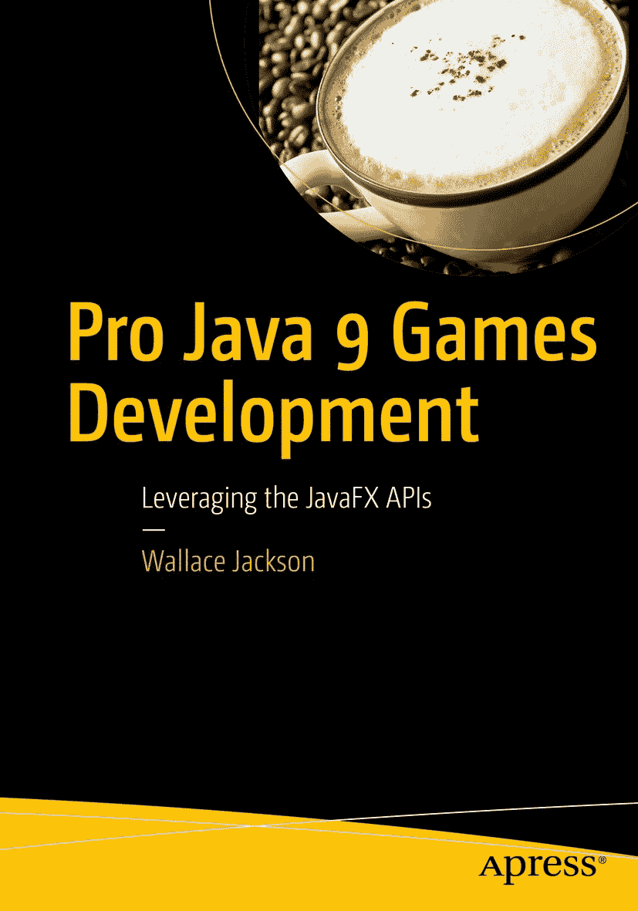

华莱士·杰克逊 **Pro Java 9 游戏开发**：利用 JavaFX API

本书作者引用的任何源代码或其他补充材料，读者均可通过本书在产品页面上的 GitHub 仓库获取，网址为 [`www.apress.com/9781484209745`](http://www.apress.com/9781484209745)。如需更详细信息，请访问 [`www.apress.com/source-code`](http://www.apress.com/source-code)。ISBN 978-1-4842-0974-5（电子版）ISBN 978-1-4842-0973-8 [`doi.org/10.1007/978-1-4842-0973-8`](https://doi.org/10.1007/978-1-4842-0973-8) 美国国会图书馆控制号：2017959341 © 华莱士·杰克逊 2017 本作品受版权保护。出版商保留所有商业权利，涉及材料的全部或部分内容，特别是翻译、重印、重用插图、朗诵、广播、微缩胶片复制或任何其他物理形式的复制权，以及信息存储与检索、电子改编、计算机软件或目前已知或未来开发的类似或不同方法的传输权。本书中可能出现商标名称、标识和图像。我们仅在编辑风格下使用这些名称、标识和图像，以维护商标所有者的利益，无意侵犯商标权。本出版物中使用的商品名称、商标、服务标志及类似术语，即使未明确标识，也不应被视为对其是否受专有权利保护的立场表达。尽管本书中的建议和信息在出版时被认为是真实准确的，但作者、编辑和出版商均不对可能存在的任何错误或遗漏承担法律责任。出版商对本书所含内容不作任何明示或暗示的保证。本书采用无酸纸印刷。全球图书贸易由 Springer Science+Business Media New York 发行，地址：233 Spring Street, 6th Floor, New York, NY 10013。电话：1-800-SPRINGER，传真：(201) 348-4505，电子邮件：orders-ny@springer-sbm.com，或访问 www.springeronline.com。Apress Media, LLC 是一家加利福尼亚有限责任公司，其唯一成员（所有者）是 Springer Science + Business Media Finance Inc (SSBM Finance Inc)。SSBM Finance Inc 是一家特拉华州公司。谨以此《Pro Java 9 游戏开发》一书献给开源社区中每一位辛勤工作的人，他们致力于让专业的数字媒体应用开发软件、操作系统和内容开发工具免费供我们所有游戏应用开发者使用，以实现我们的 iTV 创意梦想和财务目标。最后但同样重要的是，我将此书献给我的父亲威廉·帕克·杰克逊、我的家人、我的终生挚友以及所有牧场邻居，感谢他们持续的帮助与支持，以及那些星光璀璨的深夜红橡木烧烤派对。引言

Java 9 编程语言是当今世界上最流行的面向对象编程（OOP）语言。Java 运行在从智能手表到超高清智能手机、触摸屏平板电脑、电子书阅读器、游戏主机、智能眼镜、超高清（UHD）4K 交互式电视机（或 iTV 设备）等消费电子设备上，并且越来越多的消费电子设备类型——例如汽车、家用电器、医疗保健、数字标牌、安防、家庭自动化市场、VR/AR 等领域中的设备——正逐渐采用这一开源的 Java 9 平台，以在其硬件设备中驱动 i3D 数字媒体体验。

由于全球有数十亿用户拥有数十亿台兼容 Java 9 的消费电子设备，因此，如果你拥有正确的游戏概念、美术作品、数字媒体资源、游戏设计和优化流程，为所有这些用户开发流行的 Pro Java 9 游戏无疑是一项利润极其丰厚的任务。

Java 9（及其多媒体引擎 JavaFX 9）代码几乎可以在所有主流操作系统上运行，包括 Windows 7、8.1 和 10、Linux 发行版（如 Ubuntu LTS 18 或 Fedora）、32 位 Android 1-4 和 64 位 Android 5-8、Open Solaris、Macintosh OS/X、iOS、Symbian 以及 Raspberry Pi。其他任何流行的操作系统增加对这门流行开源编程语言的支持，都只是时间问题。此外，每个流行的互联网浏览器都具备 Java 能力。Java 在软件安装方面提供了终极灵活性，既可以作为应用程序安装，也可以在浏览器中作为小程序运行。你甚至可以将 Java 应用程序直接从浏览器拖出，并使其自动安装到用户的桌面上。Java 9 从各方面来看都是一项真正卓越的技术。

目前，Java 9 和 JavaFX 9 拥有大量的嵌入式及桌面硬件支持级别，包括完整的 Java SE 9、Java SE 9 Embedded、Java ME（微型版）9 和 Java ME 9 Embedded，以及用于企业应用开发的 Java EE 9。

这就是所谓的“一次编码，随处部署！”这是每个程序员的梦想，而 Oracle（Java）和 Apache（NetBeans 9）正通过强大的 JavaFX 9 多媒体编程平台将其变为现实。本书将极大地帮助你学习如何使用 Java 编程语言结合 JavaFX 9 多媒体引擎来开发 Java 9 游戏。这些 Java 9 游戏应用将能够在大量兼容 Java 的消费电子设备上运行。开发能够在所有这些不同类型的消费电子设备上流畅运行 i3D 的 Java 9 游戏应用，需要一套非常特定的工作流程，包括游戏资源设计、游戏代码设计、UI 设计以及数据占用空间优化——所有这些内容都将在本《Pro Java 9》一书中涵盖。

我完全基于一个我正在实际开发、并计划于 2017 年某个时候向公众发布的真实交互式 3D（i3D）游戏项目，从零开始撰写了《Pro Java 9 游戏开发》一书。我的目标读者是那些希望成为 i3D 游戏开发者，但尚未使用 JavaFX 9 进行过 Java 9 编程的人。这些读者技术娴熟，但对 Java 9 面向对象计算机编程概念和技术，或对 i3D 游戏开发并不完全熟悉。由于 Java 9 已于 2017 年 9 月 22 日向公众发布，本书将比市面上许多其他 Java 书籍更为深入。Java 9 增加了一些非常高级的特性，例如更安全的模块系统和 JavaFX 9 API。这赋予了 Java 9 自身一个支持 SVG、2D、3D、音频或视频媒体的交互式 3D 数字媒体引擎。

我设计本书的目的是提供对最佳 Java 9 游戏开发工作流程的全面概述。大多数专业的 Java 9 应用开发书籍只涵盖语言本身；然而，如果你真的想成为你渴望成为的那位知名 Java 9 游戏或物联网应用开发者，你必须理解并掌握游戏设计的各个领域，包括数字媒体资源创建、用户界面设计、Java 9 编程、JavaFX 9 类使用、数据占用空间优化，以及内存和 CPU 使用优化。

一旦你掌握了这些领域，希望到本书结束时，你将能够创造出令人难忘的用户体验，这是打造流行、畅销的 Java 9 游戏所必需的。你能做到，我知道你可以！

Java 9 游戏不仅可以使用 NetBeans 9 集成开发环境（IDE）进行开发，还可以结合 JavaFX 9 以及其他多种不同类型的新媒体内容开发软件包（目前已有十几种，且均为开源软件）来开发。因此，本书涵盖了多种其他流行开源软件包的安装与使用，例如 GIMP 2.9.7 和 Audacity 2.1.3，并结合使用 NetBeans 9.0 IDE 和 JavaFX 9 新媒体游戏引擎来开发 Java 9 游戏应用程序，这为 Java 9 编程语言带来了“惊艳效果”。

我之所以这样架构本书，是为了让你能够精确地确定如何使用新媒体内容开发软件，使其融入整个《Pro Java 9 游戏开发》的工作流程。这种全面的方法将使这本独特的书在目前市场上所有其他 Java 9 游戏应用程序开发书籍中脱颖而出。本书从第一章开始，介绍如何下载和安装最新的 Java JDK 以及 NetBeans 9 IDE，同时还包括十几个开源内容开发应用程序。

在第二章中，你将学习 JavaFX 9 中 2D 和 i2D 功能的新媒体概念；在第三章中，你将学习 JavaFX 9 中 3D 和 i3D 功能更高级的 3D 新媒体概念。在第四章中，我们将介绍 JavaFX 的游戏设计概念。

在第五章中，你将学习 Java 9 编程语言的基础知识，并在本书的剩余部分中运用这些知识来创建一个 Java 9 游戏。在第六章中，你将了解 NetBeans 9，创建你的第一个 JavaFX 9 游戏应用程序，并了解一些有用的 NetBeans 9 功能，例如代码补全和代码分析。

在第七章中，你将全面了解 JavaFX 9 新媒体引擎（JavaFX API），以及它令人印象深刻的功能如何将你的《Pro Java 9 游戏开发》提升到一个新的高度。因此，本书的前三分之一是“基础”材料，你需要理解这些材料，才能明白 NetBeans 9.0、Java 9、JavaFX 9.0 以及 JavaFX 9 游戏引擎支持的各种新媒体类型和资源如何作为一个平台协同工作。

在第八章中，你将全面了解 JavaFX 9 场景图，以及如何使用其层次结构开始设计 Java 9 游戏的第一个 i2D 部分，即顶层启动画面及其用户界面设计。从这里开始，我们将更积极地编写 Java 9 和 JavaFX 9 API 的代码。

在第九章中，你将学习用户界面设计，包括使用数字图像资源和文本资源。我们将介绍的主要 JavaFX 类包括 `Image` 类、`ImageView` 类和 `TextFlow` 类。我们将研究在创建启动画面以及游戏信息覆盖层（例如游戏玩法说明、法律免责声明、内容制作人员名单）时的数字图像合成管线，以及如何开始游戏以移除启动画面。

在第十章中，我们将学习 JavaFX 事件处理引擎，它将处理你将来在创建自己的自定义专业 Java 9 游戏时可能用到的所有不同类型的动作、按键、鼠标和拖拽事件。在本章中，我们将在 Java 9 中实现事件处理，使上一章中创建的用户界面和启动画面具有交互性。

在第十一章中，我们将开始为 i3D 棋盘游戏编写主要的 i3D 游戏场景图。在本章中，你将了解核心 `javafx.scene` 包中包含的不同类型的 JavaFX 9 `Camera` 和 `LightBase` 子类，而该包（自 Java 9 起）又包含在 `javafx.graphics` 模块中。我们将介绍 `PerspectiveCamera`，因为你将使用它来构建基本的 3D 场景基础设施（我们将在本章中创建），同时还会介绍 `ParallelCamera`，这是另一个更适合 2D 或 2.5D 游戏开发管线的 `Camera` 子类。我们还将学习 `LightBase` 抽象超类及其两个核心光照子类：`AmbientLight` 和 `PointLight`。

在第十二章中，你将学习 JavaFX API 中的 3D 建模类。你将了解 `javafx.scene.shape` 包中包含的不同 JavaFX 9 3D 模型类。你将介绍 `Sphere`，它可用于创建球体图元，并且你在第十一章中已经用它来测试你的 3D 场景设置。我们还将研究另外两个图元类：`Box` 和 `Cylinder`，它们也可用于创建你的平面和圆盘图元。这些图元基于 `Shape3D` 超类，我们将首先研究这个超类。我们还将研究更高级的 `TriangleMesh` 类，它允许你构建基于多边形的网格对象，最后，研究 `Mesh` 和 `MeshView` 类层次结构，它们允许你渲染 3D 网格对象。

在第十三章中，你将学习包含在 `javafx.scene.paint` 包中的 JavaFX 9 3D 着色器类层次结构。在 Java 9 和 Android 8 中，`Paint` 类将像素颜色和属性应用于画布，在这里，则是应用于你的 JavaFX 9 i3D 图元的表面。`paint` 包包含与这种“蒙皮”或“纹理映射”3D 对象着色目标相关的类。你将介绍 `Material`（一个包含顶级着色器定义的超类）和 `PhongMaterial` 类，该类可用于为你的游戏中的 i3D 图元创建纹理贴图或“皮肤”，这些内容已在第十二章中介绍过。

在第十四章中，你将使用 JavaFX 9 场景图层次结构和 JavaFX 3D 图元为你的游戏创建一个高级 i3D 对象。在本章中，你将构建场景图的 `gameBoard` 组分支，该分支位于场景图根节点下，紧邻我们已在第九章中构建的 `SplashScreen`（UI）分支。在你的 `gameBoard` 组分支下，我们将把你的 i3D 游戏板分割成四个象限，这样游戏板的中间可以有四个更大的 300x300 单位区域，供我们进行游戏。四个游戏象限中的每一个都将有另外 5 个（共 20 个）周边游戏板方格作为子对象。

在第十五章中，我们将使用 JavaFX 中的 i3D 图元为你的 i3D 场景创建 i3D UI 元素，并解决我们在第十四章中看到的一些 3D 面渲染异常问题。我们将创建的 i3D UI 元素将旋转游戏板，以选择一个象限主题进行游戏。

在第十六章中，我们将详细研究 JavaFX 9（抽象）`Animation` 和 `Transition` 超类，以及所有强大的属性过渡子类，你可以在你的 i3D 棋盘游戏中将它们实现为不同类型的 `Animation` 对象。动画为任何游戏增添了专业感，因为运动，尤其是在 3D 游戏中，为用户体验增加了大量的真实感。

在第十七章中，我们将仔细研究公共 `PickResult` 类和公共 `MouseEvent` 类，并在我们自定义的 `.createSceneProcessing()` 方法中为我们的游戏玩法设计使用它们，该方法将用于处理玩家对 i3D 游戏元素（`Box` 或 `Sphere` 对象）的选择（更多事件处理编码），以便我们的玩家能够与他们的 i3D 游戏组件进行交互。

在第十八章中，我们将探讨创建交替纹理贴图的工作流程。这些贴图会在游戏过程中，通过更改图像对象资源引用，根据随机旋转和玩家的鼠标点击（或屏幕触摸）来为棋盘格子和象限添加内容。尽管这一章并未深入涉及 Java 代码，但值得注意的是，开发专业的 Java 9 游戏需要数字图像工匠、数字音频工程师、3D 建模师、3D 纹理艺术家、动画师、2D 插画师以及 VFX 艺术家，因此我们在本书中也需要涵盖一些非 Java 特定的主题。

在第十九章（i3D 游戏 AI 章节）中，我们将创建两个新的 int（整数）变量：`spinDeg` 用于存储旋转角度，以及一个累加器（`total`），用于累加玩家已旋转的总角度；还有 `quadrantLanding`，用于保存一个简单而强大计算的最新结果，该结果能始终告诉我们最新一次旋转落在了哪个象限。

在第二十章中，我们将创建十几个 `.setupQSgameplay()` 方法。这些方法将包含设置每个棋盘格子下一关游戏玩法的 Java 代码，以便当玩家点击一个棋盘格子时，会调用一个方法来设置问答体验。

在第二十一章中，我们将通过添加游戏逻辑中的问答部分，来完成 `.setupQSgameplay()` 方法的编码。我们还将研究 JavaFX 的 `AudioClip` 类，它允许我们添加数字音频音效。这将利用 JavaFX 9 API 的另一个新媒体组件（数字音频），进一步增强专业的 Java 9 游戏体验。

在第二十二章中，我们将实现单人游戏玩法和计分引擎，以搭建好你的游戏计分用户界面，因为许多游戏玩家会希望与内容进行对抗式游戏，作为一种学习体验。话虽如此，每个按钮 UI 元素仍需编写大量代码，这些代码会判断答案是否正确：如果正确，则增加“正确：”分数；如果不正确，则增加“错误：”分数。

在第二十三章中，我们将完成向 `setupQSgameplay()` 方法填充与问题匹配的文本答案内容。我们还将完成 `createQAprocessing()` 方法，该方法包含更新计分 UI 面板的答案计分代码。玩家将使用这些来选择正确答案，从而揭示该格子视觉元素所代表的内容，并对他们的答案进行计分。一旦我们完成了游戏玩法“答案显示、选择和计分”基础设施的大部分编码，并测试每个格子以确保其正常工作，我们就可以创建 Java 代码的“防错”部分，以完成一款专业游戏，确保玩家正确使用它。这涉及到使用布尔变量（称为“标志”）来保存“点击”变量：一旦玩家点击了旋转器、棋盘格子或答案按钮元素，`elementClick` 变量就会被设置为 `false`，这样游戏玩家就无法再次点击它，从而“欺骗”游戏代码。

在第二十四章关于数据和内存占用优化的内容中，我们将把你的数字图像资源转换为使用 8 位（索引）颜色，而不是 24 位真彩色深度，用于你的纹理贴图。我们还将运行 NetBeans Profiler，以查看你的 Java 9 代码在运行游戏时使用了多少内存和 CPU 处理能力。

本书力求成为市场上最全面的 Pro Java 9 游戏应用开发编程书籍，涵盖了创建 i3D Java 9 游戏应用所需使用的大部分（如果不是全部）主要 Java 9 和 JavaFX 9 类。

如果你正在寻找关于 Java 9 游戏编程语言最全面、最新的概述，包括与新媒体内容开发工作流程无缝集成的 JavaFX 9.0 和 NetBeans 9.0 IDE，以及关于如何将这些技术与领先的开源新媒体游戏内容设计和开发工具结合使用的最佳实践（从入门到精通），那么这本书将真正引起你的极大兴趣。

本书旨在将你从 Java 9 游戏应用开发的中级水平，提升到关于 Java 9、NetBeans 9 和 JavaFX 9 游戏应用开发的扎实专业知识水平。请注意，尽管本书表面上是一本专业书籍，但它包含了大量的新媒体技术知识。书中描述的所有工作流程可能需要阅读不止一两遍，才能将这些知识吸收到应用开发知识库中（纳入你的技术知识储备）。不过，请放心，这绝对值得你投入时间，所以请多读几遍。此外，Apress 还出版了一本名为《Beginning Java 8 Games Development》的 Java 游戏开发入门书籍，涵盖了使用 JavaFX API 中不同类进行 i2D 游戏开发的内容。

致谢

我要感谢我在 Apress 的所有优秀编辑及其支持团队，他们为这本书付出了长时间的努力和辛勤工作，使其成为终极的 Pro Java 9 游戏开发应用制作书籍。

感谢 **Steve Anglin**，他担任本书的首席编辑，并招募我为 Apress 撰写关于 Java、HTML5 和 Android 编程的书籍，涵盖当今可用的最流行的开源应用开发平台。

感谢 **Matthew Moodie**，他担任本书的开发编辑，并在使本书成为市场上现有的优秀 Pro Java 9 游戏开发书籍之一的过程中，提供了经验和指导。

感谢 **Mark Powers**，他担任本书的协调编辑，并始终尽职尽责地确保我按时甚至提前完成 Java 9 章节的交付。

感谢 **Jeff Freisen**，他担任本书的技术审校，并确保我没有犯任何 Java 9 编程错误，因为带有错误的 Java 代码无法正常运行（如果还能运行的话），除非这些错误非常幸运，而这在当今的计算机编程中相当罕见。

目录 第 1 章：Java 的不同面貌：创建 Java 9 开发工作站 1 Java 的二元性：各平台使用的版本 2 Java 开发工作站：所需硬件 3 为 Java 9 游戏开发准备工作站 4 下载并安装 Oracle Java 9 JDK 6 下载并安装 Oracle Java 8 JDK 9 安装 Oracle NetBeans 9.0（开发）IDE 12 安装 Apache NetBeans 9（开发）IDE 14 安装新媒体内容制作软件 17 下载并安装用于 SVG 数字插画的 InkScape 17 下载并安装用于数字图像合成的 GIMP 18 下载并安装用于数字音频编辑的 Audacity 19 下载并安装用于数字视频的 DaVinci Resolve 14 20 下载并安装用于视觉特效的 Blackmagic Fusion 21 下载并安装用于 3D 建模和动画的 Blender 22 下载并安装用于 3D 地形或世界创建的 Terragen 23 下载并安装用于角色动画的 Daz Studio Pro 24 其他开源新媒体软件包 25 在任务栏区域组织快速启动图标 28 总结 28 第 2 章：内容创作入门：2D 新媒体资产基础 29 游戏设计资产：新媒体内容概念 30 数字成像概念：分辨率、颜色深度、Alpha 通道、图层 31 数字图像分辨率与宽高比：定义图像尺寸和形状 32 数字图像色彩理论与颜色深度：定义精确的图像像素颜色 32 数字图像合成：使用 Alpha 通道和图层透明度 33 在 Java 游戏逻辑中表示颜色和 Alpha：使用十六进制表示法 35 数字图像对象遮罩：使用 Alpha 通道合成游戏精灵 36 平滑数字图像合成：使用抗锯齿平滑图像边缘 37 数字图像数据优化：使用压缩、索引颜色和抖动 38 数字视频或动画：帧、帧率、循环、方向 41 数字视频压缩概念：比特率、数据流、标清、高清和超高清 42 数字视频数据占用优化：视频编解码器的重要设置 43 数字音频概念：振幅、频率、采样、波形 45 将模拟音频转换为数字音频数据：采样、精度和高清音频 46 数字音频资产播放：固定音频播放与流式音频 48 JavaFX 中的数字音频资产：数字音频编解码器和数据格式支持 49 数字音频优化：从 CD 音质音频开始，然后反向优化 50 总结 51 第 3 章：高级 3D 内容渲染：3D 资产概念与原理 53 交互式 2D 资产：2D 矢量内容概念 54 平面上的点：2D 顶点、模型参考原点、枢轴点、虚拟点 54 连接 2D 点：矢量线和样条曲线连接你的 2D 顶点 55 填充形状内部：颜色填充、渐变和图案 56 交互式 3D 资产：3D 矢量内容概念 57 3D 的基础：网格的几何结构 57 为你的 3D 模型蒙皮：2D 纹理映射概念 61 为你的 3D 模型添加动画：关键帧、运动曲线和 IK 65 JavaFX 3D 支持：几何、动画和场景包 68 总结 71 第 4 章：游戏设计入门：游戏设计概念、类型、引擎和技术 73 高层概念：静态游戏与动态游戏 74 游戏优化：平衡静态元素与动态元素 75 2D 与 3D 渲染：引擎盖下的静态与动态 76 游戏组件：2D、3D、碰撞、物理和 AI 77 2D 精灵：街机风格游戏的基础 77 3D 模型：角色扮演风格游戏的基础 78 碰撞检测：游戏资产交互的基础 78 物理模拟：游戏真实感的基础 79 人工智能：游戏逻辑的基础 79 Java 引擎：游戏、物理和反向动力学 80 游戏引擎：JMonkey 和轻量级 Java 游戏库 80 物理和碰撞引擎：Jbox2D、JBullet、Dyn4j、Jinngine 81 反向动力学和机器人引擎：JRoboOp 和 JavaFX-IK 82 游戏类型：益智、棋盘、街机、射击或 VR 83 静态游戏：策略、知识、记忆和棋盘游戏 83 动态游戏：街机、射击、平台和动作游戏 84 混合游戏：创造性利用 JavaFX 的机会 84 总结 85 第 5 章：Java 入门：Java 概念与原理介绍 87 编写 Java 语法：注释和代码分隔符 88 Java 包：按功能组织 Java API 91 Java 类：模块化游戏的 Java 结构 92 嵌套类：存在于其他类内部的 Java 类 94 内部类：不同类型的非静态嵌套类 95 Java 方法：核心逻辑函数 Java 构造 96 声明你的方法：修饰符、返回类型和方法名 96 重载你的方法：提供唯一的参数列表 97 构造方法：将 Java 类转变为 Java 对象 98 Java 变量和常量：数据字段中的值 100 修复内存中的数据值：在 Java 中定义数据常量 102 Java 修饰符关键字：访问控制等 103 访问控制修饰符：public、protected、package 或 private 103 非访问控制修饰符：final、static 和 abstract 105 Java 数据类型：在应用程序中定义数据类型 108 原始数据类型：字符、数字和布尔值 108 引用数据类型：对象和数组 109 Java 运算符：在应用程序中操作数据 109 Java 算术运算符：基础数学 110 Java 关系运算符：进行比较 111 Java 逻辑运算符：处理组和相反情况 112 Java 赋值运算符：将结果赋给变量 113 Java 条件运算符：为真设一个值，为假设另一个值 114 Java 条件控制：循环或决策 114 决策控制结构：switch-case 和 if-else 114 循环控制结构：while、do-while 和 for 循环 117 Java 对象：使用 Java 中的 OOP 虚拟化现实 118 编码对象：将你的对象设计转化为 Java 代码 120 扩展 Java 对象结构：Java 继承 125 Java 接口：定义类的使用模式 126 Java 9 的新特性：模块化和 Project Jigsaw 128 Java 9 模块的定义：包的集合 128 Java 模块的属性：显式、自动或未命名 129 Java 9 模块层次结构示例：JavaFX 模块 129 Java 9 模块的目的：安全、强封装 131 创建一个 Pro Java 9 游戏模块：使用 exports 关键字 131 资源封装：进一步的模块安全措施 132 总结 132 第 6 章：设置你的 Java 9 IDE：NetBeans 9 介绍 135 NetBeans 9 新特性：Java 9 模块集成 136 Java 9 支持：模块、Ant、Java Shell、多版本发布 136 IDE 用户体验：更多信息和智能编码 137 Java 代码分析：完全重新设计的 Java 分析套件 137 NetBeans 9 的主要特性：一个智能 IDE 138 NetBeans 9 是智能的：让你的代码编辑进入超速状态 138 NetBeans 9 是可扩展的：支持多种语言的代码编辑 140 NetBeans 9 是高效的：组织有序的项目管理工具 140 NetBeans 9 对 UI 设计友好：用户界面设计工具 141 NetBeans 9 对 Bug 不友好：使用调试器消灭 Bug 141 NetBeans 9 是速度狂：使用分析器优化代码 141 创建 Pro Java 9 游戏项目：JavaFXGame 142 在 NetBeans 9 中编译 Pro Java 9 游戏项目 147 在 NetBeans 9 中运行你的 Pro Java 游戏项目 148 总结 150 第 7 章：JavaFX 9 介绍：JavaFX 新媒体引擎概述 151 JavaFX 概述：从 SceneGraph 到操作系统 152 JavaFX 场景包：16 个 Java 场景类 154 JavaFX Scene 类：定义尺寸和背景颜色 155 JavaFX 场景图：使用父节点组织场景 157 JavaFX 场景内容：灯光、摄像机、光标、动作！ 158 JavaFX 场景工具：场景快照和抗锯齿 159 场景子包：九个与场景相关的包 159 javafx.graphics 模块：18 个多媒体包 162 用于游戏的 JavaFX 动画：使用 javafx.animation 类 163 JavaFX 屏幕和窗口控制：使用 javafx.stage 类 168 使用 JavaFX Stage 对象：创建一个浮动无窗口应用程序 169 JavaFX 边界和尺寸：使用 javafx.geometry 类 179 用于游戏的 JavaFX 输入控制：使用 javafx.event 类 180 JavaFX UI 元素：使用 javafx.scene.control 类 180 JavaFX 商业图表：使用 javafx.scene.chart 类 181 JavaFX 媒体控制：使用 javafx.scene.media 类 181 JavaFX Web 渲染：使用 javafx.scene.web 类 181 其他 JavaFX 包：Print、FXML、Beans 和 Swing 181 总结 182 第 8 章：JavaFX 9 场景图层次结构：Java 9 游戏设计的基础 185 游戏设计基础：主要功能屏幕 186 Java 类结构设计：游戏引擎支持 187 JavaFX 场景图设计：最小化 UI 节点 188 JavaFX 设计：使用 VBox、Pos、Insets 和 Group 189 JavaFX Pos 类：使用常量进行通用定位 189 JavaFX Insets 类：为你的 UI 提供内边距值 190 JavaFX VBox 类：为你的设计使用布局容器 191 JavaFX Group 类：高级场景图节点分组 193 场景图代码：优化 JavaFXGame 类 194 JavaFX 对象声明：方法的全局类访问 196 场景图设计：优化 BoardGame.start()方法 197 添加场景图节点：addNodesToSceneGraph() 199 向 createBoardGameNodes()添加新的 UI 场景图节点 200 在 addNodesToSceneGraph()中添加新的 UI 设计节点 203 交互性：创建 BoardGame 按钮 UI 控件 205 测试你的 BoardGame：处理场景图 208 总结 210 第 9 章：JavaFX 9 用户界面设计：Java 9 游戏设计的前端 211 UI 设计基础：完成场景图 212 JavaFX 9 UI 合成：ImageView 和 TextFlow 213 JavaFX Image 类：在你的设计中引用数字图像 213 JavaFX ImageView 类：在你的设计中显示数字图像 214 JavaFX TextFlow 类：在设计中使用的文本对象（内容） 216 编码用户界面：一个 UI 合成管线 217 实例化合成分层：.createBoardGameNodes() 218 向场景图添加 UI 背板：addNodesToSceneGraph() 219 资产加载方法：loadImageAssets()和 createTextAssets() 219 创建启动画面资产：在 2D 管线中使用 3D 资产 220 向项目添加图像资产：使用\src\文件夹 221 加载图像资产的方法：.loadImageAssets() 222 创建文本资产的方法：.createTextAssets() 223 使用 Button.setMaxWidth()方法：使按钮统一 224 使用 StackPane 背景：利用所有合成分层 226 使用 TextFlow：设置你的信息覆盖对象 228 使用 StackPane：添加更多数字图像合成分层 231 完成你的 UI 设计对象创建和配置 236 总结 238 第 10 章：用户界面设计交互性：事件处理和成像效果 239 事件处理：为你的游戏添加交互性 239 控制器类型：我们应该处理哪些类型的事件？ 240 Java 和 JavaFX 事件包：java.util 和 javafx.event 240 添加键盘事件处理：使用 KeyEvents 244 完成你的 UI 设计：编码事件处理 247 特殊效果：javafx.scene.effects 包 254 创建特殊效果：添加一个 createSpecialEffects()方法 255 投影：为你的 TextFlow 对象添加投影 256 颜色调整：调整色相、饱和度、对比度和亮度 258 总结 265 第 11 章：3D 场景配置：使用 PerspectiveCamera 和 PointLight 267 使用 3D 摄像机：为 3D 游戏添加透视效果 267 JavaFX Camera 类：定义摄像机的抽象超类 268 JavaFX PerspectiveCamera 类：你的 3D 透视摄像机 268 JavaFX ParallelCamera 类：你的 2D 空间平行摄像机 270 向场景添加 PerspectiveCamera：使用.setCamera() 271 StackPane UI 测试：确保其他一切仍然正常工作 277 实现开始游戏按钮：隐藏你的 UI 282 使用 3D 光照：为 3D 游戏添加照明 284 JavaFX LightBase 类：定义光照的抽象超类 284 JavaFX AmbientLight 类：均匀照亮你的 3D 场景 285 JavaFX PointLight 类：戏剧性地照亮你的 3D 场景 286 为游戏的 3D 场景添加光照：使用 PointLight 对象 286 总结 290 第 12 章：3D 模型设计与图元：使用 JavaFX 9 Shape3D 类 291 JavaFX Shape3D 超类：Primitive 或 MeshView 291 JavaFX Sphere：为你的 3D 游戏创建球体图元 293 JavaFX Cylinder：为游戏创建圆柱体或圆盘图元 294 JavaFX Box：为 3D 游戏创建立方体、柱子和平面 295 使用图元：向你的 JavaFXGame 类添加图元 295 Shape3D 绘制模式属性：实体几何和线框 303 Shape3D 面剔除属性：优化渲染管线 307 JavaFX Mesh 超类：构建一个 TriangleMesh 309 JavaFX Mesh 超类：你的原始 3D 模型数据容器 310 JavaFX MeshView 类：格式化并呈现你的 3D 网格数据 310 JavaFX VertexFormat 类：定义你的 3D 顶点数据格式 311 JavaFX TriangleMesh 类：创建一个 3D 多边形网格对象 312 总结 314 第 13 章：3D 模型着色器创建：使用 JavaFX 9 PhongMaterial 类 315 JavaFX Material 超类：i3D 着色器属性 315 JavaFX PhongMaterial：Phong 着色算法和属性 316 实现 PhongMaterial：分配颜色和幂值 319 使用外部图像资产：创建纹理贴图 325 使用外部第三方软件：使用 GIMP 创建贴图 325 在 PhongMaterial 中使用纹理贴图：着色器特殊效果 328 游戏板纹理化：创建一个 GameBoardSquare 334 准备创建游戏板：代码重构 334 创建你的游戏板方块漫反射纹理：使用 GIMP 337 总结 340 第 14 章：3D 模型层次结构创建：使用图元创建游戏板 341 图元创建方法：createGameBoardNodes() 341 准备定位游戏板场景图节点 348 编码 Phong 着色器创建方法：createMaterials() 350 完成你的游戏板构建：第 2 到第 4 象限 353 更换摄像机：使用 ParallelCamera 类 365 总结 368 第 15 章：3D 游戏玩法 UI 创建：使用球体图元创建 UI 节点 369 完成你的 3D 资产：主题象限和旋转器 369 创建你的象限和旋转器漫反射颜色纹理贴图 372 纹理映射 3D 游戏板象限：Java 代码 376 使用 Google 解决 JavaFX 异常：使用 StackOverflow 379 创建一个 3D 用户界面元素：一个 3D 旋转随机器 380 增强 3D 旋转器纹理贴图：提高分辨率 383 总结 387 第 16 章：3D 游戏动画创建：使用动画过渡类 389 为 3D 资产添加动画：动画超类 389 自动化对象动画：Transition 超类 392 为 3D 对象旋转添加动画：使用 RotateTransition 类 393 一个 RotateTransition 示例：设置你的 RotateAnimation 资产 394 为节点移动添加动画：使用 TranslateTransition 类 402 TranslateTransition 示例：设置平移动画资产 404 合并动画属性：使用 ParallelTransition 类 405 ParallelTransition 对象：合并 rotSpinner 和 moveSpinnerOn 406 总结 408 第 17 章：i3D 游戏方块选择：将 PickResult 类与 3D 模型结合使用 409 选择你的 3D 资产：PickResult 类 409 MouseEvent 类：捕获 3D 图元上的鼠标点击 411 实现旋转器 UI 功能：鼠标事件处理 413 使用 java.util.Random：生成随机旋转 423 随机象限选择：将 Random 与条件 If()结合使用 424 总结 433 第 18 章：3D 游戏玩法设计：使用 GIMP 和 Java 创建游戏内容 435 设计你的游戏玩法：创建象限定义 435 游戏板象限：创建游戏象限内容（GIMP） 436 游戏板方块：在 GIMP 中创建游戏方块内容 446 总结 463 第 19 章：游戏内容引擎：使用随机内容选择方法的 AI 逻辑 465 编码随机旋转跟踪器：取余运算符 465 实现旋转跟踪器功能：创建空方法 466 旋转后填充象限：OnFinished()事件处理 470 纹理贴图管理：编码一个 resetTextureMaps()方法 482 总结 486 第 20 章：编码游戏玩法：设置游戏玩法方法和动画摄像机视图 487 选择游戏内容：selectQSgameplay()方法 487 游戏板方块交互：OnMouseClick()事件处理 488 摄像机动画：选择后定位游戏板 507 总结 511 第 21 章：问答：完成设置方法和数字音频 513 完成游戏玩法：添加 qaLayout 分支 513 添加另一个组织层：createUInodes()方法 514 在你的 JavaFXGame 中实现新的问答用户界面 524 调整问答面板：优化 createQAnodes()设置 527 向 setupQSgameplay()方法添加答案按钮内容 529 用于游戏的数字音频：使用 AudioClip 类 531 实现 AudioClip：添加数字音频资产音效 532 寻找免费商用的数字音频：99Sounds.org 534 数据占用优化：使用 Audacity 创建游戏音频 535 使用 toExternalForm()将 URI 引用加载为字符串对象 539 在 createSceneProcessing()中触发旋转器音频播放 541 摄像机动画音频：匹配音频长度与动画 542 总结 544 第 22 章：计分引擎：创建分数 UI 布局并对内容进行评分 545 启动画面渲染错误：启动时隐藏 UI 面板 545 记分板 UI 设计：一个 createScoreNodes()方法 548 添加你的分数 UI 容器设计元素：文本对象 554 计分引擎：根据答案计算分数的逻辑 561 分数 UI 测试：显示更大的整数 570 完成游戏玩法：添加答案和分数 572 总结 573 第 23 章：完成游戏玩法代码并对事件处理进行玩家防护 575 完成游戏玩法：填充游戏玩法方法 576 添加答案选项：完成 setupQSgameplay()方法 576 玩家防护代码：控制玩家事件使用 583 再来一次按钮：重置玩家事件处理 588 摄像机拉远：另一个 ParallelTransition 593 完成再来一次按钮：resetTextureMaps() 596 象限级保护：每个象限的 squareClick 598 总结 602 第 24 章：优化游戏资产和代码，以及使用 NetBeans 进行游戏分析 603 优化纹理贴图：转换为 8 位颜色 603 创建索引颜色纹理：在 GIMP 中更改颜色模式 603 NetBeans 9 分析器：测试内存和 CPU 使用情况 611 实现索引颜色图像：添加路径 620 优化音频：使用较低采样率的 16 位音频 622 Java 游戏代码优化：利用 Java 技巧 623 未来扩展：添加数字视频和 3D 模型 625 总结 625 索引 627 关于作者和技术审阅者 关于作者 关于技术审阅者

