# 1. Java 的不同面貌：打造 Java 9 开发工作站

欢迎阅读《Pro Java 9 游戏开发》一书。在第一章中，我将讨论至今仍被用于为 Android 等开源平台以及基于 WebKit 的开源浏览器（如 Google Chrome、Mozilla Firefox、Apple Safari 和 Opera）开发软件应用程序的各种 Java 版本。在梳理了从 JDK 1.6（也称为 Java 6）到最近发布的 JDK 1.9（即 Java 9）这些 Java 版本中，哪些需要用于为这些流行平台的不同版本进行开发之后，我们还需要详细了解如何创建一个专业的 Java 9 软件开发工作站，以便在本书后续章节中使用。这将包括其他软件，例如新媒体内容制作软件包，它们可以与你的 Java 软件开发包一起使用，来创建游戏和物联网（IoT）应用程序。

你工作站的核心将是 Java 8 SDK（软件开发工具包，也称为 JDK 或 Java 开发工具包），或者是 2017 年发布、比 Java 8 更具模块化特性、但包含相同类和方法用于创建游戏或物联网用户体验的新版 Java 9 JDK。这一事实将使我们能够在本书中安全地同时关注 Java 8 和 Java 9。这是因为，就我们的目的而言，它们本质上是相同的，使我们能够专注于最新的 Java API，而不是你正在使用的 Java 版本。事实上，由于我们将专注于 Java 的多媒体 API（通常称为 JavaFX），你在本书中学到的内容甚至可以用 Java 7 来编码！Android 最近（从 Java 6）升级到了与 Java 7 和 Java 8 的兼容性。

我们还将为你配置一个 NetBeans 9.0 IDE（集成开发环境），这将使 Java 8 或 9 的游戏编码变得容易得多。预计在 2017 年第四季度 Java 9 发布后，你将使用 NetBeans 9，因为 NetBeans 9 IDE 将进行重大升级，以适应 Java 9 新的模块化特性，并允许你混合功能模块，为任何类型的应用程序开发创建自定义的 Java 包集合（API 版本）。

在你的 Java JDK 和 NetBeans IDE 配置完成后，我们将为你安装最新的开源新媒体内容创作软件包，包括专业软件包，例如用于数字图像处理的 GIMP、用于数字插画的 InkScape、用于数字视频编辑或特效的 DaVinci Resolve、用于数字音频编辑的 Audacity、用于特效和 3D 的 Fusion、用于商业和项目管理的 Open Office 4 套件、用于 3D 建模、纹理、动画、渲染、粒子系统、流体动力学或特效的 Blender，以及用于虚拟行星的 Terragen 4。

在本章结束时，我甚至可能会建议一些其他专业级别的软件包，你应该考虑将它们添加到我们将在本章中创建的这个专业游戏开发工作站中。这样，当我们完成第一章时，你将拥有一个极具价值的商业生产资源。希望仅仅是这第一章就值得你为整本书付出的费用，因为你只需花 500 美元购买一台强大的 64 位工作站，并在短短几个小时内就能让它价值五位数！

我们还将讨论一些关于你新的 Java 9 内容生产工作站的硬件要求和注意事项。最后，请注意本书中的 Java 代码在 Java 8 IDE（集成开发环境）中同样可以完美运行，因此这本书完全可以被称为《Pro Java 8 游戏开发》！

## Java 的二元性：不同平台使用的版本

目前仍有多种不同版本的 Java 被广泛用于多个流行平台的开发，包括用于 32 位 Android（Android 1.x、2.x、3.x 和 4.x 版本是 32 位）的 Java 6，用于早期 64 位 Android 版本（5.0、5.1 和 6.0）的 Java 7，用于近期 Android 版本（7.0、7.1.2、8.0）的 Java 8，以及用于 Windows 10 操作系统、Ubuntu Linux 操作系统（及其他 Linux 发行版）、Macintosh OSX 和 Open Solaris 操作系统的 Java 9。

需要注意的是，Java 主要有三个版本：Java ME（微型版）针对嵌入式设备进行了优化；Java SE（标准版）是我们将要介绍的，用于“客户端”以及移动消费电子设备和 iTV 机顶盒；Java EE（企业版）可以被视为一种“服务器端”模式，因为大型企业计算环境通常是基于服务器的，而不是“点对点”的（纯客户端模式，除了客户端-服务器交互外，还可能实现客户端之间的相互通信）。

Java 6 于 2006 年 12 月发布（十多年前），至今仍被广泛与 Eclipse IDE 结合使用，为所有 32 位版本的 Android（从 1.0 版到 4.4 版）开发应用程序。这是因为当 Android 1.0 于 2008 年 9 月发布时，Google 最初指定使用这个 Java 版本来开发 32 位 Android 应用程序。需要注意的是，Google 使用 Open Java 项目创建了一个自定义版本的 Java 6，但这不会影响编程 API，因为类、方法和接口的功能仍然与你在 NetBeans IDE 或 IntelliJ IDEA 中使用 Java 6 时相同，而不是使用 Eclipse IDE。

当 Google 在 Android 5.x 中将 Android 升级到 64 位 Linux 内核（使用基于 IntelliJ 的 Android Studio IDEA）时，他们升级到了使用 Java 7，该版本也有 64 位版本。Java 7 于 2011 年 7 月发布。因此，如果你正在为高级平台开发 Android 5-6 应用程序，例如 Android Wear（我在 Apress 出版的《Pro Android Wearables》（2015）一书中有所介绍），或 Android TV 和 Android Auto（在 Apress 出版的《Android Apps for Absolute Beginners》（2017）一书中有所介绍），你将需要使用 Java 7。JavaFX 8 和 JavaFX 9 中的 JavaFX 8 引擎也已反向移植到 Java 7；然而，Java 7 已于今年退役。Java 6、7 和 8 仍在 Android 中使用。

在撰写本书时，Java 8 是 Java SE 的当前版本，此外，它还拥有强大的 JavaFX 8.0 多媒体引擎，该引擎也已与 Java 7 兼容，尽管 JavaFX 8.0 API 尚未在 Android API 中得到原生支持。然而，开发能在 Android 操作系统和 iOS 平台上运行的 JavaFX 8 或 9 应用程序是可能的，这使本书对我们的读者来说更有价值！Java 8 在所有流行浏览器、Android 7、7.1.2 和 8.0 以及所有四种流行操作系统（包括 Windows 7、8.1 和 10、所有 Linux 发行版、Macintosh OS/X 以及 Oracle 的 Open Solaris）上都得到支持。Java 8 于 2014 年 3 月发布，并增加了一个名为 Lambda 表达式的强大新特性，我们将在本书中介绍它，因为这是一种编写更紧凑代码的方式，并且通常对多处理器（和多线程）更高效。

Java 9 是 Java 的下一个主要修订版本，于 2017 年 9 月 22 日发布。Java 语言开发者正在重新设计的主要新特性是使 Java 9 语言 API 模块化。这将允许 Java 9 开发者以“模块”（代码库）的形式“混合搭配”功能，并创建他们自己的定制化、优化版 Java。这些定制版 Java 将完全按照开发者在定制开发环境或定制应用程序中所需要的方式运行。截至本书出版时，NetBeans 9 仍在开发中。

作为游戏开发者或物联网开发者，这意味着你可以创建多个游戏开发定制版 Java 版本层级，或者多个物联网开发定制版 Java 版本层级。从 Java 7 版本开始，如果需要，可以添加 Lambda 表达式（一种编码快捷方式，我们将在后面介绍）来创建 Java 8 版本，或者打包为定制模块（Java 9 中的新特性）来为所有流行的操作系统平台创建 Java 9 版本。如果你正在使用 JavaFX 多媒体/游戏引擎，最新的 JavaFX 特性同时存在于 Java 8 和 Java 9 的 API 中。

我想向读者指出，他们可以优化自己的游戏程序逻辑，使其跨越多个 Java 版本，从针对 Java 7（Android 5 或 6）优化，到 Java 8（Android 7、8 和现代操作系统），再到本书出版前于 2017 年 9 月 22 日发布的 Java 9 版本。这也可以在无需进行重大代码更改的情况下完成，因为除了使用 Lambda 表达式之外，核心的 JavaFX 游戏处理逻辑在所有 Java 修订版本中都存在。

## Java 开发工作站：所需硬件

为了从本章中我们将安装的所有专业开源软件中获得最佳效果，你需要一台强大的 64 位工作站，运行付费操作系统（如 Windows 10 或 OSX），或免费操作系统（如 Ubuntu LTS 17）。我在多台工作站上使用 Windows 10，并在多台工作站上使用 Ubuntu LTS 17.10。你还需要一个大尺寸显示器，最好是高清（1920×1080）或超高清（3840×2160）。如果你计算一下，一个超高清显示器相当于四个高清显示器拼在一起，而现在超高清显示器的价格在 300 到 500 美元之间。我在感恩节促销时花 250 美元买了一个。我使用的高清显示器尺寸从 32 英寸到 43 英寸不等，超高清显示器尺寸从 44 英寸到 55 英寸不等，以获得紧密的像素密度。

一台计算机工作站应配备（包含）至少 8 GB 的 DDR3 系统内存（16 GB 或 32 GB 系统内存会更好）。该内存的时钟频率应为 1333、1600、1866 或 2133 兆赫。尖端系统通常配备时钟频率为 2400 兆赫的 DDR4 系统内存。DDR4 内存也有 16 GB 的 DIMM 条，因此你可以在工作站主板上安装 48 GB、64 GB 或 128 GB 内存。我会为运行 Fusion 9、DaVinci Resolve 14、Blender 2.8、JavaFX 9 或其他 i3D 制作软件的工作站这样做。

系统内存运行速度越快，计算机处理数据的速度就越快，CPU 获取所需处理内容的速度也就越快。这就引出了工作站的“大脑”或 CPU/GPU，它负责处理工作。同样的概念也适用：64 位 CPU 每秒能处理的指令越多，你在更短时间内能完成的工作就越多，你的 i3D 应用程序执行其给定功能时也会越流畅。

如今，几乎所有 64 位工作站都配备多核处理器，通常称为 CPU 或中央处理器。流行的 CPU 包括 AMD Ryzen（四核、六核或八核）、9590（八核），或更昂贵的 Intel i7，它有四核、六核、八核和十核版本。与 AMD Ryzen 一样，Intel i7 每个核心有两个线程，因此对于操作系统来说，它们看起来像 8、12、16 或 20 核处理器，这也是它们比 AMD FX 9590 系列处理器更昂贵的原因。我根据应用程序的不同，使用 AMD Ryzen 或 Intel i7 处理器。例如，Android Studio 3 针对 Intel 硬件架构进行了优化，在 AMD FX CPU 上模拟 Android 虚拟设备（AVD）的速度不足以实现流畅的开发和测试。

为了存储数据，你还需要一个硬盘驱动器。如今的计算机通常配备 1 TB 的硬盘驱动器，你甚至可以买到配备 2 TB、3 TB、4 TB、6 TB 或 8 TB 硬盘驱动器的工作站。如果你正在处理具有超高清或 4K 屏幕分辨率的游戏（或 3D、电影、特效或视频素材），请选择 3 TB 或 4 TB 的型号。如果你希望系统快速启动并将软件快速加载到内存中，请务必使用固态硬盘作为主驱动器（Windows 下为 C:\，Linux 下为 C:/）。这些固态硬盘比传统的 TB 级硬盘驱动器更昂贵，但你实际上只需要 64 GB 或 128 GB 来容纳你的操作系统和软件。我有一块 256 GB 的固态硬盘，而 512 GB 和 768 GB 的固态硬盘也变得越来越实惠。

具备此类功能的工作站基本上已成为商品，价格在 500 到 750 美元之间，可以在沃尔玛或百思买购买，也可以在线在 [`www.PriceWatch.com`](http://www.PriceWatch.com) 购买，在那里你可以比较本章这一部分中我提到的任何组件的市场价格。如果你是 Java 9 游戏开发新手，并且还没有合适的工作站，请前往沃尔玛或 PriceWatch.com，购买一台价格实惠的 3D 多核（购买 4、6 或 8 核）64 位计算机，运行 Windows 10 或 Ubuntu LTS 17，至少配备 8、16 或 32 GB 的 DDR3 系统内存。你还需要一个相当大的硬盘驱动器，至少 750 GB，甚至 1.5 TB 或 2 TB 的硬盘驱动器，以及来自 AMD（Radeon）或 nVidia（GeForce）的 3D GPU，它将用于 JavaFX 9 以及 Fusion、Blender 和 DaVinci Resolve 的实时 i3D 渲染。

在本章的剩余部分中，我将假设你刚刚购买了这样一台价格实惠的 64 位工作站，我们将从头开始创建一个顶级的 Java 9 游戏和物联网开发工作站！如果你已经拥有一个现有的游戏开发工作站，我将包含一个简短的部分，向你展示如何从 Windows 中移除过时的 Java 开发软件，以便我们都能从头开始。

## 为 Java 9 游戏开发准备工作站

假设您已拥有一台用于新媒体内容开发和游戏开发的专业级工作站，您可能需要移除过时的 JDK 或 IDE，以确保拥有最新的软件。在本节中，您首先要做的是确保已移除任何过时的 Java 版本（例如 Java 6 或 Java 7），以及任何过时的 NetBeans 版本（例如 NetBeans 6 或 NetBeans 7）。这涉及从工作站卸载（移除或完全删除）过时的 Java 开发软件版本。我不得不在我的一台四核 AMD 工作站上执行此操作，以便为用于开发 Java 9 和 JavaFX 9 应用及游戏的 NetBeans 9.0 IDE 腾出空间，因此本节中的截图显示的是 Windows 7 操作系统。您将使用操作系统软件管理工具来完成此操作。在 Windows 上，这是“程序和功能”工具。它可以在 Windows 控制面板中找到，如图 1-1 中间列（第七行）中蓝色高亮显示的部分。

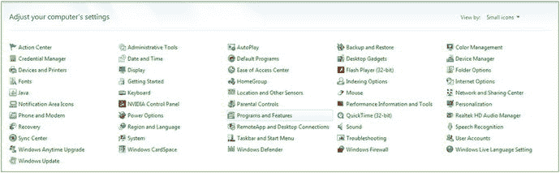

图 1-1.

使用“程序和功能”工具图标卸载或更改计算机工作站上的程序

如果您有一台全新的工作站，则无需移除任何以前的软件。如果您碰巧使用的是 Linux 或 Mac 操作系统，它们也有类似的软件安装和移除工具。由于大多数开发者使用的是 64 位版本的 Windows 7、8.1 或 10，本书将仅使用此 64 位操作系统平台。

需要注意的是，Java 9 现在仅提供 64 位版本，因此您必须拥有一台 64 位工作站，正如我在本书前一节中所指定的那样（事实上，如今您甚至无法买到新的 32 位计算机）。

您可以通过 Windows 控制面板及其 50 多个工具图标来自定义 Windows 操作系统的“界面”（窗口 UI 元素）、桌面以及已安装的软件包。其中之一是“程序和功能”图标（在 Windows 7 至 10 版本中），如图 1-1 中蓝色选中部分所示。

请注意，在早期版本的 Windows（Vista 或 XP）中，此程序工具图标的标签会不同，显示为：添加或删除程序。其工作方式仍然相同：选择软件，右键单击，然后移除旧版本。我不建议使用过时的 Vista 或 XP，因为先进的 Java 9 JDK 和 IDE 已不再支持这些系统。

对于早期版本的 Windows，请单击此“程序和功能”链接，或双击该图标，启动该工具。向下滚动，查看您的工作站上是否安装了任何旧版本的 Java 开发工具（Java 5、Java 6 或 Java 7）。请注意，如果您有一台全新的工作站，您应该会发现系统上没有预装任何版本的 Java 或 NetBeans。如果发现了，请退回该系统，因为它可能已被使用过。

如图 1-2 所示，在我的 Windows 7 开发工作站上，安装了一个旧版本的 Java 8u131，占用了 442 兆字节的硬盘空间，安装日期为 2017 年 4 月 22 日。它用于运行基于 Java 8 的 NetBeans 9“Alpha”版本。要移除一个软件，请通过单击选中它（它会变成蓝色），然后点击图 1-2 顶部显示的“卸载”按钮，或者您也可以右键单击（蓝色）软件包（移除）选项，然后从出现的上下文菜单中选择“卸载”。

我在截图中保留了显示“卸载”的工具提示，以便您了解，如果将鼠标悬停在“程序和功能”工具中的任何项目上，它会告诉您该特定功能的用途。

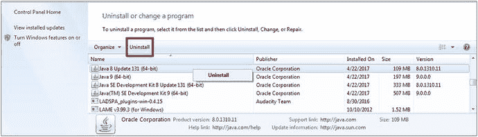

图 1-2.

选择早于 Java 9 的 Java 版本，然后点击顶部的“卸载”选项，或右键单击并选择卸载

一旦您点击“卸载”按钮，此工具将移除您较旧版本的 Java 8。首先移除较小的 Java 8 版本（非 JDK），然后移除较大的（完整 JDK）版本，因为卸载较小的 JDK 以及任何旧版本的 NetBeans 都需要完整的 JDK。如果您想移除 NetBeans IDE，则需要安装 Java 8，因为 NetBeans IDE 是用 Java 编写的，并且需要安装 Java JDK 才能卸载它。

一旦您移除了完整的 Java 8 JDK，将只剩下 Java 9 的（Alpha）版本（如果您像我一样正在编写本书的话），如图 1-3 所示，标记为版本 9.0.0.0。如果您想保留旧的 Java 项目文件，请确保备份您的 Java 项目文件夹（如果您尚未这样做的话）。请确保定期备份您工作站的硬盘驱动器，以免丢失任何 3D、内容制作和编码工作。

我通过再次单击选中（它会变成蓝色）Java 9 JDK 软件的 Alpha 或 Beta 版本来移除它们，然后点击图 1-3 顶部显示的“卸载”按钮，或者您也可以右键单击蓝色软件包（移除）选项，然后从（通过右键单击打开的）上下文菜单中选择“卸载”。

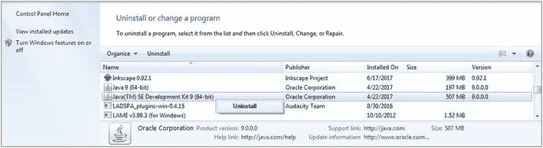

图 1-3.

选择 Java 9 的 Alpha 版本，然后点击顶部的“卸载”选项，或右键单击并选择“卸载”

现在我已从工作站移除了过时的 Java 版本，我将从互联网获取最新的 Java 9 开发工具包（JDK）版本，并将其安装到我的 Windows 内容开发工作站上。

## 下载并安装 Oracle Java 9 JDK

既然工作站上已移除过时的 Java 版本，你需要上网访问 Oracle 网站，获取最新的 Java 9 开发 JDK 和 IDE，毕竟这是一本《专业 Java 9 游戏开发》书籍。我将向你展示如何使用直接下载链接来完成操作，并说明在撰写本书时这些链接的当前位置。如果这些链接已变更，只需使用 Google 搜索“Java 9 JDK Download”即可。目前该下载位于 Oracle 技术网络，如图 1-4 截图顶部所示。

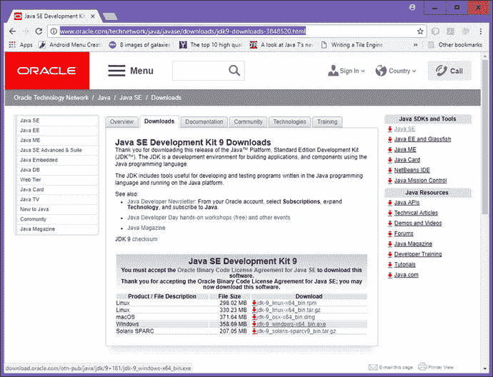

图 1-4.

位于 oracle.com/technetwork/java/javase/downloads/jdk9-downloads-3848520.htm 的 JDK9 下载链接

在下载 360 MB 的 Windows 64 位 JDK9 安装文件之前，你需要点击下载表格左上角的“接受许可协议”选项旁边的单选按钮。

一旦接受此许可协议，五个特定操作系统的链接将被激活，包括 Linux、Mac OS/X、Windows（7 到 10）和 Solaris。请确保下载的 Java JDK 软件与你的操作系统匹配。如你所见，现在只有 64 位（或 x64）版本可供 64 位系统使用。

要启动下载的 JDK9 安装程序，右键点击该文件，选择“以管理员身份运行”进行安装（在 Linux 上则使用超级用户权限）。接受图 1-5 中六个对话框的默认设置。

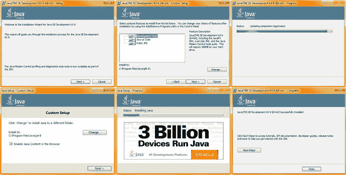

图 1-5.

在工作站上安装 Java 9 JDK，接受六个 Java 9 安装对话框中的默认设置

如果你想检查 Java 9 是否已安装到系统上，只需使用与图 1-1 至 1-3 相同的控制面板工具。如图 1-6 所示，Java 9.0 的真实版本（而非 alpha 版本）现已安装在我的系统上，大小为 763 MB，安装日期为 2017 年 10 月 7 日。

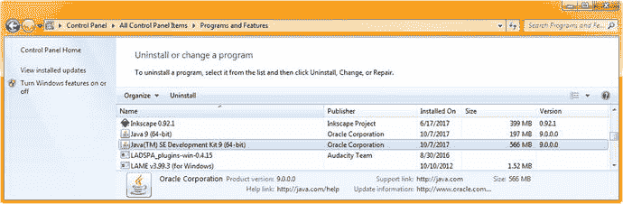

图 1-6.

找到最新（当前为 9.0.1）Java 9 版本的 JDK，并确保其已安装

接下来，让我们安装 Java 8，它目前用于运行 NetBeans 8.2（你可能已经在使用此 IDE 进行开发），也用于运行本书所使用的 NetBeans 9.0 IDE（测试版）。因为最终 Java 9 和 NetBeans 9 将一起用于开发 Java 9 游戏。在过渡期间，NetBeans 9.0 运行在 Java 8 上，因此我将添加一两个小节，说明其工作原理，以便本书的早期采用者可以使用此配置。

## 下载并安装 Oracle Java 8 JDK

你可能会想，既然这是一本关于 Java 9 游戏的书，为什么我们现在要下载最新版本的 Java 8（当前为更新 152）？原因是，尽管 Java 9 JDK 已于 9 月发布，但 NetBeans 9 IDE 版本仍处于测试阶段（我写这本书时它还在 alpha 阶段），这意味着 NetBeans 9（测试版）仍然运行在 Java 8 之上，这是由于 Java 9 中模块的复杂性（意味着程序员仍在模块化 NetBeans 9，以便它能用 Java 9 编写）。一旦 NetBeans 9 发布，它很可能会直接运行在 Java 9 JDK 之上。有一种方法可以访问 Oracle 技术网络上的一个网页，该网页包含 Java 8u144 和 Java 9.0 的链接，网址为 [www.oracle.com/technetwork/java/javase/overview/index.html](http://www.oracle.com/technetwork/java/javase/overview/index.html)，如图 1-7 所示。两个 JDK 的下载链接都位于网页最底部，因此只需点击 Java SE 8 update 144 JDK 的下载链接（已升级至 8u152）。

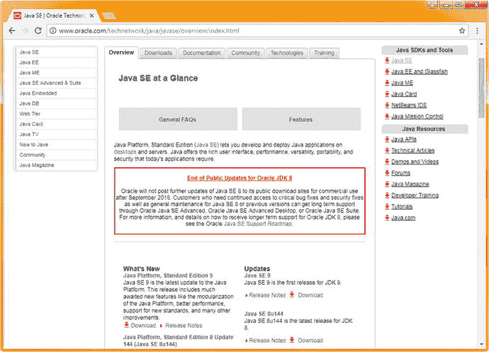

图 1-7.

Oracle 技术网络 Java SE 概览网页，包含 Java 9 JDK 和 Java 8u144 的链接

如你所见，网页中间还圈出了一个红色的“Oracle JDK 8 公共更新结束”警告。Java 8 的 bug 并不多，毕竟它已经经历了 144 次更新，相当稳定！从某种意义上说，Java 9 是一次重写，因为它已被重新模块化，所以 API 类和包（进入模块）的所有“连接”工作都在重做，这就是为什么用 Java 编写的 NetBeans 9 未能与 Java 9 同时完成（编码和调试）。以前的 Java 和 NetBeans 版本几乎同时发布，并且有一个 NetBeans 捆绑包下载（如图 1-8 顶部所示，通过右侧的下载图标）。

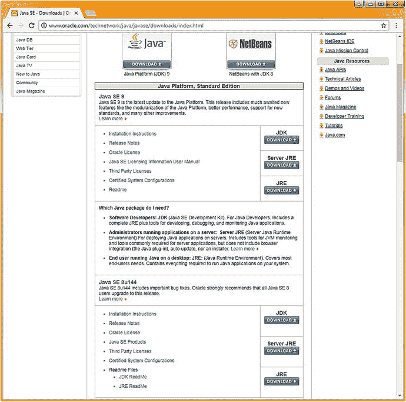

图 1-8.

Oracle 技术网络 Java SE 下载网页，最底部有 Java 8u144 JDK 的链接

图 1-8 所示的 Java SE 下载页面，就是上一页的下载链接将带你进入的页面。在页面底部，你会找到 Java SE 8u144 部分，其中有三个下载按钮。第一个顶部按钮写着 JDK。这就是你要点击以开始下载 JDK 8u144 的按钮。这将带你进入 oracle.com/technetwork/java/javase/downloads/jdk8-downloads-2133151.html 页面，如图 1-9 所示。

点击“接受许可协议”单选按钮以启用所有下载链接，然后点击与你操作系统版本对应的链接。

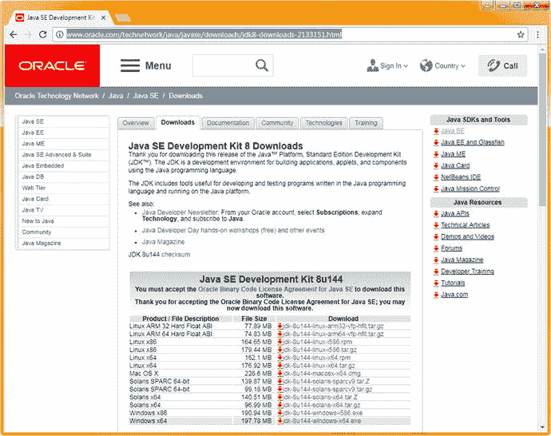

图 1-9.

位于 oracle.com/technetwork/java/javase/downloads/jdk8-downloads-2133151.htm 的 JDK8 下载链接

请注意，对于 Java 8，有 32 位（i586）和 64 位（x64）版本，以及 ARM CPU 版本，这给了我们十多种选择。选择与你操作系统对应的 64 位版本，以匹配你为 Java 9.0 安装的版本。

现在我们可以安装 NetBeans 9.0 集成开发环境（简称 IDE），它将使用我们刚刚安装的 Java 8 运行时引擎（JRE）来运行 Java 代码，从而为你创建 NetBeans 9 IDE。

由于 NetBeans 9 正在从 Oracle 过渡到 Apache，目前实际上有两个代码仓库。我将首先向你展示我在写书时使用的那个，它托管在 Oracle；其次，我将向你展示托管在 Apache 的那个，它使用一个名为 Jenkins 的测试版仓库，还有一个 GIT 链接，如果你愿意，可以从头构建 NetBeans IDE。最终还会有一个 Java 9 和 NetBeans 9 的“捆绑包”作为单一安装程序。这当然是最简单、最理想的方式，但目前还不存在，因此我将介绍构建和安装 NetBeans 9.0 的更高级方法，因为它尚未完成。这使当前的安装变得复杂，但我对此无能为力，只能为你提供所有这些额外的信息，以便你能够在最终的 NetBeans 9 on Java 9 捆绑包发布之前，让 NetBeans 9.0 运行起来，用于 Java 9 和 JavaFX 9 开发。就《专业 Java 9 游戏开发》而言，这让你比其他人领先一步。

## 安装 Oracle NetBeans 9.0（开发版）IDE

由于 NetBeans 9 仍处于开发阶段，我将向你展示如何从 Oracle 获取 NetBeans 9 版本，并在下一节中介绍普通用户最终将如何从 Apache 获取 NetBeans 9 IDE。这样，你将了解下载和安装 NetBeans 9 的所有方法。Oracle 仓库（在软件正式移交给 Apache 之前会一直存在）位于 bits.netbeans.org/download/trunk/nightly/latest/，其界面看起来就像大家熟悉的原始 NetBeans 下载页面，如图 1-10 所示。我建议使用最简单的（最小的）Java SE 版本，因为它包含了本书涉及的三个 API（NetBeans、Java 和 JavaFX）。点击第一个“Download (Free, 97MB)”按钮，开始 NetBeans 的下载过程。

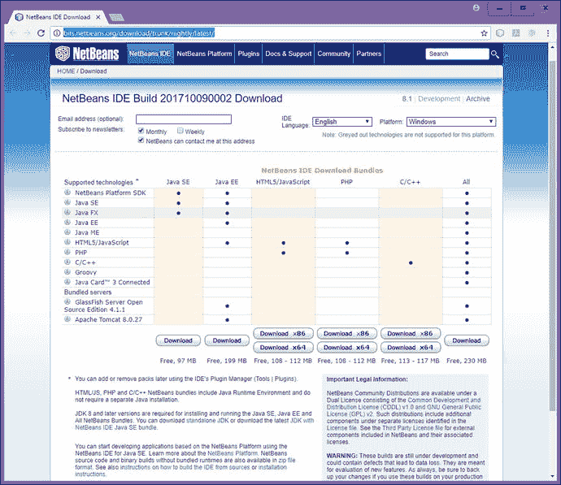

图 1-10.

位于 bits.netbeans.org/download/trunk/nightly/latest/ 的 Oracle NetBeans 9.0 IDE 下载页面

下载完安装文件后，右键点击它，选择“以管理员身份运行”（Linux 上为超级用户），你将看到第一个“欢迎”对话框，位于图 1-11 中六个对话框截图的左上角。

点击“Next”按钮开始默认（完整）安装，你将看到 NetBeans IDE 9 许可协议对话框，如图 1-11 的中上方所示。勾选“我接受许可协议中的条款”复选框（红色圆圈标出），然后点击“Next”按钮，进入 NetBeans IDE 构建安装对话框，如图 1-11 右侧所示。第三个对话框指定了 Program Files 目录中的安装位置，并指定了用于 Java 开发的 JDK。请注意，NetBeans 9 足够智能，会优先选择 Java 9 而非 Java 8（如果你两者都安装了，因为任何工作站上都可以安装多个 Java 版本），并定义你将用于开发游戏的 Java 版本（过去这需要在 NetBeans 内手动设置）。保持默认设置，点击“Next”按钮进入“摘要”对话框，如图 1-11 的左下方所示。务必保持勾选“检查更新”，以便 NetBeans 9 能够自动更新。

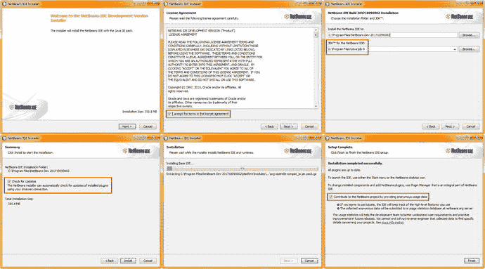

图 1-11.

接受许可协议条款，点击“Next”按钮（左侧），并对 JUnit 执行相同操作（右侧）

点击“Install”按钮后，NetBeans 将安装基础 IDE，如图 11-1 的中下方对话框所示，通过进度条和下方的提取文件文本显示安装进度。安装完成后，你将看到一个“安装完成”对话框，其中包含一个复选框选项：“通过提供匿名使用数据来为 NetBeans 项目做贡献”。我选择勾选此选项，以帮助 NetBeans 开发者。

最后一步，也是你在安装本章中所有游戏开发和游戏资源开发软件包时都应执行的步骤，就是通过启动软件来测试安装，确保其能正常运行。

具体操作是：在桌面上找到软件图标（双击桌面图标启动），或在任务栏中找到软件图标（称为快速启动图标，只需单击即可启动），然后启动软件。对于 NetBeans 9 IDE，启动后的结果应如图 1-12 左侧所示。

要确认 NetBeans 9 的配置，请使用“帮助”➤“关于”菜单序列，如图 1-12 右侧所示，其中会显示产品版本、使用的 Java JDK 版本、用于运行 NetBeans 9.0 的 Java 运行时环境（JRE，JRE 是 JDK 安装的一部分）、使用的操作系统，以及用户目录和缓存目录的位置。如果你在安装此 IDE 的后续版本时遇到问题，可以尝试删除这两个目录（即删除 \dev 文件夹），因为它们包含之前 NetBeans 安装的信息，可能会误导下一次 NetBeans 安装。

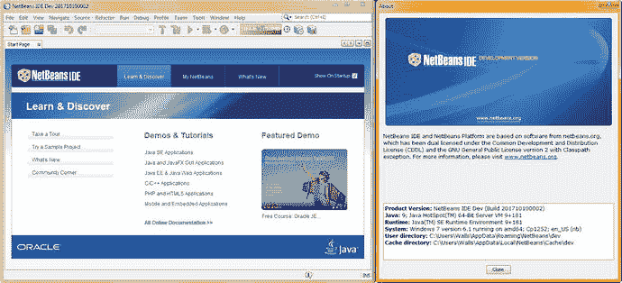

图 1-12.

使用桌面图标或快速启动图标（银色立方体）启动 NetBeans，并确保软件能够启动

接下来，我将向你展示如何以及在哪里安装 Apache NetBeans 产品，因为在某个时间点，NetBeans 9.0 将完成从 Oracle 到 Apache 的移交（就像 Open Office 那样）。我不确定这具体何时会发生，可能是在 2018 年的某个时候，但我不能等到那时才发布这本书，所以我将向你展示获取 NetBeans 9.0 的所有不同方式。请注意，如果你想在 Java 8 上使用 8.2 版本，那也是可以的，因为 JavaFX 8（和 JavaFX 9）的类（API）没有变化。这是因为 Java 9（和 NetBeans 9）的重点只是将模块引入工作流程并让 IDE 正常工作，所以 JavaFX 保持不变，重点放在了 Java 的其他部分（正如你将看到的，JavaFX 是 Java 的多媒体/游戏引擎）。

## 安装 Apache NetBeans 9（开发版）IDE

接下来，我们将了解 NetBeans 的 Apache Jenkins 和 GIT 仓库，在目前正在进行的迁移完成后，该软件将“落地”于此。Apache Jenkins 的 NetBeans 站点位于 [`https://builds.apache.org/job/incubator-netbeans-windows/`](https://builds.apache.org/job/incubator-netbeans-windows/)，这是一个所谓的“孵化器”站点。孵化器用于孵化鸡蛋，因此这里的含义是，在基于 Java 9 的 NetBeans 9 捆绑包“孵化”完成之前，你可以在此处获取仍在开发中的 NetBeans 9 IDE 软件。你可以在图 1-13 中看到 Apache Jenkins 网站当前的样子（该界面有可能会发生变化）。如你所见，它提供了相当多的选项。

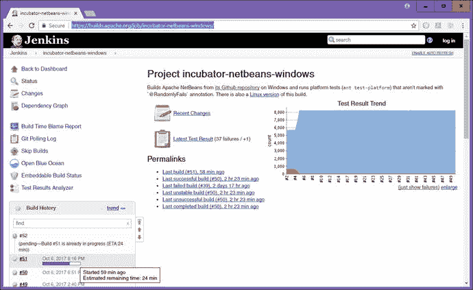

图 1-13.

Apache Jenkins 的 NetBeans 位于 [`https://builds.apache.org/job/incubator-netbeans-windows/`](https://builds.apache.org/job/incubator-netbeans-windows/)

Jenkins 页面的左上方是 Jenkins 软件孵化器功能导航链接，你可以通过它们返回仪表板（主页）、查看开发状态、查看构建之间的变更、查看依赖关系图、获取构建时间责任报告、查看 GIT 轮询日志、获取嵌入式构建状态、查看测试结果分析器、跳过构建以及打开 Blue Ocean。Blue Ocean 是一个免费、开源、持续更新的实用工具，它能让你感觉自己就是软件开发团队的一员。

其下方是构建历史记录。这是一个包含构建任务的窗格，会显示构建进度条、构建时间和完成预估。如果你点击其中一个构建任务（如果已完成），它会打开另一个窗口（浏览器标签页），其中包含该构建的详细信息和一个下载链接。如图 1-14 所示。

要下载这些 ZIP 文件之一，请右键单击它，使用“另存为”功能，将 ZIP 文件保存到你硬盘上想要解压缩 NetBeans 9 的位置（目录/文件夹）。请注意，这与安装程序（.exe 或 .msi）的处理方式不同，安装程序会将文件放入 Program Files 文件夹（与其他已安装的应用程序一起），并创建桌面图标和任务栏快速启动图标。

我被告知 Linux 版本的构建也可以在 Windows 下运行，但未来可能会为 Mac OS/X、Linux 和 Windows 提供独立的构建版本。我还向开发者列表提交了一个请求，希望建立一个 Ubuntu LTS Linux 17 PPA 仓库，以便 Ubuntu LTS 用户可以在几乎无需终端用户干预的情况下自动更新 NetBeans 9.0 IDE。如果你还没有了解过 Ubuntu LTS 17.10 或 18.04，现在或许可以看看；你会惊讶于 Ubuntu Linux（另一个主要的 Linux 发行版 Debian 也类似）相对于 OSX 或 Windows 所取得的巨大进步。

解压 NetBeans 9（我将我的文件夹命名为 NetBeans-9-Build）后，进入 /bin（二进制）文件夹，右键单击 `netbeans64.exe`，选择“以管理员身份运行”。在启动品牌画面和加载进度条之后，你会看到一个许可协议对话框，你需要接受（同意）该协议才能启动 IDE 软件。

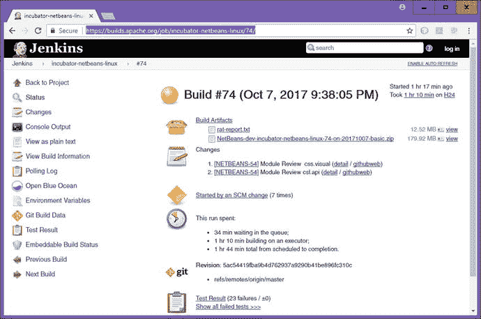

图 1-14.

点击一个版本以获取构建页面，此处显示的是 builds.apache.org/job/incubator-netbeans-linux/74/

接下来，让我们下载十几个最流行（且免费）的开源新媒体内容开发软件包，这样你将拥有所有强大、专业的工具，这些工具最终都是你的 Pro Java 9 游戏开发业务所必需的。这代表了价值数万（你所在地区的货币，我这里是美元）的付费软件包，因此这第一章最终将对所有读者来说都极具价值。

之后，我将介绍一些我在工作站上使用的其他令人印象深刻的开源软件，这样，如果你想打造一个终极软件开发工作站，在本章结束之前，你就可以做到，仅需花费硬件（和操作系统）的成本，就能创建一个价值极高的内容生产工作站。

## 安装新媒体内容制作软件

JavaFX 9 支持多种新媒体元素“类型”，或者我称之为“资产”，JavaFX 9 是 Java 9 的新媒体“引擎”，因此它将是你 Pro Java 9 游戏开发的基础。在本章剩余部分，你将安装领先的开源软件，这些软件涵盖的主要新媒体类型包括：SVG 数字插图、数字图像合成、数字音频编辑、数字视频编辑、VFX 或视觉效果、3D 建模与动画、虚拟世界创建、角色动画、歌曲创作、数字音频采样、办公生产力（是的，你还需要销售你的游戏）等等。

### 下载并安装用于 SVG 数字插图的 InkScape

由于 JavaFX 支持 2D 或“矢量”技术，该技术常用于 Adobe Illustrator 和 Freehand 等数字插图软件包，我们将下载并安装流行的开源数字插图软件包 InkScape。该软件最近版本号从 0.48 大幅跃升至 0.92，并具备专业功能。InkScape 适用于 Linux、Windows 和 Macintosh 操作系统，就像我们本章将要安装的所有这些软件包一样，因此读者可以使用任何喜欢的平台来开发游戏。如果你想了解更多关于数字插图和 SVG 的知识，请查阅 Apress 出版的《数字插图基础》一书。

要在互联网上找到 InkScape 软件包，请使用谷歌搜索引擎，输入 InkScape。访问该网站，点击左上角的 DOWNLOAD 菜单或右侧的下载图标，如图 1-15 所示。下载图标会代表你正在使用的操作系统，这是由网站代码通过轮询你的系统自动检测的，只需单击一下，即可自动为你提供正确的版本。

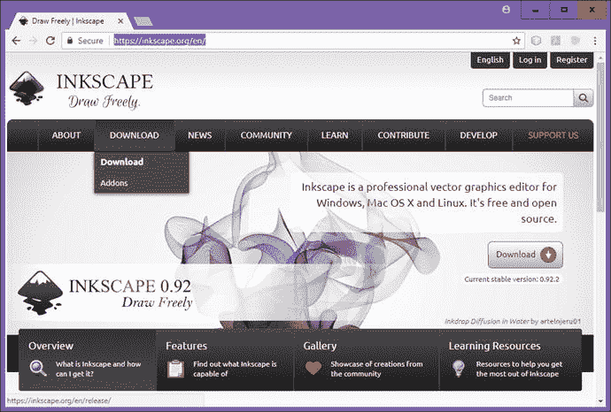

图 1-15.

在谷歌中搜索 InkScape，进入 inkscape.org 网站，点击下载图标或下载菜单

下载 InkScape 软件后，右键单击文件名，选择“以管理员身份运行”将其安装到你的工作站上。如果你愿意，可以使用本章前面使用过的“程序和功能”实用程序来卸载以前的 InkScape 版本。

软件安装完成后，在任务栏上创建一个快速启动图标，这样你就可以通过单击鼠标来启动 InkScape。接下来，你将安装一个名为 GIMP 的流行数字图像软件包，它将允许你使用 JPEG、PNG、WebP 或 GIF 数字图像格式为游戏创建“光栅”或基于像素的艺术作品。

### 下载并安装 GIMP 用于数字图像合成

由于 JavaFX 也支持利用“光栅”图像技术的 2D 图像，该技术将图像表示为像素阵列。这正是 Adobe Photoshop 和 Corel Painter 等付费数字图像合成软件包所使用的技术。我们将下载并安装名为“The Gimp”的流行开源数字图像编辑与合成软件包。GIMP 可用于 Linux、Windows、Solaris、FreeBSD 和 Macintosh 操作系统。如果你想了解更多关于数字图像合成的知识，可以查阅 Apress 出版的《数字图像合成基础》一书。要在互联网上找到 GIMP 软件，请使用谷歌搜索，输入 GIMP。其网站如图 1-16 所示。

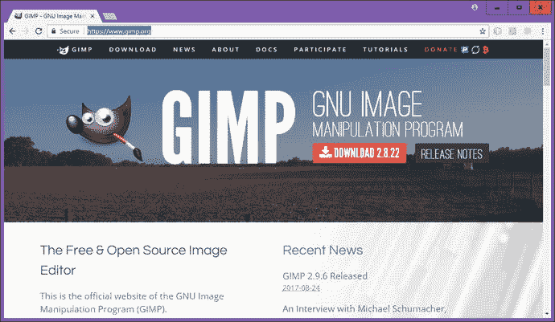

图 1-16.

用谷歌搜索 GIMP；访问 gimp.org；点击 2.8.22 或 2.10（当前为 2.9.6 测试版）的下载链接

点击下载链接（或右键单击，在新标签页中打开），然后点击下载 GIMP 2.8.22（或更高版本，例如目前处于 2.9.6 测试版、即将推出 2.9.8 的新版 2.10 或 3.0），这些版本对应你正在使用的操作系统。

下载页面会自动检测你使用的操作系统，并为你提供正确的操作系统版本；就我而言，我在 Windows 7、Windows 10 和 Ubuntu LTS Linux 17.04 上使用 GIMP，因为我的每台工作站上都安装了它。毋庸置疑，开源软件相比付费软件包具有诸多优势。

软件下载完成后，安装最新版本的 GIMP，然后像你为 InkScape 所做的那样，为你的工作站任务栏创建一个快速启动图标。

接下来，我们将安装一个名为 Audacity 的强大数字音频编辑和特效软件包。

### 下载并安装 Audacity 用于数字音频编辑

JavaFX 支持利用数字音频技术的 2D（和 3D）数字音频。数字音频通过采集数字音频“样本”来表示模拟音频。数字音频内容通常使用 Cakewalk Sonar 等数字音频合成和音序器软件包创建。如果你想了解更多关于数字音频编辑的知识，可以查阅 Apress 出版的《数字音频编辑基础》一书。在本节中，我们将下载并安装名为“Audacity”的流行开源数字音频编辑与优化软件包。Audacity 可用于 Linux、Windows 和 Macintosh 操作系统。要在互联网上找到 Audacity 软件包，请使用谷歌搜索引擎，输入 Audacity，它将显示 Audacity 团队网站。访问该网站，如图 1-17 左上角所示。点击下载 Audacity 链接（或使用下载菜单），然后点击适用于 Windows（或你使用的操作系统版本）的 Audacity。我在 Ubuntu Linux LTS 17.04 操作系统上也使用 Audacity 2.1.3。

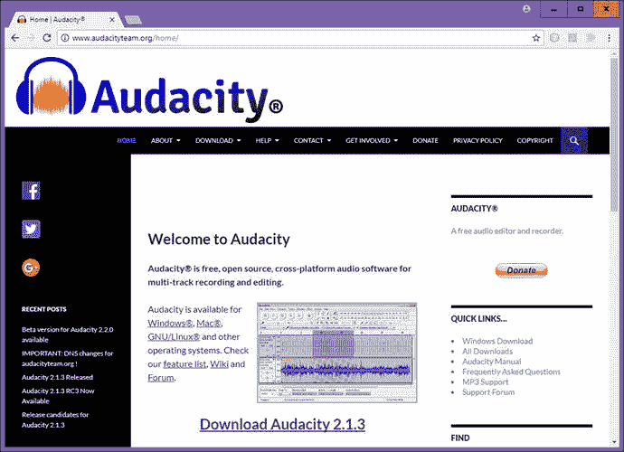

图 1-17.

用谷歌搜索 Audacity，访问 audacityteam.org，点击与你操作系统匹配的下载 Audacity 链接

下载并安装最新版本的 Audacity（当前为 2.1.3），然后像你为 InkScape 和 GIMP 所做的那样，为你的工作站任务栏创建一个快速启动图标。当你阅读本文时，Audacity 2.2.0 可能已经发布，它增加了新的用户界面设计以及大量酷炫的新数字音频编辑、合成和美化功能。

接下来，你将安装一款用于故事片的专业非线性数字视频编辑和“色彩定时”（也称为色彩校正）软件包，该软件包最近从 12.5 版升级到了 14 版，名为 Black Magic Design DaVinci Resolve。就在一两年前，这款软件包的价格还高达数千美元！

### 下载并安装 DaVinci Resolve 14 用于数字视频

JavaFX 9 支持数字视频，它利用基于“光栅”像素的运动视频技术。这表示视频是一系列帧，每一帧都包含一个基于像素阵列的数字图像。数字视频资产通常使用 AfterEffects 和 EditShare LightWorks 等数字视频编辑和色彩定时软件包创建。在本节中，我们将下载并安装最新版本的开源数字视频编辑软件 DaVinci Resolve 14。该软件包可用于 Windows 10、Mac OSX、Ubuntu Linux 及其他发行版。要找到 DaVinci Resolve，请使用谷歌搜索，输入 DaVinci Resolve。点击中间的下载按钮，如图 1-18 所示，或者滚动到页面底部，点击免费下载按钮。

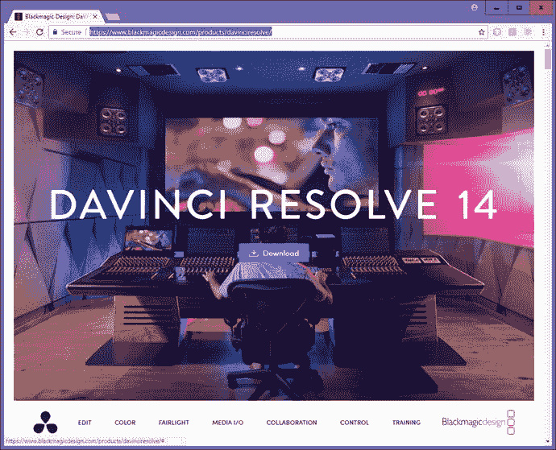

图 1-18.

用谷歌搜索 DaVinci Resolve；访问 BlackMagicDesign.com 网页；点击下载按钮

安装该软件，然后像你为所有其他软件所做的那样，为你的任务栏创建一个快速启动图标。如果你想了解更多关于数字视频编辑的知识，可以查阅 Apress 出版的《数字视频编辑基础》一书。接下来，我们将安装一个名为 BlackMagic Fusion 的高级特效、3D 建模与动画以及 VR 软件包。

### 下载并安装 Blackmagic Fusion 用于视觉效果

JavaFX 也支持特效管线，因为所有新的媒体类型都可以使用 Java 9 代码无缝地组合在一起。SFX 同时利用基于“光栅”像素的运动视频技术、静态图像合成、数字音频、3D、i3D 和 SVG 数字插图，因此它与 3D 建模和动画一样先进。BlackMagicDesign 的 Fusion 在被开源之前曾是一款付费软件包。有一个专业版，以前售价 999 美元，现在只需 299 美元！如果你对多媒体是认真的，就买下它吧！

你首先需要在 `BlackMagicDesign.com` 网站上注册，才能下载和使用该软件。该软件包可用于 Linux、Windows 10 和 Macintosh 操作系统。要在互联网上找到 Fusion，请使用谷歌搜索引擎，输入 Fusion 9，你将被引导至如图 1-19 所示的页面。点击与你操作系统对应的下载按钮。该下载页面会自动检测你使用的操作系统；就我而言，是 Windows。

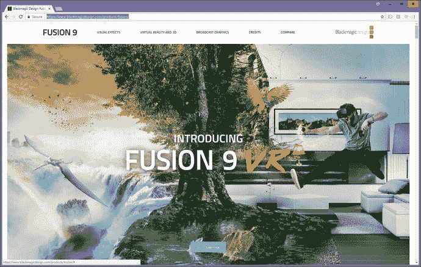

图 1-19.

用谷歌搜索 Fusion 9；访问 blackmagicdesign.com 下载页面；点击下载按钮

如果你尚未注册，请在 BlackMagicDesign.com 网站上注册，一旦获得批准，你就可以下载并安装最新版本的 Fusion 9。安装该软件，然后像你为其他软件所做的那样，为你的任务栏创建一个快速启动图标。如果你想详细了解 Fusion，Apress.com 最近出版了一本名为《VFX 基础》的书，其中更深入地介绍了 Fusion 和视觉效果合成管线。

接下来，我们将安装一个名为 Blender 的 3D 建模与动画软件包。

### 下载并安装 Blender 以进行 3D 建模和动画制作

JavaFX 近期已开始支持在 JavaFX 环境之外创建的 3D 新媒体资源，这意味着你将能够使用第三方软件包（如 Autodesk 3D Studio Max、Maya 和 NewTek Lightwave）来创建 3D 模型、纹理和动画。在本节中，我们将下载并安装名为“Blender”的流行开源 3D 建模和动画软件包。Blender 适用于 Linux、Windows 和 Macintosh 操作系统，因此读者可以使用任何喜欢的操作系统平台来创建和优化 3D 模型、3D 纹理映射以及 3D 动画，以便在 Java 9 和 JavaFX 9 游戏中使用。

要在互联网上找到 Blender 软件，请使用谷歌搜索引擎并输入“Blender”，如图 1-20 所示。点击正确的下载链接来下载并安装 Blender，然后创建快速启动图标。

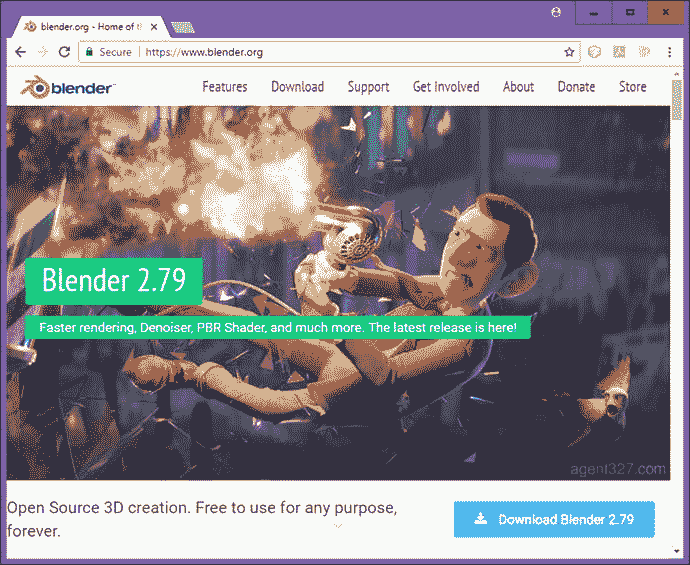

图 1-20.

在谷歌中搜索“Blender 3D”，前往 [`www.blender.org`](http://www.blender.org) 并点击蓝色的“Download Blender 2.79”按钮

### 下载并安装 Terragen 以进行 3D 地形或世界创建

另一个令人印象深刻的（且免费，针对基础版本，或如果你身处教育行业）3D 世界生成软件包是来自英国 Planetside Software 的 Terragen 4.1。你可以在 Planetside.co.uk 下载基础版本，并加入他们的论坛。我曾在几本关于 Android 应用开发的书中使用过这款软件，因此我知道它非常适合用于多媒体应用、交互式电视（iTV）和游戏等项目。它也被专业电影制作人所使用，因为其质量水平极高。由于本书涉及 3D 内容，你可能会想了解一下 Terragen，因为它价格实惠，并被电视制片人和电影工作室所使用。要在互联网上找到 Terragen 软件，请使用谷歌搜索引擎并输入“Terragen 4.1”。点击链接，将打开 Planetside Software 网站，如图 1-21 所示。

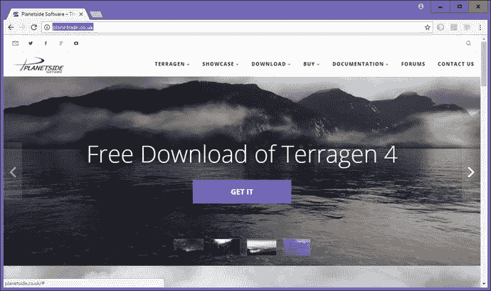

图 1-21.

在谷歌中搜索“Terragen”；前往 planetside.co.uk 网站；点击蓝色的“GET IT”按钮进行下载

点击“GET IT”下载链接来下载并安装 Terragen，然后为该软件创建快速启动图标。如果你喜欢这款 3D 软件，请务必升级到该软件的 Pro 版本，其价格非常实惠。

### 下载并安装 Daz Studio Pro 以进行角色动画制作

对于专业的 3D 角色建模和动画制作，请务必在有空时查看位于 daz3d.com 的 DAZ 3D 公司提供的 3D 软件包。当前版本的 DAZ Studio PRO 是 4.9，没错，它是免费的！你需要像注册 Black Magic Design 软件那样登录并注册，但这只是很小的代价！该网站上还有一个名为 Hexagon 的免费 3D 建模软件包。DAZ 3D 网站上最昂贵的软件是 Carrara（150 美元）或 Carrara Pro（285 美元）。DAZ Studio 的大部分收入来自销售各种类型的角色模型，所以不妨去看看，因为他们在 3D 内容（虚拟）世界中是一股不可忽视的力量！

要在互联网上找到 Daz Studio Pro 软件，请使用谷歌搜索引擎并输入“Daz Studio Pro 5 download”。该链接应会将你带到 daz3d.com/daz_studio 页面，如图 1-22 所示。点击下载链接来下载并安装最新版本的 Daz Studio Pro，然后创建你的快速启动图标。

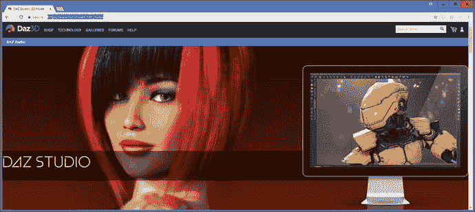

图 1-22.

在谷歌中搜索“Daz Studio Pro”，前往 [`www.daz3d.com`](http://www.daz3d.com) ，并下载最新版本的 Daz Studio

## 其他开源新媒体软件包

在我的新媒体内容制作业务中，我还使用了大量其他专业级别的开源软件包。我想，如果你还没听说过它们，不妨向你介绍一些。这些软件将为你在本章中构建的新媒体制作工作站增添更强大的功能和多样性。值得注意的是，在进行所有这些大量的下载和安装过程中，你已经为自己节省了数千美元（或你所在国家的货币单位），这些钱原本会花在类似的付费内容制作软件包上。我想我的座右铭可以说是：“第一次就做对，并且一定要坚持到底”，所以我会继续向你介绍一些其他免费的，甚至是一些更易上手（并非免费，但价格非常实惠）的新媒体内容制作软件包，这些软件通常都安装在我的 3D 内容制作工作站上。

除了 DaVinci Resolve 软件包（它过去的价格接近六位数）之外，开源软件中性价比最高的之一是一套办公生产力软件套件，该套件在甲骨文公司收购 Sun Microsystems 后被其收购，随后被开源。甲骨文公司将其 OpenOffice 软件套件移交给了广受欢迎的 Apache 开源项目，就像他们目前对 NetBeans 9 所做的那样。

Open Office 4.3 是一套完整的办公生产力软件套件，其中包含六个功能齐全的商业生产力软件包！由于你的内容制作机构实际上是一个完整的商业实体，你或许应该了解办公软件，因为这是一个非常可靠的开源软件产品。你可以在 `OpenOffice.org` 找到它，这个广受欢迎的商业软件包已被像你这样精明的专业人士下载超过一亿次，所以，正如他们所说，这可不是闹着玩的！

对于用户界面（UI）设计原型制作，有一个来自 Evolus.vn 的名为 Pencil 2.0.6 的免费软件包，它允许你在 Java、Android 或 HTML5 中创建用户界面设计之前，轻松地制作原型。该软件位于 `pencil.evolus.vn`，适用于 Linux 发行版、Windows 7 和 8.1 以及 Macintosh OS/X。

与 Audacity 2 数字音频编辑软件相得益彰的是 Rosegarden MIDI 音序、音乐创作和乐谱软件，它可用于音乐创作，并打印出最终乐谱以供音乐出版。Rosegarden 目前正从 Linux 移植到 Windows。请注意，功能最完整的版本是针对 Linux 的，如图 1-23 所示。你可以通过谷歌搜索或在 `RoseGardenMusic.com` 找到它，当前版本为 17.04（与 Ubuntu LTS 相同）。这个版本通常被称为“千载难逢”版本。

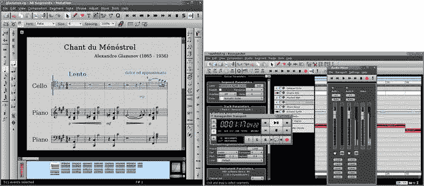

图 1-23.

Rosegarden 是一款适用于 Linux 的 MIDI、音乐记谱和符号程序，目前正在移植到 Windows 10

另一个令人印象深刻的音频、MIDI 和声音设计软件包是 Qtractor，它是一个基于硬盘驱动器的音频采样器、编辑器和声音设计包，如图 1-24 所示。因此，如果你运行的是 Linux 操作系统，请务必通过谷歌搜索、下载并安装这款专业级别的数字音频合成软件包，你可以在 SourceForge 上通过 `Qtractor.SourceForge.net` 网址找到它。

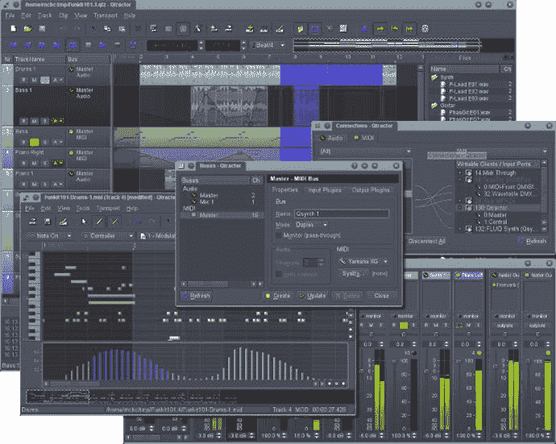

图 1-24.

Qtractor，一款适用于 Linux 的基于硬盘的数字音频编辑软件

另一款令人印象深刻的免费 3D 建模与动画软件是 **Caligari TrueSpace 7.61**，它曾由 Caligari 公司的 Roman Ormandy 开发，售价近千美元（后被微软收购）。你只需在谷歌搜索“Caligari TrueSpace 3D”，就能在多个网站上找到它。

另一款值得关注的 3D 渲染软件是 **POVRay**。POV 代表“Persistence of Vision”（视觉持久性），这款软件被称为“光线追踪器”，是一种高级渲染引擎，可与任何 3D 建模和动画软件包配合使用，通过先进的光线追踪渲染算法生成令人惊叹的 3D 场景。最新版本可在 [`www.povray.org`](http://www.povray.org) 网站上找到，版本号为 3.7，最新版为 64 位，支持多核（多线程），并且可以免费下载——这也是我在此介绍它的原因。

另一款专为 POVRay 设计的精美 3D 建模软件包是 **Bishop 3D**。该软件可用于创建自定义 3D 对象，然后导入 POVRay（再导入 JavaFX），用于你的专业 Java 游戏开发。最新版本为 1.0.5.2，适用于 Windows 7 或 10。该软件可在 [`www.bishop3d.com`](http://www.bishop3d.com) 找到，最新版安装包大小为 8MB，目前可免费下载。

另一款值得关注的免费 3D 细分建模软件是 **Wings3D**。该软件可用于创建 3D 对象，然后导入 JavaFX 用于你的游戏开发。最新版本为 2.1.5，于 2016 年 12 月发布，支持 Windows 10、Macintosh OS/X 和 Ubuntu Linux。该软件可在 `wings3d.com` 找到，最新版为 64 位，安装包大小为 16MB，目前可免费下载。

接下来，我将展示如何在任务栏上整理一些基本的操作系统实用程序和开源软件。在接下来的几章中，我们将开始学习使用新媒体资产背后的原理，然后学习如何使用 NetBeans 9 创建 JavaFX 9 项目，接着进入 Java 编程语言的学习，之后在下一章中，我们将开始了解强大的 JavaFX 9.0 多媒体游戏引擎的细节。

## 在任务栏区域组织快速启动图标

有一些操作系统实用程序，例如计算器、文本编辑器（在 Windows 中称为记事本）和文件管理器（在 Windows 中称为资源管理器），我会在任务栏中为它们保留快速启动图标，因为它们在编程和新媒体内容开发工作流程中经常使用。我还会在任务栏上保留各种新媒体开发、编程和办公生产力应用程序作为快速启动图标，如图 1-25 所示，图中显示了十几个这样的图标，包括我们刚刚安装的所有软件（按安装顺序排列），以及其他一些软件，如 OpenOffice 4.3、DAZ Studio Professional 4.9 和 Bryce Professional 7.1。

图 1-25.

为关键系统实用程序、NetBeans 9 和新媒体制作软件创建任务栏快速启动图标

创建这些快速启动图标有几种方法：你可以将程序直接从“开始”菜单拖放到任务栏上，或者右键单击桌面或资源管理器文件管理器中的图标，然后选择“固定到任务栏”上下文菜单选项。图标放入任务栏后，你可以通过向左或向右拖动来更改它们的位置。

恭喜！你刚刚创建了高度优化的新媒体 Java 游戏和物联网开发工作站，它将使你能够创建客户所能想象的任何新媒体 Java 游戏或物联网项目！

## 总结

在第一章中，你确保了自己拥有开发创新 Java 游戏或物联网项目所需的一切，包括最新版本的 Java 9、JavaFX 9.0、NetBeans 9 以及所有最新的开源新媒体软件。这包括获取最新的 Java 9 JDK 和 NetBeans 9 IDE 软件，然后我们安装了 Java 9 和 NetBeans 9。之后，你为一组专业的开源新媒体内容工具也做了同样的操作。

