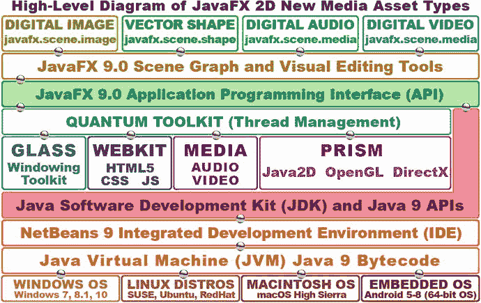
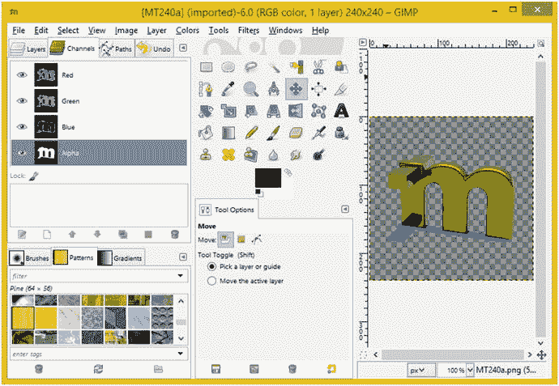
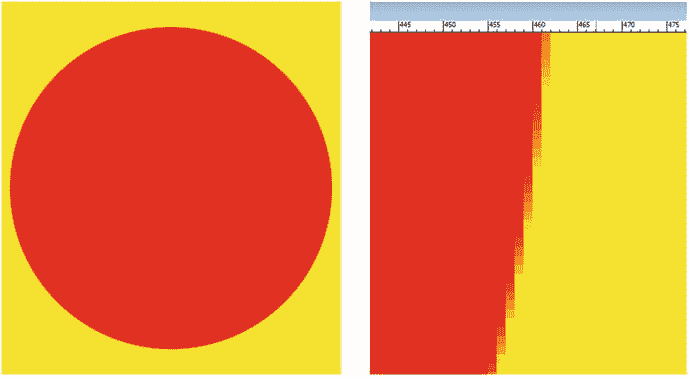
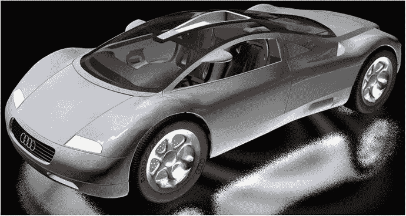
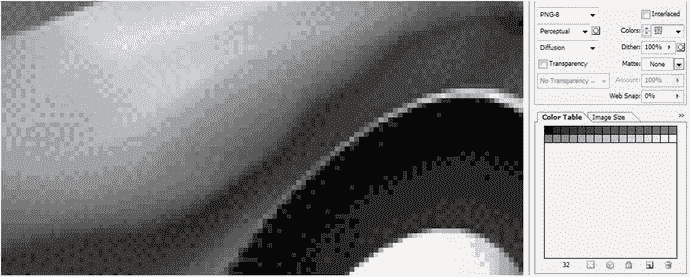
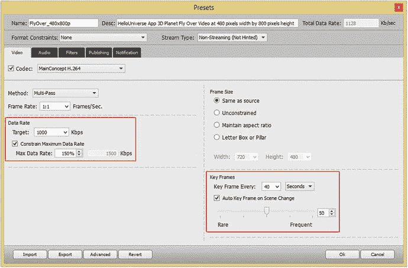
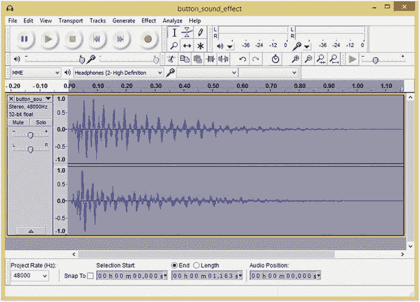

# 2. 内容创作入门：2D 新媒体资产基础

既然你已经通过上一章搭建了一个专业的 Java 游戏和物联网开发工作站，那么让我们直接开始学习大多数新媒体内容开发软件包所基于的基本 2D 内容开发概念和原理。Blender 是个例外，它基于更高级的 3D 内容开发，我们将在下一章中介绍。我们需要在进入 Java、NetBeans 和 JavaFX 之前先介绍这些基础多媒体材料，原因在于 JavaFX 多媒体引擎提供了令人难以置信的支持，包括使用可缩放矢量图形（SVG）进行数字插图、使用光栅（位图）图像格式（如 PNG、JPEG 或 GIF）进行数字成像、使用音频格式（如 MP3、MPEG4 AAC、WAV 或 AIFF（PCM））进行数字音频，以及使用 JavaFX 内部渲染引擎进行 3D 渲染。我假设你不会创建基于文本的游戏，而是创建交互式新媒体应用程序，因此我想先介绍一些与编码无关的主题。一旦我们开始使用 NetBeans、Java 和 JavaFX API 进行编码，我们就再也不会停止编码。

在本章中，你将详细了解 JavaFX 支持的每种 2D 新媒体内容类型背后的概念，包括数字插图（矢量）、数字成像（光栅）、数字视频（动态）和数字音频（波形）。我们这样做是为了让你具备基础知识，能够使用你在第 1 章中下载并安装的免费开源多媒体内容制作工具进行游戏设计。

我想首先介绍的是基础新媒体资产类型——数字图像，因为它将作为许多其他新媒体资产类型的基础输入资产。例如，你的数字视频只是一系列随时间快速播放以产生运动幻觉的数字图像。你的 2D 矢量插图资产可以使用 JavaFX 的 `ImagePattern` 类填充数字图像数据，而你的 3D 矢量资产可以使用数字图像资产作为着色器和纹理贴图，我们将在第 3 章中介绍这些内容，包括高级 3D 内容创建以及用于实现这些 3D 内容元素的相关 JavaFX 包和类。

接下来，我将介绍数字视频的概念、技术和“行话”，包括帧、帧率、比特率以及其他添加第四维度（时间）的概念，使静态数字图像资产变为动画数字视频资产。这些概念也与动画相关，包括 2D 动画和 3D 动画。我们将在第 3 章中介绍 2D 矢量和 3D 矢量概念，因为它们密切相关。

最后，我们将探讨数字音频概念；数字音频与数字视频密切相关，因为它可以包含在数字视频文件格式中。数字音频也可以独立存在，因此我们还将介绍 JavaFX 中的数字音频格式支持，以及数字音频资产数据占用优化工作流程。因此，本章将涵盖除 2D 矢量插图之外的所有 2D（X,Y 数据表示）新媒体形式，而 2D 矢量插图与 3D 矢量渲染密切相关，我们将在第 3 章的第一部分中介绍。

## 游戏设计资产：新媒体内容概念

要让你的游戏内容显得专业且在视觉上吸引客户，最强大的工具之一就是你已在第 1 章下载并安装的多媒体制作软件。在深入本书之前，我需要花些时间为你提供关于四种主要新媒体资产类型的基础知识，这些资产通过 JavaFX 多媒体引擎在 Java 中得到支持。它们包括：用于精灵、背景图像和 2D 动画的**数字图像**；用于 2D 插图、碰撞检测、2D 形状、路径和曲线的**矢量图形**；用于音效、旁白和背景音乐的**数字音频**；以及用于游戏中动画背景循环（如飞鸟掠过天空、云朵飘移等）和高度优化视频播放的**数字视频**。如图 2-1 所示，这四种 2D 类型或领域均通过 JavaFX 场景图集成到你的游戏中。还有一个我称之为交互式 3D（i3D）的新媒体领域。i3D 将在下一章关于 OpenGL ES 的内容中介绍，它为 Java 8 和 9 带来了实时 3D 渲染。

图 2-1.
如何使用 JavaFX 9、Java 9 和 NetBeans 9 在场景图中实现 2D 或音频新媒体资产

由于在 Java 游戏设计（或编程）流程中创建或正确实现这些新媒体元素之前，你需要具备技术基础，因此我将逐一介绍这四种新媒体领域的核心概念。其中，2D 动画和数字视频在概念上相互关联，因为它们都涉及第四维度——时间，并使用帧，因此我将一并讲解。数字音频也涉及第四维度——时间，所以我将以数字音频概念收尾；最后，我们将快速了解数字内容优化，以便你的专业 Java 游戏和物联网项目体积紧凑、下载迅速。

## 数字成像概念：分辨率、色彩深度、Alpha 通道、图层

JavaFX 支持最流行的数字图像文件（数据）格式，这为游戏设计师提供了极大的灵活性。由于 JavaFX 8 API 现已集成到 Java 8 和 9 中，这意味着 Java 也支持这些图像格式。其中一些数字图像格式已存在数十年，例如 CompuServe 图形交换格式（GIF）或广泛使用的联合图像专家组（JPEG）格式。而 JavaFX 支持的一些数字图像格式则更为现代；例如，便携式网络图形（PNG，读作“ping”）格式将是我们游戏开发中使用的文件格式，因为它能提供最高质量水平，并支持图像合成——我们很快将学习这一概念。Java 支持的所有主流数字图像文件格式同样受 HTML5 浏览器支持，由于 Java 应用可嵌入 HTML 应用或网站中，这确实是一种非常合理的协同效应！如果你需要更广泛的数字图像文件格式支持，还可以使用名为 ImageJ 的第三方数字图像库。

最古老的格式是一种无损数字图像文件格式，称为 CompuServe GIF。之所以称其为无损，是因为它不会丢弃（丢失）任何源图像数据来实现压缩效果。GIF 压缩算法不如 PNG 格式精细（强大），且 GIF 仅支持索引颜色，这正是其实现压缩（更小文件大小）的方式。我们将在本节稍后详细学习色彩深度（索引颜色与真彩色）。如果你的所有游戏图像资产已使用 GIF 格式创建，你可以在 Java 游戏中毫无问题地使用它们，尽管其图像压缩效率较低且图像合成能力有限。

Java 通过 JavaFX 支持的最流行的数字图像格式是 JPEG。JPEG 使用“真彩色”色彩深度，而非索引色彩深度。我们稍后将介绍色彩理论和色彩深度。JPEG 采用所谓的有损数字图像压缩。这是因为其压缩算法会“丢弃”图像数据，以实现更小的文件大小。这些图像数据将永久丢失，除非你明智地保存了原始未压缩图像！

如果你在压缩后放大 JPEG 图像，会看到变色或脏污区域，这些区域在原始图像中显然不存在。图像中退化的区域在数字成像行业被称为压缩伪影。这种情况仅出现在有损图像压缩中，在 JPEG（和 MPEG）压缩中很常见。

我推荐你在专业 Java 游戏中使用的数字成像格式是便携式网络图形文件格式。PNG 有两种真彩色文件版本：一种称为 PNG24，不能用于图像合成；另一种称为 PNG32，带有用于定义透明度的 Alpha 通道，我们稍后将介绍。此外，还有一种索引颜色（最多 256 色，可更少）版本的 PNG 格式，称为 PNG8。

我推荐在游戏中使用 PNG 的原因在于，它拥有不错的图像压缩算法，并且是一种无损图像格式。这意味着 PNG 兼具出色的图像质量和合理的数据压缩效率，这将使你的游戏分发文件更小。PNG32 格式的真正强大之处在于，它能够通过透明度与抗锯齿（借助其 Alpha 通道）与其他游戏图像进行合成。

### 数字图像分辨率与宽高比：定义图像的尺寸与形状

你可能知道，数字图像由二维像素阵列构成。像素是图像元素（Picture Elements）的缩写。图像中的像素数量通过其分辨率来表示，即图像宽度（W，有时称为 X 轴）和高度（H，有时称为 Y 轴）维度上的像素数。图像像素越多，分辨率就越高。这与数码相机的工作原理类似：图像采集设备（通常是相机中用于捕获图像数据的电荷耦合器件 CCD）的百万像素数越高，所能实现的图像质量就越高。

要计算图像的总像素数，只需将宽度像素乘以高度像素。例如，一张宽 VGA 800x480 的图像将包含 384,000 个像素，恰好是 1MB 的 3/8。通过这种方式，你可以确定图像的大小，既包括占用的千字节（或兆字节）数，也包括在显示屏上的高度和宽度。

数字图像资产的形状通过图像宽高比来指定。宽高比是数字图像的宽度:高度比，它定义了正方形（1:1 宽高比）或矩形（也称为宽屏）的数字图像形状。采用 2:1（宽屏）宽高比的显示器（例如 2160x1080 分辨率）已广泛普及。

1:1 宽高比的显示器或图像始终是完美的正方形，2:2 或 3:3 宽高比的图像也是如此。例如，物联网开发者可能会在智能手表上看到这种宽高比。需要注意的是，定义图像或显示屏形状的是宽度和高度这两个数字（即 X 和 Y 变量）之间的比例关系，而非数字本身。实际数字定义的是屏幕的分辨率，即总像素阵列能力。

宽高比应始终表示为宽高比冒号两侧所能得到（约简）的最小一对数字。如果你在高中学习最小公分母时足够用心，那么计算宽高比对你来说将非常容易。我通常通过不断将冒号两侧的数字除以 2 来计算宽高比。例如，以 SXGA 1280x1024 分辨率为例，1280x1024 的一半是 640x512，640x512 的一半是 320x256。320x256 的一半是 160x128，再一半是 80x64，再一半是 40x32，再一半是 20x16。20x16 的一半是 10x8，再一半就得到了 SXGA 的 5:4 宽高比。

### 数字图像色彩理论与色深：定义精确的图像像素颜色

每个数字图像像素的颜色值可以由三种不同颜色（红色、绿色或蓝色，即 RGB）的量来定义，这三种颜色在每个像素中以不同比例存在。消费电子显示屏利用加色法，即每个 RGB 颜色通道的光波长相加，从而创造出 1680 万种不同的颜色值。加色法应用于 LCD、LED 或 OLED 显示器。它与印刷中使用的减色法相反。为了展示不同结果，在减色法模型下，将红色与绿色（油墨）混合会产生紫色；而在加色法模型下，将红色与绿色（光）混合则会形成鲜艳的黄色。加色法能提供比减色法更广泛的色谱。

每个像素所持有的红色、绿色和蓝色颜色值各有 256 级亮度。这允许你设置 8 位数据值范围，即 0 到 255，用于控制每个红、绿、蓝值的颜色亮度变化。这些数据使用十六进制表示法，从最小值 0（#00，表示关闭、全暗或黑色）到最大值 255（#FF，表示完全开启、最大 RGB 颜色贡献，形成白色）。

用于表示数字图像所支持像素颜色数量的位数称为图像的色深，它使用“2 的幂”来计算，就像 3D 纹理映射一样（我们将在下一章讨论）。因此，PNG8 图像使用 256 种颜色，PNG7 使用其一半（128 种），PNG6 使用其一半（64 种），PNG5 使用其一半（32 种），PNG4 则使用 16 种，PNG3 使用 8 种，PNG2 使用 4 种，PNG1 使用 2 种，即黑色和白色（开或关）。通常，你会希望使用完整的 256 种颜色，因为 JavaFX 仅支持 PNG8、PNG4 或 PNG1，所以如果你打算使用索引颜色图像，请使用 PNG8。

数字成像行业中常用的色深包括 8 位、16 位、24 位和 32 位。我将在此概述常见的几种及其格式。最低的色深存在于 8 位索引颜色图像中。这类图像最多包含 256 种颜色值，并使用 GIF 和 PNG8 图像格式来存储这种索引颜色类型的数据。

中等色深图像采用 16 位色深，因此包含 65,536 种颜色（计算方式为 256 乘以 256），并得到 TARGA（TGA）和标记图像文件格式（TIFF）数字图像格式的支持。如果你想在 Java 8 游戏中使用除 GIF、JPEG 和 PNG 之外的数字图像格式，请导入 ImageJ 库。

真彩色色深图像采用 24 位色深，因此包含超过 1600 万种颜色。计算方式为 256 乘以 256 再乘以 256，等于 16,777,216 种颜色。支持 24 位色深的文件格式包括 JPEG（或 JPG）、PNG、BMP、XCF、PSD、TGA、TIFF 和 WebP。JavaFX 支持其中三种：JPEG、PNG24（24 位）和 PNG32（32 位）。使用 24 位或 32 位的真彩色色深图像将为你提供最高级别的质量。这就是我一直建议你在 Java 9 游戏和物联网项目中使用 PNG24 或 PNG32 格式的原因。

接下来，让我们看看如何通过使用 PNG32 图像的 Alpha 通道来表示图像透明度。

### 数字图像合成：使用 Alpha 通道与图层透明度

接下来，让我们看看如何利用 Alpha 通道定义数字图像像素的透明度值，以及如何将这些值用于 Java 游戏中的实时数字图像合成。合成是指将多个数字图像图层无缝融合在一起的过程。可以想象，这对于游戏设计与开发而言是一个极其重要的概念。当你希望在显示器上创建一幅看似单一图像（或动画），但实际上是由多个合成图像图层无缝集合而成的画面时，合成技术就非常有用。设置图像或动画合成的主要原因之一，是通过将每个元素放在不同图层上，从而能够以编程方式控制这些图像中的各个元素。

要实现这一点，你需要一个 Alpha 通道透明度值，利用它可以精确控制该像素与其下方其他图层中相同 X、Y 图像位置像素的混合程度。在数字图像软件中，每个图像图层的透明度值通过棋盘格图案来表示，如图 2-2 右侧所示。

图 2-2.

展示图像中透明像素的棋盘格表示，以及 RGBA 通道

在 GIMP 的左侧，你可以看到我以蓝色选中的 Alpha 图层。它包含了 MindTaffy 标志的透明度值。GIMP 的通道面板（我选中的标签页，用于向你展示这些颜色和 Alpha 通道：红、绿、蓝、Alpha）为每个图层分别保存了这些颜色（和 Alpha）通道，让你能够对每个图像合成图层中的每个像素实现令人难以置信的控制级别。

与其他 RGB 通道类似，Alpha 通道也有 256 个级别，但这些值代表的是透明度级别，而非红色、绿色或蓝色。在 Java 编程中，Alpha 通道由十六进制表示法中的前两个位置表示，格式为 `#AARRGGBB` 数据值。我们将在下一节详细讨论这一点。Alpha 加颜色通道的 ARGB 数据值使用八个数据位（32 位），而不是 24 位图像中使用的六个数据位（`#RRGGBB`），后者可被视为 Alpha 通道数据为零（无）的 32 位图像。

因此，24 位（PNG24）图像没有 Alpha 通道，除非它作为合成图层堆栈中的背景（底层）图像板，否则不会用于合成。另一方面，PNG32 图像将用作 PNG24（背景板）图像之上的合成图层，或者位于更低 Z 轴顺序的 PNG32 合成图层之上，这些图层需要利用其 Alpha 通道能力，通过 Alpha 通道透明度值，在图像合成中需要一定透明度（或不透明度）的特定像素位置显示出来。

数字图像 Alpha 通道以及图像合成的概念，是如何融入 Java 游戏设计的呢？你一定很好奇！其主要优势在于，能够将游戏画面及其包含的精灵、弹丸和背景图形元素分解为多个组件图层。这样做的目的是能够将 Java 编程逻辑（或 JavaFX、SVG 特效）应用于各个图形图像元素，以控制游戏画面的各个部分。如果没有 2D 合成方法，你将无法单独控制游戏组件，因为逐像素处理对大多数设备来说计算量过大。

图像合成的另一个部分称为混合模式，它在专业图像合成能力中也起着重要作用。JavaFX 混合模式通过使用 `Blend` 类以及 `javafx.scene.effect` 子包中的 `BlendMode` 常量值来应用，我们将在本书后面介绍。这个 JavaFX 混合效果类为 Java 游戏开发者提供了许多与 Photoshop 或 GIMP 为数字图像工匠提供的相同的图像合成模式。这使 Java 和 JavaFX 成为一个强大的图像合成引擎，就像 GIMP 一样，并且混合算法可以通过自定义 Java 代码在非常灵活的级别上进行控制。一些 JavaFX 混合模式常量包括 `ADD`、`SCREEN`、`OVERLAY`、`DARKEN`、`LIGHTEN`、`MULTIPLY`、`DIFFERENCE`、`EXCLUSION`、`SRC_ATOP`、`SRC_OVER`、`SOFT_LIGHT`、`HARD_LIGHT`、`COLOR_BURN` 和 `COLOR_DODGE`。

### 在 Java 游戏逻辑中表示颜色与透明度：使用十六进制表示法

既然你已经了解了颜色深度和 Alpha 通道的概念，并且知道在任何数字图像中，颜色和透明度是通过 Alpha、红、绿、蓝（ARGB）四个图像通道的组合来表示的，那么现在重要的是要理解，作为程序员，我们如何在 Java 和 JavaFX 中表示这四个 ARGB 图像颜色与透明度通道的值。

在 Java 编程语言中，颜色和透明度不仅用于二维数字图像（通常称为位图图像），也用于二维插图（通常称为矢量图像）。颜色和透明度值也常用于多种不同的颜色设置选项。例如，你可以为 JavaFX 的 Stage、Scene、布局容器（如 StackPane）、矢量形状填充、UI 控件以及其他元素（如 3D 资产特性）设置背景颜色（或透明度值）。我们将在后续章节中介绍 3D 和 JavaFX。

在 Java 和 JavaFX API 中，不同级别的 ARGB 颜色强度值使用十六进制表示法来表示。十六进制，简称“hex”，基于最初的 Base16 计算机表示法。这种表示法很久以前用于表示 16 位数据值。与更常见的 Base10（从 0 计数到 9）不同，Base16 表示法从 0 计数到 F，其中 F 代表 Base10 中的值 15（0 到 15 共产生 16 个数据值）。

Java 中的十六进制值总是以零和 x 开头，因此白色的 24 位颜色值看起来像这样：`0xFFFFFF`。这个十六进制颜色值代表 Java 的 `Color.WHITE` 常量，并且不使用 Alpha 通道。白色的 32 位颜色值看起来像 `0xFFFFFFFF`，其中 Alpha 通道数据为完全不透明。带有透明 Alpha 通道的白色（实际上不可能是白色，而应该是“透明色”）在 Java 代码中使用十六进制编码为 `0x00FFFFFF`。我通常使用 `0x00000000` 在 Java 代码中表示透明（透明）的 Alpha+颜色值。

在 24 位十六进制表示法中，每个位置代表一个 Base16 值，因此要获得每个 RGB 颜色所需的 256 个值，需要占用两个位置，因为 16 乘以 16 等于 256。因此，要使用十六进制表示法表示 24 位图像，我们需要在 `0x` 之后有六个位置来容纳这六个十六进制数据值（每个数据对代表 256 个级别的值）。如果你计算 16x16x16x16x16x16，你应该会得到 16,777,216 种颜色，这些颜色可以通过 24 位（也称为真彩色数字图像数据）来寻址。

十六进制数据位置以以下格式表示 RGB 值：`0xRRGGBB`。对于 Java 常量 `Color.WHITE`，十六进制颜色数据值表示中的红色、绿色和蓝色通道都处于完全（最大颜色值）亮度设置。如果你将这些颜色相加混合，你将得到白光。

黄色将由红色和绿色通道开启、蓝色通道关闭来表示，因此 `Color.YELLOW` 的十六进制表示将是 `0xFFFF00`，其中红色和绿色通道位置完全开启（`FF`，即 Base10 数据值 255），而蓝色通道位置完全关闭（`00`，即零值）。

ARGB 值的八个十六进制数据位置将以以下格式保存数据：`0xAARRGGBB`。因此，对于 `Color.WHITE`，十六进制颜色数据值表示中的所有 Alpha、红色、绿色和蓝色通道都将处于其最大亮度（或不透明度），并且 Alpha 通道完全不透明，即不透明，由 `FF` 值表示。因此，`Color.WHITE` 常量的 32 位十六进制值将是 `0xFFFFFFFF`。

100% 透明的 Alpha 通道可以通过将 Alpha 位置设置为零来表示，从而创建“透明”图像。因此，你可以使用 `0x00000000` 到 `0x00FFFFFF` 之间的任何数据值来表示透明图像像素值。需要注意的是，如果 Alpha 通道值等于这种完全透明级别，那么其他六个（RGB）十六进制数据值位置中包含的 16,777,216 种颜色值将完全无关紧要，因为该像素将被视为不存在，由于它是透明的，因此不会在最终图像或动画合成图像中合成，所以它的颜色是无关紧要的（完全没有影响）。

### 数字图像对象遮罩：使用 Alpha 通道合成游戏精灵

在游戏设计中，Alpha 通道的主要应用之一是遮罩图像或动画（图像序列）的某些区域，以便在游戏图像合成场景中将其用作游戏精灵。遮罩是从数字图像中“裁剪”出主题对象的过程，以便可以使用 Alpha 通道透明度值将其放置在自己的图层上。这是使用数字成像软件包完成的，如图 2-2 所示。

像 Photoshop 或 GIMP 这样的数字图像合成软件包都包含用于遮罩和图像合成的工具。没有有效的遮罩，就无法进行有效的图像合成，因此对于希望将图形元素（如图像精灵和精灵动画）集成到游戏设计中的游戏设计师来说，这是一个需要掌握的重要领域。数字图像遮罩艺术已经存在了很长时间！

遮罩可以自动为你完成，使用专业的蓝屏（或绿屏）背景以及能够自动提取这些精确颜色值以创建遮罩的计算机软件。这个遮罩被转换为 Alpha 通道（透明度）信息（数据）。遮罩也可以手动完成，通过使用数字图像软件，结合各种锐化和模糊算法，使用其中一种算法选择工具。

在本书的课程中，我们将使用常见的开源软件包（如 GIMP）来学习这个工作流程的很多内容。遮罩可能是一个复杂且涉及面广的工作流程，完全掌握这个过程可能需要跨越几个章节，而不是试图将其全部塞进本书的一个章节（本章）。本章旨在让你了解我们在本书中将要进行的工作流程的基础知识。

遮罩过程的一个关键考虑因素是围绕遮罩对象（主题）获得平滑、锐利的边缘。这样，当你将一个遮罩对象（在本书中，它将是一个游戏精灵）放置到（覆盖在）新的背景图像上时，对于游戏玩家来说，它看起来就像最初是在那里拍摄的一样（就像在视频中一样）。

成功做到这一点的关键在于像素选择工作流程，这涉及使用数字图像软件选择工具，例如 GIMP 中的剪刀工具或 Photoshop 中的魔棒工具。这些工具必须以正确的方式（顺序）使用才能完全有效。使用正确的选择工作流程至关重要！

例如，如果你想要遮罩的对象周围有颜色均匀的区域（也许你是在蓝屏前拍摄的），你将使用魔棒工具并设置适当的阈值来选择除对象之外的所有内容。然后反转选区，这将为你提供一个包含该对象的选区集。通常，正确的工作流程涉及逆向思考。其他选择工具包含复杂的算法，可以查看像素之间的颜色变化。这些对于边缘检测很有用，我们可以将其用于其他选择方法。

### 平滑数字图像合成：使用抗锯齿技术平滑图像边缘

抗锯齿是一种流行的数字图像合成技术，它将数字图像中位于两个不同颜色区域边界上的相邻颜色沿该边界混合在一起。当图像缩小时，这会使边缘看起来更平滑（锯齿更少）。其作用是“欺骗”观看者的眼睛，使其看到更平滑的边缘，并消除所谓的图像锯齿。抗锯齿通过仅使用需要平滑的边缘上的几个彩色像素的平均颜色值，就能产生令人印象深刻的效果。所谓平均颜色值，是指介于图像锯齿边缘上两种颜色之间的某个颜色范围。这只需要大约六种中间色。我创建了一个示例来说明这一点；请参见图 2-3。

图 2-3.

一个红色圆形合成在黄色背景上（左图）及其放大视图（右图），展示了抗锯齿效果

如您所见，我在一个图层上创建了一个看似边缘锐利的红色圆形，并在背景图层上覆盖了黄色填充色。我放大了红色圆形形状的边缘，截取了另一张截图，并将其放置在缩小后的圆形右侧。这揭示了从黄橙色到橙色再到红橙色的抗锯齿颜色值范围，正好位于红色和黄色相互邻接的边缘上，即圆形与背景相交的边界处。

需要注意的是，JavaFX 引擎将使用 Java2D 软件渲染器或硬件渲染的 i3D（使用 Prism 引擎，该引擎可调用 OpenGL 或 DirectX），根据背景颜色和背景图像对 2D 形状和 3D 对象进行抗锯齿处理。您仍需负责正确合成，即通过有效使用我们在本章前面学过的 Alpha 通道，为您的多层图像提供抗锯齿效果。

### 数字图像数据优化：使用压缩、索引颜色和抖动

许多因素会影响数字图像压缩，您可以使用一些基本技术，以更小的数据占用空间获得更高质量的结果。这是优化数字图像的主要目标：为您的应用程序（在此例中为游戏）获得尽可能小的数据占用空间，同时实现最高质量的视觉效果。我们将从对数据占用空间影响最大的方面开始，并研究每个方面如何有助于任何给定数字图像的数据占用空间优化。有趣的是，这些方面与我们迄今为止在本图像处理部分所涵盖的数字图像概念的顺序相似。

对最终数字图像资产文件大小（我称之为数据占用空间）影响最大的因素是像素数量，即数字图像的分辨率。这合乎逻辑，因为每个像素都需要与其三个（24 位）或四个（32 位）通道中包含的颜色和 Alpha 值一起存储。在保持图像清晰的前提下，您能获得的分辨率越小，最终的文件大小就越小。

原始（或未压缩）图像大小的计算方式为：对于 24 位 RGB 图像，宽度乘以高度乘以 3；对于 32 位 ARGB 图像，则为宽度乘以高度乘以 4。例如，一幅未压缩的真彩色 24 位 VGA 图像，其原始（原始）未压缩数字图像数据为 640 乘以 480 乘以 3，等于 921,600 字节。要确定这幅原始 VGA 图像有多少千字节，您需要将 921,600 除以 1024（一千字节中的字节数），这将得出真彩色 VGA 图像的数据量正好为 900 KB。

通过优化数字图像分辨率来优化原始（未压缩）图像大小非常重要。这是因为一旦图像从游戏应用程序文件中解压缩到系统内存中，它就会占用这么多内存，因为图像在内存中将使用 24 位（RGB）或 32 位（ARGB）表示法逐像素存储。这也是我在游戏开发中使用 PNG24 和 PNG32 而非索引颜色（GIF 或 PNG8）的原因之一，因为如果操作系统要将颜色转换到 24 位颜色“空间”，那么我们应该出于质量原因利用该 24 位颜色空间，并处理（接受）稍大的应用程序文件大小。

图像颜色深度是影响压缩图像数据占用空间的次关键因素，因为图像中的像素数量会乘以一个（8 位）、两个（16 位）、三个（24 位）或四个（32 位）颜色数据通道。这种较小的文件大小是 8 位索引颜色图像（尤其是使用 GIF 图像格式）仍被广泛使用的原因。

如果构成图像的颜色变化不大，索引颜色图像可以模拟真彩色图像。索引颜色图像仅使用 8 位数据（256 种颜色）来定义图像像素颜色，使用一个包含最多 256 种优化选择颜色的所谓调色板，而不是包含 256 级颜色的 3 个 RGB 颜色通道或 4 个 ARGB 颜色通道。再次强调，需要注意的是，在您通过压缩将 24 位图像转换为 8 位图像后，一旦它在系统内存中解压缩并转换回游戏使用的 24 位 RGB 或 ARGB 数据模型（系统内存外使用的表示形式），您只能使用原始 1680 万种颜色中潜在的（最多）256 种颜色！这就是为什么我提倡使用 PNG24 或 PNG32 图像，而不是 JavaFX 也支持的 GIF 或 PNG1（1 色）、PNG2（4 色）、PNG4（16 色）和 PNG8（256 色）图像。

根据任意 24 位源图像中使用的颜色数量，用 256 种颜色来表示原本包含 16,777,216 种颜色的图像，可能会产生一种称为“条带效应”的现象。这指的是在压缩后生成的 256 色（或更少）调色板中，相邻颜色之间的过渡不够渐变，因此无法呈现平滑的色彩渐变效果。索引颜色图像有一个选项可以通过视觉校正来改善条带效应，这个选项称为“抖动”。

抖动是一种算法过程，通过在图像中任何相邻颜色之间的边缘创建点状图案，来欺骗人眼，使其认为使用了第三种颜色。抖动最多能让你感知到 65,536 种颜色（256x256），但这仅在 256 种颜色中的每一种都与另外 256 种不同颜色中的一种相邻时才会发生（或才有必要）。尽管如此，你仍能看到创造额外颜色的潜力，并且你会惊讶于索引颜色格式在某些压缩场景下（针对特定图像）所能达到的效果。

让我们拿一张真彩色图像（例如图 2-4 中所示的图像）为例，将其保存为 PNG5 索引颜色图像格式，来向你展示这种抖动效果。需要注意的是，尽管 PNG5 在 Android 和 HTML5 中受支持，但在 JavaFX 中并不受支持，所以如果你自己动手做这个练习，请选择 PNG1（2 色）、PNG2（4 色）、PNG4（16 色）或完整的 PNG8（256 色）颜色选项！

图 2-4.

这是一张使用 Autodesk 3ds Max 创建的 PNG24 真彩色图像，我们将把它压缩为 PNG5

我们将观察奥迪 3D 图像中驾驶员侧后翼子板上的抖动效果，因为它包含一个灰色渐变区域，我们将对此应用抖动效果。你可以在图 2-4 中看到 24 位源数字图像。

有趣的是，允许使用少于 8 位索引颜色图像所能使用的最大 256 种颜色。这样做通常是为了进一步减小图像的数据占用空间。例如，一张仅使用 32 种颜色就能获得良好效果的图像，实际上是一张 5 位图像，技术上应称为 PNG5，尽管该格式本身在索引颜色使用层面通常被称为 PNG8。请记住，JavaFX 仅支持 PNG4（16 色）或 PNG8（256 色），因此对于 Java 游戏中的这张图像，你将使用 PNG8，即 256 色。

我将使用 Photoshop 将图 2-5 中所示的这张索引颜色 PNG5 图像设置为使用 5 位颜色（32 色），以便你能清晰地看到这种抖动效果。正如你所见，在图 5-4 左侧的 Photoshop 图像预览区域中，抖动算法在相邻颜色之间创建了点状图案，以生成额外的颜色。

图 2-5.

将抖动设置为扩散算法，32 种颜色（5 位颜色），并以 100%的抖动强度进行 PNG5 输出

另外，请注意你可以设置抖动的百分比。我通常选择 0%或 100%的设置；不过，你也可以在这两个极端值之间微调抖动效果，以精细调整最终的文件大小，因为这些抖动点状图案会引入更多需要压缩的数据，从而增加文件大小。

你还可以在不同的抖动算法之间进行选择，因为正如你可能已经推测到的，这些不同的抖动效果是通过数学方式，使用与索引文件格式压缩（该压缩使用调色板来存储像素所用的颜色值）最终兼容的抖动算法来生成的。

我使用扩散抖动，它能沿着不规则形状的渐变区域产生平滑效果，就像在汽车翼子板上看到的那样。你也可以使用噪声选项，它更随机化；或者图案选项，它不那么随机化。扩散选项通常能给出最佳效果，这就是我在使用索引颜色时（虽然不常用）选择它的原因。

正如你可能想象的那样，抖动会向图像中添加数据图案。这些图案更难压缩。这是因为图像中的平滑区域（如渐变或填充区域）通常更容易被这些压缩算法压缩，而锐利过渡（抗锯齿边缘）或通常由抖动产生的随机像素图案（或者可能由 CCD 质量不佳的相机产生的“噪声”）则更难压缩。

因此，应用抖动选项总是会使数据占用空间增加几个百分点。请务必检查应用抖动和不应用抖动（在导出对话框中选择）时的最终文件大小，以判断这是否值得其带来的视觉改善效果。请注意，索引颜色 PNG 图像还有一个透明度选项复选框，但 PNG8 图像中使用的 Alpha 通道只有 1 位（开/关），不像 PNG32 那样是 8 位。

到目前为止，我们学到的最后一个可能增加图像数据占用空间的概念是添加 Alpha 通道来定义透明度，以便进行合成。这是因为添加 Alpha 通道会向被压缩的图像中增加另一个 8 位颜色通道（更准确地说，是透明度或 Alpha 通道）。如果你需要 Alpha 通道来定义图像的透明度（很可能是为了支持未来的合成需求，例如将图像用作游戏精灵），那么在这方面没有太多选择，所以请包含 Alpha 通道。

如果你的 Alpha 通道包含全零值（即使用全黑填充色，这将定义你的图像为完全透明），或者如果你的 Alpha 通道包含全 FF 值（或使用全白填充色，定义你的图像为完全不透明或背景底板），那么你实际上（在实际使用中）定义的是一个不包含任何有用 Alpha 数据值的 Alpha 通道。因此，未使用的 Alpha 通道需要被移除，而不透明的图像则需要定义为 PNG24 而非 PNG32，以节省数据占用空间。

最后，大多数用于遮罩数字图像 RGB 图层中对象的 Alpha 通道应该能压缩得很好。这是因为它们大部分是白色（不透明）和黑色（透明）区域，在两种颜色之间的边缘处有一些中等灰度值，用于对遮罩进行抗锯齿处理（见图 2-2）。Alpha 通道中包含抗锯齿透明度值的这些灰色区域，将始终为你提供图像 RGB 图层中的对象与可能在其后面的任何背景颜色或背景图像之间视觉上平滑的边缘过渡。本质上，Alpha 通道中的抗锯齿功能为你提供了该 Alpha 通道所服务对象的实时合成能力，因为你可以在其后面的背景底板中放置视频，而 Alpha 抗锯齿功能将实时保证在视频的每一帧上，通过不同的边缘颜色混合实现平滑的边缘效果。

原因在于，你的 Alpha 通道图像蒙版使用的是 8 位透明度渐变，范围从白色到黑色，定义的是透明度级别而非颜色，因此应将其视为逐像素混合或透明度强度值。因此，Alpha 通道中包含的蒙版中每个对象边缘的中等灰度值，将用于对对象边缘与任何目标背景的颜色进行平均，无论背景板可能包含何种颜色值、图像资源、插画资源、动画资源或视频资源。

这能为任何可能使用的目标背景提供实时抗锯齿效果，即使你的对象是静态对象也是如此，因为 Alpha 通道提供的抗锯齿功能甚至能在动态背景中生效。

## 数字视频或动画：帧、帧率、循环、方向

值得注意的是，我们刚刚讨论的所有关于数字图像的概念同样适用于数字视频和 2D 动画，因为这两种第四维度（基于时间）的新媒体格式都以数字图像作为其内容的基础。数字视频以及 2D 动画通过引入一种称为“帧”的概念，将数字图像扩展到了时间的第四维度。数字视频和动画由一系列有序的帧组成，这些帧随时间快速显示，从而创造出运动的错觉，使图像栩栩如生。

“帧”一词源于电影行业，即使在今天，电影帧仍以每秒 24 帧（通常缩写为 24 FPS）的帧率通过电影放映机播放，从而产生运动错觉。由于数字视频和动画都由包含数字图像的帧集合组成，因此帧率（以每秒帧数表示）这一概念在内存数据占用优化工作流程（针对动画资源）和数字视频文件大小数据占用优化工作流程中都至关重要。在 JavaFX 中，你很快就会学到，动画的这一属性存储在 `Animation` 对象的 `rate` 变量中。

关于 `Animation` 对象或数字视频资源中帧的优化概念，与图像中像素（数字图像的分辨率）的优化概念非常相似：使用得越少越好！这是因为动画或视频中使用的每一帧都会成倍增加系统内存使用量和文件大小数据占用。在数字视频中，不仅每帧（图像）的分辨率会极大地影响文件大小，压缩设置对话框中指定的每秒帧数（即帧率）也同样重要。在本章前面，我们了解到，如果将图像中的像素数乘以其颜色通道数，就能得到图像的原始数据占用。对于动画或数字视频，我们现在需要将这个数字再乘以为了创造运动错觉所需使用的总帧数。

因此，如果我们为游戏设置一个动画 VGA（RGB）背景板（请记住每帧为 900KB），该背景板使用五帧来创造运动错觉，那么我们将使用 900KB 乘以 5，即 4500KB（或 4.5MB）的系统内存来容纳该动画。当然，这对于背景来说内存占用过高，这就是为什么在本书中我们将使用带有精灵叠加层的静态背景，以不到 1MB 的内存实现相同的最终效果。数字视频的计算略有不同；对于数字视频，你会有成百上千帧。对于数字视频，你需要将原始图像数据大小乘以每秒帧数（帧率），即数字视频设定的播放帧率（该帧率值在压缩过程中指定），然后将该结果乘以视频文件中包含的内容总时长（秒数）。

继续使用之前的 VGA 示例，你现在知道一个 24 位 VGA 图像是 900KB。这使得下一步的计算变得非常简单。传统数字视频以 30 FPS 运行，因此在屏幕播放之前，系统内存中一秒钟的标准清晰度（SD 或 VGA）原始（未压缩）数字视频将是 30 个图像帧，每帧 900KB，产生总内存数据占用为 27000KB，约 27MB！

你可以理解为什么像 MPEG-4 H.264 AVC 这样的数字视频压缩文件格式如此重要，因为它能显著压缩数字视频可能产生的巨大原始数据占用。

JavaFX 多媒体包使用了最令人印象深刻的视频压缩编解码器之一（codec 代表 COde-DECode），该编解码器也受 HTML5 和 Android 支持：即前面提到的 MPEG-4 H.264 高级视频编解码器（AVC）。这种跨越当今三大“开放平台”（Java、HTML5 和 Android）的“跨开放平台支持”对于开发者资源优化来说极为便利，因为单个数字视频资源可以跨 Java、JavaFX、HTML5 和 Android 应用程序使用。JavaFX 引擎中还包含一个名为 VP6 的“原生”数字视频编解码器，以防 H.264 未安装。接下来，为了全面起见，我将在深入讲解数字音频之前，介绍数字视频资源压缩和数据占用优化的基础知识。然后，在下一章中，我们将深入探讨 3D 的复杂性，以便你对游戏中的新媒体元素有一个完整的基础理解。

### 数字视频压缩概念：比特率、数据流、标清、高清和超高清

首先，我们来介绍商业视频中使用的主要或标准分辨率。这些分辨率也恰好是常见消费电子设备的屏幕分辨率，原因可能是：如果显示屏的像素分辨率与屏幕上“全屏”播放的视频像素分辨率匹配，就不会产生“缩放”，而缩放会导致伪影。在高清电视（HDTV）或高清晰度出现之前，视频被称为标清（SD），并使用 480 像素的标准垂直分辨率。VGA 是一种标清分辨率，而 720×480 可称为宽屏标清分辨率。高清（HD）视频有两种分辨率：1280×720（我称之为伪高清）和 1920×1080（业界称之为真高清）。这两种高清分辨率均采用 16:9 的宽高比，并用于电视和智能电视、智能手机、平板电脑、电子书阅读器和游戏机。现在还有一种超高清（UHD）分辨率，其像素为 4096×2160。IMAX 分辨率曾是 4096×4096，因此超高清在水平（x 轴）分辨率上达到了 IMAX 级别，这相当令人印象深刻，因为消费者现在只需 1000 美元就能在客厅里享受 IMAX 体验！

视频流是一个比分辨率更复杂的概念，因为它涉及在广阔范围内播放视频数据，例如在你的 Java 游戏应用程序与存储着海量数字视频资产的远程视频数据服务器之间。流式传输之所以复杂，是因为你的 Java 游戏应用程序所运行的设备将与远程数据服务器进行实时通信，在视频播放的同时接收视频数据包！这就是它被称为“流”的原因：视频从视频服务器通过互联网流式传输到硬件设备中。视频流由 MPEG-4 H.264 AVC 格式编解码器（编码器-解码器对）支持。

本节需要介绍的最后一个概念是比特率。比特率是视频压缩过程中使用的关键设置；比特率代表你的目标带宽或数据管道大小，该管道每秒能够容纳一定数量的比特流通过。你的比特率设置还应考虑任何支持 Java 的设备中的 CPU 处理能力，这使得数字视频的数据优化更具挑战性。幸运的是，如今大多数设备都配备了双核或四核 CPU！

原因在于，一旦这些比特通过数据管道传输，它们还需要被处理并显示到设备屏幕上。因此，数字视频资产的比特率不仅需要针对带宽进行优化，还需要考虑到 CPU 处理能力的差异。某些单核 CPU 可能无法解码高分辨率、高比特率的数字视频资产，从而导致丢帧。如果你的目标是较旧或较便宜的消费电子设备（例如第三世界国家使用的设备），请务必优化低比特率的视频资产。

### 数字视频数据占用优化：视频编解码器的重要设置

正如你在上一节所学到的，数字视频资产是使用称为编解码器的软件工具进行压缩的。视频编解码器有两个“方面”：一个用于编码视频数据流，另一个用于解码视频数据流。视频解码器将是你的操作系统、平台（JavaFX）或使用它的浏览器的一部分。解码器主要针对速度进行优化，因为播放的流畅性是一个关键问题；而编码器则针对减少其生成的数字视频资产的数据占用进行优化。因此，编码过程可能需要更长时间，并且取决于工作站包含多少个处理核心。大多数数字视频内容制作工作站应支持八个处理器核心，就像我的 64 位 AMD 八核工作站一样。

编解码器（编码器端）类似于插件，因为它们可以安装到不同的数字视频编辑软件包中，以便这些软件能够编码不同的数字视频资产文件格式。由于 Java 和 JavaFX 9 原生支持 ON2 VP6 格式，并且如果安装了 MPEG4，你也需要确保你使用的数字视频软件包支持使用这些数字视频文件格式之一来编码数字视频。

需要注意的是，不止一家软件制造商生产 MPEG4 编码软件，因此不同的 MPEG4 H.264 AVC 编解码器在编码速度和文件大小方面会产生不同（更好或更差）的结果。我更喜欢 MainConcept H.264 编解码器。一个专业的解决方案是 Sorenson Squeeze Pro，我强烈建议你获取它，如果你想专业地制作数字视频的话，它支持 ON2 VP6。

我将在图 2-6 中向你展示 Sorenson Squeeze Pro 的数字视频压缩设置（预设）对话框，然后在本书本节的剩余部分中，我们将讨论其中一些重要的设置。

图 2-6. Sorenson Squeeze Pro 数字视频压缩工具的数字视频压缩预设对话框

还有一个名为 EditShare LightWorks 14 的开源解决方案，它计划在 2018 年之前原生支持输出到开源编解码器。目前，在 EditShare LightWorks 14 于 2018 年某个时候添加对 JavaFX（以及 HTML5 和 Android）的编解码器支持之前，我不得不为本书使用 Squeeze Pro 11。在优化数字视频数据文件大小（设置压缩参数）时，有大量变量会直接影响数字视频数据占用。我将按照它们对视频文件大小的影响程度，从最大到最小依次介绍这些变量，以便你知道调整哪些参数来获得你想要的结果。

与数字图像压缩一样，视频每一帧的分辨率或像素数量是开始优化过程的最佳起点。如果你的用户使用的是 1024×640 或 1280×720 的智能手机、电子阅读器或平板电脑，那么你无需使用真高清（1920×1080）分辨率即可为你的数字视频资产获得良好的视觉效果。借助当今超精细密度（小点距）的显示屏，你可以将 1280 视频放大 33%，它看起来也会相当不错。但一个例外可能是针对智能电视的高清或超高清（俗称 4K 智能电视）游戏；对于这些巨大的 65 到 96 英寸屏幕场景，你需要使用业界标准的真高清 1920×1080 分辨率。

下一层级的优化将涉及每秒视频所使用的帧数（即 FPS），前提是数字视频本身的实际秒数无法缩短。这被称为帧率，与其采用图 2-6 左上角所示的视频标准 30 FPS 帧率（设置为 1:1，即每个源帧压缩为一帧），不如考虑使用电影标准帧率 24 FPS，甚至多媒体标准帧率 20 FPS。你甚至可能使用 15 FPS 的帧率，这相当于视频标准 30 FPS 的一半，对应图 2-6 中“帧率”字段的 1:2 设置，具体取决于内容中运动的幅度（和速度）。请注意，15 FPS 的数据量仅为 30 FPS 的一半（编码数据减少 100%）。对于某些视频内容，其播放效果（观感）可能与 30 FPS 内容相同。测试这一点的唯一方法是尝试不同的帧率设置，并在视频优化（编码）过程中观察结果。

获得更小数据量的下一个最优设置是为你所设定的编解码器尝试达到的比特率。这在图 2-6 左侧以红色圆圈标出。比特率等同于所应用的压缩量，因此决定了数字视频数据的质量水平。需要注意的是，你可以简单地使用 30 FPS、1920 分辨率的高清视频，并指定一个较低的比特率上限。但这样做出来的效果，远不如你首先尝试使用较低帧率和（或）较低分辨率进行压缩，同时配合使用较高（质量）比特率设置来得专业。这方面没有固定的经验法则，因为每个数字视频资产都包含 100%不同且独特的数据（从编解码器算法的角度来看）。

获得更小数据量的下一个最有效设置是关键帧的数量，编解码器利用关键帧对你的数字视频资产进行采样。该设置在图 2-6 右侧以红色圆圈标出。视频编解码器通过查看每一帧，然后对后续若干帧中的像素变化进行编码来应用压缩，这样编解码器算法就不必对视频数据流中的每一帧都进行编码。这就是为什么“说话人头”视频的编码效果优于每一帧每个像素都在移动的视频（例如带有摄像机平移的视频）。

关键帧是编解码器中的一种设置，它强制编解码器每隔一定时间对视频数据资产进行一次全新的采样。关键帧通常有自动设置，允许编解码器自行决定采样多少个关键帧；也有手动设置，允许你指定每隔一定时间进行一次关键帧采样，通常是每秒一定次数，或者在整个视频时长内（总帧数）的一定次数。

某些编解码器设置对话框具有质量或锐度设置（滑块），用于控制在压缩前应用于视频帧的模糊程度。如果你不知道这个技巧，那么对图像或视频施加轻微的模糊（通常是不希望的）可以实现更好的压缩，因为图像中锐利的过渡（锐利边缘）比柔和的过渡更难编码（再现它们需要更多数据）。话虽如此，我建议将质量（或锐度）滑块保持在 85%到 100%的质量水平之间，然后尝试通过我们这里讨论的其他变量（例如降低分辨率、帧率或比特率）来减小数据量。

最终，你需要微调多个变量，才能为任何给定的数字视频数据资产实现最佳的数据量优化。重要的是要记住，每个数字视频资产在数字视频编解码器看来（从数学角度）都是“不同”的。因此，无法制定出能够实现任何给定压缩结果的标准设置。话虽如此，随着时间的推移，通过经验来调整各种设置，你最终会更好地感知需要更改哪些设置才能获得期望的最终结果。

## 数字音频概念：振幅、频率、采样、波形

各位音响发烧友已经知道，声音是通过发送脉冲穿过空气的声波产生的。数字音频很复杂；其复杂性部分源于需要桥接由扬声器纸盆创造的“模拟”音频技术与数字音频编解码器。模拟扬声器通过脉冲产生声波。我们的耳朵则以完全相反的方式接收模拟音频，捕捉并接收这些空气脉冲或具有不同波长的振动，然后将它们转换回我们大脑可以处理的“数据”。这就是我们“听到”声波的方式；我们的大脑随后将不同的音频声波频率解释为不同的音符或音调。

声波根据其频率产生各种音调。宽或低频（长）波产生低音（低音调），而高频（短）波长产生高音（高音调）。有趣的是，不同频率的光会产生不同的颜色，因此模拟声音（音频）和模拟光（颜色）之间存在密切的关联。数字图像（和视频）与数字音频之间还有许多其他相似之处，这些相似之处将贯穿你的数字新媒体内容制作过程，你很快就会看到。

声波的音量由声波的振幅或该波的高度（或大小）决定。因此，声波的频率相当于波在 x 轴上的间距（如果从二维角度看），而振幅相当于波在 y 轴上测量的高度。

声波可以具有独特的形状，允许声波“搭载”各种音效。一种“纯”或基线类型的声波称为正弦波，你在高中三角学中学习过，使用了正弦、余弦和正切数学函数。熟悉音频合成的人都知道，声音设计中还使用了其他类型的声波，例如看起来像锯子边缘的锯齿波（因此得名），或者仅使用直角形成的脉冲波，从而产生即时的开/关声音，转化为合成数字音频的脉冲（或突发）。

即使是随机化的波形，例如噪声，也被用于声音设计以获得“前卫”的声音效果。正如你可能通过运用你最近获得的关于数据量优化的知识所推断的那样，声波（以及一般的新媒体数据）中存在的“混沌”或噪声越多，编解码器就越难压缩它们。因此，更复杂的声波将导致更大的数字音频文件大小，因为数据中存在混沌。

### 将模拟音频转换为数字音频数据：采样、精度与高清音频

将模拟音频（声波）转换为数字音频数据的过程称为**采样**。如果你在音乐行业工作，可能听说过一种被称为采样器的键盘（甚至机架式设备）。采样是将模拟音频波形切割成片段的过程，这样你就可以使用数字音频格式将波形的形状存储为数字音频数据。这会将无限精确的模拟声波转换为离散的数字数据，即零和一。使用的零和一越多，对无限精确（原始）模拟声波的还原就越精确。采样音频波形的每个数字片段被称为一个**样本**，因为它在该精确时间点对该声波进行了采样。样本精度决定了用于还原模拟声波所使用的零和一的数目，因此样本的精度由定义每个波形片段高度所使用的数据量决定。图 2-7 展示了我使用 Audacity 采样的一个按钮音效，使用了 32 位浮点样本精度和 48 kHz 采样率，我们将在下一部分介绍这些概念。

图 2-7.

在 Audacity 中使用 32 位浮点样本精度和 48kHz 采样率得到的按钮音效立体声样本

与数字成像一样，这种采样精度被称为**分辨率**，或者更准确地说（无意双关），**采样分辨率**。采样分辨率通常定义为 8 位、12 位、16 位、24 位或 32 位。Java 游戏大多利用 8 位分辨率来处理爆炸等对清晰度要求不高的效果，使用 12 位分辨率来处理清晰的人声对话和更重要的音效资源，并可能使用 CD 品质的 16 位分辨率来处理背景音乐或需要展现纯净音质的音频元素。

在数字成像和数字视频中，分辨率以像素数量来衡量；而在数字音频中，分辨率则以定义每个模拟音频样本所使用的数据位数来衡量。就像在数字成像中（更多像素带来更高质量）一样，更高的采样分辨率能带来更好的声音还原效果。因此，更高的采样分辨率使用更多数据来还原给定的声波样本，会带来更高的音频播放质量，但代价是更大的数据占用空间。这就是为什么通常被称为 CD 品质音频的 16 位音频听起来比 8 位音频更好的原因。根据具体音频内容，12 位可以是一个很好的折衷方案。

在数字音频领域，消费电子行业中出现了新型的 24 位音频样本，称为**高清音频**。高清数字音频广播电台使用 24 位采样分辨率。每个音频样本，或者说声波的一个切片，理论上可以包含多达 16,777,216 位的声波采样分辨率，尽管这些位很少被全部使用。

一些新的硬件设备现在支持高清音频，例如你看到的标榜“高清音质”的智能手机广告。这意味着它们拥有 24 位音频硬件。如今的 PC 和笔记本电脑，以及游戏机和 iTV 电视，也标配了 24 位音频播放硬件，因此支持高品质音频的基础已经具备。

需要注意的是，对于 Java 9 游戏来说，高清音频可能并非必需，除非你的游戏以音乐为导向并使用了高品质音乐，在这种情况下，你可以通过 WAVE 文件格式使用高清音频样本。

除了数字音频采样分辨率，我们还有数字音频采样频率。它指的是在**一秒**的采样时间范围内，以特定采样分辨率采集的样本数量。在数字图像编辑中，采样频率类似于数字图像中包含的颜色数量。采样频率也可以称为**采样率**。你可能熟悉“CD 品质音频”这个术语，它定义为使用 16 位采样分辨率和 44.1 kHz 采样率。这意味着每秒采集 44,100 个样本，每个样本包含 16 位采样分辨率，或者说这 44,100 个样本中的每一个都包含 65,536 位音频数据。你可以通过将采样比特率乘以采样频率再乘以音频片段的秒数来计算音频文件中的原始数据量。你会发现这可能是一个巨大的数字！音频编解码器非常擅长将采样的声波数据优化到令人惊讶的小数据占用空间，同时音质损失几乎听不出来。

因此，数字成像和数字视频中存在的权衡在数字音频中同样存在。我们包含的数据越多，获得的结果质量就越高！然而，这总是以更大的数据占用空间为代价。在视觉媒介中，数据占用空间的大小由颜色深度、像素以及（对于数字视频和动画而言）帧数来定义。在数字音频媒介中，则由采样分辨率和采样率共同定义。目前数字音频行业中最常见的采样率包括 8kHz、11.25 kHz、22.5kHz、32kHz、44.1kHz、48kHz、96kHz、192kHz，甚至 384kHz。

较低的采样率，例如 8kHz、22kHz 和 32kHz，将是我们游戏中使用的主要采样率，因为通过精心优化，它们可以产生高质量的音效和街机音乐。这些采样率也最适合对任何“基于语音”的数字音频进行采样，例如电影对白或电子书旁白音轨。较高的采样率能够实现影院级音质的音频还原，但对于大多数游戏来说并非必需。

### 数字音频资源播放：内嵌音频播放 vs. 流式音频

与数字视频数据一样，数字音频数据可以是**内嵌**的，即包含在应用程序的分发文件（在 Java 中，即 JAR 文件）中；或者，数字音频也可以使用远程数据服务器进行**流式**传输。与数字视频类似，流式传输数字音频数据的优点是可以减少应用程序文件的数据占用空间，就像流式传输数字视频数据一样。缺点则是可靠性。许多相同的概念同样适用于音频和视频。流式音频将节省数据占用空间，因为你无需将所有那些沉重的新媒体数字音频数据都包含在 JAR 文件中。因此，如果你计划编写一个点唱机应用程序，可能需要考虑流式传输你的数字音频数据。否则，请尝试优化你的数字音频数据，以便将其（内嵌）包含在 JAR 文件中。这样，当应用程序的用户需要时，它总是可用的！

流式数字音频的缺点是，如果用户的连接（或音频数据服务器）出现故障，你的数字音频文件可能无法始终供最终用户使用你的游戏应用程序进行播放和收听。数字音频数据的可靠性和可用性是“流式音频数据与内嵌数字音频数据”权衡中需要考虑的关键因素。同样的权衡也适用于数字视频资源。

与数字视频一样，关于流式传输数字音频的主要概念之一是你的数字音频数据的**比特率**。正如你在上一节中学到的，这个比特率是在压缩过程中定义的。与数字视频一样，需要支持较低比特率带宽的数字音频文件将对音频数据应用更多的压缩，这将导致质量降低。这些文件将在更多设备上更流畅地流式传输（播放），因为更少的比特可以更快地传输和处理。

### JavaFX 中的数字音频资源：数字音频编解码器与数据格式支持

JavaFX 支持的数字音频编解码器数量远多于数字视频编解码器，因为视频编解码器只有两种，即 MPEG-4 H.264 AVC 或 ON2 VP6。JavaFX 的音频支持包括 MP3（MPEG3）文件、Windows Wave（脉冲编码调制 [PCM] 音频）WAV 文件、MP4（或 M4A）MPEG-4 AAC 音频，以及苹果的 AIFF（PCM）文件格式。JavaFX 支持的最常见音频格式是 MP3 数字音频文件格式。MP3 数字音频文件格式之所以流行，是因为它具有良好的压缩质量比，并且得到了广泛支持。

MP3 是一种可接受的数字音频格式，可用于 Java 游戏或物联网应用，只要你能通过最优的编码工作流程，从中获得尽可能高的质量水平。需要注意的是，MP3 是一种有损音频文件格式，就像 JPEG 用于数字图像一样，在压缩过程中，部分音频数据（以及因此带来的部分原始音频样本质量）会被丢弃，且之后无法恢复。

JavaFX 确实有两种无损音频压缩编解码器，分别称为 AIFF 和 WAVE。你可能对这些数字音频格式很熟悉，因为它们分别是苹果和微软 Windows 操作系统最初使用的音频格式。这些文件使用 PCM 音频，在这种情况下是无损的，因为根本没有应用任何压缩！脉冲编码调制指的是它所持有的数据格式。

PCM 音频通常用于 CD-ROM 内容以及电话应用。这是因为 PCM Wave 音频是一种未压缩的数字音频格式，其数据流没有应用任何 CPU 密集型的压缩算法；因此，解码（CPU 数据处理）对于电话设备或 CD 播放器来说不是问题。

因此，当我们开始将数字音频资源压缩成这些不同的文件格式时，我们将使用 PCM 作为我们的基准文件格式。我们不仅可以查看 PCM（Wave）与 MP3 或 MP4 音频压缩结果之间的差异，以了解我们的 JAR 文件获得了多少数据占用优化，更重要的是，我们可以看到我们的样本分辨率和样本频率优化将如何影响用于游戏音频效果的系统内存。即使我们使用 MP3 或 MP4 格式，在音频资源可以与 `AudioClip` 类一起使用并作为音效用于 Java 游戏之前，它仍然需要解压缩到内存中。

由于 Wave 或 AIFF 文件不会有任何质量损失，因为也不需要解压缩，这种脉冲编码调制数据可以直接从 JAR 文件放入系统内存！这使得 PCM 音频非常适合持续时间短（0.1 到 1 秒）的游戏音效，并且可以使用 8 位和 12 位样本分辨率以及 8kHz、22kHz 或 32kHz 样本频率进行高度优化。最终，要找出 JavaFX 支持的哪种音频格式对任何给定的数字音频数据具有最佳的数字音频压缩效果，唯一真正的方法是将你的数字音频编码到我们知道受支持且高效的几种主要编解码器中。我们将在第 21 章中，当为游戏添加音频时，经历这个工作流程，并观察使用相同源音频样本时不同格式之间的相对数据占用结果。然后，我们将聆听音频播放质量，以便最终在质量和文件大小之间做出决定。这是你在开发 JavaFX 数字音频资源时，为了在你的专业 Java 游戏开发工作流程中使用而需要经历的工作流程。

JavaFX 还支持流行的 MPEG-4 高级音频编码（AAC）编解码器。这种数字音频数据可以包含在 MPEG4 容器（`.mp4`、`.m4a`、`.m4v`）或文件扩展名中，并且可以在所有操作系统上播放。需要注意的是，JavaFX 不包含 MPEG-4 解码器，而是支持所谓的“多媒体容器”。这意味着它使用宿主操作系统的 MPEG-4 解码器进行解码。

出于这个原因，并且由于在线收听研究得出结论，MP3 的质量（对于音乐而言）优于 MP4 格式，我们将对较长形式的音频（游戏背景音乐循环）使用 MP3 音频文件格式，并通过 `Media` 和 `MediaPlayer` 类来使用。我们将对短形式的音频（游戏音效，例如射击声、铃声、叫喊声、咕哝声、笑声、欢呼声以及类似的一秒或更短的数字音频资源）使用 PCM Wave 音频格式，并通过 JavaFX 慷慨提供的 `AudioClip` 数字音频序列引擎（类）来使用。

### 数字音频优化：从 CD 音质出发，逆向优化

为在市场上最广泛的硬件设备上播放而优化数字音频资产，会比优化数字视频或数字图像（以及动画）更容易。这是因为目标屏幕分辨率和显示宽高比的差异，远大于硬件设备对数字音频播放支持能力的差异（可能除了支持 24 位高清音频播放的新硬件外）。所有硬件都能良好播放数字音频资产，因此音频优化是一种“单一音频资产适配所有设备”的场景；而在视觉（视频、图像、动画）方面，你需要面对从 4096x2160 像素（4K 电视）到 320x320 像素（翻盖手机和智能手表）的屏幕。

重要的是要记住，用户的耳朵无法像眼睛感知数字图像、二维动画或数字视频那样，感知数字音频中同样的质量差异。通常，在所有硬件设备上，数字音频支持有三个主要的“最佳点”，你应该针对这些点来优化 Java 游戏音频。

低质量音频，例如短旁白音轨、角色感叹声或短时音效，可以通过使用 8 kHz、11.25 kHz 或 22.5 kHz 的采样率，配合 8 位或 12 位的采样分辨率，达到相当高的质量。中等质量音频，例如长旁白音轨、长时音效、循环背景（即环境）音频等，可以通过使用 22.5 kHz 或 32 kHz 的采样率，配合 12 位或 16 位的采样分辨率，达到非常高的质量水平。

高质量音频资产，例如音乐，应优化至接近 CD 音质，并使用 32 kHz 或 44.1 kHz 的采样率，配合 16 位数据采样分辨率。对于高清音频，处于此音频频谱的超高端，你会使用 48 kHz 的采样率，配合 24 位数字音频数据采样分辨率。还有一种未命名的“介于中间”的高端音频规格，使用 48 kHz 采样率配合 16 位数据采样分辨率，这恰好是杜比 THX 过去用于其高端音频体验技术的规格。当年在电影院播放《星球大战》时就使用了这种技术。

最终，这一切都归结为数字音频数据足迹优化工作流程所产生的质量与文件大小的结果，这可以带来一些惊人的效果。因此，你为在所有硬件设备上优化数字音频资产而进行的初始工作流程，将是创建“基准”16 位资产，采样率为 44.1 kHz 或 48 kHz，然后使用 JavaFX 支持的不同格式对其进行优化（压缩）。一旦完成该工作流程，你就可以看到哪些生成的数字音频资产提供了最小的数据足迹，同时具有最高的数字音频播放质量。之后，你可以将 48 kHz 或 44.1 kHz 的数据降低到 32 kHz，并使用 16 位分辨率保存，然后再使用 12 位分辨率保存。之后，重新打开原始的 48 kHz 数据，降采样到 22.5 kHz 采样频率，并使用 16 位或 12 位分辨率导出，以此类推。我们将在本书后面的第 21 章中执行此工作流程，以便你获得音频工作流程的经验。

你将使用开源软件 Audacity 2.1.3 数字音频编辑与工程软件包来执行此工作流程。你在第 1 章中下载并安装了该软件包，理想情况下，你还安装了所有那些免费的 VST、Nyquist、LV2 和 LADSPA 插件，以及用于 AC3、AMR-NB、M4A 和 WMA 音频格式的 LAME MPEG3 编码器和 FFMPEG 编码器。如果你还没有这样做，你应该去做，以便为你的 Java 工作站配备绝对最强大的数字音频编辑与工程套件。

如果你还没有这样做，或者现在不想做，我将在我们学习如何使用`AudioClip`、`Media`和`MediaPlayer`类为你的 Java 9 游戏环境添加数字音频元素的章节中，向你展示如何操作。这其实非常简单；你所要做的就是下载这些插件，并将它们放置在 Audacity 主软件安装文件夹下的正确插件文件夹中，因此添加效果并不困难。

## 总结

在第二章中，我们深入探讨了一些更重要的二维新媒体概念，这些概念将在我们的专业 Java 游戏和物联网开发工作流程中使用，以便你为 JavaFX 8 支持并已添加到 Java 9 环境中的这些二维多媒体资源打下扎实的基础知识。请注意，Java 和 JavaFX 的版本发布并不同步，例如，Java 6 使用 JavaFX 1.x，而 Java 7 使用 JavaFX 2.x。它们正逐渐趋于同步发布，因为 Java 8 使用了 JavaFX 8，但 Java 9 的重点在于语言的模块化，而非 JavaFX 9，因此目前 Java 9 平台可能仍会从使用 JavaFX 8 技术开始。

我首先介绍了与 Java FX 8（Java 8 和 Java 9 的新媒体引擎）相关的最重要且最基础的二维新媒体概念，这些概念同样适用于 Android、iOS、Windows、Linux 操作系统以及 HTML5 开发。对于游戏开发者而言，理解新媒体概念与掌握 Java 9 和 JavaFX 编码实践同样重要，因为新媒体能让你的游戏更具沉浸感、更引人入胜，并在视觉上更令人兴奋。如果你想更深入地了解这些新媒体主题，我在 [`www.apress.com`](http://www.apress.com) 上有一系列新媒体“基础”书籍。每本书都专门聚焦于一个新媒体垂直领域（音频、视频、视觉特效、插画、绘画等）。

由于三维技术要复杂得多，我将这些基础知识留到了第 3 章；我希望本书各章保持合理的篇幅，以便你能最佳地消化所有这些技术信息。三维和交互式三维新媒体资源与二维和交互式二维新媒体资源截然不同，因为它们为原本已经复杂的新媒体内容创作工作增加了一个全新的维度、深度数据以及 Z 轴。这会将基础的二维（区域）数学转变为向量或矩阵代数（从学士水平到硕士或博士水平）；因此，三维的复杂度比二维高出一个数量级。

我们还探讨了一些相当高级的数字成像概念、JavaFX 支持的格式、技术以及数据占用优化。这些信息将使你能够从专业 Java 游戏或物联网应用程序中使用的每一个像素中提取最大的效用和性能。

你学习了关于像素、分辨率以及宽高比如何定义图像、动画或视频形状的所有知识，还学习了关于颜色深度、图层、通道，以及 Alpha 通道透明度如何让你实现图像合成管线。你学习了如何使用十六进制表示法来定义颜色以及 Alpha 通道透明度值。我们探讨了高级数字成像概念，例如遮罩、抖动、抗锯齿、混合与传输模式。

接下来，我们探讨了时间的第四维度，并学习了帧、帧率和比特率如何与我们之前在数字成像部分学到的概念结合使用，为我们的新媒体资源添加运动，从而创建二维动画或数字视频。我们研究了不同的格式以及对其进行编码的编解码器，并了解了一些用于编辑和编码数字视频的软件包，例如 DaVinci Resolve、Lightworks 和 Sorenson Squeeze。

最后，我们探讨了数字音频，学习了采样频率和采样分辨率，以及 JavaFX 支持的 MP3 和 PCM 音频格式，并了解了如何使用这些编解码器来优化数字音频，以使用最少的系统内存。我们研究了如何为我们的专业 Java 9 游戏和物联网应用程序获得最小的数据占用，同时仍能向游戏和应用商店交付高质量的产品。

在下一章中，我们将探讨将在你的专业 Java 9 游戏和物联网应用程序中使用的三维和交互式三维概念、原理、格式、优化以及工作流程。你将感受到三维相对于二维新媒体资源的复杂程度，我们将探讨诸如三维角色建模、骨骼、绑定与动画、粒子系统、物理系统（物理力）、流体动力学、视觉效果和特效、纹理映射、着色器以及 UVW 映射坐标等内容。

