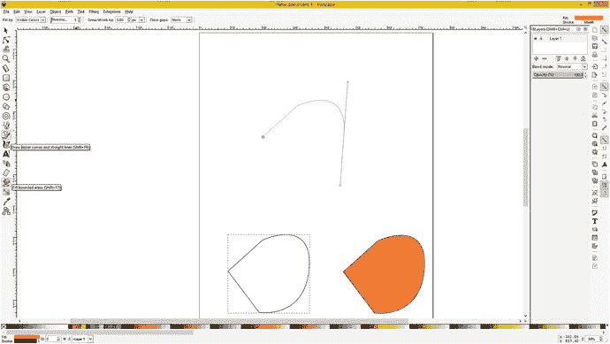
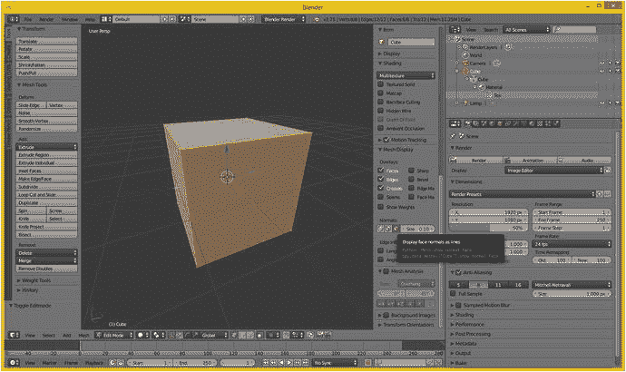
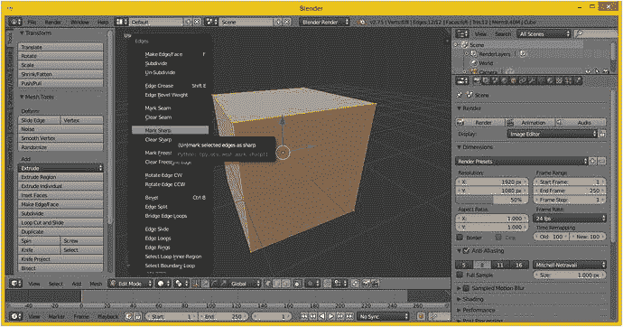
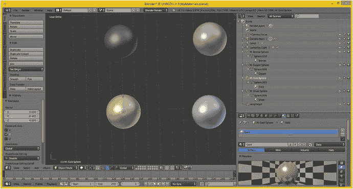
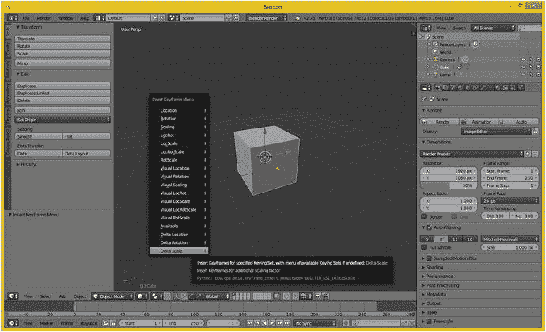
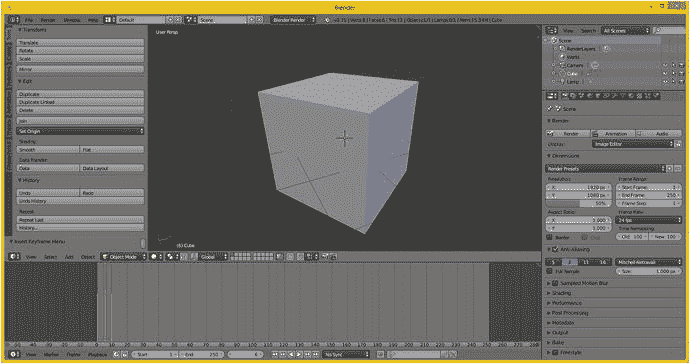
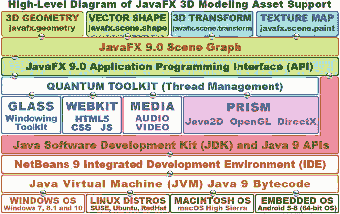
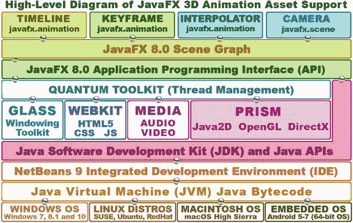

# 3. 高级三维内容渲染：三维资源概念与原理

既然你已经了解了二维（光栅和音频）内容开发概念和原理，这些也是你的二维新媒体开源内容开发软件包（GIMP、Lightworks、Audacity 和 DaVinci Resolve）所基于的，我们将通过在本章中探讨 Inkscape（二维矢量，即形状）、Blender（三维矢量，即多边形）和 Fusion（二维和三维视觉效果）来完成对新媒体资源的学习。我们之所以在本章中介绍 Inkscape 二维，而不是在二维内容章节中介绍，是因为我们可以利用关于二维矢量图形工作原理的基本概念，作为连接二维矢量图形和三维矢量图形的概念桥梁。这是因为三维向量的工作方式与二维 X 和 Y 维度中的二维向量完全相同，只不过是在三维 X、Y、Z 维度中。因此，我们将从学习 Inkscape 二维矢量插画（或称数字插画）开始本章，以便我们能够在此基础上构建二维矢量知识，然后学习更复杂的三维矢量图形软件包。

我首先介绍了顶点（点）和样条线（连接点的线或曲线）的基本概念，因为它们为二维形状或三维几何体提供了基础。这很重要，因为无论你决定成为二维矢量插画师还是三维矢量建模师（或两者兼有），这都是你将构建的基础。处理顶点和样条线可以成为一个完整的职业，所以一定要掌握前几节的内容。

接下来，我们将探讨如何将一个空的二维形状或三维线框变成看起来是实心的东西。这是通过为二维形状使用颜色填充、渐变或图案填充（这些也可以用于三维模型）以及为三维几何体使用纹理贴图来实现的。纹理贴图使用 UVW 贴图将二维纹理贴图定位到三维几何体上。

在我们涵盖了所有适用于二维和三维空间的概念之后，我们可以进入仅在三维中才会遇到的内容。这些包括三维渲染，这是一个将三维模型（这些模型具有三维几何体以及通过三维 UVW 纹理映射坐标附加的二维纹理贴图）转换为三维图像的过程。我将三维图像称为静态三维，因为三维技术被用于制作不移动的图像，因此是静态或固定的。还有三维动画，它具有运动特性，很像数字视频，以及交互式三维，其中编程逻辑被嵌入到三维对象或场景层级结构中，这是三维的最高级形式。

动画引入了时间的第四维度，就像数字视频一样，而三维动画为三维新媒体资源开发工作流程增加了另一层复杂性。三维动画像数字视频一样使用关键帧，因此所有相同的概念都适用，例如帧率；它还有一些其他概念，例如运动曲线，这些曲线受 JavaFX 支持，可以改变加速和减速的速率，从而为你的三维动画提供逼真的运动，同样也适用于 JavaFX 中的二维动画，因为它们是独立的功能。

交互式三维涉及将代码插入到一个称为场景图的对象层级结构中，该结构以层级格式保存资源、代码和其他元素。场景图最初是在 Amiga 时代由三维软件包发明的。开创这种设计和开发方法的三维软件包是 Realsoft OY 公司的 Real 3D，如今被称为 Realsoft 3D。幸运的是，JavaFX 9 也拥有一个广泛的场景图 API，这使得它非常适合创建交互式三维和交互式二维游戏及物联网应用程序。

## 交互式 2D 资源：2D 矢量内容概念

还有一类 2D 资源我们在第 2 章中没有详细讨论，因为其概念与 3D 直接相关，所以我决定在逻辑上将这些内容放在本章开头，以便信息更好地衔接。2D 和 3D 在顶点和样条线的使用上非常相似，我们接下来将学习这些内容。2D 使用 X、Y 维度（即一个平面，或者如果你愿意，也可以称为平面区域），而 3D 使用 X、Y、Z 维度（即一个立方体区域，如果你愿意的话）。

因此，在本节中，我们将探讨如何通过在 2D 空间中放置点（即顶点），然后使用直线或曲线样条线将它们连接起来，并用纯色、渐变色或平铺图像图案填充闭合形状，来创建 2D 矢量插图。JavaFX 9 提供了大量支持这些 2D 元素的 2D 类，以及一个 `SVGPath` 类，如果你选择使用 Inkscape，它可以用于导入所有这些 2D 数据元素。

你在 Java 中使用 JavaFX API 时用到的 2D 资源或对象通常被称为形状，尽管从技术上讲它们也是几何图形，因为形状本质上就是几何图形！在行业中，通常将 3D 称为 3D 几何体，将 2D 称为 2D 形状。2D 和 3D 资源的基础都始于空间中的点，这些点被称为顶点。这些顶点通过（直）线或（非直）曲线连接。接下来我们来看看这些内容。

### 平面上的点：2D 顶点、模型参考原点、枢轴点、虚拟点

别激动——这可不是《航班蛇患》的续集；这只是关于 2D 形状基础的讨论，与 3D 模型一样，它们都基于空间中的点。由于 2D 空间由 X、Y 平面构成，我们将点放置在 2D 平面上。在专业术语中，空间中的每个点都称为顶点，毕竟这是《Pro Java 9 Games Development》。你可以在平面 X、Y 空间中使用这些顶点来创建 2D 形状，也可以在立方体 X、Y、Z 空间中使用它们来创建 3D 几何体，我们将在本章后面部分介绍这些内容。

我将本节副标题定为“平面上的点”，是因为顶点是通过 2D 平面上的 X、Y 网格放置在 2D 空间中，以及通过 3D 空间中的 X、Y、Z 立方体区域放置的。这个 2D 网格的原点位于 (0,0)。通常这是屏幕的左上角，而对于 3D 立方体区域，这个参考原点则位于 (0,0,0)。

对于 2D 形状和 3D 对象，这个原点都可以重新定位，因此不同的软件包会从平面或立方体的不同角落来参考这个网格。稍后你会在 JavaFX 中看到这一点，它有多种引用坐标的方式。在该平面或立方体区域内，还有一个用于旋转 2D 或 3D 对象的参考点，称为枢轴点。

例如，如果你希望你的锤子 2D 形状（或 3D 模型）像在现实生活中那样，在把手末端附近旋转，你可以通过将枢轴从 2D（或 3D）建模空间中的默认（中心）位置向下移动到锤子把手末端来实现。对于这个应用，你的枢轴点随后将成为该对象的旋转轴中心。枢轴点是关于资源如何旋转的参考原点，而网格（空间）原点则为点之间如何相对定位提供参考。因此，旋转算法会同时使用建模网格原点和枢轴点位置。这些通常是不同的点坐标；然而，在某些场景下，它们也可能是同一个点。

原点和枢轴都通过一个轴来表示空间中的那个点。这个轴可以移动，在 3D 软件中看起来像一个星号，在 2D 软件中则像一个加号。实际上，轴是 2D 形状或 3D 几何体内部的一个独立对象，它甚至可以像其他任何 2D 或 3D 对象元素一样，使用 JavaFX 和 Java 代码进行动画处理，以创建与形状或几何体随时间旋转方式相关的特殊效果。还有一种用于特殊效果和高级应用的“虚拟点”，它与枢轴非常相似，但用于其他目的，同样通过轴来表示。在本书的后续内容中，你将看到这个轴元素对于 Java 游戏有多么重要。

### 连接二维点：矢量线与样条曲线连接二维顶点

由于顶点在数学上是无限小的，这些微小的点几乎不可见，因此你需要将它们连接起来，才能创造出可视化的内容。最简单的形式就是直线，称为矢量（在 3D 渲染中有时也称为射线）。矢量从一个顶点开始，向外延伸直到碰到第二个顶点，这第二个顶点定义了矢量的方向。矢量本质上是直的，因此它被视为一条线，而不是曲线。曲线在数学上比直线复杂得多，你马上就会看到这一点。

由于我们经常需要无限平滑的曲线作为二维形状或三维几何体的一部分，因此需要使用一种不同类型的数学结构，称为样条曲线。样条曲线之所以无限平滑，是因为它是一种使用数学方程定义的曲率，其分辨率可以通过使用更小的数值来提高，例如使用浮点数而非整数——这是对所有计算机程序员而言的（鉴于这本《Pro Java 9 Games Development》的专业性质，我希望各位都是程序员）。

大多数样条曲线的数学基础被称为贝塞尔曲线，它以数学家皮埃尔·艾蒂安·贝塞尔的名字命名，他是一位法国工程师，生于 1910 年，卒于 1999 年。皮埃尔是三维实体、几何建模和物理建模领域的创始人之一，也是曲线表示专业领域的领导者，尤其是在 CAD CAM 和三维系统中。贝塞尔曲线有几种数学格式，包括三次或二次贝塞尔曲线，它们使用不同类型的数学方程来定义每条曲线的构建方式。

这些曲线中最简单的是线性贝塞尔曲线，它可用于创建直线（矢量）射线，并且仅使用两个控制点来定义曲线。如果你的形状仅使用线性贝塞尔曲线来定义，那么你的游戏或物联网应用将消耗更少的处理能力和内存。这是因为需要处理的控制点更少。如图 3-1 的上半部分所示，Inkscape 使用蓝色绘制控制点及其手柄。如果你想在 Inkscape 中尝试，请点击图 3-1 左侧所示的样条/线条工具，然后点击创建一个点，在别处点击第二个点以添加一条直线，接着点击第三个点并拖动以创建一条曲线！一旦你掌握了窍门，这相当容易；话虽如此，事实上，你在本书中学到的一切都需要大量练习才能在专业水平上掌握。

图 3-1.

在 Inkscape 中使用矢量和样条曲线创建开放形状，闭合该形状，然后填充形状

要调整线性贝塞尔曲线的曲率，你可以移动从刚添加的顶点伸出的两个手柄中的任意一个。如果你想要一条直线，只需点击添加顶点，直线就会将它们连接起来。另一方面，如果你想制作一条曲线，请按住鼠标点击添加顶点，并在鼠标仍按下的情况下（保持鼠标按下状态），拖出贝塞尔曲线的控制点手柄。

下一种更复杂的贝塞尔曲线是二次贝塞尔曲线，它以用于定义它的二次数学算法类型命名。二次贝塞尔曲线有三个控制点而不是两个，因此处理强度更高，但通过使用手柄，可以对曲线的“微调”提供更多控制。

最复杂的是三次贝塞尔曲线，它以用于定义它的三次数学算法类型命名，它有四个控制点而不是三个，因此处理强度更高，但同样，它提供了对曲线曲率微调的更多控制。

在 Adobe Illustrator 中，控制点被细分为手柄和锚点。用于影响曲率的手柄位置就是手柄。锚点是描述贝塞尔曲线起点和终点位置的顶点。Inkscape 对锚点使用了不同的术语，称之为节点。

还有一种称为 NURBS 的三维建模方法，即非均匀有理 B 样条，它与贝塞尔样条表示相关，但针对三维 X、Y、Z 空间的使用进行了优化。NURBS 更复杂，允许创建平滑、有机的三维几何体表示。Michael Gibson 的 Moment of Inspiration 3D 是真正实惠的 NURBS 建模器之一，仅售 295 美元；它基于原始的 SGI Alias Wavefront NURBS 建模器 API。

### 填充形状内部：颜色填充、渐变和图案

如果你使用这些顶点和样条曲线（或矢量/直线）创建的二维形状是闭合的，那么它们可以用各种内容填充，例如纯色、颜色渐变或平铺的图像图案。如图 3-1 的下半部分所示。要闭合一条曲线，请绘制你的最终矢量（直线）或样条曲线（曲线），直到鼠标光标位于起始顶点上方，当该顶点发生变化时（在 Inkscape 中，它会从黑色变为红色），点击鼠标以创建一个闭合形状。要在 Inkscape 中填充你刚刚闭合的形状，请点击填充工具（与样条/线条工具及其工具提示一起显示在左侧），然后点击底部色板中的颜色，用该颜色填充选定的形状。

Inkscape 和 JavaFX 使用的二维矢量形状文件格式是可缩放矢量图形（SVG），因此如果你保存 Inkscape 项目，它将使用 `.svg` 扩展名，例如 `ProjectName.svg`。如果你想了解更多关于 SVG 的信息，请查阅 Apress.com 出版的《Digital Illustration Fundamentals》。接下来，让我们看看 i3D 媒体资源，Java 8 和 9 通过 JavaFX 9 的新媒体引擎完全支持这些资源。

## 交互式三维资源：三维矢量内容概念

最先进的多媒体资源类型是交互式三维矢量对象，它可以使用 Java 和 JavaFX API（类和接口）创建，也可以结合使用这种方法与三维建模软件包（例如第 1 章讨论的那些）或三维动画软件包（例如 Autodesk 3ds Max——我从它的第一个版本 3D Studio DOS 就开始使用它；或者 Blender——它已接近类似的专业功能水平）。i3D 资源由三维矢量几何体构成，表面使用二维光栅图像（我们在第 2 章中学习过），并在其模型和场景层级中包含编程逻辑，从而赋予它们生命。

在本章的这部分中，我们将学习三维对象如何从网格变为带表面的模型。在本章中，我们还将探讨动画、运动曲线、对象层级、轴放置、虚拟对象、粒子系统、流体动力学、毛发和皮毛动力学、刚体动力学、软体动力学、布料动力学、绳索动力学以及相关的三维主题。正如你所见，三维是迄今为止最复杂、最有趣的新媒体类型。

通过使用场景图对象层级中的编程逻辑，这些三维对象可以进一步实现交互，该层级定义了三维对象每个部分的功能，并且是 JavaFX 9 不可或缺的一部分。让我们从头开始。我将向你展示将三维资源从三维几何体转变为三维模型，再转变为三维层级，最后转变为三维对象的各种属性。这是最复杂的一种多媒体，也是在 HTML5（使用 WebGL2）、Android 8（使用 Vulkan）以及使用 JavaFX 的 Java 8 和 9 中最不常见的新媒体资源类型。

### 3D 的基础：网格的几何结构

与 2D 形状新媒体元素一样，3D 新媒体元素的最底层是顶点以及这些顶点之间的连接。在 3D 中，你仍然会有顶点，但它们之间的连接会变得稍微复杂一些。在 2D 中，顶点、矢量（射线或直线）和样条线（曲线）之间的区域是空的（未填充的），形成闭合或开放的形状，开放形状无法填充，因为它们是开放的，内容会溢出。3D 几何体（在纹理映射之前，3D 行业中有时称之为网格或线框，因为这就是 3D 几何体在纹理映射或蒙皮之前的样子）之间的连接，被称为顶点之间的“边”和边之间的“面”。

#### 空间中的点：3D 顶点的起源

与 2D 顶点（在 Illustrator 中称为锚点，在 Inkscape 中称为节点）一样，顶点是 3D 几何体和有机体（NURBS、Catmull-Rom 样条线和 Hash Patches）建模的基础。顶点定义了模型的基础结构（无论是边还是样条线）在 3D 空间中的位置。在 3D 中，顶点数据可以包含表面颜色数据、法线数据、UVW 纹理映射数据和顶点 XYZ 位置数据。熟悉 3D 扫描仪的人可能对“点云”这个术语不陌生，因此顶点仍然是我们 3D 行业中一切工作的基础。

对于 Java 8 和 9 的编码，JavaFX 9 提供了一个 `VertexFormat` 类，它可以保存顶点数据，包括顶点位置、法线信息（我们稍后会介绍法线）和 UVW 纹理映射坐标。因此，你可以通过 Java 代码来放置 Java 9 游戏或物联网应用的顶点，也可以使用 3D 建模器，例如 Daz Hexagon、MoI 3D 或 Nevercenter SILO，或者使用 3D 建模与动画软件包，例如 Blender 或 Autodesk 3ds Max。

#### 连接 3D 顶点：边桥接 3D 顶点

大多数 3D 几何体使用一种称为“边”的东西来连接两个顶点。边是一个矢量，或者说是一条直线，因此在 3D 空间中看起来像剃刀的边缘。需要三条或更多条边才能形成一个多边形，我们接下来将介绍多边形。当你对 3D 几何体进行建模时，你可以选择顶点、边、多边形或整个对象。

如果你使用更高级的基于样条线的建模范式创建了 3D 几何体，例如使用 MoI 3D 创建 NURBS、使用 SILO 2（仅售 160 美元）创建四边形，或使用 Animation:Master（仅售 80 美元）创建 Hash Patches，那么你需要将这些格式简化为多边形或三角形，我们接下来将介绍这一点。简化过程会将这些范式中使用的无限平滑曲线转换为一系列直线边。这是通过使用一个简化（平滑度）数值因子（滑块或设置）来完成的，该因子通常在你将基于曲线的建模器中的样条线建模格式导出为多边形几何模型格式时，在“文件导出”功能中提供。

#### 创建表面：三条边形成多边形，四条边形成四边形

一旦你将三条边组合成一个三角形，你就得到了一个多边形，它可以作为承载蒙皮或纹理的表面，使 3D 数据看起来更逼真。多边形有时被称为三角形、三角面或面，一些建模器使用被称为“四边形”的方形多边形。如果你的渲染引擎像 JavaFX 及其 `TriangleMesh` 类那样需要三角形，你可以将四边形简化为三角形。在这种情况下，简化算法相当简单，因为它只是在四边形表面的两个对角之间插入一条边，从而创建两个角度特征相等（镜像）的三角形。最佳的三角形来自方形多边形，具有 45-45-90 度的角配置。经验法则是，三角形越均匀（接近正方形），渲染效果越好；而“细长”或狭长的三角形可能会导致渲染伪影，但通常不会。

一旦你有了一个表面（通常是一个三角形，如图 3-2 所示，基本立方体上的面是四边形），并且定义了它的法线（我们接下来将学习），那么你就可以应用纹理贴图了。我们将在本章下一主要部分介绍纹理映射。还有一个与相邻多边形或面相关的原理，称为平滑组，我们将在介绍表面法线之后讨论它。因此，一个表面（多边形、三角形、四边形、面）至少会承载一个法线、一个或多个纹理贴图以及一个平滑组。

图 3-2.

使用“将面法线显示为线条”按钮，将每个四边形面的方向法线显示为浅蓝色线条

#### 指定表面朝向：表面法线的概念

如果你知道如何在 3D 软件中开启“显示法线”功能，就能看到面表面法线，它们会显示为从面的正中心延伸出来的一条线，如图 3-2 中浅蓝色所示。

在 Blender 2.8 中，也有用于显示顶点法线的开关（按钮），顶点法线从顶点向外指，因此对于这个模型，顶点法线从立方体的角（45 度）斜向向外指，与面法线的结果完全相反——面法线从面（表面、四边形）的中心笔直向上（90 度，像摩天大楼一样）。如图 3-2 所示，其中两条法线实际上与 X 轴（红色）和 Y 轴（绿色）对齐，它们以 90 度角与立方体相交。

坐标轴指南位于 3D 编辑模式视图的左下角，在 Blender 界面左下角的 XYZ 轴指南中也有标示。表面法线的功能相当简单：它告诉渲染引擎表面朝向哪个方向。在这种情况下，这个立方体会渲染成一个立方体，并带有你赋予它的任何纹理（皮肤）来着色。同样的逻辑也适用于顶点法线：它会告诉渲染引擎处理 3D 几何体的哪一侧进行表面渲染。

如果这个立方体几何体中的法线指向内部而不是外部，那么渲染时立方体将完全不可见。3D 软件中有一个翻转法线操作（算法），用于全局反转模型的法线方向（所有法线翻转 180 度）。当你渲染场景时，如果导入的对象在渲染场景中不可见，就会用到这个功能。

当 3D 导入工具将导入的 3D 几何体的法线指向（翻转）错误方向时，或者当其他 3D 工具的导出器相对于你导入的软件导出了错误方向的法线时，就会出现法线翻转的情况。这在你 3D 工作流程中会相当常见，因此如果你经常从事 3D 或 i3D 工作，预计至少会用到几次翻转法线功能。

如果你需要某些物体（例如房屋）的 3D 几何体从外部和内部都能渲染（这在 i3D（例如虚拟世界）中很常见），你就必须创建双面几何体，特别是面。然后你需要应用双面纹理贴图和 UVW 贴图，我们将在本章下一节讨论 3D 纹理映射概念和技术时介绍这些内容。

需要注意的是，对于 i3D，带有双面纹理的双面几何体需要显著更多的渲染引擎处理能力，并且渲染是基于用户对交互式 3D 环境、世界或模拟的探索实时进行的，因此 JavaFX 需要同时导航、处理和渲染 i3D 场景，这需要大量处理器周期才能流畅运行，所以数据优化很重要。

虽然你可以在 JavaFX 中为顶点分配法线，但法线通常按面分配。这就是`VertexFormat`类有两种格式的原因。一种支持多边形的位置和纹理，因为法线只需定义一次（使用三个顶点定义法线不如只用一个面高效）；另一种是`VertexFormat`数据格式，用于你想使用顶点而不是多边形来定义法线的情况。

#### 平滑表面：使用平滑组让多边形看起来像样条线

你可能见过渲染为实体（而非线框）但仍然看起来像被凿过的 3D 模型；也就是说，你可以看到多边形（面）被渲染成平坦的样子。在这种情况下，渲染引擎关闭了平滑功能。如果开启平滑渲染，这种效果就会消失，几何体看起来会像预期的那样无限平滑，就像是用样条线创建的一样，而实际上它使用的是多边形。让渲染引擎进行平滑处理更高效，因此有一种称为平滑组的东西，它应用于每个面，告诉渲染器何时在两个面之间进行平滑，何时不进行平滑（不进行平滑会留下通常所说的接缝）。平滑组使用简单的整数。如果面两侧的整数匹配（对于该边对侧每个相邻面），则渲染为平滑过渡（颜色渐变）。如果数字不同，则渲染为接缝；也就是说，该边清晰可见，因为该边两侧的颜色渐变不同（颜色渐变在两个面（也称为多边形）之间不是无缝的）。

在一些 3D 软件包中，例如 Autodesk 3D Studio Max，你可以在用户界面中看到这种平滑组编号方案，并且可以实际选择每条边旁边使用的（整数）数字。你还可以选择边两侧的数字，这是一种更复杂的方法，但能让 3D 建模师更精确地控制平滑效果。

在其他软件如 Blender 中，编号是隐藏的，平滑组功能通过使用“标记接缝”、“清除接缝”、“标记锐边”和“清除锐边”等命令来“暴露”。这些命令可以在 Blender 的边菜单中找到，如图 3-3 左侧所示，其中“标记锐边”选项以浅蓝色高亮显示。

图 3-3.

在 Blender 中使用边菜单（编辑模式下按 Ctrl-E）中的“标记接缝”或“标记锐边”命令设置边平滑

在 Blender 中，一些 3D 建模师（指人，而非软件）可能会犯一个错误：试图通过实际分割 3D 几何体的边来暴露接缝或锐边，这虽然能达到视觉效果，但可能在后续的 3D 几何体拓扑优化工作流程中引发问题。如果你熟悉地图学中使用的“地形”一词，拓扑与之非常相似，它指的是 3D 几何体是如何构建的，以及因此它将如何被渲染，因为渲染引擎和 3D 几何体一样，都是“基于数学”的。

3D 模型的拓扑是指 3D 几何体的构建方式，即顶点、边和面相对于彼此的位置，或者是指基于样条线的有机 3D 模型的构建方式，其中控制点、手柄和类似的基于样条线的拓扑已被放置（以及它们放置的顺序）。换句话说，3D 建模很复杂！

为了避免通过分割几何体边来实现接缝，可以在 Blender 中使用“标记接缝”或“标记锐边”边修改器。这些特定的 Blender 修改器实际上是基于平滑组的，因此能在不实际影响 3D 几何体拓扑的情况下实现这种平滑（或边接缝）效果。

Blender 修改器在渲染前应用，因此不会影响底层 3D 几何体的实际数学拓扑。Blender 修改器始终是一种更灵活的 3D 内容创建方法，因为它是在渲染引擎级别应用平滑（或任何其他所需效果），而不是在 3D 几何体拓扑级别，从而保持 3D 网格的完整性。正如《Pro Java 9 Games Development》（以及物联网设计）中的一切，如果你能达到预期效果和最终结果，更简单总是更好，因为更简单意味着更少的处理器开销。

### 为你的 3D 模型蒙皮：2D 纹理映射概念

一旦作为 3D 模型基础的 3D 几何体完成，你就可以为其应用纹理贴图，以创建 3D 模型的实体外观，并添加细节和特效，使其外观越来越逼真。如果你想知道 3D 几何体和 3D 模型之间的区别，那么 3D 几何体只是网格或线框，而 3D 模型可以（应该）同时应用纹理贴图。如果你购买第三方 3D 模型，你期望它们在渲染时看起来像它们本来的样子，而不是仅仅呈现为平坦的灰色——这是没有任何纹理映射（且无顶点颜色）信息时渲染模型的样子。事实上，你在网上找到的一些 3D 模型（免费或付费）甚至可能没有应用平滑组，因此你会看到一些模型有棱有角，一些平滑，还有一些纹理细节程度各不相同。有些模型的法线甚至可能是翻转的，在你对其应用翻转法线操作或修改器之前，它们甚至不会出现在你的 3D 场景中。通常，对于任何不是从头创建的现有模型，你都需要进行额外的建模、平滑和纹理映射工作。我通常尝试从头创建所有内容，这样我就能控制并熟悉底层 3D 几何体拓扑结构，以及我的平滑组、UVW 映射坐标、着色器和纹理贴图是如何应用到模型上的。我们将在本节中涵盖所有这些内容。

#### 纹理贴图基础：概念、通道、着色、特效和 UVW 坐标

纹理映射与正确创建几何拓扑结构一样，是 3D 领域中一个复杂的领域；事实上，3D 的每个领域都同样复杂，这使得 3D 成为迄今为止最复杂的新媒体类型，也解释了为什么 3D 故事片会雇佣艺术家专门专注于（处理）我们在本章中探讨的每一个领域。纹理映射是 3D 建模中能够使用 2D 矢量或 2D 光栅图像资源的主要领域之一。

需要注意的是，还有一个更复杂的 3D 纹理映射领域，也常被称为纹理贴图，它使用 3D 纹理算法（通常称为体积纹理）来创建贯穿 3D 对象的纹理效果，就好像它是一个实心体而不是空心（这里可以理解为双面）的 3D 对象。

纹理映射背后的基本概念是获取 2D 资源（例如我们在前一章中学到的那些），并将这些 2D 资源应用到你的 3D 几何体表面。这是通过使用 UVW（或 3D）映射坐标来实现的，这些坐标指示你希望该 2D 图像（平面）如何定向到或投影到你的 3D 几何体表面拓扑结构上。现在，我希望你快速从书本上抬起头，对周围能听到的人大声说：“我真的需要将这个样条拓扑结构简化为多边形拓扑结构，这样我就可以使用 UVW 纹理映射坐标将着色器应用到生成的几何体上，并将这个 3D 模型导出到我的 JavaFX 场景图层次结构中。”然后若无其事地继续阅读，尽管你刚刚向周围所有人展示了你即将成为交互式多媒体制作天才的潜力。

你可以使用纹理通道向 3D 几何体表面添加多个纹理贴图，这类似于你在 2D 图像合成软件中使用的图层。JavaFX 目前支持四个最重要的纹理通道：漫反射纹理贴图（基本 ARGB 颜色值）、高光纹理贴图（表面是光亮还是暗淡）、照明纹理贴图（也称为发光贴图）和凹凸纹理贴图。

3D 软件包支持其他纹理贴图通道类型，以实现额外的纹理映射效果。为了能够将这些带入 JavaFX，你必须使用一个称为“烘焙”的过程。烘焙纹理贴图涉及将所有尚未支持的纹理通道渲染到一个单一的漫反射纹理贴图中，因为这是 JavaFX 8 和 9 所支持的。这提供了与你在更高级的 3D 动画软件包中获得的大部分相同的视觉效果。

如图 3-4 所示，Blender 2.8 也使用了场景图，就像大多数现代 3D 软件包一样，而 JavaFX 也提供了这种场景图功能；我们将在第 8 章中介绍它。球体几何体和纹理映射在场景图层次结构中组合在一起，我已经为你展开了该层次结构。

图 3-4. 在 Blender 中使用场景图（右侧）将金色纹理贴图和着色器（底部）应用于球体对象

随着时间的推移，理想情况下，JavaFX 9 将增加更多的纹理通道支持，并为开发者在 3D 新媒体资产使用方面提供更多的视觉灵活性，因为透明区域（不透明度贴图）和表面细节（法线贴图）是高级纹理映射支持方面最重要的两个领域。这些最终需要使用 JavaFX API 添加到 Java 中，以便开发者能够为 Java 游戏创建逼真的 i3D 模型。

纹理通道的集合，以及任何控制这些通道之间关系、以及它们将如何相互合成、应用和渲染的代码，被称为着色器定义。在 3D 行业中，着色器通常也被称为材质。我们将在本章的下一节中介绍着色器和着色器语言，因为这是 3D 和 i3D 游戏开发的另一个专业且复杂的领域。在我的书《VFX 基础》（Apress，2016）中，我也使用开源软件 Fusion 8.2.1 详细介绍了着色器的构建。

最后，一旦你的纹理在着色器中定义完毕，你需要将这些 2D 资源定向到你的 3D 几何体上，这是通过使用纹理映射坐标来完成的，通常通过称为 UVW 映射的方式实现。在进入第四维度和动画之前，我们也将专门用一节来介绍 UVW 映射。

#### 纹理贴图设计：着色器通道与着色器语言

着色器设计本身就是一种艺术形式；成千上万的着色器艺术家致力于 3D 电影、游戏和电视节目，确保用于“着色”或“蒙皮”3D 几何体的着色器，能让最终的 3D 模型看起来尽可能逼真——这通常是 3D 制作的目标，即取代成本更高的摄像机拍摄（以及重拍）。

基本的着色器由一系列 2D 矢量图形、2D 光栅图像或体积纹理组成，这些内容保存在不同类型的通道中，用于施加不同类型的特效，例如漫反射（颜色）、高光（光泽度）、自发光（照明）、凹凸（地形）、法线（高度）、不透明度（透明度）和环境（周围环境）贴图。体积着色器本质上也是 3D 的，因此它们不使用 2D 图像作为输入，而是使用复杂的算法定义来生成一个贯穿 3D 物体的 3D 着色器，这就是它被称为“体积”的原因。这些 3D 体积着色器也可以被动画化，并能根据其在 3D 空间中的位置改变颜色和半透明度。

除此之外，高级着色器语言，例如 Open GL 着色器语言（GLSL），使用代码来指定这些通道如何相互关联，如何应用或处理这些通道中包含的数据，以及如何基于时间、方向或 3D 空间位置等复杂因素，对这些通道内的数据进行其他更复杂的应用。着色器的复杂性也意味着，着色器越复杂，其渲染时的处理时间就越长，消耗的处理周期也越多。由于复杂着色器能够产生照片级逼真的效果，所需的处理器周期通常代价高昂。

这可能是 JavaFX 9.0 目前仅支持四种基础（且最容易处理）着色器的主要原因。随着硬件性能越来越强大（你会在更多消费电子产品中看到六核、八核和十核 CPU），JavaFX 可能会增加最后两个重要的着色器通道：不透明度（或透明度贴图）和法线贴图。

#### 纹理贴图方向：纹理贴图投影类型与 UVW 坐标

将 2D 纹理贴图通道（尤其是基础的漫反射颜色通道）中的细节特征与 3D 几何体正确对齐非常重要，否则在渲染时可能会出现相当奇怪或至少在视觉上不正确的结果。这需要在 3D 的 X、Y、Z 空间中进行，对于体积纹理尤其如此，但对于 2D 纹理，也需要定义它们如何投影到 3D 几何体上或如何包裹住它。

实现这一点的最简单方法之一是应用纹理贴图投影类型及相关设置，这些设置会自动为你设定 UVW 映射数值。这些 UVW 贴图坐标值将定义 2D 图像平面如何在 3D 空间中映射到 3D 几何体上，这有点像 2D 空间和 3D 空间之间的桥梁。UVW 浮点值可以手动设置或微调，以精细调整你的视觉效果。

其中最简单的是平面投影，你可以将其想象为纹理贴图位于 3D 物体前方，你正用一束光穿过它，因此看起来漫反射纹理贴图中的颜色就像在 3D 物体上一样。平面投影是计算机最容易处理的，因此，如果它能为你专业的 Java 游戏或物联网应用提供所需的效果，就请使用它。然而，它通常用于静态渲染的 3D 图像，因为一旦你（摄像机）移动到 3D 模型的侧面，这种投影映射就无法提供照片级逼真的效果。

摄像机投影与平面投影类似。摄像机投影将你的纹理从摄像机镜头（与镜头 100%平行）投射到 3D 物体表面，就像幻灯机一样。这可用于将视频背景投射到你的场景中，这样你就可以在其前方建模，或最终为你的 3D 资产制作动画。如果摄像机移动，摄像机投影会保持与镜头前端平行。这有时被称为广告牌模式（或投影）。

接下来最简单的是圆柱投影，它比（本质上）从单一方向将纹理贴图投影到 3D 物体上的 2D 平面投影，提供了更全面的 3D 纹理贴图应用方式。一个圆柱体会在上下（Z 轴）维度上包围你的物体，将图像环绕你的物体投射！因此，如果你绕着它走，会在另一个维度上看到平面投影所无法提供的独特纹理细节。

一种更复杂的投影类型称为球体投影。它比圆柱投影提供了更完整的 3D 纹理贴图应用方式，从 Z 维度上的 X 和 Y 两个方向将纹理贴图应用到 3D 物体上。球体投影试图处理所有三个（X、Y、Z）轴方向的投影。

与球体投影类似的是立方体投影，它就像是以立方体格式排列的六个平面投影；这会产生与球体投影相似的结果。当你对 3D 物体应用立方体投影时，物体的面会根据多边形法线的方向或与面的接近程度，被分配到立方体纹理贴图的特定面上。然后，纹理使用平面投影方法（或者对于某些 3D 软件包，可能是球体投影贴图）从立方体纹理贴图的每个面投射出来。

如果你使用的是体积纹理，空间投影是一种三维的 UVW 纹理投影，它会贯穿 3D 物体的体积。它通常与程序化纹理或体积纹理一起使用，用于需要内部结构的材质，例如木材、大理石、海绵、玛瑙等。如果你变形一个 3D 物体或相对于该 3D 物体变换纹理映射坐标，体积纹理或程序化纹理的不同部分将会显现出来。

还有一种更简单的纹理映射称为 UV 映射（没有 W 维度）。它以二维而非三维方式应用纹理，由于数据量更少，处理起来也更容易。我们可能会在 JavaFX 之外使用 3D 软件来映射我们的 3D 模型，然后使用模型导入器将已经贴好纹理的 3D 对象导入 Java，因为截至 JavaFX 8，JavaFX API 中尚未添加支持这些更高级 3D 贴图的类。

### 为你的 3D 模型制作动画：关键帧、运动曲线和反向动力学

在你创建了 3D 几何体并使用着色器和映射坐标为其贴好纹理后，你可能希望让它以某种方式运动起来，例如让一个飞机模型飞行。你在第 2 章学到的关于数字视频资产以及 2D 动画资产的概念，同样适用于 3D 动画。

#### 线性动画：轨道、关键帧、循环与范围

最简单的 3D 动画类型（2D 动画也是如此）是线性动画，它适用于多种动画场景。图 3-5 展示了如何在 Blender 2.8 中，通过“插入关键帧菜单”为立方体对象添加关键帧。

图 3-5.

在 Blender 2.8 中使用“插入关键帧菜单”，选中立方体对象以添加“增量缩放”关键帧

选中立方体对象后，按下键盘上的 **I** 键即可调出此“插入关键帧菜单”。大多数 3D 软件包都配有通常称为“轨道编辑器”的工具，允许你在轨道上添加关键帧和运动曲线。每条轨道对应一个 3D 模型；如果你的 3D 模型使用了子组件分组，那么轨道将涵盖组与子组，以及组或子组内的各个独立组件。

线性动画消耗的计算资源最少，因此效率最高。如果线性动画能满足你的动画目标，请尽量使用最少的轨道数量和最少的关键帧数量，因为这样能占用最少的系统内存。

如果动画运动是重复性的，请使用无缝循环而非长范围。一个无缝运动循环所占用的内存，比包含同一运动多个副本的长范围要少。使用循环是线性动画中一个极佳的优化原则。接下来，让我们看看一些更复杂的动画类型，包括非线性动画（非直线运动，关键帧间距不均），以及角色动画和程序化动画——后者常用于刚体或柔体物理模拟、布料动力学、毛发动力学、粒子系统和流体动力学等场景。

#### 非线性动画：运动路径与运动曲线

一种更复杂的非线性动画类型，其规律性较弱，通常看起来更逼真（尤其在涉及人体运动和简单物理模拟时），它会为动画 3D 对象或元素（层级结构中的子对象）设置一条运动路径。JavaFX 提供了一个 `Path` 类，可用作自定义复杂动画或游戏精灵运动的路径。为了给沿路径的运动增加更多复杂性，还可以使用运动曲线，使运动本身能够加速或减速，从而模拟重力和摩擦等效果。这些用运动曲线直观呈现的数学算法被称为插值器，JavaFX 提供了一个 `Interpolator` 类，其中包含了多种最标准（但若有效使用仍相当强大）的运动曲线算法。

非线性不规则运动关键帧的一个典型例子，是一个橡胶球沿着蜿蜒的道路弹跳。道路的弯曲路径将使用运动路径，确保球始终贴合道路的曲率，并且球的落点符合道路的坡度（角度）。球的弹跳则会使用运动曲线（有时也称为运动插值器），通过控制其运动在时间上的加速与减速节奏，使每次弹跳看起来更真实。在这个例子中，这将控制球如何与地面相互作用。

图 3-6 展示了屏幕底部的 Blender 时间线编辑器；你可以看到两个旋转关键帧显示为垂直的黄色线条，而当前帧设置显示为垂直的绿色线条。

图 3-6.

Blender 2.8 时间线编辑器，在第 0 帧和第 10 帧处有两个关键帧，当前帧设置为第 6 帧

包含大量交互元素的复杂物理模拟无法通过关键帧完成——尽管理论上如果你有大量时间或许可行，但这并不划算（不值得投入时间）。正如运动曲线应用于关键帧播放时使用插值算法一样，程序化动画算法更进一步，它不仅影响关键帧的时序，还影响关键帧数据本身（X、Y、Z 数据、旋转数据、缩放数据等）。

由于程序化动画以算法形式存在，它非常高效，因为一旦算法创建完成，就可以反复使用而无需额外工作。这些程序化动画算法在 3D 领域催生了许多特效类型，包括刚体动力学和柔体动力学（物理模拟）、绳索和链条动力学、布料动力学、毛发动力学、粒子系统、流体动力学、肌肉和皮肤弯曲动力学、口型同步动力学以及面部表情动力学。我们稍后会介绍程序化动画，因为本章各节的内容是从较基础的概念逐步深入到更高级的概念。

接下来，我们概述一下角色动画；它很可能是 JavaFX 下一步会支持的动画类型，因为 JavaFX 的导入器正在支持导入更复杂的 3D 数据类型，包括角色动画等高级动画类型。

#### 角色动画：骨骼、肌肉、皮肤、正向与反向运动学

一种更复杂的动画类型是角色动画，角色动画师是 3D 电影、游戏或电视内容制作团队中的热门职位之一。角色动画涉及多个复杂层次，包括为角色的骨架搭建“骨骼”层级结构、使用反向运动学控制骨骼（角色）运动、将肌肉附着在骨骼上并定义其弯曲方式、将肌肉附着在皮肤上，甚至添加衣物和布料动力学来为角色着装。在 3D 角色动画中，其处理方式与现实生活非常相似，目的是逼真地模拟现实——而这正是 3D、i3D 和 VR 通常试图达成的目标。

因此，使用角色动画模拟生物体，其复杂程度几乎达到了不使用直接编码（即你现在所知的程序化动画）的动画所能达到的极限。

角色动画最底层的是骨骼；骨骼使用反向运动学算法来限定其运动范围（旋转角度），这样就不会出现肘部反向弯曲，或者头部像《驱魔人》里那样旋转的情况！骨骼按层级连接起来，就构成了——你猜对了——骨架。这个骨架就是你之后用来制作动画（关键帧）以驱动角色的核心。你还可以通过将肌肉和皮肤附着在骨骼上，并定义骨骼运动如何使肌肉弯曲、拉伸皮肤，来模拟肌肉和皮肤。可以想象，设置这一切是一个复杂的过程；这是角色动画中一个称为“绑定”的领域。如果需要添加衣物，3D 领域还有一个新兴方向叫“布料动力学”，它定义了衣物如何移动、起皱和随风飘动，并且有类似的程序化动画算法旨在提升真实感。接下来，让我们看看这个方向，以及其他一些同样先进的程序化动画和模拟特效算法。

#### 程序化动画：物理、流体或布料动力学、粒子系统、毛发

最复杂的动画类型是程序化动画，因为它需要使用代码完成。编写计算 3D 向量和矩阵，以及物理和流体动力学方程的代码，其复杂程度与游戏编程代码不相上下（甚至可能更高，具体取决于游戏的复杂度）。在 3D 软件包中，这种编码通常使用 C++、Python 或 Java 完成。而在你的《Pro Java 9 Games Development》中，程序化 3D 动画将通过结合使用 Java 9 API 和 JavaFX 8 API 来实现。程序化动画是 3D 动画中最复杂但也是最强大的一种类型，这也是为什么程序化动画程序员目前是 3D 电影、游戏、物联网和交互式电视（iTV）行业中更热门的 3D 职位空缺之一。

在诸如 Blender 或 3D Studio Max 等 3D 建模和动画软件包中，有许多“功能”实际上是程序化动画算法插件。这些插件向用户提供一个用户界面，用于指定参数，这些参数将控制程序化动画在应用于 3D 模型或复杂的 3D 模型层级结构（通过使用 3D 软件或 JavaFX 场景图创建，例如图 3-4 右侧所示的场景图）后的结果。我们刚刚讨论了一个复杂的骨骼-骨架-肌肉-皮肤角色模型层级结构，可以对其应用布料动力学，使服装在 3D 角色奔跑、战斗、驾驶、跳舞等动作时能够逼真地随之运动。

程序化动画算法控制功能的示例，其中许多包含真实世界物理模拟支持，这些功能通常被添加到高级 3D 动画软件包中，包括 3D 粒子系统、流体动力学、布料动力学、绳索动力学、毛发和皮毛动力学、软体动力学和刚体动力学。

### JavaFX 3D 支持：几何、动画和场景包

JavaFX 中有三个顶级包包含了对 2D 和 3D 新媒体资源类型的所有支持。`javafx.geometry`包支持底层 3D 几何结构，例如使用`Point2D`和`Point3D`类表示顶点，以及使用`Bounds`和`BoundingBox`类表示区域。`javafx.animation`包支持底层动画结构，例如使用`Timeline`、`KeyFrame`、`KeyValue`和`Interpolator`类表示时间线、关键帧和运动曲线。`javafx.scene`包包含许多嵌套包，我喜欢称之为子包，包括用于 2D 或 3D 形状结构的`javafx.scene.shape`包，例如`Mesh`、`TriangleMesh`和`MeshView`类；支持 2D 和 3D 变换的`javafx.scene.transform`包，包括`Rotate`、`Scale`、`Shear`和`Transform`类；包含着色类的`javafx.scene.paint`包，例如`Material`和`PhongMaterial`类；以及`javafx.scene.media`包（`MediaPlayer`和`MediaView`类）。

#### JavaFX API 3D 建模支持：点、多边形、网格、变换、着色

我将把 JavaFX 3D 资源支持分成两个图表，一个用于静态 3D（渲染图像），另一个用于动画 3D（3D 动画）。交互式 3D 将使用所有 JavaFX 3D 功能以及部分 Java API 功能。第一个图表，图 3-7，展示了 JavaFX 包中支持的四个主要领域。这些对于创建可用于静态 3D 图像、以及与其他 JavaFX API 结合用于动画 3D、与 Java API 结合用于交互式 3D 游戏、物联网应用和 3D 模拟的 3D 模型非常重要。

图 3-7.

JavaFX 3D 建模资源对几何、形状、变换和纹理贴图支持的高级示意图

`javafx.geometry`包包含了 Java 和 JavaFX 中所有 3D 或 2D 几何的基础，即顶点（点）和空间（边界）。`Point2D`类支持顶点（2D 空间中的一个点）和向量（从一点发出的 2D 空间中的一条线）表示。`Point3D`类也支持顶点（3D 空间中的一个点）和向量（从一点发出的 3D 空间中的一条线）表示。`Bounds`超类表示 JavaFX 场景图节点及其包含对象的边界。`Bounds`超类的子类`BoundingBox`包含场景图节点对象在 2D 或 3D 空间中边界的更专门化表示。

`javafx.scene.shape`包包含用于创建 3D 几何体的`Mesh`、`MeshView`和`TriangleMesh`对象（类），而`javafx.scene.transform`包包含用于在 3D 空间中对 3D 几何体应用 3D 空间变换的`Rotate`、`Scale`、`Shear`和`Transform`对象（类）。`javafx.scene.paint`包包含`Material`和`PhongMaterial`对象（类），允许你使用不同的着色器算法在 JavaFX 中为 3D 对象添加纹理。接下来，让我们仔细看看 JavaFX API 为我们提供了什么来支持第四维度——时间，以便我们能够为你的《Pro Java 9》游戏（或物联网应用或 3D 模拟）添加 3D 动画功能。

#### JavaFX API 3D 动画支持：时间线、关键帧、关键值、插值器

正如你可能想象的那样，在 JavaFX 中实现 2D 和 3D 矢量动画的大多数关键（无意双关）类都存储在`javafx.animation`包中，如图 3-8 所示。例外情况是`Camera`超类及其两个子类`PerspectiveCamera`（透视投影）和`ParallelCamera`（正交投影）。`Timeline`对象（类）保存动画定义，该定义由`KeyFrame`对象（类）组成，而`KeyFrame`对象又由包含实际变换指令数据的`KeyValue`对象组成。一个`KeyFrame`对象可以持有一个`KeyValue`对象数组，因此一个`KeyFrame`可以持有多个不同的`KeyValue`变换数据对象。还有一个`Interpolator`类，它包含许多用于向`Timeline`对象内的`KeyFrame`对象应用运动曲线的高级算法。当前支持的`Interpolator`算法包括`DISCRETE`（离散时间插值）、`EASE_IN`和`EASE_OUT`以及`EASE_BOTH`（缓入和缓出），以及`LINEAR`直线（均匀间隔）插值，这显然是处理强度最低的。

图 3-8.

JavaFX 3D 动画支持的高级示意图，展示了`javafx.animation`和`javafx.scene`包

现在，你已经对 2D 矢量插图和 3D 矢量渲染及动画概念有了一个扎实的（3D）概述。在进入第 4 章关于游戏理论、概念、优化等内容之前，我们先稍作休息。

## 总结

在第三章中，我们深入探讨了与二维矢量插画、三维矢量渲染、纹理贴图及动画相关的一些更为重要的新媒体概念。这些内容将在你专业的 Java 游戏开发工作中用到，以便你提前掌握这些基础知识。

我首先介绍了同样适用于三维矢量图形的二维矢量图形概念，包括顶点、向量（射线或直线）以及样条线（带有控制手柄的曲线）。我们还探讨了如何使用纯色、渐变色或平铺图像图案来填充这些二维形状。

接着，我们基于这些概念，带你进入三维矢量图形领域，学习了多边形、三角形、四边形、面片和边，它们与顶点共同构成三维几何体。我们探讨了如何利用纹理贴图、UVW 映射和投影映射，让三维几何线框（也称为网格对象）看起来更立体，以及所有这些元素如何通过材质或着色器整合在一起。

随后，我们研究了三维动画。它比二维动画或数字视频复杂得多，因为高端三维动画包括角色动画、程序化动画以及算法特效，这些特效涉及物理模拟数学，以及控制大量粒子等操作，从而产生强大的基于代码的动画系统，例如群体模拟、毛发动力学、人群模拟、流体动力学、布料动力学、软体动力学和刚体动力学。在下一章，我们将探讨游戏设计类型。

最后，我们介绍了 JavaFX 9 API。在本书中，我们将使用这些 API 来实现本章学到的所有三维概念和原理。当我们实现 Java 9 游戏的各个组件时，会详细研究这些 API。

在下一章，我们将从全局角度审视游戏理论以及与使用 Java 9 和新媒体资源创建游戏相关的概念，以实现我们的游戏玩法设计和游戏目标。

