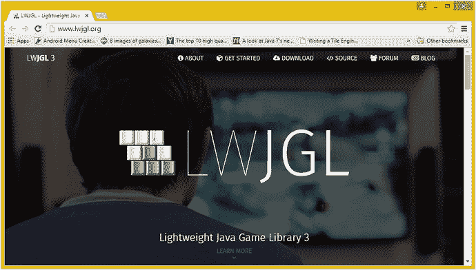
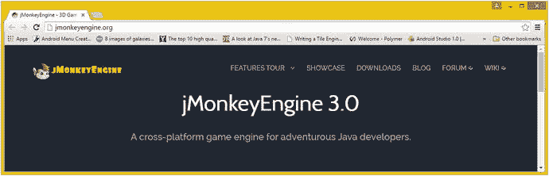
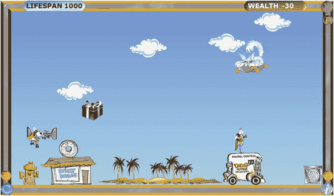

# 4. 游戏设计入门：游戏设计概念、类型、引擎与技术

让我们基于前两章学到的新媒体知识，进一步探讨如何利用强大的像素、帧、样本和矢量来创建专业的 Java 9 游戏以及物联网应用，并分析在某些专业 Java 9 游戏开发类型和场景中使用（或不使用）这些技术的原因。我们将研究高级游戏概念、基本游戏设计类型、游戏设计优化概念，以及 Java 平台可用的开源游戏引擎，包括物理引擎（如 JBox2D、JBullet、Jinngine 和 Dyn4J）和 3D 游戏引擎（如 LWJGL 和 JMonkey）。

我首先要介绍的是静态（固定）与动态（实时）这一基础概念，它适用于游戏类型、游戏设计以及游戏优化。我已在第二章（图像与音视频对比）和第三章（渲染 3D 与 3D 动画及交互式 3D 对比）中讨论过静态（图像、渲染的静态 3D 图像）与动态（数字视频、2D 和 3D 动画、交互式 3D、数字音频）的概念。正如你将看到的，这个简单的概念是分类游戏类型的绝佳方式，也是游戏优化的基础原则。在本章中，我们将从宏观层面概述游戏玩法设计、新媒体整合，以及不同游戏设计方法和策略在内存占用和 CPU 处理周期方面的成本。

之所以这一点很重要，并且我们在本书第一部分就“预先思考”所有这些游戏设计因素，是因为你希望游戏能在所有用于运行游戏的不同平台和消费电子设备上流畅运行，即使这些设备配备的是单核处理器。实际上，如今单核处理器已极为罕见。入门级消费电子设备现在通常配备双核、四核、六核或八核 CPU。与流畅游戏体验相反的是卡顿或跳跃的游戏体验，这并非良好的用户体验。用户体验取决于你如何结合用户界面设计、游戏概念、新媒体资源与代码优化，以及每个用户对游戏玩法设计的兴趣和好奇程度。

接下来，我将介绍游戏设计与开发的不同方面或组成部分。这些包括游戏设计与开发的概念、技巧和“行话”，我希望确保你能跟上进度。这些主题包括二维精灵、三维模型、人工智能、图层、关卡、碰撞检测、物理模拟、背景板动画、游戏玩法逻辑、游戏设计、用户界面，以及类似的游戏设计与开发方面，它们可被视为游戏“组件”，因为每个组件都为专业的 Java 9 游戏增添了不同的属性和能力。最后，我将介绍你可以设计和开发的不同游戏类型或种类，旨在激发你的左右脑同时思考，随后我将探讨一些技术问题，以及不同类型之间在资源和代码优化方面的差异。

## 高级概念：静态游戏与动态游戏

我想从一个高级概念入手，这个概念贯穿本章我将讨论的所有内容，从你可以创建的游戏类型，到游戏优化，再到 JavaFX 场景图的构建。我们在第 2 章和第 3 章中已经探讨过这个概念，下一章我们还将再次审视它，届时我们将探讨固定或静态、不会变化的 Java 常量，与动态且实时变化的 Java 变量之间的概念。类似地，JavaFX 场景图中的用户界面设计可以是静态的（固定或不可移动的），也可以是动态的（可动画、可拖动或可换肤的），这意味着你可以更改 UI 外观以符合个人品味。

这些概念在游戏设计和开发中如此重要的原因在于，你为“运行”或“渲染”游戏而设计的游戏引擎，需要不断检查（处理）游戏中的动态部分，以查看它们是否发生了变化，从而需要做出响应。响应需要处理，并且需要执行（处理）Java 代码来更新分数、移动棋盘位置、播放动画帧、改变游戏棋子状态、计算碰撞检测、计算物理效果、应用游戏逻辑等等。在每个游戏循环（在 JavaFX 中称为脉冲）更新时，这些动态检查需求（以及随之而来的处理）确保变量、位置、状态、动画、碰撞、物理等符合你的 Java 游戏引擎逻辑，并且这些需求确实会累积起来。这就是为什么在游戏设计中平衡静态与动态如此重要；在某个时刻，负责所有工作的处理器可能会过载，从而降低你的游戏运行速度。

这种对所有实时、每脉冲检查（用于增强游戏动态性）的过载，其结果是游戏运行的帧率可能会下降。没错，就像数字视频和动画一样，游戏也有帧率，但游戏帧率是基于你编程逻辑的效率。游戏的帧率越低，游戏运行就越不流畅，至少对于像街机游戏这样的动态实时游戏来说是这样。游戏运行的流畅程度与用户体验的“无缝”程度息息相关。

因此，静态与动态的概念对于游戏玩法的每个方面都非常重要，并且使得某些类型的游戏比其他类型的游戏更容易实现出色的用户体验。我们将在本章后面部分介绍不同类型的游戏，但正如你可能想象的那样，棋盘游戏本质上更“静态”，而街机游戏本质上更“动态”。话虽如此，本书将介绍一些游戏优化方法，这些方法可以使游戏保持动态（看起来有很多事情在发生），而从 CPU 处理的角度来看，真正发生的事情，从处理的角度来看，变得可控。这是游戏设计的众多技巧之一，归根结底，游戏设计就是关于这样或那样的优化。

我在 Android (Java) 编程书籍中介绍的最重要的静态与动态设计问题之一，是使用 XML（静态设计）进行 UI 设计，与使用 Java（动态设计）进行 UI 设计之间的对比。Android 平台允许使用 XML 而非 Java 进行 UI 设计，以便非程序员（设计师）可以为应用程序进行前端设计。JavaFX 通过使用 JavaFX 标记语言 (FXML) 实现了完全相同的功能。

你必须创建 FXML JavaFX 应用程序才能做到这一点，正如你在第 6 章中使用 NetBeans 9 创建游戏应用程序时将会看到的那样。此选项会将 `javafx.fxml` 包和类添加到你的应用程序中，允许你使用 FXML 设计 UI，然后让你的 Java 编程逻辑“填充”它们，从而使设计成为 JavaFX UI 对象。需要注意的是，使用 FXML 会增加另一层处理器开销，包括 FXML 标记及其转换（和处理）到应用程序开发和编译过程中的开销。出于这个原因，并且因为归根结底，这是一本关于 Pro Java 9 游戏开发的书，而不是一本关于 FXML 标记的书，在本书中，我将专注于如何使用 Java 9 和 JavaFX API 来完成所有事情，而不是使用 FXML。

无论如何，我关于使用 XML（或 FXML）创建 UI 设计的观点是，这种 XML 方法可以被视为“静态的”，因为设计是事先使用 XML 创建的，并在编译时使用 Java 进行“填充”。Java 填充方法使用设计师提供的 FXML 设计来创建场景图，该场景图根据使用 FXML 定义的 UI 设计结构，填充了 JavaFX UI 对象。静态 UI 被设计为固定的，用于处理游戏玩家的用户界面，并在游戏加载时一次性放入内存。

### 游戏优化：平衡静态元素与动态元素

游戏优化归根结底在于平衡静态元素（无需实时处理）与动态元素（需要持续处理）。过多的动态处理，尤其是在非必要的情况下，会导致游戏画面卡顿或生硬。这就是为什么游戏编程是一门艺术；它需要“平衡”，以及出色的角色、故事情节、创造力、幻觉、预期、准确性，最后才是优化。

例如，表 4-1 描述了在动态游戏中，针对优化所需考虑的一些不同游戏组件。如你所见，游戏玩法的许多方面都可以进行优化，从而显著减轻处理器的“繁忙”程度。如果这些主要的动态游戏处理区域中，哪怕有一个“失控”，占用了处理器宝贵的“每帧周期”，都会极大地影响你游戏的用户体验。我们将在本章下一节中介绍游戏术语（精灵、碰撞检测、物理模拟等）。

表 4-1.

可优化的游戏玩法方面

| 游戏玩法方面 | 基本优化原则 |
| --- | --- |
| 精灵位置（移动） | 在实现平滑移动外观的前提下，尽可能多地移动精灵的像素数 |
| 精灵动画 | 最小化需要循环的帧数，以营造平滑动画的错觉 |
| 碰撞检测 | 仅在必要时（物体彼此靠近时）检测屏幕上对象之间的碰撞 |
| 物理模拟 | 最小化场景中需要进行物理计算的对象数量 |
| 群体/人群模拟 | 最小化需要循环的成员数量，以营造人群或群体的错觉 |
| 粒子系统 | 最小化粒子复杂度以及营造预期效果所需的粒子数量 |
| 摄像机动画（3D） | 除非是游戏玩法不可或缺（绝对必要）的部分，否则最小化摄像机动画 |
| 背景动画 | 最小化动画背景区域，使整个背景看起来有动画效果，但实际上并非如此 |
| 数字视频解码 | 除非是游戏玩法不可或缺（绝对必要）的部分，否则最小化数字视频的使用 |
| 游戏玩法（或 AI）逻辑 | 设计/编写尽可能高效的玩法逻辑、模拟或人工智能代码 |
| 计分板更新 | 通过绑定更新计分板，并将显示更新最大限制为每秒一次 |
| 用户界面设计 | 使用静态用户界面设计，避免使用脉冲事件来定位 UI 元素 |

考虑到所有这些关于游戏玩法内存和 CPU 处理优化的议题，将使你的 Pro Java 9 游戏设计和 Java 编码成为一项相当棘手的任务。毋庸置疑，专业的 Java 9 游戏开发涉及很多方面。

值得注意的是，其中一些方面协同工作，为玩家营造特定的幻觉；例如，精灵动画会营造出角色奔跑、跳跃或飞行的错觉，但如果不将该代码与精灵定位（移动）代码结合，就无法实现这种幻觉的真实感。为了微调幻觉，可能需要调整动画的速度（帧率）和移动的距离（每帧移动的像素数）。我喜欢将这些调整称为“微调”。微调意味着手动插值数据值，以达到最逼真的最终效果。游戏开发是一个迭代过程；无论你多么努力地预先坐下来设计游戏，然后创建新的媒体资源并编写 Java 代码，修改都是不可避免的。

在本书中，我们将深入探讨专业 Java 游戏设计与开发的许多领域，但为了在此更详细地阐述这些内容，当我们审视这些考量因素时，如果你能以更少的次数移动游戏元素（主要玩家精灵、投射物精灵、敌人精灵、背景图像、3D 模型）更多的像素数，你将节省处理周期。消耗处理时间的是移动这个动作本身，而不是移动的距离（移动了多少像素）。类似地，对于动画而言，实现令人信服的动画所需的帧数越少，存储这些帧所需的内存就越少。同样的原则也适用于数字视频数据的处理，无论你的数字视频资源是内嵌的（包含在 JAR 文件中）还是从远程服务器流式传输的。解码数字视频帧是处理器密集型任务，无论你是否在流式传输数据，它都会消耗宝贵的 CPU 周期，而这些周期本可用于游戏中其他可能也需要大量处理的组件。

同样重要的是要记住，我们既要优化处理器周期，也要优化内存使用，两者相辅相成。使用的内存位置越少，处理器检索数据所需的工作就越少，因为内存位置的读取和处理是一次一个内存地址进行的；需要处理的地址越少，意味着进行的处理就越少。因此，内存优化也应被视为一种处理周期优化。

对于群体、人群动力学和粒子系统效果，当使用这些处理密集型特效时，需要处理的元素更少，每个元素的复杂度更低，这些优势会迅速累积起来。这类基于粒子的特效为任何游戏、电影或电视剧增添了大量的“哇”效果，但也需要实时处理海量数据，这可能是处理密集型的。我们将在第 5 章中介绍数组。

碰撞检测是多种不同游戏类型（如街机游戏、棋盘游戏和第一人称射击等虚拟现实游戏）游戏编程逻辑的另一个主要部分。非常重要的一点是，不要盲目地检查（处理）游戏元素之间的碰撞。务必排除那些不在“游戏中”（屏幕上）、不活跃、彼此不相邻或永远不可能相互碰撞（静态元素）的游戏资源。正如你可能想象的那样，碰撞检测的考量、优化和编程本身就是一门艺术，仅此主题就有整本书的著作，所以请对这个迷人的主题保持正确的认识，并自行深入研究，特别是如果你有兴趣创建可能发生大量碰撞的 Pro Java 9 游戏。

为物理模拟计算自然力是处理器最密集的任务，与碰撞类似，关于物理编程的各个领域都有许多著作，包括刚体或柔体动力学、布料动力学、绳索动力学、毛发（实际上是连接的圆柱粒子系统）、流体动力学或驾驶动力学（用于驾驶游戏）。如果这些类型的物理模拟中的任何一种没有经过精心编码和优化，那么整个游戏玩法的用户体验可能会戛然而止，具体取决于游戏玩家用来玩游戏的消费电子硬件内部有多少个处理器核心。

### 2D 与 3D 渲染：表象静态与底层动态

静态 3D 游戏，例如国际象棋，其棋盘在你不移动棋子到新位置时看似静止；然而，由于它们利用 3D 实时渲染来创建虚拟现实环境，在“底层”，系统可能正忙于实时渲染几何体、光照、摄像机和材质，具体取决于你如何在场景图中设计所有这些元素，以及你的 Java 游戏处理逻辑是如何设置的。正如我们在第 3 章中看到的，3D 新媒体资产的本质比 2D 新媒体资产复杂一个数量级，同样的情况也适用于 3D 游戏与 2D 游戏的对比。2D 游戏确实有一个称为“双缓冲”的“渲染”元素，即在下一帧显示在屏幕上之前，先在内存中合成。然而，3D 渲染实际上是创建像素颜色和 Alpha 值，而不仅仅是将其排列在 X、Y 坐标上。3D 渲染基于 3D 几何体、变换、材质、着色器、映射坐标、光源位置和摄像机位置，从零开始创建像素颜色值和 X、Y 坐标。

接下来，让我们更详细地探讨专业 Java 游戏设计的一些核心游戏概念及其相关考量，并审视一些适用于所有类型游戏的核心理念。

## 游戏组件：2D、3D、碰撞、物理和人工智能

让我们来看看构建游戏所需理解的各种游戏设计概念、方面和组件，以及我们可以用来实现这些游戏玩法方面的 Java（或 JavaFX）包和类，我将其称为游戏玩法设计与开发的组件。这些可能包括游戏元素本身（在游戏行业中，2D 游戏通常称为精灵，3D 游戏称为模型），以及处理引擎（我们可以自己编写代码，或导入现有的 Java 代码库，例如人工智能、物理模拟、粒子系统、反向运动学或碰撞检测）。我将花一些时间逐一介绍这些内容，解释它们为何适用于专业 Java 游戏，并给出如果你决定使用这些游戏组件时应牢记的一些优化考量。

### 2D 精灵：街机风格游戏的基础

让我们从最古老的电子游戏形式之一——街机游戏的基础开始。2D 资源（称为精灵）定义了我们的主要角色、用于伤害主要角色的投射物、主要角色收集的宝藏，以及发射这些投射物的敌人。精灵是 2D 图形元素，可以是静态的（固定的，单个图像）或动态的（动画的，多个图像的无缝循环）。精灵可以是矢量（形状）或光栅（基于图像）资源。如果是基于图像的，它们通常是 PNG32 格式并带有 Alpha 通道，以便能够实时合成到游戏设计的其余部分之上，使结果看起来像数字视频，即看起来像是用摄像机拍摄并在屏幕上播放，而不是基于游戏玩家的输入（通常是游戏控制器、键盘按键或 iTV 遥控器）实时合成的。

精灵将根据决定游戏运行方式的编程逻辑在屏幕上移动。精灵需要与背景图像、场景图中的其他游戏元素以及其他玩家的精灵进行合成，因此用于创建精灵的 PNG32 图形需要支持透明背景。这也是我介绍 2D 对象遮罩主题的原因——以便将其用作游戏中的精灵。

这也是我在第 2 章中向你介绍 Alpha 通道透明度概念的原因，因为我们需要用精灵实现同样的最终效果，从而为游戏带来无缝的视觉体验。在本书后续部分，我们将介绍如何使用 GIMP 创建带有 Alpha 通道的图形，这样你就可以创建专业级别的精灵，并与游戏的其他图形无缝合成。

由于 3D 模型都位于同一个渲染空间中，3D 渲染引擎会为你处理这个透明度因素，如果你使用 3D 模型而不是 2D 精灵，则无需担心为游戏的每个 3D 组件设置 Alpha 通道。接下来，让我们看看 3D 模型，作为这一点的延续。

### 3D 模型：角色扮演风格游戏的基础

得益于实时渲染平台（如 Android、HTML5、JavaFX 和 DirectX（DirectX 用于 Xbox 和 Windows 等微软产品）中使用的 OpenGL ES 3 和 Vulkan）的出现，一种较新的电子游戏形式涉及实时渲染的虚拟世界。3D 模型提供了更灵活、更先进、更逼真的游戏玩法，因为它们将所有其他新媒体类型（数字音频除外）整合为一体；因为纹理、材质和着色器可以使用数字图像和数字视频；并且 3D 几何网格对象可以利用其实际几何体来计算与真实对象的碰撞，而且是在三维空间而非二维空间中进行。再加上 3D 资源可以实时响应多个光源和摄像机，你就拥有了一个功能强大得多的 i3D 游戏设计环境，尽管从数学和 Java 编码的角度来看更为复杂。

由于 3D 和 i3D 非常复杂，因此有大量的优化考量，例如优化网格（几何体），这一过程称为低多边形建模，涉及谨慎使用点、边和面，然后使用平滑组来提供平滑的曲率，而增加更多几何体也能达到同样的效果。我在第 2 章中还介绍了一些优化原则，例如使用更少的像素、更低的颜色深度和更少的通道，这些原则将用于纹理贴图（即图像）。同样，对于 3D 动画，我在第 2 章中介绍了一些可用于动画数据的优化原则，这与数字视频类似，例如使用更少的像素、更少的帧、更低的颜色深度和更少的通道，以及更简单的插值算法。

3D 和 i3D 游戏的另一个优化与照亮虚拟世界所使用的光源数量有关。光照计算通常代价高昂，以至于大多数游戏引擎（包括 JavaFX）都将允许的光源数量限制为八个或更少。你能使用的光源对象越少，渲染引擎需要进行的计算就越少，你的游戏运行帧率就越高（速度越快）。

同样的考量也适用于 3D 动画软件中的摄像机。例如，当渲染输出到胶片时，你可以根据需要渲染出任意数量的场景摄像机视图，而不会产生（实时）处理器开销。当消费电子设备（而非庞大的工作站渲染农场）处理该 3D 内容时，最小化摄像机数量就变得至关重要，因为每个摄像机输出的数据量相当于未压缩的原始数字视频数据流。在这种情况下，你有一个 3D 渲染引擎在实时生成另一个未压缩的 2D 动画（视频）资源，这同样会占用大量处理能力，因此，只有在你的游戏绝对需要实时平视显示器（HUD）时（例如，用于实时第二游戏视角），才应使用此功能。

### 碰撞检测：游戏资产交互的基础

对于某些类型的游戏而言，另一个重要的组成部分或方面是碰撞检测，因为如果你的游戏元素在屏幕上只是相互擦肩而过，在接触或“相交”时从不触发任何酷炫效果，那么你的游戏实际上就没什么可玩性了！想象一下，如果没有碰撞检测，弹球游戏或台球会是什么样子！一旦你添加了一个由相交逻辑处理程序组成的碰撞检测引擎，你的游戏就能通过处理其组成几何体（通常是边缘、线条、曲线或它们的边界（`BoundingBox`））的相交情况，来确定任何 2D 矢量精灵或 3D 模型是否正在相互接触或重叠。

碰撞检测会调用（即触发）相关的游戏逻辑处理程序，这些程序将确定当任何给定的 2D 精灵或 3D 模型（例如一个抛射物和主角）相交时会发生什么。例如，当一个抛射物与主角相交时，可能会累积伤害点数，生命指数可能会减少，或者可能会触发死亡挣扎动画。另一方面，如果一个宝藏物品与主角相交（即被主角拾取），则可能会累积能量或能力点数，生命指数可能会增加，或者可能会触发“我找到了”的欢呼动画。

如你所见，根据你正在创建的游戏类型，游戏的碰撞检测引擎很可能成为你游戏玩法背后的基础设计元素之一，仅次于代表角色、抛射物、宝藏、敌人、障碍物和道具本身的 2D 精灵或 3D 模型，这也是我按此顺序介绍它们的原因。一旦检测到碰撞，通常会触发你的物理模拟代码，向游戏玩家展示物体在碰撞后应如何相互反应。那么，接下来让我们看看这个。

### 物理模拟：游戏玩法真实感的基础

另一个要添加到游戏玩法中的重要组成部分或属性是真实世界的物理模拟。添加诸如重力、摩擦力、弹力、阻力、风力、加速度、减速度以及运动曲线（如 JavaFX 的`Interpolator`类所提供的）和类似力等因素，都将在已经逼真的精灵、同步动画序列、风景背景和高精度碰撞检测的基础上，增加额外的真实感。

重力、摩擦力、阻力和风力是在 Java 代码中模拟或调整 2D 精灵或 3D 模型运动的最简单因素。我在我的书《Beginning Java 8 Games Development》（Apress, 2014）的结尾部分简要提到了这一点。弹力类似于运动曲线中用于加速度和减速度的数学计算，它可以用来模拟单次弹跳，但无法模拟物理模拟中弹跳的衰减。

你可以编写自己的 Java 方法，为你的专业 Java 游戏应用物理效果，也可以使用第三方 Java 库，这些库可以在 SourceForge、GitHub 或`code.google.com`等网站上找到。我将介绍一些用于 2D 和 3D 游戏引擎、2D 和 3D 物理模拟引擎、2D 和 3D 碰撞检测引擎、正向和逆向运动学引擎等的库。我将在本章的下一个主要部分介绍这些内容，以防你想在你的专业 Java 游戏或物联网应用中使用它们，而不是自己编写。

有趣的是，我将在本章的“Java 引擎：游戏、物理和逆向运动学”部分介绍的大多数开源第三方物理引擎，不仅实现了物理模拟，还实现了碰撞检测。这是因为这两者在现实生活中是紧密联系在一起的。要出色地处理碰撞，物理模拟需要与该代码无缝集成。在现实生活中，碰撞前后都涉及物理过程，而这些引擎旨在重现现实生活（完全可信）的实现结果。请注意，从 Java 9 开始，这些库需要被“模块化”，以便在新的 Java 9 模块系统中正确使用。

### 人工智能：游戏玩法逻辑的基础

最后，你可以添加到游戏玩法中的最具专有性的逻辑或逻辑结构（Java 代码）是自定义的游戏玩法逻辑，它使你的游戏在市场上真正独一无二。这种人工智能（AI）编程逻辑应保存在其自己的 Java 类和方法中，与物理模拟或碰撞检测代码分开。毕竟，Java 使模块化变得容易，而这种游戏玩法智能就像是你专业 Java 游戏的裁判。它监督玩家、对手、障碍物、宝藏、计分、惩罚等，确保每次游戏体验对每个人来说都是一致的！这与裁判在体育赛事或比赛中执行的功能相同。

Java 有第三方 AI 引擎；然而，我建议在这个领域，你可能希望从头开始编写你的游戏玩法逻辑代码，以便它能以比任何第三方 AI 规则引擎都更无缝的方式，与你的用户界面（UI）代码、计分引擎代码、动画引擎代码、角色（精灵或模型）移动代码以及碰撞处理代码集成。

当你开始将所有这些游戏组件组合在一起时，它会使游戏更加可信，也更加专业。一款优秀游戏的关键目标之一是“信念的暂停”，这仅仅意味着你的玩家 100%完全相信游戏的前提、角色、目标和玩法。这也是任何内容创作者——无论是电影制作人、电视剧制片人、作家、词曲作者、游戏程序员还是应用程序开发者——所追求的目标。如今，游戏与其他任何内容分发类型相比，具有同等甚至更强的创收能力，而且你可以直接向公众分发游戏，无需电影制片厂、唱片制作人或电视网络等中间商。这是最重要的一点，因为你将获得“你拿 70%，商店拿 30%”的分成，而不是“分销商拿 70%，你拿 30%”！

## Java 引擎：游戏、物理和逆向运动学

互联网上可以轻松找到许多开源第三方游戏引擎、物理和碰撞引擎、AI 引擎，甚至逆向（或正向）运动学（IK）引擎。其中大部分位于 SourceForge、GitHub 或`code.google.com`上，可以通过基本的谷歌搜索找到。它们大多以 JAR 格式提供。

### 游戏引擎：JMonkey 与轻量级 Java 游戏库

LWJGL 是一个开源、跨平台的 Java 库，适用于开发 3D 图形（OpenGL）、3D 音频（OpenAL）和并行计算（OpenCL）应用程序（图 4-1）。其 API 访问直接且高性能，同时封装在适合 Java 生态系统的类型安全层中。其他高级 3D 游戏引擎也可能使用 LWJGL。

图 4-1.

轻量级 Java 游戏库 3 是一个开源 Java 游戏库，兼容 Java 和 JavaFX

JMonkey 也是一个免费、开源的游戏引擎，面向希望创建 i3D 游戏的 Java 开发者（图 4-2）。该软件完全用 Java 编写，旨在提供广泛的易用性和快速部署能力。

图 4-2.

jMonkeyEngine 3.0 是一个开源跨平台游戏引擎，兼容 Java 和 JavaFX

需要特别说明的是，我将向你展示如何仅使用 Java（8 或 9）和 JavaFX 8 或 9 来创建游戏，因为这正是本书的主题：使用和学习原生 Java API（其中之一是 JavaFX）来制作游戏或物联网应用程序。在开始之前，我只是想让你了解这两个主流的 Java 游戏平台。

### 物理与碰撞引擎：Jbox2D、JBullet、Dyn4j、Jinngine

有大量第三方物理引擎也支持碰撞检测，因此你可以使用这些碰撞物理代码库中的任意一个，通过将 JAR 文件导入项目并调用适当的 API，同时为你的专业 Java 游戏或物联网应用程序项目添加碰撞和物理功能。

Jbox2D 是 Box2D C++ 物理引擎的 Java“移植”或重编码版本。Box2D 是一个基于 C++ 的开源物理与碰撞引擎，用于模拟 i2D（X,Y）空间中的刚体动力学。Box2D 由 Erin Catto 开发，并在 zlib 许可下发布，该许可不要求正式声明使用情况；但如果你使用从 C++ Box2D 移植的 Jbox2D API，建议在你的专业 Java 游戏中注明对 Box2D 的致谢。

JBullet 是 Bullet 2.7 3D C++ 物理引擎的部分移植版本，用于 Java 环境。Bullet 2.87 是一个基于 C++ 的开源物理与碰撞引擎，用于模拟 3D（X,Y,Z）空间中的刚体动力学。Bullet 碰撞检测与物理库由超威半导体公司（AMD）开发。如需更多信息，可访问 [`http://bulletphysics.org`](http://bulletphysics.org)。JBullet 在 zlib 许可下发布，不要求正式声明使用情况。但如果你使用从 Bullet 2.7 C++ 物理引擎部分移植的 JBullet API，建议在你的专业 Java 游戏中注明对 JBullet 的致谢。

图 4-3 中所示的 dyn4j 引擎是一个兼容 Java 6 和 7 的 2D 碰撞检测与物理引擎，这意味着它也能与我们本书中介绍的 Java 8 和 9 版本配合使用。Dyn4j 设计稳定、可扩展、优化（快速）且相对易于使用。Dyn4j 可免费用于商业和非商业用途。其作者 William Bittle 根据 BSD 许可模型对其进行授权。

图 4-3.

Dyn4j 是一个开源 2D 碰撞检测与物理引擎，采用 BSD 许可协议

Jinngine 是一个用 Java 编写的开源轻量级 3D 物理引擎，可提供实时碰撞以及实时物理计算能力。用户可以通过调用 API 函数来指定几何体、关节和参数，从而设置和模拟物理效果。摩擦力通过实现库仑摩擦定律的近似值来建模。该物理引擎仅专注于碰撞和物理，没有渲染功能，并采用基于速度的算法方法，通过高效的 NCP 求解器进行求解。你可以将 jinngine 用作物理引擎，也可以将其其他组件用作 Java 代码库，例如，如果你只想实现碰撞检测，或者只想利用接触点生成功能。接下来，让我们看看反向运动学（IK）引擎，它们用于角色动画中定义骨骼结构及其关节运动限制。

### 反向运动学与机器人引擎：JRoboOp 和 JavaFX-IK

JRoboOp 是一个开源 Java 库（包），专为 IK 机器人仿真设计，可可视化 3D 机器人模型。该引擎模拟机器人反向运动学以及机器人动力学，基于名为 ROBOOP 的 C++ 库开发。该库由蒙特利尔理工学院的 Richard Gourdeau 开发，兼容 Java 5 及更高版本，以及 JavaFX 1.3 及更高版本，这意味着它能很好地与我们本书中介绍的 Java 7、Java 8、JavaFX 9 和 Java 9 版本配合使用。该包根据 GNU 公共许可证（GPL）发布。

JavaFX-IK 库大约在两年前专门为 JavaFX 创建，可在 GitHub 上获取，地址为 [`https://github.com/netopyr/javafx-ik`](https://github.com/netopyr/javafx-ik)。它根据 Apache 许可证 2.0 版授权。该 IK 软件允许你使用 Bone 对象在 JavaFX 场景图中创建 Skeleton 对象结构，由德国弗莱堡的高级软件工程师 Michael Heinrichs 创建。

接下来，让我们看看可以创建的不同类型的游戏，以及它们在精灵、碰撞检测、物理模拟和游戏 AI 逻辑等核心游戏组件的应用上有何不同。

## 游戏类型：益智、棋盘、街机、射击或 VR

就像我们在本章中讨论的其他内容一样，游戏本身也可以使用“静态与动态”的方法进行分类。静态游戏不受“处理器限制”，因为它们本质上是“回合制”的，而非“手眼协调型”，因此从某种意义上说，它们更容易流畅运行，只需将游戏玩法的“规则”编程逻辑和精美的图形落实并调试即可。此外，还存在一个重要的机遇，即开发新型游戏类型，这些类型以创造性的方式结合静态和动态玩法，前所未有。我自己也正在研究其中几种！

### 静态游戏：策略、知识、记忆与棋盘游戏

由于本书本质上是一本专业的 Java 游戏编程书籍，我将从这个对游戏开发至关重要的“静态与动态”视角来探讨所有内容，而这也恰好是一种将游戏巧妙划分为三个独立类别（静态、动态和混合）的绝佳方式。我们先来介绍静态（固定图形）回合制游戏。这类游戏包括基于移动或回合制的游戏，例如棋盘游戏、益智游戏、知识游戏、记忆游戏和策略游戏。这些游戏的受欢迎程度和市场潜力不容小觑，尤其是在家庭用户群体中。并非所有游戏客户都是青少年男性，而这类游戏也最有可能被用于“寓教于乐”——这是当今一个流行的热词，它将教育与娱乐融合在一起，以促进教育部分取得更大成功。目前市场上缺乏有趣且有效的教育类游戏，因此这构成了一个重要的游戏商业机遇。

关于静态游戏，需要记住的关键一点是，它们完全可以像动态游戏一样有趣。静态游戏本质上具有显著更低的处理开销，因为它们无需达到 60 FPS 的实时处理目标来实现流畅、专业的游戏体验。这是因为这类游戏的本质并非基于连续运动，而是基于做出正确的策略性移动。移动只在轮到你的回合时发生，这就是为什么这类静态游戏通常被称为“基于移动”的游戏。

静态游戏中可能涉及某种基本的“碰撞检测”，用于判断哪些游戏棋子已被移动，以及移动到了棋盘或游戏表面的哪个位置。然而，对于静态游戏来说，不存在因碰撞检测而使处理器过载的风险，因为除了在特定玩家的回合中被策略性移动的那一个棋子外，棋盘的其他部分都是静止的。一旦完成这次碰撞判定过程，在下一个回合（无论是单人游戏中的玩家自己，还是多人游戏中的对手）到来之前，都不再需要（实时）碰撞检测。

策略游戏的处理逻辑更多地是基于策略逻辑的编程，旨在允许玩家通过正确的移动序列达成特定的“胜利”结局；而动态游戏的编程逻辑则更关注游戏精灵之间发生的碰撞。动态游戏侧重于得分，这些分数通过躲避弹射物、寻找宝藏、击中目标、消灭敌人以及完成诸如此类的关卡目标来获得，以便进入下一关，在那里玩家可以获取更高的分数。

像国际象棋这样拥有大量相互关联规则集的复杂策略游戏，其编程逻辑例程甚至可能比动态游戏复杂得多。然而，由于代码执行对时间不那么敏感，无论平台和 CPU 多么强大，最终的游戏体验都会很流畅，因为玩家愿意等待游戏验证移动的有效性，并在适当时为其计分。当然，对于这类游戏而言，其规则集逻辑必须完美无缺，才能被视为真正专业。因此，归根结底，无论是静态游戏还是动态游戏，至少那些优秀的作品，其编码都可能很困难，尽管原因截然不同。接下来，让我们看看动态游戏，这类游戏通常公众知名度高，吸引更年轻的玩家群体，并且往往倾向于个人游玩，而非团体、学生或家庭共同游玩。

### 动态游戏：街机、射击、平台与动作游戏

动态游戏可称为动作游戏或街机游戏，其特点是显示屏上有大量的运动。这些高度动态的游戏几乎总是涉及射击，例如第一人称射击游戏（如《毁灭战士》和《半条命》）以及第三人称射击游戏（如《生化危机》和《侠盗猎车手》）类型，或者涉及偷窃或躲避可怕的事物。动作体育游戏，如美式足球、英式足球、棒球、篮球、高尔夫和长曲棍球，在动态游戏类型中也非常受欢迎，它们几乎总是使用照片级真实的 i3D 虚拟世界或虚拟现实游戏模拟环境来创建。驾驶游戏是该类型的另一种表现形式，也倾向于使用实时 i3D 游戏渲染技术，为驾驶者提供超逼真的驾驶模拟。

还有障碍赛道导航范式，常见于《大金刚》、《吃豆人》或《超级马里奥兄弟》等平台游戏中。平台游戏通常是街机游戏，典型的是 2D 或 2.5D（即等距视角）。街机游戏《ZAXXON》就是一个很好的等距游戏例子，它是 2D 的，但看起来像 3D；或者《暴风雨》，其中几何形状沿着一个几何井壁向上攀爬，玩家从侧面射击以阻止攀爬的形状到达顶部。

值得注意的是，任何类型的游戏都可以使用 2D 或 3D 图形资源来制作，甚至可以结合使用 2D 和 3D 资源，JavaFX 9.0 支持这种做法，我将其称为混合型游戏。

### 混合游戏：创造性运用 JavaFX 的机遇

从 JavaFX 场景图资源的角度来看，混合游戏是指同时使用 2D 和 3D 资源的游戏，我们在第 2 章和第 3 章中已介绍了其中大部分内容。还有另一种混合类型，它可以跨越不同的游戏类型，我们在上一节中刚刚介绍了一些。流行的游戏类型如此之多，因此总有机会通过采用混合玩法来创造全新的游戏类型。例如，想象一下从静态（策略）游戏类型（如棋盘游戏）中提取一些特征，并加入动态（动作）游戏类型的元素。这方面的一个很好的例子是《战斗象棋》，其中棋子进入彼此的棋盘格时会进行生死搏斗。

在我的《Beginning Java 8 Games Development》（Apress，2014）一书中，我使用 JavaFX 8.0 创建了一个混合游戏引擎，该引擎支持平台游戏、射击游戏和寻宝游戏的属性。正如你在图 4-4 中所见，那本书中创建的 BagelToons InvinciBagel 游戏引擎（我在书中介绍了 i2D 游戏开发）包含了通常在不同类型 2D 游戏中出现的元素，包括超级英雄、敌人、射击、宝藏、障碍物、藏身之处、建筑物、汽车、景观、魔毯猫、开保险箱、食物等等。

图 4-4.

我的 i2D 游戏开发书籍《Beginning Java 8 Games Development》涵盖了使用精灵图开发游戏的内容

总之，Java 的定位是让游戏开发者能够交付包含 2D 和 3D 资源以及高质量 16 位 48 kHz 和 24 位 48 kHz 数字音频的前沿混合游戏。只要发挥一点创造力，并运用你在本书学习过程中积累的知识，你应该能够实现前所未有的创举。这对于混合游戏将大有裨益的领域尤其如此，例如教育（寓教于乐）和工作场所（业务流程游戏化）。这是因为 Java 广泛应用于操作系统和浏览器，以及 Android 5-8 等 64 位平台，这些平台在消费电子产品中拥有多数市场份额和制造商追随。话虽如此，有必要指出的是，JavaFX（尚）不适合用于开发需要高清或超高清高帧率的 i3D VR 实时 3D 渲染游戏，例如那些使用 C++ 为 PlayStation 或 Xbox 等定制游戏主机创建的游戏。

## 总结

在第四章中，我们更深入地探讨了一些更重要的游戏设计概念，这些概念将在我们的专业 Java 游戏开发工作流程中使用，以便你在本书的第一部分就提前掌握这些基础知识。

我首先介绍了静态与动态的关键概念，以及它们对游戏设计和游戏优化的重要性，因为如果在整个游戏设计、开发和优化过程中不持续考虑优化问题，过多的动态元素可能会使较旧的单核甚至双核 CPU 过载。

接着，你了解了一些游戏设计和开发的关键组件，例如精灵图位置、精灵图动画、碰撞检测、物理模拟、群体或人群动力学、粒子系统、背景动画、摄像机动画、数字视频流、用户界面设计、计分引擎和游戏 AI 逻辑。

我们探讨了这些组件如何应用于静态游戏（即没有持续移动的游戏，例如基于移动的策略游戏、棋盘游戏、益智游戏、知识游戏和记忆游戏），然后探讨了它们如何应用于动态游戏（即使用持续移动的游戏，例如平台游戏、街机游戏、第一人称射击游戏、第三人称射击游戏、驾驶游戏、体育游戏、科幻游戏以及类似大量利用 3D 实时渲染以及各种物理系统和粒子系统模拟的游戏）。

我们还了解了一些最流行的第三方游戏引擎、物理（和碰撞）引擎以及反向运动学引擎。我们研究了一些不同类型的游戏及其特点，以便激发你的创造力，思考你想要创建哪些类型的专业 Java 游戏。

在下一章中，我们将探讨 Java 编程语言，并进行一次复习或入门介绍，以确保每个人对 Java 编程语言 API 组件（如包、类、接口、方法、常量、变量、修饰符等）的理解保持一致。

