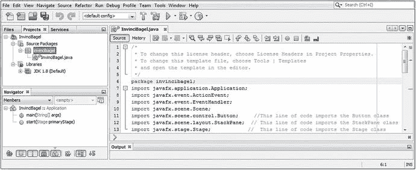
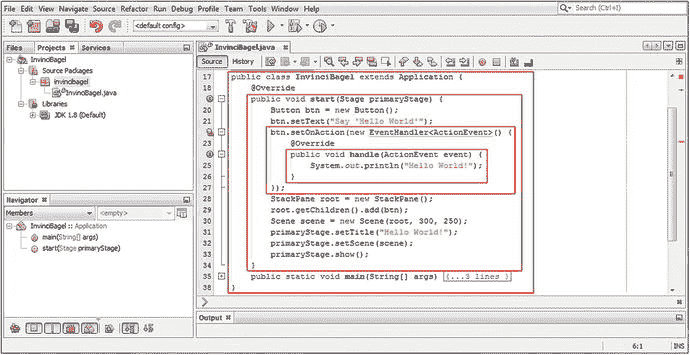
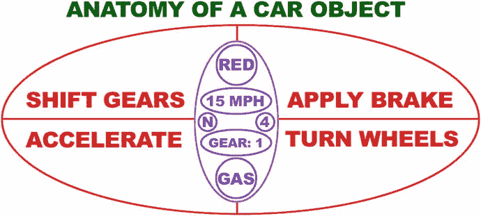
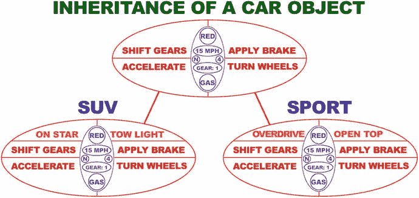

# 5. Java 入门：Java 概念与原理简介

让我们通过回顾 Java 编程语言背后的核心编程语言概念和原理，确保所有读者在第 5 章中处于同一知识水平。我们有必要用这一章为读者提供一份 Java“入门指南”或全面概述，并在一章内简明扼要地回顾这门编程语言。你在本书第一章安装的 Java 9 JDK（及 JRE）将成为你的 Pro Java 游戏与物联网应用以及 NetBeans 9 IDE 的基础。（我们将在下一章介绍 NetBeans，这样你就能了解你将用来编写 Java 9 游戏或物联网应用的 IDE 如何作为代码编辑器和应用测试工具来运行。）

我们在本章中将要介绍的大部分核心 Java 结构和原理在 Java 编程语言中由来已久，多数可追溯到 Java 5（即 1.5 版）或 Java 6（1.6 版）。我们还将介绍 Java 7（1.7 版）和最新发布的 Java 8（1.8 版）中新增的功能，以及计划在 2017 年第三季度发布的 Java 9（1.9 版）中的新特性。这些 Java 版本被用于数十亿台设备。Java 6 用于 32 位 Android 2.x、3.x 和 4.x 操作系统及应用；Java 7 用于 64 位 Android 5.x 和 6 操作系统及应用；Java 8 用于 Android 7 至 8，以及流行的操作系统（包括 Microsoft Windows、Apple Macintosh、Open Solaris 和众多流行的 Linux 发行版，如 SUSE、Ubuntu、Mint、Fedora 和 Debian）；而 Java 9 现已向公众发布。

当然，随着本书的深入，你将学习 Java 8 的高级新概念，例如 Lambda 表达式，以及 Java 8 和 Java 9 的组件，例如 JavaFX 多媒体引擎。本章将涵盖最基础的 Java 编程语言概念、技术和原理，这些内容横跨目前广泛应用于计算机、智能电视和手持设备的五个主要 Java 版本。

我们将从最简单的概念开始，逐步深入到较难的概念，因此我们将从 Java 的最高层级——API 及其模块——入手，然后深入到这些模块内部的 Java 编程结构的“实操”部分，包括包、类、接口、方法、常量和变量。

在进入 Java 的结构部分（如包、类和接口）之前，你将先了解 Java 语法，包括什么是 Java 关键字、如何界定 Java 编程结构，以及如何在 Java 代码中添加函数注释。然后，我们将介绍应用程序编程接口（API）的顶层概念、什么是包、如何导入和使用作为 API 一部分的 Java 包提供的现有代码，以及如何创建包含你自己的游戏和物联网应用代码的自定义 Java 包。

你将了解 Java 包内部包含的结构，这些结构被称为 Java 类。你将学习类所包含的方法、变量和常量；了解什么是超类和子类；了解什么是嵌套类和内部类以及如何使用它们。最后，你将学习 Java 对象，以及它们如何构成面向对象编程（OOP）的基础。你将了解什么是构造方法，以及它如何使用一种特殊的方法（该方法与其所在类同名）来创建 Java 对象。

## 编写 Java 语法：注释与代码分隔符

关于编写 Java 语法，有几件事你需要立即了解。语法控制着 Java 如何“解析”与编程语言相关的内容。解析你的代码语法使 Java 能够理解你希望通过编程逻辑实现什么。理解主要的语法规则很重要，因为它们能让 Java 编译器理解你是如何组织 Java 代码的。Java 编译是 Java 编程过程的一部分，在此过程中，JDK 编译器（程序）将你的 Java 代码转换为字节码。字节码由安装在最终用户计算机系统上的 JRE Java 运行时引擎执行（运行）。Java 编译器需要知道你的代码中哪些部分是 Java 编程逻辑，哪些部分是给你自己（或给你的项目编程团队其他成员）的注释；你的 Java 代码块从哪里开始、到哪里结束；以及在这些 Java 代码块内部，你的单个 Java 编程语句或指令从哪里开始、到哪里结束。一旦编译器明确了这些，它就能解析这些语句，并将它们从代码转换为字节码。

让我们从注释开始，因为这是最容易理解的主题。向 Java 代码添加注释有两种方式：单行注释或行内注释，可以放在每行 Java 代码逻辑之后；以及多行注释或块注释，放在一行 Java 代码或一个 Java 代码块（一种 Java 代码结构）之前（或之后）。

单行注释用于添加关于一行 Java 代码或一条 Java 编程语句作用的注释。该注释解释这行 Java 代码在你的整体代码结构中旨在完成什么任务。Java 中的单行注释以双斜杠字符序列开头。例如，如果你想在稍后第 6 章将要创建的 BoardGame 引导代码中注释某条 import 语句，你可以在该行代码后添加双斜杠。这就是这行 Java 代码在添加单行注释后的样子；图 5-1 中 NetBeans 界面的右下角也展示了这一点：



图 5-1.

多行注释（顶部前五行代码）和单行注释（底部后三行代码）

```
import javafx.stage.Stage; // 这行代码从 JavaFX.stage 包中导入 Stage 类
```

让我们也看看多行注释，如图 5-1 顶部 `package invincibagel` 语句上方所示，我们将在本章下一节学习该语句。如你所见，块注释的实现方式不同，使用一个斜杠后跟一个星号来开始注释，并使用相反的顺序，即一个星号后跟一个斜杠，来结束多行注释（这种注释也称为块注释）。这就是你通常为你的专业 Java 游戏添加简短（单行）或长篇（多行）注释的两种方式。

需要注意的是，你不能“嵌套”多行注释。只需使用一个更大的多行注释即可！

如果你想知道，这个 InvinciBagel 项目是我在写给 Apress 的《Beginning Java 8 Games Development》一书中教读者创建的 i2D 街机游戏，该书涵盖了使用 Java 8 和 JavaFX 8 进行 i2D 游戏开发的内容。那本书中的所有原理都适用于《Pro Java 9 Games Development》，因此我在这里使用了那段代码。


我通常会将单行注释排列得相当整齐。Java 的块注释规范要求将星号对齐，即在注释起始定界符和结束定界符中各放一个星号。如图 5-1 所示，该图位于 NetBeans 中 InvinciBagel.java 代码编辑器选项卡的顶部。

还有第三种注释类型，称为 **Javadoc 注释**，本书中你不会在专业的 Java 游戏开发中使用它，因为代码旨在用于创建你的游戏，而非向公众分发。如果你打算编写一个供他人创建游戏使用的 Java 游戏引擎，那时你才需要使用 Javadoc 注释来为你的专业 Java 游戏引擎添加文档。JDK 提供了一个 Javadoc 工具，用于处理 Javadoc 注释并将其添加到 NetBeans 9 IDE 中。Javadoc 注释类似于多行注释，但它使用两个星号字符来创建起始的 Javadoc 注释定界符，如下所示：

```
/** 这是 Java 文档（Javadoc）类型 Java 代码注释的一个示例
这是一种会自动生成 Java 文档的注释类型！
*/
```

如果你想在 Java 语句或编程结构的正中间插入注释（作为专业的 Java 游戏开发者，你绝不应该这样做），则应使用多行注释格式，如下所示：

```
import  /* 这行代码导入 Stage 类 */  javafx.stage.Stage;
```

这不会产生任何错误，但可能会让代码的阅读者感到困惑，因此不要以这种方式注释代码。然而，以下使用单行注释格式的注释方式会产生错误：

```
import  // 这行代码无法成功导入 Stage 类  javafx.stage.Stage;
```

这是因为编译器只会看到 `import` 这个词，因为这种单行注释会解析到行尾，而多行注释则使用块注释定界符序列（星号和正斜杠）明确结束。因此，Java 编译器会对这第二个不正确的注释代码抛出错误，本质上是在问“导入什么？”由于你不能导入空内容，你必须从 Java 包中导入一个 Java 类。

正如 Java 编程语言使用双正斜杠和斜杠-星号配对来界定 Java 代码中的注释一样，还有其他几个关键字符用于界定 Java 编程语句以及整个 Java 程序逻辑块。我经常将 Java 代码块称为代码结构。

分号字符在 Java（所有版本）中用于界定或分隔 Java 编程语句，例如图 5-1 中显示的包和导入语句。Java 编译器所做的是查找一个 Java 关键字（它启动一条 Java 语句），然后将该关键字之后的所有内容视为该 Java 代码语句的一部分，直到遇到分号字符，这是你告诉 Java 编译器“我已完成此 Java 语句的编码”的方式。例如，要在 Java 应用程序顶部声明你的 Java 包，你会使用 Java 的 `package` 关键字、你的包名，然后是一个分号字符，如下所示（如图 5-1 所示）：

```
package invincibagel;
```

我们将在下一节介绍 API 和包，以及如何使用 `import` 语句访问它们。导入语句也使用分号字符进行界定（同样如图 5-1 所示）。导入语句以 `import` 关键字开头，接着是要导入的包和类，最后是分号定界符，如下面的 Java 编程语句所示：

```
import javafx.application.Application;
```

接下来我们要看的定界符是花括号 `{…}`。与多行注释定界符类似，花括号有一个左花括号 `{`，它界定（或向编译器指示）一组 Java 语句的开始或起点；以及一个右花括号 `}`，它界定（或向编译器指示）一组 Java 编程语句的结束。花括号允许你将 Java 编程语句嵌套在其他 Java 结构内部。本书将频繁介绍嵌套 Java 结构。

如图 5-2 所示，使用这些花括号界定的 Java 代码块可以相互嵌套（包含），从而形成更复杂的 Java 代码结构。图 5-2 显示了类中使用花括号的第一个（最外层）代码块。在该代码块内部是你的 `start()` 方法，其内部是你的 `.setOnAction()` 方法调用，再内部是一个 `handle()` 方法定义。随着本章内容的推进，我们将了解所有这些 Java 代码的作用。我现在希望你想象的是（我通过在图 5-2 中绘制红色方块来帮助你做到这一点），这些花括号如何允许你的方法（和类）定义它们自己的代码块（结构），每个代码块都是更大 Java 结构的一部分，而最大的 Java 结构是 InvinciBagel 类。每个左花括号都有一个匹配的右花括号，同时注意代码的缩进，以便最内层的 Java 代码结构向右缩进得最多。每个 Java 代码块额外缩进四个字符或空格。如你所见，类没有缩进（零个），`start()` 方法缩进四个空格，`.setOnAction()` 方法缩进八个空格，`handle()` 方法缩进十二个空格。请注意，NetBeans 9 会自动为你缩进每个 Java 代码结构。



图 5-2.

InvinciBagel 类、start 方法、setOnAction 方法和 handle 方法的嵌套 Java 代码块

请注意，这些红色方块内部的嵌套 Java 代码，都以一个花括号开始，并以一个花括号结束。现在你已经熟悉了各种 Java 代码注释方法，以及 Java 编程语句需要如何被界定（无论是单独语句还是作为 Java 代码块），接下来你将了解各种 Java 代码结构。你将看到它们是如何使用的，它们能为你的应用程序和游戏做什么，以及实现你的 Java 编程结构需要使用哪些重要的 Java 关键字。


## Java 包：按功能组织 Java API

在编程平台的最顶层，例如谷歌的 32 位 Android 4（使用 Java SE 6）、64 位 Android 5（使用 Java SE 7）或当前的 Oracle Java SE 平台（最近发布的 Java SE 9），都包含一组包，这些包中包含了类、接口、方法和常量，它们共同构成了应用程序编程接口（API）。这套 Java 代码（就我们而言，目前是 Java 9 API）可供应用程序（此处指游戏）开发者使用，以便在多种操作系统、平台以及消费电子设备（如计算机、笔记本电脑、上网本、平板电脑、高清和超高清智能电视、电子书阅读器和智能手机）上创建专业级软件。

要安装某个特定版本的 API 级别，你需要安装其对应的软件开发工具包（SDK）。Java SDK 有一个特殊的名称，即 Java 开发工具包（JDK）。熟悉 Android 开发（Android 实际上是基于 Linux 操作系统的 Java）的人都知道，每当添加一些新功能时，就会发布一个不同的 API 级别。这是因为运行 Android 的硬件设备会添加需要支持的新硬件功能，而不是因为谷歌每隔几个月就想发布一个新的 SDK。Android 在短短几年内发布了超过 26 个不同的 API 级别，而 Java SE 在十多年间只发布了九个。目前，在数十亿消费电子设备中，只有四个 Java API 级别（Java 6、7、8 和 9）被积极使用。

Java 6 与 Eclipse 的 ADT IDE 配合使用，用于开发 32 位 Android（版本 1.5 至 4.4）；Java 7 与 Android Studio 配合使用，用于开发 64 位 Android（版本 5.x、6、7.x）；Java 8 与 IntelliJ IDE 配合使用，用于开发 Android Studio 3.0；而 Java 9 则跨 Windows、Macintosh、Linux 和 OpenSolaris 操作系统使用。我有三台不同的工作站，分别针对每个 Java API 平台和 IDE 软件包进行了优化，这样我就可以同时为 32 位 Android 设备（Java 6）、Android 5 至 6（Java 7）、HTML5 和 Android 7 至 8（Java 8）以及 JavaFX 9（Java 9）开发应用程序。幸运的是，你可以在 [`www.PriceWatch.com`](http://www.pricewatch.com) 上花几百美元买到一台强大的 Windows 10 或 Ubuntu LTS 18 六核（或八核）64 位专业 Java 9 游戏开发工作站。

除了 API 级别（你安装并正在使用的 SDK）之外，Java 编程语言中最高级别的结构是包。Java 包使用 `package` 关键字在你的 Java 代码顶部声明你自己的应用程序包。这必须是除了注释之外的第一行代码声明，正如你将在第 6 章中看到的那样（以及本章前面的图 5-1 所示）。你只能有一个包声明，并且只能声明一个包，而且它必须是第一条 Java 语句！你在第 6 章中将使用的 NetBeans 9 中的“新建项目”系列对话框会为你创建包，并根据你想在应用程序中执行的操作，导入你需要使用的其他包。就我们而言，这些将是 JavaFX 9 包，这样我们就可以利用 JavaFX 新媒体引擎。Java 9 进一步将包分组为模块，这些模块被添加到你的主 Java 程序逻辑之外（外部）。

正如你可能从名称中推断出的那样，Java 包将你在本章中将要学习或复习的所有 Java 编程结构捆绑在一起。这些包括与你的应用程序相关的类、接口和方法，因此 `gameboard` 包将包含你的所有代码，以及你导入以与你的代码协同工作的所有代码，这些代码是创建、编译和运行你的棋盘游戏所必需的。接下来，我们将探讨导入的概念和 Java `import` 关键字，因为它与包的概念密切相关。

Java 包对于组织和包含你自己的所有应用程序代码非常有用，但对于组织和包含你将与自己的 Java 编程逻辑一起使用的 SDK（API）的 Java 代码来说，它甚至更有用，以便创建专业的 Java 游戏或物联网应用程序。从 Java 9 开始，Java 包将按功能模块进行组织，我们将在本章末尾介绍这一点，因为模块不会影响你的 Java 游戏编程逻辑；它们只是在高层面上组织事物，以便让你优化分发，从而为你的目标游戏玩家最终用户获得最小的 Java 游戏分发下载大小。

你可以使用 Java `import` 关键字来使用你正在“基于”或“配合”开发的 API 中的任何类，该关键字与你要使用的包和类一起，构成了一条导入语句。这条导入语句以 `import` 关键字开头，接着是包和类的引用路径（完整的正式名称），然后语句需要用分号结束。正如你在图 5-1 中看到的，用于从 `javafx.event` 包中导入 JavaFX `EventHandler` 类的导入语句应如下所示：

```
import javafx.event.EventHandler;
```

一条导入语句会告知 Java 编译器，它需要将一个指定的外部包引入到你的包中（将其导入到你的包中），因为你将使用通过 `import` 关键字引用的类中的方法（和常量），以及该类所在的包。如果你在自己的 Java 9 类（例如你将在第 6 章中创建的 `BoardGame` 类）中使用了某个类、方法或接口，但没有使用导入语句声明该类的使用，那么 Java 9 编译器将抛出一个错误。这是因为编译器无法定位或引用将在你的包中使用的类，从而无法导入该功能。


## Java 类：用于模块化游戏的 Java 结构

在包层级之下，下一个最大的 Java 编程结构是 Java 类层级，正如你在 import 语句中所见，它既引用了包含该类的包，也引用了类本身。正如包组织所有相关类一样，类也组织其所有相关的方法、变量和常量，有时还包括其他嵌套类，我们将在本章下一节中介绍这些内容。

Java 类可用于在功能组织的下一个逻辑层级组织你的 Java 代码，因此，你的类将包含为游戏应用程序添加特定功能的 Java 代码结构。这些包括方法、变量、常量、嵌套类或内部类，所有这些都将在本章中介绍。

Java 类也可用于创建 Java 对象，我们将在学习类、嵌套类、方法和数据字段之后介绍这一点。Java 对象是使用你的 Java 类构建的。它们与 Java 类以及该类的构造方法同名，我们将在本章稍后部分介绍构造方法。

如图 5-2 所示，你使用 Java 类关键字以及类名称来声明类。你还可以在声明前加上 Java 修饰符关键字，我们将在本章后面介绍。Java 修饰符关键字始终放在 Java 类关键字之前（或前面），使用以下格式：

```
class <类名称>
```

Java 类的一个强大特性是它们可用于模块化你的 Java 游戏代码，这样你的核心游戏应用程序功能可以成为高级类的一部分，该类可以被继承以创建该类的更专门化版本。一旦一个类被用于创建子类，它就变成了超类，这是 Java 类层次结构的术语。一个类通常使用 Java 的 `extends` 关键字来继承另一个超类。

使用 Java 的 `extends` 关键字告诉编译器，你希望将超类的功能和特性添加（扩展）到你的类中，一旦使用了这个“extends”关键字，你的类就变成了子类。子类“扩展”了它所继承的超类提供的核心功能。为了扩展类定义以包含超类，你需要使用以下格式添加（或扩展，无意双关）你现有的 Java 类声明：

```
class <子类名称> extends <超类名称>
```

当你使用你的类（它将成为该超类的子类）扩展一个超类时，你可以在你的子类中使用该超类的所有特性（嵌套类、内部类、方法、构造方法、变量和常量）。你无需在类体中显式重写（重新编码）这些 Java 结构，因为你的类扩展了超类，使其成为你类的一部分，这样做会是冗余的（且混乱的）。我们将在本章下一节介绍嵌套类和内部类，以防你想知道它们是什么。

类的体部编码在花括号内（图 5-2 中的外部红色框），这些花括号位于你的类声明和 `javafx.application.Application` 超类（在此特定情况下）声明之后。这就是为什么你首先学习或复习了 Java 语法；你在此基础上通过类声明以及包含类定义（变量、常量、方法、构造方法、嵌套类、内部类）结构的 Java 语法进行构建。

注意在图 5-2 中，`InvinciBagel` 类扩展了来自 JavaFX 应用程序包的 `Application` 超类。这样做为 `InvinciBagel` 类提供了托管或运行 JavaFX 8 应用程序所需的一切。这个 JavaFX 8 的 `Application` 类所做的是“构造”你的应用程序对象，以便它能够使用系统内存，调用 `.init()` 方法（以初始化任何可能需要初始化的内容），并调用你可以在图 5-2（第二个红色框中）看到的 `.start()` 方法。这个 `.start()` 方法是你放置 Java 代码语句的地方，这些语句最终将用于“启动”（即开始或启动）InvinciBagel i2D 街机游戏 Java 8 应用程序。这个 Java 8 游戏也将在 Java 9 下无需修改即可运行。

当最终用户使用完 i2D InvinciBagel Java 应用程序后，由 `Application` 类使用 `Application()` 构造方法创建的 `Application` 对象将调用其 `.stop()` 方法，并将你的应用程序从系统内存中移除。这将为最终用户的其他用途释放内存空间。我们很快将深入探讨方法、构造方法和对象，因为我们正在从高级的包和类结构逐步深入到较低级别的方法和对象结构，以便我们能够从高级概述逐步深入到较低级别来推进学习过程。你可能想知道 Java 类是否可以相互嵌套。也就是说，Java 类可以包含其他 Java 类吗？答案是肯定的，可以。接下来，让我们更仔细地看看 Java 嵌套类这个概念。


### 嵌套类：生活在其他类内部的 Java 类

Java 中的嵌套类是指定义在另一个 Java 类内部的类。嵌套类是其所在类的一部分，这种嵌套关系表明这两个类旨在以某种方式协同使用。嵌套类分为两种类型：静态嵌套类（通常简称为嵌套类）和非静态嵌套类（通常称为内部类）。

静态嵌套类（我将其简称为嵌套类）用于创建与其所在类配合使用的工具类，有时也仅用于存放与其所在类配合使用的常量。开发 Android 应用的读者对嵌套类应该不陌生，因为它们在 Android API 中非常常见，要么用于存放工具方法，要么用于存放 Android 常量——这些常量用于定义屏幕密度设置、动画运动插值曲线类型、对齐常量、用户界面元素缩放设置等。在第 4 章中，我们讨论了 static 在游戏中的概念，对于代码而言，它具有相同的含义或暗示。Java 常量可以被视为固定不变的，即无法更改。

嵌套类使用 Java 中通常所说的点号表示法，通过其主类（或父类）来引用嵌套类。例如，`MasterClass.NestedClass` 就是使用主类（包含类）名称来引用嵌套类的格式，这里使用了泛型类名。如果你创建了 `SplashScreen` 嵌套类来为你的 Java 棋盘游戏绘制启动画面，那么在 Java 代码中，你将通过点号表示法语法将其引用为 `BoardGame.SplashScreen`。

举个例子，我们来看看 JavaFX 的 `Application` 类，它包含 `Parameters` 嵌套类。这个嵌套类封装（即包含）了你可以为 JavaFX 应用程序设置的参数。因此，这个 `Application.Parameters` 嵌套类将与你的 `Application` 类同属于 `javafx.application` 包，如果你使用 import 语句，它将被引用为 `javafx.application.Application.Parameters`。

类似地，构造方法（我们很快会学习构造方法）将被写为 `Application.Parameters()`，因为构造方法必须与其所在类同名。除非你是在为其他开发者编写代码（这正是嵌套类最常用的场景，例如 JavaFX 的 `Application` 类或 Android 8 操作系统中的许多嵌套工具类/常量提供类），否则你更可能使用非静态嵌套类。这些非静态嵌套类在 Java 游戏中通常被称为内部类。

嵌套类（技术术语为静态嵌套类）使用 `static` 关键字（修饰符）进行声明，你将在本章稍后部分学习到这一点。因此，如果你要创建 `BoardGame.SplashScreen` 嵌套类，`BoardGame` 类和 `SplashScreen` 嵌套类的声明将类似于以下代码：

```
public class BoardGame extends Application {
static class SplashScreen {
// 创建并显示启动画面的 Java 代码写在这里
}
}
```

需要注意的是，如果你使用 `import javafx.application.Application.Parameters`（举例）来导入嵌套类，那么你可以在类中直接使用 `Parameters` 类名来引用该嵌套类，而无需使用完整的类名“路径”（即通过 `Application.Parameter`（ClassName.NestedClassName）引用方式，向代码展示如何从父类导航到嵌套类）。

正如你将在本书中多次看到的那样，方法也可以通过点号表示法来访问。因此，如果你已经使用 import 语句导入了这个嵌套类，那么你可以直接使用 `NestedClassName.MethodName`，而无需使用 `ClassName.NestedClassName.MethodName`。这是因为 import 语句已经建立了通过其包含类到达该嵌套类的完整“引用路径”，所以你无需再这样做。

接下来，让我们看看非静态嵌套类，它们更常被称为内部类。


### 内部类：不同类型的非静态嵌套类

Java 内部类也属于嵌套类，但它们在类关键字和类名之前没有使用 `static` 关键字修饰符，这就是它们被称为“非静态”嵌套类的原因。因此，任何位于另一个类内部且未使用 `static`（关键字）修饰符的类声明，在 Java 中都被称为内部类。Java 中有三种类型的内部类：成员类、局部类和匿名类。在本节中，我们将详细介绍这些内部类类型之间的区别，以及它们的实现方式。

与嵌套类类似，成员类定义在包含（父）类的主体内部。你可以在包含类主体内的任何位置声明成员类。当你希望访问属于包含类的数据字段（变量或常量）和方法，而无需通过点号表示法提供路径（`ClassName.DataField` 或 `ClassName.Method`）时，就可以声明一个成员类。成员类可以被视为不使用 Java `static` 修饰符关键字的嵌套类。

嵌套类通过其包含类或“顶层”类，使用点号表示法路径来引用静态嵌套类；而成员类由于不是静态的，因此是“实例特定的”，这意味着使用该类创建的对象（实例）可以彼此不同（对象是类的一个唯一“实例”），而静态（固定）嵌套类则只有一个不会改变的版本。例如，一个私有内部类只能被包含它的父类使用。将 `SplashScreen` 内部类编码为私有类，看起来会像这样：

```
public class BoardGame extends Application {
private class SplashScreen {
// 创建并显示启动画面的 Java 代码在此处
}
}
```

由于它被声明为私有，因此仅供我们自己的应用程序使用（具体来说是供包含类使用）。因此，这不会是一个供其他类、应用程序或开发人员使用的工具类或常量类。你也可以在不使用 `private` 访问修饰符关键字的情况下声明内部类，如下面的 Java 编程结构所示：

```
public class BoardGame extends Application {
class SplashScreen {
// 创建并显示启动画面的 Java 代码在此处
}
}
```

这种访问控制级别称为包级或包私有，是应用于任何未使用其他 Java 访问控制修饰符关键字（`public`、`protected` 或 `private`）声明的类、接口、方法或数据字段的“默认”访问控制级别。这种类型的内部类不仅可以被顶层类或包含类访问，还可以被包含该类的包中的任何其他类成员访问。这是因为包含类被声明为“public”，而内部类被声明为“package private”。如果你希望内部类在包外部也可用，则应将其声明为 `public`，使用以下 Java 代码结构：

```
public class BoardGame extends Application {
public class SplashScreen {
// 创建并显示启动画面的 Java 代码在此处
}
}
```

你也可以将内部类声明为 `protected`，这意味着它可以被父类或包含类的任何子类访问。我们将在介绍完 Java 方法和 Java 变量之后，再深入探讨 Java 修饰符。

如果你在一个非类的较低级 Java 编程结构（例如方法或迭代控制结构，通常称为循环）内部声明一个类，那么它在技术上被称为局部类。这个局部类仅在该代码块内部可见，因此它不允许（也没有意义）使用诸如 `static`、`public`、`protected` 或 `private` 之类的类修饰符。

局部类的使用方式类似于局部变量，只不过它是一个更复杂的 Java 编码结构，而不是一个在局部使用的简单数据字段值。这在游戏中并不常用，因为你通常希望游戏能够“按功能”划分，划分为具有方法和变量的功能类，这些方法和变量具有明确的用途和理由，以便通过 Java 的组织或封装特性来清晰定义游戏设计和处理的复杂性。从第 6 章开始，我们将在本书的每一章中设计游戏的不同功能组件，从而对此进行探讨。通过这种方式，我们充分利用 Java 的特性来创建游戏设计。

最后，还有一种称为匿名类的内部类。匿名类是一种没有指定类名的局部类。你遇到匿名类的频率可能远高于局部类。这是因为程序员通常不会为他们的局部类命名（使其成为匿名类）。局部类包含的逻辑仅在其声明处局部使用，因此，这些类实际上不需要有名称，因为它们只在那个 Java 代码块内部被引用。

## Java 方法：核心逻辑函数 Java 结构

在类内部，通常有方法以及这些方法使用的数据字段（变量或常量）。由于我们是从外部结构到内部结构，或者说从顶层结构到底层结构，因此接下来我们将介绍方法。方法在其他编程语言中有时被称为函数，你可以在图 5-2 中看到 `.start()` 方法的一个示例，该图展示了方法如何持有创建基本 Java 游戏应用程序的编程逻辑。方法内部的编程逻辑使用 Java 编程语句来创建 `Stage` 和 `Scene`，在 `StackPane` 中的屏幕上放置一个按钮，并定义事件处理逻辑，以便在单击按钮时，引导 Java 代码向你的 NetBeans 9 IDE 输出区域写入一些“Hello World”文本。


### 声明方法：修饰符、返回类型与方法名

方法声明以访问控制修饰符关键字开头，可以是 `public`、`protected`、`private` 或包级私有（即完全不使用任何访问控制修饰符关键字）。如图 5-2 所示，你的 `.start()` 方法已使用 `public` 访问控制修饰符进行声明。我们将在本章后续部分更详细地介绍访问控制修饰符关键字。

在访问控制修饰符之后，你需要声明方法的返回类型。这是方法在被调用或执行后所返回的数据类型。由于 `.start()` 方法执行设置操作，但不返回任何特定类型的值，因此它使用了 `void` 返回类型，这表示该方法执行一项任务，但不会向调用方返回任何结果数据。在本例中，调用方是 JavaFX Application 类，因为 `.start()` 方法是我们所扩展的 Application 超类提供的核心方法之一（另外两个是 `.stop()` 和 `.init()` 方法），这些方法控制着你的 i3D BoardGame JavaFX 应用程序的生命周期阶段。

在返回类型之后，你需要提供方法名。按照惯例（编程规则），方法名应以小写字母（或单词，最好是动词）开头，后续（内部）单词（名词或形容词）则以大写字母开头。例如，用于显示启动画面的方法可命名为 `.showSplashScreen()` 或 `.displaySplashScreen()`，由于它执行操作但不返回值，因此应使用以下代码进行声明：

```
public void displaySplashScreen() { 用于显示启动画面的方法 Java 代码写在此处 }
```

如果需要传递参数（即需要在方法体（花括号内的部分）中进行操作的命名数据值），这些参数应放在与方法名相连的圆括号内。在图 5-2 中，你的引导型 HelloWorld JavaFX 应用程序的 `.start()` 方法接收一个名为 `primaryStage` 的 Stage 对象，使用的 Java 方法声明语法如下：

```
public void start(Stage primaryStage) { 用于启动应用程序的引导型 Java 代码写在此处 }
```

你可以根据需要提供任意数量的参数，每个参数由数据类型和参数名成对组成，各对之间用逗号分隔。方法也可以没有参数，此时参数括号为空，左括号和右括号紧挨在一起；本书中我就是这样编写方法名的，以便你识别它们是方法。我在方法名之前使用点号（表示法），在方法名之后使用括号字符，例如 `.start()` 或 `.stop()` 等，这样你就知道我在引用一个 Java 方法。

定义方法的编程逻辑将包含在方法“体”内，正如你已经了解的，方法体位于定义方法开始和结束的花括号内部。方法内部的 Java 编程逻辑可以包括变量声明、程序逻辑语句、控制结构以及迭代循环等内容，在本书中，我们将利用所有这些内容来创建我们的 Java 游戏。

### 方法重载：提供独特的参数列表

在继续讲解之前，本节还将介绍 Java 中另一个与方法相关的概念，称为方法重载。方法重载特指使用相同的方法名，但采用不同的参数列表配置。重载的含义是：如果你定义了多个同名方法，Java 编译器能够判断出应该使用哪一个重载方法。

Java 编译器通过查看参数数据类型以及这些参数传入被调用方法的顺序来区分重载方法。然后，Java 编译器将参数列表的唯一性作为一种“指纹”，来辨别应该使用哪一个同名方法。因此，你的参数列表配置必须彼此完全唯一，Java 方法重载功能才能正确工作。

在本书的后续内容中（从介绍 NetBeans 9 的第 6 章开始，一直到全书结束），我们将学习如何使用和编写 Java 方法，因此我在这里不会花费过多篇幅，仅定义它们是什么，以及它们在 Java 类中声明和使用的基本规则。

### 构造方法：将 Java 类转化为 Java 对象

在本章的这一节中，我将详细介绍一种特殊的 Java 方法，称为构造方法。这是一种特殊类型的方法，可用于创建（构造）Java 对象，我们将在本章稍后部分（在介绍完所有可用于创建、定义和与这些 Java 对象交互的不同类型 Java 语法和编程结构之后）进行介绍。Java 对象恰好是面向对象编程（OOP）的基础，因此我们将在此处探讨构造方法；在后续章节介绍 Java 对象本身之前，理解这一点非常重要。由于我们正在本节中讨论方法，因此这是探讨构造方法最合理的地方，因为资深 Java 游戏开发者有时会简称为构造方法，而你正朝着这个方向迈进。


#### 创建 Java 对象：调用类的构造方法

Java 类可以包含一个与类同名的构造方法，并可用于创建该类的 Java 对象。构造方法以其 Java 类为蓝图，在系统内存中创建该类的一个实例，从而生成 Java 对象。构造方法始终返回一个 Java 对象，因此不会使用其他方法通常使用的任何其他 Java 返回类型（`void`、`String`、`float`、`int`、`byte` 等）。我们将在本章稍后部分介绍这些 Java 返回类型。由于你正在创建一个新的 Java 对象，因此应使用 Java `new` 关键字来调用构造方法。

你可以在图 5-2 所示的引导 JavaFX 代码中看到这样一个示例，分别在第 20、28 和 30 行。这些行分别创建了 `Button`、`StackPane` 和 `Scene` 对象，使用了以下对象声明、命名和创建的 Java 代码结构，如下所示：

```
=
new 
```

Java 对象之所以以这种方式声明——在一个以分号终止（结束）的 Java 语句中，同时使用类名、要构造的对象名称、Java `new` 关键字以及类的构造方法名称（以及参数，如果有的话）——是因为每个 Java 对象都是 Java 类的一个实例。

以你当前 Java 代码中第 20 行的 `Button` 对象创建为例，你通过等号“运算符”左侧的 Java 语句部分告诉 Java 语言编译器：你想使用 JavaFX `Button` 类作为对象蓝图，创建一个名为 `btn` 的 `Button` 类型对象。这“声明”了 `Button` 类（对象类型）并赋予其一个唯一名称。（我们将在本章稍后部分介绍运算符。）

因此，创建对象的第一部分称为**对象声明**。创建 Java 对象的第二部分称为**对象实例化**，对象创建过程的这一部分可以在等号运算符的右侧看到，它涉及一个构造方法和 Java `new` 关键字。

实例化 Java 对象时，你需要调用或利用 Java `new` 关键字，并结合对象构造方法调用。由于这发生在等号运算符的右侧，因此对象实例化的结果会被放入声明的对象中，该对象位于 Java 语句的左侧。正如你在本章稍后讨论运算符时将会看到的，这就是等号运算符的作用，而且它是一个非常有用的运算符。

至此，你完成了自定义 Java 对象的声明（类名）、命名（对象名）、创建（使用 `new` 关键字）、配置（使用构造方法）和加载（使用等号运算符）的整个过程。

需要注意的是，此过程中的声明和实例化部分可以使用独立的 Java 代码行来编写。例如，`Button` 对象的实例化（图 5-2，第 20 行）可以编写如下：

```
Button btn;          // 声明一个名为 btn 的 Button 对象
btn = new Button();  // 使用 Java new 关键字和 Button() 构造方法实例化 btn 对象
```

这样做之所以重要，是因为以这种方式编写对象创建代码，你可以在类的顶部声明一个对象，这样类中使用或访问这些对象的每个方法都能“看到”该对象。在 Java 中，除非使用修饰符（我们接下来将介绍）另行声明，否则对象或数据字段仅在其声明所在的 Java 编程结构（类或方法）内部可见。

如果你在类内部（因此是在该类包含的所有方法外部）声明一个对象，那么该类中的所有方法都可以访问（看到并使用）该对象。类似地，在方法内部声明的任何内容都是该方法的“局部”变量，并且仅对该方法的其他“成员”可见，这意味着该方法作用域内（即 `{…}` 分隔符内部）的所有 Java 语句都可以访问它。如果你想在当前 `BoardGame` 类中，在方法外部实现这种单独的对象声明，并在 `.start()` 方法内部实现对象实例化，那么该类的前几行 Java 代码将变为如下所示的 Java 编程逻辑：

```
public class BoardGame extends Application {
Button btn;
@Override
public void start(Stage primaryStage) {
btn = new Button();
btn.setText("Say 'Hello World'");
// 其他编程语句在此继续
}
}
```

当对象声明和实例化分开时，它们可以根据可见性需要放置在方法内部（或外部）。在前面的代码中，`BoardGame` 类的其他方法可以调用前面显示的 `btn.setText()` 方法调用，而 Java 编译器不会“抛出”错误。而在图 5-2 中声明 `Button` 对象的方式下，只有 `.start()` 方法能“看到”该对象，因此也只有 `.start()` 方法可以实现 `btn.setText()` 方法调用。


#### 创建构造方法：设计与编码 Java 对象结构

构造方法是一种特殊类型的方法，用于在系统内存中创建对象。这与其他方法（如果你使用其他编程语言，通常称之为函数）有着显著区别。Java 中的非构造方法用于执行某种复杂的计算或某种形式的封装（模块化）处理。构造方法用于在内存中创建 Java 对象，而非执行其他编程功能，这一点可以通过 Java 的 `new` 关键字与构造方法结合使用来证明，该组合会在内存中创建一个该特定类类型的新 Java 对象。因此，构造方法将定义一种特定类型 Java 对象的内部结构。如果你想在实例化对象的同时对其进行配置，可以定义构造方法的参数列表，以便调用方能够用特定的（自定义）数据值填充对象结构。这样，你就可以通过在构造方法的参数列表中传入不同的属性来创建该对象的不同类型。

在本节中，我们将创建几个示例构造方法，向你展示创建构造方法的基础知识及其通常包含的内容。假设你正在为游戏创建一个对象。例如，你可以使用以下 Java 代码结构声明一个 `public BoardGame()` 构造方法：

```
public BoardGame() {
int     healthIndex = 1000;     // 定义生命值单位
int     scoreIndex  = 0;       // 定义得分单位
int     boardIndex  = 0;      //  当前游戏棋盘位置
boolean turnActive  = false; //   标记当前回合是否激活
}
```

通过 `BoardGame playerName = new BoardGame();` 构造方法调用创建的构造方法，会生成一个名为 playerName 的 BoardGame 游戏玩家对象。该对象拥有 1000 点生命值，当前得分为零（因为对象位于游戏棋盘的第一格），并且当前未移动（因为当前不是它的回合）。

接下来，让我们探讨之前学过的构造方法重载概念，并创建另一个带有参数的构造方法，该参数允许我们在创建 BoardGame 对象的同时定义其 `healthIndex` 和 `turnActive` 变量。构造方法如下所示：

```
public BoardGame(int startingHealthIndex, boolean isTurnActive) {
int healthIndex = startingHealthIndex;
int scoreIndex;
int boardIndex;
boolean turnActive = isTurnActive;
}
```

在这个版本中，我仍然将 `scoreIndex` 和 `boardIndex` 变量初始化为零（这是整数的默认值），因此我无需在代码中使用 `lifeIndex = 0` 或 `hitsIndex = 0`，这只是为了向你展示编写这两条语句的一种可选方式。由于 Java 编程语言支持方法重载，如果你使用 `BoardGame playerOne = new BoardGame(1250, true);` 方法调用来实例化一个 BoardGame 对象，将会使用正确的构造方法来创建该对象。这个名为 playerOne 的 BoardGame 对象将拥有 1250 点生命值，得分为零，位于游戏棋盘的第一格，并且当前是它的回合。

Java 关键字 `this` 可用于访问通过构造方法创建的数据字段。例如，在对象的代码中，`this.startingHealthIndex = value;` 会将对象自身的内部数据字段设置为你指定的值。你还可以使用 `this()` 在同一类结构中调用另一个构造方法。

你可以拥有任意多个（重载的）构造方法，只要每个构造方法都是 100% 唯一的。这意味着重载的构造方法必须具有不同的参数列表配置，包括参数列表长度（参数数量）、顺序和/或不同的参数列表类型（不同的数据类型）。如你所见，正是你的参数列表（参数数量、参数数据类型和参数顺序）使得 Java 编译器能够区分你的各个重载方法。

## Java 变量与常量：数据字段中的值

从 API 到包、类、方法，再往下一层，就是这些 Java 类和方法中实际被操作的数据值。在 Java 中，这被称为数据字段。数据存储在称为字段的结构中，就像在数据库设计中一样。Java 数据字段可以是动态的，即变量，这就是为什么它们通常被称为“变量”，并且可以在你的 Java 游戏或物联网应用程序运行期间发生变化。或者，它们也可以是静态的（固定的），这使得数据成为永久性的，在这种情况下，它被称为常量。常量是一种特殊类型的变量，我们将在下一节中介绍，因为在 Java 编程语言中正确声明常量比声明 Java 变量要稍微复杂一些（更高级）。

就 Java 术语（惯例）而言，在类顶部声明的变量称为成员变量、字段或数据字段，尽管从根本上说，所有变量和常量都可以被视为数据字段。

在方法内部或其他较低级别的 Java 编程结构（嵌套在类或方法内部）中声明的变量称为局部变量，因为它只能在该编程结构内部（由花括号 `{...}` 界定）被“看到”或使用。最后，在方法声明、构造方法定义或方法调用的参数列表区域中传递的变量，毫不意外地被称为参数。

变量是一种数据字段，用于保存你的 Java 对象或软件的属性，该属性在软件执行过程中可以（并且将会）发生变化。正如你可能想象的那样，这对于游戏编程尤其重要。最简单的变量声明形式是使用一个 Java 数据类型关键字，以及你希望在 Java 程序逻辑中为该特定变量使用的名称。在上一节的构造方法中，我们声明了一个名为 `scoreIndex` 的整数变量，用于保存你的对象在游戏过程中累积的分数。我们使用以下 Java 变量声明编程语句定义了变量数据类型并为其命名：

```
int scoreIndex; // 可以编码为：int scoreIndex = 0;（整数默认值为零）
```

正如你在上一节关于构造方法的内容中看到的，你可以使用等号运算符，配合与声明的数据类型相匹配的数据值，将变量初始化为一个起始值。示例如下：

```
boolean turnActive = false; // 可以是：boolean turnActive;（布尔值默认值为 false）
```

这条 Java 语句声明了一个布尔数据类型变量，并在等号左侧将其命名为 `turnActive`，然后将声明的变量设置为 `false`，表示该玩家的回合未激活。这与声明和实例化对象的方式类似，区别在于，现在声明的是变量（数据字段）而非创建对象，因此 Java 的 `new` 关键字和构造方法被数据值本身所取代。我们将在本章后续部分介绍不同的数据类型（我们已经介绍了整数、布尔值和对象）。

你还可以在变量声明中使用 Java 修饰符关键字，我将在本章下一节中展示如何声明一个不可变变量（也称为常量）时使用它们。常量在内存中是固定或锁定的，无法以任何方式更改或修改，因此它保持——你猜对了——恒定不变。


我们将在接下来的常量章节之后，介绍与所有 Java 结构相关的 Java 访问修饰符关键字。现在，当我即将完成从最大的 Java 结构（即包）到最小的结构（即数据字段）的讲解时，我们将开始介绍那些适用于 Java 所有层级（类、方法、数据字段）的主题。随着我们逐步推进到本章末尾，这些 Java 概念的复杂度将逐渐增加，因为我希望从较简单的高级概念入手，再深入到更复杂的低级概念。在本章末尾，我们还将介绍如何使用新的 Java 9 模块功能打包你的 Java 项目以进行分发，这将使你能够优化 Pro Java 9 游戏的数据占用空间，并使其更加安全。Java 9 预计将在本书公开发布的同时发布，因此我将本书定位为 Java 9 书籍。《Beginning Java 8 Games Development》一书中的所有内容仍然适用于 Java 9 开发。

### 在内存中固定数据值：在 Java 中定义数据常量

如果你已经熟悉计算机编程，你就会知道，通常需要一些数据字段，它们始终包含相同的数据值，并且在应用程序运行周期内不会改变。这些被称为常量，通过使用一组特殊的 Java 访问修饰符关键字来定义或声明，这些关键字用于将内容固定在内存中，使其无法更改。还有一些 Java 修饰符关键字会限制（或解除限制）对象实例，或限制对 Java 类或包内部或外部的某些类的访问。我们将在本章的下一节中详细介绍这些内容，涵盖 Java 修饰符关键字。

要将 Java 变量声明为“固定”的，你必须使用 Java 的 `final` 修饰符关键字。`final` 的含义与你的父母说“这事定了”时一样：它被固定下来，是既定事实，永远不会改变。因此，创建常量的第一步是在声明中的数据类型关键字前添加 `final` 关键字。

在声明 Java 常量（以及其他编程语言中的常量）时，一个惯例是使用大写字母，并在每个单词之间使用下划线，这表示代码中的常量。

如果我们想为你的游戏创建屏幕宽度和屏幕高度常量，可以这样做：

```
final int SCREEN_HEIGHT_PIXELS = 480;
final int SCREEN_WIDTH_PIXELS = 640;
```

还有一种“空白”final，它是一个非静态的 final 变量，其初始化将延迟到构造方法体中。还需要注意的是，每个对象都会获得非静态 final 变量的一个独立副本。

如果你希望由类的构造方法创建的所有对象都能“看到”并使用这个常量，你还需要在 `final` 修饰符关键字前添加 Java 的 `static` 修饰符关键字，如下所示：

```
static final int SCREEN_HEIGHT_PIXELS = 480;
static final int SCREEN_WIDTH_PIXELS = 640;
```

如果你只希望你的类以及由该类创建的对象能看到这些常量，你可以在 `static` 修饰符关键字前使用 Java 的 `private` 修饰符关键字来声明常量，代码如下：

```
private static final int SCREEN_HEIGHT_PIXELS = 480;
private static final int SCREEN_WIDTH_PIXELS = 640;
```

如果你希望任何 Java 类，甚至是包外部的类（即其他人的 Java 类），都能看到这些常量，你可以在 `static` 修饰符关键字前使用 Java 的 `public` 修饰符关键字来声明常量，使用以下 Java 代码：

```
public static final int SCREEN_HEIGHT_PIXELS = 480;
public static final int SCREEN_WIDTH_PIXELS = 640;
```

如你所见，声明常量比在类中声明一个简单的变量要复杂得多。接下来，我们应该更深入地了解 Java 的访问修饰符关键字，因为它们允许你控制各种事物（例如对类、方法、常量和变量的访问，允许你锁定 Java 代码结构以防止修改）以及类似的高级 Java 代码控制概念，这些概念相当复杂。

现在你已经理解了主要的 Java 编程逻辑结构，可以准备学习（或复习）更复杂的语言特性了，例如修饰符、运算符、数据类型和语句。

## Java 修饰符关键字：访问控制及其他

Java 修饰符关键字是保留的 Java 关键字，用于修改你目前已学习（或复习）的主要 Java 编程结构类型中代码或数据结构的访问控制、可见性或生命周期（在应用程序执行期间，某物在内存中存在的时间长短）。修饰符关键字是“声明”或用于 Java 代码结构“外部”和“头部”（开头）的第一批 Java 保留字，因为结构的 Java 逻辑（至少对于类和方法而言）包含在花括号 `{…}` 分隔符内，这些分隔符位于 `class` 关键字和类名之后，或方法名和参数列表之后。修饰符关键字位于所有这些之前，并且可以与你的 Java 类、方法、数据字段（变量和常量）以及 Java 接口一起使用，我们稍后会介绍接口。

正如你在图 5-2 底部为 `.main()` 方法所看到的，该方法由 NetBeans 9 为 BoardGame 类定义创建（使用了我们接下来要介绍的 `public` 修饰符），你可以使用多个 Java 修饰符关键字。`.main()` 方法首先使用了 `public` 修饰符关键字，这是一个访问控制修饰符关键字；然后使用了 `static` 修饰符关键字，这是一个非访问控制修饰符关键字。接下来，我们介绍 Java 访问控制修饰符，之后，我们将深入探讨更复杂的非访问控制修饰符。这些访问控制修饰符在 Java 9 中由于 Java 模块功能提供的额外安全保护而变得更加重要，该功能控制着你的包和 API 如何被打包和分发。

### 访问控制修饰符：public、protected、package 和 private

我们先介绍访问控制修饰符，因为它们在任何非访问控制修饰符关键字和任何返回类型关键字之前声明；它们在概念上也更容易理解。有四种访问控制修饰符级别可以应用于任何 Java 编程结构。如果你没有声明任何访问控制修饰符关键字，则“默认”的访问控制级别（包私有）将应用于该 Java 代码结构，这允许它对你 Java 包内的任何 Java 编程结构“可见”，从而可用。在这种情况下，该包就是 boardgame 包。

其他三种 Java 访问控制修改级别都有各自的访问控制修饰符关键字，包括 `public`、`private` 和 `protected` 关键字。这些关键字的命名恰如其分地反映了它们的功能，因此你可能已经对如何应用它们来公开共享代码或保护代码免受公共使用有了相当好的理解，但为了确保无误，我们在这里逐一详细介绍。如你所知，访问控制（如同安全性）是当今 Java 软件的重要问题，无论是在代码内部还是外部世界，这也是 Java 9 添加模块的原因。我们将从访问控制（安全性）最少的级别开始，即 `public` 访问控制修饰符。


#### Java 公有修饰符：独立于实例的变量或方法

Java 公有访问修饰符关键字可用于类、方法、构造器、数据字段（变量和常量）以及接口。如果你将某个内容声明为公有，那么它就可以被公众访问。这意味着，只要它在模块中被导出，任何其他包中的任何其他类都可以导入并使用它。这基本上意味着你的代码可以在任何使用 Java 9 语言创建的软件中使用。正如你将在 Java 和 JavaFX 编程平台（API）中使用的类中所见，`public` 关键字最常用于开源编程 Java 平台或用于创建自定义应用程序（包括游戏）的包中。

需要注意的是，如果你试图访问和使用的公有类存在于你自己的包（在我们的例子中，你自己的包将命名为 `boardgame`）之外的其他包中，那么你需要使用 Java 的 `import` 关键字来创建一个导入语句，以便能够使用那个公有类。这就是为什么到本书结束时，你的 `JavaFXGame.java` 类顶部会有几十条导入语句。你将通过使用公有访问控制修饰符关键字，利用代码库中已有的、已经过编码、测试、优化并公开的 Java 和 JavaFX 类，从而创建能够利用 Java API 的专业 Java 9 游戏和物联网应用。

由于 Java 中的类继承，公有类中的所有公有方法和公有变量都将被该类的子类继承（一旦被继承，该类就成为超类）。你可以在 `Invincibagel` 类关键字前面看到一个公有访问控制修饰符关键字的示例，如图 5-2 所示。

#### Java 受保护修饰符：允许子类访问的变量和方法

Java 受保护访问修饰符关键字可用于数据字段（变量和常量）以及方法（包括构造器方法），但不能用于类或接口。我们将在本章后面介绍 Java 接口。`protected` 关键字允许超类中的变量、方法和构造器仅被其他包（例如你的 `boardgame` 包）中该超类的子类访问，或者被与包含这些受保护成员（Java 构造）的类位于同一包中的任何类访问。使用此访问控制修饰符就像给原始 Java 代码加了一把锁；要使用原始代码（更不用说对其进行添加从而修改其预期用途），你必须扩展或继承受保护的类，然后才能重写其方法。

因此，此访问修饰符关键字本质上保护了某个类中的方法或变量，这些方法或变量旨在（希望）被其他开发者通过继承（扩展）的方式用作超类。除非你拥有定义这些受保护 Java 构造的包（你并不拥有），否则你必须扩展此超类并创建自己的子类实现，才能使用这些受保护的方法和变量。

你可能会想，什么时候会有人想要这样做并保护这样的 Java 代码结构呢？例如，当你设计一个更大的项目（如 Android 操作系统 API）时，你通常希望最高级别的方法和变量不能直接从类中或直接在类内部使用。

在这种情况下，当其他人使用你的代码结构时，你更希望你的原始 Java 代码在一个单独定义的、由开发者编码的子类结构中使用。这种“隔离”使得超类代码在某种意义上保持原样，不受直接修改，从而保证原始方法、字段和意图按照 Java 代码作者（包所有者）的初衷得以维护，并免受他人修改的影响。这确保了你的 API 及其超类能够永远作为其他 Java 9 开发者创建他们自己的（Android、JavaFX 等）游戏、业务工具和物联网应用的“蓝图”。

你可以通过保护方法和变量结构不被直接使用来实现这种防止直接使用的目的，使它们仅成为其他类中更详细实现的蓝图，而不能被直接使用。本质上，保护一个方法或变量会将其转变为蓝图，或“实现路线图”。

#### Java 私有修饰符：允许本地访问的字段、方法或构造器

Java 私有访问控制修饰符关键字可用于数据字段（变量或常量）以及方法（包括构造器方法和接口），但不能用于类。我们将在本章后面介绍 Java 接口。`private` 访问控制关键字允许类中的变量、方法和构造器仅在该类内部被访问，并且从 Java 9 开始，现在允许私有接口。此私有访问控制关键字使 Java 能够实现一种称为封装的概念，其中类（以及使用该类创建的对象）可以封装自身，可以说是将其“内部细节”对外部的 Java 世界隐藏起来。这种封装在 Java 9 中通过模块得到了进一步增强，我们将在本章末尾介绍。面向对象编程中的封装概念可用于允许团队创建（和调试）他们自己的类和对象。这样，其他人的 Java 代码就无法破坏类内部存在的代码，因为其方法、变量、常量、接口和构造器都是私有的。封装也可以用于保护代码和资源（资产）免受公共访问。

此访问修饰符关键字本质上将类中的方法或变量“私有化”，使它们只能在该类内部本地使用，或者由该类的构造器方法创建的对象使用。除非你拥有包含这些私有 Java 构造的类，否则你无法访问或使用这些方法或数据字段。这是 Java 中最严格的访问控制级别。声明为私有的变量可以在类外部被访问，前提是存在一个从类内部访问私有变量的公有方法，称为公有的 `.get()` 方法调用，该方法被声明为公有，从而通过该公有方法提供了一条通往私有变量或常量中数据的路径（或通道）。


#### Java 包私有修饰符：包内的变量、方法或类

如果未声明任何 Java 访问控制修饰符关键字，则将为该 Java 构造（类、方法、数据字段、构造器或接口）应用默认的访问控制级别，也称为包私有访问控制级别。这意味着这些包私有的 Java 构造对于该 Java 包内的任何其他 Java 类都是可见或可用的。这种包私有级别的访问控制是最容易应用于你的类、接口、方法、构造器、常量和变量的，因为它只需在你的 Java 构造前不显式声明任何 Java 访问控制修饰符关键字，即可作为默认操作应用。

你将在自己的专业 Java 游戏和物联网应用编程中大量使用这种默认的包私有访问控制级别，因为通常你是在自己的包中创建应用程序，供用户以 Java 9 新的增强安全 Java 模块系统（Project Jigsaw）的已完成、已编译、可执行状态使用。

从 Java 9 开始，你还需要将你的包安装到核心 JavaFX 模块之一中，很可能是 `javafx.media` 或 `javafx.graphics`。正如你将在本章最后一节中看到的，正确使用 `public` 和 `private` 关键字将使你能够充分利用 Java 9 新模块特性的强大功能。我们将在本章末尾详细讨论模块，在此之前，我们会先介绍 Java 先前多个版本中就已存在、并且至今仍在 Java 6（32 位 Android）、Java 7（64 位 Android 5 至 6）和 Java 8（64 位 Android 7 至 8，以及 Java 9 于 2017 年第四季度发布前的当前 Java 版本）中使用的所有其他核心 Java 编程语言特性。

然而，如果你正在为其他游戏开发者开发游戏引擎，你很可能会更多地使用我们在本节中讨论的其他三个访问控制修饰符关键字，以便能够精确控制他人如何实现你游戏引擎的 Java 代码结构。接下来，让我们看看非访问控制修饰符关键字，它们在智力上更具挑战性！

### 非访问控制修饰符：final、static 和 abstract

不专门为你的 Java 构造提供访问控制功能的 Java 修饰符关键字被称为非访问控制修饰符关键字。这些包括常用的 `static`、`final` 和 `abstract` 修饰符关键字，以及不太常用的 `synchronized` 和 `volatile` 修饰符关键字，它们用于更高级的线程控制，我将在本专业级编程教程的后续部分介绍。我将在本节中介绍这些关键字，以便你在之前的 Java 编程中遇到它们时能知道它们的含义。

我将按照复杂程度来介绍这些概念，从开发者最容易理解的概念到面向对象编程开发者最难理解的概念。OOP 就像冲浪，在你大量练习之前看起来非常困难，然后突然有一天你就掌握了。

#### Java final 修饰符：变量引用、方法或类不可修改

我们已经看过 `final` 修饰符关键字，它用于与 `static` 关键字一起声明常量。一个 final 数据字段变量可以被初始化（设置）一次。一个 final 引用变量（一种特殊的 Java 变量，包含对内存中某个对象的引用）不能被更改（重新赋值）以引用不同的对象。然而，final 引用对象内部保存的数据是可以更改的，因为只有对对象本身的引用才是 final 引用变量，它本质上是使用 Java `final` 关键字“锁定”的。

Java 方法也可以使用 `final` 修饰符关键字“锁定”。当一个 Java 方法被声明为“final”时，意味着如果包含该方法的 Java 类被继承，该 final 方法不能在子类的主体中被重写或修改。这本质上“锁定”了方法代码结构内部的内容。例如，如果你希望 `JavaFXGame` 类的 `.start()` 方法（如果它被继承）始终执行与 `JavaFXGame` 超类相同的事情（准备 JavaFX 舞台环境），你可以这样做：

```
public class JavaFXGame extends Application {
Button btn;
@Override
public final void start(Stage primaryStage) {
btn = new Button();                          // 可以添加其他 Java 语句
}
}
```

这将防止任何子类（`public class JavaFXGame3D extends JavaFXGame`）更改有关 `JavaFXGame` 游戏引擎（JavaFX）初始设置方式的任何内容，这正是 `.start()` 方法为你的游戏应用程序所做的事情，正如你将在涵盖 JavaFX 9 多媒体引擎的第 7 章和第 8 章中看到的那样。使用 `final` 修饰符关键字声明的类不能被扩展（也称为子类化），从而将该类锁定，防止任何未来的使用。

#### Java static 修饰符：独立于实例存在的变量或方法

正如你已经看到的，`static` 关键字可以与 `final` 关键字结合使用来创建常量。`static` 关键字用于创建独立于或“存在于”使用定义静态变量或静态方法的类所创建的任何对象实例之外的 Java 构造（方法或变量）。类中的静态变量将强制该类的所有实例共享该变量中的数据。在其他编程语言中，这通常被称为全局变量，即代码创建的所有内容都可以访问和共享的变量。

类似地，静态方法也将存在于该类的实例化对象之外，并由所有这些对象共享。静态方法不会引用“自身之外”的变量，例如实例化对象的变量。

通常，静态方法会引用其声明类中的局部变量或静态变量及常量，并通过该方法的参数列表接收变量。然后，它将基于这些参数，以及使用方法自身的静态或局部常量、变量和编程逻辑，提供处理或计算。

由于 `static` 是一个应用于类实例的概念，因此本质上其级别低于任何类本身，所以 Java 类永远不会使用 `static` 这个非访问控制修饰符关键字来声明。


#### Java 抽象修饰符：需被扩展或实现的类或方法

Java 的 `abstract` 修饰符关键字更多关乎保护你的实际代码，而非运行时已放入内存（对象实例和变量等）的代码。`abstract` 关键字允许你指定代码如何作为超类被使用，即，一旦被扩展，它如何在子类中被实现。因此，`abstract` 修饰符关键字仅适用于类和方法，而不适用于数据字段（变量和常量），因为这些数据结构保存的是值，而非代码（编程逻辑）结构。

使用 `abstract` 修饰符关键字声明的类无法被实例化，它旨在仅作为超类（蓝图）来创建（扩展）其他类。由于 `final` 类无法被扩展，因此在类级别上，你不能同时使用 `final` 和 `abstract` 修饰符关键字。如果一个类包含任何使用 `abstract` 修饰符关键字声明的方法，那么该类本身也必须声明为抽象类。然而，抽象类不一定非要包含任何抽象方法。

使用 `abstract` 修饰符关键字声明的方法，是一个声明用于子类但当前没有实现的方法。这意味着它的“方法体”内将没有 Java 代码，如你所知，在 Java 中方法体由花括号界定。任何扩展抽象类的子类都必须实现所有这些抽象方法，除非该子类随后也被声明为抽象类，在这种情况下，抽象方法会被传递到下一级子类，最终被实现。

#### Java Volatile 修饰符：对数据字段的高级多线程控制

Java 的 `volatile` 修饰符关键字在你开发多线程应用程序时使用，而你在 Java 9 游戏开发中不会用到它，因为你希望充分优化游戏，使其仅使用 JavaFX 线程。`volatile` 修饰符的作用是，告诉运行你应用程序的 Java 虚拟机（JVM），将已声明为 `volatile` 的数据字段（变量或常量）的私有（该线程的）副本，与系统内存中该变量的主副本合并。

易变性（Volatility）与对运行中应用程序的可见性属性相关。当一个变量被声明为 `volatile` 时，一次写入操作会影响该变量的主内存副本，以便在任何 CPU 或核心上运行的任何线程都能观察到该变化。当一个变量未被声明为 `volatile` 时，该写入操作会作用于缓存副本，因此只有做出该更改的线程才能观察到该变化。仅在绝对必要时，才为你的 Java 9 游戏使用 `volatile`。

这与 `static` 修饰符关键字类似，区别在于 `static` 变量（数据字段）由多个对象实例共享，而 `volatile` 数据字段（变量或常量）由多个线程共享。

#### Java Synchronized 修饰符：对方法的高级多线程控制

Java 的 `synchronized` 修饰符关键字也在你开发多线程应用程序时使用，而在这本特定的书中，我们不会为你的 Java 9 游戏开发引擎这样做。`synchronized` 修饰符的作用是，告诉运行你应用程序的 Java 虚拟机（JVM），被声明为 `synchronized` 的方法一次只能被一个线程访问。这个概念类似于数据库访问中的同步概念，因此你不会遇到数据记录访问冲突。因此，`synchronized` 修饰符关键字通过将访问“串行化”为一次一个，从而防止访问你方法（在系统内存中）的线程之间发生冲突，这样多个线程同时访问（冲突）内存中的方法的情况就永远不会发生。`synchronized` 关键字与运行中应用程序的可见性和互斥属性相关。许多多线程场景不需要互斥，只需要可见性，因此在这些情况下使用 `synchronized` 关键字而不是 `volatile` 关键字会被认为是过度设计（与优化相反）。

既然我们已经涵盖了主要的 Java 结构（类、方法和字段）以及基本的修饰符（public、private、protected、static、final、abstract 等）关键字，现在让我们深入花括号内部：{ }，学习用于创建 Java 编程逻辑的工具，这些逻辑最终将定义你的专业 Java 9 游戏玩法。

## Java 数据类型：在应用程序中定义数据类型

由于我们已经涵盖了变量和常量，你已经接触过一些 Java 数据类型了。接下来让我们深入这个主题，因为它对于我们当前从易到难的学习进程来说并不算太高级！Java 中有两种主要的数据类型分类：原始数据类型，如果你使用过不同的编程语言，这可能是你最熟悉的一种；以及引用（对象）数据类型，如果你使用过其他面向对象编程语言，如 LISP、Python、Objective-C、Ruby、Groovy、Modula、Object COBOL、ColdFusion、C++ 和 C#（C Sharp 和 .NET），你可能对后者比较熟悉。


### 原始数据类型：字符、数字与布尔值

Java 编程语言中有八种原始数据类型，如表 5-1 所示。在本书中，我们将使用这些数据类型来创建我们的 JavaFX 游戏 i3D Java 9，因此现在我不会对每一种进行深入讲解，只需说明：布尔型数据通常用于在游戏中保存“标志”或“开关”（开/关），字符型数据通常用于包含 Unicode 字符，或用于创建更复杂的 String 对象（本质上是一个字符数组），其余类型则用于保存不同大小和精度的数值。整型值保存整数，而浮点值保存小数（带小数点的数值）。

为变量的“作用域”或使用范围选择正确的数值数据类型非常重要，因为从表 5-1 中可以看出，大型数值数据类型占用的内存可能是较小类型的八倍之多。请注意，一个布尔型数据值的大小可能只有长整型或双精度浮点型数值的六十四分之一，因此在设计你的 Java 9 游戏时，充分利用大量布尔值可以成为一种极佳的内存优化技术。在实现游戏处理目标时，不要使用超出绝对必要的数值精度，因为内存是一种宝贵的资源。

表 5-1.

Java 9 中的原始数据类型及其默认值、内存大小、定义和数值范围

| 数据类型 | 默认值 | 二进制大小 | 定义 | 范围 |
| --- | --- | --- | --- | --- |
| boolean | false | 1 位（或 1 字节中的 8 位） | 真或假值 | 0 到 1（假或真） |
| char | \u0000 | 16 位 | 一个 Unicode 字符 | \u0000 到 \uFFFF |
| byte | 0 | 8 位 | 有符号整数值 | -128 到 127（共 256 个值） |
| short | 0 | 16 位 | 有符号整数值 | -32768 到 32767（共 65,536 个值） |
| int | 0 | 32 位 | 有符号整数值 | -2147483648 到 2147483647 |
| long | 0 | 64 位 | 有符号整数值 | -9223372036854775808 到 9223372036854775807 |
| float | 0.0 | 32 位 | IEEE 754 浮点值 | ±1.4E-45 到 ±3.4028235E+38 |
| double | 0.0 | 64 位 | IEEE 754 浮点值 | ±4.9E-324 到 ±1.7976931348623157E+308 |

接下来，让我们看看引用数据类型。之所以这样称呼，是因为它们引用内存中更复杂的数据结构，例如对象和数组。这两者都包含远为复杂的数据结构，要么保存复杂的数据和方法子结构（对象），要么保存更广泛的数据列表（数组）。在数据类型之后的部分，我将合乎逻辑地介绍 Java 运算符，这些运算符对这些 Java 数据结构进行“操作”。

### 引用数据类型：对象和数组

面向对象编程（OOP）语言也拥有引用数据类型，它们提供对内存中另一个结构的引用，该结构包含更复杂的数据结构，例如对象或数组。这些更复杂的数据结构是通过代码创建的。在 Java 中，这指的是类。存在各种类型的 Java 数组类，用于创建数据数组（类似于简单的数据库），以及任何 Java 类中的构造方法，甚至是你创建的自定义类，它们可以在内存中创建对象结构，该结构可以同时包含 Java 代码（方法）和数据（字段）。

由于引用数据类型是对内存位置的引用，其默认值始终为 null，这表示对象尚未创建，因为尚未建立引用。由于存在不同的数组和数据集类，数组也是引用对象，但由于它们是由类构造方法创建的，因此它们实际上是对象。关键在于，引用数据类型是使用类创建的，并且始终是某种类型的对象，该对象在内存中被引用。通常，这个引用是静态和/或最终的，以便内存位置固定，从而优化内存使用。接下来，让我们看看用于操作（即对……执行操作或与……一起执行操作）我们刚刚介绍的不同 Java 数据类型的 Java 运算符。

## Java 运算符：在应用程序中操作数据

在本节中，我们将介绍 Java 编程语言中一些最常用的运算符，尤其是那些对游戏编程最有用的运算符。这些包括：算术运算符，用于数学表达式；关系运算符，用于确定数据值之间的关系（等于、不等于、大于、小于等）；逻辑运算符，用于布尔逻辑；赋值运算符，它在一个紧凑的操作（运算符）中执行算术运算并将值赋给另一个变量；以及条件运算符，也称为三元运算符，它根据真或假（布尔）评估的结果为变量赋值。

此外，还有概念上更高级的位运算符，用于在二进制数据（0 和 1）级别执行操作，其应用超出了本书的范围。在 JavaFX 游戏编程中，二进制数据的使用不像其他更主流的运算符类型那样常见，在本书中你将使用这些主流运算符来实现你的专业 Java 游戏和物联网应用逻辑中的各种编程目标。


### Java 算术运算符：基础数学

Java 算术运算符是专业 Java 游戏编程中最常用的运算符，尤其是在动态动作类游戏中，屏幕上的物体以精确、高度可控的像素数移动。不要低估简单的算术运算符，尤其是在面向对象语言的框架内。利用 Java 提供的其他强大工具（我们将在本章中回顾/学习），可以使用 Java 结构（例如方法）创建更复杂的数学方程，这些方法利用这些基本的算术运算符。

表 5-2 中显示的算术运算符中，你可能不太熟悉的是取模运算符，它会在除法运算完成后返回余数（剩余的部分）；以及递增或递减运算符，它们分别给一个值加一或减一。这些运算符有时用于实现你的计数器逻辑。计数器（使用递增和递减运算符）最初用于循环，我们将在下一节中介绍；然而，递增和递减运算符在游戏设计中也极其有用，例如用于计分、生命值减少、游戏棋子移动以及类似的线性数值递进。

表 5-2.

Java 算术运算符、它们的运算类型以及该算术运算的描述

| 运算符 | 运算 | 描述 |
| --- | --- | --- |
| 加号 + | 加法 | 将运算符两侧的操作数相加 |
| 减号 - | 减法 | 从左操作数中减去右操作数 |
| 乘号 * | 乘法 | 将运算符两侧的操作数相乘 |
| 除号 / | 除法 | 左操作数除以右操作数 |
| 取模 % | 取余 | 左操作数除以右操作数，返回余数 |
| 递增 ++ | 加一 | 递增运算将使操作数的值增加一 |
| 递减 -- | 减一 | 递减运算将使操作数的值减少一 |

要实现算术运算符，请将希望接收算术运算结果的数据字段（变量）放在等号赋值运算符（我们将在本章的这一部分也介绍赋值运算符）的左侧，将要执行算术运算的变量放在等号的右侧。以下是一个将 X 和 Y 变量相加并将结果赋给 z 变量的示例：

```
Z = X + Y;   // 使用加法运算符
```

如果你想从 X 中减去 Y，你将使用减号而不是加号；如果你想将 X 和 Y 的值相乘，你将使用星号字符而不是加号；如果你想用 X 除以 Y，你将使用正斜杠字符而不是加号；如果你想求 X 除以 Y 的余数，你将使用百分号字符。以下是这些基本算术运算在代码中的样子：

```
Z = X - Y;    // 减法运算符
Z = X * Y;   // 乘法运算符
Z = X / Y;  // 除法运算符
Z = X % Y; // 取模运算符
```

如果你的 Java 代码涉及除以零 (0)，你应该小心。整数除以 0 将导致 `ArithmeticException`。浮点值除以 0 将导致 `+Infinity`、`-Infinity` 或 `NaN`。在游戏开发环境中，你可能会遇到这种情况，你将不得不重新设计你的编程逻辑，以确保这些情况不会干扰你的游戏进程。

在本书中，你将频繁使用这些算术运算符，因此在完成你的游戏之前，你将获得大量的练习！接下来，让我们更仔细地看看关系运算符，因为有时你会想要比较值，而不是精确地计算值。

### Java 关系运算符：进行比较

在某些情况下，Java 关系运算符可用于在两个变量之间或一个变量与一个常量之间进行逻辑比较。这些运算符你在初中也应该熟悉，它们包括等于、不等于、大于、小于、大于或等于以及小于或等于。大于号使用箭头的开口端（尖括号），因为开口跨度大于闭合跨度；小于号使用箭头的闭合端（尖括号），因为闭合跨度小于开口跨度。这是一种很好的视觉理解方式；当你这样做时，你可以立即看到，在关系运算符 X > Y 中，X 大于 Y。在 Java 中，等于关系运算符在被比较的数据字段之间使用两个并排的等号，并在等号前使用感叹号表示不等于，正如你在表 5-3 中所见，该表显示了关系运算符以及每个运算符的示例和描述。

表 5-3.

Java 关系运算符，示例中 A=10 且 B=20，以及关系运算的描述

| 运算符 | 示例 | 描述 |
| --- | --- | --- |
| == | (A == B) 不成立 | 比较两个操作数：如果它们相等，则条件为真 |
| != | (A != B) 成立 | 比较两个操作数：如果它们不相等，则条件为真 |
| > | (A > B) 不成立 | 比较两个操作数：如果左操作数大于右操作数，则条件为真 |
| < | (A < B) 成立 | 比较两个操作数：如果左操作数小于右操作数，则条件为真 |
| >= | (A >= B) 不成立 | 比较两个操作数：如果左操作数大于或等于右操作数，则条件为真 |
| <= | (A <= B) 成立 | 比较两个操作数：如果左操作数小于或等于右操作数，则条件为真 |

大于号是朝右的箭头，小于号是朝左的箭头。它们分别用在等号之前，以创建大于或等于和小于或等于关系运算符，正如你在表 5-3 底部所见。

这些关系运算符返回布尔值 `true` 或 `false`。因此，它们在 Java 的控制（循环）结构中也经常使用，并且在游戏编程逻辑中也用于控制游戏进程将采取的路径（结果）。例如，假设你想确定游戏板的左边缘在哪里，以便 `GamePiece` 3D 对象在向左移动时不会从板上掉下来。使用这个关系比较：

```
boolean gameBoardEdge = false;      // 布尔变量 gameBoardEdge 初始化为 false
gameBoardEdge = (GamePieceX <= 0); // 如果到达左侧，布尔变量 gameBoardEdge 设置为 TRUE
```

注意，我使用了 `<=` 小于或等于（是的，Java 也支持负数），这样如果 `GamePiece` 已经超过了屏幕的左侧 (x=0)，`gameBoardEdge` 布尔标志将被设置为 `true`，游戏移动编程逻辑可以通过改变移动方向（这样 `GamePiece` 就不会从 `GameBoard` 上掉下来）或完全停止其移动（这样 `GamePiece` 就停在边缘）来处理这种情况。

在本书中，你将大量接触这些关系运算符，因为它们在创建游戏逻辑时非常有用，所以我们很快就能享受到其中的乐趣。接下来，让我们看看逻辑运算符，这样我们就可以处理布尔集合并对事物进行分组比较，这对于游戏开发也很重要。


### Java 逻辑运算符：处理条件组与取反操作

Java 逻辑运算符与布尔运算（并集、交集等）有些相似，它们会相互比较布尔值，然后根据这些比较结果做出决策。Java 逻辑运算符能让你判断两个布尔变量是否持有相同值（这称为“与”运算），或者其中一个布尔变量是否与另一个不同（这称为“或”运算）。还有第三种逻辑运算符称为“非”运算符，它会反转你所比较的任一布尔操作数的值，甚至如果你只想在游戏编程逻辑中翻转一个开关或反转一个布尔标志，它也可以反转未参与比较的布尔操作数的值。你可能已经猜到，“与”运算符使用两个“与”符号，像这样：`&&`。“或”运算符使用两个竖线，像这样：`||`。“非”运算符使用感叹号，像这样：`!`。所以，如果我想说我没开玩笑，我会写成 `!JOKING`（嘿，这印在程序员 T 恤上一定很棒）。表 5-4 展示了 Java 逻辑运算符，每个都附有示例和简要说明。

**表 5-4. Java 逻辑运算符，示例中 A=true 且 B=false，以及逻辑运算说明**

| 运算符 | 示例 | 说明 |
| --- | --- | --- |
| `&&` | `(A && B)` 为 false | 逻辑“与”运算符：当**两个**操作数都为 true 时，结果为 true。 |
| `&#124;&#124;` | `(A &#124;&#124; B)` 为 true | 逻辑“或”运算符：当**任一**操作数为 true 时，结果为 true。 |
| `!` | `!(A && B)` 为 true | 逻辑“非”运算符：反转其所应用的操作数（或表达式）的逻辑状态。 |

让我们用逻辑运算符来增强上一节中使用的游戏逻辑示例，以判断玩家在移动游戏棋子时（即轮到他们时）是否掉出了游戏棋盘（移动到了边界之外）。

实现此功能的修改后代码将包含一个逻辑“与”运算符：如果 `gameBoardEdge = true` **且** `turnActive = true`，则会将 `fellOffBoard` 布尔变量设置为 true。用于判断此情况的 Java 代码如下所示：

```
boolean gameBoardEdge = false;     // 布尔变量 gameBoardEdge 初始化为 false
gameBoardEdge = (GamePieceX < 0);  // 如果超出（位于）左侧边界，布尔变量 gameBoardEdge 设为 TRUE
fellOffBoard = (gameBoardEdge && turnActive) // 轮到你了，但你从左侧边缘掉下去了！
```

现在你已经练习了如何声明和初始化变量，并使用关系运算符和逻辑运算符来判断游戏棋子的回合、边界和位置。接下来，让我们看看 Java 赋值运算符。

### Java 赋值运算符：将结果赋给变量

Java 赋值运算符将赋值运算符右侧逻辑结构中的值赋给赋值运算符左侧的变量。最常见的赋值运算符也是 Java 编程语言中最常用的运算符：等号运算符。等号运算符可以前缀任何算术运算符，从而创建一个同时执行算术运算的赋值运算符，如表 5-5 所示。当变量本身将成为等式的一部分时，这允许创建更“紧凑”的编程语句。因此，不必编写 `C = C + A;`，你可以直接使用 `C += A;` 并达到相同的最终结果。在我们的游戏逻辑设计中，我们会经常使用这种赋值运算符的快捷方式。

**表 5-5. Java 赋值运算符，该赋值在代码中等价于什么，以及运算符说明**

| 运算符 | 示例 | 说明 |
| --- | --- | --- |
| `=` | `C = A + B` | 基本赋值运算符：将右侧操作数的值赋给左侧操作数 |
| `+=` | `C += A` 等价于 `C = C + A` | 加法赋值运算符：将右侧操作数加到左侧操作数；结果存入左侧操作数 |
| `-=` | `C -= A` 等价于 `C = C - A` | 减法赋值运算符：从左侧操作数中减去右侧操作数；结果存入左侧操作数 |
| `*=` | `C *= A` 等价于 `C = C * A` | 乘法赋值运算符：将右侧操作数与左侧操作数相乘；结果存入左侧操作数 |
| `/=` | `C /= A` 等价于 `C = C / A` | 除法赋值运算符：用左侧操作数除以右侧操作数；结果存入左侧操作数 |
| `%=` | `C %= A` 等价于 `C = C % A` | 取模赋值运算符：用左侧操作数除以右侧操作数；余数存入左侧操作数 |

最后，我们将看看条件运算符，它同样允许我们编写强大的游戏逻辑。

### Java 条件运算符：条件为真设一个值，为假设另一个值

Java 语言还有一种条件运算符，它可以评估一个条件，并根据该条件的解析结果为你进行变量赋值，且仅使用一个紧凑的编程结构。条件运算符的通用 Java 编程语句格式始终采用以下基本形式：

```
变量 = (被评估的表达式) ? 如果为 TRUE 则设置此值 : 如果为 FALSE 则设置此值 ;
```

因此，在等号左侧，是根据等号右侧内容将要改变（将要被设置）的变量，这符合你到目前为止在本节中学到的内容。

在等号右侧，是一个被评估的表达式。例如，“x 等于 3”，然后是一个问号字符。之后是两个数值，它们之间用冒号分隔，最后，条件运算符语句以分号结束。如果你想在 x 等于 3 时将变量 y 设置为 25，否则（x 不等于 3）将其设置为 10，你可以使用以下 Java 编程逻辑编写该条件运算符编程语句：

```
y = (x == 3) ? 25 : 10 ;
```

需要注意的是，`?` 之后和 `:` 之后的表达式数据类型必须与等号另一侧的变量数据类型一致。例如，你不能指定以下内容：

```
int x = (y > z) ? "abc" : 20;
```

接下来，我们将研究利用你刚刚学到的运算符的 Java 逻辑控制结构。

## Java 条件控制：循环或决策

正如你刚刚看到的，许多 Java 运算符，尤其是条件运算符，可以具有相当复杂的程序逻辑结构，并使用极少的 Java 编程代码字符提供强大的处理能力。Java 还有几个更复杂的条件控制结构，一旦你为 Java 设置了做出这些决策的条件，它们可以自动为你做出决策或自动执行重复性任务。你也可以通过编写通常所说的 Java 逻辑控制结构来执行这些任务重复。

在本章的这部分中，我们将首先研究决策控制结构，例如 Java 的 Switch-Case 结构和 If-Then-Else 结构，然后我们将研究 Java 的循环控制结构，包括 For、While 和 Do-While 迭代（循环）控制结构。


### 决策控制结构：Switch-Case 与 If-Else

一些最强大的 Java 逻辑控制结构，尤其是在专业 Java 游戏开发中，是那些允许你定义游戏玩法决策的结构，这些决策由你的游戏程序逻辑在游戏应用运行时自动做出。其中一种称为 switch，它提供了一种逐 case 的“扁平化”决策矩阵；另一种称为 if-else，它提供了一种级联决策树，其逻辑是“如果这个，则执行这个；如果不是，则否则执行那个；如果不是，则再否则执行那个；如果以上都不是，则执行默认操作”。这两种结构都可以用来创建一种评估结构，使得事物能够按照你期望的顺序和方式被精确评估。

让我们先看看 Java 的 switch 语句，它在决策树的顶部使用了 Java 的 `switch` 关键字和一个表达式。在决策树内部，switch 结构使用 Java 的 `case` 关键字为 switch 语句表达式评估的每个结果提供 Java 语句块。如果 switch 语句结构内部（即花括号 `{}` 内）的这些 case 都没有被表达式评估所使用，你可以提供一个 Java 的 `default` 关键字和一个 Java 语句代码块，用于定义当没有任何 case 被触发时你想要执行的操作。

你的 switch-case 决策树编程结构的一般格式如下所示：

```
switch(表达式) {
case 值 1 :
编程语句一;
编程语句二;
break;
case 值 2 :
编程语句一;
编程语句二;
break;
default :
编程语句一;
编程语句二;
}
```

case 语句中使用的变量可以是五种 Java 数据类型之一：`char`（字符）、`byte`、`short`、`string` 或 `int`（整数）。通常，你需要在每个 case 语句代码块的末尾提供 Java 的 `break` 关键字，至少在需要被 switch 的值是“互斥的”并且每次调用 switch 语句时只有一个值有效（或允许）的情况下应该这样做。

default 语句不需要使用任何 `break` 关键字。

如果你没有在每个 case 逻辑块中提供 Java 的 `break` 关键字，那么在一次 switch 语句的执行过程中，可能会有多个 case 语句被评估。这种情况会随着你的表达式评估树从上（第一个 case 代码块）到下（最后一个 case 代码块或 default 关键字代码块）进行而发生。

其重要意义在于，你可以基于 case 语句的评估顺序以及是否在某个 case 语句代码块末尾放置 `break` 关键字，来创建相当复杂的决策树。

假设在你的游戏中，你需要决定当游戏棋子被移动时（行走、跳跃、跳舞等）应该调用哪个动画。游戏棋子的动画例程（方法）将根据该棋子在被移动时正在做什么来调用，例如行走（W）、跳跃（J）、跳舞（D）或空闲（I）。假设这些“状态”保存在一个名为 `gpState` 的 `char` 类型数据字段中，该字段保存单个字符。你的 switch-case 代码结构用于根据这些游戏棋子状态指示器来调用正确的方法，一旦轮到玩家行动并且需要移动时。这应该类似于下面的 Java 伪代码（原型代码）：

```
switch(gpState) {           // 评估 gpState 字符，并相应地执行 case 代码块
case 'W' :
gamePieceWalking(); // 如果游戏棋子正在行走，则控制行走序列的 Java 方法
break;
case 'J' :
gamePieceJumping(); // 如果游戏棋子正在跳跃，则控制跳跃序列的 Java 方法
break;
case 'D' :
gamePieceDancing(); // 如果游戏棋子正在跳舞，则控制跳舞序列的 Java 方法
break;
default :
gamePieceIdle();   // 如果游戏棋子处于空闲状态，则控制处理的 Java 方法
```

这个 switch-case 逻辑结构评估 `switch()` 语句评估部分内部的 `gpState` 字符变量（注意，这使用了 Java 方法结构），然后为行走、跳跃和跳舞这三种游戏棋子状态分别提供一个 case 逻辑块。它还为空闲状态实现了一个 default 逻辑块。这是设置此逻辑最合理的方式，因为除非轮到该用户操作，否则游戏棋子通常处于空闲状态。

由于一个游戏棋子不能同时处于空闲、行走、奔跑和跳舞状态，我需要使用 `break` 关键字来使这个决策树的每个分支相对于其他分支（状态）是唯一的（互斥的）。

switch-case 决策结构通常被认为比 if-else 决策结构更高效、更快速。if-else 结构可以仅使用 `if` 关键字进行简单评估，如下所示：

```
if(表达式 == true) {
编程语句一;
编程语句二;
}
```

你还可以添加一个 `else` 关键字，使这个决策结构能够评估在布尔变量（真或假条件）评估为假而非真时需要执行的语句，这使该结构更强大（也更有用）。这个通用编程结构随后将如下所示：

```
if(表达式 == true) {
编程语句一;
编程语句二;
} else {                         // 如果 (表达式 == false)，则执行此代码块
编程语句一;
编程语句二;
}
```

你还可以嵌套 if-else 结构，从而创建 if-{else if}-{else if}-else{} 结构。如果这些结构嵌套过深，那么你就应该转而使用 switch-case 结构（这里并非双关语）。相对于嵌套的 if-case 结构，你的 if-else 嵌套越深，switch-case 结构就会变得越高效。以下是一个示例，展示了我之前为 BoardGame 游戏编写的 switch-case 语句如何转化为 Java 编程结构中的嵌套 if-else 决策结构：

```
if(gpState = 'W') {
gamePieceWalking();
} else if(gpState = 'J') {
gamePieceJumping();
} else if(gpState = 'D') {
gamePieceDancing();
} else {
gamePieceIdle();
}
```

如你所见，这个 if-else 决策树结构与之前我们创建的 switch-case 结构非常相似，区别在于决策代码结构是相互嵌套的，而不是包含在一个“扁平化”的结构中。作为一个经验法则，对于单值和双值评估，我会使用 `if` 和 `if-else`；对于三值或更多值的评估场景，我会使用 `switch-case`。在我撰写的关于 Android 的书籍中，例如《Android Apps for Absolute Beginners》（Apress, 2017）和《Pro Android Wearables》（Apress, 2015），我广泛使用了 switch-case 结构。

接下来，让我们看看 Java 中广泛使用的其他类型的条件控制结构：“循环”或迭代编程结构。这些迭代条件结构允许你使用 `for` 循环执行任意编程语句块预定义的次数，或者使用 `while` 或 `do-while` 循环，直到达到 Java 编程目标为止。

正如你可能想象到的，这些迭代控制结构对于你的游戏控制逻辑来说可能极其有用。


### 循环控制结构：While、Do-While 和 For 循环

决策树类型的控制结构会执行固定的次数（除非遇到 break [switch-case] 或已解析的表达式 [if-else]，否则会完整执行一次），而循环控制结构则会持续执行。对于 while 和 do-while 结构来说，这有点危险，因为如果你在编程逻辑上不小心，可能会产生无限循环！而 for 循环结构则会在循环定义中指定一个有限的循环次数，正如我们将在本章这一部分中看到的那样。

让我们从有限循环开始，先介绍 for 循环。Java for 循环使用以下通用格式：

```
for(初始化; 布尔表达式; 更新方程) {
编程语句一;
编程语句二;
}
```

for 循环求值区域的三个部分（位于括号内）由分号分隔，每个部分都包含一个编程结构。第一部分是变量声明和初始化，第二部分是布尔表达式求值，第三部分是更新方程，用于显示每次循环时如何递增。

如果你想将 GamePiece 在棋盘上沿对角线移动 40 像素，你的 for 循环将如下所示：

```
for (int x; x < 40; x = x + 1) { // 注意：x = x + 1 语句也可以写成 x++
gamePieceX++;  // 注意：gamePieceX++ 可以写成 gamePieceX = gamePieceX + 1;
gamePieceY++;  // 注意：gamePieceY++ 可以写成 gamePieceY = gamePieceY + 1;
}
```

另一方面，while（或 do-while）类型的循环不会在有限的处理周期内执行，而是执行循环内的语句，直到满足某个条件，其结构如下：

```
while (布尔表达式)  {
编程语句一;
编程语句二;
表达式递增;
}
```

使用 while 循环结构编写将 GamePiece 移动 40 像素的 for 循环，代码如下：

```
int x = 0;
while(x < 40) {
invinciBagelX++;
invinciBagelY++;
x++;
}
```

do-while 循环和 while 循环之间的唯一区别在于，在 do-while 循环中，循环逻辑编程语句是在求值之前执行的，而不是像 while 循环那样在求值之后执行。因此，前面的示例将使用 do-while 循环编程结构编写，该结构在 Java do 关键字之后的花括号内包含 Java 编程逻辑结构，而 while 语句位于右花括号之后，代码如下：

```
int x = 0;
do {
invinciBagelX++;
invinciBagelY++;
x++;
}
while(x < 40);
```

你还应该注意，对于 `do {…} while(…);` 结构，while 求值语句（以及整个 do-while 编程结构）需要以分号结束，而 `while(…){…}` 结构则不需要。

如果你想确保 while 循环结构内部的编程逻辑至少执行一次，请使用 do-while，因为求值是在循环逻辑执行之后进行的。如果你想确保循环内部的逻辑仅在求值成功之后或每当求值成功时才执行（这是更安全的编码方式），请使用 while 循环结构。

## Java 对象：在 Java 中使用 OOP 虚拟化现实

我把最好的留到最后——Java 对象，是因为它们可以使用我在本章中介绍的所有概念以一种或另一种方式构建，并且因为它们是面向对象编程（OOP）语言（在本例中为 Java 7、8 和 9）的基础。Java 编程语言中的一切都基于 Java 语言的 Object 超类（我喜欢称之为主类），它位于 `java.lang` 包中，因此它的 import 语句将引用 `java.lang.Object`，这是 Java Object 类的完整路径名。所有其他 Java 类都是使用此类创建，或者更确切地说是子类化，因为 Java 中的一切都是 Object。

请注意，你的 Java 编译器会自动为你导入这个 `java.lang` 包！Java 对象用于“虚拟化”现实，它允许你在日常生活中看到的对象（或者，在你的游戏项目中，你想象出来的对象）被逼真地模拟。这是通过使用数据字段（变量和常量）以及你在本章中学到的方法来实现的。这些 Java 编程结构将构成对象的特征或属性（常量）、状态（变量）和行为（方法）。

Java 类结构将组织每个对象定义（常量、变量和方法），并生成该对象的一个实例。它通过使用类的构造方法（它设计和定义你的对象）以及你在本章中学到的各种 Java 关键字和编程结构来实现这一点。在本节中，我将让你了解如何做到这一点，如果你刚接触 Java 9，我想你会发现这非常有趣。

思考 Java 对象的一种方式是，它们就像名词，即独立存在的事物（对象）！使用方法创建的对象行为就像动词，即名词可以做的事情。例如，让我们考虑我们生活中非常流行的对象：汽车。我们可以很好地将这辆汽车作为 GamePiece 之一或作为棋盘游戏的另一个组件添加到我们的棋盘游戏中。

接下来让我们定义 Car 对象的属性。一些不会改变并保存在常量中的特征或属性可以定义如下：

*   颜色（糖果苹果红）
*   发动机类型（汽油、柴油、氢、丙烷或电动）
*   传动系统类型（2WD 或 4WD）

一些会改变、实时定义汽车并保存在变量中的状态可以定义如下：

*   方向（北、南、东或西）
*   速度（每小时 15 英里）
*   档位设置（1、2、3、4 或 5）

以下是汽车应该能够做的一些事情，即汽车的行为，定义为方法：

*   加速
*   换挡
*   踩刹车
*   转动方向盘
*   打开音响
*   使用前大灯
*   使用转向灯

你明白了吧。现在停止幻想你的新 GamePiece，让我们回到学习对象上来！

图 5-3 以这辆汽车为例展示了 Java 对象结构。它展示了定义 Car 对象的核心特征或属性，以及可以与 Car 对象一起使用的行为。



图 5-3.

一个汽车 GamePiece 对象的剖析，方法将变量或常量封装在类内部

这些属性和行为将用于向外部世界定义一辆汽车，就像你的专业 Java 9 游戏应用程序对象将为你的 Java 9 和 JavaFX 9 游戏应用程序所做的那样。


对象可以像你希望的那样复杂，Java 对象还可以在其对象结构或对象层次结构中嵌套或包含其他 Java 对象。对象层次结构类似于树形结构，有一个主干、分支，以及随着你在树形结构中向上（或向下）移动而出现的子分支，这与你在第 3 章（图 3-4 右侧）看到的 JavaFX 或 3D 软件场景图非常相似。

一个你每天都会用到的层次结构的好例子，就是计算机硬盘驱动器上的多级目录或文件夹结构。

硬盘驱动器上的目录或文件夹会包含其他目录或文件夹，而这些目录或文件夹又可以包含更多的目录和文件夹，从而创建出复杂的组织层次结构。

你会注意到，在现实生活中，对象可以由其他对象组成。例如，一个汽车发动机对象由数百个独立的对象组成，这些对象协同工作，使发动机对象作为一个整体运行。

这种用较简单对象构建更复杂对象的构造方式，也可以在面向对象编程语言中实现，其中复杂的 Java 对象层次结构可以包含其他 Java 对象。这些 Java 对象中的许多可能是使用预先存在或先前开发的 Java 代码创建的，这也是模块化编程的目标之一。

作为练习，你应该练习识别你周围房间中不同的复杂对象，然后将它们的定义或描述分解为状态（变量状态或恒定特征）以及行为（对象可以或将要执行的操作），以及对象和子对象层次结构。

这是一个很好的练习，因为最终你需要开始以这种方式思考，才能在更大的 Java 编程语言框架内，使用 JavaFX 引擎进行专业的面向对象游戏编程时取得更大的成功。

### 编写对象代码：将你的对象设计转化为 Java 代码

为了进一步说明这一点，让我们为我们的 Car 对象示例构建一个基本类。要创建一个 Car 类，你需要使用 Java 关键字 `class`，后跟你正在编写的新类的自定义名称，然后是包含你的 Java 代码类定义的花括号。你通常放在类内部（花括号 {} 内）的第一件事是数据字段（变量）。这些变量将保存你的 Car 对象的状态或特征。在这种情况下，你将拥有六个数据字段，它们将定义汽车的当前档位、当前速度、当前方向、燃料类型、颜色和传动系统（两轮或四轮驱动），正如之前为这个 Car 对象所指定的那样。因此，有了图 5-3 中的六个变量，一个 Car 类定义最初看起来像这样：

```
class Car {
int speed = 15;
int gear = 1;
int drivetrain = 4;
String direction = "N";
String color = "Red";
String fuel = "Gas";
}
```

请注意示例是如何将花括号 { } 放在单独的行上，并对某些行进行缩进的。这是作为一种 Java 编程约定来做的，这样你就可以更轻松、更清晰地可视化包含在那些花括号内的 Java 类结构中的代码构造的组织，类似于对你的 Java 9 代码构造的“鸟瞰图”。

由于我们为所有这些变量使用等号指定了起始值，请记住这些变量都将包含这个默认或起始数据值。这些初始数据值将在构造时（在系统内存中）被设置为 Car 对象的默认值，因为这些被设置为你类的“起始”变量数据值。

你的 Java 类定义文件的下一部分将包含你的方法。Java 方法将定义你的 Car 对象如何运行，也就是说，它将如何“操作”你在类顶部定义的、保存 Car 对象当前“运行状态”的变量。方法“调用”将触发变量状态的更改，并且方法还可以将数据值“返回”给“调用”或“调用”该方法的实体，例如已成功更改的数据值，甚至是方程的结果。

例如，应该有一个方法允许你通过将对象的档位变量或属性设置为不同的值来换档。这个方法将被声明为 `void`，因为它执行一个功能但不返回任何值。在这个 Car 类和 Car 对象定义示例中，我们将有四个方法，如图 5-3 中所定义。

`.shiftGears()` 方法会将 Car 对象的档位属性设置为传递给 `.shiftGears()` 方法的 `newGear` 值。你应该允许将一个整数传递给这个方法以允许“用户错误”，就像你在现实世界中驾驶汽车时，用户可能意外地从一档换到四档一样。

```
void shiftGears (int newGear) {
gear = newGear;
}
```

`.accelerateSpeed()` 方法获取你的对象速度状态变量，然后将你的加速度因子添加到该速度变量中，这将导致你的对象加速。这是通过获取你对象的当前速度设置或状态，向其添加一个加速度因子，然后将此加法操作的结果设置回原始速度变量来完成的，这样对象的速度状态现在包含了新的（加速后的）速度值。

```
void accelerateSpeed (int acceleration) {
speed = speed + acceleration;
}
```


`.applyBrake()` 方法获取对象的速度状态变量，并从当前速度中减去一个制动因子，从而使对象减速或刹车。具体做法是：获取对象的当前速度设置，从中减去 `brakingFactor`，然后将减法结果重新赋值给原始速度变量，这样对象的速度状态就包含了更新后的（减速后的）制动值。

```
void applyBrake (int brakingFactor) {
speed = speed - brakingFactor;
}
```

`.turnWheel()` 方法很直接，与 `.shiftGears()` 方法非常相似，区别在于它使用 `N`、`S`、`E` 或 `W` 的字符串值来控制汽车转向的方向。当使用 `.turnWheel("W")` 时，`Car` 对象将向左转。当使用 `.turnWheel("E")` 时，汽车将向右转，当然，前提是汽车对象当前正朝北行驶，而根据其默认方向设置，它确实是朝北的。

```
void turnWheel (String newDirection) {
direction = newDirection;
}
```

使 `Car` 对象运行的方法位于类内部，在变量声明之后，如下所示：

```
class Car {
int speed = 15;
int gear = 1;
int drivetrain = 4;
String direction = "N";
String color = "Red";
String fuel = "Gas";
void shiftGears (int newGear) {
gear = newGear;
}
void accelerateSpeed (int acceleration) {
speed = speed + acceleration;
}
void applyBrake (int brakingFactor) {
speed = speed - brakingFactor;
}
void turnWheel (String newDirection) {
direction = newDirection;
}
}
```

这个 `Car` 类允许你定义一个 `Car` 对象，即使你没有显式包含 `Car()` 构造方法（我们将在后面介绍）。这就是为什么你的变量设置会成为 `Car` 对象的默认值。然而，最好还是自己编写构造方法，这样你就能完全控制对象的创建过程，并且不必将变量预初始化为某个值。因此，你要做的第一件事是让变量声明变为未定义状态，去掉等号和初始数据值，如下所示：

```
class Car {
String name;
int speed;
int gear;
int drivetrain;
String direction;
String color;
String fuel;
public Car (String carName) {
name = carName;
speed = 15;
gear = 1;
drivetrain = 4;
direction = "N";
color = "Red";
fuel = "Gas";
}
}
```

相反，`Car()` 构造方法本身会在 `Car` 对象的构造和配置过程中设置数据值。如你所见，我添加了一个 `String name` 变量来保存 `Car` 对象的名称（`carName` 参数）。

Java 构造方法与常规的 Java 方法在几个方面有明显不同。首先，它不会使用任何数据返回类型，例如 `void` 和 `int`，因为它用于创建 Java 对象，而不是执行某个功能。它既不返回空值（`void` 关键字），也不返回数字（`int` 或 `float` 关键字），而是返回一个 `java.lang.Object` 类型的对象。请注意，每个需要创建 Java 对象的类都会有一个与类名同名的构造方法，因此构造方法是唯一一种名称可以（并且应该始终）以大写字母开头的方法类型。正如我提到的，如果你没有编写构造方法，Java 编译器会为你创建一个！

构造方法与其他方法的另一个区别是，构造方法需要使用 `public` 访问控制修饰符，并且不能使用任何非访问控制修饰符。如果你想知道如何修改之前的 `Car()` 构造方法，比如你不仅想通过构造方法命名你的 `Car` 对象，还想通过重载的 `Car()` 构造方法调用来定义其速度、方向和颜色，你可以通过使用以下代码为构造方法创建更长的参数列表来实现这个更高级的目标：

```
class Car {
String name;
int speed;
int gear;
int drivetrain;
String direction;
String color;
String fuel;
public Car (String carName, int carSpeed, String carDirection, String carColor) {
name = carName;
speed = carSpeed;
gear = 1;
drivetrain = 4;
direction = carDirection;
color = carColor;
fuel = "Gas";
}
}
```

这里需要注意的重要一点是，只要包含非公共构造方法的类不需要在其包外部被实例化，构造方法就可以在不使用 `public` 关键字的情况下声明。如果你想编写一个构造方法来使用 `this()` 调用另一个构造方法，你也可以这样做。例如，`Car()` 可以执行构造方法调用 `this("myCar", 10, 1, 4, "N", "red");`，这在 Java 代码中是合法的。

要使用重载的 `Car()` 类构造方法和 Java `new` 关键字来创建一个新的 `Car` 对象，你可以使用如下 Java 代码：

```
Car carOne = new Car();                          // 使用默认值创建一个 Car 对象
Car carTwo = new Car("Herbie", 25, "W", "Blue"); // 创建一个自定义的 Car 对象
```

构造对象的语法类似于声明变量，但还使用了 Java `new` 关键字：

*   定义对象类型 `Car`。
*   为 `Car` 对象命名（`carOne`、`carTwo` 等），以便在类 Java 代码中引用。
*   使用默认的 `Car()` 构造方法来创建你的通用或默认 `Car` 对象，或者……
*   使用带有不同值参数的重载 `Car(name, speed, direction, color)` 构造方法。

使用这些 `Car` 对象来调用 `Car` 对象方法需要用到一种叫做点表示法（dot notation）的东西，它用于将 Java 结构链接或引用到一起。一旦 Java 对象被声明、命名和实例化，你就可以“在其上”调用方法。例如，可以使用以下 Java 代码来实现：

```
objectName.methodName(parameter list variable);
```

因此，要将名为 `carOne` 的 `Car` 对象换到三档，你可以使用以下 Java 编程语句：

```
carOne.shiftGears(3);
```

这行代码“调用”或“触发”了 `carOne` 这个 `Car` 对象“上的” `.shiftGears()` 方法，并“传递”了包含整数值 `3` 的 `gear` 参数，该值随后被放入 `newGear` 变量中，由 `.shiftGears()` 方法的内部代码使用，以更改该 `Car` 对象实例的 `gear` 属性，将其新值设置为 `3`。

Java 点表示法将 Java 方法调用“连接”到 Java 对象实例，然后在该 Java 对象实例上（或从该实例、为该实例）触发或“调用”该方法。仔细想想，Java 的工作方式既合乎逻辑又很酷。


## 扩展 Java 对象结构：Java 继承

Java 也支持开发不同类型的增强类（进而增强对象）。这是通过一种名为**继承**的面向对象编程技术实现的。继承是指更专门的类（定义更独特的对象）可以利用原始超类来创建子类；在本例中，超类为 Car。继承过程如图 5-4 所示。一旦一个类通过“子类化”被用于继承，它就成为超类。最终，在继承链的最顶端只能有一个超类，但可以有无限数量的子类。所有子类都继承超类的方法和字段。Java 中最典型的例子是 `java.lang.Object` 超类（我有时称之为主类），它用于创建 Java 9 中的所有其他类。



图 5-4.

Car 对象超类的继承允许你创建 SUV Car 对象和 Sport Car 对象

以 Car 类为例进行继承，你可以从 Car 类“子类化”出 Suv 类，并将 Car 类作为超类。这是通过使用 Java 的 `extends` 关键字实现的，该关键字扩展了 Car 类的定义，从而创建 Suv 类的定义。这个 Suv 类将仅定义那些适用于 SUV 类型 Car 对象的额外属性（常量）、状态（变量）和行为（方法），同时扩展所有适用于所有类型 Car 对象的属性（常量）、状态（变量）和行为（方法）。这就是 Java 的 `extends` 关键字为此子类化（继承）操作提供的功能，它是 Java 9 面向对象编程语言中代码模块化最重要且最有用的特性之一。你可以在图 5-4 中直观地看到这种模块化，每个子类新增的 Car 特性以橙色显示。这是组织代码的绝佳方式！

Suv Car 对象子类除了继承常规 Car 对象的操作方法（允许 Car 对象换挡、加速、刹车和转向）外，还可能定义了额外的 `.onStarCall()` 和 `.turnTowLightOn()` 方法。

类似地，你还可以生成第二个子类，名为 Sport 类，用于创建 Sport Car 对象。这些对象可能包含一个 `.activateOverdrive()` 方法以提供更快的传动比，以及一个 `.openTop()` 方法来放下敞篷车顶。要使用超类创建子类，你需要在类声明中使用 Java 的 `extends` 关键字，从超类扩展出子类。因此，Java 类的构造如下所示：

```
class Suv extends Car {
void applyBrake (int brakingFactor) {
super.applyBrake(brakingFactor);
speed = speed - brakingFactor;
}
}
```

这将扩展 Suv 对象，使其能够访问（本质上就是包含）Car 对象所具备的所有数据字段和方法。这使得开发者只需专注于与 Suv 对象区别于常规或“主”Car 对象定义相关的新数据字段或不同数据字段以及方法。

要从你正在编码的子类中引用超类的某个方法，可以使用 Java 的 `super` 关键字。例如，在新的 Suv 类中，你可能希望使用 Car 超类的 `.applyBrake()` 方法，然后为刹车应用一些特定于 SUV 的额外功能。你可以通过在 Java 代码中使用 `super.applyBrake()` 来调用 Car 对象的 `.applyBrake()` 方法。前面展示的 Java 代码将在 Suv 对象的 `.applyBrake()` 方法内部，通过使用 `super` 关键字访问 Car 对象的 `.applyBrake()` 方法，然后添加额外逻辑使 `brakingFactor` 应用两次，从而为 Car 对象的 `.applyBrake()` 方法增加额外功能。这使 Suv 对象拥有标准汽车两倍的制动力，这正是 SUV 所需要的。

这段 Java 代码之所以使 SUV 的制动力加倍，是因为 Suv 对象的 `.applyBrake()` 方法首先通过 Suv 子类的 `.applyBrake()` 方法中的一行 Java 代码 `super.applyBrake(brakingFactor);` 调用了 Car 超类的 `.applyBrake()` 方法。接下来的一行 Java 代码通过第二次应用 `brakingFactor` 来增加 `speed` 变量，从而使你的 SUV 对象的刹车功率加倍。


## Java 接口：定义类的使用模式

在许多 Java 应用中，Java 类必须遵循特定的使用模式。有一种专门的 Java 构造称为**接口**，它可以被实现，以便应用开发者能够确切地知道如何实现这些 Java 类，包括提醒开发者需要哪些方法才能正确实现该类。定义接口可以让你的类告知其他使用该类的开发者，为了正确利用你 Java 类的基础架构，必须实现哪些行为（即 Java 方法）。

接口本质上规定了类与整个开发社区之间的编程契约。通过实现一个 Java 接口，Java 编译器可以在构建时强制执行该契约。如果一个类“声称”实现了某个公共接口，那么该接口定义中“声明”的所有方法都必须出现在实现该接口的类的源代码中，否则该类将无法成功编译。

在基于 Java 的复杂编程框架（例如 Android 所使用的框架）中工作时，接口尤其有用。这些框架由开发者使用 Google Android 操作系统开发团队专门为此编写的 Java 类来构建应用。Java 接口应像路线图一样使用，向开发者展示如何最佳地实现和利用该 Java 类在另一个 Java 编程结构中提供的代码结构。

基本上，Java 接口保证给定类中的所有方法将作为一个协同工作、相互依赖、集合性的编程结构一起实现，从而确保实现该功能集合所需的任何单个函数不会被无意遗漏。类向其他使用 Java 语言的开发者“呈现”的这个公共接口，使得使用该类更具可预测性，并允许开发者安全地将该类用于适合其实现的特定最终使用模式的编程结构和目标中。从 Java 9 开始，你还可以定义私有接口，供应用内部使用。

以下是一个 `ICar` 接口，它强制所有汽车实现该接口中定义的所有方法。即使这些方法未被使用（即花括号内没有代码），也必须实现并存在。这也保证了 Java 应用的其余部分知道每个 Car 对象都能执行所有这些行为，因为实现 `ICar` 接口为所有 Car 对象定义了一个公共接口。对于当前 Car 类中的那些方法，实现 `ICar` 公共接口的方式如下：

```
public interface ICar {
void shiftGears (int newGear);
void accelerateSpeed (int acceleration);
void applyBrake (int brakingFactor);
void turnWheel (String newDirection);
}
```

要实现一个接口，你需要使用 Java 的 `implements` 关键字，如下所示，然后像之前一样定义所有方法，只是现在这些方法必须使用 `public` 访问控制修饰符以及 `void` 返回数据类型来声明。因此，你需要在 `void` 关键字之前添加 `public` 关键字，这将允许其他 Java 类能够调用或触发这些方法，即使这些类位于不同的包中。毕竟，这是一个公共接口，任何开发者（或者更准确地说，任何类）都应该能够访问它。以下是你的 Car 类应如何使用 Java 的 `implements` 关键字来实现这个 `ICar` 接口：

```
class Car implements ICar {
String name = "Generic";
int speed = 15;
int gear = 1;
int drivetrain = 4;
String direction = "N";
String color = "Red";
String fuel = "Gas  ";
public void shiftGears (int newGear) {
gear = newGear;
}
public void accelerateSpeed (int acceleration) {
speed = speed + acceleration;
}
public void applyBrake (int brakingFactor) {
speed = speed - brakingFactor;
}
public void turnWheel (String newDirection) {
direction = newDirection;
}
}
```

Java 接口不能使用任何其他 Java 访问控制修饰符关键字，因此它不能声明为 `private`（Java 9 之前）或 `protected`。需要注意的是，只有接口定义中声明的方法才需要被实现。我在类定义顶部添加的数据字段是可选的。这些字段在此示例中是为了展示它与之前未使用接口声明的 Car 类的相似性。除了使用 `implements` 关键字之外，没有太大区别，只是实现一个接口会告诉 Java 编译器检查并确保开发者包含了所有使 Car 类正常工作的必要方法。

## Java 9 的新特性：模块化与 Project Jigsaw

你可能想知道为什么我把 Java 9 及其新模块放在最后介绍，这有几个原因，在深入探讨 Java 9 的新特性之前，我会先解释一下。Java 9 的新特性都不会影响你的游戏代码，这很棒，因为你可以用 Java 6、Java 7 和 Java 8 编写相同的基本 Java 游戏代码；这意味着你的游戏可以在尚未使用 Java 9（并且可能短期内不会使用）的环境中运行。由于 32 位 Android 使用 Java 6，64 位 Android 使用 Java 7（Android 5 和 6）和 Java 8（Android 7、8 及更高版本），这意味着你可以用 Java 编写跨越十年平台范围的游戏逻辑。由于 Java 9 的发布比原计划（2015 年第四季度）晚了几年，我不得不使用 Java 8 来编写本书的代码（本书与 Java 9 同时发布）。幸运的是，Project Jigsaw（Java 9 的主要特性）影响的是编程语言的模块化，而不是模块内部的代码，模块内部的代码与 Java 8 和 JavaFX 8 保持一致。因此，就本书（编写专业 Java 游戏逻辑）的目的而言，Java 8 和 Java 9 之间没有显著变化。游戏是否使用 Java 9 特性进行模块化并不影响性能（游戏玩法），只影响其分发方式，因此我在本章最后介绍这个模块化特性，因为它对游戏性能而言是最不重要的 Java 方面。

我确实想包含 Java 中关于模块的这些内容，因为从 Java 9 开始，模块已成为核心特性，尽管它们只影响专业 Java 游戏的打包方式，而不影响游戏的实际编码以及针对内存和处理器使用率的优化方式。


### Java 9 模块的定义：包的集合

Java 9 的标志性特性是 JEP 200（模块化 JDK），即 JDK 增强提案 200。这是一个“总括性”的 JEP，涵盖了 JEP 201（模块化源代码）、JEP 220（模块化运行时）、JEP 260（封装 API）和 JEP 261（模块系统），这些提案共同封装了实现模块化 JDK（JEP 200）所需完成的工作。

目前，Java 8 和 JavaFX 8.0 就像把两种不同的编程语言混在一起。因此，Java 9 JDK 中首先被模块化的就是 JavaFX 8（现已更名为 JavaFX 9），而由于你将用它来创建游戏，我们将在本节中详细讨论这一点。如果你是一名企业级（业务应用）Java 9 开发者，这个 Java 9 模块系统将允许你排除所有“沉重”的 JavaFX API 库、包、类等。然而，这把刀也能反过来用，如果你只打算开发一个 i2D 或 i3D Java 游戏，你只需要声明并包含 `javafx.graphics` 模块，你的游戏分发包（模块）就不需要包含游戏不需要的其他大量 Java API，因为它只专注于图形和事件处理（屏幕上的多媒体视觉效果以及它们与玩家的交互）。

一个 Java 模块包含一组 Java 包，因此 Java 模块在现有的 Java 包-类-方法-变量层级之上又增加了一个层级。一个 Java 包只能属于一个模块，你不能在模块之间拆分 Java 包。这使得你的包组织对于你自己的游戏以及 JavaFX 都更加重要，在 Java 9 中，JavaFX 已经被组织成了包和模块。我们将在本章的后续部分学习这一点。

如果说 Java 包允许你按功能进行组织，那么模块则允许你按特性进行组织。这可以实现数据（和代码）占用空间的优化。例如，我们的 Pro Java 9 游戏不会使用 JavaFX Swing、标准 UI 控件、FXML 或 WebKit；因此，我们不需要在分发中包含这些代码模块。

### Java 模块的属性：显式、自动或未命名

创建 Java 模块有三种方式：显式、隐式和匿名。**显式模块**是由开发者通过指定一个 `module-info.java` 文件特意创建的，该文件定义了显式模块中将包含哪些其他模块和包。显式模块定义了 requires:inputs（所需的 API 包）和 exports:outputs（公开的包）。导出的包对 Java 环境可见，因此可以被执行。只有模块定义文件中指定的 requires（输入或读取包）才能被该模块访问（使用）。我将在本章稍后部分向你展示这个定义的格式。

如果开发者没有提供 `module-info.java` 文件，并且 Java 9 环境在模块路径上发现了一个不包含 `module-info.java` 定义文件的 JAR 文件，那么 Java 9 环境也可以创建一个**隐式模块**，也称为**自动模块**。在这种情况下，Java 9 环境会自动为该 JAR 文件的内容创建一个隐式模块。它会自动导出所有需要的包，requires（输入或读取）所有需要的模块，并且还会包含任何未命名模块，我们接下来将介绍这一点。

最后，Java 9 环境还可以通过在类路径上添加那些不在 JAR 文件中且没有开发者提供的 `module-info.java` 文件的类来创建**未命名模块**。这使得 Java 9 环境能够兼容旧的 Java 6 到 8 项目，将它们变成未命名模块，这样即使它们是在 `module-info.java` 尚不存在的早期 Java 版本中创建的，也仍然能在 Java 9 环境中运行。显式模块不能 requires 未命名模块，这意味着旧版 Java 软件的开发者必须创建一个 `module-info.java` 定义文件，才能将其软件带入 Java 9 的模块化领域。

如果应用程序的主类位于未命名模块中，那么所有默认模块都会被加载，以确保 Java 9 应用程序能够运行，但模块化带来的好处（减少分发的数据占用空间）将会丧失。如果你能最优地定义一个 `module-info.java` 文件，只包含运行你的 Pro Java 9 游戏所需的最少包，那么 `javapackager` 工具就能为你生成一个只包含所需模块的打包应用程序。


### Java 9 模块层级结构示例：JavaFX 模块

由于 JavaFX 是 Oracle 首个模块化的 API，也是我们创建 Pro Java 9 Games 所需的原生 Java 多媒体 API，因此用它作为模块工作原理的示例是合理的。同时，这也能向我们展示 JavaFX 是如何模块化的，以及我们自己的 Java 9 模块定义文件中可能需要“require”（输入）哪些 JavaFX 模块。借助 Java 9 模块，JavaFX 可以直接链接到 JDK“映像”中，无需再引用外部的 JFXRT.JAR 文件。像 JFXSWT.JAR 这样的第三方 JAR 文件将成为自动模块。在 Java 9 中，这个 JFXSWT.JAR 将被重命名为 JAVAFX-SWT.JAR，这样当自动模块从 JAR 文件中派生其名称时，它将变为 JAVAFX.SWT。

Java 9 运行时环境（JRE）包含七个 JavaFX 模块，你可以根据需要在你的游戏模块中“require”它们。你要求的模块越少，游戏的数据和内存占用就越优化，游戏处理需求可用的系统资源也就越多。

表 5-6 展示了新的 JavaFX 模块层级结构，任何 JavaFX 使用都必需的模块（基础模块和图形模块），以及哪些非基础、非图形的 JavaFX 模块需要依赖其他 JavaFX 模块。

表 5-6.

Java 9 运行时环境中包含的、用于新媒体应用的七个核心 JavaFX 模块

| 模块名称 | 是否必需？ | 用途 | 所需的 JavaFX 8 模块 |
| --- | --- | --- | --- |
| javafx.base | 是 | 事件、工具、Bean、集合 | 无（这是一个基础性 JavaFX 库） |
| javafx.graphics | 是 | 舞台、图像、几何、动画 | javafx.base |
| javafx.controls | 否 | 用户界面控件模块 | javafx.graphics（require 也会导入 base） |
| javafx.media | 是 | 音频/视频媒体播放器模块 | javafx.graphics |
| javafx.fxml | 否 | JavaFX 标记语言模块 | javafx.graphics |
| javafx.swing | 否 | Java Swing 兼容性模块 | javafx.graphics |
| javafx.web | 否 | WebKit 支持模块 | javafx.controls, javafx.media, javafx.graphics |

例如，javafx.web（WebKit API WebEngine）将需要 javafx.controls（用于音频和视频传输栏用户界面元素的 UI 元素）、javafx.media（音频或视频播放编解码器支持）以及 javafx.graphics（应用程序、舞台、场景、几何、图像、形状、画布、效果、文本和动画支持）。

由于模块化应用需要在 `module-info.java` 文件中列出依赖项，让我们看看一个使用 JavaFX 中 WebKit 支持 API 的应用会是什么样子。以下是 `module-info.java` 的语法：

```
module myWebKitApp.app { requires javafx.web; }
```

你可能会想，为什么在 `module-info.java` 文件的 `module myWebKitApp.app { … } module use` 声明中，不必显式地 require javafx.web 模块所依赖的其他模块呢？你可能会认为它应该更像这样：

```
module myWebKitApp.app      {
requires javafx.base;
requires javafx.graphics;
requires javafx.controls;
requires javafx.media;
requires javafx.web;
}
```

这是因为，在链中更靠后的模块所依赖的模块，会作为语法的一部分被自动导入（require）。因此，如果我们创建了一个不使用“现成”UI 元素（在 JavaFX 中称为控件）、WebKit、FXML 或 Java Swing 的 JavaFX 游戏，我们只需使用 base、graphics 和 media 模块即可。

由于 javafx.graphics 模块需要 javafx.base，而 javafx.media 模块需要 javafx.graphics，你可以用一行代码编写整个模块声明 Java 文件，如下所示：

```
module ProJava9GamesDevelopment.app { requires javafx.media; }
```

在这三个 JavaFX 模块（base、graphics 和 media）之间，你拥有了在 Java 9 中开发游戏所需的一切，只要你自行创建用户界面元素控件图形，这在游戏开发中是标准做法。在本书中，我们将探讨这些核心模块中包含哪些包、类和方法。当我介绍某个特定的包和类时，我会告诉你它属于哪个模块。

### Java 9 模块的目的：安全、强封装

多年来，最大的抱怨之一就是 Java 不像其他平台那样安全，这阻碍了它作为数字内容分发渠道的广泛使用。与所有分发格式（Kindle、Android、HTML5 等）一样，安全的 DRM 也是必需的，并且将在明年推出，但 API 本身的内部安全性也是一个需要特别在 Java 中解决的问题。正如你将在本节中看到的，Java 9 模块的强封装规则将通过阻止对 Java 内部 API 以及私有封装的访问，在这方面发挥重要作用。

Java 9 之前的应用程序必须进行模块化，以便使用前面讨论过的 `module-info.java` 定义文件来“锁定”它们。只有显式导出的包才是可见的；用于创建应用程序的内部 API 将不再可见（可访问）。尝试访问未显式导出的包中的任何类型都将抛出错误。高级程序员将无法使用反射来调用 .setAccessible() 方法以强制访问。出于测试目的，目前有一个命令行开关允许访问未导出的包。这个开关叫做 --add-exports，并且只应在绝对必要时使用。

在导出的包内部，安全性也得到了增强，因为现在只有使用公共访问控制修饰符声明的类型才是可访问的。尝试访问显式导出的包中未使用公共访问控制声明的任何类型都会抛出错误。程序员将无法使用反射来调用 .setAccessible() 方法以强制访问。出于测试目的，目前有一个命令行开关允许访问非公共类型。你可能已经猜到了，这个开关叫做 --add-exports-private，并且只应在绝对必要时使用。

强封装允许你选择性地支持或仅暴露 API 的部分（模块）。在这种情况下，我们使用的是 JavaFX API，我将向你展示如何仅使用两个核心 JavaFX 包（base 和 graphics）以及 MediaPlayer（media）包，结合高度优化的新媒体资源，来创建一个健壮的 i3D 游戏。我们不需要包含“重量级”的 WebKit（web）、Swing（swing）、FXML（fxml）或 UI（controls）包，这将减少分发文件的数据占用，并提高这个 Pro Java 9 Game 的安全性。你访问（require）的每个模块都会列出其公开导出的包，而你的公共类和方法将成为 API 的一部分。


### 创建专业级 Java 9 游戏模块：使用 exports 关键字

我们继续探讨如何设置即将使用 JavaFX API 创建的 Java 9 游戏，具体来看如何使用 exports 关键字将你的 BoardGame 包添加到我们将用于创建游戏的其他 Java（JavaFX）API 中。JavaFX 启动器会构造你的应用程序子类的一个实例，该子类将被命名为 BoardGame 或类似名称。你可以在图 5-4 中看到这一点，该图展示了《Beginning Java 8 Games Development》中创建的 InvinciBagel i2D 游戏。你可以使用 exports 关键字、包名以及 to 关键字和模块名，将包含此 Application 子类的包导出到 javafx.graphics 模块（该模块包含构成此游戏的大部分包和类）。以下是 Java 代码：

```
module BoardGame.app  {
requires javafx.media;
exports  boardgame.pkg to javafx.graphics;
}
```

需要注意的是，如果你使用 FXML（它允许非编程人员设计 UI 布局），这将需要 javafx.fxml 模块，而该模块需要能够访问你的私有变量和方法。这需要在你的 `module-info.java` 声明文件中使用 exports private 关键字字符串，该文件随后将如下所示：

```
module BeginnerBoardGame.app  {
requires javafx.media;
requires javafx.fxml;
exports private beginnerboardgame.pkg to javafx.fxml;
}
```

在本书《Pro Java 9 Games Development》中，我们不使用 FXML，因为我们将像专业的 Java 9 游戏开发者那样，使用 Java 和外部新媒体内容开发应用程序来完成所有工作。这将使你的应用程序更安全、更紧凑，因为使用 FXML 的库在规模和范围上都十分庞大；同样的情况也适用于使用 CSS、HTML5 和 JavaScript（javafx.web）的库，以及使用通用用户界面控件或小部件集合（javafx.swing 和 javafx.controls）的库。

### 资源封装：进一步的模块安全措施

Java 9 模块化不仅涵盖你的 Java 代码，还涵盖你的应用程序资源，对于 Java 9 游戏而言，这些资源包括音频、视频、图像、矢量图（SVG）和动画素材。你可能知道，通过这些文件格式进行安全入侵，与通过文本文件格式一样容易。阻碍 Java 在网页、电子邮件、应用程序、电子书或网络电视中普及的唯一问题就是安全问题，而 Oracle 似乎决心尽快解决这一问题。Java 的另一个问题是庞大的 Java 运行时及其众多不同版本的部署。新的模块特性将允许开发者优化其分发，仅包含所需的 Java 组件。

资源通过 `java.lang.Class` 类进行封装，并且只能使用 `Class.getResource()` 方法来检索资源。从 Java 9 开始，不再像之前的 Java 版本那样支持 `ClassLoader.getResource()` 方法调用访问。

你也不能再使用 URL 来访问类中的资源，因此 `/path/name/voiceover.mp3` 这样的路径将不再有效。这再次使得 Java 9 的分发更加安全。其他一些模块仍然允许 URL 访问，例如 javafx.web 和 javafx.media；然而，我们将使用内部（即 JAR 包内部）的媒体资源，并且通过不要求 javafx.web（WebKit API）模块，我们不会将游戏开放给互联网。包含资源的包必须是可访问的（已导出），这样资源才能“可见”而不会对公众隐藏。这通过你的 `exports boardgame.pkg to javafx.graphics;` 代码行来实现。由于 javafx.media 也依赖于 javafx.graphics，因此 `exports boardgame.pkg to javafxmedia;` 也应该有效，因为你的模块需求链是从 javafx.media ➤ javafx.graphics ➤ javafx.base，如表 5-6 所示。

如果你希望将你的新媒体和设计资源外部化（我在进行 Android 和 Java 9 开发时从不这样做），有几个 JavaFX API 仍然可以接受 URL 对象或使用字符串 URL 值指定的 URL。这些包括 CSS（javafx.web 中的层叠样式表）；FXML（javafx.fxml 中的 JavaFX 标记语言）；图像、音频和视频资源（javafx.media 和 javafx.graphics）；以及 HTML 和 JavaScript（WebKit WebEngine javafx.web）。


## 总结

在第五章中，我们回顾了 Java 编程语言中一些更重要的概念和结构。当然，我无法在一章中涵盖 Java 的所有内容，因此我专注于你将在本书中创建游戏时使用的关键概念、结构和关键字。大多数 Java 书籍都有 1000 页或更多，所以如果你想深入钻研纯 Java，我建议阅读 Apress 出版的《Pro Java Programming》一书。当然，随着本书的深入，我们还将学习更多关于 Java 的知识，以及 JavaFX 9.0 引擎的类。

我们首先从高层次审视 Java，了解了 Java 的语法，包括 Java 注释和分隔符，然后我们了解了什么是应用程序编程接口（API）。我们还学习了 Java API 所包含的 Java 包。

接下来，我们介绍了 Java 类，包括嵌套类和内部类，因为这些 Java 包包含了 Java 类。我们了解到，Java 类有一个构造方法，可用于从类实例化对象。

Java 中再下一层是方法，它类似于你在许多其他编程语言中熟悉的函数，我们研究了一种必需的 Java 方法类型，称为构造方法。

接着，我们了解了 Java 如何使用字段（或数据字段）来表示数据，并研究了不同类型的数据字段，例如常量（固定数据字段）和变量（或可以改变其值的数据字段）。

之后，我们更详细地研究了 Java 访问控制修饰符关键字，包括 `public`、`private` 和 `protected` 访问控制关键字，然后我们研究了非访问修饰符关键字，包括 `final`、`static`、`abstract`、`volatile` 和 `synchronized` 非访问控制修饰符关键字。

在完成基本代码结构以及如何修改它们以实现我们想要的功能之后，我们研究了主要的 Java 数据类型，例如 `boolean`、`char`、`byte`、`int`、`float`、`short`、`long` 和 `double`，然后我们研究了用于处理或“桥接”这些数据类型到我们编程逻辑中的 Java 运算符。我们研究了用于数值的算术运算符、用于布尔值的逻辑运算符、用于查看数据值之间关系的关系运算符、允许我们建立任何条件变量赋值的条件运算符，以及允许我们在变量之间（或之间）赋值的赋值运算符。

接下来，我们研究了 Java 逻辑控制结构，包括决策（我喜欢称之为决策树）控制结构和循环（或迭代）逻辑控制结构。我们学习了 Java 的 `switch-case` 结构、`if-else` 结构、`for` 循环结构和 `do-while` 循环结构。

接着，我们研究了 Java 对象，并学习了如何使用 Java 类、方法和构造方法来定义对象属性、状态和行为，我们还研究了 Java 面向对象编程语言中的继承概念和公共 Java 接口，并学习了如何使用 Java 代码实现这些概念。

最后，我们研究了 Java 9 中新增的 Java 模块，并通过一个关于 JavaFX API（第一个被模块化的主要 Java API）如何实现模块化的示例，学习了如何定义模块层次结构和模块类型。我们了解了 Java 9 模块的优势，以及这是重构 Java 语言以达到公众对该语言所期望的安全级别（我们一直期待已久）的重要一步。

在下一章中，我们将介绍 NetBeans 9 集成开发环境（IDE），以及如何在本书的剩余部分为你的游戏开发创建基础（项目和核心 API）。

