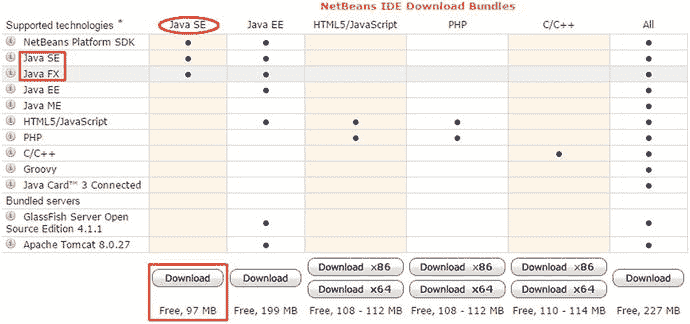
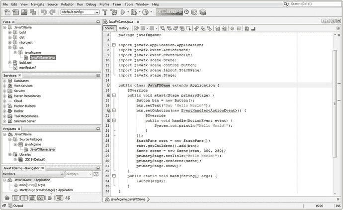
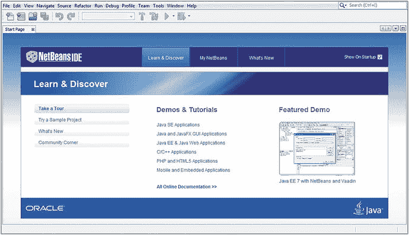
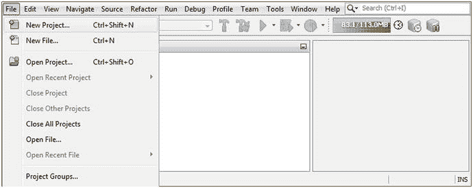
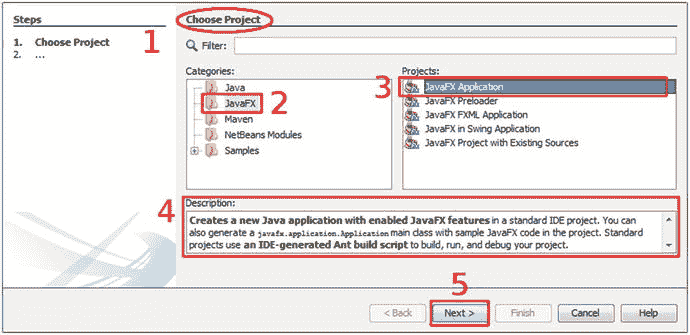
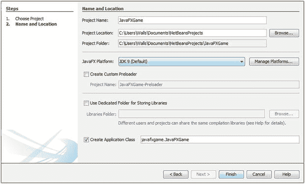
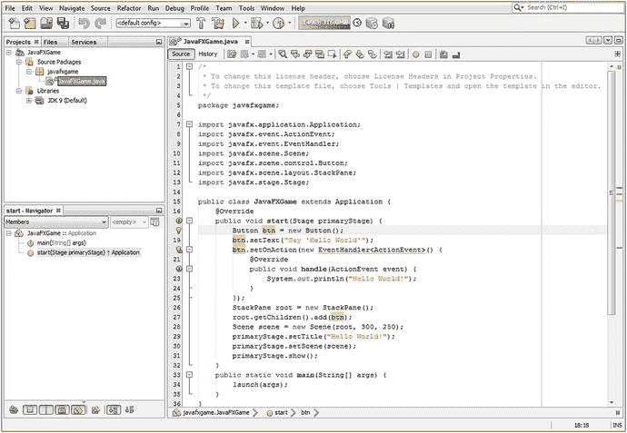
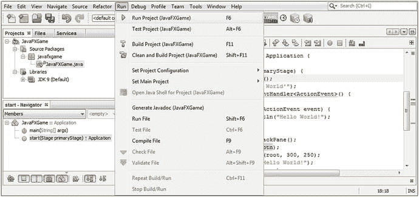
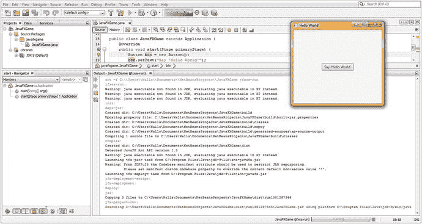

# 6. 设置你的 Java 9 IDE：NetBeans 9 简介

让我们从第 6 章开始，了解 NetBeans 9 集成开发环境（IDE）的重要特性和特点，因为这是你将用于创建 Pro Java 9 游戏和物联网应用程序的主要软件。尽管 Java 9 JDK 是你的 Pro Java 9 游戏以及 NetBeans 9 IDE 的基础，但我们将从学习 NetBeans 开始我们的 Java 游戏编码之旅，NetBeans 是你的 Java 游戏项目的“前端”（或者说，是你查看和处理项目的窗口）。

NetBeans 9 是 Java 9 JDK 的官方 IDE，因此，你将在此书中使用它。这并不是说你不能使用其他 IDE，例如 Eclipse 或 IntelliJ，它们分别是 32 位 Android 4.4 和 64 位 Android Studio 3.0 的官方 IDE。我更喜欢在我的新媒体应用和游戏开发中使用 NetBeans 9，用于我的 Java 9 和 JavaFX 游戏以及物联网应用软件开发编程范式。

这不仅是因为 NetBeans 9 可以集成第三方插件，例如 Gluon 的 JavaFX Scene Builder，还因为它是一个 HTML5+CSS4+JS IDE，而我通常使用 Java 9、JavaFX、Android 4.4 和 Android 8.0，以及 HTML5 来创建我为客户设计的所有内容。我这样做是为了让内容能够在封闭和专有的操作系统和平台上运行，这些平台在此将不予具名。正如你们大多数人知道的，我更喜欢开放（源）软件和平台，正如你们可能在最近的第 1 章中观察到的那样，因为它们“天生”开放、免费用于商业用途、广泛可用、得到 99% 主要制造商的支持，并且不需要审批流程，或者我只需要为某一个特定的硬件平台或仅仅一个操作系统发布应用程序。

需要注意的是，NetBeans 9 还支持许多其他流行的编程语言，例如 C、C++、Groovy 和 PHP。我使用 NetBeans 9 进行 HTML、CSS 和 JavaScript 网站及应用开发，因为 NetBeans 正迅速成为一流的 Java、JavaFX 和 HTML5 应用开发环境。

我们要做的第一件事是了解 NetBeans 9 版本的新特性。NetBeans 8.2 于 2016 年第四季度发布，大约在 Java 8 发布一年半之后。这种版本号同步并非巧合，因为 NetBeans 8.0 是在 Java 8 之后立即发布的，而 NetBeans 9 可能会在 2017 年第四季度 Java 9 之后立即发布。在本章中，我们将探讨为什么你应该使用 NetBeans 9，而不是旧版本的 NetBeans。

接下来，我们将了解 NetBeans 9 IDE 的各种属性，这些属性使其成为 Pro Java 9 游戏开发的宝贵工具。我们将了解它在本书过程中将为你提供的所有惊人特性；在本章中，你将无法亲身体验其中一些特性，因为我们还需要开始创建你的游戏，因此需要搭建引导代码库或应用程序基础设施，以便你能够真正充分运用这些 NetBeans 9 IDE 的特性。

因此，在本章的后半部分，你将学习如何使用 NetBeans 9 创建你的 Java 9 和 JavaFX 9 项目。这样，你就可以开始取得扎实的进展，并通过创建一个真实的 i3D 棋盘游戏（你将在本书过程中开发它），使你的 Pro Java 9 游戏开发成为现实。


## NetBeans 9 新特性：Java 9 模块集成

NetBeans 9 是继稳定版 8.2 之后的下一个主要软件修订版，现在集成了 Java 9 模块系统、Java 9 运行时环境（JRE）和 JUnit Java 测试套件，因此无需单独下载这些组件。如果你正在下载用于 HTML5+CSS+JS、PHP 或 C++ 的 NetBeans 9，则不再需要下载 JDK 或 JRE。这一点可以在 NetBeans IDE 下载包页面（如图 6-1 所示）上看到，这也是为什么存在适用于 HTML5/JS、PHP 和 C/C++ 的 32 位（x86）或 64 位（x64）预编译 NetBeans 9 版本的原因。



图 6-1.

Java SE 版 NetBeans 下载包包含 NetBeans 平台、Java SE 和 JavaFX SDK

也就是说，如果你使用任何其他版本（Java SE、Java EE 或 All），就像我们在本书中所做的那样，则不会包含 JRE。这是因为你需要像第 1 章那样下载 JDK，才能使用这些 Java SE（或面向大型企业的 EE）版本，而 JRE 已包含在下载和安装过程中，正如你之前所见。NetBeans 9 还包含对最新版本 Apache Ant 和 Maven 仓库的支持。我将在本章剩余部分介绍自 2014 年第一季度 8.0 版本发布三年多以来 NetBeans 的一些新特性。我将使用子章节按相关主题对这些特性进行分类，以便读者理解。

### Java 9 支持：模块、Ant、Java Shell、多版本

NetBeans 9 将与 Java 9 大致同时发布，因此其主要目标是支持 Java SE 9 版本的所有特性和功能。这将包括新的 Java 9 模块特性，该特性将提高安全性，并使开发者能够优化其 Java 9 游戏分发的数据占用空间。这将包括基于 Ant 和 Maven 的 Java 9 项目，因此 Ant 和 Maven 构建系统将升级以支持 Java 9 模块。

Java 9 SE 应用程序项目最初将支持单模块开发（包含所有模块），以及一种支持多模块开发的新项目类型，因此你可以挑选 Java 9 模块。我们最终将只使用少数核心 JavaFX 模块（基础、图形和媒体），以便显著减少我们的分发数据占用空间，但我们将在本书末尾进行此操作，因为这是一个更高级的主题。

Apache Ant 正在更新以支持 JDK 9，涵盖基本的 Ant 任务，并且当 NetBeans 9 在 JDK 9 上运行或 JDK 9 被设置为项目的 Java 平台时，Java 9 SE 分发中的所有工具都将正常工作。NetBeans 分析器现在可与 JDK 9 应用程序配合使用，并且在 NetBeans 9 项目的各个级别都添加了 Java shell 支持以及与 NetBeans 9 IDE 的集成。NetBeans 9 及其集成的 Java 9 支持现在可以正确处理多版本 JAR 文件。

最后，NetBeans 9 项目将很快迁移到 Apache。相关提案可在 [`https://wiki.apache.org/incubator/NetBeansProposal`](https://wiki.apache.org/incubator/NetBeansProposal) 查看。该提案涵盖了这一变更将如何影响 NetBeans 9 的发布。源代码、缺陷、构建作业及相关服务的迁移将在 NetBeans 9.0 和 9.0.1 版本发布期间进行。

### IDE 用户体验：更多信息与智能编码

NetBeans 8.1 引入了改进的代码导航器窗格，现在可以区分游戏 Java 方法所在的超类或接口，以及方法名称及其返回类型。代码补全（我们将在本章下一主要部分介绍）在 NetBeans 8.1（以及 8.2 和 9 等后续版本）的几乎所有领域都得到了显著改进，包括改进了最相关 Java 代码插入项的预选、改进了前缀自动补全、改进了子词自动补全，以及改进了 Java 枚举值的自动补全。

### Java 代码分析：完全重新设计的 Java 分析套件

NetBeans 在 8.1 版本中对其 Java 代码分析套件进行了彻底改造，包括简化的分析器设置、无需预先设置任何内容即可进行单次点击的 Java 代码分析，以及只需选中代码分析结果旁边的复选框即可选择方法或类进行详细分析的功能。改进了附加到正在运行的进程的能力，并且会记住选定的 PID 以供后续会话使用。新功能包括监控 CPU 利用率、从被分析的应用程序中转储线程、在 CPU 分析视图中显示选定线程的合并结果，以及改进的实时应用程序分析视图。

其他新的分析器功能包括 CPU 分析结果中的实时正向和实时反向调用树、系统内存分析结果中的实时分配树，以及在分析会话期间简化设置的调整。

NetBeans 分析引擎在 8.1（及更高版本）IDE 的所有领域中改进最多，包括连接到已运行进程时的连接速度显著提高、对当前分析方法传出调用的限制，以及针对某些预选类分析系统内存性能的能力。所有这些对于优化《Pro Java 9 Games Development》都很有用，因为游戏需要最佳性能。

分析器用户界面（UI）现在更加精致和专业，具有统一的分析窗口，所有操作、设置和结果都集中在一个可自定义、可管理的视图中。还有一个单独的“快照”窗口窗格，可用于管理持久性分析数据。

此外，还有一个全新的、100% 重新实现的分析器表格和树形表格区域，提供了原生外观的分析界面，使开发者能够无缝集成代码开发和优化。

分析器与 NetBeans IDE 其他部分的集成也得到了很大改进；此外，分析菜单更加精致，新增了一个名为“附加到项目”的操作，并且“分析类”和“分析方法”操作已添加到代码导航器中。在本书后续部分，当我们需要为 Java 9 游戏实现系统内存和 CPU 优化时，我们将介绍 NetBeans 9 分析器。

## NetBeans 9 的主要特性：一款智能 IDE

在本节中，我将全面概述 NetBeans 9 所有令人惊叹的强大功能，以便你了解安装在工作站上的这款 IDE 工具的强大之处，以及掌握其所有功能对于你作为 Pro Java 9 游戏或物联网应用程序开发者来说是多么重要。IDE 是你使用 JavaFX API 编写的 Java 9 代码与计算机之间的接口；它允许你将代码可视化、组织成逻辑方法、在计算机上测试、分析代码相对于系统内存和处理器周期的运行效率，并将其打包以便通过网站分发到互联网，或作为 Windows、OS/X、Linux 或 OpenSolaris 桌面计算机的独立应用程序，甚至作为 Android OS 或 Tizen OS 的嵌入式设备应用程序。理想情况下，iOS、Opera OS 和 Chrome OS 也将在 2018 年之前支持 Java 9 应用程序，因为 Android 和 Tizen 已经在基于 Linux 内核的 Java（Android OS）和基于 Linux 内核的 HTML5（Tizen OS）平台上占据了最大的市场份额。


### NetBeans 9 智能非凡：让代码编辑进入超光速时代

虽然 IDE 与文字处理器确实非常相似，只是前者针对创建模块化代码结构而非撰写商业文档进行了优化，但像 NetBeans 9 这样的集成开发环境在编程工作流程中为开发者提供的帮助，远胜于文字处理器在写作和文档创作流程中为作者提供的帮助。文字处理器主要用于格式化文本，通过桌面出版功能使其外观得体，并纠正拼写错误、语法和句子结构。

例如，你的文字处理器不会针对你正在撰写的商业内容提供实时建议，而 NetBeans 9 IDE 则会在你实时编写代码时，实际查看你正在编码的内容，并帮助你完成正在创建的 Java 代码语句和 Java 代码结构。因此，可以说 NetBeans 9.0 拥有比当前 Microsoft Office、Corel WordPerfect、Apache Open Office 或 Ubuntu Libre Office 等文字处理器更高的人工智能商数。

NetBeans 的功能之一是为你补全 Java 代码行，并为代码语句应用颜色以高亮显示不同类型的结构（类、方法、变量、常量、数组、引用），如图 6-2 所示。NetBeans 将应用行业标准的代码缩进，使 Java 代码更易于阅读，无论是对你自己还是对你的 Pro Java 9 游戏和物联网应用开发团队的其他成员而言。



图 6-2.

NetBeans 包含文件、服务、项目、导航器和输出窗格（左上至下），以及一个 Java 编辑器

NetBeans 还会提供匹配或缺失的代码结构元素，例如括号、冒号和分号，这样你在创建复杂、深度嵌套或异常密集的编程结构时就不会迷失方向。随着本书中 Java 代码复杂度的提升，你将创建具有这些特性的高级 Java 结构，我将带你从 Java 游戏开发者成长为 Pro Java 9 游戏开发者，并且在我们于游戏中实现密集、复杂或深度嵌套的 Java 8 和 Java 9 代码时，我一定会特别指出它们。

NetBeans 还可以提供引导代码，例如我们稍后将在本章中创建的 JavaFX 游戏应用程序引导代码，因为我知道你渴望开始创建你的 Pro Java 9 游戏。NetBeans 9 提供了可填写和自定义的代码模板、编码技巧和窍门，以及代码重构工具。随着你的 Java 9 代码变得越来越复杂，它自然成为代码重构的候选对象，这可以使代码更易于理解、更易于升级且更高效。NetBeans 还可以自动重构你的代码。

如果你想知道什么是代码重构，它是指在不改变外部行为（即代码实现的功能）的前提下，改变现有计算机代码的结构，使其更高效或更具可扩展性。例如，NetBeans 可以获取遗留的 Java 7 代码，并通过实现 Java 8 中引入的 Lambda 表达式使其更高效。

NetBeans 9 还会提供各种类型的弹出式辅助对话框，其中包含方法、常量、资源引用（在本书中编写 Pro Java 9 游戏时你都将学到这些内容），甚至包括关于如何构建 Java 语句的建议。例如，NetBeans 9 会在适当的时候建议使用 Java 8 Lambda 表达式，以使你的代码更精简并支持多线程。

### NetBeans 9 可扩展：支持多种语言的代码编辑

你的文字处理器无法做到的另一件事是允许你为其添加功能，而 NetBeans 9 可以通过其插件架构实现这一点。描述这种架构的术语是“可扩展的”，这意味着如果需要，它可以被扩展以包含额外的功能。因此，如果你想要扩展 NetBeans 9 以允许你用 Python 编程，例如，你可以做到。NetBeans 9 也可以以这种方式支持 COBOL 或 BASIC 等较老的语言，不过，既然如今大多数流行的消费电子设备都使用 Java、XML、JavaScript、SVG 和 HTML5，我确实不太确定为什么有人会愿意花时间这样做。我在谷歌上搜索了一下，发现确实有人在 NetBeans 中用 Python 和 COBOL 编码，所以有现实世界的证据表明这个 IDE 确实是可扩展的。

可能正是由于其可扩展性，NetBeans 9 IDE 支持多种流行的编程语言，包括客户端侧的 C、C++、Java SE、Javadoc、JavaScript、XML、HTML5 和 CSS，以及服务器侧的 PHP、Groovy、Java EE 和 Java 服务器页面（JSP）。客户端软件运行在最终用户手持或使用的设备上（例如智能电视），而服务器端软件则远程运行在某个服务器上，并在软件运行于服务器时通过互联网或类似网络与最终用户通信。

客户端软件将更高效，因为它位于其运行的硬件设备本地，因此更具可扩展性，因为没有服务器参与而不会出现任何过载。随着在任何给定时间点使用服务器端软件的人越来越多，服务器过载总是会发生。你创建的 Java SE 9 和 JavaFX 游戏或物联网交付物往往位于客户端，通过网站交付和使用，但也可以通过 JNLP 下载，或下载针对特定操作系统平台的 JAR 或编译后的可执行文件，以便在客户端使用。


### NetBeans 9 高效能：井井有条的项目管理工具

显然，在任何主流 IDE 中，项目管理功能都必须极其强大，而 NetBeans 9 正因如此，包含了大量项目管理功能，让你能够以多种不同的分析方式，审视你的专业 Java 游戏开发项目、其对应的文件以及这些文件之间的相互关系。共有六个主要的项目管理视图（或称窗格），可用于观察项目内部的各种相互关系。图 6-2 展示了我们将在本章稍后创建的一个名为“bootstrap pro Java 9 games development JavaFX”的项目。

图 6-2 展示了为此新项目打开的六个主要项目管理窗格或窗口，以便你准确了解它们会显示什么内容。一个优秀的编程 IDE 需要能够管理那些可能变得非常庞大的项目，这些项目可能包含超过一百万行代码，并分布在项目文件夹层次结构中的数百个文件夹内。这可能会涉及数千个文本（Java 9 代码）文件，以及数百个以文件形式存在的新媒体资源，其中一些是基于文本的（SVG、XML），另一些则是二进制数据格式（JPEG、MPEG）。

“项目”窗格显示了构成 Java 9 游戏项目的 Java 源包、库和模块。这可以在图 6-2 的左下方看到。顶部的窗格是“文件”窗格，显示硬盘驱动器上的项目文件夹及其文件层次结构。

其下方的“服务”窗格显示了数据库、服务器、仓库、Docker 和构建主机，以便在项目中使用这些资源。这些主要是服务器端技术，通常用于大型开发团队，因此我们不会深入探讨这些细节，因为本书是为独立游戏设计师编写的。

“项目”窗格应始终保持打开状态，位于 IDE 的左侧，正如你在本章从图 6-7 开始的所有图中看到的那样。“项目”窗格（或窗口）为你提供了访问 Java 9 游戏项目中所有项目源代码和资源（内容）的主要入口点。“文件”窗格不仅显示项目文件夹和文件层次结构，还显示每个文件内部的数据、JavaFX 新媒体资源和 Java 9 代码层次结构。

“导航器”窗格位于 NetBeans IDE 底部，在“文件”、“项目”和“服务”窗格下方，显示 Java 代码结构内部存在的关系。在本例中，这些关系包括 JavaFXGame 类、`.start()` 方法和 `.main()` 方法，我们将在第 7 章中学习这些内容，在此之前，我们将全面了解 NetBeans 9 IDE 以及如何使用它创建一个名为 JavaFXGame 的 Java 9 游戏项目，我们很快就要开始这个操作。

### NetBeans 9 对 UI 设计友好：用户界面设计工具

NetBeans 9 的可扩展插件功能支持针对多个平台的拖放式 UI 设计工具，这些平台包括 Java SE、Java EE、Java ME、JavaFX 和 Swing，以及 C、C++、PHP、HTML5 和 CSS4。NetBeans 9 支持可视化编辑器，可以为你编写应用程序 UI 代码，因此你只需让屏幕上的视觉效果看起来像你希望它在游戏应用程序中呈现的样子即可。由于游戏使用 JavaFX 新媒体游戏引擎，NetBeans 支持 Gluon JavaFX Scene Builder Kit，这是一个高级的 JavaFX 用户界面设计可视化（拖放）编辑器。

由于 JavaFX 拥有 PRISM 游戏引擎并支持 3D（使用 OpenGL ES 或嵌入式系统），本书将主要关注 i3D，因为我在《Beginning Java 8 Games Development》（Apress, 2014）一书中已经涵盖了 i2D。本书的假设是，读者希望构建尽可能先进的专业 Java 游戏，这相当于利用 JavaFX 引擎（现已包含在 Java 8 和 9 中，以及 Lambda 表达式）的 3D 和 i3D。实现这一目标最有效的方法是使用 Java 代码，而不是拖放式代码生成器。

开发专业 Java 9 游戏最快的方法是充分利用 Java 和 JavaFX 环境慷慨提供给你的高级代码和编程结构，用于创建尖端应用程序。在这种情况下，这些应用程序就是包含强大新媒体元素（如 2D 矢量、3D 矢量、数字音频、视频和数字图像）的专业 Java 游戏，这些元素被整合成一个统一的 2D 和 3D 混合内容创建管线。

### NetBeans 9 对 Bug 不友好：使用调试器消灭 Bug

有一个适用于所有计算机编程语言的普遍假设：一个“bug”（即未能完全按你预期执行的代码）对编程项目的负面影响，会随着其未被解决的时间越长而越大。因此，可以说，这些 bug 需要在其“诞生”后尽快被“消灭”。NetBeans 9 拥有广泛的查找 Bug 的代码分析工具，可以通过集成的 NetBeans 调试器访问。NetBeans 9 还支持与第三方项目 Find Bugs 3.0.1 的集成，该项目可在 SourceForge.net 上找到，其网址为 `findbugs.sourceforge.net`，如果你想下载独立版本的话。

这些工具将我们在本章本节开头讨论的实时“边输入边”代码修正和编码效率工具提升到了高级调试的层次。

你的 Java 代码要到本书稍后部分才会变得如此复杂，因此我们将在后续章节中，当你的知识储备更深入时，再介绍这些高级工具的使用方法。


### NetBeans 9 是速度狂魔：使用分析器优化代码

NetBeans 还拥有一个名为分析器（Profiler）的工具，正如我在前面“NetBeans 代码分析”部分中指出的，这是 NetBeans IDE 在 8.1 版本中彻底改造的领域之一。NetBeans 分析器工具会在你的 Java 8 或 Java 9 代码实际运行时对其进行检测，并告诉你它在内存和 CPU 周期方面的使用效率。这种分析可以让你优化代码，使其在关键系统资源（如线程、系统内存和处理周期）的使用上更加高效。这对于专业 Java 9 游戏开发来说非常重要，因为分析复杂的游戏可以帮助你优化游戏在嵌入式系统（例如，在单核或双核 CPU 上性能较弱）或性能较低的计算机系统（例如，使用双核或四核 CPU，而非常见的六核和八核 CPU）上的“流畅度”。

这个分析器是一个动态软件分析工具，因为它会在你的 Java 代码运行时进行检测；而 FindBugs 代码分析工具则可以说是一个静态软件分析工具，因为它只是在编辑器中查看你的代码，此时代码尚未“编译”并在系统内存中运行。由于我已在第 4 章中深入探讨了静态与动态分析的意义，你应该已经了解动态处理对于专业 Java 游戏开发工作流程来说是多么强大且耗费 CPU 资源。同样的考量也适用于实时调试。NetBeans 调试器还允许你在代码运行时单步执行，因此该工具可以被视为一种“混合体”，它弥合了静态（编辑）和动态（执行）代码分析模式之间的差距。

在本章下一节中，为你创建一个专业 Java 9 游戏及其 JavaFX PRISM 引擎的项目基础后，如果你愿意，可以使用 IDE 顶部的“分析”菜单来运行分析器。但是，如果你这样做，实际上看不到太多东西，因为 Hello World 引导应用程序本身并没有做太多事情。

因此，当我们添加诸如实时渲染的 3D 资源等内容时，我们才会深入使用 NetBeans 分析器。在本章中，我打算尽量“提前”向你介绍 NetBeans 9 的众多关键特性，而不会占用太多篇幅，以便你熟悉该软件，并且在本书后续内容中遇到任何与 IDE 相关的内容弹出时（有时是字面意义上的弹出），不会感到惊讶或“措手不及”。

闲话少叙，让我们启动 NetBeans 9，创建你的基于 JavaFX API 的专业 Java 9 游戏引导项目，这样我们就可以在本章中在 Java 9 和 JavaFX 编程方面取得一些进展，朝着你的专业 Java 9 游戏目标迈进。

## 创建专业 Java 9 游戏项目：JavaFXGame

让我们言归正传，为你将在本书中创建的专业 Java 9 游戏创建一个项目基础，这样你就可以在本书后续的每一章中都朝着最终目标取得进展。我将向你展示如何在本书中创建一个原创游戏，让你了解创建一个尚不存在的游戏所涉及的过程，这与大多数游戏编程书籍不同，那些书要么复制市场上已有的游戏，要么将资源拖放到预先构建的游戏引擎中。在编写《Beginning Java 8 Games Development》（Apress, 2014）时，我获得了客户的许可，让读者能够看到在该书创作过程中创建 i2D InvinciBagel 游戏的过程。对于本书，我将创建 i3D 棋盘游戏引擎，用于我自己的 `iTVboardgame.com` 网站。

单击任务栏上的快速启动图标，或双击桌面上的图标启动 NetBeans 9，你将看到 NetBeans 9 的启动屏幕。此屏幕显示一个进度条，并会告知你正在执行哪些操作来配置 NetBeans 9 IDE 以供使用。这涉及将 IDE 的各个组件加载到计算机的系统内存中，以便在你的专业 Java 9 游戏开发过程中，IDE 能够流畅且实时地使用。

在 NetBeans 9 IDE 加载到系统内存后，初始的 NetBeans 9 起始页将显示在你的屏幕上，如图 6-3 所示。单击“起始页”选项卡右侧的 x。这将关闭此介绍性页面（选项卡），并显示 NetBeans 9 IDE，如图 6-4 左侧所示。



图 6-3.

单击选项卡右侧的 x 关闭“起始页”选项卡（左上角），以显示 NetBeans 9 IDE

这将显示我称之为“原始”的 IDE，其中没有活动的项目。现在好好享受这一刻吧，因为很快我们就会用各种窗口（我称这些浮动面板为窗格，因为整个 IDE 本身我称之为一个窗口）来填充这个 IDE，用于你的项目组件。你可以在图 6-4 中看到这个空 IDE 的一部分，没什么可看的，因为目前只有顶部菜单和快捷图标（也在 IDE 顶部），其他内容目前还不可见。

如果你想知道，你退出的起始页仅在首次启动 NetBeans IDE 时显示，不过，如果你以后想再次打开这个起始页选项卡，例如，以便探索“演示和教程”部分，也是可以的！要随时打开此起始页，你可以使用 NetBeans 9.x 的“帮助”菜单，然后选择“起始页”子菜单。为了你将来参考，我通常会将菜单序列表示为“帮助 ➤ 起始菜单”。如果你在本书后面看到类似的结构，那是一个级联菜单序列，包含嵌套的子菜单。

在 NetBeans 9.0 IDE 中，你要做的第一件事就是创建一个新的 JavaFXGame Java 项目。为此，我们将使用 NetBeans 9.0 的“新建项目”系列对话框。这是我在上一节中提到的那些有用的 Java 编程功能之一，它会为你创建包含正确 JavaFX 库、`.main()` 和 `.start()` 方法、Java 语句和 import 语句的引导项目，所有这些你将在下一章中学习。单击 NetBeans 9 IDE 左上角的“文件”菜单，如图 6-4 所示，然后选择“新建项目”菜单项，它恰好是第一个菜单项。



图 6-4.

使用“文件 ➤ 新建项目”菜单序列（左上角）打开 NetBeans 9 的“新建项目”系列对话框


请注意“新建项目”菜单项右侧列出的 `Ctrl+Shift+N` 快捷键组合，方便你记忆。

如果你想使用此键盘快捷键来调用“新建项目”系列对话框，请同时按住键盘上的 `Ctrl` 和 `Shift` 键，并在按住这两个键的同时按下 `N` 键。这将实现与使用鼠标选择 **文件 ➤ 新建项目** 菜单序列相同的效果。

该系列的第一个对话框是“选择项目”对话框，如图 6-5 右侧所示。由于你将在游戏中使用强大的 JavaFX 新媒体引擎，请从左侧“类别选择器”窗格（标有红色数字 2，代表步骤 2）的所有编程语言类别列表中，选择 **JavaFX** 类别。



图 6-5.

使用“选择项目”对话框为你的专业 Java 游戏指定一个 JavaFX 应用程序

接下来，从右侧的“项目选择器”窗格（标有红色数字 3，代表步骤 3）中选择 **JavaFX 应用程序**。我们选择此项是因为你的专业 Java 9 游戏将是一种 JavaFX API 应用程序。你可以在“描述”窗格（显示为红色数字 4）中阅读每种项目类型的描述，最后单击 **下一步** 按钮进入下一个对话框，如图 6-5 中的红色数字 5 所示。

请记住，Oracle 决定在 Java 7 中集成 JavaFX API（当时是库，现在是模块），然后在 Java 8 中也是如此。因此，JavaFX 游戏现在就是一个 Java 游戏，而在 Java 7 之前（Java 6 中），JavaFX 2.0 还是它自己独立的编程语言！为了让 JavaFX 引擎成为 Java 9 编程语言中无缝集成的组件（就像现在这样），它必须被完全重写为 Java 7（和 Java 8）的 API 或库集合（在 Java 9 中则成为模块）。你将在下一章中了解更多关于 JavaFX 引擎的内容。

JavaFX API 将取代抽象窗口工具包（AWT）和 Swing（UI 元素）。尽管这些较旧的 UI 设计库仍然可以在 Java 项目中使用，但它们通常仅用于遗留（较旧）的 Java 代码，以便这些项目在 Java 1.02、2、3、4、5、6、7、8 和 9 下仍能编译和运行。你将在本章的这一部分编译并运行这个基于新 JavaFX API 的项目，因此你会看到 JavaFX 在 Java 9 下运行。JavaFX 的当前版本是 9，因为 Oracle 使版本号与 Java 9 保持一致，不过，这些类与我编写的《Beginning Java 8 Games Development》一书中使用的类是相同的。

请注意，在其他窗格下方有一个“描述”窗格，它会告诉你所选内容将提供什么。在这种情况下，它将是一个启用了 JavaFX 功能的新 Java 应用程序，其中“启用”意味着 JavaFX 9 API 库将被包含（并启动）在 Java 应用程序项目的类和方法中，正如你很快将在代码中通过一系列 `import` 语句看到的那样。你将在第 7 章中了解所有这些 Java 9 和 JavaFX 9 代码的作用，该章将涵盖 JavaFX 9 及其众多的用户界面设计和多媒体相关功能。

单击 **下一步** 按钮，进入“新建 Java 项目”系列对话框中的下一个对话框，即“名称和位置”对话框，如图 6-6 所示。此对话框允许你设置应用程序的 **项目名称**，该名称将用于创建 **类名** 和 **包名**，以及使用 **项目位置** 和 **项目文件夹** 数据字段（也显示在图 6-6 中）来指定项目在硬盘上的存储位置。



图 6-6.

将项目命名为 JavaFXGame，并保持 NetBeans 设置的所有其他命名约定不变

将项目命名为 `JavaFXGame`，并保持默认的 **项目位置**、**项目文件夹**、**JavaFX 平台** 和 **创建应用程序类** 设置完全按照 NetBeans 为你配置的方式，因为此 NetBeans 对话框将根据项目名称自动为你实现所有类和包的命名约定。

完成后，你可以单击 **完成** 按钮，这将指示 NetBeans 9 为你创建 JavaFX 游戏应用程序，并在 NetBeans 9 IDE 中打开它，以便你可以开始处理它并学习 JavaFX API。

通常，让 NetBeans 9.0 以正确的方式为你处理事情是个好主意。如图 6-6 所示，NetBeans 会使用此对话框中的 **项目位置** 和 **项目文件夹** 数据字段，为你的用户文件夹和 Documents 子文件夹创建逻辑上的 `C:\Users\Walls\Documents\NetBeansProjects\JavaFXGame` 文件夹。

对于 **项目文件夹** 数据字段，NetBeans 将（逻辑上）创建一个名为 `JavaFXGame` 的子文件夹。该文件夹将位于 `NetBeansProjects` 文件夹下，就像你自己创建的一样，只不过 NetBeans 9 已经为你完成了。

对于 **JavaFX 平台** 选择下拉菜单，NetBeans 9 默认使用最新的 Java 9 JDK，也称为 JDK 1.9，它包含最新的 JavaFX API（现在已成为 Java 7、8 和 9 语言的集成部分）。

我们目前不打算实现自定义预加载器项目，不过如果我有时间并且还有剩余页数，我可能会在本书后面重新讨论这个问题。因此，请保持此选项未选中，以便你可以学习自己创建这个预加载器 Java 9 项目代码，而不是让 NetBeans 9 为你完成。

由于你没有创建多个将共享库的应用程序，请保持 **使用专用文件夹存储库** 复选框未选中。最后，确保 **创建应用程序类** 配置正确。Java 9 类应命名为 `JavaFXGame`，并且应包含在 `javafxgame` 包中。

在此配置中，包路径和类名将是 `javafxgame.JavaFXGame`。这将遵循 `PackageName.ClassName` 的 Java 类和包命名范式、驼峰式大小写和路径，使用点号字符将包名连接到类名的前面，以显示其存储位置。

我将在第 7 章中介绍图 6-7 所示 Java 代码的一些基本组件，因为本章我们主要关注 NetBeans 9.0 IDE 及其功能，并在第 7 章以及第 8 章（当我们介绍场景图时）中完全专注于 JavaFX 编程语言。

如图 6-7 所示，NetBeans 已经编写了 `package` 语句、七个 JavaFX API 包导入语句以及 `public class JavaFXGame extends Application` 声明；将你的 `JavaFXGame` 类子类化，使用了 JavaFX `Application` 超类，创建了一个启动方法 `public void start(Stage primaryStage)`，并创建了一个 `.main()` 方法来管理你的主 JavaFX 线程 `public static void main(String[] args)`。

如图 6-7 所示，NetBeans 9 会对重要的 Java 编程语句关键字进行着色，将关键字设为蓝色，字符串对象设为橙色，内部 Java 和系统引用设为绿色，注释设为灰色。NetBeans 9 IDE 针对你的 Java 9 代码插入的警告和建议以黄色着色，而阻止可执行文件（JAR）编译的 Java 9 编码错误将以红色着色。


第 20 行还显示，NetBeans 正通过黄色下划线（警告：这可以转换为 Java 8 Lambda 表达式）提示您将 Button 对象事件处理转换为 Lambda 表达式。



图 6-7.

检查 NetBeans 根据“名称和位置”对话框为您创建的引导 JavaFX 代码

如果您愿意，也可以更改这些颜色，但我建议您使用 Oracle NetBeans 9 及更早版本实现的行业标准编码颜色，因为这些颜色随着时间的推移已经标准化。

在运行此引导代码以确保 NetBeans 9 为您编写的引导 Java 9 代码确实有效之前，您需要将此代码编译为可执行格式，该格式将使用系统内存运行。NetBeans 9 还会为您管理编译和运行过程，即使这些操作实际上利用了 Java 开发工具包（JDK）提供的实用程序。

接下来，让我们看看如何使用 NetBeans 9 的“运行”菜单来完成此操作，该菜单包含“运行”、“测试”、“构建”、“清理”、“编译”、“检查”、“验证”、“生成 JavaDoc”以及其他与运行相关的 Java 编译功能。

## 在 NetBeans 9 中编译 Pro Java 9 游戏项目

为了向您展示如何在运行和测试之前编译 Java 游戏代码，我在此向您展示逐步的工作流程，以便您了解编译/构建/运行/测试 Java 代码测试过程的每一步。单击“运行”菜单和“运行项目 (JavaFXGame)”（第一个）菜单项，以构建、编译和运行您的 Java 9 和 JavaFX 代码，如图 6-8 所示。您也可以使用 F6 快捷键，如菜单项选择右侧所示。现在您的项目已准备好进行测试！



图 6-8.

使用“运行 ➤ 运行项目 (JavaFXGame)”来构建并运行项目，以确保 NetBeans IDE 正常工作

图 6-9 显示了 NetBeans 9.0 的构建/编译/运行进度条，在编译期间，该进度条将始终出现在 NetBeans 9.0 IDE 的右下角。图中还显示了“输出”窗格，已最大化以便我们查看 Ant 构建过程执行的操作，我们将在本章的下一节中对此进行更详细的介绍。

这里需要重点注意的是，每当您使用“文件 ➤ 保存”菜单序列或 Ctrl-S 键盘快捷键时，NetBeans 9.0 都会编译您的项目代码。因此，如果您在引导代码创建后立即使用了 NetBeans IDE 的“保存”功能，则无需执行我刚才向您展示的手动编译过程，因为每次保存 Java 游戏项目时，此过程都会自动完成。

图 6-9 中，在“输出”窗格或窗口的正上方，还显示了 Java 代码编辑窗格或窗口中的 `.start()` 方法。左侧是一个带方框的减号图标。这用于折叠或隐藏此方法的内容。只需单击代码编辑窗口左侧的这个减号图标即可完成此操作。

减号图标将变为加号图标，以便可以“展开”（取消折叠）折叠的代码块。现在我们已经了解了如何在 NetBeans 9 中编译项目，以及如何折叠和展开逻辑方法代码块（Java 类的逻辑功能组件）在 JavaFXGame.java 项目代码中的视图，是时候运行此代码并查看它是否有效了。如果有效，我们可以继续学习第 7 章，开始了解 JavaFX API 以及它为 Java 9 编程环境带来的新媒体开发能力。

## 在 NetBeans 9 中运行您的 Pro Java 游戏项目

现在您已经创建并编译了带有 JavaFX 游戏项目的引导 Java 9，是时候运行或执行引导代码，看看它有什么作用了。正如您已经了解到的，您可以使用 NetBeans 顶部的“运行 ➤ 运行项目”菜单序列来访问“运行项目”菜单项，或者，如图 6-9 左上角所示，您可以使用看起来像绿色视频播放按钮的快捷图标。如果将鼠标悬停在其上，您将看到一个浅黄色的工具提示，显示“运行项目 (JavaFXGame) (F6)”弹出式帮助消息。在编写 Java 9 和 Android Studio 书籍时，为了详尽起见，我通常会使用较长的菜单序列，而不是快捷图标。这向读者展示了 IDE 菜单系统中所有内容的位置，从而涵盖了所有内容。如果您还没有运行，请立即运行您的新 JavaFXGame 应用程序。一旦您运行编译后的 Java 9 和 JavaFX 代码，一个窗口将在 NetBeans IDE 上方打开，其中运行着您的软件，如图 6-9 右侧所示。目前它使用流行的 Hello World 示例应用程序。



图 6-9.

向上拖动分隔栏以显示 IDE 的“输出”区域（右侧可见正在运行的应用程序）

在 Java 9 代码编辑窗格和代码编辑器窗格底部的“输出”选项卡之间的分隔线上，单击并按住鼠标左键，然后向上拖动此分隔线，调整您的相对窗口空间。该空间在 JavaFXGame.java 代码编辑窗格和“输出 - JavaFXGame”信息窗格之间共享。执行此调整大小操作将显示您的“输出”选项卡及其编译信息内容，如图 6-9 所示。

此“输出”选项卡将包含 NetBeans 9 的不同类型的输出，例如编译操作输出、运行操作输出（如图 6-9 所示）、分析器操作输出（我们将在本书后面有内容要分析时再查看），甚至包括来自应用程序本身的输出（我们将在此处查看）。

您可能已经注意到，在图 6-7 中，引导 Java 和 JavaFX 应用程序的代码在第 23 行使用了一条绿色的 `System.` `out` `.println("Hello World!");` Java 语句。因此，如果您希望看到当前正在运行的应用程序打印到“输出”窗格（这就是 out 的含义，通常被称为“输出控制台”），您可以单击当前在 IDE 之上运行的 Hello World 应用程序中的“Say ‘Hello World’”按钮。

单击该按钮后，“Hello World!”字样应出现在“输出”选项卡中，位于表示正在执行您的 JavaFXGame.jar 文件的红色文本下方。JAR 文件是一种 Java 归档（J 代表 Java，AR 代表 Archive）文件，是您的 Java 9 应用程序可用的可分发格式之一。

编译过程的一部分涉及创建此文件，因此，如果您的编译版本有效，那么当您的所有应用程序设计、编程、测试和优化完成时，您的 JAR 文件就可以准备分发了。

JAR 文件不包含您的实际 JavaFX 代码，而是包含应用程序的压缩、加密的“Java 字节流”版本，JRE 可以执行和运行该版本（就像 NetBeans 9 现在所做的那样）。附加在 JavaFXGame.jar 文件前面的“路径”告诉您 NetBeans 9 将您的 JAR 文件编译到了硬盘上的哪个位置，以及它当前从哪个位置访问它以能够运行它。在我的系统上，此位置如下：

```
C:\Users\Walls\Documents\NetBeansProjects\JavaFXGame\dist\run1381287366\JavaFXGame.jar
```


让我们查看其他“输出”选项卡中的文本，以了解 NetBeans 为了能够运行项目的 JAR 文件所执行的操作。首先，使用 `ant -f source-path jfxsarun` 调用 Ant 构建系统，由于在 JDK 中未找到 Java 可执行文件，它会在运行时中找到一个。然后，它进行初始化（init:），并在 JAR 依赖项（deps-jar:）部分创建一个 `\build` 目录，并更新 built-jar-properties 文件。接着，它创建 `\build\classes`、`\build\empty` 和 `\build\generated-sources\ap-source-output` 目录。Ant 随后将项目编译到 `\build\classes` 目录，如果构建（编译）成功（无错误），Ant 将创建 `\dist` 分发文件夹并将你的 JAR 文件放入其中。

然后，Ant 使用 JavaFX Ant API 启动 `ant-javafx.jar` 并部署 JavaFX API，将 JavaFX JAR 文件复制到 `\dist\run1381287366` 文件夹中。最后，Ant 使用 `jfx-project-run:` 运行 JavaFX 项目，执行 Java 9 和 JavaFX 代码，这相当于运行（和测试）该项目，如 NetBeans 9 IDE 顶部所示。

Ant 是创建 JAR 文件的“构建引擎”或构建工具，还有其他构建引擎，例如 Maven 和 Gradle，如果你愿意，也可以在 NetBeans 中使用它们，因为正如你现在所知，NetBeans 是可扩展的。由于 Ant 历史最悠久，是“传统”构建系统，因此本书将使用它。

## 总结

在第六章中，我们了解了 NetBeans 9“官方”集成开发环境（IDE），你将把它作为 Java 9 游戏开发工作流程的基础和主要工具。这是因为在这个 IDE 中，你可以编写、编译、运行、测试和调试 Java 9（及 JavaFX API）代码，同时，你的新媒体资源（图像、音频、视频、3D 几何体、纹理、字体、形状等）也存储在你的 NetBeansProject 文件夹及其子文件夹中，并通过它们进行引用。我们首先从高层次概述了 NetBeans 9 及其新特性，例如 Java 9 模块支持，以及一些较新的传统特性，并加入了 NetBeans 8、8.1 和 8.2 的内容。这些强大的特性使 NetBeans 9.0 成为 Java 9 的官方 IDE。这些特性将帮助程序员首次快速、高效且有效地开发 Pro Java 9 游戏代码。概述之后，我们使用“新建项目”系列对话框和 JavaFX 应用程序引导 Java 代码模板创建了一个 Pro Java 9 游戏项目。

我们逐步完成了“新建 ➤ Java 应用程序”系列对话框，并为我们的游戏创建了一个 JavaFX 框架，这将使我们能够使用新的媒体资源。之后，我们了解了如何使用 NetBeans 9 编译（构建和运行）应用程序，以及如何使用 NetBeans 运行应用程序。我们查看了“输出”选项卡及其如何用于编译器输出，并研究了 Ant 构建过程，以了解它如何将 Java 9 与其 JavaFX API 结合起来。

在下一章中，我们将浏览 JavaFX 编程语言，如果你愿意，可以称之为“JavaFX 入门指南”，并检查 JavaFX 引导应用程序中的 JavaFX 代码（如图 6-7 所示），以便你了解这些 JavaFX 代码的作用。我们还将研究全面的 JavaFX API 的模块化组件。

