# 7.  JavaFX 9 简介：JavaFX 新媒体引擎概述

让我们在前两章回顾的 Java 9 编程语言和 NetBeans 9 IDE 知识的基础上，在第七章中详细探讨构成 JavaFX 9 新媒体引擎的功能、组件和核心类。这个 JavaFX 9 新媒体 UI 和 UX API 是通过你在第六章创建引导 Pro Java 9 游戏应用程序时看到的 `javafx` 包添加到 Java 中的。之前的 JavaFX 8 API 随 Java 8 一起发布，并且也与 Java 7 以及 Android 和 iOS 兼容。JavaFX 包对游戏编程至关重要，因为它们包含了你需要用于游戏编程的高级新媒体类，包括用于使用场景图将场景组件组织成层次结构的类、用于用户界面布局和设计的类、用于 2D 数字插画（称为矢量图形）的类、用于数字成像（称为光栅图形）的类、2D 动画（矢量和光栅）、数字视频、数字音频、3D 渲染、网页渲染引擎（WebKit）等等。我们将在本章中涉及所有这些内容，以便你了解现在 JavaFX 已作为 API 集成到 Java 中后，你可以为 Java 9 游戏使用哪些功能。

在本书早期就深入进行 API 详细概述的理由是激发你大脑的创造性思维，让你开始思考 JavaFX 新媒体引擎特性如何支持你的专业游戏概念和设计。不仅了解 JavaFX 能为你的游戏开发做什么很重要，而且所有 API 类都是相互关联的，因此你需要了解 JavaFX 新媒体引擎各个组件是如何组合在一起的。JavaFX 使用一组复杂的 API（我喜欢称之为引擎）来实现令人难以置信的“前端”能力。这是因为它为你的专业 Java 游戏和物联网应用程序带来了实现用户界面（UI）和用户体验（UX）“胜利”的内在力量。所以，请耐心阅读这些“基础”章节，它们涵盖了如何掌握你的 IDE（NetBeans 9）、基础编程语言（Java 9）以及新媒体引擎（JavaFX 8），后者现在是一个集成的 Java 平台 API，并且在浏览器支持、功能和流行度方面正在迅速增长。

在本章中，你将回顾 JavaFX QUANTUM 工具包、PRISM 渲染技术、WebKit 网页引擎、GLASS 窗口技术、JavaFX 媒体引擎、JavaFX 场景图和 JavaFX API。

一旦你像在第五章中对 Java 9 所做的那样，从最高层次了解了 JavaFX 是如何组合在一起的，你将了解一些用于构建专业 Java 游戏的关键类。这些包括 Node，以及以下类：Group、Scene、Stage、Layout、Control、StackPane、Shape、Geometry、Media、Image、Camera、Effect、Canvas、Paint 和 Animation。我们已经在第六章中了解了 JavaFX Application 类；我们将继续学习这个类，以及可用于构建复杂多媒体项目（如游戏）的各种类。

最后，你将深入分析在第六章中生成的引导 JavaFX 应用程序代码，并了解 Java .main() 方法和 JavaFX .start() 方法如何使用 Stage() 构造方法创建 primaryStage Stage 对象，并在其中使用 Scene() 构造方法创建一个名为 scene 的 Scene 对象。你将了解如何使用 Stage 类的方法来设置 Scene、为 Stage 设置标题以及显示 Stage。你将学习如何创建和使用 StackPane 和 Button 类对象，以及如何向 Button 添加 EventHandler。


## JavaFX 概述：从场景图到操作系统

正如我在介绍新媒体的第 2 章和第 3 章中所做的那样，我想从 JavaFX 的最高层级——场景图开始讲起。这一层级紧接在图 2-1 和图 3-7 最顶层所示的新媒体资源类型之下。JavaFX API 的场景图 Java 代码也可以通过使用 Gluon 拖放式 JavaFX 场景构建器来构建，该构建器可以集成到 NetBeans 9 中（如你在第 6 章所学），也可以独立使用。我们将研究如何“手写代码”来构建所有这些场景结构，因为这是一本《Pro Java 9 游戏开发》书籍。

如图 7-1 所示，JavaFX 场景图架构位于 JavaFX API 之上，后者是一组 JavaFX 包（如`javafx.scene`或`javafx.application`）的集合，它最终使你能够构建场景图并设计你的 JavaFX 新媒体创作。在本例中，它将是一款专业的 Java 游戏。请注意，JavaFX API 不仅与上方的场景图架构相连（图中用钢制轴承表示桥梁），还与下方的 Java API 及其 JavaFX Quantum 工具包相连。如你所见，Java JDK（及 API）将 JavaFX 新媒体引擎连接到 NetBeans 9 和 JVM。JVM 允许 Java 将你的专业 Java 游戏分发到 Java 当前支持的各种平台，以及未来的（原生支持）平台，如 Android 8 和 iOS。

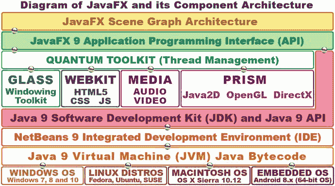

图 7-1.

JavaFX 组件架构：从顶层的场景图向下贯穿 Java、NetBeans、JVM 和操作系统

与 JavaFX API 相连的 Quantum 工具包将接下来我要讨论的所有强大的新媒体相关引擎整合在一起。Quantum 工具包负责管理所有这些引擎的线程，这样，位于 JavaFX 主线程上的游戏代码，以及位于各自线程上的游戏新媒体资源（音频、视频、3D 矢量、2D 矢量）（A/V 使用专用线程，WebKit、窗口系统或 3D 渲染也是如此），就可以通过双核、四核、六核和八核 CPU 上的独立线程（或进程）来使用独立的处理器。这些多核 CPU 在当今的计算机和嵌入式消费电子设备中已十分常见。我在图 7-1 的第四层中展示了那些重要到需要拥有自己线程的新媒体引擎。

Glass 窗口工具包负责 JavaFX 的窗口管理。它负责控制显示器上的任何离散区域，例如你的舞台或弹出窗口（如对话框）。Glass 还管理事件处理队列，并将事件传递给 JavaFX 进行处理，同时它还设置定时器——你将在本书后面学习游戏玩法以及脉冲毫秒如何控制游戏计时时了解到这些内容。

如图 7-1 中部所示，还有一个 WebKit 引擎和一个媒体播放器引擎。这些也由 Quantum 工具包管理。WebKit 引擎可以渲染 HTML5、CSS3/4 和 JavaScript 内容。这意味着你可以创建在 JavaFX 游戏内部无缝运行的 Web 内容。媒体播放器引擎负责处理数字音频和数字视频资源的播放、UI 控件以及导航。

Quantum 工具包下最重要的新媒体引擎是 PRISM 引擎，我喜欢称其为“棱镜游戏引擎”，因为它使用 Java2D 渲染 2D 内容，并使用 OpenGL（Macintosh、Linux 或嵌入式操作系统）或 DirectX（如果用户使用 Windows 7、8 或 10 平台）渲染 3D 内容。我在部分生产工作站上使用 Windows 7.2 和 10。Windows XP 和 Vista 的支持已停止，因为大多数计算机和消费电子设备现在都具备 64 位能力（Windows XP 是 32 位，仅能寻址 3.24 GB 内存）。

PRISM 的作用是“桥接”主流操作系统平台以及消费电子嵌入式设备上的强大游戏引擎（DirectX 和 OpenGL），以便 JavaFX 可以将复杂的渲染任务处理“卸载”到 nVidia（GeForce）、AMD（Radeon）、ARM、Qualcomm 或 Intel 的 GPU 硬件上。这使得 JavaFX/Java 游戏运行更快，并允许游戏在将游戏资源渲染到屏幕时占用更少的 CPU 处理能力。这反过来又允许更多的 CPU 处理能力用于游戏逻辑，例如 AI 或碰撞检测。在掌握 JavaFX 引擎特性及其场景图层次结构和架构之后（在本书接下来的两章——本章 JavaFX 入门和第 8 章场景图设计中），我们将进入这些游戏设计领域。

需要注意的是，游戏开发者无需了解 Quantum（线程）、Glass（窗口）或 Prism（渲染）引擎的内部工作原理，就能利用它们强大的新媒体特性。在本书中，你将重点关注顶层的场景图架构，以及此图中的 JavaFX 和 Java API 层级。你还会涉及 NetBeans 9 IDE 层级，我们刚刚在第 6 章中处理了这部分内容，但在本书的剩余部分，我们还将进一步详细探索其特性。

至于图 7-1 中较低层级，NetBeans 9.0 将为每个操作系统平台生成一个 Java 字节码文件，该文件由自定义 JVM 或 Java 9 虚拟机读取。这个 JVM（如图 7-1 底部所示）可以通过下载 Java 9 Java 运行时引擎（JRE）为任何给定的操作系统平台安装，你在第 1 章中安装 Java 9 JDK 时已经接触过它。

这个 JVM 层允许你的游戏作为应用程序安装到所有主流操作系统平台以及嵌入式设备上，这些设备也将转向支持 JavaFX。你还应该将你的专业 Java 游戏生成为一个可以嵌入到网站中的 Java“小程序”，甚至还有一种部署模型，可以将应用程序从网站拖放到桌面上，然后将其安装为一个完整的 Java 游戏应用程序。

目前已经有一种工作流程可以在 iOS 8 和 Android 8 上运行 JavaFX 应用程序，尽管支持还不是“原生”的，因此 JavaFX 应用程序还不能直接在这些操作系统内部运行。如果你对此感兴趣，只需在 Google 上搜索“JavaFX on Android”或“JavaFX on iOS”，可以确信到 2018 年，Android OS、iOS、BlackBerry 和 Tizen OS 设备将能够“原生”运行 JavaFX 应用程序。这将使你能够借助 Java 和 JavaFX 这对动态组合实现“一次编写，到处运行”！我所说的原生是指，未来你将能够使用 JetBrains IntelliJ 2017 Android Studio 直接将 Java（及 JavaFX 引擎）应用程序导出到 Android 8，或导出到 iOS 或 Tizen OS，甚至可能直接使用 NetBeans 9 导出到 Android 8。这将补充 NetBeans 9 当前支持的 Windows、Mac、Open Solaris 和 Linux 发行版。

注意


JetBrains IntelliJ IDEA 现已成为用于创建 64 位 Android 8 应用的官方 IDE。我在《Android 应用开发入门》（Apress，2017 年）一书中介绍了这款 IDE，该书涵盖了使用 IntelliJ IDEA 和 Java 8 开发 64 位 Android 5 至 8 应用的内容。此外，IntelliJ 也在我的《专业 Android 可穿戴设备开发》（Apress，2015 年）一书中有所涉及。我预计到 2018 年底，Java 9 也将支持可穿戴设备和智能家电。

让我们从图 7-1 所示图表的顶部开始，看看 JavaFX 场景图和 `javafx.scene` 包，该包通过 16 个强大且实用的 Java 类在 JavaFX API 中实现了场景图。

## JavaFX 场景包：16 个 Java 场景类

在完成高层概述后，我首先要做的是研究最重要的 JavaFX 包之一——`javafx.scene` 包。正如你在第 2 章和第 3 章中所见，JavaFX 包不止一个。如图 6-7 顶部所示，你的 `JavaFXGame.java` 应用已经使用了四个不同的 JavaFX 包。`javafx.scene` 包包含 16 个强大的 Java 类（请记住 JavaFX 是用原生 Java 重新编写的），包括 `Camera`、`ParallelCamera` 和 `PerspectiveCamera`、`Cursor` 和 `ImageCursor`、`LightBase`、`PointLight` 和 `AmbientLight`，以及场景图类（`Node`、`Parent`、`Group`、`Scene` 和 `SubScene`）和一些实用工具类，如图 7-2 所示。如你所见，我按逻辑对这 16 个 `javafx.scene` 包类进行了分组。我将 `Scene` 类放在此图表的场景图部分中，因为使用此 `Scene` 类创建的 `Scene` 对象将包含使用其他四个与场景图相关的类（`Node`、`Parent`、`Group` 和 `SubScene`）及其子类创建的场景图对象。我们将在本章稍后部分详细讨论所有这些场景图类。

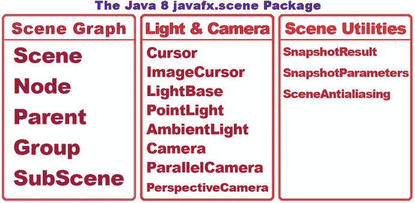

图 7-2.

Java `javafx.scene` 包及 16 个核心场景图、场景实用工具、光照、相机和光标类

JavaFX 的场景图架构类从最高层开始，包括 `Node` 超类及其 `Parent` 和 `SubScene` 子类，以及 `Parent` 类的 `Group` 子类，我们将在本书后续内容中使用这些类来创建游戏的场景图层次结构。这些核心 `Node` 类用于创建游戏的 JavaFX 场景图层次结构，并用于组织和分组使用 JavaFX 媒体资产和图形设计包创建的对象，这些包包含在 `javafx.media` 和 `javafx.graphics` 这两个 Java 9 模块中。

还有三个我称之为场景实用工具类，它们允许你随时对场景或其任何场景图节点进行快照（类似于屏幕截图），以及如果你在场景中使用 3D 图元（使用数学而非网格定义的几何体），则可以打开或关闭场景抗锯齿。`javafx.scene` 包中的另一半（八个）类用于场景光照、场景相机和场景光标控制。

我们将在后续章节中，在创建游戏的过程中，先研究用于创建、分组、管理和操作 JavaFX 场景内容的场景图类，然后再介绍这些 `javafx.scene` 类。因此，我将按照图 7-2 所示，从左到右介绍 `javafx.scene` 包中的类，顺序依据你使用这些类的频率，从最常用到最不常用。话虽如此，所有这些类（可能除了 `Snapshot` 类）对于 i3D 游戏都非常重要。

### JavaFX Scene 类：定义尺寸和背景颜色

`javafx.scene` 包中的两个主要类是 `Scene` 类和 `Node` 类。我们将在下一节介绍 `Node` 类及其 `Parent`、`Group` 和 `SubScene` 子类，因为这些类及其子类（例如 `JavaFXGame` 类中使用的 `StackPane` 类）可用于在 JavaFX 中实现场景图架构。此外，从某种意义上说，以及在我图 7-2 和图 7-3 所示的图表中，`Node` 类及其子类可以被视为“位于”`Scene` 类“之下”，尽管 `Node` 类并不是 `Scene` 类的子类。实际上，`Node`（场景图）类及其子类，或者更确切地说，使用这些类创建的对象，实际上包含在 `Scene` 对象本身内部，就像在现实舞台制作中事物按场景分组一样。因此，我们首先来看看 `Scene` 类及其 `Scene()` 构造方法如何用于为 JavaFX 应用创建 `Scene` 对象。本节将极大地巩固你在第 5 章中学到的关于重载构造方法的知识，因为需要多种不同的方式来创建 `Scene` 对象。

`Scene` 类通过 `Scene()` 构造方法用于创建 `Scene` 对象。该方法根据你选择使用的六个重载构造方法中的哪一个，接受一到五个参数。这些构造方法包括以下六种不同的重载参数列表数据字段配置：

```
Scene(Parent root)
Scene(Parent root, double width, double height)
Scene(Parent root, double width, double height, boolean depthBuffer)
Scene(Parent root, double width, double height, boolean depthBuffer, SceneAntialiasing aAlias)
Scene(Parent root, double width, double height, Paint fill)
Scene(Parent root, Paint fill)
```

当前在你的引导 Java 和 JavaFX 代码中使用的构造方法（如图 6-7 和 Java 代码第 28 行所示）是第二个构造方法，到目前为止，它的结构（调用）如下：

```
Scene scene = new Scene(root, 300, 250);
```

如果你想为场景添加黑色背景颜色，你将使用第五个重载构造方法，使用 `Color` 类中的 `Color.BLACK` 常量（这是一个 `Paint` 对象，因为 `Color` 是 `Paint` 的子类）作为填充数据，此处为填充颜色。这可以通过以下 `Scene()` 对象构造方法调用来实现：

```
Scene scene = new Scene(root, 300, 250, Color.BLACK);
```

请注意，`root` 对象是一个 `Parent` 子类，称为 `StackPane` 类，它是在 `Scene()` 构造方法调用上方两行，通过以下 Java 代码行使用 `StackPane()` 构造方法创建的：

```
StackPane root = new StackPane(); // StackPane 继承自 Parent；因此是 Parent 根节点类型
```

如你所见，任何属于该构造方法参数位置（数据）所声明（要求）的对象（类）类型的子类的类都可以在构造方法中使用。这就是为什么我们能够在参数列表中使用 `Color` 和 `StackPane` 对象，因为它们分别具有来自 `Paint` 和 `Parent` 类的超类渊源。


如果你想知道布尔类型的 `depthBuffer` 参数是做什么用的，它用于 i3D 场景组件。由于这些场景组件是 3D 的，并且具有深度（除了 2D 的“X”和“Y”分量外，还有一个“Z”分量），因此如果你正在创建 3D 场景，或者将 2D 和 3D 场景组件组合在一起，就需要包含这个参数并将其设置为 `true`。最后，如果你想知道第四个构造方法参数列表中传递的 `SceneAntialiasing` 对象（及其类）是做什么的，它用于为 3D 场景组件提供实时平滑处理。因此，对于我们将需要的 3D 场景对象，构造方法的调用看起来像下面这样：

```
Scene 3Dscene = new Scene(root, 300, 250, true, true);
```

### JavaFX 场景图：使用父节点组织场景

场景图并非 JavaFX 独有，现在可以在相当多的新媒体内容创作软件包中看到，例如 3D、数字音频、声音设计、数字视频和特效等。场景图是一种内容数据结构的可视化表示，它看起来像一棵倒置的树，根节点在顶部，分支节点和叶节点从根节点延伸出来。我第一次看到场景图这种场景设计方法，是在使用芬兰 RealSoft OY 公司为 Amiga 4000 开发的名为 Real3D 的软件包进行 3D 建模、渲染和动画制作的时候。此后，这种方法被大量的 3D、数字视频和特效软件包所模仿，现在已成为 JavaFX 组织其场景内容的方式。因此，你们中的许多人可能已经熟悉并适应了这种设计范式。场景图数据结构不仅允许你构建、组织和设计你的 JavaFX 场景及其内容，而且如果你正确设置了场景图，它还允许你将不透明度、状态、事件处理器、变换和特效应用于场景图层次结构的整个逻辑分支。图 7-3 展示了一个基本的场景图树，根节点在顶部，分支节点和叶节点在根节点下方。

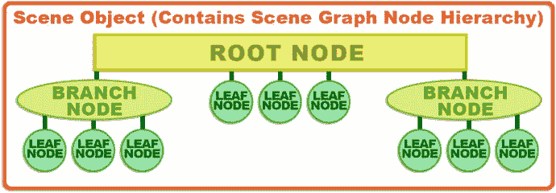

图 7-3.

JavaFX 场景图层次结构，从根节点开始，向下延伸到分支节点和叶节点

根节点是最顶层的节点，这就是为什么它被称为根，尽管它在顶部，而不是像植物世界中的根那样在底部。根节点没有父节点，也就是说，在场景图层次结构中，它上面没有任何东西。根节点本身是其下方的分支节点和叶节点的父节点。

场景图树中下一个最强大（也最复杂）的结构称为分支节点，它使用 `javafx.scene.Parent` 类作为其超类，并且可以包含子节点，这是合乎逻辑的，因为它扩展了一个恰如其分地命名为 `Parent` 的类。一个分支节点可以包含其他分支节点以及“叶”节点，因此它可以用来创建一些非常复杂且非常强大的场景图层次结构（或场景图架构）构造。

层次结构中的最后一级是“叶”节点，叶节点是分支的末端。因此，叶节点不能有子节点。需要注意的是，叶节点可以直接从根节点延伸出来，正如你在图 7-3 中看到的那样。分支节点可以通过使用 `Parent`、`Group` 或 `SubScene` 类（如图 7-2 所示）或其任何子类（例如 `WebView`、`Region`、`Pane` 或 `StackPane` 类）来创建。

位于分支最末端（即叶节点）的对象示例包括可以使用参数进行配置的 JavaFX 类（实例化为对象）。示例包括形状、文本或控件。这些本身就是设计或内容组件，因此其设计初衷并非拥有任何子节点（子对象），所以根据其类功能设计的性质，它们必须位于树和分支的末端。

因此，叶节点将始终包含一个 JavaFX 类，该类既不是从 `Parent` 类或 `Group`、`Region` 或 `SubScene` 类派生（扩展）而来的，其本身也没有被专门设计为在你的 JavaFX 场景图层次结构中包含任何子元素（子对象）。

`Parent` 类的三个子类可以用作分支节点。其中包括：`Group` 类，用于对子（叶节点）对象进行分组，以便可以一次性将不透明度、变换和特效应用于组节点；`Region` 类，用于在 2D 中对子（叶节点）对象进行分组以形成屏幕布局，如果你愿意，可以使用 CSS3 对其进行样式设置；以及 `WebView` 类，用于管理 `WebEngine` 类，该类在 `WebView` 中渲染 HTML5、JS 和 CSS 内容。


### JavaFX 场景内容：灯光、摄像机、光标、开拍！

接下来，让我们看看图 7-2 中心列出的八个类，它们提供了一些强大的多媒体工具，用于控制应用程序的光标，以及为你的 2D 和 3D JavaFX 应用程序提供自定义灯光特效和自定义摄像机功能。在本例中，这指的是游戏，但也可能是电子书、iTV 节目或任何需要 JavaFX 为 Java 9 API 提供的强大新媒体功能的物联网应用。

图 7-2 中心部分列出的更通用的类（`Cursor`、`LightBase`、`Camera`）是父类，而每个父类后面列出的更专门的类（`ImageCursor`、`PointLight`、`ParallelCamera` 等）则是这些父类的子类。除了 `LightBase` 类，这似乎是显而易见的！

你可能已经猜对了，JavaFX 的 `Cursor` 类可用于控制在任何给定时间使用的应用程序光标图形（箭头、手型、闭合手型、张开手型、调整大小、移动、文本、等待、无）。`ImageCursor` 子类可用于定义和提供自定义的基于图像的光标，使用自定义光标图像中的 X 和 Y 位置来定义其“点击点”，也称为光标的“热点”。

`LightBase` 类及其子类 `PointLight` 和 `AmbientLight` 可用于照亮你的场景。这些类主要用于 3D 场景，并且要求游戏运行的任何平台都具备 3D 能力，这在当今并不是什么问题，因为大多数主要的 CPU 制造商也生产（并集成）GPU。此外，需要注意的是，如果渲染游戏的硬件平台上没有 GPU，Prism 游戏引擎将使用 3D 处理模拟来模拟 3D 环境（GPU）。这被称为软件渲染。

如果你设置正确，你也可以将这些光照类用于你的 2D 游戏，或者用于“混合”2D 和 3D 游戏的光照，我们将在本书后面看到这一点，因为 JavaFX 支持它。

`Camera` 类及其子类 `ParallelCamera` 和 `PerspectiveCamera` 可用于拍摄你的场景的照片或视频，并可用于 3D、2D 和混合游戏应用程序。其中两个摄像机类，`Camera` 和 `ParallelCamera`，不要求运行 JavaFX 应用程序（在本例中是游戏）的平台具备 3D（GPU）能力。平行摄像机视图在 3D 软件中有时被称为正交投影。

`Camera` 类的子类提供了两种不同类型的专用摄像机。`ParallelCamera` 类可用于渲染没有深度透视校正的场景，这在 3D 行业中称为正交投影。这意味着这个类非常适合用于 2D 场景（以及 2D 游戏）。

`PerspectiveCamera` 类提供了一个用于 3D 场景的复杂得多的摄像机，它将支持 3D 观察体。与 `LightBase` 类及其子类一样，`PerspectiveCamera` 类要求你的专业 Java 9 游戏（或物联网应用程序）运行的硬件平台（称为目标平台）具备 3D 能力。

`PerspectiveCamera` 类有一个 `fieldOfView` 属性（状态或属性）。这可以用来改变你的观察体，就像真实的摄像机变焦镜头一样，当你从广角变焦到长焦时。`fieldOfView` 属性的默认设置是 30 度的锐角。如果你还记得高中的几何课，你可以通过沿着 y 轴（上下轴）看向摄像机来想象这个视野。正如你所料，有 `.getFieldOfView()` 和 `.setFieldOfView(double)` 方法调用来控制这个摄像机类属性。

接下来，让我们更仔细地看看场景工具类。之后，我们将更仔细地研究一些 `javafx.scene` 子包，例如 `javafx.scene.text`、`javafx.scene.image`、`javafx.scene.shape` 和 `javafx.scene.layout`。

### JavaFX 场景工具：场景快照和抗锯齿

最后，我们应该快速看一下图 7-2 右侧显示的三个工具类，因为它们可用于提高用户设备屏幕上场景输出的质量（使用抗锯齿），以及为你的用户（用于社交媒体分享）或你的游戏逻辑提供屏幕捕获功能。

让我们先处理 `SceneAntialiasing` 类。你在第 2 章中了解了抗锯齿，我向你展示了它如何使用一种算法来平滑两种不同颜色交汇处的锯齿边缘，通常是在图像合成的对角线或圆形区域上。图像合成是指将两个独立的图像分层放置以形成一个最终图像。有时，这两个（或更多）图像层中图像组件之间不同的边缘需要被平滑。需要平滑（抗锯齿）以使最终的图像合成看起来像是一个无缝的图像，这正是艺术家或游戏设计师的意图。有趣的是，我们已经在我们的 `JavaFXGame` 应用程序中使用 `StackPane` 类（窗格就是层）实现了 JavaFX 的“图层引擎”。“图层堆栈”图像合成方法在游戏以及 Photoshop 或 GIMP 等软件中很常见。

`SceneAntialiasing` 类的作用是为 3D 场景提供抗锯齿处理（算法），以便它们能够合成到场景的 2D 背景上，无论该背景是默认的 `Color.WHITE` 或任何其他颜色值、2D 图像（创建混合 2D 和 3D 应用程序），还是其他任何东西，比如数字视频。`SceneAntiAliasing` 类允许你将静态的 `SceneAntialiasing` 数据字段设置为 `DISABLED`（关闭抗锯齿）或 `BALANCED`（开启抗锯齿）。平衡选项提供了质量和性能之间的平衡，这仅仅意味着设备硬件提供的处理能力越强，处理的抗锯齿质量就越高。

接下来让我们看看 `SnapshotParameters` 类（对象），它用于设置（包含）一个渲染属性参数，该参数将被你的 `SnapshotResult` 类（对象）使用。这些参数包括将使用哪种类型的 `Camera`（平行或透视）对象、用于 3D 的 `depthBuffer` 是开启（3D 为 true）还是关闭（2D 为 false）、用于包含结果快照图像数据的 `Paint` 对象、用于包含任何变换数据的 `Transform` 对象，以及用于定义要渲染的视口区域的 `Rectangle2D` 对象。这将是快照的尺寸以及 `SnapshotResult` 左上角在屏幕上的 X、Y 位置。

这个 `SnapshotResult` 类（更重要的是，使用此类创建的对象）包含你的结果快照图像数据、请求的参数以及场景图中生成它的源节点。因此，该类支持的三个方法将是显而易见的：`.getImage()` 方法将获取快照图像，`.getSource()` 方法将获取源节点，`.getSnapshotParameters()` 方法将获取 `SnapshotParameters`。


## 场景子包：九个与场景相关的包

你可能会想：“哇！刚才那个 javafx.scene 包的概述内容真多啊！”确实，核心的 javafx.scene 包中包含了许多类，涵盖了场景创建、场景图组织以及场景工具（如光照、摄像机、光标、截图（“场景截图”）和设置工具）。javafx.scene 包中还有更多内容，存在于我称之为“子包”的包中，这些包位于 javafx.scene 包之下，通过另一个点号加上另一个包名（描述）来引用。实际上，还有九个 javafx.scene 子包，如表 7-1 所示，它们涵盖了画布绘制、纹理绘画、特效、UI 布局、数字成像、事件处理、文本与字体、形状（2D 和 3D 几何体）以及 2D 和 3D 变换等内容。我们将在本章中探讨所有这些 javafx.scene 子包中的类和概念，并在本书的后续内容中大量使用它们。本章的这一部分将更详细地介绍 javafx.scene 子包，你在游戏开发中将要使用的许多功能都将在这些子包中找到。这就是为什么我要为你概述 JavaFX 提供的内容，以便一次性完成介绍，然后我们就可以开始使用 JavaFX 9 API 进行 Pro Java 9 Games 编码，并利用所有这些多媒体功能来创造游戏体验。

表 7-1.

九个二级 JavaFX 场景子包及其主要功能和功能类描述

| 包名 | 功能 | 包内容与功能描述 |
| --- | --- | --- |
| javafx.scene.canvas | 直接绘制 | 提供用于自定义绘图表面的 Canvas 类（及 Canvas 对象） |
| javafx.scene.effect | 特效 | 特效类：Glow、Blend、Bloom、Shadow、Reflection、MotionBlur |
| javafx.scene.image | 数字成像 | 数字成像类：Image、ImageView、WritableImage、PixelFormat |
| javafx.scene.input | 事件处理 | 提供与从用户获取输入到 JavaFX 应用程序相关的类 |
| javafx.scene.layout | UI 布局 | 用户界面布局容器类：TilePane、GridPane、FlowPane 等 |
| javafx.scene.paint | 纹理（绘画） | 绘画类：Paint、Color、LinearGradient、RadialGradient、Stop、Material 等 |
| javafx.scene.shape | 几何体 | 2D 和 3D 几何体类：Mesh、Shape、Shape3D、Circle、Line、Path、Arc 等 |
| javafx.scene.text | 文本与字体 | 提供文本渲染和字体渲染类：TextFlow、Text、Font 等 |
| javafx.scene.transform | 变换 | 提供变换类：Transform、Affine、Rotate、Scale、Shear、Translate |

我们先从包含类最少的包开始，把它们先处理掉。尽管表中按字母顺序列出了子包，但第一个包 javafx.scene.canvas 包含两个类：一个用于创建 Canvas 对象的 Canvas 类，以及一个用于控制对该 Canvas 进行绘制调用的 GraphicsContext 类。

下一个子包 javafx.scene.effect 包含特效类。这些类对于专业的 Java 9 游戏开发非常有用，因此这是我在本节中要详细介绍的子包之一。

javafx.scene.image 子包用于在 JavaFX 中实现数字图像，它包含 ImageView、Image、WritableImage、PixelFormat 和 WritablePixelFormat 类。ImageView 类是你通常用来保存数字图像资源的类，而更高级的 PixelFormat 类允许你逐个像素地创建数字图像，如果你想进行更高级的（基于算法的）像素级数字图像创作的话。

javafx.scene.input 子包包含用于从 JavaFX 应用程序用户获取输入的类，包括鼠标和键盘输入、手势、触摸屏、滚动、缩放或滑动输入以及剪贴板内容等输入类型。输入和操作通过事件处理能力进行处理，你将在本书中详细了解这一点，并且你已经在你的 Pro JavaFX 9 应用程序中体验过了，正如你在引导 Java 9 代码的第 20 到 25 行（如图 6-7 所示）中所看到的那样。

javafx.scene.layout 子包包含用于创建用户界面设计布局的类，也可以用于你的屏幕布局设计。这些布局类包括控制和管理背景、添加和设置边框样式的类，以及提供 UI 面板管理类（如 StackPane、GridPane、TilePane、FlowPane 和 AnchorPane）的类。这些面板子类为 JavaFX 中的 UI 控件提供了自动屏幕布局算法。Background 类提供屏幕背景工具，Border 类提供屏幕边框工具，可用于美化用户界面屏幕的图形。

javafx.scene.paint 子包包含一个 Stop 类；一个 Paint 超类及其子类 Color、ImagePattern、LinearGradient 和 RadialGradient；以及 3D Material 超类及其子类 PhongMaterial。熟悉 3D 内容制作的人会认出这个 Phong 着色器算法，它可以模拟不同的表面外观（塑料、橡胶等）。这些 Material 和 PhongMaterial 类需要播放硬件具备 i3D 能力才能成功运行，就像 SceneAntialiasing、PerspectiveCamera 和 LightBase 类及其子类一样。这些需要 GPU 硬件加速或软件渲染。

抽象的 Paint 类创建用于绘制对象的子类，Color 类为这些对象着色（用颜色填充它们），LinearGradient 和 RadialGradient 是 Paint 的子类，用颜色渐变填充对象，而 Stop 类允许你定义渐变颜色在渐变内部开始和结束的位置，这也是其名称的由来。最后，还有 ImagePattern 类，它可以用可平铺的图像图案填充 Shape 对象，这对游戏来说非常有用。

javafx.scene.shape 子包包含用于 2D 几何体（通常称为形状）以及 3D 几何体（通常称为网格）的类。Mesh 超类及其子类 TriangleMesh 处理 3D 几何体，Shape3D 超类及其子类 Box、Sphere、Cylinder 和 MeshView 也是如此。Shape 超类有更多的子类（12 个）；这些是 2D 几何元素，包括 Arc、Circle、CubicCurve、QuadCurve、Ellipse、Line、Path、Polygon、Polyline、Rectangle 和 SVGPath 类。还有“路径”支持，路径被定义为“开放”形状（因为我是一名 3D 建模师，我喜欢称之为“样条线”），由 PathElement 超类及其子类 ArcTo、ClosePath、CubicCurveTo、HLineTo、LineTo、MoveTo、QuadCurveTo 和 VLineTo 提供，这些子类允许你绘制样条曲线来创建自定义的可缩放矢量图形（SVG）形状。

javafx.scene.text 子包包含用于在场景中渲染文本形状和字体的类。这包括用于使用你可能想用的任何非 JavaFX“系统”字体的 Font 类，以及用于创建将使用此字体显示文本值的文本节点的 Text 类。还有一个专门的布局容器类叫做 TextFlow，用于“流动”文本，就像你在文字处理器中看到的那样。


`javafx.scene.transform` 子包中包含用于渲染 2D 和 3D 空间变换的类，例如 `Transform` 超类的 `Scale`、`Rotate`、`Shear`、`Translate` 和 `Affine`（3D 旋转）子类。这些变换可应用于场景图中的任何 `Node` 对象。这使得场景图中的任何内容（文本、UI 控件、形状、网格、图像、媒体等）都能以您喜欢的任何方式进行变换，为 JavaFX 游戏开发者在变换对象时提供了巨大的创作能力。如果您想知道，平移是指整个对象的线性移动。剪切是指在二维平面上沿两个不同方向进行的线性移动，或者当二维平面的另一部分固定时，沿一个方向进行的移动。想象一下，移动一个平面的顶部，而底部保持固定，这样正方形就变成了平行四边形；或者，在同一平面（一个正方形）上，将顶部和底部向不同方向移动。

现在，我们已经了解了 `javafx.scene` 包及其相关子包中大量重要且有用的类（对象），接下来让我们看看其他 18 个顶级 JavaFX 包，以了解 JavaFX 为应用程序开发提供的其他关键功能。当然，我们将重点关注那些可用于游戏开发的功能，正如我们在本章中一直所做的那样，并且将在本书中继续这样做。

## javafx.graphics 模块：18 个多媒体包

`javafx.graphics` 模块有 18 个顶级包，这些是最常用的包（除了核心的 `javafx.base` 模块包）。它们遵循 `javafx.packagename` 的命名格式（而不是 `javafx.graphics.packagename`）。其中一些包，例如 `scene` 和 `css`，也有子包层级。我们在前面看到的九个 `javafx.scene` 包及其子包就是如此，因此这里不再赘述。`javafx.graphics` 模块是创建 Pro Java 9 Games 需要包含的三个关键模块之一，另外两个是 `javafx.base` 和 `javafx.media`。由于表 7-2 中包含了九个 `javafx.graphics` 模块包，这基本上意味着从 JavaFX API 模块的角度来看，`javafx.graphics` 模块总共有 18 个包类别，因为表 7-1 中列出了九个。自 JavaFX 8 以来，Oracle 的 JavaFX 9 开发团队已经对这些模块包进行了重组，以实现更好的模块化（功能优化）。例如，如果您的 3D 游戏不需要音频或视频，您可以只使用 `base` 和 `graphics` 模块。由于我们需要音频，我们将使用 `base`、`graphics` 和 `media` 模块，即七个 JavaFX API 模块中的三个（这直接减少了 57% 的 JavaFX API 包代码）。我想向您概述 `javafx.graphics` 模块包中的这 18 个功能区域，如表 7-1 和 7-2 所示，并更深入地了解每个图形区域（矢量、光栅、动画、CSS）的功能。

表 7-2.

javafx.graphics 模块顶级（非场景）包，包含主要功能及功能描述

| 包名 | 功能 | 包内容描述 |
| --- | --- | --- |
| javafx.animation | 动画 | 类：AnimationTimer, Timeline, Transition, Interpolator, KeyFrame, KeyValue |
| javafx.application | 应用程序 | 提供 Application（init, start, stop 方法）、Preloader、Parameters、Platform |
| javafx.concurrent | 线程 | 提供线程类：Task, Service, ScheduledService, WorkerStateEvent |
| javafx.css | CSS | 提供与在 JavaFX 中实现层叠样式表（CSS）相关的类 |
| javafx.css.converter | CSS | 提供与在 JavaFX 中实现 CSS 相关的类 |
| javafx.geometry | 3D 几何 | 提供 3D 几何 |
| javafx.print | 打印 | 提供打印功能 |
| javafx.scene | 场景控制 | 与场景创建、组织及控制相关的类（见表 7-1） |
| javafx.stage | 舞台创建 | 提供 Stage 创建 |

其中一些我们已经介绍过了，例如我们在第 6 章中了解到的 `javafx.application` 包，以及我们在上一节中介绍的 `javafx.scene` 包及其子包。

表 7-2 中的第一个包是 `javafx.animation` 包。由于动画对于 Java 游戏非常重要，我们将在本章的下一节中介绍它。我还将介绍 `javafx.geometry` 和 `javafx.stage`，因为从表 7-2 来看，Java 9 游戏所需的核心包是 animation、application、geometry、scene 和 stage。

### 用于游戏的 JavaFX 动画：使用 javafx.animation 类

`javafx.animation` 包包含 `Animation` 超类以及 `Timeline`、`AnimationTimer`、`Interpolator`、`KeyFrame` 和 `KeyValue` 类。它还包含 `Transition` 超类和十个 transition 子类，我们将在本章的这一部分中介绍所有这些类，因为动画是专业 Java 9 游戏开发的重要设计元素。由于这些动画类已经为我们编写好了，这要归功于 JavaFX 9 API，我们为游戏添加动画所需要做的就是正确使用这些类。您将花费大量时间与这些类打交道，因此我将详细介绍每一个类，以便您了解每个类的工作原理、哪些类可以协同工作，以及实现您自己的 Java 9 游戏逻辑解决方案需要哪些类。


#### JavaFX 动画类：JavaFX 中动画对象的基础

Animation 类，或者更准确地说 Animation 对象，为 JavaFX 中的动画提供了核心功能。Animation 类包含两个（重载的）Animation() 构造方法。它们包括 `Animation()` 和 `Animation(double targetFramerate)`，它们会在内存中创建 Animation 对象，该对象将从包含其他子对象的高层对象出发，控制你的动画及其播放特性和生命周期。

Animation 类包含 .play() 方法、.playFrom(cuePoint) 或 .playFrom(Duration time) 方法，以及 .playFromStart() 方法。这些方法用于启动 Animation 对象的播放。此外，还有 .pause() 方法，可以暂停动画播放，以及 .stop() 方法，可以停止动画播放。还有 .jumpTo(Duration time) 和 .jumpTo(cuePoint) 方法，用于跳转到动画中的预定义位置。

你可以通过使用 rate 属性来设置动画播放速度（有些人称之为帧率或 FPS）。cycleCount 属性（变量）允许你指定动画循环的次数，而 delay 属性允许你指定动画开始前的延迟时间。如果你的动画是循环播放的，这个 delay 属性将指定循环之间的延迟时间，这可以用来创建一些逼真的效果。

你可以通过将 cycleCount 属性或特性（变量）设置为 INDEFINITE，然后使用 autoReverse 属性（设置为 false）来指定无缝动画循环，或者通过为 autoReverse 属性指定 true 值来使用乒乓（来回）动画循环。如果你希望动画只播放一次而不无限循环，你也可以将 cycleCount 设置为一个数值，例如 1。

有一个 .setRate() 方法用于设置动画播放速率属性，一个 .setDelay() 方法用于设置延迟属性，以及 .setCycleCount() 和 .setCycleDuration() 方法用于控制循环特性。正如你可能想象的，也有类似的 .get() 方法来“获取”这些 Animation 对象变量（或者属性、特性、参数、特征；你如何称呼你的数据字段都可以）的当前设置值。

你可以使用 onFinished 属性，并加载一个 ActionEvent 对象，来指定动画播放完成时要执行的操作。这将在动画每次循环结束时执行，正如你可以想象的，在专业级 Java 游戏中使用这个特定功能可以触发一些非常强大的操作。

还有一些只读变量（属性），你可以随时“轮询”它们，以查找每个 Animation 对象的状态、currentTime、currentRate、cycleDuration 和 totalDuration。例如，你可以使用这个 currentTime 属性来查看动画播放周期中任意时间点的播放头（帧指针）位置。

##### JavaFX 时间线类：用于 JavaFX 属性时间线管理的动画子类

JavaFX Timeline 类是 JavaFX Animation 超类的一个子类，因此其继承层次结构如下所示，从 Java 主类 java.lang.Object 开始，向下延伸到 Timeline 类：

```
> java.lang.Object
> javafx.animation.Animation
> javafx.animation.Timeline
```

Timeline 对象可用于定义一种特殊的 Animation 对象，该对象由对象类型为 WritableValue 的 JavaFX 值（属性）组成。所有 JavaFX 属性都是 WritableValue 类型，因此这个类可用于对 JavaFX 中的任何内容进行动画处理，这意味着你能用它做什么只受限于你的想象力。

Timeline 动画是使用 KeyFrame 对象定义的，这些对象通过前面提到的 KeyFrame 类创建。毫不奇怪，这个 KeyFrame 类允许你创建和管理位于 Timeline 对象内部的 KeyFrame 对象。熟悉动画的人都知道，关键帧为对象或数据值动画中不同点的不同插值数据值进行设置，以创建平滑的运动。

KeyFrame 对象将始终由 Timeline 对象根据时间变量（使用 KeyFrame.time 访问）和要动画化的属性（使用 KeyFrame 对象的 values 定义，并通过 KeyFrame.values 变量访问）进行处理。

需要注意的是，你需要在开始运行 Timeline 对象之前设置好你的 KeyFrame 对象，因为你无法在正在运行的 Timeline 对象中更改 KeyFrame 对象。这是因为一旦启动，它就已经被放入系统内存。如果你想以任何方式更改正在运行的 Timeline 对象中的 KeyFrame 对象，请先停止 Timeline 对象，然后对 KeyFrame 进行更改，最后重新启动 Timeline 对象。这将把 Timeline 对象及其修改后的 KeyFrame 对象及其新值重新加载到内存中。

你将在本书中使用的 Interpolator 类，会根据 Timeline 的方向对 Timeline 对象中的这些 KeyFrame 对象进行插值。插值是一个基于起始值和结束值创建中间帧（或“补间”帧）的过程。如果你想知道方向是如何推断的，它保存在 Animation 超类的 rate 属性和只读的 currentRate 属性中，而 Animation 超类是扩展后的 Timeline 子类的一部分。

反转 rate 属性的值（即使其为负）将反转（切换）播放方向，读取 currentRate 属性时也遵循同样的原则（负值表示反向或倒退方向）。最后，KeyValue 类（对象）用于保存每个 KeyFrame 对象内部的数据值。一个 KeyFrame 对象存储多个（根据需要尽可能多）KeyValue 对象，每个数据值使用一个 KeyValue 对象。

##### JavaFX 过渡类：用于过渡和特效应用的动画子类

JavaFX Transition 类是 JavaFX Animation 超类的一个子类，因此其继承层次结构如下所示，从一个名为 java.lang.Object 的 Java 主类开始，向下延伸到 Transition 类：

```
> java.lang.Object
> javafx.animation.Animation
> javafx.animation.Transition
```

Transition 类是一个公共抽象类，因此它只能被利用（子类化或扩展）来创建过渡子类。事实上，已经有十个这样的子类为你创建好，供你使用，以创建你自己的过渡特效。这些包括 SequentialTransition、FadeTransition、FillTransition、PathTransition、PauseTransition、RotateTransition、ScaleTransition、TranslateTransition、ParallelTransition 和 StrokeTransition 类。这些子类的 Java 9 类继承层次结构类似于以下内容：

```
> java.lang.Object
> javafx.animation.Animation
> javafx.animation.Transition
> javafx.animation.PathTransition
```

作为 Animation 的子类，Transition 类包含了 Animation 的所有功能。你很可能会直接使用这十个自定义过渡类，因为它们提供了你可能想要使用的不同类型的过渡（淡入淡出、填充、基于路径、基于描边、旋转、缩放、移动或平移等）。随着本书的深入，我们将学习如何使用其中一些类，所以我将继续介绍 AnimationTimer 类。


#### JavaFX AnimationTimer 类：帧处理、纳秒与脉冲

JavaFX 的 `AnimationTimer` 类并非 JavaFX `Animation` 超类的子类，因此其继承层次结构如下所示；它始于 Java 主类 `java.lang.Object`，止于 `AnimationTimer`：

```
> java.lang.Object
> javafx.animation.AnimationTimer
```

这意味着 `AnimationTimer` 类是专门为 JavaFX 提供 `AnimationTimer` 功能而从头编写的，并且它与 `Animation`（或 `Timeline`、`Transition`）类或其子类没有任何关联。因此，如果你在心理上将其与同属 `javafx.animation` 包的 `Animation`、`Interpolator`、`KeyFrame` 和 `KeyValue` 类归为一类，那么这个类的名称可能会有些误导；它与这些类毫无关系！该类允许你实现自己的动画（或游戏引擎）计时器，并自行编写所有代码！我在《Beginning Java 8 Games Development》一书中展示了如何为 i2D 游戏实现这一点。

与 `Transition` 类一样，`AnimationTimer` 类也被声明为公共抽象类。由于它是一个抽象类，因此只能被用于（子类化或扩展）创建 `AnimationTimer` 的子类。与 `Transition` 类不同，它没有为你预创建任何子类；你必须从头创建自己的 `AnimationTimer` 子类。

`AnimationTimer` 类看似简单，因为它只有一个你必须“重写”或替换的方法，该方法包含在公共抽象类中：即 `.handle()` 方法。此方法包含你希望在 JavaFX 引擎舞台和场景处理循环的每一帧上执行的编程逻辑，该循环优化为以 60 FPS（每秒 60 帧）运行，这恰好非常适合游戏。JavaFX 使用一种基于新的 Java 纳秒时间单位的脉冲系统（Java 7 之前的版本使用毫秒）。

##### JavaFX 脉冲同步：为你的 JavaFX 场景图元素提供异步处理

JavaFX 脉冲是一种定时或同步事件，用于同步你为 Pro Java 9 游戏或物联网应用创建的任何给定场景图结构中包含的元素的状态。JavaFX 中的脉冲系统由 Glass Windowing Toolkit 管理。脉冲使用高分辨率（纳秒）计时器，Java 程序员也可以使用自 Java 7 引入的 `System.nanoTime()` 方法来访问这些计时器。

JavaFX 中的脉冲管理系统被“限制”或“节流”在 60 FPS。这是一种优化，以便我们之前讨论的所有 JavaFX 线程都有足够的“处理空间”来完成它们需要做的事情。JavaFX 应用程序会根据你在 Pro Java 9 游戏逻辑中所做的事情，自动生成最多三个线程。一个基本的业务应用程序可能只使用主 JavaFX 线程，但一个 i3D 游戏还会生成 Prism 渲染线程；如果该 Pro Java 9 游戏还使用音频和/或视频（通常如此），它还会生成一个媒体播放线程；如果它还实现了社交媒体界面或元素，它还会生成 WebKit 渲染线程。因此，正如你将看到的，健壮的 Java 9 游戏需要仔细的处理器时间管理。

在我们的游戏开发过程中，我们将使用音频、2D、3D，可能还有视频，因此我们的 JavaFX 游戏应用程序肯定是多线程的！正如你将看到的，JavaFX 被设计为能够创建具有多线程和纳秒计时能力以及 i3D PRISM 渲染硬件支持的游戏。

当场景图中的某些内容发生变化时，例如 UI 控件定位、CSS 样式定义或动画正在播放，就会安排一个脉冲事件，并最终“触发”以同步场景图中元素的状态。JavaFX 游戏设计的技巧在于优化脉冲事件，使其专注于游戏逻辑（动画、碰撞检测）。因此，对于 Pro Java 9 游戏，你需要尽量减少脉冲引擎需要处理的非游戏变化（UI 控件位置、样式更改）。你将通过使用场景图作为静态设计系统来实现这一点，即设计脉冲引擎不会更改的固定视觉元素（UI、背景图像等）。这将节省“脉冲”以供游戏的动态元素（动画或交互式元素）使用。

我的意思是，你将使用场景图来设计游戏的结构，但不会通过场景图使用动态编程逻辑实时操作静态设计节点（UI、背景、装饰），因为脉冲系统需要被用来执行这些 UI 更新，而我们很可能需要将这些实时处理事件用于 Pro Java 9 的游戏逻辑处理。这又回到了静态与动态游戏设计的问题。

JavaFX 脉冲系统允许开发者异步（即无序）处理事件，并在纳秒级别调度任务。接下来，我们将看看如何使用 `.handle()` 方法在脉冲中调度代码。


##### 驾驭 JavaFX 脉冲引擎：扩展 AnimationTimer 超类以生成脉冲事件

扩展你的 `AnimationTimer` 类是让 JavaFX 脉冲引擎在每个处理的脉冲上执行 Java 代码的绝佳方式。你的实时游戏编程逻辑将放置在 `.handle(long now)` 方法内部，并且可以通过使用另外两个 `AnimationTimer` 方法 `.start()` 和 `.stop()` 随意启动和停止。

`.start()` 和 `.stop()` 方法是从 `AnimationTimer` 超类中调用的，尽管这两个方法也可以被重写；只需确保在重写的代码方法中最终调用 `super.start()` 和 `super.stop()`。如果你将其作为内部类添加到当前的 JavaFX `public void .start()` 方法结构中（可参考图 6-7 以回顾），代码结构可能如下所示：

```
public void start(Stage primaryStage) {
Button btn = new Button;
btn.setText("Say 'Hello World'");
btn.setOnAction(new EventHandler() {
@Override
public void handle(ActionEvent event) {
System.out.println("Hello World!);
}
}
new AnimationTimer() {
@Override
public void handle(long now) {
// 在每个 JavaFX 处理的脉冲上被执行的程序逻辑
}
}.start();
// 关于 Stage 和 Scene 对象的 start() 方法其余代码在此处
}
```

上述程序逻辑展示了 `AnimationTimer` 内部类如何“即时”构建，以及 Java 点链式调用如何工作：对 `AnimationTimer` 超类的 `.start()` 方法调用被附加到新的 `AnimationTimer()` 构造函数的末尾。在一个语句中，你完成了 `AnimationTimer` 的创建（`new` 关键字）、声明（构造函数方法）和执行（`start()` 方法调用链接到 `AnimationTimer` 对象构造）。

如果你想为游戏逻辑的核心部分（例如碰撞检测）创建更复杂的 `AnimationTimer` 实现，更好的方法（即更好的专业 Java 9 游戏设计）是将游戏计时逻辑做成自己的（自定义）`AnimationTimer` 子类，而不是内部类。如果你要创建多个 `AnimationTimer` 子类以实现自定义脉冲事件处理，这一点尤其重要。你可以同时运行多个 `AnimationTimer` 子类，但我建议你不要过度使用太多子类，而是优化你的 Java 代码，只使用一个。

要使用 Java `extends` 关键字结合 `AnimationTimer` 超类创建你自己的 `AnimationTimer` 类（名为 `BoardGamePulseEngine`），请实现此 `AnimationTimer` 类定义和这些必需的 `AnimationTimer` 超类方法，以创建你的“空”JavaFX 脉冲棋盘游戏逻辑计时引擎。

```
public class BoardGamePulseEngine extends AnimationTimer {
@Override
public void handle(long now) {   // 在每个脉冲上被执行的程序逻辑在此处
}
@Override
public void start() {
super.start();
}
@Override
public void stop() {
super.stop();
}
}
```

我们将在本书后面学习了 Java 9、NetBeans 9、JavaFX 9 和 SceneGraph（第 8 章）的基础知识后创建动画代码。本章中的代码示例只是向你展示如何实现这些 JavaFX 动画功能的示例。接下来，让我们看看 JavaFX Stage 类，我将实际向你展示一些代码，使你的 JavaFX 环境透明，这样你的游戏就可以浮动在操作系统桌面上，这是一种在 Windows 中称为“无窗口 ActiveX 控件”的效果，它允许你创建虚拟 i3D 对象。

### JavaFX 屏幕与窗口控制：使用 javafx.stage 类

`javafx.stage` 包包含可被视为“顶级”的类，你的 JavaFX 应用程序使用这些类进行显示。在你的用例中，这是专业 Java 9 游戏。这个舞台位于你最终游戏画面的“顶部”，因为它向应用程序的最终用户展示你的游戏场景。在你的 `Stage` 对象内部，你有 `Scene` 对象，而在这些对象内部是 `SceneGraph Node` 对象，它们包含构成 Java 9 游戏或 Java 9 IoT 应用程序的元素。因此，JavaFX `Stage` 对象是你在 Java 9 游戏中使用的最顶层对象。

另一方面，从操作系统的角度来看，此包中的类可被视为提供底层服务。这些包括 `Stage`、`Screen`、`Window`、`WindowEvent`、`PopupWindow`、`Popup`、`DirectoryChooser` 和 `FileChooser`，以及 `FileChooser.ExtensionFilter` 嵌套类。这些类将用于与设备显示硬件、操作系统窗口管理、文件管理和目录（文件夹）管理功能进行交互。这是因为 `Stage` 类（对象）向操作系统请求这些功能，而不是使用 Java 或 JavaFX API 实际实现它们，因此操作系统实际上是在你的 Java 9 游戏或 Java 9 IoT 应用程序请求操作系统提供这些操作系统前端实用程序时生成这些服务。

如果你想获取运行 JavaFX 应用程序的硬件设备所使用的显示硬件的描述，你将需要使用 `Screen` 类。此类通过提供 `.getScreens()` 方法来支持多屏幕（第二屏幕是常见的行业术语）场景，该方法可以访问 `ObservableList` 对象（一种允许监听器在发生变化时跟踪更改的列表对象），该对象将包含一个包含所有当前可用屏幕的列表数组。有一个“主”屏幕，可以通过调用 `.getPrimary()` 方法访问。你可以通过调用 `.getDpi()` 方法获取当前屏幕硬件的物理分辨率。还有用于可用分辨率的 `.getBounds()` 和 `.getVisualBounds()` 方法调用。

`Window` 超类及其 `Stage` 和 `PopupWindow` 子类，可供 JavaFX 最终用户用来与你的应用程序交互。这是通过传递给你的 `.start()` 方法（见图 5-2）的名为 `primaryStage` 的 `Stage` 对象，或使用 `PopupWindow`（对话框、工具提示、上下文菜单、通知等）子类（例如 `Popup` 或 `PopupControl` 对象）来完成的。

你可以使用 `Stage` 类在你的 JavaFX 应用程序编程逻辑中创建辅助舞台。主 `Stage` 对象始终由 JavaFX 平台使用 `public void start(Stage primaryStage)` 方法调用构建（正如你在第 6 章中由 NetBeans 9 创建的引导 JavaFX 9 应用程序中已经看到的那样）。所有 JavaFX `Stage` 对象必须使用主 JavaFX 应用程序线程（我之前在讨论脉冲事件处理时提到过）进行构建和修改。由于 `Stage` 等同于其运行的操作系统平台上的一个窗口，因此某些属性或特性是只读的，需要在操作系统级别进行控制。这些是布尔属性（变量），包括 `alwaysOnTop`、`fullScreen`、`iconified` 和 `maximized`。


所有 Stage 对象都具有 StageStyle 属性和 Modality 属性，这些属性可以使用常量进行设置。stageStyle 常量包括 StageStyle.DECORATED、StageStyle.UNDECORATED、StageStyle.TRANSPARENT、StageStyle.UNIFIED 和 StageStyle.UTILITY 常量。Modality 常量包括 Modality.NONE、Modality.APPLICATION_MODAL 和 Modality.WINDOW_MODAL 常量。在我们讨论完 javafx.stage 包之后，下一节中，我将向你展示如何利用这个 StageStyle 属性和 TRANSPARENT 常量做一些真正令人印象深刻的事情，这将使你的基于 JavaFX 的 Java 9 游戏和物联网应用在市场上脱颖而出。

Popup 类可用于从头创建自定义弹出通知，甚至自定义游戏组件。或者，你也可以使用 PopupControl 类及其 ContextMenu 和 Tooltip 子类来提供预定义（即已为你实现预编码）的 JavaFX 图形用户界面（GUI）控件。

DirectoryChooser 和 FileChooser 类提供了将标准操作系统文件选择和目录导航对话框集成到 JavaFX 应用中的支持。FileChooser.ExtensionFilter 嵌套类提供了一个实用工具，用于根据文件类型（文件扩展名）过滤 FileChooser 对话框中显示的文件。

接下来，让我们将你当前 JavaFXGame 应用的 Stage 对象提升到一个新水平，并向你展示如何让你的 Java 9（JavaFX 9）游戏成为一个无窗口（浮动）应用！这是 JavaFX 9 众多令人印象深刻的功能之一，你可以在你的 Pro Java 9 Games Development 开发流程中加以利用。

### 使用 JavaFX Stage 对象：创建浮动无窗口应用

让我们将 JavaFXGame 应用的 `.start(Stage primaryStage)` 方法构造函数创建的 primaryStage Stage 对象设置为透明，这样 HelloWorld 按钮（UI 控件）就能直接浮动在你的操作系统桌面上（或者在本例中，浮动在 NetBeans 9 之上）。这是 JavaFX 能做到但不太常见的事情，它将允许你创建看起来“浮动”在用户操作系统桌面上的 i3D 游戏。对于 i3D 虚拟对象，至少在 Windows 7、8 和 10 操作系统上，这被称为“无窗口 ActiveX 控件”。移除窗口“边框”或装饰在其他高级操作系统（如 Linux 和 Mac）上也应得到支持，并且有一个程序调用可以确定这种“使用 alpha 通道（透明度）移除除我的内容之外的所有内容”的能力是否可用，因此你可以实现一个回退方案，使用纯色或背景图像。这个很酷的小技巧（我想在本书早期就向你展示一些酷炫且强大的内容）部分是通过使用你刚刚学到的 StageStyle.TRANSPARENT 常量，结合 Stage 类的 `.initStyle()` 方法来实现的。StageStyle 是一个“辅助”类，其中包含各种舞台（或最终是操作系统窗口）装饰常量，TRANSPARENT 就是其中之一。我们将使用的回退方案是 UNDECORATED（一个普通的操作系统窗口）。

#### 添加 StageStyle 常量：使用 .initStyle(StageStyle style) 方法调用

如图 7-4 所示，我在 Java 9 代码中添加了新的第 26 行（以浅蓝色高亮显示），并输入了 primaryStage Stage 对象名称；然后我按下句点键，插入一个 Java 点链，指向我想要使用的方法。此时，NetBeans 9 会打开一个弹出式方法选择辅助对话框（实际上更像一个选择器 UI）；查找 `.initStyle(StageStyle style)` 方法，如图 7-4 所示。单击该方法会以蓝色选中它，双击则会将其插入到你的代码中。接下来，我们将对方法的参数执行相同的操作，使用相同的工作流程，允许（或诱导）NetBeans 9 为你完成 Java 编码工作。

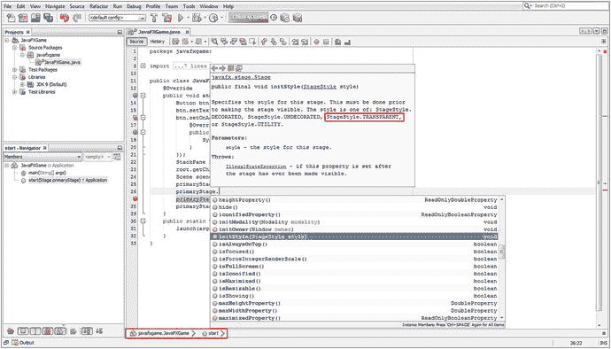

图 7-4.

在 primaryStage Stage 对象上调用 .initStyle() 方法，使用点符号调用辅助菜单

如图 7-4 所示，我点击了 NetBeans 9 辅助菜单中的 initStyle(StageStyle style) 选项，这会在你正在编写的代码行上方弹出一个 Javadoc 窗口，其中包含有关该方法的文档。你可以将此作为一种学习对象支持哪些方法的方式：输入对象名称，按下句点键，然后选择每个方法查看其功能。

如图 7-5 所示，Stage 对象是通过 `.start(Stage primaryStage)` 方法调用声明创建的，并在 `.start()` 方法结构内部使用 `.setTitle()`、`.initStyle()`、`.setScene()` 以及最后的 `.show()` 方法调用来进行设置（设置标题、样式、加载场景，然后显示）。

我现在暂时在 Java 9 代码中保留 `.setTitle()` 方法调用，但请记住，一旦你让这个无窗口应用正常工作，这个标题就是窗口边框（标题栏 UI 元素）的一部分。一旦这些元素消失（包括标题栏），设置标题属性将变得毫无意义。

如果你在应用开发工作流程的这个阶段专注于内存优化，你会移除这个 `.setTitle()` 方法调用，因为标题属性会占用内存空间，而且由于你为 StageStyle（实际上是窗口样式）属性使用了 StageStyle.TRANSPARENT 常量，它甚至不会被看到。

在 `.initStyle()` 方法内部，输入所需的 StageStyle 类（对象）和一个句点，以调出下一个辅助选择器。这次是一个常量选择器，如图 7-5 所示。选择 TRANSPARENT 选项，阅读其上的 Javadoc 信息，然后双击它以完成代码语句，该语句应如下所示：

```
primaryStage.initStyle(StageStyle.TRANSPARENT); // 插入 StageStyle 类 TRANSPARENT 常量
```

如图 7-5 的 Javadoc 信息弹出窗口所示，对于 TRANSPARENT 窗口（舞台）装饰样式，会自动编码一个回退（降级）方法为 UNDECORATED。这使用白色背景色，并仍然移除标准的操作系统窗口边框（标题栏、最小化、最大化、关闭、调整大小等）。接下来，让我们测试我们的代码，看看按钮现在是否浮动在其背后的任何内容之上（在本例中，是 NetBeans）。

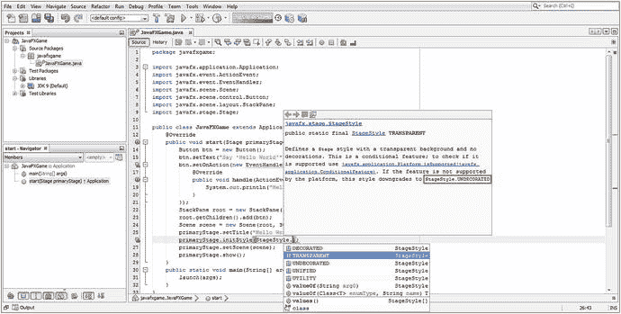

图 7-5.

在方法参数区域输入 StageStyle 和一个句点，以弹出 NetBeans 辅助常量选择器

接下来，使用“运行”图标（或“运行”菜单）运行应用程序。如图 7-6 所示，我们试图实现的目标并未成功，窗口边框元素消失了，但透明度值并不明显。

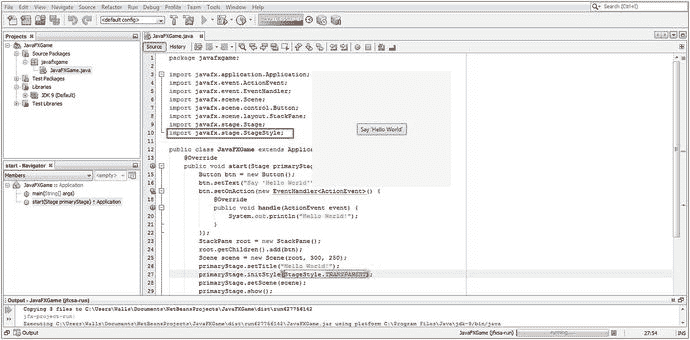

图 7-6.


运行项目，查看 Stage 对象是否为透明状态；显然，有一个对象被设置为米白色背景色。

如你所见，存在一个米白色颜色值（用于 iTV 机顶盒应用，因为某些 iTV 机顶盒不支持 255,255,255 的纯白色），该颜色值与 NetBeans 9 代码编辑器窗格使用的纯白（255,255,255）形成鲜明对比。

你的处理流程中肯定还有其他部分尚未使用透明度值来定义 Stage 的背景。透明度是通过十六进制值 `0x00000000` 来定义的，这表示所有 AARRGGBB（Alpha、红、绿、蓝）的透明度和颜色值均已关闭。你需要开始将应用程序中的 JavaFX 组件视为图层（目前这些图层是 Stage、Scene、StackPane、Button）。

你在本书的第 2 章中学习了数字图像概念，例如颜色深度、Alpha 通道、图层、混合、抖动，以及所有与在二维平面中处理像素相关的有趣技术信息。

接下来，我们应该尝试将此透明值设置到 JavaFX 场景图层次结构中 Stage 的下一级，该级包含了场景图本身。正如你在本章中所学，下一个最顶层的组件是 Scene 对象，它同样具有背景颜色值参数或属性。

因此，下一步是尝试使用十六进制值 `0x00000000` 或 Java 9 的 `Color` 类常量（可实现完全相同的目的）将该属性设置为零不透明度和零颜色。

你的 Scene 类（对象）没有像 Stage 类（对象）那样的 `TRANSPARENT` 样式常量，因此你必须使用不同的方法和常量，以另一种方式将 Scene 对象的背景设置为透明值。你应该意识到的一点是，JavaFX 中所有会自行写入屏幕的内容，都会以某种方式支持透明度。这允许在 JavaFX 应用程序内进行多层合成。

如果你查看 Scene 类的文档，会注意到有一个 `.setFill(Color value)` 方法，它接受一个 Color（类或对象）值，那么接下来让我们尝试一下。如图 7-7 所示，我使用 `scene.setFill();` 方法在名为 scene 的 Scene 对象上调用了 `.setFill()` 方法，NetBeans 允许我从下拉帮助菜单中选择。

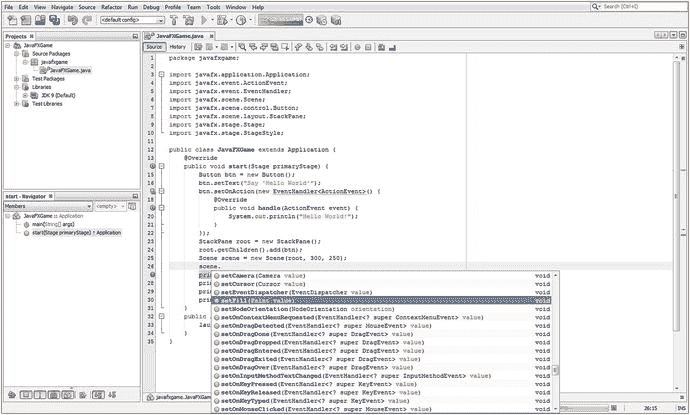

图 7-7.

添加一行新代码，输入 scene 的 Scene 对象和一个句点，以调用方法帮助选择器

选择并双击 `.setFill(Paint value)` 方法，然后在参数区域输入 Java 9 的 `Color` 类名（Color 是 Paint 的子类）。接着，输入一个句点以调出 Java 9 的 `Color` 帮助类中包含的常量，如图 7-8 所示，找到并选择 `TRANSPARENT` 常量。正如你在 Javadoc 帮助窗格中所见，ARGB 颜色值正是所需的 `#00000000`。

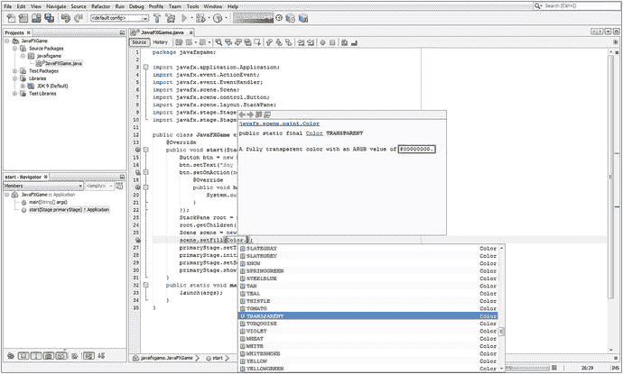

图 7-8.

在参数区域输入 Color 类名和句点，找到并选择 TRANSPARENT 常量

再次运行应用程序，看看透明度是否已经生效。如图 7-9 所示，它仍然不是透明的。由于我们在 BoardGame 应用程序中使用 StackPane 对象来实现图层，这是我们需要尝试设置透明度值的下一层级。JavaFX 使用一个 `Color` 类常量来为其所有 UI 对象确定默认的背景颜色值。如果我是 JavaFX 9 团队的成员，我会主张将其改为 `Color.TRANSPARENT` 常量，但这当然可能会让新用户感到困惑，因为 Alpha 通道和合成图层是高级概念和主题，这也是为什么它们会出现在这本专业 Java 9 游戏开发书籍开头部分的第 2 章中，该章节涵盖了数字图像合成及相关概念。注意在图 7-9 中，NetBeans 已经为你导入了 Java 的 `Color` 类，因为你在 `scene.setFill(Color.TRANSPARENT);` 这个 Java 语句中使用了它。

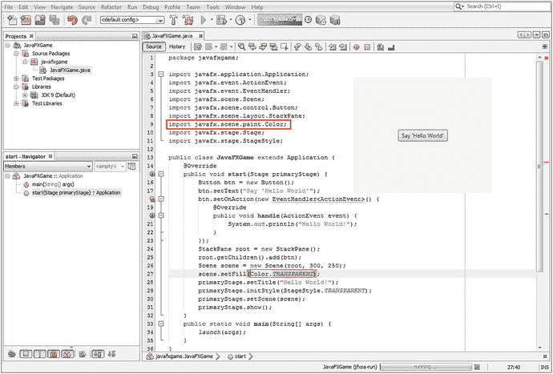

图 7-9.

将 Scene 对象的填充颜色设置为 TRANSPARENT，并注意 NetBeans 编写了 Color 类的导入语句

`javafx.scene.layout.StackPane` 类是 `javafx.scene.layout.Region` 类的子类，后者有一个 `.setBackground()` 方法用于设置 Background（类或对象）值。同样，必须有一个可用的 `TRANSPARENT` 值常量，或者类似 `Background.EMPTY` 这样的常量，因为你需要始终将背景值设置为透明，尤其是在专业 Java 9 游戏设计中，你需要灵活性来实现高级的 2D 和 3D 合成与渲染管线。这种对透明度的支持同样适用于 Android UI 容器。

有趣的是，在 Java 编程中，事情并不总是像我们希望的那样直接和一致，因为到目前为止，我们使用了三种不同的方法调用，传递了三种不同的自定义对象类型，来实现完全相同的最终结果（为设计元素安装透明背景颜色/图像板）：`.initStyle(StageStyle 对象)`、`.setFill(Color 对象)` 和 `.setBackground(Background 对象)`。这一次，你将使用另一个名为 `EMPTY` 的 Background 类（对象）常量来调用 `.setBackground(Background value)` 方法。

一旦你使用 `root.setBackground(Background.EMPTY);` 这个 Java 语句在名为 root 的 StackPane 对象上调用该方法，NetBeans 9 将帮助你找到该常量。这次更容易，因为 `Background.EMPTY` 常量恰好是 `.setBackground()` 方法调用的默认配置设置。如果你想查看所有 Background 帮助类的常量，请在 NetBeans 9 中输入 `root.setBackground(Background.`，然后查看常量弹出帮助选择器窗格中出现的结果。

如图 7-10 所示，NetBeans 9 提供了一个方法选择器下拉菜单，一旦你选择并双击 `.setBackground(Background value)` 方法，NetBeans 9 将为你编写代码语句，并使用点符号自动插入通过 Background 类调用的默认 `EMPTY` 常量。如图 7-11 中的红色部分所示，NetBeans 还将在 Java 类的顶部编写 Background 类的导入语句。

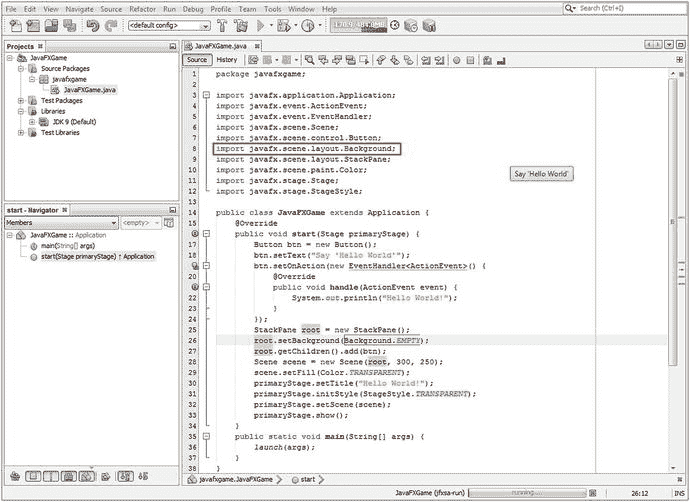

图 7-11.

透明度现在贯穿所有对象（图层），按钮现在直接渲染在操作系统上

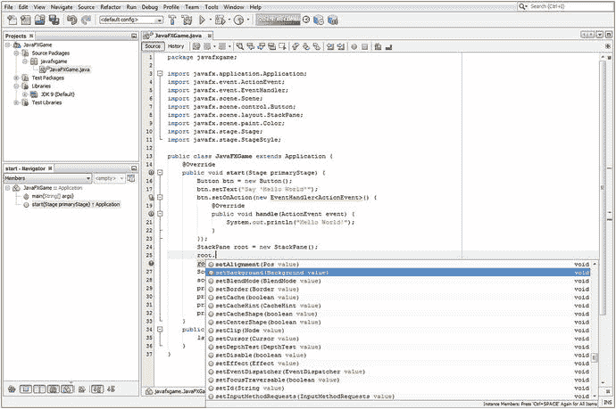

图 7-10.

在 root StackPane 对象之后添加一行代码，输入 root 和一个句点，然后选择 setBackground()

现在，你可以再次通过“运行项目”工作流程（通过“运行”菜单或 NetBeans IDE 左上角的绿色播放传输图标）来测试你的无窗口（透明）JavaFX 应用程序版本了。


如图 7-11 所示，我们现在已经实现了目标，在 NetBeans IDE 的 Java 代码编辑窗格顶部仅可见 Button 对象，该窗格位于正在运行的 Java 代码窗口下方，再下方则是操作系统桌面。

你还可以看到，NetBeans 添加了你的 Background 类导入语句，以及我们为达成最终效果而在图 7-11 第 25 至 33 行添加的九行 StackPane（根节点）和 Scene（场景）对象的 Java 9 代码。请务必理解这些对象的创建过程，以及它们如何相互连接（或如我所说的“接线”），从而不可避免地实现功能交织。要明白 Java 9 编程语句的顺序几乎与语句本身的构造同等重要。

例如，在编写第 25 行代码（实例化根 StackPane 对象）之前，你无法编写第 28 行代码，因为你需要用该对象来创建场景的 Scene 对象。

我在 NetBeans 9 中点击了 root 对象，让 IDE 显示该对象在类中的使用情况。如图 7-11 所示，Java 9 代码中的 root 对象会以黄色高亮标记来追踪。随着你的专业 Java 9 游戏代码日益复杂，这一酷炫功能将变得越来越重要。正如我在第 6 章中提到的，我们将在本书的多个章节中介绍实用的 NetBeans 9 功能。

最后一项测试是确保我们的 JavaFX 应用在操作系统桌面上方保持透明。将 NetBeans 9 IDE 拖到一旁，你会看到 Button UI 元素显示在桌面背景图像之上，如图 7-12 所示，现在它已完美运行。

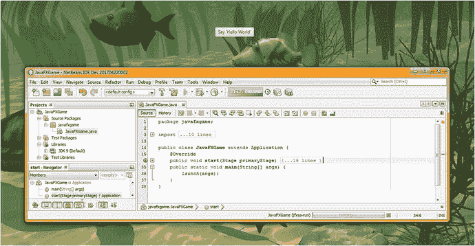

图 7-12.

JavaFX 应用无缝合成在 Windows 7 操作系统桌面壁纸之上

你还可以看到代码折叠与展开图标（代码左侧的加号和减号图标）正在工作。我已关闭（折叠）了 `.start()` 方法，并打开了 `.main()` 方法。点击减号将关闭 `.main()` 方法，点击加号则会打开导入语句和 `.start()` 方法的代码体。

我关闭了导入语句块和 `.start()` 方法代码块，以便向你展示该类的五个主要区域：你的 `javafxgame` 包声明、导入语句块、`JavaFXGame` Application 子类声明，以及任何 JavaFX 9 游戏（或物联网）应用所需的两个主要方法：`.start()` 和 `.main()`。

利用 2D、3D 和 Alpha 通道，可以使用 `StageStyle.TRANSPARENT` 功能创建一些极其酷炫的应用，因此我决定在本书早期就向你展示这一点，以便我能在这个 JavaFX“概述”章节中，分享一些关于提升 JavaFX 物联网应用和专业 Java 游戏编码体验的实用技巧。定义一个悬浮在操作系统桌面上的游戏或 i3D 虚拟对象，是一种罕见且视觉冲击力极强的效果。

现在，我们已经从回顾与专业 Java 9 游戏开发最直接相关的所有 JavaFX 9 API 中，享受了一段有趣的编码间歇，接下来让我们重新审视一些你可能想了解的、关于交互性、UI 设计、图表、音频或视频媒体资源，以及与互联网和社交媒体平台交互的其他 JavaFX 模块、包和类。我们还会简要介绍一些你不会用到的 API！

现在我们已经了解了 `javafx.stage` 包，接下来让我们看看 `javafx.geometry` 包。

### JavaFX 边界与尺寸：使用 javafx.geometry 类

尽管“几何”一词在技术上适用于 2D 和 3D 资源，但它们包含在 `javafx.scene.shape` 包中，我们已在本章前面部分介绍过。`javafx.geometry` 包可以视为一个“工具”包，包含从头构建 2D 或 3D 结构的基础类。因此，该包包含诸如 `Bounds` 超类及其子类 `BoundingBox`，以及 `Insets`、`Point2D`、`Point3D`、`Dimension2D` 和 `Rectangle2D` 等几何内容创建工具类。`javafx.geometry` 包中的所有类（除 `BoundingBox` 类外）都直接继承自 `java.lang.Object` 主类，这意味着它们各自（从头编码）用于提供点（也称为顶点）、矩形、尺寸、边界和内边距（内部边界），作为 Java 9 游戏的几何工具。

`Point2D` 和 `Point3D` 类（最终为对象）分别保存 2D 平面上 2D 点的 X、Y 坐标，或 3D 空间中 3D 点的 X、Y、Z 坐标。这些 Point 对象最终将用于构建更复杂的 2D 或 3D 结构，这些结构由点的集合组成，例如 2D 路径或 3D 网格。`Point2D` 和 `Point3D` 的构造方法没有重载，它们分别使用以下标准格式：

```
Point2D(double X, double Y)
Point3D(double X, double Y, double Z)
```

`Rectangle2D` 类（对象）可用于定义矩形 2D 区域（通常称为“平面”），在图形编程中有许多用途，这一点不难想象。

`Rectangle2D` 对象有一个起始点，位于矩形的左上角，由 X 和 Y 坐标位置指定，以及一个尺寸（宽度乘以高度）。`Rectangle2D` 对象的构造方法具有以下标准格式，且未重载：

```
Rectangle2D(double minX, double minY, double width, double height)
```

还有一个 `Dimension2D` 类（对象），它仅指定宽度和高度尺寸，而不将尺寸（否则会使其成为矩形）通过 X、Y 位置放置在屏幕上。其构造方法如下：

```
Dimension2D(double width, double height)
```

`Insets` 类（对象）类似于 `Dimension2D` 类，它不提供内边距的位置值，但根据上、下、左、右偏移距离提供矩形内边距区域的偏移量。实际上，`Insets` 方法已重载，因此你可以使用以下方式指定等距内边距或自定义内边距：

```
Insets(double topRightBottomLeft)
Insets(double top, double right, double bottom, double left)
```

`Bounds` 类是一个公共抽象类，永远不会成为对象，而是用于创建 Node 边界类（如其子类 `BoundingBox`）的蓝图。`Bounds` 超类也允许负值，用于指示边界区域为空（可视为 null 或未使用）。`BoundingBox` 类使用以下（重载的）构造方法创建 2D（第一个构造方法）或 3D（第二个构造方法）的 `BoundingBox` 对象：

```
BoundingBox(double minX, double minY, double width, double height)
BoundingBox(double minX, double minY, double minZ, double width, double height, double depth)
```

接下来，让我们看看 JavaFX 中的 Event 和 ActionEvent 处理，因为这为你的游戏增加了交互性。


### 游戏中的 JavaFX 输入控件：使用 javafx.event 类

由于游戏本质上具有交互性，接下来我们看看 `javafx.event` 包。它为我们提供了 `Event` 超类及其子类 `ActionEvent`，用于处理诸如 UI 元素或动画 `KeyFrame` 处理事件所使用的 `ACTION` 事件。由于你将在专业 Java 9 游戏（或物联网应用）中使用 `ActionEvent`，我将在此介绍其跨包（Java 到 JavaFX）的类继承层次结构，这也能让你了解 JavaFX `Event` 类的起源。之所以能做到这一点，是因为 JavaFX API 是 Java API 的一部分（位于其下层）。

```
Java.lang.Object
> java.util.EventObject
> javafx.event.Event
> javafx.event.ActionEvent
```

JavaFXGame 应用已经在使用这个 `ActionEvent` 类（对象），配合 `EventHandler` 接口及其 `.handle()` 方法。你需要实现该方法，以告知 Java 应用如何处理该事件——一旦事件发生（编程术语称为“触发”），它就是一个 `ActionEvent`。然后，这个 `.handle()` 方法会“捕获”被触发的事件，并根据 `.handle()` 方法“主体”内的 Java 9 编程逻辑对其进行处理。

正如你在第 5 章所学到的，Java 接口是一种类型，它提供声明好但尚未包含任何 Java 结构的空方法。这些未实现的方法在使用时，需要由你（Java 程序员）来实现。这个 Java 接口仅定义了哪些方法需要被实现；在本例中，它是一个单一方法，用于“处理” `ActionEvent`，以便该事件能以某种方式得到处理。

需要注意的是，Java 接口定义了一个需要编写代码的方法，但并不会为你编写该方法代码，因此它是一张“路线图”，指明了你必须做什么才能完成或对接现有的编程结构。在本例中，这是一个用于处理 `ActionEvent` 对象的 Java 编程结构，或者更准确地说，是一个用于在 `ActionEvent` 被触发后对其进行处理的编程结构。

与本章 JavaFX 新媒体引擎概述中涵盖的其他所有内容一样，在本书（专业 Java 9 游戏与物联网应用开发）的后续内容中，当你应用这些 JavaFX 9 编程结构、JavaFX 场景图构建以及新媒体资产设计概念时，你将很快深入了解如何使用这些包、类、嵌套类、接口、方法、常量和数据字段（变量）。

### JavaFX UI 元素：使用 javafx.scene.control 类

`javafx.scene.control` 包以及我们接下来要介绍的 `javafx.scene.chart` 包，都位于 `javafx.controls` 模块中。该包包含了所有用户界面控件（在 Android 中它们被称为“widgets”，而我更喜欢称它们为 UI“元素”）类，例如 `Alert`、`Button`、`Cell`、`CheckBox`、`ChoiceDialog`、`ContextMenu`、`Control`、`DatePicker`、`ColorPicker`、`Label`、`ProgressBar`、`Slider`、`Label`、`RadioButton`、`ScrollBar` 和 `TextField`。由于 `javafx.scene.control` 中有超过 100 个类，我甚至不打算在此一一介绍，因为仅这一个 Java 9 模块就足以写成一本书。如果你想回顾这些类，只需使用谷歌或 Oracle Java 网站搜索 `javafx.control` 模块，你就可以花上几天时间仔细研究这些类的功能。对于这个模块，“参考”是关键，因为当你需要实现某个特定 UI 元素时，你会希望单独参考这个包及其类。在本书中，我将尝试使用自己的 3D UI 元素和代码来创建 i3D 游戏（最终），这样我就不必在发行版中包含 `javafx.controls` 模块，从而省去了在发行版中包含超过 100 个控件类（更不用说十几个图表类）的开销，这些类实际上并未被使用。

### JavaFX 商业图表：使用 javafx.scene.chart 类

`javafx.scene.chart` 包与预定义的 UI 控件（UI 元素）一起位于 `javafx.controls` 模块中。该包包含商业图表类，例如 `Chart`、`ScatterChart`、`StackedAreaChart`、`XYChart`、`PieChart`、`LineChart`、`BarChart`、`StackedBarChart`、`AreaChart`、`BubbleChart` 等，用于商业应用，这完全是另一本书的内容，因此我们不会在本书中介绍图表。事实上，对于我的游戏，我将采用 3D UI 方法，这意味着我根本不需要包含 `javafx.controls` 模块（一个庞大的类集合），这样我的游戏模块只需包含 `javafx.base`、`javafx.media` 和 `javafx.graphics`，从而使发行版的下载体积显著减小（正如你在本章中所见，base 只有 10 个包，media 有 9 个，而 graphics 有 18 个）。

### JavaFX 媒体控制：使用 javafx.scene.media 类

`javafx.scene.media` 包包含在 `javafx.media` 模块中，其中包含用于播放音频和视频媒体资产的类，包括 `Media`、`MediaPlayer` 和 `MediaView` 类，以及 `AudioClip`、`AudioEqualizer`、`EqualizerBand`、`Track`、`VideoTrack` 和 `SubtitleTrack` 类。`Media` 类（或对象）引用或包含一个音频或视频媒体资产，`MediaPlayer` 播放该资产，而 `MediaView`（尤其是在视频情况下）显示数字音频或视频媒体资产，以及用于媒体播放的传输控件。

在本书后续内容中，当我们为你的专业 Java 9 游戏添加数字音频音效时，我们将使用 `AudioClip` 类。既然我们使用了该模块的数字音频部分，如果必须将其包含在你的应用（模块）发行版中，我们不妨也利用数字视频资产（视频类）的功能。

### JavaFX Web 渲染：使用 javafx.scene.web 类

`javafx.scene.web` 包包含在 `javafx.web` 模块中，其中包含用于在场景中渲染 Web（互联网）资产的类。该包包含一系列类，包括 `WebEngine`、`WebView`、`WebEvent`、`WebHistory` 和 `HTMLEditor`。可以想象，`WebEngine` 类（嘿，也有人称这些算法为引擎）负责处理在 JavaFX 场景中显示 HTML5、CSS3、CSS4 和 JavaScript，而 `WebView` 则创建节点以在 JavaFX 场景图中显示 `WebEngine` 的输出。`WebHistory` 类（最终是对象）保存着从 `WebEngine` 实例化到从内存中移除的互联网“会话”，即访问过的网页历史记录，而 `WebEvent` 类则“桥接”了 JavaScript 网页事件处理与 JavaFX 9 事件处理。在本书中创建 i3D 游戏的过程中，我们不会使用 `javafx.web` 模块，因为我将专注于那些能够提供最专业视觉效果的 i3D 游戏体验的核心 API。


### 其他 JavaFX 包：Print、FXML、Beans 和 Swing

在结束本章 JavaFX 概述之前，你还需要仔细了解其他几个 JavaFX 包。这些包包含的类可能在你专业的 Java 游戏开发中用到，但它们提供的是更专业的功能，例如打印、使用第三方 Java 代码、使用较旧的 UI 范式（如 AWT 和 Swing），以及将 UI 设计工作交给非程序员使用 XML（特别是 FXML）来完成。这些 API 包括 `javafx.print` 包（`javafx.graphics` 模块）、`javafx.fxml` 包（`javafx.fxml` 模块）、`javafx.beans` 包（`javafx.base` 模块）和 `javafx.embed.swing` 包（`javafx.swing` 模块）。除非你的项目有特殊需求，否则在 Java 游戏设计和开发工作流程中不太可能用到它们。其中最明显的是 `javafx.print`，它用于让打印机与你的专业 Java 9 游戏协同工作。如果你需要使用较旧的 Swing UI 元素，有一个 `javafx.swing` 模块可以实现这一点，但这会增加 Java 9 游戏发行版的数据占用。`javafx.beans` 包允许你使用 Java Beans（第三方或添加的类），而 `javafx.fxml` 模块则允许你使用 Java FXML，这是一种 XML 语言，可以将用户界面和图形设计工作从 Java 编码转移到 XML 中。这使得不熟悉 Java 的设计师也能参与游戏项目。Android 操作系统和 Android Studio IDE 也采用了这种方法，它们使用 XML 处理许多顶层设计任务，这样设计师就不必同时是程序员。

## 总结

在第七章中，你了解了 JavaFX 9 API 中一些最重要的包、概念、组件、类、构造器、常量和变量（属性、参数、数据字段）。这是一个令人印象深刻的集合，包含七个 Java 9 模块和 36 个包，其中许多我使用表格进行了简洁的概述，然后逐一进行了介绍。我这样做是因为，本章概述的大部分（如果不是全部）包和类，最终都会以某种方式用于新媒体、2D、3D 以及混合 2D+3D 的专业 Java 9 游戏开发。当我说全面概述时，我的意思是让我们看看在 Java 9 下使用 JavaFX 9 进行游戏开发所需的一切。

当然，我无法在一章中涵盖 JavaFX 9 API 中的每一个功能类，所以我从图 7-1 中 JavaFX API 新媒体引擎的概述开始，以及它如何与上层的 JavaFX 场景图集成，并与 Java 9 API、NetBeans 9 以及这些 API 下层的目标操作系统集成。你的 Java 9 游戏发行版和操作系统之间通过 Java 虚拟机（JVM）进行桥接。这赋予了 JavaFX 在众多流行平台和消费电子设备上广泛的操作系统支持，从智能手机到平板电脑再到 iTV 设备，以及所有基于流行的 WebKit 引擎的主流网络浏览器（Chrome、Firefox 和 Opera）。

你通过查看构成 JavaFX 引擎的结构，从高层次的技术角度审视了 JavaFX，这些结构包括 JavaFX 场景图、JavaFX API、Quantum、Prism、Glass、WebKit 和媒体播放器引擎。你了解了这些多线程、渲染、窗口化、媒体和 Web 引擎如何与 Java 9 API 和 JDK 交互，以及如何与 NetBeans 9 及其生成的 JVM 字节码交互，这些字节码得到了当前运行在十多种不同消费电子设备类型（从 96 英寸 UHD iTV 到 4 英寸智能手机）之上的各种操作系统平台的支持。

我介绍了 JavaFX 的核心概念，例如使用 JavaFX 场景图和 JavaFX 脉冲事件系统，我们将在本书的后续章节中利用这些概念来创建一个专业的 Java 9 游戏，从下一章开始，我们将开始设计游戏并介绍如何使用 JavaFX 场景图来开发处理层次结构。

我深入探讨了一些用于专业 Java 9 游戏设计的关键 JavaFX 包、子包和类，例如 `application`、`scene`、`shape`、`effect`、`layout`、`control`、`media`、`image`、`stage`、`animation`、`geometry`、`event`、`fxml` 和 `web`，以及它们相关的 Java 9 模块、包、子包、类和子类。在某些情况下，我甚至介绍了它们的接口、嵌套（辅助）类和数据常量。

在回顾 JavaFX 9 API 的过程中，你稍作休息，为 `JavaFXGame` 应用程序添加了一些代码，使其成为一个“无窗口”应用程序，能够“浮动”在任何主流操作系统桌面上。你了解了如何通过使用十六进制设置 `0x00000000` 的 Alpha 通道，或使用代表 100% Alpha 透明度的等效常量（例如 `Color.TRANSPARENT`、`StageStyle.TRANSPARENT` 或 `Background.EMPTY`），使 `Stage`、`Scene` 和 `StackPane` 对象的背景属性变得透明。你还看到 `Group`（`Node`）类和对象本身就具有透明背景；当你将场景图的顶层 `Node` 从 `StackPane` 更改为 `Group`（一个更好的顶层 `Node`）时，根本不需要设置 `Group` 的背景透明度。

我必须在本章中安排一些使用 NetBeans 9 IDE、Java 9 编程语言和 JavaFX 9 API 的实际工作，这样我们就可以开始逐步添加越来越多的代码，直到（很快）剩余的章节完全专注于编码，因为所有这些基础材料——涵盖新媒体资产设计、API、IDE、游戏概念、JVM、UI、UX、3D 渲染引擎、2D 回放引擎、WebKit、静态与动态、游戏优化等等——都已经牢固地植根于你的脑海中，因为你需要在本书的整个过程中，在这些高级知识的基础上进行构建。

在下一章中，你将研究 JavaFX 9 场景图。你将开始构建你在本章中学到的场景图结构，并开始为游戏奠定基础，包括一个用于启动游戏的按钮元素 UI“面板”。我还将解释你的游戏规则、显示高分、提供制作人员名单，并包含法律免责声明。我知道你渴望开始构建你的专业 Java 9 游戏基础设施，你将在下一章中真正开始这项工作，创建自定义方法并使用 JavaFX API 添加新的 Java 代码，以开始为你的 `JavaFXGame` 类创建顶层结构。实际上，你在本章中已经通过了解如何在你的 JavaFX 9 场景图层（Application -> Scene -> Group -> StackPane -> VBox -> Button）内部和之间实现透明度，已经开始了这项工作。


