# 8. JavaFX 9 场景图层次结构：Java 9 游戏设计的基础

让我们基于在前几章中学到的关于 JavaFX、游戏设计、多媒体和 Java 的新知识，从用户界面和用户体验的角度，以及“引擎盖下”的游戏引擎、3D 精灵引擎、碰撞引擎和物理引擎的角度，开始设计我们的 i3D JavaFXGame 游戏的基础架构。我们将牢记优化，正如我们在本书剩余部分必须做的那样，这样我们就不会得到一个过于庞大或复杂的场景图，以至于脉冲系统无法高效地更新所有内容。这意味着要将主要的游戏 UI 屏幕（StackPane 节点）保持在最少数量（四到五个），以便将大部分处理能力留给 3D 游戏渲染（Group 节点），并确保媒体播放器（数字音频或数字视频）使用其自己的线程（如果使用了此类媒体）。（音频，尤其是视频，数据量非常大，并且可能非常消耗处理能力。）你还需要确保驱动游戏的功能性“引擎”都以模块化和逻辑化的方式编码，使用它们自己的类，并利用你在第 5 章中学到的正确的 Java 编程约定、结构、方法、变量、常量和修饰符。这将是一项艰巨的任务，需要数百页来实现，从本章开始，既然我已经确保你们对 Java、JavaFX、NetBeans、2D 和 3D 新媒体概念的知识都已掌握。

我要介绍的第一件事是一个顶层、面向用户的界面屏幕设计，你的游戏在启动 Java 应用程序时会向用户提供这个界面。这将包括用户在启动应用程序时看到的 BoardGame “品牌”启动画面。这个屏幕的一侧将包含按钮控件，用于访问包含说明、制作人员名单、法律免责声明等信息的屏幕。这些我们希望数量最少的 UI 屏幕，将是 StackPane 节点层。StackPane 对象旨在包含堆叠的图像（合成）层。这些游戏支持屏幕将包含用户有效玩游戏所需的信息。这包括基于文本的信息，例如游戏说明、制作人员名单、法律免责声明和最高分屏幕。我们将包含法律免责声明以让法务部门满意，并设置一个制作人员名单屏幕，突出显示参与创建游戏和游戏资产的程序员和新媒体艺术家的贡献。

在本章中我们将概念化的 BoardGame 设计基础的下一层，是 BoardGame 的“引擎盖下”、面向后端的游戏引擎组件 Java 类设计方面。这些对游戏用户是不可见的，但仍然非常重要。它们可能包括一个游戏玩法引擎，用于使用 JavaFX 脉冲控制游戏玩法更新；一个 3D 精灵引擎，用于管理游戏的 3D 游戏精灵；一个碰撞引擎，用于检测两个精灵之间发生碰撞并做出响应；一个物理引擎，用于对游戏玩法施加力和类似的物理模拟，使 3D 精灵能够逼真地加速和弹跳；最后是一个 3D 角色引擎，用于管理已为你的 JavaFXGame 游戏实例化的各个角色的特性。你将修改现有的 `JavaFXGame.java` 类来实现一个 UI，其中包含按钮控件，用于访问提供顶层用户界面游戏玩法信息功能所需的功能性信息屏幕。你将学习几个用于组织和定位的新 JavaFX 类，包括 Group、VBox、Insets 和 Pos 类。

## 游戏设计基础：主要功能屏幕

你为游戏设计的第一件事应该是顶层或最高层的用户界面屏幕，你的游戏用户将通过这些屏幕进行交互。这定义了用户首次打开你的游戏时的用户体验。这些屏幕将通过你的 JavaFXGame 启动（品牌）屏幕访问，该屏幕包含在主 JavaFXGame.java 类代码中。正如你已经看到的，这个 Java 代码将扩展 javafx.application.Application 类，并启动应用程序，显示一个启动画面，以及查看说明、玩游戏、查看最高分或查看游戏法律免责声明和游戏创建者制作人员名单（程序员、美术师、编剧、作曲、音效设计师等）的选项。图 8-1 显示了一个游戏的高级示意图，从顶部的功能性 UI 屏幕开始，向下延伸到 JavaFXGame.java 代码，然后是 API，再到 JVM，最后到操作系统级别。

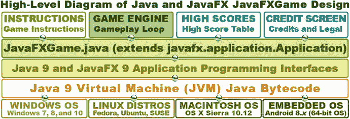

图 8-1.

JavaFXGame 功能屏幕以及如何使用 JVM 在 Java 9 和 JavaFX 9 中实现它们

这将要求你向 StackPane 布局容器 Parent 分支节点添加另外四个 Button 节点，并最终（在第 9 章中）添加一个 ImageView 节点作为 SplashScreen 图像容器。这个 ImageView 节点必须添加到 StackPane “背板”中，以成为 StackPane 中的第一个子节点（z 顺序 = 0），因为 ImageView 包含我称之为启动画面 UI 设计背景板的内容。由于它在背景中，该图像需要位于 Button UI 控件节点（SceneGraph）元素之后，这些元素的 z 顺序值将为 1 到 5。

这意味着最初你将只使用八个 JavaFX SceneGraph 节点对象：一个 Parent 根 Group 节点，一个 StackPane 布局“分支”节点，以及 VBox UI 容器节点中的五个“叶子”Button 控件节点，用于创建你的 JavaFXGame（功能性）信息屏幕。你的说明、法律免责声明和制作人员名单屏幕将使用 TextFlow 和 ImageView 节点，因此在第 9 章之后我们将拥有十个节点对象。你可以使用 VBox 节点来包含 UI 按钮，我们将在本章中这样做，以便在你的游戏应用程序中放置游戏 UI 导航基础设施。这甚至在我们考虑添加一个 Group “分支”节点以及其下的分支和叶子节点对象来包含 3D 游戏画面之前。当然，这正是你希望为你的 Java 游戏获得最佳脉冲更新性能的地方。

如果你仔细想想，这其实并不算太糟，因为这些 UI 屏幕都是静态的，不需要更新。也就是说，这些节点对象中包含的 UI 元素是固定的，不需要使用脉冲系统进行任何更新，因此你应该仍然有 99% 的 JavaFX 脉冲引擎能力剩余，用于处理我们将在本书中编码的 JavaFXGame 游戏玩法引擎。你始终需要意识到你要求脉冲引擎处理多少个 SceneGraph 节点对象，因为如果这个数字变得太大，它将开始影响游戏的 i3D 性能。如果 i3D 游戏性能受到影响，游戏玩法将不流畅，这将影响你的用户体验（UX）。我们保持静态的节点对象越多，每个脉冲需要处理的就越少。


## Java 类结构设计：游戏引擎支持

接下来，让我们看看 JavaFXGame 代码在“底层”需要如何组合其功能结构。这将使用你在本书中将要创建的 Java 9 游戏编程代码来完成。前端 UI 屏幕的外观与底层编程逻辑之间实际上没有直接关联，因为游戏的大部分编程代码都将用于在游戏屏幕上创造游戏体验。游戏说明、法律声明和制作人员屏幕将只是文本（保存在 `TextFlow` 对象中）叠加在背景图像（保存在 `ImageView` 对象中）之上。记分牌和高分屏幕需要稍多一些的编程逻辑，我们将在本书末尾进行处理，因为需要先创建（并运行）游戏逻辑，才能生成计分引擎和高分。

图 8-2 展示了你的 JavaFXGame 完整运行所需的主要功能游戏组件。该图显示了一个 `JavaFXGame.java` Application 子类位于层次结构的顶部。它在 JavaFXGame 应用程序内部或之下创建了顶层的 JavaFXGame Scene 对象及其包含的 SceneGraph。这些功能区域既可以作为方法实现，也可以作为类实现。在本书中，我们将使用方法来实现一个 i3D 游戏。

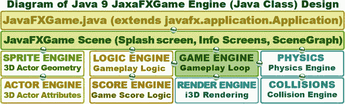

图 8-2.

主要的游戏引擎功能，代表了你在游戏中需要编码的 Java 方法

在 JavaFXGame.java Application 子类内部创建的 JavaFXGame Scene 对象之下，是一个更广泛的功能性 Java 9 类的结构设计，你需要在本书剩余部分对这些类进行编码。图 8-2 中所示的这些引擎（类）将创建你的游戏功能，例如游戏引擎（游戏处理循环）、逻辑引擎（游戏逻辑）、精灵引擎（3D 几何管理）、角色引擎（角色属性）、分数引擎（游戏分数逻辑）、渲染引擎（实时渲染）、碰撞检测和物理模拟。你需要创建所有这些 Java 方法，以便为 i3D 棋盘游戏实现一个全面的游戏引擎。

我将把游戏引擎类称为 `GamePulse.java`，它是创建 `AnimationTimer` 对象的主要类，该对象基于持续触发游戏循环的脉冲事件，在高层面上处理你的游戏逻辑。如你所知，这个循环将调用一个 `handle()` 方法，该方法内部将包含一系列方法调用，最终访问你将创建的其他类，以管理 3D 几何体（精灵引擎）、在屏幕上移动 3D 对象（角色引擎）、检测碰撞（碰撞引擎）、在检测到所有碰撞后应用游戏逻辑（逻辑引擎），以及应用物理力（如摩擦力、重力和风力）为你的游戏提供逼真的效果（物理引擎）。在本书的剩余部分，你将构建其中一些引擎，这些引擎将用于为玩家创造游戏体验。我们将根据每个引擎及其需要处理的内容，逻辑性地划分章节主题，因此从学习和编码的角度来看，所有内容都是结构化的。

## JavaFX 场景图设计：最小化 UI 节点

最小化场景图的诀窍是使用尽可能少的节点来实现完整的 UI 设计，正如你在图 8-3 中所见，我使用一个 Group 根节点对象、一个 StackPane 布局“分支”节点对象、一个 VBox 分支节点对象和八个叶子（子）节点（一个 TableView、一个 ImageView、一个 TextFlow 和五个 Button UI 控件）实现了这一点。正如你接下来在编写场景图代码时会看到的，我将只使用 12 个对象并导入 12 个类，就能使我们在上一节中设计的 JavaFXGame 类的整个顶层 UI 成为现实。TableView 和 TextFlow 对象将叠加在包含 UI 设计背景图像的 ImageView 对象之上。这个 TableView 对象将在本书后面添加，并将使用来自图 8-2 中所示的分数引擎的代码进行更新，你将在未来的章节中对该引擎进行编码。

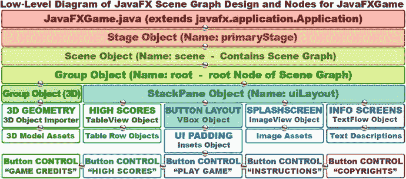

图 8-3.

游戏场景图节点层次结构、节点包含的对象以及它们引用的新媒体资源

ImageView 底板将包含棋盘游戏的艺术作品，如果你愿意，可以使用 ImageView 容器来保存不同的数字图像资源。这样，基于你的 ActionEvent 对象处理按钮点击，你可以为每个信息屏幕使用不同的背景图像资源。VBox 父级 UI 布局容器将控制你的五个 Button 控件的布局（间距）。还有一个 Inset 对象，你将创建它来保存 UI 按钮的 Padding 值，以微调 Button 对象之间的相对对齐方式。

由于 Button 对象无法单独定位，我不得不使用 VBox 类和 Insets 类来专业地包含和定位 Button 控件。在本章中，我们将介绍你将用于创建此高级设计的类，以便你了解每个将要添加到 JavaFXGame 中的类，从而为你的 JavaFXGame.java Application 子类创建这个顶层 UI 设计。

我们优化场景图使用以匹配五个不同按钮对应五个不同屏幕的方式是：使用一个 ImageView 作为底板，在游戏启动时包含棋盘游戏的启动画面。当用户点击你的 UI 按钮时，你可以使用 Java 代码让 ImageView 通过单个 ImageView 场景图节点对象引用不同的图像。你的 TextFlow 对象会将文本资源叠加在 ImageView 上。

最后，可能有一个 SceneGraph 节点将包含高分表的数据结构。这将通过我们稍后创建的分数引擎来实现，届时我们将讨论游戏分数的方法和技术。目前，我们将暂不实现分数和游戏代码。接下来，让我们看看一些新的 JavaFX UI 设计类。

## JavaFX 设计：使用 VBox、Pos、Insets 和 Group

在深入编码之前，让我们深入了解一下我们将用来完成这些顶层游戏应用程序 UI 和场景图设计的一些新的 JavaFX 类。这些包括 Pos 类（定位）、Insets 类（内边距）、VBox 类（垂直 UI 布局容器）和 Group 类（场景图节点分组）。在下一章中，我们将介绍 Image（图像资源持有者）、ImageView（图像底板显示）和 TextFlow（文本数据显示）类。我们将按照从最简单（Pos）到最复杂（Group）的顺序来学习它们，然后你将对你的引导 JavaFX 项目代码进行相当广泛的修改，将这些新类（和对象）添加到你的 JavaFX 场景图层次结构中，并重新组织它以更好地适应你的游戏。


### JavaFX Pos 类：使用常量进行通用定位

Pos 类是一个 `Enum<Pos>` 类，即枚举类的简写。它包含一系列常量，这些常量在代码中会被转换为整数值。常量值使程序员更容易在代码中使用这些值。在本例中，这些常量是诸如 `TOP`、`CENTER` 或 `BASELINE` 等定位前缀。

Pos 类的 Java 类继承层次结构始于 `java.lang.Object` 主类，经过 `java.lang.Enum<Pos>` 类，最终到达 `javafx.geometry.Pos` 类。你在图 8-10 代码的第 56 行引用了 Pos。Pos 位于 `javafx.geometry` 包中，并使用以下子类层次结构：

```
java.lang.Object
> java.lang.Enum
> javafx.geometry.Pos
```

正如你将在下一节中看到的，你将需要使用 `Insets` 类和对象来获得所需的像素级精确定位。由于这是一个枚举类，本节需要学习的内容不多，主要是了解 Pos 类为你提供的常量，以便在你的 Java 游戏中进行通用和相对定位。

因此，Pos 类非常适合使用顶部、底部、左侧和右侧以及基线（主要用于相对于字体的定位）进行通用定位。每个方向也都有一个用于居中的 `CENTER` 选项。因此，通过使用这个辅助类提供的十几个常量，你可以实现所需的任何通用定位。

关于通用定位的一个例子，可以参考你的网站设计经验，你可以设计一个网页，使其能够缩放以适应不同的窗口大小和形状。这与像素级精确定位截然不同，后者是在固定屏幕尺寸和形状的 (0,0) 位置开始，并将元素精确地放置在你想要的位置！

游戏设计通常使用像素级精确定位，但在本章中，我将向你展示如何将一组 UI 按钮定位在通用位置（例如用户屏幕的右上角或左下角），以便你尽可能多地接触 JavaFX API 工具类（本类位于 `javafx.geometry` 包中）。

你将使用 `TOP_RIGHT` 常量，如图 8-10 第 56 行所示，将你的按钮控件组定位在 BoardGame 用户界面设计的右上角，避开主要的中央 3D 视图区域。

Pos 类提供了一组常量，我将在表 8-1 中总结，用于提供“通用”的水平和垂直定位与对齐。

表 8-1. 可用于 JavaFX 定位和对齐的 Pos 类枚举常量

| Pos 类常量 | 通用定位结果 |
| --- | --- |
| BASELINE_CENTER | 垂直方向在基线上定位对象，水平方向在中心定位 |
| BASELINE_LEFT | 垂直方向在基线上定位对象，水平方向在左侧定位 |
| BASELINE_RIGHT | 垂直方向在基线上定位对象，水平方向在右侧定位 |
| BOTTOM_CENTER | 垂直方向在底部定位对象，水平方向在中心定位 |
| BOTTOM_LEFT | 垂直方向在底部定位对象，水平方向在左侧定位 |
| BOTTOM_RIGHT | 垂直方向在底部定位对象，水平方向在右侧定位 |
| CENTER | 垂直方向在中心定位对象，水平方向在中心定位 |
| CENTER_LEFT | 垂直方向在中心定位对象，水平方向在左侧定位 |
| CENTER_RIGHT | 垂直方向在中心定位对象，水平方向在右侧定位 |
| TOP_CENTER | 垂直方向在顶部定位对象，水平方向在中心定位 |
| TOP_LEFT | 垂直方向在顶部定位对象，水平方向在左侧定位 |
| TOP_RIGHT | 垂直方向在顶部定位对象，水平方向在右侧定位 |

Pos 类提供通用定位；它可以与 `Insets` 类结合使用，以实现更像素级的精确定位。接下来，让我们看看 `Insets` 类，它也位于 `javafx.geometry` 包中。

### JavaFX Insets 类：为你的 UI 提供内边距值

Insets 类是一个公共类，它直接扩展了 `java.lang.Object` 主类，这意味着 Insets 类是“从头编码”的，用于在矩形区域内提供内边距或偏移量。想象一个相框，你在外框和内框之间留出一个“衬边”或装饰性边框。这就是 Insets 类通过两个构造方法所做的事情：一个提供相等或均匀的内边距，另一个提供不相等或不均匀的内边距。

我们将使用提供不均匀内边距值的构造方法，如果用来装裱照片，那会显得非常不专业！Insets 类的 Java 类层次结构始于 `java.lang.Object` 主类，并使用此类创建 `javafx.geometry.Insets` 类。正如你将在本章后面图 8-11 的代码第 58 行中看到的，Insets 类被设置为在两侧提供零像素，在另外两侧提供十像素。这会将按钮组从用户显示屏的角落推开。JavaFX Insets 类包含在 `javafx.scene.geometry` 包中，就像 Pos 类一样，并使用以下 Java 9 类层次结构：

```
java.lang.Object
> javafx.scene.geometry.Insets
```

Insets 类提供了一组四个 double 类型的偏移值，分别指定矩形的顶部、右侧、底部和左侧，并且应按照该顺序在构造方法中指定，正如你在编写代码时看到的那样。你将使用这个 Insets 类（对象）来“微调”你的按钮控件组的位置，你将使用 VBox 布局容器（你将在下一节中学习）来创建该按钮组。可以将这些 Insets 对象视为在另一个框内绘制一个框的方法，它显示了希望矩形内部对象在其边缘周围“遵守”的间距。这通常被称为内边距，尤其是在 Android Studio 和 HTML5 编程中。

用于创建 Insets 对象的最简单的 `Insets()` 构造方法将使用以下格式：

```
Insets(double topRightBottomLeft)
```

此构造方法对所有边距（topRightBottomLeft）使用单个值，而一个重载的构造方法允许你分别指定这些值，如下所示：

```
Insets(double top, double right, double bottom, double left)
```

这些值需要按此顺序指定。记住这一点的一个好方法是想象一个模拟时钟。时钟的顶部是 12，右侧是 3，底部是 6，左侧是 9。所以，只需记住从正午（12 点）开始顺时针指定（献给西部电影爱好者），你就有了一个很好的方法来记住在使用“不均匀值”构造方法时如何指定 Insets 值。

你正在使用 Insets 类来定位你的按钮控件组，该组最初会“卡在”BoardGame 用户界面设计的左下角。Insets 对象将允许你使用这四个 Insets 参数中的两个，将按钮控件从屏幕右侧和 VBox 顶部推开。


### JavaFX VBox 类：使用布局容器进行设计

由于 Button 对象不易定位，我将把五个 Button 对象放入 `javafx.scene.layout` 包中一个名为 VBox（垂直框）的布局容器中。这个公共类将元素排列成一列，既然你希望按钮对齐在 BoardGame 的一侧，它将成为你用于五个 Button 控制节点的父节点，这些节点将成为此 VBox 分支节点的子叶节点。这将创建一个 UI 按钮控件“组”，可以作为一个整体单元在 UI 和启动画面设计中移动定位。

VBox 类是一个公共类，它直接继承自 `javafx.scene.layout.Pane` 超类，而 Pane 又继承自 `javafx.scene.layout.Region` 超类，Region 继承自 `javafx.scene.Parent` 超类，Parent 继承自 `javafx.scene.Node` 超类，Node 则继承自 `java.lang.Object` 主类。如图 8-10 第 55 行所示，你将使用 VBox 作为按钮控件定位的用户界面布局容器。与 StackPane 类一样，VBox 类也包含在 `javafx.scene.layout` 包中，并使用以下 Java 类层次结构：

```
java.lang.Object
> javafx.scene.Node
> javafx.scene.Parent
> javafx.scene.layout.Region
> javafx.scene.layout.Pane
> javafx.scene.layout.VBox
```

如果 VBox 指定了边框或内边距值，VBox 布局容器内的内容将“遵循”该边框和内边距规范。内边距值使用 Insets 类指定，我们之前介绍过该类，你将在此精细调整的用户界面控件按钮组应用中使用它。

你将使用 VBox 类（对象），以及 Pos 类常量和 Insets 类（对象），来将你的 UI Button 对象分组，并在后续微调它们的位置，形成你的按钮控件组。因此，这个 VBox 布局容器将成为 UI 按钮控件（或叶节点）的父节点（以及分支节点）。

可以将 VBox 对象视为一种使用列垂直排列子对象的方式。这可以是你的图像资源，彼此上下排列，使用基本的 VBox 构造函数（间距为零像素）；也可以是 UI 控件，例如按钮彼此上下排列，并使用其中一个重载构造函数来设置间距。

创建 VBox 对象最简单的构造函数使用以下空构造函数方法调用：

```
VBox()
```

你将用于创建 VBox 对象的重载构造函数将包含一个间距值，用于在 VBox 内的子 Button 对象之间留出一些空间。它使用以下构造函数方法调用格式：

```
VBox(double spacing)
```

还有另外两种重载构造函数方法调用格式。它们允许你在构造函数方法调用本身中指定子 Node 对象（在我们的例子中，是 Button 对象），如下所示：

```
VBox(double spacing, Nodes... children)
```

此构造函数将在 Node 对象数组之间指定零像素的间距值：

```
VBox(Nodes... children)
```

我们将在代码中使用“简写形式”和 `.getChildren().addAll()` 方法链来演示如何操作，但我们也可以使用以下构造函数来声明 VBox 及其 Button Node 对象：

```
VBox uiContainer = new VBox(10, gameButton, helpButton, scoreButton, legalButton, creditButton);
```

如果子对象被设置为可调整大小，你的 VBox 布局容器将根据不同的屏幕尺寸、宽高比和物理分辨率来控制子元素的缩放。如果 VBox 区域能够容纳子对象的首选宽度，它们将被设置为该值。有一个布尔类型的 `fillWidth` 属性，其默认值为 `true`。这指定了子对象是否应填充（缩放至）VBox 的宽度值。

VBox 的对齐方式由 `alignment` 属性控制，其默认值为 Pos 类中的 `TOP_LEFT` 常量（`Pos.TOP_LEFT`）。如果 VBox 的 `fillWidth` 属性为 `false`，并且 VBox 的尺寸大于其指定宽度，则子对象将使用其首选宽度值，多余的空间将不会被利用。`fillWidth` 的默认设置为 `true`，子对象的宽度将被调整以适配 VBox 的宽度。需要注意的是，VBox UI 布局引擎将布局所有受管理的子元素，无论其 `visibility` 属性（也称为属性、特征或对象变量）设置如何。

你还会注意到，本章中添加的类本质上具有透明或空的背景（我称之为背板），因此我们无需像第 7 章那样做额外的工作来保持 Alpha 通道。

现在，我们已经用了好几页的篇幅讨论了 `javafx.scene.layout` 和 `javafx.geometry` 包中的一些类，这些类用于创建你的 UI（按钮对象组）设计。接下来，让我们仔细看看 `javafx.scene` 包中与 SceneGraph 分组相关的类。这些类将使我们能够实现高级的 SceneGraph 层次结构，你需要将其放置在 VBox UI 布局容器对象（位于 StackPane UI 层合成对象内部）所包含的五个 JavaFX Button 控件 UI 元素（对象）旁边。这个 Group（Node）容器对象将在本书后续介绍 3D 和 i3D 时，容纳你的 i3D 游戏对象层次结构。


### JavaFX Group 类：高级场景图节点分组

Group 类是一个公共类，直接继承自 `javafx.scene.Parent` 超类，而 `Parent` 继承自 `javafx.scene.Node` 类，`Node` 类又继承自 `java.lang.Object` 主类。因此，Group 对象是 JavaFX 场景图中一种 Parent（分支）节点对象，用于对其他分支节点和叶节点对象进行分组。Group 类使用以下 Java 类继承层级结构：

```
java.lang.Object
> javafx.scene.Node
> javafx.scene.Parent
> javafx.scene.Group
```

Group 父节点对象包含一个子 Node 对象的 `ObservableList`，每当渲染此 Group 父节点对象时，这些子节点将按预定顺序渲染。Group 节点对象将采用其子节点的整体（汇总）边界；但是，它本身不可直接调整大小。应用于 Group 的任何变换、效果或状态都将应用于（传递至）该 Group 节点的所有子节点，但不会应用于 Group 本身。

这意味着这些应用的变换和效果将不会包含在 Group 父节点的布局边界内；但是，如果变换和效果是直接设置在此 Group 内部的子 Node 对象上，那么这些变换和效果将包含在此 Group 的布局边界内。因此，要影响 Group 父节点的布局边界，你需要从内向外操作，即通过变换 Group 的 `ObservableList` 中的成员来实现，而不是通过变换 Group 对象本身。

默认情况下，Group 父节点会在布局传递期间自动将其设置为可调整大小的受管子对象缩放至其首选大小。这确保了 Region 或 Control 子对象在其状态变化时能够正确缩放。如果应用程序需要禁用此自动调整大小行为，则应将 `autoSizeChildren` 设置为 `false`。需要注意的是，如果任何子对象的首选大小属性发生更改，它们将不会自动调整大小，因为 `autoSizeChildren` 已被设置为 `false`。此 `Group()` 构造函数将创建一个空组。

```
Group()
```

重载的 `Group(Collection<Node>)` 构造函数方法将构造一个 Group，该 Group 包含一个 Java `Collection<Node>`，其中包含给定的 Node 对象子节点的 Java 集合，使用以下构造函数方法：

```
Group(Collection children)
```

第二个重载的 `Group(Node…)` 构造函数方法将构造一个 Group，该 Group 包含一个子 Node 对象的 Java List，在构造函数方法参数区域内以逗号分隔列表的形式构建。这可以通过使用以下构造函数方法格式来实现：

```
Group(Node... children)
```

现在你已经了解了本章中使用的各种类的概况，让我们回到为 JavaFXGame 类组织代码的工作上，使其符合我们正在处理的游戏 SceneGraph 的要求。

## 场景图代码：优化 JavaFXGame 类

我知道你渴望处理 JavaFXGame 类的代码，那么让我们清理、组织和优化现有的 Java 9 代码，以实现图 8-3 所示的大部分顶层用户界面和 SceneGraph 设计，以便在本章中朝着创建顶层 Java 9 游戏框架的目标取得一些进展。你要做的第一件事是将所有对象声明和命名语句放在 JavaFXGame 类的顶部，位于 import 块和 Java 类声明之后。这些对象声明将放在所有方法之前。你们中的许多程序员习惯于在代码顶部声明全局变量，并且可以以类似的方式在 Java 代码顶部声明一个空的对象声明以供使用。这种方法更有条理，并且此类内部的所有方法都能够“看到”（访问或引用）这些对象，而无需使用任何 Java 修饰符关键字。这是因为对象声明位于 JavaFXGame 类的顶部，而不是包含在该类的任何方法内部，因此以这种方式完成的所有声明对于在其“下方”声明的所有方法都是“可见的”。如图 8-4 所示，我正在添加一个新的 Group 对象，我将其命名为 `root`，因为它将成为新的 SceneGraph 根节点。请注意 Group 下方波浪形的红色下划线错误，因为没有 import 语句告诉 Java 9 你想要使用 Group 类。使用 Alt+Enter 组合键调出 NetBeans 帮助弹出窗口，并选择 `Add import for javafx.scene.Group` 选项，如图 8-4 所示。

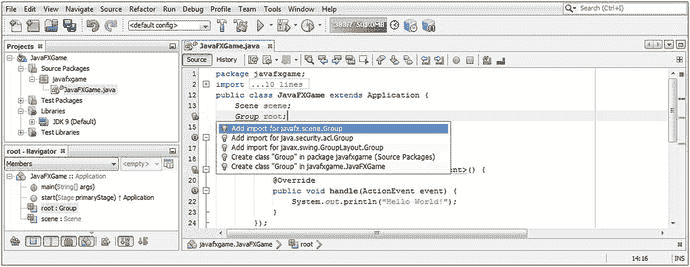

图 8-4.

在 `.start()` 方法之前，在 JavaFXGame 类顶部声明 scene Scene 对象和 root Group 对象

如你所见，我还将现有 scene Scene 对象的声明移到了类的顶部，因此，我们不再使用 `Scene scene = new Scene();`，而是使用以下 Scene 对象声明 Java 代码结构，如图 8-5 所示：

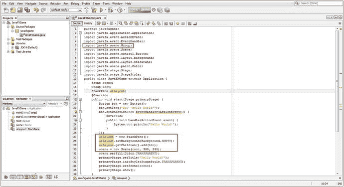

图 8-5.

通过创建 `createBoardGameNodes()` 和 `addNodesToSceneGraph()` 方法来组织 `.start()` 方法

```
public class JavaFXGame extends Application {
Scene scene;
public void start(Stage primaryStage) {
scene = new Scene(root, 300, 250);
}
}
```

接下来，我们将对 StackPane 对象执行相同的操作，我将其重命名为 `uiLayout`，因为 `root` 对象现在是一个 Group 节点类对象。添加一个 `StackPane uiLayout;` 声明，如图 8-5 所示，然后将图 8-5 中红色框内的 Java 代码更改为使用 `uiLayout` 名称而不是 `root` 名称，如下所示：

```
uiLayout = new StackPane;
uiLayout.setBackground(Background.EMPTY);
uiLayout.getChildren().add(btn);
```

我将 `uiLayout` StackPane 代码放在 scene Scene 实例化之前。我们将在 JavaFXGame.java 类顶部创建对象声明和命名块之后，将对象实例化（Stage 对象除外，它需要是 `.start()` 方法的一部分）移动到它们自己的 `.createBoardGamesNodes()` 方法中。

请记住，如果你在类顶部使用其类名声明任何对象，并且其下方出现波浪形的红色下划线，你可以简单地使用 Alt+Enter 组合键并选择 `import javafx.packagename.classname` 选项，让 NetBeans 为你编写 import 语句。

如图 8-4 所示，弹出式帮助对话框中通常有多个可能的 import 语句，因此请务必从 JavaFX API 中选择类，因为我们将使用它进行富媒体、物联网和游戏开发；Java 9 API 中现在保留了所有多媒体制作功能。

对于我们新的顶层 Group SceneGraph 节点子类，还有 `java.security.acl.Group` 类和第二个 `javafx.swing.GroupLayout.Group` 辅助类。由于我们在此不使用 Swing UI 元素（Java 5）和 ACL 安全性，我们知道要选择的正确 import 语句是 `javafx.scene.Group` 选项。


### JavaFX 对象声明：方法的全局类访问

让我们为本章中涉及的新类，以及下一章设计游戏 UI 视觉和启动画面元素时所需的 ImageView 和 TextFlow 对象，添加 JavaFX 对象声明和名称。添加一个名为`uiContainer`的 VBox 对象（用于按钮对齐），一个名为`uiPadding`的 Insets 对象，一个名为`boardGameBackPlate`的 ImageView 对象，一个名为`infoOverlay`的 TextFlow 对象，以及五个名为`splashScreen`、`helpLayer`、`legalLayer`、`creditLayer`和`scoreLayer`的 Image 对象。在 Button 声明中添加四个新的 Button 对象，分别命名为`helpButton`、`legalButton`、`creditButton`和`scoreButton`，并将引导代码生成的`btn` Button 对象重命名为`gameButton`。你可以在以下 Java 9 代码以及图 8-6 中看到这九行声明代码块，其中一些是复合声明，包含一个类名和多个对象名（如下面的 Image 和 Button，很快我们还将有多个名为`root`和`gameBoard`的 Group 对象）：

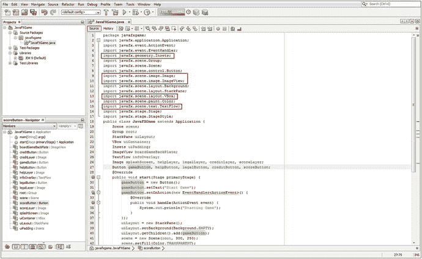

图 8-6.

在 JavaFXGame 类顶部声明五个新对象类型，并将 btn 对象重命名为 gameButton

```
Scene scene;
Group root;
StackPane uiLayout;
VBox uiContainer;
Insets uiPadding;
ImageView boardGameBackPlate;
TextFlow infoOverlay;
Image splashScreen, helpLayer, legalLayer, creditLayer, scoreLayer;     //  复合声明
Button gameButton, helpButton, legalButton, creditButton, scoreButton; // 复合声明
```

如图 8-6 中红色框所示，只要你在 JavaFXGame 类顶部输入这些对象声明和命名语句时按下 Alt+Enter，NetBeans 就会为你生成五个新的 import 语句。

如黄色高亮所示，我已将引导代码中的`btn` Button 重命名为`gameButton`，并将其`.setText("Hello World")`改为`.setText("Start Game")`，以更直接地反映这个 Button UI 元素最终要实现的功能。随着我们在本书中不断优化这段 Java 9 代码，这一改动将持续生效。

我还将`uiLayout.getChildren().add(btn);`改为`uiLayout.getChildren().add(gameButton);`，以反映该类中所有当前影响此 Button 对象的 Java 9 代码中的名称变更。所有这些在图 8-6 中均以红色框、蓝色行选择和黄色对象引用选择进行了高亮显示。

只要你使用 Alt+Enter 组合键，NetBeans 9 就会为你编写这五个新的 import 语句。请务必选择带有正确 javafx 包类路径的选项。接下来，让我们通过卸载游戏对象实例化（Stage 除外，它属于`.onCreate(Stage primaryStage)`方法的一部分）来优化你的`.start()`方法，以便所有非 Stage 对象的创建都使用`.createBoardGameNodes()`方法完成。

### 场景图设计：优化 BoardGame 的.start()方法

现在我们可以优化`.start()`方法，使其代码行数少于 12 行（如果想提前了解，可参见图 8-16）。我首先要做的是将场景图节点创建的 Java 结构模块化，放入它们自己的`createBoardGameNodes()`方法中，该方法将在`.start()`方法顶部被调用，如图 8-7 所示。在方法顶部添加一行代码，输入`createBoardGameNodes();`，并使用 Alt+Enter 组合键让 NetBeans 9 在类底部为你创建这个方法的基础结构。同时，请确保添加`root = new Group();`对象实例化，因为你已将 StackPane 对象重命名为`uiLayout`（如图 8-5 所示）。

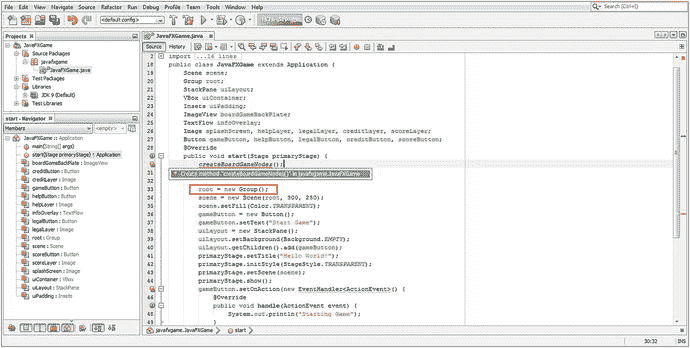

图 8-7.

在.start()方法顶部添加 createBoardGameNodes()方法调用，并添加 root = new Group()

将当前`.start()`方法中的对象实例化和配置代码（稍后你会添加更多）剪切并粘贴到`createBoardGameNodes()`方法中，以替换引导方法中的“Not Supported Yet”错误代码行，如图 8-8 所示（已选中）。完成此 Java 9 代码重构操作后，新的`.createBoardGameNodes()`方法应如下所示：

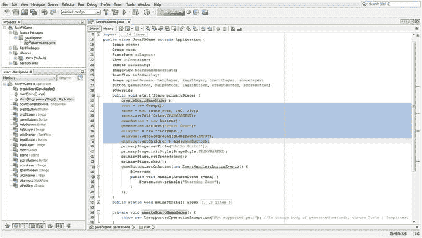

图 8-8.

选择 start()方法中所有非 Stage 和非事件处理代码，剪切并粘贴到新方法中

```
private void createBoardGameNodes() {
root = new Group();
scene = new Scene(root, 640, 400);
scene.setFill(Color.TRANSPARENT);
gameButton = new Button();
gameButton.setText("Start Game");
uiLayout = new StackPane();
uiLayout.setBackground(Background.EMPTY);
uiLayout.getChildren().add(gameButton);
}
```

请注意，我们将所有不需要“驻留”在`.start()`方法中的内容都移除了。由于`primaryStage` Stage 对象是通过`.start()`方法传入的参数创建的，我们将所有`primaryStage`对象引用以及所有需要在应用程序启动时设置的事件处理结构都保留在该方法内。其他所有内容将放入`createBoardGameNodes()`和另一个`addNodesToSceneGraph()`方法中，后者我们将在本章稍后创建，用于容纳`.getChildren.add()`或`.getChildren().addAll()`方法调用。

因此，在`.start()`方法中，我们将首先调用`createBoardGameNodes()`来创建所有场景图节点对象（即 Node、Parent 或 Group 的所有子类），然后调用`addNodesToSceneGraph()`方法，使用`.getChildren().add()`方法链或`.getChildren().addAll()`方法调用链将所有节点添加到场景图中。这种组织方法使我们能够在构建 Java 9 游戏时，向场景图中添加新节点。

接下来，让我们创建第二个`addNodesToSceneGraph()`方法，用于组织、重构和扩展 JavaFX 游戏应用程序开发工作流程中场景图节点构建的部分。


## 添加场景图节点：addNodesToSceneGraph()

接下来，你需要创建一个方法，将我们已经创建的 SceneGraph 节点对象，以及即将使用 VBox 构造函数实例化的节点对象，添加到场景图的根对象中（在本例中，根对象是一个 Group 对象）。这个新的、更高级别的 SceneGraph 根 Group 对象将容纳用于高级游戏功能的 StackPane UI 面板，以及我们将创建的另一个用于容纳 SceneGraph 3D 游戏分支的 Group 对象。从某种意义上说，我们已经在使用 JavaFX 9 创建混合应用程序，因为游戏 UI（StackPane）分支将是 2D 的，而游戏本身（Group）将是 3D 的。我们将使用 `.getChildren().add()` 方法链或 `.getChildren().addAll()` 方法链，将“子”节点（Node、Parent 或 Group 的子类）对象添加到名为 `root` 的“父”Group 对象中，该对象现在是 JavaFX SceneGraph 的“根”。

要创建这第二个方法，我们将遵循与创建第一个自定义方法相同的工作流程。在 `createBoardGameNodes();` 代码行之后立即添加一行代码，然后输入 `addNodesToSceneGraph();` 作为第二行代码。

在 NetBeans 9 用波浪形红色错误下划线标记此内容后，使用 Alt+Enter 组合键，并选择“Create method "addNodesToSceneGraph" to javafxgame.JavaFXGame”选项，如图 8-9 中高亮显示的那样。我还用红色高亮显示了 `createBoardGameNodes()` 方法体中当前的一条语句，该语句将被移到这个新的 `addNodesToSceneGraph()` 方法体中。这将替换默认的 `throw new UnsupportedOperationException()` Java 语句，NetBeans 在使用这种特定工作流程（你可以让 NetBeans 为你编写新的方法代码）创建的所有新引导方法中都会放入该语句。

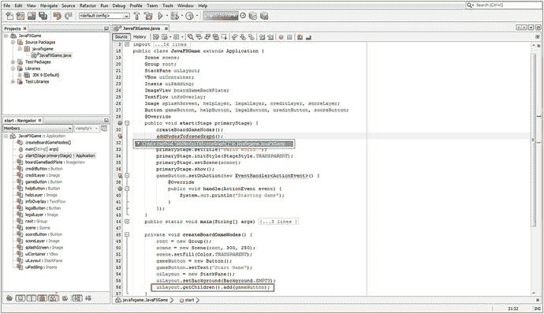

图 8-9.

创建 `addNodesToSceneGraph()` 方法后，将 `uiLayout.getChildren()` 方法链复制到新方法中

剪切 `createBoardGameNodes()` 末尾的 `uiLayout.getChildren().add(gameButton);` 语句，并将其粘贴到占位符 `throw new UnsupportedOperationException()` 代码行上，替换该代码。一旦我们在下一节中实例化这些新节点，我们将使用此方法向 SceneGraph 添加更多节点。

### 向 createBoardGameNodes() 添加新的 UI 场景图节点

让我们将本章前面学到的那些新的 UI 设计和定位 JavaFX 类对象（VBox、Pos、Insets）添加到 JavaFXGame 类和我们创建的 `createBoardGameNodes()` 方法中，该方法包含我们的 JavaFX 9 SceneGraph 节点对象创建（和配置）Java 9 语句。

使用以下 Java 对象实例化代码创建一个名为 `uiContainer` 的新 VBox，该代码将 Java `new` 关键字与 `VBox()` 构造函数方法结合使用：

```
uiContainer = new VBox();  // 创建一个名为 "uiContainer" 的垂直框 UI 元素容器
```

使用 `.setAlignment()` 方法将 VBox 的对齐方式设置为 Pos 辅助类中的 `Pos.TOP_RIGHT` 常量，使用以下 Java 语句，如图 8-10 所示（正在构建中）：

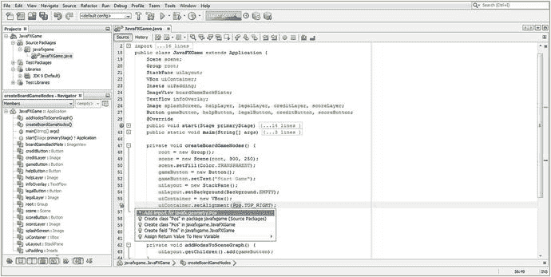

图 8-10.

在 `.setAlignment()` 方法参数区域内，输入 `Pos.TOP_RIGHT` 并按 Alt+Enter 导入

```
uiContainer.setAlignment(Pos.TOP_RIGHT); // 通过 Pos 辅助类将 VBox 对齐方式设置为 TOP_RIGHT
```

使用 Alt+Enter 组合键消除波浪形红色错误下划线，并确保选择正确的解决方案，在本例中，该解决方案是“Add import for javafx.geometry.Pos”选项，该选项列在第一位（很可能是正确的解决方案），并且是允许在代码中使用 Pos 类的解决方案。

下一步，我们将使用 `uiPadding = new Insets(0,0,10,10);` Java 实例化语句创建 `uiPadding` Insets 对象，如图 8-11 中的第 58 行所示。最后，我们将通过 `uiContainer.setPadding(uiPadding);` 方法调用将 `uiPadding` Insets 对象“连接”到 `uiContainer` VBox 对象。此连接在图 8-11 中以黄色显示，并显示了 Insets 声明、实例化和实现之间的连接。

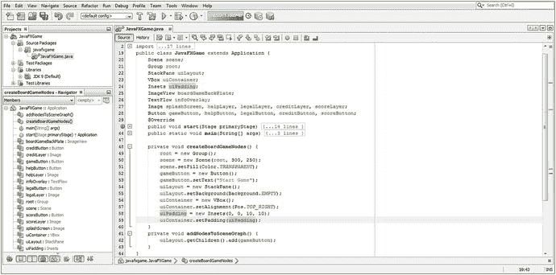

图 8-11.

创建一个 `uiPadding` Insets 对象，并使用 `.setPadding(uiPadding);` 将其连接到 `uiContainer` VBox 对象

我们已经将 Button 对象重命名为 `gameButton`（原为 `btn`），因此我们现在有六行对象实例化代码和五行对象配置代码，如图 8-11 所示，使用以下 Java 9 代码：

```
private void createBoardGameNodes()  {
root = new Group();
scene = new Scene(root, 300, 250);
scene.setFill(Color.TRANSPARENT);
gameButton = new Button();
gameButton.setText("Start Game");
uiLayout = new StackPane();
uiLayout.setBackground(Background.EMPTY);
uiContainer = new VBox();
uiContainer.setAlignment(Pos.TOP_RIGHT);
uiPadding = new Insets(0,0,10,10);
uiContainer.setpadding(uiPadding);
}
```

需要注意的是，由于你的根 Group 对象在 scene Scene 对象的构造函数方法调用中使用，因此这行代码需要放在首位，以便根 Group 对象在使用之前被创建。

接下来，让我们采用便捷的程序员快捷方式，将你的两行 `gameButton` 实例化和配置代码剪切并粘贴到 `uiContainer.setPadding(uiPadding);` 方法调用下方，然后将该代码在其下方复制粘贴四次，如图 8-12 底部高亮显示的那样，以使用第 6 章中创建的修改后的 `gameButton`（btn）引导 UI 元素来创建所有十个用户界面按钮元素。

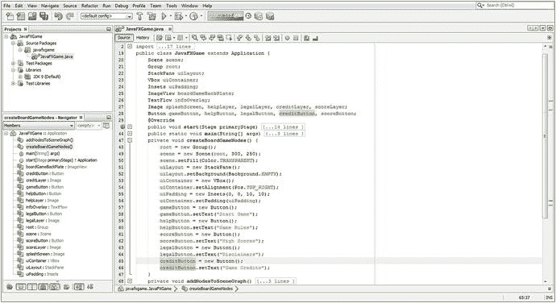

图 8-12.

在 `createBoardGameNodes()` 末尾创建 10 个 Button 对象实例化和配置语句

这将允许你分别将 `gameButton` 更改为 `helpButton`、`scoreButton`、`legalButton` 和 `creditButton`，以创建五个唯一的 UI Button 对象。你的 Button 的 Java 9 游戏代码应如下所示：

```
gameButton = new Button();
gameButton.setText("Start Game");
helpButton = new Button();
helpButton.setText("Game Rules");
scoreButton = new Button();
scoreButton.setText("High Scores");
legalButton = new Button();
legalButton.setText("Disclaimers");
creditButton = new Button();
creditButton.setText("Game Credits");
```


### 在 addNodesToSceneGraph() 中添加新的 UI 设计节点

如图 8-13 所示，Java 代码没有错误，我现在已经声明并实例化了另一个名为 gameBoard 的 Group 对象。该对象将容纳 SceneGraph 的 3D 游戏元素分支，因此 Group 对象的声明现在已成为类顶部的复合语句。我点击了代码中的 gameBoard 对象，以高亮追踪该对象在 createBoardGameNodes() 中的声明、实例化以及在 addNodesToSceneGraph() 中的使用情况，这表明如果你在类顶部声明，就可以在任何需要的地方使用对象。这种点击对象名称进行追踪是 NetBeans 9 的一个实用技巧，当你想要追踪对象的使用情况时，都可以使用它。在添加新 Java 代码时，我会经常在截图中使用它来高亮我正在做什么（以及为什么这么做）。

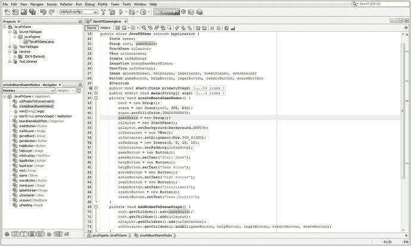

图 8-13.

添加 gameBoard Group 对象，并使用 .getChildren().add 和 .addAll() 将 Node 对象添加到 SceneGraph

接下来，让我们确保节点被正确添加到 SceneGraph 中。从 Scene Graph 的根（顶部）——一个 Group 对象——出发，我们将拥有另一个 gameBoard Group 对象来容纳 i3D 游戏元素和资源，以及 uiLayout StackPane 对象。这些对象通过以下语句添加到根 Group 中：

```
root.getChildren().add(gameBoard);        // 将新的 i3D 游戏 Group 节点添加到根 Group 节点
root.getChildren().add(uiLayout);         // 将 uiLayout StackPane 节点添加到根 Group 节点
```

接下来，我们将 uiContainer VBox 布局容器分支节点添加到 uiLayout StackPane 分支节点，并将五个 Button UI 元素叶节点添加到 uiContainer VBox。这通过两行 Java 9 代码完成，如下所示：

```
uiLayout.getChildren().add(uiContainer);      // 将 VBox 垂直布局节点添加到 StackPane 节点
uiContainer.getChildren().addAll(gameButton,  // 将所有 UI 按钮节点添加到 VBox 节点
helpButton,
legalButton, creditButton, scoreButton);
```

图 8-13 展示了这段 SceneGraph 构建代码。我对对象层次结构使用了颜色填充，以可视化方式展示 Node 对象（更准确地说是 Node 子类对象），这些对象是 Scene、root 或 branch 节点。（如果你想回顾这些 JavaFX 根节点、分支节点和叶节点对象层次结构，请参见图 8-3。）

这里需要观察的重点是，你将 Node 对象添加到 Group 根 Scene Graph 对象的顺序。该顺序会影响场景渲染合成的合成层顺序，以及 UI 元素在 3D 元素之上的合成顺序。第一个添加到根 Group 的 Node 将位于场景合成（渲染）堆栈的底部。因此，这必须是 gameBoard Group Node 对象，它将容纳 i3D 游戏，以便该 Node 首先被添加到 Scene Graph 根，并位于场景合成和渲染堆栈的底部（如果你向下看）或后方（如果你向前看）。你可以在图 8-13 中看到这一点。

下一个要添加的 Node 将是你的 uiLayout StackPane Node 对象，因为你的 2D 用户界面（浮动）面板需要正好覆盖在 3D GameBoard 之上。将这些顶层 Node 对象放入 Scene Graph 层次结构后，我们可以将包含所有 Button Control 叶节点对象的 uiContainer VBox Node 对象添加到 StackPane Node 对象。请注意，我们使用 .getChildren().addAll() 方法链将 Button Control 对象添加到 VBox，因为我们可以更轻松地使用 Java List 对象或在 .addAll() 方法调用（链）的参数区域中使用逗号分隔的列表来添加它们，该调用链是从 .getChildren() 方法调用的。

在第 9 章中，我们还将添加一个名为 boardGameBackPlate 的 ImageView 对象和一个名为 infoOverlay 的 TextFlow 对象。在第 9 章中，我还需要实例化五个 Image 对象，以便在内存中保存数字图像资源，从而可以实现我们在本章中声明的图像对象。如你所知，我们使用复合 Java 语句将这些对象命名为 splashScreen、helpLayer、legalLayer、creditLayer 和 scoreLayer，就像我们对 Button 对象所做的那样。


## 交互性：创建棋盘游戏按钮 UI 控件

接下来，你需要复制 `.start()` 方法中的 `gameButton.setOnAction()` 事件处理 Java 代码结构，并在其下方再粘贴四次，以创建 `helpButton`、`legalButton`、`creditButton` 和 `scoreButton` 按钮控件对象的事件处理结构。出于测试目的，在此阶段，你需要修改 `System.out.println` 语句，使其每条语句向输出控制台窗口打印一条唯一的消息，这样你就能确保五个按钮 UI 元素各自独立，并且能正确处理各自的按钮事件。务必确保你的 Java 9 代码结构在每个阶段（即每次更改或增强之后）都能正常工作，然后再继续添加更多 Java 代码，从而增加应用的复杂性。与一次性编写所有代码相比，这种方法在开发过程中会花费稍长的时间，但能节省调试时间。

如果你想知道图 8-14 中波浪形的黄色下划线警告（或建议）是什么，以及我将鼠标悬停在事件处理器 `EventHandler<ActionEvent>() { public void handle(){...} });` 结构下方的黄色高亮上时生成的弹出消息，这是因为该表达式可以使用更少的代码转换为 lambda 表达式。请注意，这样做将确保你的代码仅在 Java 8 和 Java 9 下运行。如果你想在使用了 Java 6 和 Java 7 的 Android 中使用你的代码，你可能只想保留这些稍长的 Java 代码结构，因为它们的功能完全相同。

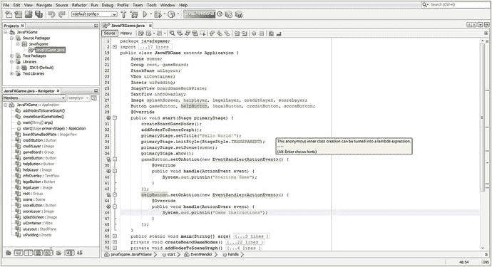

图 8-14.
复制 gameButton 事件处理代码，在其下方粘贴，并创建你的 helpButton 事件处理

完成后，你新的事件处理结构应类似于图 8-15 中间显示的 Java 代码：

```
gameButton.setOnAction(new EventHandler() {
@Override
public void handle(ActionEvent event) {
System.out.println("Starting Game");
}
});
helpButton.setOnAction(new EventHandler() {
@Override
public void handle(ActionEvent event) {
System.out.println("Game Instructions");
}
});
scoreButton.setOnAction(new EventHandler() {
@Override
public void handle(ActionEvent event) {
System.out.println("High Score");
}
});
legalButton.setOnAction(new EventHandler() {
@Override
public void handle(ActionEvent event) {
System.out.println("Copyrights");
}
});
creditButton.setOnAction(new EventHandler() {
@Override
public void handle(ActionEvent event) {
System.out.println("Credits");
}
});
```

如图 8-15 所示，你的事件处理代码没有错误，可以运行并测试你的 `JavaFXGame.java` 游戏应用程序，以确保场景图层次结构正确渲染到屏幕，并且按钮 UI 控件对象能正确处理事件。一旦你确认游戏的高层场景图已构建完成，并且核心用户界面处理的 Java 9 代码结构也已就位并能正常工作，你就可以在下一章中继续添加数字图像资源，并微调所有 UI 元素的位置，从而使游戏顶层的一切都能正确显示和运行。

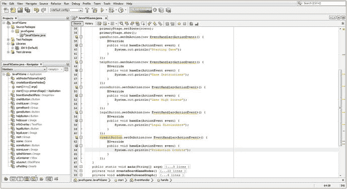

图 8-15.
复制 gameButton 和 helpButton，并粘贴以创建你的 scoreButton、legalButton 和 creditButton

如图 8-16 所示，在你为每个按钮对象复制了 `.setOnAction()` 事件处理结构之后，当你使用屏幕左侧的减号图标（如图 8-16 左侧红色圆圈所示）折叠 EventHandler 例程时，`.start()` 方法中的代码将少于十几行。你的第一行代码将调用一个方法来创建节点对象并配置它们，第二行代码将调用一个方法将这些节点对象添加到场景图层次结构中，第 3 到第 6 行将配置舞台对象，第 7 到第 11 行将设置 UI 按钮控件对象的事件处理。考虑到你正在为游戏基础设施顶层添加的功能数量，包括为游戏玩法、说明、法律免责声明、制作人员名单和记分板显示创建顶层（根节点和分支节点）场景图结构和用户界面设计元素，这算是相对紧凑的。

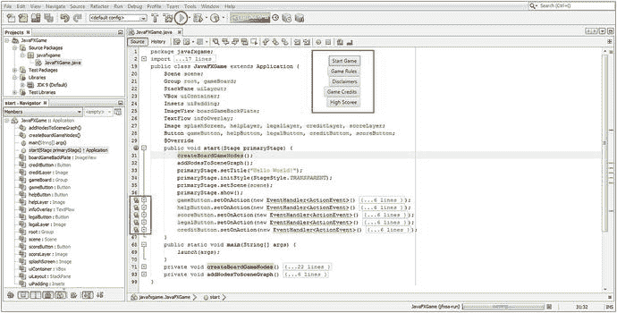

图 8-16.
单击 NetBeans 顶部的运行（播放）图标并测试你的代码，以确保你的 UI 设计正常工作

接下来，是时候测试重新组织 `JavaFXGame` 类并为你的游戏应用程序创建 UI 设计结构和场景图层次结构的代码了。让我们确保所有这些 UI 按钮元素（对象）都能正常工作。


## 测试你的棋盘游戏：处理场景图

点击 NetBeans 9 IDE 顶部用红色圆圈标出的绿色 Play 箭头（如图 8-16 所示），运行你的 JavaFXGame 项目。这将调出 VBox UI 布局容器，如图 8-16 顶部中间红色圆圈所示。如你所见，你正在获得一个专业级的结果，没有崩溃，只用了大约十几个 import 语句（外部类）、几十行 Java 代码，以及场景图根节点 Group 对象下不到十几个子节点。优化你的场景图层次结构非常重要，因为 JavaFX 用于处理游戏设计结构的每个脉冲事件都必须遍历这个层次结构，因此它越紧凑，你的游戏性能就越好，用户体验也就越流畅。因此，你应该从一开始就优化一切。如图 8-17 底部 Output-JavaFXGame 选项卡中红色圆圈所示，我已经测试了附加到所有 Button UI 控件对象上的事件处理结构。

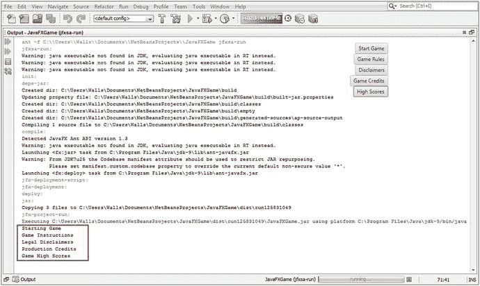

图 8-17.

点击每个 Button 对象，确保你的事件处理代码打印出正确的消息

我这样做是为了确保每个按钮都实现了自己的事件处理，并且在我点击五个 UI 按钮控件中的每一个时，都能打印出正确的 System.out.println() 文本消息。

稍后，我们可以用另一个控制 ImageView 对 Image 对象引用的方法调用来替换这个 System.out.println() 方法调用，从而允许我们在你的用户界面设计 ImageView 数字图像背板容器中切换数字图像资源。

由于我们只是复制粘贴了每个 Button 的 EventHandler 例程，并且只更改了 Button 对象的名称以及这些例程内部执行的代码，这些 Button 对象应该仍然可以正常工作（向控制台写入文本），并且不会引起任何编译器错误。然而，它们最终不会实现你想要的功能，即更改 ImageView 对象（UI 背板）底层中引用的 Image 对象，或者使用 TextFlow 在其上放置正确的文本。这正是你将在下一章中编码的内容；你还需要进行一些 UI 设计调整，将按钮组放置在显示屏上的正确位置。如图 8-16 所示，虽然 Button 控件对象确实在 VBox UI 容器节点内部对齐到了 TOP_RIGHT 位置，但 VBox 本身在其父级（分支）StackPane 节点对象中尚未对齐。就像第 7 章中的透明度一样，VBox（在 StackPane 中）和 StackPane（在 Group 中）必须正确定位。

恭喜你，你保留了第 7 章中添加的改进，并引入了组织场景图层次结构的新方法，改进了这个场景图以包含你的 i3D 游戏分支，我们将在本书后半部分开始向其中添加对象和资源。

## 总结

在第八章中，我们通过优化游戏的实际顶层用户界面设计，以及勾勒底层游戏引擎组件设计，并找出使用不到十几个节点来实现大部分顶层游戏用户界面结构的最有效场景图节点设计，让你深入接触了 JavaFXGame.java 代码。你通过重新设计现有的 JavaFXGame.java 引导 Java 代码重新回到了 Java 游戏编程，这段代码最初是由 NetBeans 9 在第 6 章为你创建的。由于 NetBeans 9 生成的 Java 9 代码设计并不适合你的目的，你对其进行了大幅重写，使其更加模块化、精简和有条理。

你通过创建两个新的 Java 方法来实现这一点：.createBoardGameNodes() 和 .addNodesToSceneGraph()。你这样做的目的是为了模块化你的场景图节点创建过程，同时也为了模块化将两个父分支节点和五个控件叶子节点对象添加到场景图根节点的过程，这里的根节点恰好是 Group 节点对象。在其下方，你有一个名为 uiLayout 的 StackPane 分支节点，你利用它的多层 UI 对象合成能力；还有一个名为 gameBoard 的 Group 分支节点，你将用它来容纳 i3D 游戏对象层次结构，你将在本书的剩余部分构建这个结构。

你了解了一些我们将在这些新方法中实现的 JavaFX 类。这些包括来自 javafx.scene.geometry 包的 Pos 类和 Insets 类，来自 javafx.scene.layout 包的 VBox 类，以及来自 javafx.scene 包的 Group 类。你编写了新的 .createBoardGameNodes() 方法，该方法使用 Inset 对象实例化并配置了 VBox 对象、StackPane uiLayout 分支节点对象、Group gameBoard 分支节点对象以及你的五个 UI Button 控件叶子节点对象。

一旦所有场景图节点都被实例化并配置好，你就能够构建你的 .addNodesToSceneGraph() 方法，将你的场景图节点对象添加到 Group 根对象中。你这样做的目的是为了确保正确的场景图节点层次结构能够显示在你的 Stage 对象内部，Stage 对象将引用并加载你的场景图根 Group 节点对象以及我们在其下构建的层次结构。

最后，你创建了另外四个 Button UI 控件对象，并添加了 ActionEvent 事件处理程序逻辑。这完成了本章中与为 JavaFXGame.java Java 9 游戏应用程序设置场景图层次结构和用户界面设计基础设施相关的编程任务。

所有代码编写完成后，你在 NetBeans 9 中测试了你的顶层 Java 9 游戏应用程序用户界面设计和场景图层次结构。

在下一章中，你将向用户界面设计添加炫酷的数字图像资源，并处理定位和对齐，同时确保所有 UI Button 对象都能正常工作。


