# 9. JavaFX 9 用户界面设计：Java 9 游戏设计的前端

让我们基于你在第 8 章构建的顶层场景图架构，继续设计 i3D BoardGame 的前端用户界面基础设施。这将在你的 StackPane 分支节点内部完成，使用该节点下的三个主要子节点。VBox 分支节点持有 Button 叶子节点，ImageView 叶子节点显示不同的 Image 对象，而 TextFlow 叶子节点则显示（流动）叠加在 ImageView 节点之上的不同文本描述。这七个叶子节点将协同工作，构成你游戏的顶层用户界面设计。StackPane 节点将作为背景图像板（容器），而 ImageView 叶子节点将持有五个不同的 Image 对象，这些对象分别引用五个按钮对应的数字图像资源。StartGame 背景图像资源将被视为启动画面。在 StackPane 层级中，ImageView 之上将是 TextFlow 叶子节点，它将作为前景文本信息容器，并根据点击的 Button 控件对象引用不同的文本数据。在 TextFlow 层之上将是 VBox 分支节点层，它将持有五个 Button 叶子节点。这将容纳、对齐并定位你的五个 Button 控件对象，这些对象最终将使用事件处理器将不同的 Image 对象交换到你的 ImageView 对象中，并将不同的文本数据交换到你的 TextFlow 对象中。

既然你已经声明了五个背景 Image 对象（以及用于 JavaFXGame.java 类顶部的 ImageView 和 TextFlow 对象），我将首先介绍如何利用你在第 8 章开始构建的场景图层级结构，来完成用户界面设计的实现。

接下来我们需要介绍的是来自 `javafx.scene.image` 和 `javafx.scene.text` 包的四个新的 JavaFX 类，你将在本章中实例化并配置它们，以便在你的 Java 游戏中使用。这些类包括 `Image` 类、`ImageView` 类、`Text` 类和 `TextFlow` 类。

接下来你需要做的是创建将加载到 Image 对象中的背景图像，以便稍后你有东西可以测试你的 Java 代码，确保其正常工作。

之后，你将学习一个巧妙的技巧，即在不向场景图层级结构中添加另一个 Node 对象的情况下，为你的合成管线增加一个合成层。这将涉及学习如何利用你的 JavaFX `Background` 类（对象）以及 JavaFX `BackgroundImage` 类（对象），将 Node 子类的 Background 属性作为你专业 Java 游戏数字图像合成管线中的另一个 Image 对象持有层。

所有这些都涉及在你的 `.createBoardGameNodes()` 方法和 `.addNodesToSceneGraph()` 方法中添加新的 Java 语句，以便将 ImageView 背景图像板和 TextFlow 信息文本叠加层放置到位，位于你的 VBox Button 控件组之后。你还需要在 JavaFXGame 类中添加两个新的 Java 方法，用于加载 Image 资源（`loadImageAssets()` 方法）和创建 Text 资源（`createTextAssets()` 方法）。为了让你的用户界面更加有条理和专业，你需要进行大量的编码、重新编码、重新连线（对象引用更改）和参数调整。在查看了本章中我们将要使用的一些 JavaFX API 类之后，我们将开始着手进行这些工作。

## UI 设计基础：完成场景图

本章中你要做的第一件事就是完成顶层用户界面屏幕的场景图设计。这意味着实例化你的 ImageView 数字图像显示背板，它将持有引用你的数字图像资源的背景 Image 对象。在本章中，你将引用这些使用 GIMP 2.10 创建的数字图像资源。在场景图层级结构的 ImageView 之上，你将添加一个 TextFlow 信息容器；因此，你的文本内容将位于背景图像之上，而不是之下。最后，在这两个叶子节点对象之上将是 VBox Button 控件分支节点对象，你已经在第 8 章中创建并实现了它。图 9-1 展示了最终的场景图层级结构（扩展了你在第 7 章图 7-3 中看到的通用根节点、分支节点和叶子节点场景图）。这次，我为你专业的 Java 9 游戏应用进行了定制。请注意，i3D Group 分支节点的叶子节点对象上没有连接器，因为我们尚未在 Java 代码中实现它们。

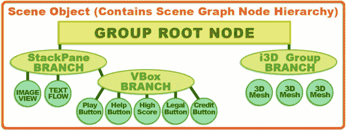

图 9-1.

BoardGame 用户界面设计场景图层级结构，展示了根节点、分支节点和叶子节点对象

这将要求你向 StackPane 布局容器父分支节点添加两个叶子节点，如图 9-1 左下角所示。在我们深入 Java 编码，在 `.createBoardGameNodes()` 方法中实例化这两个叶子节点对象并将它们添加到场景图层级结构之前，让我们先概述一下你将在本章中编写的新 Java 语句中使用的每个类。

## JavaFX 9 UI 合成：ImageView 和 TextFlow

接下来，让我们看看主要的 JavaFX 类，它们可用于为游戏启动画面和文本信息屏幕创建基本的合成管线，这些屏幕将位于你在上一章创建的 UI 按钮组旁边（和下方）。游戏说明、高分榜以及法律和致谢屏幕本质上将是文本（保存在你的 TextFlow 对象中）合成在背景图像（保存在 ImageView 对象中）之上。启动画面将与“开始游戏”按钮关联，并在游戏应用启动时显示；当按下“开始游戏”按钮时，它将变为不可见。这是因为 StackPane UI 构造的 z 顺序高于根 Group 和 gameBoard Group 节点对象，而后者在场景图中位于其上方。这意味着 StackPane 中任何不透明的内容都将覆盖（遮挡）场景图根节点正下方的 i3D gameBoard Group，如图 8-3 所示。让我们先来看看 Image 类。


### JavaFX Image 类：在设计中引用数字图像

Image 类是一个公共类，直接继承自 java.lang.Object 主类，这意味着 Image 类也是通过“从零编码”来实现图像加载（引用）和缩放（调整大小）的。你可以锁定缩放时的宽高比，并指定缩放（算法）质量。所有 `java.net.URL` 类支持的 URL 格式均受支持。这意味着你可以从互联网（[`www.domainname.com/imagename.png`](http://www.domainname.com/imagename.png)）、操作系统文件系统（`file:imagename.png`）或通过正斜杠字符（/imagename.png）从 JAR 文件中加载图像。

JavaFX Image 类是 javafx.scene.image 包的一部分。JavaFX Image 类的类层次结构源自 java.lang.Object 主类，并使用以下 Java 类层次结构：

```
java.lang.Object
> javafx.scene.image.Image
```

Image 类提供了六种不同的（重载的）Image() 构造方法。这些方法可以接受从简单的 URL 到一组参数值（指定 URL、宽度、高度、宽高比锁定、平滑处理和预加载选项）的各种输入。这些参数在构造方法中应按此顺序指定。稍后当你使用这些构造方法中最复杂的一个来编写 Image() 构造方法时，就会看到这一点，其格式如下：

```
Image(String url, double requestedWidth, double requestedHeight,
boolean preserveRatio, boolean smooth, boolean backgroundLoading)
```

Image 对象最简单的构造方法仅指定 URL，格式如下：

```
Image(String url)
```

如果你希望加载图像，同时让构造方法使用最高质量的重采样（平滑像素缩放）将图像缩放到不同的宽度和高度（通常为了更高质量而缩小），并锁定（保留）宽高比，则应使用以下 Image 对象构造方法格式：

```
Image(String url, double scaleWidth, double scaleHeight, boolean preserveAspect, boolean smooth)
```

如果你希望以图像的“原始”或“物理”（默认）分辨率和原始宽高比加载图像，并在后台（异步）加载，则应使用以下 Image() 构造方法格式：

```
Image(String url, boolean backgroundLoading)
```

还有两种 Image() 构造方法使用了 java.io.InputStream 类。该类为 Image() 构造方法提供了一个更低级别的 Java 输入数据流。通常，你会使用 URL 来引用数字图像文件。这两种 Image 对象构造方法的格式如下。简单格式如下：

```
Image(InputStream is)
```

复杂的 InputStream 构造方法允许你指定宽度、高度、宽高比锁定和图像缩放插值平滑算法（开启/true 或关闭/false）。第二种格式如下所示：

```
Image(InputStream is, double newWidth, double newHeight, boolean preserveAspect, boolean smooth)
```

因此，Image 类（对象）用于准备数字图像资源以供使用，即从 URL 读取其数据，必要时调整其大小（使用你喜欢的任何平滑处理和宽高比锁定），甚至在应用程序中其他操作进行的同时异步加载它。需要注意的是，Image 类（或对象）并不显示你的图像资源；它只是加载图像，如果需要则进行缩放，并将其放入系统内存中，以便在你的应用程序中使用。

要显示 Image 对象，你需要使用第二个类（对象），称为 ImageView，我们将在本章下一节中介绍它。这个 ImageView 对象在场景图中实现为一个叶节点，它引用然后“绘制”你的 Image 对象数据到包含此 ImageView 节点的布局容器上。在我们的例子中，这是叶节点 ImageView 上方的 uiLayout StackPane 父节点（或分支节点）。

从数字图像合成的角度来看，StackPane 类（对象）是图层合成引擎，或者可以说是图层管理器，而 ImageView 对象则代表图层堆栈中的一个数字图像图层。Image 对象包含显示在 ImageView 图层内部（或根据需要显示在多个 ImageView 中）的数字图像数据，因为 Image 对象和 ImageView 对象是解耦的，因此彼此独立存在。我正试图尽量减少场景图节点的使用，因此我使用一个 ImageView 图像面板和一个文本信息合成面板来创建用户界面屏幕，然后通过代码在它们之间进行切换。


### JavaFX ImageView 类：在设计中显示数字图像

ImageView 类是一个公共类，它直接继承自 `javafx.scene.Node` 超类，而后者又是 `java.lang.Object` 主类的扩展。因此，ImageView 对象是 JavaFX 场景图中一种 Node 对象，用于利用 Image 对象中包含的数据来绘制图形视口。该类提供了允许图像重采样（调整大小）的方法，并且与 Image 类一样，你可以锁定缩放时的宽高比，以及指定重采样算法（通过使用像素插值来实现平滑质量）。

正如你在 Java 代码的第 24 行所见（如图 8-6 所示），你将使用一个名为 `boardGameBackPlate` 的 ImageView 对象来显示你的 Image 对象数据。这个 ImageView 类，与你的 Image 类一样，也包含在 `javafx.scene.image` 包中。ImageView 类的 Java 类层次结构始于 `java.lang.Object` 主类，并使用该类创建 `javafx.scene.Node` 类，然后使用后者创建 `javafx.scene.image.ImageView` Node 子类。ImageView 类使用以下 Java 类继承层次结构：

```
java.lang.Object
> javafx.scene.Node
> javafx.scene.image.ImageView
```

ImageView 类提供了三种不同的（重载的）`ImageView()` 构造方法。这些方法包括：空的 ImageView 构造方法（即你稍后将在代码中使用的方法）、一个接受 Image 对象作为参数的方法，以及一个接受 URL 字符串对象作为参数并自动创建 Image 对象的方法。最简单的、参数列表为空的 `ImageView()` 构造方法将创建一个（空的）ImageView 对象（即，一个没有要显示的 Image 对象，但可以容纳 Image 对象的对象）。它将使用以下格式：

```
ImageView()
```

我们将使用这个构造方法，以便我可以向你展示如何使用 `.setImage()` 方法调用将你的 Image 对象加载到 ImageView 对象中。如果你想避免使用 `.setImage()` 方法调用，你可以使用另一个重载的构造方法。那个 ImageView 对象构造方法将使用以下格式：

```
ImageView(Image image)
```

因此，我将显式设置 ImageView 并将其连接到 Image 对象的方式如下所示：

```
boardGameBackPlate = new ImageView();      // 这使用了空的构造方法方式
boardGameBackPlate.setImage(splashScreen);
```

这可以使用重载的构造方法压缩成一行代码，结构如下：

```
boardGameBackPlate = new ImageView(splashScreen);  // 使用重载的构造方法
```

如果你还想跳过创建和加载 Image 对象的过程，还有另一个构造方法可以做到这一点，它使用以下格式：

```
ImageView(String url)
```

如果你想使用图像的“原生”或“物理”（默认）分辨率和原生宽高比加载图像，并在后台（异步）加载它，`Image()` 构造方法将使用以下格式：

```
backPlate = new Image("/backplate8.png", 1280, 640, true, false, true);
boardGameBackplate = new ImageView();
boardGameBackplate.setImage(backPlate); // 使用空的 ImageView 构造方法方式
```

如果你不想指定图像尺寸、后台图像加载或平滑缩放，并且你想锁定任何缩放时的宽高比，你可以将前面的三行 Java 代码压缩成下面这一个构造方法：

```
boardGameBackPlate = new ImageView("/backplate8.png");   // 使用第三种构造方法
```

至少在学习阶段，为了教学目的，我将采用较长的做法，并且我将始终“显式地”使用 `Image()` 构造方法加载 Image 对象，以便我们可以指定所有不同的属性，并且让你看到你在 Java 9 编程逻辑中使用的所有不同图像资源。我在这里向你展示快捷代码，是因为如果你以后开始将 ImageView 用作 2D 精灵，你可能会想使用这种快捷方式。你可以将这种快捷方式用于你的精灵，因为你不会对它们进行缩放，而且它们经过了高度优化，因此可以节省长时间加载的后台加载选项将不再是必需的。


### JavaFX TextFlow 类：在设计中运用文本对象（内容）

TextFlow 类是一个公共类，允许开发者创建文本段落。文本段落是一个多行文本的容器，每一行文本都使用“换行”字符进行分隔，在 Java 代码中用“转义 n”序列表示。

因此，TextFlow 类使用以下 Java 类继承层次结构：

```
java.lang.Object
> javafx.scene.Node
> javafx.scene.Parent
> javafx.scene.layout.Region
> javafx.scene.layout.Pane
> javafx.scene.text.TextFlow
```

TextFlow 对象是 JavaFX 场景图（Scene Graph）中的一种 Node 对象，可用于使用 Text 对象中包含的数据来渲染文本段落，其方式与 ImageView 可以渲染 Image 对象中包含的数据非常相似。然而，TextFlow 可以同时处理多个 Text 对象，允许你通过调用 `.setFill()` 和 `.setFont()` 等方法，对不同的 Text 对象应用不同的样式。TextFlow 是一个专门的文本布局类，旨在渲染通常所说的富文本格式（RTF）。有些人称之为桌面出版，它涉及使用不同的字体、样式或颜色来增强基于文本的内容的呈现效果。值得注意的是，`javafx.scene.text` 位于 `javafx.graphics` 模块中，而不是 `javafx.controls` 模块中。这一点很重要，因为如果你想优化掉（不使用）JavaFX 9 的 UI 控件类（100 个或更多类），你仍然可以使用 `javafx.base` 和 `javafx.graphics` 模块，通过 Image、ImageView、Text 和 3D 几何对象来创建你自己的 UI 元素，这些模块为你提供了创建专业 Java 9 i3D 游戏所需的一切。

TextFlow 对象可用于在单个 TextFlow 对象内布局多个 Text 节点。TextFlow 对象使用其内部每个 Text Node 对象的文本、字体和样式设置，以及其自身的最大宽度和文本对齐样式属性，来确定每个子 Text 对象的渲染位置。

由于 TextFlow 对象的自动换行功能，单个 Text 节点可以跨越多行，并且由于双向（bidi）重排序，Text 节点的视觉位置可能与逻辑位置不同。Java Bidi 对象提供了用于创建它的文本的双向重排序信息。例如，这对于正确显示从右到左（RTL）阅读（而非从左到右（LTR））的阿拉伯语或希伯来语文本是必需的。

当然，除了 Text Node 对象之外的任何其他 Node 对象类型，都将在 TextFlow 对象的布局中被视为嵌入的“富内容”对象。它将使用其首选宽度、高度和基线偏移值插入到内容中，以便相对于父 TextFlow 对象中的其他 Text 对象进行间距和对齐。

当 Text Node 对象位于 TextFlow 对象内部时，其某些属性将被忽略。例如，Text Node 对象的 X 和 Y 属性将被忽略，因为子 Text Node 的位置由父 TextFlow 对象决定。同样，Text 节点中的自动换行宽度也将被忽略，因为用于自动换行的最大宽度将继承 TextFlow 对象的最大宽度属性。TextFlow 布局的自动换行宽度将由 Region 对象的当前宽度决定。这可以通过你的应用程序设置 TextFlow 对象的首选宽度属性来指定。如果不需要自动换行功能，应用程序可以将首选宽度设置为 `Double.MAX_VALUE`，或者设置为 `Region.USE_COMPUTED_SIZE`。段落应使用换行符或 `\n`（转义字符）在你的任何子 Text Node 对象内进行分隔，如下面的粗体代码示例所示。

当 Text Node 对象在 TextFlow 对象中渲染时，其 `pickOnBounds` 属性的值将被设置为 `false`。这是因为单个 Text Node 对象中的内容可能会被 TextFlow 算法分割，并由于换行和双向重排序而放置在 TextFlow 中的不同位置。TextFlow 算法将布局每个受管理的子 Text Node 对象，无论该子对象的可见性属性值如何，都会为设置为不可见的 Text Node 对象留出间隙。以下是 TextFlow 对象创建工作流程的示例：

```
Text titleText = new Text("欢迎来到 iTVboardgame！ \n");
titleText.setFill(Color.RED).setFont(Font.font("Helvetica", FontPosture.ITALIC, 40));
Text pressPlayText = new Text("按下开始游戏按钮开始！");
pressPlayText.setFill(Color.BLUE).setFont(Font.font("Helvetica", FontWeight.BOLD, 10));
TextFlow gameTextFlow = new TextFlow(titleText, pressPlayText);
```

TextFlow 类有两个属性：`DoubleProperty lineSpacing` 属性，它定义了文本行之间的垂直间距（以像素为单位）；以及 `ObjectProperty<TextAlignment> textAlignment` 属性，它定义了水平文本对齐常量，例如 `LEFT`、`RIGHT`、`CENTER` 或 `JUSTIFY`。

TextFlow 类有两个构造方法；第一个构造方法有一个空的参数区域，并构造一个空的 TextFlow 文本布局对象。此构造方法使用以下格式：

```
TextFlow()
```

第二个 TextFlow 构造方法（之前使用过）创建一个 TextFlow，其中包含使用逗号分隔列表传递到参数区域中的子 Text（或富媒体）Node 对象，使用以下格式：

```
TextFlow(Node... children)
```

第二个构造方法之所以接受一个 Node 对象的参数列表数组，是因为 TextFlow 对象支持“富文本布局”，即 Text 对象与其他支持富媒体（图像、形状、几何体、网格、动画、视频等）的受支持 Node 对象的组合。

让我们回到编码，实例化并配置 Image、ImageView、Text 和 TextFlow 对象，以便将它们添加到现有的场景图层次结构中，以实现图 9-1 所示的效果。之后，在第 10 章中，我们可以在你的 Button ActionEvent 处理程序中编写代码，根据点击来自定义你的 UI。

## 编码用户界面：UI 合成管线

要精确调整用户界面设计，你需要实例化 ImageView 和 TextFlow 对象，将它们添加到场景图中层次结构的正确位置，将数字图像导入到你的项目中，创建一个使用数字图像资源加载 Image 对象的方法，创建一个使用正确信息创建 Text 对象的方法，最后调整你的 SceneGraph 和 UI 元素以微调你的 UI 最终结果。


### 实例化合成层：.createBoardGameNodes()

由于你已经在第 8 章中声明了 `boardGameBackPlate` 的 `ImageView` 和 `infoOverlay` 的 `TextFlow`，并为这些类编写了导入语句，接下来你需要做的，就是使用 Java 的 `new` 关键字以及它们的基本（空参数列表）构造方法，将它们实例化为对象。你将在 `createBoardGameNodes()` 方法中完成此操作，以保持代码的高度组织性。为了镜像场景图层次结构，你将在 `StackPane` 之后、`VBox` 之前实例化它们，因为这将是你将要使用的合成（图层）顺序。如图 9-2 所示，Java 代码没有错误，并且你已经在系统内存中仅使用一个根节点和三个分支节点对象（包括一个 `Group` 节点、一个 `StackPane` 和一个 `VBox`，`Insets` 对象是一个工具对象，而非场景图节点）实例化了一个场景图根节点、i3D 游戏板分支和 UI 布局分支。

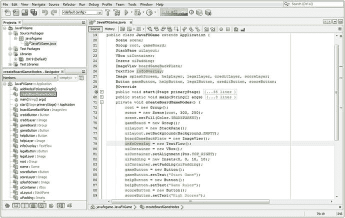

图 9-2.

在 `createBoardGameNodes()` 方法内部实例化 `boardGameBackPlate` 和 `infoOverlay` 对象

如果算上持有场景图的 `Scene` 对象，内存中就有五个游戏组织对象。再加上使用 `.start()` 方法创建的 `Stage` 对象，以及通过 `JavaFXGame` 类 `extends Application` 声明创建的 `Application` 对象，你仅用了系统内存中的七个对象，就为专业的 Java 9 游戏开发创建了顶层基础设施。加上 `ImageView` 和 `TextFlow` 显示对象，我们仍然在系统内存中使用了不到十个对象。一旦我们用数字图像资源加载五个 `Image` 对象并设置五个 UI `Button` 对象，内存中的对象仍然少于 20 个，这仍然是相当优化的。在本章稍后，你还会添加八个 `Text` 对象，但这些对象并非以像素为中心，因此它们几乎不会占用太多内存。我们还将使用一些工具对象，比如 `Insets`，但即使加上这些，在开始添加构成 i3D 棋盘游戏的核心 3D 对象之前，你仍然会保持在 30 个对象以下。接下来，让我们将 `ImageView` 和 `TextFlow` 添加到场景图中，将它们放置在 VBox UI 按钮组之后，以便它们先被渲染。

### 将 UI 背板添加到场景图：addNodesToSceneGraph()

为了使 `ImageView` 合成层和 `TextFlow` 信息面板位于场景、3D 游戏板和 `StackPane` 之上，但位于 VBox 按钮组之后，你需要在根方法调用之后、`uiContainer` 方法调用之前，对 `uiLayout` 的 `StackPane` 对象调用 `.getChildren().add()` 方法。如图 9-3 所示，这将在你的 `addNodesToSceneGraph()` 方法结构中使用以下两条 Java 语句：

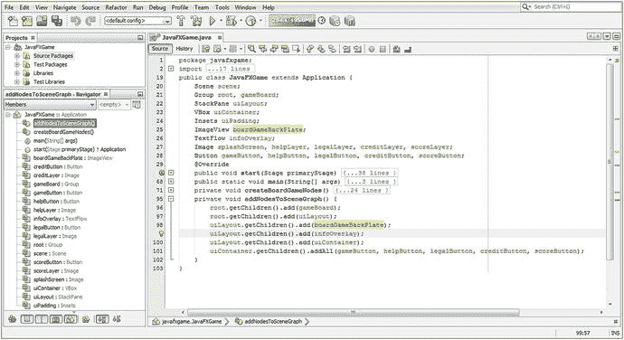

图 9-3.

在 `addNodesToSceneGraph()` 方法中将 `boardGameBackPlate` 和 `infoOverlay` 添加到场景图

```
uiLayout.getChildren().add(boardGameBackPlate); // 在 TextFlow 节点之后添加 ImageView 背板
uiLayout.getChildren().add(infoOverlay);      //  其次添加 TextFlow 信息覆盖层
```

由于 `Button` 对象无法单独定位，我不得不使用 `VBox` 类以及 `Insets` 类来包含和定位一列垂直的 `Button` 控件。现在，我们准备编写两个资源加载方法。

### 资源加载方法：loadImageAssets() 和 createTextAssets()

为了在本书中创建这个游戏时保持条理清晰，我们接下来要做的另一件事是创建另外两个专用方法，用于加载 `Image` 对象资源和创建 `Text` 对象资源。这为向游戏添加元素创建了一个专用的“基于方法的工作流程”。在 `.createBoardGameNodes()` 中实例化，在 `.addNodesToSceneGraph()` 中添加到场景图，在 `.loadImageAssets()` 中引用 `Image` 对象，在 `.createTextAssets()` 中创建 `Text` 对象。如图 9-4 所示，我将这两个新方法调用放在了 `.start()` 方法的顶部，并且让 NetBeans 为它们创建了空方法，我们将在向游戏添加资源时，为这些方法添加 Java 代码。我将它们放在 `start` 方法的顶部，以便你的应用程序能够首先将这些资源加载到系统内存中，这样当你的专业 Java 游戏代码的其他部分需要它们时，它们就已经就位，并且我们无需使用任何专门的预加载器。此外，这些对象必须在被其他方法调用之前就位，因此它们需要在设置更高级对象并将其添加到场景图层次结构的方法之前被调用。稍后，一旦我们有了需要确保高度优化且不占用 Pulse 引擎 60 FPS 中断（时间片）过多处理场景图的 3D 对象渲染和游戏处理逻辑等内容，我们就可以使用 NetBeans 9 分析器来确保此资源加载耗时少于一秒。

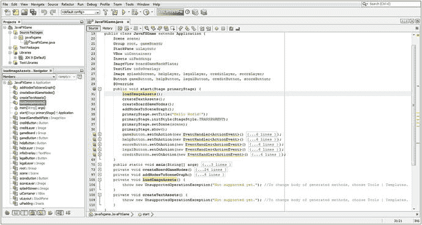

图 9-4.

为 `loadImageAssets()` 和 `createTextAssets()` 创建空方法，以创建你的图像和文本资源

在继续之前，我们需要创建一些新的媒体资源，用于 `Image` 对象。我们将实例化并引用（加载）PNG32 数字图像资源，这些资源将利用 Alpha 通道。这些 Alpha 通道数据将允许我们将这些徽标或屏幕标题合成到任何背景图像之上，甚至如果我们在后续选择这样做，还可以合成到 i3D 游戏板本身之上。在下一节中，我将在 Autodesk 3D Studio Max 中创建一个 iTVBoardGame 徽标，然后将其导出为 OBJ 文件，并使用一种酷炫（或者，也许是火热）的岩石纹理进行渲染。然后，我们将拥有一个专业的 Java 9 游戏 3D 启动画面标题，供本章稍后在你完善 UI 设计时使用。


### 创建启动画面资源：在 2D 管线中使用 3D 资产

如图 9-5 所示，我使用 2D 文本工具创建了一个“快速且粗糙”的 iTVBoardGame 3D 标志，然后使用倒角修改器对其进行挤出处理，如截图右上角 Autodesk 3D Studio Max 版本的场景图层级（在 3D Studio Max 中称为修改器列表）所示。随后，我使用“文件 ➤ 导出”功能输出了一个 WaveFront .OBJ 3D 文件格式，这是 JavaFX 9 支持的几种 3D 文件导入格式之一。我们可能会使用这种格式或其他格式，具体取决于需要导入的 3D 数据类型，因为每种格式支持不同类型的 3D 数据和特性，例如纹理贴图、UVW 贴图、反向运动学骨骼动画数据、网格变形、动画、摄像机数据、灯光数据等。JavaFX 能够导入相当多的高级 3D 格式，例如 Collada (DAE)、FrameBox (FBX)、3D Studio 3DS 和 OBJ。

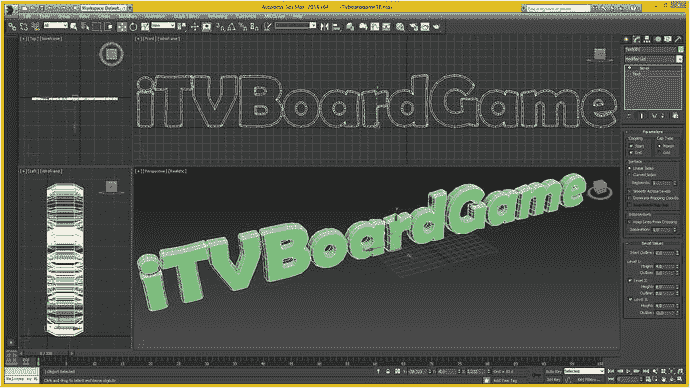

图 9-5.

我使用 3D Studio Max 创建了一个 iTVBoardGame 标志，将其导出为 OBJ 文件格式，并进行了渲染

我将把这个网格数据导入渲染引擎，添加一张胡桃木纹理贴图，进行渲染，然后将 2D 像素数据导出为 2D 图像资源。我会确保它包含一个 Alpha 通道，这样它看起来仍然像一个 3D 物体，尽管实际上它并不是。这在业界被称为 2.5D。

如果我们以后想让它旋转等，我们可以在本书后面更深入地了解 JavaFX 中的 i3D 内容生产管线时，再将其作为 3D 资产导入。JavaFX 提供的混合 2D+3D 环境（API）的优势之一在于，你可以决定哪些 3D 是“幻觉”（如 2.5D 或立体视觉），哪些 3D 是“真实的”i3D。立体 3D（主要是电影）并非真正的 3D，因为你无法走到场景及其所有角色的背后。而在 i3D 游戏中，例如《光环》或《麦登橄榄球》，你可以做到，因为它是一个完全虚拟的现实。

接下来，让我们拿一些我为在 ImageView 对象中使用而创建的 UI 屏幕标题数字图像对象，我将向你展示如何将它们添加到 NetBeans 项目文件夹层级中的正确文件夹中。在 NetBeans 9 能够“看到”这些 PNG32 数字图像资源后，你将能够编写 `loadImageAssets()` 方法，该方法会将 PNG32 数据加载到系统内存中的 Image 对象中，以便 ImageView 可以引用并显示它们。

### 向项目添加图像资源：使用 \src\ 文件夹

如图 9-6 顶部所示，在我的 Windows 7 64 位四核 AMD 工作站上，路径从 Users 文件夹开始，看起来像 `C:\Users\Walls\MyDocuments\NetBeansProjects\JavaFXGame\src\credits.png`。如你所见，我根据 PNG32 文件的内容为其命名，尽管它们看起来像是白色背景，但实际上它们是透明的。将文件从本书的资源库复制到你的项目文件夹，然后你就可以在代码中引用它们了。

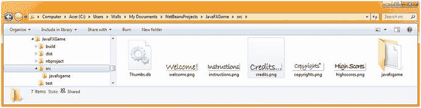

图 9-6.

将 UI 屏幕的数字图像标题 PNG32 文件复制到 /NetBeansProjects/JavaFXGame/src/

### 加载图像资源的方法：.loadImageAssets()

打开你空的 `loadImageAssets()` 方法结构，添加五个 `Image()` 构造方法，用正确的图像资源及其规格实例化并加载你的 Image 对象，如图 9-7 高亮部分所示。

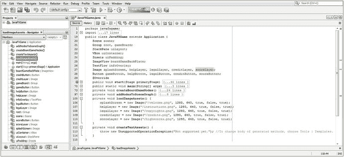

图 9-7.

在你刚刚创建的 `loadImageAssets()` 方法内部实例化并引用你的五个 Image 对象

图 9-7 中显示的 Java 代码应如下所示：

```
splashScreen = new Image("/welcome.png", 1280, 640, true, false, true);
helpLayer = new Image("/instructions.png", 1280, 640, true, false, true);
legalLayer = new Image("/copyrights.png", 1280, 640, true, false, true);
creditLayer = new Image("/credits.png", 1280, 640, true, false, true);
scoreLayer = new Image("/highscores.png", 1280, 640, true, false, true);
```

这种构造方法格式的作用是，使用 JAR 文件中的数字图像资源加载 Image，由于文件位于 `/src/` 文件夹中，因此使用“根”或正斜杠字符进行引用。第二个和第三个条目表示图像的 X 和 Y 分辨率，第四个 `true` 条目开启宽高比锁定。第五个 `false` 条目关闭双线性插值，第六个 `true` 条目开启后台图像加载，作为一种速度优化。

### 创建文本资源的方法：.createTextAssets()

打开你空的 `createTextAssets()` 方法结构，添加八个 `Text()` 构造方法，用正确的信息实例化并加载你的 Text 对象。图 9-8 中显示的代码应如下所示：

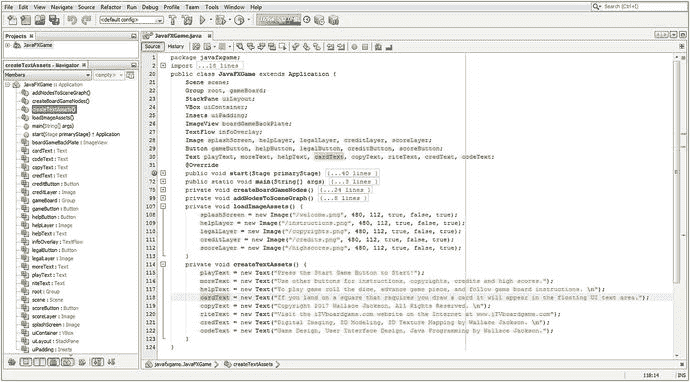

图 9-8.

在类顶部声明八个 Text 对象；在 `createTextAssets()` 方法中实例化并加载 Text 对象

```
playText = new Text("按下开始游戏按钮开始！\n");
moreText = new Text("使用其他按钮查看说明、版权信息、鸣谢和最高分。");
helpText = new Text("游戏玩法：掷骰子，移动棋子，遵循棋盘指示。");
cardText = new Text("如果你落在需要抽牌的方格上，抽牌将显示在 UI 区域。");
copyText = new Text("版权所有 2015 Wallace Jackson，保留所有权利。\n");
riteText = new Text("访问互联网上的 iTVboardGame.com 网站：www.iTVboardgame.com");
credText = new Text("数字成像、3D 建模、3D 纹理贴图，由 Wallace Jackson 制作。\n");
codeText = new Text("游戏设计、用户界面设计、Java 编程，由 Wallace Jackson 完成。");
```

接下来你可能想做的事情是使按钮控件宽度统一，这可以通过使用 `Button.setMaxWidth()` 方法来实现。当你升级 Scene 对象构造方法以支持 iTV 1280x720 分辨率时，你将能够看到 `TOP_RIGHT` 位置常量的实际效果，并且统一的按钮块看起来会更专业。


### 使用 Button.setMaxWidth() 方法：使按钮统一

你需要做的第一件事是将场景 Scene 对象设置为 iTV 宽度 1280 和高度 640，以便使用宽 2:1 的宽高比，并为你的专业 Java 9 游戏应用程序提供最低支持的 iTV 屏幕分辨率。如图 9-9 所示，我在以下 Java 代码中升级了 Scene() 构造方法，以使用这些新的应用程序窗口屏幕尺寸，代码位于图 9-9 顶部的第 83 行：

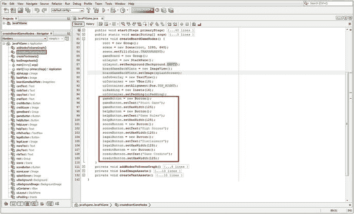

图 9-9.

使用 `.setMaxWidth()` 方法调用将你的 Button UI 对象设置为 125，使它们具有统一的宽度

```
scene = new Scene(root, 1280, 640);
```

接下来你要做的是将 boardGameBackPlate ImageView 设置为包含欢迎消息图像。你将使用 `.setImage()` 方法配合 splashScreen Image 对象来完成此操作，代码位于图 9-9 的第 89 行：

```
boardGameBackPlate.setImage(splashScreen);
```

最后，为了使 Button 对象具有 125 像素的统一宽度，请使用 `.setMaxWidth(125)` 方法调用，该方法在五个 Button UI 对象中的每一个上调用（如图 9-9 中第 97、100、103、106 和 109 行代码所示）。

我将 VBox 配置为其子元素之间间隔 10 像素，在 VBox(10) 构造方法调用中放置了值 10。我将 Insets() 间距值增加到 Insets(16)。运行项目以查看更改，如图 9-10 所示。

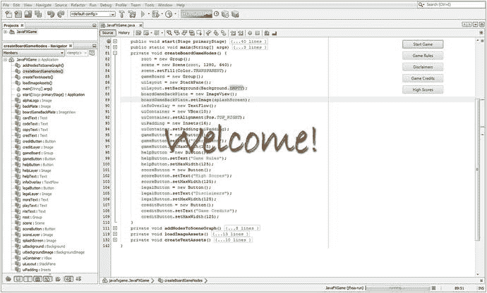

图 9-10.

使用“运行 ➤ 项目”工作流程查看按钮组设计在间距和宽度方面的改进

接下来，将 backplate8.png 和 alphalogo.png 图像资源复制到源文件夹，如图 9-11 所示。


图 9-11.

使用你的文件管理工具将 backplate8.png 和 alphalogo.png 资源复制到你的 `/src` 文件夹

接下来，让我们使用 StackPane 的背景图像功能。目前我们使用的是 Background 类中的 EMPTY 常量，所以让我们将其替换为一个 BackgroundImage 对象，你的 Background 类也将支持该对象。接下来让我们看看如何连接它，以便通过使用一个未使用的功能（StackPane 背景）而不是添加另一个 ImageView 对象（大多数人倾向于这样做）来进一步优化你的 SceneGraph。

### 使用 StackPane 背景：利用所有合成层

JavaFX StackPane 类支持 `.setBackground(Background background)` 方法调用，该方法又支持一个 BackgroundImage 对象，该对象可以加载一个 Image 对象或与 EMPTY 常量一起使用。这意味着你可以在 StackPane UI 布局容器对象的背景中引用图像资源，所以让我们看看如何利用这一点，以便你拥有五个合成层（Stage 背景、Scene 背景、ImageView、TextFlow、StackPane），并且只使用你已添加到 Scene Graph 中的节点。所有这些当前都设置为 EMPTY 或 TRANSPARENT，或者包含一个带有 alpha 通道的 PNG32。使用以下代码，将 backPlate 和 alphaLogo 对象名称添加到类顶部现有的 Image 声明复合 Java 语句中：

```
Image splashScreen, helpLayer, legalLayer, creditLayer, scoreLayer, backPlate, alphaLogo;
```

接下来，在类的顶部声明一个名为 uiBackgroundImage 的 BackgroundImage 对象，并使用 Alt+Enter 让 NetBeans 9 为你编写 import 语句。接下来，在你的 JavaFXGame 类顶部添加一个名为 uiBackground 的 Background 对象（注意，Background 类已在第 6 章中导入，因此你可以使用 Background.EMPTY 常量），如下面的 Java 代码所示，并在图 9-12 中突出显示：

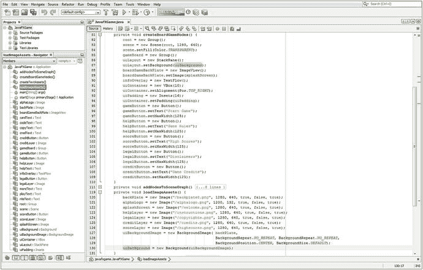

图 9-12.

添加一个名为 uiBackgroundImage 的 backgroundImage 对象；使用 `.setBackground()` 方法加载它

```
BackgroundImage uiBackgroundImage;  // 在 JavaFXGame 类顶部的对象声明
Background uiBackground;           // 在 JavaFXGame 类顶部的对象声明
```

在 loadImageAssets() 方法的开头，实例化 backPlate 和 alphaLogo Image 对象，然后使用以下 Java 代码将它们加载到关联的数字图像资源中，如图 9-12 所示：

```
backPlate = new Image("/backplate8.png", 1280, 640, true, false, true);
alphaLogo = new Image("/alphalogo.png",  1200, 132, true, false, true);
```

在同一个 loadImageAssets() 方法的末尾，实例化你的 uiBackgroundImage 对象，并使用 backplate Image 对象加载它，我们将使用该对象作为我们使用 Node 子类（StackPane、ImageView 和 VBox）创建的合成启动屏幕图像的优化 8 位 PNG8 背景图像；你可以使用以下 Java 代码执行此操作，该代码也显示在图 9-12 中：

```
uiBackgroundImage = new BackgroundImage(backPlate,
BackgroundRepeat.NO_REPEAT, BackgroundRepeat.NO_REPEAT,
BackgroundPosition.CENTER, BackgroundSize.DEFAULT);
```

最后，你需要实例化 uiBackground Background 对象，并使用其构造方法，用你刚刚在前一行 Java 代码中创建的 uiBackgroundImage BackgroundImage 对象加载它。这将使用以下代码行完成，该代码行在图 9-12 的 loadImageAssets() 方法中突出显示：

```
uiBackground = new Background(uiBackgroundImage);
```

在 createBoardGameNodes() 方法中，在 uiLayout 对象上调用 `.setBackground()` 方法，并传入一个 uiBackground Background 对象，替换 Background.EMPTY 常量，使用图 9-12 中的代码：

```
uiLayout.setBackground(uiBackground);
```

使用“运行 ➤ 项目”查看 StackPane 背景中是否出现底板图像，如图 9-13 所示。

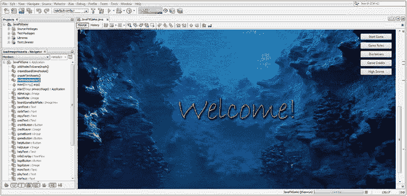

图 9-13.

使用“运行 ➤ 运行项目 (JavaFXGame)”菜单序列测试你的新合成管道 Java 代码

现在我们已经准备好使用 TextFlow 和 Text 对象将文本层添加到合成管道中。


### 使用 TextFlow：设置信息叠加对象

打开 `createTextAssets()` 方法，在 `playText` 和 `moreText` 对象上各添加两个方法调用，确保使用 `Color.WHITE` 常量填充字体，并选择广泛支持的 Helvetica 字体，使用其常规字型（REGULAR font face），并将字体高度设置为 50 像素。使用 `FontPosture` 辅助类（字型常量）将 `playText` 和 `moreText` 对象设置为常规字体样式。在 `moreText` 对象内部添加换行转义符 `\n`，将其拆分为两行。图 9-14 中间高亮显示的新 Text 对象配置应类似于以下 Java 代码：

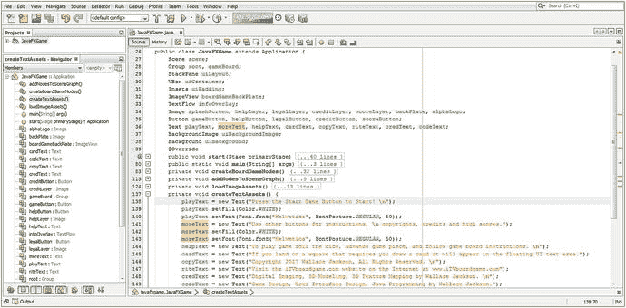

图 9-14.

为 SplashScreen 文本添加 `.setFill()` 和 `.setFont()` 方法

```
playText = new Text("Press the Start Game Button to Start! \n");
playText.setFill(Color.WHITE);
playText.setFont(Font.font("Helvetica", FontPosture.REGULAR, 50));
moreText = new Text("Use other buttons for instructions, \n copyrights, credits and scores.");
moreText.setFill(Color.WHITE);
moreText.setFont(Font.font("Helvetica", FontPosture.REGULAR, 50));
```

打开 `createBoardGameNodes()` 方法，在 `infoOverlay` 对象实例化之后，添加一行代码，调用 `infoOverlay` 对象的 `.setTranslateX()` 方法，参数值为 240。然后再添加一行代码，调用 `.setTranslateY()` 方法，参数值为 420。这将把 TextFlow 容器定位在 ImageView 对象（当前为欢迎消息）下方，从而使合成的文本块位于屏幕底部。这些语句的 Java 代码应如下所示（如图 9-15 高亮显示）：

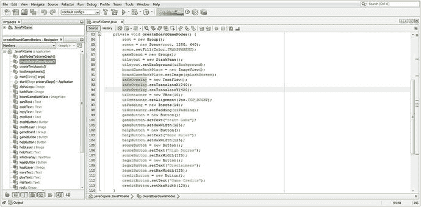

图 9-15.

向 TextFlow 对象添加 Text 对象，并设置 `.setTranslateX()` 和 `.setTranslateY()`

```
infoOverlay.setTranslateX(240);
infoOverlay.setTranslateY(420);
```

打开 `addNodesToStackPane()` 方法。在该方法末尾，添加一个 `infoOverlay` 对象，并调用其 `.getChildren().addAll()` 方法，参数为 `playText` 和 `moreText` 对象，用逗号分隔，如图 9-16 所示。

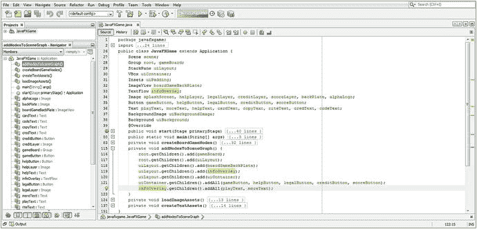

图 9-16.

将 `infoOverlay` 对象添加到 `.addNodesToSceneGraph()` 方法的末尾，并使用 `.addAll()` 将 `playText` 和 `moreText` 对象添加到 `infoOverlay`

此语句的 Java 代码应如下所示，并在图 9-16 中高亮显示：

```
infoOverlay.getChildren().addAll(playText, moreText);
```

如图 9-17 所示，白色文本对象看起来很酷，您的图像合成管线看起来就像是用专业数字成像软件创建的一样。接下来，让我们为徽标添加一个图像合成层。

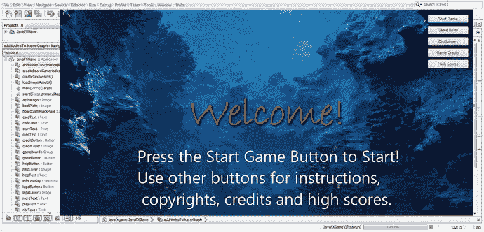

图 9-17.

运行项目并检查将 TextFlow 对象添加到启动画面合成管线的结果

这种 UI 设计开始看起来更专业了，按钮位于岩石突出部分上方，“Welcome!” 文本在屏幕设计中居中。然而，UI 设计仍然需要一个品牌徽标，并且有一个多余的空格将第三行向右推，需要修复（移除）。让我们在下一节中完成这项工作。

### 使用 StackPane：添加更多数字图像合成层

让我们在 `JavaFXGame` 类的顶部添加另一个名为 `logoLayer` 的 ImageView 对象声明，将 ImageView 声明变成一个 `ImageView boardGameBackPlate, logoLayer;` 复合 Java 语句。打开 `createBoardGameNodes()` 方法，为此对象添加一个对象实例化，然后添加一个 `.setImage()` 方法调用，将其连接到您之前导入此数字图像资产时创建的 `alphaLogo` Image 对象。接下来，您将在 `logoLayer` 对象上添加两个方法调用，一个用于 X 轴缩放，一个用于 Y 轴缩放，使用相同的 80% 值 0.8，以便为此缩放操作锁定宽高比（也称为均匀缩放）。最后，您将使用 -225 值将徽标沿 Y 轴从屏幕中心向上移动 225 像素，因为 StackPane 使用 0,0 屏幕中心参考模型，而不是标准的 0,0 左上角像素参考模型。我们还将使用 -75 像素的 X 平移值将徽标向左拉回 75 像素。新的 `logoLayer` ImageView 对象实例化、资产引用和变换（位置/平移和缩放）配置代码可以在图 9-18 中间看到高亮显示，应如下面的 Java 9 代码语句块所示：

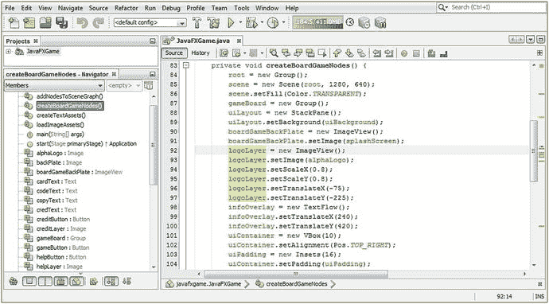

图 9-18.

创建一个引用 `alphaLogo` 图像的 `logoLayer` ImageView；将缩放比例设置为 80%，位置设置为 -75, -225

```
logoLayer = new ImageView();
logoLayer.setImage(alphaLogo);
logoLayer.setScaleX(0.8);
logoLayer.setScaleY(0.8);
logoLayer.setTranslateX(-75);
logoLayer.setTranslateY(-225);
```

接下来，您必须将这个新的 `logoLayer` ImageView 添加到 `addNodesToSceneGraph()` 方法中的合成层 StackPane `uiLayout` 容器中。既然我们在这里，由于我们要向根节点和 `uiLayout` 场景图层次结构添加多个 Node 子类，我们将从使用 `.getChildren().add()` 方法链切换到使用 `.getChildren().addAll()` 方法链，以将此方法中的 Java 语句数量从八条减少到四条。

添加顺序会影响合成层的顺序，因此对于 `.add()` 语句，这相当于从上到下。首先添加的语句（顶部）位于合成层堆栈的底部（这有点反直觉，不是吗？）。

使用 `.addAll()` 方法时，这变为从左到右，因此首先添加的对象（左侧）位于合成层堆栈的底部。因此，使用 `.getChildren().addAll()` 方法调用的新 `addNodesToStackPane()` 方法结构应如下所示，如图 9-19 底部高亮显示：

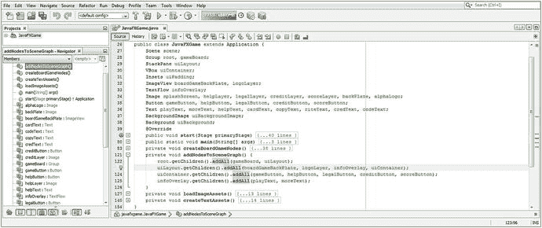

图 9-19.

将六个 `.add()` 方法调用合并为两个在 SceneGraph 根节点和 UI 分支上调用的 `.addAll()` 方法调用

```
private void addNodesToSCeneGraph() {
root.getChildren().addAll(gameBoard, uiLayout);
uiLayout.getChildren().addAll(boardGameBackPlate, logoLayer, infoOverlay, uiContainer);
uiContainer.getChildren().addAll(gameButton, helpButton, legalButton,
creditButton, scoreButton);
infoOverlay.getChildren().addAll(playText, moreText);
}
```

如图 9-20 所示，我已添加了徽标并修复了文本段落（左）对齐，移除了 `\n` 之后的那个空格，这有点反直觉，因为它留下了 `\ncopyrights`，并且没有转义 `ncopyrights`。作为 Java 程序员，您需要知道在这种情况下，编译器会查看转义符（`\`），以及其后的一个字母（在本例中为 `n` 或换行符），然后继续将后续字符解析为文本内容的一部分。

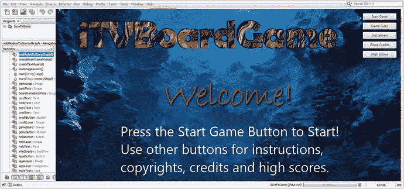

图 9-20.

运行项目并检查将 ImageView 对象添加到启动画面合成管线的结果


徽标已被添加到合成层容器（StackPane）中，调整大小（缩放）以适配按钮组旁，并上移（平移）以与按钮组居中对齐。整体看起来平衡且专业；它在场景图中使用了极少的节点，在系统内存中也只占用了极少的对象，因此是经过优化的。

由于本用户界面未使用我在第 7 章中展示的透明度（技巧），让我们通过恢复默认的 `DECORATED` StageStyle 类常量来替换操作系统窗口装饰，这可以通过移除 `primaryStage.initStyle()` 方法调用来实现。不过，我将保留该 Java 语句，并将 `TRANSPARENT` 常量改为 `DECORATED` 常量，以便将来能以不同方式装饰 Stage 对象。具体做法是将图 9-21 中第 46 行所示的代码行修改为以下 Java 代码：

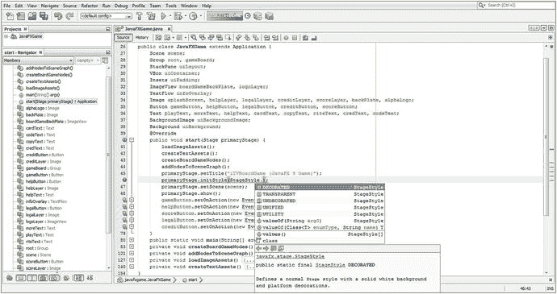

图 9-21.
恢复为 `StageStyle.DECORATED`，并为操作系统窗口添加 iTVBoardGame (JavaFX 9 Game) 标题

```
primaryStage.initStyle(StageStyle.DECORATED);
```

接下来，通过替换第 6 章引导代码中的“Hello World”占位文本，为操作系统窗口装饰添加标题。我将使用 `iTVBoardGame` 来匹配 3D 徽标，并用括号添加“JavaFX 9 Game”，以向用户说明该应用程序基于何种平台构建。实现此功能的代码如图 9-21 中 `.initStyle()` 方法上方的橙色部分所示，应类似于以下 Java 语句：

```
primaryStage.setTitle("iTVBoardGame (JavaFX 9 Game)");
```

如图 9-22 所示，我们现在拥有一个包含徽标、背景图像、用户界面按钮组和分区标题图像层的初始应用程序启动闪屏。对于闪屏而言，标题就是“欢迎！”

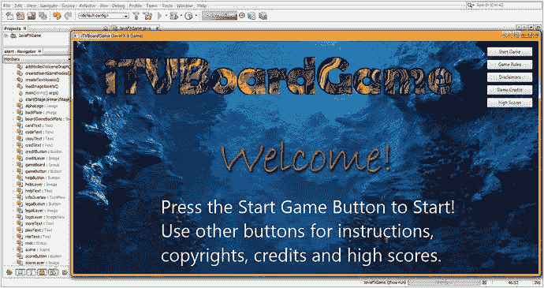

图 9-22.
运行项目，确保操作系统窗口装饰已被替换，且窗口标题已就位并正确

我们唯一剩下要做的就是完成其他四个分区的 Image 对象实现，并在其他四个 TextFlow 对象中实现字体样式和颜色。所有这些对象都将在事件处理代码中被调用，我们将在第 10 章（涵盖 JavaFX 9 和 Java 9 游戏中的事件处理与特效）中添加这些代码。

在完成所有这些 2D 屏幕设计、UI 设计和事件处理编码之后，我们将在本书后半部分开始深入探讨 3D 和 i3D。

### 完成 UI 设计对象的创建与配置

让我们打开 `createTextAssets()` 方法，为其他六个 Text 对象添加 `.setFill()` 和 `.setFont()` 方法调用，将其颜色设置为与包含手写文本图像的 `boardGameBackPlate` ImageView 相匹配，并将其字体样式设置为 Helvetica Regular。这是一个相对简单的练习；最终的方法体如图 9-23 所示，应类似于以下 Java 方法体和 Java 语句：

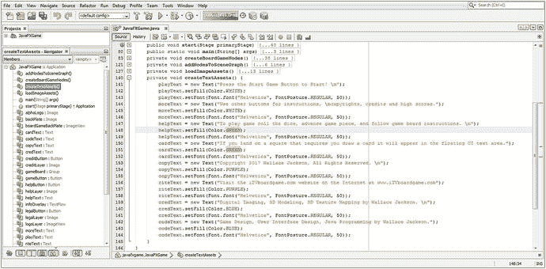

图 9-23.
使用 `.setFill()` 和 `.setFont()` 方法，配合 Color 和 Helvetica 值完成 Text 对象的配置

```
private void createTextAssets(){
playText = new Text("按下“开始游戏”按钮开始！\n");
playText.setFill(Color.WHITE);
playText.setFont(Font.font("Helvetica", FontPosture.REGULAR, 50));
moreText = new Text("使用其他按钮获取说明、\n 版权信息、鸣谢和分数。");
moreText.setFill(Color.WHITE);
moreText.setFont(Font.font("Helvetica", FontPosture.ITALIC, 50));
helpText = new Text("游戏玩法：掷骰子，移动\n 棋子，并遵循棋盘上的\n 说明。");
helpText.setFill(Color.GREEN);
helpText.setFont(Font.font("Helvetica", FontPosture.REGULAR, 50));
cardText = new Text("如果你落在需要抽牌的\n 格子上，牌面将显示在\n 浮动的 UI 文本区域中。");
cardText.setFill(Color.GREEN);
cardText.setFont(Font.font("Helvetica", FontPosture.REGULAR, 50));
copyText = new Text("版权所有 2015 Wallace Jackson。\n 保留所有权利。\n");
copyText.setFill(Color.PURPLE);
copyText.setFont(Font.font("Helvetica", FontPosture.REGULAR, 50));
riteText = new Text("请访问 iTVboardGame.com 网站\n 网址为 www.iTVboardgame.com");
riteText.setFill(Color.PURPLE);
riteText.setFont(Font.font("Helvetica", FontPosture.REGULAR, 50));
credText = new Text("数字图像、3D 建模、3D 纹理\n 映射由 Wallace Jackson 完成。\n");
credText.setFill(Color.BLUE);
credText.setFont(Font.font("Helvetica", FontPosture.REGULAR, 50));
codeText = new Text("游戏设计、用户界面设计、\nJava 编程由 Wallace Jackson 完成。");
codeText.setFill(Color.BLUE);
codeText.setFont(Font.font("Helvetica", FontPosture.REGULAR, 50));
}
```

在本章中，你在构建专业 Java 游戏闪屏设计、用户界面设计以及顶层 SceneGraph 和类（及方法）基础设施方面取得了很大进展。你还学习了 Image、ImageView、Text、TextFlow、Background 和 BackgroundImage 类。如果你身体柔韧性好，就拍拍自己的背吧，然后暂时从 Java 9 编程中休息一下！

你远未完成专业 Java 9 游戏开发的用户界面设计部分。请准备好在本章之后进一步优化它：当我们使其具有交互性时（第 10 章），以及当我们通过向 Scene 根节点添加 PerspectiveCamera 将当前的 2D 场景转换为 3D 场景时（第 11 章），所有这些都将需要对 StackPane 对象合成层管道属性以及坐标引用系统进行更改。正如我所说，本书的每一章都会变得越来越复杂，直到你对 Java 9、JavaFX 和 NetBeans 9 的知识足以创建你能想象到的任何 i3D 游戏设计！


## 总结

在第九章中，你为 `JavaFXGame.java` 类添加了更多代码，通过使用 JavaFX 的 `Image`、`ImageView`、`Background`、`BackgroundImage`、`Text` 和 `TextFlow` 类，为游戏的实际顶层用户界面设计构建了合成管线。你首先完成了 JavaFX 场景图层次结构的设计，我在图 9-1 中对其进行了可视化，展示了场景图如何使用一个根节点对象、三个分支节点对象和七个叶节点对象（五个 `Button` 对象、一个 `ImageView` 对象和一个 `TextFlow` 对象）。稍后，你将为游戏的 3D 部分添加更多的分支和叶节点对象，主要用于容纳 JavaFX 提供的 3D 对象（图元）或你自己的 3D 网格几何体。在本章中，你还添加了第二个 `ImageView` 节点用于徽标合成。

接下来，你了解了我们将在本章及下一章中实现的一些 JavaFX 类。这些类包括来自 `javafx.scene.image` 包的 `Image` 类和 `ImageView` 类。你还了解了来自 `javafx.scene.text` 包的 `Text` 和 `TextFlow` 类。

你实例化并配置了这些新的合成节点对象，然后编写了两个新方法来处理你的图像和文本资源。你的 `loadImageAssets()` 方法将数字图像资源实例化并配置为 `Image` 对象，而 `createTextAssets()` 方法则将文本信息资源实例化并配置为 `Text` 对象，以便稍后在场景图的 `TextFlow` 节点对象中使用。

然后，你使用 125 像素的值统一了按钮的宽度，并随后学习了如何使用 `Background` 和 `BackgroundImage` 类（对象），以便能够利用 `StackPane` 的背景属性作为合成管线中的另一个合成层，而无需向 JavaFX 场景图层次结构添加更多节点对象。这强化了我在专业 Java 游戏开发中的优化方法：充分利用场景图中每个节点提供的所有功能，从而将每次脉冲事件中需要遍历的节点总数保持在绝对最低水平。

在下一章中，你将学习 JavaFX 中的事件处理类，并在 `ActionEvent` 事件处理程序逻辑中实现 Java 代码。你还将学习如何在此过程中实现一些酷炫的特殊效果，其中一些效果将由事件处理程序中的 Java 9 语句触发。之后，我们将进入 3D 领域，了解进入 3D 世界所需掌握的类和资源。

