# 10. 用户界面设计交互性：事件处理与成像效果

既然你已经完成了启动画面和用户界面设计的场景图层次结构，让我们回到第 10 章的 `JavaFXGame` 主应用程序类编码中，完成事件处理框架的实现。这个框架已经就位，但基本上是“空的”（除了几个用于测试按钮控制节点对象的 `System.out.println` 调用）。本章我们将概述的 Java 和 JavaFX 事件处理，将实现玩家用来了解并启动你的 Java 9 游戏的用户界面。在本书中，你还会使用其他类型的事件处理（按键和鼠标），我们将在本章中介绍这些内容。你将添加 Java 游戏 UI 编程逻辑，这可以看作是游戏的交互引擎。与游戏交互的方式有很多种，包括方向键（在消费电子设备和现代遥控器中称为 DPAD）、键盘、鼠标、轨迹球、游戏控制器、触摸屏，甚至包括陀螺仪和加速度计在内的先进硬件。你在专业 Java 9 游戏开发中需要做出的重要选择之一，就是玩家将如何通过他们运行游戏的硬件设备与你开发的 Java 游戏进行交互，以及游戏支持哪些硬件输入功能。

在本章中，你将学习 `javafx.event`、`javafx.scene.input` 和 `java.util` 包中包含的不同类型的 JavaFX 事件类型。你将涵盖 `ActionEvent`（因为你当前在用户界面设计中使用了它），以及输入事件，如 `MouseEvent` 和 `KeyEvent`。

除了通过添加事件处理来继续编写你的 `JavaFXGame` Java 代码之外，你还将在本章中学习 JavaFX 特殊效果，以确保我在这本书中涵盖了 Java 中所有酷炫的内容。这些 JavaFX 特殊效果存储在 `javafx.scene.effect` 包中，它们赋予了 JavaFX（以及 Java）许多与 GIMP 等数字图像合成软件包相同的特殊效果优势。

## 事件处理：为你的游戏增加交互性

有人可能会说，事件处理是游戏开发的基础。这是因为，如果没有与游戏逻辑和游戏元素交互的方式，你实际上就谈不上拥有一个像样的游戏。在本章的这一部分，我将介绍 JavaFX 事件处理类，你将实现你的 `ActionEvent` 处理结构，以便用户能够使用你在过去几章中设计的用户界面。在我们开始剖析 Java 和 JavaFX 的包、类、接口和方法之前，我想先谈谈专业 Java 游戏可以处理的不同类型的输入硬件事件。这些事件可以由 iTV 遥控器或智能手机 DPAD 上的方向键、键盘、鼠标或轨迹球，以及智能手机、平板电脑或 iTV 上的触摸屏生成。此外，还有自定义输入硬件，包括游戏机（以及现在的 iTV）上的游戏控制器、智能手机和平板电脑中的陀螺仪和加速度计，以及自由形式的手势和动作控制器，如 Leap Motion、VR Glove 和 Razer Hydra Portal。

### 控制器类型：我们应该处理哪些类型的事件？

关键问题之一是，支持游戏相关事件（如方向键、鼠标点击、触摸屏事件、游戏控制器按钮（A、B、C、D）以及更高级的控制器，如 Android、Kindle、Tizen、HTML5 OS 和 iOS 消费电子设备上可用的陀螺仪和加速度计）的最合理方法是什么。这个决定将由游戏目标运行的硬件设备驱动；如果游戏需要在所有平台上运行，那么最终将需要编写处理不同事件类型的代码，甚至采用不同的事件处理编程方法。在本章的这一部分，我们将更仔细地了解 Java 和 JavaFX 当前支持的输入事件，以便为你的游戏开发提供一个概览。

同样值得注意的是，Java 和 JavaFX 应用已经可以在两个流行的嵌入式平台（Android 和 iOS）上运行，而且我敢打赌，在不久的将来，它们将在开源平台（Opera、Tizen、Chrome、Ubuntu 和 Firefox）以及当前支持 Java 8 或 9 技术的专有平台（Windows、Samsung Bada、RIM Blackberry、LG WebOS、OpenSolaris）上获得原生支持。得益于 JavaFX、Java 平台几十年的发展势头以及新的先进 i3D 硬件平台支持，Java 9 的未来一片光明！


### Java 与 JavaFX 事件包：java.util 和 javafx.event

正如你在事件处理结构中新声明的 `EventHandler<ActionEvent>` 中所见，`javafx.event` 包中的 `EventHandler` 公共接口（它扩展了 `java.util` 包中的 `EventListener` 接口）是创建和处理 `Event` 对象的方式，既可以使用匿名内部类（Java 7）结构（我们正在使用这种方式，因为它兼容 Android），也可以使用 lambda 表达式（Java 8）。你现在已经熟悉了如何编写这种类型的事件处理结构，在本书中我将继续使用 Java 匿名内部类的方法来编写代码。也就是说，你可以将鼠标悬停在任何 Java 7 代码下的波浪形黄色下划线高亮上，让 NetBeans 9 将其转换为更精简的 Java 8 lambda 表达式。通过这种方式，你可以创建兼容 Java 7（64 位 Android 5 和 6）、Java 8（64 位 Android 7 和 8）以及 Java 9（PC 操作系统和未来版本的 Android）游戏代码交付管道的游戏。在本节中，我们将研究 `ActionEvent` 和 `InputEvent` 的 `EventObject` 子类类别，以便你了解 JavaFX 中的主要事件。这些事件源自 `java.util.EventObject` 超类，我们将探讨如何将它们应用于处理操作、按键、鼠标事件、触摸事件以及类似的先进输入事件类型。

#### JavaFX ActionEvent 类：创建自 java.util.EventObject 超类

到目前为止，你在本书中用于用户界面按钮控件事件处理的 `ActionEvent` 类（及其对象）是 `javafx.event` 包中 `Event` 超类的一个子类，而 `Event` 超类本身又是 `java.util` 包中 `EventObject` 超类的一个子类，`EventObject` 超类则是 `java.lang.Object` 主类的一个子类。该类还有一个已知的直接子类，即 `MediaMarkerEvent` 类。因此，类层次结构如下所示：

```
java.lang.Object
> java.util.EventObject
> javafx.event.Event
> javafx.event.ActionEvent
```

`ActionEvent` 类与 `EventHandler` 公共接口一起包含在 `javafx.event` 包中。你可能已经猜到，`ActionEvent` 对象是一种代表某种类型操作的 `Event` 对象。这种类型的 `Event` 对象可用于表示各种各样的事物。正如你所见，它在按钮被触发时使用，也在例如 `KeyFrame` 播放完毕时以及其他类似的内部软件使用场景中使用。`ActionEvent` 是在 JavaFX 2.0 版本中引入的，在 JavaFX 1.x 版本（1.0 到 1.3）中不可用。它仍然存在于 Java 7 的 JavaFX 7 中（两者现已停止支持）、Java 8 的 JavaFX 8 中，以及现在 Java 9 的 JavaFX 9 中。

`ActionEvent` 对象有两个数据字段（属性）。第一个是静态的 `EventType<ActionEvent> ACTION` 特性，这是 `ActionEvent` 唯一有效的事件类型。然而，`ActionEvent` 对象还有一个超类型，即静态的 `EventType<ActionEvent> ANY`，它为开发者提供了一个能够代表所有操作事件类型的通用超类型。因此，如果你希望 Java 代码处理任何 `ActionEvent` 对象，请使用此数据字段；如果你希望 Java 代码处理特定的 `ActionEvent` 对象，请使用 `ACTION` 数据字段。

`ActionEvent` 类还支持两个构造方法。默认的空参数列表 `ActionEvent()` 构造方法会创建一个具有默认事件类型 `ACTION` 的新 `ActionEvent` 对象。还有一个 `ActionEvent(Object source, EventTarget target)` 构造方法，它会使用指定的事件对象源和事件目标来创建新的 `ActionEvent`。

`ActionEvent` 类还支持两个方法。第一个是 `ActionEvent copyFor(Object newSource, EventTarget newTarget)` 方法，用于使用指定的事件源和目标创建并返回事件的副本。第二个是 `EventType<? extends ActionEvent> getEventType()` 方法，它会获取调用该方法的对象的事件类型。

我们将用于游戏玩法 i3D 组件的所有其他与事件相关的类都包含在 `javafx.scene.input` 包中。在本节的剩余部分，我将重点介绍 `javafx.scene.input` 包，因为你已经学会了如何为 Java 7 编写新的 `EventHandler<ActionEvent> { … }` 结构。如果你指示 NetBeans 9 将其转换为 Lambda 表达式，它将采用 Java 8 的 `(ActionEvent) -> { … }` 代码结构格式。

现在是时候学习如何在你的 Java 游戏开发工作流程中使用其他类型的事件（称为输入事件）了。让我们来看看 `javafx.scene.input` 包及其 25 个与输入事件相关的类。


#### JavaFX 输入事件类：javafx.scene.input 包

尽管 `java.util` 和 `javafx.event` 包包含了用于“处理”事件的核心类 `EventObject`、`Event` 和 `EventHandler`，但在确保事件得到处理（被处理）的基础层面上，还有另一个名为 `javafx.scene.input` 的 JavaFX 包，其中包含了你可能感兴趣用于处理（处理）玩家输入的各种类，这些输入针对你可能创建的不同类型的游戏。这些被称为输入事件，它们与你已经了解过的 `ActionEvent` 和脉冲事件是不同的。

值得注意的是，`javafx.scene.input` 包中支持的许多输入事件类型更适用于消费电子（行业术语称为嵌入式）设备，例如智能手机和平板电脑。这告诉我，JavaFX 正被定位（设计）用于开源平台，如 Android OS、Firefox OS、Tizen OS、Bada OS、Opera OS、Ubuntu OS 或 Chrome OS。JavaFX 9 拥有“专用”事件，例如 `GestureEvent`、`SwipeEvent`、`TouchEvent` 和 `ZoomEvent`，这些事件支持新兴嵌入式设备市场中的特定功能。这些输入事件类支持高级触摸屏设备功能，例如手势、页面滑动、触摸屏输入处理以及多点触控显示功能，例如双指“捏合”或“张开”触摸输入，分别用于放大和缩小屏幕上的内容。

本书将涵盖更“通用”的输入类型，这些类型在个人计算机（台式机、笔记本电脑、上网本、超级本以及较新的“专业”平板电脑，如 Surface Pro 4）和嵌入式设备（包括智能手机、平板电脑、电子阅读器、iTV 设备、游戏机、家庭媒体中心、机顶盒等）上都得到支持。这些设备也将处理这些更广泛（在其实现中）的 `KeyEvent` 和 `MouseEvent` 类型的输入事件，因为鼠标事件和键盘事件将始终得到支持以兼容旧版软件包。例如，触摸屏支持鼠标点击事件，但定位设备（鼠标、轨迹球、控制器、方向键等）不支持触摸屏事件。所以，如果可能的话，请使用键盘和鼠标事件！

有趣的是，触摸屏显示器会“处理”鼠标事件以及触摸事件，这对于确保你的游戏能在尽可能多的不同平台上运行来说非常方便。在我的 Android 书籍中，我经常使用这种处理鼠标事件的方法，这样用户既可以使用触摸屏，也可以使用方向键中心（点击）按钮来生成鼠标点击事件，而无需专门使用触摸事件。在可能的情况下，为触摸屏用户使用鼠标（点击）事件的另一个好处是，如果你使用触摸事件，则无法反向兼容。也就是说，你的游戏应用程序将只能在触摸屏设备上运行，而不能在配备某种鼠标硬件的设备（例如 iTV 设备、笔记本电脑、台式机、上网本等）上运行。

同样的原则也适用于键盘事件，尤其是开发者用于游戏的箭头键，因为这些键可以在键盘和遥控器的箭头键区、游戏控制器以及大多数智能手机的方向键上找到。我还将向你展示如何包含替代按键映射，以便你的玩家可以决定他们更喜欢使用哪种输入方式来玩你的专业 Java 9 游戏。接下来，让我们看看 `KeyCode` 和 `KeyEvent` 类。

#### KeyCode 类：使用枚举常量定义玩家用于游戏的按键

由于许多游戏使用箭头键区进行导航（通常是 A、S、D 和 W 键），并且有时会为这些键使用替代映射到游戏控制器的 GAME_A、GAME_B、GAME_C 和 GAME_D 按钮，让我们首先更仔细地看看 JavaFX 的 `KeyCode` 类。这个类是一个公共枚举类，它保存了按键的枚举常量值，这些值在按键被按下或释放时进行评估。`KeyEvent` 类正是通过这个类来获取它使用（处理）的键码常量值，以确定玩家在特定按键事件调用中使用了哪个键。`KeyCode` 类的 Java 和 JavaFX 类层次结构如下所示：

```
java.lang.Object
> java.lang.Enum
> javafx.scene.input.KeyCode
```

`KeyCode` 类中包含的常量值使用大写字母，并以该键码所支持的键命名。例如，a、s、w 和 d 的键码分别是 A、S、W 和 D。箭头键区的键码是 UP、DOWN、LEFT 和 RIGHT，游戏控制器按钮的键码是 GAME_A、GAME_B、GAME_C 和 GAME_D。

在本书的后续部分，你将把 `KeyCode` 常量与 `KeyEvent` 对象一起实现在一个 `EventHandler` 对象中，因此我在这里介绍这些用于输入事件处理的事件相关包和类。正如你将看到的，其设置方式与设置处理 `ActionEvent` 的方式非常相似。你的 `KeyEvent` 也可以使用 Java 7 的内部类方法或 Java 8 的 lambda 表达式进行编码。你的 `KeyEvent` 对象处理应该以模块化的方式进行，这样你的 `KeyCode` 评估结构会为每个 `KeyCode` 映射设置布尔标志变量。这些布尔标志将准确反映玩家在任何毫秒内按下或释放了哪些键。

然后，你可以通过在你的其他游戏引擎类中使用 Java 游戏编程逻辑来读取这些布尔值并对其做出响应，这些逻辑将实时处理这些按键事件，从而使你的专业 Java 游戏玩法运行良好，用户体验良好。接下来，让我们看看处理这些 `KeyCode` 对象的 `KeyEvent` 对象。


#### KeyEvent 类：使用 KeyEvent 对象保存 KeyCode 常量

接下来，让我们更深入地了解 KeyEvent 类。该类被声明为 `public final KeyEvent`，并继承了 InputEvent 超类，后者用于创建 `javafx.scene.input` 包中的所有输入事件子类。KeyEvent 类通过 EventHandler 类启动，并处理 KeyCode 类的常量值。该类的层次结构始于 `java.lang.Object` 主类，经过 `java.util.EventObject` 事件超类，再到 `javafx.event.Event` 类，该类用于创建 KeyEvent 类所继承（子类化）的 `javafx.scene.input.InputEvent` 类。值得注意的是，我们在这里跨越了四个不同的包。

KeyEvent 类的 Java 和 JavaFX 类层次结构从 `java.lang` 包跳转到 `java.util` 包，再到 `javafx.event` 包，最后到 `javafx.scene.input` 包。KeyEvent 的层次结构如下所示：

```
java.lang.Object
> java.util.EventObject
> javafx.event.Event
> javafx.scene.input.InputEvent
> javafx.scene.input.KeyEvent
```

EventHandler 对象生成 KeyEvent 对象表示发生了按键操作。这个 KeyEvent 通常使用场景图节点对象（例如可编辑的文本 UI 控件）生成；然而，在你的游戏场景中，你可能会将按键事件处理直接附加到场景图节点对象层次结构之上的 Scene 对象（名为 `scene`）上。这样做可以通过不将任何 KeyEvent 处理附加到场景图中的任何 Node 对象，从而最大限度地减少场景图脉冲处理的开销。在你的游戏中，这指的是包含 `uiLayout` StackPane 对象和 `gameBoard` Group 对象的根 Group 对象。

每当按键被按下并保持、释放或键入（按下并立即释放）时，就会生成一个 KeyEvent 对象。根据按键操作本身的性质，你的 KeyEvent 对象会被传递到 `.onKeyPressed()`、`.onKeyTyped()` 或 `.onKeyReleased()` 方法中，以便在 `.handle()` 方法内进行进一步处理。

游戏通常使用按键按下和按键释放事件，因为用户通常会按住按键来移动游戏中的角色。另一方面，按键键入事件往往是“更高级别”的事件，通常不依赖于操作系统平台或键盘布局。当输入 Unicode 字符时，会生成键入按键事件（`.onKeyTyped()` 方法调用）。它们用于获取 UI 控件（如文本字段）的字符输入，并用于业务应用程序，例如日历、计算器、电子邮件客户端和文字处理器。

在简单情况下，键入按键事件通过一次按键按下并立即释放来产生。此外，还可以通过组合按键按下事件来产生替代字符。例如，大写字母 A 是通过按下 Shift 键和“a”键（按下并立即释放）产生的。

生成键入按键的 KeyEvent 对象通常不需要按键释放。需要注意的是，在某些边缘情况下，键入按键事件直到按键释放时才会生成；一个很好的例子是使用老式的 Alt 键加数字小键盘输入法输入 ASCII 字符代码序列的过程，这种方法在 DOS 时代使用，并延续到了 Windows 操作系统中。重要的是要注意，对于不会生成 Unicode（可见、可打印）字符的计算机键盘按键（例如 Shift、Control (Ctrl) 或 Alternate (Alt) 键，通常称为修饰键），不会生成任何键入按键的 KeyEvent 对象。

KeyEvent 类有一个字符变量（我倾向于称之为字符特性，但我不打算这么做），对于键入按键事件，它始终包含一个有效的 Unicode 字符；对于按键按下或按键释放事件，则包含 `CHAR_UNDEFINED`。字符输入仅针对键入按键事件报告，因为按键按下和按键释放事件不一定与字符输入相关联。因此，你的字符变量仅在键入按键事件中才有意义。

对于按键按下和按键释放的 KeyEvent 对象，KeyEvent 类中的代码变量将包含你的 KeyEvent 对象的键码，该键码使用你之前学过的 KeyCode 类定义。对于键入按键事件，此代码变量始终包含常量 `KeyCode.UNDEFINED`。因此，正如你所见，按键按下和按键释放事件的设计用途与按键键入事件不同，这就是为什么你可能会在游戏事件处理中使用按键按下和按键释放事件。按键按下和按键释放事件是低级别事件，每当某个键被按下或释放时就会生成。它们是“轮询”不生成字符输入的键的唯一方法。你的按键被按下或释放的状态通过代码变量（包含一个虚拟的 KeyCode）指示给操作系统。


## 添加键盘事件处理：使用 KeyEvent

我认为这些背景信息足以让你理解一个基本示例，了解如何为专业 Java 游戏实现 KeyEvent 处理。这相当直接，因此我将快速概述其实现方式，因为我们正在介绍 KeyEvent 类。这部分内容在我的《Beginning Java 8 Games Development》一书中也有涉及。你要做的第一件事是在 JavaFXGame 类的顶部添加一行代码，使用一条复合声明语句声明四个布尔变量，分别命名为 up、down、left 和 right，如下所示：

```
boolean up, down, left, right;
```

由于布尔变量的默认值是 false，这表示一个未被按下的键，即当前处于释放状态或未使用的键。由于这也是键盘上按键的默认状态，因此这将是此应用程序的正确默认值。在 Java 中，布尔变量默认值为 false，因此你无需显式初始化这些变量。

我通过使用已实例化的 Scene 对象（名为 scene）调用 `.setOnKeyPressed()` 方法，为 KeyEvent（此处为按键按下事件）对象建立了事件处理基础。在此方法调用内部，我创建了新的 `EventHandler<KeyEvent>`，就像为 ActionEvent 所做的那样。代码如下所示：

```
scene.setOnKeyPressed( new EventHandler() { 一个 .handle() 方法将放在这里 } );
```

KeyEvent 对象处理恰好是实现高效的 Java switch 语句的完美应用。你可以为想要处理的每个 JavaFX KeyCode 常量添加一个 case。这些常量包含在通过参数区域传入 `.handle()` 方法的 KeyEvent 对象（名为 event）中。

然后，在 `switch()` 评估区域内，通过调用 event KeyEvent 对象的 `.getCode()` 方法，从 KeyEvent 对象中提取 KeyCode。这可以通过以下 Java switch-case 代码编程结构来实现：

```
scene.setOnKeyPressed(new EventHandler() {
@Override
public void handle(KeyEvent event) {
switch (event.getCode()) {
case UP:    up    = true; break;
case DOWN:  down  = true; break;
case LEFT:  left  = true; break;
case RIGHT: right = true; break; // 如果后面不再添加 case 语句，此处不需要 break;
}
}
});
```

这将为你提供基本的按键按下事件处理结构，你可以将其添加到你的专业 Java 游戏中，并通过代码轮询这四个布尔变量，以了解用户如何使用方向键。如果你指示 NetBeans 9 将此 Java 7 结构转换为 Java 8 lambda 表达式，你将得到一个紧凑的结构。许多内容，例如 `public void handle()` 声明和 `new EventHandler<KeyEvent>()` 声明，在 lambda 表达式 Java 8 代码结构中将成为隐式或假定内容（但对编译器而言仍然存在）。使用 lambda 表达式可以简化代码，将其从三层嵌套的代码块减少为仅两层嵌套，并将代码行数从十一行减少到八行。Lambda 表达式在编写更紧凑的代码方面确实很优雅，但不会向你展示所使用的类（对象）、修饰符和返回类型的所有细节。这就是我选择使用更明确的 Java 7（及更早版本）代码结构的原因，该结构在 Java 5 到 7 以及 Java 8 引入 Lambda 表达式之前使用。Java 9 支持这两种方法。

你最终得到的 Java 8 lambda 表达式代码结构将如下所示：

```
scene.setOnKeyPressed(KeyEvent event) -> {
switch (event.getCode()) {
case UP:    up    = true; break;
case DOWN:  down  = true; break;
case LEFT:  left  = true; break;
case RIGHT: right = true; break;
}
});
```

接下来你要做的是创建与 OnKeyPressed 结构完全相反的结构，即创建一个 OnKeyReleased 结构。这将使用相同的代码结构，只是 true 值将变为 false 值，并且 `.setOnKeyPressed()` 方法调用将替换为 `.setOnKeyReleased()` 方法调用。最简单的方法是选中 `.setOnKeyPressed()` 结构，将其复制并粘贴到其下方。Java 代码如下所示：

```
scene.setOnKeyReleased(new EventHandler() {
@Override
public void handle(KeyEvent event) {
switch (event.getCode()) {
case UP:    up    = false; break;
case DOWN:  down  = false; break;
case LEFT:  left  = false; break;
case RIGHT: right = false; break;
}
}
});
```

使用 lambda 表达式的一个有趣之处在于，它通过“隐式”声明和使用类（例如本章实例中的 EventHandler 类），减少了类代码顶部的 import 语句数量。这是因为如果代码中没有具体使用某个类（即未写出其名称），则无需在代码顶部与其他 import 语句一起放置该类的 import 语句。你还会注意到，如果转换为 lambda 表达式，NetBeans 9 左边距中的代码折叠加号或减号图标将消失。这是因为 lambda 表达式是一个基本的 Java 代码语句，而不是像内部类或方法这样的构造或结构，而后者正是你将其转换为 lambda 表达式之前的内容。

现在你已经了解了如何放置 KeyEvent 处理结构，让我们看看为游戏中常用的 ASDW 键添加替代键映射是多么容易。只需为键盘上的 A、S、D 和 W 字符添加几个 case 语句，并将它们设置为我们已经设置好的 UP、DOWN、LEFT 和 RIGHT 布尔等效项（up、down、left 和 right 变量）即可。

例如，这将允许用户用左手使用 A 和 D 键，用右手使用 UP 和 DOWN 方向键，从而更轻松地进行游戏。稍后，如果你想使用游戏控制器及其对 KeyCode 类 GAME_A、GAME_B、GAME_C 和 GAME_D 常量的支持来为游戏添加更多功能，你只需在类顶部的 up、down、left 和 right 变量旁边再添加四个布尔变量（a、b、c 和 d），并再添加四个 case 语句即可。

这四个 W（UP）、S（DOWN）、A（LEFT）和 D（RIGHT）case 语句一旦添加到 switch 语句中，将使你的 KeyEvent 对象及其事件处理 Java 代码看起来像下面这 15 行 Java 代码：

```
scene.setOnKeyPressed(new EventHandler() {
@Override
public void handle(KeyEvent event) {
switch (event.getCode()) {
case UP:    up    = true; break;
case DOWN:  down  = true; break;
case LEFT:  left  = true; break;
case RIGHT: right = true; break;
case W:     up    = true; break;
case S:     down  = true; break;
case A:     left  = true; break;
case D:     right = true; break;
}
}
});
```

如你所见，现在用户可以使用其中一组键，或同时使用两组键来控制游戏。现在，对 `.setOnKeyReleased()` 事件处理结构执行相同的操作，使用复制粘贴工作流程，并将值更改为 false。`.setOnKeyReleased()` 事件处理 Java 代码如下所示：

```
scene.setOnKeyPressed(new EventHandler() {
@Override
public void handle(KeyEvent event) {
switch (event.getCode()) {
case UP:    up    = false; break;
case DOWN:  down  = false; break;
case LEFT:  left  = false; break;
case RIGHT: right = false; break;
case W:     up    = false; break;
case S:     down  = false; break;
case A:     left  = false; break;
case D:     right = false; break;
}
}
});
```


接下来，让我们切换回 Java 编码模式，为你的用户界面设计实现事件处理。

## 完成 UI 设计：编写事件处理代码

让我们通过在 `.handle()` 方法内的 `ActionEvent` 事件处理器结构中编写 Java 语句，来完成你的顶层 UI 设计。该方法会先清除 `infoOverlay` TextFlow 对象，然后向其添加 Text 对象，并使用 `.setBackground()` 和 `.setImage()` 方法调用在你的合成管线中设置正确的章节图像。如图 10-1 所示，我总是先使用 `.getChildren().clear()` 方法调用清除 TextFlow 对象，然后使用 `.getChildren.addAll()` 方法调用向 TextFlow 对象添加正确的 Text 对象。接着，我使用 `infoOverlay` TextFlow 的 `.setTranslateX()` 和 `.setTranslateY()` 方法调用来定位该容器（及图层）。之后，我使用 `.setBackground()` 方法调用为 `uiLayout` VBox 对象设置背景图像（用于启动画面），或为其他四个 Button 对象设置 `Background.EMPTY`，这样 `Color.WHITE` 背景色就能透出。最后，我使用 `.setImage()` 方法调用为 `boardGameBackPlate` ImageView 对象设置正确的 Image 对象。对于“游戏规则（帮助）”按钮，这是一个 `helpLayer` Image 对象引用。对于第一个 `helpButton` 事件处理器，这个 `.handle()` 方法的代码体将包含以下 Java 语句：

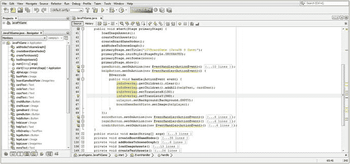

图 10-1.

在 handle() 方法中实现代码，以重新配置你的 helpButton UI 合成图层对象

```
helpButton.setOnAction(new EventHandler() {
@Override
public void handle(ActionEvent event) {
infoOverlay.getChildren().clear();
infoOverlay.getChildren().addAll(helpText, cardText);
infoOverlay.setTranslateX(130);
infoOverlay.setTranslateY(360);
uiLayout.setBackground(Background.EMPTY);
boardGameBackPlate.setImage(helpLayer);
}
} );
```

现在，当你使用“运行 ➤ 项目”工作流程时，“游戏规则”按钮 UI 控件将触发为向游戏玩家显示说明（帮助）屏幕而优化的用户界面设计，如图 10-2 所示。在本章中，我们将使用 Java 代码进一步对这个设计进行“微调”。

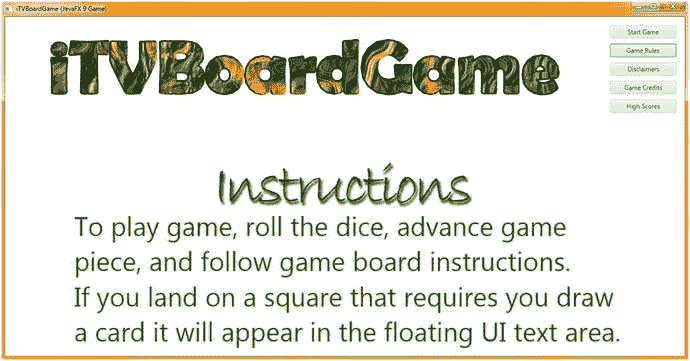

图 10-2.

使用“开始游戏”和“游戏规则”按钮测试你的 UI 按钮事件处理，来回切换

这段代码配置合成栈（Stage ➤ Root ➤ StackPane ➤ ImageView ➤ TextFlow）中的不同对象，通过使用 `Background.EMPTY` 在 StackPane 对象中安装透明度，来显示操作系统的默认白色背景，即 Scene（和 Stage）对象。`boardGameBackPlate` ImageView 包含一个带有透明说明文字字体阴影的 PNG32 图像，它允许白色背景色透出。TextFlow 和两个 Text 对象也支持透明度并添加游戏说明，因此信息屏幕是一个美观、可读的白色，文字预设为 `Color.GREEN`。如果你点击“开始游戏”按钮（我们接下来将编写其代码，使其重置为默认设置），你可以在启动画面和新的帮助文本之间切换，尽管启动画面上会出现一些错误，因为 `gameButton` 事件处理器需要重置特性，我们接下来将恢复白色文本、文本位置、启动画面图像和欢迎图像，因为这个按钮会改变对象特性。

接下来，让我们将这些 Java 语句复制并粘贴到 `gameButton` 事件处理结构中，然后使用正确的 Text、Background 和 Image 对象以及像素位置值来配置你的方法调用参数区域。清除你的 TextFlow 对象，然后使用 `.addAll()` 方法将 `playText` 和 `moreText` Text 对象加载到 TextFlow 对象中。接着，使用 `.setTranslateX()` 方法调用的 `240` 整数值和 `.setTranslateY()` 方法调用的 `420` 整数值来设置 TextFlow 容器的 X、Y 像素位置（其在屏幕上的位置）。使用 `.setBackground()` 方法调用将 `uiBackground` Background 对象加载到 `uiLayout` StackPane 对象的背景中，然后使用 `.setImage()` 方法调用将 `splashScreen` Image 对象加载到 `boardGameBackPlate` ImageView 中。所有这些都通过 `.handle()` 方法内部的以下 Java 代码结构完成，如图 10-3 中间高亮所示：

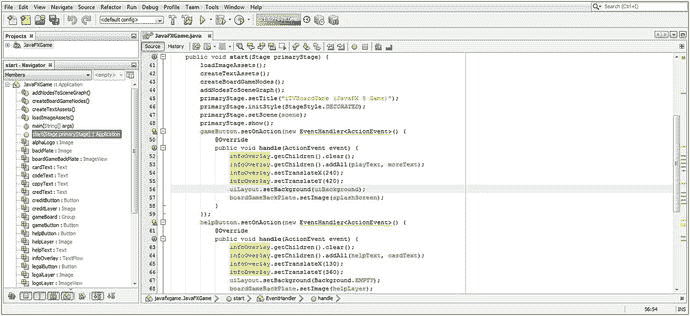

图 10-3.

在 handle() 方法中实现代码，以配置 gameButton 默认 UI 合成图层对象

```
gameButton.setOnAction(new EventHandler() {
@Override
public void handle(ActionEvent event) {
infoOverlay.getChildren().clear();
infoOverlay.getChildren().addAll(playText, moreText);
infoOverlay.setTranslateX(240);
infoOverlay.setTranslateY(420);
uiLayout.setBackground(uiBackground);
boardGameBackPlate.setImage(splashScreen);
}
} );
```

注意在图 10-3 中，我使用代码编辑窗格左边距中的加号 (+) 图标，在 NetBeans 9 IDE 中同时打开了 `gameButton` 和 `helpButton` 事件处理结构，以便你可以从 Java 代码的角度看到，这些位于 `.handle()` 方法内部的 Java 9 代码块如何仅通过少量不同的变量和对象设置，来设置所有合成管线对象特性，从而控制每个不同 Button 对象的屏幕设计。这展示了当你优化设置 JavaFX Scene Graph 时，Java 可以变得多么强大。

使用你的“运行 ➤ 项目”工作流程，再次在“开始游戏”和“游戏规则”按钮 UI 控件之间切换。你会看到“游戏规则”按钮不再破坏你的“开始游戏”屏幕，如图 10-4 所示。

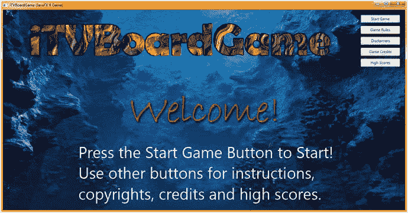

图 10-4.

使用“开始游戏”和“游戏规则”按钮测试你的 UI 按钮事件处理，来回切换

接下来，让我们将 `helpButton` 的 Java 语句复制并粘贴到 `legalButton` 事件处理结构中，然后使用正确的 Text、Background 和 Image 对象以及像素位置值来配置这些方法调用参数区域。再次清除你的 TextFlow 对象，然后使用 `.addAll()` 方法将 `copyText` 和 `riteText` Text 对象加载到 TextFlow 对象中。接着，使用 `.setTranslateX()` 方法调用的 `200` 整数值和 `.setTranslateY()` 方法调用的 `370` 整数值来设置 TextFlow 容器的 X、Y 像素位置。使用 `.setBackground()` 方法调用将 `Background.EMPTY` 常量加载到 `uiLayout` 对象的背景中，然后使用 `.setImage()` 方法调用将 `legalLayer` Image 对象加载到 `boardGameBackPlate` ImageView 中。所有这些都通过 `.handle()` 方法内部的以下 Java 代码结构完成，如图 10-5 中间高亮所示：

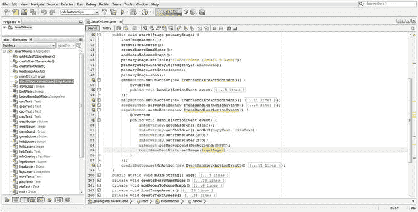

图 10-5.

在 handle() 方法中实现代码，以重新配置你的 legalButton UI 合成图层对象


```
legalButton.setOnAction(new EventHandler() {
@Override
public void handle(ActionEvent event) {
infoOverlay.getChildren().clear();
infoOverlay.getChildren().addAll(copyText, riteText);
infoOverlay.setTranslateX(200);
infoOverlay.setTranslateY(370);
uiLayout.setBackground(Background.EMPTY);
boardGameBackPlate.setImage(legalLayer);
}
} );
```

接下来，使用 **运行 ➤ 项目** 工作流程，确保你的“免责声明”按钮在白色背景上以可读、有序的格式配置你的文本对象。如图 10-6 所示，你的 UI 屏幕看起来不错，你可以继续通过再次使用复制粘贴来创建“游戏鸣谢”按钮对象的事件处理结构。


图 10-6.

使用“开始游戏”、“游戏规则”和“免责声明”按钮来回切换，测试 UI 按钮事件处理

接下来，让我们将 helpButton 的 Java 语句复制粘贴到 legalButton 的事件处理结构中，然后使用正确的 Text、Background 和 Image 对象以及像素位置值来配置这些方法调用的参数区域。再次，清除你的 TextFlow 对象，然后使用 `.addAll()` 方法将你的 copyText 和 riteText 文本对象加载到 TextFlow 对象中。接着，使用整数值 `240` 调用 `.setTranslateX()` 方法，使用整数值 `370` 调用 `.setTranslateY()` 方法，设置 TextFlow 容器的 X、Y 像素位置（其在屏幕上的位置）。使用 `.setBackground()` 方法调用，将 `Background.EMPTY` 常量加载到你的 uiLayout 对象背景中，然后使用 `.setImage()` 方法调用，将你的 legalLayer 图像对象加载到 boardGameBackPlate 的 ImageView 中。所有这些都通过 `.handle()` 方法内部的以下 Java 代码结构完成，如图 10-7 中间高亮部分所示：

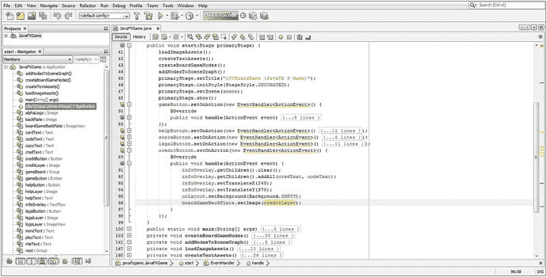

图 10-7.

在 handle() 方法中实现代码，以重新配置 creditButton 的 UI 合成层对象

```
creditButton.setOnAction(new EventHandler() {
@Override
public void handle(ActionEvent event) {
infoOverlay.getChildren().clear();
infoOverlay.getChildren().addAll(credText, codeText);
infoOverlay.setTranslateX(240);
infoOverlay.setTranslateY(370);
uiContainer.setBackground(Background.EMPTY);
boardGameBackPlate.setImage(creditLayer);
}
} );
```

接下来，使用 **运行 ➤ 项目** 工作流程，确保你的“鸣谢”TextFlow 对象在屏幕上以可读格式定位其所有文本对象。如图 10-8 所示，你的 UI 屏幕看起来很棒。我们暂时不实现“最高分”按钮，因为我们稍后会创建一个计分引擎和最高分表。

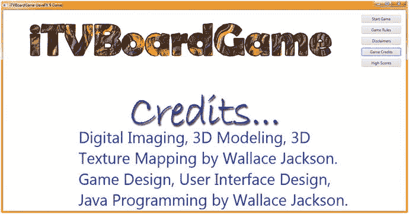

图 10-8.

在 handle() 方法中实现代码，以重新配置 creditButton 的 UI 合成层对象

## 特殊效果：javafx.scene.effects 包

`javafx.scene.effect` 包包含一个用于所有 JavaFX 特殊效果的基础超类。毫不奇怪，它被称为 `Effect` 类。`Effect` 类有 17 个已知的直接子类，用于 2D 数字图像合成效果，就像你在 GIMP 2.10 中能找到的那样，这些子类也包含在此包中。这些子类包括 `Blend`、`Bloom`、`BoxBlur`、`ColorAdjust`、`ColorInput`、`DisplacementMap`、`DropShadow`、`FloatMap`、`GaussianBlur`、`Glow`、`ImageInput`、`InnerShadow`、`Lighting`、`MotionBlur`、`PerspectiveTransform`、`Reflection`、`SepiaTone` 和 `Shadow` 类。对于 2D，此包还包含 `Light` 超类以及 `Light.Distant`、`Light.Point` 和 `Light.Spot` 子类，我们将在本书的 3D 部分中使用它们。

让我们先介绍 JavaFX 的 `Effect` 超类。这个类是一个公共抽象类，继承自 `java.lang.Object` 主类。这意味着它是由 JavaFX 开发团队从头开始创建的，专门用于在 JavaFX 中提供基于图像（基于像素）的特殊效果，并为 2D 和 3D 提供光照支持。所提供的效果与 GIMP 3 或 Photoshop 在其各自的数字图像处理软件包中提供的效果非常相似。

因此，JavaFX 的 `Effect` Java 类层次结构如下所示：

```
java.lang.Object
> javafx.scene.effect.Effect
```

`Effect` 类为在 JavaFX 中创建所有特殊效果实现提供了一个抽象或“基础”类。JavaFX 中的 `Effect` 对象（及其子类）始终包含一个生成 `Image` 对象的像素图形算法。这将是对源 `Image` 对象中像素的算法修改，并且适用于 2D 和 3D。

`Effect` 对象也可以通过设置一个名为 `Node.effect` 的属性（即 `Node` 类或从 `Node` 子类创建的对象的 effect 属性）与场景图节点（而非 `Image` 对象）关联。

一些效果，例如 `ColorAdjust`，会改变源像素的颜色特性（色相、亮度和饱和度），而其他效果，例如 `Blend`，则会通过算法（通过 Porter-Duff）将多个图像组合在一起。

`DisplacementMap` 和 `PerspectiveTransform` 特殊效果类会在 2D 空间中扭曲或移动源图像的像素，以模拟 3D 空间，通常称为“2.5D”或“等距”空间光学效果。

所有 JavaFX 特殊效果都至少定义了一个输入。此外，此输入可以设置为另一个 `Effect` 对象，允许开发者将 `Effect` 对象链接在一起。这允许开发者组合效果结果，从而创建复合或混合特殊效果。此输入也可以保持“未指定”状态，在这种情况下，效果会将其算法应用于它所附加到的 `Node` 对象的图形渲染（像素表示或渲染结果），该附加通过 `.setEffect()` 方法调用完成，或者应用于所提供的 `Image` 对象。

需要注意的是，特殊效果处理是一个条件特性。`ConditionalFeature.EFFECT` 枚举类和常量将定义一组条件（受支持的）特殊效果特性。这些特性可能并非在所有操作系统或所有嵌入式平台上都可用，尽管“现代”消费电子设备通常可以使用其硬件 GPU 图形处理能力来支持效果处理以及 i3D 渲染。

如果你的专业 Java 游戏应用程序想要轮询硬件平台以确定任何特定效果特性是否可用，你可以使用 [Platform.isSupported](https://docs.oracle.com/javase/8/javafx/api/javafx/application/Platform.html#isSupported-javafx.application.ConditionalFeature-) () 方法调用来查询效果支持。如果你在不支持某个条件特性的平台上使用它，它不会引发异常。通常，该条件特性会被简单地忽略，这样你就不必编写任何特定的错误捕获或错误处理 Java 代码。

接下来，让我们看看如何在 UI 设计中实现一两个这样的特殊效果，并为 TextFlow 对象添加投影，以便通过增加对比度使其显示的文本更易读。之后，我们将研究如何在可见光谱范围内移动数字图像的颜色。


### 创建特效：添加 createSpecialEffects() 方法

让我们遵循组织 Java 代码的思路，创建一个名为 `.createSpecialEffects()` 的方法，用于设置所有特效。让 NetBeans 9 为你生成一个空的 `private void createSpecialEffects() {...}` 框架：在 `start()` 方法中，`createTextAssets()` 方法调用之后，添加一行代码来调用它，如图 10-9 高亮所示。这里的逻辑是，我们将先加载图像，然后定义特效，最后创建文本。

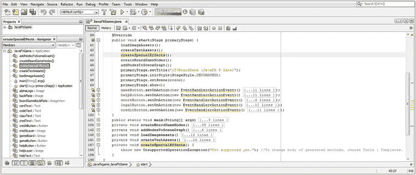

图 10-9.

在 `.start()` 方法顶部添加一个 `createSpecialEffects()` 方法调用，以便 NetBeans 生成方法体

接下来，我们将用特效代码替换 `createSpecialEffects()` 方法内部的引导代码。

### 投影：为 TextFlow 对象添加投影

现在是时候向空的 `createSpecialEffects()` 方法中添加 Java 代码来设置投影效果了。稍后你将通过 `.setEffect()` 方法调用将其应用于你的 `TextFlow` 对象。你需要做的第一件事是在类顶部声明一个名为 `dropShadow` 的 `DropShadow` 对象，并使用 Alt+Enter 工作流程让 NetBeans 为你生成一条 import 语句。接下来，在 `createSpecialEffects()` 方法内部，使用 Java 关键字 `new` 和 `DropShadow()` 构造方法来实例化该对象。然后，使用 `dropShadow` 对象的 `.setRadius()` 方法调用将阴影半径（阴影从源对象扩散的程度）设置为 4.0 像素。接着，使用 `.setOffsetX()` 和 `.setOffsetY()` 方法调用，将偏移量设置为 3.0 像素，使阴影沿对角线向右偏移（使用负值则向相反方向偏移）。最后，使用 `.setColor()` 方法调用指定一个 `DARKGRAY` 颜色类常量。代码如图 10-10 高亮所示，应如下所示：

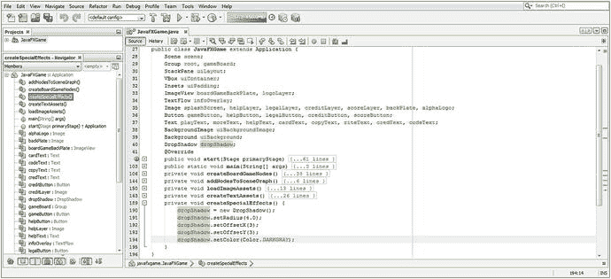

图 10-10.

编写 `private void createSpecialEffects()` 方法体，以创建并配置一个 `DropShadow` 对象

```
DropShadow dropShadow;
...
private void createSpecialEffects() {
dropShadow = new DropShadow();
dropShadow.setRadius(4.0);
dropShadow.setOffsetX(3.0);
dropShadow.setOffsetY(3.0);
dropShadow.setColor(Color.DARKGRAY);
}
```

接下来，打开你的 `createTextAssets()` 方法体，并在每个 `Text` 对象后添加一个 `.setEffect(dropShadow)` 方法调用，将它们连接到 `DropShadow` 效果以及你为该对象设置的设置项，如图 10-11 所示。

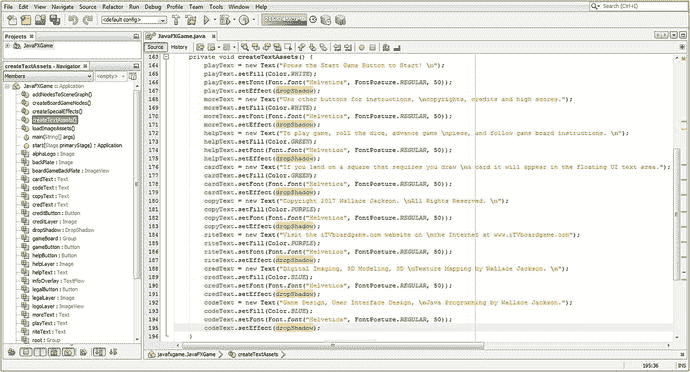

图 10-11.

在 `createTextAssets()` 方法中，为每个 `Text` 对象添加一个 `.setEffect(dropShadow)` 方法调用

在专业 Java 9 游戏开发中，另一个常用且有用的特效是调整像素颜色值。`javafx.scene.effect` 包中有一个强大的 `ColorAdjust` 特效类，它允许开发者调整图像的数码影像属性，包括使用 `.setContrast()` 调整对比度、使用 `.setBrightness()` 调整亮度、使用 `.setSaturation()` 调整饱和度，以及使用 `.setHue()` 调整色调（颜色）。接下来我们来了解这个。

### 颜色调整：调整色调、饱和度、对比度和亮度

让我们使用 `ColorAdjust` 对象的 `.setHue()` 方法调用来“色移”我们的 PNG32 透明徽标数字图像资源的色温，使其在视觉上与本章中我们正在优化的每个按钮控件用户界面设计的所有其他屏幕设计元素颜色值相匹配。在类顶部声明一个名为 `colorAdjust` 的 `ColorAdjust` 对象。在你的 `createSpecialEffects()` 方法内部，使用 `ColorAdjust()` 构造方法实例化该对象，然后使用该对象调用 `.setHue()` 方法，传入浮点值 0.4，将当前图像颜色值沿色轮向前移动 40%。Java 代码如图 10-12 的中部和底部高亮所示，应如下所示：

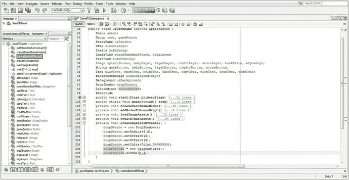

图 10-12.

添加一个 `colorAdjust` 对象实例化，并使用该对象的 `.setHue(0.4)` 方法调用来配置它

```
DropShadow dropShadow;
ColorAdjust colorAdjust;
...
private void createSpecialEffects()  {
dropShadow = new DropShadow();
dropShadow.setRadius(4.0);
dropShadow.setOffsetX(3.0);
dropShadow.setOffsetY(3.0);
dropShadow.setColor(Color.DARKGRAY);
colorAdjust = new ColorAdjust();
colorAdjust.setHue(0.4);        }
```

实现这个 `ColorAdjust` 效果对象的下一步是在 `helpButton.setOnAction()` 事件处理器内部，为你的 `logoLayer` ImageView 对象添加 `.setEffect(colorAdjust)` 方法调用。这会将透明徽标 PNG32 图像中的棕色像素转换为绿色，同时保持透明像素不变，因为它们颜色值为零（且透明度值最大）。如果这些像素是使用部分颜色值和部分透明度值定义的，那么部分颜色值将向前移动 40%。

我在 `boardGameBackPlate.setImage(helpLayer);` 方法调用之后立即添加了这个 `.setEffect()` 方法调用，因为我们现在需要对徽标图像合成层进行色移，如图 10-13 高亮所示。`logoLayer` 对象的 `Effect` 对象被设置为 `colorAdjust` 对象，而该对象又被设置为色调值 0.4（40%）。

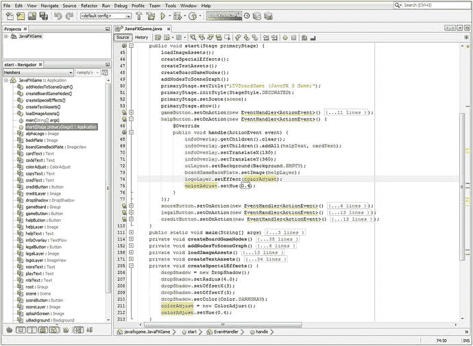

图 10-13.

使用“运行 ➤ 项目”工作流程，确保投影特效运行良好

你可能想知道，为什么我在 `createSpecialEffects()` 方法中已经设置了色调为 40%，这里又要再次设置。原因是 `createSpecialEffects()` 方法中的设置可以被视为“默认”设置，而我必须在 `helpButton` 事件处理器代码中（再次）指定它的原因是，其他按钮处理器会设置不同的色调值。你的 `helpButton.setOnAction()` 事件处理代码现在应如下所示：

```
helpButton.setOnAction(new EventHandler() {
@Override
public void handle(ActionEvent event) {
infoOverlay.getChildren().clear();
infoOverlay.getChildren().addAll(helpText, cardText);
infoOverlay.setTranslateX(130);
infoOverlay.setTranslateY(360);
uiLayout.setBackground(Background.EMPTY);
boardGameBackPlate.setImage(helpLayer);
logoLayer.setEffect(colorAdjust);
colorAdjust.setHue(0.4);
}
});
```

现在是时候使用“运行 ➤ 项目”工作流程，确保 `TextFlow` 对象上的投影效果使你的 `Text` 对象更易读，并与屏幕标题图像上的投影相匹配。从图 10-14 中可以看出，Java 代码中似乎有些问题，因为 JavaFX 应用程序虽然运行了，但文本并没有投影效果。让我们检查一下 Java 代码执行语句的顺序，看看是否有顺序不对的地方！


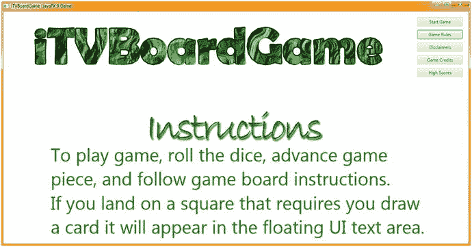

图 10-14.

声明并实例化一个名为 `colorAdjust` 的 `ColorAdjust` 对象，并使用 `.setHue()` 将颜色偏移 40%

由于 Java 代码在方法内部是按正确顺序排列的，我怀疑问题很可能出在方法被调用的顺序上。让我们看一下 `start()` 方法内部的方法调用顺序，如图 10-9 顶部所示。请注意，`createSpecialEffects()` 是在 `createTextAssets()` 之后调用的，然而我们在 `createTextAssets()` 方法内部使用了 `.setEffect(dropShadow)` 方法调用，因此我们必须将 `createSpecialEffects()` 方法调用移到 `createTextAssets()` 方法调用之上，如图 10-13 所示，这样你的效果就能在使用之前被设置好。如果你顺着操作流程追踪逻辑，Java 代码是非常符合逻辑的！

如图 10-16 所示，这解决了问题，你的投影效果现在可以正确渲染了。

你需要进行的下一个修改是针对 `legalButton.setOnAction()` 事件处理结构，使屏幕上的所有内容呈现漂亮的紫色调。这可以通过将你的徽标色调在色轮上向负方向偏移 40% 来实现。使用浮点数时，色轮右侧正 180 度的范围是 0.0 到 1.0，左侧负方向的范围是 0.0 到 -1.0。

你的 `legalButton` 事件处理的 Java 代码语句如图 10-15 底部高亮所示。它应该看起来像下面的 Java 代码：

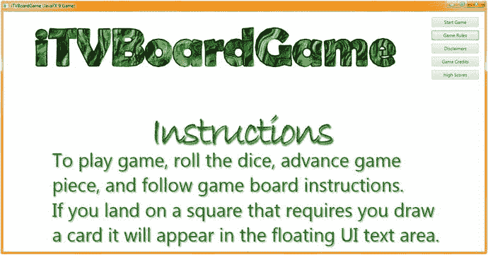

图 10-16.

使用“运行 ➤ 项目”工作流程，确保投影效果正确渲染

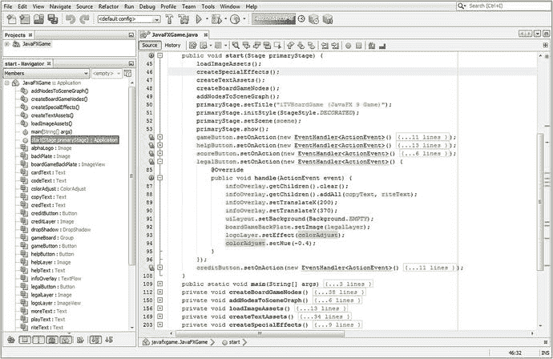

图 10-15.

在 `logoLayer` 上添加 `.setEffect (colorAdjust)` 方法调用，并调用 `.setHue(-0.4)` 来改变颜色偏移

```
legalButton.setOnAction(new EventHandler() {
@Override
public void handle(ActionEvent event) {
infoOverlay.getChildren().clear();
infoOverlay.getChildren().addAll(copyText, riteText);
infoOverlay.setTranslateY(200);
infoOverlay.setTranslateY(370);
uiLayout.setBackground(Background.EMPTY);
boardGameBackPlate.setImage(legalLayer);
logoLayer.setEffect(colorAdjust);
colorAdjust.setHue(-0.4);
}
} );
```

图 10-17 展示了我使用“运行 ➤ 项目”按钮处理器的测试工作流程，显示了在“免责声明”按钮控件中同时应用了投影效果和色调（颜色）偏移，进一步优化了设计。我在所有不同的按钮元素之间来回点击，以确保所有属性不会以不期望的方式重置任何其他按钮屏幕设计属性，这就是为什么我将所有正确的变量放入所有事件处理代码体中，以确保没有方法调用的设置被忽略（未指定/传递）。


图 10-17.

使用“运行 ➤ 项目”工作流程，确保色调偏移与设计的其余部分匹配

你需要进行的最后一个修改是针对 `creditButton.setOnAction()` 事件处理结构，使屏幕上的所有内容呈现漂亮的蓝色调。这可以通过将你的徽标色调在色轮上向负方向偏移 90% 来实现。你的 `creditButton` 事件处理的 Java 代码语句如图 10-18 中间高亮所示，应该看起来像下面这样：

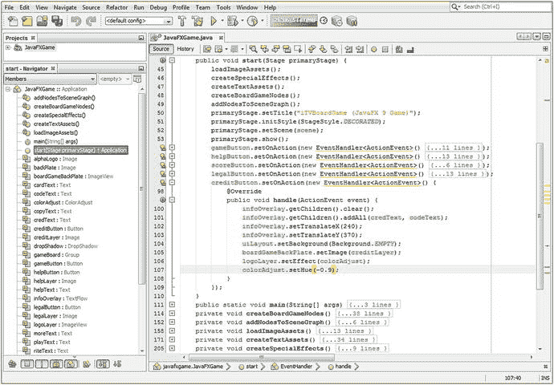

图 10-18.

在 `creditButton` 中复制并粘贴 `colorAdjust.setHue(-0.9)` 和 `logoLayer.setEffect(colorAdjust)` Java 代码

```
creditButton.setOnAction(new EventHandler() {
@Override
public void handle(ActionEvent event)    {
infoOverlay.getChildren().clear();
infoOverlay.getChildren().addAll(credText, codeText);
infoOverlay.setTranslateY(240);
infoOverlay.setTranslateY(370);
uiLayout.setBackground(Background.EMPTY);
boardGameBackPlate.setImage(creditLayer);
logoLayer.setEffect(colorAdjust);
colorAdjust.setHue(-0.9);
}
});
```

使用你的“运行 ➤ 项目”工作流程，确保色轮上这 90% 的负向偏移现在将徽标变为鲜艳的蓝色，与你用户界面设计的其余部分相得益彰。如图 10-19 所示，“致谢”按钮控件屏幕现在在颜色和投影效果上都匹配了。

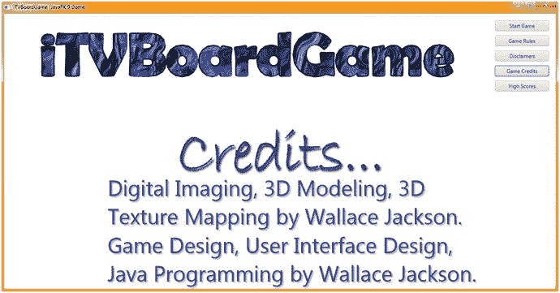

图 10-19.

使用“运行 ➤ 项目”工作流程，确保色调偏移与设计的其余部分匹配

我们将在本书后面介绍实现计分引擎和高分 UI 设计时，再编写 `scoreButton.setOnAction()` 事件处理器的内部代码，届时你将拥有一个可以计分的棋盘游戏。

在你的专业 Java 9 游戏开发中实现数十种其他特效的工作流程，在很大程度上可以以相同的方式进行——为你想要使用的效果声明一个类，在 `createSpecialEffects()` 方法内部实例化它，使用该类的设置方法配置效果的参数，最后通过在你想要应用效果的对象名称上调用 `.setEffect(effectClassNameHere)` 方法，将其应用到任何 `Node` 对象、`Control` 对象、`ImageView` 对象、3D 对象或 `Text` 对象上。

你会发现 JavaFX 特效包和类在这种实现方式中特别灵活，因为你可以将大多数软件包中常见的所有流行特效应用到 JavaFX 9 中的几乎任何对象或场景图层次结构中，通常只需要十几行代码，有时甚至更少。

一旦你知道如何在 JavaFX 中创建和应用这些特效，你的专业 Java 9 游戏开发创造力将提升一个数量级。这是因为这些特效可以应用于场景图层次结构中的任何位置，以及 2D、成像和 3D 渲染管线中的任何位置。

在本书后续章节中，随着我为每一章增加越来越多的复杂性，以及我们整本书的推进，我将尝试使用更多这些 JavaFX 9 效果子类。


## 总结

在第十章中，我们使用 **ActionEvent** 处理结构为你的用户界面设计添加了交互性，学习了 **InputEvent** 对象以及 **MouseEvent** 和 **KeyEvent** 对象的处理，并了解了如何应用 `javafx.scene.effects` 包中包含的、利用 **JavaFX Effect** 超类的特效。

接下来，你学习了在 Java 9 和 JavaFX 中，如何使用 `java.util` 和 `javafx.event` 包及其 **EventObject**、**Event**、**ActionEvent** 和 **InputEvent** 类来处理实现交互性的事件。我们讨论了不同类型的 **InputEvent** 对象，例如 **MouseEvents**、**TouchEvents** 和 **KeyEvents**，然后你实现了 **ActionEvent** 处理，使你的用户界面中的（中间三个）说明、法律免责声明和制作人员部分（**Button** 对象）具有交互性。

最后，你了解了 `javafx.scene.effects` 包以及 JavaFX 为开发者提供的数十种特效。我们研究了 **Effect** 超类，并详细介绍了如何实现 **DropShadow** 类（及其对象）和 **ColorAdjust** 类（及其对象），以便你可以通过向 **TextFlow** 对象添加阴影来美化用户界面，提高可读性（对比度），并调整顶部徽标数字图像资源的颜色，使其与你每个 **Button Control** 对象用户界面设计的配色方案相匹配。

在第十一章中，我们将探讨如何配置你的 JavaFX 游戏以使用 3D 资源。这涉及到 **Camera** 超类及其 **ParallelCamera** 和 **PerspectiveCamera** 子类。我们还将学习如何在你的 3D 场景中创建光线，以便 **Camera** 对象能够“看见”。我们将研究 **LightBase** 超类及其 **AmbientLight** 和 **PointLight** 子类，这些子类是专门为 3D 场景应用中的光照设计提供的。

