# 11. 3D 场景配置：使用 PerspectiveCamera 和 PointLight

既然你已经完成了启动画面和用户界面设计的 2D SceneGraph 层次结构，让我们回到第十一章中的 `JavaFXGame` 主应用程序类编码，开始设计将成为棋盘游戏及其玩法渲染和光照基础的 3D GameBoard 场景基础设施。我们将学习在 Blender 或 Autodesk 3D Studio Max 等 3D 软件包中预装（用于所有默认或空场景）的基本 3D 场景组件。之后，我们将在第十二章中深入探讨 JavaFX 图元（Box、Plane、Cylinder、Disk、Sphere 和 Pill），并在第十三章中学习使用材质和纹理贴图进行着色。

在本章中，你将了解核心 `javafx.scene` 包中包含的不同类型的 JavaFX 9 `Camera` 和 **LightBase** 子类，而该包（自 Java 9 起）又包含在 `javafx.graphics` 模块中。我们将介绍 **PerspectiveCamera**，因为你将在本章创建的基本 3D 场景基础设施中使用它；同时也会介绍 **ParallelCamera**，这是另一个更适合你 2D 或 2.5D 游戏开发流程的 **Camera** 子类。**Camera** 是一个抽象超类，不能直接使用。我们还将学习公共的 **LightBase** 抽象超类及其两个核心光照子类：**AmbientLight** 和 **PointLight**。

我们还将继续编写你的 `JavaFXGame` Java 代码，通过向 JavaFX SceneGraph 添加 3D 渲染、相机和光照，以便你可以开始向你的 3D 游戏添加 3D 元素。我们将在介绍 JavaFX **Shape3D** 类及其图元子类（第十二章）以及使用着色器并将材质和纹理贴图应用于该 3D 几何体（第十三章）之后进行此操作。

关于 JavaFX 甚至能够在你的 3D 场景中可视化（渲染）游戏 3D 几何资源及其纹理贴图所需的知识，我们有很多要学习。那么，让我们开始了解场景相机对象吧。

## 使用 3D 相机：为 3D 游戏添加透视效果

任何 3D 渲染管线的顶层都是场景相机，因为它处理 3D 场景中的所有内容，然后将这些数据交给渲染引擎。在这种情况下，可能是 PRISM 软件渲染器（在没有 GPU 的情况下），也可能是你 3D 游戏所运行的消费电子设备（PC、手机、平板电脑、iTV 设备、笔记本电脑、游戏机、机顶盒）上的 OpenGL 硬件渲染引擎。如果你仍在使用 Windows，它还可能包括 DirectX 3D 渲染。**Camera** 对象（在我们的例子中，将是一个 **PerspectiveCamera** 对象）专门用于 3D 场景渲染；我们将在本章的这一部分对其进行研究。它对于 JavaFX 9 SceneGraph 来说如此不可或缺，以至于它拥有自己的 `Scene.setCamera(Camera)` 方法调用。此方法调用用于将 **Camera** 对象添加到 SceneGraph 根节点，以确保它位于 SceneGraph 渲染层次结构的最顶层（根节点）。它不使用 `.getChildren().add()` 方法链，因此，它将在你的 `createSceneGraphNodes()` 方法内部设置，正如你稍后在本章的这一部分设置你的专业 Java 9 游戏的 **Camera** 对象时所看到的那样。我们还将介绍 **ParallelCamera**，它更适合 2D 游戏。


### JavaFX 相机类：定义相机的抽象超类

公共的 JavaFX 相机超类是一个抽象类，仅用于创建不同类型的相机。目前有正交或平行相机子类（对象）或透视相机子类（对象）。你的应用程序不应尝试直接扩展此抽象相机类；如果你尝试这样做，Java 将抛出 `UnsupportedOperationException`，并且你的专业 Java 9 游戏将无法编译或运行。相机类位于核心 `javafx.scene` 包的 `javafx.graphics` 模块中，并且是 `Node` 的子类，因为它本质上是你场景图顶部的节点。相机类实现了 `Styleable` 接口，因此可以设置样式，并且它包含 `EventTarget` 接口，因此可以处理事件。因此，Java 9 中 JavaFX 相机类的类层次结构如下所示：

```
java.lang.Object
> javafx.scene.Node
> javafx.scene.Camera
```

相机类是用于渲染场景的任何相机子类的基类。相机用于定义场景的坐标空间如何渲染到用户正在查看的 2D 窗口（舞台）上。默认相机（如果你没有专门创建一个，我们将在本节后面进行此操作）将定位在场景中，使其在场景坐标空间中的投影平面位于 Z=0（正中间），并沿正 Z 方向看向屏幕内部。因此，在代码中，我们将把相机从屏幕中心向后移动 1000 个单位（到 -1000），因为 i3D 游戏板将位于“舞台中央”，即位于 0, 0, 0（X, Y, Z）。

从相机到投影平面的 Z 单位距离可以通过其所附加的场景（也是最终的投影平面）的宽度和高度以及相机对象的 `fieldOfView` 参数来确定。相机对象的 `nearClip` 和 `farClip` 属性是这个抽象类中定义的仅有的两个属性或特征，并且在 JavaFX 所谓的眼坐标空间中指定。该空间定义为观察者的眼睛位于相机对象的原点，投影平面在正 Z 方向上位于眼睛前方一个单位。任何相机子类（例如 `PerspectiveCamera`）的 `nearClip` 和 `farClip` 属性都可以使用 `.setNearClip()` 和 `.setFarClip()` 方法调用来设置。我们将在本章本节稍后部分使用这两个 `PerspectiveCamera` 类（对象）方法调用来配置我们的场景图相机对象。

### JavaFX PerspectiveCamera 类：你的 3D 透视相机

JavaFX `PerspectiveCamera` 类扩展了 `Camera` 类，用于创建用于渲染 i3D 场景的 `PerspectiveCamera`（对象）。`PerspectiveCamera` 类也位于核心 `javafx.scene` 包的 `javafx.graphics` 模块中；它是 `Node` 的子类，并且是你 JavaFX 场景图顶部的节点。`PerspectiveCamera` 类也实现了 `Styleable` 接口，因此可以设置样式，以及 `EventTarget` 接口，因此可以处理事件。Java 9 中 JavaFX `PerspectiveCamera` 类的类层次结构如下所示：

```
java.lang.Object
> javafx.scene.Node
> javafx.scene.Camera
> javafx.scene.PerspectiveCamera
```

`PerspectiveCamera` 对象定义了透视投影的视景体。想象一个截断的、朝右的金字塔，就像大多数相机在 Blender 或 3D Studio Max 等 3D 软件中的视觉表示一样。

这个类有两个（重载的）构造方法。一个具有空的参数区域，如下所示：

```
camera = new PerspectiveCamera();
```

第二个使用布尔值 `fixedEyeAtCameraZero` 属性（或参数或特征），这是我们将在相机对象声明、实例化和配置 Java 代码中使用的那个，如下所示：

```
camera = new PerspectiveCamera(true);
```

当然，我们也会在类的顶部声明一个 `PerspectiveCamera camera`，并使用 Alt+Enter 让 NetBeans 9 为我们编写这个类的导入语句。`PerspectiveCamera` 有一个 `fieldOfView` 值，可用于更改相机投影的视场角（FOV），并以度为单位。我将保持 FOV 为其默认值，并假设这个默认 FOV 能提供最佳的视觉效果，这是由 JavaFX 开发团队确定的。

我在 i3D 游戏和模拟中的倾向是使用“推拉”，即沿着 Z（进出场景）变换轴移动相机，而不是使用 FOV 值变化，因为即使在现实生活中，更换相机镜头（例如从 24mm 变为 105mm）也往往会更剧烈地改变透视。根据我的经验，使用不同的 3D 虚拟相机时，这种透视变化在虚拟 3D 中比在使用真实相机时更加剧烈。

默认情况下，你的 `PerspectiveCamera` 在创建（实例化）时位于场景中心，并沿着（指向）正 Z 轴方向观察。如果你使用 `PerspectiveCamera(false)` 构造一个 `PerspectiveCamera`，那么由相机定义的坐标系将使其 0,0 原点位于面板的左上角，Y 轴向下，Z 轴远离观察者（指向屏幕内部）。如果一个 `PerspectiveCamera` 节点被添加到场景图中，相机的变换后的位置和方向将定义相机的位置以及相机观察的方向。在默认相机中，`fixedEyeAtCameraZero` 为 false，眼睛位置的 Z 值会在 Z 方向上进行调整，以便使用指定的 `fieldOfView` 生成的投影矩阵在 Z = 0（在投影平面上）处产生使用设备独立像素的单位。这与 `ParallelCamera` 的特性相匹配。当场景调整大小时，投影平面（Z = 0）上的场景对象将保持相同大小，但场景中可见的内容会增多或减少，这更适合 2D 相机和 2D 滚动条使用，而不是 3D 相机使用，因为调整 3D 相机大小会缩放你的场景。这就是为什么 `PerspectiveCamera` 通常使用 `PerspectiveCamera(true)` 进行实例化的原因，我们将在本章本节稍后部分进行此操作。


当 `fixedEyeAtCameraZero` 设置为 true 时，眼睛位置固定在相机局部坐标系的 (0, 0, 0) 处。投影矩阵将使用默认（或指定）的 `fieldOfView` 属性生成，并且投影体积将被映射到窗口（视口或 Stage 对象）上，使得它在投影平面上的设备无关像素上被“拉伸”（缩放）。当场景的 `size` 属性改变时，场景中的物体会按比例缩小或放大，但内容的可见范围（边界）将保持不变。

JavaFX 开发团队建议，如果你计划变换（移动或推拉）相机对象，请将 `fixedEyeAtCameraZero` 设置为 true。当 `fixedEyeAtCameraZero` 设置为 false 时变换相机，可能会导致最终用户难以直观理解的结果。

请注意，`PerspectiveCamera` 是一个条件性 3D 功能。你可以查询 `ConditionalFeature.SCENE3D` 布尔变量，以确定给定用户的设备是否支持此功能（在本例中，支持 i3D）。这可以通过以下 Java 代码结构实现，该结构设置一个布尔变量来反映系统对 3D 渲染的支持：

```
boolean supportFor3D = Platform.isSupported(ConditionalFeature.SCENE3D);
```

最后，此类有一个名为 `verticalFieldOfView` 的布尔属性，用于定义 `fieldOfView` 属性是否应用于投影的垂直维度。从逻辑上讲，这意味着如果此属性为 false，则增加或减少 FOV 将改变投影的宽度，但不会改变（垂直）高度；如果此属性为 true，则它将改变（缩放）相机投影的水平（宽度）和垂直（高度）两个维度，这表面上比仅改变相机投影平面的一个维度能更好地保持宽高比。

接下来，让我们看看 `ParallelCamera` 类。为了保持我们 Camera 子类覆盖的一致性，我们将介绍这个类，尽管这个相机更适用于 2D 游戏和可能的正交 3D 应用程序。

### JavaFX ParallelCamera 类：你的 2D 空间平行相机

JavaFX `ParallelCamera` 类也扩展了 `Camera` 类，用于创建一个 `ParallelCamera`（对象），该对象用于渲染你的 i2D 场景。这个 `ParallelCamera` 类也位于核心 `javafx.scene` 包的 `javafx.graphics` 模块中；它是 `Node` 的子类，并且是你 JavaFX SceneGraph 顶部的 `Node`。`ParallelCamera` 类还实现了 `Styleable` 接口，因此可以设置样式，以及 `EventTarget` 接口，因此可以处理事件。因此，JavaFX `ParallelCamera` 类的 Java 类层次结构如下所示：

```
java.lang.Object
> javafx.scene.Node
> javafx.scene.Camera
> javafx.scene.ParallelCamera
```

JavaFX 9 创建的默认相机始终是 `ParallelCamera`，这就是我们在本章中编写特定 `Camera` 和 `LightBase` 对象创建代码的原因。例如，如果你只是创建了一个 `Sphere` 对象，而没有创建任何 `Camera` 子类对象或 `LightBase` 子类对象，JavaFX 运行时将自动创建一个 `ParallelCamera` 对象和一个 `AmbientLight` 对象，以便 `Shape3D` 子类（`Sphere`）对渲染器可见。

如果场景仅包含 2D 变换，则不需要 `PerspectiveCamera`，因此会使用 `ParallelCamera`，它不会渲染 3D 对象的所有特性。`ParallelCamera` 更适合《Beginning Java 8 Games Development》（Apress, 2014）中涵盖的内容。此相机为平行投影定义了一个视景体，在 3D 行业中也称为正交投影。本质上，正交投影相当于一个矩形平面。

`ParallelCamera` 始终位于窗口中心，并沿正 z 轴方向观察。`ParallelCamera`（相对于 `PerspectiveCamera`）的不同之处在于，此相机定义的场景坐标系原点位于屏幕左上角，y 轴沿屏幕左侧向下延伸，x 轴沿屏幕顶部向右延伸，z 轴指向远离观察者的方向（进入屏幕表示的深处）。

`ParallelCamera` 对象中使用的单位以像素坐标表示，因此这完全类似于 2D 数字成像软件包以及我们用于 2D UI 设计的 2D `StackPane` 图像合成层对象，后者也从屏幕左上角 (0,0) 的 (X,Y) 坐标开始引用。这再次表明，对于你的 i2D 游戏，使用此 Camera 子类比用于 i3D 游戏更合理。

此类只有一个构造函数方法，它使用一个空的参数区域，如下所示：

```
Camera2D = new ParallelCamera();
```

接下来，让我们看看如何创建 `PerspectiveCamera` 对象，我们将把它用于我们的专业 Java 9 游戏。我们将了解如何初始配置它以供使用，以及如何将其添加到 JavaFX SceneGraph 的根节点。


### 向场景中添加透视摄像机：使用 .setCamera() 方法

首先，我们需要在 JavaFXGame 类的顶部添加一个 PerspectiveCamera 对象的声明，使用 `PerspectiveCamera camera;` 这条 Java 语句。随后，`PerspectiveCamera` 对象（类用法）下方会出现一条波浪形的红色下划线提示。使用 `Alt+Enter` 快捷键让 NetBeans 9 为你编写 import 语句，然后打开 `createSceneGraphNodes()` 方法，以便将该摄像机对象添加到 SceneGraph 的顶部（根节点）。在根 Group 实例化语句的下方，使用 `camera = new PerspectiveCamera(true);` 构造器语句来实例化这个摄像机对象。接着，在下一行调用 `.setTranslateZ()` 方法，并传入 `-1000` 值，将摄像机从 3D 场景的 0,0,0 中心点移出 1000 个单位。

通过调用摄像机对象的 `.setNearClip()` 方法，将 `nearClip` 摄像机对象属性设置为 0.1；再通过调用 `.setFarClip()` 方法，将 `farClip` 属性设置为 5000.0。最后，通过调用场景对象的 `.setCamera()` 方法，将摄像机对象接入场景对象（根节点），并在 `.setCamera(` `camera` `)` 方法调用中，将摄像机对象作为参数传入。使用 `.setFill()` 方法调用，将场景对象的 Background 值设置为 `Color.BLACK`，这样你的 3D 对象就能清晰凸显出来。使用的 Java 语句如下：

```
PerspectiveCamera camera;
...
createSceneGraphNodes() {
camera = new PerspectiveCamera(true);
camera.setTranslateZ(-1000);
camera.setNearClip(0.1);
camera.setFarClip(5000.0);
...
scene.setFill(Color.BLACK);
scene.setCamera(camera);
```

如图 11-1 所示，你的代码没有错误，摄像机现已设置完毕并挂载到你的 3D 场景中，我们已将其转换为 3D 场景。现在它是一个 3D 场景，因为在其渲染管线顶部（即根节点）使用了 PerspectiveCamera，因此其下的所有对象都将使用 3D 透视效果。

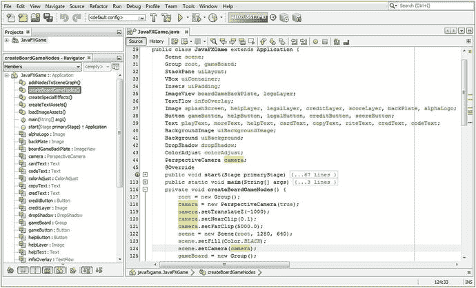

图 11-1.

在类顶部添加 PerspectiveCamera 对象声明，然后实例化并配置它

接下来，让我们使用“运行 ➤ 项目”工作流程，看看通过添加 PerspectiveCamera 创建的新 3D 场景如何影响你现有的 2D UI 设计；现在这是一个“混合型”2D 和 3D 应用程序，这是 JavaFX 应用程序中最先进的类型。之所以如此，是因为我们需要在一个无缝的合成环境中结合 2D 和 3D 资源，这是一项极其复杂的任务。目前最先进的两款电影与特效合成软件 Fusion 和 Nuke，就实现了这种 2D 与 3D 的融合。事实上，如果你想了解更多关于将 2D 和 3D 资源整合到同一管线中的知识，可以查阅《VFX 基础》（Apress，2016 年）。如图 11-2 所示，你的 SceneGraph 根节点下的 StackPane 分支及其所有子节点，都（正确地）随之移动，并且现在（在视觉上）引用了层级顶部的 PerspectiveCamera 及其屏幕的 0,0,0 中心点，这一点你在本章前面已经了解过。

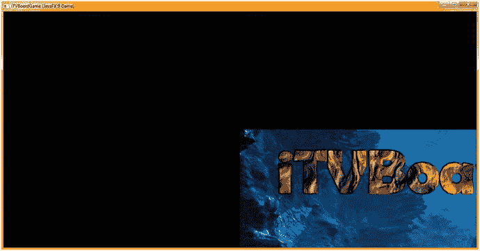

图 11-2.

运行项目，注意 StackPane 现在位于 PerspectiveCamera 的 0,0,0 中心原点

我首先尝试通过使用 `.setTranslateX(-640)` 和 `.setTranslateY(-320)` 将 StackPane 的原点放置在左上角，这在一定程度上奏效了，结果如图 11-2 所示；然而，它位于左上角，整个 StackPane 布局可见，并且被缩小了 200%（四倍，即四分之一屏幕）。

这告诉我，StackPane 是一个 2D 对象，严格来说是一个“平面”，它与摄像机投影平面“完美平行”，面向摄像机对象的 z 轴。相比之下，现在 StackPane 成为了 3D 渲染管线的一部分，因为它是 PerspectiveCamera 的子节点（位于渲染器处理管线之下）。

这意味着 StackPane 及其所有子节点（VBox、ImageView 和 TextFlow）都通过 PerspectiveCamera 对象进行处理。这包括其所有算法和坐标系（以及类似的“交战规则”），所有这些都会改变它们渲染到屏幕（Scene 对象）的方式和位置。

我接下来尝试的是，使用 `.setTranslateX(0)` 和 `.setTranslateY(0)` 方法调用，将 `uiLayout` 对象的 X 和 Y 坐标逻辑地设置回 0,0 原点。这可以通过在 `.start()` 方法中，在 `uiLayout` StackPane 对象实例化 Java 语句之后的某个位置，添加以下两条 Java 语句来实现。

这段 Java 代码如下所示，并在图 11-3 中部附近以蓝色高亮显示：

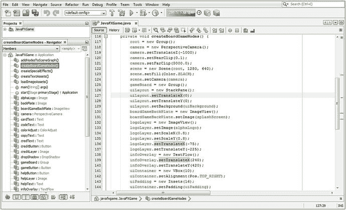

图 11-3.

在 uiLayout StackPane 对象上调用 .setTranslateX() 和 .setTranslateY() 方法，两者均设置为零

```
uiLayout = new StackPane();
uiLayout.setTranslateX(0);
uiLayout.setTranslateY(0);
```

注意在图 11-3 中，你在 `logoLayer` ImageView 以及 `infoOverlay` TextFlow 上都使用了 `.setTranslateX()` 和 `.setTranslateY()`，它们各自相对于 `uiLayout` StackPane 的位置保持不变。

这种相对位置的保持，是因为你在 SceneGraph 层级结构中建立的父子关系，这也是为什么对于任何类型的场景（无论是 i2D、i3D 还是混合型），它都是一个强大的场景构建工具。这一点在我们本书中开发专业 Java 9 游戏的 i3D 部分时也将非常重要，因为我们需要在游戏玩法的 3D 部分进行比简单地将 UI 控制面板居中于摄像机前方（以遮挡 3D 游戏视图）更复杂的整体变换（至少目前是这样；随着我们继续完善 Java 代码和游戏设计，我们以后可能会改变这个 UI 设计）。这正是游戏设计和编码在现实生活中的真实写照；游戏开发是一段旅程，而非终点。

使用“运行 ➤ 项目”工作流程，看看我们是否更接近将 2D UI 覆盖层与其背后的 3D 场景同步。如图 11-4 所示，UI 面板现在位于屏幕中央，尽管被缩小了。因此，我们将继续优化我们的对象属性。接下来，我们将使用摄像机对象的 Z 平移变量，将摄像机拉近 3D 场景，以达到我们期望的最终结果。

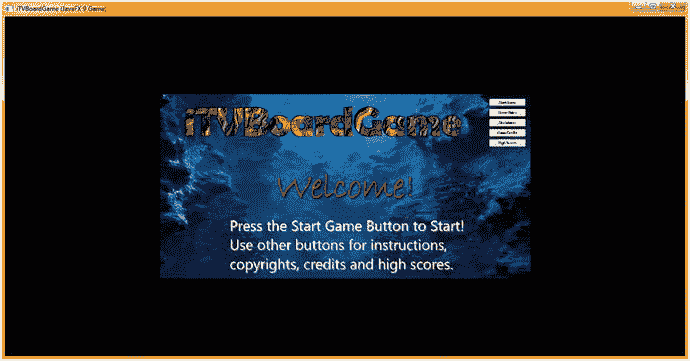

图 11-4.

运行项目；你的 StackPane 现在居中，但摄像机对象的 Z 平移距离太远

我推测这是因为摄像机的 Z 平移距离这个新 3D 场景的中心有 1000 个单位。因此，我接下来要尝试的是将 `camera.setTranslateZ()` 方法调用的参数从 -1000 减小到 -500，看看 2D 在 3D 合成中的结果会有什么变化。

实现此修改的 Java 代码应如下所示，并在图 11-5 顶部以蓝色高亮显示：

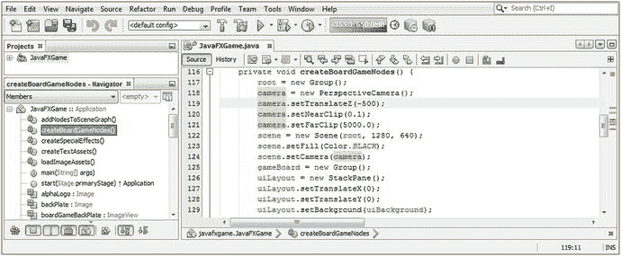

图 11-5.

通过将 .setTranslateZ() 设置为 -500，将摄像机对象向 3D 场景投影平面移动 50%

```
camera.setTranslateZ(-500);
```


再次使用“运行 ➤ 项目”工作流程。如图 11-6 所示，你的 UI 屏幕现在放大了 50%，因此我们需要将 `.setTranslateZ()` 的值减小到零，以使你的 `StackPane` 与 3D 场景投影平面同步。

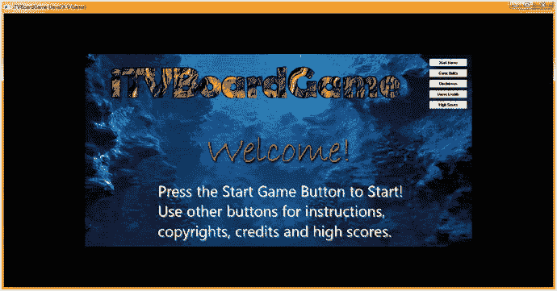

图 11-6.

运行项目，可以看到 `StackPane` 仍然居中，但摄像机的 Z 轴平移值仍然过远

实现此功能的 Java 代码如下所示，并在图 11-7 中以蓝色高亮显示：

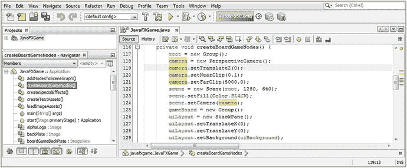

图 11-7.

将 `camera.setTranslateZ()` 方法调用设置为零，以同步 `StackPane` 和投影平面

```
camera.setTranslateZ(0);
```

接下来，使用“运行 ➤ 项目”工作流程，检查你是否已实现将 `StackPane` 节点分支及其子节点与 3D 摄像机对象的投影平面同步的视觉目标。如图 11-8 所示，你的 UI 屏幕看起来很棒，按钮也能正常工作。


图 11-8.

使用“运行 ➤ 项目”查看你的 `StackPane` 是否与摄像机投影平面完美同步（视觉上）

在我们开始学习 `LightBase`（超类）对象以及 `AmbientLight` 和 `PointLight` 子类之前，让我们确保之前所有的 2D UI 代码仍然正常工作，并达到预期效果。在向 Java 9 代码添加主要功能或进行重大更改时，花时间进行此项检查始终非常重要。

### StackPane UI 测试：确保其他一切仍然正常

点击图 11-8 中所示的“游戏规则”按钮，确保你的游戏说明 UI 屏幕仍然清晰可读且外观专业，尽管我们会在游戏发布前进一步优化此 UI。如图 11-9 所示，说明屏幕确实仍然可读；但是，`Color.WHITE` 背景色已被替换为 `Color.BLACK`，因为我们设置了新的 3D 场景对象使用此颜色作为其填充颜色值，如图 11-1 所示，使用了 `scene.` `setFill` `(Color.` `BLACK` `);` Java 语句。这意味着我们现在需要将 `StackPane` 的背景颜色值设置为 `Color.WHITE`，以便在场景合成（现在为渲染）管线的更上游位置用白色填充我们的 UI 屏幕。由于 `StackPane` 位于场景之上、`VBox`、`ImageView` 和 `TextFlow` 之下，因此它是设置 `Color.WHITE` 背景填充颜色的逻辑对象。这将涉及在位于 `.start()` 方法中的三个活动按钮事件处理结构中仅放置一条 Java 语句，而不是更改与设置文本对象颜色和 `DropShadow` 属性相关的数十条 Java 语句，更不用说使用 `.setLightness()` 方法调用来提亮标题图像文本元素了。这也将让我有机会向你展示如何绕过 `StackPane` 对象（类）没有 `.setFill()` 方法的限制，这意味着我们必须创建一个复杂的方法链，其中包含两个嵌套的“方法内部的对象实例化”Java 构造，我们在 `.setBackground(Background)` 方法调用中创建一个新的 `Background` 对象和一个新的 `BackgroundFill` 对象，并将 `BackgroundFill` 配置为白色。

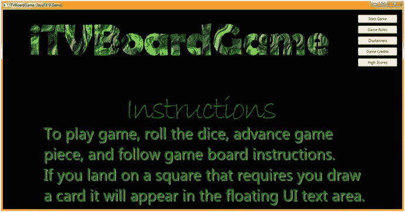

图 11-9.

点击“游戏规则”按钮控件，查看“说明”部分是否渲染正确。现在它是黑色的！

此方法调用的基本 Java 9 编程语句结构包含两个嵌套的对象实例化，如下所示（初始状态；我们接下来将进一步配置）Java 9 编程结构：

```
uiLayout.setBackground( new Background( new BackgroundFill(Color.WHITE) ) );
```

如图 11-10 所示，尽管 `BackgroundFill` 下方有红色波浪下划线，因为我们需要使用 `Alt+Enter` 组合键让 NetBeans 从 `javafx.scene.layout`（包）导入 `BackgroundFill` 类。图中也以蓝色高亮显示为“为 javafx.scene.layout.BackgroundFill 添加导入”，双击该选项即可让 NetBeans 9 为你编写此导入语句。

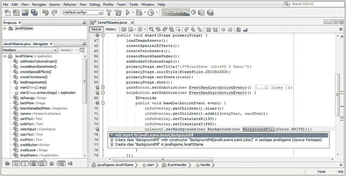

图 11-10.

编写你的 `private void createSpecialEffects()` 方法体，以创建和配置一个 `DropShadow` 对象

NetBeans 从最基本的问题（缺少导入语句）开始向下评估。因此，一旦你为 `BackgroundFill` 对象添加了导入语句，NetBeans 会继续评估该语句，以检查你的 Java 编程构造是否存在其他问题，从内部（`BackgroundFill`）到外部（新的 `Background` 对象，再到 `.setBackground()` 方法调用）。

事实证明，`BackgroundFill` 类的构造方法需要多个参数，而不仅仅是 `Color.WHITE` 颜色填充规范。这是因为 `BackgroundFill` 类会创建圆角，并且也支持 `Insets` 对象规范，因此 `BackgroundFill` 构造方法的正确格式应如下所示：

```
backgroundFill = new BackgroundFill(Paint, CornerRadii, Insets);
```


因此，在我们的使用场景中，一个完整的白色背景填充构造方法将使用 EMPTY 常量来避免任何内边距或圆角，其 Java 实例化代码如下所示：

```
new BackgroundFill( Color.WHITE, CornerRadii.EMPTY, Insets.EMPTY );
```

一旦导入了 `BackgroundFill` 类，NetBeans 就会提示 `new BackgroundFill(Color.WHITE)` 对象实例化存在问题，整个代码结构下方会出现波浪形的红色下划线，如图 11-11 所示。我将鼠标悬停在我正在编写的 Java 语句部分，NetBeans 9 会弹出一个问题说明，显示在带有黑色边框的浅黄色框中。

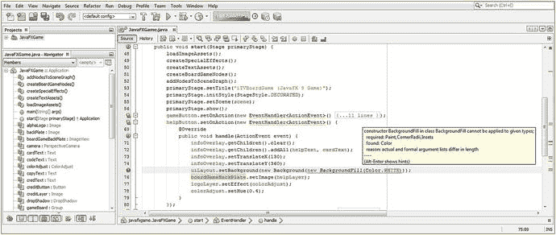

图 11-11.

使用 `.setBackground(new Background(new BackgroundFill(Color.WHITE)))` 将 uiLayout StackPane 背景设置为白色

我需要白色填充，因此按照构造方法参数的顺序，为最后两个参数分别使用了 `CornerRadii.EMPTY` 和 `Insets.EMPTY`。最终的方法调用如下所示，如图 11-12 所示：

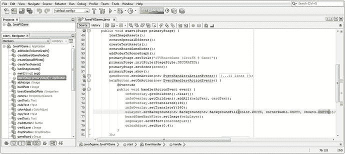

图 11-12.

向方法调用中添加 BackgroundFill 构造方法参数（Paint、CornerRadii 和 Insets）

```
.setBackground(new Background(new BackgroundFill(Color.White,CornerRadii.EMPTY,Insets.EMPTY) ));
```

最后，使用“运行 ➤ 项目”工作流程，检查是否实现了白色 StackPane 背景颜色填充的目标。如图 11-13 所示，你的 UI 界面再次看起来很棒，并且 UI 按钮也能正常工作。


图 11-13.

StackPane 现在具有 `Color.WHITE` 背景填充，防止场景的 `Color.BLACK` 显示出来

让我们在“法律信息”和“鸣谢”按钮的事件处理结构中实施此修复，使我们的应用程序恢复到 100% 的正常工作状态。如图 11-14 所示，我已将此 `uiLayout` StackPane 对象的 `Background` 属性配置 Java 9 代码结构复制并粘贴到 `legalButton` 和 `creditButton` 的事件处理基础设施中，并且代码编译无误。

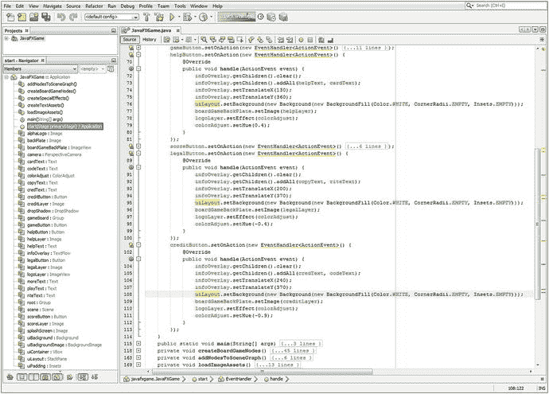

图 11-14.

将 `uiLayout.setBackground()` 结构从 `helpButton` 复制并粘贴到 `legalButton` 和 `creditButton`

如果你使用“运行 ➤ 项目”工作流程并测试这三个按钮 UI 元素，你会发现，得益于我们使用 StackPane 的背板（Background 对象）来承载设置为 `Color.WHITE` 这个 Color 辅助类常量的 Paint 对象，前几章中所有辛苦的设计工作都已完全恢复。

## 实现“开始游戏”按钮：隐藏你的 UI

接下来我们要做的是注释掉 `gameButton` 事件处理器中的所有代码（以便以后需要时可以恢复），然后添加一些新语句来隐藏（将可见性设置为 false）SceneGraph 中的 StackPane 分支；我们还将调用 `camera.setTranslateZ()` 方法，并将其设置为最初想要使用的 `-1000` 值。在构建游戏的过程中，我们将在此按钮中添加与 i3D 游戏相关的其他配置和控制语句，正如你现在所看到的，该游戏将“位于”StackPane UI 控制面板的“后面”。

如图 11-15 所示，我已注释掉与 StackPane UI 合成管线相关的代码；并添加了与从视图中移除 UI 控制面板以及将 3D 场景摄像机对象设置到游戏初始启动时我们希望它所在的位置相关的语句。新的代码语句如下面的 Java 代码所示，并在图 11-15 中间高亮显示：

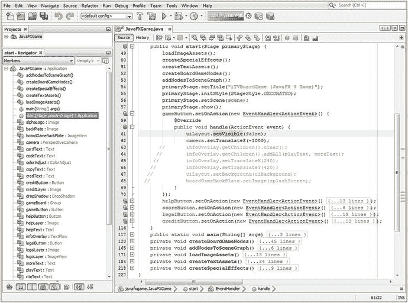

图 11-15.

在 `uiLayout` 上添加 `.setVisible(false)` 方法调用，并在 `camera` 上添加 `.setTranslateZ(-1000)` 方法调用

```
uiLayout.setVisible(false);
camera.setTranslateZ(-1000);
```

现在，当你使用“运行 ➤ 项目”工作流程并点击“开始游戏”按钮时，你的 StackPane 将消失，并显示出空的（黑色）3D 场景。

现在是时候学习如何使用 JavaFX 9 的 `LightBase` 超类及其子类 `AmbientLight` 和 `PointLight` 进行 3D 场景照明了。在我们将它们实现到 `JavaFXGame` 类中之前，我们会详细讨论这些内容，然后结束本章关于核心 3D 场景元素（Camera 和 LightBase）的内容，这些元素需要位于我们 i3D 专业 Java 9 游戏设计与开发管线中 SceneGraph 的根部。是不是开始兴奋了？灯光，摄像机……动作事件！

## 使用 3D 照明：为 3D 游戏添加光照

JavaFX 9 中有两套不同的照明 API。一套用于 3D 场景，位于 `javafx.scene` 包中，包含一个抽象的 `LightBase` 超类以及“具体的”（可以在代码中作为可构造对象使用的）子类 `AmbientLight` 和 `PointLight`。另一套是抽象的 `Light` 超类，位于 `javafx.scene.effect` 包中；该包包含 2D 数字成像效果，正如我们在本书前面所介绍的那样。对于 3D 使用，我们将专注于 `LightBase`、`AmbientLight` 和 `PointLight` 类，并首先使用 `PointLight` 类，因为使用该类可以获得最显著、最逼真的效果。


### JavaFX LightBase 类：定义光照的抽象超类

公共的 JavaFX LightBase 超类是一个抽象类，仅用于创建不同类型的光照。目前，3D 场景的通用或“环境”照明级别由 AmbientLight 子类（对象）或模拟灯泡属性的 PointLight 子类（对象）提供。你的应用程序不应尝试直接扩展抽象的 LightBase 类；如果尝试这样做，Java 将抛出 `UnsupportedOperationException`，并且你的 Pro Java 9 游戏将无法编译或运行。LightBase 类位于核心 `javafx.scene` 包的 `javafx.graphics` 模块中，并且是 `Node` 的子类，因为它本质上是一个位于 SceneGraph 顶部的节点。LightBase 类实现了 `Styleable` 接口，因此可以设置样式，并实现了 `EventTarget` 接口，因此可以处理事件。因此，JavaFX LightBase 类的 Java 9 类层次结构如下所示：

```
java.lang.Object
> javafx.scene.Node
> javafx.scene.LightBase
```

LightBase 类为子类提供了公共属性的定义，这些子类构造用于在 3D 场景中表示（“投射”）某种形式光照的对象。这些 LightBase 对象属性应包括光源的初始颜色，以及光源最初是打开（启用）还是关闭（禁用）。需要注意的是，由于这是一个 3D 功能，因此它是一个条件功能。请参考本章 PerspectiveCamera 部分中我列出的示例，了解如何设置检测 `ConditionalFeature.SCENE3D` 标志的代码。

LightBase 子类有两个属性（如果你更喜欢这些术语，也可以称为特性或特征）；一个是 `color` 或 `ObjectProperty<color>`，用于指定光源发出的光的颜色；第二个是名为 `lightOn` 的 `BooleanProperty`，允许打开和关闭光源。

LightBase 抽象类有两个重载的受保护构造方法。一个没有参数，并使用默认的 `Color.WHITE` 光源创建，使用以下构造方法调用格式：

```
protected LightBase()
```

第二个重载的受保护构造方法允许子类为光照指定颜色值，使用以下构造方法调用格式：

```
protected LightBase(Color color)
```

LightBase 类有七个方法，这些方法将全部可供（继承给）每个 LightBase 子类使用，包括 AmbientLight 和 PointLight 子类，因此请在此处注意这些方法，因为我只会介绍一次。

`colorProperty()` 方法指定光源的 `ObjectProperty<Color>`，而 `getColor()` 方法获取光源的 `Color` 值属性。`getScope()` 方法将获取一个 `ObservableList<Node>`，其中包含一个 `Node` 列表，该列表指定了 LightBase 子类（对象）的层次范围。

`isLightOn()` 方法调用返回光源的布尔值开（true）或关（false），而 `lightOnProperty()` 方法调用将为光源的 `BooleanProperty lightOn` 设置布尔数据值。

最后，`void setColor(Color value)` 方法将设置光照颜色属性的数据值，而 `void setLightOn(boolean value)` 方法将设置 LightBase 子对象 `lightOn` 布尔值属性的数据值。

接下来，让我们分别仔细看看 AmbientLight 和 PointLight 具体类。

### JavaFX AmbientLight 类：均匀照亮你的 3D 场景

公共的 JavaFX AmbientLight 类是一个具体类，用于为 3D 场景创建通用或“环境”级别的照明。通常，对于给定的 3D 场景实例，只定义一个 `AmbientLight` 实例。AmbientLight 类位于核心 `javafx.scene` 包的 `javafx.graphics` 模块中，并且是 `LightBase` 的子类，而 `LightBase` 是 `Node` 的子类，因为它本质上是一个位于 SceneGraph 顶部的节点。AmbientLight 类也实现了 `Styleable` 接口，因此可以设置样式，并实现了 `EventTarget` 接口，以便处理事件。因此，JavaFX AmbientLight 类的 Java 类层次结构如下所示：

```
java.lang.Object
> javafx.scene.Node
> javafx.scene.LightBase
> javafx.scene.AmbientLight
```

AmbientLight 类根据需要为你的 3D 场景定义环境光源对象。环境光可以定义为来自不可见光源的区域全局或通用照明量，该光源似乎从各个方向进入场景。所有 AmbientLight 对象属性都继承自 LightBase 超类，并且应包括光源的初始颜色，以及光源最初是打开（启用）还是关闭（禁用）。再次需要注意的是，由于这是一个 3D 功能，因此它是一个条件功能。

AmbientLight 有两个重载的构造方法；第一个使用（默认的）`Color.WHITE` 光源创建一个未配置的 AmbientLight 对象类，使用以下 Java 实例化编程格式：

```
AmbientLight ambient = new AmbientLight();
```

第二个重载的构造方法使用指定的非 `Color.WHITE` 颜色创建一个新的 PointLight 实例，使用以下 Java 实例化编程格式：

```
AmbientLight ambientaqua = new AmbientLight(Color.AQUA);
```

接下来，让我们详细看看 PointLight 具体类，然后我们可以在结束本章关于设置 3D 渲染场景环境（我们将在本书剩余部分将 3D 对象放入其中）之前，将一个 PointLight 对象添加到你的 3D 场景中。

### JavaFX PointLight 类：戏剧性地照亮你的 3D 场景

公共的 JavaFX PointLight 类是一个具体类，用于为 3D 场景创建局部或“点光源”照明实例。3D 场景中通常有多个 PointLight 实例，以允许艺术家实现模拟真实世界光源的复杂光照模型。PointLight 类位于核心 `javafx.scene` 包的 `javafx.graphics` 模块中，并且是 `LightBase` 的子类，而 `LightBase` 是 `Node` 的子类，因为它本质上是一个位于 SceneGraph 顶部的节点。PointLight 类也实现了 `Styleable` 接口，因此可以设置样式，并实现了 `EventTarget` 接口，以便处理事件。因此，JavaFX PointLight 类的 Java 类层次结构如下所示：

```
java.lang.Object
> javafx.scene.Node
> javafx.scene.LightBase
> javafx.scene.PointLight
```

PointLight 类根据需要为你的 3D 场景定义点光源（想想灯泡）对象。尽量使用尽可能少的 PointLight 对象，因为它们的渲染（计算或处理其算法）成本很高。点光源被定义为局部光发射点，并且可以设置动画以创建各种特殊效果。所有 PointLight 对象属性都继承自 LightBase 超类，并且应包括光源的初始颜色，以及光源最初是打开（启用）还是关闭（禁用）。再次需要注意的是，由于这是一个 3D 功能，因此它也是一个条件功能。

PointLight 有两个重载的构造方法。第一个使用默认的 `Color.WHITE` 光源创建一个未配置的 PointLight 对象类，使用以下 Java 实例化编程格式：

```
PointLight light = new PointLight();
```

第二个重载的构造方法使用指定的非 `Color.WHITE` 颜色创建一个新的 PointLight 实例，使用以下 Java 实例化编程格式：

```
PointLight aqualight = new PointLight(Color.AQUA);
```

接下来，让我们更仔细地看看将 PointLight 对象添加为 JavaFXGame 类基础设施光源的工作流程。


### 为游戏 3D 场景添加光照：使用 PointLight 对象

接下来，让我们在你的 JavaFXGame 代码中添加一个点光源，以便在下一章学习 3D 图元。在 JavaFXGame 类的顶部声明一个名为 light 的 PointLight 对象；然后使用 Alt+Enter 组合键调出辅助弹出菜单，并选择“Add import for javafx.scene.PointLight”选项，如图 11-16 底部黄蓝高亮所示。

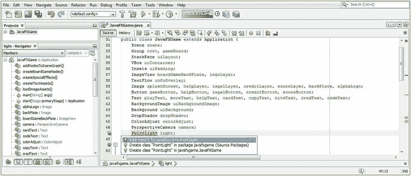

图 11-16.

在 JavaFXGame 类顶部声明一个名为 light 的 PointLight，然后按 Alt+Enter 并添加导入。

由于你还需要一些物体让光源照亮，请在 PointLight light 声明之后添加一个 Sphere sphere 声明，这样我们就有东西来测试代码了，如图 11-17 顶部黄色高亮所示。接下来，在 scene.setCamera(camera);方法调用之后实例化你的 PointLight。我使用了第二种更显式的构造方法，但为其指定了默认的 Color.WHITE，我们稍后可能会更改它，在研究了材质及其与光照颜色值的交互方式之后。使用`light.setTranslateZ(-25);`方法调用将光源向下移动一点，使其不位于球体内部（在 0,0,0 位置）。接着，使用`light.getScope().add(sphere);`方法链，将球体对象添加到 PointLight 对象“可见”的范围内。请注意，这允许不同的光源对象影响 3D 场景中的不同 3D 对象，这是一个非常强大的功能。你的 PointLight 和 Sphere 对象声明、实例化及配置的 Java 代码语句在图 11-17 底部高亮显示，应类似于以下 Java 代码：

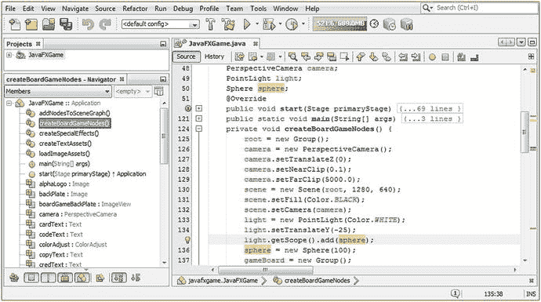

图 11-17.

声明一个球体和一个光源对象，并在 createBoardGameNodes 中实例化并配置它们以供使用。

```
PointLight light;
Sphere sphere;
...
private void createBoardGameNodes() {
...
light = new PointLight(Color.WHITE);
light.setTranslateY(-25);
light.getScope().add(sphere); // 通过.getScope().add()将球体和光源“连接”起来
sphere = new Sphere(100);
...
}
```

最后，要将你的 PointLight 和 Sphere 相互连接，并连接到相机以及 SceneGraph 的 GameBoard 3D 分支，你需要在你的.addNodesToSceneGraph()方法内部，使用.getChildren().add()方法链，以正确的顺序将你的球体 Node 对象添加到你的 gameBoard Group 对象中。

你的 addNodesToSceneGraph()方法的 Java 代码语句在图 11-18 中间高亮显示，应如下所示：

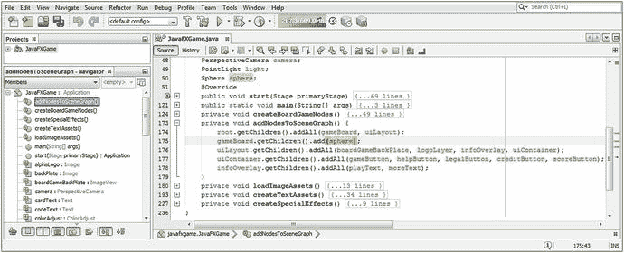

图 11-18.

将球体添加到根 Node 的 gameBoard 分支，以便将图元添加到你的场景图中。

```
private void addNodesToSceneGraph() {
root.getChildren().addAll(gameBoard, uiLayout);
gameBoard.getChildren().add(sphere);
uiLayout.getChildren().addAll(boardGameBackPlate, logoLayer, infoOverlay, uiContainer);
...
}
```

使用你的运行 ➤ 项目工作流程，确保我们在本章中完成的所有这些代码升级和添加都能正常工作，并为你带来在专业 Java 9 游戏开发的早期阶段所期望的最终结果。

确保三个（中间的）游戏规则、免责声明和游戏积分按钮已恢复全部功能（现在再次拥有白色背景填充）。此外，高分按钮仍应在 NetBeans 9 的输出控制台中打印一条文本消息，而开始游戏按钮现在应移除 StackPane uiLayout 覆盖面板并显示 3D 场景。

在该 3D 场景内部，应该有一个 3D 球体图元对象，我们将在下一章关于 3D 场景中 3D 对象的课程中学习它，在 3D 行业中称为模型、几何体、网格和图元。由于 3D 图元尚未具有纹理映射或颜色值，并且由于 PointLight 对象设置为 Color.WHITE，这应该是一个被白光照射的浅灰色球体。

如图 11-19 所示，开始游戏按钮控件现在通过一个简单的 Java 语句`uiLayout.setVisible(false);`隐藏了整个用于启动画面、UI 设计、按钮控件以及 TextFlow 和 Text 元素及格式化的 2D 合成管线，这得益于我们迄今为止在本书中设置的 StackPane 父 Node 以及 VBox、ImageView 和 TextFlow 子层级结构。一旦管线被隐藏，我们就能看到 3D 场景，我们临时向其中添加了一个球体图元对象，以便测试 PerspectiveCamera 和 PointLight 对象。

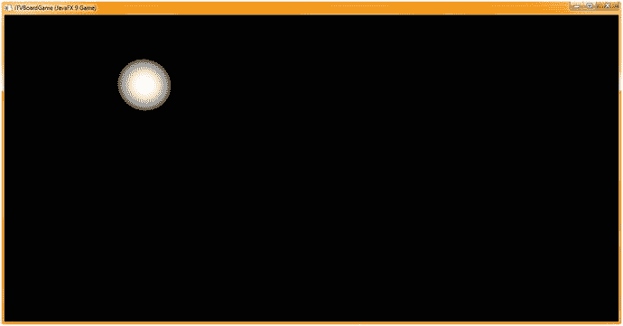

图 11-19.

使用你的运行 ➤ 项目工作流程，测试你已就位的 3D 场景基础设施

我们现在已经具备了使用 JavaFX API 进行 3D 建模和 3D 纹理映射工作的条件。

## 总结

在第十一章中，我们通过添加一个 PerspectiveCamera 对象（它允许使用 X、Y 和 Z 维度渲染 3D 资源，并为 Scene 对象提供 3D 透视效果），为`JavaFXGame.java`增加了 3D 场景能力。我们还添加了一个 PointLight 对象来模拟灯泡光源以照亮这些 3D 资源，以及一个 Sphere 对象（一个“图元”）来测试我们的基本 3D 场景设置。

你了解了抽象的 Camera 超类及其 ParallelCamera（用于 2D 或正交 3D 场景使用）和 PerspectiveCamera，我们将使用后者进行最有效的 3D 或 i3D 场景渲染。然后我们学习了如何在 JavaFXGame 中声明、实例化和配置 PerspectiveCamera，并改变其操作方式。

接着我们测试了 2D UI 元素及其层级结构，并观察到它们现在位于 3D 空间中的一个 2D“平面”上。我们修正了 Java 代码以补偿这种坐标空间的变化，使你的 UI 恢复全屏显示。

然后我们测试了所有 UI 按钮对象，发现新的 3D 场景黑色背景色影响了我们的信息屏幕，并非常巧妙地使用了一个复杂的嵌套 Java 语句，创建了一个 Color.WHITE BackgroundFill 对象并将其插入到你的 StackPane 对象的 Background 对象中。这通过用白色填充替换合成层之一的透明度，并向我们现在的混合 3D 和 2D 合成管线添加另一个不透明层，解决了问题。一旦该问题解决，我们更改了 gameButton 事件处理程序中的逻辑，允许最终用户通过隐藏 UI 覆盖层并显示正确照明的测试球体图元来开始游戏。

在下一章中，我们将继续研究创建专业 Java 9 游戏中 i3D 部分所需的基础知识，届时将探讨 JavaFX Shape3D 超类及其子类。


