# 12. 3D 模型设计与图元：使用 JavaFX 9 Shape3D 类

现在，你已经通过向场景根节点添加 Camera 对象和专门为 3D 资源设计的 PointLight 对象，完成了基础（空）3D 场景的设置，接下来让我们开始获取关于 3D 资源本身的一些基础知识。这些资源以预定义的基础 3D 形状（称为图元）的形式出现，以及更自定义的 3D 几何资源，在行业中通常被称为网格或线框 3D 资源。JavaFX 9 在 `javafx.scene.shape` 包（位于 javafx.graphics 模块中）中提供了七个类，专门为你创建 3D 几何体（图元或网格），我们将在本章中逐一了解它们。我们还会在第 12 章中回到 JavaFXGame 主应用程序类的编码工作，并开始向 SceneGraph 的 gameBoard Group 节点添加 3D 图元，以便练习向 JavaFXGame 应用程序添加 3D 资源。虽然我们可以在诸如 Blender 这样的 3D 软件包中完成这项工作，但棋盘游戏足够简单（正方形、球体、圆柱体），因此我们可以完全在 JavaFX 代码中完成，这意味着我们不需要导入（和分发）3D 模型，而是可以编写代码来“凭空”建模你的 3D 游戏。这也将让你学到更多关于 Java 9 和 JavaFX 9 中 3D API 的知识，因为你可以学习如何仅使用最新的 Java 和 JavaFX API 来建模复杂的对象（例如你的棋盘游戏的游戏板）。

在本章中，你将学习 `javafx.scene.shape` 包中包含的不同类型的 JavaFX 3D 类。我们将介绍 Sphere，它可用于创建球体图元，你在第 11 章中已经用它测试过你的 3D 场景设置。我们还将研究另外两个图元类：Box 和 Cylinder，它们可用于创建你的平面和圆盘图元。这些图元基于 Shape3D 超类，我们将首先研究这个超类。我们还将研究更高级的 TriangleMesh 类，它允许你构建基于多边形的 Mesh 对象，最后，我们将研究 Mesh 和 MeshView 类层次结构，它们允许你渲染在外部 3D 建模和渲染软件包（例如 Blender 2.8（开源）或 Autodesk 3D Studio Max（付费软件包））中创建的 3D Mesh 对象。

## JavaFX Shape3D 超类：图元或 MeshView

公共抽象 Shape3D 超类用于创建四个主要的 3D 类：Box、Sphere、Cylinder 和 MeshView。你将使用这些类来创建和显示你的专业 Java 9 游戏开发所需的 3D 资源。其中三个子类创建图元，这些图元是通过算法预定义的 3D 对象，而 MeshView 子类允许在 3D 场景中渲染基于多边形几何的更详细的复杂 3D 模型。需要注意的是，还有一个 `javafx.scene.shape.Shape` 超类，它与 `javafx.scene.shape.Shape3D` 在类层次结构上没有关联；它用于 2D 形状，例如 SVG 2D 数字插图语言中常见的形状，这在《Beginning Java 8 Games Development》（Apress, 2014）和《Digital Illustration Fundamentals》（Apress, 2016）中有所介绍。

Shape3D 超类是 Node 的子类，就像我们将在 JavaFXGame 代码中使用的大多数具体类一样。与 Camera 和 LightBase 超类一样，这个 Shape3D 超类实现了 Styleable 和 EventTarget 接口，以便其子类（对象）可以设置样式并处理事件（可以是交互式的）。因此，Java 9 类层次结构跨越了 Java 和 JavaFX API，如下所示：

```
java.lang.Object
> javafx.scene.Node
> javafx.scene.shape.Shape3D
```

创建 Shape3D 基类（抽象类，不能直接实例化）是为了为表示 3D 几何形状的 3D 对象提供公共属性的定义。三个主要的 3D 属性包括：应用于形状可填充内部或形状轮廓的“材质”（或着色器和纹理贴图），我们将在第 13 章中介绍；定义 JavaFX 9 渲染引擎如何向查看者表示几何体（作为实体模型或线框模型）的“绘制模型”属性；以及定义要剔除哪些面的“面剔除”属性。面剔除是渲染引擎用来获得更好性能（更高的 FPS）的一种优化方法，它通过不渲染场景中模型的所有多边形来实现。由于渲染器获取 3D 场景并从 Camera 渲染出 2D 视图，这种“背面剔除”将不会渲染模型上背向 Camera（Camera 不可见）部分的任何面（多边形）。正面剔除则相反，只渲染背向的多边形，这基本上渲染了多边形的内部，而模型的前面（多边形）变得隐藏或不可见。还有 CullFace.NONE 常量，用于关闭面剔除优化算法。CullFace.BACK 是默认设置，也是你通常想要使用的设置，除非你使用 CullFace.FRONT 来获得某种特殊的内部体积渲染效果，在本章结束后，如果你愿意，你将确切知道如何尝试。

如你所知，3D 渲染以及任何 Shape3D 子类都是一个条件特性，你可以在代码中检查它，正如我们在上一章中介绍的那样。让我们深入了解任何 Shape3D 子类对象的三个对象设置（属性、特性、特征），它们定义了 3D 渲染引擎将如何渲染它。

cullFace ObjectProperty<CullFace> 将定义在此 Shape3D 对象上使用哪种 CullFace 优化算法（FRONT、BACK 或 NONE）。这很可能会影响专业 Java 9 3D 游戏的性能。

drawMode ObjectProperty<DrawMode> 将定义用于渲染 Shape3D 对象的绘制模式。你的两个选项包括用于实体 3D 对象的 DrawMode.FILL 和用于线框表示的 DrawMode.LINE。

material ObjectProperty<Material> 定义 Shape3D 对象将用作“皮肤”的材质。我们将在第 13 章中全面学习着色算法、材质和纹理贴图，该章涵盖了材质。

抽象 Shape3D 超类的受保护（不能直接使用）构造函数如下所示：

```
protected Shape3D()
```

现在让我们来了解将成为所有 Shape3D 子类一部分的方法。这很方便，因为我们可以在这里一次性介绍所有这些方法。这些方法可用于任何图元 3D 形状或 MeshView。

`.cullFaceProperty()` 方法为 Shape3D 对象定义 ObjectProperty<CullFace>，而 `.getCullFace()` 方法允许你查询 Shape3D 对象当前的 CullFace 常量设置。还有 `.setCullFace(CullFace value)` 方法，允许你更改 Shape3D 对象的 CullFace 常量设置。

`.drawModeProperty()` 方法为 Shape3D 对象定义 ObjectProperty<DrawMode>，而 `.getDrawMode()` 方法允许你查询 Shape3D 对象当前的 DrawMode 常量设置。还有 `.setDrawMode(DrawMode value)` 方法，允许你更改 Shape3D 对象的 DrawMode 常量设置。

`.materialProperty()` 方法为 Shape3D 对象定义 ObjectProperty<Material>，而 `.getMaterial()` 方法允许你查询 Shape3D 对象当前的 Material 对象设置。还有 `.setMaterial(Material value)` 方法，允许你更改 Shape3D 对象的 Material 对象设置。

接下来，让我们逐一查看 Shape3D 子类，因为我们将在 JavaFXGame 中利用它们。


### JavaFX Sphere：为你的 3D 游戏创建球体图元

由于我们在前一章中已经创建了一个名为 sphere 的 Sphere 对象来测试 PerspectiveCamera 和 PointLight 3D 场景设置的 Java 代码，因此我们首先来介绍这个 Shape3D 子类。该类位于 `javafx.scene.shape` 包中，并且是 Shape3D 的子类，因此它具有以下 Java 类层次结构：

```
java.lang.Object
> javafx.scene.Node
> javafx.scene.shape.Shape3D
> javafx.scene.shape.Sphere
```

Sphere 类定义了一个具有指定大小的三维球体。Sphere 是一个 3D 几何图元，通过程序员输入的半径尺寸（大小）以算法方式创建。该球体最初始终以 3D 原点 0,0,0 为中心。因此，Sphere 对象具有一个 radius DoubleProperty，用于定义球体的半径，以及三个从 `javafx.scene.shape.Shape3D` 继承的属性：cullFace、drawMode 和 material。

Sphere 类包含三个重载的构造方法，其中一个无参数，用于创建一个半径为 1.0 的 Sphere 实例。这看起来像下面的 Java 9 Sphere 实例化代码：

```
sphere = new Sphere();
```

第二个构造方法（即我们在第 11 章中使用的方法）允许你使用 double 数值指定半径。这看起来像下面的 Sphere 实例化 Java 代码：

```
sphere = new Sphere(100);
```

第三个构造方法允许你通过 divisions 参数指定半径和网格密度，如下面的 Java 语句所示，该语句创建一个半径为 100 单位、具有 24 个分段的 Sphere：

```
sphere = new Sphere(100, 24)
```

除了从 Shape3D 类继承的方法外，Sphere 类还有一些自己独特的方法，包括 `.getDivisions()` 方法，用于查询 Sphere 对象当前使用的分段数；`.radiusProperty()` 方法，用于定义 Sphere 对象的半径；`.getRadius()` 方法，用于获取当前半径的值；以及 `.setRadius(double value)` 方法，用于将半径设置为不同的值。

### JavaFX Cylinder：为游戏创建圆柱体或圆盘图元

接下来，我们介绍 public Cylinder Shape3D 子类，它可以用于创建圆柱形 3D 对象，因为它是一个具体的（可用的）类，同时也实现了 Styleable 和 EventTarget 接口。该类位于 `javafx.scene.shape` 包中，并且是 Shape3D 的子类，因此它具有以下 Java 类层次结构：

```
java.lang.Object
> javafx.scene.Node
> javafx.scene.shape.Shape3D
> javafx.scene.shape.Cylinder
```

Cylinder 类用于定义一个具有指定半径和高度的三维圆柱体。Cylinder 是一个 3D 几何图元算法，它接受一个半径（double）属性和一个高度（double）属性。它最初以 0,0,0 原点为中心，半径沿 z 轴方向，高度沿 y 轴方向。

除了半径和高度属性外，它还将继承 Shape3D 的 cullFace、drawMode 和 material 属性。它有三个重载的构造方法：一个是默认的（空参数），一个带有半径和高度，第三个带有半径、高度和分段数。

第一个空构造方法创建一个新的 Cylinder 对象实例，其半径为 1.0，高度为 2.0。它具有以下 Java 语句格式：

```
cylinder = new Cylinder();
```

第二个构造方法创建一个新的 Cylinder 对象实例，其半径和高度由开发者指定。它具有以下 Java 语句格式：

```
cylinder = new Cylinder(50, 250);
```

第三个构造方法创建一个新的 Cylinder 对象实例，其半径、高度和分辨率（决定平滑度的分段数）由开发者指定。它具有以下 Java 语句格式：

```
cylinder = new Cylinder(50, 250, 24);
```

有三个用于半径的方法，三个用于高度的方法，以及一个 `.getDivisions()` 方法用于查询 divisions 属性，该属性必须使用第三个构造方法格式设置，因为没有 `.setDivisions()` 方法调用或 `divisionsProperty()` 方法调用。

`double getHeight()` 方法将查询（获取）Cylinder 对象的高度属性值。`DoubleProperty heightProperty()` 方法定义 Cylinder 对象的高度属性，即 Y 维度。最后，`void setHeight(double value)` 方法允许开发者设置 Cylinder 对象的高度属性值。

`double getRadius()` 方法将查询（获取）Cylinder 对象的半径属性值。`DoubleProperty radiusProperty()` 方法定义 Cylinder 对象的半径属性，即 Z 维度。最后，`void setRadius(double value)` 方法允许开发者设置 Cylinder 对象的半径属性值。

最后，让我们看看 Box 图元类，它允许创建各种有用的形状。

### JavaFX Box：为 3D 游戏创建立方体、柱体和平面

接下来，我们介绍 public Box Shape3D 子类，它可以用于创建正方形、矩形和平面 3D 对象，因为它是一个具体的（可用的）类，同时也实现了 Styleable 和 EventTarget 接口。该类位于 `javafx.scene.shape` 包中，并且是 Shape3D 的子类，因此它具有以下 Java 类层次结构：

```
java.lang.Object
> javafx.scene.Node
> javafx.scene.shape.Shape3D
> javafx.scene.shape.Box
```

Box 类定义了一个具有指定大小的三维立方体，通常称为立方体图元。Box 对象是一个 3D 几何图元，除了三个继承自 Shape3D 的属性（cullFace、drawMode 和 material）外，还有三个 double 属性（depth、width 和 height）。实例化时，它最初以原点为中心。

Box 类有两个重载的构造方法。一个创建默认的 2,2,2 立方体，看起来像下面的 Java 代码：

```
box = new Box();
```

第二个构造方法允许你指定立方体的尺寸，看起来像下面这样：

```
box = new Box(10, 200, 10); // 创建一个柱体（或高矩形）图元
box = new Box(10, 0.1, 10); // 创建一个平面（或平坦表面）图元
```

你可能已经猜到，Box 类中有九个方法，每个属性对应三个方法。我们将使用这个类来创建大部分游戏棋盘基础设施，因此我们可能会经常使用它们。

`DoubleProperty depthProperty()` 方法用于定义 Box 的深度，即 Z 维度。`double getDepth()` 方法可用于从 Box 对象获取（查询）depth 属性的值。`void setDepth(double value)` 方法可用于为 Box 对象设置或指定 depth 属性的新值。

`DoubleProperty heightProperty()` 方法用于定义 Box 的高度，即 Y 维度。`double getHeight()` 方法可用于从 Box 对象获取（查询）height 属性的值。`void setHeight(double value)` 方法可用于为 Box 对象设置或指定 height 属性的新值。

`DoubleProperty widthProperty()` 方法用于定义 Box 的宽度，即 X 维度。`double getWidth()` 方法可用于从 Box 对象获取（查询）width 属性的值。`void setWidth(double value)` 方法可用于为 Box 对象设置或指定 width 属性的新值。

接下来，让我们看看在 JavaFXGame 代码中实际实现不同图元需要做些什么！


### 使用基本几何体：向 JavaFXGame 类中添加基本几何体

现在，让我们向 JavaFXGame 类中添加另外两个基本几何体对象：Box 和 Cylinder，以便我们学习面剔除和绘制模式。我们将把材质相关内容留到第 13 章专门讲解，因为着色器和纹理贴图值得用单独一章来深入讨论。在类的顶部声明一个名为 `box` 的 Box 对象，并使用 Alt+Enter 组合键让 NetBeans 9 帮你编写 import 语句。如图 12-1 所示，为你的 Java 9 游戏添加正确的类非常重要，因为还有一个用于 2D UI 设计的 `javax.swing.Box` 类（位于弹出帮助下拉列表的第二位），而列表顶部（NetBeans 的最佳猜测）是用于 3D 基本几何体的 `javafx.scene.shape.Box` 类！双击第一个（正确的）类，让 NetBeans 为你编写 import 语句。

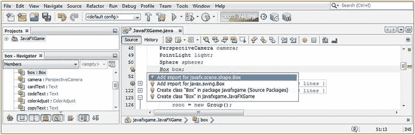

图 12-1.

在类的顶部声明一个 Box 对象；使用 Alt+Enter，并选择“为 javafx.scene.shape.Box 添加导入”

在 `createBoardGameNodes()` 方法中使用第二个构造器实例化 box 对象，如图 12-2 所示。请记住，你需要在 `.addNodesToSceneGraph()` 方法中将这个 box 节点添加到场景图中。

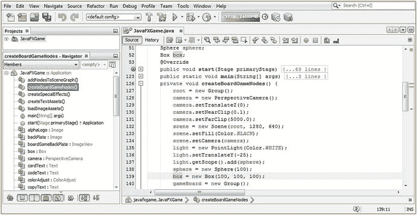

图 12-2.

在 createBoardGameNodes 中实例化 Box，并将深度、高度和宽度都设置为 100、100、100

这可以通过修改你当前的 `gameBoard.getChildren().add(sphere);` Java 语句轻松实现，将其改为 `gameBoard.getChildren().addAll(sphere, box);`，如下所示，如图 12-3 所示：

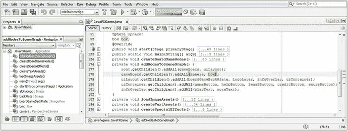

图 12-3.

使用 .addAll() 方法在 addNodesToSceneGraph() 方法中将 box 对象添加到场景图

```
box = new Box(100, 100, 100);                   // 在 .createBoardGameNodes() 方法中
gameBoard.getChildren().addAll(sphere, box);   // 在 .addNodesToSceneGraph() 方法中
```

声明 Box 对象后，在 `createBoardGameNodes()` 方法内部实例化该对象，使用与 Sphere 相同的 100 单位值。你将能够看到它们之间的大小关系，因为它们都将在 (0,0,0) 位置创建。对于 Box 构造器方法，它接受三个（double）值，这些值都应设为 100。

接下来，在类的顶部声明一个名为 `pole` 的 Cylinder，并在 `.createBoardGameNodes()` 方法内部实例化它，使用宽度 50、高度 250，并将网格（LINE）绘制表示的段数或分割数设为 24。

所有这些代码应如下所示，在图 12-4 中以黄色和蓝色高亮显示：

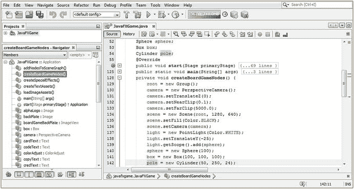

图 12-4.

创建一个名为 pole 的 Cylinder 对象，并用半径 50、高度 250 和 24 个分割数进行实例化

```
Cylinder pole;                        // 在类的顶部声明对象以供使用
...
pole = new Cylinder(50, 250, 24);     // 在 .createBoardGameNodes() 方法中
```

如果此时你使用“运行 ➤ 项目”工作流程，你将看不到 pole 对象，因为你还没有将其添加到 JavaFX 场景图中。打开 `addNodesToSceneGraph()` 方法，将 pole 对象添加到参数区域（括号内）包含的 Java 列表的末尾。这一切都可以通过 `.handle()` 方法内部的以下 Java 代码结构完成，如图 12-5 中间高亮所示：

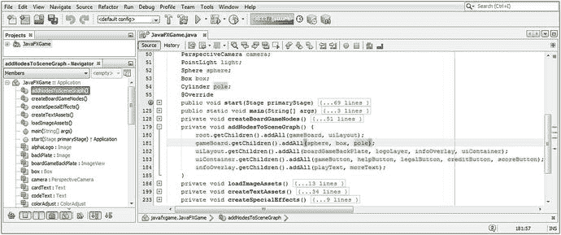

图 12-5.

在 gameBoard.getChildren().addAll() 方法调用的末尾，将 pole Cylinder 对象添加到场景图

```
gameBoard.getChildren().addAll(sphere, box, pole);    // 在 addNodesToSceneGraph() 方法中
```

正如我们在 3D 场景中渲染这段代码时会看到的，在 3D 合成中，向场景图添加对象的顺序类似于 2D 合成 StackPane 中 2D 资源图层顺序的情况，因为 3D 基本几何体会显示为“彼此叠放”。对象在场景图的 gameBoard Group 中添加得越晚，它们渲染到屏幕上的时间就越晚。因此，最后添加到场景图的基本几何体将渲染在所有之前添加的基本几何体之上，而第一个添加到场景图的基本几何体将最先渲染（即位于所有其他 3D 基本几何体之下或之后）。

在大多数 3D 软件包中，位于 (0,0,0)（场景中心）的三个基本几何体会彼此嵌套渲染。这告诉我们作为 3D 艺术家在使用 JavaFX 时一个非常重要的信息，即你不能使用 JavaFX 基本几何体执行构造实体几何（CSG）建模。CSG 是 3D 建模的早期形式之一，涉及将基本 3D 几何体与布尔运算结合使用，以创建更复杂的 3D 模型。

让我们使用“运行 ➤ 项目”工作流程，看看 JavaFX 如何渲染这三个位于 (0, 0, 0) 的基本几何体。如图 12-6 所示，Cylinder 对象位于 Box 对象之前，而 Box 对象又位于 Sphere 对象之前。大多数 3D 软件包会将此渲染为 Box 位于 Sphere 内部，可能 Box 的角会穿透 Sphere（取决于比例），而 Cylinder 的两端会从 Sphere 的顶部和底部伸出。我特意按此顺序进行这个练习，因为让开发者意识到在构建 Java 9 游戏时哪些能做、哪些不能做至关重要。你可以通过在 JavaFX 中使用从 3D 建模器（如 MOI3D、SILO 或 Blender）导入的网格对象来实现这种布尔效果，这些布尔运算已在 JavaFX 9 外部完成。

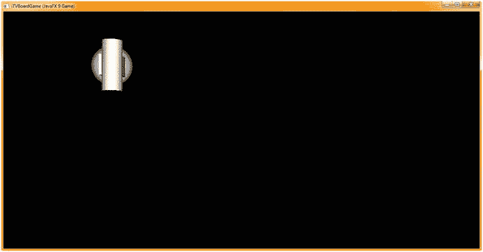

图 12-6.

使用“运行 ➤ 项目”查看这三个基本几何体，其 Z 顺序即为它们添加到场景图的顺序

接下来，让我们使用一些 3D 基本几何体修改（移动和旋转）方法调用来将它们移离场景中心，并旋转立方体使其看起来不像一个 2D 对象。这一切都可以通过 box 和 pole 对象的 `.setTranslateX()` 和 `setRotate()` 方法调用来完成，如图 12-7 底部所示：

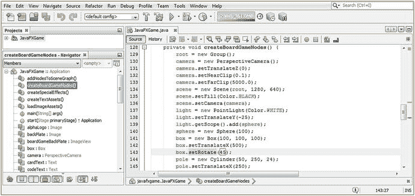

图 12-7.

使用 setTranslateX(250) 将基本几何体移动 250 个单位，并使用 setRotate(45) 将 box 旋转 45 度

```
box.setTranslateX(500);
box.setRotate(45);
pole.setTranslateX(250);
```

接下来，使用“运行 ➤ 项目”工作流程单独查看这些基本几何体。如图 12-8 所示，`.setRotate()` 方法使用 z 轴进行旋转，因此你的 3D 对象仍然渲染为 2D 对象。让我们来解决这个问题！

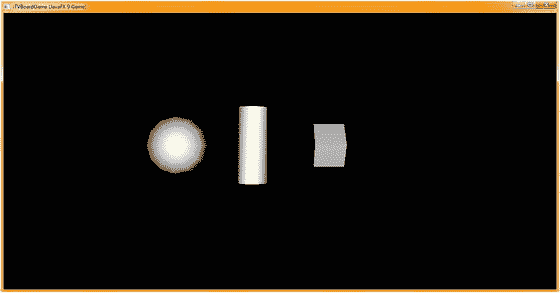

图 12-8.

所有三个基本几何体现在都已间隔开；box 看起来仍然是 2D 的

要更改 `.setRotate()` 方法用于配置其旋转算法的旋转轴，可以使用第二个 `.setRotationAxis()` 方法来将默认的 `Rotate.Z_AXIS` 设置更改为 `Rotate.X_AXIS` 常量，正如你在 Rotate 类中通过点符号看到的那样。

显然，正如你现在已经了解到的，`.setRotationAxis()` 方法调用必须在 `.setRotate(45)` 方法调用之前进行，以便在实际使用旋转算法之前更改旋转轴。


在 `box.setTranslateX(500);` 方法调用之后，为你的盒子对象添加一个 `.setRotationAxis()` 方法调用，使用 `Rotate.X_AXIS` 常量来配置旋转算法。Java 语句序列应如下面的 Java 代码所示，并可在图 12-9 底部附近看到：

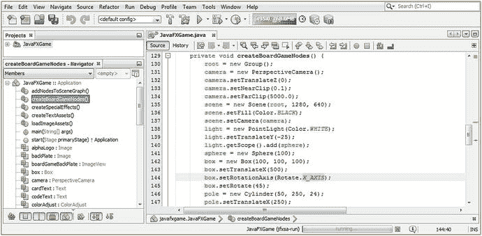

图 12-9.

在 `box.setTranslateX(500);` 之后为盒子添加一个 `.setRotationAxis()` 方法调用，并将其设置为 `Rotate.X_AXIS`

```
box.setTranslateX(500);
box.setRotationAxis(Rotate.X_AXIS);
box.setRotate(45);
pole = new Cylinder(50, 250, 24);
pole.setTranslateX(250);
```

接下来，使用 **运行 ➤ 项目** 工作流程，再次单独查看你的图元。如图 12-10 所示，`.setRotate()` 方法现在使用 z 轴进行旋转，因此你的 3D 对象现在以 3D 对象的形式渲染，你可以看到着色（不同面上的颜色或亮度差异）。

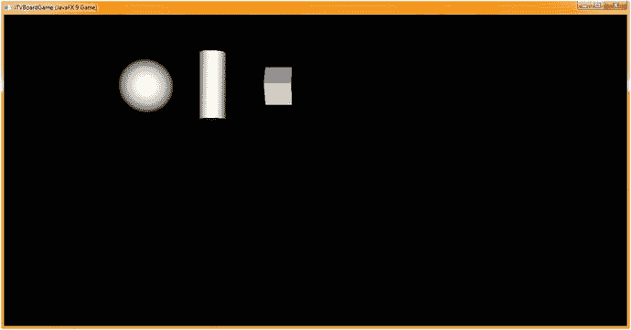

图 12-10.

现在所有图元都已定向，使得其默认的浅灰色着色在渲染器中可见

在 JavaFX 中，旋转 3D 对象还有更复杂的方法，我们将在本书后续章节中深入探讨，因为旋转在 3D 领域是一个相当复杂的主题，它似乎并非“表面”功夫（无意双关）。旋转在其算法中使用了比平移更复杂的数学运算，其中一些复杂性会逐渐显现出来，因此所有专业的 Java 9 3D 游戏开发者都必须处理并理解这些内容。

现在，我们已经将 JavaFX 提供的三个基本图元分开并定向，以便在渲染视图中向你展示更多的面和边。接下来，我们将更仔细地研究**面剔除**和**绘制模式**对几何体的影响。我们将把材质对象的创建和应用留到第 13 章单独讲解；材质对象创建是一个核心的 3D 主题（纹理映射），应作为一个独立的主题来处理，因为 3D 对象的着色决定了其视觉质量。

接下来，让我们看看**绘制模式**（在大多数 3D 软件包中称为渲染模式），这样你就可以在开发专业的 Java 9 游戏时查看对象的 3D 线框表示。

### Shape3D 绘制模式属性：实体几何与线框

现在，我们已经将三个主要的 JavaFX 图元排列在屏幕上，让我们来看看 `Shape3D` 超类的 `drawMode` 属性，每个图元都继承了这个属性。你可能已经猜到了，该属性使用 `DrawMode` 类中的一个常量，当前可用的两个常量是 `DrawMode.FILL` 和 `DrawMode.LINE`。`FILL` 常量提供实体模型几何表示，而 `LINE` 常量提供线框模型几何表示。在本节中，我们将使用 `.setDrawMode(drawMode)` 方法调用，将我们的三个图元从实体模型更改为线框模型，以便我们可以更改线框的分辨率或细分数量，观察其效果，并可以围绕 X 维度旋转球体，查看其线框结构的外观以及细分属性如何影响其在 3D 场景中的渲染效果。不过，首先，我有点厌倦在 3D 场景的左上角查看这些图元了，因此我们将使用 `.setTranslateZ(-500)` 将摄像机对象拉近 100%（或者将图元放大 100%），并使用 `.setTranslateY(300)` 方法将图元在视图的水平方向上居中。稍后，我们将使用 `.setTranslateX(-300)` 方法调用将图元在视图的垂直方向上居中。

打开你的 `.start()` 方法和 `gameButton` 事件处理代码块，将 `.setTranslateZ()` 方法调用的值从 `-1000` 改为 `-500`。然后，为摄像机对象添加一个 `.setTranslateY()` 方法调用，并传入 `-300` 场景单位的数据值，如图 12-11 以及下面的 Java 代码语句所示：

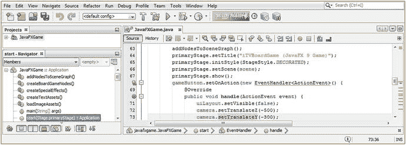

图 12-11.

使用 `.setTranslateZ(-500)` 将摄像机对象拉近 100%，并使用 `.setTranslateY(-300)` 将其向下移动

```
camera.setTranslateZ(-500);
camera.setTranslateY(-300);
```

接下来，让我们打开 `createBoardGameNodes()` 方法，并为每个图元添加一个 `.setDrawMode(DrawMode.LINE)` 方法调用，将其渲染模式从实体几何设置为线框几何，以便我们可以看到它们的底层结构。你的 Java 语句（在图 12-12 中以黄色高亮显示）应如下所示：

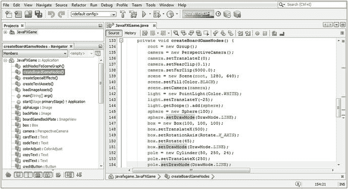

图 12-12.

使用 `.setDrawMode(DrawMode.LINE)` 方法调用将所有图元的 `drawMode` 属性设置为 `LINE`

```
sphere.setDrawMode(DrawMode.LINE);
box.setDrawMode(DrawMode.LINE);
pole.setDrawMode(DrawMode.LINE);
```

接下来，使用 **运行 ➤ 项目** 工作流程，再次查看你的图元。如图 12-13 所示，你的图元现在使用线框表示进行渲染，并且在 3D 场景的 Y 维度上居中。

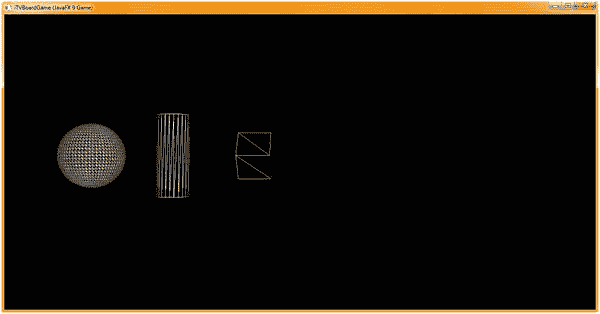

图 12-13.

所有三个图元现在都以线框模式渲染，并在垂直方向上居中

使用以下代码（如图 12-14 所示）通过 `.setTranslateX()` 将摄像机在 X 维度上居中：

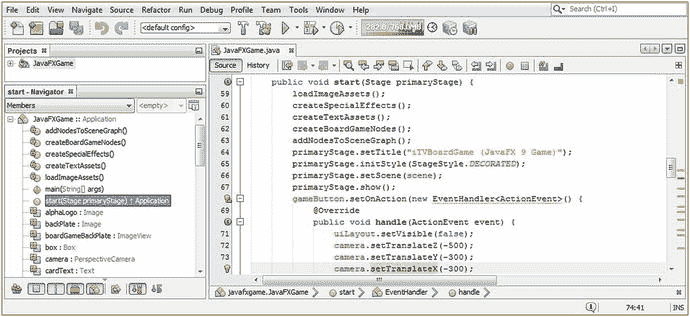

图 12-14.

添加 `.setTranslateX(-300)` 以将你的图元移动到 3D 场景的垂直（X 维度）中心

```
camera.setTranslateX(-300);
```


请注意，当移动摄像机对象时，它会保持直视前方，而在 3D 软件包中，存在一个“目标”摄像机，它会锁定在场景中心或场景中的 3D 对象上。在 JavaFX 中，摄像机对象是“固定”的，有一条从摄像机后方穿过前方发出的直线（称为射线或向量），沿摄像机指向的方向无限延伸。因此，在 3D 软件中，如果你向上移动摄像机，其视野会向下旋转，并且摄像机与其拍摄对象之间存在一条链接（或连线）。

如果你希望在 JavaFX 中实现这种行为，则必须手动旋转摄像机，因为 JavaFX 的 Camera 超类目前没有 `specifyTarget` 属性（目标功能）。随着本书内容的深入，我们将研究 PerspectiveCamera 对象，以及如何在 3D 场景中以更高级的方式利用它，因为摄像机是 i3D 场景的一个重要方面，也是专业 Java 9 i3D 游戏开发过程中的重要工具。

在我们再次渲染 3D 场景之前，由于从代码中我们知道它现在将居中得足够好，以便我们查看诸如细分和面剔除等属性，并了解这些属性如何影响构成 3D 图元的多边形，让我们使用重载的（第二个）`Sphere(size, divisions)` 构造函数方法格式，并降低 Sphere 对象的网格分辨率，以优化保存该 3D 对象所需的内存量。你还需要将其向前旋转，以便能够看到球体结构的顶部，并将圆柱体的分辨率降低 100%，从 24 个细分减少到 12 个细分。我始终使用能被 4 整除的细分值（90 度乘以 4 等于 360），并且如果启用了面剔除，则一半的细分甚至不会被渲染。所有这些都可以通过使用以下 Java 语句来实现，这些语句在图 12-15 中（以及底部）突出显示：

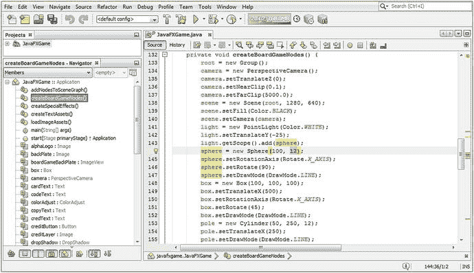

图 12-15. 使用 12 个细分构建球体，将其绕 X 轴旋转 90 度，并将圆柱体减少到 12 个细分

```
sphere = new Sphere(100, 12);
sphere.setRotationAxis(Rotate.X_AXIS);
sphere.setRotate(90);
sphere.setDrawMode(DrawMode.LINE);
```

现在是时候使用“运行 ➤ 项目”工作流程并渲染我们的场景了。如图 12-16 所示，我们的 3D 图元更接近 3D 场景的中心，易于查看，并且使用的数据量大大减少。正如你在图 12-13 中看到的，球体使用了 48 个细分来构建。这使用了数百个多边形，可以计算为 48 × 48 × 2 = 192；192 个多边形需要大量内存来处理（存储和渲染），因为每个多边形都有大量数据来定义它（模型中的位置、大小、方向、颜色、法线方向、平滑组）。

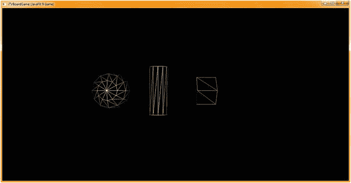

图 12-16. 你的图元现在位于 3D 场景摄像机视图的中心，你可以看到球体的结构

当我们在下一节关于面剔除的内容中渲染这些图元时，你会看到立方体和圆柱体的外观并没有真正改变，因此圆柱体细分减少 100%（从 24 到 12）是一次成功的优化。球体细分减少 200%（从 48 到 12）则有点过于剧烈，球体边缘的平滑感会有所丧失，尤其是从顶部渲染时，这就是我将其绕 X 轴向前旋转 90 度的原因。

接下来，让我们看看使用背面剔除进行渲染算法的优化，以及较低分辨率（更少的细分）如何在以实体模式渲染时影响 3D 图元的视觉质量。

### Shape3D 面剔除属性：优化渲染管线

Shape3D 的 `cullFace` 属性和 `CullFace` 类用于控制 3D 场景的面和多边形渲染优化。默认值是 `CullFace.NONE`，因此你需要使用代码启用此优化，我将在本章的这一部分向你展示如何操作。我认为关闭面剔除后模型看起来更好（对比度更高），并且如果你将专业的 Java 9 游戏优化得足够好，它应该能在所有平台和设备上流畅运行，而无需从模型上剔除一半的面。话虽如此，一旦你知道如何操作，在测试阶段进行实验应该很容易，以了解它如何影响视觉质量与游戏流畅度。

让我们继续向 `createBoardGameNodes()` 方法添加代码，为图元对象设置背面剔除。首先，我们需要将图元的 `drawMode` 属性改回 `FILL`，以便进行实体建模，方法是在每个球体、盒子和杆对象上使用 `.setDrawMode(DrawMode.FILL)`。紧接着在每个图元对象上调用此方法之后，在该对象上添加一个 `.setCullFace(CullFace.BACK)` 方法调用。如果你在 NetBeans 9 中使用弹出式辅助工作流程，你会看到它使用默认的 `CullFace.NONE` 设置编写代码，因此你必须将其更改为 `CullFace.BACK` 才能启用此渲染管线优化算法。

背面剔除语句的 Java 代码在图 12-17 底部突出显示，应如下所示：

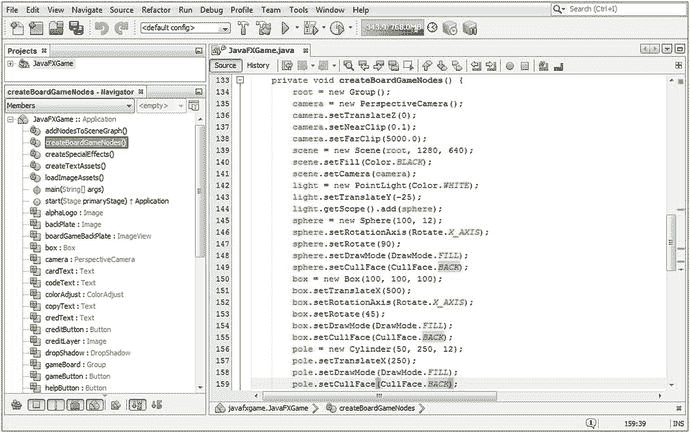

图 12-17. 为场景中所有图元添加值为 `CullFace.BACK` 的 `.setCullFace()` 方法调用

```
sphere.setDrawMode(DrawMode.FILL);
sphere.setCullFace(CullFace.BACK);
box.setDrawMode(DrawMode.FILL);
box.setCullFace(CullFace.BACK);
pole.setDrawMode(DrawMode.FILL);
pole.setCullFace(CullFace.BACK);
```

图 12-18 展示了“运行 ➤ 项目”Java 代码测试工作流程，显示了背面剔除算法已安装并在 3D 场景图元上运行。请注意，在球体上，降低的几何分辨率（更少的细分）会导致网格出现一些平滑问题，网格拓扑结构会透过平滑算法显现出来。我会将球体细分增加到 24 以缓解此问题，这相对于默认设置仍然是 100% 的优化。

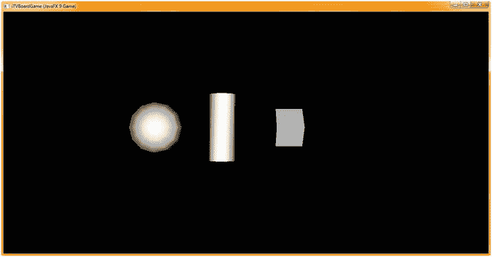

图 12-18. 渲染器现在渲染的 3D 数据量减少了一半，并且可以在球体上看到较低的分辨率

还要注意，当启用背面剔除时，立方体（Box）图元上的着色对比度（面之间的着色颜色差异）要低得多。随着你进行更多自定义纹理映射（将在下一章及后续章节中介绍），这将成为一个小问题（不那么明显），但这可能是 `FaceCull` 类以及此方法调用的默认值为 `NONE` 的原因，因为面剔除优化可能会以某种方式影响当前算法代码中的对比度（质量）。我以这种方式安排本章内容，以便你能看到这一点，因为最基本的图元之一显示面之间的对比度明显降低，使用了默认的中灰色着色器颜色，正如你在比较图 12-10 和图 12-18 时所看到的，对比度从高变为几乎为零。

接下来，让我们看看三个与网格相关的类：`Mesh`、`TriangleMesh` 和 `MeshView`，了解它们的功能以及相互关系，因为它们将允许你渲染使用 3D 软件创建的复杂网格对象。


## JavaFX 网格超类：构建 TriangleMesh

理解抽象的 Mesh 超类及其与 TriangleMesh 子类的关系至关重要，后者可用于“手工编码”创建复杂的网格对象；同时，理解它与 MeshView 类的关系也很重要，MeshView 实际上是 Shape3D 的子类，而非 Mesh 的子类！这样设计是为了让 MeshView 能够继承（扩展）Shape3D 的 cullFace、drawMode 和 material 属性，这些属性对于使网格对象看起来逼真至关重要（尤其是 material 属性和 Material 类）。正如你将看到的，MeshView 的构造函数接收一个 Mesh 对象。这是复杂 3D 对象所基于的核心类（算法），因此 Mesh 和 MeshView 是专业 Java 9 游戏开发中最关键的类。如果出于某种原因，你想要编写复杂的多边形几何体（也称为“三角形网格”），但这并非最佳工作流程，你可以使用 TriangleMesh，我们将在后面详细讨论。

更好的工作流程是使用外部 3D 软件包，将你的 3D 对象直接导入到 Mesh 对象中，然后由 MeshView 对象引用该 Mesh 对象。这是一种更快、更高效地让高级 i3D 游戏快速启动并运行的方法，也是将专业工匠引入 i3D 游戏开发工作流程的一种方式。

### JavaFX Mesh 超类：你的原始 3D 模型数据容器

公共抽象 Mesh 超类看似简单，只有一个 Mesh() 构造函数方法和一个 TriangleMesh 子类（用于使用 Java 代码加载网格数据），因此我们首先在这里介绍它。它本质上是一个用于包含 3D 数据的对象，与其他以 3D 模型为中心的类一起位于 `javafx.scene.shape` 包中。Java 类层次结构如下所示，因为 Mesh 类是专门编写的一个 Java 类，用于保存 3D 网格的表示：

```
java.lang.Object
> javafx.scene.shape.Mesh
```

这是一个用于表示复杂 3D 几何表面的基类，这些表面并非 JavaFX Shape3D 图元。请注意，这显然是一个条件性功能，因为复杂的 3D 几何体需要具备 3D 渲染管线，才能对你的专业 Java 9 游戏开发有用。需要轮询 `ConditionalFeature.SCENE3D`。

如前所述，构造函数方法非常简单，如下面的 Java 代码所示：

```
protected Mesh() // 受保护的代码不能直接使用（但子类可以使用）
```

接下来，让我们看看 MeshView 类，它将引用、在内存中保存，并使用渲染引擎在 3D 场景中显示这个 Mesh 对象。这个类是 Mesh 引擎和 Shape3D 之间的“桥梁”。

### JavaFX MeshView 类：格式化并呈现你的 3D 网格数据

公共 MeshView 类几乎和 Mesh 类一样简单，只有两个重载的 MeshView() 构造函数方法，并且没有子类，因此我接下来在这里介绍它。它是 Shape3D 的子类，并存储在 `javafx.scene.shape` 包中。它像三个图元类一样实现了 `Styleable` 和 `EventTarget` 接口。它用于使用 Mesh 对象中保存的原始 3D 模型数据来定义 3D 表面。MeshView 类的 Java 类层次结构如下所示，因为 MeshView 类需要继承所有这些关键的 Shape3D 渲染特性：

```
java.lang.Object
> javafx.scene.Node
> javafx.scene.shape.Shape3D
> javafx.scene.shape.MeshView
```

MeshView 对象有一个 `ObjectProperty<Mesh>` 类型的 mesh 属性，该属性指定了 MeshView 的 3D 网格数据，它通过第二个重载构造函数方法的参数或使用 `.getMesh(mesh)` 方法调用来获取。这个类（对象）还从 `javafx.scene.shape.Shape3D` 类继承了核心的 Shape3D 属性，这些属性你已经了解过（除了 material），即 cullFace、drawMode 和 material。

有两个重载的构造函数方法。一个创建一个空的 MeshView，以便将来加载 Mesh 对象（3D 数据），这当然会使用以下 Java 语句格式：

```
meshView = new MeshView();
```

第二个重载的构造函数方法调用同时实例化 MeshView 对象并加载一个 Mesh 对象（3D 几何数据），使用以下对象实例化 Java 语句格式：

```
meshView = new MeshView(yourMeshNameHere);
```

MeshView 类有三个用于处理 Mesh 对象的方法调用，包括：`getMesh(Mesh)` 方法调用，用于获取 mesh 属性的 Mesh 对象值；`ObjectProperty<Mesh> meshProperty()` 方法调用，用于为调用此方法的任何 MeshView 指定 3D 网格（Mesh 对象）数据；以及 `void setMesh(Mesh value)` 方法调用，用于为 MeshView 的 mesh 属性设置 Mesh 对象值。

在我们介绍 TriangleMesh 类之前，让我们先看看 VertexFormat 类，它将通过为给定的 3D 模型（即 Mesh 对象及其 3D 模型数据）指定顶点数据格式来定义顶点数据。


### JavaFX VertexFormat 类：定义你的 3D 顶点数据格式

公共 final 类 VertexNormal 同样继承自 Java Object 主类，这意味着该类是全新编写的，用于定义数据点数组、其纹理坐标及其法线的格式（如果外部 3D 模型以 JavaFX 导入/导出软件支持的各种数据格式导出时提供了这些数据）。正如其 final 修饰符所示，该类是 Mesh、TriangleMesh 和 MeshView 类的工具类，且无法被继承。与我们介绍过的其他六个类一样，它位于 javafx.graphics 模块的 javafx.scene.shape 包中，其类层次结构如下：

```
java.lang.Object
> javafx.scene.shape.VertexFormat
```

VertexFormat 类（对象）定义了两种不同的数据格式常量，用于反映 3D Mesh 对象中每个顶点所包含的 3D 数据类型。静态的 `VertexFormat POINT_NORMAL_TEXCOORD` 字段将为包含点坐标、法线和纹理坐标数据的顶点指定一种格式。静态的 `VertexFormat POINT_TEXCOORD` 字段将为包含点坐标和纹理坐标数据的顶点指定一种格式。我建议使用支持法线的格式，因为用于定义 3D 模型的数据越多，渲染器就能越精确地渲染它们，从而获得更专业的效果。

该类中有五个方法用于处理顶点及其法线、点和纹理坐标数据组件。`.getVertexIndexSize()` 方法将返回表示顶点索引的组件索引的整数数量。`.getNormalIndexOffset()` 方法将返回给定顶点内法线组件的面数组的整数索引偏移量。`.getPointIndexOffset()` 方法将返回给定顶点内点组件的面数组中的整数索引偏移量。`.getTexCoordIndexOffset()` 方法将返回顶点内纹理坐标组件的面数组中的索引偏移量。`String toString()` 方法将返回 VertexFormat 的字符串（文本）数据，使您能够以可读的格式查看顶点数据。

接下来，让我们看看 TriangleMesh 对象，它是最复杂的；它允许您使用 Java 代码创建 3D 模型。在本章中，我们不会查看这方面的示例，因为这不是快速获得专业 i3D 游戏开发 3D 模型创建结果的最有效方式。

这是因为使用专业的 3D 建模、纹理、渲染和动画软件包（例如开源的 Blender.org、Autodesk 3D Studio Max、Maya 或 NewTek Lightwave）是创建专业 3D 模型最合理的工作流程。

由于存在大量的 3D 数据导入文件格式，可以更快地创建 3D 模型，然后专业的 Java 9 游戏开发者可以使用 JavaFX 9 的导入器格式之一，将高质量 3D 数据作为 Mesh 对象导入到 JavaFX 中。

我们将在第 14 章中讨论此工作流程，在此之前，我们将在第 13 章中了解纹理映射，以便我们更深入地理解纹理映射是什么，因为它也用于第三方 3D 建模软件包。使用诸如 Fusion、Blender、Audacity、Gimp 和 Inkscape 等第三方开发工具通常能获得更好的结果。

### JavaFX TriangleMesh 类：创建 3D 多边形网格对象

公共类 TriangleMesh 是 Mesh 超类的子类，不实现任何接口，因为它用于创建旨在存储在 Mesh 对象内部的 3D 数据，非常类似于使用多种流行的 3D 文件格式导入器导入到 JavaFX 中的 3D 模型，我们将在第 14 章中介绍这些导入器。TriangleMesh 存储在 javafx.graphics 模块的 javafx.scene.shape 包中，其 Java 类层次结构如下：

```
java.lang.Object
> javafx.scene.shape.Mesh
> javafx.scene.shape.TriangleMesh
```

TriangleMesh 对象用于定义 3D 多边形网格。该对象将使用两个 VertexFormat 常量之一，并包含一组包含顶点组件的独立数据数组对象，包括点、法线、纹理坐标，以及一个定义网格各个三角形的面数组。正如我在本章中多次提到的，这种低级别的复杂性可以通过使用支持建模的外部 3D 软件包（如 Blender、Hexagon、Lightwave、Maya 或 3D Studio Max）来完全避免并加速处理。

请注意，JavaFX 术语“点”等同于 3D 软件术语“顶点”。JavaFX 9 使用“顶点”来指代顶点（点）及其所有相关属性，包括其法线位置和关联的 UV 纹理贴图坐标。因此，我们将在本章后面部分介绍的 TriangleMesh 方法名称和方法描述中提到的“点”，实际上指的是 3D 空间中的 3D 点 (x, y, z) 位置数据，代表单个顶点的空间定位。

类似地，术语“点集”（或点的集合）用于表示代表多个顶点的 3D 点集。术语“法线”用于表示 3D 空间中的一个 3D 向量 (nx, ny, nz)，它代表单个顶点的方向，告诉渲染引擎面朝向哪一侧，以便在面的正确一侧渲染纹理。术语“法线集”（或法线数据的集合）用于表示多个顶点的 3D 向量集。

术语“纹理坐标”用于表示单个顶点的一对 2D 纹理坐标 (u, v)，而术语“纹理坐标集”（纹理坐标的集合）用于表示跨多个顶点的纹理坐标集。

最后，术语“面”用于表示一组三个交错排列的点、法线（这些是可选的，取决于指定的关联 VertexFormat 字段类型）和纹理坐标，它们共同代表单个三角形的几何拓扑。术语“面集”（面的集合）用于表示一组三角形（每个三角形用一个面表示），这通常就是 3D 多边形模型的构成。现在是不是有点困惑了？正如我所说，使用导入/导出工作流程，让先进的 3D 建模软件用户界面完成所有工作，是获得惊人效果的更好方法，而不是试图使用 Java 将点、法线和 UV 坐标放置到 3D 空间中。我在本书中试图做的是向您展示创建混合 2D 和 3D 游戏的最快、最简单且最优化方法，以便您能够创建市场上任何游戏玩家都未曾体验过的专业 Java 9 游戏。

这个 TriangleMesh 类（对象）有一个 `ObjectProperty<VertexFormat> vertexFormat` 属性，该属性将用于使用 VertexFormat 工具类指定此 TriangleMesh 的顶点格式，因此这将是 `VertexFormat.POINT_TEXCOORD` 或 `VertexFormat.POINT_NORMAL_TEXCOORD` 之一。

TriangleMesh 类有两个重载的构造方法。第一个（空）构造方法使用默认的 `VertexFormat.POINT_TEXCOORD` 格式类型创建 TriangleMesh 类的实例，如下所示：


```
triangleMesh = new TriangleMesh(); // 仅创建点与纹理映射的多边形网格对象
```

第二种构造方法使用在方法调用参数区域中指定的 `VertexFormat` 创建 `TriangleMesh` 的新实例。其 Java 实例化语句如下所示：

```
normalTriangleMesh = new TriangleMesh(VertexFormat.POINT_NORMAL_TEXCOORD) // 包含法线
```

有十几种方法可用于处理 `TriangleMesh` 对象的构建；接下来我们逐一了解。

`.getFaceElementSize()` 方法将返回表示给定面的元素数量。使用此方法可确定任意给定面使用了哪些数据（点、法线、纹理映射）。

`ObservableFaceArray getFaces()` 方法将获取 `TriangleMesh` 对象中的整个面数组，包括指向点、法线（仅当为网格指定了 `VertexFormat.POINT_NORMAL_TEXCOORD` 时）和纹理坐标数组的索引。使用此方法可从 `TriangleMesh` 对象中提取多边形数据。

`ObservableIntegerArray getFaceSmoothingGroups()` 方法将从 `TriangleMesh` 对象中获取 `faceSmoothingGroups` 数据数组。平滑组定义了渲染后的 3D 对象表面着色（平滑）中接缝出现的位置。我们在本书第 3 章中已讨论过此主题。

`.getNormalElementSize()` 方法将返回表示 `TriangleMesh` 对象中法线的元素数量。这告诉您有多少条法线用于表示表面方向。

`ObservableFloatArray getNormals()` 方法将获取 `TriangleMesh` 对象的法线数组。

`.getPointElementSize()` 方法将返回表示 `TriangleMesh` 对象中 XYZ 点的元素数量。这将告诉您 `TriangleMesh` 中 3D 模型的顶点数量（顶点计数）。

`ObservableFloatArray getPoints()` 方法用于获取 `TriangleMesh` 的点数据数组。

`.getTexCoordElementSize()` 方法将返回表示 `TextureMesh` 对象中纹理坐标的数据元素数量。使用此方法可确定模型中的 UV 映射坐标数量。

`ObservableFloatArray getTexCoords()` 方法将获取 `TriangleMesh` 对象的纹理坐标数组。使用此方法可从 `TextureMesh` 3D 多边形对象中提取纹理坐标数据（仅限）。

`VertexFormat getVertexFormat()` 方法将从 `TriangleMesh` 对象内部获取 `vertexFormat` 属性的值。使用此方法可确定此 3D 模型数据是否支持法线。

`void .setVertexFormat(VertexFormat value)` 方法用于设置 `TriangleMesh` 对象的 `vertexFormat` 属性值。请确保对象内部的数据数组与此设置正确匹配。

`ObjectProperty<VertexFormat> vertexFormatProperty()` 方法可用于指定 `TriangleMesh` 的顶点格式；它可以是 `VertexFormat.POINT_TEXCOORD` 或 `VertexFormat.POINT_NORMAL_TEXCOORD`。

在下一章我们进一步了解着色器、纹理和映射之后，我们将进入 3D 软件领域，学习如何将强大的 3D 软件桥接到 JavaFX 9 游戏引擎的导入工作流程。

## 总结

在本章中，我们学习了 `javafx.scene.shape` 包中的类，这些类允许您处理 3D 模型，包括使用 `Box`、`Sphere` 和 `Cylinder` 类处理基本体，以及使用 `MeshView`、`VertexFormat` 和 `TriangleMesh` 类处理多边形对象。这些类都基于抽象的 `Mesh` 和 `Shape3D` 超类。

您学习了如何创建 3D 基本体以及如何设置其属性，了解了面剔除和线框，并观察了 `Camera` 对象在 3D 场景中移动（平移）时的工作方式。

您了解了通过算法（代码）生成的基本体与更高级的多边形网格对象之间的区别，以及为专业 Java 9 游戏设计与开发管线创建 3D 模型的不同工作流程，我们将在接下来的几章中继续学习这些内容。

在下一章中，我们将使用抽象的 `Material` 超类及其子类 `PhongMaterial` 来研究 JavaFX 纹理映射，同时还将进一步了解着色器、纹理、纹理映射以及环境光、漫反射、高光和自发光属性等相关主题。

