# 13. 3D 模型着色器创建：使用 JavaFX 9 的 PhongMaterial 类

既然您已经了解了 JavaFX API 中包含的 3D 资源（称为基本体），那么让我们开始获取一些基础知识，了解如何使用 2D 图像资源来“装扮”这些 3D 资源，我们将把这些图像资源转化为材质，然后使用着色器将其应用到 3D 表面。JavaFX 支持 Phong 着色器，它包含多个通道，可接受称为纹理映射的特殊图像，这些图像可应用不同的效果，例如着色、照明、表面凹凸、表面光泽度等。JavaFX 在 `javafx.graphics` 模块的 `javafx.scene.paint` 包中提供了两个核心着色器类，专门为您“着色”或处理 3D 几何体（基本体或网格）的表面，我们将在本章中对其进行介绍。我们还将了解如何使用 GIMP 2.8.22 基于像素和数学方法快速准确地创建纹理映射，从而提供精确的纹理映射结果。我们还将回到 `JavaFXGame` 主应用程序类的编码中，开始向 3D 基本体添加 Phong 着色器材质以进行一些练习。您可以在 Blender 等 3D 软件包中完成此操作，但棋盘游戏足够简单（正方形、球体、圆柱体），我们可以仅使用 JavaFX 代码来完成。这意味着我们不需要导入（和分发）3D 模型，而是可以编写代码来“凭空”建模您的 i3D 游戏。这也将让您学到更多关于 Java 9 和 JavaFX 中 3D API 的知识，因为您将学习如何仅使用 Java 9 及其 JavaFX API 来建模复杂的 3D 对象。

在本章中，您将学习包含在 `javafx.scene.paint` 包中的 JavaFX 3D 着色器类层次结构。在 Java 9 和 Android 8 中，`Paint` 类将像素颜色和属性应用于画布，在此情况下则应用于 3D 基本体的表面。`paint` 包包含与此“蒙皮”或纹理映射目标相关的类。您将涵盖 `Material`（一个包含顶级着色器定义的超类）和 `PhongMaterial` 类，该类可用于为 3D 基本体创建纹理映射或“蒙皮”（在第 12 章中已介绍）。


## JavaFX 材质超类：i3D 着色器属性

公共抽象材质超类用于创建 `PhongMaterial` 类，你将使用该类为 `Shape3D` 子类创建材质属性，这些子类用于你在专业 Java 9 游戏设计与开发中使用的 i3D 图元。从外部 3D 软件包导入的高级模型在 3D 软件生产环境中已经应用了材质（有时称为着色器）和纹理贴图，导入后，它们将位于使用 `MeshView` 对象显示的 `Mesh` 对象中，因此在大多数实际应用中，你并不总是需要直接在这个低层级使用 `PhongMaterial` 类来为高级 3D 对象着色。`Material` 超类比 `Mesh` 更像一个空壳，因为它只有一个空构造函数，没有任何属性或方法！`Material` 类是 `javafx.scene.paint` 包的一部分，具有以下 Java 类层次结构：

```
java.lang.Object
> javafx.scene.paint.Material
```

这个唯一的空构造函数方法是受保护的，这意味着它不会被直接实例化。然而，这个构造函数方法的功能在 `PhongMaterial` 子类中实现为 `PhongMaterial()`，我们将在本章下一节中介绍。

```
protected Material()
```

接下来，让我们看看 `PhongMaterial` 子类，它代表了 Phong 着色器渲染算法。在本章中，我们将直接使用（并学习）它来为我们之前在第 12 章中创建的 3D 图元着色。

### JavaFX PhongMaterial：Phong 着色算法与属性

公共 `PhongMaterial` 类扩展了 `Material` 类，用于定义 Phong（算法）着色器材质、其颜色设置以及用于 JavaFX 3D 场景的纹理贴图。该类位于 `javafx.graphics` 模块的 `javafx.scene.paint` 包中，并且如你所知，它是 `Material` 的子类，因此你将拥有以下 Java 类层次结构：

```
java.lang.Object
> javafx.scene.paint.Material
> javafx.scene.paint.PhongMaterial
```

JavaFX 9 中的 Phong 着色（材质和纹理渲染）算法描述了你的 `PointLight` 对象和 `AmbientLight` 对象（如果存在）与应用了 `PhongMaterial` 对象的 3D 图元表面之间的交互。`PhongMaterial` 对象在反射光线时会应用漫反射和镜面反射颜色着色，就像现实生活中的光线一样。当光线从有色物体上反射时，光线本身也会带上颜色。`PhongMaterial` 算法支持 `AmbientLight` 对象设置（如果存在），并支持自发光或“辉光”贴图，以便你可以应用特效进一步增强着色器的真实感。

根据 JavaFX 9 `PhongMaterial` 文档，几何表面上任意一点的颜色是这四个分量的数学函数：环境光、漫反射、镜面反射和自发光贴图。这些分量的子分量（算法输入）包括：`AmbientLight`（对象）、`PointLight`（对象）、漫反射颜色（设置）、漫反射颜色贴图（图像对象）、镜面反射颜色（设置）、镜面反射强度（设置）、镜面反射贴图（图像对象）、自发光或辉光贴图（图像对象）。

如果存在多个 `AmbientLight` 对象，则环境光源的最终颜色将使用以下公式计算，在这种情况下，它们的值将简单相加（这就是我建议只使用一个的原因）：

```
对于每个环境光（对象）源 [i]：{ ambient += AmbientLightColor[i] } // 颜色相加
```

点光源的算法计算要复杂得多，这就是为什么我建议在专业 Java 9 3D 游戏中使用 `PointLight`，因为它允许对 `PhongMaterial` 对象的性能进行微调控制，并且可以为你的 3D 场景添加更戏剧性的光照效果（衰减、阴影、更高对比度等），使其更逼真。需要注意的是，这些方程中使用的点表示点积数学运算。

```
对于每个点光源（对象）源 [i]：
{    diffuse  += (表面到光源向量 . 法线) * PointLightSourceColor[i]
specular += ( (归一化反射向量 . 归一化观察向量)
^ (specularPower * intensity(specularMap)) )
* PointLightSourceColor[i]
}
```

渲染结果中的颜色值将使用以下输入分量算法计算：

```
color = ((ambient + diffuse) * diffuseColor * diffuseMap
+ specular * specularColor * specularMap
+ selfIlluminationMap
```

这里列出这些内容是为了完整性，并且因为它们在 `PhongMaterial` 文档中有所概述，而不是因为你需要成为高级着色器数学家才能开发专业 Java 9 游戏。话虽如此，这将让你了解我们将在本章中探讨的着色器输入分量如何在 Phong 着色器算法中相互交互，以及通过足够的贴图和参数调整，微调这些输入中的任何一个如何让你实现任何你想要的逼真表面渲染效果！

`PhongMaterial` 类中有七个属性，它们告诉你可以使用哪些类型的纹理贴图和颜色规范来为你的 3D 图元添加表面效果。这些属性在所有标准 3D 软件包中也都是可用的，因此在 JavaFX 9 外部创建并添加纹理的模型也可以访问这些属性（实际上，甚至更多）。


`ObjectProperty<Image> bumpMap` 是一个 `Image` 对象，用于在 3D 模型上模拟凹凸或表面高度的细微变化。这可用于为 3D 模型添加精细的表面细节，这些细节实际上并非模型几何表面拓扑的一部分，但凹凸贴图会使其看起来像是模型物理拓扑的一部分。凹凸贴图有时会被错误地称为法线贴图，就像在 JavaFX 9 文档中那样。文档中说“`PhongMaterial` 的凹凸贴图是存储为 RGB 图像的法线贴图”，因此我写信给 Oracle，询问他们 `bumpMap` 属性究竟是凹凸贴图还是更高级的法线贴图！我希望的是，它最初是一个凹凸贴图算法，后来随着时间的推移升级为支持更复杂的法线贴图算法，同时保留了 `bumpMap` 的属性名称，以免破坏现有代码。法线贴图可以创造出远为优越的表面效果。

`ObjectProperty<Color> diffuseColor` 表示材质的漫反射（或基础、基底）表面颜色。通过使用漫反射颜色贴图或漫反射贴图，可以改变对象表面的颜色。如果你的 3D 软件拥有比 JavaFX 能导入的更高级的着色贴图类型，则可以使用一种称为“烘焙”的技术，将 3D 渲染器的着色器管线及纹理贴图结果渲染成一张漫反射贴图图像，然后导出（为 TIFF、BMP、PNG 或 TGA 24 位 RGB 图像），并在 JavaFX 中用作漫反射贴图 `Image` 对象。实际上，既然我们已经基本涵盖了这一点，接下来就让我们看看这个。

`ObjectProperty<Image> diffuseMap` 属性引用一个 `Image` 对象，其数据定义了一张漫反射贴图，该贴图将使用 UV 纹理坐标映射到使用 `PhongMaterial` 的 3D 图元表面。

`ObjectProperty<Image> selfIlluminationMap` 属性引用一个 `Image` 对象，其数据定义了一张辉光或照明贴图（使用表示光照强度的灰度 `Image` 对象），该贴图将使用 UV 纹理坐标映射到使用 `PhongMaterial` 的 3D 图元表面。

`ObjectProperty<Color> specularColor` 属性指定 `PhongMaterial` 的高光颜色。这是高光（参见图 13-5）的颜色，用于细化 3D 图元表面的视觉特性。

`ObjectProperty<Image> specularMap` 属性引用一个 `Image` 对象，其像素数据定义了 3D 图元表面上的一个区域，该区域将使用高光贴图（一个表示高光颜色是否应用的灰度 `Image` 对象）对高光颜色做出响应。这应使用 UV 纹理坐标映射到图元上，并将影响图元表面高光映射区域的光泽度（或无光泽度）。

`DoubleProperty specularPower` 属性用于指定高光的强度（我喜欢将其视为“聚焦度”）。此属性在球体和圆柱体（曲面）图元上尤其明显，如图 13-8 所示，该图对 `phongMaterial` 应用了值为 100 的高（紧密或聚焦）高光强度。

`PhongMaterial` 类有三个重载的构造方法。第一个使用默认的 `Color.WHITE` 漫反射颜色属性创建一个新的 `PhongMaterial` 对象实例。这将使用以下 Java 代码：

```
phongMaterial = new PhongMaterial();
```

第二个构造方法使用指定的漫反射颜色属性创建一个新的 `PhongMaterial` 对象实例。这将使用以下 Java 代码和 `Color` 类的 `GOLD` 常量，正如我们稍后在代码中将要使用的那样：

```
phongMaterial = new PhongMaterial(Color.GOLD);
```

第三个构造方法允许你指定漫反射颜色和四种不同类型的效果贴图。这是最方便的构造方法，我们将在游戏设计和开发进入更高级阶段时使用它。这个高级构造方法将采用以下 Java 代码语句格式：

```
phongMaterial = new PhongMaterial(Color diffuseColor, Image diffuseMap, Image specularMap,
Image bumpMap, Image selfIlluminationMap)
```

最后，让我们看看允许你处理所有这些 `PhongMaterial` 组件的 22 个方法。这些方法允许你使用 Java 代码动态地或交互式地更改 `PhongMaterial`。正如你将在本书中看到的那样，这将允许你在 3D 和 i3D 游戏属性上创建一些相当令人印象深刻的效果。

`ObjectProperty<Color> diffuseColorProperty()` 方法调用将返回其所调用的 `PhongMaterial` 的 `diffuseColor` 属性。这是一个 `Color` 值，用于设置图元的基础（或基底）颜色。

`ObjectProperty<Color> specularColorProperty()` 方法调用返回其所调用的 `PhongMaterial` 的 `specularColor` 属性。这是一个 `Color` 值，用于设置图元的高光（或高亮）颜色。

`DoubleProperty specularPowerProperty()` 方法调用返回其所调用的 `PhongMaterial` 的 `double` 类型 `specularPower` 属性。这是一个 `Double` 值，用于设置图元的高光（或高亮）强度。

`ObjectProperty<Image> bumpMapProperty()` 方法调用将返回其所调用的 `PhongMaterial` 的 `bumpMap` 属性。这是一个存储为 RGB `Image` 对象的法线贴图。

`ObjectProperty<Image> diffuseMapProperty()` 方法调用将返回其所调用的 `PhongMaterial` 的 `diffuseMap` 属性。这是一个存储为 RGB `Image` 对象的漫反射颜色贴图。

`ObjectProperty<Image> selfIlluminationMapProperty()` 方法调用将返回其所调用的 `PhongMaterial` 的 `selfIlluminationMap` 属性。这个自发光贴图存储为 RGB `Image` 对象。

`ObjectProperty<Image> specularMapProperty()` 方法调用返回其所调用的 `PhongMaterial` 的 `specularMap` 属性。这个高光颜色贴图存储为 RGB `Image` 对象。

`getBumpMap()` 方法调用获取 `PhongMaterial` 属性 `bumpMap` 的 `Image` 对象。

`getDiffuseColor()` 方法调用获取 `PhongMaterial` 属性 `diffuseColor` 的 `Color` 值。

`getDiffuseMap()` 方法调用获取 `PhongMaterial` 属性 `diffuseMap` 的 `Image` 对象。

`getSelfIlluminationMap()` 方法调用获取属性 `selfIlluminationMap` 的 `Image` 对象。

`getSpecularColor()` 方法调用获取 `PhongMaterial` 属性 `specularColor` 的 `Color` 值。

`getSpecularMap()` 方法调用获取 `PhongMaterial` 属性 `specularMap` 的 `Image` 对象。

`getSpecularPower()` 方法调用获取 `PhongMaterial` 属性 `specularPower` 的 `double` 值。

`void setBumpMap(Image image)` 方法调用设置属性 `bumpMap` 的 `Image` 引用。

`void setDiffuseColor(Color color)` 方法调用设置属性 `diffuseColor` 的 `Color` 值。

`void setDiffuseMap(Image image)` 方法调用设置属性 `diffuseMap` 的 `Image` 引用。

`void setSelfIlluminationMap(Image)` 方法调用设置属性 `selfIlluminationMap` 的 `Image`。

`void setSpecularColor(Color color)` 方法调用设置属性 `specularColor` 的 `Color` 值。

`void setSpecularMap(Image image)` 方法调用设置属性 `specularMap` 的 `Image` 对象。

`void setSpecularPower(double value)` 方法调用设置属性 `specularPower` 的值。

`toString()` 方法调用将任何非文本（二进制、数字等）格式的数据转换为文本格式。

接下来，让我们在 `JavaFXGame` 类中实现一些核心颜色属性，看看它们是如何工作的。


### 实现 PhongMaterial：分配颜色与强度值

现在我们已经仔细阅读了 PhongMaterial 类，让我们开始实际操作。在 JavaFXGame 类的顶部声明一个 PhongMaterial 对象，并将其命名为 phongMaterial。在 createBoardGameNodes() 方法中，在光源对象代码之后，使用第二个重载构造函数方法添加一个 PhongMaterial 实例化，并将漫反射颜色设置为 Color.GOLD，如图 13-1 高亮显示以及以下 Java 代码语句所示：

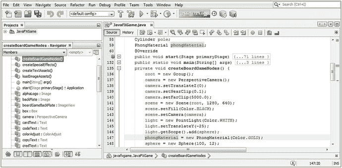

图 13-1.

声明并实例化你的 phongMaterial 对象，并将其漫反射颜色值配置为 Color.GOLD

```
PhongMaterial phongMaterial;                    // 在 JavaFXGame 类顶部声明
...
phongMaterial = new PhongMaterial(Color.GOLD);  // 在 createBoardGameNodes() 方法体中
```

如你所知，你的 PhongMaterial 对象可以配置颜色值并加载炫酷的效果纹理贴图（Image 对象），但除非你使用 Shape3D 类的 setMaterial(Material) 方法调用（你在上一章中学过）将 3D 图元与 Phong 着色器定义连接起来，否则你不会看到着色器应用到 3D 对象表面。

在球体对象实例化之后，使用点符号在 sphere 对象上添加一个 setMaterial(phongMaterial) 方法调用，如图 13-2 中黄色高亮所示。同样将此方法调用添加到你的 pole Cylinder 对象和 box Box 对象上。在截取屏幕截图之前，我在 NetBeans 9 中点击了 phongMaterial 着色器对象，以黄色高亮显示其所有使用位置，从声明到实例化再到使用。你已添加的语句的 Java 代码应如下所示：

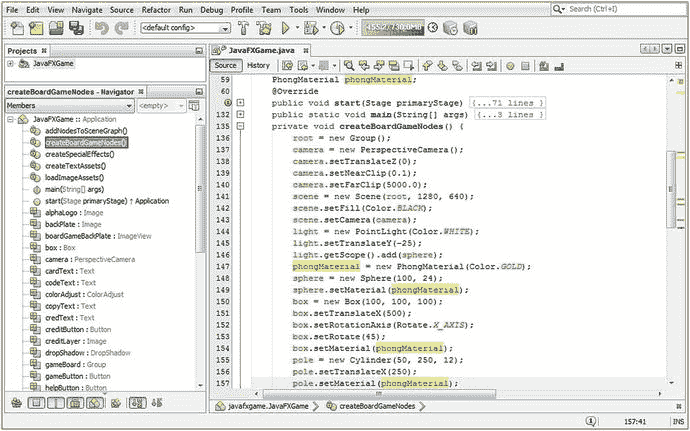

图 13-2.

使用每个对象上的 setMaterial(phongMaterial) 方法调用，将 phongMaterial 连接到三个图元

```
sphere.setMaterial(phongMaterial);
box.setMaterial(phongMaterial);
pole.setMaterial(phongMaterial);
```

使用你的“运行 ➤ 项目”工作流程，查看 phongMaterial 渲染效果，如图 13-3 所示。

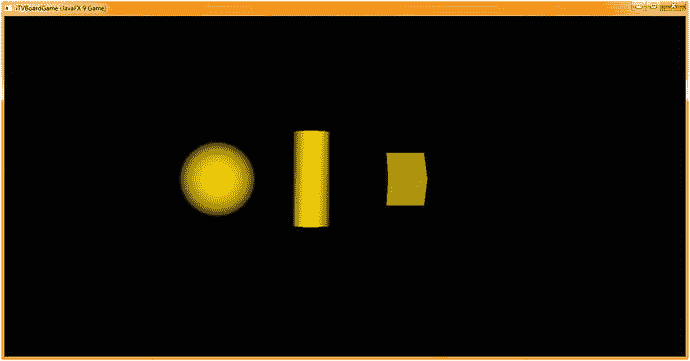

图 13-3.

显示 diffuseColor 属性设置为 Color.GOLD 值的 phongMaterial 对象

接下来，让我们使用 setSpecularColor() 方法和 Color.YELLOW 常量为你的 phongMaterial 着色器对象添加一个高光（镜面高光）颜色。在 phongMaterial 对象实例化之后添加一行代码，然后输入 phongMaterial 对象名称。按下句点键，从弹出式辅助选择器中选择 setSpecularColor(Color value) 选项，并双击将其插入到你的 Java 语句中。在参数区域内输入 Color，然后按下句点键，通过向下滚动或输入 Y 跳转到 Y 开头的颜色常量，选择 YELLOW 常量。

你最终的 Java 语句应类似于以下 Java 代码，如图 13-4 中间部分以黄色和浅蓝色高亮显示：

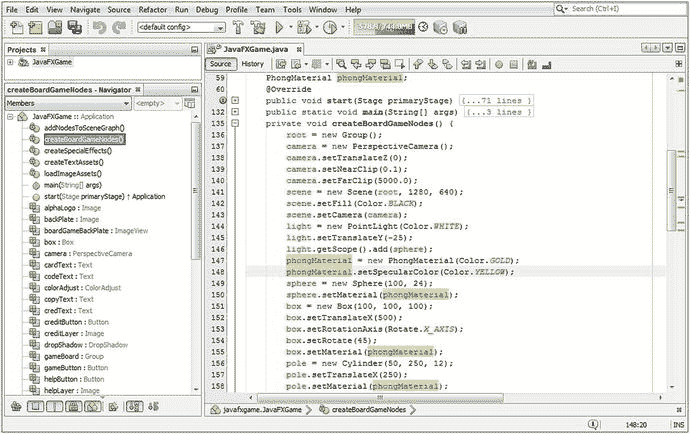

图 13-4.

在 phongMaterial 对象上调用 setSpecularColor() 方法，传入 Color.YELLOW 常量

```
phongMaterial.setSpecularColor(Color.YELLOW);
```

此时，如果你使用“运行 ➤ 项目”工作流程，你会看到图元表面的外观发生了巨大变化，图元的边缘越圆润，变化越明显。事实上，如果你比较图 13-3 和图 13-5，你会发现 Box 图元完全不受高光颜色的影响，除非你对其进行动画处理，在这种情况下，当某个面与 PointLight 平行时，它偶尔会被高光颜色着色。

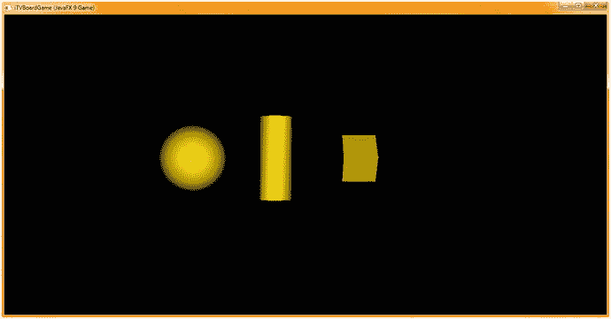

图 13-5.

运行你的项目，查看配置了 Color.YELLOW 高光颜色属性的 PhongShader 对象

然而，Cylinder 和 Sphere 类（对象）图元的外观发生了巨大变化，这是因为使用了 specularColor 属性添加了高光。我使用了 YELLOW 来赋予其金属质感，但如果你使用 WHITE（默认值），它会看起来更正常。请注意，PointLight 可以设置为 WHITE，并且你可以在 PointLight 到达图元表面之前对其进行干预（添加颜色滤镜）。

因此，如果你追求照片级真实感，请确保你的 PointLight 和 specularColor 值匹配！

PhongMaterial 类（对象）的 specularPower 属性（特性）控制表面的光泽度，至少在弯曲对象上是如此。如图 13-3 所示，零高光会创建所谓的哑光表面。需要注意的是，调用 setSpecularPower(0) 并不会移除高光。实际上，这会产生相反的效果，给你一个巨大的“过曝”高光，看起来非常糟糕。接下来让我们尝试调整这个属性，然后我们可以继续查看所有其他属性。其余属性涉及贴图及其 Image 对象，这将需要数字成像软件，在我们的案例中是 GIMP 2.10（如果已发布，也可能是 3.0）。

让我们使用 setSpecularPower() 方法调用，为 phongMaterial 着色器对象添加一个 specularPower 属性设置，双精度数据值为 12。从技术上讲，这在你的 Java 代码中注释为“12.0d”。但是，由于 Integer（仅 12）数据值符合 Double 规范，你可以直接使用 12，Java 构建和编译过程会理解你的意图，并确保其在运行时被配置为 Double 值。

在 PhongMaterial 对象实例化之后添加一行代码，然后输入 phongMaterial 对象名称。按下句点键，从弹出式辅助选择器中选择 setSpecularPower(Double value) 选项，并双击将其插入到你的 Java 语句中。在参数区域内输入 12 或 12.0d。

你最终的 Java 代码将类似于以下两个 Java 语句之一，如图 13-6 的下三分之一部分所示：

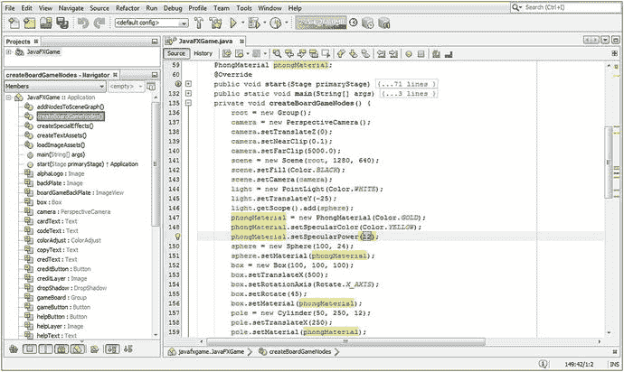

图 13-6.

在 phongMaterial 对象上调用 setSpecularPower() 方法，传入双精度值 12

```
sphere.setSpecularPower(12);    // 如果你使用 Integer（更简单）格式，Java 会为你转换
sphere.setSpecularPower(12.0d); // 你也可以使用 12.0d（双精度）所需的数字格式
```

我摆弄了这个值，更改它并通过“运行 ➤ 项目”进行渲染。默认值（如图 13-5 所示）似乎是 20 或 20.0d。更改此值会产生非常细微的变化；较小的数值会加宽高光区域（尝试设置为零，但除了特殊效果外，不要在游戏中使用它），而较大的数值会将其收缩为任何弯曲表面上的一个点。平面表面几乎不会受到此属性的影响，如果有的话。


使用“运行 ➤ 项目”工作流程，观察将 `specularPower` 设置为 12 时如何扩展高光区域。如图 13-7 所示。

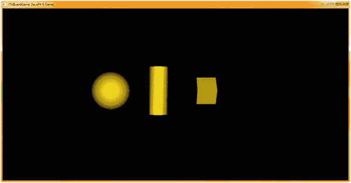

图 13-7.

将 `specularPower` 属性设置为 12 会扩展表面上的高光区域

接下来，将 `setSpecularPower()` 方法调用的值改为 100（或 100.0d），然后使用“运行 ➤ 项目”工作流程查看具有更高高光强度的图元，这将使它们看起来更闪亮，或更“有光泽”，如图 13-8 所示。


图 13-8.

将 `specularPower` 属性设置为 100 实际上会收缩或减少表面上的高光区域

既然我们在本章第一部分已经介绍了基本的漫反射颜色、高光颜色和高光强度属性，接下来让我们更进一步，学习如何应用在 GIMP 中创建的图像，利用四种纹理贴图效果（凹凸/法线、漫反射、高光以及发光或自发光）通道来掌握高级纹理映射技术。

## 使用外部图像资源：创建纹理贴图

`PhongMaterial` 类及其算法最强大的功能在于其支持的四种纹理贴图属性。这为你提供了四个着色器通道，分别用于影响表面颜色（`diffuseMap`）、光泽度（`specularMap`）、照明（`selfIlluminationMap`）和高度（`bumpMap` 或法线贴图）。可以将其想象为数字图像图层合成，在高光颜色和强度（由 `specularMap` 属性图像对象指导，如果该对象存在于 `PhongMaterial` 着色器管线中）应用到表面之前，这四个通道会由 Phong 着色器渲染算法进行组合。

### 使用外部第三方软件：使用 GIMP 创建贴图

Java 9 和 JavaFX 的设计足够灵活，允许你使用高级（专业）第三方软件，例如 GIMP（数字图像合成）、Blender（3D 建模）、Fusion（特效）、Inkscape（SVG 内容）或 Audacity（数字音频编辑）。纹理贴图通常最好在专业的像素编辑和图层合成软件中制作和优化，例如免费开源的 GIMP 2.8（即将推出 GIMP 3.0），它功能极其强大。

从 [`www.gimp.org`](http://www.gimp.org) 下载 GIMP 并安装。然后启动它，以便你可以跟随我一起创建一些纹理贴图，这些贴图将很好地演示你在本章前几页学到的四种不同类型的纹理贴图通道。使用“文件 ➤ 新建”菜单序列，访问“创建新图像”对话框（如图 13-9 中红色 1 所示），并将“宽度”和“高度”字段设置为 2 的幂次方大小。渲染器在处理二进制或 2 的幂次方数字时效果最佳，这些数字包括 2、4、8、16、32、64、128、256 等。大多数游戏使用 256 像素的纹理贴图，因此我将在此处使用该尺寸。将“颜色空间”下拉菜单设置为 RGB，并将“背景颜色填充”下拉菜单设置为白色。通过“图层 ➤ 新建图层”菜单系列，或右键单击“图层”面板（红色 3）中的“背景”图层并选择“新建图层”，来创建一个新图层，这将打开如图 13-9 中红色 2 所示的“新建图层”对话框。将“图层名称”设置为“灰度贴图”，将“图层填充类型”保留为“透明度”，然后单击“确定”按钮创建图层。使用相同的工作流程创建第二个图层，命名为“彩色贴图”，如红色 3 所示。选择“灰度贴图”图层，以指示 GIMP 接下来应用图像创建“操作”的位置，然后选择“矩形选择工具”，如图 13-9 右侧部分中间顶部所示（该工具图标呈按下状态）。矩形选择工具选项（红色 4）将如图右下角所示出现，你可以在其中精确（像素级精确）设置选区的位置和大小。

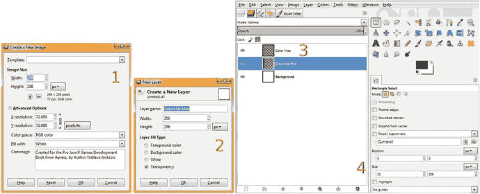

图 13-9.

创建一个 256 像素的图像，添加图层以容纳你的彩色和灰度贴图，并创建八个条纹区域

接下来，在 GIMP 画布上绘制任意大小的矩形选区，如图 13-10 右侧所示。在“位置”字段中设置 0, 0，在“大小”字段中设置 32, 256。这将使选区位于画布左侧，跨度为其八分之一。单击 GIMP 工具图标下方前景色/背景色色样旁边的小型黑上白下图标，将前景色设置为黑色，背景色设置为白色；然后使用“编辑 ➤ 用前景色填充”菜单序列，用黑色填充四个条纹中的第一个。由于该图层是透明的，而背景是白色，因此合成的结果将是一幅黑白纹理贴图（最终形成四个交替的黑白条纹）。接下来，将选区向右拖动，定位到第二个条纹填充的位置；然后将“位置”字段编辑为 64, 0，并将“大小”字段保留为 32, 256。再次使用“编辑 ➤ 用前景色填充”，并将选区拖动到位置（或将“位置”字段设置为）128, 0，选择“用前景色填充”，再将选区拖动到位置（或将“位置”字段设置为）192, 0。最后，最后一次选择“用前景色填充”，以完成黑白效果（凹凸、高光）应用纹理贴图。这个黑白（或透明）纹理贴图可以在图 13-10 中名为“灰度贴图”的第二个图层中看到。

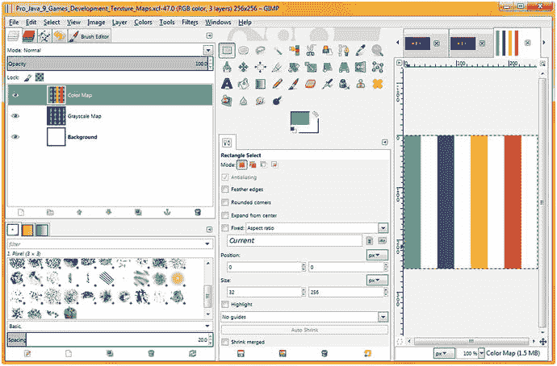

图 13-10.


在颜色贴图图层中创建沙滩球纹理，以及一个开/关（黑/白）灰度条纹纹理

既然我们已经创建了（较简单的）高光或凹凸贴图效果的图像资源，接下来让我们创建一个彩色纹理，以展示漫反射颜色贴图的工作原理。稍后，我们将把这些纹理相互结合使用（在不同的着色器通道中），并实验这些 PhongMaterial 属性能为我们的专业 Java 9 游戏开发带来哪些效果。

为了确保颜色数据与效果（灰度）数据分离，请选择颜色贴图图层，该图层会变为蓝色以表示已选中，如图 13-10 左侧所示。如果你愿意，可以点击图层左侧的眼睛图标关闭灰度贴图图层的可见性。在位置字段中设置 0, 0，在大小字段中设置 32, 256。这会将选区再次置于画布左侧八分之一跨度处。点击前景/背景色板（颜色选择器）上的黑色色块，调出颜色选择器对话框，设置一种绿色，如图 13-10 所示。点击确定后，前景色将变为绿色，背景色保持白色。使用编辑 ➤ 用前景色填充菜单序列，用绿色填充四个条纹中的第一个。由于图层是透明的，背景为白色，最终合成结果将是一个绿白相间的纹理贴图（最终形成四个交替的彩色和白色条纹）。接下来，将选区向右拖动 64 像素，定位到第二个条纹填充位置；然后将位置字段设置为 64, 0，大小字段保持 32, 256。使用颜色选择器设置蓝色，再次使用编辑 ➤ 用前景色填充创建第二个蓝色条纹。接着，向右拖动 64 像素到位置 128（或将位置字段设置为 128, 0），使用颜色选择器选择黄色前景色，并用前景色填充第三个条纹。最后，将选区拖动到位置 192, 0（或使用位置字段设置），使用颜色选择器选择红色前景色，然后最后一次使用编辑 ➤ 用前景色填充菜单序列，完成沙滩球颜色（漫反射、自发光）应用纹理贴图的创建。图 13-10 显示了在 GIMP 中完成的最终结果。

我还将创建一个纹理贴图，使用交替的 25% 灰度和 50% 灰度条纹，以展示不同效果的应用，例如高光和自发光，以及如何通过使用不同深浅的灰度来控制效果应用的强度或幅度。你可以将创建这第三个贴图作为“练习环节”，重新演练我们之前用于彩色和黑白纹理贴图的工作流程。要导出你在 GIMP 2.10 中创建的任何纹理贴图，可以使用文件 ➤ 导出图像菜单序列，这将调出如图 13-11 所示的导出图像对话框。

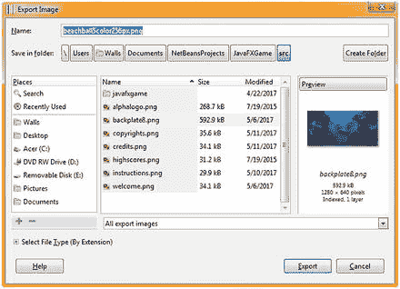

图 13-11.

导出到 C:\Users\Name\Documents\NetBeansProjects\JavaFXGame\src

如图 13-11 所示，你可以使用此对话框顶部的文件导航部分找到你的 NetBeansProjects 文件夹。我在文件名中包含了描述、颜色数量和像素数量。请确保使用你的 JavaFXGame 文件夹和 \src\ 子文件夹，该文件夹存放游戏源资源，正如本书迄今为止所做的那样。一旦文件位于正确的文件夹中，NetBeans 9 就能识别它们，我们可以在代码中将它们用作图像对象资源。接下来，让我们回到 PhongMaterial 对象编码，进一步探索着色器管线创建，因为这是让你的专业 Java 9 i3D 游戏看起来真正惊艳的方法之一。

### 在 PhongMaterial 中使用纹理贴图：着色器特效

在 JavaFX 中使用图像对象的第一步，是在类顶部将图像对象的名称添加到图像对象复合声明语句中。我将根据图像对象将要使用的属性来命名它们。接下来，由于我们有一个 loadImageAssets() 方法，我们将添加四个图像实例化语句，这些语句引用包含纹理映射数据的 PNG 文件。Java 代码如图 13-12 所示，应如下所示：

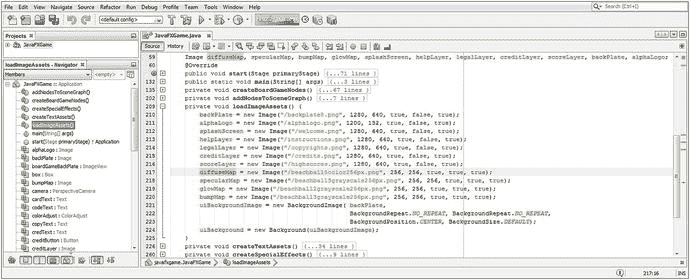

图 13-12.

声明并实例化图像对象，以保存漫反射、高光、自发光或凹凸贴图的纹理映射数据

```
Image diffuseMap, specularMap, glowMap, bumpMap // 加上其他已在使用的图像对象
...
diffuseMap = new Image("/beachball5color256px", 256, 256, true, true, true);
specularMap = new Image("/beachball3grayscale256px", 256, 256, true, true, true);
glowMap = new Image("/beachball2grayscale256px", 256, 256, true, true, true);
bumpMap = new Image("/beachball3grayscale256px", 256, 256, true, true, true);
```

接下来，进入 createBoardGameNodes() 方法，将漫反射和高光颜色设置改为 Color.WHITE 值，并在 phongMaterial 对象上添加 setDiffuseMap(diffuseMap) 方法调用。漫反射颜色纹理贴图语句的 Java 代码（在图 13-13 中以蓝色高亮显示）应如下所示：

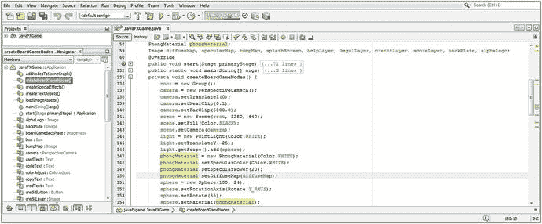

图 13-13.

向着色器管线添加 diffuseMap 以增加表面颜色，并将高光和漫反射颜色设置为白色

```
phongMaterial = new PhongMaterial(Color.WHITE);
phongMaterial.setSpecularColor(Color.WHITE);
phongMaterial.setSpecularPower(20);
phongMaterial.setDiffuseMap(diffuseMap);
```

接下来，使用运行 ➤ 项目工作流程，再次查看你的图元。如图 13-14 所示，你的图元表面现在正使用漫反射贴图来控制其表面着色，而球体 3D 图元现在看起来像一个沙滩球。

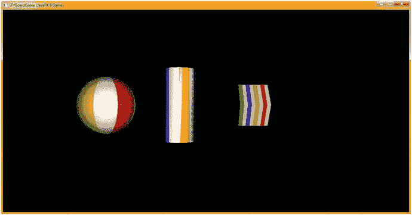

图 13-14.

漫反射颜色纹理贴图现在正在绘制图元表面，将球体变成了沙滩球

接下来，让我们将球体图元旋转 25 度，使黄色和白色条纹的分界线出现在高光区域中，我们在之前的代码中已将其恢复为默认设置 20。

我们将使用 beachball3grayscale256px.png 图像资源；它有八个条纹，其中四个是 100% 开启（白色），两个是 75% 开启（25% 灰度），两个是 50% 开启（半功率，即 50% 灰度）。这样做会“减弱”或降低沙滩球白色部分的高光耀斑，因为高光贴图定义了高光效果（光泽度）的强度或量。

我们将保留 phongMaterial 上的 setDiffuseMap(diffuseMap) 方法调用，因为在本章中，我们正试图构建一个高级着色器渲染管线，将 PhongMaterial 类推向专业着色器效果创建管线的极限，就像我们在 3D 软件中所做的那样，但仅使用 JavaFX API 和 Java 9 语句。

因此，在 setDiffuseMap() 方法调用之后，我们将添加一行 Java 代码，在 phongMaterial 对象上调用 setSpecularMap()，然后传入 specularMap 图像对象，该对象已在 loadImageAssets() 方法中设置为 beachball3grayscale256px.png 图像资源，如图 13-12 所示。这一切将通过使用以下 Java 语句完成，这些语句在图 13-15 底部高亮显示：

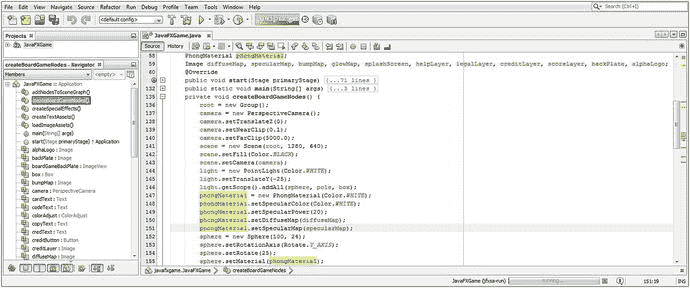

图 13-15.


向着色器管线添加高光贴图（SpecularMap）图像引用，以控制镜面高光强度

```
phongMaterial = new PhongMaterial(Color.WHITE);
phongMaterial.setSpecularColor(Color.WHITE);
phongMaterial.setSpecularPower(20);
phongMaterial.setDiffuseMap(diffuseMap);
phongMaterial.setSpecularMap(specularMap);
sphere = new Sphere(100, 24);
sphere.setRotationAxis(Rotate.Y_AXIS);
sphere.setRotate(25);
sphere.setMaterial(phongMaterial);
```

现在再次使用“运行 ➤ 项目”工作流程，将此着色器管线渲染到你的 3D 场景中。如图 13-16 所示，球体图元上的镜面高光似乎在黄色和白色之间的分界线处被截断。这是由于高光贴图（降低了纹理贴图交替区域的镜面高光强度）造成的。在圆柱体图元上也能看到这种现象。你可能已经注意到，我将摄像机对象到场景中心的距离从 250 个单位减少到了 100 个单位，以便放大视图，同时我也增大了 3D 图元的尺寸，这样我们就能更清晰地看到纹理映射效果。

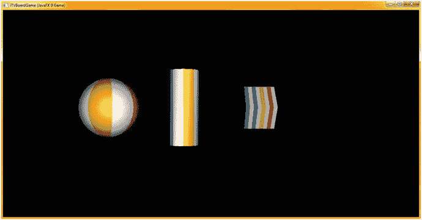

图 13-16.

曲面球体和柱体对象上的镜面高光在彩色区域现在变得更亮

接下来，让我们将球体图元旋转回 5 度，使黄色部分位于镜面高光的中心，两侧为白色条纹。这将更准确地展示自发光贴图的能力。

我们将使用 `beachball2grayscale256px.png` 图像资源，它包含八条条纹。其中四条为 100% 开启（白色），另外四条为 100% 关闭（黑色），这几乎是效果处理纹理映射中能达到的极端情况，因为这相当于完全应用（白色或全部为 255 值）或不应用（黑色或零值）。

这种自发光贴图（在 3D 软件中通常称为发光贴图）的作用是将 3D 图元上映射为白色的部分像光源一样点亮，而黑色区域则不会被照亮，并会使用现有的纹理贴图管线。灰度值越高，添加的光线越多，因此 25% 的灰度将模拟 25% 的照明强度（25% 的光照强度）。我们将保留 `phongMaterial` 上的 `setDiffuseMap()` 和 `setSpecularMap()` 方法调用，因为我们正尝试构建一个高级着色器渲染管线，并将 `PhongMaterial` 类推向专业着色器效果创建管线的极限，就像在 3D 软件中一样，但仅使用 JavaFX API 和 Java 9 语句。

因此，在 `setSpecularMap()` 方法调用之后，我们将在 `phongMaterial` 对象上调用 `setSelfIlluminationMap(glowMap)` 方法，并传入 `glowMap` 图像对象，该对象设置为在 `loadImageAssets()` 方法中实例化的 `beachball2grayscale256px.png` 图像资源，如图 13-12 所示。这一切将通过以下 Java 语句完成，这些语句在图 13-17 底部以黄色和浅蓝色高亮显示：

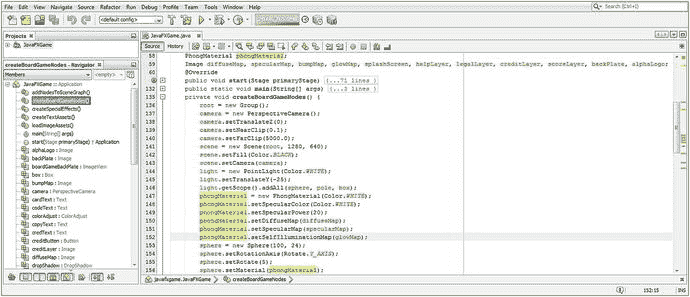

图 13-17.

向着色器管线添加自发光贴图（SelfIlluminationMap）图像引用，以控制自发光强度

```
phongMaterial = new PhongMaterial(Color.WHITE);
phongMaterial.setSpecularColor(Color.WHITE);
phongMaterial.setSpecularPower(20);
phongMaterial.setDiffuseMap(diffuseMap);
phongMaterial.setSpecularMap(specularMap);
phongMaterial.setSelfIlluminationMap(glowMap);
sphere = new Sphere(100, 24);
sphere.setRotationAxis(Rotate.Y_AXIS);
sphere.setRotate(5);
sphere.setMaterial(phongMaterial);
```

图 13-18 展示了在所有三个图元上应用自发光贴图后的“运行 ➤ 项目”Java 代码测试工作流程。白色区域已变成光源，而彩色区域仍显示漫反射和高光映射特性。`selfIlluminationMap` 属性代码中的抗锯齿算法部分似乎存在一些问题，正如你在球体图元的边缘所看到的那样。

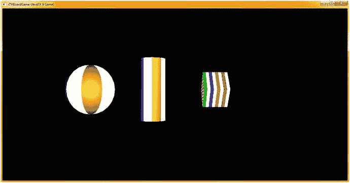

图 13-18.

自发光贴图将 3D 图元上的白色区域变成光源，而彩色区域保持不变

接下来，让我们看看如何利用目前所学知识，在 GIMP 2.8.22 中创建一些着色器的纹理贴图组件，以便用于我们将在第 14 章中创建的 `gameBoard` 组节点层级结构，届时我们将开始使用 Java 9 中的 JavaFX 9 API 构建我们的 i3D 游戏。

## 游戏板纹理化：创建游戏板方块

理解抽象的 `Mesh` 超类及其与 `TriangleMesh` 子类（可用于“手写”复杂的网格对象）的关系，以及它与 `MeshView` 类（实际上是 `Shape3D` 的子类，而非 `Mesh` 的子类！）的关系，这一点非常重要。这样 `MeshView` 才能继承（扩展）`Shape3D` 的 `cullFace`、`drawMode` 和 `material` 属性，而这些属性对于使网格对象逼真（尤其是材质属性和 `Material` 类）至关重要。正如你将看到的，`MeshView` 构造函数接受一个 `Mesh` 对象，因此这是复杂 3D 对象所基于的核心类（算法）；因此，`Mesh` 和 `MeshView` 是专业 Java 9 游戏开发中使用的关键类。如果出于某种原因，你想编写复杂的多边形几何体（也称为“三角形网格”，这不是最佳工作流程），你可以使用 `TriangleMesh`，我们将在后面详细讨论。

更好的工作流程是使用外部 3D 软件包，将你的 3D 对象直接“导入”到 `Mesh` 对象中，然后由 `MeshView` 对象引用。我们将用整整一章来介绍如何使用这些 JavaFX 类“建模”一个 3D 游戏，这样你就不必导入任何“数据量大”的网格对象。导入 3D 资源可以是一种更快地让高级 i3D 游戏快速高效运行的方法，也是一种将专业工匠引入 i3D 游戏开发工作流程的方法。


### 准备创建游戏棋盘：代码重构

让我们为下一章（构建 i3D 游戏棋盘）的内容做好准备，并重构我们的 Java 代码主体，涉及以下方法：`gameButton` 事件处理器、`createBoardGameNodes()` 方法、`addNodesToSceneGraph()` 方法以及 `loadImageAssets()` 方法。我们将从摄像机对象的推拉（dollying）切换为设置摄像机 Z = 0，转而使用 FOV 来缩放场景。由于我们暂时要删除球体（Sphere）和圆柱体（Cylinder）图元，我们将 X 和 Y 平移属性设置为 -500，并将摄像机绕 x 轴旋转 45 度，使其俯视游戏棋盘。进行这些摄像机调整的 Java 代码如图 13-19 所示，内容如下：

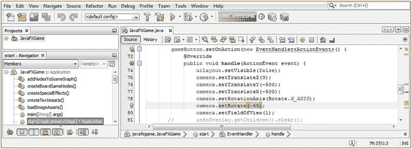

图 13-19.

重新配置摄像机对象，使其推拉至 Z = 0，旋转 45 度，并通过 FOV = 1 进行放大

```
camera.setTranslateZ(0);
camera.setTranslateY(-500);
camera.setTranslateX(-500);
camera.setRotationAxis(Rotate.X_AXIS);
camera.setRotate(-45);
camera.setFieldOfView(1);
```

接下来，让我们移除球体（Sphere）和圆柱体（Cylinder）的实例化及配置语句；如果你愿意，可以在类顶部保留这些声明，因为我们稍后还会用到它们。

为了制作一个游戏棋盘方格，它将用于游戏棋盘的周边，尺寸为 150 单位见方、5 单位薄（高），我们将保留 Box 对象，并使用 `Box(150,5,150)` 方法调用来构造它。我还会暂时将其旋转 45 度，使顶点（角）朝向摄像机对象。我们可以保留 `PhongMaterial` 代码，因为一旦我们在 GIMP 中创建了漫反射贴图，要更改它，只需修改 `loadImageAssets()` 方法中的文件名即可，我们将在创建游戏棋盘方格纹理贴图后执行此操作。别忘了，如果你忘记移除已从 SceneGraph 节点中移除的对象，编译时将会出现致命错误。

如前所述，Box 构造方法非常基础，其 Java 代码如图 13-20 所示：

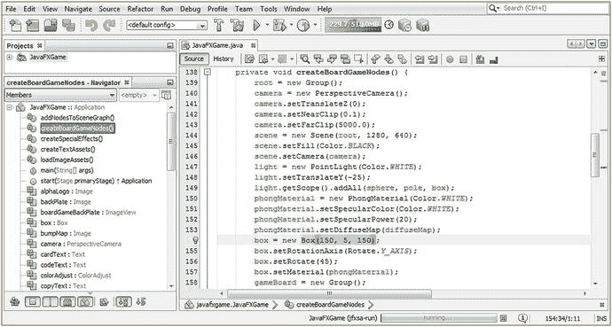

图 13-20.

移除球体和圆柱体的实例化及配置，并将盒体尺寸更改为 150, 5, 150

```
box = new Box(150, 5, 150);
box.setRotationAxis(Rotate.Y_AXIS);
box.setRotate(45);
box.setMaterial(phongMaterial);
```

接下来，让我们处理从 `gameBoard` Group 对象中移除这些（当前）未使用的圆柱体和球体图元，这将使我们的 `addAll()` 方法调用变回 `add()` 方法调用。如果你忘记执行此操作并尝试选择“运行 ➤ 项目”，它将无法编译。最终的 Java 语句如图 13-21 所示，内容如下：

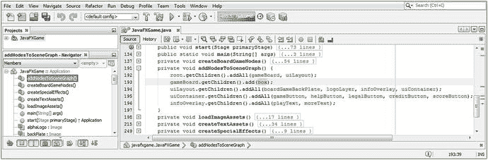

图 13-21.

暂时从 `gameBoard.getChildren().addAll()` 方法调用中移除圆柱体和球体对象

```
gameBoard.getChildren().add(box);
```

现在，让我们回到 GIMP，为我们的纹理贴图合成添加一个图层，并创建一个游戏棋盘方格。

### 创建游戏棋盘方格漫反射纹理：使用 GIMP

让我们在本章中完成部分游戏棋盘方格的设计，这样在下一章中，我们只需设计棋盘中心、创建周边方格，并对图像进行颜色偏移，以区分各个方格。我们将使用本章前面使用的相同方法在 GIMP 中完成此操作，使用相同的 32x256 条纹，只是这次四条条纹将位于游戏棋盘方格的周边。我们将使用 RGB 255,0,0（纯红色），以便稍后使用 GIMP 中的算法对该值进行颜色偏移。

打开你的多层 GIMP XCF 文件，右键单击顶层，使用“新建 ➤ 图层”菜单项创建一个空的透明图层。关闭除白色背景层之外的其他图层中的所有可见性（眼睛）图标。将图层名称设置为 `GameBoardTile`。确保选中此图层，使其变为蓝色，以告知 GIMP 接下来应用图像创建“操作”的位置。

选择你的矩形选择工具，如图 13-22 中上部中间附近所示。矩形选择工具选项将出现在工具图标下方，如图底部中间所示，你可以在其中（再次）精确（像素级精确）设置选择的位置和大小设置。

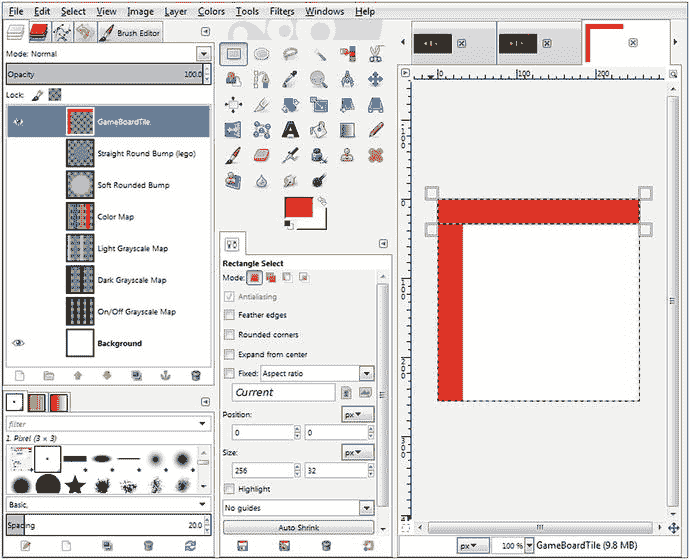

图 13-22.

使用本章前面相同的矩形选择技术来创建游戏棋盘方格

接下来，在 GIMP 画布上绘制任意大小的矩形选区，如图 13-22 右侧所示。在“位置”字段中设置 0, 0，在“大小”字段中设置 32, 256。这将把选区放置在画布左侧八分之一跨度处。单击位于 GIMP 工具图标下方的前景色/背景色色板中的顶部颜色，将前景色设置为红色。然后使用“编辑 ➤ 用前景色填充”菜单序列，用红色填充前四条条纹。由于此图层是透明的，背景是白色，因此最终的合成结果将是一个红白相间的纹理贴图（最终是四条重叠的红色周边条纹）。

接下来，将选区向右拖动，定位以填充第二条条纹。然后编辑“位置”字段，保持设置为 0, 0，并反转“大小”字段，将其设置为 256, 32，如图 13-22 所示。再次选择“编辑 ➤ 用前景色填充”。仅需几步操作，游戏棋盘方格漫反射颜色纹理贴图的一半就创建完成了！

让我们完成另外两条周边条纹：再次将选区拖动到位置（或，将“位置”字段设置为）224, 0，位于 256 像素纹理贴图画布的右侧。确保将“大小”数据字段重新设置为 32, 256（宽度，高度），然后再次使用“编辑 ➤ 用前景色填充”用红色填充右侧周边条纹（这也是 JavaFX 中的一个颜色类常量）。最后，将选区拖动到位置（或将“位置”字段设置为）0, 224，然后最后一次使用“编辑 ➤ 用前景色填充”，以完成黑白效果（凹凸、高光）应用纹理贴图。

除了能够为漫反射颜色纹理贴图偏移此周边颜色以创建数十个独特的游戏棋盘方格之外，由于内部颜色是白色，因此不会受到影响（白色、黑色和灰色没有可进行颜色偏移的颜色值）。

利用我们在本章中学到的其他概念和代码技术，我们将能够创建其他 `PhongMaterial` 类着色器对象，当游戏棋子落在某个特定的游戏棋盘方格上时，这些对象将使当前活动的游戏棋盘方格呈现出与其他方格不同的高亮、发光或颜色效果。


需要注意的是，这一切将仅使用一张漫反射颜色纹理贴图（680 字节，即不到 1KB 的数据/内存）来完成，从而为你的游戏玩法交互式地带来更专业的用户体验。我还会使用黑色、白色和灰色创建一张（或两三张）特效纹理贴图，这些贴图将与红白相间的纹理逐像素匹配，从而在游戏代码中实现最精确（如外科手术般精准）的特效应用。白色边缘（内部黑色）可以让我仅隔离颜色区域以应用特效，而黑色边缘（内部白色）则可以让我隔离游戏棋盘格内部区域以应用特效。我们将把这些少量纹理与数字成像（第 2 章）以及漫反射和高光颜色控制结合起来。

最后，请务必使用 GIMP 的“文件 → 导出为”工作流程，如图 13-11 所示，将完成的游戏棋盘格漫反射纹理贴图数据保存到 NetBeansProject 文件夹和 JavaFXGame 子文件夹中正确的源资源文件夹内，文件命名为 `gameboardsquare.png`。现在，我们只需在 `loadImageAssets()` 方法体内部的 `diffuseMap` Image 对象实例化中，将这个文件名引用替换进去，就可以在我们之前创建的新的 Box 对象配置（参见前面的图 13-20）上使用它了，该配置使用了 `Box()` 构造方法。

打开你的 `loadImageAssets()` 方法体，编辑你的 `diffuseMap` Image 对象实例化，使其引用你从 GIMP 导出到 `NetBeansProject\JavaFXGame\src\` 文件夹的 `gameboardsquare.png` 文件。新的 Image 实例化的 Java 语句应如下所示，如图 13-23 中黄色和浅蓝色高亮显示：

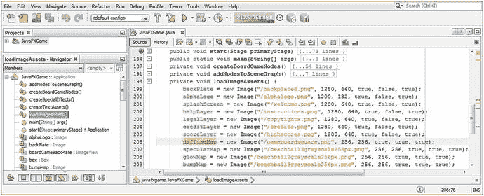

图 13-23.

将你的 diffuseMap Image 对象实例化语句修改为引用你的 gameboardsquare.png 文件

```
diffuseMap = new Image("/gameboardsquare.png", 256, 256, true, true, true);
```

图 13-24 展示了“运行 ➤ 项目”Java 代码测试工作流程；你可以看到新的游戏棋盘格 Box 对象已映射上你刚刚使用 GIMP 2.8.22（或更高版本）创建的漫反射颜色纹理贴图。

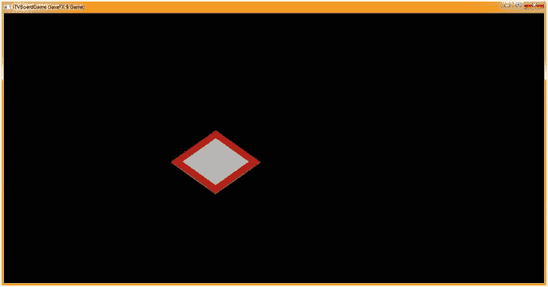

图 13-24.

我们现在有了一个游戏棋盘格，它将在后续章节中沿边缘进行复制

边缘有一些白色（JavaFX 目前不允许对 Box 对象进行逐面映射），我们将在后续章节中通过调整 `camera.setRotate()` 方法调用的值来尽量减少这种现象，直到它变得不那么明显。

在结束本章关于着色器管线创建和纹理贴图的内容之前，我想最后提一点关于如何使用 JavaFX 为你的 3D 基本体“蒙皮”的技巧。你可能想知道为什么我为此纹理使用了 PNG24（24 位）图像格式，而不是更优化的 PNG8 格式。嗯，这个 PNG24 编解码器在将 256 × 256 × 3（196,608）字节压缩到 680 字节方面做得相当出色，数据量减少了 290:1，即 99.67%！

从更技术的角度来看，Java 在内存中会使用 24 位 RGB 颜色表示，因此，如果我们使用了索引 8 位彩色图像，它在加载到内存时也会被简单地转换回 24 位彩色值图像。因此，我倾向于尽可能使用 PNG24 和 PNG32 图像，特别是对于主要用于专业 Java 9 游戏设计和开发应用的 3D 纹理贴图，其尺寸通常为 32x32、64x64、128x128、256x256 和 512x512。对于摄影图像，你也可以使用 JPEG。

## 总结

在第十三章中，我们学习了 `javafx.scene.paint` 包中的类，这些类允许你处理 3D 着色器、纹理贴图和材质，包括基于抽象 Material 超类的 PhongMaterial 类。我们了解到 Material 类基本上是一个“空”类或“外壳”，用于容纳“材质”对象（Shape3D 类中的属性），而繁重的工作（算法）则在 PhongMaterial 子类中。我们相当详细地研究了该类中的属性、构造器和方法调用，以便你了解 PhongMaterial 对象能做什么，然后我们研究了如何在 Java 代码中实现这些（除了 bumpMap，它在我当前使用的 JavaFX 9 代码库中无法正常工作，所以我们将在本书后面重新讨论这个问题）。

你学习了如何使用 GIMP（本书当前版本为 2.8.22，但我预计 2.10 将在 2017 年发布，3.0 将在 2018 年发布）创建纹理贴图资源，以及如何通过使用 GIMP 工具以最佳工作流程实现外科手术般的精确度，创建平衡、像素精确、尺寸为 2 的幂的纹理贴图，为专业 3D 游戏开发进行优化。

然后，我们研究了如何将这些纹理贴图资源实现到当前 JavaFX 9 PhongMaterial 类提供给我们的四个纹理贴图“通道”中。我们看到了这些纹理贴图通道如何让我们微调材质属性的渲染方式，从而为我们的 Java 9 游戏创造更专业的外观。

最后，我们为游戏棋盘格创建了 `diffuseColor` 属性纹理贴图，将 Box 对象转换成了这些游戏棋盘格之一，并将新的纹理贴图应用到了新的 3D 基本体“平面”对象上，为下一章（在 SceneGraph 中创建我们的 `gameBoard` 分支）要做的事情做准备，这样在创建过程中它看起来就像一个游戏棋盘。如你所知，我建议在进行专业 Java 9 游戏开发时，采用这样一种方式：在编写 Java 9 代码、创建新的媒体资源以及“演变”你的专业 Java 9 游戏内容和交付物，使其最终成为你想要的样子时，你能看到 JavaFX 9 将要做什么。专业 Java 9 游戏开发是一个精炼的过程，所以我正是以这种方式撰写本书的。我向你展示我是如何实际使用 NetBeans 9 IDE 以及 Java 9 和 JavaFX 9 API“凭空变出一个 3D 棋盘游戏应用”的。

在第 14 章中，我们将进一步优化我们的 Java 代码组织，创建新方法并重组一些现有方法，以创建并整合我们 i3D 棋盘游戏的核心——游戏棋盘。我们将在 `gameBoard` Group 节点（分支）下创建一个嵌套的 Group 3D 层次结构，并研究 3D 基本体的 X、Y、Z 定位以及相关概念，这些概念适用于以无缝方式布局 3D 游戏棋盘，以便未来的 Java 代码能够以逻辑、最优的方式访问和引用其组件和子组件。就像数据库设计一样，你如何设计 SceneGraph 会极大地影响你的 Pro Java 9 3D 游戏未来的运行方式。我们越能保持设计、层次结构和 3D 对象命名方案的简单直接，在编写未来用于交互、动画、移动、碰撞检测等的代码时，我们的处境就越好。至此，你应该开始对 Java 9 和 JavaFX 9 为你提供的可能性感到兴奋了。


