# 14. 3D 模型层级结构创建：使用基本几何体构建游戏棋盘

现在你已经学会了如何使用 JavaFX 的 Phong 着色器算法及其各种颜色和效果映射通道来为 3D 基本几何体“蒙皮”，并创建了色彩丰富、高度优化的游戏棋盘方格纹理贴图，是时候添加一些自定义方法来构建游戏棋盘并设置带有纹理贴图的 Phong 着色器对象了。我们需要创建一个`createGameBoardNodes()`方法来组织构成 3D 游戏棋盘的 3D 基本几何体资源，因为`createBoardGameNodes()`方法应该（也确实）包含更高级别的节点子对象实例化和配置，例如场景、根节点、UI 堆栈面板、3D 游戏棋盘组、摄像机、光照，以及四个名为 Q1 到 Q4（象限 1 到 4）的游戏棋盘象限组对象。我们还将创建其他 19 个游戏棋盘方格对象，分别命名为 Q1S1 到 Q1S5、Q2S1 到 Q2S5、Q3S1 到 Q3S5 和 Q4S1 到 Q4S5，以保持对象名称简短。将对象命名为 Quadrant1Square1（Q1S1）的缩写版本将使使用这些缩写术语的 Java 代码更具可读性。

在本章中，你将构建场景图中位于场景图根节点下的 gameBoard 组分支，该分支紧邻你已经构建好的 uiLayout 分支。在 gameBoard 组分支下，我们将把游戏棋盘划分为四个象限，这样游戏棋盘中央就可以有四个较大的 300x300 单位区域用于游戏玩法，每个象限包含 20 个外围游戏棋盘方格中的 5 个作为子对象。通过一个三层级的 3D 基本几何体对象层级结构，我们可以整体访问整个游戏棋盘（例如，旋转它），以单元形式访问每个象限（例如，使其悬浮或应用着色器效果），并访问层级结构底部的单个游戏棋盘方格（叶子节点子对象）。让我们开始吧！本章中我们将编写数百行新的 Java 代码来实现基本几何体、着色器、图像和场景图层级节点。

## 基本几何体创建方法：createGameBoardNodes()

由于创建 24 个基本几何体（4 个中央棋盘象限和 20 个外围方格）需要超过 100 条 Java 语句（使用 new 实例化、setTranslateX()、setTranslateZ()、setMaterial()等），让我们专门创建一个方法来容纳我们的游戏棋盘对象及其实例化和配置语句。这样，createBoardGameNodes()方法将创建全局和顶层的节点子类对象（场景、根节点、摄像机、光照、uiLayout 分支、gameBoard 分支、Q1 到 Q4 分支等）。在本章后面，我们还将把 PhongMaterial 着色器创建逻辑提取到另一个自定义的 createMaterials()方法中，在那里我们将创建几十个自定义着色器对象，用于为游戏棋盘的各种组件蒙皮。为了让 NetBeans 9 为你创建这个新方法，请在 start()方法的第一部分中，在 createBoardGameNodes()方法调用之后添加一行代码，然后输入以下 Java 方法调用，命名你的新方法：

```
createGameBoardNodes();
```

NetBeans 会意识到这不是一个有效的方法调用，并用波浪形红色下划线突出显示。

使用 Alt+Enter 工作流程，双击图 14-1 中高亮显示的 javafxgame.JavaFXGame 选项中的“创建方法 createGameBoardNodes()”，让 NetBeans 为你创建一个空的方法体结构。接下来，从 createBoardGameNodes()中移除与 Box 对象相关的代码，并将这些代码放置到这个新方法中。我们还将移除圆柱体 pole 和球体 sphere，以免它们干扰你的游戏棋盘设计。

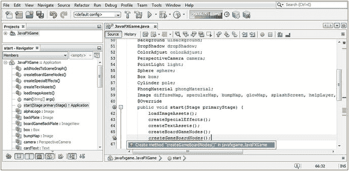

图 14-1.

打开 start()方法；在 createBoardGameNodes()之后输入 createGameBoardNodes()方法调用

从.createBoardGameNodes()中剪切并粘贴你的 Box 基本几何体代码到.createGameBoardNodes()，并将 box 重命名为 Q1S1。删除所有 Java 语句，只保留实例化和着色器方法调用，如图 14-2 所示：

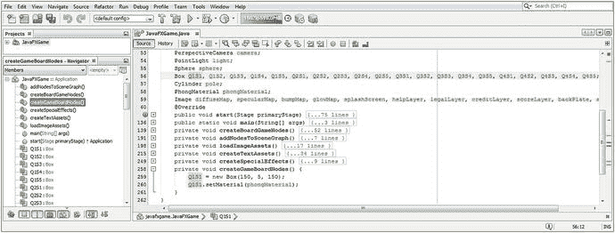

图 14-2.

将基本几何体代码复制到 createGameBoardNodes()；删除除实例化和.setMaterial 之外的所有内容

```
Q1S1 = new Box(150, 5, 150);
Q1S1.setMaterial(phongMaterial);
```

使用以下代码（也显示在图 14-3 中）更改引用 box 的 Java 代码，使其引用 Q1S1：

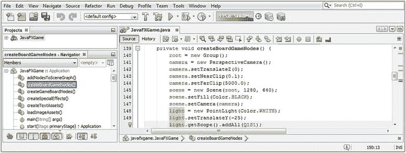

图 14-3.

确保在 createBoardGameNodes()和 addToSceneGraph()中将所有对 box 的引用更改为 Q1S1

```
light.getScope().addAll(Q1S1);
```

你还必须打开 addNodesToSceneGraph()方法，并在 gameBoard 节点的代码行中将 box 更改为 Q1S1，这样 Q1S1 游戏棋盘方格将在我们即将进行的测试渲染中可见。稍后，我们将在此语句中引用 Q1 到 Q4 象限，然后使用这些分支节点引用游戏棋盘方格对象，这是我们接下来要做的，以创建三层级结构。你最终的 Java 语句应类似于以下 Java 9 代码，如图 14-4 中间以黄色和浅蓝色高亮显示：

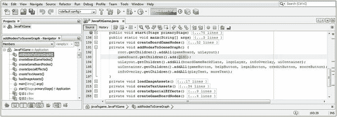

图 14-4.

暂时将第一个 Q1S1 游戏棋盘方格添加到 gameBoard 组节点，以便编译测试渲染

```
gameBoard.getChildren().add(Q1S1);
```

如果你使用“运行 ➤ 项目”工作流程，此时你将在图 14-5 中看到，我们已经将 3D 场景重置为仅一个游戏棋盘方格，我们可以开始相对于该方格构建游戏棋盘的其他部分。

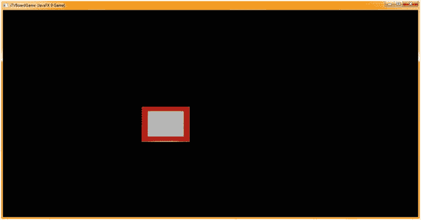

图 14-5.


使用“运行 ➤ 项目”工作流程来测试渲染从 Box 到 square 的 3D 场景重构。

现在，是时候开始在 SceneGraph 的 3D gameBoard Group 分支下构建 SceneGraph 层级结构了。gameBoard Group 将包含四个象限 Group 分支，分别命名为 Q1 到 Q4。这些象限 Group 节点对象中的每一个都将包含一个 Box 基本体象限（游戏板中心的四分之一）以及该象限所附带的五个游戏板方格。q1 到 q4 象限平面对象也将是 Box 基本体，其大小是游戏板方格的四倍（300x300）。

我打算将 gameBoard Group 对象的实例化移到根 Group 实例化之下，然后在 `createBoardGameNodes()` 方法的顶部，将 Q1 到 Q4 Group 对象的实例化添加在其下方，这样 Java 代码的顺序就能反映父子层级关系。你的叶子对象（最底层的节点）将在 `createGameBoardNodes()` 方法内部创建，包括 q1 到 q4 象限平面对象，它们是 Q1 到 Q4 Group（分支）节点的叶子节点。

如果你愿意，可以使用方便的复制粘贴编程技巧，先输入第一个 Q1 Group 对象的实例化语句，然后在其下方再复制粘贴三次，将 Q1 依次改为 Q2 到 Q4，因为此时我们只是创建四个空的象限组节点，这些节点将引用它们上方的 gameBoard Group 节点以及它们下方的 Q1S1 到 Q4S5（以及 q1 到 q4）叶子节点。生成的 Java 代码应如下所示，如图 14-6 顶部以黄色、红色和蓝色高亮显示的部分：

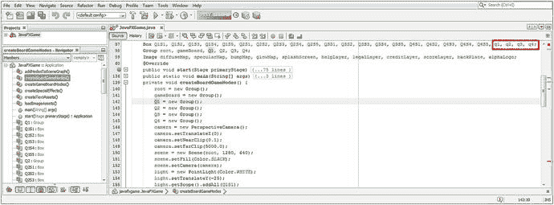

图 14-6.

在 gameBoard Group 下添加四个 Group 分支节点对象实例化，命名为 Q1 到 Q4

```
gameBoard = new Group();
Q1 = new Group();
Q2 = new Group();
Q3 = new Group();
Q4 = new Group();
```

现在，我们需要从 gameBoard 分支节点中移除 Q1S1 叶子节点，并用 Q1 到 Q4 分支节点替换它。为了让 Q1S1 Box 基本体在我们选择“运行 ➤ 项目”（渲染）3D 场景时显示出来，你需要创建第二个“节点构建器”`.getChildren().add()` 方法链，从 Q1（Q1S1 对象的父分支）开始，这样 gameBoard 节点就能引用 Q1 节点，而 Q1 节点又能引用 Q1S1 节点。

你重新配置后的 `addNodesToSceneGraph()` 方法语句现在将包含六条 Java 语句，而你的 gameBoard SceneGraph 层级结构，从根节点到游戏板方格，现在跨越了三条 Java 9 语句，这些语句在 `addNodesToSceneGraph()` 方法中应如下所示，如图 14-7 中间部分以黄色和蓝色高亮显示（相关声明也在顶部高亮显示）：

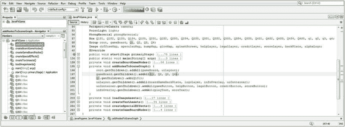

图 14-7.

将 gameBoard 节点构建器中的 Q1S1 引用替换为 Q1 到 Q4，并添加一个 Q1 节点构建器

```
root.getChildren().addAll(gameBoard, uiLayout);
gameBoard.getChildren().addAll(Q1, Q2, Q3, Q4);
Q1.getChildren().add(Q1S1);
```

接下来，让我们添加 q1 Box 游戏板中心象限，它将成为 Q1S1 游戏板方格的父节点；因此，这是接下来合乎逻辑的添加项。由于你已经在类的顶部声明了 q1 到 q4 Box 对象，如图 14-6 到 14-8 所示，你可以先将这个 q1 对象添加到你的 Q1 分支节点中，或者先在 `createGameBoardNodes()` 方法中使用参数 300, 5, 300（X, Y, Z）实例化它，然后再将其添加到 `addNodesToSceneGraph()` 方法中，正如你在图 14-8 和以下 Java 代码中看到的那样：

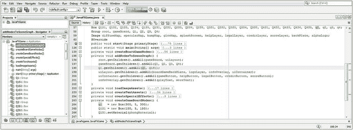

图 14-8.

将 `.add()` 方法调用改为 `.addAll()` 方法调用；为你的第一个象限添加 q1 Box 基本体

```
Q1.getChildren().addAll(q1, Q1S1);   // 在 addNodesToSceneGraph() 方法体中
q1 = new Box(300, 5, 300);           // 在 createGameBoardNodes() 方法体中
```

图 14-9 展示了一个“运行 ➤ 项目”工作流程，显示了在 0,0 位置渲染的游戏板方格和象限。

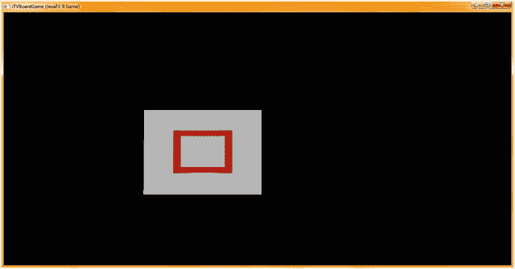

图 14-9.

选择“运行 ➤ 项目”并渲染你的 3D 场景；象限和游戏板方格都位于 0,0,0 位置


### 准备定位游戏棋盘 SceneGraph 节点

在开始围绕棋盘外围定位 4 个象限和 20 个方格之前，我们先为 SceneGraph 的其余部分以及着色器（PhongMaterial）要使用的所有纹理贴图搭建好基础设施。使用复制粘贴的方式，将另外三个 Q2 到 Q4 的 SceneGraph 组节点添加到你的 `addNodesToSceneGraph()` 方法中，如图 14-10 中浅蓝色高亮部分所示。请注意，即使你的 List 中只有一个 Node 子类对象元素，你也可以使用 `.getChildren().addAll()` 方法链！你的 Java 语句将如下所示：

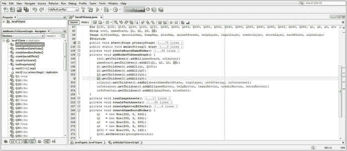

图 14-10.

实例化其他三个象限的 Box 图元以及其他三个象限的分支节点对象

```
Q2.getChildren().addAll(q2);
Q3.getChildren().addAll(q3);
Q4.getChildren().addAll(q4);
```

趁此机会，我们创建另外三个 q2 到 q4 的游戏棋盘中心象限，以便将它们添加到 Q2 到 Q4 的节点构造语句中。同样，由于这些对象是在类的顶部声明的，你可以按任意顺序编写这些构造语句；只是不要使用“运行 ➤ 项目”来渲染场景，因为在它们被实例化并添加到 SceneGraph 层级结构之前，你是看不到这些对象的。Box 实例化的 Java 代码应如下所示，如图 14-10 底部所示：

```
q2 = new Box(300, 5, 300);
q3 = new Box(300, 5, 300);
q4 = new Box(300, 5, 300);
```

如图 14-9 所示，象限 1 位于游戏棋盘方格 1 的下方，并且它们的角并未对齐。因此，需要将象限 1 的 q1 Box 对象沿对角线移动 225 个单位。这相当于棋盘方格边长加上另外 50%，即 225 个单位。如果只移动 150 个单位，象限的角将会位于棋盘方格的中心。实现这种对齐的代码如下所示，即图 14-11 中间部分以黄色和蓝色高亮显示的 `.setTranslateX()` 和 `.setTranslateZ()` Java 方法调用：

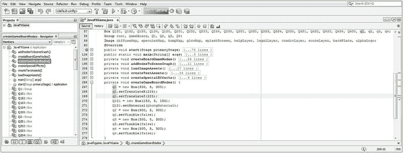

图 14-11.

将 q1 象限移动到 X,Z 位置 225,225，使其位于方格 Q1S1 内部且角部对齐

```
private void createGameBoardNodes() {
q1.setTranslateX(225);
q1.setTranslateZ(225);
Q1S1 = new Box(150, 5, 150);
Q1S1.setMaterial(phongMaterial);
q2 = new Box(300, 5, 300);
q2.setVisible(false);
q3 = new Box(300, 5, 300);
q3.setVisible(false);
q4 = new Box(300, 5, 300);
q4.setVisible(false);
}
```

另外请注意，我使用 `.setVisible(false)` 方法调用“隐藏”了象限 2 到 4，这样我就可以先处理象限 1 的 q1 Box 及其五个棋盘方格子节点。我打算先处理象限 1，向你展示我所使用的工作流程，然后是象限 2，接着是象限 3，以此类推。如果可能的话，将任何复杂任务分解为子任务是有益的，这样在开发过程中就不会感到不知所措。由于 SceneGraph 层级结构设置为在 gameBoard 分支下使用四个棋盘象限，这就是我将要构建游戏棋盘的方式：一次处理一个象限（在本例中为 Q1）。请注意，我的棋盘方格名称也与此匹配，因此我有一个优势：我的棋盘方格对象（在本例中为 Q1S1 到 Q1S5）与象限组对象名称 Q1 相对应。由于我不能为 Box 象限对象名称重复使用 Q1 组对象名称，因此我必须使用小写的 q1 到 q4 作为我的象限平面图元名称，这没问题，因为我仍然知道发生了什么，而且棋盘上的象限部分远没有棋盘方格本身重要。

让我们使用“运行 ➤ 项目”工作流程渲染 3D 场景，看看这两个 Box 图元是仍然重叠还是已经正确定位。如图 14-12 所示，棋盘方格和第一个象限的角现在已角对角对齐，你可以开始看到游戏棋盘将如何布局。

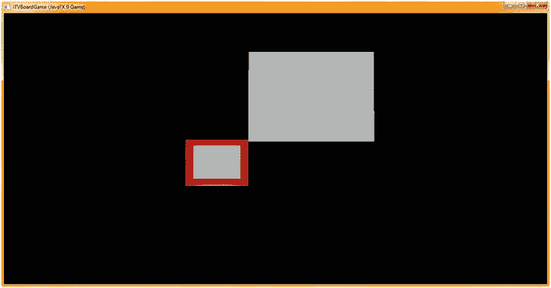

图 14-12.

使用“运行 ➤ 项目”工作流程查看两个 3D 图元是否精确地角对角对齐

虽然这是我想要看到的结果，但考虑到后续我将如何访问每个象限及其子方格，我希望保持方格按照 QxSy 1 到 5 的顺序围绕棋盘排列，而如果我从每个象限的角部开始放置方格 1，这将无法实现！想想看！因此，我实际上需要将这个方格的位置从 0, 0 (X, Z) 移动到 300, 0 (X, Z)。我将在接下来创建包含着色器的自定义方法体之后执行此操作。

由于我将有几十个着色器，我将快速创建另一个自定义方法，以保持着色器创建的独立性和组织性，这样我就可以根据需要折叠和展开与着色器相关的代码。


### 编写冯氏着色器创建方法：createMaterials()

由于着色器是专业 Java 9 游戏设计流程的重要组成部分，让我们为其创建独立的方法体，并将 `createBoardGameNodes()` 中的 `PhongMaterial` 对象代码迁移到这个新的 `createMaterials()` 方法中。在 `start()` 方法的顶部，`loadImageAssets()` 之后（因为这些资源用于着色器）以及 `createGameBoardNodes()` 之前，添加一行代码；这些对象将使用 `createMaterials()` 方法体中创建的着色器。输入 `createMaterials()` 和一个分号来调用这个尚不存在的方法；然后使用 `Alt+Enter` 组合键，选择“在 `javafxgame.JavaFXGame` 中添加 `createMaterials()` 方法”选项。同时，将 `PhongMaterial` 的名称改为 `Shader1`。我们可以在此方法体中为前 20 个着色器命名，并在类顶部（我已预先声明了名为 `diffuse1` 到 `diffuse20` 的 `Image` 对象以及 `Shader1` 到 `Shader20`）进行相应声明，以应对即将编写的代码。剪切并粘贴 `PhongMaterial` 代码到 `createMaterials()` 中，并删除镜面反射属性。代码应如图 14-13 所示，内容如下：

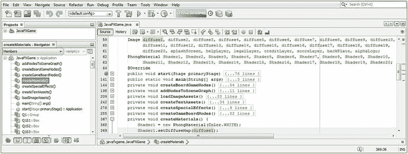

图 14-13.

添加 `diffuse1` 到 `diffuse20` 的 `Image` 对象声明，并创建 `createMaterials()` 着色器方法

```
Image         diffuse1 ... diffuse20;      // 类顶部的对象声明
PhongMaterial Shader1  ... Shader20;
...
Shader1 = new PhongMaterial(Color.WHITE);  // 在 createMaterials() 中创建漫反射着色器
Shader1.setDiffuseMap(diffuse1);
```

接下来，删除 `loadImageAssets()` 中我们在第 13 章创建的所有特效贴图相关代码，但保留 `diffuseMap`（将其重命名为 `diffuse1`）。将 `diffuse1` 的实例化代码复制粘贴四次，并引用接下来的四个游戏棋盘方格纹理贴图：`gameboardsquare2.png` 到 `gameboardsquare5.png`。

现在，从着色器的角度来看，你已经准备好构建游戏棋盘的第一象限。此时，在 `loadImageAssets()` 方法的后半部分，你应该有五个（`diffuseMap`）`Image` 对象，分别命名为 `diffuse1` 到 `diffuse5`。这些对象将保存 `diffuseMap` 属性纹理贴图，定义暖色（红、橙、黄）如何映射到游戏棋盘方格上——这些方格是游戏棋盘象限（1）的子节点，我们将首先布局该象限。接着布局绿色象限，最后布局蓝色和紫色象限。

这前五个（最终共 24 个）漫反射颜色纹理贴图（`diffuseMap` 属性）`Image` 对象应使用以下 Java 语句添加，这些语句在图 14-14 底部高亮显示：

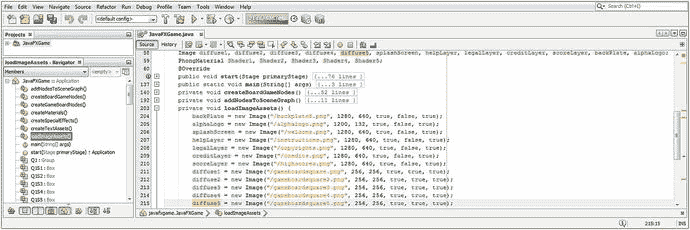

图 14-14.

在 `loadImageAssets()` 中使用前五个 PNG 漫反射纹理贴图实例化 `diffuse1` 到 `diffuse5`

```
diffuse1 = new Image("/gameboardsquare.png",  256, 256, true, true, true);
diffuse2 = new Image("/gameboardsquare2.png", 256, 256, true, true, true);
diffuse3 = new Image("/gameboardsquare3.png", 256, 256, true, true, true);
diffuse4 = new Image("/gameboardsquare4.png", 256, 256, true, true, true);
diffuse5 = new Image("/gameboardsquare5.png", 256, 256, true, true, true);
```

接下来，关闭 `loadImageAssets()` 方法体。打开新的 `createMaterials()` 方法体，将 `Shader1` 的 Java 语句复制粘贴四次到其下方。然后将它们重命名为 `Shader2` 到 `Shader5`。设置代表游戏棋盘方格的 `Image` 对象的 `diffuseMap` 属性，使其引用你刚刚创建的 `diffuse2` 到 `diffuse5` 的 `Image` 对象。

这一切可以通过以下十条 Java 语句完成，这些语句在图 14-15 底部以黄色和蓝色高亮显示：

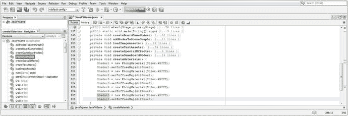

图 14-15.

将 `Shader1` 的 Java 代码块复制粘贴四次到其下方，以创建 `Shader2` 到 `Shader5`

```
Shader1 = new PhongMaterial(Color.WHITE);
Shader1.setDiffuseMap(diffuse1);
Shader2 = new PhongMaterial(Color.WHITE);
Shader2.setDiffuseMap(diffuse2);
Shader3 = new PhongMaterial(Color.WHITE);
Shader3.setDiffuseMap(diffuse3);
Shader4 = new PhongMaterial(Color.WHITE);
Shader4.setDiffuseMap(diffuse4);
Shader5 = new PhongMaterial(Color.WHITE);
Shader5.setDiffuseMap(diffuse5);
```


### 完成游戏板构建：象限 2 至 4

关闭 `createMaterials()` 方法，重新打开 `createGameBoardNodes()` 方法。使用 `Q1S1.setTranslateX(300)` 为 Q1S1 对象添加位置语句，将第一个子方块沿顺时针方向定位到象限的起始位置。

接下来，将三个 Q1S1 游戏板方块语句复制并粘贴四次到其下方，以创建其余方块对象。我们还需要根据 X、Z 位置参数以及着色器对象的引用，对这些对象进行重新配置。

Q2S2 只需将其自身定位在距原点 (0,0) 150 个单位的位置，因为你的方块尺寸为 150×150。这可以通过将位置方法调用更改为 `.setTranslateX(150)` 来实现。同时，务必设置 `.setMaterial(Shader2)`，以引用正确的着色器，该着色器随后会引用（并应用）diffuse2 图像对象作为其 diffuseMap 属性。

Q2S3 是唯一不需要重新定位的方块，因为它将位于原点 (0,0)。我在示例代码中添加了方法调用 `.setTranslateX(0)`（但在 NetBeans 9 中未添加）。同时，务必设置 `.setMaterial(Shader3)`，以引用正确的着色器，该着色器随后会引用（并应用）diffuse3 图像对象作为其 diffuseMap 属性。

Q2S4 只需将其自身定位在距原点 (0,0) 150 个单位的位置，但这次是在 Z 方向上。这可以通过将位置方法调用更改为 `.setTranslateZ(150)` 来实现。务必设置 `.setMaterial(Shader4)`，以引用正确的 Shader4 对象，该对象随后会引用（并应用）diffuse4 图像对象作为其 diffuseMap 属性。

Q2S5 需要将其自身定位在距原点 (0,0) 沿 Z 方向 300 个单位的位置。这可以通过使用位置方法调用 `.setTranslateZ(300)` 来实现。务必设置 `.setMaterial(Shader5)`，以引用正确的 Shader5 对象，该对象随后会引用（并应用）diffuse5 图像对象作为其 diffuseMap 属性。Java 代码（如图 14-16 中高亮显示）应如下所示：

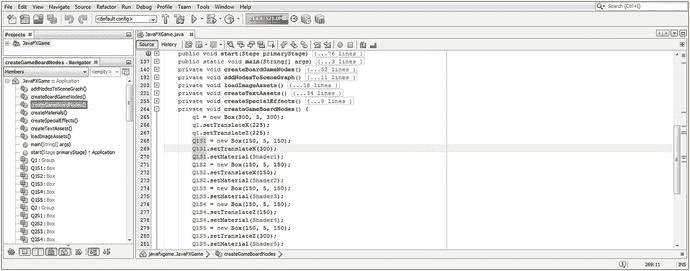

图 14-16.

将 Q1S1 语句复制并粘贴四次到其下方，并重新配置它们的方法调用

```
private void createGameBoardNodes() {
q1.setTranslateX(225);
q1.setTranslateZ(225);
Q1S1 = new Box(150, 5, 150);
Q1S1.setTranslateX(300);
Q1S1.setMaterial(Shader1);
Q1S2 = new Box(150, 5, 150);
Q1S2.setTranslateX(150);
Q1S2.setMaterial(Shader2);
Q1S3 = new Box(150, 5, 150);
Q1S3.setTranslateX(0);        // 此语句可省略，因为默认 X 位置为 0
Q1S3.setMaterial(Shader3);
Q1S4 = new Box(150, 5, 150);
Q1S4.setTranslateZ(150);
Q1S4.setMaterial(Shader4);
Q1S5 = new Box(150, 5, 150);
Q1S5.setTranslateZ(300);
Q1S5.setMaterial(Shader5);
q2 = new Box(300, 5, 300);
q2.setVisible(false);         // 暂时将 q2 至 q4 象限对象设置为不可见
}
```

为了能在 3D 场景中看到这些新对象渲染出来，我们需要将它们添加到 `addNodesToSceneGraph()` 方法体中的场景图层级结构中。将 Q1S2 至 Q1S5 的 Box 对象添加到 Q1 Group 对象中，如图 14-17 中黄色和浅蓝色高亮部分所示。

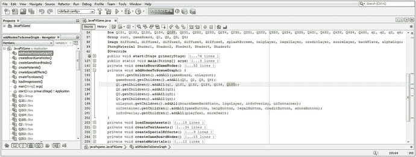

图 14-17.

将其他三个 Q2 至 Q4 Group 对象添加到 gameBoard Group，并将其他四个方块添加到 Q1

现在，让我们也完成场景图层级结构的第二层（Q2 至 Q4 分支节点），并将 q2 至 q4 的 Box 平面基元添加到其他三个 Q2 至 Q4 Group 节点中，从而将游戏板的内部象限添加到场景图层级结构中。我们在工作流程的这个阶段进行此操作，以便能够处理游戏板的中心部分，因为我们正在逐个象限地构建它。


好的，作为高级文档工程师和翻译员，我将遵循您提供的注意事项和示例，将给定的英文文本翻译成中文。


由于我们基本上已经完成了第一个象限，我们将把其他三个象限放入 `SceneGraph` 中，这样在我们构建游戏板其余象限及其游戏板方格时，它们就会渲染出来（变得可见），这些方格将附着在每个象限的周边。

从优化的角度来看，我们仅使用了九条 `.getChildren().addAll()` 方法链 Java 编程语句，就为 2D UI 和 3D 游戏板组件创建了一个相对复杂的 `SceneGraph` 层次结构，如图 14-17 所示。这相对紧凑，因为我们以高度组织化的方式引用了数十个 2D 和 3D 游戏组件叶节点，并且只使用了九条 `SceneGraph` 层次结构构建语句。

添加其他四个方格和其他三个象限可以通过使用以下 Java 编程语句来完成，这些语句在图 14-17 底部以黄色和浅蓝色高亮显示：

```
root.getChildren().addAll(gameBoard, uiLayout);
gameBoard.getChildren().addAll(Q1, Q2, Q3, Q4);
Q1.getChildren().addAll(q1, Q1S1, Q1S2, Q1S3, Q1S4, Q1S5);
Q2.getChildren().addAll(q2);
Q3.getChildren().addAll(q3);
Q4.getChildren().addAll(q4);
```

图 14-18 展示了“运行 ➤ 项目”JavaFX 9 代码测试工作流程。如您所见，我们已经完成了游戏板的四分之一，对于首次尝试组装所有这些资源（包括我们在类顶部声明并即将创建的 3D Box 基元和 2D 纹理贴图图像）来说，效果看起来非常好。

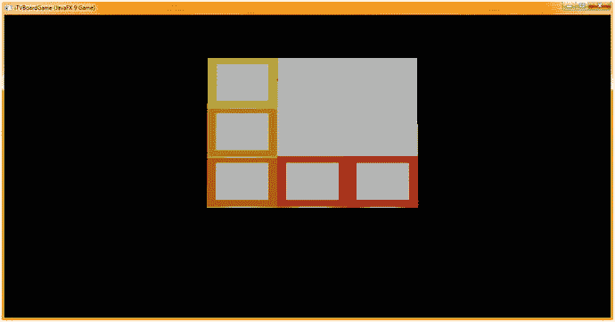

图 14-18.

使用“运行 ➤ 项目”工作流程来检查完成的 3D 游戏板象限是否正确对齐

复制并粘贴五条漫反射 `Image` 语句，并创建 `diffuse6` 到 `diffuse20`，如图 14-19 所示。

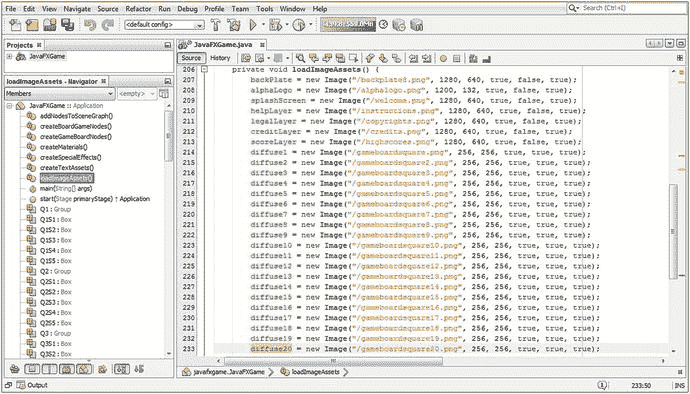

图 14-19.

复制并粘贴 5 个漫反射纹理 `Image` 实例化 3 次，并创建所有 20 个 `diffuse` `Image` 对象

既然漫反射 `Image` 实例化已经就位，请关闭 `loadImageAssets()` 方法体，打开 `createMaterials()` 方法，并执行完全相同的操作：复制前五对着色器 Java 语句，并在其下方再粘贴三次。更改每条语句的编号部分，以便创建 `Shader6` 到 `Shader20` 的 Java 语句对。所有这些都可以在图 14-20 中以黄色高亮显示。

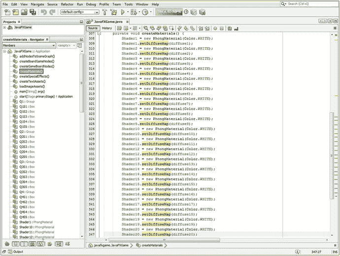

图 14-20.

复制并粘贴 5 个 `Shader` `PhongMaterial` 实例化 3 次，并创建所有 20 个 `Shader` 对象

现在，让我们创建游戏板的第二个象限：回到 `createGameBoardNodes()` 方法体中，通过复制 `Q1S1` 到 `Q1S5` 的语句，在其下方再次粘贴，然后更改对象名称和方法调用参数（这样您就不必在 NetBeans 9 IDE 中重新输入大部分这些 Java 语句），来为 `Box` 基元 `Q2S1` 到 `Q2S5` 创建第二部分代码。

`q2` `Box` 对象（第二个象限）需要沿 z 轴移动 300 个单位（象限大小为 300x300），因此 `q2.setTranslateZ()` 方法参数需要从 225 增加到 525，以实现第二个象限游戏板组件的定位，如图 14-22 所示（如果您想提前查看的话）。

`Q2S1` 需要沿 z 轴（从 0,0 原点开始）定位在 450 个单位处，因为 `Q1S5` 位于 300 加 150，即 450。这通过将位置方法调用更改为 `.setTranslateZ(450)` 来完成。确保设置 `.setMaterial(Shader6)` 以引用正确的着色器，该着色器引用（并应用）`diffuse6` `Image` 对象作为 `diffuseMap` 属性。

`Q2S2` 需要沿 z 轴（从 0,0 原点开始）定位在 600 个单位处，因为 450 加 150 等于 600。这通过将位置方法调用更改为 `.setTranslateZ(600)` 来完成。确保同时设置 `.setMaterial(Shader7)` 以引用正确的着色器，该着色器随后引用（并应用）`diffuse7` `Image` 对象作为 `diffuseMap` 属性。

`Q2S3` 需要沿 z 轴（从 0,0 原点开始）定位在 750 个单位处，因为 600 加 150 等于 750。这通过将位置方法调用更改为 `.setTranslateZ(750)` 来完成。确保同时设置 `.setMaterial(Shader8)` 以引用正确的着色器，该着色器随后引用（并应用）`diffuse8` `Image` 对象作为 `diffuseMap` 属性。

`Q2S4` 也需要从 0,0 原点沿 z 轴定位在 750 个单位处，但这次，我们需要将这个方格在 X 方向上移动 150 个单位，以便将其向右移动，沿着游戏板布局的顶部。这通过改用两个位置方法调用来完成。一个是 `.setTranslateX(150)`，另一个是 `.setTranslateZ(750)`。确保设置 `.setMaterial(Shader9)` 以引用正确的 `Shader9` 对象，该对象随后引用（并应用）`diffuse9` `Image` 对象作为 `diffuseMap` 属性。

`Q2S5` 需要从 0,0 原点在 X 方向上定位在 300 个单位处，同时在 Z 方向上定位在 750 个单位处，以便该方格位于游戏板顶部中间附近，在游戏板上与方格 1 相对的另一侧。这同样通过使用两个位置方法调用来完成：`.setTranslateZ(750)` 和 `.setTranslateX(300)`。确保设置 `.setMaterial(Shader10)` 以引用正确的 `Shader10` 对象，该对象随后引用（并应用）`diffuse10` `Image` 对象作为 `diffuseMap` 属性。

用于构建游戏板第二个象限的 Java 代码（如图 14-21 所示，位于第一个象限构建代码之后）应如下所示（为便于阅读而添加了空格）：

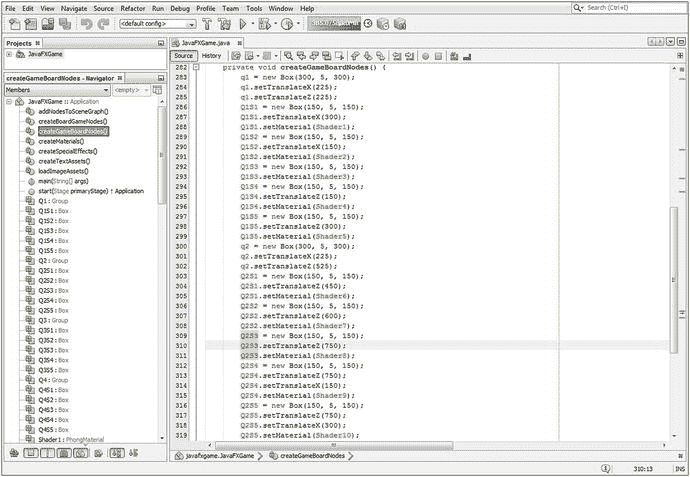

图 14-21.

在 `createGameBoardNodes()` 内部实例化并配置游戏板方格 `Q2S1` 到 `Q2S5`

```
private void createGameBoardNodes() {
...
q2 = new Box(300, 5, 300);      // 为游戏板创建第二个象限的 Java 代码
q2.setTranslateX(225);
q2.setTranslateZ(525);
Q2S1 = new Box(150, 5, 150);
Q2S1.setTranslateZ(450);
Q2S1.setMaterial(Shader6);
Q2S2 = new Box(150, 5, 150);
Q2S2.setTranslateZ(600);
Q2S2.setMaterial(Shader7);
Q2S3 = new Box(150, 5, 150);
Q2S3.setTranslateZ(750);
Q2S3.setMaterial(Shader8);
Q2S4 = new Box(150, 5, 150);
Q2S4.setTranslateZ(750);
Q2S4.setTranslateX(150);
Q2S4.setMaterial(Shader9);
Q2S5 = new Box(150, 5, 150);
Q2S5.setTranslateZ(750);
Q2S5.setTranslateX(300);
Q2S5.setMaterial(Shader10);
q3 = new Box(300, 5, 300);
q3.setVisible(false);
...                            // 第三个象限的配置代码将放在这里
q4 = new Box(300, 5, 300);
q4.setVisible(false);
}
```

如图 14-22 所示，使用“运行 ➤ 项目”来确认游戏板的构建已经完成了一半！


图 14-22.

象限 1 和 2 现已编码并正确对齐

接下来，为 `gameBoard` `Group` 分支添加最终的 `SceneGraph` 构建代码的 Java 语句。您的 3D 场景层次结构应如下所示，如图 14-23 中以黄色和浅蓝色高亮显示：

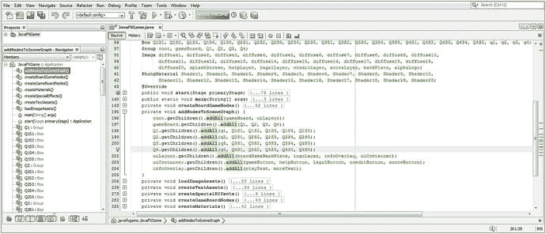

图 14-23.

添加所有剩余的 `SceneGraph` `Node` 对象“接线”代码，以将其余方格添加到象限中


```
root.getChildren().addAll(gameBoard, uiLayout);
gameBoard.getChildren().addAll(Q1, Q2, Q3, Q4);
Q1.getChildren().addAll(q1, Q1S1, Q1S2, Q1S3, Q1S4, Q1S5);
Q2.getChildren().addAll(q2, Q2S1, Q2S2, Q2S3, Q2S4, Q2S5);
Q3.getChildren().addAll(q3, Q3S1, Q3S2, Q3S3, Q3S4, Q3S5);
Q4.getChildren().addAll(q4, Q4S1, Q4S2, Q4S3, Q4S4, Q4S5);
```

接下来，让我们回到 `createGameBoardNodes()` 方法体中，为游戏面板创建第三个象限，为 Box 图元 Q3S1 到 Q3S5（以及中心象限 q3）编写第三段代码。只需复制 Q2S1 到 Q2S5 的语句，并将其粘贴到它们自身下方（同时粘贴在 q3 实例化和配置语句之后，以便在 Java 代码逻辑中将相关节点分组）。然后，再次修改对象名称和方法调用参数（这样就不必在 NetBeans 9 IDE 中重新输入大部分 Java 9 语句），将方块从第一个象限开始沿对角线方向放置。

q3 Box 对象（第三象限）需要沿 x 轴和 z 轴方向各移动 300 个单位（象限大小为 300x300），因此 `q3.setTranslateX()` 方法的参数也需要从 225 增加到 525，以实现第三象限游戏面板组件的定位，如图 14-24 所示。

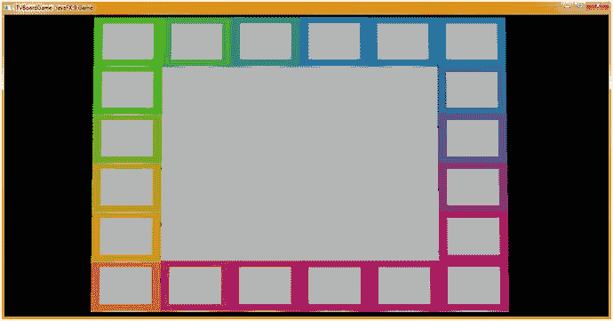

图 14-24.

使用 **运行 ➤ 项目** 工作流程，确认第 1 到第 4 象限现已正确编码并对齐

Q3S1 需要沿 x 轴从原点 (0,0) 定位 450 个单位，并沿 z 轴向外定位 750 个单位。这可以通过将定位方法调用改为 `.setTranslateX(450)`，并保留（或添加，取决于你复制的 Java 代码）`.setTranslateZ(750)` 来实现。同时，务必设置 `.setMaterial(Shader11)` 以引用正确的着色器编号，该编号将引用（并应用）diffuse11 Image 对象作为 diffuseMap 属性。

Q3S2 需要沿 x 轴从原点 (0,0) 定位 600 个单位，并沿 z 轴向外定位 750 个单位。这可以通过将定位方法调用改为 `.setTranslateX(600)`，并保留（或添加，取决于你复制的 Java 代码块）`.setTranslateZ(750)` 来实现。同时，务必设置 `.setMaterial(Shader12)` 以引用正确的着色器编号，该编号将引用（并应用）diffuse12 Image 对象作为 diffuseMap 属性。

Q3S3 需要沿 z 轴从原点 (0,0) 定位 750 个单位，同时沿 x 轴也定位 750 个单位，使其与原点 (0,0) 成对角线。这可以通过将定位方法调用改为 `.setTranslateZ(750)`，然后添加第二个 `.setTranslateX(750)` 方法调用来实现。同时，务必设置 `.setMaterial(Shader13)` 以引用正确的 Phong 着色器对象编号，该编号将引用（并应用）diffuse13 Image 对象作为 diffuseMap 属性。

Q3S4 也需要沿 x 轴从原点 (0,0) 定位 750 个单位，但这次，我们还需要将这个方块沿 z 轴方向再拉回 150 个单位，以便将其沿游戏面板布局的右侧向下移动。这可以通过再次使用两个定位方法调用来实现：一个是 `.setTranslateZ(600)`，另一个仍然是 `.setTranslateX(750)`。同样，务必设置 `.setMaterial(Shader14)` 以引用匹配的 Shader14 对象，该对象将引用并应用 diffuse14 Image 对象作为 diffuseMap 属性。

Q3S5 需要沿 x 轴从原点 (0,0) 定位 750 个单位，并沿 z 轴定位 450 个单位，使这个方块位于游戏面板的中间偏右位置。这同样通过两个定位方法调用来实现：`.setTranslateX(750)` 和 `.setTranslateZ(450)`。务必设置 `.setMaterial(Shader15)` 以引用正确的 Shader15 对象，该对象将引用（并应用）diffuse15 Image 对象作为 diffuseMap 属性。

游戏面板第二象限构建的 Java 代码应如下所示：

```
private void createGameBoardNodes() {
...
q3 = new Box(300, 5, 300);    // 为游戏面板创建第三象限的 Java 代码
q3.setTranslateX(525);
q3.setTranslateZ(525);
Q3S1 = new Box(150, 5, 150);
Q3S1.setTranslateZ(750);
Q3S1.setTranslateX(450);
Q3S1.setMaterial(Shader11);
Q3S2 = new Box(150, 5, 150);
Q3S2.setTranslateZ(750);
Q3S2.setTranslateX(600);
Q3S2.setMaterial(Shader12);
Q3S3 = new Box(150, 5, 150);
Q3S3.setTranslateZ(750);
Q3S3.setTranslateX(750);
Q3S3.setMaterial(Shader13);
Q3S4 = new Box(150, 5, 150);
Q3S4.setTranslateZ(600);
Q3S4.setTranslateX(750);
Q3S4.setMaterial(Shader14);
Q3S5 = new Box(150, 5, 150);
Q3S5.setTranslateZ(450);
Q3S5.setTranslateX(750);
Q3S5.setMaterial(Shader15);
...                           // 第四象限配置代码将放在此处
q4 = new Box(300, 5, 300);
q4.setVisible(false);
}
```

最后，让我们回到 `createGameBoardNodes()` 方法体中，为 Box 图元 Q4S1 到 Q4S5 创建第四段代码，以构建游戏面板的第四象限。只需复制 Q3S1 到 Q3S5 的语句（以及 q4 的语句），并将其粘贴到它们自身下方；然后修改对象名称和方法调用参数（这样就不必在 NetBeans 9 中重新输入所有这些 Java 语句）。

q4 Box 对象（第四象限）需要沿 z 轴方向向下移动 300 个单位，因此 `q4.setTranslateZ()` 方法的参数需要从 525 减少到 225，以实现第四象限游戏面板组件的定位，如图 14-24 所示。

Q4S1 需要沿 z 轴从原点 (0,0) 定位 300 个单位，并沿 x 轴向右定位 750 个单位。这可以通过将定位方法调用改为 `.setTranslateZ(300)` 来实现。务必设置 `.setMaterial(Shader16)` 以引用正确的着色器，该着色器将引用并应用 diffuse16 Image 对象作为 diffuseMap 属性。

Q4S2 需要沿 z 轴从原点 (0,0) 定位 150 个单位，并沿 x 轴定位完整的 750 个单位。这可以通过将定位方法调用改为 `.setTranslateZ(150)` 来实现。务必设置 `.setMaterial(Shader17)` 以引用正确的着色器，该着色器将引用并应用 diffuse17 Image 对象作为 diffuseMap 属性。

Q4S3 只需要沿 x 轴从原点 (0,0) 定位 750 个单位，因为它位于右侧角落。这意味着唯一需要的定位方法调用是 `.setTranslateX(750)`。务必设置 `.setMaterial(Shader18)` 以引用正确的着色器，该着色器将引用并应用 diffuse18 Image 对象作为 diffuseMap 属性。

Q4S4 只需要沿 x 轴从原点 (0,0) 定位 600 个单位，将这个方块朝原点方向拉回 150 个单位，以便将其沿游戏面板布局的底部向左移动。这通过仅使用 `.setTranslateX(600)` 方法调用来实现。务必设置 `.setMaterial(Shader19)` 以引用正确的 Shader19 对象，该对象将引用（并应用）diffuse19 Image 对象作为 PhongMaterial 的 diffuseMap 属性。


好的，作为高级文档工程师和翻译员，我将遵循您提供的注意事项和示例，将给定的英文文本翻译成中文。


Q4S5 需要从 0,0 点沿 X 方向定位 450 个单位，这样你的最后一个游戏方格就会位于游戏板的底部中间附近。这同样是使用一次位置方法调用 `.setTranslate` `X` `(` `450` `)` 来完成的。请确保设置 `.setMaterial(` `Shader20` `)` 以引用正确的 Shader20 对象，该对象随后会引用（并应用）diffuse20 Image 对象作为其 diffuseMap 属性。用于构建游戏板这最后一个象限的 Java 代码应如下所示：

```
private void createGameBoardNodes() {
...
q4 = new Box(300, 5, 300);      // 为游戏板创建第二个象限的 Java 代码
q4.setTranslateX(525);
q4.setTranslateZ(225);
Q4S1 = new Box(150, 5, 150);
Q4S1.setTranslateX(750);
Q4S1.setTranslateZ(300);
Q4S1.setMaterial(Shader16);
Q4S2 = new Box(150, 5, 150);
Q4S2.setTranslateX(750);
Q4S2.setTranslateZ(150);
Q4S2.setMaterial(Shader17);
Q4S3 = new Box(150, 5, 150);
Q4S3.setTranslateX(750);
Q4S3.setMaterial(Shader18);
Q4S4 = new Box(150, 5, 150);
Q4S4.setTranslateX(600);
Q4S4.setMaterial(Shader19);
Q4S5 = new Box(150, 5, 150);
Q4S5.setTranslateX(450);
Q4S5.setMaterial(Shader20);
}
```

图 14-24 展示了“运行 ➤ 项目”Java 代码测试工作流程，显示了一个完整的 3D 游戏板。

可以看到一两个渲染异常，例如 Q1S2 方块，它看起来像是覆盖在 Q1S1 方块之上。这很奇怪，因为代码是精确的，并且基于 150 的倍数，所以它应该像其他方块一样精确对齐。既然问题不在代码上，我们将在下一章看看如何处理这个渲染异常。使用 `.setRotationAxis(Rotate.Y_AXIS)` 和 `.setRotate(30)` 方法将游戏板旋转 30 度，就像你之前做的那样，看看是哪个枢轴点被用来旋转这个 gameBoard 层级结构。这个 Java 9 测试代码应该放在你的 `createBoardGameNodes()` 方法中，如图 14-25 高亮所示。

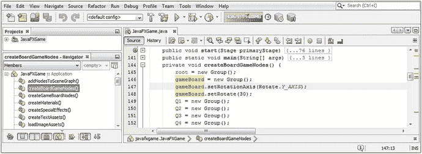

图 14-25.

向 gameBoard Group 对象添加 `.setRotationAxis(Rotate.Y_AXIS)` 和 `.setRotate(30)` 方法调用

我们这样做的原因是，在结束本章之前，我们需要检查这个游戏板是否作为一个层级结构在工作。也就是说，如果我们绕 Y 轴旋转它，它会使用 gameBoard Group 的中心作为枢轴点，还是会围绕游戏板 0,0 原点角落方块的中心进行枢轴（旋转）？

正如你在图 14-26 中看到的，gameBoard Group 对象确实定义了自己的 0,0 中心，使用了其所有 Group Node 子节点的平均中心。正如我们从游戏板的 6 × 150 (900) 构建中了解到的，这个 0,0 中心在 X 和 Z 方向上偏移了 450（900 的一半），即 (450, 450)，或者以线性单位（对角线）计算为 625（450 + 450 的一半）。通过使用能被整除的整数来构建事物，我们可以在后续章节的游戏代码中使用整数（int），这为 JavaFX 游戏引擎节省了内存和处理开销。

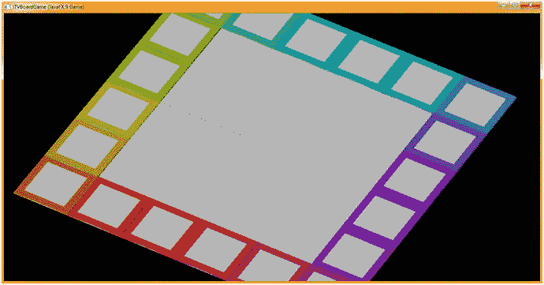

图 14-26.

将 gameBoard Group Node 对象旋转 30 到 45 度，看看它定义其旋转中心的位置

在我们结束本章之前，让我们看看是否可以通过使用不同的 Camera（算法）类来改善游戏板的渲染结果，因为我们似乎遇到了一些 Box 面渲染顺序和定位问题。如果不是相机对象导致了方块之间的这些轻微脊线，我们将不得不进一步寻找这个问题的解决方案，因为我们需要一个看起来像我们在现实生活中玩游戏时使用的纸板游戏板一样逼真的游戏板。正如你现在所知，专业的 Java 9 游戏开发是一个迭代过程，所以你知道我们最终会解决的！

## 更换相机：使用 ParallelCamera 类

接下来，我将把相机对象从 PerspectiveCamera 更改为 ParallelCamera，这既是为了让你获得使用它们的经验，也是为了看看这个面顺序渲染问题（方块之间看似重叠）在两个 Camera 类算法（两个 Camera 子类）之间是否有所不同。这就像在你的类顶部将声明从 PerspectiveCamera 改为 ParallelCamera，并确保在 `createBoardGameNodes()` 中的实例化语句中也进行相同的更改一样简单，如下所示以及图 14-27 所示：

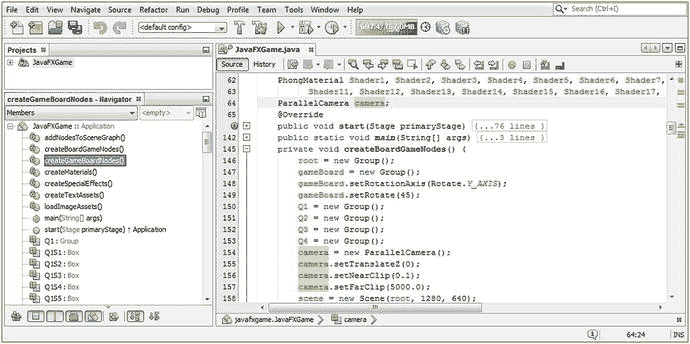

图 14-27.

将 Scene 相机对象更改为使用 ParallelCamera 类（算法）而不是 PerspectiveCamera

```
ParallelCamera camera;
...
camera = new ParallelCamera();
camera.setTranslateZ(0);
camera.setNearClip(0.1);
camera.setFarClip(5000.0);
```

接下来，让我们进入 gameButton 事件处理代码块，通过简单地注释掉那行代码来移除 `.setFieldOfView(1)` 方法调用，正如你所见，这是一个巧妙且常见的代码调试技巧。

我们这样做是因为新的 ParallelCamera 对象不支持那个特定的方法调用。我们还将把 `camera.setTranslateZ()` 方法调用更改为我计算出的游戏板对角线值，以将相机视图放置在游戏板中心 (625)。

我还会将 `camera.setTranslateX()` 方法调用设置为游戏板宽度 225 的四分之一，如图 14-28 中间高亮的相机对象代码所示。

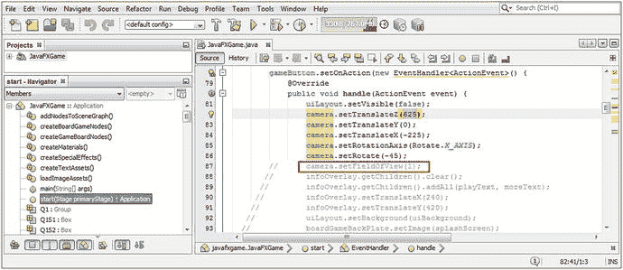

图 14-28.

移除 FOV 设置代码，将 `.setTranslateX()` 改为 225，`.setTranslateZ()` 改为 625，Y = 0

我正在优化这段代码，以便更好地观察游戏板，并使其更好地适应窗口，这样当我们在后续关于动画和游戏玩法的章节中旋转它时，它无论在何种旋转方向下，还是在动画随机旋转以选择一个主题象限时，都能完美地适应场景。

接下来我要做的是在 `onStart()` 中“微调”相机值，以使游戏板适应窗口。正如你在图 14-29 中看到的，我们需要展平相机视图（30 度）并稍微调整 X、Y、Z 位置。

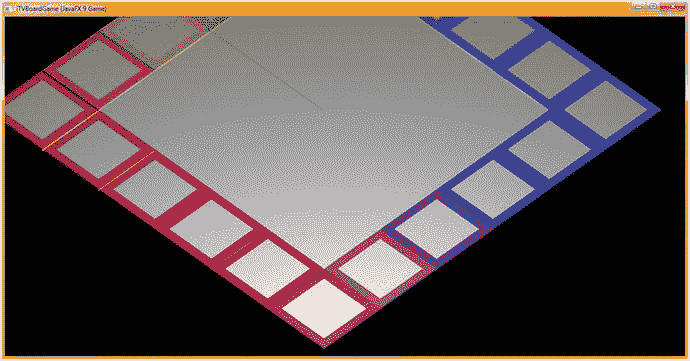

图 14-29.

游戏板几乎完美地适应了窗口；接下来让我们调整相机角度和间距！

正如你在图 14-30 中看到的，我将旋转角度调整为 30°，Z 调整为 500，Y 调整为 -300，X 调整为 -260。

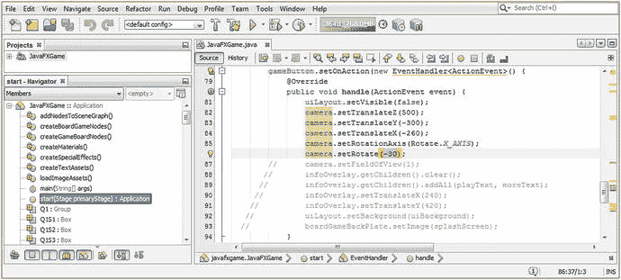

图 14-30.

将相机旋转角度设置为 30 度，Z 位置设置为 500，Y 位置设置为 -300，X 位置设置为 -260

正如你在图 14-31 中看到的，我们现在已经设置了游戏板的“极限”以适应窗口，使用了这些新的相机设置和 ParallelCamera 算法，该算法似乎比 PerspectiveCamera 对游戏板的扭曲更小。如果我们现在旋转游戏板，它应该会保持在窗口（可视）区域内。

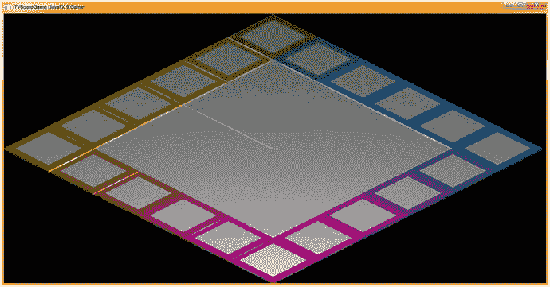

图 14-31.

使用你的“运行 ➤ 项目”工作流程，看看新的相机算法和设置是否适合游戏板


## 摘要

在第十四章中，我们构建了 JavaFX SceneGraph 层次结构的 3D 部分，即根节点下的 gameBoard Group（Node 子类）分支节点（我们之前创建了 uiLayout StackPane Node 子类）。我们创建了一个由四个游戏棋盘象限 Group 分支节点组成的子组，分别命名为 Q1 到 Q4，每个节点包含四分之一的棋盘内部区域，这些区域是名为 q1 到 q4 的 Box 图元，与它们的 Group Node 父对象相对应。在这些象限之下，我们分组了五个游戏棋盘方块叶节点对象，在游戏设计中，它们将对应象限的游戏功能。

我们创建了两个新的方法体，一个用于创建游戏棋盘方块（因为数量众多），另一个用于创建 Phong 材质（同样数量众多！）。这保持了代码的组织性。我们现在有八个方法体（如果算上仍处于引导代码状态的 `main()` 方法，则是九个），其中七个是自定义的，并且我们有超过 400 行的 Java 代码，全部组织成逻辑上可折叠和展开的部分。我们为每个游戏棋盘方块创建了彩色着色器，并将适当的漫反射纹理贴图映射到每个方块上。

在第 15 章中，我们将进一步完善游戏棋盘设计和 Java 代码组织，并为游戏玩家创建一种在 3D 空间中操控棋盘的方法，以便他们（或游戏 AI 代码）能够访问他们感兴趣的游戏棋盘内容和主题部分。

