# 15. 3D 游戏 UI 创建：使用球体图元创建 UI 节点

既然你已经创建了多层级的 gameBoard Group Node（子类）层次结构，并测试了它是否像一个 3D 模型一样旋转，那么是时候添加一个 Sphere 3D 图元了，这样我们就可以创建一个 3D 用户界面元素，供用户在游戏过程中进行随机“旋转”。我们还将为这些元素设置 Phong 着色器对象，并再次使用 GIMP 2.8.22 从头开始创建游戏棋盘象限的其余漫反射纹理贴图，以及一个用于 Sphere 图元的 3D“旋转器”UI 纹理贴图。这个旋转器将在每位玩家的回合中使用，用于随机旋转游戏棋盘以选择主题类别。你始终需要让你专业的 Java 9 游戏与众不同，因此我们将采用独特的方式，通过旋转棋盘本身来选取象限（主题类别），这在现实生活中的棋盘游戏中无法实现，但在虚拟的 i3D 游戏棋盘上却可以做到。我们将在类的顶部以及 `createMaterials()`、`addNodesToSceneGraph()` 和 `loadImageAssets()` 方法体中添加 Java 9 代码。我们将创建自定义的 PNG24 漫反射纹理，并将其添加到你的项目源（`/src`）文件夹中。我们将重新排列 `createGameBoardNodes()` 方法，以重新组织我们将在本章中处理的象限 3D 图元，从而完成游戏棋盘设计的内部部分。我们将把这些象限放在此方法的顶部。

在本章中，我们还将探讨如何在创建专业品质游戏的过程中解决遇到的问题。在这种情况下，我们在建模游戏棋盘时遇到了一个面渲染问题；它本应平滑渲染（顶部平坦），但却出现了不应发生的游戏棋盘方块重叠现象。此外，还存在微小的 Y 轴（高度）变化，使得象限在应用漫反射纹理贴图后看起来凹陷了。（请记住，在第 14 章中，中心象限在没有应用着色器时看起来是平坦的，但一旦我们继续处理它们，它们也会出现这些渲染伪影，你将在本章后面看到。）

## 完成你的 3D 资源：主题象限和旋转器

让我们继续设计和开发棋盘游戏的 3D 组件，包括使用 GIMP 为游戏棋盘内部开发纹理贴图，以及一个用于为游戏生成随机旋转的 3D 旋转器 UI 元素，就像你在现实生活中的棋盘游戏中一样。我们将使用 Java 9（JavaFX API）类来实现这一点，这样我们就只使用 Java 9 API 和我们的数字图像资源（背景图像和纹理贴图）来创建游戏。到目前为止，我们仅用了大约 400 行代码就完成了这些工作！在本章中，我们将再增加 10%（达到 440 行）的代码来“蒙皮”象限，并添加一个位于屏幕左上角的“旋转器”UI 元素。我们需要在类顶部做的第一件事是添加另外五个 Image 对象声明，命名为 `diffuse21` 到 `diffuse25`，以及另外五个 PhongMaterial 对象声明，命名为 `Shader21` 到 `Shader25`。这将在下面的 Java 代码中以及图 15-1 中类的顶部以绿色（部分代码以黄色和蓝色高亮显示）展示：

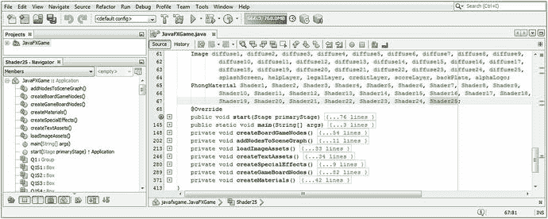

图 15-1.

在类的顶部为你的象限和旋转器添加漫反射纹理贴图和着色器对象

```
Image ... diffuse21, diffuse22, diffuse23, diffuse24, diffuse25;
PhongMaterial ... Shader21, Shader22, Shader23, Shader24, Shader25;
```

剪切并粘贴最后五个 `diffuse16` 到 `diffuse20` 的 Image 对象声明，创建五个新的命名为 `diffuse21` 到 `diffuse25` 的对象，并配置它们以供使用，如下所示以及图 15-2 所示：

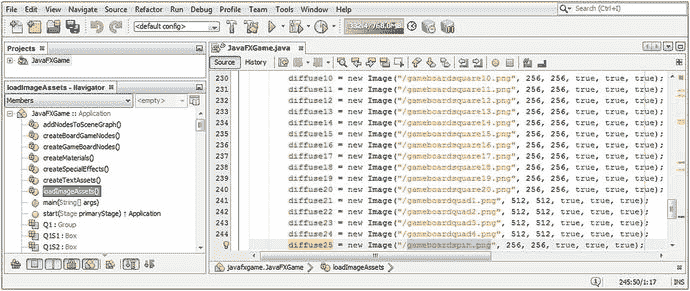

图 15-2.

在你的 `loadImageAssets()` 方法中创建五个新的漫反射图像贴图对象并配置它们以供使用

```
diffuse21 = new Image("/gameboardquad1.png", 512, 512, true, true, true);
diffuse22 = new Image("/gameboardquad2.png", 512, 512, true, true, true);
diffuse23 = new Image("/gameboardquad3.png", 512, 512, true, true, true);
diffuse24 = new Image("/gameboardquad4.png", 512, 512, true, true, true);
diffuse25 = new Image("/gameboardspin.png",  256, 256, true, true, true);
```

我们将在本章下一节中使用 GIMP 创建这些漫反射纹理贴图数字图像资源。打开 `createMaterials()` 方法体，添加相应的 `Shader21` 到 `Shader25` 对象实例化和配置语句，这些语句将“连接着色器”以引用漫反射纹理贴图 Image 对象资源。

如果你愿意，也可以像处理漫反射纹理贴图 Image 对象一样，使用复制和粘贴来完成此操作。创建新着色器并将其引用到漫反射纹理贴图 Image 对象资源的 Java 代码应类似于以下 Java 代码块中的语句，如图 15-3 中高亮显示：

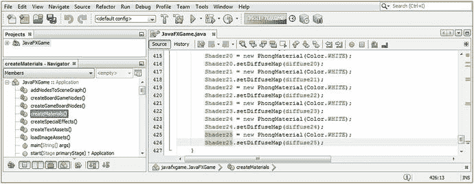

图 15-3.

在你的 `createMaterials()` 方法中创建五个新的 Shader PhongMaterial 对象，并将它们连接到 `diffuseMap` 对象

```
Shader21 = new PhongMaterial(Color.WHITE);
Shader21.setDiffuseMap(diffuse21);
Shader22 = new PhongMaterial(Color.WHITE);
Shader22.setDiffuseMap(diffuse22);
Shader23 = new PhongMaterial(Color.WHITE);
Shader23.setDiffuseMap(diffuse23);
Shader24 = new PhongMaterial(Color.WHITE);
Shader24.setDiffuseMap(diffuse24);
Shader25 = new PhongMaterial(Color.WHITE);
Shader25.setDiffuseMap(diffuse25);
```

你现在需要再次使用 GIMP 来创建你的象限和旋转器纹理贴图，以便为你的棋盘游戏元素提供专业的纹理。当前版本是 2.8.22。


### 创建象限与转盘漫反射颜色纹理贴图

使用 GIMP 的“文件 ➤ 新建”工作流程来创建一个透明（空白）的漫反射纹理贴图合成文件，这次将其设为 512×512 像素，因为象限方块对象 q1 到 q4 在两个轴向上都是正方形方块对象的两倍大（总面积大四倍）。这在数学上与游戏棋盘方格所使用的 256 像素纹理贴图尺寸翻倍相匹配。点击圆形（或椭圆形）选择工具（如图 15-4 顶部高亮所示），再次使用工具图标下方的“椭圆选择工具”选项标签，为圆形设置精确的尺寸和位置，因为我们希望在每个游戏棋盘象限中都有一个完美居中的白色圆形。我将圆形的“尺寸”设为 400（相等的宽度和高度值会形成一个完美的圆形；任何变化都会产生椭圆或卵形），然后计算剩余部分（512 - 400 = 112 / 2 = 56）得到 X、Y 位置值 56，该值也以红色高亮显示。

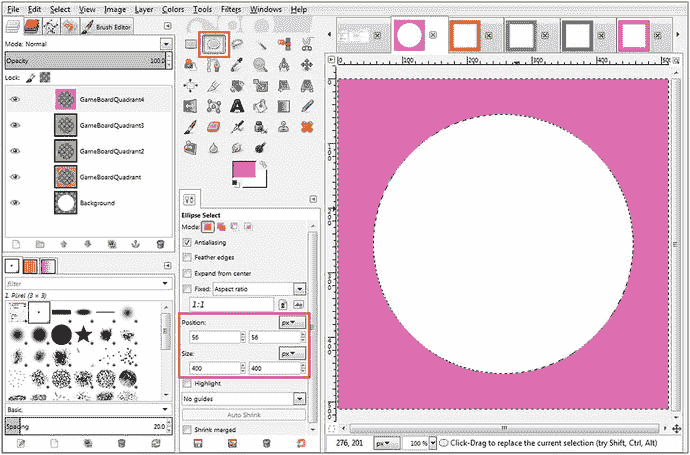

图 15-4.

使用角落方格颜色值的 60% 创建四个 512 像素分辨率的象限纹理贴图

选中“背景”图层，确保前景色（FG）色板设置为白色，然后使用“编辑 ➤ 用前景色填充（白色）”选项，在合成图层堆栈的最底部为所有四个象限纹理贴图创建白色中心，如图 15-4 所示。右键单击“背景”图层，使用“新建图层”命令，创建一个名为“GameBoardQuadrant”的新图层。使用“选择 ➤ 反选”菜单序列来反选选区，并选中“GameBoardQuadrant”图层，以指定该图层用于保存外部颜色填充。打开 `gameboardsquare3.png` 文件，使用吸管工具选取其橙色值。单击前景色（FG）色板，调出颜色选择器对话框，将“值（V）”滑块设置为 60% 颜色（40% 白色），从而为与其对角线相对的象限创建角落方格颜色的柔和版本。使用“编辑 ➤ 用前景色填充”用该颜色填充中心圆形周围的区域，然后使用“文件 ➤ 导出为”将文件保存到项目的 `/src` 文件夹，并将其命名为 `boardgamequad1.png`，如图 15-2 中 Image 对象代码所引用的那样。重复此过程：创建一个新图层，获取角落方格颜色值，将其提亮 40%，用前景色填充，然后将图像导出为 PNG24，以创建其他三个编号的 `boardgamequad` PNG24 资源，这些资源显示在图 15-4 最左侧各自的图层中。您还可以看到我在图 15-4 右上角打开的用于采样颜色值的 `gameboardsquare` 3、8、13 和 18 图像资源。吸管工具位于椭圆选择工具的右下方。

趁我们还在 GIMP 中，让我们打开我们在第 13 章（涵盖着色器和材质）中创建的所有不同贴图类型的纹理贴图创建 GIMP XCF 文件，并使用您的沙滩球漫反射纹理来创建一个 3D 转盘球体纹理，该纹理在旋转时会显示“SPIN”字样，其中 S 和 I 为白色（覆盖在颜色上），P 和 N 为黑色。

打开 `Pro_Java_9_Games_Development_Texture_Maps` GIMP XCF 文件，选择文本工具（如图 15-5 红色方框所示）。将文本选项设置为使用 Arial Heavy，字体大小设为 48，并选择抗锯齿。单击颜色色板并选择白色，然后在绿色条纹中间输入一个大写字母 S，如图 15-5 所示。右键单击 S 图层，选择“复制图层”工具，将文本工具的颜色色板设置为黑色，然后选中黄色中的 S，如图 15-5 所示；接着输入一个大写字母 P 来替换 S。您可以使用移动工具（四个相连的箭头）来移动文本元素，使用右箭头键，使其与 S 精确对齐。将其居中于白色条纹中，然后对 I 和 N 文本元素重复此过程，直到创建出单词 SPIN。

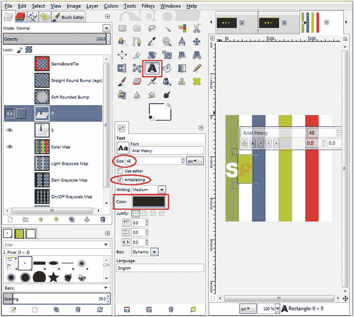

图 15-5.

在您的沙滩球纹理贴图上创建两次单词 SPIN，以创建您的动画转盘纹理贴图

完成所有四个字母一次后，您可以再次右键单击图层并使用“复制图层”工作流程来复制这些字母；然后使用移动工具将字母定位到其他四个条纹上，如图 15-6 右侧所示。

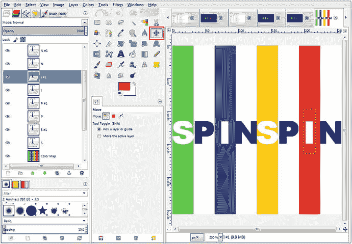

图 15-6.

将四个 SPIN 字母在八个条纹的每个中心复制两次，且高度完全相同

要使用 GIMP 的移动工具，首先单击文本元素，这将向移动工具指示您想要移动的内容，然后使用右箭头键将字母定位到下一个条纹上。使用右箭头键而不是用鼠标拖动字母，将使字母保持在完全相同的像素高度位置，从而使字母之间完美对齐。

正如您将在图 15-6 中看到的，此工作流程将产生均匀、专业的地图效果。尽管您的字母在 GIMP 画布上看起来有些拥挤，但当映射到球体图元的曲面上时，结果相当清晰易读，即使在动画过程中也是如此，因为表面的曲率似乎将这些字母“拉伸”得更开了。

对转盘纹理贴图满意后，使用“文件 ➤ 导出为”菜单序列，将您的 `gameboardspin.png` 文件保存到 `C:/Users/Name/Documents/NetBeansProjects/JavaFXGame/src/` 文件夹，如图 15-7 所示。请注意，我们的 `boardgamesquare` PNG24 文件优化得很好，只有 680 字节，而我们的 `boardgamequad` 文件每个只有 10KB。如果您单击一个文件名，您将在对话框右侧获得该纹理贴图的良好预览。这是一个很棒的功能，尤其对于相似的文件名，因为您可以单击任何文件名进行预览，GIMP 会将那个文件名放入“名称”字段；然后您只需更改末尾的数字，作为打字快捷方式！

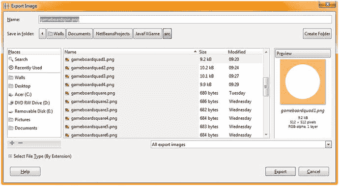

图 15-7.

将您的新漫反射颜色纹理贴图文件命名为 `gameboardspin.png`，然后将其保存到您的 `/src` 文件夹

接下来，让我们开始将漫反射纹理贴图应用到我们的 3D 棋盘游戏元素上，并完成 3D 的创建。


### 为 3D 游戏棋盘象限添加纹理映射：Java 代码实现

打开你的 `createGameBoardNodes()` 方法体，将 q1 到 q4 的对象代码剪切并粘贴到该方法顶部，这样你的象限 Box 基元 q1 到 q4 就能在同一个 Java 9 语句块中完成实例化和配置。现在你可以更清晰地看到每个象限相对于不同 225 和 525 组合的 X、Z 移动模式，且没有相同的 X、Z 坐标对，从而避免象限重叠。

为第一个象限添加 `q1.setMaterial(Shader21);`，如图 15-8 所示，使用以下 Java 代码：

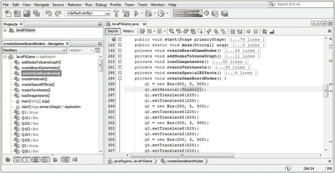

图 15-8.

将所有象限 Box 基元代码剪切并粘贴到一处，并开始使用 `.setMaterial()` 添加着色器

```
q1 = new Box(300, 5, 300);
q1.setMaterial(Shader21);
q1.setTranslateX(225);
q1.setTranslateZ(225);
q2 = new Box(300, 5, 300);
q2.setTranslateX(225);
q2.setTranslateZ(525);
q3 = new Box(300, 5, 300);
q3.setTranslateX(525);
q3.setTranslateZ(525);
q4 = new Box(300, 5, 300);
q4.setTranslateX(525);
q4.setTranslateZ(225);
```

图 15-9 展示了运行 ➤ 项目的工作流程，其中游戏棋盘象限 1 已应用纹理映射并进行了测试渲染。如你所见，一旦应用了漫反射纹理贴图，面顺序渲染问题就会出现！

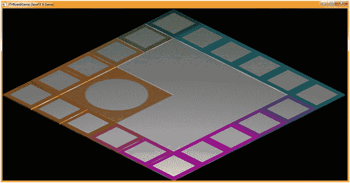

图 15-9.

选择运行 ➤ 项目来渲染并预览第一个象限的纹理贴图应用（面顺序错误出现）

接下来，为其他三个象限 Box 基元添加 `.setMaterial()` 方法调用，并在方法调用参数列表中引用正确的 `Shader22` 到 `Shader24` PhongMaterial 对象。完成后的着色器对象与 Box 基元的连接代码应如下所示，如图 15-10 中黄色高亮部分：

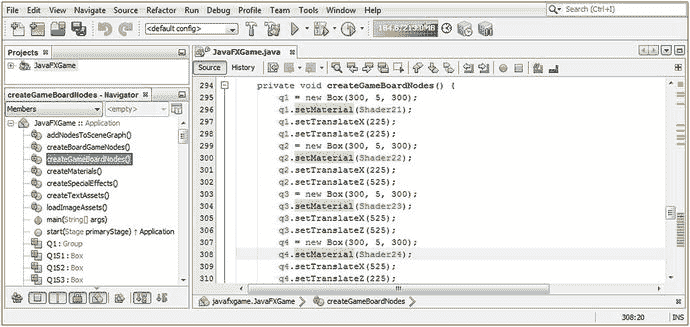

图 15-10.

完成所有象限的着色器对象与 Box 基元的连接，以便我们查看完整的游戏棋盘

```
q1 = new Box(300, 5, 300);
q1.setMaterial(Shader21);
q1.setTranslateX(225);
q1.setTranslateZ(225);
q2 = new Box(300, 5, 300);
q2.setMaterial(Shader22);
q2.setTranslateX(225);
q2.setTranslateZ(525);
q3 = new Box(300, 5, 300);
q3.setMaterial(Shader23);
q3.setTranslateX(525);
q3.setTranslateZ(525);
q4 = new Box(300, 5, 300);
q4.setMaterial(Shader24);
q4.setTranslateX(525);
q4.setTranslateZ(225);
```

如图 15-11 所示，象限 Box 基元现在也出现了与 i3D 游戏棋盘其他部分相同的面渲染顺序问题。让我们暂停编码，看看能否找到其他 Java 开发者在 JavaFX 9 游戏开发中遇到这个特定 3D 模型面渲染问题的证据。可以想象，进行这项研究的工具就是搜索引擎。

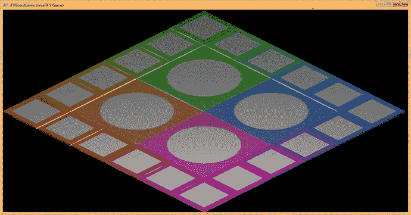

图 15-11.

漫反射纹理映射看起来非常专业，除了面深度和渲染异常之外

让我们看看我是如何找到面顺序渲染问题的解决方案的。在向 JavaFX 9 开发论坛提交错误报告之前，我尝试使用 Google 搜索引擎和精准的关键词来寻找答案。

### 使用 Google 解决 JavaFX 异常：借助 StackOverflow

要找到遇到类似问题的开发者，请使用 Google 搜索引擎，输入你在屏幕上看到的最常见或最可能的问题描述。在这种情况下，可以是“错误的形状重叠”或“Box 面顺序渲染问题”。有时你可能需要尝试几个不同的关键词字符串。在这种情况下，网上有一些正确答案，即开启一个名为深度缓冲的功能。这是一个计算密集型的算法，因此默认是关闭的。由于我们还看到一些锯齿边缘，我们可以开启另一个计算密集型算法，称为抗锯齿。这两个功能都可以在重载的 `Scene()` 构造函数中访问，因此只需对我们 `Scene` 场景对象的实例化进行一处简单修改，即可解决这两个问题！以下是 StackOverflow 上关于此问题及其解决方案的两个示例回答：

```
stackoverflow.com/questions/19589210/overlaping-shapes-wrong-overlapping-shapes-behaviour
--或--
stackoverflow.com/questions/28567195/javafx-8-3d-z-order-overlapping-shape-behaviour-is-wrong
```

允许你开启深度缓冲和抗锯齿作为 3D 场景对象默认行为的 `Scene` 重载构造函数方法如下所示：

```
Scene(Parent root, double width, double height, boolean depthBuffer, SceneAntialiasing constant)
```

因此，我们需要在 `createBoardGameNodes()` 方法中使用的 `Scene()` 构造函数里添加 `depthBuffer=true` 和 `SceneAntialiasing.BALANCED`。如图 15-12（红色矩形内）所示，我将其添加到了 `scene = new Scene(root, 1280, 640);` 这个 Java 9 场景对象实例化语句的末尾。这将切换你的构造函数方法调用，以使用另一个不同的重载构造函数方法来创建你的 3D 场景。

让我们添加一个名为旋转器的 3D UI 元素，玩家可以用它来随机旋转游戏棋盘以选择一个主题。


### 创建 3D 用户界面元素：3D 旋转随机选择器

现在，让我们复用球体原语代码和沙滩球纹理贴图，创建一个 3D 用户界面（UI）元素，玩家可以点击它来旋转棋盘，随机选择一个主题类别。在类顶部声明球体并将其命名为 `spinner`。然后实例化一个半径为 60 的球体，使用 `Shader25` 进行配置，并将其 X、Y 位置设置为 -200、-500，使其位于屏幕左上角。使用 Y 旋转轴，并将旋转值设置为 25 度，尝试让“SPIN”字样面向用户。你的 Java 代码如图 15-12 所示，内容如下：

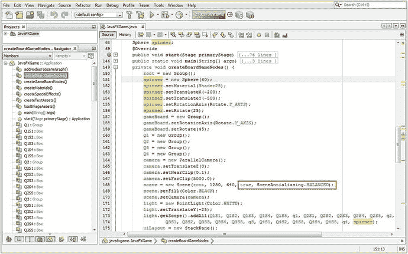

图 15-12.

添加一个名为 `spinner` 的球体原语，设置材质和平移参数，并修复面顺序渲染错误

```
Sphere spinner;
...
spinner = new Sphere(60);
spinner.setMaterial(Shader25);
spinner.setTranslateX(-200);
spinner.setTranslateY(-500);
spinner.setRotationAxis(Rotate.Y_AXIS);
spinner.setRotate(25);
scene = new Scene(root, 1280, 640, true, SceneAntialiasing.BALANCED);
```

在能够渲染 3D 场景并查看新的旋转 UI，以确定是否需要以任何方式调整漫反射纹理贴图之前，我们需要将其添加到 JavaFX SceneGraph 中。我打算将其添加到根节点下的最顶部，因为 3D UI 最终将拥有自己的层级结构，就像 2D 的 `uiLayout` 和 3D 的 `gameBoard` 一样。这样，如果我们想在任何时候整体影响 3D UI 元素，只需使用一行代码引用 3D UI 分支即可，这将影响其下的所有叶节点。目前，`spinner` 将是根节点下的一个叶节点。添加 `spinner` 的 Java 代码如图 15-13 所示，内容如下：

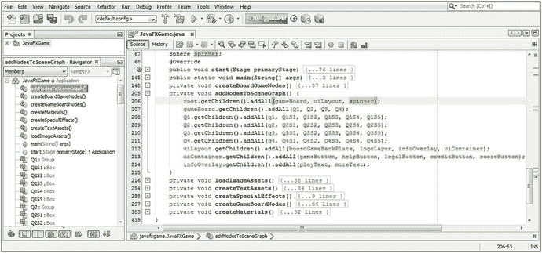

图 15-13.

使用 `root.getChildren().addAll()` 将你的 `spinner` 球体对象添加到 SceneGraph 层级结构的顶部

```
root.getChildren().addAll(gameBoard, uiLayout, spinner);
```

现在，我们可以使用“运行 ➤ 项目”工作流程，测试我们添加球体旋转 UI 到正在此 3D 场景中创建的棋盘游戏的新 Java 代码。我们还将能够看到，通过使用更复杂的、包含五个参数（而非仅三个）的重载 `Scene()` 构造方法，添加抗锯齿和深度缓冲算法（分别用于检查正确的面顺序渲染和在渲染过程中对粗糙边缘进行平滑处理）是否解决了我们的视觉质量问题。

如图 15-14 所示，包含二十多个 3D 原语对象（作为棋盘格子和棋盘象限）的 3D 游戏板层级结构，现在渲染成了一个连贯的 3D 模型。它最终看起来像你在大多数流行棋盘游戏中看到的棋盘游戏（纸板游戏板），并且即使游戏板模型在 3D 场景中看起来只是一个 3D 对象，你的代码也可以单独访问和控制每个格子和象限。这正是我们在过去几章中一直努力学习和实现的目标。

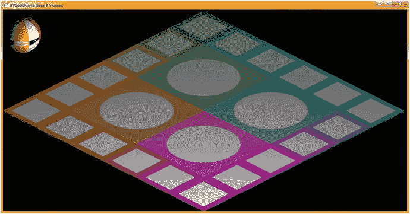

图 15-14.

面渲染顺序问题已修复，现在我们得到了一个光滑、纤薄的纸板游戏板

另一方面，旋转 UI 元素并没有达到我们最初想要的视觉效果，即一个沙滩球状物体，正面写有“SPIN”字样。这没关系，因为我们知道专业的 Java 9 游戏开发是一个迭代优化的过程。让我们思考一下如何缩小“SPIN”字样，使得四个字母能同时显示在球体原语上，而不是像当前渲染的那样只显示两个字母。

缩小文本以使“SPIN”字样适合球体原语的四分之一，同时增加彩色条纹的数量（并使其更细），最简单的方法是将此纹理贴图制作成 512 像素的纹理。这将缩小所有文本元素，使其能容纳四个字母，并且我们可以复制粘贴条纹并改变其颜色以增加更多色彩。

接下来，让我们回到 GIMP，看看增强旋转 UI 漫反射纹理贴图的工作流程。


### 增强 3D 旋转器纹理贴图：提高分辨率

如果你利用 GIMP 工具和算法在优化的工作流程中发挥其强大功能，为 3D 旋转器 UI 元素创建更精细的 512x512 像素纹理贴图的工作流程，会比想象中简单得多。我们只需十几到二十步“操作”，就能将分辨率、条纹数量、条纹颜色和文本元素全部翻倍，而所有像素处理工作都由 GIMP 以最高质量级别完成，这正是我们所要求的。

图 15-15 展示了这些操作在 GIMP 中的合成结果。首先，通过 **图像** ➤ **画布大小** ➤ **宽度=512** ➤ **调整大小**（按钮），在文档右侧增加 256 像素，这将在纹理贴图合成的右半部分增加 256 像素的透明度。选择背景图层和白色色板，使用**油漆桶工具**（第四行，第四个图标）填充背景图层的右半部分，使其变为 100% 白色。接下来，右键点击颜色贴图层，选择**复制图层**选项，这将创建颜色贴图副本图层，如图 15-15 所示。选择此图层，使用**颜色** ➤ **色相-饱和度**算法（菜单序列），将所有四种颜色偏移约 60 度，以创建四种不同的颜色，如图 15-15 所示。接着，要将（Y 或高度）尺寸调整为匹配的 512 像素，这次使用 **图像** ➤ **缩放图像** 菜单序列，点击宽度和高度之间的链条图标解锁宽高比，并将高度值设置为 512。这将拉伸色条以填充图像，从而无需像最初创建沙滩球纹理贴图那样进行大量的选择-移动-填充操作。此缩放操作还会使文本组件变高，使其在球体旋转器 UI 中更易阅读，尤其是在旋转时。最后，右键点击 S、P、I 和 N 的 #2 图层，为每个字母创建 #3 和 #4 图层。使用**移动工具**和右箭头键精确调整它们的位置。

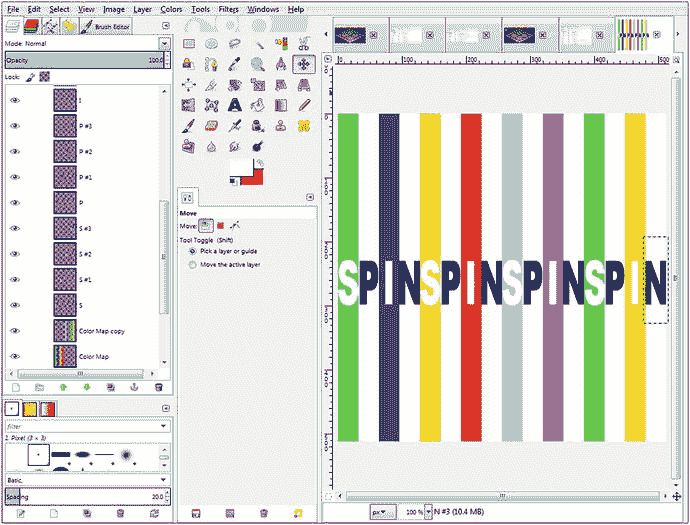

图 15-15.

使用 256 像素的沙滩球纹理贴图，创建更精细的 512 像素球体旋转器 UI 纹理贴图

最后，使用 **文件** ➤ **导出为** 覆盖项目 /src/ 文件夹中当前的 `gameboardspin.png` 文件。由于该文件名已在 `diffuse25` 图像对象实例化语句中被引用，你只需将宽度和高度值从 256 改为 512。当映射到相同大小的球体图元上时，这将减小球体上条纹和文本元素（字母）的尺寸，从而显示四个字母（SPIN），而不是两个字母（SP，如图 15-14 所示）。此时，你只需将旋转值调整到 20 到 30 度之间，使单词 SPIN 居中显示在名为 `spinner` 的球体对象中，这样用户就知道点击此球体旋转器 UI 对象会发生什么。

你的 `diffuse25` 对象实例化新的 Java 9 语句应类似于以下 Java 代码，该代码在图 15-16 中也以黄色和蓝色高亮显示：

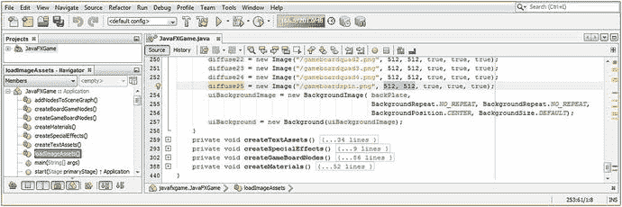

图 15-16.

修改宽度和高度分辨率参数，将它们从 256 像素分别改为 512 像素

```
diffuse25 = new Image("/gameboardspin.png", 512, 512, true, true, true);
```

接下来需要做的是“微调”所有旋转器对象的配置设置，使球体图元稍大一些，并将其移近屏幕角落，使其完全避开游戏棋盘。我将半径设为 64，Y 轴平移设为 -512 以将其进一步上移。我发现旋转值 30 度能使单词 SPIN 居中。Java 代码（在图 15-17 中也已高亮显示）应如下所示：

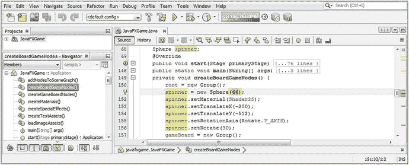

图 15-17.

将球体旋转器设置微调为半径 64 以放大旋转器，并将其旋转至 30 度以显示 SPIN

```
Sphere spinner;
...
spinner = new Sphere(64);
spinner.setMaterial(Shader25);
spinner.setTranslateX(-200);
spinner.setTranslateY(-512);
spinner.setRotationAxis(Rotate.Y_AXIS);
spinner.setRotate(30);
```

图 15-18 展示了 **运行** ➤ **项目** Java 代码测试工作流程。如您所见，游戏棋盘现在看起来相当专业，3D 旋转器 UI 看起来像一个旋转器，并标有 SPIN，使用了清晰易读的大号字母。

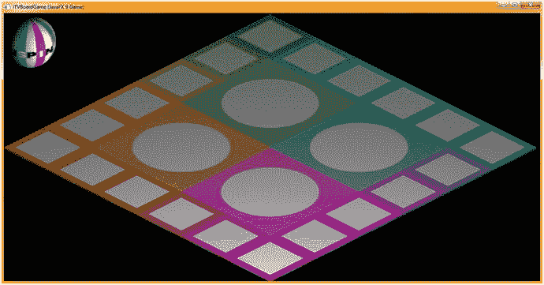

图 15-18.

旋转器球体 UI 元素现在看起来更像一个旋转器，并且单词 SPIN 对用户可见

现在，我们的 3D 棋盘游戏已经设计和编码完成，我们可以回到 `javafx.graphics` 模块中一些更偏技术性、常用于游戏的 JavaFX 类。其中一个最技术性的领域是 3D 动画，我们接下来将深入探讨，以便为旋转器和游戏棋盘等添加动画效果，将我们的 3D 棋盘游戏节点层次结构带入时间的第四维度！之后，我们可以添加交互性，使其成为一款 i3D 棋盘游戏！在继续添加动画之前，我只需要将一切完善，并准备好一个 3D 旋转器。

## 总结

在第十五章中，我们构建了 3D“旋转器”球体图元 UI 元素，它将允许用户对游戏棋盘施加随机旋转，以选择一个主题象限。我们还完成了游戏棋盘的纹理映射，并弄清楚了如何修复面渲染异常，这些异常曾导致游戏的核心组件——游戏棋盘模型无法正确渲染，从而无法呈现专业外观。该解决方案涉及使用更复杂的场景对象实例化，包括一个启用深度缓冲算法的标志，以及一个启用场景范围内所有 3D 对象抗锯齿的常量。这消除了 Y 维度（高度）的面渲染错误，以及我们在游戏棋盘组件边缘看到的锯齿状边缘。

我们为游戏棋盘的四个中心象限和旋转器 UI 元素创建了五个新的纹理贴图，旋转器 UI 允许玩家旋转棋盘以决定他们的下一步行动，在本例中是一个教育主题。

我们添加了漫反射纹理贴图图像对象和利用这些纹理贴图的 Phong 着色器定义。我们还添加了 Java 代码，将旋转器 UI 添加到场景图层次结构中，并进一步练习了使用 GIMP。

在第十六章中，我们将学习 JavaFX 9 中所有强大的动画相关过渡类。


