# 16. 3D 游戏动画创建：使用动画过渡类

现在你已经创建了多层级的 gameBoard 组节点（子类）层级结构，为该层级下的所有 3D 组件添加了纹理，确保你的 3D 游戏板模型能够中心旋转，并创建了一个 3D 旋转器 UI 来随机旋转这个 gameBoard 3D 模型（层级结构）以随机选择一个象限，是时候使用自定义的 `createAnimationAssets()` 方法为游戏设计添加动画对象了，该方法供旋转器调用，以创建游戏过程中使用的随机“旋转”。我们还将设置 3D 对象鼠标点击事件处理代码来触发动画，以及在进行此次旋转之前随机化 RotateTransition 参数的逻辑。

在本章中，我们将详细探讨抽象的 Animation 和 Transition 超类，以及所有强大的属性过渡子类，你可以在你的 i3D 棋盘游戏中将它们实现为不同类型的 Animation 对象。我们将为你的游戏板和旋转器制作旋转动画，以及为旋转器制作平移（移动）动画。

## 为 3D 资源添加动画：Animation 超类

公共抽象 Animation 类扩展了 Object，并位于 javafx.animation 包中，其他与动画相关的类也位于该包中，其中一些我们将用于我们的游戏，并在本章中详细讲解。Animation 超类有两个直接已知的子类：Timeline 和 Transition。Transition 有十个预定义的 Animation（算法）子类，随时可以应用于你的游戏开发，因此我们将重点介绍它们，因为它们可以立即且有效地使用。javafx.animation 包的内容足以写成一整本书，而我只有一章的篇幅，所以我将介绍最有效的动画类，用于创建专业的 Java 9 游戏。

Animation 超类的 Java 9 类层级结构显示，该类是从零开始编码以提供对象动画能力的，因为它没有自己的超类，因此层级结构如下所示：

```
java.lang.Object
> javafx.animation.Animation
```

抽象 Animation 类不能直接创建 Animation 对象，但它为 JavaFX API 中使用的所有动画类提供了核心功能。唯一的例外是 AnimationTimer 类（一个脉冲引擎），它实现了一个核心定时器脉冲引擎（因此，它更像是一个定时器类而非动画类），非常适合基于 2D 精灵的游戏。我在《Beginning Java 8 Games Development》一书中详细介绍了 i2D 游戏开发，并深入讲解了该类。本书更侧重于 i3D 游戏开发，因此我将借此机会介绍一些其他有用的（也是现成或预编码的）动画过渡类。

通过设置 cycleCount 属性，动画可以运行有限次数。要使任何动画“来回弹跳”（即从起点到终点再回到起点反复运行），请将 autoReverse 属性设置为 true；否则，使用 false 布尔值，我们将在专业的 Java 9 游戏中使用它来让 i3D 游戏板朝一个方向随机旋转。

一旦实例化并配置好 Animation 对象，要播放它，可以调用 play() 方法或 playFromStart() 方法。Animation 对象的 currentRate 属性设置你的速度和方向。通过反转 currentRate 的数值，你可以切换播放方向。当 duration 属性被“满足”（耗尽、结束、用完、达到、过期等）时，你的动画将停止。

你可以通过使用带有 INDEFINITE 常量的 cycleCount 属性，为 Animation 对象设置无限持续时间（有时称为循环或无限循环）。以这种方式配置的 Animation 对象会重复运行，直到调用 stop() 方法。这将停止正在运行的动画，并将其播放重置到起点（属性设置）。动画也可以通过调用 pause() 来暂停，下一次调用 play() 将从暂停处恢复动画，除非你使用 .playFromStart() 方法调用。接下来，让我们看看 Animation 超类中的属性。这些属性由 Transition 超类及其所有子类继承，因此你将在本书后续的 Pro Java 9 游戏开发代码中使用它们。

autoReverse BooleanProperty 用于定义 Animation 对象是否应在交替循环中反转其方向。currentRate 是一个 ReadOnlyDoubleProperty，用于指示 Animation 对象其他设置当前播放的速度（以及方向，由正值或负值表示）。


一个 `currentTime` 类型的 `ReadOnlyObjectProperty<Duration>` 用于定义动画对象的播放位置，而 `cycleCount` 类型的 `IntegerProperty` 用于定义动画对象的播放循环次数。`cycleDuration` 类型的 `ReadOnlyObjectProperty<Duration>` 是一个只读变量，用于指示动画对象一个循环的持续时间。这是以默认速率 1 从时间 0 播放到动画结束所需的时间。

`delay` 类型的 `ObjectProperty<Duration>` 用于延迟动画的开始时间，而 `onFinished` 类型的 `ObjectProperty<EventHandler<ActionEvent>>` 属性包含在动画对象播放结束时触发的 `ActionEvent`。`rate` 类型的 `DoubleProperty` 用于定义动画的目标播放速度和方向。请注意，由于硬件限制，此速率可能并非总能达到，因此有一个 `currentRate` 属性来保存实际达到的播放速率。

`status` 类型的 `ReadOnlyObjectProperty<Animation.Status>` 属性包含动画对象的枚举状态常量。枚举辅助类 `Animation.Status` 包含三个常量：`PAUSED`、`RUNNING` 和 `STOPPED`。

`totalDuration` 类型的 `ReadOnlyObjectProperty<Duration>` 属性持有一个只读变量，用于指示动画对象的总持续时间，该持续时间乘以 `cycleCount` 属性以计入其重复次数。因此，`duration` 是一个循环，而 `totalDuration` 等于 `(delay + (duration * cycleCount))`。

`Animation` 有一个静态（嵌套）类，即 `Animation.Status` 类，它包含表示 `status` 可能状态的枚举常量。这些常量包括 `PAUSED`、`RUNNING` 和 `STOPPED`。

`Animation` 有一个数据字段，即静态的 `int INDEFINITE` 字段，用于指定一个动画将无限重复，直到调用 `.stop()` 方法。

`Animation` 有两个重载的构造函数：一个简单的（空参数区域）构造函数，用于创建一个空的或未配置的 `Animation` 对象；另一个构造函数使用目标帧率配置 `Animation` 对象。这些构造函数方法（其子类的构造函数方法格式，因为它们不能直接在代码中使用）应类似于以下 Java 代码：

```
protected Animation()                        // 受保护：不能直接实例化
protected Animation(double targetFramerate)
```

有数十种方法可用于控制动画对象，在本章中，这些对象将是各种 `Transition` 子类。这些方法通过 `Transition` 类从 `Animation` 类继承到各种属性过渡类，我们将在 Java 9 游戏中使用这些类。

`autoReverseProperty()` 方法调用返回一个 `BooleanProperty`，用于定义动画对象是否在（交替的）播放循环之间反转其方向。`currentRateProperty()` 方法调用返回一个只读的 `double` 变量，用于指示动画对象当前播放的速度和方向。

`.rateProperty()` 方法调用返回一个 `double` 值，表示动画预期播放的速度和方向。`.statusProperty()` 方法调用返回一个 `ReadOnlyObjectProperty<Animation.Status>` 类型的动画状态。`.currentTimeProperty()` 方法调用返回一个动画对象的播放位置。`.cycleCountProperty()` 使用一个表示 `cycleCount` 属性的整数值返回动画对象中的循环次数。

`.cycleDurationProperty()` 方法返回一个只读变量，指示动画一个循环的持续时间，即从时间 0.0 以默认速率 1.0 播放到动画结束所需的时间。`.delayProperty()` 方法调用返回延迟属性的持续时间，该属性用于延迟动画对象的开始。

`.totalDurationProperty()` 方法调用返回一个只读的 `Duration` 属性设置，用于指示动画对象的总持续时间。需要注意的是，此值将包含所有动画重复循环。

`.getCuePoints()` 方法调用返回一个 `ObservableMap<String,Duration>`，其中包含动画对象的提示点。这些提示点应用于标记动画对象中的重要位置。`.getCurrentRate()` 方法调用将返回动画对象 `currentRate` 属性的 `double` 值。

`.getCurrentTime()` 方法调用将返回动画对象 `currentTime` 属性的值。

`.getCycleCount()` 方法调用将返回动画对象 `cycleCount` 属性的整数值，而 `.getCycleDuration()` 方法调用将返回 `cycleDuration` 属性的值。`.getDelay()` 方法调用将返回 `delay` 属性的值。

`.getOnFinished()` 方法调用将返回 `onFinished` 属性的 `EventHandler<ActionEvent>` 值，而 `.getRate()` 方法调用将返回 `rate` 属性的 `double` 值。`.getStatus()` 方法调用将返回 `status` 属性的 `Animation.Status` 值。

`.getTargetFramerate()` 方法调用将返回目标帧率，即动画对象运行的最大帧率（以每秒帧数为单位）。

`.getTotalDuration()` 方法调用将返回 `totalDuration` 属性的 `Duration` 值。

`.isAutoReverse()` 方法调用将返回 `autoReverse` 属性的值。

`void .jumpTo(Duration time)` 方法调用将跳转到动画对象中的给定位置，`void .jumpTo(String cuePoint)` 方法调用也是如此，但它使用 `cuePoint` 参数而不是 `Duration` 参数。

`.onFinishedProperty()` 方法调用返回 `ObjectProperty<EventHandler<ActionEvent>>` 类型的动作，该动作在动画对象播放结束时触发。`void .pause()` 方法调用用于暂停动画对象的播放循环。`void .play()` 方法调用将从其当前位置开始播放动画对象，方向由 `rate` 属性指示。

`void .playFrom(Duration time)` 方法调用是一个便捷方法，它将从特定位置播放动画，`void .playFrom(String cuePoint)` 方法调用也是如此，但它使用 `cuePoint` 而不是 `Duration`。`void .playFromStart()` 方法调用将从前向的初始位置播放动画对象。`void .setAutoReverse(boolean value)` 方法调用可用于设置 `autoReverse` 属性的值。

`void .setCycleCount(int value)` 方法调用可用于设置 `cycleCount` 属性的值。`protected void .setCycleDuration(Duration value)` 方法调用可用于设置 `cycleDuration` 属性的值。`void .setDelay(Duration value)` 方法调用可用于设置 `delay` 属性的值。`void .setOnFinished(EventHandler<ActionEvent> value)` 方法调用可用于设置 `onFinished` 属性的值。

`void .setRate(double value)` 方法调用可用于设置动画对象 `rate` 属性的值。`protected void .setStatus(Animation.Status value)` 方法调用可用于设置 `status` 属性的常量值。

`void .stop()` 方法调用用于停止动画对象的播放循环，需要注意的是，此方法调用会将播放头重置到其初始起始位置，因此它可以用作重置。接下来，让我们看看另一个抽象超类 `Transition`，它是 `Animation` 的子类，用于创建属性过渡。


## 自动对象动画：过渡超类

公共抽象过渡超类与其子类一同保存在 `javafx.animation` 包中，这些子类是预定义的算法，用于应用不同类型的属性动画，而无需使用时间线或动画计时器，也无需设置关键帧。因此，过渡子类是动画类中最高级（最先进）的形式，非常适合专业的 Java 9 游戏开发，因为它们能让您将时间集中在游戏玩法开发上，而不是重新发明 Java 动画代码。这就是我们介绍这些类以快速实现游戏动画的原因！过渡超类的 Java 类层次结构如下所示：

```
java.lang.Object
> javafx.animation.Animation
> javafx.animation.Transition
```

已知的直接子类可以快速有效地实现，以增强您的 Java 游戏开发流程，包括 `RotateTransition`、`ScaleTransition` 和 `TranslateTransition`，用于调用基本的 3D 对象变换（这些也可用于 2D、文本和 UI 元素）；以及 `FadeTransition`、`FillTransition`、`StrokeTransition` 和 `PathTransition`，用于处理 2D（即矢量）对象（`FadeTransition` 也适用于文本和 UI 元素）。还有两个子类用于创建复合（或复杂）动画，它们无缝地组合了这些其他类型的属性过渡。其中包括 `ParallelTransition`，它同时执行属性过渡；以及 `SequentialTransition`，它串行（一个接一个）执行一系列属性过渡。还有一个 `PauseTransition` 子类，用于在复杂动画中引入“等待状态”，这将为您尝试创建的特殊动画效果增加更多的运动真实感。

抽象过渡超类包含了基于过渡的动画所需的所有基本功能。该类提供了一个定义属性动画的框架，如果您愿意，也可以用它来定义自己的过渡子类。然而，游戏中使用的大多数过渡类型（淡入淡出、变换、路径等）已经提供，因此您只需实现已经创建、调试和优化过的代码即可。

所有过渡子类都需要实现一个名为 `.interpolate(double)` 的方法。只要过渡子类（对象）正在运行，该方法就会在动画对象的每个周期中被调用。除了 `.interpolate()` 方法之外，任何扩展 `Transition` 的子类都需要使用 `Animation.setCycleDuration(javafx.util.Duration)` 方法调用来设置动画周期的持续时间。

例如，应使用持续时间属性（如 `RotateTransition.duration`）来设置此持续时间。但它也可以由扩展类计算，就像在 `ParallelTransition` 和 `FadeTransition` 中所做的那样。

`Transition` 类有一个插值器属性，类型为 `ObjectProperty<Interpolator>`，用于控制每个过渡周期加速和减速的时序。从 `Animation` 超类继承的属性包括 `autoReverse`、`currentRate`、`currentTime`、`cycleCount`、`cycleDuration`、`delay`、`onFinished`、`status`、`rate` 和 `totalDuration`。还有一个从 `Animation` 类继承的嵌套类 `Animation.Status`。

有两个重载的构造函数；一个构造空的过渡子类对象，另一个构造帧率配置的过渡子类。它们看起来像以下两个构造函数方法：

```
Transition()
Transition(double targetFramerate)
```

最后，这个抽象超类添加了六个方法，其中大部分与插值器属性相关。该类还继承了我们在上一节中介绍的方法。`.getCachedInterpolator()` 方法返回在启动过渡子类时设置的 `Interpolator` 属性。`.getInterpolator()` 方法将获取插值器属性的值，而 `void .setInterpolator(Interpolator value)` 方法将为插值器属性设置一个值。如前所述，受保护的抽象 `void .interpolate(double)` 方法需要由过渡子类提供，而 `.interpolatorProperty()` 方法控制加速和减速的时序。

最后，`.getParentTargetNode()` 方法调用将返回已定位为播放过渡子类动画的节点。接下来，让我们详细了解一下其中一个过渡子类，然后我们可以在您的 `JavaFXGame` Java 代码中实现它，以旋转（动画化旋转）您的 `gameBoard` 组节点。


### 制作 3D 对象旋转动画：使用 RotateTransition 类

公共最终类 `RotateTransition` 将用于创建旋转动画，并继承自 `Transition` 超类。它将与所有其他动画和动画计时器相关的类一起，存储在 `javafx.animation` 包中。`RotateAnimation` 子类的 Java 类层次结构应如下所示：

```
java.lang.Object
> javafx.animation.Animation
> javafx.animation.Transition
> javafx.animation.RotateTransition
```

`RotateTransition` 类（对象）可用于创建持续时间与其设置时长一致的旋转动画。这是通过定期更新其所附加节点的 `rotate` 变量来实现的。旋转角度值应使用度数指定。如果提供了 `fromAngle` 属性，则旋转从该值开始；否则，将从节点的当前（先前）旋转值开始。如果提供了 `toAngle` 值，则旋转将停止在该值；否则，将使用起始值加上 `byAngle` 值。如果同时指定了 `toAngle` 和 `byAngle`，则 `toAngle` 值优先。

`RotateTransition` 在继承自 `Animation` 和 `Transition` 的属性基础上添加了一些属性，这些属性有助于定义旋转过渡算法。其中包括：一个 `axis` 属性（`ObjectProperty<Point3D>`），用于指定 `RotateTransition` 对象的旋转轴；一个 `node` 属性（`ObjectProperty<Node>`），用于指定受 `RotateTransition` 影响的目标 `Node` 对象；以及一个 `duration` 属性（`ObjectProperty<Duration>`），用于指定 `RotateTransition` 的持续时间。

`byAngle` 属性（`DoubleProperty`）可用于指定从 `RotateTransition` 开始算起的增量停止角度值。`fromAngle` 属性（`DoubleProperty`）可用于指定 `RotateTransition` 的起始角度值。`toAngle` 属性（`DoubleProperty`）可用于指定 `RotateTransition` 的停止角度值。

前面讨论的嵌套类、字段和属性均继承自 `Animation` 和 `Transition`。

`RotateTransition` 类有三个重载的构造方法。一个创建未配置的 `RotateTransition`，一个创建配置了持续时间的 `RotateTransition`，还有一个创建配置了持续时间和 `Node` 对象的 `RotateTransition`。这三个构造方法如下所示：

```
RotateTransition()
RotateTransition(Duration duration)
RotateTransition(Duration duration, Node node)
```

除了继承自该类扩展的 `Animation` 和 `Transition` 超类的方法外，该类还有 19 个专门使用的方法。`.axisProperty()` 方法调用使用 `ObjectProperty<Point3D>` 格式为 `RotateTransition` 指定旋转轴。`.byAngleProperty()` 方法为 `RotateTransition` 对象指定一个增量停止角度值，该值是相对于起始角度的偏移量。

`.durationProperty()` 方法使用 `ObjectProperty<Duration>` 指定 `RotateTransition` 的持续时间。`.fromAngleProperty()` 方法使用 `DoubleProperty` 指定此 `RotateTransition` 的起始角度值。`.getAxis()` 方法调用使用 `Point3D` 对象获取 `axis` 属性的值。

`.getByAngle()` 方法将获取 `byAngle` 属性的双精度值。`.getFromAngle()` 方法调用将获取 `fromAngle` 属性的双精度值。`.getToAngle()` 方法调用将获取 `toAngle` 属性的双精度值。`.getNode()` 方法调用将获取 `node` 属性的 `Node` 对象值，`.getDuration()` 方法调用将获取 `duration` 属性的值。如您所知，受保护的 `void .interpolate(double value)` 方法调用必须由 `Transition` 超类的子类实现提供。`.nodeProperty()` 方法为 `RotateTransition` 指定目标 `ObjectProperty<Node>`。

`void .setAxis(Point3D value)` 方法调用用于设置 `axis` 属性的值。`void .setByAngle(double value)` 方法调用用于设置 `byAngle` 属性的值。`void .setDuration(Duration value)` 方法调用用于设置 `duration` 属性的值。`void .setFromAngle(double value)` 方法调用用于设置 `fromAngle` 属性的值。`void .setNode(Node value)` 方法调用用于设置 `node` 属性的值。`void .setToAngle(double value)` 方法调用用于设置 `toAngle` 属性的值。`.toAngleProperty()` 方法使用 `DoubleProperty` 为 `RotateTransition` 指定一个停止角度值。接下来，让我们实现 `rotGameBoard` 和 `rotSpinner` 这两个 `RotateTransition` 对象，以获得一些实践经验。


### RotateTransition 示例：设置旋转动画资源

让我们创建一个 `createAnimationAssets()` 方法，用于存放 `RotateTransition`、`TranslateTransition` 以及其他 `Transition` 子类对象，使用以下 Java 语句，如图 16-1 中黄色高亮（以及红色波浪下划线）所示：

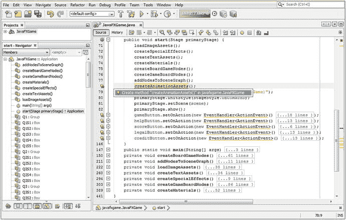

图 16-1.

在 `start()` 方法中自定义方法调用列表的末尾，添加一个 `createAnimationAssets()` 方法调用

```
createAnimationAssets();
```

请记得双击 `javafxgame.JavaFXGame` 选项中的“创建方法 createAnimationAssets()”，让 NetBeans 为您生成一个引导方法。在本章的这一部分，您将用 `RotateTransition` 对象的实例化和配置代码替换占位 Java 代码。

您需要做的第一件事是在类顶部声明一个 `RotateTransition` 对象，并将其命名为 `rotGameBoard`，因为这就是该对象将要执行的操作。在您的 `.createAnimationAssets()` 方法内部，实例化 `rotGameBoard` 对象，并将其配置为播放五秒钟；然后将其连接到 `gameBoard` Group 节点，如下面的 Java 9 代码所示，并在图 16-2 中以浅蓝色和黄色高亮显示：

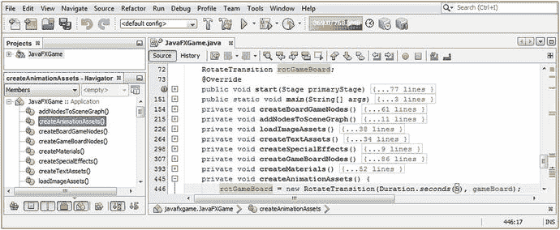

图 16-2.

在类顶部声明一个 `rotGameBoard` 对象，并在 `createAnimationAssets()` 内部实例化它

```
RotateTransition rotGameBoard;
...
private void createAnimationAssets() {
rotGameBoard = new RotateTransition(Duration.seconds(5), gameBoard);
}
```

现在，您可以使用本章上一节中学到的各种 `.set()` 方法调用来开始配置此 `RotateTransition` 动画对象。使用 `.setAxis(Rotate.Y_AXIS)` 设置 Y 旋转轴，并使用 `.setCycleCount(1)` 方法调用将 `cycleCount` 属性设置为一个周期。使用 `.setRate(0.5)` 方法调用将 `rate` 属性设置为 50% 的速度，该调用作用于您的 `rotGameBoard` 对象。核心动画对象设置的 Java 语句应类似于以下 Java 9 语句，这些语句在图 16-3 底部以高亮显示：

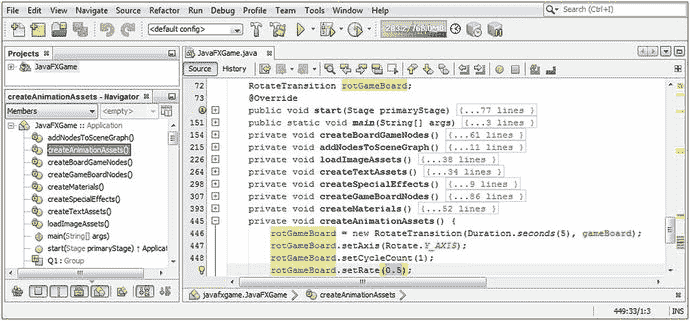

图 16-3.

使用 y 轴、`cycleCount` 为 1 以及 50% 速度的 `rate` 配置 `rotGameBoard` RotateTransition 对象

```
RotateTransition rotGameBoard;
...
private void createAnimationAssets() {
rotGameBoard = new RotateTransition(Duration.seconds(5), gameBoard);
rotGameBoard.setAxis(Rotate.Y_AXIS);
rotGameBoard.setCycleCount(1);
rotGameBoard.setRate(0.5);
}
```

您已经知道我们为什么使用 y 轴进行旋转；但是，您可能想知道为什么我们只使用一个周期。原因是，一旦我们通过指定 `fromAngle` 和 `toAngle` 值使此 `RotateTransition` 具有交互性（这些值将在每次 `rotGameBoard.play()` 方法调用之前，使用我们稍后将编码的随机旋转生成器中的代码进行设置），我们将使用这些角度之间的差值（当前为 1080 或三次旋转）来控制旋转次数；因此，我们只使用一个周期。我使用三次旋转是为了进行代码测试。

`rate` 设置为 1 对于获得平滑的旋转动画来说太快了，而且游戏板不应该旋转得那么快，所以我将这个 1.0 的默认值降低了 50%，改为 0.5，以向您展示 `rate` 变量如何提供精细调节的速度控制。

接下来，让我们添加必需的 `Interpolator` 类常量规范，目前将使用默认的 `LINEAR`，因为我们希望获得平滑、均匀的旋转。这通过 `.setInterpolator()` 方法调用和 `Interpolator.LINEAR` 常量来添加和配置。最后，我们要添加两个最重要的配置语句，它们告诉 `RotateTransition` 引擎旋转的起始角度（`fromAngle` 属性）和结束角度（`toAngle` 属性）。使用这些将允许我们控制旋转从哪个象限（45、135、225 或 315）开始以及结束。目前，我们将只使用从起始 45 度角开始的三个完整旋转（1080），因此 `toAngle` 将为 1125。要启动（并测试）动画，您还需要一个 `.play()` 方法调用，如下面的完整 Java 方法体所示，并在图 16-4 底部以黄色和浅蓝色高亮显示：

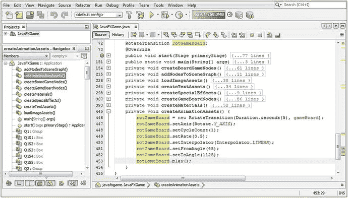

图 16-4.

使用 `LINEAR` 插值器、`fromAngle` 为 45 以及 `toAngle` 为 1125 配置 `rotGameBoard` 对象

```
RotateTransition rotGameBoard;
...
private void createAnimationAssets() {
rotGameBoard = new RotateTransition(Duration.seconds(5), gameBoard);
rotGameBoard.setAxis(Rotate.Y_AXIS);
rotGameBoard.setCycleCount(1);
rotGameBoard.setRate(0.5);
rotGameBoard.setInterpolator(Interpolator.LINEAR);
rotGameBoard.setFromAngle(45);
rotGameBoard.setToAngle(1125);
rotGameBoard.play();
}
```

图 16-5 显示了“运行 ➤ 项目”工作流程，其中游戏板正处于其旋转周期的中间。屏幕截图无法显示平滑的运动，但您可以判断游戏板并未处于其四个象限的“静止”位置（45、135、225、315 度），因为游戏板的尖端并未位于屏幕底部中央。在图 16-5 中，我在 3D `gameBoard` Group 节点仍在动画化时按下了 PrintScreen 键。

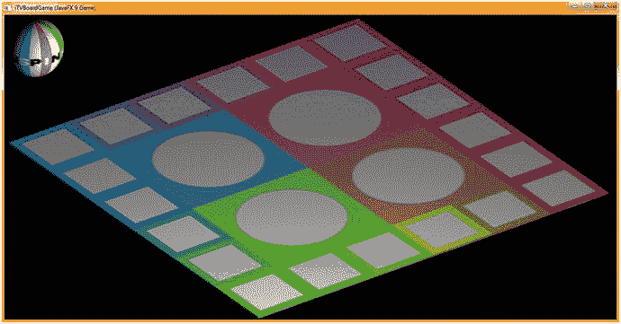

图 16-5.

使用您的“运行 ➤ 项目”工作流程，单击“开始游戏”，然后观察您的游戏板平滑旋转

同样重要的是要注意，当您测试动画代码时，需要在应用程序启动后立即单击“开始游戏”按钮 UI 元素（稍后，这将通过单击 3D 旋转器 UI 元素来触发，您可能已经猜到了）。这样做是为了让您能够看到动画特性，我们正在本章中开发这些特性，因为目前您的 Java 9 代码在 `Animation`（`Transition` 子类）对象被构造和配置后立即启动了播放生命周期。因此，一旦“开始游戏”2D UI 按钮出现，请立即单击它！

稍后，当我们学习如何捕获 3D 对象（例如您的旋转器 UI 元素）上的鼠标点击（或屏幕触摸）时，我们将通过点击旋转器 UI 元素来触发 `rotGameBoard.play()`，以随机旋转游戏板来选择一个新象限。当轮到下一位玩家准备好时，我们将触发 `rotSpinner.play()`，以便他们可以旋转游戏板。我们将在本书的剩余部分中开发此动画代码的复杂性。

在本章稍后的部分，我们将使用 `TranslateTransition` 与 `RotateTransition` 结合，通过 `ParallelTransition` 来实现，这将允许我们让 3D 旋转器 UI 元素移入和移出视图，以便玩家知道何时使用它来随机旋转游戏板，以选择一个新的象限（一个新的内容主题：动物-植物-矿物或地标类别），用于游戏循环中。


接下来，让我们添加 rotSpinner 旋转过渡对象。首先，在类顶部 rotGameBoard 对象名称后面添加 rotSpinner 对象名称，将 RotateTransition 声明改为复合语句。剪切并粘贴 rotGameBoard 语句到自身之后，将 rotGameBoard 改为 rotSpinner，并确保将实例化的 Node 参数从 gameBoard 改为 spinner。将 fromAngle 改为 30 度（你在第 15 章中设定的起始值），将 toAngle 改为 1110 度（1080 + 30）。你的 Java 9 代码应如下所示的方法体，该方法体也在图 16-6 底部高亮显示：

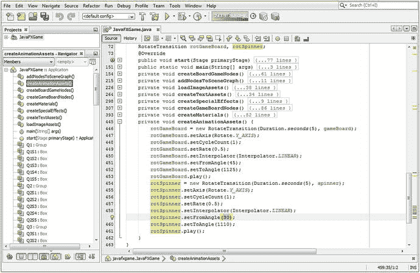

图 16-6.

添加一个 rotateSpinner 旋转过渡对象，并使用与 rotGameBoard 相同的参数进行配置

```
RotateTransition rotGameBoard, rotSpinner;
...
private void createAnimationAssets() {
rotGameBoard = new RotateTransition(Duration.seconds(5), gameBoard);
rotGameBoard.setAxis(Rotate.Y_AXIS);
rotGameBoard.setCycleCount(1);
rotGameBoard.setRate(0.5);
rotGameBoard.setInterpolator(Interpolator.LINEAR);
rotGameBoard.setFromAngle(45);
rotGameBoard.setToAngle(1125);
rotGameBoard.play();
rotSpinner = new RotateTransition(Duration.seconds(5), spinner);
rotSpinner.setAxis(Rotate.Y_AXIS);
rotSpinner.setCycleCount(1);
rotSpinner.setRate(0.5);
rotSpinner.setInterpolator(Interpolator.LINEAR);
rotSpinner.setFromAngle(30);
rotSpinner.setToAngle(1110);
rotSpinner.play();
}
```

使用“运行 ➤ 项目”工作流程，观察 gameBoard 和 spinner 同时旋转，如图 16-7 所示。

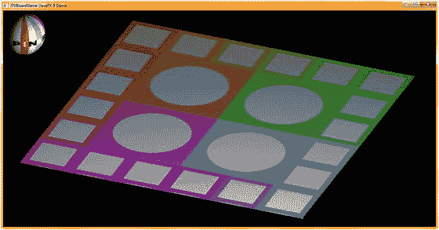

图 16-7.

选择“运行 ➤ 项目”并点击“开始游戏”以预览游戏板和转盘的旋转

如你所见，唯一的问题是“SPIN”转盘正在反向旋转，而我们希望 SPIN 这个词正向旋转，因此我们需要通过将 fromAngle 设为 30、toAngle 设为 -1050（1080 = 30 - -1050）来改变方向。最终的 Java 代码块如下所示，并在图 16-8 中以黄色和蓝色高亮显示：

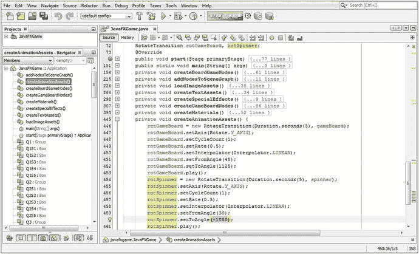

图 16-8.

调整 rotSpinner.setToAngle() 方法调用，使其沿负方向旋转，从而使转盘 UI 正向旋转

```
RotateTransition rotGameBoard, rotSpinner;
...
private void createAnimationAssets() {
rotGameBoard = new RotateTransition(Duration.seconds(5), gameBoard);
rotGameBoard.setAxis(Rotate.Y_AXIS);
rotGameBoard.setCycleCount(1);
rotGameBoard.setRate(0.5);
rotGameBoard.setInterpolator(Interpolator.LINEAR);
rotGameBoard.setFromAngle(45);
rotGameBoard.setToAngle(1125);
rotGameBoard.play();
rotSpinner = new RotateTransition(Duration.seconds(5), spinner);
rotSpinner.setAxis(Rotate.Y_AXIS);
rotSpinner.setCycleCount(1);
rotSpinner.setRate(0.5);
rotSpinner.setInterpolator(Interpolator.LINEAR);
rotSpinner.setFromAngle(30);
rotSpinner.setToAngle(-1050); // 使用负的 toAngle 值反转旋转方向
rotSpinner.play();
}
```

接下来，让我们看看平移过渡，它可用于在 3D 场景中沿 X、Y 或 Z 任意维度移动对象。我们将使用它在游戏过程中根据需要将转盘 UI 元素移入（和移出）屏幕，以便玩家随机旋转游戏板来选择新的主题象限。

### 动画节点移动：使用 TranslateTransition 类

公共 final 类 TranslateTransition 扩展了公共抽象超类 Transition，并位于 javafx.graphics 模块的 javafx.animation 包中。TranslateTransition 创建一个移动（平移）动画，其持续时间由 duration 属性决定。移动是通过在 Interpolator 常量定义的间隔内更新正在动画化的 Node 的 translateX、translateY 和 translateZ 变量（属性）来实现的。如果提供了“from”值（fromX、fromY、fromZ），平移将从该值开始；否则，算法将使用 Node 对象的当前位置（translateX、translateY、translateZ）值。如果提供了“to”值（toX、toY、toZ），平移将在该值处停止；否则，它将使用起始值加上 byX、byY 或 byZ 值。如果同时指定了“to”（toX、toY、toZ）和“by”（byX、byY、byZ）值，则“to”值优先。

```
java.lang.Object
> javafx.animation.Animation
> javafx.animation.Transition
> javafx.animation.TranslateTransition
```

TranslateTransition 类有十一个属性，其中九个涉及 X、Y 和 Z 3D 坐标的 to、from 和 by 规范。另外两个是 duration 属性和 node 属性，它们定义了动画的持续时间以及它影响哪个 Node 对象。byX 属性用于指定 TranslateTransition 的增量停止 X 坐标 double 值，该值根据起始值计算得出。byY 属性用于指定 TranslateTransition 的增量停止 Y 坐标 double 值，该值根据起始值计算得出。byZ 属性用于指定 TranslateTransition 的增量停止 Z 坐标 double 值，该值根据起始值计算得出。fromX 属性用于指定 TranslateTransition 的起始 X 坐标 double 值。fromY 属性用于指定 TranslateTransition 的起始 Y 坐标 double 值。fromZ 属性用于指定 TranslateTransition 的起始 Z 坐标 double 值。toX 属性用于指定 TranslateTransition 的停止（静止或最终）X 坐标值。toY 属性用于指定 TranslateTransition 的停止（静止或最终）Y 坐标值。toZ 属性用于指定 TranslateTransition 对象的停止（静止或最终）Z 坐标值。

TranslateTransition 有三个重载的构造方法：一个是空的，一个指定了 duration，一个指定了 duration 和 node 属性。它们如下所示：

```
TranslateTransition()
TranslateTransition(Duration duration)
TranslateTransition(Duration duration, Node node)
```

该类有近三十个方法可供使用，其中二十七个（九组，每组三个）处理 from、to 和 by 属性。这是因为对于每个 X、Y 和 Z 属性，都有一个 .get()、一个 .set() 和一个 .property() 方法。还有用于 duration、node 和 interpolator 属性的方法。所有 X、Y 和 Z 方法都使用 double 值。.byXProperty() 方法用于将停止 X 坐标值指定为相对于 TranslateTransition 起始位置的增量偏移。.byYProperty() 方法用于将增量停止 Y 坐标值指定为相对于 TranslateTransition 起始位置的偏移。.byZProperty() 方法用于将增量停止 X 坐标值指定为相对于 TranslateTransition 起始位置的偏移。

.fromXProperty() 方法调用用于指定 TranslateTransition 的起始 X 坐标值。

.fromYProperty() 方法调用用于指定 TranslateTransition 的起始 Y 坐标值。

.fromZProperty() 方法调用用于指定 TranslateTransition 的起始 Z 坐标值。


`.getByX()` 方法调用用于获取属性 `byX` 的值。`.getByY()` 方法调用用于获取属性 `byY` 的值。`.getByZ()` 方法调用用于获取属性 `byZ` 的值。

`.getFromX()` 方法调用用于获取属性 `fromX` 的值。`.getFromY()` 方法调用用于获取属性 `fromY` 的值。`.getFromZ()` 方法调用用于获取属性 `fromZ` 的值。`.getToX()` 方法调用用于获取属性 `toX` 的值。`.getToY()` 方法调用用于获取属性 `toY` 的值。`.getToZ()` 方法调用用于获取属性 `toZ` 的值。

`void .setByX(double value)` 方法调用用于设置（指定）属性 `byX` 的值。`void .setByY(double value)` 方法调用用于设置（指定）属性 `byY` 的值。`void .setByZ(double value)` 方法调用用于设置（指定）属性 `byZ` 的值。`void .setFromX(double value)` 方法调用用于设置（指定）属性 `fromX` 的值。`void .setFromY(double value)` 方法调用用于设置（指定）属性 `fromY` 的值。`void .setFromZ(double value)` 方法调用用于设置（指定）属性 `fromZ` 的值。

`void .setToX(double value)` 方法调用用于设置（指定）属性 `toX` 的值。`void .setToY(double value)` 方法调用用于设置（指定）属性 `toY` 的值。`void .setToZ(double value)` 方法调用用于设置（指定）属性 `toX` 的值。

`.toXProperty()` 方法调用用于为 `TranslateTransition` 对象指定一个停止点的 X 坐标值。`.toYProperty()` 方法调用用于为 `TranslateTransition` 对象指定一个停止点的 Y 坐标值。`.toZProperty()` 方法调用用于为 `TranslateTransition` 对象指定一个停止点的 Z 坐标值。

`.durationProperty()` 方法调用将返回 `TranslateTransition` 的当前持续时间属性。`.getDuration()` 方法调用用于获取 `TranslateTransition` 持续时间属性的 `Duration` 值。`void .setDuration(Duration value)` 可用于设置（指定）持续时间属性的 `Duration` 值。

`.nodeProperty()` 方法调用将返回 `TranslateTransition` 的目标节点 `Node` 属性。`.getNode()` 方法调用将获取（读取）`TranslateTransition` 节点属性的 `Node` 对象引用值。`void .setNode(Node value)` 方法调用将设置 `TranslateTransition` 节点属性的 `Node` 值。`void .interpolate(double frac)` 方法调用始终需要由 `Transition` 的子类提供。

接下来，让我们实现一个 `TranslateTransition` 动画对象，该对象将旋转器 UI 元素移入和移出屏幕。这些动画对象最终将被命名为 `moveSpinnerOn` 和 `moveSpinnerOff`。之后，我们将进入 `ParallelTransition` 类，并结合移动和旋转，使旋转器 UI 元素从屏幕左角到右角横跨屏幕旋转。

### TranslateTransition 示例：设置平移动画资源

让我们为你的游戏项目添加一个 `TranslateTransition` 动画对象：在类顶部声明一个名为 `moveSpinner` 的对象，然后在 `createAnimationAssets()` 方法中，在 `RotateTransition` Java 代码之后对其进行实例化。引用旋转器节点，并使用五秒的持续时间。接下来，配置 `moveSpinnerOn` 动画对象，使其在屏幕顶部移动 1150 个 X 单位（实际为 1350 个单位，因为旋转器当前位于 -200），并将 `cycleCount` 属性设置为一个周期，使用以下 Java 语句，如图 16-9 中黄色高亮所示：

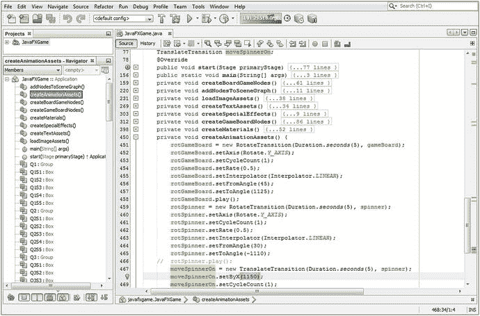

图 16-9.

在类顶部声明一个 `moveSpinnerOn` TranslateTransition，并在 `createAnimationAssets()` 中实例化它

```
TranslateTransition moveSpinnerOn;
...
moveSpinnerOn = new TranslateTransition(Duration.seconds(5), spinner);
moveSpinnerOn.setByX(1150);
moveSpinnerOn.setCycleCount(1);
```

接下来，让我们看看 `ParallelTransition` 类，因为我们需要使用这个对象算法将旋转器 `rotSpinner` 动画对象与 `moveSpinnerOn` 动画对象结合起来，这样最终的结果就是一个旋转器在屏幕顶部移动的同时进行旋转。


### 合并动画属性：使用 ParallelTransition 类

公共最终类 `ParallelTransition` 扩展了抽象超类 `Transition`，可以在 `javafx.animation` 包中找到，该包位于 `javafx.graphics` 模块中。此 `Transition` 并行播放一个 `Animation` 对象列表，这意味着它们同时进行（一个接一个地播放称为串行或顺序播放）。如果子 `Transition` 的节点属性尚未使用方法调用（通常是构造方法）显式指定，则它们会继承父 `Transition` 的 `Node` 节点属性。原因在于 `ParallelTransition` 只是合并现有的 `Animation` 对象，因此节点可能已在合并的动画中指定。`ParallelTransition` 的 Java 类层次结构如下所示：

```
java.lang.Object
> javafx.animation.Animation
> javafx.animation.Transition
> javafx.animation.ParallelTransition
```

`ParallelTransition` 类只有一个原生属性，即 `ObjectProperty<Node>` 节点属性，它是组合动画将应用到的 `Node` 对象。如果未指定节点，则将改用子 `Animation` 对象的节点属性。如果指定了节点，则该 `Node` 将被设置（即指定）给所有自身未定义任何目标 `Node` 节点属性的子 `Transition`。

`ParallelTransition` 类包含四个重载的构造方法。第一个创建一个空对象，第二个指定一个子 `Animation` 对象列表，第三个指定一个要影响的 `Node`，第四个同时指定要影响的 `Node` 对象和一个子 `Animation` 对象列表。第二个和第四个构造方法是最常用的。我们将为子 `Animation` 对象使用第二个构造方法；两个引用的 `Animation` `Transition` 对象都将 `spinner` `Node` 对象指定为 `ParallelAnimation` 对象的目标。这些构造方法的 Java 代码如下所示：

```
parallelTransition = new ParallelTransition();
parallelTransition = new ParallelTransition(Animation... children);
parallelTransition = new ParallelTransition(Node node);
parallelTransition = new ParallelTransition(Node node, Animation... children);
```

`ParallelTransition` 类只有大约六个你需要掌握的方法调用。`.getChildren()` 方法调用将返回一个 `ObservableList<Animation>`，其中包含要作为一个统一动画一起播放的 `Animation` 对象。

`.getNode()` 方法调用可用于获取（轮询）节点属性的 `Node` 对象值，而 `void .setNode(Node value)` 方法调用可用于设置（指定）节点属性的 `Node` 对象值。

还有一个受保护的 `Node .getParentTargetNode()` 方法调用，它将为那些未指定节点属性的 `Transition` 子 `Animation` 对象返回目标 `Node`。要指定父目标节点属性，必须使用第四个构造方法，它为 `ParallelTransition`（父对象）指定了一个节点属性。否则，将使用第二个构造方法，并且子 `Animation` 对象的节点属性将定义 `Animation` 对象将影响哪个 `Node` 对象。

`ParallelTransition .nodeProperty()` 方法调用将返回你的 `ParallelTransition`（父对象）`ObjectProperty<Node>` 值，该值将使用第三个或第四个构造方法或 `.setNode(Node)` 进行设置。如果此 `Node` 被指定（设置），它将被用于所有未具体定义其目标 `Node` 的子 `Transition`。

最后，所有抽象超类 `Transition` 的子类实现都必须提供受保护的 `void .interpolate(double value)` 方法调用。

接下来，让我们设置一个 `ParallelTransition` 对象，它将你的 `rotSpinner` 和 `moveSpinnerOn` `Animation` 对象无缝地组合在一起。

### ParallelTransition 对象：合并 rotSpinner 和 moveSpinnerOn

让我们向你的游戏项目添加一个 `ParallelTransition` `Animation` 对象：在类的顶部声明一个名为 `spinnerAnim` 的对象，然后在 `createAnimationAssets()` 方法内部，在 `RotateTransition` 和 `TranslateTransition` Java 代码之后实例化它。在构造方法中，引用 `moveSpinnerOn` 和 `rotSpinner` `Animation` 子对象，然后调用 `spinnerAnim` 对象的 `.play()` 方法。请注意，我已注释掉了 `rotSpinner.play()` 方法调用，并且没有向 `moveSpinnerOn` `Animation` 对象添加 `.play()` 方法调用，因为这些操作现在由 `spinnerAnim` `ParallelTransition` 对象完成。此并行（混合）动画的设置将使用以下 Java 语句完成，这些语句在图 16-10 中也以黄色和蓝色突出显示：

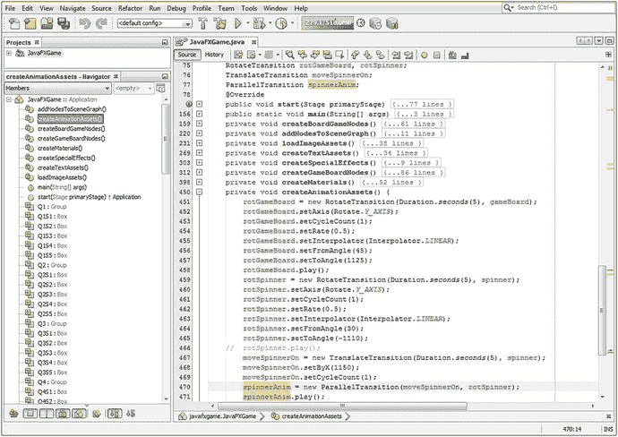

图 16-10.

在类顶部声明一个 `spinnerAnim` `ParallelTransition` 并在 `createAnimationAssets()` 中实例化它

```
ParallelTransition spinnerAnin;
...
spinnerAnin = new ParallelTransition(moveSpinnerOn, rotSpinner);
spinnerAnim.play();
```

当你选择“运行 ➤ 项目”时，一个旋转器会从游戏左侧旋转到右侧，如图 16-11 所示。

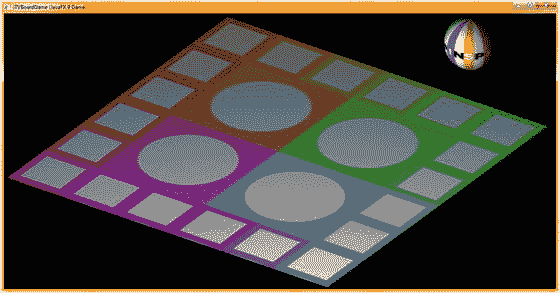

图 16-11.

选择“运行 ➤ 项目”，点击“开始游戏”，观察旋转器动画

在下一章，当我们介绍 3D 场景事件处理以及 `PickResult` 类之后，我们就可以开始完成旋转器 UI 元素的动画，使其在需要时出现在屏幕上，并在用户不再需要旋转游戏板时从屏幕上消失。

我想用一章专门介绍 `Animation` 对象，向你展示预编码的 `Transition` 子类如何为你提供 Java 9 代码来为你的游戏玩法添加动画，并向你展示如何设置大部分 `Animation` 对象及其代码。我还想向你展示如何放置 `createAnimationAssets()` 方法，以便你可以添加 `Animation` 对象，从此刻起，这些对象将在你的专业 Java 9 游戏开发中拥有自己专属的位置。

## 总结

在第十六章中，我们学习了 `Animation` 超类和 `Transition` 超类，以及一些重要的 `Transition` 子类 `RotateTransition` 和 `TranslationTransition`，它们允许我们在游戏过程中移动和旋转 3D 对象。我们还研究了 `ParallelTransition` 子类，它允许我们组合这些 `Animation` 对象以创建更复杂的 `Animation` 对象。我们还为我们的游戏构建了 `Animation` 对象，这将允许用户对游戏板应用随机旋转以选择一个主题象限，并在需要随机旋转游戏板时，将旋转的旋转器 UI 元素移入和移出屏幕。

我们为 `JavaFXGame` 类创建了一个名为 `createAnimationAssets()` 的新自定义方法，该方法将使用 `Transition` 子类（如 `RotateTransition`、`TranslateTransition`、`ScaleTransition` 和 `ParallelTransition`）为专业 Java 9 游戏设计创建的所有 `Animation` 对象。

在第 17 章中，我们将学习 3D 场景元素的 `MouseEvent` 处理，以便我们可以点击 Sphere 3D 旋转器 UI 来旋转游戏板，并最终点击每个游戏板方块以选择教育问题类别，并调出问题供玩家回答。


