# 17. i3D 游戏方块选择：在 3D 模型中使用 PickResult 类

现在，你已经创建了多层游戏棋盘组节点（子类）层级结构，为该层级结构下的所有 3D 组件添加了纹理，确保了层级结构的中心旋转，创建了一个旋转器 UI 来将游戏棋盘 3D 模型（层级结构）随机旋转至某个象限，并使用你的 `createAnimationAssets()` 方法为游戏设计添加了动画对象，是时候让你的 3D 游戏元素变得可交互了。我们将设置 3D 对象的鼠标点击事件处理代码，用于触发 3D 旋转器动画并选择棋盘方块。

在本章中，我们将详细研究公共 PickResult 类和公共 MouseEvent 类，并在自定义的 `createSceneProcessing()` 方法中将其用于我们自己的游戏玩法设计。该方法将用于处理 i3D 游戏元素（Box 和 Sphere 对象）的事件，以便玩家能够与 3D 游戏组件进行交互。

## 选择你的 3D 资源：PickResult 类

公共类 PickResult 继承自 Object，位于 `javafx.scene.input` 包中，该包包含输入事件处理工具，如剪贴板、GestureEvent、SwipeEvent、TouchEvent 和 ZoomEvent。PickResult 对象包含拾取事件的结果，在本游戏中，该结果来自鼠标或触摸。支持在其构造方法中使用 PickResult 对象的输入类包括 MouseEvent、MouseDragEvent、DragEvent、GestureEvent、ContextMenuEvent 和 TouchPoint。这些类中都有一个 `.getPickResult()` 方法调用，用于返回 PickResult 对象，该对象包含你在 Java 游戏开发中所需处理的所有拾取信息。

PickResult 类的 Java 类层级结构表明，该类是从零开始编码以提供 3D 对象选择功能的；它没有自己的超类，因此看起来像下面的 Java 9 类层级结构：

```
java.lang.Object
> javafx.scene.input.PickResult
```

PickResult 类包含一个数据字段，即静态整型 `FACE_UNDEFINED` 数据字段，它表示一个未定义的面。我们通常将使用此类来选择整个节点（旋转器、象限 q1 到 q4、方块 Q1S1 到 Q4S5 以及类似的 3D 游戏元素），而不是单个多边形面或纹理贴图像素，尽管后者也是可行的。

PickResult 类中的前两个构造方法创建用于处理 2D 和 2.5D 场景拾取结果的 PickResult 对象。第一个构造方法使用 EventTarget 对象以及（双精度）sceneX 和 sceneY 属性为 2D 场景创建 PickResult 对象。该构造方法使用以下 Java 语句语法：

```
PickResult(EventTarget target, double sceneX, double sceneY);
```

第二个构造方法为“非 Shape3D”目标创建 PickResult 对象。由于它使用了 Point3D 对象和距离，我称之为 2.5D PickResult 场景，因为它不支持基于 Shape3D 类的 3D 图元。然而，它确实支持 Point3D 对象以及进入 Scene 对象的距离概念。该构造方法使用以下 Java 语句语法：

```
PickResult(Node node, Point3D point, double distance)
```

第三个构造方法为 Shape3D 目标创建 PickResult 对象，这正是我们用于创建 i3D 游戏所使用的。创建此构造方法的 Java 语法应如下所示：

```
PickResult(Node node, Point3D point, double dist, int face, Point2D texCoord);
```

第四个构造方法为包含法线的导入 3D 对象目标创建 PickResult 对象。如果你从外部 3D 建模软件包（如 Blender）导入了高级 3D 模型，则会用到此方法。创建此高级构造方法的 Java 语法应如下所示：

```
PickResult(Node node, Point3D point, double distance, int face, Point3D normal, Point2D texCoor)
```

PickResult 类支持六个 `.get()` 方法调用，这些调用分别返回相交距离、相交面、相交节点、相交法线、相交点或相交纹理坐标（texCoord）。`.getIntersectedDistance()` 方法调用将返回一个双精度值，表示当前相机位置与相交点之间的相交距离。

`.getIntersectedFace()` 方法调用将返回一个整数，表示被拾取节点的相交面。如果节点没有用户指定的面（例如某个 Shape3D 图元），或者是在边界上被拾取，此方法将返回 `FACE_UNDEFINED` 常量。`.getIntersectedNode()` 方法调用将返回一个 Node 对象形式的相交节点，我们将使用此方法调用来选择旋转器 UI 和游戏棋盘节点元素。

`.getIntersectedNormal()` 方法调用将返回被拾取的 Shape3D 对象或导入 3D 几何体的相交法线。`.getIntersectedPoint()` 方法调用将使用被拾取节点对象的局部坐标系返回一个相交点（Point3D 对象）。`.getIntersectedTexCoord()` 方法调用将以 Point2D 对象格式返回被拾取 3D 形状的相交纹理坐标。

接下来，让我们看看另一个重要的事件处理类：MouseEvent。它是 InputEvent 的子类，用于将鼠标事件处理附加到我们用于创建 i3D 棋盘游戏模拟的 3D 图元上。


### MouseEvent 类：捕获 3D 图元上的鼠标点击

公共的 MouseEvent 类继承自 InputEvent 超类。MouseEvent 与其子类 MouseDragEvent 以及其他 InputEvent 超类的子类一同存放在 `javafx.scene.input` 包中。MouseEvent 实现了 Java 的 Serializable 和 Cloneable 接口。该类用于实现或“捕获”鼠标事件，以供你的 Java 游戏逻辑处理，你将在本章中学习如何做到这一点。当鼠标事件（例如点击）发生时，光标下的第一个（顶层或最前端的）Node 对象会被“拾取”，并且 MouseEvent 会被传递到该 Node 对象的事件处理结构中。事件的传递使用了存储在 `javafx.event` 包中的公共 EventDispatcher Java 接口所描述的捕获和冒泡阶段。因此，MouseEvent 类的 Java 层次结构应如下所示：

```
java.lang.Object
> java.util.EventObject
> javafx.event.Event
> javafx.scene.input.InputEvent
> javafx.scene.input.MouseEvent
```

鼠标指针（光标）位置在几种不同的坐标系中都是可用的。可以使用相对于 MouseEvent 的 Node 对象原点的 X、Y 坐标（以及相对于你的 Scene 对象），使用相对于包含该 Node 的 Scene 原点的 sceneX、sceneY 坐标，甚至可以使用相对于包含鼠标指针的显示屏原点的 screenX、screenY 坐标来获取。在这个特定的 i3D BoardGame 项目中，我们将把被点击的 Node 与我们的游戏处理逻辑进行比较。

MouseEvent 对象有许多特定的事件字段。这些字段是静态的，并使用大写字母，因为它们是 MouseEvent 类型的 InputEvent 所提供的不同类型事件的“硬编码”常量。一个通用的 ANY 静态 EventType<MouseEvent> 被用作表示任何鼠标事件类型的公共“超类型”。

一个 DRAG_DETECTED 静态 EventType<MouseEvent> 将被传递到任何被识别为拖拽手势源的 Node 对象。当鼠标按钮被点击（在同一节点上按下并释放）时，将传递一个 MOUSE_CLICKED 静态 EventType<MouseEvent>。这正是我们将用于 i3D BoardGame 的事件。你还可以捕获鼠标按下和鼠标释放的事件。当鼠标按钮被按下时，将传递一个 MOUSE_PRESSED 静态 EventType<MouseEvent>；当鼠标按钮被释放时，将传递一个 MOUSE_RELEASED 静态 EventType<MouseEvent>。

你还可以处理鼠标移入一个 Node 然后又移出该 Node 而没有任何鼠标点击发生的事件！当鼠标进入一个 Node 对象但未被点击时（这称为悬停），将传递一个 MOUSE_ENTERED 静态 EventType<MouseEvent>。当鼠标首次进入 Node（越过其边缘边界）时，将传递一个 MOUSE_ENTERED_TARGET 静态 EventType<MouseEvent>。类似地，当鼠标退出一个 Node 对象时，将传递一个 MOUSE_EXITED 静态 EventType<MouseEvent>。当鼠标首次退出一个 Node 对象（越过边缘边界）时，将传递一个 MOUSE_EXITED_TARGET 静态 EventType<MouseEvent>。

最后，当鼠标在一个 Node 对象内移动且没有任何按钮被按下或释放时，将传递一个 MOUSE_MOVED 静态 EventType<MouseEvent>。当使用按下的（按住）鼠标按钮移动鼠标时（称为拖拽操作），将传递一个 MOUSE_DRAGGED 静态 EventType<MouseEvent>。

我们不会专门构造（实例化）MouseEvent 对象。我们将使用 `.setOnMouseClick()` 事件处理结构，作为其功能的一部分，它会为我们完成构造。不过，为了完整性，我将在此包含这两个重载的构造方法。第一个构造方法创建一个新的 MouseEvent Event 对象，其源和目标为空，语法如下所示：

```
MouseEvent(EventType eventType, double x, double y, double screenX, double
screenY, MouseButton button, int clickCount, boolean shiftDown, boolean controlDown,
boolean altDown, boolean metaDown, boolean primaryButtonDown, boolean
middleButtonDown, boolean secondaryButtonDown, boolean synthesized, boolean
popupTrigger, boolean stillSincePress, PickResult pickResult)
```

第二个构造方法创建一个新的 MouseEvent Event 对象，语法如下所示：

```
MouseEvent(Object source, EventTarget target, EventType eventType, double
x, double y, double screenX, double screenY, MouseButton button, int clickCount,
boolean shiftDown, boolean controlDown, boolean altDown, boolean metaDown, boolean
primaryButtonDown, boolean middleButtonDown, boolean secondaryButtonDown, boolean
synthesized, boolean popupTrigger, boolean stillSincePress, PickResult pickResult)
```

MouseEvent 类包含 27 个方法，可帮助你控制鼠标事件处理。`.copyFor(Object newSource, EventTarget newTarget)` MouseEvent 方法调用将复制 Event 对象，以便它可以与不同的源和目标一起使用。

`.copyFor(Object newSource, EventTarget newTarget, EventType<? extends MouseEvent> eventType)` MouseEvent 方法调用也将创建给定 Event 对象的副本，并替换给定的 MouseEvent 字段。

静态的 `.copyForMouseDragEvent(MouseEvent e, Object source, EventTarget target, EventType<MouseDragEvent> type, Object gestureSource, PickResult pickResult)` 方法调用将创建一个 MouseDragEvent 类型的 MouseEvent 副本。

`.getButton()` 方法调用将轮询 MouseEvent 对象，以查看是哪个鼠标按钮（如果有）负责生成该 Event 对象。`.getClickCount()` 方法调用将返回与该 Event 对象关联的鼠标点击次数（int 类型）。

`.getEventType()` 方法调用将返回该 Event 对象的 EventType<? extends MouseEvent> 事件类型。`.getPickResult()` 方法调用将返回 PickResult 对象关于该拾取的信息。

`.getSceneX()` 方法调用将返回事件相对于包含 MouseEvent 源的 Scene 原点的水平位置的双精度值。`.getSceneY()` 方法调用将返回事件相对于包含 MouseEvent 源的 Scene 原点的垂直位置的双精度值。

`.getScreenX()` 方法调用将返回事件的绝对水平位置的双精度值。`.getScreenY()` 方法调用将返回事件的绝对垂直位置的双精度值。

`.getX()` 方法调用将返回事件相对于 MouseEvent 源原点的水平位置的双精度值。`.getY()` 方法调用将返回事件相对于 MouseEvent 源原点的垂直位置的双精度值。`.getZ()` 方法调用将返回事件相对于 MouseEvent 源原点的深度位置的双精度值。


`.isAltDown()` 方法调用可用于判断在此事件期间是否按住了 Alt 修饰键。它会返回一个 `true` 或 `false`（布尔）值。`.isControlDown()` 方法调用可用于判断在此事件期间是否按住了 Ctrl 修饰键。它同样返回一个 `true` 或 `false`（布尔）值。`.isMetaDown()` 方法调用可用于判断在此事件期间是否按住了 META 修饰键。它也返回一个 `true` 或 `false`（布尔）值。`.isShiftDown()` 方法调用可用于判断在此事件期间是否按住了 SHIFT 修饰键。它也返回一个 `true` 或 `false`（布尔）值。

`.isDragDetect()` 方法调用应用于判断此 MouseEvent 之后是否会跟随一个 `DRAG_DETECTED` 事件，并返回一个布尔值 `true`（是，检测到拖动）或 `false`（否，未检测到拖动）数据值。

`.isMiddleButtonDown()` 方法调用可用于判断鼠标中键是否被按住。如果鼠标中键（鼠标按钮 #2）当前被按下，它将返回 `true` 布尔值。

`.isPopupTrigger()` 方法调用应用于判断此事件是否为当前平台的弹出菜单触发事件。如果该鼠标事件确实是当前平台的弹出菜单触发事件，它将返回 `true`。

`.isPrimaryButtonDown()` 方法调用将在主鼠标按钮（按钮 #1，通常是鼠标左键）当前被按下时返回 `true` 布尔值。`.isSecondaryButtonDown()` 方法调用将在辅助按钮（按钮 #2，通常是鼠标右键）当前被按下时返回 `true` 布尔值。

`.isShortcutDown()` 方法调用将返回在此 MouseEvent 期间，宿主平台的通用快捷键修饰键是否被按住。

`.isStillSincePress()` 方法使用一个布尔值来指示，自在此事件之前发生的上一次鼠标按下事件以来，鼠标光标是否一直停留在系统提供的滞后区域内。

`.isSynthesized()` 方法调用返回一个布尔值，指示该 MouseEvent 是否由触摸屏设备合成，而非通常的鼠标事件源设备（如鼠标、轨迹球、触控板或类似的鼠标模拟硬件设备）生成。

最后，一个 `void .setDragDetect(boolean dragDetect)` 方法调用用于在使用鼠标、触控板或触摸屏设备进行拖拽检测时，结合 MouseEvent 处理来增强拖拽检测行为。

### 实现微调器（Spinner）UI 功能：鼠标事件处理

让我们创建一个 `createSceneProcessing()` 方法来存放 Scene 对象的创建、配置和事件处理的 Java 代码。Scene 对象必须在根 Group Node 对象创建之后才能创建，因此该方法必须在创建这些 Node 对象的 `createBoardGameNodes()` 方法调用之后调用。这通过以下 Java 语句实现，该语句也在图 17-1 中以浅蓝色高亮（和红色波浪下划线）显示：

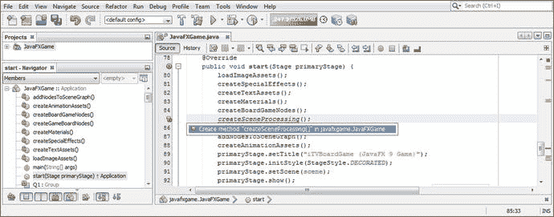

图 17-1.

在 start 方法中的 `createBoardGameNodes()` 方法之后，添加 `createSceneProcessing()` 方法调用

```
createSceneProcessing();
```

记得双击 `javafxgame.JavaFXGame` 选项中的“创建方法 createSceneProcessing()”，让 NetBeans 9 为你编写一个引导方法。你将用你的 Scene 对象实例化和配置代码替换占位 Java 代码，然后在此之后添加 MouseEvent 处理逻辑。

你需要做的第一件事是打开你的 `createBoardGameNodes()` 方法，并选中所有 Scene 对象实例化和配置的 Java 9 代码（当前有三条 Java 9 语句）；然后右键单击选中的代码集，选择“剪切”选项，将该 Java 代码从该方法体中移除。

在你的 `createSceneProcessing()` 方法内部，选中那一行代码并右键单击，选择“粘贴”来替换你从 `createBoardGameNodes()` 方法中“剪切”的三行代码，从而替换你的引导代码（未实现的错误代码）。最后，在方法末尾添加一行代码，开始构建你的 Scene 对象的事件处理；输入 `scene`，然后输入句点，再输入 `setOnMouse`，这将弹出一个包含所有 MouseEvent 事件的辅助对话框。以下是现有语句以及一个空的事件处理 lambda 表达式基础设施（作为一种变化）的 Java 代码，如图 17-2 中以蓝色高亮显示：

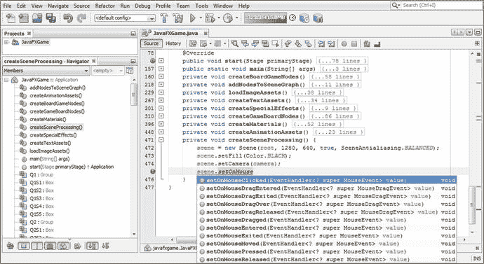

图 17-2.

将 Scene 对象代码剪切并粘贴到新方法中，并在 scene 对象上调用 `.setOnMouseClicked()`

```
private void createSceneProcessing() {
scene = new Scene(root, 1280, 640, true, SceneAntialiasing.BALANCED);
scene.setFill(Color.BLACK);
scene.setCamera(camera);
scene.setOnMouseClicked(event-> { ... } );  // 这是一个空的 OnMouseClicked 事件处理器
}                                              //  结构使用 Lambda 表达式格式
```

双击你的 `setOnMouseClicked(EventHandler<? super MouseEvent> value) (void)` 选项（在图 17-2 中以亮蓝色显示），并在 `.setOnMouseClicked()` 方法调用的参数区域内添加 `(event->{});` 空 lambda 表达式，以创建一个空的事件处理基础设施，这将在 NetBeans 9 中产生零错误。正如我在本书中之前所说，当你编写代码时，务必确保它在你的 IDE 中始终无错误！


现在您可以开始配置 onMouseClicked() 事件处理，如您所见，它使用了 Java 8 引入的简化 lambda 表达式。lambda（简称）只需要事件名称和一个箭头，Java 编译器就会自动确定要使用的事件处理对象类型（EventHandler）以及需要处理的 Event 对象类型（MouseEvent）。您的逻辑代码放在花括号内，可以专注于事件处理逻辑要执行的操作，即声明一个名为 picked 的 Node 对象，并将 `.getPickResult().getIntersectedNode()` 方法链的结果加载到其中。当 Java 语句的 `Node picked`（初始）部分出现波浪形红色错误下划线时，请务必使用 Alt+Enter，然后从弹出的帮助对话框中选择“import javafx.scene.Node”选项，以指示 NetBeans 9 为您编写 Node 类导入语句。如果您愿意，可以输入等号（=）和事件，然后按句点键；NetBeans 弹出帮助将让您选择 `.getPickResult()` 方法。双击插入该方法，然后再次使用句点键调出弹出帮助。这次选择 `.getIntersectedNode()` 方法调用。添加分号以完成 Java 语句。您的 MouseEvent 处理的 Java 语句应如下所示，并显示在图 17-3 的底部：

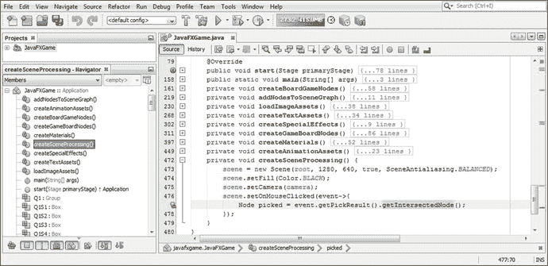

图 17-3.

将事件处理配置为 lambda 表达式，创建一个名为 picked 的 Node，并获取一个相交的 Node

```
private void createSceneProcessing() {
scene = new Scene(root, 1280, 640, true, SceneAntialiasing.BALANCED);
scene.setFill(Color.BLACK);
scene.setCamera(camera);
scene.setOnMouseClicked(event->{
Node picked = event.getPickResult().getIntersectedNode();
});
}
```

现在您已经在 BoardGame 中创建并加载了一个名为 picked 的 Node 对象，该对象已被用户通过鼠标（或触摸屏，也会生成鼠标事件）点击，我们需要添加条件处理逻辑（人工智能）来告诉游戏如何运行。您需要做的第一件事是过滤掉所有不在 3D Node 对象上的点击，这通过使用 `if` `(` `picked != null` `)` 结构来实现，该结构表示如果 picked Node 对象不为空，则继续执行。下一个嵌套的 if() 语句查找 spinner Node 对象是否与 picked Node 对象相同（== 或等价）。如果结果为 true，则通过调用 `.play()` 方法触发 rotGameBoard 动画对象，旋转 gameBoard Group Node。如果您使用“运行 ➤ 项目”工作流程并测试此代码，它将完美运行，尽管您必须等待上一章的代码完成（我们接下来将修复这个问题，将动画对象改为由 MouseEvent 触发）。

整个完成的 Java 9 结构只有八行代码；随着我们构建游戏逻辑，这将会增加。完成的 Java 方法体代码如下所示，并在图 17-4 中以黄色和蓝色高亮显示：

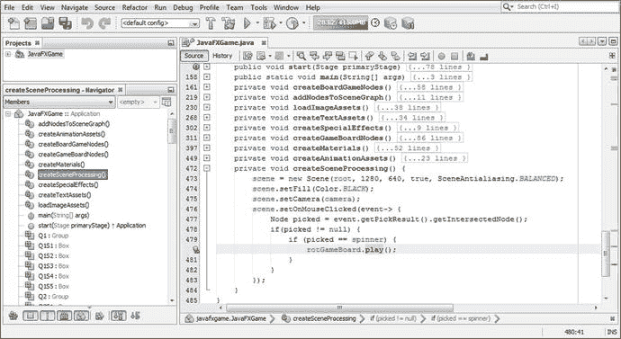

图 17-4.

使用两个嵌套的 if{} 结构评估 picked Node 对象，先测试 null，然后测试 spinner UI Node

```
private void createSceneProcessing() {
scene = new Scene(root, 1280, 640, true, SceneAntialiasing.BALANCED);
scene.setFill(Color.BLACK);
scene.setCamera(camera);
scene.setOnMouseClicked(event->{
Node picked = event.getPickResult().getIntersectedNode();
if (picked != null) {
if (picked == spinner) {
rotGameBoard.play();
}
}
});
}
```

为了让 spinner UI 动画显示到屏幕上，我们首先需要将其初始位置设置在屏幕外，位于当前起始位置的左侧。进入 createBoardGameNodes() 并将 TranslateX 属性从 -200 改为 -350。这将使 spinner 从视图中消失，正好位于屏幕左侧之外。稍后我们将把 moveSpinnerIn 中的 `.setByX()` 方法改为 150，使其最终定位在 -200。这是使用如下 Java 代码完成的，如图 17-5 所示：

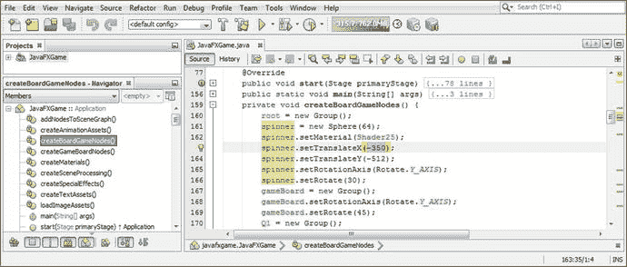

图 17-5.

通过将 spinner 的初始屏幕外位置设置为 -350 X 坐标，为实现交互式 spinner UI 做准备

```
spinner.setTranslateX(-350);
```

请注意 TranslateY 为 -512；这会将 3D spinner UI 放置在屏幕顶部，避开游戏棋盘视图，并在 spinner 动画移动到 -150 X 位置后位于屏幕左上角。

接下来，让我们重新编写 createAnimationAssets() 方法体，使其仅实例化和配置我们的动画对象，而不触发它们，这现在将由用户在游戏过程中通过鼠标点击（或屏幕触摸，因为这些也会生成 MouseEvents，从而扩大我们的目标消费电子设备范围）来完成。

移除 rotGameBoard、rotSpinner 和 spinnerAnim 动画对象构造中的 `.play()` 方法调用，然后将 moveSpinnerOn TranslateTransition 对象的 `.setByX()` 方法调用改为引用 150 个单位。这将使您的 3D spinner UI 从其新的 -350 屏幕外位置移动到屏幕左上角。触发此动画（首次将 spinner 显示到屏幕上）的逻辑位置应在“开始游戏”按钮 UI 事件处理方法中，我们很快会实现。在本章稍后，我们还将创建您的 rotSpinner 动画对象，该对象将在点击 3D spinner UI 时使其旋转，以便玩家为 3D 游戏棋盘发起每次随机旋转时它也会旋转。

除了在“开始游戏”按钮事件处理中将此 i3D spinner 显示到屏幕上之外，我们还会在每个玩家回合结束时（在第 21 章中）将其显示到屏幕上，以便下一位玩家知道随机旋转游戏棋盘以选择新的教育问题类别（象限）。我们将在第 20 章中将其动画移出屏幕，届时游戏棋盘完成其摄像机旋转动画对象。本章还有更多内容需要学习，关于如何将您的交互性（事件处理）与 JavaFX 中的不同动画对象集成，以便实现无缝且响应迅速的游戏体验。

您新的 createAnimationAssets() Java 方法体现在应如下所示，在图 17-6 中也以浅蓝色和黄色高亮显示：

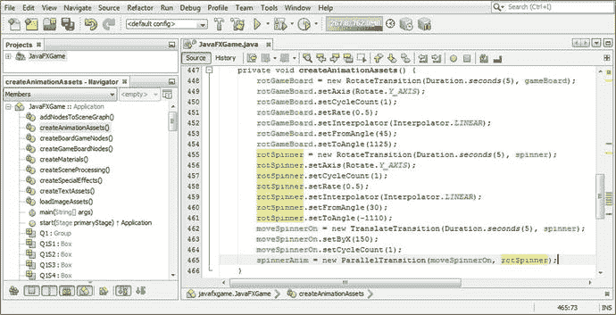

图 17-6.

移除所有 `.play()` 方法调用，并将 `.setByX()` 方法调用改为 150，以将 spinner 显示到屏幕上


```
RotateTransition rotGameBoard, rotSpinner;
TranslateTransition moveSpinnerOn;
ParallelTransition spinnerAnim;
...
private void createAnimationAssets() {
rotGameBoard = new RotateTransition(Duration.seconds(5), gameBoard);
rotGameBoard.setAxis(Rotate.Y_AXIS);
rotGameBoard.setCycleCount(1);
rotGameBoard.setRate(0.5);
rotGameBoard.setInterpolator(Interpolator.LINEAR);
rotGameBoard.setFromAngle(45);
rotGameBoard.setToAngle(1125);
// 已移除 .play()
rotSpinner = new RotateTransition(Duration.seconds(5), spinner);
rotSpinner.setAxis(Rotate.Y_AXIS);
rotSpinner.setCycleCount(1);
rotSpinner.setRate(0.5);
rotSpinner.setInterpolator(Interpolator.LINEAR);
rotSpinner.setFromAngle(30);
rotSpinner.setToAngle(-1110);                                     // 已移除 .play()
moveSpinnerOn = new TranslateTransition(Duration.seconds(5), spinner);
moveSpinnerOn.setByX(150);
moveSpinnerOn.setCycleCount(1);
spinnerAnim = new ParallelTransition(moveSpinnerOn, rotSpinner);
// 已移除 .play()
}
```

在 `gameButton` 事件处理器的末尾添加一条 `spinnerAnim.play();` 语句，如图 17-7 所示。

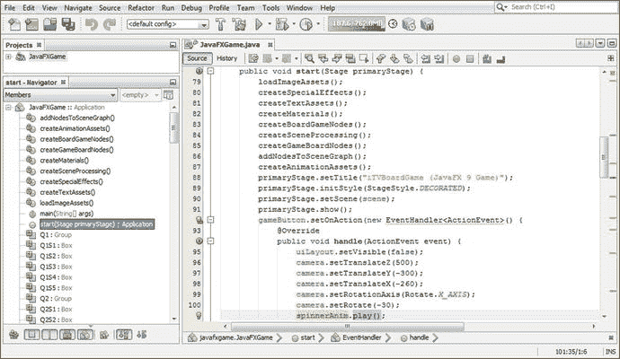

图 17-7.

将 `spinnerAnim.play()` 方法调用添加到 `gameButton` 事件处理方法构造的末尾

现在使用 **运行 ➤ 项目** 工作流程测试代码，你会看到旋转器在游戏开始时（点击隐藏 `uiLayout` StackPane 节点对象的按钮后）不会显示，而是缓慢平滑地旋转进入游戏屏幕左上角。

接下来我们需要创建一个独立的 `rotSpinner` 动画对象，这样在游戏板旋转的同时，3D 旋转器 UI 也能同步旋转，以保持连续性。你会发现，如果在 `MouseEvent` 处理构造中调用 `rotSpinner.play`，会报错，因为 `rotSpinner` 是 `spinnerAnim` 并行动画对象的一部分；因此，我们需要复制一个 `rotSpinner` 构造，并创建一个 `rotSpinnerIn` 构造用于 `spinnerAnim` 并行动画，这样 `rotSpinner` 动画就可以在玩家随机旋转游戏板时自由调用。

为此，选中所有与 `rotSpinner` 相关的 Java 代码，右键点击选中区域并选择“复制”；然后在该代码块后添加一行（空格）代码，右键点击并选择“粘贴”以复制此代码块。接着，只需在 `rotSpinner` 末尾添加 `In`，创建一个 `rotSpinnerIn` 代码块，该代码块功能相同，但不再是 `ParallelTransition` 构造的组成部分。在 `spinnerAnim` 并行过渡对象的实例化（构造方法）中引用新的 `rotSpinnerIn` 动画对象。

如你所见，唯一的问题是“SPIN”旋转器旋转到了错误的 `toAngle` 值 1110，这是我们在第 16 章中编写的。我将在下一节将其设置为 -1050。代码示例如下，如图 17-8 所示：

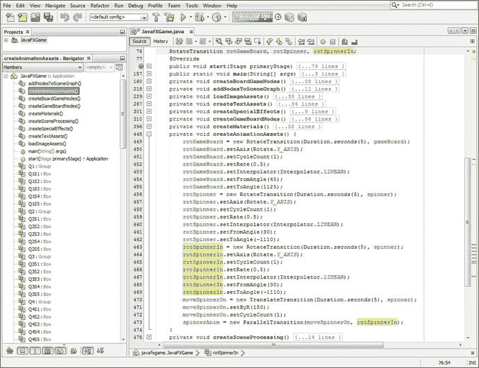

图 17-8.

将 `rotSpinner` 对象代码复制并粘贴到自身下方，创建 `rotSpinnerIn`，并在 `spinnerAnim` 中引用

```
RotateTransition rotGameBoard, rotSpinner;
TranslateTransition moveSpinnerOn;
ParallelTransition spinnerAnim;
...
private void createAnimationAssets() {
rotGameBoard = new RotateTransition(Duration.seconds(5), gameBoard);
rotGameBoard.setAxis(Rotate.Y_AXIS);
rotGameBoard.setCycleCount(1);
rotGameBoard.setRate(0.5);
rotGameBoard.setInterpolator(Interpolator.LINEAR);
rotGameBoard.setFromAngle(45);
rotGameBoard.setToAngle(1125);
rotSpinner = new RotateTransition(Duration.seconds(5), spinner);
rotSpinner.setAxis(Rotate.Y_AXIS);
rotSpinner.setCycleCount(1);
rotSpinner.setRate(0.5);
rotSpinner.setInterpolator(Interpolator.LINEAR);
rotSpinner.setFromAngle(30);
rotSpinner.setToAngle(-1110);
rotSpinnerIn = new RotateTransition(Duration.seconds(5), spinner);
rotSpinnerIn.setAxis(Rotate.Y_AXIS);
rotSpinnerIn.setCycleCount(1);
rotSpinnerIn.setRate(0.5);
rotSpinnerIn.setInterpolator(Interpolator.LINEAR);
rotSpinnerIn.setFromAngle(30);
rotSpinnerIn.setToAngle(-1110);
moveSpinnerOn = new TranslateTransition(Duration.seconds(5), spinner);
moveSpinnerOn.setByX(150);
moveSpinnerOn.setCycleCount(1);
spinnerAnim = new ParallelTransition(moveSpinnerOn, rotSpinnerIn);
}
```

现在，我可以在条件事件处理构造中添加 `rotSpinner.play();` Java 语句，而不会产生任何错误，这样当旋转器 UI 被点击时，它会与游戏板以相同的时间和速率一起旋转。完整的 Java 代码如下所示，并在图 17-9 中以黄色高亮显示：

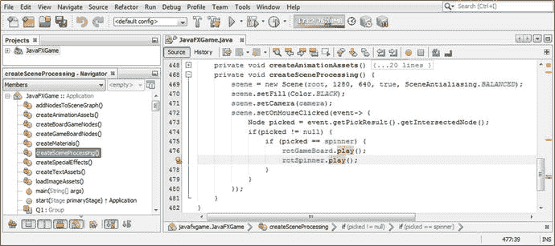

图 17-9.

在鼠标事件处理构造中，在 `rotGameBoard.play()` 之后添加 `rotSpinner.play()`，使两者都能动画化

```
private void createSceneProcessing() {
scene = new Scene(root, 1280, 640, true, SceneAntialiasing.BALANCED);
scene.setFill(Color.BLACK);
scene.setCamera(camera);
scene.setOnMouseClicked(event->{
Node picked = event.getPickResult().getIntersectedNode();
if (picked != null) {
if (picked == spinner) {
rotGameBoard.play();
rotSpinner.play();
}
}
});
}
```

让我们使用 **运行 ➤ 项目** 工作流程测试代码。点击“开始游戏”按钮对象，注意屏幕上只显示游戏板。随后旋转器 UI 出现，旋转到位（位置错误的“PINS”我们稍后会修复）。当你点击旋转器时，旋转器和游戏板会一起旋转，如图 17-10 所示。

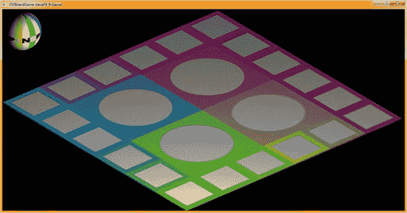

图 17-10.

旋转器 UI 元素现在会在屏幕上动画显示，并且在点击旋转游戏板时也会旋转


## 使用 java.util.Random：生成随机旋转

公共类 Random 继承自 Object 并实现了 Serializable。它位于 java.util 包中，有两个已知的直接子类：SecureRandom 和 ThreadLocalRandom。该类的实例可用于创建随机数生成对象，该对象将生成一个“伪随机数”流。这些数字的随机性足以用于创建随机游戏转盘 UI 功能。该类的算法使用一个 48 位的种子，并通过线性同余公式进行修改。如果你想更详细地研究这个算法，可以参考 Donald Knuth 所著的《计算机程序设计艺术》（第 2 卷，第 3.2.1 节）。因此，Random 类的 Java 类层次结构如下所示：

```
java.lang.Object
> java.util.Random
```

需要注意的是，如果使用相同的种子创建两个不同的 Random 对象实例，并且对每个对象进行相同顺序的方法调用，那么算法将生成（返回）相同的数字结果序列。在某些应用中，这实际上是可取的；因此，为了保证结果一致，java.util.Random 类实现了特定的算法。只要遵循所有方法的通用约定，Random 类的子类可以使用替代算法来提高安全性或支持多线程使用。

java.util.Random 的实例是线程安全的。然而，在多个线程中并发使用同一个 java.util.Random 实例可能会遇到争用，从而导致性能不佳。在你的多线程游戏设计中，应考虑使用 ThreadLocalRandom 子类。

此外，java.util.Random 的实例在加密上并不安全。对于对安全性要求高且需要高安全级别的应用，应考虑改用 SecureRandom 子类来获取一个加密安全的伪随机数生成器。

该类有两个重载的构造方法。第一个创建一个随机数生成器，第二个创建一个随机数生成器并使用 long 格式为其提供一个种子值。这些构造方法如下面的 Java 代码所示：

```
Random()             // 我们将在本章后面的代码中使用这个
Random(long seed)
```

该类有 22 个方法可用于从 Random 对象获取随机数结果。`.doubles()` 方法调用将返回一个无限的数值流，称为 DoubleStream，其中包含伪随机 double 值。这些值中的每一个都将介于 0（包含）和 1（不包含）之间。还有另外三个重载的 `.doubles()` 方法调用。`.doubles(double randomNumberOrigin, double randomNumberBound)` 方法调用将返回一个无限的、有界的伪随机 double 值流，每个值都符合方法调用参数区域中指定的给定起始值（包含）和边界值（不包含）。`.doubles(long streamSize)` 方法调用将返回一个流，该流生成指定 streamSize 数量的伪随机 double 值，这些值介于 0（包含）和 1（不包含）之间。最后，还有一个 `.doubles(long streamSize, double randomNumberOrigin, double randomNumberBound)` 方法调用，它返回一个流，该流生成符合给定 streamSize 数量的伪随机 double 值，每个值都符合给定的起始值（包含）和边界值（不包含）。

`.ints()` 方法调用将返回一个无限的伪随机 int（整数）数值流，称为 IntStream。还有另外三个重载的 `.ints()` 方法调用，包括一个 `.ints(int randomNumberOrigin, int randomNumberBound)` 方法调用，它将返回一个无限的伪随机 int（整数）值流，每个值都符合参数区域中指定的起始值（包含）和边界值（不包含）。`.ints(long streamSize)` 方法调用将返回一个随机值流，该流生成由 streamSize 参数指定的流大小，该参数设定了所需的伪随机 int（整数）值的数量。

最后，`.ints(long streamSize, int randomNumberOrigin, int randomNumberBound)` 方法调用将返回一个数值（整数）流，该流生成参数区域中指定的 streamSize 数量的伪随机 int 值，每个值都符合指定的起始值（包含）和边界值（不包含），这些值也取自方法调用的参数区域。

`.longs()` 方法调用将返回一个无限的伪随机 long 数值流，称为 LongStream。还有另外三个重载的 `.longs()` 方法调用，包括一个 `.longs(long randomNumberOrigin, int randomNumberBound)` 方法调用，它将返回一个无限的伪随机 long 值流，每个值都符合参数区域中指定的起始值（包含）和边界值（不包含）。`.longs(long streamSize)` 方法调用将返回一个随机 long 值流，该流生成由 streamSize 参数指定的流大小，该参数设定了所需的伪随机 long 值的数量。

最后，一个 `.long(long streamSize, int randomNumberOrigin, long randomNumberBound)` 方法调用将返回一个 long 数值流，该流生成参数区域中指定的 streamSize 数量的伪随机 long 值，每个值都符合指定的起始值（包含）和边界值（不包含），这些值也取自方法调用的参数区域。

受保护的 int `.next(int bits)` 方法调用将使用整数位数作为参数规范来生成下一个伪随机整数。`.nextBoolean()` 方法调用将从随机数生成器对象的序列中返回一个伪随机、均匀分布的布尔值。这个方法可能不适用于本游戏的使用场景，因为 `next()` 被设计为由其他 `random()` 方法调用。

void `.nextBytes(byte[] bytes)` 方法调用将生成一个由参数提供的字节数组，并用随机字节值填充它。`.nextDouble()` 方法调用将使用随机数生成器对象的序列，返回一个介于 0.0 和 1.0 之间的伪随机、均匀分布的 double 值。`.nextFloat()` 方法调用将使用随机数生成器对象的序列，返回一个介于 0.0 和 1.0 之间的伪随机、均匀分布的 float（或浮点）值。

`.nextGaussian()` 方法调用将从此随机数生成器对象的序列中返回一个伪随机、高斯分布、均值为 0.0、标准差为 1.0 的 double 值。`.nextInt()` 方法调用将从此随机数生成器对象的序列中返回下一个伪随机、均匀分布的 int（整数）值。

`.nextLong()` 方法调用将从此随机数生成器对象的序列中返回下一个伪随机、均匀分布的 long 值。

void `.setSeed(long seed)` 方法调用可用于使用方法调用参数区域内指定的单个 long 值种子规范来设置（或重新设置）随机数生成器对象的种子。

最后，`.nextInt(int bound)` 方法调用——我们将在本章的最后一节中使用它——将从此随机数生成器对象的随机 int 序列中返回一个介于 0（包含）和指定值（不包含，在我们的例子中是 4）之间的伪随机、均匀分布的 int（整数）值。


### 随机象限选择：结合条件 If() 使用 Random

现在我们已经设置好了转盘和游戏板的旋转，并且 MouseEvent 处理已足够将两者连接起来，为游戏板创建随机旋转，接下来我们需要在代码中添加一个随机化算法，这样每次点击转盘时，游戏板都会随机旋转到一个新的象限。我们将至少使用三次旋转，以确保旋转时间足够长，让玩家感觉完全是随机的。让我们在类的顶部声明一个名为 `random` 的 Random 对象，然后使用 Alt+Enter 组合键调出 NetBeans 9 的弹出式帮助器。最后，选择（双击）“Add import for java.util.Random”选项，如图 17-11 中蓝色高亮所示。

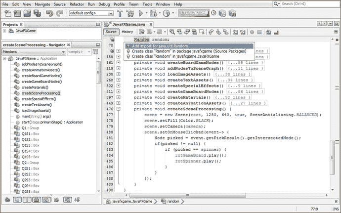

图 17-11.

在类顶部声明一个名为 `random` 的 Random 对象；使用 Alt+Enter 添加 `import java.util.Random`

由于我们希望在实际使用随机数生成器“引擎”之前对其进行实例化（创建），因此让我们的代码在游戏应用程序启动时实例化（创建并加载到系统内存中）Random 数生成器。

这意味着我们将把 `Random()` 构造方法代码放在 `.start()` 方法中，位置就在 ActionEvent 处理结构之前，并且是在所有 Node、Scene 和 Stage 对象创建完毕并添加到 SceneGraph 之后。为了稳妥起见，我们将其放在所有创建资源、图像、动画以及最终的数字音频样本和其他新媒体资产（我们将用它们来创建专业的 Java 9 游戏）的自定义方法之后。

我们可以这样做，是因为这个 Random 对象（名为 `random`）直到玩家点击“开始游戏”按钮对象进入 3D 场景，然后点击转盘 3D UI（球体）元素时才会被使用。因此，你可以将这个 Random 对象的实例化放在 `.start()` 方法中的任何位置，从第一行代码到最后一行都可以，只要这个对象在你开始调用自定义 `createSceneProcessing()` 方法中的任何 MouseEvent 处理方法之前被创建（加载到系统内存中）即可。随着本章内容的推进，我们将对该方法进行增强。在 NetBeans 9 中打开你的 `.start()` 方法体，在自定义方法调用之后添加一行代码，并使用以下 Java 代码实例化名为 `random` 的 Random 对象，该代码也显示在图 17-12 中：

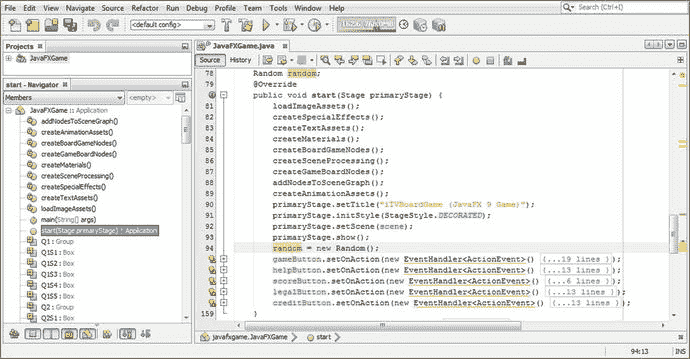

图 17-12.

在 `.start()` 方法中实例化 `random` Random 对象，以便将其加载到内存中并准备就绪

```
public void start(Stage primaryStage) {
...                                  //  自定义方法在此处
random = new Random();
...                                  //  ActionEvent 处理结构在此处下方
}
```

现在，你已经准备好可以在 MouseEvent 处理代码中的转盘逻辑内部调用这个随机数生成器了，该代码告诉游戏当 3D 转盘 UI 被点击时该做什么。显然，首先要做的是检查是否为 NULL，以查看点击是否发生在 3D 场景元素上，如果是，则进一步查看是否点击的是 3D 转盘。

如果点击的是转盘，那么 `if(picked==spinner)` 之后的第一行代码应该是 `.nextInt(bound)` 方法调用，其上边界值为 4（下边界为零）。这将在四个象限中给出一个随机结果（零到三，因为上边界 4 是排他性的，因此不在随机数选取范围内），这正是我们为游戏的四个象限进行随机选择所需要的。

在调用 RotateTransition 动画对象之前添加一行代码，创建一个名为 `spin` 的新 int 变量，该变量将保存 `random.nextInt(4)` 方法调用的结果。添加一个等号（=）运算符，然后输入 `random` 和一个句点，这将调出 NetBeans 9 的方法帮助弹出式选择器下拉菜单。

选择 `.nextInt(int bound) (int)` 选项，如图 17-13 中蓝色高亮所示，然后双击它并将其插入到你的代码中。将默认的 0（这会使随机数生成器生成零到零的结果，从而关闭它）改为 4，以告诉随机数生成器随机生成四个整数值，这将为玩家的旋转提供四种不同的象限结果。此时的 Java 代码应类似于以下 Java 嵌套的 `if()` 结构，这些结构也以蓝色高亮显示（并且正在构建中）在图 17-13 中：

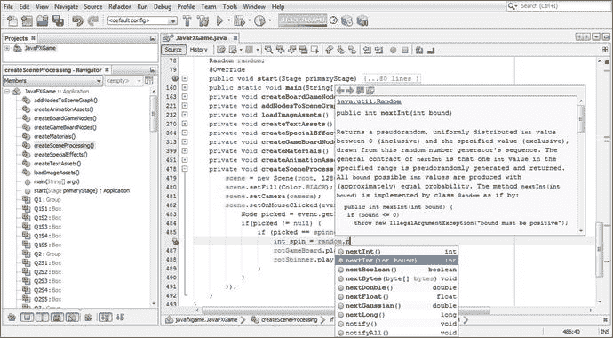

图 17-13.

添加一个名为 `spin` 的 int 变量，然后输入 `random` 和一个句点，选择 `nextInt(int bound)` 并将其设置为 4

```
if (picked != null) {
if (picked == spinner) {
int spin = random.nextInt(4);
rotGameBoard.play();
rotSpinner.play();
}
}
```

在编写这个旋转逻辑之前，我们需要从 `createAnimationAssets()` 方法中的 `rotGameBoard` 语句块中移除 `.setFromAngle()` 和 `.setToAngle()` 方法调用，这将把你的 `rotGameBoard` 动画对象逻辑简化为五个必需的语句（实例化、轴、循环次数、速率和插值器）。稍后我们也会对 `rotSpinner` 执行同样的操作，前提是我们已经确认从 `toAngle` 和 `fromAngle` 切换到 `byAngle` 能够正确工作，以便用最少的代码行数和零错误生成持续的游戏板旋转。

我们在这里所做的是使用 `createAnimationAssets()` 来创建和配置动画对象，然后在 `if()` 条件语句中使用 `.setByAngle()`，这些语句评估 Random 随机对象的结果，该结果被放入 `spin` 整数中，我们接下来将执行此操作。这种方法还将此方法体中的代码量减少到不到二十行代码（除非我们在本书概述的设计和开发过程中稍后添加游戏板动画）。`rotGameBoard` 代码现在看起来如下所示，如图 17-14 所示：

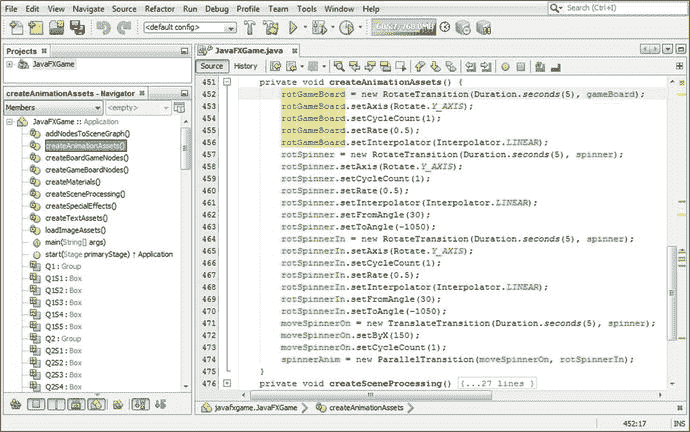

图 17-14.

从 `rotGameBoard` 对象代码中移除 `.setFromAngle(45)` 和 `.setToAngle(1125)` 方法调用

```
private void createAnimationAssets() {
rotGameBoard = new RotateTransition(Duration.seconds(5), gameBoard);
rotGameBoard.setAxis(Rotate.Y_AXIS);
rotGameBoard.setCycleCount(1);
rotGameBoard.setRate(0.5);
rotGameBoard.setInterpolator(Interpolator.LINEAR);
rotSpinner = new RotateTransition(Duration.seconds(5), spinner);
rotSpinner.setAxis(Rotate.Y_AXIS);
rotSpinner.setCycleCount(1);
rotSpinner.setRate(0.5);
rotSpinner.setInterpolator(Interpolator.LINEAR);
rotSpinner.setFromAngle(30);
rotSpinner.setToAngle(-1050);
...
}
```

确保游戏板旋转最终停在某个象限的最简单方法是将 `gameBoard` 的初始旋转角度设为 45 度，并对每个 `if()` 评估使用 `.setByAngle()` 以 90 度为增量（加上三次旋转）进行旋转。这为我们提供了 0 对应 1080，1 对应 1170，2 对应 1260，3 对应 1350。Java `if()` 结构如图 17-15 所示，如下所示：

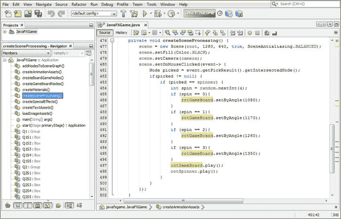

图 17-15.

添加 `if()` 结构，将 `.setByAngle()` 方法调用设置为四个不同的 90 度增量加上 1080


```
if (picked == spinner) {
int spin = random.nextInt(4);
if (spin == 0) {
rotGameBoard.setByAngle(1080);  // 零度加 1080 度
}
if (spin == 1) {
rotGameBoard.setByAngle(1170);  // 1080 加 90 度等于 1170
}
if (spin == 2) {
rotGameBoard.setByAngle(1260);  // 1080 加 180 度等于 1260
}
if (spin == 3) {
rotGameBoard.setByAngle(1350);  // 1080 加 270 度等于 1350
}
rotGameBoard.play();
rotSpinner.play();
}
```

使用“运行 ➤ 项目”工作流程，并多次点击旋转器 UI 进行测试，如图 17-16 所示。

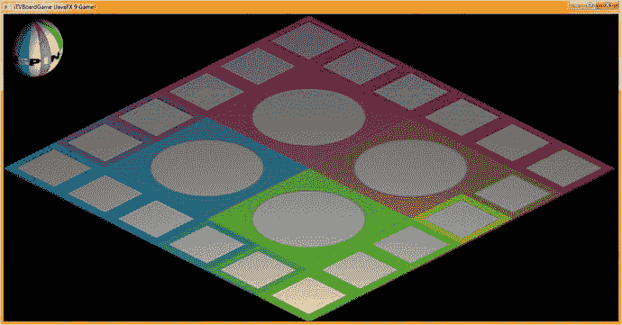

图 17-16.

现在，每次点击 3D 旋转器，游戏板都会随机落在一个不同的象限上。

回到你的`createAnimationAssets()`方法中，从`rotSpinner`动画对象中移除`.setFromAngle()`和`.setToAngle()`方法调用，得到以下 Java 代码，如图 17-17 所示：

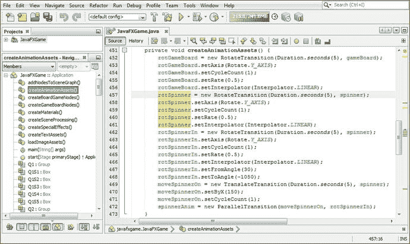

图 17-17.

在`createAnimationAssets`中移除`rotSpinner.setFromAngle()`和`rotSpinner.setToAngle()`方法调用

```
private void createAnimationAssets() {
rotGameBoard = new RotateTransition(Duration.seconds(5), gameBoard);
rotGameBoard.setAxis(Rotate.Y_AXIS);
rotGameBoard.setCycleCount(1);
rotGameBoard.setRate(0.5);
rotGameBoard.setInterpolator(Interpolator.LINEAR);
rotSpinner = new RotateTransition(Duration.seconds(5), spinner);
rotSpinner.setAxis(Rotate.Y_AXIS);
rotSpinner.setCycleCount(1);
rotSpinner.setRate(0.5);
rotSpinner.setInterpolator(Interpolator.LINEAR);
}
```

回到你的`createSceneProcessing()`方法中，添加`rotSpinner.setByAngle()`方法调用，使用`rotGameBoard.setByAngle()`方法调用中使用的负角度值，代码如下，同样如图 17-18 所示：

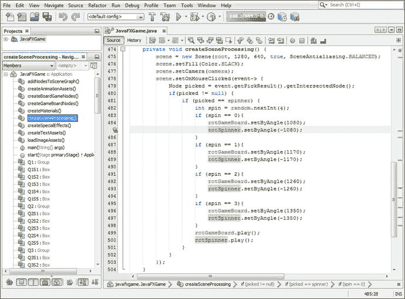

图 17-18.

将`rotSpinner.setByAngle()`方法调用添加到随机旋转逻辑中，这次减去 1080 加 90

```
if (picked == spinner) {
int spin = random.nextInt(4);
if (spin == 0) {
rotGameBoard.setByAngle(1080);
rotSpinner.setByAngle(-1080);  // 零度减 1080 度
}
if (spin == 1) {
rotGameBoard.setByAngle(1170);
rotSpinner.setByAngle(-1170);  // -1080 减 90 度等于-1170
}
if (spin == 2) {
rotGameBoard.setByAngle(1260);
rotSpinner.setByAngle(-1260);  // -1080 减 180 度等于-1260
}
if (spin == 3) {
rotGameBoard.setByAngle(1350);
rotSpinner.setByAngle(-1350);  // -1080 减 270 度等于-1350
}
rotGameBoard.play();
rotSpinner.play();
}
```

现在使用“运行 ➤ 项目”工作流程，全面测试本章开发的代码。如图 17-19 所示（由于它不像我们的游戏那样具有动画或交互性，你无法看到），每次点击 3D 旋转器，你都会得到不同的象限，同时 3D 旋转器 UI 本身也会显示不同的颜色序列，但它仍然始终显示“SPIN”！

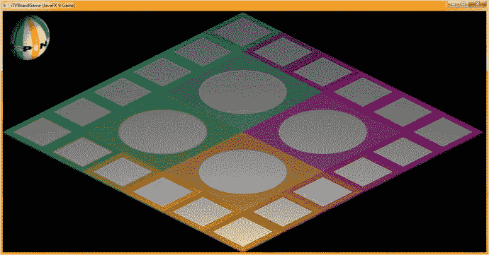

图 17-19.

游戏板随机落在一个不同的象限上，而旋转器始终落在“SPIN”字样上。

在本章中，我们添加了一些相当复杂的功能，但 Java 代码仍然保持在 500 行左右，正如你在图 17-18 中 NetBeans 9 底部看到的那样（类在第 504 行结束）。非常令人印象深刻，各位！

## 总结

在第十七章中，我们学习了`MouseEvent`、`PickResult`和`Random`类，这些类使我们能够完成 3D 旋转器 UI 的实现，并让它在每次旋转 3D 旋转沙滩球时随机选择一个象限。我们还构建了一个新的自定义`createSceneProcessing()`方法，其中包含了你的`MouseEvent`处理逻辑，以及处理构成我们 i3D 游戏板和旋转器的（现在的）i3D 原始对象的逻辑。在这个新方法中，我们开始构建一个条件性的`if()`结构，用于评估鼠标点击以及基于点击内容需要执行的游戏逻辑。显然，在接下来的几章中，随着我们设计和开发游戏模型，我们将扩展这个逻辑。

我们还通过将`rotSpinner`和`rotGameBoard`动画对象从使用`.setFromAngle()`和`.setToAngle()`旋转动画配置参数转换为单一的`.setByAngle()`旋转动画配置方法，获得了更多使用`RotateTransition`类方法的经验，从而减少了 12 行 Java 代码。

在第十八章中，我们将开发你的游戏内容，以便在第十九章和第二十章中完成游戏板方格和游戏板象限的`MouseEvent`处理代码。

