# 18. 3D 游戏玩法设计：使用 GIMP 和 Java 创建游戏内容

既然你已经创建了多层 3D 游戏板组节点（子类）层次结构，为该层次结构下的所有 3D 原始对象添加了纹理，配置了`RotationTransition`动画算法（对象）来让游戏板动起来，并创建了一个 3D 旋转器 UI 来将游戏板 3D 模型（层次结构）旋转到随机象限，现在是时候完成游戏玩法设计并创建构成游戏玩法的视觉资源了。这些资源将在游戏过程中替换纹理贴图图像资源；我们将使用现有的 24 个游戏板组件，并将它们变形为不同的内容配置，用与你的教育游戏相关的内容替换旋转的游戏板。

在本章中，我们将研究一种创建替代纹理贴图的工作流程，这些纹理贴图将在游戏过程中通过更改`Image`对象资源引用来更改，从而根据随机旋转和玩家的鼠标点击（或屏幕触摸）向游戏板方格和象限添加内容。尽管本章没有深入探讨 Java 9，但值得注意的是，开发专业的 Java 9 游戏涉及数字图像工匠、数字音频工程师、3D 建模师、3D 纹理艺术家、动画师、2D 插画师和视觉特效艺术家。因此，我们有必要在本书中涵盖一些非 Java 主题，而本章就是其中之一。花一章的时间来讲解内容设计工作流程，将使我们能够涵盖开发一款被大众认为是“专业”游戏所需的内容。我将在本书中使用许多这些新媒体类型，以确保不遗漏任何细节！

## 设计你的游戏玩法：创建象限定义

由于这是一款面向学龄前儿童以及自闭症、智力障碍和学习障碍人士的教育游戏，我们需要保持分类简单。一个与我们配色方案相匹配的经典分类范式是“动物、植物或矿物”，这将留出一个方格用于其他主题，例如“人物和著名地点”。显然，我们的绿色象限将是“植物”，因为人们常说“多吃绿色蔬菜”；橙色象限将是“动物”，因为狮子、老虎、猫、狗和其他动物正是那种橙色。我们的蓝色象限将是“矿物”，因为蓝宝石和紫水晶等矿物存在于这种冷色调光谱中。这留下了粉色象限用于“其他”，我们可以在每次旋转后决定如何分类。这些游戏板方格随机选择的主题将使用高质量的图像进行视觉呈现，我们将在本章中使用专业级的 GIMP 来开发这些替代纹理映射的数字图像资源。


### 游戏棋盘象限：创建游戏象限内容（GIMP）

我将向你展示在 GIMP 中创建游戏棋盘纹理资源（为你的动物象限制作一只鹦鹉）的工作流程，这样本章就不会膨胀到数百页（因为你最终需要为 24 个游戏棋盘元素创建数百个图像资源）。让我们启动 GIMP（当前版本为 2.8.22），并创建一个新的图像合成文件来开发内容纹理！要开始构建你的象限（及游戏棋盘方格）纹理贴图层合成结构，只需启动 GIMP，然后使用 **文件 ➤ 打开** 菜单序列，打开位于 `/NetBeansProjects/JavaFXGame/src/` 文件夹中的 `gameboardquad1.png` 文件。这将使其成为最底层，如图 18-1 左侧（以蓝色高亮显示）所示。打开其他三个游戏棋盘象限纹理贴图，如图 18-1 右上角三个标签页所示。依次选择每个标签页，使用 **选择 ➤ 全部** 菜单序列，然后使用 **编辑 ➤ 复制**。点击包含多层合成的第一个标签页，然后使用 **编辑 ➤ 粘贴为 ➤ 新图层** 菜单序列，将这三个图层添加到第一个（橙色）图层之上，如图 18-1 左侧所示。将这些图层重命名为 `gameboardquad`，并加上短横线和单词 `animal`、`vegetable`、`mineral` 和 `other`，如图 18-1 所示。选中第四个（粉色，最顶层）图层后，使用 **文件 ➤ 打开为图层** 菜单序列，将 `SteelHoop.png` 24 位图像文件添加到合成文件的顶层，得到如图 18-1 预览区域所示的结果。现在，让我们在网上找一张可以在纹理钢圈区域内使用的动物图像。

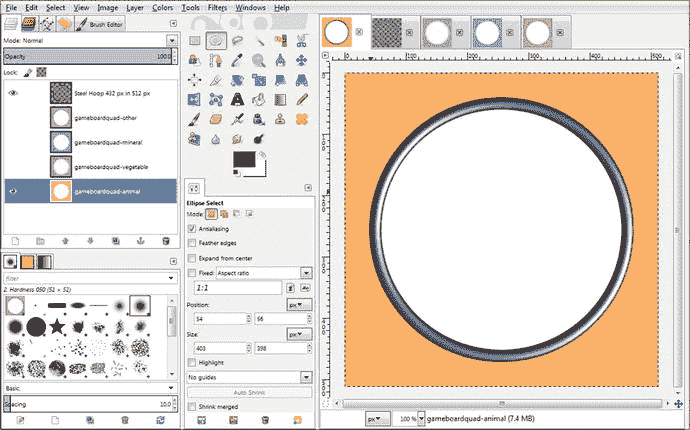

图 18-1.

创建一个包含四个象限漫反射颜色贴图的象限纹理合成文件；然后添加一个钢制装饰环

我用于商业用途（例如本教育游戏和书籍）的免版税图像网站是 Pexels.com。前往 [`www.pexels.com`](http://www.pexels.com)，如果你在首页没有看到鹦鹉，请在搜索栏中输入 `parrot`。下载一张鹦鹉图像，如图 18-2 所示；然后右键点击下载的图像（在浏览器的独立标签页中），选择 **复制图像**。进入 GIMP，使用 **文件 ➤ 创建 ➤ 从剪贴板** 菜单序列，将数字图像数据粘贴到 GIMP 中它自己的合成文件里（并放入右上角的一个新标签页中）。

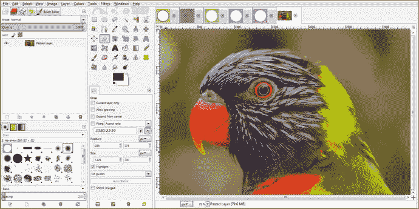

图 18-2.

使用 **文件 ➤ 创建 ➤ 从剪贴板** 粘贴从 Pexels.com 下载并复制到 GIMP 中的内容，以便进行编辑

我们需要这张图像的一个正方形区域，用于游戏棋盘方格纹理和游戏棋盘象限纹理的圆形部分。这将使用图 18-3 中所示的矩形选择工具来创建，将其设置为 2160x2160 像素的正方形区域，该区域将缩小 500% 以适配游戏棋盘象限内 432x432 像素的圆形区域。

定位你的方形选区，以优化内容中可识别的部分，如图 18-3 所示。

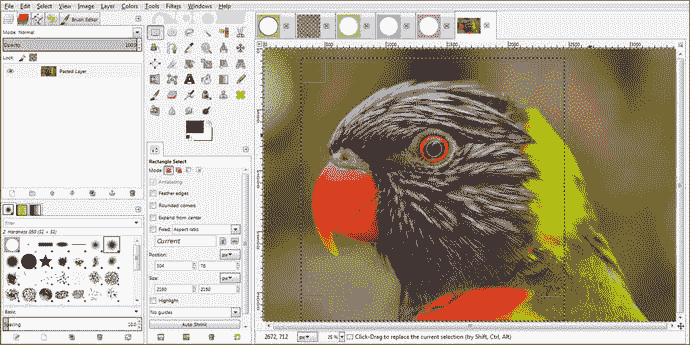

图 18-3.

将矩形选择工具的“大小”属性设置为 2160x2160，然后将选区拖动到最佳位置

由于 Pexels.com 的图像像素尺寸各异，我只需找到一个目标 432 像素正方形图像尺寸（每个象限中心区域所需）的偶数倍，然后据此设置矩形选择工具。一旦设置好选择框，你就可以通过拖动其内部区域来微调其位置，以显示框内最多的内容。然后使用 **编辑 ➤ 复制** 菜单序列将数据复制到剪贴板，再使用 **文件 ➤ 创建 ➤ 从剪贴板** 菜单序列创建新的正方形图像，如图 18-4 所示，我们将其缩小五倍，至 432x432 像素。这通过使用 **图像 ➤ 缩放图像** 菜单序列打开“缩放图像”对话框来完成，在对话框中你将 2160 替换为 432（保持宽高比锁定），然后点击 **缩放** 按钮。

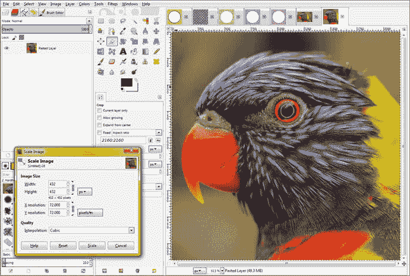

图 18-4.

使用 **图像 ➤ 缩放图像** 工作流程，将 2160 像素的图像缩小 500% 至 432 像素见方

下一步是将这个 432 像素的正方形图像居中放置在你象限纹理贴图的 512 像素正方形区域内，我们将在复制它之前完成此操作，因为这是一个更简单的工作流程。为此，我们只需使用 **图像 ➤ 画布大小** 菜单序列，然后将画布大小从 432x432 增加到 512x512。确保点击对话框中的 **居中** 按钮，否则你的图像将位于调整大小后的画布的左上角。这个居中过程将允许你在没有图像的地方拥有透明度（Alpha 通道）值，这正是我们想要达到的结果。

正如你在“设置图像画布大小”对话框中所见，一旦你点击图 18-5 中以浅蓝色显示的 **居中** 按钮，对话框将计算图像整个周边的 X 偏移和 Y 偏移值（本例中为 40 像素），即 512 – 432 = 80 / 2 = 40。最后，点击你的 **调整大小** 按钮，将这个 432 像素的正方形转换为 512 像素的正方形，并使用透明度居中，这样它就会在钢圈中居中。现在你可以使用 **选择 ➤ 全部**，然后使用 **编辑 ➤ 复制** 菜单序列将数据放入剪贴板，以便粘贴到另一个标签页上。

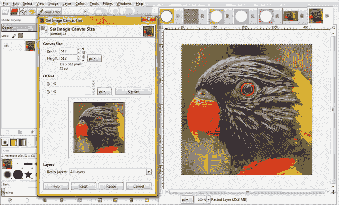

图 18-5.

使用“设置图像画布大小”对话框将画布大小调整为 512 像素

确保将图层面板的下拉选择器设置为 **所有图层**，以包含图层中生成的透明区域。如果你忘记这样做，只需右键点击新的 512 像素图层，然后使用 **图层 ➤ 图层适配图像大小** 选项。确保在使用 **选择 ➤ 全部** 和 **编辑 ➤ 复制** 之前执行此操作，以便同时选中透明区域和图像。

下一步是点击象限纹理合成标签页，如图 18-6 所示，然后选择最底部的（动物）图层，这样当你粘贴居中的鹦鹉正方形图像时，它位于象限基础纹理之上、钢制装饰环之下。我们将使用这个钢圈图像及其透明度来裁剪鹦鹉图像的边角，使其与钢圈图像无缝集成。

为了在 GIMP 中完成这个“移动”操作，你将选择钢圈图层（在图 18-6 中以蓝色高亮显示），然后点击 **魔棒工具**（在 GIMP 工具图标区域中显示为按下选中状态）。在钢圈的中心（透明）区域内点击魔棒工具，这将选中钢圈内部的这个区域。你需要扩展这个选区，以便鹦鹉图像实际上位于钢圈边缘的下方，否则一旦鹦鹉图像被裁剪出来以适配钢圈内部区域，你就会在其边缘看到一条接缝。


为此，当你在钢圈内看到选区后，如图 18-6 所示，你需要使用“选择 ➤ 扩大”菜单序列，将选区向外扩展 1 到 9 个像素，使其看起来确实覆盖在钢圈之上。（为了保险起见，我通常至少使用 2 个像素；在本例中，我使用了 4 个像素。）

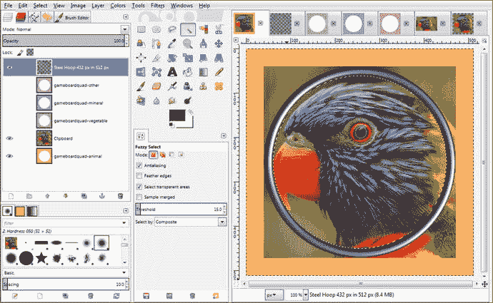

图 18-6.

选择“钢圈”图层和“魔棒”工具，点击钢圈内部以创建选区

此时，由于“钢圈”图层处于选中状态，选区确实位于钢圈之上。然而，一旦选中“剪贴板”图层（你可以通过双击图层名称将其重命名为“鹦鹉”），该选区将位于该图层之上（并作用于该图层），因此会位于你的“钢圈”图层之下。

将“扩大选区”对话框的值设置为 4，然后点击“确定”按钮，如图 18-7 底部所示。

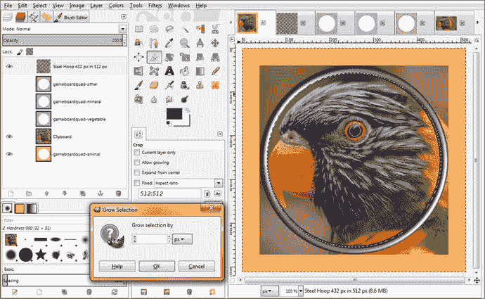

图 18-7.

使用“扩大选区”对话框，将选区面积从内部向外扩展 4 个像素

下一步是选中你的“剪贴板”图层（其中包含你的鹦鹉图像），使其受到我们从“钢圈”图层（内部）透明度中“筛选”出的选区的影响。然后选择“选择 ➤ 反选”菜单序列。这将“保留”圆形内部的内容，并删除圆形选区外部的部分（一旦你按下键盘上的 Delete 键）。这将移除图 18-7 中伸出的图像边角。

如图 18-8 所示，此工作流程的最终结果是一个完全平滑的图像合成，圆形的鹦鹉图像位于钢圈装饰内部（和后方）。图 18-8 还展示了制作完美游戏板象限纹理贴图的最后一步，即将内容旋转 45 度，这样当你的 3D 游戏板旋转到其顶点时，图像相对于观看的玩家来说位置正确。

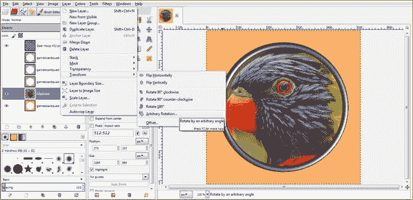

图 18-8.

一旦你删除了边角，就得到了完美的合成结果，可以准备将鹦鹉旋转 45 度了

接下来需要做的是将“剪贴板”（鹦鹉）图层旋转 45 度，由于鹦鹉图像已经通过基于数学的工作流程进行了居中并裁剪为圆形，因此旋转应该是无缝的。由于你的“剪贴板”图层仍处于选中状态，你只需选择“图层 ➤ 变换 ➤ 任意旋转”，如图 18-8 所示，然后打开“旋转”对话框，如图 18-9 所示。

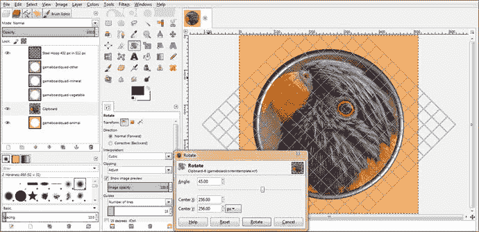

图 18-9.

使用“旋转”对话框将鹦鹉旋转 45 度，使其在游戏板象限旋转时保持直立

在“角度”文本框中输入 45 度值来旋转鹦鹉图像，这样当游戏板旋转器选中橙色动物象限后，图像将是直立的。将你的“中心 X”和“中心 Y”旋转坐标保持在 512 像素纹理贴图的精确中心，即 256 值，如图 18-9 所示。

图 18-9 还显示了旋转工具网格，它覆盖在被旋转的图像上。这将使你能够通过 16x16 的直线网格叠加层，更精确地可视化内容是如何被旋转的。

旋转工具和网格的设置可以在“旋转”对话框的左侧看到，你可以在其中设置网格线数量（称为参考线）、设置图像预览选项、设置旋转方向，以及设置裁剪和图像不透明度。如你所见，GIMP 2.8.22 对于专业的 Java 9 游戏开发者来说可以是一个强大的工具。

请注意，旋转网格参考线显示在“钢圈”图层之上，因为该图层在图层合成中是开启（显示）状态。如果你只想在圆形鹦鹉图像上看到旋转参考线，你可以关闭“钢圈”和“gameboardquad-animal”图层的眼睛图标。请记住，只有选中的图层会受到“图层 ➤ 变换 ➤ 旋转”操作的影响，因为 GIMP 是一个模态软件包，它仅对选中的图层、工具、颜色、选区集合和选项的组合进行操作。这使得它相对复杂，但同样的特性也使其比非模态的数字成像软件强大得多。

点击“旋转”按钮以完成旋转算法设置并将旋转应用于图像。现在你所要做的就是将图像导出到 `NetBeansProjects/JavaFXGame/src` 文件夹，命名为 `gamequad1bird1.png`。然后我们可以进入 Java 的 `loadImageAssets()` 方法，通过将 `diffuse21` 贴图改为引用此图像（而不是默认图像）来测试新的纹理贴图。（我们暂时这样做，以便观察它在渲染到 3D 游戏板象限上时的效果。）

打开 NetBeans 9 和 JavaFXGame 项目。然后通过点击边距中的加号（+）图标展开 `loadImageAssets()` 方法体，并临时编辑用于橙色游戏板象限的 `diffuse21` 纹理，使其引用你刚刚创建的 `gamequad1bird1.png` 文件，使用以下 Java 语句，该语句也如图 18-10 中黄蓝高亮所示：

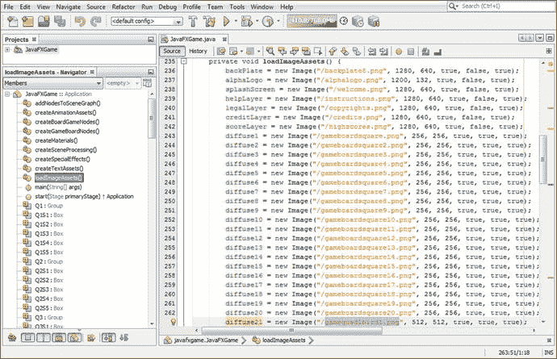

图 18-10.

将 `diffuse21` 图像对象临时设置为引用你创建的 `gamequad1bird1.png` 纹理贴图

```
...
diffuse21 = new Image("/gamequad1bird1.png", 512, 512, true, true, true);
...
```

现在我们需要做的就是测试新代码，看看当 3D 旋转器随机选择这个游戏板象限（主题）供玩家回答时，游戏板落在动物（橙色）象限上的效果。

这可能需要多次旋转尝试，因为 `Random` 类的随机对象（随机数生成引擎）在每次后续旋转你的 3D 旋转器时，都能非常有效地提供随机的游戏板象限结果。

使用“运行 ➤ 项目”工作流程旋转旋转器，直到选中象限 1，如图 18-11 所示。

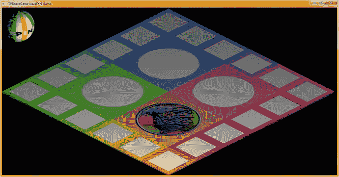

图 18-11.

渲染在游戏板表面上的鹦鹉象限纹理贴图


### 游戏棋盘方格：在 GIMP 中创建方格内容

游戏棋盘方格的定义符合象限定义，为玩家提供与象限类别相关的五个不同主题供其选择。当游戏棋盘随机旋转为玩家选定类别，并随机为方格加载主题内容后，玩家便可决定自己的命运（问题）。打开我们之前处理过的第二个（256 像素）纹理映射文件，该文件使用了游戏棋盘方格模板，如图 18-12（第三个标签页）所示。同时打开来自 Pexels.com 的图片以及我们将用来代表鹦鹉的 2160 像素方形区域。我们需要做的第一件事是将 2160 像素的图片缩小到 192 像素，以使其适合颜色区域内部。由于边框为 32 像素（中心区域在两个维度上均为 256 – (2 × 32) = 192 像素），因此使用 **图像** ➤ **缩放图像** 工作流程将图像缩小到 192 像素，如图 18-12 左下角所示。

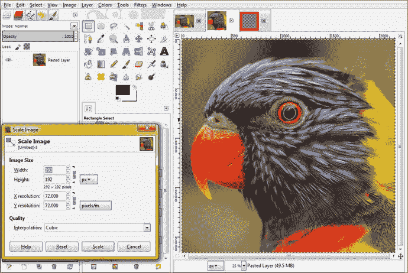

图 18-12.

这次将你的 2160 像素图像缩放到 192 像素，使其完美地适合你的游戏棋盘方格内部

接下来，使用 **视图** ➤ **缩放** ➤ **100%**（称为“实际像素”视图模式）菜单序列，“标准化”你正在查看的图像，然后执行与处理象限时相同的“在透明区域中居中”工作流程，即使用 **图像** ➤ **画布大小** 菜单序列。将画布扩展并居中回 256 像素，以匹配游戏棋盘方格纹理映射的大小，如图 18-13 所示，这样图像就能完美地贴合你的纹理映射。

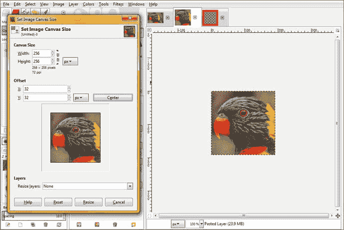

图 18-13.

将画布大小调整为 256 像素，并将 192 像素的图像居中放置在 32 像素的透明区域内

使用 **选择** ➤ **全部** 菜单序列，然后使用 **编辑** ➤ **复制** 菜单序列，将透明的 32 像素边界和内部的 192 像素图像数据都复制到操作系统剪贴板中。（没错，剪贴板实际上是操作系统的一部分，因此你可以在所有正在运行的不同应用程序之间剪切、复制和粘贴数据。）

选择 256 像素的游戏棋盘方格纹理合成标签页以及游戏棋盘方格图层下方的图层，然后使用 **编辑** ➤ **粘贴为** ➤ **新图层** 菜单序列，将图像粘贴到红色边框下方。请注意，在这种情况下，你也可以将图层粘贴到游戏棋盘方格边缘颜色图层的上方；因为我们在合成图层中全部使用直线，每个图层在数学上都是“逐像素”相邻的，因此重叠像素为零，这与我们之前的圆形象限合成情况不同。

我将使用不同的名称 `gameboardsquarecontent1.xcf` 保存此纹理映射文件，这样它只包含第一个游戏棋盘方格的图像和边缘装饰。最终将会有 20 个这样的 XCF 文件，分别对应从 Q1S1 到 Q4S5 的每个 gameBoard 节点象限子项。

随着我们添加内容，这些文件的大小会均匀增长，你不会最终得到一个难以处理的庞大文件。这种方法将使你的专业 Java 9 游戏开发工作流程保持得更加井井有条。

请注意，图 18-14 中的截图仍然使用了第 13 章中的 `Pro_Java_9_Games_Development_Texture_Maps4` XCF 文件，该章涵盖了 3D 基本体着色器和纹理映射概念以及 Java 编码。

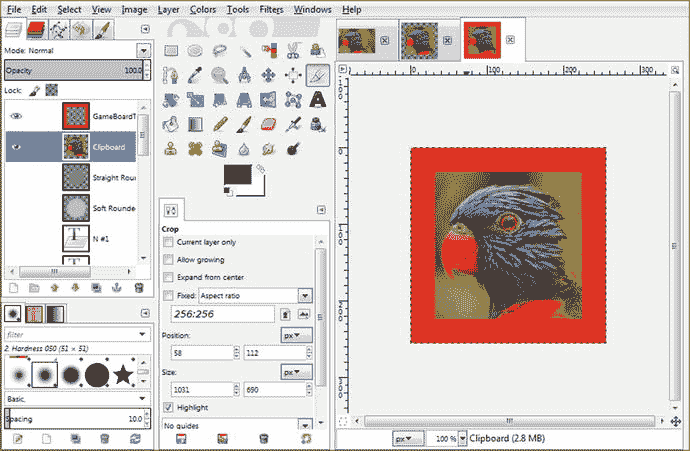

图 18-14.

选择 256 纹理映射合成标签页，选择红色方块下方的图层，然后选择 **编辑** ➤ **粘贴为** ➤ **新图层**

在本章稍后部分，我们将生成 20 个游戏棋盘方格内容生成 XCF 文件，这些文件将积累数字图像内容，Java 代码最终将为初始随机旋转选定的每个游戏棋盘方格（即附加到随机选定象限的五个方格）从中选择内容。这种方法使我们能够随机化象限以及该象限每个游戏棋盘方格的内容。

最后，让我们使用 GIMP 的 **文件** ➤ **导出为** 菜单序列，将这个新的漫反射纹理映射保存到 `/NetBeansProjects/JavaFXGame/src` 文件夹中，命名为 `gamesquare1bird1.png`。在你的文件管理器中注意，这个纹理映射的大小不到 80KB，这比你的 1KB 默认纹理要大得多。高质量的 24 位内容总会增加应用程序的数据占用空间。如果你想进一步优化这个数据占用空间，你应该在 GIMP 中使用 **图像** ➤ **模式** ➤ **索引** 菜单序列，将你的图像转换为 8 位索引颜色图像，并使用“生成最佳调色板（256 色）”并启用“Floyd-Steinberg 抖动”。这将把 `gamesquare1bird1.png` 的大小减小到 27.4KB，因为它现在是一个 PNG8 图像，且质量效果良好。

如何命名这些文件非常重要，因为我们将从下一章开始编写的游戏玩法 Java 代码将根据这些名称组件做出随机决策逻辑。显然，`gamesquare1`（名称的第一部分）将定义映射到哪个游戏方格（Q1S1 到 Q4S5）。第二部分是子分类。在本例中，它是“bird”，但也可能是“feline”、“canine”、“bovine”等。最后一部分是随机数生成器可供选择的数量，因此，如果你为游戏棋盘方格 1 准备了 bird1 到 bird5，那么你的 Random 对象将从 0 到 5（包含）中进行选择。这样，当你添加新内容时（以 20 个为一组，或每个游戏棋盘方格一个图像主题），你可以递增 Random 对象的随机数生成 Java 代码，以添加一个新的最大随机数（从零到上限选择边界）。

接下来，让我们通过在 3D 游戏棋盘上测试第一个游戏棋盘方格，将 `diffuse1` Image 对象引用从空白（默认）游戏棋盘方格纹理映射替换为包含图像的那个。你的 Java 9 Image 对象实例化（和加载）构造如图 18-15 顶部所示，应如下代码所示：

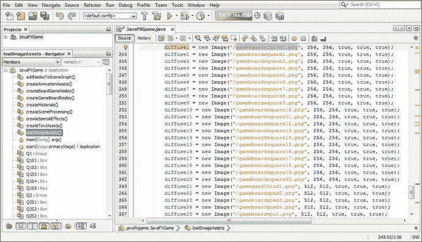

图 18-15.

通过在 `diffuse1` 实例化中替换新的纹理映射图像来测试第一个游戏棋盘方格

```
diffuse1 = new Image("/gamesquare1bird1.png", 256, 256, true, true, true);
```

使用 **运行** ➤ **项目** 工作流程确保内容朝向正确的方向，如图 18-16 所示。

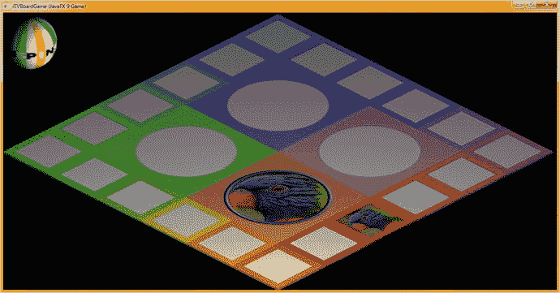

图 18-16.

鹦鹉面向游戏棋盘边缘外侧，因此无需旋转图像

由于每个游戏棋盘方格至少需要两个图像纹理映射，请前往 Pexels.com 寻找另一张鸟类图像，用于第二个 `gamesquare1bird0.png` 图像。我们将从零开始对图像文件进行编号，以更接近随机数生成器的输出。我找到了一张很棒的鹰（或者可能是隼；我们将在后续章节中研究游戏棋盘内容以确保一切正确）图像，如图 18-17 所示。

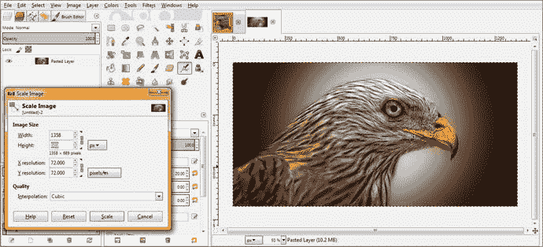

图 18-17.

将第二张鸟类图像数据粘贴到 GIMP 中，并使用“缩放图像”找到最低公共分辨率


由于这是一张低分辨率图像，我们将使用 689（高度）作为正方形的尺寸，因此请使用矩形选择工具，输入一个 689x689 像素的正方形，位置为 428,0，如图 18-18 左侧所示。

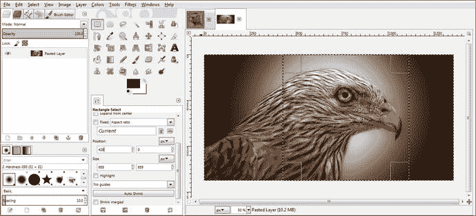

图 18-18.

为图像创建一个 689x689 像素的正方形，因为它不是拥有数千像素的高清或超高清图像

使用 **编辑 ➤ 复制** 菜单序列，将此数据复制到操作系统的剪贴板，然后使用 GIMP 的 **文件 ➤ 从剪贴板创建** 菜单序列，将正方形图像数据粘贴到其自己的编辑标签页中，如图 18-19 所示。使用 **图像 ➤ 缩放图像** 菜单序列，将 689 像素数据缩小到 192 像素。然后使用 **图像 ➤ 画布大小** 菜单序列，访问“设置图像画布大小”对话框，如图 18-19 所示。将图像画布大小扩展到 256 像素正方形，同时通过单击对话框中的“居中”按钮，将图像数据居中放置在透明背景中。请记住，在将调整大小操作应用于图像后，在“图层”下拉菜单中选择“调整图层大小至全部”，或右键单击并调用“图层到图像大小”。

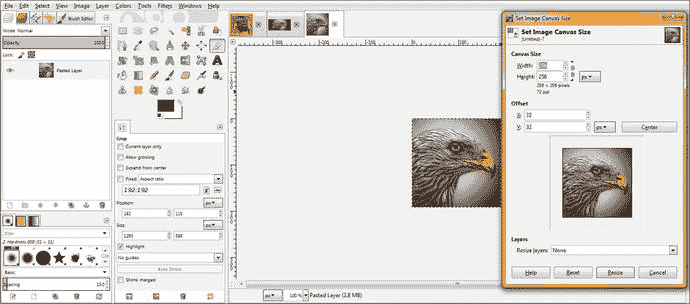

图 18-19.

将 689 像素缩放到 192 像素，然后使用“设置图像画布大小”添加 32 像素的透明边框

接下来，使用 **选择 ➤ 全部** 和 **编辑 ➤ 复制** 菜单序列来选择图像和透明数据；然后点击游戏棋盘方块 1 纹理贴图标签页（第一个标签页），并点击游戏棋盘颜色方块下方的图层。然后使用 **编辑 ➤ 粘贴为图层** 菜单序列，将第二张鸟类图像粘贴到你的合成图像中，如图 18-20 所示。你可以在图 18-20 右上角第三个标签页的预览图标中，看到图 18-19 操作的结果。

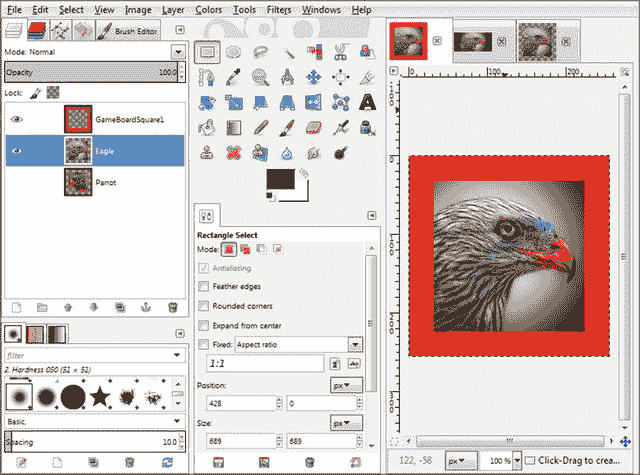

图 18-20.

将你的 256 像素图像及透明区域粘贴到 GameBoardSquare1 边缘着色纹理图层下方

如果你仔细观察 GIMP 的用户界面，它会很好地直观展示你工作流程中的情况。你还可以通过选择不同的预览图标大小，并使用信息丰富的（描述性）文本标签为图层命名，来自定义用户界面。

要更改图层图标预览大小（我将在本章稍后部分进行操作），请使用图层调色板右上角、画笔编辑器标签页旁边、模式（正常）下拉选择箭头下方的小箭头。你可以选择 **预览大小 ➤ 极小** 到 **预览大小 ➤ 极大**，共有八种不同的图标大小可供选择。

现在你已经创建了 192 像素的游戏棋盘方块插入图，如图 18-20 所示，你需要使用 **编辑 ➤ 撤销** 工作流程，回到原始的 689x689 图像方块，以便为每个游戏棋盘方块创建一个游戏棋盘象限版本。我们接下来将执行此操作，以便创建象限纹理。

一旦玩家在随机选择的象限中选中了五个游戏棋盘方块之一，你的 Java 代码（最终）会将选中的问题图像放入游戏棋盘象限，并向玩家提问相关问题。

要回到 689 像素的正方形图像，请在 GIMP 中选择包含该正方形图像数据的标签页，并使用 **编辑 ➤ 撤销** 菜单序列，撤销你之前为创建用于 256 像素游戏棋盘方块漫反射颜色纹理贴图的图层数据而执行的所有选择、画布调整大小和图像缩放操作。

你这样做是为了能够执行类似的工作流程（外加 45 度旋转）来创建 512 像素的象限纹理贴图。这样，当玩家点击包含相同图像的游戏棋盘方块时，将会有一个更大（装饰过的）版本的图像内容主题（问题）可供预览。

每次使用 **编辑 ➤ 撤销** 时，你都会看到 GIMP 在软件中重新创建之前的图像编辑状态，这样你就可以直观地看到何时回到了原始的 689x689 图像方块。如果撤销得太多，你会看到来自 Pexels.com 的整个原始图像，而且由于还有 **编辑 ➤ 重做** 命令，你也可以轻松回到方块图像版本！对于像这样需要重复使用相同原始图像数据源来创建多个纹理贴图的工作流程，撤销/重做功能非常强大。

创建第二个象限纹理，如图 18-21 所示，方法是使用 **图像 ➤ 图像大小** 将 689 像素图像调整为 432 像素。接下来，使用 **图像 ➤ 画布大小** 工作流程，通过将画布大小增加到 512 像素并单击“居中”按钮，将此图像数据居中放置在透明背景中。使用“图层到图像大小”选项，将图层的透明像素与图像像素一起包含在内，然后使用 **选择 ➤ 全部** 和 **编辑 ➤ 复制** 将所有图像和透明数据传输到操作系统剪贴板。选择 Steel Hoop 图层下方的一个图层，并使用 **编辑 ➤ 粘贴为图层** 将其插入。

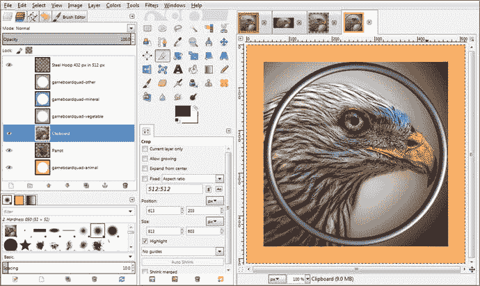

图 18-21.

在 512 像素纹理内创建一个带有透明边框的 432 像素图像；将其粘贴到钢圈下方

将此图像数据粘贴到 Steel Hoop 图层下方，并将剪贴板图层旋转 45 度，如图 18-22 所示。

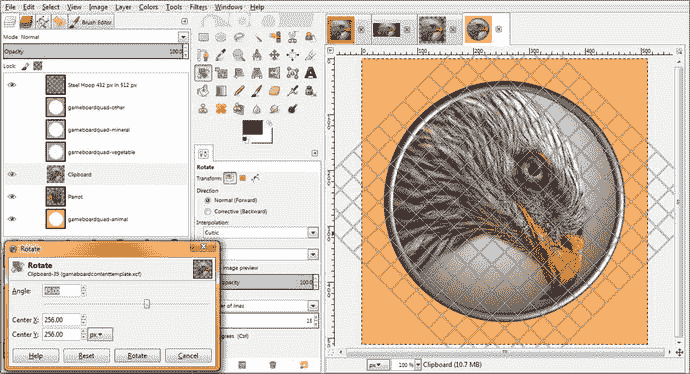

图 18-22.

在反选并删除从钢圈突出的角部后，将图像图层旋转 45 度

接下来，使用 **文件 ➤ 导出为** 工作流程，保存你的第二个 `gameboardquadrant1bird0.png` 文件（我决定从零开始编号，以匹配随机数生成器的输出）。

让我们通过使用以下 Java 9 代码更改 `diffuse1` 和 `diffuse21` 图像对象文件名引用来预览第二个游戏棋盘方块 1 和游戏棋盘象限 1 的纹理，如图 18-23 所示：

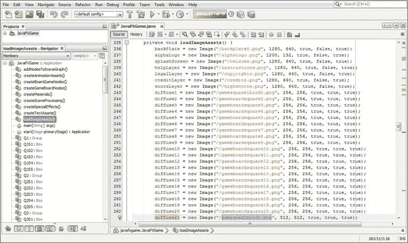

图 18-23.

更改 `diffuse1` 和 `diffuse21` 图像对象纹理贴图引用，以测试两个新的纹理贴图

```
diffuse1  = new Image("/gamesquare1bird0.png", 256, 256, true, true, true);
diffuse21 = new Image("/gamequad1bird0.png", 512, 512, true, true, true);
```

使用 **运行 ➤ 项目** 工作流程，确保内容看起来不错且朝向正确，如图 18-24 所示。恭喜你，你已经完成了 80 个纹理贴图中的 4 个，这些纹理贴图是测试 `random.nextInt(2)` 方法调用 Java 9 代码所必需的，该代码将为每个游戏棋盘方块随机选择两个图像之一。

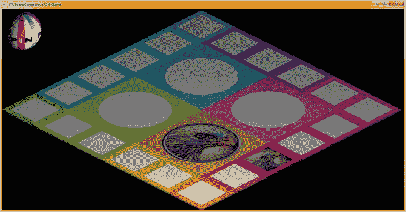

图 18-24.

使用 **运行 ➤ 项目** 并渲染象限 1 和方块 1 的纹理贴图，以检查方向和画质

每个游戏棋盘方块有 4 个随机图像可供选择，则需要 160 张图像；而每个游戏棋盘方块有 8 个随机图像可供选择，则需要使用你在本章学习的工作流程创建 320 张图像。


需要记住的是，游戏棋盘方格角落图像以及所有象限图像都需要旋转 45 度。部分游戏棋盘方格侧面图像（方格 4、5、9、10、14、15、19 和 20）需要旋转 90 度，才能在游戏棋盘上正确“朝外”。我们将在本章中探讨所有这些数字成像场景，对于非编程章节来说，本章篇幅会相当长，并且会包含大量 GIMP 截图。

话虽如此，专业的 Java 游戏开发远不止编码，因为 JavaFX 9 支持六种新媒体类型，包括 3D、数字插图（SVG）、数字成像（PNG）、数字音频等等！

既然我们已经为 GameSquare1.xcf 游戏棋盘方格 1 图像合成创建了基础，接下来让我们创建其他方格，为纹理贴图的顶部装饰部分替换正确的周边颜色值，并使用相同的文件名保存，同时每次将末尾的数字递增 1，直到你拥有全部 20 个方格。之后，你所要做的就是为每个方格添加图像图层，以创建游戏棋盘方格和游戏棋盘象限的棋盘游戏内容。事实证明，开发 Pro Java 9 Games 需要付出大量努力！

一旦我们更改了游戏棋盘方格周边的颜色值，并用替代内容替换了图像图层，就可以使用**文件 ➤ 另存为**菜单序列来保存文件的另一个版本。要做到精确无误，最简单的方法是使用**文件 ➤ 作为图层打开**，在合成文件的图层中打开一个 gameboardsquare2.png 纹理贴图，使用**吸管**（颜色选择器）工具点击周边颜色，将前景色（FG）设置为该值，选择你的**油漆桶**（颜色填充）工具，选中透明的游戏棋盘方格装饰图层，然后在（本例中为红色的）方格颜色区域点击**油漆桶**工具。这将用下一个（橙色）颜色值填充该红色区域。然后，你所要做的就是删除包含默认（空白）游戏棋盘方格颜色参考的图层，并使用**文件 ➤ 另存为**保存 GameSquare2.xcf 合成文件，该文件现在已准备好供你填充图像数据，用于你的第二个游戏棋盘方格。

请注意，在图 18-25 中，我放大了图层图像预览图标，以便你能更详细地看到我对游戏棋盘方格 2 图像、边框装饰颜色等所做的操作。如果你正在使用新的 UHD（4K）显示器，这也可能是必要的，因为所有东西看起来都会小一点（除非 UHD 显示器是 60 英寸或更大）。我的大多数 UHD 桌面显示器都是 43 英寸，因为这些价格实惠。

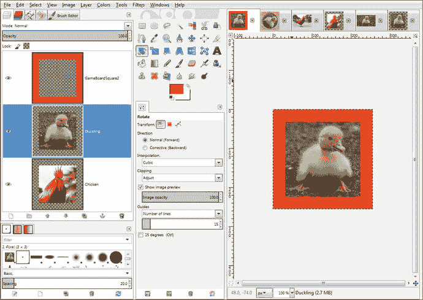

图 18-25.

创建一个带有红橙色边框和图像资源的 GameSquare2.xcf 合成文件，用于方格 2

接下来，让我们看看如何在 GameSquare3.xcf（角落）中将图像内容旋转 45 度，以及如何在 GameSquare4.xcf 和 GameSquare5.xcf 中将图像内容旋转 90 度，使其像方格 1 和 2 中的内容一样朝外远离游戏棋盘。

如图 18-26 所示，第三个（以及第八、十三、十八个）游戏棋盘角落方格的有色方格周边装饰内部的数字图像内容需要顺时针旋转 45 度，就像游戏棋盘象限纹理贴图一样。这将使数字图像内容在每次游戏棋盘旋转后面向玩家。

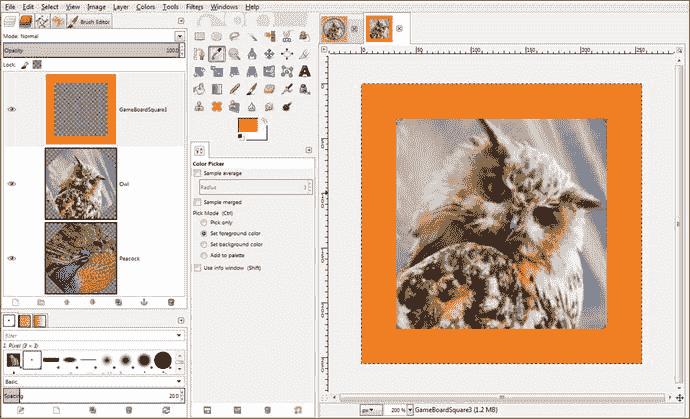

图 18-26.

创建一个带有橙色边框和两个图像资源的 GameSquare3.xcf 合成文件，用于方格 3

出于这个原因，我没有将高清方格图像缩小到 192 像素，而是使用了更高的像素分辨率值，因为旋转会暴露一些透明像素；你可以在图 18-26 的第二和第三个图层预览图像中看到这一点（记住，灰色棋盘格代表透明像素）。

在图 18-26 的主 GIMP 图像预览（画布）区域的角落，你可以看到一点点这种透明度。我使用了 264 的下采样值，这并不完美（268 或 272 会更好），但对于我们目前所处的本章内容开发和代码测试阶段来说，这已经足够好了。

我怀疑是否有玩家会注意到纹理贴图图像远角处的这几个透明像素，尤其是在它被映射到游戏棋盘方格上之后。一旦我使用这些工作流程为游戏棋盘的第一象限制作了 20 个纹理贴图，我将使用 Java 代码（就像我在本章中所做的那样）对棋盘游戏进行渲染。如果你想提前查看并确认游戏棋盘方格 3 的纹理贴图很难看出任何问题，请随意这样做（图 18-28）。

尽管如此，在发布你的游戏之前，请确保所有对角线上的游戏棋盘方格角落的图像数据都缩放得足够大（例如，旋转前设为 272 像素，以确保万无一失），这样就不会出现角落伪影！

第四和第五个（以及第九、十、十四、十五、十九、二十个）游戏棋盘方格的有色方格周边装饰内部的数字图像内容需要顺时针旋转 90 度，如图 18-27 所示，以便数字图像内容在每次游戏棋盘旋转后面向你的玩家。

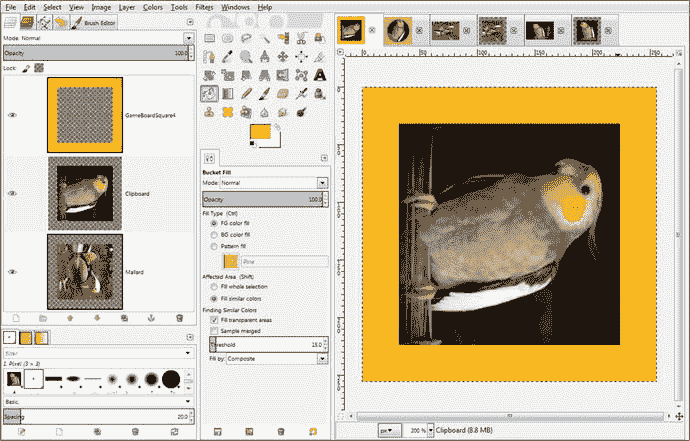

图 18-27.

游戏棋盘方格 4、5、9、10、14、15、19 和 20 需要使用顺时针旋转 90 度的图像

在这种情况下，我们仍然会将你的高清方格图像缩小到 192 像素，在周边添加额外的 64 像素（居中时为 32 像素），并且，如图 18-27 的第二和第三个图层预览图像所示，使用**图层 ➤ 变换 ➤ 顺时针旋转 90°**菜单序列。一旦你创建了五个纹理贴图，你将在你的`loadImageAssets()`方法中引用它们，并使用**运行 ➤ 项目**工作流程来测试它们，看看它们如何映射到第一象限游戏棋盘方格子元素上，如图 18-28 所示。

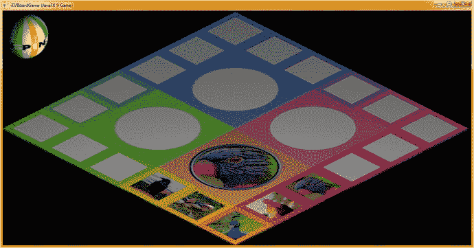

图 18-28.

渲染六个象限和方格纹理贴图，以检查其方向和品质

我要做的最后一件事是更改`diffuse6`到`diffuse10`以及`diffuse22`的`Image`对象引用，以测试纹理贴图将如何应用于连接到第二象限的游戏棋盘方格。这将告诉我，在开发蔬菜象限纹理贴图时，是否需要以及如何更改我的图像旋转值。这是通过图 18-10、18-15 和 18-23 所示的工作流程完成的，并且你的一半漫反射纹理贴图将临时引用你正在使用`loadImageAssets()`方法体代码开发的纹理贴图。对于实际的棋盘游戏玩法，这将在事件处理方法体内部交互式地完成，基于玩家的鼠标点击，并结合条件处理和随机数生成。


分别复制 diffuse1 至 diffuse5 以及 diffuse6 至 diffuse10 中引用的文件名，并将最后一个数字从零改为一（反之亦然，如果你想混合使用的图像）。完成此过程后，你可以在本章末尾的图 18-29 中看到“运行 ➤ 项目”工作流程的结果。

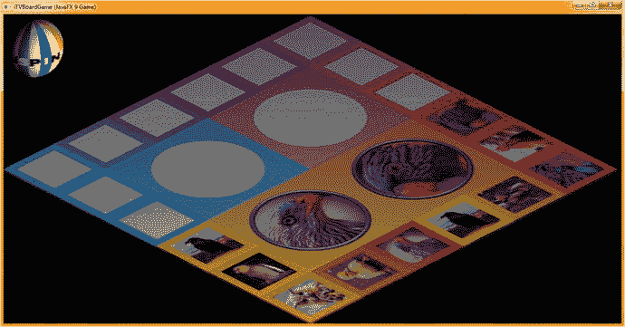

图 18-29.

将象限 1 的纹理贴图添加到象限 2 的 Java 代码中，并测试纹理贴图的方向

图 18-28 展示了使用“运行 ➤ 项目”工作流程在游戏棋盘上渲染的六张漫反射纹理贴图。

如图 18-29 所示，你需要针对游戏棋盘的每个象限调整本章学到的关于旋转值的工作流程。只要你像本章学到的那样，在操作过程中不断测试纹理贴图，这完全不成问题，并且还能让你练习使用 GIMP。

在创建自定义数字图像内容的过程中，你将大量练习本章所描述的工作流程。GIMP 是一个出色的软件包，其新版本即将发布，在功能上能够媲美甚至在某些方面超越昂贵的数字图像合成软件包！

## 总结

在第十八章中，我们进一步学习了 GIMP 中的工作流程，这些流程对于创建大量游戏内容至关重要，而我们需要这些内容来为学龄前儿童、自闭症患者以及有学习障碍者开发一款专业级的教育游戏。我向你展示了为第一个象限完成足够内容的工作流程，以便能够开发下一章将要实现的随机内容选择 Java 代码。然后，你可以使用相同的工作流程为游戏棋盘的其他三个象限开发内容。

你学习了如何从 Pexels.com 获取可免费商用的内容，如何将其复制到操作系统剪贴板，以及如何使用“创建 ➤ 从剪贴板”功能在 GIMP 的标签页中打开它。你还学习了如何制作用于游戏棋盘象限和方格纹理贴图的正方形图像数据，以及如何居中、裁剪和旋转图像。

在第十九章中，我们将实际开发 Java 代码来实现更多游戏玩法以及你在本章学会创建的游戏内容，以便在游戏棋盘方格和游戏棋盘象限的鼠标事件处理代码方面取得进展。

