# 19. 游戏内容引擎：具有随机内容选择方法的 AI 逻辑

现在你已经让游戏棋盘动起来，并且每次点击 3D 旋转器 UI 元素时都会随机选择一个象限，我们需要想办法以某种方式追踪这些旋转，从而一致地告诉我们落在了哪个象限。这样，我们就可以将正确的漫反射纹理贴图映射到该象限的游戏棋盘方格上。我们将使用简单的数学方法，用整数来实现，因为圆形的 360 度和象限的 90 度都是可整除的。这将是一个有趣的章节，因为 AI 通常可以用紧凑的 Java 代码来编写！一旦确定了方法，就需要进行大量的逻辑思考，并通过一些测试来优化数值。

在本章中，我们将创建两个新的整数变量：`spinDeg` 用于表示旋转度数，它将作为玩家旋转的总角度累加器；以及 `quadrantLanding`，它将保存一个简单而强大的计算结果，该结果总能告诉我们最新一次旋转落在了哪个象限。

我们将创建六个新方法，包括一个 `calculateQuadrantLanding()` 方法来确定当前象限，一个 `resetTextureMaps()` 方法在每次新旋转前将游戏棋盘方格纹理贴图重置为默认值，以及 `populateQuadrantOne()` 到 `populateQuadrantFour()` 方法来处理随机数生成和条件 `if()` 处理，从而为玩家的每次随机旋转挑选游戏棋盘方格内容的组合。

## 编写随机旋转追踪器：取余运算符

要获取玩家旋转后落点的最新象限结果，我们需要追踪整次旋转后的余数百分比，特别是当我们旋转三次加上偏移量时。因此，对于 `if()` 条件 1 中的 45 + 1080，这将对应象限一。对于 `if()` 条件 2 中的 45 + 1170，这将对应象限二。对于 `if()` 条件 3 中的 45 + 1260，这将对应象限三。对于 `if()` 条件 4 中的 45 + 1350，这将对应象限四。然而，对于后续的旋转，起始偏移量并不总是 45 度，因此我们需要保留一个 `spinDeg` 总变量，并将每次旋转的角度相加得到总和，然后除以 360 得到完整旋转次数，最后使用 Java 中的取余 `%` 运算符来获取游戏棋盘象限落点处超出完整旋转的角度。在 Java 代码中，公式大致如下：

```
int spinDeg = 45;                        // 初始化为 45 度
int quadrantLanding;                    //  初始化为零
spinDeg = spinDeg + lastSpinRotation;  //   总旋转角度累加器
quadrantLanding = spinDeg % 360;      //    静止角度偏移计算
```

`quadrantLanding` 变量将始终包含四个值之一：45（粉色或其他象限）、135（蓝色或矿物象限）、225（绿色或蔬菜象限）或 315（橙色或动物象限）。我们将创建一个名为 `calculateQuadrantLanding()` 的方法，在实现随机旋转的鼠标事件处理程序末尾调用它。


### 实现旋转追踪器功能：创建空方法

让我们创建两个整型变量和五个新方法的基础结构，这些将用于存放本章要编写的 Java 代码。这些代码将追踪游戏板每次旋转后停靠的象限，然后用随机内容“填充”游戏板方格（我们在上一章已完成了 25% 的开发）。我将使用象限 1（橙色）的内容来测试本章构建的逻辑，因为我尚未创建开发初始代码所需的数百个图像资源（每个游戏板方格 6 个，即 120 个起步）。后续只需增加随机数生成器的上限值并更新 `populateQuadrant()` 方法的逻辑，即可轻松添加更多资源。不过，本章的工作量仍将达到数百行代码，因此我们在本章中将在让游戏随机选择供玩家解答的内容方面取得大量编码进展。

在 `JavaFXGame` 类的顶部声明一个名为 `spinDeg` 的 `int` 变量，并将其初始化为 45 度（游戏板启动时的旋转角度）。同时，声明一个初始值为 0（默认值，因此无需 `= 0`）的 `quadrantLanding` 变量，用于存储象限旋转增量（45、135、225 或 315）。在类的底部创建五个空的 `public void` 方法（不必总是强迫 NetBeans 为你生成 Java 代码）。代码应类似于图 19-1 中以浅蓝色和黄色高亮显示的 Java 语句和方法结构：

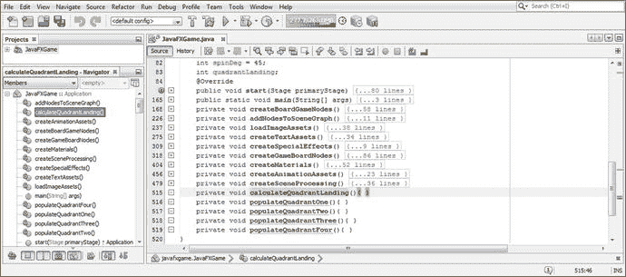

图 19-1.

声明 `int spinDeg` 和 `quadrantLanding` 变量；创建空的象限内容填充方法

```
int spinDeg = 45;   // 游戏板始终旋转至顶点/角；初始化为 45 度
int quadrantLanding;
...
private void calculateQuadrantLanding() {...}  // 空方法结构可正常编译
private void populateQuadrantOne()      {...}
private void populateQuadrantTwo()      {...}
private void populateQuadrantThree()    {...}
private void populateQuadrantFour()     {...}
```

我们首先需要将每次旋转的增量累加到 `spinDeg`“累加器”变量中。这将在 `createSceneProcessing()` 方法体中的 `MouseEvent` 处理器内的 `if(picked == spinner)` 逻辑中完成，具体位于四个设置随机象限的 `if(spin == randomNum)` 条件语句内部。

在 `.createSceneProcessing()` 方法内的 `if(picked == spinner)` 条件结构中，为四个随机旋转的 `if(spin == random)` 条件结构分别添加累加语句 `spinDeg += degrees`。

这些语句应分别为 `spinDeg += 1080;`、`spinDeg += 1170;`、`spinDeg += 1260;` 和 `spinDeg += 1350;`。如你所见，传递给 `Animation` 对象的角度值也应与添加到 `spinDeg` 累加器变量的值相同，以便记录用户所有旋转的角度增量。

在旋转随机数选择条件 `if()` 结构体的底部，添加对 `calculateQuadrantLanding()` 方法的调用，以便在旋转发生后计算该次选择的偏移量（象限），并将该整数值写入 `quadrantLanding` 变量，供本章稍后编写的其他游戏逻辑使用。接下来我们将编写 `calculateQuadrantLanding()` 方法。

`spinDeg` 累加器和 `calculateQuadrantLanding()` 方法调用的 Java 代码应如下所示，并在图 19-2 中以蓝色和黄色高亮显示：

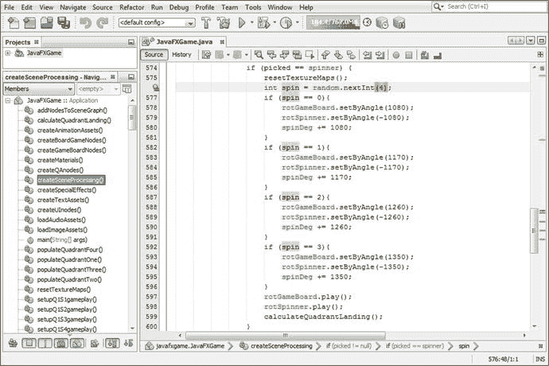

图 19-2.

在旋转器 UI 鼠标点击条件 `if()` 逻辑中添加 `spinDeg` 累加器，以追踪象限位置

```
if (picked == spinner) {
int spin = random.nextInt(4);      // 随机数生成器决定下一个象限
if (spin == 0) {
rotGameBoard.setByAngle(1080);
rotSpinner.setByAngle(-1080);
spinDeg += 1080;               // 将 1080 添加到 spinDeg 总数
}
if (spin == 1) {
rotGameBoard.setByAngle(1170);
rotSpinner.setByAngle(-1170);
spinDeg += 1170;               // 将 1170 添加到 spinDeg 总数
}
if (spin == 2) {
rotGameBoard.setByAngle(1260);
rotSpinner.setByAngle(-1260);
spinDeg += 1260;               // 将 1260 添加到 spinDeg 总数
}
if (spin == 3) {
rotGameBoard.setByAngle(1350);
rotSpinner.setByAngle(-1350);
spinDeg += 1350;               // 将 1350 添加到 spinDeg 总数
}
rotGameBoard.play();
rotSpinner.play();
calculateQuadrantLanding();        //  调用方法计算 quadrantLanding 变量
}
```

接下来，打开空的 `calculateQuadrantLanding` 方法，添加 `quadrantLanding` 变量和一个等号，以准备定义等号右侧的方程。

由于 `spinDeg` 累加器将被分解为完整旋转数加上四分之一旋转偏移量，因此接下来输入 `spinDeg` 变量，该变量始终保存玩家所有旋转的累积“记录”。

要找到最新停靠的象限，只需从该累积总值中移除所有完整旋转：将其除以 360（一整圈的角度数），从而保留（提取）超出完整旋转的增量部分，该部分将指示玩家最新旋转后停靠的象限。

幸运的是，Java 语言提供了一个称为取余运算符的运算符，可以精确完成此操作，无需构建任何复杂方程。该取余运算符在要提取余数的变量后使用 `%`（百分号），`%` 后面是要除以该（此处为累加器）变量的数字，在本例中即一整圈的角度数（360）。如果用伪代码表示，即 `TotalSpinDegreesAccumulated % OneFullSpin = DegreesRemaining`。`calculateQuadrantLanding()` 方法的 Java 代码应如下所示，并在图 19-3 底部显示：

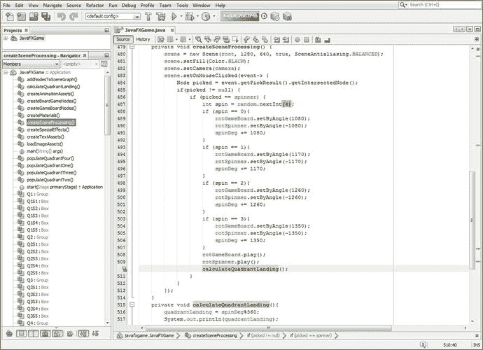

图 19-3.

添加 `calculateQuadrantLanding()` 方法并编写方法体，在每次 `MouseEvent` 结束时调用 `calculateQuadrantLanding()`

```
private void calculateQuadrantLanding() {
quadrantLanding = spinDeg % 360;       // 移除所有 360 度完整旋转后 spinDeg 累加器的余数
System.out.println(quadrantLanding); // 将角度偏移量打印到输出窗格，用于调试
}
```

让我们使用“运行 ➤ 项目”工作流程，看看输出窗格现在是否告诉我们旋转将停靠在哪个象限。这些信息最终需要向玩家隐藏，以免在游戏板停止旋转前暴露他们的“目标”象限，否则会破坏期待感和游戏乐趣。

为了创建图 19-4 中的截图，我将 NetBeans 9 的输出窗格定位（并调整大小）到游戏窗口的后方（和左侧），以便角度增量（余数）的 `println` 输出可见。在我测试 i3D 旋转器 UI 和游戏板旋转周期时，此 `println` 输出通知会触发，以确保它们现在能随机且准确地停在不同颜色的象限上，实现随机游戏（如同掷骰子，只是变成了旋转游戏板）。


当你点击旋转器时，计算出的旋转角度偏移会立即显示（如今的计算机速度很快），因此你可以提前知道游戏棋盘将落在哪个象限。目前，我们只是试图让游戏棋盘在每次随机旋转后落在不同的象限，并观察最终存储在 `quadrantLanding` 变量中的角度值，以便在后续代码中针对这些值进行测试。我们还需要多次旋转，以确保这些象限角度偏移值每次都是完全相同的四个整数，并且不会发生变化，因为我们只希望在代码中测试四个 `quadrantLanding` 角度偏移值。该变量中的任何其他值都会“破坏”这段代码。幸运的是，所有涉及象限和旋转的内容都使用偶数！

至于每个颜色象限对应哪个角度偏移值，我们尚未测试并将 Java 代码细化到那个程度。这正是本章将要完成的部分工作，以确保我们确切了解 Java 9 游戏代码与 i3D 游戏棋盘旋转象限落地视觉效果之间的对应关系。

我们还需要确认我们得到了一个随机的象限选择结果，该结果在图 19-4 左下角用红色圆圈标出。

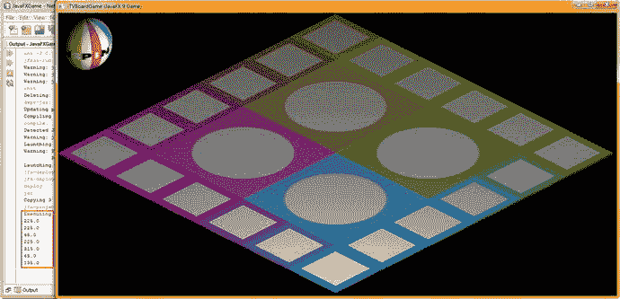

图 19-4.

测试代码，确保余数输出代表四个象限旋转偏移量之一

既然你已经确认 `calculateQuadrantLanding()` 方法能够正常工作，并且随机象限选择也运行得相对良好，接下来我们需要处理用于填充所选游戏棋盘方格的代码。

### 旋转后填充象限：OnFinished() 事件处理

现在我们已经修改了 `createSceneProcessing()` 方法中的 `MouseEvent` 处理结构，让我们打开 `createAnimationAssets()` 方法，在 `rotGameBoard` 动画对象中添加更多事件处理，以便在动画对象的旋转周期完成后触发一些代码来填充游戏棋盘方格。我们这样做的原因是，如果在旋转之前填充游戏棋盘方格，玩家就会知道旋转的游戏棋盘将停在何处！此外，我想向你展示如何“连接”一个动画对象，使其在播放完成后能够触发其他事件和代码结构，这对于专业的 Java 9 游戏开发非常重要，想必你也能理解。我们将从实现一个空的事件处理基础设施开始，该基础设施将用于容纳条件性的 `if()` Java 逻辑，通过调用四个 `populateQuadrant()` 方法（`populateQuadrantOne()` 到 `populateQuadrantFour()`）之一，来指示游戏棋盘方格如何自行填充。在此，我们必须初步推测 `quadrantLanding` 中的哪个角度偏移值应对应于游戏棋盘的哪个象限颜色空间（橙色或动物、绿色或蔬菜、蓝色或矿物、粉色或其他主题）。

创建初始（空）的 `OnFinished` 事件处理 lambda 表达式所需的 Java 9 代码如下；在图 19-5 中也用红色、黄色和蓝色进行了高亮显示：

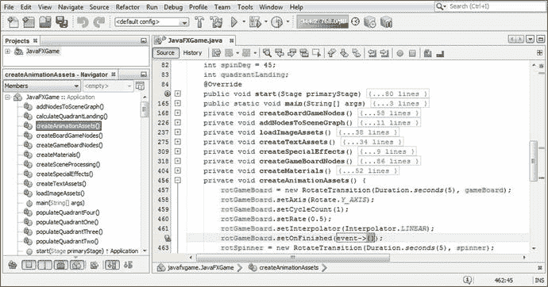

图 19-5.

`rotGameBoard` 动画的 `createAnimationAssets()` 中空的 `setOnFinished()` 事件处理基础设施

```
rotGameBoard.setOnFinished( event-> { ... } );
```

接下来，让我们使用一系列条件性的 `if()` 语句来编写 `rotGameBoard.setOnFinished()` 事件处理方法体。每个语句将评估四个 `quadrantLanding` 角度偏移整数值中的一个，并将该值“连接”到对类末尾四个 `populateQuadrant()` 方法之一的调用。

这些 `populateQuadrant()` 方法随后将负责为每个游戏棋盘方格从不同的内容图像中随机选择，目前我有十五张图像（象限 1 的五个附加游戏棋盘方格，每个方格三张图像）。因此，我们将使用一个 `random.nextInt(3)` 方法，该方法将为每个方格从三个图像资源中选择一个，设置漫反射图像对象以引用选定的数字图像资源，然后为该游戏棋盘方格设置着色器，以便将该图像对象重新加载到内存中用于纹理映射。

为了测试这一点，我们需要至少编写一个 `populateQuadrant()` 方法；合乎逻辑的选择是 `populateQuadrantOne()` 方法，因为我们已经创建了游戏棋盘象限内容（游戏棋盘方格 1 到 5）。在我们测试这个 `.setOnFinished()` 事件处理器，确认这些角度偏移确实能将我们带到正确的象限之后，我们将创建 `populateQuadrantTwo()` 到 `populateQuadrantFour()` 的方法体代码，暂时使用象限 1 的内容作为“虚拟”内容，仅用于代码测试目的。

新的 `.setOnFinished()` 事件处理方法体将从 45 度开始，依次处理到 315 度；它应该类似于以下代码，如图 19-6 中蓝色和黄色高亮所示：

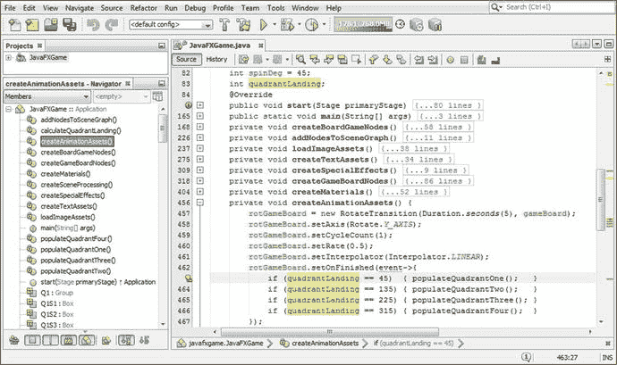

图 19-6.

在 `.setOnFinished()` 事件处理器中，检查 `quadrantLanding` 变量的角度偏移以确定象限

```
rotGameBoard.setOnFinished(event-> {
if (quadrantLanding == 45)  { populateQuadrantOne();   }
if (quadrantLanding == 135) { populateQuadrantTwo();   }
if (quadrantLanding == 225) { populateQuadrantThree(); }
if (quadrantLanding == 315) { populateQuadrantFour();  }
});
```


在你的第一个 `populateQuadrantOne()` 方法体中，你将包含五个游戏棋盘方格的对应代码段。第一条语句将为该方格生成随机数选择，接下来的三条语句将对其进行评估，最后一条语句将使用 `.setDiffuseMap(Image 对象)` 方法调用，将着色器设置为该漫反射颜色贴图纹理。该方法体的 Java 语句应如下所示，如图 19-7 高亮部分：

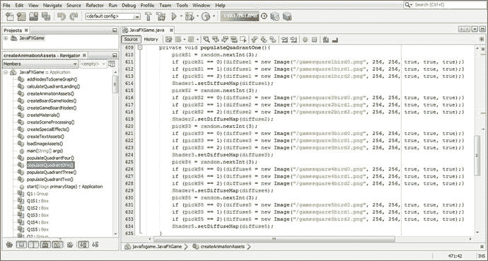

图 19-7.

在 `populateQuadrantOne()` 方法中，基于所选随机数创建图像加载和纹理贴图更改逻辑

```
int pickS1 = random.nextInt(3);
if (pickS1 == 0){diffuse1 = new Image("/gamesquare1bird0.png", 256, 256, true, true, true);}
if (pickS1 == 1){diffuse1 = new Image("/gamesquare1bird1.png", 256, 256, true, true, true);}
if (pickS1 == 2){diffuse1 = new Image("/gamesquare1bird2.png", 256, 256, true, true, true);}
Shader1.setDiffuseMap(diffuse1);
int pickS2 = random.nextInt(3);
if (pickS2 == 0){diffuse2 = new Image("/gamesquare2bird0.png", 256, 256, true, true, true);}
if (pickS2 == 1){diffuse2 = new Image("/gamesquare2bird1.png", 256, 256, true, true, true);}
if (pickS2 == 2){diffuse2 = new Image("/gamesquare2bird2.png", 256, 256, true, true, true);}
Shader2.setDiffuseMap(diffuse2);
int pickS3 = random.nextInt(3);
if (pickS3 == 0){diffuse3 = new Image("/gamesquare3bird0.png", 256, 256, true, true, true);}
if (pickS3 == 1){diffuse3 = new Image("/gamesquare3bird1.png", 256, 256, true, true, true);}
if (pickS3 == 2){diffuse3 = new Image("/gamesquare3bird2.png", 256, 256, true, true, true);}
Shader3.setDiffuseMap(diffuse3);
int pickS4 = random.nextInt(3);
if (pickS4 == 0){diffuse4 = new Image("/gamesquare4bird0.png", 256, 256, true, true, true);}
if (pickS4 == 1){diffuse4 = new Image("/gamesquare4bird1.png", 256, 256, true, true, true);}
if (pickS4 == 2){diffuse4 = new Image("/gamesquare4bird2.png", 256, 256, true, true, true);}
Shader4.setDiffuseMap(diffuse4);
int pickS5 = random.nextInt(3);
if (pickS5 == 0){diffuse5 = new Image("/gamesquare5bird0.png", 256, 256, true, true, true);}
if (pickS5 == 1){diffuse5 = new Image("/gamesquare5bird1.png", 256, 256, true, true, true);}
if (pickS5 == 2){diffuse5 = new Image("/gamesquare5bird2.png", 256, 256, true, true, true);}
Shader5.setDiffuseMap(diffuse5);
```

接下来，使用 **运行 ➤ 项目** 工作流程测试你的代码，你将在图 19-8 中看到，NetBeans 输出窗格显示，在首次点击微调器 UI 后，`quadrantLanding` 变量中遗留的角度偏移量为 45，我最初认为这（在原始代码中设置）对应象限 1，正如你在图 19-6 的原始代码中所见。

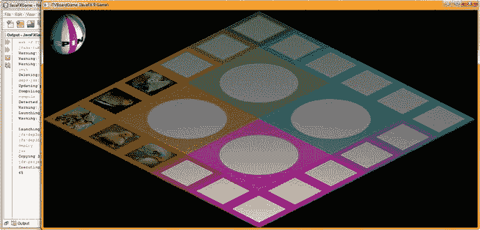

图 19-8.

使用象限内容代码测试 `OnFinished` 代码，并注意角度偏移量相差一个

然而，屏幕上选中的象限是象限 4，这意味着我必须在 `onFinished()` 事件处理条件 `if()` 代码中将角度偏移量数字循环移位一位，使得 315 移动到评估语句的顶部，将其他三个角度偏移量评估各向下移动一个角度评估。

新的 Java 代码（我们接下来将进行测试，如图 19-9 所示）将所有内容循环移位一位，现在看起来像下面的条件 `if()` 评估语句块：

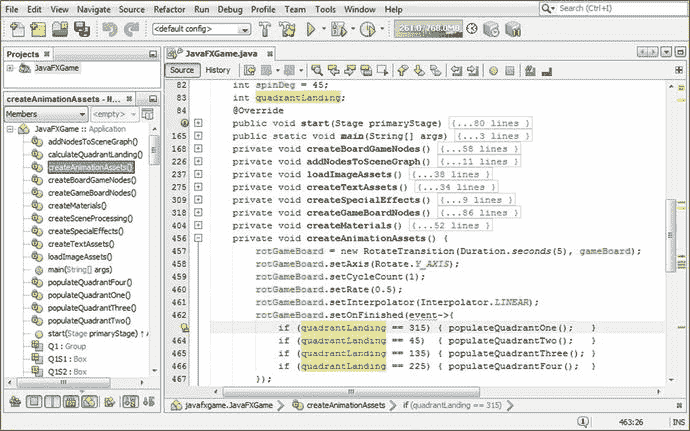

图 19-9.

将角度偏移量评估向下（或向旁）移动一位，将 315 移至顶部，并将其他评估向下推

```
rotGameBoard.setOnFinished(event->{
if (quadrantLanding == 315) { populateQuadrantOne();   }
if (quadrantLanding == 45)  { populateQuadrantTwo();   }
if (quadrantLanding == 135) { populateQuadrantThree(); }
if (quadrantLanding == 225) { populateQuadrantFour();  }
});
```

让我们再次使用 **运行 ➤ 项目** 工作流程来测试这段新代码。当你点击微调器时，当随机数生成器选中 315 时，游戏棋盘现在会停在橙色象限，如图 19-10 所示。现在我们可以继续为 `populateQuadrantTwo()` 添加代码，并继续我们的测试过程。

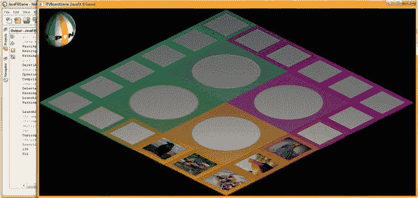

图 19-10.

你的逻辑现在可以工作了，输出窗格中的 315 值和正确的象限定位证明了这一点

选择 `populateQuadrantOne()` 中的 Java 代码，复制并粘贴到 `populateQuadrantTwo` 中，将 pick 整数名称和对象名称中的 1 到 5 值更改为 6 到 10，但文件名保持不变，如图 19-11 所示。

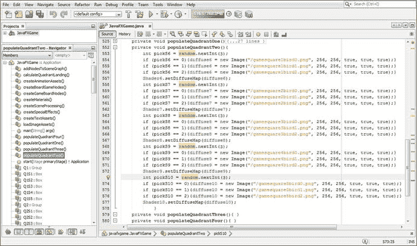

图 19-11.

在 `populateQuadrantTwo` 中复制 `populateQuadrantOne` 代码，并配置方格 6 到 10

```
int pickS6 = random.nextInt(3);
if (pickS6 == 0){diffuse6 = new Image("/gamesquare1bird0.png", 256, 256, true, true, true);}
if (pickS6 == 1){diffuse6 = new Image("/gamesquare1bird1.png", 256, 256, true, true, true);}
if (pickS6 == 2){diffuse6 = new Image("/gamesquare1bird2.png", 256, 256, true, true, true);}
Shader6.setDiffuseMap(diffuse6);
int pickS7 = random.nextInt(3);
if (pickS7 == 0){diffuse7 = new Image("/gamesquare2bird0.png", 256, 256, true, true, true);}
if (pickS7 == 1){diffuse7 = new Image("/gamesquare2bird1.png", 256, 256, true, true, true);}
if (pickS7 == 2){diffuse7 = new Image("/gamesquare2bird2.png", 256, 256, true, true, true);}
Shader7.setDiffuseMap(diffuse7);
int pickS8 = random.nextInt(3);
if (pickS8 == 0){diffuse8 = new Image("/gamesquare3bird0.png", 256, 256, true, true, true);}
if (pickS8 == 1){diffuse8 = new Image("/gamesquare3bird1.png", 256, 256, true, true, true);}
if (pickS8 == 2){diffuse8 = new Image("/gamesquare3bird2.png", 256, 256, true, true, true);}
Shader8.setDiffuseMap(diffuse8);
int pickS9 = random.nextInt(3);
if (pickS9 == 0){diffuse9 = new Image("/gamesquare4bird0.png", 256, 256, true, true, true);}
if (pickS9 == 1){diffuse9 = new Image("/gamesquare4bird1.png", 256, 256, true, true, true);}
if (pickS9 == 2){diffuse9 = new Image("/gamesquare4bird2.png", 256, 256, true, true, true);}
Shader9.setDiffuseMap(diffuse9);
int pickS10 = random.nextInt(3);
if (pickS10 == 0){diffuse10 = new Image("/gamesquare5bird0.png", 256, 256, true, true, true);}
if (pickS10 == 1){diffuse10 = new Image("/gamesquare5bird1.png", 256, 256, true, true, true);}
if (pickS10 == 2){diffuse10 = new Image("/gamesquare5bird2.png", 256, 256, true, true, true);}
Shader10.setDiffuseMap(diffuse10);
```

现在，让我们使用 **运行 ➤ 项目** 工作流程，看看在我们将“虚拟”（象限 1）内容放入 `populateQuadrantTwo()` 方法体后，象限是否填充了正确的内容。当我们点击微调器时，代码现在应该选择一个随机象限，然后用内容填充该象限。任何视觉结果，只要不是游戏棋盘正前方的象限被随机图像填充，都意味着代码中仍有问题，我们需要继续游戏开发的调试过程！

如图 19-12 所示，第一次旋转的角度偏移量为 45 度，我们知道这对应象限 3（粉色或其他内容），它选择了正确的内容，但 `onFinished` 事件处理结构却填充了象限 2（225 度角度偏移量），而不是正确的象限 3！我们还有更多的调试工作要做！


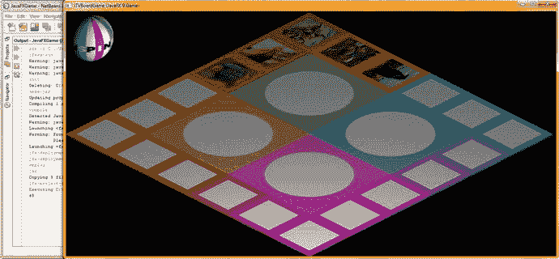

图 19-12.

使用“运行 ➤ 项目”测试代码；`quadrantLanding` 条件 `if()` 代码仍有问题

既然我们不能简单地在条件 `if()` 评估查找矩阵中再次旋转这些值，那么这里一定另有原因！在思考旋转问题时，尽管 `RotateTransform` 中的值是正数，但我记得之前通过使用负值来修正旋转器方向使其向前移动时，游戏棋盘实际上是向后或逆时针旋转的，而且这样看起来棋盘旋转效果更好。因此，我不想改变这一点！这意味着我需要回到最初的 45、135、225、315 评估顺序，并简单地将其反转，因为游戏棋盘在数学上实际上是向后旋转的，所以正确的评估顺序应该反转成 315（象限 1）、225（象限 2）、135（象限 3），然后是 45（象限 4）。

将这个新的角度评估顺序与 `populateQuadrant()` 方法配对，应该能一劳永逸地解决我们的问题。所以，让我们回到 `OnFinished()` 事件处理基础设施中的 `createSceneProcessing()` 方法体，重新排列这些 `quadrantLanding ==` 角度值，从 315 开始，每次递减 90 度，直到 45 度。你可以看到，你的代码和思维逻辑必须同步，才能成功创建你的游戏逻辑！

请注意，用“虚拟内容”填充这些象限，可以让你更好地判断游戏逻辑的运行情况，同时还能保留代码结构，待所有游戏棋盘内容开发完成后，只需更改几个字符即可。从上一章你可能已经看出，这花费的时间与编写游戏代码本身一样长，甚至可能更长，具体取决于你将在游戏中包含多少内容。

我打算为每个游戏棋盘方格至少提供三张图片（主题或问题）。然而，对于一个专业的 Java 9 游戏，你至少需要九张（使用 `random.nextInt(9)` 方法调用），以便内容选择频率呈现出更随机的内容外观。由于我需要在短时间内写完这本书，我无法在开发游戏逻辑、编写代码和截取屏幕截图的同时完成这项工作。

除了尝试这个新的 `.setOnFinished()` 事件处理 Java 代码块之外，我还从 `populateQuadrantOne()` 方法体中复制粘贴了 Java 代码，以创建 `populateQuadrantThree()` 方法体，并对其进行了编辑，为下一轮测试创建游戏方格内容。如果可行，我将对 `populateQuadrantFour()` 执行相同的操作。

经过这些修改后，你的 `OnFinished()` 事件处理条件 `if()` Java 代码应该看起来像下面的代码块，该代码块在图 19-13 底部也以黄色和浅蓝色高亮显示：

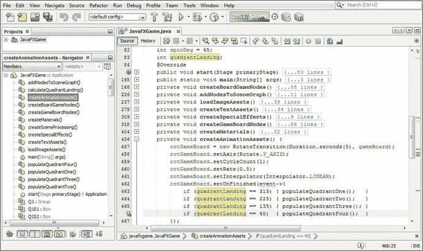

图 19-13.

重新排列角度偏移 `if()` 语句，使其评估方向与游戏棋盘旋转方向相反

```
rotGameBoard.setOnFinished( event-> {
if (quadrantLanding == 315) { populateQuadrantOne();   }
if (quadrantLanding == 225) { populateQuadrantTwo();   }
if (quadrantLanding == 135) { populateQuadrantThree(); }
if (quadrantLanding == 45)  { populateQuadrantFour();  }
});
```

如图 19-14 所示，当我选择“运行 ➤ 项目”测试代码时，象限和内容都是正确的，尽管象限 1 的内容旋转对于其他象限来说并不正确。


图 19-14.

新的角度偏移评估代码现在提供了正确的游戏棋盘象限落点位置

接下来，让我们完成 `populateQuadrantThree()` 和 `populateQuadrantFour()` 方法的创建，这样我们就可以在测试游戏棋盘旋转和象限落点代码时，在所有游戏棋盘方格中看到数字图像（视觉）内容；正如你所见，关于游戏棋盘方格图像的方向，根据它们被用于哪个象限，仍然有游戏内容设计工作需要完成。

将你的 `populateQuadrantTwo()`（或 `populateQuadrantOne()` 内容）代码结构复制粘贴到空的 `populateQuadrantThree()` 方法体中，并将 `pickS`、`diffuse` 和 `Shader` 的值范围改为 11 到 15。暂时不要改动 `Image` 对象引用，因为你只创建了一组象限图像资源。

将你的 `populateQuadrantTwo()`（或 `populateQuadrantOne()` 内容）代码结构复制粘贴到空的 `populateQuadrantFour()` 方法体中，并将 `pickS`、`diffuse` 和 `Shader` 的值范围改为 16 到 20。暂时不要改动 `Image` 对象引用，因为你只创建了一组象限图像资源。

图 19-15 展示了 `populateQuadrantFour()` 的 Java `if()` 结构，如下所示：

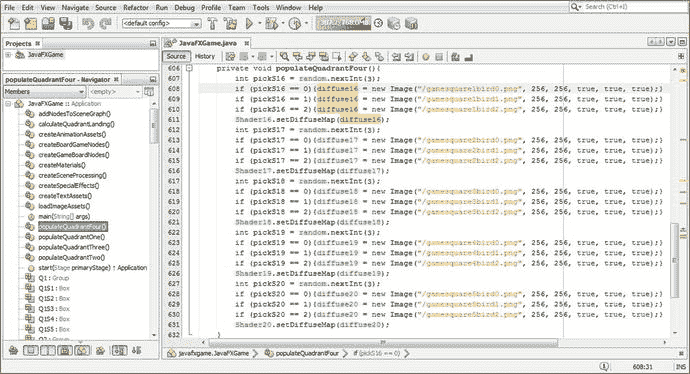

图 19-15.

将 `populateQuadrantOne` 代码复制到 `populateQuadrantThree` 和 `populateQuadrantFour` 并进行修改

```
int pickS16 = random.nextInt(3);
if (pickS16 == 0){diffuse16 = new Image("/gamesquare1bird0.png", 256, 256, true, true, true);}
if (pickS16 == 1){diffuse16 = new Image("/gamesquare1bird1.png", 256, 256, true, true, true);}
if (pickS16 == 2){diffuse16 = new Image("/gamesquare1bird2.png", 256, 256, true, true, true);}
Shader16.setDiffuseMap(diffuse16);
int pickS17 = random.nextInt(3);
if (pickS17 == 0){diffuse17 = new Image("/gamesquare2bird0.png", 256, 256, true, true, true);}
if (pickS17 == 1){diffuse17 = new Image("/gamesquare2bird1.png", 256, 256, true, true, true);}
if (pickS17 == 2){diffuse17 = new Image("/gamesquare2bird2.png", 256, 256, true, true, true);}
Shader17.setDiffuseMap(diffuse17);
int pickS18 = random.nextInt(3);
if (pickS18 == 0){diffuse18 = new Image("/gamesquare3bird0.png", 256, 256, true, true, true);}
if (pickS18 == 1){diffuse18 = new Image("/gamesquare3bird1.png", 256, 256, true, true, true);}
if (pickS18 == 2){diffuse18 = new Image("/gamesquare3bird2.png", 256, 256, true, true, true);}
Shader18.setDiffuseMap(diffuse18);
int pickS19 = random.nextInt(3);
if (pickS19 == 0){diffuse19 = new Image("/gamesquare4bird0.png", 256, 256, true, true, true);}
if (pickS19 == 1){diffuse19 = new Image("/gamesquare4bird1.png", 256, 256, true, true, true);}
if (pickS19 == 2){diffuse19 = new Image("/gamesquare4bird2.png", 256, 256, true, true, true);}
Shader19.setDiffuseMap(diffuse19);
int pickS20 = random.nextInt(3);
if (pickS20 == 0){diffuse20 = new Image("/gamesquare5bird0.png", 256, 256, true, true, true);}
if (pickS20 == 1){diffuse20 = new Image("/gamesquare5bird1.png", 256, 256, true, true, true);}
if (pickS20 == 2){diffuse20 = new Image("/gamesquare5bird2.png", 256, 256, true, true, true);}
Shader20.setDiffuseMap(diffuse20);
```

使用“运行 ➤ 项目”工作流程，多次点击旋转器 UI 以彻底测试代码。你应该会看到，每次游戏棋盘落在一个正确的象限上时（如 NetBeans 9 输出窗格中所指定的），游戏棋盘方格会用动物图像填充正确的象限，如图 19-16 所示。

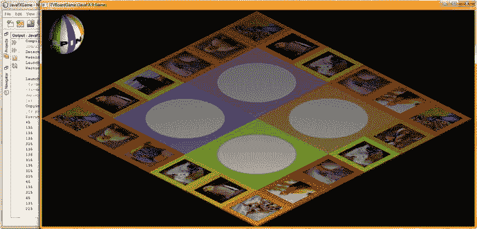

图 19-16.

所有角度旋转评估现在都正确了，最终用纹理贴图图像数据填充了所有 `Shader`

请注意，纹理贴图的颜色和方向尚未与每个象限的配色方案和方向匹配，但话又说回来，你可以利用这个渲染预览来了解在 GIMP 中工作时需要做什么才能实现这一点，我在上一章 18 关于游戏内容的部分已经向你展示了如何操作。


### 纹理贴图管理：编写 resetTextureMaps() 方法

从图 19-16 可以看出，接下来的编程任务是编写一个方法，用于在下次旋转动画开始前，将游戏棋盘重置为默认（空白）状态。具体做法是：通过使用新的图像资源引用重新实例化 `Image` 对象（目前虽然应该有，但还没有 `setImageReference()` 方法调用），将漫反射颜色贴图的数字图像引用恢复为默认文件。这将强制 Java 9 对内存中先前引用的图像进行垃圾回收（重新分配），并用新引用的图像数据替换它。在下一行代码中，你还需要引用关联的 `Shader` 对象，以便将 `Shader` 对象重新插入内存，同时让新的引用数据指向刚刚加载到内存中的新 `Image` 对象。由于我们始终使用默认（空白）纹理贴图，因此所有这些操作都可以放在一个 `resetTextureMaps()` 方法中。该方法本身不会改变，但在每次后续随机游戏棋盘旋转开始之前（即在 `if(pressed == spinner)` 条件 `if()` 结构中的其余语句被处理之前），调用它时会将 3D 游戏棋盘方格重置为默认的未填充（无数字图像主题或问题内容）状态。

回到你的 `createSceneProcessing()` 方法，在 `if (picked == spinner) { ... }` 结构的顶部添加一个 `resetTextureMaps();` 方法调用，如图 19-17 所示。NetBeans 会弹出一个辅助菜单，提供为你编写方法体的选项，因此请选择并双击 `javafxgame.JavaFXGame` 选项中的“创建方法 resetTextureMaps()”，该选项在图 19-17 中间以蓝色显示。

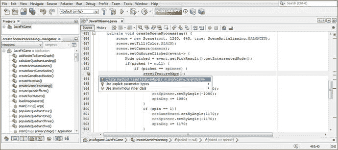

图 19-17.

将 `resetTextureMaps()` 方法调用添加到 `MouseClick` 事件处理代码中；按 `Alt+Enter` 让 NetBeans 创建它

使用复制粘贴编程技术创建这个新方法体相对容易。你只需输入引用 `gameboardsquare.png` 的新 `Image` 实例化 Java 语句，并输入一条新的 `Shader1` 语句，将 `setDiffuseMap()` 方法设置为 `diffuse1` 的 `Image` 对象。之后，你只需选中这两行代码，将它们复制 19 次并粘贴到前两行代码下方，将数字 1 改为 2 到 20，并将这些数字添加到 PNG 文件名的末尾，这些文件名将引用不同颜色的默认游戏棋盘方格纹理贴图资源。

这将产生以下 40 条 Java 编程语句，这些语句在图 19-18 中也以浅蓝色和黄色显示：

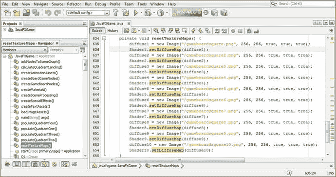

图 19-18.

在 `resetTextureMaps()` 方法体中为空白游戏棋盘重新创建默认的 `Shader` 和 `diffuse` 语句

```
private void resetTextureMaps() {
diffuse1 = new Image("/gameboardsquare.png", 256, 256, true, true, true);
Shader1.setDiffuseMap(diffuse1);
Diffuse2 = new Image("/gameboardsquare2.png", 256, 256, true, true, true);
Shader2.setDiffuseMap(diffuse2);
Diffuse3 = new Image("/gameboardsquare.png3", 256, 256, true, true, true);
Shader3.setDiffuseMap(diffuse3);
diffuse4 = new Image("/gameboardsquare.png4", 256, 256, true, true, true);
Shader4.setDiffuseMap(diffuse4);
Diffuse5 = new Image("/gameboardsquare.png5", 256, 256, true, true, true);
Shader5.setDiffuseMap(diffuse5);
Diffuse6 = new Image("/gameboardsquare.png6", 256, 256, true, true, true);
Shader6.setDiffuseMap(diffuse6);
Diffuse7 = new Image("/gameboardsquare.png7", 256, 256, true, true, true);
Shader7.setDiffuseMap(diffuse7);
Diffuse8 = new Image("/gameboardsquare.png8", 256, 256, true, true, true);
Shader8.setDiffuseMap(diffuse8);
Diffuse9 = new Image("/gameboardsquare.png9", 256, 256, true, true, true);
Shader9.setDiffuseMap(diffuse9);
diffuse10 = new Image("/gameboardsquare.png10", 256, 256, true, true, true);
Shader10.setDiffuseMap(diffuse10);
diffuse11 = new Image("/gameboardsquare.png11", 256, 256, true, true, true);
Shader11.setDiffuseMap(diffuse11);
diffuse12 = new Image("/gameboardsquare.png12", 256, 256, true, true, true);
Shader12.setDiffuseMap(diffuse12);
diffuse13 = new Image("/gameboardsquare.png13", 256, 256, true, true, true);
Shader13.setDiffuseMap(diffuse13);
diffuse14 = new Image("/gameboardsquare.png14", 256, 256, true, true, true);
Shader14.setDiffuseMap(diffuse14);
diffuse15 = new Image("/gameboardsquare.png15", 256, 256, true, true, true);
Shader15.setDiffuseMap(diffuse15);
diffuse16 = new Image("/gameboardsquare.png16", 256, 256, true, true, true);
Shader16.setDiffuseMap(diffuse16);
diffuse17 = new Image("/gameboardsquare.png17", 256, 256, true, true, true);
Shader17.setDiffuseMap(diffuse17);
diffuse18 = new Image("/gameboardsquare.png18", 256, 256, true, true, true);
Shader18.setDiffuseMap(diffuse18);
diffuse19 = new Image("/gameboardsquare.png19", 256, 256, true, true, true);
Shader19.setDiffuseMap(diffuse19);
Diffuse20 = new Image("/gameboardsquare.png20", 256, 256, true, true, true);
Shader20.setDiffuseMap(diffuse20);
}
```

请注意，我在图 19-18 中只显示了一半的语句，因为我的高清显示器无法显示所有语句并同时容纳 NetBeans IDE 界面。我想是时候升级到 4K 超高清显示器了！

使用“运行 ➤ 项目”工作流程（如图 19-19 所示）来彻底测试我们到目前为止开发的代码。它运行稳定。

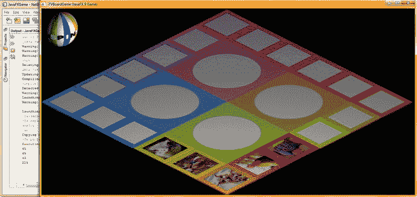

图 19-19.

如输出窗格所示，后续的随机旋转点击现在会填充正确的象限

在本章中，我们添加了更多核心游戏功能，这些功能将用于控制和随机化游戏棋盘方格内容以及游戏过程。我们还设置了 Java 代码，以便在每次添加方格内容图像时，只需递增 `random.nextInt(bounds)`（边界变量）即可轻松添加更多内容。这使得我们的游戏易于扩展，这对于专业的 Java 9 游戏设计至关重要。

你还需要添加 `if()` 语句（或者，如果你有超过两三个内容选项可供选择，更可能改为使用 Java 的 `case` 语句）来添加代码逻辑，使游戏能够为给定方格从不同的图像选项中随机选择。我们将在下一章中增强此代码，继续完善 `populateQuadrant()` 方法，为其添加（非虚拟的）内容，并增加玩家点击游戏方格的能力，利用我们在第 17 章中已经开发的象限纹理贴图，将选中的内容填充到当前象限中。到那时，我们将准备好添加与游戏方格内容选择直接相关的游戏玩法，挑战游戏玩家的知识体系，并在此过程中教育他们。

请注意，我们目前的 Java 代码仍不到 700 行，包含 17 个方法（平均每个方法 39 行），正如你在图 19-18 底部 NetBeans 中看到的那样（在我添加最后 20 条 Java 语句之前，类的末尾是第 655 行，所以基本上我们现在是 675 行）。


## 总结

在第十九章中，我们学习了如何实现游戏棋盘方块内容的随机选择，同时编写了更多游戏逻辑代码，这些代码能够智能追踪游戏棋盘的旋转情况，并利用 Java 数学运算符以及简单而强大的编程算法与结构，确定每次旋转后象限将落在何处。我们调试了角度偏移评估顺序中的几个问题，以及这些评估所指向的 `populateQuadrant()` 方法，并找到了一种将图像加载到内存中的方法，而无需同时在系统内存中声明超过二十多张游戏棋盘漫反射纹理图像。这种方法使我们能够向游戏应用添加数百张内容图像，而不会产生内存不足的错误。

我们构建了几个新的自定义方法，包括 `resetTextureMaps()`、`calculateQuadrantLanding()`、`populateQuadrantOne()`、`populateQuadrantTwo()`、`populateQuadrantThree()` 和 `populateQuadrantFour()`。

我们在 `createSceneProcessing()` 方法的 `MouseEvent` 处理逻辑中添加了更多游戏逻辑，这样在每次旋转时，游戏 AI 逻辑都会从游戏启动开始追踪每一次旋转。这将使我们能够开发一个算法，在每次旋转时计算落点角度，从而使游戏逻辑能够知道每次旋转的当前“落点象限”是什么，这对于我们将要开发的所有其他游戏逻辑至关重要。

我们开发了一个优雅的解决方案，该方案仅使用整数（角度度数）或 `int` 数字（整数），通过将 `spinDeg` 累加器变量除以 360 并仅保留余数角度偏移（超过完整 360 度旋转的部分），从而丢弃完整的旋转（360 度）。这是通过使用 Java 的 `%` 取余运算符实现的，该运算符将分子（`spinDeg` 总数）除以除数（360 度），并将余数赋值给等号（`=`）运算符另一侧的 `quadrantLanding` 变量。

我们开发了四个 `populateQuadrant()` 方法，用于存放为每个象限所附着的五个游戏棋盘方块随机选择内容的代码。随着游戏内容的增加，这些方法可以进行扩展。

我们还开发了一个 `resetTextureMaps()` 方法，该方法在下次旋转前将游戏棋盘重置为默认的空白状态。我们了解了如何“重用” `Image` 实例化，即引用不同的纹理贴图。这将请求 Java 9 执行垃圾回收以重新加载图像内容的内存位置，而不是为游戏内容的每个纹理贴图都将 `Image` 对象加载到系统内存中，后者会导致内存不足错误！

在第二十章中，你将开发额外的游戏逻辑代码基础设施，用于处理玩家点击（选择）游戏方块内容时发生的情况，以便你能完成与 3D 旋转器 UI 以及每个游戏棋盘方块相关的点击事件的 `MouseEvent` 事件处理代码。我们还会在下一章中添加 `Camera` 动画对象，这样你的摄像机对象就能更靠近棋盘进行动画移动！

