# 20. 编写游戏逻辑：设置游戏逻辑方法与动画摄像机视角

到目前为止，你已经编写了游戏随机象限选择逻辑的代码，并且正在追踪每次旋转的象限落点。现在，我们需要将大量的 Java 代码落实到位，这些代码将为这四个象限填充游戏棋盘方块的随机内容选择，针对的是附着于任何给定象限的五个方块中的每一个。我们还需要创建允许玩家通过点击图像来选择其中一个主题问题的代码。这将用图像填充象限，并移动摄像机到合适位置，使选中的图像更大（更易查看）。这意味着在本章中，我们还将涉及如何结合你的 `Camera` 对象使用 `Animation` 对象。

在本章中，我们将创建十几个新的 `setupQSgameplay()` 方法，这些方法将包含为每个游戏棋盘方块设置下一级游戏逻辑（关于图像内容的问题）的代码。这样，当玩家点击某个游戏棋盘方块时，就会调用该方法来设置“问答”体验。

这意味着在本章中我们将添加数百行代码；幸运的是，我们将采用一种最优的“一次编写，然后复制、粘贴并修改”的方法，因此实际需要输入的工作量可能没有你想象的那么多。一旦我们完成了大部分游戏内容选择和显示基础设施的编码，并测试每个象限以确保其正常工作，我们就可以在第二十一章中编写代码的问答部分，然后在第二十二章中编写计分引擎，从而完成大部分“核心”游戏体验。

## 选择游戏内容：`selectQSgameplay()` 方法

为了允许玩家选择一个游戏棋盘方块来测试他们的知识，我们必须向 `createSceneProcessing()` 方法中添加内容，该方法包含了我们对 3D 场景图节点对象上鼠标点击的事件处理。在本章之前，这指的是 3D 旋转器 UI 元素，但现在我们必须添加 20 个以上的事件处理条件 `if()` 处理语句，以便如果 20 个游戏棋盘方块中的某一个被点击，就会调用其对应的 `selectQxSxgameplay()` 方法来处理该方块内容的游戏逻辑。我们将从编码和测试第一个 `if (picked == Q1S1)` 结构开始。由于游戏逻辑内容的视觉元素（纹理贴图）已经按照第十八章中概述的工作流程创建好了，这些方法将正确显示这些图像资源，并触发玩家需要掌握才能得分的游戏问题。这些 `if()` 语句将查找被选中的节点，并将玩家引导至正确的 `selectQSgameplay()` 方法。该结构的伪代码如下所示：

```
if (pickedNode == Q1S1) { 调用 selectQ1S1gameplay() 方法 }
if (pickedNode == Q2S2) { 调用 selectQ2S2gameplay() 方法 } // 以此类推，直到 Q4S5
```

一旦我们创建了几个这样的语句，就可以使用 Alt+Enter 组合键，让 NetBeans 为我们创建一个空的方法结构。创建好该方法结构后，我们就可以使用复制粘贴来创建 20 个方法，并在创建每个象限的代码时进行测试，直到全部 20 个方法完成。


### 游戏棋盘方格交互：OnMouseClick() 事件处理

让我们创建第一个事件处理条件 if() 语句，用于检测 Q1S1 到 Q4S5 方格节点的鼠标点击事件。我将在外层的 `if(picked != null)` if() 结构内部（紧随其后）、`if(picked == spinner)` 结构之前放置 20 个游戏棋盘方格节点评估，因为这些结构仅在点击 Box 节点时调用一个方法。需要注意的是，我不能使用 switch-case 结构，因为该结构目前不兼容对象评估，仅支持字符串、枚举和数值评估。代码应类似于此处所示的 Java 语句和方法调用（在图 20-1 中以浅蓝色和黄色高亮显示）：

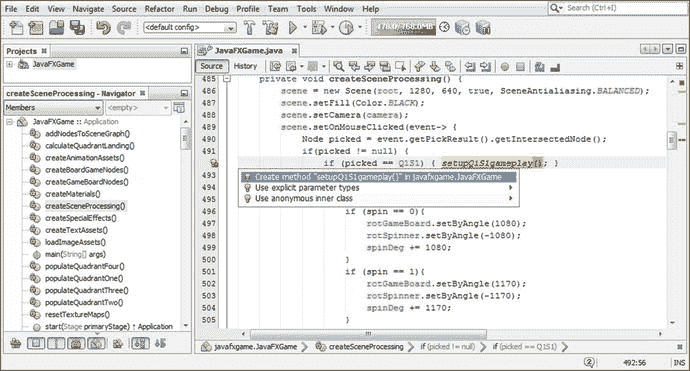

图 20-1.

添加一个 if(picked==Q1S1) 条件评估；使用 Alt+Enter 创建一个 setupQ1S1gameplay() 方法

```
if (picked != null) {
if (picked == Q1S1) { setupQ1S1gameplay(); }
... // 3D 转盘 UI 处理逻辑将放在所有游戏棋盘方格处理逻辑之后
}
```

一旦你输入第一个 if() 条件评估，你的方法名会以红色下划线标出，因为该方法尚不存在。使用 Alt+Enter 工作流程让 NetBeans 9 为你编写代码，并选择在 `javafxgame.JavaFXGame` 选项中创建方法 “setupQ1S1gameplay()”，如图 20-1 中蓝色所示。

在你的 setupQ1S1gameplay() 方法内部，将引导错误代码替换为三个针对方格 1 的 if() 随机选择（int pickS1）条件评估。这将告诉你的游戏在生成三个不同的随机选择数字（0、1 或 2）时该做什么。代码应类似于以下 Java 代码，如图 20-2 中高亮所示：

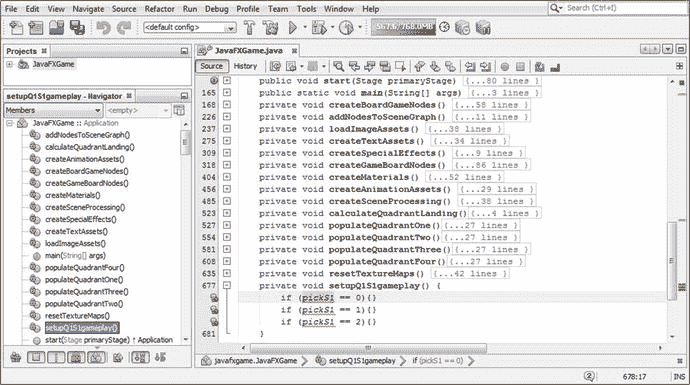

图 20-2.

在 setupQ1S1gameplay 内部添加用于处理随机数生成器结果的 if() 条件结构

```
private void setupQ1S1gameplay() {
if (pickS1 == 0) {}
if (pickS1 == 1) {}
if (pickS1 == 2) {}
}
```

这些代码下方出现红色波浪错误下划线的原因是，pickS1 当前在 populateQuadrantOne() 方法内被声明为 int（整数），因此 pickS1 变量是局部变量，需要将其设为“包级私有”（不使用 public、private 或 protected 关键字），从而使其对整个类可访问。

这可以通过将 pickS1 声明移到类的顶部来实现，这样类（及包）中的所有方法都可以引用从随机数生成器加载的该数据值。你可以将 pickS1 添加到 int quadrantLanding 中，并创建一个复合语句，在一行代码中声明所有要使用的整数变量。

你可以在修改每个 populateQuadrant() 方法的 Java 代码时，将 pickS1 到 pickS20 添加到此复合语句中，或者你也可以先添加所有 20 个新的 int 变量，然后再从所有 populateQuadrant() 方法中移除 int 声明，此时你的代码结构（如图 20-3 所示）将不再有错误。

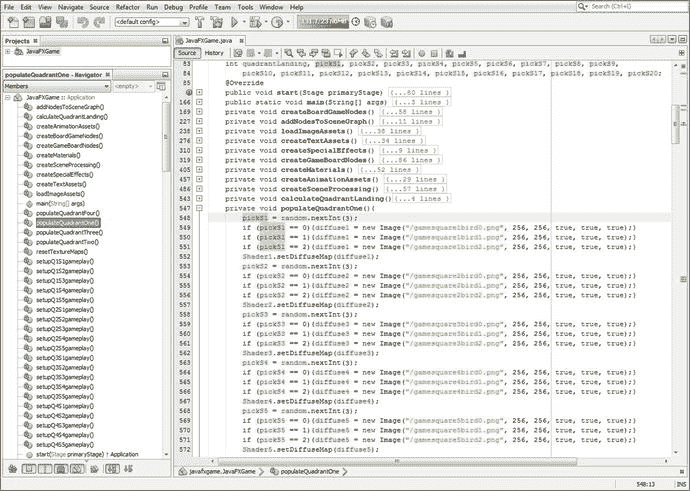

图 20-3.

在类的顶部声明 int pickS1，以便它可以在 populateQuadrant() 和 setupQSgameplay() 方法中使用

最初，我们在 populateQuadrant() 方法中使用此语句来声明并加载 pickSn int（整数）变量，其内容为来自随机数生成器对象的当前游戏棋盘方格结果。

```
int pickS1 = random.nextInt(3);  // 接下来在类顶部声明 int，因此需要移除！
```

现在我们已经将这些整数随机数“持有者”声明为具有“全局”（而非局部）访问权限，之前的 Java 9 语句将变得更加简单，如下所示（如图 20-3 所示）：

```
pickS1 = random.nextInt(3);
```

请注意，每个象限中每个游戏棋盘方格的随机数都是在 populateQuadrant() 方法中生成的，用于选择和设置使用的图像资源。我们还会在 setupQ1S1gameplay() 方法中使用这个随机数结果，以确定要显示哪个象限纹理贴图图像，前提是玩家点击了该方格以选择该内容作为其问题。这是因为每个方格都有不止一个图像。

由于 setupQ1S1gameplay() 方法是在点击 Q1S1 节点对象时被调用的，你需要做的第一件事是将游戏棋盘象限 1 的默认纹理贴图更改为与所点击的游戏棋盘方格 1 中显示的内容相匹配的纹理贴图。稍后会添加其他 Java 语句来设置图像内容的问答选项，但让我们先从玩家点击游戏棋盘内容时获得的视觉反馈开始。

由于当前可能有三种不同的内容图像填充游戏棋盘方格 1，你将拥有三个 if() 结构，其中包含与每个内容选择相关的 Java 语句。随机数生成器已经在你的 populateQuadrantOne() 方法中使用 pickS1 变量随机选择了这三个内容图像之一来存储此选择。因此，从逻辑上讲，我们应该使用这个变量（你现在已将其设为“全局”游戏变量）来确定要设置哪个象限纹理贴图，以便使用 Image() 对象构造函数（包含图像资源名称、分辨率和渲染设置）将 diffuse21 象限纹理 Image 对象设置为此贴图。然后，你所要做的就是使用 setDiffuseMap() 方法调用将 Shader21 对象设置为引用这个（新的）diffuse21 Image 对象。这将针对三个内容选项中的每一个完成，其中 gamequad1bird0 到 gamequad1bird2 图像文件名是主要代码元素，将在 setupQ1S1gameplay() 方法内的三个不同条件 if() 结构之间变化。这使得复制粘贴编码工作流程成为合乎逻辑的选择。

你的 setupQ1S1gameplay() 方法的 Java 代码应类似于以下代码，如图 20-4 顶部所示，并在图底部复制粘贴以创建 setupQ1S2gameplay() 方法：

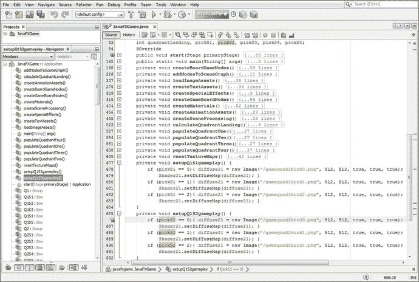

图 20-4.

setupQ1S1gameplay 方法无错误，可以完成并复制粘贴以创建 setupQ1S2gameplay()

```
private void setupQ1S1gameplay() {
if (pickS1 == 0) {
diffuse21 = new Image("gamequad1bird0.png", 512, 512, true, true, true);
Shader21.setDiffuseMap(diffuse21);
}
if (pickS1 == 1) {
diffuse21 = new Image("gamequad1bird1.png", 512, 512, true, true, true);
Shader21.setDiffuseMap(diffuse21);
}
if (pickS1 == 2) {
diffuse21 = new Image("gamequad1bird2.png", 512, 512, true, true, true);
Shader21.setDiffuseMap(diffuse21);
}
}
```

让我们使用“运行 ➤ 项目”工作流程，看看当我们点击方格 1 时，它是否会将正确的图像放置在象限中心。正如你在图 20-5 中看到的，Java 代码运行正常，我们可以创建其他 19 个方法。

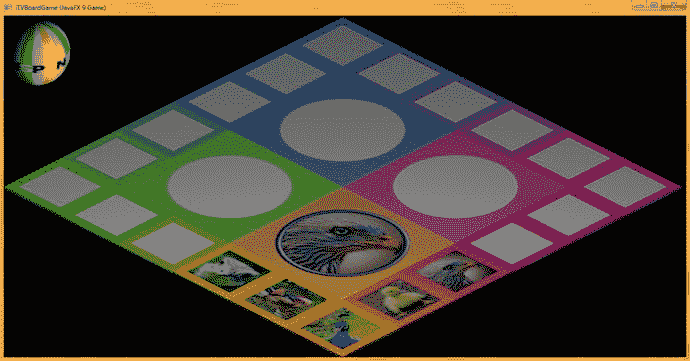

图 20-5.

点击象限 1 的方格 1 (Q1S1) 会将游戏棋盘象限纹理映射为正确的图像资源


现在你已经有了 `setupQ1S1gameplay()` 方法的代码模板，将其复制粘贴四次到自身下方，将方法名和 `if()` 代码结构中的 `Q1S1` 依次改为 `Q1S2` 至 `Q1S5`，并将 `pickS1` 依次改为 `pickS2` 至 `pickS5`。同时，修改 `Image()` 实例化中的图片文件名，使其与你之前在第 18 章创建的 PNG 纹理贴图资源相匹配。完成后的 Java 代码应如下所示，如图 20-6 所示：

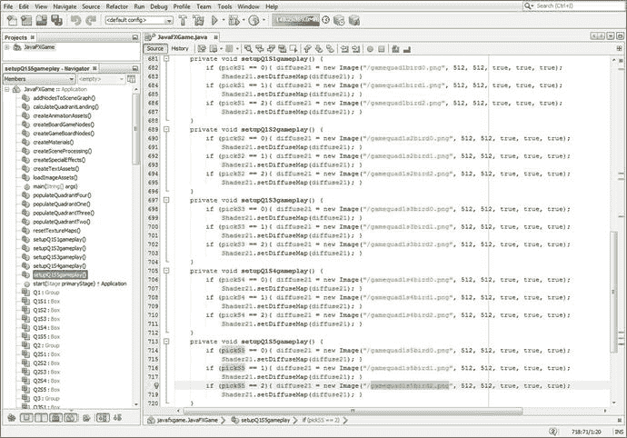

图 20-6.

将 `setupQ1S1gameplay()` 方法复制粘贴四次；编辑每个副本以创建其他四个方法

```
private void setupQ1S2gameplay() {
if (pickS2 == 0) {diffuse21 = new Image("gamequad1s2bird0.png", 512, 512, true, true, true);
Shader21.setDiffuseMap(diffuse21); }
if (pickS2 == 1) {diffuse21 = new Image("gamequad1s2bird1.png", 512, 512, true, true, true);
Shader21.setDiffuseMap(diffuse21); }
if (pickS2 == 2) {diffuse21 = new Image("gamequad1s2bird2.png", 512, 512, true, true, true);
Shader21.setDiffuseMap(diffuse21); }
}
private void setupQ1S3gameplay() {
if (pickS3 == 0) {diffuse21 = new Image("gamequad1s3bird0.png", 512, 512, true, true, true);
Shader21.setDiffuseMap(diffuse21); }
if (pickS3 == 1) {diffuse21 = new Image("gamequad1s3bird1.png", 512, 512, true, true, true);
Shader21.setDiffuseMap(diffuse21); }
if (pickS3 == 2) {diffuse21 = new Image("gamequad1s3bird2.png", 512, 512, true, true, true);
Shader21.setDiffuseMap(diffuse21); }
}
private void setupQ1S4gameplay() {
if (pickS4 == 0) {diffuse21 = new Image("gamequad1s4bird0.png", 512, 512, true, true, true);
Shader21.setDiffuseMap(diffuse21); }
if (pickS4 == 1) {diffuse21 = new Image("gamequad1s4bird1.png", 512, 512, true, true, true);
Shader21.setDiffuseMap(diffuse21); }
if (pickS4 == 2) {diffuse21 = new Image("gamequad1s4bird2.png", 512, 512, true, true, true);
Shader21.setDiffuseMap(diffuse21); }
}
private void setupQ1S5gameplay() {
if (pickS5 == 0) {diffuse21 = new Image("gamequad1s5bird0.png", 512, 512, true, true, true);
Shader21.setDiffuseMap(diffuse21); }
if (pickS5 == 1) {diffuse21 = new Image("gamequad1s5bird1.png", 512, 512, true, true, true);
Shader21.setDiffuseMap(diffuse21); }
if (pickS5 == 2) {diffuse21 = new Image("gamequad1s5bird2.png", 512, 512, true, true, true);
Shader21.setDiffuseMap(diffuse21); }
}
```

在测试所有五个已附加的象限 1 方块之前，你需要确保前五个 `OnMouseClicked` 事件处理条件 `if()` 语句已就位，位于 `createSceneProcessing()` 方法体内。选中图 20-1 中的第一个 `if (picked == Q1S1)` 条件 `if()` 语句，将其复制粘贴四次到自身下方。将 `Q1S1` 引用依次改为 `Q1S2` 至 `Q1S5`，并将 `setupQ1S1gameplay()` 依次改为 `setupQ1S2gameplay()` 至 `setupQ1S5gameplay()`。你新的 `OnMouseClicked` 事件处理方法体应如下面的 Java 9 代码所示，该代码也在图 20-7 中以浅蓝色和黄色显示：

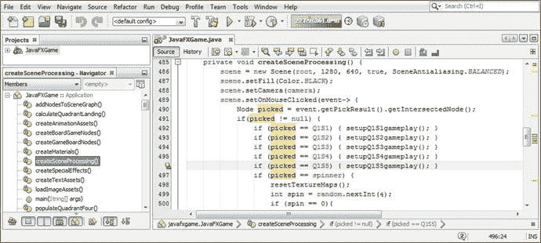

图 20-7.

将第一个 `if(picked==Q1S1)` 结构再复制四次，以创建 Q1S2 至 Q1S5 的 `if()` 结构

```
scene.setOnMouseClicked(event-> {
Node picked = event.getPickResult().getIntersectedNode();
if (picked != null) {
if (picked == Q1S1)    { setupQ1S1gameplay(); }
if (picked == Q1S2)    { setupQ1S2gameplay(); }
if (picked == Q1S3)    { setupQ1S3gameplay(); }
if (picked == Q1S4)    { setupQ1S4gameplay(); }
if (picked == Q1S5)    { setupQ1S5gameplay(); }
if (picked == spinner) { resetTextureMaps();
int spin = random.nextInt(4);
if (spin == 0) {
... // 3D 旋转器 UI 逻辑
}
}
}
});
```

从本章可以看出，我们现在进入了 Java 编码过程的一个阶段，在接下来的几章中，随着我们添加游戏内容，我们将生成数百甚至数千行代码。

这包括本章，我们将添加基础设施，使玩家能够点击图像来选择他们要回答的游戏问题，并添加摄像机动画以获得更好的内容视图。它还包括下一章，我们将在其中为每个问题添加问题和答案，以及一个显示这些答案选项的 2D UI。我们还将使用 JavaFX 9 的 `AudioClip` 类在第 21 章中添加数字音频旋转和缩放音效。

在第 22 章中，我们将添加一个计分引擎，这也需要相当多的代码。因此，从现在开始，随着我们继续充实游戏玩法的运作方式，你的 Java 9 代码行数将急剧增加。完成这些之后，我们将看看 NetBeans 9 如何让你测试代码的运行情况，然后对其进行优化。让我们使用“运行 ➤ 项目”工作流程，看看当我们点击方块 2 到 5 时，它是否会在象限中心放置正确的图像。正如你在图 20-8 中看到的，Java 代码运行正常，我们可以创建其他 15 个方法。

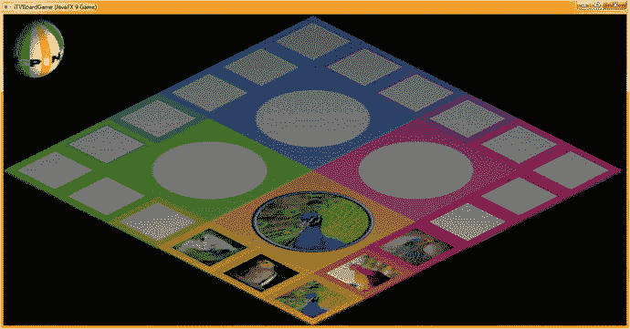

图 20-8.

使用“运行 ➤ 项目”工作流程进行测试；确保每个方块都用正确的图像填充象限

现在，我们可以将这些 `setupQ1S1gameplay()` 到 `setupQ1S5gameplay()` 的方法结构复制粘贴到自身下方，以创建 `setupQ2S1gameplay()` 到 `setupQ2S5gameplay()` 的方法结构。在测试代码之前，你还需要添加接下来的五个 `if(picked == Q2S1)` 到 `if(picked == Q2S5)` 事件处理结构（如图 20-7 所示），并确认你的 `populateQuadrantTwo()` 方法引用了正确的图像资源。编辑完成后，你的新方法应如下面的代码所示，如图 20-9 所示：

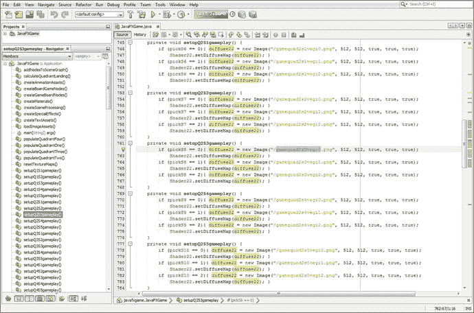

图 20-9.

使用 `diffuse22` 和 `Shader22` 对象创建 `setupQ2S1gameplay()` 到 `setupQ2S5gameplay()` 方法


```
private void setupQ2S1gameplay() {
if (pickS6 == 0) {diffuse22 = new Image("gamequad2s1vegi0.png", 512, 512, true, true, true);
Shader22.setDiffuseMap(diffuse22); }
if (pickS6 == 1) {diffuse22 = new Image("gamequad2s1vegi1.png", 512, 512, true, true, true);
Shader22.setDiffuseMap(diffuse22); }
if (pickS6 == 2) {diffuse22 = new Image("gamequad2s1vegi2.png", 512, 512, true, true, true);
Shader22.setDiffuseMap(diffuse22); }
}
private void setupQ2S2gameplay() {
if (pickS7 == 0) {diffuse22 = new Image("gamequad2s2vegi0.png", 512, 512, true, true, true);
Shader22.setDiffuseMap(diffuse22); }
if (pickS7 == 1) {diffuse22 = new Image("gamequad2s2vegi1.png", 512, 512, true, true, true);
Shader22.setDiffuseMap(diffuse22); }
if (pickS7 == 2) {diffuse22 = new Image("gamequad2s2vegi2.png", 512, 512, true, true, true);
Shader22.setDiffuseMap(diffuse22); }
}
private void setupQ2S3gameplay() {
if (pickS8 == 0) {diffuse22 = new Image("gamequad2s3vegi0.png", 512, 512, true, true, true);
Shader22.setDiffuseMap(diffuse22); }
if (pickS8 == 1) {diffuse22 = new Image("gamequad2s3vegi1.png", 512, 512, true, true, true);
Shader22.setDiffuseMap(diffuse22); }
if (pickS8 == 2) {diffuse22 = new Image("gamequad2s3vegi2.png", 512, 512, true, true, true);
Shader22.setDiffuseMap(diffuse22); }
}
private void setupQ2S4gameplay() {
if (pickS9 == 0) {diffuse22 = new Image("gamequad2s4vegi0.png", 512, 512, true, true, true);
Shader22.setDiffuseMap(diffuse22); }
if (pickS9 == 1) {diffuse22 = new Image("gamequad2s4vegi1.png", 512, 512, true, true, true);
Shader22.setDiffuseMap(diffuse22); }
if (pickS9 == 2) {diffuse22 = new Image("gamequad2s4vegi2.png", 512, 512, true, true, true);
Shader22.setDiffuseMap(diffuse22); }
}
private void setupQ2S5gameplay() {
if (pickS10 == 0) {diffuse22 = new Image("gamequad2s5vegi0.png", 512, 512, true, true, true);
Shader22.setDiffuseMap(diffuse22); }
if (pickS10 == 1) {diffuse22 = new Image("gamequad2s5vegi1.png", 512, 512, true, true, true);
Shader22.setDiffuseMap(diffuse22); }
if (pickS10 == 2) {diffuse22 = new Image("gamequad2s5vegi2.png", 512, 512, true, true, true);
Shader22.setDiffuseMap(diffuse22); }
}
```

如图 20-6 和 20-10 所示，我已经能够为象限 1 和象限 2 中的每个方格创建全部三种不同的内容选项，这相当于已经创建了 60 个图像资源（5 个方格 × 3 种选项 × 2 个图形 × 2 个象限）。正如你从第 18 章概述的工作流程中所意识到的，这是大量的数字图像资源。我仍然有同样多的工作（另外 60 个数字图像资源）需要为象限 3 和象限 4 完成。创建任何专业的 Java 游戏都是一项庞大的工作，这就是为什么几乎总是需要由数字工匠组成的大型团队参与。请注意，我还将`pickS6`到`pickS10`设为了全局变量。

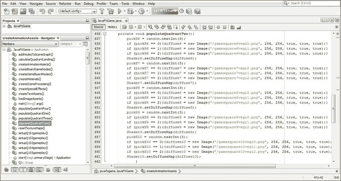

图 20-10.

确认`populateQuadrantTwo()`方法的图像资源与`createQSgameplay()`方法相互引用

在我写完本章之前，我将为这四个象限中的每一个至少创建三个图像资源，这样我们就能在分别于第 21 章和第 22 章开始开发问答和计分引擎 Java 代码之前，完成这 120 个图像资源（编码和测试所需）的创建。

我们还将开始在这些章节中添加其他酷炫的新媒体元素，例如数字音频和更多的 2D 用户界面元素，因此我们还有很多令人兴奋的 JavaFX 游戏引擎主题要介绍！

通常，创建新媒体数字资产（数字图像、数字音频、数字插画、数字视频、3D 建模或动画、视觉效果、粒子系统、流体动力学等）的工作量可能比创建 Java 9 代码的工作量要大得多！如果你拥有多个内容制作工作站，那么不同的计算机将分别处理（渲染、合成、编码、建模、纹理映射、动画等）专业 Java 9 游戏开发工作流程中使用的不同新媒体资产。

让我们再次使用“运行 ➤ 项目”工作流程，彻底测试第二象限的新代码，确保所有游戏棋盘方格图像都能显示，并且点击它们时，能够用正确的（大四倍的）图像填充象限纹理贴图。如图 20-11 所示，游戏棋盘方格图像和游戏棋盘象限图像都清晰可辨，易于用作游戏内容。

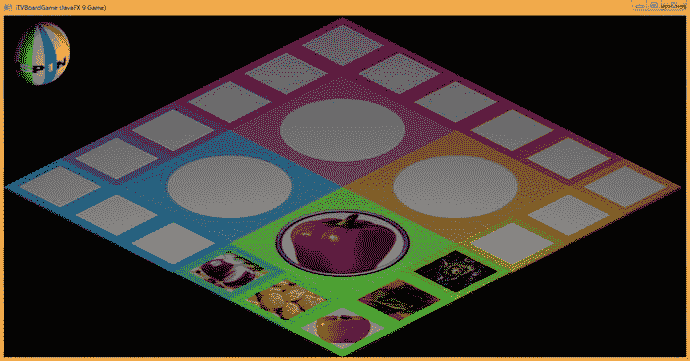

图 20-11.

使用“运行 ➤ 项目”工作流程进行测试；确保每个方格都能用正确的图像填充象限

让我们复制并粘贴另外五个方法体，为象限 3 创建`setupQSgameplay()`方法。确保你的图像资源名称与你用于`populateQuadrantThree()`的名称相匹配。Java 代码应类似于以下方法体，这些方法体在图 20-12 中也以黄色显示：

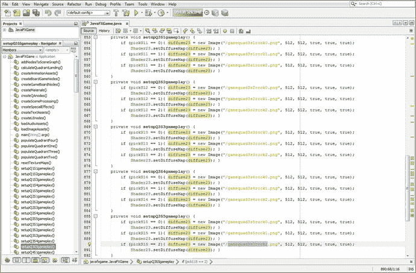

图 20-12.

使用`diffuse23`和`Shader23`对象，创建`setupQ3S1gameplay()`到`setupQ3S5gameplay()`方法

```
private void setupQ3S1gameplay() {
if (pickS11 == 0) {diffuse23 = new Image("gamequad3s1rock0.png", 512, 512, true, true, true);
Shader23.setDiffuseMap(diffuse23); }
if (pickS11 == 1) {diffuse23 = new Image("gamequad3s1rock1.png", 512, 512, true, true, true);
Shader23.setDiffuseMap(diffuse23); }
if (pickS11 == 2) {diffuse23 = new Image("gamequad3s1rock2.png", 512, 512, true, true, true);
Shader23.setDiffuseMap(diffuse23); }
}
private void setupQ3S2gameplay() {
if (pickS12 == 0) {diffuse23 = new Image("gamequad3s2rock0.png", 512, 512, true, true, true);
Shader23.setDiffuseMap(diffuse23); }
if (pickS12 == 1) {diffuse23 = new Image("gamequad3s2rock1.png", 512, 512, true, true, true);
Shader23.setDiffuseMap(diffuse23); }
if (pickS12 == 2) {diffuse23 = new Image("gamequad3s2rock2.png", 512, 512, true, true, true);
Shader23.setDiffuseMap(diffuse23); }
}
private void setupQ3S3gameplay() {
if (pickS13 == 0) {diffuse23 = new Image("gamequad3s3rock0.png", 512, 512, true, true, true);
Shader23.setDiffuseMap(diffuse23); }
if (pickS13 == 1) {diffuse23 = new Image("gamequad3s3rock1.png", 512, 512, true, true, true);
Shader23.setDiffuseMap(diffuse23); }
if (pickS13 == 2) {diffuse23 = new Image("gamequad3s3rock2.png", 512, 512, true, true, true);
Shader23.setDiffuseMap(diffuse23); }
}
private void setupQ3S4gameplay() {
if (pickS14 == 0) {diffuse23 = new Image("gamequad3s4rock0.png", 512, 512, true, true, true);
Shader23.setDiffuseMap(diffuse23); }
if (pickS14 == 1) {diffuse23 = new Image("gamequad3s4rock1.png", 512, 512, true, true, true);
Shader23.setDiffuseMap(diffuse23); }
if (pickS14 == 2) {diffuse23 = new Image("gamequad3s4rock2.png", 512, 512, true, true, true);
Shader23.setDiffuseMap(diffuse23); }
}
private void setupQ3S5gameplay() {
if (pickS15 == 0) {diffuse23 = new Image("gamequad3s5rock0.png", 512, 512, true, true, true);
Shader23.setDiffuseMap(diffuse23); }
if (pickS15 == 1) {diffuse23 = new Image("gamequad3s5rock1.png", 512, 512, true, true, true);
Shader23.setDiffuseMap(diffuse23); }
if (pickS15 == 2) {diffuse23 = new Image("gamequad3s5rock2.png", 512, 512, true, true, true);
Shader23.setDiffuseMap(diffuse23); }
}
```


请务必打开你的 `populateQuadrantThree()` 方法，并检查所使用的图片资源，确保它们使用了相同的图片名称。唯一的例外是，你的游戏方格图片资源是 256 像素见方，而游戏象限图片资源是 512 像素见方的版本，并且文件名以“gamequad”开头，而不是“gamesquare”。

在这两个方法之间，你所有的 `gamesquare` 和 `gamequad` 图片都会被加载到用于游戏棋盘着色器的二十多个游戏棋盘纹理贴图中，这些贴图将在游戏过程中的任何时刻装饰你的游戏棋盘表面。这二十多个方法（四个用于象限，二十个用于方格）确保你的游戏棋盘在任何给定的游戏回合中视觉上都是正确的，确保游戏棋盘方格具有随机选择的主题内容，并且游戏象限显示内容的大版本。

所有这些二十多个方法的设置方式都允许随着时间的推移添加内容，只需将 `random.nextInt()` 方法调用的参数改为下一个更大的上限，即可增加一层内容。你可以在接下来的几章中完成游戏设计（包括其他新媒体资源，如更多动画、数字音频、3D 和游戏问题，所有这些我们仍需创建和编码）之后再进行此操作。在初始代码完成后的很长一段时间内，你都将持续修改并添加游戏的内容和关卡。你可以像我们在本书中所做的那样重新设计游戏结构，根据需要添加更多的类或方法来扩展游戏。

`populateQuadrantThree()` 方法（如图 20-13 所示）添加了第三轮图片内容，这通过文件名末尾的“2”来表示。这些资源是我在另一台机器上（在你的情况下，可能是由你的图形设计员工操作）创建的，而我本人则在一台四核 Windows 7 机器上继续编写 Java 9 代码。

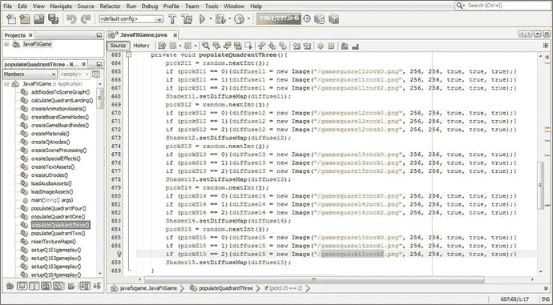

图 20-13.

确认 `populateQuadrantThree()` 方法的图片资源与 `createQSgameplay()` 方法相互引用

确保你在 `createSceneProcessing()` 中的 `OnMouseClick` 事件处理中添加了从 `if(picked == Q3S1)` 到 `if(picked == Q3S5)` 这五个语句，以将新方法连接到你不断增长的游戏体验中。

如图 20-14 所示，使用“运行 ➤ 项目”工作流程，测试与象限 3 相关的代码，确保象限和内容图片都正确显示，并且看起来清晰专业。

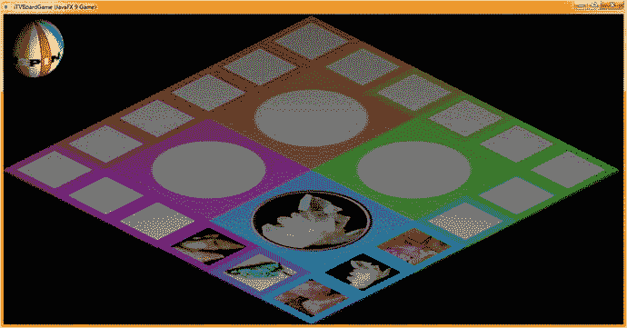

图 20-14.

使用“运行 ➤ 项目”工作流程进行测试；确保每个方格都用正确的图片填充象限

最后，让我们创建最后五个 `setupQSgameplay()` 方法，如图 20-15 所示，它们将如下所示：

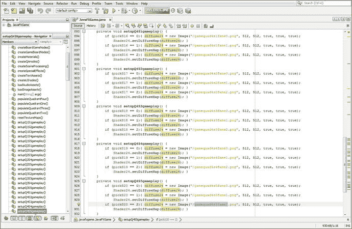

图 20-15.

使用 `diffuse24` 和 `Shader24` 对象创建从 `setupQ4S1gameplay()` 到 `setupQ4S5gameplay()` 的方法

```
private void setupQ4S1gameplay() {
if (pickS16 == 0) {diffuse24 = new Image("gamequad4s1fame0.png", 512, 512, true, true, true);
Shader24.setDiffuseMap(diffuse24); }
if (pickS16 == 1) {diffuse24 = new Image("gamequad4s1fame1.png", 512, 512, true, true, true);
Shader24.setDiffuseMap(diffuse24); }
if (pickS16 == 2) {diffuse24 = new Image("gamequad4s1fame2.png", 512, 512, true, true, true);
Shader24.setDiffuseMap(diffuse24); }
}
private void setupQ4S2gameplay() {
if (pickS17 == 0) {diffuse24 = new Image("gamequad4s2fame0.png", 512, 512, true, true, true);
Shader24.setDiffuseMap(diffuse24); }
if (pickS17 == 1) {diffuse24 = new Image("gamequad4s2fame1.png", 512, 512, true, true, true);
Shader24.setDiffuseMap(diffuse24); }
if (pickS17 == 2) {diffuse24 = new Image("gamequad4s2fame2.png", 512, 512, true, true, true);
Shader24.setDiffuseMap(diffuse24); }
}
private void setupQ4S3gameplay() {
if (pickS18 == 0) {diffuse24 = new Image("gamequad4s3fame0.png", 512, 512, true, true, true);
Shader24.setDiffuseMap(diffuse24); }
if (pickS18 == 1) {diffuse24 = new Image("gamequad4s3fame1.png", 512, 512, true, true, true);
Shader24.setDiffuseMap(diffuse24); }
if (pickS18 == 2) {diffuse24 = new Image("gamequad4s3fame2.png", 512, 512, true, true, true);
Shader24.setDiffuseMap(diffuse24); }
}
private void setupQ4S4gameplay() {
if (pickS19 == 0) {diffuse24 = new Image("gamequad4s4fame0.png", 512, 512, true, true, true);
Shader24.setDiffuseMap(diffuse24); }
if (pickS19 == 1) {diffuse24 = new Image("gamequad4s4fame1.png", 512, 512, true, true, true);
Shader24.setDiffuseMap(diffuse24); }
if (pickS19 == 2) {diffuse24 = new Image("gamequad4s4fame2.png", 512, 512, true, true, true);
Shader24.setDiffuseMap(diffuse24); }
}
private void setupQ4S5gameplay() {
if (pickS20 == 0) {diffuse24 = new Image("gamequad4s5fame0.png", 512, 512, true, true, true);
Shader24.setDiffuseMap(diffuse24); }
if (pickS20 == 1) {diffuse24 = new Image("gamequad4s5fame1.png", 512, 512, true, true, true);
Shader24.setDiffuseMap(diffuse24); }
if (pickS20 == 2) {diffuse24 = new Image("gamequad4s5fame2.png", 512, 512, true, true, true);
Shader24.setDiffuseMap(diffuse24); }
}
```

再次，将你在 `setupQ4S1gamedesign()` 到 `setupQ4S5gamedesign()` 中所做的与你在 `populateQuadrantFour()` 中所做的进行比较。通过比较图 20-15 和图 20-16，确保一切同步。

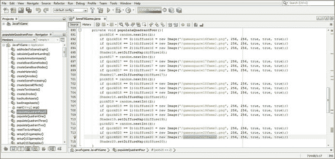

图 20-16.

确认 `populateQuadrantFour()` 方法的图片资源与 `createQSgameplay()` 方法相互引用

让我们使用图 20-17 所示的“运行 ➤ 项目”工作流程来测试第四个象限的新代码。

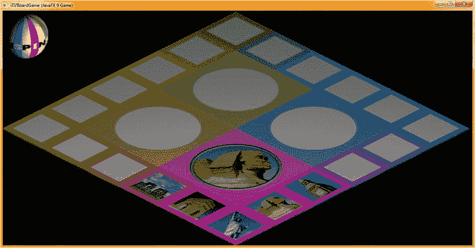

图 20-17.

使用“运行 ➤ 项目”工作流程进行测试；确保每个方格都用正确的图片填充象限

为了节省几张截图，我没有展示你在此章节中填充每个新象限和匹配的 `setupQSgameplay()` 方法时同时添加的五个事件处理 `if()` 结构，这些结构每个象限增加了近 50 行 Java 9 代码。

这将导致以下 20 个 Java 编程 `if()` 结构被添加到你的自定义 `createSceneProcessing()` 方法体内的 `onMouseClicked()` 事件处理基础设施中——我们将用这些结构来填充触发摄像机动画、数字音频样本（音效）等的调用。

这 20 个条件 `if()` 结构可以在图 20-18 中以浅蓝色和黄色高亮显示看到。请注意，我用红色方框标出了我们在本章第一部分添加的这些新的 `setupQSgameplay()` 方法，它们位于导航器窗格的游戏代码方法成员部分，该部分显示在 NetBeans 9 最左侧的窗格中。


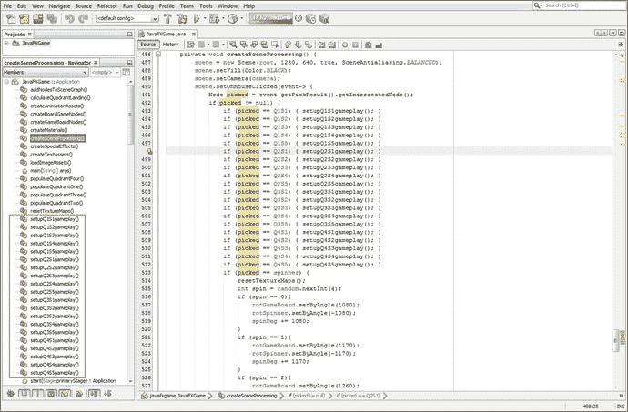

图 20-18.

现在你已经拥有了所有 `setupQSgameplay()` 方法，并在一个 `OnMouseClicked` 事件处理器中调用它们

如果你想查看所有的图像资源（由于这是一个 i3D 游戏，所有资源都是纹理贴图），可以使用操作系统的文件管理工具，导航到 `/MyDocuments/NetBeansProjects/JavaFXGame/src/` 文件夹，如图 20-19 所示。我几乎无法将所有游戏资源（约 34MB）都放进一张截图里！我可能需要将这 120 个图像资源优化为 PNG8 格式，这样可以将数据占用减少到约 10MB。甚至还可以使用游程编码（RLE，也称为 ZIP 文件压缩）进一步优化。这些图像中的大部分都能很好地转换为 256 色（带抖动处理）。

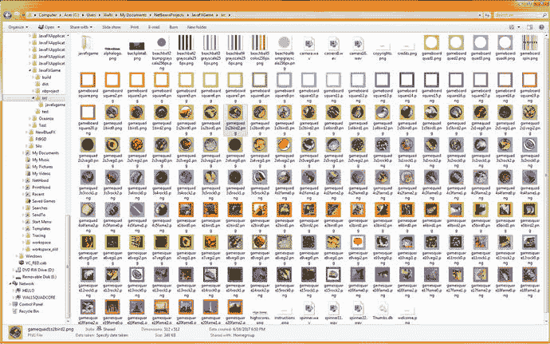

图 20-19.

使用文件管理软件查看 `/src` 文件夹中的所有游戏图像（纹理贴图）资源

在下一章中，我们还将创建音频资源，并学习一些数字音频编码技巧，使用一款名为 Audacity 2.1.3 的专业数字音频编辑与美化软件包（适用于 Windows、Mac 和 Linux）。

接下来，让我们通过将摄像机拉近到选定的游戏象限，为游戏增添一些“惊艳”效果。

## 摄像机动画：选择后定位游戏面板

接下来，我们添加一些 3D 摄像机动画。当玩家点击他们想要用于本回合的方块后，摄像机对象会向内移动，并将角度从 -30 度向下旋转到 -60 度，这将使象限及其图像更靠近摄像机（也更平行）。这会让象限图像对玩家来说更大，同时为屏幕左侧和右侧的 2D 覆盖面板留出更多空间。这些面板将包含我们的 UI、记分板以及所选游戏方块视觉内容的答案。这些内容大部分将在接下来的几章中创建，因此我们基本上是在完成游戏外部（外层游戏面板）部分的 i3D 和 UI 编程。在接下来的章节中，我们将开始游戏编程的内部（问答）和音频部分。

在类顶部的 `RotateTransition` 复合语句中添加一个 `rotCameraDown` 对象声明；然后在 `createAnimationAssets()` 方法的末尾，使用 5 秒作为持续时间设置并引用摄像机对象，为该对象添加实例化。将 `cycleCount` 变量设置为 1，`Rate` 设置为 0.75，以获得更适中的移动速度。将 `Delay` 设置为 1（`Duration.ONE`），并暂时使用 `Interpolator.LINEAR` 插值器。最后，将 `fromAngle` 变量设置为当前的 -30 度，`toAngle` 变量设置为目标 -60 度。这段 Java 代码可以在 `createAnimationAssets()` 方法的末尾看到，在图 20-20 中以黄色高亮显示。

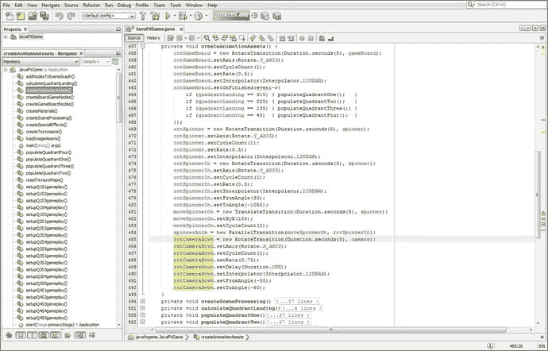

图 20-20.

在 `createAnimationAssets()` 方法的末尾添加一个从 -30 度到 -60 度的 `rotCameraDown` 动画

图 20-20 中展示的、调用 `RotateTransition` 对象的摄像机对象的 Java 9 代码，应如下所示：

```
rotCameraDown = new RotateTransition(Duration.seconds(5), camera);
rotCameraDown.setAxis(Rotate.X_AXIS);
rotCameraDown.setCycleCount(1);
rotCameraDown.setRate(0.75);
rotCameraDown.setDelay(Duration.ONE);
rotCameraDown.setInterpolator(Interpolator.LINEAR);
rotCameraDown.setFromAngle(-30);
rotCameraDown.setToAngle(-60);
```

由于我们还希望在旋转摄像机对象向下 -30 度的同时，将摄像机对象向内移动 -175 个单位（从 500 到 325），因此我们将在类顶部的 `TranslateTransition` 对象复合声明语句中添加一个 `moveCameraIn` 对象。在 `createAnimationAssets()` 方法的末尾，我们将使用 2 秒实例化此对象，并将其附加到摄像机对象上。然后，通过使用 `setByZ(-175)` 并设置 `cycleCount` 为 1，将其配置为在 Z 方向上移动 -175 个单位。此动画对象的 Java 代码应如下所示：

```
moveCameraIn = new TranslateTransition(Duration.seconds(2), camera);
moveCameraIn.setByZ(-175);
moveCameraIn.setCycleCount(1);
```

最后，为了制作一个复合动画，我们将添加一个 `cameraAnimIn` `ParallelTransition` 对象声明，在类顶部进行复合声明，然后在 `createAnimationAssets()` 内部实例化该对象。

我们将 `moveCameraIn` 和 `rotCameraDown` 动画对象添加到这个 `ParallelTransition` 对象中，直接放在对象实例化语句内部，这样我们只需要一行代码就能将这两个动画无缝组合在一起。Java 代码（也显示在图 20-22 的末尾）应如下所示：

```
cameraAnimIn = new ParallelTransition(moveCameraIn, rotCameraDown);
```


接下来，让我们使用“运行 ➤ 项目”工作流程来测试这段代码，看看它是如何工作的！如图 20-21 所示，象限在屏幕上的位置很好，所以我们只需将 3D 旋转器 UI 移出屏幕即可。为此，我们将在 `cameraAnimIn` 的 `ParallelTransition` 中添加一个 `moveSpinnerOff` 动画对象，这样，将摄像机旋转到游戏板的过程也包含了将 3D 旋转器移出游戏屏幕的操作。

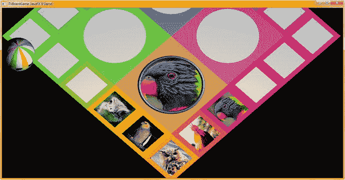

图 20-21.

摄像机现在向下倾斜 60 度对准游戏板，更好地显示内容

这将使动画序列看起来更加专业。我们可以使用原有的 `spinnerAnim` 的 `ParallelTransition` 对象，在需要再次旋转游戏板时，将 3D 旋转器 UI 移回屏幕。

接下来，让我们创建 `moveSpinnerOff` 动画对象，然后将其添加到我们刚刚创建的 `cameraAnimIn` 对象中，以创建一个更复杂的 `ParallelTransition` 动画对象，用于游戏逻辑代码。

在类顶部的复合 `TranslateTransition` 声明语句中声明一个 `moveSpinnerOff` 对象，然后在 `createAnimationAssets()` 方法体中，在 `moveCameraIn` 语句之后、`cameraAnimIn` 的 `ParallelTransition` 对象实例化之前对其进行实例化，因为我们要将其添加到此复合动画过渡中。这样，我们想要动画化的所有内容都会在同一时间发生。

我们将在 2 秒内快速将旋转器移出屏幕，移动距离与之前将其移入屏幕时相同（这次是负值），即 150 个单位。Java 代码应如下所示，如图 20-22 所示，位于方法底部，以黄色和浅蓝色高亮显示：

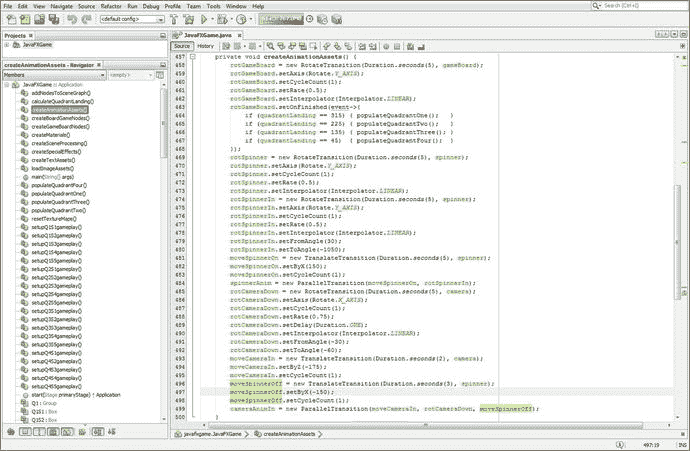

图 20-22.

将 `moveSpinnerOff` 动画对象添加到 `cameraAnimIn` 的 `ParallelTransition` 对象中，以移除旋转器

```
moveCameraIn = new TranslateTransition(Duration.seconds(2), camera);
moveCameraIn.setByZ(-175);
moveCameraIn.setCycleCount(1);
moveSpinnerOff = new TranslateTransition(Duration.seconds(3), spinner);
moveSpinnerOff.setByX(-150);
moveSpinnerOff.setCycleCount(1);
cameraAnimIn = new ParallelTransition(moveCameraIn, rotCameraDown, moveSpinnerOff);
```

这四个新的动画对象将为你的 i3D 游戏增添不少专业感：将摄像机视图动画化到一个更优越的位置，在每次核心游戏环节中将旋转器 i3D UI 元素从屏幕上移除，旋转 3D 摄像机的平面使其与象限内容更平行，并将所有这些移动组合到一个 `ParallelTransition` 动画序列中。

这为下一章做好了准备，届时我们将使用 `ParallelTransition` 对象为游戏板旋转和摄像机缩放添加数字音频音效。这将使我们 i3D 棋盘游戏玩家在使用这两个 3D 动画对象时获得更多乐趣。

最后，让我们使用“运行 ➤ 项目”工作流程来测试代码。如图 20-23 所示，它运行良好，屏幕左侧和右侧有一些不错的区域，可以用来叠加我们的 2D 用户界面区域，我们将在接下来的几章中创建这些区域，以完成 i3D 棋盘游戏的制作。

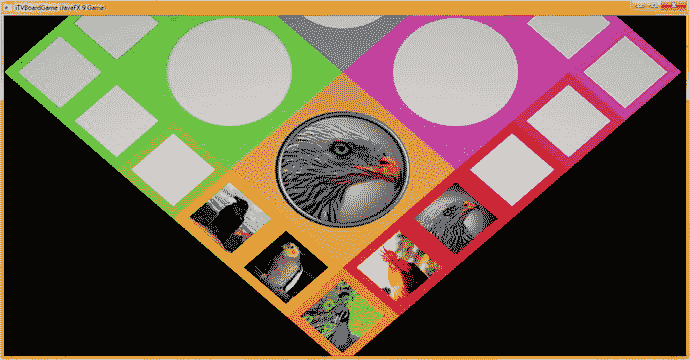

图 20-23.

`cameraAnimIn` 动画对象现在按预期工作，移除了旋转器

在接下来的几章中，我们不仅会继续添加数字音频音效，还会添加用于挑战玩家的问答内容。我们还将添加一个计分引擎，用于追踪玩家识别内容的成功情况。

## 总结

在第二十章中，我们进一步学习了如何完成游戏板方块内容的随机选择实现。我们实现了 `onMouseEvent` 处理代码，当玩家点击游戏板方块并选择内容后，该代码会将象限纹理贴图放置到位。我们还实现了摄像机动画代码，一旦游戏板方块被选中，该代码会改变游戏板的视图，以便显示更大的象限图像。这基本上使我们能够开始编写单个方块（以及选中方块后的象限）的游戏逻辑，即回答关于内容的视觉问题并进行评分，我们将在第 21 章和第 22 章中创建这部分内容。这些代码的大部分将放入每个方块的 `setupQSgameplay()` 方法中，我们在本章中为此奠定了基础。之后，我们将研究创建计分引擎、增强游戏体验的数字音频效果，或许还会添加更多动画对象。这将使游戏玩法更具交互性 3D 效果，并增加更多专业感。

这是编码量较大的章节之一（下一章也是如此）。你构建了 20 个自定义方法，从 `setupQ1S1gameplay()` 到 `setupQ4S5gameplay()`，并在 `OnMouseClick()` 事件处理基础设施中放置了指向这些方法的条件 `if()` 结构。你还在所有 `populateQuadrant()` 方法之间交叉检查了图像资源，并最终将所有代码一起测试，以确保其正常工作。

我们还在 `setupAnimationAssets()` 方法中添加了几个动画对象，以继续增加一些酷炫的“哇”效果，其中包括一个关键动画，它将玩家从“全局”游戏板旋转选择模式带入更“局部”的游戏板内容游戏模式。在本书的后面部分，当答案和评分完成后，我们当然会反转这个动画，并动画回到更倾斜的视图，这是最佳查看游戏板旋转所必需的。

在第 21 章中，你将开发额外的游戏代码基础设施，用于处理玩家点击（选择）游戏方块内容时发生的情况。这意味着要回到开发更多的 2D 游戏元素，用于承载问题和答案内容，这些内容将弹出并覆盖 3D 游戏板的未使用部分。正如你所见，开发一个专业的 Java 9 游戏需要大量的编程工作！


