# 21. 问答环节：完成设置方法与数字音频

现在，玩家可以为每个棋盘方格点击多张图片，以选择要回答的视觉问题，我们可以将这些问题对应的答案添加到它们自己的用户界面中。这将通过使用第二个 `qaLayout` StackPane 对象和四个子 Button 对象来实现，从而将我们的场景图层次结构扩展到四个分支（一个用于 3D，一个用于 2D UI，一个用于 3D UI，以及一个用于 2D 答案内容）。在下一章中，当我们实现计分引擎和游戏右侧的 2D 计分内容 UI 区域时，我们将添加第五个顶级分支用于计分。

在本章中，我们将继续填充 20 个 `setupQSgameplay()` 方法，添加所有与我们在第 20 章中添加的视觉内容（问题）相匹配的基于文本的答案内容。我们还将把 `qaLayout` 分支添加到场景图中，该分支包含一个 StackPane 背景和四个大的 Button UI 元素。玩家将使用这些元素来选择正确答案，从而揭示该方格视觉内容所代表的内容。

这意味着在本章中，你将添加数百行代码。幸运的是，你可以采用一种优化的“一次编写，然后复制、粘贴和修改”的方法，因此不需要输入太多内容！我只需要向你展示如何向一个 `setupQ1S1gameplay()` 方法添加一组答案，然后你就可以自行添加其余视觉问题的答案选项，因此我实际上不需要在本章的代码（文本）和插图中添加数百行 Java 9 代码。但是，我必须将它们添加到你可以下载的源代码中。

一旦我们完成了游戏玩法“答案选择和显示”基础设施的大部分编码工作，并测试了每个象限以确保其正常工作，我们就可以在第 22 章中创建 Java 代码的计分部分。我们还将研究 JavaFX 的 `AudioClip` 类，它允许我们添加音频音效。这将通过使用 JavaFX API（环境）的另一种新媒体组件（数字音频）进一步增强专业 Java 9 游戏体验。

## 完成游戏玩法：添加 qaLayout 分支

本章前半部分的主要任务是通过为游戏添加答案选择的 UI 来完成游戏玩法。我们还将用每个视觉问题的文本（按钮标签）答案来填充 `setupQSgameplay()` 方法。我们将在本章前半部分完成这项工作，然后在后半部分为游戏添加一些音效。我们将从一些自定义方法组织和分层开始，将方法分为：一个用于 3D Node 组件，一个用于游戏启动时看到的 2D UI Node 组件，一个用于选择答案的 2D UI Node 组件（我们将在本章中创建），以及下一章中用于创建计分引擎的 2D UI Node 组件。在稍微重新配置 Java 代码之后，我们将使用一个 StackPane 来容纳四个大的 Button UI 元素，从而为问答面板创建 UI 基础设施。在创建了将 UI 放置到位的代码后，我们将“调整”其设置，使其在我们于第 20 章中创建的摄像机缩放动画对象中最佳地工作，因为该动画会移动摄像机的位置和旋转，这必然会改变 2D 问答 UI 面板在显示器上的视觉渲染方式。

### 添加另一个组织层：createUInodes() 方法

让我们将 `createBoardGameNodes()` 方法拆分为一个用于创建 3D 场景对象（例如 PointLight、ParallelCamera、gameBoard、3D 旋转器 UI 和游戏棋盘象限）的方法，以及第二个 `createUInodes()` 方法，用于保存我们在本书前几章中创建的 2D UI 对象。这将把两到三个语句放入每个方法体中，并在我们创建 `createQAnodes()` 方法来保存将创建和配置问答面板的 Node 对象之前，更好地组织场景图的每个部分。选择的内容应类似于图 21-1 中以中蓝色显示的 34 条 Java 语句。

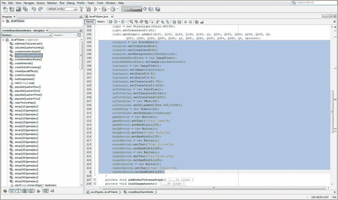

图 21-1.

选择并剪切你的 uiLayout 分支 Node 语句，并将它们粘贴到 createUInodes() 方法体中

右键单击图 21-1 中以蓝色显示的选定内容，然后选择“剪切”选项，从 `createBoardGameNodes()` 方法中移除这些语句。这会将它们放入你的操作系统剪贴板中，以便稍后粘贴到我们即将创建的新 `createUInodes()` 方法中。

在你的 `start()` 方法中，在 `createBoardGameNodes();` 之后添加一行代码，并创建一个对尚不存在的 `createUInodes()` 方法的调用。使用 Alt+Enter 组合键让 NetBeans 为你创建此方法，如图 21-2 中黄色和浅蓝色所示（创建后）。

NetBeans 9 将创建这个新方法和占位符错误代码，我们将选择它（确保只选择错误代码语句，而不是方法体），然后使用“粘贴”将错误代码语句替换为创建我们的 `uiLayout` 场景图 Node 层次结构的 34 条 Java 语句，这些语句当前位于操作系统剪贴板中。我还选择了整个方法体（这必须在引导错误代码被你的剪贴板代码替换之后进行），并将其从类的末尾剪切并粘贴到 `createBoardGameNodes()` 方法体之后。这样可以将 20 个 `setupQSgameplay()` 方法体保留在类的末尾，因为我们将向这些类添加问题（图像）答案，作为本章必须完成的游戏玩法制作工作的一部分。

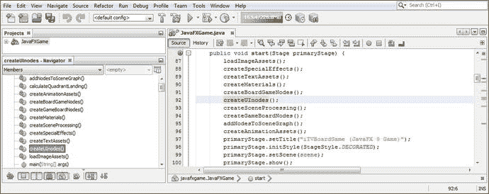

图 21-2.

在 createBoardGameNodes() 方法调用之后创建 createUInodes() 方法调用，并使用 Alt+Enter

这两个新方法如图 21-3 所示，它们只是对先前方法 Java 代码的重新配置。我们只是在创建 `createQAnodes()` 方法之前，在这里进行一些代码组织。

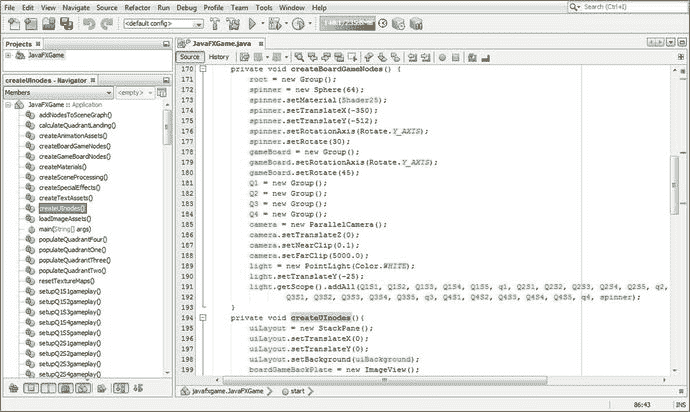

图 21-3.

你现在已将 Node 对象创建重新组织到 createUInodes() 和 createBoardGameNodes() 方法中

在你的 `createUInodes()` 方法之后添加一行代码，并输入 `createQAnodes()` 方法名和一个分号，如图 21-4 中高亮显示的那样。使用 Alt+Enter 组合键，让 NetBeans 编写引导方法体代码。

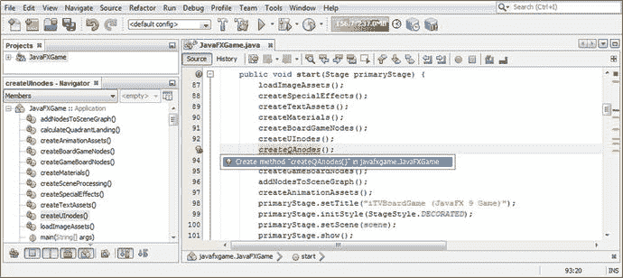

图 21-4.

在 createUInodes() 方法调用之后添加一行代码，添加 createQAnodes() 方法调用，然后按 Alt+Enter


使用剪切粘贴将 `createQAnodes()` 方法移动到 `createAnimationAssets()` 方法调用之后，如图 21-5 所示。将你的 `qaLayout` StackPane 对象添加到类顶部的声明中，使其成为复合语句。然后在 `createQAnodes()` 方法内部实例化 `qaLayout` StackPane，并使用 `setTranslate()` 方法将其配置为位于 X、Y 坐标 -250 和 -425 的位置。同时，设置 `Color.WHITE` 背景色，并使用 `setPrefSize()` 方法调用为 StackPane 设置 400x500 的首选大小，如图 21-5 高亮部分所示。

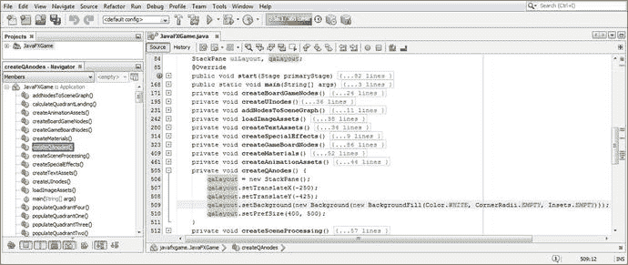

图 21-5.

在 `createQAnodes()` 中声明并实例化 `qaLayout` 对象，并为其配置位置、颜色和大小

完成后的 Java 9 代码应如图 21-5 所示，类似于以下 Java 9 语句：

```
StackPane uiLayout, qaLayout;    // 在 JavaFXGame 类顶部声明
...
qaLayout = new StackPane();      // createQAnodes() 方法体内部的语句
qaLayout.setTranslateX(-250);
qaLayout.setTranslateY(-425);
qaLayout.setBackground(new Background(new BackgroundFill(Color.WHITE, CornerRadii.EMPTY,
Insets.EMPTY) ) );
qaLayout.setPrefSize(400, 500);
```

在渲染 i3D 场景以查看初始问答布局结果（最终将进行微调）之前，我们需要在 `addNodesToSceneGraph()` 方法中使用 `getChildren().addAll()` 方法链，将 `qaLayout` StackPane 添加到 SceneGraph 根对象中。否则，它将不会出现在“运行 ➤ 项目”使用的渲染中。

另请注意，此 `qaLayout` StackPane 需要放置在第二个位置（即现在包含在此新 SceneGraph 层次结构中的四个顶级节点分支中），以便它位于 `gameBoard` 3D 游戏板模型之前，以及 `uiLayout` 用户界面 StackPane 和 3D 转盘游戏板旋转球体 3D UI 元素之后。

此添加操作如下面的 Java 9 代码语句所示，并在图 21-6 中间以浅蓝色和黄色高亮显示：

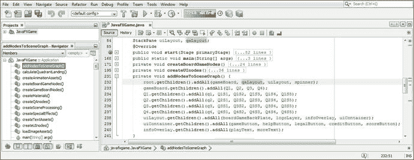

图 21-6.

将 `qaLayout` StackPane 对象添加到 `root.getChildren.addAll()` 方法调用列表的第二个位置

```
root.getChildren().addAll(gameBoard, qaLayout, uiLayout, spinner);
```

让我们使用“运行 ➤ 项目”工作流程，看看我们对游戏左侧问答面板的基本 2D StackPane 配置参数的猜测效果如何。正如你在图 21-7 中所见，Java 代码正在运行，但存在一些问题：StackPane 背景颜色有些半透明，并且由于 Z 维度位置未指定而与游戏板相交。此外，我们是在预缩放相机设置下进行布局的，因此一旦我们解决了这个 Z 轴定位问题，我们可能还需要调整最初设置的部分或全部位置和大小设置（在深入游戏玩法代码进行问答 UI 测试之前）。这将使我们能够快速生成 Java 代码，并在之后调整其外观。

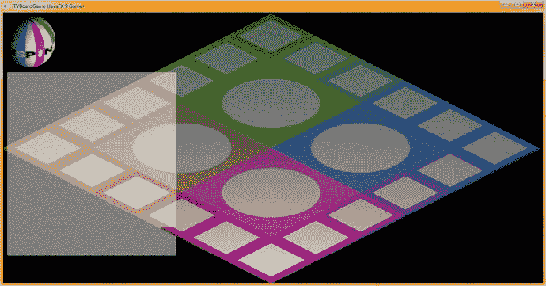

图 21-7.

使用“运行 ➤ 项目”工作流程并测试你的新 Java 代码，看看它是否给出了期望的结果

使用以下 `setTranslateZ()` Java 方法调用，将 `qaLayout` StackPane 对象的 Z 位置向屏幕前方移动 -75 个单位，该方法在图 21-8 中以浅蓝色和黄色高亮显示：

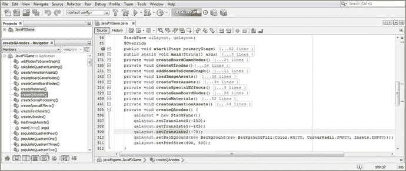

图 21-8.

在 `qaLayout` 对象上添加 `setTranslateZ(-75)` 方法调用，将其向屏幕前方移动 75 个单位

```
qaLayout.setTranslateZ(-75);
```


再次使用“运行 ➤ 项目工作流程”，通过沿 z 轴正向移动来测试这段新的 Java 代码，看看是否能得到期望的结果。如图 21-9 所示，`StackPane` 现在正确地渲染为一个白色方块。

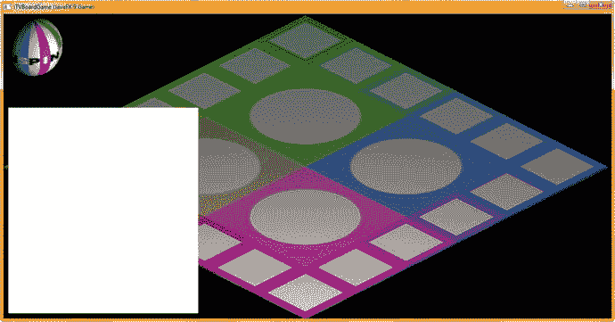

图 21-9.

使用你的“运行 ➤ 项目工作流程”并测试新的 Java 代码，看看是否能得到期望的结果

下一个任务是在类的顶部添加四个答案按钮元素 `a1Button` 到 `a4Button` 的声明，并在 `createQAnodes()` 方法内部实例化并配置这些 `Button` 对象。我使用 `setMaxSize()` 将它们的大小设置为 350 单位宽、100 单位高，并使用 `setTranslateY()` 将它们分别放置在 -180、-60、60 和 180 的位置。为了 UI 设计测试的目的，我使用 `setText()` 方法将它们命名为“答案一”到“答案四”。实现这四个按钮 UI 元素所需的 Java 9 代码如图 21-10 和 21-11 所示，内容如下：

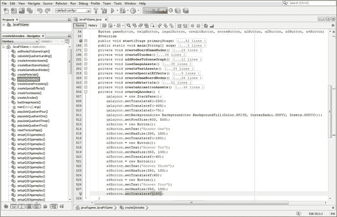

图 21-10.

在 Y 坐标 -180、-60、60、180 处添加四个 350x100 的按钮 UI 对象，分别标记为“答案一”到“答案四”

```
Button gameButton, ..., a1Button, a2Button, a3Button, a4Button;   // 位于 JavaFXGame 类顶部
a1Button = new Button();                                // createQAnodes() 方法中的语句
a1Button.setText("Answer One");
a1Button.setMaxSize(350, 100);
a1Button.setTranslateY(-180);
a2Button = new Button();
a2Button.setText("Answer Two");
a2Button.setMaxSize(350, 100);
a2Button.setTranslateY(-60);
a3Button = new Button();
a3Button.setText("Answer Three");
a3Button.setMaxSize(350, 100);
a3Button.setTranslateY(60);
a4Button = new Button();
a4Button.setText("Answer Four");
a4Button.setMaxSize(350, 100);
a4Button.setTranslateY(180);
...                                               // 记得将按钮节点添加到场景图
qaLayout.getChildren().addAll(a1Button, a2Button, a3Button, a4Button); // addNodesToSceneGraph()
```

请记住，我们必须将这些 `Button` 对象添加到场景图层次结构中：在 Q1 到 Q4 节点对象之后添加 `qaLayout` 节点，并调用 `getChildren().addAll()` 方法链，将四个 `Button` 对象作为子对象添加到场景图层次结构中。该 Java 语句在图 21-11 中高亮显示。

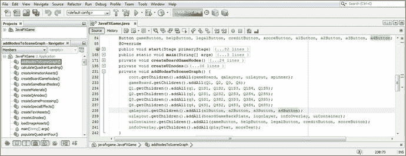

图 21-11.

使用 `qaLayout.getChildren().addAll()` 方法调用，将四个按钮 UI 元素添加到场景图

再次使用“运行 ➤ 项目工作流程”，通过添加答案按钮对象来测试这段新的 Java 代码，看看是否能得到期望的结果。如图 21-12 所示，`StackPane` 正在渲染，我们只需要处理按钮表面使用的字体系列和字体大小，以便文本足够大且对玩家来说清晰可读。

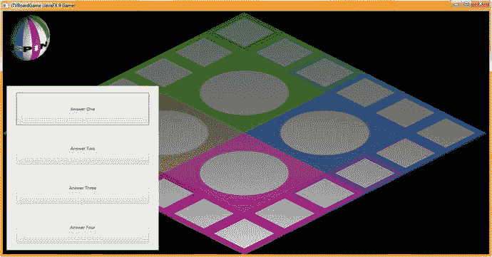

图 21-12.

使用你的“运行 ➤ 项目工作流程”并测试你首次尝试的问答层次结构创建与渲染

在每个 `setText()` 方法调用之后，添加一个最终的 `setFont()` 方法调用来设置字体系列（这里使用美观且可读性强的 Arial Black 字体）以及字体大小。最初，我们能在此按钮尺寸上容纳的最大字号是 30 单位，这已经相当大了。在 `setFont()` 方法调用内部，我们嵌套了一个 `Font.font()` 方法调用，该方法创建此 `Font` 对象，为其加载 Arial Black 字体，并将其大小设置为 30。如下面的 Java 代码所示，并在图 21-13 中高亮显示：

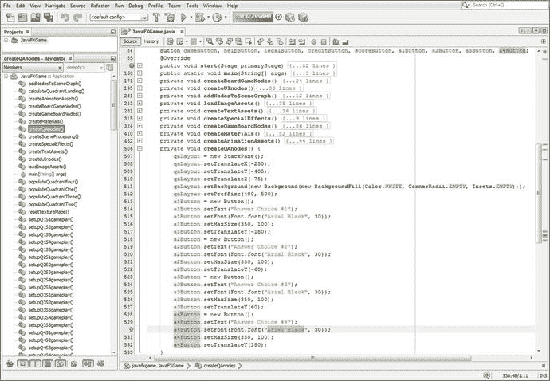

图 21-13.

在每个按钮的 `setText()` 方法调用之后，添加 `setFont(Font.font(“Arial Black”, 30))` 方法调用

```
a1Button = new Button();
a1Button.setText("Answer One");
a1Button.setFont(Font.font("Arial Black", 30));
a1Button.setMaxSize(350, 100);
a1Button.setTranslateY(-180);
a2Button = new Button();
a2Button.setText("Answer Two");
a2Button.setFont(Font.font("Arial Black", 30));
a2Button.setMaxSize(350, 100);
a2Button.setTranslateY(-60);
a3Button = new Button();
a3Button.setText("Answer Three");
a3Button.setFont(Font.font("Arial Black", 30));
a3Button.setMaxSize(350, 100);
a3Button.setTranslateY(60);
a4Button = new Button();
a4Button.setText("Answer Four");
a4Button.setFont(Font.font("Arial Black", 30));
a4Button.setMaxSize(350, 100);
a4Button.setTranslateY(180);
```

在我们编写代码，将新的问答 UI 实际实现到 `JavaFXGame` 代码的其余部分之前，让我们最后一次使用“运行 ➤ 项目工作流程”。我们需要隐藏这个 `StackPane` 及其子按钮对象，直到需要向玩家显示答案选项时再显示。我们还需要在相机动画结束时显示这个 `StackPane`，该动画会倾斜并缩放相机到游戏板，改变相机的角度和距离，这可能会改变 `StackPane` 和按钮对象的渲染方式，因此可能需要“微调”大小和位置设置。在 `start()` 方法和 `createAnimationAssets()` 方法中完成此 `StackPane` 和按钮对象的问答 UI 设计实现后，我们可以返回之前的代码，微调数值以优化其在自上而下的“游戏板问答视图”中的显示效果。

如图 21-14 所示，这些按钮 UI 对象上使用的字体系列和字体大小，与图 21-12 相比，在可读性上产生了巨大差异。我能看到的唯一问题是面板有点太高，边缘以及按钮 UI 元素之间的空间有点过大，我们稍后会在已编写的 Java 代码中更深入地实现此问答 UI 后解决这个问题。请记住，游戏开发是一个迭代过程！

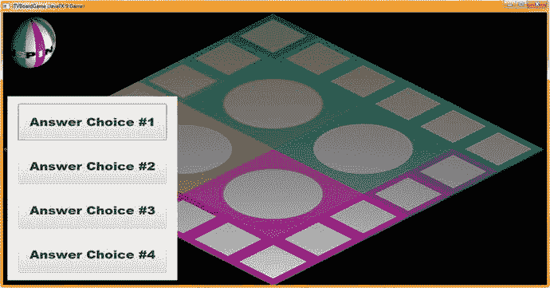

图 21-14.

使用你的“运行 ➤ 项目工作流程”，确保按钮上的文本清晰可读

接下来，让我们休息一下，并在当前代码中实现这个 `StackPane` 和按钮的显示效果。


### 在 JavaFX 游戏中实现新的问答用户界面

在“开始游戏”按钮的 `gameButton.setOnAction()` 事件处理基础设施中，我们首先要做的是在游戏启动时隐藏问答 UI 面板。之后，一旦摄像机放大到游戏棋盘象限，我们就需要显示这个问答 UI 面板，这需要在 `createAnimationAssets()` 方法体的末尾添加一个 `setOnFinished()` 方法调用。要在点击“开始游戏”按钮时隐藏 `qaLayout` 问答面板 `StackPane`，只需复制 `gameButton.setOnAction()` 基础设施内 `handle()` 事件处理器中的第一条 Java 语句，并将其粘贴到自身下方；然后将 `uiLayout` 改为 `qaLayout`，如下所示，并在图 21-15 中高亮显示：

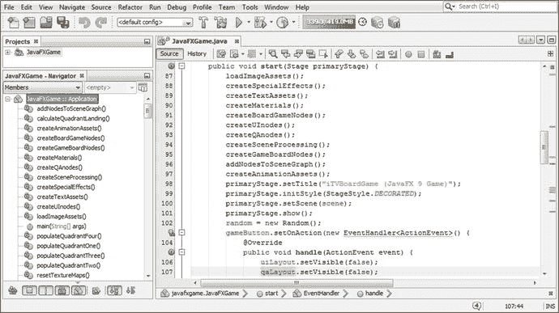

图 21-15.

通过在 `start()` 方法中使用 `qaLayout.setVisible(false)` 在游戏启动时隐藏问答 UI 面板

```
gameButton.setOnAction(new EventHandler() {  // 使用非 Lambda 表达式格式
@Override
public void handle(ActionEvent event) {
uiLayout.setVisible(false);
qaLayout.setVisible(false);
camera.setTranslateZ(500);
camera.setTranslateY(-300);
camera.setTranslateX(-260);
camera.setRotationAxis(Rotate.X_AXIS);
camera.setRotate(-30);
spinnerAnim.play();
}
});
```

在首次隐藏问答 UI 面板（直到需要时再显示）之后，下一步要做的是在 3D 摄像机旋转并移动到游戏棋盘后立即显示它，这发生在玩家选择了他们想要玩的游戏棋盘方格之后。这里的原理是，由于新的摄像机焦距（单位重新定位）和摄像机角度（从 30 度旋转到 60 度），新的问答面板视觉特性可能发生了变化。换句话说，不同的渲染参数可能改变了 `StackPane`、`Button` 甚至字体的部分（或全部）特性。

事实上，毫不意外，这种情况确实发生了，因此在我们实现新的 `cameraAnimIn.setOnFinished()` 事件处理器之后，我们需要回到 `createQAnodes()` 方法体中，“微调”问答 UI 面板的参数，使其更贴近“问题答案选择”游戏视图的左下角。同时，我们还将收紧答案 `Button` UI 元素周围的间距，并增大字体大小！

在 `cameraAnimIn` `ParallelTransition` 对象实例化之后，添加对 `cameraAnimIn` 对象的 `setOnFinished()` 方法调用，并在事件处理基础设施中放置一条 `qaLayout.setVisible(true);` 语句，这样在玩家点击他们认为自己知道答案的游戏棋盘方格后，摄像机放大到随机选择的游戏棋盘象限时，你的问答 UI 面板就能显示出来。

这个新的 Java 代码结构如下所示，并在图 21-16 中以蓝色和黄色高亮显示：

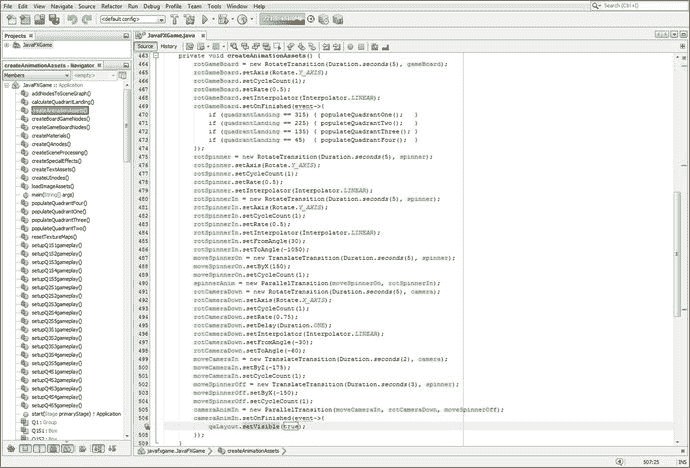

图 21-16.

添加 `cameraAnimIn.setOnFinished()` 方法调用，并将 `qaLayout.setVisible(true)` 添加到事件处理器中

```
private void createAnimationAssets() {
...
cameraAnimIn = new ParallelTransition(moveCameraIn, rotCameraDown, moveSpinnerOff);
cameraAnimIn.setOnFinished(event->{
qaLayout.setVisible(true);
});
}
```

如图 21-17 所示，当你使用“运行 ➤ 项目”来测试刚刚添加的 `setOnFinished()` 代码时，你会看到改变摄像机视图和位置已经改变了你的问答面板布局。

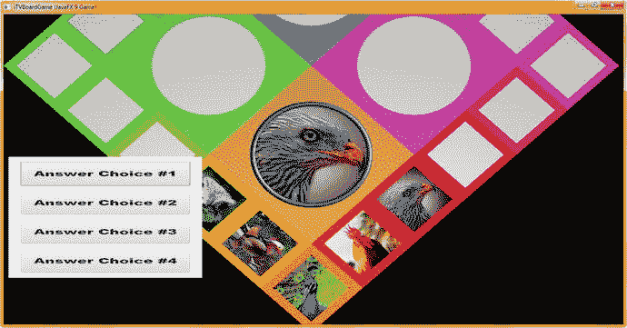

图 21-17.

使用“运行 ➤ 项目”查看摄像机是否改变了问答面板布局

接下来，让我们微调 `createQAnodes()` 方法体中的 `StackPane` 和 `Button` UI 对象配置，使问答 UI 面板外观位于游戏视图的最左下角，尽可能远离游戏棋盘方格，并且所有 `Button` 对象仍然相对较大、间距均匀，并尽可能使用大号（且易读）的字体系列和字体大小。

### 微调问答面板：优化 createQAnodes() 设置

让我们开始调整 `createQAnodes()` 方法体中保存的对象配置设置的参数，从 `StackPane` 开始。我们将使用 `setTranslateY()` 方法调用将其移动 20 个单位，从 -405 移动到 -385；使用 `setPrefSize()` 方法调用将宽度减小 40 个单位，从 400 减小到 360；并使用 `setPrefSize()` 方法调用将高度增加 154 个单位，从 500 增加到 654。我编辑了 `setText()` 方法调用，为 `Button` UI 元素添加了更长的答案占位符，使用“答案选项 1”（到 4）而不是“答案一”（到四），以便更好地用文本填充按钮。我使用 `setFont()` 方法调用将字体大小再增加 10%，达到 33 个单位，以便查看按钮表面上的文本可以有多大。我使用 `setMaxSize()` 方法调用将按钮高度增加 40%，从 100 个单位增加到 140 个单位。此按钮高度更改还要求我使用 `setTranslateY()` 方法调用更改 `StackPane` 上按钮间距的 Y 轴间隔，从 -160、-60、60 和 160 更改为 -240、-80、80 和 240。

新的（微调后的）Java 9 代码显示在下面的新 `createQAnodes()` 方法中，以及图 21-18 中：

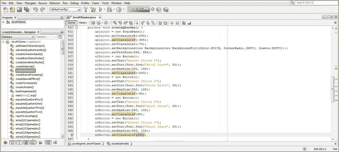

图 21-18.

重新校准 createQAnodes() 设置以调整问答面板的位置、大小、按钮间距和字体

```
private void createQAnodes()  {
qaLayout = new StackPane();
qaLayout.setTranslateX(-250);
qaLayout.setTranslateY(-385);
qaLayout.setBackground(new Background(new BackgroundFill(Color.WHITE,
CornerRadii.EMPTY,
Insets.EMPTY) ) );
qaLayout.setPrefSize(360, 654);
a1Button = new Button();
a1Button.setText("答案选项 1");
a1Button.setFont(Font.font("Arial Black", 33));
a1Button.setMaxSize(350, 140);
a1Button.setTranslateY(-240);
a2Button = new Button();
a2Button.setText("答案选项 2");
a2Button.setFont(Font.font("Arial Black", 33));
a2Button.setMaxSize(350, 140);
a2Button.setTranslateY(-80);
a3Button = new Button();
a3Button.setText("答案选项 3");
a3Button.setFont(Font.font("Arial Black", 33));
a3Button.setMaxSize(350, 140);
a3Button.setTranslateY(80);
a4Button = new Button();
a4Button.setText("答案选项 4");
a4Button.setFont(Font.font("Arial Black", 33));
a4Button.setMaxSize(350, 140);
a4Button.setTranslateY(240);
}
```

如图 21-19 所示，问答 UI 面板现在位于游戏棋盘视图的左下角。按钮很大且彼此靠近，带有漂亮、大号且易读的文本，并且问题答案用户界面远离每个数字图像资源（游戏的视觉组件），现在看起来相当专业。

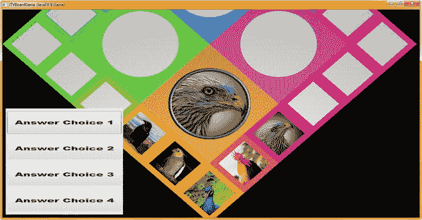

图 21-19.

使用“运行 ➤ 项目”工作流程查看问答面板布局是否已恢复为其大号易读状态


### 向 setupQSgameplay() 方法中添加答案按钮内容

现在，我们只需在每个 `setupQSgameplay()` 方法体内部的 `if(pickSn == n)` 条件 `if()` 求值语句中添加四条相对简单的 Java 语句，即可为每个游戏棋盘方格添加问答 UI 面板的答案。为了用真实的答案数据测试我们的用户界面，我们只需添加第一个 `setupQ1S1gameplay()` 的 `if (pickS1 == 0)` 部分，将四个 `setText()` 方法调用添加到该代码段中已有的 `diffuse` 和 `Shader21` 对象配置中，以控制你的图像。

Java 代码（如图 21-20 末尾所示）应如下所示：

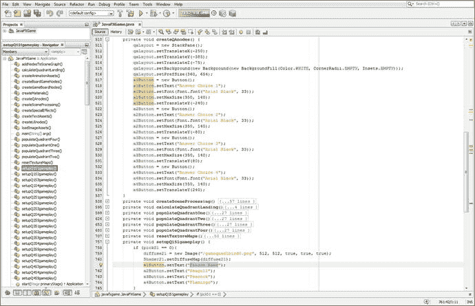

图 21-20.

使用 `setText()` 方法调用添加四个 a1Button 到 a4Button 对象的答案（其中一个是正确的）

```
private void setupQ1S1gameplay() {
if (pickS1 == 0) {
diffuse21 = new Image("gamequad1bird0.png", 512, 512, true, true, true);
Shader21.setDiffuseMap(diffuse21);
a1Button.setText("猎隼");
a2Button.setText("海鸥");
a3Button.setText("孔雀");
a4Button.setText("火烈鸟");
}
}
```

使用 **运行 ➤ 项目** 工作流程来测试这段添加了真实答案按钮对象的代码，如图 21-21 所示。

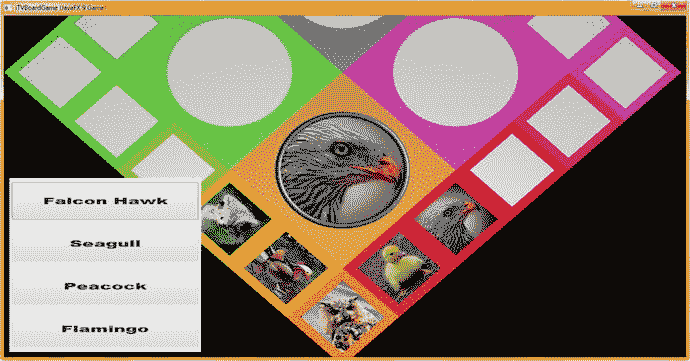

图 21-21.

使用 **运行 ➤ 项目** 工作流程来查看测试方块 1 时答案按钮数据的显示效果

为了练习，现在请在 `setupQSgameplay()` 方法中创建其他 59 组问答答案。接下来，让我们添加一个 `AudioClip` 对象（类），以便为我们的游戏棋盘旋转动画附加音效。

## 游戏数字音频：使用 AudioClip 类

在本章中，我们还将了解如何向游戏中添加数字音频资源。这将需要使用 `javafx.media` 模块，这会使你的发行包变大，因为需要将此模块添加到你的发行 JAR 中，并且它同时包含 `MediaPlayer`（用于音频和视频）和 `AudioClip` 等类。`AudioClip` 类用于较短的音频“片段”，技术上称为**样本**。如果你想播放较长格式的数字音频（例如歌曲）或数字视频，则应改用 `MediaPlayer` 类。游戏通常使用较短格式的音频，因此我们将在此介绍 `AudioClip` 类；它本质上是一个数字音频音序器，对于游戏开发者以及声音设计师和歌曲作者来说，这是一个非常强大的工具。

`public final AudioClip` 类扩展了 `java.lang.Object`，这意味着它是从头开始编码的数字音频音序器。它位于 `javafx.media` 模块的 `javafx.scene.media` 包中，因此，该类的 Java 类层次结构如下所示：

```
java.lang.Object
> javafx.scene.media.AudioClip
```

`AudioClip` 对象可用于包含将以最小延迟播放的短段数字音频。剪辑从网络或 JAR 加载的方式与 `Media` 对象类似，但行为不同。例如，由 `MediaPlayer` 对象播放的 `Media` 对象不能“自行播放”，而你的 `AudioClip` 对象可以。`AudioClip` 可以立即重用，因此它们具有零延迟且使用更少的内存，这对游戏来说很重要。

`AudioClip` 对象的播放行为被 Oracle 称为“即发即弃”。一旦调用了该类的某个 `play()` 方法，唯一可操作的控制就是 `stop()` 方法。我们将使用这两种方法。

`AudioClip` 对象还可以同时多次播放！要使用 `MediaPlayer` 中的 `Media` 对象完成同样的任务，必须为并行播放的每个声音创建新的 `MediaPlayer` 对象。这对于游戏场景来说并非最佳选择，这就是我们在此不介绍 `Media` 和 `MediaPlayer` 对象的原因。

`Media` 对象和 `MediaPlayer` 更适合长格式音频，例如歌曲或有声读物。这主要是因为 `AudioClip` 在内存中存储整个数字音频资产的原始未压缩（PCM）音频数据，这对于长音频剪辑来说通常非常大。`MediaPlayer` 在内存中只会“预卷”足够解压缩的音频数据以播放很短的时间；因此，对于较长的剪辑，`MediaPlayer` 的内存效率要高得多，特别是如果它们已经过压缩，例如使用 MP3（数字音频）或 MPEG4（数字视频）文件格式，或者 OGG Vorbis（数字音频）、FLAC（数字音频）或 WebM（ON2 VP6、VP8 或 VP9）数字视频格式。

`AudioClip` 类有六个影响声音平衡、循环、位置、优先级、速率和音量的数字音频属性。其中包括控制 `AudioClip` 对象（相对）左右音量级别的 `balance` DoubleProperty，以及控制 `AudioClip` 对象相对“中心”位置的 `pan` DoubleProperty。`rate` DoubleProperty 控制播放 `AudioClip` 的相对速率（速度），`volume` DoubleProperty 控制播放 `AudioClip` 的相对音量级别。`cycleCount` IntegerProperty 控制在调用 `play()` 方法时 `AudioClip` 的播放次数。`priority` IntegerProperty 控制 `AudioClip` 对象相对于其他 `AudioClip` 对象的相对优先级。

还有一个静态 `int INDEFINITE` 数据字段，当 `cycleCount` 设置为此值时，`AudioClip` 将连续循环播放，直到使用 `stop()` 方法调用停止它，我们很快将学习这一点。


`AudioClip` 只有一个构造方法，它接受一个源 URL，并使用以下格式：

```
AudioClip(String sourceURL)
```

接下来，让我们看看 `AudioClip` 类允许我们在其对象上调用的方法。`DoubleProperty balanceProperty()` 方法调用允许你获取 `AudioClip` 对象的左右声道相对音量级别。`IntegerProperty cycleCountProperty()` 方法调用允许你获取调用 `play()` 方法时 `AudioClip` 对象将播放的次数。`DoubleProperty panProperty()` 方法调用允许你获取 `AudioClip` 对象的（相对）声像中心位置。`IntegerProperty priorityProperty()` 方法调用允许你获取该 `AudioClip` 对象相对于其他 `AudioClip` 对象的（相对）优先级设置。`DoubleProperty rateProperty()` 方法调用允许你获取该 `AudioClip` 播放的（相对）速度。`DoubleProperty volumeProperty()` 方法调用允许你获取该 `AudioClip` 播放的（相对）音量级别。

除了这六个 `AudioClip` 属性方法之外，还有七个 `get()` 方法，允许你获取 `AudioClip` 属性的值，包括其数字音频源文件。`double getBalance()` 方法调用用于获取 `AudioClip` 的默认平衡级别。`int getCycleCount()` 方法调用用于获取 `AudioClip` 对象的默认循环次数。`double getPan()` 方法调用用于获取 `AudioClip` 对象的默认声像值。`int getPriority()` 方法调用用于获取 `AudioClip` 对象的默认播放优先级值。`double getRate()` 方法调用用于获取 `AudioClip` 对象的默认播放速率。`String getSource()` 方法调用用于获取创建 `AudioClip` 对象时使用的源 URL。`double getVolume()` 方法调用用于获取 `AudioClip` 对象的默认音量级别。

还有七个 `set()` 方法，允许你设置 `AudioClip` 属性的值，包括数字音频源文件。`void setBalance(double balance)` 方法调用用于设置 `AudioClip` 对象的默认平衡级别。`void setCycleCount(int count)` 方法调用用于设置 `AudioClip` 对象的默认循环次数。`void setPan(double pan)` 方法调用用于设置 `AudioClip` 对象的默认声像值。

`void setPriority(int priority)` 方法调用用于设置默认播放优先级。`void setRate(double rate)` 方法调用用于设置默认播放速率。`void setVolume(double value)` 方法调用用于设置默认音量级别。此外，还有五个方法可用于在 `AudioClip` 对象播放时对其进行控制。

`boolean isPlaying()` 方法调用用于指示 `AudioClip` 当前是否正在播放。`void play()` 方法调用用于使用其默认参数播放 `AudioClip` 对象。`void play(double volume)` 方法调用用于使用除音量之外的所有默认参数播放 `AudioClip`。`void play(double volume, double balance, double rate, double pan, int priority)` 方法调用用于使用给定的音量、平衡、速率、声像和优先级参数播放 `AudioClip`。最后，`void stop()` 方法调用用于立即停止 `AudioClip` 对象的所有播放。现在，我们可以在游戏中将数字音频资源实现为 `AudioClip` 对象，为诸如游戏棋盘旋转和摄像机缩放等事件提供音频音效。

### 实现 AudioClip：添加数字音频资源音效

我们需要做的第一件事是在 `JavaFXGame` 类的顶部声明两个名为 `spinnerAudio` 和 `cameraAudio` 的 `AudioClip` 对象，如下面的 Java 9 代码所示，并在图 21-22 中高亮显示：

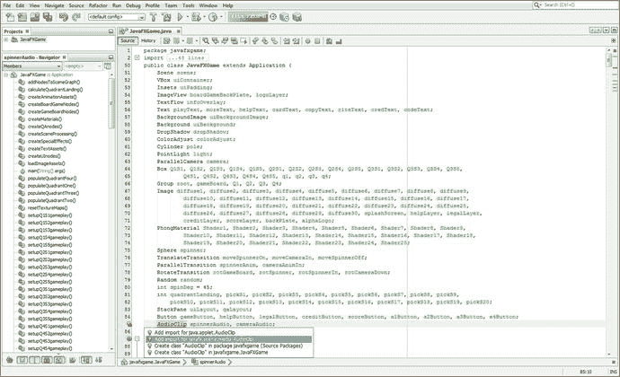

图 21-22.

在类顶部声明 `spinnerAudio` 和 `cameraAudio` 这两个 `AudioClip`；使用 Alt+Enter 添加导入

```
AudioClip spinnerAudio, cameraAudio;
```

接下来，在 `loadImageAssets()` 方法调用下方创建一个 `loadAudioAssets()` 方法调用，并再次使用 Alt+Enter 快捷键，如图 21-23 所示，让 NetBeans 为你创建空的引导方法体。

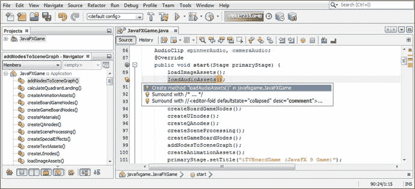

图 21-23.

在 `loadImageAssets()` 之后创建一个 `loadAudioAssets()` 方法调用；使用 Alt+Enter 让 NetBeans 为其编写代码

将这个新方法体在类方法结构中上移，使其靠近你的 `loadImageAssets()` 方法，然后开始添加 `spinnerAudio = new AudioClip();` 实例化语句，如图 21-24 所示（正在构建中）。随着我们构建语句内部的 `(String sourceURL)` 部分，这个实例化将变得更加复杂。这看起来像下面的代码，该代码正在 NetBeans 中构建，并在图 21-24 中高亮显示：

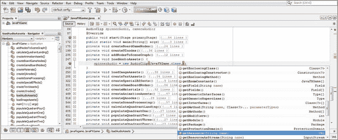

图 21-24.

为 `spinnerAudio` 添加 `AudioClip` 实例化语句中的 `getResource(String)` 内部部分

```
spinnerAudio = new AudioClip( JavaFXGame.class.getResource(String sourceURL) );
```

让我们花几页篇幅，找一个专业级的 CD 和高清数字音频样本网站，该网站提供可免费用于商业用途的 WAVE 文件（44.1 KHz、16 位和 24 位分辨率的未压缩 PCM 数字音频）。

### 寻找可免费用于商业用途的数字音频：99Sounds.org

在引用 `spinnerAudio` 数字音频资源的内部文件名之前，我们需要先创建接下来要使用的数字音频资源，所以让我们先做这件事。幸运的是，我找到了一个名为 99Sounds 的数字音频样本库网站，该网站拥有数 GB 的电影级音频样本，只要不将它们作为数字音频样本在其他库中重新分发，就可以免费用于商业项目。这些样本使用标准的 44.1 Hz、CD 质量音频采样率，分辨率为 16 位或 24 位，采用未压缩的 PCM（WAVE）格式。如果你想了解更多关于本章本节所涉及的数字音频编辑软件和工作流程，请查阅 Apress.com 上的《数字音频编辑基础》。我从 [`www.99SOUNDS.org`](http://www.99sounds.org) 下载了所有样本库，仅仅是因为我为客户以及自己的公司制作了大量游戏、网站、电子书、iTV 节目、智能手表以及类似的数字产品。图 21-25 显示了文件资源管理器应用程序列表，其中包含我下载的数十个文件夹（现在位于我的硬盘驱动器上的 `C:\Audio` 文件夹中）。

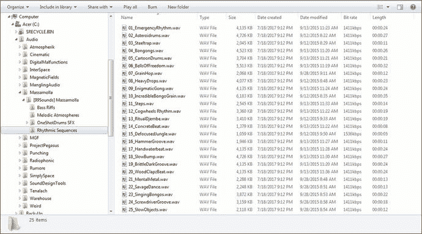

图 21-25.

前往 [`www.99sounds.org`](http://www.99sounds.org) 下载免费的数字音频样本，用于你所有的专业 Java 9 游戏项目

我将使用 Massamolla 合集（位于 Rhythmic Sequence 文件夹中）中的第 24 个样本，如图 21-25 所示。这个样本名为 ScrewdriverGroove，采用 32 位 44.1 Hz WAVE 格式；它使用 1411 Kbps 的压缩率，时长 18 秒，我们将循环其中大约 7 秒以减少内存数据占用。我们还将把它转换为单声道样本以节省内存，并创建该文件的多个版本。


### 数据足迹优化：使用 Audacity 创建游戏音频

请注意，图 21-25 中的文件大小为 3,159 KB，这对于旋转音频来说占用的内存太大了！我们将把这个文件大小削减近 3MB，用于低质量音频组件，并创建一个大小略超半兆字节的高质量音频资源。因此，对于所有游戏开发者来说，这应该是一个有趣的章节！启动 Audacity 2.1.3（或更高版本），我假设你已经下载并安装好了。使用 **文件 ➤ 打开** 菜单序列，打开图 21-25 中所示的 ScrewdriverGroove 示例；在其重复声音中找到第一个大的间隙，如图 21-26 中绿线所示，大约在文件的 7.6 秒处。

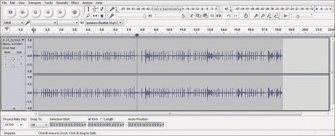

图 21-26.

打开 Audacity 2，找到 7.6 秒处的一个点，该点将无缝循环，用于游戏棋盘旋转音频

选择两个立体声音轨中超出 7.6 秒的音频样本部分，如图 21-27 所示；使用 **编辑 ➤ 删除** 菜单序列，从样本中移除这段音频数据。

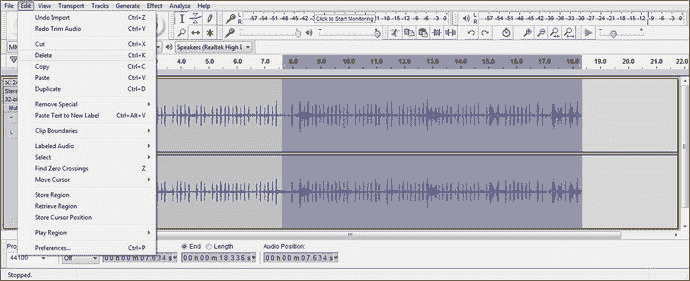

图 21-27.

选择 7.6 秒到 18.3 秒之间的部分，并使用 **编辑 ➤ 删除** 菜单序列将其移除

这立即移除了大约五分之三（18.3 秒中的 7.6 秒大约是五分之二）的数字音频数据。我们下一步的“操作”是将两个立体声音轨合并为一个单声道音轨，再次将数据量减少 100%。选择两个立体声音轨，如图 21-28 所示，然后使用 **音轨 ➤ 立体声转单声道** 菜单序列，将这两个（立体声）数字音轨合并为仅一个单声道数字音轨。

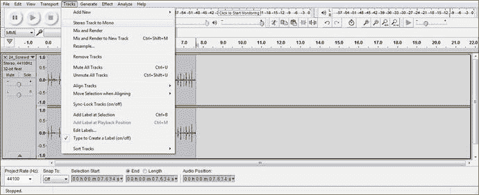

图 21-28.

在两个音轨上选择整个样本，并使用 **音轨 ➤ 立体声转单声道** 来合并样本

接下来我们需要减半的是样本分辨率，将 32 位（浮点）音频样本降低到通常称为“CD 质量”音频的 16 位 PCM 分辨率。这可以通过点击波形音频最左侧的“单声道，44100Hz 32 位浮点”指示器上的下拉箭头来完成，如图 21-29 所示。

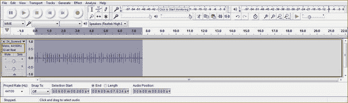

图 21-29.

一个 7 秒的单声道 44.1Hz 32 位浮点样本，其数据量现在比原始样本减少了超过 400%

点击这个下拉箭头，进入主菜单底部的“格式”子菜单，可以在图 21-30 的左下角看到。这会显示选中的 32 位浮点格式，并允许你选择 16 位 PCM（CD）或 24 位 PCM（HD）音频分辨率格式。由于我们正在尝试为游戏音频资源节省系统内存，我们将选择 16 位、44.1 KHz 的格式。

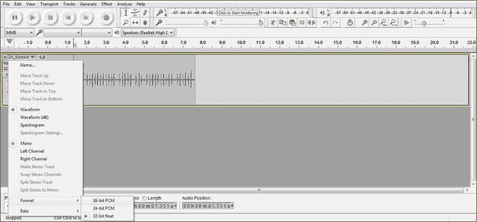

图 21-30.

使用样本下拉箭头，将样本格式再降低 100%，从 32 位分辨率降至 16 位分辨率

现在，我们将通过将采样率从 44.1 KHz 降低到 22.05 Hz（恰好一半）来创建一个中等和低质量的数字音频资源。将数据减少 100%（一半）或 200%（四分之一）会得到完美的结果，因为没有余数值（偶数除法）。为此，使用音轨编辑窗格底部的“项目速率 (Hz)”下拉选择器，选择 22050 而不是 44100，如图 21-31 左侧红色圆圈所示。你还可以看到分辨率已降低到 16 位。使用 Audacity 用户界面左上角的“播放”按钮（也用红色圆圈标出）预览数字音频，看看是否能听出音频质量的任何差异。作为音效，它听起来仍然很棒。

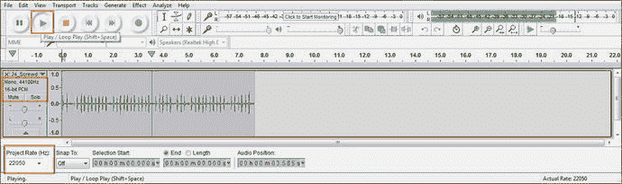

图 21-31.

使用“项目速率”下拉菜单，将样本格式再降低 100%，从 44.1 KHz 降至 22.05 KHz

最后，让我们将这个音效样本再降低 100%，将其采样率从 44.1 KHz 降至 11.025 KHz（始终从尽可能高的采样率采样到目标采样率，以便为算法提供最高质量的数据来施展其魔力）。如图 21-32 所示，我们让 Audacity 使用 44.1 KHz、16 位音频样本数据（参见左侧中间的设置），并将“项目速率 (Hz)”下拉菜单设置为 11.025 KHz。你可以再次使用“播放”按钮预览音频质量，如果这样做，你会发现质量水平有所下降，但对于重复的游戏棋盘旋转动画音频反馈音效来说，质量水平仍然相当可用。

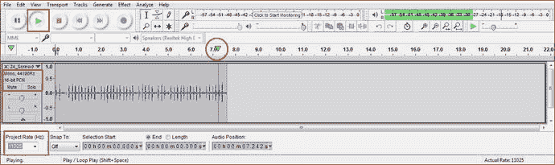

图 21-32.

使用“项目速率”下拉菜单，将样本格式再降低 100%，从 44.1 KHz 降至 11.025 KHz

为了节省篇幅，我将 Audacity 的三个 **文件 ➤ 另存为** 对话框合并到了图 21-33 中；在本章中，我们有很多内容需要在 NetBeans 和 Audacity 中查看。第一个面板（编号 1）显示你的 44.1 KHz 16 位文件被保存为 `NetBeansProjects/JavaFXGame/src/` 文件夹中的 spinner.wav。图的第二部分显示 22.05 KHz 16 位版本被保存为 spinner22.wav，第三部分显示 11.025 KHz 16 位版本被保存为 spinner11.wav。这三个音频资源的文件大小分别约为 658KB、329KB 和 165KB。由于这些是 16 位 PCM .wav 文件，用于存储文件的内存量恰好也是用于在游戏中部署该文件的系统内存量。

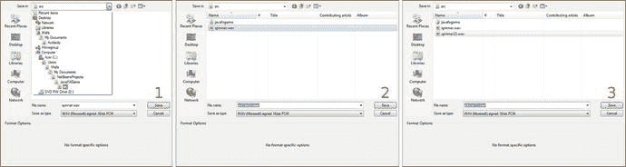

图 21-33.

使用 Audacity 的 **文件 ➤ 保存** 功能，将 44、22 和 11 Hz 的 16 位音频版本导出到 /JavaFXGame/src 目录

现在，我们可以继续编写 AudioClip 实例化语句，并在游戏逻辑中使用新的音频样本了！

### 使用 toExternalForm() 将 URI 引用加载为字符串对象

现在，我们可以在 getResource() 方法中添加这个 spinner.wav 文件名，然后将该方法调用链接到 toExternalForm() 方法调用，该方法将 spinner.wav 音频资源转换为 AudioClip 构造方法所需的外部（URI 字符串）形式。请确保在你的 spinner.wav 前添加根目录 (/) 正斜杠，以便它能在根源 (/src) 文件夹中被找到。此语句的 Java 代码如图 21-34 所示，正在构建中：

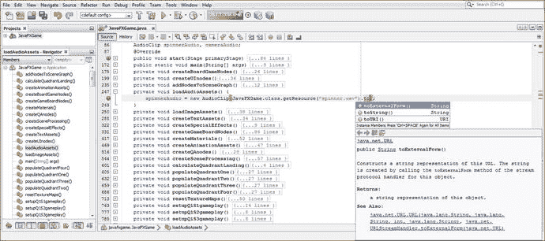

图 21-34.

返回实例化，添加 spinner.wav 音频文件和 toExternalForm() 方法链

```
spinnerAudio = new AudioClip( JavaFXGame.class.getResource("\spinner.wav").toExternalForm() );
```

由于游戏棋盘旋转时间超过七秒，你还需要添加一个 setCycleCount() 方法调用，并使用以下 Java 9 代码将其设置为 INDEFINITE（无限循环）数据值，如图 21-35 所示：

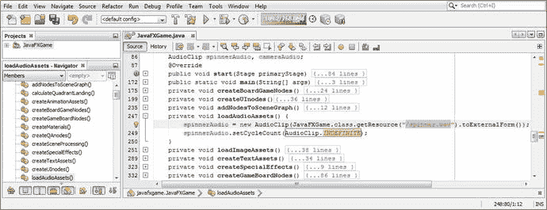

图 21-35.

为 spinner.wav 添加斜杠 (/) 或根目录。然后添加 spinnerAudio.setCycleCount(AudioClip.INDEFINITE) 方法调用

```
spinnerAudio.setCycleCount(AudioClip.INDEFINITE);
```

现在你的旋转 AudioClip 资源已经设置好了，接下来我们需要在鼠标点击旋转器 UI 时触发它。


### 在 createSceneProcessing() 中触发旋转音频播放

要播放 AudioClip 对象，我们需要在 `if (picked == spinner)` 结构的事件处理中插入 `spinnerAudio.play();` 方法调用，位置靠近末尾，就在 calculateQuadrantLanding() 方法调用之前。

此添加操作的 Java 9 代码如图 21-36 底部高亮所示。

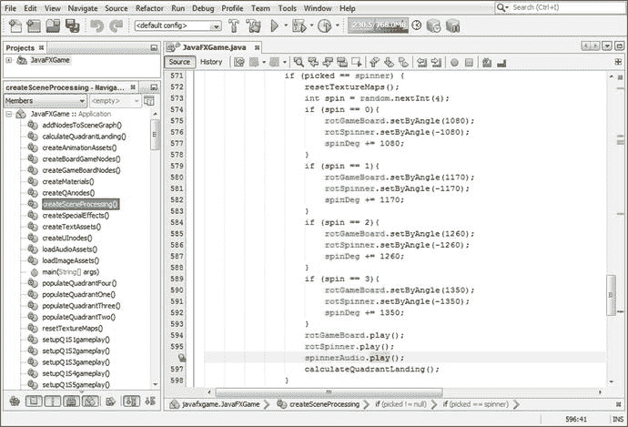

图 21-36.

在 createSceneProcessing() 方法的 if(picked == spinner) 结构中触发 spinnerAudio.play()

要停止 spinnerAudio AudioClip 对象的播放，你需要在 setOnFinished() 事件处理代码结构中调用 spinnerAudio 的 stop() 方法，该结构位于 createAnimationAssets() 方法体内的 rotGameBoard Animation 对象中。

这样，当 Animation 对象完成动画后，spinnerAudio.stop() 方法被调用，游戏板停止旋转时，旋转音频也随之停止。

我将这段代码放在了事件处理结构的末尾，使用了以下代码，如图 21-37 末尾浅蓝色和黄色高亮所示：

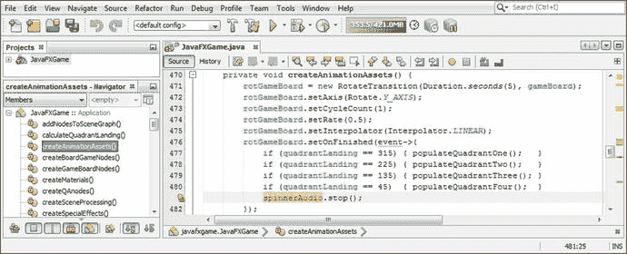

图 21-37.

在 createAnimationAssets() 方法的 rotGameBoard.setOnFinished() 事件处理器中停止 spinnerAudio 对象

```
rotGameBoard.setOnFinished(event-> {
if (quadrantLanding == 315) { populateQuadrantOne();   }
if (quadrantLanding == 225) { populateQuadrantTwo();   }
if (quadrantLanding == 135) { populateQuadrantThree(); }
if (quadrantLanding == 45)  { populateQuadrantFour();  }
spinnerAudio.stop();
});
```

接下来，让我们创建摄像机动画音频，这次让音频长度与动画长度匹配。

### 摄像机动画音频：匹配音频长度与动画

对于摄像机对象的 Animation AudioClip，我们将把五秒的动画与五秒的音频匹配，这样就不需要循环播放音频，因此也无需使用 stop() 方法调用，因为 AudioClip 会在播放五到六秒后自行停止。了解游戏玩法设计中这两种主要的数字音频方法很重要：按需启动和停止的循环音频，以及定时音频。如图 21-38 所示，我从 Project Pegasus Arpeggios 合集中选择了 Rhythmic Glacier 样本，并对其进行了轻微修剪，使其长度约为五秒半。如你所见，该样本为 48000 Hz，因此我还创建了 16000 Hz（1/3）和 8000 Hz（1/6）的中等和低质量 16 位版本，大小分别为 526KB、176KB 和 88KB。这使得 CD 质量的声音约为 1MB，而高质量声音约为半兆字节。

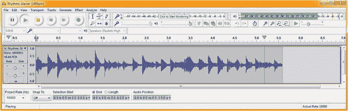

图 21-38.

将近六秒的 Rhythmic Glacier 音频与近六秒的摄像机缩放动画匹配

现在，我们可以用这个 camera.wav 资源加载第二个 cameraAudio AudioClip 对象，并在代码中使用它。

既然你已经在类顶部声明了 cameraAudio AudioClip，下一步就是在 loadAudioAssets() 方法中，在 spinnerAudio AudioClip 对象及其实例化和配置语句之后，对其进行实例化。完成此操作后，我们可以再次将 play() 触发器添加到 createSceneProcessing() 代码中。

你不需要在 createAnimationAssets() 的 onFinished() 事件处理器中添加 stop() 方法调用，因为声音只播放一次，并且大约在 Animation 对象完成移动和旋转摄像机对象的同时结束。如果你想更紧密地同步它们，可以使用我们为旋转音频资源采用的方法：循环播放一个较短的 AudioClip，然后在 setOnFinished() 事件处理器中调用 stop() 方法。

第二次实例化的 Java 代码与第一次相同（除了音频资源的文件名），如下所示，在图 21-39 中间以浅蓝色和黄色高亮显示：

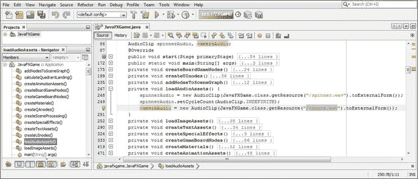

图 21-39.

向 loadAudioAssets() 方法添加 cameraAudio AudioClip，并引用新的 camera.wav 资源

```
cameraAudio = new AudioClip( JavaFXGame.class.getResource("/camera.wav").toExternalForm() );
```

如果你想添加更多数字音频音效，可以简单地模仿其中一个 AudioClip 对象，例如，为 i3D 旋转 UI 元素进入屏幕时添加音频，为与问答环节相关的操作添加音频，甚至为“开始游戏”按钮等待玩家点击时添加循环音频。因此，随着你继续开发和完善这个专业 Java 9 游戏设计，你可以扩展这个 loadAudioAssets() 方法。

当玩家点击游戏板方块以选择其内容用于问答环节时，摄像机动画和音频会在 createSceneProcessing() 方法的不同部分被触发。因此，play() 方法不是在 `if(picked == spinner)` 中被调用，而是在 `if(picked == Q1S1)` 或其他 19 个游戏板方块条件 if() 语句中被调用。Java 代码如图 21-40 所示，应如下所示：

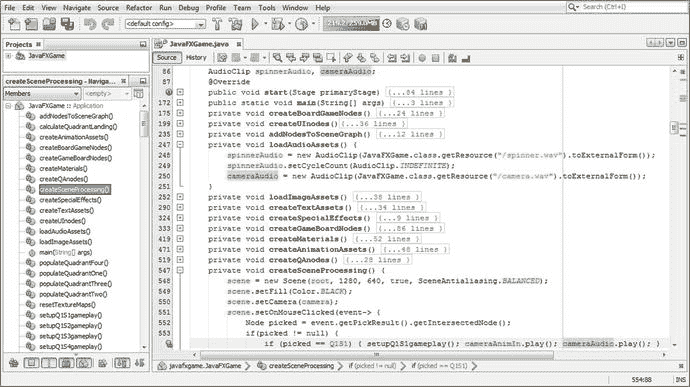

图 21-40.

要触发 cameraAudio AudioClip，请在 OnMouseClicked 事件处理器中添加 cameraAudio.play() 方法调用

```
if (picked == Q1S1) {
setupQ1S1gameplay();
cameraAnimIn.play();
cameraAudio.play();
}
```

为了练习本章所学内容，请创建其他 19 个 setupQSgameplay() 方法调用，包含每个主题的问题以及触发摄像机放大音频的 cameraAudio.play() 调用。

## 总结

在第二十一章中，我们学习了如何为每个游戏板方块创建答案选项。我们还创建了一个 StackPane 和 Button 对象，供玩家记录答案。你需要创建其他 Java 代码来回答每个游戏板方块的随机选项，并输入这些代码以完成游戏玩法，这样你就可以进入下一章，在那里我们将创建计分引擎、记分牌和高分代码，用于跟踪游戏的这一部分。

我们还学习了如何使用 JavaFX AudioClip 音序器向游戏添加数字音频资源，该音序器拥有合成器所具备的所有核心音乐合成、声音跟踪和触发工具。我们创建了一个定时数字音频剪辑和一个循环（播放直到停止）版本的数字音频，以便你了解如何添加数字音频资源，为玩家在游戏过程中提供听觉反馈。

在第 22 章中，你将开发一个计分引擎代码基础设施，用于处理玩家选择正确游戏板方块内容时发生的情况。这意味着我们将再次开发 2D 游戏元素来容纳记分牌内容，这些内容将弹出并覆盖 3D 游戏用户界面中更多未使用的部分。在这种情况下，这将是游戏屏幕的右下部分。


