# 22. 计分引擎：创建计分界面布局并对内容进行计分

现在你已经编写了游戏棋盘方格的答案选择逻辑，并为游戏棋盘旋转和摄像机动画序列添加了音效，我们需要编写另一半 Java 代码，用于检查用户选择（点击）的答案，并相应地更新计分板。我们将同时追踪正确和错误的答案，并使用一个简单但有效的计分界面来实时鼓励玩家。本章的工作流程还需要我们在屏幕右侧创建一个计分 UI 面板，我们将使用一个名为 `scoreLayout` 的 StackPane 以及名称以 score 开头的 Text 对象来创建它。

在本章中，我们将实现单人游戏模式和计分逻辑，以搭建你的计分用户界面。这是因为许多玩家会希望将游戏作为一种学习体验来挑战内容。话虽如此，我们仍然需要为每个按钮 UI 元素编写大量代码，用于判断答案是否正确；如果正确，代码将增加“正确：”分数，如果不正确，则增加“错误：”分数。

这意味着在学会本章的计分逻辑实现后，你还需要再添加几百行 Java 代码。这些代码将为你上一章学会放置的所有答案进行计分。

幸运的是，我们将沿用上一章那种高效的“一次编写，然后复制、粘贴并修改”的方法，因此需要手动输入的工作量不会太大。真正的核心工作在于创建答案（第 21 章）和计分逻辑（本章），前提是你已经完成了计分实现的学习（即本章）。

此外，我们还将修复上一章的一个小 bug：将 Q&A UI 面板的 `.setVisible(false)` 调用从“开始游戏”按钮移动到 JavaFX 应用程序的 `start()` 方法启动序列中。这样，Q&A UI 面板（以及稍后的计分 UI 面板）将在游戏启动时自动隐藏，而不是在点击按钮时才隐藏。

## 启动画面渲染错误：在启动时隐藏 UI 面板

你可能已经注意到，在上一章运行 ➤ 项目测试游戏渲染时，JavaFX 错误地将部分 Q&A UI 面板渲染到了游戏启动画面的上方，如图 22-1 左上角所示。这个 Q&A UI 面板本应位于启动画面之后，因为你在 `addNodesToSceneGraph()` 方法的 `root.addChildren().addAll()` 方法链的节点对象参数列表序列中指定了该渲染顺序。通过添加 i3D 元素将场景变为 3D（或“混合”2D+3D 场景）实体，这也可能是一个 Z 轴单位位置设置问题。因此，有两种方法可以调查并修复这个小的渲染问题。由于我们已经设置好了 X、Y、Z 显示单位，并且它们在 i3D 游戏渲染管线中能有效工作，修复这个故障最简单的方法就是在游戏启动时自动隐藏 UI 面板（反正我们本来也要在游戏启动时隐藏它），而不是通过“开始游戏”按钮手动操作。这需要在 JavaFX 要求的 `start()` 方法顶部完成，而不是在与“开始游戏”按钮初始点击事件关联的事件处理结构中完成。

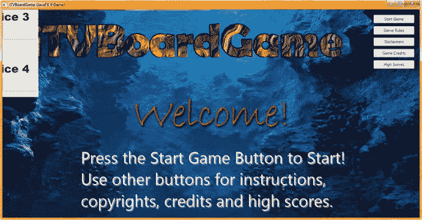

**图 22-1.**

在开发计分功能之前，我们先修复影响启动画面的 Q&A 按钮面板渲染错误

首先，从 `gameButton` 事件处理代码中移除 `qaLayout.setVisible(false);` 这条 Java 语句，并将其放置在 `.start()` 方法的顶部，以便自动执行隐藏操作。

请记住，你的 `qaLayout` StackPane 将在 `createQAnodes()` 方法中创建，因此这条语句必须放在 `createQAnodes();` 自定义方法调用之后，也就是在该自定义方法之前调用的任何方法之后。这没问题，因为这些方法只是设置了游戏中会用到的资源引用和对象。

这最终是对这个视觉 bug 更快速、更简单的修复；既然我们本来就要在游戏启动时隐藏这个面板，那么更早地（自动地）执行隐藏操作（设置可见性为 false），而不是在事件处理逻辑中执行，既能生成更简洁的代码，也省去了我们查明问题原因（显然是 3D 空间中的 Z 单位设置问题）以及如何为 `qaLayout` StackPane 对象添加（并调整）Z 位置代码（这可能会破坏你当前完美的渲染结果，除了初始启动画面显示之外）的时间。

这个简单修改的 Java 代码如图 22-2 中间高亮部分所示，应该类似于下面这条 Java 9 语句，现在位于你的 `public void start()` 核心 JavaFX 9 方法的第一部分：

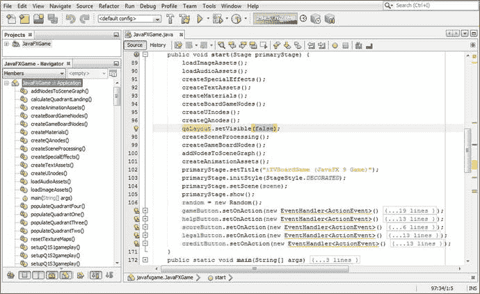

**图 22-2.**

从 `gameButton` 处理器中移除 `.setVisible()` 调用，并将其放置在 `createQAnodes()` 之后的 `.start()` 方法中

```
public void start()  {
loadImageAssets();
loadAudioAssets();
createSpecialEffects();
createTextAssets();
createMaterials();
createBoardGameNodes();
createUInodes();
createQAnodes();
qaLayout.setVisible(false);
createSceneProcessing();
createGameBoardNodes();
...
}
```

使用图 22-3 中的运行 ➤ 项目工作流程，查看启动画面中这个问题的修复效果。


**图 22-3.**

你的 Q&A UI 面板现在在启动时已隐藏，位于 `.start()` 方法的顶部

现在我们已经修复了那个（代码层面的）小启动画面渲染问题，可以继续创建你的计分 UI 布局设计了，首先从 `scoreLayout` StackPane 对象以及包含其装饰元素的 Text 对象开始。


## 计分板界面设计：createScoreNodes() 方法

让我们让 NetBeans 为我们创建一个 `createScoreNodes()` 自定义方法体，方法是在我们刚刚添加的 `qaLayout.setVisible(false);` 语句之后添加一行代码，然后使用 Alt+Enter 组合键触发 NetBeans 9 的自动方法编码。相关的 Java 语句如下所示，并在图 22-4 中高亮显示：

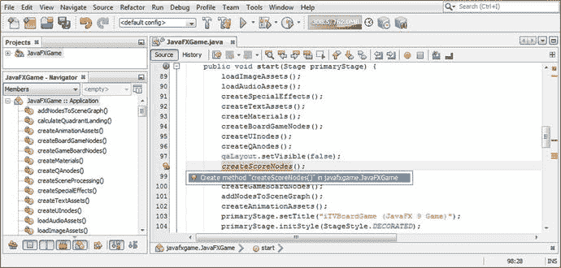

图 22-4.

在 qaLayout 逻辑之后创建一个 createScoreNodes() 方法，并使用 Alt+Enter 让 NetBeans 为其编码

```
public void start()  {
loadImageAssets();
loadAudioAssets();
createSpecialEffects();
createTextAssets();
createMaterials();
createBoardGameNodes();
createUInodes();
createQAnodes();
qaLayout.setVisible(false);
createScoreNodes();
...
}
```

将这个方法从类的底部复制到 `createQAnodes()` 方法之后，如图 22-5 底部所示。将 `createQAnodes()` 方法中的 qaLayout 语句复制到 `createScoreNodes()` 方法中，并将 `.setTranslateX()` 方法调用的参数从 -250 改为 250，以便将其镜像到显示器的另一个角落。

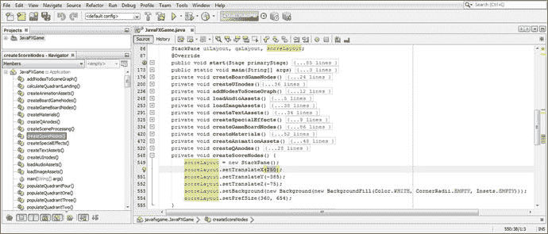

图 22-5.

在类的顶部添加一个名为 scoreLayout 的 StackPane，并像 qaLayout 一样实例化和配置它

你将保持其他四个复制的 Java 语句不变（除了将 qaLayout 改为 scoreLayout），因为除了 X 位置之外，你希望“镜像”高度、深度、背景颜色和首选的 StackPane 大小。使用以下 Java 代码将此 scoreLayout 添加到 SceneGraph，该代码也在图 22-6 中高亮显示：

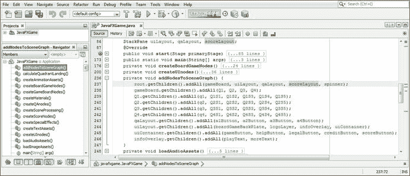

图 22-6.

要渲染 scoreLayout StackPane，必须首先将其添加到 `root.getChildren().addAll()` 方法链中

```
private void addNodesToSceneGraph() {
root.getChildren().addAll(gameBoard, uiLayout, qaLayout, scoreLayout, spinner);
...
}
```

让我们再次使用 **运行 ➤ 项目** 工作流程，测试这个用于计分 UI 面板的新代码，以确保它使用 `.setTranslateX()` 方法调用值将计分 UI 面板设计镜像到屏幕足够靠右的位置。如图 22-7 所示，根据我们的猜测，它距离游戏画面的右角还差大约 400 个单位。因此，我们需要将 250 的值改为 650，以便将这个 StackPane 容器进一步向右移动，并防止这个 2D StackPane UI 容器对象与你的 i3D 游戏板节点层级相交。

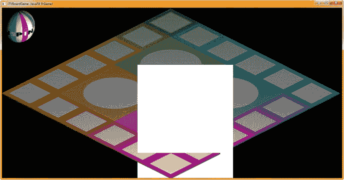

图 22-7.

如图所示，这个 StackPane 与游戏板相交，需要在 X 轴上向右移动 400 个单位

用于完成计分 UI 背景和容器的 Java 9 代码在图 22-8 中高亮显示，你修改后的 `.setTranslateX()` 方法调用（从 250 X 单位改为 650 X 单位）应如下所示：

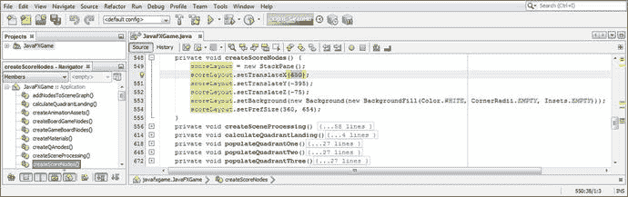

图 22-8.

将 `scoreLayout.setTranslateX()` 方法调用从 250 改为 650，以将计分 UI 面板移动 400 个单位

```
scoreLayout.setTranslateX(650);
```

接下来我们需要做的是，放置 Java 代码，使其在游戏启动时隐藏计分 UI 窗格，方式与问答 UI 面板相同。一旦你添加了 `scoreLayout.setVisible(false);` Java 语句，你新的 `start()` 方法代码应如下所示，如图 22-9 所示：

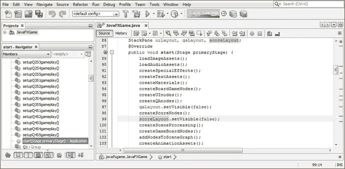

图 22-9.

在 `createScoreNodes()` 方法之后，为 scoreLayout 添加 `.setVisible(false)` 方法调用，以在启动时隐藏面板

```
public void start()  {
loadImageAssets();
loadAudioAssets();
createSpecialEffects();
createTextAssets();
createMaterials();
createBoardGameNodes();
createUInodes();
createQAnodes();
qaLayout.setVisible(false);
createScoreNodes();
scoreLayout.setVisible(false);
...
}
```

如图 22-10 所示，你仍然需要在 `cameraAnimIn` 动画对象的动画结束时，使用 `.setOnFinished(event)` 事件处理基础设施，将你的 `scoreLayout` StackPane 设置为可见。这段代码已经就位，因为我们在相机动画完成后已经显示了问答 UI 面板。因此，我们所要做的就是在 `cameraAnimIn.setOnFinished(event->{});` 结构的末尾添加 `scoreLayout.setVisible(true);` 语句，该语句在图 22-10 中间以浅蓝色和黄色高亮显示。在能够测试你的计分 UI 面板之前，你必须先将这段 Java 9 代码放置到位。

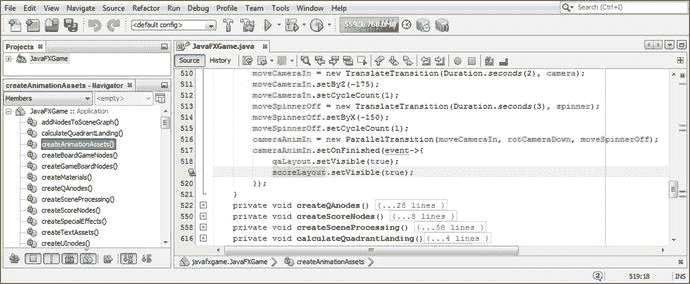

图 22-10.

要显示 scoreLayout StackPane，请在 `cameraAnimIn.setOnFinished()` 中添加一个 `.setVisible(true)` 方法调用

再次使用 **运行 ➤ 项目** 工作流程，确保你的游戏启动画面和游戏板旋转恢复到“干净”的外观；然后旋转并选择游戏板方块 1，以调用 `cameraAnimIn` 对象的 `.setOnFinished(event)` 事件处理方法逻辑，此时该方法会显示两个 StackPane UI 容器。

这使我们能够在相机角度改变后测试计分 UI 容器代码。如图 22-11 所示，我们只需将 `.setTranslateY()` 方法调用的参数从 -395（如图 22-8 所示）改为 -385，将 StackPane 向下移动 10 个单位，即可获得完美镜像的计分 UI 面板结果。

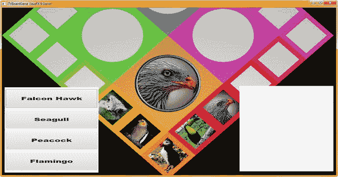

图 22-11.

使用 **运行 ➤ 项目**，通过 `.setOnFinished()` 事件处理器渲染计分面板，显示初始窗格位置

现在，我们可以使用不同颜色的 Text 对象来“装饰” scoreLayout StackPane 的内部，我们可以使用漂亮的大字体和深色主色（RGB）值来标记计分 UI 面板的各个部分。


### 为计分 UI 容器添加设计元素：文本对象

在类顶部的 Text 复合语句中添加`scoreTitle`文本对象，然后在`addNodesToSceneGraph()`方法中的`scoreLayout.addChildren().addAll()`方法链里加入`scoreTitle`，如图 22-12 所示。Java 代码应如下所示，该代码也在图 22-12 顶部以黄色高亮显示：

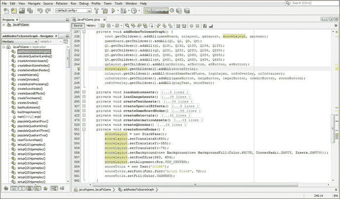

图 22-12.

在`createScoreNodes()`中添加`scoreTitle`文本对象，进行实例化并配置，然后将其添加到场景图中

```
private void addNodesToSceneGraph() {
root.getChildren().addAll(gameBoard, uiLayout, qaLayout, scoreLayout, spinner);
gameBoard.getChildren().addAll(Q1, Q2, Q3, Q4);
Q1.getChildren().addAll(q1, Q1S1, Q1S2, Q1S3, Q1S4, Q1S5);
Q2.getChildren().addAll(q2, Q2S1, Q2S2, Q2S3, Q2S4, Q2S5);
Q3.getChildren().addAll(q3, Q3S1, Q3S2, Q3S3, Q3S4, Q3S5);
Q4.getChildren().addAll(q4, Q4S1, Q4S2, Q4S3, Q4S4, Q4S5);
qaLayout.getChildren().addAll(a1Button, a2Button, a3Button, a4Button);
scoreLayout.getChildren().addAll(scoreTitle);
uiLayout.getChildren().addAll(boardGameBackPlate, logoLayer, infoOverlay, uiContainer);
uiContainer.getChildren().addAll(gameButton, helpButton, legalButton, creditButton,
scoreButton);
infoOverlay.getChildren()addAll(platText, moreText);
}
```

使用`.setAlignment()`方法调用并传入`Pos.TOP_CENTER`常量，为`scoreLayout` StackPane 中的`scoreTitle`标题设置对齐方式。这会将这个深红色的 SCORE 标题居中放置在 StackPane 容器的顶部中央。有趣的是，文本对象的对齐方式是在父级 StackPane 容器中设置的。我们稍后可以通过对文本子对象调用`.setTranslateX()`和`.setTranslateY()`方法，来自定义非标题文本元素的对齐方式，从而在接下来的几页中逐步完善计分 UI 面板的设计。

在`createScoreNodes()`方法的底部实例化`scoreTitle`文本对象，然后使用`.setFont()`方法进行配置。使用 Arial Black 字体，72 磅的大字号，以获得粗体可读性。使用`.setFill()`方法调用，将颜色从黑色改为深红色，以便计分标题在计分 UI 面板顶部清晰可见。Java 代码如图 22-12 底部高亮所示，如下所示：

```
private void createScoreNodes()  {
scoreLayout = new StackPane();
scoreLayout.setTranslateX(650);
scoreLayout.setTranslateY(-385);
scoreLayout.setTranslateZ(-75);
scoreLayout.setBackground(new Background(new BackgroundFill(Color.WHITE,
CornerRadii.EMPTY,
insets.EMPTY) ) );
scoreLayout.setPrefSize(360, 654);
scoreLayout.setAlignment(Pos.TOP_CENTER);
scoreTitle = new Text("SCORE");
scoreTitle.setFont( Font.font("Arial Black", 72) );
scoreTitle.setFill(Color.DARKRED);
}
```

图 22-13 展示了运行 ➤ 项目工作流程，以预览“SCORE”标题在计分面板中的效果。

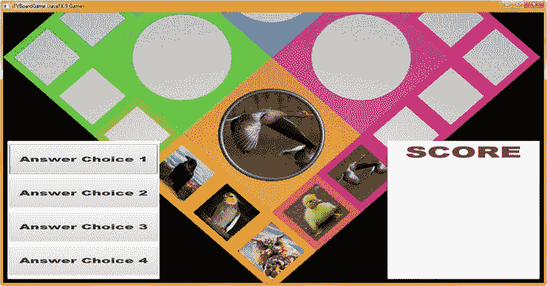

图 22-13.

使用运行 ➤ 项目工作流程预览带有新深红色标题的计分 UI 面板

如图 22-14 高亮所示，我们在类顶部声明了一个`scoreRight`文本对象，并将其添加到`scoreLayout.addChildren().addAll()`方法链中，以便在我们即将进行的测试渲染中能够看到它。

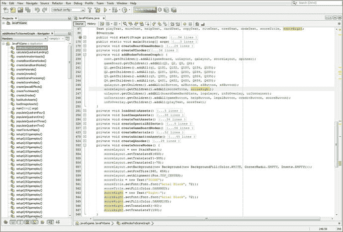

图 22-14.

在类顶部添加`scoreRight`对象，进行实例化并配置，然后将其添加到场景图中

我在`scoreTitle`对象之后添加了`scoreRight`对象的实例化，并将其配置为使用深蓝色、Arial Black 字体、72 磅字号。我添加了 X 和 Y 坐标，将其初始定位在`scoreLayout` StackPane 内的(-50, 150)处。图 22-14 显示了代码，如下所示：

```
private void createScoreNodes()  {
...
scoreTitle = new Text("SCORE");
scoreTitle.setFont( Font.font("Arial Black", 72) );
scoreTitle.setFill(Color.DARKRED);
scoreRight = new Text("Right:");
scoreRight.setFont( Font.font("Arial Black", 72) );
scoreRight.setFill(Color.DARKBLUE);
scoreRight.setTranslateX(-50);
scoreRight.setTranslateY(150);
}
```

图 22-15 展示了运行 ➤ 项目工作流程，以预览“Right:”标题在计分面板中的效果。

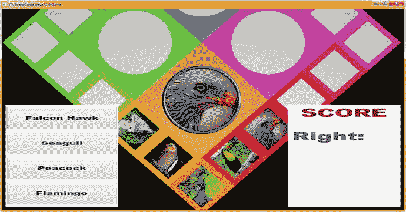

图 22-15.

使用运行 ➤ 项目工作流程预览带有新深蓝色“Right:”计分标题的计分 UI 面板

由于这个特定的 i3D 棋盘游戏是为即将入学的幼儿设计的，我们还要添加一个“Wrong:”计分跟踪标题，并在每次回答后添加一些鼓励语，例如“Great Job!”或“Spin Again”。编写此代码最快的方法是复制并粘贴`scoreRight`代码到其下方，将`scoreRight`改为`scoreWrong`，同时将颜色改为红色，X、Y 位置改为-25, 300。这在以下 Java 9 代码中显示，并在图 22-16 底部以黄色高亮显示：

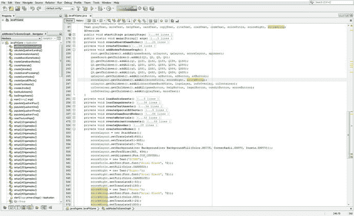

图 22-16.

在类顶部添加`scoreWrong`对象，进行实例化并配置，然后将其添加到场景图中

```
private void createScoreNodes()  {
...
scoreLayout.setPrefSize(360, 654);
scoreLayout.setAlignment(Pos.TOP_CENTER);
scoreTitle = new Text("SCORE");
scoreTitle.setFont( Font.font("Arial Black", 72) );
scoreTitle.setFill(Color.DARKRED);
scoreRight = new Text("Right:");
scoreRight.setFont( Font.font("Arial Black", 72) );
scoreRight.setFill(Color.DARKBLUE);
scoreRight.setTranslateX(-50);
scoreRight.setTranslateY(150);
scoreWrong = new Text("Wrong:");
scoreWrong.setFont( Font.font("Arial Black", 72) );
scoreWrong.setFill(Color.RED);
scoreWrong.setTranslateX(-25);
scoreWrong.setTranslateY(300);
}
```

图 22-17 展示了运行 ➤ 项目工作流程，用于测试红色“Wrong:”文本标题的 Java 代码。

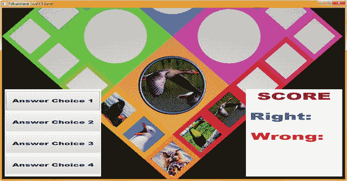

图 22-17.

使用运行 ➤ 项目工作流程预览计分面板和红色“Wrong:”文本

接下来，让我们在类顶部的复合语句中添加一个`scoreCheer`文本对象声明。如图 22-18 顶部黄色高亮所示，您的复合语句现在有两行，一行用于启动（SplashScreen）UI 文本对象，另一行用于计分 UI 文本对象。

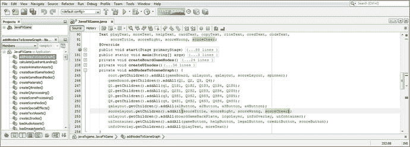

图 22-18.

在类顶部声明`scoreCheer`文本对象；然后将其添加到`scoreLayout`场景图分支中

由于您已经声明了该对象，您可以将其添加到`scoreLayout.getChildren().addAll()`方法链中，如图 22-18 所示，即使您尚未实例化它，也不会在 NetBeans 9 中产生错误。图 22-18 底部以浅蓝色高亮显示的 Java 语句应如下所示：

```
scoreLayout.getChildren().addAll(scoreTitle, scoreRight, scoreWrong, scoreCheer);
```


将下方的 scoreWrong Java 语句复制粘贴到自身下方，并将 scoreWrong 改为 scoreCheer。将 scoreCheer 设为深绿色（DarkGreen），并将 scoreRight 和 scoreCheer 的字体大小分别减小到 64 和 56 磅，以便它们能更好地适应 scoreLayout。请记住，我们需要为表示这些分数的数字留出空间！由于 scoreWrong 更宽（因为字体中使用的字母），我将其减小到了 60 磅。我将标题在 Y 轴方向上多间隔了 10 个单位，并通过使用 X 轴位置 -56、-44 和 -2 将它们左对齐，如图 22-19 中粗体和高亮显示的部分所示（至少是 scoreGrade 语句）：

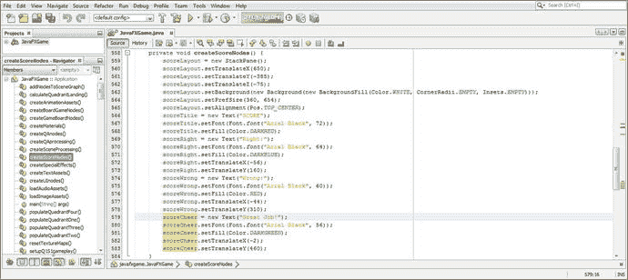

图 22-19.

添加深绿色的 scoreCheer 文本对象，并调整其他文本对象的字体大小和 XY 位置

```
scoreRight = new Text("Right:");
scoreRight.setFont( Font.font("Arial Black", 64) );
scoreRight.setFill(Color.DARKBLUE);
scoreRight.setTranslateX(-56);
scoreRight.setTranslateY(160);
scoreWrong = new Text("Wrong:");
scoreWrong.setFont( Font.font("Arial Black", 60) );
scoreWrong.setFill(Color.RED);
scoreWrong.setTranslateX(-44);
scoreWrong.setTranslateY(310);
scoreCheer = new Text("Great Job!");
scoreGrade.setFont( Font.font("Arial Black", 56) );
scoreGrade.setFill(Color.DARKGREEN);
scoreGrade.setTranslateX(-2);
scoreGrade.setTranslateY(460);
```

图 22-20 展示了用于渲染新文本对象标题及其调整后的字体大小和定位设置的“运行 ➤ 项目”工作流程。请注意，由于我们尚未扩展答案或计分逻辑，因此只有 Falcon（图 22-11 中的方块 1 选项 1 或 15）显示了代表答案选项的按钮标签。

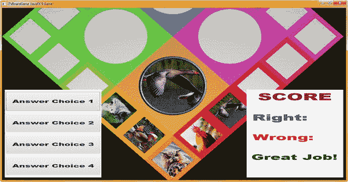

图 22-20.

使用“运行 ➤ 项目”工作流程预览您已添加的分数面板和文本对象标题

现在，我们准备将计分引擎逻辑添加到我们在第 21 章中放置的问答按钮元素中，并将 Text answerRight 和 answerWrong 选项添加到我们的分数 UI 设计中。这将显示由问答 UI 按钮元素生成的分数。之后，我们可以计算成绩并将其分配给第七个文本元素，以显示字母等级。

## 计分引擎：计算答案分数的逻辑

让我们添加一个名为 createQAprocessing() 的自定义方法来容纳我们的计分引擎逻辑，该方法将包含为 createQAnodes() 方法中创建的四个按钮元素设置的 .setOnAction(event) 事件处理。如图 22-21 所示，这需要在 createQAnodes() 和 createScoreNodes() 中设置问答和分数 UI 设计之后，以及在 createSceneProcessing() 中调用此问答事件处理之前进行。因此，在 scoreLayout.setVisible(false); 语句之后、createSceneProcessing(); 语句之前添加一行 Java 代码，如图 22-21 中黄色高亮所示。使用 Alt+Enter 工作流程，通过让 NetBeans 9 编写引导方法代码和错误语句来移除波浪形的红色错误下划线，我们很快将替换这些代码。这将打开一个下拉菜单，其中包含“在 javafxgame.JavaFXGame 中创建方法“createQAprocessing()””选项，您需要双击该选项来执行（单击将选中此单个选项，如图 22-21 所示）。

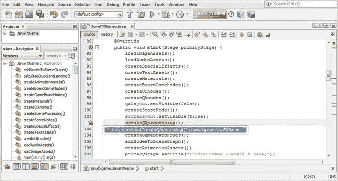

图 22-21.

在 createQAnodes() 和 createScoreNodes() 之后添加 createQAprocessing() 方法调用，并使用 Alt+Enter

编写这第一个（共四个）动作事件处理结构的最简单方法是进入您的 .start() 方法，将您之前在本章中创建的某个按钮事件处理结构复制并粘贴到这个新创建的 createQAprocessing() 方法中。请确保在使用粘贴命令之前完全选中 NetBeans 引导错误语句代码行，以便您的 ActionEvent 处理代码替换此引导错误语句。

将调用 .setOnAction() 方法的对象更改为 a1Button，并删除此事件处理结构内部的处理语句，使其成为一个空的事件处理器，以便我们可以从头构建计分处理逻辑。事件处理器的 Java 代码将如下所示，如图 22-22 所示：

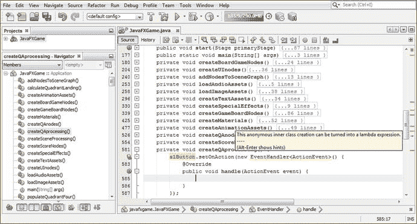

图 22-22.

将鼠标悬停在事件处理结构上，注意 NetBeans 希望将其转换为 lambda 表达式

```
private void createQAprocessing() {
a1Button.setOnAction(new EventHandler() {
@Override
public void handle (ActionEvent event) {
... // 一个空的 ActionEvent 处理结构
}
});
}
```

通过 Alt+Enter 生成的 Java 代码将是相同的空事件处理结构，但使用 lambda 表达式方法，这将移除八行代码中的三行，即减少 37.5% 的编码结构。

您的 Java 9 代码应如下所示，生成的 lambda 表达式如图 22-24 所示。图 22-23 展示了您调用 NetBeans Alt+Enter 快捷键后的工作流程。选择“使用 lambda 表达式”选项，这将在 NetBeans 9 IDE 中执行一个算法，该算法将为您重写 Java 代码，并将其转换为更短的 lambda 表达式编程格式。

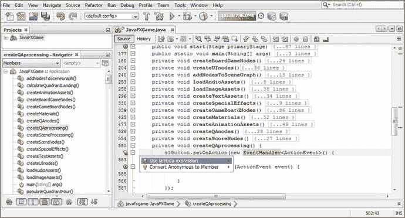

图 22-23.

使用 Alt+Enter 快捷键，选择并双击“使用 lambda 表达式”选项进行转换

```
private void createQAprocessing() {
a1Button.setOnAction(ActionEvent event) -> {
... // 空的 ActionEvent 处理 Lambda 表达式结构
});
}
```


在空的 ActionEvent 处理 lambda 表达式中，我们将为每个 Button 对象设置条件 if() 结构，用于检查所选的 Node 对象和 pickSn Random 对象，以确定我们正在处理的是哪个游戏棋盘方格（Q1S1 到 Q4S5）以及哪个随机数生成器值（pickS1 到 pickS20）。这将告诉我们正在查看哪个内容，然后我们的计分引擎逻辑将对该选择进行评分。

在 a1Button.setOnAction() 结构中，添加一个 `if(picked == Q1S1)` 来开始此编码过程。请注意，NetBeans 错误高亮显示了 picked Node 对象，因为它当前是 createSceneProcessing() 方法的局部（私有）变量，如图 22-24 所示。接下来，我们必须将这个 picked Node 对象设为全局（公有）变量。

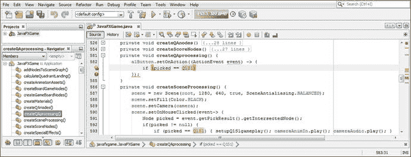

图 22-24.

NetBeans 错误在 if() 语句中高亮显示了 picked Node，因为它是 createSceneProcessing() 的局部变量

在类的顶部声明 picked Node，如图 22-25 中高亮显示的那样，以消除此错误。

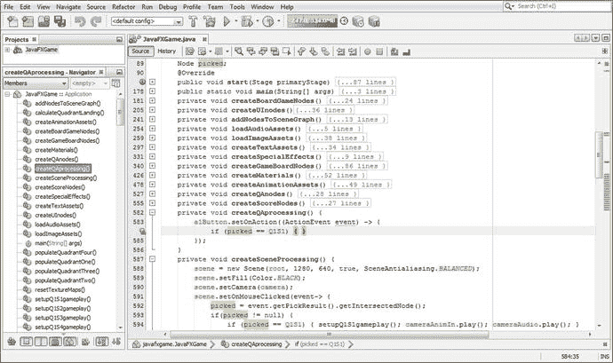

图 22-25.

从 createSceneProcessing() 中移除 Node 声明；将其重新定位到类的顶部，使其成为全局变量

现在，我们将在 createQAprocessing() 方法中查看的所有对象都已声明，以便整个类都能访问它们，我们可以继续编写 a1Button 事件处理代码，在 a1Button 事件处理结构内部使用 `if (picked == Q1S2 && pickS1 == 0) { ... }` 结构。

在类的顶部声明一个 rightAnswer 整数和一个 rightAnswers Text 对象，作为 int 变量和 Text 对象的复合声明语句的一部分，因为我们即将编写使用这些变量的 Java 9 代码。

我们在这个 if() 结构内部要做的是（如果按钮 1 包含正确答案）将 rightAnswer 整数加 1，然后通过调用 .setText() 方法将 rightAnswers Text 对象设置为此 rightAnswer 值。在 .setText() 方法内部，我们将使用 String.valueOf() 方法将 rightAnswer 整数转换为 String 值，并使用 .setText() 将 scoreCheer 设置为 "Great Job!"。用于处理正确答案的代码（在 Q1S1 选项 0（第一个答案选项）正确的情况下）应类似于以下代码，如图 22-26 中高亮显示的那样。它被编写为两行（包括 lambda 表达式在内共四行），以便将 20 个棋盘方格计分逻辑 Java 结构容纳在 createQAprocessing() 方法体内的 120 行代码中。

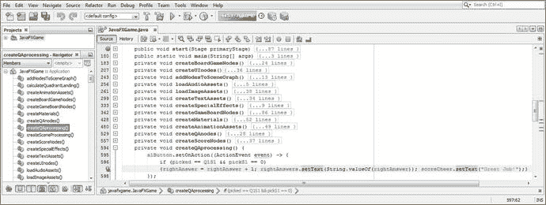

图 22-26.

编写一个紧凑的 if() 语句，评估 Q1S1 和 pickS1，以判断 a1Button 的答案是否正确

```
a1Button.setOnAction(ActionEvent event) -> {
if (picked == Q1S1 && pickS1 == 0) { rightAnswer = rightAnswer + 1;
rightAnswers.setText(String.valueOf(rightAnswer)); scoreCheer.setText("Great Job!"); }
});
```

为了能够显示这个 rightAnswer 整数，我们需要在 createScoreNodes() 中向 UI 设计添加一个 rightAnswers Text 对象。这可以通过复制粘贴技术完成。将 scoreRight 块 Java 代码直接复制到其自身下方。将颜色设置为黑色，X 位置设置为 96。Y 位置应保持不变，以便对齐“right”Text 对象。通过在构造函数方法中使用 "0" 字符串值，将初始文本值设置为零。

图 22-27 底部显示的 Java 代码应类似于以下代码：

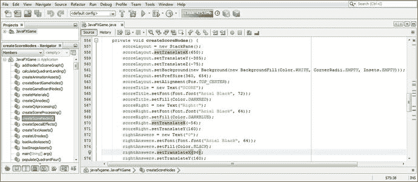

图 22-27.

将 rightAnswers Text 对象添加到 createScoreNodes() 中，以显示整数计算的结果

```
rightAnswers = new Text("0");                            // 将 rightAnswers 初始化为零
rightAnswers.setFont(Font.font("Arial Black", 64));
rightAnswers.setFill(Color.BLACK);
rightAnswers.setTranslateX(96);
rightAnswers.setTranslateY(160);
```

图 22-28 展示了用于渲染 rightAnswers Text 对象及其设置的“运行 ➤ 项目”工作流程。

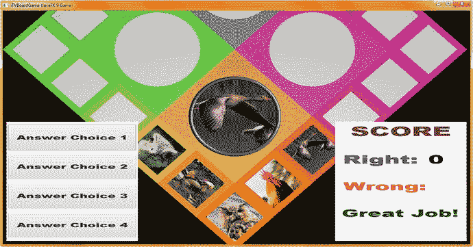

图 22-28.

使用“运行 ➤ 项目”工作流程预览计分面板和 rightAnswers Text 对象的放置位置

其他 Button 元素使用类似的代码，只是它们会将 wrongAnswer int 变量加 1。这意味着您需要将创建的 a1Button 结构在其自身下方复制三次，并将 a1Button 依次更改为 a2Button 到 a4Button。将 rightAnswer 更改为 wrongAnswer，并将 rightAnswers 更改为 wrongAnswers，如图 22-29 所示。

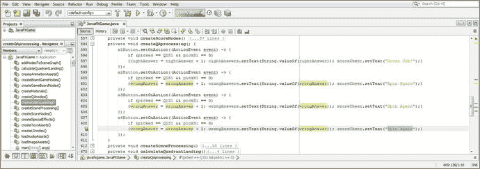

图 22-29.

将 a1Button 结构在其自身下方复制粘贴三次，并更改对象和变量名称

同时将 "Great Job!" 更改为 "Spin Again."。为了能够显示 wrongAnswer 整数，我们需要在 createScoreNodes() 中添加一个 wrongAnswers Text 对象。这可以通过复制粘贴过程完成。将 scoreWrong 块 Java 代码直接复制到其自身下方。将颜色设置为黑色，X 位置设置为 96。Y 位置保持不变以对齐两个 Text 对象。通过在构造函数方法中使用 "0" 字符串值，将初始文本值设置为零。

图 22-30 底部显示的 Java 9 代码应类似于以下代码：

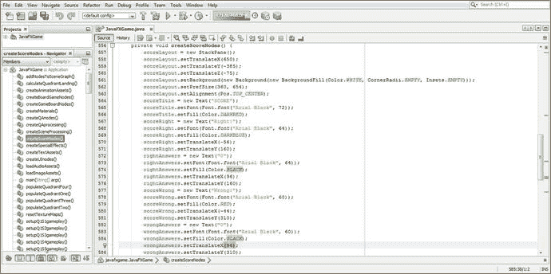

图 22-30.

将 wrongAnswers Text 对象添加到 createScoreNodes() 中，以显示整数计算的结果

```
wrongAnswers = new Text("0");                            // 将 wrongAnswers 初始化为零
wrongAnswers.setFont(Font.font("Arial Black", 64));
wrongAnswers.setFill(Color.BLACK);
wrongAnswers.setTranslateX(96);
wrongAnswers.setTranslateY(160);
```

请记住，为了能够看到 rightAnswers 和 wrongAnswers 答案结果 Text 对象的值持有者，您必须将它们添加到 scoreLayout StackPane 的 .getChildren().addAll() 语句中的 SceneGraph 层级结构中。

为了节省本章篇幅，我只使用了一张截图来展示将这些 Text 节点添加到 StackPane 的过程，因为我们还有很多 Java 代码要编写，以完成棋盘游戏计分和评分基础设施。一旦我们完成此代码的测试，您只需将此计分代码复制到 createQAprocessing() 方法体内的其他 59 个选项中，为其他 19 个游戏棋盘方格创建计分逻辑。这需要与您的其他 59 组答案相匹配，您将复制粘贴这些答案进行创建，然后使用我们在第 21 章中创建的代码进行编辑。

然后，您所有的答案和计分逻辑就位了！您可以在下一章开始对代码进行“防错处理”，以确保多个 UI 元素不会在需要之前被点击。请记住，这些是年幼的孩子和智力障碍者，他们在玩一个教育游戏，因此您需要这种用户界面保护。`scoreLayout.getChildren().addAll()` 方法链的 Java 代码类似于以下 Java 代码，如图 22-31 所示：

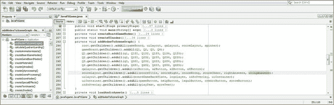

图 22-31.

确保将所有新的 Node 对象添加到 SceneGraph 层级结构中，以便它们在渲染时可见

```
scoreLayout.getChildren().addAll( scoreTitle, scoreRight, scoreWrong, scoreCheer,
rightAnswers, wrongAnswers);
```


图 22-32 展示了用于渲染新的 wrongAnswers 文本对象及其设置的“运行 ➤ 项目”工作流程；如您所见，这将对齐分数（整数）元素，并在数字字段向右扩展时为更大的分数（十位和百位）留出空间，我们将在下一节关于分数代码测试的内容中对此进行确认。

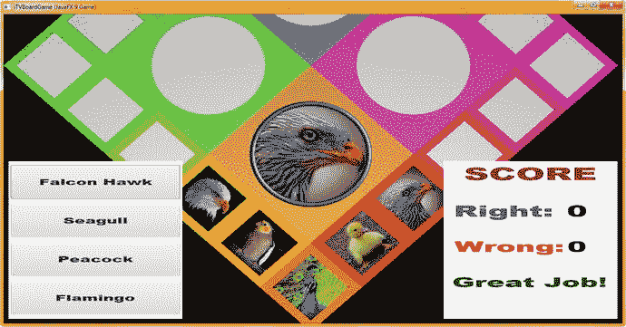

图 22-32.

使用“运行 ➤ 项目”工作流程预览您的分数 UI 面板和 wrongAnswers 文本对象

接下来，让我们测试刚刚编写的计分代码，看看分数 UI 设计是否能正确响应分数增加到两位数的情况。也就是说，数值的增加是向右扩展还是向左扩展？还是从中心扩展？一旦我们弄清楚这一点，就可以进一步“调整”（优化）我们的计分 UI 设计。

## 分数 UI 测试：显示更大的整数

由于我们尚未实现“防玩家作弊”的 Java 代码（这将在下一章中完成，以防止玩家在每个游戏循环中多次点击 UI 元素（3D 转盘、棋盘格、按钮）来“钻空子”或导致渲染错误），目前我们可以多次点击按钮元素。这使我们能够测试记分板 UI，以了解大于 9 的数字将如何显示，从而我们可以“调整”X 位置，并将数字（正确和错误）向左（当前间距）、最右侧或标签（标题）与分数 UI 面板右边缘之间的中心位置进行间距调整。如图 22-33 所示，我点击了正确（猎鹰鹰）答案十次，以观察数字将如何移动。如您所见，数字从中心向外扩展，您可以通过比较 10 和 2 来看到这一点，而不是向左或向右扩展。因此，我们需要将这些数字向右移动 120 个单位。现在，您的分数值将能够扩展到两位或三位数字。

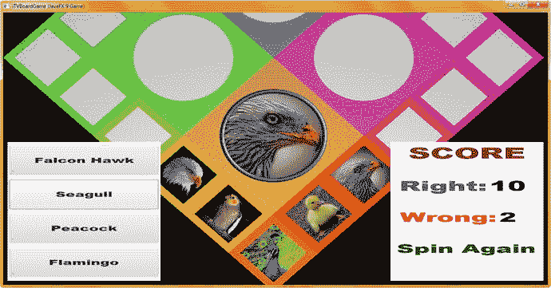

图 22-33.

使用“运行 ➤ 项目”工作流程并点击按钮元素来递增（测试）您的计分代码

将 rightAnswers 和 wrongAnswers 文本对象的 `.setTranslateX()` 方法调用从 96 增加到 120。这将使分数 UI 的数字部分居中于标签（标题）和分数 UI 面板右侧之间。您的代码现在应如下所示，如图 22-34 的中部和底部高亮显示：

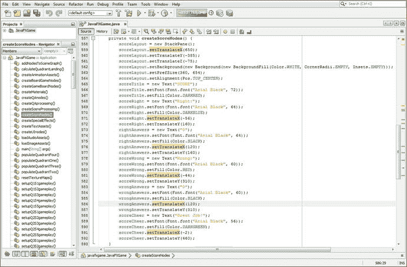

图 22-34.

将每个数字元素的 X 位置向右扩展 24 个单位，从 96 的值增加到 120

```
rightAnswers = new Text("0");
rightAnswers.setFont(Font.font("Arial Black", 64));
rightAnswers.setFill(Color.BLACK);
rightAnswers.setTranslateX(120);                    // 将 X 位置从 96 更新为 120，增加 24 个单位
rightAnswers.setTranslateY(160);
wrongAnswers = new Text("0");
wrongAnswers.setFont(Font.font("Arial Black", 64));
wrongAnswers.setFill(Color.BLACK);
wrongAnswers.setTranslateX(120);                    // 将 X 位置从 96 更新为 120，增加 24 个单位
wrongAnswers.setTranslateY(160);
```

再次使用图 22-35 所示的“运行 ➤ 项目”工作流程来渲染游戏，并导航到分数 UI 面板，检查数字显示的间距是否合适，使得 10 到 99 的分数在分数 UI 面板中显示良好。

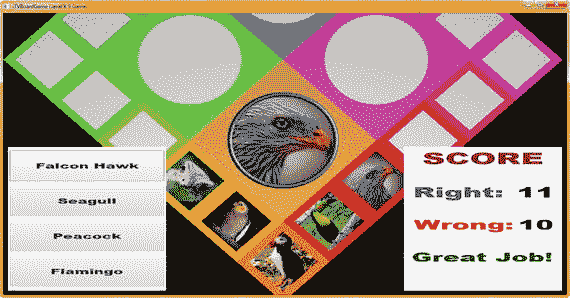

图 22-35.

使用“运行 ➤ 项目”工作流程并点击按钮元素来递增（测试）两位数的分数

大多数玩家不会在一次游戏过程中旋转棋盘数百次，因此这对于本游戏来说应该效果良好。不过，请注意，三位数（100 到 999）也应该能够容纳。

然而，如果您预期会有如此多的游戏操作，您可能希望将标签（标题）的间距再向左移动四到八个单位，使其更靠近分数 UI 设计的左侧，这样就能轻松容纳三位数的游戏分数。

现在，您已经准备好“推广”我们在本章中编写的关于计分的代码以及第 21 章中的代码，以创建完整的游戏玩法基础设施。这将为我们已经在 22 个章节中创建的 1000 行（或更多）Java 代码再增加大约 1000 行代码，从而将整个 i3D 棋盘游戏基础设施落实到位。接下来，让我们讨论如何做到这一点。这涉及到大量的 2D 内容（图像、答案选项和计分）工作，但它将与迄今为止我们使用 JavaFX 9 API 创建的 i3D 棋盘游戏无缝集成。

## 完成游戏玩法：添加答案和分数

为 60 个不同的棋盘格选项添加 4 个答案涉及 240 个不同的内容选项（以及代码行），而为这 60 个不同的棋盘格选项添加计分则涉及另外 480 行代码，如果包含 lambda 表达式容器，可能还会更多。之所以说这是一项工作量很大但应该相当容易且无差错完成的任务，是因为我们创建了一种可以复制粘贴的代码设计，并且可以创建、插入和跟踪文本值，从而确保游戏内容在运行时能正常工作。也就是说，不要期望为您的专业 Java 9 游戏开发流程创建内容会比创建 Java 9 代码更容易，因为游戏设计和游戏开发涉及大量新媒体、内容、策略和编码工作，才能最终获得专业的结果。

我会（在提交本章后）逐个棋盘格地添加答案和计分，直到所有 20 个棋盘格都就位。将来添加棋盘格选项可以轻松完成。您只需使用 `random.nextInt(n)` 变量将 `pickS1` 到 `pickS20` 变量递增 1，即可为您想要添加到每个棋盘格的随机图像主题添加四个或更多不同的选项。添加一轮额外的随机内容相当于添加 20 个新的按钮答案轮次（80 个答案选项），并在您的计分逻辑中为这 80 个新答案计分，这将需要 160 行代码，或者说每次增加棋盘内容深度大约需要 240 行代码。增加棋盘内容的深度意味着玩家在长时间玩游戏时看到重复内容的几率会更低。如果您愿意，还可以添加代码来跟踪已使用的内容。

一旦您将剩余的内容推广到答案和计分逻辑中，您就完成了游戏设计和开发工作流程的大部分内容。在剩余的章节中，我们将研究如何对 UI 设计进行防错处理，以强制用户在游戏过程中正确使用它，以及使用新的 Java 9 NetBeans IDE 进行优化和代码分析等内容。


## 总结

在第二十二章中，我们学习了如何在 i3D 棋盘游戏设计的右下侧实现一个**分数**UI 面板。我们还学习了如何利用上一章 21 中创建的问答面板上的按钮 UI 元素，通过 `ActionEvent` 处理来更改记分牌上的数字分数部分。这基本上使我们能够完成单个方格（以及选定方格后的象限）的游戏玩法编码和计分，即对关于内容的视觉问题进行回答和计分。（我必须在开始编写第 23 章之前完成这项工作。）

这意味着这又是一个需要大量编码的章节，因为你构建了 20 个自定义方法，从 `setupQ1S1gameplay()` 到 `setupQ4S5gameplay()`。你还在 `createQAprocessing()` 事件处理基础设施中为每个按钮元素放置了条件 `if()` 结构来进行计分。你仍然需要确保交叉检查所有棋盘游戏方法中的图像资源，最后，你需要将所有代码一起测试，以确保它在每个游戏棋盘方格上都能正常工作。

在第 23 章中，作为游戏玩法保护的一部分，我们当然会在回答和计分完成后反转摄像机动画，并动画回到更倾斜的视角，这是最佳查看棋盘旋转所必需的。我们还将阻止点击任何可点击的 UI 元素，以便用户例如只能选择一个主题并且只能旋转棋盘一次。我们的游戏设计工作流程远未结束！

