# 23. 完成游戏玩法代码并为事件处理添加玩家防护

现在你的 i3D UI 及其事件处理（更不用说大部分动画和数字音频）已经就位并正常工作，是时候在你的代码库中完成加载基本级别的内容（60 张图像、240 个答案和计分）了。我们将在本章的第一部分完成这项工作，这样我就可以向你展示我如何完成游戏玩法，并且整本书的编码连续性不会中断。由于我设置游戏设计代码的方式，大部分编码都是复制粘贴，并确保在测试游戏时答案匹配且工作良好。

在本章中，我们将完成填充 20 个 `setupQSgameplay()` 方法，其中包含与视觉内容（问题）相匹配的基于文本的答案内容。我们还将完成 `createQAprocessing()` 方法，该方法包含更新分数 UI 面板的答案计分代码。玩家将使用这些来选择正确答案，揭示该方格代表的视觉内容并为其答案计分。这意味着在本章中你将添加数百行代码，在完成之前代码行数将接近 1750 行。

一旦我们完成了大部分游戏玩法“答案显示、选择和计分”基础设施的编码，并测试每个方格以确保其正常工作，我们就可以创建 Java 代码的错误防护部分。这将产生一个专业的游戏，确保玩家正确使用它。这涉及使用布尔变量（称为标志）来保存“点击”变量；一旦玩家点击了旋转器、游戏棋盘方格或答案按钮 UI 元素，`elementClick` 变量就会被设置为 false，这样你的游戏玩家就不能再次点击它并“欺骗”游戏玩法代码。

例如，你的玩家可能会多次点击正确的答案按钮 UI 元素，这会导致记分牌上的“正确：（答案）”部分分数飙升！我称之为代码的“用户防护”或“错误防护”，这是一个相当复杂的过程（正如你将在本章中看到的），有时可能会深入好几个层级。例如，我们将首先保护所有游戏棋盘方格不被点击两次，然后再深入一层，保护一个象限的游戏棋盘方格，以便玩家在每轮游戏中只能选择被选中的象限。

我们还将添加最终的动画，将摄像机带回到游戏棋盘旋转视图，以便玩家可以调用随机旋转来选择下一个象限（动物、植物、矿物或地点主题）。这将通过在棋盘游戏 UI 设计的顶层添加一个亮黄色的“让我们再玩一次”按钮元素来实现。本章我们有很多工作要做，让我们开始吧！

## 完成游戏玩法：填充游戏玩法方法

本章的第一部分将向你展示我如何放置完成游戏玩法的 Java 代码。我们将向 `setupQSgameplay()` 方法（共二十个，其中第一个已在第 21 章中编码，以向你展示此 Java 编码的工作原理）中的四个按钮 UI 元素添加答案选项，然后我们将在四个问答按钮 UI 元素中每个的 `ActionEvent` 处理方法内的 `createQAprocessing()` 方法中添加这些答案的计分。


### 添加答案选项：完成 setupQSgameplay() 方法

在此阶段的游戏内容开发中，最耗时的并非在 `setupQSgameplay()` 方法中复制粘贴 Java 9 代码，而是确认正确答案并创建能难住玩家、导致“错误：”答案的干扰项。一旦你为每个随机选择添加了四个答案选项，`setupQ1S1gameplay()` 的方法体看起来就像图 23-1 中的 18 条 Java 语句。

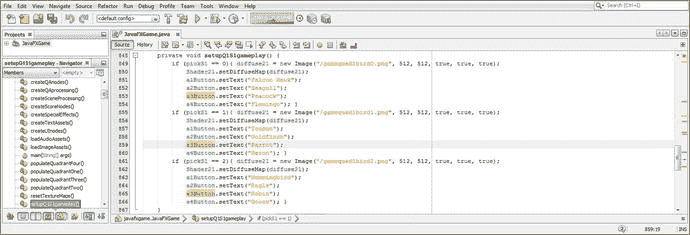

图 23-1.

为每个随机图像查找并添加一个正确答案到不同的按钮（以及三个错误答案）

将相应的正确和错误答案处理逻辑添加到我们在第 22 章创建的 `createQAprocessing()` 计分引擎中。正确的（`rightAnswer` 和 `rightAnswers`）答案在图 23-2 中以黄色高亮显示。

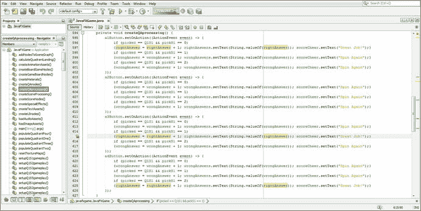

图 23-2.

为 Q1S1 的 `createQAprocessing()` 方法添加匹配的正确或错误答案计分处理

务必非常仔细地完成此工作流程，以确保你为 20 个 `setupQSgameplay()` 方法中的每一个所设置的答案（包括正确和错误）都能与 `createQAprocessing()` 计分算法的方法体完美匹配。这些必须完全匹配，你的计分引擎才能准确地对游戏进行计分，正如你通过逐题、逐答案地比较图 23-1 和图 23-2 所看到的那样。

你可以选择逐个游戏棋盘方格地进行测试，也可以在所有方格完成后一次性测试。或者，你也可以像我一样两种方式都采用，以尝试生成在编译时和运行时都无错误的代码。考虑到数千行代码以及我在撰写本书时仍处于测试版的 Java 9（和 JavaFX 9）API，这显然不是一项轻松的任务，尤其是我每周都需要提交一个完整的章节。

使用“运行 ➤ 项目”工作流程来渲染代码和 3D 内容，并测试你第一个象限中的游戏棋盘方格 1，如图 23-3 所示。我建议一次只处理一个方格（和一个象限），这样你可以利用代码“模式”，通过比较图 23-1 和图 23-2 即可发现这些模式。你可以根据我特意为此目的使用的 Java 代码对象名称和变量名称，直观地判断当前正在处理的是哪个游戏棋盘方格、哪个游戏棋盘象限、哪个按钮编号以及哪个随机问题选择。

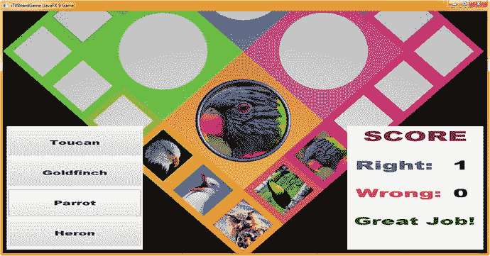

图 23-3.

在继续处理 Q1S2 之前，使用“运行 ➤ 项目”工作流程并测试你的 Q1S1 答案和计分逻辑

如图 23-4 中高亮显示的那样，`setupQ1S2gameplay()` 方法代码非常相似，区别仅在于使用了 `pickS2` 随机对象和图像引用，当然，还有正确和错误答案的按钮标签。

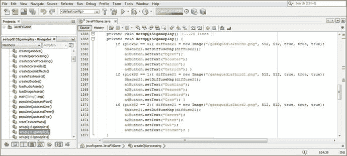

图 23-4.

为 Q1S2 按钮对象添加正确和错误答案，可以看到这与 Q1S1 方法类似

正如你在游戏设计和编程的这个阶段所看到的，主要目标是选择最佳的按钮答案标签，并将它们正确地“连接”到 `setupQAprocessing()` 计分引擎方法，以便正确计算分数！这就是为什么我建议一次只编码一个游戏棋盘方格，并仔细地将它们与 `setupQAprocessing()` 计分引擎方法关联起来！确保充分测试每个游戏棋盘方格，以便你能确认点击正确答案按钮会将“正确：”分数标签的整型文本值增加 1。

如图 23-5 所示，我已添加了用于评估这些答案的计分引擎方法的 Java 代码，并以黄色高亮显示。我在代码中选择了 Q1S2 盒子（方格）对象以突出显示对其的引用。

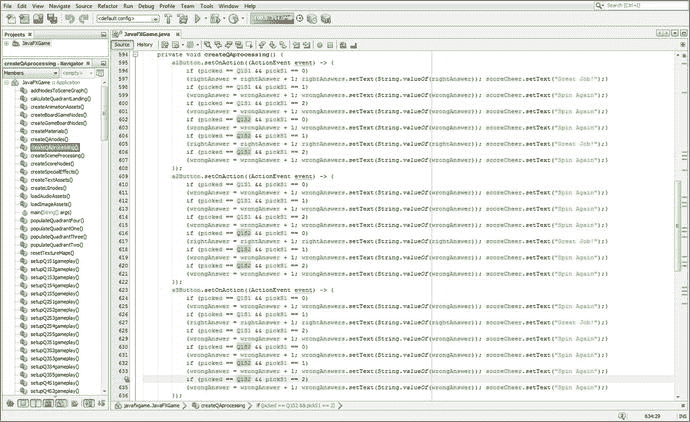

图 23-5.

为 Q1S2 的 `createQAprocessing()` 方法添加匹配的正确或错误答案计分处理

使用图 23-6 所示的“运行 ➤ 项目”工作流程，测试 Q1S2 游戏棋盘方格的逻辑，看看它是否通过将“正确：”分数 UI 面板的整数文本对象增加 1 来对正确答案（小鸭子）进行计分。

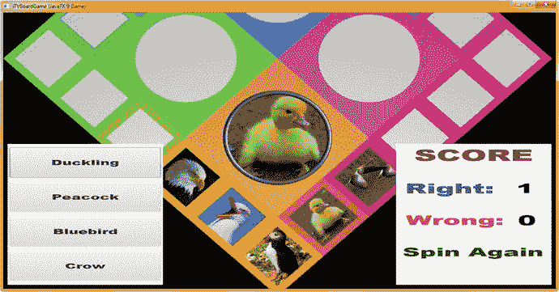

图 23-6.

在继续处理 Q1S3 之前，使用“运行 ➤ 项目”工作流程并测试你的 Q1S2 答案和计分逻辑

接下来，我完成了第三到第五个游戏棋盘方格的游戏设置方法，并测试了它们的代码，以确保我在 `createQAprocessing()` 方法体中正确连接了正确答案按钮的计分逻辑。当我们完成计分逻辑的添加，以及稍后添加一个在选定答案后锁定按钮点击事件处理的变量时，此方法体中的代码将达到约 500 行。后面还有一些非常酷的编码工作，我将在本章稍后部分介绍，届时我们将编写代码来“防止玩家”对 UI 进行多次鼠标点击。

正如你将在图 23-7 中看到的，前六个游戏棋盘方格（已完成 30%）的答案计分逻辑已经用三打行代码填满了 IDE 中按钮 1 的屏幕，这意味着所有四个按钮我们已经完成了 144 行代码。

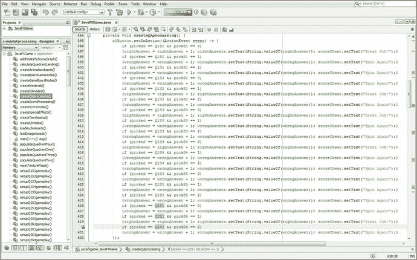

图 23-7.

为 Q2S1 的 `createQAprocessing()` 方法添加匹配的正确或错误答案计分处理

图 23-7 底部高亮显示的代码也显示在图 23-8 的左侧，正在被测试。当我点击第一个按钮元素（甜菜）时，计分引擎将“正确：”分数增加了 1，如数字从 0 增加到 1 所示。

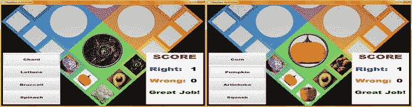

图 23-8.

在继续之前，使用“运行 ➤ 项目”工作流程测试 Q2S1 到 Q2S5 的答案和计分逻辑

至此，你需要完成接下来的四个 Q2S2 到 Q2S5 游戏棋盘方格的 `setupQSgameplay()` 方法，以及相应的 `createQAprocessing()` 计分引擎逻辑，这样你的棋盘游戏内容就完成了一半。这显示在图 23-8 的右侧；为了节省空间，我没有展示所有涉及此工作（及其测试工作流程）的游戏棋盘旋转屏幕截图。完成这 600 行代码的游戏内容编码（`createQAprocessing()` 约 480 行，20 个 `setupQSgameplay()` 方法约 100 行）涉及大量工作，我花了大约一天的时间来编码和测试。我沿途拍摄了一些屏幕截图，将在本章稍后的部分展示。


在向游戏棋盘方块添加内容和计分逻辑时，请务必经常使用“运行 ➤ 项目”工作流程来测试新增的 Java 代码，这些代码用于添加“答案按钮”对象，以及将这些按钮连接到 `createQAprocessing()` 计分引擎方法的代码，以验证是否能获得预期的游戏效果。如图 23-8 所示，第二象限的答案和计分功能已正常运行，我可以继续处理第三象限。

同样，如图 23-9 所示，第三象限的答案和计分功能也已正常运行，我可以继续为第四象限添加答案和计分代码。此时，你的棋盘游戏应该运行得相当不错了，我们现在可以开始添加代码，防止游戏玩家多次点击 UI 元素。

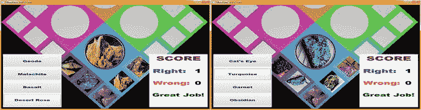

图 23-9.

在继续之前，使用“运行 ➤ 项目”工作流程测试 Q3S1 到 Q3S5 的答案和计分逻辑

如图 23-10 所示，游戏内容现已就位，我们可以继续进行玩家防误操作处理。

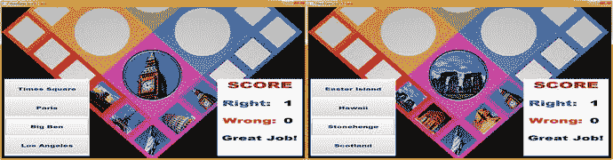

图 23-10.

使用“运行 ➤ 项目”工作流程测试 Q4S1 到 Q4S5 的答案和计分逻辑，完成 20 个方块

接下来，让我们通过添加布尔变量来“防误操作”当前代码，以防止重复点击。

## 防误操作代码：控制玩家事件使用

游戏“理论上”已经完成，我们可以相信玩家会（只一次）点击正确的 i3D 和 i2D UI 元素来玩游戏。然而，这个特定游戏的目标受众包括未成年儿童、智力障碍者、残障玩家和自闭症玩家。因此，我们将设置一些控制措施，确保玩家只点击一次正确的 UI 元素来玩这个游戏。让我们从声明（在类顶部）并在 `rotGameBoard.setOnFinished()` 中添加一个设置为 `true` 的 `squareClick` 布尔变量开始，如下所示，如图 23-11 所示：

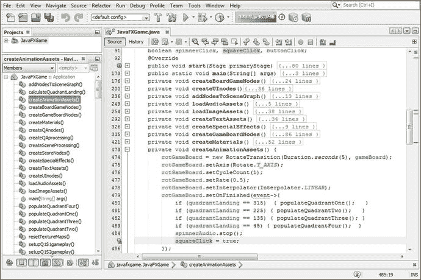

图 23-11.

在 `rotGameBoard.setOnFinished()` 处理程序末尾添加一个设置为 `true` 的 `squareClick` 布尔变量

```
rotGameBoard.setOnFinished(event-> {
if (quadrantLanding == 315) { populateQuadrantOne();   }
if (quadrantLanding == 225) { populateQuadrantTwo();   }
if (quadrantLanding == 135) { populateQuadrantThree(); }
if (quadrantLanding == 45)  { populateQuadrantFour();  }
spinnerAudio.stop();
squareClick = true;
});
```

因此，从逻辑上讲，我们将游戏棋盘方块的点击“保护”连接到了棋盘旋转动画对象上。另外，请注意，通过将所有点击保护变量初始化为没有（默认）值的 `boolean`，我们实际上只需在 Java 类顶部声明这些变量，就将所有点击保护设置为 `false`，即“点击已锁定”。这样，我们就不需要在 `start()` 方法体中使用任何 `clickProtect = false;` 语句。

注意在图 23-11 中，我还在类顶部使用复合 Java（`boolean`）声明声明了 `spinnerClick` 和 `buttonClick`。这是因为我们希望一旦玩家点击了 i3D 旋转器 UI 元素、游戏棋盘方块和问答按钮 UI 元素，就将其“锁定”。这是为了防止多次点击，从而防止多次点击答案按钮（以刷分）。它还能确保你的 i3D 动画和音频调用每轮游戏只按需触发一次，以防止出现玩家眼中的（或听起来像）错误。你肯定不希望动画在其预期的视觉效果中途重新开始，即使你告诉它这样做（在其播放周期中足够早地触发，这通常是多次点击的结果），所以我们将点击锁定为一次！

接下来，让我们为 `spinnerClick` 设置锁定，从 `MouseEvent` 处理代码中的 `if(picked == spinner)` 条件判断开始。我们需要在 `if(picked == spinner)` 中添加 `&& spinnerClick == true`，以判断在游戏的那个时刻是否允许点击旋转器。如果允许，我们立即将 `spinnerClick` 设置为 `false`，因为旋转器动画对象（以及象限着陆处理）也在此代码块内启动。我们将在旋转器的 `.setOnFinished()` 处理程序中启用点击旋转器，该处理程序在旋转器完成旋转后执行，这将防止玩家在旋转器实际旋转时点击你的 i3D 旋转器 UI 元素！很酷！

这个新增的、用于 i3D 旋转器条件 `if()` Java 代码结构的鼠标点击防护代码，在此处以粗体显示，并在图 23-12 顶部以浅蓝色和黄色高亮显示：

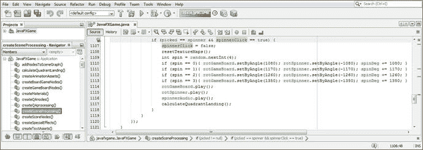

图 23-12.

在 `MouseEvent` 处理结构中为旋转器添加 `&& spinnerClick == true` 到 `if()` 判断中

```
if(picked == spinner && spinnerClick == true) {
spinnerClick = false;
...
}
```


接下来，我们将为这个 `rotSpinner` 动画对象添加一个 `.setOnFinished()` 事件处理器，该处理器会在 `rotSpinner` 动画对象完成后，将布尔变量 `spinnerClick` 设置为 `false`。之所以设置为 `false`（即关闭点击功能），是因为我们不希望在玩家选择一个方块并点击对应的答案按钮 UI 元素来注册（并计分）其答案之前，转盘（或游戏面板）再次旋转。

然而，我们确实希望在转盘再次进入屏幕（即 `rotSpinnerIn` 动画对象）后，重新启用鼠标点击转盘的功能。因此，我们将在 `.setOnFinished()` 事件处理逻辑中将 `spinnerClick` 设置为 `true`。再次强调，这里的 Java 编程逻辑非常清晰，只要你思考一下在游戏流程中想要实现的目标，就不会有任何意外。和大多数游戏逻辑一样，一次性考虑所有内容会很多，因此一开始可能会觉得困难，直到你习惯一次性思考所有与实时交互游戏逻辑相关的实时游戏逻辑（处理流程）。这就是为什么大多数人都认为游戏开发很难，因为作为程序员，你需要“全盘掌握”所有的游戏代码。

`createSceneProcessing()` 方法中的新 Java 代码如下所示，并且在图 23-13 中，设置 `rotSpinner` 和 `rotSpinnerIn` 逻辑的代码块以浅蓝色和黄色高亮显示：

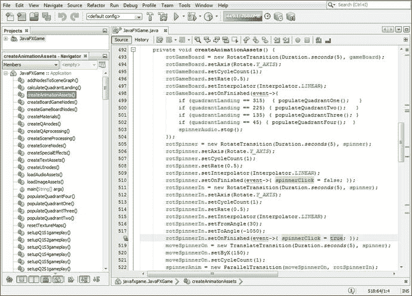

图 23-13.

在 `rotSpinner` 中将 `spinnerClick` 设置为 `false`，在 `rotSpinnerIn` 中设置为 `true`，以控制何时可以点击转盘

```
rotSpinner = new RotateTransition(Duration.seconds(5), spinner);
...
rotSpinner.setOnFinished(event-> {
spinnerClick = false;
});
rotSpinnerIn = new RotateTransition(Duration.seconds(5), spinner);
...
rotSpinnerIn.setOnFinished(event-> {
spinnerClick = true;
});
```

接下来我们需要确定（并编写代码）的是何时允许点击按钮 UI 元素。从逻辑上讲，这应该是在 `cameraAnimIn` 动画对象结束时，同样是在 `.setOnFinished()` 事件处理器结构中，紧接在 `qaLayout` 和 `scoreLayout` 这两个 StackPane 2D UI 面板（及其内容或子元素）通过调用每个 StackPane UI 容器对象的 `.setVisible(true)` 方法重新设置为可见之后。由于 `buttonClick` 的（声明）默认值为 `false`，因此只需使用 `buttonClick = true;` 这个 Java 语句即可。

一旦某个答案按钮 UI 对象被点击，`buttonClick` 将再次被设置为 `false`，从而阻止任何按钮 UI 对象（即使是同一个按钮）被点击，直到 `cameraAnimIn` 动画对象再次播放。接下来，我们将在 `createQAprocessing()` 计分方法中，将这段 Java 代码放入附加到四个按钮对象的每个 `ActionEvent` 处理结构中的 `.setOnAction()` 事件处理结构中。

你的新 `cameraAnimIn` Java 9 代码现在应如下所示，并且可以在图 23-14 底部以浅蓝色和黄色高亮显示：

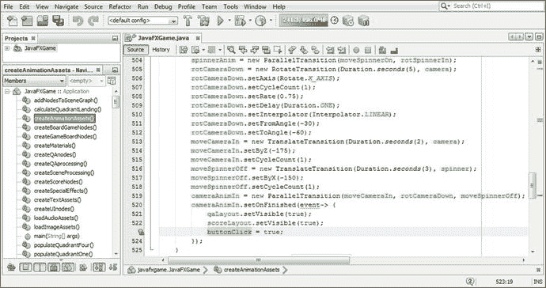

图 23-14.

在 `cameraAnimIn.setOnFinished()` 事件处理器代码末尾添加 `buttonClick = true;` 语句

```
cameraAnimIn = new ParallelTransition( moveCameraIn, rotCameraDown, moveSpinnerOff );
cameraAnimIn.setOnFinished(event-> {
qaLayout.setVisible(true);
scoreLayout.setVisible(true);
buttonClick = true;
});
```

现在，相机已动画移近游戏面板表面，并且 `buttonClick` 布尔变量已设置为 `true`，以允许点击按钮选择答案，我们需要在点击了那个按钮（`a1Button` 到 `a4Button` 之一）时，让 `buttonClick` 变量自行关闭（设置为 `false`）。

为此，我们需要在每个按钮的 `ActionEvent` 事件处理结构的内容外面“包裹”一层 `if(buttonClick == true)` 条件判断层。这样，只有当 `buttonClick` 为开启状态（`true`）时，才允许进行事件处理，并在处理结束时使用简单的 `buttonClick = false;` Java 语句将其关闭。这将是退出 `if(buttonClick == true)` Java 代码结构之前的最后一条语句。

你的 Java 代码应如下所示，由于这四个按钮 UI 对象的 `ActionEvent` 处理结构每个都包含超过 120 行 Java 代码，因此该代码也在图 23-15 的开头和图 23-16 的末尾以高亮显示：

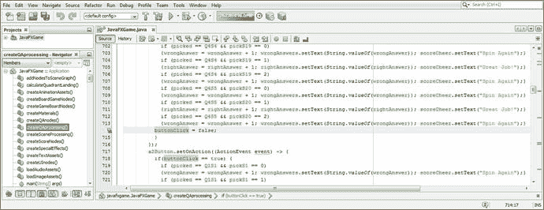

图 23-16.

在每个 `if(buttonClick==true)` 结构的末尾，设置 `buttonClick = false;` 以关闭按钮点击功能

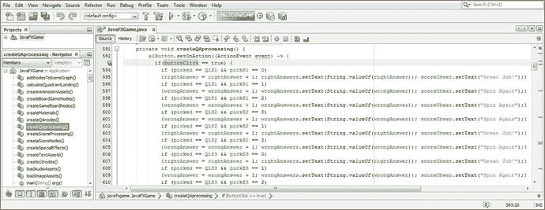

图 23-15.

在每个按钮事件处理结构的顶部使用条件语句 `if(buttonClick == true)`

```
private void createQAprocessing() {
a1Button.setOnAction( (ActionEvent event) -> {
if (buttonClick == true) { // 判断 if (buttonClick == true) 然后 {尚未被点击}
if (picked == Q1S1 && pickS1 == 0)
...
buttonClick = false;   // 如果此按钮已被点击，则将 buttonClick 设置为 false
}
});
}
```

在每个 `Button.setOnAction()` 结构之前放置相同的 `if(buttonClick == true)`，并在每个 `Button.setOnAction()` 事件处理结构的末尾放置 `buttonClick = false;`，如图 23-15 和图 23-16 所示。

要重新启用所有这些事件处理功能，我们需要一个“再来一局”按钮及其 `.setOnAction()` 事件处理器。


## “再来一局”按钮：重置玩家事件处理

一旦玩家点击了答案按钮 UI 对象，所有游戏棋盘方格、转盘和按钮 UI 对象都将被锁定！为新一轮游戏解锁所有内容的最佳方法是在游戏棋盘中央添加一个大型黄色“再来一局”按钮（如果你想提前了解，它显示在图 23-23 中），用户点击该按钮即可再次旋转转盘，随机选择一个新主题和另一张待识别的图片。在本章的这一节中，我们将把这个按钮元素添加到 SceneGraph 的根节点，为按钮编写代码，并完成玩家防误操作处理。

让我们为 againButton 建立一个基础架构：将 againButton 添加到类顶部的复合按钮声明中，然后使用`.getChildren().addAll()`方法链将 againButton 添加到 SceneGraph 根节点。实现此功能的 Java 代码如下所示，并在图 23-17 顶部以黄色高亮显示：

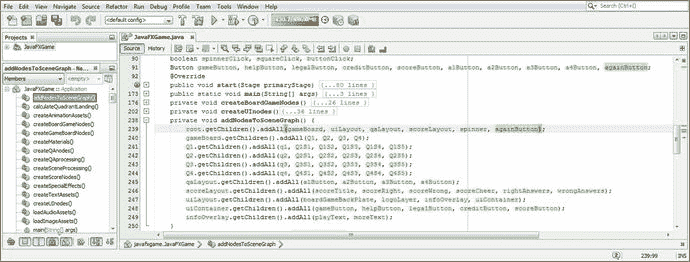

图 23-17.

在类顶部声明一个 againButton 按钮对象，并将其添加到 SceneGraph 根节点

```
Button ... a1Button, a2Button, a3Button, a4Button, againButton;
...
root.getChildren().addAll(gameBoard, uiLayout, qaLayout, scoreLayout, spinner, againButton);
```

在`createBoardGameNodes()`方法中实例化并配置 againButton，将其位置设为 X, Y (200, -400)，大小设为(300, 150)，并使用 34 磅的 Arial Black 字体，如图 23-18 所示。将其标签设为“Let’s Play Again”，因为它会触发一轮游戏。

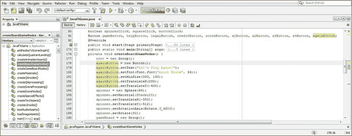

图 23-18.

在`createBoardGameNodes()`方法中实例化并配置 againButton，使用较大的尺寸和字体

由于我们希望该按钮在玩家选择答案后才可见，因此我们将 againButton 设置为启动时不可见。为此，我们在`start()`方法顶部，在`createBoardGameNodes()`方法调用之后，调用`.setVisible(false)`方法。代码如下所示，并在图 23-19 中高亮显示：

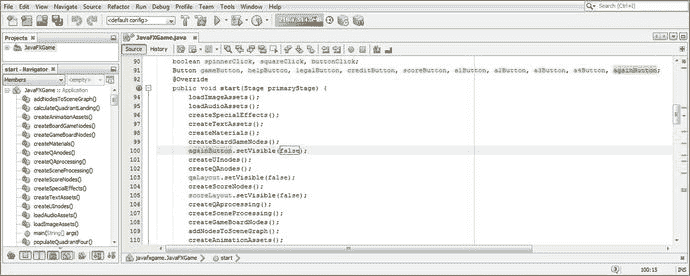

图 23-19.

在`start()`方法中，`createBoardGameNodes()`方法之后，将 againButton 的可见性设置为 false

```
againButton.setVisible(false);
```

接下来，在每个`Button.setOnAction()`构造的末尾添加`againButton.setVisible(true);` Java 语句，以开启“再来一局”按钮的可见性，如图 23-20 中黄色和蓝色高亮所示。

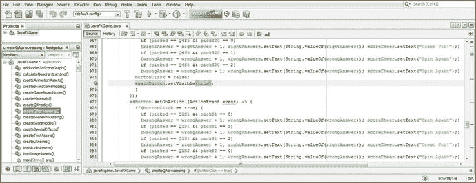

图 23-20.

在每个答案按钮事件处理程序的末尾，`buttonClick = false;`之后，调用`againButton.setVisible(true);`

由于我们仅在图 23-18 中估算了按钮的位置和大小，因此我们使用“运行 ➤ 项目”工作流程来查看按钮 UI 元素是否位于游戏棋盘设计四色交叉点的中心。如图 23-21 所示，我们需要进行一些调整，因为按钮覆盖了内容象限的图像。

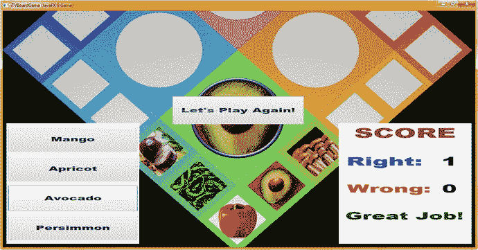

图 23-21.

使用“运行 ➤ 项目”工作流程测试 againButton 代码，查看其位置和大小是否合适

另外请注意，由于象限使用了粉色、蓝色、绿色和橙色，我们需要为按钮设置黄色背景。添加`.setBackground(new Background(new BackgroundFill(color.YELLOW)))`方法链来设置黄色值（不要忘记空的`CornerRadii`和`Insets`），如图 23-22 中蓝色高亮所示。将`.setMinSize()`增加到 300, 200；将字体大小增加到 35；并将 X, Y, Z 位置重新调整为(190, -580, 100)。

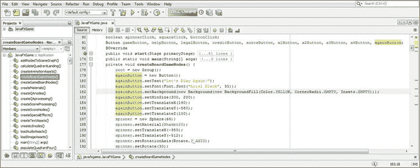

图 23-22.

添加黄色背景色，并调整平移值和大小值以使 againButton 居中

使用“运行 ➤ 项目”查看最终的按钮 UI 元素样式。如图 23-23 所示，效果非常好！

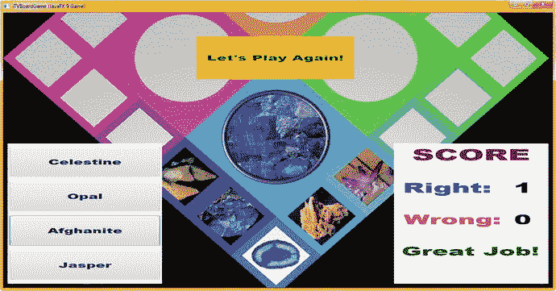

图 23-23.

使用“运行 ➤ 项目”工作流程测试 againButton，查看其位置、大小和颜色是否合适

接下来，为 againButton 添加一个`.setOnAction()`事件处理构造，以便在点击该按钮时，可以关闭问答和计分（StackPane）面板，并将`buttonClick`、`squareClick`和`spinnerClick`变量重置为 false（关闭），从而使 3D 转盘、游戏棋盘方格和答案按钮 UI 元素可用。这些可见性和防误操作重置语句的初始 Java 代码如图 23-24 中蓝色所示。

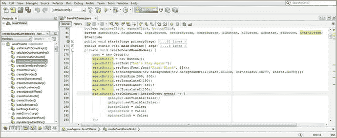

图 23-24.

为 againButton 添加`.setOnAction()`方法调用；开始添加鼠标点击和可见性事件处理

接下来我们需要创建的是`cameraAnimOut` ParallelTransition 动画对象，该对象会将摄像机对象动画移回完整的游戏棋盘（旋转）视图，因为我们将在`againButton.setOnAction()`事件处理构造中调用该动画对象的`.play()`方法。因此，让我们在本章的下一节中创建这个 ParallelTransition 动画对象，这将是一个相对复杂的任务。


## 摄像机拉远：另一个并行过渡

首先，通过复制粘贴我们之前创建的 `rotCameraDown` 旋转过渡动画对象代码，在其下方创建一个完全相反的对象，因为我们即将创建 `cameraAnimOut` 对象。除了将对象名称从 `rotCameraDown` 改为 `rotCameraBack`，并交换 `.setFromAngle()` 和 `.setToAngle()` 方法调用中的值（-30 和 -60）之外，其他所有内容都相同。完成此任务的 Java 9 代码如下所示，并在图 23-25 中用黄色和蓝色高亮显示：

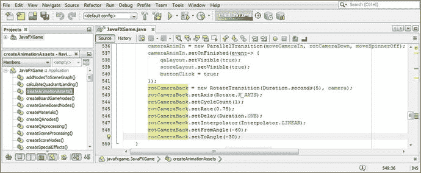

图 23-25.

在 `createAnimationAssets()` 中添加 `rotCameraBack` 旋转过渡对象，并实例化及配置它以供使用

```
rotCameraBack = new RotateTransition(Duration.seconds(5), camera);
rotCameraBack.setAxis(Rotate.X_AXIS);
rotCameraBack.setCycleCount(1);
rotCameraBack.setRate(0.75);
rotCameraBack.setDelay(Duration.ONE);
rotCameraBack.setInterpolator(Interpolator.LINEAR);
rotCameraBack.setFromAngle(-60);
rotCameraBack.setToAngle(-30);
```

接下来，通过复制粘贴 `moveCameraIn` 平移过渡动画对象代码，在 `rotCameraBack` 对象下方创建一个完全相反的对象。除了将对象名称从 `moveCameraIn` 改为 `moveCameraOut`，并反转 `.setByZ()` 方法调用中的 -175 值之外，其他所有内容都应相同。完成此任务的 Java 代码如下所示，并在图 23-26 中用黄色和蓝色高亮显示：

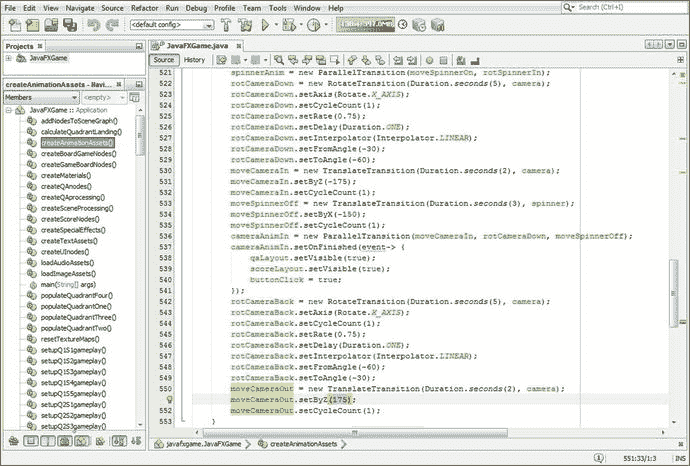

图 23-26.

创建一个 `moveCameraOut` 平移过渡动画对象，并将 `.setByZ()` 的值改为 175

```
moveCameraOut = new TranslateTransition(Duration.seconds(2), camera);
moveCameraOut.setByZ(175);
moveCameraOut.setCycleCount(1);
```

我们可以使用现有的 `moveSpinnerOn` 动画对象（它曾作为 `spinnerAnim` 并行过渡的组件之一）来将旋转器移回屏幕，同时并行过渡将摄像机拉回其原始的游戏棋盘旋转位置和方向。这将演示该动画对象可以在多个并行过渡对象中使用，这是一种编码优化，因为编码结构可以用于多个目的。你可以在图 23-27 顶部看到这个已经编码好的动画，用黄色高亮显示。

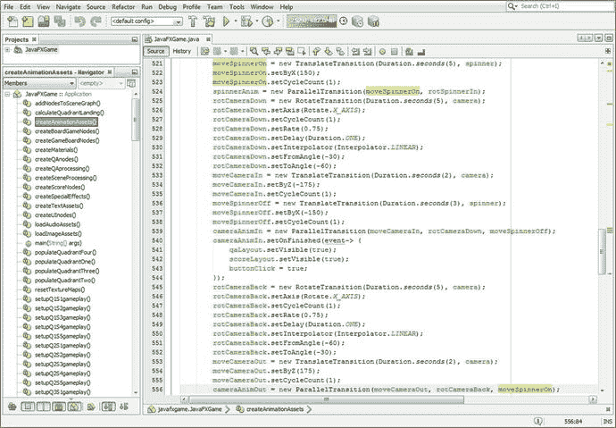

图 23-27.

创建 `cameraAnimOut` 并行过渡，并引用 `moveCameraOut`、`rotCameraBack` 和 `moveSpinnerOn`

所以，现在我们可以创建并行过渡 `cameraAnimOut` 对象，它将同时（精确地同时！）播放 `moveCameraOut`、`rotCameraBack` 和 `moveSpinnerOn` 动画对象！这只需要一行代码来实例化 `cameraAnimOut` 对象，并使用其构造方法将该对象与其他三个动画对象引用一起加载。我们最终会添加第二行代码，调用该对象的 `.setOnFinished()` 方法，以便在摄像机拉远后将 `spinnerClick` 布尔变量重置为 `false`，从而使玩家能够再次使用 i3D 旋转器 UI 元素来随机旋转游戏棋盘。

执行此操作的 Java 代码应如下所示，并在图 23-27 底部用浅蓝色和黄色高亮显示：

```
cameraAnimOut = new ParallelTransition(moveCameraOut, rotCameraBack, moveSpinnerOn);
```

现在我们可以回到 `againButton.setOnAction()` 结构的代码完成工作，完善其结果。

## 完成“再玩一次”按钮：resetTextureMaps()

我们现在将扩展 `againButton.setOnAction()` 事件处理基础设施中的五行代码，以便调用新的摄像机动画对象和现有的音频剪辑对象，为游戏返回拉远视图的部分添加动画和数字音频，玩家可以在该视图中随机旋转游戏棋盘以选择新内容来测试他们的知识库。我们还将把 `resetTextureMaps()` 方法调用从 `createSceneProcessing()` 方法内部移到这个游戏重置事件处理方法中，以便在游戏结束、摄像机从游戏棋盘拉远之前（以及在播放摄像机拉远音频效果以匹配该动画之前），将游戏棋盘方格和象限重置为空白。作为此过程的一部分，我们还将隐藏 `againButton` 按钮 UI 元素，因为我们不希望该按钮 UI 元素覆盖 i3D 旋转器和游戏棋盘旋转以随机选择下一个象限的视图。

在 `qaLayout` 和 `scoreLayout` 可见性调用之后，添加一个 `againButton` 的 `.setVisible(false)` 方法调用。接下来，在该方法末尾添加 `resetTextureMaps()` 调用以及 `cameraAnimOut` 和 `cameraAudio` 的 `.play()` 调用。

事件处理的 Java 9 代码现在应如下所示，并在图 23-28 中显示：

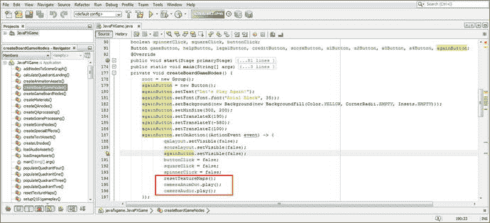

图 23-28.

在 `againButton.setOnAction()` 中调用 `resetTextureMaps()`、`cameraAnimOut.play()` 和 `cameraAudio.play()`

```
againButton = new Button();
againButton.setText("让我们再玩一次！");
againButton.setFont(Font.font( "Arial Black", 35) );
againButton.setBackground(new Background(new BackgroundFill(Color.Yellow,
CornerRadii.EMPTY, Insets.Empty));
againButton.setMinSize(300, 200);
againButton.setTranslateX(190);
againButton.setTranslateY(-580);
againButton.setTranslateZ(100);
againButton.setOnAction( (ActionEvent event) -> {
qaLayout.setVisible(false);
scoreLayout.setVisible(false);
againButton.setVisible(false);
buttonClick = false;
squareClick = false;
spinnerClick = false;
resetTextureMaps();
cameraAnimOut.play();
cameraAudio.play();
}
```

现在，我们可以为 `cameraAnimOut` 动画对象添加 `.setOnFinished()` 事件处理结构，以便在摄像机动画拉远回到游戏棋盘旋转视图后自动启用 `spinnerClick` 功能，从而使玩家可以点击 i3D 旋转器 UI 元素来重新开始整个游戏过程。此功能的 Java 代码如下所示，使用一行代码，并在图 23-29 中用浅蓝色和黄色高亮显示：

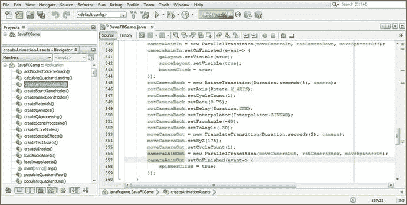

图 23-29.

添加一个 `cameraAnimOut.setOnFinished()` 事件处理器，将 `spinnerClick` 变量设置为 `true`

```
cameraAnimOut = new ParallelTransition(moveCameraOut, rotCameraBack, moveSpinnerOn);
cameraAnimOut.setOnFinished( event-> { spinnerClick = true; } );
```

使用“运行 ➤ 项目”工作流程（如图 23-30 所示）来测试整个周期（或两轮游戏）。

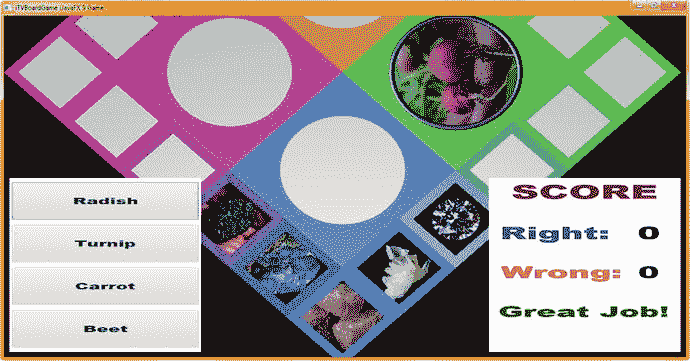

图 23-30.

使用“运行 ➤ 项目”测试代码；注意点击另一个象限方格会设置该象限的图像


请注意，在图 23-30 中，我们的测试过程揭示了另一个问题！事实证明，针对点击方块的测试并不够“深入”，无法保证游戏完美无瑕！当某个象限“降落”或被随机选中进行游戏时，你仍然可以点击其他象限的方块。这就要求我们为游戏增加另一层保护，并且必须实际创建四个 `squareClick` 变量（每个象限一个），才能真正彻底地保护我们的游戏。让我们在本章下一节中修改代码，使用 `squareClick1` 到 `squareClick4` 这四个布尔变量，并基于每个象限进行测试，来实现这一目标。

## 象限级保护：每个象限的 squareClick

现在，让我们修改现有的 `squareClick` 代码，以适应每个象限的方块检查。我们首先要做的是，将类顶部的 `squareClick` 改为 `squareClick1` 到 `squareClick4`（以匹配你的四个象限）。我们还需要修改 `createSceneProcessing()` 方法中的测试，使 `squareClickN` 变量与四个象限一一对应，例如，修改为 `if(picked ==` `Q1` `S1 &&` `squareClick1` `)`，以及 `if(picked ==` `Q2` `S1 &&` `squareClick2` `)`，以此类推，如图 23-31 中（针对象限 4）高亮显示的那样。这个修改对应的 Java 代码相当微妙，代码量很大且有些重复，所以我就不在此列出了。图 23-32 展示了我所指的细微（但重要）的修改。

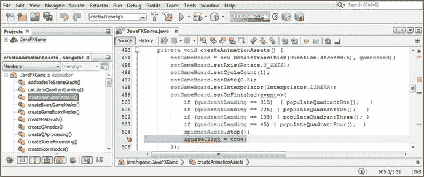

图 23-32.

选择并删除 `createAnimationAssets()` 中的 `squareClick = true;` 语句，因为我们现在要移动它

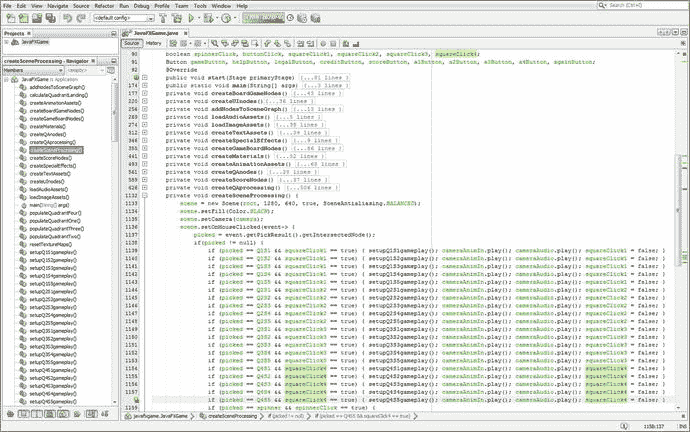

图 23-31.

将你的 `squareClick` 代码改为 `squareClick1` 到 `squareClick4`，以匹配所涉及的象限

从 `createAnimationAssets()` 方法中移除 `squareClick` 引用，因为我们将要在四个 `populateQuadrant()` 方法中基于象限来控制方块点击，现在这样做逻辑上更合理。

如图 23-32 所示，我已选中 `createAnimationAssets()` 中的 `squareClick` 语句准备删除。

如图 23-33 所示，我也选中了 `createBoardGameNodes()` 中的 `squareClick = false;` 语句准备删除，因为我们将要在 `createSceneProcessing()` 方法中执行此操作。实际上，这在图 23-31 中已经展示过，在截图的右侧以黄色高亮显示，这正是它在逻辑上所属的位置。

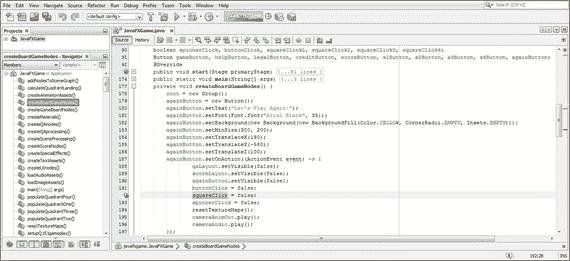

图 23-33.

选择并删除 `createBoardGameNodes()` 中的 `squareClick = false;` 语句，因为我们已经移动了它

你应该将四个 `squareClick` 变量设置为 `true`（允许点击此象限的方块）的位置，是在每个 `populateQuadrantNumber()` 方法调用的末尾，以完成设置。这样，就可以点击其中一个方块来为该象限的主题选择内容。

`squareClick1` 变量放在 `populateQuadrantOne()` 的末尾，`squareClick2` 变量放在 `populateQuadrantTwo()` 的末尾，`squareClick3` 变量放在 `populateQuadrantThree()` 的末尾，`squareClick4` 变量放在 `populateQuadrantFour()` 的末尾。

现在，每个象限都有一个对应的 `squareClickN` 变量。这更好地匹配了游戏玩法范式，因为现在我们可以有选择地仅对玩家降落的游戏板象限启用鼠标点击，并关闭其他三个象限的游戏板方块。这将防止图 23-30 中测试所揭示的问题——即未被随机数生成器选中的象限仍然可以被操作。由于这在视觉上看起来不正确（正如你所见），我们将通过逐个象限关闭方块来解决这个问题，尽管这需要更复杂的防玩家误操作 Java 代码。

`populateQuadrantOne()` 方法体的 Java 代码如下所示，在图 23-34 底部以浅蓝色和黄色高亮显示：

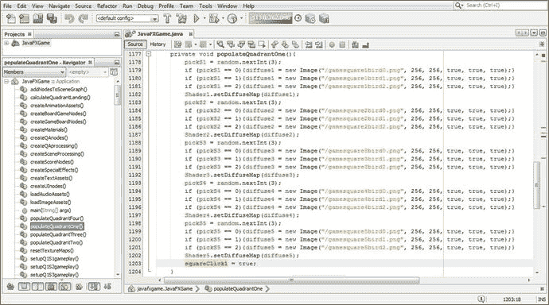

图 23-34.

在 `populateQuadrantOne()` 末尾添加 `squareClick1 = true;` 语句，并在其他三个方法中添加另外三个

```
private void populateQuadrantOne() {
pickS1 = random.nextInt(3);
if (pickS1 == 0){diffuse1 = new Image("/gamesquare1bird0.png", 256, 256, true, true, true);}
if (pickS1 == 0){diffuse1 = new Image("/gamesquare1bird1.png", 256, 256, true, true, true);}
if (pickS1 == 0){diffuse1 = new Image("/gamesquare1bird2.png", 256, 256, true, true, true);}
Shader1.setDiffuseMap(diffuse1);
...
squareClick1 = true;
}
```

在其他三个 `populateQuadrant()` 方法中执行相同的 `squareClickN = true;` Java 语句，以启用 `squareClick` 功能，该功能将在当前游戏回合选中一个方块后被关闭。如图 23-35 所示，游戏现在可以正常运行了。你可以点击转盘和与当前象限无关的方块，这些点击将被忽略，就像在点击第一个答案按钮之后点击任何其他按钮一样。这种“防错”或“防玩家误操作”机制使得 i3D 游戏玩法更加专业。

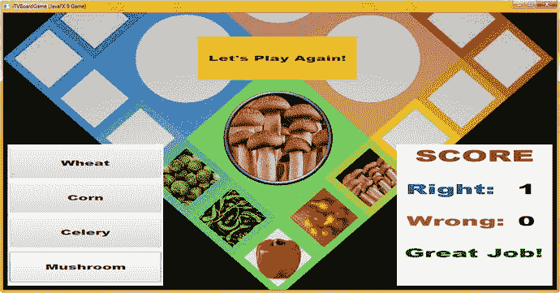

图 23-35.

使用“运行 ➤ 项目”测试最终的防错代码和“再玩一次”用户界面

恭喜，基本游戏玩法现已完成，我们可以着手进行优化和分析了。

## 总结

在第二十三章中，我们学习了如何创建防玩家误操作逻辑，以强制正确使用 i3D 转盘 UI、游戏板方块和答案按钮 UI 元素。这涉及使用大约六个布尔变量作为“标志”，来禁用玩家在单轮游戏中多次点击某个 UI 元素的能力。我们保护了 i3D 转盘 UI、按钮 UI 答案以及每个象限的游戏板方块，防止它们被“滥用”以钻系统空子并获取不应得的分数。这是专业 Java 9 游戏设计与开发中的一个重要部分，以确保你的游戏逻辑按照预期的方式运行。

在本章的第一部分，我们还完成了剩余游戏内容的添加，增加了近 600 行 Java 代码，使当前的专业 Java 9 游戏开发项目代码量达到了近 1750 行。

在第二十四章中，你将通过研究游戏优化、使用 NetBeans 9 进行评估以及 NetBeans 9 分析器来完成收尾工作。


