# 24. 使用 NetBeans 优化游戏资源与代码，并进行游戏性能分析

现在你的游戏已经可以运行，玩家们可以一次点击（回合）地进行游戏，我们可以看看它使用了多少内存，以及所有资源的大小。我们还可以探讨如何将数字音频和图像资源缩小两到四倍。首先使用 GIMP 进行数据占用优化，然后使用 NetBeans 9 Profiler 对当前的 24 位图像资源和 CD 品质的 16 位 44.1KHz 音频资源进行分析。通过这种方式，我们可以判断这些高端多媒体资源是否占用了过多的内存和 CPU 开销，或者我的开发系统能否很好地处理它们。我的开发系统是一台老旧的 4GB 内存、Win7 系统、四核 Acer 迷你塔式机（几年前花 300 美元从沃尔玛购买）。我一直在该系统上使用 NetBeans 9 开发 Java 9，从未出过问题。当前的主流系统是六核或八核，配备 8MB 或 16MB 内存，因此 Java 9 开发在较老的系统上也能轻松完成，并不像 Unity、Android 或 Lumberyard 等其他 i3D 平台那样需要尖端系统。

在本章中，我们将把数字图像资源转换为使用 8 位（索引）颜色，而不是纹理贴图使用的 24 位“真彩色”，并运行 NetBeans Profiler 来查看运行游戏时 Java 代码使用了多少内存和 CPU 处理能力。

## 优化纹理贴图：转换为 8 位颜色

目前，源文件夹（`/src/`）中的数字图像资源大约为 24MB，即 24,000,000 字节，对于一个包含 120 张不同图像的 i3D 棋盘游戏来说，这实际上已经相当不错了（平均每张图像约 200KB）。然而，如果我们能将其压缩到大约 10MB（每张图像 84KB），就能大大减小游戏发行包的大小。要将图像的“重量”或大小减少 300% 到 400%，方法是使用 8 位颜色（索引颜色）以及“抖动”或点阵图案，来模拟超过索引图像最大 256 种颜色的更多色彩。中小型纹理贴图（正是我们用于游戏棋盘方格和象限的）非常适合使用索引颜色。原因在于，抖动效果在放大（近距离）时可见，但当图像从更远处观看（远距离或缩小）时，这种视觉效果就会消失。我将在本章的这一部分向你展示这一点，我们将把所有 120 个图像资源从 24 位转换为 8 位索引颜色。

### 创建索引颜色纹理：在 GIMP 中更改颜色模式

让我们优化图像资源，这样就不必对 Java 代码进行重大修改。为了保持 Java 代码不变，我们将使用相同的文件名，并将它们放在 `/src/` 下的一个名为 `/8bit/` 的不同文件夹中。这样，我们将拥有指向索引颜色资源的 `/src/8bit/` 路径，以及指向 24 位高质量资源的 `/filename` 路径。使用你的操作系统文件管理工具，在当前包含原始真彩色图像资源的 `/src` 文件夹下创建一个名为 `/8bit/` 的文件夹（目录）。图 24-1 显示了此新文件夹。

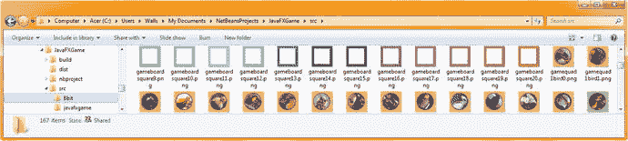

图 24-1.

创建 `/JavaFXGame/src/8bit/` 文件夹，用于存放 120 个纹理贴图图像资源的优化版本

在 GIMP 中使用 **文件 ➤ 打开** 菜单打开第一个 `gamequad1bird0.png` 纹理贴图图像，然后使用 **图像 ➤ 模式 ➤ 索引** 菜单序列将 24 位色彩空间（颜色模式）转换为 8 位，如图 24-2 所示。这将打开“索引颜色转换”对话框，允许你选择颜色数量和抖动算法。8 位模式将位数减少了 300% 或更多，而抖动算法则模拟了超过 256 种颜色。

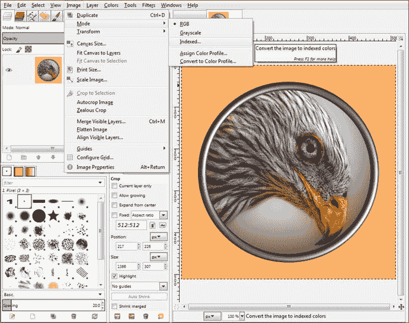

图 24-2.

使用 **文件 ➤ 打开** 菜单序列打开一个纹理贴图，并使用 **图像 ➤ 模式 ➤ 索引** 将其转换为 8 位

我通过选择“生成最优调色板”单选按钮（如图 24-3 最左侧对话框所示）以及标准的 Floyd-Steinberg 颜色抖动算法，来使用允许的最大 256 种颜色（0 到 255）。然后点击对话框右下角的“转换”按钮。要将 8 位图像导出到 `/src/8bit/` 文件夹，请使用 GIMP 的 **文件 ➤ 导出为** 菜单序列，双击 8bit 文件夹（如图 24-3 第二个面板中高亮显示），然后点击“导出”按钮（保持 24 位文件名不变，如第三个面板中高亮显示）。

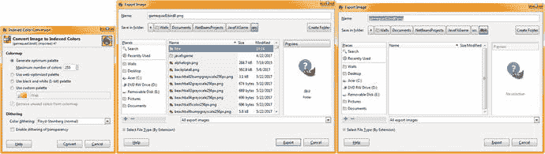

图 24-3.

设置转换为 256 色 Floyd-Steinberg，转换，并以相同文件名保存到 `/src/8bit` 文件夹

如图 24-4 所示，如果我们将一张图像（`gamequad1bird1.png`）转换为 8 位索引颜色后，放大到第二个象限，可以清晰地看到背景、鸟喙和钢环中的抖动效果。有趣的是，当你将图像用作纹理贴图（缩小）时，就看不到这种抖动了！我将在本章后面（图 24-26 和图 24-27）在 Java 代码中实现这些更改时向你展示这一点。

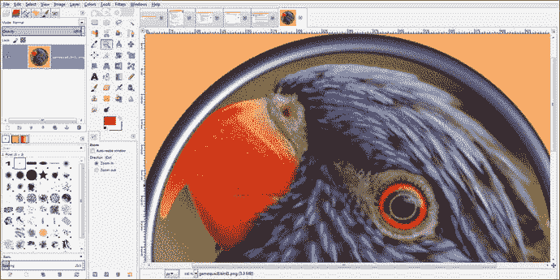

图 24-4.

点击放大镜（缩放）工具，放大 300%（三次）以查看颜色抖动算法

如图 24-5 所示，你的真彩色（24 位）图像质量完美，但使用的数据量要多出数倍。当缩小（用作纹理贴图）时，两张图像看起来几乎相同，这就是为什么我们要将 24 位图像转换为 8 位图像，这样我们可以将数字图像资源从 24MB 减少到不到 8MB，而 i3D 游戏棋盘纹理贴图的感知质量几乎没有损失，至少从玩家的角度来看是这样。

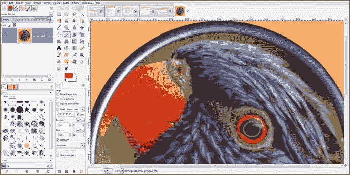

图 24-5.

撤销索引颜色，点击放大镜工具，再次放大 300% 以查看（原始）真彩色数据


使用文件 ➤ 关闭对话框（如图 24-6 所示），在将索引图像文件保存到 `/src/8bit` 文件夹后将其关闭。由于你是从 `/src` 文件夹中打开的 24 位文件，请务必点击“放弃更改”，这样你就能保留原始的 24 位 PNG24 文件以及新导出（保存）的 8 位 PNG8 文件，这两个文件名称相同，但存放在不同的文件夹中。在你要执行此操作的 120 次过程中，这一点至关重要，这样才能确保你在不同目录下分别得到 120 个 PNG24 文件和 120 个 PNG8 文件。要更改这些图像的引用路径，只需在你创建的索引颜色资源文件夹名称中添加 `/8bit/filename.png` 路径更改，i3D 游戏便会使用这些体积更小的文件来为游戏棋盘方格和象限区域进行纹理映射。

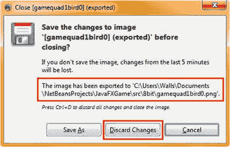

图 24-6.

点击“放弃更改”以保留 24 位版本

如图 24-7 所示，第一个象限已完成，8 位文件的大小范围在 76KB 到 104KB 之间。

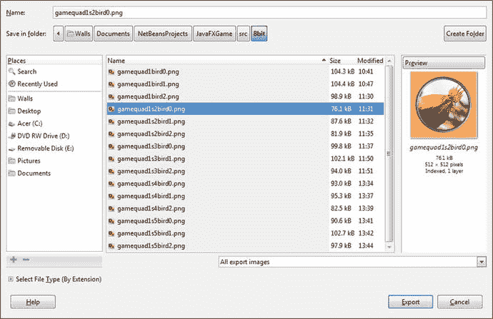

图 24-7.

第一个象限的纹理贴图已缩减超过 300%，作为纹理贴图看起来依然非常出色

如图 24-8 所示，我们已将象限纹理贴图的数据从 4MB 缩减至 1.33MB。

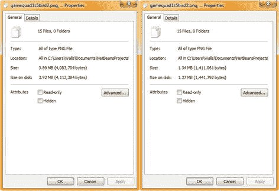

图 24-8.

在文件资源管理器中预览数据缩减情况

如图 24-9 所示，我已继续对所有 60 个图像资源进行象限纹理贴图的缩减。

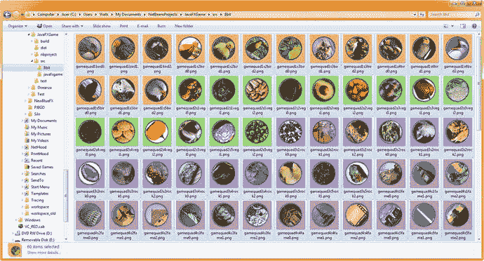

图 24-9.

进入 `/src/8bit` 文件夹，选中全部 60 张图像，右键单击所选内容，然后打开“属性”

如图 24-10 所示，我现在也完成了游戏棋盘方格的这些 8 位图像。

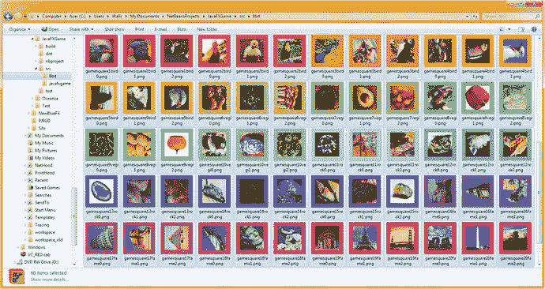

图 24-10.

进入 `/src/8bit` 文件夹，选中全部 60 张图像，右键单击所选内容，然后打开“属性”

如图 24-7、24-9 和 24-10 所示，这些索引颜色图像越小，它们看起来就越接近真彩色图像，尽管在许多情况下它们的大小要小好几倍（三到四倍）！我们在本章的第一部分介绍如何将图像优化为 8 位（索引）颜色，因为这是减少分发文件数据占用空间（代码和资源包中图像资源的大小）的有效方法。

其中一些图像，例如红甜椒，使用索引颜色效果会非常好，因为红色光谱、白色背景和绿色边框颜色可以非常接近地使用仅 256 种颜色以及相近颜色之间细微的抖动来呈现真彩色图像，放大后甚至都看不出来。图 24-11 显示了象限纹理贴图（左半部分）和方格纹理贴图（右侧）的真彩色与索引图像结果（来自图 24-9 和 24-10 所示的选择类型）。

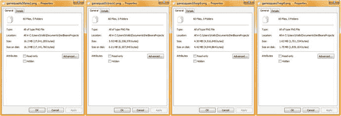

图 24-11.

右键单击两个文件夹中选定的方格和象限图像；使用“属性”预览优化效果

我们已将游戏棋盘象限纹理贴图的数据占用空间从 17,041,285 字节减少到 6,208,570 字节，减少了 10,832,715 字节。这意味着象限图像的数据占用空间减少了 65%（三分之二）。这些图像是 512 像素见方，对于 i3D 游戏来说相当大（高质量），因此 60 张图像占用 6MB 属于高质量，每张象限图像约 100KB，正如你在图 24-7 的 GIMP 中已经看到的那样。

我们还将游戏棋盘方格纹理贴图的数据占用空间从 4,516,845 字节减少到 1,701,334 字节，减少了 2,815,511 字节。这意味着游戏棋盘方格图像的数据占用空间减少了 63%。这些图像是 256 像素见方，对于 i3D 游戏来说是主流（高质量），因此 60 张图像占用 1.7MB 属于高质量，每张游戏棋盘方格图像约 28KB，或者说每个游戏主题选择约占用 128KB 的图像数据。

要引用这些优化后的资源，只需在 Java 代码中的文件名前添加 `/8bit/` 路径，我们稍后会在使用原始 24 位数字图像资源和 CD 质量数字音频资源对当前代码进行分析之后执行此操作。始终使用最高质量的资源来分析代码，这样你就能看到内存和 CPU 周期是否受到过大（从数据占用空间角度）的新媒体元素的影响。就专业 Java 游戏而言，NetBeans 分析器会告诉你很大一部分相关信息。是的，你的 Java 逻辑很重要。无限循环问题会很快在分析器中显现出来，但非最优的动画对象结构、过大的纹理贴图、过长的数字音频音效、优化不佳的数字视频以及使用过多多边形（过多几何体）的 i3D 资源也同样会显现出来。这就是我们在本书前三分之一部分探讨各种新媒体概念和原理的原因，因为新媒体优化会影响游戏的运行方式。


## NetBeans 9 分析器：测试内存与 CPU 使用率

要调用 NetBeans 9 分析器，只需使用“分析”菜单及其顶部的“分析项目 (JavaFXGame)”选项，如图 24-12 所示。图中还显示了 40 个自定义方法、必需的 `start()` 和 `main()` 方法，以及自我们创建 JavaFXGame 引导应用程序以来添加的 1700 行 Java 9 代码。一次 NetBeans 9 分析会话可以展示程序执行期间计算机发生的许多复杂的“幕后”操作，以及与服务器的交互，甚至 SQL 数据库访问模式。因此，本章不会涉及 NetBeans 9 分析系统的所有功能；但是，如果您对 Java 软件分析感兴趣，您当然应该利用您在其他 64 位工作站上的其他 Java 9 软件开发项目，在空闲时间自行探索和试验分析器选项。

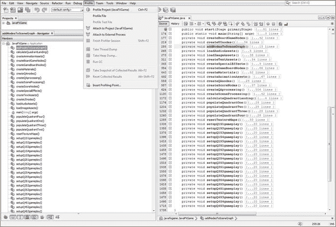

图 24-12.

调用分析器 ➤ 分析项目 (JavaFXGame) 菜单序列以启动 NetBeans 分析会话

首次调用分析器后，您将在 IDE 中获得一个包含分析 UI 和生成的分析数据 UI 的选项卡，如图 24-13 所示。JavaFXGame 选项卡有一个分析图标、一个位于左上角的“配置会话”下拉菜单 UI 元素，以及一个“配置并开始分析”指令序列，该序列将概述分析器选项类型，并准确告诉您如何选择要使用的选项。

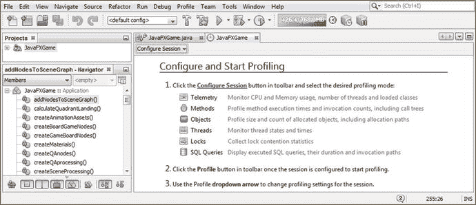

图 24-13.

一旦调用 NetBeans 9 分析器，您将获得一个 JavaFXGame 分析选项卡和配置说明

我们将首先查看遥测分析模式，因为它向我们展示了游戏如何使用系统内存和 CPU 周期，以及线程、类和垃圾回收如何在开发系统上影响游戏运行。这是我们首先要查看的大部分关键游戏代码处理信息，以确保您的 i3D 棋盘游戏以最佳方式（即高效地）使用 Java 9 和 JavaFX 9。

单击选项卡窗格左上角“配置会话”UI 选择器旁边的向下箭头，然后选择“遥测”选项（如图 24-14 中以浅蓝色突出显示的部分），以启动 NetBeans 遥测分析会话。保持默认的“使用已定义的分析点”选项处于选中状态，以允许 NetBeans 9 为您初始配置此分析会话。如果发现异常情况，您可以在后续的分析会话中设置自定义分析点，以进一步尝试确定 Java 游戏代码的问题所在。现在，让我们希望本书中专注于以最佳方式完成工作的努力已经得到了回报。无论如何，NetBeans 分析器都会揭示这一点！

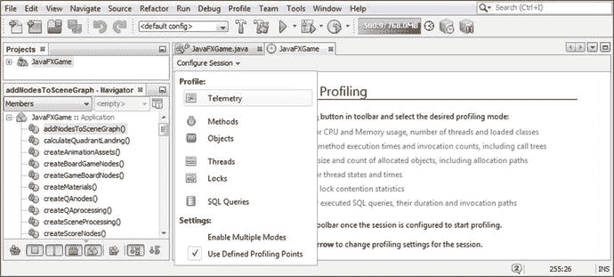

图 24-14.

下拉“配置会话”菜单并选择“遥测”选项以分析您的内存和 CPU

然后，您的 JavaFXGame 分析窗格将显示 CPU（和垃圾回收）图表的 UI 基础设施、（系统）内存实时使用情况图表、垃圾回收处理图表以及线程和类图表，如图 24-15 所示。由于尚未使用“分析项目”图标（如图顶部所示，带有淡黄色弹出描述符）激活（启动）分析，因此尚未收集任何数据。

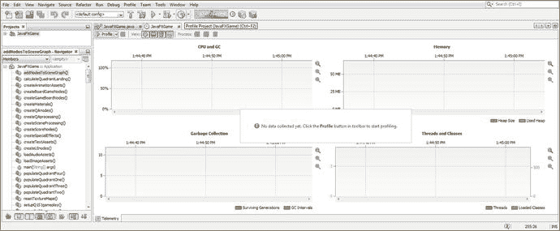

图 24-15.

一旦您单击“分析项目”图标或菜单项，JavaFXGame 分析窗格将填充空的 UI 元素

单击您的“分析项目”图标，您将看到“分析器现在将对您的机器和目标 JVM 执行初始校准”消息，如图 24-16 中一系列五个对话框最左侧所示。请记住，NetBeans 分析器正在分析您的系统和 Java 9 JVM，因此，如果您在 8 核、12 核或 16 核计算机（例如新的 AMD Ryzen 5 或 7 系统，配备 16GB DDR4-2400 内存）上进行分析，您将得到与我在一台仅配备 4GB DDR3-1333 内存的旧四核 Acer AMD 3.11GHz 系统上获得的不同结果。我使用像这样的旧 Windows 7 系统的原因是展示 Java 9 和 NetBeans 9 的优化程度，以至于您可以使用一台无法用于 Amazon Lumberyard、Android Studio 3.0 或 Unity 开发的计算机来开发专业的 JavaFX i3D 游戏。


图 24-16.

启动分析器后，您将看到一系列用于校准和配置此分析过程的对话框

如果您看到 Windows 7 防火墙对话框，请单击“允许访问”按钮，如图 24-16 中的第二个对话框所示。然后选择“显示此校准数据的详细信息”并单击“确定”按钮继续。您将看到一个显示一些已获取校准数据的对话框，一旦您单击该对话框的“确定”按钮，您将看到一个“正在连接到目标 VM”对话框，其中显示一个进度条，因为 NetBeans 9 IDE 正在将您的游戏代码和内容加载到系统内存中，以便它可以执行校准并最终进行分析数据收集和显示。

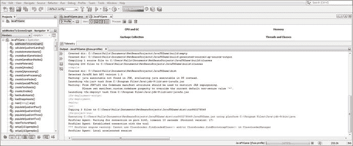

图 24-17.

将打开一个“输出”窗格，显示您的 Java 9 代码正在 NetBeans 分析器代理实用程序中运行

接下来您将看到的是，如图 24-17 所示，“输出”窗格正在执行您游戏的 Java 代码。

关闭“输出”窗格以再次显示分析器遥测 UI。现在，游戏和分析器应该共享屏幕。您在游戏中执行的任何操作都将实时反映在这些 NetBeans 分析器遥测面板中，如图 24-18 所示。我将使用红色 Arial 文本对接下来五张图中的每一张进行注释，以阐明我正在测试的五个主要游戏阶段中的哪一个，您可以从您的分析器 UI 数据中看到 3D 动画、音频播放、纹理贴图加载（或卸载）、事件处理和 Java 代码处理在 CPU 处理（百分比）开销、系统内存使用（大部分将用于加载数字图像或保存和播放数字音频，以及保存我们用于进行 3D 建模、3D 纹理、3D 动画和音频的 JavaFX API 类）、垃圾回收、线程使用和（单个游戏原型）类使用方面的情况。

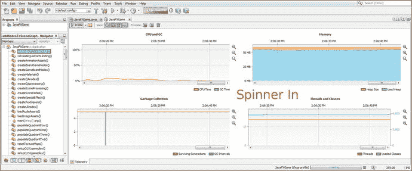

图 24-18.

将旋转的 3D 微调器 UI 动画对象移动到屏幕上仅使用 CPU 容量的 0% 到 5%

如图 24-18 所示，将您的 i3D 微调器 UI 移动到屏幕上仅使用 CPU 的百分之几，仅持续一两秒钟，因此这似乎编码良好。一旦 i3D 微调器 UI“着陆”在屏幕上，单击它（其分析数据如图 24-19 所示）在 CPU 使用率方面看起来也高度优化。请注意，已着陆的游戏棋盘象限（五个）方形图像的填充可以在“垃圾回收”窗格和“线程和类”窗格中看到。当您的随机数生成时，此活动会达到峰值，并且五个游戏方块会加载随机选择的图像资源，然后这些资源被放置在系统内存中。

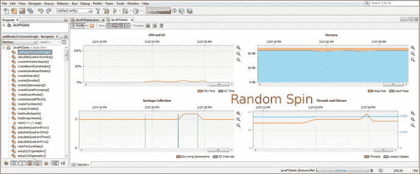

图 24-19.


棋盘旋转利用垃圾回收机制将图像加载到内存中，并使用线程来选取随机数。

选取一个方格会触发垃圾回收来加载象限图像，当方格被选中时，CPU 线程处理会出现峰值，这代表了垃圾回收、事件处理、问答和分数处理的过程，如图 24-20 所示。

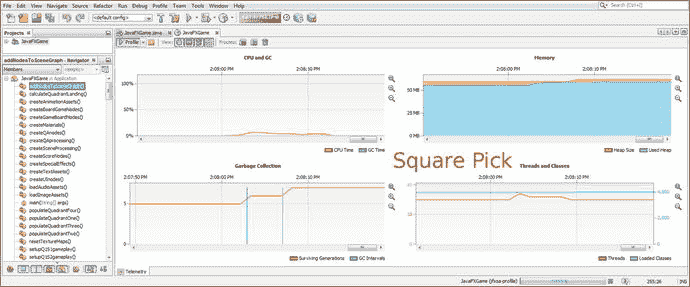

图 24-20.

选取方格会使用垃圾回收将图像加载到内存中，并使用线程来显示 UI 面板

另一方面，选取答案则不会触发任何垃圾回收来加载图像，如图 24-21 所示。它仅使用极少的（几乎为零的）CPU 开销来更新分数面板并显示文本资源。

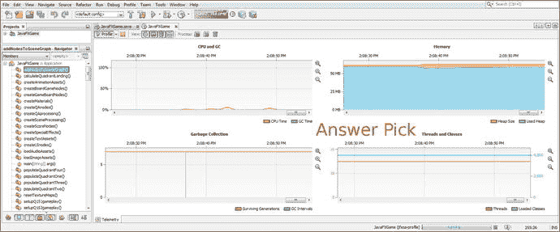

图 24-21.

选取答案（按钮）涉及的开销最小，仅需少量 CPU 开销用于计分

使用“再来一局”按钮对象重置游戏及其所有处理过程，其开销与 3D 棋盘旋转（图 24-19）相当，如图 24-22 所示。垃圾回收会重置所有纹理贴图，摄像机动画改变游戏视角，事件处理锁定不必要的点击，音频播放播放摄像机动画的音效，以及其他类似的高处理密集型代码会重置游戏以开始新一轮。

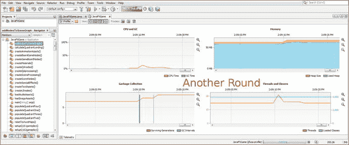

图 24-22.

点击“再来一局”按钮对象会引发第二次 CPU 和内存使用高峰，用于处理音频和动画等特效

内存使用量维持在 60MB 也相当不错，考虑到这包括了图像数据、CD 品质的音效、JavaFX 动画（Transition）类，以及 AudioClip、Images、StackPane、Buttons、3D Primitives、Text、（SceneGraph）Node 和工具类（Inset、Color、Pos 等）的使用，所有这些都利用了我们在构建这个 i3D 专业级 Java 9 游戏时所使用的 JavaFX 类。

这些内存开销中，几乎没有任何一部分可以直接归因于你为组装这个游戏所编写的 1700 行 Java 代码；99% 的内存使用可归因于加载新的媒体资源以及许多用于访问和运行这些新媒体资源的 JavaFX 9 类。

如图 24-23 所示，一旦你完成对 Java 9 游戏的分析，你将看到一个信息对话框，显示“被分析的应用已执行完毕”。点击“确定”终止虚拟机，你将看到一个摘要方块（黑色），显示分配的内存堆大小（71MB）以及运行分析会话所使用的总内存量（66MB）。如果你认为 66MB 内存很多，请考虑这台机器拥有 4096MB 内存，而 66MB 仅占其 1.6%。许多现代智能手机、智能电视、平板电脑和笔记本电脑拥有 8GB 系统内存，因此整个游戏生态系统和基础设施所占用的系统资源不到 1%。在 2GB 的智能手机或（老式）计算机系统上，这大约占系统资源的 3%。对于一个动画交互式 3D 棋盘游戏来说，这已经相当不错了，所以 Java 做得非常出色！

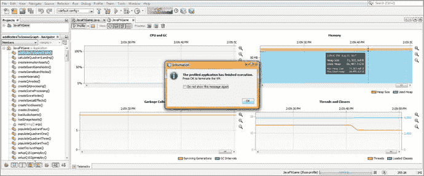

图 24-23.

一旦你完成分析，NetBeans 将为你提供一个内存使用摘要和信息对话框

接下来，让我们看看如何优化我们的 Java 代码，因为我编写本书时使用的代码是我称之为“原型”代码。它在技术上是正确的，但（尚未）利用任何可能实现高级 Java 语言语法或特性（如数组或哈希表）的 Java 编码结构。这样做的原因是，我试图帮助新的游戏开发者和程序员在脑海中“可视化” Java 游戏逻辑（代码）正在做什么，而做到这一点的最简单方法是以一种能展示代码意图的可视化方式进行编码。

请注意，Java 9 的编译、构建和执行过程也会在“幕后”对代码进行大量优化，正如前面关于性能分析的部分将展示的那样，即使没有进行任何特定的“程序员优化”，这段 Java 9 代码的性能也非常出色。此外，不同的程序员有太多不同的实现方式，因此我更希望专注于 JavaFX 游戏 API、游戏设计与开发工作流程以及游戏资源开发，而不是标准的 Java 代码优化——后者在 Apress 的其他数百本书中已有详尽介绍。

我们将在本章后面关于 Java 9 游戏代码优化思路的部分中，探讨其中一些 Java 代码优化方法。首先，让我们完成在游戏中实现 8 位索引图像资源，并运行游戏，看看索引色 PNG8 资源与真彩色 PNG24 图像资源之间是否存在任何视觉差异。


## 实现索引颜色图像：添加路径

将图像资源从真彩色转换为索引颜色，只需在 `populateQuadrant()` 方法和 `setupQSgameplay` 方法中添加 `/8bit` 路径即可。你无需对 `loadImageAssets()` 和 `resetTextureMaps()` 方法进行此操作，因为这些方法使用的纹理贴图并非索引格式，它们本身已经很小（只有几 KB），可以保持为真彩色图像。原因在于这些纹理不包含数字图像，它们是在每轮游戏旋转开始前，用于让游戏面板呈现空白状态的空白纹理。我截取了一张 `populateQuadrantOne()` 方法的截图，展示了添加的 `/8-bit` 路径，如图 24-24 所示。

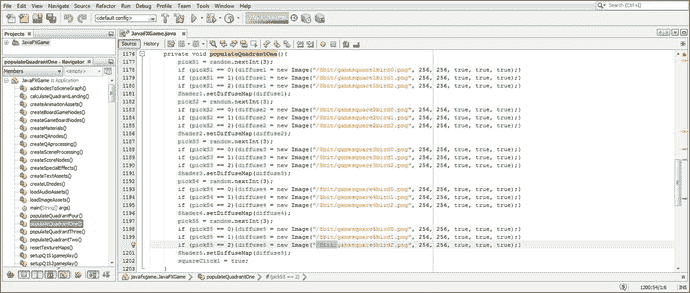

图 24-24.

在当前图像文件名引用前添加 `/8bit` 路径，以指向新的索引图像

你需要在设置游戏玩法的 20 个方法中，对数字图像引用也添加相同的 `/8bit` 路径。这些方法以每个象限（Q）和方格（S）命名，即你的 `setupQSgameplay()` 方法，我将它们留在了自定义的 40 个方法和 2 个必需方法（`start()` 和 `main()` Java 方法）的末尾。

我截取了第一个 `setupQ1S1gameplay()` 方法的截图，以展示我已将 `/8bit` 路径添加到数字图像引用的前面。我这样做是为了让你的新 8 位（索引颜色）PNG8 数字图像能够作为棋盘游戏的纹理贴图，而不是使用我们一直在用的 24 位真彩色数字图像。

我们这样做是为了能够通过 **运行 ➤ 项目** 工作流程来测试你的游戏，看看当使用体积缩小 325% 的索引颜色图像而非 24 位真彩色 PNG 图像时，i3D 游戏在视觉上是否有任何差异。图 24-25 展示了 20 个方法中的第一个，这些方法需要通过添加 `/8bit` 文件夹路径到数字图像引用名称的前面（头部）来进行“路径修改”。为了轻松完成此操作，请复制 `/8-bit` 路径一次，然后在 `populateQuadrant()` 方法中粘贴 60 次，在 `setupQSgameplay()` 方法中粘贴 60 次。

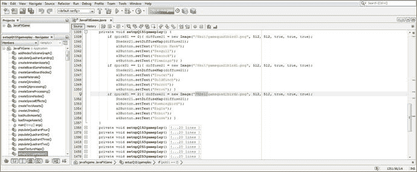

图 24-25.

在当前图像文件名引用前添加 `/8bit` 路径，以指向新的索引图像

接下来，让我们使用图 24-26 所示的 **运行 ➤ 项目** 工作流程，看看随机旋转后游戏面板是否看起来一样。如你所见，它看起来与本书中我们使用真彩色图像时的样子几乎完全相同。接下来我们需要做的是放大查看，看看 8 位图像的表现如何。

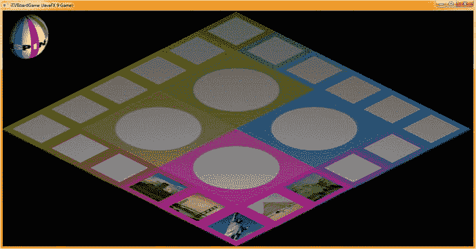

图 24-26.

使用 **运行 ➤ 项目** 工作流程；旋转游戏面板，看看新的 8 位彩色图像是否看起来相同

点击带有颜色渐变的图像，在本例中是旧金山湾大桥，如图 24-27 中选中的部分。这将向我们展示大的象限图像，以便我们查看是否存在任何抖动图案。

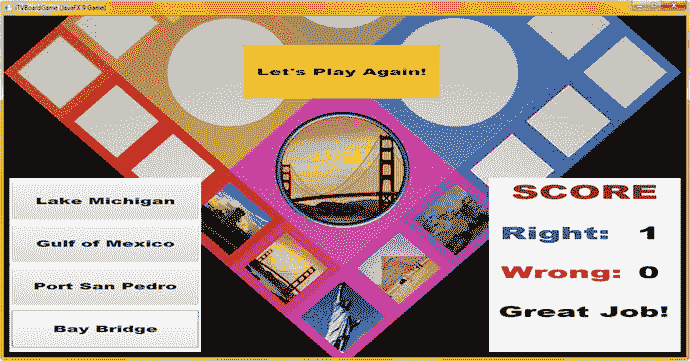

图 24-27.

选择一个能显示抖动的图像，将游戏面板放大，看看图像是否看起来相同

如你所见，当将其用作 i3D 游戏面板上的纹理贴图时，看不到任何可见的抖动图案（点状伪影），这表明我们可以成功地将索引颜色用于此 i3D 棋盘游戏的纹理贴图，而不会感受到交付质量的任何下降。这带来了专业级的效果，一切看起来都像是使用了真彩色，甚至每个象限中的那个钢环，看起来仍然像钢一样，没有任何可察觉的抖动。接下来，让我们看看如何优化你的 16 位数字音频资源。

## 优化音频：使用较低采样率的 16 位音频

我们已经很好地介绍了如何使用 Audacity 2.1.3 优化数字音频，因此我建议使用 16 位音频采样分辨率，并优化采样率（48、44、32、22、16、11 或 8kHz），直到你听到音质发生变化。我们已经有了 16 位 44.1 kHz（当前使用）和 16 位 22.05 kHz 的音频，后者每个音效样本的数据量只有前者的一半，但音质听起来非常相似。如果你想使用更小的数字音频内存占用，只需在 `loadAudioAssets()` 方法体中引用优化程度更高的音频资源即可。

此时，我将这个内存与音质的权衡决定完全留给你。如果你想回到 Audacity 并优化其他三种采样率，例如 THX（48 kHz）、32 kHz 甚至 16 kHz，你可以聆听每种采样率下生成的 16 位音频质量，并决定为每个级别的数字音频质量分配多少系统内存。

请注意，你可以为游戏中的每个数字音频资源使用不同的采样率。某些音效在较低采样率（11 和 16 kHz）下也能保持音质，而其他音效（如音乐、人声）可能需要更高的采样率（22 和 32 kHz）。不过，我建议全面使用 16 位采样分辨率，因为它能更好地适配内存，因为内存“块”是 8 位、16 位和 32 位的，你需要实现无缝适配。


## Java 游戏代码优化：善用 Java 技巧

你可能已经注意到，在本书中设计和构建专业 Java 9 游戏的过程中，我一直使用长格式、易读（且易懂）的 Java 代码。这些代码是合法的，并且可能会被 Java 9 的编译、构建（和执行）软件阶段优化，因此它们并非“糟糕”的代码，但确实存在一些优化流程和结构，可以使其显著缩短并更加精简。在书中进行此过程的问题在于，每个 Java 程序员都有自己偏好的不同方式，那么我该选择哪种方法呢？还是展示大部分方法？不幸的是，本书的篇幅有限，需要涵盖新媒体资产开发、游戏设计、开发和测试，以及类似的需要掌握才能成为专业 Java 9 游戏开发者的广泛主题。在本章的最后一节，我将介绍一些你可能希望稍后自行添加到这个棋盘游戏中的其他内容，以便练习你所学到的知识。

首先，让我们看一下 `populateQuadrant()` 方法的代码。`populateQuadrantOne()` 方法以以下 Java 序列开始，其中每个构造对应象限 1 中的五个游戏棋盘方格之一：

```
pickS1 = random.nextInt(3);
if (pickS1 == 0) { diffuse1 = new Image("/gamesquare1bird0.png", 256, 256, true, true, true); }
if (pickS1 == 1) { diffuse1 = new Image("/gamesquare1bird1.png", 256, 256, true, true, true); }
if (pickS1 == 2) { diffuse1 = new Image("/gamesquare1bird2.png", 256, 256, true, true, true); }
Shader1.setDiffuseMap(diffuse1);
```

一旦你确认代码在原型设计后能正常工作，就可以将其简化为以下代码，这也消除了条件 `if()` 的 CPU 处理和内存开销：

```
pickS1 = random.nextInt(3);
diffuse1 = new Image("/gamesquare1bird" + pickS1 + ".png", 256, 256, true, true, true);
Shader1.setDiffuseMap(diffuse1);
```

诚然，这使得在游戏玩法代码中更难看清你在做什么，但代码以相同方式运行，并且代码行数几乎减少了一半，使你可以将 `populateQuadrantN()` 方法从 26 行代码减少到 16 行代码，代码量减少了 38%，或者所有四个方法总共减少了 40 行代码。

接下来，考虑来自第 19 章的以下代码块，它可能需要 17 到 25 行代码来编写：

```
if (picked == spinner) {
int spin = random.nextInt(4);
if (spin == 0) {
rotGameBoard.setByAngle(1080); rotSpinner.setByAngle(-1080); spinDeg += 1080;
}
if (spin == 1) {
rotGameBoard.setByAngle(1170); rotSpinner.setByAngle(-1170); spinDeg += 1170;
}
if (spin == 2) {
rotGameBoard.setByAngle(1260); rotSpinner.setByAngle(-1260); spinDeg += 1260;
}
if (spin == 3) {
rotGameBoard.setByAngle(1350); rotSpinner.setByAngle(-1350); spinDeg += 1350;
}
rotGameBoard.play();
rotSpinner.play();
calculateQuadrantLanding();
}
```

以下基于数组的 Java 代码块与之前的代码等效。它要短得多，只有 10 行 Java 9 代码，减少了 41% 到 60%（具体取决于你在 `if (spin == n) { … }` 内部编写代码的方式）：

```
if (picked == spinner) {
int spin = random.nextInt(4);
double[] angles = { 1080, 1170, 1260, 1350 };
rotGameBoard.setByAngle(angles[spin]);
rotSpinner.setByAngle(-angles[spin]);
spinDeg += angles[spin];
rotGameBoard.play();
rotSpinner.play();
calculateQuadrantLanding();
}
```

在计算出随机旋转值之后，这段代码片段声明了一个包含四个元素的 double 类型数组，这些元素代表象限着陆角度。然后我使用旋转值（`random.nextInt(4)` 输出四个随机象限值之一，范围从 0 到 3）来访问一个角度值（通过 `angles[spin]`），该值被传递给 `setByAngle`，同时也被加到 `spinDeg` 变量中。

请注意，如果 `spinDeg` 是 `int`（32 位整数）类型，你必须在赋值之前将 `double` 角度值强制转换为 `(int)`，否则会面临 Java 编译器错误。在这种情况下，你应该将 `spinDeg += angle[spin];` 替换为 Java 9 代码 `spinDeg += (int) angle[spin];` 以避免此 Java 编译器错误。

如果你不想三次指定 `angles[spin]`，也可以将值存储在一个角度变量中，然后使用这个 double 类型的角度变量，如下面的 Java 代码所示：

```
if (picked == spinner) {
int spin = random.nextInt(4);
double[] angles = { 1080, 1170, 1260, 1350 };
double angle = angles[spin];
rotGameBoard.setByAngle(angle);
rotSpinner.setByAngle(-angle);
spinDeg += angle;
rotGameBoard.play();
rotSpinner.play();
calculateQuadrantLanding();
}
```

正如你所见，有多种编写此游戏 Java 代码的方法可以减少使用的代码行数，甚至可能略微降低游戏使用的几个百分点的 CPU 使用率，如本章的 NetBeans 9 性能分析部分所示。由于每个人都有自己独特的代码优化风格和方法，我将把 Java 9 代码优化留给你，并在本书材料中使用（较长的）原型代码。这将使你能够更好地理解我在游戏玩法设计和开发工作流程中对新媒体资产的处理，并将本书内容聚焦于使用 Java 9 及其强大的 JavaFX 9 API 进行专业游戏设计与开发。

最后，让我们在本章中再增加一节，看看我们可能利用哪些其他 JavaFX 9 API 类来进一步扩展这个 i3D 游戏，毕竟你最终会这样做。你可以从第三方导入器包中导入 i3D 模型（不幸的是，这还不是 JavaFX 的“原生”部分，因此本书坚持使用 JavaFX i3D API），并添加数字视频资产，前提是你仔细优化它们。由于 JavaFX 9 模块（分发打包）尚未完全完成（距离 Java 9 发布还有一个月或更长时间）。一旦 Oracle 发布它，一份涵盖 JavaFX 9 模块（游戏分发打包）的附录将作为本书可下载源代码的一部分提供。要下载本书的源代码，请访问 [`www.apress.com/9781484209745`](http://www.apress.com/9781484209745) 并点击“下载源代码”按钮。


## 未来扩展：添加数字视频与 3D 模型

你可以通过使用第三方网站 InteractiveMesh.org 的 i3D 导入软件，以及添加使用 Black Magic Design 的 DaVinci Resolve 14 等工具创建的数字视频素材，为你的 i3D 棋盘游戏添加更复杂的新媒体元素。你可以使用像 Sorenson Media 的 Squeeze Desktop Pro 11 这样的专业工具来优化视频。这将让你获得更多使用 JavaFX 9 更高级的数字视频和 3D API 的经验。

我接下来要做的事情之一是优化用于说明、致谢、法律信息等的 2D 启动代码。既然游戏原型已经完成，重新审视启动画面图形也是一个好主意。请记住，《Pro Java 9 Games Development》，尤其是 i3D 游戏，是一个不断优化的过程，因为构成 i2D 和 i3D 游戏资源的数百个新媒体组件通常需要经过优化，才能使游戏符合游戏开发者艺术家的愿景。

一旦你完成了游戏原型，就可以进行我们之前讨论过的代码优化，甚至在必要时为不同的特性或功能创建不同的类。我的技术编辑同意我的观点，即这个游戏不需要额外的类，因为我试图使用 JavaFX API 中已有的类来创建一个 i3D 棋盘游戏。事实上，我导入了（使用了）44 个 Java 或 JavaFX 类来创建这个游戏，所以尽管我有一个 JavaFXGame 主类将所有内容整合在一起，但实际上有 45 个类在共同创建这个游戏。其中 44 个类是由 Sun Microsystems 公司，以及后来在收购 Sun 后的 Oracle 公司，预先创建、编码和优化的。我在本书中试图展示的是如何创建一个 Pro Java 9 游戏，通过最优地使用 JavaFX API 类，并最大限度地减少开发人员创建 i3D 棋盘游戏所需完成的实际工作量，从而充分利用这些公司过去十年来的所有工作成果。随着 Oracle 不断改进这些类，JavaFX 9 将继续成为一个更强大、更令人印象深刻的游戏引擎，并且理想情况下，对 iOS 和 Android 8 的支持也将持续发展和改进。

## 总结

在这最后的第二十四章中，我们探讨了各种资源（数字图像和数字音频）的优化，以及 Java 代码的优化。我们了解了 NetBeans Profiler，以及如何查看运行游戏所使用的系统内存量。我们还查看了 CPU 用于处理 Java 代码的百分比，以及垃圾回收何时将纹理贴图加载到系统内存（或从系统内存中卸载）。我们还研究了线程何时被用于处理内存位置、指令、循环、随机数生成以及类似的 Java 代码指令。

我们还探讨了未来可以在游戏中优化和添加的其他一些内容，以便进一步利用 JavaFX 9 的类。请务必使用 Profiler 来监控系统内存和 CPU 使用情况。我使用一台“较弱”的工作站（4GB 内存，四核 AMD 3.11GHz Acer），这样我就能在“次主流”电脑上测试代码，同时这台电脑也有足够的性能和内存来流畅运行 NetBeans 9、Java 9 和 JavaFX 9。这证明了 NetBeans 9、Java 9 和 JavaFX 的高效性。

我希望你喜欢这二十四个章节，它们涵盖了新媒体资源开发以及 Java 9 和 JavaFX 9 游戏开发，重点放在了 JavaFX 9 API 的 i3D 部分，正如我的《Beginning Java 8 Games Development》一书侧重于 JavaFX API 的 i2D 部分一样。我还在 Apress（[`www.apress.com`](http://www.apress.com)）出版了几本关于新媒体资源（内容）创作的书籍，涵盖了使用 Fusion 8 进行数字图像合成、数字音频编辑、数字视频编辑、数字插画（SVG）矢量编辑、数字绘画和视觉特效（VFX）创作。所有这些书籍都使用免费商用的专业开源软件包，例如 GIMP、Inkscape、Audacity 和 Fusion。一旦 Black Magic Design 完成 DaVinci Resolve 14（一个非线性编辑套件），我就会将其添加到我的开源内容制作套件中，该套件会安装在我为 JavaFX 9、Android 8 或 HTML 5.1 内容制作而设置的每一台工作站上。对于新硬件，我正在关注 AMD 的新款 Ryzen 7 1700，它仅需 65W 功耗就能以 3.0GHz（超频可达 3.7GHz）运行 16 个 64 位线程；它配备 Radeon 7000 GPU，大多数主板支持 64GB DDR4-2400MHz 内存（四个插槽）、USB 3.1、24 位音频、M2 SSD 卡、超高速 HDD 访问等。一台配备 Windows 10 的满配系统，价格不到 1000 美元。祝你游戏编码愉快！


索引 A 访问控制 addNodesToSceneGraph() 方法 配置 创建 i3D 游戏元素 .setAlignment() 方法 VBox() 高级音频编码 (AAC) 编解码器 阿尔法、红、绿、蓝 (ARGB) 图像通道 安卓虚拟设备 (AVD) 动画 AnimationTimer 构造函数 cycleCount 对象动画 抗锯齿 透明度值 Apache Ant Audacity AudioClip 类 cameraAudio createSceneProcessing() 数据占用优化 toExternalForm() 媒体对象和 MediaPlayer 示例 99Sounds.org spinnerAudio 和 cameraAudio 音频优化 B 烘焙纹理贴图 条带 贝塞尔曲线 Bishop 3D Blackmagic Fusion Blender 软件 棋盘游戏 C calculateQuadrantLanding() 方法 Caligari TrueSpace 7.61 摄像机动画 createAnimationAssets() 方法 moveSpinnerOff rotCameraDown spinner 移除 摄像机投影 角色动画 类 匿名类 内部类 局部变量 成员类 嵌套类 对象 超类 布料动力学 碰撞检测 注释和代码分隔符 约定 Javadoc 注释 多行注释 嵌套 Java 代码 分号字符 单行注释 条件控制结构 决策 循环 常量 构造函数 构造函数方法 Java 对象创建 重载 参数列表 createGameBoardNodes() 方法 addNodesToSceneGraph() 方法 createBoardGameNodes() 方法 createMaterials() 方法 ParallelCamera 参见 ParallelCamera 类 square 对象 start() createScoreNodes() 方法 createQAnodes() 方法 .setOnFinished(event) .setTranslateX() 方法 StackPane Text 对象 createScoreNodes() 方法 scoreCheer scoreRight 三次贝塞尔曲线 立方体投影 圆柱投影 D 3D 动画模型 角色 线性 非线性 程序化 数据类型 DaVinci Resolve 3D 摄像机 3D 场景渲染 JavaFX 摄像机类 JavaFX ParallelCamera 类 JavaFX PerspectiveCamera 类 .setCamera() 方法 PerspectiveCamera 对象声明 .setNearClip() 方法 .setTranslateX() 方法 .setTranslateY() 方法 .setTranslateZ() 方法 StackPane 位置 StackPane UI 测试 开发工作站 Java 9 游戏开发硬件要求 Java 版本 3D 游戏 boardGroup 动画 参见 Animation createGameBoardNodes() 参见 createGameBoardNodes() 方法 象限 参见 Quadrants 和 spinner 过渡 参见 Transition 数字音频 另请参见 AudioClip 类 振幅 模拟到数字 音频数据 捕获音频播放 vs. 流式音频 数字音频编解码器和数据格式支持 JavaFX 优化 采样 声波 数字成像概念 阿尔法通道 抗锯齿 混合模式 色彩理论和色彩深度 数据优化 十六进制表示法 对象遮罩 分辨率和宽高比 透明度值 数字视频和 3D 模型 抖动算法 3D 光照 JavaFX AmbientLight 类 JavaFX LightBase 类 JavaFX PointLight 类 PointLight 对象 2D 新媒体概念 数字音频 参见 Digital audio, 2D 数字成像 参见 Digital imaging concepts, 2D 数字视频压缩 数据占用优化 帧 高清 标清 视频压缩编解码器 do-while 循环 动态游戏 dyn4j 引擎 E, F Eclipse IDE 事件处理 ColorAdjust() 构造函数 creditButton.setOnAction() legalButton.setOnAction() .setEffect() .setHue() 控制器 createSpecialEffects() 投影阴影 javafx.scene.input java.util KeyCode KeyEvent MouseEvent 重置 UI 设计 .setBackground() .setImage() TextFlow G GameBoard 纹理化 代码重构 GIMP 游戏组件 碰撞检测 自定义游戏逻辑 3D 模型，角色扮演风格 游戏 2D 精灵，街机风格游戏 物理模拟 游戏设计 资源 游戏引擎 dyn4j 引擎 JavaFX-IK 库 Jbox2D JBullet Jinngine JMonkey JRoboOp LWJGL 游戏 AI 逻辑 类型 动态游戏 混合游戏 静态游戏 GIMP GameBoard 纹理化 Group 类 H 隐藏 UI 高清 (HD) 混合游戏 I i3D 棋盘游戏 i3D 着色器属性 参见 PhongMaterial 类 if-else 循环 if 循环 ImageView 对象 数字图像 Image 类 ImageView 类 索引颜色图像 继承 Inkscape Insets 类 集成开发环境 (IDE) 交互式 2D 资源 颜色填充、渐变和图案 矢量线和样条曲线 顶点、模型参考原点、枢轴点和虚拟点 交互式 3D 资源，矢量内容 角色动画 3D 几何体 3D 顶点 边 桥接 3D 顶点 面 表面法线 多边形 平滑组 表面创建 2D 纹理映射概念 通道、着色、效果和 UVW 坐标 圆柱投影 着色器通道和语言 纹理贴图投影类型 JavaFX 3D 支持 点、多边形、网格、变换和着色 时间线、关键帧、关键值和插值器 线性动画 非线性动画 程序化动画 接口 J Java 9 定义 显式、自动/未命名 游戏模块创建 JavaFX 模块 安全措施 强封装 Java 类结构 Java 开发工具包 (JDK) Java 9 开发工作站安装 Java SE 9–10 JDK-9u45 安装文件 JRE 安装准备 Java 引擎 游戏引擎 逆运动学和机器人引擎 物理和碰撞引擎 Java 企业版 (EE) JavaFX Group insets Pos VBox JavaFXGame 类 .addAll() 方法 addNodesToSceneGraph() 引导类 声明 编译 createBoardGameNodes() cylinder 对象创建 描述窗格 NetBeans 9 对象声明 项目创建 运行 .setRotateAxis() .setTranslateX() 和 setRotate() 设置 .start() Z 顺序 基元 javafx.geometry 包 JavaFX-IK 库 JavaFX Mesh 超类 Mesh() 构造函数 MeshView TriangleMesh VertexFormat JavaFX 模块 JavaFX ParallelCamera 类 JavaFX PerspectiveCamera 类 JavaFX Shape3D 超类 .cullFaceProperty() .drawModeProperty() 面剔除 JavaFX Box JavaFX Cylinder JavaFX Sphere .materialProperty() 基元对象 参见 JavaFXGame 类 基元 Java 9 JDK，下载 Java 9 运行时环境 (JRE) Java 微型版 (ME) Java 8 软件开发工具包 (SDK) Java 标准版 (SE) Jbox2D JBullet Jinngine jMonkeyEngine 3.0 JRoboOp K KeyEvents .setOnKeyPressed() 方法 .setOnKeyReleased() 方法 L Lambda 表达式 轻量级 Java 游戏库 (LWJGL) 线性动画 循环 低多边形建模 M 媒体内容制作软件 Audacity Blackmagic Fusion Blender DaVinci Resolve Daz Studio Pro GIMP Inkscape 开源软件 Terragen 用于 3D 地形或世界创建 方法 构造函数 参见 Constructor 方法 修饰符 重载 返回类型和名称 .start() 修饰符关键字 abstract final nonaccess 控制 package private private protected public static synchronized volatile N 嵌套类 NetBeans 9 Apache 错误 代码编辑和语言 Code Navigator 窗格 代码重构 IDE Java 代码分析套件 JavaFXGame 参见 JavaFXGame 类 Java SE 版 分析器 项目管理工具 UI 设计 NetBeans 9 IDE 下载 安装 NetBeans 9 分析 垃圾回收 JavaFXGame 内存使用摘要 系统内存和 CPU 周期 遥测 分析会话 非线性动画 Normal Floyd-Steinberg 颜色抖动算法 O 对象 car 数据 层次结构 继承 语法 OnFinished() 事件处理 角度偏移 条件 if() createAnimationAssets() 游戏棋盘旋转 图像加载和纹理贴图 populateQuadrant() populateQuadrantFour() populateQuadrantOne() populateQuadrantThree() populateQuadrantTwo() quadrantLanding 象限着陆位置 OnMouseClick() 事件处理 createSceneProcessing() 游戏图像查看 if() populateQuadrantFour() populateQuadrantOne() populateQuadrantThree() populateQuadrantTwo() Q1S1 纹理 setupQSgameplay() setupQ1S1gameplay() setupQ1S5gameplay() setupQ2S5gameplay() setupQ4S5gameplay() 测试 Open GL 着色器语言 (GLSL) 开源软件包 运算符 算术 赋值 条件 逻辑 关系 P 包 ParallelCamera 类 ParallelTransition 类 Pencil 2.0.6 PhongMaterial 类 颜色和强度值 Phong 着色 protected setMaterial () setSpecularColor() specularPower 属性 Phong 着色算法 物理模拟 PickResult 类 构造函数 事件处理 MouseEvent，捕获 Random ActionEvent createAnimationAssets() createSceneProcessing() java.util .nextInt(int bound) (int) spinner UI 元素 createAnimationAssets() createSceneProcessing() play() rotSpinner 构造 .setOnMouseClicked() spinnerAnim.play() 枢轴点 平面投影 防玩家作弊代码 PointLight 对象 populateQuadrant() Pos 类 POVRay 基元 程序化动画 Pro Java 8 Games Development 益智游戏 Q qaLayout createQAnodes() createUInodes() createBoardGameNodes() createQAnodes() 3D 场景 gameButton.setOnAction() SceneGraph setFont() setOnFinished() setText() setTranslateZ() setupQSgameplay() 象限和 spinner createMaterials() 3D UI 图像对象声明 loadImageAssets() 分辨率 StackOverflow 纹理贴图 颜色纹理 createGameBoardNodes() 快速启动图标 R 随机旋转跟踪器 空方法 calculateQuadrantLanding() createSceneProcessing() populateQuadrant() 取余运算符 矩形选择技术 引用数据类型 取余运算符 resetTextureMaps() 方法 Rosegarden MIDI S 场景图 addNodesToSceneGraph() 动画 核心功能 时间线 过渡 AnimationTimer 脉冲引擎 脉冲同步 时间线/过渡 API Beans 业务 图表 摄像机 光标 尺寸和背景颜色 事件 fieldOfView FXML 几何体 JavaFXGame 参见 JavaFXGame 类 JVM LightBase 媒体控制 父节点 主要功能 Print SceneAntialiasing 阶段 StageStyle .setTitle() 透明度 Swing 测试 UI 控件 UI 设计 UI 元素 WebView 记分板 UI 设计 createQAprocessing() createScoreNodes() 参见 createScoreNodes() 方法 qaLayout StackPane SceneGraph 分数测试 scoreButton.setOnAction() selectQSgameplay() createSceneProcessing() selectQSgameplay() 参见 OnMouseClick() 事件处理 自发光映射 .setCamera() 方法 PerspectiveCamera 对象声明 .setNearClip() .setTranslateX() .setTranslateY() .setTranslateZ() StackPane 位置 setupQSgameplay() 方法 createQAprocessing() Q1S1 Q1S2 Q2S1 Q2S5 Q4S1 着色器定义 Shape3D cullFace 属性 Shape3D drawMode 属性 平滑组 固态硬盘 (SSD) 空间投影 球面投影 样条曲线 精灵动画 squareCLick StackPane UI 测试 标清 (SD) 静态游戏 棋盘游戏 知识游戏 记忆游戏 益智游戏 策略游戏 策略逻辑型编程 静态 vs. 动态游戏 平衡静态元素 2D vs. 3D 渲染 游戏玩法方面 Switch 语句 T 标签图像文件格式 (TIFF) TextFlow 对象 纹理映射坐标 JavaFX 3D 映射坐标 着色器通道和语言 着色器定义类型 UVW UVW 坐标 体积纹理 纹理贴图 GIMP 索引颜色纹理 8 位图像 8 位模式 放大镜工具 normal Floyd-Steinberg 颜色抖动 象限纹理贴图 正方形和象限图像 PhongMaterial createBoardGameNodes() loadImageAssets() 自发光映射 setDiffuseMap() setSpecularMap() 球体基元投影 过渡 开发过程 duration interpolate 属性 ParallelTransition 构造函数 rotSpinner 和 moveSpinnerOn RotateTransition createAnimationAssets() 对象旋转 TranslateTransition 类 createAnimationAssets() 属性 TriangleMesh 对象构造 U 用户界面屏幕 addNodesToSceneGraph() .createBoardGameNodes() .createTextAssets() 3D 数据 事件处理 参见 Event handling ImageView 参见 ImageView 对象 .loadImageAssets() loadImageAssets() 和 createTextAssets() 对象创建和配置 场景图 .setMaxWidth() StackPane logoLayer ImageView .setBackground TextFlow 参见 TextFlow 对象 UV 映射 V 变量 VBox 类 Java 版本 视频流 W, X, Y, Z while 循环 Wings3D
