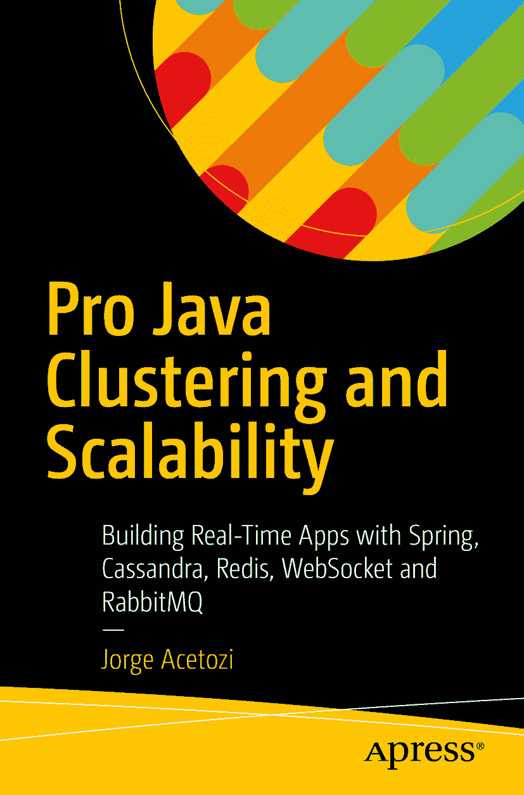

Jorge Acetozi 《Pro Java 集群与可扩展性：使用 Spring、Cassandra、Redis、WebSocket 和 RabbitMQ 构建实时应用》


本书作者引用的任何源代码或其他补充材料，读者均可通过本书在 GitHub 上的产品页面获取，网址为 [`www.apress.com/9781484229842`](http://www.apress.com/9781484229842) 。如需更详细信息，请访问 [`www.apress.com/source-code`](http://www.apress.com/source-code) 。ISBN 978-1-4842-2984-2 电子版 ISBN 978-1-4842-2985-9 [`doi.org/10.1007/978-1-4842-2985-9`](https://doi.org/10.1007/978-1-4842-2985-9) 美国国会图书馆控制号：2017951201 © Jorge Acetozi 2017 本作品受版权保护。出版商保留所有权利，涉及全部或部分材料，特别是翻译权、重印权、插图再利用权、朗诵权、广播权、缩微胶片复制权或任何其他物理形式的复制权，以及信息存储与检索、电子改编、计算机软件或目前已知或未来开发的任何类似或不同方法的传输权。本书中可能出现商标名称、标识和图像。对于商标名称、标识或图像的每次出现，我们并非均使用商标符号，而是仅以编辑方式使用这些名称、标识和图像，以维护商标所有者的利益，且无意侵犯商标权。本出版物中对商品名称、商标、服务标记及类似术语的使用，即使未明确标识，也不应被视为对其是否受专有权利保护的立场表达。尽管本书中的建议和信息在出版时被认为是真实准确的，但作者、编辑和出版商均不对可能存在的任何错误或遗漏承担法律责任。出版商对本书所含内容不作任何明示或暗示的保证。本书采用无酸纸印刷。本书通过 Springer Science+Business Media New York 向全球图书贸易发行，地址：233 Spring Street, 6th Floor, New York, NY 10013。电话：1-800-SPRINGER，传真：(201) 348-4505，电子邮件：orders-ny@springer-sbm.com，或访问 www.springeronline.com。Apress Media, LLC 是一家加利福尼亚有限责任公司，其唯一成员（所有者）是 Springer Science + Business Media Finance Inc (SSBM Finance Inc)。SSBM Finance Inc 是一家特拉华州公司。没有我妻子 Juliana 日复一日的支持和耐心，这本书永远无法出版。非常感谢你！我爱你！引言

我叫 Jorge Acetozi，是一名巴西软件工程师，多年来一直从事 Java 开发工作。在我的职业生涯中，我对以下主题产生了兴趣：

*   Linux
*   分布式系统
*   测试自动化
*   持续集成
*   持续交付
*   云计算
*   虚拟化
*   容器化
*   安全性

为什么兴趣如此广泛？我只是觉得，仅凭遵循最佳实践编写 Java 代码，在职业上对我来说还不够（尽管这样做并非易事）。我想理解创建软件并将其交付到生产环境的整个过程。

因此，几年前，我开始从事 DevOps 工程师的工作。

在经历了这两条路径后，我注意到有两种类型的软件工程师。第一类是开发人员，他们通常对基础设施主题不感兴趣，只想遵循最佳实践编写代码。然而，这意味着他们无法维护生产环境，因为这涉及的内容远不止编写软件代码。

第二类是基础设施人员，他们通常讨厌编写软件代码（请注意，编写小型脚本来自动化基础设施任务与编写软件代码截然不同）。另一方面，这些人能够维护生产环境，因为他们理解部署流程、知道如何监控服务器、如何处理安全问题等等。

我努力成为的软件工程师，恰好处于这两类开发人员和基础设施人员之间。我希望成为一名遵循编码最佳实践的优秀程序员，同时也希望有能力将代码投入生产并维护它。

## 我为何撰写本书

这是一本编程书，但包含了许多有趣的基础设施讨论和技巧。我使用 Spring 框架、WebSocket、Cassandra、Redis、RabbitMQ 和 MySQL 编写了一个完整的聊天应用程序，并讨论了如何通过实现 WebSocket 多节点架构来水平扩展此应用程序。在我看来，这正是本书区别于其他书籍之处。

我撰写本书的目标，是通过将大量开发代码与有趣且具有教学意义的基础设施讨论相结合，为您带来全新的体验。我相信您一定会非常喜欢！

要与我保持联系，请关注以下平台：

*   [我的网站](https://www.jorgeacetozi.com/) ¹
*   [GitHub](https://github.com/jorgeacetozi) ²
*   [Twitter](https://twitter.com/jorgeacetozi) ³
*   [Facebook](https://www.facebook.com/jorgeacetozi) ⁴

## 本书适合谁阅读

本书适合每一位拥有至少几年经验的软件开发人员。换句话说，这不是一本用来学习 Spring、JUnit 和 Mockito 等基础知识（例如）的书。

聊天应用程序中的所有代码都得到了详细解释，但最基础的部分除外。为了让您了解我所指的内容，请看这个例子：

```
@Configuration
@EnableScheduling
@EnableWebSocketMessageBroker
public class WebSocketConfigSpringSession extends AbstractSessionWebSocketMessageBrokerConfigurer  {
@Value("${ebook.chat.relay.host}")
private String relayHost;
@Value("${ebook.chat.relay.port}")
private Integer relayPort;
protected void configureStompEndpoints(StompEndpointRegistry registry) {
registry.addEndpoint("/ws").withSockJS();
}
public void configureMessageBroker(MessageBrokerRegistry registry) {
registry.enableStompBrokerRelay("/queue/",  "/topic/")
.setUserDestinationBroadcast("/topic/unresolved.user.dest")
.setUserRegistryBroadcast("/topic/registry.broadcast")
.setRelayHost(relayHost)
.setRelayPort(relayPort);
registry.setApplicationDestinationPrefixes("/chatroom");
}
}
```

对于这段代码片段，我会解释所有内容，但 `@Configuration` 和 `@Value` 注解除外，它们是 Spring 的基础部分。

这并不意味着您不能阅读本书，并在需要时查阅其他资料（顺便说一句，我在本书中提供了大量资源）。


目录 第一部分：用法 第 1 章：Docker 3 1.1 Docker 简介 3 1.2 Docker Hub 4 1.3 镜像与容器 5 1.4 镜像标签 5 1.5 Docker 使用示例：Elasticsearch 6 1.6 Docker 基本命令 7 1.7 docker run 命令 7 1.7.1 使用-d 将容器作为守护进程运行 8 1.7.2 使用--name 为容器命名 8 1.7.3 使用-p 暴露端口 8 1.7.4 使用-e 设置环境变量 9 1.7.5 使用-v 挂载卷 9 1.8 Docker Compose 10 第 2 章：前提条件 13 第 3 章：在本地执行项目 17 第 4 章：模拟对话 19 4.1 创建新账户 20 4.2 创建新聊天室 20 4.3 登录 22 4.4 聊天室 22 4.5 发送公开消息 23 4.6 发送私密消息 24 4.7 检查对话是否已存储 24 4.8 即使在连接失败时也能接收消息 25 第 5 章：设置开发环境 27 5.1 Apache Maven 27 5.2 将项目导入 Eclipse IDE 28 第二部分：架构 第 6 章：理解领域与架构之间的关系 33 第 7 章：NoSQL 简介 35 7.1 NoSQL 中的建模 38 7.2 Cassandra 概述 39 7.2.1 Cassandra 概念 42 7.3 Redis 概述 44 7.3.1 Redis 与 Memcached 44 7.3.2 Redis 使用场景 45 第 8 章：Spring 框架 47 8.1 Spring Boot 48 8.2 Spring Data JPA 仓库 48 8.3 Spring Data 与 NoSQL 52 第 9 章：WebSocket 55 9.1 轮询与 WebSocket 55 9.2 WebSocket 与浏览器兼容性 57 9.3 原始 WebSocket 与基于 STOMP 的 WebSocket 57 第 10 章：Spring WebSocket 59 10.1 原始 WebSocket 配置 59 10.2 基于 STOMP 的 WebSocket 配置 61 10.3 使用简单代理的消息流 64 10.4 使用完整外部 STOMP 代理的消息流 66 第 11 章：单节点聊天架构 67 第 12 章：多节点聊天架构 71 12.1 使用 RabbitMQ 作为完整的外部 STOMP 代理 72 第 13 章：水平扩展有状态 Web 应用 75 13.1 使用粘性会话策略 76 13.2 Spring Session 与 WebSocket 78 第三部分：按功能编码 第 14 章：更改应用程序语言 83 第 15 章：登录 87 第 16 章：新账户 91 第 17 章：新聊天室 97 17.1 使用 Spring MVC 和 Spring Security 保护 REST 端点 98 第 18 章：加入聊天室 99 18.1 WebSocket 重连策略 101 18.2 WebSocket 事件 101 18.2.1 通过 WebSocket 发送公开系统消息 104 第 19 章：通过 WebSocket 发送用户的公开消息 107 第 20 章：通过 WebSocket 发送用户的私密消息 109 第四部分：测试代码 第 21 章：懒部署与快速部署 115 第 22 章：持续交付 117 第 23 章：自动化测试的类型 119 第 24 章：单元测试 121 24.1 InstantMessageBuilderTest.java 121 24.2 DestinationsTest.java 123 24.3 RedisChatRoomServiceTest.java 124 第 25 章：集成测试 127 25.1 设置从 JUnit 启动 Docker 容器的依赖项 127 25.2 JUnit 测试套件 129 25.3 RedisChatRoomServiceTest.java 130 25.4 ChatRoomControllerTest.java 131 第 26 章：使用 Maven 插件分离单元测试与集成测试 135 26.1 Maven Surefire 插件 136 26.2 Maven Failsafe 插件 137 第 27 章：持续集成服务器 139 附录 141 资源包 141 messages.properties141 messages_pt.properties142 后记：接下来是什么？145 索引 147 内容概览 关于作者 xiii 关于技术审校者 xv 引言 xvii 第一部分：用法 第 1 章：Docker 3 第 2 章：前提条件 13 第 3 章：在本地执行项目 17 第 4 章：模拟对话 19 第 5 章：设置开发环境 27 第二部分：架构 第 6 章：理解领域与架构之间的关系 33 第 7 章：NoSQL 简介 35 第 8 章：Spring 框架 47 第 9 章：WebSocket 55 第 10 章：Spring WebSocket 59 第 11 章：单节点聊天架构 67 第 12 章：多节点聊天架构 71 第 13 章：水平扩展有状态 Web 应用 75 第三部分：按功能编码 第 14 章：更改应用程序语言 83 第 15 章：登录 87 第 16 章：新账户 91 第 17 章：新聊天室 97 第 18 章：加入聊天室 99 第 19 章：通过 WebSocket 发送用户的公开消息 107 第 20 章：通过 WebSocket 发送用户的私密消息 109 第四部分：测试代码 第 21 章：懒部署与快速部署 115 第 22 章：持续交付 117 第 23 章：自动化测试的类型 119 第 24 章：单元测试 121 第 25 章：集成测试 127 第 26 章：使用 Maven 插件分离单元测试与集成测试 135 第 27 章：持续集成服务器 139 附录 141 后记：接下来是什么？145 索引 147 关于作者与关于技术审校者 关于作者 关于技术审校者 脚注 1


[`https://www.jorgeacetozi.com`](https://www.jorgeacetozi.com)

2

[`https://github.com/jorgeacetozi`](https://github.com/jorgeacetozi)

3

[`https://twitter.com/jorgeacetozi`](https://twitter.com/jorgeacetozi)

4

[`https://www.facebook.com/jorgeacetozi`](https://www.facebook.com/jorgeacetozi)

