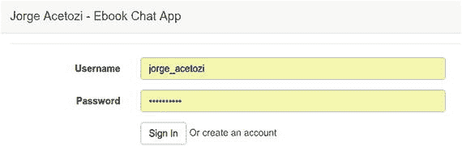
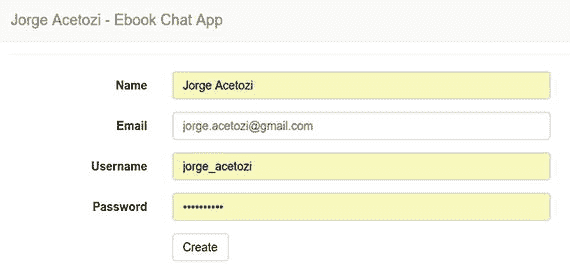
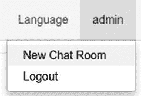
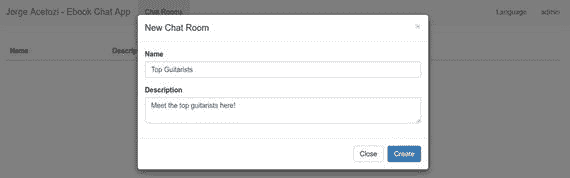
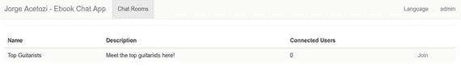
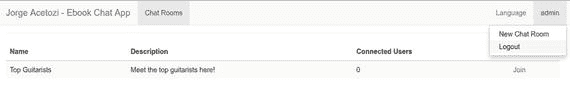
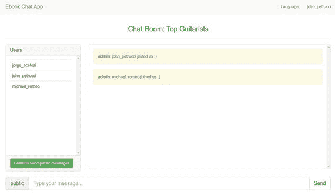
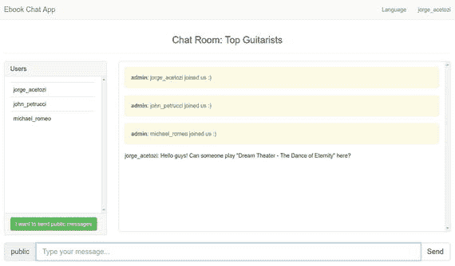
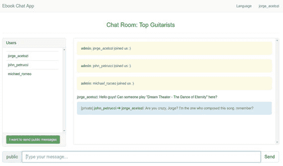

# 4. 模拟对话

现在你已经启动并运行了聊天应用程序，你将学习如何像一个普通用户一样使用这个应用程序。

打开一个 Google Chrome 浏览器窗口和一个新的隐身窗口，这样你就可以模拟两个不同的用户。另外，使用你的手机模拟第三个用户。在你的电脑上，访问 `http://localhost:8080`。在你的手机上，访问 `http://YOUR_COMPUTER_IP:8080`。

 要查找你电脑的互联网协议（IP）地址，请打开一个终端窗口并发出 `ifconfig` 命令。

你应该会看到登录页面（图 4-1），在为每个打开的浏览器窗口创建新用户帐户后，你将在此页面登录。

图 4-1.

登录页面

## 4.1 创建新帐户

在每个浏览器窗口中，点击“或创建一个帐户”链接，导航到新帐户页面（图 4-2）。

图 4-2.

新帐户页面

在每个浏览器窗口中创建一个不同的用户。完成此操作后，你应该会自动重定向到登录页面。

 此表单包含许多由 Bean Validation¹ 和 Spring 验证器执行的验证。你将在第 16 章“新帐户”中了解这些验证。

## 4.2 创建新聊天室

只有管理员才允许创建新聊天室，因此如果你使用刚刚注册的任何用户登录，你将无法执行此操作。

默认情况下，应用程序启动时会有一个预配置的管理员用户。该用户的凭据是：用户名为 admin，密码为 admin。

选择你打开的任何浏览器窗口，并使用管理员用户登录。之后，选择顶部菜单，然后选择菜单项“新聊天室”（图 4-3）。

图 4-3.

新聊天室菜单项

将打开一个模态框，如图 4-4 所示。

图 4-4.

新聊天室框

填写字段并点击“创建”按钮。验证聊天室是否出现在网格中（图 4-5）。

图 4-5.

已创建的聊天室

现在选择顶部菜单，然后选择“注销”菜单项（图 4-6）。

图 4-6.

正在注销

## 4.3 登录

在三个已打开的浏览器窗口中，使用刚刚创建的用户及其用户名和密码进行登录。页面应重定向到聊天室网格，并且您应该能够看到之前创建的聊天室。但是，如果此时点击顶部菜单，您将无法看到“新建聊天室”菜单项。

选择其中一个浏览器窗口，将语言设置更改为葡萄牙语。这仅是为了说明 Spring 能够轻松处理国际化问题。好的，现在将其改回英语。

在所有三个浏览器窗口中点击“加入”链接，以加入聊天室。

## 4.4 聊天室

现在，您已从三个不同的浏览器窗口连接到聊天室，您应该在左侧边栏中看到三个已连接的用户（图 4-7）。请注意，每当有新用户加入聊天室时，管理员都会向每个已连接的用户发送一条系统消息。

图 4-7.

包含三个已连接用户的聊天室

## 4.5 发送公共消息

选择其中一个浏览器窗口，在输入字段中输入一些文本。点击“发送”按钮或按回车键，将消息发送给所有人（图 4-8）。

图 4-8.

公共消息

在其他浏览器窗口中检查消息是否已成功接收。

## 4.6 发送私密消息

再次选择其中一个浏览器窗口，点击一个已连接的用户，向其发送私密消息。同样，在输入字段中输入一些文本，然后点击“发送”按钮或按回车键发送私密消息（图 4-9）。

图 4-9.

私密消息

检查预期接收私密消息的用户所在的浏览器窗口是否确实收到了消息，而其他用户则没有收到。在此示例中，`michael_romeo` 不应收到从 `john_petrucci` 发送给 `jorge_acetozi` 的消息。

## 4.7 检查对话是否已存储

在您刚刚发送私密消息的窗口中，选择顶部菜单，然后选择“离开聊天室”菜单项。现在，再次加入聊天室。您应该会看到整个对话仍然显示在屏幕上（图 4-10）。

图 4-10.

已存储的对话

## 4.8 即使在连接失败时也能接收消息

从您电脑的浏览器窗口中，点击通过手机连接的用户，向其发送一条消息。接下来，关闭手机上的 WiFi。一旦执行此操作，WebSocket 连接将丢失，并且每十秒会尝试重新连接一次。返回您电脑的浏览器窗口，向现在离线的手机用户发送一些私密消息。然后，打开手机上的 WiFi；等待几秒钟，将自动重新连接。手机重新连接后，所有在离线期间发送的消息都将显示出来。即使在连接失败事件中，消息也不会丢失。

脚注 1

[`http://beanvalidation.org/1.1/spec/`](http://beanvalidation.org/1.1/spec/)

