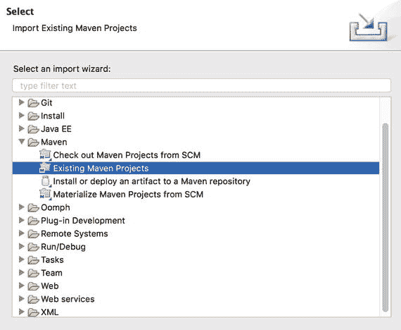

# 5. 设置开发环境

配置此项目的开发环境非常简单。在本章中，您将安装 Apache Maven 并将应用程序导入到 Eclipse 集成开发环境（IDE）中。

## 5.1 Apache Maven

聊天应用程序使用 Apache Maven¹ 作为构建自动化工具。使用 Maven，您可以轻松执行应用程序测试、打包应用程序以及执行更多操作。Maven 还管理您在 Maven 项目中一个名为 `pom.xml` 的特殊文件中声明的应用程序依赖项。

在 Linux Ubuntu 上的安装非常简单，因为您可以使用高级打包工具（`apt`）来安装它。

```
$ sudo apt-get update && sudo apt-get install maven
```

 要在其他操作系统上安装 Apache Maven，请按照[官方](https://maven.apache.org/install.html)安装指南中的步骤进行操作。² 确保您安装的是 Apache Maven 3.0 或更新版本。

在您的机器上安装 Maven 后，导航到您克隆的仓库中的 `ebook-chat` 目录，并执行以下命令：

```
$ mvn test
```

这将执行聊天应用程序的单元测试。您将在本书中了解更多关于 Maven 用法的信息。

## 5.2 将项目导入 Eclipse IDE

当然，您可以使用任何您喜欢的 IDE（例如 Eclipse、IntelliJ、NetBeans 等）。在这里，我将展示如何将项目导入 Eclipse IDE。我不会介绍如何安装 Eclipse IDE，因为基本上您只需要下载并解压即可。

打开 Eclipse IDE 后，选择“文件” ➤ “导入”，选择“Maven”文件夹，选择“现有 Maven 项目”选项（图 5-1），然后点击“下一步”。



图 5-1.

导入 Maven 项目

在下一个屏幕中，只需选择 `ebook-chat` 文件夹，然后点击“完成”。就这样！现在，您的本地机器上应该已安装以下工具：

*   Docker 1.13.0 或更新版本
*   Docker Compose 1.11.2 或更新版本
*   Google Chrome
*   Java 开发工具包 (JDK) 8
*   Apache Maven 3 或更新版本
*   Eclipse IDE

在下一章中，您将深入探讨聊天架构，并了解 Spring 框架、WebSocket、Cassandra、Redis 和 RabbitMQ 的概述，以及如何使用 Nginx 作为负载均衡器和 RabbitMQ 作为完整的外部 STOMP 代理，将应用程序扩展到多节点架构。

脚注 1

[`https://maven.apache.org/`](https://maven.apache.org/)

  2

[`https://maven.apache.org/install.html`](https://maven.apache.org/install.html)

